# Overview :: ShardingSphere

## Navigation

- [1. Overview](#overview)
- [2. Quick Start](#quick-start)
  - [2.1. ShardingSphere-JDBC](#quick-start-shardingsphere-jdbc-quick-start)
  - [2.2. ShardingSphere-Proxy](#quick-start-shardingsphere-proxy-quick-start)
- [3. Features](#features)
  - [3.1. Sharding](#features-sharding)
    - [Core Concept](#features-sharding-concept)
    - [Limitations](#features-sharding-limitation)
    - [Appendix with SQL operator](#features-sharding-appendix)
  - [3.2. Distributed Transaction](#features-transaction)
    - [Core Concept](#features-transaction-concept)
    - [Limitations](#features-transaction-limitations)
    - [Appendix with SQL operator](#features-transaction-appendix)
  - [3.3. Readwrite-splitting](#features-readwrite-splitting)
    - [Core Concept](#features-readwrite-splitting-concept)
    - [Limitations](#features-readwrite-splitting-limitations)
  - [3.4. DB Gateway](#features-db-gateway)
    - [Core Concept](#features-db-gateway-concept)
    - [Limitations](#features-db-gateway-limitations)
  - [3.5. Traffic Governance](#features-management)
    - [Core Concept](#features-management-concept)
  - [3.6. Data Migration](#features-migration)
    - [Core Concept](#features-migration-concept)
    - [Limitations](#features-migration-limitations)
  - [3.7. Encryption](#features-encrypt)
    - [Core Concept](#features-encrypt-concept)
    - [Limitations](#features-encrypt-limitations)
    - [Appendix with SQL operator](#features-encrypt-appendix)
  - [3.8. Data Masking](#features-mask)
    - [Core Concept](#features-mask-concept)
    - [Limitations](#features-mask-limitations)
  - [3.9. Shadow](#features-shadow)
    - [Core Concept](#features-shadow-concept)
    - [Limitations](#features-shadow-limitations)
  - [3.10. Observability](#features-observability)
    - [Core Concept](#features-observability-concept)
  - [3.11. SQL Federation](#features-sql-federation)
    - [Limitations](#features-sql-federation-limitation)
- [4. User Manual](#user-manual)
  - [4.1. ShardingSphere-JDBC](#user-manual-shardingsphere-jdbc)
    - [YAML Configuration](#user-manual-shardingsphere-jdbc-yaml-config)
      - [Mode](#user-manual-shardingsphere-jdbc-yaml-config-mode)
      - [Data Source](#user-manual-shardingsphere-jdbc-yaml-config-data-source)
      - [Rules](#user-manual-shardingsphere-jdbc-yaml-config-rules)
        - [Sharding](#user-manual-shardingsphere-jdbc-yaml-config-rules-sharding)
        - [Broadcast Table](#user-manual-shardingsphere-jdbc-yaml-config-rules-broadcast)
        - [Readwrite-splitting](#user-manual-shardingsphere-jdbc-yaml-config-rules-readwrite-splitting)
        - [Distributed Transaction](#user-manual-shardingsphere-jdbc-yaml-config-rules-transaction)
        - [Encryption](#user-manual-shardingsphere-jdbc-yaml-config-rules-encrypt)
        - [Data Masking](#user-manual-shardingsphere-jdbc-yaml-config-rules-mask)
        - [Shadow DB](#user-manual-shardingsphere-jdbc-yaml-config-rules-shadow)
        - [SQL-parser](#user-manual-shardingsphere-jdbc-yaml-config-rules-sql-parser)
        - [SQL Translator](#user-manual-shardingsphere-jdbc-yaml-config-rules-sql-translator)
        - [Mixed Rules](#user-manual-shardingsphere-jdbc-yaml-config-rules-mix)
        - [Cache for Sharding Route](#user-manual-shardingsphere-jdbc-yaml-config-rules-sharding-cache)
        - [Single Table](#user-manual-shardingsphere-jdbc-yaml-config-rules-single)
        - [SQL Federation](#user-manual-shardingsphere-jdbc-yaml-config-rules-sql-federation)
      - [Algorithm](#user-manual-shardingsphere-jdbc-yaml-config-algorithm)
      - [JDBC Driver](#user-manual-shardingsphere-jdbc-yaml-config-jdbc-driver)
        - [Known Implementation](#user-manual-shardingsphere-jdbc-yaml-config-jdbc-driver-known-implementation)
        - [Spring Boot](#user-manual-shardingsphere-jdbc-yaml-config-jdbc-driver-spring-boot)
        - [Spring Namespace](#user-manual-shardingsphere-jdbc-yaml-config-jdbc-driver-spring-namespace)
    - [Java API](#user-manual-shardingsphere-jdbc-java-api)
      - [Mode](#user-manual-shardingsphere-jdbc-java-api-mode)
      - [Data Source](#user-manual-shardingsphere-jdbc-java-api-data-source)
      - [Rules](#user-manual-shardingsphere-jdbc-java-api-rules)
        - [Sharding](#user-manual-shardingsphere-jdbc-java-api-rules-sharding)
        - [Broadcast Table](#user-manual-shardingsphere-jdbc-java-api-rules-broadcast)
        - [Readwrite-splitting](#user-manual-shardingsphere-jdbc-java-api-rules-readwrite-splitting)
        - [Distributed Transaction](#user-manual-shardingsphere-jdbc-java-api-rules-transaction)
        - [Encryption](#user-manual-shardingsphere-jdbc-java-api-rules-encrypt)
        - [Data Masking](#user-manual-shardingsphere-jdbc-java-api-rules-mask)
        - [Shadow DB](#user-manual-shardingsphere-jdbc-java-api-rules-shadow)
        - [SQL Parser](#user-manual-shardingsphere-jdbc-java-api-rules-sql-parser)
        - [SQL Translator](#user-manual-shardingsphere-jdbc-java-api-rules-sql-translator)
        - [Mixed Rules](#user-manual-shardingsphere-jdbc-java-api-rules-mix)
        - [Cache for Sharding Route](#user-manual-shardingsphere-jdbc-java-api-rules-sharding-cache)
        - [Single Table](#user-manual-shardingsphere-jdbc-java-api-rules-single)
        - [SQL-federation](#user-manual-shardingsphere-jdbc-java-api-rules-sql-federation)
      - [Algorithm](#user-manual-shardingsphere-jdbc-java-api-algorithm)
    - [Special API](#user-manual-shardingsphere-jdbc-special-api)
      - [Sharding](#user-manual-shardingsphere-jdbc-special-api-sharding)
        - [Hint](#user-manual-shardingsphere-jdbc-special-api-sharding-hint)
      - [Readwrite-splitting](#user-manual-shardingsphere-jdbc-special-api-readwrite-splitting)
        - [Hint](#user-manual-shardingsphere-jdbc-special-api-readwrite-splitting-hint)
      - [Transaction](#user-manual-shardingsphere-jdbc-special-api-transaction)
        - [Use Java API](#user-manual-shardingsphere-jdbc-special-api-transaction-java-api)
        - [Atomikos Transaction](#user-manual-shardingsphere-jdbc-special-api-transaction-atomikos)
        - [Narayana Transaction](#user-manual-shardingsphere-jdbc-special-api-transaction-narayana)
        - [Seata Transaction](#user-manual-shardingsphere-jdbc-special-api-transaction-seata)
    - [Optional Plugins](#user-manual-shardingsphere-jdbc-optional-plugins)
      - [ClickHouse](#user-manual-shardingsphere-jdbc-optional-plugins-clickhouse)
      - [Doris FE](#user-manual-shardingsphere-jdbc-optional-plugins-doris-fe)
      - [Firebird](#user-manual-shardingsphere-jdbc-optional-plugins-firebird)
      - [H2](#user-manual-shardingsphere-jdbc-optional-plugins-h2)
      - [HiveServer2](#user-manual-shardingsphere-jdbc-optional-plugins-hiveserver2)
      - [MS SQL Server](#user-manual-shardingsphere-jdbc-optional-plugins-ms-sql-server)
      - [Presto](#user-manual-shardingsphere-jdbc-optional-plugins-presto)
    - [Unsupported Items](#user-manual-shardingsphere-jdbc-unsupported)
    - [GraalVM Native Image](#user-manual-shardingsphere-jdbc-graalvm-native-image)
      - [Development and test](#user-manual-shardingsphere-jdbc-graalvm-native-image-development)
  - [4.2. ShardingSphere-Proxy](#user-manual-shardingsphere-proxy)
    - [Startup](#user-manual-shardingsphere-proxy-startup)
      - [Use Binary Tar](#user-manual-shardingsphere-proxy-startup-bin)
      - [Build GraalVM Native Image(Alpha)](#user-manual-shardingsphere-proxy-startup-graalvm-native-image)
      - [Use Docker](#user-manual-shardingsphere-proxy-startup-docker)
      - [Use Helm](#user-manual-shardingsphere-proxy-startup-helm)
      - [Add dependencies](#user-manual-shardingsphere-proxy-startup-dependencies-download)
        - [Add Narayana dependencies](#user-manual-shardingsphere-proxy-startup-dependencies-download-add_narayana_dependency)
    - [Yaml Configuration](#user-manual-shardingsphere-proxy-yaml-config)
      - [Authentication & Authorization](#user-manual-shardingsphere-proxy-yaml-config-authority)
      - [Properties](#user-manual-shardingsphere-proxy-yaml-config-props)
      - [Rules](#user-manual-shardingsphere-proxy-yaml-config-rules)
      - [Data Source](#user-manual-shardingsphere-proxy-yaml-config-data-source)
    - [DistSQL](#user-manual-shardingsphere-proxy-distsql)
      - [Syntax](#user-manual-shardingsphere-proxy-distsql-syntax)
        - [RDL Syntax](#user-manual-shardingsphere-proxy-distsql-syntax-rdl)
          - [Storage Unit Definition](#user-manual-shardingsphere-proxy-distsql-syntax-rdl-storage-unit-definition)
            - [REGISTER STORAGE UNIT](#user-manual-shardingsphere-proxy-distsql-syntax-rdl-storage-unit-definition-register-storage-unit)
            - [ALTER STORAGE UNIT](#user-manual-shardingsphere-proxy-distsql-syntax-rdl-storage-unit-definition-alter-storage-unit)
            - [UNREGISTER STORAGE UNIT](#user-manual-shardingsphere-proxy-distsql-syntax-rdl-storage-unit-definition-unregister-storage-unit)
          - [Rule Definition](#user-manual-shardingsphere-proxy-distsql-syntax-rdl-rule-definition)
            - [Sharding](#user-manual-shardingsphere-proxy-distsql-syntax-rdl-rule-definition-sharding)
              - [CREATE SHARDING TABLE RULE](#user-manual-shardingsphere-proxy-distsql-syntax-rdl-rule-definition-sharding-create-sharding-table-rule)
              - [ALTER SHARDING TABLE RULE](#user-manual-shardingsphere-proxy-distsql-syntax-rdl-rule-definition-sharding-alter-sharding-table-rule)
              - [DROP SHARDING TABLE RULE](#user-manual-shardingsphere-proxy-distsql-syntax-rdl-rule-definition-sharding-drop-sharding-table-rule)
              - [CREATE DEFAULT SHARDING STRATEGY](#user-manual-shardingsphere-proxy-distsql-syntax-rdl-rule-definition-sharding-create-default-sharding-strategy)
              - [ALTER DEFAULT SHARDING STRATEGY](#user-manual-shardingsphere-proxy-distsql-syntax-rdl-rule-definition-sharding-alter-default-sharding-strategy)
              - [DROP DEFAULT SHARDING STRATEGY](#user-manual-shardingsphere-proxy-distsql-syntax-rdl-rule-definition-sharding-drop-default-sharding-strategy)
              - [CREATE SHARDING KEY GENERATE STRATEGY](#user-manual-shardingsphere-proxy-distsql-syntax-rdl-rule-definition-sharding-create-sharding-key-generate-strategy)
              - [ALTER SHARDING KEY GENERATE STRATEGY](#user-manual-shardingsphere-proxy-distsql-syntax-rdl-rule-definition-sharding-alter-sharding-key-generate-strategy)
              - [CREATE SHARDING KEY GENERATOR](#user-manual-shardingsphere-proxy-distsql-syntax-rdl-rule-definition-sharding-create-sharding-key-generator)
              - [ALTER SHARDING KEY GENERATOR](#user-manual-shardingsphere-proxy-distsql-syntax-rdl-rule-definition-sharding-alter-sharding-key-generator)
              - [DROP SHARDING KEY GENERATE STRATEGY](#user-manual-shardingsphere-proxy-distsql-syntax-rdl-rule-definition-sharding-drop-sharding-key-generate-strategy)
              - [DROP SHARDING KEY GENERATOR](#user-manual-shardingsphere-proxy-distsql-syntax-rdl-rule-definition-sharding-drop-sharding-key-generator)
              - [DROP SHARDING ALGORITHM](#user-manual-shardingsphere-proxy-distsql-syntax-rdl-rule-definition-sharding-drop-sharding-algorithm)
              - [CREATE SHARDING TABLE REFERENCE RULE](#user-manual-shardingsphere-proxy-distsql-syntax-rdl-rule-definition-sharding-create-sharding-table-reference-rule)
              - [ALTER SHARDING TABLE REFERENCE RULE](#user-manual-shardingsphere-proxy-distsql-syntax-rdl-rule-definition-sharding-alter-sharding-table-reference-rule)
              - [DROP SHARDING TABLE REFERENCE RULE](#user-manual-shardingsphere-proxy-distsql-syntax-rdl-rule-definition-sharding-drop-sharding-table-reference-rule)
            - [Broadcast Table](#user-manual-shardingsphere-proxy-distsql-syntax-rdl-rule-definition-broadcast-table)
              - [CREATE BROADCAST TABLE RULE](#user-manual-shardingsphere-proxy-distsql-syntax-rdl-rule-definition-broadcast-table-create-broadcast-table-rule)
              - [DROP BROADCAST TABLE RULE](#user-manual-shardingsphere-proxy-distsql-syntax-rdl-rule-definition-broadcast-table-drop-broadcast-table-rule)
            - [Single Table](#user-manual-shardingsphere-proxy-distsql-syntax-rdl-rule-definition-single-table)
              - [LOAD SINGLE TABLE](#user-manual-shardingsphere-proxy-distsql-syntax-rdl-rule-definition-single-table-load-single-table)
              - [UNLOAD SINGLE TABLE](#user-manual-shardingsphere-proxy-distsql-syntax-rdl-rule-definition-single-table-unload-single-table)
              - [SET DEFAULT SINGLE TABLE STORAGE UNIT](#user-manual-shardingsphere-proxy-distsql-syntax-rdl-rule-definition-single-table-set-default-single-table-storage-unit)
            - [Readwrite-Splitting](#user-manual-shardingsphere-proxy-distsql-syntax-rdl-rule-definition-readwrite-splitting)
              - [CREATE READWRITE_SPLITTING RULE](#user-manual-shardingsphere-proxy-distsql-syntax-rdl-rule-definition-readwrite-splitting-create-readwrite-splitting-rule)
              - [ALTER READWRITE_SPLITTING RULE](#user-manual-shardingsphere-proxy-distsql-syntax-rdl-rule-definition-readwrite-splitting-alter-readwrite-splitting-rule)
              - [DROP READWRITE_SPLITTING RULE](#user-manual-shardingsphere-proxy-distsql-syntax-rdl-rule-definition-readwrite-splitting-drop-readwrite-splitting-rule)
            - [Encrypt](#user-manual-shardingsphere-proxy-distsql-syntax-rdl-rule-definition-encrypt)
              - [CREATE ENCRYPT RULE](#user-manual-shardingsphere-proxy-distsql-syntax-rdl-rule-definition-encrypt-create-encrypt-rule)
              - [ALTER ENCRYPT RULE](#user-manual-shardingsphere-proxy-distsql-syntax-rdl-rule-definition-encrypt-alter-encrypt-rule)
              - [DROP ENCRYPT RULE](#user-manual-shardingsphere-proxy-distsql-syntax-rdl-rule-definition-encrypt-drop-encrypt-rule)
            - [Mask](#user-manual-shardingsphere-proxy-distsql-syntax-rdl-rule-definition-mask)
              - [CREATE MASK RULE](#user-manual-shardingsphere-proxy-distsql-syntax-rdl-rule-definition-mask-create-mask-rule)
              - [ALTER MASK RULE](#user-manual-shardingsphere-proxy-distsql-syntax-rdl-rule-definition-mask-alter-mask-rule)
              - [DROP MASK RULE](#user-manual-shardingsphere-proxy-distsql-syntax-rdl-rule-definition-mask-drop-mask-rule)
            - [Shadow](#user-manual-shardingsphere-proxy-distsql-syntax-rdl-rule-definition-shadow)
              - [CREATE SHADOW RULE](#user-manual-shardingsphere-proxy-distsql-syntax-rdl-rule-definition-shadow-create-shadow-rule)
              - [ALTER SHADOW RULE](#user-manual-shardingsphere-proxy-distsql-syntax-rdl-rule-definition-shadow-alter-shadow-rule)
              - [DROP SHADOW RULE](#user-manual-shardingsphere-proxy-distsql-syntax-rdl-rule-definition-shadow-drop-shadow-rule)
              - [CREATE DEFAULT SHADOW ALGORITHM](#user-manual-shardingsphere-proxy-distsql-syntax-rdl-rule-definition-shadow-create-default-shadow-algorithm)
              - [ALTER DEFAULT SHADOW ALGORITHM](#user-manual-shardingsphere-proxy-distsql-syntax-rdl-rule-definition-shadow-alter-default-shadow-algorithm)
              - [DROP DEFAULT SHADOW ALGORITHM](#user-manual-shardingsphere-proxy-distsql-syntax-rdl-rule-definition-shadow-drop-default-shadow-algorithm)
              - [DROP SHADOW ALGORITHM](#user-manual-shardingsphere-proxy-distsql-syntax-rdl-rule-definition-shadow-drop-shadow-algorithm)
        - [RQL Syntax](#user-manual-shardingsphere-proxy-distsql-syntax-rql)
          - [Storage Unit Query](#user-manual-shardingsphere-proxy-distsql-syntax-rql-storage-unit-query)
            - [SHOW STORAGE UNITS](#user-manual-shardingsphere-proxy-distsql-syntax-rql-storage-unit-query-show-storage-units)
          - [Rule Query](#user-manual-shardingsphere-proxy-distsql-syntax-rql-rule-query)
            - [Sharding](#user-manual-shardingsphere-proxy-distsql-syntax-rql-rule-query-sharding)
              - [SHOW SHARDING TABLE RULE](#user-manual-shardingsphere-proxy-distsql-syntax-rql-rule-query-sharding-show-sharding-table-rule)
              - [SHOW SHARDING ALGORITHMS](#user-manual-shardingsphere-proxy-distsql-syntax-rql-rule-query-sharding-show-sharding-algorithms)
              - [SHOW UNUSED SHARDING ALGORITHMS](#user-manual-shardingsphere-proxy-distsql-syntax-rql-rule-query-sharding-show-unused-sharding-algorithms)
              - [SHOW DEFAULT SHARDING STRATEGY](#user-manual-shardingsphere-proxy-distsql-syntax-rql-rule-query-sharding-show-default-sharding-strategy)
              - [SHOW SHARDING KEY GENERATOR](#user-manual-shardingsphere-proxy-distsql-syntax-rql-rule-query-sharding-show-sharding-key-generator)
              - [SHOW UNUSED SHARDING KEY GENERATORS](#user-manual-shardingsphere-proxy-distsql-syntax-rql-rule-query-sharding-show-unused-sharding-key-generators)
              - [SHOW SHARDING AUDITORS](#user-manual-shardingsphere-proxy-distsql-syntax-rql-rule-query-sharding-show-sharding-auditors)
              - [SHOW UNUSED SHARDING AUDITORS](#user-manual-shardingsphere-proxy-distsql-syntax-rql-rule-query-sharding-show-unused-sharding-auditors)
              - [SHOW SHARDING TABLE NODES](#user-manual-shardingsphere-proxy-distsql-syntax-rql-rule-query-sharding-show-sharding-table-nodes)
              - [SHOW SHARDING TABLE RULES USED ALGORITHM](#user-manual-shardingsphere-proxy-distsql-syntax-rql-rule-query-sharding-show-sharding-table-rules-used-algorithm)
              - [SHOW SHARDING TABLE RULES USED KEY GENERATOR](#user-manual-shardingsphere-proxy-distsql-syntax-rql-rule-query-sharding-show-sharding-table-rules-used-key-generator)
              - [SHOW SHARDING TABLE RULES USED AUDITOR](#user-manual-shardingsphere-proxy-distsql-syntax-rql-rule-query-sharding-show-sharding-table-rules-used-auditor)
              - [SHOW SHARDING TABLE REFERENCE RULE](#user-manual-shardingsphere-proxy-distsql-syntax-rql-rule-query-sharding-show-sharding-table-reference-rules)
              - [SHOW SHARDING KEY GENERATE STRATEGY](#user-manual-shardingsphere-proxy-distsql-syntax-rql-rule-query-sharding-show-sharding-key-generate-strategy)
              - [COUNT SHARDING RULE](#user-manual-shardingsphere-proxy-distsql-syntax-rql-rule-query-sharding-count-sharding-rule)
            - [Broadcast Table](#user-manual-shardingsphere-proxy-distsql-syntax-rql-rule-query-broadcast-table)
              - [SHOW BROADCAST TABLE RULE](#user-manual-shardingsphere-proxy-distsql-syntax-rql-rule-query-broadcast-table-show-broadcast-table-rule)
              - [COUNT BROADCAST RULE](#user-manual-shardingsphere-proxy-distsql-syntax-rql-rule-query-broadcast-table-count-broadcast-rule)
            - [Single Table](#user-manual-shardingsphere-proxy-distsql-syntax-rql-rule-query-single-table)
              - [SHOW SINGLE TABLE](#user-manual-shardingsphere-proxy-distsql-syntax-rql-rule-query-single-table-show-single-table)
              - [SHOW DEFAULT SINGLE TABLE STORAGE UNIT](#user-manual-shardingsphere-proxy-distsql-syntax-rql-rule-query-single-table-show-deafult-single-table-storage-unit)
              - [COUNT SINGLE_TABLE RULE](#user-manual-shardingsphere-proxy-distsql-syntax-rql-rule-query-single-table-count-single-table)
              - [SHOW UNLOADED SINGLE TABLES](#user-manual-shardingsphere-proxy-distsql-syntax-rql-rule-query-single-table-show-unloaded-single-tables)
            - [Readwrite-Splitting](#user-manual-shardingsphere-proxy-distsql-syntax-rql-rule-query-readwrite-splitting)
              - [SHOW READWRITE_SPLITTING RULE](#user-manual-shardingsphere-proxy-distsql-syntax-rql-rule-query-readwrite-splitting-show-readwrite-splitting-rule)
              - [COUNT READWRITE_SPLITTING RULE](#user-manual-shardingsphere-proxy-distsql-syntax-rql-rule-query-readwrite-splitting-count-readwrite-splitting-rule)
            - [Encrypt](#user-manual-shardingsphere-proxy-distsql-syntax-rql-rule-query-encrypt)
              - [SHOW ENCRYPT RULES](#user-manual-shardingsphere-proxy-distsql-syntax-rql-rule-query-encrypt-show-encrypt-rule)
              - [COUNT ENCRYPT RULE](#user-manual-shardingsphere-proxy-distsql-syntax-rql-rule-query-encrypt-count-encrypt-rule)
            - [Mask](#user-manual-shardingsphere-proxy-distsql-syntax-rql-rule-query-mask)
              - [SHOW MASK RULES](#user-manual-shardingsphere-proxy-distsql-syntax-rql-rule-query-mask-show-mask-rule)
              - [COUNT MASK RULE](#user-manual-shardingsphere-proxy-distsql-syntax-rql-rule-query-mask-count-mask-rule)
            - [Shadow](#user-manual-shardingsphere-proxy-distsql-syntax-rql-rule-query-shadow)
              - [SHOW SHADOW RULE](#user-manual-shardingsphere-proxy-distsql-syntax-rql-rule-query-shadow-show-shadow-rule)
              - [SHOW SHADOW TABLE RULES](#user-manual-shardingsphere-proxy-distsql-syntax-rql-rule-query-shadow-show-shadow-table-rule)
              - [SHOW SHADOW ALGORITHMS](#user-manual-shardingsphere-proxy-distsql-syntax-rql-rule-query-shadow-show-shadow-algorithm)
              - [SHOW DEFAULT SHADOW ALGORITHM](#user-manual-shardingsphere-proxy-distsql-syntax-rql-rule-query-shadow-show-default-shadow-algorithm)
              - [COUNT SHADOW RULE](#user-manual-shardingsphere-proxy-distsql-syntax-rql-rule-query-shadow-count-shadow-rule)
        - [RAL Syntax](#user-manual-shardingsphere-proxy-distsql-syntax-ral)
          - [GLOBAL RULE](#user-manual-shardingsphere-proxy-distsql-syntax-ral-global-rule)
            - [SHOW AUTHORITY RULE](#user-manual-shardingsphere-proxy-distsql-syntax-ral-global-rule-show-authority-rule)
            - [SHOW TRANSACTION RULE](#user-manual-shardingsphere-proxy-distsql-syntax-ral-global-rule-show-transaction-rule)
            - [ALTER TRANSACTION RULE](#user-manual-shardingsphere-proxy-distsql-syntax-ral-global-rule-alter-transaction-rule)
            - [SHOW SQL_PARSER RULE](#user-manual-shardingsphere-proxy-distsql-syntax-ral-global-rule-show-sql-parser-rule)
            - [Alter SQL_PARSER Rule](#user-manual-shardingsphere-proxy-distsql-syntax-ral-global-rule-alter-sql-parser-rule)
            - [SHOW SQL_TRANSLATOR RULE](#user-manual-shardingsphere-proxy-distsql-syntax-ral-global-rule-show-sql-translator-rule)
            - [ALTER SQL_TRANSLATOR RULE](#user-manual-shardingsphere-proxy-distsql-syntax-ral-global-rule-alter-sql-translator-rule)
            - [SHOW TRAFFIC RULE](#user-manual-shardingsphere-proxy-distsql-syntax-ral-global-rule-show-traffic-rule)
            - [ALTER TRAFFIC RULE](#user-manual-shardingsphere-proxy-distsql-syntax-ral-global-rule-alter-traffic-rule)
            - [SHOW SQL_FEDERATION RULE](#user-manual-shardingsphere-proxy-distsql-syntax-ral-global-rule-show-sql-federation-rule)
            - [ALTER SQL_FEDERATION RULE](#user-manual-shardingsphere-proxy-distsql-syntax-ral-global-rule-alter-sql-federation-rule)
          - [CIRCUIT BREAKER](#user-manual-shardingsphere-proxy-distsql-syntax-ral-circuit-breaker)
            - [ALTER READWRITE_SPLITTING RULE ENABLE/DISABLE](#user-manual-shardingsphere-proxy-distsql-syntax-ral-circuit-breaker-alter-readwrite-splitting-rule-enable-disable)
            - [SHOW STATUS FROM READWRITE_SPLITTING RULE](#user-manual-shardingsphere-proxy-distsql-syntax-ral-circuit-breaker-show-status-from-readwrite-splitting-rule)
            - [SHOW COMPUTE NODES](#user-manual-shardingsphere-proxy-distsql-syntax-ral-circuit-breaker-show-compute-nodes)
            - [ENABLE/DISABLE COMPUTE NODE](#user-manual-shardingsphere-proxy-distsql-syntax-ral-circuit-breaker-enable-disable-compute-node)
            - [LABEL|RELABEL COMPUTE NODES](#user-manual-shardingsphere-proxy-distsql-syntax-ral-circuit-breaker-label-relabel-compute-node)
            - [UNLABEL COMPUTE NODES](#user-manual-shardingsphere-proxy-distsql-syntax-ral-circuit-breaker-unlabel-compute-node)
          - [MIGRATUION](#user-manual-shardingsphere-proxy-distsql-syntax-ral-migration)
            - [SHOW MIGRATION RULE](#user-manual-shardingsphere-proxy-distsql-syntax-ral-migration-show-migration-rule)
            - [ALTER MIGRATION RULE](#user-manual-shardingsphere-proxy-distsql-syntax-ral-migration-alter-migration-rule)
            - [REGISTER MIGRATION SOURCE STORAGE UNIT](#user-manual-shardingsphere-proxy-distsql-syntax-ral-migration-register-migration-source-storage-unit)
            - [UNREGISTER MIGRATION SOURCE STORAGE UNIT](#user-manual-shardingsphere-proxy-distsql-syntax-ral-migration-unregister-storage-unit)
            - [SHOW MIGRATION SOURCE STORAGE UNITS](#user-manual-shardingsphere-proxy-distsql-syntax-ral-migration-show-migration-source-storage-units)
            - [MIGRATE TABLE INTO](#user-manual-shardingsphere-proxy-distsql-syntax-ral-migration-migrate-table-into)
            - [SHOW MIGRATION LIST](#user-manual-shardingsphere-proxy-distsql-syntax-ral-migration-show-migration-list)
            - [SHOW MIGRATION STATUS](#user-manual-shardingsphere-proxy-distsql-syntax-ral-migration-show-migration-status)
            - [SHOW MIGRATION CHECK ALGORITHM](#user-manual-shardingsphere-proxy-distsql-syntax-ral-migration-show-migration-check-algorithm)
            - [CHECK MIGRATION](#user-manual-shardingsphere-proxy-distsql-syntax-ral-migration-check-migration)
            - [SHOW MIGRATION CHECK STATUS](#user-manual-shardingsphere-proxy-distsql-syntax-ral-migration-show-migration-check-status)
            - [START MIGRATION CHECK](#user-manual-shardingsphere-proxy-distsql-syntax-ral-migration-start-migration-check)
            - [STOP MIGRATION CHECK](#user-manual-shardingsphere-proxy-distsql-syntax-ral-migration-stop-migration-check)
            - [START MIGRATION](#user-manual-shardingsphere-proxy-distsql-syntax-ral-migration-start-migration)
            - [STOP MIGRATION](#user-manual-shardingsphere-proxy-distsql-syntax-ral-migration-stop-migration)
            - [COMMIT MIGRATION](#user-manual-shardingsphere-proxy-distsql-syntax-ral-migration-commit-migration)
            - [ROLLBACK MIGRATION](#user-manual-shardingsphere-proxy-distsql-syntax-ral-migration-rollback-migration)
          - [PLUGIN](#user-manual-shardingsphere-proxy-distsql-syntax-ral-plugin)
            - [SHOW PLUGINS OF SPI](#user-manual-shardingsphere-proxy-distsql-syntax-ral-plugin-show-plugins)
            - [SHOW SHARDING ALGORITHM PLUGINS](#user-manual-shardingsphere-proxy-distsql-syntax-ral-plugin-show-sharding-algorithm-plugins)
            - [SHOW LOAD BALANCE ALGORITHM PLUGINS](#user-manual-shardingsphere-proxy-distsql-syntax-ral-plugin-show-load-balance-algorithm-plugins)
            - [SHOW ENCRYPT ALGORITHM PLUGINS](#user-manual-shardingsphere-proxy-distsql-syntax-ral-plugin-show-encrypt-algorithm-plugins)
            - [SHOW MASK ALGORITHM PLUGINS](#user-manual-shardingsphere-proxy-distsql-syntax-ral-plugin-show-mask-algorithm-plugins)
            - [SHOW SHADOW ALGORITHM PLUGINS](#user-manual-shardingsphere-proxy-distsql-syntax-ral-plugin-show-shadow-algorithm-plugins)
            - [SHOW KEY GENERATE ALGORITHM PLUGINS](#user-manual-shardingsphere-proxy-distsql-syntax-ral-plugin-show-key-generate-algorithm-plugins)
          - [SHOW COMPUTE NODE INFO](#user-manual-shardingsphere-proxy-distsql-syntax-ral-show-compute-node-info)
          - [SHOW COMPUTE NODE MODE](#user-manual-shardingsphere-proxy-distsql-syntax-ral-show-compute-node-mode)
          - [SET DIST VARIABLE](#user-manual-shardingsphere-proxy-distsql-syntax-ral-set-dist-vairable)
          - [SHOW DIST VARIABLE](#user-manual-shardingsphere-proxy-distsql-syntax-ral-show-dist-variable)
          - [REFRESH TABLE METADATA](#user-manual-shardingsphere-proxy-distsql-syntax-ral-refresh-table-metadata)
          - [REFRESH DATABASE METADATA FROM GOVERNANCE CENTER](#user-manual-shardingsphere-proxy-distsql-syntax-ral-refresh-database-metadata)
          - [SHOW TABLE METADATA](#user-manual-shardingsphere-proxy-distsql-syntax-ral-show-table-metadata)
          - [SHOW RULES USED STORAGE UNIT](#user-manual-shardingsphere-proxy-distsql-syntax-ral-show-rules-used-storage-unit)
          - [EXPORT DATABASE CONFIGURATION](#user-manual-shardingsphere-proxy-distsql-syntax-ral-export-database-configuration)
          - [IMPORT DATABASE CONFIGURATION](#user-manual-shardingsphere-proxy-distsql-syntax-ral-import-database-configuration)
          - [CONVERT YAML CONFIGURATION](#user-manual-shardingsphere-proxy-distsql-syntax-ral-convert-yaml-configuration)
          - [LOCK CLUSTER WITH](#user-manual-shardingsphere-proxy-distsql-syntax-ral-lock-cluster-with)
          - [UNLOCK CLUSTER](#user-manual-shardingsphere-proxy-distsql-syntax-ral-unlock-cluster)
          - [EXPORT METADATA](#user-manual-shardingsphere-proxy-distsql-syntax-ral-export-metadata)
          - [IMPORT METADATA](#user-manual-shardingsphere-proxy-distsql-syntax-ral-import-metadata)
          - [EXPORT STORAGE NODES](#user-manual-shardingsphere-proxy-distsql-syntax-ral-export-storage-nodes)
        - [RUL Syntax](#user-manual-shardingsphere-proxy-distsql-syntax-rul)
          - [PARSE SQL](#user-manual-shardingsphere-proxy-distsql-syntax-rul-parse-sql)
          - [FORMAT SQL](#user-manual-shardingsphere-proxy-distsql-syntax-rul-format-sql)
          - [PREVIEW SQL](#user-manual-shardingsphere-proxy-distsql-syntax-rul-preview-sql)
        - [Reserved word](#user-manual-shardingsphere-proxy-distsql-syntax-reserved-word)
      - [Usage](#user-manual-shardingsphere-proxy-distsql-usage)
        - [Sharding](#user-manual-shardingsphere-proxy-distsql-usage-sharding-rule)
        - [Readwrite splitting](#user-manual-shardingsphere-proxy-distsql-usage-readwirte-splitting-rule)
        - [Encrypt](#user-manual-shardingsphere-proxy-distsql-usage-encrypt-rule)
        - [MASK](#user-manual-shardingsphere-proxy-distsql-usage-mask-rule)
        - [Shadow](#user-manual-shardingsphere-proxy-distsql-usage-shadow-rule)
    - [Data Migration](#user-manual-shardingsphere-proxy-migration)
      - [Build](#user-manual-shardingsphere-proxy-migration-build)
      - [Manual](#user-manual-shardingsphere-proxy-migration-usage)
    - [Observability](#user-manual-shardingsphere-proxy-observability)
    - [Optional Plugins](#user-manual-shardingsphere-proxy-optional-plugins)
      - [Seata AT Mode transactions](#user-manual-shardingsphere-proxy-optional-plugins-seata-at)
    - [Session Management](#user-manual-shardingsphere-proxy-session)
    - [Logging Configuration](#user-manual-shardingsphere-proxy-logging)
    - [CDC](#user-manual-shardingsphere-proxy-cdc)
      - [Build](#user-manual-shardingsphere-proxy-cdc-build)
      - [Manual](#user-manual-shardingsphere-proxy-cdc-usage)
  - [4.3. Common Configuration](#user-manual-common-config)
    - [Properties Configuration](#user-manual-common-config-props)
    - [Builtin Algorithm](#user-manual-common-config-builtin-algorithm)
      - [Metadata Repository](#user-manual-common-config-builtin-algorithm-metadata-repository)
      - [Sharding Algorithm](#user-manual-common-config-builtin-algorithm-sharding)
      - [Key Generate Algorithm](#user-manual-common-config-builtin-algorithm-keygen)
      - [Load Balance Algorithm](#user-manual-common-config-builtin-algorithm-load-balance)
      - [Encryption Algorithm](#user-manual-common-config-builtin-algorithm-encrypt)
      - [Shadow Algorithm](#user-manual-common-config-builtin-algorithm-shadow)
      - [SQL Translator](#user-manual-common-config-builtin-algorithm-sql-translator)
      - [Sharding Audit Algorithm](#user-manual-common-config-builtin-algorithm-audit)
      - [Data Masking Algorithm](#user-manual-common-config-builtin-algorithm-mask)
      - [Row Value Expressions](#user-manual-common-config-builtin-algorithm-expr)
    - [SQL Hint](#user-manual-common-config-sql-hint)
  - [4.4. Error Code](#user-manual-error-code)
    - [SQL Error Code](#user-manual-error-code-sql-error-code)
    - [Server Error Code](#user-manual-error-code-server-error-code)
  - [4.5. Dependency Management](#user-manual-dependencies)
    - [4.5.1. Bill of Materials (BOM)](#user-manual-dependencies-bom)
  - [4.6. ShardingSphere-Agent](#user-manual-shardingsphere-agent)
    - [Usage](#user-manual-shardingsphere-agent-usage)
      - [Docker](#user-manual-shardingsphere-agent-usage-docker)
    - [Configuration](#user-manual-shardingsphere-agent-configuration)
    - [Metrics](#user-manual-shardingsphere-agent-metrics)
    - [Plugins](#user-manual-shardingsphere-agent-plugins)
- [5. Dev Manual](#dev-manual)
  - [5.1. Mode](#dev-manual-mode)
  - [5.2. SQL Parser](#dev-manual-sql-parser)
  - [5.3. Data Sharding](#dev-manual-sharding)
  - [5.4. Infra algorithm](#dev-manual-infra-algorithm)
  - [5.5. SQL Audit](#dev-manual-sql-audit)
  - [5.6. Encryption](#dev-manual-encrypt)
  - [5.7. Data Masking](#dev-manual-mask)
  - [5.8. Shadow DB](#dev-manual-shadow)
  - [5.9. Observability](#dev-manual-agent)
- [6. Test Manual](#test-manual)
  - [6.1. Integration Test](#test-manual-integration-test)
  - [6.2. Performance Test](#test-manual-performance-test)
    - [SysBench ShardingSphere-Proxy Empty Rule Performance Test](#test-manual-performance-test-sysbench-proxy-norules-test)
    - [BenchmarkSQL ShardingSphere-Proxy Sharding Performance Test](#test-manual-performance-test-benchmarksql-proxy-sharding-test)
  - [6.3. Module Test](#test-manual-module-test)
    - [SQL Parser Test](#test-manual-module-test-parser-test)
    - [SQL Rewrite Test](#test-manual-module-test-rewrite-test)
  - [6.4. Pipeline E2E Test](#test-manual-pipeline-e2e-test)
- [7. Reference](#reference)
  - [7.1. Database Compatibility](#reference-db-compatibility)
  - [7.2. Database Gateway](#reference-gateway)
  - [7.3. Management](#reference-management)
  - [7.4. Sharding](#reference-sharding)
    - [Parse Engine](#reference-sharding-parse)
    - [Route Engine](#reference-sharding-route)
    - [Rewrite Engine](#reference-sharding-rewrite)
    - [Execute Engine](#reference-sharding-execute)
    - [Merger Engine](#reference-sharding-merge)
  - [7.5. Transaction](#reference-transaction)
    - [XA Transaction](#reference-transaction-2pc-xa-transaction)
    - [Seata BASE transaction](#reference-transaction-base-transaction-seata)
  - [7.6. Data Migration](#reference-migration)
  - [7.7. Encryption](#reference-encrypt)
  - [7.8. Mask](#reference-mask)
  - [7.9. Shadow](#reference-shadow)
  - [7.10. Oberservability](#reference-observability)
  - [7.11. Architecture](#reference-architecture)
- [8. FAQ](#faq)
- [9. Downloads](#downloads)

## Content

<a id="overview"></a>

<!-- source_url: https://shardingsphere.apache.org/document/current/en/overview/ -->

<!-- page_index: 1 -->

# Overview :: ShardingSphere

Retro

Eye care

Haitian

Deep

Dark

Default

[Edit this page](https://github.com/apache/shardingsphere/tree/master/docs/document/content/overview/_index.en.md "Edit this page")

Overview

- [What is ShardingSphere](#overview--what-is-shardingsphere)
  - [Introduction](#overview--introduction)
  - [Product Features](#overview--product-features)
  - [Advantages](#overview--advantages)
- [Design Philosophy](#overview--design-philosophy)
  - [Connect: Create database upper level standard](#overview--connect-create-database-upper-level-standard)
  - [Enhance: Database computing enhancement engine](#overview--enhance-database-computing-enhancement-engine)
  - [Pluggable: Building database function ecology](#overview--pluggable-building-database-function-ecology)
- [Deployment](#overview--deployment)
  - [Using ShardingSphere-JDBC](#overview--using-shardingsphere-jdbc)
  - [Using ShardingSphere-Proxy](#overview--using-shardingsphere-proxy)
  - [Hybrid Architecture](#overview--hybrid-architecture)
- [Running Modes](#overview--running-modes)
- [Roadmap](#overview--roadmap)
- [Get Involved](#overview--get-involved)
<a id="overview--what-is-shardingsphere"></a>

## What is ShardingSphere

<a id="overview--introduction"></a>

### Introduction

Apache ShardingSphere is an ecosystem to transform any database into a distributed database system, and enhance it with sharding, elastic scaling, encryption features & more.

The project is committed to providing a multi-source heterogeneous, enhanced database platform and further building an ecosystem around the upper layer of the platform.
Database Plus, the design philosophy of Apache ShardingSphere, aims at building the standard and ecosystem on the upper layer of the heterogeneous database.
It focuses on how to make full and reasonable use of the computing and storage capabilities of existing databases rather than creating a brand new database.
It attaches greater importance to the collaboration between multiple databases instead of the database itself.

<a id="overview--shardingsphere-jdbc"></a>

#### ShardingSphere-JDBC

[](https://mvnrepository.com/artifact/org.apache.shardingsphere/shardingsphere-jdbc)

ShardingSphere-JDBC is a lightweight Java framework that provides additional services at Java’s JDBC layer.

<a id="overview--shardingsphere-proxy"></a>

#### ShardingSphere-Proxy

[](https://nightlies.apache.org/shardingsphere/)
[](https://shardingsphere.apache.org/document/current/cn/downloads/)
[](https://hub.docker.com/r/apache/shardingsphere-proxy)

ShardingSphere-Proxy is a transparent database proxy, providing a database server that encapsulates database binary protocol to support heterogeneous languages.

<a id="overview--product-features"></a>

### Product Features

| Feature | Definition |
| --- | --- |
| Data Sharding | Data sharding is an effective way to deal with massive data storage and computing. ShardingSphere provides a distributed database solution based on the underlying database, which can scale computing and storage horizontally. |
| Distributed Transaction | Transactional capability is key to ensuring database integrity and security and is also one of the databases' core technologies. With a hybrid engine based on XA and BASE transactions, ShardingSphere provides distributed transaction capabilities on top of standalone databases, enabling data security across underlying data sources. |
| Read/write Splitting | Read/write splitting can be used to cope with business access with high stress. ShardingSphere provides flexible read/write splitting capabilities and can achieve read access load balancing based on the understanding of SQL semantics and the ability to perceive the underlying database topology. |
| Data Migration | Data migration is the key to connecting data ecosystems. ShardingSphere provides migration capabilities to help users migrate the data from other data sources, while simultaneously performing data sharding. |
| Query Federation | Federated queries are effective in utilizing data in a complex data environment. ShardingSphere provides complex data query and analysis capabilities across data sources, simplifying the data aggregation from different data locations. |
| Data Encryption | Data Encryption is a basic way to ensure data security. ShardingSphere provides a complete, transparent, secure, and low-cost data encryption solution. |
| Shadow Database | In full-link online load testing scenarios, ShardingSphere supports data isolation in complex load testing scenarios through the shadow database function. Execute your load testing scenarios in a production environment without worrying about test data polluting your production data. |

<a id="overview--advantages"></a>

### Advantages

- Ultimate Performance

Having been polished for years, the driver is close to a native JDBC in terms of efficiency, with ultimate performance.

- Ecosystem Compatibility

The proxy can be accessed by any application using MySQL/PostgreSQL protocol, and the driver can connect to any database that implements JDBC specifications.

- Zero Business Intrusion

In response to database switchover scenarios, ShardingSphere can achieve smooth business migration without business intrusion.

- Low Ops & Maintenance Cost

ShardingSphere offers a flat learning curve to DBAs and is interaction-friendly while allowing the original technology stack to remain unchanged.

- Security & Stability

It can provide enhancement capability based on mature databases while ensuring security and stability.

- Elastic Extension

It supports computing, storage, and smooth online expansion, which can meet diverse business needs.

- Open Ecosystem

It can provide users with flexibility thanks to custom systems based on multi-level (kernel, feature, and ecosystem) plugin capabilities.

<a id="overview--design-philosophy"></a>

## Design Philosophy

ShardingSphere adopts the database plus design philosophy, which is committed to building the standards and ecology of the upper layer of the database and supplementing the missing capabilities of the database in the ecology.

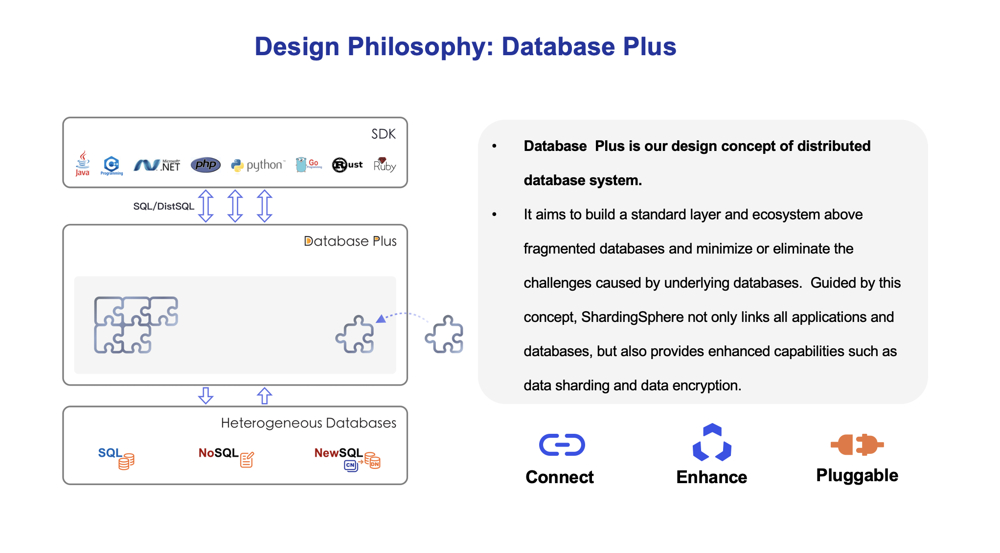

<a id="overview--connect-create-database-upper-level-standard"></a>
<a id="overview--connect:-create-database-upper-level-standard"></a>

### Connect: Create database upper level standard

Through flexible adaptation of database protocols, SQL dialects, and database storage, it can quickly build standards on top of multi-modal heterogeneous databases, while providing standardized connection mode for applications through built-in DistSQL.

<a id="overview--enhance-database-computing-enhancement-engine"></a>
<a id="overview--enhance:-database-computing-enhancement-engine"></a>

### Enhance: Database computing enhancement engine

It can further provide distributed capabilities and traffic enhancement functions based on native database capabilities. The former can break through the bottleneck of the underlying database in computing and storage, while the latter provides more diversified data application enhancement capabilities through traffic deformation, redirection, governance, authentication, and analysis.

<a id="overview--pluggable-building-database-function-ecology"></a>
<a id="overview--pluggable:-building-database-function-ecology"></a>

### Pluggable: Building database function ecology

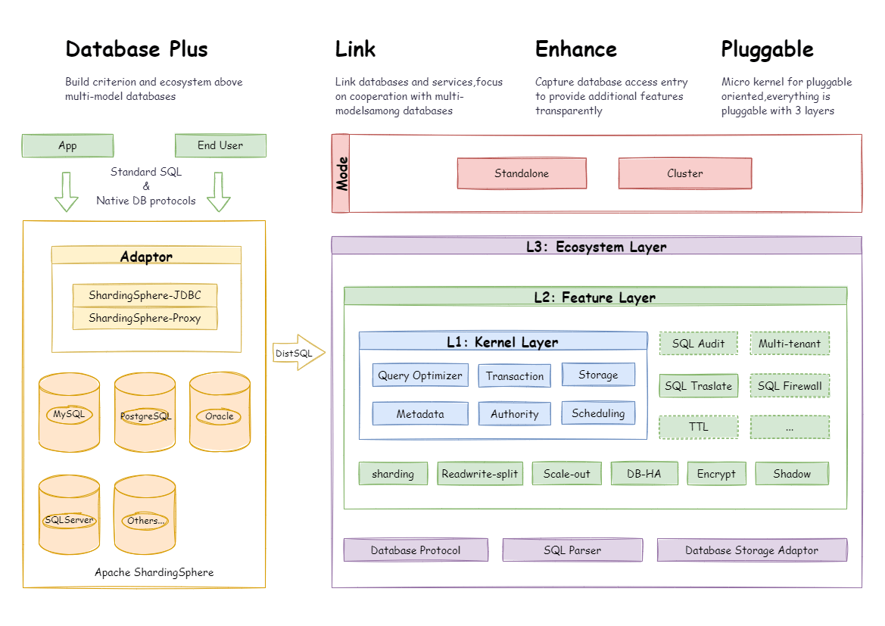

The pluggable architecture of Apache ShardingSphere is composed of three layers - L1 Kernel Layer, L2 Feature Layer and L3 Ecosystem Layer.

<a id="overview--l1-kernel-layer"></a>

#### L1 Kernel Layer

An abstraction of databases' basic capabilities.
All the components are required and the specific implementation method can be replaced thanks to plugins.
It includes a query optimizer, distributed transaction engine, distributed execution engine, permission engine and scheduling engine.

<a id="overview--l2-feature-layer"></a>

#### L2 Feature Layer

Used to provide enhancement capabilities.
All components are optional, allowing you to choose whether to include zero or multiple components.
Components are isolated from each other, and multiple components can be used together by overlaying.
It includes data sharding, read/write splitting, data encryption and shadow database and so on.
The user-defined feature can be fully customized and extended for the top-level interface defined by Apache ShardingSphere without changing kernel codes.

<a id="overview--l3-ecosystem-layer"></a>

#### L3 Ecosystem Layer

It is used to integrate and merge the current database ecosystems.
The ecosystem layer includes database protocol, SQL parser and storage adapter, corresponding to the way in which Apache ShardingSphere provides services by database protocol, the way in which SQL dialect operates data, and the database type that interacts with storage nodes.

<a id="overview--deployment"></a>

## Deployment

Apache ShardingSphere includes two independent clients: ShardingSphere-JDBC & ShardingSphere-Proxy. They all provide functions of data scale-out, distributed transaction and distributed governance, applicable in a variety of scenarios such as Java isomorphism, heterogeneous languages, and a cloud-native environment.

<a id="overview--using-shardingsphere-jdbc"></a>

### Using ShardingSphere-JDBC

ShardingSphere-JDBC is a lightweight Java framework that provides additional services at Java’s JDBC layer.
With the client connecting directly to the database, it provides services in the form of jar and requires no extra deployment and dependence.
It can be considered as an enhanced version of the JDBC driver, which is fully compatible with JDBC and all kinds of ORM frameworks.

- Applicable in any ORM framework based on JDBC, such as JPA, Hibernate, Mybatis, Spring JDBC Template, or direct use of JDBC;
- Support any third-party database connection pool, such as DBCP, C3P0, BoneCP, HikariCP;
- Support any kind of JDBC standard database: MySQL, PostgreSQL, Oracle, SQLServer and any JDBC adapted databases.

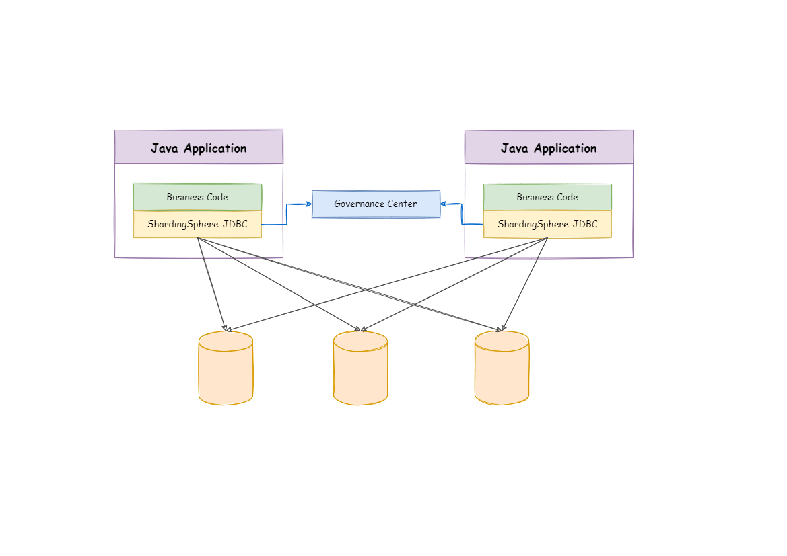

|  | ShardingSphere-JDBC | ShardingSphere-Proxy |
| --- | --- | --- |
| Database | `Any` | MySQL/PostgreSQL |
| Connections Count Cost | `More` | Less |
| Heterogeneous language | `Java Only` | Any |
| Performance | `Low loss` | Relatively High loss |
| Decentralization | `Yes` | No |
| Static entry | `No` | Yes |

<a id="overview--using-shardingsphere-proxy"></a>

### Using ShardingSphere-Proxy

ShardingSphere-Proxy is a transparent database proxy, providing a database server that encapsulates database binary protocol to support heterogeneous languages.
Currently, MySQL and PostgreSQL protocols are provided.
It can use any kind of terminal that is compatible with MySQL or PostgreSQL protocol to operate data, which is more friendly to DBAs.

- Transparent to applications, it can be used directly as MySQL/PostgreSQL;
- Compatible with MySQL-based databases, such as MariaDB, and PostgreSQL-based databases, such as openGauss;
- Applicable to any kind of client that is compatible with MySQL/PostgreSQL protocol, such as MySQL Command Client, MySQL Workbench, etc.

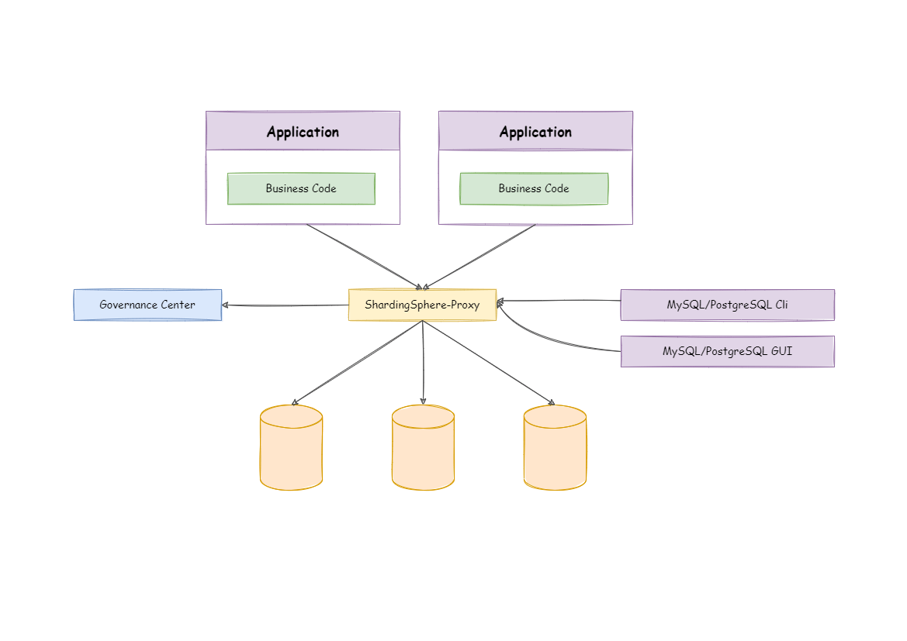

|  | ShardingSphere-JDBC | ShardingSphere-Proxy |
| --- | --- | --- |
| Database | Any | `MySQL/PostgreSQL` |
| Connections Count Cost | More | `Less` |
| Heterogeneous language | Java Only | `Any` |
| Performance | Low loss | `Relatively High loss` |
| Decentralization | Yes | `No` |
| Static entry | No | `Yes` |

<a id="overview--hybrid-architecture"></a>

### Hybrid Architecture

ShardingSphere-JDBC adopts a decentralized architecture, applicable to high-performance light-weight OLTP applications developed with Java.
ShardingSphere-Proxy provides static entry and supports all languages, applicable to OLAP applications and the sharding databases management and operation situation.

Apache ShardingSphere is an ecosystem composed of multiple access ports.
By combining ShardingSphere-JDBC and ShardingSphere-Proxy, and using the same registry to configure sharding strategies, it can flexibly build application systems for various scenarios, allowing architects to freely adjust the system architecture according to the current businesses.

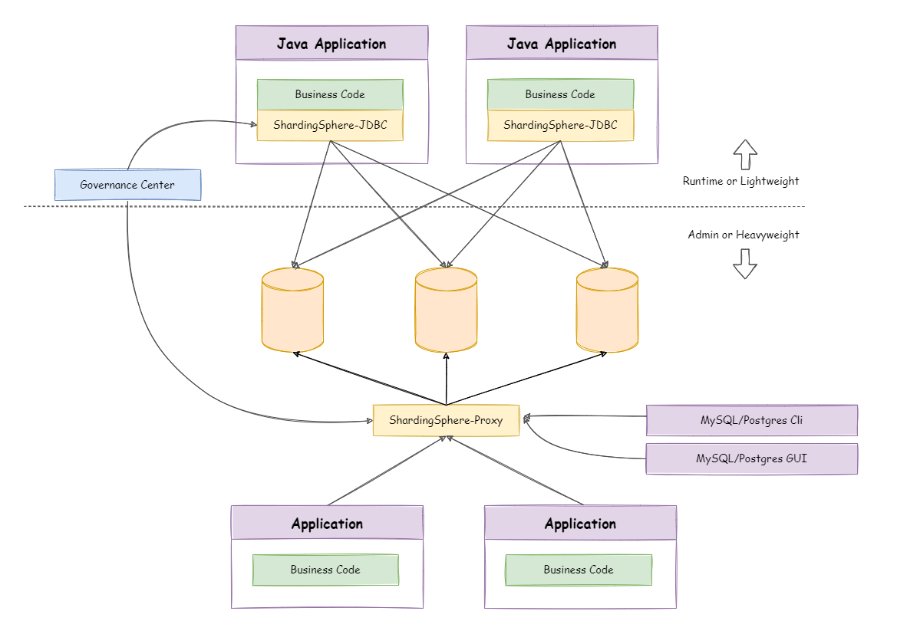

<a id="overview--running-modes"></a>

## Running Modes

Apache ShardingSphere provides two running modes: standalone mode and cluster mode.

<a id="overview--standalone-mode"></a>

### Standalone Mode

It can achieve data persistence in terms of metadata information such as data sources and rules, but it is not able to synchronize metadata to multiple Apache ShardingSphere instances or be aware of each other in a cluster environment.
Updating metadata through one instance causes inconsistencies in other instances because they cannot get the latest metadata.

It is ideal for engineers to build a ShardingSphere environment locally.

<a id="overview--cluster-mode"></a>

### Cluster Mode

It provides metadata sharing between multiple Apache ShardingSphere instances and the capability to coordinate states in distributed scenarios.

It provides the capabilities necessary for distributed systems, such as horizontal scaling of computing capability and high availability.
Clustered environments need to store metadata and coordinate nodes' status through a separately deployed registry center.

We suggest using cluster mode in production environment.

<a id="overview--roadmap"></a>

## Roadmap

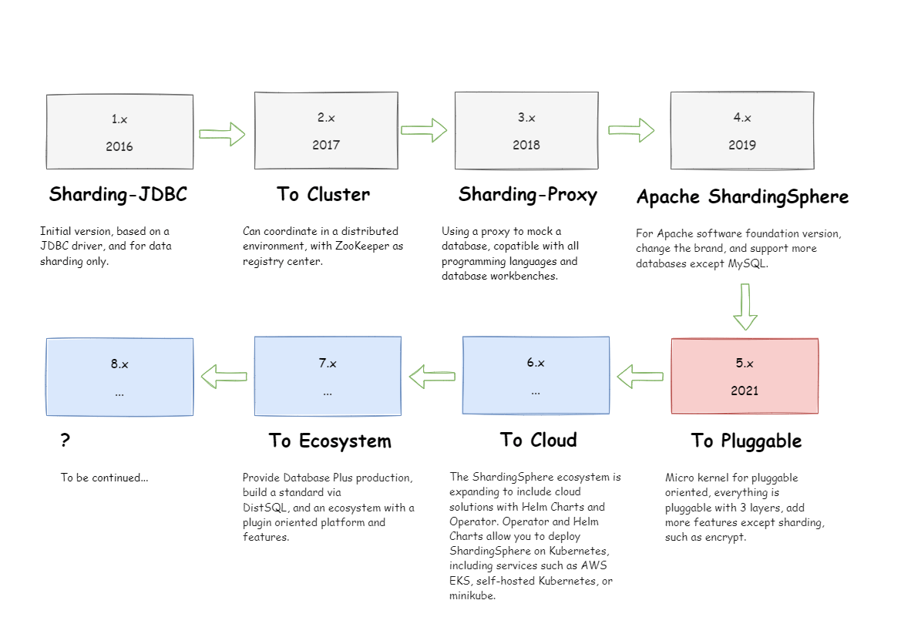

<a id="overview--get-involved"></a>

## Get Involved

ShardingSphere became an [Apache](https://apache.org/index.html#projects-list) Top-Level Project on April 16, 2020.
You are welcome to check out the mailing list and discuss via [mail](mailto:dev@shardingsphere.apache.org).

---

<a id="quick-start"></a>

<!-- source_url: https://shardingsphere.apache.org/document/current/en/quick-start/ -->

<!-- page_index: 2 -->

# Quick Start :: ShardingSphere

Retro

Eye care

Haitian

Deep

Dark

Default

[Edit this page](https://github.com/apache/shardingsphere/tree/master/docs/document/content/quick-start/_index.en.md "Edit this page")

Quick Start

In shortest time, this chapter provides users with a simplest quick start with Apache ShardingSphere.

**Example Codes: <https://github.com/apache/shardingsphere/tree/master/examples>**

---

<a id="quick-start-shardingsphere-jdbc-quick-start"></a>

<!-- source_url: https://shardingsphere.apache.org/document/current/en/quick-start/shardingsphere-jdbc-quick-start/ -->

<!-- page_index: 3 -->

# ShardingSphere-JDBC

Retro

Eye care

Haitian

Deep

Dark

Default

[Edit this page](https://github.com/apache/shardingsphere/tree/master/docs/document/content/quick-start/shardingsphere-jdbc-quick-start.en.md "Edit this page")

ShardingSphere-JDBC

<a id="quick-start-shardingsphere-jdbc-quick-start--shardingsphere-jdbc"></a>

# ShardingSphere-JDBC

- [Scenarios](#quick-start-shardingsphere-jdbc-quick-start--scenarios)
- [Limitations](#quick-start-shardingsphere-jdbc-quick-start--limitations)
- [Requirements](#quick-start-shardingsphere-jdbc-quick-start--requirements)
- [Procedure](#quick-start-shardingsphere-jdbc-quick-start--procedure)
<a id="quick-start-shardingsphere-jdbc-quick-start--scenarios"></a>

## Scenarios

There are two ways you can configure Apache ShardingSphere: `Java` and `YAML`.
Developers can choose the preferred method according to their requirements.

<a id="quick-start-shardingsphere-jdbc-quick-start--limitations"></a>

## Limitations

Currently only Java language is supported.

<a id="quick-start-shardingsphere-jdbc-quick-start--requirements"></a>

## Requirements

The development environment requires Java JRE 8 or later.

<a id="quick-start-shardingsphere-jdbc-quick-start--procedure"></a>

## Procedure

1. Rules configuration.

Please refer to [User Manual](#user-manual-shardingsphere-jdbc) for more details.

2. Import Maven dependency

```xml
<dependency>
    <groupId>org.apache.shardingsphere</groupId>
    <artifactId>shardingsphere-jdbc</artifactId>
    <version>${latest.release.version}</version>
</dependency>
```

> Notice: Please change `${latest.release.version}` to the actual version.

3. Create YAML configuration file

```yaml
# JDBC database name. In cluster mode, use this parameter to connect ShardingSphere-JDBC and ShardingSphere-Proxy.
# Default：logic_db
databaseName (?):

mode:

dataSources:

rules:
- !FOO_XXX
    ...
- !BAR_XXX
    ...

props:
  key_1: value_1
  key_2: value_2
```

4. Take `spring boot` as an example, edit `application.properties`.

```properties
# Configuring DataSource Drivers
spring.datasource.driver-class-name=org.apache.shardingsphere.driver.ShardingSphereDriver
# Specify a YAML configuration file
spring.datasource.url=jdbc:shardingsphere:classpath:xxx.yaml
```

For details, see [Spring Boot](#user-manual-shardingsphere-jdbc-yaml-config-jdbc-driver-spring-boot).

---

<a id="quick-start-shardingsphere-proxy-quick-start"></a>

<!-- source_url: https://shardingsphere.apache.org/document/current/en/quick-start/shardingsphere-proxy-quick-start/ -->

<!-- page_index: 4 -->

# ShardingSphere-Proxy

Retro

Eye care

Haitian

Deep

Dark

Default

[Edit this page](https://github.com/apache/shardingsphere/tree/master/docs/document/content/quick-start/shardingsphere-proxy-quick-start.en.md "Edit this page")

ShardingSphere-Proxy

---

<a id="features"></a>

<!-- source_url: https://shardingsphere.apache.org/document/current/en/features/ -->

<!-- page_index: 5 -->

# Features :: ShardingSphere

Retro

Eye care

Haitian

Deep

Dark

Default

[Edit this page](https://github.com/apache/shardingsphere/tree/master/docs/document/content/features/_index.en.md "Edit this page")

Features

Apache ShardingSphere provides a variety of features, from database kernel and database distributed solution to applications closed features.

There is no boundary for these features, warmly welcome more open source engineers to join the community and provide exciting ideas and features.

---

<a id="features-sharding"></a>

<!-- source_url: https://shardingsphere.apache.org/document/current/en/features/sharding/ -->

<!-- page_index: 6 -->

# Sharding :: ShardingSphere

Retro

Eye care

Haitian

Deep

Dark

Default

[Edit this page](https://github.com/apache/shardingsphere/tree/master/docs/document/content/features/sharding/_index.en.md "Edit this page")

Sharding

---

<a id="features-sharding-concept"></a>

<!-- source_url: https://shardingsphere.apache.org/document/current/en/features/sharding/concept/ -->

<!-- page_index: 7 -->

# Core Concept

Retro

Eye care

Haitian

Deep

Dark

Default

[Edit this page](https://github.com/apache/shardingsphere/tree/master/docs/document/content/features/sharding/concept.en.md "Edit this page")

Core Concept

<a id="features-sharding-concept--core-concept"></a>

# Core Concept

- [Table](#features-sharding-concept--table)
  - [Logic Table](#features-sharding-concept--logic-table)
  - [Actual Table](#features-sharding-concept--actual-table)
  - [Binding Table](#features-sharding-concept--binding-table)
  - [Broadcast data frame](#features-sharding-concept--broadcast-data-frame)
  - [Single Table](#features-sharding-concept--single-table)
- [Data Nodes](#features-sharding-concept--data-nodes)
- [Sharding](#features-sharding-concept--sharding)
  - [Sharding key](#features-sharding-concept--sharding-key)
  - [Sharding Algorithm](#features-sharding-concept--sharding-algorithm)
  - [Automatic Sharding Algorithm](#features-sharding-concept--automatic-sharding-algorithm)
  - [Customized Sharding Algorithm](#features-sharding-concept--customized-sharding-algorithm)
  - [Sharding Strategy](#features-sharding-concept--sharding-strategy)
  - [Mandatory Sharding routing](#features-sharding-concept--mandatory-sharding-routing)
  - [Row Value Expressions](#features-sharding-concept--row-value-expressions)
  - [Distributed Primary Key](#features-sharding-concept--distributed-primary-key)
<a id="features-sharding-concept--table"></a>

## Table

Tables are a key concept for transparent data sharding. Apache ShardingSphere adapts to the data sharding requirements under different scenarios by providing diverse table types.

<a id="features-sharding-concept--logic-table"></a>

### Logic Table

The logical name of the horizontally sharded database (table) of the same structure is the logical identifier of the table in SQL. Example: Order data is split into 10 tables according to the primary key endings, are `t_order_0` to `t_order_9`, and their logical table names are `t_order`.

<a id="features-sharding-concept--actual-table"></a>

### Actual Table

Physical tables that exist in the horizontally sharded databases. Those are, `t_order_0` to `t_order_9` in the previous example.

<a id="features-sharding-concept--binding-table"></a>

### Binding Table

Refers to a set of sharded tables with consistent sharding rules. When using binding tables for multi-table associated query, a sharding key must be used for the association, otherwise, Cartesian product association or cross-library association will occur, affecting query efficiency.

For example, if the `t_order` table and `t_order_item` table are both sharded according to `order_id` and are correlated using `order_id`, the two tables are binding tables. The multi-table associated queries between binding tables will not have a Cartesian product association, so the associated queries will be much more effective. Here is an example,

If SQL is:

```sql
SELECT i.* FROM t_order o JOIN t_order_item i ON o.order_id=i.order_id WHERE o.order_id in (10, 11);
```

In the case where no binding table relationships are being set, assume that the sharding key `order_id` routes the value 10 to slice 0 and the value 11 to slice 1, then the routed SQL should be 4 items, which are presented as a Cartesian product:

```sql
SELECT i.* FROM t_order_0 o JOIN t_order_item_0 i ON o.order_id=i.order_id WHERE o.order_id in (10, 11);

SELECT i.* FROM t_order_0 o JOIN t_order_item_1 i ON o.order_id=i.order_id WHERE o.order_id in (10, 11);

SELECT i.* FROM t_order_1 o JOIN t_order_item_0 i ON o.order_id=i.order_id WHERE o.order_id in (10, 11);

SELECT i.* FROM t_order_1 o JOIN t_order_item_1 i ON o.order_id=i.order_id WHERE o.order_id in (10, 11);
```

After the relationships between binding tables are configured and associated with order\_id, the routed SQL should then be 2 items:

```sql
SELECT i.* FROM t_order_0 o JOIN t_order_item_0 i ON o.order_id=i.order_id WHERE o.order_id in (10, 11);

SELECT i.* FROM t_order_1 o JOIN t_order_item_1 i ON o.order_id=i.order_id WHERE o.order_id in (10, 11);
```

The t\_order table will be used by ShardingSphere as the master table for the entire binding table since it specifies the sharding condition. All routing calculations will use only the policy of the primary table, then the sharding calculations for the `t_order_item` table will use the `t_order` condition.

Note: multiple sharding rules in the binding table need to be configured according to the combination of logical table prefix and sharding suffix, for example:

```yaml
rules:
- !SHARDING
  tables:
    t_order:
      actualDataNodes: ds_${0..1}.t_order_${0..1}
    t_order_item:
      actualDataNodes: ds_${0..1}.t_order_item_${0..1}
  bindingTables:
    - t_order, t_order_item
```

> **Naming reminder**: ShardingSphere derives binding information by stripping numeric suffixes from actual table names. Keep the digits at the end exclusively for sharding suffixes such as `_0`, `_1`, etc.

<a id="features-sharding-concept--broadcast-data-frame"></a>

### Broadcast data frame

Refers to tables that exist in all data sources. The table structure and its data are identical in each database. Suitable for scenarios where the data volume is small and queries are required to be associated with tables of massive data, e.g., dictionary tables.

<a id="features-sharding-concept--single-table"></a>

### Single Table

Refers to the only table that exists in all sharded data sources. Suitable for tables with a small amount of data and do not need to be sharded.

Note: Single tables that meet the following conditions will be automatically loaded:

- A single table showing the configuration in rules such as encrypt and mask
- A single table created by users executing DDL statements through ShardingSphere

For other single tables that do not meet the above conditions, ShardingSphere will not automatically load them, and users can configure single table rules as needed for management.

<a id="features-sharding-concept--data-nodes"></a>

## Data Nodes

The smallest unit of the data shard, consists of the data source name and the real table. Example: `ds_0.t_order_0`.

The mapping relationship between the logical table and the real table can be classified into two forms: uniform distribution and custom distribution.

<a id="features-sharding-concept--uniform-distribution"></a>

### Uniform Distribution

refers to situations where the data table exhibits a uniform distribution within each data source. For example:

```Nginx
db0
  ├── t_order0
  └── t_order1
db1
  ├── t_order0
  └── t_order1
```

The configuration of data nodes:

```CSS
db0.t_order0, db0.t_order1, db1.t_order0, db1.t_order1
```

<a id="features-sharding-concept--customized-distribution"></a>

### Customized Distribution

Data table exhibiting a patterned distribution. For example:

```Nginx
db0
  ├── t_order0
  └── t_order1
db1
  ├── t_order2
  ├── t_order3
  └── t_order4
```

configuration of data nodes:

```CSS
db0.t_order0, db0.t_order1, db1.t_order2, db1.t_order3, db1.t_order4
```

<a id="features-sharding-concept--sharding"></a>

## Sharding

<a id="features-sharding-concept--sharding-key"></a>

### Sharding key

A database field is used to split a database (table) horizontally. Example: If the order primary key in the order table is sharded by modulo, the order primary key is a sharded field. If there is no sharded field in SQL, full routing will be executed, of which performance is poor. In addition to the support for single-sharding fields, Apache ShardingSphere also supports sharding based on multiple fields.

<a id="features-sharding-concept--sharding-algorithm"></a>

### Sharding Algorithm

Algorithm for sharding data, supporting `=`, `>=`, `<=`, `>`, `<`, `BETWEEN` and `IN`. The sharding algorithm can be implemented by the developers themselves or can use the Apache ShardingSphere built-in sharding algorithm, syntax sugar, which is very flexible.

<a id="features-sharding-concept--automatic-sharding-algorithm"></a>

### Automatic Sharding Algorithm

Sharding algorithm—syntactic sugar is for conveniently hosting all data nodes without users having to concern themselves with the physical distribution of actual tables. Includes implementations of common sharding algorithms such as modulo, hash, range, and time.

<a id="features-sharding-concept--customized-sharding-algorithm"></a>

### Customized Sharding Algorithm

Provides a portal for application developers to implement their sharding algorithms that are closely related to their business operations, while allowing users to manage the physical distribution of actual tables themselves. Customized sharding algorithms are further divided into:

- Standard Sharding Algorithm
  Used to deal with scenarios where sharding is performed using a single key as the sharding key `=`, `IN`, `BETWEEN AND`, `>`, `<`, `>=`, `<=`.
- Composite Sharding Algorithm
  Used to cope with scenarios where multiple keys are used as sharding keys. The logic containing multiple sharding keys is very complicated and requires the application developers to handle it on their own.
- Hint Sharding Algorithm
  For scenarios involving Hint sharding.

<a id="features-sharding-concept--sharding-strategy"></a>

### Sharding Strategy

Consisting of a sharding key and sharding algorithm, which is abstracted independently due to the independence of the sharding algorithm. What is viable for sharding operations is the sharding key + sharding algorithm, known as sharding strategy.

<a id="features-sharding-concept--mandatory-sharding-routing"></a>

### Mandatory Sharding routing

For the scenario where the sharded field is not determined by SQL but by other external conditions, you can use SQL Hint to inject the shard value. Example: Conduct database sharding by employee login primary key, but there is no such field in the database. SQL Hint can be used both via Java API and SQL annotation. See Mandatory Sharding Routing for details.

<a id="features-sharding-concept--row-value-expressions"></a>

### Row Value Expressions

Row expressions are designed to address the two main issues of configuration simplification and integration. In the cumbersome configuration rules of data sharding, the large number of repetitive configurations makes the configuration itself difficult to maintain as the number of data nodes increases. The data node configuration workload can be effectively simplified by row expressions.

For the common sharding algorithm, using Java code implementation does not help to manage the configuration uniformly. But by writing the sharding algorithm through line expressions, the rule configuration can be effectively stored together, which is easier to browse and store.

A Row Value Expressions consists of two parts as a string, the Type Name part of the corresponding SPI implementation at the beginning of the string and the expression part.

Take `<GROOVY>t_order_${1..3}` as sample, the `GROOVY` substring in the part of the `<GROOVY>` string is the Type Name used by the corresponding SPI implementation for this Row Value Expressions, which is identified by the `<>` symbol.
And the `t_order_${1..3}` string is the expression part of this Row Value Expressions. When a Row Value Expressions does
not specify a Type Name, such as `t_order_${1..3}`, the Row Value Expressions defaults to parse expressions by `GROOVY` implementation for `InlineExpressionParser` SPI.

The following sections describe the syntax rules for the `GROOVY` implementation.

Row expressions are very intuitive, just use `${ expression }` or `$->{ expression }` in the configuration to identify the row expressions. Data nodes and sharding algorithms are currently supported. The content of row expressions uses Groovy syntax, and all operations supported by Groovy are supported by row expressions. For example:

`${begin..end}` denotes the range interval

`${[unit1, unit2, unit_x]}` denotes the enumeration value

If there are multiple `${ expression }` or `$->{ expression }` expressions in a row expression, the final result of the whole expression will be a Cartesian combination based on the result of each sub-expression.

e.g. The following row expression:

```Groovy
${['online', 'offline']}_table${1..3}
```

Finally, it can be parsed as this:

```PlainText
online_table1, online_table2, online_table3, offline_table1, offline_table2, offline_table3
```

<a id="features-sharding-concept--distributed-primary-key"></a>

### Distributed Primary Key

In traditional database software development, automatic primary key generation is a basic requirement. Various databases provide support for this requirement, such as self-incrementing keys of MySQL, self-incrementing sequences of Oracle, etc. After data sharding, it is very tricky to generate global unique primary keys for different data nodes. Self-incrementing keys between different actual tables within the same logical table generate repetitive primary keys because they are not mutually aware. Although collisions can be avoided by constraining the initial value and step size of self-incrementing primary keys, additional operational and maintenance rules are necessary to be introduced, rendering the solution lacking in completeness and scalability.

Many third-party solutions can perfectly solve this problem, such as UUID, which relies on specific algorithms to self-generate non-repeating keys, or by introducing primary key generation services. To facilitate users and meet their demands for different scenarios, Apache ShardingSphere not only provides built-in distributed primary key generators, such as UUID and SNOWFLAKE but also abstracts the interface of distributed primary key generators to enable users to implement their own customized self-extending primary key generators.

---

<a id="features-sharding-limitation"></a>

<!-- source_url: https://shardingsphere.apache.org/document/current/en/features/sharding/limitation/ -->

<!-- page_index: 8 -->

# Limitations

Retro

Eye care

Haitian

Deep

Dark

Default

[Edit this page](https://github.com/apache/shardingsphere/tree/master/docs/document/content/features/sharding/limitation.en.md "Edit this page")

Limitations

<a id="features-sharding-limitation--limitations"></a>

# Limitations

- [Stable Support](#features-sharding-limitation--stable-support)
  - [Normal Queries](#features-sharding-limitation--normal-queries)
  - [Sub-query](#features-sharding-limitation--sub-query)
  - [Pagination Query](#features-sharding-limitation--pagination-query)
  - [Aggregation](#features-sharding-limitation--aggregation)
  - [Shard keys included in operation expressions](#features-sharding-limitation--shard-keys-included-in-operation-expressions)
  - [LOAD DATA / LOAD XML](#features-sharding-limitation--load-data-load-xml)
  - [View](#features-sharding-limitation--view)
- [Experimental Support](#features-sharding-limitation--experimental-support)
- [Do not Support](#features-sharding-limitation--do-not-support)
  - [CASE WHEN](#features-sharding-limitation--case-when)
  - [Pagination Query](#features-sharding-limitation--pagination-query-1)
  - [Aggregation](#features-sharding-limitation--aggregation-1)
  - [LOAD DATA / LOAD XML](#features-sharding-limitation--load-data-load-xml-1)
  - [Semicolons separate multiple statements](#features-sharding-limitation--semicolons-separate-multiple-statements)
  - [Shard key value extraction](#features-sharding-limitation--shard-key-value-extraction)

Compatible with all commonly used SQL that routes to single data nodes; SQL routing to multiple data nodes is divided, because of complexity issues, into three conditions: stable support, experimental support, and no support.

<a id="features-sharding-limitation--stable-support"></a>

## Stable Support

Full support for DML, DDL, DCL, TCL, and common DALs. Support for complex queries such as paging, de-duplication, sorting, grouping, aggregation, table association, etc.
Support SCHEMA DDL and DML statements of PostgreSQL and openGauss database. When no schema is specified in SQL, default access to ‘public’ schema. Other schemas need to declare before the table name, and do not support ‘SEARCH\_PATH’ to modify the schema search path.

<a id="features-sharding-limitation--normal-queries"></a>

### Normal Queries

- main statement SELECT

```sql
SELECT select_expr [, select_expr ...] FROM table_reference [, table_reference ...]
[WHERE predicates]
[GROUP BY {col_name | position} [ASC | DESC], ...]
[ORDER BY {col_name | position} [ASC | DESC], ...]
[LIMIT {[offset,] row_count | row_count OFFSET offset}]
```

- select\_expr

```sql
* | 
[DISTINCT] COLUMN_NAME [AS] [alias] | 
(MAX | MIN | SUM | AVG)(COLUMN_NAME | alias) [AS] [alias] | 
COUNT(* | COLUMN_NAME | alias) [AS] [alias]
```

- table\_reference

```sql
tbl_name [AS] alias] [index_hint_list]
| table_reference ([INNER] | {LEFT|RIGHT} [OUTER]) JOIN table_factor [JOIN ON conditional_expr | USING (column_list)]
```

<a id="features-sharding-limitation--sub-query"></a>

### Sub-query

Stable support is provided by the kernel when both the subquery and the outer query specify a shard key and the values of the slice key remain consistent.
e.g:

```sql
SELECT * FROM (SELECT * FROM t_order WHERE order_id = 1) o WHERE o.order_id = 1;
```

Sub-query for [pagination](#features-sharding-limitation--pagination-query) can be stably supported by the kernel.
e.g.:

```sql
SELECT * FROM (SELECT row_.*, rownum rownum_ FROM (SELECT * FROM t_order) row_ WHERE rownum <= ?) WHERE rownum > ?;
```

<a id="features-sharding-limitation--pagination-query"></a>

### Pagination Query

MySQL, PostgreSQL, and openGauss are fully supported, Oracle and SQLServer are only partially supported due to more intricate paging queries.

Pagination for Oracle and SQLServer needs to be handled by subqueries, and ShardingSphere supports paging-related subqueries.

- Oracle
  Support pagination by rownum

```sql
SELECT * FROM (SELECT row_.*, rownum rownum_ FROM (SELECT o.order_id as order_id FROM t_order o JOIN t_order_item i ON o.order_id = i.order_id) row_ WHERE rownum <= ?) WHERE rownum > ?
```

- SQL Server
  Support pagination that coordinates TOP + ROW\_NUMBER() OVER

```sql
SELECT * FROM (SELECT TOP (?) ROW_NUMBER() OVER (ORDER BY o.order_id DESC) AS rownum, * FROM t_order o) AS temp WHERE temp.rownum > ? ORDER BY temp.order_id
```

Support pagination by OFFSET FETCH after SQLServer 2012

```sql
SELECT * FROM t_order o ORDER BY id OFFSET ? ROW FETCH NEXT ? ROWS ONLY
```

- MySQL, PostgreSQL and openGauss all support LIMIT pagination without the need for sub-query：

```sql
SELECT * FROM t_order o ORDER BY id LIMIT ? OFFSET ?
```

<a id="features-sharding-limitation--aggregation"></a>

### Aggregation

Support `MAX`, `MIN`, `SUM`, `COUNT`, `AVG`, `BIT_XOR`, `GROUP_CONCAT` and so on.

<a id="features-sharding-limitation--shard-keys-included-in-operation-expressions"></a>

### Shard keys included in operation expressions

When the sharding key is contained in an expression, the value used for sharding cannot be extracted through the SQL letters and will result in full routing.

For example, assume `create_time` is a sharding key.

```sql
SELECT * FROM t_order WHERE to_date(create_time, 'yyyy-mm-dd') = '2019-01-01';
```

<a id="features-sharding-limitation--load-data-load-xml"></a>

### LOAD DATA / LOAD XML

Support MySQL `LOAD DATA` and `LOAD XML` statements to load data to single table and broadcast table.

<a id="features-sharding-limitation--view"></a>

### View

1. Support create, alter and drop view based on a single table or multiple single tables on the same storage node;
2. Support create, alter and drop view based on any broadcast table;
3. Support create, alter and drop view based on any sharding table. The view must be configured with same sharding rules as sharding table, the view and sharding table must be in same binding table rule;
4. Support create, alter and drop view based on broadcast tables and sharding tables. The sharding table rules are same as create view using sharding tables alone;
5. Support create, alter and drop view based on broadcast tables and single tables;
6. Support MySQL `SHOW CREATE TABLE viewName` to show create statement of the view.

<a id="features-sharding-limitation--experimental-support"></a>

## Experimental Support

Experimental support refers specifically to support provided by implementing Federation execution engine, an experimental product that is still under development. Although largely available to users, it still requires significant optimization.

<a id="features-sharding-limitation--sub-query-1"></a>
<a id="features-sharding-limitation--sub-query-2"></a>

### Sub-query

The Federation execution engine provides support for subqueries and outer queries that do not both specify a sharding key or have inconsistent values for the sharding key.

e.g:

```sql
SELECT * FROM (SELECT * FROM t_order) o;

SELECT * FROM (SELECT * FROM t_order) o WHERE o.order_id = 1;

SELECT * FROM (SELECT * FROM t_order WHERE order_id = 1) o;

SELECT * FROM (SELECT * FROM t_order WHERE order_id = 1) o WHERE o.order_id = 2;
```

<a id="features-sharding-limitation--cross-database-associated-query"></a>

### Cross-database Associated query

When multiple tables in an associated query are distributed across different database instances, the Federation execution engine can provide support. Assuming that t\_order and t\_order\_item are sharded tables with multiple data nodes while no binding table rules are configured, and t\_user and t\_user\_role are single tables distributed across different database instances, then the Federation execution engine can support the following common associated queries.

```sql
SELECT * FROM t_order o INNER JOIN t_order_item i ON o.order_id = i.order_id WHERE o.order_id = 1;

SELECT * FROM t_order o INNER JOIN t_user u ON o.user_id = u.user_id WHERE o.user_id = 1;

SELECT * FROM t_order o LEFT JOIN t_user_role r ON o.user_id = r.user_id WHERE o.user_id = 1;

SELECT * FROM t_order_item i LEFT JOIN t_user u ON i.user_id = u.user_id WHERE i.user_id = 1;

SELECT * FROM t_order_item i RIGHT JOIN t_user_role r ON i.user_id = r.user_id WHERE i.user_id = 1;

SELECT * FROM t_user u RIGHT JOIN t_user_role r ON u.user_id = r.user_id WHERE u.user_id = 1;
```

<a id="features-sharding-limitation--do-not-support"></a>

## Do not Support

<a id="features-sharding-limitation--case-when"></a>

### CASE WHEN

The following CASE WHEN statements are not supported:

- `CASE WHEN` contains sub-query
- Logic names are used in `CASE WHEN`( Please use an alias)

<a id="features-sharding-limitation--pagination-query-1"></a>
<a id="features-sharding-limitation--pagination-query-2"></a>

### Pagination Query

Due to the complexity of paging queries, there are currently some paging queries that are not supported for Oracle and SQLServer, such as:

- Oracle
  The paging method of rownum + BETWEEN is not supported at present
- SQLServer
  Currently, pagination with `WITH xxx AS (SELECT ...)` is not supported. Since the SQLServer paging statement automatically generated by Hibernate uses the `WITH` statement, Hibernate-based SQLServer paging is not supported at this moment. Pagination using two TOP + subquery also cannot be supported at this time.

<a id="features-sharding-limitation--aggregation-1"></a>
<a id="features-sharding-limitation--aggregation-2"></a>

### Aggregation

When a query contains multiple aggregate functions at the same time, it does not support mixing aggregate functions with DISTINCT and aggregate functions without DISTINCT.

<a id="features-sharding-limitation--load-data-load-xml-1"></a>
<a id="features-sharding-limitation--load-data-load-xml-2"></a>

### LOAD DATA / LOAD XML

Not support MySQL `LOAD DATA` and `LOAD XML` statements to load data to sharding table.

<a id="features-sharding-limitation--semicolons-separate-multiple-statements"></a>

### Semicolons separate multiple statements

Not support simultaneous execution of multiple SQL statements separated by `;`.

<a id="features-sharding-limitation--shard-key-value-extraction"></a>

### Shard key value extraction

Shard key extraction only supports literals or bound parameters that can be parsed directly;
Values requiring type annotations, expression evaluation, or function calculation are not used for sharding and may result in full routing or routing validation failures.

---

<a id="features-sharding-appendix"></a>

<!-- source_url: https://shardingsphere.apache.org/document/current/en/features/sharding/appendix/ -->

<!-- page_index: 9 -->

# Appendix with SQL operator

Retro

Eye care

Haitian

Deep

Dark

Default

[Edit this page](https://github.com/apache/shardingsphere/tree/master/docs/document/content/features/sharding/appendix.en.md "Edit this page")

Appendix with SQL operator

<a id="features-sharding-appendix--appendix-with-sql-operator"></a>

# Appendix with SQL operator

Limited supported SQL:

- When using `getGeneratedKeys` interface of JDBC specification to return auto-increment key, it is necessary to use a distributed key generator that supports auto-increment, and does not support other types of distributed key generators

Unsupported SQL:

- CASE WHEN contains sub-query
- Logical table names are used in CASE WHEN( Please use an alias)
- INSERT INTO tbl\_name (col1, col2, …) SELECT \* FROM tbl\_name WHERE col3 = ?（The SELECT clause does not support \* and the built-in distributed primary key generator）
- REPLACE INTO tbl\_name (col1, col2, …) SELECT \* FROM tbl\_name WHERE col3 = ?（The SELECT clause does not support \* and the built-in distributed primary key generator）
- SELECT MAX(tbl\_name.col1) FROM tbl\_name (If the query column is a function expression, use the table alias instead of the table name）

Other：

- You should keep actual tables, sharding columns and key generate columns in sharding rule same capitalization with tables and columns in database.

---

<a id="features-transaction"></a>

<!-- source_url: https://shardingsphere.apache.org/document/current/en/features/transaction/ -->

<!-- page_index: 10 -->

# Distributed Transaction :: ShardingSphere

Retro

Eye care

Haitian

Deep

Dark

Default

[Edit this page](https://github.com/apache/shardingsphere/tree/master/docs/document/content/features/transaction/_index.en.md "Edit this page")

Distributed Transaction

- [Background](#features-transaction--background)
- [Challenge](#features-transaction--challenge)
- [Goal](#features-transaction--goal)
- [How it works](#features-transaction--how-it-works)
  - [LOCAL Transaction](#features-transaction--local-transaction)
  - [XA Transaction](#features-transaction--xa-transaction)
  - [BASE Transaction](#features-transaction--base-transaction)
- [Application Scenarios](#features-transaction--application-scenarios)
  - [Application Scenarios for ShardingSphere XA Transactions](#features-transaction--application-scenarios-for-shardingsphere-xa-transactions)
  - [Application Scenarios for ShardingSphere BASE Transaction](#features-transaction--application-scenarios-for-shardingsphere-base-transaction)
  - [Application Scenarios for ShardingSphere LOCAL Transaction](#features-transaction--application-scenarios-for-shardingsphere-local-transaction)
- [Related references](#features-transaction--related-references)
<a id="features-transaction--background"></a>

## Background

Database transactions should satisfy the features of ACID (atomicity, consistency, isolation and durability).

- Atomicity: transactions are executed as a whole, and either all or none is executed.
- Consistency: transactions should ensure that the state of data remains consistent after the transition.
- Isolation: when multiple transactions execute concurrently, the execution of one transaction should not affect the execution of others.
- Durability: when a transaction committed modifies data, the operation will be saved persistently.

In single data node, transactions are only restricted to the access and control of single database resources, called local transactions. Almost all the mature relational databases have provided native support for local transactions. But in distributed application situations based on micro-services, more and more of them require to include multiple accesses to services and the corresponding database resources in the same transaction. As a result, distributed transactions appear.

Though the relational database has provided perfect native ACID support, it can become an obstacle to the system performance under distributed situations. How to make databases satisfy ACID features under distributed situations or find a corresponding substitute solution, is the priority work of distributed transactions.

<a id="features-transaction--challenge"></a>

## Challenge

For different application situations, developers need to reasonably weight the performance and the function between all kinds of distributed transactions.

Highly consistent transactions do not have totally the same API and functions as soft transactions, and they cannot switch between each other freely and invisibly. The choice between highly consistent transactions and soft transactions as early as development decision-making phase has sharply increased the design and development cost.

Highly consistent transactions based on XA is relatively easy to use, but is not good at dealing with long transaction and high concurrency situation of the Internet. With a high access cost, soft transactions require developers to transform the application and realize resources lock and backward compensation.

<a id="features-transaction--goal"></a>

## Goal

The main design goal of the distributed transaction modular of Apache ShardingSphere is to integrate existing mature transaction cases to provide an unified distributed transaction interface for local transactions, 2PC transactions and soft transactions; compensate for the deficiencies of current solutions to provide a one-stop distributed transaction solution.

<a id="features-transaction--how-it-works"></a>

## How it works

ShardingSphere provides begin/ commit/rollback traditional transaction interfaces externally, and provides distributed transaction capabilities through LOCAL, XA and BASE modes.

<a id="features-transaction--local-transaction"></a>

### LOCAL Transaction

LOCAL mode is implemented based on ShardingSphere’s proxy database interfaces, that is begin/commit/rolllback.
For a logical SQL, ShardingSphere starts transactions on each proxied database with the begin directive, executes the actual SQL, and performs commit/rollback.
Since each data node manages its own transactions, there is no coordination and communication between them, and they do not know whether other data node transactions succeed or not.
There is no loss in performance, but strong consistency and final consistency cannot be guaranteed.

<a id="features-transaction--xa-transaction"></a>

### XA Transaction

XA transaction adopts the concepts including AP(application program), TM(transaction manager) and RM(resource manager) to ensure the strong consistency of distributed transactions. Those concepts are abstracted from [DTP mode](http://pubs.opengroup.org/onlinepubs/009680699/toc.pdf) which is defined by X/OPEN group.
Among them, TM and RM use XA protocol to carry out both-way communication, which is realized through two-phase commit.
Compared to traditional local transactions, XA transaction adds a preparation stage where the database can also inform the caller whether the transaction can be committed, in addition to passively accepting commit instructions.
TM can collect the results of all branch transactions and make atomic commit at the end to ensure the strong consistency of transactions.


XA transaction is implemented based on the interface of ShardingSphere’s proxy database xa start/end/prepare/commit/rollback/recover.

For a logical SQL, ShardingSphere starts transactions in each proxied database with the xa begin directive, integrates TM internally for coordinating branch transactions, and performs xa commit /rollback.
Distributed transactions based on XA protocol are more suitable for short transactions with fixed execution time because the required resources need to be locked during execution.
For long transactions, data exclusivity during the entire transaction will have an impact on performance in concurrent scenarios.

<a id="features-transaction--base-transaction"></a>

### BASE Transaction

If a transaction that implements ACID is called a rigid transaction, then a transaction based on a BASE transaction element is called a flexible transaction.
BASE stands for basic availability, soft state, and eventual consistency.

- Basically Available: ensure that distributed transaction parties are not necessarily online at the same time.
- Soft state: system status updates are allowed to have a certain delay, and the delay may not be recognized by customers.
- Eventually consistent: guarantee the eventual consistency of the system by means of messaging.

ACID transaction puts a high demand for isolation, where all resources must be locked during the execution of transactions.
Flexible transaction is to move mutex operations from the resource level to the business level through business logic.
Reduce the requirement for strong consistency in exchange for higher system throughput.

ACID-based strong consistency transactions and BASE-based final consistency transactions are not a jack of all trades and can fully leverage their advantages in the most appropriate scenarios.
Apache ShardingSphere integrates the operational scheme taking SEATA as the flexible transaction.
The following table can be used for comparison to help developers choose the suitable technology.

|  | *LOCAL* | *XA* | *BASE* |
| --- | --- | --- | --- |
| Business transformation | None | None | Seata Server needed |
| Consistency | Not supported | Supported | Final consistency |
| Isolation | Not supported | Supported | Business side guaranteed |
| Concurrent performance | no loss | severe loss | slight loss |
| Applied scenarios | Inconsistent processing by the business side | short transaction & low-level concurrency | long transaction & high concurrency |

<a id="features-transaction--application-scenarios"></a>

## Application Scenarios

The database’s transactions can meet ACID business requirements in a standalone application scenario. However, in distributed scenarios, traditional database solutions cannot manage and control global transactions, and users may find data inconsistency on multiple database nodes.

ShardingSphere distributed transaction makes it easier to process distributed transactions and provides flexible and diverse solutions. Users can select the distributed transaction solutions that best fit their business scenarios among LOCAL, XA, and BASE modes.

<a id="features-transaction--application-scenarios-for-shardingsphere-xa-transactions"></a>

### Application Scenarios for ShardingSphere XA Transactions

Strong data consistency is guaranteed in a distributed environment in terms of XA transactions. However, its performance may be degraded due to the synchronous blocking problem. It applies to business scenarios that require strong data consistency and low concurrency performance.

<a id="features-transaction--application-scenarios-for-shardingsphere-base-transaction"></a>

### Application Scenarios for ShardingSphere BASE Transaction

In terms of BASE transactions, final data consistency is guaranteed in a distributed environment. Unlike XA transactions, resources are not locked during the whole transaction process, so its performance is relatively higher.

<a id="features-transaction--application-scenarios-for-shardingsphere-local-transaction"></a>

### Application Scenarios for ShardingSphere LOCAL Transaction

In terms of LOCAL transactions, the data consistency and isolation among database nodes are not guaranteed in a distributed environment. Therefore, the business sides need to handle the inconsistencies by themselves. This applies to business scenarios where users would like to handle data inconsistency in a distributed environment by themselves.

<a id="features-transaction--related-references"></a>

## Related references

---

<a id="features-transaction-concept"></a>

<!-- source_url: https://shardingsphere.apache.org/document/current/en/features/transaction/concept/ -->

<!-- page_index: 11 -->

# Core Concept

Retro

Eye care

Haitian

Deep

Dark

Default

[Edit this page](https://github.com/apache/shardingsphere/tree/master/docs/document/content/features/transaction/concept.en.md "Edit this page")

Core Concept

<a id="features-transaction-concept--core-concept"></a>

# Core Concept

- [XA Protocol](#features-transaction-concept--xa-protocol)
<a id="features-transaction-concept--xa-protocol"></a>

## XA Protocol

The original distributed transaction model of XA protocol is the “X/Open Distributed Transaction Processing (DTP)” model, XA protocol for short, which was proposed by the X/Open international consortium.

---

<a id="features-transaction-limitations"></a>

<!-- source_url: https://shardingsphere.apache.org/document/current/en/features/transaction/limitations/ -->

<!-- page_index: 12 -->

# Limitations

Retro

Eye care

Haitian

Deep

Dark

Default

[Edit this page](https://github.com/apache/shardingsphere/tree/master/docs/document/content/features/transaction/limitations.en.md "Edit this page")

Limitations

<a id="features-transaction-limitations--limitations"></a>

# Limitations

- [LOCAL Transaction](#features-transaction-limitations--local-transaction)
- [XA Transaction](#features-transaction-limitations--xa-transaction)
  - [Unsupported](#features-transaction-limitations--unsupported-1)
- [BASE Transaction](#features-transaction-limitations--base-transaction)
  - [Unsupported](#features-transaction-limitations--unsupported-2)

Although Apache ShardingSphere aims at being compatible with all distributed scenario and providing the best performance, under the CAP theorem guidance, there is no sliver bullet with distributed transaction solution.

The Apache ShardingSphere community chose instead to give the users the ability to choose their preferred distributed transaction type and use the most suitable solution according to their scenarios.

<a id="features-transaction-limitations--local-transaction"></a>

## LOCAL Transaction

<a id="features-transaction-limitations--unsupported"></a>

### Unsupported

- Does not support the cross-database transactions caused by network or hardware crash. For example, when updating two databases in transaction, if one database crashes before commit, then only the data of the other database can commit.

<a id="features-transaction-limitations--xa-transaction"></a>

## XA Transaction

<a id="features-transaction-limitations--unsupported-1"></a>
<a id="features-transaction-limitations--unsupported-2"></a>

### Unsupported

- Recover committing and rolling back in other machines after the service is down.
- MySQL, in the transaction block, the SQL execution is abnormal, and run `Commit`, and data remains consistent.
- After XA transactions are configured, the maximum length of the storage unit name cannot exceed 45 characters.

<a id="features-transaction-limitations--base-transaction"></a>

## BASE Transaction

<a id="features-transaction-limitations--unsupported-2-2"></a>
<a id="features-transaction-limitations--unsupported-3"></a>

### Unsupported

- Does not support isolation level.

---

<a id="features-transaction-appendix"></a>

<!-- source_url: https://shardingsphere.apache.org/document/current/en/features/transaction/appendix/ -->

<!-- page_index: 13 -->

# Appendix with SQL operator

Retro

Eye care

Haitian

Deep

Dark

Default

[Edit this page](https://github.com/apache/shardingsphere/tree/master/docs/document/content/features/transaction/appendix.en.md "Edit this page")

Appendix with SQL operator

<a id="features-transaction-appendix--appendix-with-sql-operator"></a>

# Appendix with SQL operator

Unsupported SQL：

- RAL and RDL operations of DistSQL that are used in transactions.
- DDL statements that are used in XA transactions.

Privileges required for XA transactions:

In MySQL8, you need to grant the user `XA_RECOVER_ADMIN` privileges, otherwise, the XA transaction manager will report an error when executing the `XA RECOVER` statement.

---

<a id="features-readwrite-splitting"></a>

<!-- source_url: https://shardingsphere.apache.org/document/current/en/features/readwrite-splitting/ -->

<!-- page_index: 14 -->

# Readwrite-splitting :: ShardingSphere

Retro

Eye care

Haitian

Deep

Dark

Default

[Edit this page](https://github.com/apache/shardingsphere/tree/master/docs/document/content/features/readwrite-splitting/_index.en.md "Edit this page")

Readwrite-splitting

---

<a id="features-readwrite-splitting-concept"></a>

<!-- source_url: https://shardingsphere.apache.org/document/current/en/features/readwrite-splitting/concept/ -->

<!-- page_index: 15 -->

# Core Concept

Retro

Eye care

Haitian

Deep

Dark

Default

[Edit this page](https://github.com/apache/shardingsphere/tree/master/docs/document/content/features/readwrite-splitting/concept.en.md "Edit this page")

Core Concept

<a id="features-readwrite-splitting-concept--core-concept"></a>

# Core Concept

- [Primary database](#features-readwrite-splitting-concept--primary-database)
- [Secondary database](#features-readwrite-splitting-concept--secondary-database)
- [Primary-Secondary synchronization](#features-readwrite-splitting-concept--primary-secondary-synchronization)
- [Load balancer policy](#features-readwrite-splitting-concept--load-balancer-policy)
<a id="features-readwrite-splitting-concept--primary-database"></a>

## Primary database

The primary database is used to add, update, and delete data operations. Currently, only single primary database is supported.

<a id="features-readwrite-splitting-concept--secondary-database"></a>

## Secondary database

The secondary database is used to query data operations and multi-secondary databases are supported.

<a id="features-readwrite-splitting-concept--primary-secondary-synchronization"></a>

## Primary-Secondary synchronization

It refers to the operation of asynchronously synchronizing data from a primary database to a secondary database. Due to the asynchronism of primary-secondary synchronization, data from the primary and secondary databases may be inconsistent for a short time.

<a id="features-readwrite-splitting-concept--load-balancer-policy"></a>

## Load balancer policy

Channel query requests to different secondary databases through load balancer policy.

---

<a id="features-readwrite-splitting-limitations"></a>

<!-- source_url: https://shardingsphere.apache.org/document/current/en/features/readwrite-splitting/limitations/ -->

<!-- page_index: 16 -->

# Limitations

Retro

Eye care

Haitian

Deep

Dark

Default

[Edit this page](https://github.com/apache/shardingsphere/tree/master/docs/document/content/features/readwrite-splitting/limitations.en.md "Edit this page")

Limitations

<a id="features-readwrite-splitting-limitations--limitations"></a>

# Limitations

- Data synchronization of primary and secondary databases is not supported.
- Data inconsistency resulting from data synchronization delays between primary and secondary databases is not supported.
- Multi-write of primary database is not supported.
- Transactional consistency between primary and secondary databases is not supported. In the primary-secondary model, both data reads and writes in transactions use the primary database.

---

<a id="features-db-gateway"></a>

<!-- source_url: https://shardingsphere.apache.org/document/current/en/features/db-gateway/ -->

<!-- page_index: 17 -->

# DB Gateway :: ShardingSphere

Retro

Eye care

Haitian

Deep

Dark

Default

[Edit this page](https://github.com/apache/shardingsphere/tree/master/docs/document/content/features/db-gateway/_index.en.md "Edit this page")

DB Gateway

- [Background](#features-db-gateway--background)
- [Challenges](#features-db-gateway--challenges)
- [Goal](#features-db-gateway--goal)
- [Application Scenarios](#features-db-gateway--application-scenarios)
<a id="features-db-gateway--background"></a>

## Background

With the trend of database fragmentation, using multiple types of databases together has become the norm. The scenario of using one SQL dialect to access all heterogeneous databases is increasing.

<a id="features-db-gateway--challenges"></a>

## Challenges

The existence of diversified databases makes it difficult to standardize the SQL dialect accessing the database. Engineers need to use different dialects for different kinds of databases, and there is no unified query platform.

Automatically translate different types of database dialects into the dialects used by the database, so that engineers can use any database dialect to access all heterogeneous databases, which can reduce development and maintenance cost greatly.

<a id="features-db-gateway--goal"></a>

## Goal

The goal of database gateway for Apache ShardingSphere is translating SQL automatically among various databases.

<a id="features-db-gateway--application-scenarios"></a>

## Application Scenarios

As business scenarios and database products of enterprises become increasingly diversified, the connection between business applications and various database products becomes extremely complex. ShardingSphere database gateway can shield the connection between business applications and the underlying diversified databases. At the same time, it provides a unified access protocol and syntax system for different business scenarios, which can help enterprises quickly build a unified data access platform.

---

<a id="features-db-gateway-concept"></a>

<!-- source_url: https://shardingsphere.apache.org/document/current/en/features/db-gateway/concept/ -->

<!-- page_index: 18 -->

# Core Concept

Retro

Eye care

Haitian

Deep

Dark

Default

[Edit this page](https://github.com/apache/shardingsphere/tree/master/docs/document/content/features/db-gateway/concept.en.md "Edit this page")

Core Concept

<a id="features-db-gateway-concept--core-concept"></a>

# Core Concept

- [SQL Dialect](#features-db-gateway-concept--sql-dialect)
<a id="features-db-gateway-concept--sql-dialect"></a>

## SQL Dialect

SQL dialect means database dialect, and it indicates that some database projects have their own unique syntax in addition to SQL, which are also called dialects. Different database projects may have different SQL dialects.

---

<a id="features-db-gateway-limitations"></a>

<!-- source_url: https://shardingsphere.apache.org/document/current/en/features/db-gateway/limitations/ -->

<!-- page_index: 19 -->

# Limitations

Retro

Eye care

Haitian

Deep

Dark

Default

[Edit this page](https://github.com/apache/shardingsphere/tree/master/docs/document/content/features/db-gateway/limitations.en.md "Edit this page")

Limitations

<a id="features-db-gateway-limitations--limitations"></a>

# Limitations

The SQL dialect translation of Apache ShardingSphere is experimental.

Currently, only MySQL/PostgreSQL dialects can be automatically translated. Engineers can use MySQL dialects and protocols to access PostgreSQL databases and vice versa.

---

<a id="features-management"></a>

<!-- source_url: https://shardingsphere.apache.org/document/current/en/features/management/ -->

<!-- page_index: 20 -->

# Traffic Governance :: ShardingSphere

Retro

Eye care

Haitian

Deep

Dark

Default

[Edit this page](https://github.com/apache/shardingsphere/tree/master/docs/document/content/features/management/_index.en.md "Edit this page")

Traffic Governance

- [Background](#features-management--background)
- [Challenges](#features-management--challenges)
- [Goal](#features-management--goal)
- [Application Scenarios](#features-management--application-scenarios)
<a id="features-management--background"></a>

## Background

As the scale of data continues to expand, a distributed database has become a trend gradually.
The unified management ability of cluster perspective, and control ability of individual components are necessary ability in modern database system.

<a id="features-management--challenges"></a>

## Challenges

The challenge is ability which are unified management of centralized management, and operation in case of single node in failure.

Centralized management is to uniformly manage the state of database storage nodes and middleware computing nodes, and can detect the latest updates in the distributed environment in real time, further provide information with control and scheduling.

In the overload traffic scenario, circuit breaker and request limiting for a node to ensure whole database cluster can run continuously is a challenge to control ability of a single node.

<a id="features-management--goal"></a>

## Goal

The goal of Apache ShardingSphere management module is to realize the integrated management ability from database to computing node, and provide control ability for components in case of failure.

<a id="features-management--application-scenarios"></a>

## Application Scenarios

<a id="features-management--overloaded-compute-node-protection"></a>

### Overloaded compute node protection

When a compute node in a ShardingSphere cluster exceeds its load, the circuit breaker function is used to block the traffic to the compute node, to ensure that the whole cluster continues to provide stable services.

<a id="features-management--storage-node-traffic-limit"></a>

### Storage node traffic limit

In the read-write splitting scenario where a storage node responsible for the read traffic in a ShardingSphere cluster receives overloaded requests, the traffic limit function is used to block traffic from compute nodes to the storage node, to ensure normal response of the storage node cluster.

---

<a id="features-management-concept"></a>

<!-- source_url: https://shardingsphere.apache.org/document/current/en/features/management/concept/ -->

<!-- page_index: 21 -->

# Core Concept

Retro

Eye care

Haitian

Deep

Dark

Default

[Edit this page](https://github.com/apache/shardingsphere/tree/master/docs/document/content/features/management/concept.en.md "Edit this page")

Core Concept

<a id="features-management-concept--core-concept"></a>

# Core Concept

- [Circuit Breaker](#features-management-concept--circuit-breaker)
- [Request Limit](#features-management-concept--request-limit)
<a id="features-management-concept--circuit-breaker"></a>

## Circuit Breaker

Fuse connection between Apache ShardingSphere and the database.
When an Apache ShardingSphere node exceeds the max load, stop the node’s access to the database, so that the database can ensure sufficient resources to provide services for other Apache ShardingSphere nodes.

<a id="features-management-concept--request-limit"></a>

## Request Limit

In the face of overload requests, open request limiting to protect some requests can still respond quickly.

---

<a id="features-migration"></a>

<!-- source_url: https://shardingsphere.apache.org/document/current/en/features/migration/ -->

<!-- page_index: 22 -->

# Data Migration :: ShardingSphere

Retro

Eye care

Haitian

Deep

Dark

Default

[Edit this page](https://github.com/apache/shardingsphere/tree/master/docs/document/content/features/migration/_index.en.md "Edit this page")

Data Migration

---

<a id="features-migration-concept"></a>

<!-- source_url: https://shardingsphere.apache.org/document/current/en/features/migration/concept/ -->

<!-- page_index: 23 -->

# Core Concept

Retro

Eye care

Haitian

Deep

Dark

Default

[Edit this page](https://github.com/apache/shardingsphere/tree/master/docs/document/content/features/migration/concept.en.md "Edit this page")

Core Concept

<a id="features-migration-concept--core-concept"></a>

# Core Concept

- [Nodes](#features-migration-concept--nodes)
- [Cluster](#features-migration-concept--cluster)
- [Source](#features-migration-concept--source)
- [Target](#features-migration-concept--target)
- [Data Migration Process](#features-migration-concept--data-migration-process)
- [Stock Data](#features-migration-concept--stock-data)
- [Incremental Data](#features-migration-concept--incremental-data)
<a id="features-migration-concept--nodes"></a>

## Nodes

Instances for running compute or storage tier component processes. These can either be physical machines, virtual machines, or containers, etc.

<a id="features-migration-concept--cluster"></a>

## Cluster

Multiple nodes that are assembled together to provide a specified service.

<a id="features-migration-concept--source"></a>

## Source

The storage cluster where the original data resides.

<a id="features-migration-concept--target"></a>

## Target

The target storage cluster to which the original data is to be migrated.

<a id="features-migration-concept--data-migration-process"></a>

## Data Migration Process

The entire process of replicating data from one storage cluster to another.

<a id="features-migration-concept--stock-data"></a>

## Stock Data

The data that was already in the data node before the data migration operation started.

<a id="features-migration-concept--incremental-data"></a>

## Incremental Data

New data generated by operational systems during the execution of data migration operations.

---

<a id="features-migration-limitations"></a>

<!-- source_url: https://shardingsphere.apache.org/document/current/en/features/migration/limitations/ -->

<!-- page_index: 24 -->

# Limitations

Retro

Eye care

Haitian

Deep

Dark

Default

[Edit this page](https://github.com/apache/shardingsphere/tree/master/docs/document/content/features/migration/limitations.en.md "Edit this page")

Limitations

<a id="features-migration-limitations--limitations"></a>

# Limitations

- [Procedures Supported](#features-migration-limitations--procedures-supported)
- [Procedures not supported](#features-migration-limitations--procedures-not-supported)
<a id="features-migration-limitations--procedures-supported"></a>

## Procedures Supported

- Migration of peripheral data to databases managed by Apache ShardingSphere.
- Target proxy without rule or configure any rule.
- Migration of single column primary key or unique key table, the first column type could be: integer data type, string data type and part of binary data type (e.g. MySQL VARBINARY).
- Migration of multiple column primary keys or unique keys table.

<a id="features-migration-limitations--procedures-not-supported"></a>

## Procedures not supported

- Migration on top of the current storage node is not supported, so a brand new database cluster needs to be prepared as the migration target cluster.
- Target proxy table rule contains HINT strategy.
- Use different target table schema from source table schema.
- Source table DDL changes during migration.

---

<a id="features-encrypt"></a>

<!-- source_url: https://shardingsphere.apache.org/document/current/en/features/encrypt/ -->

<!-- page_index: 25 -->

# Encryption :: ShardingSphere

Retro

Eye care

Haitian

Deep

Dark

Default

[Edit this page](https://github.com/apache/shardingsphere/tree/master/docs/document/content/features/encrypt/_index.en.md "Edit this page")

Encryption

---

<a id="features-encrypt-concept"></a>

<!-- source_url: https://shardingsphere.apache.org/document/current/en/features/encrypt/concept/ -->

<!-- page_index: 26 -->

# Core Concept

Retro

Eye care

Haitian

Deep

Dark

Default

[Edit this page](https://github.com/apache/shardingsphere/tree/master/docs/document/content/features/encrypt/concept.en.md "Edit this page")

Core Concept

<a id="features-encrypt-concept--core-concept"></a>

# Core Concept

- [Logic column](#features-encrypt-concept--logic-column)
- [Cipher column](#features-encrypt-concept--cipher-column)
- [Assisted query column](#features-encrypt-concept--assisted-query-column)
- [Like query column](#features-encrypt-concept--like-query-column)
<a id="features-encrypt-concept--logic-column"></a>

## Logic column

It is used to calculate the encryption and decryption columns and it is the logical identifier of the column in SQL. Logical columns contain ciphertext columns (mandatory), query-helper columns (optional), like-query columns (optional), and plaintext columns (optional).

<a id="features-encrypt-concept--cipher-column"></a>

## Cipher column

Encrypted data columns.

<a id="features-encrypt-concept--assisted-query-column"></a>

## Assisted query column

It is a helper column used for queries. For some non-idempotent encryption algorithms with higher security levels, irreversible idempotent columns are provided for queries.

<a id="features-encrypt-concept--like-query-column"></a>

## Like query column

It is a helper column used for like queries.

---

<a id="features-encrypt-limitations"></a>

<!-- source_url: https://shardingsphere.apache.org/document/current/en/features/encrypt/limitations/ -->

<!-- page_index: 27 -->

# Limitations

Retro

Eye care

Haitian

Deep

Dark

Default

[Edit this page](https://github.com/apache/shardingsphere/tree/master/docs/document/content/features/encrypt/limitations.en.md "Edit this page")

Limitations

<a id="features-encrypt-limitations--limitations"></a>

# Limitations

- You need to process the original data on stocks in the database by yourself.
- The `like` query supports %, \_, but currently does not support escape.
- Case insensitive queries are not supported for the encrypted fields.
- Comparison operations are not supported for encrypted fields, such as `GREATER THAN`, `LESS THAN`, `ORDER BY`, `BETWEEN`.
- Calculation operations are not supported for encrypted fields, such as `AVG`, `SUM`, and computation expressions.
- Not support simultaneous execution of multiple SQL statements separated by `;`.
- When projection subquery contains encrypt column, you must use alias.

---

<a id="features-encrypt-appendix"></a>

<!-- source_url: https://shardingsphere.apache.org/document/current/en/features/encrypt/appendix/ -->

<!-- page_index: 28 -->

# Appendix with SQL operator

Retro

Eye care

Haitian

Deep

Dark

Default

[Edit this page](https://github.com/apache/shardingsphere/tree/master/docs/document/content/features/encrypt/appendix.en.md "Edit this page")

Appendix with SQL operator

<a id="features-encrypt-appendix--appendix-with-sql-operator"></a>

# Appendix with SQL operator

Unsupported SQL：

- The case-insensitive queries are not supported by encrypted fields.
- Comparison operations are not supported for encrypted fields, such as GREATER THAN, LESS THAN, ORDER BY, BETWEEN.
- Calculation operations are not supported for encrypted fields, such as AVG, SUM, and computation expressions.
- SQL that contains encrypt column in subquery and uses asterisks for outer projection is not supported.
- SQL that contains encrypt column in WITH is not supported.
- SQL that contains encrypt column in INSERT SELECT is not supported.
- SQL that contains encrypt column in UNION, INTERSECT, and EXCEPT statements is not supported.

Other:

- You should keep encrypt columns, assisted columns and like columns in encrypt rule same capitalization with columns in database.

---

<a id="features-mask"></a>

<!-- source_url: https://shardingsphere.apache.org/document/current/en/features/mask/ -->

<!-- page_index: 29 -->

# Data Masking :: ShardingSphere

Retro

Eye care

Haitian

Deep

Dark

Default

[Edit this page](https://github.com/apache/shardingsphere/tree/master/docs/document/content/features/mask/_index.en.md "Edit this page")

Data Masking

---

<a id="features-mask-concept"></a>

<!-- source_url: https://shardingsphere.apache.org/document/current/en/features/mask/concept/ -->

<!-- page_index: 30 -->

# Core Concept

Retro

Eye care

Haitian

Deep

Dark

Default

[Edit this page](https://github.com/apache/shardingsphere/tree/master/docs/document/content/features/mask/concept.en.md "Edit this page")

Core Concept

<a id="features-mask-concept--core-concept"></a>

# Core Concept

- [Logic column](#features-mask-concept--logic-column)
<a id="features-mask-concept--logic-column"></a>

## Logic column

The logical name used to calculate masked column, which is logical identifier of column in SQL.

---

<a id="features-mask-limitations"></a>

<!-- source_url: https://shardingsphere.apache.org/document/current/en/features/mask/limitations/ -->

<!-- page_index: 31 -->

# Limitations

Retro

Eye care

Haitian

Deep

Dark

Default

[Edit this page](https://github.com/apache/shardingsphere/tree/master/docs/document/content/features/mask/limitations.en.md "Edit this page")

Limitations

<a id="features-mask-limitations--limitations"></a>

# Limitations

- Masked columns only support string types, not other non-string types.

---

<a id="features-shadow"></a>

<!-- source_url: https://shardingsphere.apache.org/document/current/en/features/shadow/ -->

<!-- page_index: 32 -->

# Shadow

Retro

Eye care

Haitian

Deep

Dark

Default

[Edit this page](https://github.com/apache/shardingsphere/tree/master/docs/document/content/features/shadow/_index.en.md "Edit this page")

Shadow

---

<a id="features-shadow-concept"></a>

<!-- source_url: https://shardingsphere.apache.org/document/current/en/features/shadow/concept/ -->

<!-- page_index: 33 -->

# Core Concept

Retro

Eye care

Haitian

Deep

Dark

Default

[Edit this page](https://github.com/apache/shardingsphere/tree/master/docs/document/content/features/shadow/concept.en.md "Edit this page")

Core Concept

<a id="features-shadow-concept--core-concept"></a>

# Core Concept

- [Production Database](#features-shadow-concept--production-database)
- [Shadow Database](#features-shadow-concept--shadow-database)
- [Shadow Algorithm](#features-shadow-concept--shadow-algorithm)
<a id="features-shadow-concept--production-database"></a>

## Production Database

Database for production data

<a id="features-shadow-concept--shadow-database"></a>

## Shadow Database

The Database for stress test data isolation. Configurations should be the same as the Production Database.

<a id="features-shadow-concept--shadow-algorithm"></a>

## Shadow Algorithm

Shadow Algorithm, which is closely related to business operations, currently has 2 types.

- Column based shadow algorithm
  Routing to shadow database by recognizing data from SQL. Suitable for stress test scenario that has an emphasis on data list.
- Hint based shadow algorithm
  Routing to shadow database by recognizing comments from SQL. Suitable for stress test driven by the identification of upstream system passage.

---

<a id="features-shadow-limitations"></a>

<!-- source_url: https://shardingsphere.apache.org/document/current/en/features/shadow/limitations/ -->

<!-- page_index: 34 -->

# Limitations

Retro

Eye care

Haitian

Deep

Dark

Default

[Edit this page](https://github.com/apache/shardingsphere/tree/master/docs/document/content/features/shadow/limitations.en.md "Edit this page")

Limitations

<a id="features-shadow-limitations--limitations"></a>

# Limitations

- [Hint based shadow algorithm](#features-shadow-limitations--hint-based-shadow-algorithm)
- [Column based shadow algorithm](#features-shadow-limitations--column-based-shadow-algorithm)
<a id="features-shadow-limitations--hint-based-shadow-algorithm"></a>

> [!NOTE]
> ## Hint based shadow algorithm

No

<a id="features-shadow-limitations--column-based-shadow-algorithm"></a>

## Column based shadow algorithm

SQL does not support lists：

- Does not support DDL.
- Does not support scope, group, subqueries such as BETWEEN, GROUP BY … HAVING, etc.

SQL support list

- INSERT

| *SQL* | *support or not* |
| --- | --- |
| INSERT INTO table (column,…) VALUES (value,…) | support |
| INSERT INTO table (column,…) VALUES (value,…),(value,…),… | support |
| INSERT INTO table (column,…) SELECT column1 from table1 where column1 = value1 | do not support |

- SELECT/UPDATE/DELETE

| *condition categories* | *SQL* | *support or not* |
| --- | --- | --- |
| = | SELECT/UPDATE/DELETE … WHERE column = value | support |
| LIKE/NOT LIKE | SELECT/UPDATE/DELETE … WHERE column LIKE/NOT LIKE value | support |
| IN/NOT IN | SELECT/UPDATE/DELETE … WHERE column IN/NOT IN (value1,value2,…) | support |
| BETWEEN | SELECT/UPDATE/DELETE … WHERE column BETWEEN value1 AND value2 | do not support |
| GROUP BY … HAVING… | SELECT/UPDATE/DELETE … WHERE … GROUP BY column HAVING column > value | do not support |
| Sub Query | SELECT/UPDATE/DELETE … WHERE column = (SELECT column FROM table WHERE column = value) | do not support |

---

<a id="features-observability"></a>

<!-- source_url: https://shardingsphere.apache.org/document/current/en/features/observability/ -->

<!-- page_index: 35 -->

# Observability

Retro

Eye care

Haitian

Deep

Dark

Default

[Edit this page](https://github.com/apache/shardingsphere/tree/master/docs/document/content/features/observability/_index.en.md "Edit this page")

Observability

---

<a id="features-observability-concept"></a>

<!-- source_url: https://shardingsphere.apache.org/document/current/en/features/observability/concept/ -->

<!-- page_index: 36 -->

# Core Concept

Retro

Eye care

Haitian

Deep

Dark

Default

[Edit this page](https://github.com/apache/shardingsphere/tree/master/docs/document/content/features/observability/concept.en.md "Edit this page")

Core Concept

<a id="features-observability-concept--core-concept"></a>

# Core Concept

- [Agent](#features-observability-concept--agent)
- [APM](#features-observability-concept--apm)
- [Tracing](#features-observability-concept--tracing)
- [Metrics](#features-observability-concept--metrics)
- [Logging](#features-observability-concept--logging)
<a id="features-observability-concept--agent"></a>

## Agent

Based on bytecode enhancement and plugin design to provide tracing, metrics and logging features.

Only after the plugin of the Agent is enabled, the monitoring indicator data can be output to the third-party APM for display.

<a id="features-observability-concept--apm"></a>

## APM

APM is an acronym for Application Performance Monitoring.

Focusing on the performance diagnosis of distributed systems, its main functions include call chain display, application topology analysis, etc.

<a id="features-observability-concept--tracing"></a>

## Tracing

Tracing data between distributed services or internal processes will be collected by agent. It will then be sent to third-party APM systems.

<a id="features-observability-concept--metrics"></a>

## Metrics

System statistical indicators are collected through probes for display by third-party applications.

<a id="features-observability-concept--logging"></a>

## Logging

The log can be easily expanded through the agent to provide more information for analyzing the system running status.

---

<a id="features-sql-federation"></a>

<!-- source_url: https://shardingsphere.apache.org/document/current/en/features/sql-federation/ -->

<!-- page_index: 37 -->

# SQL Federation :: ShardingSphere

Retro

Eye care

Haitian

Deep

Dark

Default

[Edit this page](https://github.com/apache/shardingsphere/tree/master/docs/document/content/features/sql-federation/_index.en.md "Edit this page")

SQL Federation

- [Background](#features-sql-federation--background)
- [Challenges](#features-sql-federation--challenges)
- [Goal](#features-sql-federation--goal)
- [Application Scenario](#features-sql-federation--application-scenario)
- [Related References](#features-sql-federation--related-references)
<a id="features-sql-federation--background"></a>

## Background

When users use data sharding to horizontally split massive amounts of data, although it can effectively solve database performance bottlenecks, it also brings some new problems in business.

For example, in the following scenarios: cross database association queries, sub queries, pagination, sorting, aggregation queries.

When implementing business operations, it is important to pay attention to the usage range of SQL queries and avoid cross database instance queries as much as possible, which limits the functionality of the business at the database level.

<a id="features-sql-federation--challenges"></a>

## Challenges

User business queries in SQL are often complex and variable, and it is costly to integrate them into ShardingSphere through business SQL transformation.

Convert the original queries on the business side into distributed queries and perform corresponding SQL optimization in distributed query scenarios, which can be completed across database instances: associated queries, sub queries, pagination, sorting, and aggregation queries.

In terms of business implementation, it can enable R&D personnel to no longer care about the scope of SQL usage, focus on business function development, and reduce functional limitations at the business level.

<a id="features-sql-federation--goal"></a>

## Goal

Implementing distributed SQL for cross database instance queries is the main design goal of Apache ShardingSphere federated queries.

<a id="features-sql-federation--application-scenario"></a>

## Application Scenario

When cross database association queries, sub queries, and aggregate queries are required. No need to modify SQL, enabling federated queries through configuration can complete the execution of distributed query statements.

<a id="features-sql-federation--related-references"></a>

## Related References

---

<a id="features-sql-federation-limitation"></a>

<!-- source_url: https://shardingsphere.apache.org/document/current/en/features/sql-federation/limitation/ -->

<!-- page_index: 38 -->

# Limitations

Retro

Eye care

Haitian

Deep

Dark

Default

[Edit this page](https://github.com/apache/shardingsphere/tree/master/docs/document/content/features/sql-federation/limitation.en.md "Edit this page")

Limitations

<a id="features-sql-federation-limitation--limitations"></a>

# Limitations

The SQL federation query of Apache ShardingSphere is experimental.

---

<a id="user-manual"></a>

<!-- source_url: https://shardingsphere.apache.org/document/current/en/user-manual/ -->

<!-- page_index: 39 -->

# User Manual :: ShardingSphere

Retro

Eye care

Haitian

Deep

Dark

Default

[Edit this page](https://github.com/apache/shardingsphere/tree/master/docs/document/content/user-manual/_index.en.md "Edit this page")

User Manual

- [Notation](#user-manual--notation)

This chapter describes how to use projects of Apache ShardingSphere.

<a id="user-manual--notation"></a>

## Notation

- `(+)`: required; for collections, provide at least one item.
- `(?)`: optional; default applies if omitted.
- `(*)`: optional collection; defaults to empty or no entry.

---

<a id="user-manual-shardingsphere-jdbc"></a>

<!-- source_url: https://shardingsphere.apache.org/document/current/en/user-manual/shardingsphere-jdbc/ -->

<!-- page_index: 40 -->

# ShardingSphere-JDBC :: ShardingSphere

Retro

Eye care

Haitian

Deep

Dark

Default

[Edit this page](https://github.com/apache/shardingsphere/tree/master/docs/document/content/user-manual/shardingsphere-jdbc/_index.en.md "Edit this page")

ShardingSphere-JDBC

Configuration is the only module in ShardingSphere-JDBC that interacts with application developers, through which developers can quickly and clearly understand the functions provided by ShardingSphere-JDBC.

This chapter is a configuration manual for ShardingSphere-JDBC, which can also be referred to as a dictionary if necessary.

ShardingSphere-JDBC has provided 2 kinds of configuration methods for different situations.
By configuration, application developers can flexibly use data sharding, readwrite-splitting, data encryption, shadow database or the combination of them.

Mixed rule configurations are very similar to single rule configuration, except for the differences from single rule to multiple rules.

It should be noted that the superposition between rules are data source and table name related.
If the previous rule is data source oriented aggregation, the next rule needs to use the aggregated logical data source name configured by the previous rule when configuring the data source;
Similarly, if the previous rule is table oriented aggregation, the next rule needs to use the aggregated logical table name configured by the previous rule when configuring the table.

Please refer to [Example](https://github.com/apache/shardingsphere/tree/master/examples/shardingsphere-jdbc-example-generator) for more details.

>
> [!NOTE]
> : When using ShardingSphere-JDBC adapter, pay attention to your application’s memory configuration. Antlr uses an internal cache to improve performance during SQL parsing. If your application has too many SQL templates, the cache will continue to grow, occupying a large amount of heap memory.
> According to feedback from the ANTLR official [issue#4232](https://github.com/antlr/antlr4/issues/4232), this issue has not yet been optimized. When connecting your application to ShardingSphere-JDBC, it is recommended to set a reasonable heap memory size using the `-Xmx` parameter to avoid OOM errors caused by insufficient memory.

---

<a id="user-manual-shardingsphere-jdbc-yaml-config"></a>

<!-- source_url: https://shardingsphere.apache.org/document/current/en/user-manual/shardingsphere-jdbc/yaml-config/ -->

<!-- page_index: 41 -->

# YAML Configuration :: ShardingSphere

Retro

Eye care

Haitian

Deep

Dark

Default

[Edit this page](https://github.com/apache/shardingsphere/tree/master/docs/document/content/user-manual/shardingsphere-jdbc/yaml-config/_index.en.md "Edit this page")

YAML Configuration

- [Overview](#user-manual-shardingsphere-jdbc-yaml-config--overview)
- [Usage](#user-manual-shardingsphere-jdbc-yaml-config--usage)
  - [Import Maven Dependency](#user-manual-shardingsphere-jdbc-yaml-config--import-maven-dependency)
  - [YAML Format](#user-manual-shardingsphere-jdbc-yaml-config--yaml-format)
  - [Create Data Source](#user-manual-shardingsphere-jdbc-yaml-config--create-data-source)
  - [Use Data Source](#user-manual-shardingsphere-jdbc-yaml-config--use-data-source)
- [YAML Syntax Explanation](#user-manual-shardingsphere-jdbc-yaml-config--yaml-syntax-explanation)
<a id="user-manual-shardingsphere-jdbc-yaml-config--overview"></a>

## Overview

YAML configuration provides interaction with ShardingSphere JDBC through configuration files.
When used with the governance module together, the configuration of persistence in the configuration center is YAML format.

Note:
The YAML configuration file supports more than 3MB of configuration content.

YAML configuration is the most common configuration mode, which can omit the complexity of programming and simplify user configuration.

<a id="user-manual-shardingsphere-jdbc-yaml-config--usage"></a>

## Usage

<a id="user-manual-shardingsphere-jdbc-yaml-config--import-maven-dependency"></a>

### Import Maven Dependency

```xml
<dependency>
    <groupId>org.apache.shardingsphere</groupId>
    <artifactId>shardingsphere-jdbc</artifactId>
    <version>${shardingsphere.version}</version>
</dependency>
```

<a id="user-manual-shardingsphere-jdbc-yaml-config--yaml-format"></a>

### YAML Format

ShardingSphere-JDBC YAML file consists of database name, mode configuration, data source map, rule configurations and properties.

Note: The example connection pool is HikariCP, which can be replaced with other connection pools according to business scenarios.

```yaml
# JDBC logic database name. Through this parameter to connect ShardingSphere-JDBC and ShardingSphere-Proxy.
# Default value: logic_db
databaseName (?):

mode:

dataSources:

rules:
- !FOO_XXX
    ...
- !BAR_XXX
    ...

props:
  key_1: value_1
  key_2: value_2
```

Please refer to [Mode Configuration](#user-manual-shardingsphere-jdbc-yaml-config-mode) for more mode details.

Please refer to [Data Source Configuration](#user-manual-shardingsphere-jdbc-yaml-config-data-source) for more data source details.

Please refer to [Rules Configuration](#user-manual-shardingsphere-jdbc-yaml-config-rules) for more rule details.

<a id="user-manual-shardingsphere-jdbc-yaml-config--create-data-source"></a>

### Create Data Source

The ShardingSphereDataSource created by YamlShardingSphereDataSourceFactory implements the standard JDBC DataSource interface.

```java

File yamlFile = // Indicate YAML file
DataSource dataSource = YamlShardingSphereDataSourceFactory.createDataSource(yamlFile);
```

<a id="user-manual-shardingsphere-jdbc-yaml-config--use-data-source"></a>

### Use Data Source

Same with Java API.

<a id="user-manual-shardingsphere-jdbc-yaml-config--yaml-syntax-explanation"></a>

## YAML Syntax Explanation

`!!` means instantiation of that class

`!` means self-defined alias

`-` means one or multiple can be included

`[]` means array, can substitutable with `-` each other

---

<a id="user-manual-shardingsphere-jdbc-yaml-config-mode"></a>

<!-- source_url: https://shardingsphere.apache.org/document/current/en/user-manual/shardingsphere-jdbc/yaml-config/mode/ -->

<!-- page_index: 42 -->

# Mode

Retro

Eye care

Haitian

Deep

Dark

Default

[Edit this page](https://github.com/apache/shardingsphere/tree/master/docs/document/content/user-manual/shardingsphere-jdbc/yaml-config/mode.en.md "Edit this page")

Mode

---

<a id="user-manual-shardingsphere-jdbc-yaml-config-data-source"></a>

<!-- source_url: https://shardingsphere.apache.org/document/current/en/user-manual/shardingsphere-jdbc/yaml-config/data-source/ -->

<!-- page_index: 43 -->

# Data Source :: ShardingSphere

Retro

Eye care

Haitian

Deep

Dark

Default

[Edit this page](https://github.com/apache/shardingsphere/tree/master/docs/document/content/user-manual/shardingsphere-jdbc/yaml-config/data-source.en.md "Edit this page")

Data Source

- [Background](#user-manual-shardingsphere-jdbc-yaml-config-data-source--background)
- [Parameters](#user-manual-shardingsphere-jdbc-yaml-config-data-source--parameters)
- [Sample](#user-manual-shardingsphere-jdbc-yaml-config-data-source--sample)
<a id="user-manual-shardingsphere-jdbc-yaml-config-data-source--background"></a>

## Background

ShardingSphere-JDBC Supports all JDBC drivers and data source connection pools.

In this example, the database driver is MySQL, and the connection pool is HikariCP, which can be replaced with other database drivers and connection pools.
When using ShardingSphere JDBC, the property name of the JDBC pool depends on the definition of the respective JDBC pool and is not defined by ShardingSphere. For related processing, please refer to the class `org.apache.shardingsphere.infra.datasource.pool.creator.DataSourcePoolCreator`.
For example, with Alibaba Druid 1.2.9, using url instead of standardJdbcUrl in the example below is the expected behavior.

<a id="user-manual-shardingsphere-jdbc-yaml-config-data-source--parameters"></a>

## Parameters

```yaml
dataSources: # Data sources configuration, multiple <data-source-name> available
  <data_source_name>: # Data source name
    dataSourceClassName: # Data source class name
    driverClassName: # The database driver class name is subject to the configuration of the data source connection pool itself
    standardJdbcUrl: # The database URL connection is subject to the configuration of the data source connection pool itself
    username: # Database username, subject to the configuration of the data source connection pool itself
    password: # The database password is subject to the configuration of the data source connection pool itself
    # ... Other properties of data source pool
```

<a id="user-manual-shardingsphere-jdbc-yaml-config-data-source--sample"></a>

## Sample

```yaml
dataSources:
  ds_1:
    dataSourceClassName: com.zaxxer.hikari.HikariDataSource
    driverClassName: com.mysql.jdbc.Driver
    standardJdbcUrl: jdbc:mysql://localhost:3306/ds_1
    username: root
    password:
  ds_2:
    dataSourceClassName: com.zaxxer.hikari.HikariDataSource
    driverClassName: com.mysql.jdbc.Driver
    standardJdbcUrl: jdbc:mysql://localhost:3306/ds_2
    username: root
    password:
      
  # Configure other data sources
```

---

<a id="user-manual-shardingsphere-jdbc-yaml-config-rules"></a>

<!-- source_url: https://shardingsphere.apache.org/document/current/en/user-manual/shardingsphere-jdbc/yaml-config/rules/ -->

<!-- page_index: 44 -->

# Rules :: ShardingSphere

Retro

Eye care

Haitian

Deep

Dark

Default

[Edit this page](https://github.com/apache/shardingsphere/tree/master/docs/document/content/user-manual/shardingsphere-jdbc/yaml-config/rules/_index.en.md "Edit this page")

Rules

Rules are pluggable part of Apache ShardingSphere.
This chapter is a YAML rule configuration manual for ShardingSphere-JDBC.

---

<a id="user-manual-shardingsphere-jdbc-yaml-config-rules-sharding"></a>

<!-- source_url: https://shardingsphere.apache.org/document/current/en/user-manual/shardingsphere-jdbc/yaml-config/rules/sharding/ -->

<!-- page_index: 45 -->

# Sharding

Retro

Eye care

Haitian

Deep

Dark

Default

[Edit this page](https://github.com/apache/shardingsphere/tree/master/docs/document/content/user-manual/shardingsphere-jdbc/yaml-config/rules/sharding.en.md "Edit this page")

Sharding

---

<a id="user-manual-shardingsphere-jdbc-yaml-config-rules-broadcast"></a>

<!-- source_url: https://shardingsphere.apache.org/document/current/en/user-manual/shardingsphere-jdbc/yaml-config/rules/broadcast/ -->

<!-- page_index: 46 -->

# Broadcast Table

Retro

Eye care

Haitian

Deep

Dark

Default

[Edit this page](https://github.com/apache/shardingsphere/tree/master/docs/document/content/user-manual/shardingsphere-jdbc/yaml-config/rules/broadcast.en.md "Edit this page")

Broadcast Table

<a id="user-manual-shardingsphere-jdbc-yaml-config-rules-broadcast--broadcast-table"></a>

# Broadcast Table

- [Background](#user-manual-shardingsphere-jdbc-yaml-config-rules-broadcast--background)
- [Parameters](#user-manual-shardingsphere-jdbc-yaml-config-rules-broadcast--parameters)
- [Procedure](#user-manual-shardingsphere-jdbc-yaml-config-rules-broadcast--procedure)
- [Sample](#user-manual-shardingsphere-jdbc-yaml-config-rules-broadcast--sample)
<a id="user-manual-shardingsphere-jdbc-yaml-config-rules-broadcast--background"></a>

## Background

Broadcast table YAML configuration is highly readable. The broadcast rules can be quickly understood thanks to the YAML format. ShardingSphere automatically creates the `ShardingSphereDataSource` object according to the YAML configuration, which reduces unnecessary coding for users.

<a id="user-manual-shardingsphere-jdbc-yaml-config-rules-broadcast--parameters"></a>

## Parameters

```yaml
rules:
- !BROADCAST
  tables: # Broadcast tables
    - <table_name>
    - <table_name>
```

<a id="user-manual-shardingsphere-jdbc-yaml-config-rules-broadcast--procedure"></a>

## Procedure

1. Configure broadcast table list in the YAML file.
2. Call the `createDataSource` method of the object `YamlShardingSphereDataSourceFactory`. Create ShardingSphereDataSource according to the configuration information in YAML files.

<a id="user-manual-shardingsphere-jdbc-yaml-config-rules-broadcast--sample"></a>

## Sample

The YAML configuration sample of the broadcast table is as follows:

```yaml
dataSources:
  ds_0:
    dataSourceClassName: com.zaxxer.hikari.HikariDataSource
    driverClassName: com.mysql.jdbc.Driver
    standardJdbcUrl: jdbc:mysql://localhost:3306/demo_ds_0?serverTimezone=UTC&useSSL=false&useUnicode=true&characterEncoding=UTF-8
    username: root
    password:
  ds_1:
    dataSourceClassName: com.zaxxer.hikari.HikariDataSource
    driverClassName: com.mysql.jdbc.Driver
    standardJdbcUrl: jdbc:mysql://localhost:3306/demo_ds_1?serverTimezone=UTC&useSSL=false&useUnicode=true&characterEncoding=UTF-8
    username: root
    password:

rules:
- !BROADCAST
  tables:
    - t_address
```

Read the YAML configuration to create a data source according to the `createDataSource` method of `YamlShardingSphereDataSourceFactory`.

```java
YamlShardingSphereDataSourceFactory.createDataSource(getFile("/META-INF/broadcast-databases-tables.yaml"));
```

---

<a id="user-manual-shardingsphere-jdbc-yaml-config-rules-readwrite-splitting"></a>

<!-- source_url: https://shardingsphere.apache.org/document/current/en/user-manual/shardingsphere-jdbc/yaml-config/rules/readwrite-splitting/ -->

<!-- page_index: 47 -->

# Readwrite-splitting

Retro

Eye care

Haitian

Deep

Dark

Default

[Edit this page](https://github.com/apache/shardingsphere/tree/master/docs/document/content/user-manual/shardingsphere-jdbc/yaml-config/rules/readwrite-splitting.en.md "Edit this page")

Readwrite-splitting

---

<a id="user-manual-shardingsphere-jdbc-yaml-config-rules-transaction"></a>

<!-- source_url: https://shardingsphere.apache.org/document/current/en/user-manual/shardingsphere-jdbc/yaml-config/rules/transaction/ -->

<!-- page_index: 48 -->

# Distributed Transaction

Retro

Eye care

Haitian

Deep

Dark

Default

[Edit this page](https://github.com/apache/shardingsphere/tree/master/docs/document/content/user-manual/shardingsphere-jdbc/yaml-config/rules/transaction.en.md "Edit this page")

Distributed Transaction

<a id="user-manual-shardingsphere-jdbc-yaml-config-rules-transaction--distributed-transaction"></a>

# Distributed Transaction

- [Background](#user-manual-shardingsphere-jdbc-yaml-config-rules-transaction--background)
- [Parameters](#user-manual-shardingsphere-jdbc-yaml-config-rules-transaction--parameters)
- [Procedure](#user-manual-shardingsphere-jdbc-yaml-config-rules-transaction--procedure)
  - [Use LOCAL Mode](#user-manual-shardingsphere-jdbc-yaml-config-rules-transaction--use-local-mode)
  - [Use XA Mode](#user-manual-shardingsphere-jdbc-yaml-config-rules-transaction--use-xa-mode)
  - [Use BASE Mode](#user-manual-shardingsphere-jdbc-yaml-config-rules-transaction--use-base-mode)
<a id="user-manual-shardingsphere-jdbc-yaml-config-rules-transaction--background"></a>

## Background

ShardingSphere provides three modes for distributed transactions `LOCAL`, `XA`, `BASE`.

<a id="user-manual-shardingsphere-jdbc-yaml-config-rules-transaction--parameters"></a>

## Parameters

```yaml
transaction:
  defaultType: # Transaction mode, optional value LOCAL/XA/BASE
  providerType: # Specific implementation of the mode
```

<a id="user-manual-shardingsphere-jdbc-yaml-config-rules-transaction--procedure"></a>

## Procedure

<a id="user-manual-shardingsphere-jdbc-yaml-config-rules-transaction--use-local-mode"></a>

### Use LOCAL Mode

The content of the global.yaml configuration file is as follows:

```yaml
transaction:
  defaultType: LOCAL
```

<a id="user-manual-shardingsphere-jdbc-yaml-config-rules-transaction--use-xa-mode"></a>

### Use XA Mode

The content of the global.yaml configuration file is as follows:

```yaml
transaction:
  defaultType: XA
  providerType: Narayana/Atomikos 
```

To manually add Narayana-related dependencies:

```
jta-5.12.7.Final.jar
arjuna-5.12.7.Final.jar
common-5.12.7.Final.jar
jboss-connector-api_1.7_spec-1.0.0.Final.jar
jboss-logging-3.2.1.Final.jar
jboss-transaction-api_1.2_spec-1.0.0.Alpha3.jar
jboss-transaction-spi-7.6.1.Final.jar
narayana-jts-integration-5.12.7.Final.jar
shardingsphere-transaction-xa-narayana-x.x.x-SNAPSHOT.jar
```

<a id="user-manual-shardingsphere-jdbc-yaml-config-rules-transaction--use-base-mode"></a>

### Use BASE Mode

The content of the global.yaml configuration file is as follows:

```yaml
transaction:
  defaultType: BASE
  providerType: Seata 
```

Build a Seata Server, add relevant configuration files and Seata dependencies, see [ShardingSphere Integrates Seata Flexible Transactions](https://community.sphere-ex.com/t/topic/404)

---

<a id="user-manual-shardingsphere-jdbc-yaml-config-rules-encrypt"></a>

<!-- source_url: https://shardingsphere.apache.org/document/current/en/user-manual/shardingsphere-jdbc/yaml-config/rules/encrypt/ -->

<!-- page_index: 49 -->

# Encryption

Retro

Eye care

Haitian

Deep

Dark

Default

[Edit this page](https://github.com/apache/shardingsphere/tree/master/docs/document/content/user-manual/shardingsphere-jdbc/yaml-config/rules/encrypt.en.md "Edit this page")

Encryption

---

<a id="user-manual-shardingsphere-jdbc-yaml-config-rules-mask"></a>

<!-- source_url: https://shardingsphere.apache.org/document/current/en/user-manual/shardingsphere-jdbc/yaml-config/rules/mask/ -->

<!-- page_index: 50 -->

# Data Masking

Retro

Eye care

Haitian

Deep

Dark

Default

[Edit this page](https://github.com/apache/shardingsphere/tree/master/docs/document/content/user-manual/shardingsphere-jdbc/yaml-config/rules/mask.en.md "Edit this page")

Data Masking

---

<a id="user-manual-shardingsphere-jdbc-yaml-config-rules-shadow"></a>

<!-- source_url: https://shardingsphere.apache.org/document/current/en/user-manual/shardingsphere-jdbc/yaml-config/rules/shadow/ -->

<!-- page_index: 51 -->

# Shadow DB

Retro

Eye care

Haitian

Deep

Dark

Default

[Edit this page](https://github.com/apache/shardingsphere/tree/master/docs/document/content/user-manual/shardingsphere-jdbc/yaml-config/rules/shadow.en.md "Edit this page")

Shadow DB

---

<a id="user-manual-shardingsphere-jdbc-yaml-config-rules-sql-parser"></a>

<!-- source_url: https://shardingsphere.apache.org/document/current/en/user-manual/shardingsphere-jdbc/yaml-config/rules/sql-parser/ -->

<!-- page_index: 52 -->

# SQL-parser

Retro

Eye care

Haitian

Deep

Dark

Default

[Edit this page](https://github.com/apache/shardingsphere/tree/master/docs/document/content/user-manual/shardingsphere-jdbc/yaml-config/rules/sql-parser.en.md "Edit this page")

SQL-parser

<a id="user-manual-shardingsphere-jdbc-yaml-config-rules-sql-parser--sql-parser"></a>

# SQL-parser

- [Background](#user-manual-shardingsphere-jdbc-yaml-config-rules-sql-parser--background)
- [Parameters](#user-manual-shardingsphere-jdbc-yaml-config-rules-sql-parser--parameters)
- [Procedure](#user-manual-shardingsphere-jdbc-yaml-config-rules-sql-parser--procedure)
- [Sample](#user-manual-shardingsphere-jdbc-yaml-config-rules-sql-parser--sample)
- [Related References](#user-manual-shardingsphere-jdbc-yaml-config-rules-sql-parser--related-references)
<a id="user-manual-shardingsphere-jdbc-yaml-config-rules-sql-parser--background"></a>

## Background

The SQL parser YAML configuration is readable and easy to use. The YAML files allow you to separate the code from the configuration, and easily modify the configuration file as needed.

<a id="user-manual-shardingsphere-jdbc-yaml-config-rules-sql-parser--parameters"></a>

## Parameters

```yaml
sqlParser:
  sqlStatementCache: # SQL statement local cache
    initialCapacity: # Initial capacity of local cache
    maximumSize: # Maximum capacity of local cache
  parseTreeCache: # Parse tree local cache
    initialCapacity: # Initial capacity of local cache
    maximumSize: # Maximum capacity of local cache
```

<a id="user-manual-shardingsphere-jdbc-yaml-config-rules-sql-parser--procedure"></a>

## Procedure

1. Set local cache configuration.
2. Set parser configuration.
3. Use a parsing engine to parse SQL.

<a id="user-manual-shardingsphere-jdbc-yaml-config-rules-sql-parser--sample"></a>

## Sample

```yaml
sqlParser:
  sqlStatementCache:
    initialCapacity: 2000
    maximumSize: 65535
  parseTreeCache:
    initialCapacity: 128
    maximumSize: 1024
```

<a id="user-manual-shardingsphere-jdbc-yaml-config-rules-sql-parser--related-references"></a>

## Related References

---

<a id="user-manual-shardingsphere-jdbc-yaml-config-rules-sql-translator"></a>

<!-- source_url: https://shardingsphere.apache.org/document/current/en/user-manual/shardingsphere-jdbc/yaml-config/rules/sql-translator/ -->

<!-- page_index: 53 -->

# SQL Translator

Retro

Eye care

Haitian

Deep

Dark

Default

[Edit this page](https://github.com/apache/shardingsphere/tree/master/docs/document/content/user-manual/shardingsphere-jdbc/yaml-config/rules/sql-translator.en.md "Edit this page")

SQL Translator

<a id="user-manual-shardingsphere-jdbc-yaml-config-rules-sql-translator--sql-translator"></a>

# SQL Translator

- [Background](#user-manual-shardingsphere-jdbc-yaml-config-rules-sql-translator--background)
- [Parameters](#user-manual-shardingsphere-jdbc-yaml-config-rules-sql-translator--parameters)
- [Procedure](#user-manual-shardingsphere-jdbc-yaml-config-rules-sql-translator--procedure)
- [Sample](#user-manual-shardingsphere-jdbc-yaml-config-rules-sql-translator--sample)
- [Related References](#user-manual-shardingsphere-jdbc-yaml-config-rules-sql-translator--related-references)
<a id="user-manual-shardingsphere-jdbc-yaml-config-rules-sql-translator--background"></a>

## Background

The SQL translator YAML configuration is readable and easy to use. The YAML files allow you to separate the code from the configuration, and easily modify the configuration file as needed.

<a id="user-manual-shardingsphere-jdbc-yaml-config-rules-sql-translator--parameters"></a>

## Parameters

```yaml
sqlTranslator:
  type: # SQL translator type
  useOriginalSQLWhenTranslatingFailed: # Whether use original SQL when translating failed
```

<a id="user-manual-shardingsphere-jdbc-yaml-config-rules-sql-translator--procedure"></a>

## Procedure

1. Set SQL translator type.
2. Set useOriginalSQLWhenTranslatingFailed to decide whether use original SQL when translating failed.

<a id="user-manual-shardingsphere-jdbc-yaml-config-rules-sql-translator--sample"></a>

## Sample

```yaml
sqlTranslator:
  type: Native
  useOriginalSQLWhenTranslatingFailed: true
```

<a id="user-manual-shardingsphere-jdbc-yaml-config-rules-sql-translator--related-references"></a>

## Related References

---

<a id="user-manual-shardingsphere-jdbc-yaml-config-rules-mix"></a>

<!-- source_url: https://shardingsphere.apache.org/document/current/en/user-manual/shardingsphere-jdbc/yaml-config/rules/mix/ -->

<!-- page_index: 54 -->

# Mixed Rules

Retro

Eye care

Haitian

Deep

Dark

Default

[Edit this page](https://github.com/apache/shardingsphere/tree/master/docs/document/content/user-manual/shardingsphere-jdbc/yaml-config/rules/mix.en.md "Edit this page")

Mixed Rules

<a id="user-manual-shardingsphere-jdbc-yaml-config-rules-mix--mixed-rules"></a>

# Mixed Rules

- [Background](#user-manual-shardingsphere-jdbc-yaml-config-rules-mix--background)
- [Parameters](#user-manual-shardingsphere-jdbc-yaml-config-rules-mix--parameters)
- [Samples](#user-manual-shardingsphere-jdbc-yaml-config-rules-mix--samples)
<a id="user-manual-shardingsphere-jdbc-yaml-config-rules-mix--background"></a>

## Background

ShardingSphere provides a variety of features, such as data sharding, read/write splitting, and data encryption. These features can be used independently or in combination.
Below, you will find the parameters' explanation and configuration samples based on YAML.

<a id="user-manual-shardingsphere-jdbc-yaml-config-rules-mix--parameters"></a>

## Parameters

```yaml
rules:
- !SHARDING
  tables:
    <logic_table_name>: # Logical table name:
      actualDataNodes: # consists of logical data source name plus table name (refer to Inline syntax rules)
      tableStrategy: # Table shards strategy. The same as database shards strategy
        standard:
          shardingColumn: # Sharding column name
          shardingAlgorithmName: # Sharding algorithm name
  defaultDatabaseStrategy:
    standard:
      shardingColumn: # Sharding column name
      shardingAlgorithmName: # Sharding algorithm name
  keyGenerateStrategies:
    <key_generate_strategy_name> (+): # Sharding key generate strategy name
      keyGenerateType: # Sharding key generate strategy type
      keyGeneratorName: # Distributed sequence algorithm name
      logicTable: # Logic table name, required when keyGenerateType is column
      keyGenerateColumn: # Auto-increment column name, required when keyGenerateType is column
      keyGenerateSequence: # Sequence name, required when keyGenerateType is sequence
  shardingAlgorithms:
    <sharding_algorithm_name>: # Sharding algorithm name
      type: INLINE
      props:
        algorithm-expression: # INLINE expression
    t_order_inline:
      type: INLINE
      props:
        algorithm-expression: # INLINE expression
  keyGenerators:
    <key_generate_algorithm_name> (+): # Distributed sequence algorithm name
      type: # Distributed sequence algorithm type
      props: # Property configuration of distributed sequence algorithm
- !ENCRYPT
  encryptors:
    <encrypt_algorithm_name> (+): # Encryption and decryption algorithm name
      type: # Encryption and decryption algorithm type
      props: # Encryption and decryption algorithm property configuration
    <encrypt_algorithm_name> (+): # Encryption and decryption algorithm name
      type: # Encryption and decryption algorithm type
  tables:
    <table_name>: # Encryption table name
      columns:
        <column_name> (+): # Encrypt logic column name
          cipher:
            name: # Cipher column name
            encryptorName: # Cipher encrypt algorithm name
          assistedQuery (?):
            name: # Assisted query column name
            encryptorName:  # Assisted query encrypt algorithm name
          likeQuery (?):
            name: # Like query column name
            encryptorName:  # Like query encrypt algorithm name 
```

<a id="user-manual-shardingsphere-jdbc-yaml-config-rules-mix--samples"></a>

## Samples

```yaml
rules:
- !SHARDING
  tables:
    t_order:
      actualDataNodes: replica_ds_${0..1}.t_order_${0..1}
      tableStrategy:
        standard:
          shardingColumn: order_id
          shardingAlgorithmName: t_order_inline
  defaultDatabaseStrategy:
    standard:
      shardingColumn: user_id
      shardingAlgorithmName: database_inline
  keyGenerateStrategies:
    t_order_order_id:
      keyGenerateType: column
      keyGeneratorName: snowflake
      logicTable: t_order
      keyGenerateColumn: order_id
  shardingAlgorithms:
    database_inline:
      type: INLINE
      props:
        algorithm-expression: replica_ds_${user_id % 2}
    t_order_inline:
      type: INLINE
      props:
        algorithm-expression: t_order_${order_id % 2}
    t_order_item_inline:
      type: INLINE
      props:
        algorithm-expression: t_order_item_${order_id % 2}
  keyGenerators:
    snowflake:
      type: SNOWFLAKE
- !ENCRYPT
  encryptors:
    aes_encryptor:
      type: AES
      props:
        aes-key-value: 123456abc
        digest-algorithm-name: SHA-1
    assisted_encryptor:
      type: MD5
    like_encryptor:
      type: CHAR_DIGEST_LIKE
  tables:
    t_encrypt:
      columns:
        user_id:
          cipher:
            name: user_cipher
            encryptorName: aes_encryptor
          assistedQuery:
            name: assisted_query_user
            encryptorName: assisted_encryptor
          likeQuery:
            name: like_query_user
            encryptorName: like_encryptor
        order_id:
          cipher:
            name: order_cipher
            encryptorName: aes_encryptor
```

---

<a id="user-manual-shardingsphere-jdbc-yaml-config-rules-sharding-cache"></a>

<!-- source_url: https://shardingsphere.apache.org/document/current/en/user-manual/shardingsphere-jdbc/yaml-config/rules/sharding-cache/ -->

<!-- page_index: 55 -->

# Cache for Sharding Route

Retro

Eye care

Haitian

Deep

Dark

Default

[Edit this page](https://github.com/apache/shardingsphere/tree/master/docs/document/content/user-manual/shardingsphere-jdbc/yaml-config/rules/sharding-cache.en.md "Edit this page")

Cache for Sharding Route

<a id="user-manual-shardingsphere-jdbc-yaml-config-rules-sharding-cache--cache-for-sharding-route"></a>

# Cache for Sharding Route

- [Background](#user-manual-shardingsphere-jdbc-yaml-config-rules-sharding-cache--background)
- [Parameters](#user-manual-shardingsphere-jdbc-yaml-config-rules-sharding-cache--parameters)
- [Related References](#user-manual-shardingsphere-jdbc-yaml-config-rules-sharding-cache--related-references)
<a id="user-manual-shardingsphere-jdbc-yaml-config-rules-sharding-cache--background"></a>

## Background

This feature is **experimental** and needs to be used with the data sharding rule.
The cache for sharding route will put the logical SQL, the parameter value of the shard key, and the routing result into the cache, exchange space for time, and reduce CPU usage of the routing logic.

We recommend enabling it only if the following conditions are met:

- Pure OLTP scenarios.
- The CPU of the machine which deployed the ShardingSphere process has reached the bottleneck.
- Most of the CPUs are used by ShardingSphere routing logic.
- All SQLs are optimized and each SQL execution could be routed to a single data node.

If the above conditions are not met, the execution delay of SQL may not be significantly improved, and the memory pressure will be increased.

<a id="user-manual-shardingsphere-jdbc-yaml-config-rules-sharding-cache--parameters"></a>

## Parameters

```yaml
rules:
- !SHARDING
  tables:
  shardingAlgorithms:
  # ...
  shardingCache:
    allowedMaxSqlLength: 512 # Allow cached SQL length limit
    routeCache:
      initialCapacity: 65536 # Initial capacity
      maximumSize: 262144 # Maximum capacity
      softValues: true # Whether to use soft references
```

<a id="user-manual-shardingsphere-jdbc-yaml-config-rules-sharding-cache--related-references"></a>

## Related References

---

<a id="user-manual-shardingsphere-jdbc-yaml-config-rules-single"></a>

<!-- source_url: https://shardingsphere.apache.org/document/current/en/user-manual/shardingsphere-jdbc/yaml-config/rules/single/ -->

<!-- page_index: 56 -->

# Single Table

Retro

Eye care

Haitian

Deep

Dark

Default

[Edit this page](https://github.com/apache/shardingsphere/tree/master/docs/document/content/user-manual/shardingsphere-jdbc/yaml-config/rules/single.en.md "Edit this page")

Single Table

<a id="user-manual-shardingsphere-jdbc-yaml-config-rules-single--single-table"></a>

# Single Table

- [Background](#user-manual-shardingsphere-jdbc-yaml-config-rules-single--background)
- [Parameters](#user-manual-shardingsphere-jdbc-yaml-config-rules-single--parameters)
- [Related References](#user-manual-shardingsphere-jdbc-yaml-config-rules-single--related-references)
<a id="user-manual-shardingsphere-jdbc-yaml-config-rules-single--background"></a>

## Background

Single rule is used to specify which single tables need to be managed by ShardingSphere, or to set the default single table data source.

<a id="user-manual-shardingsphere-jdbc-yaml-config-rules-single--parameters"></a>

## Parameters

```yaml
rules:
- !SINGLE
  tables:
    # MySQL style
    - ds_0.t_single # Load specified single table
    - ds_1.* # Load all single tables in the specified data source
    - "*.*" # Load all single tables
    # PostgreSQL style
    - ds_0.public.t_config
    - ds_1.public.*
    - ds_2.*.*
    - "*.*.*"
  defaultDataSource: ds_0 # The default data source is used when executing CREATE TABLE statement to create a single table. The default value is null, indicating random unicast routing.
```

<a id="user-manual-shardingsphere-jdbc-yaml-config-rules-single--related-references"></a>

## Related References

---

<a id="user-manual-shardingsphere-jdbc-yaml-config-rules-sql-federation"></a>

<!-- source_url: https://shardingsphere.apache.org/document/current/en/user-manual/shardingsphere-jdbc/yaml-config/rules/sql-federation/ -->

<!-- page_index: 57 -->

# SQL Federation

Retro

Eye care

Haitian

Deep

Dark

Default

[Edit this page](https://github.com/apache/shardingsphere/tree/master/docs/document/content/user-manual/shardingsphere-jdbc/yaml-config/rules/sql-federation.en.md "Edit this page")

SQL Federation

<a id="user-manual-shardingsphere-jdbc-yaml-config-rules-sql-federation--sql-federation"></a>

# SQL Federation

- [Background](#user-manual-shardingsphere-jdbc-yaml-config-rules-sql-federation--background)
- [Parameters](#user-manual-shardingsphere-jdbc-yaml-config-rules-sql-federation--parameters)
- [Sample](#user-manual-shardingsphere-jdbc-yaml-config-rules-sql-federation--sample)
- [Related References](#user-manual-shardingsphere-jdbc-yaml-config-rules-sql-federation--related-references)
<a id="user-manual-shardingsphere-jdbc-yaml-config-rules-sql-federation--background"></a>

## Background

This function is an **experimental one and is currently not suitable for use in core system production environments**.
When multiple tables in a join query are distributed across different database instances, enabling federated query allows for cross-database join queries, as well as subqueries.

<a id="user-manual-shardingsphere-jdbc-yaml-config-rules-sql-federation--parameters"></a>

## Parameters

```yaml
sqlFederation:
  sqlFederationEnabled: # SQL federation enabled configuration
  allQueryUseSQLFederation: # all query use SQL federation configuration
  executionPlanCache: # execution plan cache configuration
    initialCapacity: 2000 # execution plan local cache initial capacity
    maximumSize: 65535 # execution plan local cache maximum size
```

<a id="user-manual-shardingsphere-jdbc-yaml-config-rules-sql-federation--sample"></a>

## Sample

```yaml
sqlFederation:
  sqlFederationEnabled: true
  allQueryUseSQLFederation: false
  executionPlanCache:
    initialCapacity: 2000
    maximumSize: 65535
```

<a id="user-manual-shardingsphere-jdbc-yaml-config-rules-sql-federation--related-references"></a>

## Related References

---

<a id="user-manual-shardingsphere-jdbc-yaml-config-algorithm"></a>

<!-- source_url: https://shardingsphere.apache.org/document/current/en/user-manual/shardingsphere-jdbc/yaml-config/algorithm/ -->

<!-- page_index: 58 -->

# Algorithm

Retro

Eye care

Haitian

Deep

Dark

Default

[Edit this page](https://github.com/apache/shardingsphere/tree/master/docs/document/content/user-manual/shardingsphere-jdbc/yaml-config/algorithm.en.md "Edit this page")

Algorithm

<a id="user-manual-shardingsphere-jdbc-yaml-config-algorithm--algorithm"></a>

# Algorithm

- [Sharding](#user-manual-shardingsphere-jdbc-yaml-config-algorithm--sharding)
- [Encryption](#user-manual-shardingsphere-jdbc-yaml-config-algorithm--encryption)
- [Read/Write Splitting Load Balancer](#user-manual-shardingsphere-jdbc-yaml-config-algorithm--readwrite-splitting-load-balancer)
- [Shadow DB](#user-manual-shardingsphere-jdbc-yaml-config-algorithm--shadow-db)
- [High Availability](#user-manual-shardingsphere-jdbc-yaml-config-algorithm--high-availability)
- [Data Masking](#user-manual-shardingsphere-jdbc-yaml-config-algorithm--data-masking)
<a id="user-manual-shardingsphere-jdbc-yaml-config-algorithm--sharding"></a>

## Sharding

```yaml
shardingAlgorithms:
  # algorithmName is specified by users, and its property has to be consistent with that of shardingAlgorithmName in the sharding strategy.
  <algorithmName>:
    # type and props, please refer to the built-in sharding algorithm: https://shardingsphere.apache.org/document/current/en/user-manual/common-config/builtin-algorithm/sharding/
    type: xxx
    props:
      xxx: xxx
```

<a id="user-manual-shardingsphere-jdbc-yaml-config-algorithm--encryption"></a>

## Encryption

```yaml
encryptors:
  # encryptorName is specified by users, and its property should be consistent with that of encryptorName in encryption rules.
  <encryptorName>:
    # type and props, please refer to the built-in encryption algorithm: https://shardingsphere.apache.org/document/current/en/user-manual/common-config/builtin-algorithm/encrypt/
    type: xxx
    props:
      xxx: xxx
```

<a id="user-manual-shardingsphere-jdbc-yaml-config-algorithm--readwrite-splitting-load-balancer"></a>
<a id="user-manual-shardingsphere-jdbc-yaml-config-algorithm--read-write-splitting-load-balancer"></a>

## Read/Write Splitting Load Balancer

```yaml
loadBalancers:
  # loadBalancerName is specified by users, and its property has to be consistent with that of loadBalancerName in read/write splitting rules.
    # type and props, please refer to the built-in read/write splitting algorithm load balancer: https://shardingsphere.apache.org/document/current/en/user-manual/common-config/builtin-algorithm/load-balance/
    type: xxx
    props:
      xxx: xxx
```

<a id="user-manual-shardingsphere-jdbc-yaml-config-algorithm--shadow-db"></a>

## Shadow DB

```yaml
shadowAlgorithms:
  # shadowAlgorithmName is specified by users, and its property has to be consistent with that of shadowAlgorithmNames in shadow DB rules.
  <shadowAlgorithmName>:
    # type and props, please refer to the built-in shadow DB algorithm: https://shardingsphere.apache.org/document/current/en/user-manual/common-config/builtin-algorithm/shadow/
    type: xxx
    props:
      xxx: xxx
```

<a id="user-manual-shardingsphere-jdbc-yaml-config-algorithm--high-availability"></a>

## High Availability

```yaml
discoveryTypes:
  # discoveryTypeName is specified by users, and its property has to be consistent with that of discoveryTypeName in the database discovery rules.
    type: xxx
    props:
      xxx: xxx
```

<a id="user-manual-shardingsphere-jdbc-yaml-config-algorithm--data-masking"></a>

## Data Masking

```yaml
maskAlgorithms:
  # maskAlgorithmName is specified by users, and its property should be consistent with that of maskAlgorithm in mask rules.
  <maskAlgorithmName>:
    # type and props, please refer to the built-in mask algorithm: https://shardingsphere.apache.org/document/current/en/user-manual/common-config/builtin-algorithm/mask/
    type: xxx
    props:
      xxx: xxx
```

---

<a id="user-manual-shardingsphere-jdbc-yaml-config-jdbc-driver"></a>

<!-- source_url: https://shardingsphere.apache.org/document/current/en/user-manual/shardingsphere-jdbc/yaml-config/jdbc-driver/ -->

<!-- page_index: 59 -->

# JDBC Driver :: ShardingSphere

Retro

Eye care

Haitian

Deep

Dark

Default

[Edit this page](https://github.com/apache/shardingsphere/tree/master/docs/document/content/user-manual/shardingsphere-jdbc/yaml-config/jdbc-driver/_index.en.md "Edit this page")

JDBC Driver

- [Background](#user-manual-shardingsphere-jdbc-yaml-config-jdbc-driver--background)
- [Parameters](#user-manual-shardingsphere-jdbc-yaml-config-jdbc-driver--parameters)
- [Procedure](#user-manual-shardingsphere-jdbc-yaml-config-jdbc-driver--procedure)
<a id="user-manual-shardingsphere-jdbc-yaml-config-jdbc-driver--background"></a>

## Background

ShardingSphere-JDBC provides a JDBC Driver, which can be used only through configuration changes without rewriting the code.

<a id="user-manual-shardingsphere-jdbc-yaml-config-jdbc-driver--parameters"></a>

## Parameters

<a id="user-manual-shardingsphere-jdbc-yaml-config-jdbc-driver--driver-class-name"></a>

### Driver Class Name

`org.apache.shardingsphere.driver.ShardingSphereDriver`

<a id="user-manual-shardingsphere-jdbc-yaml-config-jdbc-driver--url-configuration-and-sample"></a>

### URL Configuration and sample

Refer to [known Implementation](https://shardingsphere.apache.org/document/current/en/user-manual/shardingsphere-jdbc/yaml-config/jdbc-driver/known-implementation/_index.en.md).

<a id="user-manual-shardingsphere-jdbc-yaml-config-jdbc-driver--procedure"></a>

## Procedure

1. Import Maven Dependency

```xml
<dependency>
    <groupId>org.apache.shardingsphere</groupId>
    <artifactId>shardingsphere-jdbc</artifactId>
    <version>${shardingsphere.version}</version>
</dependency>
```

2. Use drive

- Use native drivers:

```java
Class.forName("org.apache.shardingsphere.driver.ShardingSphereDriver"); String standardJdbcUrl = "jdbc:shardingsphere:classpath:config.yaml";
String sql = "SELECT i.* FROM t_order o JOIN t_order_item i ON o.order_id=i.order_id WHERE o.user_id=? AND o.order_id=?"; try (Connection conn = DriverManager.getConnection(standardJdbcUrl); PreparedStatement ps = conn.prepareStatement(sql)) {ps.setInt(1, 10); ps.setInt(2, 1000); try (ResultSet rs = preparedStatement.executeQuery()) {while(rs.next()) {// ...}}}
```

- Use database connection pool:

```java
String driverClassName = "org.apache.shardingsphere.driver.ShardingSphereDriver";
String standardJdbcUrl = "jdbc:shardingsphere:classpath:config.yaml";

// Take HikariCP as an example 
HikariDataSource dataSource = new HikariDataSource();
dataSource.setDriverClassName(driverClassName);
dataSource.setJdbcUrl(standardJdbcUrl);

String sql = "SELECT i.* FROM t_order o JOIN t_order_item i ON o.order_id=i.order_id WHERE o.user_id=? AND o.order_id=?";
try (
        Connection conn = dataSource.getConnection();
        PreparedStatement ps = conn.prepareStatement(sql)) {
    ps.setInt(1, 10);
    ps.setInt(2, 1000);
    try (ResultSet rs = preparedStatement.executeQuery()) {
        while(rs.next()) {
            // ...
        }
    }
}
```

---

<a id="user-manual-shardingsphere-jdbc-yaml-config-jdbc-driver-known-implementation"></a>

<!-- source_url: https://shardingsphere.apache.org/document/current/en/user-manual/shardingsphere-jdbc/yaml-config/jdbc-driver/known-implementation/ -->

<!-- page_index: 60 -->

# Known Implementation :: ShardingSphere

Retro

Eye care

Haitian

Deep

Dark

Default

[Edit this page](https://github.com/apache/shardingsphere/tree/master/docs/document/content/user-manual/shardingsphere-jdbc/yaml-config/jdbc-driver/known-implementation/_index.en.md "Edit this page")

Known Implementation

---

<a id="user-manual-shardingsphere-jdbc-yaml-config-jdbc-driver-spring-boot"></a>

<!-- source_url: https://shardingsphere.apache.org/document/current/en/user-manual/shardingsphere-jdbc/yaml-config/jdbc-driver/spring-boot/ -->

<!-- page_index: 61 -->

# Spring Boot :: ShardingSphere

Retro

Eye care

Haitian

Deep

Dark

Default

[Edit this page](https://github.com/apache/shardingsphere/tree/master/docs/document/content/user-manual/shardingsphere-jdbc/yaml-config/jdbc-driver/spring-boot/_index.en.md "Edit this page")

Spring Boot

- [Overview](#user-manual-shardingsphere-jdbc-yaml-config-jdbc-driver-spring-boot--overview)
- [Usage](#user-manual-shardingsphere-jdbc-yaml-config-jdbc-driver-spring-boot--usage)
  - [Import Maven Dependency](#user-manual-shardingsphere-jdbc-yaml-config-jdbc-driver-spring-boot--import-maven-dependency)
  - [Configure Spring Boot Properties](#user-manual-shardingsphere-jdbc-yaml-config-jdbc-driver-spring-boot--configure-spring-boot-properties)
  - [Use Data Source](#user-manual-shardingsphere-jdbc-yaml-config-jdbc-driver-spring-boot--use-data-source)
- [Handling for Spring Boot 3+](#user-manual-shardingsphere-jdbc-yaml-config-jdbc-driver-spring-boot--handling-for-spring-boot-3)
- [Special Handling for Lower Versions of Spring Boot 2](#user-manual-shardingsphere-jdbc-yaml-config-jdbc-driver-spring-boot--special-handling-for-lower-versions-of-spring-boot-2)
<a id="user-manual-shardingsphere-jdbc-yaml-config-jdbc-driver-spring-boot--overview"></a>

## Overview

ShardingSphere provides a JDBC driver, and developers can configure `ShardingSphereDriver` in Spring Boot to use ShardingSphere.

<a id="user-manual-shardingsphere-jdbc-yaml-config-jdbc-driver-spring-boot--usage"></a>

## Usage

<a id="user-manual-shardingsphere-jdbc-yaml-config-jdbc-driver-spring-boot--import-maven-dependency"></a>

### Import Maven Dependency

```xml
<dependency>
    <groupId>org.apache.shardingsphere</groupId>
    <artifactId>shardingsphere-jdbc</artifactId>
    <version>${shardingsphere.version}</version>
</dependency>
```

<a id="user-manual-shardingsphere-jdbc-yaml-config-jdbc-driver-spring-boot--configure-spring-boot-properties"></a>

### Configure Spring Boot Properties

```properties
# Configuring DataSource Drivers
spring.datasource.driver-class-name=org.apache.shardingsphere.driver.ShardingSphereDriver
# Specify a YAML configuration file
spring.datasource.url=jdbc:shardingsphere:classpath:xxx.yaml
```

The YAML configuration file in ‘spring.datasource.url’ currently support in multiple ways, refer to [Known Implementation](#user-manual-shardingsphere-jdbc-yaml-config-jdbc-driver-known-implementation).

<a id="user-manual-shardingsphere-jdbc-yaml-config-jdbc-driver-spring-boot--use-data-source"></a>

### Use Data Source

Use this data source directly; or configure ShardingSphereDataSource to be used in conjunction with ORM frameworks such as JPA, Hibernate, and MyBatis.

<a id="user-manual-shardingsphere-jdbc-yaml-config-jdbc-driver-spring-boot--handling-for-spring-boot-3"></a>

## Handling for Spring Boot 3+

ShardingSphere’s XA distributed transactions are not yet ready for Spring Boot 3+.
This limitation also applies to other Jakarta EE 9+ based web frameworks, such as Quarkus 3, Micronaut Framework 4, and Helidon 3+.

Users only need to configure the following.

```xml
<project>
    <dependencies>
        <dependency>
            <groupId>org.apache.shardingsphere</groupId>
            <artifactId>shardingsphere-jdbc</artifactId>
            <version>${shardingsphere.version}</version>
        </dependency>
    </dependencies>
</project>
```

<a id="user-manual-shardingsphere-jdbc-yaml-config-jdbc-driver-spring-boot--special-handling-for-lower-versions-of-spring-boot-2"></a>

## Special Handling for Lower Versions of Spring Boot 2

All ShardingSphere JDBC features are available in Spring Boot 2.
However, lower versions of Spring Boot may require manually specifying the SnakeYAML version as `2.2`.
This is reflected in the Maven `pom.xml` as follows.

```xml
<project>
    <dependencyManagement>
        <dependencies>
            <dependency>
                <groupId>org.yaml</groupId>
                <artifactId>snakeyaml</artifactId>
                <version>2.2</version>
            </dependency>
        </dependencies>
    </dependencyManagement>
    <dependencies>
        <dependency>
            <groupId>org.apache.shardingsphere</groupId>
            <artifactId>shardingsphere-jdbc</artifactId>
            <version>${shardingsphere.version}</version>
        </dependency>
    </dependencies>
</project>
```

If a user created a Spring Boot project via <https://start.spring.io/> , the configuration can be simplified as follows.

```xml
<project>
    <properties>
        <snakeyaml.version>2.2</snakeyaml.version>
    </properties>
    <dependencies>
        <dependency>
            <groupId>org.apache.shardingsphere</groupId>
            <artifactId>shardingsphere-jdbc</artifactId>
            <version>${shardingsphere.version}</version>
        </dependency>
    </dependencies>
</project>
```

---

<a id="user-manual-shardingsphere-jdbc-yaml-config-jdbc-driver-spring-namespace"></a>

<!-- source_url: https://shardingsphere.apache.org/document/current/en/user-manual/shardingsphere-jdbc/yaml-config/jdbc-driver/spring-namespace/ -->

<!-- page_index: 62 -->

# Spring Namespace :: ShardingSphere

Retro

Eye care

Haitian

Deep

Dark

Default

[Edit this page](https://github.com/apache/shardingsphere/tree/master/docs/document/content/user-manual/shardingsphere-jdbc/yaml-config/jdbc-driver/spring-namespace/_index.en.md "Edit this page")

Spring Namespace

- [Overview](#user-manual-shardingsphere-jdbc-yaml-config-jdbc-driver-spring-namespace--overview)
- [Operation](#user-manual-shardingsphere-jdbc-yaml-config-jdbc-driver-spring-namespace--operation)
  - [Import Maven Dependency](#user-manual-shardingsphere-jdbc-yaml-config-jdbc-driver-spring-namespace--import-maven-dependency)
  - [Configure Spring Bean](#user-manual-shardingsphere-jdbc-yaml-config-jdbc-driver-spring-namespace--configure-spring-bean)
  - [Use Data Source](#user-manual-shardingsphere-jdbc-yaml-config-jdbc-driver-spring-namespace--use-data-source)
<a id="user-manual-shardingsphere-jdbc-yaml-config-jdbc-driver-spring-namespace--overview"></a>

## Overview

ShardingSphere provides a JDBC driver. To use ShardingSphere, developers can configure `ShardingSphereDriver` in Spring.

<a id="user-manual-shardingsphere-jdbc-yaml-config-jdbc-driver-spring-namespace--operation"></a>

## Operation

<a id="user-manual-shardingsphere-jdbc-yaml-config-jdbc-driver-spring-namespace--import-maven-dependency"></a>

### Import Maven Dependency

```xml
<dependency>
    <groupId>org.apache.shardingsphere</groupId>
    <artifactId>shardingsphere-jdbc</artifactId>
    <version>${shardingsphere.version}</version>
</dependency>
```

<a id="user-manual-shardingsphere-jdbc-yaml-config-jdbc-driver-spring-namespace--configure-spring-bean"></a>

### Configure Spring Bean

<a id="user-manual-shardingsphere-jdbc-yaml-config-jdbc-driver-spring-namespace--configuration-item-explanation"></a>

#### Configuration Item Explanation

| *Name* | *Type* | *Description* |
| --- | --- | --- |
| driverClass | Attribute | Database Driver, need to use ShardingSphereDriver |
| url | Attribute | YAML configuration file path |

<a id="user-manual-shardingsphere-jdbc-yaml-config-jdbc-driver-spring-namespace--example"></a>

#### Example

```xml
<beans xmlns="http://www.springframework.org/schema/beans"
       xmlns:xsi="http://www.w3.org/2001/XMLSchema-instance"
       xsi:schemaLocation="http://www.springframework.org/schema/beans 
                           http://www.springframework.org/schema/beans/spring-beans.xsd">
    
    <bean id="shardingDataSource" class="com.zaxxer.hikari.HikariDataSource">
        <property name="driverClass" value="org.apache.shardingsphere.driver.ShardingSphereDriver" />
        <property name="url" value="jdbc:shardingsphere:classpath:xxx.yaml" />
    </bean>
</beans>
```

<a id="user-manual-shardingsphere-jdbc-yaml-config-jdbc-driver-spring-namespace--use-data-source"></a>

### Use Data Source

Same with Spring Boot.

---

<a id="user-manual-shardingsphere-jdbc-java-api"></a>

<!-- source_url: https://shardingsphere.apache.org/document/current/en/user-manual/shardingsphere-jdbc/java-api/ -->

<!-- page_index: 63 -->

# Java API :: ShardingSphere

Retro

Eye care

Haitian

Deep

Dark

Default

[Edit this page](https://github.com/apache/shardingsphere/tree/master/docs/document/content/user-manual/shardingsphere-jdbc/java-api/_index.en.md "Edit this page")

Java API

- [Overview](#user-manual-shardingsphere-jdbc-java-api--overview)
- [Usage](#user-manual-shardingsphere-jdbc-java-api--usage)
  - [Import Maven Dependency](#user-manual-shardingsphere-jdbc-java-api--import-maven-dependency)
  - [Create Data Source](#user-manual-shardingsphere-jdbc-java-api--create-data-source)
  - [Use Data Source](#user-manual-shardingsphere-jdbc-java-api--use-data-source)
<a id="user-manual-shardingsphere-jdbc-java-api--overview"></a>

## Overview

Java API is the basic configuration methods in ShardingSphere-JDBC, and other configurations will eventually be transformed into Java API configuration methods.

The Java API is the most complex and flexible configuration method, which is suitable for the scenarios requiring dynamic configuration through programming.

<a id="user-manual-shardingsphere-jdbc-java-api--usage"></a>

## Usage

<a id="user-manual-shardingsphere-jdbc-java-api--import-maven-dependency"></a>

### Import Maven Dependency

```xml
<dependency>
    <groupId>org.apache.shardingsphere</groupId>
    <artifactId>shardingsphere-jdbc</artifactId>
    <version>${shardingsphere.version}</version>
</dependency>
```

<a id="user-manual-shardingsphere-jdbc-java-api--create-data-source"></a>

### Create Data Source

ShardingSphere-JDBC Java API consists of database name, mode configuration, data source map, rule configurations and properties.

The ShardingSphereDataSource created by ShardingSphereDataSourceFactory implements the standard JDBC DataSource interface.

```java
String databaseName = "foo_schema"; // Indicate logic database name
ModeConfiguration modeConfig = ... // Build mode configuration
Map<String, DataSource> dataSourceMap = ... // Build actual data sources
Collection<RuleConfiguration> ruleConfigs = ... // Build concentrate rule configurations
Properties props = ... // Build properties
DataSource dataSource = ShardingSphereDataSourceFactory.createDataSource(databaseName, modeConfig, dataSourceMap, ruleConfigs, props);
```

Please refer to [Mode Configuration](#user-manual-shardingsphere-jdbc-java-api-mode) for more mode details.

Please refer to [Data Source Configuration](#user-manual-shardingsphere-jdbc-java-api-data-source) for more data source details.

Please refer to [Rules Configuration](#user-manual-shardingsphere-jdbc-java-api-rules) for more rule details.

<a id="user-manual-shardingsphere-jdbc-java-api--use-data-source"></a>

### Use Data Source

Developer can choose to use native JDBC or ORM frameworks such as JPA, Hibernate or MyBatis through the DataSource.

Take native JDBC usage as an example:

```java
// Create ShardingSphereDataSource DataSource dataSource = ShardingSphereDataSourceFactory.createDataSource(databaseName, modeConfig, dataSourceMap, ruleConfigs, props);
String sql = "SELECT i.* FROM t_order o JOIN t_order_item i ON o.order_id=i.order_id WHERE o.user_id=? AND o.order_id=?"; try (Connection conn = dataSource.getConnection(); PreparedStatement ps = conn.prepareStatement(sql)) {ps.setInt(1, 10); ps.setInt(2, 1000); try (ResultSet rs = preparedStatement.executeQuery()) {while(rs.next()) {// ...}}}
```

---

<a id="user-manual-shardingsphere-jdbc-java-api-mode"></a>

<!-- source_url: https://shardingsphere.apache.org/document/current/en/user-manual/shardingsphere-jdbc/java-api/mode/ -->

<!-- page_index: 64 -->

# Mode :: ShardingSphere

Retro

Eye care

Haitian

Deep

Dark

Default

[Edit this page](https://github.com/apache/shardingsphere/tree/master/docs/document/content/user-manual/shardingsphere-jdbc/java-api/mode.en.md "Edit this page")

Mode

- [Background](#user-manual-shardingsphere-jdbc-java-api-mode--background)
- [Parameters](#user-manual-shardingsphere-jdbc-java-api-mode--parameters)
  - [Standalone Persist Configuration](#user-manual-shardingsphere-jdbc-java-api-mode--standalone-persist-configuration)
  - [Cluster Persist Configuration](#user-manual-shardingsphere-jdbc-java-api-mode--cluster-persist-configuration)
- [Notes](#user-manual-shardingsphere-jdbc-java-api-mode--notes)
- [Procedure](#user-manual-shardingsphere-jdbc-java-api-mode--procedure)
  - [Introduce Maven Dependency](#user-manual-shardingsphere-jdbc-java-api-mode--introduce-maven-dependency)
- [Sample](#user-manual-shardingsphere-jdbc-java-api-mode--sample)
  - [Standalone Mode](#user-manual-shardingsphere-jdbc-java-api-mode--standalone-mode)
  - [Cluster Mode (Recommended)](#user-manual-shardingsphere-jdbc-java-api-mode--cluster-mode-recommended)
- [Related References](#user-manual-shardingsphere-jdbc-java-api-mode--related-references)
<a id="user-manual-shardingsphere-jdbc-java-api-mode--background"></a>

## Background

Build the running mode through Java API.

<a id="user-manual-shardingsphere-jdbc-java-api-mode--parameters"></a>

## Parameters

Class name: org.apache.shardingsphere.infra.config.mode.ModeConfiguration

Attributes:

| *Name* | *DataType* | *Description* | *Default Value* |
| --- | --- | --- | --- |
| type | String | Type of mode configuration Values could be: Standalone or Cluster | Standalone |
| repository | PersistRepositoryConfiguration | Persist repository configuration Standalone type uses StandalonePersistRepositoryConfiguration Cluster type uses ClusterPersistRepositoryConfiguration |  |

<a id="user-manual-shardingsphere-jdbc-java-api-mode--standalone-persist-configuration"></a>

### Standalone Persist Configuration

Class name: org.apache.shardingsphere.mode.repository.standalone.StandalonePersistRepositoryConfiguration

Attributes:

| *Name* | *DataType* | *Description* |
| --- | --- | --- |
| type | String | Type of persist repository |
| props | Properties | Properties of persist repository |

<a id="user-manual-shardingsphere-jdbc-java-api-mode--cluster-persist-configuration"></a>

### Cluster Persist Configuration

Class name: org.apache.shardingsphere.mode.repository.cluster.ClusterPersistRepositoryConfiguration

Attributes:

| *Name* | *Data Type* | *Description* |
| --- | --- | --- |
| type | String | Type of persist repository |
| namespace | String | Namespace of registry center |
| server-lists | String | Server lists of registry center |
| props | Properties | Properties of persist repository |

<a id="user-manual-shardingsphere-jdbc-java-api-mode--notes"></a>

## Notes

1. Cluster mode deployment is recommended for production environment.
2. The `ZooKeeper` registry center is recommended for cluster mode deployment.
3. If there is configuration information in the `ZooKeeper`, please refer to the config information there.

<a id="user-manual-shardingsphere-jdbc-java-api-mode--procedure"></a>

## Procedure

<a id="user-manual-shardingsphere-jdbc-java-api-mode--introduce-maven-dependency"></a>

### Introduce Maven Dependency

```xml
<dependency>
 <groupId>org.apache.shardingsphere</groupId>
 <artifactId>shardingsphere-jdbc</artifactId>
 <version>${latest.release.version}</version>
</dependency>
```

> Notice: Please change `${latest.release.version}` to the actual version.

<a id="user-manual-shardingsphere-jdbc-java-api-mode--sample"></a>

## Sample

<a id="user-manual-shardingsphere-jdbc-java-api-mode--standalone-mode"></a>

### Standalone Mode

```java
ModeConfiguration modeConfig = createModeConfiguration();
Map<String, DataSource> dataSourceMap = ... // Building real data sources
Collection<RuleConfiguration> ruleConfigs = ... // Build specific rules
Properties props = ... // Build property configuration
DataSource dataSource = ShardingSphereDataSourceFactory.createDataSource(databaseName, modeConfig, dataSourceMap, ruleConfigs, props);

private ModeConfiguration createModeConfiguration() {
    return new ModeConfiguration("Standalone", new StandalonePersistRepositoryConfiguration("JDBC", new Properties()));
}
```

<a id="user-manual-shardingsphere-jdbc-java-api-mode--cluster-mode-recommended"></a>

### Cluster Mode (Recommended)

```java
ModeConfiguration modeConfig = createModeConfiguration();
Map<String, DataSource> dataSourceMap = ... // Building real data sources
Collection<RuleConfiguration> ruleConfigs = ... // Build specific rules
Properties props = ... // Build property configuration
DataSource dataSource = ShardingSphereDataSourceFactory.createDataSource(databaseName, modeConfig, dataSourceMap, ruleConfigs, props);

private ModeConfiguration createModeConfiguration() {
    return new ModeConfiguration("Cluster", new ClusterPersistRepositoryConfiguration("ZooKeeper", "governance-sharding-db", "localhost:2181", new Properties()));
}
```

<a id="user-manual-shardingsphere-jdbc-java-api-mode--related-references"></a>

## Related References

---

<a id="user-manual-shardingsphere-jdbc-java-api-data-source"></a>

<!-- source_url: https://shardingsphere.apache.org/document/current/en/user-manual/shardingsphere-jdbc/java-api/data-source/ -->

<!-- page_index: 65 -->

# Data Source :: ShardingSphere

Retro

Eye care

Haitian

Deep

Dark

Default

[Edit this page](https://github.com/apache/shardingsphere/tree/master/docs/document/content/user-manual/shardingsphere-jdbc/java-api/data-source.en.md "Edit this page")

Data Source

- [Background](#user-manual-shardingsphere-jdbc-java-api-data-source--background)
- [Procedure](#user-manual-shardingsphere-jdbc-java-api-data-source--procedure)
- [Sample](#user-manual-shardingsphere-jdbc-java-api-data-source--sample)
<a id="user-manual-shardingsphere-jdbc-java-api-data-source--background"></a>

## Background

ShardingSphere-JDBC supports all database JDBC drivers and connection pools.

This section describes how to configure data sources through the `JAVA API`.

<a id="user-manual-shardingsphere-jdbc-java-api-data-source--procedure"></a>

## Procedure

<a id="user-manual-shardingsphere-jdbc-java-api-data-source--1-import-maven-dependency"></a>
<a id="user-manual-shardingsphere-jdbc-java-api-data-source--1.-import-maven-dependency."></a>

### 1. Import Maven dependency.

```xml
<dependency>
    <groupId>org.apache.shardingsphere</groupId>
    <artifactId>shardingsphere-jdbc</artifactId>
    <version>${latest.release.version}</version>
</dependency>
```

> Notice: Please change `${latest.release.version}` to the actual version.

<a id="user-manual-shardingsphere-jdbc-java-api-data-source--sample"></a>

## Sample

```java
ModeConfiguration modeConfig = // Build running mode
Map<String, DataSource> dataSourceMap = createDataSources();
Collection<RuleConfiguration> ruleConfigs = ... // Build specific rules
Properties props = ... // Build attribute configuration
DataSource dataSource = ShardingSphereDataSourceFactory.createDataSource(databaseName, modeConfig, dataSourceMap, ruleConfigs, props);

private Map<String, DataSource> createDataSources() {
    Map<String, DataSource> dataSourceMap = new HashMap<>();
    // Configure the 1st data source
    HikariDataSource dataSource1 = new HikariDataSource();
    dataSource1.setDriverClassName("com.mysql.jdbc.Driver");
    dataSource1.setJdbcUrl("jdbc:mysql://localhost:3306/ds_1");
    dataSource1.setUsername("root");
    dataSource1.setPassword("");
    dataSourceMap.put("ds_1", dataSource1);
    
    // Configure the 2nd data source
    HikariDataSource dataSource2 = new HikariDataSource();
    dataSource2.setDriverClassName("com.mysql.jdbc.Driver");
    dataSource2.setJdbcUrl("jdbc:mysql://localhost:3306/ds_2");
    dataSource2.setUsername("root");
    dataSource2.setPassword("");
    dataSourceMap.put("ds_2", dataSource2);
}
```

---

<a id="user-manual-shardingsphere-jdbc-java-api-rules"></a>

<!-- source_url: https://shardingsphere.apache.org/document/current/en/user-manual/shardingsphere-jdbc/java-api/rules/ -->

<!-- page_index: 66 -->

# Rules :: ShardingSphere

Retro

Eye care

Haitian

Deep

Dark

Default

[Edit this page](https://github.com/apache/shardingsphere/tree/master/docs/document/content/user-manual/shardingsphere-jdbc/java-api/rules/_index.en.md "Edit this page")

Rules

Rules are pluggable part of Apache ShardingSphere.
This chapter is a java rule configuration manual for ShardingSphere-JDBC.

---

<a id="user-manual-shardingsphere-jdbc-java-api-rules-sharding"></a>

<!-- source_url: https://shardingsphere.apache.org/document/current/en/user-manual/shardingsphere-jdbc/java-api/rules/sharding/ -->

<!-- page_index: 67 -->

# Sharding

Retro

Eye care

Haitian

Deep

Dark

Default

[Edit this page](https://github.com/apache/shardingsphere/tree/master/docs/document/content/user-manual/shardingsphere-jdbc/java-api/rules/sharding.en.md "Edit this page")

Sharding

---

<a id="user-manual-shardingsphere-jdbc-java-api-rules-broadcast"></a>

<!-- source_url: https://shardingsphere.apache.org/document/current/en/user-manual/shardingsphere-jdbc/java-api/rules/broadcast/ -->

<!-- page_index: 68 -->

# Broadcast Table

Retro

Eye care

Haitian

Deep

Dark

Default

[Edit this page](https://github.com/apache/shardingsphere/tree/master/docs/document/content/user-manual/shardingsphere-jdbc/java-api/rules/broadcast.en.md "Edit this page")

Broadcast Table

<a id="user-manual-shardingsphere-jdbc-java-api-rules-broadcast--broadcast-table"></a>

# Broadcast Table

- [Background](#user-manual-shardingsphere-jdbc-java-api-rules-broadcast--background)
- [Parameters](#user-manual-shardingsphere-jdbc-java-api-rules-broadcast--parameters)
- [Sample](#user-manual-shardingsphere-jdbc-java-api-rules-broadcast--sample)
- [Related References](#user-manual-shardingsphere-jdbc-java-api-rules-broadcast--related-references)
<a id="user-manual-shardingsphere-jdbc-java-api-rules-broadcast--background"></a>

## Background

The Java API rule configuration for broadcast, which allows users to create ShardingSphereDataSource objects directly by writing Java code, is flexible enough to integrate various types of business systems without relying on additional jar packages.

<a id="user-manual-shardingsphere-jdbc-java-api-rules-broadcast--parameters"></a>

## Parameters

Class：org.apache.shardingsphere.broadcast.config.BroadcastRuleConfiguration

Attributes：

| *name* | *DataType* | *Description* | *Default Value* |
| --- | --- | --- | --- |
| tables (+) | Collection<String> | Broadcast table rules |  |

<a id="user-manual-shardingsphere-jdbc-java-api-rules-broadcast--sample"></a>

## Sample

The following is an example of the broadcast table Java API configuration:

```java
public final class ShardingDatabasesAndTablesConfigurationPrecise {
@Override public DataSource getDataSource() throws SQLException {return ShardingSphereDataSourceFactory.createDataSource(createDataSourceMap(), Arrays.asList(createBroadcastRuleConfiguration()), new Properties());}
private Map<String, DataSource> createDataSourceMap() {Map<String, DataSource> result = new HashMap<>(); result.put("demo_ds_0", DataSourceUtil.createDataSource("demo_ds_0")); result.put("demo_ds_1", DataSourceUtil.createDataSource("demo_ds_1")); return result;}
private BroadcastRuleConfiguration createBroadcastRuleConfiguration() {return new BroadcastRuleConfiguration(Collections.singletonList("t_address"));}}
```

<a id="user-manual-shardingsphere-jdbc-java-api-rules-broadcast--related-references"></a>

## Related References

---

<a id="user-manual-shardingsphere-jdbc-java-api-rules-readwrite-splitting"></a>

<!-- source_url: https://shardingsphere.apache.org/document/current/en/user-manual/shardingsphere-jdbc/java-api/rules/readwrite-splitting/ -->

<!-- page_index: 69 -->

# Readwrite-splitting

Retro

Eye care

Haitian

Deep

Dark

Default

[Edit this page](https://github.com/apache/shardingsphere/tree/master/docs/document/content/user-manual/shardingsphere-jdbc/java-api/rules/readwrite-splitting.en.md "Edit this page")

Readwrite-splitting

---

<a id="user-manual-shardingsphere-jdbc-java-api-rules-transaction"></a>

<!-- source_url: https://shardingsphere.apache.org/document/current/en/user-manual/shardingsphere-jdbc/java-api/rules/transaction/ -->

<!-- page_index: 70 -->

# Distributed Transaction

Retro

Eye care

Haitian

Deep

Dark

Default

[Edit this page](https://github.com/apache/shardingsphere/tree/master/docs/document/content/user-manual/shardingsphere-jdbc/java-api/rules/transaction.en.md "Edit this page")

Distributed Transaction

<a id="user-manual-shardingsphere-jdbc-java-api-rules-transaction--distributed-transaction"></a>

# Distributed Transaction

- [Root Configuration](#user-manual-shardingsphere-jdbc-java-api-rules-transaction--root-configuration)
<a id="user-manual-shardingsphere-jdbc-java-api-rules-transaction--root-configuration"></a>

## Root Configuration

org.apache.shardingsphere.transaction.config.TransactionRuleConfiguration

Attributes:

| *name* | *DataType* | *Description* |
| --- | --- | --- |
| defaultType | String | Default transaction type |
| providerType (?) | String | Transaction provider type |
| props (?) | Properties | Transaction properties |

---

<a id="user-manual-shardingsphere-jdbc-java-api-rules-encrypt"></a>

<!-- source_url: https://shardingsphere.apache.org/document/current/en/user-manual/shardingsphere-jdbc/java-api/rules/encrypt/ -->

<!-- page_index: 71 -->

# Encryption

Retro

Eye care

Haitian

Deep

Dark

Default

[Edit this page](https://github.com/apache/shardingsphere/tree/master/docs/document/content/user-manual/shardingsphere-jdbc/java-api/rules/encrypt.en.md "Edit this page")

Encryption

---

<a id="user-manual-shardingsphere-jdbc-java-api-rules-mask"></a>

<!-- source_url: https://shardingsphere.apache.org/document/current/en/user-manual/shardingsphere-jdbc/java-api/rules/mask/ -->

<!-- page_index: 72 -->

# Data Masking

Retro

Eye care

Haitian

Deep

Dark

Default

[Edit this page](https://github.com/apache/shardingsphere/tree/master/docs/document/content/user-manual/shardingsphere-jdbc/java-api/rules/mask.en.md "Edit this page")

Data Masking

---

<a id="user-manual-shardingsphere-jdbc-java-api-rules-shadow"></a>

<!-- source_url: https://shardingsphere.apache.org/document/current/en/user-manual/shardingsphere-jdbc/java-api/rules/shadow/ -->

<!-- page_index: 73 -->

# Shadow DB

Retro

Eye care

Haitian

Deep

Dark

Default

[Edit this page](https://github.com/apache/shardingsphere/tree/master/docs/document/content/user-manual/shardingsphere-jdbc/java-api/rules/shadow.en.md "Edit this page")

Shadow DB

<a id="user-manual-shardingsphere-jdbc-java-api-rules-shadow--shadow-db"></a>

# Shadow DB

- [Background](#user-manual-shardingsphere-jdbc-java-api-rules-shadow--background)
- [Parameters](#user-manual-shardingsphere-jdbc-java-api-rules-shadow--parameters)
  - [Root Configuration](#user-manual-shardingsphere-jdbc-java-api-rules-shadow--root-configuration)
  - [Shadow Data Source Configuration](#user-manual-shardingsphere-jdbc-java-api-rules-shadow--shadow-data-source-configuration)
  - [Shadow Table Configuration](#user-manual-shardingsphere-jdbc-java-api-rules-shadow--shadow-table-configuration)
  - [Shadow Algorithm Configuration](#user-manual-shardingsphere-jdbc-java-api-rules-shadow--shadow-algorithm-configuration)
- [Procedure](#user-manual-shardingsphere-jdbc-java-api-rules-shadow--procedure)
- [Sample](#user-manual-shardingsphere-jdbc-java-api-rules-shadow--sample)
- [Related References](#user-manual-shardingsphere-jdbc-java-api-rules-shadow--related-references)
<a id="user-manual-shardingsphere-jdbc-java-api-rules-shadow--background"></a>

## Background

In the distributed application architecture based on microservices, businesses require multiple services to be completed through a series of services and middleware, so the stress test of a single service can no longer meet the needs of real scenarios. If we reconstruct a stress test environment similar to the production environment, it is too expensive and often fails to simulate the complexity and traffic of the online environment. For this reason, the industry often chooses the full link stress test, which is performed in the production environment, so that the test results can accurately reflect the true capacity and performance of the system.

<a id="user-manual-shardingsphere-jdbc-java-api-rules-shadow--parameters"></a>

## Parameters

<a id="user-manual-shardingsphere-jdbc-java-api-rules-shadow--root-configuration"></a>

### Root Configuration

Class name: org.apache.shardingsphere.shadow.config.ShadowRuleConfiguration

Attributes:

| *Name* | *Data Type* | *Description* |
| --- | --- | --- |
| dataSources | Map<String, ShadowDataSourceConfiguration> | shadow data source mapping name and configuration |
| tables | Map<String, ShadowTableConfiguration> | shadow table name and configuration |
| shadowAlgorithms | Map<String, AlgorithmConfiguration> | shadow algorithm name and configuration |
| defaultShadowAlgorithmName | String | default shadow algorithm name |

<a id="user-manual-shardingsphere-jdbc-java-api-rules-shadow--shadow-data-source-configuration"></a>

### Shadow Data Source Configuration

Class name: org.apache.shardingsphere.shadow.config.datasource.ShadowDataSourceConfiguration

Attributes:

| *Name* | *DataType* | *Description* |
| --- | --- | --- |
| productionDataSourceName | String | Production data source name |
| shadowDataSourceName | String | Shadow data source name |

<a id="user-manual-shardingsphere-jdbc-java-api-rules-shadow--shadow-table-configuration"></a>

### Shadow Table Configuration

Class name: org.apache.shardingsphere.shadow.config.table.ShadowTableConfiguration

Attributes:

| *Name* | *Data Type* | *Description* |
| --- | --- | --- |
| dataSourceNames | Collection<String> | shadow table associates shadow data source mapping name list |
| shadowAlgorithmNames | Collection<String> | shadow table associates shadow algorithm name list |

<a id="user-manual-shardingsphere-jdbc-java-api-rules-shadow--shadow-algorithm-configuration"></a>

### Shadow Algorithm Configuration

Class name：org.apache.shardingsphere.infra.algorithm.core.config.AlgorithmConfiguration

Attributes:

| *Name* | *Data Type* | *Description* |
| --- | --- | --- |
| type | String | shadow algorithm type |
| props | Properties | shadow algorithm configuration |

Please refer to [Built-in Shadow Algorithm List](#user-manual-common-config-builtin-algorithm-shadow).

<a id="user-manual-shardingsphere-jdbc-java-api-rules-shadow--procedure"></a>

## Procedure

1. Create production and shadow data source.
2. Configure shadow rule.

- Configure shadow data source
- Configure shadow table
- Configure shadow algorithm

<a id="user-manual-shardingsphere-jdbc-java-api-rules-shadow--sample"></a>

## Sample

```java
public final class ShadowConfiguration {

    @Override
    public DataSource getDataSource() throws SQLException {
        Map<String, DataSource> dataSourceMap = createDataSourceMap();
        return ShardingSphereDataSourceFactory.createDataSource(dataSourceMap, createRuleConfigurations(), createShardingSphereProps());
    }
    
    private Map<String, DataSource> createDataSourceMap() {
        Map<String, DataSource> result = new LinkedHashMap<>();
        result.put("ds", DataSourceUtil.createDataSource("demo_ds"));
        result.put("ds_shadow", DataSourceUtil.createDataSource("shadow_demo_ds"));
        return result;
    }
    
    private Collection<RuleConfiguration> createRuleConfigurations() {
        Collection<RuleConfiguration> result = new LinkedList<>();
        ShadowRuleConfiguration shadowRule = new ShadowRuleConfiguration();
        shadowRule.setDataSources(createShadowDataSources());
        shadowRule.setTables(createShadowTables());
        shadowRule.setShadowAlgorithms(createShadowAlgorithmConfigurations());
        result.add(shadowRule);
        return result;
    }
    
    private Map<String, ShadowDataSourceConfiguration> createShadowDataSources() {
        Map<String, ShadowDataSourceConfiguration> result = new LinkedHashMap<>();
        result.put("shadow-data-source", new ShadowDataSourceConfiguration("ds", "ds_shadow"));
        return result;
    }
    
    private Map<String, ShadowTableConfiguration> createShadowTables() {
        Map<String, ShadowTableConfiguration> result = new LinkedHashMap<>();
        result.put("t_user", new ShadowTableConfiguration(Collections.singletonList("shadow-data-source"), createShadowAlgorithmNames()));
        return result;
    }
    
    private Collection<String> createShadowAlgorithmNames() {
        Collection<String> result = new LinkedList<>();
        result.add("user-id-insert-match-algorithm");
        result.add("simple-hint-algorithm");
        return result;
    }
    
    private Map<String, AlgorithmConfiguration> createShadowAlgorithmConfigurations() {
        Map<String, AlgorithmConfiguration> result = new LinkedHashMap<>();
        Properties userIdInsertProps = new Properties();
        userIdInsertProps.setProperty("operation", "insert");
        userIdInsertProps.setProperty("column", "user_type");
        userIdInsertProps.setProperty("value", "1");
        result.put("user-id-insert-match-algorithm", new AlgorithmConfiguration("VALUE_MATCH", userIdInsertProps));
        return result;
    }
}
```

<a id="user-manual-shardingsphere-jdbc-java-api-rules-shadow--related-references"></a>

## Related References

[Features Description of Shadow DB](#features-shadow)

---

<a id="user-manual-shardingsphere-jdbc-java-api-rules-sql-parser"></a>

<!-- source_url: https://shardingsphere.apache.org/document/current/en/user-manual/shardingsphere-jdbc/java-api/rules/sql-parser/ -->

<!-- page_index: 74 -->

# SQL Parser

Retro

Eye care

Haitian

Deep

Dark

Default

[Edit this page](https://github.com/apache/shardingsphere/tree/master/docs/document/content/user-manual/shardingsphere-jdbc/java-api/rules/sql-parser.en.md "Edit this page")

SQL Parser

<a id="user-manual-shardingsphere-jdbc-java-api-rules-sql-parser--sql-parser"></a>

# SQL Parser

- [Background](#user-manual-shardingsphere-jdbc-java-api-rules-sql-parser--background)
- [Parameters](#user-manual-shardingsphere-jdbc-java-api-rules-sql-parser--parameters)
- [Cache option Configuration](#user-manual-shardingsphere-jdbc-java-api-rules-sql-parser--cache-option-configuration)
- [Procedure](#user-manual-shardingsphere-jdbc-java-api-rules-sql-parser--procedure)
- [Sample](#user-manual-shardingsphere-jdbc-java-api-rules-sql-parser--sample)
- [Related References](#user-manual-shardingsphere-jdbc-java-api-rules-sql-parser--related-references)
<a id="user-manual-shardingsphere-jdbc-java-api-rules-sql-parser--background"></a>

## Background

SQL is the standard language for users to communicate with databases. The SQL parsing engine is responsible for parsing the SQL string into an abstract syntax tree for Apache ShardingSphere to understand and implement its incremental function.
Currently, MySQL, PostgreSQL, SQLServer, Oracle, openGauss and SQL dialects conforming to SQL92 specifications are supported. Due to the complexity of SQL syntax, there are still a few unsupported SQLs.
By using SQL parsing in the form of Java API, you can easily integrate into various systems and flexibly customize user requirements.

<a id="user-manual-shardingsphere-jdbc-java-api-rules-sql-parser--parameters"></a>

## Parameters

Class: org.apache.shardingsphere.parser.config.SQLParserRuleConfiguration

Attributes:

| *name* | *DataType* | *Description* |
| --- | --- | --- |
| parseTreeCache (?) | CacheOption | Parse syntax tree local cache configuration |
| sqlStatementCache (?) | CacheOption | sql statement local cache configuration |

<a id="user-manual-shardingsphere-jdbc-java-api-rules-sql-parser--cache-option-configuration"></a>

## Cache option Configuration

Class：org.apache.shardingsphere.sql.parser.api.CacheOption

Attributes:

| *name* | *DataType* | *Description* | *Default Value* |
| --- | --- | --- | --- |
| initialCapacity | int | Initial capacity of local cache | parser syntax tree local cache default value 128, SQL statement cache default value 2000 |
| maximumSize(?) | long | Maximum capacity of local cache | The default value of local cache for parsing syntax tree is 1024, and the default value of sql statement cache is 65535 |

<a id="user-manual-shardingsphere-jdbc-java-api-rules-sql-parser--procedure"></a>

## Procedure

1. Set local cache configuration.
2. Set resolution configuration.
3. Use the parsing engine to parse SQL.

<a id="user-manual-shardingsphere-jdbc-java-api-rules-sql-parser--sample"></a>

## Sample

```java
CacheOption cacheOption = new CacheOption(128, 1024L);
SQLParserEngine parserEngine = new SQLParserEngine("MySQL", cacheOption);
ParseASTNode parseASTNode = parserEngine.parse("SELECT t.id, t.name, t.age FROM table1 AS t ORDER BY t.id DESC;", false);
SQLStatementVisitorEngine visitorEngine = new SQLStatementVisitorEngine("MySQL");
MySQLStatement sqlStatement = visitorEngine.visit(parseASTNode);
System.out.println(sqlStatement.toString());
```

<a id="user-manual-shardingsphere-jdbc-java-api-rules-sql-parser--related-references"></a>

## Related References

---

<a id="user-manual-shardingsphere-jdbc-java-api-rules-sql-translator"></a>

<!-- source_url: https://shardingsphere.apache.org/document/current/en/user-manual/shardingsphere-jdbc/java-api/rules/sql-translator/ -->

<!-- page_index: 75 -->

# SQL Translator

Retro

Eye care

Haitian

Deep

Dark

Default

[Edit this page](https://github.com/apache/shardingsphere/tree/master/docs/document/content/user-manual/shardingsphere-jdbc/java-api/rules/sql-translator.en.md "Edit this page")

SQL Translator

<a id="user-manual-shardingsphere-jdbc-java-api-rules-sql-translator--sql-translator"></a>

# SQL Translator

- [Background](#user-manual-shardingsphere-jdbc-java-api-rules-sql-translator--background)
- [Parameters](#user-manual-shardingsphere-jdbc-java-api-rules-sql-translator--parameters)
- [Procedure](#user-manual-shardingsphere-jdbc-java-api-rules-sql-translator--procedure)
- [Sample](#user-manual-shardingsphere-jdbc-java-api-rules-sql-translator--sample)
- [Related References](#user-manual-shardingsphere-jdbc-java-api-rules-sql-translator--related-references)
<a id="user-manual-shardingsphere-jdbc-java-api-rules-sql-translator--background"></a>

## Background

By using SQL translator in the form of Java API, you can easily integrate into various systems and flexibly customize user requirements.

<a id="user-manual-shardingsphere-jdbc-java-api-rules-sql-translator--parameters"></a>

## Parameters

Class: org.apache.shardingsphere.sqltranslator.config.SQLTranslatorRuleConfiguration

Attributes:

| *name* | *DataType* | *Description* |
| --- | --- | --- |
| type | String | SQL translator type |
| useOriginalSQLWhenTranslatingFailed (?) | boolean | Whether use original SQL when translating failed |

<a id="user-manual-shardingsphere-jdbc-java-api-rules-sql-translator--procedure"></a>

## Procedure

1. Set SQL translator type.
2. Set useOriginalSQLWhenTranslatingFailed to decide whether use original SQL when translating failed.

<a id="user-manual-shardingsphere-jdbc-java-api-rules-sql-translator--sample"></a>

## Sample

```java
SQLTranslatorRuleConfiguration ruleConfig = new SQLTranslatorRuleConfiguration("Native", new Properties(), false);
String translatedSQL = new SQLTranslatorRule(ruleConfig).translate();
```

<a id="user-manual-shardingsphere-jdbc-java-api-rules-sql-translator--related-references"></a>

## Related References

---

<a id="user-manual-shardingsphere-jdbc-java-api-rules-mix"></a>

<!-- source_url: https://shardingsphere.apache.org/document/current/en/user-manual/shardingsphere-jdbc/java-api/rules/mix/ -->

<!-- page_index: 76 -->

# Mixed Rules

Retro

Eye care

Haitian

Deep

Dark

Default

[Edit this page](https://github.com/apache/shardingsphere/tree/master/docs/document/content/user-manual/shardingsphere-jdbc/java-api/rules/mix.en.md "Edit this page")

Mixed Rules

<a id="user-manual-shardingsphere-jdbc-java-api-rules-mix--mixed-rules"></a>

# Mixed Rules

- [Background](#user-manual-shardingsphere-jdbc-java-api-rules-mix--background)
- [Samples](#user-manual-shardingsphere-jdbc-java-api-rules-mix--samples)
<a id="user-manual-shardingsphere-jdbc-java-api-rules-mix--background"></a>

## Background

ShardingSphere provides a variety of features, such as data sharding, read/write splitting, high availability, and data encryption. These features can be used independently or in combination.
Below, you will find the configuration samples based on JAVA API.

<a id="user-manual-shardingsphere-jdbc-java-api-rules-mix--samples"></a>

## Samples

```java
// Sharding configuration
private ShardingRuleConfiguration createShardingRuleConfiguration() {
    ShardingRuleConfiguration result = new ShardingRuleConfiguration();
    result.getTables().add(getOrderTableRuleConfiguration());
    result.setDefaultDatabaseShardingStrategy(new StandardShardingStrategyConfiguration("user_id", "inline"));
    result.setDefaultTableShardingStrategy(new StandardShardingStrategyConfiguration("order_id", "standard_test_tbl"));
    Properties props = new Properties();
    props.setProperty("algorithm-expression", "demo_ds_${user_id % 2}");
    result.getShardingAlgorithms().put("inline", new AlgorithmConfiguration("INLINE", props));
    result.getShardingAlgorithms().put("standard_test_tbl", new AlgorithmConfiguration("STANDARD_TEST_TBL", new Properties()));
    result.getKeyGenerators().put("snowflake", new AlgorithmConfiguration("SNOWFLAKE", new Properties()));
    result.getKeyGenerateStrategies().put("t_order_order_id", new ColumnKeyGenerateStrategiesRuleConfiguration("snowflake", "t_order", "order_id"));
    return result;
}

private ShardingTableRuleConfiguration getOrderTableRuleConfiguration() {
    ShardingTableRuleConfiguration result = new ShardingTableRuleConfiguration("t_order", "demo_ds_${0..1}.t_order_${[0, 1]}");
    return result;
}

// Read/write splitting configuration
private static ReadwriteSplittingRuleConfiguration createReadwriteSplittingConfiguration() {
    ReadwriteSplittingDataSourceRuleConfiguration dataSourceConfiguration1 = new ReadwriteSplittingDataSourceRuleConfiguration("replica_ds_0", Arrays.asList("readwrite_ds_0"), true), "");
    ReadwriteSplittingDataSourceRuleConfiguration dataSourceConfiguration2 = new ReadwriteSplittingDataSourceRuleConfiguration("replica_ds_1", Arrays.asList("readwrite_ds_1"), true), "");
    Collection<ReadwriteSplittingDataSourceRuleConfiguration> dataSources = new LinkedList<>();
    dataSources.add(dataSourceRuleConfiguration1);
    dataSources.add(dataSourceRuleConfiguration2);
    return new ReadwriteSplittingRuleConfiguration(dataSources, Collections.emptyMap());
}

// Data encryption configuration
private static EncryptRuleConfiguration createEncryptRuleConfiguration() {
    Properties props = new Properties();
    props.setProperty("aes-key-value", "123456");
    props.setProperty("digest-algorithm-name", "SHA-1");
    EncryptColumnRuleConfiguration columnConfigAes = new EncryptColumnRuleConfiguration("username", new EncryptColumnItemRuleConfiguration("username", "name_encryptor"));
    EncryptColumnRuleConfiguration columnConfigTest = new EncryptColumnRuleConfiguration("pwd", new EncryptColumnItemRuleConfiguration("pwd", "pwd_encryptor"));
    columnConfigTest.setAssistedQuery(new EncryptColumnItemRuleConfiguration("assisted_query_pwd", "pwd_encryptor"));
    columnConfigTest.setLikeQuery(new EncryptColumnItemRuleConfiguration("like_pwd", "like_encryptor"));
    EncryptTableRuleConfiguration encryptTableRuleConfig = new EncryptTableRuleConfiguration("t_user", Arrays.asList(columnConfigAes, columnConfigTest));
    Map<String, AlgorithmConfiguration> encryptAlgorithmConfigs = new HashMap<>();
    encryptAlgorithmConfigs.put("name_encryptor", new AlgorithmConfiguration("AES", props));
    encryptAlgorithmConfigs.put("pwd_encryptor", new AlgorithmConfiguration("assistedTest", props));
    encryptAlgorithmConfigs.put("like_encryptor", new AlgorithmConfiguration("CHAR_DIGEST_LIKE", new Properties()));
    return new EncryptRuleConfiguration(Collections.singleton(encryptTableRuleConfig), encryptAlgorithmConfigs);
}
```

---

<a id="user-manual-shardingsphere-jdbc-java-api-rules-sharding-cache"></a>

<!-- source_url: https://shardingsphere.apache.org/document/current/en/user-manual/shardingsphere-jdbc/java-api/rules/sharding-cache/ -->

<!-- page_index: 77 -->

# Cache for Sharding Route

Retro

Eye care

Haitian

Deep

Dark

Default

[Edit this page](https://github.com/apache/shardingsphere/tree/master/docs/document/content/user-manual/shardingsphere-jdbc/java-api/rules/sharding-cache.en.md "Edit this page")

Cache for Sharding Route

<a id="user-manual-shardingsphere-jdbc-java-api-rules-sharding-cache--cache-for-sharding-route"></a>

# Cache for Sharding Route

- [Background](#user-manual-shardingsphere-jdbc-java-api-rules-sharding-cache--background)
- [Parameters](#user-manual-shardingsphere-jdbc-java-api-rules-sharding-cache--parameters)
- [Sample](#user-manual-shardingsphere-jdbc-java-api-rules-sharding-cache--sample)
- [Related References](#user-manual-shardingsphere-jdbc-java-api-rules-sharding-cache--related-references)
<a id="user-manual-shardingsphere-jdbc-java-api-rules-sharding-cache--background"></a>

## Background

This feature is **experimental** and needs to be used with the data sharding rule.
The cache for sharding route will put the logical SQL, the parameter value of the shard key, and the routing result into the cache, exchange space for time, and reduce CPU usage of the routing logic.

We recommend enabling it only if the following conditions are met:

- Pure OLTP scenarios.
- The CPU of the machine which deployed the ShardingSphere process has reached the bottleneck.
- Most of the CPUs are used by ShardingSphere routing logic.
- All SQLs are optimized and each SQL execution could be routed to a single data node.

If the above conditions are not met, the execution delay of SQL may not be significantly improved, and the memory pressure will be increased.

<a id="user-manual-shardingsphere-jdbc-java-api-rules-sharding-cache--parameters"></a>

## Parameters

Class：org.apache.shardingsphere.sharding.api.config.cache.ShardingCacheConfiguration

Attributes：

| *name* | *DataType* | *Description* | *Default Value* |
| --- | --- | --- | --- |
| allowedMaxSqlLength | int | 允许缓存的 SQL 长度限制 | - |
| routeCache | org.apache.shardingsphere.sharding.api.config.cache.ShardingCacheOptionsConfiguration | 路由缓存 | - |

Class：org.apache.shardingsphere.sharding.api.config.cache.ShardingCacheOptionsConfiguration

Attributes：

| *name* | *DataType* | *Description* | *Default Value* |
| --- | --- | --- | --- |
| softValues | boolean | 是否软引用缓存值 | - |
| initialCapacity | int | 缓存初始容量 | - |
| maximumSize | int | 缓存最大容量 | - |

<a id="user-manual-shardingsphere-jdbc-java-api-rules-sharding-cache--sample"></a>

## Sample

```java
public final class ShardingDatabasesAndTablesConfigurationPrecise {
@Override public DataSource getDataSource() throws SQLException {return ShardingSphereDataSourceFactory.createDataSource(createDataSourceMap(), Arrays.asList(createShardingRuleConfiguration(), createBroadcastRuleConfiguration())), new Properties());}
private ShardingRuleConfiguration createShardingRuleConfiguration() {ShardingRuleConfiguration result = new ShardingRuleConfiguration(); result.getTables().add(getOrderTableRuleConfiguration()); result.getTables().add(getOrderItemTableRuleConfiguration()); result.getKeyGenerateStrategies().put("t_order_order_id", new ColumnKeyGenerateStrategiesRuleConfiguration("snowflake", "t_order", "order_id")); result.getKeyGenerateStrategies().put("t_order_item_order_item_id", new ColumnKeyGenerateStrategiesRuleConfiguration("snowflake", "t_order_item", "order_item_id")); // ...result.setShardingCache(new ShardingCacheConfiguration(512, new ShardingCacheConfiguration.RouteCacheConfiguration(65536, 262144, true))); return result;}
private ShardingTableRuleConfiguration getOrderTableRuleConfiguration() {ShardingTableRuleConfiguration result = new ShardingTableRuleConfiguration("t_order", "demo_ds_${0..1}.t_order_${[0, 1]}"); result.setAuditStrategy(new ShardingAuditStrategyConfiguration(Collections.singleton("sharding_key_required_auditor"), true)); return result;}
private ShardingTableRuleConfiguration getOrderItemTableRuleConfiguration() {ShardingTableRuleConfiguration result = new ShardingTableRuleConfiguration("t_order_item", "demo_ds_${0..1}.t_order_item_${[0, 1]}"); return result;}
private Map<String, DataSource> createDataSourceMap() {Map<String, DataSource> result = new HashMap<>(); result.put("demo_ds_0", DataSourceUtil.createDataSource("demo_ds_0")); result.put("demo_ds_1", DataSourceUtil.createDataSource("demo_ds_1")); return result;}
private BroadcastRuleConfiguration createBroadcastRuleConfiguration() {return new BroadcastRuleConfiguration(Collections.singletonList("t_address"));}}
```

<a id="user-manual-shardingsphere-jdbc-java-api-rules-sharding-cache--related-references"></a>

## Related References

---

<a id="user-manual-shardingsphere-jdbc-java-api-rules-single"></a>

<!-- source_url: https://shardingsphere.apache.org/document/current/en/user-manual/shardingsphere-jdbc/java-api/rules/single/ -->

<!-- page_index: 78 -->

# Single Table

Retro

Eye care

Haitian

Deep

Dark

Default

[Edit this page](https://github.com/apache/shardingsphere/tree/master/docs/document/content/user-manual/shardingsphere-jdbc/java-api/rules/single.en.md "Edit this page")

Single Table

<a id="user-manual-shardingsphere-jdbc-java-api-rules-single--single-table"></a>

# Single Table

- [Background](#user-manual-shardingsphere-jdbc-java-api-rules-single--background)
- [Parameters](#user-manual-shardingsphere-jdbc-java-api-rules-single--parameters)
- [Procedure](#user-manual-shardingsphere-jdbc-java-api-rules-single--procedure)
- [Sample](#user-manual-shardingsphere-jdbc-java-api-rules-single--sample)
- [Related References](#user-manual-shardingsphere-jdbc-java-api-rules-single--related-references)
<a id="user-manual-shardingsphere-jdbc-java-api-rules-single--background"></a>

## Background

Single rule is used to specify which single tables need to be managed by ShardingSphere, or to set the default single table data source.

<a id="user-manual-shardingsphere-jdbc-java-api-rules-single--parameters"></a>

## Parameters

Class：org.apache.shardingsphere.single.config.SingleRuleConfiguration

Attributes：

| *name* | *DataType* | *Description* | *Default Value* |
| --- | --- | --- | --- |
| tables (+) | Collection<String> | single tables | - |
| defaultDataSource (?) | String | single table default data source | - |

<a id="user-manual-shardingsphere-jdbc-java-api-rules-single--procedure"></a>

## Procedure

1. Initialize SingleRuleConfiguration;
2. Add a single table to be loaded and configure the default data source.

<a id="user-manual-shardingsphere-jdbc-java-api-rules-single--sample"></a>

## Sample

```java
SingleRuleConfiguration ruleConfig = new SingleRuleConfiguration();
ShardingSphereDataSourceFactory.createDataSource(createDataSourceMap(), Arrays.asList(ruleConfig), new Properties());
```

<a id="user-manual-shardingsphere-jdbc-java-api-rules-single--related-references"></a>

## Related References

---

<a id="user-manual-shardingsphere-jdbc-java-api-rules-sql-federation"></a>

<!-- source_url: https://shardingsphere.apache.org/document/current/en/user-manual/shardingsphere-jdbc/java-api/rules/sql-federation/ -->

<!-- page_index: 79 -->

# SQL-federation

Retro

Eye care

Haitian

Deep

Dark

Default

[Edit this page](https://github.com/apache/shardingsphere/tree/master/docs/document/content/user-manual/shardingsphere-jdbc/java-api/rules/sql-federation.en.md "Edit this page")

SQL-federation

<a id="user-manual-shardingsphere-jdbc-java-api-rules-sql-federation--sql-federation"></a>

# SQL-federation

- [Background](#user-manual-shardingsphere-jdbc-java-api-rules-sql-federation--background)
- [Parameters](#user-manual-shardingsphere-jdbc-java-api-rules-sql-federation--parameters)
- [Cache option Configuration](#user-manual-shardingsphere-jdbc-java-api-rules-sql-federation--cache-option-configuration)
- [Sample](#user-manual-shardingsphere-jdbc-java-api-rules-sql-federation--sample)
- [Related References](#user-manual-shardingsphere-jdbc-java-api-rules-sql-federation--related-references)
<a id="user-manual-shardingsphere-jdbc-java-api-rules-sql-federation--background"></a>

## Background

This function is an **experimental one and is currently not suitable for use in core system production environments**.
When multiple tables in a join query are distributed across different database instances, enabling federated query allows for cross-database join queries, as well as subqueries.

<a id="user-manual-shardingsphere-jdbc-java-api-rules-sql-federation--parameters"></a>

## Parameters

Class: org.apache.shardingsphere.sqlfederation.config.SQLFederationRuleConfiguration

Attributes:

| *name* | *DataType* | *Description* | *Default Value* |
| --- | --- | --- | --- |
| sqlFederationEnabled | boolean | SQL federation enabled configuration | - |
| allQueryUseSQLFederation | boolean | all query use SQL federation configuration | - |
| executionPlanCache | org.apache.shardingsphere.sql.parser.api.CacheOption | execution plan cache configuration | - |

<a id="user-manual-shardingsphere-jdbc-java-api-rules-sql-federation--cache-option-configuration"></a>

## Cache option Configuration

Class: org.apache.shardingsphere.sql.parser.api.CacheOption

Attributes:

| *name* | *DataType* | *Description* | *Default Value* |
| --- | --- | --- | --- |
| initialCapacity | int | Initial capacity of local cache | execution plan local cache default value of 2000 |
| maximumSize | long | Maximum capacity of local cache | execution plan local cache maximum default value 65535 |

<a id="user-manual-shardingsphere-jdbc-java-api-rules-sql-federation--sample"></a>

## Sample

```java
private SQLFederationRuleConfiguration createSQLFederationRuleConfiguration() {
    CacheOption executionPlanCache = new CacheOption(2000, 65535L);
    return new SQLFederationRuleConfiguration(true, false, executionPlanCache);
}
```

<a id="user-manual-shardingsphere-jdbc-java-api-rules-sql-federation--related-references"></a>

## Related References

---

<a id="user-manual-shardingsphere-jdbc-java-api-algorithm"></a>

<!-- source_url: https://shardingsphere.apache.org/document/current/en/user-manual/shardingsphere-jdbc/java-api/algorithm/ -->

<!-- page_index: 80 -->

# Algorithm :: ShardingSphere

Retro

Eye care

Haitian

Deep

Dark

Default

[Edit this page](https://github.com/apache/shardingsphere/tree/master/docs/document/content/user-manual/shardingsphere-jdbc/java-api/algorithm.en.md "Edit this page")

Algorithm

- [Sharding](#user-manual-shardingsphere-jdbc-java-api-algorithm--sharding)
- [Encryption](#user-manual-shardingsphere-jdbc-java-api-algorithm--encryption)
- [Read/Write Splitting Load Balancer](#user-manual-shardingsphere-jdbc-java-api-algorithm--readwrite-splitting-load-balancer)
- [Shadow DB](#user-manual-shardingsphere-jdbc-java-api-algorithm--shadow-db)
- [High Availability](#user-manual-shardingsphere-jdbc-java-api-algorithm--high-availability)
- [Data Masking](#user-manual-shardingsphere-jdbc-java-api-algorithm--data-masking)
<a id="user-manual-shardingsphere-jdbc-java-api-algorithm--sharding"></a>

## Sharding

```java
ShardingRuleConfiguration ruleConfiguration = new ShardingRuleConfiguration();
// algorithmName is specified by users and should be consistent with the sharding algorithm in the sharding strategy.
// type and props, please refer to the built-in sharding algorithm: https://shardingsphere.apache.org/document/current/en/user-manual/common-config/builtin-algorithm/sharding/
ruleConfiguration.getShardingAlgorithms().put("algorithmName", new AlgorithmConfiguration("xxx", new Properties()));
```

<a id="user-manual-shardingsphere-jdbc-java-api-algorithm--encryption"></a>

## Encryption

```java
// encryptorName is specified by users, and its property should be consistent with that of encryptorName in encryption rules.
// type and props, please refer to the built-in encryption algorithm: https://shardingsphere.apache.org/document/current/en/user-manual/common-config/builtin-algorithm/encrypt/
Map<String, AlgorithmConfiguration> algorithmConfigs = new HashMap<>();
algorithmConfigs.put("encryptorName", new AlgorithmConfiguration("xxx", new Properties()));
```

<a id="user-manual-shardingsphere-jdbc-java-api-algorithm--readwrite-splitting-load-balancer"></a>
<a id="user-manual-shardingsphere-jdbc-java-api-algorithm--read-write-splitting-load-balancer"></a>

## Read/Write Splitting Load Balancer

```java
// loadBalancerName is specified by users, and its property has to be consistent with that of loadBalancerName in read/write splitting rules.
// type and props, please refer to the built-in read/write splitting algorithm load balancer: https://shardingsphere.apache.org/document/current/en/user-manual/common-config/builtin-algorithm/load-balance/      
Map<String, AlgorithmConfiguration> algorithmConfigs = new HashMap<>();
algorithmConfigs.put("loadBalancerName", new AlgorithmConfiguration("xxx", new Properties()));
```

<a id="user-manual-shardingsphere-jdbc-java-api-algorithm--shadow-db"></a>

## Shadow DB

```java
// shadowAlgorithmName is specified by users, and its property has to be consistent with that of shadowAlgorithmNames in shadow DB rules.
// type and props, please refer to the built-in shadow DB algorithm: https://shardingsphere.apache.org/document/current/en/user-manual/common-config/builtin-algorithm/shadow/      
Map<String, AlgorithmConfiguration> algorithmConfigs = new HashMap<>();
algorithmConfigs.put("shadowAlgorithmName", new AlgorithmConfiguration("xxx", new Properties()));
```

<a id="user-manual-shardingsphere-jdbc-java-api-algorithm--high-availability"></a>

## High Availability

```
// discoveryTypeName is specified by users, and its property has to be consistent with that of discoveryTypeName in database discovery rules.
Map<String, AlgorithmConfiguration> algorithmConfigs = new HashMap<>();
algorithmConfigs.put("discoveryTypeName", new AlgorithmConfiguration("xxx", new Properties()));
```

<a id="user-manual-shardingsphere-jdbc-java-api-algorithm--data-masking"></a>

## Data Masking

```java
// maskAlgorithmName is specified by users, and its property should be consistent with that of maskAlgorithm in mask rules.
// type and props, please refer to the built-in mask algorithm: https://shardingsphere.apache.org/document/current/en/user-manual/common-config/builtin-algorithm/mask/
Map<String, AlgorithmConfiguration> algorithmConfigs = new HashMap<>();
algorithmConfigs.put("maskAlgorithmName", new AlgorithmConfiguration("xxx", new Properties()));
```

---

<a id="user-manual-shardingsphere-jdbc-special-api"></a>

<!-- source_url: https://shardingsphere.apache.org/document/current/en/user-manual/shardingsphere-jdbc/special-api/ -->

<!-- page_index: 81 -->

# Special API :: ShardingSphere

Retro

Eye care

Haitian

Deep

Dark

Default

[Edit this page](https://github.com/apache/shardingsphere/tree/master/docs/document/content/user-manual/shardingsphere-jdbc/special-api/_index.en.md "Edit this page")

Special API

This chapter will introduce the special API of ShardingSphere-JDBC.

---

<a id="user-manual-shardingsphere-jdbc-special-api-sharding"></a>

<!-- source_url: https://shardingsphere.apache.org/document/current/en/user-manual/shardingsphere-jdbc/special-api/sharding/ -->

<!-- page_index: 82 -->

# Sharding :: ShardingSphere

Retro

Eye care

Haitian

Deep

Dark

Default

[Edit this page](https://github.com/apache/shardingsphere/tree/master/docs/document/content/user-manual/shardingsphere-jdbc/special-api/sharding/_index.en.md "Edit this page")

Sharding

This chapter will introduce the Sharding API of ShardingSphere-JDBC.

---

<a id="user-manual-shardingsphere-jdbc-special-api-sharding-hint"></a>

<!-- source_url: https://shardingsphere.apache.org/document/current/en/user-manual/shardingsphere-jdbc/special-api/sharding/hint/ -->

<!-- page_index: 83 -->

# Hint

Retro

Eye care

Haitian

Deep

Dark

Default

[Edit this page](https://github.com/apache/shardingsphere/tree/master/docs/document/content/user-manual/shardingsphere-jdbc/special-api/sharding/hint.en.md "Edit this page")

Hint

---

<a id="user-manual-shardingsphere-jdbc-special-api-readwrite-splitting"></a>

<!-- source_url: https://shardingsphere.apache.org/document/current/en/user-manual/shardingsphere-jdbc/special-api/readwrite-splitting/ -->

<!-- page_index: 84 -->

# Readwrite-splitting :: ShardingSphere

Retro

Eye care

Haitian

Deep

Dark

Default

[Edit this page](https://github.com/apache/shardingsphere/tree/master/docs/document/content/user-manual/shardingsphere-jdbc/special-api/readwrite-splitting/_index.en.md "Edit this page")

Readwrite-splitting

This chapter will introduce the Readwrite-splitting API of ShardingSphere-JDBC.

---

<a id="user-manual-shardingsphere-jdbc-special-api-readwrite-splitting-hint"></a>

<!-- source_url: https://shardingsphere.apache.org/document/current/en/user-manual/shardingsphere-jdbc/special-api/readwrite-splitting/hint/ -->

<!-- page_index: 85 -->

# Hint

Retro

Eye care

Haitian

Deep

Dark

Default

[Edit this page](https://github.com/apache/shardingsphere/tree/master/docs/document/content/user-manual/shardingsphere-jdbc/special-api/readwrite-splitting/hint.en.md "Edit this page")

Hint

---

<a id="user-manual-shardingsphere-jdbc-special-api-transaction"></a>

<!-- source_url: https://shardingsphere.apache.org/document/current/en/user-manual/shardingsphere-jdbc/special-api/transaction/ -->

<!-- page_index: 86 -->

# Transaction :: ShardingSphere

Retro

Eye care

Haitian

Deep

Dark

Default

[Edit this page](https://github.com/apache/shardingsphere/tree/master/docs/document/content/user-manual/shardingsphere-jdbc/special-api/transaction/_index.en.md "Edit this page")

Transaction

Using distributed transaction through Apache ShardingSphere is no different from local transaction.
In addition to transparent use of distributed transaction, Apache ShardingSphere can switch distributed transaction types every time the database accesses.

Supported transaction types include local, XA and BASE.
It can be set before creating a database connection, and default value can be set when Apache ShardingSphere startup.

---

<a id="user-manual-shardingsphere-jdbc-special-api-transaction-java-api"></a>

<!-- source_url: https://shardingsphere.apache.org/document/current/en/user-manual/shardingsphere-jdbc/special-api/transaction/java-api/ -->

<!-- page_index: 87 -->

# Use Java API

Retro

Eye care

Haitian

Deep

Dark

Default

[Edit this page](https://github.com/apache/shardingsphere/tree/master/docs/document/content/user-manual/shardingsphere-jdbc/special-api/transaction/java-api.en.md "Edit this page")

Use Java API

<a id="user-manual-shardingsphere-jdbc-special-api-transaction-java-api--use-java-api"></a>

# Use Java API

- [Background](#user-manual-shardingsphere-jdbc-special-api-transaction-java-api--background)
- [Prerequisites](#user-manual-shardingsphere-jdbc-special-api-transaction-java-api--prerequisites)
- [Procedure](#user-manual-shardingsphere-jdbc-special-api-transaction-java-api--procedure)
- [Sample](#user-manual-shardingsphere-jdbc-special-api-transaction-java-api--sample)
<a id="user-manual-shardingsphere-jdbc-special-api-transaction-java-api--background"></a>

## Background

With ShardingSphere-JDBC, XA and BASE mode transactions can be used through the API.

<a id="user-manual-shardingsphere-jdbc-special-api-transaction-java-api--prerequisites"></a>

## Prerequisites

Introducing Maven dependency

```xml
<dependency>
    <groupId>org.apache.shardingsphere</groupId>
    <artifactId>shardingsphere-jdbc</artifactId>
    <version>${shardingsphere.version}</version>
</dependency>

<!-- This module is required when using XA transactions -->
<dependency>
    <groupId>org.apache.shardingsphere</groupId>
    <artifactId>shardingsphere-transaction-xa-core</artifactId>
    <version>${shardingsphere.version}</version>
</dependency>

<!-- This module is required when using the Narayana mode with XA transactions -->
<dependency>
    <groupId>org.apache.shardingsphere</groupId>
    <artifactId>shardingsphere-transaction-xa-narayana</artifactId>
    <version>${project.version}</version>
</dependency>

<!-- This module is required when using BASE transactions -->
<dependency>
    <groupId>org.apache.shardingsphere</groupId>
    <artifactId>shardingsphere-transaction-base-seata-at</artifactId>
    <version>${shardingsphere.version}</version>
</dependency>
```

<a id="user-manual-shardingsphere-jdbc-special-api-transaction-java-api--procedure"></a>

## Procedure

Perform the business logic using transactions

<a id="user-manual-shardingsphere-jdbc-special-api-transaction-java-api--sample"></a>

## Sample

```java
// Use ShardingSphereDataSource to get a connection and perform transaction operations.
try (Connection connection = dataSource.getConnection()) {
    connection.setAutoCommit(false);
    PreparedStatement preparedStatement = connection.prepareStatement("INSERT INTO t_order (user_id, status) VALUES (?, ?)");
    preparedStatement.setObject(1, 1000);
    preparedStatement.setObject(2, "init");
    preparedStatement.executeUpdate();
    connection.commit();
}
```

---

<a id="user-manual-shardingsphere-jdbc-special-api-transaction-atomikos"></a>

<!-- source_url: https://shardingsphere.apache.org/document/current/en/user-manual/shardingsphere-jdbc/special-api/transaction/atomikos/ -->

<!-- page_index: 88 -->

# Atomikos Transaction

Retro

Eye care

Haitian

Deep

Dark

Default

[Edit this page](https://github.com/apache/shardingsphere/tree/master/docs/document/content/user-manual/shardingsphere-jdbc/special-api/transaction/atomikos.en.md "Edit this page")

Atomikos Transaction

<a id="user-manual-shardingsphere-jdbc-special-api-transaction-atomikos--atomikos-transaction"></a>

# Atomikos Transaction

- [Background](#user-manual-shardingsphere-jdbc-special-api-transaction-atomikos--background)
- [Procedure](#user-manual-shardingsphere-jdbc-special-api-transaction-atomikos--procedure)
- [Sample](#user-manual-shardingsphere-jdbc-special-api-transaction-atomikos--sample)
  - [Configure the transaction type](#user-manual-shardingsphere-jdbc-special-api-transaction-atomikos--configure-the-transaction-type)
  - [Configure Atomikos](#user-manual-shardingsphere-jdbc-special-api-transaction-atomikos--configure-atomikos)
  - [Data Recovery](#user-manual-shardingsphere-jdbc-special-api-transaction-atomikos--data-recovery)
<a id="user-manual-shardingsphere-jdbc-special-api-transaction-atomikos--background"></a>

## Background

Apache ShardingSphere provides XA transactions, and the default XA transaction manager is Atomikos.

<a id="user-manual-shardingsphere-jdbc-special-api-transaction-atomikos--procedure"></a>

## Procedure

1. Configure the transaction type
2. Configure Atomikos

<a id="user-manual-shardingsphere-jdbc-special-api-transaction-atomikos--sample"></a>

## Sample

<a id="user-manual-shardingsphere-jdbc-special-api-transaction-atomikos--configure-the-transaction-type"></a>

### Configure the transaction type

Yaml:

```yaml
transaction:
  defaultType: XA
  providerType: Atomikos 
```

<a id="user-manual-shardingsphere-jdbc-special-api-transaction-atomikos--configure-atomikos"></a>

### Configure Atomikos

Atomikos configuration items can be customized by adding `jta.properties` to the project’s classpath.

See [Atomikos’s official documentation](https://www.atomikos.com/Documentation/JtaProperties) for more details.

<a id="user-manual-shardingsphere-jdbc-special-api-transaction-atomikos--data-recovery"></a>

### Data Recovery

`xa_tx.log` is generated in the `logs` directory of the project. This is the log required for recovering XA crash. Do not delete it.

---

<a id="user-manual-shardingsphere-jdbc-special-api-transaction-narayana"></a>

<!-- source_url: https://shardingsphere.apache.org/document/current/en/user-manual/shardingsphere-jdbc/special-api/transaction/narayana/ -->

<!-- page_index: 89 -->

# Narayana Transaction

Retro

Eye care

Haitian

Deep

Dark

Default

[Edit this page](https://github.com/apache/shardingsphere/tree/master/docs/document/content/user-manual/shardingsphere-jdbc/special-api/transaction/narayana.en.md "Edit this page")

Narayana Transaction

<a id="user-manual-shardingsphere-jdbc-special-api-transaction-narayana--narayana-transaction"></a>

# Narayana Transaction

- [Background](#user-manual-shardingsphere-jdbc-special-api-transaction-narayana--background)
- [Prerequisites](#user-manual-shardingsphere-jdbc-special-api-transaction-narayana--prerequisites)
- [Procedure](#user-manual-shardingsphere-jdbc-special-api-transaction-narayana--procedure)
- [Sample](#user-manual-shardingsphere-jdbc-special-api-transaction-narayana--sample)
<a id="user-manual-shardingsphere-jdbc-special-api-transaction-narayana--background"></a>

## Background

Apache ShardingSphere provides XA transactions that integrate with the Narayana implementation.

<a id="user-manual-shardingsphere-jdbc-special-api-transaction-narayana--prerequisites"></a>

## Prerequisites

Introducing Maven dependency

```xml
<properties>
    <narayana.version>5.12.7.Final</narayana.version>
    <jboss-transaction-spi.version>7.6.1.Final</jboss-transaction-spi.version>
    <jboss-logging.version>3.2.1.Final</jboss-logging.version>
</properties>

<dependency>
    <groupId>org.apache.shardingsphere</groupId>
    <artifactId>shardingsphere-jdbc</artifactId>
    <version>${shardingsphere.version}</version>
</dependency>

<!-- This module is required when using XA transactions -->
<dependency>
    <groupId>org.apache.shardingsphere</groupId>
    <artifactId>shardingsphere-transaction-xa-core</artifactId>
    <version>${shardingsphere.version}</version>
</dependency>

<dependency>
      <groupId>org.apache.shardingsphere</groupId>
      <artifactId>shardingsphere-transaction-xa-narayana</artifactId>
      <version>${shardingsphere.version}</version>
</dependency>
<dependency>
      <groupId>org.jboss.narayana.jta</groupId>
      <artifactId>jta</artifactId>
      <version>${narayana.version}</version>
</dependency>
<dependency>
       <groupId>org.jboss.narayana.jts</groupId>
       <artifactId>narayana-jts-integration</artifactId>
       <version>${narayana.version}</version>
</dependency>
<dependency>
       <groupId>org.jboss</groupId>
       <artifactId>jboss-transaction-spi</artifactId>
       <version>${jboss-transaction-spi.version}</version>
</dependency>
<dependency>
       <groupId>org.jboss.logging</groupId>
       <artifactId>jboss-logging</artifactId>
       <version>${jboss-logging.version}</version>
</dependency>
```

<a id="user-manual-shardingsphere-jdbc-special-api-transaction-narayana--procedure"></a>

## Procedure

1. Configure Narayana
2. Set the XA transaction type

<a id="user-manual-shardingsphere-jdbc-special-api-transaction-narayana--sample"></a>

## Sample

<a id="user-manual-shardingsphere-jdbc-special-api-transaction-narayana--configure-narayana"></a>

### Configure Narayana

Narayana configuration items can be customized by adding `jbossts-properties.xml` to the project’s classpath.

See [Narayana’s Official Documentation](https://narayana.io/documentation/) for more details.

For the minimum configuration of `jbossts-properties.xml`, ShardingSphere requires that Narayana’s `CoreEnvironmentBean.nodeIdentifier` property be defined.
If Narayana ’s object store is not shared between different Narayana instances, you can set this value to `1`.
A possible `jbossts-properties.xml` configuration is as follows,

```xml
<?xml version="1.0" encoding="UTF-8"?>
<!DOCTYPE properties SYSTEM "http://java.sun.com/dtd/properties.dtd">
<properties>
    <entry key="CoreEnvironmentBean.nodeIdentifier">1</entry>
</properties>
```

In certain cases, you may not want to use XML files, then you need to manually set `CoreEnvironmentBean.nodeIdentifier` in the bootstrap class of your own Java project.
You can refer to the following methods to call Narayana Java API.

```java
import com.arjuna.ats.arjuna.common.CoreEnvironmentBeanException; import com.arjuna.ats.arjuna.common.arjPropertyManager;
public class ExampleUtils {public void initNarayanaInstance() {try {arjPropertyManager.getCoreEnvironmentBean().setNodeIdentifier("1"); } catch (CoreEnvironmentBeanException e) {throw new RuntimeException(e);}}}
```

<a id="user-manual-shardingsphere-jdbc-special-api-transaction-narayana--set-the-xa-transaction-type"></a>

### Set the XA transaction type

Yaml:

```yaml
transaction:
  defaultType: XA
  providerType: Narayana
```

---

<a id="user-manual-shardingsphere-jdbc-special-api-transaction-seata"></a>

<!-- source_url: https://shardingsphere.apache.org/document/current/en/user-manual/shardingsphere-jdbc/special-api/transaction/seata/ -->

<!-- page_index: 90 -->

# Seata Transaction

Retro

Eye care

Haitian

Deep

Dark

Default

[Edit this page](https://github.com/apache/shardingsphere/tree/master/docs/document/content/user-manual/shardingsphere-jdbc/special-api/transaction/seata.en.md "Edit this page")

Seata Transaction

---

<a id="user-manual-shardingsphere-jdbc-optional-plugins"></a>

<!-- source_url: https://shardingsphere.apache.org/document/current/en/user-manual/shardingsphere-jdbc/optional-plugins/ -->

<!-- page_index: 91 -->

# Optional Plugins

Retro

Eye care

Haitian

Deep

Dark

Default

[Edit this page](https://github.com/apache/shardingsphere/tree/master/docs/document/content/user-manual/shardingsphere-jdbc/optional-plugins/_index.en.md "Edit this page")

Optional Plugins

<a id="user-manual-shardingsphere-jdbc-optional-plugins--optional-plugins"></a>

# Optional Plugins

ShardingSphere only includes the implementation of the core SPI by default, and there is a part of the SPI that contains third-party dependencies in Git Source
Implemented plugins are not included. Retrievable at <https://central.sonatype.com/>.

SPI and existing implementation classes of SPI corresponding to all plugins can be retrieved at <https://shardingsphere.apache.org/document/current/cn/dev-manual/>.

If `org.apache.shardingsphere:shardingsphere-jdbc` requires optional plugins, you need to download the JAR containing its SPI implementation and its dependencies from Maven Central.

The following lists all optional plugins in the format of `groupId:artifactId`.

- Database dialect adaptation
  - `org.apache.shardingsphere:shardingsphere-jdbc-dialect-postgresql`, dialect and compatibility adaptation for Postgres
  - `org.apache.shardingsphere:shardingsphere-jdbc-dialect-mysql`, dialect and compatibility adaptation for MySQL
  - `org.apache.shardingsphere:shardingsphere-jdbc-dialect-sqlserver`, dialect and compatibility adaptation for MS SQL Server
  - `org.apache.shardingsphere:shardingsphere-jdbc-dialect-mariadb`, dialect and compatibility adaptation for MariaDB
  - `org.apache.shardingsphere:shardingsphere-jdbc-dialect-presto`, dialect and compatibility adaptation for Presto
  - `org.apache.shardingsphere:shardingsphere-jdbc-dialect-oracle`, dialect and compatibility adaptation for Oracle Database Free and Oracle-XE
  - `org.apache.shardingsphere:shardingsphere-jdbc-dialect-firebird`, dialect and compatibility adaptation for Firebird
  - `org.apache.shardingsphere:shardingsphere-jdbc-dialect-clickhouse`, dialect and compatibility adaptation for Clickhouse
  - `org.apache.shardingsphere:shardingsphere-jdbc-dialect-opengauss`, dialect and compatibility adaptation for openGauss
  - `org.apache.shardingsphere:shardingsphere-jdbc-dialect-doris`, dialect and compatibility adaptation for Doris FE
  - `org.apache.shardingsphere:shardingsphere-jdbc-dialect-hive`, dialect and compatibility adaptation for HiveServer2
- Data Source Connection Pool
  - `org.apache.shardingsphere:shardingsphere-infra-data-source-pool-hikari`, provides connection pool creation and property adaptation implementation for `dataSources.<data_source_name>.dataSourceClassName=com.zaxxer.hikari.HikariDataSource`
- Permissions and authentication implementation
  - `org.apache.shardingsphere:shardingsphere-authority-simple`, provides permission and authentication implementation with `authority.privilege.type=ALL_PERMITTED`
  - `org.apache.shardingsphere:shardingsphere-authority-database`, provides permission and authentication implementation with `authority.privilege.type=DATABASE_PERMITTED`
- Distributed transactions
  - `org.apache.shardingsphere:shardingsphere-transaction-xa-atomikos`, provides distributed transaction implementation for `transaction.providerType=Atomikos`
  - `org.apache.shardingsphere:shardingsphere-transaction-xa-narayana`, provides distributed transaction implementation for `transaction.providerType=Narayana`
  - `org.apache.shardingsphere:shardingsphere-transaction-base-seata-at`, provides distributed transaction implementation for `transaction.providerType=Seata`
- SQL Translation
  - `org.apache.shardingsphere:shardingsphere-sql-translator-native-provider`, provides SQL translation implementation with `sqlTranslator.type=Native`
- Configuration and metadata persistence repository
  - `org.apache.shardingsphere:shardingsphere-standalone-mode-repository-memory`, provides configuration and metadata persistence repository implementation for `mode.repository.type=Memory`
  - `org.apache.shardingsphere:shardingsphere-standalone-mode-repository-jdbc`, provides configuration and metadata persistence repository implementation for `mode.repository.type=JDBC`
  - `org.apache.shardingsphere:shardingsphere-cluster-mode-repository-zookeeper`, provides configuration and metadata persistence repository implementation for `mode.repository.type=ZooKeeper`
  - `org.apache.shardingsphere:shardingsphere-cluster-mode-repository-etcd`, provides configuration and metadata persistence repository implementation for `mode.repository.type=etcd`
- Configuration loader
  - `org.apache.shardingsphere:shardingsphere-infra-url-classpath`, provides JDBC URL implementation of `jdbc:shardingsphere:classpath:`
  - `org.apache.shardingsphere:shardingsphere-infra-url-absolutepath`, provides JDBC URL implementation of `jdbc:shardingsphere:absolutepath:`
  - `org.apache.shardingsphere:shardingsphere-infra-url-zookeeper`, provides JDBC URL implementation of `jdbc:shardingsphere:zookeeper:`
  - `org.apache.shardingsphere:shardingsphere-infra-url-etcd`, provides JDBC URL implementation of `jdbc:shardingsphere:etcd:`
- Feature core
  - `org.apache.shardingsphere:shardingsphere-sharding-core`, provides core implementation of the `!SHARDING` feature
  - `org.apache.shardingsphere:shardingsphere-broadcast-core`, provides core implementation of the `!BROADCAST` feature
  - `org.apache.shardingsphere:shardingsphere-readwrite-splitting-core`, provides core implementation of the `!READWRITE_SPLITTING` feature
  - `org.apache.shardingsphere:shardingsphere-shadow-core`, provides core implementation of the `!SHADOW` feature
  - `org.apache.shardingsphere:shardingsphere-encrypt-core`, provides core implementation of the `!ENCRYPT` feature
  - `org.apache.shardingsphere:shardingsphere-mask-core`, provides core implementation of the `!MASK` feature
- Row Value Expressions
  - `org.apache.shardingsphere:shardingsphere-infra-expr-espresso`, provides row value expression implementation for `<ESPRESSO>`
- Enhancement of the feature core
  - `org.apache.shardingsphere:shardingsphere-sharding-mysql`, provides MySQL-oriented enhancements and adaptations for the core functionality of `shardingsphere-sharding-core`
- Time service
  - `org.apache.shardingsphere:shardingsphere-database-time-service`, provides a unified timestamp by connecting to the database and executing an SQL query to retrieve the current time, which is used by routing logic such as sharding
- GraalVM Native Image
  - `org.apache.shardingsphere:shardingsphere-infra-reachability-metadata`, provides GraalVM Reachability Metadata for ShardingSphere for `oracle/graal`

In addition to the above optional plugins, ShardingSphere community developers have contributed a number of plugin implementations. These plugins can be found in [ShardingSphere Plugins](https://github.com/apache/shardingsphere-plugin) repository. Plugins in ShardingSphere Plugin repository would remain the same release plan with ShardingSphere, you can build plugin jar by yourself, and install into ShardingSphere.

---

<a id="user-manual-shardingsphere-jdbc-optional-plugins-clickhouse"></a>

<!-- source_url: https://shardingsphere.apache.org/document/current/en/user-manual/shardingsphere-jdbc/optional-plugins/clickhouse/ -->

<!-- page_index: 92 -->

# ClickHouse

Retro

Eye care

Haitian

Deep

Dark

Default

[Edit this page](https://github.com/apache/shardingsphere/tree/master/docs/document/content/user-manual/shardingsphere-jdbc/optional-plugins/clickhouse/_index.en.md "Edit this page")

ClickHouse

<a id="user-manual-shardingsphere-jdbc-optional-plugins-clickhouse--clickhouse"></a>

# ClickHouse

- [Background Information](#user-manual-shardingsphere-jdbc-optional-plugins-clickhouse--background-information)
- [Prerequisites](#user-manual-shardingsphere-jdbc-optional-plugins-clickhouse--prerequisites)
- [Configuration example](#user-manual-shardingsphere-jdbc-optional-plugins-clickhouse--configuration-example)
  - [Start ClickHouse](#user-manual-shardingsphere-jdbc-optional-plugins-clickhouse--start-clickhouse)
  - [Create business tables](#user-manual-shardingsphere-jdbc-optional-plugins-clickhouse--create-business-tables)
  - [Create ShardingSphere data source in business project](#user-manual-shardingsphere-jdbc-optional-plugins-clickhouse--create-shardingsphere-data-source-in-business-project)
  - [Enjoy integration](#user-manual-shardingsphere-jdbc-optional-plugins-clickhouse--enjoy-integration)
- [Usage Limitations](#user-manual-shardingsphere-jdbc-optional-plugins-clickhouse--usage-limitations)
  - [SQL Limitations](#user-manual-shardingsphere-jdbc-optional-plugins-clickhouse--sql-limitations)
  - [Key Generate restrictions](#user-manual-shardingsphere-jdbc-optional-plugins-clickhouse--key-generate-restrictions)
  - [Transaction Limitations](#user-manual-shardingsphere-jdbc-optional-plugins-clickhouse--transaction-limitations)
  - [Embedded ClickHouse Limitations](#user-manual-shardingsphere-jdbc-optional-plugins-clickhouse--embedded-clickhouse-limitations)
<a id="user-manual-shardingsphere-jdbc-optional-plugins-clickhouse--background-information"></a>

## Background Information

ShardingSphere does not provide support for `driverClassName` of `com.clickhouse.jdbc.ClickHouseDriver` by default.
ShardingSphere’s support for ClickHouse JDBC Driver is in the optional module.

<a id="user-manual-shardingsphere-jdbc-optional-plugins-clickhouse--prerequisites"></a>

## Prerequisites

To use a `jdbcUrl` like `jdbc:ch://localhost:8123/demo_ds_0` for the data node in the ShardingSphere configuration file, the possible Maven dependencies are as follows,

```xml
<dependencies>
    <dependency>
        <groupId>org.apache.shardingsphere</groupId>
        <artifactId>shardingsphere-jdbc-dialect-clickhouse</artifactId>
        <version>${shardingsphere.version}</version>
    </dependency>
    <dependency>
        <groupId>com.clickhouse</groupId>
        <artifactId>clickhouse-jdbc</artifactId>
        <classifier>all</classifier>
        <version>0.9.5</version>
    </dependency>
</dependencies>
```

<a id="user-manual-shardingsphere-jdbc-optional-plugins-clickhouse--configuration-example"></a>

## Configuration example

<a id="user-manual-shardingsphere-jdbc-optional-plugins-clickhouse--start-clickhouse"></a>

### Start ClickHouse

Write a Docker Compose file to start ClickHouse.

```yaml
services:
  clickhouse-server:
    image: clickhouse/clickhouse-server:25.12.1.649
    environment:
      CLICKHOUSE_SKIP_USER_SETUP: "1"
    ports:
      - "8123:8123"
```

<a id="user-manual-shardingsphere-jdbc-optional-plugins-clickhouse--create-business-tables"></a>

### Create business tables

Use a third-party tool to create some business databases and business tables in ClickHouse.
Taking DBeaver Community as an example, if you use Ubuntu 24.04, you can quickly install it through Snapcraft.

```shell
sudo apt update && sudo apt upgrade -y
sudo snap install dbeaver-ce --classic
snap run dbeaver-ce
```

In DBeaver Community, use `jdbcUrl` of `jdbc:ch://localhost:8123/default`, `username` of `default` to connect to ClickHouse, and leave `password` blank.
Execute the following SQL,

```sql
-- noinspection SqlNoDataSourceInspectionForFile
CREATE DATABASE demo_ds_0;
CREATE DATABASE demo_ds_1;
CREATE DATABASE demo_ds_2;
```

Use `jdbcUrl` of `jdbc:ch://localhost:8123/demo_ds_0`, `jdbc:ch://localhost:8123/demo_ds_1` and `jdbc:ch://localhost:8123/demo_ds_2`
to connect to ClickHouse and execute the following SQL.

```sql
-- noinspection SqlNoDataSourceInspectionForFile
create table IF NOT EXISTS t_order (
    order_id   Int64 NOT NULL,
    order_type Int32,
    user_id    Int32 NOT NULL,
    address_id Int64 NOT NULL,
    status     VARCHAR(50)
) engine = MergeTree
    primary key (order_id)
    order by (order_id);

TRUNCATE TABLE t_order;
```

<a id="user-manual-shardingsphere-jdbc-optional-plugins-clickhouse--create-shardingsphere-data-source-in-business-project"></a>

### Create ShardingSphere data source in business project

After including the dependencies related to the `Prerequisites` in the business project, add the following additional dependencies,

```xml
<dependency>
    <groupId>org.apache.shardingsphere</groupId>
    <artifactId>shardingsphere-jdbc</artifactId>
    <version>${shardingsphere.version}</version>
</dependency>
<dependency>
    <groupId>org.apache.shardingsphere</groupId>
    <artifactId>shardingsphere-infra-data-source-pool-hikari</artifactId>
    <version>${shardingsphere.version}</version>
</dependency>
<dependency>
    <groupId>org.apache.shardingsphere</groupId>
    <artifactId>shardingsphere-infra-url-classpath</artifactId>
    <version>${shardingsphere.version}</version>
</dependency>
<dependency>
    <groupId>org.apache.shardingsphere</groupId>
    <artifactId>shardingsphere-standalone-mode-repository-memory</artifactId>
    <version>${shardingsphere.version}</version>
</dependency>
<dependency>
    <groupId>org.apache.shardingsphere</groupId>
    <artifactId>shardingsphere-sharding-core</artifactId>
    <version>${shardingsphere.version}</version>
</dependency>
<dependency>
    <groupId>org.apache.shardingsphere</groupId>
    <artifactId>shardingsphere-authority-simple</artifactId>
    <version>${shardingsphere.version}</version>
</dependency>
```

Write the ShardingSphere data source configuration file `demo.yaml` on the classpath of the business project.

```yaml
dataSources:
    ds_0:
        dataSourceClassName: com.zaxxer.hikari.HikariDataSource
        driverClassName: com.clickhouse.jdbc.ClickHouseDriver
        jdbcUrl: jdbc:ch://localhost:8123/demo_ds_0
        username: default
        password:
    ds_1:
        dataSourceClassName: com.zaxxer.hikari.HikariDataSource
        driverClassName: com.clickhouse.jdbc.ClickHouseDriver
        jdbcUrl: jdbc:ch://localhost:8123/demo_ds_1
        username: default
        password:
    ds_2:
        dataSourceClassName: com.zaxxer.hikari.HikariDataSource
        driverClassName: com.clickhouse.jdbc.ClickHouseDriver
        jdbcUrl: jdbc:ch://localhost:8123/demo_ds_2
        username: default
        password:
rules:
- !SHARDING
    tables:
      t_order:
        actualDataNodes: <LITERAL>ds_0.t_order, ds_1.t_order, ds_2.t_order
    defaultDatabaseStrategy:
      standard:
        shardingColumn: user_id
        shardingAlgorithmName: inline
    keyGenerateStrategies:
      t_order_order_id:
        keyGenerateType: column
        keyGeneratorName: snowflake
        logicTable: t_order
        keyGenerateColumn: order_id
    shardingAlgorithms:
      inline:
        type: INLINE
        props:
          algorithm-expression: ds_${user_id % 2}
    keyGenerators:
      snowflake:
        type: SNOWFLAKE
```

<a id="user-manual-shardingsphere-jdbc-optional-plugins-clickhouse--enjoy-integration"></a>

### Enjoy integration

Create a ShardingSphere data source to enjoy integration,

```java
import com.zaxxer.hikari.HikariConfig;
import com.zaxxer.hikari.HikariDataSource;
import java.sql.Connection;
import java.sql.SQLException;
import java.sql.Statement;
public class ExampleUtils {
    void test() throws SQLException {
        HikariConfig config = new HikariConfig();
        config.setJdbcUrl("jdbc:shardingsphere:classpath:demo.yaml");
        config.setDriverClassName("org.apache.shardingsphere.driver.ShardingSphereDriver");
        try (HikariDataSource dataSource = new HikariDataSource(config);
             Connection connection = dataSource.getConnection();
             Statement statement = connection.createStatement()) {
            statement.execute("INSERT INTO t_order (user_id, order_type, address_id, status) VALUES (1, 1, 1, 'INSERT_TEST')");
            statement.executeQuery("SELECT * FROM t_order");
            statement.execute("alter table t_order delete where user_id=1");
        }
    }
}
```

<a id="user-manual-shardingsphere-jdbc-optional-plugins-clickhouse--usage-limitations"></a>

## Usage Limitations

<a id="user-manual-shardingsphere-jdbc-optional-plugins-clickhouse--sql-limitations"></a>

### SQL Limitations

ShardingSphere JDBC DataSource does not yet support executing ClickHouse’s `create table`, `truncate table`, and `drop table` statements.
The current ShardingSphere parsing of ClickHouse’s `INNER JOIN` syntax has shortcomings, and it may return incorrect query results for SQL statements such as `SELECT i.* FROM t_order o, t_order_item i WHERE o.order_id = i.order_id`.

<a id="user-manual-shardingsphere-jdbc-optional-plugins-clickhouse--key-generate-restrictions"></a>

### Key Generate restrictions

Due to the issue mentioned in <https://github.com/ClickHouse/ClickHouse/issues/21697> , because ClickHouse does not support the `INSERT ... RETURNING` syntax, developers cannot obtain distributed sequences after executing `INSERT` SQL into ShardingSphere’s logical data source.
Specifically, the following operations are not allowed:

```java
import com.zaxxer.hikari.HikariConfig; import com.zaxxer.hikari.HikariDataSource; import java.sql.*; public class ExampleTest {long test() throws SQLException {HikariConfig config = new HikariConfig(); config.setJdbcUrl("jdbc:shardingsphere:classpath:demo.yaml"); config.setDriverClassName("org.apache.shardingsphere.driver.ShardingSphereDriver"); try (HikariDataSource dataSource = new HikariDataSource(config); Connection connection = dataSource.getConnection(); PreparedStatement preparedStatement = connection.prepareStatement("INSERT INTO t_order (user_id, order_type, address_id, status) VALUES (1, 1, 1, 'INSERT_TEST')",Statement.RETURN_GENERATED_KEYS )) {preparedStatement.executeUpdate(); try (ResultSet resultSet = preparedStatement.getGeneratedKeys()) {if (resultSet.next()) {return resultSet.getLong(1);} throw new RuntimeException();}}}}
```

<a id="user-manual-shardingsphere-jdbc-optional-plugins-clickhouse--transaction-limitations"></a>

### Transaction Limitations

ClickHouse does not support local transactions at the ShardingSphere integration level, XA transactions, or AT mode transactions for Seata, More discussion is at <https://github.com/ClickHouse/clickhouse-docs/issues/2300> .

This has nothing to do with the `Transactions, Commit, and Rollback` feature provided by <https://clickhouse.com/docs/en/guides/developer/transactional> for ClickHouse, but only with `com.clickhouse.jdbc.ConnectionImpl` not implementing `java.sql.Connection#rollback()`.
See <https://github.com/ClickHouse/clickhouse-java/issues/2023> .

<a id="user-manual-shardingsphere-jdbc-optional-plugins-clickhouse--embedded-clickhouse-limitations"></a>

### Embedded ClickHouse Limitations

The embedded ClickHouse `chDB` Java client has not been released yet.
ShardingSphere does not do integration testing for the SNAPSHOT version of <https://github.com/chdb-io/chdb-java> .
Refer to <https://github.com/chdb-io/chdb/issues/243> .

---

<a id="user-manual-shardingsphere-jdbc-optional-plugins-doris-fe"></a>

<!-- source_url: https://shardingsphere.apache.org/document/current/en/user-manual/shardingsphere-jdbc/optional-plugins/doris-fe/ -->

<!-- page_index: 93 -->

# Doris FE

Retro

Eye care

Haitian

Deep

Dark

Default

[Edit this page](https://github.com/apache/shardingsphere/tree/master/docs/document/content/user-manual/shardingsphere-jdbc/optional-plugins/doris-fe/_index.en.md "Edit this page")

Doris FE

<a id="user-manual-shardingsphere-jdbc-optional-plugins-doris-fe--doris-fe"></a>

# Doris FE

- [Background Information](#user-manual-shardingsphere-jdbc-optional-plugins-doris-fe--background-information)
- [Prerequisites](#user-manual-shardingsphere-jdbc-optional-plugins-doris-fe--prerequisites)
- [Configuration Example](#user-manual-shardingsphere-jdbc-optional-plugins-doris-fe--configuration-example)
  - [Start Doris FE and Doris BE](#user-manual-shardingsphere-jdbc-optional-plugins-doris-fe--start-doris-fe-and-doris-be)
  - [Create business-related databases and tables](#user-manual-shardingsphere-jdbc-optional-plugins-doris-fe--create-business-related-databases-and-tables)
  - [Creating ShardingSphere data source in business project](#user-manual-shardingsphere-jdbc-optional-plugins-doris-fe--creating-shardingsphere-data-source-in-business-project)
  - [Enjoy Integration](#user-manual-shardingsphere-jdbc-optional-plugins-doris-fe--enjoy-integration)
- [Usage Limitations](#user-manual-shardingsphere-jdbc-optional-plugins-doris-fe--usage-limitations)
  - [SQL Limitations](#user-manual-shardingsphere-jdbc-optional-plugins-doris-fe--sql-limitations)
  - [Transaction Limitations](#user-manual-shardingsphere-jdbc-optional-plugins-doris-fe--transaction-limitations)
  - [Experimental Module Limitations](#user-manual-shardingsphere-jdbc-optional-plugins-doris-fe--experimental-module-limitations)
<a id="user-manual-shardingsphere-jdbc-optional-plugins-doris-fe--background-information"></a>

## Background Information

ShardingSphere does not provide support for `driverClassName` of `com.mysql.cj.jdbc.Driver` by default.
ShardingSphere’s support for Doris FE is located in an optional module.

<a id="user-manual-shardingsphere-jdbc-optional-plugins-doris-fe--prerequisites"></a>

## Prerequisites

To use a `jdbcUrl` like `jdbc:mysql://localhost:9030/demo_ds_0` for data nodes in the ShardingSphere configuration file, the possible Maven dependencies are as follows:

```xml
<dependencies>
    <dependency>
        <groupId>org.apache.shardingsphere</groupId>
        <artifactId>shardingsphere-jdbc-dialect-mysql</artifactId>
        <version>${shardingsphere.version}</version>
    </dependency>
    <dependency>
        <groupId>com.mysql</groupId>
        <artifactId>mysql-connector-j</artifactId>
        <version>9.4.0</version>
    </dependency>
</dependencies>
```

<a id="user-manual-shardingsphere-jdbc-optional-plugins-doris-fe--configuration-example"></a>

## Configuration Example

<a id="user-manual-shardingsphere-jdbc-optional-plugins-doris-fe--start-doris-fe-and-doris-be"></a>

### Start Doris FE and Doris BE

Write a Docker Compose file to start Doris FE and Doris BE.

```yaml
services:
  doris:
    image: dyrnq/doris:4.0.0
    environment:
      RUN_MODE: standalone
      SKIP_CHECK_ULIMIT: true
    ports:
      - "9030:9030"
```

<a id="user-manual-shardingsphere-jdbc-optional-plugins-doris-fe--create-business-related-databases-and-tables"></a>

### Create business-related databases and tables

Create business-related databases and tables within Doris FE using third-party tools.
For example, DBeaver Community can be quickly installed via Snapcraft on Ubuntu 24.04.

```shell
sudo apt update && sudo apt upgrade -y
sudo snap install dbeaver-ce --classic
snap run dbeaver-ce
```

Within the DBeaver Community, use `jdbcUrl` (`jdbc:mysql://localhost:9030/`) and `username` (`root`) to connect to Doris FE, leaving the `password` blank.

Execute the following SQL:

```sql
-- noinspection SqlNoDataSourceInspectionForFile
CREATE DATABASE demo_ds_0;
CREATE DATABASE demo_ds_1;
CREATE DATABASE demo_ds_2;
```

Connect to Doris FE using `jdbcUrl` from `jdbc:mysql://localhost:9030/demo_ds_0`, `jdbc:mysql://localhost:9030/demo_ds_1`, and `jdbc:mysql://localhost:9030/demo_ds_2` respectively to execute the following SQL:

```sql
-- noinspection SqlNoDataSourceInspectionForFile
CREATE TABLE IF NOT EXISTS t_order (
    order_id BIGINT NOT NULL AUTO_INCREMENT,
    order_type INT(11),
    user_id INT NOT NULL,
    address_id BIGINT NOT NULL,
    status VARCHAR(50)
) UNIQUE KEY (order_id) DISTRIBUTED BY HASH(order_id) PROPERTIES ('replication_num' = '1');
```

<a id="user-manual-shardingsphere-jdbc-optional-plugins-doris-fe--creating-shardingsphere-data-source-in-business-project"></a>

### Creating ShardingSphere data source in business project

After including the dependencies related to `Prerequisites` in the business project, add the following dependencies:

```xml
<dependency>
    <groupId>org.apache.shardingsphere</groupId>
    <artifactId>shardingsphere-jdbc</artifactId>
    <version>${shardingsphere.version}</version>
</dependency>
<dependency>
    <groupId>org.apache.shardingsphere</groupId>
    <artifactId>shardingsphere-infra-data-source-pool-hikari</artifactId>
    <version>${shardingsphere.version}</version>
</dependency>
<dependency>
    <groupId>org.apache.shardingsphere</groupId>
    <artifactId>shardingsphere-infra-url-classpath</artifactId>
    <version>${shardingsphere.version}</version>
</dependency>
<dependency>
    <groupId>org.apache.shardingsphere</groupId>
    <artifactId>shardingsphere-standalone-mode-repository-memory</artifactId>
    <version>${shardingsphere.version}</version>
</dependency>
<dependency>
    <groupId>org.apache.shardingsphere</groupId>
    <artifactId>shardingsphere-sharding-core</artifactId>
    <version>${shardingsphere.version}</version>
</dependency>
<dependency>
    <groupId>org.apache.shardingsphere</groupId>
    <artifactId>shardingsphere-authority-simple</artifactId>
    <version>${shardingsphere.version}</version>
</dependency>
```

Write the ShardingSphere data source configuration file `demo.yaml` on the classpath of your business project.

```yaml
dataSources:
  ds_0:
    dataSourceClassName: com.zaxxer.hikari.HikariDataSource
    driverClassName: com.mysql.cj.jdbc.Driver
    jdbcUrl: jdbc:mysql://localhost:9030/demo_ds_0
    username: root
  ds_1:
    dataSourceClassName: com.zaxxer.hikari.HikariDataSource
    driverClassName: com.mysql.cj.jdbc.Driver
    jdbcUrl: jdbc:mysql://localhost:9030/demo_ds_1
    username: root
  ds_2:
    dataSourceClassName: com.zaxxer.hikari.HikariDataSource
    driverClassName: com.mysql.cj.jdbc.Driver
    jdbcUrl: jdbc:mysql://localhost:9030/demo_ds_2
    username: root
rules:
  - !SHARDING
    tables:
      t_order:
        actualDataNodes: <LITERAL>ds_0.t_order, ds_1.t_order, ds_2.t_order
    defaultDatabaseStrategy:
      standard:
        shardingColumn: user_id
        shardingAlgorithmName: inline
    keyGenerateStrategies:
      t_order_order_id:
        keyGenerateType: column
        keyGeneratorName: snowflake
        logicTable: t_order
        keyGenerateColumn: order_id
    shardingAlgorithms:
      inline:
        type: INLINE
        props:
          algorithm-expression: ds_${user_id % 2}
    keyGenerators:
      snowflake:
        type: SNOWFLAKE
```

<a id="user-manual-shardingsphere-jdbc-optional-plugins-doris-fe--enjoy-integration"></a>

### Enjoy Integration

Create ShardingSphere data source to enjoy integration.

```java
import com.zaxxer.hikari.HikariConfig;
import com.zaxxer.hikari.HikariDataSource;
import java.sql.Connection;
import java.sql.SQLException;
import java.sql.Statement;
public class ExampleUtils {
    void test() throws SQLException {
        HikariConfig config = new HikariConfig();
        config.setJdbcUrl("jdbc:shardingsphere:classpath:demo.yaml");
        config.setDriverClassName("org.apache.shardingsphere.driver.ShardingSphereDriver");
        try (HikariDataSource dataSource = new HikariDataSource(config);
             Connection connection = dataSource.getConnection();
             Statement statement = connection.createStatement()) {
            statement.execute("TRUNCATE TABLE t_order");
            statement.execute("INSERT INTO t_order (user_id, order_type, address_id, status) VALUES (1, 1, 1, 'INSERT_TEST')");
            statement.executeQuery("SELECT * FROM t_order");
            statement.execute("DELETE FROM t_order WHERE user_id=1");
            statement.execute("DROP TABLE IF EXISTS t_order");
        }
    }
}
```

<a id="user-manual-shardingsphere-jdbc-optional-plugins-doris-fe--usage-limitations"></a>

## Usage Limitations

<a id="user-manual-shardingsphere-jdbc-optional-plugins-doris-fe--sql-limitations"></a>

### SQL Limitations

ShardingSphere JDBC DataSource does not yet support executing `create table` statements in Doris FE.

<a id="user-manual-shardingsphere-jdbc-optional-plugins-doris-fe--transaction-limitations"></a>

### Transaction Limitations

Doris FE does not support ShardingSphere integration-level native transactions, XA transactions, or Seata AT mode transactions.

Doris FE itself has issues with transaction support; see <https://doris.apache.org/docs/4.x/data-operate/transaction#failed-statements-within-a-transaction> .

For Doris FE, when a statement in a transaction fails, the operation is automatically rolled back. However, other statements in the transaction that execute successfully are not automatically rolled back.

<a id="user-manual-shardingsphere-jdbc-optional-plugins-doris-fe--experimental-module-limitations"></a>

### Experimental Module Limitations

ShardingSphere has an optional module, `org.apache.shardingsphere:shardingsphere-jdbc-dialect-doris`, to support Doris FE’s specific database dialect. Possible Maven dependencies are as follows:

```xml
<dependencies>
    <dependency>
        <groupId>org.apache.shardingsphere</groupId>
        <artifactId>shardingsphere-jdbc-dialect-doris</artifactId>
        <version>${shardingsphere.version}</version>
    </dependency>
    <dependency>
        <groupId>com.mysql</groupId>
        <artifactId>mysql-connector-j</artifactId>
        <version>9.4.0</version>
    </dependency>
</dependencies>
```

`org.apache.shardingsphere:shardingsphere-jdbc-dialect-doris` does not fully support the Doris database dialect. For unsupported SQL syntax, refer to the open issue at <https://github.com/apache/shardingsphere/issues?q=is%3Aissue%20state%3Aopen%20label%3A%22db%3A%20Doris%22%20label%3A%22in%3A%20SQL%20parse%22> .

Due to the issue mentioned in <https://github.com/apache/shardingsphere/issues/36081> , if both `org.apache.shardingsphere:shardingsphere-jdbc-dialect-doris` and `org.apache.shardingsphere:shardingsphere-jdbc-dialect-mysql` are included in the same Maven module, all SQL executed towards Doris FE will be parsed using the MySQL database dialect. This will cause Doris-specific database dialect syntax to be unusable in ShardingSphere’s logical databases.

---

<a id="user-manual-shardingsphere-jdbc-optional-plugins-firebird"></a>

<!-- source_url: https://shardingsphere.apache.org/document/current/en/user-manual/shardingsphere-jdbc/optional-plugins/firebird/ -->

<!-- page_index: 94 -->

# Firebird

Retro

Eye care

Haitian

Deep

Dark

Default

[Edit this page](https://github.com/apache/shardingsphere/tree/master/docs/document/content/user-manual/shardingsphere-jdbc/optional-plugins/firebird/_index.en.md "Edit this page")

Firebird

<a id="user-manual-shardingsphere-jdbc-optional-plugins-firebird--firebird"></a>

# Firebird

- [Background Information](#user-manual-shardingsphere-jdbc-optional-plugins-firebird--background-information)
- [Prerequisites](#user-manual-shardingsphere-jdbc-optional-plugins-firebird--prerequisites)
- [Configuration example](#user-manual-shardingsphere-jdbc-optional-plugins-firebird--configuration-example)
  - [Start Firebird](#user-manual-shardingsphere-jdbc-optional-plugins-firebird--start-firebird)
  - [Create business databases](#user-manual-shardingsphere-jdbc-optional-plugins-firebird--create-business-databases)
  - [Create ShardingSphere data source in business project](#user-manual-shardingsphere-jdbc-optional-plugins-firebird--create-shardingsphere-data-source-in-business-project)
  - [Enjoy integration](#user-manual-shardingsphere-jdbc-optional-plugins-firebird--enjoy-integration)
- [Usage Limitations](#user-manual-shardingsphere-jdbc-optional-plugins-firebird--usage-limitations)
<a id="user-manual-shardingsphere-jdbc-optional-plugins-firebird--background-information"></a>

## Background Information

ShardingSphere does not provide support for `driverClassName` of `org.firebirdsql.jdbc.FBDriver` by default.
ShardingSphere’s support for Firebird JDBC Driver is in an optional module.

<a id="user-manual-shardingsphere-jdbc-optional-plugins-firebird--prerequisites"></a>

## Prerequisites

To use a `jdbcUrl` like `jdbc:firebird://localhost:3050//var/lib/firebird/data/demo_ds_0.fdb` for the data node in the ShardingSphere configuration file, the possible Maven dependencies are as follows,

```xml
<dependencies>
    <dependency>
        <groupId>org.apache.shardingsphere</groupId>
        <artifactId>shardingsphere-jdbc-dialect-firebird</artifactId>
        <version>${shardingsphere.version}</version>
    </dependency>
    <dependency>
        <groupId>org.firebirdsql.jdbc</groupId>
        <artifactId>jaybird</artifactId>
        <version>5.0.10.java8</version>
    </dependency>
</dependencies>
```

<a id="user-manual-shardingsphere-jdbc-optional-plugins-firebird--configuration-example"></a>

## Configuration example

<a id="user-manual-shardingsphere-jdbc-optional-plugins-firebird--start-firebird"></a>

### Start Firebird

Write a Docker Compose file to start Firebird.

```yaml
services:
  firebird:
    image: firebirdsql/firebird:5.0.3
    environment:
      FIREBIRD_ROOT_PASSWORD: masterkey
      FIREBIRD_USER: alice
      FIREBIRD_PASSWORD: masterkey
      FIREBIRD_DATABASE: mirror.fdb
      FIREBIRD_DATABASE_DEFAULT_CHARSET: UTF8
    ports:
      - "3050:3050"
```

<a id="user-manual-shardingsphere-jdbc-optional-plugins-firebird--create-business-databases"></a>

### Create business databases

Create some business databases in Firebird through third-party tools.

Third-party tools including DBeaver Community cannot create databases for Firebird.
Below is the Java API of the Maven module `org.firebirdsql.jdbc:jaybird:5.0.10.java8` as an example.

```java
import org.firebirdsql.management.FBManager;
import org.firebirdsql.management.PageSizeConstants;
class Solution {
    void test() throws Exception {
        try (FBManager fbManager = new FBManager()) {
            fbManager.setServer("localhost");
            fbManager.setUserName("alice");
            fbManager.setPassword("masterkey");
            fbManager.setFileName("/var/lib/firebird/data/mirror.fdb");
            fbManager.setPageSize(PageSizeConstants.SIZE_16K);
            fbManager.setDefaultCharacterSet("UTF8");
            fbManager.setPort(3050);
            fbManager.start();
            fbManager.createDatabase("/var/lib/firebird/data/demo_ds_0.fdb", "alice", "masterkey");
            fbManager.createDatabase("/var/lib/firebird/data/demo_ds_1.fdb", "alice", "masterkey");
            fbManager.createDatabase("/var/lib/firebird/data/demo_ds_2.fdb", "alice", "masterkey");
        }
    }
}
```

<a id="user-manual-shardingsphere-jdbc-optional-plugins-firebird--create-shardingsphere-data-source-in-business-project"></a>

### Create ShardingSphere data source in business project

After including the dependencies related to the `Prerequisites` in the business project, add the following additional dependencies,

```xml
<dependency>
    <groupId>org.apache.shardingsphere</groupId>
    <artifactId>shardingsphere-jdbc</artifactId>
    <version>${shardingsphere.version}</version>
</dependency>
<dependency>
    <groupId>org.apache.shardingsphere</groupId>
    <artifactId>shardingsphere-infra-data-source-pool-hikari</artifactId>
    <version>${shardingsphere.version}</version>
</dependency>
<dependency>
    <groupId>org.apache.shardingsphere</groupId>
    <artifactId>shardingsphere-infra-url-classpath</artifactId>
    <version>${shardingsphere.version}</version>
</dependency>
<dependency>
    <groupId>org.apache.shardingsphere</groupId>
    <artifactId>shardingsphere-standalone-mode-repository-memory</artifactId>
    <version>${shardingsphere.version}</version>
</dependency>
<dependency>
    <groupId>org.apache.shardingsphere</groupId>
    <artifactId>shardingsphere-sharding-core</artifactId>
    <version>${shardingsphere.version}</version>
</dependency>
<dependency>
    <groupId>org.apache.shardingsphere</groupId>
    <artifactId>shardingsphere-authority-simple</artifactId>
    <version>${shardingsphere.version}</version>
</dependency>
```

Write the ShardingSphere data source configuration file `demo.yaml` on the classpath of the business project.

```yaml
dataSources:
  ds_0:
    dataSourceClassName: com.zaxxer.hikari.HikariDataSource
    driverClassName: org.firebirdsql.jdbc.FBDriver
    jdbcUrl: jdbc:firebird://localhost:3050//var/lib/firebird/data/demo_ds_0.fdb
    username: alice
    password: masterkey
  ds_1:
    dataSourceClassName: com.zaxxer.hikari.HikariDataSource
    driverClassName: org.firebirdsql.jdbc.FBDriver
    jdbcUrl: jdbc:firebird://localhost:3050//var/lib/firebird/data/demo_ds_1.fdb
    username: alice
    password: masterkey
  ds_2:
    dataSourceClassName: com.zaxxer.hikari.HikariDataSource
    driverClassName: org.firebirdsql.jdbc.FBDriver
    jdbcUrl: jdbc:firebird://localhost:3050//var/lib/firebird/data/demo_ds_2.fdb
    username: alice
    password: masterkey
rules:
- !SHARDING
    tables:
      t_order:
        actualDataNodes: <LITERAL>ds_0.t_order, ds_1.t_order, ds_2.t_order
    defaultDatabaseStrategy:
      standard:
        shardingColumn: user_id
        shardingAlgorithmName: inline
    keyGenerateStrategies:
      t_order_order_id:
        keyGenerateType: column
        keyGeneratorName: snowflake
        logicTable: t_order
        keyGenerateColumn: order_id
    shardingAlgorithms:
      inline:
        type: INLINE
        props:
          algorithm-expression: ds_${user_id % 2}
    keyGenerators:
      snowflake:
        type: SNOWFLAKE
```

<a id="user-manual-shardingsphere-jdbc-optional-plugins-firebird--enjoy-integration"></a>

### Enjoy integration

Create a ShardingSphere data source to enjoy the integration,

```java
import com.zaxxer.hikari.HikariConfig;
import com.zaxxer.hikari.HikariDataSource;
import java.sql.Connection;
import java.sql.SQLException;
import java.sql.Statement;
class Solution {
    void test() throws SQLException {
        HikariConfig config = new HikariConfig();
        config.setJdbcUrl("jdbc:shardingsphere:classpath:demo.yaml");
        config.setDriverClassName("org.apache.shardingsphere.driver.ShardingSphereDriver");
        try (HikariDataSource dataSource = new HikariDataSource(config);
             Connection connection = dataSource.getConnection();
             Statement statement = connection.createStatement()) {
            statement.execute("CREATE TABLE t_order (order_id BIGINT generated by default as identity PRIMARY KEY, order_type INT, user_id INT NOT NULL, address_id BIGINT NOT NULL, status VARCHAR(50))");
            statement.execute("INSERT INTO t_order (user_id, order_type, address_id, status) VALUES (1, 1, 1, 'INSERT_TEST')");
            statement.executeQuery("SELECT * FROM t_order");
            statement.execute("DELETE FROM t_order WHERE user_id=1");
            statement.execute("DROP TABLE t_order");
        }
    }
}
```

<a id="user-manual-shardingsphere-jdbc-optional-plugins-firebird--usage-limitations"></a>

## Usage Limitations

<a id="user-manual-shardingsphere-jdbc-optional-plugins-firebird--transaction-limitations"></a>

### Transaction Limitations

Firebird supports local transactions at the ShardingSphere integration level, but does not support XA transactions or Seata’s AT mode transactions.

Discussions on XA transactions are at <https://github.com/apache/shardingsphere/issues/34973> .

For Seata’s AT mode transactions, a PR containing the corresponding implementation should be submitted at <https://github.com/apache/incubator-seata> .

---

<a id="user-manual-shardingsphere-jdbc-optional-plugins-h2"></a>

<!-- source_url: https://shardingsphere.apache.org/document/current/en/user-manual/shardingsphere-jdbc/optional-plugins/h2/ -->

<!-- page_index: 95 -->

# H2

Retro

Eye care

Haitian

Deep

Dark

Default

[Edit this page](https://github.com/apache/shardingsphere/tree/master/docs/document/content/user-manual/shardingsphere-jdbc/optional-plugins/h2/_index.en.md "Edit this page")

H2

<a id="user-manual-shardingsphere-jdbc-optional-plugins-h2--h2"></a>

# H2

- [Background Information](#user-manual-shardingsphere-jdbc-optional-plugins-h2--background-information)
- [Prerequisites](#user-manual-shardingsphere-jdbc-optional-plugins-h2--prerequisites)
- [Configuration Example](#user-manual-shardingsphere-jdbc-optional-plugins-h2--configuration-example)
  - [Creating a ShardingSphere Data Source in a Business Project](#user-manual-shardingsphere-jdbc-optional-plugins-h2--creating-a-shardingsphere-data-source-in-a-business-project)
  - [Enjoy Integration](#user-manual-shardingsphere-jdbc-optional-plugins-h2--enjoy-integration)
- [Usage Restrictions](#user-manual-shardingsphere-jdbc-optional-plugins-h2--usage-restrictions)
<a id="user-manual-shardingsphere-jdbc-optional-plugins-h2--background-information"></a>

## Background Information

ShardingSphere does not provide support for `driverClassName` of `org.h2.Driver` by default.

ShardingSphere support for H2 JDBC Drivers is located in an optional module.

<a id="user-manual-shardingsphere-jdbc-optional-plugins-h2--prerequisites"></a>

## Prerequisites

To use a `jdbcUrl` like `jdbc:h2:mem:demo_ds_0;MODE=MYSQL;IGNORECASE=TRUE;CASE_INSENSITIVE_IDENTIFIERS=TRUE` for data nodes in your ShardingSphere configuration file, the following Maven dependencies are required:

```xml
<dependencies>
    <dependency>
        <groupId>org.apache.shardingsphere</groupId>
        <artifactId>shardingsphere-jdbc-dialect-mysql</artifactId>
        <version>${shardingsphere.version}</version>
    </dependency>
    <dependency>
        <groupId>com.h2database</groupId>
        <artifactId>h2</artifactId>
        <version>2.2.224</version>
    </dependency>
</dependencies>
```

<a id="user-manual-shardingsphere-jdbc-optional-plugins-h2--configuration-example"></a>

## Configuration Example

<a id="user-manual-shardingsphere-jdbc-optional-plugins-h2--creating-a-shardingsphere-data-source-in-a-business-project"></a>

### Creating a ShardingSphere Data Source in a Business Project

After including the dependencies involved in the `Prerequisites` section in the business project, additionally include the following dependencies:

```xml
<dependency>
    <groupId>org.apache.shardingsphere</groupId>
    <artifactId>shardingsphere-jdbc</artifactId>
    <version>${shardingsphere.version}</version>
</dependency>
<dependency>
    <groupId>org.apache.shardingsphere</groupId>
    <artifactId>shardingsphere-infra-data-source-pool-hikari</artifactId>
    <version>${shardingsphere.version}</version>
</dependency>
<dependency>
    <groupId>org.apache.shardingsphere</groupId>
    <artifactId>shardingsphere-infra-url-classpath</artifactId>
    <version>${shardingsphere.version}</version>
</dependency>
<dependency>
    <groupId>org.apache.shardingsphere</groupId>
    <artifactId>shardingsphere-standalone-mode-repository-memory</artifactId>
    <version>${shardingsphere.version}</version>
</dependency>
<dependency>
    <groupId>org.apache.shardingsphere</groupId>
    <artifactId>shardingsphere-sharding-core</artifactId>
    <version>${shardingsphere.version}</version>
</dependency>
<dependency>
    <groupId>org.apache.shardingsphere</groupId>
    <artifactId>shardingsphere-authority-simple</artifactId>
    <version>${shardingsphere.version}</version>
</dependency>
```

Write the ShardingSphere data source configuration file `demo.yaml` on the classpath of your business project.

```yaml
dataSources:
  ds_0:
    dataSourceClassName: com.zaxxer.hikari.HikariDataSource
    driverClassName: org.h2.Driver
    jdbcUrl: jdbc:h2:mem:demo_ds_0;MODE=MYSQL;IGNORECASE=TRUE;CASE_INSENSITIVE_IDENTIFIERS=TRUE
    username: sa
    password:
  ds_1:
    dataSourceClassName: com.zaxxer.hikari.HikariDataSource
    driverClassName: org.h2.Driver
    jdbcUrl: jdbc:h2:mem:demo_ds_1;MODE=MYSQL;IGNORECASE=TRUE;CASE_INSENSITIVE_IDENTIFIERS=TRUE
    username: sa
    password:
  ds_2:
    dataSourceClassName: com.zaxxer.hikari.HikariDataSource
    driverClassName: org.h2.Driver
    jdbcUrl: jdbc:h2:mem:demo_ds_2;MODE=MYSQL;IGNORECASE=TRUE;CASE_INSENSITIVE_IDENTIFIERS=TRUE
    username: sa
    password:
rules:
  - !SHARDING
    tables:
      t_order:
        actualDataNodes: <LITERAL>ds_0.t_order, ds_1.t_order, ds_2.t_order
    defaultDatabaseStrategy:
      standard:
        shardingColumn: user_id
        shardingAlgorithmName: inline
    keyGenerateStrategies:
      t_order_order_id:
        keyGenerateType: column
        keyGeneratorName: snowflake
        logicTable: t_order
        keyGenerateColumn: order_id
    shardingAlgorithms:
      inline:
        type: INLINE
        props:
          algorithm-expression: ds_${user_id % 2}
    keyGenerators:
      snowflake:
        type: SNOWFLAKE
```

<a id="user-manual-shardingsphere-jdbc-optional-plugins-h2--enjoy-integration"></a>

### Enjoy Integration

Create a ShardingSphere data source to enjoy integration.

```java
import com.zaxxer.hikari.HikariConfig;
import com.zaxxer.hikari.HikariDataSource;
import java.sql.Connection;
import java.sql.SQLException;
import java.sql.Statement;
public class ExampleUtils {
    void test() throws SQLException {
        HikariConfig config = new HikariConfig();
        config.setJdbcUrl("jdbc:shardingsphere:classpath:demo.yaml");
        config.setDriverClassName("org.apache.shardingsphere.driver.ShardingSphereDriver");
        try (HikariDataSource dataSource = new HikariDataSource(config);
             Connection connection = dataSource.getConnection();
             Statement statement = connection.createStatement()) {
            statement.execute("CREATE TABLE IF NOT EXISTS t_order (order_id BIGINT NOT NULL AUTO_INCREMENT,order_type INT(11),user_id INT NOT NULL,address_id BIGINT NOT NULL,status VARCHAR(50),PRIMARY KEY (order_id))");
            statement.execute("TRUNCATE TABLE t_order");
            statement.execute("INSERT INTO t_order (user_id, order_type, address_id, status) VALUES (1, 1, 1, 'INSERT_TEST')");
            statement.executeQuery("SELECT * FROM t_order");
            statement.execute("DELETE FROM t_order WHERE user_id=1");
            statement.execute("DROP TABLE IF EXISTS t_order");
        }
    }
}
```

<a id="user-manual-shardingsphere-jdbc-optional-plugins-h2--usage-restrictions"></a>

## Usage Restrictions

<a id="user-manual-shardingsphere-jdbc-optional-plugins-h2--database-dialect-restrictions"></a>

### Database Dialect Restrictions

Because the SPI implementation of `org.apache.shardingsphere:shardingsphere-database-connector-h2` routes SQL executed via the H2 JDBC Driver to the MySQL dialect, the parameter `;MODE=MYSQL;IGNORECASE=TRUE;CASE_INSENSITIVE_IDENTIFIERS=TRUE` needs to be added to the JDBC URL of the H2 JDBC Driver to use H2’s MySQL Compatibility Mode.

If developers need to use H2’s native SQL dialect, or use H2’s Compatibility Mode for other databases, they should exclude `org.apache.shardingsphere:shardingsphere-database-connector-h2` from all Maven dependencies and implement the missing SPI themselves.

<a id="user-manual-shardingsphere-jdbc-optional-plugins-h2--functionality-limitations"></a>

### Functionality Limitations

Using ShardingSphere’s `!SHARDING` and `!READWRITE_SPLITTING` features simultaneously with an H2 database will cause ShardingSphere to resolve incorrect database metadata, resulting in incorrect results when executing some SQL statements.

If you need to use ShardingSphere’s `!SHARDING` and `!READWRITE_SPLITTING` features simultaneously, you should switch to a database such as MySQL. A live MySQL database can be started in a test environment using `testcontainers-java`.

---

<a id="user-manual-shardingsphere-jdbc-optional-plugins-hiveserver2"></a>

<!-- source_url: https://shardingsphere.apache.org/document/current/en/user-manual/shardingsphere-jdbc/optional-plugins/hiveserver2/ -->

<!-- page_index: 96 -->

# HiveServer2

Retro

Eye care

Haitian

Deep

Dark

Default

[Edit this page](https://github.com/apache/shardingsphere/tree/master/docs/document/content/user-manual/shardingsphere-jdbc/optional-plugins/hiveserver2/_index.en.md "Edit this page")

HiveServer2

<a id="user-manual-shardingsphere-jdbc-optional-plugins-hiveserver2--hiveserver2"></a>

# HiveServer2

- [Background Information](#user-manual-shardingsphere-jdbc-optional-plugins-hiveserver2--background-information)
- [Prerequisites](#user-manual-shardingsphere-jdbc-optional-plugins-hiveserver2--prerequisites)
- [Configuration Example](#user-manual-shardingsphere-jdbc-optional-plugins-hiveserver2--configuration-example)
  - [Start HiveServer2](#user-manual-shardingsphere-jdbc-optional-plugins-hiveserver2--start-hiveserver2)
  - [Creating Business Database](#user-manual-shardingsphere-jdbc-optional-plugins-hiveserver2--creating-business-database)
  - [Create ShardingSphere data source in business projects](#user-manual-shardingsphere-jdbc-optional-plugins-hiveserver2--create-shardingsphere-data-source-in-business-projects)
  - [Enjoy the integration](#user-manual-shardingsphere-jdbc-optional-plugins-hiveserver2--enjoy-the-integration)
- [External Integration](#user-manual-shardingsphere-jdbc-optional-plugins-hiveserver2--external-integration)
  - [Connect to HiveServer2 with ZooKeeper Service Discovery enabled](#user-manual-shardingsphere-jdbc-optional-plugins-hiveserver2--connect-to-hiveserver2-with-zookeeper-service-discovery-enabled)
- [Usage Restrictions](#user-manual-shardingsphere-jdbc-optional-plugins-hiveserver2--usage-restrictions)
  - [Version Restrictions](#user-manual-shardingsphere-jdbc-optional-plugins-hiveserver2--version-restrictions)
  - [Uber JAR Limitation of HiveServer2 JDBC Driver](#user-manual-shardingsphere-jdbc-optional-plugins-hiveserver2--uber-jar-limitation-of-hiveserver2-jdbc-driver)
  - [Embedded HiveServer2 Limitation](#user-manual-shardingsphere-jdbc-optional-plugins-hiveserver2--embedded-hiveserver2-limitation)
  - [SQL Limitations](#user-manual-shardingsphere-jdbc-optional-plugins-hiveserver2--sql-limitations)
  - [Prerequisites for using DML SQL statements on ShardingSphere data sources](#user-manual-shardingsphere-jdbc-optional-plugins-hiveserver2--prerequisites-for-using-dml-sql-statements-on-shardingsphere-data-sources)
  - [Transaction Limitations](#user-manual-shardingsphere-jdbc-optional-plugins-hiveserver2--transaction-limitations)
  - [DBeaver Community Version Limitations](#user-manual-shardingsphere-jdbc-optional-plugins-hiveserver2--dbeaver-community-version-limitations)
<a id="user-manual-shardingsphere-jdbc-optional-plugins-hiveserver2--background-information"></a>

## Background Information

ShardingSphere does not provide support for `driverClassName` of `org.apache.hive.jdbc.HiveDriver` by default.

ShardingSphere’s support for HiveServer2 JDBC Driver is in the optional module.

<a id="user-manual-shardingsphere-jdbc-optional-plugins-hiveserver2--prerequisites"></a>

## Prerequisites

To use a `jdbcUrl` like `jdbc:hive2://localhost:10000/` for the data node in the ShardingSphere configuration file, The possible Maven dependencies are as follows.

```xml
<dependencies>
    <dependency>
        <groupId>org.apache.shardingsphere</groupId>
        <artifactId>shardingsphere-jdbc-dialect-hive</artifactId>
        <version>${shardingsphere.version}</version>
    </dependency>
    <dependency>
        <groupId>org.apache.hive</groupId>
        <artifactId>hive-jdbc</artifactId>
        <version>4.0.1</version>
    </dependency>
    <dependency>
        <groupId>org.apache.hive</groupId>
        <artifactId>hive-service</artifactId>
        <version>4.0.1</version>
    </dependency>
</dependencies>
```

<a id="user-manual-shardingsphere-jdbc-optional-plugins-hiveserver2--optional-shortcut-to-resolve-dependency-conflicts"></a>

### Optional shortcut to resolve dependency conflicts

Using `org.apache.hive:hive-jdbc:4.0.1` directly will cause a large number of dependency conflicts.
If users do not want to manually resolve potentially thousands of lines of dependency conflicts, they can use a third-party build of the HiveServer2 JDBC Driver Thin JAR.
The following is an example of a possible configuration,

```xml
<dependencies>
    <dependency>
        <groupId>org.apache.shardingsphere</groupId>
        <artifactId>shardingsphere-jdbc-dialect-hive</artifactId>
        <version>${shardingsphere.version}</version>
    </dependency>
    <dependency>
        <groupId>io.github.linghengqian</groupId>
        <artifactId>hive-server2-jdbc-driver-thin</artifactId>
        <version>1.8.2</version>
        <exclusions>
            <exclusion>
                <groupId>com.fasterxml.woodstox</groupId>
                <artifactId>woodstox-core</artifactId>
            </exclusion>
            <exclusion>
                <groupId>org.apache.commons</groupId>
                <artifactId>commons-text</artifactId>
            </exclusion>
        </exclusions>
    </dependency>
</dependencies>
```

<a id="user-manual-shardingsphere-jdbc-optional-plugins-hiveserver2--configuration-example"></a>

## Configuration Example

<a id="user-manual-shardingsphere-jdbc-optional-plugins-hiveserver2--start-hiveserver2"></a>

### Start HiveServer2

Write a Docker Compose file to start HiveServer2.

```yaml
services:
  hive-server2:
    image: apache/hive:4.0.1
    environment:
      SERVICE_NAME: hiveserver2
    ports:
      - "10000:10000"
```

<a id="user-manual-shardingsphere-jdbc-optional-plugins-hiveserver2--creating-business-database"></a>

### Creating Business Database

Create business database within HiveServer2 using a third-party tool.
Taking DBeaver Community as an example, if you use Ubuntu 24.04, you can quickly install it through Snapcraft.

```shell
sudo apt update && sudo apt upgrade -y
sudo snap install dbeaver-ce --classic
snap run dbeaver-ce
```

In DBeaver Community, use the `jdbcUrl` of `jdbc:hive2://localhost:10000/` to connect to HiveServer2, and leave `username` and `password` blank.
Execute the following SQL,

```sql
-- noinspection SqlNoDataSourceInspectionForFile
CREATE DATABASE demo_ds_0;
CREATE DATABASE demo_ds_1;
CREATE DATABASE demo_ds_2;
```

<a id="user-manual-shardingsphere-jdbc-optional-plugins-hiveserver2--create-shardingsphere-data-source-in-business-projects"></a>

### Create ShardingSphere data source in business projects

After including the dependencies related to the `Prerequisites` in the business project, add the following additional dependencies,

```xml
<dependency>
    <groupId>org.apache.shardingsphere</groupId>
    <artifactId>shardingsphere-jdbc</artifactId>
    <version>${shardingsphere.version}</version>
</dependency>
<dependency>
    <groupId>org.apache.shardingsphere</groupId>
    <artifactId>shardingsphere-infra-data-source-pool-hikari</artifactId>
    <version>${shardingsphere.version}</version>
</dependency>
<dependency>
    <groupId>org.apache.shardingsphere</groupId>
    <artifactId>shardingsphere-infra-url-classpath</artifactId>
    <version>${shardingsphere.version}</version>
</dependency>
<dependency>
    <groupId>org.apache.shardingsphere</groupId>
    <artifactId>shardingsphere-standalone-mode-repository-memory</artifactId>
    <version>${shardingsphere.version}</version>
</dependency>
<dependency>
    <groupId>org.apache.shardingsphere</groupId>
    <artifactId>shardingsphere-sharding-core</artifactId>
    <version>${shardingsphere.version}</version>
</dependency>
<dependency>
    <groupId>org.apache.shardingsphere</groupId>
    <artifactId>shardingsphere-authority-simple</artifactId>
    <version>${shardingsphere.version}</version>
</dependency>
```

Write the ShardingSphere data source configuration file `demo.yaml` on the classpath of the business project.

```yaml
dataSources:
    ds_0:
        dataSourceClassName: com.zaxxer.hikari.HikariDataSource
        driverClassName: org.apache.hive.jdbc.HiveDriver
        jdbcUrl: jdbc:hive2://localhost:10000/demo_ds_0
    ds_1:
        dataSourceClassName: com.zaxxer.hikari.HikariDataSource
        driverClassName: org.apache.hive.jdbc.HiveDriver
        jdbcUrl: jdbc:hive2://localhost:10000/demo_ds_1
    ds_2:
        dataSourceClassName: com.zaxxer.hikari.HikariDataSource
        driverClassName: org.apache.hive.jdbc.HiveDriver
        jdbcUrl: jdbc:hive2://localhost:10000/demo_ds_2
rules:
- !SHARDING
    tables:
      t_order:
        actualDataNodes: <LITERAL>ds_0.t_order, ds_1.t_order, ds_2.t_order
    defaultDatabaseStrategy:
      standard:
        shardingColumn: user_id
        shardingAlgorithmName: inline
    keyGenerateStrategies:
      t_order_order_id:
        keyGenerateType: column
        keyGeneratorName: snowflake
        logicTable: t_order
        keyGenerateColumn: order_id
    shardingAlgorithms:
      inline:
        type: INLINE
        props:
          algorithm-expression: ds_${user_id % 2}
    keyGenerators:
      snowflake:
        type: SNOWFLAKE
```

<a id="user-manual-shardingsphere-jdbc-optional-plugins-hiveserver2--enjoy-the-integration"></a>

### Enjoy the integration

Create a ShardingSphere data source to enjoy the integration.

```java
import com.zaxxer.hikari.HikariConfig;
import com.zaxxer.hikari.HikariDataSource;
import java.sql.Connection;
import java.sql.SQLException;
import java.sql.Statement;
public class ExampleUtils {
    void test() throws SQLException {
        HikariConfig config = new HikariConfig();
        config.setJdbcUrl("jdbc:shardingsphere:classpath:demo.yaml");
        config.setDriverClassName("org.apache.shardingsphere.driver.ShardingSphereDriver");
        try (HikariDataSource dataSource = new HikariDataSource(config);
             Connection connection = dataSource.getConnection();
             Statement statement = connection.createStatement()) {
            statement.execute("CREATE TABLE IF NOT EXISTS t_order (order_id BIGINT NOT NULL, order_type INT, user_id INT NOT NULL, address_id BIGINT NOT NULL, status string, PRIMARY KEY (order_id) disable novalidate) STORED BY ICEBERG STORED AS ORC TBLPROPERTIES ('format-version' = '2')");
            statement.execute("TRUNCATE TABLE t_order");
            statement.execute("INSERT INTO t_order (user_id, order_type, address_id, status) VALUES (1, 1, 1, 'INSERT_TEST')");
            statement.executeQuery("SELECT * FROM t_order");
            statement.execute("DELETE FROM t_order WHERE user_id=1");
            statement.execute("DROP TABLE IF EXISTS t_order");
        }
    }
}
```

<a id="user-manual-shardingsphere-jdbc-optional-plugins-hiveserver2--external-integration"></a>

## External Integration

<a id="user-manual-shardingsphere-jdbc-optional-plugins-hiveserver2--connect-to-hiveserver2-with-zookeeper-service-discovery-enabled"></a>

### Connect to HiveServer2 with ZooKeeper Service Discovery enabled

`jdbcUrl` in the ShardingSphere configuration file can be configured to connect to HiveServer2 with ZooKeeper Service Discovery enabled.

For discussion, assume that there is the following Docker Compose file to start HiveServer2 with ZooKeeper Service Discovery.

```yaml
name: test-1
services:
  zookeeper:
    image: zookeeper:3.9.4-jre-17
    ports:
      - "2181:2181"
  apache-hive-1:
    image: apache/hive:4.0.1
    depends_on:
      - zookeeper
    environment:
      SERVICE_NAME: hiveserver2
      SERVICE_OPTS: >-
        -Dhive.server2.support.dynamic.service.discovery=true
        -Dhive.zookeeper.quorum=zookeeper:2181
        -Dhive.server2.thrift.bind.host=0.0.0.0
        -Dhive.server2.thrift.port=10000        
    ports:
      - "10000:10000"
```

In DBeaver Community, use `jdbcUrl` of `jdbc:hive2://127.0.0.1:2181/;serviceDiscoveryMode=zooKeeper;zooKeeperNamespace=hiveserver2` to connect to HiveServer2, leave `username` and `password` blank.
Execute the following SQL,

```sql
-- noinspection SqlNoDataSourceInspectionForFile
CREATE DATABASE demo_ds_0;
CREATE DATABASE demo_ds_1;
CREATE DATABASE demo_ds_2;
```

After including the dependencies related to the `Prerequisites` in the business project, add the following additional dependencies,

```xml
<dependency>
    <groupId>org.apache.shardingsphere</groupId>
    <artifactId>shardingsphere-jdbc</artifactId>
    <version>${shardingsphere.version}</version>
</dependency>
<dependency>
    <groupId>org.apache.shardingsphere</groupId>
    <artifactId>shardingsphere-infra-data-source-pool-hikari</artifactId>
    <version>${shardingsphere.version}</version>
</dependency>
<dependency>
    <groupId>org.apache.shardingsphere</groupId>
    <artifactId>shardingsphere-infra-url-classpath</artifactId>
    <version>${shardingsphere.version}</version>
</dependency>
<dependency>
    <groupId>org.apache.shardingsphere</groupId>
    <artifactId>shardingsphere-standalone-mode-repository-memory</artifactId>
    <version>${shardingsphere.version}</version>
</dependency>
<dependency>
    <groupId>org.apache.shardingsphere</groupId>
    <artifactId>shardingsphere-sharding-core</artifactId>
    <version>${shardingsphere.version}</version>
</dependency>
<dependency>
    <groupId>org.apache.shardingsphere</groupId>
    <artifactId>shardingsphere-authority-simple</artifactId>
    <version>${shardingsphere.version}</version>
</dependency>
```

Write the ShardingSphere data source configuration file `demo.yaml` on the classpath of the business project.

```yaml
dataSources:
    ds_0:
        dataSourceClassName: com.zaxxer.hikari.HikariDataSource
        driverClassName: org.apache.hive.jdbc.HiveDriver
        jdbcUrl: jdbc:hive2://127.0.0.1:2181/demo_ds_0;serviceDiscoveryMode=zooKeeper;zooKeeperNamespace=hiveserver2
    ds_1:
        dataSourceClassName: com.zaxxer.hikari.HikariDataSource
        driverClassName: org.apache.hive.jdbc.HiveDriver
        jdbcUrl: jdbc:hive2://127.0.0.1:2181/demo_ds_1;serviceDiscoveryMode=zooKeeper;zooKeeperNamespace=hiveserver2
    ds_2:
        dataSourceClassName: com.zaxxer.hikari.HikariDataSource
        driverClassName: org.apache.hive.jdbc.HiveDriver
        jdbcUrl: jdbc:hive2://127.0.0.1:2181/demo_ds_2;serviceDiscoveryMode=zooKeeper;zooKeeperNamespace=hiveserver2
rules:
- !SHARDING
    tables:
      t_order:
        actualDataNodes: <LITERAL>ds_0.t_order, ds_1.t_order, ds_2.t_order
    defaultDatabaseStrategy:
      standard:
        shardingColumn: user_id
        shardingAlgorithmName: inline
    keyGenerateStrategies:
      t_order_order_id:
        keyGenerateType: column
        keyGeneratorName: snowflake
        logicTable: t_order
        keyGenerateColumn: order_id
    shardingAlgorithms:
      inline:
        type: INLINE
        props:
          algorithm-expression: ds_${user_id % 2}
    keyGenerators:
      snowflake:
        type: SNOWFLAKE
```

At this point, you can create the ShardingSphere data source normally and execute logical SQL on the virtual data source.

```java
import com.zaxxer.hikari.HikariConfig;
import com.zaxxer.hikari.HikariDataSource;
import java.sql.Connection;
import java.sql.SQLException;
import java.sql.Statement;
public class ExampleUtils {
    void test() throws SQLException {
        HikariConfig config = new HikariConfig();
        config.setJdbcUrl("jdbc:shardingsphere:classpath:demo.yaml");
        config.setDriverClassName("org.apache.shardingsphere.driver.ShardingSphereDriver");
        try (HikariDataSource dataSource = new HikariDataSource(config);
             Connection connection = dataSource.getConnection();
             Statement statement = connection.createStatement()) {
            statement.execute("CREATE TABLE IF NOT EXISTS t_order (order_id BIGINT NOT NULL, order_type INT, user_id INT NOT NULL, address_id BIGINT NOT NULL, status string, PRIMARY KEY (order_id) disable novalidate) STORED BY ICEBERG STORED AS ORC TBLPROPERTIES ('format-version' = '2')");
            statement.execute("TRUNCATE TABLE t_order");
            statement.execute("INSERT INTO t_order (user_id, order_type, address_id, status) VALUES (1, 1, 1, 'INSERT_TEST')");
            statement.executeQuery("SELECT * FROM t_order");
            statement.execute("DELETE FROM t_order WHERE order_id=1");
        }
    }
}
```

At this point, if the HiveServer2 example with the `service` named `apache-hive-1` is manually destroyed, start the second HiveServer2 instance through another Docker Compose file with the following content,

```yaml
name: test-2
services:
  apache-hive-2:
    image: apache/hive:4.0.1
    environment:
      SERVICE_NAME: hiveserver2
      SERVICE_OPTS: >-
        -Dhive.server2.support.dynamic.service.discovery=true
        -Dhive.zookeeper.quorum=zookeeper:2181
        -Dhive.server2.thrift.bind.host=0.0.0.0
        -Dhive.server2.thrift.port=20000        
    ports:
      - "20000:20000"
    networks:
      - test-1_default
networks:
  test-1_default:
    external: true
```

In DBeaver Community, use `jdbcUrl` of `jdbc:hive2://127.0.0.1:2181/;serviceDiscoveryMode=zooKeeper;zooKeeperNamespace=hiveserver2` to connect to HiveServer2, leave `username` and `password` blank.
Execute the following SQL,

```sql
-- noinspection SqlNoDataSourceInspectionForFile
CREATE DATABASE demo_ds_0;
CREATE DATABASE demo_ds_1;
CREATE DATABASE demo_ds_2;
```

At this point, the old ShardingSphere JDBC DataSource can still be switched to the HiveServer2 instance named `apache-hive-2` in the `service` to execute the logical SQL without recreating the JDBC DataSource.

```java
import com.zaxxer.hikari.HikariDataSource;
import java.sql.Connection;
import java.sql.SQLException;
import java.sql.Statement;
public class ExampleUtils {
    void test(HikariDataSource dataSource) throws SQLException {
        try (Connection connection = dataSource.getConnection();
             Statement statement = connection.createStatement()) {
            statement.execute("CREATE TABLE IF NOT EXISTS t_order (order_id BIGINT NOT NULL, order_type INT, user_id INT NOT NULL, address_id BIGINT NOT NULL, status string, PRIMARY KEY (order_id) disable novalidate) STORED BY ICEBERG STORED AS ORC TBLPROPERTIES ('format-version' = '2')");
            statement.execute("TRUNCATE TABLE t_order");
            statement.execute("INSERT INTO t_order (user_id, order_type, address_id, status) VALUES (1, 1, 1, 'INSERT_TEST')");
            statement.executeQuery("SELECT * FROM t_order");
            statement.execute("DELETE FROM t_order WHERE order_id=1");
            statement.execute("DROP TABLE IF EXISTS t_order");
        }
    }
}
```

<a id="user-manual-shardingsphere-jdbc-optional-plugins-hiveserver2--usage-restrictions"></a>

## Usage Restrictions

<a id="user-manual-shardingsphere-jdbc-optional-plugins-hiveserver2--version-restrictions"></a>

### Version Restrictions

The lifecycle of HiveServer2 `2.x` and HiveServer2 `3.x` releases has ended.
Refer to <https://lists.apache.org/thread/0mh4hvpllzv877bkx1f9srv1c3hlbtt9> and <https://lists.apache.org/thread/mpzrv7v1hqqo4cmp0zorswnbvd7ltmbp> .
ShardingSphere is only integrated tested for HiveServer2 `4.0.1`.

<a id="user-manual-shardingsphere-jdbc-optional-plugins-hiveserver2--uber-jar-limitation-of-hiveserver2-jdbc-driver"></a>

### Uber JAR Limitation of HiveServer2 JDBC Driver

Affected by <https://issues.apache.org/jira/browse/HIVE-28445> , users should not use `org.apache.hive:hive-jdbc:4.0.1` with `classifier` as `standalone` to avoid dependency conflicts.

<a id="user-manual-shardingsphere-jdbc-optional-plugins-hiveserver2--embedded-hiveserver2-limitation"></a>

### Embedded HiveServer2 Limitation

Embedded HiveServer2 is no longer considered user-friendly by the Hive community, and users should not try to start embedded HiveServer2 through ShardingSphere’s configuration file.
Users should always start HiveServer2 through HiveServer2’s Docker Image `apache/hive:4.0.1`.
Reference <https://issues.apache.org/jira/browse/HIVE-28418> .

<a id="user-manual-shardingsphere-jdbc-optional-plugins-hiveserver2--sql-limitations"></a>

### SQL Limitations

ShardingSphere JDBC DataSource does not yet support executing the `set` statement of HiveServer2.
The current ShardingSphere parsing of HiveServer2’s `INNER JOIN` syntax has shortcomings, and it may return incorrect query results for SQL statements such as `SELECT i.* FROM t_order o, t_order_item i WHERE o.order_id = i.order_id`.

<a id="user-manual-shardingsphere-jdbc-optional-plugins-hiveserver2--use-initfile-parameter-to-partially-bypass-sql-restrictions"></a>

#### Use `initFile` parameter to partially bypass SQL restrictions

Affected by <https://issues.apache.org/jira/browse/HIVE-28835> , the `initFile` parameter of HiveServer2 JDBC Driver is only available in Linux environment.

SQL statements represented by `set` can be easily configured dynamically at the HiveServer2 Client level.
Even though ShardingSphere JDBC does not support executing HiveServer2’s `set` statement on a virtual DataSource, users can directly execute a series of SQLs for the real DataSource through the Hive Session parameter of `initFile`.
For discussion, the possible ShardingSphere configuration files are as follows,

```yaml
dataSources:
  ds_0:
    dataSourceClassName: com.zaxxer.hikari.HikariDataSource
    driverClassName: org.apache.hive.jdbc.HiveDriver
    jdbcUrl: jdbc:hive2://localhost:10000/demo_ds_0;initFile=/tmp/init.sql
  ds_1:
    dataSourceClassName: com.zaxxer.hikari.HikariDataSource
    driverClassName: org.apache.hive.jdbc.HiveDriver
    jdbcUrl: jdbc:hive2://localhost:10000/demo_ds_0;initFile=/tmp/init.sql
  ds_2:
    dataSourceClassName: com.zaxxer.hikari.HikariDataSource
    driverClassName: org.apache.hive.jdbc.HiveDriver
    jdbcUrl: jdbc:hive2://localhost:10000/demo_ds_0;initFile=/tmp/init.sql
```

The possible contents of `/tmp/init.sql` are as follows,

```sql
-- noinspection SqlNoDataSourceInspectionForFile
set metastore.compactor.initiator.on=true;
set metastore.compactor.cleaner.on=true;
set metastore.compactor.worker.threads=1;

set hive.support.concurrency=true;
set hive.exec.dynamic.partition.mode=nonstrict;
set hive.txn.manager=org.apache.hadoop.hive.ql.lockmgr.DbTxnManager;
```

Affected by <https://issues.apache.org/jira/browse/HIVE-28317> , the `initFile` parameter can only use absolute paths.
However, ShardingSphere JDBC Driver has a `placeholder-type` parameter to dynamically define YAML properties.
Further discussion, possible ShardingSphere configuration files are as follows,

```yaml
dataSources:
  ds_0:
    dataSourceClassName: com.zaxxer.hikari.HikariDataSource
    driverClassName: org.apache.hive.jdbc.HiveDriver
    jdbcUrl: $${fixture.hive.ds0.jdbc-url::}
  ds_1:
    dataSourceClassName: com.zaxxer.hikari.HikariDataSource
    driverClassName: org.apache.hive.jdbc.HiveDriver
    jdbcUrl: $${fixture.hive.ds1.jdbc-url::}
  ds_2:
    dataSourceClassName: com.zaxxer.hikari.HikariDataSource
    driverClassName: org.apache.hive.jdbc.HiveDriver
    jdbcUrl: $${fixture.hive.ds2.jdbc-url::}
```

When using ShardingSphere JDBC Driver, user can pass in the absolute path of the file on the classpath of the business project by concatenating strings.

```java
import com.zaxxer.hikari.HikariConfig;
import com.zaxxer.hikari.HikariDataSource;
import javax.sql.DataSource;
import java.nio.file.Paths;
public class ExampleUtils {
    public DataSource createDataSource() {
        HikariConfig config = new HikariConfig();
        config.setDriverClassName("org.apache.shardingsphere.driver.ShardingSphereDriver");
        config.setJdbcUrl("jdbc:shardingsphere:classpath:demo.yaml?placeholder-type=system_props");
        try {
            assert null == System.getProperty("fixture.hive.ds0.jdbc-url");
            assert null == System.getProperty("fixture.hive.ds1.jdbc-url");
            assert null == System.getProperty("fixture.hive.ds2.jdbc-url");
            String absolutePath = Paths.get("src/test/resources/init.sql").toAbsolutePath().toString();
            System.setProperty("fixture.hive.ds0.jdbc-url", "jdbc:hive2://localhost:10000/demo_ds_0;initFile=" + absolutePath);
            System.setProperty("fixture.hive.ds1.jdbc-url", "jdbc:hive2://localhost:10000/demo_ds_1;initFile=" + absolutePath);
            System.setProperty("fixture.hive.ds2.jdbc-url", "jdbc:hive2://localhost:10000/demo_ds_2;initFile=" + absolutePath);
            return new HikariDataSource(config);
        } finally {
            System.clearProperty("fixture.hive.ds0.jdbc-url");
            System.clearProperty("fixture.hive.ds1.jdbc-url");
            System.clearProperty("fixture.hive.ds2.jdbc-url");
        }
    }
}
```

<a id="user-manual-shardingsphere-jdbc-optional-plugins-hiveserver2--prerequisites-for-using-dml-sql-statements-on-shardingsphere-data-sources"></a>

### Prerequisites for using DML SQL statements on ShardingSphere data sources

In order to be able to use DML SQL statements such as `delete`, users should consider using only ACID-supported tables in ShardingSphere JDBC when connecting to HiveServer2.
`apache/hive` provides multiple transaction solutions.

The first option is to use ACID tables. The possible table creation process is as follows.
ACID tables use the outdated directory-based table format.

```sql
-- noinspection SqlNoDataSourceInspectionForFile
set metastore.compactor.initiator.on=true;
set metastore.compactor.cleaner.on=true;
set metastore.compactor.worker.threads=1;

set hive.support.concurrency=true;
set hive.exec.dynamic.partition.mode=nonstrict;
set hive.txn.manager=org.apache.hadoop.hive.ql.lockmgr.DbTxnManager;

create table IF NOT EXISTS t_order
(
    order_id   BIGINT NOT NULL,
    order_type INT,
    user_id    INT    NOT NULL,
    address_id BIGINT NOT NULL,
    status     VARCHAR(50),
    PRIMARY KEY (order_id) disable novalidate
) CLUSTERED BY (order_id) INTO 2 BUCKETS STORED AS ORC TBLPROPERTIES ('transactional' = 'true');
```

The second option is to use Iceberg tables. The possible table creation process is as follows. Apache Iceberg table format is expected to replace the traditional Hive table format in the next few years.
Refer to <https://lists.apache.org/thread/cfwxjd8tjt2wwz54crdjy2qsgzjnfxfm> .

```sql
-- noinspection SqlNoDataSourceInspectionForFile
CREATE TABLE IF NOT EXISTS t_order
(
    order_id   BIGINT NOT NULL,
    order_type INT,
    user_id    INT    NOT NULL,
    address_id BIGINT NOT NULL,
    status     string,
    PRIMARY KEY (order_id) disable novalidate
) STORED BY ICEBERG STORED AS ORC TBLPROPERTIES ('format-version' = '2');
```

Iceberg table format supports relatively few Hive types.
Executing SQL `set iceberg.mr.schema.auto.conversion=true;` for HiveServer2 can help alleviate this problem.
However, the SQL statement `set iceberg.mr.schema.auto.conversion=true;` has the drawbacks mentioned in <https://issues.apache.org/jira/browse/HIVE-26507> .

<a id="user-manual-shardingsphere-jdbc-optional-plugins-hiveserver2--transaction-limitations"></a>

### Transaction Limitations

HiveServer2 does not support local transactions at the ShardingSphere integration level, XA transactions, or Seata’s AT mode transactions.
For more discussion, please visit <https://cwiki.apache.org/confluence/display/Hive/Hive+Transactions>.

This has nothing to do with the `Table rollback` feature provided by <https://iceberg.apache.org/docs/1.7.0/hive/#table-rollback> for HiveServer2, but only with `org.apache.hive.jdbc.HiveConnection` not implementing `java.sql.Connection#rollback()`.

<a id="user-manual-shardingsphere-jdbc-optional-plugins-hiveserver2--dbeaver-community-version-limitations"></a>

### DBeaver Community Version Limitations

When users use DBeaver Community to connect to HiveServer2, they need to ensure that the DBeaver Community version is greater than or equal to `24.2.5`.

See <https://github.com/dbeaver/dbeaver/pull/35059> .

---

<a id="user-manual-shardingsphere-jdbc-optional-plugins-ms-sql-server"></a>

<!-- source_url: https://shardingsphere.apache.org/document/current/en/user-manual/shardingsphere-jdbc/optional-plugins/ms-sql-server/ -->

<!-- page_index: 97 -->

# MS SQL Server

Retro

Eye care

Haitian

Deep

Dark

Default

[Edit this page](https://github.com/apache/shardingsphere/tree/master/docs/document/content/user-manual/shardingsphere-jdbc/optional-plugins/ms-sql-server/_index.en.md "Edit this page")

MS SQL Server

<a id="user-manual-shardingsphere-jdbc-optional-plugins-ms-sql-server--ms-sql-server"></a>

# MS SQL Server

- [Background Information](#user-manual-shardingsphere-jdbc-optional-plugins-ms-sql-server--background-information)
- [Prerequisites](#user-manual-shardingsphere-jdbc-optional-plugins-ms-sql-server--prerequisites)
- [Configuration Example](#user-manual-shardingsphere-jdbc-optional-plugins-ms-sql-server--configuration-example)
  - [Starting MS SQL Server](#user-manual-shardingsphere-jdbc-optional-plugins-ms-sql-server--starting-ms-sql-server)
  - [Creating Business Database](#user-manual-shardingsphere-jdbc-optional-plugins-ms-sql-server--creating-business-database)
  - [Creating ShardingSphere Data Source in a Business Project](#user-manual-shardingsphere-jdbc-optional-plugins-ms-sql-server--creating-shardingsphere-data-source-in-a-business-project)
  - [Enjoy Integration](#user-manual-shardingsphere-jdbc-optional-plugins-ms-sql-server--enjoy-integration)
- [Usage Restrictions](#user-manual-shardingsphere-jdbc-optional-plugins-ms-sql-server--usage-restrictions)
<a id="user-manual-shardingsphere-jdbc-optional-plugins-ms-sql-server--background-information"></a>

## Background Information

ShardingSphere does not provide support for `driverClassName` of `com.microsoft.sqlserver.jdbc.SQLServerDriver` by default.

ShardingSphere support for MS SQL Server is located in an optional module.

<a id="user-manual-shardingsphere-jdbc-optional-plugins-ms-sql-server--prerequisites"></a>

## Prerequisites

To use a `jdbcUrl` like `jdbc:sqlserver://localhost:1433;databaseName=demo_ds_0;encrypt=false;` for data nodes in the ShardingSphere configuration file, the following Maven dependencies are required:

```xml
<dependencies>
    <dependency>
        <groupId>org.apache.shardingsphere</groupId>
        <artifactId>shardingsphere-jdbc-dialect-sqlserver</artifactId>
        <version>${shardingsphere.version}</version>
    </dependency>
    <dependency>
        <groupId>com.microsoft.sqlserver</groupId>
        <artifactId>mssql-jdbc</artifactId>
        <version>12.10.2.jre8</version>
    </dependency>
</dependencies>
```

<a id="user-manual-shardingsphere-jdbc-optional-plugins-ms-sql-server--configuration-example"></a>

## Configuration Example

<a id="user-manual-shardingsphere-jdbc-optional-plugins-ms-sql-server--starting-ms-sql-server"></a>

### Starting MS SQL Server

Write a Docker Compose file to start MS SQL Server.

```yaml
services:
  ms-sql-server:
    image: mcr.microsoft.com/mssql/server:2025-RTM-ubuntu-22.04
    environment:
      ACCEPT_EULA: Y
      MSSQL_SA_PASSWORD: A_Str0ng_Required_Password
    ports:
      - "1433:1433"
```

<a id="user-manual-shardingsphere-jdbc-optional-plugins-ms-sql-server--creating-business-database"></a>

### Creating Business Database

Create business database within MS SQL Server using a third-party tool.
Taking DBeaver Community as an example, if using Ubuntu 24.04, it can be quickly installed via Snapcraft:

```shell
sudo apt update && sudo apt upgrade -y
sudo snap install dbeaver-ce --classic
snap run dbeaver-ce
```

Within DBeaver Community, connect to MS SQL Server using `jdbc:sqlserver://localhost:1433;encrypt=false;`’s `jdbcUrl`, `sa`’s `username`, and `A_Str0ng_Required_Password`’s `password`.
Execute the following SQL:

```sql
-- noinspection SqlNoDataSourceInspectionForFile
CREATE DATABASE demo_ds_0;
CREATE DATABASE demo_ds_1;
CREATE DATABASE demo_ds_2;
```

<a id="user-manual-shardingsphere-jdbc-optional-plugins-ms-sql-server--creating-shardingsphere-data-source-in-a-business-project"></a>

### Creating ShardingSphere Data Source in a Business Project

After including the dependencies involved in the `Prerequisites` section in the business project, additionally include the following dependencies:

```xml
<dependency>
    <groupId>org.apache.shardingsphere</groupId>
    <artifactId>shardingsphere-jdbc</artifactId>
    <version>${shardingsphere.version}</version>
</dependency>
<dependency>
    <groupId>org.apache.shardingsphere</groupId>
    <artifactId>shardingsphere-infra-data-source-pool-hikari</artifactId>
    <version>${shardingsphere.version}</version>
</dependency>
<dependency>
    <groupId>org.apache.shardingsphere</groupId>
    <artifactId>shardingsphere-infra-url-classpath</artifactId>
    <version>${shardingsphere.version}</version>
</dependency>
<dependency>
    <groupId>org.apache.shardingsphere</groupId>
    <artifactId>shardingsphere-standalone-mode-repository-memory</artifactId>
    <version>${shardingsphere.version}</version>
</dependency>
<dependency>
    <groupId>org.apache.shardingsphere</groupId>
    <artifactId>shardingsphere-sharding-core</artifactId>
    <version>${shardingsphere.version}</version>
</dependency>
<dependency>
    <groupId>org.apache.shardingsphere</groupId>
    <artifactId>shardingsphere-authority-simple</artifactId>
    <version>${shardingsphere.version}</version>
</dependency>
```

Write the ShardingSphere data source configuration file `demo.yaml` on the classpath of your business project.

```yaml
dataSources:
  ds_0:
    dataSourceClassName: com.zaxxer.hikari.HikariDataSource
    driverClassName: com.microsoft.sqlserver.jdbc.SQLServerDriver
    jdbcUrl: jdbc:sqlserver://localhost:1433;databaseName=demo_ds_0;encrypt=false;
    username: sa
    password: A_Str0ng_Required_Password
  ds_1:
    dataSourceClassName: com.zaxxer.hikari.HikariDataSource
    driverClassName: com.microsoft.sqlserver.jdbc.SQLServerDriver
    jdbcUrl: jdbc:sqlserver://localhost:1433;databaseName=demo_ds_1;encrypt=false;
    username: sa
    password: A_Str0ng_Required_Password
  ds_2:
    dataSourceClassName: com.zaxxer.hikari.HikariDataSource
    driverClassName: com.microsoft.sqlserver.jdbc.SQLServerDriver
    jdbcUrl: jdbc:sqlserver://localhost:1433;databaseName=demo_ds_2;encrypt=false;
    username: sa
    password: A_Str0ng_Required_Password
rules:
  - !SHARDING
    tables:
      t_order:
        actualDataNodes: <LITERAL>ds_0.t_order, ds_1.t_order, ds_2.t_order
    defaultDatabaseStrategy:
      standard:
        shardingColumn: user_id
        shardingAlgorithmName: inline
    keyGenerateStrategies:
      t_order_order_id:
        keyGenerateType: column
        keyGeneratorName: snowflake
        logicTable: t_order
        keyGenerateColumn: order_id
    shardingAlgorithms:
      inline:
        type: INLINE
        props:
          algorithm-expression: ds_${user_id % 2}
    keyGenerators:
      snowflake:
        type: SNOWFLAKE
```

<a id="user-manual-shardingsphere-jdbc-optional-plugins-ms-sql-server--enjoy-integration"></a>

### Enjoy Integration

Create ShardingSphere data source to enjoy integration.

```java
import com.zaxxer.hikari.HikariConfig;
import com.zaxxer.hikari.HikariDataSource;
import java.sql.Connection;
import java.sql.SQLException;
import java.sql.Statement;
public class ExampleUtils {
    void test() throws SQLException {
        HikariConfig config = new HikariConfig();
        config.setJdbcUrl("jdbc:shardingsphere:classpath:demo.yaml");
        config.setDriverClassName("org.apache.shardingsphere.driver.ShardingSphereDriver");
        try (HikariDataSource dataSource = new HikariDataSource(config);
             Connection connection = dataSource.getConnection();
             Statement statement = connection.createStatement()) {
            statement.execute("CREATE TABLE [t_order] (order_id bigint NOT NULL,order_type int,user_id int NOT NULL,address_id bigint NOT NULL,status varchar(50),PRIMARY KEY (order_id))");
            statement.execute("TRUNCATE TABLE t_order");
            statement.execute("INSERT INTO t_order (user_id, order_type, address_id, status) VALUES (1, 1, 1, 'INSERT_TEST')");
            statement.executeQuery("SELECT * FROM t_order");
            statement.execute("DELETE FROM t_order WHERE user_id=1");
            statement.execute("DROP TABLE t_order");
        }
    }
}
```

<a id="user-manual-shardingsphere-jdbc-optional-plugins-ms-sql-server--usage-restrictions"></a>

## Usage Restrictions

<a id="user-manual-shardingsphere-jdbc-optional-plugins-ms-sql-server--sql-restrictions"></a>

### SQL Restrictions

ShardingSphere JDBC DataSource supports executing the MS SQL Server `DROP TABLE` statement, but does not yet support executing the MS SQL Server `DROP TABLE IF EXISTS` statement.

---

<a id="user-manual-shardingsphere-jdbc-optional-plugins-presto"></a>

<!-- source_url: https://shardingsphere.apache.org/document/current/en/user-manual/shardingsphere-jdbc/optional-plugins/presto/ -->

<!-- page_index: 98 -->

# Presto

Retro

Eye care

Haitian

Deep

Dark

Default

[Edit this page](https://github.com/apache/shardingsphere/tree/master/docs/document/content/user-manual/shardingsphere-jdbc/optional-plugins/presto/_index.en.md "Edit this page")

Presto

<a id="user-manual-shardingsphere-jdbc-optional-plugins-presto--presto"></a>

# Presto

- [Background Information](#user-manual-shardingsphere-jdbc-optional-plugins-presto--background-information)
- [Prerequisites](#user-manual-shardingsphere-jdbc-optional-plugins-presto--prerequisites)
- [Configuration Example](#user-manual-shardingsphere-jdbc-optional-plugins-presto--configuration-example)
  - [Start Presto](#user-manual-shardingsphere-jdbc-optional-plugins-presto--start-presto)
  - [Create business-related schemas and tables](#user-manual-shardingsphere-jdbc-optional-plugins-presto--create-business-related-schemas-and-tables)
  - [Create ShardingSphere data source in business project](#user-manual-shardingsphere-jdbc-optional-plugins-presto--create-shardingsphere-data-source-in-business-project)
  - [Enjoy integration](#user-manual-shardingsphere-jdbc-optional-plugins-presto--enjoy-integration)
- [Usage Limitations](#user-manual-shardingsphere-jdbc-optional-plugins-presto--usage-limitations)
  - [SQL Limitations](#user-manual-shardingsphere-jdbc-optional-plugins-presto--sql-limitations)
  - [Transaction Limitations](#user-manual-shardingsphere-jdbc-optional-plugins-presto--transaction-limitations)
  - [Connector Limitations](#user-manual-shardingsphere-jdbc-optional-plugins-presto--connector-limitations)
<a id="user-manual-shardingsphere-jdbc-optional-plugins-presto--background-information"></a>

## Background Information

ShardingSphere does not provide support for `driverClassName` of `com.facebook.presto.jdbc.PrestoDriver` by default.
ShardingSphere’s support for Presto JDBC Driver is in an optional module.

<a id="user-manual-shardingsphere-jdbc-optional-plugins-presto--prerequisites"></a>

## Prerequisites

To use a `jdbcUrl` like `jdbc:presto://localhost:8080/iceberg/demo_ds_0` for the data node in the ShardingSphere configuration file, Possible Maven dependencies are as follows,

```xml
<dependencies>
    <dependency>
        <groupId>org.apache.shardingsphere</groupId>
        <artifactId>shardingsphere-jdbc-dialect-presto</artifactId>
        <version>${shardingsphere.version}</version>
    </dependency>
    <dependency>
        <groupId>com.facebook.presto</groupId>
        <artifactId>presto-jdbc</artifactId>
        <version>0.296</version>
    </dependency>
</dependencies>
```

<a id="user-manual-shardingsphere-jdbc-optional-plugins-presto--configuration-example"></a>

## Configuration Example

<a id="user-manual-shardingsphere-jdbc-optional-plugins-presto--start-presto"></a>

### Start Presto

Write a Docker Compose file to start Presto.
This will start a Presto node that is both a coordinator and a worker node, and configure the Iceberg Connector for the node.
In addition, this Iceberg Connector will start a Hive Metastore Server using a local file system directory.

```yaml
services:
  presto:
    image: prestodb/presto:0.296
    ports:
      - "8080:8080"
    volumes:
      - ./iceberg.properties:/opt/presto-server/etc/catalog/iceberg.properties
```

The same folder contains the file `iceberg.properties`, the contents are as follows,

```properties
connector.name=iceberg
iceberg.catalog.type=hive
hive.metastore=file
hive.metastore.catalog.dir=file:/home/iceberg_data
```

<a id="user-manual-shardingsphere-jdbc-optional-plugins-presto--create-business-related-schemas-and-tables"></a>

### Create business-related schemas and tables

Use third-party tools to create business-related schemas and tables in Presto.
Taking DBeaver Community as an example, if you use Ubuntu 24.04, you can quickly install it through Snapcraft.

```shell
sudo apt update && sudo apt upgrade -y
sudo snap install dbeaver-ce --classic
snap run dbeaver-ce
```

In DBeaver Community, use `jdbcUrl` of `jdbc:presto://localhost:8080/iceberg`, `username` of `test` to connect to Presto, and leave `password` blank.
Execute the following SQL,

```sql
-- noinspection SqlNoDataSourceInspectionForFile
CREATE SCHEMA iceberg.demo_ds_0;
CREATE SCHEMA iceberg.demo_ds_1;
CREATE SCHEMA iceberg.demo_ds_2;
```

Use the `jdbcUrl` of `jdbc:presto://localhost:8080/iceberg/demo_ds_0`, `jdbc:presto://localhost:8080/iceberg/demo_ds_1` and `jdbc:presto://localhost:8080/iceberg/demo_ds_2` to connect to Presto and execute the following SQL,

```sql
-- noinspection SqlNoDataSourceInspectionForFile
CREATE TABLE IF NOT EXISTS t_order (
    order_id BIGINT NOT NULL,
    order_type INTEGER,
    user_id INTEGER NOT NULL,
    address_id BIGINT NOT NULL,
    status VARCHAR(50)
);
truncate table t_order;
```

<a id="user-manual-shardingsphere-jdbc-optional-plugins-presto--create-shardingsphere-data-source-in-business-project"></a>

### Create ShardingSphere data source in business project

After including the dependencies related to the `Prerequisites` in the business project, add the following additional dependencies,

```xml
<dependency>
    <groupId>org.apache.shardingsphere</groupId>
    <artifactId>shardingsphere-jdbc</artifactId>
    <version>${shardingsphere.version}</version>
</dependency>
<dependency>
    <groupId>org.apache.shardingsphere</groupId>
    <artifactId>shardingsphere-infra-data-source-pool-hikari</artifactId>
    <version>${shardingsphere.version}</version>
</dependency>
<dependency>
    <groupId>org.apache.shardingsphere</groupId>
    <artifactId>shardingsphere-infra-url-classpath</artifactId>
    <version>${shardingsphere.version}</version>
</dependency>
<dependency>
    <groupId>org.apache.shardingsphere</groupId>
    <artifactId>shardingsphere-standalone-mode-repository-memory</artifactId>
    <version>${shardingsphere.version}</version>
</dependency>
<dependency>
    <groupId>org.apache.shardingsphere</groupId>
    <artifactId>shardingsphere-sharding-core</artifactId>
    <version>${shardingsphere.version}</version>
</dependency>
<dependency>
    <groupId>org.apache.shardingsphere</groupId>
    <artifactId>shardingsphere-authority-simple</artifactId>
    <version>${shardingsphere.version}</version>
</dependency>
```

Write the ShardingSphere data source configuration file `demo.yaml` on the classpath of the business project.

```yaml
dataSources:
  ds_0:
    dataSourceClassName: com.zaxxer.hikari.HikariDataSource
    driverClassName: com.facebook.presto.jdbc.PrestoDriver
    jdbcUrl: jdbc:presto://localhost:8080/iceberg/demo_ds_0
    username: test
  ds_1:
    dataSourceClassName: com.zaxxer.hikari.HikariDataSource
    driverClassName: com.facebook.presto.jdbc.PrestoDriver
    jdbcUrl: jdbc:presto://localhost:8080/iceberg/demo_ds_1
    username: test
  ds_2:
    dataSourceClassName: com.zaxxer.hikari.HikariDataSource
    driverClassName: com.facebook.presto.jdbc.PrestoDriver
    jdbcUrl: jdbc:presto://localhost:8080/iceberg/demo_ds_2
    username: test
rules:
  - !SHARDING
    tables:
      t_order:
        actualDataNodes: <LITERAL>ds_0.t_order, ds_1.t_order, ds_2.t_order
    defaultDatabaseStrategy:
      standard:
        shardingColumn: user_id
        shardingAlgorithmName: inline
    keyGenerateStrategies:
      t_order_order_id:
        keyGenerateType: column
        keyGeneratorName: snowflake
        logicTable: t_order
        keyGenerateColumn: order_id
    shardingAlgorithms:
      inline:
        type: INLINE
        props:
          algorithm-expression: ds_${user_id % 2}
    keyGenerators:
      snowflake:
        type: SNOWFLAKE
```

<a id="user-manual-shardingsphere-jdbc-optional-plugins-presto--enjoy-integration"></a>

### Enjoy integration

Create a ShardingSphere data source to enjoy integration,

```java
import com.zaxxer.hikari.HikariConfig;
import com.zaxxer.hikari.HikariDataSource;
import java.sql.Connection;
import java.sql.SQLException;
import java.sql.Statement;
public class ExampleUtils {
    void test() throws SQLException {
        HikariConfig config = new HikariConfig();
        config.setJdbcUrl("jdbc:shardingsphere:classpath:demo.yaml");
        config.setDriverClassName("org.apache.shardingsphere.driver.ShardingSphereDriver");
        try (HikariDataSource dataSource = new HikariDataSource(config);
             Connection connection = dataSource.getConnection();
             Statement statement = connection.createStatement()) {
            statement.execute("INSERT INTO t_order (user_id, order_type, address_id, status) VALUES (1, 1, 1, 'INSERT_TEST')");
            statement.executeQuery("SELECT * FROM t_order");
            statement.execute("DELETE FROM t_order WHERE user_id=1");
            statement.execute("DROP TABLE IF EXISTS t_order");
        }
    }
}
```

<a id="user-manual-shardingsphere-jdbc-optional-plugins-presto--usage-limitations"></a>

## Usage Limitations

<a id="user-manual-shardingsphere-jdbc-optional-plugins-presto--sql-limitations"></a>

### SQL Limitations

ShardingSphere JDBC DataSource does not yet support the execution of Presto’s `create table` and `truncate table` statements.

<a id="user-manual-shardingsphere-jdbc-optional-plugins-presto--transaction-limitations"></a>

### Transaction Limitations

Presto does not support local transactions, XA transactions, or Seata’s AT mode transactions at the ShardingSphere integration level.
There are bugs with Presto’s own transaction support, see <https://github.com/prestodb/presto/issues/25204> .

<a id="user-manual-shardingsphere-jdbc-optional-plugins-presto--connector-limitations"></a>

### Connector Limitations

Affected by <https://github.com/prestodb/presto/issues/23226> , there are known issues with the health check of the Presto Memory connector, developers should not connect to the Presto Memory connector in the ShardingSphere configuration file.

---

<a id="user-manual-shardingsphere-jdbc-unsupported"></a>

<!-- source_url: https://shardingsphere.apache.org/document/current/en/user-manual/shardingsphere-jdbc/unsupported/ -->

<!-- page_index: 99 -->

# Unsupported Items

Retro

Eye care

Haitian

Deep

Dark

Default

[Edit this page](https://github.com/apache/shardingsphere/tree/master/docs/document/content/user-manual/shardingsphere-jdbc/unsupported/_index.en.md "Edit this page")

Unsupported Items

<a id="user-manual-shardingsphere-jdbc-unsupported--unsupported-items"></a>

# Unsupported Items

- [Configuration](#user-manual-shardingsphere-jdbc-unsupported--configuration)
- [DataSource Interface](#user-manual-shardingsphere-jdbc-unsupported--datasource-interface)
- [Connection Interface](#user-manual-shardingsphere-jdbc-unsupported--connection-interface)
- [Statement and PreparedStatement Interface](#user-manual-shardingsphere-jdbc-unsupported--statement-and-preparedstatement-interface)
- [ResultSet Interface](#user-manual-shardingsphere-jdbc-unsupported--resultset-interface)
- [JDBC 4.1](#user-manual-shardingsphere-jdbc-unsupported--jdbc-41)
<a id="user-manual-shardingsphere-jdbc-unsupported--configuration"></a>

## Configuration

- Do not support configuring multiple logic databases

<a id="user-manual-shardingsphere-jdbc-unsupported--datasource-interface"></a>

## DataSource Interface

- Do not support timeout related operations

<a id="user-manual-shardingsphere-jdbc-unsupported--connection-interface"></a>

## Connection Interface

- Do not support operations of stored procedure, function and cursor
- Do not support native SQL
- Do not support savepoint related operations
- Do not support Schema/Catalog operation
- Do not support self-defined type mapping

<a id="user-manual-shardingsphere-jdbc-unsupported--statement-and-preparedstatement-interface"></a>

## Statement and PreparedStatement Interface

- Do not support statements that return multiple result sets (stored procedures, multiple pieces of non-SELECT data)
- Do not support the operation of international characters

<a id="user-manual-shardingsphere-jdbc-unsupported--resultset-interface"></a>

## ResultSet Interface

- Do not support getting result set pointer position
- Do not support changing result pointer position through none-next method
- Do not support revising the content of result set
- Do not support acquiring international characters
- Do not support getting Array

<a id="user-manual-shardingsphere-jdbc-unsupported--jdbc-41"></a>
<a id="user-manual-shardingsphere-jdbc-unsupported--jdbc-4.1"></a>

## JDBC 4.1

- Do not support new functions of JDBC 4.1 interface

For all the unsupported methods, please read `org.apache.shardingsphere.driver.jdbc.unsupported` package.

---

<a id="user-manual-shardingsphere-jdbc-graalvm-native-image"></a>

<!-- source_url: https://shardingsphere.apache.org/document/current/en/user-manual/shardingsphere-jdbc/graalvm-native-image/ -->

<!-- page_index: 100 -->

# GraalVM Native Image :: ShardingSphere

Retro

Eye care

Haitian

Deep

Dark

Default

[Edit this page](https://github.com/apache/shardingsphere/tree/master/docs/document/content/user-manual/shardingsphere-jdbc/graalvm-native-image/_index.en.md "Edit this page")

GraalVM Native Image

- [Background Information](#user-manual-shardingsphere-jdbc-graalvm-native-image--background-information)
  - [Maven Ecology](#user-manual-shardingsphere-jdbc-graalvm-native-image--maven-ecology)
  - [Gradle Ecosystem](#user-manual-shardingsphere-jdbc-graalvm-native-image--gradle-ecosystem)
  - [sbt](#user-manual-shardingsphere-jdbc-graalvm-native-image--sbt)
- [Usage restrictions](#user-manual-shardingsphere-jdbc-graalvm-native-image--usage-restrictions)
<a id="user-manual-shardingsphere-jdbc-graalvm-native-image--background-information"></a>

## Background Information

ShardingSphere JDBC has been validated for availability under GraalVM Native Image.

Build GraalVM Native containing Maven dependencies of `org.apache.shardingsphere:shardingsphere-jdbc:${shardingsphere.version}`
Image, you need to resort to GraalVM Native Build Tools. GraalVM Native Build Tools provides Maven Plugin and Gradle Plugin
to simplify long list of shell commands for GraalVM CE’s `native-image` command line tool.

ShardingSphere JDBC requires GraalVM Native Image to be built with GraalVM CE as follows or higher. Users can quickly switch
JDK through `SDKMAN!`. Same reason applicable to downstream distributions of `GraalVM CE` such as <https://sdkman.io/jdks#graal> ,
<https://sdkman.io/jdks#nik> and <https://sdkman.io/jdks#mandrel> .

- GraalVM CE For JDK 24.0.2, corresponding to `24.0.2-graalce` of SDKMAN!

Users can still use old versions of Oracle GraalVM such as `21.0.8-graal` on SDKMAN! to build ShardingSphere’s GraalVM Native Image product.
But this will cause the failure of building GraalVM Native Image when integrating some third-party dependencies.
Classification discussion,

1. Developers are using `org.apache.hive:hive-jdbc:4.0.1` related to HiveServer2 JDBC Driver. Since HiveServer2 JDBC Driver uses AWT-related classes,
   and `GraalVM CE`’s support for AWT-related classes is only in GraalVM CE For JDK22 and higher, this will destroy the construction of GraalVM Native Image.

```shell
com.sun.beans.introspect.ClassInfo was unintentionally initialized at build time. To see why com.sun.beans.introspect.ClassInfo got initialized use --trace-class-initialization=com.sun.beans.introspect.ClassInfo
java.beans.Introspector was unintentionally initialized at build time. To see why java.beans.Introspector got initialized use --trace-class-initialization=java.beans.Introspector
```

2. The developer is using an old version of `GraalVM CE` or a downstream distribution of `GraalVM CE` that does not include the backported patch of <https://github.com/graalvm/graalvm-community-jdk21u/pull/23> .
   In this case, the developer needs to write more JSON related to GraalVM Reachability Metadata that can be recognized by the old version of `GraalVM CE`.

<a id="user-manual-shardingsphere-jdbc-graalvm-native-image--maven-ecology"></a>

### Maven Ecology

The following configuration is for reference to configure additional Maven Profiles for the project, and the documentation of GraalVM Native Build Tools shall prevail.

```xml
<project>
    <dependencies>
        <dependency>
            <groupId>org.apache.shardingsphere</groupId>
            <artifactId>shardingsphere-infra-reachability-metadata</artifactId>
            <version>${shardingsphere.version}</version>
        </dependency>
    </dependencies>
    <build>
        <plugins>
            <plugin>
                <groupId>org.graalvm.buildtools</groupId>
                <artifactId>native-maven-plugin</artifactId>
                <version>0.11.5</version>
                <extensions>true</extensions>
            </plugin>
        </plugins>
    </build>
</project>
```

A more convenient configuration for testing third-party dependencies might look like this,

```xml
<project>
    <dependencies>
        <dependency>
            <groupId>org.apache.shardingsphere</groupId>
            <artifactId>shardingsphere-jdbc</artifactId>
            <version>${shardingsphere.version}</version>
        </dependency>
        <dependency>
            <groupId>org.apache.shardingsphere</groupId>
            <artifactId>shardingsphere-infra-reachability-metadata</artifactId>
            <version>${shardingsphere.version}</version>
        </dependency>
    </dependencies>
    <build>
        <plugins>
            <plugin>
                <groupId>org.graalvm.buildtools</groupId>
                <artifactId>native-maven-plugin</artifactId>
                <version>0.11.5</version>
                <extensions>true</extensions>
                <configuration>
                    <buildArgs>
                        <buildArg>-H:+UnlockExperimentalVMOptions</buildArg>
                        <buildArg>-H:+AddAllCharsets</buildArg>
                        <buildArg>-H:+IncludeAllLocales</buildArg>
                    </buildArgs>
                </configuration>
                <executions>
                    <execution>
                        <id>build-native</id>
                        <goals>
                            <goal>compile-no-fork</goal>
                        </goals>
                        <phase>package</phase>
                    </execution>
                    <execution>
                        <id>test-native</id>
                        <goals>
                            <goal>test</goal>
                        </goals>
                        <phase>test</phase>
                    </execution>
                </executions>
            </plugin>
        </plugins>
    </build>
</project>
```

<a id="user-manual-shardingsphere-jdbc-graalvm-native-image--gradle-ecosystem"></a>

### Gradle Ecosystem

The following configuration is for reference to configure additional Gradle Tasks for the project, and the documentation of GraalVM Native Build Tools shall prevail.

```groovy
plugins {
   id 'org.graalvm.buildtools.native' version '0.11.5'
}
dependencies {
   implementation 'org.apache.shardingsphere:shardingsphere-infra-reachability-metadata:${shardingsphere.version}'
}
```

A more convenient configuration for testing third-party dependencies might look like this. Due to limitations outlined in <https://github.com/gradle/gradle/issues/17559> , users may need to include the Metadata Repository’s JSON file as a Maven dependency. See <https://github.com/graalvm/native-build-tools/issues/572> .

```groovy
plugins {id 'org.graalvm.buildtools.native' version '0.11.5'} dependencies {implementation 'org.apache.shardingsphere:shardingsphere-jdbc:${shardingsphere.version}' implementation 'org.apache.shardingsphere:shardingsphere-infra-reachability-metadata:${shardingsphere.version}' implementation(group: 'org.graalvm.buildtools', name: 'graalvm-reachability-metadata', version: '0.11.5', classifier: 'repository', ext: 'zip')} graalvmNative {binaries {main {buildArgs.add('-H:+UnlockExperimentalVMOptions') buildArgs.add('-H:+AddAllCharsets') buildArgs.add('-H:+IncludeAllLocales')} test {buildArgs.add('-H:+UnlockExperimentalVMOptions') buildArgs.add('-H:+AddAllCharsets') buildArgs.add('-H:+IncludeAllLocales')}} metadataRepository {enabled.set(false)}}
```

<a id="user-manual-shardingsphere-jdbc-graalvm-native-image--sbt"></a>

### sbt

For build tools such as sbt that are not supported by GraalVM Native Build Tools, you need to open an additional issue at <https://github.com/graalvm/native-build-tools> and provide the corresponding plugin implementation for the build tool.

<a id="user-manual-shardingsphere-jdbc-graalvm-native-image--usage-restrictions"></a>

## Usage restrictions

1. The following algorithm classes are not available under GraalVM Native Image due to the involvement of <https://github.com/oracle/graal/issues/5522> .
   - `org.apache.shardingsphere.sharding.algorithm.sharding.inline.InlineShardingAlgorithm`
   - `org.apache.shardingsphere.sharding.algorithm.sharding.inline.ComplexInlineShardingAlgorithm`
   - `org.apache.shardingsphere.sharding.algorithm.sharding.hint.HintInlineShardingAlgorithm`

For general cases, users can simulate the behavior of GroovyShell by themselves through the `CLASS_BASE` algorithm. For example, take the following configuration.

```yaml
rules:
- !SHARDING
   defaultDatabaseStrategy:
       standard:
         shardingColumn: user_id
         shardingAlgorithmName: inline
   shardingAlgorithms:
     inline:
       type: INLINE
       props:
         algorithm-expression: ds_${user_id % 2}
         allow-range-query-with-inline-sharding: false
```

You can first define the implementation class of `CLASS_BASE`.

```java
package org.example.test;
import org.apache.shardingsphere.sharding.api.sharding.standard.PreciseShardingValue; import org.apache.shardingsphere.sharding.api.sharding.standard.RangeShardingValue; import org.apache.shardingsphere.sharding.api.sharding.standard.StandardShardingAlgorithm;
import java.util.Collection;
public final class TestShardingAlgorithmFixture implements StandardShardingAlgorithm<Integer> {
@Override public String doSharding(final Collection<String> availableTargetNames, final PreciseShardingValue<Integer> shardingValue) {String resultDatabaseName = "ds_" + shardingValue.getValue() % 2; for (String each : availableTargetNames) {if (each.equals(resultDatabaseName)) {return each;}} return null;}
@Override public Collection<String> doSharding(final Collection<String> availableTargetNames, final RangeShardingValue<Integer> shardingValue) {throw new RuntimeException("This algorithm class does not support range queries.");}}
```

Modify the relevant YAML configuration as follows.

```yaml
rules:
- !SHARDING
   defaultDatabaseStrategy:
       standard:
         shardingColumn: user_id
         shardingAlgorithmName: inline
   shardingAlgorithms:
     inline:
         type: CLASS_BASED
         props:
           strategy: STANDARD
           algorithmClassName: org.example.test.TestShardingAlgorithmFixture
```

Add the following content to `src/main/resources/META-INF/native-image/exmaple-test-metadata/reachability-metadata.json` to used
normally under GraalVM Native Image.

```json
{"reflection": [{"type":"org.example.test.TestShardingAlgorithmFixture","methods":[{"name":"<init>","parameterTypes":[] }]}]}
```

2. For the `ReadWrite Splitting` feature, you need to use other implementations of `Row Value Expressions` SPI to configure
   `logic database name`, `writeDataSourceName` and `readDataSourceNames` when bypassing calls to GroovyShell.
   One possible configuration is to use the `Row Value Expressions` SPI implementation of `LITERAL`.

```yaml
rules:
- !READWRITE_SPLITTING
   dataSourceGroups:
     <LITERAL>readwrite_ds:
       writeDataSourceName: <LITERAL>ds_0
       readDataSourceNames:
         - <LITERAL>ds_1
         - <LITERAL>ds_2
```

The same applies to `actualDataNodes` for the `Sharding` feature.

```yaml
- !SHARDING
   tables:
      t_order:
         actualDataNodes: <LITERAL>ds_0.t_order_0, ds_0.t_order_1, ds_1.t_order_0, ds_1.t_order_1
   keyGenerateStrategies:
      t_order_order_id:
         keyGenerateType: column
         keyGeneratorName: snowflake
         logicTable: t_order
         keyGenerateColumn: order_id
```

3. Users still need to configure GraalVM Reachability Metadata for independent files in the `src/main/resources/META-INF/native-image`
   folder or `src/test/resources/META-INF/native-image` folder. Users can quickly collect GraalVM Reachability Metadata through
   the GraalVM Tracing Agent of GraalVM Native Build Tools.
4. Maven modules such as `com.microsoft.sqlserver:mssql-jdbc`, represented by the JDBC Driver of MS SQL Server,
   will dynamically load different character sets based on the encoding used in the database, which is unpredictable behavior.
   When encountering the following Error, users need to add the `buildArg` of `-H:+AddAllCharsets` to the configuration of GraalVM Native Build Tools.

```shell
Caused by: java.io.UnsupportedEncodingException: Codepage Cp1252 is not supported by the Java environment.
 com.microsoft.sqlserver.jdbc.Encoding.checkSupported(SQLCollation.java:572)
 com.microsoft.sqlserver.jdbc.SQLCollation$SortOrder.getEncoding(SQLCollation.java:473)
 com.microsoft.sqlserver.jdbc.SQLCollation.encodingFromSortId(SQLCollation.java:501)
 [...]
```

For Maven, possible configurations are,

```xml
<project>
    <build>
        <plugins>
            <plugin>
                <groupId>org.graalvm.buildtools</groupId>
                <artifactId>native-maven-plugin</artifactId>
                <version>0.11.5</version>
                <extensions>true</extensions>
                <configuration>
                    <buildArgs>
                        <buildArg>-H:+AddAllCharsets</buildArg>
                    </buildArgs>
                </configuration>
            </plugin>
        </plugins>
    </build>
</project>
```

5. To discuss the steps required to use XA distributed transactions under the GraalVM Native Image of ShardingSphere JDBC,
   additional known prerequisites need to be introduced,
   - `org.apache.shardingsphere.transaction.xa.jta.datasource.swapper.DataSourceSwapper#loadXADataSource(String)` will instantiate the `javax.sql.XADataSource` implementation class of each database driver through `java.lang.Class#getDeclaredConstructors`.
   - The full class name of the `javax.sql.XADataSource` implementation class of each database driver is stored in the metadata of ShardingSphere by implementing the SPI of `org.apache.shardingsphere.database.connector.core.metadata.database.metadata.option.transaction.DialectTransactionOption`.

In the GraalVM Native Image, this actually requires the definition of the GraalVM Reachability Metadata of the third-party dependencies, while ShardingSphere itself only provides the corresponding GraalVM Reachability Metadata for `com.h2database:h2`.

GraalVM Reachability Metadata of other database drivers such as `com.mysql:mysql-connector-j` should be defined by themselves, or the corresponding JSON should be submitted to <https://github.com/oracle/graalvm-reachability-metadata> .

For example, the `com.mysql.cj.jdbc.MysqlXADataSource` class in `com.mysql:mysql-connector-j:9.0.0` implements the `javax.sql.XADataSource` class of the MySQL JDBC Driver.
Users need to define the following JSON in the `reachability-metadata.json` file in the `/META-INF/native-image/com.mysql/mysql-connector-j/9.0.0/` folder of their project’s buildpath.

```json
{"reflection": [{"condition": {"typeReached": "com.mysql.cj.jdbc.Driver" },"type": "com.mysql.cj.jdbc.MysqlXADataSource","allPublicMethods": true,"methods": [{"name": "<init>","parameterTypes": []}]}]}
```

6. ShardingSphere’s unit test only uses the Maven module `io.github.linghengqian:hive-server2-jdbc-driver-thin` to verify the availability of HiveServer2 integration under GraalVM Native Image.
   If developers use `org.apache.hive:hive-jdbc` directly, they should handle dependency conflicts and provide additional GraalVM Reachability Metadata by themselves.
7. Due to <https://github.com/oracle/graal/issues/7979> ,
   the Oracle JDBC Driver corresponding to the `com.oracle.database.jdbc:ojdbc8` Maven module cannot be used under GraalVM Native Image.
8. Including but not limited to `com.mysql.cj.LocalizedErrorMessages`,
   `com.microsoft.sqlserver.jdbc.SQLServerResource`,
   `org.postgresql.translation.messages`,
   `org.opengauss.translation.messages` from third-party dependencies. By default, L10N resources are loaded according to the system’s default locale,
   and localized information for a specific locale is displayed.
   It is tedious to exhaustively enumerate `Resource Bundles` through the JSON definition of GraalVM Reachability Metadata.
   This sometimes causes GraalVM Native Image to throw a warning log similar to the following at runtime.
   The usual operation is to set the `buildArg` of `-H:+IncludeAllLocales`.

```shell
com.oracle.svm.core.jdk.resources.MissingResourceRegistrationError: The program tried to access the resource at path

   com/mysql/cj/LocalizedErrorMessages_zh_Hans_CN.properties

without it being registered as reachable. Add it to the resource metadata to solve this problem. See https://www.graalvm.org/latest/reference-manual/native-image/metadata/#resources-and-resource-bundles for help
  java.base@24.0.2/java.util.ResourceBundle.getBundle(ResourceBundle.java:1261)
  com.mysql.cj.Messages.<clinit>(Messages.java:56)
  com.mysql.cj.Constants.<clinit>(Constants.java:50)
  com.mysql.cj.util.Util.<clinit>(Util.java:69)
  com.mysql.cj.conf.ConnectionUrl$Type.getImplementingInstance(ConnectionUrl.java:251)
  com.mysql.cj.conf.ConnectionUrl$Type.getConnectionUrlInstance(ConnectionUrl.java:221)
  com.mysql.cj.conf.ConnectionUrl.getConnectionUrlInstance(ConnectionUrl.java:291)
  com.mysql.cj.jdbc.NonRegisteringDriver.connect(NonRegisteringDriver.java:186)
```

For Maven, possible configurations are,

```xml
<project>
    <build>
        <plugins>
            <plugin>
                <groupId>org.graalvm.buildtools</groupId>
                <artifactId>native-maven-plugin</artifactId>
                <version>0.11.5</version>
                <extensions>true</extensions>
                <configuration>
                    <buildArgs>
                        <buildArg>-H:+UnlockExperimentalVMOptions</buildArg>
                        <buildArg>-H:+IncludeAllLocales</buildArg>
                    </buildArgs>
                </configuration>
            </plugin>
        </plugins>
    </build>
</project>
```

9. Due to the use of `janino-compiler/janino` by `apache/calcite`,
   ShardingSphere’s `SQL Federation` feature is unavailable in the GraalVM Native Image.
   This also prevents ShardingSphere Proxy Native from integrating with OpenGauss.
10. Due to the issue at <https://github.com/oracle/graal/issues/11280,>
    Etcd’s Cluster mode integration cannot be used on GraalVM Native Images compiled via Windows 11,
    and Etcd’s Cluster mode will conflict with the GraalVM Tracing Agent.
    If developers need to use Etcd’s Cluster mode on GraalVM Native Images compiled via Linux,
    they need to provide additional GraalVM Reachability Metadata related JSON themselves.

---

<a id="user-manual-shardingsphere-jdbc-graalvm-native-image-development"></a>

<!-- source_url: https://shardingsphere.apache.org/document/current/en/user-manual/shardingsphere-jdbc/graalvm-native-image/development/ -->

<!-- page_index: 101 -->

# Development and test

Retro

Eye care

Haitian

Deep

Dark

Default

[Edit this page](https://github.com/apache/shardingsphere/tree/master/docs/document/content/user-manual/shardingsphere-jdbc/graalvm-native-image/development/_index.en.md "Edit this page")

Development and test

<a id="user-manual-shardingsphere-jdbc-graalvm-native-image-development--development-and-test"></a>

# Development and test

- [Background Information](#user-manual-shardingsphere-jdbc-graalvm-native-image-development--background-information)
- [Prerequisites](#user-manual-shardingsphere-jdbc-graalvm-native-image-development--prerequisites)
  - [Ubuntu](#user-manual-shardingsphere-jdbc-graalvm-native-image-development--ubuntu)
  - [Windows](#user-manual-shardingsphere-jdbc-graalvm-native-image-development--windows)
  - [Windows Server](#user-manual-shardingsphere-jdbc-graalvm-native-image-development--windows-server)
- [Handling unit tests](#user-manual-shardingsphere-jdbc-graalvm-native-image-development--handling-unit-tests)
  - [Execute unit tests under GraalVM JIT Compiler](#user-manual-shardingsphere-jdbc-graalvm-native-image-development--execute-unit-tests-under-graalvm-jit-compiler)
  - [Execute unit tests under GraalVM Native Image](#user-manual-shardingsphere-jdbc-graalvm-native-image-development--execute-unit-tests-under-graalvm-native-image)
  - [Generate and modify GraalVM Reachability Metadata](#user-manual-shardingsphere-jdbc-graalvm-native-image-development--generate-and-modify-graalvm-reachability-metadata)
- [Known limitations](#user-manual-shardingsphere-jdbc-graalvm-native-image-development--known-limitations)
  - [`reachability-metadata.json` limitations](#user-manual-shardingsphere-jdbc-graalvm-native-image-development--reachability-metadatajson-limitations)
  - [Unit test library limitations](#user-manual-shardingsphere-jdbc-graalvm-native-image-development--unit-test-library-limitations)
  - [Known issues with unit testing](#user-manual-shardingsphere-jdbc-graalvm-native-image-development--known-issues-with-unit-testing)
  - [`CodeCachePoolMXBean` limitation](#user-manual-shardingsphere-jdbc-graalvm-native-image-development--codecachepoolmxbean-limitation)

This article aims to introduce potential developers how to participate in the development and contribute to GraalVM
Reachability Metadata related to ShardingSphere.

<a id="user-manual-shardingsphere-jdbc-graalvm-native-image-development--background-information"></a>

## Background Information

When developer find that GraalVM Reachability Metadata of a third-party library not related to ShardingSphere is missing, the best solution is to open a new issue at <https://github.com/oracle/graalvm-reachability-metadata> and submit a PR containing the GraalVM Reachability Metadata of the dependent, missing third-party library.

To simplify the process, ShardingSphere proactively hosts GraalVM Reachability Metadata of some third-party libraries in the Maven module `shardingsphere-infra-reachability-metadata`.

ShardingSphere verifies the availability under GraalVM Native Image through the Maven Plugin subproject of GraalVM Native Build Tools.
By running unit tests under JVM and tagging the unit tests with Junit, then build it as GraalVM Native Image for nativeTest to test the unit test coverage under GraalVM Native Image.

ShardingSphere defines,

1. `shardingsphere-test-native` Maven Module, which is used to provide a small unit test subset for nativeTest. This unit test subset avoids the use of third-party libraries that cannot be used under nativeTest.
2. `nativeTestInShardingSphere` Maven Profile, which is used to compile the GraalVM Native Image required for unit testing for the `shardingsphere-test-native` module and execute nativeTest.
3. `generateMetadata` Maven Profile, which is used to carry GraalVM Tracing Agent to execute unit tests under GraalVM JIT Compiler to collect preliminary GraalVM Reachability Metadata.

<a id="user-manual-shardingsphere-jdbc-graalvm-native-image-development--prerequisites"></a>

## Prerequisites

Developer must have installed on their devices,

This article does not discuss `LLVM Backend for Native Image`. The following sections discuss the possible required operations under Ubuntu, Windows, and Windows Server.

<a id="user-manual-shardingsphere-jdbc-graalvm-native-image-development--ubuntu"></a>

### Ubuntu

It is assumed that the developer is on a fresh Ubuntu 22.04.5 LTS instance with git configured.

GraalVM CE can be installed using `SDKMAN!` in bash using the following command.

```shell
sudo apt install unzip zip -y
curl -s "https://get.sdkman.io" | bash
source "$HOME/.sdkman/bin/sdkman-init.sh"
sdk install java 24.0.2-graalce
sdk use java 24.0.2-graalce
```

Developer can use the following command in bash to install the local toolchain required to compile GraalVM Native Image.

```shell
sudo apt-get install build-essential zlib1g-dev -y
```

Developer can install Docker Engine in rootful mode by running the following command in bash.

```shell
sudo apt update && sudo apt upgrade --assume-yes
sudo apt-get remove docker.io docker-compose docker-compose-v2 docker-doc podman-docker containerd runc
sudo apt install ca-certificates curl --assume-yes
sudo install -m 0755 -d /etc/apt/keyrings
sudo curl -fsSL https://download.docker.com/linux/ubuntu/gpg -o /etc/apt/keyrings/docker.asc
sudo chmod a+r /etc/apt/keyrings/docker.asc

sudo tee /etc/apt/sources.list.d/docker.sources <<EOF
Types: deb
URIs: https://download.docker.com/linux/ubuntu
Suites: $(. /etc/os-release && echo "${UBUNTU_CODENAME:-$VERSION_CODENAME}")
Components: stable
Signed-By: /etc/apt/keyrings/docker.asc
EOF

sudo apt-get update
sudo apt-get install docker-ce docker-ce-cli containerd.io docker-buildx-plugin docker-compose-plugin --assume-yes
sudo groupadd docker
sudo usermod -aG docker $USER
newgrp docker

sudo tee /etc/docker/daemon.json <<EOF
{
  "log-driver": "local"
}
EOF

sudo systemctl restart docker.service
```

<a id="user-manual-shardingsphere-jdbc-graalvm-native-image-development--windows"></a>

### Windows

It is assumed that the developer is on a fresh Windows 11 Home 24H2 instance with `git-for-windows/git` and `PowerShell/PowerShell` installed and configured.

GraalVM CE can be installed using `version-fox/vfox` in Powershell 7 using the following command.

```shell
winget install --id version-fox.vfox --source winget --exact
if (-not (Test-Path -Path $PROFILE)) { New-Item -Type File -Path $PROFILE -Force }; Add-Content -Path $PROFILE -Value 'Invoke-Expression "$(vfox activate pwsh)"'
# At this time, developer need to open a new Powershell 7 terminal vfox add java vfox install java@24.0.2-graalce vfox use --global java@24.0.2-graalce
```

When Windows pops up a window asking developer to allow an application with a path like `C:\users\shard\.version-fox\cache\java\v-24.0.2-graalce\java-24.0.2-graalce\bin\java.exe` to pass through Windows Firewall, developer should approve it.
Background reference <https://support.microsoft.com/en-us/windows/risks-of-allowing-apps-through-windows-firewall-654559af-3f54-3dcf-349f-71ccd90bcc5c> .

Developer can install the local toolchain required to compile GraalVM Native Image using the following command in Powershell 7.
**In certain cases, developer may need to purchase a license for the use of Visual Studio.**

```shell
winget install --id Microsoft.VisualStudio.2022.Community --source winget --exact
```

Open `Visual Studio Installer` to modify `Workloads` of `Visual Studio Community 2022`, check `Desktop development with C++` of `Desktop apps and mobile apps` and click `Change`.

Developer can enable WSL2 and set `Ubuntu WSL` as the default Linux distribution in Powershell 7 with the following command.

```shell
wsl --install
```

After enabling WSL2, download and install `rancher-sandbox/rancher-desktop` using the following PowerShell 7 command, and configure it to use the `dockerd(moby)` `Container Engine`.

```shell
winget install --id SUSE.RancherDesktop --source winget --skip-dependencies # Open a new PowerShell 7 terminal rdctl start --application.start-in-background --container-engine.name=moby --kubernetes.enabled=false
@' {"min-api-version": "1.41","features": {"containerd-snapshotter": true },"log-driver": "local"} '@ | rdctl shell sudo tee /etc/docker/daemon.json
rdctl shutdown rdctl start --application.start-in-background --container-engine.name=moby --kubernetes.enabled=false
```

<a id="user-manual-shardingsphere-jdbc-graalvm-native-image-development--windows-server"></a>

### Windows Server

For standard `Windows Server 2025` instances, the operation is equivalent to that for `Windows 11 Home 24H2`.

However, due to <https://github.com/rancher-sandbox/rancher-desktop/issues/3999> , if developers are using `Windows Server 2025` instances that include Docker Engine, which can run Windows Containers, they will need to uninstall Docker Engine using the script provided by Microsoft before installing Rancher Desktop.
You can execute the following command in PowerShell 7:

```shell
iex "& { $(irm https://raw.githubusercontent.com/microsoft/Windows-Containers/refs/heads/Main/helpful_tools/Install-DockerCE/uninstall-docker-ce.ps1) } -Force"
winget install --id SUSE.RancherDesktop --source winget --skip-dependencies
# Open a new PowerShell 7 terminal rdctl start --application.start-in-background --container-engine.name=moby --kubernetes.enabled=false

@'
{
  "min-api-version": "1.41",
  "features": {
    "containerd-snapshotter": true
  },
  "log-driver": "local"
}
'@ | rdctl shell sudo tee /etc/docker/daemon.json

rdctl shutdown
rdctl start --application.start-in-background --container-engine.name=moby --kubernetes.enabled=false
```

This type of operation is commonly found in the GitHub Actions Runner for `windows-latest`.

<a id="user-manual-shardingsphere-jdbc-graalvm-native-image-development--handling-unit-tests"></a>

## Handling unit tests

<a id="user-manual-shardingsphere-jdbc-graalvm-native-image-development--execute-unit-tests-under-graalvm-jit-compiler"></a>

### Execute unit tests under GraalVM JIT Compiler

If developer only need to execute nativeTest related unit tests under GraalVM JIT Compiler, that is, avoid compiling GraalVM Native Image, developer can execute the following command.

```shell
git clone git@github.com:apache/shardingsphere.git
cd ./shardingsphere/
./mvnw -PgenerateMetadata -e -T 1C clean verify
```

<a id="user-manual-shardingsphere-jdbc-graalvm-native-image-development--execute-unit-tests-under-graalvm-native-image"></a>

### Execute unit tests under GraalVM Native Image

Developer can use the following commands to compile the GraalVM Native Image required for unit testing for the `shardingsphere-test-native` submodule and execute nativeTest.

```shell
git clone git@github.com:apache/shardingsphere.git
cd ./shardingsphere/
./mvnw -PnativeTestInShardingSphere -e -T 1C clean verify
```

When Windows pops up a window asking developer to allow an app with a path like `C:\users\shard\shardingsphere\test\native\target\native-tests.exe.exe` to pass through Windows Firewall, developer should approve it.
Background reference <https://support.microsoft.com/en-us/windows/risks-of-allowing-apps-through-windows-firewall-654559af-3f54-3dcf-349f-71ccd90bcc5c> .

<a id="user-manual-shardingsphere-jdbc-graalvm-native-image-development--generate-and-modify-graalvm-reachability-metadata"></a>

### Generate and modify GraalVM Reachability Metadata

If nativeTest fails, generate preliminary GraalVM Reachability Metadata for the unit tests, and manually adjust the contents of the `META-INF/native-image/org.apache.shardingsphere/shardingsphere-infra-reachability-metadata/`
folder in the classpath of the `shardingsphere-infra-reachability-metadata` submodule to fix nativeTest.
If necessary, use the `org.junit.jupiter.api.condition.DisabledInNativeImage` annotation or the `org.graalvm.nativeimage.imagecode` System Property to block some unit tests from running under the GraalVM Native Image.

The `generateMetadata` Maven Profile will generate or overwrite the existing GraalVM Reachability Metadata file in the `shardingsphere-infra-reachability-metadata` submodule’s classpath, under the `META-INF/native-image/org.apache.shardingsphere/generated-reachability-metadata/` folder.
This process can be easily handled by the following command.

```bash
git clone git@github.com:apache/shardingsphere.git
cd ./shardingsphere/
./mvnw -PgenerateMetadata -e -T 1C clean verify native:metadata-copy
```

Developer may still need to manually adjust specific JSON entries and adjust the filter chain of Maven Profile and GraalVM Tracing Agent as appropriate.
For the `shardingsphere-infra-reachability-metadata` submodule, manually added, deleted, and modified JSON entries should be located in the `META-INF/native-image/org.apache.shardingsphere/shardingsphere-infra-reachability-metadata/` folder, while the entries in `META-INF/native-image/org.apache.shardingsphere/generated-reachability-metadata/` should only be generated by the Maven Profile of `generateMetadata`.

For GraalVM Reachability Metadata used independently by test classes and test files, developer should place it in the classpath of the `shardingsphere-test-native` submodule under `META-INF/native-image/shardingsphere-test-native/`.

<a id="user-manual-shardingsphere-jdbc-graalvm-native-image-development--known-limitations"></a>

## Known limitations

<a id="user-manual-shardingsphere-jdbc-graalvm-native-image-development--reachability-metadatajson-limitations"></a>
<a id="user-manual-shardingsphere-jdbc-graalvm-native-image-development--reachability-metadata.json-limitations"></a>

### `reachability-metadata.json` limitations

Affected by <https://github.com/apache/shardingsphere/issues/33206,>
after developers execute `./mvnw -PgenerateMetadata -T 1C -e clean test native:metadata-copy`, `infra/reachability-metadata/src/main/resources/META-INF/native-image/org.apache.shardingsphere/generated-reachability-metadata/reachability-metadata.json` will generate unnecessary JSON entries containing absolute paths.

For Ubuntu, it is similar to the following,

```json
{"resources": [{"condition": {"typeReached": "org.apache.shardingsphere.proxy.backend.config.ProxyConfigurationLoader" },"glob": "home/runner/work/shardingsphere/shardingsphere/test/native/src/test/resources/test-native/yaml/proxy/databases/mysql/" },{"condition": {"typeReached": "org.apache.shardingsphere.proxy.backend.config.ProxyConfigurationLoader" },"glob": "home/runner/work/shardingsphere/shardingsphere/test/native/src/test/resources/test-native/yaml/proxy/databases/mysql//global.yaml" },{"condition": {"typeReached": "org.apache.shardingsphere.proxy.backend.config.ProxyConfigurationLoader" },"glob": "home/runner/work/shardingsphere/shardingsphere/test/native/src/test/resources/test-native/yaml/proxy/databases/postgresql/" },{"condition": {"typeReached": "org.apache.shardingsphere.proxy.backend.config.ProxyConfigurationLoader" },"glob": "home/runner/work/shardingsphere/shardingsphere/test/native/src/test/resources/test-native/yaml/proxy/databases/postgresql//global.yaml"}]}
```

Contributors who need to submit PRs for ShardingSphere should always manually remove these JSON entries containing absolute paths
and wait for <https://github.com/oracle/graal/issues/8417> to be resolved.

<a id="user-manual-shardingsphere-jdbc-graalvm-native-image-development--unit-test-library-limitations"></a>

### Unit test library limitations

For the Maven Module of `shardingsphere-test-native`, Avoid using test libraries such as `io.kotest:kotest-runner-junit5-jvm:5.5.4` which have the `failed to discover tests` issue in Junit’s `test listener` mode.

Since Mockito Inline cannot run under GraalVM Native Image, avoid using Mockito in unit tests of this Maven module.

For testcontainers, the use of `org.testcontainers.utility.MountableFile#forClasspathResource(String)` should be changed to
`org.testcontainers.utility.MountableFile#forHostPath(java.nio.file.Path)`, to avoid the impact of <https://github.com/testcontainers/testcontainers-java/issues/7954>. For example,

```java
import org.junit.jupiter.api.Test; import org.testcontainers.containers.PostgreSQLContainer; import org.testcontainers.utility.MountableFile; class SolutionTest {@Test void test() {try (PostgreSQLContainer<?> container = new PostgreSQLContainer<>("postgres:17.5-bookworm").withCopyFileToContainer(MountableFile.forClasspathResource("test-native/sh/postgres.sh"),"/docker-entrypoint-initdb.d/postgres.sh")) {container.start();}}}
```

Should be changed to,

```java
import org.junit.jupiter.api.Test; import org.testcontainers.containers.PostgreSQLContainer; import org.testcontainers.utility.MountableFile; import java.nio.file.Paths; class SolutionTest {@Test void test() {try (PostgreSQLContainer<?> container = new PostgreSQLContainer<>("postgres:17.5-bookworm").withCopyFileToContainer(MountableFile.forHostPath(Paths.get("src/test/resources/test-native/sh/postgres.sh").toAbsolutePath()),"/docker-entrypoint-initdb.d/postgres.sh")) {container.start();}}}
```

<a id="user-manual-shardingsphere-jdbc-graalvm-native-image-development--known-issues-with-unit-testing"></a>

### Known issues with unit testing

Due to <https://github.com/apache/incubator-seata/issues/7523> , `org.apache.shardingsphere.test.natived.proxy.transactions.base.SeataTest` has been disabled.
This is because executing this unit test in the Github Actions Runner will cause JDBC connection leaks in other unit tests.

<a id="user-manual-shardingsphere-jdbc-graalvm-native-image-development--codecachepoolmxbean-limitation"></a>

### `CodeCachePoolMXBean` limitation

Currently executing `./mvnw -PnativeTestInShardingSphere -e -T 1C clean verify` will involve warning logs for `com.oracle.svm.core.code.CodeCachePoolMXBean`.

```shell
org.graalvm.nativeimage.MissingReflectionRegistrationError: The program tried to reflectively access

   com.oracle.svm.core.code.CodeCachePoolMXBean$CodeAndDataPool.getConstructors()

without it being registered for runtime reflection. Add com.oracle.svm.core.code.CodeCachePoolMXBean$CodeAndDataPool.getConstructors() to the reflection metadata to solve this problem. See https://www.graalvm.org/latest/reference-manual/native-image/metadata/#reflection for help.
  java.base@24.0.2/java.lang.Class.getConstructors(DynamicHub.java:1128)
  java.management@24.0.2/com.sun.jmx.mbeanserver.MBeanIntrospector.findConstructors(MBeanIntrospector.java:459)
  java.management@24.0.2/com.sun.jmx.mbeanserver.MBeanIntrospector.getClassMBeanInfo(MBeanIntrospector.java:430)
  java.management@24.0.2/com.sun.jmx.mbeanserver.MBeanIntrospector.getMBeanInfo(MBeanIntrospector.java:389)
  java.management@24.0.2/com.sun.jmx.mbeanserver.MBeanSupport.<init>(MBeanSupport.java:137)
  java.management@24.0.2/com.sun.jmx.mbeanserver.MXBeanSupport.<init>(MXBeanSupport.java:66)
  java.management@24.0.2/javax.management.StandardMBean.construct(StandardMBean.java:174)
  java.management@24.0.2/javax.management.StandardMBean.<init>(StandardMBean.java:268)
org.graalvm.nativeimage.MissingReflectionRegistrationError: The program tried to reflectively access

   com.oracle.svm.core.code.CodeCachePoolMXBean$NativeMetadataPool.getConstructors()

without it being registered for runtime reflection. Add com.oracle.svm.core.code.CodeCachePoolMXBean$NativeMetadataPool.getConstructors() to the reflection metadata to solve this problem. See https://www.graalvm.org/latest/reference-manual/native-image/metadata/#reflection for help.
  java.base@24.0.2/java.lang.Class.getConstructors(DynamicHub.java:1128)
  java.management@24.0.2/com.sun.jmx.mbeanserver.MBeanIntrospector.findConstructors(MBeanIntrospector.java:459)
  java.management@24.0.2/com.sun.jmx.mbeanserver.MBeanIntrospector.getClassMBeanInfo(MBeanIntrospector.java:430)
  java.management@24.0.2/com.sun.jmx.mbeanserver.MBeanIntrospector.getMBeanInfo(MBeanIntrospector.java:389)
  java.management@24.0.2/com.sun.jmx.mbeanserver.MBeanSupport.<init>(MBeanSupport.java:137)
  java.management@24.0.2/com.sun.jmx.mbeanserver.MXBeanSupport.<init>(MXBeanSupport.java:66)
  java.management@24.0.2/javax.management.StandardMBean.construct(StandardMBean.java:174)
  java.management@24.0.2/javax.management.StandardMBean.<init>(StandardMBean.java:268)
```

The related warnings cannot be avoided at this time.
This is because the parameterless constructor of `com.oracle.svm.core.code.CodeCachePoolMXBean` is marked, via the Java class `org.graalvm.nativeimage.Platform.HOSTED_ONLY`, as an element that is visible only during Native Image generation and unusable at runtime, regardless of the actual platform.

Tracing upwards, in `com.alibaba:druid:1.2.25`, which `org.apache.seata:seata-all:2.6.0` depends on, `com.alibaba.druid.proxy.DruidDriver` calls `java.lang.management.ManagementFactory#getPlatformMBeanServer()` without confirming whether JMX is available under the GraalVM Native Image.

---

<a id="user-manual-shardingsphere-proxy"></a>

<!-- source_url: https://shardingsphere.apache.org/document/current/en/user-manual/shardingsphere-proxy/ -->

<!-- page_index: 102 -->

# ShardingSphere-Proxy :: ShardingSphere

Retro

Eye care

Haitian

Deep

Dark

Default

[Edit this page](https://github.com/apache/shardingsphere/tree/master/docs/document/content/user-manual/shardingsphere-proxy/_index.en.md "Edit this page")

ShardingSphere-Proxy

Configuration is the only module in ShardingSphere-Proxy that interacts with application developers, through which developer can quickly and clearly understand the functions provided by ShardingSphere-Proxy.

This chapter is a configuration manual for ShardingSphere-Proxy, which can also be referred to as a dictionary if necessary.

ShardingSphere-Proxy provided YAML configuration, and used DistSQL to communicate.
By configuration, application developers can flexibly use data sharding, readwrite-splitting, data encryption, shadow database or the combination of them.

Rule configuration keeps consist with YAML configuration of ShardingSphere-JDBC.
DistSQL and YAML can be replaced each other.

---

<a id="user-manual-shardingsphere-proxy-startup"></a>

<!-- source_url: https://shardingsphere.apache.org/document/current/en/user-manual/shardingsphere-proxy/startup/ -->

<!-- page_index: 103 -->

# Startup

Retro

Eye care

Haitian

Deep

Dark

Default

[Edit this page](https://github.com/apache/shardingsphere/tree/master/docs/document/content/user-manual/shardingsphere-proxy/startup/_index.en.md "Edit this page")

Startup

<a id="user-manual-shardingsphere-proxy-startup--startup"></a>

# Startup

This chapter will introduce the deployment and startup of ShardingSphere-Proxy.

---

<a id="user-manual-shardingsphere-proxy-startup-bin"></a>

<!-- source_url: https://shardingsphere.apache.org/document/current/en/user-manual/shardingsphere-proxy/startup/bin/ -->

<!-- page_index: 104 -->

# Use Binary Tar

Retro

Eye care

Haitian

Deep

Dark

Default

[Edit this page](https://github.com/apache/shardingsphere/tree/master/docs/document/content/user-manual/shardingsphere-proxy/startup/bin.en.md "Edit this page")

Use Binary Tar

---

<a id="user-manual-shardingsphere-proxy-startup-graalvm-native-image"></a>

<!-- source_url: https://shardingsphere.apache.org/document/current/en/user-manual/shardingsphere-proxy/startup/graalvm-native-image/ -->

<!-- page_index: 105 -->

# Build GraalVM Native Image(Alpha)

Retro

Eye care

Haitian

Deep

Dark

Default

[Edit this page](https://github.com/apache/shardingsphere/tree/master/docs/document/content/user-manual/shardingsphere-proxy/startup/graalvm-native-image.en.md "Edit this page")

Build GraalVM Native Image(Alpha)

---

<a id="user-manual-shardingsphere-proxy-startup-docker"></a>

<!-- source_url: https://shardingsphere.apache.org/document/current/en/user-manual/shardingsphere-proxy/startup/docker/ -->

<!-- page_index: 106 -->

# Use Docker

Retro

Eye care

Haitian

Deep

Dark

Default

[Edit this page](https://github.com/apache/shardingsphere/tree/master/docs/document/content/user-manual/shardingsphere-proxy/startup/docker.en.md "Edit this page")

Use Docker

<a id="user-manual-shardingsphere-proxy-startup-docker--use-docker"></a>

# Use Docker

- [Background](#user-manual-shardingsphere-proxy-startup-docker--background)
- [Notice](#user-manual-shardingsphere-proxy-startup-docker--notice)
- [Steps](#user-manual-shardingsphere-proxy-startup-docker--steps)
<a id="user-manual-shardingsphere-proxy-startup-docker--background"></a>

## Background

This chapter is an introduction about how to start ShardingSphere-Proxy via Docker

<a id="user-manual-shardingsphere-proxy-startup-docker--notice"></a>

> [!NOTE]
> ## Notice

Using Docker to start ShardingSphere-Proxy does not require additional package supoort.

<a id="user-manual-shardingsphere-proxy-startup-docker--steps"></a>

## Steps

1. Acquire Docker Image

- Method 1 (Recommended): Pull from DockerHub

```bash
docker pull apache/shardingsphere-proxy
```

- Method 2: Acquire latest master branch image master: <https://github.com/apache/shardingsphere/pkgs/container/shardingsphere-proxy>
- Method 3: Build your own image

```bash
git clone https://github.com/apache/shardingsphere
./mvnw clean install
cd shardingsphere-distribution/shardingsphere-proxy-distribution
./mvnw clean package -P-dev,release,all,docker
```

If the following problems emerge, please make sure Docker daemon Process is running.

```
I/O exception (java.io.IOException) caught when processing request to {}->unix://localhost:80: Connection refused？
```

2. Configure `conf/global.yaml` and `conf/database-*.yaml`

Configuration file template can be attained from the Docker container and can be copied to any directory on the host:

```bash
docker run -d --name tmp --entrypoint=bash apache/shardingsphere-proxy
docker cp tmp:/opt/shardingsphere-proxy/conf /host/path/to/conf
docker rm tmp
```

Since the network conditions inside the container may differ from those of the host, if errors such as “cannot connect to the database” occurs, please make sure that the IP of the database specified in the `conf/database-*.yaml` configuration file can be accessed from inside the Docker container.

For details, please refer to [ShardingSphere-Proxy quick start manual - binary distribution packages](#user-manual-shardingsphere-proxy-startup-bin).

3. (Optional) Introduce third-party dependencies or customized algorithms

If you have any of the following requirements:

- ShardingSphere-Proxy Backend use MySQL Database;
- Implement customized algorithms;
- Use Etcd as Registry Center in cluster mode.

Please create `ext-lib` directory anywhere inside the host and refer to the steps in [ShardingSphere-Proxy quick start manual - binary distribution packages](#user-manual-shardingsphere-proxy-startup-bin).

4. Start ShardingSphere-Proxy container

Mount the `conf` and `ext-lib` directories from the host to the container. Start the container:

```bash
docker run -d \
    -v /host/path/to/conf:/opt/shardingsphere-proxy/conf \
    -v /host/path/to/ext-lib:/opt/shardingsphere-proxy/ext-lib \
    -e PORT=3308 -p13308:3308 apache/shardingsphere-proxy:latest
```

`ext-lib` is not necessary during the process. Users can mount it at will.
ShardingSphere-Proxy default portal `3307` can be designated according to environment variable `-e PORT`
Customized JVM related parameters can be set according to environment variable `JVM_OPTS`

Note:

Support setting environment variable CGROUP\_ MEM\_ OPTS: used to set related memory parameters in the container environment. The default values in the script are:

```sql
-XX:InitialRAMPercentage=80.0 -XX:MaxRAMPercentage=80.0 -XX:MinRAMPercentage=80.0
```

5. Use Client to connect to ShardingSphere-Proxy

Please refer to [ShardingSphere-Proxy quick start manual - binary distribution packages](#user-manual-shardingsphere-proxy-startup-bin).

---

<a id="user-manual-shardingsphere-proxy-startup-helm"></a>

<!-- source_url: https://shardingsphere.apache.org/document/current/en/user-manual/shardingsphere-proxy/startup/helm/ -->

<!-- page_index: 107 -->

# Use Helm

Retro

Eye care

Haitian

Deep

Dark

Default

[Edit this page](https://github.com/apache/shardingsphere/tree/master/docs/document/content/user-manual/shardingsphere-proxy/startup/helm.en.md "Edit this page")

Use Helm

<a id="user-manual-shardingsphere-proxy-startup-helm--use-helm"></a>

# Use Helm

- [Background](#user-manual-shardingsphere-proxy-startup-helm--background)
- [Requirements](#user-manual-shardingsphere-proxy-startup-helm--requirements)
- [Procedure](#user-manual-shardingsphere-proxy-startup-helm--procedure)
  - [Online installation](#user-manual-shardingsphere-proxy-startup-helm--online-installation)
  - [Source installation](#user-manual-shardingsphere-proxy-startup-helm--source-installation)
  - [Uninstall](#user-manual-shardingsphere-proxy-startup-helm--uninstall)
- [Parameters](#user-manual-shardingsphere-proxy-startup-helm--parameters)
  - [Governance-Node parameters](#user-manual-shardingsphere-proxy-startup-helm--governance-node-parameters)
  - [Governance-Node ZooKeeper parameters](#user-manual-shardingsphere-proxy-startup-helm--governance-node-zookeeper-parameters)
  - [Compute-Node ShardingSphere-Proxy parameters](#user-manual-shardingsphere-proxy-startup-helm--compute-node-shardingsphere-proxy-parameters)
- [Sample](#user-manual-shardingsphere-proxy-startup-helm--sample)
<a id="user-manual-shardingsphere-proxy-startup-helm--background"></a>

## Background

Use [Helm](https://helm.sh/) to provide guidance for the installation of ShardingSphere-Proxy instance in a Kubernetes cluster. For more details, please checkout [ShardingSphere-on-Cloud](https://github.com/apache/shardingsphere-on-cloud).

<a id="user-manual-shardingsphere-proxy-startup-helm--requirements"></a>

## Requirements

- Kubernetes 1.18+
- kubectl
- Helm 3.2.0+
- StorageClass of PV (Persistent Volumes) can be dynamically applied for persistent data (Optional)
  .

<a id="user-manual-shardingsphere-proxy-startup-helm--procedure"></a>

## Procedure

<a id="user-manual-shardingsphere-proxy-startup-helm--online-installation"></a>

### Online installation

1. Add ShardingSphere-Proxy to the local helm repo:

```shell
helm repo add shardingsphere https://shardingsphere.apache.org/charts
```

2. Install ShardingSphere-Proxy charts:

```shell
helm install shardingsphere-proxy shardingsphere/shardingsphere-proxy
```

<a id="user-manual-shardingsphere-proxy-startup-helm--source-installation"></a>

### Source installation

1. Charts will be installed with default configuration if the following commands are executed:

```shell
 git clone https://github.com/apache/shardingsphere-on-cloud.git
 cd charts/shardingsphere-proxy/charts/governance
 helm dependency build 
 cd ../..
 helm dependency build 
 cd ..
 helm install shardingsphere-proxy shardingsphere-proxy
```

Note:

1. Please refer to the configuration items description below for more details:
2. Execute `helm list` to acquire all installed releases.

<a id="user-manual-shardingsphere-proxy-startup-helm--uninstall"></a>

### Uninstall

1. Delete all release records by default, add `--keep-history` to keep them.

```shell
helm uninstall shardingsphere-proxy
```

<a id="user-manual-shardingsphere-proxy-startup-helm--parameters"></a>

## Parameters

<a id="user-manual-shardingsphere-proxy-startup-helm--governance-node-parameters"></a>

### Governance-Node parameters

| Name | Description | Value |
| --- | --- | --- |
| `governance.enabled` | Switch to enable or disable the governance helm chart | `true` |

<a id="user-manual-shardingsphere-proxy-startup-helm--governance-node-zookeeper-parameters"></a>

### Governance-Node ZooKeeper parameters

| Name | Description | Value |
| --- | --- | --- |
| `governance.zookeeper.enabled` | Switch to enable or disable the ZooKeeper helm chart | `true` |
| `governance.zookeeper.replicaCount` | Number of ZooKeeper nodes | `1` |
| `governance.zookeeper.persistence.enabled` | Enable persistence on ZooKeeper using PVC(s) | `false` |
| `governance.zookeeper.persistence.storageClass` | Persistent Volume storage class | `""` |
| `governance.zookeeper.persistence.accessModes` | Persistent Volume access modes | `["ReadWriteOnce"]` |
| `governance.zookeeper.persistence.size` | Persistent Volume size | `8Gi` |
| `governance.zookeeper.resources.limits` | The resources limits for the ZooKeeper containers | `{}` |
| `governance.zookeeper.resources.requests.memory` | The requested memory for the ZooKeeper containers | `256Mi` |
| `governance.zookeeper.resources.requests.cpu` | The requested cpu for the ZooKeeper containers | `250m` |

<a id="user-manual-shardingsphere-proxy-startup-helm--compute-node-shardingsphere-proxy-parameters"></a>

### Compute-Node ShardingSphere-Proxy parameters

| Name | Description | Value |
| --- | --- | --- |
| `compute.image.repository` | Image name of ShardingSphere-Proxy. | `apache/shardingsphere-proxy` |
| `compute.image.pullPolicy` | The policy for pulling ShardingSphere-Proxy image | `IfNotPresent` |
| `compute.image.tag` | ShardingSphere-Proxy image tag | `5.1.2` |
| `compute.imagePullSecrets` | Specify docker-registry secret names as an array | `[]` |
| `compute.resources.limits` | The resources limits for the ShardingSphere-Proxy containers | `{}` |
| `compute.resources.requests.memory` | The requested memory for the ShardingSphere-Proxy containers | `2Gi` |
| `compute.resources.requests.cpu` | The requested cpu for the ShardingSphere-Proxy containers | `200m` |
| `compute.replicas` | Number of cluster replicas | `3` |
| `compute.service.type` | ShardingSphere-Proxy network mode | `ClusterIP` |
| `compute.service.port` | ShardingSphere-Proxy expose port | `3307` |
| `compute.mysqlConnector.version` | MySQL connector version | `5.1.49` |
| `compute.startPort` | ShardingSphere-Proxy start port | `3307` |
| `compute.serverConfig` | Server Configuration file for ShardingSphere-Proxy | `""` |

<a id="user-manual-shardingsphere-proxy-startup-helm--sample"></a>

## Sample

values.yaml

```PlainText
#
#  Licensed to the Apache Software Foundation (ASF) under one or more
#  contributor license agreements.  See the NOTICE file distributed with
#  this work for additional information regarding copyright ownership.
#  The ASF licenses this file to You under the Apache License, Version 2.0
#  (the "License"); you may not use this file except in compliance with
#  the License.  You may obtain a copy of the License at
#
#      http://www.apache.org/licenses/LICENSE-2.0
#
#  Unless required by applicable law or agreed to in writing, software
#  distributed under the License is distributed on an "AS IS" BASIS,
#  WITHOUT WARRANTIES OR CONDITIONS OF ANY KIND, either express or implied.
#  See the License for the specific language governing permissions and
#  limitations under the License.
#

## @section Governance-Node parameters
## @param governance.enabled Switch to enable or disable the governance helm chart
##
governance:
  enabled: true
  ## @section Governance-Node ZooKeeper parameters
  zookeeper:
    ## @param governance.zookeeper.enabled Switch to enable or disable the ZooKeeper helm chart
    ##
    enabled: true
    ## @param governance.zookeeper.replicaCount Number of ZooKeeper nodes
    ##
    replicaCount: 1
    ## ZooKeeper Persistence parameters
    ## ref: https://kubernetes.io/docs/user-guide/persistent-volumes/
    ## @param governance.zookeeper.persistence.enabled Enable persistence on ZooKeeper using PVC(s)
    ## @param governance.zookeeper.persistence.storageClass Persistent Volume storage class
    ## @param governance.zookeeper.persistence.accessModes Persistent Volume access modes
    ## @param governance.zookeeper.persistence.size Persistent Volume size
    ##
    persistence:
      enabled: false
      storageClass: ""
      accessModes:
        - ReadWriteOnce
      size: 8Gi
    ## ZooKeeper's resource requests and limits
    ## ref: https://kubernetes.io/docs/user-guide/compute-resources/
    ## @param governance.zookeeper.resources.limits The resources limits for the ZooKeeper containers
    ## @param governance.zookeeper.resources.requests.memory The requested memory for the ZooKeeper containers
    ## @param governance.zookeeper.resources.requests.cpu The requested cpu for the ZooKeeper containers
    ##
    resources:
      limits: {}
      requests:
        memory: 256Mi
        cpu: 250m

## @section Compute-Node parameters
## 
compute:
  ## @section Compute-Node ShardingSphere-Proxy parameters
  ## ref: https://kubernetes.io/docs/concepts/containers/images/
  ## @param compute.image.repository Image name of ShardingSphere-Proxy.
  ## @param compute.image.pullPolicy The policy for pulling ShardingSphere-Proxy image
  ## @param compute.image.tag ShardingSphere-Proxy image tag
  ##
  image:
    repository: "apache/shardingsphere-proxy"
    pullPolicy: IfNotPresent
    ## Overrides the image tag whose default is the chart appVersion.
    ##
    tag: "5.1.2"
  ## @param compute.imagePullSecrets Specify docker-registry secret names as an array
  ## e.g：
  ## imagePullSecrets:
  ##   - name: myRegistryKeySecretName
  ##
  imagePullSecrets: []
  ## ShardingSphere-Proxy resource requests and limits
  ## ref: https://kubernetes.io/docs/concepts/configuration/manage-resources-containers/
  ## @param compute.resources.limits The resources limits for the ShardingSphere-Proxy containers
  ## @param compute.resources.requests.memory The requested memory for the ShardingSphere-Proxy containers
  ## @param compute.resources.requests.cpu The requested cpu for the ShardingSphere-Proxy containers
  ##
  resources:
    limits: {}
    requests:
      memory: 2Gi
      cpu: 200m
  ## ShardingSphere-Proxy Deployment Configuration
  ## ref: https://kubernetes.io/docs/concepts/workloads/controllers/deployment/
  ## ref: https://kubernetes.io/docs/concepts/services-networking/service/
  ## @param compute.replicas Number of cluster replicas
  ##
  replicas: 3
  ## @param compute.service.type ShardingSphere-Proxy network mode
  ## @param compute.service.port ShardingSphere-Proxy expose port
  ##
  service:
    type: ClusterIP
    port: 3307
  ## MySQL connector Configuration
  ## ref: https://shardingsphere.apache.org/document/current/en/quick-start/shardingsphere-proxy-quick-start/
  ## @param compute.mysqlConnector.version MySQL connector version
  ##
  mysqlConnector:
    version: "5.1.49"
  ## @param compute.startPort ShardingSphere-Proxy start port
  ## ShardingSphere-Proxy start port
  ## ref: https://shardingsphere.apache.org/document/current/en/user-manual/shardingsphere-proxy/startup/docker/
  ##
  startPort: 3307
  ## @section Compute-Node ShardingSphere-Proxy ServerConfiguration parameters
  ## NOTE: If you use the sub-charts to deploy Zookeeper, the server-lists field must be "{{ printf \"%s-zookeeper.%s:2181\" .Release.Name .Release.Namespace }}",
  ## otherwise please fill in the correct zookeeper address
  ## The global.yaml is auto-generated based on this parameter.
  ## If it is empty, the global.yaml is also empty.
  ## ref: https://shardingsphere.apache.org/document/current/en/user-manual/shardingsphere-jdbc/yaml-config/mode/
  ## ref: https://shardingsphere.apache.org/document/current/en/user-manual/common-config/builtin-algorithm/metadata-repository/
  ##
  serverConfig:
    ## @section Compute-Node ShardingSphere-Proxy ServerConfiguration authority parameters
    ## NOTE: It is used to set up initial user to login compute node, and authority data of storage node.
    ## ref: https://shardingsphere.apache.org/document/current/en/user-manual/shardingsphere-proxy/yaml-config/authentication/
    ## @param compute.serverConfig.authority.privilege.type authority provider for storage node, the default value is ALL_PERMITTED
    ## @param compute.serverConfig.authority.users[0].password Password for compute node.
    ## @param compute.serverConfig.authority.users[0].user Username,authorized host for compute node. Format: <username>@<hostname> hostname is % or empty string means do not care about authorized host
    ##
    authority:
      privilege:
        type: ALL_PRIVILEGES_PERMITTED
      users:
      - password: root
        user: root@%
    ## @section Compute-Node ShardingSphere-Proxy ServerConfiguration mode Configuration parameters
    ## @param compute.serverConfig.mode.type Type of mode configuration. Now only support Cluster mode
    ## @param compute.serverConfig.mode.repository.props.namespace Namespace of registry center
    ## @param compute.serverConfig.mode.repository.props.server-lists Server lists of registry center
    ## @param compute.serverConfig.mode.repository.props.maxRetries Max retries of client connection
    ## @param compute.serverConfig.mode.repository.props.operationTimeoutMilliseconds Milliseconds of operation timeout
    ## @param compute.serverConfig.mode.repository.props.retryIntervalMilliseconds Milliseconds of retry interval
    ## @param compute.serverConfig.mode.repository.props.timeToLiveSeconds Seconds of ephemeral data live
    ## @param compute.serverConfig.mode.repository.type Type of persist repository. Now only support ZooKeeper
    ## @param compute.serverConfig.mode.overwrite Whether overwrite persistent configuration with local configuration
    ##
    mode:
      type: Cluster
      repository:
        type: ZooKeeper
        props:
          maxRetries: 3
          namespace: governance_ds
          operationTimeoutMilliseconds: 5000
          retryIntervalMilliseconds: 500
          server-lists: "{{ printf \"%s-zookeeper.%s:2181\" .Release.Name .Release.Namespace }}"
          timeToLiveSeconds: 60
      overwrite: true
```

---

<a id="user-manual-shardingsphere-proxy-startup-dependencies-download"></a>

<!-- source_url: https://shardingsphere.apache.org/document/current/en/user-manual/shardingsphere-proxy/startup/dependencies-download/ -->

<!-- page_index: 108 -->

# Add dependencies

Retro

Eye care

Haitian

Deep

Dark

Default

[Edit this page](https://github.com/apache/shardingsphere/tree/master/docs/document/content/user-manual/shardingsphere-proxy/startup/dependencies-download/_index.en.md "Edit this page")

Add dependencies

<a id="user-manual-shardingsphere-proxy-startup-dependencies-download--add-dependencies"></a>

# Add dependencies

This chapter mainly introduces how to download optional dependencies of ShardingSphere.

---

<a id="user-manual-shardingsphere-proxy-startup-dependencies-download-add_narayana_dependency"></a>

<!-- source_url: https://shardingsphere.apache.org/document/current/en/user-manual/shardingsphere-proxy/startup/dependencies-download/add_narayana_dependency/ -->

<!-- page_index: 109 -->

# Add Narayana dependencies

Retro

Eye care

Haitian

Deep

Dark

Default

[Edit this page](https://github.com/apache/shardingsphere/tree/master/docs/document/content/user-manual/shardingsphere-proxy/startup/dependencies-download/add_Narayana_dependency.en.md "Edit this page")

Add Narayana dependencies

---

<a id="user-manual-shardingsphere-proxy-yaml-config"></a>

<!-- source_url: https://shardingsphere.apache.org/document/current/en/user-manual/shardingsphere-proxy/yaml-config/ -->

<!-- page_index: 110 -->

# Yaml Configuration

Retro

Eye care

Haitian

Deep

Dark

Default

[Edit this page](https://github.com/apache/shardingsphere/tree/master/docs/document/content/user-manual/shardingsphere-proxy/yaml-config/_index.en.md "Edit this page")

Yaml Configuration

<a id="user-manual-shardingsphere-proxy-yaml-config--yaml-configuration"></a>

# Yaml Configuration

The YAML configuration of ShardingSphere-JDBC is the subset of ShardingSphere-Proxy.
In `global.yaml` file, ShardingSphere-Proxy can configure authority feature and more properties for Proxy only.

Note:
The YAML configuration file supports more than 3MB of configuration content.

This chapter will introduce the extra YAML configuration of ShardingSphere-Proxy.

---

<a id="user-manual-shardingsphere-proxy-yaml-config-authority"></a>

<!-- source_url: https://shardingsphere.apache.org/document/current/en/user-manual/shardingsphere-proxy/yaml-config/authority/ -->

<!-- page_index: 111 -->

# Authentication & Authorization

Retro

Eye care

Haitian

Deep

Dark

Default

[Edit this page](https://github.com/apache/shardingsphere/tree/master/docs/document/content/user-manual/shardingsphere-proxy/yaml-config/authority.en.md "Edit this page")

Authentication & Authorization

<a id="user-manual-shardingsphere-proxy-yaml-config-authority--authentication-authorization"></a>

# Authentication & Authorization

- [Background](#user-manual-shardingsphere-proxy-yaml-config-authority--background)
- [Parameters](#user-manual-shardingsphere-proxy-yaml-config-authority--parameters)
- [Sample](#user-manual-shardingsphere-proxy-yaml-config-authority--sample)
  - [Minimalist configuration](#user-manual-shardingsphere-proxy-yaml-config-authority--minimalist-configuration)
  - [Authentication configuration](#user-manual-shardingsphere-proxy-yaml-config-authority--authentication-configuration)
  - [Authorization configuration](#user-manual-shardingsphere-proxy-yaml-config-authority--authorization-configuration)
<a id="user-manual-shardingsphere-proxy-yaml-config-authority--background"></a>

## Background

In ShardingSphere-Proxy, user authentication and authorization information is configured through `authority`.

Thanks to ShardingSphere’s pluggable architecture, Proxy provides two levels of privilege providers, namely:

- `ALL_PERMITTED`: each user has all privileges without special authorization. (Will be removed in a future version)
- `DATABASE_PERMITTED`: grants the user privileges on the specified logical databases, defined by `user-database-mappings`. (Recommended)

The administrator can choose which privilege provider to use as needed when configuring `authority`.

<a id="user-manual-shardingsphere-proxy-yaml-config-authority--parameters"></a>

## Parameters

```yaml
authority:
  users:
    - user: # Specify the username, and authorized host for logging in to the compute node. Format: <username>@<hostname>. When the hostname is % or an empty string, it indicates that the authorized host is not limited, username and hostname are case-insensitive
      password: # Password
      admin: # Optional, administrator identity. If true, the user has the highest authority. The default value is false
      authenticationMethodName: # Optional, used to specify the password authentication method for the user
  authenticators: # Optional, not required by default, Proxy will automatically choose the authentication method according to the frontend protocol type
    authenticatorName:
      type: # Authentication method type
  defaultAuthenticator: # Optional, specify an authenticator as the default password authentication method
  privilege:
    type: # Privilege provider type. The default value is ALL_PERMITTED
```

<a id="user-manual-shardingsphere-proxy-yaml-config-authority--sample"></a>

## Sample

<a id="user-manual-shardingsphere-proxy-yaml-config-authority--minimalist-configuration"></a>

### Minimalist configuration

```yaml
authority:
   users:
     - user: root@%
       password: root
     - user: sharding
       password: sharding
```

Explanation:

- Two users are defined: `root@%` and `sharding`;
- `authenticationMethodName` is not specified for `root@127.0.0.1`, Proxy will automatically choose the authentication method according to the frontend protocol;
- Privilege provider is not specified, the default `ALL_PERMITTED` will be used;

<a id="user-manual-shardingsphere-proxy-yaml-config-authority--authentication-configuration"></a>

### Authentication configuration

The custom authentication configuration allows users to greater leeway to set their own custom configurations according to their scenarios.
Taking `openGauss` as the frontend protocol type as an example, its default authentication method is `scram-sha-256`.
If the user `sharding` needs to use an old version of the psql client (which does not support `scram-sha-256`) to connect to the Proxy, the administrator may allow sharding to use the `md5` method for password authentication.
The configuration is as follows:

```yaml
authority:
   users:
     - user: root@127.0.0.1
       password: root
     - user: sharding
       password: sharding
       authenticationMethodName: md5
   authenticators:
     md5:
       type: MD5
   privilege:
     type: ALL_PERMITTED
```

Explanation:

- Two users are defined: `root@127.0.0.1` and `sharding`;
- Use `MD5` method for password authentication for `sharding`;
- Authentication method is not specified for `root@127.0.0.1`, Proxy will automatically choose one according to the frontend protocol;
- The privilege provider `ALL_PERMITTED` is specified.

<a id="user-manual-shardingsphere-proxy-yaml-config-authority--authorization-configuration"></a>

### Authorization configuration

<a id="user-manual-shardingsphere-proxy-yaml-config-authority--all_permitted-will-be-removed-in-a-future-version"></a>

#### ALL\_PERMITTED (Will be removed in a future version)

```yaml
authority:
  users:
    - user: root@127.0.0.1
      password: root
    - user: sharding
      password: sharding
  privilege:
    type: ALL_PERMITTED
```

Explanation:

- Two users are defined: `root@127.0.0.1` and `sharding`;
- `authenticators` and `authenticationMethodName` are not defined, Proxy will automatically choose the authentication method according to the frontend protocol;
- The privilege provider `ALL_PERMITTED` is specified.

<a id="user-manual-shardingsphere-proxy-yaml-config-authority--database_permitted-recommended"></a>

#### DATABASE\_PERMITTED (Recommended)

```yaml
authority:
  users:
    - user: root@127.0.0.1
      password: root
      admin: true
    - user: sharding
      password: sharding
    - user: test
      password: sharding
  privilege:
    type: DATABASE_PERMITTED
    props:
      user-database-mappings: sharding@%=*, test@%=test_db, test@%=sharding_db
```

Explanation:

- Three users are defined: `root@127.0.0.1`, `sharding` and `test`, which `root@127.0.0.1` is an admin user;
- `authenticators` and `authenticationMethodName` are not defined, Proxy will automatically choose the authentication method according to the frontend protocol;
- The privilege provider `DATABASE_PERMITTED` is specified, authorize `sharding@%` to access all logical databases (`*`), and user `test` can only access `test_db` and `sharding_db`.

---

<a id="user-manual-shardingsphere-proxy-yaml-config-props"></a>

<!-- source_url: https://shardingsphere.apache.org/document/current/en/user-manual/shardingsphere-proxy/yaml-config/props/ -->

<!-- page_index: 112 -->

# Properties :: ShardingSphere

Retro

Eye care

Haitian

Deep

Dark

Default

[Edit this page](https://github.com/apache/shardingsphere/tree/master/docs/document/content/user-manual/shardingsphere-proxy/yaml-config/props.en.md "Edit this page")

Properties

- [Background](#user-manual-shardingsphere-proxy-yaml-config-props--background)
- [Parameters](#user-manual-shardingsphere-proxy-yaml-config-props--parameters)
- [Sample](#user-manual-shardingsphere-proxy-yaml-config-props--sample)
<a id="user-manual-shardingsphere-proxy-yaml-config-props--background"></a>

## Background

Apache ShardingSphere provides a wealth of system configuration properties, which users can configure through `global.yaml`.

<a id="user-manual-shardingsphere-proxy-yaml-config-props--parameters"></a>

## Parameters

| *Name* | *Data Type* | *Description* | *Default* | *Dynamic Update* |
| --- | --- | --- | --- | --- |
| sql-show (?) | boolean | Whether to print SQL in logs. Printing SQL can help developers quickly locate system problems. Logs contain the following contents: logical SQL, authentic SQL and SQL parsing result. If configuration is enabled, logs will use Topic `org.apache.shardingsphere.sql`, and log level is INFO. | false | True |
| sql-simple (?) | boolean | Whether to print simple SQL in logs. | false | True |
| kernel-executor-size (?) | int | Set the size of the thread pool for task processing. Each ShardingSphereDataSource uses an independent thread pool, and different data sources on the same JVM do not share thread pools. | infinite | False |
| max-connections-size-per-query (?) | int | The maximum number of connections that a query request can use in each database instance. | 1 | True |
| check-table-metadata-enabled (?) | boolean | Whether shard metadata is checked for structural consistency when the program is started and updated. | false | True |
| load-table-metadata-batch-size (?) | int | The number of table metadata loaded at a time when application startup or refreshes table metadata. | 1000 | True |
| proxy-frontend-flush-threshold (?) | int | Set the I/O refresh threshold for the number of transmitted data items in ShardingSphere-Proxy. | 128 | True |
| proxy-backend-query-fetch-size (?) | int | The number of rows of data obtained when the backend Proxy interacts with databases (using a cursor). A larger number may increase the occupied memory of ShardingSphere-Proxy. The default value of -1 indicates the minimum value for JDBC driver. | -1 | True |
| proxy-frontend-executor-size (?) | int | The number of threads in the Netty thread pool of front-end Proxy. | 0 | False |
| proxy-frontend-max-connections (?) | int | The maximum number of clients that can be connected to Proxy. The default value of 0 indicates that there’s no limit. | 0 | True |
| proxy-default-port (?) | String | Proxy specifies the default window through configuration files. | 3307 | False |
| proxy-netty-backlog (?) | int | Proxy specifies the default netty back\_log parameter through configuration files. | 1024 | False |
| proxy-frontend-database-protocol-type (?) | String | Proxy front-end protocol type, supports MySQL, PostgreSQL, openGauss | "" | False |
| proxy-frontend-ssl-enabled (?) | boolean | Enable SSL/TLS for ShardingSphere-Proxy frontend. | false | False |
| proxy-frontend-ssl-version (?) | String | The SSL/TLS protocols to enable. Blank to use default. | TLSv1.2,TLSv1.3 | False |
| proxy-frontend-ssl-cipher (?) | String | The cipher suites to enable, in the order of preference. Multi cipher suites separated by comma. Blank to use default. | "" | False |

Properties can be modified online through [DistSQL#RAL](#user-manual-shardingsphere-proxy-distsql-syntax-ral).
Properties that support dynamic change can take effect immediately. For the ones that do not support dynamic change, the effect will be implemented after a restart.

<a id="user-manual-shardingsphere-proxy-yaml-config-props--sample"></a>

## Sample

For a complete sample, please refer to `global.yaml` in ShardingSphere’s repository：<https://github.com/apache/shardingsphere/blob/612cd5d8e802d0d712a3a4d89da8fdc048d23879/proxy/bootstrap/src/main/resources/conf/global.yaml#L71-L89>

---

<a id="user-manual-shardingsphere-proxy-yaml-config-rules"></a>

<!-- source_url: https://shardingsphere.apache.org/document/current/en/user-manual/shardingsphere-proxy/yaml-config/rules/ -->

<!-- page_index: 113 -->

# Rules

Retro

Eye care

Haitian

Deep

Dark

Default

[Edit this page](https://github.com/apache/shardingsphere/tree/master/docs/document/content/user-manual/shardingsphere-proxy/yaml-config/rules.en.md "Edit this page")

Rules

---

<a id="user-manual-shardingsphere-proxy-yaml-config-data-source"></a>

<!-- source_url: https://shardingsphere.apache.org/document/current/en/user-manual/shardingsphere-proxy/yaml-config/data-source/ -->

<!-- page_index: 114 -->

# Data Source :: ShardingSphere

Retro

Eye care

Haitian

Deep

Dark

Default

[Edit this page](https://github.com/apache/shardingsphere/tree/master/docs/document/content/user-manual/shardingsphere-proxy/yaml-config/data-source.en.md "Edit this page")

Data Source

- [Background](#user-manual-shardingsphere-proxy-yaml-config-data-source--background)
- [Parameters](#user-manual-shardingsphere-proxy-yaml-config-data-source--parameters)
- [Sample](#user-manual-shardingsphere-proxy-yaml-config-data-source--sample)
<a id="user-manual-shardingsphere-proxy-yaml-config-data-source--background"></a>

## Background

ShardingSphere-Proxy supports common data source connection pools: HikariCP, C3P0, DBCP (C3P0, DBCP need download plugin from [shardingsphere-plugins](https://github.com/apache/shardingsphere-plugin) repository).

The connection pool can be specified through the parameter `dataSourceClassName`. When not specified, the default data source connection pool is HikariCP.

<a id="user-manual-shardingsphere-proxy-yaml-config-data-source--parameters"></a>

## Parameters

```yaml
dataSources: # Data sources configuration, multiple <data-source-name> available
  <data_source_name>: # Data source name
    dataSourceClassName: # Data source connection pool full class name
    url: # The database URL connection
    username: # Database username
    password: # The database password
    # ... Other properties of data source pool
```

<a id="user-manual-shardingsphere-proxy-yaml-config-data-source--sample"></a>

## Sample

```yaml
dataSources:
  ds_1:
    url: jdbc:mysql://localhost:3306/ds_1
    username: root
    password:
  ds_2:
    dataSourceClassName: com.mchange.v2.c3p0.ComboPooledDataSource
    url: jdbc:mysql://localhost:3306/ds_2
    username: root
    password:
  ds_3:
    dataSourceClassName: org.apache.commons.dbcp2.BasicDataSource
    url: jdbc:mysql://localhost:3306/ds_3
    username: root
    password:
  
  # Configure other data sources
```

---

<a id="user-manual-shardingsphere-proxy-distsql"></a>

<!-- source_url: https://shardingsphere.apache.org/document/current/en/user-manual/shardingsphere-proxy/distsql/ -->

<!-- page_index: 115 -->

# DistSQL :: ShardingSphere

Retro

Eye care

Haitian

Deep

Dark

Default

[Edit this page](https://github.com/apache/shardingsphere/tree/master/docs/document/content/user-manual/shardingsphere-proxy/distsql/_index.en.md "Edit this page")

DistSQL

- [Definition](#user-manual-shardingsphere-proxy-distsql--definition)
- [Related Concepts](#user-manual-shardingsphere-proxy-distsql--related-concepts)
  - [RDL](#user-manual-shardingsphere-proxy-distsql--rdl)
  - [RQL](#user-manual-shardingsphere-proxy-distsql--rql)
  - [RAL](#user-manual-shardingsphere-proxy-distsql--ral)
  - [RUL](#user-manual-shardingsphere-proxy-distsql--rul)
- [Impact on the System](#user-manual-shardingsphere-proxy-distsql--impact-on-the-system)
- [Limitations](#user-manual-shardingsphere-proxy-distsql--limitations)
- [How it works](#user-manual-shardingsphere-proxy-distsql--how-it-works)
- [Related References](#user-manual-shardingsphere-proxy-distsql--related-references)

This chapter will introduce the detailed syntax of DistSQL.

<a id="user-manual-shardingsphere-proxy-distsql--definition"></a>

## Definition

DistSQL (Distributed SQL) is Apache ShardingSphere’s specific SQL, providing additional operation capabilities compared to standard SQL.

Flexible rule configuration and resource management & control capabilities are one of the characteristics of Apache ShardingSphere.

When using 4.x and earlier versions, developers can operate data just like using a database, but they need to configure resources and rules through YAML file (or registry center). However, the YAML file format and the changes brought by using the registry center made it unfriendly to DBAs.

Starting from version 5.x, DistSQL enables users to operate Apache ShardingSphere just like a database, transforming it from a framework and middleware for developers to a database product for DBAs.

<a id="user-manual-shardingsphere-proxy-distsql--related-concepts"></a>

## Related Concepts

DistSQL is divided into RDL, RQL, RAL and RUL.

<a id="user-manual-shardingsphere-proxy-distsql--rdl"></a>

### RDL

Resource & Rule Definition Language, is responsible for the definition of resources and rules.

<a id="user-manual-shardingsphere-proxy-distsql--rql"></a>

### RQL

Resource & Rule Query Language, is responsible for the query of resources and rules.

<a id="user-manual-shardingsphere-proxy-distsql--ral"></a>

### RAL

Resource & Rule Administration Language, is responsible for hint, circuit breaker, configuration import and export, scaling control and other management functions.

<a id="user-manual-shardingsphere-proxy-distsql--rul"></a>

### RUL

Resource & Rule Utility Language, is responsible for SQL parsing, SQL formatting, preview execution plan, etc.

<a id="user-manual-shardingsphere-proxy-distsql--impact-on-the-system"></a>

## Impact on the System

<a id="user-manual-shardingsphere-proxy-distsql--before"></a>

### Before

Before having DistSQL, users used SQL to operate data while using YAML configuration files to manage ShardingSphere, as shown below:

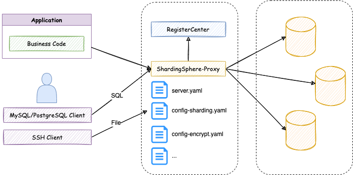

At that time, users faced the following problems:

- Different types of clients are required to operate data and manage ShardingSphere configuration.
- Multiple logical databases require multiple YAML files.
- Editing a YAML file requires writing permissions.
- Need to restart ShardingSphere after editing YAML.

<a id="user-manual-shardingsphere-proxy-distsql--after"></a>

### After

With the advent of DistSQL, the operation of ShardingSphere has also changed:


Now, the user experience has been greatly improved:

- Uses the same client to operate data and ShardingSphere configuration.
- No need for additional YAML files, and the logical databases are managed through DistSQL.
- Editing permissions for files are no longer required, and configuration is managed through DistSQL.
- Configuration changes take effect in real-time without restarting ShardingSphere.

<a id="user-manual-shardingsphere-proxy-distsql--limitations"></a>

## Limitations

DistSQL can be used only with ShardingSphere-Proxy, not with ShardingSphere-JDBC for now.

<a id="user-manual-shardingsphere-proxy-distsql--how-it-works"></a>

## How it works

Like standard SQL, DistSQL is recognized by the parsing engine of ShardingSphere. It converts the input statement into an abstract syntax tree and then generates the `Statement` corresponding to each grammar, which is processed by the appropriate `Handler`.


<a id="user-manual-shardingsphere-proxy-distsql--related-references"></a>

## Related References

[User Manual: DistSQL](#user-manual-shardingsphere-proxy-distsql)

---

<a id="user-manual-shardingsphere-proxy-distsql-syntax"></a>

<!-- source_url: https://shardingsphere.apache.org/document/current/en/user-manual/shardingsphere-proxy/distsql/syntax/ -->

<!-- page_index: 116 -->

# Syntax :: ShardingSphere

Retro

Eye care

Haitian

Deep

Dark

Default

[Edit this page](https://github.com/apache/shardingsphere/tree/master/docs/document/content/user-manual/shardingsphere-proxy/distsql/syntax/_index.en.md "Edit this page")

Syntax

- [Syntax Rule](#user-manual-shardingsphere-proxy-distsql-syntax--syntax-rule)
  - [Identifier](#user-manual-shardingsphere-proxy-distsql-syntax--identifier)
  - [Literal](#user-manual-shardingsphere-proxy-distsql-syntax--literal)
  - [Special Instructions](#user-manual-shardingsphere-proxy-distsql-syntax--special-instructions)

This chapter describes the syntax of DistSQL in detail, and introduces use of DistSQL with practical examples.

<a id="user-manual-shardingsphere-proxy-distsql-syntax--syntax-rule"></a>

## Syntax Rule

In DistSQL statement, except for keywords, the input format of other elements shall conform to the following rules.

<a id="user-manual-shardingsphere-proxy-distsql-syntax--identifier"></a>

### Identifier

1. The identifier represents an object in the SQL statement, including:

- database name
- table name
- column name
- index name
- resource name
- rule name
- algorithm name

2. The allowed characters in the identifier are: [`a-z, A-Z, 0-9, _`] (letters, numbers, underscores) and should start with a letter.
3. When keywords or special characters appear in the identifier, use the backticks (`).

<a id="user-manual-shardingsphere-proxy-distsql-syntax--literal"></a>

### Literal

Types of literals include:

- string: enclosed in single quotes (') or double quotes (")
- int: it is generally a positive integer, such as 0-9;

Note: some DistSQL syntax allows negative values. In this case, a negative sign (-) can be added before the number, such as -1.

- boolean, containing only true & false. Case insensitive.

<a id="user-manual-shardingsphere-proxy-distsql-syntax--special-instructions"></a>

### Special Instructions

---

<a id="user-manual-shardingsphere-proxy-distsql-syntax-rdl"></a>

<!-- source_url: https://shardingsphere.apache.org/document/current/en/user-manual/shardingsphere-proxy/distsql/syntax/rdl/ -->

<!-- page_index: 117 -->

# RDL Syntax :: ShardingSphere

Retro

Eye care

Haitian

Deep

Dark

Default

[Edit this page](https://github.com/apache/shardingsphere/tree/master/docs/document/content/user-manual/shardingsphere-proxy/distsql/syntax/rdl/_index.en.md "Edit this page")

RDL Syntax

RDL (Resource & Rule Definition Language) responsible for definition of resources/rules.

---

<a id="user-manual-shardingsphere-proxy-distsql-syntax-rdl-storage-unit-definition"></a>

<!-- source_url: https://shardingsphere.apache.org/document/current/en/user-manual/shardingsphere-proxy/distsql/syntax/rdl/storage-unit-definition/ -->

<!-- page_index: 118 -->

# Storage Unit Definition :: ShardingSphere

Retro

Eye care

Haitian

Deep

Dark

Default

[Edit this page](https://github.com/apache/shardingsphere/tree/master/docs/document/content/user-manual/shardingsphere-proxy/distsql/syntax/rdl/storage-unit-definition/_index.en.md "Edit this page")

Storage Unit Definition

This chapter describes the syntax of storage unit.

---

<a id="user-manual-shardingsphere-proxy-distsql-syntax-rdl-storage-unit-definition-register-storage-unit"></a>

<!-- source_url: https://shardingsphere.apache.org/document/current/en/user-manual/shardingsphere-proxy/distsql/syntax/rdl/storage-unit-definition/register-storage-unit/ -->

<!-- page_index: 119 -->

# REGISTER STORAGE UNIT

Retro

Eye care

Haitian

Deep

Dark

Default

[Edit this page](https://github.com/apache/shardingsphere/tree/master/docs/document/content/user-manual/shardingsphere-proxy/distsql/syntax/rdl/storage-unit-definition/register-storage-unit.en.md "Edit this page")

REGISTER STORAGE UNIT

<a id="user-manual-shardingsphere-proxy-distsql-syntax-rdl-storage-unit-definition-register-storage-unit--register-storage-unit"></a>

# REGISTER STORAGE UNIT

- - [Description](#user-manual-shardingsphere-proxy-distsql-syntax-rdl-storage-unit-definition-register-storage-unit--description)
  - [Syntax](#user-manual-shardingsphere-proxy-distsql-syntax-rdl-storage-unit-definition-register-storage-unit--syntax)
  - [Supplement](#user-manual-shardingsphere-proxy-distsql-syntax-rdl-storage-unit-definition-register-storage-unit--supplement)
  - [Example](#user-manual-shardingsphere-proxy-distsql-syntax-rdl-storage-unit-definition-register-storage-unit--example)
  - [Reserved word](#user-manual-shardingsphere-proxy-distsql-syntax-rdl-storage-unit-definition-register-storage-unit--reserved-word)
  - [Related links](#user-manual-shardingsphere-proxy-distsql-syntax-rdl-storage-unit-definition-register-storage-unit--related-links)
<a id="user-manual-shardingsphere-proxy-distsql-syntax-rdl-storage-unit-definition-register-storage-unit--description"></a>

### Description

The `REGISTER STORAGE UNIT` syntax is used to register storage unit for the currently selected logical database.

<a id="user-manual-shardingsphere-proxy-distsql-syntax-rdl-storage-unit-definition-register-storage-unit--syntax"></a>

### Syntax

Grammar
Railroad diagram

```sql
RegisterStorageUnit ::=
  'REGISTER' 'STORAGE' 'UNIT' ifNotExists? storageUnitsDefinition (',' checkPrivileges)?

storageUnitsDefinition ::=
  storageUnitDefinition (',' storageUnitDefinition)*

storageUnitDefinition ::=
  storageUnitName '(' ('HOST' '=' hostName ',' 'PORT' '=' port ',' 'DB' '=' dbName | 'URL' '=' url) ',' 'USER' '=' user (',' 'PASSWORD' '=' password)? (',' propertiesDefinition)?')'

ifNotExists ::=
  'IF' 'NOT' 'EXISTS'

storageUnitName ::=
  identifier

hostname ::=
  string
    
port ::=
  int

dbName ::=
  string

url ::=
  string

user ::=
  string

password ::=
  string

propertiesDefinition ::=
  'PROPERTIES' '(' key '=' value (',' key '=' value)* ')'

key ::=
  string

value ::=
  literal

checkPrivileges ::=
  'CHECK_PRIVILEGES' '=' privilegeType (',' privilegeType)*

privilegeType ::=
  identifier
```

<iframe frameborder="0" height="100%" id="diagram" name="diagram" width="100%"></iframe>

<a id="user-manual-shardingsphere-proxy-distsql-syntax-rdl-storage-unit-definition-register-storage-unit--supplement"></a>

### Supplement

- Before register storage units, please confirm that a database has been created in Proxy, and execute the `use` command to successfully select a database;
- Confirm that the registered storage unit can be connected normally, otherwise it will not be added successfully;
- `storageUnitName` is case-sensitive;
- `storageUnitName` needs to be unique within the current database;
- `storageUnitName` name only allows letters, numbers and `_`, and must start with a letter;
- `PROPERTIES` is optional, used to customize connection pool properties, `key` must be the same as the connection pool
  property name;
- `CHECK_PRIVILEGES` can be specified to check privileges of the storage unit user. The supported types of `privilegeType` are `SELECT`, `XA`, `PIPELINE`, and `NONE`. The default value is `SELECT`. When `NONE` is included in the type list, the privilege check is skipped.

<a id="user-manual-shardingsphere-proxy-distsql-syntax-rdl-storage-unit-definition-register-storage-unit--example"></a>

### Example

- Register storage unit using HOST & PORT method

```sql
REGISTER STORAGE UNIT ds_0 (
    HOST="127.0.0.1",
    PORT=3306,
    DB="db_0",
    USER="root",
    PASSWORD="root"
);
```

- Register storage unit and set connection pool properties using HOST & PORT method

```sql
REGISTER STORAGE UNIT ds_1 (
    HOST="127.0.0.1",
    PORT=3306,
    DB="db_1",
    USER="root",
    PASSWORD="root",
    PROPERTIES("maximumPoolSize"=10)
);
```

- Register storage unit and set connection pool properties using URL method

```sql
REGISTER STORAGE UNIT ds_2 (
    URL="jdbc:mysql://127.0.0.1:3306/db_2?serverTimezone=UTC&useSSL=false&allowPublicKeyRetrieval=true",
    USER="root",
    PASSWORD="root",
    PROPERTIES("maximumPoolSize"=10,"idleTimeout"=30000)
);
```

- Register storage unit with `ifNotExists` clause

```sql
REGISTER STORAGE UNIT IF NOT EXISTS ds_0 (
    HOST="127.0.0.1",
    PORT=3306,
    DB="db_0",
    USER="root",
    PASSWORD="root"
);
```

- Check `SELECT`, `XA` and `PIPELINE` privileges when registering

```sql
REGISTER STORAGE UNIT ds_3 (
    URL="jdbc:mysql://127.0.0.1:3306/db_3?serverTimezone=UTC&useSSL=false&allowPublicKeyRetrieval=true",
    USER="root",
    PASSWORD="root",
    PROPERTIES("maximumPoolSize"=10,"idleTimeout"=30000)
), CHECK_PRIVILEGES=SELECT,XA,PIPELINE;
```

<a id="user-manual-shardingsphere-proxy-distsql-syntax-rdl-storage-unit-definition-register-storage-unit--reserved-word"></a>

### Reserved word

`REGISTER`, `STORAGE`, `UNIT`, `HOST`, `PORT`, `DB`, `USER`, `PASSWORD`, `PROPERTIES`, `URL`, `CHECK_PRIVILEGES`

<a id="user-manual-shardingsphere-proxy-distsql-syntax-rdl-storage-unit-definition-register-storage-unit--related-links"></a>

### Related links

---

<a id="user-manual-shardingsphere-proxy-distsql-syntax-rdl-storage-unit-definition-alter-storage-unit"></a>

<!-- source_url: https://shardingsphere.apache.org/document/current/en/user-manual/shardingsphere-proxy/distsql/syntax/rdl/storage-unit-definition/alter-storage-unit/ -->

<!-- page_index: 120 -->

# ALTER STORAGE UNIT

Retro

Eye care

Haitian

Deep

Dark

Default

[Edit this page](https://github.com/apache/shardingsphere/tree/master/docs/document/content/user-manual/shardingsphere-proxy/distsql/syntax/rdl/storage-unit-definition/alter-storage-unit.en.md "Edit this page")

ALTER STORAGE UNIT

<a id="user-manual-shardingsphere-proxy-distsql-syntax-rdl-storage-unit-definition-alter-storage-unit--alter-storage-unit"></a>

# ALTER STORAGE UNIT

- - [Description](#user-manual-shardingsphere-proxy-distsql-syntax-rdl-storage-unit-definition-alter-storage-unit--description)
  - [Syntax](#user-manual-shardingsphere-proxy-distsql-syntax-rdl-storage-unit-definition-alter-storage-unit--syntax)
  - [Supplement](#user-manual-shardingsphere-proxy-distsql-syntax-rdl-storage-unit-definition-alter-storage-unit--supplement)
  - [Example](#user-manual-shardingsphere-proxy-distsql-syntax-rdl-storage-unit-definition-alter-storage-unit--example)
  - [Reserved word](#user-manual-shardingsphere-proxy-distsql-syntax-rdl-storage-unit-definition-alter-storage-unit--reserved-word)
  - [Related links](#user-manual-shardingsphere-proxy-distsql-syntax-rdl-storage-unit-definition-alter-storage-unit--related-links)
<a id="user-manual-shardingsphere-proxy-distsql-syntax-rdl-storage-unit-definition-alter-storage-unit--description"></a>

### Description

The `ALTER STORAGE UNIT` syntax is used to alter storage units for the currently selected logical database.

<a id="user-manual-shardingsphere-proxy-distsql-syntax-rdl-storage-unit-definition-alter-storage-unit--syntax"></a>

### Syntax

Grammar
Railroad diagram

```sql
AlterStorageUnit ::=
  'ALTER' 'STORAGE' 'UNIT' storageUnitsDefinition (',' checkPrivileges)?

storageUnitsDefinition ::=
  storageUnitDefinition (',' storageUnitDefinition)*

storageUnitDefinition ::=
  storageUnitName '(' ('HOST' '=' hostName ',' 'PORT' '=' port ',' 'DB' '=' dbName | 'URL' '=' url) ',' 'USER' '=' user (',' 'PASSWORD' '=' password)? (',' propertiesDefinition)?')'

storageUnitName ::=
  identifier

hostname ::=
  string
    
port ::=
  int

dbName ::=
  string

url ::=
  string

user ::=
  string

password ::=
  string

propertiesDefinition ::=
  'PROPERTIES' '(' key '=' value (',' key '=' value)* ')'

key ::=
  string

value ::=
  literal

checkPrivileges ::=
  'CHECK_PRIVILEGES' '=' privilegeType (',' privilegeType)*

privilegeType ::=
  identifier
```

<iframe frameborder="0" height="100%" id="diagram" name="diagram" width="100%"></iframe>

<a id="user-manual-shardingsphere-proxy-distsql-syntax-rdl-storage-unit-definition-alter-storage-unit--supplement"></a>

### Supplement

- Before altering the storage units, please confirm that a database exists in Proxy, and execute the `use` command to select a database;
- `ALTER STORAGE UNIT` is not allowed to change the real data source associated with this storageUnit (determined by host, port and db);
- `ALTER STORAGE UNIT` will switch the connection pool. This operation may affect the ongoing business, please use it with caution;
- Please confirm that the storage unit to be altered can be connected successfully, otherwise the altering will fail;
- `PROPERTIES` is optional, used to customize connection pool properties, `key` must be the same as the connection pool property name;
- `CHECK_PRIVILEGES` can be specified to check privileges of the storage unit user. The supported types of `privilegeType` are `SELECT`, `XA`, `PIPELINE`, and `NONE`. The default value is `SELECT`. When `NONE` is included in the type list, the privilege check is skipped.

<a id="user-manual-shardingsphere-proxy-distsql-syntax-rdl-storage-unit-definition-alter-storage-unit--example"></a>

### Example

- Alter storage unit using HOST & PORT method

```sql
ALTER STORAGE UNIT ds_0 (
    HOST="127.0.0.1",
    PORT=3306,
    DB="db_0",
    USER="root",
    PASSWORD="root"
);
```

- Alter storage unit and set connection pool properties using HOST & PORT method

```sql
ALTER STORAGE UNIT ds_1 (
    HOST="127.0.0.1",
    PORT=3306,
    DB="db_1",
    USER="root",
    PASSWORD="root",
    PROPERTIES("maximumPoolSize"=10)
);
```

- Alter storage unit and set connection pool properties using URL method

```sql
ALTER STORAGE UNIT ds_2 (
    URL="jdbc:mysql://127.0.0.1:3306/db_2?serverTimezone=UTC&useSSL=false&allowPublicKeyRetrieval=true",
    USER="root",
    PASSWORD="root",
    PROPERTIES("maximumPoolSize"=10,"idleTimeout"=30000)
);
```

- Check `SELECT`, `XA` and `PIPELINE` privileges when altering

```sql
ALTER STORAGE UNIT ds_2 (
    URL="jdbc:mysql://127.0.0.1:3306/db_2?serverTimezone=UTC&useSSL=false&allowPublicKeyRetrieval=true",
    USER="root",
    PASSWORD="root",
    PROPERTIES("maximumPoolSize"=10,"idleTimeout"=30000)
), CHECK_PRIVILEGES=SELECT,XA,PIPELINE;
```

<a id="user-manual-shardingsphere-proxy-distsql-syntax-rdl-storage-unit-definition-alter-storage-unit--reserved-word"></a>

### Reserved word

`ALTER`, `STORAGE`, `UNIT`, `HOST`, `PORT`, `DB`, `USER`, `PASSWORD`, `PROPERTIES`, `URL`, `CHECK_PRIVILEGES`

<a id="user-manual-shardingsphere-proxy-distsql-syntax-rdl-storage-unit-definition-alter-storage-unit--related-links"></a>

### Related links

---

<a id="user-manual-shardingsphere-proxy-distsql-syntax-rdl-storage-unit-definition-unregister-storage-unit"></a>

<!-- source_url: https://shardingsphere.apache.org/document/current/en/user-manual/shardingsphere-proxy/distsql/syntax/rdl/storage-unit-definition/unregister-storage-unit/ -->

<!-- page_index: 121 -->

# UNREGISTER STORAGE UNIT

Retro

Eye care

Haitian

Deep

Dark

Default

[Edit this page](https://github.com/apache/shardingsphere/tree/master/docs/document/content/user-manual/shardingsphere-proxy/distsql/syntax/rdl/storage-unit-definition/unregister-storage-unit.en.md "Edit this page")

UNREGISTER STORAGE UNIT

<a id="user-manual-shardingsphere-proxy-distsql-syntax-rdl-storage-unit-definition-unregister-storage-unit--unregister-storage-unit"></a>

# UNREGISTER STORAGE UNIT

- - [Description](#user-manual-shardingsphere-proxy-distsql-syntax-rdl-storage-unit-definition-unregister-storage-unit--description)
  - [Syntax](#user-manual-shardingsphere-proxy-distsql-syntax-rdl-storage-unit-definition-unregister-storage-unit--syntax)
  - [Supplement](#user-manual-shardingsphere-proxy-distsql-syntax-rdl-storage-unit-definition-unregister-storage-unit--supplement)
  - [Example](#user-manual-shardingsphere-proxy-distsql-syntax-rdl-storage-unit-definition-unregister-storage-unit--example)
  - [Reserved word](#user-manual-shardingsphere-proxy-distsql-syntax-rdl-storage-unit-definition-unregister-storage-unit--reserved-word)
  - [Related links](#user-manual-shardingsphere-proxy-distsql-syntax-rdl-storage-unit-definition-unregister-storage-unit--related-links)
<a id="user-manual-shardingsphere-proxy-distsql-syntax-rdl-storage-unit-definition-unregister-storage-unit--description"></a>

### Description

The `UNREGISTER STORAGE UNIT` syntax is used to unregister storage unit from the current database

<a id="user-manual-shardingsphere-proxy-distsql-syntax-rdl-storage-unit-definition-unregister-storage-unit--syntax"></a>

### Syntax

Grammar
Railroad diagram

```sql
UnregisterStorageUnit ::=
  'UNREGISTER' 'STORAGE' 'UNIT' ifExists? storageUnitName (',' storageUnitName)* ignoreTables?

ifExists ::=
  'IF' 'EXISTS'

storageUnitName ::=
  identifier

ignoreTables ::=
  'IGNORE' ('SINGLE')? (',')? ('BROADCAST')? 'TABLES'
```

<iframe frameborder="0" height="100%" id="diagram" name="diagram" width="100%"></iframe>

<a id="user-manual-shardingsphere-proxy-distsql-syntax-rdl-storage-unit-definition-unregister-storage-unit--supplement"></a>

### Supplement

- `UNREGISTER STORAGE UNIT` will only unregister storage unit in Proxy, the real data source corresponding to the storage unit will not be
  unregistered;
- Unable to unregister storage unit already used by rules. `Storage unit are still in used.` will be prompted when removing
  storage units used by rules;
- The storage unit need to be removed only contains `SINGLE RULE`, `BROADCAST RULE` and when the user confirms that this restriction
  can be ignored, the `IGNORE SINGLE TABLES`, `IGNORE BROADCAST TABLES`, `IGNORE SINGLE, BROADCAST TABLES` keyword can be added to remove the storage unit;
- `ifExists` clause is used for avoid `Storage unit not exists` error.

<a id="user-manual-shardingsphere-proxy-distsql-syntax-rdl-storage-unit-definition-unregister-storage-unit--example"></a>

### Example

- Unregister a storage unit

```sql
UNREGISTER STORAGE UNIT ds_0;
```

- Unregister multiple storage units

```sql
UNREGISTER STORAGE UNIT ds_0, ds_1;
```

- Unregister storage unit and ignore single tables

```sql
UNREGISTER STORAGE UNIT ds_0 IGNORE SINGLE TABLES;
```

- Unregister storage unit and ignore broadcast tables

```sql
UNREGISTER STORAGE UNIT ds_0 IGNORE BROADCAST TABLES;
```

- Unregister storage unit, ignore single and broadcast tables

```sql
UNREGISTER STORAGE UNIT ds_0 IGNORE SINGLE, BROADCAST TABLES;
```

- Unregister storage unit with `ifExists` clause

```sql
UNREGISTER STORAGE UNIT IF EXISTS ds_0;
```

<a id="user-manual-shardingsphere-proxy-distsql-syntax-rdl-storage-unit-definition-unregister-storage-unit--reserved-word"></a>

### Reserved word

`UNREGISTER`, `STORAGE`, `UNIT`, `IF`, `EXISTS`, `IGNORE`, `SINGLE`, `BROADCAST`, `TABLES`

<a id="user-manual-shardingsphere-proxy-distsql-syntax-rdl-storage-unit-definition-unregister-storage-unit--related-links"></a>

### Related links

---

<a id="user-manual-shardingsphere-proxy-distsql-syntax-rdl-rule-definition"></a>

<!-- source_url: https://shardingsphere.apache.org/document/current/en/user-manual/shardingsphere-proxy/distsql/syntax/rdl/rule-definition/ -->

<!-- page_index: 122 -->

# Rule Definition :: ShardingSphere

Retro

Eye care

Haitian

Deep

Dark

Default

[Edit this page](https://github.com/apache/shardingsphere/tree/master/docs/document/content/user-manual/shardingsphere-proxy/distsql/syntax/rdl/rule-definition/_index.en.md "Edit this page")

Rule Definition

This chapter describes the syntax of rule definition.

---

<a id="user-manual-shardingsphere-proxy-distsql-syntax-rdl-rule-definition-sharding"></a>

<!-- source_url: https://shardingsphere.apache.org/document/current/en/user-manual/shardingsphere-proxy/distsql/syntax/rdl/rule-definition/sharding/ -->

<!-- page_index: 123 -->

# Sharding :: ShardingSphere

Retro

Eye care

Haitian

Deep

Dark

Default

[Edit this page](https://github.com/apache/shardingsphere/tree/master/docs/document/content/user-manual/shardingsphere-proxy/distsql/syntax/rdl/rule-definition/sharding/_index.en.md "Edit this page")

Sharding

This chapter describes the syntax of sharding.

---

<a id="user-manual-shardingsphere-proxy-distsql-syntax-rdl-rule-definition-sharding-create-sharding-table-rule"></a>

<!-- source_url: https://shardingsphere.apache.org/document/current/en/user-manual/shardingsphere-proxy/distsql/syntax/rdl/rule-definition/sharding/create-sharding-table-rule/ -->

<!-- page_index: 124 -->

# CREATE SHARDING TABLE RULE

Retro

Eye care

Haitian

Deep

Dark

Default

[Edit this page](https://github.com/apache/shardingsphere/tree/master/docs/document/content/user-manual/shardingsphere-proxy/distsql/syntax/rdl/rule-definition/sharding/create-sharding-table-rule.en.md "Edit this page")

CREATE SHARDING TABLE RULE

---

<a id="user-manual-shardingsphere-proxy-distsql-syntax-rdl-rule-definition-sharding-alter-sharding-table-rule"></a>

<!-- source_url: https://shardingsphere.apache.org/document/current/en/user-manual/shardingsphere-proxy/distsql/syntax/rdl/rule-definition/sharding/alter-sharding-table-rule/ -->

<!-- page_index: 125 -->

# ALTER SHARDING TABLE RULE

Retro

Eye care

Haitian

Deep

Dark

Default

[Edit this page](https://github.com/apache/shardingsphere/tree/master/docs/document/content/user-manual/shardingsphere-proxy/distsql/syntax/rdl/rule-definition/sharding/alter-sharding-table-rule.en.md "Edit this page")

ALTER SHARDING TABLE RULE

---

<a id="user-manual-shardingsphere-proxy-distsql-syntax-rdl-rule-definition-sharding-drop-sharding-table-rule"></a>

<!-- source_url: https://shardingsphere.apache.org/document/current/en/user-manual/shardingsphere-proxy/distsql/syntax/rdl/rule-definition/sharding/drop-sharding-table-rule/ -->

<!-- page_index: 126 -->

# DROP SHARDING TABLE RULE

Retro

Eye care

Haitian

Deep

Dark

Default

[Edit this page](https://github.com/apache/shardingsphere/tree/master/docs/document/content/user-manual/shardingsphere-proxy/distsql/syntax/rdl/rule-definition/sharding/drop-sharding-table-rule.en.md "Edit this page")

DROP SHARDING TABLE RULE

<a id="user-manual-shardingsphere-proxy-distsql-syntax-rdl-rule-definition-sharding-drop-sharding-table-rule--drop-sharding-table-rule"></a>

# DROP SHARDING TABLE RULE

- [Description](#user-manual-shardingsphere-proxy-distsql-syntax-rdl-rule-definition-sharding-drop-sharding-table-rule--description)
  - [Syntax](#user-manual-shardingsphere-proxy-distsql-syntax-rdl-rule-definition-sharding-drop-sharding-table-rule--syntax)
  - [Supplement](#user-manual-shardingsphere-proxy-distsql-syntax-rdl-rule-definition-sharding-drop-sharding-table-rule--supplement)
  - [Example](#user-manual-shardingsphere-proxy-distsql-syntax-rdl-rule-definition-sharding-drop-sharding-table-rule--example)
  - [Reserved word](#user-manual-shardingsphere-proxy-distsql-syntax-rdl-rule-definition-sharding-drop-sharding-table-rule--reserved-word)
  - [Related links](#user-manual-shardingsphere-proxy-distsql-syntax-rdl-rule-definition-sharding-drop-sharding-table-rule--related-links)
<a id="user-manual-shardingsphere-proxy-distsql-syntax-rdl-rule-definition-sharding-drop-sharding-table-rule--description"></a>

## Description

The `DROP SHARDING TABLE RULE` syntax is used to drop sharding table rule for specified database.

<a id="user-manual-shardingsphere-proxy-distsql-syntax-rdl-rule-definition-sharding-drop-sharding-table-rule--syntax"></a>

### Syntax

Grammar
Railroad diagram

```sql
DropShardingTableRule ::=
  'DROP' 'SHARDING' 'TABLE' 'RULE' ifExists? ruleName (',' ruleName)*  ('FROM' databaseName)?

ifExists ::=
  'IF' 'EXISTS'

ruleName ::=
  identifier

databaseName ::=
  identifier
```

<iframe frameborder="0" height="100%" id="diagram" name="diagram" width="100%"></iframe>

<a id="user-manual-shardingsphere-proxy-distsql-syntax-rdl-rule-definition-sharding-drop-sharding-table-rule--supplement"></a>

### Supplement

- When `databaseName` is not specified, the default is the currently used `DATABASE`. If `DATABASE` is not used, `No database selected` will be prompted;
- `ifExists` clause is used to avoid `Sharding rule not exists` error.

<a id="user-manual-shardingsphere-proxy-distsql-syntax-rdl-rule-definition-sharding-drop-sharding-table-rule--example"></a>

### Example

- Drop mutiple sharding table rules for specified database

```sql
DROP SHARDING TABLE RULE t_order, t_order_item FROM sharding_db;
```

- Drop a sharding table rule for current database

```sql
DROP SHARDING TABLE RULE t_order;
```

- Drop sharding table rule with `ifExists` clause

```sql
DROP SHARDING TABLE RULE IF EXISTS t_order;
```

<a id="user-manual-shardingsphere-proxy-distsql-syntax-rdl-rule-definition-sharding-drop-sharding-table-rule--reserved-word"></a>

### Reserved word

`DROP`, `SHARDING`, `TABLE`, `RULE`, `FROM`

<a id="user-manual-shardingsphere-proxy-distsql-syntax-rdl-rule-definition-sharding-drop-sharding-table-rule--related-links"></a>

### Related links

---

<a id="user-manual-shardingsphere-proxy-distsql-syntax-rdl-rule-definition-sharding-create-default-sharding-strategy"></a>

<!-- source_url: https://shardingsphere.apache.org/document/current/en/user-manual/shardingsphere-proxy/distsql/syntax/rdl/rule-definition/sharding/create-default-sharding-strategy/ -->

<!-- page_index: 127 -->

# CREATE DEFAULT SHARDING STRATEGY

Retro

Eye care

Haitian

Deep

Dark

Default

[Edit this page](https://github.com/apache/shardingsphere/tree/master/docs/document/content/user-manual/shardingsphere-proxy/distsql/syntax/rdl/rule-definition/sharding/create-default-sharding-strategy.en.md "Edit this page")

CREATE DEFAULT SHARDING STRATEGY

---

<a id="user-manual-shardingsphere-proxy-distsql-syntax-rdl-rule-definition-sharding-alter-default-sharding-strategy"></a>

<!-- source_url: https://shardingsphere.apache.org/document/current/en/user-manual/shardingsphere-proxy/distsql/syntax/rdl/rule-definition/sharding/alter-default-sharding-strategy/ -->

<!-- page_index: 128 -->

# ALTER DEFAULT SHARDING STRATEGY

Retro

Eye care

Haitian

Deep

Dark

Default

[Edit this page](https://github.com/apache/shardingsphere/tree/master/docs/document/content/user-manual/shardingsphere-proxy/distsql/syntax/rdl/rule-definition/sharding/alter-default-sharding-strategy.en.md "Edit this page")

ALTER DEFAULT SHARDING STRATEGY

---

<a id="user-manual-shardingsphere-proxy-distsql-syntax-rdl-rule-definition-sharding-drop-default-sharding-strategy"></a>

<!-- source_url: https://shardingsphere.apache.org/document/current/en/user-manual/shardingsphere-proxy/distsql/syntax/rdl/rule-definition/sharding/drop-default-sharding-strategy/ -->

<!-- page_index: 129 -->

# DROP DEFAULT SHARDING STRATEGY

Retro

Eye care

Haitian

Deep

Dark

Default

[Edit this page](https://github.com/apache/shardingsphere/tree/master/docs/document/content/user-manual/shardingsphere-proxy/distsql/syntax/rdl/rule-definition/sharding/drop-default-sharding-strategy.en.md "Edit this page")

DROP DEFAULT SHARDING STRATEGY

<a id="user-manual-shardingsphere-proxy-distsql-syntax-rdl-rule-definition-sharding-drop-default-sharding-strategy--drop-default-sharding-strategy"></a>

# DROP DEFAULT SHARDING STRATEGY

- [Description](#user-manual-shardingsphere-proxy-distsql-syntax-rdl-rule-definition-sharding-drop-default-sharding-strategy--description)
  - [Syntax](#user-manual-shardingsphere-proxy-distsql-syntax-rdl-rule-definition-sharding-drop-default-sharding-strategy--syntax)
  - [Supplement](#user-manual-shardingsphere-proxy-distsql-syntax-rdl-rule-definition-sharding-drop-default-sharding-strategy--supplement)
  - [Example](#user-manual-shardingsphere-proxy-distsql-syntax-rdl-rule-definition-sharding-drop-default-sharding-strategy--example)
  - [Reserved word](#user-manual-shardingsphere-proxy-distsql-syntax-rdl-rule-definition-sharding-drop-default-sharding-strategy--reserved-word)
  - [Related links](#user-manual-shardingsphere-proxy-distsql-syntax-rdl-rule-definition-sharding-drop-default-sharding-strategy--related-links)
<a id="user-manual-shardingsphere-proxy-distsql-syntax-rdl-rule-definition-sharding-drop-default-sharding-strategy--description"></a>

## Description

The `DROP DEFAULT SHARDING STRATEGY` syntax is used to drop default sharding strategy for specified database.

<a id="user-manual-shardingsphere-proxy-distsql-syntax-rdl-rule-definition-sharding-drop-default-sharding-strategy--syntax"></a>

### Syntax

Grammar
Railroad diagram

```sql
DropDefaultShardingStrategy ::=
  'DROP' 'DEFAULT' 'SHARDING' ('TABLE' | 'DATABASE') 'STRATEGY' ifExists? ('FROM' databaseName)?

ifExists ::=
  'IF' 'EXISTS'

databaseName ::=
  identifier
```

<iframe frameborder="0" height="100%" id="diagram" name="diagram" width="100%"></iframe>

<a id="user-manual-shardingsphere-proxy-distsql-syntax-rdl-rule-definition-sharding-drop-default-sharding-strategy--supplement"></a>

### Supplement

- When `databaseName` is not specified, the default is the currently used `DATABASE`. If `DATABASE` is not used, `No database selected` will be prompted;
- `ifExists` clause is used for avoid `Default sharding strategy not exists` error.

<a id="user-manual-shardingsphere-proxy-distsql-syntax-rdl-rule-definition-sharding-drop-default-sharding-strategy--example"></a>

### Example

- Drop default sharding table strategy for specified database

```sql
DROP DEFAULT SHARDING TABLE STRATEGY FROM sharding_db;
```

- Drop default sharding database strategy for current database

```sql
DROP DEFAULT SHARDING DATABASE STRATEGY;
```

- Drop default sharding table strategy with `ifExists` clause

```sql
DROP DEFAULT SHARDING TABLE STRATEGY IF EXISTS;
```

- Drop default sharding database strategy with `ifExists` clause

```sql
DROP DEFAULT SHARDING DATABASE STRATEGY IF EXISTS;
```

<a id="user-manual-shardingsphere-proxy-distsql-syntax-rdl-rule-definition-sharding-drop-default-sharding-strategy--reserved-word"></a>

### Reserved word

`DROP`, `DEFAULT` , `SHARDING`, `TABLE`, `DATABASE` ,`STRATEGY`, `FROM`

<a id="user-manual-shardingsphere-proxy-distsql-syntax-rdl-rule-definition-sharding-drop-default-sharding-strategy--related-links"></a>

### Related links

---

<a id="user-manual-shardingsphere-proxy-distsql-syntax-rdl-rule-definition-sharding-create-sharding-key-generate-strategy"></a>

<!-- source_url: https://shardingsphere.apache.org/document/current/en/user-manual/shardingsphere-proxy/distsql/syntax/rdl/rule-definition/sharding/create-sharding-key-generate-strategy/ -->

<!-- page_index: 130 -->

# CREATE SHARDING KEY GENERATE STRATEGY

Retro

Eye care

Haitian

Deep

Dark

Default

[Edit this page](https://github.com/apache/shardingsphere/tree/master/docs/document/content/user-manual/shardingsphere-proxy/distsql/syntax/rdl/rule-definition/sharding/create-sharding-key-generate-strategy.en.md "Edit this page")

CREATE SHARDING KEY GENERATE STRATEGY

---

<a id="user-manual-shardingsphere-proxy-distsql-syntax-rdl-rule-definition-sharding-alter-sharding-key-generate-strategy"></a>

<!-- source_url: https://shardingsphere.apache.org/document/current/en/user-manual/shardingsphere-proxy/distsql/syntax/rdl/rule-definition/sharding/alter-sharding-key-generate-strategy/ -->

<!-- page_index: 131 -->

# ALTER SHARDING KEY GENERATE STRATEGY

Retro

Eye care

Haitian

Deep

Dark

Default

[Edit this page](https://github.com/apache/shardingsphere/tree/master/docs/document/content/user-manual/shardingsphere-proxy/distsql/syntax/rdl/rule-definition/sharding/alter-sharding-key-generate-strategy.en.md "Edit this page")

ALTER SHARDING KEY GENERATE STRATEGY

---

<a id="user-manual-shardingsphere-proxy-distsql-syntax-rdl-rule-definition-sharding-create-sharding-key-generator"></a>

<!-- source_url: https://shardingsphere.apache.org/document/current/en/user-manual/shardingsphere-proxy/distsql/syntax/rdl/rule-definition/sharding/create-sharding-key-generator/ -->

<!-- page_index: 132 -->

# CREATE SHARDING KEY GENERATOR

Retro

Eye care

Haitian

Deep

Dark

Default

[Edit this page](https://github.com/apache/shardingsphere/tree/master/docs/document/content/user-manual/shardingsphere-proxy/distsql/syntax/rdl/rule-definition/sharding/create-sharding-key-generator.en.md "Edit this page")

CREATE SHARDING KEY GENERATOR

---

<a id="user-manual-shardingsphere-proxy-distsql-syntax-rdl-rule-definition-sharding-alter-sharding-key-generator"></a>

<!-- source_url: https://shardingsphere.apache.org/document/current/en/user-manual/shardingsphere-proxy/distsql/syntax/rdl/rule-definition/sharding/alter-sharding-key-generator/ -->

<!-- page_index: 133 -->

# ALTER SHARDING KEY GENERATOR

Retro

Eye care

Haitian

Deep

Dark

Default

[Edit this page](https://github.com/apache/shardingsphere/tree/master/docs/document/content/user-manual/shardingsphere-proxy/distsql/syntax/rdl/rule-definition/sharding/alter-sharding-key-generator.en.md "Edit this page")

ALTER SHARDING KEY GENERATOR

---

<a id="user-manual-shardingsphere-proxy-distsql-syntax-rdl-rule-definition-sharding-drop-sharding-key-generate-strategy"></a>

<!-- source_url: https://shardingsphere.apache.org/document/current/en/user-manual/shardingsphere-proxy/distsql/syntax/rdl/rule-definition/sharding/drop-sharding-key-generate-strategy/ -->

<!-- page_index: 134 -->

# DROP SHARDING KEY GENERATE STRATEGY

Retro

Eye care

Haitian

Deep

Dark

Default

[Edit this page](https://github.com/apache/shardingsphere/tree/master/docs/document/content/user-manual/shardingsphere-proxy/distsql/syntax/rdl/rule-definition/sharding/drop-sharding-key-generate-strategy.en.md "Edit this page")

DROP SHARDING KEY GENERATE STRATEGY

---

<a id="user-manual-shardingsphere-proxy-distsql-syntax-rdl-rule-definition-sharding-drop-sharding-key-generator"></a>

<!-- source_url: https://shardingsphere.apache.org/document/current/en/user-manual/shardingsphere-proxy/distsql/syntax/rdl/rule-definition/sharding/drop-sharding-key-generator/ -->

<!-- page_index: 135 -->

# DROP SHARDING KEY GENERATOR

Retro

Eye care

Haitian

Deep

Dark

Default

[Edit this page](https://github.com/apache/shardingsphere/tree/master/docs/document/content/user-manual/shardingsphere-proxy/distsql/syntax/rdl/rule-definition/sharding/drop-sharding-key-generator.en.md "Edit this page")

DROP SHARDING KEY GENERATOR

<a id="user-manual-shardingsphere-proxy-distsql-syntax-rdl-rule-definition-sharding-drop-sharding-key-generator--drop-sharding-key-generator"></a>

# DROP SHARDING KEY GENERATOR

- [Description](#user-manual-shardingsphere-proxy-distsql-syntax-rdl-rule-definition-sharding-drop-sharding-key-generator--description)
  - [Syntax](#user-manual-shardingsphere-proxy-distsql-syntax-rdl-rule-definition-sharding-drop-sharding-key-generator--syntax)
  - [Supplement](#user-manual-shardingsphere-proxy-distsql-syntax-rdl-rule-definition-sharding-drop-sharding-key-generator--supplement)
  - [Example](#user-manual-shardingsphere-proxy-distsql-syntax-rdl-rule-definition-sharding-drop-sharding-key-generator--example)
  - [Reserved word](#user-manual-shardingsphere-proxy-distsql-syntax-rdl-rule-definition-sharding-drop-sharding-key-generator--reserved-word)
  - [Related links](#user-manual-shardingsphere-proxy-distsql-syntax-rdl-rule-definition-sharding-drop-sharding-key-generator--related-links)
<a id="user-manual-shardingsphere-proxy-distsql-syntax-rdl-rule-definition-sharding-drop-sharding-key-generator--description"></a>

## Description

The `DROP SHARDING KEY GENERATOR` syntax is used to drop sharding key generator for specified database.

<a id="user-manual-shardingsphere-proxy-distsql-syntax-rdl-rule-definition-sharding-drop-sharding-key-generator--syntax"></a>

### Syntax

Grammar
Railroad diagram

```sql
DropShardingKeyGenerator ::=
  'DROP' 'SHARDING' 'KEY' 'GENERATOR' ifExists? keyGeneratorName (keyGeneratorName)* ('FROM' databaseName)?

ifExists ::=
  'IF' 'EXISTS'

keyGeneratorName ::=
  identifier

databaseName ::=
  identifier
```

<iframe frameborder="0" height="100%" id="diagram" name="diagram" width="100%"></iframe>

<a id="user-manual-shardingsphere-proxy-distsql-syntax-rdl-rule-definition-sharding-drop-sharding-key-generator--supplement"></a>

### Supplement

- When `databaseName` is not specified, the default is the currently used `DATABASE`. If `DATABASE` is not used, `No database selected` will be prompted;
- `ifExists` clause is used for avoid `Sharding key generator not exists` error.

<a id="user-manual-shardingsphere-proxy-distsql-syntax-rdl-rule-definition-sharding-drop-sharding-key-generator--example"></a>

### Example

- Drop sharding key generator for specified database

```sql
DROP SHARDING KEY GENERATOR t_order_snowflake FROM sharding_db;
```

- Drop sharding key generator for current database

```sql
DROP SHARDING KEY GENERATOR t_order_snowflake;
```

- Drop sharding key generator with `ifExists` clause

```sql
DROP SHARDING KEY GENERATOR IF EXISTS t_order_snowflake;
```

<a id="user-manual-shardingsphere-proxy-distsql-syntax-rdl-rule-definition-sharding-drop-sharding-key-generator--reserved-word"></a>

### Reserved word

`DROP`, `SHARDING`, `KEY`, `GENERATOR`, `FROM`

<a id="user-manual-shardingsphere-proxy-distsql-syntax-rdl-rule-definition-sharding-drop-sharding-key-generator--related-links"></a>

### Related links

---

<a id="user-manual-shardingsphere-proxy-distsql-syntax-rdl-rule-definition-sharding-drop-sharding-algorithm"></a>

<!-- source_url: https://shardingsphere.apache.org/document/current/en/user-manual/shardingsphere-proxy/distsql/syntax/rdl/rule-definition/sharding/drop-sharding-algorithm/ -->

<!-- page_index: 136 -->

# DROP SHARDING ALGORITHM

Retro

Eye care

Haitian

Deep

Dark

Default

[Edit this page](https://github.com/apache/shardingsphere/tree/master/docs/document/content/user-manual/shardingsphere-proxy/distsql/syntax/rdl/rule-definition/sharding/drop-sharding-algorithm.en.md "Edit this page")

DROP SHARDING ALGORITHM

<a id="user-manual-shardingsphere-proxy-distsql-syntax-rdl-rule-definition-sharding-drop-sharding-algorithm--drop-sharding-algorithm"></a>

# DROP SHARDING ALGORITHM

- [Description](#user-manual-shardingsphere-proxy-distsql-syntax-rdl-rule-definition-sharding-drop-sharding-algorithm--description)
  - [Syntax](#user-manual-shardingsphere-proxy-distsql-syntax-rdl-rule-definition-sharding-drop-sharding-algorithm--syntax)
  - [Supplement](#user-manual-shardingsphere-proxy-distsql-syntax-rdl-rule-definition-sharding-drop-sharding-algorithm--supplement)
  - [Example](#user-manual-shardingsphere-proxy-distsql-syntax-rdl-rule-definition-sharding-drop-sharding-algorithm--example)
  - [Reserved word](#user-manual-shardingsphere-proxy-distsql-syntax-rdl-rule-definition-sharding-drop-sharding-algorithm--reserved-word)
  - [Related links](#user-manual-shardingsphere-proxy-distsql-syntax-rdl-rule-definition-sharding-drop-sharding-algorithm--related-links)
<a id="user-manual-shardingsphere-proxy-distsql-syntax-rdl-rule-definition-sharding-drop-sharding-algorithm--description"></a>

## Description

The `DROP SHARDING ALGORITHM` syntax is used to drop sharding algorithm for specified database.

<a id="user-manual-shardingsphere-proxy-distsql-syntax-rdl-rule-definition-sharding-drop-sharding-algorithm--syntax"></a>

### Syntax

Grammar
Railroad diagram

```sql
DropShardingAlgorithm ::=
  'DROP' 'SHARDING' 'ALGORITHM' algorithmName ifExists? ('FROM' databaseName)?

ifExists ::=
  'IF' 'EXISTS'

algorithmName ::=
  identifier

databaseName ::=
  identifier
```

<iframe frameborder="0" height="100%" id="diagram" name="diagram" width="100%"></iframe>

<a id="user-manual-shardingsphere-proxy-distsql-syntax-rdl-rule-definition-sharding-drop-sharding-algorithm--supplement"></a>

### Supplement

- When `databaseName` is not specified, the default is the currently used `DATABASE`. If `DATABASE` is not used, `No database selected` will be prompted;
- `ifExists` clause used for avoid `Sharding algorithm not exists` error.

<a id="user-manual-shardingsphere-proxy-distsql-syntax-rdl-rule-definition-sharding-drop-sharding-algorithm--example"></a>

### Example

- Drop sharding algorithm for specified database

```sql
DROP SHARDING ALGORITHM t_order_hash_mod FROM sharding_db;
```

- Drop sharding algorithm for current database

```sql
DROP SHARDING ALGORITHM t_order_hash_mod;
```

- Drop sharding algorithm with `ifExists` clause

```sql
DROP SHARDING ALGORITHM IF EXISTS t_order_hash_mod;
```

<a id="user-manual-shardingsphere-proxy-distsql-syntax-rdl-rule-definition-sharding-drop-sharding-algorithm--reserved-word"></a>

### Reserved word

`DROP`, `SHARDING`, `ALGORITHM`, `FROM`

<a id="user-manual-shardingsphere-proxy-distsql-syntax-rdl-rule-definition-sharding-drop-sharding-algorithm--related-links"></a>

### Related links

---

<a id="user-manual-shardingsphere-proxy-distsql-syntax-rdl-rule-definition-sharding-create-sharding-table-reference-rule"></a>

<!-- source_url: https://shardingsphere.apache.org/document/current/en/user-manual/shardingsphere-proxy/distsql/syntax/rdl/rule-definition/sharding/create-sharding-table-reference-rule/ -->

<!-- page_index: 137 -->

# CREATE SHARDING TABLE REFERENCE RULE

Retro

Eye care

Haitian

Deep

Dark

Default

[Edit this page](https://github.com/apache/shardingsphere/tree/master/docs/document/content/user-manual/shardingsphere-proxy/distsql/syntax/rdl/rule-definition/sharding/create-sharding-table-reference-rule.en.md "Edit this page")

CREATE SHARDING TABLE REFERENCE RULE

---

<a id="user-manual-shardingsphere-proxy-distsql-syntax-rdl-rule-definition-sharding-alter-sharding-table-reference-rule"></a>

<!-- source_url: https://shardingsphere.apache.org/document/current/en/user-manual/shardingsphere-proxy/distsql/syntax/rdl/rule-definition/sharding/alter-sharding-table-reference-rule/ -->

<!-- page_index: 138 -->

# ALTER SHARDING TABLE REFERENCE RULE

Retro

Eye care

Haitian

Deep

Dark

Default

[Edit this page](https://github.com/apache/shardingsphere/tree/master/docs/document/content/user-manual/shardingsphere-proxy/distsql/syntax/rdl/rule-definition/sharding/alter-sharding-table-reference-rule.en.md "Edit this page")

ALTER SHARDING TABLE REFERENCE RULE

---

<a id="user-manual-shardingsphere-proxy-distsql-syntax-rdl-rule-definition-sharding-drop-sharding-table-reference-rule"></a>

<!-- source_url: https://shardingsphere.apache.org/document/current/en/user-manual/shardingsphere-proxy/distsql/syntax/rdl/rule-definition/sharding/drop-sharding-table-reference-rule/ -->

<!-- page_index: 139 -->

# DROP SHARDING TABLE REFERENCE RULE

Retro

Eye care

Haitian

Deep

Dark

Default

[Edit this page](https://github.com/apache/shardingsphere/tree/master/docs/document/content/user-manual/shardingsphere-proxy/distsql/syntax/rdl/rule-definition/sharding/drop-sharding-table-reference-rule.en.md "Edit this page")

DROP SHARDING TABLE REFERENCE RULE

<a id="user-manual-shardingsphere-proxy-distsql-syntax-rdl-rule-definition-sharding-drop-sharding-table-reference-rule--drop-sharding-table-reference-rule"></a>

# DROP SHARDING TABLE REFERENCE RULE

- [Description](#user-manual-shardingsphere-proxy-distsql-syntax-rdl-rule-definition-sharding-drop-sharding-table-reference-rule--description)
  - [Syntax](#user-manual-shardingsphere-proxy-distsql-syntax-rdl-rule-definition-sharding-drop-sharding-table-reference-rule--syntax)
  - [Supplement](#user-manual-shardingsphere-proxy-distsql-syntax-rdl-rule-definition-sharding-drop-sharding-table-reference-rule--supplement)
  - [Example](#user-manual-shardingsphere-proxy-distsql-syntax-rdl-rule-definition-sharding-drop-sharding-table-reference-rule--example)
  - [Reserved word](#user-manual-shardingsphere-proxy-distsql-syntax-rdl-rule-definition-sharding-drop-sharding-table-reference-rule--reserved-word)
  - [Related links](#user-manual-shardingsphere-proxy-distsql-syntax-rdl-rule-definition-sharding-drop-sharding-table-reference-rule--related-links)
<a id="user-manual-shardingsphere-proxy-distsql-syntax-rdl-rule-definition-sharding-drop-sharding-table-reference-rule--description"></a>

## Description

The `DROP SHARDING TABLE REFERENCE RULE` syntax is used to drop specified sharding table reference rule.

<a id="user-manual-shardingsphere-proxy-distsql-syntax-rdl-rule-definition-sharding-drop-sharding-table-reference-rule--syntax"></a>

### Syntax

Grammar
Railroad diagram

```sql
DropShardingTableReferenceRule ::=
  'DROP' 'SHARDING' 'TABLE' 'REFERENCE' 'RULE' ifExists? ruleName (',' ruleName)*

ifExists ::=
  'IF' 'EXISTS'

ruleName ::=
  identifier
```

<iframe frameborder="0" height="100%" id="diagram" name="diagram" width="100%"></iframe>

<a id="user-manual-shardingsphere-proxy-distsql-syntax-rdl-rule-definition-sharding-drop-sharding-table-reference-rule--supplement"></a>

### Supplement

- `ifExists` clause is used for avoid `Sharding reference rule not exists` error.

<a id="user-manual-shardingsphere-proxy-distsql-syntax-rdl-rule-definition-sharding-drop-sharding-table-reference-rule--example"></a>

### Example

- Drop a specified sharding table reference rule

```sql
DROP SHARDING TABLE REFERENCE RULE ref_0;
```

- Drop multiple sharding table reference rules

```sql
DROP SHARDING TABLE REFERENCE RULE ref_0, ref_1;
```

- Drop sharding table reference rule with `ifExists` clause

```sql
DROP SHARDING TABLE REFERENCE RULE IF EXISTS ref_0;
```

<a id="user-manual-shardingsphere-proxy-distsql-syntax-rdl-rule-definition-sharding-drop-sharding-table-reference-rule--reserved-word"></a>

### Reserved word

`DROP`, `SHARDING`, `TABLE`, `REFERENCE`, `RULE`

<a id="user-manual-shardingsphere-proxy-distsql-syntax-rdl-rule-definition-sharding-drop-sharding-table-reference-rule--related-links"></a>

### Related links

---

<a id="user-manual-shardingsphere-proxy-distsql-syntax-rdl-rule-definition-broadcast-table"></a>

<!-- source_url: https://shardingsphere.apache.org/document/current/en/user-manual/shardingsphere-proxy/distsql/syntax/rdl/rule-definition/broadcast-table/ -->

<!-- page_index: 140 -->

# Broadcast Table :: ShardingSphere

Retro

Eye care

Haitian

Deep

Dark

Default

[Edit this page](https://github.com/apache/shardingsphere/tree/master/docs/document/content/user-manual/shardingsphere-proxy/distsql/syntax/rdl/rule-definition/broadcast-table/_index.en.md "Edit this page")

Broadcast Table

This chapter describes the syntax of broadcast table.

---

<a id="user-manual-shardingsphere-proxy-distsql-syntax-rdl-rule-definition-broadcast-table-create-broadcast-table-rule"></a>

<!-- source_url: https://shardingsphere.apache.org/document/current/en/user-manual/shardingsphere-proxy/distsql/syntax/rdl/rule-definition/broadcast-table/create-broadcast-table-rule/ -->

<!-- page_index: 141 -->

# CREATE BROADCAST TABLE RULE

Retro

Eye care

Haitian

Deep

Dark

Default

[Edit this page](https://github.com/apache/shardingsphere/tree/master/docs/document/content/user-manual/shardingsphere-proxy/distsql/syntax/rdl/rule-definition/broadcast-table/create-broadcast-table-rule.en.md "Edit this page")

CREATE BROADCAST TABLE RULE

<a id="user-manual-shardingsphere-proxy-distsql-syntax-rdl-rule-definition-broadcast-table-create-broadcast-table-rule--create-broadcast-table-rule"></a>

# CREATE BROADCAST TABLE RULE

- [Description](#user-manual-shardingsphere-proxy-distsql-syntax-rdl-rule-definition-broadcast-table-create-broadcast-table-rule--description)
  - [Syntax](#user-manual-shardingsphere-proxy-distsql-syntax-rdl-rule-definition-broadcast-table-create-broadcast-table-rule--syntax)
  - [Supplement](#user-manual-shardingsphere-proxy-distsql-syntax-rdl-rule-definition-broadcast-table-create-broadcast-table-rule--supplement)
  - [Example](#user-manual-shardingsphere-proxy-distsql-syntax-rdl-rule-definition-broadcast-table-create-broadcast-table-rule--example)
  - [Reserved word](#user-manual-shardingsphere-proxy-distsql-syntax-rdl-rule-definition-broadcast-table-create-broadcast-table-rule--reserved-word)
  - [Related links](#user-manual-shardingsphere-proxy-distsql-syntax-rdl-rule-definition-broadcast-table-create-broadcast-table-rule--related-links)
<a id="user-manual-shardingsphere-proxy-distsql-syntax-rdl-rule-definition-broadcast-table-create-broadcast-table-rule--description"></a>

## Description

The `CREATE BROADCAST TABLE RULE` syntax is used to create broadcast table rules for tables that need to be
broadcast (broadcast tables)

<a id="user-manual-shardingsphere-proxy-distsql-syntax-rdl-rule-definition-broadcast-table-create-broadcast-table-rule--syntax"></a>

### Syntax

Grammar
Railroad diagram

```sql
CreateBroadcastTableRule ::=
  'CREATE' 'BROADCAST' 'TABLE' 'RULE' ifNotExists? tableName (',' tableName)* 

ifNotExists ::=
  'IF' 'NOT' 'EXISTS'

tableName ::=
  identifier
```

<iframe frameborder="0" height="100%" id="diagram" name="diagram" width="100%"></iframe>

<a id="user-manual-shardingsphere-proxy-distsql-syntax-rdl-rule-definition-broadcast-table-create-broadcast-table-rule--supplement"></a>

### Supplement

- `tableName` can use an existing table or a table that will be created;
- `ifNotExists` clause is used for avoid `Duplicate Broadcast rule` error.

<a id="user-manual-shardingsphere-proxy-distsql-syntax-rdl-rule-definition-broadcast-table-create-broadcast-table-rule--example"></a>

### Example

<a id="user-manual-shardingsphere-proxy-distsql-syntax-rdl-rule-definition-broadcast-table-create-broadcast-table-rule--create-broadcast-table-rule-2"></a>

#### Create broadcast table rule

```sql
-- Add t_province, t_city to broadcast table rules
CREATE BROADCAST TABLE RULE t_province, t_city;
```

<a id="user-manual-shardingsphere-proxy-distsql-syntax-rdl-rule-definition-broadcast-table-create-broadcast-table-rule--create-broadcast-table-rule-with-ifnotexists-clause"></a>

#### Create broadcast table rule with `ifNotExists` clause

```sql
CREATE BROADCAST TABLE RULE IF NOT EXISTS t_province, t_city;
```

<a id="user-manual-shardingsphere-proxy-distsql-syntax-rdl-rule-definition-broadcast-table-create-broadcast-table-rule--reserved-word"></a>

### Reserved word

`CREATE`, `BROADCAST`, `TABLE`, `RULE`

<a id="user-manual-shardingsphere-proxy-distsql-syntax-rdl-rule-definition-broadcast-table-create-broadcast-table-rule--related-links"></a>

### Related links

---

<a id="user-manual-shardingsphere-proxy-distsql-syntax-rdl-rule-definition-broadcast-table-drop-broadcast-table-rule"></a>

<!-- source_url: https://shardingsphere.apache.org/document/current/en/user-manual/shardingsphere-proxy/distsql/syntax/rdl/rule-definition/broadcast-table/drop-broadcast-table-rule/ -->

<!-- page_index: 142 -->

# DROP BROADCAST TABLE RULE

Retro

Eye care

Haitian

Deep

Dark

Default

[Edit this page](https://github.com/apache/shardingsphere/tree/master/docs/document/content/user-manual/shardingsphere-proxy/distsql/syntax/rdl/rule-definition/broadcast-table/drop-broadcast-table-rule.en.md "Edit this page")

DROP BROADCAST TABLE RULE

<a id="user-manual-shardingsphere-proxy-distsql-syntax-rdl-rule-definition-broadcast-table-drop-broadcast-table-rule--drop-broadcast-table-rule"></a>

# DROP BROADCAST TABLE RULE

- [Description](#user-manual-shardingsphere-proxy-distsql-syntax-rdl-rule-definition-broadcast-table-drop-broadcast-table-rule--description)
  - [Syntax](#user-manual-shardingsphere-proxy-distsql-syntax-rdl-rule-definition-broadcast-table-drop-broadcast-table-rule--syntax)
  - [Supplement](#user-manual-shardingsphere-proxy-distsql-syntax-rdl-rule-definition-broadcast-table-drop-broadcast-table-rule--supplement)
  - [Example](#user-manual-shardingsphere-proxy-distsql-syntax-rdl-rule-definition-broadcast-table-drop-broadcast-table-rule--example)
  - [Reserved word](#user-manual-shardingsphere-proxy-distsql-syntax-rdl-rule-definition-broadcast-table-drop-broadcast-table-rule--reserved-word)
  - [Related links](#user-manual-shardingsphere-proxy-distsql-syntax-rdl-rule-definition-broadcast-table-drop-broadcast-table-rule--related-links)
<a id="user-manual-shardingsphere-proxy-distsql-syntax-rdl-rule-definition-broadcast-table-drop-broadcast-table-rule--description"></a>

## Description

The `DROP BROADCAST TABLE RULE` syntax is used to drop broadcast table rule for specified broadcast tables

<a id="user-manual-shardingsphere-proxy-distsql-syntax-rdl-rule-definition-broadcast-table-drop-broadcast-table-rule--syntax"></a>

### Syntax

Grammar
Railroad diagram

```sql
DropBroadcastTableRule ::=
  'DROP' 'BROADCAST' 'TABLE' 'RULE' ifExists? tableName (',' tableName)* 

ifExists ::=
  'IF' 'EXISTS'

tableName ::=
  identifier
```

<iframe frameborder="0" height="100%" id="diagram" name="diagram" width="100%"></iframe>

<a id="user-manual-shardingsphere-proxy-distsql-syntax-rdl-rule-definition-broadcast-table-drop-broadcast-table-rule--supplement"></a>

### Supplement

- `tableName` can use the table of existing broadcast rules;
- `ifExists` clause is used for avoid `Broadcast rule not exists` error.

<a id="user-manual-shardingsphere-proxy-distsql-syntax-rdl-rule-definition-broadcast-table-drop-broadcast-table-rule--example"></a>

### Example

- Drop broadcast table rule for specified broadcast table

```sql
DROP BROADCAST TABLE RULE t_province, t_city;
```

- Drop broadcast table rule with `ifExists` clause

```
DROP BROADCAST TABLE RULE IF EXISTS t_province, t_city;
```

<a id="user-manual-shardingsphere-proxy-distsql-syntax-rdl-rule-definition-broadcast-table-drop-broadcast-table-rule--reserved-word"></a>

### Reserved word

`DROP`, `BROADCAST`, `TABLE`, `RULE`

<a id="user-manual-shardingsphere-proxy-distsql-syntax-rdl-rule-definition-broadcast-table-drop-broadcast-table-rule--related-links"></a>

### Related links

---

<a id="user-manual-shardingsphere-proxy-distsql-syntax-rdl-rule-definition-single-table"></a>

<!-- source_url: https://shardingsphere.apache.org/document/current/en/user-manual/shardingsphere-proxy/distsql/syntax/rdl/rule-definition/single-table/ -->

<!-- page_index: 143 -->

# Single Table :: ShardingSphere

Retro

Eye care

Haitian

Deep

Dark

Default

[Edit this page](https://github.com/apache/shardingsphere/tree/master/docs/document/content/user-manual/shardingsphere-proxy/distsql/syntax/rdl/rule-definition/single-table/_index.en.md "Edit this page")

Single Table

This chapter describes the syntax of single table.

---

<a id="user-manual-shardingsphere-proxy-distsql-syntax-rdl-rule-definition-single-table-load-single-table"></a>

<!-- source_url: https://shardingsphere.apache.org/document/current/en/user-manual/shardingsphere-proxy/distsql/syntax/rdl/rule-definition/single-table/load-single-table/ -->

<!-- page_index: 144 -->

# LOAD SINGLE TABLE

Retro

Eye care

Haitian

Deep

Dark

Default

[Edit this page](https://github.com/apache/shardingsphere/tree/master/docs/document/content/user-manual/shardingsphere-proxy/distsql/syntax/rdl/rule-definition/single-table/load-single-table.en.md "Edit this page")

LOAD SINGLE TABLE

<a id="user-manual-shardingsphere-proxy-distsql-syntax-rdl-rule-definition-single-table-load-single-table--load-single-table"></a>

# LOAD SINGLE TABLE

- [Description](#user-manual-shardingsphere-proxy-distsql-syntax-rdl-rule-definition-single-table-load-single-table--description)
  - [Syntax](#user-manual-shardingsphere-proxy-distsql-syntax-rdl-rule-definition-single-table-load-single-table--syntax)
  - [Supplement](#user-manual-shardingsphere-proxy-distsql-syntax-rdl-rule-definition-single-table-load-single-table--supplement)
  - [Example](#user-manual-shardingsphere-proxy-distsql-syntax-rdl-rule-definition-single-table-load-single-table--example)
  - [Reserved word](#user-manual-shardingsphere-proxy-distsql-syntax-rdl-rule-definition-single-table-load-single-table--reserved-word)
  - [Related links](#user-manual-shardingsphere-proxy-distsql-syntax-rdl-rule-definition-single-table-load-single-table--related-links)
<a id="user-manual-shardingsphere-proxy-distsql-syntax-rdl-rule-definition-single-table-load-single-table--description"></a>

## Description

The `LOAD SINGLE TABLE` syntax is used to load single table from storage unit.

<a id="user-manual-shardingsphere-proxy-distsql-syntax-rdl-rule-definition-single-table-load-single-table--syntax"></a>

### Syntax

Grammar
Railroad diagram

```sql
loadSingleTable ::=
  'LOAD' 'SINGLE' 'TABLE' tableDefinition

tableDefinition ::=
  tableIdentifier (',' tableIdentifier)*

tableIdentifier ::=
  '*.*' | '*.*.*' | storageUnitName '.*' | storageUnitName '.*.*' | storageUnitName '.' schemaName '.*' | storageUnitName '.' tableName | storageUnitName '.' schemaName '.' tableName

storageUnitName ::=
  identifier

schemaName ::=
  identifier

tableName ::=
  identifier
```

<iframe frameborder="0" height="100%" id="diagram" name="diagram" width="100%"></iframe>

<a id="user-manual-shardingsphere-proxy-distsql-syntax-rdl-rule-definition-single-table-load-single-table--supplement"></a>

### Supplement

- support specifying schemaName in PostgreSQL and OpenGauss protocols

<a id="user-manual-shardingsphere-proxy-distsql-syntax-rdl-rule-definition-single-table-load-single-table--example"></a>

### Example

- Load specified single table

```sql
LOAD SINGLE TABLE ds_0.t_single;
```

- Load all single tables in the specified storage unit

```sql
LOAD SINGLE TABLE ds_0.*;
```

- Load all single tables

```sql
LOAD SINGLE TABLE *.*;
```

<a id="user-manual-shardingsphere-proxy-distsql-syntax-rdl-rule-definition-single-table-load-single-table--reserved-word"></a>

### Reserved word

`LOAD`, `SINGLE`, `TABLE`

<a id="user-manual-shardingsphere-proxy-distsql-syntax-rdl-rule-definition-single-table-load-single-table--related-links"></a>

### Related links

---

<a id="user-manual-shardingsphere-proxy-distsql-syntax-rdl-rule-definition-single-table-unload-single-table"></a>

<!-- source_url: https://shardingsphere.apache.org/document/current/en/user-manual/shardingsphere-proxy/distsql/syntax/rdl/rule-definition/single-table/unload-single-table/ -->

<!-- page_index: 145 -->

# UNLOAD SINGLE TABLE

Retro

Eye care

Haitian

Deep

Dark

Default

[Edit this page](https://github.com/apache/shardingsphere/tree/master/docs/document/content/user-manual/shardingsphere-proxy/distsql/syntax/rdl/rule-definition/single-table/unload-single-table.en.md "Edit this page")

UNLOAD SINGLE TABLE

<a id="user-manual-shardingsphere-proxy-distsql-syntax-rdl-rule-definition-single-table-unload-single-table--unload-single-table"></a>

# UNLOAD SINGLE TABLE

- [Description](#user-manual-shardingsphere-proxy-distsql-syntax-rdl-rule-definition-single-table-unload-single-table--description)
  - [Syntax](#user-manual-shardingsphere-proxy-distsql-syntax-rdl-rule-definition-single-table-unload-single-table--syntax)
  - [Supplement](#user-manual-shardingsphere-proxy-distsql-syntax-rdl-rule-definition-single-table-unload-single-table--supplement)
  - [Example](#user-manual-shardingsphere-proxy-distsql-syntax-rdl-rule-definition-single-table-unload-single-table--example)
  - [Reserved word](#user-manual-shardingsphere-proxy-distsql-syntax-rdl-rule-definition-single-table-unload-single-table--reserved-word)
  - [Related links](#user-manual-shardingsphere-proxy-distsql-syntax-rdl-rule-definition-single-table-unload-single-table--related-links)
<a id="user-manual-shardingsphere-proxy-distsql-syntax-rdl-rule-definition-single-table-unload-single-table--description"></a>

## Description

The `UNLOAD SINGLE TABLE` syntax is used to unload single table.

<a id="user-manual-shardingsphere-proxy-distsql-syntax-rdl-rule-definition-single-table-unload-single-table--syntax"></a>

### Syntax

Grammar
Railroad diagram

```sql
unloadSingleTable ::=
  'UNLOAD' 'SINGLE' 'TABLE' tableNames

tableNames ::=
  tableName (',' tableName)*

tableName ::=
  identifier
```

<iframe frameborder="0" height="100%" id="diagram" name="diagram" width="100%"></iframe>

<a id="user-manual-shardingsphere-proxy-distsql-syntax-rdl-rule-definition-single-table-unload-single-table--supplement"></a>

### Supplement

- Unlike loading, only the table name needs to be specified when unloading a single table

<a id="user-manual-shardingsphere-proxy-distsql-syntax-rdl-rule-definition-single-table-unload-single-table--example"></a>

### Example

- Unload specified single table

```sql
UNLOAD SINGLE TABLE t_single;
```

- Load all single tables

```sql
UNLOAD SINGLE TABLE *;
-- or
UNLOAD ALL SINGLE TABLES;
```

<a id="user-manual-shardingsphere-proxy-distsql-syntax-rdl-rule-definition-single-table-unload-single-table--reserved-word"></a>

### Reserved word

`UNLOAD`, `SINGLE`, `TABLE`, `ALL`, `TABLES`

<a id="user-manual-shardingsphere-proxy-distsql-syntax-rdl-rule-definition-single-table-unload-single-table--related-links"></a>

### Related links

---

<a id="user-manual-shardingsphere-proxy-distsql-syntax-rdl-rule-definition-single-table-set-default-single-table-storage-unit"></a>

<!-- source_url: https://shardingsphere.apache.org/document/current/en/user-manual/shardingsphere-proxy/distsql/syntax/rdl/rule-definition/single-table/set-default-single-table-storage-unit/ -->

<!-- page_index: 146 -->

# SET DEFAULT SINGLE TABLE STORAGE UNIT

Retro

Eye care

Haitian

Deep

Dark

Default

[Edit this page](https://github.com/apache/shardingsphere/tree/master/docs/document/content/user-manual/shardingsphere-proxy/distsql/syntax/rdl/rule-definition/single-table/set-default-single-table-storage-unit.en.md "Edit this page")

SET DEFAULT SINGLE TABLE STORAGE UNIT

<a id="user-manual-shardingsphere-proxy-distsql-syntax-rdl-rule-definition-single-table-set-default-single-table-storage-unit--set-default-single-table-storage-unit"></a>

# SET DEFAULT SINGLE TABLE STORAGE UNIT

- [Description](#user-manual-shardingsphere-proxy-distsql-syntax-rdl-rule-definition-single-table-set-default-single-table-storage-unit--description)
  - [Syntax](#user-manual-shardingsphere-proxy-distsql-syntax-rdl-rule-definition-single-table-set-default-single-table-storage-unit--syntax)
  - [Supplement](#user-manual-shardingsphere-proxy-distsql-syntax-rdl-rule-definition-single-table-set-default-single-table-storage-unit--supplement)
  - [Example](#user-manual-shardingsphere-proxy-distsql-syntax-rdl-rule-definition-single-table-set-default-single-table-storage-unit--example)
  - [Reserved word](#user-manual-shardingsphere-proxy-distsql-syntax-rdl-rule-definition-single-table-set-default-single-table-storage-unit--reserved-word)
  - [Related links](#user-manual-shardingsphere-proxy-distsql-syntax-rdl-rule-definition-single-table-set-default-single-table-storage-unit--related-links)
<a id="user-manual-shardingsphere-proxy-distsql-syntax-rdl-rule-definition-single-table-set-default-single-table-storage-unit--description"></a>

## Description

The `SET DEFAULT SINGLE TABLE STORAGE UNIT` syntax is used to set default single table storage unit.

<a id="user-manual-shardingsphere-proxy-distsql-syntax-rdl-rule-definition-single-table-set-default-single-table-storage-unit--syntax"></a>

### Syntax

Grammar
Railroad diagram

```sql
SetDefaultSingleTableStorageUnit ::=
  'SET' 'DEFAULT' 'SINGLE' 'TABLE' 'STORAGE' 'UNIT' singleTableDefinition

singleTableDefinition ::=
  '=' (storageUnitName | 'RANDOM')

storageUnitName ::=
  identifier
```

<iframe frameborder="0" height="100%" id="diagram" name="diagram" width="100%"></iframe>

<a id="user-manual-shardingsphere-proxy-distsql-syntax-rdl-rule-definition-single-table-set-default-single-table-storage-unit--supplement"></a>

### Supplement

- `STORAGE UNIT` needs to use storage unit managed by RDL. The `RANDOM` keyword stands for random storage.

<a id="user-manual-shardingsphere-proxy-distsql-syntax-rdl-rule-definition-single-table-set-default-single-table-storage-unit--example"></a>

### Example

- Set a default single table storage unit

```sql
SET DEFAULT SINGLE TABLE STORAGE UNIT = ds_0;
```

- Set the default single table storage unit to random storage

```sql
SET DEFAULT SINGLE TABLE STORAGE UNIT = RANDOM;
```

<a id="user-manual-shardingsphere-proxy-distsql-syntax-rdl-rule-definition-single-table-set-default-single-table-storage-unit--reserved-word"></a>

### Reserved word

`SET`, `DEFAULT`, `SINGLE`, `TABLE`, `STORAGE`, `UNIT`, `RANDOM`

<a id="user-manual-shardingsphere-proxy-distsql-syntax-rdl-rule-definition-single-table-set-default-single-table-storage-unit--related-links"></a>

### Related links

---

<a id="user-manual-shardingsphere-proxy-distsql-syntax-rdl-rule-definition-readwrite-splitting"></a>

<!-- source_url: https://shardingsphere.apache.org/document/current/en/user-manual/shardingsphere-proxy/distsql/syntax/rdl/rule-definition/readwrite-splitting/ -->

<!-- page_index: 147 -->

# Readwrite-Splitting :: ShardingSphere

Retro

Eye care

Haitian

Deep

Dark

Default

[Edit this page](https://github.com/apache/shardingsphere/tree/master/docs/document/content/user-manual/shardingsphere-proxy/distsql/syntax/rdl/rule-definition/readwrite-splitting/_index.en.md "Edit this page")

Readwrite-Splitting

This chapter describes the syntax of readwrite-splitting.

---

<a id="user-manual-shardingsphere-proxy-distsql-syntax-rdl-rule-definition-readwrite-splitting-create-readwrite-splitting-rule"></a>

<!-- source_url: https://shardingsphere.apache.org/document/current/en/user-manual/shardingsphere-proxy/distsql/syntax/rdl/rule-definition/readwrite-splitting/create-readwrite-splitting-rule/ -->

<!-- page_index: 148 -->

# CREATE READWRITE_SPLITTING RULE

Retro

Eye care

Haitian

Deep

Dark

Default

[Edit this page](https://github.com/apache/shardingsphere/tree/master/docs/document/content/user-manual/shardingsphere-proxy/distsql/syntax/rdl/rule-definition/readwrite-splitting/create-readwrite-splitting-rule.en.md "Edit this page")

CREATE READWRITE\_SPLITTING RULE

---

<a id="user-manual-shardingsphere-proxy-distsql-syntax-rdl-rule-definition-readwrite-splitting-alter-readwrite-splitting-rule"></a>

<!-- source_url: https://shardingsphere.apache.org/document/current/en/user-manual/shardingsphere-proxy/distsql/syntax/rdl/rule-definition/readwrite-splitting/alter-readwrite-splitting-rule/ -->

<!-- page_index: 149 -->

# ALTER READWRITE_SPLITTING RULE

Retro

Eye care

Haitian

Deep

Dark

Default

[Edit this page](https://github.com/apache/shardingsphere/tree/master/docs/document/content/user-manual/shardingsphere-proxy/distsql/syntax/rdl/rule-definition/readwrite-splitting/alter-readwrite-splitting-rule.en.md "Edit this page")

ALTER READWRITE\_SPLITTING RULE

---

<a id="user-manual-shardingsphere-proxy-distsql-syntax-rdl-rule-definition-readwrite-splitting-drop-readwrite-splitting-rule"></a>

<!-- source_url: https://shardingsphere.apache.org/document/current/en/user-manual/shardingsphere-proxy/distsql/syntax/rdl/rule-definition/readwrite-splitting/drop-readwrite-splitting-rule/ -->

<!-- page_index: 150 -->

# DROP READWRITE_SPLITTING RULE

Retro

Eye care

Haitian

Deep

Dark

Default

[Edit this page](https://github.com/apache/shardingsphere/tree/master/docs/document/content/user-manual/shardingsphere-proxy/distsql/syntax/rdl/rule-definition/readwrite-splitting/drop-readwrite-splitting-rule.en.md "Edit this page")

DROP READWRITE\_SPLITTING RULE

<a id="user-manual-shardingsphere-proxy-distsql-syntax-rdl-rule-definition-readwrite-splitting-drop-readwrite-splitting-rule--drop-readwrite_splitting-rule"></a>

# DROP READWRITE\_SPLITTING RULE

- [Description](#user-manual-shardingsphere-proxy-distsql-syntax-rdl-rule-definition-readwrite-splitting-drop-readwrite-splitting-rule--description)
  - [Syntax](#user-manual-shardingsphere-proxy-distsql-syntax-rdl-rule-definition-readwrite-splitting-drop-readwrite-splitting-rule--syntax)
  - [Supplement](#user-manual-shardingsphere-proxy-distsql-syntax-rdl-rule-definition-readwrite-splitting-drop-readwrite-splitting-rule--supplement)
  - [Example](#user-manual-shardingsphere-proxy-distsql-syntax-rdl-rule-definition-readwrite-splitting-drop-readwrite-splitting-rule--example)
  - [Reserved word](#user-manual-shardingsphere-proxy-distsql-syntax-rdl-rule-definition-readwrite-splitting-drop-readwrite-splitting-rule--reserved-word)
  - [Related links](#user-manual-shardingsphere-proxy-distsql-syntax-rdl-rule-definition-readwrite-splitting-drop-readwrite-splitting-rule--related-links)
<a id="user-manual-shardingsphere-proxy-distsql-syntax-rdl-rule-definition-readwrite-splitting-drop-readwrite-splitting-rule--description"></a>

## Description

The `DROP READWRITE_SPLITTING RULE` syntax is used to drop readwrite-splitting rule for specified database

<a id="user-manual-shardingsphere-proxy-distsql-syntax-rdl-rule-definition-readwrite-splitting-drop-readwrite-splitting-rule--syntax"></a>

### Syntax

Grammar
Railroad diagram

```sql
DropReadwriteSplittingRule ::=
  'DROP' 'READWRITE_SPLITTING' 'RULE' ifExists? ruleName (',' ruleName)* ('FROM' databaseName)?

ifExists ::=
  'IF' 'EXISTS'

ruleName ::=
  identifier

databaseName ::=
  identifier
```

<iframe frameborder="0" height="100%" id="diagram" name="diagram" width="100%"></iframe>

<a id="user-manual-shardingsphere-proxy-distsql-syntax-rdl-rule-definition-readwrite-splitting-drop-readwrite-splitting-rule--supplement"></a>

### Supplement

- When `databaseName` is not specified, the default is the currently used `DATABASE`. If `DATABASE` is not used, `No database selected` will be prompted;
- `ifExists` clause is used for avoid `Readwrite-splitting rule not exists` error.

<a id="user-manual-shardingsphere-proxy-distsql-syntax-rdl-rule-definition-readwrite-splitting-drop-readwrite-splitting-rule--example"></a>

### Example

- Drop readwrite-splitting rule for specified database

```sql
DROP READWRITE_SPLITTING RULE ms_group_1 FROM readwrite_splitting_db;
```

- Drop readwrite-splitting rule for current database

```sql
DROP READWRITE_SPLITTING RULE ms_group_1;
```

- Drop readwrite-splitting rule with `ifExists` clause

```sql
DROP READWRITE_SPLITTING RULE IF EXISTS ms_group_1;
```

<a id="user-manual-shardingsphere-proxy-distsql-syntax-rdl-rule-definition-readwrite-splitting-drop-readwrite-splitting-rule--reserved-word"></a>

### Reserved word

`DROP`, `READWRITE_SPLITTING`, `RULE`

<a id="user-manual-shardingsphere-proxy-distsql-syntax-rdl-rule-definition-readwrite-splitting-drop-readwrite-splitting-rule--related-links"></a>

### Related links

---

<a id="user-manual-shardingsphere-proxy-distsql-syntax-rdl-rule-definition-encrypt"></a>

<!-- source_url: https://shardingsphere.apache.org/document/current/en/user-manual/shardingsphere-proxy/distsql/syntax/rdl/rule-definition/encrypt/ -->

<!-- page_index: 151 -->

# Encrypt :: ShardingSphere

Retro

Eye care

Haitian

Deep

Dark

Default

[Edit this page](https://github.com/apache/shardingsphere/tree/master/docs/document/content/user-manual/shardingsphere-proxy/distsql/syntax/rdl/rule-definition/encrypt/_index.en.md "Edit this page")

Encrypt

This chapter describes the syntax of encrypt.

---

<a id="user-manual-shardingsphere-proxy-distsql-syntax-rdl-rule-definition-encrypt-create-encrypt-rule"></a>

<!-- source_url: https://shardingsphere.apache.org/document/current/en/user-manual/shardingsphere-proxy/distsql/syntax/rdl/rule-definition/encrypt/create-encrypt-rule/ -->

<!-- page_index: 152 -->

# CREATE ENCRYPT RULE

Retro

Eye care

Haitian

Deep

Dark

Default

[Edit this page](https://github.com/apache/shardingsphere/tree/master/docs/document/content/user-manual/shardingsphere-proxy/distsql/syntax/rdl/rule-definition/encrypt/create-encrypt-rule.en.md "Edit this page")

CREATE ENCRYPT RULE

---

<a id="user-manual-shardingsphere-proxy-distsql-syntax-rdl-rule-definition-encrypt-alter-encrypt-rule"></a>

<!-- source_url: https://shardingsphere.apache.org/document/current/en/user-manual/shardingsphere-proxy/distsql/syntax/rdl/rule-definition/encrypt/alter-encrypt-rule/ -->

<!-- page_index: 153 -->

# ALTER ENCRYPT RULE

Retro

Eye care

Haitian

Deep

Dark

Default

[Edit this page](https://github.com/apache/shardingsphere/tree/master/docs/document/content/user-manual/shardingsphere-proxy/distsql/syntax/rdl/rule-definition/encrypt/alter-encrypt-rule.en.md "Edit this page")

ALTER ENCRYPT RULE

---

<a id="user-manual-shardingsphere-proxy-distsql-syntax-rdl-rule-definition-encrypt-drop-encrypt-rule"></a>

<!-- source_url: https://shardingsphere.apache.org/document/current/en/user-manual/shardingsphere-proxy/distsql/syntax/rdl/rule-definition/encrypt/drop-encrypt-rule/ -->

<!-- page_index: 154 -->

# DROP ENCRYPT RULE

Retro

Eye care

Haitian

Deep

Dark

Default

[Edit this page](https://github.com/apache/shardingsphere/tree/master/docs/document/content/user-manual/shardingsphere-proxy/distsql/syntax/rdl/rule-definition/encrypt/drop-encrypt-rule.en.md "Edit this page")

DROP ENCRYPT RULE

<a id="user-manual-shardingsphere-proxy-distsql-syntax-rdl-rule-definition-encrypt-drop-encrypt-rule--drop-encrypt-rule"></a>

# DROP ENCRYPT RULE

- [Description](#user-manual-shardingsphere-proxy-distsql-syntax-rdl-rule-definition-encrypt-drop-encrypt-rule--description)
  - [Syntax](#user-manual-shardingsphere-proxy-distsql-syntax-rdl-rule-definition-encrypt-drop-encrypt-rule--syntax)
  - [Supplement](#user-manual-shardingsphere-proxy-distsql-syntax-rdl-rule-definition-encrypt-drop-encrypt-rule--supplement)
  - [Example](#user-manual-shardingsphere-proxy-distsql-syntax-rdl-rule-definition-encrypt-drop-encrypt-rule--example)
  - [Reserved words](#user-manual-shardingsphere-proxy-distsql-syntax-rdl-rule-definition-encrypt-drop-encrypt-rule--reserved-words)
  - [Related links](#user-manual-shardingsphere-proxy-distsql-syntax-rdl-rule-definition-encrypt-drop-encrypt-rule--related-links)
<a id="user-manual-shardingsphere-proxy-distsql-syntax-rdl-rule-definition-encrypt-drop-encrypt-rule--description"></a>

## Description

The `DROP ENCRYPT RULE` syntax is used to drop an existing encryption rule.

<a id="user-manual-shardingsphere-proxy-distsql-syntax-rdl-rule-definition-encrypt-drop-encrypt-rule--syntax"></a>

### Syntax

Grammar
Railroad diagram

```sql
DropEncryptRule ::=
  'DROP' 'ENCRYPT' 'RULE' ifExists? ruleName (',' ruleName)*

ifExists ::=
  'IF' 'EXISTS'

ruleName ::=
  identifier
```

<iframe frameborder="0" height="100%" id="diagram" name="diagram" width="100%"></iframe>

<a id="user-manual-shardingsphere-proxy-distsql-syntax-rdl-rule-definition-encrypt-drop-encrypt-rule--supplement"></a>

### Supplement

- `ifExists` clause is used for avoid `Encrypt rule not exists` error.

<a id="user-manual-shardingsphere-proxy-distsql-syntax-rdl-rule-definition-encrypt-drop-encrypt-rule--example"></a>

### Example

- Drop an encrypt rule

```sql
DROP ENCRYPT RULE t_encrypt, t_encrypt_2;
```

- Drop encrypt with `ifExists` clause

```sql
DROP ENCRYPT RULE IF EXISTS t_encrypt, t_encrypt_2;
```

<a id="user-manual-shardingsphere-proxy-distsql-syntax-rdl-rule-definition-encrypt-drop-encrypt-rule--reserved-words"></a>

### Reserved words

`DROP`, `ENCRYPT`, `RULE`

<a id="user-manual-shardingsphere-proxy-distsql-syntax-rdl-rule-definition-encrypt-drop-encrypt-rule--related-links"></a>

### Related links

---

<a id="user-manual-shardingsphere-proxy-distsql-syntax-rdl-rule-definition-mask"></a>

<!-- source_url: https://shardingsphere.apache.org/document/current/en/user-manual/shardingsphere-proxy/distsql/syntax/rdl/rule-definition/mask/ -->

<!-- page_index: 155 -->

# Mask :: ShardingSphere

Retro

Eye care

Haitian

Deep

Dark

Default

[Edit this page](https://github.com/apache/shardingsphere/tree/master/docs/document/content/user-manual/shardingsphere-proxy/distsql/syntax/rdl/rule-definition/mask/_index.en.md "Edit this page")

Mask

This chapter describes the syntax of mask.

---

<a id="user-manual-shardingsphere-proxy-distsql-syntax-rdl-rule-definition-mask-create-mask-rule"></a>

<!-- source_url: https://shardingsphere.apache.org/document/current/en/user-manual/shardingsphere-proxy/distsql/syntax/rdl/rule-definition/mask/create-mask-rule/ -->

<!-- page_index: 156 -->

# CREATE MASK RULE

Retro

Eye care

Haitian

Deep

Dark

Default

[Edit this page](https://github.com/apache/shardingsphere/tree/master/docs/document/content/user-manual/shardingsphere-proxy/distsql/syntax/rdl/rule-definition/mask/create-mask-rule.en.md "Edit this page")

CREATE MASK RULE

---

<a id="user-manual-shardingsphere-proxy-distsql-syntax-rdl-rule-definition-mask-alter-mask-rule"></a>

<!-- source_url: https://shardingsphere.apache.org/document/current/en/user-manual/shardingsphere-proxy/distsql/syntax/rdl/rule-definition/mask/alter-mask-rule/ -->

<!-- page_index: 157 -->

# ALTER MASK RULE

Retro

Eye care

Haitian

Deep

Dark

Default

[Edit this page](https://github.com/apache/shardingsphere/tree/master/docs/document/content/user-manual/shardingsphere-proxy/distsql/syntax/rdl/rule-definition/mask/alter-mask-rule.en.md "Edit this page")

ALTER MASK RULE

---

<a id="user-manual-shardingsphere-proxy-distsql-syntax-rdl-rule-definition-mask-drop-mask-rule"></a>

<!-- source_url: https://shardingsphere.apache.org/document/current/en/user-manual/shardingsphere-proxy/distsql/syntax/rdl/rule-definition/mask/drop-mask-rule/ -->

<!-- page_index: 158 -->

# DROP MASK RULE

Retro

Eye care

Haitian

Deep

Dark

Default

[Edit this page](https://github.com/apache/shardingsphere/tree/master/docs/document/content/user-manual/shardingsphere-proxy/distsql/syntax/rdl/rule-definition/mask/drop-mask-rule.en.md "Edit this page")

DROP MASK RULE

<a id="user-manual-shardingsphere-proxy-distsql-syntax-rdl-rule-definition-mask-drop-mask-rule--drop-mask-rule"></a>

# DROP MASK RULE

- [Description](#user-manual-shardingsphere-proxy-distsql-syntax-rdl-rule-definition-mask-drop-mask-rule--description)
  - [Syntax](#user-manual-shardingsphere-proxy-distsql-syntax-rdl-rule-definition-mask-drop-mask-rule--syntax)
  - [Supplement](#user-manual-shardingsphere-proxy-distsql-syntax-rdl-rule-definition-mask-drop-mask-rule--supplement)
  - [Example](#user-manual-shardingsphere-proxy-distsql-syntax-rdl-rule-definition-mask-drop-mask-rule--example)
  - [Reserved words](#user-manual-shardingsphere-proxy-distsql-syntax-rdl-rule-definition-mask-drop-mask-rule--reserved-words)
  - [Related links](#user-manual-shardingsphere-proxy-distsql-syntax-rdl-rule-definition-mask-drop-mask-rule--related-links)
<a id="user-manual-shardingsphere-proxy-distsql-syntax-rdl-rule-definition-mask-drop-mask-rule--description"></a>

## Description

The `DROP MASK RULE` syntax is used to drop existing mask rule.

<a id="user-manual-shardingsphere-proxy-distsql-syntax-rdl-rule-definition-mask-drop-mask-rule--syntax"></a>

### Syntax

Grammar
Railroad diagram

```sql
DropMaskRule ::=
  'DROP' 'MASK' 'RULE' ifExists? ruleName (',' ruleName)*

ifExists ::=
  'IF' 'EXISTS'

ruleName ::=
  identifier
```

<iframe frameborder="0" height="100%" id="diagram" name="diagram" width="100%"></iframe>

<a id="user-manual-shardingsphere-proxy-distsql-syntax-rdl-rule-definition-mask-drop-mask-rule--supplement"></a>

### Supplement

- `ifExists` clause used for avoid `Mask rule not exists` error.

<a id="user-manual-shardingsphere-proxy-distsql-syntax-rdl-rule-definition-mask-drop-mask-rule--example"></a>

### Example

- Drop mask rule

```sql
DROP MASK RULE t_mask, t_mask_1;
```

- Drop mask rule with `ifExists` clause

```sql
DROP MASK RULE IF EXISTS t_mask, t_mask_1;
```

<a id="user-manual-shardingsphere-proxy-distsql-syntax-rdl-rule-definition-mask-drop-mask-rule--reserved-words"></a>

### Reserved words

`DROP`, `MASK`, `RULE`

<a id="user-manual-shardingsphere-proxy-distsql-syntax-rdl-rule-definition-mask-drop-mask-rule--related-links"></a>

### Related links

---

<a id="user-manual-shardingsphere-proxy-distsql-syntax-rdl-rule-definition-shadow"></a>

<!-- source_url: https://shardingsphere.apache.org/document/current/en/user-manual/shardingsphere-proxy/distsql/syntax/rdl/rule-definition/shadow/ -->

<!-- page_index: 159 -->

# Shadow :: ShardingSphere

Retro

Eye care

Haitian

Deep

Dark

Default

[Edit this page](https://github.com/apache/shardingsphere/tree/master/docs/document/content/user-manual/shardingsphere-proxy/distsql/syntax/rdl/rule-definition/shadow/_index.en.md "Edit this page")

Shadow

This chapter describes the syntax of shadow.

---

<a id="user-manual-shardingsphere-proxy-distsql-syntax-rdl-rule-definition-shadow-create-shadow-rule"></a>

<!-- source_url: https://shardingsphere.apache.org/document/current/en/user-manual/shardingsphere-proxy/distsql/syntax/rdl/rule-definition/shadow/create-shadow-rule/ -->

<!-- page_index: 160 -->

# CREATE SHADOW RULE

Retro

Eye care

Haitian

Deep

Dark

Default

[Edit this page](https://github.com/apache/shardingsphere/tree/master/docs/document/content/user-manual/shardingsphere-proxy/distsql/syntax/rdl/rule-definition/shadow/create-shadow-rule.en.md "Edit this page")

CREATE SHADOW RULE

---

<a id="user-manual-shardingsphere-proxy-distsql-syntax-rdl-rule-definition-shadow-alter-shadow-rule"></a>

<!-- source_url: https://shardingsphere.apache.org/document/current/en/user-manual/shardingsphere-proxy/distsql/syntax/rdl/rule-definition/shadow/alter-shadow-rule/ -->

<!-- page_index: 161 -->

# ALTER SHADOW RULE

Retro

Eye care

Haitian

Deep

Dark

Default

[Edit this page](https://github.com/apache/shardingsphere/tree/master/docs/document/content/user-manual/shardingsphere-proxy/distsql/syntax/rdl/rule-definition/shadow/alter-shadow-rule.en.md "Edit this page")

ALTER SHADOW RULE

---

<a id="user-manual-shardingsphere-proxy-distsql-syntax-rdl-rule-definition-shadow-drop-shadow-rule"></a>

<!-- source_url: https://shardingsphere.apache.org/document/current/en/user-manual/shardingsphere-proxy/distsql/syntax/rdl/rule-definition/shadow/drop-shadow-rule/ -->

<!-- page_index: 162 -->

# DROP SHADOW RULE

Retro

Eye care

Haitian

Deep

Dark

Default

[Edit this page](https://github.com/apache/shardingsphere/tree/master/docs/document/content/user-manual/shardingsphere-proxy/distsql/syntax/rdl/rule-definition/shadow/drop-shadow-rule.en.md "Edit this page")

DROP SHADOW RULE

<a id="user-manual-shardingsphere-proxy-distsql-syntax-rdl-rule-definition-shadow-drop-shadow-rule--drop-shadow-rule"></a>

# DROP SHADOW RULE

- [Description](#user-manual-shardingsphere-proxy-distsql-syntax-rdl-rule-definition-shadow-drop-shadow-rule--description)
  - [Syntax](#user-manual-shardingsphere-proxy-distsql-syntax-rdl-rule-definition-shadow-drop-shadow-rule--syntax)
  - [Supplement](#user-manual-shardingsphere-proxy-distsql-syntax-rdl-rule-definition-shadow-drop-shadow-rule--supplement)
  - [Example](#user-manual-shardingsphere-proxy-distsql-syntax-rdl-rule-definition-shadow-drop-shadow-rule--example)
  - [Reserved word](#user-manual-shardingsphere-proxy-distsql-syntax-rdl-rule-definition-shadow-drop-shadow-rule--reserved-word)
  - [Related links](#user-manual-shardingsphere-proxy-distsql-syntax-rdl-rule-definition-shadow-drop-shadow-rule--related-links)
<a id="user-manual-shardingsphere-proxy-distsql-syntax-rdl-rule-definition-shadow-drop-shadow-rule--description"></a>

## Description

The `DROP SHADOW RULE` syntax is used to drop shadow rule for specified database

<a id="user-manual-shardingsphere-proxy-distsql-syntax-rdl-rule-definition-shadow-drop-shadow-rule--syntax"></a>

### Syntax

Grammar
Railroad diagram

```sql
DropShadowRule ::=
  'DROP' 'SHADOW' 'RULE' ifExists? ruleName ('FROM' databaseName)?

ifExists ::=
  'IF' 'EXISTS'

ruleName ::=
  identifier

databaseName ::=
  identifier
```

<iframe frameborder="0" height="100%" id="diagram" name="diagram" width="100%"></iframe>

<a id="user-manual-shardingsphere-proxy-distsql-syntax-rdl-rule-definition-shadow-drop-shadow-rule--supplement"></a>

### Supplement

- When databaseName is not specified, the default is the currently used DATABASE. If DATABASE is not used, No database selected will be prompted;
- `ifExists` clause is used for avoid `Shadow rule not exists` error.

<a id="user-manual-shardingsphere-proxy-distsql-syntax-rdl-rule-definition-shadow-drop-shadow-rule--example"></a>

### Example

- Drop shadow rule for specified database

```sql
DROP SHADOW RULE shadow_rule FROM shadow_db;
```

- Drop shadow rule for current database

```sql
DROP SHADOW RULE shadow_rule;
```

- Drop shadow rule with `ifExists` clause

```sql
DROP SHADOW RULE IF EXISTS shadow_rule;
```

<a id="user-manual-shardingsphere-proxy-distsql-syntax-rdl-rule-definition-shadow-drop-shadow-rule--reserved-word"></a>

### Reserved word

`DROP`, `SHODOW`, `RULE`, `FROM`

<a id="user-manual-shardingsphere-proxy-distsql-syntax-rdl-rule-definition-shadow-drop-shadow-rule--related-links"></a>

### Related links

---

<a id="user-manual-shardingsphere-proxy-distsql-syntax-rdl-rule-definition-shadow-create-default-shadow-algorithm"></a>

<!-- source_url: https://shardingsphere.apache.org/document/current/en/user-manual/shardingsphere-proxy/distsql/syntax/rdl/rule-definition/shadow/create-default-shadow-algorithm/ -->

<!-- page_index: 163 -->

# CREATE DEFAULT SHADOW ALGORITHM

Retro

Eye care

Haitian

Deep

Dark

Default

[Edit this page](https://github.com/apache/shardingsphere/tree/master/docs/document/content/user-manual/shardingsphere-proxy/distsql/syntax/rdl/rule-definition/shadow/create-default-shadow-algorithm.en.md "Edit this page")

CREATE DEFAULT SHADOW ALGORITHM

<a id="user-manual-shardingsphere-proxy-distsql-syntax-rdl-rule-definition-shadow-create-default-shadow-algorithm--create-default-shadow-algorithm"></a>

# CREATE DEFAULT SHADOW ALGORITHM

- [Description](#user-manual-shardingsphere-proxy-distsql-syntax-rdl-rule-definition-shadow-create-default-shadow-algorithm--description)
  - [Syntax](#user-manual-shardingsphere-proxy-distsql-syntax-rdl-rule-definition-shadow-create-default-shadow-algorithm--syntax)
  - [Supplement](#user-manual-shardingsphere-proxy-distsql-syntax-rdl-rule-definition-shadow-create-default-shadow-algorithm--supplement)
  - [Example](#user-manual-shardingsphere-proxy-distsql-syntax-rdl-rule-definition-shadow-create-default-shadow-algorithm--example)
  - [Reserved word](#user-manual-shardingsphere-proxy-distsql-syntax-rdl-rule-definition-shadow-create-default-shadow-algorithm--reserved-word)
  - [Related links](#user-manual-shardingsphere-proxy-distsql-syntax-rdl-rule-definition-shadow-create-default-shadow-algorithm--related-links)
<a id="user-manual-shardingsphere-proxy-distsql-syntax-rdl-rule-definition-shadow-create-default-shadow-algorithm--description"></a>

## Description

The `CREATE DEFAULT SHADOW ALGORITHM` syntax is used to create a default shadow algorithm.

<a id="user-manual-shardingsphere-proxy-distsql-syntax-rdl-rule-definition-shadow-create-default-shadow-algorithm--syntax"></a>

### Syntax

Grammar
Railroad diagram

```sql
CreateDefaultShadowAlgorithm ::=
  'CREATE' 'DEFAULT' 'SHADOW' 'ALGORITHM' ifNotExists? shadowAlgorithm 

ifNotExists ::=
  'IF' 'NOT' 'EXISTS'

shadowAlgorithm ::=
  'TYPE' '(' 'NAME' '=' algorithmType ',' propertiesDefiinition ')'
    
algorithmType ::=
  string

propertiesDefinition ::=
  'PROPERTIES' '(' key '=' value (',' key '=' value)* ')'

key ::=
  string

value ::=
  literal
```

<iframe frameborder="0" height="100%" id="diagram" name="diagram" width="100%"></iframe>

<a id="user-manual-shardingsphere-proxy-distsql-syntax-rdl-rule-definition-shadow-create-default-shadow-algorithm--supplement"></a>

### Supplement

- `algorithmType` currently supports `VALUE_MATCH`, `REGEX_MATCH` and `SQL_HINT`;
- `ifNotExists` clause is used for avoid `Duplicate default shadow algorithm` error.

<a id="user-manual-shardingsphere-proxy-distsql-syntax-rdl-rule-definition-shadow-create-default-shadow-algorithm--example"></a>

### Example

- Create default shadow algorithm

```sql
CREATE DEFAULT SHADOW ALGORITHM TYPE(NAME="SQL_HINT");
```

- Create default shadow algorithm with `ifNotExist` clause

```sql
CREATE DEFAULT SHADOW ALGORITHM IF NOT EXISTS TYPE(NAME="SQL_HINT");
```

<a id="user-manual-shardingsphere-proxy-distsql-syntax-rdl-rule-definition-shadow-create-default-shadow-algorithm--reserved-word"></a>

### Reserved word

`CREATE`, `DEFAULT`, `SHADOW`, `ALGORITHM`, `TYPE`, `NAME`, `PROPERTIES`

<a id="user-manual-shardingsphere-proxy-distsql-syntax-rdl-rule-definition-shadow-create-default-shadow-algorithm--related-links"></a>

### Related links

---

<a id="user-manual-shardingsphere-proxy-distsql-syntax-rdl-rule-definition-shadow-alter-default-shadow-algorithm"></a>

<!-- source_url: https://shardingsphere.apache.org/document/current/en/user-manual/shardingsphere-proxy/distsql/syntax/rdl/rule-definition/shadow/alter-default-shadow-algorithm/ -->

<!-- page_index: 164 -->

# ALTER DEFAULT SHADOW ALGORITHM

Retro

Eye care

Haitian

Deep

Dark

Default

[Edit this page](https://github.com/apache/shardingsphere/tree/master/docs/document/content/user-manual/shardingsphere-proxy/distsql/syntax/rdl/rule-definition/shadow/alter-default-shadow-algorithm.en.md "Edit this page")

ALTER DEFAULT SHADOW ALGORITHM

<a id="user-manual-shardingsphere-proxy-distsql-syntax-rdl-rule-definition-shadow-alter-default-shadow-algorithm--alter-default-shadow-algorithm"></a>

# ALTER DEFAULT SHADOW ALGORITHM

- [Description](#user-manual-shardingsphere-proxy-distsql-syntax-rdl-rule-definition-shadow-alter-default-shadow-algorithm--description)
  - [Syntax](#user-manual-shardingsphere-proxy-distsql-syntax-rdl-rule-definition-shadow-alter-default-shadow-algorithm--syntax)
  - [Supplement](#user-manual-shardingsphere-proxy-distsql-syntax-rdl-rule-definition-shadow-alter-default-shadow-algorithm--supplement)
  - [Example](#user-manual-shardingsphere-proxy-distsql-syntax-rdl-rule-definition-shadow-alter-default-shadow-algorithm--example)
  - [Reserved word](#user-manual-shardingsphere-proxy-distsql-syntax-rdl-rule-definition-shadow-alter-default-shadow-algorithm--reserved-word)
  - [Related links](#user-manual-shardingsphere-proxy-distsql-syntax-rdl-rule-definition-shadow-alter-default-shadow-algorithm--related-links)
<a id="user-manual-shardingsphere-proxy-distsql-syntax-rdl-rule-definition-shadow-alter-default-shadow-algorithm--description"></a>

## Description

The `ALTER DEFAULT SHADOW ALGORITHM` syntax is used to alter a default shadow algorithm.

<a id="user-manual-shardingsphere-proxy-distsql-syntax-rdl-rule-definition-shadow-alter-default-shadow-algorithm--syntax"></a>

### Syntax

Grammar
Railroad diagram

```sql
AlterDefaultShadowAlgorithm ::=
  'ALTER' 'DEFAULT' 'SHADOW' 'ALGORITHM' shadowAlgorithm 

shadowAlgorithm ::=
  'TYPE' '(' 'NAME' '=' algorithmType ',' propertiesDefiinition ')'
    
algorithmType ::=
  string

propertiesDefinition ::=
  'PROPERTIES' '(' key '=' value (',' key '=' value)* ')'

key ::=
  string

value ::=
  literal
```

<iframe frameborder="0" height="100%" id="diagram" name="diagram" width="100%"></iframe>

<a id="user-manual-shardingsphere-proxy-distsql-syntax-rdl-rule-definition-shadow-alter-default-shadow-algorithm--supplement"></a>

### Supplement

- `algorithmType` currently supports `VALUE_MATCH`, `REGEX_MATCH` and `SQL_HINT`.

<a id="user-manual-shardingsphere-proxy-distsql-syntax-rdl-rule-definition-shadow-alter-default-shadow-algorithm--example"></a>

### Example

- Alter default shadow algorithm

```sql
ALTER DEFAULT SHADOW ALGORITHM TYPE(NAME="SQL_HINT");
```

<a id="user-manual-shardingsphere-proxy-distsql-syntax-rdl-rule-definition-shadow-alter-default-shadow-algorithm--reserved-word"></a>

### Reserved word

`ALTER`, `DEFAULT`, `SHADOW`, `ALGORITHM`, `TYPE`, `NAME`, `PROPERTIES`

<a id="user-manual-shardingsphere-proxy-distsql-syntax-rdl-rule-definition-shadow-alter-default-shadow-algorithm--related-links"></a>

### Related links

---

<a id="user-manual-shardingsphere-proxy-distsql-syntax-rdl-rule-definition-shadow-drop-default-shadow-algorithm"></a>

<!-- source_url: https://shardingsphere.apache.org/document/current/en/user-manual/shardingsphere-proxy/distsql/syntax/rdl/rule-definition/shadow/drop-default-shadow-algorithm/ -->

<!-- page_index: 165 -->

# DROP DEFAULT SHADOW ALGORITHM

Retro

Eye care

Haitian

Deep

Dark

Default

[Edit this page](https://github.com/apache/shardingsphere/tree/master/docs/document/content/user-manual/shardingsphere-proxy/distsql/syntax/rdl/rule-definition/shadow/drop-default-shadow-algorithm.en.md "Edit this page")

DROP DEFAULT SHADOW ALGORITHM

<a id="user-manual-shardingsphere-proxy-distsql-syntax-rdl-rule-definition-shadow-drop-default-shadow-algorithm--drop-default-shadow-algorithm"></a>

# DROP DEFAULT SHADOW ALGORITHM

- [Description](#user-manual-shardingsphere-proxy-distsql-syntax-rdl-rule-definition-shadow-drop-default-shadow-algorithm--description)
  - [Syntax](#user-manual-shardingsphere-proxy-distsql-syntax-rdl-rule-definition-shadow-drop-default-shadow-algorithm--syntax)
  - [Supplement](#user-manual-shardingsphere-proxy-distsql-syntax-rdl-rule-definition-shadow-drop-default-shadow-algorithm--supplement)
  - [Example](#user-manual-shardingsphere-proxy-distsql-syntax-rdl-rule-definition-shadow-drop-default-shadow-algorithm--example)
  - [Reserved word](#user-manual-shardingsphere-proxy-distsql-syntax-rdl-rule-definition-shadow-drop-default-shadow-algorithm--reserved-word)
  - [Related links](#user-manual-shardingsphere-proxy-distsql-syntax-rdl-rule-definition-shadow-drop-default-shadow-algorithm--related-links)
<a id="user-manual-shardingsphere-proxy-distsql-syntax-rdl-rule-definition-shadow-drop-default-shadow-algorithm--description"></a>

## Description

The `DROP DEFAULT SHADOW ALGORITHM` syntax is used to drop default shadow algorithm for specified database

<a id="user-manual-shardingsphere-proxy-distsql-syntax-rdl-rule-definition-shadow-drop-default-shadow-algorithm--syntax"></a>

### Syntax

Grammar
Railroad diagram

```sql
DropDefaultShadowAlgorithm ::=
  'DROP' 'DEFAULT' 'SHADOW' 'ALGORITHM' ifExists? ('FROM' databaseName)?

ifExists ::=
  'IF' 'EXISTS'

databaseName ::=
  identifier
```

<iframe frameborder="0" height="100%" id="diagram" name="diagram" width="100%"></iframe>

<a id="user-manual-shardingsphere-proxy-distsql-syntax-rdl-rule-definition-shadow-drop-default-shadow-algorithm--supplement"></a>

### Supplement

- When databaseName is not specified, the default is the currently used DATABASE. If DATABASE is not used, No database selected will be prompted;
- `ifExists` clause used for avoid `Default shadow algorithm not exists` error.

<a id="user-manual-shardingsphere-proxy-distsql-syntax-rdl-rule-definition-shadow-drop-default-shadow-algorithm--example"></a>

### Example

- Drop default shadow algorithm for specified database

```sql
DROP DEFAULT SHADOW ALGORITHM FROM shadow_db;
```

- Drop default shadow algorithm for current database

```sql
DROP DEFAULT SHADOW ALGORITHM;
```

- Drop default shadow algorithm with `ifExists` clause

```sql
DROP DEFAULT SHADOW ALGORITHM IF EXISTS;
```

<a id="user-manual-shardingsphere-proxy-distsql-syntax-rdl-rule-definition-shadow-drop-default-shadow-algorithm--reserved-word"></a>

### Reserved word

`DROP`, `DEFAULT`, `SHODOW`, `ALGORITHM`, `FROM`

<a id="user-manual-shardingsphere-proxy-distsql-syntax-rdl-rule-definition-shadow-drop-default-shadow-algorithm--related-links"></a>

### Related links

---

<a id="user-manual-shardingsphere-proxy-distsql-syntax-rdl-rule-definition-shadow-drop-shadow-algorithm"></a>

<!-- source_url: https://shardingsphere.apache.org/document/current/en/user-manual/shardingsphere-proxy/distsql/syntax/rdl/rule-definition/shadow/drop-shadow-algorithm/ -->

<!-- page_index: 166 -->

# DROP SHADOW ALGORITHM

Retro

Eye care

Haitian

Deep

Dark

Default

[Edit this page](https://github.com/apache/shardingsphere/tree/master/docs/document/content/user-manual/shardingsphere-proxy/distsql/syntax/rdl/rule-definition/shadow/drop-shadow-algorithm.en.md "Edit this page")

DROP SHADOW ALGORITHM

<a id="user-manual-shardingsphere-proxy-distsql-syntax-rdl-rule-definition-shadow-drop-shadow-algorithm--drop-shadow-algorithm"></a>

# DROP SHADOW ALGORITHM

- [Description](#user-manual-shardingsphere-proxy-distsql-syntax-rdl-rule-definition-shadow-drop-shadow-algorithm--description)
  - [Syntax](#user-manual-shardingsphere-proxy-distsql-syntax-rdl-rule-definition-shadow-drop-shadow-algorithm--syntax)
  - [Supplement](#user-manual-shardingsphere-proxy-distsql-syntax-rdl-rule-definition-shadow-drop-shadow-algorithm--supplement)
  - [Example](#user-manual-shardingsphere-proxy-distsql-syntax-rdl-rule-definition-shadow-drop-shadow-algorithm--example)
  - [Reserved word](#user-manual-shardingsphere-proxy-distsql-syntax-rdl-rule-definition-shadow-drop-shadow-algorithm--reserved-word)
  - [Related links](#user-manual-shardingsphere-proxy-distsql-syntax-rdl-rule-definition-shadow-drop-shadow-algorithm--related-links)
<a id="user-manual-shardingsphere-proxy-distsql-syntax-rdl-rule-definition-shadow-drop-shadow-algorithm--description"></a>

## Description

The `DROP SHADOW ALGORITHM` syntax is used to drop shadow algorithm for specified database

<a id="user-manual-shardingsphere-proxy-distsql-syntax-rdl-rule-definition-shadow-drop-shadow-algorithm--syntax"></a>

### Syntax

Grammar
Railroad diagram

```sql
DropShadowAlgorithm ::=
  'DROP' 'SHADOW' 'ALGORITHM' ifExists? algorithmName (',' algorithmName)* ('FROM' databaseName)?

ifExists ::=
  'IF' 'EXISTS'

algorithmName ::=
  identifier

databaseName ::=
  identifier
```

<iframe frameborder="0" height="100%" id="diagram" name="diagram" width="100%"></iframe>

<a id="user-manual-shardingsphere-proxy-distsql-syntax-rdl-rule-definition-shadow-drop-shadow-algorithm--supplement"></a>

### Supplement

- When databaseName is not specified, the default is the currently used DATABASE. If DATABASE is not used, No database selected will be prompted;
- `ifExists` clause is used for avoid `shadow algorithm not exists` error.

<a id="user-manual-shardingsphere-proxy-distsql-syntax-rdl-rule-definition-shadow-drop-shadow-algorithm--example"></a>

### Example

- Drop mutiple shadow algorithm for specified database

```sql
DROP SHADOW ALGORITHM shadow_rule_t_order_sql_hint_0, shadow_rule_t_order_item_sql_hint_0 FROM shadow_db;
```

- Drop single shadow algorithm for current database

```sql
DROP SHADOW ALGORITHM shadow_rule_t_order_sql_hint_0;
```

- Drop shadow algorithm with `ifExists` clause

```sql
DROP SHADOW ALGORITHM IF EXISTS shadow_rule_t_order_sql_hint_0;
```

<a id="user-manual-shardingsphere-proxy-distsql-syntax-rdl-rule-definition-shadow-drop-shadow-algorithm--reserved-word"></a>

### Reserved word

`DROP`, `SHODOW`, `ALGORITHM`, `FROM`

<a id="user-manual-shardingsphere-proxy-distsql-syntax-rdl-rule-definition-shadow-drop-shadow-algorithm--related-links"></a>

### Related links

---

<a id="user-manual-shardingsphere-proxy-distsql-syntax-rql"></a>

<!-- source_url: https://shardingsphere.apache.org/document/current/en/user-manual/shardingsphere-proxy/distsql/syntax/rql/ -->

<!-- page_index: 167 -->

# RQL Syntax :: ShardingSphere

Retro

Eye care

Haitian

Deep

Dark

Default

[Edit this page](https://github.com/apache/shardingsphere/tree/master/docs/document/content/user-manual/shardingsphere-proxy/distsql/syntax/rql/_index.en.md "Edit this page")

RQL Syntax

RQL (Resource & Rule Query Language) responsible for resources/rules query.

---

<a id="user-manual-shardingsphere-proxy-distsql-syntax-rql-storage-unit-query"></a>

<!-- source_url: https://shardingsphere.apache.org/document/current/en/user-manual/shardingsphere-proxy/distsql/syntax/rql/storage-unit-query/ -->

<!-- page_index: 168 -->

# Storage Unit Query :: ShardingSphere

Retro

Eye care

Haitian

Deep

Dark

Default

[Edit this page](https://github.com/apache/shardingsphere/tree/master/docs/document/content/user-manual/shardingsphere-proxy/distsql/syntax/rql/storage-unit-query/_index.en.md "Edit this page")

Storage Unit Query

This chapter describes the syntax of storage unit query.

---

<a id="user-manual-shardingsphere-proxy-distsql-syntax-rql-storage-unit-query-show-storage-units"></a>

<!-- source_url: https://shardingsphere.apache.org/document/current/en/user-manual/shardingsphere-proxy/distsql/syntax/rql/storage-unit-query/show-storage-units/ -->

<!-- page_index: 169 -->

# SHOW STORAGE UNITS

Retro

Eye care

Haitian

Deep

Dark

Default

[Edit this page](https://github.com/apache/shardingsphere/tree/master/docs/document/content/user-manual/shardingsphere-proxy/distsql/syntax/rql/storage-unit-query/show-storage-units.en.md "Edit this page")

SHOW STORAGE UNITS

<a id="user-manual-shardingsphere-proxy-distsql-syntax-rql-storage-unit-query-show-storage-units--show-storage-units"></a>

# SHOW STORAGE UNITS

- - [Description](#user-manual-shardingsphere-proxy-distsql-syntax-rql-storage-unit-query-show-storage-units--description)
  - [Syntax](#user-manual-shardingsphere-proxy-distsql-syntax-rql-storage-unit-query-show-storage-units--syntax)
  - [Supplement](#user-manual-shardingsphere-proxy-distsql-syntax-rql-storage-unit-query-show-storage-units--supplement)
  - [Return Value Description](#user-manual-shardingsphere-proxy-distsql-syntax-rql-storage-unit-query-show-storage-units--return-value-description)
  - [Example](#user-manual-shardingsphere-proxy-distsql-syntax-rql-storage-unit-query-show-storage-units--example)
  - [Reserved word](#user-manual-shardingsphere-proxy-distsql-syntax-rql-storage-unit-query-show-storage-units--reserved-word)
  - [Related links](#user-manual-shardingsphere-proxy-distsql-syntax-rql-storage-unit-query-show-storage-units--related-links)
<a id="user-manual-shardingsphere-proxy-distsql-syntax-rql-storage-unit-query-show-storage-units--description"></a>

### Description

The `SHOW STORAGE UNITS` syntax is used to query the storage units that have been added to the specified database.

<a id="user-manual-shardingsphere-proxy-distsql-syntax-rql-storage-unit-query-show-storage-units--syntax"></a>

### Syntax

Grammar
Railroad diagram

```sql
ShowStorageUnit ::=
  'SHOW' 'STORAGE' 'UNITS' ('FROM' databaseName)? showLike?

databaseName ::=
  identifier

showLike ::=
  'LIKE' likePattern

likePattern ::=
  string
```

<iframe frameborder="0" height="100%" id="diagram" name="diagram" width="100%"></iframe>

<a id="user-manual-shardingsphere-proxy-distsql-syntax-rql-storage-unit-query-show-storage-units--supplement"></a>

### Supplement

- When `databaseName` is not specified, the default is the currently used `DATABASE`; if `DATABASE` is not used, it will prompt `No database selected`.

<a id="user-manual-shardingsphere-proxy-distsql-syntax-rql-storage-unit-query-show-storage-units--return-value-description"></a>

### Return Value Description

| Column | Description |
| --- | --- |
| name | Storage unit name |
| type | Storage unit type |
| host | Storage unit host |
| port | Storage unit port |
| db | Database name |
| connection\_timeout\_milliseconds | connection timeout (milliseconds) |
| idle\_timeout\_milliseconds | idle timeout (milliseconds) |
| max\_lifetime\_milliseconds | max lifetime (milliseconds) |
| max\_pool\_size | max pool size |
| min\_pool\_size | min pool size |
| read\_only | read-only flag |
| other\_attributes | other attributes |

<a id="user-manual-shardingsphere-proxy-distsql-syntax-rql-storage-unit-query-show-storage-units--example"></a>

### Example

- Query storage units from current database

```sql
mysql> SHOW STORAGE UNITS; +------+-------+-----------+------+------+---------------------------------+---------------------------+---------------------------+---------------+---------------+-----------+--------------------------------------------------------------------------------------------------------------------------------------------------------------------------------------------------------------------------------------+ | name | type  | host      | port | db   | connection_timeout_milliseconds | idle_timeout_milliseconds | max_lifetime_milliseconds | max_pool_size | min_pool_size | read_only | other_attributes                                                                                                                                                                                                                     | +------+-------+-----------+------+------+---------------------------------+---------------------------+---------------------------+---------------+---------------+-----------+--------------------------------------------------------------------------------------------------------------------------------------------------------------------------------------------------------------------------------------+ | ds_1 | MySQL | 127.0.0.1 | 3306 | db1  | 30000                           | 60000                     | 2100000                   | 50            | 1             | false     | {"healthCheckProperties":{},"initializationFailTimeout":1,"validationTimeout":5000,"keepaliveTime":0,"leakDetectionThreshold":0,"registerMbeans":false,"allowPoolSuspension":false,"autoCommit":true,"isolateInternalQueries":false} | | ds_0 | MySQL | 127.0.0.1 | 3306 | db0  | 30000                           | 60000                     | 2100000                   | 50            | 1             | false     | {"healthCheckProperties":{},"initializationFailTimeout":1,"validationTimeout":5000,"keepaliveTime":0,"leakDetectionThreshold":0,"registerMbeans":false,"allowPoolSuspension":false,"autoCommit":true,"isolateInternalQueries":false} | +------+-------+-----------+------+------+---------------------------------+---------------------------+---------------------------+---------------+---------------+-----------+--------------------------------------------------------------------------------------------------------------------------------------------------------------------------------------------------------------------------------------+ 2 rows in set (0.01 sec)
```

- Query storage units from specified database

```sql
mysql> SHOW STORAGE UNITS FROM sharding_db; +------+-------+-----------+------+------+---------------------------------+---------------------------+---------------------------+---------------+---------------+-----------+--------------------------------------------------------------------------------------------------------------------------------------------------------------------------------------------------------------------------------------+ | name | type  | host      | port | db   | connection_timeout_milliseconds | idle_timeout_milliseconds | max_lifetime_milliseconds | max_pool_size | min_pool_size | read_only | other_attributes                                                                                                                                                                                                                     | +------+-------+-----------+------+------+---------------------------------+---------------------------+---------------------------+---------------+---------------+-----------+--------------------------------------------------------------------------------------------------------------------------------------------------------------------------------------------------------------------------------------+ | ds_1 | MySQL | 127.0.0.1 | 3306 | db1  | 30000                           | 60000                     | 2100000                   | 50            | 1             | false     | {"healthCheckProperties":{},"initializationFailTimeout":1,"validationTimeout":5000,"keepaliveTime":0,"leakDetectionThreshold":0,"registerMbeans":false,"allowPoolSuspension":false,"autoCommit":true,"isolateInternalQueries":false} | | ds_0 | MySQL | 127.0.0.1 | 3306 | db0  | 30000                           | 60000                     | 2100000                   | 50            | 1             | false     | {"healthCheckProperties":{},"initializationFailTimeout":1,"validationTimeout":5000,"keepaliveTime":0,"leakDetectionThreshold":0,"registerMbeans":false,"allowPoolSuspension":false,"autoCommit":true,"isolateInternalQueries":false} | +------+-------+-----------+------+------+---------------------------------+---------------------------+---------------------------+---------------+---------------+-----------+--------------------------------------------------------------------------------------------------------------------------------------------------------------------------------------------------------------------------------------+ 2 rows in set (0.01 sec)
```

- Query storage units with like clause

```sql
mysql> SHOW STORAGE UNITS LIKE '%_0';
+------+-------+-----------+------+------+---------------------------------+---------------------------+---------------------------+---------------+---------------+-----------+--------------------------------------------------------------------------------------------------------------------------------------------------------------------------------------------------------------------------------------+
| name | type  | host      | port | db   | connection_timeout_milliseconds | idle_timeout_milliseconds | max_lifetime_milliseconds | max_pool_size | min_pool_size | read_only | other_attributes                                                                                                                                                                                                                     |
+------+-------+-----------+------+------+---------------------------------+---------------------------+---------------------------+---------------+---------------+-----------+--------------------------------------------------------------------------------------------------------------------------------------------------------------------------------------------------------------------------------------+
| ds_0 | MySQL | 127.0.0.1 | 3306 | db0  | 30000                           | 60000                     | 2100000                   | 50            | 1             | false     | {"healthCheckProperties":{},"initializationFailTimeout":1,"validationTimeout":5000,"keepaliveTime":0,"leakDetectionThreshold":0,"registerMbeans":false,"allowPoolSuspension":false,"autoCommit":true,"isolateInternalQueries":false} |
+------+-------+-----------+------+------+---------------------------------+---------------------------+---------------------------+---------------+---------------+-----------+--------------------------------------------------------------------------------------------------------------------------------------------------------------------------------------------------------------------------------------+
1 rows in set (0.01 sec)
```

<a id="user-manual-shardingsphere-proxy-distsql-syntax-rql-storage-unit-query-show-storage-units--reserved-word"></a>

### Reserved word

`SHOW`, `STORAGE`, `UNITS`, `FROM`, `LIKE`

<a id="user-manual-shardingsphere-proxy-distsql-syntax-rql-storage-unit-query-show-storage-units--related-links"></a>

### Related links

---

<a id="user-manual-shardingsphere-proxy-distsql-syntax-rql-rule-query"></a>

<!-- source_url: https://shardingsphere.apache.org/document/current/en/user-manual/shardingsphere-proxy/distsql/syntax/rql/rule-query/ -->

<!-- page_index: 170 -->

# Rule Query :: ShardingSphere

Retro

Eye care

Haitian

Deep

Dark

Default

[Edit this page](https://github.com/apache/shardingsphere/tree/master/docs/document/content/user-manual/shardingsphere-proxy/distsql/syntax/rql/rule-query/_index.en.md "Edit this page")

Rule Query

This chapter describes the syntax of rule query.

---

<a id="user-manual-shardingsphere-proxy-distsql-syntax-rql-rule-query-sharding"></a>

<!-- source_url: https://shardingsphere.apache.org/document/current/en/user-manual/shardingsphere-proxy/distsql/syntax/rql/rule-query/sharding/ -->

<!-- page_index: 171 -->

# Sharding :: ShardingSphere

Retro

Eye care

Haitian

Deep

Dark

Default

[Edit this page](https://github.com/apache/shardingsphere/tree/master/docs/document/content/user-manual/shardingsphere-proxy/distsql/syntax/rql/rule-query/sharding/_index.en.md "Edit this page")

Sharding

This chapter describes the syntax of sharding.

---

<a id="user-manual-shardingsphere-proxy-distsql-syntax-rql-rule-query-sharding-show-sharding-table-rule"></a>

<!-- source_url: https://shardingsphere.apache.org/document/current/en/user-manual/shardingsphere-proxy/distsql/syntax/rql/rule-query/sharding/show-sharding-table-rule/ -->

<!-- page_index: 172 -->

# SHOW SHARDING TABLE RULE

Retro

Eye care

Haitian

Deep

Dark

Default

[Edit this page](https://github.com/apache/shardingsphere/tree/master/docs/document/content/user-manual/shardingsphere-proxy/distsql/syntax/rql/rule-query/sharding/show-sharding-table-rule.en.md "Edit this page")

SHOW SHARDING TABLE RULE

<a id="user-manual-shardingsphere-proxy-distsql-syntax-rql-rule-query-sharding-show-sharding-table-rule--show-sharding-table-rule"></a>

# SHOW SHARDING TABLE RULE

- - [Description](#user-manual-shardingsphere-proxy-distsql-syntax-rql-rule-query-sharding-show-sharding-table-rule--description)
  - [Syntax](#user-manual-shardingsphere-proxy-distsql-syntax-rql-rule-query-sharding-show-sharding-table-rule--syntax)
  - [Supplement](#user-manual-shardingsphere-proxy-distsql-syntax-rql-rule-query-sharding-show-sharding-table-rule--supplement)
  - [Return value description](#user-manual-shardingsphere-proxy-distsql-syntax-rql-rule-query-sharding-show-sharding-table-rule--return-value-description)
  - [Example](#user-manual-shardingsphere-proxy-distsql-syntax-rql-rule-query-sharding-show-sharding-table-rule--example)
  - [Reserved word](#user-manual-shardingsphere-proxy-distsql-syntax-rql-rule-query-sharding-show-sharding-table-rule--reserved-word)
  - [Related links](#user-manual-shardingsphere-proxy-distsql-syntax-rql-rule-query-sharding-show-sharding-table-rule--related-links)
<a id="user-manual-shardingsphere-proxy-distsql-syntax-rql-rule-query-sharding-show-sharding-table-rule--description"></a>

### Description

The `SHOW SHARDING TABLE RULE` syntax is used to query the sharding table rule in the specified database.

<a id="user-manual-shardingsphere-proxy-distsql-syntax-rql-rule-query-sharding-show-sharding-table-rule--syntax"></a>

### Syntax

Grammar
Railroad diagram

```sql
ShowShardingTableRule ::=
  'SHOW' 'SHARDING' 'TABLE' ('RULE' tableName | 'RULES') ('FROM' databaseName)?

tableName ::=
  identifier

databaseName ::=
  identifier
```

<iframe frameborder="0" height="100%" id="diagram" name="diagram" width="100%"></iframe>

<a id="user-manual-shardingsphere-proxy-distsql-syntax-rql-rule-query-sharding-show-sharding-table-rule--supplement"></a>

### Supplement

- When `databaseName` is not specified, the default is the currently used `DATABASE`. If `DATABASE` is not used, `No database selected` will be prompted.

<a id="user-manual-shardingsphere-proxy-distsql-syntax-rql-rule-query-sharding-show-sharding-table-rule--return-value-description"></a>

### Return value description

| Column | Description |
| --- | --- |
| table | Logical table name |
| actual\_data\_nodes | Actual data node |
| actual\_data\_sources | Actual data source (Displayed when creating rules by RDL) |
| database\_strategy\_type | Database sharding strategy type |
| database\_sharding\_column | Database sharding column |
| database\_sharding\_algorithm\_type | Database sharding algorithm type |
| database\_sharding\_algorithm\_props | Database sharding algorithm properties |
| table\_strategy\_type | Table sharding strategy type |
| table\_sharding\_column | Table sharding column |
| table\_sharding\_algorithm\_type | Table sharding algorithm type |
| table\_sharding\_algorithm\_props | Table sharding algorithm properties |
| key\_generate\_column | Sharding key generator column |
| key\_generator\_type | Sharding key generator type |
| key\_generator\_props | Sharding key generator properties |

<a id="user-manual-shardingsphere-proxy-distsql-syntax-rql-rule-query-sharding-show-sharding-table-rule--example"></a>

### Example

- Query the sharding table rules of the specified logical database

```sql
SHOW SHARDING TABLE RULES FROM sharding_db;
```

```sql
+--------------+-------------------+---------------------+------------------------+--------------------------+----------------------------------+-----------------------------------+---------------------+-----------------------+-------------------------------+--------------------------------+---------------------+--------------------+---------------------+
| table        | actual_data_nodes | actual_data_sources | database_strategy_type | database_sharding_column | database_sharding_algorithm_type | database_sharding_algorithm_props | table_strategy_type | table_sharding_column | table_sharding_algorithm_type | table_sharding_algorithm_props | key_generate_column | key_generator_type | key_generator_props |
+--------------+-------------------+---------------------+------------------------+--------------------------+----------------------------------+-----------------------------------+---------------------+-----------------------+-------------------------------+--------------------------------+---------------------+--------------------+---------------------+
| t_order      |                   | ds_0,ds_1           |                        |                          |                                  |                                   | mod                 | order_id              | mod                           | sharding-count=4               |                     |                    |                     |
| t_order_item |                   | ds_0,ds_1           |                        |                          |                                  |                                   | mod                 | order_id              | mod                           | sharding-count=4               |                     |                    |                     |
+--------------+-------------------+---------------------+------------------------+--------------------------+----------------------------------+-----------------------------------+---------------------+-----------------------+-------------------------------+--------------------------------+---------------------+--------------------+---------------------+
2 rows in set (0.12 sec)
```

- Query the sharding table rules of the current logic database

```sql
SHOW SHARDING TABLE RULES;
```

```sql
+--------------+-------------------+---------------------+------------------------+--------------------------+----------------------------------+-----------------------------------+---------------------+-----------------------+-------------------------------+--------------------------------+---------------------+--------------------+---------------------+
| table        | actual_data_nodes | actual_data_sources | database_strategy_type | database_sharding_column | database_sharding_algorithm_type | database_sharding_algorithm_props | table_strategy_type | table_sharding_column | table_sharding_algorithm_type | table_sharding_algorithm_props | key_generate_column | key_generator_type | key_generator_props |
+--------------+-------------------+---------------------+------------------------+--------------------------+----------------------------------+-----------------------------------+---------------------+-----------------------+-------------------------------+--------------------------------+---------------------+--------------------+---------------------+
| t_order      |                   | ds_0,ds_1           |                        |                          |                                  |                                   | mod                 | order_id              | mod                           | sharding-count=4               |                     |                    |                     |
| t_order_item |                   | ds_0,ds_1           |                        |                          |                                  |                                   | mod                 | order_id              | mod                           | sharding-count=4               |                     |                    |                     |
+--------------+-------------------+---------------------+------------------------+--------------------------+----------------------------------+-----------------------------------+---------------------+-----------------------+-------------------------------+--------------------------------+---------------------+--------------------+---------------------+
2 rows in set (0.12 sec)
```

- Query the specified sharding table rule

```sql
SHOW SHARDING TABLE RULE t_order;
```

```sql
+--------------+-------------------+---------------------+------------------------+--------------------------+----------------------------------+-----------------------------------+---------------------+-----------------------+-------------------------------+--------------------------------+---------------------+--------------------+---------------------+
| table        | actual_data_nodes | actual_data_sources | database_strategy_type | database_sharding_column | database_sharding_algorithm_type | database_sharding_algorithm_props | table_strategy_type | table_sharding_column | table_sharding_algorithm_type | table_sharding_algorithm_props | key_generate_column | key_generator_type | key_generator_props |
+--------------+-------------------+---------------------+------------------------+--------------------------+----------------------------------+-----------------------------------+---------------------+-----------------------+-------------------------------+--------------------------------+---------------------+--------------------+---------------------+
| t_order      |                   | ds_0,ds_1           |                        |                          |                                  |                                   | mod                 | order_id              | mod                           | sharding-count=4               |                     |                    |                     |
+--------------+-------------------+---------------------+------------------------+--------------------------+----------------------------------+-----------------------------------+---------------------+-----------------------+-------------------------------+--------------------------------+---------------------+--------------------+---------------------+
1 row in set (0.12 sec)
```

<a id="user-manual-shardingsphere-proxy-distsql-syntax-rql-rule-query-sharding-show-sharding-table-rule--reserved-word"></a>

### Reserved word

`SHOW`, `SHARDING`, `TABLE`, `RULE`, `FROM`

<a id="user-manual-shardingsphere-proxy-distsql-syntax-rql-rule-query-sharding-show-sharding-table-rule--related-links"></a>

### Related links

---

<a id="user-manual-shardingsphere-proxy-distsql-syntax-rql-rule-query-sharding-show-sharding-algorithms"></a>

<!-- source_url: https://shardingsphere.apache.org/document/current/en/user-manual/shardingsphere-proxy/distsql/syntax/rql/rule-query/sharding/show-sharding-algorithms/ -->

<!-- page_index: 173 -->

# SHOW SHARDING ALGORITHMS

Retro

Eye care

Haitian

Deep

Dark

Default

[Edit this page](https://github.com/apache/shardingsphere/tree/master/docs/document/content/user-manual/shardingsphere-proxy/distsql/syntax/rql/rule-query/sharding/show-sharding-algorithms.en.md "Edit this page")

SHOW SHARDING ALGORITHMS

<a id="user-manual-shardingsphere-proxy-distsql-syntax-rql-rule-query-sharding-show-sharding-algorithms--show-sharding-algorithms"></a>

# SHOW SHARDING ALGORITHMS

- - [Description](#user-manual-shardingsphere-proxy-distsql-syntax-rql-rule-query-sharding-show-sharding-algorithms--description)
  - [Syntax](#user-manual-shardingsphere-proxy-distsql-syntax-rql-rule-query-sharding-show-sharding-algorithms--syntax)
  - [Supplement](#user-manual-shardingsphere-proxy-distsql-syntax-rql-rule-query-sharding-show-sharding-algorithms--supplement)
  - [Return value description](#user-manual-shardingsphere-proxy-distsql-syntax-rql-rule-query-sharding-show-sharding-algorithms--return-value-description)
  - [Example](#user-manual-shardingsphere-proxy-distsql-syntax-rql-rule-query-sharding-show-sharding-algorithms--example)
  - [Reserved word](#user-manual-shardingsphere-proxy-distsql-syntax-rql-rule-query-sharding-show-sharding-algorithms--reserved-word)
  - [Related links](#user-manual-shardingsphere-proxy-distsql-syntax-rql-rule-query-sharding-show-sharding-algorithms--related-links)
<a id="user-manual-shardingsphere-proxy-distsql-syntax-rql-rule-query-sharding-show-sharding-algorithms--description"></a>

### Description

The `SHOW SHARDING ALGORITHMS` syntax is used to query the sharding algorithms in the specified database.

<a id="user-manual-shardingsphere-proxy-distsql-syntax-rql-rule-query-sharding-show-sharding-algorithms--syntax"></a>

### Syntax

Grammar
Railroad diagram

```sql
ShowShardingAlgorithms::=
  'SHOW' 'SHARDING' 'ALGORITHMS' ('FROM' databaseName)?

databaseName ::=
  identifier
```

<iframe frameborder="0" height="100%" id="diagram" name="diagram" width="100%"></iframe>

<a id="user-manual-shardingsphere-proxy-distsql-syntax-rql-rule-query-sharding-show-sharding-algorithms--supplement"></a>

### Supplement

- When `databaseName` is not specified, the default is the currently used `DATABASE`. If `DATABASE` is not used, `No database selected` will be prompted.

<a id="user-manual-shardingsphere-proxy-distsql-syntax-rql-rule-query-sharding-show-sharding-algorithms--return-value-description"></a>

### Return value description

| Column | Description |
| --- | --- |
| name | Sharding algorithm name |
| type | Sharding algorithm type |
| props | Sharding algorithm properties |

<a id="user-manual-shardingsphere-proxy-distsql-syntax-rql-rule-query-sharding-show-sharding-algorithms--example"></a>

### Example

- Query the sharding table algorithms of the specified logical database

```sql
SHOW SHARDING ALGORITHMS FROM sharding_db;
```

```sql
mysql> SHOW SHARDING ALGORITHMS FROM sharding_db; +-------------------------+--------+-----------------------------------------------------+ | name                    | type   | props                                               | +-------------------------+--------+-----------------------------------------------------+ | t_order_inline          | INLINE | algorithm-expression=t_order_${order_id % 2}        | | t_order_item_inline     | INLINE | algorithm-expression=t_order_item_${order_id % 2}   | +-------------------------+--------+-----------------------------------------------------+ 2 rows in set (0.01 sec)
```

- Query the sharding table algorithms of the current logical database

```sql
SHOW SHARDING ALGORITHMS;
```

```sql
mysql> SHOW SHARDING ALGORITHMS; +-------------------------+--------+-----------------------------------------------------+ | name                    | type   | props                                               | +-------------------------+--------+-----------------------------------------------------+ | t_order_inline          | INLINE | algorithm-expression=t_order_${order_id % 2}        | | t_order_item_inline     | INLINE | algorithm-expression=t_order_item_${order_id % 2}   | +-------------------------+--------+-----------------------------------------------------+ 2 rows in set (0.01 sec)
```

<a id="user-manual-shardingsphere-proxy-distsql-syntax-rql-rule-query-sharding-show-sharding-algorithms--reserved-word"></a>

### Reserved word

`SHOW`, `SHARDING`, `ALGORITHMS`, `FROM`

<a id="user-manual-shardingsphere-proxy-distsql-syntax-rql-rule-query-sharding-show-sharding-algorithms--related-links"></a>

### Related links

---

<a id="user-manual-shardingsphere-proxy-distsql-syntax-rql-rule-query-sharding-show-unused-sharding-algorithms"></a>

<!-- source_url: https://shardingsphere.apache.org/document/current/en/user-manual/shardingsphere-proxy/distsql/syntax/rql/rule-query/sharding/show-unused-sharding-algorithms/ -->

<!-- page_index: 174 -->

# SHOW UNUSED SHARDING ALGORITHMS

Retro

Eye care

Haitian

Deep

Dark

Default

[Edit this page](https://github.com/apache/shardingsphere/tree/master/docs/document/content/user-manual/shardingsphere-proxy/distsql/syntax/rql/rule-query/sharding/show-unused-sharding-algorithms.en.md "Edit this page")

SHOW UNUSED SHARDING ALGORITHMS

<a id="user-manual-shardingsphere-proxy-distsql-syntax-rql-rule-query-sharding-show-unused-sharding-algorithms--show-unused-sharding-algorithms"></a>

# SHOW UNUSED SHARDING ALGORITHMS

- - [Description](#user-manual-shardingsphere-proxy-distsql-syntax-rql-rule-query-sharding-show-unused-sharding-algorithms--description)
  - [Syntax](#user-manual-shardingsphere-proxy-distsql-syntax-rql-rule-query-sharding-show-unused-sharding-algorithms--syntax)
  - [Supplement](#user-manual-shardingsphere-proxy-distsql-syntax-rql-rule-query-sharding-show-unused-sharding-algorithms--supplement)
  - [Return value description](#user-manual-shardingsphere-proxy-distsql-syntax-rql-rule-query-sharding-show-unused-sharding-algorithms--return-value-description)
  - [Example](#user-manual-shardingsphere-proxy-distsql-syntax-rql-rule-query-sharding-show-unused-sharding-algorithms--example)
  - [Reserved word](#user-manual-shardingsphere-proxy-distsql-syntax-rql-rule-query-sharding-show-unused-sharding-algorithms--reserved-word)
  - [Related links](#user-manual-shardingsphere-proxy-distsql-syntax-rql-rule-query-sharding-show-unused-sharding-algorithms--related-links)
<a id="user-manual-shardingsphere-proxy-distsql-syntax-rql-rule-query-sharding-show-unused-sharding-algorithms--description"></a>

### Description

The `SHOW UNUSED SHARDING ALGORITHMS` syntax is used to query the unused sharding algorithms in the specified database.

<a id="user-manual-shardingsphere-proxy-distsql-syntax-rql-rule-query-sharding-show-unused-sharding-algorithms--syntax"></a>

### Syntax

Grammar
Railroad diagram

```sql
ShowShardingAlgorithms::=
  'SHOW' 'UNUSED' 'SHARDING' 'ALGORITHMS' ('FROM' databaseName)?

databaseName ::=
  identifier
```

<iframe frameborder="0" height="100%" id="diagram" name="diagram" width="100%"></iframe>

<a id="user-manual-shardingsphere-proxy-distsql-syntax-rql-rule-query-sharding-show-unused-sharding-algorithms--supplement"></a>

### Supplement

- When `databaseName` is not specified, the default is the currently used `DATABASE`. If `DATABASE` is not used, `No database selected` will be prompted.

<a id="user-manual-shardingsphere-proxy-distsql-syntax-rql-rule-query-sharding-show-unused-sharding-algorithms--return-value-description"></a>

### Return value description

| Column | Description |
| --- | --- |
| name | Sharding algorithm name |
| type | Sharding algorithm type |
| props | Sharding algorithm properties |

<a id="user-manual-shardingsphere-proxy-distsql-syntax-rql-rule-query-sharding-show-unused-sharding-algorithms--example"></a>

### Example

- Query the unused sharding table algorithms of the specified logical database

```sql
SHOW UNUSED SHARDING ALGORITHMS;
```

```sql
mysql> SHOW UNUSED SHARDING ALGORITHMS;
+---------------+--------+-----------------------------------------------------+
| name          | type   | props                                               |
+---------------+--------+-----------------------------------------------------+
| t1_inline     | INLINE | algorithm-expression=t_order_${order_id % 2}        |
+---------------+--------+-----------------------------------------------------+
1 row in set (0.01 sec)
```

<a id="user-manual-shardingsphere-proxy-distsql-syntax-rql-rule-query-sharding-show-unused-sharding-algorithms--reserved-word"></a>

### Reserved word

`SHOW`, `UNUSED`, `SHARDING`, `ALGORITHMS`, `FROM`

<a id="user-manual-shardingsphere-proxy-distsql-syntax-rql-rule-query-sharding-show-unused-sharding-algorithms--related-links"></a>

### Related links

---

<a id="user-manual-shardingsphere-proxy-distsql-syntax-rql-rule-query-sharding-show-default-sharding-strategy"></a>

<!-- source_url: https://shardingsphere.apache.org/document/current/en/user-manual/shardingsphere-proxy/distsql/syntax/rql/rule-query/sharding/show-default-sharding-strategy/ -->

<!-- page_index: 175 -->

# SHOW DEFAULT SHARDING STRATEGY

Retro

Eye care

Haitian

Deep

Dark

Default

[Edit this page](https://github.com/apache/shardingsphere/tree/master/docs/document/content/user-manual/shardingsphere-proxy/distsql/syntax/rql/rule-query/sharding/show-default-sharding-strategy.en.md "Edit this page")

SHOW DEFAULT SHARDING STRATEGY

<a id="user-manual-shardingsphere-proxy-distsql-syntax-rql-rule-query-sharding-show-default-sharding-strategy--show-default-sharding-strategy"></a>

# SHOW DEFAULT SHARDING STRATEGY

- - [Description](#user-manual-shardingsphere-proxy-distsql-syntax-rql-rule-query-sharding-show-default-sharding-strategy--description)
  - [Syntax](#user-manual-shardingsphere-proxy-distsql-syntax-rql-rule-query-sharding-show-default-sharding-strategy--syntax)
  - [Supplement](#user-manual-shardingsphere-proxy-distsql-syntax-rql-rule-query-sharding-show-default-sharding-strategy--supplement)
  - [Return value description](#user-manual-shardingsphere-proxy-distsql-syntax-rql-rule-query-sharding-show-default-sharding-strategy--return-value-description)
  - [Example](#user-manual-shardingsphere-proxy-distsql-syntax-rql-rule-query-sharding-show-default-sharding-strategy--example)
  - [Reserved word](#user-manual-shardingsphere-proxy-distsql-syntax-rql-rule-query-sharding-show-default-sharding-strategy--reserved-word)
  - [Related links](#user-manual-shardingsphere-proxy-distsql-syntax-rql-rule-query-sharding-show-default-sharding-strategy--related-links)
<a id="user-manual-shardingsphere-proxy-distsql-syntax-rql-rule-query-sharding-show-default-sharding-strategy--description"></a>

### Description

The `SHOW DEFAULT SHARDING STRATEGY` syntax is used to query default sharding strategy in specified database.

<a id="user-manual-shardingsphere-proxy-distsql-syntax-rql-rule-query-sharding-show-default-sharding-strategy--syntax"></a>

### Syntax

Grammar
Railroad diagram

```sql
ShowDefaultShardingStrategy::=
  'SHOW' 'DEFAULT' 'SHARDING' 'STRATEGY' ('FROM' databaseName)?

databaseName ::=
  identifier
```

<iframe frameborder="0" height="100%" id="diagram" name="diagram" width="100%"></iframe>

<a id="user-manual-shardingsphere-proxy-distsql-syntax-rql-rule-query-sharding-show-default-sharding-strategy--supplement"></a>

### Supplement

- When `databaseName` is not specified, the default is the currently used `DATABASE`. If `DATABASE` is not used, `No database selected` will be prompted.

<a id="user-manual-shardingsphere-proxy-distsql-syntax-rql-rule-query-sharding-show-default-sharding-strategy--return-value-description"></a>

### Return value description

| Column | Description |
| --- | --- |
| name | Sharding strategy scope |
| type | Sharding strategy type |
| sharding\_column | Sharding column |
| sharding\_algorithm\_name | Sharding algorithm name |
| sharding\_algorithm\_type | Sharding algorithm type |
| sharding\_algorithm\_props | Sharding algorithm properties |

<a id="user-manual-shardingsphere-proxy-distsql-syntax-rql-rule-query-sharding-show-default-sharding-strategy--example"></a>

### Example

- Query default sharding strategy in specified database.

```sql
SHOW DEFAULT SHARDING STRATEGY FROM sharding_db;
```

```sql
mysql> SHOW DEFAULT SHARDING STRATEGY FROM sharding_db; +----------+----------+-----------------+-------------------------+-------------------------+-----------------------------------------------------+ | name     | type     | sharding_column | sharding_algorithm_name | sharding_algorithm_type | sharding_algorithm_props                            | +----------+----------+-----------------+-------------------------+-------------------------+-----------------------------------------------------+ | TABLE    | STANDARD | order_id        | table_inline            | inline                  | {algorithm-expression=t_order_item_${order_id % 2}} | | DATABASE | STANDARD | order_id        | table_inline            | inline                  | {algorithm-expression=t_order_item_${order_id % 2}} | +----------+----------+-----------------+-------------------------+-------------------------+-----------------------------------------------------+ 2 rows in set (0.00 sec)
```

- Query default sharding strategy in current database.

```sql
SHOW DEFAULT SHARDING STRATEGY;
```

```sql
mysql> SHOW DEFAULT SHARDING STRATEGY; +----------+----------+-----------------+-------------------------+-------------------------+-----------------------------------------------------+ | name     | type     | sharding_column | sharding_algorithm_name | sharding_algorithm_type | sharding_algorithm_props                            | +----------+----------+-----------------+-------------------------+-------------------------+-----------------------------------------------------+ | TABLE    | STANDARD | order_id        | table_inline            | inline                  | {algorithm-expression=t_order_item_${order_id % 2}} | | DATABASE | STANDARD | order_id        | table_inline            | inline                  | {algorithm-expression=t_order_item_${order_id % 2}} | +----------+----------+-----------------+-------------------------+-------------------------+-----------------------------------------------------+ 2 rows in set (0.00 sec)
```

<a id="user-manual-shardingsphere-proxy-distsql-syntax-rql-rule-query-sharding-show-default-sharding-strategy--reserved-word"></a>

### Reserved word

`SHOW`, `DEFAULT`, `SHARDING`, `STRATEGY`, `FROM`

<a id="user-manual-shardingsphere-proxy-distsql-syntax-rql-rule-query-sharding-show-default-sharding-strategy--related-links"></a>

### Related links

---

<a id="user-manual-shardingsphere-proxy-distsql-syntax-rql-rule-query-sharding-show-sharding-key-generator"></a>

<!-- source_url: https://shardingsphere.apache.org/document/current/en/user-manual/shardingsphere-proxy/distsql/syntax/rql/rule-query/sharding/show-sharding-key-generator/ -->

<!-- page_index: 176 -->

# SHOW SHARDING KEY GENERATOR

Retro

Eye care

Haitian

Deep

Dark

Default

[Edit this page](https://github.com/apache/shardingsphere/tree/master/docs/document/content/user-manual/shardingsphere-proxy/distsql/syntax/rql/rule-query/sharding/show-sharding-key-generator.en.md "Edit this page")

SHOW SHARDING KEY GENERATOR

---

<a id="user-manual-shardingsphere-proxy-distsql-syntax-rql-rule-query-sharding-show-unused-sharding-key-generators"></a>

<!-- source_url: https://shardingsphere.apache.org/document/current/en/user-manual/shardingsphere-proxy/distsql/syntax/rql/rule-query/sharding/show-unused-sharding-key-generators/ -->

<!-- page_index: 177 -->

# SHOW UNUSED SHARDING KEY GENERATORS

Retro

Eye care

Haitian

Deep

Dark

Default

[Edit this page](https://github.com/apache/shardingsphere/tree/master/docs/document/content/user-manual/shardingsphere-proxy/distsql/syntax/rql/rule-query/sharding/show-unused-sharding-key-generators.en.md "Edit this page")

SHOW UNUSED SHARDING KEY GENERATORS

<a id="user-manual-shardingsphere-proxy-distsql-syntax-rql-rule-query-sharding-show-unused-sharding-key-generators--show-unused-sharding-key-generators"></a>

# SHOW UNUSED SHARDING KEY GENERATORS

- - [Description](#user-manual-shardingsphere-proxy-distsql-syntax-rql-rule-query-sharding-show-unused-sharding-key-generators--description)
  - [Syntax](#user-manual-shardingsphere-proxy-distsql-syntax-rql-rule-query-sharding-show-unused-sharding-key-generators--syntax)
  - [Supplement](#user-manual-shardingsphere-proxy-distsql-syntax-rql-rule-query-sharding-show-unused-sharding-key-generators--supplement)
  - [Return value description](#user-manual-shardingsphere-proxy-distsql-syntax-rql-rule-query-sharding-show-unused-sharding-key-generators--return-value-description)
  - [Example](#user-manual-shardingsphere-proxy-distsql-syntax-rql-rule-query-sharding-show-unused-sharding-key-generators--example)
  - [Reserved word](#user-manual-shardingsphere-proxy-distsql-syntax-rql-rule-query-sharding-show-unused-sharding-key-generators--reserved-word)
  - [Related links](#user-manual-shardingsphere-proxy-distsql-syntax-rql-rule-query-sharding-show-unused-sharding-key-generators--related-links)
<a id="user-manual-shardingsphere-proxy-distsql-syntax-rql-rule-query-sharding-show-unused-sharding-key-generators--description"></a>

### Description

`SHOW UNUSED SHARDING KEY GENERATORS` syntax is used to query sharding key generators that are not used in specified database.

<a id="user-manual-shardingsphere-proxy-distsql-syntax-rql-rule-query-sharding-show-unused-sharding-key-generators--syntax"></a>

### Syntax

Grammar
Railroad diagram

```sql
ShowUnusedShardingKeyGenerators::=
  'SHOW' 'UNUSED' 'SHARDING' 'KEY' 'GENERATOR' ('FROM' databaseName)?

databaseName ::=
  identifier
```

<iframe frameborder="0" height="100%" id="diagram" name="diagram" width="100%"></iframe>

<a id="user-manual-shardingsphere-proxy-distsql-syntax-rql-rule-query-sharding-show-unused-sharding-key-generators--supplement"></a>

### Supplement

- When databaseName is not specified, the default is the currently used DATABASE. If DATABASE is not used, No database selected will be prompted.

<a id="user-manual-shardingsphere-proxy-distsql-syntax-rql-rule-query-sharding-show-unused-sharding-key-generators--return-value-description"></a>

### Return value description

| column | Description |
| --- | --- |
| name | Sharding key generator name |
| type | Sharding key generator type |
| props | Sharding key generator properties |

<a id="user-manual-shardingsphere-proxy-distsql-syntax-rql-rule-query-sharding-show-unused-sharding-key-generators--example"></a>

### Example

- Query sharding key generators that are not used in the specified logical database

```sql
SHOW UNUSED SHARDING KEY GENERATORS FROM sharding_db;
```

```sql
mysql> SHOW UNUSED SHARDING KEY GENERATORS FROM sharding_db;
+-------------------------+-----------+-------+
| name                    | type      | props |
+-------------------------+-----------+-------+
| snowflake_key_generator | snowflake |       |
+-------------------------+-----------+-------+
1 row in set (0.00 sec)
```

- Query sharding key generators that are not used in the current logical database

```sql
SHOW UNUSED SHARDING KEY GENERATORS;
```

```sql
mysql> SHOW UNUSED SHARDING KEY GENERATORS;
+-------------------------+-----------+-------+
| name                    | type      | props |
+-------------------------+-----------+-------+
| snowflake_key_generator | snowflake |       |
+-------------------------+-----------+-------+
1 row in set (0.00 sec)
```

<a id="user-manual-shardingsphere-proxy-distsql-syntax-rql-rule-query-sharding-show-unused-sharding-key-generators--reserved-word"></a>

### Reserved word

`SHOW`, `UNUSED`, `SHARDING`, `KEY`, `GENERATORS`, `FROM`

<a id="user-manual-shardingsphere-proxy-distsql-syntax-rql-rule-query-sharding-show-unused-sharding-key-generators--related-links"></a>

### Related links

---

<a id="user-manual-shardingsphere-proxy-distsql-syntax-rql-rule-query-sharding-show-sharding-auditors"></a>

<!-- source_url: https://shardingsphere.apache.org/document/current/en/user-manual/shardingsphere-proxy/distsql/syntax/rql/rule-query/sharding/show-sharding-auditors/ -->

<!-- page_index: 178 -->

# SHOW SHARDING AUDITORS

Retro

Eye care

Haitian

Deep

Dark

Default

[Edit this page](https://github.com/apache/shardingsphere/tree/master/docs/document/content/user-manual/shardingsphere-proxy/distsql/syntax/rql/rule-query/sharding/show-sharding-auditors.en.md "Edit this page")

SHOW SHARDING AUDITORS

<a id="user-manual-shardingsphere-proxy-distsql-syntax-rql-rule-query-sharding-show-sharding-auditors--show-sharding-auditors"></a>

# SHOW SHARDING AUDITORS

- - [Description](#user-manual-shardingsphere-proxy-distsql-syntax-rql-rule-query-sharding-show-sharding-auditors--description)
  - [Syntax](#user-manual-shardingsphere-proxy-distsql-syntax-rql-rule-query-sharding-show-sharding-auditors--syntax)
  - [Supplement](#user-manual-shardingsphere-proxy-distsql-syntax-rql-rule-query-sharding-show-sharding-auditors--supplement)
  - [Return value description](#user-manual-shardingsphere-proxy-distsql-syntax-rql-rule-query-sharding-show-sharding-auditors--return-value-description)
  - [Example](#user-manual-shardingsphere-proxy-distsql-syntax-rql-rule-query-sharding-show-sharding-auditors--example)
  - [Reserved word](#user-manual-shardingsphere-proxy-distsql-syntax-rql-rule-query-sharding-show-sharding-auditors--reserved-word)
  - [Related links](#user-manual-shardingsphere-proxy-distsql-syntax-rql-rule-query-sharding-show-sharding-auditors--related-links)
<a id="user-manual-shardingsphere-proxy-distsql-syntax-rql-rule-query-sharding-show-sharding-auditors--description"></a>

### Description

`SHOW SHARDING AUDITORS` syntax is used to query sharding auditors in specified database.

<a id="user-manual-shardingsphere-proxy-distsql-syntax-rql-rule-query-sharding-show-sharding-auditors--syntax"></a>

### Syntax

Grammar
Railroad diagram

```sql
ShowShardingAuditors::=
  'SHOW' 'SHARDING' 'AUDITORS' ('FROM' databaseName)?

databaseName ::=
  identifier
```

<iframe frameborder="0" height="100%" id="diagram" name="diagram" width="100%"></iframe>

<a id="user-manual-shardingsphere-proxy-distsql-syntax-rql-rule-query-sharding-show-sharding-auditors--supplement"></a>

### Supplement

- When databaseName is not specified, the default is the currently used DATABASE. If DATABASE is not used, No database selected will be prompted.

<a id="user-manual-shardingsphere-proxy-distsql-syntax-rql-rule-query-sharding-show-sharding-auditors--return-value-description"></a>

### Return value description

| column | Description |
| --- | --- |
| name | Sharding auditor name |
| type | Sharding auditor algorithm type |
| props | Sharding auditor algorithm properties |

<a id="user-manual-shardingsphere-proxy-distsql-syntax-rql-rule-query-sharding-show-sharding-auditors--example"></a>

### Example

- Query sharding auditors for the specified logical database

```sql
SHOW SHARDING AUDITORS FROM sharding_db;
```

```sql
mysql> SHOW SHARDING AUDITORS FROM sharding_db;
+-------------------------------+-------------------------+-------+
| name                          | type                    | props |
+-------------------------------+-------------------------+-------+
| sharding_key_required_auditor | dml_sharding_conditions |       |
+-------------------------------+-------------------------+-------+
1 row in set (0.01 sec)
```

- Query sharding auditors for the current logical database

```sql
SHOW SHARDING AUDITORS;
```

```sql
mysql> SHOW SHARDING AUDITORS;
+-------------------------------+-------------------------+-------+
| name                          | type                    | props |
+-------------------------------+-------------------------+-------+
| sharding_key_required_auditor | dml_sharding_conditions |       |
+-------------------------------+-------------------------+-------+
1 row in set (0.00 sec)
```

<a id="user-manual-shardingsphere-proxy-distsql-syntax-rql-rule-query-sharding-show-sharding-auditors--reserved-word"></a>

### Reserved word

`SHOW`, `SHARDING`, `AUDITORS`, `FROM`

<a id="user-manual-shardingsphere-proxy-distsql-syntax-rql-rule-query-sharding-show-sharding-auditors--related-links"></a>

### Related links

---

<a id="user-manual-shardingsphere-proxy-distsql-syntax-rql-rule-query-sharding-show-unused-sharding-auditors"></a>

<!-- source_url: https://shardingsphere.apache.org/document/current/en/user-manual/shardingsphere-proxy/distsql/syntax/rql/rule-query/sharding/show-unused-sharding-auditors/ -->

<!-- page_index: 179 -->

# SHOW UNUSED SHARDING AUDITORS

Retro

Eye care

Haitian

Deep

Dark

Default

[Edit this page](https://github.com/apache/shardingsphere/tree/master/docs/document/content/user-manual/shardingsphere-proxy/distsql/syntax/rql/rule-query/sharding/show-unused-sharding-auditors.en.md "Edit this page")

SHOW UNUSED SHARDING AUDITORS

<a id="user-manual-shardingsphere-proxy-distsql-syntax-rql-rule-query-sharding-show-unused-sharding-auditors--show-unused-sharding-auditors"></a>

# SHOW UNUSED SHARDING AUDITORS

- - [Description](#user-manual-shardingsphere-proxy-distsql-syntax-rql-rule-query-sharding-show-unused-sharding-auditors--description)
  - [Syntax](#user-manual-shardingsphere-proxy-distsql-syntax-rql-rule-query-sharding-show-unused-sharding-auditors--syntax)
  - [Supplement](#user-manual-shardingsphere-proxy-distsql-syntax-rql-rule-query-sharding-show-unused-sharding-auditors--supplement)
  - [Return value description](#user-manual-shardingsphere-proxy-distsql-syntax-rql-rule-query-sharding-show-unused-sharding-auditors--return-value-description)
  - [Example](#user-manual-shardingsphere-proxy-distsql-syntax-rql-rule-query-sharding-show-unused-sharding-auditors--example)
  - [Reserved word](#user-manual-shardingsphere-proxy-distsql-syntax-rql-rule-query-sharding-show-unused-sharding-auditors--reserved-word)
  - [Related links](#user-manual-shardingsphere-proxy-distsql-syntax-rql-rule-query-sharding-show-unused-sharding-auditors--related-links)
<a id="user-manual-shardingsphere-proxy-distsql-syntax-rql-rule-query-sharding-show-unused-sharding-auditors--description"></a>

### Description

`SHOW SHARDING AUDITORS` syntax is used to query sharding auditors that are not used in specified database.

<a id="user-manual-shardingsphere-proxy-distsql-syntax-rql-rule-query-sharding-show-unused-sharding-auditors--syntax"></a>

### Syntax

Grammar
Railroad diagram

```sql
ShowUnusedShardingAuditors::=
  'SHOW' 'UNUSED' 'SHARDING' 'AUDITOR' ('FROM' databaseName)?

databaseName ::=
  identifier
```

<iframe frameborder="0" height="100%" id="diagram" name="diagram" width="100%"></iframe>

<a id="user-manual-shardingsphere-proxy-distsql-syntax-rql-rule-query-sharding-show-unused-sharding-auditors--supplement"></a>

### Supplement

- When databaseName is not specified, the default is the currently used DATABASE. If DATABASE is not used, No database selected will be prompted.

<a id="user-manual-shardingsphere-proxy-distsql-syntax-rql-rule-query-sharding-show-unused-sharding-auditors--return-value-description"></a>

### Return value description

| column | Description |
| --- | --- |
| name | Sharding auditor name |
| type | Sharding auditor algorithm type |
| props | Sharding auditor algorithm properties |

<a id="user-manual-shardingsphere-proxy-distsql-syntax-rql-rule-query-sharding-show-unused-sharding-auditors--example"></a>

### Example

- Query sharding auditors that are not used in the specified logical database

```sql
SHOW UNUSED SHARDING AUDITORS FROM sharding_db;
```

```sql
mysql> SHOW UNUSED SHARDING AUDITORS FROM sharding_db;
+-------------------------------+-------------------------+-------+
| name                          | type                    | props |
+-------------------------------+-------------------------+-------+
| sharding_key_required_auditor | dml_sharding_conditions |       |
+-------------------------------+-------------------------+-------+
1 row in set (0.01 sec)
```

- Query sharding auditors are not used in the current logical database

```sql
SHOW UNUSED SHARDING AUDITORS;
```

```sql
mysql> SHOW UNUSED SHARDING AUDITORS;
+-------------------------------+-------------------------+-------+
| name                          | type                    | props |
+-------------------------------+-------------------------+-------+
| sharding_key_required_auditor | dml_sharding_conditions |       |
+-------------------------------+-------------------------+-------+
1 row in set (0.00 sec)
```

<a id="user-manual-shardingsphere-proxy-distsql-syntax-rql-rule-query-sharding-show-unused-sharding-auditors--reserved-word"></a>

### Reserved word

`SHOW`, `UNUSED`, `SHARDING`, `AUDITORS`, `FROM`

<a id="user-manual-shardingsphere-proxy-distsql-syntax-rql-rule-query-sharding-show-unused-sharding-auditors--related-links"></a>

### Related links

---

<a id="user-manual-shardingsphere-proxy-distsql-syntax-rql-rule-query-sharding-show-sharding-table-nodes"></a>

<!-- source_url: https://shardingsphere.apache.org/document/current/en/user-manual/shardingsphere-proxy/distsql/syntax/rql/rule-query/sharding/show-sharding-table-nodes/ -->

<!-- page_index: 180 -->

# SHOW SHARDING TABLE NODES

Retro

Eye care

Haitian

Deep

Dark

Default

[Edit this page](https://github.com/apache/shardingsphere/tree/master/docs/document/content/user-manual/shardingsphere-proxy/distsql/syntax/rql/rule-query/sharding/show-sharding-table-nodes.en.md "Edit this page")

SHOW SHARDING TABLE NODES

<a id="user-manual-shardingsphere-proxy-distsql-syntax-rql-rule-query-sharding-show-sharding-table-nodes--show-sharding-table-nodes"></a>

# SHOW SHARDING TABLE NODES

- - [Description](#user-manual-shardingsphere-proxy-distsql-syntax-rql-rule-query-sharding-show-sharding-table-nodes--description)
  - [Syntax](#user-manual-shardingsphere-proxy-distsql-syntax-rql-rule-query-sharding-show-sharding-table-nodes--syntax)
  - [Supplement](#user-manual-shardingsphere-proxy-distsql-syntax-rql-rule-query-sharding-show-sharding-table-nodes--supplement)
  - [Return value description](#user-manual-shardingsphere-proxy-distsql-syntax-rql-rule-query-sharding-show-sharding-table-nodes--return-value-description)
  - [Example](#user-manual-shardingsphere-proxy-distsql-syntax-rql-rule-query-sharding-show-sharding-table-nodes--example)
  - [Reserved word](#user-manual-shardingsphere-proxy-distsql-syntax-rql-rule-query-sharding-show-sharding-table-nodes--reserved-word)
  - [Related links](#user-manual-shardingsphere-proxy-distsql-syntax-rql-rule-query-sharding-show-sharding-table-nodes--related-links)
<a id="user-manual-shardingsphere-proxy-distsql-syntax-rql-rule-query-sharding-show-sharding-table-nodes--description"></a>

### Description

`SHOW SHARDING TABLE NODES` syntax is used to query sharding table nodes in specified database.

<a id="user-manual-shardingsphere-proxy-distsql-syntax-rql-rule-query-sharding-show-sharding-table-nodes--syntax"></a>

### Syntax

Grammar
Railroad diagram

```sql
ShowShardingTableNode::=
  'SHOW' 'SHARDING' 'TABLE' 'NODES' tableName? ('FROM' databaseName)?

tableName ::=
  identifier

databaseName ::=
  identifier
```

<iframe frameborder="0" height="100%" id="diagram" name="diagram" width="100%"></iframe>

<a id="user-manual-shardingsphere-proxy-distsql-syntax-rql-rule-query-sharding-show-sharding-table-nodes--supplement"></a>

### Supplement

- When databaseName is not specified, the default is the currently used DATABASE. If DATABASE is not used, No database selected will be prompted.

<a id="user-manual-shardingsphere-proxy-distsql-syntax-rql-rule-query-sharding-show-sharding-table-nodes--return-value-description"></a>

### Return value description

| Columns | Descriptions |
| --- | --- |
| name | Sharding rule name |
| nodes | Sharding nodes |

<a id="user-manual-shardingsphere-proxy-distsql-syntax-rql-rule-query-sharding-show-sharding-table-nodes--example"></a>

### Example

- Query sharding table nodes for specified table in the specified logical database

```sql
SHOW SHARDING TABLE NODES t_order_item FROM sharding_db;
```

```sql
mysql> SHOW SHARDING TABLE NODES t_order_item FROM sharding_db;
+--------------+------------------------------------------------------------------------------------------------------------+
| name         | nodes                                                                                                      |
+--------------+------------------------------------------------------------------------------------------------------------+
| t_order_item | resource_0.t_order_item_0, resource_0.t_order_item_1, resource_1.t_order_item_0, resource_1.t_order_item_1 |
+--------------+------------------------------------------------------------------------------------------------------------+
1 row in set (0.00 sec)
```

- Query sharding table nodes for specified table in the current logical database

```sql
SHOW SHARDING TABLE NODES t_order_item;
```

```sql
mysql> SHOW SHARDING TABLE NODES t_order_item;
+--------------+------------------------------------------------------------------------------------------------------------+
| name         | nodes                                                                                                      |
+--------------+------------------------------------------------------------------------------------------------------------+
| t_order_item | resource_0.t_order_item_0, resource_0.t_order_item_1, resource_1.t_order_item_0, resource_1.t_order_item_1 |
+--------------+------------------------------------------------------------------------------------------------------------+
1 row in set (0.00 sec
```

- Query sharding table nodes for all tables in the specified logical database

```sql
SHOW SHARDING TABLE NODES FROM sharding_db;
```

```sql
mysql> SHOW SHARDING TABLE NODES FROM sharding_db;
+--------------+------------------------------------------------------------------------------------------------------------+
| name         | nodes                                                                                                      |
+--------------+------------------------------------------------------------------------------------------------------------+
| t_order_item | resource_0.t_order_item_0, resource_0.t_order_item_1, resource_1.t_order_item_0, resource_1.t_order_item_1 |
+--------------+------------------------------------------------------------------------------------------------------------+
1 row in set (0.00 sec)
```

- Query sharding table nodes for all tables in the current logical database

```sql
SHOW SHARDING TABLE NODES;
```

```sql
mysql> SHOW SHARDING TABLE NODES;
+--------------+------------------------------------------------------------------------------------------------------------+
| name         | nodes                                                                                                      |
+--------------+------------------------------------------------------------------------------------------------------------+
| t_order_item | resource_0.t_order_item_0, resource_0.t_order_item_1, resource_1.t_order_item_0, resource_1.t_order_item_1 |
+--------------+------------------------------------------------------------------------------------------------------------+
1 row in set (0.00 sec
```

<a id="user-manual-shardingsphere-proxy-distsql-syntax-rql-rule-query-sharding-show-sharding-table-nodes--reserved-word"></a>

### Reserved word

`SHOW`, `SHARDING`, `TABLE`, `NODES`, `FROM`

<a id="user-manual-shardingsphere-proxy-distsql-syntax-rql-rule-query-sharding-show-sharding-table-nodes--related-links"></a>

### Related links

---

<a id="user-manual-shardingsphere-proxy-distsql-syntax-rql-rule-query-sharding-show-sharding-table-rules-used-algorithm"></a>

<!-- source_url: https://shardingsphere.apache.org/document/current/en/user-manual/shardingsphere-proxy/distsql/syntax/rql/rule-query/sharding/show-sharding-table-rules-used-algorithm/ -->

<!-- page_index: 181 -->

# SHOW SHARDING TABLE RULES USED ALGORITHM

Retro

Eye care

Haitian

Deep

Dark

Default

[Edit this page](https://github.com/apache/shardingsphere/tree/master/docs/document/content/user-manual/shardingsphere-proxy/distsql/syntax/rql/rule-query/sharding/show-sharding-table-rules-used-algorithm.en.md "Edit this page")

SHOW SHARDING TABLE RULES USED ALGORITHM

<a id="user-manual-shardingsphere-proxy-distsql-syntax-rql-rule-query-sharding-show-sharding-table-rules-used-algorithm--show-sharding-table-rules-used-algorithm"></a>

# SHOW SHARDING TABLE RULES USED ALGORITHM

- - [Description](#user-manual-shardingsphere-proxy-distsql-syntax-rql-rule-query-sharding-show-sharding-table-rules-used-algorithm--description)
  - [Syntax](#user-manual-shardingsphere-proxy-distsql-syntax-rql-rule-query-sharding-show-sharding-table-rules-used-algorithm--syntax)
  - [Supplement](#user-manual-shardingsphere-proxy-distsql-syntax-rql-rule-query-sharding-show-sharding-table-rules-used-algorithm--supplement)
  - [Return value description](#user-manual-shardingsphere-proxy-distsql-syntax-rql-rule-query-sharding-show-sharding-table-rules-used-algorithm--return-value-description)
  - [Example](#user-manual-shardingsphere-proxy-distsql-syntax-rql-rule-query-sharding-show-sharding-table-rules-used-algorithm--example)
  - [Reserved word](#user-manual-shardingsphere-proxy-distsql-syntax-rql-rule-query-sharding-show-sharding-table-rules-used-algorithm--reserved-word)
  - [Related links](#user-manual-shardingsphere-proxy-distsql-syntax-rql-rule-query-sharding-show-sharding-table-rules-used-algorithm--related-links)
<a id="user-manual-shardingsphere-proxy-distsql-syntax-rql-rule-query-sharding-show-sharding-table-rules-used-algorithm--description"></a>

### Description

`SHOW SHARDING TABLE RULES USED ALGORITHM` syntax is used to query sharding rules used specified sharding algorithm in specified logical database

<a id="user-manual-shardingsphere-proxy-distsql-syntax-rql-rule-query-sharding-show-sharding-table-rules-used-algorithm--syntax"></a>

### Syntax

Grammar
Railroad diagram

```sql
ShowShardingTableRulesUsedAlgorithm::=
  'SHOW' 'SHARDING' 'TABLE' 'RULES' 'USED' 'ALGORITHM' algorithmName ('FROM' databaseName)?

algorithmName ::=
  identifier

databaseName ::=
  identifier
```

<iframe frameborder="0" height="100%" id="diagram" name="diagram" width="100%"></iframe>

<a id="user-manual-shardingsphere-proxy-distsql-syntax-rql-rule-query-sharding-show-sharding-table-rules-used-algorithm--supplement"></a>

### Supplement

- When databaseName is not specified, the default is the currently used DATABASE. If DATABASE is not used, No database selected will be prompted.

<a id="user-manual-shardingsphere-proxy-distsql-syntax-rql-rule-query-sharding-show-sharding-table-rules-used-algorithm--return-value-description"></a>

### Return value description

| Columns | Descriptions |
| --- | --- |
| type | Sharding rule type |
| name | Sharding rule name |

<a id="user-manual-shardingsphere-proxy-distsql-syntax-rql-rule-query-sharding-show-sharding-table-rules-used-algorithm--example"></a>

### Example

- Query sharding table rules for the specified sharding algorithm in spicified logical database

```sql
SHOW SHARDING TABLE RULES USED ALGORITHM table_inline FROM sharding_db;
```

```sql
mysql> SHOW SHARDING TABLE RULES USED ALGORITHM table_inline FROM sharding_db;
+-------+--------------+
| type  | name         |
+-------+--------------+
| table | t_order_item |
+-------+--------------+
1 row in set (0.00 sec)
```

- Query sharding table rules for specified sharding algorithm in the current logical database

```sql
SHOW SHARDING TABLE RULES USED ALGORITHM table_inline;
```

```sql
mysql> SHOW SHARDING TABLE RULES USED ALGORITHM table_inline;
+-------+--------------+
| type  | name         |
+-------+--------------+
| table | t_order_item |
+-------+--------------+
1 row in set (0.01 sec)
```

<a id="user-manual-shardingsphere-proxy-distsql-syntax-rql-rule-query-sharding-show-sharding-table-rules-used-algorithm--reserved-word"></a>

### Reserved word

`SHOW`, `SHARDING`, `TABLE`, `RULES`, `USED`, `ALGORITHM`, `FROM`

<a id="user-manual-shardingsphere-proxy-distsql-syntax-rql-rule-query-sharding-show-sharding-table-rules-used-algorithm--related-links"></a>

### Related links

---

<a id="user-manual-shardingsphere-proxy-distsql-syntax-rql-rule-query-sharding-show-sharding-table-rules-used-key-generator"></a>

<!-- source_url: https://shardingsphere.apache.org/document/current/en/user-manual/shardingsphere-proxy/distsql/syntax/rql/rule-query/sharding/show-sharding-table-rules-used-key-generator/ -->

<!-- page_index: 182 -->

# SHOW SHARDING TABLE RULES USED KEY GENERATOR

Retro

Eye care

Haitian

Deep

Dark

Default

[Edit this page](https://github.com/apache/shardingsphere/tree/master/docs/document/content/user-manual/shardingsphere-proxy/distsql/syntax/rql/rule-query/sharding/show-sharding-table-rules-used-key-generator.en.md "Edit this page")

SHOW SHARDING TABLE RULES USED KEY GENERATOR

<a id="user-manual-shardingsphere-proxy-distsql-syntax-rql-rule-query-sharding-show-sharding-table-rules-used-key-generator--show-sharding-table-rules-used-key-generator"></a>

# SHOW SHARDING TABLE RULES USED KEY GENERATOR

- - [Description](#user-manual-shardingsphere-proxy-distsql-syntax-rql-rule-query-sharding-show-sharding-table-rules-used-key-generator--description)
  - [Syntax](#user-manual-shardingsphere-proxy-distsql-syntax-rql-rule-query-sharding-show-sharding-table-rules-used-key-generator--syntax)
  - [Supplement](#user-manual-shardingsphere-proxy-distsql-syntax-rql-rule-query-sharding-show-sharding-table-rules-used-key-generator--supplement)
  - [Return value description](#user-manual-shardingsphere-proxy-distsql-syntax-rql-rule-query-sharding-show-sharding-table-rules-used-key-generator--return-value-description)
  - [Example](#user-manual-shardingsphere-proxy-distsql-syntax-rql-rule-query-sharding-show-sharding-table-rules-used-key-generator--example)
  - [Reserved word](#user-manual-shardingsphere-proxy-distsql-syntax-rql-rule-query-sharding-show-sharding-table-rules-used-key-generator--reserved-word)
  - [Related links](#user-manual-shardingsphere-proxy-distsql-syntax-rql-rule-query-sharding-show-sharding-table-rules-used-key-generator--related-links)
<a id="user-manual-shardingsphere-proxy-distsql-syntax-rql-rule-query-sharding-show-sharding-table-rules-used-key-generator--description"></a>

### Description

`SHOW SHARDING TABLE RULES USED KEY GENERATOR` syntax is used to query sharding rules used specified sharding key generator in specified logical database

<a id="user-manual-shardingsphere-proxy-distsql-syntax-rql-rule-query-sharding-show-sharding-table-rules-used-key-generator--syntax"></a>

### Syntax

Grammar
Railroad diagram

```sql
ShowShardingTableRulesUsedKeyGenerator::=
  'SHOW' 'SHARDING' 'TABLE' 'RULES' 'USED' 'KEY' 'GENERATOR' keyGeneratorName ('FROM' databaseName)?

keyGeneratorName ::=
  identifier

databaseName ::=
  identifier
```

<iframe frameborder="0" height="100%" id="diagram" name="diagram" width="100%"></iframe>

<a id="user-manual-shardingsphere-proxy-distsql-syntax-rql-rule-query-sharding-show-sharding-table-rules-used-key-generator--supplement"></a>

### Supplement

- When databaseName is not specified, the default is the currently used DATABASE. If DATABASE is not used, No database selected will be prompted.

<a id="user-manual-shardingsphere-proxy-distsql-syntax-rql-rule-query-sharding-show-sharding-table-rules-used-key-generator--return-value-description"></a>

### Return value description

| Columns | Descriptions |
| --- | --- |
| type | Sharding rule type |
| name | Sharding rule name |

<a id="user-manual-shardingsphere-proxy-distsql-syntax-rql-rule-query-sharding-show-sharding-table-rules-used-key-generator--example"></a>

### Example

- Query sharding table rules for the specified sharding key generator in spicified logical database

```sql
SHOW SHARDING TABLE RULES USED KEY GENERATOR snowflake_key_generator FROM sharding_db;
```

```sql
mysql> SHOW SHARDING TABLE RULES USED KEY GENERATOR snowflake_key_generator FROM sharding_db;
+-------+--------------+
| type  | name         |
+-------+--------------+
| table | t_order_item |
+-------+--------------+
1 row in set (0.00 sec)
```

- Query sharding table rules for specified sharding key generator in the current logical database

```sql
SHOW SHARDING TABLE RULES USED KEY GENERATOR snowflake_key_generator;
```

```sql
mysql> SHOW SHARDING TABLE RULES USED KEY GENERATOR snowflake_key_generator;
+-------+--------------+
| type  | name         |
+-------+--------------+
| table | t_order_item |
+-------+--------------+
1 row in set (0.01 sec)
```

<a id="user-manual-shardingsphere-proxy-distsql-syntax-rql-rule-query-sharding-show-sharding-table-rules-used-key-generator--reserved-word"></a>

### Reserved word

`SHOW`, `SHARDING`, `TABLE`, `USED`, `KEY`, `GENERATOR`, `FROM`

<a id="user-manual-shardingsphere-proxy-distsql-syntax-rql-rule-query-sharding-show-sharding-table-rules-used-key-generator--related-links"></a>

### Related links

---

<a id="user-manual-shardingsphere-proxy-distsql-syntax-rql-rule-query-sharding-show-sharding-table-rules-used-auditor"></a>

<!-- source_url: https://shardingsphere.apache.org/document/current/en/user-manual/shardingsphere-proxy/distsql/syntax/rql/rule-query/sharding/show-sharding-table-rules-used-auditor/ -->

<!-- page_index: 183 -->

# SHOW SHARDING TABLE RULES USED AUDITOR

Retro

Eye care

Haitian

Deep

Dark

Default

[Edit this page](https://github.com/apache/shardingsphere/tree/master/docs/document/content/user-manual/shardingsphere-proxy/distsql/syntax/rql/rule-query/sharding/show-sharding-table-rules-used-auditor.en.md "Edit this page")

SHOW SHARDING TABLE RULES USED AUDITOR

<a id="user-manual-shardingsphere-proxy-distsql-syntax-rql-rule-query-sharding-show-sharding-table-rules-used-auditor--show-sharding-table-rules-used-auditor"></a>

# SHOW SHARDING TABLE RULES USED AUDITOR

- - [Description](#user-manual-shardingsphere-proxy-distsql-syntax-rql-rule-query-sharding-show-sharding-table-rules-used-auditor--description)
  - [Syntax](#user-manual-shardingsphere-proxy-distsql-syntax-rql-rule-query-sharding-show-sharding-table-rules-used-auditor--syntax)
  - [Supplement](#user-manual-shardingsphere-proxy-distsql-syntax-rql-rule-query-sharding-show-sharding-table-rules-used-auditor--supplement)
  - [Return value description](#user-manual-shardingsphere-proxy-distsql-syntax-rql-rule-query-sharding-show-sharding-table-rules-used-auditor--return-value-description)
  - [Example](#user-manual-shardingsphere-proxy-distsql-syntax-rql-rule-query-sharding-show-sharding-table-rules-used-auditor--example)
  - [Reserved word](#user-manual-shardingsphere-proxy-distsql-syntax-rql-rule-query-sharding-show-sharding-table-rules-used-auditor--reserved-word)
  - [Related links](#user-manual-shardingsphere-proxy-distsql-syntax-rql-rule-query-sharding-show-sharding-table-rules-used-auditor--related-links)
<a id="user-manual-shardingsphere-proxy-distsql-syntax-rql-rule-query-sharding-show-sharding-table-rules-used-auditor--description"></a>

### Description

`SHOW SHARDING TABLE RULES USED AUDITOR` syntax is used to query sharding rules used specified sharding auditor in specified logical database

<a id="user-manual-shardingsphere-proxy-distsql-syntax-rql-rule-query-sharding-show-sharding-table-rules-used-auditor--syntax"></a>

### Syntax

Grammar
Railroad diagram

```sql
ShowShardingTableRulesUsedAuditor::=
  'SHOW' 'SHARDING' 'TABLE' 'RULES' 'USED' 'AUDITOR' AuditortorName ('FROM' databaseName)?

AuditortorName ::=
  identifier

databaseName ::=
  identifier
```

<iframe frameborder="0" height="100%" id="diagram" name="diagram" width="100%"></iframe>

<a id="user-manual-shardingsphere-proxy-distsql-syntax-rql-rule-query-sharding-show-sharding-table-rules-used-auditor--supplement"></a>

### Supplement

- When databaseName is not specified, the default is the currently used DATABASE. If DATABASE is not used, No database selected will be prompted.

<a id="user-manual-shardingsphere-proxy-distsql-syntax-rql-rule-query-sharding-show-sharding-table-rules-used-auditor--return-value-description"></a>

### Return value description

| Columns | Descriptions |
| --- | --- |
| type | Sharding rule type |
| name | Sharding rule name |

<a id="user-manual-shardingsphere-proxy-distsql-syntax-rql-rule-query-sharding-show-sharding-table-rules-used-auditor--example"></a>

### Example

- Query sharding table rules for the specified sharding auditor in spicified logical database

```sql
SHOW SHARDING TABLE RULES USED AUDITOR sharding_key_required_auditor FROM sharding_db;
```

```sql
mysql> SHOW SHARDING TABLE RULES USED AUDITOR sharding_key_required_auditor FROM sharding_db;
+-------+---------+
| type  | name    |
+-------+---------+
| table | t_order |
+-------+---------+
1 row in set (0.00 sec)
```

- Query sharding table rules for specified sharding auditor in the current logical database

```sql
SHOW SHARDING TABLE RULES USED AUDITOR sharding_key_required_auditor;
```

```sql
mysql> SHOW SHARDING TABLE RULES USED AUDITOR sharding_key_required_auditor;
+-------+---------+
| type  | name    |
+-------+---------+
| table | t_order |
+-------+---------+
1 row in set (0.00 sec)
```

<a id="user-manual-shardingsphere-proxy-distsql-syntax-rql-rule-query-sharding-show-sharding-table-rules-used-auditor--reserved-word"></a>

### Reserved word

`SHOW`, `SHARDING`, `TABLE`, `RULES`, `USED`, `AUDITOR`, `FROM`

<a id="user-manual-shardingsphere-proxy-distsql-syntax-rql-rule-query-sharding-show-sharding-table-rules-used-auditor--related-links"></a>

### Related links

---

<a id="user-manual-shardingsphere-proxy-distsql-syntax-rql-rule-query-sharding-show-sharding-table-reference-rules"></a>

<!-- source_url: https://shardingsphere.apache.org/document/current/en/user-manual/shardingsphere-proxy/distsql/syntax/rql/rule-query/sharding/show-sharding-table-reference-rules/ -->

<!-- page_index: 184 -->

# SHOW SHARDING TABLE REFERENCE RULE

Retro

Eye care

Haitian

Deep

Dark

Default

[Edit this page](https://github.com/apache/shardingsphere/tree/master/docs/document/content/user-manual/shardingsphere-proxy/distsql/syntax/rql/rule-query/sharding/show-sharding-table-reference-rules.en.md "Edit this page")

SHOW SHARDING TABLE REFERENCE RULE

<a id="user-manual-shardingsphere-proxy-distsql-syntax-rql-rule-query-sharding-show-sharding-table-reference-rules--show-sharding-table-reference-rule"></a>

# SHOW SHARDING TABLE REFERENCE RULE

- - [Description](#user-manual-shardingsphere-proxy-distsql-syntax-rql-rule-query-sharding-show-sharding-table-reference-rules--description)
  - [Syntax](#user-manual-shardingsphere-proxy-distsql-syntax-rql-rule-query-sharding-show-sharding-table-reference-rules--syntax)
  - [Supplement](#user-manual-shardingsphere-proxy-distsql-syntax-rql-rule-query-sharding-show-sharding-table-reference-rules--supplement)
  - [Return value description](#user-manual-shardingsphere-proxy-distsql-syntax-rql-rule-query-sharding-show-sharding-table-reference-rules--return-value-description)
  - [Example](#user-manual-shardingsphere-proxy-distsql-syntax-rql-rule-query-sharding-show-sharding-table-reference-rules--example)
  - [Reserved word](#user-manual-shardingsphere-proxy-distsql-syntax-rql-rule-query-sharding-show-sharding-table-reference-rules--reserved-word)
  - [Related links](#user-manual-shardingsphere-proxy-distsql-syntax-rql-rule-query-sharding-show-sharding-table-reference-rules--related-links)
<a id="user-manual-shardingsphere-proxy-distsql-syntax-rql-rule-query-sharding-show-sharding-table-reference-rules--description"></a>

### Description

`SHOW SHARDING TABLE REFERENCE RULE` syntax is used to query specified sharding table reference rule in the specified logical database.

<a id="user-manual-shardingsphere-proxy-distsql-syntax-rql-rule-query-sharding-show-sharding-table-reference-rules--syntax"></a>

### Syntax

Grammar
Railroad diagram

```sql
ShowShardingBindingTableRules::=
  'SHOW' 'SHARDING' 'TABLE' 'REFERENCE' ('RULE' ruleName | 'RULES') ('FROM' databaseName)?

ruleName ::=
    identifier

databaseName ::=
  identifier
```

<iframe frameborder="0" height="100%" id="diagram" name="diagram" width="100%"></iframe>

<a id="user-manual-shardingsphere-proxy-distsql-syntax-rql-rule-query-sharding-show-sharding-table-reference-rules--supplement"></a>

### Supplement

- When `databaseName` is not specified, the default is the currently used `DATABASE`. If `DATABASE` is not used, No database selected will be prompted.

<a id="user-manual-shardingsphere-proxy-distsql-syntax-rql-rule-query-sharding-show-sharding-table-reference-rules--return-value-description"></a>

### Return value description

| Columns | Descriptions |
| --- | --- |
| name | Sharding table reference rule name |
| sharding\_table\_reference | sharding table reference |

<a id="user-manual-shardingsphere-proxy-distsql-syntax-rql-rule-query-sharding-show-sharding-table-reference-rules--example"></a>

### Example

- Query sharding table reference rules for the specified logical database

```sql
SHOW SHARDING TABLE REFERENCE RULES FROM sharding_db;
```

```sql
mysql> SHOW SHARDING TABLE REFERENCE RULES FROM sharding_db; +-------+--------------------------+ | name  | sharding_table_reference | +-------+--------------------------+ | ref_0 | t_a,t_b                  | | ref_1 | t_c,t_d                  | +-------+--------------------------+ 2 rows in set (0.00 sec)
```

- Query sharding table reference rules for the current logical database

```sql
SHOW SHARDING TABLE REFERENCE RULES;
```

```sql
mysql> SHOW SHARDING TABLE REFERENCE RULES; +-------+--------------------------+ | name  | sharding_table_reference | +-------+--------------------------+ | ref_0 | t_a,t_b                  | | ref_1 | t_c,t_d                  | +-------+--------------------------+ 2 rows in set (0.00 sec)
```

- Query specified sharding table reference rule for the specified logical database

```sql
SHOW SHARDING TABLE REFERENCE RULE ref_0 FROM sharding_db;
```

```sql
mysql> SHOW SHARDING TABLE REFERENCE RULE FROM sharding_db;
+-------+--------------------------+
| name  | sharding_table_reference |
+-------+--------------------------+
| ref_0 | t_a,t_b                  |
+-------+--------------------------+
1 row in set (0.00 sec)
```

- Query specified sharding table reference rule for the current logical database

```sql
SHOW SHARDING TABLE REFERENCE RULE ref_0;
```

```sql
mysql> SHOW SHARDING TABLE REFERENCE RULE ref_0;
+-------+--------------------------+
| name  | sharding_table_reference |
+-------+--------------------------+
| ref_0 | t_a,t_b                  |
+-------+--------------------------+
1 row in set (0.00 sec)
```

<a id="user-manual-shardingsphere-proxy-distsql-syntax-rql-rule-query-sharding-show-sharding-table-reference-rules--reserved-word"></a>

### Reserved word

`SHOW`, `SHARDING`, `TABLE`, `REFERENCE`, `RULE`, `RULES`, `FROM`

<a id="user-manual-shardingsphere-proxy-distsql-syntax-rql-rule-query-sharding-show-sharding-table-reference-rules--related-links"></a>

### Related links

---

<a id="user-manual-shardingsphere-proxy-distsql-syntax-rql-rule-query-sharding-show-sharding-key-generate-strategy"></a>

<!-- source_url: https://shardingsphere.apache.org/document/current/en/user-manual/shardingsphere-proxy/distsql/syntax/rql/rule-query/sharding/show-sharding-key-generate-strategy/ -->

<!-- page_index: 185 -->

# SHOW SHARDING KEY GENERATE STRATEGY

Retro

Eye care

Haitian

Deep

Dark

Default

[Edit this page](https://github.com/apache/shardingsphere/tree/master/docs/document/content/user-manual/shardingsphere-proxy/distsql/syntax/rql/rule-query/sharding/show-sharding-key-generate-strategy.en.md "Edit this page")

SHOW SHARDING KEY GENERATE STRATEGY

---

<a id="user-manual-shardingsphere-proxy-distsql-syntax-rql-rule-query-sharding-count-sharding-rule"></a>

<!-- source_url: https://shardingsphere.apache.org/document/current/en/user-manual/shardingsphere-proxy/distsql/syntax/rql/rule-query/sharding/count-sharding-rule/ -->

<!-- page_index: 186 -->

# COUNT SHARDING RULE

Retro

Eye care

Haitian

Deep

Dark

Default

[Edit this page](https://github.com/apache/shardingsphere/tree/master/docs/document/content/user-manual/shardingsphere-proxy/distsql/syntax/rql/rule-query/sharding/count-sharding-rule.en.md "Edit this page")

COUNT SHARDING RULE

<a id="user-manual-shardingsphere-proxy-distsql-syntax-rql-rule-query-sharding-count-sharding-rule--count-sharding-rule"></a>

# COUNT SHARDING RULE

- - [Description](#user-manual-shardingsphere-proxy-distsql-syntax-rql-rule-query-sharding-count-sharding-rule--description)
  - [Syntax](#user-manual-shardingsphere-proxy-distsql-syntax-rql-rule-query-sharding-count-sharding-rule--syntax)
  - [Supplement](#user-manual-shardingsphere-proxy-distsql-syntax-rql-rule-query-sharding-count-sharding-rule--supplement)
  - [Return value description](#user-manual-shardingsphere-proxy-distsql-syntax-rql-rule-query-sharding-count-sharding-rule--return-value-description)
  - [Example](#user-manual-shardingsphere-proxy-distsql-syntax-rql-rule-query-sharding-count-sharding-rule--example)
  - [Reserved word](#user-manual-shardingsphere-proxy-distsql-syntax-rql-rule-query-sharding-count-sharding-rule--reserved-word)
  - [Related links](#user-manual-shardingsphere-proxy-distsql-syntax-rql-rule-query-sharding-count-sharding-rule--related-links)
<a id="user-manual-shardingsphere-proxy-distsql-syntax-rql-rule-query-sharding-count-sharding-rule--description"></a>

### Description

The `COUNT SHARDING RULE` syntax is used to query the number of sharding rules for specified database.

<a id="user-manual-shardingsphere-proxy-distsql-syntax-rql-rule-query-sharding-count-sharding-rule--syntax"></a>

### Syntax

Grammar
Railroad diagram

```sql
CountShardingRule::=
  'COUNT' 'SHARDING' 'RULE' ('FROM' databaseName)?

databaseName ::=
  identifier
```

<iframe frameborder="0" height="100%" id="diagram" name="diagram" width="100%"></iframe>

<a id="user-manual-shardingsphere-proxy-distsql-syntax-rql-rule-query-sharding-count-sharding-rule--supplement"></a>

### Supplement

- When `databaseName` is not specified, the default is the currently used `DATABASE`. If `DATABASE` is not used, `No database selected` will be prompted.

<a id="user-manual-shardingsphere-proxy-distsql-syntax-rql-rule-query-sharding-count-sharding-rule--return-value-description"></a>

### Return value description

| Column | Description |
| --- | --- |
| rule\_name | rule type |
| database | the database to which the rule belongs |
| count | the number of the rule |

<a id="user-manual-shardingsphere-proxy-distsql-syntax-rql-rule-query-sharding-count-sharding-rule--example"></a>

### Example

- Query the number of sharding rules for specified database.

```sql
COUNT SHARDING RULE FROM sharding_db;
```

```sql
mysql> COUNT SHARDING RULE FROM sharding_db; +--------------------------+----------------+-------+ | rule_name                | database       | count | +--------------------------+----------------+-------+ | sharding_table           | sharding_db    | 2     | | sharding_table_reference | sharding_db    | 2     | +--------------------------+----------------+-------+ 2 rows in set (0.00 sec)
```

- Query the number of sharding rules for current database.

```sql
COUNT SHARDING RULE;
```

```sql
mysql> COUNT SHARDING RULE; +--------------------------+----------------+-------+ | rule_name                | database       | count | +--------------------------+----------------+-------+ | sharding_table           | sharding_db    | 2     | | sharding_table_reference | sharding_db    | 2     | +--------------------------+----------------+-------+ 2 rows in set (0.00 sec)
```

<a id="user-manual-shardingsphere-proxy-distsql-syntax-rql-rule-query-sharding-count-sharding-rule--reserved-word"></a>

### Reserved word

`COUNT`, `SHARDING`, `RULE`, `FROM`

<a id="user-manual-shardingsphere-proxy-distsql-syntax-rql-rule-query-sharding-count-sharding-rule--related-links"></a>

### Related links

---

<a id="user-manual-shardingsphere-proxy-distsql-syntax-rql-rule-query-broadcast-table"></a>

<!-- source_url: https://shardingsphere.apache.org/document/current/en/user-manual/shardingsphere-proxy/distsql/syntax/rql/rule-query/broadcast-table/ -->

<!-- page_index: 187 -->

# Broadcast Table :: ShardingSphere

Retro

Eye care

Haitian

Deep

Dark

Default

[Edit this page](https://github.com/apache/shardingsphere/tree/master/docs/document/content/user-manual/shardingsphere-proxy/distsql/syntax/rql/rule-query/broadcast-table/_index.en.md "Edit this page")

Broadcast Table

This chapter describes the syntax of broadcast table.

---

<a id="user-manual-shardingsphere-proxy-distsql-syntax-rql-rule-query-broadcast-table-show-broadcast-table-rule"></a>

<!-- source_url: https://shardingsphere.apache.org/document/current/en/user-manual/shardingsphere-proxy/distsql/syntax/rql/rule-query/broadcast-table/show-broadcast-table-rule/ -->

<!-- page_index: 188 -->

# SHOW BROADCAST TABLE RULE

Retro

Eye care

Haitian

Deep

Dark

Default

[Edit this page](https://github.com/apache/shardingsphere/tree/master/docs/document/content/user-manual/shardingsphere-proxy/distsql/syntax/rql/rule-query/broadcast-table/show-broadcast-table-rule.en.md "Edit this page")

SHOW BROADCAST TABLE RULE

<a id="user-manual-shardingsphere-proxy-distsql-syntax-rql-rule-query-broadcast-table-show-broadcast-table-rule--show-broadcast-table-rule"></a>

# SHOW BROADCAST TABLE RULE

- [Description](#user-manual-shardingsphere-proxy-distsql-syntax-rql-rule-query-broadcast-table-show-broadcast-table-rule--description)
  - [Syntax](#user-manual-shardingsphere-proxy-distsql-syntax-rql-rule-query-broadcast-table-show-broadcast-table-rule--syntax)
  - [Supplement](#user-manual-shardingsphere-proxy-distsql-syntax-rql-rule-query-broadcast-table-show-broadcast-table-rule--supplement)
  - [Return value description](#user-manual-shardingsphere-proxy-distsql-syntax-rql-rule-query-broadcast-table-show-broadcast-table-rule--return-value-description)
  - [Example](#user-manual-shardingsphere-proxy-distsql-syntax-rql-rule-query-broadcast-table-show-broadcast-table-rule--example)
  - [Reserved word](#user-manual-shardingsphere-proxy-distsql-syntax-rql-rule-query-broadcast-table-show-broadcast-table-rule--reserved-word)
  - [Related links](#user-manual-shardingsphere-proxy-distsql-syntax-rql-rule-query-broadcast-table-show-broadcast-table-rule--related-links)
<a id="user-manual-shardingsphere-proxy-distsql-syntax-rql-rule-query-broadcast-table-show-broadcast-table-rule--description"></a>

## Description

The `SHOW BROADCAST TABLE RULE` syntax is used to broadcast tables for specified database.

<a id="user-manual-shardingsphere-proxy-distsql-syntax-rql-rule-query-broadcast-table-show-broadcast-table-rule--syntax"></a>

### Syntax

Grammar
Railroad diagram

```sql
ShowBroadcastTableRule ::=
  'SHOW' 'BROADCAST' 'TABLE' 'RULES' ('FROM' databaseName)? 

databaseName ::=
  identifier
```

<iframe frameborder="0" height="100%" id="diagram" name="diagram" width="100%"></iframe>

<a id="user-manual-shardingsphere-proxy-distsql-syntax-rql-rule-query-broadcast-table-show-broadcast-table-rule--supplement"></a>

### Supplement

- When `databaseName` is not specified, the default is the currently used `DATABASE`. If `DATABASE` is not used, `No database selected` will be prompted.

<a id="user-manual-shardingsphere-proxy-distsql-syntax-rql-rule-query-broadcast-table-show-broadcast-table-rule--return-value-description"></a>

### Return value description

| Column | Description |
| --- | --- |
| broadcast\_table | Broadcast table name |

<a id="user-manual-shardingsphere-proxy-distsql-syntax-rql-rule-query-broadcast-table-show-broadcast-table-rule--example"></a>

### Example

- Query broadcast tables for specified database.

```sql
SHOW BROADCAST TABLE RULES FROM sharding_db;
```

```sql
mysql> SHOW BROADCAST TABLE RULES FROM sharding_db; +-----------------+ | broadcast_table | +-----------------+ | t_a             | | t_b             | | t_c             | +-----------------+ 3 rows in set (0.00 sec)
```

- Query broadcast table for current database.

```sql
SHOW BROADCAST TABLE RULES;
```

```sql
mysql> SHOW BROADCAST TABLE RULES; +-----------------+ | broadcast_table | +-----------------+ | t_a             | | t_b             | | t_c             | +-----------------+ 3 rows in set (0.00 sec)
```

<a id="user-manual-shardingsphere-proxy-distsql-syntax-rql-rule-query-broadcast-table-show-broadcast-table-rule--reserved-word"></a>

### Reserved word

`SHOW`, `BROADCAST`, `TABLE`, `RULES`

<a id="user-manual-shardingsphere-proxy-distsql-syntax-rql-rule-query-broadcast-table-show-broadcast-table-rule--related-links"></a>

### Related links

---

<a id="user-manual-shardingsphere-proxy-distsql-syntax-rql-rule-query-broadcast-table-count-broadcast-rule"></a>

<!-- source_url: https://shardingsphere.apache.org/document/current/en/user-manual/shardingsphere-proxy/distsql/syntax/rql/rule-query/broadcast-table/count-broadcast-rule/ -->

<!-- page_index: 189 -->

# COUNT BROADCAST RULE

Retro

Eye care

Haitian

Deep

Dark

Default

[Edit this page](https://github.com/apache/shardingsphere/tree/master/docs/document/content/user-manual/shardingsphere-proxy/distsql/syntax/rql/rule-query/broadcast-table/count-broadcast-rule.en.md "Edit this page")

COUNT BROADCAST RULE

<a id="user-manual-shardingsphere-proxy-distsql-syntax-rql-rule-query-broadcast-table-count-broadcast-rule--count-broadcast-rule"></a>

# COUNT BROADCAST RULE

- - [Description](#user-manual-shardingsphere-proxy-distsql-syntax-rql-rule-query-broadcast-table-count-broadcast-rule--description)
  - [Syntax](#user-manual-shardingsphere-proxy-distsql-syntax-rql-rule-query-broadcast-table-count-broadcast-rule--syntax)
  - [Supplement](#user-manual-shardingsphere-proxy-distsql-syntax-rql-rule-query-broadcast-table-count-broadcast-rule--supplement)
  - [Return value description](#user-manual-shardingsphere-proxy-distsql-syntax-rql-rule-query-broadcast-table-count-broadcast-rule--return-value-description)
  - [Example](#user-manual-shardingsphere-proxy-distsql-syntax-rql-rule-query-broadcast-table-count-broadcast-rule--example)
  - [Reserved word](#user-manual-shardingsphere-proxy-distsql-syntax-rql-rule-query-broadcast-table-count-broadcast-rule--reserved-word)
  - [Related links](#user-manual-shardingsphere-proxy-distsql-syntax-rql-rule-query-broadcast-table-count-broadcast-rule--related-links)
<a id="user-manual-shardingsphere-proxy-distsql-syntax-rql-rule-query-broadcast-table-count-broadcast-rule--description"></a>

### Description

The `COUNT BROADCAST RULE` syntax is used to query the number of broadcast table rules for specified database.

<a id="user-manual-shardingsphere-proxy-distsql-syntax-rql-rule-query-broadcast-table-count-broadcast-rule--syntax"></a>

### Syntax

Grammar
Railroad diagram

```sql
CountBroadcastRule::=
  'COUNT' 'BROADCAST' 'RULE' ('FROM' databaseName)?

databaseName ::=
  identifier
```

<iframe frameborder="0" height="100%" id="diagram" name="diagram" width="100%"></iframe>

<a id="user-manual-shardingsphere-proxy-distsql-syntax-rql-rule-query-broadcast-table-count-broadcast-rule--supplement"></a>

### Supplement

- When `databaseName` is not specified, the default is the currently used `DATABASE`. If `DATABASE` is not used, `No database selected` will be prompted.

<a id="user-manual-shardingsphere-proxy-distsql-syntax-rql-rule-query-broadcast-table-count-broadcast-rule--return-value-description"></a>

### Return value description

| Column | Description |
| --- | --- |
| rule\_name | rule type |
| database | the database to which the rule belongs |
| count | the number of the rule |

<a id="user-manual-shardingsphere-proxy-distsql-syntax-rql-rule-query-broadcast-table-count-broadcast-rule--example"></a>

### Example

- Query the number of broadcast table rules for specified database.

```sql
COUNT BROADCAST RULE FROM sharding_db;
```

```sql
mysql> COUNT BROADCAST RULE FROM sharding_db;
+--------------------------+----------------+-------+
| rule_name                | database       | count |
+--------------------------+----------------+-------+
| broadcast_table          | sharding_db    | 0     |
+--------------------------+----------------+-------+
1 rows in set (0.00 sec)
```

- Query the number of broadcast table rules for current database.

```sql
COUNT BROADCAST RULE;
```

```sql
mysql> COUNT BROADCAST RULE;
+--------------------------+----------------+-------+
| rule_name                | database       | count |
+--------------------------+----------------+-------+
| broadcast_table          | sharding_db    | 0     |
+--------------------------+----------------+-------+
1 rows in set (0.00 sec)
```

<a id="user-manual-shardingsphere-proxy-distsql-syntax-rql-rule-query-broadcast-table-count-broadcast-rule--reserved-word"></a>

### Reserved word

`COUNT`, `BROADCAST`, `RULE`, `FROM`

<a id="user-manual-shardingsphere-proxy-distsql-syntax-rql-rule-query-broadcast-table-count-broadcast-rule--related-links"></a>

### Related links

---

<a id="user-manual-shardingsphere-proxy-distsql-syntax-rql-rule-query-single-table"></a>

<!-- source_url: https://shardingsphere.apache.org/document/current/en/user-manual/shardingsphere-proxy/distsql/syntax/rql/rule-query/single-table/ -->

<!-- page_index: 190 -->

# Single Table :: ShardingSphere

Retro

Eye care

Haitian

Deep

Dark

Default

[Edit this page](https://github.com/apache/shardingsphere/tree/master/docs/document/content/user-manual/shardingsphere-proxy/distsql/syntax/rql/rule-query/single-table/_index.en.md "Edit this page")

Single Table

This chapter describes the syntax of single table.

---

<a id="user-manual-shardingsphere-proxy-distsql-syntax-rql-rule-query-single-table-show-single-table"></a>

<!-- source_url: https://shardingsphere.apache.org/document/current/en/user-manual/shardingsphere-proxy/distsql/syntax/rql/rule-query/single-table/show-single-table/ -->

<!-- page_index: 191 -->

# SHOW SINGLE TABLE

Retro

Eye care

Haitian

Deep

Dark

Default

[Edit this page](https://github.com/apache/shardingsphere/tree/master/docs/document/content/user-manual/shardingsphere-proxy/distsql/syntax/rql/rule-query/single-table/show-single-table.en.md "Edit this page")

SHOW SINGLE TABLE

<a id="user-manual-shardingsphere-proxy-distsql-syntax-rql-rule-query-single-table-show-single-table--show-single-table"></a>

# SHOW SINGLE TABLE

- - [Description](#user-manual-shardingsphere-proxy-distsql-syntax-rql-rule-query-single-table-show-single-table--description)
  - [Syntax](#user-manual-shardingsphere-proxy-distsql-syntax-rql-rule-query-single-table-show-single-table--syntax)
  - [Supplement](#user-manual-shardingsphere-proxy-distsql-syntax-rql-rule-query-single-table-show-single-table--supplement)
  - [Return value description](#user-manual-shardingsphere-proxy-distsql-syntax-rql-rule-query-single-table-show-single-table--return-value-description)
  - [Example](#user-manual-shardingsphere-proxy-distsql-syntax-rql-rule-query-single-table-show-single-table--example)
  - [Reserved word](#user-manual-shardingsphere-proxy-distsql-syntax-rql-rule-query-single-table-show-single-table--reserved-word)
  - [Related links](#user-manual-shardingsphere-proxy-distsql-syntax-rql-rule-query-single-table-show-single-table--related-links)
<a id="user-manual-shardingsphere-proxy-distsql-syntax-rql-rule-query-single-table-show-single-table--description"></a>

### Description

The `SHOW SINGLE TABLE` syntax is used to query single tables for specified database.

<a id="user-manual-shardingsphere-proxy-distsql-syntax-rql-rule-query-single-table-show-single-table--syntax"></a>

### Syntax

Grammar
Railroad diagram

```sql
ShowSingleTable::=
  'SHOW' 'SINGLE' ('TABLES' ('LIKES' likeLiteral)?|'TABLE' tableName) ('FROM' databaseName)?

tableName ::=
  identifier

databaseName ::=
  identifier
```

<iframe frameborder="0" height="100%" id="diagram" name="diagram" width="100%"></iframe>

<a id="user-manual-shardingsphere-proxy-distsql-syntax-rql-rule-query-single-table-show-single-table--supplement"></a>

### Supplement

- When `databaseName` is not specified, the default is the currently used `DATABASE`. If `DATABASE` is not used, `No database selected` will be prompted.

<a id="user-manual-shardingsphere-proxy-distsql-syntax-rql-rule-query-single-table-show-single-table--return-value-description"></a>

### Return value description

| Column | Description |
| --- | --- |
| table\_name | Single table name |
| storage\_unit\_name | The storage unit name where the single table is located |

<a id="user-manual-shardingsphere-proxy-distsql-syntax-rql-rule-query-single-table-show-single-table--example"></a>

### Example

- Query specified single table for specified database.

```sql
SHOW SINGLE TABLE t_user FROM sharding_db;
```

```sql
mysql> SHOW SINGLE TABLE t_user FROM sharding_db;
+------------+-------------------+
| table_name | storage_unit_name |
+------------+-------------------+
| t_user     | ds_0              |
+------------+-------------------+
1 row in set (0.00 sec)
```

- Query specified single table for current database.

```sql
SHOW SINGLE TABLE t_user;
```

```sql
mysql> SHOW SINGLE TABLE t_user;
+------------+-------------------+
| table_name | storage_unit_name |
+------------+-------------------+
| t_user     | ds_0              |
+------------+-------------------+
1 row in set (0.00 sec)
```

- Query single tables for specified database.

```sql
SHOW SINGLE TABLES FROM sharding_db;
```

```sql
mysql> SHOW SINGLE TABLES FROM sharding_db;
+------------+-------------------+
| table_name | storage_unit_name |
+------------+-------------------+
| t_user     | ds_0              |
+------------+-------------------+
1 row in set (0.00 sec)
```

- Query single tables for current database.

```sql
SHOW SINGLE TABLES;
```

```sql
mysql> SHOW SINGLE TABLES;
+------------+-------------------+
| table_name | storage_unit_name |
+------------+-------------------+
| t_user     | ds_0              |
+------------+-------------------+
1 row in set (0.00 sec)
```

- Query the single tables whose table name end with `order_5` for the specified logic database.

```sql
SHOW SINGLE TABLES LIKE '%order_5' FROM sharding_db;
```

```sql
mysql> SHOW SINGLE TABLES LIKE '%order_5' FROM sharding_db;
+------------+-------------------+
| table_name | storage_unit_name |
+------------+-------------------+
| t_order_5  | ds_1              |
+------------+-------------------+
1 row in set (0.11 sec)
```

- Query the single tables whose table name end with `order_5` for the current logic database

```sql
SHOW SINGLE TABLES LIKE '%order_5';
```

```sql
mysql> SHOW SINGLE TABLES LIKE '%order_5';
+------------+-------------------+
| table_name | storage_unit_name |
+------------+-------------------+
| t_order_5  | ds_1              |
+------------+-------------------+
1 row in set (0.11 sec)
```

<a id="user-manual-shardingsphere-proxy-distsql-syntax-rql-rule-query-single-table-show-single-table--reserved-word"></a>

### Reserved word

`SHOW`, `SINGLE`, `TABLE`, `TABLES`, `LIKE`, `FROM`

<a id="user-manual-shardingsphere-proxy-distsql-syntax-rql-rule-query-single-table-show-single-table--related-links"></a>

### Related links

---

<a id="user-manual-shardingsphere-proxy-distsql-syntax-rql-rule-query-single-table-show-deafult-single-table-storage-unit"></a>

<!-- source_url: https://shardingsphere.apache.org/document/current/en/user-manual/shardingsphere-proxy/distsql/syntax/rql/rule-query/single-table/show-deafult-single-table-storage-unit/ -->

<!-- page_index: 192 -->

# SHOW DEFAULT SINGLE TABLE STORAGE UNIT

Retro

Eye care

Haitian

Deep

Dark

Default

[Edit this page](https://github.com/apache/shardingsphere/tree/master/docs/document/content/user-manual/shardingsphere-proxy/distsql/syntax/rql/rule-query/single-table/show-deafult-single-table-storage-unit.en.md "Edit this page")

SHOW DEFAULT SINGLE TABLE STORAGE UNIT

<a id="user-manual-shardingsphere-proxy-distsql-syntax-rql-rule-query-single-table-show-deafult-single-table-storage-unit--show-default-single-table-storage-unit"></a>

# SHOW DEFAULT SINGLE TABLE STORAGE UNIT

- - [Description](#user-manual-shardingsphere-proxy-distsql-syntax-rql-rule-query-single-table-show-deafult-single-table-storage-unit--description)
  - [Syntax](#user-manual-shardingsphere-proxy-distsql-syntax-rql-rule-query-single-table-show-deafult-single-table-storage-unit--syntax)
  - [Supplement](#user-manual-shardingsphere-proxy-distsql-syntax-rql-rule-query-single-table-show-deafult-single-table-storage-unit--supplement)
  - [Return Value Description](#user-manual-shardingsphere-proxy-distsql-syntax-rql-rule-query-single-table-show-deafult-single-table-storage-unit--return-value-description)
  - [Example](#user-manual-shardingsphere-proxy-distsql-syntax-rql-rule-query-single-table-show-deafult-single-table-storage-unit--example)
  - [Reserved word](#user-manual-shardingsphere-proxy-distsql-syntax-rql-rule-query-single-table-show-deafult-single-table-storage-unit--reserved-word)
  - [Related links](#user-manual-shardingsphere-proxy-distsql-syntax-rql-rule-query-single-table-show-deafult-single-table-storage-unit--related-links)
<a id="user-manual-shardingsphere-proxy-distsql-syntax-rql-rule-query-single-table-show-deafult-single-table-storage-unit--description"></a>

### Description

The `SHOW DEFAULT SINGLE TABLE STORAGE UNIT` syntax is used to query storage units for specified database.

<a id="user-manual-shardingsphere-proxy-distsql-syntax-rql-rule-query-single-table-show-deafult-single-table-storage-unit--syntax"></a>

### Syntax

Grammar
Railroad diagram

```sql
ShowDefaultSingleTableStorageUnit::=
  'SHOW' 'DEFAULT' 'SINGLE' 'TABLE' 'STORAGE' 'UNIT' ('FROM' databaseName)?
  
databaseName ::=
  identifier
```

<iframe frameborder="0" height="100%" id="diagram" name="diagram" width="100%"></iframe>

<a id="user-manual-shardingsphere-proxy-distsql-syntax-rql-rule-query-single-table-show-deafult-single-table-storage-unit--supplement"></a>

### Supplement

- When `databaseName` is not specified, the default is the currently used `DATABASE`. If `DATABASE` is not used, `No database selected` will be prompted.

<a id="user-manual-shardingsphere-proxy-distsql-syntax-rql-rule-query-single-table-show-deafult-single-table-storage-unit--return-value-description"></a>

### Return Value Description

| Column | Description |
| --- | --- |
| storage\_unit\_name | Storage unit name |

<a id="user-manual-shardingsphere-proxy-distsql-syntax-rql-rule-query-single-table-show-deafult-single-table-storage-unit--example"></a>

### Example

- Query storage units for specified database.

```sql
SHOW DEFAULT SINGLE TABLE STORAGE UNIT
```

```sql
sql> SHOW DEFAULT SINGLE TABLE STORAGE UNIT;
+-------------------+
| storage_unit_name |
+-------------------+
|  ds_0             |
+-------------------+
1 row in set (0.01 sec)
```

<a id="user-manual-shardingsphere-proxy-distsql-syntax-rql-rule-query-single-table-show-deafult-single-table-storage-unit--reserved-word"></a>

### Reserved word

`SHOW`, `DEFAULT`, `SINGLE`, `TABLE`, `STORAGE`, `UNIT`

<a id="user-manual-shardingsphere-proxy-distsql-syntax-rql-rule-query-single-table-show-deafult-single-table-storage-unit--related-links"></a>

### Related links

---

<a id="user-manual-shardingsphere-proxy-distsql-syntax-rql-rule-query-single-table-count-single-table"></a>

<!-- source_url: https://shardingsphere.apache.org/document/current/en/user-manual/shardingsphere-proxy/distsql/syntax/rql/rule-query/single-table/count-single-table/ -->

<!-- page_index: 193 -->

# COUNT SINGLE_TABLE RULE

Retro

Eye care

Haitian

Deep

Dark

Default

[Edit this page](https://github.com/apache/shardingsphere/tree/master/docs/document/content/user-manual/shardingsphere-proxy/distsql/syntax/rql/rule-query/single-table/count-single-table.en.md "Edit this page")

COUNT SINGLE\_TABLE RULE

<a id="user-manual-shardingsphere-proxy-distsql-syntax-rql-rule-query-single-table-count-single-table--count-single_table-rule"></a>

# COUNT SINGLE\_TABLE RULE

- - [Description](#user-manual-shardingsphere-proxy-distsql-syntax-rql-rule-query-single-table-count-single-table--description)
  - [Syntax](#user-manual-shardingsphere-proxy-distsql-syntax-rql-rule-query-single-table-count-single-table--syntax)
  - [Supplement](#user-manual-shardingsphere-proxy-distsql-syntax-rql-rule-query-single-table-count-single-table--supplement)
  - [Return Value Description](#user-manual-shardingsphere-proxy-distsql-syntax-rql-rule-query-single-table-count-single-table--return-value-description)
  - [Example](#user-manual-shardingsphere-proxy-distsql-syntax-rql-rule-query-single-table-count-single-table--example)
  - [Reserved word](#user-manual-shardingsphere-proxy-distsql-syntax-rql-rule-query-single-table-count-single-table--reserved-word)
  - [Related links](#user-manual-shardingsphere-proxy-distsql-syntax-rql-rule-query-single-table-count-single-table--related-links)
<a id="user-manual-shardingsphere-proxy-distsql-syntax-rql-rule-query-single-table-count-single-table--description"></a>

### Description

The `COUNT SINGLE TABLE` syntax is used to query number of single table for specified database.

<a id="user-manual-shardingsphere-proxy-distsql-syntax-rql-rule-query-single-table-count-single-table--syntax"></a>

### Syntax

Grammar
Railroad diagram

```sql
CountSingleTable::=
  'COUNT' 'SINGLE' 'TABLE' ('FROM' databaseName)?
  
databaseName ::=
  identifier
```

<iframe frameborder="0" height="100%" id="diagram" name="diagram" width="100%"></iframe>

<a id="user-manual-shardingsphere-proxy-distsql-syntax-rql-rule-query-single-table-count-single-table--supplement"></a>

### Supplement

- When `databaseName` is not specified, the default is the currently used `DATABASE`. If `DATABASE` is not used, `No database selected` will be prompted.

<a id="user-manual-shardingsphere-proxy-distsql-syntax-rql-rule-query-single-table-count-single-table--return-value-description"></a>

### Return Value Description

| Column | Description |
| --- | --- |
| database | The database name where the single table is located |
| count | The count of single table |

<a id="user-manual-shardingsphere-proxy-distsql-syntax-rql-rule-query-single-table-count-single-table--example"></a>

### Example

- Query the number of single rules for specified database.

```sql
COUNT SINGLE TABLE
```

```sql
mysql> COUNT SINGLE TABLE;
+----------+--------+
| database | count  |
+----------+--------+
| ds       | 2      |
+----------+--------+
1 row in set (0.02 sec)
```

<a id="user-manual-shardingsphere-proxy-distsql-syntax-rql-rule-query-single-table-count-single-table--reserved-word"></a>

### Reserved word

`COUNT`, `SINGLE`, `TABLE`, `FROM`

<a id="user-manual-shardingsphere-proxy-distsql-syntax-rql-rule-query-single-table-count-single-table--related-links"></a>

### Related links

---

<a id="user-manual-shardingsphere-proxy-distsql-syntax-rql-rule-query-single-table-show-unloaded-single-tables"></a>

<!-- source_url: https://shardingsphere.apache.org/document/current/en/user-manual/shardingsphere-proxy/distsql/syntax/rql/rule-query/single-table/show-unloaded-single-tables/ -->

<!-- page_index: 194 -->

# SHOW UNLOADED SINGLE TABLES

Retro

Eye care

Haitian

Deep

Dark

Default

[Edit this page](https://github.com/apache/shardingsphere/tree/master/docs/document/content/user-manual/shardingsphere-proxy/distsql/syntax/rql/rule-query/single-table/show-unloaded-single-tables.en.md "Edit this page")

SHOW UNLOADED SINGLE TABLES

<a id="user-manual-shardingsphere-proxy-distsql-syntax-rql-rule-query-single-table-show-unloaded-single-tables--show-unloaded-single-tables"></a>

# SHOW UNLOADED SINGLE TABLES

- - [Description](#user-manual-shardingsphere-proxy-distsql-syntax-rql-rule-query-single-table-show-unloaded-single-tables--description)
  - [Syntax](#user-manual-shardingsphere-proxy-distsql-syntax-rql-rule-query-single-table-show-unloaded-single-tables--syntax)
  - [Return value description](#user-manual-shardingsphere-proxy-distsql-syntax-rql-rule-query-single-table-show-unloaded-single-tables--return-value-description)
  - [Example](#user-manual-shardingsphere-proxy-distsql-syntax-rql-rule-query-single-table-show-unloaded-single-tables--example)
  - [Reserved word](#user-manual-shardingsphere-proxy-distsql-syntax-rql-rule-query-single-table-show-unloaded-single-tables--reserved-word)
  - [Related links](#user-manual-shardingsphere-proxy-distsql-syntax-rql-rule-query-single-table-show-unloaded-single-tables--related-links)
<a id="user-manual-shardingsphere-proxy-distsql-syntax-rql-rule-query-single-table-show-unloaded-single-tables--description"></a>

### Description

The `SHOW UNLOADED SINGLE TABLES` syntax is used to query unloaded single tables.

<a id="user-manual-shardingsphere-proxy-distsql-syntax-rql-rule-query-single-table-show-unloaded-single-tables--syntax"></a>

### Syntax

Grammar
Railroad diagram

```sql
showUnloadedSingleTables::=
  'SHOW' 'UNLOADED' 'SINGLE' 'TABLES'
```

<iframe frameborder="0" height="100%" id="diagram" name="diagram" width="100%"></iframe>

<a id="user-manual-shardingsphere-proxy-distsql-syntax-rql-rule-query-single-table-show-unloaded-single-tables--return-value-description"></a>

### Return value description

| Column | Description |
| --- | --- |
| table\_name | Single table name |
| storage\_unit\_name | The storage unit name where the single table is located |

<a id="user-manual-shardingsphere-proxy-distsql-syntax-rql-rule-query-single-table-show-unloaded-single-tables--example"></a>

### Example

- Query unloaded single tables.

```sql
SHOW UNLOADED SINGLE TABLES;
```

```sql
mysql> SHOW UNLOADED SINGLE TABLES;
+------------+-------------------+
| table_name | storage_unit_name |
+------------+-------------------+
| t_single   | ds_1              |
+------------+-------------------+
1 row in set (0.01 sec)
```

<a id="user-manual-shardingsphere-proxy-distsql-syntax-rql-rule-query-single-table-show-unloaded-single-tables--reserved-word"></a>

### Reserved word

`SHOW`, `UNLOADED`, `SINGLE`, `TABLES`

<a id="user-manual-shardingsphere-proxy-distsql-syntax-rql-rule-query-single-table-show-unloaded-single-tables--related-links"></a>

### Related links

---

<a id="user-manual-shardingsphere-proxy-distsql-syntax-rql-rule-query-readwrite-splitting"></a>

<!-- source_url: https://shardingsphere.apache.org/document/current/en/user-manual/shardingsphere-proxy/distsql/syntax/rql/rule-query/readwrite-splitting/ -->

<!-- page_index: 195 -->

# Readwrite-Splitting :: ShardingSphere

Retro

Eye care

Haitian

Deep

Dark

Default

[Edit this page](https://github.com/apache/shardingsphere/tree/master/docs/document/content/user-manual/shardingsphere-proxy/distsql/syntax/rql/rule-query/readwrite-splitting/_index.en.md "Edit this page")

Readwrite-Splitting

This chapter describes the syntax of readwrite-splitting.

---

<a id="user-manual-shardingsphere-proxy-distsql-syntax-rql-rule-query-readwrite-splitting-show-readwrite-splitting-rule"></a>

<!-- source_url: https://shardingsphere.apache.org/document/current/en/user-manual/shardingsphere-proxy/distsql/syntax/rql/rule-query/readwrite-splitting/show-readwrite-splitting-rule/ -->

<!-- page_index: 196 -->

# SHOW READWRITE_SPLITTING RULE

Retro

Eye care

Haitian

Deep

Dark

Default

[Edit this page](https://github.com/apache/shardingsphere/tree/master/docs/document/content/user-manual/shardingsphere-proxy/distsql/syntax/rql/rule-query/readwrite-splitting/show-readwrite-splitting-rule.en.md "Edit this page")

SHOW READWRITE\_SPLITTING RULE

<a id="user-manual-shardingsphere-proxy-distsql-syntax-rql-rule-query-readwrite-splitting-show-readwrite-splitting-rule--show-readwrite_splitting-rule"></a>

# SHOW READWRITE\_SPLITTING RULE

- - [Description](#user-manual-shardingsphere-proxy-distsql-syntax-rql-rule-query-readwrite-splitting-show-readwrite-splitting-rule--description)
  - [Syntax](#user-manual-shardingsphere-proxy-distsql-syntax-rql-rule-query-readwrite-splitting-show-readwrite-splitting-rule--syntax)
  - [Supplement](#user-manual-shardingsphere-proxy-distsql-syntax-rql-rule-query-readwrite-splitting-show-readwrite-splitting-rule--supplement)
  - [Return value description](#user-manual-shardingsphere-proxy-distsql-syntax-rql-rule-query-readwrite-splitting-show-readwrite-splitting-rule--return-value-description)
  - [Example](#user-manual-shardingsphere-proxy-distsql-syntax-rql-rule-query-readwrite-splitting-show-readwrite-splitting-rule--example)
  - [Reserved word](#user-manual-shardingsphere-proxy-distsql-syntax-rql-rule-query-readwrite-splitting-show-readwrite-splitting-rule--reserved-word)
  - [Related links](#user-manual-shardingsphere-proxy-distsql-syntax-rql-rule-query-readwrite-splitting-show-readwrite-splitting-rule--related-links)
<a id="user-manual-shardingsphere-proxy-distsql-syntax-rql-rule-query-readwrite-splitting-show-readwrite-splitting-rule--description"></a>

### Description

The `SHOW READWRITE_SPLITTING RULE` syntax is used to query specified readwrite-splitting rules for specified database.

<a id="user-manual-shardingsphere-proxy-distsql-syntax-rql-rule-query-readwrite-splitting-show-readwrite-splitting-rule--syntax"></a>

### Syntax

Grammar
Railroad diagram

```sql
ShowReadWriteSplittingRule::=
  'SHOW' 'READWRITE_SPLITTING' ('RULE' ruleName | 'RULES') ('FROM' databaseName)?

ruleName ::=
  identifier  

databaseName ::=
  identifier
```

<iframe frameborder="0" height="100%" id="diagram" name="diagram" width="100%"></iframe>

<a id="user-manual-shardingsphere-proxy-distsql-syntax-rql-rule-query-readwrite-splitting-show-readwrite-splitting-rule--supplement"></a>

### Supplement

- When `databaseName` is not specified, the default is the currently used `DATABASE`. If `DATABASE` is not used, `No database selected` will be prompted.

<a id="user-manual-shardingsphere-proxy-distsql-syntax-rql-rule-query-readwrite-splitting-show-readwrite-splitting-rule--return-value-description"></a>

### Return value description

| Column | Description |
| --- | --- |
| name | Readwrite-splitting rule name |
| write\_data\_source\_name | Write data source name |
| read\_data\_source\_names | Read data source name list |
| transactional\_read\_query\_strategy | Routing strategy for read query within a transaction |
| load\_balancer\_type | Load balance algorithm type |
| load\_balancer\_props | Load balance algorithm parameter |

<a id="user-manual-shardingsphere-proxy-distsql-syntax-rql-rule-query-readwrite-splitting-show-readwrite-splitting-rule--example"></a>

### Example

- Query readwrite-splitting rules for specified database.

```sql
SHOW READWRITE_SPLITTING RULES FROM readwrite_splitting_db;
```

```sql
mysql> SHOW READWRITE_SPLITTING RULES FROM readwrite_splitting_db;
+------------+-------------------------+-------------------------+-----------------------------------+--------------------+---------------------+
| name       | write_storage_unit_name | read_storage_unit_names | transactional_read_query_strategy | load_balancer_type | load_balancer_props |
+------------+-------------------------+-------------------------+-----------------------------------+--------------------+---------------------+
| ms_group_0 | write_ds                | read_ds_0,read_ds_1     | DYNAMIC                           | random             |                     |
+------------+-------------------------+-------------------------+-----------------------------------+--------------------+---------------------+
1 row in set (0.01 sec)
```

- Query readwrite-splitting rules for current database.

```sql
SHOW READWRITE_SPLITTING RULES;
```

```sql
mysql> SHOW READWRITE_SPLITTING RULES;
+------------+-------------------------+-------------------------+-----------------------------------+--------------------+---------------------+
| name       | write_storage_unit_name | read_storage_unit_names | transactional_read_query_strategy | load_balancer_type | load_balancer_props |
+------------+-------------------------+-------------------------+-----------------------------------+--------------------+---------------------+
| ms_group_0 | write_ds                | read_ds_0,read_ds_1     | DYNAMIC                           | random             |                     |
+------------+-------------------------+-------------------------+-----------------------------------+--------------------+---------------------+
1 row in set (0.01 sec)
```

- Query specified readwrite-splitting rule for specified database.

```sql
SHOW READWRITE_SPLITTING RULE ms_group_0 FROM readwrite_splitting_db;
```

```sql
mysql> SHOW READWRITE_SPLITTING RULE ms_group_0 FROM readwrite_splitting_db;
+------------+-------------------------+-------------------------+-----------------------------------+--------------------+---------------------+
| name       | write_storage_unit_name | read_storage_unit_names | transactional_read_query_strategy | load_balancer_type | load_balancer_props |
+------------+-------------------------+-------------------------+-----------------------------------+--------------------+---------------------+
| ms_group_0 | write_ds                | read_ds_0,read_ds_1     | DYNAMIC                           | random             |                     |
+------------+-------------------------+-------------------------+-----------------------------------+--------------------+---------------------+
1 row in set (0.01 sec)
```

- Query specified readwrite-splitting rule for current database.

```sql
SHOW READWRITE_SPLITTING RULE ms_group_0;
```

```sql
mysql> SHOW READWRITE_SPLITTING RULE ms_group_0;
+------------+-------------------------+-------------------------+-----------------------------------+--------------------+---------------------+
| name       | write_storage_unit_name | read_storage_unit_names | transactional_read_query_strategy | load_balancer_type | load_balancer_props |
+------------+-------------------------+-------------------------+-----------------------------------+--------------------+---------------------+
| ms_group_0 | write_ds                | read_ds_0,read_ds_1     | DYNAMIC                           | random             |                     |
+------------+-------------------------+-------------------------+-----------------------------------+--------------------+---------------------+
1 row in set (0.01 sec)
```

<a id="user-manual-shardingsphere-proxy-distsql-syntax-rql-rule-query-readwrite-splitting-show-readwrite-splitting-rule--reserved-word"></a>

### Reserved word

`SHOW`, `READWRITE_SPLITTING`, `RULE`, `RULES`, `FROM`

<a id="user-manual-shardingsphere-proxy-distsql-syntax-rql-rule-query-readwrite-splitting-show-readwrite-splitting-rule--related-links"></a>

### Related links

---

<a id="user-manual-shardingsphere-proxy-distsql-syntax-rql-rule-query-readwrite-splitting-count-readwrite-splitting-rule"></a>

<!-- source_url: https://shardingsphere.apache.org/document/current/en/user-manual/shardingsphere-proxy/distsql/syntax/rql/rule-query/readwrite-splitting/count-readwrite-splitting-rule/ -->

<!-- page_index: 197 -->

# COUNT READWRITE_SPLITTING RULE

Retro

Eye care

Haitian

Deep

Dark

Default

[Edit this page](https://github.com/apache/shardingsphere/tree/master/docs/document/content/user-manual/shardingsphere-proxy/distsql/syntax/rql/rule-query/readwrite-splitting/count-readwrite-splitting-rule.en.md "Edit this page")

COUNT READWRITE\_SPLITTING RULE

<a id="user-manual-shardingsphere-proxy-distsql-syntax-rql-rule-query-readwrite-splitting-count-readwrite-splitting-rule--count-readwrite_splitting-rule"></a>

# COUNT READWRITE\_SPLITTING RULE

- - [Description](#user-manual-shardingsphere-proxy-distsql-syntax-rql-rule-query-readwrite-splitting-count-readwrite-splitting-rule--description)
  - [Syntax](#user-manual-shardingsphere-proxy-distsql-syntax-rql-rule-query-readwrite-splitting-count-readwrite-splitting-rule--syntax)
  - [Supplement](#user-manual-shardingsphere-proxy-distsql-syntax-rql-rule-query-readwrite-splitting-count-readwrite-splitting-rule--supplement)
  - [Return value description](#user-manual-shardingsphere-proxy-distsql-syntax-rql-rule-query-readwrite-splitting-count-readwrite-splitting-rule--return-value-description)
  - [Example](#user-manual-shardingsphere-proxy-distsql-syntax-rql-rule-query-readwrite-splitting-count-readwrite-splitting-rule--example)
  - [Reserved word](#user-manual-shardingsphere-proxy-distsql-syntax-rql-rule-query-readwrite-splitting-count-readwrite-splitting-rule--reserved-word)
  - [Related links](#user-manual-shardingsphere-proxy-distsql-syntax-rql-rule-query-readwrite-splitting-count-readwrite-splitting-rule--related-links)
<a id="user-manual-shardingsphere-proxy-distsql-syntax-rql-rule-query-readwrite-splitting-count-readwrite-splitting-rule--description"></a>

### Description

The `COUNT READWRITE_SPLITTING RULE` syntax is used to query the number of readwrite-splitting rules for specified database.

<a id="user-manual-shardingsphere-proxy-distsql-syntax-rql-rule-query-readwrite-splitting-count-readwrite-splitting-rule--syntax"></a>

### Syntax

Grammar
Railroad diagram

```sql
CountReadwriteSplittingRule::=
  'COUNT' 'READWRITE_SPLITTING' 'RULE' ('FROM' databaseName)?

databaseName ::=
  identifier
```

<iframe frameborder="0" height="100%" id="diagram" name="diagram" width="100%"></iframe>

<a id="user-manual-shardingsphere-proxy-distsql-syntax-rql-rule-query-readwrite-splitting-count-readwrite-splitting-rule--supplement"></a>

### Supplement

- When `databaseName` is not specified, the default is the currently used `DATABASE`. If `DATABASE` is not used, `No database selected` will be prompted.

<a id="user-manual-shardingsphere-proxy-distsql-syntax-rql-rule-query-readwrite-splitting-count-readwrite-splitting-rule--return-value-description"></a>

### Return value description

| Column | Description |
| --- | --- |
| rule\_name | rule type |
| database | the database to which the rule belongs |
| count | the number of the rule |

<a id="user-manual-shardingsphere-proxy-distsql-syntax-rql-rule-query-readwrite-splitting-count-readwrite-splitting-rule--example"></a>

### Example

- Query the number of readwrite-splitting rules for specified database.

```sql
COUNT READWRITE_SPLITTING RULE FROM readwrite_splitting_db;
```

```sql
mysql> COUNT READWRITE_SPLITTING RULE FROM readwrite_splitting_db;
+---------------------+---------------------------+-------+
| rule_name           | database                  | count |
+---------------------+---------------------------+-------+
| readwrite_splitting | readwrite_splitting_db    | 1     |
+---------------------+---------------------------+-------+
1 row in set (0.02 sec)
```

- Query the number of readwrite-splitting rules for current database.

```sql
COUNT READWRITE_SPLITTING RULE;
```

```sql
mysql> COUNT READWRITE_SPLITTING RULE;
+---------------------+---------------------------+-------+
| rule_name           | database                  | count |
+---------------------+---------------------------+-------+
| readwrite_splitting | readwrite_splitting_db    | 1     |
+---------------------+---------------------------+-------+
1 row in set (0.00 sec)
```

<a id="user-manual-shardingsphere-proxy-distsql-syntax-rql-rule-query-readwrite-splitting-count-readwrite-splitting-rule--reserved-word"></a>

### Reserved word

`COUNT`, `READWRITE_SPLITTING`, `RULE`, `FROM`

<a id="user-manual-shardingsphere-proxy-distsql-syntax-rql-rule-query-readwrite-splitting-count-readwrite-splitting-rule--related-links"></a>

### Related links

---

<a id="user-manual-shardingsphere-proxy-distsql-syntax-rql-rule-query-encrypt"></a>

<!-- source_url: https://shardingsphere.apache.org/document/current/en/user-manual/shardingsphere-proxy/distsql/syntax/rql/rule-query/encrypt/ -->

<!-- page_index: 198 -->

# Encrypt :: ShardingSphere

Retro

Eye care

Haitian

Deep

Dark

Default

[Edit this page](https://github.com/apache/shardingsphere/tree/master/docs/document/content/user-manual/shardingsphere-proxy/distsql/syntax/rql/rule-query/encrypt/_index.en.md "Edit this page")

Encrypt

This chapter describes the syntax of encrypt.

---

<a id="user-manual-shardingsphere-proxy-distsql-syntax-rql-rule-query-encrypt-show-encrypt-rule"></a>

<!-- source_url: https://shardingsphere.apache.org/document/current/en/user-manual/shardingsphere-proxy/distsql/syntax/rql/rule-query/encrypt/show-encrypt-rule/ -->

<!-- page_index: 199 -->

# SHOW ENCRYPT RULES

Retro

Eye care

Haitian

Deep

Dark

Default

[Edit this page](https://github.com/apache/shardingsphere/tree/master/docs/document/content/user-manual/shardingsphere-proxy/distsql/syntax/rql/rule-query/encrypt/show-encrypt-rule.en.md "Edit this page")

SHOW ENCRYPT RULES

<a id="user-manual-shardingsphere-proxy-distsql-syntax-rql-rule-query-encrypt-show-encrypt-rule--show-encrypt-rules"></a>

# SHOW ENCRYPT RULES

- - [Description](#user-manual-shardingsphere-proxy-distsql-syntax-rql-rule-query-encrypt-show-encrypt-rule--description)
  - [Syntax](#user-manual-shardingsphere-proxy-distsql-syntax-rql-rule-query-encrypt-show-encrypt-rule--syntax)
  - [Note](#user-manual-shardingsphere-proxy-distsql-syntax-rql-rule-query-encrypt-show-encrypt-rule--note)
  - [Return value description](#user-manual-shardingsphere-proxy-distsql-syntax-rql-rule-query-encrypt-show-encrypt-rule--return-value-description)
  - [Example](#user-manual-shardingsphere-proxy-distsql-syntax-rql-rule-query-encrypt-show-encrypt-rule--example)
  - [Reserved word](#user-manual-shardingsphere-proxy-distsql-syntax-rql-rule-query-encrypt-show-encrypt-rule--reserved-word)
  - [Related links](#user-manual-shardingsphere-proxy-distsql-syntax-rql-rule-query-encrypt-show-encrypt-rule--related-links)
<a id="user-manual-shardingsphere-proxy-distsql-syntax-rql-rule-query-encrypt-show-encrypt-rule--description"></a>

### Description

The `SHOW ENCRYPT RULES` syntax is used to query encryption rules for a specified database.

<a id="user-manual-shardingsphere-proxy-distsql-syntax-rql-rule-query-encrypt-show-encrypt-rule--syntax"></a>

### Syntax

Grammar
Railroad diagram

```sql
ShowEncryptRule::=
  'SHOW' 'ENCRYPT' ('RULES' | 'TABLE' 'RULE' ruleName) ('FROM' databaseName)?

ruleName ::=
  identifier

databaseName ::=
  identifier
```

<iframe frameborder="0" height="100%" id="diagram" name="diagram" width="100%"></iframe>

<a id="user-manual-shardingsphere-proxy-distsql-syntax-rql-rule-query-encrypt-show-encrypt-rule--note"></a>

### Note

- When `databaseName` is not specified, then `DATABASE`is currently used as the default name. If `DATABASE` is not used, you will receive a `No database selected` prompt.

<a id="user-manual-shardingsphere-proxy-distsql-syntax-rql-rule-query-encrypt-show-encrypt-rule--return-value-description"></a>

### Return value description

| Column | Description |
| --- | --- |
| table | Logical table name |
| logic\_column | Logical column name |
| cipher\_column | Ciphertext column name |
| assisted\_query\_column | Assisted query column name |
| like\_query\_column | Like query column name |
| encryptor\_type | Encryption algorithm type |
| encryptor\_props | Encryption algorithm parameter |
| assisted\_query\_type | Assisted query algorithm type |
| assisted\_query\_props | Assisted query algorithm parameter |
| like\_query\_type | Like query algorithm type |
| like\_query\_props | Like query algorithm parameter |

<a id="user-manual-shardingsphere-proxy-distsql-syntax-rql-rule-query-encrypt-show-encrypt-rule--example"></a>

### Example

- Query encrypt rules for specified database.

```sql
SHOW ENCRYPT RULES FROM encrypt_db;
```

```sql
mysql> SHOW ENCRYPT RULES FROM encrypt_db; +-----------+--------------+---------------+-----------------------+-------------------+----------------+-------------------------+---------------------+----------------------+-----------------+------------------+ | table     | logic_column | cipher_column | assisted_query_column | like_query_column | encryptor_type | encryptor_props         | assisted_query_type | assisted_query_props | like_query_type | like_query_props | +-----------+--------------+---------------+-----------------------+-------------------+----------------+-------------------------+---------------------+----------------------+-----------------+------------------+ | t_user    | pwd          | pwd_cipher    |                       |                   | AES            | aes-key-value=123456abc, digest-algorithm-name=SHA-1 |                     |                      |                 |                  | | t_encrypt | pwd          | pwd_cipher    |                       |                   | AES            | aes-key-value=123456abc, digest-algorithm-name=SHA-1 |                     |                      |                 |                  | +-----------+--------------+---------------+-----------------------+-------------------+----------------+-------------------------+---------------------+----------------------+-----------------+------------------+ 2 rows in set (0.00 sec)
```

- Query encrypt rules for current database.

```sql
SHOW ENCRYPT RULES;
```

```sql
mysql> SHOW ENCRYPT RULES; +-----------+--------------+---------------+-----------------------+-------------------+----------------+-------------------------+---------------------+----------------------+-----------------+------------------+ | table     | logic_column | cipher_column | assisted_query_column | like_query_column | encryptor_type | encryptor_props         | assisted_query_type | assisted_query_props | like_query_type | like_query_props | +-----------+--------------+---------------+-----------------------+-------------------+----------------+-------------------------+---------------------+----------------------+-----------------+------------------+ | t_user    | pwd          | pwd_cipher    |                       |                   | AES            | aes-key-value=123456abc, digest-algorithm-name=SHA-1 |                     |                      |                 |                  | | t_encrypt | pwd          | pwd_cipher    |                       |                   | AES            | aes-key-value=123456abc, digest-algorithm-name=SHA-1 |                     |                      |                 |                  | +-----------+--------------+---------------+-----------------------+-------------------+----------------+-------------------------+---------------------+----------------------+-----------------+------------------+ 2 rows in set (0.00 sec)
```

- Query specified encrypt rule in specified database.

```sql
SHOW ENCRYPT TABLE RULE t_encrypt FROM encrypt_db;
```

```sql
mysql> SHOW ENCRYPT TABLE RULE t_encrypt FROM encrypt_db;
+-----------+--------------+---------------+-----------------------+-------------------+----------------+-------------------------+---------------------+----------------------+-----------------+------------------+
| table     | logic_column | cipher_column | assisted_query_column | like_query_column | encryptor_type | encryptor_props         | assisted_query_type | assisted_query_props | like_query_type | like_query_props |
+-----------+--------------+---------------+-----------------------+-------------------+----------------+-------------------------+---------------------+----------------------+-----------------+------------------+
| t_encrypt | pwd          | pwd_cipher    |                       |                   | AES            | aes-key-value=123456abc, digest-algorithm-name=SHA-1 |                     |                      |                 |                  |
+-----------+--------------+---------------+-----------------------+-------------------+----------------+-------------------------+---------------------+----------------------+-----------------+------------------+
1 row in set (0.01 sec)
```

- Query specified encrypt rule in current database.

```sql
SHOW ENCRYPT TABLE RULE t_encrypt;
```

```sql
mysql> SHOW ENCRYPT TABLE RULE t_encrypt;
+-----------+--------------+---------------+-----------------------+-------------------+----------------+-------------------------+---------------------+----------------------+-----------------+------------------+
| table     | logic_column | cipher_column | assisted_query_column | like_query_column | encryptor_type | encryptor_props         | assisted_query_type | assisted_query_props | like_query_type | like_query_props |
+-----------+--------------+---------------+-----------------------+-------------------+----------------+-------------------------+---------------------+----------------------+-----------------+------------------+
| t_encrypt | pwd          | pwd_cipher    |                       |                   | AES            | aes-key-value=123456abc, digest-algorithm-name=SHA-1 |                     |                      |                 |                  |
+-----------+--------------+---------------+-----------------------+-------------------+----------------+-------------------------+---------------------+----------------------+-----------------+------------------+
1 row in set (0.01 sec)
```

<a id="user-manual-shardingsphere-proxy-distsql-syntax-rql-rule-query-encrypt-show-encrypt-rule--reserved-word"></a>

### Reserved word

`SHOW`, `ENCRYPT`, `TABLE`, `RULE`, `RULES`, `FROM`

<a id="user-manual-shardingsphere-proxy-distsql-syntax-rql-rule-query-encrypt-show-encrypt-rule--related-links"></a>

### Related links

---

<a id="user-manual-shardingsphere-proxy-distsql-syntax-rql-rule-query-encrypt-count-encrypt-rule"></a>

<!-- source_url: https://shardingsphere.apache.org/document/current/en/user-manual/shardingsphere-proxy/distsql/syntax/rql/rule-query/encrypt/count-encrypt-rule/ -->

<!-- page_index: 200 -->

# COUNT ENCRYPT RULE

Retro

Eye care

Haitian

Deep

Dark

Default

[Edit this page](https://github.com/apache/shardingsphere/tree/master/docs/document/content/user-manual/shardingsphere-proxy/distsql/syntax/rql/rule-query/encrypt/count-encrypt-rule.en.md "Edit this page")

COUNT ENCRYPT RULE

<a id="user-manual-shardingsphere-proxy-distsql-syntax-rql-rule-query-encrypt-count-encrypt-rule--count-encrypt-rule"></a>

# COUNT ENCRYPT RULE

- - [Description](#user-manual-shardingsphere-proxy-distsql-syntax-rql-rule-query-encrypt-count-encrypt-rule--description)
  - [Syntax](#user-manual-shardingsphere-proxy-distsql-syntax-rql-rule-query-encrypt-count-encrypt-rule--syntax)
  - [Supplement](#user-manual-shardingsphere-proxy-distsql-syntax-rql-rule-query-encrypt-count-encrypt-rule--supplement)
  - [Return value description](#user-manual-shardingsphere-proxy-distsql-syntax-rql-rule-query-encrypt-count-encrypt-rule--return-value-description)
  - [Example](#user-manual-shardingsphere-proxy-distsql-syntax-rql-rule-query-encrypt-count-encrypt-rule--example)
  - [Reserved word](#user-manual-shardingsphere-proxy-distsql-syntax-rql-rule-query-encrypt-count-encrypt-rule--reserved-word)
  - [Related links](#user-manual-shardingsphere-proxy-distsql-syntax-rql-rule-query-encrypt-count-encrypt-rule--related-links)
<a id="user-manual-shardingsphere-proxy-distsql-syntax-rql-rule-query-encrypt-count-encrypt-rule--description"></a>

### Description

The `COUNT ENCRYPT RULE` syntax is used to query the number of encrypt rules for specified database.

<a id="user-manual-shardingsphere-proxy-distsql-syntax-rql-rule-query-encrypt-count-encrypt-rule--syntax"></a>

### Syntax

Grammar
Railroad diagram

```sql
CountEncryptRule::=
  'COUNT' 'ENCRYPT' 'RULE' ('FROM' databaseName)?

databaseName ::=
  identifier
```

<iframe frameborder="0" height="100%" id="diagram" name="diagram" width="100%"></iframe>

<a id="user-manual-shardingsphere-proxy-distsql-syntax-rql-rule-query-encrypt-count-encrypt-rule--supplement"></a>

### Supplement

- When `databaseName` is not specified, the default is the currently used `DATABASE`. If `DATABASE` is not used, `No database selected` will be prompted.

<a id="user-manual-shardingsphere-proxy-distsql-syntax-rql-rule-query-encrypt-count-encrypt-rule--return-value-description"></a>

### Return value description

| Column | Description |
| --- | --- |
| rule\_name | rule type |
| database | the database to which the rule belongs |
| count | the number of the rule |

<a id="user-manual-shardingsphere-proxy-distsql-syntax-rql-rule-query-encrypt-count-encrypt-rule--example"></a>

### Example

- Query the number of encrypt rules for specified database.

```sql
COUNT ENCRYPT RULE FROM encrypt_db;
```

```sql
mysql> COUNT ENCRYPT RULE FROM encrypt_db;
+-----------+---------------+-------+
| rule_name | database      | count |
+-----------+---------------+-------+
| encrypt   | encrypt_db    | 2     |
+-----------+---------------+-------+
1 row in set (0.01 sec)
```

- Query the number of encrypt rules for current database.

```sql
COUNT ENCRYPT RULE;
```

```sql
mysql> COUNT ENCRYPT RULE;
+-----------+---------------+-------+
| rule_name | database      | count |
+-----------+---------------+-------+
| encrypt   | encrypt_db    | 2     |
+-----------+---------------+-------+
1 row in set (0.01 sec)
```

<a id="user-manual-shardingsphere-proxy-distsql-syntax-rql-rule-query-encrypt-count-encrypt-rule--reserved-word"></a>

### Reserved word

`COUNT`, `ENCRYPT`, `RULE`, `FROM`

<a id="user-manual-shardingsphere-proxy-distsql-syntax-rql-rule-query-encrypt-count-encrypt-rule--related-links"></a>

### Related links

---

<a id="user-manual-shardingsphere-proxy-distsql-syntax-rql-rule-query-mask"></a>

<!-- source_url: https://shardingsphere.apache.org/document/current/en/user-manual/shardingsphere-proxy/distsql/syntax/rql/rule-query/mask/ -->

<!-- page_index: 201 -->

# Mask :: ShardingSphere

Retro

Eye care

Haitian

Deep

Dark

Default

[Edit this page](https://github.com/apache/shardingsphere/tree/master/docs/document/content/user-manual/shardingsphere-proxy/distsql/syntax/rql/rule-query/mask/_index.en.md "Edit this page")

Mask

This chapter describes the syntax of mask.

---

<a id="user-manual-shardingsphere-proxy-distsql-syntax-rql-rule-query-mask-show-mask-rule"></a>

<!-- source_url: https://shardingsphere.apache.org/document/current/en/user-manual/shardingsphere-proxy/distsql/syntax/rql/rule-query/mask/show-mask-rule/ -->

<!-- page_index: 202 -->

# SHOW MASK RULES

Retro

Eye care

Haitian

Deep

Dark

Default

[Edit this page](https://github.com/apache/shardingsphere/tree/master/docs/document/content/user-manual/shardingsphere-proxy/distsql/syntax/rql/rule-query/mask/show-mask-rule.en.md "Edit this page")

SHOW MASK RULES

<a id="user-manual-shardingsphere-proxy-distsql-syntax-rql-rule-query-mask-show-mask-rule--show-mask-rules"></a>

# SHOW MASK RULES

- - [Description](#user-manual-shardingsphere-proxy-distsql-syntax-rql-rule-query-mask-show-mask-rule--description)
  - [Syntax](#user-manual-shardingsphere-proxy-distsql-syntax-rql-rule-query-mask-show-mask-rule--syntax)
  - [Supplement](#user-manual-shardingsphere-proxy-distsql-syntax-rql-rule-query-mask-show-mask-rule--supplement)
  - [Return value description](#user-manual-shardingsphere-proxy-distsql-syntax-rql-rule-query-mask-show-mask-rule--return-value-description)
  - [Example](#user-manual-shardingsphere-proxy-distsql-syntax-rql-rule-query-mask-show-mask-rule--example)
  - [Reserved word](#user-manual-shardingsphere-proxy-distsql-syntax-rql-rule-query-mask-show-mask-rule--reserved-word)
  - [Related links](#user-manual-shardingsphere-proxy-distsql-syntax-rql-rule-query-mask-show-mask-rule--related-links)
<a id="user-manual-shardingsphere-proxy-distsql-syntax-rql-rule-query-mask-show-mask-rule--description"></a>

### Description

The `SHOW MASK RULES` syntax is used to query mask rules for specified database.

<a id="user-manual-shardingsphere-proxy-distsql-syntax-rql-rule-query-mask-show-mask-rule--syntax"></a>

### Syntax

Grammar
Railroad diagram

```sql
ShowMaskRule::=
  'SHOW' 'MASK' ('RULES' | 'RULE' ruleName) ('FROM' databaseName)?

ruleName ::=
  identifier

databaseName ::=
  identifier
```

<iframe frameborder="0" height="100%" id="diagram" name="diagram" width="100%"></iframe>

<a id="user-manual-shardingsphere-proxy-distsql-syntax-rql-rule-query-mask-show-mask-rule--supplement"></a>

### Supplement

- When `databaseName` is not specified, the default is the currently used `DATABASE`. If `DATABASE` is not used, `No database selected` will be prompted.

<a id="user-manual-shardingsphere-proxy-distsql-syntax-rql-rule-query-mask-show-mask-rule--return-value-description"></a>

### Return value description

| Column | Description |
| --- | --- |
| table | Table name |
| column | Column name |
| algorithm\_type | Mask algorithm type |
| algorithm\_props | Mask algorithm properties |

<a id="user-manual-shardingsphere-proxy-distsql-syntax-rql-rule-query-mask-show-mask-rule--example"></a>

### Example

- Query mask rules for specified database

```sql
SHOW MASK RULES FROM mask_db;
```

```sql
mysql> SHOW MASK RULES FROM mask_db; +---------+----------+------------------+--------------------------------+ | table   | column   | algorithm_type   | algorithm_props                | +---------+----------+------------------+--------------------------------+ | t_mask  | phoneNum | MASK_FROM_X_TO_Y | to-y=2,replace-char=*,from-x=1 | | t_mask  | address  | MD5              |                                | | t_order | order_id | MD5              |                                | | t_user  | user_id  | MASK_FROM_X_TO_Y | to-y=2,replace-char=*,from-x=1 | +---------+----------+------------------+--------------------------------+ 4 rows in set (0.01 sec)
```

- Query mask rules for current database

```sql
SHOW MASK RULES;
```

```sql
mysql> SHOW MASK RULES; +---------+----------+------------------+--------------------------------+ | table   | column   | algorithm_type   | algorithm_props                | +---------+----------+------------------+--------------------------------+ | t_mask  | phoneNum | MASK_FROM_X_TO_Y | to-y=2,replace-char=*,from-x=1 | | t_mask  | address  | MD5              |                                | | t_order | order_id | MD5              |                                | | t_user  | user_id  | MASK_FROM_X_TO_Y | to-y=2,replace-char=*,from-x=1 | +---------+----------+------------------+--------------------------------+ 4 rows in set (0.01 sec)
```

- Query specified mask rule for specified database

```sql
SHOW MASK RULE t_mask FROM mask_db;
```

```sql
mysql> SHOW MASK RULE t_mask FROM mask_db; +--------+--------------+------------------+--------------------------------+ | table  | logic_column | mask_algorithm   | props                          | +--------+--------------+------------------+--------------------------------+ | t_mask | phoneNum     | MASK_FROM_X_TO_Y | to-y=2,replace-char=*,from-x=1 | | t_mask | address      | MD5              |                                | +--------+--------------+------------------+--------------------------------+ 2 rows in set (0.00 sec)
```

- Query specified mask rule for current database

```sql
SHOW MASK RULE t_mask;
```

```sql
mysql> SHOW MASK RULE t_mask; +--------+--------------+------------------+--------------------------------+ | table  | logic_column | mask_algorithm   | props                          | +--------+--------------+------------------+--------------------------------+ | t_mask | phoneNum     | MASK_FROM_X_TO_Y | to-y=2,replace-char=*,from-x=1 | | t_mask | address      | MD5              |                                | +--------+--------------+------------------+--------------------------------+ 2 rows in set (0.00 sec)
```

<a id="user-manual-shardingsphere-proxy-distsql-syntax-rql-rule-query-mask-show-mask-rule--reserved-word"></a>

### Reserved word

`SHOW`, `MASK`, `RULE`, `RULES`, `FROM`

<a id="user-manual-shardingsphere-proxy-distsql-syntax-rql-rule-query-mask-show-mask-rule--related-links"></a>

### Related links

---

<a id="user-manual-shardingsphere-proxy-distsql-syntax-rql-rule-query-mask-count-mask-rule"></a>

<!-- source_url: https://shardingsphere.apache.org/document/current/en/user-manual/shardingsphere-proxy/distsql/syntax/rql/rule-query/mask/count-mask-rule/ -->

<!-- page_index: 203 -->

# COUNT MASK RULE

Retro

Eye care

Haitian

Deep

Dark

Default

[Edit this page](https://github.com/apache/shardingsphere/tree/master/docs/document/content/user-manual/shardingsphere-proxy/distsql/syntax/rql/rule-query/mask/count-mask-rule.en.md "Edit this page")

COUNT MASK RULE

<a id="user-manual-shardingsphere-proxy-distsql-syntax-rql-rule-query-mask-count-mask-rule--count-mask-rule"></a>

# COUNT MASK RULE

- - [Description](#user-manual-shardingsphere-proxy-distsql-syntax-rql-rule-query-mask-count-mask-rule--description)
  - [Syntax](#user-manual-shardingsphere-proxy-distsql-syntax-rql-rule-query-mask-count-mask-rule--syntax)
  - [Supplement](#user-manual-shardingsphere-proxy-distsql-syntax-rql-rule-query-mask-count-mask-rule--supplement)
  - [Return value description](#user-manual-shardingsphere-proxy-distsql-syntax-rql-rule-query-mask-count-mask-rule--return-value-description)
  - [Example](#user-manual-shardingsphere-proxy-distsql-syntax-rql-rule-query-mask-count-mask-rule--example)
  - [Reserved word](#user-manual-shardingsphere-proxy-distsql-syntax-rql-rule-query-mask-count-mask-rule--reserved-word)
  - [Related links](#user-manual-shardingsphere-proxy-distsql-syntax-rql-rule-query-mask-count-mask-rule--related-links)
<a id="user-manual-shardingsphere-proxy-distsql-syntax-rql-rule-query-mask-count-mask-rule--description"></a>

### Description

The `COUNT MASK RULE` syntax is used to query the number of mask rules for specified database.

<a id="user-manual-shardingsphere-proxy-distsql-syntax-rql-rule-query-mask-count-mask-rule--syntax"></a>

### Syntax

Grammar
Railroad diagram

```sql
CountMaskRule::=
  'COUNT' 'MASK' 'RULE' ('FROM' databaseName)?

databaseName ::=
  identifier
```

<iframe frameborder="0" height="100%" id="diagram" name="diagram" width="100%"></iframe>

<a id="user-manual-shardingsphere-proxy-distsql-syntax-rql-rule-query-mask-count-mask-rule--supplement"></a>

### Supplement

- When `databaseName` is not specified, the default is the currently used `DATABASE`. If `DATABASE` is not used, `No database selected` will be prompted.

<a id="user-manual-shardingsphere-proxy-distsql-syntax-rql-rule-query-mask-count-mask-rule--return-value-description"></a>

### Return value description

| Column | Description |
| --- | --- |
| rule\_name | rule type |
| database | the database to which the rule belongs |
| count | the number of the rule |

<a id="user-manual-shardingsphere-proxy-distsql-syntax-rql-rule-query-mask-count-mask-rule--example"></a>

### Example

- Query the number of mask rules for specified database.

```sql
COUNT MASK RULE FROM mask_db;
```

```sql
mysql> COUNT MASK RULE FROM mask_db;
+-----------+----------+-------+
| rule_name | database | count |
+-----------+----------+-------+
| mask      | mask_db  | 3     |
+-----------+----------+-------+
1 row in set (0.50 sec)
```

- Query the number of mask rules for current database.

```sql
COUNT MASK RULE;
```

```sql
mysql> COUNT MASK RULE;
+-----------+----------+-------+
| rule_name | database | count |
+-----------+----------+-------+
| mask      | mask_db  | 3     |
+-----------+----------+-------+
1 row in set (0.50 sec)
```

<a id="user-manual-shardingsphere-proxy-distsql-syntax-rql-rule-query-mask-count-mask-rule--reserved-word"></a>

### Reserved word

`COUNT`, `MASK`, `RULE`, `FROM`

<a id="user-manual-shardingsphere-proxy-distsql-syntax-rql-rule-query-mask-count-mask-rule--related-links"></a>

### Related links

---

<a id="user-manual-shardingsphere-proxy-distsql-syntax-rql-rule-query-shadow"></a>

<!-- source_url: https://shardingsphere.apache.org/document/current/en/user-manual/shardingsphere-proxy/distsql/syntax/rql/rule-query/shadow/ -->

<!-- page_index: 204 -->

# Shadow :: ShardingSphere

Retro

Eye care

Haitian

Deep

Dark

Default

[Edit this page](https://github.com/apache/shardingsphere/tree/master/docs/document/content/user-manual/shardingsphere-proxy/distsql/syntax/rql/rule-query/shadow/_index.en.md "Edit this page")

Shadow

This chapter describes the syntax of shadow.

---

<a id="user-manual-shardingsphere-proxy-distsql-syntax-rql-rule-query-shadow-show-shadow-rule"></a>

<!-- source_url: https://shardingsphere.apache.org/document/current/en/user-manual/shardingsphere-proxy/distsql/syntax/rql/rule-query/shadow/show-shadow-rule/ -->

<!-- page_index: 205 -->

# SHOW SHADOW RULE

Retro

Eye care

Haitian

Deep

Dark

Default

[Edit this page](https://github.com/apache/shardingsphere/tree/master/docs/document/content/user-manual/shardingsphere-proxy/distsql/syntax/rql/rule-query/shadow/show-shadow-rule.en.md "Edit this page")

SHOW SHADOW RULE

<a id="user-manual-shardingsphere-proxy-distsql-syntax-rql-rule-query-shadow-show-shadow-rule--show-shadow-rule"></a>

# SHOW SHADOW RULE

- - [Description](#user-manual-shardingsphere-proxy-distsql-syntax-rql-rule-query-shadow-show-shadow-rule--description)
  - [Syntax](#user-manual-shardingsphere-proxy-distsql-syntax-rql-rule-query-shadow-show-shadow-rule--syntax)
  - [Supplement](#user-manual-shardingsphere-proxy-distsql-syntax-rql-rule-query-shadow-show-shadow-rule--supplement)
  - [Return value description](#user-manual-shardingsphere-proxy-distsql-syntax-rql-rule-query-shadow-show-shadow-rule--return-value-description)
  - [Example](#user-manual-shardingsphere-proxy-distsql-syntax-rql-rule-query-shadow-show-shadow-rule--example)
  - [Reserved word](#user-manual-shardingsphere-proxy-distsql-syntax-rql-rule-query-shadow-show-shadow-rule--reserved-word)
  - [Related links](#user-manual-shardingsphere-proxy-distsql-syntax-rql-rule-query-shadow-show-shadow-rule--related-links)
<a id="user-manual-shardingsphere-proxy-distsql-syntax-rql-rule-query-shadow-show-shadow-rule--description"></a>

### Description

The `SHOW SHADOW RULE` syntax is used to query shadow rules for specified database.

<a id="user-manual-shardingsphere-proxy-distsql-syntax-rql-rule-query-shadow-show-shadow-rule--syntax"></a>

### Syntax

Grammar
Railroad diagram

```sql
ShowShadowRule::=
  'SHOW' 'SHADOW' ('RULES' | 'RULE' shadowRuleName) ('FROM' databaseName)?

shadowRuleName ::=
  identifier
  
databaseName ::=
  identifier
```

<iframe frameborder="0" height="100%" id="diagram" name="diagram" width="100%"></iframe>

<a id="user-manual-shardingsphere-proxy-distsql-syntax-rql-rule-query-shadow-show-shadow-rule--supplement"></a>

### Supplement

- When `databaseName` is not specified, the default is the currently used `DATABASE`. If `DATABASE` is not used, `No database selected` will be prompted.

<a id="user-manual-shardingsphere-proxy-distsql-syntax-rql-rule-query-shadow-show-shadow-rule--return-value-description"></a>

### Return value description

| Column | Description |
| --- | --- |
| rule\_name | Shadow rule name |
| source\_name | Data source name |
| shadow\_name | Shadow data source name |
| shadow\_table | Shadow table |

<a id="user-manual-shardingsphere-proxy-distsql-syntax-rql-rule-query-shadow-show-shadow-rule--example"></a>

### Example

- Query specified shadow rule in specified database.

```sql
SHOW SHADOW RULE shadow_rule FROM shadow_db;
```

```sql
mysql> SHOW SHADOW RULE shadow_rule FROM shadow_db;
+-------------+-------------+-------------+----------------------+
| rule_name   | source_name | shadow_name | shadow_table         |
+-------------+-------------+-------------+----------------------+
| shadow_rule | ds_0        | ds_1        | t_order_item,t_order |
+-------------+-------------+-------------+----------------------+
1 row in set (0.00 sec)
```

- Query specified shadow rule in current database.

```sql
SHOW SHADOW RULE shadow_rule;
```

```sql
mysql> SHOW SHADOW RULE shadow_rule;
+-------------+-------------+-------------+----------------------+
| rule_name   | source_name | shadow_name | shadow_table         |
+-------------+-------------+-------------+----------------------+
| shadow_rule | ds_0        | ds_1        | t_order_item,t_order |
+-------------+-------------+-------------+----------------------+
1 row in set (0.01 sec)
```

- Query shadow rules for specified database.

```sql
SHOW SHADOW RULES FROM shadow_db;
```

```sql
mysql> SHOW SHADOW RULES FROM shadow_db;
+-------------+-------------+-------------+----------------------+
| rule_name   | source_name | shadow_name | shadow_table         |
+-------------+-------------+-------------+----------------------+
| shadow_rule | ds_0        | ds_1        | t_order_item,t_order |
+-------------+-------------+-------------+----------------------+
1 row in set (0.00 sec)
```

- Query shadow rules for current database.

```sql
SHOW SHADOW RULES;
```

```sql
mysql> SHOW SHADOW RULES;
+-------------+-------------+-------------+----------------------+
| rule_name   | source_name | shadow_name | shadow_table         |
+-------------+-------------+-------------+----------------------+
| shadow_rule | ds_0        | ds_1        | t_order_item,t_order |
+-------------+-------------+-------------+----------------------+
1 row in set (0.00 sec)
```

<a id="user-manual-shardingsphere-proxy-distsql-syntax-rql-rule-query-shadow-show-shadow-rule--reserved-word"></a>

### Reserved word

`SHOW`, `SHADOW`, `RULE`, `RULES`, `FROM`

<a id="user-manual-shardingsphere-proxy-distsql-syntax-rql-rule-query-shadow-show-shadow-rule--related-links"></a>

### Related links

---

<a id="user-manual-shardingsphere-proxy-distsql-syntax-rql-rule-query-shadow-show-shadow-table-rule"></a>

<!-- source_url: https://shardingsphere.apache.org/document/current/en/user-manual/shardingsphere-proxy/distsql/syntax/rql/rule-query/shadow/show-shadow-table-rule/ -->

<!-- page_index: 206 -->

# SHOW SHADOW TABLE RULES

Retro

Eye care

Haitian

Deep

Dark

Default

[Edit this page](https://github.com/apache/shardingsphere/tree/master/docs/document/content/user-manual/shardingsphere-proxy/distsql/syntax/rql/rule-query/shadow/show-shadow-table-rule.en.md "Edit this page")

SHOW SHADOW TABLE RULES

<a id="user-manual-shardingsphere-proxy-distsql-syntax-rql-rule-query-shadow-show-shadow-table-rule--show-shadow-table-rules"></a>

# SHOW SHADOW TABLE RULES

- - [Description](#user-manual-shardingsphere-proxy-distsql-syntax-rql-rule-query-shadow-show-shadow-table-rule--description)
  - [Syntax](#user-manual-shardingsphere-proxy-distsql-syntax-rql-rule-query-shadow-show-shadow-table-rule--syntax)
  - [Supplement](#user-manual-shardingsphere-proxy-distsql-syntax-rql-rule-query-shadow-show-shadow-table-rule--supplement)
  - [Return value description](#user-manual-shardingsphere-proxy-distsql-syntax-rql-rule-query-shadow-show-shadow-table-rule--return-value-description)
  - [Example](#user-manual-shardingsphere-proxy-distsql-syntax-rql-rule-query-shadow-show-shadow-table-rule--example)
  - [Reserved word](#user-manual-shardingsphere-proxy-distsql-syntax-rql-rule-query-shadow-show-shadow-table-rule--reserved-word)
  - [Related links](#user-manual-shardingsphere-proxy-distsql-syntax-rql-rule-query-shadow-show-shadow-table-rule--related-links)
<a id="user-manual-shardingsphere-proxy-distsql-syntax-rql-rule-query-shadow-show-shadow-table-rule--description"></a>

### Description

The `SHOW SHADOW TABLE RULES` syntax is used to query shadow table rules for specified database.

<a id="user-manual-shardingsphere-proxy-distsql-syntax-rql-rule-query-shadow-show-shadow-table-rule--syntax"></a>

### Syntax

Grammar
Railroad diagram

```sql
ShowShadowTableRule::=
  'SHOW' 'SHADOW' 'TABLE' 'RULES' ('FROM' databaseName)?

databaseName ::=
  identifier
```

<iframe frameborder="0" height="100%" id="diagram" name="diagram" width="100%"></iframe>

<a id="user-manual-shardingsphere-proxy-distsql-syntax-rql-rule-query-shadow-show-shadow-table-rule--supplement"></a>

### Supplement

- When `databaseName` is not specified, the default is the currently used `DATABASE`. If `DATABASE` is not used, `No database selected` will be prompted.

<a id="user-manual-shardingsphere-proxy-distsql-syntax-rql-rule-query-shadow-show-shadow-table-rule--return-value-description"></a>

### Return value description

| Column | Description |
| --- | --- |
| shadow\_table | Shadow table |
| shadow\_algorithm\_name | Shadow algorithm name |

<a id="user-manual-shardingsphere-proxy-distsql-syntax-rql-rule-query-shadow-show-shadow-table-rule--example"></a>

### Example

- Query shadow table rules for specified database.

```sql
SHOW SHADOW TABLE RULES FROM shadow_db;
```

```sql
mysql> SHOW SHADOW TABLE RULES FROM shadow_db; +--------------+-------------------------------------------------------+ | shadow_table | shadow_algorithm_name                                 | +--------------+-------------------------------------------------------+ | t_order_item | shadow_rule_t_order_item_value_match                  | | t_order      | sql_hint_algorithm,shadow_rule_t_order_regex_match | +--------------+-------------------------------------------------------+ 2 rows in set (0.00 sec)
```

- Query shadow table rules for current database.

```sql
SHOW SHADOW TABLE RULES;
```

```sql
mysql> SHOW SHADOW TABLE RULES; +--------------+-------------------------------------------------------+ | shadow_table | shadow_algorithm_name                                 | +--------------+-------------------------------------------------------+ | t_order_item | shadow_rule_t_order_item_value_match                  | | t_order      | sql_hint_algorithm,shadow_rule_t_order_regex_match | +--------------+-------------------------------------------------------+ 2 rows in set (0.01 sec)
```

<a id="user-manual-shardingsphere-proxy-distsql-syntax-rql-rule-query-shadow-show-shadow-table-rule--reserved-word"></a>

### Reserved word

`SHOW`, `SHADOW`, `TABLE`, `RULES`, `FROM`

<a id="user-manual-shardingsphere-proxy-distsql-syntax-rql-rule-query-shadow-show-shadow-table-rule--related-links"></a>

### Related links

---

<a id="user-manual-shardingsphere-proxy-distsql-syntax-rql-rule-query-shadow-show-shadow-algorithm"></a>

<!-- source_url: https://shardingsphere.apache.org/document/current/en/user-manual/shardingsphere-proxy/distsql/syntax/rql/rule-query/shadow/show-shadow-algorithm/ -->

<!-- page_index: 207 -->

# SHOW SHADOW ALGORITHMS

Retro

Eye care

Haitian

Deep

Dark

Default

[Edit this page](https://github.com/apache/shardingsphere/tree/master/docs/document/content/user-manual/shardingsphere-proxy/distsql/syntax/rql/rule-query/shadow/show-shadow-algorithm.en.md "Edit this page")

SHOW SHADOW ALGORITHMS

<a id="user-manual-shardingsphere-proxy-distsql-syntax-rql-rule-query-shadow-show-shadow-algorithm--show-shadow-algorithms"></a>

# SHOW SHADOW ALGORITHMS

- - [Description](#user-manual-shardingsphere-proxy-distsql-syntax-rql-rule-query-shadow-show-shadow-algorithm--description)
  - [Syntax](#user-manual-shardingsphere-proxy-distsql-syntax-rql-rule-query-shadow-show-shadow-algorithm--syntax)
  - [Supplement](#user-manual-shardingsphere-proxy-distsql-syntax-rql-rule-query-shadow-show-shadow-algorithm--supplement)
  - [Return value description](#user-manual-shardingsphere-proxy-distsql-syntax-rql-rule-query-shadow-show-shadow-algorithm--return-value-description)
  - [Example](#user-manual-shardingsphere-proxy-distsql-syntax-rql-rule-query-shadow-show-shadow-algorithm--example)
  - [Reserved word](#user-manual-shardingsphere-proxy-distsql-syntax-rql-rule-query-shadow-show-shadow-algorithm--reserved-word)
  - [Related links](#user-manual-shardingsphere-proxy-distsql-syntax-rql-rule-query-shadow-show-shadow-algorithm--related-links)
<a id="user-manual-shardingsphere-proxy-distsql-syntax-rql-rule-query-shadow-show-shadow-algorithm--description"></a>

### Description

The `SHOW SHADOW ALGORITHMS` syntax is used to query shadow algorithms for specified database.

<a id="user-manual-shardingsphere-proxy-distsql-syntax-rql-rule-query-shadow-show-shadow-algorithm--syntax"></a>

### Syntax

Grammar
Railroad diagram

```sql
ShowShadowAlgorithm::=
  'SHOW' 'SHADOW' 'ALGORITHMS' ('FROM' databaseName)?

databaseName ::=
  identifier
```

<iframe frameborder="0" height="100%" id="diagram" name="diagram" width="100%"></iframe>

<a id="user-manual-shardingsphere-proxy-distsql-syntax-rql-rule-query-shadow-show-shadow-algorithm--supplement"></a>

### Supplement

- When `databaseName` is not specified, the default is the currently used `DATABASE`. If `DATABASE` is not used, `No database selected` will be prompted.

<a id="user-manual-shardingsphere-proxy-distsql-syntax-rql-rule-query-shadow-show-shadow-algorithm--return-value-description"></a>

### Return value description

| Column | Description |
| --- | --- |
| shadow\_algorithm\_name | Shadow algorithm name |
| type | Shadow algorithm type |
| props | Shadow algorithm properties |
| is\_default | Default |

<a id="user-manual-shardingsphere-proxy-distsql-syntax-rql-rule-query-shadow-show-shadow-algorithm--example"></a>

### Example

- Query shadow algorithms for specified database.

```sql
SHOW SHADOW ALGORITHMS FROM shadow_db;
```

```sql
mysql> SHOW SHADOW ALGORITHMS FROM shadow_db;
+-------------------------+-------------+-----------------------------------------+------------+
| shadow_algorithm_name   | type        | props                                   | is_default |
+-------------------------+-------------+-----------------------------------------+------------+
| user_id_match_algorithm | VALUE_MATCH | column=user_id,operation=insert,value=1 | false      |
+-------------------------+-------------+-----------------------------------------+------------+
1 row in set (0.00 sec)
```

- Query shadow algorithms for current database.

```sql
SHOW SHADOW ALGORITHMS;
```

```sql
mysql> SHOW SHADOW ALGORITHMS;
+-------------------------+-------------+-----------------------------------------+------------+
| shadow_algorithm_name   | type        | props                                   | is_default |
+-------------------------+-------------+-----------------------------------------+------------+
| user_id_match_algorithm | VALUE_MATCH | column=user_id,operation=insert,value=1 | false      |
+-------------------------+-------------+-----------------------------------------+------------+
1 row in set (0.00 sec)
```

<a id="user-manual-shardingsphere-proxy-distsql-syntax-rql-rule-query-shadow-show-shadow-algorithm--reserved-word"></a>

### Reserved word

`SHOW`, `SHADOW`, `ALGORITHMS`, `FROM`

<a id="user-manual-shardingsphere-proxy-distsql-syntax-rql-rule-query-shadow-show-shadow-algorithm--related-links"></a>

### Related links

---

<a id="user-manual-shardingsphere-proxy-distsql-syntax-rql-rule-query-shadow-show-default-shadow-algorithm"></a>

<!-- source_url: https://shardingsphere.apache.org/document/current/en/user-manual/shardingsphere-proxy/distsql/syntax/rql/rule-query/shadow/show-default-shadow-algorithm/ -->

<!-- page_index: 208 -->

# SHOW DEFAULT SHADOW ALGORITHM

Retro

Eye care

Haitian

Deep

Dark

Default

[Edit this page](https://github.com/apache/shardingsphere/tree/master/docs/document/content/user-manual/shardingsphere-proxy/distsql/syntax/rql/rule-query/shadow/show-default-shadow-algorithm.en.md "Edit this page")

SHOW DEFAULT SHADOW ALGORITHM

<a id="user-manual-shardingsphere-proxy-distsql-syntax-rql-rule-query-shadow-show-default-shadow-algorithm--show-default-shadow-algorithm"></a>

# SHOW DEFAULT SHADOW ALGORITHM

- - [Description](#user-manual-shardingsphere-proxy-distsql-syntax-rql-rule-query-shadow-show-default-shadow-algorithm--description)
  - [Syntax](#user-manual-shardingsphere-proxy-distsql-syntax-rql-rule-query-shadow-show-default-shadow-algorithm--syntax)
  - [Supplement](#user-manual-shardingsphere-proxy-distsql-syntax-rql-rule-query-shadow-show-default-shadow-algorithm--supplement)
  - [Return value description](#user-manual-shardingsphere-proxy-distsql-syntax-rql-rule-query-shadow-show-default-shadow-algorithm--return-value-description)
  - [Example](#user-manual-shardingsphere-proxy-distsql-syntax-rql-rule-query-shadow-show-default-shadow-algorithm--example)
  - [Reserved word](#user-manual-shardingsphere-proxy-distsql-syntax-rql-rule-query-shadow-show-default-shadow-algorithm--reserved-word)
  - [Related links](#user-manual-shardingsphere-proxy-distsql-syntax-rql-rule-query-shadow-show-default-shadow-algorithm--related-links)
<a id="user-manual-shardingsphere-proxy-distsql-syntax-rql-rule-query-shadow-show-default-shadow-algorithm--description"></a>

### Description

The `SHOW DEFAULT SHADOW ALGORITHM` syntax is used to query default shadow algorithm for specified database.

<a id="user-manual-shardingsphere-proxy-distsql-syntax-rql-rule-query-shadow-show-default-shadow-algorithm--syntax"></a>

### Syntax

Grammar
Railroad diagram

```sql
ShowDefaultShadowAlgorithm::=
  'SHOW' 'DEFAULT' 'SHADOW' 'ALGORITHM' ('FROM' databaseName)?

databaseName ::=
  identifier
```

<iframe frameborder="0" height="100%" id="diagram" name="diagram" width="100%"></iframe>

<a id="user-manual-shardingsphere-proxy-distsql-syntax-rql-rule-query-shadow-show-default-shadow-algorithm--supplement"></a>

### Supplement

- When `databaseName` is not specified, the default is the currently used `DATABASE`. If `DATABASE` is not used, `No database selected` will be prompted.

<a id="user-manual-shardingsphere-proxy-distsql-syntax-rql-rule-query-shadow-show-default-shadow-algorithm--return-value-description"></a>

### Return value description

| Column | Description |
| --- | --- |
| shadow\_algorithm\_name | Shadow algorithm name |
| type | Shadow algorithm type |
| props | Shadow algorithm properties |

<a id="user-manual-shardingsphere-proxy-distsql-syntax-rql-rule-query-shadow-show-default-shadow-algorithm--example"></a>

### Example

- Query default shadow algorithm for specified database.

```sql
SHOW DEFAULT SHADOW ALGORITHM FROM shadow_db;
```

```sql
mysql> SHOW DEFAULT SHADOW ALGORITHM FROM shadow_db;
+-------------------------+-------------+-----------------------------------------+
| shadow_algorithm_name   | type        | props                                   |
+-------------------------+-------------+-----------------------------------------+
| user_id_match_algorithm | VALUE_MATCH | column=user_id,operation=insert,value=1 |
+-------------------------+-------------+-----------------------------------------+
1 row in set (0.00 sec)
```

- Query default shadow algorithm for current database.

```sql
SHOW DEFAULT SHADOW ALGORITHM;
```

```sql
mysql> SHOW DEFAULT SHADOW ALGORITHM;
+-------------------------+-------------+-----------------------------------------+
| shadow_algorithm_name   | type        | props                                   |
+-------------------------+-------------+-----------------------------------------+
| user_id_match_algorithm | VALUE_MATCH | column=user_id,operation=insert,value=1 |
+-------------------------+-------------+-----------------------------------------+
1 row in set (0.00 sec)
```

<a id="user-manual-shardingsphere-proxy-distsql-syntax-rql-rule-query-shadow-show-default-shadow-algorithm--reserved-word"></a>

### Reserved word

`SHOW`, `DEFAULT`,`SHADOW`, `ALGORITHM`, `FROM`

<a id="user-manual-shardingsphere-proxy-distsql-syntax-rql-rule-query-shadow-show-default-shadow-algorithm--related-links"></a>

### Related links

---

<a id="user-manual-shardingsphere-proxy-distsql-syntax-rql-rule-query-shadow-count-shadow-rule"></a>

<!-- source_url: https://shardingsphere.apache.org/document/current/en/user-manual/shardingsphere-proxy/distsql/syntax/rql/rule-query/shadow/count-shadow-rule/ -->

<!-- page_index: 209 -->

# COUNT SHADOW RULE

Retro

Eye care

Haitian

Deep

Dark

Default

[Edit this page](https://github.com/apache/shardingsphere/tree/master/docs/document/content/user-manual/shardingsphere-proxy/distsql/syntax/rql/rule-query/shadow/count-shadow-rule.en.md "Edit this page")

COUNT SHADOW RULE

<a id="user-manual-shardingsphere-proxy-distsql-syntax-rql-rule-query-shadow-count-shadow-rule--count-shadow-rule"></a>

# COUNT SHADOW RULE

- - [Description](#user-manual-shardingsphere-proxy-distsql-syntax-rql-rule-query-shadow-count-shadow-rule--description)
  - [Syntax](#user-manual-shardingsphere-proxy-distsql-syntax-rql-rule-query-shadow-count-shadow-rule--syntax)
  - [Supplement](#user-manual-shardingsphere-proxy-distsql-syntax-rql-rule-query-shadow-count-shadow-rule--supplement)
  - [Return value description](#user-manual-shardingsphere-proxy-distsql-syntax-rql-rule-query-shadow-count-shadow-rule--return-value-description)
  - [Example](#user-manual-shardingsphere-proxy-distsql-syntax-rql-rule-query-shadow-count-shadow-rule--example)
  - [Reserved word](#user-manual-shardingsphere-proxy-distsql-syntax-rql-rule-query-shadow-count-shadow-rule--reserved-word)
  - [Related links](#user-manual-shardingsphere-proxy-distsql-syntax-rql-rule-query-shadow-count-shadow-rule--related-links)
<a id="user-manual-shardingsphere-proxy-distsql-syntax-rql-rule-query-shadow-count-shadow-rule--description"></a>

### Description

The `COUNT SHADOW RULE` syntax is used to query the number of shadow rules for specified database.

<a id="user-manual-shardingsphere-proxy-distsql-syntax-rql-rule-query-shadow-count-shadow-rule--syntax"></a>

### Syntax

Grammar
Railroad diagram

```sql
CountShadowRule::=
  'COUNT' 'SHADOW' 'RULE' ('FROM' databaseName)?

databaseName ::=
  identifier
```

<iframe frameborder="0" height="100%" id="diagram" name="diagram" width="100%"></iframe>

<a id="user-manual-shardingsphere-proxy-distsql-syntax-rql-rule-query-shadow-count-shadow-rule--supplement"></a>

### Supplement

- When `databaseName` is not specified, the default is the currently used `DATABASE`. If `DATABASE` is not used, `No database selected` will be prompted.

<a id="user-manual-shardingsphere-proxy-distsql-syntax-rql-rule-query-shadow-count-shadow-rule--return-value-description"></a>

### Return value description

| Column | Description |
| --- | --- |
| rule\_name | rule type |
| database | the database to which the rule belongs |
| count | the number of the rule |

<a id="user-manual-shardingsphere-proxy-distsql-syntax-rql-rule-query-shadow-count-shadow-rule--example"></a>

### Example

- Query the number of shadow rules for specified database.

```sql
COUNT SHADOW RULE FROM shadow_db;
```

```sql
mysql> COUNT SHADOW RULE FROM shadow_db;
+-----------+--------------+-------+
| rule_name | database     | count |
+-----------+--------------+-------+
| shadow    | shadow_db    | 1     |
+-----------+--------------+-------+
1 row in set (0.00 sec)
```

- Query the number of shadow rules for current database.

```sql
COUNT SHADOW RULE;
```

```sql
mysql> COUNT SHADOW RULE;
+-----------+--------------+-------+
| rule_name | database     | count |
+-----------+--------------+-------+
| shadow    | shadow_db    | 1     |
+-----------+--------------+-------+
1 row in set (0.01 sec)
```

<a id="user-manual-shardingsphere-proxy-distsql-syntax-rql-rule-query-shadow-count-shadow-rule--reserved-word"></a>

### Reserved word

`COUNT`, `SHADOW`, `RULE`, `FROM`

<a id="user-manual-shardingsphere-proxy-distsql-syntax-rql-rule-query-shadow-count-shadow-rule--related-links"></a>

### Related links

---

<a id="user-manual-shardingsphere-proxy-distsql-syntax-ral"></a>

<!-- source_url: https://shardingsphere.apache.org/document/current/en/user-manual/shardingsphere-proxy/distsql/syntax/ral/ -->

<!-- page_index: 210 -->

# RAL Syntax :: ShardingSphere

Retro

Eye care

Haitian

Deep

Dark

Default

[Edit this page](https://github.com/apache/shardingsphere/tree/master/docs/document/content/user-manual/shardingsphere-proxy/distsql/syntax/ral/_index.en.md "Edit this page")

RAL Syntax

RAL (Resource & Rule Administration Language) responsible for the added-on feature of transaction type switch, scaling and so on.

---

<a id="user-manual-shardingsphere-proxy-distsql-syntax-ral-global-rule"></a>

<!-- source_url: https://shardingsphere.apache.org/document/current/en/user-manual/shardingsphere-proxy/distsql/syntax/ral/global-rule/ -->

<!-- page_index: 211 -->

# GLOBAL RULE :: ShardingSphere

Retro

Eye care

Haitian

Deep

Dark

Default

[Edit this page](https://github.com/apache/shardingsphere/tree/master/docs/document/content/user-manual/shardingsphere-proxy/distsql/syntax/ral/global-rule/_index.en.md "Edit this page")

GLOBAL RULE

This chapter describes the syntax of Global Rule.

---

<a id="user-manual-shardingsphere-proxy-distsql-syntax-ral-global-rule-show-authority-rule"></a>

<!-- source_url: https://shardingsphere.apache.org/document/current/en/user-manual/shardingsphere-proxy/distsql/syntax/ral/global-rule/show-authority-rule/ -->

<!-- page_index: 212 -->

# SHOW AUTHORITY RULE

Retro

Eye care

Haitian

Deep

Dark

Default

[Edit this page](https://github.com/apache/shardingsphere/tree/master/docs/document/content/user-manual/shardingsphere-proxy/distsql/syntax/ral/global-rule/show-authority-rule.en.md "Edit this page")

SHOW AUTHORITY RULE

<a id="user-manual-shardingsphere-proxy-distsql-syntax-ral-global-rule-show-authority-rule--show-authority-rule"></a>

# SHOW AUTHORITY RULE

- - [Description](#user-manual-shardingsphere-proxy-distsql-syntax-ral-global-rule-show-authority-rule--description)
  - [Syntax](#user-manual-shardingsphere-proxy-distsql-syntax-ral-global-rule-show-authority-rule--syntax)
  - [Return Value Description](#user-manual-shardingsphere-proxy-distsql-syntax-ral-global-rule-show-authority-rule--return-value-description)
  - [Example](#user-manual-shardingsphere-proxy-distsql-syntax-ral-global-rule-show-authority-rule--example)
  - [Reserved word](#user-manual-shardingsphere-proxy-distsql-syntax-ral-global-rule-show-authority-rule--reserved-word)
  - [Related links](#user-manual-shardingsphere-proxy-distsql-syntax-ral-global-rule-show-authority-rule--related-links)
<a id="user-manual-shardingsphere-proxy-distsql-syntax-ral-global-rule-show-authority-rule--description"></a>

### Description

The `SHOW AUTHORITY RULE` syntax is used to query authority rule configuration.

<a id="user-manual-shardingsphere-proxy-distsql-syntax-ral-global-rule-show-authority-rule--syntax"></a>

### Syntax

Grammar
Railroad diagram

```sql
ShowAuthorityRule ::=
  'SHOW' 'AUTHORITY' 'RULE'
```

<iframe frameborder="0" height="100%" id="diagram" name="diagram" width="100%"></iframe>

<a id="user-manual-shardingsphere-proxy-distsql-syntax-ral-global-rule-show-authority-rule--return-value-description"></a>

### Return Value Description

| Column | Description |
| --- | --- |
| users | users |
| provider | privilege provider type |
| props | privilege properties |

<a id="user-manual-shardingsphere-proxy-distsql-syntax-ral-global-rule-show-authority-rule--example"></a>

### Example

- Query authority rule configuration

```sql
SHOW AUTHORITY RULE;
```

```sql
mysql> SHOW AUTHORITY RULE;
+--------------------+---------------+-------+
| users              | provider      | props |
+--------------------+---------------+-------+
| root@%; sharding@% | ALL_PERMITTED |       |
+--------------------+---------------+-------+
1 row in set (0.07 sec)
```

<a id="user-manual-shardingsphere-proxy-distsql-syntax-ral-global-rule-show-authority-rule--reserved-word"></a>

### Reserved word

`SHOW`, `AUTHORITY`, `RULE`

<a id="user-manual-shardingsphere-proxy-distsql-syntax-ral-global-rule-show-authority-rule--related-links"></a>

### Related links

---

<a id="user-manual-shardingsphere-proxy-distsql-syntax-ral-global-rule-show-transaction-rule"></a>

<!-- source_url: https://shardingsphere.apache.org/document/current/en/user-manual/shardingsphere-proxy/distsql/syntax/ral/global-rule/show-transaction-rule/ -->

<!-- page_index: 213 -->

# SHOW TRANSACTION RULE

Retro

Eye care

Haitian

Deep

Dark

Default

[Edit this page](https://github.com/apache/shardingsphere/tree/master/docs/document/content/user-manual/shardingsphere-proxy/distsql/syntax/ral/global-rule/show-transaction-rule.en.md "Edit this page")

SHOW TRANSACTION RULE

<a id="user-manual-shardingsphere-proxy-distsql-syntax-ral-global-rule-show-transaction-rule--show-transaction-rule"></a>

# SHOW TRANSACTION RULE

- - [Description](#user-manual-shardingsphere-proxy-distsql-syntax-ral-global-rule-show-transaction-rule--description)
  - [Syntax](#user-manual-shardingsphere-proxy-distsql-syntax-ral-global-rule-show-transaction-rule--syntax)
  - [Return Value Description](#user-manual-shardingsphere-proxy-distsql-syntax-ral-global-rule-show-transaction-rule--return-value-description)
  - [Example](#user-manual-shardingsphere-proxy-distsql-syntax-ral-global-rule-show-transaction-rule--example)
  - [Reserved word](#user-manual-shardingsphere-proxy-distsql-syntax-ral-global-rule-show-transaction-rule--reserved-word)
  - [Related links](#user-manual-shardingsphere-proxy-distsql-syntax-ral-global-rule-show-transaction-rule--related-links)
<a id="user-manual-shardingsphere-proxy-distsql-syntax-ral-global-rule-show-transaction-rule--description"></a>

### Description

The `SHOW TRANSACTION RULE` syntax is used to query transaction rule configuration.

<a id="user-manual-shardingsphere-proxy-distsql-syntax-ral-global-rule-show-transaction-rule--syntax"></a>

### Syntax

Grammar
Railroad diagram

```sql
ShowTransactionRule ::=
  'SHOW' 'TRANSACTION' 'RULE'
```

<iframe frameborder="0" height="100%" id="diagram" name="diagram" width="100%"></iframe>

<a id="user-manual-shardingsphere-proxy-distsql-syntax-ral-global-rule-show-transaction-rule--return-value-description"></a>

### Return Value Description

| Column | Description |
| --- | --- |
| users | users |
| provider | privilege provider type |
| props | privilege properties |

<a id="user-manual-shardingsphere-proxy-distsql-syntax-ral-global-rule-show-transaction-rule--example"></a>

### Example

- Query transaction rule configuration

```sql
SHOW TRANSACTION RULE;
```

```sql
mysql> SHOW TRANSACTION RULE;
+--------------+---------------+-------+
| default_type | provider_type | props |
+--------------+---------------+-------+
| LOCAL        |               |       |
+--------------+---------------+-------+
1 row in set (0.05 sec)
```

<a id="user-manual-shardingsphere-proxy-distsql-syntax-ral-global-rule-show-transaction-rule--reserved-word"></a>

### Reserved word

`SHOW`, `TRANSACTION`, `RULE`

<a id="user-manual-shardingsphere-proxy-distsql-syntax-ral-global-rule-show-transaction-rule--related-links"></a>

### Related links

---

<a id="user-manual-shardingsphere-proxy-distsql-syntax-ral-global-rule-alter-transaction-rule"></a>

<!-- source_url: https://shardingsphere.apache.org/document/current/en/user-manual/shardingsphere-proxy/distsql/syntax/ral/global-rule/alter-transaction-rule/ -->

<!-- page_index: 214 -->

# ALTER TRANSACTION RULE

Retro

Eye care

Haitian

Deep

Dark

Default

[Edit this page](https://github.com/apache/shardingsphere/tree/master/docs/document/content/user-manual/shardingsphere-proxy/distsql/syntax/ral/global-rule/alter-transaction-rule.en.md "Edit this page")

ALTER TRANSACTION RULE

<a id="user-manual-shardingsphere-proxy-distsql-syntax-ral-global-rule-alter-transaction-rule--alter-transaction-rule"></a>

# ALTER TRANSACTION RULE

- - [Description](#user-manual-shardingsphere-proxy-distsql-syntax-ral-global-rule-alter-transaction-rule--description)
  - [Syntax](#user-manual-shardingsphere-proxy-distsql-syntax-ral-global-rule-alter-transaction-rule--syntax)
  - [Supplement](#user-manual-shardingsphere-proxy-distsql-syntax-ral-global-rule-alter-transaction-rule--supplement)
  - [Example](#user-manual-shardingsphere-proxy-distsql-syntax-ral-global-rule-alter-transaction-rule--example)
  - [Reserved word](#user-manual-shardingsphere-proxy-distsql-syntax-ral-global-rule-alter-transaction-rule--reserved-word)
  - [Related links](#user-manual-shardingsphere-proxy-distsql-syntax-ral-global-rule-alter-transaction-rule--related-links)
<a id="user-manual-shardingsphere-proxy-distsql-syntax-ral-global-rule-alter-transaction-rule--description"></a>

### Description

The `ALTER TRANSACTION RULE` syntax is used to alter transaction rule configuration.

<a id="user-manual-shardingsphere-proxy-distsql-syntax-ral-global-rule-alter-transaction-rule--syntax"></a>

### Syntax

Grammar
Railroad diagram

```sql
AlterTransactionRule ::=
  'ALTER' 'TRANSACTION' 'RULE' '(' 'DEFAULT' '=' defaultTransactionType ',' 'TYPE' '(' 'NAME' '=' transactionManager ',' propertiesDefinition ')' ')'

propertiesDefinition ::=
  'PROPERTIES' '(' key '=' value (',' key '=' value)* ')'

defaultTransactionType ::=
  string

transactionManager ::=
  string

key ::=
  string

value ::=
  literal
```

<iframe frameborder="0" height="100%" id="diagram" name="diagram" width="100%"></iframe>

<a id="user-manual-shardingsphere-proxy-distsql-syntax-ral-global-rule-alter-transaction-rule--supplement"></a>

### Supplement

- `defaultTransactionType` support `LOCAL`, `XA`, `BASE`
- `transactionManager` support `Atomikos` and `Narayana`

<a id="user-manual-shardingsphere-proxy-distsql-syntax-ral-global-rule-alter-transaction-rule--example"></a>

### Example

- Alter transaction rule

```sql
ALTER TRANSACTION RULE(
  DEFAULT="XA", TYPE(NAME="Narayana")
);
```

<a id="user-manual-shardingsphere-proxy-distsql-syntax-ral-global-rule-alter-transaction-rule--reserved-word"></a>

### Reserved word

`ALTER`, `TRANSACTION`, `RULE`, `DEFAULT`, `TYPE`, `NAME`, `PROPERTIES`

<a id="user-manual-shardingsphere-proxy-distsql-syntax-ral-global-rule-alter-transaction-rule--related-links"></a>

### Related links

---

<a id="user-manual-shardingsphere-proxy-distsql-syntax-ral-global-rule-show-sql-parser-rule"></a>

<!-- source_url: https://shardingsphere.apache.org/document/current/en/user-manual/shardingsphere-proxy/distsql/syntax/ral/global-rule/show-sql-parser-rule/ -->

<!-- page_index: 215 -->

# SHOW SQL_PARSER RULE

Retro

Eye care

Haitian

Deep

Dark

Default

[Edit this page](https://github.com/apache/shardingsphere/tree/master/docs/document/content/user-manual/shardingsphere-proxy/distsql/syntax/ral/global-rule/show-sql-parser-rule.en.md "Edit this page")

SHOW SQL\_PARSER RULE

<a id="user-manual-shardingsphere-proxy-distsql-syntax-ral-global-rule-show-sql-parser-rule--show-sql_parser-rule"></a>

# SHOW SQL\_PARSER RULE

- - [Description](#user-manual-shardingsphere-proxy-distsql-syntax-ral-global-rule-show-sql-parser-rule--description)
  - [Syntax](#user-manual-shardingsphere-proxy-distsql-syntax-ral-global-rule-show-sql-parser-rule--syntax)
  - [Return Value Description](#user-manual-shardingsphere-proxy-distsql-syntax-ral-global-rule-show-sql-parser-rule--return-value-description)
  - [Example](#user-manual-shardingsphere-proxy-distsql-syntax-ral-global-rule-show-sql-parser-rule--example)
  - [Reserved word](#user-manual-shardingsphere-proxy-distsql-syntax-ral-global-rule-show-sql-parser-rule--reserved-word)
  - [Related links](#user-manual-shardingsphere-proxy-distsql-syntax-ral-global-rule-show-sql-parser-rule--related-links)
<a id="user-manual-shardingsphere-proxy-distsql-syntax-ral-global-rule-show-sql-parser-rule--description"></a>

### Description

The `SHOW SQL_PARSER RULE` syntax is used to query sql parser rule configuration.

<a id="user-manual-shardingsphere-proxy-distsql-syntax-ral-global-rule-show-sql-parser-rule--syntax"></a>

### Syntax

Grammar
Railroad diagram

```sql
ShowSqlParserRule ::=
  'SHOW' 'SQL_PARSER' 'RULE'
```

<iframe frameborder="0" height="100%" id="diagram" name="diagram" width="100%"></iframe>

<a id="user-manual-shardingsphere-proxy-distsql-syntax-ral-global-rule-show-sql-parser-rule--return-value-description"></a>

### Return Value Description

| Column | Description |
| --- | --- |
| parse\_tree\_cache | parse tree cache configuration |
| sql\_statement\_cache | SQL statement cache configuration |

<a id="user-manual-shardingsphere-proxy-distsql-syntax-ral-global-rule-show-sql-parser-rule--example"></a>

### Example

- Query sql parser rule configuration

```sql
SHOW SQL_PARSER RULE;
```

```sql
mysql> SHOW SQL_PARSER RULE;
+-----------------------------------------+-------------------------------------------+
| parse_tree_cache                        | sql_statement_cache                       |
+-----------------------------------------+-------------------------------------------+
| initialCapacity: 128, maximumSize: 1024 | initialCapacity: 2000, maximumSize: 65535 |
+-----------------------------------------+-------------------------------------------+
1 row in set (0.05 sec)
```

<a id="user-manual-shardingsphere-proxy-distsql-syntax-ral-global-rule-show-sql-parser-rule--reserved-word"></a>

### Reserved word

`SHOW`, `SQL_PARSER`, `RULE`

<a id="user-manual-shardingsphere-proxy-distsql-syntax-ral-global-rule-show-sql-parser-rule--related-links"></a>

### Related links

---

<a id="user-manual-shardingsphere-proxy-distsql-syntax-ral-global-rule-alter-sql-parser-rule"></a>

<!-- source_url: https://shardingsphere.apache.org/document/current/en/user-manual/shardingsphere-proxy/distsql/syntax/ral/global-rule/alter-sql-parser-rule/ -->

<!-- page_index: 216 -->

# Alter SQL_PARSER Rule

Retro

Eye care

Haitian

Deep

Dark

Default

[Edit this page](https://github.com/apache/shardingsphere/tree/master/docs/document/content/user-manual/shardingsphere-proxy/distsql/syntax/ral/global-rule/alter-sql-parser-rule.en.md "Edit this page")

Alter SQL\_PARSER Rule

<a id="user-manual-shardingsphere-proxy-distsql-syntax-ral-global-rule-alter-sql-parser-rule--alter-sql_parser-rule"></a>

# Alter SQL\_PARSER Rule

- - [Description](#user-manual-shardingsphere-proxy-distsql-syntax-ral-global-rule-alter-sql-parser-rule--description)
  - [Syntax](#user-manual-shardingsphere-proxy-distsql-syntax-ral-global-rule-alter-sql-parser-rule--syntax)
  - [Note](#user-manual-shardingsphere-proxy-distsql-syntax-ral-global-rule-alter-sql-parser-rule--note)
  - [Example](#user-manual-shardingsphere-proxy-distsql-syntax-ral-global-rule-alter-sql-parser-rule--example)
  - [Reserved word](#user-manual-shardingsphere-proxy-distsql-syntax-ral-global-rule-alter-sql-parser-rule--reserved-word)
  - [Related links](#user-manual-shardingsphere-proxy-distsql-syntax-ral-global-rule-alter-sql-parser-rule--related-links)
<a id="user-manual-shardingsphere-proxy-distsql-syntax-ral-global-rule-alter-sql-parser-rule--description"></a>

### Description

The `ALTER SQL_PARSER RULE` syntax is used to alter the SQL parser rule configuration.

<a id="user-manual-shardingsphere-proxy-distsql-syntax-ral-global-rule-alter-sql-parser-rule--syntax"></a>

### Syntax

Grammar
Railroad diagram

```sql
AlterSqlParserRule ::=
  'ALTER' 'SQL_PARSER' 'RULE' '(' sqlParserRuleDefinition ')'

sqlParserRuleDefinition ::=
  parseTreeCacheDefinition? (',' sqlStatementCacheDefinition)?

parseTreeCacheDefinition ::=
  'PARSE_TREE_CACHE' '(' cacheOption ')'

sqlStatementCacheDefinition ::=
  'SQL_STATEMENT_CACHE' '(' cacheOption ')'

cacheOption ::=
  ('INITIAL_CAPACITY' '=' initialCapacity)? (','? 'MAXIMUM_SIZE' '=' maximumSize)?

initialCapacity ::=
  int

maximumSize ::=
  int
```

<iframe frameborder="0" height="100%" id="diagram" name="diagram" width="100%"></iframe>

<a id="user-manual-shardingsphere-proxy-distsql-syntax-ral-global-rule-alter-sql-parser-rule--note"></a>

### Note

- `PARSE_TREE_CACHE`: local cache configuration of the syntax tree.
- `SQL_STATEMENT_CACHE`: the local cache of SQL statement.

<a id="user-manual-shardingsphere-proxy-distsql-syntax-ral-global-rule-alter-sql-parser-rule--example"></a>

### Example

- Alter SQL parser rule

```sql
ALTER SQL_PARSER RULE (
  PARSE_TREE_CACHE(INITIAL_CAPACITY=128, MAXIMUM_SIZE=1024), 
  SQL_STATEMENT_CACHE(INITIAL_CAPACITY=2000, MAXIMUM_SIZE=65535)
);
```

<a id="user-manual-shardingsphere-proxy-distsql-syntax-ral-global-rule-alter-sql-parser-rule--reserved-word"></a>

### Reserved word

`ALTER`, `SQL_PARSER`, `RULE`, `PARSE_TREE_CACHE`, `INITIAL_CAPACITY`, `MAXIMUM_SIZE`, `SQL_STATEMENT_CACHE`

<a id="user-manual-shardingsphere-proxy-distsql-syntax-ral-global-rule-alter-sql-parser-rule--related-links"></a>

### Related links

---

<a id="user-manual-shardingsphere-proxy-distsql-syntax-ral-global-rule-show-sql-translator-rule"></a>

<!-- source_url: https://shardingsphere.apache.org/document/current/en/user-manual/shardingsphere-proxy/distsql/syntax/ral/global-rule/show-sql-translator-rule/ -->

<!-- page_index: 217 -->

# SHOW SQL_TRANSLATOR RULE

Retro

Eye care

Haitian

Deep

Dark

Default

[Edit this page](https://github.com/apache/shardingsphere/tree/master/docs/document/content/user-manual/shardingsphere-proxy/distsql/syntax/ral/global-rule/show-sql-translator-rule.en.md "Edit this page")

SHOW SQL\_TRANSLATOR RULE

<a id="user-manual-shardingsphere-proxy-distsql-syntax-ral-global-rule-show-sql-translator-rule--show-sql_translator-rule"></a>

# SHOW SQL\_TRANSLATOR RULE

- - [Description](#user-manual-shardingsphere-proxy-distsql-syntax-ral-global-rule-show-sql-translator-rule--description)
  - [Syntax](#user-manual-shardingsphere-proxy-distsql-syntax-ral-global-rule-show-sql-translator-rule--syntax)
  - [Example](#user-manual-shardingsphere-proxy-distsql-syntax-ral-global-rule-show-sql-translator-rule--example)
  - [Reserved word](#user-manual-shardingsphere-proxy-distsql-syntax-ral-global-rule-show-sql-translator-rule--reserved-word)
  - [Related links](#user-manual-shardingsphere-proxy-distsql-syntax-ral-global-rule-show-sql-translator-rule--related-links)
<a id="user-manual-shardingsphere-proxy-distsql-syntax-ral-global-rule-show-sql-translator-rule--description"></a>

### Description

The `SHOW SQL_TRANSLATOR RULE` syntax is used to query SQL translator rule configuration.

<a id="user-manual-shardingsphere-proxy-distsql-syntax-ral-global-rule-show-sql-translator-rule--syntax"></a>

### Syntax

Grammar
Railroad diagram

```sql
ShowSQLTranslatorRule ::=
  'SHOW' 'SQL_TRANSLATOR' 'RULE'
```

<iframe frameborder="0" height="100%" id="diagram" name="diagram" width="100%"></iframe>

<a id="user-manual-shardingsphere-proxy-distsql-syntax-ral-global-rule-show-sql-translator-rule--example"></a>

### Example

- Show SQL translator rule

```sql
SHOW SQL_TRANSLATOR RULE;
```

<a id="user-manual-shardingsphere-proxy-distsql-syntax-ral-global-rule-show-sql-translator-rule--reserved-word"></a>

### Reserved word

`SHOW`, `SQL_TRANSLATOR`, `RULE`

<a id="user-manual-shardingsphere-proxy-distsql-syntax-ral-global-rule-show-sql-translator-rule--related-links"></a>

### Related links

---

<a id="user-manual-shardingsphere-proxy-distsql-syntax-ral-global-rule-alter-sql-translator-rule"></a>

<!-- source_url: https://shardingsphere.apache.org/document/current/en/user-manual/shardingsphere-proxy/distsql/syntax/ral/global-rule/alter-sql-translator-rule/ -->

<!-- page_index: 218 -->

# ALTER SQL_TRANSLATOR RULE

Retro

Eye care

Haitian

Deep

Dark

Default

[Edit this page](https://github.com/apache/shardingsphere/tree/master/docs/document/content/user-manual/shardingsphere-proxy/distsql/syntax/ral/global-rule/alter-sql-translator-rule.en.md "Edit this page")

ALTER SQL\_TRANSLATOR RULE

<a id="user-manual-shardingsphere-proxy-distsql-syntax-ral-global-rule-alter-sql-translator-rule--alter-sql_translator-rule"></a>

# ALTER SQL\_TRANSLATOR RULE

- - [Description](#user-manual-shardingsphere-proxy-distsql-syntax-ral-global-rule-alter-sql-translator-rule--description)
  - [Syntax](#user-manual-shardingsphere-proxy-distsql-syntax-ral-global-rule-alter-sql-translator-rule--syntax)
  - [Note](#user-manual-shardingsphere-proxy-distsql-syntax-ral-global-rule-alter-sql-translator-rule--note)
  - [Example](#user-manual-shardingsphere-proxy-distsql-syntax-ral-global-rule-alter-sql-translator-rule--example)
  - [Reserved word](#user-manual-shardingsphere-proxy-distsql-syntax-ral-global-rule-alter-sql-translator-rule--reserved-word)
  - [Related links](#user-manual-shardingsphere-proxy-distsql-syntax-ral-global-rule-alter-sql-translator-rule--related-links)
<a id="user-manual-shardingsphere-proxy-distsql-syntax-ral-global-rule-alter-sql-translator-rule--description"></a>

### Description

The `ALTER SQL_TRANSLATOR RULE` syntax is used to alter the SQL translator rule configuration.

<a id="user-manual-shardingsphere-proxy-distsql-syntax-ral-global-rule-alter-sql-translator-rule--syntax"></a>

### Syntax

Grammar
Railroad diagram

```sql
AlterSQLTranslatorRule ::=
  'ALTER' 'SQL_TRANSLATOR' 'RULE' '(' sqlTranslatorRuleDefinition ')'

sqlTranslatorRuleDefinition ::=
  algorithmDefinition (',' useOriginalSQLWhenTranslatingFailedClause)?

algorithmDefinition ::=
  'TYPE' '(' 'NAME' '=' translatorType (',' 'PROPERTIES' '(' propertiesDefinition ')' )? ')'

useOriginalSQLWhenTranslatingFailedClause ::=
  'USE_ORIGINAL_SQL_WHEN_TRANSLATING_FAILED' '=' booleanLiteral

translatorType ::=
  identifier

propertiesDefinition ::=
  property (',' property)*

property ::=
  key '=' value

booleanLiteral ::=
  'TRUE' | 'FALSE'
```

<iframe frameborder="0" height="100%" id="diagram" name="diagram" width="100%"></iframe>

<a id="user-manual-shardingsphere-proxy-distsql-syntax-ral-global-rule-alter-sql-translator-rule--note"></a>

### Note

- `TYPE` declares the SQL translator implementation and its `PROPERTIES`.
- `USE_ORIGINAL_SQL_WHEN_TRANSLATING_FAILED` controls whether the original SQL should be used when translation fails.

<a id="user-manual-shardingsphere-proxy-distsql-syntax-ral-global-rule-alter-sql-translator-rule--example"></a>

### Example

- Alter SQL translator rule with fallback on translation failure

```sql
ALTER SQL_TRANSLATOR RULE (
  TYPE(NAME='NATIVE', PROPERTIES('key'='value')),
  USE_ORIGINAL_SQL_WHEN_TRANSLATING_FAILED=TRUE
);
```

- Alter SQL translator rule without specifying fallback

```sql
ALTER SQL_TRANSLATOR RULE (
  TYPE(NAME='NATIVE', PROPERTIES('key'='value'))
);
```

<a id="user-manual-shardingsphere-proxy-distsql-syntax-ral-global-rule-alter-sql-translator-rule--reserved-word"></a>

### Reserved word

`ALTER`, `SQL_TRANSLATOR`, `RULE`, `TYPE`, `NAME`, `PROPERTIES`, `USE_ORIGINAL_SQL_WHEN_TRANSLATING_FAILED`, `TRUE`, `FALSE`

<a id="user-manual-shardingsphere-proxy-distsql-syntax-ral-global-rule-alter-sql-translator-rule--related-links"></a>

### Related links

---

<a id="user-manual-shardingsphere-proxy-distsql-syntax-ral-global-rule-show-traffic-rule"></a>

<!-- source_url: https://shardingsphere.apache.org/document/current/en/user-manual/shardingsphere-proxy/distsql/syntax/ral/global-rule/show-traffic-rule/ -->

<!-- page_index: 219 -->

# SHOW TRAFFIC RULE

Retro

Eye care

Haitian

Deep

Dark

Default

[Edit this page](https://github.com/apache/shardingsphere/tree/master/docs/document/content/user-manual/shardingsphere-proxy/distsql/syntax/ral/global-rule/show-traffic-rule.en.md "Edit this page")

SHOW TRAFFIC RULE

<a id="user-manual-shardingsphere-proxy-distsql-syntax-ral-global-rule-show-traffic-rule--show-traffic-rule"></a>

# SHOW TRAFFIC RULE

- - [Description](#user-manual-shardingsphere-proxy-distsql-syntax-ral-global-rule-show-traffic-rule--description)
  - [Syntax](#user-manual-shardingsphere-proxy-distsql-syntax-ral-global-rule-show-traffic-rule--syntax)
  - [Supplement](#user-manual-shardingsphere-proxy-distsql-syntax-ral-global-rule-show-traffic-rule--supplement)
  - [Return Value Description](#user-manual-shardingsphere-proxy-distsql-syntax-ral-global-rule-show-traffic-rule--return-value-description)
  - [Example](#user-manual-shardingsphere-proxy-distsql-syntax-ral-global-rule-show-traffic-rule--example)
  - [Reserved word](#user-manual-shardingsphere-proxy-distsql-syntax-ral-global-rule-show-traffic-rule--reserved-word)
  - [Related links](#user-manual-shardingsphere-proxy-distsql-syntax-ral-global-rule-show-traffic-rule--related-links)
<a id="user-manual-shardingsphere-proxy-distsql-syntax-ral-global-rule-show-traffic-rule--description"></a>

### Description

The `SHOW TRAFFIC RULE` syntax is used to query specified dual routing rule.

<a id="user-manual-shardingsphere-proxy-distsql-syntax-ral-global-rule-show-traffic-rule--syntax"></a>

### Syntax

Grammar
Railroad diagram

```sql
ShowTrafficRule ::=
  'SHOW' 'TRAFFIC' ('RULES' | 'RULE' ruleName)?

ruleName ::=
  identifier
```

<iframe frameborder="0" height="100%" id="diagram" name="diagram" width="100%"></iframe>

<a id="user-manual-shardingsphere-proxy-distsql-syntax-ral-global-rule-show-traffic-rule--supplement"></a>

### Supplement

- When `ruleName` not specified, the default is show all traffic rules

<a id="user-manual-shardingsphere-proxy-distsql-syntax-ral-global-rule-show-traffic-rule--return-value-description"></a>

### Return Value Description

| Column | Description |
| --- | --- |
| name | traffic rule name |
| labels | compute node labels |
| algorithm\_type | traffic algorithm type |
| algorithm\_props | traffic algorithn properties |
| load\_balancer\_type | load balancer type |
| load\_balancer\_props | load balancer properties |

<a id="user-manual-shardingsphere-proxy-distsql-syntax-ral-global-rule-show-traffic-rule--example"></a>

### Example

- Query specified traffic rule

```sql
SHOW TRAFFIC RULE sql_match_traffic;
```

```sql
mysql> SHOW TRAFFIC RULE sql_match_traffic;
+-------------------+--------+----------------+--------------------------------------------------------------------------------+--------------------+---------------------+
| name              | labels | algorithm_type | algorithm_props                                                                | load_balancer_type | load_balancer_props |
+-------------------+--------+----------------+--------------------------------------------------------------------------------+--------------------+---------------------+
| sql_match_traffic | OLTP   | SQL_MATCH      | sql=SELECT * FROM t_order WHERE order_id = 1; UPDATE t_order SET order_id = 5; | RANDOM             |                     |
+-------------------+--------+----------------+--------------------------------------------------------------------------------+--------------------+---------------------+
1 row in set (0.00 sec)
```

- Query all traffic rules

```sql
SHOW TRAFFIC RULES;
```

```sql
mysql> SHOW TRAFFIC RULES;
+-------------------+--------+----------------+--------------------------------------------------------------------------------+--------------------+---------------------+
| name              | labels | algorithm_type | algorithm_props                                                                | load_balancer_type | load_balancer_props |
+-------------------+--------+----------------+--------------------------------------------------------------------------------+--------------------+---------------------+
| sql_match_traffic | OLTP   | SQL_MATCH      | sql=SELECT * FROM t_order WHERE order_id = 1; UPDATE t_order SET order_id = 5; | RANDOM             |                     |
+-------------------+--------+----------------+--------------------------------------------------------------------------------+--------------------+---------------------+
1 row in set (0.04 sec)
```

<a id="user-manual-shardingsphere-proxy-distsql-syntax-ral-global-rule-show-traffic-rule--reserved-word"></a>

### Reserved word

`SHOW`, `TRAFFIC`, `RULE`, `RULES`

<a id="user-manual-shardingsphere-proxy-distsql-syntax-ral-global-rule-show-traffic-rule--related-links"></a>

### Related links

---

<a id="user-manual-shardingsphere-proxy-distsql-syntax-ral-global-rule-alter-traffic-rule"></a>

<!-- source_url: https://shardingsphere.apache.org/document/current/en/user-manual/shardingsphere-proxy/distsql/syntax/ral/global-rule/alter-traffic-rule/ -->

<!-- page_index: 220 -->

# ALTER TRAFFIC RULE

Retro

Eye care

Haitian

Deep

Dark

Default

[Edit this page](https://github.com/apache/shardingsphere/tree/master/docs/document/content/user-manual/shardingsphere-proxy/distsql/syntax/ral/global-rule/alter-traffic-rule.en.md "Edit this page")

ALTER TRAFFIC RULE

<a id="user-manual-shardingsphere-proxy-distsql-syntax-ral-global-rule-alter-traffic-rule--alter-traffic-rule"></a>

# ALTER TRAFFIC RULE

- - [Description](#user-manual-shardingsphere-proxy-distsql-syntax-ral-global-rule-alter-traffic-rule--description)
  - [Syntax](#user-manual-shardingsphere-proxy-distsql-syntax-ral-global-rule-alter-traffic-rule--syntax)
  - [Supplement](#user-manual-shardingsphere-proxy-distsql-syntax-ral-global-rule-alter-traffic-rule--supplement)
  - [Example](#user-manual-shardingsphere-proxy-distsql-syntax-ral-global-rule-alter-traffic-rule--example)
  - [Reserved word](#user-manual-shardingsphere-proxy-distsql-syntax-ral-global-rule-alter-traffic-rule--reserved-word)
  - [Related links](#user-manual-shardingsphere-proxy-distsql-syntax-ral-global-rule-alter-traffic-rule--related-links)
<a id="user-manual-shardingsphere-proxy-distsql-syntax-ral-global-rule-alter-traffic-rule--description"></a>

### Description

The `ALTER TRAFFIC RULE` syntax is used to alter dual routing rule.

<a id="user-manual-shardingsphere-proxy-distsql-syntax-ral-global-rule-alter-traffic-rule--syntax"></a>

### Syntax

Grammar
Railroad diagram

```sql
AlterTrafficRule ::=
  'ALTER' 'TRAFFIC' 'RULE'  '(' 'LABELS' '(' lableName ')' ',' trafficAlgorithmDefinition ',' loadBalancerDefinition ')'

lableName ::=
  identifier

trafficAlgorithmDefinition ::=
  'TRAFFIC_ALGORITHM' '(' 'TYPE' '(' 'NAME' '=' trafficAlgorithmTypeName (',' propertiesDefinition)? ')' ')'

loadBalancerDefinition ::=
  'LOAD_BALANCER' '(' 'TYPE' '(' 'NAME' '=' loadBalancerName (',' propertiesDefinition)? ')' ')'

propertiesDefinition ::=
  'PROPERTIES' '(' key '=' value (',' key '=' value)* ')'

trafficAlgorithmTypeName ::=
  string

loadBalancerTypeName ::=
  string

key ::= 
  string

value ::=
  literal
```

<iframe frameborder="0" height="100%" id="diagram" name="diagram" width="100%"></iframe>

<a id="user-manual-shardingsphere-proxy-distsql-syntax-ral-global-rule-alter-traffic-rule--supplement"></a>

### Supplement

- `TRAFFIC_ALGORITHM` support `SQL_MATCH` and `SQL_HINT` two types;
- `LOAD_BALANCER` support `RANDOM` and `ROUND_ROBIN` two types.

<a id="user-manual-shardingsphere-proxy-distsql-syntax-ral-global-rule-alter-traffic-rule--example"></a>

### Example

- Alter dual routing rule

```sql
 TRAFFIC RULE sql_match_traffic ( 
  LABELS (OLTP),
  TRAFFIC_ALGORITHM(TYPE(NAME="SQL_MATCH",PROPERTIES("sql" = "SELECT * FROM t_order WHERE order_id = 1; UPDATE t_order SET order_id = 5;"))),
  LOAD_BALANCER(TYPE(NAME="RANDOM")));
```

<a id="user-manual-shardingsphere-proxy-distsql-syntax-ral-global-rule-alter-traffic-rule--reserved-word"></a>

### Reserved word

`ALTER`, `TRAFFIC`, `RULE`, `LABELS`, `TYPE`, `NAME`, `PROPERTIES`, `TRAFFIC_ALGORITHM`, `LOAD_BALANCER`

<a id="user-manual-shardingsphere-proxy-distsql-syntax-ral-global-rule-alter-traffic-rule--related-links"></a>

### Related links

---

<a id="user-manual-shardingsphere-proxy-distsql-syntax-ral-global-rule-show-sql-federation-rule"></a>

<!-- source_url: https://shardingsphere.apache.org/document/current/en/user-manual/shardingsphere-proxy/distsql/syntax/ral/global-rule/show-sql-federation-rule/ -->

<!-- page_index: 221 -->

# SHOW SQL_FEDERATION RULE

Retro

Eye care

Haitian

Deep

Dark

Default

[Edit this page](https://github.com/apache/shardingsphere/tree/master/docs/document/content/user-manual/shardingsphere-proxy/distsql/syntax/ral/global-rule/show-sql-federation-rule.en.md "Edit this page")

SHOW SQL\_FEDERATION RULE

<a id="user-manual-shardingsphere-proxy-distsql-syntax-ral-global-rule-show-sql-federation-rule--show-sql_federation-rule"></a>

# SHOW SQL\_FEDERATION RULE

- - [Description](#user-manual-shardingsphere-proxy-distsql-syntax-ral-global-rule-show-sql-federation-rule--description)
  - [Syntax](#user-manual-shardingsphere-proxy-distsql-syntax-ral-global-rule-show-sql-federation-rule--syntax)
  - [Return Value Description](#user-manual-shardingsphere-proxy-distsql-syntax-ral-global-rule-show-sql-federation-rule--return-value-description)
  - [Example](#user-manual-shardingsphere-proxy-distsql-syntax-ral-global-rule-show-sql-federation-rule--example)
  - [Reserved word](#user-manual-shardingsphere-proxy-distsql-syntax-ral-global-rule-show-sql-federation-rule--reserved-word)
  - [Related links](#user-manual-shardingsphere-proxy-distsql-syntax-ral-global-rule-show-sql-federation-rule--related-links)
<a id="user-manual-shardingsphere-proxy-distsql-syntax-ral-global-rule-show-sql-federation-rule--description"></a>

### Description

The `SHOW SQL_FEDERATION RULE` syntax is used to query the federated query configuration.

<a id="user-manual-shardingsphere-proxy-distsql-syntax-ral-global-rule-show-sql-federation-rule--syntax"></a>

### Syntax

Grammar
Railroad diagram

```sql
ShowSQLFederationRule ::=
  'SHOW' 'SQL_FEDERATION' 'RULE'
```

<iframe frameborder="0" height="100%" id="diagram" name="diagram" width="100%"></iframe>

<a id="user-manual-shardingsphere-proxy-distsql-syntax-ral-global-rule-show-sql-federation-rule--return-value-description"></a>

### Return Value Description

| Column | Description |
| --- | --- |
| sql\_federation\_enabled | SQL federation enabled configuration |
| all\_query\_use\_sql\_federation | all query use SQL federation configuration |
| execution\_plan\_cache | execution plan cache configuration |

<a id="user-manual-shardingsphere-proxy-distsql-syntax-ral-global-rule-show-sql-federation-rule--example"></a>

### Example

- Query sql federation rule configuration

```sql
SHOW SQL_FEDERATION RULE;
```

```sql
mysql> show sql_federation rule;
+------------------------+------------------------------+-------------------------------------------+
| sql_federation_enabled | all_query_use_sql_federation | execution_plan_cache                      |
+------------------------+------------------------------+-------------------------------------------+
| true                   | false                        | initialCapacity: 2000, maximumSize: 65535 |
+------------------------+------------------------------+-------------------------------------------+
1 row in set (0.31 sec)
```

<a id="user-manual-shardingsphere-proxy-distsql-syntax-ral-global-rule-show-sql-federation-rule--reserved-word"></a>

### Reserved word

`SHOW`、`SQL_FEDERATION`、`RULE`

<a id="user-manual-shardingsphere-proxy-distsql-syntax-ral-global-rule-show-sql-federation-rule--related-links"></a>

### Related links

---

<a id="user-manual-shardingsphere-proxy-distsql-syntax-ral-global-rule-alter-sql-federation-rule"></a>

<!-- source_url: https://shardingsphere.apache.org/document/current/en/user-manual/shardingsphere-proxy/distsql/syntax/ral/global-rule/alter-sql-federation-rule/ -->

<!-- page_index: 222 -->

# ALTER SQL_FEDERATION RULE

Retro

Eye care

Haitian

Deep

Dark

Default

[Edit this page](https://github.com/apache/shardingsphere/tree/master/docs/document/content/user-manual/shardingsphere-proxy/distsql/syntax/ral/global-rule/alter-sql-federation-rule.en.md "Edit this page")

ALTER SQL\_FEDERATION RULE

<a id="user-manual-shardingsphere-proxy-distsql-syntax-ral-global-rule-alter-sql-federation-rule--alter-sql_federation-rule"></a>

# ALTER SQL\_FEDERATION RULE

- - [Description](#user-manual-shardingsphere-proxy-distsql-syntax-ral-global-rule-alter-sql-federation-rule--description)
  - [Syntax](#user-manual-shardingsphere-proxy-distsql-syntax-ral-global-rule-alter-sql-federation-rule--syntax)
  - [Example](#user-manual-shardingsphere-proxy-distsql-syntax-ral-global-rule-alter-sql-federation-rule--example)
  - [Reserved word](#user-manual-shardingsphere-proxy-distsql-syntax-ral-global-rule-alter-sql-federation-rule--reserved-word)
  - [Related links](#user-manual-shardingsphere-proxy-distsql-syntax-ral-global-rule-alter-sql-federation-rule--related-links)
<a id="user-manual-shardingsphere-proxy-distsql-syntax-ral-global-rule-alter-sql-federation-rule--description"></a>

### Description

The `ALTER SQL_FEDERATION RULE` syntax is used to modify the federated query configuration.

<a id="user-manual-shardingsphere-proxy-distsql-syntax-ral-global-rule-alter-sql-federation-rule--syntax"></a>

### Syntax

Grammar
Railroad diagram

```sql
AlterSQLFederationRule ::=
  'ALTER' 'SQL_FEDERATION' 'RULE' sqlFederationRuleDefinition

sqlFederationRuleDefinition ::=
  '(' sqlFederationEnabled? (','? allQueryUseSQLFederation)? (','? executionPlanCache)? ')'

sqlFederationEnabled ::=
  'SQL_FEDERATION_ENABLED' '=' boolean_

allQueryUseSQLFederation ::=
  'ALL_QUERY_USE_SQL_FEDERATION' '=' boolean_

executionPlanCache ::=
  'EXECUTION_PLAN_CACHE' '(' cacheOption ')'

cacheOption ::=
  ('INITIAL_CAPACITY' '=' initialCapacity)? (',' 'MAXIMUM_SIZE' '=' maximumSize)?

initialCapacity ::=
  int

maximumSize ::=
  int

boolean_ ::=
  TRUE | FALSE
```

<iframe frameborder="0" height="100%" id="diagram" name="diagram" width="100%"></iframe>

<a id="user-manual-shardingsphere-proxy-distsql-syntax-ral-global-rule-alter-sql-federation-rule--example"></a>

### Example

- Alter SQL Federation rule

```sql
ALTER SQL_FEDERATION RULE (
  SQL_FEDERATION_ENABLED=TRUE,
  ALL_QUERY_USE_SQL_FEDERATION=TRUE,
  EXECUTION_PLAN_CACHE(INITIAL_CAPACITY=1024, MAXIMUM_SIZE=65535)
);
```

<a id="user-manual-shardingsphere-proxy-distsql-syntax-ral-global-rule-alter-sql-federation-rule--reserved-word"></a>

### Reserved word

`ALTER`、`SQL_FEDERATION`、`RULE`、`SQL_FEDERATION_ENABLED`、`ALL_QUERY_USE_SQL_FEDERATION`、`EXECUTION_PLAN_CACHE`、`INITIAL_CAPACITY`、`MAXIMUM_SIZE`

<a id="user-manual-shardingsphere-proxy-distsql-syntax-ral-global-rule-alter-sql-federation-rule--related-links"></a>

### Related links

---

<a id="user-manual-shardingsphere-proxy-distsql-syntax-ral-circuit-breaker"></a>

<!-- source_url: https://shardingsphere.apache.org/document/current/en/user-manual/shardingsphere-proxy/distsql/syntax/ral/circuit-breaker/ -->

<!-- page_index: 223 -->

# CIRCUIT BREAKER :: ShardingSphere

Retro

Eye care

Haitian

Deep

Dark

Default

[Edit this page](https://github.com/apache/shardingsphere/tree/master/docs/document/content/user-manual/shardingsphere-proxy/distsql/syntax/ral/circuit-breaker/_index.en.md "Edit this page")

CIRCUIT BREAKER

This chapter describes the syntax of Circuit Breaker.

---

<a id="user-manual-shardingsphere-proxy-distsql-syntax-ral-circuit-breaker-alter-readwrite-splitting-rule-enable-disable"></a>

<!-- source_url: https://shardingsphere.apache.org/document/current/en/user-manual/shardingsphere-proxy/distsql/syntax/ral/circuit-breaker/alter-readwrite-splitting-rule-enable-disable/ -->

<!-- page_index: 224 -->

# ALTER READWRITE_SPLITTING RULE ENABLE/DISABLE

Retro

Eye care

Haitian

Deep

Dark

Default

[Edit this page](https://github.com/apache/shardingsphere/tree/master/docs/document/content/user-manual/shardingsphere-proxy/distsql/syntax/ral/circuit-breaker/alter-readwrite-splitting-rule-enable-disable.en.md "Edit this page")

ALTER READWRITE\_SPLITTING RULE ENABLE/DISABLE

<a id="user-manual-shardingsphere-proxy-distsql-syntax-ral-circuit-breaker-alter-readwrite-splitting-rule-enable-disable--alter-readwrite_splitting-rule-enable-disable"></a>

# ALTER READWRITE\_SPLITTING RULE ENABLE/DISABLE

- [Description](#user-manual-shardingsphere-proxy-distsql-syntax-ral-circuit-breaker-alter-readwrite-splitting-rule-enable-disable--description)
  - [Syntax](#user-manual-shardingsphere-proxy-distsql-syntax-ral-circuit-breaker-alter-readwrite-splitting-rule-enable-disable--syntax)
  - [Supplement](#user-manual-shardingsphere-proxy-distsql-syntax-ral-circuit-breaker-alter-readwrite-splitting-rule-enable-disable--supplement)
  - [Example](#user-manual-shardingsphere-proxy-distsql-syntax-ral-circuit-breaker-alter-readwrite-splitting-rule-enable-disable--example)
  - [Reserved word](#user-manual-shardingsphere-proxy-distsql-syntax-ral-circuit-breaker-alter-readwrite-splitting-rule-enable-disable--reserved-word)
  - [Related links](#user-manual-shardingsphere-proxy-distsql-syntax-ral-circuit-breaker-alter-readwrite-splitting-rule-enable-disable--related-links)
<a id="user-manual-shardingsphere-proxy-distsql-syntax-ral-circuit-breaker-alter-readwrite-splitting-rule-enable-disable--description"></a>

## Description

The `ALTER READWRITE_SPLITTING RULE ENABLE/DISABLE` syntax is used enable/disable a specified read source for specified readwrite-splitting rule.

<a id="user-manual-shardingsphere-proxy-distsql-syntax-ral-circuit-breaker-alter-readwrite-splitting-rule-enable-disable--syntax"></a>

### Syntax

Grammar
Railroad diagram

```sql
AlterReadwriteSplittingRule ::=
  'ALTER' 'READWRITE_SPLITTING' 'RULE' groupName ('ENABLE' | 'DISABLE') storageUnitName 'FROM' databaseName

groupName ::=
  identifier

storageUnitName ::=
  identifier

databaseName ::=
  identifier
```

<iframe frameborder="0" height="100%" id="diagram" name="diagram" width="100%"></iframe>

<a id="user-manual-shardingsphere-proxy-distsql-syntax-ral-circuit-breaker-alter-readwrite-splitting-rule-enable-disable--supplement"></a>

### Supplement

- When `databaseName` is not specified, the default is the currently used `DATABASE`. If `DATABASE` is not used, `No database selected` will be prompted.

<a id="user-manual-shardingsphere-proxy-distsql-syntax-ral-circuit-breaker-alter-readwrite-splitting-rule-enable-disable--example"></a>

### Example

- Disable a specified read source for specified readwrite-splitting rule in specified database

```sql
ALTER READWRITE_SPLITTING RULE ms_group_0 DISABLE read_ds_0 FROM sharding_db;
```

- Enable a specified read source for specified readwrite-splitting rule in specified database

```sql
ALTER READWRITE_SPLITTING RULE ms_group_0 ENABLE read_ds_0 FROM sharding_db;
```

- Disable a specified read source for specified readwrite-splitting rule in current database

```sql
ALTER READWRITE_SPLITTING RULE ms_group_0 DISABLE read_ds_0;
```

- Enable a specified read source for specified readwrite-splitting rule in current database

```sql
ALTER READWRITE_SPLITTING RULE ms_group_1 ENABLE read_ds_0;
```

<a id="user-manual-shardingsphere-proxy-distsql-syntax-ral-circuit-breaker-alter-readwrite-splitting-rule-enable-disable--reserved-word"></a>

### Reserved word

`ALTER`, `READWRITE_SPLITTING`, `RULE`, `ENABLE`, `DISABLE`

<a id="user-manual-shardingsphere-proxy-distsql-syntax-ral-circuit-breaker-alter-readwrite-splitting-rule-enable-disable--related-links"></a>

### Related links

---

<a id="user-manual-shardingsphere-proxy-distsql-syntax-ral-circuit-breaker-show-status-from-readwrite-splitting-rule"></a>

<!-- source_url: https://shardingsphere.apache.org/document/current/en/user-manual/shardingsphere-proxy/distsql/syntax/ral/circuit-breaker/show-status-from-readwrite-splitting-rule/ -->

<!-- page_index: 225 -->

# SHOW STATUS FROM READWRITE_SPLITTING RULE

Retro

Eye care

Haitian

Deep

Dark

Default

[Edit this page](https://github.com/apache/shardingsphere/tree/master/docs/document/content/user-manual/shardingsphere-proxy/distsql/syntax/ral/circuit-breaker/show-status-from-readwrite-splitting-rule.en.md "Edit this page")

SHOW STATUS FROM READWRITE\_SPLITTING RULE

<a id="user-manual-shardingsphere-proxy-distsql-syntax-ral-circuit-breaker-show-status-from-readwrite-splitting-rule--show-status-from-readwrite_splitting-rule"></a>

# SHOW STATUS FROM READWRITE\_SPLITTING RULE

- - [Description](#user-manual-shardingsphere-proxy-distsql-syntax-ral-circuit-breaker-show-status-from-readwrite-splitting-rule--description)
  - [Syntax](#user-manual-shardingsphere-proxy-distsql-syntax-ral-circuit-breaker-show-status-from-readwrite-splitting-rule--syntax)
  - [Supplement](#user-manual-shardingsphere-proxy-distsql-syntax-ral-circuit-breaker-show-status-from-readwrite-splitting-rule--supplement)
  - [Return Value Description](#user-manual-shardingsphere-proxy-distsql-syntax-ral-circuit-breaker-show-status-from-readwrite-splitting-rule--return-value-description)
  - [Example](#user-manual-shardingsphere-proxy-distsql-syntax-ral-circuit-breaker-show-status-from-readwrite-splitting-rule--example)
  - [Reserved word](#user-manual-shardingsphere-proxy-distsql-syntax-ral-circuit-breaker-show-status-from-readwrite-splitting-rule--reserved-word)
  - [Related links](#user-manual-shardingsphere-proxy-distsql-syntax-ral-circuit-breaker-show-status-from-readwrite-splitting-rule--related-links)
<a id="user-manual-shardingsphere-proxy-distsql-syntax-ral-circuit-breaker-show-status-from-readwrite-splitting-rule--description"></a>

### Description

The `SHOW STATUS FROM READWRITE_SPLITTING RULE` syntax is used to query readwrite-splitting storage unit status for specified readwrite-splitting rule in specified database.

<a id="user-manual-shardingsphere-proxy-distsql-syntax-ral-circuit-breaker-show-status-from-readwrite-splitting-rule--syntax"></a>

### Syntax

Grammar
Railroad diagram

```sql
ShowStatusFromReadwriteSplittingRule ::=
  'SHOW' 'STATUS' 'FROM' 'READWRITE_SPLITTING' ('RULES' | 'RULE' groupName) ('FROM' databaseName)?

groupName ::=
  identifier

databaseName ::=
  identifier
```

<iframe frameborder="0" height="100%" id="diagram" name="diagram" width="100%"></iframe>

<a id="user-manual-shardingsphere-proxy-distsql-syntax-ral-circuit-breaker-show-status-from-readwrite-splitting-rule--supplement"></a>

### Supplement

- When `databaseName` is not specified, the default is the currently used `DATABASE`. If `DATABASE` is not used, `No database selected` will be prompted.

<a id="user-manual-shardingsphere-proxy-distsql-syntax-ral-circuit-breaker-show-status-from-readwrite-splitting-rule--return-value-description"></a>

### Return Value Description

| Columns | Description |
| --- | --- |
| name | readwrite-splitting rule name |
| storage\_unit | storage unit name |
| status | storage unit status |

<a id="user-manual-shardingsphere-proxy-distsql-syntax-ral-circuit-breaker-show-status-from-readwrite-splitting-rule--example"></a>

### Example

- Query readwrite-splitting storage unit status for specified readwrite-splitting rule in specified database.

```sql
SHOW STATUS FROM READWRITE_SPLITTING RULE ms_group_0 FROM sharding_db;
```

```sql
mysql> SHOW STATUS FROM READWRITE_SPLITTING RULE ms_group_0 FROM sharding_db;
+-------------+--------------+----------+
| name        | storage_unit | status   |
+-------------+--------------+----------+
| ms_group_0  | ds_0         | disabled |
+-------------+--------------+----------+
1 rows in set (0.01 sec)
```

- Query all readwrite-splitting storage unit from specified database

```sql
SHOW STATUS FROM READWRITE_SPLITTING RULES FROM sharding_db;
```

```sql
mysql> SHOW STATUS FROM READWRITE_SPLITTING RULES FROM sharding_db;
+-------------+--------------+----------+
| name        | storage_unit | status   |
+-------------+--------------+----------+
| ms_group_0  | ds_0         | disabled |
+-------------+--------------+----------+
1 rows in set (0.01 sec)
```

- Query readwrite-splitting storage unit status for specified readwrite-splitting rule in current database

```sql
SHOW STATUS FROM READWRITE_SPLITTING RULE ms_group_0;
```

```sql
mysql> SHOW STATUS FROM READWRITE_SPLITTING RULE ms_group_0;
+-------------+--------------+----------+
| name        | storage_unit | status   |
+-------------+--------------+----------+
| ms_group_0  | ds_0         | disabled |
+-------------+--------------+----------+
1 rows in set (0.01 sec)
```

- Query all readwrite-splitting storage unit from current database

```sql
mysql> SHOW STATUS FROM READWRITE_SPLITTING RULES;
```

```sql
mysql> SHOW STATUS FROM READWRITE_SPLITTING RULES;
+-------------+--------------+----------+
| name        | storage_unit | status   |
+-------------+--------------+----------+
| ms_group_0  | ds_0         | disabled |
+-------------+--------------+----------+
1 rows in set (0.01 sec)
```

<a id="user-manual-shardingsphere-proxy-distsql-syntax-ral-circuit-breaker-show-status-from-readwrite-splitting-rule--reserved-word"></a>

### Reserved word

`SHOW`, `STATUS`, `FROM`, `READWRITE_SPLITTING`, `RULE`, `RULES`

<a id="user-manual-shardingsphere-proxy-distsql-syntax-ral-circuit-breaker-show-status-from-readwrite-splitting-rule--related-links"></a>

### Related links

---

<a id="user-manual-shardingsphere-proxy-distsql-syntax-ral-circuit-breaker-show-compute-nodes"></a>

<!-- source_url: https://shardingsphere.apache.org/document/current/en/user-manual/shardingsphere-proxy/distsql/syntax/ral/circuit-breaker/show-compute-nodes/ -->

<!-- page_index: 226 -->

# SHOW COMPUTE NODES

Retro

Eye care

Haitian

Deep

Dark

Default

[Edit this page](https://github.com/apache/shardingsphere/tree/master/docs/document/content/user-manual/shardingsphere-proxy/distsql/syntax/ral/circuit-breaker/show-compute-nodes.en.md "Edit this page")

SHOW COMPUTE NODES

<a id="user-manual-shardingsphere-proxy-distsql-syntax-ral-circuit-breaker-show-compute-nodes--show-compute-nodes"></a>

# SHOW COMPUTE NODES

- - [Description](#user-manual-shardingsphere-proxy-distsql-syntax-ral-circuit-breaker-show-compute-nodes--description)
  - [Syntax](#user-manual-shardingsphere-proxy-distsql-syntax-ral-circuit-breaker-show-compute-nodes--syntax)
  - [Return Value Description](#user-manual-shardingsphere-proxy-distsql-syntax-ral-circuit-breaker-show-compute-nodes--return-value-description)
  - [Example](#user-manual-shardingsphere-proxy-distsql-syntax-ral-circuit-breaker-show-compute-nodes--example)
  - [Dedicated Terminology](#user-manual-shardingsphere-proxy-distsql-syntax-ral-circuit-breaker-show-compute-nodes--dedicated-terminology)
  - [Related links](#user-manual-shardingsphere-proxy-distsql-syntax-ral-circuit-breaker-show-compute-nodes--related-links)
<a id="user-manual-shardingsphere-proxy-distsql-syntax-ral-circuit-breaker-show-compute-nodes--description"></a>

### Description

The `SHOW COMPUTE NODES` syntax is used to query compute nodes information.

<a id="user-manual-shardingsphere-proxy-distsql-syntax-ral-circuit-breaker-show-compute-nodes--syntax"></a>

### Syntax

Grammar
Railroad diagram

```sql
ShowComputeNodes ::=
  'SHOW' 'COMPUTE' 'NODES'
```

<iframe frameborder="0" height="100%" id="diagram" name="diagram" width="100%"></iframe>

<a id="user-manual-shardingsphere-proxy-distsql-syntax-ral-circuit-breaker-show-compute-nodes--return-value-description"></a>

### Return Value Description

| Columns | Description |
| --- | --- |
| instance\_id | instance id |
| instance\_type | instance type |
| host | host |
| port | port |
| status | status |
| mode\_type | mode type |
| worker\_id | worker id |
| labels | labels |
| version | version |
| database\_name | database name (Only valid for JDBC) |

<a id="user-manual-shardingsphere-proxy-distsql-syntax-ral-circuit-breaker-show-compute-nodes--example"></a>

### Example

```sql
mysql> SHOW COMPUTE NODES;
+--------------------------------------+---------------+------------+------+--------+------------+-----------+--------+----------+--------------+
| instance_id                          | instance_type | host       | port | status | mode_type  | worker_id | labels | version  | database_name |
+--------------------------------------+---------------+------------+------+--------+------------+-----------+--------+----------+--------------+
| 3e84d33e-cb97-42f2-b6ce-f78fea0ded89 | PROXY         | 127.0.0.1  | 3307 | OK     | Cluster    | -1        |        | 5.4.2    | logic_db      |
+--------------------------------------+---------------+------------+------+--------+------------+-----------+--------+----------+--------------+
1 row in set (0.01 sec)
```

<a id="user-manual-shardingsphere-proxy-distsql-syntax-ral-circuit-breaker-show-compute-nodes--dedicated-terminology"></a>

### Dedicated Terminology

`SHOW`, `COMPUTE`, `NODES`

<a id="user-manual-shardingsphere-proxy-distsql-syntax-ral-circuit-breaker-show-compute-nodes--related-links"></a>

### Related links

---

<a id="user-manual-shardingsphere-proxy-distsql-syntax-ral-circuit-breaker-enable-disable-compute-node"></a>

<!-- source_url: https://shardingsphere.apache.org/document/current/en/user-manual/shardingsphere-proxy/distsql/syntax/ral/circuit-breaker/enable-disable-compute-node/ -->

<!-- page_index: 227 -->

# ENABLE/DISABLE COMPUTE NODE

Retro

Eye care

Haitian

Deep

Dark

Default

[Edit this page](https://github.com/apache/shardingsphere/tree/master/docs/document/content/user-manual/shardingsphere-proxy/distsql/syntax/ral/circuit-breaker/enable-disable-compute-node.en.md "Edit this page")

ENABLE/DISABLE COMPUTE NODE

---

<a id="user-manual-shardingsphere-proxy-distsql-syntax-ral-circuit-breaker-label-relabel-compute-node"></a>

<!-- source_url: https://shardingsphere.apache.org/document/current/en/user-manual/shardingsphere-proxy/distsql/syntax/ral/circuit-breaker/label-relabel-compute-node/ -->

<!-- page_index: 228 -->

# LABEL|RELABEL COMPUTE NODES

Retro

Eye care

Haitian

Deep

Dark

Default

[Edit this page](https://github.com/apache/shardingsphere/tree/master/docs/document/content/user-manual/shardingsphere-proxy/distsql/syntax/ral/circuit-breaker/label-relabel-compute-node.en.md "Edit this page")

LABEL|RELABEL COMPUTE NODES

---

<a id="user-manual-shardingsphere-proxy-distsql-syntax-ral-circuit-breaker-unlabel-compute-node"></a>

<!-- source_url: https://shardingsphere.apache.org/document/current/en/user-manual/shardingsphere-proxy/distsql/syntax/ral/circuit-breaker/unlabel-compute-node/ -->

<!-- page_index: 229 -->

# UNLABEL COMPUTE NODES

Retro

Eye care

Haitian

Deep

Dark

Default

[Edit this page](https://github.com/apache/shardingsphere/tree/master/docs/document/content/user-manual/shardingsphere-proxy/distsql/syntax/ral/circuit-breaker/unlabel-compute-node.en.md "Edit this page")

UNLABEL COMPUTE NODES

---

<a id="user-manual-shardingsphere-proxy-distsql-syntax-ral-migration"></a>

<!-- source_url: https://shardingsphere.apache.org/document/current/en/user-manual/shardingsphere-proxy/distsql/syntax/ral/migration/ -->

<!-- page_index: 230 -->

# MIGRATUION :: ShardingSphere

Retro

Eye care

Haitian

Deep

Dark

Default

[Edit this page](https://github.com/apache/shardingsphere/tree/master/docs/document/content/user-manual/shardingsphere-proxy/distsql/syntax/ral/migration/_index.en.md "Edit this page")

MIGRATUION

This chapter describes the syntax of migration.

---

<a id="user-manual-shardingsphere-proxy-distsql-syntax-ral-migration-show-migration-rule"></a>

<!-- source_url: https://shardingsphere.apache.org/document/current/en/user-manual/shardingsphere-proxy/distsql/syntax/ral/migration/show-migration-rule/ -->

<!-- page_index: 231 -->

# SHOW MIGRATION RULE

Retro

Eye care

Haitian

Deep

Dark

Default

[Edit this page](https://github.com/apache/shardingsphere/tree/master/docs/document/content/user-manual/shardingsphere-proxy/distsql/syntax/ral/migration/show-migration-rule.en.md "Edit this page")

SHOW MIGRATION RULE

<a id="user-manual-shardingsphere-proxy-distsql-syntax-ral-migration-show-migration-rule--show-migration-rule"></a>

# SHOW MIGRATION RULE

- - [Description](#user-manual-shardingsphere-proxy-distsql-syntax-ral-migration-show-migration-rule--description)
  - [Syntax](#user-manual-shardingsphere-proxy-distsql-syntax-ral-migration-show-migration-rule--syntax)
  - [Return Value Description](#user-manual-shardingsphere-proxy-distsql-syntax-ral-migration-show-migration-rule--return-value-description)
  - [Example](#user-manual-shardingsphere-proxy-distsql-syntax-ral-migration-show-migration-rule--example)
  - [Reserved word](#user-manual-shardingsphere-proxy-distsql-syntax-ral-migration-show-migration-rule--reserved-word)
  - [Related links](#user-manual-shardingsphere-proxy-distsql-syntax-ral-migration-show-migration-rule--related-links)
<a id="user-manual-shardingsphere-proxy-distsql-syntax-ral-migration-show-migration-rule--description"></a>

### Description

The `SHOW MIGRATION RULE` syntax is used to query migration rule.

<a id="user-manual-shardingsphere-proxy-distsql-syntax-ral-migration-show-migration-rule--syntax"></a>

### Syntax

Grammar
Railroad diagram

```sql
ShowMigrationRule ::=
  'SHOW' 'MIGRATION' 'RULE'
```

<iframe frameborder="0" height="100%" id="diagram" name="diagram" width="100%"></iframe>

<a id="user-manual-shardingsphere-proxy-distsql-syntax-ral-migration-show-migration-rule--return-value-description"></a>

### Return Value Description

| Column | Description |
| --- | --- |
| read | Data reading configuration |
| write | Data writing configuration |
| stream\_channel | Data channel |

<a id="user-manual-shardingsphere-proxy-distsql-syntax-ral-migration-show-migration-rule--example"></a>

### Example

- Query migration rule

```sql
SHOW MIGRATION RULE;
```

```sql
mysql> SHOW MIGRATION RULE;
+--------------------------------------------------------------+--------------------------------------+-------------------------------------------------------+
| read                                                         | write                                | stream_channel                                        |
+--------------------------------------------------------------+--------------------------------------+-------------------------------------------------------+
| {"workerThread":20,"batchSize":1000,"shardingSize":10000000} | {"workerThread":20,"batchSize":1000} | {"type":"MEMORY","props":{"block-queue-size":"2000"}} |
+--------------------------------------------------------------+--------------------------------------+-------------------------------------------------------+
1 row in set (0.01 sec)
```

<a id="user-manual-shardingsphere-proxy-distsql-syntax-ral-migration-show-migration-rule--reserved-word"></a>

### Reserved word

`SHOW`, `MIGRATION`, `RULE`

<a id="user-manual-shardingsphere-proxy-distsql-syntax-ral-migration-show-migration-rule--related-links"></a>

### Related links

---

<a id="user-manual-shardingsphere-proxy-distsql-syntax-ral-migration-alter-migration-rule"></a>

<!-- source_url: https://shardingsphere.apache.org/document/current/en/user-manual/shardingsphere-proxy/distsql/syntax/ral/migration/alter-migration-rule/ -->

<!-- page_index: 232 -->

# ALTER MIGRATION RULE

Retro

Eye care

Haitian

Deep

Dark

Default

[Edit this page](https://github.com/apache/shardingsphere/tree/master/docs/document/content/user-manual/shardingsphere-proxy/distsql/syntax/ral/migration/alter-migration-rule.en.md "Edit this page")

ALTER MIGRATION RULE

<a id="user-manual-shardingsphere-proxy-distsql-syntax-ral-migration-alter-migration-rule--alter-migration-rule"></a>

# ALTER MIGRATION RULE

- - [Description](#user-manual-shardingsphere-proxy-distsql-syntax-ral-migration-alter-migration-rule--description)
  - [Syntax](#user-manual-shardingsphere-proxy-distsql-syntax-ral-migration-alter-migration-rule--syntax)
  - [Example](#user-manual-shardingsphere-proxy-distsql-syntax-ral-migration-alter-migration-rule--example)
  - [Reserved word](#user-manual-shardingsphere-proxy-distsql-syntax-ral-migration-alter-migration-rule--reserved-word)
  - [Related links](#user-manual-shardingsphere-proxy-distsql-syntax-ral-migration-alter-migration-rule--related-links)
<a id="user-manual-shardingsphere-proxy-distsql-syntax-ral-migration-alter-migration-rule--description"></a>

### Description

The `ALTER MIGRATION RULE` syntax is used to alter migration rule.

<a id="user-manual-shardingsphere-proxy-distsql-syntax-ral-migration-alter-migration-rule--syntax"></a>

### Syntax

Grammar
Railroad diagram

```sql
AlterMigrationRule ::=
  'ALTER' 'MIGRATION' 'RULE' ('(' (readConfiguration ',')?  (writeConfiguration  ',')? (dataChannel)? ')')?

readConfiguration ::=
  'READ' '(' ('WORKER_THREAD' '=' workerThreadPoolSize ',')? ('BATCH_SIZE' '=' batchSize ',')? ('SHARDING_SIZE' '=' shardingSize ',')? (rateLimiter)? ')'

writeConfiguration ::=
  'WRITE' '(' ('WORKER_THREAD' '=' workerThreadPoolSize ',')? ('BATCH_SIZE' '=' batchSize ',')? ('SHARDING_SIZE' '=' shardingSize ',')? (rateLimiter)? ')'

dataChannel ::=
  'STREAM_CHANNEL' '(' 'TYPE' '(' 'NAME' '=' algorithmName ',' propertiesDefinition ')' ')'

workerThreadPoolSize ::=
  int

batchSize ::=
  int

shardingSize ::=
  int

rateLimiter ::=
  'RATE_LIMITER' '(' 'TYPE' '(' 'NAME' '=' algorithmName ',' propertiesDefinition ')' ')'

algorithmName ::=
  string

propertiesDefinition ::=
  'PROPERTIES' '(' key '=' value (',' key '=' value)* ')'

key ::=
  string

value ::=
  literal
```

<iframe frameborder="0" height="100%" id="diagram" name="diagram" width="100%"></iframe>

<a id="user-manual-shardingsphere-proxy-distsql-syntax-ral-migration-alter-migration-rule--example"></a>

### Example

```sql
ALTER MIGRATION RULE (
  READ( WORKER_THREAD=20, BATCH_SIZE=1000, SHARDING_SIZE=10000000, RATE_LIMITER (TYPE(NAME='QPS',PROPERTIES('qps'='500')))), 
  WRITE( WORKER_THREAD=20, BATCH_SIZE=1000, RATE_LIMITER (TYPE(NAME='TPS',PROPERTIES('tps'='2000')))), 
  STREAM_CHANNEL ( TYPE(NAME='MEMORY',PROPERTIES('block-queue-size'='2000')))
  );
```

<a id="user-manual-shardingsphere-proxy-distsql-syntax-ral-migration-alter-migration-rule--reserved-word"></a>

### Reserved word

`ALTER`, `MIGRATION`, `RULE`, `READ`, `WRITE`, `WORKER_THREAD`, `BATCH_SIZE`, `SHARDING_SIZE`, `STREAM_CHANNEL`, `TYPE`, `NAME`, `PROPERTIES`

<a id="user-manual-shardingsphere-proxy-distsql-syntax-ral-migration-alter-migration-rule--related-links"></a>

### Related links

---

<a id="user-manual-shardingsphere-proxy-distsql-syntax-ral-migration-register-migration-source-storage-unit"></a>

<!-- source_url: https://shardingsphere.apache.org/document/current/en/user-manual/shardingsphere-proxy/distsql/syntax/ral/migration/register-migration-source-storage-unit/ -->

<!-- page_index: 233 -->

# REGISTER MIGRATION SOURCE STORAGE UNIT

Retro

Eye care

Haitian

Deep

Dark

Default

[Edit this page](https://github.com/apache/shardingsphere/tree/master/docs/document/content/user-manual/shardingsphere-proxy/distsql/syntax/ral/migration/register-migration-source-storage-unit.en.md "Edit this page")

REGISTER MIGRATION SOURCE STORAGE UNIT

<a id="user-manual-shardingsphere-proxy-distsql-syntax-ral-migration-register-migration-source-storage-unit--register-migration-source-storage-unit"></a>

# REGISTER MIGRATION SOURCE STORAGE UNIT

- - [Description](#user-manual-shardingsphere-proxy-distsql-syntax-ral-migration-register-migration-source-storage-unit--description)
  - [Syntax](#user-manual-shardingsphere-proxy-distsql-syntax-ral-migration-register-migration-source-storage-unit--syntax)
  - [Supplement](#user-manual-shardingsphere-proxy-distsql-syntax-ral-migration-register-migration-source-storage-unit--supplement)
  - [Example](#user-manual-shardingsphere-proxy-distsql-syntax-ral-migration-register-migration-source-storage-unit--example)
  - [Reserved word](#user-manual-shardingsphere-proxy-distsql-syntax-ral-migration-register-migration-source-storage-unit--reserved-word)
  - [Related links](#user-manual-shardingsphere-proxy-distsql-syntax-ral-migration-register-migration-source-storage-unit--related-links)
<a id="user-manual-shardingsphere-proxy-distsql-syntax-ral-migration-register-migration-source-storage-unit--description"></a>

### Description

The `REGISTER MIGRATION SOURCE STORAGE UNIT` syntax is used to register migration source storage unit for the currently connection.

<a id="user-manual-shardingsphere-proxy-distsql-syntax-ral-migration-register-migration-source-storage-unit--syntax"></a>

### Syntax

Grammar
Railroad diagram

```sql
RegisterStorageUnit ::=
  'REGISTER' 'MIGRATION' 'SOURCE' 'STORAGE' 'UNIT' storageUnitDefinition (',' storageUnitDefinition)*

storageUnitDefinition ::=
  StorageUnitName '('  'URL' '=' url ',' 'USER' '=' user (',' 'PASSWORD' '=' password)? (',' propertiesDefinition)?')'

storageUnitName ::=
  identifier

url ::=
  string

user ::=
  string

password ::=
  string

propertiesDefinition ::=
  'PROPERTIES' '(' ( key  '=' value ) ( ',' key  '=' value )* ')'

key ::=
  string

value ::=
  literal
```

<iframe frameborder="0" height="100%" id="diagram" name="diagram" width="100%"></iframe>

<a id="user-manual-shardingsphere-proxy-distsql-syntax-ral-migration-register-migration-source-storage-unit--supplement"></a>

### Supplement

- Confirm that the registered migration source storage unit can be connected normally, otherwise it will not be added successfully;
- `storageUnitName` is case-sensitive;
- `storageUnitName` needs to be unique within the current connection;
- `storageUnitName` name only allows letters, numbers and `_`, and must start with a letter;
- `poolProperty` is used to customize connection pool parameters, `key` must be the same as the connection pool
  parameter name, `value` supports int and String types;
- When `password` contains special characters, it is recommended to use the string form; For example, the string form
  of `password@123` is `"password@123"`.
- The data migration source storage unit currently only supports registration using `URL`, and temporarily does not support using `HOST` and `PORT`.

<a id="user-manual-shardingsphere-proxy-distsql-syntax-ral-migration-register-migration-source-storage-unit--example"></a>

### Example

- Register migration source storage unit

```sql
REGISTER MIGRATION SOURCE STORAGE UNIT ds_0 (
    URL="jdbc:mysql://127.0.0.1:3306/migration_ds_0?serverTimezone=UTC&useSSL=false",
    USER="root",
    PASSWORD="root"
);
```

- Register migration source storage unit and set connection pool parameters

```sql
REGISTER MIGRATION SOURCE STORAGE UNIT ds_0 (
    URL="jdbc:mysql://127.0.0.1:3306/migration_ds_0?serverTimezone=UTC&useSSL=false",
    USER="root",
    PASSWORD="root",
    PROPERTIES("minPoolSize"="1","maxPoolSize"="20","idleTimeout"="60000")
);
```

<a id="user-manual-shardingsphere-proxy-distsql-syntax-ral-migration-register-migration-source-storage-unit--reserved-word"></a>

### Reserved word

`REGISTER`, `MIGRATION`, `SOURCE`, `STORAGE`, `UNIT`, `USER`, `PASSWORD`, `PROPERTIES`, `URL`

<a id="user-manual-shardingsphere-proxy-distsql-syntax-ral-migration-register-migration-source-storage-unit--related-links"></a>

### Related links

---

<a id="user-manual-shardingsphere-proxy-distsql-syntax-ral-migration-unregister-storage-unit"></a>

<!-- source_url: https://shardingsphere.apache.org/document/current/en/user-manual/shardingsphere-proxy/distsql/syntax/ral/migration/unregister-storage-unit/ -->

<!-- page_index: 234 -->

# UNREGISTER MIGRATION SOURCE STORAGE UNIT

Retro

Eye care

Haitian

Deep

Dark

Default

[Edit this page](https://github.com/apache/shardingsphere/tree/master/docs/document/content/user-manual/shardingsphere-proxy/distsql/syntax/ral/migration/unregister-storage-unit.en.md "Edit this page")

UNREGISTER MIGRATION SOURCE STORAGE UNIT

<a id="user-manual-shardingsphere-proxy-distsql-syntax-ral-migration-unregister-storage-unit--unregister-migration-source-storage-unit"></a>

# UNREGISTER MIGRATION SOURCE STORAGE UNIT

- - [Description](#user-manual-shardingsphere-proxy-distsql-syntax-ral-migration-unregister-storage-unit--description)
  - [Syntax](#user-manual-shardingsphere-proxy-distsql-syntax-ral-migration-unregister-storage-unit--syntax)
  - [Supplement](#user-manual-shardingsphere-proxy-distsql-syntax-ral-migration-unregister-storage-unit--supplement)
  - [Example](#user-manual-shardingsphere-proxy-distsql-syntax-ral-migration-unregister-storage-unit--example)
  - [Reserved word](#user-manual-shardingsphere-proxy-distsql-syntax-ral-migration-unregister-storage-unit--reserved-word)
  - [Related links](#user-manual-shardingsphere-proxy-distsql-syntax-ral-migration-unregister-storage-unit--related-links)
<a id="user-manual-shardingsphere-proxy-distsql-syntax-ral-migration-unregister-storage-unit--description"></a>

### Description

The `UNREGISTER MIGRATION SOURCE STORAGE UNIT` syntax is used to unregister migration source storage unit from the current connection

<a id="user-manual-shardingsphere-proxy-distsql-syntax-ral-migration-unregister-storage-unit--syntax"></a>

### Syntax

Grammar
Railroad diagram

```sql
UnregisterMigrationSourceStorageUnit ::=
  'UNREGISTER' 'MIGRATION' 'SOURCE' 'STORAGE' 'UNIT' storageUnitName  (',' storageUnitName)* 

storageUnitName ::=
  identifier
```

<iframe frameborder="0" height="100%" id="diagram" name="diagram" width="100%"></iframe>

<a id="user-manual-shardingsphere-proxy-distsql-syntax-ral-migration-unregister-storage-unit--supplement"></a>

### Supplement

- `UNREGISTER MIGRATION SOURCE STORAGE UNIT` will only unregister storage unit in Proxy, the real data source corresponding to the storage unit will not be
  dropped;

<a id="user-manual-shardingsphere-proxy-distsql-syntax-ral-migration-unregister-storage-unit--example"></a>

### Example

- Drop a migration source storage unit

```sql
UNREGISTER MIGRATION SOURCE STORAGE UNIT ds_0;
```

- Drop multiple migration source storage units

```sql
UNREGISTER MIGRATION SOURCE STORAGE UNIT ds_1, ds_2;
```

<a id="user-manual-shardingsphere-proxy-distsql-syntax-ral-migration-unregister-storage-unit--reserved-word"></a>

### Reserved word

`UNREGISTER`、`MIGRATION`、`SOURCE`、`STORAGE`、`UNIT`

<a id="user-manual-shardingsphere-proxy-distsql-syntax-ral-migration-unregister-storage-unit--related-links"></a>

### Related links

---

<a id="user-manual-shardingsphere-proxy-distsql-syntax-ral-migration-show-migration-source-storage-units"></a>

<!-- source_url: https://shardingsphere.apache.org/document/current/en/user-manual/shardingsphere-proxy/distsql/syntax/ral/migration/show-migration-source-storage-units/ -->

<!-- page_index: 235 -->

# SHOW MIGRATION SOURCE STORAGE UNITS

Retro

Eye care

Haitian

Deep

Dark

Default

[Edit this page](https://github.com/apache/shardingsphere/tree/master/docs/document/content/user-manual/shardingsphere-proxy/distsql/syntax/ral/migration/show-migration-source-storage-units.en.md "Edit this page")

SHOW MIGRATION SOURCE STORAGE UNITS

<a id="user-manual-shardingsphere-proxy-distsql-syntax-ral-migration-show-migration-source-storage-units--show-migration-source-storage-units"></a>

# SHOW MIGRATION SOURCE STORAGE UNITS

- - [Description](#user-manual-shardingsphere-proxy-distsql-syntax-ral-migration-show-migration-source-storage-units--description)
  - [Syntax](#user-manual-shardingsphere-proxy-distsql-syntax-ral-migration-show-migration-source-storage-units--syntax)
  - [Return Value Description](#user-manual-shardingsphere-proxy-distsql-syntax-ral-migration-show-migration-source-storage-units--return-value-description)
  - [Example](#user-manual-shardingsphere-proxy-distsql-syntax-ral-migration-show-migration-source-storage-units--example)
  - [Reserved word](#user-manual-shardingsphere-proxy-distsql-syntax-ral-migration-show-migration-source-storage-units--reserved-word)
  - [Related links](#user-manual-shardingsphere-proxy-distsql-syntax-ral-migration-show-migration-source-storage-units--related-links)
<a id="user-manual-shardingsphere-proxy-distsql-syntax-ral-migration-show-migration-source-storage-units--description"></a>

### Description

The `SHOW MIGRATION SOURCE STORAGE UNITS` syntax is used to query the registered migration source storage units

<a id="user-manual-shardingsphere-proxy-distsql-syntax-ral-migration-show-migration-source-storage-units--syntax"></a>

### Syntax

Grammar
Railroad diagram

```sql
ShowStorageUnit ::=
  'SHOW' 'MIGRATION' 'SOURCE' 'STORAGE' 'UNITS'
```

<iframe frameborder="0" height="100%" id="diagram" name="diagram" width="100%"></iframe>

<a id="user-manual-shardingsphere-proxy-distsql-syntax-ral-migration-show-migration-source-storage-units--return-value-description"></a>

### Return Value Description

| Column | Description |
| --- | --- |
| name | Storage unit name |
| type | Storage unit type |
| host | Storage unit host |
| port | Storage unit port |
| db | Database name |
| attribute | Storage unit attribute |

<a id="user-manual-shardingsphere-proxy-distsql-syntax-ral-migration-show-migration-source-storage-units--example"></a>

### Example

- Query registered migration source storage units

```sql
SHOW MIGRATION SOURCE STORAGE UNITS;
```

```sql
mysql> SHOW MIGRATION SOURCE STORAGE UNITS;
+------+-------+-----------+------+----------------+---------------------------------+---------------------------+---------------------------+---------------+---------------+-----------+------------------+
| name | type  | host      | port | db             | connection_timeout_milliseconds | idle_timeout_milliseconds | max_lifetime_milliseconds | max_pool_size | min_pool_size | read_only | other_attributes |
+------+-------+-----------+------+----------------+---------------------------------+---------------------------+---------------------------+---------------+---------------+-----------+------------------+
| ds_1 | MySQL | 127.0.0.1 | 3306 | migration_ds_0 |                                 |                           |                           |               |               |           |                  |
+------+-------+-----------+------+----------------+---------------------------------+---------------------------+---------------------------+---------------+---------------+-----------+------------------+
1 row in set (0.01 sec)
```

<a id="user-manual-shardingsphere-proxy-distsql-syntax-ral-migration-show-migration-source-storage-units--reserved-word"></a>

### Reserved word

`SHOW`, `MIGRATION`, `SOURCE`, `STORAGE`, `UNITS`

<a id="user-manual-shardingsphere-proxy-distsql-syntax-ral-migration-show-migration-source-storage-units--related-links"></a>

### Related links

---

<a id="user-manual-shardingsphere-proxy-distsql-syntax-ral-migration-migrate-table-into"></a>

<!-- source_url: https://shardingsphere.apache.org/document/current/en/user-manual/shardingsphere-proxy/distsql/syntax/ral/migration/migrate-table-into/ -->

<!-- page_index: 236 -->

# MIGRATE TABLE INTO

Retro

Eye care

Haitian

Deep

Dark

Default

[Edit this page](https://github.com/apache/shardingsphere/tree/master/docs/document/content/user-manual/shardingsphere-proxy/distsql/syntax/ral/migration/migrate-table-into.en.md "Edit this page")

MIGRATE TABLE INTO

<a id="user-manual-shardingsphere-proxy-distsql-syntax-ral-migration-migrate-table-into--migrate-table-into"></a>

# MIGRATE TABLE INTO

- - [Description](#user-manual-shardingsphere-proxy-distsql-syntax-ral-migration-migrate-table-into--description)
  - [Syntax](#user-manual-shardingsphere-proxy-distsql-syntax-ral-migration-migrate-table-into--syntax)
  - [Supplement](#user-manual-shardingsphere-proxy-distsql-syntax-ral-migration-migrate-table-into--supplement)
  - [Example](#user-manual-shardingsphere-proxy-distsql-syntax-ral-migration-migrate-table-into--example)
  - [Reserved word](#user-manual-shardingsphere-proxy-distsql-syntax-ral-migration-migrate-table-into--reserved-word)
  - [Related links](#user-manual-shardingsphere-proxy-distsql-syntax-ral-migration-migrate-table-into--related-links)
<a id="user-manual-shardingsphere-proxy-distsql-syntax-ral-migration-migrate-table-into--description"></a>

### Description

`MIGRATE TABLE INTO` syntax is used to migration table from source to target

<a id="user-manual-shardingsphere-proxy-distsql-syntax-ral-migration-migrate-table-into--syntax"></a>

### Syntax

Grammar
Railroad diagram

```sql
MigrateTableInto ::=
  'MIGRATE' 'TABLE' migrationSource '.' tableName 'INTO' (databaseName '.')? tableName

migrationSource ::=
  identifier

databaseName ::=
  identifier

tableName ::=
  identifier
```

<iframe frameborder="0" height="100%" id="diagram" name="diagram" width="100%"></iframe>

<a id="user-manual-shardingsphere-proxy-distsql-syntax-ral-migration-migrate-table-into--supplement"></a>

### Supplement

- When `databaseName` is not specified, the default is the currently used `DATABASE`. If `DATABASE` is not used, `No database selected` will be prompted.

<a id="user-manual-shardingsphere-proxy-distsql-syntax-ral-migration-migrate-table-into--example"></a>

### Example

- Migrate table from source to current database

```sql
MIGRATE TABLE ds_0.t_order INTO t_order;
```

- Migrate table from source to specified database

```sql
UNREGISTER MIGRATION SOURCE STORAGE UNIT ds_1, ds_2;
```

<a id="user-manual-shardingsphere-proxy-distsql-syntax-ral-migration-migrate-table-into--reserved-word"></a>

### Reserved word

`MIGRATE`, `TABLE`, `INTO`

<a id="user-manual-shardingsphere-proxy-distsql-syntax-ral-migration-migrate-table-into--related-links"></a>

### Related links

---

<a id="user-manual-shardingsphere-proxy-distsql-syntax-ral-migration-show-migration-list"></a>

<!-- source_url: https://shardingsphere.apache.org/document/current/en/user-manual/shardingsphere-proxy/distsql/syntax/ral/migration/show-migration-list/ -->

<!-- page_index: 237 -->

# SHOW MIGRATION LIST

Retro

Eye care

Haitian

Deep

Dark

Default

[Edit this page](https://github.com/apache/shardingsphere/tree/master/docs/document/content/user-manual/shardingsphere-proxy/distsql/syntax/ral/migration/show-migration-list.en.md "Edit this page")

SHOW MIGRATION LIST

<a id="user-manual-shardingsphere-proxy-distsql-syntax-ral-migration-show-migration-list--show-migration-list"></a>

# SHOW MIGRATION LIST

- - [Description](#user-manual-shardingsphere-proxy-distsql-syntax-ral-migration-show-migration-list--description)
  - [Syntax](#user-manual-shardingsphere-proxy-distsql-syntax-ral-migration-show-migration-list--syntax)
  - [Return Values Description](#user-manual-shardingsphere-proxy-distsql-syntax-ral-migration-show-migration-list--return-values-description)
  - [Example](#user-manual-shardingsphere-proxy-distsql-syntax-ral-migration-show-migration-list--example)
  - [Reserved word](#user-manual-shardingsphere-proxy-distsql-syntax-ral-migration-show-migration-list--reserved-word)
  - [Related links](#user-manual-shardingsphere-proxy-distsql-syntax-ral-migration-show-migration-list--related-links)
<a id="user-manual-shardingsphere-proxy-distsql-syntax-ral-migration-show-migration-list--description"></a>

### Description

The `SHOW MIGRATION LIST` syntax is used to query migration job list.

<a id="user-manual-shardingsphere-proxy-distsql-syntax-ral-migration-show-migration-list--syntax"></a>

### Syntax

Grammar
Railroad diagram

```sql
ShowMigrationList ::=
  'SHOW' 'MIGRATION' 'LIST'
```

<iframe frameborder="0" height="100%" id="diagram" name="diagram" width="100%"></iframe>

<a id="user-manual-shardingsphere-proxy-distsql-syntax-ral-migration-show-migration-list--return-values-description"></a>

### Return Values Description

| Columns | Description |
| --- | --- |
| id | migration job id |
| tables | migration tables |
| job\_item\_count | migration job sharding number |
| active | migration job states |
| create\_time | migration job create time |
| stop\_time | migration job stop time |
| job\_sharding\_nodes | migration job sharding nodes |

<a id="user-manual-shardingsphere-proxy-distsql-syntax-ral-migration-show-migration-list--example"></a>

### Example

- Query migration job list

```sql
SHOW MIGRATION LIST;
```

```sql
mysql> SHOW MIGRATION LIST;
+--------------------------------------------+---------------------+--------+---------------------+-----------+----------------+--------------------+
| id                                         | tables              | active | create_time         | stop_time | job_item_count | job_sharding_nodes |
+--------------------------------------------+---------------------+--------+---------------------+-----------+----------------+--------------------+
| j0102p00001d029afca1fd960d567fed6cddc9b4a2 | source_ds.t_order   | true   | 2022-10-31 18:18:24 |           | 1              | 10.7.5.76@-@27808  |
+--------------------------------------------+---------------------+--------+---------------------+-----------+----------------+--------------------+
4 rows in set (0.06 sec)
```

<a id="user-manual-shardingsphere-proxy-distsql-syntax-ral-migration-show-migration-list--reserved-word"></a>

### Reserved word

`SHOW`, `MIGRATION`, `LIST`

<a id="user-manual-shardingsphere-proxy-distsql-syntax-ral-migration-show-migration-list--related-links"></a>

### Related links

---

<a id="user-manual-shardingsphere-proxy-distsql-syntax-ral-migration-show-migration-status"></a>

<!-- source_url: https://shardingsphere.apache.org/document/current/en/user-manual/shardingsphere-proxy/distsql/syntax/ral/migration/show-migration-status/ -->

<!-- page_index: 238 -->

# SHOW MIGRATION STATUS

Retro

Eye care

Haitian

Deep

Dark

Default

[Edit this page](https://github.com/apache/shardingsphere/tree/master/docs/document/content/user-manual/shardingsphere-proxy/distsql/syntax/ral/migration/show-migration-status.en.md "Edit this page")

SHOW MIGRATION STATUS

<a id="user-manual-shardingsphere-proxy-distsql-syntax-ral-migration-show-migration-status--show-migration-status"></a>

# SHOW MIGRATION STATUS

- - [Description](#user-manual-shardingsphere-proxy-distsql-syntax-ral-migration-show-migration-status--description)
  - [Syntax](#user-manual-shardingsphere-proxy-distsql-syntax-ral-migration-show-migration-status--syntax)
  - [Supplement](#user-manual-shardingsphere-proxy-distsql-syntax-ral-migration-show-migration-status--supplement)
  - [Return Value Description](#user-manual-shardingsphere-proxy-distsql-syntax-ral-migration-show-migration-status--return-value-description)
  - [Example](#user-manual-shardingsphere-proxy-distsql-syntax-ral-migration-show-migration-status--example)
  - [Reserved word](#user-manual-shardingsphere-proxy-distsql-syntax-ral-migration-show-migration-status--reserved-word)
  - [Related links](#user-manual-shardingsphere-proxy-distsql-syntax-ral-migration-show-migration-status--related-links)
<a id="user-manual-shardingsphere-proxy-distsql-syntax-ral-migration-show-migration-status--description"></a>

### Description

The `SHOW MIGRATION STATUS` syntax is used to query migration job status for specified migration job.

<a id="user-manual-shardingsphere-proxy-distsql-syntax-ral-migration-show-migration-status--syntax"></a>

### Syntax

Grammar
Railroad diagram

```sql
ShowMigrationStatus ::=
  'SHOW' 'MIGRATION' 'STATUS' migrationJobId 

migrationJobId ::=
  string
```

<iframe frameborder="0" height="100%" id="diagram" name="diagram" width="100%"></iframe>

<a id="user-manual-shardingsphere-proxy-distsql-syntax-ral-migration-show-migration-status--supplement"></a>

### Supplement

- `migrationJobId` needs to be obtained through `SHOW MIGRATION LIST` syntax query

<a id="user-manual-shardingsphere-proxy-distsql-syntax-ral-migration-show-migration-status--return-value-description"></a>

### Return Value Description

| column | Description |
| --- | --- |
| item | migration job sharding serial number |
| data source | migration source |
| status | migration job status |
| processed\_records\_count | number of processed rows |
| inventory\_finished\_percentage | finished percentage of migration job |
| incremental\_idle\_seconds | incremental idle time |
| error\_message | error message |

<a id="user-manual-shardingsphere-proxy-distsql-syntax-ral-migration-show-migration-status--example"></a>

### Example

- Query migration job status

```sql
SHOW MIGRATION STATUS 'j010180026753ef0e25d3932d94d1673ba551';
```

```sql
mysql> SHOW MIGRATION STATUS 'j010180026753ef0e25d3932d94d1673ba551';
+------+-------------+--------------------------+--------+-------------------------+-------------------------------+--------------------------+---------------+
| item | data_source | status                   | active | processed_records_count | inventory_finished_percentage | incremental_idle_seconds | error_message |
+------+-------------+--------------------------+--------+-------------------------+-------------------------------+--------------------------+---------------+
| 0    | ds_1        | EXECUTE_INCREMENTAL_TASK | true   | 6                       | 100                           | 25                       |               |
+------+-------------+--------------------------+--------+-------------------------+-------------------------------+--------------------------+---------------+
1 row in set (0.01 sec)
```

<a id="user-manual-shardingsphere-proxy-distsql-syntax-ral-migration-show-migration-status--reserved-word"></a>

### Reserved word

`SHOW`, `MIGRATION`, `STATUS`

<a id="user-manual-shardingsphere-proxy-distsql-syntax-ral-migration-show-migration-status--related-links"></a>

### Related links

---

<a id="user-manual-shardingsphere-proxy-distsql-syntax-ral-migration-show-migration-check-algorithm"></a>

<!-- source_url: https://shardingsphere.apache.org/document/current/en/user-manual/shardingsphere-proxy/distsql/syntax/ral/migration/show-migration-check-algorithm/ -->

<!-- page_index: 239 -->

# SHOW MIGRATION CHECK ALGORITHM

Retro

Eye care

Haitian

Deep

Dark

Default

[Edit this page](https://github.com/apache/shardingsphere/tree/master/docs/document/content/user-manual/shardingsphere-proxy/distsql/syntax/ral/migration/show-migration-check-algorithm.en.md "Edit this page")

SHOW MIGRATION CHECK ALGORITHM

<a id="user-manual-shardingsphere-proxy-distsql-syntax-ral-migration-show-migration-check-algorithm--show-migration-check-algorithm"></a>

# SHOW MIGRATION CHECK ALGORITHM

- - [Description](#user-manual-shardingsphere-proxy-distsql-syntax-ral-migration-show-migration-check-algorithm--description)
  - [Syntax](#user-manual-shardingsphere-proxy-distsql-syntax-ral-migration-show-migration-check-algorithm--syntax)
  - [Return Value Description](#user-manual-shardingsphere-proxy-distsql-syntax-ral-migration-show-migration-check-algorithm--return-value-description)
  - [Example](#user-manual-shardingsphere-proxy-distsql-syntax-ral-migration-show-migration-check-algorithm--example)
  - [Reserved word](#user-manual-shardingsphere-proxy-distsql-syntax-ral-migration-show-migration-check-algorithm--reserved-word)
  - [Related links](#user-manual-shardingsphere-proxy-distsql-syntax-ral-migration-show-migration-check-algorithm--related-links)
<a id="user-manual-shardingsphere-proxy-distsql-syntax-ral-migration-show-migration-check-algorithm--description"></a>

### Description

The `SHOW MIGRATION RULE` syntax is used to query migration check algorithm.

<a id="user-manual-shardingsphere-proxy-distsql-syntax-ral-migration-show-migration-check-algorithm--syntax"></a>

### Syntax

Grammar
Railroad diagram

```sql
ShowMigrationCheckAlgorithm ::=
  'SHOW' 'MIGRATION' 'CHECK' 'ALGORITHMS'
```

<iframe frameborder="0" height="100%" id="diagram" name="diagram" width="100%"></iframe>

<a id="user-manual-shardingsphere-proxy-distsql-syntax-ral-migration-show-migration-check-algorithm--return-value-description"></a>

### Return Value Description

| Column | Description |
| --- | --- |
| type | migration check algorithm type |
| supported\_database\_types | supported database type |
| description | Description of migration check algorithm |

<a id="user-manual-shardingsphere-proxy-distsql-syntax-ral-migration-show-migration-check-algorithm--example"></a>

### Example

- Query migration check algorithm

```sql
SHOW MIGRATION CHECK ALGORITHMS;
```

```sql
mysql> SHOW MIGRATION CHECK ALGORITHMS; +-------------+--------------------------------------------------------------+----------------------------+ | type        | supported_database_types                                     | description                | +-------------+--------------------------------------------------------------+----------------------------+ | CRC32_MATCH | MySQL                                                        | Match CRC32 of records.    | | DATA_MATCH  | SQL92,MySQL,MariaDB,PostgreSQL,openGauss,Oracle,SQLServer,H2 | Match raw data of records. | +-------------+--------------------------------------------------------------+----------------------------+ 2 rows in set (0.03 sec)
```

<a id="user-manual-shardingsphere-proxy-distsql-syntax-ral-migration-show-migration-check-algorithm--reserved-word"></a>

### Reserved word

`SHOW`, `MIGRATION`, `CHECK`, `ALGORITHMS`

<a id="user-manual-shardingsphere-proxy-distsql-syntax-ral-migration-show-migration-check-algorithm--related-links"></a>

### Related links

---

<a id="user-manual-shardingsphere-proxy-distsql-syntax-ral-migration-check-migration"></a>

<!-- source_url: https://shardingsphere.apache.org/document/current/en/user-manual/shardingsphere-proxy/distsql/syntax/ral/migration/check-migration/ -->

<!-- page_index: 240 -->

# CHECK MIGRATION

Retro

Eye care

Haitian

Deep

Dark

Default

[Edit this page](https://github.com/apache/shardingsphere/tree/master/docs/document/content/user-manual/shardingsphere-proxy/distsql/syntax/ral/migration/check-migration.en.md "Edit this page")

CHECK MIGRATION

---

<a id="user-manual-shardingsphere-proxy-distsql-syntax-ral-migration-show-migration-check-status"></a>

<!-- source_url: https://shardingsphere.apache.org/document/current/en/user-manual/shardingsphere-proxy/distsql/syntax/ral/migration/show-migration-check-status/ -->

<!-- page_index: 241 -->

# SHOW MIGRATION CHECK STATUS

Retro

Eye care

Haitian

Deep

Dark

Default

[Edit this page](https://github.com/apache/shardingsphere/tree/master/docs/document/content/user-manual/shardingsphere-proxy/distsql/syntax/ral/migration/show-migration-check-status.en.md "Edit this page")

SHOW MIGRATION CHECK STATUS

---

<a id="user-manual-shardingsphere-proxy-distsql-syntax-ral-migration-start-migration-check"></a>

<!-- source_url: https://shardingsphere.apache.org/document/current/en/user-manual/shardingsphere-proxy/distsql/syntax/ral/migration/start-migration-check/ -->

<!-- page_index: 242 -->

# START MIGRATION CHECK

Retro

Eye care

Haitian

Deep

Dark

Default

[Edit this page](https://github.com/apache/shardingsphere/tree/master/docs/document/content/user-manual/shardingsphere-proxy/distsql/syntax/ral/migration/start-migration-check.en.md "Edit this page")

START MIGRATION CHECK

---

<a id="user-manual-shardingsphere-proxy-distsql-syntax-ral-migration-stop-migration-check"></a>

<!-- source_url: https://shardingsphere.apache.org/document/current/en/user-manual/shardingsphere-proxy/distsql/syntax/ral/migration/stop-migration-check/ -->

<!-- page_index: 243 -->

# STOP MIGRATION CHECK

Retro

Eye care

Haitian

Deep

Dark

Default

[Edit this page](https://github.com/apache/shardingsphere/tree/master/docs/document/content/user-manual/shardingsphere-proxy/distsql/syntax/ral/migration/stop-migration-check.en.md "Edit this page")

STOP MIGRATION CHECK

---

<a id="user-manual-shardingsphere-proxy-distsql-syntax-ral-migration-start-migration"></a>

<!-- source_url: https://shardingsphere.apache.org/document/current/en/user-manual/shardingsphere-proxy/distsql/syntax/ral/migration/start-migration/ -->

<!-- page_index: 244 -->

# START MIGRATION

Retro

Eye care

Haitian

Deep

Dark

Default

[Edit this page](https://github.com/apache/shardingsphere/tree/master/docs/document/content/user-manual/shardingsphere-proxy/distsql/syntax/ral/migration/start-migration.en.md "Edit this page")

START MIGRATION

---

<a id="user-manual-shardingsphere-proxy-distsql-syntax-ral-migration-stop-migration"></a>

<!-- source_url: https://shardingsphere.apache.org/document/current/en/user-manual/shardingsphere-proxy/distsql/syntax/ral/migration/stop-migration/ -->

<!-- page_index: 245 -->

# STOP MIGRATION

Retro

Eye care

Haitian

Deep

Dark

Default

[Edit this page](https://github.com/apache/shardingsphere/tree/master/docs/document/content/user-manual/shardingsphere-proxy/distsql/syntax/ral/migration/stop-migration.en.md "Edit this page")

STOP MIGRATION

---

<a id="user-manual-shardingsphere-proxy-distsql-syntax-ral-migration-commit-migration"></a>

<!-- source_url: https://shardingsphere.apache.org/document/current/en/user-manual/shardingsphere-proxy/distsql/syntax/ral/migration/commit-migration/ -->

<!-- page_index: 246 -->

# COMMIT MIGRATION

Retro

Eye care

Haitian

Deep

Dark

Default

[Edit this page](https://github.com/apache/shardingsphere/tree/master/docs/document/content/user-manual/shardingsphere-proxy/distsql/syntax/ral/migration/commit-migration.en.md "Edit this page")

COMMIT MIGRATION

---

<a id="user-manual-shardingsphere-proxy-distsql-syntax-ral-migration-rollback-migration"></a>

<!-- source_url: https://shardingsphere.apache.org/document/current/en/user-manual/shardingsphere-proxy/distsql/syntax/ral/migration/rollback-migration/ -->

<!-- page_index: 247 -->

# ROLLBACK MIGRATION

Retro

Eye care

Haitian

Deep

Dark

Default

[Edit this page](https://github.com/apache/shardingsphere/tree/master/docs/document/content/user-manual/shardingsphere-proxy/distsql/syntax/ral/migration/rollback-migration.en.md "Edit this page")

ROLLBACK MIGRATION

---

<a id="user-manual-shardingsphere-proxy-distsql-syntax-ral-plugin"></a>

<!-- source_url: https://shardingsphere.apache.org/document/current/en/user-manual/shardingsphere-proxy/distsql/syntax/ral/plugin/ -->

<!-- page_index: 248 -->

# PLUGIN :: ShardingSphere

Retro

Eye care

Haitian

Deep

Dark

Default

[Edit this page](https://github.com/apache/shardingsphere/tree/master/docs/document/content/user-manual/shardingsphere-proxy/distsql/syntax/ral/plugin/_index.en.md "Edit this page")

PLUGIN

This chapter describes the syntax of plugin.

---

<a id="user-manual-shardingsphere-proxy-distsql-syntax-ral-plugin-show-plugins"></a>

<!-- source_url: https://shardingsphere.apache.org/document/current/en/user-manual/shardingsphere-proxy/distsql/syntax/ral/plugin/show-plugins/ -->

<!-- page_index: 249 -->

# SHOW PLUGINS OF SPI

Retro

Eye care

Haitian

Deep

Dark

Default

[Edit this page](https://github.com/apache/shardingsphere/tree/master/docs/document/content/user-manual/shardingsphere-proxy/distsql/syntax/ral/plugin/show-plugins.en.md "Edit this page")

SHOW PLUGINS OF SPI

---

<a id="user-manual-shardingsphere-proxy-distsql-syntax-ral-plugin-show-sharding-algorithm-plugins"></a>

<!-- source_url: https://shardingsphere.apache.org/document/current/en/user-manual/shardingsphere-proxy/distsql/syntax/ral/plugin/show-sharding-algorithm-plugins/ -->

<!-- page_index: 250 -->

# SHOW SHARDING ALGORITHM PLUGINS

Retro

Eye care

Haitian

Deep

Dark

Default

[Edit this page](https://github.com/apache/shardingsphere/tree/master/docs/document/content/user-manual/shardingsphere-proxy/distsql/syntax/ral/plugin/show-sharding-algorithm-plugins.en.md "Edit this page")

SHOW SHARDING ALGORITHM PLUGINS

<a id="user-manual-shardingsphere-proxy-distsql-syntax-ral-plugin-show-sharding-algorithm-plugins--show-sharding-algorithm-plugins"></a>

# SHOW SHARDING ALGORITHM PLUGINS

- - [Description](#user-manual-shardingsphere-proxy-distsql-syntax-ral-plugin-show-sharding-algorithm-plugins--description)
  - [Syntax](#user-manual-shardingsphere-proxy-distsql-syntax-ral-plugin-show-sharding-algorithm-plugins--syntax)
  - [Return Value Description](#user-manual-shardingsphere-proxy-distsql-syntax-ral-plugin-show-sharding-algorithm-plugins--return-value-description)
  - [Example](#user-manual-shardingsphere-proxy-distsql-syntax-ral-plugin-show-sharding-algorithm-plugins--example)
  - [Reserved word](#user-manual-shardingsphere-proxy-distsql-syntax-ral-plugin-show-sharding-algorithm-plugins--reserved-word)
  - [Related links](#user-manual-shardingsphere-proxy-distsql-syntax-ral-plugin-show-sharding-algorithm-plugins--related-links)
<a id="user-manual-shardingsphere-proxy-distsql-syntax-ral-plugin-show-sharding-algorithm-plugins--description"></a>

### Description

The `SHOW SHARDING ALGORITHM PLUGINS` syntax is used to query all the plugins of the interface `org.apache.shardingsphere.sharding.spi.ShardingAlgorithm`.

<a id="user-manual-shardingsphere-proxy-distsql-syntax-ral-plugin-show-sharding-algorithm-plugins--syntax"></a>

### Syntax

Grammar
Railroad diagram

```sql
showShardingAlgorithmPlugins ::=
  'SHOW' 'SHARDING' 'ALGORITHM' 'PLUGINS'
```

<iframe frameborder="0" height="100%" id="diagram" name="diagram" width="100%"></iframe>

<a id="user-manual-shardingsphere-proxy-distsql-syntax-ral-plugin-show-sharding-algorithm-plugins--return-value-description"></a>

### Return Value Description

| Columns | Description |
| --- | --- |
| type | type |
| type\_aliases | type aliases |
| description | description |

<a id="user-manual-shardingsphere-proxy-distsql-syntax-ral-plugin-show-sharding-algorithm-plugins--example"></a>

### Example

- Query all the plugins for `org.apache.shardingsphere.sharding.spi.ShardingAlgorithm` interface

```sql
SHOW SHARDING ALGORITHM PLUGINS
```

```sql
SHOW SHARDING ALGORITHM PLUGINS;
+----------------+--------------+-------------+
| type           | type_aliases | description |
+----------------+--------------+-------------+
| MOD            |              |             |
| HASH_MOD       |              |             |
| VOLUME_RANGE   |              |             |
| BOUNDARY_RANGE |              |             |
| AUTO_INTERVAL  |              |             |
| INTERVAL       |              |             |
| CLASS_BASED    |              |             |
| INLINE         |              |             |
| COMPLEX_INLINE |              |             |
| HINT_INLINE    |              |             |
+----------------+--------------+-------------+
10 rows in set (0.27 sec)
```

<a id="user-manual-shardingsphere-proxy-distsql-syntax-ral-plugin-show-sharding-algorithm-plugins--reserved-word"></a>

### Reserved word

`SHOW`, `SHARDING`, `ALGORITHM`, `PLUGINS`

<a id="user-manual-shardingsphere-proxy-distsql-syntax-ral-plugin-show-sharding-algorithm-plugins--related-links"></a>

### Related links

---

<a id="user-manual-shardingsphere-proxy-distsql-syntax-ral-plugin-show-load-balance-algorithm-plugins"></a>

<!-- source_url: https://shardingsphere.apache.org/document/current/en/user-manual/shardingsphere-proxy/distsql/syntax/ral/plugin/show-load-balance-algorithm-plugins/ -->

<!-- page_index: 251 -->

# SHOW LOAD BALANCE ALGORITHM PLUGINS

Retro

Eye care

Haitian

Deep

Dark

Default

[Edit this page](https://github.com/apache/shardingsphere/tree/master/docs/document/content/user-manual/shardingsphere-proxy/distsql/syntax/ral/plugin/show-load-balance-algorithm-plugins.en.md "Edit this page")

SHOW LOAD BALANCE ALGORITHM PLUGINS

<a id="user-manual-shardingsphere-proxy-distsql-syntax-ral-plugin-show-load-balance-algorithm-plugins--show-load-balance-algorithm-plugins"></a>

# SHOW LOAD BALANCE ALGORITHM PLUGINS

- - [Description](#user-manual-shardingsphere-proxy-distsql-syntax-ral-plugin-show-load-balance-algorithm-plugins--description)
  - [Syntax](#user-manual-shardingsphere-proxy-distsql-syntax-ral-plugin-show-load-balance-algorithm-plugins--syntax)
  - [Return Value Description](#user-manual-shardingsphere-proxy-distsql-syntax-ral-plugin-show-load-balance-algorithm-plugins--return-value-description)
  - [Example](#user-manual-shardingsphere-proxy-distsql-syntax-ral-plugin-show-load-balance-algorithm-plugins--example)
  - [Reserved word](#user-manual-shardingsphere-proxy-distsql-syntax-ral-plugin-show-load-balance-algorithm-plugins--reserved-word)
  - [Related links](#user-manual-shardingsphere-proxy-distsql-syntax-ral-plugin-show-load-balance-algorithm-plugins--related-links)
<a id="user-manual-shardingsphere-proxy-distsql-syntax-ral-plugin-show-load-balance-algorithm-plugins--description"></a>

### Description

The `SHOW LOAD BALANCE ALGORITHM PLUGINS` syntax is used to query all the implementations of the interface `org.apache.shardingsphere.infra.algorithm.loadbalancer.spi.LoadBalanceAlgorithm`.

<a id="user-manual-shardingsphere-proxy-distsql-syntax-ral-plugin-show-load-balance-algorithm-plugins--syntax"></a>

### Syntax

Grammar
Railroad diagram

```sql
showLoadBalanceAlgorithmPlugins ::=
  'SHOW' 'LOAD' 'BALANCE' 'ALGORITHM' 'PLUGINS'
```

<iframe frameborder="0" height="100%" id="diagram" name="diagram" width="100%"></iframe>

<a id="user-manual-shardingsphere-proxy-distsql-syntax-ral-plugin-show-load-balance-algorithm-plugins--return-value-description"></a>

### Return Value Description

| Columns | Description |
| --- | --- |
| type | type |
| type\_aliases | type aliases |
| description | description |

<a id="user-manual-shardingsphere-proxy-distsql-syntax-ral-plugin-show-load-balance-algorithm-plugins--example"></a>

### Example

- Query all the implementations for `org.apache.shardingsphere.infra.algorithm.loadbalancer.spi.LoadBalanceAlgorithm` interface

```sql
SHOW LOAD BALANCE ALGORITHM PLUGINS
```

```sql
SHOW LOAD BALANCE ALGORITHM PLUGINS; +-------------+--------------+-------------+ | type        | type_aliases | description | +-------------+--------------+-------------+ | ROUND_ROBIN |              |             | | RANDOM      |              |             | | WEIGHT      |              |             | +-------------+--------------+-------------+ 3 rows in set (0.03 sec)
```

<a id="user-manual-shardingsphere-proxy-distsql-syntax-ral-plugin-show-load-balance-algorithm-plugins--reserved-word"></a>

### Reserved word

`SHOW`, `LOAD`, `BALANCE`, `ALGORITHM`, `PLUGINS`

<a id="user-manual-shardingsphere-proxy-distsql-syntax-ral-plugin-show-load-balance-algorithm-plugins--related-links"></a>

### Related links

---

<a id="user-manual-shardingsphere-proxy-distsql-syntax-ral-plugin-show-encrypt-algorithm-plugins"></a>

<!-- source_url: https://shardingsphere.apache.org/document/current/en/user-manual/shardingsphere-proxy/distsql/syntax/ral/plugin/show-encrypt-algorithm-plugins/ -->

<!-- page_index: 252 -->

# SHOW ENCRYPT ALGORITHM PLUGINS

Retro

Eye care

Haitian

Deep

Dark

Default

[Edit this page](https://github.com/apache/shardingsphere/tree/master/docs/document/content/user-manual/shardingsphere-proxy/distsql/syntax/ral/plugin/show-encrypt-algorithm-plugins.en.md "Edit this page")

SHOW ENCRYPT ALGORITHM PLUGINS

<a id="user-manual-shardingsphere-proxy-distsql-syntax-ral-plugin-show-encrypt-algorithm-plugins--show-encrypt-algorithm-plugins"></a>

# SHOW ENCRYPT ALGORITHM PLUGINS

- - [Description](#user-manual-shardingsphere-proxy-distsql-syntax-ral-plugin-show-encrypt-algorithm-plugins--description)
  - [Syntax](#user-manual-shardingsphere-proxy-distsql-syntax-ral-plugin-show-encrypt-algorithm-plugins--syntax)
  - [Return Value Description](#user-manual-shardingsphere-proxy-distsql-syntax-ral-plugin-show-encrypt-algorithm-plugins--return-value-description)
  - [Example](#user-manual-shardingsphere-proxy-distsql-syntax-ral-plugin-show-encrypt-algorithm-plugins--example)
  - [Reserved word](#user-manual-shardingsphere-proxy-distsql-syntax-ral-plugin-show-encrypt-algorithm-plugins--reserved-word)
  - [Related links](#user-manual-shardingsphere-proxy-distsql-syntax-ral-plugin-show-encrypt-algorithm-plugins--related-links)
<a id="user-manual-shardingsphere-proxy-distsql-syntax-ral-plugin-show-encrypt-algorithm-plugins--description"></a>

### Description

The `SHOW ENCRYPT ALGORITHM PLUGINS` syntax is used to query all the implementations of the interface `org.apache.shardingsphere.encrypt.spi.EncryptAlgorithm`.

<a id="user-manual-shardingsphere-proxy-distsql-syntax-ral-plugin-show-encrypt-algorithm-plugins--syntax"></a>

### Syntax

Grammar
Railroad diagram

```sql
showEncryptAlgorithmPlugins ::=
  'SHOW' 'ENCRYPT' 'ALGORITHM' 'PLUGINS'
```

<iframe frameborder="0" height="100%" id="diagram" name="diagram" width="100%"></iframe>

<a id="user-manual-shardingsphere-proxy-distsql-syntax-ral-plugin-show-encrypt-algorithm-plugins--return-value-description"></a>

### Return Value Description

| Columns | Description |
| --- | --- |
| type | type |
| type\_aliases | type aliases |
| description | description |

<a id="user-manual-shardingsphere-proxy-distsql-syntax-ral-plugin-show-encrypt-algorithm-plugins--example"></a>

### Example

- Query all the implementations for `org.apache.shardingsphere.encrypt.spi.EncryptAlgorithm` interface

```sql
SHOW ENCRYPT ALGORITHM PLUGINS
```

```sql
SHOW ENCRYPT ALGORITHM PLUGINS; +------+--------------+-------------+ | type | type_aliases | description | +------+--------------+-------------+ | AES  |              |             | | MD5  |              |             | +------+--------------+-------------+ 2 rows in set (0.06 sec)
```

<a id="user-manual-shardingsphere-proxy-distsql-syntax-ral-plugin-show-encrypt-algorithm-plugins--reserved-word"></a>

### Reserved word

`SHOW`, `ENCRYPT`, `ALGORITHM`, `PLUGINS`

<a id="user-manual-shardingsphere-proxy-distsql-syntax-ral-plugin-show-encrypt-algorithm-plugins--related-links"></a>

### Related links

---

<a id="user-manual-shardingsphere-proxy-distsql-syntax-ral-plugin-show-mask-algorithm-plugins"></a>

<!-- source_url: https://shardingsphere.apache.org/document/current/en/user-manual/shardingsphere-proxy/distsql/syntax/ral/plugin/show-mask-algorithm-plugins/ -->

<!-- page_index: 253 -->

# SHOW MASK ALGORITHM PLUGINS

Retro

Eye care

Haitian

Deep

Dark

Default

[Edit this page](https://github.com/apache/shardingsphere/tree/master/docs/document/content/user-manual/shardingsphere-proxy/distsql/syntax/ral/plugin/show-mask-algorithm-plugins.en.md "Edit this page")

SHOW MASK ALGORITHM PLUGINS

<a id="user-manual-shardingsphere-proxy-distsql-syntax-ral-plugin-show-mask-algorithm-plugins--show-mask-algorithm-plugins"></a>

# SHOW MASK ALGORITHM PLUGINS

- - [Description](#user-manual-shardingsphere-proxy-distsql-syntax-ral-plugin-show-mask-algorithm-plugins--description)
  - [Syntax](#user-manual-shardingsphere-proxy-distsql-syntax-ral-plugin-show-mask-algorithm-plugins--syntax)
  - [Return Value Description](#user-manual-shardingsphere-proxy-distsql-syntax-ral-plugin-show-mask-algorithm-plugins--return-value-description)
  - [Example](#user-manual-shardingsphere-proxy-distsql-syntax-ral-plugin-show-mask-algorithm-plugins--example)
  - [Reserved word](#user-manual-shardingsphere-proxy-distsql-syntax-ral-plugin-show-mask-algorithm-plugins--reserved-word)
  - [Related links](#user-manual-shardingsphere-proxy-distsql-syntax-ral-plugin-show-mask-algorithm-plugins--related-links)
<a id="user-manual-shardingsphere-proxy-distsql-syntax-ral-plugin-show-mask-algorithm-plugins--description"></a>

### Description

The `SHOW MASK ALGORITHM PLUGINS` syntax is used to query all the implementations of the interface `org.apache.shardingsphere.mask.spi.MaskAlgorithm`.

<a id="user-manual-shardingsphere-proxy-distsql-syntax-ral-plugin-show-mask-algorithm-plugins--syntax"></a>

### Syntax

Grammar
Railroad diagram

```sql
showMaskAlgorithmPlugins ::=
  'SHOW' 'MASK' 'ALGORITHM' 'PLUGINS'
```

<iframe frameborder="0" height="100%" id="diagram" name="diagram" width="100%"></iframe>

<a id="user-manual-shardingsphere-proxy-distsql-syntax-ral-plugin-show-mask-algorithm-plugins--return-value-description"></a>

### Return Value Description

| Columns | Description |
| --- | --- |
| type | type |
| type\_aliases | type aliases |
| description | description |

<a id="user-manual-shardingsphere-proxy-distsql-syntax-ral-plugin-show-mask-algorithm-plugins--example"></a>

### Example

- Query all the implementations for `org.apache.shardingsphere.mask.spi.MaskAlgorithm` interface

```sql
SHOW MASK ALGORITHM PLUGINS
```

```sql
SHOW MASK ALGORITHM PLUGINS; +------------------------------+--------------+-------------+ | type                         | type_aliases | description | +------------------------------+--------------+-------------+ | MD5                          |              |             | | KEEP_FIRST_N_LAST_M          |              |             | | KEEP_FROM_X_TO_Y             |              |             | | MASK_AFTER_SPECIAL_CHARS     |              |             | | MASK_BEFORE_SPECIAL_CHARS    |              |             | | MASK_FIRST_N_LAST_M          |              |             | | MASK_FROM_X_TO_Y             |              |             | | GENERIC_TABLE_RANDOM_REPLACE |              |             | +------------------------------+--------------+-------------+ 8 rows in set (0.13 sec)
```

<a id="user-manual-shardingsphere-proxy-distsql-syntax-ral-plugin-show-mask-algorithm-plugins--reserved-word"></a>

### Reserved word

`SHOW`, `MASK`, `ALGORITHM`, `PLUGINS`

<a id="user-manual-shardingsphere-proxy-distsql-syntax-ral-plugin-show-mask-algorithm-plugins--related-links"></a>

### Related links

---

<a id="user-manual-shardingsphere-proxy-distsql-syntax-ral-plugin-show-shadow-algorithm-plugins"></a>

<!-- source_url: https://shardingsphere.apache.org/document/current/en/user-manual/shardingsphere-proxy/distsql/syntax/ral/plugin/show-shadow-algorithm-plugins/ -->

<!-- page_index: 254 -->

# SHOW SHADOW ALGORITHM PLUGINS

Retro

Eye care

Haitian

Deep

Dark

Default

[Edit this page](https://github.com/apache/shardingsphere/tree/master/docs/document/content/user-manual/shardingsphere-proxy/distsql/syntax/ral/plugin/show-shadow-algorithm-plugins.en.md "Edit this page")

SHOW SHADOW ALGORITHM PLUGINS

<a id="user-manual-shardingsphere-proxy-distsql-syntax-ral-plugin-show-shadow-algorithm-plugins--show-shadow-algorithm-plugins"></a>

# SHOW SHADOW ALGORITHM PLUGINS

- - [Description](#user-manual-shardingsphere-proxy-distsql-syntax-ral-plugin-show-shadow-algorithm-plugins--description)
  - [Syntax](#user-manual-shardingsphere-proxy-distsql-syntax-ral-plugin-show-shadow-algorithm-plugins--syntax)
  - [Return Value Description](#user-manual-shardingsphere-proxy-distsql-syntax-ral-plugin-show-shadow-algorithm-plugins--return-value-description)
  - [Example](#user-manual-shardingsphere-proxy-distsql-syntax-ral-plugin-show-shadow-algorithm-plugins--example)
  - [Reserved word](#user-manual-shardingsphere-proxy-distsql-syntax-ral-plugin-show-shadow-algorithm-plugins--reserved-word)
  - [Related links](#user-manual-shardingsphere-proxy-distsql-syntax-ral-plugin-show-shadow-algorithm-plugins--related-links)
<a id="user-manual-shardingsphere-proxy-distsql-syntax-ral-plugin-show-shadow-algorithm-plugins--description"></a>

### Description

The `SHOW SHADOW ALGORITHM PLUGINS` syntax is used to query all the implementations of the interface `org.apache.shardingsphere.shadow.spi.ShadowAlgorithm`.

<a id="user-manual-shardingsphere-proxy-distsql-syntax-ral-plugin-show-shadow-algorithm-plugins--syntax"></a>

### Syntax

Grammar
Railroad diagram

```sql
showShadowAlgorithmPlugins ::=
  'SHOW' 'SHADOW' 'ALGORITHM' 'PLUGINS'
```

<iframe frameborder="0" height="100%" id="diagram" name="diagram" width="100%"></iframe>

<a id="user-manual-shardingsphere-proxy-distsql-syntax-ral-plugin-show-shadow-algorithm-plugins--return-value-description"></a>

### Return Value Description

| Columns | Description |
| --- | --- |
| type | type |
| type\_aliases | type aliases |
| description | description |

<a id="user-manual-shardingsphere-proxy-distsql-syntax-ral-plugin-show-shadow-algorithm-plugins--example"></a>

### Example

- Query all the implementations for `org.apache.shardingsphere.shadow.spi.ShadowAlgorithm` interface

```sql
SHOW SHADOW ALGORITHM PLUGINS
```

```sql
SHOW SHADOW ALGORITHM PLUGINS; +-------------+--------------+-------------+ | type        | type_aliases | description | +-------------+--------------+-------------+ | SQL_HINT    |              |             | | REGEX_MATCH |              |             | | VALUE_MATCH |              |             | +-------------+--------------+-------------+ 3 rows in set (0.37 sec)
```

<a id="user-manual-shardingsphere-proxy-distsql-syntax-ral-plugin-show-shadow-algorithm-plugins--reserved-word"></a>

### Reserved word

`SHOW`, `SHADOW`, `ALGORITHM`, `PLUGINS`

<a id="user-manual-shardingsphere-proxy-distsql-syntax-ral-plugin-show-shadow-algorithm-plugins--related-links"></a>

### Related links

---

<a id="user-manual-shardingsphere-proxy-distsql-syntax-ral-plugin-show-key-generate-algorithm-plugins"></a>

<!-- source_url: https://shardingsphere.apache.org/document/current/en/user-manual/shardingsphere-proxy/distsql/syntax/ral/plugin/show-key-generate-algorithm-plugins/ -->

<!-- page_index: 255 -->

# SHOW KEY GENERATE ALGORITHM PLUGINS

Retro

Eye care

Haitian

Deep

Dark

Default

[Edit this page](https://github.com/apache/shardingsphere/tree/master/docs/document/content/user-manual/shardingsphere-proxy/distsql/syntax/ral/plugin/show-key-generate-algorithm-plugins.en.md "Edit this page")

SHOW KEY GENERATE ALGORITHM PLUGINS

<a id="user-manual-shardingsphere-proxy-distsql-syntax-ral-plugin-show-key-generate-algorithm-plugins--show-key-generate-algorithm-plugins"></a>

# SHOW KEY GENERATE ALGORITHM PLUGINS

- - [Description](#user-manual-shardingsphere-proxy-distsql-syntax-ral-plugin-show-key-generate-algorithm-plugins--description)
  - [Syntax](#user-manual-shardingsphere-proxy-distsql-syntax-ral-plugin-show-key-generate-algorithm-plugins--syntax)
  - [Return Value Description](#user-manual-shardingsphere-proxy-distsql-syntax-ral-plugin-show-key-generate-algorithm-plugins--return-value-description)
  - [Example](#user-manual-shardingsphere-proxy-distsql-syntax-ral-plugin-show-key-generate-algorithm-plugins--example)
  - [Reserved word](#user-manual-shardingsphere-proxy-distsql-syntax-ral-plugin-show-key-generate-algorithm-plugins--reserved-word)
  - [Related links](#user-manual-shardingsphere-proxy-distsql-syntax-ral-plugin-show-key-generate-algorithm-plugins--related-links)
<a id="user-manual-shardingsphere-proxy-distsql-syntax-ral-plugin-show-key-generate-algorithm-plugins--description"></a>

### Description

The `"SHOW KEY GENERATE ALGORITHM PLUGINS"` syntax is used to query all the implementations of the interface `org.apache.shardingsphere.infra.algorithm.keygen.spi.KeyGenerateAlgorithm`.

<a id="user-manual-shardingsphere-proxy-distsql-syntax-ral-plugin-show-key-generate-algorithm-plugins--syntax"></a>

### Syntax

Grammar
Railroad diagram

```sql
showKeyGenerateAlgorithmPlugins ::=
  'SHOW' 'KEY' 'GENERATE' 'ALGORITHM' 'PLUGINS'
```

<iframe frameborder="0" height="100%" id="diagram" name="diagram" width="100%"></iframe>

<a id="user-manual-shardingsphere-proxy-distsql-syntax-ral-plugin-show-key-generate-algorithm-plugins--return-value-description"></a>

### Return Value Description

| Columns | Description |
| --- | --- |
| type | type |
| type\_aliases | type aliases |
| description | description |

<a id="user-manual-shardingsphere-proxy-distsql-syntax-ral-plugin-show-key-generate-algorithm-plugins--example"></a>

### Example

- Query all the implementations for `org.apache.shardingsphere.infra.algorithm.keygen.spi.KeyGenerateAlgorithm` interface

```sql
SHOW KEY GENERATE ALGORITHM PLUGINS
```

```sql
SHOW KEY GENERATE ALGORITHM PLUGINS; +-----------+--------------+-------------+ | type      | type_aliases | description | +-----------+--------------+-------------+ | UUID      |              |             | | SNOWFLAKE |              |             | +-----------+--------------+-------------+ 2 rows in set (0.05 sec)
```

<a id="user-manual-shardingsphere-proxy-distsql-syntax-ral-plugin-show-key-generate-algorithm-plugins--reserved-word"></a>

### Reserved word

`SHOW`, `KEY`, `GENERATE`, `ALGORITHM`, `PLUGINS`

<a id="user-manual-shardingsphere-proxy-distsql-syntax-ral-plugin-show-key-generate-algorithm-plugins--related-links"></a>

### Related links

---

<a id="user-manual-shardingsphere-proxy-distsql-syntax-ral-show-compute-node-info"></a>

<!-- source_url: https://shardingsphere.apache.org/document/current/en/user-manual/shardingsphere-proxy/distsql/syntax/ral/show-compute-node-info/ -->

<!-- page_index: 256 -->

# SHOW COMPUTE NODE INFO

Retro

Eye care

Haitian

Deep

Dark

Default

[Edit this page](https://github.com/apache/shardingsphere/tree/master/docs/document/content/user-manual/shardingsphere-proxy/distsql/syntax/ral/show-compute-node-info.en.md "Edit this page")

SHOW COMPUTE NODE INFO

<a id="user-manual-shardingsphere-proxy-distsql-syntax-ral-show-compute-node-info--show-compute-node-info"></a>

# SHOW COMPUTE NODE INFO

- - [Description](#user-manual-shardingsphere-proxy-distsql-syntax-ral-show-compute-node-info--description)
  - [Syntax](#user-manual-shardingsphere-proxy-distsql-syntax-ral-show-compute-node-info--syntax)
  - [Return Value Description](#user-manual-shardingsphere-proxy-distsql-syntax-ral-show-compute-node-info--return-value-description)
  - [Example](#user-manual-shardingsphere-proxy-distsql-syntax-ral-show-compute-node-info--example)
  - [Reserved word](#user-manual-shardingsphere-proxy-distsql-syntax-ral-show-compute-node-info--reserved-word)
  - [Related links](#user-manual-shardingsphere-proxy-distsql-syntax-ral-show-compute-node-info--related-links)
<a id="user-manual-shardingsphere-proxy-distsql-syntax-ral-show-compute-node-info--description"></a>

### Description

The `SHOW COMPUTE NODE INFO` syntax is used to query current proxy instance information.

<a id="user-manual-shardingsphere-proxy-distsql-syntax-ral-show-compute-node-info--syntax"></a>

### Syntax

Grammar
Railroad diagram

```sql
ShowComputeNodeInfo ::=
  'SHOW' 'COMPUTE' 'NODE' 'INFO'
```

<iframe frameborder="0" height="100%" id="diagram" name="diagram" width="100%"></iframe>

<a id="user-manual-shardingsphere-proxy-distsql-syntax-ral-show-compute-node-info--return-value-description"></a>

### Return Value Description

| Columns | Description |
| --- | --- |
| instance\_id | proxy instance id |
| host | host address |
| port | port number |
| status | proxy instance status |
| mode\_type | proxy instance mode |
| worker\_id | worker id |
| labels | labels |
| version | version |

<a id="user-manual-shardingsphere-proxy-distsql-syntax-ral-show-compute-node-info--example"></a>

### Example

- Query current proxy instance information

```sql
SHOW COMPUTE NODE INFO;
```

```sql
mysql> SHOW COMPUTE NODES;
+--------------------------------------+---------------+------------+------+--------+------------+-----------+--------+----------+
| instance_id                          | instance_type | host       | port | status | mode_type  | worker_id | labels | version  |
+--------------------------------------+---------------+------------+------+--------+------------+-----------+--------+----------+
| 3e84d33e-cb97-42f2-b6ce-f78fea0ded89 | PROXY         | 127.0.0.1  | 3307 | OK     | Cluster    | -1        |        | 5.4.2    |
+--------------------------------------+---------------+------------+------+--------+------------+-----------+--------+----------+
1 row in set (0.01 sec)
```

<a id="user-manual-shardingsphere-proxy-distsql-syntax-ral-show-compute-node-info--reserved-word"></a>

### Reserved word

`SHOW`, `COMPUTE`, `NODE`, `INFO`

<a id="user-manual-shardingsphere-proxy-distsql-syntax-ral-show-compute-node-info--related-links"></a>

### Related links

---

<a id="user-manual-shardingsphere-proxy-distsql-syntax-ral-show-compute-node-mode"></a>

<!-- source_url: https://shardingsphere.apache.org/document/current/en/user-manual/shardingsphere-proxy/distsql/syntax/ral/show-compute-node-mode/ -->

<!-- page_index: 257 -->

# SHOW COMPUTE NODE MODE

Retro

Eye care

Haitian

Deep

Dark

Default

[Edit this page](https://github.com/apache/shardingsphere/tree/master/docs/document/content/user-manual/shardingsphere-proxy/distsql/syntax/ral/show-compute-node-mode.en.md "Edit this page")

SHOW COMPUTE NODE MODE

<a id="user-manual-shardingsphere-proxy-distsql-syntax-ral-show-compute-node-mode--show-compute-node-mode"></a>

# SHOW COMPUTE NODE MODE

- - [Description](#user-manual-shardingsphere-proxy-distsql-syntax-ral-show-compute-node-mode--description)
  - [Syntax](#user-manual-shardingsphere-proxy-distsql-syntax-ral-show-compute-node-mode--syntax)
  - [Return Value Description](#user-manual-shardingsphere-proxy-distsql-syntax-ral-show-compute-node-mode--return-value-description)
  - [Example](#user-manual-shardingsphere-proxy-distsql-syntax-ral-show-compute-node-mode--example)
  - [Reserved word](#user-manual-shardingsphere-proxy-distsql-syntax-ral-show-compute-node-mode--reserved-word)
  - [Related links](#user-manual-shardingsphere-proxy-distsql-syntax-ral-show-compute-node-mode--related-links)
<a id="user-manual-shardingsphere-proxy-distsql-syntax-ral-show-compute-node-mode--description"></a>

### Description

The `SHOW COMPUTE NODE MODE` syntax is used to query current proxy instance mode configuration information.

<a id="user-manual-shardingsphere-proxy-distsql-syntax-ral-show-compute-node-mode--syntax"></a>

### Syntax

Grammar
Railroad diagram

```sql
ShowComputeNodeMode ::=
  'SHOW' 'COMPUTE' 'NODE' 'MODE'
```

<iframe frameborder="0" height="100%" id="diagram" name="diagram" width="100%"></iframe>

<a id="user-manual-shardingsphere-proxy-distsql-syntax-ral-show-compute-node-mode--return-value-description"></a>

### Return Value Description

| Columns | Description |
| --- | --- |
| type | type of proxy mode configuration |
| repository | type of persist repository |
| props | properties of persist repository |

<a id="user-manual-shardingsphere-proxy-distsql-syntax-ral-show-compute-node-mode--example"></a>

### Example

- Query current proxy instance mode configuration information

```sql
SHOW COMPUTE NODE MODE;
```

```sql
mysql> SHOW COMPUTE NODE MODE; +---------+------------+------------------------------------------------------------------------------------------------------------------------------------------------------------------------+ | type    | repository | props                                                                                                                                                                  | +---------+------------+------------------------------------------------------------------------------------------------------------------------------------------------------------------------+ | Cluster | ZooKeeper  | {"operationTimeoutMilliseconds":500,"timeToLiveSeconds":60,"maxRetries":3,"namespace":"governance_ds","server-lists":"localhost:2181","retryIntervalMilliseconds":500} | +---------+------------+------------------------------------------------------------------------------------------------------------------------------------------------------------------------+ 1 row in set (0.00 sec)
```

<a id="user-manual-shardingsphere-proxy-distsql-syntax-ral-show-compute-node-mode--reserved-word"></a>

### Reserved word

`SHOW`, `COMPUTE`, `NODE`, `MODE`

<a id="user-manual-shardingsphere-proxy-distsql-syntax-ral-show-compute-node-mode--related-links"></a>

### Related links

---

<a id="user-manual-shardingsphere-proxy-distsql-syntax-ral-set-dist-vairable"></a>

<!-- source_url: https://shardingsphere.apache.org/document/current/en/user-manual/shardingsphere-proxy/distsql/syntax/ral/set-dist-vairable/ -->

<!-- page_index: 258 -->

# SET DIST VARIABLE

Retro

Eye care

Haitian

Deep

Dark

Default

[Edit this page](https://github.com/apache/shardingsphere/tree/master/docs/document/content/user-manual/shardingsphere-proxy/distsql/syntax/ral/set-dist-vairable.en.md "Edit this page")

SET DIST VARIABLE

---

<a id="user-manual-shardingsphere-proxy-distsql-syntax-ral-show-dist-variable"></a>

<!-- source_url: https://shardingsphere.apache.org/document/current/en/user-manual/shardingsphere-proxy/distsql/syntax/ral/show-dist-variable/ -->

<!-- page_index: 259 -->

# SHOW DIST VARIABLE

Retro

Eye care

Haitian

Deep

Dark

Default

[Edit this page](https://github.com/apache/shardingsphere/tree/master/docs/document/content/user-manual/shardingsphere-proxy/distsql/syntax/ral/show-dist-variable.en.md "Edit this page")

SHOW DIST VARIABLE

<a id="user-manual-shardingsphere-proxy-distsql-syntax-ral-show-dist-variable--show-dist-variable"></a>

# SHOW DIST VARIABLE

- - [Description](#user-manual-shardingsphere-proxy-distsql-syntax-ral-show-dist-variable--description)
  - [Syntax](#user-manual-shardingsphere-proxy-distsql-syntax-ral-show-dist-variable--syntax)
  - [Return Value Description](#user-manual-shardingsphere-proxy-distsql-syntax-ral-show-dist-variable--return-value-description)
  - [Supplement](#user-manual-shardingsphere-proxy-distsql-syntax-ral-show-dist-variable--supplement)
  - [Example](#user-manual-shardingsphere-proxy-distsql-syntax-ral-show-dist-variable--example)
  - [Reserved word](#user-manual-shardingsphere-proxy-distsql-syntax-ral-show-dist-variable--reserved-word)
  - [Related links](#user-manual-shardingsphere-proxy-distsql-syntax-ral-show-dist-variable--related-links)
<a id="user-manual-shardingsphere-proxy-distsql-syntax-ral-show-dist-variable--description"></a>

### Description

The `SHOW DIST VARIABLE` syntax is used to query `PROXY` system variables configuration.

<a id="user-manual-shardingsphere-proxy-distsql-syntax-ral-show-dist-variable--syntax"></a>

### Syntax

Grammar
Railroad diagram

```sql
ShowDistVariable ::=
  'SHOW' 'DIST' ('VARIABLES' ('LIKE' likePattern)?| 'VARIABLE' 'WHERE' 'NAME' '=' variableName)

likePattern ::=
  string

variableName ::=
  identifier
```

<iframe frameborder="0" height="100%" id="diagram" name="diagram" width="100%"></iframe>

<a id="user-manual-shardingsphere-proxy-distsql-syntax-ral-show-dist-variable--return-value-description"></a>

### Return Value Description

| Columns | Description |
| --- | --- |
| variable\_name | system variable name |
| variable\_value | system variable value |

<a id="user-manual-shardingsphere-proxy-distsql-syntax-ral-show-dist-variable--supplement"></a>

### Supplement

- When `variableName` is not specified, the default is query all `PROXY` variables configuration.

<a id="user-manual-shardingsphere-proxy-distsql-syntax-ral-show-dist-variable--example"></a>

### Example

- Query all system variables configuration of `PROXY`

```sql
SHOW DIST VARIABLES;
```

```sql
mysql> SHOW DIST VARIABLES;
+-----------------------------------------+-----------------+
| variable_name                           | variable_value  |
+-----------------------------------------+-----------------+
| agent_plugins_enabled                   | true            |
| cached_connections                      | 0               |
| cdc_server_port                         | 33071           |
| check_table_metadata_enabled            | false           |
| kernel_executor_size                    | 0               |
| load_table_metadata_batch_size          | 1000            |
| max_connections_size_per_query          | 1               |
| proxy_backend_query_fetch_size          | -1              |
| proxy_default_port                      | 3307            |
| proxy_frontend_database_protocol_type   |                 |
| proxy_frontend_executor_size            | 0               |
| proxy_frontend_flush_threshold          | 128             |
| proxy_frontend_max_connections          | 0               |
| proxy_frontend_ssl_cipher               |                 |
| proxy_frontend_ssl_enabled              | false           |
| proxy_frontend_ssl_version              | TLSv1.2,TLSv1.3 |
| proxy_meta_data_collector_enabled       | false           |
| proxy_netty_backlog                     | 1024            |
| sql_show                                | false           |
| sql_simple                              | false           |
| system_schema_metadata_assembly_enabled | true            |
+-----------------------------------------+-----------------+
21 rows in set (0.01 sec)
```

- Query specified system variable configuration of `PROXY`

```sql
SHOW DIST VARIABLE WHERE NAME = sql_show;
```

```sql
mysql> SHOW DIST VARIABLE WHERE NAME = sql_show;
+---------------+----------------+
| variable_name | variable_value |
+---------------+----------------+
| sql_show      | false          |
+---------------+----------------+
1 row in set (0.00 sec)
```

<a id="user-manual-shardingsphere-proxy-distsql-syntax-ral-show-dist-variable--reserved-word"></a>

### Reserved word

`SHOW`, `DIST`, `VARIABLE`, `VARIABLES`, `NAME`

<a id="user-manual-shardingsphere-proxy-distsql-syntax-ral-show-dist-variable--related-links"></a>

### Related links

---

<a id="user-manual-shardingsphere-proxy-distsql-syntax-ral-refresh-table-metadata"></a>

<!-- source_url: https://shardingsphere.apache.org/document/current/en/user-manual/shardingsphere-proxy/distsql/syntax/ral/refresh-table-metadata/ -->

<!-- page_index: 260 -->

# REFRESH TABLE METADATA

Retro

Eye care

Haitian

Deep

Dark

Default

[Edit this page](https://github.com/apache/shardingsphere/tree/master/docs/document/content/user-manual/shardingsphere-proxy/distsql/syntax/ral/refresh-table-metadata.en.md "Edit this page")

REFRESH TABLE METADATA

<a id="user-manual-shardingsphere-proxy-distsql-syntax-ral-refresh-table-metadata--refresh-table-metadata"></a>

# REFRESH TABLE METADATA

- - [Description](#user-manual-shardingsphere-proxy-distsql-syntax-ral-refresh-table-metadata--description)
  - [Syntax](#user-manual-shardingsphere-proxy-distsql-syntax-ral-refresh-table-metadata--syntax)
  - [Supplement](#user-manual-shardingsphere-proxy-distsql-syntax-ral-refresh-table-metadata--supplement)
  - [Example](#user-manual-shardingsphere-proxy-distsql-syntax-ral-refresh-table-metadata--example)
  - [Reserved word](#user-manual-shardingsphere-proxy-distsql-syntax-ral-refresh-table-metadata--reserved-word)
  - [Related links](#user-manual-shardingsphere-proxy-distsql-syntax-ral-refresh-table-metadata--related-links)
<a id="user-manual-shardingsphere-proxy-distsql-syntax-ral-refresh-table-metadata--description"></a>

### Description

The `REFRESH TABLE METADATA` syntax is used to refresh table metadata.

<a id="user-manual-shardingsphere-proxy-distsql-syntax-ral-refresh-table-metadata--syntax"></a>

### Syntax

Grammar
Railroad diagram

```sql
RefreshTableMetadata ::=
  'REFRESH' 'TABLE' 'METADATA' (tableName | tableName 'FROM' 'STORAGE' 'UNIT' storageUnitName ('SCHEMA' schemaName)?)?

tableName ::=
  distSQLIdentifier

storageUnitName ::=
  distSQLIdentifier

schemaName ::=
  distSQLIdentifier

distSQLIdentifier ::=
  identifier | quotedIdentifier

quotedIdentifier ::=
  '`' identifier '`' | '"' identifier '"'
```

<iframe frameborder="0" height="100%" id="diagram" name="diagram" width="100%"></iframe>

<a id="user-manual-shardingsphere-proxy-distsql-syntax-ral-refresh-table-metadata--supplement"></a>

### Supplement

- When `tableName` and `storageUnitName` is not specified, the default is to refresh all table metadata.
- refresh table metadata need to use `DATABASE`. If `DATABASE` is not used, `No database selected` will be prompted.
- If there are no tables in the schema, the schema will be deleted.
- `tableName`, `storageUnitName`, and `schemaName` can be unquoted identifiers, backtick-quoted identifiers, or double-quoted identifiers.

<a id="user-manual-shardingsphere-proxy-distsql-syntax-ral-refresh-table-metadata--example"></a>

### Example

- Refresh specified table’s metadata in specified schema of a specified storage unit

```sql
REFRESH TABLE METADATA `t_order` FROM STORAGE UNIT "ds_1" SCHEMA `db_schema`;
```

- Refresh all tables' metadata in specified schema of a specified storage unit

```sql
REFRESH TABLE METADATA FROM STORAGE UNIT `ds_1` SCHEMA "db_schema";
```

- Refresh metadata for specified table in specified storage unit

```sql
REFRESH TABLE METADATA "t_order" FROM STORAGE UNIT ds_1;
```

- Refresh metadata for specified table

```sql
REFRESH TABLE METADATA `t_order`;
```

- Refresh all table metadata

```sql
REFRESH TABLE METADATA;
```

<a id="user-manual-shardingsphere-proxy-distsql-syntax-ral-refresh-table-metadata--reserved-word"></a>

### Reserved word

`REFRESH`, `TABLE`, `METADATA`, `FROM`, `STORAGE`, `UNIT`

<a id="user-manual-shardingsphere-proxy-distsql-syntax-ral-refresh-table-metadata--related-links"></a>

### Related links

---

<a id="user-manual-shardingsphere-proxy-distsql-syntax-ral-refresh-database-metadata"></a>

<!-- source_url: https://shardingsphere.apache.org/document/current/en/user-manual/shardingsphere-proxy/distsql/syntax/ral/refresh-database-metadata/ -->

<!-- page_index: 261 -->

# REFRESH DATABASE METADATA FROM GOVERNANCE CENTER

Retro

Eye care

Haitian

Deep

Dark

Default

[Edit this page](https://github.com/apache/shardingsphere/tree/master/docs/document/content/user-manual/shardingsphere-proxy/distsql/syntax/ral/refresh-database-metadata.en.md "Edit this page")

REFRESH DATABASE METADATA FROM GOVERNANCE CENTER

<a id="user-manual-shardingsphere-proxy-distsql-syntax-ral-refresh-database-metadata--refresh-database-metadata-from-governance-center"></a>

# REFRESH DATABASE METADATA FROM GOVERNANCE CENTER

- - [Description](#user-manual-shardingsphere-proxy-distsql-syntax-ral-refresh-database-metadata--description)
  - [Syntax](#user-manual-shardingsphere-proxy-distsql-syntax-ral-refresh-database-metadata--syntax)
  - [Supplement](#user-manual-shardingsphere-proxy-distsql-syntax-ral-refresh-database-metadata--supplement)
  - [Example](#user-manual-shardingsphere-proxy-distsql-syntax-ral-refresh-database-metadata--example)
  - [Reserved word](#user-manual-shardingsphere-proxy-distsql-syntax-ral-refresh-database-metadata--reserved-word)
  - [Related links](#user-manual-shardingsphere-proxy-distsql-syntax-ral-refresh-database-metadata--related-links)
<a id="user-manual-shardingsphere-proxy-distsql-syntax-ral-refresh-database-metadata--description"></a>

### Description

The `REFRESH DATABASE METADATA` syntax is used to refresh the metadata of the local logic database.

<a id="user-manual-shardingsphere-proxy-distsql-syntax-ral-refresh-database-metadata--syntax"></a>

### Syntax

Grammar
Railroad diagram

```sql
RefreshDatabaseMetadata ::=
  'FORCE'? 'REFRESH' 'DATABASE' 'METADATA' databaseName?

databaseName ::=
  identifier
```

<iframe frameborder="0" height="100%" id="diagram" name="diagram" width="100%"></iframe>

<a id="user-manual-shardingsphere-proxy-distsql-syntax-ral-refresh-database-metadata--supplement"></a>

### Supplement

- When `databaseName` is not specified, the default is to refresh all database metadata.
- When using `FORCE` to refresh metadata, the latest metadata will be obtained locally and written to the governance center. If without `FORCE`, it will be pulled from the governance center.

<a id="user-manual-shardingsphere-proxy-distsql-syntax-ral-refresh-database-metadata--example"></a>

### Example

- Refresh metadata for specified database

```sql
REFRESH DATABASE METADATA sharding_db;
```

- Refresh all database metadata

```sql
REFRESH DATABASE METADATA;
```

- Force refresh all database metadata

```sql
FORCE REFRESH DATABASE METADATA;
```

<a id="user-manual-shardingsphere-proxy-distsql-syntax-ral-refresh-database-metadata--reserved-word"></a>

### Reserved word

`FORCE`, `REFRESH`, `DATABASE`, `METADATA`

<a id="user-manual-shardingsphere-proxy-distsql-syntax-ral-refresh-database-metadata--related-links"></a>

### Related links

---

<a id="user-manual-shardingsphere-proxy-distsql-syntax-ral-show-table-metadata"></a>

<!-- source_url: https://shardingsphere.apache.org/document/current/en/user-manual/shardingsphere-proxy/distsql/syntax/ral/show-table-metadata/ -->

<!-- page_index: 262 -->

# SHOW TABLE METADATA

Retro

Eye care

Haitian

Deep

Dark

Default

[Edit this page](https://github.com/apache/shardingsphere/tree/master/docs/document/content/user-manual/shardingsphere-proxy/distsql/syntax/ral/show-table-metadata.en.md "Edit this page")

SHOW TABLE METADATA

<a id="user-manual-shardingsphere-proxy-distsql-syntax-ral-show-table-metadata--show-table-metadata"></a>

# SHOW TABLE METADATA

- - [Description](#user-manual-shardingsphere-proxy-distsql-syntax-ral-show-table-metadata--description)
  - [Syntax](#user-manual-shardingsphere-proxy-distsql-syntax-ral-show-table-metadata--syntax)
  - [Return Value Description](#user-manual-shardingsphere-proxy-distsql-syntax-ral-show-table-metadata--return-value-description)
  - [Supplement](#user-manual-shardingsphere-proxy-distsql-syntax-ral-show-table-metadata--supplement)
  - [Example](#user-manual-shardingsphere-proxy-distsql-syntax-ral-show-table-metadata--example)
  - [Reserved word](#user-manual-shardingsphere-proxy-distsql-syntax-ral-show-table-metadata--reserved-word)
  - [Related links](#user-manual-shardingsphere-proxy-distsql-syntax-ral-show-table-metadata--related-links)
<a id="user-manual-shardingsphere-proxy-distsql-syntax-ral-show-table-metadata--description"></a>

### Description

The `SHOW TABLE METADATA` syntax is used to query tabe metadata.

<a id="user-manual-shardingsphere-proxy-distsql-syntax-ral-show-table-metadata--syntax"></a>

### Syntax

Grammar
Railroad diagram

```sql
ShowTableMetadata ::=
  'SHOW' 'TABLE' 'METADATA' tableName (',' tableName)* ('FROM' databaseName)?

tableName ::=
  distSQLIdentifier

databaseName ::=
  distSQLIdentifier

distSQLIdentifier ::=
  identifier | quotedIdentifier

quotedIdentifier ::=
  '`' identifier '`' | '"' identifier '"'
```

<iframe frameborder="0" height="100%" id="diagram" name="diagram" width="100%"></iframe>

<a id="user-manual-shardingsphere-proxy-distsql-syntax-ral-show-table-metadata--return-value-description"></a>

### Return Value Description

| Columns | Description |
| --- | --- |
| schema\_name | database name |
| table\_name | table name |
| type | metadata type |
| name | metadata name |

<a id="user-manual-shardingsphere-proxy-distsql-syntax-ral-show-table-metadata--supplement"></a>

### Supplement

- When `databaseName` is not specified, the default is the currently used `DATABASE`. If `DATABASE` is not used, `No database selected` will be prompted.
- `tableName` and `databaseName` can be unquoted identifiers, backtick-quoted identifiers, or double-quoted identifiers.

<a id="user-manual-shardingsphere-proxy-distsql-syntax-ral-show-table-metadata--example"></a>

### Example

- Query matadata of multiple tables from specified database

```sql
SHOW TABLE METADATA t_order, `t_order_1` FROM "sharding_db";
```

```sql
mysql> SHOW TABLE METADATA t_order, `t_order_1` FROM "sharding_db"; +-------------------+------------+--------+----------+ | schema_name       | table_name | type   | name     | +-------------------+------------+--------+----------+ | sharding_db       | t_order_1  | COLUMN | order_id | | sharding_db       | t_order_1  | COLUMN | user_id  | | sharding_db       | t_order_1  | COLUMN | status   | | sharding_db       | t_order_1  | INDEX  | PRIMARY  | | sharding_db       | t_order    | COLUMN | order_id | | sharding_db       | t_order    | COLUMN | user_id  | | sharding_db       | t_order    | COLUMN | status   | | sharding_db       | t_order    | INDEX  | PRIMARY  | +-------------------+------------+--------+----------+ 8 rows in set (0.01 sec)
```

- Query metadata of one table from specified database

```sql
SHOW TABLE METADATA "t_order" FROM `sharding_db`;
```

```sql
mysql> SHOW TABLE METADATA "t_order" FROM `sharding_db`; +-------------------+------------+--------+----------+ | schema_name       | table_name | type   | name     | +-------------------+------------+--------+----------+ | sharding_db       | t_order    | COLUMN | order_id | | sharding_db       | t_order    | COLUMN | user_id  | | sharding_db       | t_order    | COLUMN | status   | | sharding_db       | t_order    | INDEX  | PRIMARY  | +-------------------+------------+--------+----------+ 4 rows in set (0.00 sec)
```

- Query metadata of multiple tables from current database

```sql
SHOW TABLE METADATA `t_order`, "t_order_1";
```

```sql
mysql> SHOW TABLE METADATA `t_order`, "t_order_1"; +-------------------+------------+--------+----------+ | schema_name       | table_name | type   | name     | +-------------------+------------+--------+----------+ | sharding_db       | t_order_1  | COLUMN | order_id | | sharding_db       | t_order_1  | COLUMN | user_id  | | sharding_db       | t_order_1  | COLUMN | status   | | sharding_db       | t_order_1  | INDEX  | PRIMARY  | | sharding_db       | t_order    | COLUMN | order_id | | sharding_db       | t_order    | COLUMN | user_id  | | sharding_db       | t_order    | COLUMN | status   | | sharding_db       | t_order    | INDEX  | PRIMARY  | +-------------------+------------+--------+----------+ 8 rows in set (0.00 sec)
```

- Query metadata of one table from current database

```sql
SHOW TABLE METADATA "t_order";
```

```sql
mysql> SHOW TABLE METADATA "t_order"; +-------------------+------------+--------+----------+ | schema_name       | table_name | type   | name     | +-------------+------------+--------+----------+ | sharding_db       | t_order    | COLUMN | order_id | | sharding_db       | t_order    | COLUMN | user_id  | | sharding_db       | t_order    | COLUMN | status   | | sharding_db       | t_order    | INDEX  | PRIMARY  | +-------------------+------------+--------+----------+ 4 rows in set (0.01 sec)
```

<a id="user-manual-shardingsphere-proxy-distsql-syntax-ral-show-table-metadata--reserved-word"></a>

### Reserved word

`SHOW`, `TABLE`, `METADATA`, `FROM`

<a id="user-manual-shardingsphere-proxy-distsql-syntax-ral-show-table-metadata--related-links"></a>

### Related links

---

<a id="user-manual-shardingsphere-proxy-distsql-syntax-ral-show-rules-used-storage-unit"></a>

<!-- source_url: https://shardingsphere.apache.org/document/current/en/user-manual/shardingsphere-proxy/distsql/syntax/ral/show-rules-used-storage-unit/ -->

<!-- page_index: 263 -->

# SHOW RULES USED STORAGE UNIT

Retro

Eye care

Haitian

Deep

Dark

Default

[Edit this page](https://github.com/apache/shardingsphere/tree/master/docs/document/content/user-manual/shardingsphere-proxy/distsql/syntax/ral/show-rules-used-storage-unit.en.md "Edit this page")

SHOW RULES USED STORAGE UNIT

<a id="user-manual-shardingsphere-proxy-distsql-syntax-ral-show-rules-used-storage-unit--show-rules-used-storage-unit"></a>

# SHOW RULES USED STORAGE UNIT

- - [Description](#user-manual-shardingsphere-proxy-distsql-syntax-ral-show-rules-used-storage-unit--description)
  - [Syntax](#user-manual-shardingsphere-proxy-distsql-syntax-ral-show-rules-used-storage-unit--syntax)
  - [Return Value Description](#user-manual-shardingsphere-proxy-distsql-syntax-ral-show-rules-used-storage-unit--return-value-description)
  - [Supplement](#user-manual-shardingsphere-proxy-distsql-syntax-ral-show-rules-used-storage-unit--supplement)
  - [Example](#user-manual-shardingsphere-proxy-distsql-syntax-ral-show-rules-used-storage-unit--example)
  - [Reserved word](#user-manual-shardingsphere-proxy-distsql-syntax-ral-show-rules-used-storage-unit--reserved-word)
  - [Related links](#user-manual-shardingsphere-proxy-distsql-syntax-ral-show-rules-used-storage-unit--related-links)
<a id="user-manual-shardingsphere-proxy-distsql-syntax-ral-show-rules-used-storage-unit--description"></a>

### Description

The `SHOW RULES USED STORAGE UNIT` syntax is used to query the rules for using the specified storage unit in specified database.

<a id="user-manual-shardingsphere-proxy-distsql-syntax-ral-show-rules-used-storage-unit--syntax"></a>

### Syntax

Grammar
Railroad diagram

```sql
ShowRulesUsedStorageUnit ::=
  'SHOW' 'RULES' 'USED' 'STORAGE' 'UNIT' storageUnitName ('FROM' databaseName)?

storageUnitName ::=
  identifier

databaseName ::=
  identifier
```

<iframe frameborder="0" height="100%" id="diagram" name="diagram" width="100%"></iframe>

<a id="user-manual-shardingsphere-proxy-distsql-syntax-ral-show-rules-used-storage-unit--return-value-description"></a>

### Return Value Description

| Columns | Description |
| --- | --- |
| type | rule type |
| name | rule name |

<a id="user-manual-shardingsphere-proxy-distsql-syntax-ral-show-rules-used-storage-unit--supplement"></a>

### Supplement

- When `databaseName` is not specified, the default is the currently used `DATABASE`. If `DATABASE` is not used, `No database selected` will be prompted.

<a id="user-manual-shardingsphere-proxy-distsql-syntax-ral-show-rules-used-storage-unit--example"></a>

### Example

- Query the rules for using the specified storage unit in specified database

```sql
SHOW RULES USED STORAGE UNIT ds_1 FROM sharding_db;
```

```sql
mysql> SHOW RULES USED STORAGE UNIT ds_1 FROM sharding_db; +---------------------+------------+ | type                | name       | +---------------------+------------+ | readwrite_splitting | ms_group_0 | | readwrite_splitting | ms_group_0 | +---------------------+------------+ 2 rows in set (0.01 sec)
```

- Query the rules for using the specified storage unit in current database

```sql
SHOW RULES USED STORAGE UNIT ds_1;
```

```sql
mysql> SHOW RULES USED STORAGE UNIT ds_1; +---------------------+------------+ | type                | name       | +---------------------+------------+ | readwrite_splitting | ms_group_0 | | readwrite_splitting | ms_group_0 | +---------------------+------------+ 2 rows in set (0.01 sec)
```

<a id="user-manual-shardingsphere-proxy-distsql-syntax-ral-show-rules-used-storage-unit--reserved-word"></a>

### Reserved word

`SHOW`, `RULES`, `USED`, `STORAGE`, `UNIT`, `FROM`

<a id="user-manual-shardingsphere-proxy-distsql-syntax-ral-show-rules-used-storage-unit--related-links"></a>

### Related links

---

<a id="user-manual-shardingsphere-proxy-distsql-syntax-ral-export-database-configuration"></a>

<!-- source_url: https://shardingsphere.apache.org/document/current/en/user-manual/shardingsphere-proxy/distsql/syntax/ral/export-database-configuration/ -->

<!-- page_index: 264 -->

# EXPORT DATABASE CONFIGURATION

Retro

Eye care

Haitian

Deep

Dark

Default

[Edit this page](https://github.com/apache/shardingsphere/tree/master/docs/document/content/user-manual/shardingsphere-proxy/distsql/syntax/ral/export-database-configuration.en.md "Edit this page")

EXPORT DATABASE CONFIGURATION

<a id="user-manual-shardingsphere-proxy-distsql-syntax-ral-export-database-configuration--export-database-configuration"></a>

# EXPORT DATABASE CONFIGURATION

- - [Description](#user-manual-shardingsphere-proxy-distsql-syntax-ral-export-database-configuration--description)
  - [Syntax](#user-manual-shardingsphere-proxy-distsql-syntax-ral-export-database-configuration--syntax)
  - [Supplement](#user-manual-shardingsphere-proxy-distsql-syntax-ral-export-database-configuration--supplement)
  - [Example](#user-manual-shardingsphere-proxy-distsql-syntax-ral-export-database-configuration--example)
  - [Reserved word](#user-manual-shardingsphere-proxy-distsql-syntax-ral-export-database-configuration--reserved-word)
  - [Related links](#user-manual-shardingsphere-proxy-distsql-syntax-ral-export-database-configuration--related-links)
<a id="user-manual-shardingsphere-proxy-distsql-syntax-ral-export-database-configuration--description"></a>

### Description

The `EXPORT DATABASE CONFIGURATION` syntax is used to export storage units and rule configurations to `YAML` format.

<a id="user-manual-shardingsphere-proxy-distsql-syntax-ral-export-database-configuration--syntax"></a>

### Syntax

Grammar
Railroad diagram

```sql
ExportDatabaseConfiguration ::=
  'EXPORT' 'DATABASE' 'CONFIGURATION' ('FROM' databaseName)? ('TO' 'FILE' filePath)?

databaseName ::=
  identifier

filePath ::=
  string
```

<iframe frameborder="0" height="100%" id="diagram" name="diagram" width="100%"></iframe>

<a id="user-manual-shardingsphere-proxy-distsql-syntax-ral-export-database-configuration--supplement"></a>

### Supplement

- When `databaseName` is not specified, the currently used logical database will be exported; if no database is used, `No database selected` will be prompted;
- When `filePath` is not specified, the exported information will be output through the result set;
- When `filePath` is specified, the file will be automatically created. If the file already exists, it will be overwritten.

<a id="user-manual-shardingsphere-proxy-distsql-syntax-ral-export-database-configuration--example"></a>

### Example

- Export currently used logical database

```sql
mysql> EXPORT DATABASE CONFIGURATION;
+-----------------------------------------------------------------------------------------------------------------------------------------------------------------------------------------------------------------------------------------------------------------------------------------------------------------------------------------------------------------------------------------------------------------------------------------------------------------------------------------------------------------------------------------------------------------------------------------------+
| result                                                                                                                                                                                                                                                                                                                                                                                                                                                                                                                                                                                        |
+-----------------------------------------------------------------------------------------------------------------------------------------------------------------------------------------------------------------------------------------------------------------------------------------------------------------------------------------------------------------------------------------------------------------------------------------------------------------------------------------------------------------------------------------------------------------------------------------------+
| databaseName: sharding_db
dataSources:
  ds_1:
    password: 123456
    url: jdbc:mysql://127.0.0.1:3306/db0
    username: root
    minPoolSize: 1
    connectionTimeoutMilliseconds: 30000
    maxLifetimeMilliseconds: 2100000
    readOnly: false
    idleTimeoutMilliseconds: 60000
    maxPoolSize: 50
  ds_2:
    password: 123456
    url: jdbc:mysql://127.0.0.1:3306/db1
    username: root
    minPoolSize: 1
    connectionTimeoutMilliseconds: 30000
    maxLifetimeMilliseconds: 2100000
    readOnly: false
    idleTimeoutMilliseconds: 60000
    maxPoolSize: 50
rules:
 |
+-----------------------------------------------------------------------------------------------------------------------------------------------------------------------------------------------------------------------------------------------------------------------------------------------------------------------------------------------------------------------------------------------------------------------------------------------------------------------------------------------------------------------------------------------------------------------------------------------+
1 row in set (0.01 sec)
```

- Export the specified logical database and output it to file

```sql
mysql> EXPORT DATABASE CONFIGURATION FROM sharding_db TO FILE '/xxx/config_sharding_db.yaml';
+-------------------------------------------------------------------------+
| result                                                                  |
+-------------------------------------------------------------------------+
| Successfully exported to: '/xxx/config_sharding_db.yaml'  |
+-------------------------------------------------------------------------+
1 row in set (0.02 sec)
```

<a id="user-manual-shardingsphere-proxy-distsql-syntax-ral-export-database-configuration--reserved-word"></a>

### Reserved word

`EXPORT`, `DATABASE`, `CONFIGURATION`, `FROM`, `TO`, `FILE`

<a id="user-manual-shardingsphere-proxy-distsql-syntax-ral-export-database-configuration--related-links"></a>

### Related links

---

<a id="user-manual-shardingsphere-proxy-distsql-syntax-ral-import-database-configuration"></a>

<!-- source_url: https://shardingsphere.apache.org/document/current/en/user-manual/shardingsphere-proxy/distsql/syntax/ral/import-database-configuration/ -->

<!-- page_index: 265 -->

# IMPORT DATABASE CONFIGURATION

Retro

Eye care

Haitian

Deep

Dark

Default

[Edit this page](https://github.com/apache/shardingsphere/tree/master/docs/document/content/user-manual/shardingsphere-proxy/distsql/syntax/ral/import-database-configuration.en.md "Edit this page")

IMPORT DATABASE CONFIGURATION

<a id="user-manual-shardingsphere-proxy-distsql-syntax-ral-import-database-configuration--import-database-configuration"></a>

# IMPORT DATABASE CONFIGURATION

- - [Description](#user-manual-shardingsphere-proxy-distsql-syntax-ral-import-database-configuration--description)
  - [Syntax](#user-manual-shardingsphere-proxy-distsql-syntax-ral-import-database-configuration--syntax)
  - [Supplement](#user-manual-shardingsphere-proxy-distsql-syntax-ral-import-database-configuration--supplement)
  - [Example](#user-manual-shardingsphere-proxy-distsql-syntax-ral-import-database-configuration--example)
  - [Reserved word](#user-manual-shardingsphere-proxy-distsql-syntax-ral-import-database-configuration--reserved-word)
  - [Related links](#user-manual-shardingsphere-proxy-distsql-syntax-ral-import-database-configuration--related-links)
<a id="user-manual-shardingsphere-proxy-distsql-syntax-ral-import-database-configuration--description"></a>

### Description

The `IMPORT DATABASE CONFIGURATION` syntax is used to import a database from the configuration in `YAML`.

<a id="user-manual-shardingsphere-proxy-distsql-syntax-ral-import-database-configuration--syntax"></a>

### Syntax

Grammar
Railroad diagram

```sql
ImportDatabaseConfiguration ::=
  'IMPORT' 'DATABASE' 'CONFIGURATION' 'FROM' 'FILE' filePath

filePath ::=
  string
```

<iframe frameborder="0" height="100%" id="diagram" name="diagram" width="100%"></iframe>

<a id="user-manual-shardingsphere-proxy-distsql-syntax-ral-import-database-configuration--supplement"></a>

### Supplement

- When a database with the same name already exists in the metadata, it cannot be imported;
- When `databaseName` in YAML is empty, it cannot be imported;
- When `dataSources` in YAML is empty, only empty database will be imported.

<a id="user-manual-shardingsphere-proxy-distsql-syntax-ral-import-database-configuration--example"></a>

### Example

```sql
IMPORT DATABASE CONFIGURATION FROM FILE "/xxx/config_sharding_db.yaml";
```

<a id="user-manual-shardingsphere-proxy-distsql-syntax-ral-import-database-configuration--reserved-word"></a>

### Reserved word

`IMPORT`, `DATABASE`, `CONFIGURATION`, `FROM`, `FILE`

<a id="user-manual-shardingsphere-proxy-distsql-syntax-ral-import-database-configuration--related-links"></a>

### Related links

---

<a id="user-manual-shardingsphere-proxy-distsql-syntax-ral-convert-yaml-configuration"></a>

<!-- source_url: https://shardingsphere.apache.org/document/current/en/user-manual/shardingsphere-proxy/distsql/syntax/ral/convert-yaml-configuration/ -->

<!-- page_index: 266 -->

# CONVERT YAML CONFIGURATION

Retro

Eye care

Haitian

Deep

Dark

Default

[Edit this page](https://github.com/apache/shardingsphere/tree/master/docs/document/content/user-manual/shardingsphere-proxy/distsql/syntax/ral/convert-yaml-configuration.en.md "Edit this page")

CONVERT YAML CONFIGURATION

<a id="user-manual-shardingsphere-proxy-distsql-syntax-ral-convert-yaml-configuration--convert-yaml-configuration"></a>

# CONVERT YAML CONFIGURATION

- - [Description](#user-manual-shardingsphere-proxy-distsql-syntax-ral-convert-yaml-configuration--description)
  - [Syntax](#user-manual-shardingsphere-proxy-distsql-syntax-ral-convert-yaml-configuration--syntax)
  - [Supplement](#user-manual-shardingsphere-proxy-distsql-syntax-ral-convert-yaml-configuration--supplement)
  - [Example](#user-manual-shardingsphere-proxy-distsql-syntax-ral-convert-yaml-configuration--example)
  - [Reserved word](#user-manual-shardingsphere-proxy-distsql-syntax-ral-convert-yaml-configuration--reserved-word)
  - [Related links](#user-manual-shardingsphere-proxy-distsql-syntax-ral-convert-yaml-configuration--related-links)
<a id="user-manual-shardingsphere-proxy-distsql-syntax-ral-convert-yaml-configuration--description"></a>

### Description

The `CONVERT YAML CONFIGURATION` syntax is used to convert `YAML` configuration to DistSQL RDL statements.

<a id="user-manual-shardingsphere-proxy-distsql-syntax-ral-convert-yaml-configuration--syntax"></a>

### Syntax

Grammar
Railroad diagram

```sql
convertYamlConfiguration ::=
  'CONVERT' 'YAML' 'CONFIGURATION' 'FROM' 'FILE' filePath

filePath ::=
  string
```

<iframe frameborder="0" height="100%" id="diagram" name="diagram" width="100%"></iframe>

<a id="user-manual-shardingsphere-proxy-distsql-syntax-ral-convert-yaml-configuration--supplement"></a>

### Supplement

- The `CONVERT YAML CONFIGURATION` syntax only reads the YAML file and converts the configuration into DistSQL statements without affecting the current metadata;
- When `dataSources` in YAML is empty, `rules` conversion will not be performed.

<a id="user-manual-shardingsphere-proxy-distsql-syntax-ral-convert-yaml-configuration--example"></a>

### Example

```sql
mysql> CONVERT YAML CONFIGURATION FROM FILE '/xxx/config_sharding_db.yaml'; +--------------------------------------------------------------------------------------------------------------------------------------------------------------------------------------------------------------------------------------------------------------------------------------------------------------------------------------------------------------------------------------------------------------------------------------------------------------------------------------------------------------------------------------------------------------------------------------------------------------------------------------------------------+ | dist_sql                                                                                                                                                                                                                                                                                                                                                                                                                                                                                                                                                                                                                                               | +--------------------------------------------------------------------------------------------------------------------------------------------------------------------------------------------------------------------------------------------------------------------------------------------------------------------------------------------------------------------------------------------------------------------------------------------------------------------------------------------------------------------------------------------------------------------------------------------------------------------------------------------------------+ | CREATE DATABASE sharding_db; USE sharding_db;
REGISTER STORAGE UNIT ds_0 (URL='jdbc:mysql://127.0.0.1:3306/demo_ds_0?serverTimezone=UTC&useSSL=false&allowPublicKeyRetrieval=true',USER='root',PASSWORD='123456',PROPERTIES('maxPoolSize'='10') ), ds_1 (URL='jdbc:mysql://127.0.0.1:3306/demo_ds_1?serverTimezone=UTC&useSSL=false&allowPublicKeyRetrieval=true',USER='root',PASSWORD='123456',PROPERTIES('maxPoolSize'='10') );
CREATE SHARDING TABLE RULE t_order (STORAGE_UNITS(ds_0,ds_1),SHARDING_COLUMN=order_id,TYPE(NAME='mod', PROPERTIES('sharding-count'='4')),KEY_GENERATE_STRATEGY(COLUMN=order_id, TYPE(NAME='snowflake')) );
| +--------------------------------------------------------------------------------------------------------------------------------------------------------------------------------------------------------------------------------------------------------------------------------------------------------------------------------------------------------------------------------------------------------------------------------------------------------------------------------------------------------------------------------------------------------------------------------------------------------------------------------------------------------+ 1 row in set (0.02 sec)
```

<a id="user-manual-shardingsphere-proxy-distsql-syntax-ral-convert-yaml-configuration--reserved-word"></a>

### Reserved word

`CONVERT`, `YAML`, `CONFIGURATION`, `FROM`, `FILE`

<a id="user-manual-shardingsphere-proxy-distsql-syntax-ral-convert-yaml-configuration--related-links"></a>

### Related links

---

<a id="user-manual-shardingsphere-proxy-distsql-syntax-ral-lock-cluster-with"></a>

<!-- source_url: https://shardingsphere.apache.org/document/current/en/user-manual/shardingsphere-proxy/distsql/syntax/ral/lock-cluster-with/ -->

<!-- page_index: 267 -->

# LOCK CLUSTER WITH

Retro

Eye care

Haitian

Deep

Dark

Default

[Edit this page](https://github.com/apache/shardingsphere/tree/master/docs/document/content/user-manual/shardingsphere-proxy/distsql/syntax/ral/lock-cluster-with.en.md "Edit this page")

LOCK CLUSTER WITH

<a id="user-manual-shardingsphere-proxy-distsql-syntax-ral-lock-cluster-with--lock-cluster-with"></a>

# LOCK CLUSTER WITH

- - [Description](#user-manual-shardingsphere-proxy-distsql-syntax-ral-lock-cluster-with--description)
  - [Syntax](#user-manual-shardingsphere-proxy-distsql-syntax-ral-lock-cluster-with--syntax)
  - [Supplement](#user-manual-shardingsphere-proxy-distsql-syntax-ral-lock-cluster-with--supplement)
  - [Example](#user-manual-shardingsphere-proxy-distsql-syntax-ral-lock-cluster-with--example)
  - [Reserved words](#user-manual-shardingsphere-proxy-distsql-syntax-ral-lock-cluster-with--reserved-words)
  - [Related links](#user-manual-shardingsphere-proxy-distsql-syntax-ral-lock-cluster-with--related-links)
<a id="user-manual-shardingsphere-proxy-distsql-syntax-ral-lock-cluster-with--description"></a>

### Description

The `LOCK CLUSTER WITH` syntax is utilized to apply a lock with a specific algorithm to the `CLUSTER`.

<a id="user-manual-shardingsphere-proxy-distsql-syntax-ral-lock-cluster-with--syntax"></a>

### Syntax

Grammar
Railroad diagram

```sql
LockClusterWith ::=
  'LOCK' 'CLUSTER' 'WITH' lockStrategy ('TIMEOUT' timeoutMillis)?

timeoutmillis ::=
  long
```

<iframe frameborder="0" height="100%" id="diagram" name="diagram" width="100%"></iframe>

<a id="user-manual-shardingsphere-proxy-distsql-syntax-ral-lock-cluster-with--supplement"></a>

### Supplement

- When the `CLUSTER` is already locked, it is impossible to re-lock it, otherwise an exception will be thrown.
- Currently, the `lockStrategy` supports two lock strategies, namely the exclusive lock `WRITE` and the read-write lock `READ_WRITE` .
- The `timeoutMillis` is used to indicate the timeout period for attempting to acquire the lock, with the unit being milliseconds. When not specified, the default value is 3,000 milliseconds.

<a id="user-manual-shardingsphere-proxy-distsql-syntax-ral-lock-cluster-with--example"></a>

### Example

- Lock the `CLUSTER` with an exclusive lock without setting the timeout.

```sql
LOCK CLUSTER WITH WRITE;
```

- Lock the CLUSTER with a read-write lock and set the timeout to 2000 milliseconds.

```sql
LOCK CLUSTER WITH READ_WRITE TIMEOUT 2000;
```

<a id="user-manual-shardingsphere-proxy-distsql-syntax-ral-lock-cluster-with--reserved-words"></a>

### Reserved words

`LOCK`,`CLUSTER`,`WITH`

<a id="user-manual-shardingsphere-proxy-distsql-syntax-ral-lock-cluster-with--related-links"></a>

### Related links

---

<a id="user-manual-shardingsphere-proxy-distsql-syntax-ral-unlock-cluster"></a>

<!-- source_url: https://shardingsphere.apache.org/document/current/en/user-manual/shardingsphere-proxy/distsql/syntax/ral/unlock-cluster/ -->

<!-- page_index: 268 -->

# UNLOCK CLUSTER

Retro

Eye care

Haitian

Deep

Dark

Default

[Edit this page](https://github.com/apache/shardingsphere/tree/master/docs/document/content/user-manual/shardingsphere-proxy/distsql/syntax/ral/unlock-cluster.en.md "Edit this page")

UNLOCK CLUSTER

<a id="user-manual-shardingsphere-proxy-distsql-syntax-ral-unlock-cluster--unlock-cluster"></a>

# UNLOCK CLUSTER

- - [Description](#user-manual-shardingsphere-proxy-distsql-syntax-ral-unlock-cluster--description)
  - [Syntax](#user-manual-shardingsphere-proxy-distsql-syntax-ral-unlock-cluster--syntax)
  - [Supplement](#user-manual-shardingsphere-proxy-distsql-syntax-ral-unlock-cluster--supplement)
  - [Example](#user-manual-shardingsphere-proxy-distsql-syntax-ral-unlock-cluster--example)
  - [Reserved words](#user-manual-shardingsphere-proxy-distsql-syntax-ral-unlock-cluster--reserved-words)
  - [Related links](#user-manual-shardingsphere-proxy-distsql-syntax-ral-unlock-cluster--related-links)
<a id="user-manual-shardingsphere-proxy-distsql-syntax-ral-unlock-cluster--description"></a>

### Description

The `UNLOCK CLUSTER` syntax is used to release the lock applied to the `CLUSTER` by the `LOCK CLUSTER WITH` statement.

<a id="user-manual-shardingsphere-proxy-distsql-syntax-ral-unlock-cluster--syntax"></a>

### Syntax

Grammar
Railroad diagram

```sql
UnlockCluster ::=
  'UNLOCK' 'CLUSTER' ('TIMEOUT' timeoutMillis)?

timeoutmillis ::=
  long
```

<iframe frameborder="0" height="100%" id="diagram" name="diagram" width="100%"></iframe>

<a id="user-manual-shardingsphere-proxy-distsql-syntax-ral-unlock-cluster--supplement"></a>

### Supplement

- When the `CLUSTER` is not in a locked state, it is impossible to release the lock; otherwise, an exception will be thrown.
- `timeoutMillis` is used to indicate the timeout duration for attempting to unlock, with the unit being milliseconds. When not specified, the default value is 3,000 milliseconds.

<a id="user-manual-shardingsphere-proxy-distsql-syntax-ral-unlock-cluster--example"></a>

### Example

- Unlock the `CLUSTER` without setting a timeout.

```sql
UNLOCK CLUSTER;
```

- Unlock the `CLUSTER` and set the timeout to 2000 milliseconds.

```sql
UNLOCK CLUSTER TIMEOUT 2000;
```

<a id="user-manual-shardingsphere-proxy-distsql-syntax-ral-unlock-cluster--reserved-words"></a>

### Reserved words

`UNLOCK`,`CLUSTER`

<a id="user-manual-shardingsphere-proxy-distsql-syntax-ral-unlock-cluster--related-links"></a>

### Related links

---

<a id="user-manual-shardingsphere-proxy-distsql-syntax-ral-export-metadata"></a>

<!-- source_url: https://shardingsphere.apache.org/document/current/en/user-manual/shardingsphere-proxy/distsql/syntax/ral/export-metadata/ -->

<!-- page_index: 269 -->

# EXPORT METADATA

Retro

Eye care

Haitian

Deep

Dark

Default

[Edit this page](https://github.com/apache/shardingsphere/tree/master/docs/document/content/user-manual/shardingsphere-proxy/distsql/syntax/ral/export-metadata.en.md "Edit this page")

EXPORT METADATA

<a id="user-manual-shardingsphere-proxy-distsql-syntax-ral-export-metadata--export-metadata"></a>

# EXPORT METADATA

- - [Description](#user-manual-shardingsphere-proxy-distsql-syntax-ral-export-metadata--description)
  - [Syntax](#user-manual-shardingsphere-proxy-distsql-syntax-ral-export-metadata--syntax)
  - [Return Value Description](#user-manual-shardingsphere-proxy-distsql-syntax-ral-export-metadata--return-value-description)
  - [Supplement](#user-manual-shardingsphere-proxy-distsql-syntax-ral-export-metadata--supplement)
  - [Example](#user-manual-shardingsphere-proxy-distsql-syntax-ral-export-metadata--example)
  - [Reserved word](#user-manual-shardingsphere-proxy-distsql-syntax-ral-export-metadata--reserved-word)
  - [Related links](#user-manual-shardingsphere-proxy-distsql-syntax-ral-export-metadata--related-links)
<a id="user-manual-shardingsphere-proxy-distsql-syntax-ral-export-metadata--description"></a>

### Description

The `EXPORT METADATA` syntax is used to export cluster metadata in `JSON` format.

<a id="user-manual-shardingsphere-proxy-distsql-syntax-ral-export-metadata--syntax"></a>

### Syntax

Grammar
Railroad diagram

```sql
ExportMetaData ::=
  'EXPORT' 'METADATA' ('TO' 'FILE' filePath)?

filePath ::=
  string
```

<iframe frameborder="0" height="100%" id="diagram" name="diagram" width="100%"></iframe>

<a id="user-manual-shardingsphere-proxy-distsql-syntax-ral-export-metadata--return-value-description"></a>

### Return Value Description

| Columns | Description |
| --- | --- |
| id | current compute node id |
| create\_time | export time |
| cluster\_info | exported metadata (or success message when `TO FILE` is set) |

<a id="user-manual-shardingsphere-proxy-distsql-syntax-ral-export-metadata--supplement"></a>

### Supplement

- When `filePath` is not specified, the `cluster_info` column returns Base64-encoded metadata;
- When `filePath` is specified, metadata is written to file and `cluster_info` returns a success message;
- The parent directory of `filePath` will be created automatically if needed, and existing file content will be overwritten.

<a id="user-manual-shardingsphere-proxy-distsql-syntax-ral-export-metadata--example"></a>

### Example

```sql
EXPORT METADATA;
```

```sql
EXPORT METADATA TO FILE '/tmp/metadata.json';
```

<a id="user-manual-shardingsphere-proxy-distsql-syntax-ral-export-metadata--reserved-word"></a>

### Reserved word

`EXPORT`, `METADATA`, `TO`, `FILE`

<a id="user-manual-shardingsphere-proxy-distsql-syntax-ral-export-metadata--related-links"></a>

### Related links

---

<a id="user-manual-shardingsphere-proxy-distsql-syntax-ral-import-metadata"></a>

<!-- source_url: https://shardingsphere.apache.org/document/current/en/user-manual/shardingsphere-proxy/distsql/syntax/ral/import-metadata/ -->

<!-- page_index: 270 -->

# IMPORT METADATA

Retro

Eye care

Haitian

Deep

Dark

Default

[Edit this page](https://github.com/apache/shardingsphere/tree/master/docs/document/content/user-manual/shardingsphere-proxy/distsql/syntax/ral/import-metadata.en.md "Edit this page")

IMPORT METADATA

<a id="user-manual-shardingsphere-proxy-distsql-syntax-ral-import-metadata--import-metadata"></a>

# IMPORT METADATA

- - [Description](#user-manual-shardingsphere-proxy-distsql-syntax-ral-import-metadata--description)
  - [Syntax](#user-manual-shardingsphere-proxy-distsql-syntax-ral-import-metadata--syntax)
  - [Supplement](#user-manual-shardingsphere-proxy-distsql-syntax-ral-import-metadata--supplement)
  - [Example](#user-manual-shardingsphere-proxy-distsql-syntax-ral-import-metadata--example)
  - [Reserved word](#user-manual-shardingsphere-proxy-distsql-syntax-ral-import-metadata--reserved-word)
  - [Related links](#user-manual-shardingsphere-proxy-distsql-syntax-ral-import-metadata--related-links)
<a id="user-manual-shardingsphere-proxy-distsql-syntax-ral-import-metadata--description"></a>

### Description

The `IMPORT METADATA` syntax is used to import cluster metadata from file or inline value.

<a id="user-manual-shardingsphere-proxy-distsql-syntax-ral-import-metadata--syntax"></a>

### Syntax

Grammar
Railroad diagram

```sql
ImportMetaData ::=
  'IMPORT' 'METADATA' (metaDataValue | 'FROM' 'FILE' filePath)

metaDataValue ::=
  string

filePath ::=
  string
```

<iframe frameborder="0" height="100%" id="diagram" name="diagram" width="100%"></iframe>

<a id="user-manual-shardingsphere-proxy-distsql-syntax-ral-import-metadata--supplement"></a>

### Supplement

- `metaDataValue` should be a Base64 string exported by `EXPORT METADATA`;
- `FROM FILE` should point to a JSON file exported by `EXPORT METADATA TO FILE`;
- If the imported metadata contains an existing logical database, import will fail;
- If the metadata file does not exist or content format is invalid, import will fail.

<a id="user-manual-shardingsphere-proxy-distsql-syntax-ral-import-metadata--example"></a>

### Example

```sql
IMPORT METADATA FROM FILE '/tmp/metadata.json';
```

```sql
IMPORT METADATA 'eyJtZXRhX2RhdGEiOns...';
```

<a id="user-manual-shardingsphere-proxy-distsql-syntax-ral-import-metadata--reserved-word"></a>

### Reserved word

`IMPORT`, `METADATA`, `FROM`, `FILE`

<a id="user-manual-shardingsphere-proxy-distsql-syntax-ral-import-metadata--related-links"></a>

### Related links

---

<a id="user-manual-shardingsphere-proxy-distsql-syntax-ral-export-storage-nodes"></a>

<!-- source_url: https://shardingsphere.apache.org/document/current/en/user-manual/shardingsphere-proxy/distsql/syntax/ral/export-storage-nodes/ -->

<!-- page_index: 271 -->

# EXPORT STORAGE NODES

Retro

Eye care

Haitian

Deep

Dark

Default

[Edit this page](https://github.com/apache/shardingsphere/tree/master/docs/document/content/user-manual/shardingsphere-proxy/distsql/syntax/ral/export-storage-nodes.en.md "Edit this page")

EXPORT STORAGE NODES

<a id="user-manual-shardingsphere-proxy-distsql-syntax-ral-export-storage-nodes--export-storage-nodes"></a>

# EXPORT STORAGE NODES

- - [Description](#user-manual-shardingsphere-proxy-distsql-syntax-ral-export-storage-nodes--description)
  - [Syntax](#user-manual-shardingsphere-proxy-distsql-syntax-ral-export-storage-nodes--syntax)
  - [Return Value Description](#user-manual-shardingsphere-proxy-distsql-syntax-ral-export-storage-nodes--return-value-description)
  - [Supplement](#user-manual-shardingsphere-proxy-distsql-syntax-ral-export-storage-nodes--supplement)
  - [Example](#user-manual-shardingsphere-proxy-distsql-syntax-ral-export-storage-nodes--example)
  - [Reserved word](#user-manual-shardingsphere-proxy-distsql-syntax-ral-export-storage-nodes--reserved-word)
  - [Related links](#user-manual-shardingsphere-proxy-distsql-syntax-ral-export-storage-nodes--related-links)
<a id="user-manual-shardingsphere-proxy-distsql-syntax-ral-export-storage-nodes--description"></a>

### Description

The `EXPORT STORAGE NODES` syntax is used to export storage node configurations in `JSON` format.

<a id="user-manual-shardingsphere-proxy-distsql-syntax-ral-export-storage-nodes--syntax"></a>

### Syntax

Grammar
Railroad diagram

```sql
ExportStorageNodes ::=
  'EXPORT' 'STORAGE' 'NODES' ('FROM' databaseName)? ('TO' 'FILE' filePath)?

databaseName ::=
  identifier

filePath ::=
  string
```

<iframe frameborder="0" height="100%" id="diagram" name="diagram" width="100%"></iframe>

<a id="user-manual-shardingsphere-proxy-distsql-syntax-ral-export-storage-nodes--return-value-description"></a>

### Return Value Description

| Columns | Description |
| --- | --- |
| id | current compute node id |
| create\_time | export time |
| storage\_nodes | exported storage node JSON (or success message when `TO FILE` is set) |

<a id="user-manual-shardingsphere-proxy-distsql-syntax-ral-export-storage-nodes--supplement"></a>

### Supplement

- When `databaseName` is not specified, storage nodes of all logical databases are exported;
- When `databaseName` is specified, only storage nodes of the specified logical database are exported;
- If the specified `databaseName` does not exist, export will fail;
- When `filePath` is specified, the result is written to file and existing file content will be overwritten;
- Exported JSON contains connection information such as `username` and `password`; protect the output properly.

<a id="user-manual-shardingsphere-proxy-distsql-syntax-ral-export-storage-nodes--example"></a>

### Example

```sql
EXPORT STORAGE NODES;
```

```sql
EXPORT STORAGE NODES FROM sharding_db TO FILE '/tmp/storage-nodes.json';
```

<a id="user-manual-shardingsphere-proxy-distsql-syntax-ral-export-storage-nodes--reserved-word"></a>

### Reserved word

`EXPORT`, `STORAGE`, `NODES`, `FROM`, `TO`, `FILE`

<a id="user-manual-shardingsphere-proxy-distsql-syntax-ral-export-storage-nodes--related-links"></a>

### Related links

---

<a id="user-manual-shardingsphere-proxy-distsql-syntax-rul"></a>

<!-- source_url: https://shardingsphere.apache.org/document/current/en/user-manual/shardingsphere-proxy/distsql/syntax/rul/ -->

<!-- page_index: 272 -->

# RUL Syntax :: ShardingSphere

Retro

Eye care

Haitian

Deep

Dark

Default

[Edit this page](https://github.com/apache/shardingsphere/tree/master/docs/document/content/user-manual/shardingsphere-proxy/distsql/syntax/rul/_index.en.md "Edit this page")

RUL Syntax

RUL (Resource Utility Language) responsible for SQL parsing, SQL formatting, preview execution plan and more utility functions.

---

<a id="user-manual-shardingsphere-proxy-distsql-syntax-rul-parse-sql"></a>

<!-- source_url: https://shardingsphere.apache.org/document/current/en/user-manual/shardingsphere-proxy/distsql/syntax/rul/parse-sql/ -->

<!-- page_index: 273 -->

# PARSE SQL

Retro

Eye care

Haitian

Deep

Dark

Default

[Edit this page](https://github.com/apache/shardingsphere/tree/master/docs/document/content/user-manual/shardingsphere-proxy/distsql/syntax/rul/parse-sql.en.md "Edit this page")

PARSE SQL

<a id="user-manual-shardingsphere-proxy-distsql-syntax-rul-parse-sql--parse-sql"></a>

# PARSE SQL

- - [Description](#user-manual-shardingsphere-proxy-distsql-syntax-rul-parse-sql--description)
  - [Syntax](#user-manual-shardingsphere-proxy-distsql-syntax-rul-parse-sql--syntax)
  - [Return Value Description](#user-manual-shardingsphere-proxy-distsql-syntax-rul-parse-sql--return-value-description)
  - [Example](#user-manual-shardingsphere-proxy-distsql-syntax-rul-parse-sql--example)
  - [Reserved word](#user-manual-shardingsphere-proxy-distsql-syntax-rul-parse-sql--reserved-word)
  - [Related links](#user-manual-shardingsphere-proxy-distsql-syntax-rul-parse-sql--related-links)
<a id="user-manual-shardingsphere-proxy-distsql-syntax-rul-parse-sql--description"></a>

### Description

The `PARSE SQL` syntax is used to parse `SQL` and output abstract syntax tree.

<a id="user-manual-shardingsphere-proxy-distsql-syntax-rul-parse-sql--syntax"></a>

### Syntax

Grammar
Railroad diagram

```sql
ParseSql ::=
  'PARSE' sqlStatement  
```

<iframe frameborder="0" height="100%" id="diagram" name="diagram" width="100%"></iframe>

<a id="user-manual-shardingsphere-proxy-distsql-syntax-rul-parse-sql--return-value-description"></a>

### Return Value Description

| Column | Description |
| --- | --- |
| parsed\_statement | parsed SQL statement type |
| parsed\_statement\_detail | detail of the parsed statement |

<a id="user-manual-shardingsphere-proxy-distsql-syntax-rul-parse-sql--example"></a>

### Example

- Parse `SQL` and output abstract syntax tree

```sql
PARSE SELECT * FROM t_order;
```

```sql
mysql> PARSE SELECT * FROM t_order;
+----------------------+-------------------------------------------------------------------------------------------------------------------------------------------------------------------------------------------------------------------------------------------------------------------------------------------------------+
| parsed_statement     | parsed_statement_detail                                                                                                                                                                                                                                                                               |
+----------------------+-------------------------------------------------------------------------------------------------------------------------------------------------------------------------------------------------------------------------------------------------------------------------------------------------------+
| SelectStatement      | {"projections":{"startIndex":7,"stopIndex":7,"projections":[{"startIndex":7,"stopIndex":7}],"distinctRow":false},"from":{"tableName":{"startIndex":14,"stopIndex":20,"identifier":{"value":"t_order","quoteCharacter":"NONE"}}},"parameterCount":0,"parameterMarkerSegments":[],"commentSegments":[]} |
+----------------------+-------------------------------------------------------------------------------------------------------------------------------------------------------------------------------------------------------------------------------------------------------------------------------------------------------+
1 row in set (0.01 sec)
```

<a id="user-manual-shardingsphere-proxy-distsql-syntax-rul-parse-sql--reserved-word"></a>

### Reserved word

`PARSE`

<a id="user-manual-shardingsphere-proxy-distsql-syntax-rul-parse-sql--related-links"></a>

### Related links

---

<a id="user-manual-shardingsphere-proxy-distsql-syntax-rul-format-sql"></a>

<!-- source_url: https://shardingsphere.apache.org/document/current/en/user-manual/shardingsphere-proxy/distsql/syntax/rul/format-sql/ -->

<!-- page_index: 274 -->

# FORMAT SQL

Retro

Eye care

Haitian

Deep

Dark

Default

[Edit this page](https://github.com/apache/shardingsphere/tree/master/docs/document/content/user-manual/shardingsphere-proxy/distsql/syntax/rul/format-sql.en.md "Edit this page")

FORMAT SQL

<a id="user-manual-shardingsphere-proxy-distsql-syntax-rul-format-sql--format-sql"></a>

# FORMAT SQL

- - [Description](#user-manual-shardingsphere-proxy-distsql-syntax-rul-format-sql--description)
  - [Syntax](#user-manual-shardingsphere-proxy-distsql-syntax-rul-format-sql--syntax)
  - [Return Value Description](#user-manual-shardingsphere-proxy-distsql-syntax-rul-format-sql--return-value-description)
  - [Example](#user-manual-shardingsphere-proxy-distsql-syntax-rul-format-sql--example)
  - [Reserved word](#user-manual-shardingsphere-proxy-distsql-syntax-rul-format-sql--reserved-word)
  - [Related links](#user-manual-shardingsphere-proxy-distsql-syntax-rul-format-sql--related-links)
<a id="user-manual-shardingsphere-proxy-distsql-syntax-rul-format-sql--description"></a>

### Description

The `FORMAT SQL` syntax is used to parse `SQL` and output formatted `SQL` statement.

<a id="user-manual-shardingsphere-proxy-distsql-syntax-rul-format-sql--syntax"></a>

### Syntax

Grammar
Railroad diagram

```sql
FormatSql ::=
  'FORMAT' sqlStatement  
```

<iframe frameborder="0" height="100%" id="diagram" name="diagram" width="100%"></iframe>

<a id="user-manual-shardingsphere-proxy-distsql-syntax-rul-format-sql--return-value-description"></a>

### Return Value Description

| Column | Description |
| --- | --- |
| formatted\_result | formatted SQL statement |

<a id="user-manual-shardingsphere-proxy-distsql-syntax-rul-format-sql--example"></a>

### Example

- Parse `SQL` and output formatted `SQL` statement

```sql
FORMAT SELECT * FROM t_order;
```

```sql
mysql> FORMAT SELECT * FROM t_order; +-------------------------+ | formatted_result        | +-------------------------+ | SELECT * FROM t_order; | +-------------------------+ 1 row in set (0.00 sec)
```

<a id="user-manual-shardingsphere-proxy-distsql-syntax-rul-format-sql--reserved-word"></a>

### Reserved word

`FORMAT`

<a id="user-manual-shardingsphere-proxy-distsql-syntax-rul-format-sql--related-links"></a>

### Related links

---

<a id="user-manual-shardingsphere-proxy-distsql-syntax-rul-preview-sql"></a>

<!-- source_url: https://shardingsphere.apache.org/document/current/en/user-manual/shardingsphere-proxy/distsql/syntax/rul/preview-sql/ -->

<!-- page_index: 275 -->

# PREVIEW SQL

Retro

Eye care

Haitian

Deep

Dark

Default

[Edit this page](https://github.com/apache/shardingsphere/tree/master/docs/document/content/user-manual/shardingsphere-proxy/distsql/syntax/rul/preview-sql.en.md "Edit this page")

PREVIEW SQL

<a id="user-manual-shardingsphere-proxy-distsql-syntax-rul-preview-sql--preview-sql"></a>

# PREVIEW SQL

- - [Description](#user-manual-shardingsphere-proxy-distsql-syntax-rul-preview-sql--description)
  - [Syntax](#user-manual-shardingsphere-proxy-distsql-syntax-rul-preview-sql--syntax)
  - [Return Value Description](#user-manual-shardingsphere-proxy-distsql-syntax-rul-preview-sql--return-value-description)
  - [Example](#user-manual-shardingsphere-proxy-distsql-syntax-rul-preview-sql--example)
  - [Reserved word](#user-manual-shardingsphere-proxy-distsql-syntax-rul-preview-sql--reserved-word)
  - [Related links](#user-manual-shardingsphere-proxy-distsql-syntax-rul-preview-sql--related-links)
<a id="user-manual-shardingsphere-proxy-distsql-syntax-rul-preview-sql--description"></a>

### Description

The `PREVIEW SQL` syntax is used to preview `SQL` execution plan.

<a id="user-manual-shardingsphere-proxy-distsql-syntax-rul-preview-sql--syntax"></a>

### Syntax

Grammar
Railroad diagram

```sql
PreviewSql ::=
  'PREVIEW' sqlStatement  
```

<iframe frameborder="0" height="100%" id="diagram" name="diagram" width="100%"></iframe>

<a id="user-manual-shardingsphere-proxy-distsql-syntax-rul-preview-sql--return-value-description"></a>

### Return Value Description

| Column | Description |
| --- | --- |
| data\_source\_name | storage unit name |
| actual\_sql | actual excute SQL statement |

<a id="user-manual-shardingsphere-proxy-distsql-syntax-rul-preview-sql--example"></a>

### Example

- Preview `SQL` execution plan

```sql
PREVIEW SELECT * FROM t_order;
```

```sql
mysql> PREVIEW SELECT * FROM t_order;
+------------------+-----------------------+
| data_source_name | actual_sql            |
+------------------+-----------------------+
| su_1             | SELECT * FROM t_order |
+------------------+-----------------------+
1 row in set (0.18 sec)
```

<a id="user-manual-shardingsphere-proxy-distsql-syntax-rul-preview-sql--reserved-word"></a>

### Reserved word

`PREVIEW`

<a id="user-manual-shardingsphere-proxy-distsql-syntax-rul-preview-sql--related-links"></a>

### Related links

---

<a id="user-manual-shardingsphere-proxy-distsql-syntax-reserved-word"></a>

<!-- source_url: https://shardingsphere.apache.org/document/current/en/user-manual/shardingsphere-proxy/distsql/syntax/reserved-word/ -->

<!-- page_index: 276 -->

# Reserved word

Retro

Eye care

Haitian

Deep

Dark

Default

[Edit this page](https://github.com/apache/shardingsphere/tree/master/docs/document/content/user-manual/shardingsphere-proxy/distsql/syntax/reserved-word.en.md "Edit this page")

Reserved word

<a id="user-manual-shardingsphere-proxy-distsql-syntax-reserved-word--reserved-word"></a>

# Reserved word

- [RDL](#user-manual-shardingsphere-proxy-distsql-syntax-reserved-word--rdl)
  - [Basic Reserved Words](#user-manual-shardingsphere-proxy-distsql-syntax-reserved-word--basic-reserved-words)
  - [Storage Unit Definition](#user-manual-shardingsphere-proxy-distsql-syntax-reserved-word--storage-unit-definition)
  - [Rule Definition](#user-manual-shardingsphere-proxy-distsql-syntax-reserved-word--rule-definition)
  - [Broadcast table](#user-manual-shardingsphere-proxy-distsql-syntax-reserved-word--broadcast-table)
- [RQL](#user-manual-shardingsphere-proxy-distsql-syntax-reserved-word--rql)
  - [Basic Reserved Words](#user-manual-shardingsphere-proxy-distsql-syntax-reserved-word--basic-reserved-words-1)
  - [Resource Definition](#user-manual-shardingsphere-proxy-distsql-syntax-reserved-word--resource-definition)
  - [Rule Query](#user-manual-shardingsphere-proxy-distsql-syntax-reserved-word--rule-query)
- [RAL](#user-manual-shardingsphere-proxy-distsql-syntax-reserved-word--ral)
- [RUL](#user-manual-shardingsphere-proxy-distsql-syntax-reserved-word--rul)
- [Supplement](#user-manual-shardingsphere-proxy-distsql-syntax-reserved-word--supplement)
<a id="user-manual-shardingsphere-proxy-distsql-syntax-reserved-word--rdl"></a>

## RDL

<a id="user-manual-shardingsphere-proxy-distsql-syntax-reserved-word--basic-reserved-words"></a>

### Basic Reserved Words

`CREATE`, `ALTER`, `DROP`, `TABLE`, `RULE`, `TYPE`, `NAME`, `PROPERTIES`, `TRUE`, `FALSE`, `IF`, `NOT`, `EXISTS`

<a id="user-manual-shardingsphere-proxy-distsql-syntax-reserved-word--storage-unit-definition"></a>

### Storage Unit Definition

`ADD`, `RESOURCE`, `IF`, `EXISTS`, `HOST`, `PORT`, `DB`, `USER`, `PASSWORD`, `URL`
, `IGNORE`, `SINGLE`, `TABLES`

<a id="user-manual-shardingsphere-proxy-distsql-syntax-reserved-word--rule-definition"></a>

### Rule Definition

<a id="user-manual-shardingsphere-proxy-distsql-syntax-reserved-word--sharding"></a>

#### Sharding

`DEFAULT`, `SHARDING`, `BROADCAST`, `REFERENCE`, `DATABASE`, `STRATEGY`, `RULES`, `ALGORITHM`
, `DATANODES`, `DATABASE_STRATEGY`, `TABLE_STRATEGY`, `KEY_GENERATE_STRATEGY`, `RESOURCES`, `SHARDING_COLUMN`, `KEY`
, `GENERATOR`, `SHARDING_COLUMNS`, `KEY_GENERATOR`, `SHARDING_ALGORITHM`, `COLUMN`, `AUDIT_STRATEGY`
, `AUDITORS`, `ALLOW_HINT_DISABLE`

<a id="user-manual-shardingsphere-proxy-distsql-syntax-reserved-word--broadcast-table"></a>

### Broadcast table

`BROADCAST`

<a id="user-manual-shardingsphere-proxy-distsql-syntax-reserved-word--single-table"></a>

#### Single Table

`SET`, `DEFAULT`, `SINGLE`, `STORAGE`, `UNIT`, `RANDOM`

<a id="user-manual-shardingsphere-proxy-distsql-syntax-reserved-word--readwrite-splitting"></a>

#### Readwrite-Splitting

`READWRITE_SPLITTING`, `WRITE_STORAGE_UNIT`, `READ_STORAGE_UNITS`
, `AUTO_AWARE_RESOURCE`

<a id="user-manual-shardingsphere-proxy-distsql-syntax-reserved-word--encrypt"></a>

#### Encrypt

`ENCRYPT`, `COLUMNS`, `CIPHER`, `ENCRYPT_ALGORITHM`

<a id="user-manual-shardingsphere-proxy-distsql-syntax-reserved-word--database-discovery"></a>

#### Database Discovery

`DB_DISCOVERY`, `STORAGE_UNITS`, `HEARTBEAT`

<a id="user-manual-shardingsphere-proxy-distsql-syntax-reserved-word--shadow"></a>

#### Shadow

`SHADOW`, `DEFAULT`, `SOURCE`, `SHADOW`

<a id="user-manual-shardingsphere-proxy-distsql-syntax-reserved-word--mask"></a>

#### MASK

`MASK`, `COLUMNS`

<a id="user-manual-shardingsphere-proxy-distsql-syntax-reserved-word--rql"></a>

## RQL

<a id="user-manual-shardingsphere-proxy-distsql-syntax-reserved-word--basic-reserved-words-1"></a>
<a id="user-manual-shardingsphere-proxy-distsql-syntax-reserved-word--basic-reserved-words-2"></a>

### Basic Reserved Words

`SHOW`, `COUNT`, `DEFAULT`, `RULE`, `RULES`, `TABLE`, `DATABASE`, `FROM`, `UNUSED`, `USED`

<a id="user-manual-shardingsphere-proxy-distsql-syntax-reserved-word--resource-definition"></a>

### Resource Definition

`RESOURCES`, `UNUSED`, `USED`

<a id="user-manual-shardingsphere-proxy-distsql-syntax-reserved-word--rule-query"></a>

### Rule Query

<a id="user-manual-shardingsphere-proxy-distsql-syntax-reserved-word--sharding-1"></a>
<a id="user-manual-shardingsphere-proxy-distsql-syntax-reserved-word--sharding-2"></a>

#### SHARDING

`DEFAULT`, `SHARDING`, `BROADCAST`, `REFERENCE`, `STRATEGY`, `ALGORITHM`, `ALGORITHMS`, `AUDITORS`
, `KEY`, `GENERATOR`, `GENERATORS`, `AUDITOR`, `AUDITORS`, `NODES`

<a id="user-manual-shardingsphere-proxy-distsql-syntax-reserved-word--single-table-1"></a>
<a id="user-manual-shardingsphere-proxy-distsql-syntax-reserved-word--single-table-2"></a>

#### Single Table

`SINGLE`, `STORAGE`, `UNIT`

<a id="user-manual-shardingsphere-proxy-distsql-syntax-reserved-word--readwrite-splitting-1"></a>
<a id="user-manual-shardingsphere-proxy-distsql-syntax-reserved-word--readwrite-splitting-2"></a>

#### Readwrite-Splitting

`READWRITE_SPLITTING`

<a id="user-manual-shardingsphere-proxy-distsql-syntax-reserved-word--encrypt-1"></a>
<a id="user-manual-shardingsphere-proxy-distsql-syntax-reserved-word--encrypt-2"></a>

#### Encrypt

`ENCRYPT`

<a id="user-manual-shardingsphere-proxy-distsql-syntax-reserved-word--database-discovery-1"></a>
<a id="user-manual-shardingsphere-proxy-distsql-syntax-reserved-word--database-discovery-2"></a>

#### Database Discovery

`DB_DISCOVERY`, `TYPES`, `HEARTBEATS`

<a id="user-manual-shardingsphere-proxy-distsql-syntax-reserved-word--shadow-1"></a>
<a id="user-manual-shardingsphere-proxy-distsql-syntax-reserved-word--shadow-2"></a>

#### Shadow

`SHADOW`, `ALGORITHMS`

<a id="user-manual-shardingsphere-proxy-distsql-syntax-reserved-word--mask-1"></a>
<a id="user-manual-shardingsphere-proxy-distsql-syntax-reserved-word--mask-2"></a>

#### MASK

`MASK`

<a id="user-manual-shardingsphere-proxy-distsql-syntax-reserved-word--ral"></a>

## RAL

`ALTER`, `READWRITE_SPLITTING`, `RULE`, `RULES`, `FROM`, `ENABLE`, `DISABLE`, `SHOW`, `COMPUTE`, `NODES`, `NODE`
, `STATUS`, `LABEL`, `RELABEL`, `WITH`, `UNLABEL`, `AUTHORITY`, `TRANSACTION`, `SQL_PARSER`, `SQL_TRANSLATOR`, `DEFAULT`, `TYPE`
, `NAME`, `PROPERTIES`, `USE_ORIGINAL_SQL_WHEN_TRANSLATING_FAILED`, `PARSE_TREE_CACHE`, `INITIAL_CAPACITY`, `MAXIMUM_SIZE`
, `CONCURRENCY_LEVEL`, `SQL_STATEMENT_CACHE`, `TRAFFIC`, `TRAFFIC_ALGORITHM`, `LOAD_BALANCER`, `CREATE`
, `DATABASE_VALUE`, `TABLE_VALUE`, `CLEAR`, `MIGRATION`, `READ`, `WRITE`, `WORKER_THREAD`, `BATCH_SIZE`
, `SHARDING_SIZE`, `STREAM_CHANNEL`, `REGISTER`, `URL`, `UNREGISTER`, `UNITS`, `INTO`, `LIST`, `CHECK`, `BY`
, `STOP`, `START`, `ROLLBACK`, `COMMIT`, `INFO`, `MODE`, `DIST`, `VARIABLE`, `VARIABLES`, `WHERE`, `DROPSET`
, `SET`, `HINT`, `SOURCE`, `ADD`, `SHARDING`, `STORAGE`, `UNIT`, `USER`, `PASSWORD`, `REFRESH`, `METADATA`, `TABLE`
, `DATABASE`, `GOVERNANCE`, `CENTER`, `EXPORT`, `CONFIGURATION`, `TO`, `FILE`, `IMPORT`, `USED`, `IMPLEMENTATIONS`, `OF`
, `KEY`, `GENERATE`, `ALGORITHM`, `QUERY`, `LOAD`, `BALANCE`, `FEDERATION`, `SQL_FEDERATION_ENABLED`
, `ALL_QUERY_USE_SQL_FEDERATION`, `EXECUTION_PLAN_CACHE`

<a id="user-manual-shardingsphere-proxy-distsql-syntax-reserved-word--rul"></a>

## RUL

`PARSE`, `FORMAT`, `PREVIEW`

<a id="user-manual-shardingsphere-proxy-distsql-syntax-reserved-word--supplement"></a>

## Supplement

- The above reserved words are not case-sensitive

---

<a id="user-manual-shardingsphere-proxy-distsql-usage"></a>

<!-- source_url: https://shardingsphere.apache.org/document/current/en/user-manual/shardingsphere-proxy/distsql/usage/ -->

<!-- page_index: 277 -->

# Usage :: ShardingSphere

Retro

Eye care

Haitian

Deep

Dark

Default

[Edit this page](https://github.com/apache/shardingsphere/tree/master/docs/document/content/user-manual/shardingsphere-proxy/distsql/usage/_index.en.md "Edit this page")

Usage

- [Pre-work](#user-manual-shardingsphere-proxy-distsql-usage--pre-work)
- [Create Logic Database](#user-manual-shardingsphere-proxy-distsql-usage--create-logic-database)
- [Resource Operation](#user-manual-shardingsphere-proxy-distsql-usage--resource-operation)
- [Rule Operation](#user-manual-shardingsphere-proxy-distsql-usage--rule-operation)

This chapter will introduce how to use DistSQL to manage resources and rules in a distributed database.

<a id="user-manual-shardingsphere-proxy-distsql-usage--pre-work"></a>

## Pre-work

Use MySQL as example, can replace to other databases.

1. Start the MySQL service;
2. Create to be registered MySQL databases;
3. Create role and user in MySQL with creation permission for ShardingSphere-Proxy;
4. Start Zookeeper service;
5. Add `mode` and `authentication` configurations to `global.yaml`;
6. Start ShardingSphere-Proxy;
7. Use SDK or terminal connect to ShardingSphere-Proxy.

<a id="user-manual-shardingsphere-proxy-distsql-usage--create-logic-database"></a>

## Create Logic Database

1. Create logic database

```sql
CREATE DATABASE foo_db;
```

2. Use newly created logic database

```sql
USE foo_db;
```

<a id="user-manual-shardingsphere-proxy-distsql-usage--resource-operation"></a>

## Resource Operation

More details please see concentrate rule examples.

<a id="user-manual-shardingsphere-proxy-distsql-usage--rule-operation"></a>

## Rule Operation

More details please see concentrate rule examples.

<a id="user-manual-shardingsphere-proxy-distsql-usage--notice"></a>

> [!NOTE]
> ### Notice

1. Currently, `DROP DATABASE` will only remove the `logical distributed database`, not the user’s actual database;
2. `DROP TABLE` will delete all logical fragmented tables and actual tables in the database;
3. `CREATE DATABASE` will only create a `logical distributed database`, so users need to create actual databases in advance.

---

<a id="user-manual-shardingsphere-proxy-distsql-usage-sharding-rule"></a>

<!-- source_url: https://shardingsphere.apache.org/document/current/en/user-manual/shardingsphere-proxy/distsql/usage/sharding-rule/ -->

<!-- page_index: 278 -->

# Sharding

Retro

Eye care

Haitian

Deep

Dark

Default

[Edit this page](https://github.com/apache/shardingsphere/tree/master/docs/document/content/user-manual/shardingsphere-proxy/distsql/usage/sharding-rule.en.md "Edit this page")

Sharding

<a id="user-manual-shardingsphere-proxy-distsql-usage-sharding-rule--sharding"></a>

# Sharding

- [Storage unit Operation](#user-manual-shardingsphere-proxy-distsql-usage-sharding-rule--storage-unit-operation)
- [Rule Operation](#user-manual-shardingsphere-proxy-distsql-usage-sharding-rule--rule-operation)
<a id="user-manual-shardingsphere-proxy-distsql-usage-sharding-rule--storage-unit-operation"></a>

## Storage unit Operation

- Configure data source information

```sql
REGISTER STORAGE UNIT ds_0 (
    HOST="127.0.0.1",
    PORT=3306,
    DB="ds_1",
    USER="root",
    PASSWORD="root"
),ds_1 (
    HOST="127.0.0.1",
    PORT=3306,
    DB="ds_2",
    USER="root",
    PASSWORD="root"
);
```

<a id="user-manual-shardingsphere-proxy-distsql-usage-sharding-rule--rule-operation"></a>

## Rule Operation

- Create sharding rule

```sql
CREATE SHARDING TABLE RULE t_order(
STORAGE_UNITS(ds_0,ds_1),
SHARDING_COLUMN=order_id,
TYPE(NAME="hash_mod",PROPERTIES("sharding-count"="4")),
KEY_GENERATE_STRATEGY(COLUMN=order_id,TYPE(NAME="snowflake"))
);
```

- Create sharding table

```sql
CREATE TABLE `t_order` (
  `order_id` int NOT NULL,
  `user_id` int NOT NULL,
  `status` varchar(45) DEFAULT NULL,
  PRIMARY KEY (`order_id`)
) ENGINE=InnoDB DEFAULT CHARSET=utf8mb4
```

- Drop sharding table

```sql
DROP TABLE t_order;
```

- Drop sharding rule

```sql
DROP SHARDING TABLE RULE t_order;
```

- Unregister storage unit

```sql
UNREGISTER STORAGE UNIT ds_0, ds_1;
```

- Drop distributed database

```sql
DROP DATABASE foo_db;
```

---

<a id="user-manual-shardingsphere-proxy-distsql-usage-readwirte-splitting-rule"></a>

<!-- source_url: https://shardingsphere.apache.org/document/current/en/user-manual/shardingsphere-proxy/distsql/usage/readwirte-splitting-rule/ -->

<!-- page_index: 279 -->

# Readwrite_splitting

Retro

Eye care

Haitian

Deep

Dark

Default

[Edit this page](https://github.com/apache/shardingsphere/tree/master/docs/document/content/user-manual/shardingsphere-proxy/distsql/usage/readwirte-splitting-rule.en.md "Edit this page")

Readwrite\_splitting

<a id="user-manual-shardingsphere-proxy-distsql-usage-readwirte-splitting-rule--readwrite_splitting"></a>

# Readwrite\_splitting

- [Storage unit Operation](#user-manual-shardingsphere-proxy-distsql-usage-readwirte-splitting-rule--storage-unit-operation)
- [Rule Operation](#user-manual-shardingsphere-proxy-distsql-usage-readwirte-splitting-rule--rule-operation)
<a id="user-manual-shardingsphere-proxy-distsql-usage-readwirte-splitting-rule--storage-unit-operation"></a>

## Storage unit Operation

```sql
REGISTER STORAGE UNIT write_ds (
    HOST="127.0.0.1",
    PORT=3306,
    DB="ds_0",
    USER="root",
    PASSWORD="root"
),read_ds (
    HOST="127.0.0.1",
    PORT=3307,
    DB="ds_0",
    USER="root",
    PASSWORD="root"
);
```

<a id="user-manual-shardingsphere-proxy-distsql-usage-readwirte-splitting-rule--rule-operation"></a>

## Rule Operation

- Create readwrite\_splitting rule

```sql
CREATE READWRITE_SPLITTING RULE group_0 (
WRITE_STORAGE_UNIT=write_ds,
READ_STORAGE_UNITS(read_ds),
TYPE(NAME="random")
);
```

- Alter readwrite\_splitting rule

```sql
ALTER READWRITE_SPLITTING RULE group_0 (
WRITE_STORAGE_UNIT=write_ds,
READ_STORAGE_UNITS(read_ds),
TYPE(NAME="random",PROPERTIES("read_weight"="2:0"))
);
```

- Drop readwrite\_splitting rule

```sql
DROP READWRITE_SPLITTING RULE group_0;
```

- Unregister storage unit

```sql
UNREGISTER STORAGE UNIT write_ds,read_ds;
```

- Drop distributed database

```sql
DROP DATABASE readwrite_splitting_db;
```

---

<a id="user-manual-shardingsphere-proxy-distsql-usage-encrypt-rule"></a>

<!-- source_url: https://shardingsphere.apache.org/document/current/en/user-manual/shardingsphere-proxy/distsql/usage/encrypt-rule/ -->

<!-- page_index: 280 -->

# Encrypt

Retro

Eye care

Haitian

Deep

Dark

Default

[Edit this page](https://github.com/apache/shardingsphere/tree/master/docs/document/content/user-manual/shardingsphere-proxy/distsql/usage/encrypt-rule.en.md "Edit this page")

Encrypt

<a id="user-manual-shardingsphere-proxy-distsql-usage-encrypt-rule--encrypt"></a>

# Encrypt

- [Storage unit Operation](#user-manual-shardingsphere-proxy-distsql-usage-encrypt-rule--storage-unit-operation)
- [Rule Operation](#user-manual-shardingsphere-proxy-distsql-usage-encrypt-rule--rule-operation)
<a id="user-manual-shardingsphere-proxy-distsql-usage-encrypt-rule--storage-unit-operation"></a>

## Storage unit Operation

```sql
REGISTER STORAGE UNIT ds_0 (
    HOST="127.0.0.1",
    PORT=3306,
    DB="ds_0",
    USER="root",
    PASSWORD="root"
);
```

<a id="user-manual-shardingsphere-proxy-distsql-usage-encrypt-rule--rule-operation"></a>

## Rule Operation

- Create encrypt rule

```sql
CREATE ENCRYPT RULE t_encrypt (
    COLUMNS(
        (NAME=user_id,CIPHER=user_cipher,ENCRYPT_ALGORITHM(TYPE(NAME='AES',PROPERTIES('aes-key-value'='123456abc', 'digest-algorithm-name'='SHA-1')))),
        (NAME=order_id,CIPHER =order_cipher,ENCRYPT_ALGORITHM(TYPE(NAME='AES',PROPERTIES('aes-key-value'='123456abc', 'digest-algorithm-name'='SHA-1'))))
));
```

- Create encrypt table

```sql
CREATE TABLE `t_encrypt` (
    `id` int(11) NOT NULL,
    `user_id` varchar(45) DEFAULT NULL,
    `order_id` varchar(45) DEFAULT NULL,
    PRIMARY KEY (`id`)
) ENGINE=InnoDB DEFAULT CHARSET=utf8mb4;
```

- Alter encrypt rule

```sql
ALTER ENCRYPT RULE t_encrypt (
    COLUMNS(
        (NAME=user_id,CIPHER=user_cipher,ENCRYPT_ALGORITHM(TYPE(NAME='AES',PROPERTIES('aes-key-value'='123456abc', 'digest-algorithm-name'='SHA-1'))))
));
```

- Drop encrypt rule

```sql
DROP ENCRYPT RULE t_encrypt;
```

- Unregister storage unit

```sql
UNREGISTER STORAGE UNIT ds_0;
```

- Drop distributed database

```sql
DROP DATABASE encrypt_db;
```

---

<a id="user-manual-shardingsphere-proxy-distsql-usage-mask-rule"></a>

<!-- source_url: https://shardingsphere.apache.org/document/current/en/user-manual/shardingsphere-proxy/distsql/usage/mask-rule/ -->

<!-- page_index: 281 -->

# MASK

Retro

Eye care

Haitian

Deep

Dark

Default

[Edit this page](https://github.com/apache/shardingsphere/tree/master/docs/document/content/user-manual/shardingsphere-proxy/distsql/usage/mask-rule.en.md "Edit this page")

MASK

<a id="user-manual-shardingsphere-proxy-distsql-usage-mask-rule--mask"></a>

# MASK

- [Storage unit Operation](#user-manual-shardingsphere-proxy-distsql-usage-mask-rule--storage-unit-operation)
- [Rule Operation](#user-manual-shardingsphere-proxy-distsql-usage-mask-rule--rule-operation)
<a id="user-manual-shardingsphere-proxy-distsql-usage-mask-rule--storage-unit-operation"></a>

## Storage unit Operation

```sql
REGISTER STORAGE UNIT ds_0 (
    HOST="127.0.0.1",
    PORT=3306,
    DB="ds_0",
    USER="root",
    PASSWORD="root"
);
```

<a id="user-manual-shardingsphere-proxy-distsql-usage-mask-rule--rule-operation"></a>

## Rule Operation

- Create mask rule

```sql
CREATE MASK RULE t_mask (
    COLUMNS(
        (NAME=phone_number,TYPE(NAME='MASK_FROM_X_TO_Y', PROPERTIES("from-x"=1, "to-y"=2, "replace-char"="*"))),
        (NAME=address,TYPE(NAME='MD5'))
));
```

- Create mask table

```sql
CREATE TABLE `t_mask` (
    `id` int(11) NOT NULL,
    `user_id` varchar(45) DEFAULT NULL,
    `phone_number` varchar(45) DEFAULT NULL,
    `address` varchar(45) DEFAULT NULL,
    PRIMARY KEY (`id`)
) ENGINE=InnoDB DEFAULT CHARSET=utf8mb4;
```

- Alter mask rule

```sql
ALTER MASK RULE t_mask (
    COLUMNS(
        (NAME=user_id,TYPE(NAME='MD5'))
));
```

- Drop mask rule

```sql
DROP MASK RULE t_mask;
```

- Unregister storage unit

```sql
UNREGISTER STORAGE UNIT ds_0;
```

- Drop distributed database

```sql
DROP DATABASE mask_db;
```

---

<a id="user-manual-shardingsphere-proxy-distsql-usage-shadow-rule"></a>

<!-- source_url: https://shardingsphere.apache.org/document/current/en/user-manual/shardingsphere-proxy/distsql/usage/shadow-rule/ -->

<!-- page_index: 282 -->

# Shadow

Retro

Eye care

Haitian

Deep

Dark

Default

[Edit this page](https://github.com/apache/shardingsphere/tree/master/docs/document/content/user-manual/shardingsphere-proxy/distsql/usage/shadow-rule.en.md "Edit this page")

Shadow

<a id="user-manual-shardingsphere-proxy-distsql-usage-shadow-rule--shadow"></a>

# Shadow

- [Storage unit Operation](#user-manual-shardingsphere-proxy-distsql-usage-shadow-rule--storage-unit-operation)
- [Rule Operation](#user-manual-shardingsphere-proxy-distsql-usage-shadow-rule--rule-operation)
<a id="user-manual-shardingsphere-proxy-distsql-usage-shadow-rule--storage-unit-operation"></a>

## Storage unit Operation

```sql
REGISTER STORAGE UNIT ds_0 (
    HOST="127.0.0.1",
    PORT=3306,
    DB="ds_0",
    USER="root",
    PASSWORD="root"
),ds_1 (
    HOST="127.0.0.1",
    PORT=3306,
    DB="ds_1",
    USER="root",
    PASSWORD="root"
),ds_2 (
    HOST="127.0.0.1",
    PORT=3306,
    DB="ds_2",
    USER="root",
    PASSWORD="root"
);
```

<a id="user-manual-shardingsphere-proxy-distsql-usage-shadow-rule--rule-operation"></a>

## Rule Operation

- Create shadow rule

```sql
CREATE SHADOW RULE group_0(
SOURCE=ds_0,
SHADOW=ds_1,
t_order(TYPE(NAME="SQL_HINT"),TYPE(NAME="REGEX_MATCH", PROPERTIES("operation"="insert","column"="user_id", "regex"='[1]'))), 
t_order_item(TYPE(NAME="SQL_HINT")));
```

- Alter shadow rule

```sql
ALTER SHADOW RULE group_0(
SOURCE=ds_0,
SHADOW=ds_2,
t_order_item(TYPE(NAME="SQL_HINT")));
```

- Drop shadow rule

```sql
DROP SHADOW RULE group_0;
```

- Unregister storage unit

```sql
UNREGISTER STORAGE UNIT ds_0,ds_1,ds_2;
```

- Drop distributed database

```sql
DROP DATABASE foo_db;
```

---

<a id="user-manual-shardingsphere-proxy-migration"></a>

<!-- source_url: https://shardingsphere.apache.org/document/current/en/user-manual/shardingsphere-proxy/migration/ -->

<!-- page_index: 283 -->

# Data Migration

Retro

Eye care

Haitian

Deep

Dark

Default

[Edit this page](https://github.com/apache/shardingsphere/tree/master/docs/document/content/user-manual/shardingsphere-proxy/migration/_index.en.md "Edit this page")

Data Migration

<a id="user-manual-shardingsphere-proxy-migration--data-migration"></a>

# Data Migration

- [Introduction](#user-manual-shardingsphere-proxy-migration--introduction)
<a id="user-manual-shardingsphere-proxy-migration--introduction"></a>

## Introduction

ShardingSphere provides solution of migrating data since **4.1.0**.

---

<a id="user-manual-shardingsphere-proxy-migration-build"></a>

<!-- source_url: https://shardingsphere.apache.org/document/current/en/user-manual/shardingsphere-proxy/migration/build/ -->

<!-- page_index: 284 -->

# Build

Retro

Eye care

Haitian

Deep

Dark

Default

[Edit this page](https://github.com/apache/shardingsphere/tree/master/docs/document/content/user-manual/shardingsphere-proxy/migration/build.en.md "Edit this page")

Build

---

<a id="user-manual-shardingsphere-proxy-migration-usage"></a>

<!-- source_url: https://shardingsphere.apache.org/document/current/en/user-manual/shardingsphere-proxy/migration/usage/ -->

<!-- page_index: 285 -->

# Manual

Retro

Eye care

Haitian

Deep

Dark

Default

[Edit this page](https://github.com/apache/shardingsphere/tree/master/docs/document/content/user-manual/shardingsphere-proxy/migration/usage.en.md "Edit this page")

Manual

<a id="user-manual-shardingsphere-proxy-migration-usage--manual"></a>

# Manual

- [MySQL user guide](#user-manual-shardingsphere-proxy-migration-usage--mysql-user-guide)
  - [Environment](#user-manual-shardingsphere-proxy-migration-usage--environment)
  - [Authority required](#user-manual-shardingsphere-proxy-migration-usage--authority-required)
  - [Complete procedure example](#user-manual-shardingsphere-proxy-migration-usage--complete-procedure-example)
- [PostgreSQL user guide](#user-manual-shardingsphere-proxy-migration-usage--postgresql-user-guide)
  - [Environment](#user-manual-shardingsphere-proxy-migration-usage--environment-1)
  - [Authority required](#user-manual-shardingsphere-proxy-migration-usage--authority-required-1)
  - [Complete procedure example](#user-manual-shardingsphere-proxy-migration-usage--complete-procedure-example-1)
- [openGauss user guide](#user-manual-shardingsphere-proxy-migration-usage--opengauss-user-guide)
  - [Environment](#user-manual-shardingsphere-proxy-migration-usage--environment-2)
  - [Authority required](#user-manual-shardingsphere-proxy-migration-usage--authority-required-2)
  - [Complete procedure example](#user-manual-shardingsphere-proxy-migration-usage--complete-procedure-example-2)
<a id="user-manual-shardingsphere-proxy-migration-usage--mysql-user-guide"></a>

## MySQL user guide

<a id="user-manual-shardingsphere-proxy-migration-usage--environment"></a>

### Environment

Supported MySQL versions: 5.1.15 to 8.0.x.

<a id="user-manual-shardingsphere-proxy-migration-usage--authority-required"></a>

### Authority required

1. Enable `binlog` in source

MySQL 5.7 `my.cnf` configuration sample:

```
[mysqld]
server-id=1
log-bin=mysql-bin
binlog-format=row
binlog-row-image=full
max_connections=600
```

Run the following command and check whether `binlog` is enabled.

```
show variables like '%log_bin%';
show variables like '%binlog%';
```

If the following information is displayed, binlog is enabled.

```
+-----------------------------------------+---------------------------------------+
| Variable_name                           | Value                                 |
+-----------------------------------------+---------------------------------------+
| log_bin                                 | ON                                    |
| binlog_format                           | ROW                                   |
| binlog_row_image                        | FULL                                  |
+-----------------------------------------+---------------------------------------+
```

2. Grant Replication-related permissions for source MySQL account.

Run the following command to check whether the user has migration permission.

```
SHOW GRANTS FOR 'migration_user';
```

Result sample:

```
+------------------------------------------------------------------------------+
|Grants for ${username}@${host}                                                |
+------------------------------------------------------------------------------+
|GRANT REPLICATION SLAVE, REPLICATION CLIENT ON *.* TO ${username}@${host}     |
|.......                                                                       |
+------------------------------------------------------------------------------+
```

3. Grant DDL DML permissions for MySQL account

Source MySQL account needs SELECT permission. Example:

```sql
GRANT SELECT ON migration_ds_0.* TO `migration_user`@`%`;
```

Target MySQL account needs part of DDL and all DML permissions. Example:

```sql
GRANT CREATE, DROP, INDEX, SELECT, INSERT, UPDATE, DELETE ON *.* TO `migration_user`@`%`;
```

Please refer to [MySQL GRANT](https://dev.mysql.com/doc/refman/8.0/en/grant.html)

<a id="user-manual-shardingsphere-proxy-migration-usage--complete-procedure-example"></a>

### Complete procedure example

<a id="user-manual-shardingsphere-proxy-migration-usage--requirements"></a>

#### Requirements

1. Prepare the source database, table, and data in MySQL.

```sql
DROP DATABASE IF EXISTS migration_ds_0;
CREATE DATABASE migration_ds_0 DEFAULT CHARSET utf8;

USE migration_ds_0

CREATE TABLE t_order (order_id INT NOT NULL, user_id INT NOT NULL, status VARCHAR(45) NULL, PRIMARY KEY (order_id));

INSERT INTO t_order (order_id, user_id, status) VALUES (1,2,'ok'),(2,4,'ok'),(3,6,'ok'),(4,1,'ok'),(5,3,'ok'),(6,5,'ok');
```

2. Prepare the target database in MySQL.

```sql
DROP DATABASE IF EXISTS migration_ds_10;
CREATE DATABASE migration_ds_10 DEFAULT CHARSET utf8;

DROP DATABASE IF EXISTS migration_ds_11;
CREATE DATABASE migration_ds_11 DEFAULT CHARSET utf8;

DROP DATABASE IF EXISTS migration_ds_12;
CREATE DATABASE migration_ds_12 DEFAULT CHARSET utf8;
```

<a id="user-manual-shardingsphere-proxy-migration-usage--procedure"></a>

#### Procedure

1. Create a new logical database in proxy and configure storage units and rules.

```sql
CREATE DATABASE sharding_db;

USE sharding_db

REGISTER STORAGE UNIT ds_2 (
    URL="jdbc:mysql://127.0.0.1:3306/migration_ds_10?serverTimezone=UTC&useSSL=false",
    USER="root",
    PASSWORD="root",
    PROPERTIES("minPoolSize"="1","maxPoolSize"="20","idleTimeout"="60000")
), ds_3 (
    URL="jdbc:mysql://127.0.0.1:3306/migration_ds_11?serverTimezone=UTC&useSSL=false",
    USER="root",
    PASSWORD="root",
    PROPERTIES("minPoolSize"="1","maxPoolSize"="20","idleTimeout"="60000")
), ds_4 (
    URL="jdbc:mysql://127.0.0.1:3306/migration_ds_12?serverTimezone=UTC&useSSL=false",
    USER="root",
    PASSWORD="root",
    PROPERTIES("minPoolSize"="1","maxPoolSize"="20","idleTimeout"="60000")
);

CREATE SHARDING TABLE RULE t_order(
STORAGE_UNITS(ds_2,ds_3,ds_4),
SHARDING_COLUMN=order_id,
TYPE(NAME="hash_mod",PROPERTIES("sharding-count"="6")),
KEY_GENERATE_STRATEGY(COLUMN=order_id,TYPE(NAME="snowflake"))
);
```

If you are migrating to a heterogeneous database, you need to execute the table-creation statements in proxy.

2. Configure the source storage units in proxy.

```sql
REGISTER MIGRATION SOURCE STORAGE UNIT ds_0 (
    URL="jdbc:mysql://127.0.0.1:3306/migration_ds_0?serverTimezone=UTC&useSSL=false",
    USER="root",
    PASSWORD="root",
    PROPERTIES("minPoolSize"="1","maxPoolSize"="20","idleTimeout"="60000")
);
```

3. Start data migration.

```sql
MIGRATE TABLE ds_0.t_order INTO t_order;
```

Or you can specify a target logical database.

```sql
MIGRATE TABLE ds_0.t_order INTO sharding_db.t_order;
```

4. Check the data migration job list.

```sql
SHOW MIGRATION LIST;
```

Result example:

```
+--------------------------------------------+--------------+----------------+--------+---------------------+-----------+
| id                                         | tables       | job_item_count | active | create_time         | stop_time |
+--------------------------------------------+--------------+----------------+--------+---------------------+-----------+
| j0102p00002333dcb3d9db141cef14bed6fbf1ab54 | ds_0.t_order | 1              | true   | 2023-09-20 14:41:32 | NULL      |
+--------------------------------------------+--------------+----------------+--------+---------------------+-----------+
```

5. View the data migration details.

```sql
SHOW MIGRATION STATUS 'j0102p00002333dcb3d9db141cef14bed6fbf1ab54';
```

Result example:

```
+------+-------------+--------------+--------------------------+--------+-------------------------+-------------------------------+--------------------------+---------------+
| item | data_source | tables       | status                   | active | processed_records_count | inventory_finished_percentage | incremental_idle_seconds | error_message |
+------+-------------+--------------+--------------------------+--------+-------------------------+-------------------------------+--------------------------+---------------+
| 0    | ds_0        | ds_0.t_order | EXECUTE_INCREMENTAL_TASK | true   | 6                       | 100                           |                          |               |
+------+-------------+--------------+--------------------------+--------+-------------------------+-------------------------------+--------------------------+---------------+
```

6. Verify data consistency.

```sql
CHECK MIGRATION 'j0102p00002333dcb3d9db141cef14bed6fbf1ab54' BY TYPE (NAME='DATA_MATCH');
```

Data consistency check algorithm list:

```sql
SHOW MIGRATION CHECK ALGORITHMS;
```

Result example:

```
+-------------+--------------+--------------------------------------------------------------+----------------------------+
| type        | type_aliases | supported_database_types                                     | description                |
+-------------+--------------+--------------------------------------------------------------+----------------------------+
| CRC32_MATCH |              | MySQL,MariaDB,H2                                             | Match CRC32 of records.    |
| DATA_MATCH  |              | SQL92,MySQL,PostgreSQL,openGauss,Oracle,SQLServer,MariaDB,H2 | Match raw data of records. |
+-------------+--------------+--------------------------------------------------------------+----------------------------+
```

If encrypt rule is configured in target proxy, then `DATA_MATCH` could be used.

If you are migrating to a heterogeneous database, then `DATA_MATCH` could be used.

Query data consistency check progress:

```sql
SHOW MIGRATION CHECK STATUS 'j0102p00002333dcb3d9db141cef14bed6fbf1ab54';
```

Result example:

```
+--------------+--------+---------------------+--------+-------------------------------+-----------------------------+--------------------------+-------------------------+-------------------------+------------------+----------------+-----------------+---------------+
| tables       | result | check_failed_tables | active | inventory_finished_percentage | inventory_remaining_seconds | incremental_idle_seconds | check_begin_time        | check_end_time          | duration_seconds | algorithm_type | algorithm_props | error_message |
+--------------+--------+---------------------+--------+-------------------------------+-----------------------------+--------------------------+-------------------------+-------------------------+------------------+----------------+-----------------+---------------+
| ds_0.t_order | true   |                     | false  | 100                           | 0                           |                          | 2023-09-20 14:45:31.992 | 2023-09-20 14:45:33.519 | 1                | DATA_MATCH     |                 |               |
+--------------+--------+---------------------+--------+-------------------------------+-----------------------------+--------------------------+-------------------------+-------------------------+------------------+----------------+-----------------+---------------+
```

7. Commit the job.

```sql
COMMIT MIGRATION 'j0102p00002333dcb3d9db141cef14bed6fbf1ab54';
```

Please refer to [RAL#Migration](#user-manual-shardingsphere-proxy-distsql-syntax-ral--migration) for more details.

<a id="user-manual-shardingsphere-proxy-migration-usage--postgresql-user-guide"></a>

## PostgreSQL user guide

<a id="user-manual-shardingsphere-proxy-migration-usage--environment-1"></a>
<a id="user-manual-shardingsphere-proxy-migration-usage--environment-2"></a>

### Environment

Supported PostgreSQL version: 9.4 or later.

<a id="user-manual-shardingsphere-proxy-migration-usage--authority-required-1"></a>
<a id="user-manual-shardingsphere-proxy-migration-usage--authority-required-2"></a>

### Authority required

1. Enable [test\_decoding](https://www.postgresql.org/docs/9.4/test-decoding.html) in source.
2. Modify WAL configuration in source.

`postgresql.conf` configuration sample:

```
wal_level = logical
max_wal_senders = 10
max_replication_slots = 10
wal_sender_timeout = 0
max_connections = 600
```

Please refer to [Write Ahead Log](https://www.postgresql.org/docs/9.6/runtime-config-wal.html) and [Replication](https://www.postgresql.org/docs/9.6/runtime-config-replication.html) for details.

3. Grant replication permission for source PostgreSQL account.

`pg_hba.conf` instance configuration:

```
host replication repl_acct 0.0.0.0/0 md5
```

Please refer to [The pg\_hba.conf File](https://www.postgresql.org/docs/9.6/auth-pg-hba-conf.html) for details.

4. Grant DDL DML permissions for PostgreSQL account.

If you are using a non-super admin account for migration, you need to GRANT CREATE and CONNECT privileges on the database used for migration.

```sql
GRANT CREATE, CONNECT ON DATABASE migration_ds_0 TO migration_user;
```

The account also needs to have access to the migrated tables and schema. Take the t\_order table under test schema as an example.

```sql
\c migration_ds_0

GRANT USAGE ON SCHEMA test TO GROUP migration_user;
GRANT SELECT ON TABLE test.t_order TO migration_user;
```

PostgreSQL has the concept of OWNER, and if the account is the OWNER of a database, SCHEMA, or table, the relevant steps can be omitted.

Please refer to [PostgreSQL GRANT](https://www.postgresql.org/docs/current/sql-grant.html)

<a id="user-manual-shardingsphere-proxy-migration-usage--complete-procedure-example-1"></a>
<a id="user-manual-shardingsphere-proxy-migration-usage--complete-procedure-example-2"></a>

### Complete procedure example

<a id="user-manual-shardingsphere-proxy-migration-usage--requirements-1"></a>
<a id="user-manual-shardingsphere-proxy-migration-usage--requirements-2"></a>

#### Requirements

1. Prepare the source database, table, and data in PostgreSQL.

```sql
DROP DATABASE IF EXISTS migration_ds_0;
CREATE DATABASE migration_ds_0;

\c migration_ds_0

CREATE TABLE t_order (order_id INT NOT NULL, user_id INT NOT NULL, status VARCHAR(45) NULL, PRIMARY KEY (order_id));

INSERT INTO t_order (order_id, user_id, status) VALUES (1,2,'ok'),(2,4,'ok'),(3,6,'ok'),(4,1,'ok'),(5,3,'ok'),(6,5,'ok');
```

2. Prepare the target database in PostgreSQL.

```sql
DROP DATABASE IF EXISTS migration_ds_10;
CREATE DATABASE migration_ds_10;

DROP DATABASE IF EXISTS migration_ds_11;
CREATE DATABASE migration_ds_11;

DROP DATABASE IF EXISTS migration_ds_12;
CREATE DATABASE migration_ds_12;
```

<a id="user-manual-shardingsphere-proxy-migration-usage--procedure-1"></a>
<a id="user-manual-shardingsphere-proxy-migration-usage--procedure-2"></a>

#### Procedure

1. Create a new logical database in proxy and configure storage units and rules.

```sql
CREATE DATABASE sharding_db;

\c sharding_db

REGISTER STORAGE UNIT ds_2 (
    URL="jdbc:postgresql://127.0.0.1:5432/migration_ds_10",
    USER="postgres",
    PASSWORD="root",
    PROPERTIES("minPoolSize"="1","maxPoolSize"="20","idleTimeout"="60000")
), ds_3 (
    URL="jdbc:postgresql://127.0.0.1:5432/migration_ds_11",
    USER="postgres",
    PASSWORD="root",
    PROPERTIES("minPoolSize"="1","maxPoolSize"="20","idleTimeout"="60000")
), ds_4 (
    URL="jdbc:postgresql://127.0.0.1:5432/migration_ds_12",
    USER="postgres",
    PASSWORD="root",
    PROPERTIES("minPoolSize"="1","maxPoolSize"="20","idleTimeout"="60000")
);

CREATE SHARDING TABLE RULE t_order(
STORAGE_UNITS(ds_2,ds_3,ds_4),
SHARDING_COLUMN=order_id,
TYPE(NAME="hash_mod",PROPERTIES("sharding-count"="6")),
KEY_GENERATE_STRATEGY(COLUMN=order_id,TYPE(NAME="snowflake"))
);
```

If you are migrating to a heterogeneous database, you need to execute the table-creation statements in proxy.

2. Configure the source storage units in proxy.

```sql
REGISTER MIGRATION SOURCE STORAGE UNIT ds_0 (
    URL="jdbc:postgresql://127.0.0.1:5432/migration_ds_0",
    USER="postgres",
    PASSWORD="root",
    PROPERTIES("minPoolSize"="1","maxPoolSize"="20","idleTimeout"="60000")
);
```

3. Enable data migration.

```sql
MIGRATE TABLE ds_0.t_order INTO t_order;
```

Or you can specify a target logical database.

```sql
MIGRATE TABLE ds_0.t_order INTO sharding_db.t_order;
```

Or you can specify a source schema name.

```sql
MIGRATE TABLE ds_0.public.t_order INTO sharding_db.t_order;
```

4. Check the data migration job list.

```sql
SHOW MIGRATION LIST;
```

Result example:

```
+--------------------------------------------+--------------+----------------+--------+---------------------+-----------+
| id                                         | tables       | job_item_count | active | create_time         | stop_time |
+--------------------------------------------+--------------+----------------+--------+---------------------+-----------+
| j0102p00002333dcb3d9db141cef14bed6fbf1ab54 | ds_0.t_order | 1              | true   | 2023-09-20 14:41:32 | NULL      |
+--------------------------------------------+--------------+----------------+--------+---------------------+-----------+
```

5. View the data migration details.

```sql
SHOW MIGRATION STATUS 'j0102p00002333dcb3d9db141cef14bed6fbf1ab54';
```

Result example:

```
+------+-------------+--------------+--------------------------+--------+-------------------------+-------------------------------+--------------------------+---------------+
| item | data_source | tables       | status                   | active | processed_records_count | inventory_finished_percentage | incremental_idle_seconds | error_message |
+------+-------------+--------------+--------------------------+--------+-------------------------+-------------------------------+--------------------------+---------------+
| 0    | ds_0        | ds_0.t_order | EXECUTE_INCREMENTAL_TASK | true   | 6                       | 100                           |                          |               |
+------+-------------+--------------+--------------------------+--------+-------------------------+-------------------------------+--------------------------+---------------+
```

6. Verify data consistency.

```
CHECK MIGRATION 'j0102p00002333dcb3d9db141cef14bed6fbf1ab54';
Query OK, 0 rows affected (0.09 sec)
```

Query data consistency check progress:

```sql
SHOW MIGRATION CHECK STATUS 'j0102p00002333dcb3d9db141cef14bed6fbf1ab54';
```

Result example:

```
+--------------+--------+---------------------+--------+-------------------------------+-----------------------------+--------------------------+-------------------------+-------------------------+------------------+----------------+-----------------+---------------+
| tables       | result | check_failed_tables | active | inventory_finished_percentage | inventory_remaining_seconds | incremental_idle_seconds | check_begin_time        | check_end_time          | duration_seconds | algorithm_type | algorithm_props | error_message |
+--------------+--------+---------------------+--------+-------------------------------+-----------------------------+--------------------------+-------------------------+-------------------------+------------------+----------------+-----------------+---------------+
| ds_0.t_order | true   |                     | false  | 100                           | 0                           |                          | 2023-09-20 14:45:31.992 | 2023-09-20 14:45:33.519 | 1                | DATA_MATCH     |                 |               |
+--------------+--------+---------------------+--------+-------------------------------+-----------------------------+--------------------------+-------------------------+-------------------------+------------------+----------------+-----------------+---------------+
```

7. Commit the job.

```sql
COMMIT MIGRATION 'j0102p00002333dcb3d9db141cef14bed6fbf1ab54';
```

Please refer to [RAL#Migration](#user-manual-shardingsphere-proxy-distsql-syntax-ral--migration) for more details.

<a id="user-manual-shardingsphere-proxy-migration-usage--opengauss-user-guide"></a>

## openGauss user guide

<a id="user-manual-shardingsphere-proxy-migration-usage--environment-2-2"></a>
<a id="user-manual-shardingsphere-proxy-migration-usage--environment-3"></a>

### Environment

Supported openGauss version: 2.0.1 to 3.0.0.

<a id="user-manual-shardingsphere-proxy-migration-usage--authority-required-2-2"></a>
<a id="user-manual-shardingsphere-proxy-migration-usage--authority-required-3"></a>

### Authority required

1. Modify WAL configuration in source.

`postgresql.conf` configuration sample:

```
wal_level = logical
max_wal_senders = 10
max_replication_slots = 10
wal_sender_timeout = 0
max_connections = 600
```

Please refer to [Write Ahead Log](https://docs.opengauss.org/en/docs/2.0.1/docs/Developerguide/settings.html) and [Replication](https://docs.opengauss.org/en/docs/2.0.1/docs/Developerguide/sending-server.html) for details.

2. Grant replication permission for source openGauss account.

`pg_hba.conf` instance configuration:

```
host replication repl_acct 0.0.0.0/0 md5
```

Please refer to [Configuring Client Access Authentication](https://docs.opengauss.org/en/docs/2.0.1/docs/Developerguide/configuring-client-access-authentication.html) and [Example: Logic Replication Code](https://docs.opengauss.org/en/docs/2.0.1/docs/Developerguide/example-logic-replication-code.html) for details.

3. Grant DDL DML permissions for openGauss account.

If you are using a non-super admin account for migration, you need to GRANT CREATE and CONNECT privileges on the database used for migration.

```sql
GRANT CREATE, CONNECT ON DATABASE migration_ds_0 TO migration_user;
```

The account also needs to have access to the migrated tables and schema. Take the t\_order table under test schema as an example.

```sql
\c migration_ds_0

GRANT USAGE ON SCHEMA test TO GROUP migration_user;
GRANT SELECT ON TABLE test.t_order TO migration_user;
```

openGauss has the concept of OWNER, and if the account is the OWNER of a database, SCHEMA, or table, the relevant steps can be omitted.

openGauss does not allow normal accounts to operate in public schema, so if the migrated table is in public schema, you need to authorize additional.

Please refer to [openGauss GRANT](https://docs.opengauss.org/en/docs/2.0.1/docs/Developerguide/grant.html)

```sql
GRANT ALL PRIVILEGES TO migration_user;
```

<a id="user-manual-shardingsphere-proxy-migration-usage--complete-procedure-example-2-2"></a>
<a id="user-manual-shardingsphere-proxy-migration-usage--complete-procedure-example-3"></a>

### Complete procedure example

<a id="user-manual-shardingsphere-proxy-migration-usage--requirements-2-2"></a>
<a id="user-manual-shardingsphere-proxy-migration-usage--requirements-3"></a>

#### Requirements

1. Prepare the source database, table, and data.

1.1. Isomorphic database.

```sql
DROP DATABASE IF EXISTS migration_ds_0;
CREATE DATABASE migration_ds_0;

\c migration_ds_0

CREATE TABLE t_order (order_id INT NOT NULL, user_id INT NOT NULL, status VARCHAR(45) NULL, PRIMARY KEY (order_id));

INSERT INTO t_order (order_id, user_id, status) VALUES (1,2,'ok'),(2,4,'ok'),(3,6,'ok'),(4,1,'ok'),(5,3,'ok'),(6,5,'ok');
```

1.2. Heterogeneous database.

MySQL example:

```sql
DROP DATABASE IF EXISTS migration_ds_0;
CREATE DATABASE migration_ds_0 DEFAULT CHARSET utf8;

USE migration_ds_0

CREATE TABLE t_order (order_id INT NOT NULL, user_id INT NOT NULL, status VARCHAR(45) NULL, PRIMARY KEY (order_id));

INSERT INTO t_order (order_id, user_id, status) VALUES (1,2,'ok'),(2,4,'ok'),(3,6,'ok'),(4,1,'ok'),(5,3,'ok'),(6,5,'ok');
```

2. Prepare the target database in openGauss.

```sql
DROP DATABASE IF EXISTS migration_ds_10;
CREATE DATABASE migration_ds_10;

DROP DATABASE IF EXISTS migration_ds_11;
CREATE DATABASE migration_ds_11;

DROP DATABASE IF EXISTS migration_ds_12;
CREATE DATABASE migration_ds_12;
```

<a id="user-manual-shardingsphere-proxy-migration-usage--procedure-2-2"></a>
<a id="user-manual-shardingsphere-proxy-migration-usage--procedure-3"></a>

#### Procedure

1. Create a new logical database and configure storage units and rules.

1.1. Create logic database.

```sql
CREATE DATABASE sharding_db;

\c sharding_db
```

1.2. Register storage units.

```sql
REGISTER STORAGE UNIT ds_2 (
    URL="jdbc:opengauss://127.0.0.1:5432/migration_ds_10",
    USER="gaussdb",
    PASSWORD="Root@123",
    PROPERTIES("minPoolSize"="1","maxPoolSize"="20","idleTimeout"="60000")
), ds_3 (
    URL="jdbc:opengauss://127.0.0.1:5432/migration_ds_11",
    USER="gaussdb",
    PASSWORD="Root@123",
    PROPERTIES("minPoolSize"="1","maxPoolSize"="20","idleTimeout"="60000")
), ds_4 (
    URL="jdbc:opengauss://127.0.0.1:5432/migration_ds_12",
    USER="gaussdb",
    PASSWORD="Root@123",
    PROPERTIES("minPoolSize"="1","maxPoolSize"="20","idleTimeout"="60000")
);
```

1.3. Create sharding table rule.

```sql
CREATE SHARDING TABLE RULE t_order(
STORAGE_UNITS(ds_2,ds_3,ds_4),
SHARDING_COLUMN=order_id,
TYPE(NAME="hash_mod",PROPERTIES("sharding-count"="6")),
KEY_GENERATE_STRATEGY(COLUMN=order_id,TYPE(NAME="snowflake"))
);
```

1.4. Create target table.

If you are migrating to a heterogeneous database, you need to execute the table-creation statements in proxy.

MySQL example:

```sql
CREATE TABLE t_order (order_id INT NOT NULL, user_id INT NOT NULL, status VARCHAR(45) NULL, PRIMARY KEY (order_id));
```

2. Configure the source storage units in proxy.

2.1. Isomorphic database.

```sql
REGISTER MIGRATION SOURCE STORAGE UNIT ds_0 (
    URL="jdbc:opengauss://127.0.0.1:5432/migration_ds_0",
    USER="gaussdb",
    PASSWORD="Root@123",
    PROPERTIES("minPoolSize"="1","maxPoolSize"="20","idleTimeout"="60000")
);
```

2.2. Heterogeneous database.

MySQL example:

```sql
REGISTER MIGRATION SOURCE STORAGE UNIT ds_0 (
    URL="jdbc:mysql://127.0.0.1:3306/migration_ds_0?serverTimezone=UTC&useSSL=false",
    USER="root",
    PASSWORD="root",
    PROPERTIES("minPoolSize"="1","maxPoolSize"="20","idleTimeout"="60000")
);
```

3. Enable data migration.

```sql
MIGRATE TABLE ds_0.t_order INTO t_order;
```

Or you can specify a target logical database.

```sql
MIGRATE TABLE ds_0.t_order INTO sharding_db.t_order;
```

Or you can specify a source schema name.

```sql
MIGRATE TABLE ds_0.public.t_order INTO sharding_db.t_order;
```

4. Check the data migration job list.

```sql
SHOW MIGRATION LIST;
```

Result example:

```
+--------------------------------------------+--------------+----------------+--------+---------------------+-----------+
| id                                         | tables       | job_item_count | active | create_time         | stop_time |
+--------------------------------------------+--------------+----------------+--------+---------------------+-----------+
| j0102p00002333dcb3d9db141cef14bed6fbf1ab54 | ds_0.t_order | 1              | true   | 2023-09-20 14:41:32 | NULL      |
+--------------------------------------------+--------------+----------------+--------+---------------------+-----------+
```

5. View the data migration details.

```sql
SHOW MIGRATION STATUS 'j0102p00002333dcb3d9db141cef14bed6fbf1ab54';
```

Result example:

```
+------+-------------+--------------+--------------------------+--------+-------------------------+-------------------------------+--------------------------+---------------+
| item | data_source | tables       | status                   | active | processed_records_count | inventory_finished_percentage | incremental_idle_seconds | error_message |
+------+-------------+--------------+--------------------------+--------+-------------------------+-------------------------------+--------------------------+---------------+
| 0    | ds_0        | ds_0.t_order | EXECUTE_INCREMENTAL_TASK | true   | 6                       | 100                           |                          |               |
+------+-------------+--------------+--------------------------+--------+-------------------------+-------------------------------+--------------------------+---------------+
```

6. Verify data consistency.

```
CHECK MIGRATION 'j0102p00002333dcb3d9db141cef14bed6fbf1ab54';
Query OK, 0 rows affected (0.09 sec)
```

Query data consistency check progress:

```sql
SHOW MIGRATION CHECK STATUS 'j0102p00002333dcb3d9db141cef14bed6fbf1ab54';
```

Result example:

```
+--------------+--------+---------------------+--------+-------------------------------+-----------------------------+--------------------------+-------------------------+-------------------------+------------------+----------------+-----------------+---------------+
| tables       | result | check_failed_tables | active | inventory_finished_percentage | inventory_remaining_seconds | incremental_idle_seconds | check_begin_time        | check_end_time          | duration_seconds | algorithm_type | algorithm_props | error_message |
+--------------+--------+---------------------+--------+-------------------------------+-----------------------------+--------------------------+-------------------------+-------------------------+------------------+----------------+-----------------+---------------+
| ds_0.t_order | true   |                     | false  | 100                           | 0                           |                          | 2023-09-20 14:45:31.992 | 2023-09-20 14:45:33.519 | 1                | DATA_MATCH     |                 |               |
+--------------+--------+---------------------+--------+-------------------------------+-----------------------------+--------------------------+-------------------------+-------------------------+------------------+----------------+-----------------+---------------+
```

7. Commit the job.

```sql
COMMIT MIGRATION 'j0102p00002333dcb3d9db141cef14bed6fbf1ab54';
```

Please refer to [RAL#Migration](#user-manual-shardingsphere-proxy-distsql-syntax-ral--migration) for more details.

---

<a id="user-manual-shardingsphere-proxy-observability"></a>

<!-- source_url: https://shardingsphere.apache.org/document/current/en/user-manual/shardingsphere-proxy/observability/ -->

<!-- page_index: 286 -->

# Observability

Retro

Eye care

Haitian

Deep

Dark

Default

[Edit this page](https://github.com/apache/shardingsphere/tree/master/docs/document/content/user-manual/shardingsphere-proxy/observability/_index.en.md "Edit this page")

Observability

<a id="user-manual-shardingsphere-proxy-observability--observability"></a>

# Observability

- [Agent](#user-manual-shardingsphere-proxy-observability--agent)
  - [Compile source code](#user-manual-shardingsphere-proxy-observability--compile-source-code)
  - [Directory structure](#user-manual-shardingsphere-proxy-observability--directory-structure)
  - [Configuration](#user-manual-shardingsphere-proxy-observability--configuration)
  - [Plugin description](#user-manual-shardingsphere-proxy-observability--plugin-description)
- [Usage](#user-manual-shardingsphere-proxy-observability--usage)
- [Metrics](#user-manual-shardingsphere-proxy-observability--metrics)
<a id="user-manual-shardingsphere-proxy-observability--agent"></a>

## Agent

<a id="user-manual-shardingsphere-proxy-observability--compile-source-code"></a>

### Compile source code

Download Apache ShardingSphere from GitHub,Then compile.

```shell
git clone --depth 1 https://github.com/apache/shardingsphere.git
cd shardingsphere
mvn clean install -DskipITs -DskipTests -P-dev,release,all
```

Agent artifact is `distribution/agent/target/apache-shardingsphere-${latest.release.version}-shardingsphere-agent-bin.tar.gz`

Proxy artifact is `distribution/proxy/target/apache-shardingsphere-${latest.release.version}-shardingsphere-proxy-bin.tar.gz`

<a id="user-manual-shardingsphere-proxy-observability--directory-structure"></a>

### Directory structure

Create agent directory, and unzip agent distribution package to the directory.

```shell
mkdir agent
tar -zxvf apache-shardingsphere-${latest.release.version}-shardingsphere-agent-bin.tar.gz -C agent
cd agent
tree 
├── LICENSE
├── NOTICE
├── conf
│   └── agent.yaml
├── plugins
│   ├── lib
│   │   ├── shardingsphere-agent-metrics-core-${latest.release.version}.jar
│   │   └── shardingsphere-agent-plugin-core-${latest.release.version}.jar
│   ├── logging
│   │   └── shardingsphere-agent-logging-file-${latest.release.version}.jar
│   ├── metrics
│   │   └── shardingsphere-agent-metrics-prometheus-${latest.release.version}.jar
│   └── tracing
│       ├── shardingsphere-agent-tracing-opentelemetry-${latest.release.version}.jar
└── shardingsphere-agent-${latest.release.version}.jar
```

<a id="user-manual-shardingsphere-proxy-observability--configuration"></a>

### Configuration

`conf/agent.yaml` is used to manage agent configuration.
Built-in plugins include File, Prometheus, OpenTelemetry.

```yaml
plugins:
#  logging:
#    File:
#      props:
#        level: "INFO"
#  metrics:
#    Prometheus:
#      host:  "localhost"
#      port: 9090
#      props:
#        jvm-information-collector-enabled: "true"
#  tracing:
#    OpenTelemetry:
#      props:
#        otel.service.name: "shardingsphere"
#        otel.traces.exporter: "jaeger"
#        otel.exporter.otlp.traces.endpoint: "http://localhost:14250"
#        otel.traces.sampler: "always_on"
```

<a id="user-manual-shardingsphere-proxy-observability--plugin-description"></a>

### Plugin description

<a id="user-manual-shardingsphere-proxy-observability--file"></a>

#### File

Currently, the File plugin only outputs the time-consuming log output of building metadata, and has no other log output for the time being.

<a id="user-manual-shardingsphere-proxy-observability--prometheus"></a>

#### Prometheus

Used for exposure monitoring metrics.

- Parameter description

| Name | Description |
| --- | --- |
| host | host IP |
| port | port |
| jvm-information-collector-enabled | whether to collect JVM indicator information |

<a id="user-manual-shardingsphere-proxy-observability--opentelemetry"></a>

#### OpenTelemetry

OpenTelemetry can export tracing data to Jaeger, Zipkin.

- Parameter description

| Name | Description |
| --- | --- |
| otel.service.name | service name |
| otel.traces.exporter | traces exporter |
| otel.exporter.otlp.traces.endpoint | traces endpoint |
| otel.traces.sampler | traces sampler |

Parameter reference [OpenTelemetry SDK Autoconfigure](https://github.com/open-telemetry/opentelemetry-java/tree/main/sdk-extensions/autoconfigure)

<a id="user-manual-shardingsphere-proxy-observability--usage"></a>

## Usage

Start ShardingSphere-Proxy

```shell
tar -zxvf apache-shardingsphere-${latest.release.version}-shardingsphere-proxy-bin.tar.gz
cd apache-shardingsphere-${latest.release.version}-shardingsphere-proxy-bin
./bin/start.sh -g
```

After startup, you can find the plugin info in the log of ShardingSphere-Proxy, `Metric` and `Tracing` data can be viewed through the configured monitoring address.

<a id="user-manual-shardingsphere-proxy-observability--metrics"></a>

## Metrics

| Name | Type | Description |
| --- | --- | --- |
| build\_info | GAUGE | Build information |
| parsed\_sql\_total | COUNTER | Total count of parsed by type (INSERT, UPDATE, DELETE, SELECT, DDL, DCL, DAL, TCL, RQL, RDL, RAL, RUL) |
| routed\_sql\_total | COUNTER | Total count of routed by type (INSERT, UPDATE, DELETE, SELECT) |
| routed\_result\_total | COUNTER | Total count of routed result (data source routed, table routed) |
| proxy\_state | GAUGE | Status information of ShardingSphere-Proxy. 0 is OK; 1 is CIRCUIT BREAK; 2 is LOCK |
| proxy\_meta\_data\_info | GAUGE | Meta data information of ShardingSphere-Proxy. database\_count is logic number of databases; storage\_unit\_count is number of storage units |
| proxy\_current\_connections | GAUGE | Current connections of ShardingSphere-Proxy |
| proxy\_requests\_total | COUNTER | Total requests of ShardingSphere-Proxy |
| proxy\_transactions\_total | COUNTER | Total transactions of ShardingSphere-Proxy, classify by commit, rollback |
| proxy\_execute\_latency\_millis | HISTOGRAM | Execute latency millis histogram of ShardingSphere-Proxy |
| proxy\_execute\_errors\_total | COUNTER | Total executor errors of ShardingSphere-Proxy |

---

<a id="user-manual-shardingsphere-proxy-optional-plugins"></a>

<!-- source_url: https://shardingsphere.apache.org/document/current/en/user-manual/shardingsphere-proxy/optional-plugins/ -->

<!-- page_index: 287 -->

# Optional Plugins

Retro

Eye care

Haitian

Deep

Dark

Default

[Edit this page](https://github.com/apache/shardingsphere/tree/master/docs/document/content/user-manual/shardingsphere-proxy/optional-plugins/_index.en.md "Edit this page")

Optional Plugins

<a id="user-manual-shardingsphere-proxy-optional-plugins--optional-plugins"></a>

# Optional Plugins

ShardingSphere only loads the implementation of the core SPI by default.
The binary release package ships some ShardingSphere-maintained optional plugins in the `opt-lib` directory, but they are not added to the classpath by default.
To enable these plugins, copy the corresponding jars to `ext-lib` first, then add the required third-party dependencies according to the plugin documentation.
Other plugins that are not shipped with the binary package can be retrieved at <https://central.sonatype.com/> .

SPI and existing implementation classes of SPI corresponding to all plugins can be retrieved at <https://shardingsphere.apache.org/document/current/cn/dev-manual/> .

The following lists all optional plugins in the format of `groupId:artifactId`.

- Database dialect adaptation
  - `org.apache.shardingsphere:shardingsphere-proxy-dialect-postgresql`, dialect and compatibility adaptation for Postgres
  - `org.apache.shardingsphere:shardingsphere-proxy-dialect-mysql`, dialect and compatibility adaptation for MySQL
  - `org.apache.shardingsphere:shardingsphere-proxy-dialect-sqlserver`, dialect and compatibility adaptation for MS SQL Server
  - `org.apache.shardingsphere:shardingsphere-proxy-dialect-mariadb`, dialect and compatibility adaptation for MariaDB
  - `org.apache.shardingsphere:shardingsphere-proxy-dialect-presto`, dialect and compatibility adaptation for Presto
  - `org.apache.shardingsphere:shardingsphere-proxy-dialect-oracle`, dialect and compatibility adaptation for Oracle Database Free and Oracle-XE
  - `org.apache.shardingsphere:shardingsphere-proxy-dialect-firebird`, dialect and compatibility adaptation for Firebird
  - `org.apache.shardingsphere:shardingsphere-proxy-dialect-clickhouse`, dialect and compatibility adaptation for Clickhouse
  - `org.apache.shardingsphere:shardingsphere-proxy-dialect-opengauss`, dialect and compatibility adaptation for openGauss
  - `org.apache.shardingsphere:shardingsphere-proxy-dialect-doris`, dialect and compatibility adaptation for Doris FE
  - `org.apache.shardingsphere:shardingsphere-proxy-dialect-hive`, dialect and compatibility adaptation for HiveServer2
- Data Source Connection Pool
  - `org.apache.shardingsphere:shardingsphere-infra-data-source-pool-hikari`, provides connection pool creation and property adaptation implementation for `dataSources.<data_source_name>.dataSourceClassName=com.zaxxer.hikari.HikariDataSource`
- Permissions and authentication implementation
  - `org.apache.shardingsphere:shardingsphere-authority-simple`, provides permission and authentication implementation with `authority.privilege.type=ALL_PERMITTED`
  - `org.apache.shardingsphere:shardingsphere-authority-database`, provides permission and authentication implementation with `authority.privilege.type=DATABASE_PERMITTED`
- Distributed transactions
  - `org.apache.shardingsphere:shardingsphere-transaction-xa-atomikos`, provides distributed transaction implementation for `transaction.providerType=Atomikos`
  - `org.apache.shardingsphere:shardingsphere-transaction-xa-narayana`, provides distributed transaction implementation for `transaction.providerType=Narayana`
  - `org.apache.shardingsphere:shardingsphere-transaction-base-seata-at`, provides distributed transaction implementation for `transaction.providerType=Seata`
- SQL Translation
  - `org.apache.shardingsphere:shardingsphere-sql-translator-native-provider`, provides SQL translation implementation with `sqlTranslator.type=Native`
- Configuration and metadata persistence repository
  - `org.apache.shardingsphere:shardingsphere-standalone-mode-repository-memory`, provides configuration and metadata persistence repository implementation for `mode.repository.type=Memory`
  - `org.apache.shardingsphere:shardingsphere-standalone-mode-repository-jdbc`, provides configuration and metadata persistence repository implementation for `mode.repository.type=JDBC`
  - `org.apache.shardingsphere:shardingsphere-cluster-mode-repository-zookeeper`, provides configuration and metadata persistence repository implementation for `mode.repository.type=ZooKeeper`
  - `org.apache.shardingsphere:shardingsphere-cluster-mode-repository-etcd`, provides configuration and metadata persistence repository implementation for `mode.repository.type=etcd`
- Row Value Expressions
  - `org.apache.shardingsphere:shardingsphere-infra-expr-espresso`, provides row value expression implementation for `<ESPRESSO>`
- DistSQL
  - `org.apache.shardingsphere:shardingsphere-sharding-distsql-handler`, provides execution capabilities for DistSQL related to `!SHARDING`
  - `org.apache.shardingsphere:shardingsphere-broadcast-distsql-handler`, provides execution capabilities for DistSQL related to `!BROADCAST`
  - `org.apache.shardingsphere:shardingsphere-readwrite-splitting-distsql-handler`, provides execution capabilities for DistSQL related to `!READWRITE_SPLITTING`
  - `org.apache.shardingsphere:shardingsphere-shadow-distsql-handler`, provides execution capabilities for DistSQL related to `!SHADOW`
  - `org.apache.shardingsphere:shardingsphere-encrypt-distsql-handler`, provides execution capabilities for DistSQL related to `!ENCRYPT`
  - `org.apache.shardingsphere:shardingsphere-mask-distsql-handler`, provides execution capabilities for DistSQL related to `!MASK`
- Enhancement of the feature core
  - `org.apache.shardingsphere:shardingsphere-sharding-mysql`, provides MySQL-oriented enhancements and adaptations for the core functionality of `shardingsphere-sharding-core`
  - `org.apache.shardingsphere:shardingsphere-data-pipeline-feature-sharding`, provides integration capabilities for sharding scenarios in DistSQL related to `MIGRATION`
- Time service
  - `org.apache.shardingsphere:shardingsphere-database-time-service`, provides a unified timestamp by connecting to the database and executing an SQL query to retrieve the current time, which is used by routing logic such as sharding

In addition to the above optional plugins, ShardingSphere community developers have contributed a number of plugin implementations. These plugins can be found in [ShardingSphere Plugins](https://github.com/apache/shardingsphere-plugin) repository. Plugins in ShardingSphere Plugin repository would remain the same release plan with ShardingSphere, you can build plugin jar by yourself, and install into ShardingSphere.

---

<a id="user-manual-shardingsphere-proxy-optional-plugins-seata-at"></a>

<!-- source_url: https://shardingsphere.apache.org/document/current/en/user-manual/shardingsphere-proxy/optional-plugins/seata-at/ -->

<!-- page_index: 288 -->

# Seata AT Mode transactions

Retro

Eye care

Haitian

Deep

Dark

Default

[Edit this page](https://github.com/apache/shardingsphere/tree/master/docs/document/content/user-manual/shardingsphere-proxy/optional-plugins/seata-at/_index.en.md "Edit this page")

Seata AT Mode transactions

<a id="user-manual-shardingsphere-proxy-optional-plugins-seata-at--seata-at-mode-transactions"></a>

# Seata AT Mode transactions

- [Background Information](#user-manual-shardingsphere-proxy-optional-plugins-seata-at--background-information)
- [Operation steps](#user-manual-shardingsphere-proxy-optional-plugins-seata-at--operation-steps)
- [Configuration example](#user-manual-shardingsphere-proxy-optional-plugins-seata-at--configuration-example)
  - [Confirm the JAR and dependency list of Seata Client](#user-manual-shardingsphere-proxy-optional-plugins-seata-at--confirm-the-jar-and-dependency-list-of-seata-client)
  - [Start Seata Server, Postgres Server and ShardingSphere Proxy](#user-manual-shardingsphere-proxy-optional-plugins-seata-at--start-seata-server-postgres-server-and-shardingsphere-proxy)
  - [Create ShardingSphere virtual database](#user-manual-shardingsphere-proxy-optional-plugins-seata-at--create-shardingsphere-virtual-database)
  - [Introduce Postgres JDBC Driver in the business project](#user-manual-shardingsphere-proxy-optional-plugins-seata-at--introduce-postgres-jdbc-driver-in-the-business-project)
  - [Enjoy the integration](#user-manual-shardingsphere-proxy-optional-plugins-seata-at--enjoy-the-integration)
<a id="user-manual-shardingsphere-proxy-optional-plugins-seata-at--background-information"></a>

## Background Information

ShardingSphere Proxy or ShardingSphere Proxy Native in the form of GraalVM Native Image do not provide support for Seata’s AT mode by default.
Both support Seata’s AT mode in optional modules.

This section is still limited by the documented content of [Seata transaction](#user-manual-shardingsphere-jdbc-special-api-transaction-seata) on the ShardingSphere JDBC side, but there are some differences,

1. If the user uses ShardingSphere JDBC in a hybrid deployment architecture, this scenario does not directly interact with ShardingSphere Proxy and is therefore not relevant to this article.
   This article only discusses the scenario where the business project does not use ShardingSphere JDBC
2. Seata Client only exists in ShardingSphere Proxy, and the business project does not need to rely on Seata Client
3. The R2DBC DataSource of the business project can be normally connected to the ShardingSphere Proxy with Seata integration turned on
4. For ShardingSphere Proxy with Seata integration turned on, it is not possible to establish a `transaction propagation across services` operation to propagate transactions to other ShardingSphere Proxy instances using Seata integration or other microservices using Seata integration.
   If users have such needs, they should consider submitting a PR for ShardingSphere
5. The assumptions made by ShardingSphere JDBC on Seata’s TCC mode are invalid on ShardingSphere Proxy

The following discussion takes ShardingSphere Proxy using Seata Client 2.6.0 as an example.

<a id="user-manual-shardingsphere-proxy-optional-plugins-seata-at--operation-steps"></a>

## Operation steps

1. Confirm the JAR and dependency list of Seata Client
2. Start Seata Server
3. Create the `undo_log` table for the real database involved
4. Create ShardingSphere Proxy containing Seata Client and Seata integration module
5. Add Seata configuration to ShardingSphere Proxy

If the official binary release package or Docker Image is used, copy the jars in `opt-lib/seata-at` to `ext-lib` first, then add the third-party dependencies required by Seata Client.

<a id="user-manual-shardingsphere-proxy-optional-plugins-seata-at--configuration-example"></a>

## Configuration example

<a id="user-manual-shardingsphere-proxy-optional-plugins-seata-at--confirm-the-jar-and-dependency-list-of-seata-client"></a>

### Confirm the JAR and dependency list of Seata Client

`OpenJDK` and `Maven` can be installed via `sdkman/sdkman-cli` or `version-fox/vfox`.
For `Ubuntu 24.04.3` or `Windows 11 Home 24H2` with `OpenJDK 23` and `Maven 3.9.11` installed, user can confirm all `compile` scope dependencies of Seata Client with the following command,

1. If using Bash,

```shell
mvn dependency:get "-Dartifact=org.apache.seata:seata-all:2.6.0"
mvn -f "${HOME}/.m2/repository/org/apache/seata/seata-all/2.6.0/seata-all-2.6.0.pom" dependency:tree | grep -v ':provided' | grep -v ':runtime'
```

2. If using PowerShell 7,

```shell
mvn dependency:get "-Dartifact=org.apache.seata:seata-all:2.6.0"
mvn -f "${HOME}/.m2/repository/org/apache/seata/seata-all/2.6.0/seata-all-2.6.0.pom" dependency:tree | Where-Object { $_ -notmatch ':provided' -and $_ -notmatch ':runtime' }
```

Compared with the `pom.xml` of `org.apache.shardingsphere:shardingsphere-proxy-distribution`, it is not difficult to find the differences listed as follows:

```
org.apache.seata:seata-all:jar:2.6.0
org.springframework:spring-context:jar:5.3.39
org.springframework:spring-expression:jar:5.3.39
org.springframework:spring-core:jar:5.3.39
org.springframework:spring-jcl:jar:5.3.39
org.springframework:spring-beans:jar:5.3.39
org.springframework:spring-aop:jar:5.3.39
org.springframework:spring-webmvc:jar:5.3.39
org.springframework:spring-web:jar:5.3.39
org.springframework:spring-tx:jar:5.3.39
io.netty:netty-all:jar:4.1.101.Final
io.netty:netty-codec-dns:jar:4.1.101.Final
io.netty:netty-codec-haproxy:jar:4.1.101.Final
io.netty:netty-codec-memcache:jar:4.1.101.Final
io.netty:netty-codec-mqtt:jar:4.1.101.Final
io.netty:netty-codec-redis:jar:4.1.101.Final
io.netty:netty-codec-smtp:jar:4.1.101.Final
io.netty:netty-codec-stomp:jar:4.1.101.Final
io.netty:netty-codec-xml:jar:4.1.101.Final
io.netty:netty-handler-ssl-ocsp:jar:4.1.101.Final
io.netty:netty-resolver-dns:jar:4.1.101.Final
io.netty:netty-transport-rxtx:jar:4.1.101.Final
io.netty:netty-transport-sctp:jar:4.1.101.Final
io.netty:netty-transport-udt:jar:4.1.101.Final
io.netty:netty-transport-classes-kqueue:jar:4.1.101.Final
io.netty:netty-resolver-dns-classes-macos:jar:4.1.101.Final
org.antlr:antlr4:jar:4.8
org.antlr:antlr-runtime:jar:3.5.2
org.antlr:ST4:jar:4.3
org.abego.treelayout:org.abego.treelayout.core:jar:1.0.3
org.glassfish:javax.json:jar:1.0.4
com.ibm.icu:icu4j:jar:61.1
com.alibaba:fastjson:jar:1.2.83
com.alibaba:druid:jar:1.2.25
com.typesafe:config:jar:1.2.1
commons-pool:commons-pool:jar:1.6
org.apache.dubbo.extensions:dubbo-filter-seata:jar:1.0.2
aopalliance:aopalliance:jar:1.0
```

Obviously, users should always avoid paying attention to the outdated `org.antlr:antlr4-runtime:4.8`.
This list will be used to recreate the Docker Image of ShardingSphere Proxy.

In addition, users can always add Seata Client to the locally built Docker Image of ShardingSphere Proxy by modifying the source code of ShardingSphere.

<a id="user-manual-shardingsphere-proxy-optional-plugins-seata-at--start-seata-server-postgres-server-and-shardingsphere-proxy"></a>

### Start Seata Server, Postgres Server and ShardingSphere Proxy

Write the Docker Compose file to start Seata Server and Postgres Server.

```yaml
services:
   postgres:
      image: postgres:17.5-bookworm
      environment:
         POSTGRES_PASSWORD: example
      volumes:
         - ./docker-entrypoint-initdb.d:/docker-entrypoint-initdb.d
   apache-seata-server:
      image: apache/seata-server:2.6.0
      healthcheck:
         test: [ "CMD", "sh", "-c", "curl -s apache-seata-server:8091/health | grep -q '\"ok\"'" ]
   shardingsphere-proxy-custom:
      image: example/shardingsphere-proxy-custom:latest
      pull_policy: build
      build:
         context: .
         dockerfile_inline: |
            FROM apache/shardingsphere-proxy:latest
            RUN cp /opt/shardingsphere-proxy/opt-lib/seata-at/*.jar /opt/shardingsphere-proxy/ext-lib/
            RUN wget https://repo1.maven.org/maven2/org/apache/seata/seata-all/2.6.0/seata-all-2.6.0.jar --directory-prefix=/opt/shardingsphere-proxy/ext-lib
            RUN wget https://repo1.maven.org/maven2/org/springframework/spring-context/5.3.39/spring-context-5.3.39.jar --directory-prefix=/opt/shardingsphere-proxy/ext-lib
            RUN wget https://repo1.maven.org/maven2/org/springframework/spring-expression/5.3.39/spring-expression-5.3.39.jar --directory-prefix=/opt/shardingsphere-proxy/ext-lib
            RUN wget https://repo1.maven.org/maven2/org/springframework/spring-core/5.3.39/spring-core-5.3.39.jar --directory-prefix=/opt/shardingsphere-proxy/ext-lib
            RUN wget https://repo1.maven.org/maven2/org/springframework/spring-jcl/5.3.39/spring-jcl-5.3.39.jar --directory-prefix=/opt/shardingsphere-proxy/ext-lib
            RUN wget https://repo1.maven.org/maven2/org/springframework/spring-beans/5.3.39/spring-beans-5.3.39.jar --directory-prefix=/opt/shardingsphere-proxy/ext-lib
            RUN wget https://repo1.maven.org/maven2/org/springframework/spring-aop/5.3.39/spring-aop-5.3.39.jar --directory-prefix=/opt/shardingsphere-proxy/ext-lib
            RUN wget https://repo1.maven.org/maven2/org/springframework/spring-webmvc/5.3.39/spring-webmvc-5.3.39.jar --directory-prefix=/opt/shardingsphere-proxy/ext-lib
            RUN wget https://repo1.maven.org/maven2/org/springframework/spring-web/5.3.39/spring-web-5.3.39.jar --directory-prefix=/opt/shardingsphere-proxy/ext-lib
            RUN wget https://repo1.maven.org/maven2/org/springframework/spring-tx/5.3.39/spring-tx-5.3.39.jar --directory-prefix=/opt/shardingsphere-proxy/ext-lib
            RUN wget https://repo1.maven.org/maven2/io/netty/netty-all/4.1.101.Final/netty-all-4.1.101.Final.jar --directory-prefix=/opt/shardingsphere-proxy/ext-lib
            RUN wget https://repo1.maven.org/maven2/io/netty/netty-codec-dns/4.1.101.Final/netty-codec-dns-4.1.101.Final.jar --directory-prefix=/opt/shardingsphere-proxy/ext-lib
            RUN wget https://repo1.maven.org/maven2/io/netty/netty-codec-haproxy/4.1.101.Final/netty-codec-haproxy-4.1.101.Final.jar --directory-prefix=/opt/shardingsphere-proxy/ext-lib
            RUN wget https://repo1.maven.org/maven2/io/netty/netty-codec-memcache/4.1.101.Final/netty-codec-memcache-4.1.101.Final.jar --directory-prefix=/opt/shardingsphere-proxy/ext-lib
            RUN wget https://repo1.maven.org/maven2/io/netty/netty-codec-mqtt/4.1.101.Final/netty-codec-mqtt-4.1.101.Final.jar --directory-prefix=/opt/shardingsphere-proxy/ext-lib
            RUN wget https://repo1.maven.org/maven2/io/netty/netty-codec-redis/4.1.101.Final/netty-codec-redis-4.1.101.Final.jar --directory-prefix=/opt/shardingsphere-proxy/ext-lib
            RUN wget https://repo1.maven.org/maven2/io/netty/netty-codec-smtp/4.1.101.Final/netty-codec-smtp-4.1.101.Final.jar --directory-prefix=/opt/shardingsphere-proxy/ext-lib
            RUN wget https://repo1.maven.org/maven2/io/netty/netty-codec-stomp/4.1.101.Final/netty-codec-stomp-4.1.101.Final.jar --directory-prefix=/opt/shardingsphere-proxy/ext-lib
            RUN wget https://repo1.maven.org/maven2/io/netty/netty-codec-xml/4.1.101.Final/netty-codec-xml-4.1.101.Final.jar --directory-prefix=/opt/shardingsphere-proxy/ext-lib
            RUN wget https://repo1.maven.org/maven2/io/netty/netty-handler-ssl-ocsp/4.1.101.Final/netty-handler-ssl-ocsp-4.1.101.Final.jar --directory-prefix=/opt/shardingsphere-proxy/ext-lib
            RUN wget https://repo1.maven.org/maven2/io/netty/netty-resolver-dns/4.1.101.Final/netty-resolver-dns-4.1.101.Final.jar --directory-prefix=/opt/shardingsphere-proxy/ext-lib
            RUN wget https://repo1.maven.org/maven2/io/netty/netty-transport-rxtx/4.1.101.Final/netty-transport-rxtx-4.1.101.Final.jar --directory-prefix=/opt/shardingsphere-proxy/ext-lib
            RUN wget https://repo1.maven.org/maven2/io/netty/netty-transport-sctp/4.1.101.Final/netty-transport-sctp-4.1.101.Final.jar --directory-prefix=/opt/shardingsphere-proxy/ext-lib
            RUN wget https://repo1.maven.org/maven2/io/netty/netty-transport-udt/4.1.101.Final/netty-transport-udt-4.1.101.Final.jar --directory-prefix=/opt/shardingsphere-proxy/ext-lib
            RUN wget https://repo1.maven.org/maven2/io/netty/netty-transport-classes-kqueue/4.1.101.Final/netty-transport-classes-kqueue-4.1.101.Final.jar --directory-prefix=/opt/shardingsphere-proxy/ext-lib
            RUN wget https://repo1.maven.org/maven2/io/netty/netty-resolver-dns-classes-macos/4.1.101.Final/netty-resolver-dns-classes-macos-4.1.101.Final.jar --directory-prefix=/opt/shardingsphere-proxy/ext-lib
            RUN wget https://repo1.maven.org/maven2/org/antlr/antlr4/4.8/antlr4-4.8.jar --directory-prefix=/opt/shardingsphere-proxy/ext-lib
            RUN wget https://repo1.maven.org/maven2/org/antlr/antlr-runtime/3.5.2/antlr-runtime-3.5.2.jar --directory-prefix=/opt/shardingsphere-proxy/ext-lib
            RUN wget https://repo1.maven.org/maven2/org/antlr/ST4/4.3/ST4-4.3.jar --directory-prefix=/opt/shardingsphere-proxy/ext-lib
            RUN wget https://repo1.maven.org/maven2/org/abego/treelayout/org.abego.treelayout.core/1.0.3/org.abego.treelayout.core-1.0.3.jar --directory-prefix=/opt/shardingsphere-proxy/ext-lib
            RUN wget https://repo1.maven.org/maven2/org/glassfish/javax.json/1.0.4/javax.json-1.0.4.jar --directory-prefix=/opt/shardingsphere-proxy/ext-lib
            RUN wget https://repo1.maven.org/maven2/com/ibm/icu/icu4j/61.1/icu4j-61.1.jar --directory-prefix=/opt/shardingsphere-proxy/ext-lib
            RUN wget https://repo1.maven.org/maven2/com/alibaba/fastjson/1.2.83/fastjson-1.2.83.jar --directory-prefix=/opt/shardingsphere-proxy/ext-lib
            RUN wget https://repo1.maven.org/maven2/com/alibaba/druid/1.2.25/druid-1.2.25.jar --directory-prefix=/opt/shardingsphere-proxy/ext-lib
            RUN wget https://repo.akka.io/maven/com/typesafe/config/1.2.1/config-1.2.1.jar --directory-prefix=/opt/shardingsphere-proxy/ext-lib
            RUN wget https://repo1.maven.org/maven2/commons-pool/commons-pool/1.6/commons-pool-1.6.jar --directory-prefix=/opt/shardingsphere-proxy/ext-lib
            RUN wget https://repo1.maven.org/maven2/org/apache/dubbo/extensions/dubbo-filter-seata/1.0.2/dubbo-filter-seata-1.0.2.jar --directory-prefix=/opt/shardingsphere-proxy/ext-lib
            RUN wget https://repo1.maven.org/maven2/aopalliance/aopalliance/1.0/aopalliance-1.0.jar --directory-prefix=/opt/shardingsphere-proxy/ext-lib            
      volumes:
         - ./conf:/opt/shardingsphere-proxy/conf
      ports:
         - "3308:3308"
      environment:
         PORT: 3308
      depends_on:
         apache-seata-server:
            condition: service_healthy
```

In addition, users can always build the Docker Image of ShardingSphere Proxy in advance using Dockerfile instead of dynamically building the Docker Image in Docker Compose.

The `./conf` folder contains the file `global.yaml` with the following content,

```yaml
authority:
  users:
    - user: root@%
      password: root
      admin: true
  privilege:
    type: ALL_PERMITTED
transaction:
  defaultType: BASE
  providerType: Seata
props:
  proxy-frontend-database-protocol-type: PostgreSQL
```

The `./conf` folder contains the file `file.conf` with the following content,

```
service {
   vgroupMapping.default_tx_group = "default"
   default.grouplist = "apache-seata-server:8091"
}
```

The `./conf` folder contains the file `registry.conf` with the following contents,

```
registry {type = "file" file {name = "file.conf"}} config {type = "file" file {name = "file.conf"}}
```

The `./conf` folder contains the file `seata.conf`, the content of which is as follows,

```
client {
    application.id = test
    transaction.service.group = default_tx_group
}
```

The `./docker-entrypoint-initdb.d` folder contains the file `init.sh` with the following content,

```shell
#!/bin/bash
set -e

psql -v ON_ERROR_STOP=1 --username "$POSTGRES_USER" --dbname "$POSTGRES_DB" <<-EOSQL
  CREATE DATABASE demo_ds_0;
  CREATE DATABASE demo_ds_1;
  CREATE DATABASE demo_ds_2;
EOSQL

for i in "demo_ds_0" "demo_ds_1" "demo_ds_2"
do
psql -v ON_ERROR_STOP=1 --username "$POSTGRES_USER" --dbname "$i" <<-EOSQL
  CREATE TABLE IF NOT EXISTS public.undo_log
  (
      id            SERIAL       NOT NULL,
      branch_id     BIGINT       NOT NULL,
      xid           VARCHAR(128) NOT NULL,
      context       VARCHAR(128) NOT NULL,
      rollback_info BYTEA        NOT NULL,
      log_status    INT          NOT NULL,
      log_created   TIMESTAMP(0) NOT NULL,
      log_modified  TIMESTAMP(0) NOT NULL,
      CONSTRAINT pk_undo_log PRIMARY KEY (id),
      CONSTRAINT ux_undo_log UNIQUE (xid, branch_id)
      );
  CREATE INDEX ix_log_created ON undo_log(log_created);
  COMMENT ON TABLE public.undo_log IS 'AT transaction mode undo table';
  COMMENT ON COLUMN public.undo_log.branch_id IS 'branch transaction id';
  COMMENT ON COLUMN public.undo_log.xid IS 'global transaction id';
  COMMENT ON COLUMN public.undo_log.context IS 'undo_log context,such as serialization';
  COMMENT ON COLUMN public.undo_log.rollback_info IS 'rollback info';
  COMMENT ON COLUMN public.undo_log.log_status IS '0:normal status,1:defense status';
  COMMENT ON COLUMN public.undo_log.log_created IS 'create datetime';
  COMMENT ON COLUMN public.undo_log.log_modified IS 'modify datetime';
  CREATE SEQUENCE IF NOT EXISTS undo_log_id_seq INCREMENT BY 1 MINVALUE 1 ;

  CREATE TABLE IF NOT EXISTS t_order (
      order_id BIGSERIAL NOT NULL PRIMARY KEY,
      order_type INTEGER,
      user_id INTEGER NOT NULL,
      address_id BIGINT NOT NULL,
      status VARCHAR(50)
  );
EOSQL
done
```

<a id="user-manual-shardingsphere-proxy-optional-plugins-seata-at--create-shardingsphere-virtual-database"></a>

### Create ShardingSphere virtual database

Use third-party tools to create ShardingSphere virtual database in ShardingSphere Proxy.
Taking DBeaver Community as an example, if you use Ubuntu 24.04, you can quickly install it through Snapcraft.

```shell
sudo apt update && sudo apt upgrade -y
sudo snap install dbeaver-ce --classic
snap run dbeaver-ce
```

In DBeaver Community, use the `jdbcUrl` of `jdbc:postgresql://127.0.0.1:3308/postgres` to connect to ShardingSphere Proxy, and the username and password are both `root`.
The required JDBC Driver corresponds to the `proxy-frontend-database-protocol-type` set by ShardingSphere Proxy.
Execute the following SQL,

```sql
-- noinspection SqlNoDataSourceInspectionForFile
CREATE DATABASE sharding_db;
```

In DBeaver Community, use the `jdbcUrl` of `jdbc:postgresql://127.0.0.1:3308/sharding_db` to connect to ShardingSphere Proxy, and the username and password are both `root`. Execute the following SQL,

```sql
-- noinspection SqlNoDataSourceInspectionForFile
REGISTER STORAGE UNIT ds_0 (
  URL="jdbc:postgresql://postgres:5432/demo_ds_0",
  USER="postgres",
  PASSWORD="example"
),ds_1 (
  URL="jdbc:postgresql://postgres:5432/demo_ds_1",
  USER="postgres",
  PASSWORD="example"
),ds_2 (
  URL="jdbc:postgresql://postgres:5432/demo_ds_2",
  USER="postgres",
  PASSWORD="example"
);
         
CREATE DEFAULT SHARDING DATABASE STRATEGY (
  TYPE="standard", 
  SHARDING_COLUMN=user_id, 
  SHARDING_ALGORITHM(
    TYPE(
      NAME=INLINE, 
      PROPERTIES(
        "algorithm-expression"="ds_${user_id % 2}"
      )
    )
  )
);
       
CREATE SHARDING TABLE RULE t_order (
  DATANODES("ds_$->{0..2}.t_order"),
  KEY_GENERATE_STRATEGY(COLUMN=order_id,TYPE(NAME="SNOWFLAKE"))
);
```

<a id="user-manual-shardingsphere-proxy-optional-plugins-seata-at--introduce-postgres-jdbc-driver-in-the-business-project"></a>

### Introduce Postgres JDBC Driver in the business project

Introduce Postgres JDBC Driver in the business project.
The required JDBC Driver corresponds to the `proxy-frontend-database-protocol-type` set by ShardingSphere Proxy.

```xml
<dependency>
    <groupId>org.postgresql</groupId>
    <artifactId>postgresql</artifactId>
    <version>42.7.8</version>
</dependency>
```

<a id="user-manual-shardingsphere-proxy-optional-plugins-seata-at--enjoy-the-integration"></a>

### Enjoy the integration

Create ShardingSphere’s data source through Postgres JDBC Driver to enjoy the integration.

```java
import com.zaxxer.hikari.HikariConfig;
import com.zaxxer.hikari.HikariDataSource;
import java.sql.Connection;
import java.sql.SQLException;
import java.sql.Statement;
@SuppressWarnings("SqlNoDataSourceInspection")
public class ExampleUtils {
    void test() throws SQLException {
        HikariConfig config = new HikariConfig();
        config.setJdbcUrl("jdbc:postgresql://127.0.0.1:3308/sharding_db");
        config.setDriverClassName("org.postgresql.Driver");
        try (HikariDataSource dataSource = new HikariDataSource(config);
             Connection connection = dataSource.getConnection();
             Statement statement = connection.createStatement()) {
            statement.execute("INSERT INTO t_order (user_id, order_type, address_id, status) VALUES (1, 1, 1, 'INSERT_TEST')");
            statement.executeQuery("SELECT * FROM t_order");
            statement.execute("DELETE FROM t_order WHERE user_id=1");
        }
    }
}
```

---

<a id="user-manual-shardingsphere-proxy-session"></a>

<!-- source_url: https://shardingsphere.apache.org/document/current/en/user-manual/shardingsphere-proxy/session/ -->

<!-- page_index: 289 -->

# Session Management

Retro

Eye care

Haitian

Deep

Dark

Default

[Edit this page](https://github.com/apache/shardingsphere/tree/master/docs/document/content/user-manual/shardingsphere-proxy/session/_index.en.md "Edit this page")

Session Management

<a id="user-manual-shardingsphere-proxy-session--session-management"></a>

# Session Management

- [Usage](#user-manual-shardingsphere-proxy-session--usage)

ShardingSphere supports session management. You can view the current session or terminate the SQL executed in the session through the SQL of the native database. At present, this function is only available when the storage node is MySQL. MySQL `SHOW PROCESSLIST` and `KILL QUERY` commands are supported.

<a id="user-manual-shardingsphere-proxy-session--usage"></a>

## Usage

<a id="user-manual-shardingsphere-proxy-session--view-session"></a>

### View Session

Different methods of viewing sessions are supported for different associated databases. The `SHOW PROCESSLIST` command can be used to view sessions for associated MySQL databases. ShardingSphere will automatically generate a unique UUID ID as the ID, and store the SQL execution information in each instance. When this command is executed, ShardingSphere will collect and synchronize the SQL execution information of each computing node through the governance center, and then summarize and return it to the user.

```sql
mysql> show processlist;
+----------------------------------+------+-----------+-------------+---------+------+---------------+------------------+
| Id                               | User | Host      | db          | Command | Time | State         | Info             |
+----------------------------------+------+-----------+-------------+---------+------+---------------+------------------+
| 05ede3bd584fd4a429dcaac382be2973 | root | 127.0.0.1 | sharding_db | Execute | 2    | Executing 0/1 | select sleep(10) |
| f9e5c97431567415fe10badc5fa46378 | root | 127.0.0.1 | sharding_db | Sleep   | 690  |               |                  |
+----------------------------------+------+-----------+-------------+---------+------+---------------+------------------+
```

- Output Description

Simulates the output of native MySQL, but the `Id` field is a special random string.

<a id="user-manual-shardingsphere-proxy-session--kill-the-sql-in-the-session"></a>

### KILL THE SQL IN THE SESSION

The user determines whether the `KILL QUERY` statement needs to be executed according to the results returned by `SHOW PROCESSLIST`. ShardingSphere cancels the SQL being executed according to the ID in the `KILL QUERY` statement.

```sql
-- Cancel the SQL statement currently executing in the specified session.
mysql> KILL QUERY 05ede3bd584fd4a429dcaac382be2973;
Query OK, 0 rows affected (0.04 sec)

mysql> SHOW PROCESSLIST;
Empty set (0.02 sec)
```

---

<a id="user-manual-shardingsphere-proxy-logging"></a>

<!-- source_url: https://shardingsphere.apache.org/document/current/en/user-manual/shardingsphere-proxy/logging/ -->

<!-- page_index: 290 -->

# Logging Configuration

Retro

Eye care

Haitian

Deep

Dark

Default

[Edit this page](https://github.com/apache/shardingsphere/tree/master/docs/document/content/user-manual/shardingsphere-proxy/logging/_index.en.md "Edit this page")

Logging Configuration

<a id="user-manual-shardingsphere-proxy-logging--logging-configuration"></a>

# Logging Configuration

- [Background](#user-manual-shardingsphere-proxy-logging--background)
- [Procedure](#user-manual-shardingsphere-proxy-logging--procedure)
<a id="user-manual-shardingsphere-proxy-logging--background"></a>

## Background

ShardingSphere uses Logback for log management, and the Java SPI internally to provide default log configuration. Users can use XML files to configure customized log output. Proxy will preferentially read the log configuration provided in `logback.xml` in the `/conf` directory.

The following steps describe how to customize the log configuration.

<a id="user-manual-shardingsphere-proxy-logging--procedure"></a>

## Procedure

1. Create file `conf/logback.xml`

Customize the logger level and pattern, etc. according to your needs.

> It is recommended to make modifications based on the configuration example

2. View logs

After ShardingSphere-Proxy starts, the log will be output to the `logs` directory, select the target log file to view.

<a id="user-manual-shardingsphere-proxy-logging--sample"></a>

### Sample

```xml
<?xml version="1.0"?>
<!--
  ~ Licensed to the Apache Software Foundation (ASF) under one or more
  ~ contributor license agreements.  See the NOTICE file distributed with
  ~ this work for additional information regarding copyright ownership.
  ~ The ASF licenses this file to You under the Apache License, Version 2.0
  ~ (the "License"); you may not use this file except in compliance with
  ~ the License.  You may obtain a copy of the License at
  ~
  ~     http://www.apache.org/licenses/LICENSE-2.0
  ~
  ~ Unless required by applicable law or agreed to in writing, software
  ~ distributed under the License is distributed on an "AS IS" BASIS,
  ~ WITHOUT WARRANTIES OR CONDITIONS OF ANY KIND, either express or implied.
  ~ See the License for the specific language governing permissions and
  ~ limitations under the License.
  -->

<configuration>
    <appender name="console" class="ch.qos.logback.core.ConsoleAppender">
        <encoder>
            <pattern>[%-5level] %d{yyyy-MM-dd HH:mm:ss.SSS} [%thread] %logger{36} - %msg%n</pattern>
        </encoder>
    </appender>
    <logger name="org.apache.shardingsphere" level="info" additivity="false">
        <appender-ref ref="console" />
    </logger>
    
    <logger name="com.zaxxer.hikari" level="error" />
    
    <logger name="com.atomikos" level="error" />
    
    <logger name="io.netty" level="error" />
    
    <root>
        <level value="info" />
        <appender-ref ref="console" />
    </root>
</configuration>
```

---

<a id="user-manual-shardingsphere-proxy-cdc"></a>

<!-- source_url: https://shardingsphere.apache.org/document/current/en/user-manual/shardingsphere-proxy/cdc/ -->

<!-- page_index: 291 -->

# CDC

Retro

Eye care

Haitian

Deep

Dark

Default

[Edit this page](https://github.com/apache/shardingsphere/tree/master/docs/document/content/user-manual/shardingsphere-proxy/cdc/_index.en.md "Edit this page")

CDC

<a id="user-manual-shardingsphere-proxy-cdc--cdc"></a>

# CDC

CDC (Change Data Capture) captures incremental data changes. CDC can monitor data changes in the storage nodes of ShardingSphere-Proxy, capture data operation events, filter and extract useful information, and finally send these changed data to a specified target.

CDC can be used for data synchronization, data backup and recovery, it currently supports openGauss, MySQL, and PostgreSQL.

---

<a id="user-manual-shardingsphere-proxy-cdc-build"></a>

<!-- source_url: https://shardingsphere.apache.org/document/current/en/user-manual/shardingsphere-proxy/cdc/build/ -->

<!-- page_index: 292 -->

# Build

Retro

Eye care

Haitian

Deep

Dark

Default

[Edit this page](https://github.com/apache/shardingsphere/tree/master/docs/document/content/user-manual/shardingsphere-proxy/cdc/build.en.md "Edit this page")

Build

<a id="user-manual-shardingsphere-proxy-cdc-build--build"></a>

# Build

- [Background Information](#user-manual-shardingsphere-proxy-cdc-build--background-information)
- [Constraints](#user-manual-shardingsphere-proxy-cdc-build--constraints)
- [CDC Server Deployment Steps](#user-manual-shardingsphere-proxy-cdc-build--cdc-server-deployment-steps)
- [CDC Client Manual](#user-manual-shardingsphere-proxy-cdc-build--cdc-client-manual)
  - [CDC Client Introduction](#user-manual-shardingsphere-proxy-cdc-build--cdc-client-introduction)
<a id="user-manual-shardingsphere-proxy-cdc-build--background-information"></a>

## Background Information

ShardingSphere CDC is divided into two parts, one is the CDC Server, and the other is the CDC Client. The CDC Server and ShardingSphere-Proxy are currently deployed together.

Users can introduce the CDC Client into their own projects to implement data consumption logic.

<a id="user-manual-shardingsphere-proxy-cdc-build--constraints"></a>

## Constraints

- Pure JAVA development, JDK recommended 1.8 or above.
- CDC Server requires ShardingSphere-Proxy to use cluster mode, currently supports ZooKeeper as the registry center.
- CDC only synchronizes data, does not synchronize table structure, and currently does not support DDL statement synchronization.
- CDC incremental task will not split transaction data of the database shards. If you want to enable XA transaction compatibility, both openGauss and ShardingSphere-Proxy need the GLT module.

<a id="user-manual-shardingsphere-proxy-cdc-build--cdc-server-deployment-steps"></a>

## CDC Server Deployment Steps

Here, the openGauss database is used as an example to introduce the deployment steps of the CDC Server.

Since the CDC Server is built into ShardingSphere-Proxy, you need to get ShardingSphere-Proxy. For details, please refer to the [proxy startup manual](https://shardingsphere.apache.org/document/current/cn/user-manual/shardingsphere-proxy/startup/bin/).

<a id="user-manual-shardingsphere-proxy-cdc-build--configure-glt-module-optional"></a>

### Configure GLT Module (Optional)

The official website’s released binary package does not include the GLT module by default, if you are using the openGauss database with GLT functionality, you can additionally introduce the GLT module to ensure the integrity of XA transactions.

There are currently two ways to introduce the GLT module, and corresponding configurations need to be made in global.yaml.

<a id="user-manual-shardingsphere-proxy-cdc-build--1-source-code-compilation-and-installation"></a>
<a id="user-manual-shardingsphere-proxy-cdc-build--1.-source-code-compilation-and-installation"></a>

#### 1. Source code compilation and installation

1.1 Prepare the code environment, download in advance or use Git clone to download the [ShardingSphere](https://github.com/apache/shardingsphere.git) source code from Github.

1.2 Delete the `<scope>provided</scope>` tag of the shardingsphere-global-clock-tso-provider-redis dependency in kernel/global-clock/type/tso/core/pom.xml and the `<scope>provided</scope>` tag of jedis in kernel/global-clock/type/tso/provider/redis/pom.xml

1.3 Compile ShardingSphere-Proxy, for specific compilation steps, please refer to the [ShardingSphere Compilation Manual](https://github.com/apache/shardingsphere/wiki#build-apache-shardingsphere).

<a id="user-manual-shardingsphere-proxy-cdc-build--2-directly-introduce-glt-dependencies"></a>
<a id="user-manual-shardingsphere-proxy-cdc-build--2.-directly-introduce-glt-dependencies"></a>

#### 2. Directly introduce GLT dependencies

Can be introduced from the maven repository

2.1. [shardingsphere-global-clock-tso-provider-redis](https://repo1.maven.org/maven2/org/apache/shardingsphere/shardingsphere-global-clock-tso-provider-redis), download the same version as ShardingSphere-Proxy

2.2. [jedis-4.3.1](https://repo1.maven.org/maven2/redis/clients/jedis/4.3.1/jedis-4.3.1.jar)

<a id="user-manual-shardingsphere-proxy-cdc-build--cdc-server-user-manual"></a>

### CDC Server User Manual

Modify the configuration file `conf/global.yaml` and turn on the CDC function. Currently, `mode` must be `Cluster`, and the corresponding registry center needs to be started in advance. If the GLT provider uses Redis, Redis needs to be started in advance.

Configuration example:

1. Enable CDC function in `global.yaml`.

```yaml
mode:
  type: Cluster
  repository:
    type: ZooKeeper
    props:
      namespace: cdc_demo
      server-lists: localhost:2181
      retryIntervalMilliseconds: 500
      timeToLiveSeconds: 60
      maxRetries: 3
      operationTimeoutMilliseconds: 500

authority:
  users:
    - user: root@%
      password: root
  privilege:
    type: ALL_PERMITTED

# When using GLT, you also need to enable distributed transactions, GLT is only supported by the openGauss database currently.
#transaction:
#  defaultType: XA
#  providerType: Atomikos
#
#globalClock:
#  enabled: true
#  type: TSO
#  provider: redis
#  props:
#    host: 127.0.0.1
#    port: 6379

props:
  proxy-default-port: 3307 # Proxy default port.
  cdc-server-port: 33071 # CDC Server port, must be configured
  proxy-frontend-database-protocol-type: openGauss # Consistent with the type of backend database
```

2. Introduce JDBC driver.

Proxy has included JDBC driver of PostgreSQL and openGauss.

If the backend is connected to the following databases, download the corresponding JDBC driver jar package and put it into the `${shardingsphere-proxy}/ext-lib` directory.

| Database | JDBC Driver |
| --- | --- |
| MySQL | [mysql-connector-j-8.4.0.jar](https://repo1.maven.org/maven2/com/mysql/mysql-connector-j/8.4.0/) |

4. Start ShardingSphere-Proxy:

```
sh bin/start.sh
```

5. View the proxy log `logs/stdout.log`. If you see the following statements:

```
[INFO ] [main] o.a.s.p.frontend.ShardingSphereProxy - ShardingSphere-Proxy Cluster mode started successfully
```

The startup will have been successful.

6. Configure CDC on demand.

6.1. Query configuration.

```sql
SHOW STREAMING RULE;
```

The default configuration is as follows:

```
+--------------------------------------------------------------+--------------------------------------+-------------------------------------------------------+
| read                                                         | write                                | stream_channel                                        |
+--------------------------------------------------------------+--------------------------------------+-------------------------------------------------------+
| {"workerThread":20,"batchSize":1000,"shardingSize":10000000} | {"workerThread":20,"batchSize":1000} | {"type":"MEMORY","props":{"block-queue-size":"2000"}} |
+--------------------------------------------------------------+--------------------------------------+-------------------------------------------------------+
```

6.2. Alter configuration (optional).

Since the streaming rule has default values, there is no need to create it, only the `ALTER` statement is provided.

A completely configured DistSQL is as follows.

```sql
ALTER STREAMING RULE (READ(WORKER_THREAD=20,BATCH_SIZE=1000,SHARDING_SIZE=10000000,RATE_LIMITER (TYPE(NAME='QPS',PROPERTIES('qps'='500'))) ),WRITE(WORKER_THREAD=20,BATCH_SIZE=1000,RATE_LIMITER (TYPE(NAME='TPS',PROPERTIES('tps'='2000'))) ),STREAM_CHANNEL (TYPE(NAME='MEMORY',PROPERTIES('block-queue-size'='2000'))) );
```

Configuration item description:

```sql
ALTER STREAMING RULE (READ( -- Data reading configuration. If it is not configured, part of the parameters will take effect by default.WORKER_THREAD=20, -- Affects full and incremental tasks, obtain the thread pool size of all the data from the source side. If it is not configured, the default value is used. It needs to ensure that this value is not lower than the number of database shards.BATCH_SIZE=1000, -- Affects full and incremental tasks, the maximum number of records returned by a query operation. If it is not configured, the default value is used. If the amount of data in a transaction is greater than this value, the incremental situation may exceed the set value.SHARDING_SIZE=10000000, -- Affects full tasks, sharding size of all the data. If it is not configured, the default value is used.RATE_LIMITER ( -- Affects full and incremental tasks, traffic limit algorithm. If it is not configured, traffic is not limited.TYPE( -- Algorithm type. Option: QPS NAME='QPS',PROPERTIES( -- Algorithm property 'qps'='500' ))) ),WRITE( -- Data writing configuration. If it is not configured, part of the parameters will take effect by default.WORKER_THREAD=20, -- Affects full and incremental tasks, the size of the thread pool on which data is written into the target side. If it is not configured, the default value is used.BATCH_SIZE=1000, -- Affects full and incremental tasks, the maximum number of records for a batch write operation. If it is not configured, the default value is used. If the amount of data in a transaction is greater than this value, the incremental situation may exceed the set value.RATE_LIMITER ( -- Traffic limit algorithm. If it is not configured, traffic is not limited.TYPE( -- Algorithm type. Option: TPS NAME='TPS',PROPERTIES( -- Algorithm property.'tps'='2000' ))) ),STREAM_CHANNEL ( -- Data channel. It connects producers and consumers, used for reading and writing procedures. If it is not configured, the MEMORY type is used by default.TYPE( -- Algorithm type. Option: MEMORY NAME='MEMORY',PROPERTIES( -- Algorithm property 'block-queue-size'='2000' -- Property: blocking queue size.))) );
```

<a id="user-manual-shardingsphere-proxy-cdc-build--cdc-client-manual"></a>

## CDC Client Manual

The CDC Client does not need to be deployed separately, just need to introduce the dependency of the CDC Client through maven to use it in the project. Users can interact with the server through the CDC Client.

If necessary, users can also implement a CDC Client themselves to consume data and ACK.

```xml
<dependency>
    <groupId>org.apache.shardingsphere</groupId>
    <artifactId>shardingsphere-data-pipeline-cdc-client</artifactId>
    <version>${version}</version>
</dependency>
```

<a id="user-manual-shardingsphere-proxy-cdc-build--cdc-client-introduction"></a>

### CDC Client Introduction

`org.apache.shardingsphere.data.pipeline.cdc.client.CDCClient` is the entry class of the CDC Client. Users can interact with the CDC Server through this class. The main new methods are as follows.

| Method Name | Return Value | Description |
| --- | --- | --- |
| connect(Consumer<List> dataConsumer, ExceptionHandler exceptionHandler, ServerErrorResultHandler errorResultHandler | void | Connect with the server, when connecting, you need to specify 1. Data consumption processing function 2. Exception handling logic during consumption 3. Server error exception handling function |
| login(CDCLoginParameter parameter) | void | CDC login, parameters username: username password: password |
| startStreaming(StartStreamingParameter parameter) | streamingId | Start CDC subscription StartStreamingParameter parameters database: logical database name schemaTables: subscribed table name full: whether to subscribe to full data |
| restartStreaming(String streamingId) | void | Restart subscription |
| stopStreaming(String streamingId) | void | Stop subscription |
| dropStreaming(String streamingId) | void | Delete subscription |
| await() | void | Block the CDC thread and wait for the channel to close |
| close() | void | Close the channel, the process ends |

---

<a id="user-manual-shardingsphere-proxy-cdc-usage"></a>

<!-- source_url: https://shardingsphere.apache.org/document/current/en/user-manual/shardingsphere-proxy/cdc/usage/ -->

<!-- page_index: 293 -->

# Manual

Retro

Eye care

Haitian

Deep

Dark

Default

[Edit this page](https://github.com/apache/shardingsphere/tree/master/docs/document/content/user-manual/shardingsphere-proxy/cdc/usage.en.md "Edit this page")

Manual

<a id="user-manual-shardingsphere-proxy-cdc-usage--manual"></a>

# Manual

- [Introduction to CDC Function](#user-manual-shardingsphere-proxy-cdc-usage--introduction-to-cdc-function)
- [openGauss User Manual](#user-manual-shardingsphere-proxy-cdc-usage--opengauss-user-manual)
  - [Environmental Requirements](#user-manual-shardingsphere-proxy-cdc-usage--environmental-requirements)
  - [Permission Requirements](#user-manual-shardingsphere-proxy-cdc-usage--permission-requirements)
  - [Complete Process Example](#user-manual-shardingsphere-proxy-cdc-usage--complete-process-example)

- [Explanation of incremental data push](#user-manual-shardingsphere-proxy-cdc-usage--explanation-of-incremental-data-push)
- [Handling of large transactions](#user-manual-shardingsphere-proxy-cdc-usage--handling-of-large-transactions)
- [Recommended configuration](#user-manual-shardingsphere-proxy-cdc-usage--recommended-configuration)
<a id="user-manual-shardingsphere-proxy-cdc-usage--introduction-to-cdc-function"></a>

## Introduction to CDC Function

CDC only synchronizes data, it does not synchronize table structures, and currently does not support the synchronization of DDL statements.

<a id="user-manual-shardingsphere-proxy-cdc-usage--introduction-to-cdc-protocol"></a>

### Introduction to CDC Protocol

The CDC protocol uses Protobuf, and the corresponding Protobuf types are mapped based on the types in Java.

Here, taking openGauss as an example, the mapping relationship between the data types of the CDC protocol and the database types is as follows.

| openGauss type | Java data type | CDC corresponding protobuf type | Remarks |
| --- | --- | --- | --- |
| tinyint, smallint, integer | Integer | int32 |  |
| bigint | Long | int64 |  |
| numeric | BigDecimal | string |  |
| real, float4 | Float | float |  |
| binary\_double, double precision | Double | double |  |
| boolean | Boolean | bool |  |
| char, varchar, text, clob | String | string |  |
| blob, bytea, raw | byte[] | bytes |  |
| date, timestamp, timestamptz, smalldatetime | java.sql.Timestamp | Timestamp | The Timestamp type of protobuf only contains seconds and nanoseconds, so it is irrelevant to the time zone |
| time, timetz | java.sql.Time | int64 | Represents the number of nanoseconds of the day, irrelevant to the time zone |
| interval, reltime, abstime | String | string |  |
| point, lseg, box, path, polygon, circle | String | string |  |
| cidr, inet, macaddr | String | string |  |
| tsvector | String | string |  |
| tsquery | String | String |  |
| uuid | String | string |  |
| json, jsonb | String | string |  |
| hll | String | string |  |
| int4range, daterange, tsrange, tstzrange | String | string |  |
| hash16, hash32 | String | string |  |
| bit, bit varying | String | string | Returns Boolean type when bit(1) |

<a id="user-manual-shardingsphere-proxy-cdc-usage--opengauss-user-manual"></a>

## openGauss User Manual

<a id="user-manual-shardingsphere-proxy-cdc-usage--environmental-requirements"></a>

### Environmental Requirements

Supported openGauss versions: 2.x ~ 3.x.

<a id="user-manual-shardingsphere-proxy-cdc-usage--permission-requirements"></a>

### Permission Requirements

1. Adjust the source end WAL configuration.

Example configuration for `postgresql.conf`:

```
wal_level = logical
max_wal_senders = 10
max_replication_slots = 10
wal_sender_timeout = 0
max_connections = 600
```

For details, please refer to [Write Ahead Log](https://docs.opengauss.org/en/docs/2.0.1/docs/Developerguide/settings.html) and [Replication](https://docs.opengauss.org/en/docs/2.0.1/docs/Developerguide/sending-server.html).

2. Grant replication permission to the source end openGauss account.

Example configuration for `pg_hba.conf`:

```
host replication repl_acct 0.0.0.0/0 md5
# 0.0.0.0/0 means allowing access from any IP address, which can be adjusted to the IP address of the CDC Server according to the actual situation
```

For details, please refer to [Configuring Client Access Authentication](https://docs.opengauss.org/en/docs/2.0.1/docs/Developerguide/configuring-client-access-authentication.html) and [Example: Logic Replication Code](https://docs.opengauss.org/en/docs/2.0.1/docs/Developerguide/example-logic-replication-code.html).

3. Grant DDL DML permissions to the openGauss account.

If a non-super administrator account is used, it is required that this account has CREATE and CONNECT permissions on the database used.

Example:

```sql
GRANT CREATE, CONNECT ON DATABASE source_ds TO cdc_user;
```

The account also needs to have access permissions to the table and schema to be subscribed, taking the t\_order table under the test schema as an example.

```sql
\c source_ds

GRANT USAGE ON SCHEMA test TO GROUP cdc_user;
GRANT SELECT ON TABLE test.t_order TO cdc_user;
```

openGauss has the concept of OWNER. If it is the OWNER of the database, SCHEMA, or table, the corresponding authorization steps can be omitted.

openGauss does not allow ordinary accounts to operate under the public schema. So if the table to be migrated is under the public schema, additional authorization is needed.

```sql
GRANT ALL PRIVILEGES TO cdc_user;
```

For details, please refer to [openGauss GRANT](https://docs.opengauss.org/zh/docs/2.0.1/docs/Developerguide/GRANT.html)

<a id="user-manual-shardingsphere-proxy-cdc-usage--complete-process-example"></a>

### Complete Process Example

<a id="user-manual-shardingsphere-proxy-cdc-usage--prerequisites"></a>

#### Prerequisites

1. Prepare the database, table, and data of the CDC source end.

```sql
DROP DATABASE IF EXISTS ds_0;
CREATE DATABASE ds_0;

DROP DATABASE IF EXISTS ds_1;
CREATE DATABASE ds_1;
```

<a id="user-manual-shardingsphere-proxy-cdc-usage--configure-cdc-server"></a>

#### Configure CDC Server

1. Create a logical database.

```sql
CREATE DATABASE sharding_db;

\c sharding_db
```

2. Register storage unit.

```sql
REGISTER STORAGE UNIT ds_0 (
    URL="jdbc:opengauss://127.0.0.1:5432/ds_0",
    USER="gaussdb",
    PASSWORD="Root@123",
    PROPERTIES("minPoolSize"="1","maxPoolSize"="20","idleTimeout"="60000")
), ds_1 (
    URL="jdbc:opengauss://127.0.0.1:5432/ds_1",
    USER="gaussdb",
    PASSWORD="Root@123",
    PROPERTIES("minPoolSize"="1","maxPoolSize"="20","idleTimeout"="60000")
);
```

3. Create sharding rules.

```sql
CREATE SHARDING TABLE RULE t_order(
STORAGE_UNITS(ds_0,ds_1),
SHARDING_COLUMN=order_id,
TYPE(NAME="hash_mod",PROPERTIES("sharding-count"="2")),
KEY_GENERATE_STRATEGY(COLUMN=order_id,TYPE(NAME="snowflake"))
);
```

4. Create tables

Execute the creation table statement in the proxy.

```sql
CREATE TABLE t_order (order_id INT NOT NULL, user_id INT NOT NULL, status VARCHAR(45) NULL, PRIMARY KEY (order_id));
```

<a id="user-manual-shardingsphere-proxy-cdc-usage--start-cdc-client"></a>

#### Start CDC Client

Currently, the CDC Client only provides a Java API, and users need to implement the data consumption themselves.

Below is a simple example of starting the CDC Client.

```java
import lombok.SneakyThrows;
import lombok.extern.slf4j.Slf4j;
import org.apache.shardingsphere.data.pipeline.cdc.client.CDCClient;
import org.apache.shardingsphere.data.pipeline.cdc.client.config.CDCClientConfiguration;
import org.apache.shardingsphere.data.pipeline.cdc.client.handler.RetryStreamingExceptionHandler;
import org.apache.shardingsphere.data.pipeline.cdc.client.parameter.CDCLoginParameter;
import org.apache.shardingsphere.data.pipeline.cdc.client.parameter.StartStreamingParameter;
import org.apache.shardingsphere.data.pipeline.cdc.protocol.request.StreamDataRequestBody.SchemaTable;

import java.util.Collections;

@Slf4j
public final class Bootstrap {

    @SneakyThrows(InterruptedException.class)
    public static void main(final String[] args) {
        String address = "127.0.0.1";
        // Construct CDCClient, pass in CDCClientConfiguration, CDCClientConfiguration contains the address and port of the CDC Server, as well as the timeout time
        try (CDCClient cdcClient = new CDCClient(new CDCClientConfiguration(address, 33071, 10000))) {
            // First call connect to the CDC Server, you need to pass in 1. Data consumption processing logic 2. Exception handling logic during consumption 3. Server error exception handling logic
            cdcClient.connect(records -> log.info("records: {}", records), new RetryStreamingExceptionHandler(cdcClient, 5, 5000),
                    (ctx, result) -> log.error("Server error: {}", result.getErrorMessage()));
            cdcClient.login(new CDCLoginParameter("root", "root"));
            // Start CDC data synchronization, the returned streamingId is the unique identifier of this CDC task, the basis for the CDC Server to generate a unique identifier is the name of the subscribed database + the subscribed table + whether it is full synchronization
            String streamingId = cdcClient.startStreaming(new StartStreamingParameter("sharding_db", Collections.singleton(SchemaTable.newBuilder().setTable("t_order").build()), true));
            log.info("Streaming id={}", streamingId);
            // Prevent the main thread from exiting
            cdcClient.await();
        }
    }
}
```

There are mainly 4 steps

1. Construct CDCClient, pass in CDCClientConfiguration
2. Call CDCClient.connect(), this step is to establish a connection with the CDC Server
3. Call CDCClient.login(), log in with the username and password configured in global.yaml
4. Call CDCClient.startStreaming(), start subscribing, you need to ensure that the subscribed database and table exist in ShardingSphere-Proxy, otherwise an error will be reported

> CDCClient.await is to block the main thread, it is not a necessary step, other methods can also be used, as long as the CDC thread is always working.

If you need more complex data consumption implementation, such as writing to the database, you can refer to `DataSourceRecordConsumer.java`.

<a id="user-manual-shardingsphere-proxy-cdc-usage--write-data"></a>

#### Write Data

When write data through a proxy, the CDC Client is notified of the data change.

```
INSERT INTO t_order (order_id, user_id, status) VALUES (1,1,'ok1'),(2,2,'ok2'),(3,3,'ok3');
UPDATE t_order SET status='updated' WHERE order_id = 1;
DELETE FROM t_order WHERE order_id = 2;
```

Bootstrap will output a similar log.

```
  records: [before {
  name: "order_id"
  value {
    type_url: "type.googleapis.com/google.protobuf.Empty"
  }
  ......
```

<a id="user-manual-shardingsphere-proxy-cdc-usage--view-the-running-status-of-the-cdc-task"></a>

#### View the Running Status of the CDC Task

The start and stop of the CDC task can only be controlled by the CDC Client. You can view the status of the CDC task by executing DistSQL in the proxy

1. View the CDC task list

SHOW STREAMING LIST;

Running result

```
sharding_db=> SHOW STREAMING LIST;
                     id                     |  database   | tables  | job_item_count | active |     create_time     | stop_time
--------------------------------------------+-------------+---------+----------------+--------+---------------------+-----------
 j0302p0000702a83116fcee83f70419ca5e2993791 | sharding_db | t_order | 1              | true   | 2023-10-27 22:01:27 |
(1 row)
```

2. View the details of the CDC task

SHOW STREAMING STATUS j0302p0000702a83116fcee83f70419ca5e2993791;

Running result

```
sharding_db=> SHOW STREAMING STATUS j0302p0000702a83116fcee83f70419ca5e2993791;
 item | data_source |          status          | active | processed_records_count | inventory_finished_percentage | incremental_idle_seconds | confirmed_position | current_position | error_message
------+-------------+--------------------------+--------+-------------------------+-------------------------------+--------------------------+--------------------+------------------+---------------
 0    | ds_0        | EXECUTE_INCREMENTAL_TASK | false  | 2                       | 100                           | 115                      | 5/597E43D0         | 5/597E4810       |
 1    | ds_1        | EXECUTE_INCREMENTAL_TASK | false  | 3                       | 100                           | 115                      | 5/597E4450         | 5/597E4810       |
(2 rows)
```

3. Drop CDC task

DROP STREAMING j0302p0000702a83116fcee83f70419ca5e2993791;

The CDC task can only be deleted when there are no subscriptions. At this time, the replication slots on the openGauss physical database will also be deleted.

```
sharding_db=> DROP STREAMING j0302p0000702a83116fcee83f70419ca5e2993791;
SUCCESS
```

<a id="user-manual-shardingsphere-proxy-cdc-usage--precautions"></a>

# Precautions

<a id="user-manual-shardingsphere-proxy-cdc-usage--explanation-of-incremental-data-push"></a>

## Explanation of incremental data push

1. The CDC incremental push is currently transactional, and the transactions of the physical database will not be split. Therefore, if there are data changes in multiple tables in a transaction, these data changes will be pushed together.
   If you want to support XA transactions (currently only supports openGauss), both openGauss and Proxy need the GLT module.
2. The conditions for push are met when a certain amount of data is met or a certain time interval is reached (currently 300ms). When processing XA transactions, if the received multiple physical database incremental events exceed 300ms, it may cause the XA transaction to be split and pushed.

<a id="user-manual-shardingsphere-proxy-cdc-usage--handling-of-large-transactions"></a>

## Handling of large transactions

Currently, large transactions are fully parsed, which may cause the CDC Server process to OOM. In the future, forced truncation may be considered.

<a id="user-manual-shardingsphere-proxy-cdc-usage--recommended-configuration"></a>

## Recommended configuration

There is no fixed value for the performance of CDC, you can focus on the batchSize of read/write in the configuration, and the size of the memory queue, and tune it according to the actual situation.

---

<a id="user-manual-common-config"></a>

<!-- source_url: https://shardingsphere.apache.org/document/current/en/user-manual/common-config/ -->

<!-- page_index: 294 -->

# Common Configuration :: ShardingSphere

Retro

Eye care

Haitian

Deep

Dark

Default

[Edit this page](https://github.com/apache/shardingsphere/tree/master/docs/document/content/user-manual/common-config/_index.en.md "Edit this page")

Common Configuration

This chapter mainly introduces general configuration, including property configuration and built-in algorithm configuration.

---

<a id="user-manual-common-config-props"></a>

<!-- source_url: https://shardingsphere.apache.org/document/current/en/user-manual/common-config/props/ -->

<!-- page_index: 295 -->

# Properties Configuration :: ShardingSphere

Retro

Eye care

Haitian

Deep

Dark

Default

[Edit this page](https://github.com/apache/shardingsphere/tree/master/docs/document/content/user-manual/common-config/props.en.md "Edit this page")

Properties Configuration

- [Background](#user-manual-common-config-props--background)
- [Parameters](#user-manual-common-config-props--parameters)
- [Procedure](#user-manual-common-config-props--procedure)
- [Notes](#user-manual-common-config-props--notes)
- [Sample](#user-manual-common-config-props--sample)
<a id="user-manual-common-config-props--background"></a>

## Background

Apache ShardingSphere provides the way of property configuration to configure system level configuration.

<a id="user-manual-common-config-props--parameters"></a>

## Parameters

| *Name* | *Data Type* | *Description* | *Default Value* |
| --- | --- | --- | --- |
| sql-show (?) | boolean | Whether show SQL or not in log. Print SQL details can help developers debug easier. The log details include: logic SQL, actual SQL and SQL parse result. Enable this property will log into log topic `org.apache.shardingsphere.sql`, log level is INFO | false |
| sql-simple (?) | boolean | Whether show SQL details in simple style | false |
| kernel-executor-size (?) | int | The max thread size of worker group to execute SQL. One ShardingSphereDataSource will use a independent thread pool, it does not share thread pool even different data source in same JVM | infinite |
| max-connections-size-per-query (?) | int | Max opened connection size for each query | 1 |
| max-union-size-per-datasource (?) | int | Max union size per datasource for aggregate rewrite. When route units count for a datasource exceeds this value, they will be split into batches to restore parallel execution capability | Integer.MAX\_VALUE |
| check-table-metadata-enabled (?) | boolean | Whether validate table meta data consistency when application startup or updated | false |
| load-table-metadata-batch-size (?) | int | The number of table metadata loaded at a time when application startup or refreshes table metadata | 1000 |

<a id="user-manual-common-config-props--procedure"></a>

## Procedure

1. Properties configuration is directly configured in the profile used by ShardingSphere-JDBC. The format is as follows:

```yaml
props:
    sql-show: true
```

<a id="user-manual-common-config-props--notes"></a>

## Notes

The default value of the `max-connections-size-per-query` configuration is 1, meaning each query request can only use one connection per database instance. If you adjust this parameter to enable memory-restricted mode (see [Memory-Strictly Mode](#reference-sharding-execute--memory_strictly-mode) for details), ensure that your database’s JDBC implementation supports streaming queries or can enable them. For example, in MySQL, you need to set `statement.setFetchSize(Integer.MIN_VALUE)` to achieve streaming queries.

<a id="user-manual-common-config-props--sample"></a>

## Sample

The example of ShardingSphere warehouse contains property configurations of various scenarios. Please refer to: <https://github.com/apache/shardingsphere/tree/master/examples>

---

<a id="user-manual-common-config-builtin-algorithm"></a>

<!-- source_url: https://shardingsphere.apache.org/document/current/en/user-manual/common-config/builtin-algorithm/ -->

<!-- page_index: 296 -->

# Builtin Algorithm :: ShardingSphere

Retro

Eye care

Haitian

Deep

Dark

Default

[Edit this page](https://github.com/apache/shardingsphere/tree/master/docs/document/content/user-manual/common-config/builtin-algorithm/_index.en.md "Edit this page")

Builtin Algorithm

- [Introduction](#user-manual-common-config-builtin-algorithm--introduction)
- [Usage](#user-manual-common-config-builtin-algorithm--usage)
<a id="user-manual-common-config-builtin-algorithm--introduction"></a>

## Introduction

Apache ShardingSphere allows developers to implement algorithms via SPI;
At the same time, Apache ShardingSphere also provides a couple of builtin algorithms for simplify developers.

<a id="user-manual-common-config-builtin-algorithm--usage"></a>

## Usage

The builtin algorithms are configured by type and props.
Type is defined by the algorithm in SPI, and props is used to deliver the customized parameters of the algorithm.

No matter which configuration type is used, the configured algorithm is named and passed to the corresponding rule configuration.
This chapter distinguishes and lists all the builtin algorithms of Apache ShardingSphere according to its functions for developers' reference.

---

<a id="user-manual-common-config-builtin-algorithm-metadata-repository"></a>

<!-- source_url: https://shardingsphere.apache.org/document/current/en/user-manual/common-config/builtin-algorithm/metadata-repository/ -->

<!-- page_index: 297 -->

# Metadata Repository

Retro

Eye care

Haitian

Deep

Dark

Default

[Edit this page](https://github.com/apache/shardingsphere/tree/master/docs/document/content/user-manual/common-config/builtin-algorithm/metadata-repository.en.md "Edit this page")

Metadata Repository

<a id="user-manual-common-config-builtin-algorithm-metadata-repository--metadata-repository"></a>

# Metadata Repository

- [Background](#user-manual-common-config-builtin-algorithm-metadata-repository--background)
- [Parameters](#user-manual-common-config-builtin-algorithm-metadata-repository--parameters)
  - [Database Repository](#user-manual-common-config-builtin-algorithm-metadata-repository--database-repository)
  - [ZooKeeper Repository](#user-manual-common-config-builtin-algorithm-metadata-repository--zookeeper-repository)
  - [Etcd Repository](#user-manual-common-config-builtin-algorithm-metadata-repository--etcd-repository)
- [Procedure](#user-manual-common-config-builtin-algorithm-metadata-repository--procedure)
- [Sample](#user-manual-common-config-builtin-algorithm-metadata-repository--sample)
<a id="user-manual-common-config-builtin-algorithm-metadata-repository--background"></a>

## Background

Apache ShardingSphere provides different metadata persistence methods for different running modes. Users can freely choose the most appropriate way to store metadata while configuring the running mode.

<a id="user-manual-common-config-builtin-algorithm-metadata-repository--parameters"></a>

## Parameters

<a id="user-manual-common-config-builtin-algorithm-metadata-repository--database-repository"></a>

### Database Repository

The optional values of `provider` are H2, MySQL and HSQLDB.
Since third-party Vulnerability Reports often misreport H2 Database, avoiding the use of H2 Database in ShardingSphere Standalone Mode may be an option.
Discuss the case where `provider` is not the default value `H2`.

1. If `provider` is set to `MySQL`, a ready MySQL Server is required. The classpath should contain the Maven dependency of `com.mysql:mysql-connector-j:9.0.0`.
2. If `provider` is set to `HSQLDB`, a ready HyperSQL using Server Modes is required, or a database is created as an in-process database.
   The classpath should contain the Maven dependency of `org.hsqldb:hsqldb:2.7.3` with `classifier` as `jdk8`.
   There is no available Docker Image for HyperSQL using Server Modes, and users may need to manually start HyperSQL using Server Modes.
   If HyperSQL using mem: protocol is used, the possible configuration is as follows,

```yaml
mode:
   type: Standalone
   repository:
      type: JDBC
      props:
         provider: HSQLDB
         jdbc_url: jdbc:hsqldb:mem:config
         username: SA
```

Type: JDBC

Mode: Standalone

Attributes:

| *Name* | *Type* | *Description* | *Default Value* |
| --- | --- | --- | --- |
| provider | String | Type for metadata persist | H2 |
| jdbc\_url | String | JDBC URL | jdbc:h2:mem:config;DB\_CLOSE\_DELAY=-1;DATABASE\_TO\_UPPER=false;MODE=MYSQL |
| username | String | username | sa |
| password | String | password |  |

<a id="user-manual-common-config-builtin-algorithm-metadata-repository--zookeeper-repository"></a>

### ZooKeeper Repository

Type: ZooKeeper

Mode: Cluster

Attributes:

| *Name* | *Type* | *Description* | *Default Value* |
| --- | --- | --- | --- |
| retryIntervalMilliseconds | int | Milliseconds of retry interval | 500 |
| maxRetries | int | Max retries of client connection | 3 |
| timeToLiveSeconds | int | Seconds of ephemeral data live | 60 |
| operationTimeoutMilliseconds | int | Milliseconds of operation timeout | 500 |
| digest | String | Password of login |  |

<a id="user-manual-common-config-builtin-algorithm-metadata-repository--etcd-repository"></a>

### Etcd Repository

Type: Etcd

Mode: Cluster

Attributes:

| *Name* | *Type* | *Description* | *Default Value* |
| --- | --- | --- | --- |
| timeToLiveSeconds | long | Seconds of ephemeral data live | 30 |
| connectionTimeout | long | Seconds of connection timeout | 30 |

<a id="user-manual-common-config-builtin-algorithm-metadata-repository--procedure"></a>

## Procedure

1. Configure running mode in global.yaml.
2. Configure metadata persistence warehouse type.

<a id="user-manual-common-config-builtin-algorithm-metadata-repository--sample"></a>

## Sample

- Standalone mode configuration method.

```yaml
mode:
  type: Standalone
  repository:
    type: JDBC
    props:
      provider: H2
      jdbc_url: jdbc:h2:mem:config;DB_CLOSE_DELAY=-1;DATABASE_TO_UPPER=false;MODE=MYSQL
      username: test
      password: Test@9876
```

- Cluster mode.

```yaml
mode:
  type: Cluster
  repository:
    type: zookeeper
    props:
      namespace: governance_ds
      server-lists: localhost:2181
      retryIntervalMilliseconds: 500
      timeToLiveSeconds: 60
      maxRetries: 3
      operationTimeoutMilliseconds: 500
```

---

<a id="user-manual-common-config-builtin-algorithm-sharding"></a>

<!-- source_url: https://shardingsphere.apache.org/document/current/en/user-manual/common-config/builtin-algorithm/sharding/ -->

<!-- page_index: 298 -->

# Sharding Algorithm

Retro

Eye care

Haitian

Deep

Dark

Default

[Edit this page](https://github.com/apache/shardingsphere/tree/master/docs/document/content/user-manual/common-config/builtin-algorithm/sharding.en.md "Edit this page")

Sharding Algorithm

---

<a id="user-manual-common-config-builtin-algorithm-keygen"></a>

<!-- source_url: https://shardingsphere.apache.org/document/current/en/user-manual/common-config/builtin-algorithm/keygen/ -->

<!-- page_index: 299 -->

# Key Generate Algorithm

Retro

Eye care

Haitian

Deep

Dark

Default

[Edit this page](https://github.com/apache/shardingsphere/tree/master/docs/document/content/user-manual/common-config/builtin-algorithm/keygen.en.md "Edit this page")

Key Generate Algorithm

<a id="user-manual-common-config-builtin-algorithm-keygen--key-generate-algorithm"></a>

# Key Generate Algorithm

- [Background](#user-manual-common-config-builtin-algorithm-keygen--background)
- [Parameters](#user-manual-common-config-builtin-algorithm-keygen--parameters)
- [Procedure](#user-manual-common-config-builtin-algorithm-keygen--procedure)
- [Sample](#user-manual-common-config-builtin-algorithm-keygen--sample)
<a id="user-manual-common-config-builtin-algorithm-keygen--background"></a>

## Background

In traditional database software development, automatic primary key generation is a basic requirement and various databases provide support for this requirement, such as MySQL’s self-incrementing keys, Oracle’s self-incrementing sequences, etc.

After data sharding, it is a very tricky problem to generate global unique primary keys from different data nodes. Self-incrementing keys between different actual tables within the same logical table generate duplicate primary keys because they are not mutually perceived.

Although collisions can be avoided by constraining the initial value and step size of self-incrementing primary keys, additional O&M rules must to be introduced, making the solution lack completeness and scalability.

There are many third-party solutions that can perfectly solve this problem, such as UUID, which relies on specific algorithms to generate non-duplicate keys, or by introducing primary key generation services.

In order to cater to the requirements of different users in different scenarios, Apache ShardingSphere not only provides built-in distributed primary key generators, such as UUID, SNOWFLAKE, but also abstracts the interface of distributed primary key generators to facilitate users to implement their own customized primary key generators.

<a id="user-manual-common-config-builtin-algorithm-keygen--parameters"></a>

## Parameters

<a id="user-manual-common-config-builtin-algorithm-keygen--snowflake"></a>

### Snowflake

Type: SNOWFLAKE

Attributes:

| *Name* | *DataType* | *Description* | *Default Value* |
| --- | --- | --- | --- |
| worker-id (?) | long | The unique ID for working machine | 0 |
| max-tolerate-time-difference-milliseconds (?) | long | The max tolerate time for different server’s time difference in milliseconds | 10 |
| max-vibration-offset (?) | int | The max upper limit value of vibrate number, range `[0, 4096)`. Notice: To use the generated value of this algorithm as sharding value, it is recommended to configure this property. The algorithm generates key mod `2^n` (`2^n` is usually the sharding amount of tables or databases) in different milliseconds and the result is always `0` or `1`. To prevent the above sharding problem, it is recommended to configure this property, its value is `(2^n)-1` | 1 |

*Note*: worker-id is optional

1. In standalone mode, support user-defined configuration, if the user does not configure the default value of 0.
2. In cluster mode, it will be automatically generated by the system, and duplicate values will not be generated in the same namespace.

<a id="user-manual-common-config-builtin-algorithm-keygen--uuid"></a>

### UUID

Type: UUID

Attributes: None

<a id="user-manual-common-config-builtin-algorithm-keygen--procedure"></a>

## Procedure

1. Policy of distributed primary key configurations is for columns when configuring data sharding rules.

<a id="user-manual-common-config-builtin-algorithm-keygen--sample"></a>

## Sample

- Snowflake Algorithms

```PlainText
keyGenerators:
  snowflake:
    type: SNOWFLAKE
```

- UUID

```PlainText
keyGenerators:
  uuid:
    type: UUID
```

---

<a id="user-manual-common-config-builtin-algorithm-load-balance"></a>

<!-- source_url: https://shardingsphere.apache.org/document/current/en/user-manual/common-config/builtin-algorithm/load-balance/ -->

<!-- page_index: 300 -->

# Load Balance Algorithm

Retro

Eye care

Haitian

Deep

Dark

Default

[Edit this page](https://github.com/apache/shardingsphere/tree/master/docs/document/content/user-manual/common-config/builtin-algorithm/load-balance.en.md "Edit this page")

Load Balance Algorithm

---

<a id="user-manual-common-config-builtin-algorithm-encrypt"></a>

<!-- source_url: https://shardingsphere.apache.org/document/current/en/user-manual/common-config/builtin-algorithm/encrypt/ -->

<!-- page_index: 301 -->

# Encryption Algorithm

Retro

Eye care

Haitian

Deep

Dark

Default

[Edit this page](https://github.com/apache/shardingsphere/tree/master/docs/document/content/user-manual/common-config/builtin-algorithm/encrypt.en.md "Edit this page")

Encryption Algorithm

---

<a id="user-manual-common-config-builtin-algorithm-shadow"></a>

<!-- source_url: https://shardingsphere.apache.org/document/current/en/user-manual/common-config/builtin-algorithm/shadow/ -->

<!-- page_index: 302 -->

# Shadow Algorithm

Retro

Eye care

Haitian

Deep

Dark

Default

[Edit this page](https://github.com/apache/shardingsphere/tree/master/docs/document/content/user-manual/common-config/builtin-algorithm/shadow.en.md "Edit this page")

Shadow Algorithm

<a id="user-manual-common-config-builtin-algorithm-shadow--shadow-algorithm"></a>

# Shadow Algorithm

- [Background](#user-manual-common-config-builtin-algorithm-shadow--background)
- [Parameters](#user-manual-common-config-builtin-algorithm-shadow--parameters)
- [Configuration sample](#user-manual-common-config-builtin-algorithm-shadow--configuration-sample)
<a id="user-manual-common-config-builtin-algorithm-shadow--background"></a>

## Background

The shadow DB feature carries out shadow measurement to SQL statements executed. Shadow measurement supports two types of algorithms, and users can choose one or a combination of them based on actual business needs.

<a id="user-manual-common-config-builtin-algorithm-shadow--parameters"></a>

## Parameters

<a id="user-manual-common-config-builtin-algorithm-shadow--column-based-shadow-algorithm"></a>

### Column-based shadow algorithm

<a id="user-manual-common-config-builtin-algorithm-shadow--column-value-matching-shadow-algorithm"></a>

#### Column value matching shadow algorithm

Type：VALUE\_MATCH

| *Attribute Name* | *Data Type* | *Description* |
| --- | --- | --- |
| column | String | shadow column |
| operation | String | SQL operation type (INSERT, UPDATE, DELETE, SELECT) |
| value | String | value matched by shadow column |

<a id="user-manual-common-config-builtin-algorithm-shadow--column-based-regex-matching-algorithm"></a>

#### Column-based Regex matching algorithm

Type：REGEX\_MATCH

| *Attribute Name* | *Data Type* | *Description* |
| --- | --- | --- |
| column | String | match a column |
| operation | String | SQL operation type（INSERT, UPDATE, DELETE, SELECT） |
| regex | String | shadow column matching Regex |

<a id="user-manual-common-config-builtin-algorithm-shadow--hint-based-shadow-algorithm"></a>

> [!NOTE]
> ### Hint-based shadow algorithm

<a id="user-manual-common-config-builtin-algorithm-shadow--sql-hint-shadow-algorithm"></a>

> [!NOTE]
> #### SQL HINT shadow algorithm

Type：SQL\_HINT

```sql
/* SHARDINGSPHERE_HINT: SHADOW=true */
```

<a id="user-manual-common-config-builtin-algorithm-shadow--configuration-sample"></a>

## Configuration sample

- Java API

```java
public final class ShadowConfiguration {
    // ...
    
    private AlgorithmConfiguration createShadowAlgorithmConfiguration() {
        Properties userIdInsertProps = new Properties();
        userIdInsertProps.setProperty("operation", "insert");
        userIdInsertProps.setProperty("column", "user_id");
        userIdInsertProps.setProperty("value", "1");
        return new AlgorithmConfiguration("VALUE_MATCH", userIdInsertProps);
    }
    
    // ...
}
```

- YAML:

```yaml
shadowAlgorithms:
  user-id-insert-algorithm:
    type: VALUE_MATCH
    props:
      column: user_id
      operation: insert
      value: 1
```

---

<a id="user-manual-common-config-builtin-algorithm-sql-translator"></a>

<!-- source_url: https://shardingsphere.apache.org/document/current/en/user-manual/common-config/builtin-algorithm/sql-translator/ -->

<!-- page_index: 303 -->

# SQL Translator

Retro

Eye care

Haitian

Deep

Dark

Default

[Edit this page](https://github.com/apache/shardingsphere/tree/master/docs/document/content/user-manual/common-config/builtin-algorithm/sql-translator.en.md "Edit this page")

SQL Translator

<a id="user-manual-common-config-builtin-algorithm-sql-translator--sql-translator"></a>

# SQL Translator

- [Native SQL translator](#user-manual-common-config-builtin-algorithm-sql-translator--native-sql-translator)
<a id="user-manual-common-config-builtin-algorithm-sql-translator--native-sql-translator"></a>

## Native SQL translator

Type: NATIVE

Attributes:

None

**Default SQL translator, does not implement yet.**

---

<a id="user-manual-common-config-builtin-algorithm-audit"></a>

<!-- source_url: https://shardingsphere.apache.org/document/current/en/user-manual/common-config/builtin-algorithm/audit/ -->

<!-- page_index: 304 -->

# Sharding Audit Algorithm

Retro

Eye care

Haitian

Deep

Dark

Default

[Edit this page](https://github.com/apache/shardingsphere/tree/master/docs/document/content/user-manual/common-config/builtin-algorithm/audit.en.md "Edit this page")

Sharding Audit Algorithm

<a id="user-manual-common-config-builtin-algorithm-audit--sharding-audit-algorithm"></a>

# Sharding Audit Algorithm

- [Background](#user-manual-common-config-builtin-algorithm-audit--background)
- [Parameters](#user-manual-common-config-builtin-algorithm-audit--parameters)
- [Procedure](#user-manual-common-config-builtin-algorithm-audit--procedure)
- [Sample](#user-manual-common-config-builtin-algorithm-audit--sample)
<a id="user-manual-common-config-builtin-algorithm-audit--background"></a>

## Background

The sharding audit is to audit the SQL statements in the sharding database. Sharding audit not only intercept illegal SQL statements, but also gather the SQL statistics.

<a id="user-manual-common-config-builtin-algorithm-audit--parameters"></a>

## Parameters

<a id="user-manual-common-config-builtin-algorithm-audit--dml_sharding_conditions-algorithm"></a>

### DML\_SHARDING\_CONDITIONS algorithm

Type: DML\_SHARDING\_CONDITIONS

<a id="user-manual-common-config-builtin-algorithm-audit--procedure"></a>

## Procedure

1. when configuring data sharding rules, create sharding audit configurations.

<a id="user-manual-common-config-builtin-algorithm-audit--sample"></a>

## Sample

- DML\_SHARDING\_CONDITIONS

```yaml
auditors:
  sharding_key_required_auditor:
    type: DML_SHARDING_CONDITIONS
```

---

<a id="user-manual-common-config-builtin-algorithm-mask"></a>

<!-- source_url: https://shardingsphere.apache.org/document/current/en/user-manual/common-config/builtin-algorithm/mask/ -->

<!-- page_index: 305 -->

# Data Masking Algorithm

Retro

Eye care

Haitian

Deep

Dark

Default

[Edit this page](https://github.com/apache/shardingsphere/tree/master/docs/document/content/user-manual/common-config/builtin-algorithm/mask.en.md "Edit this page")

Data Masking Algorithm

---

<a id="user-manual-common-config-builtin-algorithm-expr"></a>

<!-- source_url: https://shardingsphere.apache.org/document/current/en/user-manual/common-config/builtin-algorithm/expr/ -->

<!-- page_index: 306 -->

# Row Value Expressions

Retro

Eye care

Haitian

Deep

Dark

Default

[Edit this page](https://github.com/apache/shardingsphere/tree/master/docs/document/content/user-manual/common-config/builtin-algorithm/expr.en.md "Edit this page")

Row Value Expressions

---

<a id="user-manual-common-config-sql-hint"></a>

<!-- source_url: https://shardingsphere.apache.org/document/current/en/user-manual/common-config/sql-hint/ -->

<!-- page_index: 307 -->

# SQL Hint :: ShardingSphere

Retro

Eye care

Haitian

Deep

Dark

Default

[Edit this page](https://github.com/apache/shardingsphere/tree/master/docs/document/content/user-manual/common-config/sql-hint.en.md "Edit this page")

SQL Hint

- [Background](#user-manual-common-config-sql-hint--background)
- [Use specification](#user-manual-common-config-sql-hint--use-specification)
- [Parameters](#user-manual-common-config-sql-hint--parameters)
- [SQL Hint](#user-manual-common-config-sql-hint--sql-hint)
  - [Sharding](#user-manual-common-config-sql-hint--sharding)
  - [ReadwriteSplitting](#user-manual-common-config-sql-hint--readwritesplitting)
  - [DataSource Pass Through](#user-manual-common-config-sql-hint--datasource-pass-through)
  - [SKIP SQL REWRITE](#user-manual-common-config-sql-hint--skip-sql-rewrite)
  - [SKIP METADATA VALIDATE](#user-manual-common-config-sql-hint--skip-metadata-validate)
  - [DISABLE SQL AUDIT](#user-manual-common-config-sql-hint--disable-sql-audit)
  - [SHADOW](#user-manual-common-config-sql-hint--shadow)
<a id="user-manual-common-config-sql-hint--background"></a>

## Background

At present, most relational databases basically provide SQL Hint as a supplement to SQL syntax. SQL Hint allows users to intervene in the execution process of SQL through the built-in Hint syntax of the database, to complete some special functions or realize optimization of SQL execution.
ShardingSphere also provides SQL Hint syntax, allowing users to perform force route for sharding and read-write splitting, and data source pass through.

<a id="user-manual-common-config-sql-hint--use-specification"></a>

## Use specification

The SQL Hint syntax of ShardingSphere needs to be written in SQL in the form of comments. The SQL Hint syntax format only supports `/* */` temporarily, and the Hint content needs to start with `SHARDINGSPHERE_HINT:`, and then define the attribute key/value pairs corresponding to different features, separated by commas when there are multiple attributes.
The SQL Hint syntax format of ShardingSphere is as follows:

```sql
/* SHARDINGSPHERE_HINT: {key} = {value}, {key} = {value} */ SELECT * FROM t_order;
```

If you use the MySQL client to connect, you need to add the `-c` option to retain comments, and the client defaults to `--skip-comments` to filter comments.

<a id="user-manual-common-config-sql-hint--parameters"></a>

## Parameters

The following attributes can be defined in ShardingSphere SQL Hint. In order to be compatible with the lower version SQL Hint syntax, the attributes defined in the alias can also be used:

| *Name* | *Alias* | *Data Type* | *Description* | *Default Value* |
| --- | --- | --- | --- | --- |
| SHARDING\_DATABASE\_VALUE (?) | shardingDatabaseValue | Comparable | Database sharding value, used when config Hint sharding strategy | - |
| SHARDING\_TABLE\_VALUE (?) | shardingTableValue | Comparable | Table sharding value, used when config Hint sharding strategy | - |
| WRITE\_ROUTE\_ONLY (?) | writeRouteOnly | boolean | Route to the write datasource when use readwrite-splitting | false |
| DATA\_SOURCE\_NAME (?) | dataSourceName | String | Data source pass through, route SQL directly to the specified data source | - |
| SKIP\_SQL\_REWRITE (?) | skipSQLRewrite | boolean | Skip the SQL rewrite phase | false |
| SKIP\_METADATA\_VALIDATE (?) | skipMetadataValidate | boolean | Skip the SQL metadata validate | false |
| DISABLE\_AUDIT\_NAMES (?) | disableAuditNames | String | Disable the specified SQL audit algorithm | - |
| SHADOW (?) | shadow | boolean | Route to the shadow datasource when use shadow | false |

<a id="user-manual-common-config-sql-hint--sql-hint"></a>

> [!NOTE]
> ## SQL Hint

<a id="user-manual-common-config-sql-hint--sharding"></a>

### Sharding

The optional attributes of sharding SQL Hint include:

- `{table}.SHARDING_DATABASE_VALUE`: used to add data source sharding value corresponding to the `{table}` table, multiple attributes are separated by commas;
- `{table}.SHARDING_TABLE_VALUE`: used to add table sharding value corresponding to the `{table}` table, multiple attributes are separated by commas.

> In the case of only database sharding, when forcing routing to a certain datasource, you can use the `SHARDING_DATABASE_VALUE` method to set the sharding value without specifying `{table}`.

An example of using the SQL Hint of sharding:

```sql
/* SHARDINGSPHERE_HINT: t_order.SHARDING_DATABASE_VALUE=1, t_order.SHARDING_TABLE_VALUE=1 */ SELECT * FROM t_order;
```

<a id="user-manual-common-config-sql-hint--readwritesplitting"></a>

### ReadwriteSplitting

The optional attribute of read-write splitting SQL Hint is `WRITE_ROUTE_ONLY`, and `true` means that the current SQL is forced to be routed to write datasource for execution.

An example of using the SQL Hint for read-write splitting:

```sql
/* SHARDINGSPHERE_HINT: WRITE_ROUTE_ONLY=true */ SELECT * FROM t_order;
```

<a id="user-manual-common-config-sql-hint--datasource-pass-through"></a>

### DataSource Pass Through

The optional attribute of datasource pass through SQL Hint is `DATA_SOURCE_NAME`, which needs to specify the name of the data source registered in the ShardingSphere logic database.

An example of using the SQL Hint of data source pass through:

```sql
/* SHARDINGSPHERE_HINT: DATA_SOURCE_NAME=ds_0 */ SELECT * FROM t_order;
```

<a id="user-manual-common-config-sql-hint--skip-sql-rewrite"></a>

### SKIP SQL REWRITE

The optional attribute of skip SQL rewriting SQL Hint is `SKIP_SQL_REWRITE`, and `true` means skipping the current SQL rewriting stage.

An example of skipping SQL rewrite SQL Hint:

```sql
/* SHARDINGSPHERE_HINT: SKIP_SQL_REWRITE=true */ SELECT * FROM t_order;
```

<a id="user-manual-common-config-sql-hint--skip-metadata-validate"></a>

### SKIP METADATA VALIDATE

The optional attribute of skip SQL metadata validate SQL Hint is `SKIP_METADATA_VALIDATE`, and `true` means skipping the current SQL metadata validate.

An example of skipping SQL metadata validate SQL Hint:

```sql
/* SHARDINGSPHERE_HINT: SKIP_METADATA_VALIDATE=true */ SELECT * FROM t_order;
```

<a id="user-manual-common-config-sql-hint--disable-sql-audit"></a>

### DISABLE SQL AUDIT

The optional attribute of disable SQL audit is `DISABLE_AUDIT_NAMES`, you need to specify names of SQL audit algorithm that needs to be disabled, and multiple SQL audit algorithms need to be separated by commas.

An example of disable sql audit SQL Hint:

```sql
/* SHARDINGSPHERE_HINT: DISABLE_AUDIT_NAMES=sharding_key_required_auditor */ SELECT * FROM t_order;
```

<a id="user-manual-common-config-sql-hint--shadow"></a>

### SHADOW

The optional attribute of the shadow database pressure test SQL Hint is `SHADOW`, and `true` means that the current SQL will be routed to the shadow database data source for execution.

An example of using shadow SQL Hint:

```sql
/* SHARDINGSPHERE_HINT: SHADOW=true */ SELECT * FROM t_order;
```

---

<a id="user-manual-error-code"></a>

<!-- source_url: https://shardingsphere.apache.org/document/current/en/user-manual/error-code/ -->

<!-- page_index: 308 -->

# Error Code :: ShardingSphere

Retro

Eye care

Haitian

Deep

Dark

Default

[Edit this page](https://github.com/apache/shardingsphere/tree/master/docs/document/content/user-manual/error-code/_index.en.md "Edit this page")

Error Code

This chapter lists error codes of Apache ShardingSphere.
They include SQL error codes and server error codes.

**All contents of this chapter are draft, the error codes maybe need to adjust.**

---

<a id="user-manual-error-code-sql-error-code"></a>

<!-- source_url: https://shardingsphere.apache.org/document/current/en/user-manual/error-code/sql-error-code/ -->

<!-- page_index: 309 -->

# SQL Error Code :: ShardingSphere

Retro

Eye care

Haitian

Deep

Dark

Default

[Edit this page](https://github.com/apache/shardingsphere/tree/master/docs/document/content/user-manual/error-code/sql-error-code.en.md "Edit this page")

SQL Error Code

- [Kernel Exception](#user-manual-error-code-sql-error-code--kernel-exception)
  - [Meta data](#user-manual-error-code-sql-error-code--meta-data)
  - [Data](#user-manual-error-code-sql-error-code--data)
  - [Syntax](#user-manual-error-code-sql-error-code--syntax)
  - [Connection](#user-manual-error-code-sql-error-code--connection)
  - [Transaction](#user-manual-error-code-sql-error-code--transaction)
  - [Lock](#user-manual-error-code-sql-error-code--lock)
  - [Cluster](#user-manual-error-code-sql-error-code--cluster)
  - [Data Pipeline](#user-manual-error-code-sql-error-code--data-pipeline)
- [Feature Exception](#user-manual-error-code-sql-error-code--feature-exception)
  - [Data Sharding](#user-manual-error-code-sql-error-code--data-sharding)
  - [SQL Federation](#user-manual-error-code-sql-error-code--sql-federation)
  - [Readwrite-splitting](#user-manual-error-code-sql-error-code--readwrite-splitting)
  - [SQL Dialect Translator](#user-manual-error-code-sql-error-code--sql-dialect-translator)
  - [Traffic Management](#user-manual-error-code-sql-error-code--traffic-management)
  - [Data Encrypt](#user-manual-error-code-sql-error-code--data-encrypt)
  - [Shadow Database](#user-manual-error-code-sql-error-code--shadow-database)
- [Other Exception](#user-manual-error-code-sql-error-code--other-exception)

SQL error codes provide by standard `SQL State`, `Vendor Code` and `Reason`, which return to client when SQL execute error.

**the error codes are draft, still need to be adjusted.**

<a id="user-manual-error-code-sql-error-code--kernel-exception"></a>

## Kernel Exception

<a id="user-manual-error-code-sql-error-code--meta-data"></a>

### Meta data

| Vendor Code | SQL State | Reason |
| --- | --- | --- |
| 10000 | 42S02 | Database is required. |
| 10001 | 42S02 | Schema ‘%s’ does not exist. |
| 10002 | 42S02 | Table or view ‘%s’ does not exist. |
| 10003 | 42S02 | Unknown column ‘%s’ in ‘%s’. |
| 10004 | 42S02 | Index ‘%s’ does not exist. |
| 10005 | 42S01 | Index ‘%s’ already exists. |
| 10010 | HY000 | Rule and storage meta data mismatched, reason is: %s. |
| 10012 | HY000 | Load table meta data failed for database ‘%s’ and tables ‘%s’. |
| 10024 | HY000 | Can not resolve prepared statement metadata because %s. |
| 10100 | HY000 | Can not %s storage units ‘%s’. |
| 10101 | 42S02 | There is no storage unit in database ‘%s’. |
| 10102 | 44000 | Storage units ‘%s’ do not exist in database ‘%s’. |
| 10103 | 44000 | Storage unit ‘%s’ still used by ‘%s’. |
| 10104 | 42S01 | Duplicate storage unit names ‘%s’. |
| 10110 | 08000 | Storage units can not connect, error messages are: %s. |
| 10111 | 0A000 | Can not alter connection info in storage units: ‘%s’. |
| 10120 | 44000 | Invalid storage unit status, error message is: %s. |
| 10200 | 44000 | Invalid ‘%s’ rule ‘%s’, error message is: %s |
| 10201 | 42S02 | There is no rule in database ‘%s’. |
| 10202 | 42S02 | %s rules ‘%s’ do not exist in database ‘%s’. |
| 10203 | 44000 | %s rules ‘%s’ in database ‘%s’ are still in used. |
| 10204 | 42S01 | Duplicate %s rule names ‘%s’ in database ‘%s’. |
| 10210 | 42S02 | %s strategies ‘%s’ do not exist. |
| 10300 | HY000 | Invalid format for actual data node ‘%s’. |
| 10301 | 0A000 | Can not support 3-tier structure for actual data node ‘%s’ with JDBC ‘%s’. |
| 10400 | 44000 | Algorithm ‘%s’ initialization failed, reason is: %s. |
| 10401 | 42S02 | ‘%s’ algorithm on %s is required. |
| 10402 | 42S02 | ‘%s’ algorithm ‘%s’ on %s is unregistered. |
| 10403 | 44000 | %s algorithms ‘%s’ in database ‘%s’ are still in used. |
| 10404 | 44000 | Invalid %s algorithm configuration ‘%s’. |
| 10410 | 0A000 | Unsupported %s.%s with database type ‘%s’. |
| 10440 | HY000 | Algorithm ‘%s’ execute failed, reason is: %s. |
| 10500 | 44000 | Invalid single rule configuration, reason is: %s. |
| 10501 | 42S02 | Single table ‘%s’ does not exist. |
| 10502 | HY000 | Can not load table with database name ‘%s’ and data source name ‘%s’, reason is: %s |
| 10503 | 0A000 | Can not drop schema ‘%s’ because of contains tables. |

<a id="user-manual-error-code-sql-error-code--data"></a>

### Data

| Vendor Code | SQL State | Reason |
| --- | --- | --- |
| 11000 | HY004 | Unsupported conversion data type ‘%s’ for value ‘%s’. |
| 11001 | HY004 | Unsupported conversion stream charset ‘%s’. |

<a id="user-manual-error-code-sql-error-code--syntax"></a>

### Syntax

| Vendor Code | SQL State | Reason |
| --- | --- | --- |
| 12000 | 42000 | SQL String can not be NULL or empty. |
| 12010 | 44000 | Can not support variable ‘%s’. |
| 12011 | HY004 | Invalid variable value ‘%s’. |
| 12020 | HV008 | Column index ‘%d’ is out of range. |
| 12021 | 42S02 | Can not find column label ‘%s’. |
| 12022 | HY000 | Column ‘%s’ in %s is ambiguous. |
| 12100 | 42000 | You have an error in your SQL syntax: %s |
| 12101 | 42000 | Can not accept SQL type ‘%s’. |
| 12200 | 42000 | Hint data source ‘%s’ does not exist. |
| 12300 | 0A000 | DROP TABLE … CASCADE is not supported. |
| 12500 | 42000 | Not unique table/alias: ‘%s’. |
| 12600 | HY000 | In definition of view, derived table or common table expression, SELECT list and column names list have different column counts. |

<a id="user-manual-error-code-sql-error-code--connection"></a>

### Connection

| Vendor Code | SQL State | Reason |
| --- | --- | --- |
| 13000 | 08000 | Can not get %d connections one time, partition succeed connection(%d) have released. Please consider increasing the ‘maxPoolSize’ of the data sources or decreasing the ‘max-connections-size-per-query’ in properties. |
| 13001 | 08000 | SQL execution has been interrupted. |
| 13010 | 01000 | Circuit break open, the request has been ignored. |
| 13100 | 0A000 | Unsupported storage type of URL ‘%s’. |
| 13101 | 08000 | The URL ‘%s’ is not recognized, please refer to the pattern ‘%s’. |
| 13200 | 08000 | Can not register driver. |
| 13201 | 08000 | Connection has been closed. |
| 13202 | 08000 | Result set has been closed. |
| 13400 | HY000 | Load datetime from database failed, reason: %s |

<a id="user-manual-error-code-sql-error-code--transaction"></a>

### Transaction

| Vendor Code | SQL State | Reason |
| --- | --- | --- |
| 14000 | 25000 | Switch transaction type failed, please terminate the current transaction. |
| 14001 | 42S02 | Can not find transaction manager of ‘%s’. |
| 14002 | 44000 | Max length of unique resource name ‘%s’ exceeded, should be less than 45. |
| 14003 | 25000 | Transaction timeout should more than 0. |
| 14004 | 25000 | Close transaction manager failed. |
| 14200 | 25000 | Failed to create ‘%s’ XA data source. |
| 14201 | 25000 | Can not start new XA transaction in a active transaction. |
| 14202 | 25000 | Check XA transaction privileges failed on data source, please grant ‘%s’ to current user. |
| 14400 | 44000 | No application id within ‘seata.conf’ file. |
| 14401 | 25000 | Seata-AT transaction has been disabled. |

<a id="user-manual-error-code-sql-error-code--lock"></a>

### Lock

| Vendor Code | SQL State | Reason |
| --- | --- | --- |
| 15030 | HY000 | Cluster is already locked. |
| 15031 | HY000 | Cluster is not locked. |

<a id="user-manual-error-code-sql-error-code--cluster"></a>

### Cluster

| Vendor Code | SQL State | Reason |
| --- | --- | --- |
| 17000 | 44000 | Mode must be ‘cluster’. |
| 17001 | HY000 | Worker ID assigned failed, which should be in [0, %s). |
| 17010 | HY000 | Cluster persist repository error, reason is: %s |
| 17011 | HY000 | Failed to reload meta data context. |
| 17020 | HY000 | The cluster status is %s, can not support SQL statement ‘%s’. |
| 17100 | 42S02 | Cluster persist repository configuration is required. |

<a id="user-manual-error-code-sql-error-code--data-pipeline"></a>

### Data Pipeline

| Vendor Code | SQL State | Reason |
| --- | --- | --- |
| 18000 | 22023 | There is invalid parameter value ‘%s’. |
| 18100 | 42S02 | Target database ‘%s’ does not exist. |
| 18101 | 42S02 | Can not find pipeline job ‘%s’. |
| 18102 | 44000 | Sharding count of job ‘%s’ is 0. |
| 18103 | 42S02 | Can not get meta data for table ‘%s’ when split by range. |
| 18104 | HY000 | Can not split by unique key ‘%s’ for table ‘%s’. |
| 18105 | HY000 | Target table ‘%s’ is not empty. |
| 18110 | HY000 | Importer job write data failed. |
| 18111 | 08000 | Get binlog position failed by job ‘%s’. |
| 18112 | HY000 | Can not find consistency check job of ‘%s’. |
| 18113 | HY000 | Uncompleted consistency check job ‘%s’ exists, progress ‘%s’. |
| 18114 | HY000 | Failed to get DDL for table ‘%s’. |
| 18200 | HY000 | Before data record is ‘%s’, after data record is ‘%s’. |
| 18201 | 08000 | Data check table ‘%s’ failed. |
| 18202 | 0A000 | Unsupported pipeline database type ‘%s’. |
| 18400 | 42S02 | Can not find stream data source table. |
| 18401 | 42S02 | Database ‘%s’ does not exist. |
| 18410 | 42S02 | CDC Login request body is empty. |
| 18411 | 08004 | Illegal username or password. |

<a id="user-manual-error-code-sql-error-code--feature-exception"></a>

## Feature Exception

<a id="user-manual-error-code-sql-error-code--data-sharding"></a>

### Data Sharding

| Vendor Code | SQL State | Reason |
| --- | --- | --- |
| 20000 | 42S02 | %s configuration does not exist in database ‘%s’. |
| 20001 | 42S02 | Can not find table rule with logic tables ‘%s’. |
| 20002 | 42S02 | Can not find data source in sharding rule, invalid actual data node ‘%s’. |
| 20003 | 42S02 | Data nodes is required for sharding table ‘%s’. |
| 20004 | 42S02 | Actual table ‘%s.%s’ is not in table rule configuration. |
| 20005 | 42S02 | Can not find binding actual table, data source is ‘%s’, logic table is ‘%s’, other actual table is ‘%s’. |
| 20006 | 44000 | Actual tables ‘%s’ are in use. |
| 20009 | 42S01 | View name has to bind to %s tables. |
| 20010 | 44000 | Invalid binding table configuration. |
| 20011 | 44000 | Only allowed 0 or 1 sharding strategy configuration. |
| 20012 | 42S01 | Same actual data node cannot be configured in multiple logic tables in same database, logical table ‘%s’, actual data node ‘%s.%s’. |
| 20020 | 44000 | Sharding value can not be null in SQL statement. |
| 20021 | HY004 | Found different types for sharding value ‘%s’. |
| 20022 | HY004 | Invalid %s, datetime pattern should be ‘%s’, value is ‘%s’. |
| 20023 | 44000 | Sharding value %s subtract stop offset %d can not be less than start offset %d. |
| 20024 | 44000 | %s value ‘%s’ must implements Comparable. |
| 20030 | 0A000 | Can not support operation ‘%s’ with sharding table ‘%s’. |
| 20031 | 44000 | Can not update sharding value for table ‘%s’. |
| 20032 | 0A000 | The CREATE VIEW statement contains unsupported query statement. |
| 20033 | 44000 | PREPARE statement can not support sharding tables route to same data sources. |
| 20034 | 44000 | The table inserted and the table selected must be the same or bind tables. |
| 20035 | 0A000 | Can not support DML operation with multiple tables ‘%s’. |
| 20036 | 42000 | %s … LIMIT can not support route to multiple data nodes. |
| 20037 | 44000 | Can not find actual data source intersection for logic tables ‘%s’. |
| 20038 | 42000 | INSERT INTO … SELECT can not support applying key generator with absent generate key column. |
| 20039 | 0A000 | Alter view rename .. to .. statement should have same config for ‘%s’ and ‘%s’. |
| 20040 | HY000 | ‘%s %s’ can not route correctly for %s ‘%s’. |
| 20041 | 42S02 | Can not get route result, please check your sharding rule configuration. |
| 20042 | 34000 | Can not get cursor name from fetch statement. |
| 20050 | HY000 | Sharding algorithm class ‘%s’ should be implement ‘%s’. |
| 20051 | HY000 | Routed target ‘%s’ does not exist, available targets are ‘%s’. |
| 20052 | 44000 | Inline sharding algorithms expression ‘%s’ and sharding column ‘%s’ do not match. |
| 20053 | 44000 | Complex inline algorithm need %d sharding columns, but only found %d. |
| 20054 | 44000 | No sharding database route info, actual data source names: `%s`, sharding condition values: `%s`. |
| 20055 | 44000 | Some routed data sources do not belong to configured data sources. routed data sources ‘%s’, configured data sources ‘%s’, sharding condition values ‘%s’. |
| 20056 | 44000 | Please check your sharding conditions ‘%s’ to avoid same record in table ‘%s’ routing to multiple data nodes. |
| 20057 | 44000 | Can not find routing table factor, data source ‘%s’, actual table ‘%s’. |
| 20060 | HY000 | Invalid %s strategy ‘%s’, strategy does not match data nodes. |
| 20090 | 42000 | Not allow DML operation without sharding conditions. |

<a id="user-manual-error-code-sql-error-code--sql-federation"></a>

### SQL Federation

| Vendor Code | SQL State | Reason |
| --- | --- | --- |
| 20100 | 42000 | Unsupported SQL node conversion for SQL statement ‘%s’. |
| 20101 | 42000 | SQL federation does not support SQL ‘%s’. |
| 20102 | 42S02 | SQL federation schema ‘%s’ not found in SQL ‘%s’. |

<a id="user-manual-error-code-sql-error-code--readwrite-splitting"></a>

### Readwrite-splitting

| Vendor Code | SQL State | Reason |
| --- | --- | --- |
| 20200 | 42S02 | Readwrite-splitting data source rule name is required in database ‘%s’. |
| 20201 | 42S02 | Can not find readwrite-splitting data source rule ‘%s’ in database ‘%s’. |
| 20202 | 42S02 | Readwrite-splitting [READ/WRITE] data source is required in %s. |
| 20203 | 42S02 | Can not find readwrite-splitting [READ/WRITE] data source ‘%s’ in %s. |
| 20204 | 42S01 | Readwrite-splitting [READ/WRITE] data source ‘%s’ is duplicated in %s. |
| 20205 | 44000 | Readwrite-splitting [READ/WRITE] data source inline expression error in %s. |

<a id="user-manual-error-code-sql-error-code--sql-dialect-translator"></a>

### SQL Dialect Translator

| Vendor Code | SQL State | Reason |
| --- | --- | --- |
| 20400 | 0A000 | Can not support database ‘%s’ in SQL translation. |

<a id="user-manual-error-code-sql-error-code--traffic-management"></a>

### Traffic Management

| Vendor Code | SQL State | Reason |
| --- | --- | --- |
| 20500 | 42S02 | Can not get traffic execution unit. |

<a id="user-manual-error-code-sql-error-code--data-encrypt"></a>

### Data Encrypt

| Vendor Code | SQL State | Reason |
| --- | --- | --- |
| 21000 | 42S02 | %s column is required in %s. |
| 21001 | 42S02 | Can not find encrypt table ‘%s’. |
| 21002 | 42S02 | Can not find logic encrypt column by ‘%s’. |
| 21003 | 42S02 | Can not find encrypt column ‘%s’ from table ‘%s’. |
| 21004 | HY000 | ‘%s’ column’s encrypt algorithm ‘%s’ should support %s in database ‘%s’. |
| 21005 | HY000 | Column ‘%s’ of table ‘%s’ is not configured with %s query algorithm. |
| 21010 | 44000 | Altered column ‘%s’ must use same encrypt algorithm with previous column ‘%s’ in table ‘%s’. |
| 21020 | 0A000 | The SQL clause ‘%s’ is unsupported in encrypt feature. |
| 21030 | 22000 | Failed to decrypt the ciphertext ‘%s’ in the column ‘%s’ of table ‘%s’. |

<a id="user-manual-error-code-sql-error-code--shadow-database"></a>

### Shadow Database

| Vendor Code | SQL State | Reason |
| --- | --- | --- |
| 22000 | 42S02 | Production data source configuration does not exist in database ‘%s’. |
| 22001 | 42S02 | Shadow data source configuration does not exist in database ‘%s’. |
| 22002 | 42S02 | No available shadow data sources mappings in shadow table ‘%s’. |
| 22003 | 44000 | Default shadow algorithm class should be implement HintShadowAlgorithm. |
| 22010 | HY004 | Shadow column ‘%s’ of table ‘%s’ does not support ‘%s’ type. |
| 22020 | 42000 | Insert value of index ‘%d’ can not support for shadow. |

<a id="user-manual-error-code-sql-error-code--other-exception"></a>

## Other Exception

| Vendor Code | SQL State | Reason |
| --- | --- | --- |
| 30000 | HY000 | Unknown exception: %s |
| 30001 | 0A000 | Unsupported SQL operation: %s |
| 30002 | HY000 | Database protocol exception: %s |
| 30003 | 0A000 | Unsupported command: %s |
| 30004 | HY000 | Server exception: %s |
| 30005 | HY000 | Underlying SQL state: %s, underlying error code: %s. |
| 30010 | HY000 | Can not find plugin class ‘%s’. |
| 30020 | HY000 | File access failed, file is: %s |
| 30030 | HY000 | Unexpected tableless route engine. |

---

<a id="user-manual-error-code-server-error-code"></a>

<!-- source_url: https://shardingsphere.apache.org/document/current/en/user-manual/error-code/server-error-code/ -->

<!-- page_index: 310 -->

# Server Error Code :: ShardingSphere

Retro

Eye care

Haitian

Deep

Dark

Default

[Edit this page](https://github.com/apache/shardingsphere/tree/master/docs/document/content/user-manual/error-code/server-error-code.en.md "Edit this page")

Server Error Code

Unique codes provided when server exception occur, which printed by Proxy backend or JDBC startup logs.

| Error Code | Reason |
| --- | --- |
| SPI-00001 | No implementation class load from SPI ‘%s’ with type ‘%s’. |
| DATA-SOURCE-00001 | Data source ‘%s’ is unavailable. |
| PROPS-00001 | Properties convert failed, details are: %s. |
| PROXY-00001 | Load database server info failed. |

---

<a id="user-manual-dependencies"></a>

<!-- source_url: https://shardingsphere.apache.org/document/current/en/user-manual/dependencies/ -->

<!-- page_index: 311 -->

# Dependency Management :: ShardingSphere

Retro

Eye care

Haitian

Deep

Dark

Default

[Edit this page](https://github.com/apache/shardingsphere/tree/master/docs/document/content/user-manual/dependencies/_index.en.md "Edit this page")

Dependency Management

Proper dependency management is crucial for building stable and maintainable applications with ShardingSphere.

This chapter provides comprehensive guidance on managing ShardingSphere dependencies in your projects, covering Maven BOM usage, version compatibility, and best practices for enterprise applications.

ShardingSphere provides multiple distribution methods to suit different integration scenarios. Understanding how to properly manage dependencies ensures version compatibility and simplifies project maintenance.

The key topics covered in this chapter include:

- **Bill of Materials (BOM)**: Centralized dependency version management for Maven projects
- **Version Compatibility**: Understanding version relationships and compatibility matrices
- **Build Tool Integration**: Configuration examples for Maven and Gradle

Whether you are starting a new project or maintaining an existing enterprise application, proper dependency management helps avoid common pitfalls such as version conflicts, dependency hell, and deployment issues.

For quick start scenarios, please refer to the [Quick Start](#quick-start) chapter. For detailed configuration examples, please consult the relevant sections in ShardingSphere-JDBC and ShardingSphere-Proxy.

---

<a id="user-manual-dependencies-bom"></a>

<!-- source_url: https://shardingsphere.apache.org/document/current/en/user-manual/dependencies/bom/ -->

<!-- page_index: 312 -->

# Bill of Materials (BOM)

Retro

Eye care

Haitian

Deep

Dark

Default

[Edit this page](https://github.com/apache/shardingsphere/tree/master/docs/document/content/user-manual/dependencies/bom.en.md "Edit this page")

Bill of Materials (BOM)

<a id="user-manual-dependencies-bom--bill-of-materials-bom"></a>

# Bill of Materials (BOM)

- [What is ShardingSphere BOM?](#user-manual-dependencies-bom--what-is-shardingsphere-bom)
- [Benefits of Using BOM](#user-manual-dependencies-bom--benefits-of-using-bom)
- [Maven Configuration](#user-manual-dependencies-bom--maven-configuration)
- [Gradle Support](#user-manual-dependencies-bom--gradle-support)

A Bill of Materials (BOM) is a standard Maven feature that provides centralized dependency version management. ShardingSphere BOM ensures that all modules use compatible versions, eliminating version conflicts and simplifying dependency management.

<a id="user-manual-dependencies-bom--what-is-shardingsphere-bom"></a>

## What is ShardingSphere BOM?

The ShardingSphere BOM (`shardingsphere-bom`) is a POM file that contains version information for all ShardingSphere modules. By importing the BOM in your project, you no longer need to specify versions for individual ShardingSphere dependencies.

<a id="user-manual-dependencies-bom--benefits-of-using-bom"></a>

## Benefits of Using BOM

- **Version Consistency**: Ensures all ShardingSphere modules use compatible versions
- **Simplified Dependency Management**: No need to specify versions for individual modules
- **Easy Upgrades**: Upgrade all ShardingSphere dependencies by changing only the BOM version
- **Reduced POM Size**: Cleaner and more readable dependency declarations
- **Conflict Prevention**: Avoids version conflicts between transitive dependencies

<a id="user-manual-dependencies-bom--maven-configuration"></a>

## Maven Configuration

To use ShardingSphere BOM in your Maven project, add the following to your `pom.xml`:

```xml
<dependencyManagement>
    <dependencies>
        <dependency>
            <groupId>org.apache.shardingsphere</groupId>
            <artifactId>shardingsphere-bom</artifactId>
            <version>${shardingsphere.version}</version>
            <type>pom</type>
            <scope>import</scope>
        </dependency>
    </dependencies>
</dependencyManagement>
```

After importing the BOM, you can declare ShardingSphere dependencies without versions:

```xml
<dependencies>
    <!-- ShardingSphere JDBC Driver -->
    <dependency>
        <groupId>org.apache.shardingsphere</groupId>
        <artifactId>shardingsphere-jdbc</artifactId>
    </dependency>

    <!-- ShardingSphere Parser for MySQL -->
    <dependency>
        <groupId>org.apache.shardingsphere</groupId>
        <artifactId>shardingsphere-parser-sql-engine-mysql</artifactId>
    </dependency>

    <!-- Data Source Pool Implementation -->
    <dependency>
        <groupId>org.apache.shardingsphere</groupId>
        <artifactId>shardingsphere-infra-data-source-pool-hikari</artifactId>
    </dependency>
</dependencies>
```

<a id="user-manual-dependencies-bom--gradle-support"></a>

## Gradle Support

For Gradle users, you can use the BOM through the `dependencyManagement` plugin:

```gradle
plugins {id 'java' id 'io.spring.dependency-management' version '1.0.11.RELEASE'}
dependencyManagement {imports {mavenBom "org.apache.shardingsphere:shardingsphere-bom:${shardingsphereVersion}"}}
dependencies {implementation 'org.apache.shardingsphere:shardingsphere-jdbc' implementation 'org.apache.shardingsphere:shardingsphere-parser-sql-engine-mysql'}
```

---

<a id="user-manual-shardingsphere-agent"></a>

<!-- source_url: https://shardingsphere.apache.org/document/current/en/user-manual/shardingsphere-agent/ -->

<!-- page_index: 313 -->

# ShardingSphere-Agent :: ShardingSphere

Retro

Eye care

Haitian

Deep

Dark

Default

[Edit this page](https://github.com/apache/shardingsphere/tree/master/docs/document/content/user-manual/shardingsphere-agent/_index.en.md "Edit this page")

ShardingSphere-Agent

- [Compile source code](#user-manual-shardingsphere-agent--compile-source-code)
- [Directory structure](#user-manual-shardingsphere-agent--directory-structure)

The agent helps collect observability metrics, provides support for logging, and integrates with popular tracing and monitoring solutions like JVM metrics, Prometheus, and OpenTelemetry.

<a id="user-manual-shardingsphere-agent--compile-source-code"></a>

## Compile source code

Download Apache ShardingSphere from GitHub, then compile.

```shell
git clone --depth 1 https://github.com/apache/shardingsphere.git
cd shardingsphere
mvn clean install -DskipITs -DskipTests -P-dev,release,all
```

Agent artifact is `distribution/agent/target/apache-shardingsphere-${latest.release.version}-shardingsphere-agent-bin.tar.gz`

<a id="user-manual-shardingsphere-agent--directory-structure"></a>

## Directory structure

Create agent directory, and unzip agent distribution package to the directory.

```shell
mkdir agent
tar -zxvf apache-shardingsphere-${latest.release.version}-shardingsphere-agent-bin.tar.gz -C agent
cd agent
tree
├── LICENSE
├── NOTICE
├── conf
│   └── agent.yaml
├── plugins
│   ├── lib
│   │   ├── shardingsphere-agent-metrics-core-${latest.release.version}.jar
│   │   └── shardingsphere-agent-plugin-core-${latest.release.version}.jar
│   ├── logging
│   │   └── shardingsphere-agent-logging-file-${latest.release.version}.jar
│   ├── metrics
│   │   └── shardingsphere-agent-metrics-prometheus-${latest.release.version}.jar
│   └── tracing
│       ├── shardingsphere-agent-tracing-opentelemetry-${latest.release.version}.jar
└── shardingsphere-agent-${latest.release.version}.jar
```

---

<a id="user-manual-shardingsphere-agent-usage"></a>

<!-- source_url: https://shardingsphere.apache.org/document/current/en/user-manual/shardingsphere-agent/usage/ -->

<!-- page_index: 314 -->

# Usage :: ShardingSphere

Retro

Eye care

Haitian

Deep

Dark

Default

[Edit this page](https://github.com/apache/shardingsphere/tree/master/docs/document/content/user-manual/shardingsphere-agent/usage/_index.en.md "Edit this page")

Usage

- 1 The `SpringBoot` project ready to integrate `ShardingSphere-JDBC`, test-project.jar
- 2 Startup project

```shell
java -javaagent:/agent/shardingsphere-agent-${latest.release.version}.jar -jar test-project.jar
```

- 3 Access to started service
- 4 Check whether the corresponding plug-in is effective

---

<a id="user-manual-shardingsphere-agent-usage-docker"></a>

<!-- source_url: https://shardingsphere.apache.org/document/current/en/user-manual/shardingsphere-agent/usage/docker/ -->

<!-- page_index: 315 -->

# Docker

Retro

Eye care

Haitian

Deep

Dark

Default

[Edit this page](https://github.com/apache/shardingsphere/tree/master/docs/document/content/user-manual/shardingsphere-agent/usage/docker/_index.en.md "Edit this page")

Docker

<a id="user-manual-shardingsphere-agent-usage-docker--docker"></a>

# Docker

- [Local Build](#user-manual-shardingsphere-agent-usage-docker--local-build)
- [Community Build](#user-manual-shardingsphere-agent-usage-docker--community-build)
- [Nightly Build](#user-manual-shardingsphere-agent-usage-docker--nightly-build)
- [Using Dockerfile](#user-manual-shardingsphere-agent-usage-docker--using-dockerfile)
<a id="user-manual-shardingsphere-agent-usage-docker--local-build"></a>

## Local Build

ShardingSphere Agent has a `Dockerfile` available for easy distribution. You can execute the following command to build a Docker Image,

```shell
git clone git@github.com:apache/shardingsphere.git
cd ./shardingsphere/
./mvnw -am -pl distribution/agent -P-dev,release,all,docker -T1C -DskipTests clean package
```

If you add the following statement in your custom `Dockerfile`, it will copy the ShardingSphere Agent directory to `/shardingsphere-agent/`.

```dockerfile
COPY --from=ghcr.io/apache/shardingsphere-agent:latest /usr/agent/ /shardingsphere-agent/
```

<a id="user-manual-shardingsphere-agent-usage-docker--community-build"></a>

## Community Build

Since ShardingSphere 5.5.2, ShardingSphere Agent has released community builds at <https://github.com/apache/shardingsphere/pkgs/container/shardingsphere-agent> .
This Docker Image is not part of the ASF distribution, but is provided for convenience.

If you add the following statement in a custom `Dockerfile`, it will copy the ShardingSphere Agent directory to `/shardingsphere-agent/`.

```dockerfile
COPY --from=ghcr.io/apache/shardingsphere-agent:5.5.2 /usr/agent/ /shardingsphere-agent/
```

<a id="user-manual-shardingsphere-agent-usage-docker--nightly-build"></a>

## Nightly Build

ShardingSphere Agent has a nightly built Docker Image at <https://github.com/apache/shardingsphere/pkgs/container/shardingsphere-agent> .

If you add the following statement in your custom `Dockerfile`, it will copy the ShardingSphere Agent directory to `/shardingsphere-agent/`.

```dockerfile
COPY --from=ghcr.io/apache/shardingsphere-agent:latest /usr/agent/ /shardingsphere-agent/
```

<a id="user-manual-shardingsphere-agent-usage-docker--using-dockerfile"></a>

## Using Dockerfile

Introduce a typical scenario,

1. Assume that the Jaeger All in One Docker Container is deployed through the following Bash command,

```shell
docker network create example-net
docker run --rm -d \
  --name jaeger \
  -e COLLECTOR_ZIPKIN_HOST_PORT=:9411 \
  --network example-net \
  jaegertracing/all-in-one:1.62.0
```

2. Assume `./custom-agent.yaml` contains the configuration of ShardingSphere Agent, and the content may be as follows,

```yaml
plugins:
  tracing:
    OpenTelemetry:
      props:
        otel.service.name: "example"
        otel.exporter.otlp.traces.endpoint: "http://jaeger:4318"
```

3. Assuming `./target/example.jar` is an Uber JAR of Spring Boot that will use ShardingSphere Agent,
   you can use the ShardingSphere Agent in the nightly built Docker Image for a JAR like `example.jar` through a `Dockerfile` like the following.

```dockerfile
FROM ghcr.io/apache/shardingsphere-agent:latest
COPY ./target/example.jar /app.jar
COPY ./custom-agent.yaml /usr/agent/conf/agent.yaml
ENTRYPOINT ["java","-javaagent:/usr/agent/shardingsphere-agent.jar","-jar","/app.jar"]
```

If you build the Docker Image of `ghcr.io/apache/shardingsphere-agent:latest` locally, the `Dockerfile` may be as follows,

```dockerfile
FROM ghcr.io/apache/shardingsphere-agent:latest
COPY ./target/example.jar /app.jar
COPY ./custom-agent.yaml /usr/agent/conf/agent.yaml
ENTRYPOINT ["java","-javaagent:/usr/agent/shardingsphere-agent.jar","-jar","/app.jar"]
```

4. Enjoy it,

```shell
docker build -t example/gs-spring-boot-docker:latest .
docker run --network example-net example/gs-spring-boot-docker:latest
```

---

<a id="user-manual-shardingsphere-agent-configuration"></a>

<!-- source_url: https://shardingsphere.apache.org/document/current/en/user-manual/shardingsphere-agent/configuration/ -->

<!-- page_index: 316 -->

# Configuration

Retro

Eye care

Haitian

Deep

Dark

Default

[Edit this page](https://github.com/apache/shardingsphere/tree/master/docs/document/content/user-manual/shardingsphere-agent/configuration/_index.en.md "Edit this page")

Configuration

<a id="user-manual-shardingsphere-agent-configuration--configuration"></a>

# Configuration

`conf/agent.yaml` is used to manage agent configuration.
Built-in plugins include File, Prometheus, OpenTelemetry.

```yaml
plugins:
#  logging:
#    File:
#      props:
#        level: "INFO"
#  metrics:
#    Prometheus:
#      host:  "localhost"
#      port: 9090
#      props:
#        jvm-information-collector-enabled: "true"
#  tracing:
#    OpenTelemetry:
#      props:
#        otel.service.name: "shardingsphere"
#        otel.traces.exporter: "jaeger"
#        otel.exporter.otlp.traces.endpoint: "http://localhost:14250"
#        otel.traces.sampler: "always_on"
```

---

<a id="user-manual-shardingsphere-agent-metrics"></a>

<!-- source_url: https://shardingsphere.apache.org/document/current/en/user-manual/shardingsphere-agent/metrics/ -->

<!-- page_index: 317 -->

# Metrics

Retro

Eye care

Haitian

Deep

Dark

Default

[Edit this page](https://github.com/apache/shardingsphere/tree/master/docs/document/content/user-manual/shardingsphere-agent/metrics/_index.en.md "Edit this page")

Metrics

<a id="user-manual-shardingsphere-agent-metrics--metrics"></a>

# Metrics

| Name | Type | Description |
| --- | --- | --- |
| build\_info | GAUGE | Build information |
| parsed\_sql\_total | COUNTER | Total count of parsed by type (INSERT, UPDATE, DELETE, SELECT, DDL, DCL, DAL, TCL, RQL, RDL, RAL, RUL) |
| routed\_sql\_total | COUNTER | Total count of routed by type (INSERT, UPDATE, DELETE, SELECT) |
| routed\_result\_total | COUNTER | Total count of routed result (data source routed, table routed) |
| jdbc\_state | GAUGE | Status information of ShardingSphere-JDBC. 0 is OK; 1 is CIRCUIT BREAK; 2 is LOCK |
| jdbc\_meta\_data\_info | GAUGE | Meta data information of ShardingSphere-JDBC |
| jdbc\_statement\_execute\_total | GAUGE | Total number of statements executed |
| jdbc\_statement\_execute\_errors\_total | GAUGE | Total number of statement execution errors |
| jdbc\_statement\_execute\_latency\_millis | HISTOGRAM | Statement execution latency |
| jdbc\_transactions\_total | GAUGE | Total number of transactions, classify by commit and rollback |

---

<a id="user-manual-shardingsphere-agent-plugins"></a>

<!-- source_url: https://shardingsphere.apache.org/document/current/en/user-manual/shardingsphere-agent/plugins/ -->

<!-- page_index: 318 -->

# Plugins

Retro

Eye care

Haitian

Deep

Dark

Default

[Edit this page](https://github.com/apache/shardingsphere/tree/master/docs/document/content/user-manual/shardingsphere-agent/plugins/_index.en.md "Edit this page")

Plugins

<a id="user-manual-shardingsphere-agent-plugins--plugins"></a>

# Plugins

- [File](#user-manual-shardingsphere-agent-plugins--file)
- [Prometheus](#user-manual-shardingsphere-agent-plugins--prometheus)
- [OpenTelemetry](#user-manual-shardingsphere-agent-plugins--opentelemetry)
<a id="user-manual-shardingsphere-agent-plugins--file"></a>

## File

Currently, the File plugin only outputs the time-consuming log output of building metadata, and has no other log output for the time being.

<a id="user-manual-shardingsphere-agent-plugins--prometheus"></a>

## Prometheus

Used for exposure monitoring metrics.

- Parameter description

| Name | Description |
| --- | --- |
| host | host IP |
| port | port |
| jvm-information-collector-enabled | whether to collect JVM indicator information |

<a id="user-manual-shardingsphere-agent-plugins--opentelemetry"></a>

## OpenTelemetry

OpenTelemetry can export tracing data to Jaeger, Zipkin.

- Parameter description

| Name | Description |
| --- | --- |
| otel.service.name | service name |
| otel.traces.exporter | traces exporter |
| otel.exporter.otlp.traces.endpoint | traces endpoint |
| otel.traces.sampler | traces sampler |

Parameter reference [OpenTelemetry SDK Autoconfigure](https://github.com/open-telemetry/opentelemetry-java/tree/main/sdk-extensions/autoconfigure)

---

<a id="dev-manual"></a>

<!-- source_url: https://shardingsphere.apache.org/document/current/en/dev-manual/ -->

<!-- page_index: 319 -->

# Dev Manual :: ShardingSphere

Retro

Eye care

Haitian

Deep

Dark

Default

[Edit this page](https://github.com/apache/shardingsphere/tree/master/docs/document/content/dev-manual/_index.en.md "Edit this page")

Dev Manual

Apache ShardingSphere provides dozens of SPI based extensions.
it is very convenient to customize the functions for developers.

This chapter lists all SPI extensions of Apache ShardingSphere.
If there is no special requirement, users can use the built-in implementation provided by Apache ShardingSphere;
advanced users can refer to the interfaces for customized implementation.

Apache ShardingSphere community welcomes developers to feed back their implementations to the [open-source community](https://github.com/apache/shardingsphere/pulls), so that more users can benefit from it.

---

<a id="dev-manual-mode"></a>

<!-- source_url: https://shardingsphere.apache.org/document/current/en/dev-manual/mode/ -->

<!-- page_index: 320 -->

# Mode :: ShardingSphere

Retro

Eye care

Haitian

Deep

Dark

Default

[Edit this page](https://github.com/apache/shardingsphere/tree/master/docs/document/content/dev-manual/mode.en.md "Edit this page")

Mode

- [StandalonePersistRepository](#dev-manual-mode--standalonepersistrepository)
  - [Fully-qualified class name](#dev-manual-mode--fully-qualified-class-name)
  - [Definition](#dev-manual-mode--definition)
  - [Implementation classes](#dev-manual-mode--implementation-classes)
- [ClusterPersistRepository](#dev-manual-mode--clusterpersistrepository)
  - [Fully-qualified class name](#dev-manual-mode--fully-qualified-class-name-1)
  - [Definition](#dev-manual-mode--definition-1)
  - [Implementation classes](#dev-manual-mode--implementation-classes-1)
<a id="dev-manual-mode--standalonepersistrepository"></a>

## StandalonePersistRepository

<a id="dev-manual-mode--fully-qualified-class-name"></a>

### Fully-qualified class name

[`org.apache.shardingsphere.mode.repository.standalone.StandalonePersistRepository`](https://github.com/apache/shardingsphere/blob/master/mode/type/standalone/repository/api/src/main/java/org/apache/shardingsphere/mode/repository/standalone/StandalonePersistRepository.java)

<a id="dev-manual-mode--definition"></a>

### Definition

Standalone mode configuration information persistence definition

<a id="dev-manual-mode--implementation-classes"></a>

### Implementation classes

| *Configuration Type* | *Description* | *Fully-qualified class name* |
| --- | --- | --- |
| JDBC | JDBC-based persistence | [`org.apache.shardingsphere.mode.repository.standalone.jdbc.JDBCRepository`](https://github.com/apache/shardingsphere/blob/master/mode/type/standalone/repository/provider/jdbc/src/main/java/org/apache/shardingsphere/mode/repository/standalone/jdbc/JDBCRepository.java) |

<a id="dev-manual-mode--clusterpersistrepository"></a>

## ClusterPersistRepository

<a id="dev-manual-mode--fully-qualified-class-name-1"></a>
<a id="dev-manual-mode--fully-qualified-class-name-2"></a>

### Fully-qualified class name

[`org.apache.shardingsphere.mode.repository.cluster.ClusterPersistRepository`](https://github.com/apache/shardingsphere/blob/master/mode/type/cluster/repository/api/src/main/java/org/apache/shardingsphere/mode/repository/cluster/ClusterPersistRepository.java)

<a id="dev-manual-mode--definition-1"></a>
<a id="dev-manual-mode--definition-2"></a>

### Definition

Cluster mode configuration information persistence definition

<a id="dev-manual-mode--implementation-classes-1"></a>
<a id="dev-manual-mode--implementation-classes-2"></a>

### Implementation classes

| *Configuration Type* | *Description* | *Fully-qualified class name* |
| --- | --- | --- |
| ZooKeeper | ZooKeeper based persistence | [`org.apache.shardingsphere.mode.repository.cluster.zookeeper.ZookeeperRepository`](https://github.com/apache/shardingsphere/blob/master/mode/type/cluster/repository/provider/zookeeper/src/main/java/org/apache/shardingsphere/mode/repository/cluster/zookeeper/ZookeeperRepository.java) |
| etcd | Etcd based persistence | [`org.apache.shardingsphere.mode.repository.cluster.etcd.EtcdRepository`](https://github.com/apache/shardingsphere/blob/master/mode/type/cluster/repository/provider/etcd/src/main/java/org/apache/shardingsphere/mode/repository/cluster/etcd/EtcdRepository.java) |

---

<a id="dev-manual-sql-parser"></a>

<!-- source_url: https://shardingsphere.apache.org/document/current/en/dev-manual/sql-parser/ -->

<!-- page_index: 321 -->

# SQL Parser :: ShardingSphere

Retro

Eye care

Haitian

Deep

Dark

Default

[Edit this page](https://github.com/apache/shardingsphere/tree/master/docs/document/content/dev-manual/sql-parser.en.md "Edit this page")

SQL Parser

- [DatabaseTypedSQLParserFacade](#dev-manual-sql-parser--databasetypedsqlparserfacade)
  - [Fully-qualified class name](#dev-manual-sql-parser--fully-qualified-class-name)
  - [Definition](#dev-manual-sql-parser--definition)
  - [Implementation classes](#dev-manual-sql-parser--implementation-classes)
- [SQLStatementVisitorFacade](#dev-manual-sql-parser--sqlstatementvisitorfacade)
  - [Fully-qualified class name](#dev-manual-sql-parser--fully-qualified-class-name-1)
  - [Definition](#dev-manual-sql-parser--definition-1)
  - [Implementation classes](#dev-manual-sql-parser--implementation-classes-1)
<a id="dev-manual-sql-parser--databasetypedsqlparserfacade"></a>

## DatabaseTypedSQLParserFacade

<a id="dev-manual-sql-parser--fully-qualified-class-name"></a>

### Fully-qualified class name

[`org.apache.shardingsphere.sql.parser.spi.DialectSQLParserFacade`](https://github.com/apache/shardingsphere/blob/master/parser/sql/spi/src/main/java/org/apache/shardingsphere/sql/parser/spi/DialectSQLParserFacade.java)

<a id="dev-manual-sql-parser--definition"></a>

### Definition

Database typed SQL parser facade service definition

<a id="dev-manual-sql-parser--implementation-classes"></a>

### Implementation classes

| *Configuration Type* | *Description* | *Fully-qualified class name* |
| --- | --- | --- |
| MySQL | SQL parser entry based on MySQL | [`org.apache.shardingsphere.sql.parser.engine.mysql.parser.MySQLParserFacade`](https://github.com/apache/shardingsphere/blob/master/parser/sql/engine/dialect/mysql/src/main/java/org/apache/shardingsphere/sql/parser/engine/mysql/parser/MySQLParserFacade.java) |
| PostgreSQL | SQL parser entry based on PostgreSQL | [`org.apache.shardingsphere.sql.parser.engine.postgresql.parser.PostgreSQLParserFacade`](https://github.com/apache/shardingsphere/blob/master/parser/sql/engine/dialect/postgresql/src/main/java/org/apache/shardingsphere/sql/parser/engine/postgresql/parser/PostgreSQLParserFacade.java) |
| openGauss | SQL parser entry based on openGauss | [`org.apache.shardingsphere.sql.parser.engine.opengauss.parser.OpenGaussParserFacade`](https://github.com/apache/shardingsphere/blob/master/parser/sql/engine/dialect/opengauss/src/main/java/org/apache/shardingsphere/sql/parser/engine/opengauss/parser/OpenGaussParserFacade.java) |
| Oracle | SQL parser entry based on Oracle | [`org.apache.shardingsphere.sql.parser.engine.oracle.parser.OracleParserFacade`](https://github.com/apache/shardingsphere/blob/master/parser/sql/engine/dialect/oracle/src/main/java/org/apache/shardingsphere/sql/parser/engine/oracle/parser/OracleParserFacade.java) |
| SQLServer | SQL parser entry based on SQLServer | [`org.apache.shardingsphere.sql.parser.engine.sqlserver.parser.SQLServerParserFacade`](https://github.com/apache/shardingsphere/blob/master/parser/sql/engine/dialect/sqlserver/src/main/java/org/apache/shardingsphere/sql/parser/engine/sqlserver/parser/SQLServerParserFacade.java) |
| ClickHouse | SQL parser entry based on ClickHouse | [`org.apache.shardingsphere.sql.parser.engine.clickhouse.parser.ClickHouseParserFacade`](https://github.com/apache/shardingsphere/blob/master/parser/sql/engine/dialect/clickhouse/src/main/java/org/apache/shardingsphere/sql/parser/engine/clickhouse/parser/ClickHouseParserFacade.java) |
| Doris | SQL parser entry based on Doris | [`org.apache.shardingsphere.sql.parser.engine.doris.parser.DorisParserFacade`](https://github.com/apache/shardingsphere/blob/master/parser/sql/engine/dialect/doris/src/main/java/org/apache/shardingsphere/sql/parser/engine/doris/parser/DorisParserFacade.java) |
| Hive | SQL parser entry based on Hive | [`org.apache.shardingsphere.sql.parser.engine.hive.parser.HiveParserFacade`](https://github.com/apache/shardingsphere/blob/master/parser/sql/engine/dialect/hive/src/main/java/org/apache/shardingsphere/sql/parser/engine/hive/parser/HiveParserFacade.java) |
| Presto | SQL parser entry based on Presto | [`org.apache.shardingsphere.sql.parser.engine.presto.parser.PrestoParserFacade`](https://github.com/apache/shardingsphere/blob/master/parser/sql/engine/dialect/presto/src/main/java/org/apache/shardingsphere/sql/parser/engine/presto/parser/PrestoParserFacade.java) |
| SQL92 | SQL parser entry based on SQL92 | [`org.apache.shardingsphere.sql.parser.engine.sql92.parser.SQL92ParserFacade`](https://github.com/apache/shardingsphere/blob/master/parser/sql/engine/dialect/sql92/src/main/java/org/apache/shardingsphere/sql/parser/engine/sql92/parser/SQL92ParserFacade.java) |

<a id="dev-manual-sql-parser--sqlstatementvisitorfacade"></a>

## SQLStatementVisitorFacade

<a id="dev-manual-sql-parser--fully-qualified-class-name-1"></a>
<a id="dev-manual-sql-parser--fully-qualified-class-name-2"></a>

### Fully-qualified class name

[`org.apache.shardingsphere.sql.parser.spi.SQLStatementVisitorFacade`](https://github.com/apache/shardingsphere/blob/master/parser/sql/spi/src/main/java/org/apache/shardingsphere/sql/parser/spi/SQLStatementVisitorFacade.java)

<a id="dev-manual-sql-parser--definition-1"></a>
<a id="dev-manual-sql-parser--definition-2"></a>

### Definition

SQL visitor facade class definition

<a id="dev-manual-sql-parser--implementation-classes-1"></a>
<a id="dev-manual-sql-parser--implementation-classes-2"></a>

### Implementation classes

| *Configuration Type* | *Description* | *Fully-qualified class name* |
| --- | --- | --- |
| MySQL | MySQL syntax tree visitor entry | [`org.apache.shardingsphere.sql.parser.engine.mysql.visitor.statement.MySQLStatementVisitorFacade`](https://github.com/apache/shardingsphere/blob/master/parser/sql/engine/dialect/mysql/src/main/java/org/apache/shardingsphere/sql/parser/engine/mysql/visitor/statement/MySQLStatementVisitorFacade.java) |
| PostgreSQL | PostgreSQL syntax tree visitor entry | [`org.apache.shardingsphere.sql.parser.engine.postgresql.visitor.statement.PostgreSQLStatementVisitorFacade`](https://github.com/apache/shardingsphere/blob/master/parser/sql/engine/dialect/postgresql/src/main/java/org/apache/shardingsphere/sql/parser/engine/postgresql/visitor/statement/PostgreSQLStatementVisitorFacade.java) |
| SQLServer | SQLServer syntax tree visitor entry | [`org.apache.shardingsphere.sql.parser.engine.sqlserver.visitor.statement.SQLServerStatementVisitorFacade`](https://github.com/apache/shardingsphere/blob/master/parser/sql/engine/dialect/sqlserver/src/main/java/org/apache/shardingsphere/sql/parser/engine/sqlserver/visitor/statement/SQLServerStatementVisitorFacade.java) |
| Oracle | Oracle syntax tree visitor entry | [`org.apache.shardingsphere.sql.parser.engine.oracle.visitor.statement.OracleStatementVisitorFacade`](https://github.com/apache/shardingsphere/blob/master/parser/sql/engine/dialect/oracle/src/main/java/org/apache/shardingsphere/sql/parser/engine/oracle/visitor/statement/OracleStatementVisitorFacade.java) |
| openGauss | openGauss syntax tree visitor entry | [`org.apache.shardingsphere.sql.parser.engine.opengauss.visitor.statement.OpenGaussStatementVisitorFacade`](https://github.com/apache/shardingsphere/blob/master/parser/sql/engine/dialect/opengauss/src/main/java/org/apache/shardingsphere/sql/parser/engine/opengauss/visitor/statement/OpenGaussStatementVisitorFacade.java) |
| SQL92 | SQL92 syntax tree visitor entry | [`org.apache.shardingsphere.sql.parser.engine.sql92.visitor.statement.SQL92StatementVisitorFacade`](https://github.com/apache/shardingsphere/blob/master/parser/sql/engine/dialect/sql92/src/main/java/org/apache/shardingsphere/sql/parser/engine/sql92/visitor/statement/SQL92StatementVisitorFacade.java) |

---

<a id="dev-manual-sharding"></a>

<!-- source_url: https://shardingsphere.apache.org/document/current/en/dev-manual/sharding/ -->

<!-- page_index: 322 -->

# Data Sharding :: ShardingSphere

Retro

Eye care

Haitian

Deep

Dark

Default

[Edit this page](https://github.com/apache/shardingsphere/tree/master/docs/document/content/dev-manual/sharding.en.md "Edit this page")

Data Sharding

- [ShardingAlgorithm](#dev-manual-sharding--shardingalgorithm)
  - [Fully-qualified class name](#dev-manual-sharding--fully-qualified-class-name)
  - [Definition](#dev-manual-sharding--definition)
  - [Implementation classes](#dev-manual-sharding--implementation-classes)
- [ShardingAuditAlgorithm](#dev-manual-sharding--shardingauditalgorithm)
  - [Fully-qualified class name](#dev-manual-sharding--fully-qualified-class-name-1)
  - [Definition](#dev-manual-sharding--definition-1)
  - [Implementation classes](#dev-manual-sharding--implementation-classes-1)
- [DatetimeService](#dev-manual-sharding--datetimeservice)
  - [Fully-qualified class name](#dev-manual-sharding--fully-qualified-class-name-2)
  - [Definition](#dev-manual-sharding--definition-2)
  - [Implementation classes](#dev-manual-sharding--implementation-classes-2)
- [InlineExpressionParser](#dev-manual-sharding--inlineexpressionparser)
  - [Fully-qualified class name](#dev-manual-sharding--fully-qualified-class-name-3)
  - [Definition](#dev-manual-sharding--definition-3)
  - [Implementation classes](#dev-manual-sharding--implementation-classes-3)
<a id="dev-manual-sharding--shardingalgorithm"></a>

## ShardingAlgorithm

<a id="dev-manual-sharding--fully-qualified-class-name"></a>

### Fully-qualified class name

[`org.apache.shardingsphere.sharding.spi.ShardingAlgorithm`](https://github.com/apache/shardingsphere/blob/master/features/sharding/api/src/main/java/org/apache/shardingsphere/sharding/spi/ShardingAlgorithm.java)

<a id="dev-manual-sharding--definition"></a>

### Definition

Sharding Algorithm definition

<a id="dev-manual-sharding--implementation-classes"></a>

### Implementation classes

| *Configuration Type* | *Auto Create Tables* | *Description* | *Fully-qualified class name* |
| --- | --- | --- | --- |
| MOD | Y | Modulo sharding algorithm | [`org.apache.shardingsphere.sharding.algorithm.sharding.mod.ModShardingAlgorithm`](https://github.com/apache/shardingsphere/blob/master/features/sharding/core/src/main/java/org/apache/shardingsphere/sharding/algorithm/sharding/mod/ModShardingAlgorithm.java) |
| HASH\_MOD | Y | Hash modulo sharding algorithm | [`org.apache.shardingsphere.sharding.algorithm.sharding.mod.HashModShardingAlgorithm`](https://github.com/apache/shardingsphere/blob/master/features/sharding/core/src/main/java/org/apache/shardingsphere/sharding/algorithm/sharding/mod/HashModShardingAlgorithm.java) |
| BOUNDARY\_RANGE | Y | Boundary based range sharding algorithm | [`org.apache.shardingsphere.sharding.algorithm.sharding.range.BoundaryBasedRangeShardingAlgorithm`](https://github.com/apache/shardingsphere/blob/master/features/sharding/core/src/main/java/org/apache/shardingsphere/sharding/algorithm/sharding/range/BoundaryBasedRangeShardingAlgorithm.java) |
| VOLUME\_RANGE | Y | Volume based range sharding algorithm | [`org.apache.shardingsphere.sharding.algorithm.sharding.range.VolumeBasedRangeShardingAlgorithm`](https://github.com/apache/shardingsphere/blob/master/features/sharding/core/src/main/java/org/apache/shardingsphere/sharding/algorithm/sharding/range/VolumeBasedRangeShardingAlgorithm.java) |
| AUTO\_INTERVAL | Y | Mutable interval sharding algorithm | [`org.apache.shardingsphere.sharding.algorithm.sharding.datetime.AutoIntervalShardingAlgorithm`](https://github.com/apache/shardingsphere/blob/master/features/sharding/core/src/main/java/org/apache/shardingsphere/sharding/algorithm/sharding/datetime/AutoIntervalShardingAlgorithm.java) |
| INTERVAL | N | Fixed interval sharding algorithm | [`org.apache.shardingsphere.sharding.algorithm.sharding.datetime.IntervalShardingAlgorithm`](https://github.com/apache/shardingsphere/blob/master/features/sharding/core/src/main/java/org/apache/shardingsphere/sharding/algorithm/sharding/datetime/IntervalShardingAlgorithm.java) |
| CLASS\_BASED | N | Class based sharding algorithm | [`org.apache.shardingsphere.sharding.algorithm.sharding.classbased.ClassBasedShardingAlgorithm`](https://github.com/apache/shardingsphere/blob/master/features/sharding/core/src/main/java/org/apache/shardingsphere/sharding/algorithm/sharding/classbased/ClassBasedShardingAlgorithm.java) |
| INLINE | N | Inline sharding algorithm | [`org.apache.shardingsphere.sharding.algorithm.sharding.inline.InlineShardingAlgorithm`](https://github.com/apache/shardingsphere/blob/master/features/sharding/core/src/main/java/org/apache/shardingsphere/sharding/algorithm/sharding/inline/InlineShardingAlgorithm.java) |
| COMPLEX\_INLINE | N | Complex inline sharding algorithm | [`org.apache.shardingsphere.sharding.algorithm.sharding.complex.ComplexInlineShardingAlgorithm`](https://github.com/apache/shardingsphere/blob/master/features/sharding/core/src/main/java/org/apache/shardingsphere/sharding/algorithm/sharding/inline/ComplexInlineShardingAlgorithm.java) |
| HINT\_INLINE | N | Hint inline sharding algorithm | [`org.apache.shardingsphere.sharding.algorithm.sharding.hint.HintInlineShardingAlgorithm`](https://github.com/apache/shardingsphere/blob/master/features/sharding/core/src/main/java/org/apache/shardingsphere/sharding/algorithm/sharding/hint/HintInlineShardingAlgorithm.java) |

<a id="dev-manual-sharding--shardingauditalgorithm"></a>

## ShardingAuditAlgorithm

<a id="dev-manual-sharding--fully-qualified-class-name-1"></a>
<a id="dev-manual-sharding--fully-qualified-class-name-2"></a>

### Fully-qualified class name

[`org.apache.shardingsphere.sharding.spi.ShardingAuditAlgorithm`](https://github.com/apache/shardingsphere/blob/master/features/sharding/api/src/main/java/org/apache/shardingsphere/sharding/spi/ShardingAuditAlgorithm.java)

<a id="dev-manual-sharding--definition-1"></a>
<a id="dev-manual-sharding--definition-2"></a>

### Definition

Sharding audit algorithm definition

<a id="dev-manual-sharding--implementation-classes-1"></a>
<a id="dev-manual-sharding--implementation-classes-2"></a>

### Implementation classes

| *Configuration Type* | *Description* | *Fully-qualified class name* |
| --- | --- | --- |
| DML\_SHARDING\_CONDITIONS | Prohibit DML auditing algorithm without sharding conditions | [`org.apache.shardingsphere.sharding.algorithm.audit.DMLShardingConditionsShardingAuditAlgorithm`](https://github.com/apache/shardingsphere/blob/master/features/sharding/core/src/main/java/org/apache/shardingsphere/sharding/algorithm/audit/DMLShardingConditionsShardingAuditAlgorithm.java) |

<a id="dev-manual-sharding--datetimeservice"></a>

## DatetimeService

<a id="dev-manual-sharding--fully-qualified-class-name-2-2"></a>
<a id="dev-manual-sharding--fully-qualified-class-name-3"></a>

### Fully-qualified class name

[`org.apache.shardingsphere.timeservice.spi.TimestampService`](https://github.com/apache/shardingsphere/blob/master/kernel/time-service/api/src/main/java/org/apache/shardingsphere/timeservice/spi/TimestampService.java)

<a id="dev-manual-sharding--definition-2-2"></a>
<a id="dev-manual-sharding--definition-3"></a>

### Definition

Obtain the current date for routing definition

<a id="dev-manual-sharding--implementation-classes-2-2"></a>
<a id="dev-manual-sharding--implementation-classes-3"></a>

### Implementation classes

| *Configuration Type* | *Description* | *Fully-qualified class name* |
| --- | --- | --- |
| DatabaseTimestampService | Get the current time from the database for routing | [`org.apache.shardingsphere.timeservice.type.database.DatabaseTimestampService`](https://github.com/apache/shardingsphere/blob/master/kernel/time-service/type/database/src/main/java/org/apache/shardingsphere/timeservice/type/database/DatabaseTimestampService.java) |
| SystemTimestampService | Get the current time from the application system for routing | [`org.apache.shardingsphere.timeservice.type.system.SystemTimestampService`](https://github.com/apache/shardingsphere/blob/master/kernel/time-service/type/system/src/main/java/org/apache/shardingsphere/timeservice/type/system/SystemTimestampService.java) |

<a id="dev-manual-sharding--inlineexpressionparser"></a>

## InlineExpressionParser

<a id="dev-manual-sharding--fully-qualified-class-name-3-2"></a>
<a id="dev-manual-sharding--fully-qualified-class-name-4"></a>

### Fully-qualified class name

`org.apache.shardingsphere.infra.expr.core.InlineExpressionParser`

<a id="dev-manual-sharding--definition-3-2"></a>
<a id="dev-manual-sharding--definition-4"></a>

### Definition

Row Value Expressions definition

<a id="dev-manual-sharding--implementation-classes-3-2"></a>
<a id="dev-manual-sharding--implementation-classes-4"></a>

### Implementation classes

| *Configuration Type* | *Description* | *Fully-qualified class name* |
| --- | --- | --- |
| GROOVY | Row Value Expressions that uses the Groovy syntax | `org.apache.shardingsphere.infra.expr.groovy.GroovyInlineExpressionParser` |
| LITERAL | Row Value Expressions that uses a standard list | `org.apache.shardingsphere.infra.expr.literal.LiteralInlineExpressionParser` |
| INTERVAL | Row Value Expressions based on fixed interval that uses the Key-Value syntax | `org.apache.shardingsphere.infra.expr.interval.IntervalInlineExpressionParser` |
| ESPRESSO | Row Value Expressions that uses the Groovy syntax based on GraalVM Truffle’s Espresso implementation | `org.apache.shardingsphere.infra.expr.espresso.EspressoInlineExpressionParser` |

---

<a id="dev-manual-infra-algorithm"></a>

<!-- source_url: https://shardingsphere.apache.org/document/current/en/dev-manual/infra-algorithm/ -->

<!-- page_index: 323 -->

# Infra algorithm :: ShardingSphere

Retro

Eye care

Haitian

Deep

Dark

Default

[Edit this page](https://github.com/apache/shardingsphere/tree/master/docs/document/content/dev-manual/infra-algorithm.en.md "Edit this page")

Infra algorithm

- [LoadBalanceAlgorithm](#dev-manual-infra-algorithm--loadbalancealgorithm)
  - [Fully-qualified class name](#dev-manual-infra-algorithm--fully-qualified-class-name)
  - [Definition](#dev-manual-infra-algorithm--definition)
  - [Implementation classes](#dev-manual-infra-algorithm--implementation-classes)
- [KeyGenerateAlgorithm](#dev-manual-infra-algorithm--keygeneratealgorithm)
  - [Fully-qualified class name](#dev-manual-infra-algorithm--fully-qualified-class-name-1)
  - [Definition](#dev-manual-infra-algorithm--definition-1)
  - [Implementation classes](#dev-manual-infra-algorithm--implementation-classes-1)
- [MessageDigestAlgorithm](#dev-manual-infra-algorithm--messagedigestalgorithm)
  - [Fully-qualified class name](#dev-manual-infra-algorithm--fully-qualified-class-name-2)
  - [Definition](#dev-manual-infra-algorithm--definition-2)
  - [Implementation classes](#dev-manual-infra-algorithm--implementation-classes-2)
<a id="dev-manual-infra-algorithm--loadbalancealgorithm"></a>

## LoadBalanceAlgorithm

<a id="dev-manual-infra-algorithm--fully-qualified-class-name"></a>

### Fully-qualified class name

[`org.apache.shardingsphere.infra.algorithm.loadbalancer.spi.LoadBalanceAlgorithm`](https://github.com/apache/shardingsphere/blob/master/infra/algorithm/type/load-balancer/spi/src/main/java/org/apache/shardingsphere/infra/algorithm/loadbalancer/spi/LoadBalanceAlgorithm.java)

<a id="dev-manual-infra-algorithm--definition"></a>

### Definition

Load balance algorithms, they can be used in readwrite-splitting and traffic features.

<a id="dev-manual-infra-algorithm--implementation-classes"></a>

### Implementation classes

| *Configuration Type* | *Description* | *Fully-qualified class name* |
| --- | --- | --- |
| ROUND\_ROBIN | load balancer algorithm based on polling | [`org.apache.shardingsphere.infra.algorithm.loadbalancer.round.robin.RoundRobinLoadBalanceAlgorithm`](https://github.com/apache/shardingsphere/blob/master/infra/algorithm/type/load-balancer/type/round-robin/src/main/java/org/apache/shardingsphere/infra/algorithm/loadbalancer/round/robin/RoundRobinLoadBalanceAlgorithm.java) |
| RANDOM | load balancer algorithm based on random | [`org.apache.shardingsphere.infra.algorithm.loadbalancer.random.RandomLoadBalanceAlgorithm`](https://github.com/apache/shardingsphere/blob/master/infra/algorithm/type/load-balancer/type/random/src/main/java/org/apache/shardingsphere/infra/algorithm/loadbalancer/random/RandomLoadBalanceAlgorithm.java) |
| WEIGHT | load balancer algorithm based on weight | [`org.apache.shardingsphere.infra.algorithm.loadbalancer.weight.WeightLoadBalanceAlgorithm`](https://github.com/apache/shardingsphere/blob/master/infra/algorithm/type/load-balancer/type/weight/src/main/java/org/apache/shardingsphere/infra/algorithm/loadbalancer/weight/WeightLoadBalanceAlgorithm.java) |

<a id="dev-manual-infra-algorithm--keygeneratealgorithm"></a>

## KeyGenerateAlgorithm

<a id="dev-manual-infra-algorithm--fully-qualified-class-name-1"></a>
<a id="dev-manual-infra-algorithm--fully-qualified-class-name-2"></a>

### Fully-qualified class name

[`org.apache.shardingsphere.infra.algorithm.keygen.spi.KeyGenerateAlgorithm`](https://github.com/apache/shardingsphere/blob/master/infra/algorithm/type/key-generator/spi/src/main/java/org/apache/shardingsphere/infra/algorithm/keygen/spi/KeyGenerateAlgorithm.java)

<a id="dev-manual-infra-algorithm--definition-1"></a>
<a id="dev-manual-infra-algorithm--definition-2"></a>

### Definition

Distributed key generated algorithms, they can be used in sharding feature.

<a id="dev-manual-infra-algorithm--implementation-classes-1"></a>
<a id="dev-manual-infra-algorithm--implementation-classes-2"></a>

### Implementation classes

| *Configuration Type* | *Description* | *Fully-qualified class name* |
| --- | --- | --- |
| SNOWFLAKE | Snowflake key generate algorithm | [`org.apache.shardingsphere.keygen.snowflake.algorithm.SnowflakeKeyGenerateAlgorithm`](https://github.com/apache/shardingsphere/blob/master/infra/algorithm/type/key-generator/type/snowflake/src/main/java/org/apache/shardingsphere/infra/algorithm/keygen/snowflake/SnowflakeKeyGenerateAlgorithm.java) |
| UUID | UUID key generate algorithm | [`org.apache.shardingsphere.keygen.uuid.algorithm.UUIDKeyGenerateAlgorithm`](https://github.com/apache/shardingsphere/blob/master/infra/algorithm/type/key-generator/type/uuid/src/main/java/org/apache/shardingsphere/infra/algorithm/keygen/uuid/UUIDKeyGenerateAlgorithm.java) |

<a id="dev-manual-infra-algorithm--messagedigestalgorithm"></a>

## MessageDigestAlgorithm

<a id="dev-manual-infra-algorithm--fully-qualified-class-name-2-2"></a>
<a id="dev-manual-infra-algorithm--fully-qualified-class-name-3"></a>

### Fully-qualified class name

[`org.apache.shardingsphere.infra.algorithm.messagedigest.spi.MessageDigestAlgorithm`](https://github.com/apache/shardingsphere/blob/master/infra/algorithm/type/message-digest/spi/src/main/java/org/apache/shardingsphere/infra/algorithm/messagedigest/spi/MessageDigestAlgorithm.java)

<a id="dev-manual-infra-algorithm--definition-2-2"></a>
<a id="dev-manual-infra-algorithm--definition-3"></a>

### Definition

Message digest algorithms, they can be used in encrypt and mask feature.

<a id="dev-manual-infra-algorithm--implementation-classes-2-2"></a>
<a id="dev-manual-infra-algorithm--implementation-classes-3"></a>

### Implementation classes

| *Configuration Type* | *Description* | *Fully-qualified class name* |
| --- | --- | --- |
| MD5 | MD5 message digest algorithm | [`org.apache.shardingsphere.infra.algorithm.messagedigest.md5.MD5MessageDigestAlgorithm`](https://github.com/apache/shardingsphere/blob/master/infra/algorithm/type/message-digest/type/md5/src/main/java/org/apache/shardingsphere/infra/algorithm/messagedigest/md5/MD5MessageDigestAlgorithm.java) |

---

<a id="dev-manual-sql-audit"></a>

<!-- source_url: https://shardingsphere.apache.org/document/current/en/dev-manual/sql-audit/ -->

<!-- page_index: 324 -->

# SQL Audit :: ShardingSphere

Retro

Eye care

Haitian

Deep

Dark

Default

[Edit this page](https://github.com/apache/shardingsphere/tree/master/docs/document/content/dev-manual/sql-audit.en.md "Edit this page")

SQL Audit

- [SQLAuditor](#dev-manual-sql-audit--sqlauditor)
  - [Fully-qualified class name](#dev-manual-sql-audit--fully-qualified-class-name)
  - [Definition](#dev-manual-sql-audit--definition)
  - [Implementation classes](#dev-manual-sql-audit--implementation-classes)
<a id="dev-manual-sql-audit--sqlauditor"></a>

## SQLAuditor

<a id="dev-manual-sql-audit--fully-qualified-class-name"></a>

### Fully-qualified class name

[`org.apache.shardingsphere.infra.executor.audit.SQLAuditor`](https://github.com/apache/shardingsphere/blob/master/infra/executor/src/main/java/org/apache/shardingsphere/infra/executor/audit/SQLAuditor.java)

<a id="dev-manual-sql-audit--definition"></a>

### Definition

SQL auditor class definition

<a id="dev-manual-sql-audit--implementation-classes"></a>

### Implementation classes

| *Configuration Type* | *Description* | *Fully-qualified class name* |
| --- | --- | --- |
| Sharding | Sharding auditor | [`org.apache.shardingsphere.sharding.auditor.ShardingSQLAuditor`](https://github.com/apache/shardingsphere/blob/master/features/sharding/core/src/main/java/org/apache/shardingsphere/sharding/auditor/ShardingSQLAuditor.java) |

---

<a id="dev-manual-encrypt"></a>

<!-- source_url: https://shardingsphere.apache.org/document/current/en/dev-manual/encrypt/ -->

<!-- page_index: 325 -->

# Encryption :: ShardingSphere

Retro

Eye care

Haitian

Deep

Dark

Default

[Edit this page](https://github.com/apache/shardingsphere/tree/master/docs/document/content/dev-manual/encrypt.en.md "Edit this page")

Encryption

- [EncryptAlgorithm](#dev-manual-encrypt--encryptalgorithm)
  - [Fully-qualified class name](#dev-manual-encrypt--fully-qualified-class-name)
  - [Definition](#dev-manual-encrypt--definition)
  - [Implementation classes](#dev-manual-encrypt--implementation-classes)
<a id="dev-manual-encrypt--encryptalgorithm"></a>

## EncryptAlgorithm

<a id="dev-manual-encrypt--fully-qualified-class-name"></a>

### Fully-qualified class name

[`org.apache.shardingsphere.encrypt.spi.EncryptAlgorithm`](https://github.com/apache/shardingsphere/blob/master/features/encrypt/api/src/main/java/org/apache/shardingsphere/encrypt/spi/EncryptAlgorithm.java)

<a id="dev-manual-encrypt--definition"></a>

### Definition

Data encrypt algorithm definition

<a id="dev-manual-encrypt--implementation-classes"></a>

### Implementation classes

| *Configuration Type* | *Description* | *Fully-qualified class name* |
| --- | --- | --- |
| AES | AES data encrypt algorithm | [`org.apache.shardingsphere.encrypt.algorithm.encrypt.AESEncryptAlgorithm`](https://github.com/apache/shardingsphere/blob/master/features/encrypt/core/src/main/java/org/apache/shardingsphere/encrypt/algorithm/standard/AESEncryptAlgorithm.java) |
| MD5 | MD5 assisted query encrypt algorithm | [`org.apache.shardingsphere.encrypt.algorithm.encrypt.MD5EncryptAlgorithm`](https://github.com/apache/shardingsphere/blob/master/features/encrypt/core/src/main/java/org/apache/shardingsphere/encrypt/algorithm/assisted/MD5AssistedEncryptAlgorithm.java) |

---

<a id="dev-manual-mask"></a>

<!-- source_url: https://shardingsphere.apache.org/document/current/en/dev-manual/mask/ -->

<!-- page_index: 326 -->

# Data Masking :: ShardingSphere

Retro

Eye care

Haitian

Deep

Dark

Default

[Edit this page](https://github.com/apache/shardingsphere/tree/master/docs/document/content/dev-manual/mask.en.md "Edit this page")

Data Masking

- [MaskAlgorithm](#dev-manual-mask--maskalgorithm)
  - [Fully-qualified class name](#dev-manual-mask--fully-qualified-class-name)
  - [Definition](#dev-manual-mask--definition)
  - [Implementation classes](#dev-manual-mask--implementation-classes)
<a id="dev-manual-mask--maskalgorithm"></a>

## MaskAlgorithm

<a id="dev-manual-mask--fully-qualified-class-name"></a>

### Fully-qualified class name

[`org.apache.shardingsphere.mask.spi.MaskAlgorithm`](https://github.com/apache/shardingsphere/blob/master/features/mask/api/src/main/java/org/apache/shardingsphere/mask/spi/MaskAlgorithm.java)

<a id="dev-manual-mask--definition"></a>

### Definition

Data masking algorithm definition

<a id="dev-manual-mask--implementation-classes"></a>

### Implementation classes

| *Configuration Type* | *Description* | *Fully-qualified class name* |
| --- | --- | --- |
| MD5 | Data masking algorithm based on MD5 | [`org.apache.shardingsphere.mask.algorithm.hash.MD5MaskAlgorithm`](https://github.com/apache/shardingsphere/blob/master/features/mask/core/src/main/java/org/apache/shardingsphere/mask/algorithm/hash/MD5MaskAlgorithm.java) |
| KEEP\_FIRST\_N\_LAST\_M | Keep first n last m data masking algorithm | [`org.apache.shardingsphere.mask.algorithm.cover.KeepFirstNLastMMaskAlgorithm`](https://github.com/apache/shardingsphere/blob/master/features/mask/core/src/main/java/org/apache/shardingsphere/mask/algorithm/cover/KeepFirstNLastMMaskAlgorithm.java) |
| KEEP\_FROM\_X\_TO\_Y | Keep from x to y data masking algorithm | [`org.apache.shardingsphere.mask.algorithm.cover.KeepFromXToYMaskAlgorithm`](https://github.com/apache/shardingsphere/blob/master/features/mask/core/src/main/java/org/apache/shardingsphere/mask/algorithm/cover/KeepFromXToYMaskAlgorithm.java) |
| MASK\_FIRST\_N\_LAST\_M | Mask first n last m data masking algorithm | [`org.apache.shardingsphere.mask.algorithm.cover.MaskFirstNLastMMaskAlgorithm`](https://github.com/apache/shardingsphere/blob/master/features/mask/core/src/main/java/org/apache/shardingsphere/mask/algorithm/cover/MaskFirstNLastMMaskAlgorithm.java) |
| MASK\_FROM\_X\_TO\_Y | Mask from x to y data masking algorithm | [`org.apache.shardingsphere.mask.algorithm.cover.MaskFromXToYMaskAlgorithm`](https://github.com/apache/shardingsphere/blob/master/features/mask/core/src/main/java/org/apache/shardingsphere/mask/algorithm/cover/MaskFromXToYMaskAlgorithm.java) |
| MASK\_BEFORE\_SPECIAL\_CHARS | Mask before special chars data masking algorithm | [`org.apache.shardingsphere.mask.algorithm.cover.MaskBeforeSpecialCharsAlgorithm`](https://github.com/apache/shardingsphere/blob/master/features/mask/core/src/main/java/org/apache/shardingsphere/mask/algorithm/cover/MaskBeforeSpecialCharsAlgorithm.java) |
| MASK\_AFTER\_SPECIAL\_CHARS | Mask after special chars data masking algorithm | [`org.apache.shardingsphere.mask.algorithm.cover.MaskAfterSpecialCharsAlgorithm`](https://github.com/apache/shardingsphere/blob/master/features/mask/core/src/main/java/org/apache/shardingsphere/mask/algorithm/cover/MaskAfterSpecialCharsAlgorithm.java) |
| GENERIC\_TABLE\_RANDOM\_REPLACE | Generic table random replace algorithm | [`org.apache.shardingsphere.mask.algorithm.replace.GenericTableRandomReplaceAlgorithm`](https://github.com/apache/shardingsphere/blob/master/features/mask/core/src/main/java/org/apache/shardingsphere/mask/algorithm/replace/GenericTableRandomReplaceAlgorithm.java) |

---

<a id="dev-manual-shadow"></a>

<!-- source_url: https://shardingsphere.apache.org/document/current/en/dev-manual/shadow/ -->

<!-- page_index: 327 -->

# Shadow DB :: ShardingSphere

Retro

Eye care

Haitian

Deep

Dark

Default

[Edit this page](https://github.com/apache/shardingsphere/tree/master/docs/document/content/dev-manual/shadow.en.md "Edit this page")

Shadow DB

- [ShadowAlgorithm](#dev-manual-shadow--shadowalgorithm)
  - [Fully-qualified class name](#dev-manual-shadow--fully-qualified-class-name)
  - [Definition](#dev-manual-shadow--definition)
  - [Implementation classes](#dev-manual-shadow--implementation-classes)
<a id="dev-manual-shadow--shadowalgorithm"></a>

## ShadowAlgorithm

<a id="dev-manual-shadow--fully-qualified-class-name"></a>

### Fully-qualified class name

[`org.apache.shardingsphere.shadow.spi.ShadowAlgorithm`](https://github.com/apache/shardingsphere/blob/master/features/shadow/api/src/main/java/org/apache/shardingsphere/shadow/spi/ShadowAlgorithm.java)

<a id="dev-manual-shadow--definition"></a>

### Definition

Shadow algorithm’s definition

<a id="dev-manual-shadow--implementation-classes"></a>

### Implementation classes

| *Configuration Type* | *Description* | *Fully-qualified class name* |
| --- | --- | --- |
| VALUE\_MATCH | Match shadow algorithms based on field values | [`org.apache.shardingsphere.shadow.algorithm.shadow.column.ColumnValueMatchedShadowAlgorithm`](https://github.com/apache/shardingsphere/blob/master/features/shadow/core/src/main/java/org/apache/shardingsphere/shadow/algorithm/shadow/column/ColumnValueMatchedShadowAlgorithm.java) |
| REGEX\_MATCH | Regular matching shadow algorithm based on field value | [`org.apache.shardingsphere.shadow.algorithm.shadow.column.ColumnRegexMatchedShadowAlgorithm`](https://github.com/apache/shardingsphere/blob/master/features/shadow/core/src/main/java/org/apache/shardingsphere/shadow/algorithm/shadow/column/ColumnRegexMatchedShadowAlgorithm.java) |
| SQL\_HINT | Shadow algorithm on sql hint | [`org.apache.shardingsphere.shadow.algorithm.shadow.hint.SQLHintShadowAlgorithm`](https://github.com/apache/shardingsphere/blob/master/features/shadow/core/src/main/java/org/apache/shardingsphere/shadow/algorithm/shadow/hint/SQLHintShadowAlgorithm.java) |

---

<a id="dev-manual-agent"></a>

<!-- source_url: https://shardingsphere.apache.org/document/current/en/dev-manual/agent/ -->

<!-- page_index: 328 -->

# Observability :: ShardingSphere

Retro

Eye care

Haitian

Deep

Dark

Default

[Edit this page](https://github.com/apache/shardingsphere/tree/master/docs/document/content/dev-manual/agent.en.md "Edit this page")

Observability

- [PluginLifecycleService](#dev-manual-agent--pluginlifecycleservice)
  - [Fully-qualified class name](#dev-manual-agent--fully-qualified-class-name)
  - [Definition](#dev-manual-agent--definition)
  - [Implementation classes](#dev-manual-agent--implementation-classes)
<a id="dev-manual-agent--pluginlifecycleservice"></a>

## PluginLifecycleService

<a id="dev-manual-agent--fully-qualified-class-name"></a>

### Fully-qualified class name

[`org.apache.shardingsphere.agent.spi.PluginLifecycleService`](https://github.com/apache/shardingsphere/blob/master/agent/api/src/main/java/org/apache/shardingsphere/agent/spi/PluginLifecycleService.java)

<a id="dev-manual-agent--definition"></a>

### Definition

Plug lifecycle management interface

<a id="dev-manual-agent--implementation-classes"></a>

### Implementation classes

| *Configuration Type* | *Description* | *Fully-qualified class name* |
| --- | --- | --- |
| File | Logging plug lifecycle management class | [`org.apache.shardingsphere.agent.plugin.logging.file.FileLoggingPluginLifecycleService`](https://github.com/apache/shardingsphere/blob/master/agent/plugins/logging/type/file/src/main/java/org/apache/shardingsphere/agent/plugin/logging/file/FileLoggingPluginLifecycleService.java) |
| Prometheus | Prometheus plug lifecycle management class | [`org.apache.shardingsphere.agent.plugin.metrics.prometheus.PrometheusPluginLifecycleService`](https://github.com/apache/shardingsphere/blob/master/agent/plugins/metrics/type/prometheus/src/main/java/org/apache/shardingsphere/agent/plugin/metrics/prometheus/PrometheusPluginLifecycleService.java) |
| OpenTelemetry | OpenTelemetryTracing plug lifecycle management class | [`org.apache.shardingsphere.agent.plugin.tracing.opentelemetry.OpenTelemetryTracingPluginLifecycleService`](https://github.com/apache/shardingsphere/blob/master/agent/plugins/tracing/type/opentelemetry/src/main/java/org/apache/shardingsphere/agent/plugin/tracing/opentelemetry/OpenTelemetryTracingPluginLifecycleService.java) |

---

<a id="test-manual"></a>

<!-- source_url: https://shardingsphere.apache.org/document/current/en/test-manual/ -->

<!-- page_index: 329 -->

# Test Manual :: ShardingSphere

Retro

Eye care

Haitian

Deep

Dark

Default

[Edit this page](https://github.com/apache/shardingsphere/tree/master/docs/document/content/test-manual/_index.en.md "Edit this page")

Test Manual

- [Integration Test](#test-manual--integration-test)
- [Module Test](#test-manual--module-test)
- [Performance Test](#test-manual--performance-test)
- [Sysbench Test](#test-manual--sysbench-test)

Apache ShardingSphere provides test engines for integration, module and performance.

<a id="test-manual--integration-test"></a>

## Integration Test

Provide point to point test which connect real ShardingSphere and database instances.

They define SQLs in XML files, engine run for each database independently.
All test engines designed to modify the configuration files to execute all assertions without any **Java code** modification.
It does not depend on any third-party environment, ShardingSphere-Proxy and database used for testing are provided by docker image.

<a id="test-manual--module-test"></a>

## Module Test

Provide module test engine for complex modules.

They define SQLs in XML files, engine run for each database independently too
It includes SQL parser and SQL rewriter modules.

<a id="test-manual--performance-test"></a>

## Performance Test

Provide multiple performance test methods, includes Sysbench, JMH or TPCC and so on.

<a id="test-manual--sysbench-test"></a>

## Sysbench Test

---

<a id="test-manual-integration-test"></a>

<!-- source_url: https://shardingsphere.apache.org/document/current/en/test-manual/integration-test/ -->

<!-- page_index: 330 -->

# Integration Test

Retro

Eye care

Haitian

Deep

Dark

Default

[Edit this page](https://github.com/apache/shardingsphere/tree/master/docs/document/content/test-manual/integration-test/_index.en.md "Edit this page")

Integration Test

<a id="test-manual-integration-test--integration-test"></a>

# Integration Test

- [Design](#test-manual-integration-test--design)
  - [Test case](#test-manual-integration-test--test-case)
  - [Test environment](#test-manual-integration-test--test-environment)
  - [Test engine](#test-manual-integration-test--test-engine)
- [User Guide](#test-manual-integration-test--user-guide)
  - [Test case configuration](#test-manual-integration-test--test-case-configuration)
  - [Environment configuration](#test-manual-integration-test--environment-configuration)
  - [Run the test engine](#test-manual-integration-test--run-the-test-engine)
<a id="test-manual-integration-test--design"></a>

## Design

The integration testing consists of three modules: test case, test environment and test engine.

<a id="test-manual-integration-test--test-case"></a>

### Test case

It is used to define the SQL to be tested and the assertion data of the test results.

Each case defines one SQL, which can define multiple database execution types.

<a id="test-manual-integration-test--test-environment"></a>

### Test environment

It is used to set up the database and ShardingSphere-Proxy environment for running test cases.
The environment is classified into environment preparation mode, database type, and scenario.

Environment preparation mode is divided into Native and Docker, and Embed type will be supported in the future.

- Native environment is used for test cases to run directly in the test environment provided by the developer, suitable for debugging scenarios;
- Docker environment is directly built when Maven runs the Docker-Compose plug-in. It is suitable for cloud compilation environment and testing ShardingSphere-Proxy, such as GitHub Action;
- Embed environment is built when the test framework automatically builds embedded MySQL. It is suitable for the local environment test of ShardingSphere-JDBC.

Currently, the Native environment is adopted by default, and ShardingSphere-JDBC + H2 database is used to run test cases.
Maven’s `-pit. Env.docker` parameter specifies how the Docker environment is run.

Database types currently support MySQL, PostgreSQL, SQLServer, and Oracle, and test cases can be executed using ShardingSphere-JDBC or ShardingSphere-Proxy.

Scenarios are used to test the supporting rules of ShardingSphere. Currently, data sharding, data encrypt, data mask and read/write splitting and other related scenarios are supported, and the combination of scenarios will be improved continuously in the future.

<a id="test-manual-integration-test--test-engine"></a>

### Test engine

It is used to read test cases in batches and execute and assert test results line by line.

The test engine arranges test cases and environments to test as many scenarios as possible with the fewest test cases.

Each SQL generates a test report in the combination of `database type * access port type * SQL execution mode * JDBC execution mode * Scenario`. Currently, each dimension is supported as follows:

- Database types: H2, MySQL, PostgreSQL, SQLServer, and Oracle;
- Access port types: ShardingSphere-JDBC and ShardingSphere-Proxy;
- SQL execution modes: Statement and PreparedStatement;
- JDBC execution modes: execute and executeQuery/executeUpdate;
- Scenarios: database shards, table shards, read/write splitting and sharding + read/write splitting

Therefore, one SQL will drive `Database type (5) * Access port type (2) * SQL execution mode (2) * JDBC execution mode (2) * Scenario (4) = 160` test cases to be run to achieve the pursuit of high quality.

<a id="test-manual-integration-test--user-guide"></a>

## User Guide

Module path：`test/e2e/sql`

<a id="test-manual-integration-test--test-case-configuration"></a>

### Test case configuration

SQL test case is in `resources/cases/${SQL-TYPE}/e2e-${SQL-TYPE}-${cases-description}.xml`.

The case file format is as follows:

```xml
<e2e-test-cases>
    <test-case sql="${SQL}">
        <!-- select case -->
        <assertion parameters="${value_1}:${type_1}, ${value_2}:${type_2}" expected-data-source-name="{datasource-name}" />
        <!-- not select case -->
        <assertion parameters="${value_1}:${type_1}, ${value_2}:${type_2}" expected-data-file="${dataset_file_1}.xml" />
        <!-- ... more assertions -->
    </test-case>

    <test-case sql="${SQL}">
        <assertion parameters="${value_1}:${type_1}, ${value_2}:${type_2}" expected-data-file="${dataset_file_1}.xml" />
        <!-- ... more assertions -->
        <assertion parameters="${value_3}:${type_3}, ${value_4}:${type_4}" expected-data-file="${dataset_file_2}.xml" />
    </test-case>

    <!-- ... more test cases -->
</e2e-test-cases>
```

The lookup rule of `expected-data-file`is as follows:

1. Find the file `dataset\${SCENARIO_NAME}\${DATABASE_TYPE}\${dataset_file}.xml` in the same level directory;
2. Find the file `dataset\${SCENARIO_NAME}\${dataset_file}.xml` in the same level directory;
3. Find the file `dataset\${dataset_file}.xml` in the same level directory;
4. Report an error if none of them are found.

The assertion file format is as follows:

```xml
<dataset>
    <metadata>
        <column name="column_1" />
        <!-- ... more columns -->
        <column name="column_n" />
    </metadata>
    <row values="value_01, value_02" />
    <!-- ... more rows -->
    <row values="value_n1, value_n2" />
</dataset>
```

<a id="test-manual-integration-test--environment-configuration"></a>

### Environment configuration

`${SCENARIO-TYPE}` Refers to the scenario name used to identify a unique scenario during the test engine run.
`${DATABASE-TYPE}` refers to the database types.

<a id="test-manual-integration-test--native-environment-configuration"></a>

#### Native environment configuration

Modify `e2e.run.type` in `src/test/resources/env/e2e-env.properties` file of `e2e-sql` module to `NATIVE` mode, and then modify the following properties to the local database address and account.

```properties
e2e.native.database.host=127.0.0.1
e2e.native.database.port=3306
e2e.native.database.username=root
e2e.native.database.password=123456
```

After the modification is completed, you can adjust other properties in `e2e-env.properties` to test ShardingSphere’s Proxy, JDBC access terminal, or test the stand-alone and cluster modes.

<a id="test-manual-integration-test--docker-environment-configuration"></a>

#### Docker environment configuration

Modify `e2e.run.type` in the `src/test/resources/env/e2e-env.properties` file of the `e2e-sql` module to `DOCKER` mode.
If you perform a Proxy access end test, you need to execute the following command to package the Proxy image.

```bash
./mvnw -B clean install -am -pl test/e2e/sql -Pit.env.docker -DskipTests -Dspotless.apply.skip=true -Drat.skip=true
```

If it is a Mac platform M series chip, before packaging the Proxy image, you need to execute the following command first, and then package the Proxy image.

```bash
# Install socat brew install socat socat TCP-LISTEN:2375,reuseaddr,fork UNIX-CLIENT:/var/run/docker.sock

# Execute in the terminal where the image is created export DOCKER_HOST=tcp://127.0.0.1:2375
```

After the modification is completed, you can adjust other properties in `e2e-env.properties` to test ShardingSphere’s Proxy, JDBC access terminal, or test the stand-alone and cluster modes.

<a id="test-manual-integration-test--run-the-test-engine"></a>

### Run the test engine

<a id="test-manual-integration-test--configure-the-running-environment-of-the-test-engine"></a>

#### Configure the running environment of the test engine

Control the test engine by configuring `src/test/resources/env/e2e-env.properties`.

All attribute values can be dynamically injected via Maven command line `-D`.

```properties

# Scenario type. Multiple values can be separated by commas. Optional values: db, tbl, dbtbl_with_replica_query, replica_query
e2e.scenarios=db,tbl,dbtbl_with_replica_query,replica_query

# Whether to run additional test cases
e2e.run.additional.cases=false

# Whether to run smoke test
e2e.run.smoke.cases=false

# Configure the environment type. Only one value is supported. Optional value: DOCKER, NATIVE
e2e.run.type=DOCKER

# Access port types to be tested. Multiple values can be separated by commas. Optional value: jdbc, proxy. The default value: jdbc
e2e.artifact.adapters=jdbc

# Database type. Multiple values can be separated by commas. Optional value: H2, MySQL, PostgreSQL, openGauss
e2e.artifact.databases=H2,MySQL,PostgreSQL,openGauss

# The docker image version of the database
e2e.docker.database.mysql.images=mysql:8.2.0

# Database connection information and account in NATIVE mode
e2e.native.database.host=127.0.0.1
e2e.native.database.port=3306
e2e.native.database.username=root
e2e.native.database.password=123456
```

<a id="test-manual-integration-test--run-debugging-mode"></a>

#### Run debugging mode

- Standard test engine
  Run `org.apache.shardingsphere.test.e2e.it.sql.${SQL-TYPE}.General${SQL-TYPE}E2EIT` to start the test engines of different SQL types.
- Batch test engine
  Run `org.apache.shardingsphere.test.e2e.it.sql.dml.BatchDMLE2EIT` to start the batch test engine for the test `addBatch()` provided for DML statements.
- Additional test engine
  Run `org.apache.shardingsphere.test.e2e.it.sql.${SQL-TYPE}.Additional${SQL-TYPE}E2EIT` to start the test engine with more JDBC method calls.
  Additional test engines need to be enabled by setting `e2e.run.additional.cases=true`.

<a id="test-manual-integration-test--run-docker-mode"></a>

#### Run Docker mode

```bash
./mvnw -B clean install -f test/e2e/pom.xml -Pit.env.docker -De2e.artifact.adapters=proxy,jdbc -De2e.scenarios=${scenario_name_1,scenario_name_2,scenario_name_n} -De2e.artifact.databases=MySQL
```

Run the above command to build a Docker mirror `apache/shardingsphere-proxy-test:latest` used for integration testing.
If you only modify the test code, you can reuse the existing test mirror without rebuilding it. Skip the mirror building and run the integration testing directly with the following command:

```bash
./mvnw -B clean install -f test/e2e/sql/pom.xml -Pit.env.docker -De2e.artifact.adapters=proxy,jdbc -De2e.scenarios=${scenario_name_1,scenario_name_2,scenario_name_n} -De2e.artifact.databases=MySQL
```

<a id="test-manual-integration-test--remote-debug-proxy-code-in-docker-container"></a>

#### Remote debug Proxy code in Docker container

First of all, you need to modify the configuration file e2e-env.properties, set function.it.env.type to `docker`, and then set the corresponding database image version like `transaction.it.docker.mysql.version=mysql:5.7`.
Then generate the test image through the command, for example:

```bash
# for operation, replace ${operation} with transaction、pipeline or showprocesslist./mvnw -B clean install -am -pl test/e2e/operation/${operation} -Pit.env.docker -DskipTests

# for e2e sql./mvnw -B clean install -am -pl test/e2e/sql -Pit.env.docker -DskipTests -Dspotless.apply.skip=true
```

<a id="test-manual-integration-test--remote-debug-proxy-started-by-docker-image"></a>

##### Remote debug Proxy started by docker image

E2E Test Proxy image opens the 3308 port by default for remote debugging of the instance in the container.
Use the following method to connect and debug the Proxy code in the container with IDE tools such as IDEA:

IDEA -> Run -> Edit Configurations -> Add New Configuration -> Remote JVM Debug

Edit the corresponding information:

- Name: A descriptive name, such as e2e-debug.
- Host: A IP that can access docker, such as 127.0.0.1
- Port: debugging port(will set in next step).
- use module classpath: The root directory of the project shardingsphere.

After editing the above information, run Run -> Run -> e2e-debug in IDEA to start the remote debug of IDEA.

<a id="test-manual-integration-test--remote-debug-proxy-started-by-testcontainer"></a>

##### Remote debug Proxy started by Testcontainer

> Note: If the Proxy container is started by Testcontainer, because the 3308 port is not exposed before Testcontainer starts, it cannot be debugged by the `Remote debug Proxy started by docker image` method.
> Debug Testcontainer started Proxy container by the following method:

- Set a breakpoint in the relevant startup class of Testcontainer, for example, after the line `containerComposer.start();` in E2EContainerComposer in the suite test, at this time, the relevant containers must have been started.
- Access breakpoint debugging mode through shortcut key Alt + F8, and get mapped port by `docker ps` for the 3308 mapping of the Proxy object under the containerComposer (the external mapping port of Testcontainer is random).
- See the `Remote debug Proxy started by docker image` method, set the Name, Host, Port, and use the port got in previous step, e.g. 51837.

After editing the above information, run Run -> Run -> e2e-debug -> debug in IDEA to start the remote debug of IDEA.

<a id="test-manual-integration-test--notice"></a>

> [!NOTE]
> #### Notice

1. To test Oracle, add an Oracle driver dependency to pom.xml.
2. In order to ensure the integrity and legibility of the test data, 10 database shards and 10 table shards are used in the sharding of the integration testing, which takes a long time to run the test cases completely.

---

<a id="test-manual-performance-test"></a>

<!-- source_url: https://shardingsphere.apache.org/document/current/en/test-manual/performance-test/ -->

<!-- page_index: 331 -->

# Performance Test

Retro

Eye care

Haitian

Deep

Dark

Default

[Edit this page](https://github.com/apache/shardingsphere/tree/master/docs/document/content/test-manual/performance-test/_index.en.md "Edit this page")

Performance Test

<a id="test-manual-performance-test--performance-test"></a>

# Performance Test

Provides result for each performance test tools.

---

<a id="test-manual-performance-test-sysbench-proxy-norules-test"></a>

<!-- source_url: https://shardingsphere.apache.org/document/current/en/test-manual/performance-test/sysbench-proxy-norules-test/ -->

<!-- page_index: 332 -->

# SysBench ShardingSphere-Proxy Empty Rule Performance Test

Retro

Eye care

Haitian

Deep

Dark

Default

[Edit this page](https://github.com/apache/shardingsphere/tree/master/docs/document/content/test-manual/performance-test/sysbench-proxy-norules-test.en.md "Edit this page")

SysBench ShardingSphere-Proxy Empty Rule Performance Test

<a id="test-manual-performance-test-sysbench-proxy-norules-test--sysbench-shardingsphere-proxy-empty-rule-performance-test"></a>

# SysBench ShardingSphere-Proxy Empty Rule Performance Test

- [Objectives](#test-manual-performance-test-sysbench-proxy-norules-test--objectives)
- [Set up the test environment](#test-manual-performance-test-sysbench-proxy-norules-test--set-up-the-test-environment)
  - [Server information](#test-manual-performance-test-sysbench-proxy-norules-test--server-information)
  - [Database](#test-manual-performance-test-sysbench-proxy-norules-test--database)
  - [Stress testing tool](#test-manual-performance-test-sysbench-proxy-norules-test--stress-testing-tool)
  - [ShardingSphere-Proxy](#test-manual-performance-test-sysbench-proxy-norules-test--shardingsphere-proxy)
- [Test phase](#test-manual-performance-test-sysbench-proxy-norules-test--test-phase)
  - [Environment setup](#test-manual-performance-test-sysbench-proxy-norules-test--environment-setup)
  - [Stress testing command](#test-manual-performance-test-sysbench-proxy-norules-test--stress-testing-command)
  - [Stress testing report analysis](#test-manual-performance-test-sysbench-proxy-norules-test--stress-testing-report-analysis)
  - [Noticeable features](#test-manual-performance-test-sysbench-proxy-norules-test--noticeable-features)
<a id="test-manual-performance-test-sysbench-proxy-norules-test--objectives"></a>

## Objectives

Compare the performance of ShardingSphere-Proxy and MySQL

1. Sysbench directly carries out stress testing on the performance of MySQL.
2. Sysbench directly carries out stress testing on ShardingSphere-Proxy (directly connect MySQL).

Based on the above two groups of experiments, we can figure out the loss of MySQL when using ShardingSphere-Proxy.

<a id="test-manual-performance-test-sysbench-proxy-norules-test--set-up-the-test-environment"></a>

## Set up the test environment

<a id="test-manual-performance-test-sysbench-proxy-norules-test--server-information"></a>

### Server information

1. Db-related configuration: it is recommended that the memory is larger than the amount of data to be tested, so that the data is stored in the memory hot block, and the rest can be adjusted.
2. ShardingSphere-Proxy-related configuration: it is recommended to use a high-performance, multi-core CPU, and other configurations can be customized.
3. Disable swap partitions on all servers involved in the stress testing.

<a id="test-manual-performance-test-sysbench-proxy-norules-test--database"></a>

### Database

```shell
[mysqld]
innodb_buffer_pool_size=${MORE_THAN_DATA_SIZE}
innodb-log-file-size=3000000000
innodb-log-files-in-group=5
innodb-flush-log-at-trx-commit=0
innodb-change-buffer-max-size=40
back_log=900
innodb_max_dirty_pages_pct=75
innodb_open_files=20480
innodb_buffer_pool_instances=8
innodb_page_cleaners=8
innodb_purge_threads=2
innodb_read_io_threads=8
innodb_write_io_threads=8
table_open_cache=102400
log_timestamps=system
thread_cache_size=16384
transaction_isolation=READ-COMMITTED

# Appropriate tuning can be considered to magnify the underlying DB performance, so that the experiment doesn't subject to DB performance bottleneck.
```

<a id="test-manual-performance-test-sysbench-proxy-norules-test--stress-testing-tool"></a>

### Stress testing tool

Refer to  [sysbench’s GitHub](https://github.com/akopytov/sysbench)

<a id="test-manual-performance-test-sysbench-proxy-norules-test--shardingsphere-proxy"></a>

### ShardingSphere-Proxy

<a id="test-manual-performance-test-sysbench-proxy-norules-test--binstartsh"></a>
<a id="test-manual-performance-test-sysbench-proxy-norules-test--bin-start.sh"></a>

#### bin/start.sh

```shell
 -Xmx16g -Xms16g -Xmn8g  # Adjust JVM parameters
```

<a id="test-manual-performance-test-sysbench-proxy-norules-test--configyaml"></a>
<a id="test-manual-performance-test-sysbench-proxy-norules-test--config.yaml"></a>

#### config.yaml

```yaml
databaseName: sharding_db

dataSources:
  ds_0:
    url: jdbc:mysql://***.***.***.***:****/test?serverTimezone=UTC&useSSL=false # Parameters can be adjusted appropriately
    username: test
    password:
    connectionTimeoutMilliseconds: 30000
    idleTimeoutMilliseconds: 60000
    maxLifetimeMilliseconds: 1800000
    maxPoolSize: 200 # The maximum ConnPool is set to ${the number of concurrencies in stress testing}, which is consistent with the number of concurrencies in stress testing to shield the impact of additional connections in the process of stress testing.
    minPoolSize: 200 # The minimum ConnPool is set to ${the number of concurrencies in stress testing}, which is consistent with the number of concurrencies in stress testing to shield the impact of connections initialization in the process of stress testing.

rules: []
```

<a id="test-manual-performance-test-sysbench-proxy-norules-test--test-phase"></a>

## Test phase

<a id="test-manual-performance-test-sysbench-proxy-norules-test--environment-setup"></a>

### Environment setup

```shell
sysbench oltp_read_write --mysql-host=${DB_IP} --mysql-port=${DB_PORT} --mysql-user=${USER} --mysql-password=${PASSWD} --mysql-db=test --tables=10 --table-size=1000000 --report-interval=10 --time=100 --threads=200  cleanup
sysbench oltp_read_write --mysql-host=${DB_IP} --mysql-port=${DB_PORT} --mysql-user=${USER} --mysql-password=${PASSWD} --mysql-db=test --tables=10 --table-size=1000000 --report-interval=10 --time=100 --threads=200  prepare
```

<a id="test-manual-performance-test-sysbench-proxy-norules-test--stress-testing-command"></a>

### Stress testing command

```shell
sysbench oltp_read_write --mysql-host=${DB/PROXY_IP} --mysql-port=${DB/PROXY_PORT} --mysql-user=${USER} --mysql-password=${PASSWD} --mysql-db=test --tables=10 --table-size=1000000 --report-interval=10 --time=100 --threads=200  run
```

<a id="test-manual-performance-test-sysbench-proxy-norules-test--stress-testing-report-analysis"></a>

### Stress testing report analysis

```shell
sysbench 1.0.20 (using bundled LuaJIT 2.1.0-beta2)
Running the test with following options:
Number of threads: 200
Report intermediate results every 10 second(s)
Initializing random number generator from current time
Initializing worker threads...
Threads started!
# Report test results every 10 seconds, and the number of tps, reads per second, writes per second, and the total response time of more than 95th percentile. [ 10s ] thds: 200 tps: 11161.70 qps: 223453.06 (r/w/o: 156451.76/44658.51/22342.80) lat (ms,95%): 27.17 err/s: 0.00 reconn/s: 0.00... [ 120s ] thds: 200 tps: 11731.00 qps: 234638.36 (r/w/o: 164251.67/46924.69/23462.00) lat (ms,95%): 24.38 err/s: 0.00 reconn/s: 0.00 SQL statistics:queries performed:read: 19560590 # number of reads write: 5588740 # number of writes other: 27943700 # number of other operations (COMMIT etc.) total: 27943700 # the total number transactions: 1397185 (11638.59 per sec.) # number of transactions (per second) queries: 27943700 (232771.76 per sec.) # number of statements executed (per second) ignored errors: 0 (0.00 per sec.) # number of ignored errors (per second) reconnects: 0 (0.00 per sec.) # number of reconnections (per second)

General statistics:
    total time:                          120.0463s                      # total time
    total number of events:              1397185                        # toal number of transactions

Latency (ms):
         min:                                    5.37                   # minimum latency
         avg:                                   17.13                   # average latency
         max:                                  109.75                   # maximum latency
         95th percentile:                       24.83                   # average response time of over 95th percentile.
         sum:                             23999546.19

Threads fairness:
    events (avg/stddev):           6985.9250/34.74                      # On average, 6985.9250 events were completed per thread, and the standard deviation is 34.74
    execution time (avg/stddev):   119.9977/0.01                        # The average time of each thread is 119.9977 seconds, and the standard deviation is 0.01
```

<a id="test-manual-performance-test-sysbench-proxy-norules-test--noticeable-features"></a>

> [!NOTE]
> ### Noticeable features

1. CPU utilization ratio of the server where ShardingSphere-Proxy resides. It is better to make full use of CPU.
2. I/O of the server disk where the DB resides. The lower the physical read value is, the better.
3. Network IO of the server involved in the stress testing.

---

<a id="test-manual-performance-test-benchmarksql-proxy-sharding-test"></a>

<!-- source_url: https://shardingsphere.apache.org/document/current/en/test-manual/performance-test/benchmarksql-proxy-sharding-test/ -->

<!-- page_index: 333 -->

# BenchmarkSQL ShardingSphere-Proxy Sharding Performance Test

Retro

Eye care

Haitian

Deep

Dark

Default

[Edit this page](https://github.com/apache/shardingsphere/tree/master/docs/document/content/test-manual/performance-test/benchmarksql-proxy-sharding-test.en.md "Edit this page")

BenchmarkSQL ShardingSphere-Proxy Sharding Performance Test

<a id="test-manual-performance-test-benchmarksql-proxy-sharding-test--benchmarksql-shardingsphere-proxy-sharding-performance-test"></a>

# BenchmarkSQL ShardingSphere-Proxy Sharding Performance Test

- [Objective](#test-manual-performance-test-benchmarksql-proxy-sharding-test--objective)
- [Method](#test-manual-performance-test-benchmarksql-proxy-sharding-test--method)
- [Fine tuning to test tools](#test-manual-performance-test-benchmarksql-proxy-sharding-test--fine-tuning-to-test-tools)
- [Stress testing environment or parameter recommendations](#test-manual-performance-test-benchmarksql-proxy-sharding-test--stress-testing-environment-or-parameter-recommendations)
  - [It is recommended to run ShardingSphere using Java 17](#test-manual-performance-test-benchmarksql-proxy-sharding-test--it-is-recommended-to-run-shardingsphere-using-java-17)
  - [ShardingSphere data sharding recommendations](#test-manual-performance-test-benchmarksql-proxy-sharding-test--shardingsphere-data-sharding-recommendations)
  - [PostgreSQL JDBC URL parameter recommendations](#test-manual-performance-test-benchmarksql-proxy-sharding-test--postgresql-jdbc-url-parameter-recommendations)
  - [ShardingSphere-Proxy global.yaml parameter recommendations](#test-manual-performance-test-benchmarksql-proxy-sharding-test--shardingsphere-proxy-globalyaml-parameter-recommendations)
- [Appendix](#test-manual-performance-test-benchmarksql-proxy-sharding-test--appendix)
  - [BenchmarkSQL data sharding reference configuration](#test-manual-performance-test-benchmarksql-proxy-sharding-test--benchmarksql-data-sharding-reference-configuration)
- [BenchmarkSQL 5.0 PostgreSQL statement list](#test-manual-performance-test-benchmarksql-proxy-sharding-test--benchmarksql-50-postgresql-statement-list)
  - [Create tables](#test-manual-performance-test-benchmarksql-proxy-sharding-test--create-tables)
  - [Create indexes](#test-manual-performance-test-benchmarksql-proxy-sharding-test--create-indexes)
  - [New Order business](#test-manual-performance-test-benchmarksql-proxy-sharding-test--new-order-business)
  - [Payment business](#test-manual-performance-test-benchmarksql-proxy-sharding-test--payment-business)
  - [Order Status business](#test-manual-performance-test-benchmarksql-proxy-sharding-test--order-status-business)
  - [Stock level business](#test-manual-performance-test-benchmarksql-proxy-sharding-test--stock-level-business)
  - [Delivery BG business](#test-manual-performance-test-benchmarksql-proxy-sharding-test--delivery-bg-business)
<a id="test-manual-performance-test-benchmarksql-proxy-sharding-test--objective"></a>

## Objective

BenchmarkSQL tool is used to test the sharding performance of ShardingSphere-Proxy.

<a id="test-manual-performance-test-benchmarksql-proxy-sharding-test--method"></a>

## Method

ShardingSphere-Proxy supports the TPC-C test through [BenchmarkSQL 5.0](https://sourceforge.net/projects/benchmarksql/).
In addition to the content described in this document, BenchmarkSQL is operated according to the original document `HOW-TO-RUN.txt`.

<a id="test-manual-performance-test-benchmarksql-proxy-sharding-test--fine-tuning-to-test-tools"></a>

## Fine tuning to test tools

Unlike stand-alone database stress testing, distributed database solutions inevitably face trade-offs in functions. It is recommended to make the following adjustments when using BenchmarkSQL to carry out stress testing on ShardingSphere-Proxy.

<a id="test-manual-performance-test-benchmarksql-proxy-sharding-test--remove-the-foreign-key-and-extrahistid"></a>

### Remove the foreign key and extraHistID

Modify `run/runDatabaseBuild.sh` in the BenchmarkSQL directory at line 17.

Before modification:

```bash
AFTER_LOAD="indexCreates foreignKeys extraHistID buildFinish"
```

After modification:

```bash
AFTER_LOAD="indexCreates buildFinish"
```

<a id="test-manual-performance-test-benchmarksql-proxy-sharding-test--stress-testing-environment-or-parameter-recommendations"></a>

## Stress testing environment or parameter recommendations

**Note: None of the parameters mentioned in this section are absolute values and need to be adjusted based on actual test results.**

<a id="test-manual-performance-test-benchmarksql-proxy-sharding-test--it-is-recommended-to-run-shardingsphere-using-java-17"></a>

### It is recommended to run ShardingSphere using Java 17

ShardingSphere can be compiled using Java 8.

When using Java 17, maximize the ShardingSphere performance by default.

<a id="test-manual-performance-test-benchmarksql-proxy-sharding-test--shardingsphere-data-sharding-recommendations"></a>

### ShardingSphere data sharding recommendations

The data sharding of BenchmarkSQL can use the warehouse id in each table as the sharding key.

One of the tables `bmsql_item` has no warehouse id and has a fixed data volume of 100,000 rows:

- You can take `i_id` as a sharding key. However, the same Proxy connection may hold connections to multiple different data sources at the same time.
- Or you can give up sharding and store it in a single data source. But a data source may be under great pressure.
- Or you may choose range-based sharding for `i_id`, such as 1-50000 for data source 0 and 50001-100000 for data source 1.

BenchmarkSQL has the following SQL involving multiple tables:

```sql
SELECT c_discount, c_last, c_credit, w_tax     
FROM bmsql_customer     
    JOIN bmsql_warehouse ON (w_id = c_w_id)     
WHERE c_w_id = ? AND c_d_id = ? AND c_id = ?
```

```sql
SELECT o_id, o_entry_d, o_carrier_id     
FROM bmsql_oorder     
WHERE o_w_id = ? AND o_d_id = ? AND o_c_id = ?       
  AND o_id = (          
      SELECT max(o_id)               
      FROM bmsql_oorder               
      WHERE o_w_id = ? AND o_d_id = ? AND o_c_id = ?          
      )
```

If the warehouse id is used as the sharding key, the tables involved in the above SQL can be configured as bindingTable:

```yaml
rules:
  - !SHARDING
    bindingTables:
      - bmsql_warehouse, bmsql_customer
      - bmsql_stock, bmsql_district, bmsql_order_line
```

For the data sharding configuration with warehouse id as the sharding key, refer to the appendix of this document.

<a id="test-manual-performance-test-benchmarksql-proxy-sharding-test--postgresql-jdbc-url-parameter-recommendations"></a>

### PostgreSQL JDBC URL parameter recommendations

Adjust the JDBC URL in the configuration file used by BenchmarkSQL, that is, the value of the parameter name `conn`:

- Adding the parameter `defaultRowFetchSize=50` may reduce the number of fetch for multi-row result sets. You need to increase or decrease the number according to actual test results.
- Adding the parameter `reWriteBatchedInserts=true` may reduce the time spent on bulk inserts, such as preparing data or bulk inserts for the New Order business. Whether to enable the operation depends on actual test results.

props.pg file excerpt. It is suggested to change the parameter value of `conn` in line 3.

```properties
db=postgres
driver=org.postgresql.Driver
conn=jdbc:postgresql://localhost:5432/postgres?defaultRowFetchSize=50&reWriteBatchedInserts=true
user=benchmarksql
password=PWbmsql
```

<a id="test-manual-performance-test-benchmarksql-proxy-sharding-test--shardingsphere-proxy-globalyaml-parameter-recommendations"></a>
<a id="test-manual-performance-test-benchmarksql-proxy-sharding-test--shardingsphere-proxy-global.yaml-parameter-recommendations"></a>

### ShardingSphere-Proxy global.yaml parameter recommendations

The default value of `proxy-backend-query-fetch-size` is -1. Changing it to about `50` can minimize the number of fetch for multi-row result sets.

The default value of `proxy-frontend-executor-size` is CPU \* 2 and can be reduced to about CPU \* 0.5 based on actual test results. If NUMA is involved, set this parameter to the number of physical cores per CPU based on actual test results.

`global.yaml` file excerpt:

```yaml
props:
  proxy-backend-query-fetch-size: 50
  # proxy-frontend-executor-size: 32 # 4*32C aarch64
  # proxy-frontend-executor-size: 12 # 2*12C24T x86
```

<a id="test-manual-performance-test-benchmarksql-proxy-sharding-test--appendix"></a>

## Appendix

<a id="test-manual-performance-test-benchmarksql-proxy-sharding-test--benchmarksql-data-sharding-reference-configuration"></a>

### BenchmarkSQL data sharding reference configuration

Adjust pool size according to the actual stress testing process.

```yaml
databaseName: bmsql_sharding
dataSources:
  ds_0:
    url: jdbc:postgresql://db0.ip:5432/bmsql
    username: postgres
    password: postgres
    connectionTimeoutMilliseconds: 3000
    idleTimeoutMilliseconds: 60000
    maxLifetimeMilliseconds: 1800000
    maxPoolSize: 1000
    minPoolSize: 1000
  ds_1:
    url: jdbc:postgresql://db1.ip:5432/bmsql
    username: postgres
    password: postgres
    connectionTimeoutMilliseconds: 3000
    idleTimeoutMilliseconds: 60000
    maxLifetimeMilliseconds: 1800000
    maxPoolSize: 1000
    minPoolSize: 1000
  ds_2:
    url: jdbc:postgresql://db2.ip:5432/bmsql
    username: postgres
    password: postgres
    connectionTimeoutMilliseconds: 3000
    idleTimeoutMilliseconds: 60000
    maxLifetimeMilliseconds: 1800000
    maxPoolSize: 1000
    minPoolSize: 1000
  ds_3:
    url: jdbc:postgresql://db3.ip:5432/bmsql
    username: postgres
    password: postgres
    connectionTimeoutMilliseconds: 3000
    idleTimeoutMilliseconds: 60000
    maxLifetimeMilliseconds: 1800000
    maxPoolSize: 1000
    minPoolSize: 1000

rules:
  - !SHARDING
    bindingTables:
      - bmsql_warehouse, bmsql_customer
      - bmsql_stock, bmsql_district, bmsql_order_line
    defaultDatabaseStrategy:
      none:
    defaultTableStrategy:
      none:
    keyGenerators:
      snowflake:
        type: SNOWFLAKE
    tables:
      bmsql_config:
        actualDataNodes: ds_0.bmsql_config

      bmsql_warehouse:
        actualDataNodes: ds_${0..3}.bmsql_warehouse
        databaseStrategy:
          standard:
            shardingColumn: w_id
            shardingAlgorithmName: mod_4

      bmsql_district:
        actualDataNodes: ds_${0..3}.bmsql_district
        databaseStrategy:
          standard:
            shardingColumn: d_w_id
            shardingAlgorithmName: mod_4

      bmsql_customer:
        actualDataNodes: ds_${0..3}.bmsql_customer
        databaseStrategy:
          standard:
            shardingColumn: c_w_id
            shardingAlgorithmName: mod_4

      bmsql_item:
        actualDataNodes: ds_${0..3}.bmsql_item
        databaseStrategy:
          standard:
            shardingColumn: i_id
            shardingAlgorithmName: mod_4

      bmsql_history:
        actualDataNodes: ds_${0..3}.bmsql_history
        databaseStrategy:
          standard:
            shardingColumn: h_w_id
            shardingAlgorithmName: mod_4

      bmsql_oorder:
        actualDataNodes: ds_${0..3}.bmsql_oorder
        databaseStrategy:
          standard:
            shardingColumn: o_w_id
            shardingAlgorithmName: mod_4

      bmsql_stock:
        actualDataNodes: ds_${0..3}.bmsql_stock
        databaseStrategy:
          standard:
            shardingColumn: s_w_id
            shardingAlgorithmName: mod_4

      bmsql_new_order:
        actualDataNodes: ds_${0..3}.bmsql_new_order
        databaseStrategy:
          standard:
            shardingColumn: no_w_id
            shardingAlgorithmName: mod_4

      bmsql_order_line:
        actualDataNodes: ds_${0..3}.bmsql_order_line
        databaseStrategy:
          standard:
            shardingColumn: ol_w_id
            shardingAlgorithmName: mod_4

    shardingAlgorithms:
      mod_4:
        type: MOD
        props:
          sharding-count: 4
```

<a id="test-manual-performance-test-benchmarksql-proxy-sharding-test--benchmarksql-50-postgresql-statement-list"></a>
<a id="test-manual-performance-test-benchmarksql-proxy-sharding-test--benchmarksql-5.0-postgresql-statement-list"></a>

## BenchmarkSQL 5.0 PostgreSQL statement list

<a id="test-manual-performance-test-benchmarksql-proxy-sharding-test--create-tables"></a>

### Create tables

```sql
create table bmsql_config (
  cfg_name    varchar(30) primary key,
  cfg_value   varchar(50)
);

create table bmsql_warehouse (
  w_id        integer   not null,
  w_ytd       decimal(12,2),
  w_tax       decimal(4,4),
  w_name      varchar(10),
  w_street_1  varchar(20),
  w_street_2  varchar(20),
  w_city      varchar(20),
  w_state     char(2),
  w_zip       char(9)
);

create table bmsql_district (
  d_w_id       integer       not null,
  d_id         integer       not null,
  d_ytd        decimal(12,2),
  d_tax        decimal(4,4),
  d_next_o_id  integer,
  d_name       varchar(10),
  d_street_1   varchar(20),
  d_street_2   varchar(20),
  d_city       varchar(20),
  d_state      char(2),
  d_zip        char(9)
);

create table bmsql_customer (
  c_w_id         integer        not null,
  c_d_id         integer        not null,
  c_id           integer        not null,
  c_discount     decimal(4,4),
  c_credit       char(2),
  c_last         varchar(16),
  c_first        varchar(16),
  c_credit_lim   decimal(12,2),
  c_balance      decimal(12,2),
  c_ytd_payment  decimal(12,2),
  c_payment_cnt  integer,
  c_delivery_cnt integer,
  c_street_1     varchar(20),
  c_street_2     varchar(20),
  c_city         varchar(20),
  c_state        char(2),
  c_zip          char(9),
  c_phone        char(16),
  c_since        timestamp,
  c_middle       char(2),
  c_data         varchar(500)
);

create sequence bmsql_hist_id_seq;

create table bmsql_history (
  hist_id  integer,
  h_c_id   integer,
  h_c_d_id integer,
  h_c_w_id integer,
  h_d_id   integer,
  h_w_id   integer,
  h_date   timestamp,
  h_amount decimal(6,2),
  h_data   varchar(24)
);

create table bmsql_new_order (
  no_w_id  integer   not null,
  no_d_id  integer   not null,
  no_o_id  integer   not null
);

create table bmsql_oorder (
  o_w_id       integer      not null,
  o_d_id       integer      not null,
  o_id         integer      not null,
  o_c_id       integer,
  o_carrier_id integer,
  o_ol_cnt     integer,
  o_all_local  integer,
  o_entry_d    timestamp
);

create table bmsql_order_line (
  ol_w_id         integer   not null,
  ol_d_id         integer   not null,
  ol_o_id         integer   not null,
  ol_number       integer   not null,
  ol_i_id         integer   not null,
  ol_delivery_d   timestamp,
  ol_amount       decimal(6,2),
  ol_supply_w_id  integer,
  ol_quantity     integer,
  ol_dist_info    char(24)
);

create table bmsql_item (
  i_id     integer      not null,
  i_name   varchar(24),
  i_price  decimal(5,2),
  i_data   varchar(50),
  i_im_id  integer
);

create table bmsql_stock (
  s_w_id       integer       not null,
  s_i_id       integer       not null,
  s_quantity   integer,
  s_ytd        integer,
  s_order_cnt  integer,
  s_remote_cnt integer,
  s_data       varchar(50),
  s_dist_01    char(24),
  s_dist_02    char(24),
  s_dist_03    char(24),
  s_dist_04    char(24),
  s_dist_05    char(24),
  s_dist_06    char(24),
  s_dist_07    char(24),
  s_dist_08    char(24),
  s_dist_09    char(24),
  s_dist_10    char(24)
);
```

<a id="test-manual-performance-test-benchmarksql-proxy-sharding-test--create-indexes"></a>

### Create indexes

```sql
alter table bmsql_warehouse add constraint bmsql_warehouse_pkey
  primary key (w_id);

alter table bmsql_district add constraint bmsql_district_pkey
  primary key (d_w_id, d_id);

alter table bmsql_customer add constraint bmsql_customer_pkey
  primary key (c_w_id, c_d_id, c_id);

create index bmsql_customer_idx1
  on  bmsql_customer (c_w_id, c_d_id, c_last, c_first);

alter table bmsql_oorder add constraint bmsql_oorder_pkey
  primary key (o_w_id, o_d_id, o_id);

create unique index bmsql_oorder_idx1
  on  bmsql_oorder (o_w_id, o_d_id, o_carrier_id, o_id);

alter table bmsql_new_order add constraint bmsql_new_order_pkey
  primary key (no_w_id, no_d_id, no_o_id);

alter table bmsql_order_line add constraint bmsql_order_line_pkey
  primary key (ol_w_id, ol_d_id, ol_o_id, ol_number);

alter table bmsql_stock add constraint bmsql_stock_pkey
  primary key (s_w_id, s_i_id);

alter table bmsql_item add constraint bmsql_item_pkey
  primary key (i_id);
```

<a id="test-manual-performance-test-benchmarksql-proxy-sharding-test--new-order-business"></a>

### New Order business

stmtNewOrderSelectWhseCust

```sql
UPDATE bmsql_district 
    SET d_next_o_id = d_next_o_id + 1 
    WHERE d_w_id = ? AND d_id = ?
```

stmtNewOrderSelectDist

```sql
SELECT d_tax, d_next_o_id 
    FROM bmsql_district 
    WHERE d_w_id = ? AND d_id = ? 
    FOR UPDATE
```

stmtNewOrderUpdateDist

```sql
UPDATE bmsql_district 
    SET d_next_o_id = d_next_o_id + 1 
    WHERE d_w_id = ? AND d_id = ?
```

stmtNewOrderInsertOrder

```sql
INSERT INTO bmsql_oorder (
    o_id, o_d_id, o_w_id, o_c_id, o_entry_d, 
    o_ol_cnt, o_all_local) 
VALUES (?, ?, ?, ?, ?, ?, ?)
```

stmtNewOrderInsertNewOrder

```sql
INSERT INTO bmsql_new_order (
    no_o_id, no_d_id, no_w_id) 
VALUES (?, ?, ?)
```

stmtNewOrderSelectStock

```sql
SELECT s_quantity, s_data, 
       s_dist_01, s_dist_02, s_dist_03, s_dist_04, 
       s_dist_05, s_dist_06, s_dist_07, s_dist_08, 
       s_dist_09, s_dist_10 
    FROM bmsql_stock 
    WHERE s_w_id = ? AND s_i_id = ? 
    FOR UPDATE
```

stmtNewOrderSelectItem

```sql
SELECT i_price, i_name, i_data 
    FROM bmsql_item 
    WHERE i_id = ?
```

stmtNewOrderUpdateStock

```sql
UPDATE bmsql_stock 
    SET s_quantity = ?, s_ytd = s_ytd + ?, 
        s_order_cnt = s_order_cnt + 1, 
        s_remote_cnt = s_remote_cnt + ? 
    WHERE s_w_id = ? AND s_i_id = ?
```

stmtNewOrderInsertOrderLine

```sql
INSERT INTO bmsql_order_line (
    ol_o_id, ol_d_id, ol_w_id, ol_number, 
    ol_i_id, ol_supply_w_id, ol_quantity, 
    ol_amount, ol_dist_info) 
VALUES (?, ?, ?, ?, ?, ?, ?, ?, ?)
```

<a id="test-manual-performance-test-benchmarksql-proxy-sharding-test--payment-business"></a>

### Payment business

stmtPaymentSelectWarehouse

```sql
SELECT w_name, w_street_1, w_street_2, w_city, 
       w_state, w_zip 
    FROM bmsql_warehouse 
    WHERE w_id = ? 
```

stmtPaymentSelectDistrict

```sql
SELECT d_name, d_street_1, d_street_2, d_city, 
       d_state, d_zip 
    FROM bmsql_district 
    WHERE d_w_id = ? AND d_id = ?
```

stmtPaymentSelectCustomerListByLast

```sql
SELECT c_id 
    FROM bmsql_customer 
    WHERE c_w_id = ? AND c_d_id = ? AND c_last = ? 
    ORDER BY c_first
```

stmtPaymentSelectCustomer

```sql
SELECT c_first, c_middle, c_last, c_street_1, c_street_2, 
       c_city, c_state, c_zip, c_phone, c_since, c_credit, 
       c_credit_lim, c_discount, c_balance 
    FROM bmsql_customer 
    WHERE c_w_id = ? AND c_d_id = ? AND c_id = ? 
    FOR UPDATE
```

stmtPaymentSelectCustomerData

```sql
SELECT c_data 
    FROM bmsql_customer 
    WHERE c_w_id = ? AND c_d_id = ? AND c_id = ?
```

stmtPaymentUpdateWarehouse

```sql
UPDATE bmsql_warehouse 
    SET w_ytd = w_ytd + ? 
    WHERE w_id = ?
```

stmtPaymentUpdateDistrict

```sql
UPDATE bmsql_district 
    SET d_ytd = d_ytd + ? 
    WHERE d_w_id = ? AND d_id = ?
```

stmtPaymentUpdateCustomer

```sql
UPDATE bmsql_customer 
    SET c_balance = c_balance - ?, 
        c_ytd_payment = c_ytd_payment + ?, 
        c_payment_cnt = c_payment_cnt + 1 
    WHERE c_w_id = ? AND c_d_id = ? AND c_id = ?
```

stmtPaymentUpdateCustomerWithData

```sql
UPDATE bmsql_customer 
    SET c_balance = c_balance - ?, 
        c_ytd_payment = c_ytd_payment + ?, 
        c_payment_cnt = c_payment_cnt + 1, 
        c_data = ? 
    WHERE c_w_id = ? AND c_d_id = ? AND c_id = ?
```

stmtPaymentInsertHistory

```sql
INSERT INTO bmsql_history (
    h_c_id, h_c_d_id, h_c_w_id, h_d_id, h_w_id, 
    h_date, h_amount, h_data) 
VALUES (?, ?, ?, ?, ?, ?, ?, ?)
```

<a id="test-manual-performance-test-benchmarksql-proxy-sharding-test--order-status-business"></a>

### Order Status business

stmtOrderStatusSelectCustomerListByLast

```sql
SELECT c_id 
    FROM bmsql_customer 
    WHERE c_w_id = ? AND c_d_id = ? AND c_last = ? 
    ORDER BY c_first
```

stmtOrderStatusSelectCustomer

```sql
SELECT c_first, c_middle, c_last, c_balance 
    FROM bmsql_customer 
    WHERE c_w_id = ? AND c_d_id = ? AND c_id = ?
```

stmtOrderStatusSelectLastOrder

```sql
SELECT o_id, o_entry_d, o_carrier_id 
    FROM bmsql_oorder 
    WHERE o_w_id = ? AND o_d_id = ? AND o_c_id = ? 
      AND o_id = (
          SELECT max(o_id) 
              FROM bmsql_oorder 
              WHERE o_w_id = ? AND o_d_id = ? AND o_c_id = ?
          )
```

stmtOrderStatusSelectOrderLine

```sql
SELECT ol_i_id, ol_supply_w_id, ol_quantity, 
       ol_amount, ol_delivery_d 
    FROM bmsql_order_line 
    WHERE ol_w_id = ? AND ol_d_id = ? AND ol_o_id = ? 
    ORDER BY ol_w_id, ol_d_id, ol_o_id, ol_number
```

<a id="test-manual-performance-test-benchmarksql-proxy-sharding-test--stock-level-business"></a>

### Stock level business

stmtStockLevelSelectLow

```sql
SELECT count(*) AS low_stock FROM (
    SELECT s_w_id, s_i_id, s_quantity 
        FROM bmsql_stock 
        WHERE s_w_id = ? AND s_quantity < ? AND s_i_id IN (
            SELECT ol_i_id 
                FROM bmsql_district 
                JOIN bmsql_order_line ON ol_w_id = d_w_id 
                 AND ol_d_id = d_id 
                 AND ol_o_id >= d_next_o_id - 20 
                 AND ol_o_id < d_next_o_id 
                WHERE d_w_id = ? AND d_id = ? 
        ) 
    ) AS L
```

<a id="test-manual-performance-test-benchmarksql-proxy-sharding-test--delivery-bg-business"></a>

### Delivery BG business

stmtDeliveryBGSelectOldestNewOrder

```sql
SELECT no_o_id 
    FROM bmsql_new_order 
    WHERE no_w_id = ? AND no_d_id = ? 
    ORDER BY no_o_id ASC
```

stmtDeliveryBGDeleteOldestNewOrder

```sql
DELETE FROM bmsql_new_order 
    WHERE no_w_id = ? AND no_d_id = ? AND no_o_id = ?
```

stmtDeliveryBGSelectOrder

```sql
SELECT o_c_id 
    FROM bmsql_oorder 
    WHERE o_w_id = ? AND o_d_id = ? AND o_id = ?
```

stmtDeliveryBGUpdateOrder

```sql
UPDATE bmsql_oorder 
    SET o_carrier_id = ? 
    WHERE o_w_id = ? AND o_d_id = ? AND o_id = ?
```

stmtDeliveryBGSelectSumOLAmount

```sql
SELECT sum(ol_amount) AS sum_ol_amount 
    FROM bmsql_order_line 
    WHERE ol_w_id = ? AND ol_d_id = ? AND ol_o_id = ?
```

stmtDeliveryBGUpdateOrderLine

```sql
UPDATE bmsql_order_line
SET ol_delivery_d = ?
WHERE ol_w_id = ? AND ol_d_id = ? AND ol_o_id = ?
```

stmtDeliveryBGUpdateCustomer

```sql
UPDATE bmsql_customer 
    SET c_balance = c_balance + ?, 
        c_delivery_cnt = c_delivery_cnt + 1 
    WHERE c_w_id = ? AND c_d_id = ? AND c_id = ?
```

---

<a id="test-manual-module-test"></a>

<!-- source_url: https://shardingsphere.apache.org/document/current/en/test-manual/module-test/ -->

<!-- page_index: 334 -->

# Module Test

Retro

Eye care

Haitian

Deep

Dark

Default

[Edit this page](https://github.com/apache/shardingsphere/tree/master/docs/document/content/test-manual/module-test/_index.en.md "Edit this page")

Module Test

<a id="test-manual-module-test--module-test"></a>

# Module Test

Provides test engine with each complex modules.

---

<a id="test-manual-module-test-parser-test"></a>

<!-- source_url: https://shardingsphere.apache.org/document/current/en/test-manual/module-test/parser-test/ -->

<!-- page_index: 335 -->

# SQL Parser Test

Retro

Eye care

Haitian

Deep

Dark

Default

[Edit this page](https://github.com/apache/shardingsphere/tree/master/docs/document/content/test-manual/module-test/parser-test.en.md "Edit this page")

SQL Parser Test

<a id="test-manual-module-test-parser-test--sql-parser-test"></a>

# SQL Parser Test

- [Prepare Data](#test-manual-module-test-parser-test--prepare-data)
<a id="test-manual-module-test-parser-test--prepare-data"></a>

## Prepare Data

Not like Integration test, SQL parse test does not need a specific database environment, just define the sql to parse, and the assert data:

<a id="test-manual-module-test-parser-test--sql-data"></a>

### SQL Data

As mentioned `sql-case-id` in Integration test, test-case-id could be shared in different module to test, and the file is in `shardingsphere-test-it-parser` module, at `test/it/parser/src/main/resources/sql/supported/${SQL-TYPE}/*.xml`

<a id="test-manual-module-test-parser-test--assert-data"></a>

### Assert Data

The assert data is at `test/it/parser/src/main/resources/case/${SQL-TYPE}/*.xml`
in that xml file, it could assert against the table name, token or sql condition and so on. For example:

```xml
<parser-result-sets>
    <parser-result sql-case-id="insert_with_multiple_values">
        <tables>
            <table name="t_order" />
        </tables>
        <tokens>
            <table-token start-index="12" table-name="t_order" length="7" />
        </tokens>
        <sharding-conditions>
            <and-condition>
                <condition column-name="order_id" table-name="t_order" operator="EQUAL">
                    <value literal="1" type="int" />
                </condition>
                <condition column-name="user_id" table-name="t_order" operator="EQUAL">
                    <value literal="1" type="int" />
                </condition>
            </and-condition>
            <and-condition>
                <condition column-name="order_id" table-name="t_order" operator="EQUAL">
                    <value literal="2" type="int" />
                </condition>
                <condition column-name="user_id" table-name="t_order" operator="EQUAL">
                    <value literal="2" type="int" />
                </condition>
            </and-condition>
        </sharding-conditions>
    </parser-result>
</parser-result-sets>
```

When these configs are ready, launch the test engine in `test/it/parser` to test SQL parse.

---

<a id="test-manual-module-test-rewrite-test"></a>

<!-- source_url: https://shardingsphere.apache.org/document/current/en/test-manual/module-test/rewrite-test/ -->

<!-- page_index: 336 -->

# SQL Rewrite Test

Retro

Eye care

Haitian

Deep

Dark

Default

[Edit this page](https://github.com/apache/shardingsphere/tree/master/docs/document/content/test-manual/module-test/rewrite-test.en.md "Edit this page")

SQL Rewrite Test

---

<a id="test-manual-pipeline-e2e-test"></a>

<!-- source_url: https://shardingsphere.apache.org/document/current/en/test-manual/pipeline-e2e-test/ -->

<!-- page_index: 337 -->

# Pipeline E2E Test

Retro

Eye care

Haitian

Deep

Dark

Default

[Edit this page](https://github.com/apache/shardingsphere/tree/master/docs/document/content/test-manual/pipeline-e2e-test/_index.en.md "Edit this page")

Pipeline E2E Test

<a id="test-manual-pipeline-e2e-test--pipeline-e2e-test"></a>

# Pipeline E2E Test

- [Objectives](#test-manual-pipeline-e2e-test--objectives)
- [Test environment type](#test-manual-pipeline-e2e-test--test-environment-type)
- [User guide](#test-manual-pipeline-e2e-test--user-guide)
  - [Environment setup](#test-manual-pipeline-e2e-test--environment-setup)
  - [Test case](#test-manual-pipeline-e2e-test--test-case)
  - [Running the test case](#test-manual-pipeline-e2e-test--running-the-test-case)
<a id="test-manual-pipeline-e2e-test--objectives"></a>

## Objectives

Verify the functional correctness of pipeline scenarios.

<a id="test-manual-pipeline-e2e-test--test-environment-type"></a>

## Test environment type

Currently, NATIVE and DOCKER are available.

1. NATIVE : Run on developer local machine. Need to start ShardingSphere-Proxy instance and database instance by developer. It could be used for local debugging.
2. DOCKER : Run on docker started by Maven plugin. It could be used for GitHub Actions, and it could be used for local debugging too.

Supported databases: MySQL, PostgreSQL and openGauss.

<a id="test-manual-pipeline-e2e-test--user-guide"></a>

## User guide

Module path: `test/e2e/operation/pipeline`.

<a id="test-manual-pipeline-e2e-test--environment-setup"></a>

### Environment setup

`${DOCKER-IMAGE}` refers to the name of a docker mirror, such as `mysql:5.7`. `${DATABASE-TYPE}` refers to database types.

Directory: `src/test/resources/env/`

- `e2e-env.properties`: Environment setup configuration file.
- `${DATABASE-TYPE}/global.yaml`: ShardingSphere-Proxy configuration fi;e.
- `${DATABASE-TYPE}/initdb.sql`: Database initialization SQL file.
- `${DATABASE-TYPE}/*.cnf,*.conf`: Database configuration files.
- `common/*.xml`: DistSQL files.
- `scenario/`: SQL files for different scenarios.

<a id="test-manual-pipeline-e2e-test--test-case"></a>

### Test case

Test case example: MySQLMigrationGeneralE2EIT.
Functions included:

- Database-level migration (all tables).
- Table-level migration (any number).
- Verify migration data consistency.
- Support restart during data migration.
- Support integer primary keys during data migration.
- Support string primary keys during data migration.
- A non-administrator account can be used to migrate data.

<a id="test-manual-pipeline-e2e-test--running-the-test-case"></a>

### Running the test case

Any property of `e2e-env.properties` could be defined by Maven command line parameter `-D`, and its priority is higher than configuration file.

<a id="test-manual-pipeline-e2e-test--native-environment-setup"></a>

#### NATIVE environment setup

Refer to following files for proxy `global.yaml` configuration:

- test/e2e/operation/pipeline/src/test/resources/env/mysql/server-8.yaml
- test/e2e/operation/pipeline/src/test/resources/env/postgresql/global.yaml
- test/e2e/operation/pipeline/src/test/resources/env/opengauss/global.yaml

2. Start registry center (e.g. ZooKeeper) and database.
3. Take MySQL as an example, `e2e-env.properties` could be configured as follows:

```
e2e.run.type=NATIVE

e2e.native.database.port=3306
e2e.native.database.username=root
e2e.native.database.password=root
```

4. Find test class and start it on IDE.

<a id="test-manual-pipeline-e2e-test--docker-environment-setup"></a>

#### DOCKER environment setup

Refer to `.github/workflows/e2e-operation.yml` for more details.

1. Build docker image.

```
./mvnw -B clean install -am -pl test/e2e/operation/pipeline -Pit.env.docker -DskipTests
```

Running the above command will build a docker image `apache/shardingsphere-proxy-test:latest`.

The docker image has port `3308` for remote debugging.

If only test code is modified, you could reuse the existing docker image.

2. Configure `e2e-env.properties`.

```
e2e.run.type=DOCKER
e2e.docker.database.mysql.images=mysql:5.7
```

3. Run test cases.

Take MySQL as an example:

```
./mvnw -nsu -B install -f test/e2e/operation/pipeline/pom.xml -De2e.run.type=docker -De2e.docker.database.mysql.images=mysql:5.7
```

---

<a id="reference"></a>

<!-- source_url: https://shardingsphere.apache.org/document/current/en/reference/ -->

<!-- page_index: 338 -->

# Reference :: ShardingSphere

Retro

Eye care

Haitian

Deep

Dark

Default

[Edit this page](https://github.com/apache/shardingsphere/tree/master/docs/document/content/reference/_index.en.md "Edit this page")

Reference

This chapter contains a section of technical implementation with Apache ShardingSphere, which provide the reference with users and developers.

---

<a id="reference-db-compatibility"></a>

<!-- source_url: https://shardingsphere.apache.org/document/current/en/reference/db-compatibility/ -->

<!-- page_index: 339 -->

# Database Compatibility

Retro

Eye care

Haitian

Deep

Dark

Default

[Edit this page](https://github.com/apache/shardingsphere/tree/master/docs/document/content/reference/db-compatibility/_index.en.md "Edit this page")

Database Compatibility

<a id="reference-db-compatibility--database-compatibility"></a>

# Database Compatibility

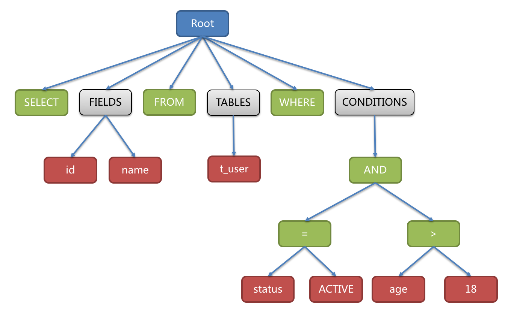

- SQL compatibility

SQL is the standard language for users to communicate with databases. The SQL parsing engine is responsible for parsing SQL strings into abstract syntax trees so that Apache ShardingSphere can understand and implement its incremental function.
ShardingSphere currently supports MySQL, PostgreSQL, SQLServer, Oracle, openGauss, ClickHouse, Doris, Hive, Presto and SQL dialects conforming to the SQL92 standard. Due to the complexity of SQL syntax, a few SQL are not supported for now.

- Database protocol compatibility

Apache ShardingSphere currently implements MySQL and PostgreSQL protocols according to different data protocols.

- Supported features

Apache ShardingSphere provides distributed collaboration capabilities for databases. At the same time, it abstracts some database features to the upper layer for unified management, so as to facilitate users.

Therefore, native SQL will not deliver the features provided uniformly to the database, and a message will be displayed indicating that the operation is not supported. Users can replace it with methods provided by ShardingSphere.

---

<a id="reference-gateway"></a>

<!-- source_url: https://shardingsphere.apache.org/document/current/en/reference/gateway/ -->

<!-- page_index: 340 -->

# Database Gateway

Retro

Eye care

Haitian

Deep

Dark

Default

[Edit this page](https://github.com/apache/shardingsphere/tree/master/docs/document/content/reference/gateway/_index.en.md "Edit this page")

Database Gateway

<a id="reference-gateway--database-gateway"></a>

# Database Gateway

Apache ShardingSphere provides the ability for SQL dialect translation to achieve automatic conversion between database dialects. For example, users can use MySQL client to connect ShardingSphere and send SQL based on MySQL dialect. ShardingSphere can automatically identify user protocol and storage node type, automatically complete SQL dialect conversion, and access heterogeneous storage nodes such as PostgreSQL.

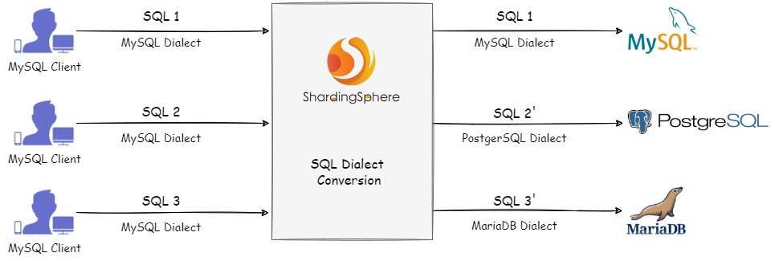

---

<a id="reference-management"></a>

<!-- source_url: https://shardingsphere.apache.org/document/current/en/reference/management/ -->

<!-- page_index: 341 -->

# Management

Retro

Eye care

Haitian

Deep

Dark

Default

[Edit this page](https://github.com/apache/shardingsphere/tree/master/docs/document/content/reference/management/_index.en.md "Edit this page")

Management

<a id="reference-management--management"></a>

# Management

- [Data Structure in Registry Center](#reference-management--data-structure-in-registry-center)
  - [/rules](#reference-management--rules)
  - [/props](#reference-management--props)
  - [/metadata/${databaseName}/data\_sources/units/ds\_0/versions/0](#reference-management--metadatadatabasenamedata_sourcesunitsds_0versions0)
  - [/metadata/${databaseName}/data\_sources/nodes/ds\_0/versions/0](#reference-management--metadatadatabasenamedata_sourcesnodesds_0versions0)
  - [/metadata/${databaseName}/rules/sharding/tables/t\_order/versions/0](#reference-management--metadatadatabasenamerulesshardingtablest_orderversions0)
  - [/metadata/${databaseName}/rules/sharding/key\_generate\_strategies/t\_order\_another\_id/versions/0](#reference-management--metadatadatabasenamerulesshardingkey_generate_strategiest_order_another_idversions0)
  - [/metadata/${databaseName}/schemas/${schemaName}/tables/t\_order/versions/0](#reference-management--metadatadatabasenameschemasschemanametablest_orderversions0)
  - [/nodes/compute\_nodes](#reference-management--nodescompute_nodes)
  - [/nodes/qualified\_data\_sources](#reference-management--nodesqualified_data_sources)
<a id="reference-management--data-structure-in-registry-center"></a>

## Data Structure in Registry Center

Under a defined namespace, `rules`, `props` and `metadata` nodes persist in YAML. Modifying nodes can dynamically refresh configurations.
`nodes` persist the runtime node of the database access object, to distinguish different database access instances.
`statistics` persist data records in system tables.

```
namespace
   ├──rules                                              # Global rule configuration
   ├     ├──transaction
   ├     ├     ├──active_version                                     
   ├     ├     ├──versions  
   ├     ├     ├     ├──0       
   ├──props                                              # Properties configuration
   ├     ├──active_verison                                     
   ├     ├──versions  
   ├     ├     ├──0                  
   ├──metadata                                           # Metadata configuration
   ├     ├──${databaseName} 
   ├     ├     ├──data_sources                          
   ├     ├     ├     ├──units 							 # Storage unit configuration
   ├     ├     ├     ├    ├──${dataSourceName}                        
   ├     ├     ├     ├    ├     ├──active_verison             # Active version                                 
   ├     ├     ├     ├    ├     ├──versions                   # version list
   ├     ├     ├     ├    ├     ├     ├──0
   ├     ├     ├     ├    ├──...   
   ├     ├     ├     ├──nodes 							 # Storage node configuration
   ├     ├     ├     ├    ├──${dataSourceName}                        
   ├     ├     ├     ├    ├     ├──active_verison             # Active version                                 
   ├     ├     ├     ├    ├     ├──versions                   # version list
   ├     ├     ├     ├    ├     ├     ├──0
   ├     ├     ├     ├    ├──...                             
   ├     ├     ├──schemas                                # Schema list
   ├     ├     ├     ├──${schemaName}                    
   ├     ├     ├     ├     ├──tables                     # Table configuration
   ├     ├     ├     ├     ├     ├──${tableName}         
   ├     ├     ├     ├     ├     ├     ├──active_verison # Active version                                 
   ├     ├     ├     ├     ├     ├     ├──versions       # version list
   ├     ├     ├     ├     ├     ├     ├     ├──0
   ├     ├     ├     ├     ├     ├──...  
   ├     ├     ├     ├     ├──views                      # View configuration
   ├     ├     ├     ├     ├     ├──${viewName}
   ├     ├     ├     ├     ├     ├     ├──active_verison # Active version                           
   ├     ├     ├     ├     ├     ├     ├──versions       # version list
   ├     ├     ├     ├     ├     ├     ├     ├──0
   ├     ├     ├     ├     ├     ├──...  
   ├     ├     ├──rules
   ├     ├     ├     ├──sharding
   ├     ├     ├     ├     ├──algorithms
   ├     ├     ├     ├     ├     ├──${algorithmName}     # algorithm name
   ├     ├     ├     ├     ├     ├     ├──active_verison # Active version                           
   ├     ├     ├     ├     ├     ├     ├──versions       # version list
   ├     ├     ├     ├     ├     ├     ├     ├──0
   ├     ├     ├     ├     ├     ├──...
   ├     ├     ├     ├     ├──key_generators
   ├     ├     ├     ├     ├     ├──${keyGeneratorName}  # keyGenerator name
   ├     ├     ├     ├     ├     ├     ├──active_verison # Active version                           
   ├     ├     ├     ├     ├     ├     ├──versions       # version list
   ├     ├     ├     ├     ├     ├     ├     ├──0
   ├     ├     ├     ├     ├     ├──...         
   ├     ├     ├     ├     ├──tables
   ├     ├     ├     ├     ├     ├──${tableName}         # logic table name
   ├     ├     ├     ├     ├     ├     ├──active_verison # Active version                           
   ├     ├     ├     ├     ├     ├     ├──versions       # version list
   ├     ├     ├     ├     ├     ├     ├     ├──0
   ├     ├     ├     ├     ├     ├──...          
   ├──nodes
   ├    ├──compute_nodes
   ├    ├     ├──online
   ├    ├     ├     ├──proxy
   ├    ├     ├     ├     ├──UUID             # Proxy instance identifier
   ├    ├     ├     ├     ├──....
   ├    ├     ├     ├──jdbc
   ├    ├     ├     ├     ├──UUID             # JDBC instance identifier
   ├    ├     ├     ├     ├──....   
   ├    ├     ├──status
   ├    ├     ├     ├──UUID                   
   ├    ├     ├     ├──....
   ├    ├     ├──worker_id
   ├    ├     ├     ├──UUID
   ├    ├     ├     ├──....
   ├    ├     ├──show_process_list_trigger
   ├    ├     ├     ├──process_id:UUID
   ├    ├     ├     ├──....
   ├    ├     ├──labels                      
   ├    ├     ├     ├──UUID
   ├    ├     ├     ├──....               
   ├    ├──qualified_data_sources                       
   ├    ├     ├──${databaseName.groupName.dataSourceName}
   ├    ├     ├──${databaseName.groupName.dataSourceName}
   ├──statistics
   ├    ├──databases
   ├    ├     ├──shardingsphere
   ├    ├     ├     ├──schemas
   ├    ├     ├     ├     ├──shardingsphere
   ├    ├     ├     ├     ├     ├──tables # system tables
   ├    ├     ├     ├     ├     ├   ├──cluster_information    # cluster information table
```

<a id="reference-management--rules"></a>

### /rules

These are the global rule configurations, transaction configuration.

```
transaction:
  defaultType: XA
  providerType: Atomikos
```

<a id="reference-management--props"></a>

### /props

These are the properties' configurations. Please refer to the [Configuration Manual](#user-manual-common-config-props) for more details.

```yaml
kernel-executor-size: 20
sql-show: true
```

<a id="reference-management--metadatadatabasenamedata_sourcesunitsds_0versions0"></a>
<a id="reference-management--metadata-databasename-data_sources-units-ds_0-versions-0"></a>

### /metadata/${databaseName}/data\_sources/units/ds\_0/versions/0

Database connection pools, whose properties (e.g. HikariCP) are to be configured by the user.

```yaml
ds_0:
  initializationFailTimeout: 1
  validationTimeout: 5000
  maxLifetime: 1800000
  leakDetectionThreshold: 0
  minimumIdle: 1
  password: root
  idleTimeout: 60000
  standardJdbcUrl: jdbc:mysql://127.0.0.1:3306/ds_0?serverTimezone=UTC&useSSL=false
  dataSourceClassName: com.zaxxer.hikari.HikariDataSource
  maximumPoolSize: 50
  connectionTimeout: 30000
  username: root
  poolName: HikariPool-1
```

<a id="reference-management--metadatadatabasenamedata_sourcesnodesds_0versions0"></a>
<a id="reference-management--metadata-databasename-data_sources-nodes-ds_0-versions-0"></a>

### /metadata/${databaseName}/data\_sources/nodes/ds\_0/versions/0

Database connection pools, whose properties (e.g. HikariCP) are to be configured by the user.

```yaml
ds_0:
  initializationFailTimeout: 1
  validationTimeout: 5000
  maxLifetime: 1800000
  leakDetectionThreshold: 0
  minimumIdle: 1
  password: root
  idleTimeout: 60000
  standardJdbcUrl: jdbc:mysql://127.0.0.1:3306/ds_0?serverTimezone=UTC&useSSL=false
  dataSourceClassName: com.zaxxer.hikari.HikariDataSource
  maximumPoolSize: 50
  connectionTimeout: 30000
  username: root
  poolName: HikariPool-1
```

<a id="reference-management--metadatadatabasenamerulesshardingtablest_orderversions0"></a>
<a id="reference-management--metadata-databasename-rules-sharding-tables-t_order-versions-0"></a>

### /metadata/${databaseName}/rules/sharding/tables/t\_order/versions/0

Persisted content of the sharding table metadata node, not the user-facing rule YAML format.

```yaml
actualDataNodes: ds_${0..1}.t_order_${0..1}
auditStrategy:
  allowHintDisable: true
  auditorNames:
    - t_order_dml_sharding_conditions_0
databaseStrategy:
  standard:
    shardingAlgorithmName: t_order_database_inline
    shardingColumn: user_id
logicTable: t_order
tableStrategy:
  standard:
    shardingAlgorithmName: t_order_table_inline
    shardingColumn: order_id
```

<a id="reference-management--metadatadatabasenamerulesshardingkey_generate_strategiest_order_another_idversions0"></a>
<a id="reference-management--metadata-databasename-rules-sharding-key_generate_strategies-t_order_another_id-versions-0"></a>

### /metadata/${databaseName}/rules/sharding/key\_generate\_strategies/t\_order\_another\_id/versions/0

Persisted content of the sharding key generate strategy metadata node.

```yaml
keyGenerateType: column
keyGeneratorName: t_order_snowflake
logicTable: t_order
keyGenerateColumn: another_id
```

<a id="reference-management--metadatadatabasenameschemasschemanametablest_orderversions0"></a>
<a id="reference-management--metadata-databasename-schemas-schemaname-tables-t_order-versions-0"></a>

### /metadata/${databaseName}/schemas/${schemaName}/tables/t\_order/versions/0

Use separate node storage for each table.

```yaml
name: t_order                             # Table name
columns:                                  # Columns
  id:                                     # Column name
    caseSensitive: false
    dataType: 0
    generated: false
    name: id
    primaryKey: trues
  order_id:
    caseSensitive: false
    dataType: 0
    generated: false
    name: order_id
    primaryKey: false
indexs:                                   # Index
  t_user_order_id_index:                  # Index name
    name: t_user_order_id_index
```

<a id="reference-management--nodescompute_nodes"></a>
<a id="reference-management--nodes-compute_nodes"></a>

### /nodes/compute\_nodes

It includes running instance information of database access object, with sub-nodes as the identifiers of the currently running instance, which is automatically generated at each startup using UUID.

The identifiers are temporary nodes, which are registered when instances are online and cleared when instances are offline. The registry center monitors the change of those nodes to govern the database access of running instances and other things.

<a id="reference-management--nodesqualified_data_sources"></a>
<a id="reference-management--nodes-qualified_data_sources"></a>

### /nodes/qualified\_data\_sources

It can orchestrate a replica database on readwrite-splitting feature, disable data dynamically.

---

<a id="reference-sharding"></a>

<!-- source_url: https://shardingsphere.apache.org/document/current/en/reference/sharding/ -->

<!-- page_index: 342 -->

# Sharding :: ShardingSphere

Retro

Eye care

Haitian

Deep

Dark

Default

[Edit this page](https://github.com/apache/shardingsphere/tree/master/docs/document/content/reference/sharding/_index.en.md "Edit this page")

Sharding

- [SQL Parser](#reference-sharding--sql-parser)
- [SQL Route](#reference-sharding--sql-route)
- [SQL Rewrite](#reference-sharding--sql-rewrite)
- [SQL Execution](#reference-sharding--sql-execution)
- [Result Merger](#reference-sharding--result-merger)
- [Query Optimization](#reference-sharding--query-optimization)

The figure below shows how sharding works. According to whether query and optimization are needed, it can be divided into the Simple Push Down process and SQL Federation execution engine process.
Simple Push Down process consists of `SQL parser => SQL binder => SQL router => SQL rewriter => SQL executor => result merger`, mainly used to deal with SQL execution in standard sharding scenarios.
SQL Federation execution engine consists of `SQL parser => SQL binder => logical optimization => physical optimization => data fetcher => operator calculation`.
This process performs logical optimization and physical optimization internally, during which the standard kernel procedure is adopted to route, rewrite, execute and merge the optimized logical SQL.

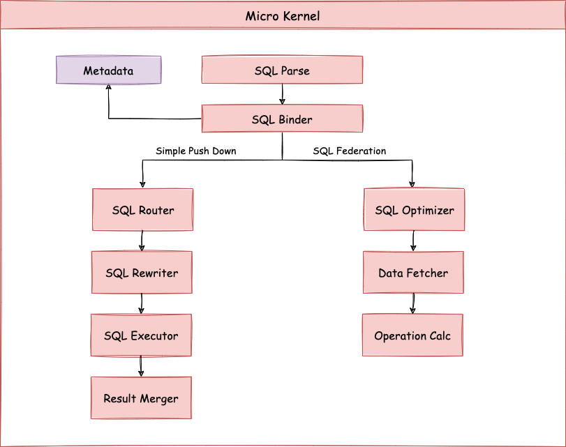

<a id="reference-sharding--sql-parser"></a>

## SQL Parser

It is divided into the lexical parser and syntactic parser. SQL is first split into indivisible words through a lexical parser.

The syntactic parser is then used to analyze SQL and ultimately extract the parsing context, which can include tables, options, ordering items, grouping items, aggregation functions, pagination information, query conditions, and placeholders that may be modified.

<a id="reference-sharding--sql-route"></a>

## SQL Route

The sharding strategy configured by the user is matched according to the parsing context and the routing path is generated. Currently, sharding router and broadcast router are supported.

<a id="reference-sharding--sql-rewrite"></a>

## SQL Rewrite

Rewrite SQL into statements that can be executed correctly in a real database. SQL rewriting is divided into rewriting for correctness and rewriting for optimization.

<a id="reference-sharding--sql-execution"></a>

## SQL Execution

It executes asynchronously through a multithreaded executor.

<a id="reference-sharding--result-merger"></a>

## Result Merger

It merges multiple execution result sets to achieve output through the unified JDBC interface. The result merger includes the stream merger, memory merger and appended merger using decorator mode.

<a id="reference-sharding--query-optimization"></a>

## Query Optimization

Supported by the experimental Federation Execution Engine, it optimizes complex queries such as associated queries and sub-queries and supports distributed queries across multiple database instances. It internally optimizes query plans using relational algebra to query results through optimal plans.

---

<a id="reference-sharding-parse"></a>

<!-- source_url: https://shardingsphere.apache.org/document/current/en/reference/sharding/parse/ -->

<!-- page_index: 343 -->

# Parse Engine

Retro

Eye care

Haitian

Deep

Dark

Default

[Edit this page](https://github.com/apache/shardingsphere/tree/master/docs/document/content/reference/sharding/parse.en.md "Edit this page")

Parse Engine

<a id="reference-sharding-parse--parse-engine"></a>

# Parse Engine

- [Abstract Syntax Tree](#reference-sharding-parse--abstract-syntax-tree)
- [SQL Parser Engine](#reference-sharding-parse--sql-parser-engine)
  - [Iteration](#reference-sharding-parse--iteration)
  - [Features](#reference-sharding-parse--features)
  - [API Usage](#reference-sharding-parse--api-usage)

SQL is relatively simple compared with other programming languages, but it’s still a complete programming language. Therefore, there’s no essential difference between parsing SQL syntax and parsing other languages (such as Java, C and Go, etc.).

<a id="reference-sharding-parse--abstract-syntax-tree"></a>

## Abstract Syntax Tree

The parsing process is divided into lexical parsing and syntactic parsing. The lexical parser is used to split SQL into indivisible atomic symbols called Tokens.

Tokens are classified into keywords, expressions, literals, and operators based on the dictionaries provided by different database dialects. The syntactic parser is then used to convert the output of the lexical parser into an abstract syntax tree.

For example:

```sql
SELECT id, name FROM t_user WHERE status = 'ACTIVE' AND age > 18
```

After the above SQL is parsed, its AST (Abstract Syntax Tree) is as follows:

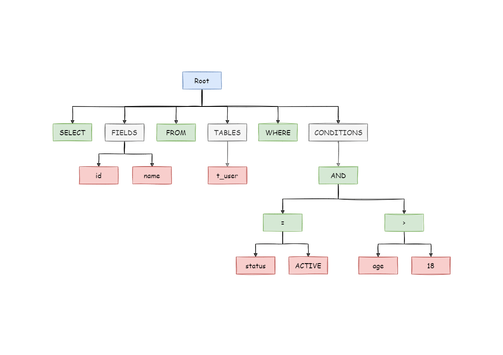

The tokens for keywords in the AST are green, while the tokens for variables are red, and gray ones indicate that further splitting is required.

Finally, the domain model is traversed through the abstract syntax tree by visitor; the context required for sharding is extracted through the domain model (SQLStatement); and then, mark locations that may need rewriting.

The parsing context for sharding includes select items, table, sharding condition, auto-increment primary key, and Order By, Group By, and pagination information (Limit, Rownum, Top). The SQL parsing process is irreversible.

Each Token is parsed in the original SQL order, providing high performance. Taking the similarities and differences of SQL dialects of various databases into consideration, the SQL dialect dictionary of various databases is provided in the parsing module.

<a id="reference-sharding-parse--sql-parser-engine"></a>

## SQL Parser Engine

<a id="reference-sharding-parse--iteration"></a>

### Iteration

SQL parsing is the core of sharding solutions, and its performance and compatibility are the most important indicators. ShardingSphere’s SQL parser has undergone three iterations and upgrades.

To achieve high performance and fast implementation, the first generation of SQL parsers used Druid prior to V1.4.x. In practical tests, its performance far exceeds that of other parsers.

The second generation of SQL parsers started from V1.5.x. ShardingSphere uses a completely self-developed SQL parsing engine. Owing to different purposes, ShardingSphere does not need to convert SQL into a complete abstract syntax tree, nor does it require a second traversal through the accessor pattern. It uses a half-parsing method to extract only the context required by data sharding, thus further improving the performance and compatibility of SQL parsing.

The third generation of SQL parsers, starting with V3.0.x, attempts to use ANTLR as a generator of SQL parsing engines and uses Visit to obtain SQL statements from the AST.
Since V5.0.x, the architecture of the parsing engine has been restructured and adjusted. Moreover, the AST obtained from the first parsing is stored in the cache so that the parsing results of the same SQL can be directly obtained next time to improve parsing efficiency. Therefore, it is recommended that you use PreparedStatement, a SQL-precompiled method, to improve performance.

<a id="reference-sharding-parse--features"></a>

### Features

- Independent SQL parsing engine
- The syntax rules can be easily expanded and modified (using `ANTLR`)
- Support multiple dialects

| Database | Status |
| --- | --- |
| MySQL | perfect supported |
| PostgreSQL | perfect supported |
| SQLServer | supported |
| Oracle | supported |
| SQL92 | supported |
| openGauss | supported |
| ClickHouse | supported |
| Doris | supported |
| Hive | supported |
| Presto | supported |

<a id="reference-sharding-parse--api-usage"></a>

### API Usage

- Introducing Maven dependency

```xml
<dependency>
    <groupId>org.apache.shardingsphere</groupId>
    <artifactId>shardingsphere-parser-sql-engine-core</artifactId>
    <version>${project.version}</version>
</dependency>
<!-- According to the needs, introduce the parsing module of the specified dialect (take MySQL as an example), you can add all the supported dialects, or just what you need -->
<dependency>
    <groupId>org.apache.shardingsphere</groupId>
    <artifactId>shardingsphere-parser-sql-engine-mysql</artifactId>
    <version>${project.version}</version>
</dependency>
```

- Obtain AST

```java
CacheOption cacheOption = new CacheOption(128, 1024L);
SQLParserEngine parserEngine = new SQLParserEngine("MySQL", cacheOption);
ParseASTNode parseASTNode = parserEngine.parse(sql, useCache);
```

- Obtain SQLStatement

```java
CacheOption cacheOption = new CacheOption(128, 1024L);
SQLParserEngine parserEngine = new SQLParserEngine("MySQL", cacheOption);
ParseASTNode parseASTNode = parserEngine.parse(sql, useCache);
SQLVisitorEngine sqlVisitorEngine = new SQLVisitorEngine(sql, "STATEMENT", useCache, new Properties());
SQLStatement sqlStatement = sqlVisitorEngine.visit(parseASTNode);
```

---

<a id="reference-sharding-route"></a>

<!-- source_url: https://shardingsphere.apache.org/document/current/en/reference/sharding/route/ -->

<!-- page_index: 344 -->

# Route Engine

Retro

Eye care

Haitian

Deep

Dark

Default

[Edit this page](https://github.com/apache/shardingsphere/tree/master/docs/document/content/reference/sharding/route.en.md "Edit this page")

Route Engine

<a id="reference-sharding-route--route-engine"></a>

# Route Engine

- [Sharding Route](#reference-sharding-route--sharding-route)
  - [Direct Route](#reference-sharding-route--direct-route)
  - [Standard Route](#reference-sharding-route--standard-route)
  - [Cartesian Route](#reference-sharding-route--cartesian-route)
- [Broadcast Route](#reference-sharding-route--broadcast-route)
  - [Full database and table route](#reference-sharding-route--full-database-and-table-route)
  - [Full database route](#reference-sharding-route--full-database-route)
  - [Full instance route](#reference-sharding-route--full-instance-route)
  - [Unicast Route](#reference-sharding-route--unicast-route)
  - [Block Route](#reference-sharding-route--block-route)

Sharding strategies for databases and tables are matched based on the parsing context, and routing paths are generated. SQL with shard keys can be divided into the single-shard router (the shard key operator is equal), multi-shard router (the shard key operator is IN), and range router (the shard key operator is BETWEEN). SQL that does not carry shard keys adopts broadcast routing.

Sharding strategies can usually be configured either by the built-in database or by the user. The built-in database scheme is relatively simple, and the built-in sharding strategy can be roughly divided into mantissa modulo, hash, range, label, time, etc.

The sharding strategies configured by the user are more flexible. You can customize the compound sharding strategy based on the user’s requirements. If it is used with automatic data migration, users do not need to work on the sharding strategies.

Sharding and data balancing can be automatically achieved by the middle layer of the database, and distributed databases can achieve elastic scalability. In the planning of ShardingSphere, the elastic scaling function will be available at V4.x.

<a id="reference-sharding-route--sharding-route"></a>

## Sharding Route

The scenario that is routed based on shard keys is divided into three types: direct route, standard route, and Cartesian route.

<a id="reference-sharding-route--direct-route"></a>

### Direct Route

The requirement for direct route is relatively harsh. It needs to be sharded by Hint (using HintAPI to specify routes to databases and tables), and it can avoid SQL parsing and subsequent result merge on the premise of having database shards but not table shards.

Therefore, it is the most compatible one and can execute any SQL in complex scenarios including sub-queries and custom functions. The direct route can also be used when shard keys are not in SQL. For example, set the key for database sharding to `3`,

```java
hintManager.setDatabaseShardingValue(3);
```

If the routing algorithm is `value % 2`, when a logical database `t_order` corresponds to two physical databases`t_order_0` and `t_order_1`, the SQL will be executed on `t_order_1` after routing.
The following is a sample code using the API.

```java
String sql = "SELECT * FROM t_order"; try (HintManager hintManager = HintManager.getInstance(); Connection conn = dataSource.getConnection(); PreparedStatement pstmt = conn.prepareStatement(sql)) {hintManager.setDatabaseShardingValue(3); try (ResultSet rs = pstmt.executeQuery()) {while (rs.next()) {//...}}}
```

<a id="reference-sharding-route--standard-route"></a>

### Standard Route

The standard route is the most recommended sharding method, and it is applicable to SQL that does not contain an associated query or only contains the associated query between binding tables.

When the sharding operator is equal, the routing result will fall into a single database (table). When the sharding operator is BETWEEN or IN, the routing result will not necessarily fall into a unique database (table).

Therefore, logical SQL may eventually be split into multiple real SQL to be executed. For example, if the data sharding is carried out according to the odd and even numbers of order\_id, the SQL for a single table query is as follows:

```sql
SELECT * FROM t_order WHERE order_id IN (1, 2);
```

Then the routing result should be:

```sql
SELECT * FROM t_order_0 WHERE order_id IN (1, 2);
SELECT * FROM t_order_1 WHERE order_id IN (1, 2);
```

An associated query for a binding table is as complex as a single table query and they have the same performance. For example, if the SQL of an associated query that contains binding tables is as follows:

```sql
SELECT * FROM t_order o JOIN t_order_item i ON o.order_id=i.order_id  WHERE order_id IN (1, 2);
```

Then the routing result should be:

```sql
SELECT * FROM t_order_0 o JOIN t_order_item_0 i ON o.order_id=i.order_id  WHERE order_id IN (1, 2);
SELECT * FROM t_order_1 o JOIN t_order_item_1 i ON o.order_id=i.order_id  WHERE order_id IN (1, 2);
```

As you can see, the number of SQL splits is consistent with that of a single table.

<a id="reference-sharding-route--cartesian-route"></a>

### Cartesian Route

The Cartesian route is the most complex one because it cannot locate sharding rules according to the relationship between binding tables, so associated queries between unbound tables need to be disassembled and executed as cartesian product combinations. If the SQL in the previous example was not configured with binding table relationships, the routing result would be:

```sql
SELECT * FROM t_order_0 o JOIN t_order_item_0 i ON o.order_id=i.order_id  WHERE order_id IN (1, 2);
SELECT * FROM t_order_0 o JOIN t_order_item_1 i ON o.order_id=i.order_id  WHERE order_id IN (1, 2);
SELECT * FROM t_order_1 o JOIN t_order_item_0 i ON o.order_id=i.order_id  WHERE order_id IN (1, 2);
SELECT * FROM t_order_1 o JOIN t_order_item_1 i ON o.order_id=i.order_id  WHERE order_id IN (1, 2);
```

The Cartesian route query has low performance, so think carefully when you use it.

<a id="reference-sharding-route--broadcast-route"></a>

## Broadcast Route

For SQL that does not carry shard keys, broadcast routes are used. According to the SQL type, it can be further divided into five types: full database and table route, full database route, full instance route, unicast route, and block route.

<a id="reference-sharding-route--full-database-and-table-route"></a>

### Full database and table route

The full database table route is used to handle operations on all real tables related to its logical tables in the database, including DQL and DML without shard keys, as well as DDL, etc. For example:

```sql
SELECT * FROM t_order WHERE good_prority IN (1, 10);
```

All tables in all databases will be traversed, matching logical tables and real table names one by one. The table that can be matched will be executed. The routing result would be:

```sql
SELECT * FROM t_order_0 WHERE good_prority IN (1, 10);
SELECT * FROM t_order_1 WHERE good_prority IN (1, 10);
SELECT * FROM t_order_2 WHERE good_prority IN (1, 10);
SELECT * FROM t_order_3 WHERE good_prority IN (1, 10);
```

<a id="reference-sharding-route--full-database-route"></a>

### Full database route

The full database route is used to handle operations on the database, including database management commands of type SET for database settings and transaction control statements such as TCL.

In this case, all real database matching names are traversed based on the logical database name, and the command is executed in the real database. For example:

```sql
SET autocommit=0;
```

If the command is executed in `t_order`, `t_order` which has two real databases, it is actually executed on both `t_order_0` and `t_order_1`.

<a id="reference-sharding-route--full-instance-route"></a>

### Full instance route

Full instance route is used for DCL operations, and authorized statements are used for database instances.

No matter how many schemas are contained in an instance, each database instance is executed only once. For example:

```sql
CREATE USER customer@127.0.0.1 identified BY '123';
```

This command will be executed on all real database instances to ensure that users can access each instance.

<a id="reference-sharding-route--unicast-route"></a>

### Unicast Route

The unicast route is used to obtain the information of a real table. It only needs to obtain data from any real table in any database. For example:

```sql
DESCRIBE t_order;
```

`t_order_0` and `t_order_1`, the two real tables of `t_order`, have the same description structure, so this command is executed only once on any real table.

<a id="reference-sharding-route--block-route"></a>

### Block Route

Block route is used to block SQL operations on the database, for example:

```sql
USE order_db;
```

This command will not be executed in a real database because ShardingSphere uses the logical Schema and there is no need to send the Schema shift command to the database.

The overall structure of the routing engine is as follows.

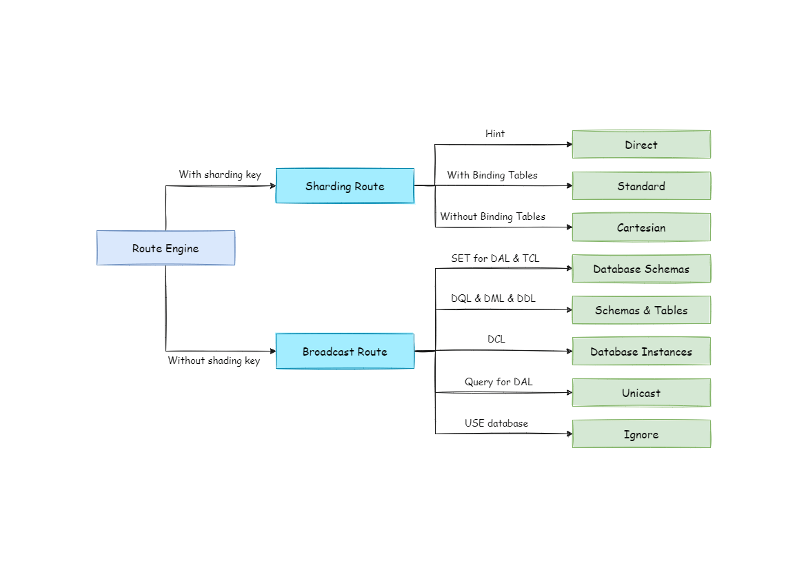

---

<a id="reference-sharding-rewrite"></a>

<!-- source_url: https://shardingsphere.apache.org/document/current/en/reference/sharding/rewrite/ -->

<!-- page_index: 345 -->

# Rewrite Engine

Retro

Eye care

Haitian

Deep

Dark

Default

[Edit this page](https://github.com/apache/shardingsphere/tree/master/docs/document/content/reference/sharding/rewrite.en.md "Edit this page")

Rewrite Engine

<a id="reference-sharding-rewrite--rewrite-engine"></a>

# Rewrite Engine

- [Rewriting for Correctness](#reference-sharding-rewrite--rewriting-for-correctness)
- [Identifier Rewriting](#reference-sharding-rewrite--identifier-rewriting)
- [Column Derivation](#reference-sharding-rewrite--column-derivation)
- [Pagination Correction](#reference-sharding-rewrite--pagination-correction)
- [Batch Split](#reference-sharding-rewrite--batch-split)
- [Rewriting for Optimization](#reference-sharding-rewrite--rewriting-for-optimization)

SQL written by engineers for logical databases and tables cannot be directly executed in real databases.

SQL rewriting is used to rewrite logical SQL into SQL that can be executed correctly in real databases. It includes rewriting for correctness and rewriting for optimization.

<a id="reference-sharding-rewrite--rewriting-for-correctness"></a>

## Rewriting for Correctness

In a scenario with table shards, you need to rewrite the logical table name in the table shards configuration to the real table name obtained after routing.

Only database shards do not require rewriting table names. Additionally, it also includes column derivation and pagination information correction.

<a id="reference-sharding-rewrite--identifier-rewriting"></a>

## Identifier Rewriting

The identifiers that need to be overwritten include table names, index names, and Schema names.

Rewriting table names is the process of finding the location of the logical table in the original SQL and rewriting it into a real table.

Table name rewriting is a typical scenario that requires SQL parsing. For example, if logical SQL is:

```sql
SELECT order_id FROM t_order WHERE order_id=1;
```

Assume that the SQL is configured with the shard key `order_id` and `order_id=1`, it will be routed to shard table 1. Then the rewritten SQL should be:

```sql
SELECT order_id FROM t_order_1 WHERE order_id=1;
```

In the simplest SQL scenario, it doesn’t seem to matter whether or not the SQL is parsed into an abstract syntax tree.

SQL can be rewritten correctly only by finding and replacing strings. However, it is impossible to achieve the same effect in the following scenarios.

```sql
SELECT order_id FROM t_order WHERE order_id=1 AND remarks=' t_order xxx';
```

The correct rewritten SQL would be:

```sql
SELECT order_id FROM t_order_1 WHERE order_id=1 AND remarks=' t_order xxx';
```

Instead of:

```sql
SELECT order_id FROM t_order_1 WHERE order_id=1 AND remarks=' t_order_1 xxx';
```

Because there may be characters similar to the table name, you cannot rewrite SQL simply by replacing strings.

Let’s look at a more complex scenario:

```sql
SELECT t_order.order_id FROM t_order WHERE t_order.order_id=1 AND remarks=' t_order xxx';
```

The above SQL uses the table name as an identifier of the field, so it needs to be modified when SQL is rewritten:

```sql
SELECT t_order_1.order_id FROM t_order_1 WHERE t_order_1.order_id=1 AND remarks=' t_order xxx';
```

If a table alias is defined in SQL, the alias does not need to be modified, even if it is the same as the table name. For example:

```sql
SELECT t_order.order_id FROM t_order AS t_order WHERE t_order.order_id=1 AND remarks=' t_order xxx';
```

Rewriting the table name is enough for SQL rewriting.

```sql
SELECT t_order.order_id FROM t_order_1 AS t_order WHERE t_order.order_id=1 AND remarks=' t_order xxx';
```

The index name is another identifier that can be rewritten. In some databases (such as MySQL and SQLServer), indexes are created in the dimension of tables.

Indexes in different tables can have the same name. In other databases (such as PostgreSQL and Oracle), indexes are created in the dimension of databases, and even indexes on different tables should have unique names.

In ShardingSphere, schemas are managed in the same way as tables. Logical Schemas are used to manage a set of data sources.

Therefore, ShardingSphere needs to replace the logical Schema written by the user in SQL with the real database Schema.

Currently, ShardingSphere does not support the use of Schema in DQL and DML statements. It only supports the use of Schema in database management statements. For example:

```sql
SHOW COLUMNS FROM t_order FROM order_ds;
```

Schema rewriting refers to the rewriting of a logical Schema using unicast routing to a correct and real Schema that is randomly found.

<a id="reference-sharding-rewrite--column-derivation"></a>

## Column Derivation

There are two cases that need to complement columns in a query statement. In the first case, ShardingSphere needs to get the data during the result merge, but the data is not returned by the queried SQL.

In this case, it mainly applies to GROUP BY and ORDER BY. When merging the results, you need to group and order the field items according to `GROUP BY` and `ORDER BY`, but if the original SQL does not contain grouping or ordering items in the selections, you need to rewrite the original SQL. Let’s look at a scenario where the original SQL has the required information for result merge.

```sql
SELECT order_id, user_id FROM t_order ORDER BY user_id;
```

Since `user_id` is used for sorting, the data of `user_id` needs to be retrieved in the result merge. And the above SQL can obtain the data of `user_id`, so there is no need to add columns.

If the selection does not contain the columns required to merge the results, you need to fill the columns, as in the following SQL:

```sql
SELECT order_id FROM t_order ORDER BY user_id;
```

Since the original SQL does not contain the `user_id` required in the result merge, you need to fill in and rewrite the SQL. Then SQL would be:

```sql
SELECT order_id, user_id AS ORDER_BY_DERIVED_0 FROM t_order ORDER BY user_id;
```

It should be noted that only missing columns are complemented instead of all columns. And SQL that contains \* in the SELECT statement will also selectively complement columns based on the metadata information of the table. Here is a relatively complex column derivation scenario of SQL:

```sql
SELECT o.* FROM t_order o, t_order_item i WHERE o.order_id=i.order_id ORDER BY user_id, order_item_id;
```

We assume that only the table `t_order_item` contains the column `order_item_id`. According to the metadata information of the table, when the result is merged, the `user_id` in the ordering items exists on the table `t_order`, so there is no need to add columns. `order_item_id` is not in `t_order`, so column derivation is required. Then SQL would become:

```sql
SELECT o.*, order_item_id AS ORDER_BY_DERIVED_0 FROM t_order o, t_order_item i WHERE o.order_id=i.order_id ORDER BY user_id, order_item_id;
```

The second case of column derivation is the use of AVG aggregate functions. In distributed scenarios, using (avg1 + avg2 + avg3)/3 to calculate the average is incorrect and should be rewritten as (sum1 + sum2 + sum3) /(count1 + count2 + count3). In this case, rewriting the SQL containing AVG to SUM and COUNT is required, and recalculating the average when the results are merged. For example:

```sql
SELECT AVG(price) FROM t_order WHERE user_id=1;
```

The above SQL should be rewritten as:

```sql
SELECT COUNT(price) AS AVG_DERIVED_COUNT_0, SUM(price) AS AVG_DERIVED_SUM_0 FROM t_order WHERE user_id=1;
```

Then you can calculate the average correctly by merging the results.

The last type of column derivation is the one that does not need to write the primary key field if the database auto-increment primary key is used during executing an INSERT SQL statement. However, the auto-increment primary key of the database cannot meet the unique primary key in distributed scenarios. Therefore, ShardingSphere provides the generation strategy of the distributed auto-increment primary key. Users can replace the existing auto-increment primary key transparently with the distributed auto-increment primary key without changing the existing code through column derivation. The generation strategy for distributed auto-increment primary keys is described below, and here only SQL rewriting is illustrated. For example, if the primary key of table `t_order` is `order_id`, the original SQL would be:

```sql
INSERT INTO t_order (`field1`, `field2`) VALUES (10, 1);
```

As you can see, the above SQL does not contain the auto-increment primary key, which requires the database itself to fill. After ShardingSphere is configured with the auto-increment primary key, SQL will be rewritten as:

```sql
INSERT INTO t_order (`field1`, `field2`, order_id) VALUES (10, 1, xxxxx);
```

The rewritten SQL will add column names of the primary key and auto-increment primary key values generated automatically at the end of the INSERT FIELD and INSERT VALUE. The xxxxx in the above SQL represents the auto-increment primary key value generated automatically.

If the INSERT SQL does not contain the column name of the table, ShardingSphere can also compare the number of parameters and the number of columns in the table meta information and automatically generate auto-increment primary keys. For example, the original SQL is:

```sql
INSERT INTO t_order VALUES (10, 1);
```

The rewritten SQL will simply add the auto-increment primary key in the column order in which the primary key locates:

```sql
INSERT INTO t_order VALUES (xxxxx, 10, 1);
```

If you use placeholders to write SQL, you only need to rewrite the parameter list, not the SQL itself.

<a id="reference-sharding-rewrite--pagination-correction"></a>

## Pagination Correction

The scenario of acquiring pagination data from multiple databases is different from that of one single database. If every 10 pieces of data are taken as one page, the user wants to take the second page of data. It is not correct to acquire `LIMIT 10, 10` under sharding situations, or take out the first 10 pieces of data according to sorting conditions after merging. For example, if SQL is:

```sql
SELECT score FROM t_score ORDER BY score DESC LIMIT 1, 2;
```

The following picture shows the pagination execution results without SQL rewriting.

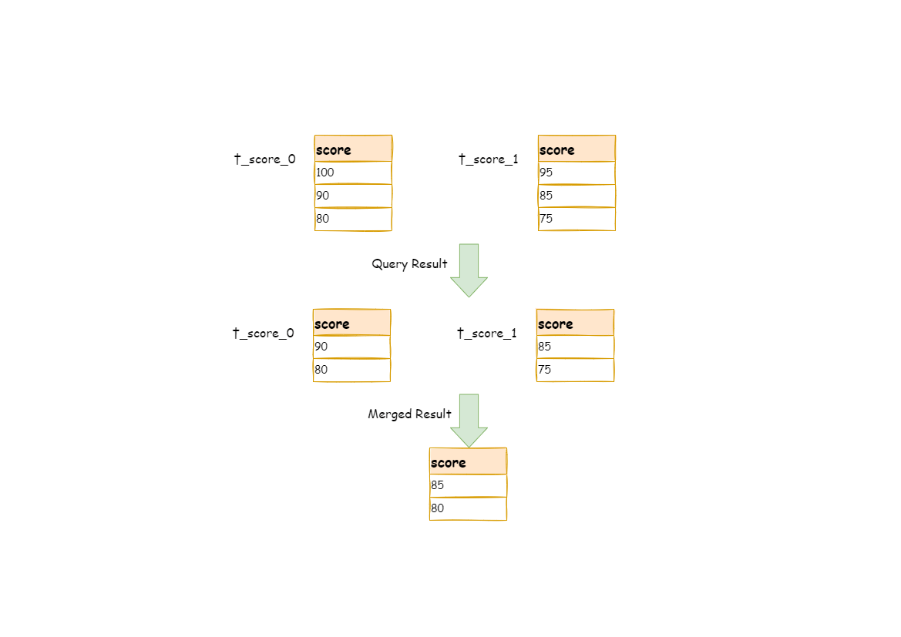

As shown in the picture, if you want to acquire the second and the third piece of data sorted by score in both tables, and they are supposed to be `95` and `90`.

Since executed SQL can only acquire the second and the third piece of data from each table, i.e., `90` and `80` from `t_score_0`, `85` and `75` from `t_score_1`.
When merging results, it can only merge from `90`, `80`, `85` and `75` already acquired, so the right result cannot be acquired anyway.

The right way is to rewrite pagination conditions as `LIMIT 0, 3`, take out all the data from the first two pages and calculate the right data based on sorting conditions.
The following picture shows the execution results of pagination after SQL rewrite.

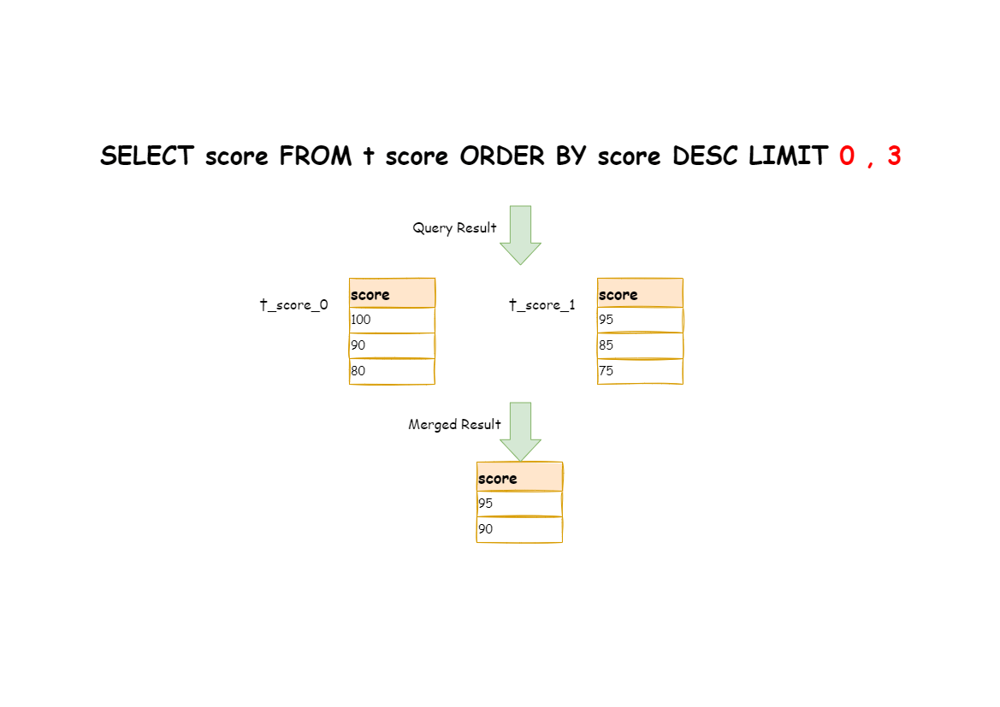

The latter the offset position is, the lower the efficiency of using `LIMIT` pagination will be.
There are many ways to avoid using `LIMIT` as pagination method, such as constructing a secondary index to the number of line records and line offsets or using the end ID of the last pagination data as a condition for the next query.

When revising pagination information, if the users use the placeholder to write SQL, they only need to rewrite the parameter list rather than SQL itself.

<a id="reference-sharding-rewrite--batch-split"></a>

## Batch Split

When using bulk inserted SQL, if the inserted data crosses shards, the SQL needs to be rewritten to prevent excess data from being written to the database.

The insertion operation differs from the query operation in that the query statement does not affect the data even if it uses the shard key that does not exist in the current shard. In contrast, insertion operations must remove excess shard keys. For example, see the following SQL:

```sql
INSERT INTO t_order (order_id, xxx) VALUES (1, 'xxx'), (2, 'xxx'), (3, 'xxx');
```

If the database is still divided into two parts according to the odd and even number of order\_id, this SQL will be executed after its table name is revised. Then, both shards will be written with the same record.

Though only the data that satisfies sharding conditions can be retrieved from the query statement, it is not reasonable for the schema to have excessive data. So SQL should be rewritten as:

```sql
INSERT INTO t_order_0 (order_id, xxx) VALUES (2, 'xxx');
INSERT INTO t_order_1 (order_id, xxx) VALUES (1, 'xxx'), (3, 'xxx');
```

IN query is similar to batch insertion, but IN operation will not lead to wrong data query result. Through rewriting IN query, the query performance can be further improved. See the following SQL:

```sql
SELECT * FROM t_order WHERE order_id IN (1, 2, 3);
```

The SQL is rewritten as：

```sql
SELECT * FROM t_order_0 WHERE order_id IN (2);
SELECT * FROM t_order_1 WHERE order_id IN (1, 3);
```

The query performance will be further improved. For now, ShardingSphere has not realized this rewrite strategy, so the current rewrite result is:

```sql
SELECT * FROM t_order_0 WHERE order_id IN (1, 2, 3);
SELECT * FROM t_order_1 WHERE order_id IN (1, 2, 3);
```

Though the execution result of SQL is right, it did not achieve the highest query efficiency.

<a id="reference-sharding-rewrite--rewriting-for-optimization"></a>

## Rewriting for Optimization

Its purpose is to effectively improve performance without influencing the correctness of the query. It can be divided into single node optimization and stream merger optimization.

<a id="reference-sharding-rewrite--single-node-optimization"></a>

### Single Node Optimization

It refers to the optimization that stops the SQL rewrite from the route to the single node. After acquiring one route result, if it is routed to a single data node, there is no need to involve result merger, as well as rewrites such as column derivation and pagination information correction.

In particular, there is no need to read from the first piece of information, which reduces the pressure on the database to a large extent and saves meaningless consumption of the network bandwidth.

<a id="reference-sharding-rewrite--stream-merger-optimization"></a>

### Stream Merger Optimization

It only adds `ORDER BY` and ordering items and sorting orders identical with grouping items to SQL that contains `GROUP BY`. And it is used to transfer memory merger to stream merger. Stream merger and memory merger will be explained in detail in the result merger section.

The overall structure of the rewrite engine is shown in the following picture.

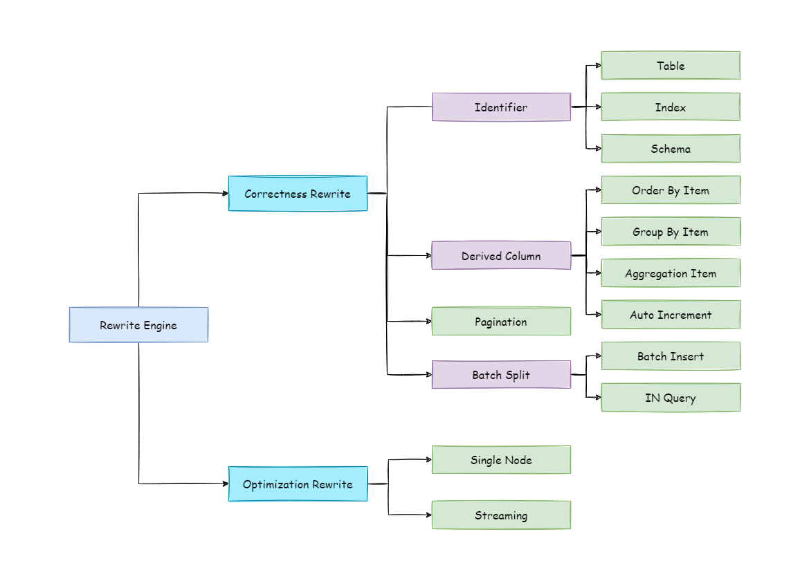

---

<a id="reference-sharding-execute"></a>

<!-- source_url: https://shardingsphere.apache.org/document/current/en/reference/sharding/execute/ -->

<!-- page_index: 346 -->

# Execute Engine

Retro

Eye care

Haitian

Deep

Dark

Default

[Edit this page](https://github.com/apache/shardingsphere/tree/master/docs/document/content/reference/sharding/execute.en.md "Edit this page")

Execute Engine

<a id="reference-sharding-execute--execute-engine"></a>

# Execute Engine

- [Connection Mode](#reference-sharding-execute--connection-mode)
  - [MEMORY\_STRICTLY Mode](#reference-sharding-execute--memory_strictly-mode)
  - [CONNECTION\_STRICTLY Mode](#reference-sharding-execute--connection_strictly-mode)
- [Automatic Execution Engine](#reference-sharding-execute--automatic-execution-engine)

ShardingSphere uses an automated execution engine to safely and efficiently send the real SQL, which has been routed and rewritten, to the underlying data source for execution.

It does not simply send SQL directly to the data source for execution via JDBC, nor are execution requests placed directly into a thread pool for concurrent execution.

It focuses more on the creation of a balanced data source connection, the consumption generated by the memory usage, and the maximum utilization of the concurrency. The objective of the execution engine is to automatically balance resource control with execution efficiency.

<a id="reference-sharding-execute--connection-mode"></a>

## Connection Mode

From the perspective of resource control, the connection number a business can make to the database should be limited. It can effectively prevent certain business operations from occupying excessive resources, exhausting database connection resources, and influencing the normal access of other businesses.

Especially when one database instance contains many sub-tables, a logical SQL that does not contain any shard key will produce a large number of real SQLs that fall into different tables in one database. If each real SQL takes an independent connection, a query will undoubtedly take up excessive resources.

From the perspective of execution efficiency, maintaining an independent database connection for each shard query can make more effective use of multi-thread to improve execution efficiency.

Creating a separate thread for each database connection allows I/O consumption to be processed in parallel. Maintaining a separate database connection for each shard also prevents premature loading of query result data into memory.

It is enough for independent database connections to maintain result set quotation and cursor position, and move the cursor when acquiring corresponding data.

Merging the result set by moving down its cursor is called the stream merger. It does not need to load all the query results into the memory, which can effectively save memory resources effectively and reduce the frequency of garbage collection.

If each shard query cannot be guaranteed to have an independent database connection, the current query result set needs to be loaded into memory before reusing the database connection to obtain the query result set of the next shard table. Therefore, though the stream merger can be used, it will also degenerate into the memory merger in this scenario.

On the one hand, we need to control and protect database connection resources; on the other hand, it is important to save middleware memory resources by adopting a better merging mode. How to deal with the relationship between the two is a problem that the ShardingSphere execution engine needs to solve. Specifically, if an SQL is sharded through the ShardingSphere, it needs to operate on 200 tables under a database instance. So, should we choose to create 200 connections in parallel, or one connection in sequence? How to choose between efficiency and resource control?
For the above scenario, ShardingSphere provides a solution. It introduces the concept of Connection Mode, which is divided into MEMORY\_STRICTLY and CONNECTION\_STRICTLY.

<a id="reference-sharding-execute--memory_strictly-mode"></a>

### MEMORY\_STRICTLY Mode

The prerequisite to using this mode is that ShardingSphere does not restrict the connection number of one operation. If the actual executed SQL needs to operate 200 tables in some database instance, it will create a new database connection for each table and deal with them concurrently through multi-thread to maximize the execution efficiency. When SQL meets the conditions, stream merger is preferred to avoid memory overflow or frequent garbage recycling.

<a id="reference-sharding-execute--connection_strictly-mode"></a>

### CONNECTION\_STRICTLY Mode

The prerequisite to using this mode is that ShardingSphere strictly restricts the connection consumption number of one operation. If the SQL to be executed needs to operate 200 tables in a database instance, it will create one database connection and operate them serially. If shards exist in different databases, it will still adopt multi-thread operations for different databases, but with only one database connection being created for each operation in each database. It prevents the problem of consuming too many database connections for one request. The mode chooses memory merger all the time.

The MEMORY\_STRICTLY mode applies to OLAP operation and can increase the system throughput by removing database connection restrictions. It is also applicable to OLTP operation, which usually has shard keys and can be routed to a single shard. So it is a wise choice to control database connections strictly to make sure that database resources in an online system can be used by more applications.

<a id="reference-sharding-execute--automatic-execution-engine"></a>

## Automatic Execution Engine

ShardingSphere initially leaves the decision of which mode to use up to the users and they can choose to use MEMORY\_STRICTLY mode or CONNECTION\_STRICTLY mode according to their actual business scenarios.

This solution gives users the right to choose, who must understand the pros and cons of the two modes and make a choice based on the requirements of the business scenarios. No doubt, it is not the best solution as it increases users' learning and use costs.

This dichotomy solution, which leaves the switching of the two modes to static initialization, lacks flexibility. In practical scenarios, the routing result varies with SQL and placeholder indexes. This means that some operations may need to use memory merger, while others may prefer stream merger. Connection modes should not be set by the user before ShardingSphere is started, but should be determined dynamically based on the SQL and placeholder indexes scenarios.

In order to reduce the usage cost for users and achieve a dynamic connection mode, ShardingSphere has extracted the concept of the automatic execution engine to eliminate the connection mode concept internally. The user does not need to know what the MEMORY\_STRICTLY mode and CONNECTION\_STRICTLY mode are, but the execution engine automatically selects the best execution scheme according to the current scenario.

The automatic execution engine chooses the connection mode based on each SQL operation. For each SQL request, the automatic execution engine will do real-time calculations and evaluations according to its route result and execute the appropriate connection mode automatically to strike the optimal balance between resource control and efficiency.
For the automatic execution engine, users only need to configure `maxConnectionSizePerQuery`, which represents the maximum connection number allowed by each database for one query.

The execution engine is divided into two phases: preparation and execution.

<a id="reference-sharding-execute--preparation-phrase"></a>

### Preparation Phrase

As indicated by its name, this phrase is used to prepare the data to be executed. It can be divided into two steps: result set grouping and unit creation.

Result set grouping is the key to realizing the internal connection model concept. According to the configuration items of `maxConnectionSizePerQuery`, the execution engine will choose an appropriate connection mode based on the current route result.

Detailed steps are as follow:

1. Group SQL route results according to data source names.
2. As we can see in the following formula, users can acquire the SQL route result set to be executed by each database instance within the `maxConnectionSizePerQuery` permission range and calculate the optimal connection mode of this request.

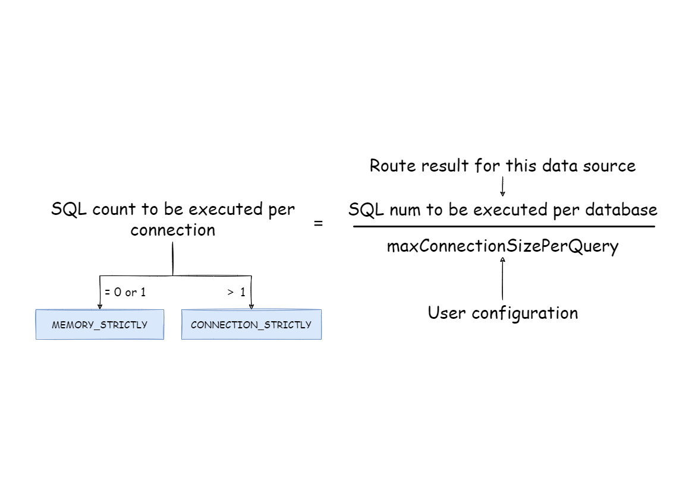

Within the scope of the maxConnectionSizePerQuery allowed, when the request number that one connection needs to execute is more than 1, the current database connection cannot hold the corresponding data result set, so it must use memory merger. On the contrary, when the number equals 1, the current database connection can hold the corresponding data result set, and it can use stream merger.

Each connection mode selection is specific to each physical database. That is, if you route to more than one database in the same query, the connection mode of each database may not be the same, and they may be mixed.
Users can use the route grouping result acquired from the last step to create the execution unit. When the data source uses technologies, such as the database connection pool, to control database connection numbers, there is a chance that a deadlock will occur if concurrency is not handled properly while retrieving database connections. As multiple requests wait for each other to release database connection resources, starvation occurs, causing the crossing deadlock.

For example, suppose that a query requires obtaining two database connections at a data source and routing queries to two sub-tables of the same database. It is possible that query A has obtained one database connection from this data source and is waiting to obtain another database connection.

Query B has also acquired a database connection at the data source and is also waiting for another database connection to be acquired. If the maximum number of connections allowed in the database connection pool is 2, then the two query requests will wait forever. The following diagram depicts a deadlock situation.

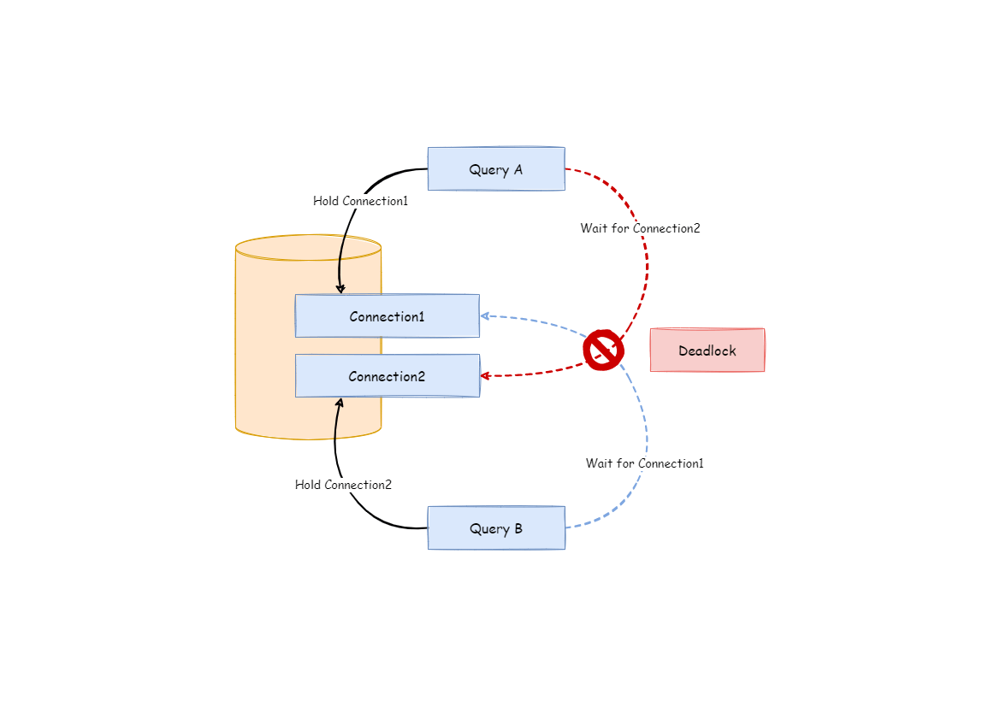

ShardingSphere synchronizes database connections to avoid deadlocks. When it creates the execution unit, it atomically obtains all the database connections required by the SQL request at one time, eliminating the possibility of obtaining partial resources in each query request.

Because the operation on the database is very frequent, locking a database connection each time when acquiring it will reduce the concurrency of ShardingSphere. Therefore, ShardingSphere has improved two aspects here:

1. Locking can be avoided and only one database connection needs to be obtained each time. Because under this circumstance, two requests waiting for each other will not happen, so there is no need for locking. Most OLTP operations use shard keys to route to the unique data node, which makes the system completely unlocked and further improves the concurrency efficiency. In addition to routing to a single shard, read/write-splitting also belongs to this category.
2. Locking resources only happens in MEMORY\_STRICTLY mode. When using CONNECTION\_STRICTLY mode, all the query result sets will release database connection resources after loading them to the memory, so deadlock wait will not appear.

<a id="reference-sharding-execute--execution-phrase"></a>

### Execution Phrase

This stage is used to actually execute SQL and is divided into two steps: group execution and merger result generation.

Group execution can distribute execution unit groups generated in the preparation phase to the underlying concurrency engine and send events for each key step during the execution process, such as starting, successful and failed execution events. The execution engine only focuses on sending events rather than subscribers to the event. Other ShardingSphere modules, such as distributed transactions, call linked tracing and so on, will subscribe to the events of interest and process them accordingly.

ShardingSphere generates memory merger result sets or stream merger result sets through the connection mode acquired in the preparation phase. And then it passes the result set to the result merger engine for the next step.

The overall structure of the execution engine is divided as shown below.

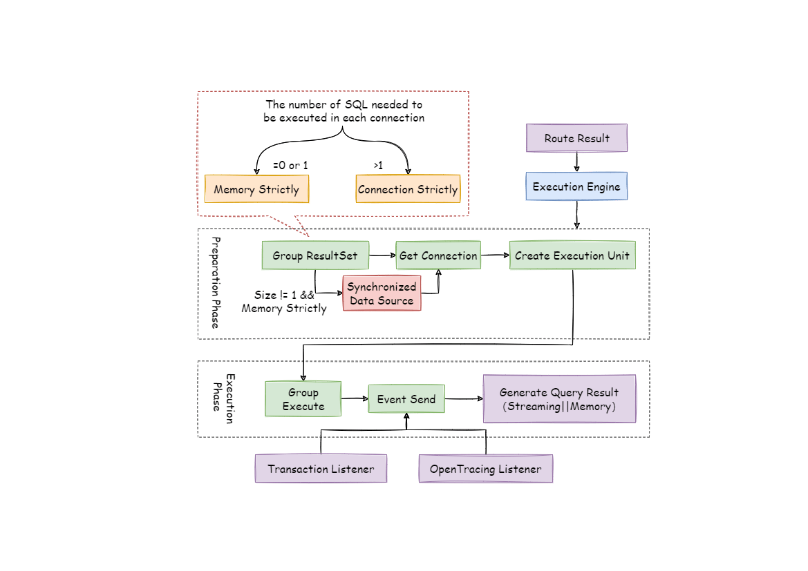

---

<a id="reference-sharding-merge"></a>

<!-- source_url: https://shardingsphere.apache.org/document/current/en/reference/sharding/merge/ -->

<!-- page_index: 347 -->

# Merger Engine

Retro

Eye care

Haitian

Deep

Dark

Default

[Edit this page](https://github.com/apache/shardingsphere/tree/master/docs/document/content/reference/sharding/merge.en.md "Edit this page")

Merger Engine

<a id="reference-sharding-merge--merger-engine"></a>

# Merger Engine

- [Traversal Merger](#reference-sharding-merge--traversal-merger)
- [Order-by Merger](#reference-sharding-merge--order-by-merger)
- [Group-by Merger](#reference-sharding-merge--group-by-merger)
- [Aggregation Merger](#reference-sharding-merge--aggregation-merger)
- [Pagination Merger](#reference-sharding-merge--pagination-merger)

Result merger refers to merging multi-data result sets acquired from all the data nodes as one result set and returning it to the requesting client correctly.

The result merger supported by ShardingSphere can be divided into five functional types: traversal, order-by, group-by, pagination and aggregation, which are combined rather than mutually exclusive. From the perspective of structure, it can be divided into stream merger, memory merger and decorator merger, among which stream merger and memory merger are mutually exclusive, and decorator merger can be further processed based on stream merger and memory merger.

Since the result set is returned from the database one by one instead of being loaded to the memory all at a time, the method of merging the result sets returned from the database can greatly reduce memory consumption and is the preferred method of merging.

Stream merger means that each time the data is obtained from the result set is able to return the correct single piece of data line by line. It is the best fit with the native method of returning the result set of the database. Traversal, order-by, and stream group-by are all examples of the stream merger.

Memory merger needs to traverse all the data in the result set and store it in the memory first. After unified grouping, ordering, aggregation and other calculations, the data is packaged into the data result set accessed one by one and returned.

Decorator merger merges and reinforces all the result sets function uniformly. Currently, decorator merger has two types: pagination merger and aggregation merger.

<a id="reference-sharding-merge--traversal-merger"></a>

## Traversal Merger

As the simplest merger method, traversal merger only requires the combination of multiple data result sets into a one-way linked table. After traversing current data result sets in the linked table, it only needs to move the elements of the linked table back one bit and continue traversing the next data result set.

<a id="reference-sharding-merge--order-by-merger"></a>

## Order-by Merger

Because there is an `ORDER BY` statement in SQL, each data result has its own order. So it only needs to sort data value that the result set cursor currently points to, which is equal to sorting multiple ordered arrays. Therefore, order-by merger is the most suitable sorting algorithm in this scenario.

When merging ordered queries, ShardingSphere will compare current data values in each result set (which is realized by the Java Comparable interface) and put them into the priority queue. Each time when acquiring the next piece of data, it only needs to move down the result set cursor at the top of the queue, reenter the priority order according to the new cursor and relocate its own position.

Here is an instance to explain ShardingSphere’s order-by merger. The following picture is an illustration of ordering by the score. Data result sets returned by 3 tables are shown in the example and each of them has already been ordered according to the score, but there is no order between the 3 data result sets. Order the data value that the result set cursor currently points to in these 3 result sets. Then put them into the priority queue. The first data value of `t_score_0` is the biggest, followed by that of `t_score_2` and `t_score_1` in sequence. Thus, the priority queue is ordered by the sequence of `t_score_0`, `t_score_2` and `t_score_1`.

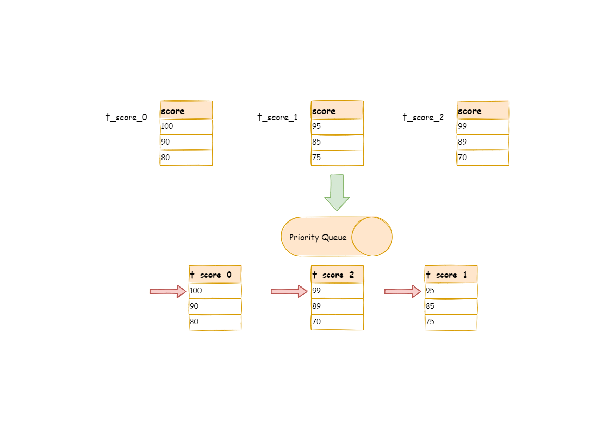

The following diagram illustrates how the order-by merger works when using next call. We can see from the diagram that when using the `next` call, `t_score_0` at the first of the queue will be popped out. After returning the data value currently pointed by the cursor (i.e., 100) to the requesting client, the cursor will be moved down and `t_score_0` will be put back into the queue.

While the priority queue will also be ordered according to the `t_score_0` data value (90 here) pointed by the cursor of the current data result set. According to the current value, `t_score_0` is at the end of the queue, and the data result set of `t_score_2`, originally in the second place of the queue, automatically moves to the first place of the queue.

In the second `next` call, `t_score_2` in the first place is popped out. Its value pointed by the cursor of the data result set is returned to the client end, with its cursor moved down to rejoin the queue, and the following will be the same way. If there is no data in the result set, it will not rejoin the queue.

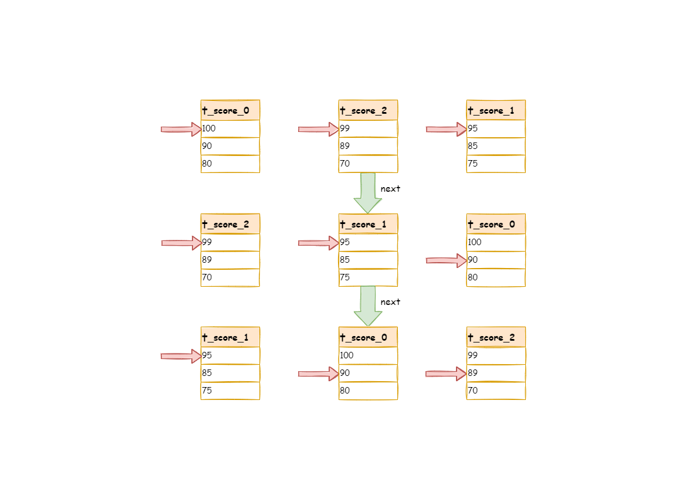

It can be seen that when data in each result set is ordered, but multiple result sets are disordered, ShardingSphere can still order them with no need to upload all the data to the memory. In the stream merger method, each `next` operation only acquires the right piece of data each time, which saves memory consumption to a large extent.

On the other hand, the order-by merger has maintained the orderliness on the horizontal axis and vertical axis of the data result set. Naturally ordered, the vertical axis refers to each data result set itself, which is acquired by SQL with `ORDER BY`. The horizontal axis refers to the current value pointed by each data result set, and its order needs to be maintained by the priority queue. Each time when the current cursor moves down, it requires putting the result set in the priority order again, which means only the cursor of the first data result set can be moved down.

<a id="reference-sharding-merge--group-by-merger"></a>

## Group-by Merger

Group-by merger is the most complex one and can be divided into stream group-by merger and memory group-by merger. Stream group-by merger requires that the SQL’s ordering items must be consistent with the field and ordering types (ASC or DESC) of the group-by item; otherwise, data correctness can only be guaranteed by memory merger.

For instance, if it is sharded based on subject, the table structure contains the examinees’ name (to simplify, name repetition is not taken into consideration) and score. The following SQL is used to acquire each examinee’s total score:

```sql
SELECT name, SUM(score) FROM t_score GROUP BY name ORDER BY name;
```

When order-by item and group-by item are totally consistent, the data obtained is continuous. The data required by group-by is all stored in the data value that the data result set cursor currently points to. Thus, stream group-by merger can be used, as illustrated by the diagram:

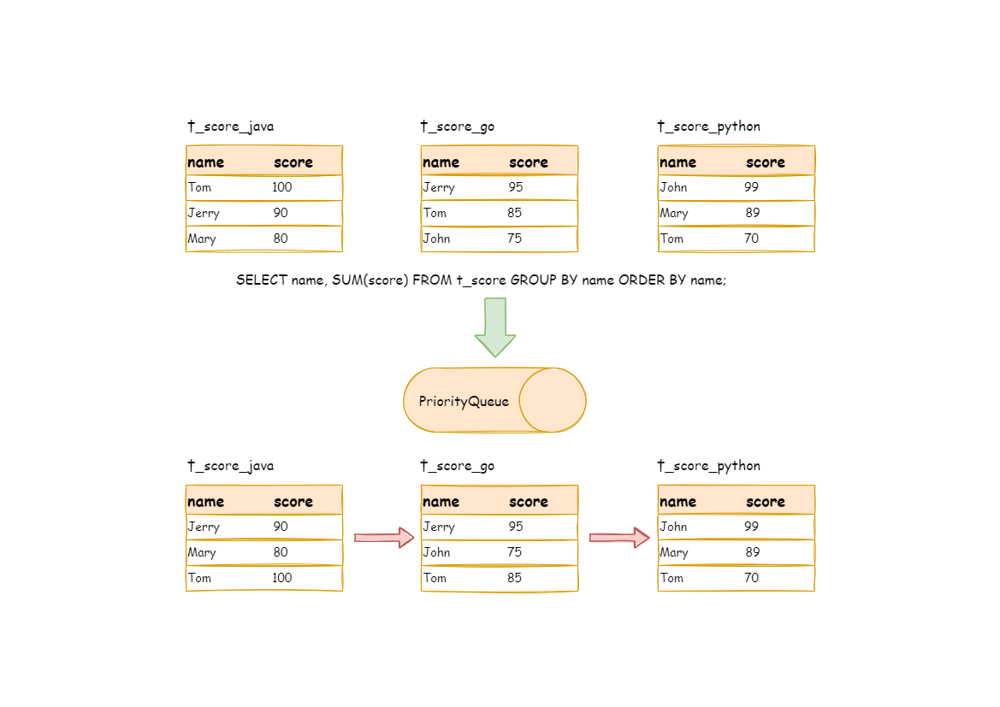

The merging logic is similar to that of order-by merger. The following picture shows how the stream group-by merger works in the `next` call.

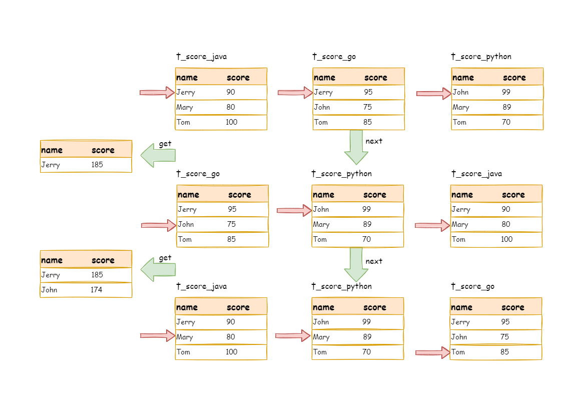

We can see from the picture that, in the first `next` call, `t_score_java` in the first place will be popped out of the queue, along with other result set data having the same grouping value of “Jerry”. After acquiring all the students’ scores with the name of “Jerry”, the accumulation operation will proceed. Hence, after the first `next` call is finished, the result set acquired is the sum of Jerry’s scores. At the same time, all the cursors in data result sets will be moved down to a different data value next to “Jerry” and reordered according to the current result set value. Thus, the data that contains the second name “John” will be put at the beginning of the queue.

Stream group-by merger is different from order-by merger only in two aspects:

1. It will take out all the data with the same group item from multiple data result sets at once.
2. It carried out the aggregation calculation according to the aggregation function type.

For the inconsistency between the grouping item and ordering item, it requires uploading all the data to the memory to group and aggregate, since the relevant data value needed to acquire group information is not continuous, and stream merger is not available. For example, acquire each examinee’s total score through the following SQL and order them from the highest to the lowest:

```sql
SELECT name, SUM(score) FROM t_score GROUP BY name ORDER BY score DESC;
```

Then, stream merger is not able to use, for the data taken out from each result set is the same as the original data of the order-by merger diagram in the upper half part structure.

When SQL only contains the group-by statement, according to different database implementations, its sorting order may not be the same as the group order. The lack of an ordering statement indicates the order is not important in this SQL. Therefore, through the optimization of SQL rewriting, ShardingSphere can automatically add the ordering item the same as the grouping item, converting it from the memory merger that consumes memory to the stream merger.

<a id="reference-sharding-merge--aggregation-merger"></a>

## Aggregation Merger

Whether it is stream group-by merger or memory group-by merger, they process the aggregation function in the same way. In addition to grouped SQL, ungrouped SQL can also use aggregate functions. Therefore, aggregation merger is an additional merging ability based on what has been introduced above, i.e., the decorator mode. The aggregation function can be categorized into three types: comparison, sum and average.

The comparison aggregation function refers to `MAX` and `MIN`. They need to compare all the result set data of each group and simply return the maximum or minimum value.

The sum aggregation function refers to `SUM` and `COUNT`. They need to sum up all the result set data of each group.

The average aggregation function refers only to `AVG`. It must be calculated through `SUM` and `COUNT` rewritten by SQL, which has been mentioned in the SQL rewriting section.

<a id="reference-sharding-merge--pagination-merger"></a>

## Pagination Merger

All the merger types above can be paginated. Pagination is the decorator added to other kinds of mergers. ShardingSphere strengthens its ability to paginate the data result set through decorator mode. The pagination merger is responsible for filtering unnecessary data.

ShardingSphere’s pagination function can be misleading to users in that they may think it will take a large amount of memory. In distributed scenarios, it can only guarantee the data correctness by rewriting `LIMIT 10000000, 10` to `LIMIT 0, 10000010`. Users can easily misunderstand that ShardingSphere uploads a large amount of meaningless data to the memory and has the risk of memory overflow. Actually, it can be known from the principle of stream merger that only memory group-by merger will upload all the data to the memory. Generally speaking, SQL used for OLAP grouping, is often applied to massive calculations or small result generation, and it won’t generate vast result data. Except for memory group-by merger, other scenarios all use stream merger to acquire data result set. So ShardingSphere would skip unnecessary data through the next call method in the result set, rather than storing it in the memory.

But it should be noted that pagination with `LIMIT` is not the best practice, because a large amount of data still needs to be transmitted to ShardingSphere’s memory space for ordering. `LIMIT` cannot query data by index, so paginating with ID is a better solution if ID continuity can be guaranteed. For example:

```sql
SELECT * FROM t_order WHERE id > 100000 AND id <= 100010 ORDER BY id;
```

Or query the next page through the ID of the last query result, for example:

```sql
SELECT * FROM t_order WHERE id > 10000000 LIMIT 10;
```

The overall structure of the merger engine is shown in the following diagram:

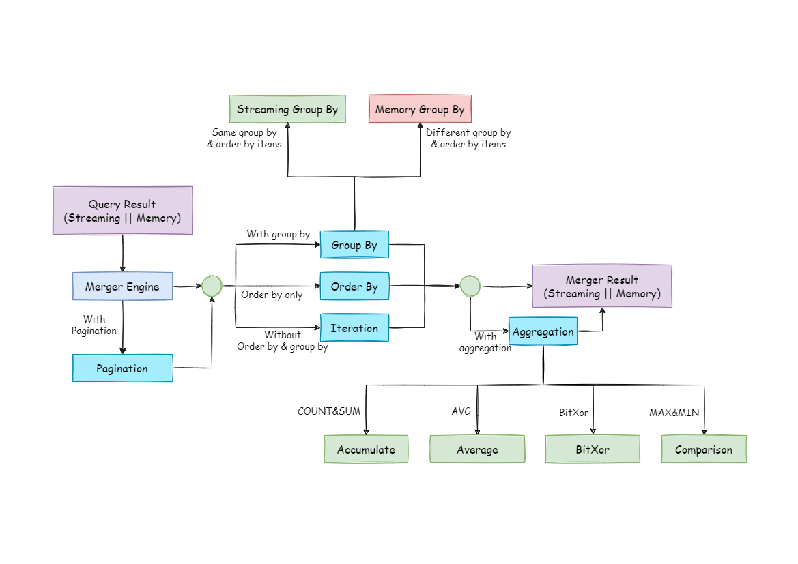

---

<a id="reference-transaction"></a>

<!-- source_url: https://shardingsphere.apache.org/document/current/en/reference/transaction/ -->

<!-- page_index: 348 -->

# Transaction :: ShardingSphere

Retro

Eye care

Haitian

Deep

Dark

Default

[Edit this page](https://github.com/apache/shardingsphere/tree/master/docs/document/content/reference/transaction/_index.en.md "Edit this page")

Transaction

- [Navigation](#reference-transaction--navigation)
<a id="reference-transaction--navigation"></a>

## Navigation

This chapter mainly introduces the principles of the distributed transactions:

- 2PC transaction with XA
- BASE transaction with Seata

---

<a id="reference-transaction-2pc-xa-transaction"></a>

<!-- source_url: https://shardingsphere.apache.org/document/current/en/reference/transaction/2pc-xa-transaction/ -->

<!-- page_index: 349 -->

# XA Transaction

Retro

Eye care

Haitian

Deep

Dark

Default

[Edit this page](https://github.com/apache/shardingsphere/tree/master/docs/document/content/reference/transaction/2pc-xa-transaction.en.md "Edit this page")

XA Transaction

<a id="reference-transaction-2pc-xa-transaction--xa-transaction"></a>

# XA Transaction

- [Transaction Begin](#reference-transaction-2pc-xa-transaction--transaction-begin)
- [Execute actual sharding SQL](#reference-transaction-2pc-xa-transaction--execute-actual-sharding-sql)
- [Commit or Rollback](#reference-transaction-2pc-xa-transaction--commit-or-rollback)

`XAShardingSphereTransactionManager` is XA transaction manager of Apache ShardingSphere.
Its main responsibility is manage and adapt multiple data sources, and sent corresponding transactions to concrete XA transaction manager.

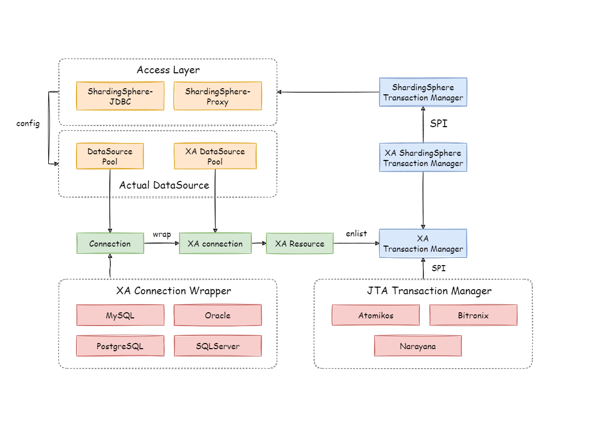

<a id="reference-transaction-2pc-xa-transaction--transaction-begin"></a>

## Transaction Begin

When receiving `set autoCommit=0` from client, `XAShardingSphereTransactionManager` will use XA transaction managers to start overall XA transactions, which is marked by XID.

<a id="reference-transaction-2pc-xa-transaction--execute-actual-sharding-sql"></a>

## Execute actual sharding SQL

After `XAShardingSphereTransactionManager` register the corresponding XAResource to the current XA transaction, transaction manager will send `XAResource.start` command to databases.
After databases received `XAResource.end` command, all SQL operator will mark as XA transaction.

For example:

```
XAResource1.start             ## execute in the enlist phase
statement.execute("sql1");
statement.execute("sql2");
XAResource1.end               ## execute in the commit phase
```

`sql1` and `sql2` in example will be marked as XA transaction.

<a id="reference-transaction-2pc-xa-transaction--commit-or-rollback"></a>

## Commit or Rollback

After `XAShardingSphereTransactionManager` receives the commit command in the access, it will delegate it to the actual XA manager.
It will collect all the registered XAResource in the thread, before sending `XAResource.end` to mark the boundary for the XA transaction.
Then it will send prepare command one by one to collect votes from XAResource.
If all the XAResource feedback is OK, it will send commit command to finally finish it;
If there is any No XAResource feedback, it will send rollback command to roll back.
After sending the commit command, all XAResource exceptions will be submitted again according to the recovery log to ensure the atomicity and high consistency.

For example:

```
XAResource1.prepare           ## ack: yes
XAResource2.prepare           ## ack: yes
XAResource1.commit
XAResource2.commit

XAResource1.prepare           ## ack: yes
XAResource2.prepare           ## ack: no
XAResource1.rollback
XAResource2.rollback
```

---

<a id="reference-transaction-base-transaction-seata"></a>

<!-- source_url: https://shardingsphere.apache.org/document/current/en/reference/transaction/base-transaction-seata/ -->

<!-- page_index: 350 -->

# Seata BASE transaction

Retro

Eye care

Haitian

Deep

Dark

Default

[Edit this page](https://github.com/apache/shardingsphere/tree/master/docs/document/content/reference/transaction/base-transaction-seata.en.md "Edit this page")

Seata BASE transaction

<a id="reference-transaction-base-transaction-seata--seata-base-transaction"></a>

# Seata BASE transaction

- [Init Seata Engine](#reference-transaction-base-transaction-seata--init-seata-engine)
- [Transaction Begin](#reference-transaction-base-transaction-seata--transaction-begin)
- [Execute actual sharding SQL](#reference-transaction-base-transaction-seata--execute-actual-sharding-sql)
- [Commit or Rollback](#reference-transaction-base-transaction-seata--commit-or-rollback)

When integrating Seata AT transaction, we need to integrate TM, RM and TC component into ShardingSphere transaction manager.
Seata have proxied `DataSource` interface in order to RPC with TC.
Similarly, Apache ShardingSphere faced to `DataSource` interface to aggregate data sources too.
After Seata `DataSource` encapsulation, it is easy to put Seata AT transaction into Apache ShardingSphere sharding ecosystem.

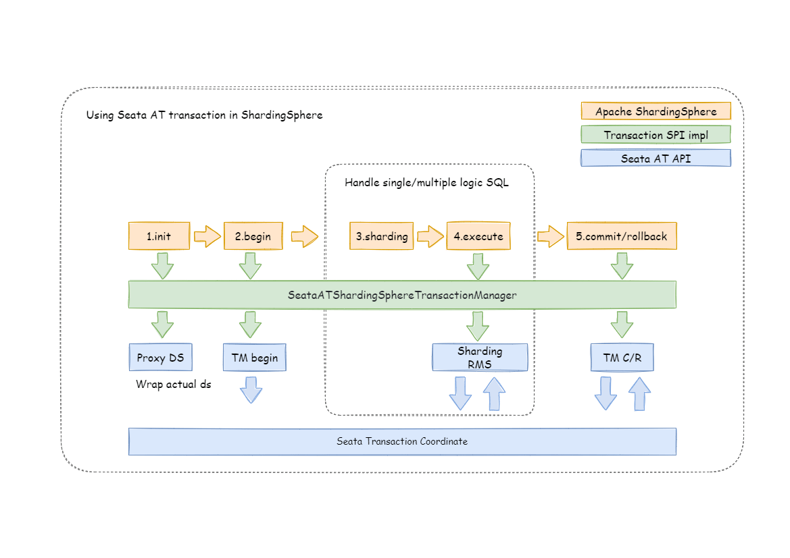

<a id="reference-transaction-base-transaction-seata--init-seata-engine"></a>

## Init Seata Engine

When an application containing `ShardingSphereTransactionBaseSeataAT` startup, the user-configured DataSource will be wrapped into seata `DataSourceProxy` through `seata.conf`, then registered into RM.

<a id="reference-transaction-base-transaction-seata--transaction-begin"></a>

## Transaction Begin

TM controls the boundaries of global transactions. TM obtains the global transaction ID by sending Begin instructions to TC.
All branch transactions participate in the global transaction through this global transaction ID.
The context of the global transaction ID will be stored in the thread local variable.

<a id="reference-transaction-base-transaction-seata--execute-actual-sharding-sql"></a>

## Execute actual sharding SQL

Actual SQL in Seata global transaction will be intercepted to generate undo snapshots by RM and sends participate instructions to TC to join global transaction.
Since actual sharding SQLs executed in multi-threads, global transaction context should transfer from main thread to child thread, which is exactly the same as context transfer between services.

<a id="reference-transaction-base-transaction-seata--commit-or-rollback"></a>

## Commit or Rollback

When submitting a seata transaction, TM sends TC the commit and rollback instructions of the global transaction. TC coordinates all branch transactions for commit and rollback according to the global transaction ID.

---

<a id="reference-migration"></a>

<!-- source_url: https://shardingsphere.apache.org/document/current/en/reference/migration/ -->

<!-- page_index: 351 -->

# Data Migration

Retro

Eye care

Haitian

Deep

Dark

Default

[Edit this page](https://github.com/apache/shardingsphere/tree/master/docs/document/content/reference/migration/_index.en.md "Edit this page")

Data Migration

<a id="reference-migration--data-migration"></a>

# Data Migration

- [Explanation](#reference-migration--explanation)
- [Execution Stage Explained](#reference-migration--execution-stage-explained)
  - [Preparation](#reference-migration--preparation)
  - [Stock data migration](#reference-migration--stock-data-migration)
  - [The Synchronization of incremental data](#reference-migration--the-synchronization-of-incremental-data)
  - [Traffic Switching](#reference-migration--traffic-switching)
- [References](#reference-migration--references)
<a id="reference-migration--explanation"></a>

## Explanation

The current data migration solution uses a completely new database cluster as the migration target.

This implementation has the following advantages:

1. No impact on the original data during migration.
2. No risk in case of migration failure.
3. Freedom from sharding strategy limitations.

The implementation has the following disadvantages:

1. Redundant servers can exist for a certain period of time.
2. All data needs to be moved.

A single data migration mainly consists of the following phases:

1. Preparation.
2. Stock data migration.
3. The synchronization of incremental data.
4. Traffic switching .

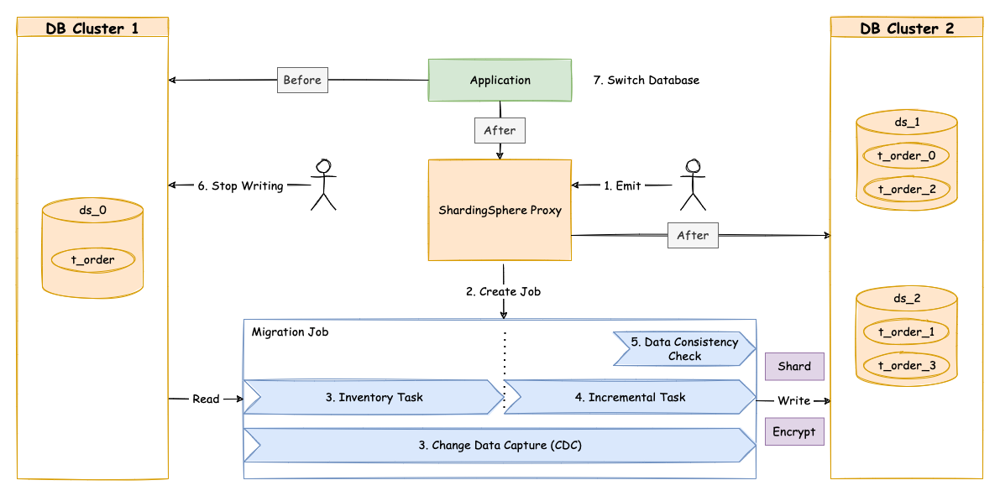

<a id="reference-migration--execution-stage-explained"></a>

## Execution Stage Explained

<a id="reference-migration--preparation"></a>

### Preparation

In the preparation stage, the data migration module verifies data source connectivity and permissions, counts stock data statistics, records the log and finally shards the tasks according to data volume and parallelism set by the users.

<a id="reference-migration--stock-data-migration"></a>

### Stock data migration

Execute the stock data migration tasks that have been sharded during preparation stage. The stock migration stage uses JDBC queries to read data directly from the source and write into the target based on the sharding rules and other configurations.

<a id="reference-migration--the-synchronization-of-incremental-data"></a>

### The Synchronization of incremental data

Since the duration of stock data migration depends on factors such as data volume and parallelism, it is necessary to synchronize the data added to the business operations during this period.
Different databases differ in technical details, but in general they are all based on replication protocols or WAL logs to achieve the capture of changed data.

- MySQL: subscribe and parse binlog.
- PostgreSQL: uses official logical replication [test\_decoding](https://www.postgresql.org/docs/9.4/test-decoding.html).

The incremental data captured is also written into the new data nodes by the data migration modules. When synchronization of incremental data is completed (the incremental data flow is not interrupted since the business system is still in function), you can then move to the traffic switching stage.

<a id="reference-migration--traffic-switching"></a>

### Traffic Switching

During this stage, there may be a read-only period of time, where data in the source data nodes is allowed to be in static mode for a short period of time to ensure that the incremental synchronization can be fully completed. Users can set this by shifting the database to read-only status or by controlling the traffic flow generated from the source.

The length of this read-only window depends on whether users need to perform consistency checks on the data and the exact amount of data in this scenario. Consistency check is an independent task. It supports separate start/stop and breakpoint resume.

Once confirmed, the data migration is complete. Users can then switch the read traffic or write traffic to Apache ShardingSphere.

<a id="reference-migration--references"></a>

## References

[Configurations of data migration](#user-manual-shardingsphere-proxy-migration)

---

<a id="reference-encrypt"></a>

<!-- source_url: https://shardingsphere.apache.org/document/current/en/reference/encrypt/ -->

<!-- page_index: 352 -->

# Encryption

Retro

Eye care

Haitian

Deep

Dark

Default

[Edit this page](https://github.com/apache/shardingsphere/tree/master/docs/document/content/reference/encrypt/_index.en.md "Edit this page")

Encryption

<a id="reference-encrypt--encryption"></a>

# Encryption

- - [Overall Architecture](#reference-encrypt--overall-architecture)
  - [Encryption Rules](#reference-encrypt--encryption-rules)
  - [Encryption Process](#reference-encrypt--encryption-process)
- [Detailed Solution](#reference-encrypt--detailed-solution)
- [The advantages of Middleware encryption service](#reference-encrypt--the-advantages-of-middleware-encryption-service)
- [Solution](#reference-encrypt--solution)

Apache ShardingSphere parses the SQL entered by users and rewrites the SQL according to the encryption rules provided by users.

When a user queries data, it only retrieves ciphertext data from the database, decrypts it, and finally returns the decrypted source data to the user. Apache ShardingSphere achieves a transparent and automatic data encryption process. Users can use encrypted data as normal data without paying attention to the implementation details of data encryption.

<a id="reference-encrypt--overall-architecture"></a>

### Overall Architecture

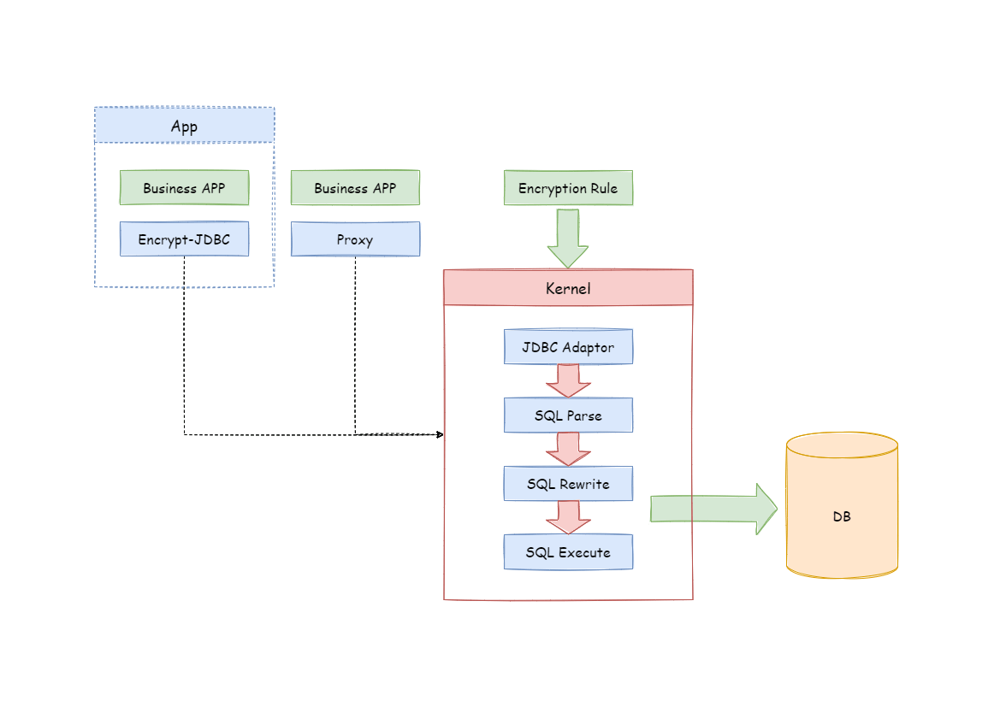

The encrypted module intercepts the SQL initiated by the user and parses and understands the SQL behavior through the SQL syntactic parser. Then it finds out the fields to be encrypted and the encryption and decryption algorithm according to the encryption rules introduced by the user and interacts with the underlying database.

Apache ShardingSphere will encrypt the plaintext requested by users and store it in the underlying database. When the user queries, the ciphertext is extracted from the database, decrypted, and returned to the terminal user. By shielding the data encryption process, users do not need to operate the SQL parsing process, data encryption, and data decryption.

<a id="reference-encrypt--encryption-rules"></a>

### Encryption Rules

Before explaining the whole process, we need to understand the encryption rules and configuration. Encryption configuration is mainly divided into three parts: data source configuration, encryptor configuration, encryption table configuration, as shown in the figure below:

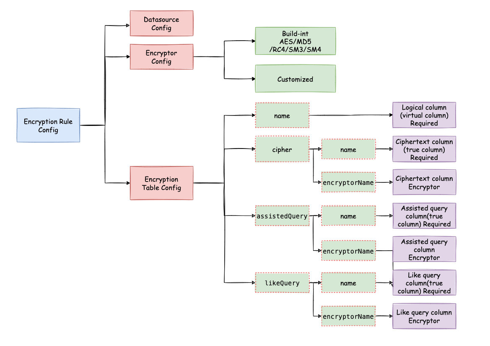

Data source configuration: the configuration of the data source.

Encryptor configuration: refers to the encryption algorithm used for encryption and decryption. Currently, ShardingSphere has three built-in encryption and decryption algorithms: AES, MD5 and RC4. Users can also implement a set of encryption and decryption algorithms by implementing the interfaces provided by ShardingSphere.

Encryption table configuration: it is used to tell ShardingSphere which column in the data table is used to store ciphertext data (`cipherColumn`), and which column the user would like to use for SQL writing (`logicColumn`).

> What does it mean by “which column the user would like to use for SQL writing (logicColumn)”?
> We have to know first why the encrypted module exists. The goal of the encrypted module is to shield the underlying data encryption process, which means we don’t want users to know how data is encrypted and decrypted, and how to store ciphertext data into `cipherColumn`. In other words, we don’t want users to know there is a `cipherColumn` or how they are used. Therefore, we need to provide the user with a conceptual column that can be separated from the real column in the underlying database. It may or may not be a real column in the database table so that users can change the column names of `cipherColumn` of the underlying database at will. The only thing we have to ensure is that the user’s SQL is written towards the logical column, and the correct mapping relation between `logicColumn` and `cipherColumn` can be seen in the encryption rules.

Query attribute configuration: if both plaintext and ciphertext data are stored in the underlying database table, this attribute can be used to determine whether to query the plaintext data in the database table and return it directly, or query the ciphertext data and return it after decryption through Apache ShardingSphere. This attribute can be configured at the table level and the entire rule level. The table-level has the highest priority.

<a id="reference-encrypt--encryption-process"></a>

### Encryption Process

For example, if there is a table named `t_user` in the database, and they’re two fields in the table: `pwd_cipher` for storing ciphertext data, and logicColumn is defined as `pwd`, then users should write SQL for `logicColumn`, that is `INSERT INTO t_user SET pwd = '123'`. Apache ShardingSphere receives the SQL and finds that the `pwd` is the `logicColumn` based on the encryption configuration provided by the user. Therefore, it encrypts the logical column and its corresponding plaintext data.

Apache ShardingSphere transforms the column names and data encryption mapping between the logical columns facing users and cipher columns facing the underlying database. As shown in the figure below:

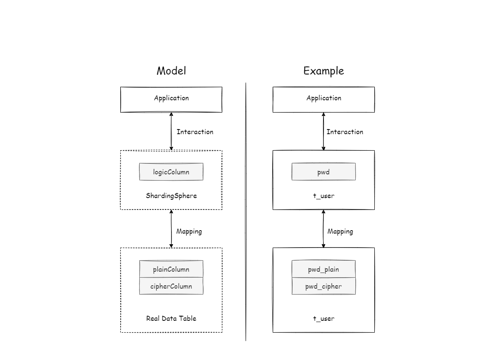

The user’s SQL is separated from the underlying data table structure according to the encryption rules provided by the user so that the user’s SQL writing does not depend on the real database table structure.

The connection, mapping, and transformation between the user and the underlying database are handled by Apache ShardingSphere.

The picture below shows the processing flow and conversion logic when the encryption module is used to add, delete, change and check, as shown in the figure below.

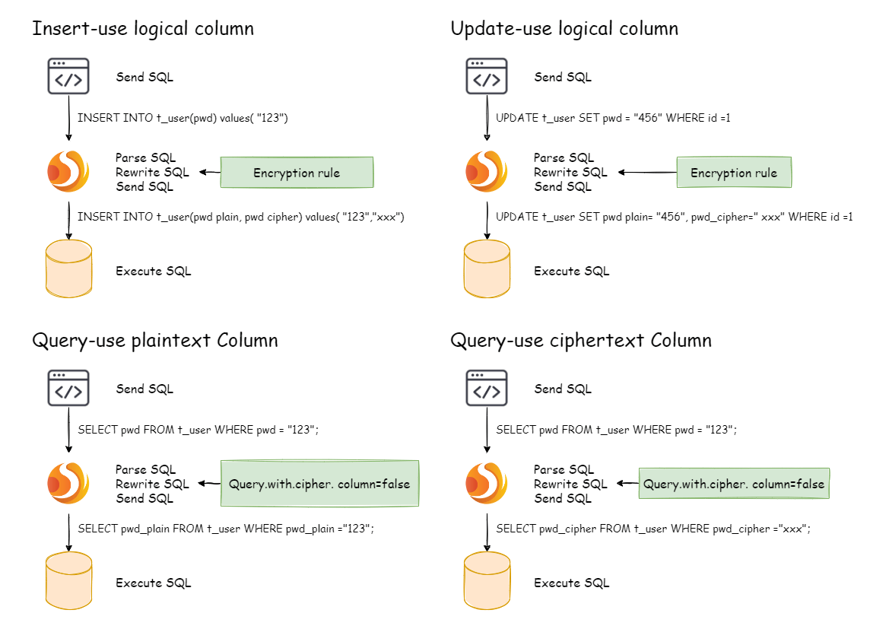

<a id="reference-encrypt--detailed-solution"></a>

## Detailed Solution

After understanding Apache ShardingSphere’s encryption process, you can combine the encryption configuration and encryption process according to your scenario. The entire design & development was conceived to address the pain points encountered in business scenarios. So, how to use Apache ShardingSphere to meet the business requirements mentioned before?

Business scenario analysis: the newly launched business is relatively simple because it starts from scratch and there’s no need to clean up historical data.

Solution description: after selecting the appropriate encryption algorithm, such as AES, you only need to configure the logical column (write SQL for users) and the ciphertext column (the data table stores the ciphertext data). The logical columns and ciphertext columns can also be different. The following configurations are recommended (in YAML format):

```yaml
-!ENCRYPT
  encryptors:
    aes_encryptor:
      type: AES
      props:
        aes-key-value: 123456abc
        digest-algorithm-name: SHA-1
  tables:
    t_user:
      columns:
        pwd:
          cipher:
            name: pwd_cipher
            encryptorName: aes_encryptor
          assistedQuery:
            name: pwd_assisted_query
            encryptorName: pwd_assisted_query_cipher
```

With the above configuration, Apache ShardingSphere only needs to convert `logicColumn`, `cipherColumn`, and `assistedQueryColumn`.

The underlying data table does not store plaintext, and only ciphertext is stored, which is also the requirement of the security audit. The overall processing flow is shown in the figure below:

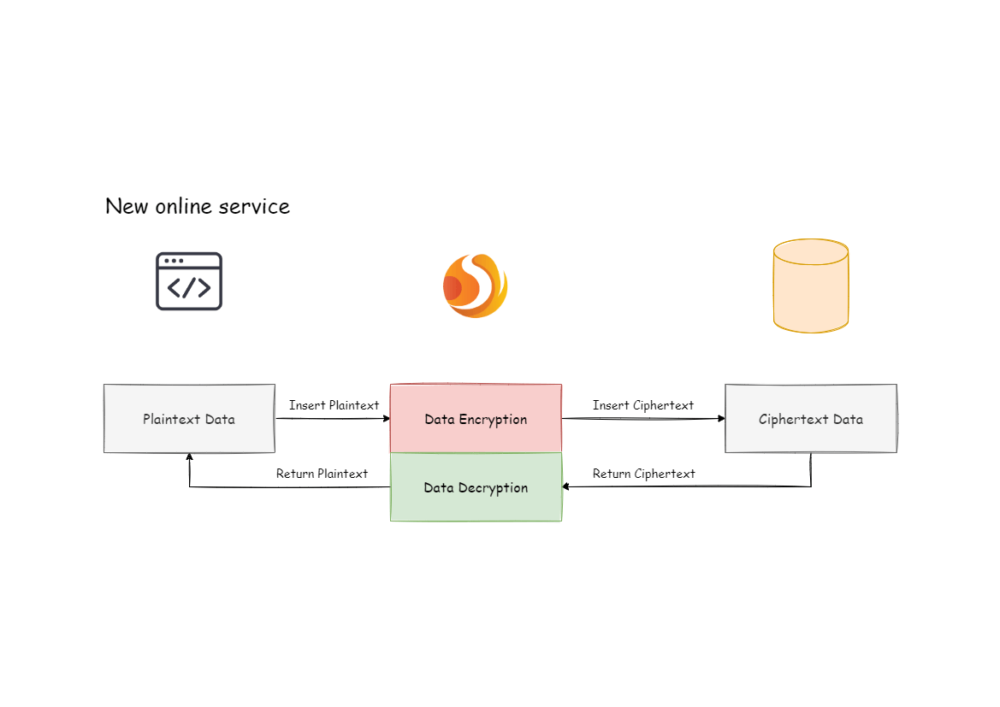

<a id="reference-encrypt--the-advantages-of-middleware-encryption-service"></a>

## The advantages of Middleware encryption service

1. Automatic and transparent data encryption process. Encryption implementation details are no longer a concern for users.
2. It provides a variety of built-in and third-party (AKS) encryption algorithms, which are available through simple configurations.
3. It provides an encryption algorithm API interface. Users can implement the interface to use a custom encryption algorithm for data encryption.
4. It can switch among different encryption algorithms.

<a id="reference-encrypt--solution"></a>

## Solution

Apache ShardingSphere provides an encryption algorithm for data encryption, namely `EncryptAlgorithm`.

On the one hand, Apache ShardingSphere provides users with built-in implementation classes for encryption and decryption, which are available through configurations by users.

On the other hand, in order to be applicable to different scenarios, we also opened the encryption and decryption interfaces, and users can provide specific implementation classes according to these two types of interfaces.

After simple configuration, Apache ShardingSphere can call user-defined encryption and decryption schemes for data encryption.

<a id="reference-encrypt--encryptalgorithm"></a>

### EncryptAlgorithm

The solution provides two methods, `encrypt()` and `decrypt()`, to encrypt or decrypt data.
When users perform `INSERT`, `DELETE` and `UPDATE` operations, ShardingSphere will parse, rewrite and route SQL according to the configuration.

It will also use `encrypt()` to encrypt data and store them in the database. When using SELECT, they will decrypt sensitive data from the database with `decrypt()` and finally return the original data to users.

Currently, Apache ShardingSphere provides three types of implementations for this kind of encryption solution, including MD5 (irreversible), AES (reversible) and RC4 (reversible), which can be used after configuration.

---

<a id="reference-mask"></a>

<!-- source_url: https://shardingsphere.apache.org/document/current/en/reference/mask/ -->

<!-- page_index: 353 -->

# Mask

Retro

Eye care

Haitian

Deep

Dark

Default

[Edit this page](https://github.com/apache/shardingsphere/tree/master/docs/document/content/reference/mask/_index.en.md "Edit this page")

Mask

<a id="reference-mask--mask"></a>

# Mask

- - [Overall Architecture](#reference-mask--overall-architecture)
  - [Mask Rules](#reference-mask--mask-rules)
  - [Mask Process](#reference-mask--mask-process)

Apache ShardingSphere achieves the desensitization of the original data by parsing the SQL queried by users and masking the SQL execution results according to the desensitization rules provided by users.

<a id="reference-mask--overall-architecture"></a>

### Overall Architecture

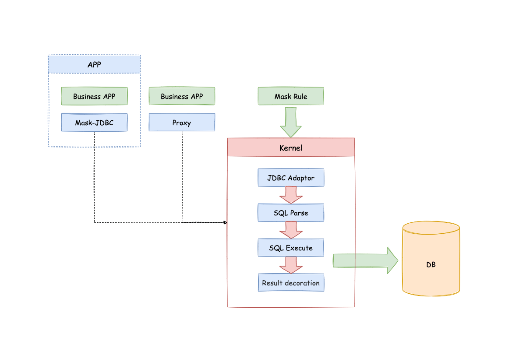

The desensitization module intercepts the SQL initiated by the user, analyzes and executes it through the SQL syntax parser. It then masks the query results by finding out the fields to be desensitized and the desensitization algorithm to be used according to the rules passed specified by the user, and returns to the client.

<a id="reference-mask--mask-rules"></a>

### Mask Rules

Before explaining the whole process in detail, we need to first understand the desensitization rules and configuration, which is the basis of understanding the whole process.

Desensitization configuration is mainly divided into three parts: data source configuration, desensitization algorithm configuration, desensitization table configuration:

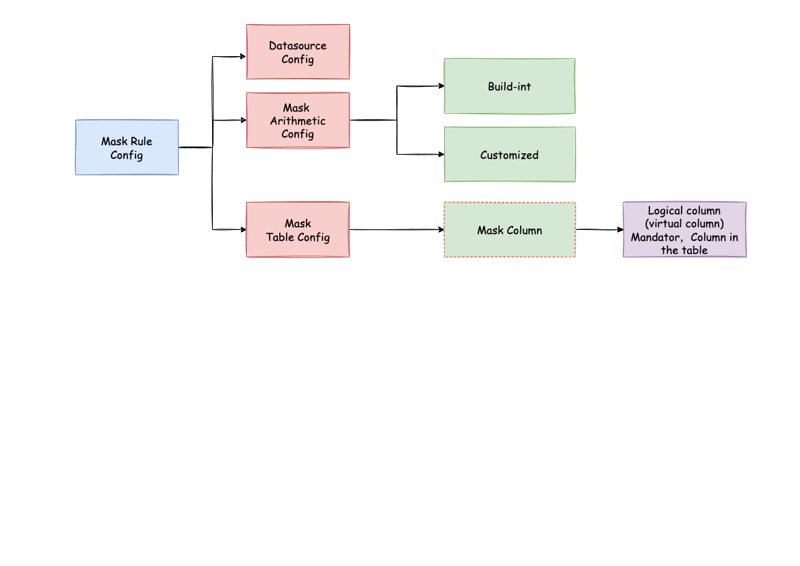

**Data source configuration**: the configuration of the data source.

**Mask algorithm configuration**: currently, ShardingSphere has a variety of built-in desensitization algorithms: MD5, KEEP\_FIRST\_N\_LAST\_M, KEEP\_FROM\_X\_TO\_Y , MASK\_FIRST\_N\_LAST\_M, MASK\_FROM\_X\_TO\_Y, MASK\_BEFORE\_SPECIAL\_CHARS, MASK\_AFTER\_SPECIAL\_CHARS and GENERIC\_TABLE\_RANDOM\_REPLACE.

Users can also implement a set of desensitization algorithms by implementing the interface provided by ShardingSphere.

**Mask table configuration**: used to tell ShardingSphere which column in the data table is used for data desensitization and which algorithm is used for desensitization.

**The mask rule takes effect after it is created**

Query attribute configuration: if both plaintext and ciphertext data are stored in the underlying database table, this attribute can be used to determine whether to query the plaintext data in the database table and return it directly, or query the ciphertext data and return it after decryption through Apache ShardingSphere.

This attribute can be configured at the table level and the entire rule level. The table-level has the highest priority.

<a id="reference-mask--mask-process"></a>

### Mask Process

For example, if there is a table in the database called `t_user and` there is a field in the table called `phone_number` that uses `MASK_FROM_X_TO_Y`, Apache ShardingSphere does not change the data store.

It’ll only mask the result according to the desensitization algorithm, to achieve the desensitization effect.

As shown in the picture below:

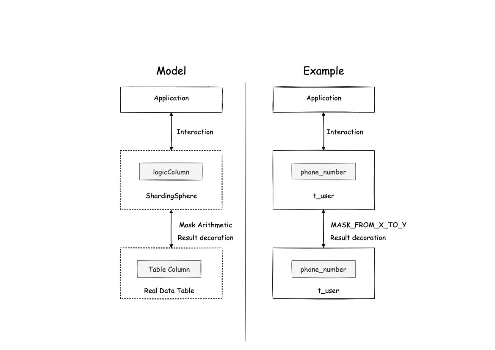

---

<a id="reference-shadow"></a>

<!-- source_url: https://shardingsphere.apache.org/document/current/en/reference/shadow/ -->

<!-- page_index: 354 -->

# Shadow

Retro

Eye care

Haitian

Deep

Dark

Default

[Edit this page](https://github.com/apache/shardingsphere/tree/master/docs/document/content/reference/shadow/_index.en.md "Edit this page")

Shadow

---

<a id="reference-observability"></a>

<!-- source_url: https://shardingsphere.apache.org/document/current/en/reference/observability/ -->

<!-- page_index: 355 -->

# Oberservability

Retro

Eye care

Haitian

Deep

Dark

Default

[Edit this page](https://github.com/apache/shardingsphere/tree/master/docs/document/content/reference/observability/_index.en.md "Edit this page")

Oberservability

<a id="reference-observability--oberservability"></a>

# Oberservability

- [How it works](#reference-observability--how-it-works)
<a id="reference-observability--how-it-works"></a>

## How it works

ShardingSphere-Agent module provides an observable framework for ShardingSphere, which is implemented based on Java Agent.

Metrics, tracing and logging functions are integrated into the agent through plugins, as shown in the following figure:

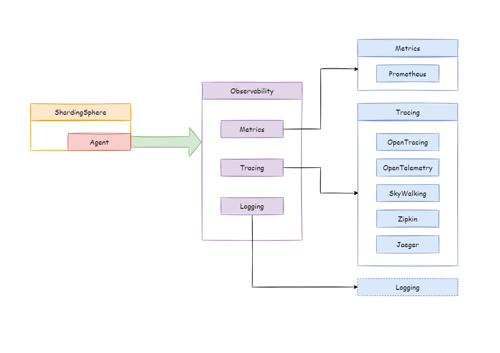

- The metrics plugin is used to collect and display statistical indicators for the entire cluster. Apache ShardingSphere supports Prometheus by default.
- The tracing plugin is used to obtain the link trace information of SQL parsing and SQL execution. Apache ShardingSphere provides support for exporting tracing data to Jaeger and Zipkin by default. It also supports users developing customized tracing components through plugin.
- The default logging plugin shows how to record additional logs in ShardingSphere. In practical applications, users need to explore according to their own needs.

---

<a id="reference-architecture"></a>

<!-- source_url: https://shardingsphere.apache.org/document/current/en/reference/architecture/ -->

<!-- page_index: 356 -->

# Architecture

Retro

Eye care

Haitian

Deep

Dark

Default

[Edit this page](https://github.com/apache/shardingsphere/tree/master/docs/document/content/reference/architecture/_index.en.md "Edit this page")

Architecture

<a id="reference-architecture--architecture"></a>

# Architecture

Apache ShardingSphere’s pluggable architecture is designed to enable developers to customize their own unique systems by adding the desired features, just like adding building blocks.

A plugin-oriented architecture has very high requirements for program architecture design. It requires making each module independent, and using a pluggable kernel to combine various functions in an overlapping manner. Designing an architecture system that completely isolates the feature development not only fosters an active open source community, but also ensures the quality of the project.

Apache ShardingSphere began to focus on the pluggable architecture since version 5.X, and the functional components of the project can be flexibly extended in a pluggable manner. Currently, features such as data sharding, read/write splitting, database high availability, data encryption, shadow DB stress testing, and support for SQL and protocols such as MySQL, PostgreSQL, SQLServer, Oracle, etc. are woven into the project through plugins.
Apache ShardingSphere has provided dozens of SPIs (service provider interfaces) as extension points of the system, with the total number still increasing.

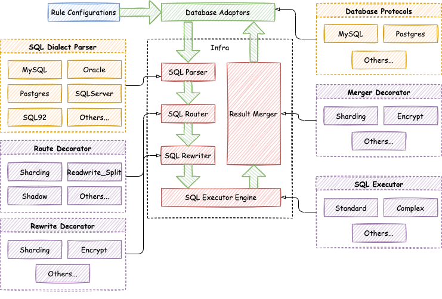

---

<a id="faq"></a>

<!-- source_url: https://shardingsphere.apache.org/document/current/en/faq/ -->

<!-- page_index: 357 -->

# FAQ :: ShardingSphere

Retro

Eye care

Haitian

Deep

Dark

Default

[Edit this page](https://github.com/apache/shardingsphere/tree/master/docs/document/content/faq/_index.en.md "Edit this page")

FAQ

---

<a id="downloads"></a>

<!-- source_url: https://shardingsphere.apache.org/document/current/en/downloads/ -->

<!-- page_index: 358 -->

# Downloads :: ShardingSphere

Retro

Eye care

Haitian

Deep

Dark

Default

[Edit this page](https://github.com/apache/shardingsphere/tree/master/docs/document/content/downloads/_index.en.md "Edit this page")

Downloads

- [Latest Releases](#downloads--latest-releases)
- [All Releases](#downloads--all-releases)
- [Verify the Releases](#downloads--verify-the-releases)
<a id="downloads--latest-releases"></a>

## Latest Releases

Apache ShardingSphere is released as source code tarballs with corresponding binary tarballs for convenience.
The downloads are distributed via mirror sites and should be checked for tampering using GPG or SHA-512.

<a id="downloads--apache-shardingsphere-version-553-release-date-march-1-2026"></a>
<a id="downloads--apache-shardingsphere-version:-5.5.3-release-date:-march-1-2026"></a>

##### Apache ShardingSphere - Version: 5.5.3 ( Release Date: March 1, 2026 )

- Source Codes: [SRC](https://www.apache.org/dyn/closer.lua/shardingsphere/5.5.3/apache-shardingsphere-5.5.3-src.zip) ( [ASC](https://downloads.apache.org/shardingsphere/5.5.3/apache-shardingsphere-5.5.3-src.zip.asc), [SHA512](https://downloads.apache.org/shardingsphere/5.5.3/apache-shardingsphere-5.5.3-src.zip.sha512) )
- ShardingSphere-JDBC Binary Distribution: [TAR](https://www.apache.org/dyn/closer.lua/shardingsphere/5.5.3/apache-shardingsphere-5.5.3-shardingsphere-jdbc-bin.tar.gz) ( [ASC](https://downloads.apache.org/shardingsphere/5.5.3/apache-shardingsphere-5.5.3-shardingsphere-jdbc-bin.tar.gz.asc), [SHA512](https://downloads.apache.org/shardingsphere/5.5.3/apache-shardingsphere-5.5.3-shardingsphere-jdbc-bin.tar.gz.sha512) )
- ShardingSphere-Proxy Binary Distribution: [TAR](https://www.apache.org/dyn/closer.lua/shardingsphere/5.5.3/apache-shardingsphere-5.5.3-shardingsphere-proxy-bin.tar.gz) ( [ASC](https://downloads.apache.org/shardingsphere/5.5.3/apache-shardingsphere-5.5.3-shardingsphere-proxy-bin.tar.gz.asc), [SHA512](https://downloads.apache.org/shardingsphere/5.5.3/apache-shardingsphere-5.5.3-shardingsphere-proxy-bin.tar.gz.sha512), [Notes](https://shardingsphere.apache.org/document/5.5.3/en/user-manual/shardingsphere-proxy/startup/bin/#special-notes) )
- ShardingSphere-Agent Binary Distribution: [TAR](https://www.apache.org/dyn/closer.lua/shardingsphere/5.5.3/apache-shardingsphere-5.5.3-shardingsphere-agent-bin.tar.gz) ( [ASC](https://downloads.apache.org/shardingsphere/5.5.3/apache-shardingsphere-5.5.3-shardingsphere-agent-bin.tar.gz.asc), [SHA512](https://downloads.apache.org/shardingsphere/5.5.3/apache-shardingsphere-5.5.3-shardingsphere-agent-bin.tar.gz.sha512) )

<a id="downloads--all-releases"></a>

## All Releases

Find all releases in the [Archive repository](https://archive.apache.org/dist/shardingsphere/).
Find all incubator releases in the [Archive incubator repository](https://archive.apache.org/dist/incubator/shardingsphere/).

<a id="downloads--verify-the-releases"></a>

## Verify the Releases

[PGP signatures KEYS](https://downloads.apache.org/shardingsphere/KEYS)

It is essential that you verify the integrity of the downloaded files using the PGP or SHA signatures.
The PGP signatures can be verified using GPG or PGP.
Please download the KEYS as well as the asc signature files for relevant distribution.
It is recommended to get these files from the main distribution directory and not from the mirrors.

```shell
gpg -i KEYS
```

or

```shell
pgpk -a KEYS
```

or

```shell
pgp -ka KEYS
```

To verify the binaries/sources you can download the relevant asc files for it from main distribution directory and follow the below guide.

```shell
gpg --verify apache-shardingsphere-********.asc apache-shardingsphere-*********
```

or

```shell
pgpv apache-shardingsphere-********.asc
```

or

```shell
pgp apache-shardingsphere-********.asc
```

---
