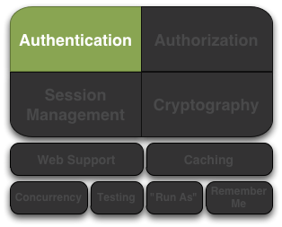
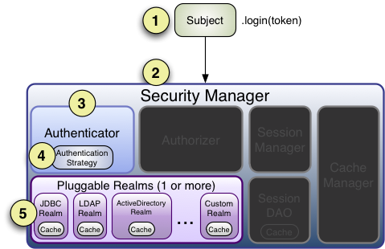
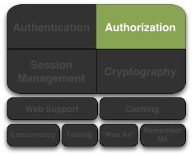

# Apache Shiro Documentation

## Navigation

- [Get Started](#get-started)
- [Docs](#documentation)
- Web Apps
  - [General](#web)
  - [JAX-RS](#jaxrs)
  - [Jakarta EE](#jakarta-ee)
  - [Jakarta EE with Dependency Chains](#dependency-chain)
  - [Features](#web-features)
- [Features](#features)
- [Integrations](#integration)
  - [Spring](#spring-boot)
  - [Guice](#guice)
  - [Third-Party Integrations](#integration)
- Community
  - [Community Forums](#forums)
  - [Mailing Lists](#mailing-lists)
  - [Articles](#articles)
  - [Events](#events)
  - [Troubleshooting & FAQ](#troubleshooting)
  - [Community Support](#support)
  - [Commercial Support](#commercial-support)
  - [More](#community)
- About
  - [About](#about)
  - [Privacy Policy](#privacy-policy)
  - [Security Model](#security-model)
  - [Vulnerability Reports](#security-reports)
- [Apache Shiro Reference Documentation](#reference)
- Overview
  - [Introduction](#introduction)
  - [Tutorial](#tutorial)
  - [Architecture](#architecture)
  - [Configuration](#configuration)
- Core
  - [Authentication](#authentication)
  - [Authorization](#authorization)
    - [Permissions](#permissions)
  - [Realms](#realm)
  - [Session Management](#session-management)
  - [Cryptography](#cryptography)
- Web Applications
  - [Web](#web)
    - [Configuration](#web--configuration)
    - [urls](#web--web_ini)
    - [Default Filters](#web--default_filters)
    - [Session Management](#web--session_management)
    - [JSP Tag Library](#web--tag_library)
- Auxiliary Support
  - [Caching](#caching)
  - [Concurrency & Multithreading](#concurrency)
  - [Testing](#testing)
  - [Custom Subjects](#subject)
- Integration
  - [Spring Framework](#spring-framework)
  - [Guice](#guice)
  - [CAS](#cas)
- Tools
  - [Command Line Hasher](#command-line-hasher)
- Index
  - [Terminology](#terminology)
- Other pages
  - [10 Minute Tutorial on Apache Shiro](#10-minute-tutorial)
  - [Apache Shiro Authentication Features](#authentication-features)
  - [Authorization Features](#authorization-features)
  - [Apache Shiro Cryptography Features](#cryptography-features)
  - [Apache Shiro Developer Resources](#developer-resources)
  - [Contributing to Apache Shiro](#how-to-contribute)
  - [Getting Started](#index)
  - [Java Authentication Guide with Apache Shiro](#java-authentication-guide)
  - [Java Authorization Guide with Apache Shiro](#java-authorization-guide)
  - [Apache Shiro Migration Guide](#migration-guide)
  - [Apache Shiro Session Management Features](#session-management-features)
  - [Securing Web Applications with Apache Shiro](#webapp-tutorial)

## Content

<a id="get-started"></a>

<!-- source_url: https://shiro.apache.org/get-started.html -->

<!-- page_index: 1 -->

# Get Started with Apache Shiro

[Fork me on GitHub](https://github.com/apache/shiro "Fork me on GitHub")

[](#index)
Simple. Java. Security.
[](https://www.apache.org/events/current-event.html)

<a id="get-started--get-started-with-apache-shiro"></a>

# Get Started with Apache Shiro

> [!TIP]
> Handy Hint
>
> Shiro v1 version notice
>
> As of February 28, 2024, Shiro v1 was superseded by v2.

Apache Shiro focuses on ease-of-use, so you can rely on secure, stable authentication, authorization, cryptography, and session management. With Shiro’s easy-to-understand API, you can quickly and easily secure any application. Get started!

<a id="get-started--tutorials"></a>

## Tutorials

- **[10-Minute Tutorial](#10-minute-tutorial)**
  Learn all the ins and outs of the Shiro Framework in under 10 minutes. This quick and simple tutorial shows how a developer uses Shiro in their application.
- **[Your First Shiro Application](#tutorial)**
  If you’re new to Apache Shiro, this short tutorial will show you how to set up a very simple application secured by Apache Shiro. We’ll discuss Shiro’s core concepts along the way to help familiarize you with Shiro’s design and API.

<a id="get-started--other_resources"></a>
<a id="get-started--other-resources"></a>

## Other Resources

- **[Introductory Articles… and Beyond!](#articles)**
  Articles and Guides written by and for members of the Apache Shiro community.

---

---

<a id="documentation"></a>

<!-- source_url: https://shiro.apache.org/documentation.html -->

<!-- page_index: 2 -->

# Apache Shiro Documentation

[Fork me on GitHub](https://github.com/apache/shiro "Fork me on GitHub")

[](#index)
Simple. Java. Security.
[](https://www.apache.org/events/current-event.html)

<a id="documentation--apache-shiro-documentation"></a>

# Apache Shiro Documentation

> [!TIP]
> Handy Hint
>
> Shiro v1 version notice
>
> As of February 28, 2024, Shiro v1 was superseded by v2.

<a id="documentation--introduction"></a>

## Introduction

Helpful if read in order:

- [Application Security with Apache Shiro](https://www.infoq.com/articles/apache-shiro) - full intro article on InfoQ.com
- [10 Minute Tutorial](#10-minute-tutorial)
- [Beginner’s Webapp Tutorial: a step-by-step tutorial to enable Shiro in a web application](#webapp-tutorial)
- [Flowlogix Starter](https://start.flowlogix.com) - generate Jakarta EE projects with Shiro support

<a id="documentation--apache_shiro_reference_and_api"></a>
<a id="documentation--apache-shiro-reference-and-api"></a>

## Apache Shiro Reference and API

<a id="documentation--reference_manual"></a>
<a id="documentation--reference-manual"></a>

### Reference Manual

- [Reference Manual](#reference)

<a id="documentation--current_release"></a>
<a id="documentation--current-release"></a>

### Current Release

Apache Shiro 2.1.0 ([Download](https://shiro.apache.org/download.html))

- [API](https://javadoc.io/doc/org.apache.shiro) (Javadoc - Hosted on javadoc.io)
- [Browse Source](https://github.com/apache/shiro/tree/shiro-root-2.1.0/) (GitHub tag)
- [Maven Static Site](https://shiro.apache.org/static/latest/)

<a id="documentation--lendahandwithdocumentation"></a>
<a id="documentation--lend-a-hand-with-documentation"></a>

## Lend a hand with documentation

While we hope this documentation helps you with the work you're doing with Apache Shiro, the community is improving and expanding the documentation all the time. If you'd like to help the Shiro project, please consider correcting, expanding, or adding documentation where you see a need. Every little bit of help you provide expands the community and in turn improves Shiro.

The easiest way to contribute your documentation is to submit a pull-request by clicking on the `Edit` link below, or send it to the [User Mailing List](#mailing-lists "Mailing Lists").

---

---

<a id="web"></a>

<!-- source_url: https://shiro.apache.org/web.html -->

<!-- page_index: 3 -->

# Apache Shiro Web Support

[Fork me on GitHub](https://github.com/apache/shiro "Fork me on GitHub")

[](#index)
Simple. Java. Security.
[](https://www.apache.org/events/current-event.html)

<a id="web--apache-shiro-web-support"></a>

# Apache Shiro Web Support

> [!TIP]
> Handy Hint
>
> Shiro v1 version notice
>
> As of February 28, 2024, Shiro v1 was superseded by v2.

<a id="web--configuration"></a>

## Configuration

The simplest way to integrate Shiro into any web application is to configure a Servlet ContextListener and Filter in web.xml that understands how to read Shiro’s INI configuration. The bulk of the INI config format itself is defined in the Configuration pages’s [INI Sections](#configuration--configuration-iniconfiguration-sections) section, but we’ll cover some additional web-specific sections here.

Example 1. Using Jakarta EE?

The below configuration is not required if using [Jakarta EE integration](#jakarta-ee) or basic CDI integration module.

Example 2. Using Spring?

Spring Framework users will not perform this setup. If you use Spring, you will want to read about [Spring-specific web configuration](#spring-boot--web_applications) instead.

<a id="web--web_xml"></a>
<a id="web--web.xml"></a>

### `web.xml`

<a id="web--shiro_1_2_and_later"></a>
<a id="web--shiro-1.2-and-later"></a>

#### Shiro 1.2 and later

In Shiro 1.2 and later, standard web applications initialize Shiro by adding the following XML chunks to `web.xml`:

```xml
<listener>
    <listener-class>org.apache.shiro.web.env.EnvironmentLoaderListener</listener-class>
</listener>

<!-- ... -->

<filter>
    <filter-name>ShiroFilter</filter-name>
    <filter-class>org.apache.shiro.web.servlet.ShiroFilter</filter-class>
</filter>

<filter-mapping>
    <filter-name>ShiroFilter</filter-name>
    <url-pattern>/*</url-pattern>
    <dispatcher>REQUEST</dispatcher>
    <dispatcher>FORWARD</dispatcher>
    <dispatcher>INCLUDE</dispatcher>
    <dispatcher>ERROR</dispatcher>
    <dispatcher>ASYNC</dispatcher>
</filter-mapping>
```

This assumes a Shiro INI [Configuration](#configuration) file is located at either of the following two locations, using whichever is found first:

1. `/WEB-INF/shiro.ini`
2. `shiro.ini` file at the root of the classpath.

Here is what the above config does:

- The `EnvironmentLoaderListener` initializes a Shiro `WebEnvironment` instance (which contains everything Shiro needs to operate, including the `SecurityManager`) and makes it accessible in the `ServletContext`. If you need to obtain this `WebEnvironment` instance at any time, you can call `WebUtils.getRequiredWebEnvironment(servletContext)`.
- The `ShiroFilter` will use this `WebEnvironment` to perform all necessary security operations for any filtered request.
- Finally, the `filter-mapping` definition ensures that all requests are filtered by the `ShiroFilter`, recommended for most web applications to ensure that any request can be secured.

> [!TIP]
> ShiroFilter filter-mapping
>
> It is usually desirable to define the `ShiroFilter filter-mapping` before any other `filter-mapping` declarations to ensure that Shiro can function in those filters as well.

Example 3. ShiroFilter default encoding

The shiro filter is a standard servlet filter, with a default encoding of ISO-8859-1 according to the [servlet specification](https://javaee.github.io/servlet-spec/downloads/servlet-4.0/servlet-4_0_FINAL.pdf). However, the client can choose to send authentication data with a different encoding using the `charset` attribute of the `Content-Type` header.

<a id="web--custom_webenvironment_class"></a>
<a id="web--custom-webenvironment-class"></a>

##### Custom `WebEnvironment` Class

By default, the `EnvironmentLoaderListener` will create an `IniWebEnvironment` instance, which assumes Shiro’s INI-based [Configuration](#configuration). If you like, you may specify a custom `WebEnvironment` instance instead by specifying a `ServletContext` `context-param` in `web.xml`:

```xml
<context-param>
    <param-name>shiroEnvironmentClass</param-name>
    <param-value>com.foo.bar.shiro.MyWebEnvironment</param-value>
</context-param>
```

This allows you to customize how a configuration format is parsed and represented as a `WebEnvironment` instance. You could subclass the existing `IniWebEnvironment` for custom behavior, or support different configuration formats entirely. For example, if someone wanted to configure Shiro in XML instead of INI, they could create an XML-based implementation, e.g. `com.foo.bar.shiro.XmlWebEnvironment`.

<a id="web--custom_configuration_locations"></a>
<a id="web--custom-configuration-locations"></a>

##### Custom Configuration Locations

The `IniWebEnvironment` class expects to read and load INI configuration files. By default, this class will automatically look in the following two locations for the Shiro `.ini` configuration (in order):

1. `/WEB-INF/shiro.ini`
2. `classpath:shiro.ini`

It will use whichever is found first.

However, if you wish to place your config in another location, you may specify that location with another `context-param` in `web.xml`:

```xml
<context-param>
    <param-name>shiroConfigLocations</param-name>
    <param-value>YOUR_RESOURCE_LOCATION_HERE</param-value>
</context-param>
```

By default, the `param-value` is expected to be resolvable by the rules defined by [`ServletContext.getResource`](https://docs.oracle.com/javaee/6/api/javax/servlet/ServletContext.html#getResource(java.lang.String)) method.
For example, `/WEB-INF/some/path/shiro.ini`

But you may also specify specific file-system, classpath or URL locations by using an appropriate resource prefix supported by Shiro’s [ResourceUtils class](https://shiro.apache.org/static/current/apidocs/org/apache/shiro/io/ResourceUtils.html), for example:

- `file:/home/foobar/myapp/shiro.ini`
- `classpath:com/foo/bar/shiro.ini`
- `url:http://confighost.mycompany.com/myapp/shiro.ini`

<a id="web--shiro_1_1_and_earlier"></a>
<a id="web--shiro-1.1-and-earlier"></a>

#### Shiro 1.1 and earlier

The simplest way to enable Shiro in a 1.1 or earlier web application is to define the IniShiroFilter and specify a `filter-mapping`:

```xml
<filter>
    <filter-name>ShiroFilter</filter-name>
    <filter-class>org.apache.shiro.web.servlet.IniShiroFilter</filter-class>
</filter>

<!-- ... -->

<!-- Make sure any request you want accessible to Shiro is filtered. /* catches all -->
<!-- requests.  Usually this filter mapping is defined first (before all others) to -->
<!-- ensure that Shiro works in subsequent filters in the filter chain:             -->
<filter-mapping>
    <filter-name>ShiroFilter</filter-name>
    <url-pattern>/*</url-pattern>
    <dispatcher>REQUEST</dispatcher>
    <dispatcher>FORWARD</dispatcher>
    <dispatcher>INCLUDE</dispatcher>
    <dispatcher>ERROR</dispatcher>
</filter-mapping>
```

This definition expects your INI configuration to be in a shiro.ini file at the root of the classpath (e.g. `classpath:shiro.ini`).

<a id="web--custom_path"></a>
<a id="web--custom-path"></a>

##### Custom Path

If you do not want to place your INI config in `/WEB-INF/shiro.ini` or `classpath:shiro.ini`, you may specify a custom resource location as necessary. Add a `configPath init-param` and specify a resource location:

```xml
<filter>
    <filter-name>ShiroFilter</filter-name>
    <filter-class>org.apache.shiro.web.servlet.IniShiroFilter</filter-class>
    <init-param>
        <param-name>configPath</param-name>
        <param-value>/WEB-INF/anotherFile.ini</param-value>
    </init-param>
</filter>

...
```

Unqualified (schemeless or 'non-prefixed') `configPath` values are assumed to be `ServletContext` resource paths, resolvable via the rules defined by the
[`ServletContext.getResource`](https://docs.oracle.com/javaee/6/api/javax/servlet/ServletContext.html#getResource(java.lang.String)) method.

> [!WARNING]
> ServletContext resource paths - Shiro 1.2+
>
> ServletContext resource paths are available in Shiro 1.2 and later. In 1.1 and earlier, all `configPath` definitions must specify a `classpath:`, `file:` or `url:` prefix.

You may also specify other non-`ServletContext` resource locations by using `classpath:`, `url:`, or `file:` prefixes indicating classpath, url, or filesystem locations respectively. For example:

```xml
...
<init-param>
    <param-name>configPath</param-name>
    <param-value>url:http://configHost/myApp/shiro.ini</param-value>
</init-param>
...
```

<a id="web--inline_config"></a>
<a id="web--inline-config"></a>

##### Inline Config

Finally, it is also possible to embed your INI configuration inline in web.xml without using an INI file at all. You do this by using the `config init-param` instead of `configPath`:

```xml
<filter>
    <filter-name>ShiroFilter</filter-name>
    <filter-class>org.apache.shiro.web.servlet.IniShiroFilter</filter-class>
    <init-param><param-name>config</param-name><param-value>

    # INI Config Here

    </param-value></init-param>
</filter>
...
```

Inline config is often fine for small or simple applications, but it is usually more convenient to externalize it in a dedicated shiro.ini file for the following reasons:

- You might edit security configuration a lot and don’t want to add revision control 'noise' to the web.xml file
- You might want to separate security config from the rest of web.xml config
- Your security configuration might become large, and you want to keep web.xml lean and easier to read
- You have a complex build system where the same shiro config might need to be referenced in multiple places

It is up to you - use what makes sense for your project.

<a id="web--web_ini"></a>
<a id="web--web-ini-configuration"></a>

### Web INI configuration

In addition to the standard `[main]`, `[users]` and `[roles]` sections already described in the main [Configuration](#configuration) chapter, you can additionally specify a web-specific `[urls]` section in your `shiro.ini` file:

```ini
# [main], [users] and [roles] above here
...
[urls]
...
```

The `[urls]` section allows you to do something that doesn’t exist in any web framework that we’ve seen yet: the ability to define ad-hoc filter chains for any matching URL path in your application!

This is *far* more flexible, powerful and concise than how you define filter chains normally in `web.xml`: even if you never used any other feature that Shiro provided and used only this, it alone would make it worth using.

<a id="web--urls"></a>

#### `[urls]`

The format of each line in the `urls` section is as follows:

```ini
_URL_Ant_Path_Expression_ = _Path_Specific_Filter_Chain_
```

For example:

```ini
...
[urls]

/index.html = anon
/user/create = anon
/user/** = authc
/admin/** = authc, roles[administrator]
/rest/** = authc, rest
/remoting/rpc/** = authc, perms["remote:invoke"]
```

Next we’ll cover exactly what these lines mean.

<a id="web--url_path_expressions"></a>
<a id="web--url-path-expressions"></a>

##### URL Path Expressions

The token on the left of the equals sign (=) is an [Ant](https://ant.apache.org)-style path expression relative to your web application’s context root.

For example, let’s say you had the following `[urls]` line:

```ini
/account/** = ssl, authc
```

This line states that "Any request to my application’s path of `/account` or any of its sub paths (`/account/foo`, `/account/bar/baz`, etc.) will trigger the 'ssl, authc' filter chain". We’ll cover filter chains below.

Note that all path expressions are relative to your application’s context root. This means that if you deploy your application one day to, say, `www.somehost.com/myapp` and then later deploy it to `www.anotherhost.com` (no 'myapp' sub-path), the pattern matching will still work.
All paths are relative to the [`HttpServletRequest.getContextPath()`](https://docs.oracle.com/javaee/1.3/api/javax/servlet/http/HttpServletRequest.html#getContextPath()) value.

> [!WARNING]
> Order Matters!
>
> URL path expressions are evaluated against an incoming request in the order they are defined and the *FIRST MATCH WINS*.
> For example, let’s assume that there are the following chain definitions:
>
> ```ini
> /account/** = ssl, authc
> /account/signup = anon
> ```
>
> Always remember to define your filter chains based on a *FIRST MATCH WINS* policy!

<a id="web--filter_chain_definitions"></a>
<a id="web--filter-chain-definitions"></a>

##### Filter Chain Definitions

The token on the right of the equals sign (=) is comma-delimited list of filters to execute for a request matching that path. It must match the following format:

```ini
filter1[optional_config1], filter2[optional_config2], ..., filterN[optional_configN]
```

where:

- *filterN* is the name of a filter bean defined in the `[main]` section and
- `[optional_configN]` is an optional bracketed string that has meaning for that particular filter for *that particular path* (per-filter, *path-specific* configuration!). If the filter does not need specific config for that URL path, you may discard the brackets so `filterN[]` just becomes `filterN`.

And because filter tokens define chains (aka a List), remember that order matters! Define your comma-delimited list in the order that you want the request to flow through the chain.

Finally, each filter is free to handle the response however it wants if its necessary conditions are not met (e.g. perform a redirect, respond with an HTTP error code, direct rendering, etc). Otherwise, it is expected to allow the request to continue through the chain on to the final destination view.

> [!TIP]
> Tip
>
> Being able to react to path specific configuration, i.e. the `[optional_configN]` part of a filter token, is a unique feature available to Shiro filters.
>
> If you want to create your own `javax.servlet.Filter` implementation that can also do this, make sure your filter subclasses [org.apache.shiro.web.filter.PathMatchingFilter](https://shiro.apache.org/static/current/apidocs/shiro-web/org/apache/shiro/web/filter/PathMatchingFilter.html).

<a id="web--available_filters"></a>
<a id="web--available-filters"></a>

##### Available Filters

The 'pool' of filters available for use in filter chain definitions are defined in the `[main]` section.
The name assigned to them in the main section is the name to use in the filter chain definitions. For example:

```ini
[main] ...myFilter = com.company.web.some.FilterImplementation myFilter.property1 = value1 ...
[urls] .../some/path/** = myFilter
```

<a id="web--default_filters"></a>
<a id="web--default-filters"></a>

## Default Filters

When running a web-app, Shiro will create some useful default `Filter` instances and make them available in the `[main]` section automatically. You can configure them in `main` as you would any other bean and reference them in your chain definitions. For example:

```ini
[main] ...# Notice how we didn't define the class for the FormAuthenticationFilter ('authc') - it is instantiated and available already:authc.loginUrl = /login.jsp ...
[urls] ...# make sure the end-user is authenticated.  If not, redirect to the 'authc.loginUrl' above,# and after successful authentication, redirect them back to the original account page they # were trying to view:/account/** = authc ...
```

The default Filter instances available automatically are defined by the [DefaultFilter enum](https://shiro.apache.org/static/current/apidocs/shiro-web/org/apache/shiro/web/filter/mgt/DefaultFilter.html) and the enum’s `name` field is the name available for configuration. They are:

| Filter Name | Class |
| --- | --- |
| anon | [org.apache.shiro.web.filter.authc.AnonymousFilter](https://shiro.apache.org/static/current/apidocs/shiro-web/org/apache/shiro/web/filter/authc/AnonymousFilter.html) |
| authc | [org.apache.shiro.web.filter.authc.FormAuthenticationFilter](https://shiro.apache.org/static/current/apidocs/shiro-web/org/apache/shiro/web/filter/authc/FormAuthenticationFilter.html) |
| authcBasic | [org.apache.shiro.web.filter.authc.BasicHttpAuthenticationFilter](https://shiro.apache.org/static/current/apidocs/shiro-web/org/apache/shiro/web/filter/authc/BasicHttpAuthenticationFilter.html) |
| authcBearer | [org.apache.shiro.web.filter.authc.BearerHttpAuthenticationFilter](https://shiro.apache.org/static/current/apidocs/shiro-web/org/apache/shiro/web/filter/authc/BearerHttpAuthenticationFilter.html) |
| invalidRequest | [org.apache.shiro.web.filter.InvalidRequestFilter](https://shiro.apache.org/static/current/apidocs/shiro-web/org/apache/shiro/web/filter/InvalidRequestFilter.html) |
| logout | [org.apache.shiro.web.filter.authc.LogoutFilter](https://shiro.apache.org/static/current/apidocs/shiro-web/org/apache/shiro/web/filter/authc/LogoutFilter.html) |
| noSessionCreation | [org.apache.shiro.web.filter.session.NoSessionCreationFilter](https://shiro.apache.org/static/current/apidocs/shiro-web/org/apache/shiro/web/filter/session/NoSessionCreationFilter.html) |
| perms | [org.apache.shiro.web.filter.authz.PermissionsAuthorizationFilter](https://shiro.apache.org/static/current/apidocs/shiro-web/org/apache/shiro/web/filter/authz/PermissionsAuthorizationFilter.html) |
| port | [org.apache.shiro.web.filter.authz.PortFilter](https://shiro.apache.org/static/current/apidocs/shiro-web/org/apache/shiro/web/filter/authz/PortFilter.html) |
| rest | [org.apache.shiro.web.filter.authz.HttpMethodPermissionFilter](https://shiro.apache.org/static/current/apidocs/shiro-web/org/apache/shiro/web/filter/authz/HttpMethodPermissionFilter.html) |
| roles | [org.apache.shiro.web.filter.authz.RolesAuthorizationFilter](https://shiro.apache.org/static/current/apidocs/shiro-web/org/apache/shiro/web/filter/authz/RolesAuthorizationFilter.html) |
| ssl | [org.apache.shiro.web.filter.authz.SslFilter](https://shiro.apache.org/static/current/apidocs/shiro-web/org/apache/shiro/web/filter/authz/SslFilter.html) |
| user | [org.apache.shiro.web.filter.authc.UserFilter](https://shiro.apache.org/static/current/apidocs/shiro-web/org/apache/shiro/web/filter/authc/UserFilter.html) |

<a id="web--enabling_and_disabling_filters"></a>
<a id="web--enabling-and-disabling-filters"></a>

## Enabling and Disabling Filters

As is the case with any filter chain definition mechanism (`web.xml`, Shiro’s INI, etc.), you enable a filter just by including it in the filter chain definition, and you disable it by removing it from the chain definition.

But a new feature added in Shiro 1.2 is the ability to enable or disable filters without removing them from the filter chain. If enabled (the default setting), then a request will be filtered as expected. If disabled, then the filter will allow the request to pass through immediately to the next element in the `FilterChain`. You can trigger a filter’s enabled state generally based on a configuration property, or you can even trigger it on a *per-request* basis.

This is a powerful concept because it is often more convenient to enable or disable a filter based on certain requirements than to change the static filter chain definition, which would be permanent and inflexible.

Shiro accomplishes this via its [OncePerRequestFilter](https://shiro.apache.org/static/current/apidocs/shiro-web/org/apache/shiro/web/servlet/OncePerRequestFilter.html) abstract parent class. All of Shiro’s out-of-the-box Filter implementations subclass this one and therefore are able to be enabled or disabled without removing them from the filter chain. You can subclass this class for your own filter implementations if you need this functionality as well\*.

\*https://issues.apache.org/jira/browse/SHIRO-224[SHIRO-224] will hopefully enable this feature for any filter, not just those subclassing `OncePerRequestFilter`. If this is important to you, please vote for the issue.

<a id="web--general_enablingdisabling"></a>
<a id="web--general-enabling-disabling"></a>

### General Enabling/Disabling

The [OncePerRequestFilter](https://shiro.apache.org/static/current/apidocs/shiro-web/org/apache/shiro/web/servlet/OncePerRequestFilter.html) (and all of its subclasses) supports enabling/disabling across all requests as well as on a per-request basis.

General enabling or disabling of a filter for all requests is done by setting its `enabled` property to true or false. The default setting is `true` since most filters inherently need to execute if they are configured in a chain.

For example, in shiro.ini:

```ini
[main] ...# configure Shiro's default 'ssl' filter to be disabled while testing:ssl.enabled = false
[urls] .../some/path = ssl, authc /another/path = ssl, roles[admin] ...
```

This example shows that potentially many URL paths can all require that a request must be secured by an SSL connection. Setting up SSL while in development can be frustrating and time-consuming. While in development, you can disable the ssl filter. When deploying to production, you can enable it with one configuration property - something that is much easier than manually changing all the URL paths or maintaining two Shiro configurations.

<a id="web--request_specific_enablingdisabling"></a>
<a id="web--request-specific-enabling-disabling"></a>

### Request-specific Enabling/Disabling

`OncePerRequestFilter` actually determines if the filter is enabled or disabled based on its `isEnabled(request, response)` method.

This method defaults to returning the value of the `enabled` property, which is used for generally enabling/disabling all requests as mentioned above. If you wanted to enable or disable a filter based on *request specific* criteria, you can override the `OncePerRequestFilter` `isEnabled(request,response)` method to perform more specific checks.

<a id="web--path_specific_enablingdisabling"></a>
<a id="web--path-specific-enabling-disabling"></a>

### Path-specific Enabling/Disabling

Shiro’s [PathMatchingFilter](https://shiro.apache.org/static/current/apidocs/shiro-web/org/apache/shiro/web/filter/PathMatchingFilter.html) (a subclass of `OncePerRequestFilter` has the ability to react to configuration based on a *specific path* being filtered. This means you can enable or disable a filter based on the path and the path-specific configuration in addition to the incoming request and response.

If you need to be able to react to the matching path and the path-specific configuration to determine if a filter is enabled or disabled, instead of overriding `OncePerRequestFilter` `isEnabled(request,response)` method, you would override the `PathMatchingFilter` `isEnabled(request,response,path,pathConfig)` method instead.

<a id="web--global_filters"></a>
<a id="web--global-filters"></a>

### Global Filters

Starting with Shiro 1.6 the ability to define global filters has been added. Adding "global filters" will add additional filters to ALL routes, this includes previously configured filter chains as well as unconfigured paths.

By default, the global filters contains the `invalidRequest` filter. This filter blocks known malicious attacks, see below for configuration details.

Global filters can be customized or disabled, for example

```ini
[main]
...
# disable Global Filters
filterChainResolver.globalFilters = null
```

Define the list of global filters:

```ini
[main]
...
filterChainResolver.globalFilters = invalidRequest, port
```

The `invalidRequest` filter blocks requests with non-ascii characters, semicolons, and backslashes, each of these can be disabled independently to allow for backward compatibility.

```ini
[main]
...
invalidRequest.blockBackslash = true
invalidRequest.blockSemicolon = true
invalidRequest.blockNonAscii = true
...
```

> [!NOTE]
> If you’re currently allowing URL rewriting to allow for a <code>jsessionid</code> in the URL, you must set `blockSemicolon` to `false`.
>
> URL rewriting for `jsessionid` is defined in section "7.1.3" of the Java Servlet Specification, but it is generally NOT recommended.

<a id="web--configuring_default_behavior_of_the_access_control_mechanism"></a>
<a id="web--configuring-default-behavior-of-the-access-control-mechanism"></a>

### Configuring default behavior of the access control mechanism

> [!NOTE]
> This feature is only available in Shiro 2.1 or later, and in Shiro 3.0.0 or later, this option will become the default (no additional configuration will be required)

The filter chain resolver supports additional configuration options, including:

- case-insensitive path matching
- whether to allow access when no filter matches the request path

```ini
[main]
# Enable case-insensitive path matching.
# Can be set to true for Shiro 2.x.
# Defaults to true in Shiro 3.x.
filterChainResolver.caseInsensitive = true

# Allow access when no filter chain matches the request path.
# Can be set to true to allow access when no filter chain matches.
# Can be set to false for Shiro 2.x.
# Defaults to false in Shiro 3.x.
filterChainResolver.allowAccessByDefault = false
```

<a id="web--cors_support"></a>
<a id="web--cors-support"></a>

### CORS Support

When using HTTP-based authentication (like Basic Auth or Bearer Token) in a browser-based application, Cross-Origin Resource Sharing (CORS) pre-flight `OPTIONS` requests are often sent by the browser. By default, these requests might be rejected if they do not contain authentication headers.

To allow pre-flight `OPTIONS` requests to pass through the authentication filter without requiring credentials, you can configure the `allowPreFlightRequests` property on any filter extending `HttpAuthenticationFilter`.

This is commonly used with `authcBasic` (Basic Auth) or `authcBearer` (Bearer Token / JWT).

> [!NOTE]
> this feature is only available in Shiro 2.1 or later, and in Shiro 3.0.0 or later, this option will become the default (no additional configuration will be required)

```ini
[main] ...# Example 1: Configuring Basic Auth for CORS authcBasic.allowPreFlightRequests = true
# Example 2: Configuring Bearer Auth (if used) for CORS authcBearer.allowPreFlightRequests = true ...
```

<a id="web--http_strict_transport_security_hsts"></a>
<a id="web--http-strict-transport-security-hsts"></a>

### HTTP Strict Transport Security (HSTS)

The [SslFilter](https://shiro.apache.org/static/current/apidocs/shiro-web/org/apache/shiro/web/filter/authz/SslFilter.html) (and all of its subclasses) supports enabling/disabling HTTP Strict Transport Security (HSTS).

For example, in shiro.ini:

```ini
[main] ...# configure Shiro's default 'ssl' filter to enabled HSTS:ssl.enabled = true ssl.hsts.enabled = true ssl.hsts.includeSubDomains = true
[urls] .../some/path = ssl, authc /another/path = ssl, roles[admin] ...
```

<a id="web--session_management"></a>
<a id="web--session-management"></a>

## Session Management

<a id="web--servlet_container_sessions"></a>
<a id="web--servlet-container-sessions"></a>

### Servlet Container Sessions

In web environments, Shiro’s default session manager [`SessionManager`](https://shiro.apache.org/static/current/apidocs/org/apache/shiro/session/mgt/SessionManager.html) implementation is the [`ServletContainerSessionManager`](https://shiro.apache.org/static/current/apidocs/org/apache/shiro/web/session/mgt/ServletContainerSessionManager.html).
This very simple implementation delegates all session management duties (including session clustering if the servlet container supports it) to the runtime Servlet container.
It is essentially a bridge for Shiro’s session API to the servlet container and does little else.

A benefit of using this default is that apps that work with existing servlet container session configuration (timeout, any container-specific clustering mechanisms, etc.) will work as expected.

A downside of this default is that you are tied to the servlet container’s specific session behavior. For example, if you wanted to cluster sessions, but you used Jetty for testing and Tomcat in production, your container-specific configuration (or code) would not be portable.

<a id="web--servlet_container_session_timeout"></a>
<a id="web--servlet-container-session-timeout"></a>

#### Servlet Container Session Timeout

If using the default servlet container support, you configure session timeout as expected in your web application’s `web.xml` file. For example:

```xml
<session-config>
  <!-- web.xml expects the session timeout in minutes: -->
  <session-timeout>30</session-timeout>
</session-config>
```

<a id="web--native_sessions"></a>
<a id="web--native-sessions"></a>

### Native Sessions

If you want your session configuration settings and clustering to be portable across servlet containers (e.g. Jetty in testing, but Tomcat or JBoss in production), or you want to control specific session/clustering features, you can enable Shiro’s native session management.

The word 'Native' here means that Shiro’s own enterprise session management implementation will be used to support all `Subject` and `HttpServletRequest` sessions and bypass the servlet container completely. But rest assured - Shiro implements the relevant parts of the Servlet specification directly so any existing web/http related code works as expected and never needs to 'know' that Shiro is transparently managing sessions.

<a id="web--defaultwebsessionmanager"></a>

#### `DefaultWebSessionManager`

To enable native session management for your web application, you will need to configure a native web-capable session manager to override the default servlet container-based one. You can do that by configuring an instance of [`DefaultWebSessionManager`](https://shiro.apache.org/static/current/apidocs/shiro-web/org/apache/shiro/web/session/mgt/DefaultWebSessionManager.html) on Shiro’s `SecurityManager`. For example, in `shiro.ini`:

**shiro.ini native web session management**

```ini
[main]
...
sessionManager = org.apache.shiro.web.session.mgt.DefaultWebSessionManager
# configure properties (like session timeout) here if desired

# Use the configured native session manager:
securityManager.sessionManager = $sessionManager
```

Once declared, you can configure the `DefaultWebSessionManager` instance with native session options like session timeout and clustering configuration as described in the [Session Management](#session-management) section.

<a id="web--native_session_timeout"></a>
<a id="web--native-session-timeout"></a>

##### Native Session Timeout

After configuring the `DefaultWebSessionManager` instance, session timeout is configured as described in [Session Management: Session Timeout](#session-management--sessionmanagement-sessionmanager-sessiontimeout)

<a id="web--remember_me_services"></a>
<a id="web--remember-me-services"></a>

## Remember Me Services

Shiro will perform 'rememberMe' services if the `AuthenticationToken` implements the [`org.apache.shiro.authc.RememberMeAuthenticationToken`](https://shiro.apache.org/static/current/apidocs/org/apache/shiro/authc/RememberMeAuthenticationToken.html) interface. This interface specifies a method:

```java
boolean isRememberMe();
```

If this method returns `true`, Shiro will remember the end-user’s identity across sessions.

> [!TIP]
> UsernamePasswordToken and RememberMe
>
> The frequently-used `UsernamePasswordToken` already implements the `RememberMeAuthenticationToken` interface and supports rememberMe logins.

<a id="web--programmatic_support"></a>
<a id="web--programmatic-support"></a>

### Programmatic Support

To use rememberMe programmatically, you can set the value to `true` on a class that supports this configuration. For example, using the standard `UsernamePasswordToken`:

```java
UsernamePasswordToken token = new UsernamePasswordToken(username, password);

token.setRememberMe(true);

SecurityUtils.getSubject().login(token);
...
```

<a id="web--form_based_login"></a>
<a id="web--form-based-login"></a>

### Form-based Login

For web applications, the `authc` filter is by default a [`FormAuthenticationFilter`](https://shiro.apache.org/static/current/apidocs/shiro-web/org/apache/shiro/web/filter/authc/FormAuthenticationFilter.html). This supports reading the 'rememberMe' boolean as a form/request parameter. By default, it expects the request param to be named `rememberMe`. Here is an example shiro.ini config supporting this:

```ini
[main]
authc.loginUrl = /login.jsp

[urls]

# your login form page here:
login.jsp = authc
```

And in your web form, have a checkbox named 'rememberMe':

```html
<form ...>
Username: <input type="text" name="username"/> <br/> Password: <input type="password" name="password"/> ...<input type="checkbox" name="rememberMe" value="true"/>Remember Me? ...</form>
```

By default, the `FormAuthenticationFilter` will look for request parameters named `username`, `password` and `rememberMe`. If these are different from the form field names that you use in your form, you’ll want to configure the names on the `FormAuthenticationFilter`. For example, in `shiro.ini`:

```ini
[main]
...
authc.loginUrl = /whatever.jsp
authc.usernameParam = somethingOtherThanUsername
authc.passwordParam = somethingOtherThanPassword
authc.rememberMeParam = somethingOtherThanRememberMe
...
```

<a id="web--cookie_configuration"></a>
<a id="web--cookie-configuration"></a>

### Cookie configuration

You can configure how the `rememberMe` cookie functions by setting the default {{RememberMeManager}}s various cookie properties. For example, in shiro.ini:

```ini
[main]
...

securityManager.rememberMeManager.cookie.name = foo
securityManager.rememberMeManager.cookie.maxAge = blah
...
```

See the [`CookieRememberMeManager`](https://shiro.apache.org/static/current/apidocs/shiro-web/org/apache/shiro/web/mgt/CookieRememberMeManager.html) and the supporting [`SimpleCookie`](https://shiro.apache.org/static/current/apidocs/shiro-web/org/apache/shiro/web/servlet/SimpleCookie.html) JavaDoc for configuration properties.

<a id="web--custom_remembermemanager"></a>
<a id="web--custom-remembermemanager"></a>

### Custom `RememberMeManager`

It should be noted that if the default cookie-based `RememberMeManager` implementation does not meet your needs, you can plug in any you like in to the `securityManager` like you would configure any other object reference:

```ini
[main]
...
rememberMeManager = com.my.impl.RememberMeManager
securityManager.rememberMeManager = $rememberMeManager
```

<a id="web--tag_library"></a>
<a id="web--jsp-jakarta-faces-jsf-gsp-tag-library"></a>

## JSP / Jakarta Faces (JSF) / GSP Tag Library

Apache Shiro provides a `Subject`-aware JSP/Jakarta Faces/GSP tag library that allows you to control your JSP, Faces/JSF, JSTL or GSP page output based on the current Subject’s state. This is quite useful for personalizing views based on the identity and authorization state of the current user viewing the web page.

<a id="web--tag_library_configuration"></a>
<a id="web--tag-library-configuration"></a>

### Tag Library Configuration

The Tag Library Descriptor (TLD) file is bundled in `shiro-web.jar` in the `META-INF/shiro.tld` file. To use any of the tags, add the following line to the top of your JSP page (or wherever you define page directives):

JSP/GSP/GSTL:

```html
<%@ taglib prefix="shiro" uri="https://shiro.apache.org/tags" %>
```

Jakarta Faces (JSF):

```html
<html xmlns="http://www.w3.org/1999/xhtml"
      xmlns:h="http://xmlns.jcp.org/jsf/html"
      xmlns:shiro="http://shiro.apache.org/tags">
      ...
</html>
```

We’ve used the `shiro` prefix to indicate the shiro tag library namespace, but you can assign whatever name you like.

Now we’ll cover each tag and show how it might be used to render a page.

<a id="web--web_guesttag"></a>
<a id="web--the-guest-tag"></a>

### The `guest` tag

The `guest` tag will display its wrapped content only if the current `Subject` is considered a 'guest'. A guest is any `Subject` that does not have an identity. That is, we don’t know who the user is because they have not logged in, and they are not remembered (from Remember Me services) from a previous site visit.

Example:

```html
<shiro:guest>
    Hi there!  Please <a href="login.jsp">Login</a> or <a href="signup.jsp">Signup</a> today!
</shiro:guest>
```

The `guest` tag is the logical opposite of the [`user`](#web--web_usertag) tag.

<a id="web--web_usertag"></a>
<a id="web--the-user-tag"></a>

### The `user` tag

The `user` tag will display its wrapped content only if the current `Subject` is considered a 'user'. A 'user' in this context is defined as a `Subject` with a known identity, either from a successful authentication or from 'RememberMe' services. Note that this tag is semantically different from the [authenticated](#web--web_authenticatedtag) tag, which is more restrictive than this tag.

Example:

```html
<shiro:user>
    Welcome back John!  Not John? Click <a href="login.jsp">here<a> to login.
</shiro:user>
```

The `user` tag is the logical opposite of the [`guest`](#web--web_guesttag) tag.

<a id="web--web_authenticatedtag"></a>
<a id="web--the-authenticated-tag"></a>

### The `authenticated` tag

Displays body content only if the current user has successfully authenticated *during their current session*. It is more restrictive than the 'user' tag. It is logically opposite to the 'notAuthenticated' tag.

The `authenticated` tag will display its wrapped content only if the current `Subject` has successfully authenticated *during their current session*. It is a more restrictive tag than the [user](#web--web_usertag), which is used to guarantee identity in sensitive workflows.

Example:

```html
<shiro:authenticated>
    <a href="updateAccount.jsp">Update your contact information</a>.
</shiro:authenticated>
```

The `authenticated` tag is the logical opposite of the [`notAuthenticated`](#web--web_notauthenticatedtag) tag.

<a id="web--web_notauthenticatedtag"></a>
<a id="web--the-notauthenticated-tag"></a>

### The `notAuthenticated` tag

The `notAuthenticated` tag will display its wrapped content if the current `Subject` has **NOT** yet successfully authenticated during the current session.

Example:

```html
<shiro:notAuthenticated>
    Please <a href="login.jsp">login</a> in order to update your credit card information.
</shiro:notAuthenticated>
```

The `notAuthenticated` tag is the logical opposite of the [`authenticated`](#web--web_authenticatedtag) tag.

<a id="web--the_principal_tag"></a>
<a id="web--the-principal-tag"></a>

### The `principal` tag

The `principal` tag will output the Subject’s [[#](https://shiro.apache.org/static/current/apidocs/org/apache/shiro/subject/Subject.html)]#getPrincipal--[`principal`] (identifying attribute) or a property of that principal.

Without any tag attributes, the tag will render the `toString()` value of the principal. For example (assuming the principal is a String username):

```html
Hello, <shiro:principal/>, how are you today?
```

This is (mostly) equivalent to the following:

```jsp
Hello, <%= SecurityUtils.getSubject().getPrincipal().toString() %>, how are you today?
```

<a id="web--typed_principal"></a>
<a id="web--typed-principal"></a>

#### Typed principal

The `principal` tag assumes by default that the principal to print is the `subject.getPrincipal()` value. But if you wanted to print a value that is *not* the primary principal, but another in the Subject’s {[[#](https://shiro.apache.org/static/current/apidocs/org/apache/shiro/subject/Subject.html)]#getPrincipals--[principal collection], you can acquire that principal by type and print that value instead.

For example, printing the Subject’s user ID (and not the username), assuming the ID was in the principal collection:

```html
User ID: <principal type="java.lang.Integer"/>
```

This is (mostly) equivalent to the following:

```jsp
User ID: <%= SecurityUtils.getSubject().getPrincipals().oneByType(Integer.class).toString() %>
```

<a id="web--principal_property"></a>
<a id="web--principal-property"></a>

#### Principal property

But what if the principal (either the default primary principal or 'typed' principal above) is a complex object and not a simple string, and you wanted to reference a property on that principal? You can use the `property` attribute to indicate the name of the property to read (must be accessible via a JavaBeans-compatible getter method). For example (assuming the primary principal is a User object):

```html
Hello, <shiro:principal property="firstName"/>, how are you today?
```

This is (mostly) equivalent to the following:

```jsp
Hello, <%= SecurityUtils.getSubject().getPrincipal().getFirstName().toString() %>, how are you today?
```

Or, combined with the type attribute:

```html
Hello, <shiro:principal type="com.foo.User" property="firstName"/>, how are you today?
```

this is largely equivalent to the following:

```jsp
Hello, <%= SecurityUtils.getSubject().getPrincipals().oneByType(com.foo.User.class).getFirstName().toString() %>, how are you today?
```

<a id="web--web_hasroletag"></a>
<a id="web--the-hasrole-tag"></a>

### The `hasRole` tag

The `hasRole` tag will display its wrapped content only if the current `Subject` is assigned the specified role.

For example:

```html
<shiro:hasRole name="administrator">
    <a href="admin.jsp">Administer the system</a>
</shiro:hasRole>
```

The `hasRole` tag is the logical opposite of the [lacksRole](#web--web_lacksroletag) tag.

<a id="web--web_lacksroletag"></a>
<a id="web--the-lacksrole-tag"></a>

### The `lacksRole` tag

The `lacksRole` tag will display its wrapped content only if the current `Subject` **is NOT** assigned the specified role.

For example:

```html
<shiro:lacksRole name="administrator">
    Sorry, you are not allowed to administer the system.
</shiro:lacksRole>
```

The `lacksRole` tag is the logical opposite of the [hasRole](#web--web_hasroletag) tag.

<a id="web--the_hasanyroles_tag"></a>
<a id="web--the-hasanyroles-tag"></a>

### The `hasAnyRoles` tag

The `hasAnyRoles` tag will display its wrapped content if the current `Subject` is assigned *any* of the specified roles from a comma-delimited list of role names.

For example:

```html
<shiro:hasAnyRoles name="developer, project manager, administrator">
    You are either a developer, project manager, or administrator.
</shiro:hasAnyRoles>
```

The `hasAnyRoles` tag does not currently have a logically opposite tag.

<a id="web--web_haspermissiontag"></a>
<a id="web--the-haspermission-tag"></a>

### The `hasPermission` tag

The `hasPermission` tag will display its wrapped content only if the current `Subject` 'has' (implies) the specified permission. That is, the user has the specified ability.

For example:

```html
<shiro:hasPermission name="user:create">
    <a href="createUser.jsp">Create a new User</a>
</shiro:hasPermission>
```

The `hasPermission` tag is the logical opposite of the [lacksPermission](#web--web_lackspermissiontag) tag.

<a id="web--web_lackspermissiontag"></a>
<a id="web--the-lackspermission-tag"></a>

### The `lacksPermission` tag

The `lacksPermission` tag will display its wrapped content only if the current `Subject` **DOES NOT** have (imply) the specified permission. That is, the user **DOES NOT** have the specified ability.

For example:

```html
<shiro:lacksPermission name="user:delete">
    Sorry, you are not allowed to delete user accounts.
</shiro:lacksPermission>
```

The `lacksPermission` tag is the logical opposite of the [hasPermission](#web--web_haspermissiontag) tag.

<a id="web--lendahandwithdocumentation"></a>
<a id="web--lend-a-hand-with-documentation"></a>

## Lend a hand with documentation

While we hope this documentation helps you with the work you're doing with Apache Shiro, the community is improving and expanding the documentation all the time. If you'd like to help the Shiro project, please consider correcting, expanding, or adding documentation where you see a need. Every little bit of help you provide expands the community and in turn improves Shiro.

The easiest way to contribute your documentation is to submit a pull-request by clicking on the `Edit` link below, or send it to the [User Mailing List](#mailing-lists "Mailing Lists").

---

---

<a id="jaxrs"></a>

<!-- source_url: https://shiro.apache.org/jaxrs.html -->

<!-- page_index: 4 -->

# Apache Shiro JAX-RS Support

[Fork me on GitHub](https://github.com/apache/shiro "Fork me on GitHub")

[](#index)
Simple. Java. Security.
[](https://www.apache.org/events/current-event.html)

<a id="jaxrs--apache-shiro-jax-rs-support"></a>

# Apache Shiro JAX-RS Support

> [!TIP]
> Handy Hint
>
> Shiro v1 version notice
>
> As of February 28, 2024, Shiro v1 was superseded by v2.

Apache Shiro’s JAX-RS support is built on top of the more general [Servlet](#web) support, and requires Shiro’s Servlet Filter to be setup. The Servlet Filter can be setup by using Shiro’s Servlet fragment, `web.xml` configuration, or programmatically.

<a id="jaxrs--dependencies"></a>

## Dependencies

Include the `shiro-servlet-plugin` and `shiro-jaxrs` dependencies in you application classpath (we recommend using a tool such as Apache Maven or Gradle to manage this).

<ul class="nav nav-tabs" id="dependency-cli-tab" role="tablist">
<li>
<button id="maven-cli-tab" type="button">Maven</button>
</li>
<li>
<button id="gradle-cli-tab" type="button">Gradle</button>
</li>
<li>
<button id="sbt-cli-tab" type="button">SBT</button>
</li>
<li>
<button id="ivy-cli-tab" type="button">Ivy</button>
</li>
<li>
<button id="leiningen-cli-tab" type="button">Leiningen</button>
</li>
<li>
<button id="buildr-cli-tab" type="button">Buildr</button>
</li>
</ul>

```xml
<dependency>
  <groupId>org.apache.shiro</groupId>
  <artifactId>shiro-servlet-plugin</artifactId>
  <version>2.1.0</version>
</dependency>
<dependency>
  <groupId>org.apache.shiro</groupId>
  <artifactId>shiro-jaxrs</artifactId>
  <version>2.1.0</version>
</dependency>
```

```groovy
compile 'org.apache.shiro:shiro-servlet-plugin:2.1.0'
compile 'org.apache.shiro:shiro-jaxrs:2.1.0'
```

```scala
libraryDependencies += "org.apache.shiro" % "shiro-servlet-plugin" % "2.1.0"
libraryDependencies += "org.apache.shiro" % "shiro-jaxrs" % "2.1.0"
```

```xml
<dependency org="org.apache.shiro" name="shiro-servlet-plugin" rev="2.1.0"/>
<dependency org="org.apache.shiro" name="shiro-jaxrs" rev="2.1.0"/>
```

```clojure
[org.apache.shiro/shiro-servlet-plugin "2.1.0"]
[org.apache.shiro/shiro-jaxrs "2.1.0"]
```

```groovy
'org.apache.shiro:shiro-servlet-plugin:jar:2.1.0'
'org.apache.shiro:shiro-jaxrs:jar:2.1.0'
```

> [!NOTE]
> This is not required if using Jakarta EE module

For information on other ways to set up the Apache Shiro Filter see the [web documentation](#web).

<a id="jaxrs--configuration"></a>

## Configuration

There are two basic approaches used to define the authentication and authorization for your JAX-RS resources: paths defined statically in configuration, or via annotations on your resource.

If you are using [Guice](#guice) or [Spring](#spring-framework) see those docs on how to configure Shiro.

<a id="jaxrs--paths_defined_in_shiro_ini"></a>
<a id="jaxrs--paths-defined-in-shiro.ini"></a>

### Paths defined in `shiro.ini`

Just like any other web application, your resources paths can be defined in a `shiro.ini` file. For example, to require resources under `/api/secured` to use basic authentication, your `[urls]` section would look like:

```ini
[urls]

/api/secured/** = authcBasic
```

See the [web documentation](#web) for more details.

The other, probably more popular, option is to use Shiro’s [annotations](https://shiro.apache.org/java-annotations-list.html) alongside other JAX-RS annotations on your resources. However, you **MUST** still define at least one path in your `shiro.ini` file.

The below code block will allow for basic authentication but NOT require it (via the `permissive` flag). This way all the resources under `/api` can optional require authentication and authorization based on annotations.

```ini
[urls]

/api/** = authcBasic[permissive]
```

<a id="jaxrs--jakarta_ee_security_annotations_jsr_250"></a>
<a id="jaxrs--jakarta-ee-security-annotations-jsr-250"></a>

### Jakarta EE Security Annotations (JSR-250)

In addition to all Shiro annotations, Jax-RS module allows to specify Jakarta EE security annotations such as `@RolesAllowed`, `@DenyAll` and `@PermitAll` on your Jax-RS Endpoints.

<a id="jaxrs--principal_propagation"></a>
<a id="jaxrs--principal-propagation"></a>

### Principal Propagation

If calling remote EJBs, for example, the container security mechanism might interpret `java.security.Principal` and will error the remote EJB call as unauthenticated.
If Jax-RS is used in conjunction with the [Jakarta EE](#jakarta-ee) module, the principal propagation is configured by Jakarta EE. However, if Jax-RS module is used standalone, principal propagation can be disabled by adding a configuration property to the map as illustrated below:

```java
@ApplicationPath("/api")
public class JaxRsApplication extends Application {
    @Override
    public Map<String, Object> getProperties() {
        return Map.of(SHIRO_WEB_JAXRS_DISABLE_PRINCIPAL_PARAM, Boolean.TRUE);
    }
}
```

<a id="jaxrs--want_to_see_more"></a>
<a id="jaxrs--want-to-see-more"></a>

## Want to see more?

You can find portable JAX-RS application that runs with [Jersey](https://eclipse-ee4j.github.io/jersey/), [RestEasy](https://resteasy.dev/) or [Apache CXF](https://cxf.apache.org) in the [samples](https://github.com/apache/shiro/tree/main/samples) directory on GitHub.

---

---

<a id="jakarta-ee"></a>

<!-- source_url: https://shiro.apache.org/jakarta-ee.html -->

<!-- page_index: 5 -->

# Apache Shiro Jakarta EE Integration

[Fork me on GitHub](https://github.com/apache/shiro "Fork me on GitHub")

[](#index)
Simple. Java. Security.
[](https://www.apache.org/events/current-event.html)

<a id="jakarta-ee--apache-shiro-jakarta-ee-integration"></a>

# Apache Shiro Jakarta EE Integration

> [!TIP]
> Handy Hint
>
> Shiro v1 version notice
>
> As of February 28, 2024, Shiro v1 was superseded by v2.

Apache Shiro Jakarta EE module makes it transparent to use Shiro features in Jakarta EE applications
with minimal configuration. It makes annotations such as `@RequiresRoles` available in Jakarta EE (CDI, EJB, etc.) code.

> [!NOTE]
> Jakarta EE integration is available in Shiro 2.0 or later.
> The module is compatible with Java EE 8 through Jakarta EE 10 or later. It may work with earlier versions of Jakarta EE but was not tested with those.

<a id="jakarta-ee--dependencies"></a>

## Dependencies

Include the `shiro-jakarta-ee` dependency in you application classpath (we recommend using a tool such as Apache Maven or Gradle to manage this).

<ul class="nav nav-tabs" id="dependency-cli-tab" role="tablist">
<li>
<button id="maven-cli-tab" type="button">Maven</button>
</li>
<li>
<button id="gradle-cli-tab" type="button">Gradle</button>
</li>
<li>
<button id="sbt-cli-tab" type="button">SBT</button>
</li>
<li>
<button id="ivy-cli-tab" type="button">Ivy</button>
</li>
<li>
<button id="leiningen-cli-tab" type="button">Leiningen</button>
</li>
<li>
<button id="buildr-cli-tab" type="button">Buildr</button>
</li>
</ul>

```xml
<dependency>
  <groupId>org.apache.shiro</groupId>
  <artifactId>shiro-jakarta-ee</artifactId>
  <version>2.1.0</version>
</dependency>
```

```groovy
compile 'org.apache.shiro:shiro-jakarta-ee:2.1.0'
```

```scala
libraryDependencies += "org.apache.shiro" % "shiro-jakarta-ee" % "2.1.0"
```

```xml
<dependency org="org.apache.shiro" name="shiro-jakarta-ee" rev="2.1.0"/>
```

```clojure
[org.apache.shiro/shiro-jakarta-ee "2.1.0"]
```

```groovy
'org.apache.shiro:shiro-jakarta-ee:jar:2.1.0'
```

<a id="jakarta-ee--relationships_between_jakarta_ee_and_cdi_jax_rs_modules"></a>
<a id="jakarta-ee--relationships-between-jakarta-ee-and-cdi-jax-rs-modules"></a>

## Relationships between Jakarta EE and CDI / Jax-RS modules

Jakarta EE module depends on CDI and Jax-RS submodules to fully integrate with the complete Jakarta EE API (Web Profile). If that is not desired, CDI and Jax-RS submodules can be used separately.

<a id="jakarta-ee--features"></a>

## Features

- Configure Shiro automatically with sensible defaults for Jakarta EE, with minimal, or no configuration aside from shiro.ini.
- Use shiro.ini as usual to secure web applications, Jax-RS paths and endpoints.
- Forms are automatically saved if sessions expire and seamlessly submitted upon subsequent login.
- Use Shiro-secured application behind a load balancer or an SSL-terminating proxy (haproxy, nginx, etc.) easily.
- Use `@Named` CDI beans in shiro.ini.
- Inject Shiro Subject, Principal, Session and SecurityManager into CDI, EJB beans and Jax-RS endpoints.
- Use Shiro and Jakarta EE Security annotations (i.e. `@RequiresRole`) to protect CDI, EJB (local and remote) beans (part of CDI module) and Jax-RS endpoints (part of Jax-RS module)
- Use Jakarta Faces (JSF) tags.
- Make Shiro’s login flows Jakarta Faces (JSF) Ajax-aware.
- Smart redirect flow based on custom code and fallback pages.

<a id="jakarta-ee--jakarta_ee_security_annotations_jsr_250"></a>
<a id="jakarta-ee--jakarta-ee-security-annotations-jsr-250"></a>

### Jakarta EE Security Annotations (JSR-250)

In addition to all Shiro annotations, Jakarta EE module allows to specify Jakarta EE security annotations such as `@RolesAllowed`, `@DenyAll` and `@PermitAll` on your beans

<a id="jakarta-ee--how_to_use_jakarta_9_jakarta_namespace"></a>
<a id="jakarta-ee--how-to-use-jakarta-9-jakarta.-namespace"></a>

### How to use Jakarta 9+ (jakarta.\* namespace)

There are two approaches to include Shiro Jakarta EE dependencies in your project:

<a id="jakarta-ee--option_1_flowlogix_dependency_chain_recommended"></a>
<a id="jakarta-ee--option-1:-flowlogix-dependency-chain-recommended"></a>

#### Option 1: FlowLogix Dependency Chain (Recommended)

> [!NOTE]
> This option is applicable only to Jakarta EE, not Spring / SpringBoot.

The simplest approach is to use the FlowLogix dependency chain, which bundles all required Shiro Jakarta EE components in a single dependency:

```xml
<dependencies>
    <dependency>
        <groupId>com.flowlogix.depchain</groupId>
        <artifactId>shiro-jakarta</artifactId>
        <!-- replace LATEST with a version number -->
        <version>LATEST</version>
    </dependency>
</dependencies>
```

This approach automatically includes all Shiro modules (`shiro-core`, `shiro-web`, `shiro-jakarta-ee`, `shiro-cdi`, `shiro-jaxrs`) with the correct Jakarta classifier, plus required dependencies like OmniFaces. See the [Dependency Chain Guide](#dependency-chain) for more details, Gradle examples, and migration instructions.

<a id="jakarta-ee--bom_approach"></a>
<a id="jakarta-ee--option-2:-traditional-bom-with-individual-dependencies"></a>

#### Option 2: Traditional BOM with Individual Dependencies

Alternatively, use the Shiro artifacts with Jakarta classifiers directly

Import the Shiro BOM as seen below

> [!NOTE]
> Shiro BOM is a **necessary** step, unless you are using FlowLogix Depchain as described above.
> The BOM is needed if you are using Spring / SpringBoot.

```xml
<dependencyManagement>
    <dependencies>
        <dependency>
            <groupId>org.apache.shiro</groupId>
            <artifactId>shiro-bom</artifactId>
            <version>2.1.0</version>
            <scope>import</scope>
            <type>pom</type>
        </dependency>
    </dependencies>
</dependencyManagement>
```

```xml
<dependency>
  <groupId>org.apache.shiro</groupId>
  <artifactId>shiro-jakarta-ee</artifactId>
  <classifier>jakarta</classifier>
</dependency>

<dependency>
  <groupId>org.apache.shiro</groupId>
  <artifactId>shiro-cdi</artifactId>
  <classifier>jakarta</classifier>
</dependency>

<dependency>
  <groupId>org.apache.shiro</groupId>
  <artifactId>shiro-core</artifactId>
  <classifier>jakarta</classifier>
</dependency>

<dependency>
  <groupId>org.apache.shiro</groupId>
  <artifactId>shiro-web</artifactId>
  <classifier>jakarta</classifier>
</dependency>

<dependency>
  <groupId>org.omnifaces</groupId>
  <artifactId>omnifaces</artifactId>
  <!-- replace LATEST with a version number -->
  <version>LATEST</version>
</dependency>
```

<a id="jakarta-ee--configuration"></a>

## Configuration

No additional configuration is required to use Shiro Jakarta EE module. The module is bootstrapped automatically.
Only `shiro.ini` is needed and can be configured as described in [Web Configuration](#web--web_ini)
See configuration options below if any customization is needed.

<a id="jakarta-ee--cdi_features"></a>
<a id="jakarta-ee--cdi-features"></a>

## CDI Features

Use Shiro and Jakarta Security annotations on any CDI bean, with no additional annotations required:

```java
@RequestScoped
@RequiresUser
public class MyBean { }

@RequestScoped
@RolesAllowed("role")
public class MyRoleBean { }
```

<a id="jakarta-ee--injecting_shiro_components_and_apis"></a>
<a id="jakarta-ee--injecting-shiro-components-and-apis"></a>

### Injecting Shiro components and APIs

Shiro APIs can be `@Inject` into CDI and EJB beans:

```java
@ApplicationScoped
public class MyBean {
    @Inject
    SecurityManager manager;

    @Inject
    Subject subject;

    @Inject
    @Principal
    Supplier<MyUserAccount> userAccount;

    @Inject
    Session session;

    @Inject
    @NoSessionCreation
    Session optionalSession;
}
```

`Subject`, `Session` and `@Principal` are always treated as Request-Scoped beans. They are injectable into any Jakarta EE bean including Jax-RS, Servlet and other CDI beans.
If `Session` is annotated with `@NoSessionCreation` and there is no existing session, `InvalidSessionException` is thrown when accessing the Injected session.
Any Shiro principal object can be injected if annotated by `@Principal`. It must be injected as `Supplier<MyPrincipalClass>`, and `Supplier.get()` may return null if there are no principals available of the injected type.

<a id="jakarta-ee--ee_module"></a>
<a id="jakarta-ee--jakarta-ee-integration-module"></a>

## Jakarta EE Integration Module

Jakarta EE integration module was inspired by this [OmniFaces article](https://balusc.omnifaces.org/2013/01/apache-shiro-is-it-ready-for-java-ee-6.html) and brings everything together to seamlessly create secure Jakarta EE applications easily and with minimal configuration. The module works "the Shiro way" and uses shiro.ini in a straight-forward and intuitive way.

<a id="jakarta-ee--configuration_2"></a>
<a id="jakarta-ee--configuration-2"></a>

### Configuration

<a id="jakarta-ee--enabling_rememberme_functionality"></a>
<a id="jakarta-ee--enabling-rememberme-functionality"></a>

#### Enabling RememberMe functionality

RememberMe functionality is disabled by default. You can enable it easily by adding the below to `shiro.ini`:

```properties
authc.useRemembered = true
```

RememberMe uses secure cookies by default. If you are running in non-HTTPS environment, you can disable secure cookies in Jakarta Faces' development mode only by adding the following to `shiro.ini` (this is the recommended configuration, but make sure production is running in Faces production mode):

```properties
securityManager.rememberMeManager.secureInDevMode = false
```

<a id="jakarta-ee--rate_limiting"></a>
<a id="jakarta-ee--rate-limiting:-automatic-delay-when-login-failed"></a>

#### Rate limiting: Automatic delay when login failed

When user fails to log in, Shiro will automatically delay the failure response for a number of seconds. This can be one of the strategies to prevent brute force attacks.

> [!NOTE]
> Be careful utilizing this technique, as it could be a vector for a denial-of-service attack. Servers with virtual thread support (Project Loom) will not be affected by the DDOS vector.

Add the below to `shiro.ini`:

```properties
authc.loginFailedWaitTime = 5
```

<a id="jakarta-ee--web_xml"></a>
<a id="jakarta-ee--web.xml"></a>

#### `web.xml`

No configuration is required. The module is bootstrapped automatically.
To disable automatic bootstrapping, add the following to `web.xml`:

```xml
<context-param>
    <param-name>org.apache.shiro.ee.disabled</param-name>
    <param-value>true</param-value>
</context-param>
```

The module adds `ShiroFilter` to the Servlet configuration. For most cases, the filter ordering works correctly out of the box. However, some cases require to reorder filters. Filter ordering follows the order of `<filter-mapping>` elements in `web.xml`:

```xml
<!-- Enforce Filter Ordering (Optional) -->
... other filters ...
<filter-mapping>
    <filter-name>ShiroFilter</filter-name>
    <url-pattern/>
</filter-mapping>
... other filters ...
```

Ordinarily, Shiro sets session cookies to be secure, unless you are in Jakarta Faces' Development mode.
Make sure to run in other than Development mode in production, so that secure cookies are used.
If secure session cookies are not desired, you can disable them by adding the following to `web.xml`:

Note: this parameter is only available in Shiro 2.1.1 or later

```xml
<context-param>
    <param-name>org.apache.shiro.ee.secure-session-cookie.disabled</param-name>
    <param-value>true</param-value>
</context-param>
```

Ordinarily, Jakarta EE integration module will remove URL session tracking mode from the configuration, overriding any other session tracking configuration specified in `web.xml`. This is to align with good security practices. If URL tracking mode is desired (such as for testing or historical reasons), add the following to `web.xml`:

Note: this parameter is only available in Shiro 2.0.6 or later

```xml
<context-param>
    <param-name>org.apache.shiro.ee.enable-url-session-tracking</param-name>
    <param-value>true</param-value>
</context-param>
```

If no manipulation of session tracking modes is desired at all, add the following to `web.xml`:

Note: this parameter is only available in Shiro 2.0.6 or later

```xml
<context-param>
    <param-name>org.apache.shiro.ee.session-tracking-configuration.disabled</param-name>
    <param-value>true</param-value>
</context-param>
```

Shiro Jakarta EE filter forces request encoding to UTF-8. This is the desired outcome for most, if not all cases. However, if this is not desired, you can disable it by adding the following parameter to `web.xml`:

Note: this parameter is only available in Shiro 2.0.6 or later

```xml
<context-param>
    <param-name>org.apache.shiro.ee.disable-character-encoding</param-name>
    <param-value>true</param-value>
</context-param>
```

If you need to set a different encoding than UTF-8, add the following parameter to `web.xml`:

Note: this parameter is only available in Shiro 2.0.6 or later

```xml
<context-param>
    <param-name>org.apache.shiro.ee.character-encoding</param-name>
    <param-value>ISO-8859-2</param-value>
</context-param>
```

<a id="jakarta-ee--shiro_ini_file_locations"></a>
<a id="jakarta-ee--shiro.ini-file-locations"></a>

#### Shiro.ini file locations

The module finds shiro.ini in the same manner as [Web Configuration](#web--custom_configuration_locations) (WEB-INF/shiro.ini by default). Additionally, configuration is enhanced to merge two separate configuration files:

```xml
<context-param>
    <param-name>shiroConfigLocations</param-name>
    <param-value>classpath:META-INF/shiro.ini, classpath:META-INF/shiro2.ini</param-value>
</context-param>
```

Only two files are supported. More than two file will result in an error.

<a id="jakarta-ee--custom_webenvironment_class"></a>
<a id="jakarta-ee--custom-webenvironment-class"></a>

#### Custom WebEnvironment class

Custom class is supported, provided it’s inherited from `org.apache.shiro.ee.listeners.IniEnvironment` or has the same functionality.

<a id="jakarta-ee--enhanced_ssl_filter"></a>
<a id="jakarta-ee--enhanced-ssl-filter"></a>

#### Enhanced SSL filter

By default, Shiro enforces a specific ssl port number where the requests go to. However, if the application is behind a load balancer or a proxy (such as haproxy or nginx), the ports may be different for different instances.
In this case, port filter can be turned off to allow SSL traffic to go to any port.
To disable port filter, put the following in your `shiro.ini`:

```properties
ssl.enablePortFilter = false
```

SSL filter is only enabled in Jakarta Faces production mode (default) and is disabled in Development mode. However, if SSL filter always needs to be enabled, put the following into your `shiro.ini`:

```properties
ssl.alwaysEnabled = true
```

<a id="jakarta-ee--using_enhanced_ssl_filter_with_haproxy_or_other_load_balancers"></a>
<a id="jakarta-ee--using-enhanced-ssl-filter-with-haproxy-or-other-load-balancers"></a>

#### Using Enhanced SSL filter with HAProxy or other load balancers

When behind SSL-terminating proxy, Shiro may not be able to determine if SSL was used.
`X-Forwarded-Proto` header can mitigate this. You can configure your proxy set this header to `https` to tell Shiro
when SSL is used. In addition, it’s always good practice to rewrite redirect response headers.
Below is a haproxy configuration excerpt:

```none
....
frontend tcp-in
    http-request set-header X-Forwarded-Proto https if { ssl_fc }
backend server1
    http-response replace-header Location ^http://(.*)$ https://\1
...
```

As an optimization technique, Shiro tries to issue all redirection according to the `X-Forwarded-Proto` header. If the header is not present, Shiro will use the current request scheme.
If this behavior is not desired, you can add the following property into `web.xml`

Disable redirection optimization

```xml
<context-param>
    <param-name>org.apache.shiro.ee.redirect.disabled</param-name>
    <param-value>true</param-value>
</context-param>
```

<a id="jakarta-ee--using_cdi_beans_in_shiro_ini"></a>
<a id="jakarta-ee--using-cdi-beans-in-shiro.ini"></a>

#### Using CDI Beans in shiro.ini

Below is an example of using a CDI bean and assign its property to a variable in shiro.ini

```java
@Named
@ApplicationScoped
public class MyBean {
    public boolean getMyValue() {
        return true;
    }
}
```

```properties
myBeanInstance = myBean
myVariable = $myBeanInstance.myValue
```

<a id="jakarta-ee--using_cdi_for_custom_rememberme_cipher_key_generation"></a>
<a id="jakarta-ee--using-cdi-for-custom-rememberme-cipher-key-generation"></a>

#### Using CDI for custom RememberMe cipher key generation

Use CDI bean that implements `CipherKeySupplier` interface to create a custom logic for generating the cipher key.
For convenience, String data type is used, If the String that’s returned is null or blank (just spaces), the default cipher key generating mechanism is used.

For example, you can use MicroProfile Config to get the cipher key:

```java
@ApplicationScoped
public class CipherKeySource implements CipherKeySupplier {
    @Inject
    @ConfigProperty(name = "my.config.source.cipher-key")
    String cipherKey;

    @Override
    public String get() {
        return cipherKey;
    }
}
```

<a id="jakarta-ee--enhanced_login_flow_and_smart_fallback_pages"></a>
<a id="jakarta-ee--enhanced-login-flow-and-smart-fallback-pages"></a>

#### Enhanced login flow and smart fallback pages

Shiro always tries to redirect back to a previous page when a login or logout flow was successful.
However, in some cases this may not be desired, such as when the previous page was a login page itself.
In such cases, a fallback page is provided in shiro.ini (usually index or root page), and it is used
even if the previous page is available. Logic is provided by implementing the `FallbackPredicate` interface.
Here we use the path check. If previous page is part of the auth folder, fallback path (index / root) page will always be used:

```java
@Named @ApplicationScoped public class UseFallback implements FallbackPredicate {@Override public boolean useFallback(String path, HttpServletRequest request) {return path.contains("shiro/auth/");}}
```

```properties
fallbackType = useFallback
authc.loginFallbackType = $fallbackType
authc.logoutFallbackType = $fallbackType
```

<a id="jakarta-ee--form_resubmit"></a>
<a id="jakarta-ee--automatic-form-submit-upon-subsequent-login"></a>

#### Automatic form submit upon subsequent login

Jakarta EE module will automatically resubmit forms when session expires and a subsequent re-login occurs. This will prevent users data from loss due to sessions timing out.

To disable this behavior, add the following to `web.xml`:

```xml
<context-param>
    <param-name>org.apache.shiro.form-resubmit.disabled</param-name>
    <param-value>true</param-value>
</context-param>
```

During form resubmissions, the original request is replayed, and the response is relayed back to the browser, along with any cookies generated. Cookies are set to be secure by default.

To disable secure cookie attribute, add the following to `web.xml`:

```xml
<context-param>
    <param-name>org.apache.shiro.form-resubmit.secure-cookies</param-name>
    <param-value>false</param-value>
</context-param>
```

Alternatively, you can set `org.apache.shiro.form-resubmit.secure-cookies` system property in the same manner as above.

By default, form resubmission logic replays the request to the original URI. This works for most cases, but in some deployments, such as certain Docker or Kubernetes, host, port or both need to be modified during resubmission. There are two system properties to allow this: `org.apache.shiro.form-resubmit-host` (String) and `org.apache.shiro.form-resubmit-port` (Integer).

<a id="jakarta-ee--configuring_for_tomcat_jetty_or_without_jakarta_faces"></a>
<a id="jakarta-ee--configuring-for-tomcat-jetty-or-without-jakarta-faces"></a>

#### Configuring for Tomcat / Jetty (or without Jakarta Faces)

If Jakarta Faces (JSF) is not available in your environment, you need to put the following into your `web.xml` to enable proper OmniFaces initialization:

```xml
<context-param>
    <param-name>org.omnifaces.SKIP_DEPLOYMENT_EXCEPTION</param-name>
    <param-value>true</param-value>
</context-param>
```

<a id="jakarta-ee--configuring_cdi_without_jakarta_ee_module_or_shiro_ini"></a>
<a id="jakarta-ee--configuring-cdi-without-jakarta-ee-module-or-shiro.ini"></a>

#### Configuring CDI without Jakarta EE module or shiro.ini

Below is an example of Shiro configuration in Java code with CDI only (no shiro.ini):

```java
@ApplicationScoped
public class MyBean {
    private DefaultSecurityManager securityManager;

    void configureSecurityManager(@Observes @Initialized(ApplicationScoped.class) Object nothing) {
        var realm = new SimpleAccountRealm();
        securityManager = new DefaultSecurityManager(realm);
        realm.addAccount("powerful", "awesome", "admin");
        realm.addAccount("regular", "meh", "user");
        SecurityUtils.setSecurityManager(securityManager);
    }

    void destroySecurityManager(@Observes @Destroyed(ApplicationScoped.class) Object nothing) {
        securityManager.destroy();
        SecurityUtils.setSecurityManager(null);
    }
}
```

<a id="jakarta-ee--principal_propagation"></a>
<a id="jakarta-ee--principal-propagation-jakarta-ee"></a>

#### Principal Propagation (Jakarta EE)

By default, Shiro will propagate the Subject to `java.security.Principal`, which may not always be desired. For example, if calling remote EJBs, the container security mechanism might interpret the principal and will error the remote EJB call as unauthenticated.
To disable this behavior, you can put the following in your `web.xml`:

```xml
<context-param>
    <param-name>org.apache.shiro.web.disable-principal</param-name>
    <param-value>true</param-value>
</context-param>
```

<a id="jakarta-ee--security_annotations_shiro_and_ee"></a>
<a id="jakarta-ee--security-annotations-shiro-and-ee"></a>

### Security Annotations (Shiro and EE)

The module works transparently to enable Shiro (`@RequiresRole`) and Jakarta Security (`@RolesAllowed`) annotations, without any additional annotations or configuration.

<a id="jakarta-ee--automatic_form_resubmit_when_logged_out_and_subsequently_logged_in"></a>
<a id="jakarta-ee--automatic-form-resubmit-when-logged-out-and-subsequently-logged-in"></a>

### Automatic form resubmit when logged out and subsequently logged in

Users get frustrated when they lose data. For example, while filling out a complicated form, the user get side-tracked with another browser tab or window. Then lunch. After getting back to the form, they will fill out the rest of the form and submit it. However, since it took a long time, they are now thrown
back to the login screen. Once they log in, all their data entry vanished!
There are few workarounds for his issue, like a periodic ping of the back-end or something similar, but that causes unnecessary load and memory pressure on the server. These methods are also very brittle.
Jakarta EE module will automatically save the form data into Shiro cache when a user is redirected to a login screen.
The cache is encrypted. And when the user subsequently logs back in, the form is automatically submitted and
the data entry is never lost.
Form resubmission works with JSP, Jakarta Faces partial page rendering (Ajax) and with PrimeFaces components.

<a id="jakarta-ee--using_cdi_sessionscoped_and_viewscoped_beans"></a>
<a id="jakarta-ee--using-cdi-sessionscoped-and-viewscoped-beans"></a>

### Using CDI `@SessionScoped` and `@ViewScoped` beans

Both CDI and OmniFaces Session and ViewScoped beans work correctly and transparently with both web container and Shiro native sessions.

<a id="jakarta-ee--jakarta_faces_jsf_features"></a>
<a id="jakarta-ee--jakarta-faces-jsf-features"></a>

### Jakarta Faces (JSF) features

When using Shiro with Jakarta Faces, login and logout flow works transparently and correctly without worrying about `ViewExpiredException`. This works for both Ajax and standard events.
Both server and client state saving methods are supported.
Shiro’s `FormAuthenticationFilter` (`authc` by default) in shiro.ini works the same way in Faces
as it does in JSP.
It takes named Faces components and uses them to authenticate.
Below, elements named by `id` are automatically used to authenticate, and any command button without explicit action will trigger the login.

```xml
<h:form prependId="false" id="form">
    Username: <h:inputText id="username" p:autofocus="true" title="Username: " required="true" />
    Password: <h:inputText id="password" title="Password: " required="true"/>
    Remember Me: <h:selectBooleanCheckbox id="rememberMe" title="Remember Me: "/>
    <h:commandButton id="login" value="Login ..."/>
</h:form>
```

Logout can be specified via shiro.ini, without having any additional pages or code:

```none
/shiro/auth/logout* = ssl, logout
```

```xml
<h:outputLink value="#{request.contextPath}/shiro/auth/logout">Logout</h:outputLink>
```

<a id="jakarta-ee--jakarta_faces_variables_and_actions"></a>
<a id="jakarta-ee--jakarta-faces-variables-and-actions"></a>

#### Jakarta Faces variables and actions

Below are actions and variables available within Facelets.
All actions have zero-argument versions that execute sensible defaults.

```xml
<div jsf:rendered="#{authc.sessionExpired}">
    Your Session Has Expired
</div>
<div jsf:rendered="#{authc.loginFailure}">
    Login Failed
</div>
<h:commandButton value="Login ..." action="#{authc.login}"/>
<h:commandButton value="Login ..." action="#{authc.login(bean.username, bean.password)}"/>
<h:commandButton value="Login ..." action="#{authc.login(bean.username, bean.password, bean.rememberMe)}"/>
<h:commandButton value="Login ..." action="#{authc.redirectIfLoggedIn('page')}"/>
```

<a id="jakarta-ee--forms_api"></a>
<a id="jakarta-ee--forms-api"></a>

#### Forms API

`Forms` class has external-faces API that can be accessed directly from code. See javadoc for further info.

<a id="jakarta-ee--jax_rs"></a>
<a id="jakarta-ee--jax-rs"></a>

## Jax-RS

Jakarta EE module uses Jax-RS module to provide support for non-CDI and non-EJB beans.
See [Jax-RS documentation](#jaxrs) for more details.

<a id="jakarta-ee--principal_propagation_jax_rs"></a>
<a id="jakarta-ee--principal-propagation-jax-rs"></a>

### Principal Propagation (Jax-RS)

Propagation is enabled or disabled for Jax-RS by the Jakarta EE module. See [Jax-RS Principal Propagation](#jaxrs--principal_propagation)

---

---

<a id="dependency-chain"></a>

<!-- source_url: https://shiro.apache.org/dependency-chain.html -->

<!-- page_index: 6 -->

# Using FlowLogix Dependency Chains with Apache Shiro

[Fork me on GitHub](https://github.com/apache/shiro "Fork me on GitHub")

[](#index)
Simple. Java. Security.
[](https://www.apache.org/events/current-event.html)

<a id="dependency-chain--using-flowlogix-dependency-chains-with-apache-shiro"></a>

# Using FlowLogix Dependency Chains with Apache Shiro

> [!TIP]
> Handy Hint
>
> Shiro v1 version notice
>
> As of February 28, 2024, Shiro v1 was superseded by v2.

Managing Apache Shiro dependencies in Jakarta EE projects can be simplified using the FlowLogix Dependency Chains. This approach provides a cleaner alternative to managing the BOM (Bill of Materials) directly, reducing configuration complexity and common errors.

<a id="dependency-chain--applicability"></a>

## Applicability

This guide is intended for Jakarta EE projects using Apache Shiro for security.

> [!NOTE]
> Dependency chains are not suitable for Spring or SpringBoot projects

For Spring / SpringBoot projects, you need to use a [traditional BOM approach](#jakarta-ee--bom_approach)

<a id="dependency-chain--what_is_the_flowlogix_dependency_chain"></a>
<a id="dependency-chain--what-is-the-flowlogix-dependency-chain"></a>

## What is the FlowLogix Dependency Chain?

FlowLogix provides pre-configured Maven dependency chains that bundle related dependencies together. For Apache Shiro with Jakarta EE, the `shiro-jakarta` module includes all necessary Shiro components with the correct Jakarta classifier, eliminating the need to declare each dependency individually.

<a id="dependency-chain--why_use_dependency_chains_instead_of_bom"></a>
<a id="dependency-chain--why-use-dependency-chains-instead-of-bom"></a>

## Why Use Dependency Chains Instead of BOM?

Traditional BOM usage requires importing the BOM in `<dependencyManagement>` and then declaring each individual dependency. This approach can lead to:

- Forgetting to include required transitive dependencies
- Inconsistent versions when mixing dependencies
- Verbose configuration with multiple dependency declarations
- Missing the `jakarta` classifier on artifacts

The dependency chain approach bundles everything you need in a single dependency, automatically including:

- `shiro-core` (jakarta classifier)
- `shiro-web` (jakarta classifier)
- `shiro-jakarta-ee` (jakarta classifier)
- `shiro-cdi` (jakarta classifier)
- `shiro-jaxrs` (jakarta classifier)
- `commons-configuration2`
- `omnifaces`

<a id="dependency-chain--maven_configuration"></a>
<a id="dependency-chain--maven-configuration"></a>

## Maven Configuration

<a id="dependency-chain--using_the_dependency_chain_recommended"></a>
<a id="dependency-chain--using-the-dependency-chain-recommended"></a>

### Using the Dependency Chain (Recommended)

Add a single dependency to include all Shiro Jakarta EE components:

```xml
<dependencies>
    <dependency>
        <groupId>com.flowlogix.depchain</groupId>
        <artifactId>shiro-jakarta</artifactId>
        <!-- replace LATEST with a version number -->
        <version>LATEST</version>
    </dependency>
</dependencies>
```

<a id="dependency-chain--comparison_with_traditional_bom_approach"></a>
<a id="dependency-chain--comparison-with-traditional-bom-approach"></a>

### Comparison with Traditional BOM Approach

For reference, the traditional BOM approach requires significantly more configuration:

```xml
<!-- Traditional BOM Approach (more verbose) -->
<dependencyManagement>
    <dependencies>
        <dependency>
            <groupId>org.apache.shiro</groupId>
            <artifactId>shiro-bom</artifactId>
            <version>2.1.0</version>
            <scope>import</scope>
            <type>pom</type>
        </dependency>
    </dependencies>
</dependencyManagement>

<dependencies>
    <dependency>
        <groupId>org.apache.shiro</groupId>
        <artifactId>shiro-jakarta-ee</artifactId>
        <classifier>jakarta</classifier>
    </dependency>
    <dependency>
        <groupId>org.apache.shiro</groupId>
        <artifactId>shiro-cdi</artifactId>
        <classifier>jakarta</classifier>
    </dependency>
    <dependency>
        <groupId>org.apache.shiro</groupId>
        <artifactId>shiro-core</artifactId>
        <classifier>jakarta</classifier>
    </dependency>
    <dependency>
        <groupId>org.apache.shiro</groupId>
        <artifactId>shiro-web</artifactId>
        <classifier>jakarta</classifier>
    </dependency>
    <dependency>
        <groupId>org.omnifaces</groupId>
        <artifactId>omnifaces</artifactId>
        <version>LATEST</version>
    </dependency>
</dependencies>
```

<a id="dependency-chain--gradle_configuration"></a>
<a id="dependency-chain--gradle-configuration"></a>

## Gradle Configuration

<a id="dependency-chain--using_the_dependency_chain"></a>
<a id="dependency-chain--using-the-dependency-chain"></a>

### Using the Dependency Chain

```groovy
dependencies {
    // replace LATEST with a version number
    implementation platform('com.flowlogix.depchain:shiro-jakarta:LATEST')
}
```

For Kotlin DSL:

```kotlin
dependencies {
    // replace LATEST with a version number
    implementation(platform("com.flowlogix.depchain:shiro-jakarta:LATEST"))
}
```

<a id="dependency-chain--complete_example_project"></a>
<a id="dependency-chain--complete-example-project"></a>

## Complete Example Project

You can create a complete, testable project using the [FlowLogix Starter](https://start.flowlogix.com) that supports Shiro with Jakarta EE, Jakarta Faces, PrimeFaces, and Omnifaces.

Here is a minimal `pom.xml` for a Jakarta EE web application with Shiro security:

```xml
<?xml version="1.0" encoding="UTF-8"?>
<project xmlns="http://maven.apache.org/POM/4.0.0"
         xmlns:xsi="http://www.w3.org/2001/XMLSchema-instance"
         xsi:schemaLocation="http://maven.apache.org/POM/4.0.0
         https://maven.apache.org/xsd/maven-4.0.0.xsd">
    <modelVersion>4.0.0</modelVersion>

    <groupId>com.example</groupId>
    <artifactId>shiro-jakarta-demo</artifactId>
    <version>1.0-SNAPSHOT</version>
    <packaging>war</packaging>

    <properties>
        <maven.compiler.source>17</maven.compiler.source>
        <maven.compiler.target>17</maven.compiler.target>
        <project.build.sourceEncoding>UTF-8</project.build.sourceEncoding>
    </properties>

    <dependencies>
        <!-- Jakarta EE API -->
        <dependency>
            <groupId>jakarta.platform</groupId>
            <artifactId>jakarta.jakartaee-api</artifactId>
            <version>11.0.0</version>
            <scope>provided</scope>
        </dependency>

        <!-- Shiro Jakarta EE - All-in-one dependency -->
        <dependency>
            <groupId>com.flowlogix.depchain</groupId>
            <artifactId>shiro-jakarta</artifactId>
            <!-- replace with latest version -->
            <version>106</version>
        </dependency>
    </dependencies>
</project>
```

<a id="dependency-chain--migrating_from_bom_to_dependency_chain"></a>
<a id="dependency-chain--migrating-from-bom-to-dependency-chain"></a>

## Migrating from BOM to Dependency Chain

To migrate an existing project from the traditional BOM approach:

1. Remove the `shiro-bom` import from `<dependencyManagement>`
2. Remove individual Shiro dependency declarations
3. Add the single `shiro-jakarta` dependency chain
4. Remove any manually specified `jakarta` classifiers

The dependency chain automatically handles classifier configuration and ensures all required components are included with compatible versions.

---

---

<a id="web-features"></a>

<!-- source_url: https://shiro.apache.org/web-features.html -->

<!-- page_index: 7 -->

# Apache Shiro for Web Applications

[Fork me on GitHub](https://github.com/apache/shiro "Fork me on GitHub")

[](#index)
Simple. Java. Security.
[](https://www.apache.org/events/current-event.html)

<a id="web-features--apache-shiro-for-web-applications"></a>

# Apache Shiro for Web Applications

> [!TIP]
> Handy Hint
>
> Shiro v1 version notice
>
> As of February 28, 2024, Shiro v1 was superseded by v2.

Although Apache Shiro is designed to be used to secure *any* JVM-based application, it is most commonly used to secure a web application. It greatly simplifies how you secure web applications base on simple URL pattern matching and filter chain definitions. In addition to Shiro’s API, Shiro’s web support includes a rich JSP and Jakarta Faces tag library to control page output.

<a id="web-features--features"></a>

## Features

- **Simple ShiroFilter web.xml definition**
  You can enable Shiro for a web application with one simple filter definition in web.xml. (Optional with Jakarta EE module)
- **Protects all URLs**
  Shiro can protect any type of web request that comes into your system. For example, dynamically generated pages, REST request, etc.
- **Innovative Filtering (URL-specific chains)**
  Defining URL specific filter chains is much easier and more intuitive than using web.xml because, in Shiro, you can explicitly specify which filters you want to execute for each path and in what order. And with Shiro you can have path-specific configuration for each filter in that chain.
- **JSP and Jakarta Faces Tag support**
  The tags allow you to easily control page output based on the current user’s state and access rights.
- **Transparent HttpSession support**
  If you are using Shiro’s native sessions, we have implemented HTTP Session API and the Servlet 2.5+ API, so you don’t have to change any of your existing web code to use Shiro.

---

---

<a id="features"></a>

<!-- source_url: https://shiro.apache.org/features.html -->

<!-- page_index: 8 -->

# Apache Shiro Features Overview

[Fork me on GitHub](https://github.com/apache/shiro "Fork me on GitHub")

---

<a id="integration"></a>

<!-- source_url: https://shiro.apache.org/integration.html -->

<!-- page_index: 9 -->

# Integrations

[Fork me on GitHub](https://github.com/apache/shiro "Fork me on GitHub")

[](#index)
Simple. Java. Security.
[](https://www.apache.org/events/current-event.html)

<a id="integration--integrations"></a>

# Integrations

> [!TIP]
> Handy Hint
>
> Shiro v1 version notice
>
> As of February 28, 2024, Shiro v1 was superseded by v2.

Shiro has been downloaded over one million times and is in production at thousands of companies. One reason: it integrates well with other technologies and frameworks.

<a id="integration--open_source_community_integrations"></a>
<a id="integration--open-source-community-integrations"></a>

## Open Source Community Integrations

- **[buji-pac4j](https://github.com/bujiio/buji-pac4j)**

  from [PAC4J](https://www.pac4j.org/)

  An easy and powerful security library for Shiro web applications and web services.
- **[Grails](https://grails.org/plugins.html#plugin/grails-shiro)**

  from [nerdEng](https://nerderg.com/).

  Adds easy authentication and access control to Grails applications.
- **[Apache Causeway](https://causeway.apache.org)**

  from [Apache](https://apache.org/).

  Apache Causeway (formerly Apache Isis) is a full-stack framework for rapidly developing domain driven apps and RESTful APIs in Java.
  [It uses Apache Shiro](https://causeway.apache.org/docs/latest/about.html) for authentication and authorization.
- **[Apache Geode](https://geode.apache.org/)**

  from [Apache](https://apache.org/).

  Using Apache Shiro to secure Geode endpoints like JMX operations, rest services, web monitoring application, CLI tool, and client server communications.
- **[Google App Engine](https://github.com/cilogi/gaeshiro)**

  from [@cilogi](https://twitter.com/@cilogi).

  Demo of one way to integrate Shiro with App Engine and Google Guice, plus front-end user registration and password management.
- **[55Wicket](https://github.com/55minutes/fiftyfive-wicket)**

  from [55 Minutes](https://55minutes.com)

  A nifty set of tools and libraries for enhancing productivity with the Apache Wicket Java web framework, including Shiro Integration.
- **[Lift](https://github.com/timperrett/lift-shiro)**

  from [@timperrett](https://twitter.com/@timperrett).

  Integration between Shiro and the Lift Web framework.
  Uses Lift’s sitemap Locs instead of Shiro’s built-in web.xml resource filters to control access to URLs.
- [**Okta Shiro Plugin**](https://github.com/oktadev/okta-shiro-plugin)

  Contains a Shiro Realm for Okta, for use with OAuth 2.0 Resource Servers.
  This realm will validate Okta JWT access tokens.
- **[Redis Cache Manager](https://github.com/alexxiyang/shiro-redis)**

  from [@alexxiyang](https://github.com/alexxiyang).

  A [Redis](https://redis.io/) Cache Manager implementation.
- **[Memcached Cache Manager](https://github.com/mythfish/shiro-memcached)**

  from [@mythfish](https://github.com/mythfish)

  A [Memcached](https://memcached.org/) Cache Manager implementation.
- **[JAX-RS](https://github.com/silb/shiro-jersey)**

  from [@silb](https://github.com/silb).

  Apache Shiro support for the Jersey JAX-RS implementation.

> [!NOTE]
> This module had been moved into Apache Shiro.

- **[Dropwizard](https://github.com/silb/dropwizard-shiro)**

  from [@silb](https://github.com/silb).

  A bundle for securing [Dropwizard](https://www.dropwizard.io/) with Apache Shiro.
- **[Thymeleaf](https://github.com/theborakompanioni/thymeleaf-extras-shiro)**

  from [@theborakompanioni](https://github.com/theborakompanioni).

  A [Thymeleaf](https://www.thymeleaf.org/) dialect for [Apache Shiro](#index) [tags](https://shiro.apache.org/tags).
- **[Krail](https://github.com/davidsowerby/krail)**

  from [@davidsowerby](https://github.com/davidsowerby).

  Krail provides a framework for rapid Java web development by combining Vaadin, Guice, Apache Shiro, Apache Commons Configuration and others.
- **[Rewrite Servlet](https://github.com/ocpsoft/rewrite/tree/main/security-integration-shiro)**

  from [ocpsoft](https://www.ocpsoft.org/rewrite/).

  A highly configurable URL-rewriting tool for Java EE 6+ and Servlet 2.5+ applications
- **[Freedomotic](https://freedomotic-developer-manual.readthedocs.io/en/latest/plugins/security.html)**

  from [freedomotic](https://www.freedomotic.com).

  An open source, flexible, secure Internet of Things (IoT) development framework in Java, useful to build and manage modern smart spaces.
- **[FlowLogix Jakarta EE Components](https://github.com/flowlogix/flowlogix)**

  from [Lenny Primak](https://twitter.com/lprimak).

  Integrates Jakarta EE / Java EE applications with Shiro Security.
- **[Bootique Shiro](https://github.com/bootique/bootique-shiro)**

  from [Bootique](https://github.com/bootique/bootique).

  Bootique is a minimally opinionated platform for modern runnable Java apps.
- **[Shiro Casdoor](https://github.com/casdoor/shiro-casdoor)**

  from [Casdoor](https://casdoor.org/).

  Casdoor is a UI-first centralized authentication / Single-Sign-On (SSO) platform supporting OAuth 2.0, OIDC and SAML.

<a id="integration--ports"></a>

## Ports

- **[Turnstile](https://github.com/stormpath/Turnstile)** - Swift
- **[Yosai](https://github.com/YosaiProject/yosai)** - Python
- **[Angular](https://github.com/gnavarro77/angular-shiro)** - Angular

<a id="integration--got_an_integration"></a>
<a id="integration--got-an-integration"></a>

## Got An Integration?

Have an integration you want listed?
Send us a pull request of [this page](https://github.com/apache/shiro-site/blob/main/integration.md), and participate in Shiro development!

[Learn more about contributing to Apache Shiro](#how-to-contribute).

---

---

<a id="spring-boot"></a>

<!-- source_url: https://shiro.apache.org/spring-boot.html -->

<!-- page_index: 10 -->

# Integrating Apache Shiro into Spring-Boot Applications

[Fork me on GitHub](https://github.com/apache/shiro "Fork me on GitHub")

[](#index)
Simple. Java. Security.
[](https://www.apache.org/events/current-event.html)

<a id="spring-boot--integrating-apache-shiro-into-spring-boot-applications"></a>

# Integrating Apache Shiro into Spring-Boot Applications

> [!TIP]
> Handy Hint
>
> Shiro v1 version notice
>
> As of February 28, 2024, Shiro v1 was superseded by v2.

Shiro’s Spring-Boot integration is the easiest way to integrate Shiro into a Spring-base application, for more general Spring Framework integration, take the [annotation](#spring-framework) or [XML](https://shiro.apache.org/spring-xml.html) guides.

<a id="spring-boot--web_applications"></a>
<a id="spring-boot--web-applications"></a>

## Web Applications

Shiro has first-class support for Spring web applications. In a web application, all Shiro-accessible web requests must go through a main Shiro Filter. This filter itself is extremely powerful, allowing for ad-hoc custom filter chains to be executed based on any URL path expression.

First include the Shiro Spring web starter dependency in you application classpath (we recommend using a tool such as Apache Maven or Gradle to manage this).

<ul class="nav nav-tabs" id="dependency-web-tab" role="tablist">
<li>
<button id="maven-web-tab" type="button">Maven</button>
</li>
<li>
<button id="gradle-web-tab" type="button">Gradle</button>
</li>
<li>
<button id="sbt-web-tab" type="button">SBT</button>
</li>
<li>
<button id="ivy-web-tab" type="button">Ivy</button>
</li>
<li>
<button id="leiningen-web-tab" type="button">Leiningen</button>
</li>
<li>
<button id="buildr-web-tab" type="button">Buildr</button>
</li>
</ul>

```xml
<dependency>
  <groupId>org.apache.shiro</groupId>
  <artifactId>shiro-spring-boot-web-starter</artifactId>
  <version>2.1.0</version>
</dependency>
```

```groovy
compile 'org.apache.shiro:shiro-spring-boot-web-starter:2.1.0'
```

```scala
libraryDependencies += "org.apache.shiro" % "shiro-spring-boot-web-starter" % "2.1.0"
```

```xml
<dependency org="org.apache.shiro" name="shiro-spring-boot-web-starter" rev="2.1.0"/>
```

```clojure
[org.apache.shiro/shiro-spring-boot-web-starter "2.1.0"]
```

```groovy
'org.apache.shiro:shiro-spring-boot-web-starter:jar:2.1.0'
```

Provide a Realm implementation:

```java
@Bean
public Realm realm() {
  ...
}
```

And finally a `ShiroFilterChainDefinition` which will map any application specific paths to a given filter, in order to allow different paths different levels of access.

```java
@Bean
public ShiroFilterChainDefinition shiroFilterChainDefinition() {
    DefaultShiroFilterChainDefinition chainDefinition = new DefaultShiroFilterChainDefinition();

    // logged in users with the 'admin' role
    chainDefinition.addPathDefinition("/admin/**", "authc, roles[admin]");

    // logged in users with the 'document:read' permission
    chainDefinition.addPathDefinition("/docs/**", "authc, perms[document:read]");

    // all other paths require a logged in user
    chainDefinition.addPathDefinition("/**", "authc");
    return chainDefinition;
}
```

If you are using Shiro’s annotations see the [annotation](#spring-boot--annotations_and_web_applications) section below.

You can see a full example in our [samples on GitHub](https://github.com/apache/shiro/tree/main/samples/spring-boot-web).

<a id="spring-boot--enabling_shiro_annotations"></a>
<a id="spring-boot--enabling-shiro-annotations"></a>

### Enabling Shiro Annotations

In both standalone and web applications, you might want to use Shiro’s Annotations for security checks (for example, `@RequiresRoles`, `@RequiresPermissions`, etc.) These annotations are enabled automatically in both starters listed above.

Simply annotate your methods in order to use them:

```java
@RequiresPermissions("document:read")
public void readDocument() {
    ...
}
```

<a id="spring-boot--annotations_and_web_applications"></a>
<a id="spring-boot--annotations-and-web-applications"></a>

### Annotations and Web Applications

Shiro’s annotations are fully supported for use in `@Controller` classes, for example:

```java
@Controller public class AccountInfoController {
@RequiresRoles("admin") @RequestMapping("/admin/config") public String adminConfig(Model model) {return "view";}}
```

A `ShiroFilterChainDefinition` bean with at least one definition is still required for this to work, either configure all paths to be accessible via the `anon` filter or a filter in 'permissive' mode, for example: `authcBasic[permissive]`.

```java
@Bean
public ShiroFilterChainDefinition shiroFilterChainDefinition() {
    DefaultShiroFilterChainDefinition chainDefinition = new DefaultShiroFilterChainDefinition();
    chainDefinition.addPathDefinition("/**", "anon"); // all paths are managed via annotations

    // or allow basic authentication, but NOT require it.
    // chainDefinition.addPathDefinition("/**", "authcBasic[permissive]");
    return chainDefinition;
}
```

<a id="spring-boot--caching"></a>

### Caching

Enabling caching is as simple as providing a [CacheManager](#caching) bean:

```java
@Bean
protected CacheManager cacheManager() {
    return new MemoryConstrainedCacheManager();
}
```

<a id="spring-boot--configuration_properties"></a>
<a id="spring-boot--configuration-properties"></a>

### Configuration Properties

| Key | Default Value | Description |
| --- | --- | --- |
| shiro.enabled | `true` | Enables Shiro’s Spring module |
| shiro.web.enabled | `true` | Enables Shiro’s Spring web module |
| shiro.annotations.enabled | `true` | Enables Spring support for Shiro’s annotations |
| shiro.sessionManager.deleteInvalidSessions | `true` | Remove invalid session from session storage |
| shiro.sessionManager.sessionIdCookieEnabled | `true` | Enable session ID to cookie, for session tracking |
| shiro.sessionManager.sessionIdUrlRewritingEnabled | `true` | Enable session URL rewriting support |
| shiro.userNativeSessionManager | `false` | If enabled Shiro will manage the HTTP sessions instead of the container |
| shiro.sessionManager.cookie.name | `JSESSIONID` | Session cookie name |
| shiro.sessionManager.cookie.maxAge | `-1` | Session cookie max age |
| shiro.sessionManager.cookie.domain | null | Session cookie domain |
| shiro.sessionManager.cookie.path | null | Session cookie path |
| shiro.sessionManager.cookie.secure | `false` | Session cookie secure flag |
| shiro.rememberMeManager.cookie.name | `rememberMe` | RememberMe cookie name |
| shiro.rememberMeManager.cookie.maxAge | one year | RememberMe cookie max age |
| shiro.rememberMeManager.cookie.domain | null | RememberMe cookie domain |
| shiro.rememberMeManager.cookie.path | ROOT\_PATH | RememberMe cookie path |
| shiro.rememberMeManager.cookie.secure | `true` | RememberMe cookie secure flag |
| shiro.loginUrl | `/login.jsp` | Login URL used when unauthenticated users are redirected to login page |
| shiro.successUrl | `/` | Default landing page after a user logs in (if alternative cannot be found in the current session) |
| shiro.unauthorizedUrl | null | Page to redirect user to if they are unauthorized (403 page) |
| shiro.caseInsensitive | `false` (2.x), `true` (3.x) | Enable case-insensitive path matching. Can be set to true in 2.x. Defaults to true in 3.x. |
| shiro.allowAccessByDefault | `true` (2.x), `false` (3.x) | Allow access when no filter chain matches. Defaults to true in 2.x and false in 3.x. |

<a id="spring-boot--standalone_applications"></a>
<a id="spring-boot--standalone-applications"></a>

## Standalone Applications

Include the Shiro Spring starter dependency in you application classpath (we recommend using a tool such as Apache Maven or Gradle to manage this).

<ul class="nav nav-tabs" id="dependency-cli-tab" role="tablist">
<li>
<button id="maven-cli-tab" type="button">Maven</button>
</li>
<li>
<button id="gradle-cli-tab" type="button">Gradle</button>
</li>
<li>
<button id="sbt-cli-tab" type="button">SBT</button>
</li>
<li>
<button id="ivy-cli-tab" type="button">Ivy</button>
</li>
<li>
<button id="leiningen-cli-tab" type="button">Leiningen</button>
</li>
<li>
<button id="buildr-cli-tab" type="button">Buildr</button>
</li>
</ul>

```xml
<dependency>
  <groupId>org.apache.shiro</groupId>
  <artifactId>shiro-spring-boot-starter</artifactId>
  <version>2.1.0</version>
</dependency>
```

```groovy
compile 'org.apache.shiro:shiro-spring-boot-starter:2.1.0'
```

```scala
libraryDependencies += "org.apache.shiro" % "shiro-spring-boot-starter" % "2.1.0"
```

```xml
<dependency org="org.apache.shiro" name="shiro-spring-boot-starter" rev="2.1.0"/>
```

```clojure
[org.apache.shiro/shiro-spring-boot-starter "2.1.0"]
```

```groovy
'org.apache.shiro:shiro-spring-boot-starter:jar:2.1.0'
```

The only thing that is left is to configure a [realm](#realm):

```java
@Bean
public Realm realm() {
  ...
}
```

The easiest way to set up Shiro, so that all SecurityUtils.\* methods work in all cases, is to make the `SecurityManager` bean a static singleton. DO NOT do this in web applications - see the [Web Applications](#spring-boot--web_applications) section below instead.

```java
@Autowired
private SecurityManager securityManager;

 @PostConstruct
 private void initStaticSecurityManager() {
     SecurityUtils.setSecurityManager(securityManager);
 }
```

That is it, now you can get the current `Subject` using:

```java
SecurityUtils.getSubject();
```

You can see a full example in our [samples on GitHub](https://github.com/apache/shiro/tree/main/samples/spring-boot).

---

---

<a id="guice"></a>

<!-- source_url: https://shiro.apache.org/guice.html -->

<!-- page_index: 11 -->

# Integrating Apache Shiro into Guice based Application

[Fork me on GitHub](https://github.com/apache/shiro "Fork me on GitHub")

[](#index)
Simple. Java. Security.
[](https://www.apache.org/events/current-event.html)

<a id="guice--integrating-apache-shiro-into-guice-based-application"></a>

# Integrating Apache Shiro into Guice based Application

> [!TIP]
> Handy Hint
>
> Shiro v1 version notice
>
> As of February 28, 2024, Shiro v1 was superseded by v2.

Shiro [Guice](https://github.com/google/guice) integration was added in Shiro 1.2. This page covers the ways to integrate Shiro into Guice-based applications using standard Guice conventions and mechanisms. Prior to reading this integration document, you should be at least somewhat familiar with Guice.

<a id="guice--overview"></a>

## Overview

shiro-guice provides three Guice modules that can be included in your application.

- ShiroModule

  - Provides basic integration for setting up the `SecurityManager`, any `Realms`, and any other Shiro configuration.
  - This module is used by extending it and adding your own custom configuration.
- ShiroWebModule

  - Extension of `ShiroModule` that sets up the web environment and also allows for filter chain configuration. This uses the [Guice Servlet Module](https://github.com/google/guice/wiki/ServletModule) to configure the filters, and so requires that to be setup.
  - Like the `ShiroModule`, this module is used by extending it and adding your own custom configuration.
- ShiroAopModule

  - Uses [Guice AOP](https://github.com/google/guice/wiki/AOP) to implement the Shiro AOP annotations. This module is primarily concerned with adapting Shiro `AnnotationMethodInterceptors` to the Guice method interceptor model.
  - This module is typically used by simply installing it. However, if you have your own `AnnotationMethodInterceptors` written for Shiro, they can be easily incorporated by extending it.

<a id="guice--getting_started"></a>
<a id="guice--getting-started"></a>

## Getting Started

First, include the shiro-guice dependency in your project:

<ul class="nav nav-tabs" id="dependency-cli-tab" role="tablist">
<li>
<button id="maven-cli-tab" type="button">Maven</button>
</li>
<li>
<button id="gradle-cli-tab" type="button">Gradle</button>
</li>
<li>
<button id="sbt-cli-tab" type="button">SBT</button>
</li>
<li>
<button id="ivy-cli-tab" type="button">Ivy</button>
</li>
<li>
<button id="leiningen-cli-tab" type="button">Leiningen</button>
</li>
<li>
<button id="buildr-cli-tab" type="button">Buildr</button>
</li>
</ul>

```xml
<dependency>
  <groupId>org.apache.shiro</groupId>
  <artifactId>shiro-guice</artifactId>
  <version>2.1.0</version>
</dependency>
```

```groovy
compile 'org.apache.shiro:shiro-guice:2.1.0'
```

```scala
libraryDependencies += "org.apache.shiro" % "shiro-guice" % "2.1.0"
```

```xml
<dependency org="org.apache.shiro" name="shiro-guice" rev="2.1.0"/>
```

```clojure
[org.apache.shiro/shiro-guice "2.1.0"]
```

```groovy
'org.apache.shiro:shiro-guice:jar:2.1.0'
```

The most simple configuration is to extend `ShiroModule` to install your own `Realm`.

```java
class MyShiroModule extends ShiroModule {protected void configureShiro() {try {bindRealm().toConstructor(IniRealm.class.getConstructor(Ini.class)); } catch (NoSuchMethodException e) {addError(e);}}
@Provides Ini loadShiroIni() {return Ini.fromResourcePath("classpath:shiro.ini");}}
```

In this case, user and role configuration would go in the `shiro.ini` file.

> [!WARNING]
> shiro.ini usage in Guice
>
> It is important to note that, in this above configuration, only the `users` and `roles` sections from the ini file are used.

Then, the module is used to create a Guice injector, and the injector is used to obtain a `SecurityManager`. The following example serves the same purpose as the first three lines in the [Quickstart](#10-minute-tutorial--quickstart_java) example.

```java
Injector injector = Guice.createInjector(new MyShiroModule());
SecurityManager securityManager = injector.getInstance(SecurityManager.class);
SecurityUtils.setSecurityManager(securityManager);
```

<a id="guice--aop"></a>

## AOP

Shiro includes several annotations and method interceptors useful for performing authorization via AOP. It also provides a simple API for writing Shiro-specific method interceptors. shiro-guice supports this with the `ShiroAopModule`.

To use it, simply instantiate and install the module alongside your application module and your `ShiroModule`.

```java
Injector injector = Guice.createInjector(new MyShiroModule(), new ShiroAopModule(), new MyApplicationModule());
```

If you have written custom interceptors that conform to Shiro’s api, you may find it useful to extend the `ShiroAopModule`.

```java
class MyShiroAopModule extends ShiroAopModule {
    protected void configureInterceptors(AnnotationResolver resolver)
    {
        bindShiroInterceptor(new MyCustomAnnotationMethodInterceptor(resolver));
    }
}
```

<a id="guice--web"></a>

## Web

shiro-guice’s web integration is designed to integrate Shiro and its filter paradigm with Guice’s servlet module. If you are using Shiro in a web environment, and using Guice’s servlet module, then you should extend ShiroWebModule rather than ShiroModule. Your web.xml should be setup exactly as Guice’s servlet module recommends.

```java
class MyShiroWebModule extends ShiroWebModule {MyShiroWebModule(ServletContext sc) {super(sc);}
protected void configureShiroWeb() {try {bindRealm().toConstructor(IniRealm.class.getConstructor(Ini.class)); } catch (NoSuchMethodException e) {addError(e);}
addFilterChain("/public/**", ANON); addFilterChain("/stuff/allowed/**", AUTHC_BASIC, config(PERMS, "yes")); addFilterChain("/stuff/forbidden/**", AUTHC_BASIC, config(PERMS, "no")); addFilterChain("/**", AUTHC_BASIC);}
@Provides Ini loadShiroIni() {return Ini.fromResourcePath("classpath:shiro.ini");}}
```

In the previous code, we have bound an `IniRealm` and setup four filter chains. These chains would be equivalent to the following ini configuration.

```ini
[urls]
/public/** = anon
/stuff/allowed/** = authcBasic, perms["yes"]
/stuff/forbidden/** = authcBasic, perms["no"]
/** = authcBasic
```

In shiro-guice, the filter names are Guice keys. All the default Shiro filters are available as constants, but you are not limited to those. In order to use a custom filter in a filter chain, you would do

```java
Key customFilter = Key.get(MyCustomFilter.class);

addFilterChain("/custom/**", customFilter);
```

We still have to tell guice-servlets about our Shiro filter. Since the `ShiroWebModule` is private, and guice-servlets does not give us a way to expose a filter mapping, we have to bind it manually.

```java
ShiroWebModule.guiceFilterModule()
```

Or, from within an application module,

```java
ShiroWebModule.bindGuiceFilter(binder())
```

<a id="guice--properties"></a>

## Properties

A number of Shiro classes expose configuration parameters via setter methods. shiro-guice will inject these if it finds a binding for `@Named("shiro.{propName}")`. For instance, to set the session timeout, you could do the following.

```java
bindConstant().annotatedWith(Names.named("shiro.globalSessionTimeout")).to(30000L);
```

If this paradigm doesn’t work for you, you may also consider using a provider to instantiate the object and invoking the setters directly.

<a id="guice--injection_of_shiro_objects"></a>
<a id="guice--injection-of-shiro-objects"></a>

## Injection of Shiro Objects

shiro-guice uses a Guice `TypeListener` to perform injection on native Shiro classes (any class in a subdirectory of `org.apache.shiro` but not `org.apache.shiro.guice`). However, Guice only considers explicitly bound types as candidates for `TypeListeners`, so if you have a Shiro object that you want injected, you have to declare it explicitly. For instance, to set the `CredentialsMatcher` for a realm, we would need to add the following bindings:

```java
bind(CredentialsMatcher.class).to(HashedCredentialsMatcher.class);
bind(HashedCredentialsMatcher.class);
bindConstant().annotatedWith(Names.named("shiro.hashAlgorithmName")).to(Md5Hash.ALGORITHM_NAME);
```

<a id="guice--lendahandwithdocumentation"></a>
<a id="guice--lend-a-hand-with-documentation"></a>

## Lend a hand with documentation

While we hope this documentation helps you with the work you're doing with Apache Shiro, the community is improving and expanding the documentation all the time. If you'd like to help the Shiro project, please consider correcting, expanding, or adding documentation where you see a need. Every little bit of help you provide expands the community and in turn improves Shiro.

The easiest way to contribute your documentation is to submit a pull-request by clicking on the `Edit` link below, or send it to the [User Mailing List](#mailing-lists "Mailing Lists").

---

---

<a id="forums"></a>

<!-- source_url: https://shiro.apache.org/forums.html -->

<!-- page_index: 12 -->

# Apache Shiro Community Forums

[Fork me on GitHub](https://github.com/apache/shiro "Fork me on GitHub")

[](#index)
Simple. Java. Security.
[](https://www.apache.org/events/current-event.html)

<a id="forums--apache-shiro-community-forums"></a>

# Apache Shiro Community Forums

> [!TIP]
> Handy Hint
>
> Shiro v1 version notice
>
> As of February 28, 2024, Shiro v1 was superseded by v2.

<a id="forums--mailing_lists"></a>
<a id="forums--mailing-lists"></a>

## Mailing Lists

For those that may prefer mailing lists, please see the [Mailing Lists](#mailing-lists) information.

> **NOTE:** The primary forums for Apache Shiro are the mailing lists, which can be accessed via the [Mailing Lists](#mailing-lists) page. This is per the Apache Software Foundation’s community guidelines.

<a id="forums--mailing_list_archives"></a>
<a id="forums--mailing-list-archives"></a>

## Mailing List Archives

For users that prefer to browse the mailing lists with a browser can use [ASF Lists](https://lists.apache.org/) (Pony Mail).

- [Shiro User Forum](https://lists.apache.org/list.html?user@shiro.apache.org)
- [Shiro Developer Forum](https://lists.apache.org/list.html?dev@shiro.apache.org)

> **NOTE:** Previously, `nabble.com` was used as an alternative to the mailing list, this service is no longer hosting the mailing list archive.

<a id="forums--github_discussions"></a>
<a id="forums--github-discussions"></a>

## GitHub Discussions

For questions, ideas, and general community discussion, please use [GitHub Discussions](https://github.com/apache/shiro/discussions).

---

---

<a id="mailing-lists"></a>

<!-- source_url: https://shiro.apache.org/mailing-lists.html -->

<!-- page_index: 13 -->

# Apache Shiro Mailing Lists

[Fork me on GitHub](https://github.com/apache/shiro "Fork me on GitHub")

[](#index)
Simple. Java. Security.
[](https://www.apache.org/events/current-event.html)

<a id="mailing-lists--apache-shiro-mailing-lists"></a>

# Apache Shiro Mailing Lists

> [!TIP]
> Handy Hint
>
> Shiro v1 version notice
>
> As of February 28, 2024, Shiro v1 was superseded by v2.

| List Name | List Address | Subscribe | Unsubscribe | ASF (Online Forums) |
| --- | --- | --- | --- | --- |
| Shiro User List | [user@shiro.apache.org](mailto:user@shiro.apache.org) | [Subscribe](mailto:user-subscribe@shiro.apache.org) | [Unsubscribe](mailto:user-unsubscribe@shiro.apache.org) | [ASF Forum and Archive](https://lists.apache.org/list.html?user@shiro.apache.org) |
| Shiro Developer List | [dev@shiro.apache.org](mailto:dev@shiro.apache.org) | [Subscribe](mailto:dev-subscribe@shiro.apache.org) | [Unsubscribe](mailto:dev-unsubscribe@shiro.apache.org) | [ASF Forum and Archive](https://lists.apache.org/list.html?dev@shiro.apache.org) |
| Shiro Issues List | [issues@shiro.apache.org](mailto:issues@shiro.apache.org) | [Subscribe](mailto:issues-subscribe@shiro.apache.org) | [Unsubscribe](mailto:issues-unsubscribe@shiro.apache.org) | [ASF Forum and Archive](https://lists.apache.org/list.html?issues@shiro.apache.org) |
| Shiro SCM List | [commits@shiro.apache.org](mailto:commits@shiro.apache.org) | [Subscribe](mailto:commits-subscribe@shiro.apache.org) | [Unsubscribe](mailto:commits-unsubscribe@shiro.apache.org) | [ASF Forum and Archive](https://lists.apache.org/list.html?commits@shiro.apache.org) |

<a id="mailing-lists--discussion_forums"></a>
<a id="mailing-lists--discussion-forums"></a>

## Discussion Forums

If you prefer you could use our discussion [Forums](#forums) which are synced with the above mailing lists.

---

---

<a id="articles"></a>

<!-- source_url: https://shiro.apache.org/articles.html -->

<!-- page_index: 14 -->

# Apache Shiro Articles

[Fork me on GitHub](https://github.com/apache/shiro "Fork me on GitHub")

[](#index)
Simple. Java. Security.
[](https://www.apache.org/events/current-event.html)

<a id="articles--apache-shiro-articles"></a>

# Apache Shiro Articles

> [!TIP]
> Handy Hint
>
> Shiro v1 version notice
>
> As of February 28, 2024, Shiro v1 was superseded by v2.

Here are some articles written by and for members of the Apache Shiro community. Please post any errata to the user or dev [mailing lists](#mailing-lists).

<a id="articles--articles-additionalarticles"></a>
<a id="articles--additional-articles"></a>

## Additional Articles

Once you’ve gotten your feet wet, you might find these useful too:

- **[How to use Shiro with JDBC on JavaEE and Glassfish](https://www.czetsuyatech.com/2012/10/javaee-shiro-with-jdbc-on-glassfish.html)** by czetsuya from October 2012.
- **[Custom Apache Shiro JDBC Realm](https://mehmetceliksoy.wordpress.com/2015/06/28/shiro-jdbc-realm/)** by Mehmet Celiksoy
- **[Securing ZK Applications with Apache Shiro](https://www.zkoss.org/wiki/Small_Talks/2012/March/Securing_ZK_Applications_With_Apache_Shiro)** by Ashish Dasnurkar on 6 March 2012.
- **Facebook Login with Apache Shiro** by Mike Warren on 28 November 2011

  - [Part 1](https://mrdwnotes.wordpress.com/2011/11/28/using-apache-shiro-security-to-allow-login-via-facebook-part-1/)
  - [Part 2](https://mrdwnotes.wordpress.com/2011/11/28/using-apache-shiro-security-to-allow-login-via-facebook-part-2/)
- **Apache Shiro - a blog series by Meri**

  - [Part 1 - Basics](https://meri-stuff.blogspot.com/2011/03/apache-shiro-part-1-basics.html) on 27 March 2011
  - [Part 2 - Realms, Database and PGP Certificates](https://meri-stuff.blogspot.com/2011/04/apache-shiro-part-2-realms-database-and.html) on 18 April 2011
  - [Part 3 - Cryptography](https://meri-stuff.blogspot.com/2011/12/apache-shiro-part-3-cryptography.html) on 4 December 2011
- **[The New RBAC: Resource-Based Access Control](https://web.archive.org/web/20200929154447/https://stormpath.com/blog/new-rbac-resource-based-access-control)** by Les Hazlewood on 9 May 2011 [archive.org]
- **[HTTP Authentication and Security with Apache Shiro](https://blog.xebia.com/author/yamsellem/)** blog article by yamsellem on 18 April 2011.
- **[Using Shiro for Authorization via CDI Interceptors then Easily Test with Arquillian](https://spring-java-ee.blogspot.com/2011/04/using-shiro-for-authorization-via-cdi.html)** blog article by Hendy Irawan on 16 April 2011.
- **[Apache Shiro Support for Mule](https://github.com/mulesoft-labs/mule-module-shiro/)** by Dan Diephouse on 10 January 2011.
- **[Apache Shiro tags for JSF - Securing Your JSF Pages](https://techbeats.deluan.com/apache-shiro-tags-for-jsffacelets)** by Deluan Quintão on 1 November 2010.
- **Shiro DevNexus 2009 Presentation** by Jeremy Haile: ([PDF](assets/files/ki-devnexus-2009_751400e6c6d34a58.pdf)) ([Keynote](assets/files/ki-devnexus-2009-key_aee0c6d7aa730b7f.zip)) ([PowerPoint](assets/files/ki-devnexus-2009-ppt_5cf6f109509679b3.zip))

---

---

<a id="events"></a>

<!-- source_url: https://shiro.apache.org/events.html -->

<!-- page_index: 15 -->

# Apache Shiro Events

[Fork me on GitHub](https://github.com/apache/shiro "Fork me on GitHub")

[](#index)
Simple. Java. Security.
[](https://www.apache.org/events/current-event.html)

<a id="events--apache-shiro-events"></a>

# Apache Shiro Events

> [!TIP]
> Handy Hint
>
> Shiro v1 version notice
>
> As of February 28, 2024, Shiro v1 was superseded by v2.

Below is list of upcoming and past Shiro events.

If Shiro is presented at any conferences, we’ll update this page with details.

<a id="events--events-upcomingevents"></a>
<a id="events--upcoming-events"></a>

## Upcoming Events

None at the moment.

<a id="events--events-pastevents"></a>
<a id="events--past-events"></a>

## Past Events

<a id="events--devnexus_application_security_with_apache_shiro"></a>
<a id="events--devnexus:-application-security-with-apache-shiro"></a>

### DevNexus: Application Security with Apache Shiro

March 22, 2011, Atlanta, GA

<a id="events--san_francisco_java_user_group_super_simple_application_security_with_apache_shiro"></a>
<a id="events--san-francisco-java-user-group:-super-simple-application-security-with-apache-shiro"></a>

### San Francisco Java User Group: Super Simple Application Security with Apache Shiro

October 12, 2010, San Francisco, CA
<https://www.meetup.com/sfjava/>

<a id="events--sdforum_securing_applications_with_apache_shiro"></a>
<a id="events--sdforum:-securing-applications-with-apache-shiro"></a>

### SDForum: Securing Applications with Apache Shiro

June 1, 2010, Palo Alto, CA
<input type="hidden" id="ghEditPage" value="events.md"></input>

---

---

<a id="troubleshooting"></a>

<!-- source_url: https://shiro.apache.org/troubleshooting.html -->

<!-- page_index: 16 -->

# Troubleshooting & FAQ

[Fork me on GitHub](https://github.com/apache/shiro "Fork me on GitHub")

[](#index)
Simple. Java. Security.
[](https://www.apache.org/events/current-event.html)

<a id="troubleshooting--troubleshooting-faq"></a>

# Troubleshooting & FAQ

> [!TIP]
> Handy Hint
>
> Shiro v1 version notice
>
> As of February 28, 2024, Shiro v1 was superseded by v2.

This page covers common issues that users encounter when configuring and using Apache Shiro. Each section provides practical solutions and debugging tips to help you resolve problems quickly.

<a id="troubleshooting--session_management_issues"></a>
<a id="troubleshooting--session-management-issues"></a>

## Session Management Issues

<a id="troubleshooting--why_do_my_sessions_expire_too_quickly"></a>
<a id="troubleshooting--why-do-my-sessions-expire-too-quickly"></a>

### Why do my sessions expire too quickly?

By default, Shiro sessions have a 30-minute timeout. If your sessions expire faster than expected, check your `SessionManager` configuration.

You can adjust the global session timeout in your `shiro.ini`:

```ini
[main]
# Set session timeout to 1 hour (in milliseconds)
securityManager.sessionManager.globalSessionTimeout = 3600000
```

For Spring Boot applications, you can configure this in `application.properties`:

```properties
shiro.sessionManager.globalSessionTimeout = 3600000
```

Also verify that your application is calling `session.touch()` when needed for long-running operations, particularly in Rich Internet Application (RIA) scenarios where users may be active on the page without triggering server requests.

See the [Session Management](#session-management) documentation for more details.

<a id="troubleshooting--how_do_i_configure_session_clustering"></a>
<a id="troubleshooting--how-do-i-configure-session-clustering"></a>

### How do I configure session clustering?

Shiro supports session clustering through its `SessionDAO` abstraction. To enable clustering, you need to:

1. Configure a distributed cache (such as Ehcache, Redis, or Hazelcast)
2. Implement or configure an appropriate `SessionDAO`
3. Set up the `CacheManager`

Example configuration using Ehcache:

```ini
[main]
cacheManager = org.apache.shiro.cache.ehcache.EhCacheManager
cacheManager.cacheManagerConfigFile = classpath:ehcache.xml

sessionDAO = org.apache.shiro.session.mgt.eis.EnterpriseCacheSessionDAO
sessionDAO.activeSessionsCacheName = shiro-activeSessionCache

sessionManager = org.apache.shiro.web.session.mgt.DefaultWebSessionManager
sessionManager.sessionDAO = $sessionDAO
sessionManager.cacheManager = $cacheManager

securityManager.sessionManager = $sessionManager
securityManager.cacheManager = $cacheManager
```

Make sure your `ehcache.xml` includes a properly configured distributed cache for the `shiro-activeSessionCache`.

<a id="troubleshooting--why_are_my_sessions_not_persisting_across_server_restarts"></a>
<a id="troubleshooting--why-are-my-sessions-not-persisting-across-server-restarts"></a>

### Why are my sessions not persisting across server restarts?

By default, Shiro uses an in-memory `SessionDAO` that does not persist sessions. To maintain sessions across restarts, you need to configure a persistent `SessionDAO` backed by a database, file system, or distributed cache.

Consider using `EnterpriseCacheSessionDAO` with a persistent cache or implementing a custom `SessionDAO` that stores sessions in your preferred data store.

<a id="troubleshooting--authentication_issues"></a>
<a id="troubleshooting--authentication-issues"></a>

## Authentication Issues

<a id="troubleshooting--why_is_authentication_failing_even_though_the_credentials_are_correct"></a>
<a id="troubleshooting--why-is-authentication-failing-even-though-the-credentials-are-correct"></a>

### Why is authentication failing even though the credentials are correct?

There are several common causes for this issue:

1. **Password encoding mismatch**: Ensure the password stored in your data source uses the same hashing algorithm configured in your Realm.
2. **Realm not finding the account**: Verify your Realm can locate the user account. Enable debug logging to see what Shiro is doing:


```properties
log4j.logger.org.apache.shiro = DEBUG
```

3. **Multiple Realms configured incorrectly**: If you have multiple Realms, check your `AuthenticationStrategy`. The default `AtLeastOneSuccessfulStrategy` requires at least one Realm to succeed.
4. **Case sensitivity**: Usernames may be case-sensitive depending on your Realm implementation. Verify the case matches exactly.

<a id="troubleshooting--how_do_i_debug_authentication_failures"></a>
<a id="troubleshooting--how-do-i-debug-authentication-failures"></a>

### How do I debug authentication failures?

Enable Shiro’s debug logging to trace the authentication flow:

```xml
<!-- For Log4j2 -->
<Logger name="org.apache.shiro" level="DEBUG"/>
<Logger name="org.apache.shiro.realm" level="TRACE"/>
```

You can also catch and inspect the `AuthenticationException` for more details:

```java
try {
    currentUser.login(token);
} catch (UnknownAccountException uae) {
    log.info("No account found for user: " + token.getPrincipal());
} catch (IncorrectCredentialsException ice) {
    log.info("Incorrect password for user: " + token.getPrincipal());
} catch (LockedAccountException lae) {
    log.info("Account is locked: " + token.getPrincipal());
} catch (AuthenticationException ae) {
    log.error("Unexpected authentication error", ae);
}
```

See the [Authentication](#authentication) documentation for a complete overview.

<a id="troubleshooting--what_does_there_is_no_configured_realm_error_mean"></a>
<a id="troubleshooting--what-does-there-is-no-configured-realm-error-mean"></a>

### What does "There is no configured realm" error mean?

This error indicates that Shiro cannot find any Realm to authenticate against. You must configure at least one Realm in your application.

In `shiro.ini`:

```ini
[main]
myRealm = com.mycompany.security.MyCustomRealm
securityManager.realms = $myRealm
```

For Spring Boot, define a Realm bean:

```java
@Bean
public Realm realm() {
    return new MyCustomRealm();
}
```

<a id="troubleshooting--authorization_issues"></a>
<a id="troubleshooting--authorization-issues"></a>

## Authorization Issues

<a id="troubleshooting--why_are_my_permission_checks_not_working_as_expected"></a>
<a id="troubleshooting--why-are-my-permission-checks-not-working-as-expected"></a>

### Why are my permission checks not working as expected?

Common reasons for permission check failures:

1. **Incorrect permission string format**: Shiro uses a colon-delimited format. Ensure you’re using consistent formatting:


```java
// These are different permissions
subject.isPermitted("document:read");    // domain:action
subject.isPermitted("document:read:123"); // domain:action:instance
```

2. **Wildcard permissions**: Understand how wildcards work. `document:*` grants all actions on documents, while `*:read` is typically not valid (wildcards work left-to-right).
3. **Role vs Permission confusion**: Roles and permissions are different. Use `hasRole()` for role checks and `isPermitted()` for permission checks.

See the [Permissions](#permissions) documentation for the complete wildcard permission syntax.

<a id="troubleshooting--how_do_i_configure_role_based_authorization"></a>
<a id="troubleshooting--how-do-i-configure-role-based-authorization"></a>

### How do I configure role-based authorization?

Roles can be assigned to users in your Realm implementation. In your Realm’s `doGetAuthorizationInfo` method:

```java
@Override
protected AuthorizationInfo doGetAuthorizationInfo(PrincipalCollection principals) {
    String username = (String) principals.getPrimaryPrincipal();

    SimpleAuthorizationInfo info = new SimpleAuthorizationInfo();

    // Add roles
    info.addRole("user");
    if (isAdmin(username)) {
        info.addRole("admin");
    }

    // Add permissions
    info.addStringPermission("document:read");

    return info;
}
```

For web applications, you can also use filter chain definitions:

```ini
[urls]
/admin/** = authc, roles[admin]
/user/** = authc, roles[user]
```

<a id="troubleshooting--spring_boot_integration"></a>
<a id="troubleshooting--spring-boot-integration"></a>

## Spring Boot Integration

<a id="troubleshooting--why_is_shiro_not_auto_configuring_in_my_spring_boot_application"></a>
<a id="troubleshooting--why-is-shiro-not-auto-configuring-in-my-spring-boot-application"></a>

### Why is Shiro not auto-configuring in my Spring Boot application?

Ensure you have the correct starter dependency:

For web applications:

<ul class="nav nav-tabs" id="dependency-web-starter-tab" role="tablist">
<li>
<button id="maven-web-starter-tab" type="button">Maven</button>
</li>
<li>
<button id="gradle-web-starter-tab" type="button">Gradle</button>
</li>
<li>
<button id="sbt-web-starter-tab" type="button">SBT</button>
</li>
<li>
<button id="ivy-web-starter-tab" type="button">Ivy</button>
</li>
<li>
<button id="leiningen-web-starter-tab" type="button">Leiningen</button>
</li>
<li>
<button id="buildr-web-starter-tab" type="button">Buildr</button>
</li>
</ul>

```xml
<dependency>
  <groupId>org.apache.shiro</groupId>
  <artifactId>shiro-spring-boot-web-starter</artifactId>
  <version>2.1.0</version>
</dependency>
```

```groovy
compile 'org.apache.shiro:shiro-spring-boot-web-starter:2.1.0'
```

```scala
libraryDependencies += "org.apache.shiro" % "shiro-spring-boot-web-starter" % "2.1.0"
```

```xml
<dependency org="org.apache.shiro" name="shiro-spring-boot-web-starter" rev="2.1.0"/>
```

```clojure
[org.apache.shiro/shiro-spring-boot-web-starter "2.1.0"]
```

```groovy
'org.apache.shiro:shiro-spring-boot-web-starter:jar:2.1.0'
```

For non-web applications:

<ul class="nav nav-tabs" id="dependency-cli-starter-tab" role="tablist">
<li>
<button id="maven-cli-starter-tab" type="button">Maven</button>
</li>
<li>
<button id="gradle-cli-starter-tab" type="button">Gradle</button>
</li>
<li>
<button id="sbt-cli-starter-tab" type="button">SBT</button>
</li>
<li>
<button id="ivy-cli-starter-tab" type="button">Ivy</button>
</li>
<li>
<button id="leiningen-cli-starter-tab" type="button">Leiningen</button>
</li>
<li>
<button id="buildr-cli-starter-tab" type="button">Buildr</button>
</li>
</ul>

```xml
<dependency>
  <groupId>org.apache.shiro</groupId>
  <artifactId>shiro-spring-boot-starter</artifactId>
  <version>2.1.0</version>
</dependency>
```

```groovy
compile 'org.apache.shiro:shiro-spring-boot-starter:2.1.0'
```

```scala
libraryDependencies += "org.apache.shiro" % "shiro-spring-boot-starter" % "2.1.0"
```

```xml
<dependency org="org.apache.shiro" name="shiro-spring-boot-starter" rev="2.1.0"/>
```

```clojure
[org.apache.shiro/shiro-spring-boot-starter "2.1.0"]
```

```groovy
'org.apache.shiro:shiro-spring-boot-starter:jar:2.1.0'
```

Also verify that you have defined a `Realm` bean in your configuration.

See the [Spring Boot Integration](#spring-boot) guide for complete setup instructions.

<a id="troubleshooting--how_do_i_configure_shiro_filter_chains_in_spring_boot"></a>
<a id="troubleshooting--how-do-i-configure-shiro-filter-chains-in-spring-boot"></a>

### How do I configure Shiro filter chains in Spring Boot?

Define a `ShiroFilterChainDefinition` bean in your configuration:

```java
@Bean
public ShiroFilterChainDefinition shiroFilterChainDefinition() {
    DefaultShiroFilterChainDefinition chainDefinition = new DefaultShiroFilterChainDefinition();

    // Static resources
    chainDefinition.addPathDefinition("/css/**", "anon");
    chainDefinition.addPathDefinition("/js/**", "anon");

    // Login page
    chainDefinition.addPathDefinition("/login", "anon");

    // Admin section requires admin role
    chainDefinition.addPathDefinition("/admin/**", "authc, roles[admin]");

    // Everything else requires authentication
    chainDefinition.addPathDefinition("/**", "authc");

    return chainDefinition;
}
```

Remember that filter chain order matters. More specific paths should be defined before general ones.

<a id="troubleshooting--remember_me_issues"></a>
<a id="troubleshooting--remember-me-issues"></a>

## Remember Me Issues

<a id="troubleshooting--why_is_remember_me_not_working"></a>
<a id="troubleshooting--why-is-remember-me-not-working"></a>

### Why is "Remember Me" not working?

Several factors can cause Remember Me to fail:

1. **Cookie configuration**: The Remember Me cookie may not be set correctly. Check your cookie settings:


```ini
[main]
securityManager.rememberMeManager.cookie.name = rememberMe
securityManager.rememberMeManager.cookie.maxAge = 2592000
securityManager.rememberMeManager.cookie.path = /
```

2. **Cipher key not set**: In production, you should set a consistent cipher key across cluster nodes:


```java
@Bean
public CookieRememberMeManager rememberMeManager() {
    CookieRememberMeManager manager = new CookieRememberMeManager();
    manager.setCipherKey(Base64.decode("your-base64-encoded-key"));
    return manager;
}
```

3. **Using `isAuthenticated()` instead of `isRemembered()`**: These are different states. A remembered user is NOT fully authenticated:


```java
// User who logged in this session
subject.isAuthenticated();

// User recognized via Remember Me cookie
subject.isRemembered();
```

4. **Browser cookie issues**: Ensure the browser accepts cookies and that there are no domain/path mismatches.
   By default, Shiro’s Remember Me cookie is HTTP-only and secure. If you’re testing in a non-HTTPS environment, you may need to adjust the secure flag for testing purposes.
   You can use system property to control this behavior. Set `org.apache.shiro.rememberMe.secure.disabled` to `true` to disable the secure flag on the Remember Me cookie for testing.
   You can also configure this in your `shiro.ini`:


```ini
[main]
securityManager.rememberMeManager.cookie.secure = false
```

   For Jakarta EE applications, the secure flag is enabled by default. You can disable it for testing purposes in Jakarta Faces' Development mode only by setting the following in your shiro.ini:


```ini
[main]
securityManager.rememberMeManager.secureInDevMode = false
```

<a id="troubleshooting--how_do_i_generate_a_cipher_key_for_remember_me"></a>
<a id="troubleshooting--how-do-i-generate-a-cipher-key-for-remember-me"></a>

### How do I generate a cipher key for Remember Me?

Generate a secure key using Shiro’s `AesCipherService`:

```java
AesCipherService cipherService = new AesCipherService();
Key key = cipherService.generateNewKey();
String base64Key = Base64.encodeToString(key.getEncoded());
System.out.println("Cipher key: " + base64Key);
```

Store this key securely and use the same key across all nodes in a clustered environment.

<a id="troubleshooting--realm_configuration"></a>
<a id="troubleshooting--realm-configuration"></a>

## Realm Configuration

<a id="troubleshooting--how_do_i_configure_multiple_realms"></a>
<a id="troubleshooting--how-do-i-configure-multiple-realms"></a>

### How do I configure multiple Realms?

Define each Realm and assign them to the `SecurityManager`:

```ini
[main]
ldapRealm = org.apache.shiro.realm.ldap.JndiLdapRealm
ldapRealm.contextFactory.url = ldap://localhost:389

jdbcRealm = org.apache.shiro.realm.jdbc.JdbcRealm
jdbcRealm.dataSource = $dataSource

securityManager.realms = $ldapRealm, $jdbcRealm
```

By default, Shiro uses `AtLeastOneSuccessfulStrategy` for authentication, meaning the user is authenticated if any Realm succeeds.

See the [Realm](#realm) documentation for more advanced configurations.

<a id="troubleshooting--why_is_my_custom_realm_not_being_used"></a>
<a id="troubleshooting--why-is-my-custom-realm-not-being-used"></a>

### Why is my custom Realm not being used?

Verify the following:

1. The Realm is properly registered with the `SecurityManager`
2. The Realm supports the `AuthenticationToken` type being submitted
3. The Realm is enabled (check `isAuthenticationCachingEnabled` if using caching)

Override `supports()` in your Realm if you need to handle specific token types:

```java
@Override
public boolean supports(AuthenticationToken token) {
    return token instanceof UsernamePasswordToken;
}
```

<a id="troubleshooting--cache_configuration"></a>
<a id="troubleshooting--cache-configuration"></a>

## Cache Configuration

<a id="troubleshooting--how_do_i_enable_caching_for_authentication_and_authorization"></a>
<a id="troubleshooting--how-do-i-enable-caching-for-authentication-and-authorization"></a>

### How do I enable caching for authentication and authorization?

Configure a `CacheManager` and enable caching in your Realms:

```ini
[main]
cacheManager = org.apache.shiro.cache.ehcache.EhCacheManager
cacheManager.cacheManagerConfigFile = classpath:ehcache.xml

securityManager.cacheManager = $cacheManager

myRealm = com.mycompany.security.MyRealm
myRealm.authenticationCachingEnabled = true
myRealm.authorizationCachingEnabled = true
```

Caching can significantly improve performance, especially for authorization lookups that may involve database queries.

<a id="troubleshooting--why_are_my_authorization_changes_not_taking_effect_immediately"></a>
<a id="troubleshooting--why-are-my-authorization-changes-not-taking-effect-immediately"></a>

### Why are my authorization changes not taking effect immediately?

If you have caching enabled, authorization information is cached for performance. When a user’s permissions change, you need to clear their cached authorization:

```java
// Clear authorization cache for a specific user
PrincipalCollection principals = subject.getPrincipals();
realm.getAuthorizationCache().remove(principals);
```

Or clear the entire cache:

```java
realm.getAuthorizationCache().clear();
```

<a id="troubleshooting--debug_logging"></a>
<a id="troubleshooting--debug-logging"></a>

## Debug Logging

<a id="troubleshooting--how_do_i_enable_detailed_shiro_logging"></a>
<a id="troubleshooting--how-do-i-enable-detailed-shiro-logging"></a>

### How do I enable detailed Shiro logging?

For Log4j2, add these entries to your logging configuration:

```xml
<Loggers>
    <Logger name="org.apache.shiro" level="DEBUG"/>
    <Logger name="org.apache.shiro.realm" level="TRACE"/>
    <Logger name="org.apache.shiro.session" level="DEBUG"/>
    <Logger name="org.apache.shiro.web" level="DEBUG"/>
</Loggers>
```

For Logback (common in Spring Boot):

```xml
<logger name="org.apache.shiro" level="DEBUG"/>
```

Or in `application.properties`:

```properties
logging.level.org.apache.shiro=DEBUG
```

<a id="troubleshooting--filter_chain_issues"></a>
<a id="troubleshooting--filter-chain-issues"></a>

## Filter Chain Issues

<a id="troubleshooting--why_are_my_url_patterns_not_matching_correctly"></a>
<a id="troubleshooting--why-are-my-url-patterns-not-matching-correctly"></a>

### Why are my URL patterns not matching correctly?

Shiro uses Ant-style path matching. Remember these rules:

- `*` matches any characters within a path segment
- `**` matches any path segments
- Patterns are evaluated in order; first match wins

Example patterns:

```ini
[urls]
/login = anon
/logout = logout
/admin/** = authc, roles[admin]
/api/** = authc, rest
/** = authc
```

Place more specific patterns before general ones. The `/**` catch-all should always be last.

<a id="troubleshooting--what_is_the_difference_between_authc_and_anon_filters"></a>
<a id="troubleshooting--what-is-the-difference-between-authc-and-anon-filters"></a>

### What is the difference between authc and anon filters?

- **anon**: Allows anonymous access; no authentication required
- **authc**: Requires the user to be authenticated (logged in during this session)
- **user**: Allows access if the user is authenticated OR remembered

Common filter chain:

```ini
[urls]
/public/** = anon
/login = anon
/account/** = user
/admin/** = authc, roles[admin]
/** = authc
```

<a id="troubleshooting--startup_and_initialization"></a>
<a id="troubleshooting--startup-and-initialization"></a>

## Startup and Initialization

<a id="troubleshooting--why_do_i_get_securitymanager_is_not_available_error"></a>
<a id="troubleshooting--why-do-i-get-securitymanager-is-not-available-error"></a>

### Why do I get "SecurityManager is not available" error?

This error occurs when Shiro’s `SecurityUtils.getSubject()` is called before the `SecurityManager` is initialized.

Ensure the `SecurityManager` is set up before any security operations:

```java
Factory<SecurityManager> factory = new IniSecurityManagerFactory("classpath:shiro.ini");
SecurityManager securityManager = factory.getInstance();
SecurityUtils.setSecurityManager(securityManager);
```

In web applications, verify that Shiro’s filter is configured in your `web.xml` or equivalent configuration and loads before your application code runs.

<a id="troubleshooting--how_do_i_troubleshoot_shiro_initialization_in_a_web_application"></a>
<a id="troubleshooting--how-do-i-troubleshoot-shiro-initialization-in-a-web-application"></a>

### How do I troubleshoot Shiro initialization in a web application?

Check the following:

1. **Filter configuration**: Ensure `ShiroFilter` is mapped correctly in your `web.xml`:


```xml
<filter>
    <filter-name>ShiroFilter</filter-name>
    <filter-class>org.apache.shiro.web.servlet.ShiroFilter</filter-class>
</filter>
<filter-mapping>
    <filter-name>ShiroFilter</filter-name>
    <url-pattern>/*</url-pattern>
</filter-mapping>
```

2. **Environment listener**: Add the environment loader listener:


```xml
<listener>
    <listener-class>org.apache.shiro.web.env.EnvironmentLoaderListener</listener-class>
</listener>
```

3. **Configuration file location**: By default, Shiro looks for `/WEB-INF/shiro.ini`. You can customize this with a context parameter.

---

---

<a id="support"></a>

<!-- source_url: https://shiro.apache.org/support.html -->

<!-- page_index: 17 -->

# Apache Shiro Community Support

[Fork me on GitHub](https://github.com/apache/shiro "Fork me on GitHub")

---

<a id="commercial-support"></a>

<!-- source_url: https://shiro.apache.org/commercial-support.html -->

<!-- page_index: 18 -->

# Commercial Support for Apache Shiro

[Fork me on GitHub](https://github.com/apache/shiro "Fork me on GitHub")

[](#index)
Simple. Java. Security.
[](https://www.apache.org/events/current-event.html)

<a id="commercial-support--commercial-support-for-apache-shiro"></a>

# Commercial Support for Apache Shiro

> [!TIP]
> Handy Hint
>
> Shiro v1 version notice
>
> As of February 28, 2024, Shiro v1 was superseded by v2.

Apache Shiro is a widely used project. As such, several companies have built products and services around Shiro. This page is dedicated to providing descriptions of those offerings and links to more information. The products and services listed on this page are provided for information use only to our users. The Apache Shiro PMC does not endorse or recommend any of the products or services on this page.

<a id="commercial-support--flow_logix"></a>
<a id="commercial-support--flow-logix"></a>

## Flow Logix

[Flow Logix](https://flowlogix.com/) provides commercial support, products and consulting services for Apache Shiro, Jakarta EE (formerly Java EE) and related projects.

[Learn More >>>](https://flowlogix.com/services.html)

<a id="commercial-support--yupiik"></a>

## Yupiik

[Yupiik](https://www.yupiik.com/) provides commercial support, products and consulting services for Apache Shiro and related projects.

[Learn More >>>](https://www.yupiik.com/production-support/)

<a id="commercial-support--policy_for_additions_to_this_page"></a>
<a id="commercial-support--policy-for-additions-to-this-page"></a>

## Policy for additions to this page

Companies are free to add information about their products and services to this page (please keep entries in alphabetical order). The information must be factual and informational in nature and not be a marketing statement. Statements that promote your products and services over other offerings on the page will not be tolerated and will be removed. Such marketing statements can be added to your own pages on your own site, but not here.

When in doubt, email the Shiro dev list (see [Mailing Lists](#mailing-lists)) and ask. We would be happy to help.

---

---

<a id="community"></a>

<!-- source_url: https://shiro.apache.org/community.html -->

<!-- page_index: 19 -->

# Welcome to the Apache Shiro Community!

[Fork me on GitHub](https://github.com/apache/shiro "Fork me on GitHub")

---

<a id="about"></a>

<!-- source_url: https://shiro.apache.org/about.html -->

<!-- page_index: 20 -->

# About Apache Shiro

[Fork me on GitHub](https://github.com/apache/shiro "Fork me on GitHub")

---

<a id="privacy-policy"></a>

<!-- source_url: https://shiro.apache.org/privacy-policy.html -->

<!-- page_index: 21 -->

# Apache Shiro Privacy Policy

[Fork me on GitHub](https://github.com/apache/shiro "Fork me on GitHub")

[](#index)
Simple. Java. Security.
[](https://www.apache.org/events/current-event.html)

<a id="privacy-policy--apache-shiro-privacy-policy"></a>

# Apache Shiro Privacy Policy

> [!TIP]
> Handy Hint
>
> Shiro v1 version notice
>
> As of February 28, 2024, Shiro v1 was superseded by v2.

<a id="privacy-policy--apache_foundation_privacy_policy"></a>
<a id="privacy-policy--apache-foundation-privacy-policy"></a>

## Apache Foundation Privacy Policy

Please find the Apache Foundation Privacy Policy here:
<https://privacy.apache.org/policies/privacy-policy-public.html>.

<a id="privacy-policy--additional_terms"></a>
<a id="privacy-policy--additional-terms"></a>

## Additional Terms

**Collection and storage of personal data and the nature and purpose of their use when visiting the website**

Information about your use of this website is collected using server access logs.
We do this to understand what parts of the website are important to our users, what features are most frequently read up on, where users get lost in the documentation, etc.
This data allows us to better understand how users use the system, the website, and the docs and where to focus improvements next.

The collected information consists of the following:

- The IP address from which you access the website;
- The type of browser and operating system you use to access our site;
- The date and time you access our site;
- The pages you visit;
- If you click on any of the file download links on our website;
- The addresses of pages from where you followed a link to our site;
- The addresses of pages to where you go to from our site; and
- The search terms you use on the website.

This information is gathered and stored using the open source software Matomo.
We don’t use any cookies to collect this information.
An IP address is anonymized by removing the last two octets from the IP address.
That means that if you’re IP is 192.168.100.50, we store it as 192.168.0.0.

We do not track or collect personally identifiable information or associate gathered data with any personally identifying information from other sources.

Matomo is self-hosted on a virtual machine, provided by the Apache Software Foundation.
It can only be accessed by members of the Apache Privacy committee.
The data can be viewed by anyone by visiting <https://matomo.privacy.apache.org/>.

Matomo respects any Do Not Track setting in your browser.
You can also opt out from all Matomo tracking below.

<iframe src="https://matomo.privacy.apache.org/index.php?module=CoreAdminHome&amp;action=optOut&amp;language=en&amp;backgroundColor=&amp;fontColor=&amp;fontSize=16px&amp;fontFamily=Roboto" style="border: 0; height: 200px; width: 600px;"></iframe>

---

---

<a id="security-model"></a>

<!-- source_url: https://shiro.apache.org/security-model.html -->

<!-- page_index: 22 -->

# Apache Shiro Security Model

[Fork me on GitHub](https://github.com/apache/shiro "Fork me on GitHub")

[](#index)
Simple. Java. Security.
[](https://www.apache.org/events/current-event.html)

<a id="security-model--apache-shiro-security-model"></a>

# Apache Shiro Security Model

> [!TIP]
> Handy Hint
>
> Shiro v1 version notice
>
> As of February 28, 2024, Shiro v1 was superseded by v2.

This document describes Apache Shiro’s security model, including the assumptions and guarantees the framework makes with respect to security. It serves as a reference for operators deploying Shiro-secured applications and security researchers assessing potential vulnerabilities.

<a id="security-model--overview"></a>

## Overview

Apache Shiro is an application security framework that provides authentication, authorization, cryptography, and session management. Shiro is designed to be used as a *library* integrated into your application—it is not a standalone security service or server.

> [!IMPORTANT]
> Shiro is a security framework, not a security solution. The security of your application depends on how you configure and integrate Shiro, your application’s architecture, and your operational environment.

<a id="security-model--trust_boundaries"></a>
<a id="security-model--trust-boundaries"></a>

## Trust Boundaries

<a id="security-model--application_level_trust"></a>
<a id="security-model--application-level-trust"></a>

### Application-Level Trust

Shiro operates within the trust boundary of your application’s JVM process. It assumes:

- The application code invoking Shiro APIs is trusted.
- Configuration files (INI, properties, Spring beans, etc.) are controlled by trusted administrators.
- The JVM and underlying operating system are secure.
- Any `Realm` implementations and their backing data sources are trustworthy.

<a id="security-model--input_trust"></a>
<a id="security-model--input-trust"></a>

### Input Trust

Shiro does **not** assume that end-user input is trustworthy. Authentication credentials, session tokens, and other user-provided data are validated through configured security mechanisms.

However, Shiro relies on the application to:

- Properly sanitize and validate any user input before passing it to Shiro APIs.
- Protect sensitive configuration values from exposure.
- Implement proper transport-layer security (TLS/SSL) for credential transmission.

<a id="security-model--authentication_guarantees"></a>
<a id="security-model--authentication-guarantees"></a>

## Authentication Guarantees

<a id="security-model--what_shiro_provides"></a>
<a id="security-model--what-shiro-provides"></a>

### What Shiro Provides

- **Credential Matching**: Shiro verifies submitted credentials against stored credentials using configurable `CredentialsMatcher` implementations.
- **Realm Coordination**: When multiple `Realms` are configured, the `AuthenticationStrategy` determines success/failure criteria.
- **Subject Identity**: Upon successful authentication, Shiro establishes a `Subject` with verified principals.
- **Remember Me**: Optional functionality to recognize returning users without full re-authentication (with weaker security guarantees than full authentication).

<a id="security-model--operator_responsibilities"></a>
<a id="security-model--operator-responsibilities"></a>

### Operator Responsibilities

- **Credential Storage**: Operators must ensure credentials are stored securely (hashed with appropriate algorithms like bcrypt or Argon2).
- **Brute-Force Protection**: Shiro only includes built-in basic rate limiting for
  [Jakarta EE only](#jakarta-ee--rate_limiting), but does not include account lockout.
  Operators should implement these controls at the application or infrastructure level.
- **Multi-Factor Authentication**: MFA is not built into core Shiro; operators requiring MFA must implement custom `Realm` or `AuthenticationStrategy` extensions.

<a id="security-model--username_enumeration"></a>
<a id="security-model--username-enumeration"></a>

### Username Enumeration

By default, Shiro may reveal whether a username exists through different error responses for "unknown account" vs "incorrect password" scenarios. If username enumeration is a concern for your deployment:

- Configure your `Realm` to throw consistent exceptions regardless of failure reason.
- Return generic authentication failure messages to end users.

<a id="security-model--authorization_guarantees"></a>
<a id="security-model--authorization-guarantees"></a>

## Authorization Guarantees

<a id="security-model--what_shiro_provides_2"></a>
<a id="security-model--what-shiro-provides-2"></a>

### What Shiro Provides

- **Permission Resolution**: Shiro resolves whether a `Subject` has specific permissions through configured `Realm` instances and permission resolvers.
- **Role Checking**: Both implicit role checks (`hasRole`) and explicit permission-based checks (`isPermitted`) are supported.
- **Wildcard Permissions**: The `WildcardPermission` implementation provides flexible, hierarchical permission strings (e.g., `printer:print:lp7200`).
- **Annotation Support**: Declarative security via `@RequiresAuthentication`, `@RequiresPermissions`, `@RequiresRoles`, and related annotations.

<a id="security-model--operator_responsibilities_2"></a>
<a id="security-model--operator-responsibilities-2"></a>

### Operator Responsibilities

- **Permission Assignment**: Operators must correctly configure permission-to-role and role-to-user mappings in their data model.
- **Least Privilege**: Shiro enforces permissions as configured; designing an appropriate permission model is the operator’s responsibility.
- **Realm Security**: Authorization data sources (LDAP, databases, etc.) must be secured appropriately.

<a id="security-model--session_management"></a>
<a id="security-model--session-management"></a>

## Session Management

<a id="security-model--what_shiro_provides_3"></a>
<a id="security-model--what-shiro-provides-3"></a>

### What Shiro Provides

- **Container-Independent Sessions**: Shiro can manage sessions without a Servlet container or EJB.
- **Session Validation**: Configurable session timeout and validation scheduling.
- **Session Persistence**: Pluggable `SessionDAO` for persisting sessions to any data store.
- **Session Fixation Prevention**: Shiro can regenerate session IDs upon authentication when properly configured.

<a id="security-model--security_considerations"></a>
<a id="security-model--security-considerations"></a>

### Security Considerations

- **Session ID Exposure**: Session identifiers should be treated as sensitive credentials. Transmit only over secure channels.
- **Session Storage**: If using persistent sessions (e.g., database-backed `SessionDAO`), secure the backing store appropriately.
- **Clustering**: In clustered deployments, ensure session serialization and shared storage are configured securely.

<a id="security-model--cryptography"></a>

## Cryptography

<a id="security-model--what_shiro_provides_4"></a>
<a id="security-model--what-shiro-provides-4"></a>

### What Shiro Provides

- **Hashing**: Simplified APIs for cryptographic hashing (SHA-256, SHA-512, MD5, etc.) with salt and iteration support.
- **Encryption/Decryption**: `CipherService` implementations for symmetric encryption (AES, Blowfish, etc.).
- **Password Hashing**: `PasswordService` for secure credential hashing with configurable algorithms.

<a id="security-model--important_notes"></a>
<a id="security-model--important-notes"></a>

### Important Notes

- Shiro’s cryptographic utilities are wrappers around standard Java cryptography (JCA/JCE) and `BouncyCastle` libraries.
- **Algorithm Selection**: Operators must choose appropriate algorithms. Avoid deprecated algorithms (MD5, SHA-1 for security purposes).
- **Key Management**: Shiro does not provide key management infrastructure. Secure key storage and rotation is the operator’s responsibility.

<a id="security-model--web_security"></a>
<a id="security-model--web-security"></a>

## Web Security

<a id="security-model--what_shiro_provides_5"></a>
<a id="security-model--what-shiro-provides-5"></a>

### What Shiro Provides

- **Filter Chain**: URL-based security through configurable filter chains.
- **CSRF Protection**: Not built-in; operators should implement CSRF tokens in their applications.
- **Path Matching**: Shiro matches request paths against configured patterns using Ant-style path matching by default.

<a id="security-model--path_traversal_considerations"></a>
<a id="security-model--path-traversal-considerations"></a>

### Path Traversal Considerations

Shiro relies on the Servlet container’s path normalization. When integrating with certain frameworks or configurations:

- Ensure consistent path interpretation between Shiro and your web framework.
- Review [Security Reports](#security-reports) for historical path traversal issues and mitigations.
- Keep Shiro updated to receive security fixes.

<a id="security-model--version_discovery"></a>
<a id="security-model--version-discovery"></a>

## Version Discovery

Shiro does not actively prevent discovery of its version through error messages or HTTP headers. If version disclosure is a concern:

- Configure custom error pages that do not reveal framework details.
- Remove or modify any version-revealing response headers at the web server or proxy level.

<a id="security-model--logging"></a>

## Logging

Shiro logs security events (authentication attempts, authorization failures, etc.) using SLF4J. By default:

- **Credentials are not logged**: Shiro does not log plaintext passwords or sensitive credentials.
- **Principals may be logged**: Usernames and other identifying information may appear in logs.
- **Session IDs may be logged**: Debug-level logging may include session identifiers.

Operators should:

- Review logging configuration for appropriate verbosity in production.
- Secure log files with appropriate access controls.
- Consider log aggregation and monitoring for security event detection.

<a id="security-model--deployment_recommendations"></a>
<a id="security-model--deployment-recommendations"></a>

## Deployment Recommendations

<a id="security-model--minimum_security_baseline"></a>
<a id="security-model--minimum-security-baseline"></a>

### Minimum Security Baseline

1. Use the latest stable Shiro release.
2. Configure TLS for all credential transmission.
3. Use strong password hashing (bcrypt or Argon2 with appropriate work factors).
4. Implement session fixation prevention.
5. Review and restrict default configurations.

<a id="security-model--defense_in_depth"></a>
<a id="security-model--defense-in-depth"></a>

### Defense in Depth

Shiro should be one layer in a defense-in-depth security strategy:

- Implement network-level access controls.
- Use Web Application Firewalls (WAF) for additional request filtering.
- Employ rate limiting and brute-force protection at the infrastructure level.
- Conduct regular security assessments and penetration testing.

<a id="security-model--reporting_security_vulnerabilities"></a>
<a id="security-model--reporting-security-vulnerabilities"></a>

## Reporting Security Vulnerabilities

If you discover a security vulnerability in Apache Shiro, please report it privately to the security team:

- **Email**: [security@shiro.apache.org](mailto:security@shiro.apache.org)
- **Process**: See [Security Reports](#security-reports) for the full vulnerability handling process.

Do not disclose security vulnerabilities publicly until a fix is available and an advisory has been published.

---

---

<a id="security-reports"></a>

<!-- source_url: https://shiro.apache.org/security-reports.html -->

<!-- page_index: 23 -->

# Security Reports

[Fork me on GitHub](https://github.com/apache/shiro "Fork me on GitHub")

[](#index)
Simple. Java. Security.
[](https://www.apache.org/events/current-event.html)

<a id="security-reports--security-reports"></a>

# Security Reports

> [!TIP]
> Handy Hint
>
> Shiro v1 version notice
>
> As of February 28, 2024, Shiro v1 was superseded by v2.

<a id="security-reports--reporting_a_vulnerability"></a>
<a id="security-reports--reporting-a-vulnerability"></a>

## Reporting a vulnerability

We strongly encourage people to report security vulnerabilities privately to our security list before disclosing them in a public forum.

Please note that the e-mail address below should only be used for reporting undisclosed security vulnerabilities in Apache Shiro and managing the process of fixing such vulnerabilities.
We cannot accept regular bug reports or other queries at this address.

[security@shiro.apache.org](mailto:security@shiro.apache.org)

<a id="security-reports--vulnerability_handling_process"></a>
<a id="security-reports--vulnerability-handling-process"></a>

## Vulnerability Handling Process

An overview of the vulnerability handling process is:

- The reporter reports the vulnerability privately to [security@shiro.apache.org](mailto:security@shiro.apache.org).
- The Apache Shiro PMC team works privately with the reporter to resolve the vulnerability.
- A new release of the Apache Shiro concerned is made that includes the fix.
- The vulnerability is publicly announced.

A [more detailed description of the process](https://www.apache.org/security/committers.html) has been written for committers. Reporters of security vulnerabilities may also find it useful.

<a id="security-reports--apache_shiro_vulnerability_reports"></a>
<a id="security-reports--apache-shiro-vulnerability-reports"></a>

## Apache Shiro Vulnerability Reports

<a id="security-reports--cve_2026_23903"></a>
<a id="security-reports--cve-2026-23903"></a>

### [CVE-2026-23903](https://www.cve.org/CVERecord?id=CVE-2026-23903)

If static files are served from a case-insensitive filesystem, such as default macOS setup, static files may be accessed by varying the case of the filename in the request.
If only lower-case (common default) filters are present in Shiro, they may be bypassed this way.
The issue only effects static files.

Shiro 2.1.0 and later has a new parameters to remediate this issue
shiro.ini: `filterChainResolver.caseInsensitive = true`
application.properties: `shiro.caseInsensitive=true`

Shiro 3.0.0 and later (upcoming) makes this the default.

**Mitigation:** Upgrade to version 2.1.0 or later, which fixes the issue.

**Credit:**
Apache Shiro would like to thank **Jesse Yang** for reporting this issue.

<a id="security-reports--cve_2026_23901"></a>
<a id="security-reports--cve-2026-23901"></a>

### [CVE-2026-23901](https://www.cve.org/CVERecord?id=CVE-2026-23901)

Prior to Shiro 2.1.0, code paths for non-existent vs. existing users are different enough, that a brute-force attack may be able to tell, by timing the requests only, determine if
the request failed because of a non-existent user vs. wrong password.
The most likely attack vector is a local attack only.

**Mitigation:** Upgrade to version 2.1.0 or later, which fixes the issue, or ensure that
the infrastructure-level mitigations are in place to prevent brute-force attacks, such as rate-limiting or account lockout.

**Credit:**
Apache Shiro would like to thank **4ra1n** and **Y4tacker** for reporting this issue.

<a id="security-reports--cve_2023_46749"></a>
<a id="security-reports--cve-2023-46749"></a>

### [CVE-2023-46749](https://cve.mitre.org/cgi-bin/cvename.cgi?name=CVE-2023-46749)

Apache Shiro before 1.13.0 or 2.0.0-alpha-4, may be susceptible to a path traversal attack that results in an authentication bypass when used together with path rewriting

**Mitigation:** Update to Apache Shiro 1.13.0+ or 2.0.0-alpha-4+, or ensure `blockSemicolon` is enabled (this is the default).

<a id="security-reports--cve_2023_46750"></a>
<a id="security-reports--cve-2023-46750"></a>

### [CVE-2023-46750](https://cve.mitre.org/cgi-bin/cvename.cgi?name=CVE-2023-46750)

URL Redirection to Untrusted Site ('Open Redirect') vulnerability when "form" authentication is used in Apache Shiro.

**Mitigation:** Update to Apache Shiro 1.13.0+ or 2.0.0-alpha-4+.

<a id="security-reports--cve_2023_34478"></a>
<a id="security-reports--cve-2023-34478"></a>

### [CVE-2023-34478](https://cve.mitre.org/cgi-bin/cvename.cgi?name=CVE-2023-34478)

Apache Shiro, before 1.12.0 or 2.0.0-alpha-3, may be susceptible to a path traversal attack that results in an authentication bypass when used together with APIs or other web frameworks that route requests based on non-normalized requests.

**Mitigation:** Update to Apache Shiro 1.12.0+ or 2.0.0-alpha-3+.

**Credit:**
Apache Shiro would like to thank **swifty tk** for reporting this issue.

<a id="security-reports--cve_2023_22602"></a>
<a id="security-reports--cve-2023-22602"></a>

### [CVE-2023-22602](https://cve.mitre.org/cgi-bin/cvename.cgi?name=CVE-2023-22602)

When using Apache Shiro before 1.11.0 together with Spring Boot 2.6+, a specially crafted HTTP request may cause an authentication bypass.
The authentication bypass occurs when Shiro and Spring Boot are using different pattern-matching techniques. Both Shiro and Spring Boot < 2.6 default to Ant style pattern matching.

**Mitigation:** Update to Apache Shiro 1.11.0, or set the following Spring Boot configuration value:

```properties
spring.mvc.pathmatch.matching-strategy = ant_path_matcher
```

**Credit:**
Apache Shiro would like to thank v3ged0ge and Adamytd for reporting this issue.

<a id="security-reports--cve_2022_40664"></a>
<a id="security-reports--cve-2022-40664"></a>

### [CVE-2022-40664](https://cve.mitre.org/cgi-bin/cvename.cgi?name=CVE-2022-40664)

Apache Shiro before 1.10.0, Authentication Bypass Vulnerability in Shiro when forwarding or including via RequestDispatcher.

<a id="security-reports--cve_2022_32532"></a>
<a id="security-reports--cve-2022-32532"></a>

### [CVE-2022-32532](https://cve.mitre.org/cgi-bin/cvename.cgi?name=CVE-2022-32532)

Apache Shiro before 1.9.1, A RegexRequestMatcher can be misconfigured to be bypassed on some servlet containers. Applications using RegExPatternMatcher with `.` in the regular expression are possibly vulnerable to an authorization bypass.

<a id="security-reports--cve_2021_41303"></a>
<a id="security-reports--cve-2021-41303"></a>

### [CVE-2021-41303](https://cve.mitre.org/cgi-bin/cvename.cgi?name=CVE-2021-41303)

Apache Shiro before 1.8.0, when using Apache Shiro with Spring Boot, a specially crafted HTTP request may cause an authentication bypass.

<a id="security-reports--cve_2020_17523"></a>
<a id="security-reports--cve-2020-17523"></a>

### [CVE-2020-17523](https://cve.mitre.org/cgi-bin/cvename.cgi?name=CVE-2020-17523)

Apache Shiro before 1.7.1, when using Apache Shiro with Spring, a specially crafted HTTP request may cause an authentication bypass.

<a id="security-reports--cve_2020_17510"></a>
<a id="security-reports--cve-2020-17510"></a>

### [CVE-2020-17510](https://cve.mitre.org/cgi-bin/cvename.cgi?name=CVE-2020-17510)

Apache Shiro before 1.7.0, when using Apache Shiro with Spring, a specially crafted HTTP request may cause an authentication bypass.

If you are NOT using Shiro’s Spring Boot Starter (`shiro-spring-boot-web-starter`), you must configure add the [`ShiroRequestMappingConfig` autoconfiguration to your application](#spring-framework--web_applications) or configure the [equivalent manually](https://github.com/apache/shiro/blob/shiro-root-1.7.0/support/spring/src/main/java/org/apache/shiro/spring/web/config/ShiroRequestMappingConfig.java#L28-L30).

<a id="security-reports--cve_2020_13933"></a>
<a id="security-reports--cve-2020-13933"></a>

### [CVE-2020-13933](https://cve.mitre.org/cgi-bin/cvename.cgi?name=CVE-2020-13933)

Apache Shiro before 1.6.0, when using Apache Shiro, a specially crafted HTTP request may cause an authentication bypass.

<a id="security-reports--cve_2020_11989"></a>
<a id="security-reports--cve-2020-11989"></a>

### [CVE-2020-11989](https://cve.mitre.org/cgi-bin/cvename.cgi?name=CVE-2020-11989)

Apache Shiro before 1.5.3, when using Apache Shiro with Spring dynamic controllers, a specially crafted request may cause an authentication bypass.

<a id="security-reports--cve_2020_1957"></a>
<a id="security-reports--cve-2020-1957"></a>

### [CVE-2020-1957](https://cve.mitre.org/cgi-bin/cvename.cgi?name=CVE-2020-1957)

Apache Shiro before 1.5.2, when using Apache Shiro with Spring dynamic controllers, a specially crafted request may cause an authentication bypass.

<a id="security-reports--cve_2019_12422"></a>
<a id="security-reports--cve-2019-12422"></a>

### [CVE-2019-12422](https://cve.mitre.org/cgi-bin/cvename.cgi?name=CVE-2019-12422)

Apache Shiro before 1.4.2, when using the default "remember me" configuration, cookies could be susceptible to a padding attack.

<a id="security-reports--cve_2016_6802"></a>
<a id="security-reports--cve-2016-6802"></a>

### [CVE-2016-6802](https://cve.mitre.org/cgi-bin/cvename.cgi?name=CVE-2016-6802)

Apache Shiro before 1.3.2 allows attackers to bypass intended servlet filters and gain access by leveraging use of a non-root servlet context path.

<a id="security-reports--cve_2016_4437"></a>
<a id="security-reports--cve-2016-4437"></a>

### [CVE-2016-4437](https://cve.mitre.org/cgi-bin/cvename.cgi?name=CVE-2016-4437)

Apache Shiro before 1.2.5, when a cipher key has not been configured for the "remember me" feature, allows remote attackers to execute arbitrary code or bypass intended access restrictions via an unspecified request parameter.

<a id="security-reports--cve_2014_0074"></a>
<a id="security-reports--cve-2014-0074"></a>

### [CVE-2014-0074](https://cve.mitre.org/cgi-bin/cvename.cgi?name=CVE-2014-0074)

Apache Shiro 1.x before 1.2.3, when using an LDAP server with unauthenticated bind enabled, allows remote attackers to bypass authentication via an empty (1) username or (2) password.

<a id="security-reports--cve_2010_3863"></a>
<a id="security-reports--cve-2010-3863"></a>

### [CVE-2010-3863](https://cve.mitre.org/cgi-bin/cvename.cgi?name=CVE-2010-3863)

Apache Shiro before 1.1.0, and JSecurity 0.9.x, does not canonicalize URI paths before comparing them to entries in the shiro.ini file, which allows remote attackers to bypass intended access restrictions via a crafted request, as demonstrated by the /./account/index.jsp URI.

---

---

<a id="reference"></a>

<!-- source_url: https://shiro.apache.org/reference.html -->

<!-- page_index: 24 -->

# Apache Shiro Reference Documentation

[Fork me on GitHub](https://github.com/apache/shiro "Fork me on GitHub")

---

<a id="introduction"></a>

<!-- source_url: https://shiro.apache.org/introduction.html -->

<!-- page_index: 25 -->

# Introduction to Apache Shiro

[Fork me on GitHub](https://github.com/apache/shiro "Fork me on GitHub")

[](#index)
Simple. Java. Security.
[](https://www.apache.org/events/current-event.html)

<a id="introduction--introduction-to-apache-shiro"></a>

# Introduction to Apache Shiro

> [!TIP]
> Handy Hint
>
> Shiro v1 version notice
>
> As of February 28, 2024, Shiro v1 was superseded by v2.

<a id="introduction--what_is_apache_shiro"></a>
<a id="introduction--what-is-apache-shiro"></a>

## What is Apache Shiro?

Apache Shiro is a powerful and flexible open-source security framework that cleanly handles authentication, authorization, enterprise session management and cryptography.

Apache Shiro’s first and foremost goal is to be easy to use and understand. Security can be very complex at times, even painful, but it doesn’t have to be. A framework should mask complexities where possible and expose a clean and intuitive API that simplifies the developer’s effort to make their application(s) secure.

Here are some things that you can do with Apache Shiro:

- Authenticate a user to verify their identity
- Perform access control for a user, such as:

  - Determine if a user is assigned a certain security role or not
  - Determine if a user is permitted to do something or not
- Use a Session API in any environment, even without web or EJB containers.
- React to events during authentication, access control, or during a session’s lifetime.
- Aggregate 1 or more data sources of user security data and present this all as a single composite user 'view'.
- Enable Single Sign On (SSO) functionality
- Enable 'Remember Me' services for user association without login
  …
  and much more - all integrated into a cohesive easy-to-use API.

Shiro attempts to achieve these goals for all application environments - from the simplest command line application to the largest enterprise applications, without forcing dependencies on other 3rd party frameworks, containers, or application servers. Of course the project aims to integrate into these environments wherever possible, but it could be used out-of-the-box in any environment.

<a id="introduction--apache_shiro_features"></a>
<a id="introduction--apache-shiro-features"></a>

## Apache Shiro Features

Apache Shiro is a comprehensive application security framework with many features. The following diagram shows where Shiro focuses its energy, and this reference manual will be organized similarly:

[](assets/images/shirofeatures_ceca5be98509d438.png)

Figure 1. Apache Shiro Features

Shiro targets what the Shiro development team calls "the four cornerstones of application security" - Authentication, Authorization, Session Management, and Cryptography:

- **Authentication:** Sometimes referred to as 'login', this is the act of proving a user is who they say they are.
- **Authorization:** The process of access control, i.e. determining 'who' has access to 'what'.
- **Session Management:** Managing user-specific sessions, even in non-web or EJB applications.
- **Cryptography:** Keeping data secure using cryptographic algorithms while still being easy to use.

There are also additional features to support and reinforce these concerns in different application environments, especially:

- Web Support: Shiro’s web support APIs help easily secure web applications.
- Caching: Caching is a first-tier citizen in Apache Shiro’s API to ensure that security operations remain fast and efficient.
- Concurrency: Apache Shiro supports multithreaded applications with its concurrency features.
- Testing: Test support exists to help you write unit and integration tests and ensure your code will be secured as expected.
- "Run As": A feature that allows users to assume the identity of another user (if they are allowed), sometimes useful in administrative scenarios.
- "Remember Me": Remember users' identities across sessions, so they only need to log in when mandatory.

---

---

<a id="tutorial"></a>

<!-- source_url: https://shiro.apache.org/tutorial.html -->

<!-- page_index: 26 -->

# Apache Shiro Tutorial

[Fork me on GitHub](https://github.com/apache/shiro "Fork me on GitHub")

[](#index)
Simple. Java. Security.
[](https://www.apache.org/events/current-event.html)

<a id="tutorial--apache-shiro-tutorial"></a>

# Apache Shiro Tutorial

> [!TIP]
> Handy Hint
>
> Shiro v1 version notice
>
> As of February 28, 2024, Shiro v1 was superseded by v2.

<a id="tutorial--setup"></a>

## Setup

In this simple example, we’ll create a very simple command-line application that will run and quickly exit, just so you can get a feel for Shiro’s API.

> [!TIP]
> Any Application
>
> Apache Shiro was designed from day one to support *any* application - from the smallest command-line applications to the largest clustered web applications. Even though we’re creating a simple app for this tutorial, know that the same usage patterns apply no matter how your application is created or where it is deployed

This tutorial requires Java 8 or later. We’ll also be using Apache [Maven](https://maven.apache.org) as our build tool, but of course this is not required to use Apache Shiro. You may acquire Shiro’s .jars and incorporate them in any way you like into your application, for example maybe using Apache [Ant](https://ant.apache.org) and [Ivy](https://ant.apache.org/ivy).

For this tutorial, please ensure that you are using Maven 3.6.3 or later. You should be able to type `mvn --version` in a command prompt and see something similar to the following:

Testing Maven Installation

```bash
hazlewood:~/shiro-tutorial$ mvn --version
Apache Maven 3.8.2 (ea98e05a04480131370aa0c110b8c54cf726c06f)
Maven home: /home/bmarwell/.sdkman/candidates/maven/current
Java version: 1.8.0_312, vendor: International Business Machines Corporation, runtime: /home/bmarwell/.sdkman/candidates/java/8.0.312-sem/jre
Default locale: de_DE, platform encoding: UTF-8
OS name: "linux", version: "5.10.89-1-manjaro", arch: "amd64", family: "unix"
```

For now, create a new directory on your filesystem, for example, **`shiro-tutorial`** and save the following Maven **`pom.xml`** file in that directory:

pom.xml

```xml
<?xml version="1.0" encoding="UTF-8"?>
    <project xmlns="http://maven.apache.org/POM/4.0.0"
        xmlns:xsi="http://www.w3.org/2001/XMLSchema-instance"
         xsi:schemaLocation="http://maven.apache.org/POM/4.0.0 http://maven.apache.org/maven-v4_0_0.xsd">

    <modelVersion>4.0.0</modelVersion>
    <groupId>org.apache.shiro.tutorials</groupId>
    <artifactId>shiro-tutorial</artifactId>
    <version>1.0.0-SNAPSHOT</version>
    <name>First Apache Shiro Application</name>
    <packaging>jar</packaging>

    <properties>
        <project.build.sourceEncoding>UTF-8</project.build.sourceEncoding>
    </properties>

    <build>
        <plugins>
            <plugin>
                <groupId>org.apache.maven.plugins</groupId>
                <artifactId>maven-compiler-plugin</artifactId>
                <version>3.8.0</version>
                <configuration>
                    <source>1.8</source>
                    <target>1.8</target>
                </configuration>
            </plugin>

        <!-- This plugin is only to test run our little application.  It is not
             needed in most Shiro-enabled applications: -->
            <plugin>
                <groupId>org.codehaus.mojo</groupId>
                <artifactId>exec-maven-plugin</artifactId>
                <version>1.1</version>
                <executions>
                    <execution>
                        <goals>
                            <goal>java</goal>
                        </goals>
                    </execution>
                </executions>
                <configuration>
                    <classpathScope>test</classpathScope>
                    <mainClass>Tutorial</mainClass>
                </configuration>
            </plugin>
        </plugins>
    </build>

    <dependencies>
        <dependency>
            <groupId>org.apache.shiro</groupId>
            <artifactId>shiro-core</artifactId>
            <version>2.1.0</version>
        </dependency>
        <!-- Shiro uses SLF4J for logging.  We'll use the 'simple' binding
             in this example app.  See https://www.slf4j.org for more info. -->
        <dependency>
            <groupId>org.slf4j</groupId>
            <artifactId>slf4j-simple</artifactId>
            <version>1.7.21</version>
            <scope>test</scope>
        </dependency>
        <dependency>
            <groupId>org.slf4j</groupId>
            <artifactId>jcl-over-slf4j</artifactId>
            <version>1.7.21</version>
            <scope>test</scope>
        </dependency>
    </dependencies>

</project>
```

<a id="tutorial--the_tutorial_class"></a>
<a id="tutorial--the-tutorial-class"></a>

## The Tutorial class

We’ll be running a simple command-line application, so we’ll need to create a Java class with a `public static void main(String[] args)` method.

In the same directory containing your `pom.xml` file, create a \*`src/main/java` subdirectory. In `src/main/java` create a `Tutorial.java` file with the following contents:

src/main/java/Tutorial.java

```java
import org.apache.shiro.SecurityUtils;
import org.apache.shiro.authc.*;
import org.apache.shiro.config.IniSecurityManagerFactory;
import org.apache.shiro.mgt.SecurityManager;
import org.apache.shiro.session.Session;
import org.apache.shiro.subject.Subject;
import org.apache.shiro.util.Factory;
import org.slf4j.Logger;
import org.slf4j.LoggerFactory;

public class Tutorial {

    private static final transient Logger log = LoggerFactory.getLogger(Tutorial.class);

    public static void main(String[] args) {
        log.info("My First Apache Shiro Application");
        System.exit(0);
    }
}
```

Don’t worry about the import statements for now - we’ll get to them shortly. But for now, we’ve got a typical command line program 'shell'. All this program will do is print out the text "My First Apache Shiro Application" and exit.

<a id="tutorial--test_run"></a>
<a id="tutorial--test-run"></a>

## Test Run

To try our Tutorial application, execute the following in a command prompt in your tutorial project’s root directory (e.g. `shiro-tutorial`), and type the following:

`mvn compile exec:java`

And you will see our little Tutorial 'application' run and exit. You should see something similar to the following (notice the bold text, indicating our output):

**Run the Application**

We’ve verified the application runs successfully - now let’s enable Apache Shiro. As we continue with the tutorial, you can run `mvn compile exec:java` after each time we add some more code to see the results of our changes.

<a id="tutorial--enable_shiro"></a>
<a id="tutorial--enable-shiro"></a>

## Enable Shiro

The first thing to understand in enabling Shiro in an application is that almost everything in Shiro is related to a central/core component called the `SecurityManager`. For those familiar with Java security, this is Shiro’s notion of a SecurityManager - it is *NOT* the same thing as the `java.lang.SecurityManager`.

While we will cover Shiro’s design in detail in the [Architecture](#architecture) chapter, it is good enough for now to know that the Shiro `SecurityManager` is the core of a Shiro environment for an application and one `SecurityManager` must exist per application. So, the first thing we must do in our Tutorial application is set up the `SecurityManager` instance.

<a id="tutorial--configuration"></a>

## Configuration

While we could instantiate a `SecurityManager` class directly, Shiro’s `SecurityManager` implementations have enough configuration options and internal components that make this a pain to do in Java source code - it would be much easier to configure the `SecurityManager` with a flexible text-based configuration format.

To that end, Shiro provides a default ‘common denominator’ solution via text-based [INI](https://en.wikipedia.org/wiki/INI_file) configuration. People are pretty tired of using bulky XML files these days, and INI is easy to read, simple to use, and requires very few dependencies. You’ll also see later that with a simple understanding of object graph navigation, INI can be used effectively to configure simple object graphs like the SecurityManager.

> [!TIP]
> Many Configuration Options
>
> Shiro’s `SecurityManager` implementations and all supporting components are all JavaBeans compatible. This allows Shiro to be configured with practically any configuration format such as XML (Spring, JBoss, Guice, etc), [YAML](https://yaml.org/), JSON, Groovy Builder markup, and more. INI is just Shiro’s 'common denominator' format that allows configuration in any environment in case other options are not available.

<a id="tutorial--shiro_ini"></a>
<a id="tutorial--shiro.ini"></a>

### `shiro.ini`

So we’ll use an INI file to configure the Shiro `SecurityManager` for this simple application. First, create a **`src/main/resources`** directory starting in the same directory where the `pom.xml` is. Then create a `shiro.ini` file in that new directory with the following contents:

src/main/resources/shiro.ini

```ini
# =============================================================================
# Tutorial INI configuration
#
# Usernames/passwords are based on the classic Mel Brooks' film "Spaceballs" :)
# =============================================================================

# -----------------------------------------------------------------------------
# Users and their (optional) assigned roles
# username = password, role1, role2, ..., roleN
# -----------------------------------------------------------------------------
[users]
root = secret, admin
guest = guest, guest
presidentskroob = 12345, president
darkhelmet = ludicrousspeed, darklord, schwartz
lonestarr = vespa, goodguy, schwartz

# -----------------------------------------------------------------------------
# Roles with assigned permissions
# roleName = perm1, perm2, ..., permN
# -----------------------------------------------------------------------------
[roles]
admin = *
schwartz = lightsaber:*
goodguy = winnebago:drive:eagle5
```

As you see, this configuration basically sets up a small set of static user accounts, good enough for our first application. In later chapters, you will see how we can use more complex User data sources like relational databases, LDAP and ActiveDirectory, and more.

<a id="tutorial--referencing_the_configuration"></a>
<a id="tutorial--referencing-the-configuration"></a>

### Referencing the Configuration

Now that we have an INI file defined, we can create the `SecurityManager` instance in our Tutorial application class. Change the `main` method to reflect the following updates:

```java
public static void main(String[] args) {

    log.info("My First Apache Shiro Application");

    //1.
    Factory<SecurityManager> factory = new IniSecurityManagerFactory("classpath:shiro.ini");

    //2.
    SecurityManager securityManager = factory.getInstance();

    //3.
    SecurityUtils.setSecurityManager(securityManager);

    System.exit(0);
}
```

And there we go - Shiro is enabled in our sample application after adding only 3 lines of code! How easy was that?

Feel free to run `mvn compile exec:java` and see that everything still runs successfully (due to Shiro’s default logging of debug or lower, you won’t see any Shiro log messages - if it starts and runs without error, then you know everything is still ok).

Here is what the above additions are doing:

1. We use Shiro’s `IniSecurityManagerFactory` implementation to ingest our `shiro.ini` file which is located at the root of the classpath. This implementation reflects Shiro’s support of the [Factory Method Design Pattern](https://en.wikipedia.org/wiki/Factory_method_pattern). The `classpath:` prefix is a resource indicator that tells shiro where to load the ini file from (other prefixes, like `url:` and `file:` are supported as well).
2. The `factory.getInstance()` method is called, which parses the INI file and returns a `SecurityManager` instance reflecting the configuration.
3. In this simple example, we set the `SecurityManager` to be a *static* (memory) singleton, accessible across the JVM. Note however that this is not desirable if you will ever have more than one Shiro-enabled application in a single JVM. For this simple example, it is ok, but more sophisticated application environments will usually place the `SecurityManager` in application-specific memory (such as in a web app’s `ServletContext` or a Spring, Guice or JBoss DI container instance).

<a id="tutorial--using_shiro"></a>
<a id="tutorial--using-shiro"></a>

## Using Shiro

Now that our SecurityManager is set up and ready-to go, now we can start doing the things we really care about - performing security operations.

When securing our applications, probably the most relevant questions we ask ourselves are “Who is the current user?” or “Is the current user allowed to do X”? It is common to ask these questions as we’re writing code or designing user interfaces: applications are usually built based on user stories, and you want functionality represented (and secured) based on a per-user basis. So, the most natural way for us to think about security in our application is based on the current user. Shiro’s API fundamentally represents the notion of 'the current user' with its `Subject` concept.

In almost all environments, you can obtain the currently executing user via the following call:

```java
Subject currentUser = SecurityUtils.getSubject();
```

Using [`SecurityUtils`](https://shiro.apache.org/static/current/apidocs/org/apache/shiro/SecurityUtils.html).[getSubject()](https://shiro.apache.org/static/current/apidocs/org/apache/shiro/SecurityUtils.html#getSubject()), we can obtain the currently executing [`Subject`](https://shiro.apache.org/static/current/apidocs/org/apache/shiro/subject/Subject.html). *Subject* is a security term that basically means "a security-specific view of the currently executing user". It is not called a 'User' because the word 'User' is usually associated with a human being. In the security world, the term 'Subject' can mean a human being, but also a 3rd party process, cron job, daemon account, or anything similar. It simply means 'the thing that is currently interacting with the software'. For most intents and purposes though, you can think of the `Subject` as Shiro’s ‘User’ concept.

The `getSubject()` call in a standalone application might return a `Subject` based on user data in an application-specific location, and in a server environment (e.g. web app), it acquires the `Subject` based on user data associated with current thread or incoming request.

Now that you have a `Subject`, what can you do with it?

If you want to make things available to the user during their current session with the application, you can get their session:

```java
Session session = currentUser.getSession();
session.setAttribute( "someKey", "aValue" );
```

The `Session` is a Shiro-specific instance that provides most of what you’re used to with regular HttpSessions but with some extra goodies and one **big** difference: it does not require an HTTP environment!

If deploying inside a web application, by default the `Session` will be `HttpSession` based. But, in a non-web environment, like this simple tutorial application, Shiro will automatically use its Enterprise Session Management by default. This means you get to use the same API in your applications, in any tier, regardless of deployment environment! This opens a whole new world of applications since any application requiring sessions does not need to be forced to use the `HttpSession` or EJB Stateful Session Beans. And, any client technology can now share session data.

So now you can acquire a `Subject` and their `Session`. What about the *really* useful stuff like checking if they are allowed to do things, like checking against roles and permissions?

Well, we can only do those checks for a known user. Our `Subject` instance above represents the current user, but *who* is the current user? Well, they’re anonymous - that is, until they log in at least once. So, let’s do that:

```java
if ( !currentUser.isAuthenticated() ) {
    //collect user principals and credentials in a gui specific manner
    //such as username/password html form, X509 certificate, OpenID, etc.
    //We'll use the username/password example here since it is the most common.
    UsernamePasswordToken token = new UsernamePasswordToken("lonestarr", "vespa");

    //this is all you have to do to support 'remember me' (no config - built in!):
    token.setRememberMe(true);

    currentUser.login(token);
}
```

That’s it! It couldn’t be easier.

But what if their login attempt fails? You can catch all sorts of specific exceptions that tell you exactly what happened and allows you to handle and react accordingly:

```java
try {
    currentUser.login( token );
    //if no exception, that's it, we're done!
} catch ( UnknownAccountException uae ) {
    //username wasn't in the system, show them an error message?
} catch ( IncorrectCredentialsException ice ) {
    //password didn't match, try again?
} catch ( LockedAccountException lae ) {
    //account for that username is locked - can't login.  Show them a message?
}
    ... more types exceptions to check if you want ...
} catch ( AuthenticationException ae ) {
    //unexpected condition - error?
}
```

There are many different types of exceptions you can check, or throw your own for custom conditions Shiro might not account for. See the [AuthenticationException JavaDoc](https://shiro.apache.org/static/current/apidocs/org/apache/shiro/authc/AuthenticationException.html) for more.

> [!TIP]
> Security best practice is to give generic login failure messages to users because you do not want to aid an attacker trying to break into your system.

Ok, so by now, we have a logged-in user.
What else can we do?

Let’s say who they are:

```java
//print their identifying principal (in this case, a username):
log.info( "User [" + currentUser.getPrincipal() + "] logged in successfully." );
```

We can also test to see if they have specific role or not:

```java
if ( currentUser.hasRole( "schwartz" ) ) {
    log.info("May the Schwartz be with you!" );
} else {
    log.info( "Hello, mere mortal." );
}
```

We can also see if they have a permission to act on a certain type of entity:

```java
if ( currentUser.isPermitted( "lightsaber:wield" ) ) {
    log.info("You may use a lightsaber ring.  Use it wisely.");
} else {
    log.info("Sorry, lightsaber rings are for schwartz masters only.");
}
```

Also, we can perform an extremely powerful *instance-level* permission check - the ability to see if the user has the ability to access a specific instance of a type:

```java
if ( currentUser.isPermitted( "winnebago:drive:eagle5" ) ) {
    log.info("You are permitted to 'drive' the 'winnebago' with license plate (id) 'eagle5'.  " +
                "Here are the keys - have fun!");
} else {
    log.info("Sorry, you aren't allowed to drive the 'eagle5' winnebago!");
}
```

Piece of cake, right?

Finally, when the user is done using the application, they can log out:

```java
//removes all identifying information and invalidates their session too.
currentUser.logout();
```

<a id="tutorial--final_tutorial_class"></a>
<a id="tutorial--final-tutorial-class"></a>

## Final Tutorial class

After adding in the above code examples, here is our final Tutorial class file. Feel free to edit and play with it and change the security checks (and the INI configuration) as you like:

Final src/main/java/Tutorial.java

```java
import org.apache.shiro.SecurityUtils;
import org.apache.shiro.authc.*;
import org.apache.shiro.config.IniSecurityManagerFactory;
import org.apache.shiro.mgt.SecurityManager;
import org.apache.shiro.session.Session;
import org.apache.shiro.subject.Subject;
import org.apache.shiro.util.Factory;
import org.slf4j.Logger;
import org.slf4j.LoggerFactory;

public class Tutorial {

    private static final transient Logger log = LoggerFactory.getLogger(Tutorial.class);

    public static void main(String[] args) {
        log.info("My First Apache Shiro Application");

        Factory<SecurityManager> factory = new IniSecurityManagerFactory("classpath:shiro.ini");
        SecurityManager securityManager = factory.getInstance();
        SecurityUtils.setSecurityManager(securityManager);

        // get the currently executing user:
        Subject currentUser = SecurityUtils.getSubject();

        // Do some stuff with a Session (no need for a web or EJB container!!!)
        Session session = currentUser.getSession();
        session.setAttribute("someKey", "aValue");
        String value = (String) session.getAttribute("someKey");
        if (value.equals("aValue")) {
            log.info("Retrieved the correct value! [" + value + "]");
        }

        // let's login the current user so we can check against roles and permissions:
        if (!currentUser.isAuthenticated()) {
            UsernamePasswordToken token = new UsernamePasswordToken("lonestarr", "vespa");
            token.setRememberMe(true);
            try {
                currentUser.login(token);
            } catch (UnknownAccountException uae) {
                log.info("There is no user with username of " + token.getPrincipal());
            } catch (IncorrectCredentialsException ice) {
                log.info("Password for account " + token.getPrincipal() + " was incorrect!");
            } catch (LockedAccountException lae) {
                log.info("The account for username " + token.getPrincipal() + " is locked.  " +
                        "Please contact your administrator to unlock it.");
            }
            // ... catch more exceptions here (maybe custom ones specific to your application?
            catch (AuthenticationException ae) {
                //unexpected condition?  error?
            }
        }

        //say who they are:
        //print their identifying principal (in this case, a username):
        log.info("User [" + currentUser.getPrincipal() + "] logged in successfully.");

        //test a role:
        if (currentUser.hasRole("schwartz")) {
            log.info("May the Schwartz be with you!");
        } else {
            log.info("Hello, mere mortal.");
        }

        //test a typed permission (not instance-level)
        if (currentUser.isPermitted("lightsaber:wield")) {
            log.info("You may use a lightsaber ring.  Use it wisely.");
        } else {
            log.info("Sorry, lightsaber rings are for schwartz masters only.");
        }

        //a (very powerful) Instance Level permission:
        if (currentUser.isPermitted("winnebago:drive:eagle5")) {
            log.info("You are permitted to 'drive' the winnebago with license plate (id) 'eagle5'.  " +
                    "Here are the keys - have fun!");
        } else {
            log.info("Sorry, you aren't allowed to drive the 'eagle5' winnebago!");
        }

        //all done - log out!
        currentUser.logout();

        System.exit(0);
    }
}
```

<a id="tutorial--summary"></a>

## Summary

Hopefully this introduction tutorial helped you understand how to set up Shiro in a basic application as well Shiro’s primary design concepts, the `Subject` and `SecurityManager`.

But this was a fairly simple application. You might have asked yourself "What if I don’t want to use INI user accounts and instead want to connect to a more complex user data source?"

To answer that question requires a little deeper understanding of Shiro’s architecture and supporting configuration mechanisms. We’ll cover Shiro’s [Architecture](#architecture) next.

---

---

<a id="architecture"></a>

<!-- source_url: https://shiro.apache.org/architecture.html -->

<!-- page_index: 27 -->

# Apache Shiro Architecture

[Fork me on GitHub](https://github.com/apache/shiro "Fork me on GitHub")

[](#index)
Simple. Java. Security.
[](https://www.apache.org/events/current-event.html)

<a id="architecture--apache-shiro-architecture"></a>

# Apache Shiro Architecture

> [!TIP]
> Handy Hint
>
> Shiro v1 version notice
>
> As of February 28, 2024, Shiro v1 was superseded by v2.

Apache Shiro’s design goals are to simplify application security by being intuitive and easy to use. Shiro’s core design models how most people think about application security - in the context of someone (or something) interacting with an application.

Software applications are usually designed based on user stories. That is, you’ll often design user interfaces or service APIs based on how a user would (or should) interact with the software. For example, you might say, "If the user interacting with my application is logged in, I will show them a button they can click to view their account information. If they are not logged in, I will show a sign-up button."

This example statement indicates that applications are largely written to satisfy user requirements and needs. Even if the 'user' is another software system and not a human being, you still write code to reflect behavior based on who (or what) is currently interacting with your software.

Shiro reflects these concepts in its own design. By matching what is already intuitive for software developers, Apache Shiro remains intuitive and easy to use in practically any application.

<a id="architecture--high_level_overview"></a>
<a id="architecture--high-level-overview"></a>

## High-Level Overview

At the highest conceptual level, Shiro’s architecture has 3 primary concepts: the `Subject`, `SecurityManager` and `Realms`. The following diagram is a high-level overview of how these components interact, and we’ll cover each concept below:


- **Subject**: As we’ve mentioned in our [Tutorial](#tutorial), the `Subject` is essentially a security specific 'view' of the currently executing user. Whereas the word 'User' often implies a human being, a `Subject` can be a person, but it could also represent a 3rd-party service, daemon account, cron job, or anything similar - basically anything that is currently interacting with the software.

  `Subject` instances are all bound to (and require) a `SecurityManager`. When you interact with a `Subject`, those interactions translate to subject-specific interactions with the `SecurityManager`.
- **SecurityManager**: The `SecurityManager` is the heart of Shiro’s architecture and acts as a sort of 'umbrella’ object that coordinates its internal security components that together form an object graph. However, once the SecurityManager and its internal object graph is configured for an application, it is usually left alone and application developers spend almost all of their time with the `Subject` API.

  We will talk about the `SecurityManager` in detail later on, but it is important to realize that when you interact with a `Subject`, it is really the `SecurityManager` behind the scenes that does all the heavy lifting for any `Subject` security operation. This is reflected in the basic flow diagram above.
- **Realms**: Realms act as the ‘bridge’ or ‘connector’ between Shiro and your application’s security data. When it comes time to actually interact with security-related data like user accounts to perform authentication (login) and authorization (access control), Shiro looks up many of these things from one or more Realms configured for an application.

  In this sense a Realm is essentially a security-specific [DAO](https://en.wikipedia.org/wiki/Data_access_object): it encapsulates connection details for data sources and makes the associated data available to Shiro as needed. When configuring Shiro, you must specify at least one Realm to use for authentication and/or authorization. The `SecurityManager` may be configured with multiple Realms, but at least one is required.

<a id="architecture--the_securitymanager"></a>
<a id="architecture--the-securitymanager"></a>

## The `SecurityManager`

Because Shiro’s API encourages a `Subject`-centric programming approach, most application developers will rarely, if ever, interact with the `SecurityManager` directly (framework developers however might sometimes find it useful). Even so, it is still important to know how the `SecurityManager` functions, especially when configuring one for an application.

<a id="architecture--design"></a>

## Design

As stated previously, the application’s `SecurityManager` performs security operations and manages state for <em>all</em> application users. In Shiro’s default `SecurityManager` implementations, this includes:

- Authentication
- Authorization
- Session Management
- Cache Management
- [Realm](#realm) coordination
- Event propagation
- "Remember Me" Services
- Subject creation
- Logout and more.

But this is a lot of functionality to try to manage in a single component. And, making these things flexible and customizable would be very difficult if everything were lumped into a single implementation class.

To simplify configuration and enable flexible configuration/pluggability, Shiro’s implementations are all highly modular in design - so modular in fact, that the SecurityManager implementation (and its class-hierarchy) does not do much at all. Instead, the `SecurityManager` implementations mostly act as a lightweight 'container' component, delegating almost all behavior to nested/wrapped components. This 'wrapper' design is reflected in the detailed architecture diagram above.

While the components actually execute the logic, the `SecurityManager` implementation knows how and when to coordinate the components for the correct behavior.

The `SecurityManager` implementations and the components are also JavaBeans compatible, which allows you (or a configuration mechanism) to easily customize the pluggable components via standard JavaBeans accessor/mutator methods (get\*/set\*). This means the Shiro’s architectural modularity can translate into very easy configuration for custom behavior.

> [!TIP]
> Easy Configuration
>
> Because of JavaBeans compatibility, it is very easy to configure the `SecurityManager` with custom components via any mechanism that supports JavaBeans-style configuration, such as [Spring](#spring-framework), Guice, JBoss, etc.')

We will cover [Configuration](#configuration) next.

---

---

<a id="configuration"></a>

<!-- source_url: https://shiro.apache.org/configuration.html -->

<!-- page_index: 28 -->

# Apache Shiro Configuration

[Fork me on GitHub](https://github.com/apache/shiro "Fork me on GitHub")

[](#index)
Simple. Java. Security.
[](https://www.apache.org/events/current-event.html)

<a id="configuration--apache-shiro-configuration"></a>

# Apache Shiro Configuration

> [!TIP]
> Handy Hint
>
> Shiro v1 version notice
>
> As of February 28, 2024, Shiro v1 was superseded by v2.

Shiro is designed to work in any environment, from simple command-line applications to the largest enterprise clustered applications. Because of this diversity of environments, there are a number of configuration mechanisms that are suitable for configuration. This section covers the configuration mechanisms that are supported by Shiro core only.

> [!NOTE]
> Many Configuration Options
>
> Shiro’s `SecurityManager` implementations and all supporting components are all JavaBeans compatible. This allows Shiro to be configured with practically any configuration format such as regular Java, XML (Spring, JBoss, Guice, etc), [YAML](https://yaml.org), JSON, Groovy Builder markup, and more.

<a id="configuration--configuration-programmaticconfiguration"></a>
<a id="configuration--programmatic-configuration"></a>

## Programmatic Configuration

The absolute simplest way to create a SecurityManager and make it available to the application is to create an `org.apache.shiro.mgt.DefaultSecurityManager` and wire it up in code. For example:

```java
Realm realm = //instantiate or acquire a Realm instance.  We'll discuss Realms later.
SecurityManager securityManager = new DefaultSecurityManager(realm);

//Make the SecurityManager instance available to the entire application via static memory:
SecurityUtils.setSecurityManager(securityManager);
```

Surprisingly, after only 3 lines of code, you now have a fully functional Shiro environment suitable for many applications. How easy was that!?

<a id="configuration--configuration-programmaticconfiguration-securitymanagerobjectgraph"></a>
<a id="configuration--securitymanager-object-graph"></a>

### SecurityManager Object Graph

As discussed in the [Architecture](#architecture) chapter, Shiro’s `SecurityManager` implementations are essentially a modular object graph of nested security-specific components. Because they are also JavaBeans-compatible, you can call any of the nested components `getter` and `setter` methods to configure the `SecurityManager` and its internal object graph.

For example, if you wanted to configure the `SecurityManager` instance to use a custom `SessionDAO` to customize [Session Management](#session-management), you could set the `SessionDAO` directly with the nested SessionManager’s `setSessionDAO` method:

```java
...
DefaultSecurityManager securityManager = new DefaultSecurityManager(realm);
SessionDAO sessionDAO = new CustomSessionDAO();
((DefaultSessionManager)securityManager.getSessionManager()).setSessionDAO(sessionDAO); ...
```

Using direct method invocations, you can configure any part of the `SecurityManager’s object graph.

But, as simple as programmatic customization is, it does not represent the ideal configuration for most real world applications. There are a few reasons why programmatic configuration may not be suitable for your application:

- It requires you to know about and instantiate a direct implementation. It would be nicer if you didn’t have to know about concrete implementations and where to find them.
- Because of Java’s type-safe nature, you’re required to cast objects obtained via `get*` methods to their specific implementation. So much casting is ugly, verbose, and tightly-couples you to implementation classes.
- The `SecurityUtils.setSecurityManager` method call makes the instantiated `SecurityManager` instance a VM static singleton, which, while fine for many applications, would cause problems if more than one Shiro-enabled application was running on the same JVM. It could be better if the instance was an application singleton, but not a static memory reference.
- It requires you to recompile your application every time you want to make a Shiro configuration change.

However, even with these caveats, the direct programmatic manipulation approach could still be valuable in memory-constrained environments, like smart-phone applications. If your application does not run in a memory-constrained environment, you’ll find text-based configuration to be easier to use and read.

<a id="configuration--configuration-iniconfiguration"></a>
<a id="configuration--ini-configuration"></a>

## INI Configuration

Most applications instead benefit from text-based configuration that could be modified independently of source code and even make things easier to understand for those not intimately familiar with Shiro’s APIs.

To ensure a common-denominator text-based configuration mechanism that can work in all environments with minimal 3rd party dependencies, Shiro supports the [INI format](https://en.wikipedia.org/wiki/INI_file) to build the `SecurityManager` object graph and its supporting components. INI is easy to read, easy to configure, and is simple to set up and suits most applications well.

<a id="configuration--configuration-iniconfiguration-creatingsecuritymanagerfromini"></a>
<a id="configuration--creating-a-securitymanager-from-ini"></a>

### Creating a SecurityManager from INI

Here are two examples of how to build a SecurityManager based on INI configuration.

<a id="configuration--configuration-iniconfiguration-creatingsecuritymanagerfromini-resource"></a>
<a id="configuration--securitymanager-from-an-ini-resource"></a>

#### SecurityManager from an INI resource

We can create the SecurityManager instance from an INI resource path. Resources can be acquired from the file system, classpath, or URLs when prefixed with `file:`, `classpath:`, or `url:` respectively. This example uses a `Factory` to ingest a `shiro.ini` file from the root of the classpath and return the `SecurityManager` instance:

```java
import org.apache.shiro.SecurityUtils;
import org.apache.shiro.util.Factory;
import org.apache.shiro.mgt.SecurityManager;
import org.apache.shiro.config.IniSecurityManagerFactory;

...

Factory<SecurityManager> factory = new IniSecurityManagerFactory("classpath:shiro.ini");
SecurityManager securityManager = factory.getInstance();
SecurityUtils.setSecurityManager(securityManager);
```

<a id="configuration--configuration-iniconfiguration-creatingsecuritymanagerfromini-instance"></a>
<a id="configuration--securitymanager-from-an-ini-instance"></a>

#### SecurityManager from an INI instance

The INI configuration can be constructed programmatically as well if desired via the [`org.apache.shiro.config.Ini`](https://shiro.apache.org/static/current/apidocs/org/apache/shiro/config/Ini.html) class. The Ini class functions similarly to the JDK [`java.util.Properties`](https://download.oracle.com/javase/6/docs/api/java/util/Properties.html) class, but additionally supports segmentation by section name.

For example:

```java
import org.apache.shiro.SecurityUtils;
import org.apache.shiro.util.Factory;
import org.apache.shiro.mgt.SecurityManager;
import org.apache.shiro.config.Ini;
import org.apache.shiro.config.IniSecurityManagerFactory;

...

Ini ini = new Ini();
//populate the Ini instance as necessary
...
Factory<SecurityManager> factory = new IniSecurityManagerFactory(ini);
SecurityManager securityManager = factory.getInstance();
SecurityUtils.setSecurityManager(securityManager);
```

Now that we know how to construct a `SecurityManager` from INI configuration, let’s take a look at exactly how to define a Shiro INI configuration.

<a id="configuration--configuration-iniconfiguration-sections"></a>
<a id="configuration--ini-sections"></a>

### INI Sections

INI is basically a text configuration consisting of key/value pairs organized by uniquely-named sections. Keys are unique per section only, not over the entire configuration (unlike the JDK [Properties](https://java.sun.com/javase/6/docs/api/java/util/Properties.html)). Each section may be viewed like a single `Properties` definition, however.

Commented lines can start with either with an Octothorpe (# - aka the 'hash', 'pound' or 'number' sign) or a Semi-colon (';')

Here is an example of the sections understood by Shiro:

```ini
# =======================
# Shiro INI configuration
# =======================

[main]
# Objects and their properties are defined here,
# Such as the securityManager, Realms and anything
# else needed to build the SecurityManager

[users]
# The 'users' section is for simple deployments
# when you only need a small number of statically-defined
# set of User accounts.

[roles]
# The 'roles' section is for simple deployments
# when you only need a small number of statically-defined
# roles.

[urls]
# The 'urls' section is used for url-based security
# in web applications.  We'll discuss this section in the
# Web documentation
```

<a id="configuration--configuration-iniconfiguration-sections-main"></a>
<a id="configuration--main"></a>

#### `[Main]`

The **`[main]`** section is where you configure the application’s `SecurityManager` instance and any of its dependencies, such as [Realm](#realm)s.

Configuring object instances like the SecurityManager or any of its dependencies sounds like a difficult thing to do with INI, where we can only use name/value pairs. But through a little bit of convention and understanding of object graphs, you’ll find that you can do quite a lot. Shiro uses these assumptions to enable a simple yet fairly concise configuration mechanism.

We often like to refer to this approach as "poor man’s" Dependency Injection, and although not as powerful as full-blown Spring/Guice/JBoss XML files, you’ll find it gets quite a lot done without much complexity. Of course those other configuration mechanism are available as well, but they’re not required to use Shiro.

Just to whet your appetite, here is an example of a valid `[main]` configuration. We’ll cover it in detail below, but you might find that you understand quite a bit of what is going on already by intuition alone:

```ini
[main]
sha256Matcher = org.apache.shiro.authc.credential.Sha256CredentialsMatcher

myRealm = com.company.security.shiro.DatabaseRealm
myRealm.connectionTimeout = 30000
myRealm.username = jsmith
myRealm.password = secret
myRealm.credentialsMatcher = $sha256Matcher

securityManager.sessionManager.globalSessionTimeout = 1800000
```

<a id="configuration--configuration-iniconfiguration-sections-main-definingobject"></a>
<a id="configuration--defining-an-object"></a>

##### Defining an object

Consider the following `[main]` section snippet:

```ini
[main]
myRealm = com.company.shiro.realm.MyRealm
...
```

This line instantiates a new object instance of type `com.company.shiro.realm.MyRealm` and makes that object available under the **myRealm** name for further reference and configuration.

If the object instantiated implements the `org.apache.shiro.util.Nameable` interface, then the `Nameable.setName` method will be invoked on the object with the name value ( **`myRealm`** in this example).

<a id="configuration--configuration-iniconfiguration-sections-main-definingobject-settingproperties"></a>
<a id="configuration--setting-object-properties"></a>

##### Setting object properties

<a id="configuration--configuration-iniconfiguration-sections-main-definingobject-settingproperties-primitivevalues"></a>
<a id="configuration--primitive-values"></a>

###### Primitive Values

Simple primitive properties can be assigned just by using the equals sign:

```ini
...
myRealm.connectionTimeout = 30000
myRealm.username = jsmith
...
```

these lines of configuration translate into method calls:

```ini
...
myRealm.setConnectionTimeout(30000);
myRealm.setUsername("jsmith");
...
```

How is this possible? It assumes that all objects are [Java Beans](https://en.wikipedia.org/wiki/JavaBean)-compatible [POJO](https://en.wikipedia.org/wiki/Plain_Old_Java_Object)s.

Under the covers, Shiro by default uses Apache Commons [BeanUtils](https://commons.apache.org/proper/commons-beanutils/) to do all the heavy lifting when setting these properties. So although INI values are text, BeanUtils knows how to convert the string values to the proper primitive types and then invoke the corresponding JavaBeans setter method.

======= Reference Values

What if the value you need to set is not a primitive, but another object? Well, you can use a dollar sign ($) to reference a previously-defined instance. For example:

```java
...
sha256Matcher = org.apache.shiro.authc.credential.Sha256CredentialsMatcher
...
myRealm.credentialsMatcher = $sha256Matcher
...
```

This simply locates the object defined by the name **sha256Matcher** and then uses BeanUtils to set that object on the **myRealm** instance (by calling the `myRealm.setCredentialsMatcher(sha256Matcher)` method).

<a id="configuration--configuration-iniconfiguration-sections-main-definingobject-settingproperties-nestedvalues"></a>
<a id="configuration--nested-properties"></a>

###### Nested Properties

Using dotted notation on the left side of the INI line’s equals sign, you can traverse an object graph to get to the final object/property that you want set. For example, this config line:

```java
...
securityManager.sessionManager.globalSessionTimeout = 1800000
...
```

Translates (by BeanUtils) into the following logic:

```java
securityManager.getSessionManager().setGlobalSessionTimeout(1800000);
```

The graph traversal can be as deep as necessary: `object.property1.property2….propertyN.value = blah`

> [!NOTE]
> BeanUtils Property Support
>
> Any property assignment operation supported by the BeanUtils. [setProperty](https://commons.apache.org/proper/commons-beanutils/apidocs/org/apache/commons/beanutils/BeanUtils.html#setProperty-java.lang.Object-java.lang.String-java.lang.Object-) method will work in Shiro’s [main] section, including set/list/map element assignments. See the [Apache Commons BeanUtils Website](https://commons.apache.org/proper/commons-beanutils) and documentation for more information.

<a id="configuration--configuration-iniconfiguration-sections-main-definingobject-settingproperties-bytearrayvalues"></a>
<a id="configuration--byte-array-values"></a>

###### Byte Array Values

Because raw byte arrays can’t be specified natively in a text format, we must use a text encoding of the byte array. The values can be specified either as a Base64 encoded string (the default) or as a Hex encoded string. The default is Base64 because Base64 encoding requires less actual text to represent values - it has a larger encoding alphabet, meaning your tokens are shorter (a bit nicer for text config).

```ini
# The 'cipherKey' attribute is a byte array.    By default, text values
# for all byte array properties are expected to be Base64 encoded:

securityManager.rememberMeManager.cipherKey = kPH+bIxk5D2deZiIxcaaaA==
...
```

However, if you prefer to use Hex encoding instead, you must prefix the String token with `0x` ('zero' 'x'):

```ini
securityManager.rememberMeManager.cipherKey = 0x3707344A4093822299F31D008
```

<a id="configuration--configuration-iniconfiguration-sections-main-definingobject-settingproperties-collectionproperties"></a>
<a id="configuration--collection-properties"></a>

###### Collection Properties

Lists, Sets and Maps can be set like any other property - either directly or as a nested property. For sets and lists, just specify a comma-delimited set of values or object references.

For example, some SessionListeners:

```ini
sessionListener1 = com.company.my.SessionListenerImplementation
...
sessionListener2 = com.company.my.other.SessionListenerImplementation
...
securityManager.sessionManager.sessionListeners = $sessionListener1, $sessionListener2
```

For Maps, you specify a comma-delimited list of key-value pairs, where each key-value pair is delimited by a colon ':'

```ini
object1 = com.company.some.Class
object2 = com.company.another.Class
...
anObject = some.class.with.a.Map.property

anObject.mapProperty = key1:$object1, key2:$object2
```

In the above example, the object referenced by `$object1` will be in the map under the String key `key1`, i.e. `map.get("key1")` returns `object1`. You can also use other objects as the keys:

```ini
anObject.map = $objectKey1:$objectValue1, $objectKey2:$objectValue2
...
```

<a id="configuration--configuration-iniconfiguration-sections-main-definingobject-settingproperties-variableinterpolation"></a>
<a id="configuration--variable-interpolation"></a>

###### Variable Interpolation

You can use variable interpolation when defining values. Supported types are environment variables, system properties and constants.

For constants, use `${const:com.example.YourClass.CONSTANT_NAME}`, for environment variables and system properties, use `${ENV_VARIABLE_NAME}` or `${system.property}`.

System properties and environment variables are lookup up in that order.

Default values are supported in the form `${const:com.example.YourClass.CONSTANT_NAME:-default_value}`, or `${VARIABLE_NAME:-default_value}`, as in:

Which will be interpreted as `myRealm.connectionTimeout = 3000` if no system property or environment variable `REALM_CONNECTION_TIMEOUT` is defined.

If no replacement is found, the definition will remain unchanged.

<a id="configuration--configuration-iniconfiguration-sections-main-definingobject-considerations"></a>
<a id="configuration--considerations"></a>

##### Considerations

<a id="configuration--configuration-iniconfiguration-sections-main-definingobject-considerations-ordermatters"></a>
<a id="configuration--order-matters"></a>

###### Order Matters

The INI format and conventions above are very convenient and easy to understand, but it is not as powerful as other text/XML-based configuration mechanisms. The most important thing to understand when using the above mechanism is that **Order Matters!**

> [!WARNING]
> Be Careful
>
> Each object instantiation and each value assignment is executed **in the order they occur in the [main] section**. These lines ultimately translate to a JavaBeans getter/setter method invocation, and so those methods are invoked in the same order!
> Keep this in mind when writing your configuration.

<a id="configuration--configuration-iniconfiguration-sections-main-definingobject-considerations-overridinginstances"></a>
<a id="configuration--overriding-instances"></a>

###### Overriding Instances

Any object can be overridden by a new instance defined later in the configuration. So for example, the 2nd `myRealm` definition would overwrite the first:

```ini
...
myRealm = com.company.security.MyRealm
...
myRealm = com.company.security.DatabaseRealm
...
```

This would result in `myRealm` being a `com.company.security.DatabaseRealm` instance and the previous instance will never be used (and garbage collected).

<a id="configuration--configuration-iniconfiguration-sections-main-definingobject-considerations-defaultsecuritymanager"></a>
<a id="configuration--default-securitymanager"></a>

###### Default SecurityManager

You may have noticed in the complete example above that the SecurityManager instance’s class isn’t defined, and we jumped right in to just setting a nested property:

```ini
myRealm = ...

securityManager.sessionManager.globalSessionTimeout = 1800000
...
```

This is because the `securityManager` instance is a special one - it is already instantiated for you and ready to go, so you don’t need to know the specific `SecurityManager` implementation class to instantiate.

Of course, if you actually *want* to specify your own implementation, you can, just define your implementation as specified in the "Overriding Instances" section above:

```ini
...
securityManager = com.company.security.shiro.MyCustomSecurityManager
...
```

Of course, this is rarely needed - Shiro’s SecurityManager implementations are very customizable and can typically be configured with anything necessary.
You might want to ask yourself (or the user list) if you really need to do this.

<a id="configuration--configuration-iniconfiguration-sections-users"></a>
<a id="configuration--users"></a>

#### `[users]`

The **`[users]`** section allows you to define a static set of user accounts. This is mostly useful in environments with a very small number of user accounts or where user accounts don’t need to be created dynamically at runtime. Here’s an example:

```ini
[users]
admin = secret
lonestarr = vespa, goodguy, schwartz
darkhelmet = ludicrousspeed, badguy, schwartz
```

> [!NOTE]
> Automatic IniRealm
>
> Just defining non-empty [users] or [roles] sections will automatically trigger the creation of an [`org.apache.shiro.realm.text.IniRealm`](https://shiro.apache.org/static/current/apidocs/org/apache/shiro/realm/text/IniRealm.html) instance and make it available in the [main] section under the name `iniRealm`.
> You can configure it like any other object as described above.

<a id="configuration--configuration-iniconfiguration-sections-users-lineformat"></a>
<a id="configuration--line-format"></a>

#### Line Format

Each line in the [users] section must conform to the following format:

`username` = `password`, *roleName1*, *roleName2*, …, *roleNameN*

- The value on the left of the equals sign is the username
- The first value on the right of the equals sign is the user’s password. A password is required.
- Any comma-delimited values after the password are the names of roles assigned to that user. Role names are optional.

<a id="configuration--configuration-iniconfiguration-sections-users-encryptingpasswords"></a>
<a id="configuration--encrypting-passwords"></a>

##### Encrypting Passwords

Since Shiro 2.0, the `[users]` section cannot contain plain-text passwords.
You can encrypt them using [key derivation functions](https://en.wikipedia.org/wiki/Key_derivation_function).
Shiro provides implementations for bcrypt and argon2.
If unsure, use argon2 derived passwords.

The algorithms from Shiro 1 (e.g. md5, SHA1, SHA256, etc.) are long deemed insecure and not supported anymore.
There is neither a direct migration path nor backward compatibility.

> [!NOTE]
> Easy Secure Passwords
>
> To save time and use best-practices, you might want to use Shiro’s [Command Line Hasher](#command-line-hasher), which will apply one of the secure KDFs to a given password as well as any other type of resources.
> It is especially convenient for encrypting INI `[users]` passwords.

Once you’ve specified the derived text password values, you have to tell Shiro that these are encrypted.
You do that by configuring the implicitly created `iniRealm` in the [main] section to use an appropriate `CredentialsMatcher` implementation corresponding to the hash algorithm you’ve specified:

```ini
[main]
# Shiro2CryptFormat

[users]
# user1 = sha256-hashed-hex-encoded password, role1, role2, ...
user1 = "$shiro2$argon2id$v=19$t=1,m=65536,p=4$H5z81Jpr4ntZr3MVtbOUBw$fJDgZCLZjMC6A2HhnSpxULMmvVdW3su+/GCU3YbxfFQ", role1, role2, ...
```

<a id="configuration--configuration-iniconfiguration-sections-roles"></a>
<a id="configuration--roles"></a>

#### `[roles]`

The **`[roles]`** section allows you to associate [Permissions](#permissions) with the roles defined in the [users] section. Again, this is useful in environments with a small number of roles or where roles don’t need to be created dynamically at runtime. Here’s an example:

```ini
[roles]
# 'admin' role has all permissions, indicated by the wildcard '*'
admin = *
# The 'schwartz' role can do anything (*) with any lightsaber:
schwartz = lightsaber:*
# The 'goodguy' role is allowed to 'drive' (action) the winnebago (type) with
# license plate 'eagle5' (instance specific id)
goodguy = winnebago:drive:eagle5
```

<a id="configuration--configuration-iniconfiguration-sections-roles-lineformat"></a>
<a id="configuration--line-format-2"></a>

##### Line Format

Each line in the [roles] section must define a role-to-permission(s) key/value mapping with in the following format:

`rolename` = *permissionDefinition1*, *permissionDefinition2*, …, *permissionDefinitionN*

where *permissionDefinition* is an arbitrary String, but most people will want to use strings that conform
to the [`org.apache.shiro.authz.permission.WildcardPermission`](https://shiro.apache.org/static/current/apidocs/org/apache/shiro/authz/permission/WildcardPermission.html) format for ease of use and flexibility. See the [Permissions](#permissions) documentation for more information on Permissions and how you can benefit from them.

> [!NOTE]
> Internal commas
>
> Note that if an individual **permissionDefinition** needs to be internally comma-delimited (e.g. `printer:5thFloor:print,info`), you will need to surround that definition with double quotes (") to avoid parsing errors:`"printer:5thFloor:print,info"`

> [!NOTE]
> Roles without Permissions
>
> If you have roles that don’t require permission associations, you don’t need to list them in the [roles] section if you don’t want to. Just defining the role names in the [users] section is enough to create the role if it does not exist yet.

<a id="configuration--configuration-iniconfiguration-sections-urls"></a>
<a id="configuration--urls"></a>

#### `[urls]`

This section and its options are described in the [Web](#web) chapter.

---

---

<a id="authentication"></a>

<!-- source_url: https://shiro.apache.org/authentication.html -->

<!-- page_index: 29 -->

# Apache Shiro Authentication

[Fork me on GitHub](https://github.com/apache/shiro "Fork me on GitHub")

[](#index)
Simple. Java. Security.
[](https://www.apache.org/events/current-event.html)

<a id="authentication--apache-shiro-authentication"></a>

# Apache Shiro Authentication

> [!TIP]
> Handy Hint
>
> Shiro v1 version notice
>
> As of February 28, 2024, Shiro v1 was superseded by v2.



Authentication is the process of identity verification - that is, proving a user actually is who they say they are.

For a user to prove their identity, they need to provide some identifying information as well as some sort of proof of that identity that your system understands and trusts.

This is done by submitting a user’s *principals* and *credentials* to Shiro to see if they match what is expected by the application.

- **Principals** are a Subject’s 'identifying attributes'.
  Principals can be anything that identifies a Subject, such as a first name (given name), last name (surname or family name), a username, Social Security Number, etc.
  Of course things like family names are not very good at uniquely identifying a `Subject`, so the best principals to use for authentication are unique for an application - typically a username or email address.

> [!NOTE]
> Primary Principal
>
> While Shiro can represent any number of principals, Shiro expects an application to have exactly one 'Primary' principal - a single value that uniquely identifies the `Subject` within the application.
> This is typically a username, email address or globally unique user id in most applications.

- **Credentials** are usually secret values known only by the `Subject` which are used as supporting evidence that they in fact 'own' the claimed identity.
  Some common examples of credentials are passwords, biometric data such as fingerprints and retina scans, and X.509 certificates.

The most common example of a principal/credential pairing is that of a username and password.
The username is the claimed identity, and the password is the proof matching the claimed identity.
If a submitted password matches what is expected by the application, the application can largely assume that the user really is who they say they are because no-one else should know the same password.

<a id="authentication--authenticating_subjects"></a>
<a id="authentication--authenticating-subjects"></a>

## Authenticating Subjects

The process of authenticating a `Subject` can effectively broken down into three distinct steps:

1. Collect the Subject’s submitted principals and credentials
2. Submit the principals and credentials for authentication.
3. If the submission is successful, allow access, otherwise retry authentication or block access.

The following code demonstrates how Shiro’s API reflects these steps:

<a id="authentication--authentication-authenticatingsubject-step1"></a>
<a id="authentication--step-1:-collect-the-subject-s-principals-and-credentials"></a>

### Step 1: Collect the Subject’s principals and credentials

```java
//Example using most common scenario of username/password pair:
UsernamePasswordToken token = new UsernamePasswordToken(username, password);

//"Remember Me" built-in:
token.setRememberMe(true);
```

In this particular case, we’re using the [UsernamePasswordToken](https://shiro.apache.org/static/current/apidocs/org/apache/shiro/authc/UsernamePasswordToken.html), supporting the most common username/password authentication approach.
This is an implementation of Shiro’s [org.apache.shiro.authc.AuthenticationToken](https://shiro.apache.org/static/current/apidocs/org/apache/shiro/authc/AuthenticationToken.html) interface, which is the base interface used by Shiro’s authentication system to represent submitted principals and credentials.

It is important to note here that Shiro does not care how you acquire this information: perhaps the data was acquired by a user submitting an HTML form, or maybe it was retrieved from an HTTP header, or perhaps it was read from a Swing or Flex GUI password form, or maybe via command line arguments.
The process of collecting information from an application end-user is completely decoupled from Shiro’s `AuthenticationToken` concept.

You may construct and represent `AuthenticationToken` instances however you like - it is protocol agnostic.

This example also shows that we have indicated that we wish Shiro to perform 'Remember Me' services for the authentication attempt.
This ensures that Shiro remembers the user identity if they return to the application at a later date.
We will cover Remember Me services in a later chapter.

<a id="authentication--authentication-authenticatingsubject-step2"></a>
<a id="authentication--step-2:-submit-the-principals-and-credentials"></a>

### Step 2: Submit the principals and credentials

After the principals and credentials have been collected and represented as an `AuthenticationToken` instance, we need to submit the token to Shiro to perform the actual authentication attempt:

```java
Subject currentUser = SecurityUtils.getSubject();

currentUser.login(token);
```

After acquiring the currently-executing `Subject`, we make a single `login` call, passing in the `AuthenticationToken` instance we created earlier.

An invocation to the `login` method effectively represents an authentication attempt.

<a id="authentication--authentication-authenticatingsubject-step3"></a>
<a id="authentication--step-3:-handling-success-or-failure"></a>

### Step 3: Handling Success or Failure

If the `login` method returns quietly, that’s it - we’re done!
The `Subject` has been authenticated.
The application thread can continue uninterrupted and all further calls to `SecurityUtils.getSubject()` will return the authenticated `Subject` instance, and any calls to `subject.isAuthenticated()` will return `true`.

But what happens if the login attempt failed?
For example, what if the end-user supplied an incorrect password, or accessed the system too many times and maybe their account is locked?

Shiro has a rich runtime [`AuthenticationException`](https://shiro.apache.org/static/current/apidocs/org/apache/shiro/authc/AuthenticationException.html) hierarchy that can indicate exactly why the attempt failed.
You can wrap `login` in a `try/catch` block and catch any exception you wish and react to them accordingly.
For example:

```java
try {
    currentUser.login(token);
} catch ( UnknownAccountException uae ) { ...
} catch ( IncorrectCredentialsException ice ) { ...
} catch ( LockedAccountException lae ) { ...
} catch ( ExcessiveAttemptsException eae ) { ...
} ... catch your own ...
} catch ( AuthenticationException ae ) {
    //unexpected error?
}

//No problems, continue on as expected...
```

If one of the existing exception classes do not meet your needs, custom `AuthenticationExceptions` can be created to represent specific failure scenarios.

> [!TIP]
> Login Failure Tip
>
> While your code can react to specific exceptions and execute logic as necessary, a security best practice is to only show a generic failure message to an end user in the event of a failure, for example, "Incorrect username or password.".
> This ensures no specific information is available to hackers that may be attempting an attack vector.

<a id="authentication--authentication-rememberedvsauthenticated"></a>
<a id="authentication--remembered-vs.-authenticated"></a>

## Remembered vs. Authenticated

<a id="authentication--authentication-loggingout"></a>
<a id="authentication--logging-out"></a>

## Logging Out

The opposite of authenticating is releasing all known identifying state.
When the `Subject` is done interacting with the application, you can call `subject.logout()` to relinquish all identifying information:

```java
currentUser.logout(); //removes all identifying information and invalidates their session too.
```

When you call `logout`, any existing `Session` will be invalidated and any identity will be disassociated (e.g. in a web app, the RememberMe cookie will also be deleted).

After a `Subject` logs-out, the `Subject` instance is considered anonymous again and, except for web applications, can be re-used for `login` again if desired.

> [!WARNING]
> Web Application Notice
>
> Because remembered identity in web applications is often persisted with cookies, and cookies can only be deleted before a Response body is committed, it is highly recommended to redirect the end-user to a new view or page immediately after calling `subject.logout()`.
> This guarantees that any security-related cookies are deleted as expected.
> This is a limitation of how HTTP cookies function and not a limitation of Shiro.

<a id="authentication--authentication-authenticationsequence"></a>
<a id="authentication--authentication-sequence"></a>

## Authentication Sequence

Until now, we’ve only looked at how to authenticate a `Subject` from within application code.
Now we’ll cover what happens inside Shiro when an authentication attempt occurs.

We’ve taken our previous architecture diagram from the [Architecture](#architecture) chapter, and left only the components relevant to authentication highlighted.
Each number represents a step during an authentication attempt:



**Step 1**: Application code invokes the `Subject.login` method, passing in the constructed `AuthenticationToken` instance representing the end-user’s principals and credentials.

**Step 2**: The `Subject` instance, typically a [`DelegatingSubject`](https://shiro.apache.org/static/current/apidocs/org/apache/shiro/subject/support/DelegatingSubject.html) (or a subclass) delegates to the application’s `SecurityManager` by calling `securityManager.login(token)`, where the actual authentication work begins.

**Step 3**: The `SecurityManager`, being a basic 'umbrella' component, receives the token and simply delegates to its internal [`Authenticator`](https://shiro.apache.org/static/current/apidocs/org/apache/shiro/authc/Authenticator.html) instance by calling `authenticator.authenticate(token)`.
This is almost always a [`ModularRealmAuthenticator`](https://shiro.apache.org/static/current/apidocs/org/apache/shiro/authc/pam/ModularRealmAuthenticator.html) instance, which supports coordinating one or more `Realm` instances during authentication.
The `ModularRealmAuthenticator` essentially provides a [PAM](https://en.wikipedia.org/wiki/Pluggable_Authentication_Modules)-style paradigm for Apache Shiro (where each `Realm`
is a 'module' in PAM terminology).

**Step 4**: If more than one `Realm` is configured for the application, the `ModularRealmAuthenticator` instance will initiate a multi-`Realm` authentication attempt utilizing its configured [`AuthenticationStrategy`](https://shiro.apache.org/static/current/apidocs/org/apache/shiro/authc/pam/AuthenticationStrategy.html).
Before, during and after the `Realms` are invoked for authentication, the `AuthenticationStrategy` will be called to allow it to react to each Realm’s results.
We will cover `AuthenticationStrategies` soon.

> [!NOTE]
> Single-Realm Application
>
> If only a single Realm is configured, it is called directly - there is no need for an `AuthenticationStrategy` in a single-Realm application.

**Step 5**: Each configured `Realm` is consulted to see if it `supports` the submitted `AuthenticationToken`.
If so, the supporting Realm’s `getAuthenticationInfo` method will be invoked with the submitted `token`.
The `getAuthenticationInfo` method effectively represents a single authentication attempt for that particular `Realm`.
We will cover the `Realm` authentication behavior shortly.

<a id="authentication--authentication-authenticationsequence-authenticator"></a>
<a id="authentication--authenticator"></a>

### Authenticator

As mentioned earlier, the Shiro `SecurityManager` implementations default to using a [`ModularRealmAuthenticator`](https://shiro.apache.org/static/current/apidocs/org/apache/shiro/authc/pam/ModularRealmAuthenticator.html) instance.
The `ModularRealmAuthenticator` equally supports applications with single Realm as well as those with multiple realms.

In a single-realm application, the `ModularRealmAuthenticator` will invoke the single `Realm` directly.
If two or more Realms are configured, it will use an `AuthenticationStrategy` instance to coordinate how the attempt occurs.
We’ll cover AuthenticationStrategies below.

If you wish to configure the `SecurityManager` with a custom `Authenticator` implementation, you can do so in `shiro.ini` for example:

```ini
[main]
...
authenticator = com.foo.bar.CustomAuthenticator

securityManager.authenticator = $authenticator
```

Although in practice, the `ModularRealmAuthenticator` is probably suitable for most needs.

<a id="authentication--authentication-authenticationsequence-authenticationstrategy"></a>
<a id="authentication--authenticationstrategy"></a>

### AuthenticationStrategy

When two or more realms are configured for an application, the `ModularRealmAuthenticator` relies on an internal [`AuthenticationStrategy`](https://shiro.apache.org/static/current/apidocs/org/apache/shiro/authc/pam/AuthenticationStrategy.html) component to determine the conditions for which an authentication attempt succeeds or fails.

For example, if only one Realm authenticates an `AuthenticationToken` successfully, but all others fail, is the authentication attempt considered successful?
Or must all Realms authenticate successfully for the overall attempt to be considered successful?
Or, if a Realm authenticates successfully, is it necessary to consult other Realms further?
An `AuthenticationStrategy` makes the appropriate decision based on an application’s needs.

An AuthenticationStrategy is a stateless component that is consulted 4 times during an authentication attempt (any necessary state required for these 4 interactions will be given as method arguments):

1. before any of the Realms are invoked
2. immediately before an individual Realm’s `getAuthenticationInfo` method is called
3. immediately after an individual Realm’s `getAuthenticationInfo` method is called
4. after all the Realms have been invoked

Also, an `AuthenticationStrategy` is responsible for aggregating the results from each successful Realm and 'bundling' them into a single [`AuthenticationInfo`](https://shiro.apache.org/static/current/apidocs/org/apache/shiro/authc/AuthenticationInfo.html) representation.
This final aggregate `AuthenticationInfo` instance is what is returned by the `Authenticator` instance and is what Shiro uses to represent the `Subject’s final identity (aka Principals).

> [!NOTE]
> Subject Identity 'View'
>
> If you use more than one Realm in your application to acquire account data from multiple data sources, the `AuthenticationStrategy` is ultimately responsible for the final 'merged' view of the Subject’s identity that is seen by the application.

Shiro has 3 concrete `AuthenticationStrategy` implementations:

| `AuthenticationStrategy` class | Description |
| --- | --- |
| [`AtLeastOneSuccessfulStrategy`](https://shiro.apache.org/static/current/apidocs/org/apache/shiro/authc/pam/AtLeastOneSuccessfulStrategy.html) | If one (or more) Realms authenticate successfully, the overall attempt is considered successful. If none authenticate successfully, the attempt fails. |
| [`FirstSuccessfulStrategy`](https://shiro.apache.org/static/current/apidocs/org/apache/shiro/authc/pam/FirstSuccessfulStrategy.html) | Only the information returned from the first successfully authenticated Realm will be used. All further Realms will be ignored. If none authenticate successfully, the attempt fails. |
| [`AllSuccessfulStrategy`](https://shiro.apache.org/static/current/apidocs/org/apache/shiro/authc/pam/AllSuccessfulStrategy.html) | All configured Realms must authenticate successfully for the overall attempt to be considered successful. If any one does not authenticate successfully, the attempt fails. |

The `ModularRealmAuthenticator` defaults to the **`AtLeastOneSuccessfulStrategy`** implementation, as this is the most commonly desired strategy.
However, you could configure a different strategy if you wanted:

```ini
[main]
...
authcStrategy = org.apache.shiro.authc.pam.FirstSuccessfulStrategy

securityManager.authenticator.authenticationStrategy = $authcStrategy

...
```

> [!TIP]
> Custom AuthenticationStrategy
>
> If you wanted to create your own `AuthenticationStrategy` implementation yourself, you could use the `org.apache.shiro.authc.pam.AbstractAuthenticationStrategy` as a starting point.
> The `AbstractAuthenticationStrategy` class automatically implements the ''bundling''/aggregation behavior of merging the results from each Realm into a single `AuthenticationInfo` instance.

<a id="authentication--authentication-authenticationsequence-realmauthenticationorder"></a>
<a id="authentication--realm-authentication-order"></a>

### Realm Authentication Order

It is very important to point out that the `ModularRealmAuthenticator` will interact with Realm instances in *iteration* order.

The `ModularRealmAuthenticator` has access to the `Realm` instances configured on the `SecurityManager`.
When performing an authentication attempt, it will iterate over that collection, and for each `Realm` that supports the submitted `AuthenticationToken`, invoke the Realm’s `getAuthenticationInfo` method.

<a id="authentication--authentication-authenticationsequence-authenticationstrategy-implicitordering"></a>
<a id="authentication--implicit-ordering"></a>

#### Implicit Ordering

When using Shiro’s INI configuration format, you should configure Realms *in the order you want them to process an `` AuthenticationToken` ``*. For example, in `shiro.ini, Realms will be consulted in the order in which they are defined in the INI file.
That is, for the following `shiro.ini` example:

```ini
blahRealm = com.company.blah.Realm
...
fooRealm = com.company.foo.Realm
...
barRealm = com.company.another.Realm
```

The `SecurityManager` will be configured with those three realms, and during an authentication attempt, `blahRealm`, `fooRealm`, and `barRealm` will be invoked *in that order*.

This has basically the same effect as if the following line were defined:

```java
securityManager.realms = $blahRealm, $fooRealm, $barRealm
```

Using this approach, you don’t need to set the `securityManager's` `realms` property - every realm defined will automatically be added to the `realms` property.

<a id="authentication--authentication-authenticationsequence-authenticationstrategy-explicitordering"></a>
<a id="authentication--explicit-ordering"></a>

#### Explicit Ordering

If you want to explicitly define the order in which the realms will be interacted with, regardless of how they are defined, you can set the securityManager’s `realms` property as an explicit collection property.
For example, if using the definition above, but you wanted the `blahRealm` to be consulted last instead of first:

```ini
blahRealm = com.company.blah.Realm ...fooRealm = com.company.foo.Realm ...barRealm = com.company.another.Realm
securityManager.realms = $fooRealm, $barRealm, $blahRealm ...
```

> [!WARNING]
> Explicit Realm Inclusion
>
> When you explicitly configure the `securityManager.realms` property, **only** the referenced realms will be configured on the `SecurityManager`.
> This means you could define 5 realms in INI, but only actually use 3 if 3 are referenced for the `realms` property.
> This is different from implicit realm ordering where all available realms will be used.

<a id="authentication--authentication-realmauthentication"></a>
<a id="authentication--realm-authentication"></a>

## Realm Authentication

This chapter covers Shiro’s main workflow explaining how an authentication attempt occurs.
The internal workflow of what happens in a single realm as it is consulted during authentication (i.e. 'Step 5' above) is covered in the [Realm](#realm)
chapter’s [Realm Authentication](#realm--realm-realmauthentication) section.

---

---

<a id="authorization"></a>

<!-- source_url: https://shiro.apache.org/authorization.html -->

<!-- page_index: 30 -->

# Apache Shiro Authorization

[Fork me on GitHub](https://github.com/apache/shiro "Fork me on GitHub")

[](#index)
Simple. Java. Security.
[](https://www.apache.org/events/current-event.html)

<a id="authorization--apache-shiro-authorization"></a>

# Apache Shiro Authorization

> [!TIP]
> Handy Hint
>
> Shiro v1 version notice
>
> As of February 28, 2024, Shiro v1 was superseded by v2.



Authorization, also known as *access control*, is the process of managing access to resources. In other words, controlling *who* has access to *what* in an application.

Examples of authorization checks are: Is the user allowed to look at this webpage, edit this data, view this button, or print to this printer? Those are all decisions determining what a user has access to.

<a id="authorization--authentication-elementsofauthorization"></a>
<a id="authorization--elements-of-authorization"></a>

## Elements of Authorization

Authorization has three core elements that we reference quite a bit in Shiro: permissions, roles, and users.

<a id="authorization--authentication-elementsofauthorization-permissions"></a>
<a id="authorization--permissions"></a>

### Permissions

Permissions in Apache Shiro represent the most atomic element of a security policy. They are fundamentally statements about behavior and represent explicitly what can be done in an application. A well-formed permission statement essentially describes resources and what actions are possible when a `Subject` interacts with those resources.

Some examples of permission statements:

- Open a file
- View the `/user/list` web page
- Print documents
- Delete the 'jsmith' user

Most resources will support the typical CRUD (create, read, update, delete) actions, but any action that makes sense for a particular resource type is ok. The fundamental idea is that permission statements at a minimum are based on *Resources* and *Actions*.

When looking at permissions, probably the most important thing to realize is that permission statements have no representation of *who* can perform the represented behavior. They are only statements of *what* can be done in an application.

> [!NOTE]
> Permissions represent behavior only
>
> Permission statements reflect behavior (actions associated with resource types) `only`. They do not reflect `who` is able to perform such behavior.')

Defining *who* (users) is allowed to do *what* (permissions) is an exercise of assigning permissions to users in some way. This is always done by the application’s data model and can vary greatly across applications.

For example, permissions can be grouped in a Role and that Role could be associated with one or more User objects. Or some applications can have a Group of users and a Group can be assigned a Role, which by transitive association would mean that all the Users in that Group are implicitly granted the permissions in the Role.

There are many variations for how permissions could be granted to users - the application determines how to model this based on the application requirements.

We’ll cover how Shiro determines if a `Subject` is permitted to do something or not later.

<a id="authorization--authentication-elementsofauthorization-permissions-permissiongranularity"></a>
<a id="authorization--permission-granularity"></a>

#### Permission Granularity

The permission examples above all specify actions (open, read, delete, etc.) on a resource type (door, file, customer, etc). In some cases, they even specify very fine-grained *instance-level* behavior - for example, 'delete' (action) the 'user' (resource type) with username 'jsmith' (instance identifier). In Shiro, you have the ability to define exactly how granular those statements can be.

We cover permission granularity and 'levels' of permission statements in much more detail in Shiro’s [Permissions Documentation](#permissions).

<a id="authorization--authentication-elementsofauthorization-roles"></a>
<a id="authorization--roles"></a>

### Roles

A Role is a named entity that typically represents a set of behaviors or responsibilities. Those behaviors translate to things you can or can’t do with a software application. Roles are typically assigned to user accounts, so by association, users can `do` the things attributed to various roles.

There are effectively two types of Roles, and Shiro supports both concepts:

- **Implicit Roles**: Most people use roles as an *implicit* construct: where your application *implies* a set of behaviors (i.e. permissions) based on a role name only. With implicit roles, there is nothing at the software level that says `role X is allowed to perform behavior A, B and C`. Behavior is implied by a name alone.

> [!WARNING]
> Potentially Brittle Security
>
> While the simpler and most common approach, implicit roles potentially impose a lot of software maintenance and management problems.

This is probably ok for very simple applications (e.g. maybe there is an `admin` role and `everyone else`). But for more complicated or configurable applications, this can be a major problem throughout the life of your application and drive a large maintenance cost for your software.

- **Explicit Roles**: An explicit role however is essentially a named collection of actual permission statements. In this form, the application (and Shiro) knows *exactly* what it means to have a particular role or not. Because it is known the *exact* behavior that can be performed or not, there is no guessing or implying what a particular role can or can not do.

The Shiro team advocates using permissions and explicit roles instead of the older implicit approach. You will have much greater control over your application’s security experience.

> [!TIP]
> Resource-Based Access Control
>
> Be sure to read Les Hazlewood’s article, [The New RBAC: Resource-Based Access Control](https://web.archive.org/web/20200929154447/https://stormpath.com/blog/new-rbac-resource-based-access-control) [archive.org], which covers in-depth the benefits of using permissions and explicit roles (and their positive impact on source code) instead of the older implicit role approach.

<a id="authorization--authentication-elementsofauthorization-users"></a>
<a id="authorization--users"></a>

### Users

A user essentially is the 'who' of an application. As we’ve covered previously however, the `Subject` is really Shiro’s 'User' concept.

Users (Subjects) are allowed to perform certain actions in your application through their association with roles or direct permissions. Your application’s data model defines exactly how a `Subject` is allowed to do something or not.

For example, in your data model, perhaps you have an actual `User` class, and you assign permissions directly to `User` instances. Or maybe you assign permissions only to `Roles` directly, and then assign Roles to `Users`, so by association, `Users` transitively 'have' the permissions assigned to their roles. Or you could represent these things with a 'Group' concept. It is up to you - use what makes sense for your application.

Your data model defines exactly how authorization will function. Shiro relies on a [Realm](#realm) implementation to translate your data model association details into a format Shiro understands. We’ll cover how Realms do this a little later.

> [!NOTE]
> > [!NOTE]
> > Ultimately, your [Realm](#realm) implementation is what communicates with your data source (RDBMS, LDAP, etc).
> > So your realm is what will tell Shiro whether roles or permissions exist. You have full control over how your authorization model is structured and defined.

<a id="authorization--authentication-authorizingsubjects"></a>
<a id="authorization--authorizing-subjects"></a>

## Authorizing Subjects

Performing authorization in Shiro can be done in 3 ways:

- Programmatically - You can perform authorization checks in your java code with structures like `if` and `else` blocks.
- JDK annotations - You can attach an authorization annotation to your Java methods
- JSP/GSP TagLibs - You can control JSP or GSP page output based on roles and permissions

<a id="authorization--authentication-authorizingsubjects-programmaticauthorization"></a>
<a id="authorization--programmatic-authorization"></a>

### Programmatic Authorization

Probably the easiest and most common way to perform authorization is to programmatically interact with the current `Subject` instance directly.

<a id="authorization--authentication-authorizingsubjects-programmaticauthorization-rolebasedauthorization"></a>
<a id="authorization--role-based-authorization"></a>

#### Role-Based Authorization

If you want to control access based on simpler/traditional implicit role names, you can execute role checks:

<a id="authorization--authentication-authorizingsubjects-programmaticauthorization-rolebasedauthorization-rolechecks"></a>
<a id="authorization--role-checks"></a>

##### Role Checks

If you want to simply check to see if the current `Subject` has a role or not, you can call the variant `hasRole*` methods on the `Subject` instance.

For example, to see if a `Subject` has a particular (single) role, you can call the `subject.` [`hasRole(roleName)`](https://shiro.apache.org/static/current/apidocs/org/apache/shiro/subject/Subject.html#hasRole(java.lang.String)) method, and react accordingly:

```java
Subject currentUser = SecurityUtils.getSubject();

if (currentUser.hasRole("administrator")) {
    //show the admin button
} else {
    //don't show the button?  Grey it out?
}
```

There are few role-oriented `Subject` methods you can call, depending on your needs:

| Subject Method | Description |
| --- | --- |
| [`hasRole(String roleName)`](https://shiro.apache.org/static/current/apidocs/org/apache/shiro/subject/Subject.html#hasRole(java.lang.String)) | Returns `true` if the `Subject` is assigned the specified role, `false` otherwise. |
| [`hasRoles(List<String> roleNames)`](https://shiro.apache.org/static/current/apidocs/org/apache/shiro/subject/Subject.html#hasRoles(java.util.List)) | Returns an array of `hasRole` results corresponding to the indices in the method argument. Useful as a performance enhancement if many role checks need to be performed (e.g. when customizing a complex view) |
| [`hasAllRoles(Collection<String> roleNames)`](https://shiro.apache.org/static/current/apidocs/org/apache/shiro/subject/Subject.html#hasAllRoles(java.util.Collection)) | Returns `true` if the `Subject` is assigned *all* the specified roles, `false` otherwise. |

<a id="authorization--authentication-authorizingsubjects-programmaticauthorization-rolebasedauthorization-assertions"></a>
<a id="authorization--role-assertions"></a>

##### Role Assertions

An alternative to checking a `boolean` to see if the `Subject` has a role or not, you can simply assert that they have an expected role before logic is executed. If the `Subject` does not have the expected role, an [`AuthorizationException`](https://shiro.apache.org/static/current/apidocs/org/apache/shiro/authz/AuthorizationException.html) will be thrown. If they do have the expected role, the assertion will execute quietly and logic will continue as expected.

For example:

```java
Subject currentUser = SecurityUtils.getSubject();

//guarantee that the current user is a bank teller and
//therefore allowed to open the account:
currentUser.checkRole("bankTeller");
openBankAccount();
```

A benefit of this approach over the `hasRole*` methods is that code can be a bit cleaner in that you don’t have to construct your own `AuthorizationExceptions` if the current `Subject` does not meet expected conditions (if you don’t want to).

There are few role-oriented `Subject` assertion methods you can call, depending on your needs:

| Subject Method | Description |
| --- | --- |
| [`checkRole(String roleName)`](https://shiro.apache.org/static/current/apidocs/org/apache/shiro/subject/Subject.html#checkRole(java.lang.String)) | Returns quietly if the `Subject` is assigned the specified role or throws an `AuthorizationException` if not. |
| [`checkRoles(Collection<String> roleNames)`](https://shiro.apache.org/static/current/apidocs/org/apache/shiro/subject/Subject.html#checkRoles(java.util.Collection)) | Returns quietly if the `Subject` is assigned *all* the specified role or throws an `AuthorizationException` if not. |
| [`checkRoles(String… roleIdentifiers)`](https://shiro.apache.org/static/current/apidocs/org/apache/shiro/subject/Subject.html#checkRoles(java.lang.String...)) | Same effect as the `checkRoles` method above, but allows Java 5 var-args style arguments. |

<a id="authorization--authentication-authorizingsubjects-programmaticauthorization-permissionbasedauthorization"></a>
<a id="authorization--permission-based-authorization"></a>

#### Permission-Based Authorization

As stated above in our overview of Roles, often a better way of performing access control is through permission-based authorization. Permission-based authorization, because it is strongly associated with your application’s raw functionality (and the behavior on an application’s core resources), permission-based authorization source code changes when your functionality changes, not when there is a security policy change. This means code is impacted much-less frequently than similar role-based authorization code.

<a id="authorization--authentication-authorizingsubjects-programmaticauthorization-permissionbasedauthorization-permissionchecks"></a>
<a id="authorization--permission-checks"></a>

##### Permission Checks

If you want to check to see if a `Subject` is permitted to do something or not, you can call any of the various `isPermitted*` method variants. There are two primary means of checking permissions - with object-based `Permission` instances or with Strings that represent `Permissions`

<a id="authorization--authentication-authorizingsubjects-programmaticauthorization-permissionbasedauthorization-objectbasedpermissionchecks"></a>
<a id="authorization--object-based-permission-checks"></a>

##### Object-based Permission Checks

One possible way of performing permission checks is to instantiate an instance of Shiro’s [`org.apache.shiro.authz.Permission`](https://shiro.apache.org/static/current/apidocs/org/apache/shiro/authz/Permission.html) interface and pass it to the `*isPermitted` methods that accept permission instances.

For example, consider the following scenario: There is a `Printer` in an office with a unique identifier `laserjet4400n`. Our software needs to check to see if the current user is allowed print documents on that printer before we allow them to press a 'print' button. The permission check to see if this possible could be formulated like this:

```java
Permission printPermission = new PrinterPermission("laserjet4400n", "print");

Subject currentUser = SecurityUtils.getSubject();

if (currentUser.isPermitted(printPermission)) {
    //show the Print button
} else {
    //don't show the button?  Grey it out?
}
```

In this example, we also see an example of a very powerful *instance-level* access control check - the ability to restrict behavior based on *individual data instances*.

Object-based `Permissions` are useful if:

- You want compile-time type-safety
- You want to guarantee permissions are represented and used correctly
- You want explicit control of how permission resolution logic (called permission implication logic, based on the Permission interface’s [`implies`](https://shiro.apache.org/static/current/apidocs/org/apache/shiro/authz/Permission.html#implies(org.apache.shiro.authz.Permission)) method) executes.
- You want to guarantee Permissions reflect application resources accurately (for example, maybe Permission classes can be auto-generated during a project’s build based on a project’s domain model).

There are few Object permission-oriented `Subject` methods you can call, depending on your needs:

| Subject Method | Description |
| --- | --- |
| [`isPermitted(Permission p)`](https://shiro.apache.org/static/current/apidocs/org/apache/shiro/subject/Subject.html#isPermitted(org.apache.shiro.authz.Permission)) | Returns `true` if the `Subject` is permitted to perform an action or access a resource summarized by the specified `Permission` instance, `false` otherwise. |
| [`isPermitted(List<Permission> perms)`](https://shiro.apache.org/static/current/apidocs/org/apache/shiro/subject/Subject.html#isPermitted(java.util.List)) | Returns an array of `isPermitted` results corresponding to the indices in the method argument. Useful as a performance enhancement if many permission checks need to be performed (e.g. when customizing a complex view) |
| [`isPermittedAll(Collection<Permission> perms)`](https://shiro.apache.org/static/current/apidocs/org/apache/shiro/subject/Subject.html#isPermittedAll(java.util.Collection)) | Returns `true` if the `Subject` is permitted *all* the specified permissions, `false` otherwise. |

<a id="authorization--authentication-authorizingsubjects-programmaticauthorization-permissionbasedauthorization-stringbasedpermissionchecks"></a>
<a id="authorization--string-based-permission-checks"></a>

##### String-based permission checks

While Object-based permissions can be useful (compile-time type-safety, guaranteed behavior, customized implication logic, etc.), they can sometimes feel a bit 'heavy-handed' for many applications. An alternative is to use normal `Strings` to represent a permission instance.

For example, based on the print permission example above, we can re-formulate that same check as a `String`-based permission check:

```java
Subject currentUser = SecurityUtils.getSubject();

if (currentUser.isPermitted("printer:print:laserjet4400n")) {
    //show the Print button
} else {
    //don't show the button?  Grey it out?
}
```

This example still shows the same instance-level permission check, but important parts of the permission - `printer` (resource type), `print` (action), and `laserjet4400n` (instance id) - were all represented in a String.

This particular example shows a special colon-delimited format defined by Shiro’s default [`org.apache.shiro.authz.permission.WildcardPermission`](https://shiro.apache.org/static/current/apidocs/org/apache/shiro/authz/permission/WildcardPermission.html) implementation, which most people will find suitable.

That is, the above code block is (mostly) a shortcut for the following:

```java
Subject currentUser = SecurityUtils.getSubject();

Permission p = new WildcardPermission("printer:print:laserjet4400n");

if (currentUser.isPermitted(p) {
    //show the Print button
} else {
    //don't show the button?  Grey it out?
}
```

The `WildcardPermission` token format and formation options are covered in-depth in Shiro’s [Permission documentation](#permissions).

And while the above String defaults to the `WildcardPermission` format, you can actually invent your own String format and use that if you prefer. We’ll cover how to do this as part of the Realm Authorization section below.

String-based permissions are beneficial in that you are not forced to implement an interface and simple strings are often easy to read. The downside is that you don’t have type safety and if you needed more complicated behavior that are outside the scope of what the Strings represent, you’re going to want to implement your own permission objects based on the permission interface. In practice, most Shiro end-users choose the String-based approach for their simplicity, but ultimately your application’s requirements will dictate which is better.

Like the Object-based permission check methods, there are String variants to support String-based permission checks:

| Subject Method | Description |
| --- | --- |
| [`isPermitted(String perm)`](https://shiro.apache.org/static/current/apidocs/org/apache/shiro/subject/Subject.html#isPermitted(java.lang.String)) | Returns `true` if the `Subject` is permitted to perform an action or access a resource summarized by the specified `String` permission, `false` otherwise. |
| [`isPermitted(List perms)`](https://shiro.apache.org/static/current/apidocs/org/apache/shiro/subject/Subject.html#isPermitted(java.util.List)) | Returns an array of `isPermitted` results corresponding to the indices in the method argument. Useful as a performance enhancement if many `String` permission checks need to be performed (e.g. when customizing a complex view) |
| [`isPermittedAll(String… perms)`](https://shiro.apache.org/static/current/apidocs/org/apache/shiro/subject/Subject.html#isPermittedAll(java.lang.String...)) | Returns `true` if the `Subject` is permitted *all* the specified `String` permissions, `false` otherwise. |

<a id="authorization--authentication-authorizingsubjects-programmaticauthorization-permissionbasedauthorization-permissionassertions"></a>
<a id="authorization--permission-assertions"></a>

##### Permission Assertions

As an alternative to checking a `boolean` to see if the `Subject` is permitted to do something or not, you can simply assert that they have an expected permission before logic is executed. If the `Subject` is not permitted, an [`AuthorizationException`](https://shiro.apache.org/static/current/apidocs/org/apache/shiro/authz/AuthorizationException.html) will be thrown. If they are permitted as expected, the assertion will execute quietly and logic will continue as expected.

For example:

```java
Subject currentUser = SecurityUtils.getSubject();

//guarantee that the current user is permitted
//to open a bank account:
Permission p = new AccountPermission("open");
currentUser.checkPermission(p);
openBankAccount();
```

or, the same check, using a String permission:

```java
Subject currentUser = SecurityUtils.getSubject();

//guarantee that the current user is permitted
//to open a bank account:
currentUser.checkPermission("account:open");
openBankAccount();
```

A benefit of this approach over the `isPermitted*` methods is that code can be a bit cleaner in that you don’t have to construct your own `AuthorizationExceptions` if the current `Subject` does not meet expected conditions (if you don’t want to).

There are few permission-oriented `Subject` assertion methods you can call, depending on your needs:

| Subject Method | Description |
| --- | --- |
| [`checkPermission(Permission p)`](https://shiro.apache.org/static/current/apidocs/org/apache/shiro/subject/Subject.html#checkPermission(org.apache.shiro.authz.Permission)) | Returns quietly if the `Subject` is permitted to perform an action or access a resource summarized by the specified `Permission` instance, or throws an `AuthorizationException` if not. |
| [`checkPermission(String perm)`](https://shiro.apache.org/static/current/apidocs/org/apache/shiro/subject/Subject.html#checkPermission(java.lang.String)) | Returns quietly if the `Subject` is is permitted to perform an action or access a resource summarized by the specified `String` permission, or throws an `AuthorizationException` if not. |
| [`checkPermissions(Collection<Permission> perms)`](https://shiro.apache.org/static/current/apidocs/org/apache/shiro/subject/Subject.html#checkPermissions(java.util.Collection)) | Returns quietly if the `Subject` is permitted *all* the specified permissions, or throws an `AuthorizationException` if not. |
| [`checkPermissions(String… perms)`](https://shiro.apache.org/static/current/apidocs/org/apache/shiro/subject/Subject.html#checkPermissions(java.lang.String...)) | Same effect as the `checkPermissions` method above, but using `String`-based permissions. |

<a id="authorization--authentication-authorizingsubjects-notationbasedauthorization"></a>
<a id="authorization--notation-based-authorization"></a>

### Notation-based Authorization

In addition to the `Subject` API calls, Shiro provides a collection of Java 5+ annotations if you prefer meta-based authorization control.

<a id="authorization--authentication-authorizingsubjects-notationbasedauthorization-configuration"></a>
<a id="authorization--configuration"></a>

#### Configuration

Before you can use Java annotations, you’ll need to enable AOP support in your application. There are a number of different AOP frameworks so, unfortunately, there is no standard way to enable AOP in an application.

For AspectJ, you can review our [AspectJ sample application](https://github.com/apache/shiro/tree/main/samples/aspectj).

For Spring applications, you can look into our [Spring Integration](#spring-framework) documentation.

For Guice applications, you can look into our [Guice Integration](#guice) documentation.

<a id="authorization--authentication-authorizingsubjects-notationbasedauthorization-therequiresauthenticationannotation"></a>
<a id="authorization--the-requiresauthentication-annotation"></a>

#### The `RequiresAuthentication` annotation

The [RequiresAuthentication](https://shiro.apache.org/static/current/apidocs/org/apache/shiro/authz/annotation/RequiresAuthentication.html) annotation requires the current `Subject` to have been authenticated during their current session for the annotated class/instance/method to be accessed or invoked.

For example:

```java
@RequiresAuthentication
public void updateAccount(Account userAccount) {
    //this method will only be invoked by a
    //Subject that is guaranteed authenticated
    ...
}
```

This is mostly equivalent to the following Subject-based logic:

```java
public void updateAccount(Account userAccount) {if (!SecurityUtils.getSubject().isAuthenticated()) {throw new AuthorizationException(...);}
//Subject is guaranteed authenticated here ...}
```

<a id="authorization--authentication-authorizingsubjects-notationbasedauthorization-therequiresguestannotation"></a>
<a id="authorization--the-requiresguest-annotation"></a>

#### The `RequiresGuest` annotation

The [RequiresGuest](https://shiro.apache.org/static/current/apidocs/org/apache/shiro/authz/annotation/RequiresGuest.html) annotation requires the current Subject to be a "guest", that is, they are not authenticated or remembered from a previous session for the annotated class/instance/method to be accessed or invoked.

For example:

```java
@RequiresGuest
public void signUp(User newUser) {
    //this method will only be invoked by a
    //Subject that is unknown/anonymous
    ...
}
```

This is mostly equivalent to the following Subject-based logic:

```java
public void signUp(User newUser) {Subject currentUser = SecurityUtils.getSubject(); PrincipalCollection principals = currentUser.getPrincipals(); if (principals != null && !principals.isEmpty()) {//known identity - not a guest:throw new AuthorizationException(...);}
//Subject is guaranteed to be a 'guest' here ...}
```

<a id="authorization--authentication-authorizingsubjects-notationbasedauthorization-therequirespermissionsannotation"></a>
<a id="authorization--the-requirespermissions-annotation"></a>

#### The `RequiresPermissions` annotation

The [RequiresPermissions](https://shiro.apache.org/static/current/apidocs/org/apache/shiro/authz/annotation/RequiresPermissions.html) annotation requires the current Subject be permitted one or more permissions in order to execute the annotated method.

For example:

```java
@RequiresPermissions("account:create")
public void createAccount(Account account) {
    //this method will only be invoked by a Subject
    //that is permitted to create an account
    ...
}
```

This is mostly equivalent to the following Subject-based logic:

```java
public void createAccount(Account account) {Subject currentUser = SecurityUtils.getSubject(); if (!subject.isPermitted("account:create")) {throw new AuthorizationException(...);}
//Subject is guaranteed to be permitted here ...}
```

<a id="authorization--authentication-authorizingsubjects-notationbasedauthorization-therequiresrolespermission"></a>
<a id="authorization--the-requiresroles-permission"></a>

#### The `RequiresRoles` permission

The [RequiresRoles](https://shiro.apache.org/static/current/apidocs/org/apache/shiro/authz/annotation/RequiresRoles.html) annotation requires the current Subject to have all of the specified roles. If they do not have the role(s), the method will not be executed and an AuthorizationException is thrown.

For example:

```java
@RequiresRoles("administrator")
public void deleteUser(User user) {
    //this method will only be invoked by an administrator
    ...
}
```

This is mostly equivalent to the following Subject-based logic:

```java
public void deleteUser(User user) {Subject currentUser = SecurityUtils.getSubject(); if (!subject.hasRole("administrator")) {throw new AuthorizationException(...);}
//Subject is guaranteed to be an 'administrator' here ...}
```

<a id="authorization--authentication-authorizingsubjects-notationbasedauthorization-therequiresuserannotation"></a>
<a id="authorization--the-requiresuser-annotation"></a>

#### The `RequiresUser` annotation

The [RequiresUser](https://shiro.apache.org/static/current/apidocs/org/apache/shiro/authz/annotation/RequiresUser.html)\* annotation requires the current Subject to be an application user for the annotated class/instance/method to be accessed or invoked. An 'application user' is defined as a `Subject` that has a known identity, either known due to being authenticated during the current session or remembered from 'RememberMe' services from a previous session.

```java
@RequiresUser
public void updateAccount(Account account) {
    //this method will only be invoked by a 'user'
    //i.e. a Subject with a known identity
    ...
}
```

This is mostly equivalent to the following Subject-based logic:

```java
public void updateAccount(Account account) {Subject currentUser = SecurityUtils.getSubject(); PrincipalCollection principals = currentUser.getPrincipals(); if (principals == null || principals.isEmpty()) {//no identity - they're anonymous, not allowed:throw new AuthorizationException(...);}
//Subject is guaranteed to have a known identity here ...}
```

<a id="authorization--authentication-authorizingsubjects-jsptaglibauthorization"></a>
<a id="authorization--jsp-taglib-authorization"></a>

### JSP TagLib Authorization

Shiro offers a Tag Library for controlling JSP/GSP page output based on `Subject` state. This is covered in the [Web](#web) chapter’s [JSP/GSP Tag Library](#web--tag_library) section.

<a id="authorization--authentication-authorizingsequence"></a>
<a id="authorization--authorization-sequence"></a>

## Authorization Sequence


Now that we’ve seen how to perform authorization based on the current `Subject`, let’s take a look at what happens inside Shiro whenever an authorization call is made.

We’ve taken our previous architecture diagram from the [Architecture](#architecture) chapter, and left only the components relevant to authorization highlighted. Each number represents a step during an authorization operation:

**Step 1**: Application or framework code invokes any of the `Subject` `hasRole*`, `checkRole*`, `isPermitted*`, or `checkPermission*` method variants, passing in whatever permission or role representation is required.

**Step 2**: The `Subject` instance, typically a [`DelegatingSubject`](https://shiro.apache.org/static/current/apidocs/org/apache/shiro/subject/support/DelegatingSubject.html) (or a subclass) delegates to the application’s `SecurityManager` by calling the `` securityManager’s nearly identical respective `hasRole* ``, `checkRole*`, `isPermitted*`, or `checkPermission*` method variants (the `securityManager` implements the [`org.apache.shiro.authz.Authorizer`](https://shiro.apache.org/static/current/apidocs/org/apache/shiro/authz/Authorizer.html) interface, which defines all Subject-specific authorization methods).

**Step 3**: The `SecurityManager`, being a basic 'umbrella' component, relays/delegates to its internal [`org.apache.shiro.authz.Authorizer`](https://shiro.apache.org/static/current/apidocs/org/apache/shiro/authz/Authorizer.html) instance by calling the `authorizer` 's respective `hasRole*`, `checkRole*`, `isPermitted*`, or `checkPermission*` method. The `authorizer` instance is by default a [`ModularRealmAuthorizer`](https://shiro.apache.org/static/current/apidocs/org/apache/shiro/authz/ModularRealmAuthorizer.html) instance, which supports coordinating one or more `Realm` instances during any authorization operation.

**Step 4**: Each configured `Realm` is checked to see if it implements the same [`Authorizer`](https://shiro.apache.org/static/current/apidocs/org/apache/shiro/authz/Authorizer.html) interface. If so, the Realm’s own respective `hasRole*`, `checkRole*`, `isPermitted*`, or `checkPermission*` method is called.

<a id="authorization--authentication-authorizingsubjects-modularrealmauthorizer-realmauthorizationorder"></a>
<a id="authorization--realm-authorization-order"></a>

### Realm Authorization Order

It is important to point out that, exactly like authentication, the `ModularRealmAuthorizer` will interact with Realm instances in *iteration* order.

The `ModularRealmAuthorizer` has access to the `Realm` instances configured on the `SecurityManager`. When executing an authorization operation, it will iterate over that collection, and for each `Realm` that implements the `Authorizer` interface itself, invoke the Realm’s respective `Authorizer` method (e.g. `hasRole*`, `checkRole*`, `isPermitted*`, or `checkPermission*`).

<a id="authorization--authentication-authorizingsubjects-modularrealmauthorizer-configuringglobalpermissionresolver"></a>
<a id="authorization--configuring-a-global-permissionresolver"></a>

#### Configuring a global `PermissionResolver`

When performing a `String`-based permission check, most of Shiro’s default `Realm` implementations convert this String into an actual [`Permission`](https://shiro.apache.org/static/current/apidocs/org/apache/shiro/authz/Permission.html) instance first before performing permission *implication* logic.

This is because Permissions are evaluated based on implication logic and not a direct equality check (see the [Permission](#permissions) documentation for more about implication vs. equality). Implication logic is better represented in code than via String comparisons. Therefore, most Realms need to convert, or *resolve* a submitted permission string into a corresponding representative `Permission` instance.

To aid in this conversion, Shiro supports the notion of a [`PermissionResolver`](https://shiro.apache.org/static/current/apidocs/org/apache/shiro/authz/permission/PermissionResolver.html). Most `Shiro` Realm implementations use a `PermissionResolver` to support their implementation of the `Authorizer` interface’s `String`-based permission methods: when one of these methods is invoked on the Realm, it will use the `PermissionResolver` to convert the string into a Permission instance, and perform the check that way.

All Shiro `Realm` implementations default to an internal [`WildcardPermissionResolver`](https://shiro.apache.org/static/current/apidocs/org/apache/shiro/authz/permission/WildcardPermissionResolver.html) which assumes Shiro’s [`WildcardPermission`](https://shiro.apache.org/static/current/apidocs/org/apache/shiro/authz/permission/WildcardPermission.html) String format.

If you want to create your own `PermissionResolver` implementation, perhaps to support your own Permission string syntax, and you want all configured `Realm` instances to support that syntax, you can set your `PermissionResolver` globally for all `Realms` that can be configured with one.

For example, in `shiro.ini`:

**shiro.ini**

```java
globalPermissionResolver = com.foo.bar.authz.MyPermissionResolver
...
securityManager.authorizer.permissionResolver = $globalPermissionResolver
...
```

> [!WARNING]
> PermissionResolverAware
>
> If you want to configure a global `PermissionResolver`, each `Realm` that is to receive the configured `PermissionResolver` **must** implement the [`PermissionResolverAware`](https://shiro.apache.org/static/current/apidocs/src-html/org/apache/shiro/authz/permission/PermissionResolverAware.html) interface.
> This guarantees that the configured instance can be relayed to each `Realm` that supports such configuration.
> If you don’t want to use a global `PermissionResolver` or you don’t want to be bothered with the `PermissionResolverAware` interface, you can always configure a realm with a `PermissionResolver` instance explicitly (assuming there is a JavaBeans-compatible setPermissionResolver method).

```java
permissionResolver = com.foo.bar.authz.MyPermissionResolver

realm = com.foo.bar.realm.MyCustomRealm
realm.permissionResolver = $permissionResolver
...
```

<a id="authorization--authentication-authorizingsubjects-modularrealmauthorizer-configuringglobalrolepermissionresolver"></a>
<a id="authorization--configuring-a-global-rolepermissionresolver"></a>

#### Configuring a global `RolePermissionResolver`

Similar in concept to a `PermissionResolver`, a [`RolePermissionResolver`](https://shiro.apache.org/static/current/apidocs/org/apache/shiro/authz/permission/RolePermissionResolver.html) has the ability to represent `Permission` instances needed by a `Realm` to perform permission checks.

The key difference with a `RolePermissionResolver` however is that the input `String` is a *role name*, and *not* a permission string.

A `RolePermissionResolver` can be used by a `Realm` internally when needing to translate a role name into a concrete set of `Permission` instances.

This is a particularly useful feature for supporting legacy or inflexible data sources that may have no notion of permissions.

For example, many LDAP directories store role names (or group names) but do not support association of role names to concrete permissions because they have no 'permission' concept. A Shiro-based application can use the role names stored in LDAP, but implement a `RolePermissionResolver` to convert the LDAP name into a set of explicit permissions to perform preferred explicit access control. The permission associations would be stored in another data store, probably a local database.

Because this notion of converting role names to permissions is very application specific, Shiro’s default `Realm` implementations do not use them.

However, if you want to create your own `RolePermissionResolver` and have more than one `Realm` implementation that you want to configure with it, you can set your `RolePermissionResolver` globally for all `Realms` that can be configured with one.

**shiro.ini**

```java
globalRolePermissionResolver = com.foo.bar.authz.MyPermissionResolver
...
securityManager.authorizer.rolePermissionResolver = $globalRolePermissionResolver
...
```

> [!WARNING]
> RolePermissionResolverAware
>
> If you want to configure a global `RolePermissionResolver`, each `Realm` that is to receive the configured `RolePermissionResolver` **must** implement the
> [`RolePermissionResolverAware`](https://shiro.apache.org/static/current/apidocs/org/apache/shiro/authz/permission/RolePermissionResolverAware.html) interface.
> This guarantees that the configured global `RolePermissionResolver` instance can be relayed to each `Realm` that supports such configuration.
> If you don’t want to use a global `RolePermissionResolver` or you don’t want to be bothered with the `RolePermissionResolverAware` interface, you can always configure
> a realm with a `RolePermissionResolver` instance explicitly (assuming there is a JavaBeans-compatible setRolePermissionResolver method).

```ini
rolePermissionResolver = com.foo.bar.authz.MyRolePermissionResolver

realm = com.foo.bar.realm.MyCustomRealm
realm.rolePermissionResolver = $rolePermissionResolver
...
```

<a id="authorization--authentication-authorizingsubjects-customauthorizer"></a>
<a id="authorization--custom-authorizer"></a>

### Custom Authorizer

If your application uses more than one realm to perform authorization and the `ModularRealmAuthorizer` is default simple
iteration-based, short-circuiting authorization behavior does not suit your needs, you will probably want to create a custom `Authorizer` and configure the `SecurityManager` accordingly.

For example, in `shiro.ini`:

```ini
[main]
...
authorizer = com.foo.bar.authz.CustomAuthorizer

securityManager.authorizer = $authorizer
```

---

---

<a id="permissions"></a>

<!-- source_url: https://shiro.apache.org/permissions.html -->

<!-- page_index: 31 -->

# Understanding Permissions in Apache Shiro

[Fork me on GitHub](https://github.com/apache/shiro "Fork me on GitHub")

[](#index)
Simple. Java. Security.
[](https://www.apache.org/events/current-event.html)

<a id="permissions--understanding-permissions-in-apache-shiro"></a>

# Understanding Permissions in Apache Shiro

<a id="permissions--related-content"></a>

## Related Content

<a id="permissions--java-authorization-guide-with-apache-shiro"></a>

### [Java Authorization Guide with Apache Shiro](#java-authorization-guide)

Practical guide to implementing Java authorization with Apache Shiro covering permissions, roles, and programmatic access control checks.

[Read More >>](#java-authorization-guide)

<a id="permissions--securing-web-applications-with-apache-shiro"></a>

### [Securing Web Applications with Apache Shiro](#webapp-tutorial)

A step-by-step tutorial for securing web applications with Apache Shiro, covering user authentication, authorization, and login/logout functionality.

[Read More >>](#webapp-tutorial)

<a id="permissions--get-started-with-apache-shiro"></a>

### [Get Started with Apache Shiro](#get-started)

Get started with Apache Shiro security framework. Learn the basics of authentication, authorization, cryptography, and session management with links to tutorials and guides.

[Read More >>](#get-started)

<a id="permissions--10-minute-tutorial-on-apache-shiro"></a>

### [10 Minute Tutorial on Apache Shiro](#10-minute-tutorial)

Try Apache Shiro for yourself in under 10 minutes.

[Read More >>](#10-minute-tutorial)

> [!TIP]
> Handy Hint
>
> Shiro v1 version notice
>
> As of February 28, 2024, Shiro v1 was superseded by v2.

Shiro defines a Permission as a statement that defines an explicit behavior or action. It is a statement of raw functionality in an application and nothing more. Permissions are the lowest-level constructs in security polices, and they explicitly define only "what" the application can do.

They do *not* at all describe "who" is able to perform the action(s).

Some examples of permissions:

- Open a file
- View the '/user/list' web page
- Print documents
- Delete the 'jsmith' user

Defining "who" (users) is allowed to do "what" (permissions) is an exercise of assigning permissions to users in some way. This is always done by the application’s data model and can vary greatly across applications.

For example, permissions can be grouped in a Role and that Role could be associated with one or more User objects. Or some applications can have a Group of users and a Group can be assigned a Role, which by transitive association would mean that all the Users in that Group are implicitly granted the permissions in the Role.

There are many variations for how permissions could be granted to users - the application determines how to model this based on the application requirements.

<a id="permissions--wildcard_permissions"></a>
<a id="permissions--wildcard-permissions"></a>

## Wildcard Permissions

The above examples of permissions, "Open a file", "View the 'user/list' web page", etc. are all valid permission statements.However, it would be very difficult computationally to interpret those natural language strings and determine if a user is allowed to perform that behavior or not.

So to enable easy-to-process yet still readable permission statements, Shiro provides powerful and intuitive permission syntax we refer to as the WildcardPermission.

<a id="permissions--simple_usage"></a>
<a id="permissions--simple-usage"></a>

### Simple Usage

Let’s say you want to protect access to your company’s printers such that some people can print to particular printers, while others can query what jobs are currently in the queue.

An extremely simple approach would be to grant the user a "queryPrinter" permission.Then you could check to see if the user has the queryPrinter permission by calling:

```java
subject.isPermitted("queryPrinter")
```

This is (mostly) equivalent to

```java
subject.isPermitted( new WildcardPermission("queryPrinter") )
```

but more on that later.

The simple permission string may work for simple applications, but it requires you to have permissions like "printPrinter", "queryPrinter", "managePrinter", etc. You can also grant a user "\*" permissions using the wildcard character (giving this permission construct its name), which means they have ***all*** permissions across *the entire application*.

But using this approach there’s no way to just say a user has "all printer permissions". For this reason, Wildcard Permissions supports multiple *levels* of permissioning.

<a id="permissions--multiple_parts"></a>
<a id="permissions--multiple-parts"></a>

### Multiple Parts

Wildcard Permissions support the concept of multiple *levels* or *parts*. For example, you could restructure the previous simple example by granting a user the permission

```ini
printer:query
```

The colon in this example is a special character used to delimit the next part in the permission string.

In this example, the first part is the domain that is being operated on (`printer`) and the second part is the action (`query`) being performed. The other above examples would be changed to:

```ini
printer:print
printer:manage
```

There is no limit to the number of parts that can be used, so it is up to your imagination in terms of ways that this could be used in your application.

<a id="permissions--multiple_values"></a>
<a id="permissions--multiple-values"></a>

#### Multiple Values

Each part can contain multiple values. So instead of granting the user both the "printer:print" and "printer:query" permissions, you could simply grant them one:

```ini
printer:print,query
```

which gives them the ability to `print` and `query` printers. And since they are granted both those actions, you could check to see if the user has the ability to query printers by calling:

```java
subject.isPermitted("printer:query")
```

which would return `true`

<a id="permissions--all_values"></a>
<a id="permissions--all-values"></a>

#### All Values

What if you wanted to grant a user *all* values in a particular part? It would be more convenient to do this than to have to manually list every value. Again, based on the wildcard character, we can do this. If the `printer` domain had 3 possible actions (`query`, `print`, and `manage`), this:

```ini
printer:query,print,manage
```

simply becomes this:

```ini
printer:*
```

Then, *any* permission check for "printer:XXX" will return `true`. Using the wildcard in this way scales better than explicitly listing actions since, if you added a new action to the application later, you don’t need to update the permissions that use the wildcard character in that part.

Finally, it is also possible to use the wildcard token in any part of a wildcard permission string. For example, if you wanted to grant a user the "view" action across *all* domains (not just printers), you could grant this:

```ini
*:view
```

Then any permission check for "foo:view" would return `true`

<a id="permissions--instance_level_access_control"></a>
<a id="permissions--instance-level-access-control"></a>

### Instance-Level Access Control

Another common usage of wildcard permissions is to model instance-level Access Control Lists. In this scenario you use three parts - the first is the *domain*, the second is the *action*(s), and the third is the instance(s) being acted upon.

So for example you could have

```ini
printer:query:lp7200
printer:print:epsoncolor
```

The first defines the behavior to `query` the `printer` with the ID `lp7200`. The second permission defines the behavior to `print` to the `printer` with ID `epsoncolor`. If you grant these permissions to users, then they can perform specific behavior on *specific instances*. Then you can do a check in code:

```java
if ( SecurityUtils.getSubject().isPermitted("printer:query:lp7200") {
    // Return the current jobs on printer lp7200 }
}
```

This is an extremely powerful way to express permissions. But again, having to define multiple instance IDs for all printers does not scale well, particularly when new printers are added to the system. You can instead use a wildcard:

```ini
printer:print:*
```

This does scale, because it covers any new printers as well. You could even allow access to all actions on all printers:

```ini
printer:*:*
```

or all actions on a single printer:

```ini
printer:*:lp7200
```

or even specific actions:

```ini
printer:query,print:lp7200
```

The '\*' wildcard and ',' sub-part separator can be used in any part of the permission.

<a id="permissions--missing_parts"></a>
<a id="permissions--missing-parts"></a>

#### Missing Parts

One final thing to note about permission assignments: missing parts imply that the user has access to all values corresponding to that part. In other words,

```ini
printer:print
```

is equivalent to

```ini
printer:print:*
```

and

```ini
printer
```

is equivalent to

```ini
printer:*:*
```

However, you can only leave off parts from the *end* of the string, so this:

```ini
printer:lp7200
```

is ***not*** equivalent to

```ini
printer:*:lp7200
```

<a id="permissions--checking_permissions"></a>
<a id="permissions--checking-permissions"></a>

## Checking Permissions

While permission assignments use the wildcard construct quite a bit ("printer:print:\*" = print to any printer) for convenience and scalability, permission **checks** at runtime should *always* be based on the most specific permission string possible.

For example, if the user had a UI, and they wanted to print a document to the `lp7200` printer, you **should** check if the user is permitted to do so by executing this code:

```java
if ( SecurityUtils.getSubject().isPermitted("printer:print:lp7200") ) {
    //print the document to the lp7200 printer }
}
```

That check is very specific and explicitly reflects what the user is attempting to do at that moment in time.

The following however is much less ideal for a runtime check:

```java
if ( SecurityUtils.getSubject().isPermitted("printer:print") ) {
    //print the document }
}
```

Why? Because the second example says "You must be able to print to **any** printer for the following code block to execute". But remember that "printer:print" is equivalent to "printer:print:\*"!

Therefore, this is an incorrect check. What if the current user does not have the ability to print to any printer, but they **do** have the ability to print to say, the `lp7200` and `epsoncolor` printers. Then the 2nd example above would never allow them to print to the `lp7200` printer even though they have been granted that ability!

So the rule of thumb is to use the most specific permission string possible when performing permission checks. Of course, the 2nd block above might be a valid check somewhere else in the application if you really did only want to execute the code block if the user was allowed to print to any printer (suspect, but possible). Your application will determine what checks make sense, but in general, the more specific, the better.

<a id="permissions--implication_not_equality"></a>
<a id="permissions--implication-not-equality"></a>

## Implication, not Equality

Why is it that runtime permission checks should be as specific as possible, but permission assignments can be a little more generic? It is because the permission checks are evaluated by *implication* logic - not equality checks.

That is, if a user is assigned the `user:*` permission, this *implies* that the user can perform the `user:view` action. The string "user:\*" is clearly not equal to "user:view", but the former implies the latter. "user:\*" describes a superset of functionality of that defined by "user:view".

To support implication rules, all permissions are translated in to object instances that implement the `org.apache.shiro.authz.Permission` interface. This is so that implication logic can be executed at runtime and that implication logic is often more complex than a simple string equality check. All the wildcard behavior described in this document is actually made possible by the `org.apache.shiro.authz.permission.WildcardPermission` class implementation. Here are some more wildcard permission strings that show access by implication:

```ini
user:*
```

*implies* the ability to also delete a user:

```ini
user:delete
```

Similarly,

```ini
user:*:12345
```

*implies* the ability to also update user account with ID 12345:

```ini
user:update:12345
```

and

```ini
printer
```

*implies* the ability to print to any printer

```ini
printer:print
```

<a id="permissions--performance_considerations"></a>
<a id="permissions--performance-considerations"></a>

## Performance Considerations

Permission checks are more complex than a simple equals comparison, so runtime implication logic must execute for each assigned Permission. When using permission strings like the ones shown above, you’re implicitly using Shiro’s default `WildcardPermission` which executes the necessary implication logic.

Shiro’s default behavior for Realm implementations is that, for every permission check (for example, a call to `subject.isPermitted`), *all* of the permissions assigned to that user (in their Groups, Roles, or directly assigned to them) need to be checked individually for implication. Shiro 'short circuits' this process by returning immediately after the first successful check occurs to increase performance, but it is not a silver bullet.

This is usually extremely fast when users, roles and permissions are cached in memory when using a proper [CacheManager](https://shiro.apache.org/cachemanager.html), which Shiro does support for Realm implementations. Just know that with this default behavior, as the number of permissions assigned to a user or their roles or groups increase, the time to perform the check will necessarily increase.

If a Realm implementer has a more efficient way of checking permissions and performing this implication logic, especially if based on the application’s data model, they should implement that as part of their Realm isPermitted\* method implementations. The default Realm/WildcardPermission support exists to cover 80-90% of most use cases, but it might not be the best solution for applications that have massive amounts of permissions to store and/or check at runtime.

---

---

<a id="realm"></a>

<!-- source_url: https://shiro.apache.org/realm.html -->

<!-- page_index: 32 -->

# Apache Shiro Realms

[Fork me on GitHub](https://github.com/apache/shiro "Fork me on GitHub")

[](#index)
Simple. Java. Security.
[](https://www.apache.org/events/current-event.html)

<a id="realm--apache-shiro-realms"></a>

# Apache Shiro Realms

> [!TIP]
> Handy Hint
>
> Shiro v1 version notice
>
> As of February 28, 2024, Shiro v1 was superseded by v2.

A `Realm` is a component that can access application-specific security data such as users, roles and permissions.
The `Realm` translates this application-specific data into a format that Shiro understands so Shiro can in turn provide a single easy-to-understand [Subject](#subject) programming API no matter how many data sources exist or how application-specific your data might be.

Realms usually have a 1-to-1 correlation with a data source such as a relational database, LDAP directory, file system, or other similar resource.
As such, implementations of the `Realm` interface use data source-specific APIs to discover authorization data (roles, permissions, etc), such as JDBC, File IO, Hibernate or JPA, or any other Data Access API.

> [!TIP]
> A Realm is essentially a security-specific [DAO](https://en.wikipedia.org/wiki/Data_Access_Object).

Because most of these data sources usually store both authentication data (credentials such as passwords) as well as authorization data (such as roles or permissions), every Shiro `Realm` can perform *both* authentication and authorization operations.

<a id="realm--realm-realmconfiguration"></a>
<a id="realm--realm-configuration"></a>

## Realm Configuration

If using Shiro’s INI configuration, you define and reference `Realms` like any other object in the `[main]` section, but they are configured on the `securityManager` in one of two ways: explicitly or implicitly.

<a id="realm--realm-explicitassignment"></a>
<a id="realm--explicit-assignment"></a>

### Explicit Assignment

Based on knowledge of INI configuration thus far, this is an obvious configuration approach.
After defining one or more Realms, you set them as a collection property on the `securityManager` object.

For example:

```ini
fooRealm = com.company.foo.Realm
barRealm = com.company.another.Realm
bazRealm = com.company.baz.Realm

securityManager.realms = $fooRealm, $barRealm, $bazRealm
```

Explicit assignment is deterministic - you control exactly which realms are used as well as *the order* that they will be used for authentication and authorization.
Realm ordering effects are described in detail in the Authentication chapter’s [Authentication Sequence](#authentication--authentication-authenticationsequence) section.

<a id="realm--realm-implicitassignment"></a>
<a id="realm--implicit-assignment"></a>

### Implicit Assignment

> [!WARNING]
> Not Preferred
>
> Implicit assignment can cause unexpected behavior if you change the order in which realms are defined.
> It is recommended that you avoid this approach and use Explicit Assignment, which has deterministic behavior.
> It is likely Implicit Assignment will be deprecated/removed from a future Shiro release.

If for some reason you don’t want to explicitly configure the `securityManager.realms` property, you can allow Shiro to detect all configured realms and assign them to the `securityManager` directly.

Using this approach, realms are assigned to the `securityManager` instance in the *order that they are defined*.

That is, for the following `shiro.ini` example:

```ini
blahRealm = com.company.blah.Realm
fooRealm = com.company.foo.Realm
barRealm = com.company.another.Realm

# no securityManager.realms assignment here
```

basically has the same effect as if the following line were appended:

```java
securityManager.realms = $blahRealm, $fooRealm, $barRealm
```

However, realize that with implicit assignment, just the order that the realms are defined directly affects how they are consulted during authentication and authorization attempts.
If you change their definition order, you will change how the main `Authenticator’s [Authentication Sequence](#authentication--authentication-authenticationsequence) functions.

For this reason, and to ensure deterministic behavior, we recommend using Explicit Assignment instead of Implicit Assignment.

<a id="realm--realm-realmauthentication"></a>
<a id="realm--realm-authentication"></a>

## Realm Authentication

Once you understand Shiro’s main [Authentication workflow](#authentication--authentication-sequence), it is important to know exactly what happens when the `Authenticator` interacts with a `Realm` during an authentication attempt.

<a id="realm--realm_supporting_authentication_tokens"></a>
<a id="realm--supporting-authenticationtokens"></a>

### Supporting `AuthenticationTokens`

As mentioned in the [authentication sequence](#authentication--authentication-authenticationsequence), just before a `Realm` is consulted to perform an authentication attempt, its [`supports`](https://shiro.apache.org/static/current/apidocs/org/apache/shiro/realm/Realm.html#supports(org.apache.shiro.authc.AuthenticationToken)) method is called.
If the return value is `true`, only then will its `getAuthenticationInfo(token)` method be invoked.

Typically, a realm will check the type (interface or class) of the submitted token to see if it can process it.
For example, a Realm that processes biometric data may not understand `UsernamePasswordTokens` at all, in which case it would return `false` from the `supports` method.

<a id="realm--realm-handling-supported-authenticationtokens"></a>
<a id="realm--handling-supported-authenticationtokens"></a>

### Handling supported `AuthenticationTokens`

If a `Realm` `supports` a submitted `AuthenticationToken`, the `Authenticator` will call the Realm’s [getAuthenticationInfo(token)](https://shiro.apache.org/static/current/apidocs/org/apache/shiro/realm/Realm.html#getAuthenticationInfo(org.apache.shiro.authc.AuthenticationToken)) method.
This effectively represents an authentication attempt with the `Realm’s` backing data source.
The method, in order:

1. Inspects the `token` for the identifying principal (account identifying information)
2. Based on the `principal`, looks up corresponding account data in the data source
3. Ensures that the token’s supplied `credentials` matches those stored in the data store
4. If the credentials match, an [AuthenticationInfo](https://shiro.apache.org/static/current/apidocs/org/apache/shiro/authc/AuthenticationInfo.html) instance is returned that encapsulates the account data in a format Shiro understands
5. If the credentials DO NOT match, an [AuthenticationException](https://shiro.apache.org/static/current/apidocs/org/apache/shiro/authc/AuthenticationException.html) is thrown

This is the highest-level workflow for all Realm `getAuthenticationInfo` implementations.
Realms are free to do whatever they want during this method, such as record the attempt in an audit log, update data records, or anything else that makes sense for the authentication attempt for that data store.

The only thing required is that, if the credentials match for the given principal(s), that a non-null `AuthenticationInfo` instance is returned that represents Subject account information from that data source.

> [!TIP]
> Saving Time
>
> Implementing
> [Realm](https://shiro.apache.org/static/current/apidocs/org/apache/shiro/realm/Realm.html)
> interface directly might be time-consuming and error-prone.
> Most people choose to subclass the
> [AuthorizingRealm](https://shiro.apache.org/static/current/apidocs/org/apache/shiro/realm/AuthorizingRealm.html)
> abstract class instead of starting from scratch.
> This class implements common authentication and authorization workflow to save you time and effort.

<a id="realm--realm-credentialsmatching"></a>
<a id="realm--credentials-matching"></a>

### Credentials Matching

In the above realm authentication workflow, a Realm has to verify that the [Subject](#subject)'s submitted credentials (e.g. password) must match the credentials stored in the data store.
If they match, authentication is considered successful, and the system has verified the end-user’s identity.

> [!WARNING]
> Realm Credentials Matching
>
> It is each Realm''s responsibility to match submitted credentials with those stored in the Realm''s backing data store, and not the `Authenticator’s` responsibility.
> Each `Realm` has intimate knowledge of credentials format and storage and can perform detailed credentials matching, whereas the `Authenticator` is a generic workflow component.

The credentials matching process is nearly identical in all applications and usually only differs by the data compared.
To ensure this process is pluggable and customizable if necessary, the [AuthenticatingRealm](https://shiro.apache.org/static/current/apidocs/org/apache/shiro/realm/AuthenticatingRealm.html) and its subclasses support the concept of a [CredentialsMatcher](https://shiro.apache.org/static/current/apidocs/org/apache/shiro/authc/credential/CredentialsMatcher.html) to perform the credentials comparison.

After discovering account data, it and the submitted `AuthenticationToken` are presented to a `CredentialsMatcher` to see if what was submitted matches what is stored in the data store.

Shiro has some `CredentialsMatcher` implementations to get you started out of the box, such as the [SimpleCredentialsMatcher](https://shiro.apache.org/static/current/apidocs/org/apache/shiro/authc/credential/SimpleCredentialsMatcher.html) and [HashedCredentialsMatcher](https://shiro.apache.org/static/current/apidocs/org/apache/shiro/authc/credential/HashedCredentialsMatcher.html) implementations, but if you wanted to configure a custom implementation for custom matching logic, you could do so directly:

```java
Realm myRealm = new com.company.shiro.realm.MyRealm();
CredentialsMatcher customMatcher = new com.company.shiro.realm.CustomCredentialsMatcher();
myRealm.setCredentialsMatcher(customMatcher);
```

Or, if using Shiro’s INI [configuration](#configuration):

```ini
[main]
...
customMatcher = com.company.shiro.realm.CustomCredentialsMatcher
myRealm = com.company.shiro.realm.MyRealm
myRealm.credentialsMatcher = $customMatcher
...
```

<a id="realm--realm-simpleequalitycheck"></a>
<a id="realm--simple-equality-check"></a>

#### Simple Equality Check

All of Shiro’s out-of-the-box `Realm` implementations default to using a [SimpleCredentialsMatcher](https://shiro.apache.org/static/current/apidocs/org/apache/shiro/authc/credential/SimpleCredentialsMatcher.html).
The `SimpleCredentialsMatcher` performs a plain direct equality check of the stored account credentials with what was submitted in the `AuthenticationToken`.

For example, if a [UsernamePasswordToken](https://shiro.apache.org/static/current/apidocs/org/apache/shiro/authc/UsernamePasswordToken.html) was submitted, the `SimpleCredentialsMatcher` verifies that the password submitted is exactly equal to the password stored in the database.

The `SimpleCredentialsMatcher` performs direct equality comparisons for more than just Strings though.
It can work with most common byte sources, such as Strings, character arrays, byte arrays, Files and InputStreams.
See its JavaDoc for more.

<a id="realm--realm-hashingcredentials"></a>
<a id="realm--hashing-credentials"></a>

#### Hashing Credentials

Instead of storing credentials in their raw form and performing raw/plain comparisons, a much more secure way of storing end-user’s credentials (e.g. passwords) is to one-way hash them first before storing them in the data store.

This ensures that end-users' credentials are never stored in their raw form and that no one can know the original/raw value.
This is a much more secure mechanism than plain-text or raw comparisons, and all security-conscious applications should favor this approach over non-hashed storage.

To support these preferred cryptographic hashing strategies, Shiro provides [HashedCredentialsMatcher](https://shiro.apache.org/static/current/apidocs/org/apache/shiro/authc/credential/HashedCredentialsMatcher.html) implementations to be configured on realms instead of the aforementioned `SimpleCredentialsMatcher`.

Hashing credentials and the benefits of salting and multiple hash iterations are outside the scope of this `Realm` documentation, but definitely read the [HashedCredentialsMatcher JavaDoc](https://shiro.apache.org/static/current/apidocs/org/apache/shiro/authc/credential/HashedCredentialsMatcher.html) which covers these principles in detail.

<a id="realm--realm-hashingandcorrespondingmatchers"></a>
<a id="realm--hashing-and-corresponding-matchers"></a>

##### Hashing and Corresponding Matchers

So how do you configure a Shiro-enabled application to do this easily?

Shiro provides multiple `HashedCredentialsMatcher` subclass implementations.
You must configure the specific implementation on your realm to match the hashing algorithm you use to hash your users' credentials.

For example, let’s say your application uses username/password pairs for authentication.
And due to the benefits of hashing credentials described above, let’s say you want to one-way hash a user’s password using the [SHA-256](https://en.wikipedia.org/wiki/SHA_hash_functions) algorithm when you create a user account.
You would hash the user’s entered plain-text password and save that value:

```java
import org.apache.shiro.crypto.hash.Sha256Hash;
import org.apache.shiro.crypto.RandomNumberGenerator;
import org.apache.shiro.crypto.SecureRandomNumberGenerator;
...

//We'll use a Random Number Generator to generate salts.  This
//is much more secure than using a username as a salt or not
//having a salt at all.  Shiro makes this easy.
//
//Note that a normal app would reference an attribute rather
//than create a new RNG every time:
RandomNumberGenerator rng = new SecureRandomNumberGenerator();
Object salt = rng.nextBytes();

//Now hash the plain-text password with the random salt and multiple
//iterations and then Base64-encode the value (requires less space than Hex):
String hashedPasswordBase64 = new Sha256Hash(plainTextPassword, salt, 1024).toBase64();

User user = new User(username, hashedPasswordBase64);
//save the salt with the new account.  The HashedCredentialsMatcher
//will need it later when handling login attempts:
user.setPasswordSalt(salt);
userDAO.create(user);
```

Since you’re `SHA-256` hashing your user’s passwords, you need to tell Shiro to use the appropriate `HashedCredentialsMatcher` to match your hashing preferences.
In this example, we create a random salt and perform 1024 hash iterations for strong security (see the `HashedCredentialsMatcher` JavaDoc for why).
Here is the Shiro INI configuration to make this work:

```ini
[main] ...credentialsMatcher = org.apache.shiro.authc.credential.Sha256CredentialsMatcher # base64 encoding, not hex in this example:credentialsMatcher.storedCredentialsHexEncoded = false credentialsMatcher.hashIterations = 1024 # This next property is only needed in Shiro 1.0\.  Remove it in 1.1 and later:credentialsMatcher.hashSalted = true
...myRealm = com.company.....myRealm.credentialsMatcher = $credentialsMatcher ...
```

<a id="realm--realm"></a>
<a id="realm--saltedauthenticationinfo"></a>

##### `SaltedAuthenticationInfo`

The last thing to do to ensure this works is that your `Realm` implementation must return a [SaltedAuthenticationInfo](https://shiro.apache.org/static/current/apidocs/org/apache/shiro/authc/SaltedAuthenticationInfo.html) instance instead of a normal `AuthenticationInfo` one.
The `SaltedAuthenticationInfo` interface ensures that the salt that you used when you created the user account (e.g. the `user.setPasswordSalt(salt);` call above) can be referenced by the `HashedCredentialsMatcher`.

The `HashedCredentialsMatcher` needs the salt in order to perform the same hashing technique on the submitted `AuthenticationToken` to see if the token matches what you saved in the data store.
So if you use salting for user passwords (and you should!!!), ensure your `Realm` implementation represents that by returning `SaltedAuthenticationInfo` instances.

<a id="realm--realm-disablingauthentication"></a>
<a id="realm--disabling-authentication"></a>

### Disabling Authentication

If for some reason, you don’t want a Realm to perform authentication for a data source (maybe because you only want the Realm to perform authorization), you can disable a Realm’s support for authentication entirely by always returning `false` from the Realm’s `supports` method.
Then your realm will never be consulted during an authentication attempt.

Of course at least one configured `Realm` needs to be able to support AuthenticationTokens if you want to authenticate Subjects.

<a id="realm--realm-realmauthorization"></a>
<a id="realm--realm-authorization"></a>

## Realm Authorization

`SecurityManager` delegates the task of `Permission` or `Role` checking to [Authorizer](https://shiro.apache.org/static/current/apidocs/org/apache/shiro/authz/Authorizer.html), defaulted to [ModularRealmAuthorizer](https://shiro.apache.org/static/current/apidocs/org/apache/shiro/authz/ModularRealmAuthorizer.html).

<a id="realm--realm-rolebasedauthorization"></a>
<a id="realm--role-based-authorization"></a>

### Role based Authorization

When one of the overloaded method hasRoles or checkRoles method is called on Subject

1. `Subject` delegates to `SecurityManager` for identifying if the given Role is assigned
2. `SecurityManager` then delegates to `Authorizer`
3. [Authorizer](https://shiro.apache.org/static/current/apidocs/org/apache/shiro/authz/Authorizer.html) then referrers to all the Authorizing Realms one by one until it found given role assigned to the subject.
   Deny access by returning false if no none of the Realm grants Subject given Role
4. Authorizing Realm [AuthorizationInfo](https://shiro.apache.org/static/current/apidocs/org/apache/shiro/authz/AuthorizationInfo.html) getRoles() method to get all Roles assigned to Subject
5. Grant access if it found the given Role in list of roles returned from AuthorizationInfo.getRoles call.

---

---

<a id="session-management"></a>

<!-- source_url: https://shiro.apache.org/session-management.html -->

<!-- page_index: 33 -->

# Session Management

[Fork me on GitHub](https://github.com/apache/shiro "Fork me on GitHub")

[](#index)
Simple. Java. Security.
[](https://www.apache.org/events/current-event.html)

<a id="session-management--session-management"></a>

# Session Management

> [!TIP]
> Handy Hint
>
> Shiro v1 version notice
>
> As of February 28, 2024, Shiro v1 was superseded by v2.

Apache Shiro offers something unique in the world of security frameworks: a complete enterprise-grade Session solution for any application, from the simplest command-line and smartphone applications to the largest clustered enterprise web applications.

This has large implications for many applications - until Shiro, if you required session support, you were required to deploy your application in a web container or use EJB Stateful Session Beans. Shiro’s Session support is much simpler to use and manage than either of these two mechanisms, and it is available in any application, regardless of container.

And even if you deploy your application in a Servlet or EJB container, there are still compelling reasons to use Shiro’s Session support instead of the container’s. Here is a list of the most desirable features provided by Shiro’s session support:

**Features**

- **POJO/J2SE based (IoC friendly)** - Everything in Shiro (including all aspects of Sessions and Session Management) is interface-based and implemented with POJOs. This allows you to easily configure all session components with any JavaBeans-compatible configuration format, like JSON, YAML, Spring XML or similar mechanisms. You can also easily extend Shiro’s components or write your own as necessary to fully customize session management functionality.
- **Easy Custom Session Storage** - Because Shiro’s Session objects are POJO-based, session data can be easily stored in any number of data sources. This allows you to customize exactly where your application’s session data resides - for example, the file system, in memory, in a networked distributed cache, a relational database, or proprietary data store.
- **Container-Independent Clustering!** - Shiro’s sessions can be easily clustered using any of the readily-available networked caching products, like Ehcache + Terracotta, Coherence, GigaSpaces, et al. This means you can configure session clustering for Shiro once and only once, and no matter what container you deploy to, your sessions will be clustered the same way. No need for container-specific configuration!
- **Heterogeneous Client Access** - Unlike EJB or Web sessions, Shiro sessions can be 'shared' across various client technologies. For example, a desktop application could 'see' and 'share' the same physical session used by the same user in a web application. We are unaware of any framework other than Shiro that can support this.
- **Event Listeners** - Event listeners allow you to listen to lifecycle events during a session’s lifetime. You can listen for these events and react to them for custom application behavior - for example, updating a user record when their session expires.
- **Host Address Retention** – Shiro Sessions retain the IP address or host name of the host from where the session was initiated. This allows you to determine where the user is located and react accordingly (often useful in intranet environments where IP association is deterministic).
- **Inactivity/Expiration Support** – Sessions expire due to inactivity as expected, but they can be prolonged via a `touch()` method to keep them 'alive' if desired. This is useful in Rich Internet Application (RIA) environments where the user might be using a desktop application, but may not be regularly communicating with the server, but the server session should not expire.
- **Transparent Web Use** - Shiro’s web support fully implements and supports the Servlet 2.5 specification for Sessions (`HttpSession` interface and all of it’s associated APIs). This means you can use Shiro sessions in existing web applications, and you don’t need to change any of your existing web code.
- **Can be used for SSO** - Because Shiro sessions are POJO based, they are easily stored in any data source, and they can be 'shared' across applications if needed. We call this 'poor man’s SSO', and it can be used to provide a simple sign-on experience since the shared session can retain authentication state.

<a id="session-management--sessionmanagement-usingsessions"></a>
<a id="session-management--using-sessions"></a>

## Using Sessions

Like almost everything else in Shiro, you acquire a `Session` by interacting with the currently executing `Subject`:

```java
Subject currentUser = SecurityUtils.getSubject();

Session session = currentUser.getSession();
session.setAttribute( "someKey", someValue);
```

The `currentUser.getSession()` method is a shortcut for calling `currentUser.getSession(true)`.

For those familiar with `HttpServletRequest` API, the `Subject.getSession(boolean create)` method functions the same way as the `HttpServletRequest.getSession(boolean create)` method:

- If the `Subject` already has a `Session`, the boolean argument is ignored and the `Session` is returned immediately
- If the `Subject` does not yet have a `Session` and the `create` boolean argument is `true`, a new session will be created and returned.
- If the `Subject` does not yet have a `Session` and the `create` boolean argument is `false`, a new session will not be created and `null` is returned.

> [!NOTE]
> Any Application
>
> **getSession** calls work in any application, even non-web applications.

`subject.getSession(false)` can be used to good effect when developing framework code to ensure a Session isn’t created unnecessarily.

Once you acquire a Subject’s `Session` you can do many things with it, like set or retrieve attributes, set its timeout, and more. See the [Session JavaDoc](https://shiro.apache.org/static/current/apidocs/org/apache/shiro/session/Session.html) to see what is possible with an individual session.

<a id="session-management--sessionmanagement-sessionmanager"></a>
<a id="session-management--the-sessionmanager"></a>

## The SessionManager

The SessionManager, as its name might imply, manages Sessions for *all* subjects in an application - creation, deletion, inactivity and validation, etc. Like other core architectural components in Shiro, the `SessionManager` is a top-level component maintained by the `SecurityManager`.

The default `SecurityManager` implementation defaults to using a [`DefaultSessionManager`](https://shiro.apache.org/static/current/apidocs/org/apache/shiro/mgt/DefaultSecurityManager.html) out of the box. The `DefaultSessionManager` implementation provides all the enterprise-grade session management features needed for an application, like Session validation, orphan cleanup, etc. This can be used in any application.

> [!NOTE]
> Web Applications
>
> Web applications use different **SessionManager** implementations. Please see the [Web](#web) documentation for web-specific Session Management information.

Like all other components managed by the `SecurityManager`, the `SessionManager` can be acquired or set via JavaBeans-style getter/setter methods on all of Shiro’s default `SecurityManager` implementations (`getSessionManager()`/`setSessionManager()`). Or for example, if using `shiro.ini` [Configuration](#configuration):

**Configuring a new SessionManager in shiro.ini**

```ini
[main]
...
sessionManager = com.foo.my.SessionManagerImplementation
securityManager.sessionManager = $sessionManager
```

But creating a `SessionManager` from scratch is a complicated task and not something that most people will want to do themselves. Shiro’s out-of-the-box `SessionManager` implementations are highly customizable and configurable and will suit most needs. Most of the rest of this documentation assumes that you will be using Shiro’s default `SessionManager` implementations when covering configuration options, but note that you can essentially create or plug-in nearly anything you wish.

<a id="session-management--sessionmanagement-sessionmanager-sessiontimeout"></a>
<a id="session-management--session-timeout"></a>

### Session Timeout

By default, Shiro’s `SessionManager` implementations default to a 30-minute session timeout. That is, if any `Session` created remains idle (unused, where its [`lastAccessedTime`](https://shiro.apache.org/static/current/apidocs/org/apache/shiro/session/Session.html#getLastAccessTime()) isn’t updated) for 30 minutes or more, the `Session` is considered expired and will not be allowed to be used anymore.

You can set the default `SessionManager` implementation’s `globalSessionTimeout` property to define the default timeout value for all sessions. For example, if you wanted the timeout to be an hour instead of 30 minutes:

**Setting the Default Session Timeout in shiro.ini**

=

```ini
[main]
...
# 3,600,000 milliseconds = 1 hour
securityManager.sessionManager.globalSessionTimeout = 3600000
```

<a id="session-management--sessionmanagement-sessionmanager-sessiontimeout-persession"></a>
<a id="session-management--per-session-timeout"></a>

#### Per-Session Timeout

The above `globalSessionTimeout` value is the default for all newly created `Sessions`. You can control session timeout on a per-Session basis by setting the individual Session’s [`timeout`](https://shiro.apache.org/static/current/apidocs/org/apache/shiro/session/Session.html#setTimeout(long)) value. Like the above `globalSessionTimeout`, the value is time in **milliseconds** (not seconds).

<a id="session-management--sessionmanagement-sessionmanager-listeners"></a>
<a id="session-management--session-listeners"></a>

### Session Listeners

Shiro supports the notion of a `SessionListener` to allow you to react to important session events as they occur. You can implement the [`SessionListener`](https://shiro.apache.org/static/current/apidocs/org/apache/shiro/session/SessionListener.html) interface (or extend the convenience [`SessionListenerAdapter`](https://shiro.apache.org/static/current/apidocs/org/apache/shiro/session/SessionListenerAdapter.html)) and react to session operations accordingly.

As the default `SessionManager` `sessionListeners` property is a collection, you can configure the `SessionManager` with one or more of your listener implementations like any other collection in `shiro.ini`:

**SessionListener Configuration in shiro.ini**

```ini
[main]
...
aSessionListener = com.foo.my.SessionListener
anotherSessionListener = com.foo.my.OtherSessionListener

securityManager.sessionManager.sessionListeners = $aSessionListener, $anotherSessionListener, etc.
```

> [!NOTE]
> All Session Events
>
> **SessionListeners** are notified when an event occurs for **any** session - not just for a particular session.

<a id="session-management--sessionmanagement-sessionmanager-storage"></a>
<a id="session-management--session-storage"></a>

### Session Storage

Whenever a session is created or updated, its data needs to persisted to a storage location, so it is accessible by the application at a later time. Similarly, when a session is invalid and longer being used, it needs to be deleted from storage so the session data store space is not exhausted. The `SessionManager` implementations delegate these Create/Read/Update/Delete (CRUD) operations to an internal component, the [`SessionDAO`](https://shiro.apache.org/static/current/apidocs/org/apache/shiro/session/mgt/eis/SessionDAO.html), which reflects the [Data Access Object (DAO)](https://en.wikipedia.org/wiki/Data_access_object) design pattern.

The power of the SessionDAO is that you can implement this interface to communicate with *any* data store you wish. This means your session data can reside in memory, on the file system, in a relational database or NoSQL data store, or any other location you need. You have control over persistence behavior.

You can configure any `SessionDAO` implementation as a property on the default `SessionManager` instance. For example, in shiro.ini:

**Configuring a SessionDAO in shiro.ini**

```ini
[main]
...
sessionDAO = com.foo.my.SessionDAO
securityManager.sessionManager.sessionDAO = $sessionDAO
```

However, as you might expect, Shiro already has some good `SessionDAO` implementations that you can use out of the box or subclass for your own needs.
<a name="SessionManagement-websessionmanagersessiondao"></a>

> [!WARNING]
> Web Applications
>
> The above **securityManager.sessionManager.sessionDAO = $sessionDAO** assignment only works when using a Shiro native session manager. Web applications by default do not use a native session manager and instead retain the Servlet Container 's default session manager which does not support a SessionDAO. If you would like to enable a SessionDAO in a web-based application for custom session storage or session clustering, you will have to first configure a native web session manager. For example:

```java
[main]
...
sessionManager = org.apache.shiro.web.session.mgt.DefaultWebSessionManager
securityManager.sessionManager = $sessionManager

# Configure a SessionDAO and then set it:
securityManager.sessionManager.sessionDAO = $sessionDAO
```

Configure a SessionDAO

Shiro 's default configuration native SessionManagers use **in-memory-only** Session storage. This is unsuitable for most production applications. Most production applications will want to either configure the provided EHCache support (see below) or provide their own **SessionDAO** implementation.

Note that web applications use a servlet-container-based SessionManager by default and do not have this issue. This is only an issue when using a Shiro native SessionManager.')

<a id="session-management--sessionmanagement-sessionmanager-storage-ehcachesessiondao"></a>
<a id="session-management--ehcache-sessiondao"></a>

#### EHCache SessionDAO

EHCache is not enabled by default, but if you do not plan on implementing your own `SessionDAO`, it is **highly** recommended that you enable the EHCache support for Shiro’s SessionManagement. The EHCache SessionDAO will store sessions in memory and support overflow to disk if memory becomes constrained. This is highly desirable for production applications to ensure that you don’t randomly 'lose' sessions at runtime.

> [!NOTE]
> Use EHCache as your default
>
> If you 're not writing a custom **SessionDAO**, definitely enable EHCache in your Shiro configuration. EHCache can also be beneficial beyond Sessions, caching authentication and authorization data as well. See the [Caching](#caching) documentation for more information.

> [!NOTE]
> Container-Independent Session Clustering
>
> EHCache is also a nice choice if you quickly need container-independent session clustering. You can transparently plug in [TerraCotta](https://www.terracotta.org/) behind EHCache and have a container-independent clustered session cache. No more worrying about Tomcat, JBoss, Jetty, WebSphere or WebLogic specific session clustering ever again!

Enabling EHCache for sessions is very easy. First, ensure that you have the `shiro-ehcache-<version>.jar` file in your classpath (see the [Download](https://shiro.apache.org/download.html) page or use Maven or Ant+Ivy).

Once in the classpath, this first `shiro.ini` example shows you how to use EHCache for all of Shiro’s caching needs (not just Session support):

**Configuring EHCache for all of Shiro’s caching needs in shiro.ini**

```ini
[main]

sessionDAO = org.apache.shiro.session.mgt.eis.EnterpriseCacheSessionDAO
securityManager.sessionManager.sessionDAO = $sessionDAO

cacheManager = org.apache.shiro.cache.ehcache.EhCacheManager
securityManager.cacheManager = $cacheManager
```

The final line, `securityManager.cacheManager = $cacheManager`, configures a `CacheManager` for all of Shiro’s needs. This `CacheManager` instance will propagate down to the `SessionDAO` automatically (by nature of `EnterpriseCacheSessionDAO` implementing the [`CacheManagerAware`](https://shiro.apache.org/static/current/apidocs/org/apache/shiro/cache/CacheManagerAware.html) interface).

Then, when the `SessionManager` asks the `EnterpriseCacheSessionDAO` to persist a `Session`, it will use an EHCache-backed [`Cache`](https://shiro.apache.org/static/current/apidocs/org/apache/shiro/cache/Cache.html) implementation to store the Session data.

> [!NOTE]
> Web Applications
>
> Don 't forget that assigning a **SessionDAO** is a feature when using Shiro native SessionManager implementations. Web applications by default use a Servlet container-based SessionManager which does not support a **SessionDAO**. Configure a native web SessionManager as [explained above](#session-management--sessionmanagement-sessionmanager-storage-ehcachesessiondao) if you want to use Ehcache-based session storage in a web application.

<a id="session-management--sessionmanagement-sessionmanager-storage-ehcachesessiondao-cacheconfiguration"></a>
<a id="session-management--ehcache-session-cache-configuration"></a>

##### EHCache Session Cache Configuration

By default, the `EhCacheManager` uses a Shiro-specific [`ehcache.xml`](https://github.com/apache/shiro/blob/main/support/ehcache/src/main/resources/org/apache/shiro/cache/ehcache/ehcache.xml) file that sets up the Session cache region and the necessary settings to ensure Sessions are stored and retrieved properly.

However, if you wish to change the cache settings, or configure your own `ehcache.xml` or EHCache `net.sf.ehcache.CacheManager` instance, you will need to configure the cache region to ensure that Sessions are handled correctly.

If you look at the default [`ehcache.xml`](https://github.com/apache/shiro/blob/main/support/ehcache/src/main/resources/org/apache/shiro/cache/ehcache/ehcache.xml) file, you will see the following `shiro-activeSessionCache` cache configuration:

```xml
<cache name="shiro-activeSessionCache"
       maxElementsInMemory="10000"
       overflowToDisk="true"
       eternal="true"
       timeToLiveSeconds="0"
       timeToIdleSeconds="0"
       diskPersistent="true"
       diskExpiryThreadIntervalSeconds="600"/>
```

If you wish to use your own `ehcache.xml` file, ensure that you have defined a similar cache entry for Shiro’s needs. Most likely you might change the `maxElementsInMemory` attribute value to meet your needs. However, it is very important that at least the following two attributes exist (and are not changed) in your own configuration:

- `overflowToDisk="true"` - this ensures that if you run out of process memory, sessions won’t be lost and can be serialized to disk
- `eternal="true"` - ensures that cache entries (Session instances) are never expired or expunged automatically by the cache. This is necessary because Shiro does its own validation based on a scheduled process (see "Session Validation & Scheduling" below). If we turned this off, the cache would likely evict Sessions without Shiro knowing about it, which could cause problems.

<a id="session-management--sessionmanagement-sessionmanager-storage-ehcachesessiondao-cachename"></a>
<a id="session-management--ehcache-session-cache-name"></a>

##### EHCache Session Cache Name

By default, the `EnterpriseCacheSessionDAO` asks the `CacheManager` for a `Cache` named “shiro-activeSessionCache”. This cache name/region is expected to be configured in `ehcache.xml`, as mentioned above.

If you want to use a different name instead of this default, you can configure that name on the `EnterpriseCacheSessionDAO`, for example:

**Configuring the cache name for Shiro’s active session cache in shiro.ini**<

```ini
[main]
...
sessionDAO = org.apache.shiro.session.mgt.eis.EnterpriseCacheSessionDAO
sessionDAO.activeSessionsCacheName = myname
...
```

Just ensure that a corresponding entry in `ehcache.xml` matches that name, and you’ve configured `overflowToDisk="true"` and `eternal="true"` as mentioned above.

<a id="session-management--sessionmanagement-sessionmanager-storage-customsessionids"></a>
<a id="session-management--custom-session-ids"></a>

#### Custom Session IDs

Shiro’s `SessionDAO` implementations use an internal [`SessionIdGenerator`](https://shiro.apache.org/static/current/apidocs/org/apache/shiro/session/mgt/eis/SessionIdGenerator.html) component to generate a new Session ID every time a new session is created. The ID is generated, assigned to the newly created `Session` instance, and then the `Session` is saved via the `SessionDAO`.

The default `SessionIdGenerator` is a [`JavaUuidSessionIdGenerator`](https://shiro.apache.org/static/current/apidocs/org/apache/shiro/session/mgt/eis/JavaUuidSessionIdGenerator.html), which generates `String` IDs based on Java [`UUIDs`](https://download.oracle.com/javase/6/docs/api/java/util/UUID.html). This implementation is suitable for all production environments.

If this does not meet your needs, you can implement the `SessionIdGenerator` interface and configure the implementation on Shiro’s `SessionDAO` instance. For example, in `shiro.ini`:

**Configuring a SessionIdGenerator in shiro.ini**

```ini
[main]
...
sessionIdGenerator = com.my.session.SessionIdGenerator
securityManager.sessionManager.sessionDAO.sessionIdGenerator = $sessionIdGenerator
```

<a id="session-management--sessionmanagement-sessionmanager-sessionvalidationscheduling"></a>
<a id="session-management--session-validation-scheduling"></a>

### Session Validation & Scheduling

Sessions must be validated so any invalid (expired or stopped) sessions can be deleted from the session data store. This ensures that the data store does not fill up over time with sessions that will never be used again.

For performance reasons, `Sessions` are only validated to see if they have been stopped or expired at the time they are accessed (i.e. `subject.getSession()`). This means that without additional regular periodic validation, `Session` orphans would begin to fill up the session data store.

A common example illustrating orphans is the web browser scenario: Let’s say a user logs in to a web application and a session is created to retain data (authentication state, shopping cart, etc). If the user does not log out and closes their browser without the application knowing about it, their session is essentially just 'lying around' (orphaned) in the session data store. The `SessionManager` has no way of detecting that the user was no longer using their browser, and the session is never accessed again (it is orphaned).

Session orphans, if they are not regularly purged, will fill up the session data store (which would be bad). So, to prevent orphans from piling up, the `SessionManager` implementations support the notion of a [`SessionValidationScheduler`](https://shiro.apache.org/static/current/apidocs/org/apache/shiro/session/mgt/SessionValidationScheduler.html). A `SessionValidationScheduler` is responsible for validating sessions at a periodic rate to ensure they are cleaned up as necessary.

<a id="session-management--sessionmanagement-sessionmanager-sessionvalidationscheduling-defaultsessionvalidationscheduler"></a>
<a id="session-management--default-sessionvalidationscheduler"></a>

#### Default SessionValidationScheduler

The default `SessionValidationScheduler` usable in all environments is the [`ExecutorServiceSessionValidationScheduler`](https://shiro.apache.org/static/current/apidocs/org/apache/shiro/session/mgt/ExecutorServiceSessionValidationScheduler.html) which uses a JDK [`ScheduledExecutorService`](https://docs.oracle.com/javase/6/docs/api/java/util/concurrent/ScheduledExecutorService.html) to control how often the validation should occur.

By default, this implementation will perform validation once per hour. You can change the rate at which validation occurs by specifying a **new** instance of `ExecutorServiceSessionValidationScheduler` and specifying a different interval (in milliseconds):

**ExecutorServiceSessionValidationScheduler interval in shiro.ini**

```ini
[main]
...
sessionValidationScheduler = org.apache.shiro.session.mgt.ExecutorServiceSessionValidationScheduler
# Default is 3,600,000 millis = 1 hour:
sessionValidationScheduler.interval = 3600000

securityManager.sessionManager.sessionValidationScheduler = $sessionValidationScheduler
```

<a id="session-management--sessionmanagement-sessionmanager-sessionvalidationscheduling-customsessionvalidationscheduler"></a>
<a id="session-management--custom-sessionvalidationscheduler"></a>

#### Custom SessionValidationScheduler

If you wish to provide a custom `SessionValidationScheduler` implementation, you can specify it as a property of the default `SessionManager` instance. For example, in `shiro.ini`:

**Configuring a custom SessionValidationScheduler in shiro.ini**

```ini
[main]
...
sessionValidationScheduler = com.foo.my.SessionValidationScheduler
securityManager.sessionManager.sessionValidationScheduler = $sessionValidationScheduler
```

<a id="session-management--sessionmanagement-sessionmanager-sessionvalidationscheduling-disablingsessionvalidation"></a>
<a id="session-management--disabling-session-validation"></a>

#### Disabling Session Validation

In some cases, you might wish to disable session validation entirely because you have set up a process outside of Shiro’s control to perform the validation for you. For example, maybe you are using an enterprise Cache and rely on the cache’s Time To Live setting to automatically expunge old sessions. Or maybe you’ve set up a cron job to auto-purge a custom data store. In these cases you can turn off session validation scheduling:

**Disabling Session Validation Scheduling in shiro.ini**

```ini
[main]
...
securityManager.sessionManager.sessionValidationSchedulerEnabled = false
```

Sessions will still be validated when they are retrieved from the session data store, but this will disable Shiro’s periodic validation.

Enable Session Validation somewhere

If you turn off Shiro''s session validation scheduler, you **MUST** perform periodic session validation via some other mechanism (cron job, etc…). This is the only way to guarantee Session orphans do not fill up the data store.

<a id="session-management--sessionmanagement-sessionmanager-sessionvalidationscheduling-invalidsessiondeletion"></a>
<a id="session-management--invalid-session-deletion"></a>

#### Invalid Session Deletion

As we’ve stated above, the purpose of periodic session validation is mainly to delete any invalid (expired or stopped) sessions to ensure they do not fill up the session data store.

By default, whenever Shiro detects an invalid session, it attempts to delete it from the underlying session data store via the `SessionDAO.delete(session)` method. This is good practice for most applications to ensure the session data storage space is not exhausted.

However, some applications may not wish for Shiro to automatically delete sessions. For example, if an application has provided a `SessionDAO` that backs a queryable data store, perhaps the application team wishes old or invalid sessions to be available for a certain period of time. This would allow the team to run queries against the data store to see, for example, how many sessions a user has created over the last week, or the average duration of a user’s sessions, or similar reporting-type queries.

In these scenarios, you can turn off invalid session deletion entirely. For example, in `shiro.ini`:

**Disabling Invalid Session Deletion in shiro.ini**

```ini
[main]
...
securityManager.sessionManager.deleteInvalidSessions = false
```

But be careful! If you turn this off, you are responsible for ensuring that your session data store doesn’t exhaust its space. You must delete invalid sessions from you data store yourself!

Note also that even if you prevent Shiro from deleting invalid sessions, you still should enable session validation somehow - either via Shiro’s existing validation mechanisms or via a custom mechanism you provide yourself (see the above "Disabling Session Validation" section above for more). The validation mechanism will update your session records to reflect the invalid state (e.g. when it was invalidated, when it was last accessed, etc.), even if you will delete them manually yourself at some other time.

> [!WARNING]
> If you configure Shiro, so it does not delete invalid sessions, you are responsible for ensuring that your session data store doesn’t exhaust its space. You must delete invalid sessions from you data store yourself!
> Also note that disabling session deletion is **not** the same as disabling session validation scheduling. You should almost always use a session validation scheduling mechanism - either one supported by Shiro directly or your own.

<a id="session-management--sessionmanagement-sessionclustering"></a>
<a id="session-management--session-clustering"></a>

## Session Clustering

One of the very exciting things about Apache Shiro’s session capabilities is that you can cluster Subject sessions natively and never need to worry again about how to cluster sessions based on your container environment. That is, if you use Shiro’s native sessions and configure a session cluster, you can, say, deploy to Jetty or Tomcat in development, JBoss or Geronimo in production, or any other environment - all the while never worrying about container/environment-specific clustering setup or configuration. Configure session clustering once in Shiro, and it works no matter your deployment environment.

So how does it work?

Because of Shiro’s POJO-based N-tiered architecture, enabling Session clustering is as simple as enabling a clustering mechanism at the Session persistence level. That is, if you configure a cluster-capable [`SessionDAO`](#session-management--sessionmanagement-sessionmanager-storage), the DAO can interact with a clustering mechanism and Shiro’s `SessionManager` never needs to know about clustering concerns.

**Distributed Caches**

Distributed Caches such as [Ehcache+TerraCotta](https://www.ehcache.org/documentation/2.7/configuration/distributed-cache-configuration.html), [GigaSpaces](https://www.gigaspaces.com/) [Oracle Coherence](https://www.oracle.com/technetwork/middleware/coherence/overview/index.html), and [Memcached](https://memcached.org/) (and many others) already solve the distributed-data-at-the-persistence-level problem. Therefore, enabling Session clustering in Shiro is as simple as configuring Shiro to use a distributed cache.

This gives you the flexibility of choosing the exact clustering mechanism that is suitable for *your* environment.

> [!WARNING]
> Cache Memory
>
> Note that when enabling a distributed/enterprise cache to be your session clustering data store, one of the following two cases must be true:
>
> - The distributed cache has enough cluster-wide memory to retain *all* active/current sessions
> - If the distributed cache does not have enough cluster-wide memory to retain all active sessions, it must support disk overflow so sessions are not lost.
>
> Failure for the cache to support either of the two cases will result in sessions being randomly lost, which would likely be frustrating to end-users.

<a id="session-management--sessionmanagement-sessionclustering-enterprisecachesessiondao"></a>
<a id="session-management--enterprisecachesessiondao"></a>

### `EnterpriseCacheSessionDAO`

As you might expect, Shiro already provides a `SessionDAO` implementation that will persist data to an enterprise/distributed Cache. The [EnterpriseCacheSessionDAO](https://shiro.apache.org/static/current/apidocs/org/apache/shiro/session/mgt/eis/EnterpriseCacheSessionDAO.html) expects a Shiro `Cache` or `CacheManager` to be configured on it, so it can leverage the caching mechanism.

For example, in `shiro.ini`:

```ini
#This implementation would use your preferred distributed caching product's APIs:
activeSessionsCache = my.org.apache.shiro.cache.CacheImplementation

sessionDAO = org.apache.shiro.session.mgt.eis.EnterpriseCacheSessionDAO
sessionDAO.activeSessionsCache = $activeSessionsCache

securityManager.sessionManager.sessionDAO = $sessionDAO
```

Although you could inject a `Cache` instance directly to the `SessionDAO` as shown above, it is usually far more common to configure a general `CacheManager` to use for all of Shiro’s caching needs (sessions as well as authentication and authorization data). In this case, instead of configuring a `Cache` instance directly, you would tell the `EnterpriseCacheSessionDAO` the name of the cache in the `CacheManager` that should be used for storing active sessions.

For example:

```ini
# This implementation would use your caching product's APIs:
cacheManager = my.org.apache.shiro.cache.CacheManagerImplementation

# Now configure the EnterpriseCacheSessionDAO and tell it what
# cache in the CacheManager should be used to store active sessions:
sessionDAO = org.apache.shiro.session.mgt.eis.EnterpriseCacheSessionDAO
# This is the default value.  Change it if your CacheManager configured a different name:
sessionDAO.activeSessionsCacheName = shiro-activeSessionsCache
# Now have the native SessionManager use that DAO:
securityManager.sessionManager.sessionDAO = $sessionDAO

# Configure the above CacheManager on Shiro's SecurityManager
# to use it for all of Shiro's caching needs:
securityManager.cacheManager = $cacheManager
```

But there’s something a bit strange about the above configuration. Did you notice it?

The interesting thing about this config is that nowhere in the config did we actually tell the `sessionDAO` instance to use a `Cache` or `CacheManager`! So how does the `sessionDAO` use the distributed cache?

When Shiro initializes the `SecurityManager`, it will check to see if the `SessionDAO` implements the [`CacheManagerAware`](https://shiro.apache.org/static/current/apidocs/org/apache/shiro/cache/CacheManagerAware.html) interface. If it does, it will automatically be supplied with any available globally configured `CacheManager`.

So when Shiro evaluates the `securityManager.cacheManager = $cacheManager` line, it will discover that the `EnterpriseCacheSessionDAO` implements the `CacheManagerAware` interface and call the `setCacheManager` method with your configured `CacheManager` as the method argument.

Then at runtime, when the `EnterpriseCacheSessionDAO` needs the `activeSessionsCache` it will ask the `CacheManager` instance to return it, using the `activeSessionsCacheName` as the lookup key to get a `Cache` instance. That `Cache` instance (backed by your distributed/enterprise caching product’s API) will be used to store and retrieve sessions for all of the `SessionDAO` CRUD operations.

<a id="session-management--sessionmanagement-sessionclustering-ehcacheterracotta"></a>
<a id="session-management--ehcache-terracotta"></a>

### Ehcache + Terracotta

One such distributed caching solution that people have had success with while using Shiro is the Ehcache + Terracotta pairing. See the Ehcache-hosted [Distributed Caching With Terracotta](https://www.ehcache.org/documentation/get-started/about-distributed-cache) documentation for full details of how to enable distributed caching with Ehcache.

Once you’ve got Terracotta clustering working with Ehcache, the Shiro-specific parts are very simple. Read and follow the [Ehcache SessionDAO](#session-management--sessionmanagement-sessionmanager-storage-ehcachesessiondao) documentation, but we’ll need to make a few changes

The Ehcache Session Cache Configuration [referenced previously](#session-management--sessionmanagement-sessionmanager-storage-ehcachesessiondao-cacheconfiguration) will not work - a Terracotta-specific configuration is needed. Here is an example configuration that has been tested to work correctly. Save its contents in a file and save it in an `ehcache.xml` file:

**TerraCotta Session Clustering**

```xml
<ehcache>
    <terracottaConfig url="localhost:9510"/>
    <diskStore path="java.io.tmpdir/shiro-ehcache"/>
    <defaultCache
            maxElementsInMemory="10000"
            eternal="false"
            timeToIdleSeconds="120"
            timeToLiveSeconds="120"
            overflowToDisk="false"
            diskPersistent="false"
            diskExpiryThreadIntervalSeconds="120">
        <terracotta/>
    </defaultCache>
    <cache name="shiro-activeSessionCache"
           maxElementsInMemory="10000"
           eternal="true"
           timeToLiveSeconds="0"
           timeToIdleSeconds="0"
           diskPersistent="false"
           overflowToDisk="false"
           diskExpiryThreadIntervalSeconds="600">
        <terracotta/>
    </cache>
    <!-- Add more cache entries as desired, for example,
         Realm authc/authz caching: -->
</ehcache>
```

Of course, you will want to change your `<terracottaConfig url="localhost:9510"/>` entry to reference the appropriate host/port of your Terracotta server array. Also notice that, unlike the [previous](#session-management--sessionmanagement-sessionmanager-storage-ehcachesessiondao-cacheconfiguration) configuration, the `ehcache-activeSessionCache` element ***DOES NOT*** set `diskPersistent` or `overflowToDisk` attributes to `true`. They should both be `false` as true values are not supported in clustered configuration.

After you’ve saved this `ehcache.xml` file, we’ll need to reference it in Shiro’s configuration. Assuming you’ve made the terracotta-specific `ehcache.xml` file accessible at the root of the classpath, here is the final Shiro configuration that enables Terracotta+Ehcache clustering for all of Shiro’s needs (including Sessions):

**shiro.ini for Session Clustering with Ehcache and Terracotta**

```ini
sessionDAO = org.apache.shiro.session.mgt.eis.EnterpriseCacheSessionDAO
# This name matches a cache name in ehcache.xml:
sessionDAO.activeSessionsCacheName = shiro-activeSessionsCache
securityManager.sessionManager.sessionDAO = $sessionDAO

# Configure The EhCacheManager:
cacheManager = org.apache.shiro.cache.ehcache.EhCacheManager
cacheManager.cacheManagerConfigFile = classpath:ehcache.xml

# Configure the above CacheManager on Shiro's SecurityManager
# to use it for all of Shiro's caching needs:
securityManager.cacheManager = $cacheManager
```

And remember, **ORDER MATTERS**. By configuring the `cacheManager` on the `securityManager` last, we ensure that the CacheManager can be propagated to all previously-configured `CacheManagerAware` components (such as the `EnterpriseCachingSessionDAO`).

<a id="session-management--sessionmanagement-sessionclustering-zookeeper"></a>
<a id="session-management--zookeeper"></a>

### Zookeeper

Users have reported using [Apache Zookeeper](https://zookeeper.apache.org/) for managing/coordinating distributed sessions as well. If you have any documentation/comments about how this would work, please post them to the Shiro [Mailing Lists](#mailing-lists)

<a id="session-management--sessionmanagement-sessionssubjectstate"></a>
<a id="session-management--sessions-and-subject-state"></a>

## Sessions and Subject State

<a id="session-management--sessionmanagement-sessionssubjectstate-statefulapplications"></a>
<a id="session-management--stateful-applications-sessions-allowed"></a>

### Stateful Applications (Sessions allowed)

By default, Shiro’s SecurityManager implementations will use a Subject’s Session as a strategy to store the Subject’s identity (`PrincipalCollection`) and authentication state (`subject.isAuthenticated()`) for continued reference. This typically occurs after a Subject logs-in or when a Subject’s identity is discovered via RememberMe services.

There are a few benefits to this default approach:

- Any applications that service requests, invocations or messages can associate the session ID with the request/invocation/message payload and that is all that is necessary for Shiro to associate a user with the inbound request. For example, if using the `Subject.Builder`, this is all that is needed to acquire the associated Subject:

```java
Serializable sessionId = //get from the inbound request or remote method invocation payload Subject requestSubject = new Subject.Builder().sessionId(sessionId).buildSubject();
```

- Any 'RememberMe' identity found on an initial request can be persisted to the session upon first access. This ensures that the Subject’s remembered identity can be saved across requests without needing to deserialize and decrypt it on *every* request. For example, in a web application, there is no need to read an encrypted RememberMe cookie on every request if the identity is already known in the session. This can be a good performance enhancement.

<a id="session-management--sessionmanagement-sessionssubjectstate-statelessapplications"></a>
<a id="session-management--stateless-applications-sessionless"></a>

### Stateless Applications (Sessionless)

While the above default strategy is fine (and often desirable) for most applications, this would not be desirable in applications that try to be stateless whenever possible. Many stateless architectures mandate that no persistent state can exist between requests, in which case Sessions would not be allowed (a Session by its very nature represents durable state).

But this requirement comes at a convenience cost - Subject state cannot be retained across requests. This means that applications with this requirement must ensure Subject state can be represented in some other way for *every* request.

This is almost always achieved by authenticating every request/invocation/message handled by the application. For example, most stateless web applications typically support this by enforcing HTTP Basic authentication, allowing the browser to authenticate every request on behalf of an end user. Remoting or Messaging frameworks must ensure that Subject principals and credentials are attached to every Invocation or Message payload, typically performed by framework code.

<a id="session-management--sessionmanagement-sessionssubjectstate-statelessapplications-disablingsubjectstatesessionstorage"></a>
<a id="session-management--disabling-subject-state-session-storage"></a>

#### Disabling Subject State Session Storage

Beginning in Shiro 1.2 and later, applications that wish to disable Shiro’s internal implementation strategy of persisting Subject state to sessions may disable this entirely across *all* Subjects by doing the following:

In `shiro.ini`, configure the following property on the `securityManager`:

**shiro.ini**

```ini
[main]
...
securityManager.subjectDAO.sessionStorageEvaluator.sessionStorageEnabled = false
...
```

This will prevent Shiro from using a Subject’s session to store that Subject’s state across requests/invocations/messages *for all Subjects*. Just be sure that you authenticate on every request so Shiro will know who the Subject is for any given request/invocation/message.

> [!WARNING]
> Shiro 's Needs vs. Your Needs
>
> This will disable Shiro''s own implementations from using Sessions as a storage strategy. It **DOES NOT** disable Sessions entirely. A session will still be created if any of your own code explicitly calls **subject.getSession()** or **subject.getSession(true)**.

<a id="session-management--sessionmanagement-sessionssubjectstate-hybridapproach"></a>
<a id="session-management--a-hybrid-approach"></a>

### A Hybrid Approach

The above `shiro.ini` configuration line (`securityManager.subjectDAO.sessionStorageEvaluator.sessionStorageEnabled = false`) will disable Shiro from using the Session as an implementation strategy for *all* Subjects.

But what if you wanted a hybrid approach? What if some Subjects should have sessions and others should not? This hybrid approach can be beneficial for many applications. For example:

- Maybe human Subjects (e.g. web browser users) should be able to use Sessions for the benefits provided above.
- Maybe non-human Subjects (e.g. API clients or 3rd-party applications) should *not* create sessions since their interaction with the software may be intermittent and/or erratic.
- Maybe all Subjects of a certain type or those accessing the system from a certain location should have state persisted in sessions, but all others should not.

If you need this hybrid approach, you can implement a `SessionStorageEvaluator`.

<a id="session-management--sessionmanagement-sessionssubjectstate-hybridapproach-sessionstorageevaluator"></a>
<a id="session-management--sessionstorageevaluator"></a>

#### SessionStorageEvaluator

In cases where you want to control exactly which Subjects may have their state persisted in their Session or not, you can implement the `org.apache.shiro.mgt.SessionStorageEvaluator` interface and tell Shiro exactly which Subjects should support session storage.

This interface has a single method:

**SessionStorageEvaluator**

```java
public interface SessionStorageEvaluator {

    public boolean isSessionStorageEnabled(Subject subject);

}
```

For a more detailed API explanation, please see the [SessionStorageEvaluator JavaDoc](https://shiro.apache.org/static/current/apidocs/org/apache/shiro/mgt/SessionStorageEvaluator.html).

You can implement this interface and inspect the Subject for any information that you might need to make this decision.

<a id="session-management--sessionmanagement-sessionssubjectstate-hybridapproach-sessionstorageevaluator-subjectinspection"></a>
<a id="session-management--subject-inspection"></a>

##### Subject Inspection

When implementing the `isSessionStorageEnabled(subject)` interface method, you can always look at the `Subject` and get access to whatever you need to make your decision. Of course all the expected Subject methods are available to use (`getPrincipals()`, etc.), but environment-specific `Subject` instances are valuable as well.

For example, in web applications, if that decision must be made based on data in the current `ServletRequest`, you can get the request or the response because the runtime `Subject` instance is actually a [`WebSubject`](https://shiro.apache.org/static/current/apidocs/org/apache/shiro/web/subject/WebSubject.html) instance:

```java
...public boolean isSessionStorageEnabled(Subject subject) {boolean enabled = false; if (WebUtils.isWeb(Subject)) {HttpServletRequest request = WebUtils.getHttpRequest(subject); //set 'enabled' based on the current request.} else {//not a web request - maybe a RMI or daemon invocation? //set 'enabled' another way...}
return enabled;}
```

**N.B.** Framework developers should keep this type of access in mind and ensure that any request/invocation/message context objects are available via environment-specific `Subject` implementations. Contact the Shiro user mailing list if you’d like some help setting this up for your framework/environment.

<a id="session-management--sessionmanagement-sessionssubjectstate-hybridapproach-configuration"></a>
<a id="session-management--configuration"></a>

#### Configuration

After you’ve implemented the `SessionStorageEvaluator` interface, you can configure it in `shiro.ini`:

**shiro.ini SessionStorageEvaluator configuration**

```ini
[main]
...
sessionStorageEvaluator = com.mycompany.shiro.subject.mgt.MySessionStorageEvaluator
securityManager.subjectDAO.sessionStorageEvaluator = $sessionStorageEvaluator

...
```

<a id="session-management--sessionmanagement-sessionssubjectstate-webapplications"></a>
<a id="session-management--web-applications"></a>

### Web Applications

Often web applications wish to simply enable or disable session creation on a per-request basis, regardless of which Subject is executing a request. This is often used to good effect in supporting REST and Messaging/RMI architectures. For example, perhaps normal end-users (humans using a browser) are allowed to create and use sessions, but remote API clients use REST or SOAP and shouldn’t have sessions at all (because they authenticate on every request, as is common in REST/SOAP architectures).

To support this hybrid/per-request capability, a `noSessionCreation` filter has been added to Shiro’s 'pool' of default filters enabled for web applications. This filter will prevent new sessions from being created during a request to guarantee a stateless experience. In `shiro.ini` `[urls]` section, you typically define this filter in front of all others to ensure a session will never be used.

For example:

**shiro.ini - Disable Session Creation per request**

```ini
[urls]
...
/rest/** = noSessionCreation, authcBasic, ...
```

This filter allows session usage for any *existing* session, but will not allow new sessions to be created during the filtered request. That is, any of the four following method calls on a request or subject *that do not already have an existing session* will automatically trigger a `DisabledSessionException`:

- `httpServletRequest.getSession()`
- `httpServletRequest.getSession(true)`
- `subject.getSession()`
- `subject.getSession(true)`

If a `Subject` already has a session prior to visiting the noSessionCreation-protected-URL, the above 4 calls will still work as expected.

Finally, the following calls will always be allowed in all cases:

- `httpServletRequest.getSession(false)`
- `subject.getSession(false)`

---

---

<a id="cryptography"></a>

<!-- source_url: https://shiro.apache.org/cryptography.html -->

<!-- page_index: 34 -->

# Cryptography

[Fork me on GitHub](https://github.com/apache/shiro "Fork me on GitHub")

[](#index)
Simple. Java. Security.
[](https://www.apache.org/events/current-event.html)

<a id="cryptography--cryptography"></a>

# Cryptography

TODO. In the meantime, you can read more about [Shiro’s Cryptography Features](#cryptography-features).

---

<a id="cryptography--lend-a-hand-with-documentation"></a>

## Lend a hand with documentation

While we hope this documentation helps you with the work you're doing with Apache Shiro, the community is improving and expanding the documentation all the time.
If you'd like to help the Shiro project, please consider correcting, expanding, or adding documentation where you see a need.
Every little bit of help you provide expands the community and in turn improves Shiro.

The easiest way to contribute your documentation is to submit a pull-request by clicking on the `Edit` link below, or send it to the [User Mailing List](#mailing-lists "Mailing Lists").

---

---

<a id="caching"></a>

<!-- source_url: https://shiro.apache.org/caching.html -->

<!-- page_index: 35 -->

# Caching

[Fork me on GitHub](https://github.com/apache/shiro "Fork me on GitHub")

[](#index)
Simple. Java. Security.
[](https://www.apache.org/events/current-event.html)

<a id="caching--caching"></a>

# Caching

> [!TIP]
> Handy Hint
>
> Shiro v1 version notice
>
> As of February 28, 2024, Shiro v1 was superseded by v2.

The Shiro development team understands performance is critical in many
applications. Caching is a first class feature built into Shiro from day
one to ensure that security operations remain as fast as possible.

However, while Caching as a concept is a fundamental part of Shiro, implementing a full Cache mechanism would be outside the core competency
of a security framework. To that end, Shiro’s cache support is basically
an abstraction (wrapper) API that will ‘sit’ on top of an underlying
production Cache mechanism (e.g. Hazelcast, Ehcache, OSCache, Terracotta, Coherence, GigaSpaces, JBossCache, etc). This allows a Shiro
end-user to configure any cache mechanism they prefer.

<a id="caching--cachemanager_implementations"></a>
<a id="caching--cachemanager-implementations"></a>

## CacheManager Implementations

Shiro provides a number of out-of-the-box `CacheManager`
implementations that you might find useful instead of implementing your
own.

<a id="caching--memoryconstrainedcachemanager"></a>

### `MemoryConstrainedCacheManager`

The
[`MemoryConstrainedCacheManager`](https://shiro.apache.org/static/current/apidocs/shiro-cache/org/apache/shiro/cache/MemoryConstrainedCacheManager.html)
is a `CacheManager` implementation suitable for single-JVM production
environments.
It is not clustered/distributed, so if your application spans across more than one JVM (e.g. web app running on multiple web servers), and you want cache entries to be accessible across JVMs, you will need to use a distributed cache implement instead.

The `MemoryConstrainedCacheManager` manages [`MapCache`](https://shiro.apache.org/static/current/apidocs/shiro-cache/org/apache/shiro/cache/MapCache.html) instances, one `MapCache` instance per named cache.
Each `MapCache` instance is backed by a Shiro [`SoftHashMap`](https://shiro.apache.org/static/current/apidocs/org/apache/shiro/util/SoftHashMap.html) which can auto-resize itself based on an application’s runtime memory constraints/needs (by leveraging JDK [`SoftReference`](https://docs.oracle.com/javase/7/docs/api/java/lang/ref/SoftReference.html) instances).

Because the `MemoryConstrainedCacheManager` can auto-resize itself
based on an application’s memory profile, it is safe to use in a
single-JVM production application as well as for testing needs. However, it does not have more advanced features such as cache entry
Time-to-Live or Time-to-Expire settings.
For these more advanced cache management features, you’ll likely want to use one of the more advanced `CacheManager` offerings below.

MemoryConstrainedCacheManager shiro.ini configuration example

```ini
...
cacheManager = org.apache.shiro.cache.MemoryConstrainedCacheManager
...
securityManager.cacheManager = $cacheManager
```

<a id="caching--hazelcastcachemanager"></a>

## `HazelcastCacheManager`

TBD

<a id="caching--ehcachemanager"></a>

## `EhCacheManager`

TBD

<a id="caching--authorization_cache_invalidation"></a>
<a id="caching--authorization-cache-invalidation"></a>

## Authorization Cache Invalidation

Finally, note that
[`AuthorizingRealm`](https://shiro.apache.org/static/current/apidocs/org/apache/shiro/realm/AuthorizingRealm.html)
has a
[clearCachedAuthorizationInfo
method](https://shiro.apache.org/static/current/apidocs/org/apache/shiro/realm/AuthorizingRealm.html#clearCachedAuthorizationInfo(org.apache.shiro.subject.PrincipalCollection)) that can be called by subclasses to evict the cached authzInfo
for a particular account. It is usually called by custom logic if the
corresponding account’s authz data has changed (to ensure the next authz
check will pick up the new data).

---

---

<a id="concurrency"></a>

<!-- source_url: https://shiro.apache.org/concurrency.html -->

<!-- page_index: 36 -->

# Concurrency

[Fork me on GitHub](https://github.com/apache/shiro "Fork me on GitHub")

[](#index)
Simple. Java. Security.
[](https://www.apache.org/events/current-event.html)

<a id="concurrency--concurrency"></a>

# Concurrency

TODO

---

<a id="concurrency--lend-a-hand-with-documentation"></a>

## Lend a hand with documentation

While we hope this documentation helps you with the work you're doing with Apache Shiro, the community is improving and expanding the documentation all the time.
If you'd like to help the Shiro project, please consider correcting, expanding, or adding documentation where you see a need.
Every little bit of help you provide expands the community and in turn improves Shiro.

The easiest way to contribute your documentation is to submit a pull-request by clicking on the `Edit` link below, or send it to the [User Mailing List](#mailing-lists "Mailing Lists").

---

---

<a id="testing"></a>

<!-- source_url: https://shiro.apache.org/testing.html -->

<!-- page_index: 37 -->

# Testing with Apache Shiro

[Fork me on GitHub](https://github.com/apache/shiro "Fork me on GitHub")

[](#index)
Simple. Java. Security.
[](https://www.apache.org/events/current-event.html)

<a id="testing--testing-with-apache-shiro"></a>

# Testing with Apache Shiro

> [!TIP]
> Handy Hint
>
> Shiro v1 version notice
>
> As of February 28, 2024, Shiro v1 was superseded by v2.

This part of the documentation explains how to enable Shiro in unit tests.

<a id="testing--testing-whattoknowfortests"></a>
<a id="testing--what-to-know-for-tests"></a>

## What to know for tests

As we’ve already covered in the [Subject reference](#subject), we know that a Subject is security-specific view of the 'currently executing' user, and that Subject instances are always bound to a thread to ensure we know *who* is executing logic at any time during the thread’s execution.

This means three basic things must always occur in order to support being able to access the currently executing Subject:

1. A `Subject` instance must be created
2. The `Subject` instance must be *bound* to the currently executing thread.
3. After the thread is finished executing (or if the thread’s execution results in a `Throwable`), the `Subject` must be *unbound* to ensure that the thread remains 'clean' in any thread-pooled environment.

Shiro has architectural components that perform this bind/unbind logic automatically for a running application. For example, in a web application, the root Shiro Filter performs this logic when [filtering a request](https://shiro.apache.org/static/current/apidocs/shiro-web/org/apache/shiro/web/servlet/AbstractShiroFilter.html#doFilterInternal(javax.servlet.ServletRequest,javax.servlet.ServletResponse,javax.servlet.FilterChain)). But as test environments and frameworks differ, we need to perform this bind/unbind logic ourselves for our chosen test framework.

<a id="testing--testing-testsetup"></a>
<a id="testing--test-setup"></a>

## Test Setup

So we know after creating a `Subject` instance, it must be *bound* to thread. After the thread (or in this case, a test) is finished executing, we must *unbind* the Subject to keep the thread 'clean'.

Luckily enough, modern test frameworks like JUnit and TestNG natively support this notion of 'setup' and 'teardown' already. We can leverage this support to simulate what Shiro would do in a 'complete' application. We’ve created a base abstract class that you can use in your own testing below - feel free to copy and/or modify as you see fit. It can be used in both unit testing and integration testing (we’re using JUnit in this example, but TestNG works just as well):

<a id="testing--abstractshirotest"></a>

### AbstractShiroTest

```java
import org.apache.shiro.SecurityUtils; import org.apache.shiro.UnavailableSecurityManagerException; import org.apache.shiro.mgt.SecurityManager; import org.apache.shiro.subject.Subject; import org.apache.shiro.subject.support.SubjectThreadState; import org.apache.shiro.util.LifecycleUtils; import org.apache.shiro.util.ThreadState; import org.junit.AfterClass;
/** * Abstract test case enabling Shiro in test environments.*/ public abstract class AbstractShiroTest {
private static ThreadState subjectThreadState;
public AbstractShiroTest() {}
/** * Allows subclasses to set the currently executing {@link Subject} instance.* * @param subject the Subject instance */ protected void setSubject(Subject subject) {clearSubject(); subjectThreadState = createThreadState(subject); subjectThreadState.bind();}
protected Subject getSubject() {return SecurityUtils.getSubject();}
protected ThreadState createThreadState(Subject subject) {return new SubjectThreadState(subject);}
/** * Clears Shiro's thread state, ensuring the thread remains clean for future test execution.*/ protected void clearSubject() {doClearSubject();}
private static void doClearSubject() {if (subjectThreadState != null) {subjectThreadState.clear(); subjectThreadState = null;}}
protected static void setSecurityManager(SecurityManager securityManager) {SecurityUtils.setSecurityManager(securityManager);}
protected static SecurityManager getSecurityManager() {return SecurityUtils.getSecurityManager();}
@AfterClass public static void tearDownShiro() {doClearSubject(); try {SecurityManager securityManager = getSecurityManager(); LifecycleUtils.destroy(securityManager); } catch (UnavailableSecurityManagerException e) {//we don't care about this when cleaning up the test environment //(for example, maybe the subclass is a unit test and it didn't // need a SecurityManager instance because it was using only // mock Subject instances)} setSecurityManager(null);}}
```

> [!WARNING]
> Testing & Frameworks
>
> The code in the `AbstractShiroTest` class uses Shiro''s `ThreadState` concept and a static SecurityManager.
> These techniques are useful in tests and in framework code, but rarely ever used in application code.
>
> Most end-users working with Shiro who need to ensure thread-state consistency will almost always use Shiro''s automatic management mechanisms, namely the `Subject.associateWith` and the `Subject.execute` methods.
> These methods are covered in the reference on [Subject thread association](#subject--subject-threadassociation).

<p></p>')

<a id="testing--testing-unittesting"></a>
<a id="testing--unit-testing"></a>

## Unit Testing

Unit testing is mostly about testing your code and only your code in a limited scope. When you take Shiro into account, what you really want to focus on is that your code works correctly with Shiro’s *API* - you don’t want to necessarily test that Shiro’s implementation is working correctly (that’s something that the Shiro development team must ensure in Shiro’s code base).

Testing to see if Shiro’s implementations work in conjunction with your implementations is really integration testing (discussed below).

<a id="testing--testing-exampleshirounittest"></a>
<a id="testing--exampleshirounittest"></a>

### ExampleShiroUnitTest

Because unit tests are better suited for testing your own logic (and not any implementations your logic might call), it is a great idea to *mock* any APIs that your logic depends on. This works very well with Shiro - you can mock the `Subject` interface and have it reflect whatever conditions you want your code under test to react to. We can leverage modern mock frameworks like [EasyMock](https://easymock.org/) and [Mockito](https://site.mockito.org) to do this for us.

But as stated above, the key in Shiro tests is to remember that any Subject instance (mock or real) must be bound to the thread during test execution. So all we need to do is bind the mock Subject to ensure things work as expected.

(this example uses EasyMock, but Mockito works equally well):

```java
import org.apache.shiro.subject.Subject;
import org.junit.After;
import org.junit.Test;

import static org.easymock.EasyMock.*;

/**
 * Simple example test class showing how one may perform unit tests for
 * code that requires Shiro APIs.
 */
public class ExampleShiroUnitTest extends AbstractShiroTest {

    @Test
    public void testSimple() {

        //1.  Create a mock authenticated Subject instance for the test to run:
        Subject subjectUnderTest = createNiceMock(Subject.class);
        expect(subjectUnderTest.isAuthenticated()).andReturn(true);

        //2. Bind the subject to the current thread:
        setSubject(subjectUnderTest);

        //perform test logic here.  Any call to
        //SecurityUtils.getSubject() directly (or nested in the
        //call stack) will work properly.
    }

    @After
    public void tearDownSubject() {
        //3. Unbind the subject from the current thread:
        clearSubject();
    }

}
```

As you can see, we’re not setting up a Shiro `SecurityManager` instance or configuring a `Realm` or anything like that. We’re simply creating a mock `Subject` instance and binding it to the thread via the `setSubject` method call. This will ensure that any calls in our test code or in the code we’re testing to `SecurityUtils.getSubject()` will work correctly.

Note that the `setSubject` method implementation will bind your mock Subject to the thread, and it will remain there until you call `setSubject` with a different `Subject` instance or until you explicitly clear it from the thread via the `clearSubject()` call.

How long you keep the subject bound to the thread (or swap it out for a new instance in a different test) is up to you and your testing requirements.

<a id="testing--testing-teardownsubject"></a>
<a id="testing--teardownsubject"></a>

### tearDownSubject()

The `tearDownSubject()` method in the example uses a Junit 4 annotation to ensure that the Subject is cleared from the thread after every test method is executed, no matter what. This requires you to set up a new `Subject` instance and set it (via `setSubject`) for every test that executes.

This is not strictly necessary, however. For example, you could just bind a new Subject instance (via `setSubject`) at the beginning of every test, say, in an `@Before`-annotated method. But if you’re going to do that, you might as well have the `@After tearDownSubject()` method to keep things symmetrical and 'clean'.

You can mix and match this setup/teardown logic in each method manually or use the @Before and @After annotations as you see fit. The `AbstractShiroTest` super class will however unbind the Subject from the thread after all tests because of the `@AfterClass` annotation in its `tearDownShiro()` method.

<a id="testing--testing-integrationtesting"></a>
<a id="testing--integration-testing"></a>

## Integration Testing

Now that we’ve covered unit test setup, let’s talk a bit about integration testing. Integration testing is testing implementations across API boundaries. For example, testing that implementation A works when calling implementation B and that implementation B does what it is supposed to.

You can easily perform integration testing in Shiro as well. Shiro’s `SecurityManager` instance and things it wraps (like Realms and SessionManager, etc.) are all very lightweight POJOs that use very little memory. This means you can create and tear down a `SecurityManager` instance for every test class you execute. When your integration tests run, they will be using 'real' `SecurityManager` and `Subject` instances like your application will be using at runtime.

<a id="testing--testing-exampleshirointegrationtest"></a>
<a id="testing--exampleshirointegrationtest"></a>

### ExampleShiroIntegrationTest

The example code below looks almost identical to the Unit Test example above, but the 3-step process is slightly different:

1. There is now a step '0', which sets up a 'real' SecurityManager instance.
2. Step 1 now constructs a 'real' Subject instance with the `Subject.Builder` and binds it to the thread.

Thread binding and unbinding (steps 2 and 3) function the same as the Unit Test example.

```java
import org.apache.shiro.config.IniSecurityManagerFactory;
import org.apache.shiro.mgt.SecurityManager;
import org.apache.shiro.subject.Subject;
import org.apache.shiro.util.Factory;
import org.junit.After;
import org.junit.BeforeClass;
import org.junit.Test;

public class ExampleShiroIntegrationTest extends AbstractShiroTest {

    @BeforeClass
    public static void beforeClass() {
        //0.  Build and set the SecurityManager used to build Subject instances used in your tests
        //    This typically only needs to be done once per class if your shiro.ini doesn't change,
        //    otherwise, you'll need to do this logic in each test that is different
        Factory<SecurityManager> factory = new IniSecurityManagerFactory("classpath:test.shiro.ini");
        setSecurityManager(factory.getInstance());
    }

    @Test
    public void testSimple() {
        //1.  Build the Subject instance for the test to run:
        Subject subjectUnderTest = new Subject.Builder(getSecurityManager()).buildSubject();

        //2. Bind the subject to the current thread:
        setSubject(subjectUnderTest);

        //perform test logic here.  Any call to
        //SecurityUtils.getSubject() directly (or nested in the
        //call stack) will work properly.
    }

    @AfterClass
    public void tearDownSubject() {
        //3. Unbind the subject from the current thread:
        clearSubject();
    }
}
```

As you can see, a concrete `SecurityManager` implementation is instantiated and made accessible for the remainder of the test via the `setSecurityManager` method. Test methods can then use this `SecurityManager` when using the `Subject.Builder` later via the `getSecurityManager()` method.

Also note that the `SecurityManager` instance is set up once in a `@BeforeClass` setup method - a fairly common practice for most test classes. But if you wanted to, you could create a new `SecurityManager` instance and set it via `setSecurityManager` at any time from any test method - for example, you might reference two different .ini files to build a new `SecurityManager` depending on your test requirements.

Finally, just as with the Unit Test example, the `AbstractShiroTest` super class will clean up all Shiro artifacts (any remaining `SecurityManager` and `Subject` instance) via its `@AfterClass tearDownShiro()` method to ensure the thread is 'clean' for the next test class to run.

---

---

<a id="subject"></a>

<!-- source_url: https://shiro.apache.org/subject.html -->

<!-- page_index: 38 -->

# Understanding Subjects in Apache Shiro

[Fork me on GitHub](https://github.com/apache/shiro "Fork me on GitHub")

[](#index)
Simple. Java. Security.
[](https://www.apache.org/events/current-event.html)

<a id="subject--understanding-subjects-in-apache-shiro"></a>

# Understanding Subjects in Apache Shiro

> [!TIP]
> Handy Hint
>
> Shiro v1 version notice
>
> As of February 28, 2024, Shiro v1 was superseded by v2.

Without question, the most important concept in Apache Shiro is the `Subject`. 'Subject' is just a security term that means a security-specific 'view' of an application user. A Shiro `Subject` instance represents both security state and operations for a *single* application user.

These operations include:

- authentication (login)
- authorization (access control)
- session access
- logout

We originally wanted to call it 'User' since that "just makes sense", but we decided against it: too many applications have existing APIs that already have their own User classes/frameworks, and we didn’t want to conflict with those.
Also, in the security world, the term 'Subject' is actually the recognized nomenclature.

Shiro’s API encourages a `Subject`-centric programming paradigm for applications. When coding application logic, most application developers want to know who the *currently executing* user is.
While the application can usually look up any user via their own mechanisms (UserService, etc.), when it comes to security, the most important question is **"Who is the *current* user?"**

While any Subject can be acquired by using the `SecurityManager`, application code based on only the current user/`Subject` is much more natural and intuitive.

<a id="subject--the_currently_executing_subject"></a>
<a id="subject--the-currently-executing-subject"></a>

## The Currently Executing Subject

In almost all environments, you can obtain the currently executing `Subject` by using `org.apache.shiro.SecurityUtils`:

```java
Subject currentUser = SecurityUtils.getSubject();
```

The `getSubject()` call in a standalone application might return a `Subject` based on user data in an application-specific location, and in a server environment (e.g. web app), it acquires the Subject based on user data associated with current thread or incoming request.

After you acquire the current `Subject`, what can you do with it?

If you want to make things available to the user during their current session with the application, you can get their session:

```java
Session session = currentUser.getSession();
session.setAttribute( "someKey", "aValue" );
```

The `Session` is a Shiro-specific instance that provides most of what you’re used to with regular HttpSessions but with some extra goodies and one **big** difference: it does not require an HTTP environment!

If deploying inside a web application, by default the `Session` will be `HttpSession` based.
But, in a non-web environment, like this simple Quickstart, Shiro will automatically use its Enterprise Session Management by default. This means you get to use the same API in your applications, in any tier, regardless of deployment environment.
This opens a whole new world of applications since any application requiring sessions does not need to be forced to use the `HttpSession` or EJB Stateful Session Beans.
And, any client technology can now share session data.

So now you can acquire a `Subject` and their `Session`. What about the *really* useful stuff like checking if they are allowed to do things, like checking against roles and permissions?

Well, we can only do those checks for a known user.
Our `Subject` instance above represents the current user, but *who* is actually the current user?
Well, they’re anonymous - that is, until they log in at least once.
So, let’s do that:

```java
if ( !currentUser.isAuthenticated() ) {
    //collect user principals and credentials in a gui specific manner
    //such as username/password html form, X509 certificate, OpenID, etc.
    //We'll use the username/password example here since it is the most common.
    //(do you know what movie this is from? ;)
    UsernamePasswordToken token = new UsernamePasswordToken("lonestarr", "vespa");
    //this is all you have to do to support 'remember me' (no config - built in!):
    token.setRememberMe(true);
    currentUser.login(token);
}
```

That’s it!
It couldn’t be easier.

But what if their login attempt fails?
You can catch all sorts of specific exceptions that tell you exactly what happened:

```java
try {
    currentUser.login( token );
    //if no exception, that's it, we're done!
} catch ( UnknownAccountException uae ) {
    //username wasn't in the system, show them an error message?
} catch ( IncorrectCredentialsException ice ) {
    //password didn't match, try again?
} catch ( LockedAccountException lae ) {
    //account for that username is locked - can't login.  Show them a message?
}
    ... more types exceptions to check if you want ...
} catch ( AuthenticationException ae ) {
    //unexpected condition - error?
}
```

You, as the application/GUI developer can choose to show the end-user messages based on exceptions or not (for example, `"There is no account in the system with that username."`).
There are many different types of exceptions you can check, or throw your own for custom conditions Shiro might not account for.
See the [AuthenticationException JavaDoc](https://shiro.apache.org/static/current/apidocs/org/apache/shiro/authc/AuthenticationException.html) for more.

Ok, so by now, we have a logged-in user.
What else can we do?

Let’s say who they are:

```java
//print their identifying principal (in this case, a username):
log.info( "User [" + currentUser.getPrincipal() + "] logged in successfully." );
```

We can also test to see if they have specific role or not:

```java
if ( currentUser.hasRole( "schwartz" ) ) {
    log.info("May the Schwartz be with you!" );
} else {
    log.info( "Hello, mere mortal." );
}
```

We can also see if they have a [permission](#permissions) to act on a certain type of entity:

```java
if ( currentUser.isPermitted( "lightsaber:wield" ) ) {
    log.info("You may use a lightsaber ring.  Use it wisely.");
} else {
    log.info("Sorry, lightsaber rings are for schwartz masters only.");
}
```

Also, we can perform an extremely powerful *instance-level* [permission](#permissions) check - the ability to see if the user has the ability to access a specific instance of a type:

```java
if ( currentUser.isPermitted( "winnebago:drive:eagle5" ) ) {
    log.info("You are permitted to 'drive' the 'winnebago' with license plate (id) 'eagle5'.  " +
                "Here are the keys - have fun!");
} else {
    log.info("Sorry, you aren't allowed to drive the 'eagle5' winnebago!");
}
```

Piece of cake, right?

Finally, when the user is done using the application, they can log out:

```java
currentUser.logout(); //removes all identifying information and invalidates their session too.
```

This simple API constitutes 90% of what Shiro end-users will ever have to deal with when using Shiro.

<a id="subject--subject-customsubjectinstances"></a>
<a id="subject--custom-subject-instances"></a>

## Custom Subject Instances

---

---

<a id="spring-framework"></a>

<!-- source_url: https://shiro.apache.org/spring-framework.html -->

<!-- page_index: 39 -->

# Integrating Apache Shiro into Spring-based Applications

[Fork me on GitHub](https://github.com/apache/shiro "Fork me on GitHub")

[](#index)
Simple. Java. Security.
[](https://www.apache.org/events/current-event.html)

<a id="spring-framework--integrating-apache-shiro-into-spring-based-applications"></a>

# Integrating Apache Shiro into Spring-based Applications

> [!TIP]
> Handy Hint
>
> Shiro v1 version notice
>
> As of February 28, 2024, Shiro v1 was superseded by v2.

This page covers the ways to integrate Shiro into [Spring](https://spring.io)-based applications.

<a id="spring-framework--standalone_applications"></a>
<a id="spring-framework--standalone-applications"></a>

## Standalone Applications

Include the Shiro Spring dependency in you application classpath (we recommend using a tool such as Apache Maven or Gradle to manage this).

<ul class="nav nav-tabs" id="dependency-cli-tab" role="tablist">
<li>
<button id="maven-cli-tab" type="button">Maven</button>
</li>
<li>
<button id="gradle-cli-tab" type="button">Gradle</button>
</li>
<li>
<button id="sbt-cli-tab" type="button">SBT</button>
</li>
<li>
<button id="ivy-cli-tab" type="button">Ivy</button>
</li>
<li>
<button id="leiningen-cli-tab" type="button">Leiningen</button>
</li>
<li>
<button id="buildr-cli-tab" type="button">Buildr</button>
</li>
</ul>

```xml
<dependency>
  <groupId>org.apache.shiro</groupId>
  <artifactId>shiro-spring</artifactId>
  <version>2.1.0</version>
</dependency>
<dependency>
  <groupId>org.springframework</groupId>
  <artifactId>spring-context</artifactId>
  <version>${spring.version}</version>
</dependency>
```

```groovy
compile 'org.apache.shiro:shiro-spring:2.1.0'
compile 'org.springframework:spring-context:${spring.version}'
```

```scala
libraryDependencies += "org.apache.shiro" % "shiro-spring" % "2.1.0"
libraryDependencies += "org.springframework" % "spring-context" % "${spring.version}"
```

```xml
<dependency org="org.apache.shiro" name="shiro-spring" rev="2.1.0"/>
<dependency org="org.springframework" name="spring-context" rev="${spring.version}"/>
```

```clojure
[org.apache.shiro/shiro-spring "2.1.0"]
[org.springframework/spring-context "${spring.version}"]
```

```groovy
'org.apache.shiro:shiro-spring:jar:2.1.0'
'org.springframework:spring-context:jar:${spring.version}'
```

Import the Shiro Spring configurations:

```java
@Configuration
@Import({ShiroBeanConfiguration.class,
         ShiroConfiguration.class,
         ShiroAnnotationProcessorConfiguration.class})
public class CliAppConfig {
   ...
}
```

The above configurations do the following:

| Configuration Class | Description |
| --- | --- |
| org.apache.shiro.spring.config.ShiroBeanConfiguration | Configures Shiro’s lifecycle and events |
| org.apache.shiro.spring.config.ShiroConfiguration | Configures Shiro Beans (SecurityManager, SessionManager, etc) |
| org.apache.shiro.spring.config.ShiroAnnotationProcessorConfiguration | Enables Shiro’s annotation processing |

The only thing that is left is to configure a [realm](#realm):

```java
@Bean
public Realm realm() {
  ...
}
```

The easiest way to set up Shiro, so that all SecurityUtils.\* methods work in all cases, is to make the `SecurityManager` bean a static singleton.
DO NOT do this in web applications - see the [Web Applications](#spring-framework--web_applications) section below instead.

```java
@Autowired
private SecurityManager securityManager;

 @PostConstruct
 private void initStaticSecurityManager() {
     SecurityUtils.setSecurityManager(securityManager);
 }
```

That is it, now you can get the current `Subject` using:

```java
SecurityUtils.getSubject();
```

You can see a full example in our [samples on GitHub](https://github.com/apache/shiro/tree/main/samples/spring).

<a id="spring-framework--web_applications"></a>
<a id="spring-framework--web-applications"></a>

## Web Applications

Shiro has first-class support for Spring web applications. In a web application, all Shiro-accessible web requests must go through a main Shiro Filter. This filter itself is extremely powerful, allowing for ad-hoc custom filter chains to be executed based on any URL path expression.

Include the Shiro Spring web dependencies in you application classpath (we recommend using a tool such as Apache Maven or Gradle to manage this).

<ul class="nav nav-tabs" id="dependency-web-tab" role="tablist">
<li>
<button id="maven-web-tab" type="button">Maven</button>
</li>
<li>
<button id="gradle-web-tab" type="button">Gradle</button>
</li>
<li>
<button id="sbt-web-tab" type="button">SBT</button>
</li>
<li>
<button id="ivy-web-tab" type="button">Ivy</button>
</li>
<li>
<button id="leiningen-web-tab" type="button">Leiningen</button>
</li>
<li>
<button id="buildr-web-tab" type="button">Buildr</button>
</li>
</ul>

```xml
<dependency>
  <groupId>org.apache.shiro</groupId>
  <artifactId>shiro-spring</artifactId>
  <version>2.1.0</version>
</dependency>
<dependency>
  <groupId>org.apache.shiro</groupId>
  <artifactId>shiro-web</artifactId>
  <version>2.1.0</version>
</dependency>
<dependency>
  <groupId>org.springframework</groupId>
  <artifactId>spring-webmvc</artifactId>
  <version>${spring.version}</version>
</dependency>
```

```groovy
compile 'org.apache.shiro:shiro-spring:2.1.0'
compile 'org.apache.shiro:shiro-web:2.1.0'
compile 'org.springframework:spring-webmvc:${spring.version}'
```

```scala
libraryDependencies += "org.apache.shiro" % "shiro-spring" % "2.1.0"
libraryDependencies += "org.apache.shiro" % "shiro-web" % "2.1.0"
libraryDependencies += "org.springframework" % "spring-webmvc" % "${spring.version}"
```

```xml
<dependency org="org.apache.shiro" name="shiro-spring" rev="2.1.0"/>
<dependency org="org.apache.shiro" name="shiro-web" rev="2.1.0"/>
<dependency org="org.springframework" name="spring-webmvc" rev="${spring.version}"/>
```

```clojure
[org.apache.shiro/shiro-spring "2.1.0"]
[org.apache.shiro/shiro-web "2.1.0"]
[org.springframework/spring-webmvc "${spring.version}"]
```

```groovy
'org.apache.shiro:shiro-spring:jar:2.1.0'
'org.apache.shiro:shiro-web:jar:2.1.0'
'org.springframework:spring-webmvc:jar:${spring.version}'
```

Import the Shiro Spring configurations:

```java
@Configuration @Import({ShiroBeanConfiguration.class,ShiroAnnotationProcessorConfiguration.class,ShiroWebConfiguration.class,ShiroWebFilterConfiguration.class,ShiroRequestMappingConfig.class}) public class ApplicationConfig {...}
```

The above configurations do the following:

| Configuration Class | Description |
| --- | --- |
| org.apache.shiro.spring.config.ShiroBeanConfiguration | Configures Shiro’s lifecycle and events |
| org.apache.shiro.spring.config.ShiroAnnotationProcessorConfiguration | Enables Shiro’s annotation processing |
| org.apache.shiro.spring.web.config.ShiroWebConfiguration | Configures Shiro Beans for web usage (SecurityManager, SessionManager, etc) |
| org.apache.shiro.spring.web.config.ShiroWebFilterConfiguration | Configures Shiro’s web filter |
| org.apache.shiro.spring.web.config.ShiroRequestMappingConfig | Configures Spring with Shiro’s `UrlPathHelper` implementation to ensure URLs are processed the same both frameworks |

Provide a Realm implementation:

```java
@Bean
public Realm realm() {
  ...
}
```

And finally a `ShiroFilterChainDefinition` which will map any application specific paths to a given filter, in order to allow different paths different levels of access.

```java
@Bean
public ShiroFilterChainDefinition shiroFilterChainDefinition() {
    DefaultShiroFilterChainDefinition chainDefinition = new DefaultShiroFilterChainDefinition();

    // logged in users with the 'admin' role
    chainDefinition.addPathDefinition("/admin/**", "authc, roles[admin]");

    // logged in users with the 'document:read' permission
    chainDefinition.addPathDefinition("/docs/**", "authc, perms[document:read]");

    // all other paths require a logged in user
    chainDefinition.addPathDefinition("/**", "authc");
    return chainDefinition;
}
```

If you are using Shiro’s annotations see the [annotation](#spring-framework--annotations_and_web_applications) section below.

You can see a full example in our [samples on GitHub](https://github.com/apache/shiro/tree/main/samples/spring-mvc).

<a id="spring-framework--enabling_shiro_annotations"></a>
<a id="spring-framework--enabling-shiro-annotations"></a>

## Enabling Shiro Annotations

In both standalone and web applications, you might want to use Shiro’s Annotations for security checks (for example, `@RequiresRoles`, `@RequiresPermissions`, etc.) These annotations are enabled by importing the `ShiroAnnotationProcessorConfiguration` Spring configuration in both sections above.

Simply annotate your methods in order to use them:

```java
@RequiresPermissions("document:read")
public void readDocument() {
    ...
}
```

<a id="spring-framework--annotations_and_web_applications"></a>
<a id="spring-framework--annotations-and-web-applications"></a>

### Annotations and Web Applications

Shiro annotations are fully supported for use in `@Controller` classes, for example:

```java
@Controller public class AccountInfoController {
@RequiresRoles("admin") @RequestMapping("/admin/config") public String adminConfig(Model model) {return "view";}}
```

A `ShiroFilterChainDefinition` bean with at least one definition is still required for this to work, either configure all paths to be accessible via the `anon` filter or a filter in 'permissive' mode, for example: `authcBasic[permissive]`.

```java
@Bean
public ShiroFilterChainDefinition shiroFilterChainDefinition() {
    DefaultShiroFilterChainDefinition chainDefinition = new DefaultShiroFilterChainDefinition();
    chainDefinition.addPathDefinition("/**", "anon"); // all paths are managed via annotations

    // or allow basic authentication, but NOT require it.
    // chainDefinition.addPathDefinition("/**", "authcBasic[permissive]");
    return chainDefinition;
}
```

<a id="spring-framework--caching"></a>

## Caching

Enabling caching is as simple as providing a [CacheManager](#caching) bean:

```java
@Bean
protected CacheManager cacheManager() {
    return new MemoryConstrainedCacheManager();
}
```

<a id="spring-framework--configuration_properties"></a>
<a id="spring-framework--configuration-properties"></a>

## Configuration Properties

| Key | Default Value | Description |
| --- | --- | --- |
| shiro.sessionManager.deleteInvalidSessions | `true` | Remove invalid session from session storage |
| shiro.sessionManager.sessionIdCookieEnabled | `true` | Enable session ID to cookie, for session tracking |
| shiro.sessionManager.sessionIdUrlRewritingEnabled | `true` | Enable session URL rewriting support |
| shiro.userNativeSessionManager | `false` | If enabled Shiro will manage the HTTP sessions instead of the container |
| shiro.sessionManager.cookie.name | `JSESSIONID` | Session cookie name |
| shiro.sessionManager.cookie.maxAge | `-1` | Session cookie max age |
| shiro.sessionManager.cookie.domain | null | Session cookie domain |
| shiro.sessionManager.cookie.path | null | Session cookie path |
| shiro.sessionManager.cookie.secure | `false` | Session cookie secure flag |
| shiro.rememberMeManager.cookie.name | `rememberMe` | RememberMe cookie name |
| shiro.rememberMeManager.cookie.maxAge | one year | RememberMe cookie max age |
| shiro.rememberMeManager.cookie.domain | null | RememberMe cookie domain |
| shiro.rememberMeManager.cookie.path | ROOT\_PATH | RememberMe cookie path |
| shiro.rememberMeManager.cookie.secure | `true` | RememberMe cookie secure flag |
| shiro.loginUrl | `/login.jsp` | Login URL used when unauthenticated users are redirected to login page |
| shiro.successUrl | `/` | Default landing page after a user logs in (if alternative cannot be found in the current session) |
| shiro.unauthorizedUrl | null | Page to redirect user to if they are unauthorized (403 page) |
| shiro.caseInsensitive | `false` (2.x), `true` (3.x) | Enable case-insensitive path matching. Can be set to true in 2.x. Defaults to true in 3.x. |
| shiro.allowAccessByDefault | `true` (2.x), `false` (3.x) | Allow access when no filter chain matches. Defaults to true in 2.x and false in 3.x. |

---

---

<a id="cas"></a>

<!-- source_url: https://shiro.apache.org/cas.html -->

<!-- page_index: 40 -->

# Integrating Apache Shiro with CAS SSO server

[Fork me on GitHub](https://github.com/apache/shiro "Fork me on GitHub")

[](#index)
Simple. Java. Security.
[](https://www.apache.org/events/current-event.html)

<a id="cas--integrating-apache-shiro-with-cas-sso-server"></a>

# Integrating Apache Shiro with CAS SSO server

<a id="cas--related-content"></a>

## Related Content

<a id="cas--apache-shiro-for-web-applications"></a>

### [Apache Shiro for Web Applications](#web-features)

[Read More >>](#web-features)

> [!TIP]
> Handy Hint
>
> Shiro v1 version notice
>
> As of February 28, 2024, Shiro v1 was superseded by v2.

> [!WARNING]
> Deprecation warning
>
> Shiro-CAS support is deprecated, support has been moved to the Apache Shiro based [buji-pac4j](https://github.com/bujiio/buji-pac4j) project.

The *shiro-cas* module is made to protect a web application with a [Jasig CAS](https://wiki.jasig.org/display/CAS/Home) SSO server. It enables a Shiro-enabled application to be a CAS client.

<a id="cas--cas-basicunderstandingofthecasprotocol"></a>
<a id="cas--basic-understanding-of-the-cas-protocol"></a>

## Basic understanding of the CAS protocol

1. If you want to access an application protected by a CAS client and if you are not authenticated in this application, you are redirected by the CAS client to the CAS server login page.
   A service parameter in the CAS login url defines the application the user wants to log in.


```nohighlight
http://application.examples.com/protected/index.jsp → HTTP 302 → https://server.cas.com/login?service=http://application.examples.com/shiro-cas
```

2. You fill the login and password and authenticate in CAS server which then redirects the user to the application (the service url) with a service ticket in url.
   The service ticket is a short-lived one-time-use token redeemable at the CAS server for a user identifier (and optionally, user attributes).


```nohighlight
https://server.cas.com/login?service=http://application.examples.com/shiro-cas → HTTP 302 → http://application.examples.com/shiro-cas?ticket=ST-4545454542121-cas
```

3. The application asks directly the CAS server if the service ticket is valid and the CAS server responds by the identity of the authenticated user.
   Generally, the CAS client forwards the user to the originally called protected page.


```nohighlight
http://application.examples.com/shiro-cas?ticket=ST-4545454542121-cas → HTTP 302 → http://application.examples.com/protected/index.jsp
```

<a id="cas--how_to_configure_shiro_to_work_with_cas_server"></a>
<a id="cas--how-to-configure-shiro-to-work-with-cas-server"></a>

## How to configure shiro to work with CAS server?

<a id="cas--dependency"></a>

### Dependency

You need to add the *shiro-cas* Maven dependency in your application :

<ul class="nav nav-tabs" id="dependency-casmain-tab" role="tablist">
<li>
<button id="maven-casmain-tab" type="button">Maven</button>
</li>
<li>
<button id="gradle-casmain-tab" type="button">Gradle</button>
</li>
<li>
<button id="sbt-casmain-tab" type="button">SBT</button>
</li>
<li>
<button id="ivy-casmain-tab" type="button">Ivy</button>
</li>
<li>
<button id="leiningen-casmain-tab" type="button">Leiningen</button>
</li>
<li>
<button id="buildr-casmain-tab" type="button">Buildr</button>
</li>
</ul>

```xml
<dependency>
  <groupId>org.apache.shiro</groupId>
  <artifactId>shiro-cas</artifactId>
  <version>2.1.0</version>
</dependency>
```

```groovy
compile 'org.apache.shiro:shiro-cas:2.1.0'
```

```scala
libraryDependencies += "org.apache.shiro" % "shiro-cas" % "2.1.0"
```

```xml
<dependency org="org.apache.shiro" name="shiro-cas" rev="2.1.0"/>
```

```clojure
[org.apache.shiro/shiro-cas "2.1.0"]
```

```groovy
'org.apache.shiro:shiro-cas:jar:2.1.0'
```

<a id="cas--casfilter"></a>

### CasFilter

You have to define the service url of your application (which has to be declared also in the CAS server).
This url will be used to receive CAS service ticket. For example: <http://application.examples.com/shiro-cas>

In your shiro configuration, you have to define the `CasFilter`:

```ini
[main]
casFilter = org.apache.shiro.cas.CasFilter
casFilter.failureUrl = /error.jsp
```

(the failure url is called when the service ticket validation fails).

And the url on which it is available:

```ini
[urls]
/shiro-cas = casFilter
```

This way, when the user is redirected to the application service url (*/shiro-cas*) by the CAS server with a valid service ticket (after authentication), this filter receives the service ticket and creates a `CasToken` which can be used by the `CasRealm`.

<a id="cas--casrealm"></a>

### CasRealm

The `CasRealm` uses the `CasToken` created by the `CasFilter` to authenticate the user by validating the CAS service ticket against the CAS server.

In your shiro configuration, you have to add the `CasRealm`:

```ini
[main]
casRealm = org.apache.shiro.cas.CasRealm
casRealm.defaultRoles = ROLE_USER
#casRealm.defaultPermissions
#casRealm.roleAttributeNames
#casRealm.permissionAttributeNames
#casRealm.validationProtocol = SAML
casRealm.casServerUrlPrefix = https://server.cas.com/
casRealm.casService = http://application.examples.com/shiro-cas
```

The *casServerUrlPrefix* is the url of the CAS server (for example: <https://server.cas.com>).
The *casService* is the application service url, the url on which the application receives CAS service ticket (for example: <http://application.examples.com/shiro-cas>).
The *validationProcol* can be SAML or CAS (default): attributes and remember me information are only pushed through the SAML validation protocol (except specific customizations). It depends on the version of the CAS server: SAML protocol can be used with CAS server version >= 3.1.

> [!WARNING]
> If you choose SAML validation, you need some more specific dependencies:
>
> <ul class="nav nav-tabs" id="dependency-saml-tab" role="tablist">
> <li>
> <button id="maven-saml-tab" type="button">Maven</button>
> </li>
> <li>
> <button id="gradle-saml-tab" type="button">Gradle</button>
> </li>
> <li>
> <button id="sbt-saml-tab" type="button">SBT</button>
> </li>
> <li>
> <button id="ivy-saml-tab" type="button">Ivy</button>
> </li>
> <li>
> <button id="leiningen-saml-tab" type="button">Leiningen</button>
> </li>
> <li>
> <button id="buildr-saml-tab" type="button">Buildr</button>
> </li>
> </ul>
>
> ```xml
> <dependency>
>   <groupId>commons-codec</groupId>
>   <artifactId>commons-codec</artifactId>
>   <version>RELEASE</version>
> </dependency>
> <dependency>
>   <groupId>org.opensaml</groupId>
>   <artifactId>opensaml</artifactId>
>   <version>1.1</version>
> </dependency>
> <dependency>
>   <groupId>org.apache.santuario</groupId>
>   <artifactId>xmlsec</artifactId>
>   <version>1.4.3</version>
> </dependency>
> ```
>
> ```groovy
> compile 'commons-codec:commons-codec:RELEASE'
> compile 'org.opensaml:opensaml:1.1'
> compile 'org.apache.santuario:xmlsec:1.4.3'
> ```
>
> ```scala
> libraryDependencies += "commons-codec" % "commons-codec" % "RELEASE"
> libraryDependencies += "org.opensaml" % "opensaml" % "1.1"
> libraryDependencies += "org.apache.santuario" % "xmlsec" % "1.4.3"
> ```
>
> ```xml
> <dependency org="commons-codec" name="commons-codec" rev="RELEASE"/>
> <dependency org="org.opensaml" name="opensaml" rev="1.1"/>
> <dependency org="org.apache.santuario" name="xmlsec" rev="1.4.3"/>
> ```
>
> ```clojure
> [commons-codec/commons-codec "RELEASE"]
> [org.opensaml/opensaml "1.1"]
> [org.apache.santuario/xmlsec "1.4.3"]
> ```
>
> ```groovy
> 'commons-codec:commons-codec:jar:RELEASE'
> 'org.opensaml:opensaml:jar:1.1'
> 'org.apache.santuario:xmlsec:jar:1.4.3'
> ```

The *defaultRoles* is the default roles given to the authenticated user after CAS authentication success.
The *defaultPermissions* is the default permissions given to the authenticated user after CAS authentication success.
The *roleAttributeNames* defines the names of the attributes received from CAS response which define roles to give to the authenticated user (the roles are separated by comas).
The *permissionAttributeNames* defines the names of the attributes received from CAS response which define permissions to give to the authenticated user (the permissions are separated by comas).

<a id="cas--cassubjectfactory"></a>

### CasSubjectFactory

In CAS server, you can have "remember me" support. This information is pushed through SAML validation or CAS customized validation.
To reflect the CAS-remember me status in Shiro, you have to define a specific `CasSubjectFactory` in your Shiro configuration :

```ini
[main]
casSubjectFactory = org.apache.shiro.cas.CasSubjectFactory
securityManager.subjectFactory = $casSubjectFactory
```

<a id="cas--security_of_the_application"></a>
<a id="cas--security-of-the-application"></a>

### Security of the application

Finally, you have to define the security of your application.

In your Shiro configuration, you have to protect url with roles (for example) :

```ini
[urls]
/protected/** = roles[ROLE_USER]
/** = anon
```

And the login url if the user is not authenticated is to be defined on the CAS server with the application service url:

```ini
[main]
roles.loginUrl = https://server.cas.com/login?service=http://application.examples.com/shiro-cas
```

This way, if you are not authenticated and try to access a */protected/\*\** url, you are redirected to the CAS server for authentication.

<a id="cas--complete_configuration_sample"></a>
<a id="cas--complete-configuration-sample"></a>

### Complete configuration sample

```ini
[main]
casFilter = org.apache.shiro.cas.CasFilter
casFilter.failureUrl = /error.jsp

casRealm = org.apache.shiro.cas.CasRealm
casRealm.defaultRoles = ROLE_USER
casRealm.casServerUrlPrefix = https://server.cas.com/
casRealm.casService = http://application.examples.com/shiro-cas
casSubjectFactory = org.apache.shiro.cas.CasSubjectFactory
securityManager.subjectFactory = $casSubjectFactory

roles.loginUrl = https://server.cas.com/login?service=http://application.examples.com/shiro-cas

[urls]
/shiro-cas = casFilter
/protected/** = roles[ROLE_USER]
/** = anon
```

<a id="cas--history"></a>

## History

*Version 1.2.0*: first release of the *shiro-cas* module.

---

---

<a id="command-line-hasher"></a>

<!-- source_url: https://shiro.apache.org/command-line-hasher.html -->

<!-- page_index: 41 -->

# Command Line Hasher

[Fork me on GitHub](https://github.com/apache/shiro "Fork me on GitHub")

[](#index)
Simple. Java. Security.
[](https://www.apache.org/events/current-event.html)

<a id="command-line-hasher--command-line-hasher"></a>

# Command Line Hasher

> [!TIP]
> Handy Hint
>
> Shiro v1 version notice
>
> As of February 28, 2024, Shiro v1 was superseded by v2.
>
> [Read this page in the v2 documentation](https://shiro.apache.org/v2/command-line-hasher.html).

Shiro 1.2.0 and later provides a command line program that can hash strings and resources (files, URLs, classpath entries) of almost any type. To use it, you must have a Java Virtual Machine installed and the 'java' command must be accessible in your `$PATH` environment variable.

> [!WARNING]
> Do not use the hashes provided in the command line hasher 1.x versions anymore!
> They are outdated and all considered insecure!

<a id="command-line-hasher--commandlinehasher-usage"></a>
<a id="command-line-hasher--usage"></a>

## Usage

Ensure you have access to the `shiro-tools-hasher-2.1.0-cli.jar` file.
You can either find this in a source build in the *buildroot*`/tools/hasher/target` directory or via download through Maven.

```bash
# Use the following to download from Maven Central into
# ~/.m2/repository/org/apache/shiro/tools/shiro-tools-hasher/2.1.0/shiro-tools-hasher-2.1.0-cli.jar
$ mvn dependency:get -DgroupId=org.apache.shiro.tools -DartifactId=shiro-tools-hasher -Dclassifier=cli -Dversion=2.1.0
```

Once you have access to the jar, you can run the following command:

```bash
$ java -jar shiro-tools-hasher-2.1.0-cli.jar
```

This will print all available options for both standard (SHA-256, SHA-256) and more complex password hashing scenarios.

> [!NOTE]
> Older algorithms such as MD5 and SHA-1 are no longer available since Shiro 2.0+ due to security concerns.

<a id="command-line-hasher--commandlinehasher-commonscenarios"></a>
<a id="command-line-hasher--common-scenarios"></a>

## Common Scenarios

Please read the printed instructions for the above command. It will provide an exhaustive list of instructions which will help you use the hasher depending on your needs. However, we’ve provided some quick reference usages/scenarios below for convenience.

<a id="command-line-hasher--commandlinehasher-shiro"></a>
<a id="command-line-hasher--shiro.ini-user-passwords"></a>

### `shiro.ini` User Passwords

It is best to keep user passwords in the `shiro.ini` `[users]` section secure. To add a new user account line, use the above command with the `-p` (or `--password`) option:

```bash
$ java -jar shiro-tools-hasher-2.1.0-cli.jar -p
```

It will then ask you to enter the password and then confirm it:

```bash
Password to hash:
Password to hash (confirm):
```

When this command executes, it will print out the securely-salted-iterated-and-hashed password. For example:

```bash
$shiro1$SHA-256$500000$eWpVX2tGX7WCP2J+jMCNqw==$it/NRclMOHrfOvhAEFZ0mxIZRdbcfqIBdwdwdDXW2dM=
```

Take this value and place it as the password in the user definition line (followed by any optional roles) as defined in the [INI Users Configuration](#configuration--configuration-iniconfiguration-sections-users) documentation. For example:

```ini
[users]
...
user1 = $shiro1$SHA-256$500000$eWpVX2tGX7WCP2J+jMCNqw==$it/NRclMOHrfOvhAEFZ0mxIZRdbcfqIBdwdwdDXW2dM=
```

You will also need to ensure that the implicit `iniRealm` uses a `CredentialsMatcher` that knows how to perform secure hashed password comparisons. So configure this in the `[main]` section as well:

```ini
[main]
...
passwordMatcher = org.apache.shiro.authc.credential.PasswordMatcher
iniRealm.credentialsMatcher = $passwordMatcher
...
```

<a id="command-line-hasher--commandlinehasher-shachecksum"></a>
<a id="command-line-hasher--sha-256-checksum"></a>

### SHA-256 checksum

Although you can perform any hash with any algorithm supported on the JVM, the default hashing algorithm is SHA-256, common for file checksums. Just use the `-r` (or `--resource`) option to indicate the following value is a resource location (and not text you wish hashed):

```bash
$ java -jar shiro-tools-hasher-X.X.X-cli.jar -r RESOURCE_PATH
```

By default `RESOURCE_PATH` is expected to be a file path, but you may specify classpath or URL resources by using the `classpath:` or `url:` prefix respectively.

Some examples:

```bash
<command> -r fileInCurrentDirectory.txt
<command> -r ../../relativePathFile.xml
<command> -r ~/documents/myfile.pdf
<command> -r ~/documents/myfile.pdf -a SHA-512
<command> -r /usr/local/logs/absolutePathFile.log
<command> -r url:http://foo.com/page.html <command> -r classpath:/WEB-INF/lib/something.jar
```

---

---

<a id="terminology"></a>

<!-- source_url: https://shiro.apache.org/terminology.html -->

<!-- page_index: 42 -->

# Apache Shiro Terminology

[Fork me on GitHub](https://github.com/apache/shiro "Fork me on GitHub")

[](#index)
Simple. Java. Security.
[](https://www.apache.org/events/current-event.html)

<a id="terminology--apache-shiro-terminology"></a>

# Apache Shiro Terminology

> [!TIP]
> Handy Hint
>
> Shiro v1 version notice
>
> As of February 28, 2024, Shiro v1 was superseded by v2.

Please just take 2 minutes to read and understand this - it is *really* important. Really. The terms and concepts here are referred to everywhere in the documentation, and it will *greatly* simplify your understanding of Shiro and security in general.

Security can be really confusing because of the terminology used. We’ll make life easier by clarifying some core concepts, and you’ll see how nicely the Shiro API reflects them:

- **Authentication**
  Authentication is the process of verifying a Subject’s identity - essentially proving that someone really is who they say they are. When an authentication attempt is successful the application can trust that the subject is guaranteed to be who the application expects.

- **Authorization**
  Authorization, also known as Access Control, is the process of determining if a user/Subject is allowed to do something or not. It is usually accomplished by inspecting and interpreting a Subject’s roles and permissions (see below) and then allowing or denying access to a requested resource or function.

- **Cipher**
  A cipher is an algorithm for performing encryption or decryption. The algorithm generally relies on a piece of information called a key. And the encryption varies based on the key so decryption is extremely difficult without it.

  Ciphers come in different variations. Block Ciphers work on blocks of symbols usually of a fixed size while Stream Ciphers work on a continuous stream of symbols. Symmetric Ciphers use the same key for encryption and decryption while Asymmetric Ciphers use different keys. And if a key in an asymmetric cipher cannot be derived from the other, then one can be shared publicly creating public/private key pairs.

- **Credential**
  A *Credential* is a piece of information that verifies the identity of a user/Subject. One (or more) credentials are submitted along with Principal(s) during an authentication attempt to verify that the user/Subject submitting them is actually the associated user. Credentials are usually very secret things that only a particular user/Subject would know, such as a password or a PGP key or biometric attribute or similar mechanism.

  The idea is that for a principal, only one person would know the correct credential to 'pair' with that principal. If the current user/Subject provides the correct credential matching the one stored in the system, then the system can assume and trust that the current user/Subject is really who they say they are. The degree of trust increases with more secure credential types (e.g. biometric signature > password).

- **Cryptography**
  Cryptography is the practice of protecting information from undesired access by hiding it or converting it into nonsense so no one else can read it. Shiro focuses on two core elements of Cryptography: ciphers that encrypt data like email using a public or private key, and hashes (aka message digests) that irreversibly encrypt data like passwords.

- **Hash**
  A Hash function is a one-way, irreversible conversion of an input source, sometimes called the message, into an encoded hash value, sometimes called the message digest. It is often used for passwords, digital fingerprints, or data with an underlying byte array.

- **Permission**
  A Permission, at least as Shiro interprets it, is a statement that describes raw functionality in an application and nothing more. Permissions are the lowest-level constructs in security policies. They define only "What" the application can do. They do not describe "Who" is able to perform the actions. A Permission is only a statement of behavior, nothing more.

  Some examples of permissions:

  - Open a file
  - View the '/user/list' web page
  - Print documents
  - Delete the 'jsmith' user

- **Principal**
  A *Principal* is any identifying attribute of an application user (Subject). An 'identifying attribute' can be anything that makes sense to your application - a username, a surname, a given name, a social security number, a user ID, etc. That’s it - nothing crazy.

  Shiro also references something we call a `` Subject’s primary principal. A Primary principal is any principal that uniquely identifies the `Subject `` across the entire application. Ideal primary principals are things like a username or a user ID that is a RDBMS user table primary key. There is only one primary principal for users (Subjects) in an application.

- **Realm**
  A Realm is a component that can access application-specific security data such as users, roles, and permissions. It can be thought of as a security-specific DAO (Data Access Object). The Realm translates this application-specific data into a format that Shiro understands so Shiro can in turn provide a single easy-to-understand Subject programming API no matter how many data sources exist or how application-specific your data might be.

  Realms usually have a 1-to-1 correlation with a data source such as a relational database, LDAP directory, file system, or other similar resource. As such, implementations of the Realm interface use data source-specific APIs to discover authorization data (roles, permissions, etc), such as JDBC, File IO, Hibernate or JPA, or any other Data Access API.

- **Role**
  The definition of a Role can vary based on who you talk to. In many applications it is a nebulous concept at best that people use to implicitly define security policies. Shiro prefers to interpret a Role as simply a named collection of Permissions. That’s it - an application unique name aggregating one or more Permission declarations.

  This is a more concrete definition than the implicit one used by many applications. If you choose to have your data model reflect Shiro’s assumption, you’ll find you will have much more power in controlling security policies.

- **Session**
  A Session is a stateful data context associated with a single user/Subject who interacts with a software system over a period of time. Data can be added/read/removed from the Session while the subject uses the application and the application can use this data later where necessary. Sessions are terminated when the user/Subject logs out of the application or when it times out due to inactivity.

  For those familiar with the HttpSession, a Shiro `Session` serves the same purpose, except Shiro sessions can be used in any environment even if there is no Servlet container or EJB container available.

- **Subject**
  A *Subject* is just fancy security term that basically means a security-specific 'view' of an application user. A Subject does not always need to reflect a human being though - it can represent an external process calling your application, or perhaps a daemon system account that executes something intermittently over a period of time (such as a cron job). It is basically a representation of any entity that is doing something with the application.

---

---

<a id="10-minute-tutorial"></a>

<!-- source_url: https://shiro.apache.org/10-minute-tutorial.html -->

<!-- page_index: 43 -->

# 10 Minute Tutorial on Apache Shiro

[Fork me on GitHub](https://github.com/apache/shiro "Fork me on GitHub")

---

<a id="authentication-features"></a>

<!-- source_url: https://shiro.apache.org/authentication-features.html -->

<!-- page_index: 44 -->

# Apache Shiro Authentication Features

[Fork me on GitHub](https://github.com/apache/shiro "Fork me on GitHub")

[](#index)
Simple. Java. Security.
[](https://www.apache.org/events/current-event.html)

<a id="authentication-features--apache-shiro-authentication-features"></a>

# Apache Shiro Authentication Features

> [!TIP]
> Handy Hint
>
> Shiro v1 version notice
>
> As of February 28, 2024, Shiro v1 was superseded by v2.

Authentication is the process of identity verification – you are trying
to verify a user is who they say they are.
To do so, a user needs to provide some sort of proof of identity that your system understands and trusts.

The Shiro framework is designed to make authentication as clean and intuitive as possible while providing a rich set of features.
Below is a highlight of the Shiro authentication features.

<a id="authentication-features--features"></a>

## Features

- **Subject Based** – Almost everything you do in Shiro is based on the currently executing user, called a Subject.
  And you can easily retrieve the Subject anywhere in your code.
  This makes it easier for you to understand and work with Shiro in your applications.
- **Single Method call** – The authentication process is a single method call.
  Needing only one method call keeps the API simple and your application code clean, saving you time and effort.
- **Rich Exception Hierarchy** – Shiro offers a rich exception hierarchy to offered detailed explanations for why a login failed.
  The hierarchy can help you more easily diagnose code bugs or customer services issues related to authentication.
  In addition, the richness can help you create more complex authentication functionality if needed.
- **‘Remember Me’ built in** – Standard in the Shiro API is the ability to remember your users if they return to your application.
  You can offer a better user experience to them with minimal development effort.
- **Pluggable data sources** – Shiro uses pluggable data access objects (DAOs), called Realms, to connect to security data sources like LDAP and Active Directory.
  To help you avoid building and maintaining integrations yourself, Shiro provides out-of-the-box realms for popular data sources like LDAP, Active Directory, and JDBC.
  If needed, you can also create your own realms to support specific functionality not included in the basic realms.
- **Login with one or more realms** – Using Shiro, you can easily authenticate a user against one or more realms and return one unified view of their identity.
  In addition, you can customize the authentication process with Shiro’s notion of an authentication strategy.
  The strategies can be setup in configuration files so changes don’t require source code modifications – reducing complexity and maintenance effort.

---

---

<a id="authorization-features"></a>

<!-- source_url: https://shiro.apache.org/authorization-features.html -->

<!-- page_index: 45 -->

# Authorization Features

[Fork me on GitHub](https://github.com/apache/shiro "Fork me on GitHub")

[](#index)
Simple. Java. Security.
[](https://www.apache.org/events/current-event.html)

<a id="authorization-features--authorization-features"></a>

# Authorization Features

> [!TIP]
> Handy Hint
>
> Shiro v1 version notice
>
> As of February 28, 2024, Shiro v1 was superseded by v2.

Authorization, also called access control, is the process of determining access rights to resources in an application.
In other words, determining **"who has access to what"**.
Authorization is used to answer security questions like, "is the user allowed to edit accounts", "is this user allowed to view this web page", "does this user have access to this button"?
These are all decisions determining what a user has access to and therefore all represent authorization checks.

Authorization is a critical element of any application, but it can quickly become very complex.
Shiro’s goal is to eliminate much of the complexity around authorization so that you can more easily build secure software.
Below is a highlight of the Shiro authorization features.

<a id="authorization-features--features"></a>

## Features

- **Subject-based**

  Almost everything you do in Shiro is based on the currently executing user, called a Subject.
  And you can easily access the subject retrieve the Subject and checks its roles, permissions, or other relevant attributes anywhere in your code.
  This makes it easier for you to understand and work with Shiro in your applications.
- **Checks based on roles or permissions**

  Since the complexity of authorization differs greatly between applications, Shiro is designed to be flexible, supporting both role-based security and permission-based security based on your projects needs.
- **Powerful and intuitive permission syntax**

  As an option, Shiro provides an out-of-the-box permission syntax, called Wildcard Permissions, that help you model the fine-grained access policies your application may have.
  By using Shiro’s Wildcard Permissions you get an easy-to-process and human-readable syntax.
  Moreover, you don’t have to go through the time-consuming effort and complexity of creating your own method for representing your access policies.
- **Multiple enforcement options**

  Authorization checks in Shiro can be done through in-code checks, JDK 1.5 annotations, AOP, and JSP/GSP Taglibs.
  Shiro’s goal is to give you the choice to use the option you think are best based on your preferences and project needs.
- **Strong caching support**

  Any of the modern open-source and/or enterprise caching products can be plugged in to Shiro to provide a fast and efficient user-experience.
  For authorization, caching is crucial for performance in larger environments or with more complex policies using back-end security data sources.
- **Pluggable data sources**

  Shiro uses pluggable data access objects, referred to as Realms, to connect to security data sources where you keep your access control information, like an LDAP server or a relational database.
  To help you avoid building and maintaining integrations yourself, Shiro provides out-of-the-box realms for popular data sources like LDAP, Active Directory, and JDBC.
  If needed, you can also create your own realms to support specific functionality not included in the basic realms.
- **Supports any data model**

  Shiro can support any data model for access control — it doesn’t force a model on you.
  Your realm implementation ultimately decides how your permissions and roles are grouped together and whether to return a "yes" or a "no" answer to Shiro.
  This feature allows you to architect your application in the manner you chose and Shiro will bend to support you.

---

---

<a id="cryptography-features"></a>

<!-- source_url: https://shiro.apache.org/cryptography-features.html -->

<!-- page_index: 46 -->

# Apache Shiro Cryptography Features

[Fork me on GitHub](https://github.com/apache/shiro "Fork me on GitHub")

[](#index)
Simple. Java. Security.
[](https://www.apache.org/events/current-event.html)

<a id="cryptography-features--apache-shiro-cryptography-features"></a>

# Apache Shiro Cryptography Features

> [!TIP]
> Handy Hint
>
> Shiro v1 version notice
>
> As of February 28, 2024, Shiro v1 was superseded by v2.

Cryptography is the practice of protecting information from undesired access by hiding it or converting it into nonsense so no one else can read it.
Shiro focuses on two core elements of Cryptography: ciphers that encrypt data like email using a public or private key, and hashes (aka message digests) that irreversibly encrypt data like passwords.

Shiro Cryptography’s primary goal is taking what has traditionally been an extremely complex field and make it easy for the rest of us while providing a robust set of cryptography features.

<a id="cryptography-features--cryptographyfeatures-simplicityfeatures"></a>
<a id="cryptography-features--simplicity-features"></a>

## Simplicity Features

- **Interface-driven, POJO based**
  All of Shiro’s APIs are interface-based and implemented as POJOs.
  This allows you to easily configure Shiro Cryptography components with JavaBeans-compatible formats like JSON, YAML, Spring XML and others.
  You can also override or customize Shiro as you see necessary, leveraging its API to save you time and effort.
- **Simplified wrapper over JCE**
  The Java Cryptography Extension (JCE) can be complicated and difficult to use unless you’re a cryptography expert.
  Shiro’s Cryptography APIs are much easier to understand and use, and they dramatically simplify JCE concepts.
  So now even Cryptography novices can find what they need in minutes rather than hours or days.
  And you won’t sacrifice any functionality because you still have access to more complicated JCE options if you need them.
- **“Object Orientifies” cryptography concepts**
  The JDK/JCE’s Cipher and Message Digest (Hash) classes are abstract classes and quite confusing, requiring you to use obtuse factory methods with type-unsafe string arguments to acquire instances you want to use.
  Shiro 'Object Orientifies' Ciphers and Hashes, basing them on a clean object hierarchy, and allows you to use them by simple instantiation.
- **Runtime Exceptions**
  Like everywhere else in Shiro, all cryptography exceptions are RuntimeExceptions.
  You can decide whether to catch an exception based on your needs.

<a id="cryptography-features--cryptographyfeatures-cipherfeatures"></a>
<a id="cryptography-features--cipher-features"></a>

## Cipher Features

- **OO Hierarchy** - Unlike the JCE, Shiro Cipher representations follow an Object-Oriented class hierarchy that match their mathematical concepts: `AbstractSymmetricCipherService`, `DefaultBlockCipherService`, `AesCipherService`, etc.
  This allows you to easily override existing classes and extend functionality as needed.
- **Just instantiate a class**
  Unlike the JCE’s confusing factory methods using String token arguments, using Shiro Ciphers are much easier - just instantiate a class, configure it with JavaBeans properties as necessary, and use it as desired.
  For example, `new AesCipherService()`.
- **More secure default settings**
  The JCE Cipher instances assume a 'lowest common denominator' default and do not automatically enable more secure options.
  Shiro will automatically enable the more secure options to ensure your data is as safe as it can be by default, helping you prevent accidental security holes.

<a id="cryptography-features--cryptographyfeatures-hashfeatures"></a>
<a id="cryptography-features--hash-features"></a>

## Hash Features

- **Default KDF algorithms** \*
  Shiro 2 provides argon2 and bcrypt support out of the box.
  Passwords should not be saved using hash algorithms, but modern KDFs do provide a sensible level of security against brute force attacks.
- **Default interface implementations**
  Shiro provides default Hash (aka Message Digests in the JDK) implementations out-of-the-box, such as SHA-256, SHA-386, SHA-512, et al.
  This provides a type-safe construction method (e.g. `new Sha256Hash(data)`) instead of being forced to use type-unsafe string factory methods in the JDK.
- **Built-in Hex and Base64 conversion**
  Shiro Hash instances can automatically provide Hex and Base-64 encoding of hashed data via their `toHex()` and `toBase64()` methods.
  So now you do not need to figure out how to correctly encode the data yourself.
- **Built-in Salt and repeated hashing support**
  Salts and repeated hash iterations are very valuable tools when hashing data, especially when it comes to protecting user passwords.
  Shiro’s Hash implementations support salts and multiple hash iterations out of the box, so you don’t have to repeat this logic anywhere you might need it.

<a id="cryptography-features--cryptographyfeatures-getstartedin10minuteswithshiro"></a>
<a id="cryptography-features--get-started-in-10-minutes-with-shiro"></a>

## Get Started in 10 Minutes with Shiro

Try out Shiro for yourself with our [10-Minute Tutorial](#10-minute-tutorial).
If you have any questions about Shiro, please check out our [community forum](#forums) or [user mailing list](#mailing-lists) for answers from the community.

---

---

<a id="developer-resources"></a>

<!-- source_url: https://shiro.apache.org/developer-resources.html -->

<!-- page_index: 47 -->

# Apache Shiro Developer Resources

[Fork me on GitHub](https://github.com/apache/shiro "Fork me on GitHub")

[](#index)
Simple. Java. Security.
[](https://www.apache.org/events/current-event.html)

<a id="developer-resources--apache-shiro-developer-resources"></a>

# Apache Shiro Developer Resources

> [!TIP]
> Handy Hint
>
> Shiro v1 version notice
>
> As of February 28, 2024, Shiro v1 was superseded by v2.

This page is dedicated for reference information used by the Apache Shiro development team when performing tasks as a committer or contributor.

<a id="developer-resources--developerresources-writingdocumentation"></a>
<a id="developer-resources--writing-documentation"></a>

## Writing Documentation

All non-JavaDoc documentation is managed in our [apache/shiro-site](https://github.com/apache/shiro-site) repo.

<a id="developer-resources--developerresources-sourcecoderepository"></a>
<a id="developer-resources--source-code-repository"></a>

## Source Code Repository

We use a Git repository located at git://git.apache.org/shiro.git.
You can also browse the mirrored repository on GitHub, located at <https://github.com/apache/shiro-site>.

Active development is done in the `main` branch, and maintenance typically on the `1.N.x` branch (where `N` is the current feature release and `x` is static).

<a id="developer-resources--developerresources-buildingfromgit"></a>
<a id="developer-resources--building-from-git"></a>

### Building from Git

For Shiro cutting-edge development, you can clone the code from Git and build it using [Maven](https://maven.apache.org) 3.6+:

1. Check out the code:


```bash
git clone https://github.com/apache/shiro.git
```

2. Build the project using [Maven](https://maven.apache.org) 3.6+:


```bash
cd shiro
mvn verify
```

> [!WARNING]
> Cutting-edge development
>
> When building from `main` or any branches, use the generated artifacts at your own risk!
> Current and previous stable releases will always be available via the [Download](https://shiro.apache.org/download.html) page.

---

---

<a id="how-to-contribute"></a>

<!-- source_url: https://shiro.apache.org/how-to-contribute.html -->

<!-- page_index: 48 -->

# Contributing to Apache Shiro

[Fork me on GitHub](https://github.com/apache/shiro "Fork me on GitHub")

[](#index)
Simple. Java. Security.
[](https://www.apache.org/events/current-event.html)

<a id="how-to-contribute--contributing-to-apache-shiro"></a>

# Contributing to Apache Shiro

> [!TIP]
> Handy Hint
>
> Shiro v1 version notice
>
> As of February 28, 2024, Shiro v1 was superseded by v2.

<a id="how-to-contribute--introduction"></a>

## Introduction

Apache Shiro is an [Open Source](https://opensource.org/) software security framework that performs authentication, authorization, cryptography and session management. The Shiro Project is a volunteer project released under a [liberal license](https://shiro.apache.org/license.html). Anyone can participate and volunteer. No need to be an experienced developer or have great visions. Roll up your sleeves and come try, help is always welcome, and your input will be appreciated!

There are many ways how to contribute to this project, you can participate directly by:
\* coding
\* documenting
\* answering questions
\* proposing ideas
\* reporting bugs
\* suggesting bug-fixes
\* etc.

Or you can participate with resource donations:
\* staff time
\* conference presentations
\* publicity
\* software
\* general hardware/money [donations](https://www.apache.org/foundation/thanks.html) via the [Apache Software Foundation](https://www.apache.org)

You can get your local working copy of the [latest and greatest code](https://shiro.apache.org/download.html) by following the directions in [Download](https://shiro.apache.org/download.html) page. Review the To Do list in the [issue tracker](https://github.com/apache/shiro/issues) and then choose a task that interests you.

Perhaps you have noticed something that needs patching or have a new feature to contribute. Make the changes, do the testing, generate a patch, and discuss on the [dev mailing list](#mailing-lists). The process is easy and explained below. Subscribe to the mailing list!

<a id="how-to-contribute--procedure_for_reporting_bugs_and_issues_and_enhancement_suggestions"></a>
<a id="how-to-contribute--procedure-for-reporting-bugs-and-issues-and-enhancement-suggestions"></a>

## Procedure for Reporting Bugs and Issues and Enhancement Suggestions

If you think that you have found a bug, or you have a suggestion for improvement, then please discuss it on one of the [mailing lists](#mailing-lists). However, please check our [issue tracker](https://github.com/apache/shiro/issues) first as it may be already reported.

The [Apache Shiro Issue Tracker](https://github.com/apache/shiro/issues) collates our known issues. Obviously not every issue is listed there. Some issues have been discussed on the mailing list but do not yet have an issue recorded.

The Roadmap is the best way to get an overview. The Unscheduled list also needs regular review, and committers will schedule some of those for the next release.

When creating a new issue, please provide a concise Summary Title and a short Description. Add further information as Comments and include links to the mail archives. The normal procedure is to discuss the issue on the mailing list and then add relevant notes to the issue tracker, otherwise it becomes cluttered.

<a id="how-to-contribute--procedure_for_raising_development_issues"></a>
<a id="how-to-contribute--procedure-for-raising-development-issues"></a>

## Procedure for Raising Development Issues

There are two methods for discussing development and submitting patches. So that everyone can be productive, it is important to know which method is appropriate for a certain situation and how to go about it without confusion.

<a id="how-to-contribute--mailing_list"></a>
<a id="how-to-contribute--mailing-list"></a>

### Mailing List

Research your topic thoroughly before beginning to discuss a new development issue on the [mailing list](#mailing-lists). Search and browse through the email archives - your issue may have been discussed before. Prepare your post clearly and concisely.

Most issues will be discovered, resolved, and then patched quickly via the developer mailing list. Larger issues, and ones that are not yet fully understood or are hard to solve, are destined for the issue tracker.

<a id="how-to-contribute--issue_tracker"></a>
<a id="how-to-contribute--issue-tracker"></a>

### Issue Tracker

Experienced developers use the [issue tracker](https://github.com/apache/shiro/issues) directly, as they are very sure when they have found a bug and when not. Less experienced users should first discuss it on the user or developer mailing list (as appropriate). Impatient people always enter everything into the issue tracker without caring if it is a bug of Shiro, or their own installation/configuration mistake - please do not do this.

Discuss an issue on the developers mailing list first to work out any details. After it is confirmed to be worthwhile, and you are clear about it, then submit the bug description or patch via Bug Tracking.

Perhaps you do not get any answer on your first reply, so just post it again until you get one. But please not every hour - allow a few days for the list to deal with it. Bear in mind that other countries will have holidays at different times to your country and that they are in different time zones. You might also consider rewriting your initial posting. It may have not been clear to the readers on the mailing list.

<a id="how-to-contribute--submitting_a_patch_through_github"></a>
<a id="how-to-contribute--submitting-a-patch-through-github"></a>

### Submitting a Patch Through GitHub

While we encourage you to submit your contribution through GitHub pull requests, you can also attach a patch in a GitHub issue. For the purpose of these instructions, we’ll assume that you already have a system with Git and have found a bug to fix or have a feature that you’d like to submit, and you’re willing to contribute that code or documentation under the Apache License 2.0.

Further, if you’re fixing a bug, we’ll assume that you’ve either filed a bug report (where you will attach your patch) or are submitting a fix for a known bug. If you find a bug and would like to fix it, that’s awesome! Please be sure to file the bug too, though.

If you want to add a feature, you should bring it up for discussion on the [dev@shiro.apache.org](mailto:dev@shiro.apache.org) mailing list before implementing it. This ensures that it meshes with the plans that other contributors have for Apache Shiro, and that you’re not doing redundant work. Other developers may also have ideas for the feature or suggestions that will help you land the feature without having to re-do the work. More information about our mailing lists can be found here.

In short, communication is a vital part of making a contribution to an Apache project.

<a id="how-to-contribute--git_usage"></a>
<a id="how-to-contribute--git-usage"></a>

## Git Usage

An overview of how to use Git to participate in Shiro development. Beginners, don’t be afraid - you cannot accidentally destroy the actual code repository, because you are working with a local copy as an anonymous user. Therefore, you do not have the system permissions to change anything. You can only update your local repository and compare your revisions with the real repository. The [Download Shiro](https://shiro.apache.org/download.html) page explains how to check out the code base and build your local copy.

<a id="how-to-contribute--getting_started_with_development"></a>
<a id="how-to-contribute--getting-started-with-development"></a>

### Getting Started with Development

Go to [GitHub](https://github.com/apache/shiro) and fork the project by pressing the Fork button. Fork makes a copy of an existing repository, and you can start doing new development on your copy.

<a id="how-to-contribute--getting_started_with_git"></a>
<a id="how-to-contribute--getting-started-with-git"></a>

### Getting Started with Git

Add your name and email to your `~/.gitconfig`:

```bash
$ git config --global user.name "Your Name"
$ git config --global user.email you@domain.com
```

Obtain a copy of the Shiro source code:

```bash
$ git clone https://gitbox.apache.org/repos/asf/shiro.git
```

Make sure you’re working with the most recent version. Do a `git pull` if you cloned the source more than a few hours ago.

```bash
$ git checkout -b mybranch
```

This does two things:
\* creates the branch mybranch
\* changes your working branch to mybranch.
Running `git branch` will show you which branch you’re working on, with an asterisk next to the active branch.

```bash
[user@localhost shiro]$ git branch
main
* mybranch
```

Use `git add` to stage the changes. Commit the changes to your working branch:

```bash
git commit -m "Insert a meaningful summary of changes here."
```

Finally, you can create a patch and attach it to the GitHub issue:

```bash
git format-patch main --stdout > ~/patch-name.patch
```

- When sending a patch, you usually do not need to worry about which Git branch it should be applied to. The maintainers of the repository will decide.
- Every contribution is worthwhile! Even when the code isn’t perfect, or documentation has typos. Even if you got it wrong the first time around. Any contribution is a start of something special. Through your continued effort and the help of the community, your contribution will evolve.

<a id="how-to-contribute--review"></a>

### Review

After submitting pull request, you should receive a response within a few days. If you receive no response within a week, please send a message to the shiro-dev mailing list ([dev@shiro.apache.org)](mailto:dev@shiro.apache.org)).

<a id="how-to-contribute--git_committers"></a>
<a id="how-to-contribute--git-committers"></a>

## Git Committers

After a developer has consistently provided contributions such as code, documentation and discussion, and demonstrated commitment, then the rest of the dev community may vote to grant this developer commit access to the Git repository. See the [ASF developers resources](https://www.apache.org/dev/) and especially the [Source code repositories](https://www.apache.org/dev/version-control.html).

<a id="how-to-contribute--contributing_as_a_non_committer"></a>
<a id="how-to-contribute--contributing-as-a-non-committer"></a>

## Contributing as a Non-Committer

Non-committers have to submit patches for review. Apache Shiro accepts GitHub pull requests.

Apache Shiro has a read-only mirror on GitHub that is kept in sync with the canonical Git repo maintained by the Apache Software Foundation. For detailed instructions see the [GitHub Contribution Guidelines](https://github.com/apache/shiro/blob/master/CONTRIBUTING.md).

<a id="how-to-contribute--contribution_notes_and_tips"></a>
<a id="how-to-contribute--contribution-notes-and-tips"></a>

## Contribution Notes and Tips

This is a collection of tips for contributing to the project in a manner that is productive for all parties.

<a id="how-to-contribute--links"></a>

### Links

- [Tips for email contributors](https://www.apache.org/dev/contrib-email-tips.html).
- Old questions and answers in [archives](#mailing-lists).

There are no dumb questions. But browse, search and learn from mailing list archives. Research your topic thoroughly before beginning to discuss a new development issue.

<a id="how-to-contribute--emails"></a>

### Emails

- Start new threads with new Subject for new topics, rather than reusing the previous Subject line. Use a descriptive title!

  - Clearly explain your issue and write a concise email message.
- Try to at least offer a partial solution and not just a problem statement.
- Prepend your email subject line with a marker when that is appropriate, e.g.:

  - [Proposal]
  - [RT] (Random Thought which quickly blossom into research topics)
  - [STATUS] (development status of a certain facility)

Reduce clutter, don’t send an e-mail which simply says "thanks". Keep all project-related discussion on the mailing list. It is better to utilize the wider audience, rather than to break off into private discussions. You never know who else will have the answer to your issues, and anyway other people are interested in the outcome.

---

---

<a id="index"></a>

<!-- source_url: https://shiro.apache.org/index.html -->

<!-- page_index: 49 -->

# Getting Started

[Fork me on GitHub](https://github.com/apache/shiro "Fork me on GitHub")

[](#index)
Simple. Java. Security.
[](https://www.apache.org/events/current-event.html)

**Apache Shiro™** is a powerful and easy-to-use Java security framework that performs authentication, authorization, cryptography, and session management. With Shiro’s easy-to-understand API, you can
quickly and easily secure any application – from the smallest mobile applications to the largest web
and enterprise applications.

<a id="index--getting-started"></a>

# Getting Started

- [What is Apache Shiro?](https://www.infoq.com/articles/apache-shiro)
- [10 Minute Tutorial](#10-minute-tutorial)
- [More articles...](#articles)

<iframe allowfullscreen="" height="233" src="https://www.youtube.com/embed/YJByiDvOhsc?rel=0" width="310">
</iframe>

<a id="index--authentication"></a>

## Authentication

Support logins across one or more pluggable data sources (LDAP, JDBC, Active Directory...

[Read More >>>](#authentication-features)

<a id="index--authorization"></a>

## Authorization

Perform access control based on roles or fine grained permissions, also using plug...

[Read More >>>](#authorization-features)

<a id="index--cryptography"></a>

## Cryptography

Secure data with the easiest possible Cryptography API’s available, giving you...

[Read More >>>](#cryptography-features)

<a id="index--session-management"></a>

## Session Management

Use sessions in any environment, even outside web or EJB containers. Easily...

[Read More >>>](#session-management-features)

<a id="index--web-integration"></a>

## Web Integration

Save development time with innovative approaches that easily handle web specific...

[Read More >>>](#web-features)

<a id="index--integrations"></a>

## Integrations

API’s giving you power and simplicity beyond what Java provides by default...

[Read More >>>](#integration)

[Download](https://shiro.apache.org/download.html)

<a id="index--latest-news:"></a>

### Latest news:

[<a id="index--apache-shiro:-a-new-chapter-driven-by-community"></a>

#### Apache Shiro: A New Chapter Driven by Community](https://shiro.apache.org/blog/2026/04/community-effort.html)

by Lenny Primak on 2026-04-29

[<a id="index--3.0.0-alpha-1-available"></a>

#### 3.0.0-alpha-1 available](https://shiro.apache.org/blog/2026/02/apache-shiro-3-alpha-1-released.html)

by Lenny Primak on 2026-02-27

[<a id="index--2.1.0-available"></a>

#### 2.1.0 available](https://shiro.apache.org/blog/2026/02/apache-shiro-210-released.html)

by Francois Papon on 2026-02-08

[<a id="index--2.0.6-available"></a>

#### 2.0.6 available](https://shiro.apache.org/blog/2025/11/apache-shiro-206-released.html)

by Francois Papon on 2025-11-07

[<a id="index--2.0.5-available"></a>

#### 2.0.5 available](https://shiro.apache.org/blog/2025/07/apache-shiro-205-released.html)

by Lenny Primak on 2025-07-07

---

<a id="index--popular-guides:"></a>

### Popular Guides:

[<a id="index--java-authentication-guide"></a>

#### Java Authentication Guide](#java-authentication-guide)

Learn how Shiro securely verifies identities.

[<a id="index--java-authorization-guide"></a>

#### Java Authorization Guide](#java-authorization-guide)

Learn how Shiro handles permissions, roles and users.

[<a id="index--web-app-tutorial"></a>

#### Web App Tutorial](#webapp-tutorial)

Step-by-step tutorial for securing a web application with Apache Shiro.

[<a id="index--apache-shiro-mini-book"></a>

#### Apache Shiro Mini Book](https://www.infoq.com/minibooks/apache-shiro-ee-7)

A free InfoQ mini-book by
[Nebrass Lamouchi](https://twitter.com/nebrasslamouchi)

---

<a id="java-authentication-guide"></a>

<!-- source_url: https://shiro.apache.org/java-authentication-guide.html -->

<!-- page_index: 50 -->

# Java Authentication Guide with Apache Shiro

[Fork me on GitHub](https://github.com/apache/shiro "Fork me on GitHub")

[](#index)
Simple. Java. Security.
[](https://www.apache.org/events/current-event.html)

<a id="java-authentication-guide--java-authentication-guide-with-apache-shiro"></a>

# Java Authentication Guide with Apache Shiro

> [!TIP]
> Handy Hint
>
> Shiro v1 version notice
>
> As of February 28, 2024, Shiro v1 was superseded by v2.

Authentication is the process of identity verification– you are trying to prove a user is who they say they are.
To do so, a user needs to provide some sort of proof of identity that your system understands and trust.

The goal of this guide is to walk you through how Authentication in Java is performed in Shiro.
If you haven’t already please take moment and go through Shiro’s [10-Minute Tutorial](#10-minute-tutorial) so that you get a basic understanding of how to work with Shiro.

<a id="java-authentication-guide--javaauthenticationguide-terminologyyoullneed"></a>
<a id="java-authentication-guide--terminology-you-ll-need"></a>

## Terminology you’ll need

Subject
:   Security specific user 'view' of an application user. It can be a human being, a third-party process, a server connecting to your application, or even a cron job. Basically, it is anything or anyone communicating with your application.

Principals
:   A subjects identifying attributes. First name, last name, social security number, username

Credentials
:   secret data that are used to verify identities. Passwords, Biometric data, x509 certificates,

Realms
:   Security specific DAO, data access object, software component that talks to a backend data source. If you have usernames and password in LDAP, then you would have an LDAP Realm that would communicate with LDAP. The idea is that you would use a realm per back-end data source and Shiro would know how to coordinate with these realms together to do what you have to do.

<a id="java-authentication-guide--javaauthenticationguide-howtoauthenticateinjavawithshiro"></a>
<a id="java-authentication-guide--how-to-authenticate-in-java-with-shiro"></a>

## How to Authenticate in Java with Shiro

In Shiro’s framework, and almost every other framework for that matter, the Java authentication process can be broken up into three distinct steps.

1. Collect the subject’s principals and credentials
2. Submit the principals and credentials to an authentication system.
3. Allow access, retry authentication, or block access

Here is some code on how you do this in Shiro Specifically.

<a id="java-authentication-guide--javaauthenticationguide-step1collectthesubjectsprincipalsandcredentials"></a>
<a id="java-authentication-guide--step-1-collect-the-subject-s-principals-and-credentials"></a>

### Step 1 - Collect the subject’s principals and credentials

```java
//Example using most common scenario:
//String username and password.  Acquire in
//system-specific manner (HTTP request, GUI, etc)
UsernamePasswordToken token = new UsernamePasswordToken( username, password );

//”Remember Me” built-in, just do this:
token.setRememberMe(true);
```

In this particular case, we’re using a class called [UsernamePasswordToken](https://shiro.apache.org/static/current/apidocs/org/apache/shiro/authc/UsernamePasswordToken.html).
It is the most common authentication token used in the framework.

We use this token to bundle the username and password we acquired in someway in our Java application.
Maybe they were submitted via a user web form, an HTTP header, or a command line.
In Shiro, it does not matter how you acquire them – it is protocol agnostic.

In this example, we have decided that we want the application to remember users when they return.
So once the token is created, we use Shiro’s built-in "Remember-me" feature by setting it to true on the token.
This is done using the token’s [`setRememberMe()`](https://shiro.apache.org/static/current/apidocs/org/apache/shiro/authc/UsernamePasswordToken.html#setRememberMe(boolean)) method

<a id="java-authentication-guide--javaauthenticationguide-step2submittheprincipalsandcredentialstoanauthenticationsystem"></a>
<a id="java-authentication-guide--step-2-submit-the-principals-and-credentials-to-an-authentication-system."></a>

### Step 2 - Submit the principals and credentials to an authentication system.

So we’ve collected the information in a token and set it to remember returning users. The next step is in the Authentication process is to submit the token to an authentication system.
Your authentication system is represented in Shiro by security-specific DAOs, that are referred to as [Realms](https://shiro.apache.org/static/current/apidocs/).
For more information on realms please check out the [Shiro Realm Guide](#realm).

In Shiro, we try to make this part as quick and easy as humanly possible. We have it down to one line of Java code!

```java
//With most of Shiro, you'll always want to make sure you're working with the currently
//executing user, referred to as the subject
Subject currentUser = SecurityUtils.getSubject();

//Authenticate the subject by passing
//the user name and password token
//into the login method
currentUser.login(token);
```

First, we need to acquire the currently executing user, referred to as the subject. A subject is just a security specific view of the user—-it can be a human, a process, cron job, doesn’t matter. In Shiro, there is always a subject instance available to the currently executing thread. The concept of a subject is core to Shiro and most of the framework is centered around working with subjects. In this example, we will name this instance of subject currentUser.

To acquire the subject, we use the [SecurityUtils](https://shiro.apache.org/static/current/apidocs/org/apache/shiro/SecurityUtils.html) class which is also a core part of Shiro’s API.
It will acquire the currently executing user via the [`getsubject()`](https://shiro.apache.org/static/current/apidocs/org/apache/shiro/SecurityUtils.html#getSubject()) method call.
And we get back a subject instance that is representing who the current user is who is interacting with the system.
At this point in the example, the subject currentUser is anonymous.
There is no identity associated with them.

Now with the user representation in hand, we authenticate them by just calling the [`login()`](https://shiro.apache.org/static/current/apidocs/org/apache/shiro/subject/Subject.html#login(org.apache.shiro.authc.AuthenticationToken))) method and submit the token we just constructed a second ago.

<a id="java-authentication-guide--javaauthenticationguide-step3allowaccessretryauthenticationorblockaccess"></a>
<a id="java-authentication-guide--step-3-allow-access-retry-authentication-or-block-access"></a>

### Step 3 - Allow access, retry authentication, or block access

Again really, really easy, single method call.
If the `login()` method call is successful, then the user is logged in and associated with a user account or identity.
From here, the user can go about using your application and retain their identity through their session or longer since we have set the "Remember Me" in our example.

But what happens if something fails in the authentication attempt?
What if they give you the wrong password, or they accessed the system too many times, maybe their account is locked?
In this case, Shiro will throw an exception.
This is where Shiro’s rich exception hierarchy comes into play.

```java
try {
    currentUser.login(token);
} catch  ( UnknownAccountException uae ) { ...
} catch  ( IncorrectCredentialsException ice ) { ...
} catch  ( LockedAccountException lae ) { ...
} catch  ( ExcessiveAttemptsException eae ) { ...
} ...  your own ...
} catch ( AuthenticationException ae ) {
    //unexpected error?
}
//No problems, show authenticated view…
```

You can take that method call and wrap it in a try/catch block, and you can catch all sort of exceptions if you want to handle them and react accordingly. In addition to a rich set of exceptions that Shiro offers, you can create your own if you need custom functionality. For more information, follow this link documentation on [AuthenticationException](https://shiro.apache.org/static/current/apidocs/org/apache/shiro/authc/AuthenticationException.html).

> [!TIP]
> Security Tip
>
> Security best practice is to give generic login failure messages to users because you do not want to aid an attacker trying to break into your system.

<a id="java-authentication-guide--javaauthenticationguide-remembermesupport"></a>
<a id="java-authentication-guide--remember-me-support"></a>

## "Remember Me" Support

As shown in the example above, Shiro supports the notion of "remember me" in addition to the normal login process.

In Shiro, the Subject object supports two methods : [`isRemembered()`](https://shiro.apache.org/static/current/apidocs/org/apache/shiro/subject/Subject.html#isRemembered()) and [`isAuthenticated()`](https://shiro.apache.org/static/current/apidocs/org/apache/shiro/subject/Subject.html#isAuthenticated()).

A "remembered" subject has an identity (it is not anonymous) and their identifying attributes,referred to as principals, are remembered from a successful authentication during a previous session.

An authenticated subject has proved their identity *during their current session*.

> [!WARNING]
> If a subject is remembered, it DOES NOT mean they are authenticated.

<a id="java-authentication-guide--javaauthenticationguide-rememberedvsauthenticated"></a>
<a id="java-authentication-guide--remembered-vs-authenticated"></a>

### Remembered vs Authenticated

In shiro it is very important to note that a remembered subject is not an authenticated subject.
A check against `isAuthenticated()` is a much more strict check because authentication is the process of proving you are who you say you are.
When a user is only remembered, the remembered identity gives the system an idea who that user probably is, but in reality, has no way of absolutely guaranteeing if the remembered Subject represents the user currently using the application.
Once the subject is authenticated, they are no longer considered only remembered because their identity would have been verified during the current session.

So although many parts of the application can still perform user-specific logic based on the remembered principals, such as customized views, it should never perform highly-sensitive operations until the user has legitimately verified their identity by executing a successful authentication attempt.

For example, a check to see if a subject can access financial information should almost always depend on `isAuthenticated()`, not `isRemembered()`, to guarantee a verified identity.

Here is a scenario to help illustrate why the distinction between isAuthenticated and isRemembered is important.

Let’s say you’re using Amazon.com.
You log in, and you add some books to your shopping cart.
A day goes by.
Of course your user session has expired, and you’ve been logged out.
But Amazon "remembers" you, greets you by name, and is still giving you personalized book recommendations. To Amazon, `isRemembered()` would return `TRUE`.
What happens if you try to use one of the credit cards on file or change your account information?
While Amazon "remembers" you, `isRemembered() = TRUE`, it is not certain that you are in fact you, `isAuthenticated()=FALSE`.
So before you can perform a sensitive action Amazon needs to verify your identity by forcing an authentication process which it does through a login screen.
After the login, your identity has been verified and `isAuthenticated()=TRUE`.

This scenario happens very often over the web so the functionality is built into Shiro helping you easily make the distinction yourself.

<a id="java-authentication-guide--logging_out"></a>
<a id="java-authentication-guide--logging-out"></a>

## Logging Out

Finally, when the user is done using the application, they can log out. And in Shiro, we make logging out quick and easy with a single method call.

```java
currentUser.logout(); //removes all identifying information and invalidates their session too.
```

When you log out in Shiro it will close out the user session and removes any associated identity from the subject instance. If you’re using RememberMe in a web environment, then `.logout()` will, by default, also delete the RememberMe cookie from the browser.

---

---

<a id="java-authorization-guide"></a>

<!-- source_url: https://shiro.apache.org/java-authorization-guide.html -->

<!-- page_index: 51 -->

# Java Authorization Guide with Apache Shiro

[Fork me on GitHub](https://github.com/apache/shiro "Fork me on GitHub")

[](#index)
Simple. Java. Security.
[](https://www.apache.org/events/current-event.html)

<a id="java-authorization-guide--java-authorization-guide-with-apache-shiro"></a>

# Java Authorization Guide with Apache Shiro

> [!TIP]
> Handy Hint
>
> Shiro v1 version notice
>
> As of February 28, 2024, Shiro v1 was superseded by v2.

Authorization, or access control, is the function of specifying access rights to resources. In other words, *who* has access to *what*.

Examples of authorization checks are: Is the user allowed to look at this webpage, edit this data, view this button, or print to this printer? Those are all decisions determining what a user has access to.

<a id="java-authorization-guide--elements_of_authorization"></a>
<a id="java-authorization-guide--elements-of-authorization"></a>

## Elements of Authorization

Authorization has three core elements that we reference quite a bit in Shiro– permissions, roles, and users.

<a id="java-authorization-guide--permissions_defined"></a>
<a id="java-authorization-guide--permissions-defined"></a>

### Permissions Defined

Permissions are the most atomic level of a security policy, and they are statements of functionality. Permissions represent what can be done in your application. A well-formed permission describes a resource types and what actions are possible when you interact with those resources. Can you *open* a *door*? Can you *read* a *file*? Can you *delete* a *customer record*? Can you *push* a *button*?

Common actions for data-related resources are create, read, update, and delete, commonly referred to as CRUD.

It is important to understand that permissions do not have knowledge of *who* can perform the actions– they are just statements of *what* actions can be performed.

<a id="java-authorization-guide--levels_of_permission_granularity"></a>
<a id="java-authorization-guide--levels-of-permission-granularity"></a>

#### Levels of permission granularity

The permissions above all specify an actions (open, read, delete, etc.) on a resource (door, file, customer record, etc). In Shiro, you can define a permission to any depth you like. Here are a few common permission levels in order of granularity.

- Resource Level - This is the broadest and easiest to build. A user can edit customer records or open doors. The resource is specified but not a specific instance of that resource.
- Instance Level - The permission specifies the instance of a resource. A user can edit the customer record for IBM or open the kitchen door.
- Attribute Level - The permission now specifies an attribute of an instance or resource. A user can edit the address on the IBM customer record.

For more information on Permissions please check out the [Permissions Documentation](#permissions)

<a id="java-authorization-guide--roles_defined"></a>
<a id="java-authorization-guide--roles-defined"></a>

### Roles Defined

In the context of Authorization, Roles are effectively a collection of permissions used to simplify the management of permissions and users. So users can be assigned roles instead of being assigned permissions directly, which can get complicated with larger user bases and more complex applications. So, for example, a bank application might have an *administrator* role or a *bank teller* role.

There are two types of roles that you need to be aware of and Shiro will support both.

<a id="java-authorization-guide--implicit_roles"></a>
<a id="java-authorization-guide--implicit-roles"></a>

#### Implicit Roles

Most people view roles as what we define as an implicit role where your application *implies* a set of permissions because a user has a particular role as opposed to the role explicitly being assigned permissions or your application checking for those permissions. Role checks in code are generally a reflection of an implicit role. You can view patient data because you have the *administrator* role. You can create an account because you have the *bank teller* role. The fact that these names exist does not have a correlation to what the software can actually do. Most people use roles in this manner. It is easiest, but it can create a lot of maintenance and management problems for all but the simplest application.

<a id="java-authorization-guide--explicit_roles"></a>
<a id="java-authorization-guide--explicit-roles"></a>

#### Explicit Roles

An explicit role has permissions *explicitly* assigned to it and therefore is an *explicit* collection of permissions. Permission checks in code are a reflection of an explicit role. You can view patient data because you have the *view patient data* permission as part of your *administrator* role. You can create an account because you have the *create account* permission as part of your *bank teller* role. You can perform these actions, not because of some implicit role name based on a string but because the corresponding permission was explicitly assigned to your role.

The big benefits of explicit roles are easier manageability and lower maintenance of your application. If you ever need to add, remove, or change a role, you can do so without touching your source code. And in Shiro, you’ll also be able to dynamically add, remove, or change roles at runtime and your authorization checks will always have up-to-date values. This means you won’t have to force users to log out and log back in order to get their new permissions.

<a id="java-authorization-guide--users_defined"></a>
<a id="java-authorization-guide--users-defined"></a>

### Users Defined

A user is the "who" of an application. In Shiro, though, the concept of a user is really the [Subject](#subject) instance. We use word Subject instead of user because user usually implies a human being and in Shiro a Subject can be anything interacting with your application– whether it be a human or a service.

Users are allowed to perform certain actions in your application through their association with roles or direct permissions. So you are able to open a customer record because you’ve been assigned the *open customer record* permission, either through a role you’ve been assigned or through a direct permission assignment.

For more information on Users, aka Subjects, please check out the [Subject Documentation](#subject).

> [!NOTE]
> Note
>
> > [!NOTE]
> > Ultimately, your [Realm](#realm) implementation is what communicates with your data source (RDBMS, LDAP, etc). So your realm is what will tell Shiro whether roles or permissions exist. You have full control over how your authorization model works.

<a id="java-authorization-guide--how_to_perform_authorization_in_java_with_shiro"></a>
<a id="java-authorization-guide--how-to-perform-authorization-in-java-with-shiro"></a>

## How to perform Authorization in Java with Shiro

Authorization in Shiro can be handled in four ways.

- Programmatically - You can perform authorization checks in your java code with structures like `if` and `else` blocks.
- JDK annotations - You can attach an authorization annotation to your Java methods
- JSP/GSP TagLibs - You can control jsp or gsp page output based on roles and permissions

<a id="java-authorization-guide--programmatic_authorization"></a>
<a id="java-authorization-guide--programmatic-authorization"></a>

### Programmatic Authorization

Checking for permissions and roles, programmatically in your Java code is the traditional way of handling authorization. Here’s how you can perform a permission check or role check in Shiro.

<a id="java-authorization-guide--role_check"></a>
<a id="java-authorization-guide--role-check"></a>

#### Role Check

This is an example of how you do a role check programmatically in your application. We want to check if a user has the *administrator* role and if they do, then we’ll show a special button, otherwise we won’t show it.SubjectAwareExecutor.html#execute(java.lang.Runnable)

First we get access to the current user, the [Subject](#subject). Then we pass the *administrator* to the Subject’s [`.hasRole()`](https://shiro.apache.org/static/current/apidocs/org/apache/shiro/subject/Subject.html#hasRole(java.lang.String)) method. It will return `TRUE` or `FALSE`.

```java
//get the current Subject
Subject currentUser = SecurityUtils.getSubject();

if (currentUser.hasRole("administrator")) {
    //show a special button‏
} else {
    //don’t show the button?)‏
}
```

Now a role based check is quick and easy to implement, but it has a major drawback. It is implicit.

What if you just want to add, remove, or redefine a role later? You’ll have to crack open your source code and change all your role checks to reflect the change in your security model. You’ll have to shut down the application, crack open the code, test it, and then restart it every time.

In very simple applications this is probably good enough but for larger apps this can be a major problem throughout the life of your application and drive a large maintenance cost for your software.

<a id="java-authorization-guide--permission_check"></a>
<a id="java-authorization-guide--permission-check"></a>

#### Permission Check

This is an example of how you do security checks by permission. We want to check if a user has permission to print to laserjet3000n and if they do, then we’ll show a print button, otherwise we won’t show it. This is an example of an instance level permission or instance level authorization.

Again, first you get access to the current user, the [Subject](#subject). Then you construct a [`Permission`](https://shiro.apache.org/static/current/apidocs/org/apache/shiro/authz/Permission.html) object or an instance that represents an action on a resource. In this case, the instance is named `printerPermission`, the resource is *laserjet3000n*, and the action is *print*. Then we pass `printerPermission` to the Subject’s [`.isPermitted()`](https://shiro.apache.org/static/current/apidocs/org/apache/shiro/subject/Subject.html#isPermitted(java.util.List)) method. It will return true or false.

```java
Subject currentUser = SecurityUtils.getSubject();

Permission printPermission = new PrinterPermission("laserjet3000n","print");

If (currentUser.isPermitted(printPermission)) {
    //do one thing (show the print button?)‏
} else {
    //don’t show the button?
}
```

<a id="java-authorization-guide--permission_check_string_based"></a>
<a id="java-authorization-guide--permission-check-string-based"></a>

#### Permission Check (String-based)

You can also a permission check using a simple string instead of a permission class.

So, if you don’t want to implement our [permission interface](https://shiro.apache.org/static/current/apidocs/org/apache/shiro/authz/Permission.html) then you just pass in a String. In this example, we pass the `.isPermitted()` method a string, `printer:print:LaserJet4400n`

```java
String perm = "printer:print:laserjet4400n";

if(currentUser.isPermitted(perm)){
    //show the print button?
} else {
    //don’t show the button?
}
```

You can construct the permission string the way you want so long as your [Realm](#realm) knows how to work with it. In this example we use Shiro’s optional permission syntax, [WildCardPermissions](#permissions). WildCardPermissions are powerful and intuitive. If you’d like to learn more about them then check out the [Permissions Documentation](https://shiro.apache.org/static/current/apidocs/org/apache/shiro/authz/Permission.html).

With string-based permission checks, you get the same functionality as the example before. The benefit is that you are not forced to implement a permission interface, and you can construct the permission via a simple string. The downside is that you don’t have type safety and if you needed more complicated permission capabilities that are outside the scope of what this represents, you’re going to want to implement your own permission objects based on the permission interface.

<a id="java-authorization-guide--annotation_authorization"></a>
<a id="java-authorization-guide--annotation-authorization"></a>

### Annotation Authorization

If you don’t want to do code level authorization checks, then you can use Java Annotations as well. Shiro offers a number of [Java annotations](https://shiro.apache.org/java-annotations-list.html) that allow you to annotate methods.

<a id="java-authorization-guide--enabling_annotation_support"></a>
<a id="java-authorization-guide--enabling-annotation-support"></a>

#### Enabling Annotation Support

Before you can use Java annotations, you’ll need to enable AOP support in your application. There are a number of different AOP frameworks so, unfortunately, there is no standard way to enable AOP in an application.

For AspectJ, you can review our [AspectJ sample application](https://github.com/apache/shiro/tree/main/samples/aspectj).

For Spring, you can look into our [Spring Integration](#spring-framework) documentation.

For Guice, you can look into our [Guice Integration](#guice) documentation.

<a id="java-authorization-guide--permission_check_2"></a>
<a id="java-authorization-guide--permission-check-2"></a>

#### Permission Check

In this example, we want to check that a user has the `account:create` permission before they can invoke the `openAccount` method. If they do, then the method is called as expected, and if they don’t, then an exception is thrown.

Like programmatic checks, you can use the [Permission](https://shiro.apache.org/static/current/apidocs/org/apache/shiro/authz/Permission.html) objects or the simple string methods with this annotation.

```java
//Will throw an AuthorizationException if none
//of the caller’s roles imply the Account
//'create' permission
@RequiresPermissions("account:create")
public void openAccount( Account acct ) {
    //create the account
}
```

<a id="java-authorization-guide--role_check_2"></a>
<a id="java-authorization-guide--role-check-2"></a>

#### Role Check

In this example, we want to check that a user has the `teller` role before they can invoke the `openAccount` method. If they do, then the method is called as expected, and if they don’t, then an exception is thrown.

```java
//Throws an AuthorizationException if the caller
//doesn’t have the ‘teller’ role:
@RequiresRoles( "teller" )
public void openAccount( Account acct ) {
    //do something in here that only a teller
    //should do
}
```

<a id="java-authorization-guide--jsp_taglib_authorization"></a>
<a id="java-authorization-guide--jsp-taglib-authorization"></a>

### JSP TagLib Authorization

For JSP/GSP based web applications, Shiro also offers a [tag library](https://shiro.apache.org/jsp-tag-library.html) for you to use.

In this example, we’re going to show users with the *users:manage* permission a link to the Manage Users page. If they do not have the permission, then we’ll show them a nice message.

First, we’ll need to add the Shiro taglib to our web application. Next, we add the `<shiro:hasPermission>` tag with a check for *users:manage*. Within the `<shiro:hasPermission>` tags we will place the code we want to execute if the user has the permission we’re checking for. If we want to take an action if the user lacks the permission, then we need to also add the `<shiro:lacksPermission>` tag, again checking for *users:manage*. And any code we want to execute if the user lacks the permission will need to be placed within the `<shiro:lacksPermission>` tags.

```html
<%@ taglib prefix="shiro" uri=http://shiro.apache.org/tags %>
<html>
<body>
    <shiro:hasPermission name="users:manage">
        <a href="manageUsers.jsp">
            Click here to manage users
        </a>
    </shiro:hasPermission>
    <shiro:lacksPermission name="users:manage">
        No user management for you!
    </shiro:lacksPermission>
</body>
</html>
```

Of course, there also tags for checking roles and other user data and states.

For more information on JSP/GSP Tags please check out the [JSP Tag Library](https://shiro.apache.org/jsp-tag-library.html) and for more information on integration your application in your web application, please read the [Web Integration Documentation](#web)

<a id="java-authorization-guide--caching_authorization"></a>
<a id="java-authorization-guide--caching-authorization"></a>

## Caching Authorization

TBD

---

---

<a id="migration-guide"></a>

<!-- source_url: https://shiro.apache.org/migration-guide.html -->

<!-- page_index: 52 -->

# Apache Shiro Migration Guide

[Fork me on GitHub](https://github.com/apache/shiro "Fork me on GitHub")

[](#index)
Simple. Java. Security.
[](https://www.apache.org/events/current-event.html)

<a id="migration-guide--apache-shiro-migration-guide"></a>

# Apache Shiro Migration Guide

> [!TIP]
> Handy Hint
>
> Shiro v1 version notice
>
> As of February 28, 2024, Shiro v1 was superseded by v2.

This guide covers the significant changes between major Shiro releases and provides practical guidance for upgrading your applications. Whether you are moving from 1.x to 2.x or from 2.x to 3.x, this document explains what changed, why it matters, and how to adapt your code and configuration.

<a id="migration-guide--overview"></a>

## Overview

Apache Shiro has evolved considerably across its major versions. Each release brings improvements in security defaults, compatibility with modern Java and Jakarta EE specifications, and better integration with Spring ecosystems. However, these improvements sometimes require changes to existing applications.

The migration path depends on your starting point:

- **1.x to 2.x**: Focuses on Java 11 adoption and optional Jakarta EE namespace support via classifiers
- **2.x to 3.x**: Brings Java 17 as the baseline, native Jakarta EE 10+ support, and several security behavior changes that affect default application behavior

Before upgrading, review your current Shiro version and dependencies, then follow the appropriate section below.

<a id="migration-guide--migrating-1x-to-2x"></a>
<a id="migration-guide--migrating-from-shiro-1.x-to-2.x"></a>

## Migrating from Shiro 1.x to 2.x

Shiro 2.x represents a significant step forward in terms of Java platform requirements and Jakarta EE support. If your application currently runs on Shiro 1.x, this section covers everything you need to consider.

<a id="migration-guide--1x-java-version"></a>
<a id="migration-guide--java-version-requirements"></a>

### Java Version Requirements

Shiro 1.x supported Java 8 as its minimum runtime. Starting with Shiro 2.x, the minimum Java version is **Java 11**.

This change reflects the broader ecosystem shift away from Java 8. If your application still runs on Java 8, you will need to upgrade your runtime before adopting Shiro 2.x. Most application servers and cloud platforms now support Java 11 or later, so this should not present significant obstacles for most deployments.

<a id="migration-guide--1x-jakarta-ee"></a>
<a id="migration-guide--jakarta-ee-support"></a>

### Jakarta EE Support

One of the most notable changes in Shiro 2.x is support for Jakarta EE 8 through 11. However, there is an important distinction in how this support is provided.

For applications that require the `jakarta.*` namespace (Jakarta EE 9 and later), Shiro 2.x artifacts are published with a `jakarta` classifier. This means you need to explicitly request the Jakarta-namespaced version of each dependency.

> [!NOTE]
> You **must** either use [FlowLogix Dependency Chains](#dependency-chain) or import [Shiro BOM](#jakarta-ee--bom_approach) for Jakarta EE 9+ applications to ensure all transitive dependencies use the `jakarta` classifier.

Here is an example Maven configuration for Jakarta EE 9+ applications:

```xml
<dependencyManagement>
    <dependencies>
        <dependency>
            <groupId>org.apache.shiro</groupId>
            <artifactId>shiro-bom</artifactId>
            <version>2.1.0</version>
            <scope>import</scope>
            <type>pom</type>
        </dependency>
    </dependencies>
</dependencyManagement>
```

```xml
<dependency>
    <groupId>org.apache.shiro</groupId>
    <artifactId>shiro-core</artifactId>
    <version>2.0.0</version>
    <classifier>jakarta</classifier>
</dependency>

<dependency>
    <groupId>org.apache.shiro</groupId>
    <artifactId>shiro-web</artifactId>
    <version>2.0.0</version>
    <classifier>jakarta</classifier>
</dependency>
```

If your application still uses the `javax.*` namespace (Java EE 8 or Jakarta EE 8), you can use the standard artifacts without any classifier:

```xml
<dependency>
    <groupId>org.apache.shiro</groupId>
    <artifactId>shiro-core</artifactId>
    <version>2.0.0</version>
</dependency>
```

This dual-artifact approach allows Shiro 2.x to support both legacy and modern Jakarta EE applications without forcing an immediate namespace migration.

<a id="migration-guide--1x-spring"></a>
<a id="migration-guide--spring-and-spring-boot-compatibility"></a>

### Spring and Spring Boot Compatibility

Shiro 2.x provides compatibility with both Spring Boot 2.x and Spring Boot 3.x. However, the dependency you choose depends on your Spring version and namespace requirements.

For Spring Boot 2.x applications (using `javax.*` namespace):

```xml
<dependency>
    <groupId>org.apache.shiro</groupId>
    <artifactId>shiro-spring-boot-web-starter</artifactId>
    <version>2.0.0</version>
</dependency>
```

For Spring Boot 3.x applications (using `jakarta.*` namespace):

> [!NOTE]
> You **must** import [Shiro BOM](#jakarta-ee--bom_approach) to ensure all transitive dependencies use the `jakarta` classifier.

```xml
<dependency>
    <groupId>org.apache.shiro</groupId>
    <artifactId>shiro-spring-boot-web-starter</artifactId>
    <version>2.0.0</version>
    <classifier>jakarta</classifier>
</dependency>
```

Make sure all Shiro dependencies in your project use consistent classifiers. Mixing classifier and non-classifier artifacts will result in classpath conflicts.

<a id="migration-guide--1x-breaking-changes"></a>
<a id="migration-guide--what-might-break"></a>

### What Might Break

Most applications migrating from 1.x to 2.x will not encounter breaking changes in Shiro itself, assuming you meet the Java 11 requirement. The primary areas to watch are:

- **Third-party integrations** that depend on specific Shiro internal classes or behaviors
- **Custom Realm implementations** that override deprecated methods
- **Direct usage of servlet APIs** where namespace changes apply

Review your custom Shiro code and test thoroughly after upgrading.

<a id="migration-guide--migrating-2x-to-3x"></a>
<a id="migration-guide--migrating-from-shiro-2.x-to-3.x"></a>

## Migrating from Shiro 2.x to 3.x

Shiro 3.x introduces more substantial changes compared to the 2.x release. Beyond the platform requirements, several default behaviors have changed to improve security out of the box. Applications upgrading to 3.x should carefully review each section below.

<a id="migration-guide--2x-java-version"></a>
<a id="migration-guide--java-version-requirements-2"></a>

### Java Version Requirements

The minimum Java version for Shiro 3.x is **Java 17**. This aligns with the long-term support releases favored by enterprise environments and ensures compatibility with modern language features and performance improvements.

If your application runs on Java 11, you will need to upgrade to Java 17 or later before adopting Shiro 3.x.

<a id="migration-guide--2x-jakarta-ee"></a>
<a id="migration-guide--jakarta-ee-native-support"></a>

### Jakarta EE Native Support

Unlike Shiro 2.x, which required classifiers for Jakarta namespace support, Shiro 3.x uses the Jakarta EE 10+ namespace natively. There are no classifiers needed—the standard artifacts already use `jakarta.*` packages.

This simplifies dependency management considerably:

```xml
<dependency>
    <groupId>org.apache.shiro</groupId>
    <artifactId>shiro-core</artifactId>
    <version>3.0.0</version>
</dependency>

<dependency>
    <groupId>org.apache.shiro</groupId>
    <artifactId>shiro-web</artifactId>
    <version>3.0.0</version>
</dependency>

<dependency>
    <groupId>org.apache.shiro</groupId>
    <artifactId>shiro-jakarta-ee</artifactId>
    <version>3.0.0</version>
</dependency>
```

If your application still requires `javax.*` namespace support, you must remain on Shiro 2.x or complete your Jakarta EE migration before upgrading.

<a id="migration-guide--2x-spring"></a>
<a id="migration-guide--spring-boot-4-support"></a>

### Spring Boot 4 Support

Shiro 3.x is designed to work with Spring Boot 4 and later versions. Spring Boot 4 itself requires Jakarta EE 10+, which aligns naturally with Shiro 3.x’s native Jakarta support.

```xml
<dependency>
    <groupId>org.apache.shiro</groupId>
    <artifactId>shiro-spring-boot-web-starter</artifactId>
    <version>3.0.0</version>
</dependency>
```

Applications still on Spring Boot 2.x or 3.x should use Shiro 2.x with the appropriate classifier configuration.

<a id="migration-guide--security-behavior-changes"></a>
<a id="migration-guide--security-behavior-changes-in-3.x"></a>

## Security Behavior Changes in 3.x

Shiro 3.x introduces several changes to default security behavior. These changes reflect current security best practices, but they may affect existing applications that relied on previous defaults.

<a id="migration-guide--deny-by-default"></a>
<a id="migration-guide--deny-access-by-default"></a>

### Deny Access by Default

In earlier Shiro versions, web applications would allow access to URLs by default unless explicitly restricted. Starting with Shiro 3.x, the default behavior is reversed: access is **denied by default**.

This change prevents accidental exposure of endpoints that were not explicitly configured in your filter chain. Any URL not matched by a filter definition will be blocked.

If you need to restore the previous allow-by-default behavior, you can configure this explicitly.

**shiro.ini configuration:**

```ini
[main]
filterChainResolver.allowAccessByDefault = true
```

**Spring Boot (application.properties):**

```properties
shiro.allowAccessByDefault = true
```

This setting should only be enabled if your application genuinely relies on the previous behavior and you have verified that all sensitive endpoints are explicitly protected.

<a id="migration-guide--case-insensitive-matching"></a>
<a id="migration-guide--case-insensitive-url-matching"></a>

### Case-Insensitive URL Matching

Shiro 3.x enables case-insensitive URL matching by default. This means that `/Admin`, `/admin`, and `/ADMIN` are all treated as equivalent when matching filter chain definitions.

Case-insensitive matching is a security improvement that prevents bypasses on systems where URL handling might normalize case differently. However, if your application relies on case-sensitive URL matching, you can disable this behavior.

**shiro.ini configuration:**

```ini
[main]
filterChainResolver.caseInsensitive = false
```

**Spring Boot (application.properties):**

```properties
shiro.caseInsensitive = false
```

<a id="migration-guide--cors-preflight"></a>
<a id="migration-guide--cors-preflight-enabled-by-default"></a>

### CORS Preflight Enabled by Default

Shiro 3.x enables CORS preflight request handling by default for authentication filters. This allows browsers to send OPTIONS requests without authentication, which is necessary for cross-origin API calls to work correctly.

In previous versions, preflight requests might be blocked by authentication filters, causing CORS failures for legitimate API clients.

If your application does not use CORS or you handle preflight requests separately, you can disable this behavior.

**shiro.ini configuration:**

```ini
[main]
authcBasic.allowPreFlightRequests = false
authcBearer.allowPreFlightRequests = false
```

The setting applies per-filter, so configure it for each authentication filter you use.

<a id="migration-guide--configuration-examples"></a>

## Configuration Examples

This section provides complete configuration examples for common scenarios.

<a id="migration-guide--reverting-all-behaviors"></a>
<a id="migration-guide--reverting-all-3.x-behaviors-to-legacy-defaults"></a>

### Reverting All 3.x Behaviors to Legacy Defaults

If you want to preserve the exact behavior from Shiro 2.x while running on Shiro 3.x, use the following configuration:

**shiro.ini:**

```ini
[main]
# Allow access to unconfigured URLs (previous default)
filterChainResolver.allowAccessByDefault = true

# Use case-sensitive URL matching (previous default)
filterChainResolver.caseInsensitive = false

# Disable CORS preflight handling (previous default)
authcBasic.allowPreFlightRequests = false
authcBearer.allowPreFlightRequests = false
```

**Spring Boot (application.properties):**

```properties
# Allow access to unconfigured URLs (previous default)
shiro.allowAccessByDefault = true

# Use case-sensitive URL matching (previous default)
shiro.caseInsensitive = false
```

For Spring Boot applications, CORS preflight settings must be configured programmatically or via custom filter configuration.

<a id="migration-guide--recommended-3x-config"></a>
<a id="migration-guide--recommended-secure-configuration"></a>

### Recommended Secure Configuration

For new applications or those completing a full migration, the 3.x defaults are recommended. You only need to configure your filter chains explicitly:

**shiro.ini:**

```ini
[urls]
/login = anon
/logout = logout
/static/** = anon
/api/** = authcBearer
/** = authc
```

With deny-by-default enabled, every path must have an explicit rule. The configuration above ensures that:

- Login and logout pages are accessible without authentication
- Static resources do not require authentication
- API endpoints require bearer token authentication
- All other paths require form-based authentication

<a id="migration-guide--common-migration-pitfalls"></a>

## Common Migration Pitfalls

Migrating to a new major version can surface unexpected issues. The following are problems developers commonly encounter:

<a id="migration-guide--missing-filter-definitions"></a>

### Missing Filter Definitions

With deny-by-default in 3.x, any URL without an explicit filter chain rule will return a 403 error. If pages that previously worked now fail, check that all necessary URL patterns are defined in your configuration.

<a id="migration-guide--mixed-classifiers"></a>
<a id="migration-guide--mixed-dependency-classifiers"></a>

### Mixed Dependency Classifiers

When using Shiro 2.x with Jakarta support, all Shiro dependencies must use the `jakarta` classifier consistently. A single dependency without the classifier can pull in `javax.*` classes and cause NoClassDefFoundError or linkage errors at runtime.

<a id="migration-guide--spring-version-mismatch"></a>

### Spring Version Mismatch

Shiro 3.x with Spring Boot 4 requires Jakarta EE. Attempting to use Shiro 3.x with Spring Boot 2.x will fail due to namespace conflicts. Match your Shiro version to your Spring Boot version according to the compatibility information provided in this guide.

<a id="migration-guide--realm-api-changes"></a>

### Realm API Changes

Some deprecated methods in Realm implementations were removed in major version transitions. If you have custom Realms, review them against the current API and update any overridden methods that no longer exist in the parent class.

<a id="migration-guide--session-configuration"></a>
<a id="migration-guide--session-configuration-changes"></a>

### Session Configuration Changes

Session management configuration options may have moved or been renamed between versions. Review the session management documentation for your target Shiro version to ensure your session timeout and cookie settings are applied correctly.

<a id="migration-guide--testing-after-migration"></a>
<a id="migration-guide--insufficient-testing"></a>

### Insufficient Testing

Security configurations can have subtle interactions. After migration, test all authentication flows, authorization checks, and edge cases thoroughly. Automated security tests are valuable for catching regressions that manual testing might miss.

---

---

<a id="session-management-features"></a>

<!-- source_url: https://shiro.apache.org/session-management-features.html -->

<!-- page_index: 53 -->

# Apache Shiro Session Management Features

[Fork me on GitHub](https://github.com/apache/shiro "Fork me on GitHub")

[](#index)
Simple. Java. Security.
[](https://www.apache.org/events/current-event.html)

<a id="session-management-features--apache-shiro-session-management-features"></a>

# Apache Shiro Session Management Features

> [!TIP]
> Handy Hint
>
> Shiro v1 version notice
>
> As of February 28, 2024, Shiro v1 was superseded by v2.

Sessions are buckets of data that your users carry with them for a period of time when using your application. Sessions have traditionally been exclusive to web or EJB environments. No more! Shiro enables **sessions for any application environment**. Further, Shiro offers to a host of other great features to help you manage sessions.

<a id="session-management-features--features"></a>

## Features

- **POJO/J2SE based (IoC friendly)**
  Everything in Shiro (including all aspects of Sessions and Session Management) is interface-based and implemented with POJOs. This allows you to easily configure all session components with any JavaBeans-compatible configuration format, like JSON, YAML, Spring XML or similar mechanisms. You can also easily extend Shiro’s components or write your own as necessary to fully customize session management functionality.
- **Session Storage**
  Because Shiro’s Session objects are POJO-based, session data can be easily stored in any number of data sources. This allows you to customize exactly where your application’s session data resides - for example, the file system, an enterprise cache, a relational database, or proprietary data store.
- **Easy and Powerful Clustering**
  Shiro’s sessions can be easily clustered using any of the readily-available networked caching products, like Ehcache, Coherence, GigaSpaces, et al.
  This means you can configure session clustering for Shiro once and only once, and no matter what web container you deploy to, your sessions will be clustered the same way. No need for container-specific configuration!
- **Heterogeneous Client Access**
  Unlike EJB or Web sessions, Shiro sessions can be 'shared' across various client technologies. For example, a desktop application could 'see' and 'share' the same physical session used by the same user in a server-side web application. We are unaware of any framework other than Shiro that can support this.
- **Event listeners**
  Event listeners allow you to listen to lifecycle events during a session’s lifetime. You can listen for these events and react to them for custom application behavior - for example, updating a user record when their session expires.
- **Host address retention**
  Shiro Sessions retain the IP address of the host from where the session was initiated. This allows you to determine where the user is located and react accordingly (mostly useful in intranet environments where IP association is deterministic).
- **Inactivity/expiration support**
  Sessions expire due to inactivity as expected, but they can be prolonged via a `touch()` method to keep them 'alive' if desired. This is useful in Rich Internet Application (RIA) environments where the user might be using a desktop application, but may not be regularly communicating with the server, but the server session should not expire.
- **Transparent web use**
  Shiro’s web support implements the `HttpSession` interface and all of it’s associated APIs. This means you can use Shiro sessions in existing web applications, and you don’t need to change any of your existing web code.
- **Can be used for SSO**
  Because Shiro’s sessions are POJO based, they are easily stored in any data source, and they can be 'shared' across applications if needed. This can be used to provide a simple sign-on experience since the shared session can retain authentication state.

<a id="session-management-features--get_started_in_10_minutes_with_shiro"></a>
<a id="session-management-features--get-started-in-10-minutes-with-shiro"></a>

## Get Started in 10 Minutes with Shiro

Try out Shiro for yourself with our [10-Minute Tutorial](#10-minute-tutorial). And if you have any questions about Shiro, please check out our [community forum](#forums) or [user mailing list](#mailing-lists) for answers from the community.

---

---

<a id="webapp-tutorial"></a>

<!-- source_url: https://shiro.apache.org/webapp-tutorial.html -->

<!-- page_index: 54 -->

# Securing Web Applications with Apache Shiro

[Fork me on GitHub](https://github.com/apache/shiro "Fork me on GitHub")

---
