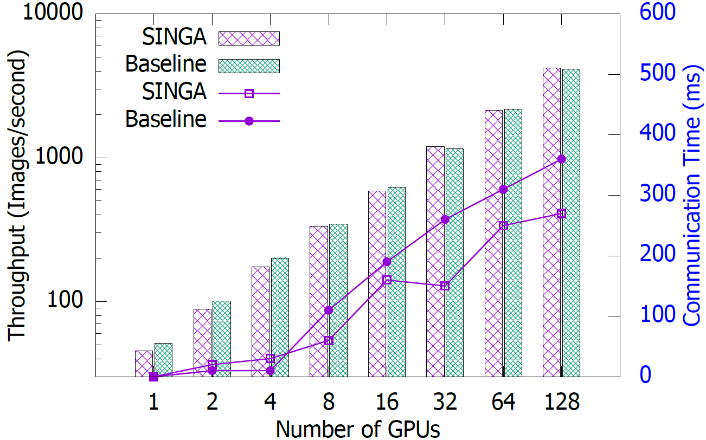
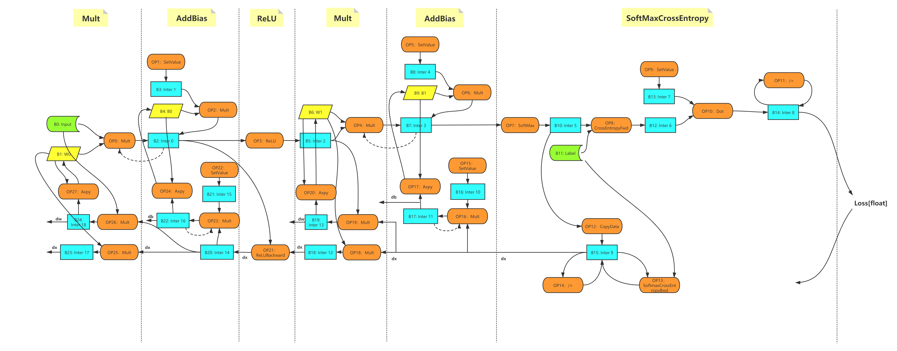
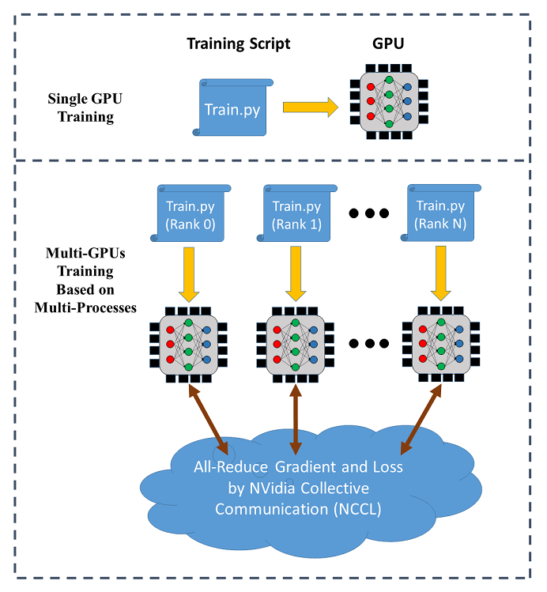
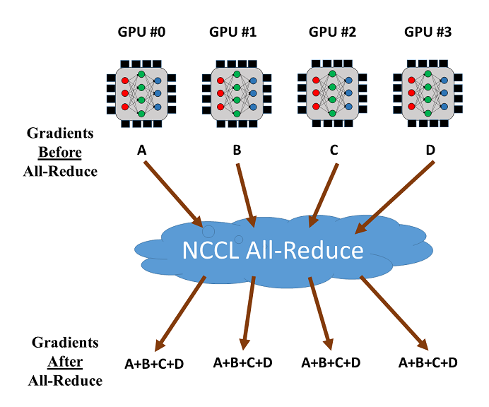
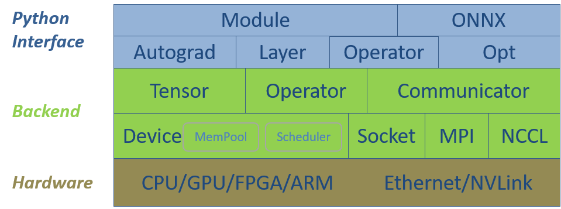
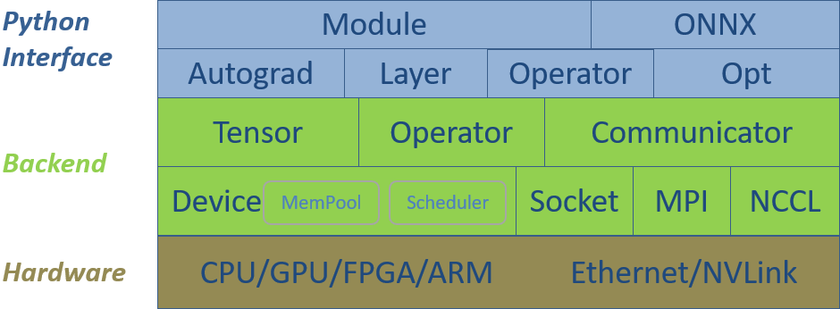
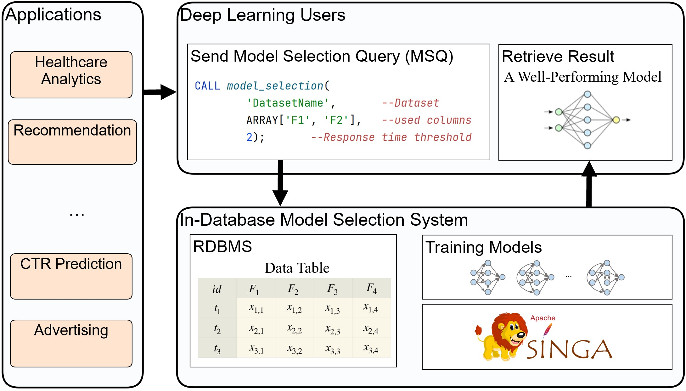
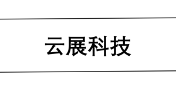

# Installation

## Navigation

- Getting Started
  - [Installation](#docs-2.0.0-installation)
  - [Software Stack](#docs-2.0.0-software-stack)
  - [Benchmark for Distributed Training](#docs-2.0.0-benchmark-train)
  - [Examples](#docs-examples)
- Guides
  - [Device](#docs-2.0.0-device)
  - [Tensor](#docs-2.0.0-tensor)
  - [Autograd in SINGA](#docs-2.0.0-autograd)
  - [Autograd](#docs-autograd)
  - [Optimizer](#docs-optimizer)
  - [Model](#docs-graph)
  - [ONNX](#docs-onnx)
  - [Distributed Training](#docs-dist-train)
  - [Time Profiling](#docs-time-profiling)
  - [Half Precision](#docs-half-precision)
- Model Zoo
  - [Train CNN over Cifar-10](#docs-2.0.0-model-zoo-cnn-cifar10)
  - [Train Char-RNN over plain text](#docs-2.0.0-model-zoo-char-rnn)
  - [Train a RBM model against MNIST dataset](#docs-2.0.0-model-zoo-rbm-mnist)
  - [Train AlexNet over ImageNet](#docs-2.0.0-model-zoo-imagenet-alexnet)
  - [Image Classification using DenseNet](#docs-2.0.0-model-zoo-imagenet-densenet)
  - [Image Classification using GoogleNet](#docs-2.0.0-model-zoo-imagenet-googlenet)
  - [Image Classification using Inception V4](#docs-2.0.0-model-zoo-imagenet-inception)
  - [Image Classification using Residual Networks](#docs-2.0.0-model-zoo-imagenet-resnet)
  - [Image Classification using VGG](#docs-2.0.0-model-zoo-imagenet-vgg)
- Development
  - [Download SINGA](#docs-2.0.0-downloads)
  - [Build SINGA from Source](#docs-2.0.0-build)
  - [How to Contribute Code](#docs-2.0.0-contribute-code)
  - [How to Contribute to Documentation](#docs-2.0.0-contribute-docs)
  - [How to Prepare a Release](#docs-2.0.0-how-to-release)
  - [Git Workflow](#docs-git-workflow)
- [Device](#docs-device)
- [Tensor](#docs-tensor)
- [Autograd](#docs-5.1.0_chinese-autograd)
- [Optimizer](#docs-5.1.0_chinese-optimizer)
- [Model](#docs-5.1.0_chinese-graph)
- [ONNX](#docs-5.1.0_chinese-onnx)
- [Distributed Training](#docs-5.1.0_chinese-dist-train)
- [Time Profiling](#docs-5.1.0_chinese-time-profiling)
- [Half Precision](#docs-5.1.0_chinese-half-precision)
- [Computational Graph](#docs-3.0.0-graph)
- [Download SINGA](#docs-3.0.0.rc1-downloads)
- [Build SINGA from Source](#docs-3.0.0.rc1-build)
- [How to Contribute Code](#docs-3.0.0.rc1-contribute-code)
- [How to Contribute to Documentation](#docs-3.0.0.rc1-contribute-docs)
- [How to Prepare a Release](#docs-3.0.0.rc1-how-to-release)
- [Git Workflow](#docs-3.0.0.rc1-git-workflow)
- [Source Repository](#docs-5.1.0_viet-source-repository)
- [Danh sách liên hệ của Dự Án](#docs-5.1.0_viet-mail-lists)
- [Theo Dõi Vấn Đề](#docs-5.1.0_viet-issue-tracking)
- [Danh sách nhân sự SINGA](#docs-5.1.0_viet-team-list)
- [Lịch Sử Phát Triển SINGA](#docs-5.1.0_viet-history-singa)
- [Project Mailing Lists](#docs-mail-lists)
- [Issue Tracking](#docs-issue-tracking)
- [Security](#docs-security)
- [The SINGA Team](#docs-team-list)
- [History of SINGA](#docs-history-singa)
- [Docs](#docs-installation)
- [Community](#docs-source-repository)
- Other pages
  - [History of SINGA](#docs-2.0.0-history-singa)
  - [Build SINGA on Windows](#docs-2.0.0-install-win)
  - [Issue Tracking](#docs-2.0.0-issue-tracking)
  - [Project Mailing Lists · Apache SINGA](#docs-2.0.0-mail-lists)
  - [Optimizer](#docs-2.0.0-optimizer)
  - [Security](#docs-2.0.0-security)
  - [Source Repository](#docs-2.0.0-source-repository)
  - [The SINGA Team](#docs-2.0.0-team-list)
  - [Autograd](#docs-3.0.0.rc1-autograd)
  - [Device](#docs-3.0.0.rc1-device)
  - [Distributed Training](#docs-3.0.0.rc1-dist-train)
  - [Examples](#docs-3.0.0.rc1-examples)
  - [Computational Graph](#docs-3.0.0.rc1-graph)
  - [History of SINGA](#docs-3.0.0.rc1-history-singa)
  - [Build SINGA on Windows](#docs-3.0.0.rc1-install-win)
  - [Installation](#docs-3.0.0.rc1-installation)
  - [Issue Tracking](#docs-3.0.0.rc1-issue-tracking)
  - [Project Mailing Lists · Apache SINGA](#docs-3.0.0.rc1-mail-lists)
  - [Security](#docs-3.0.0.rc1-security)
  - [Software Stack](#docs-3.0.0.rc1-software-stack)
  - [Source Repository](#docs-3.0.0.rc1-source-repository)
  - [The SINGA Team](#docs-3.0.0.rc1-team-list)
  - [Tensor](#docs-3.0.0.rc1-tensor)
  - [Autograd](#docs-3.0.0-autograd)
  - [Build SINGA from Source](#docs-3.0.0-build)
  - [How to Contribute Code](#docs-3.0.0-contribute-code)
  - [How to Contribute to Documentation](#docs-3.0.0-contribute-docs)
  - [Device](#docs-3.0.0-device)
  - [Distributed Training](#docs-3.0.0-dist-train)
  - [Download SINGA](#docs-3.0.0-downloads)
  - [Examples](#docs-3.0.0-examples)
  - [Git Workflow](#docs-3.0.0-git-workflow)
  - [History of SINGA](#docs-3.0.0-history-singa)
  - [How to Prepare a Release](#docs-3.0.0-how-to-release)
  - [Build SINGA on Windows](#docs-3.0.0-install-win)
  - [Installation](#docs-3.0.0-installation)
  - [Issue Tracking](#docs-3.0.0-issue-tracking)
  - [Project Mailing Lists · Apache SINGA](#docs-3.0.0-mail-lists)
  - [ONNX](#docs-3.0.0-onnx)
  - [Security](#docs-3.0.0-security)
  - [Software Stack](#docs-3.0.0-software-stack)
  - [Source Repository](#docs-3.0.0-source-repository)
  - [The SINGA Team](#docs-3.0.0-team-list)
  - [Tensor](#docs-3.0.0-tensor)
  - [Autograd](#docs-3.1.0-autograd)
  - [Build SINGA from Source](#docs-3.1.0-build)
  - [How to Contribute Code](#docs-3.1.0-contribute-code)
  - [How to Contribute to Documentation](#docs-3.1.0-contribute-docs)
  - [Device](#docs-3.1.0-device)
  - [Distributed Training](#docs-3.1.0-dist-train)
  - [Download SINGA](#docs-3.1.0-downloads)
  - [Examples](#docs-3.1.0-examples)
  - [Git Workflow](#docs-3.1.0-git-workflow)
  - [Model](#docs-3.1.0-graph)
  - [History of SINGA](#docs-3.1.0-history-singa)
  - [How to Prepare a Release](#docs-3.1.0-how-to-release)
  - [Build SINGA on Windows](#docs-3.1.0-install-win)
  - [Installation](#docs-3.1.0-installation)
  - [Issue Tracking · Apache SINGA](#docs-3.1.0-issue-tracking)
  - [Project Mailing Lists · Apache SINGA](#docs-3.1.0-mail-lists)
  - [ONNX](#docs-3.1.0-onnx)
  - [Optimizer](#docs-3.1.0-optimizer)
  - [Software Stack](#docs-3.1.0-software-stack)
  - [Source Repository](#docs-3.1.0-source-repository)
  - [The SINGA Team](#docs-3.1.0-team-list)
  - [Tensor](#docs-3.1.0-tensor)
  - [Time Profiling](#docs-3.1.0-time-profiling)
  - [CPU only · Apache SINGA](#docs-3.1.0-wheel-cpu)
  - [CUDA enabled (dev version) · Apache SINGA](#docs-3.1.0-wheel-gpu-dev)
  - [CUDA Enabled · Apache SINGA](#docs-3.1.0-wheel-gpu)
  - [Autograd](#docs-3.2.0.rc1-autograd)
  - [Build SINGA from Source](#docs-3.2.0.rc1-build)
  - [How to Contribute Code](#docs-3.2.0.rc1-contribute-code)
  - [How to Contribute to Documentation](#docs-3.2.0.rc1-contribute-docs)
  - [Device](#docs-3.2.0.rc1-device)
  - [Distributed Training](#docs-3.2.0.rc1-dist-train)
  - [Download SINGA](#docs-3.2.0.rc1-downloads)
  - [Examples](#docs-3.2.0.rc1-examples)
  - [Git Workflow](#docs-3.2.0.rc1-git-workflow)
  - [Model](#docs-3.2.0.rc1-graph)
  - [Half Precision](#docs-3.2.0.rc1-half-precision)
  - [History of SINGA](#docs-3.2.0.rc1-history-singa)
  - [How to Prepare a Release](#docs-3.2.0.rc1-how-to-release)
  - [Build SINGA on Windows](#docs-3.2.0.rc1-install-win)
  - [Installation](#docs-3.2.0.rc1-installation)
  - [Issue Tracking](#docs-3.2.0.rc1-issue-tracking)
  - [Project Mailing Lists · Apache SINGA](#docs-3.2.0.rc1-mail-lists)
  - [ONNX](#docs-3.2.0.rc1-onnx)
  - [Optimizer](#docs-3.2.0.rc1-optimizer)
  - [Security](#docs-3.2.0.rc1-security)
  - [Software Stack](#docs-3.2.0.rc1-software-stack)
  - [Source Repository](#docs-3.2.0.rc1-source-repository)
  - [The SINGA Team](#docs-3.2.0.rc1-team-list)
  - [Tensor](#docs-3.2.0.rc1-tensor)
  - [Time Profiling](#docs-3.2.0.rc1-time-profiling)
  - [Autograd](#docs-3.2.0-autograd)
  - [Build SINGA from Source](#docs-3.2.0-build)
  - [How to Contribute Code](#docs-3.2.0-contribute-code)
  - [How to Contribute to Documentation](#docs-3.2.0-contribute-docs)
  - [Device](#docs-3.2.0-device)
  - [Distributed Training](#docs-3.2.0-dist-train)
  - [Download SINGA](#docs-3.2.0-downloads)
  - [Examples](#docs-3.2.0-examples)
  - [Git Workflow](#docs-3.2.0-git-workflow)
  - [Model](#docs-3.2.0-graph)
  - [Half Precision](#docs-3.2.0-half-precision)
  - [History of SINGA](#docs-3.2.0-history-singa)
  - [How to Prepare a Release](#docs-3.2.0-how-to-release)
  - [Build SINGA on Windows](#docs-3.2.0-install-win)
  - [Installation](#docs-3.2.0-installation)
  - [Issue Tracking](#docs-3.2.0-issue-tracking)
  - [Project Mailing Lists · Apache SINGA](#docs-3.2.0-mail-lists)
  - [ONNX](#docs-3.2.0-onnx)
  - [Optimizer](#docs-3.2.0-optimizer)
  - [Security](#docs-3.2.0-security)
  - [Software Stack](#docs-3.2.0-software-stack)
  - [Source Repository](#docs-3.2.0-source-repository)
  - [The SINGA Team](#docs-3.2.0-team-list)
  - [Tensor](#docs-3.2.0-tensor)
  - [Time Profiling](#docs-3.2.0-time-profiling)
  - [Autograd](#docs-3.3.0-autograd)
  - [Build SINGA from Source](#docs-3.3.0-build)
  - [How to Contribute Code](#docs-3.3.0-contribute-code)
  - [How to Contribute to Documentation](#docs-3.3.0-contribute-docs)
  - [Device](#docs-3.3.0-device)
  - [Distributed Training](#docs-3.3.0-dist-train)
  - [Download SINGA](#docs-3.3.0-downloads)
  - [Examples](#docs-3.3.0-examples)
  - [Git Workflow](#docs-3.3.0-git-workflow)
  - [Model](#docs-3.3.0-graph)
  - [Half Precision](#docs-3.3.0-half-precision)
  - [History of SINGA](#docs-3.3.0-history-singa)
  - [How to Prepare a Release](#docs-3.3.0-how-to-release)
  - [Build SINGA on Windows](#docs-3.3.0-install-win)
  - [Installation](#docs-3.3.0-installation)
  - [Issue Tracking](#docs-3.3.0-issue-tracking)
  - [Project Mailing Lists · Apache SINGA](#docs-3.3.0-mail-lists)
  - [ONNX](#docs-3.3.0-onnx)
  - [Optimizer](#docs-3.3.0-optimizer)
  - [Security](#docs-3.3.0-security)
  - [Software Stack](#docs-3.3.0-software-stack)
  - [Source Repository](#docs-3.3.0-source-repository)
  - [The SINGA Team](#docs-3.3.0-team-list)
  - [Tensor](#docs-3.3.0-tensor)
  - [Time Profiling](#docs-3.3.0-time-profiling)
  - [Autograd](#docs-4.0.0-autograd)
  - [Build SINGA from Source](#docs-4.0.0-build)
  - [How to Contribute Code](#docs-4.0.0-contribute-code)
  - [How to Contribute to Documentation](#docs-4.0.0-contribute-docs)
  - [Device](#docs-4.0.0-device)
  - [Distributed Training](#docs-4.0.0-dist-train)
  - [Download SINGA](#docs-4.0.0-downloads)
  - [Examples](#docs-4.0.0-examples)
  - [Git Workflow](#docs-4.0.0-git-workflow)
  - [Model](#docs-4.0.0-graph)
  - [Half Precision](#docs-4.0.0-half-precision)
  - [History of SINGA](#docs-4.0.0-history-singa)
  - [How to Prepare a Release](#docs-4.0.0-how-to-release)
  - [Build SINGA on Windows](#docs-4.0.0-install-win)
  - [Installation](#docs-4.0.0-installation)
  - [Issue Tracking](#docs-4.0.0-issue-tracking)
  - [Project Mailing Lists · Apache SINGA](#docs-4.0.0-mail-lists)
  - [ONNX](#docs-4.0.0-onnx)
  - [Optimizer](#docs-4.0.0-optimizer)
  - [Security](#docs-4.0.0-security)
  - [Software Stack](#docs-4.0.0-software-stack)
  - [Source Repository](#docs-4.0.0-source-repository)
  - [The SINGA Team](#docs-4.0.0-team-list)
  - [Tensor](#docs-4.0.0-tensor)
  - [Time Profiling](#docs-4.0.0-time-profiling)
  - [Autograd](#docs-4.1.0-autograd)
  - [Build SINGA from Source](#docs-4.1.0-build)
  - [How to Contribute Code](#docs-4.1.0-contribute-code)
  - [How to Contribute to Documentation](#docs-4.1.0-contribute-docs)
  - [Device](#docs-4.1.0-device)
  - [Distributed Training](#docs-4.1.0-dist-train)
  - [Download SINGA](#docs-4.1.0-downloads)
  - [Examples](#docs-4.1.0-examples)
  - [Git Workflow](#docs-4.1.0-git-workflow)
  - [Model](#docs-4.1.0-graph)
  - [Half Precision](#docs-4.1.0-half-precision)
  - [History of SINGA](#docs-4.1.0-history-singa)
  - [How to Prepare a Release](#docs-4.1.0-how-to-release)
  - [Build SINGA on Windows](#docs-4.1.0-install-win)
  - [Installation](#docs-4.1.0-installation)
  - [Issue Tracking](#docs-4.1.0-issue-tracking)
  - [Project Mailing Lists · Apache SINGA](#docs-4.1.0-mail-lists)
  - [ONNX](#docs-4.1.0-onnx)
  - [Optimizer](#docs-4.1.0-optimizer)
  - [Security](#docs-4.1.0-security)
  - [Software Stack](#docs-4.1.0-software-stack)
  - [Source Repository](#docs-4.1.0-source-repository)
  - [The SINGA Team](#docs-4.1.0-team-list)
  - [Tensor](#docs-4.1.0-tensor)
  - [Time Profiling](#docs-4.1.0-time-profiling)
  - [Autograd](#docs-4.1.0_chinese-autograd)
  - [Build SINGA from Source](#docs-4.1.0_chinese-build)
  - [How to Contribute Code](#docs-4.1.0_chinese-contribute-code)
  - [How to Contribute to Documentation](#docs-4.1.0_chinese-contribute-docs)
  - [Device](#docs-4.1.0_chinese-device)
  - [Distributed Training](#docs-4.1.0_chinese-dist-train)
  - [Download SINGA](#docs-4.1.0_chinese-downloads)
  - [Examples](#docs-4.1.0_chinese-examples)
  - [Git Workflow](#docs-4.1.0_chinese-git-workflow)
  - [Model](#docs-4.1.0_chinese-graph)
  - [Half Precision](#docs-4.1.0_chinese-half-precision)
  - [History of SINGA](#docs-4.1.0_chinese-history-singa)
  - [How to Prepare a Release](#docs-4.1.0_chinese-how-to-release)
  - [Build SINGA on Windows](#docs-4.1.0_chinese-install-win)
  - [Installation](#docs-4.1.0_chinese-installation)
  - [Project Mailing Lists · Apache SINGA](#docs-4.1.0_chinese-mail-lists)
  - [ONNX](#docs-4.1.0_chinese-onnx)
  - [Optimizer](#docs-4.1.0_chinese-optimizer)
  - [Software Stack](#docs-4.1.0_chinese-software-stack)
  - [Source Repository](#docs-4.1.0_chinese-source-repository)
  - [The SINGA Team](#docs-4.1.0_chinese-team-list)
  - [Tensor](#docs-4.1.0_chinese-tensor)
  - [Time Profiling](#docs-4.1.0_chinese-time-profiling)
  - [CPU only · Apache SINGA](#docs-4.1.0_chinese-wheel-cpu)
  - [CUDA enabled (dev version) · Apache SINGA](#docs-4.1.0_chinese-wheel-gpu-dev)
  - [CUDA enabled · Apache SINGA](#docs-4.1.0_chinese-wheel-gpu)
  - [Autograd](#docs-4.1.0_viet-autograd)
  - [Cài đặt SINGA từ Nguồn (Source)](#docs-4.1.0_viet-build)
  - [Tham gia viết code](#docs-4.1.0_viet-contribute-code)
  - [Tham gia chỉnh sửa Hướng Dẫn Sử Dụng](#docs-4.1.0_viet-contribute-docs)
  - [Device](#docs-4.1.0_viet-device)
  - [Distributed Training](#docs-4.1.0_viet-dist-train)
  - [Tải SINGA](#docs-4.1.0_viet-downloads)
  - [Ví Dụ](#docs-4.1.0_viet-examples)
  - [Quy Trình Sử Dụng Git](#docs-4.1.0_viet-git-workflow)
  - [Model](#docs-4.1.0_viet-graph)
  - [Lịch Sử Phát Triển SINGA](#docs-4.1.0_viet-history-singa)
  - [Chuẩn bị trước khi phát hành](#docs-4.1.0_viet-how-to-release)
  - [Cách cài SINGA trên Windows](#docs-4.1.0_viet-install-win)
  - [Cài đặt](#docs-4.1.0_viet-installation)
  - [Theo Dõi Vấn Đề · Apache SINGA](#docs-4.1.0_viet-issue-tracking)
  - [Danh sách liên hệ của Dự Án · Apache SINGA](#docs-4.1.0_viet-mail-lists)
  - [ONNX](#docs-4.1.0_viet-onnx)
  - [Optimizer](#docs-4.1.0_viet-optimizer)
  - [Software Stack](#docs-4.1.0_viet-software-stack)
  - [Source Repository](#docs-4.1.0_viet-source-repository)
  - [Danh sách nhân sự SINGA](#docs-4.1.0_viet-team-list)
  - [Tensor](#docs-4.1.0_viet-tensor)
  - [Time Profiling](#docs-4.1.0_viet-time-profiling)
  - [Dùng cho CPU · Apache SINGA](#docs-4.1.0_viet-wheel-cpu)
  - [Sử Dụng CUDA (phiên bản dev) · Apache SINGA](#docs-4.1.0_viet-wheel-gpu-dev)
  - [Sử Dụng CUDA · Apache SINGA](#docs-4.1.0_viet-wheel-gpu)
  - [Autograd](#docs-4.2.0-autograd)
  - [Build SINGA from Source](#docs-4.2.0-build)
  - [How to Contribute Code](#docs-4.2.0-contribute-code)
  - [How to Contribute to Documentation](#docs-4.2.0-contribute-docs)
  - [Device](#docs-4.2.0-device)
  - [Distributed Training](#docs-4.2.0-dist-train)
  - [Download SINGA](#docs-4.2.0-downloads)
  - [Examples](#docs-4.2.0-examples)
  - [Git Workflow](#docs-4.2.0-git-workflow)
  - [Model](#docs-4.2.0-graph)
  - [Half Precision](#docs-4.2.0-half-precision)
  - [History of SINGA](#docs-4.2.0-history-singa)
  - [How to Prepare a Release](#docs-4.2.0-how-to-release)
  - [Build SINGA on Windows](#docs-4.2.0-install-win)
  - [Installation](#docs-4.2.0-installation)
  - [Issue Tracking](#docs-4.2.0-issue-tracking)
  - [Project Mailing Lists · Apache SINGA](#docs-4.2.0-mail-lists)
  - [ONNX](#docs-4.2.0-onnx)
  - [Optimizer](#docs-4.2.0-optimizer)
  - [Security](#docs-4.2.0-security)
  - [Software Stack](#docs-4.2.0-software-stack)
  - [Source Repository](#docs-4.2.0-source-repository)
  - [The SINGA Team](#docs-4.2.0-team-list)
  - [Tensor](#docs-4.2.0-tensor)
  - [Time Profiling](#docs-4.2.0-time-profiling)
  - [Autograd](#docs-4.3.0-autograd)
  - [Build SINGA from Source](#docs-4.3.0-build)
  - [How to Contribute Code](#docs-4.3.0-contribute-code)
  - [How to Contribute to Documentation](#docs-4.3.0-contribute-docs)
  - [Device](#docs-4.3.0-device)
  - [Distributed Training](#docs-4.3.0-dist-train)
  - [Download SINGA](#docs-4.3.0-downloads)
  - [Examples](#docs-4.3.0-examples)
  - [Git Workflow](#docs-4.3.0-git-workflow)
  - [Model](#docs-4.3.0-graph)
  - [Half Precision](#docs-4.3.0-half-precision)
  - [History of SINGA](#docs-4.3.0-history-singa)
  - [How to Prepare a Release](#docs-4.3.0-how-to-release)
  - [Build SINGA on Windows](#docs-4.3.0-install-win)
  - [Installation](#docs-4.3.0-installation)
  - [Issue Tracking](#docs-4.3.0-issue-tracking)
  - [Project Mailing Lists · Apache SINGA](#docs-4.3.0-mail-lists)
  - [ONNX](#docs-4.3.0-onnx)
  - [Optimizer](#docs-4.3.0-optimizer)
  - [Security](#docs-4.3.0-security)
  - [Software Stack](#docs-4.3.0-software-stack)
  - [Source Repository](#docs-4.3.0-source-repository)
  - [The SINGA Team](#docs-4.3.0-team-list)
  - [Tensor](#docs-4.3.0-tensor)
  - [Time Profiling](#docs-4.3.0-time-profiling)
  - [Autograd](#docs-4.3.0_chinese-autograd)
  - [Build SINGA from Source](#docs-4.3.0_chinese-build)
  - [How to Contribute Code](#docs-4.3.0_chinese-contribute-code)
  - [How to Contribute to Documentation](#docs-4.3.0_chinese-contribute-docs)
  - [Device](#docs-4.3.0_chinese-device)
  - [Distributed Training](#docs-4.3.0_chinese-dist-train)
  - [Download SINGA](#docs-4.3.0_chinese-downloads)
  - [Examples](#docs-4.3.0_chinese-examples)
  - [Git Workflow](#docs-4.3.0_chinese-git-workflow)
  - [Model](#docs-4.3.0_chinese-graph)
  - [Half Precision](#docs-4.3.0_chinese-half-precision)
  - [History of SINGA](#docs-4.3.0_chinese-history-singa)
  - [How to Prepare a Release](#docs-4.3.0_chinese-how-to-release)
  - [Build SINGA on Windows](#docs-4.3.0_chinese-install-win)
  - [Installation](#docs-4.3.0_chinese-installation)
  - [Project Mailing Lists · Apache SINGA](#docs-4.3.0_chinese-mail-lists)
  - [ONNX](#docs-4.3.0_chinese-onnx)
  - [Optimizer](#docs-4.3.0_chinese-optimizer)
  - [Software Stack](#docs-4.3.0_chinese-software-stack)
  - [Source Repository](#docs-4.3.0_chinese-source-repository)
  - [The SINGA Team](#docs-4.3.0_chinese-team-list)
  - [Tensor](#docs-4.3.0_chinese-tensor)
  - [Time Profiling](#docs-4.3.0_chinese-time-profiling)
  - [CPU only · Apache SINGA](#docs-4.3.0_chinese-wheel-cpu)
  - [CUDA enabled (dev version) · Apache SINGA](#docs-4.3.0_chinese-wheel-gpu-dev)
  - [CUDA enabled · Apache SINGA](#docs-4.3.0_chinese-wheel-gpu)
  - [Autograd](#docs-4.3.0_viet-autograd)
  - [Cài đặt SINGA từ Nguồn (Source)](#docs-4.3.0_viet-build)
  - [Tham gia viết code](#docs-4.3.0_viet-contribute-code)
  - [Tham gia chỉnh sửa Hướng Dẫn Sử Dụng](#docs-4.3.0_viet-contribute-docs)
  - [Device](#docs-4.3.0_viet-device)
  - [Distributed Training](#docs-4.3.0_viet-dist-train)
  - [Tải SINGA](#docs-4.3.0_viet-downloads)
  - [Ví Dụ](#docs-4.3.0_viet-examples)
  - [Quy Trình Sử Dụng Git](#docs-4.3.0_viet-git-workflow)
  - [Model](#docs-4.3.0_viet-graph)
  - [Lịch Sử Phát Triển SINGA](#docs-4.3.0_viet-history-singa)
  - [Chuẩn bị trước khi phát hành](#docs-4.3.0_viet-how-to-release)
  - [Cách cài SINGA trên Windows](#docs-4.3.0_viet-install-win)
  - [Cài đặt](#docs-4.3.0_viet-installation)
  - [Theo Dõi Vấn Đề · Apache SINGA](#docs-4.3.0_viet-issue-tracking)
  - [Danh sách liên hệ của Dự Án · Apache SINGA](#docs-4.3.0_viet-mail-lists)
  - [ONNX](#docs-4.3.0_viet-onnx)
  - [Optimizer](#docs-4.3.0_viet-optimizer)
  - [Software Stack](#docs-4.3.0_viet-software-stack)
  - [Source Repository](#docs-4.3.0_viet-source-repository)
  - [Danh sách nhân sự SINGA](#docs-4.3.0_viet-team-list)
  - [Tensor](#docs-4.3.0_viet-tensor)
  - [Time Profiling](#docs-4.3.0_viet-time-profiling)
  - [Dùng cho CPU · Apache SINGA](#docs-4.3.0_viet-wheel-cpu)
  - [Sử Dụng CUDA (phiên bản dev) · Apache SINGA](#docs-4.3.0_viet-wheel-gpu-dev)
  - [Sử Dụng CUDA · Apache SINGA](#docs-4.3.0_viet-wheel-gpu)
  - [Autograd](#docs-5.0.0-autograd)
  - [Build SINGA from Source](#docs-5.0.0-build)
  - [How to Contribute Code](#docs-5.0.0-contribute-code)
  - [How to Contribute to Documentation](#docs-5.0.0-contribute-docs)
  - [Device](#docs-5.0.0-device)
  - [Distributed Training](#docs-5.0.0-dist-train)
  - [Download SINGA](#docs-5.0.0-downloads)
  - [Examples](#docs-5.0.0-examples)
  - [Git Workflow](#docs-5.0.0-git-workflow)
  - [Model](#docs-5.0.0-graph)
  - [Half Precision](#docs-5.0.0-half-precision)
  - [History of SINGA](#docs-5.0.0-history-singa)
  - [How to Prepare a Release](#docs-5.0.0-how-to-release)
  - [Build SINGA on Windows](#docs-5.0.0-install-win)
  - [Installation](#docs-5.0.0-installation)
  - [Issue Tracking](#docs-5.0.0-issue-tracking)
  - [Project Mailing Lists · Apache SINGA](#docs-5.0.0-mail-lists)
  - [ONNX](#docs-5.0.0-onnx)
  - [Optimizer](#docs-5.0.0-optimizer)
  - [Security](#docs-5.0.0-security)
  - [Software Stack](#docs-5.0.0-software-stack)
  - [Source Repository](#docs-5.0.0-source-repository)
  - [The SINGA Team](#docs-5.0.0-team-list)
  - [Tensor](#docs-5.0.0-tensor)
  - [Time Profiling](#docs-5.0.0-time-profiling)
  - [Autograd](#docs-5.0.0_chinese-autograd)
  - [Build SINGA from Source](#docs-5.0.0_chinese-build)
  - [How to Contribute Code](#docs-5.0.0_chinese-contribute-code)
  - [How to Contribute to Documentation](#docs-5.0.0_chinese-contribute-docs)
  - [Device](#docs-5.0.0_chinese-device)
  - [Distributed Training](#docs-5.0.0_chinese-dist-train)
  - [Download SINGA](#docs-5.0.0_chinese-downloads)
  - [Examples](#docs-5.0.0_chinese-examples)
  - [Git Workflow](#docs-5.0.0_chinese-git-workflow)
  - [Model](#docs-5.0.0_chinese-graph)
  - [Half Precision](#docs-5.0.0_chinese-half-precision)
  - [History of SINGA](#docs-5.0.0_chinese-history-singa)
  - [How to Prepare a Release](#docs-5.0.0_chinese-how-to-release)
  - [Build SINGA on Windows](#docs-5.0.0_chinese-install-win)
  - [Installation](#docs-5.0.0_chinese-installation)
  - [Project Mailing Lists · Apache SINGA](#docs-5.0.0_chinese-mail-lists)
  - [ONNX](#docs-5.0.0_chinese-onnx)
  - [Optimizer](#docs-5.0.0_chinese-optimizer)
  - [Software Stack](#docs-5.0.0_chinese-software-stack)
  - [Source Repository](#docs-5.0.0_chinese-source-repository)
  - [The SINGA Team](#docs-5.0.0_chinese-team-list)
  - [Tensor](#docs-5.0.0_chinese-tensor)
  - [Time Profiling](#docs-5.0.0_chinese-time-profiling)
  - [CPU only · Apache SINGA](#docs-5.0.0_chinese-wheel-cpu)
  - [CUDA enabled (dev version) · Apache SINGA](#docs-5.0.0_chinese-wheel-gpu-dev)
  - [CUDA enabled · Apache SINGA](#docs-5.0.0_chinese-wheel-gpu)
  - [Autograd](#docs-5.0.0_viet-autograd)
  - [Cài đặt SINGA từ Nguồn (Source)](#docs-5.0.0_viet-build)
  - [Tham gia viết code](#docs-5.0.0_viet-contribute-code)
  - [Tham gia chỉnh sửa Hướng Dẫn Sử Dụng](#docs-5.0.0_viet-contribute-docs)
  - [Device](#docs-5.0.0_viet-device)
  - [Distributed Training](#docs-5.0.0_viet-dist-train)
  - [Tải SINGA](#docs-5.0.0_viet-downloads)
  - [Ví Dụ](#docs-5.0.0_viet-examples)
  - [Quy Trình Sử Dụng Git](#docs-5.0.0_viet-git-workflow)
  - [Model](#docs-5.0.0_viet-graph)
  - [Lịch Sử Phát Triển SINGA](#docs-5.0.0_viet-history-singa)
  - [Chuẩn bị trước khi phát hành](#docs-5.0.0_viet-how-to-release)
  - [Cách cài SINGA trên Windows](#docs-5.0.0_viet-install-win)
  - [Cài đặt](#docs-5.0.0_viet-installation)
  - [Theo Dõi Vấn Đề · Apache SINGA](#docs-5.0.0_viet-issue-tracking)
  - [Danh sách liên hệ của Dự Án · Apache SINGA](#docs-5.0.0_viet-mail-lists)
  - [ONNX](#docs-5.0.0_viet-onnx)
  - [Optimizer](#docs-5.0.0_viet-optimizer)
  - [Software Stack](#docs-5.0.0_viet-software-stack)
  - [Source Repository](#docs-5.0.0_viet-source-repository)
  - [Danh sách nhân sự SINGA](#docs-5.0.0_viet-team-list)
  - [Tensor](#docs-5.0.0_viet-tensor)
  - [Time Profiling](#docs-5.0.0_viet-time-profiling)
  - [Dùng cho CPU · Apache SINGA](#docs-5.0.0_viet-wheel-cpu)
  - [Sử Dụng CUDA (phiên bản dev) · Apache SINGA](#docs-5.0.0_viet-wheel-gpu-dev)
  - [Sử Dụng CUDA · Apache SINGA](#docs-5.0.0_viet-wheel-gpu)
  - [Build SINGA from Source](#docs-5.1.0_chinese-build)
  - [How to Contribute Code](#docs-5.1.0_chinese-contribute-code)
  - [How to Contribute to Documentation](#docs-5.1.0_chinese-contribute-docs)
  - [Device](#docs-5.1.0_chinese-device)
  - [Download SINGA](#docs-5.1.0_chinese-downloads)
  - [Examples](#docs-5.1.0_chinese-examples)
  - [Git Workflow](#docs-5.1.0_chinese-git-workflow)
  - [History of SINGA](#docs-5.1.0_chinese-history-singa)
  - [How to Prepare a Release](#docs-5.1.0_chinese-how-to-release)
  - [Build SINGA on Windows](#docs-5.1.0_chinese-install-win)
  - [Installation](#docs-5.1.0_chinese-installation)
  - [Project Mailing Lists · Apache SINGA](#docs-5.1.0_chinese-mail-lists)
  - [Software Stack](#docs-5.1.0_chinese-software-stack)
  - [Source Repository](#docs-5.1.0_chinese-source-repository)
  - [The SINGA Team](#docs-5.1.0_chinese-team-list)
  - [Tensor](#docs-5.1.0_chinese-tensor)
  - [CPU only · Apache SINGA](#docs-5.1.0_chinese-wheel-cpu)
  - [CUDA enabled (dev version) · Apache SINGA](#docs-5.1.0_chinese-wheel-gpu-dev)
  - [CUDA enabled · Apache SINGA](#docs-5.1.0_chinese-wheel-gpu)
  - [Autograd](#docs-5.1.0_viet-autograd)
  - [Cài đặt SINGA từ Nguồn (Source)](#docs-5.1.0_viet-build)
  - [Tham gia viết code](#docs-5.1.0_viet-contribute-code)
  - [Tham gia chỉnh sửa Hướng Dẫn Sử Dụng](#docs-5.1.0_viet-contribute-docs)
  - [Device](#docs-5.1.0_viet-device)
  - [Distributed Training](#docs-5.1.0_viet-dist-train)
  - [Tải SINGA](#docs-5.1.0_viet-downloads)
  - [Ví Dụ](#docs-5.1.0_viet-examples)
  - [Quy Trình Sử Dụng Git](#docs-5.1.0_viet-git-workflow)
  - [Model](#docs-5.1.0_viet-graph)
  - [Chuẩn bị trước khi phát hành](#docs-5.1.0_viet-how-to-release)
  - [Cách cài SINGA trên Windows](#docs-5.1.0_viet-install-win)
  - [Cài đặt](#docs-5.1.0_viet-installation)
  - [ONNX](#docs-5.1.0_viet-onnx)
  - [Optimizer](#docs-5.1.0_viet-optimizer)
  - [Software Stack](#docs-5.1.0_viet-software-stack)
  - [Tensor](#docs-5.1.0_viet-tensor)
  - [Time Profiling](#docs-5.1.0_viet-time-profiling)
  - [Dùng cho CPU · Apache SINGA](#docs-5.1.0_viet-wheel-cpu)
  - [Sử Dụng CUDA (phiên bản dev) · Apache SINGA](#docs-5.1.0_viet-wheel-gpu-dev)
  - [Sử Dụng CUDA · Apache SINGA](#docs-5.1.0_viet-wheel-gpu)
  - [Build SINGA from Source](#docs-build)
  - [How to Contribute Code](#docs-contribute-code)
  - [How to Contribute to Documentation](#docs-contribute-docs)
  - [Download SINGA](#docs-download-singa)
  - [Download SINGA](#docs-downloads)
  - [How to Prepare a Release](#docs-how-to-release)
  - [Build SINGA on Windows](#docs-install-win)
  - [Autograd](#docs-next-autograd)
  - [Build SINGA from Source](#docs-next-build)
  - [How to Contribute Code](#docs-next-contribute-code)
  - [How to Contribute to Documentation](#docs-next-contribute-docs)
  - [Device](#docs-next-device)
  - [Distributed Training](#docs-next-dist-train)
  - [Download SINGA](#docs-next-downloads)
  - [Examples](#docs-next-examples)
  - [Git Workflow](#docs-next-git-workflow)
  - [Model](#docs-next-graph)
  - [Half Precision](#docs-next-half-precision)
  - [History of SINGA](#docs-next-history-singa)
  - [How to Prepare a Release](#docs-next-how-to-release)
  - [Build SINGA on Windows](#docs-next-install-win)
  - [Installation](#docs-next-installation)
  - [Issue Tracking](#docs-next-issue-tracking)
  - [Project Mailing Lists · Apache SINGA](#docs-next-mail-lists)
  - [ONNX](#docs-next-onnx)
  - [Optimizer](#docs-next-optimizer)
  - [Security](#docs-next-security)
  - [Software Stack](#docs-next-software-stack)
  - [Source Repository](#docs-next-source-repository)
  - [The SINGA Team](#docs-next-team-list)
  - [Tensor](#docs-next-tensor)
  - [Time Profiling](#docs-next-time-profiling)
  - [CPU only (dev version)](#docs-next-wheel-cpu-dev)
  - [CUDA enabled (dev version)](#docs-next-wheel-gpu-dev)
  - [singa-incubating-0.1.0 Release Notes](#docs-releases-release_notes_0.1.0)
  - [singa-incubating-0.2.0 Release Notes](#docs-releases-release_notes_0.2.0)
  - [singa-incubating-0.3.0 Release Notes](#docs-releases-release_notes_0.3.0)
  - [singa-incubating-1.0.0 Release Notes](#docs-releases-release_notes_1.0.0)
  - [singa-incubating-1.1.0 Release Notes](#docs-releases-release_notes_1.1.0)
  - [singa-incubating-1.2.0 Release Notes](#docs-releases-release_notes_1.2.0)
  - [singa-incubating-2.0.0 Release Notes](#docs-releases-release_notes_2.0.0)
  - [Apache SINGA-3.0.0 Release Notes](#docs-releases-release_notes_3.0.0)
  - [singa-3.0.0.rc1 Release Notes](#docs-releases-release_notes_3.0.0.rc1)
  - [Apache SINGA-3.1.0 Release Notes](#docs-releases-release_notes_3.1.0)
  - [Apache SINGA-3.2.0 Release Notes](#docs-releases-release_notes_3.2.0)
  - [Apache SINGA-3.2.0.rc1 Release Notes](#docs-releases-release_notes_3.2.0.rc1)
  - [Apache SINGA-3.3.0 Release Notes](#docs-releases-release_notes_3.3.0)
  - [Apache SINGA-4.0.0 Release Notes](#docs-releases-release_notes_4.0.0)
  - [Apache SINGA-4.1.0 Release Notes](#docs-releases-release_notes_4.1.0)
  - [Apache SINGA-4.2.0 Release Notes](#docs-releases-release_notes_4.2.0)
  - [Apache SINGA-4.3.0 Release Notes](#docs-releases-release_notes_4.3.0)
  - [Apache SINGA-5.0.0 Release Notes](#docs-releases-release_notes_5.0.0)
  - [Apache SINGA-5.1.0 Release Notes](#docs-releases-release_notes_5.1.0)
  - [Software Stack](#docs-software-stack)
  - [A Distributed Deep Learning Library](#en)
  - [Users of Apache SINGA](#en-users)
  - [A Distributed Deep Learning Library](#index)
  - [Users of Apache SINGA](#users)
  - [Apache SINGA Versions](#versions)

## Content

<a id="docs-2.0.0-installation"></a>

<!-- source_url: https://singa.apache.org/docs/2.0.0/installation/ -->

<!-- page_index: 1 -->

<a id="docs-2.0.0-installation--from-conda"></a>

## From Conda

Conda is a package manager for Python, CPP and other packages.

Currently, SINGA has conda packages for Linux and MacOSX. [Miniconda3](https://conda.io/miniconda.html) is recommended to use with SINGA. After installing miniconda, execute the one of the following commands to install SINGA.

1. CPU only

```shell
$ conda install -c nusdbsystem -c conda-forge singa-cpu
```

[](https://colab.research.google.com/drive/1Ntkhi-Z6XTR8WYPXiLwujHd2dOm0772V)

2. GPU with CUDA and cuDNN (CUDA driver >=384.81 is required)

```shell
$ conda install -c nusdbsystem -c conda-forge singa-gpu
```

[](https://colab.research.google.com/drive/1do_TLJe18IthLOnBOsHCEe-FFPGk1sPJ)

3. Install a specific version of SINGA. The following command lists all the available SINGA packages.

```shell
$ conda search -c nusdbsystem singa

Loading channels: done
# Name Version Build Channel singa 2.1.0.dev cpu_py36 nusdbsystem singa 2.1.0.dev cpu_py37 nusdbsystem
```

The following command install a specific version of SINGA,

```shell
$ conda install -c nusdbsystem -c conda-forge singa=2.1.0.dev=cpu_py37
```

If there is no error message from

```shell
$ python -c "from singa import tensor"
```

then SINGA is installed successfully.

<a id="docs-2.0.0-installation--using-docker"></a>

## Using Docker

Install Docker on your local host machine following the [instructions](https://docs.docker.com/install/). Add your user into the [docker group](https://docs.docker.com/install/linux/linux-postinstall/) to run docker commands without `sudo`.

1. CPU-only.

```shell
$ docker run -it apache/singa:2.0.0-cpu /bin/bash
```

2. With GPU enabled. Install [Nvidia-Docker](https://github.com/NVIDIA/nvidia-docker) after install Docker.

```shell
$ nvidia-docker run -it apache/singa:2.0.0-gpu /bin/bash
```

3. For the complete list of SINGA Docker images (tags), visit the [docker hub site](https://hub.docker.com/r/apache/singa/). For each docker image, the tag is named as

```shell
version-(cpu|gpu)[-devel]
```

| Tag | Description | Example value |
| --- | --- | --- |
| `version` | SINGA version | 'nightly', '2.0.0', '1.2.0' |
| `cpu` | the image cannot run on GPUs | 'cpu' |
| `gpu` | the image can run on Nvidia GPUs | 'gpu', or 'cudax.x-cudnnx.x' e.g., 'cuda10.0-cudnn7.3' |
| `devel` | indicator for development | if absent SINGA Python package is installed for runtime only; if present, the building environment is also created, you can recompile SINGA from source at '/root/singa' |

> Please note that using the nightly built images is not recommended excpet for SINGA development and testing. Using an official release is recommended. Official releases have version numbers such as '2.0.0' and '1.2.0'.

<a id="docs-2.0.0-installation--from-source"></a>

## From source

You can [build and install SINGA](#docs-2.0.0-build) from the source code using native building tools or conda-build, on local host OS or in a Docker container.

<a id="docs-2.0.0-installation--faq"></a>

## FAQ

- Q: Error from `from singa import tensor`

  A: Check the detailed error from


```shell
python -c  "from singa import _singa_wrap"
# go to the folder of _singa_wrap.so ldd path to _singa_wrap.so python >> import importlib >> importlib.import_module('_singa_wrap')
```

  The folder of `_singa_wrap.so` is like `~/miniconda3/lib/python3.7/site-packages/singa`. Normally, the error is caused by the mismatch or missing of dependent libraries, e.g. cuDNN or protobuf. The solution is to create a new virtual environment and install SINGA in that environment, e.g.,


```shell
conda create -n singa
conda activate singa
conda install -c nusdbsystem -c conda-forge singa-cpu
```

- Q: When using virtual environment, every time I install SINGA, numpy would be reinstalled. However, the numpy is not used when I run `import numpy`

  A: It could be caused by the `PYTHONPATH` environment variable which should be set to empty when you are using virtual environment to avoid the conflicts with the path of the virtual environment.
- Q: When I run SINGA in Mac OS X, I got the error "Fatal Python error: PyThreadState\_Get: no current thread Abort trap: 6"

  A: This error happens typically when you have multiple versions of Python in your system, e.g, the one comes with the OS and the one installed by Homebrew. The Python linked by SINGA must be the same as the Python interpreter. You can check your interpreter by `which python` and check the Python linked by SINGA via `otool -L <path to _singa_wrap.so>`. This problem should be resolved if SINGA is installation via conda.

[Software Stack →](#docs-2.0.0-software-stack)

- [From Conda](#docs-2.0.0-installation--from-conda)
- [Using Docker](#docs-2.0.0-installation--using-docker)
- [From source](#docs-2.0.0-installation--from-source)
- [FAQ](#docs-2.0.0-installation--faq)

---

<a id="docs-2.0.0-software-stack"></a>

<!-- source_url: https://singa.apache.org/docs/2.0.0/software-stack/ -->

<!-- page_index: 2 -->

# Software Stack

[← Installation](#docs-2.0.0-installation)
[Benchmark for Distributed Training →](#docs-2.0.0-benchmark-train)

- [Core](#docs-2.0.0-software-stack--core)
- [Model](#docs-2.0.0-software-stack--model)
- [IO](#docs-2.0.0-software-stack--io)

---

<a id="docs-2.0.0-benchmark-train"></a>

<!-- source_url: https://singa.apache.org/docs/2.0.0/benchmark-train/ -->

<!-- page_index: 3 -->

# Benchmark for Distributed Training

Workload: we use a deep convolutional neural network, [ResNet-50](https://github.com/apache/singa/blob/master/examples/autograd/resnet.py) as the application. ResNet-50 is has 50 convolution layers for image classification. It requires 3.8 GFLOPs to pass a single image (of size 224x224) through the network. The input image size is 224x224.

Hardware: we use p2.8xlarge instances from AWS, each of which has 8 Nvidia Tesla K80 GPUs, 96 GB GPU memory in total, 32 vCPU, 488 GB main memory, 10 Gbps network bandwidth.

Metric: we measure the time per iteration for different number of workers to evaluate the scalability of SINGA. The batch size is fixed to be 32 per GPU. Synchronous training scheme is applied. As a result, the effective batch size is $32N$, where N is the number of GPUs. We compare with a popular open source system which uses the parameter server topology. The first GPU is selected as the server.

 **Scalability test. Bars are for the throughput; lines are for the communication cost.**

[← Software Stack](#docs-2.0.0-software-stack)
[Device →](#docs-2.0.0-device)

---

<a id="docs-examples"></a>

<!-- source_url: https://singa.apache.org/docs/examples/ -->

<!-- page_index: 4 -->

# Examples

This page lists some example deep learning tasks using SINGA. The source code is
maintained inside SINGA repo on
[Github](https://github.com/apache/singa/tree/master/examples). For examples
running on CPU or single GPU using SINGA Python APIs, they are also available on
[Google Colab](https://colab.research.google.com/). You can run them directly on
Google Cloud without setting up the environment locally. The link to each
example is given below.

<a id="docs-examples--image-classification"></a>

## Image Classification

| Model | Dataset | Links |
| --- | --- | --- |
| Simple CNN | MNIST, CIFAR10, CIFAR100 | [Colab](https://colab.research.google.com/drive/1fbGUs1AsoX6bU5F745RwQpohP4bHTktq) |
| AlexNet | ImageNet | Cpp |
| VGG | ImageNet | Cpp, Python, [Colab](https://colab.research.google.com/drive/14kxgRKtbjPCKKsDJVNi3AvTev81Gp_Ds) |
| XceptionNet | MNIST, CIFAR10, CIFAR100 | Python |
| ResNet | MNIST, CIFAR10, CIFAR100, CIFAR10 | Python, [Colab](https://colab.research.google.com/drive/1u1RYefSsVbiP4I-5wiBKHjsT9L0FxLm9) |
| MobileNet | ImageNet | [Colab](https://colab.research.google.com/drive/1HsixqJMIpKyEPhkbB8jy7NwNEFEAUWAf) |

<a id="docs-examples--object-detection"></a>

## Object Detection

| Model | Dataset | Links |
| --- | --- | --- |
| Tiny YOLOv2 | Pascal VOC | [Colab](https://colab.research.google.com/drive/11V4I6cRjIJNUv5ZGsEGwqHuoQEie6b1T) |

<a id="docs-examples--face-and-emotion-recognition"></a>

## Face and Emotion Recognition

| Model | Dataset | Links |
| --- | --- | --- |
| ArcFace | Refined MS-Celeb-1M | [Colab](https://colab.research.google.com/drive/1qanaqUKGIDtifdzEzJOHjEj4kYzA9uJC) |
| Emotion FerPlus | [Facial Expression Recognition Challenge](https://www.kaggle.com/c/challenges-in-representation-learning-facial-expression-recognition-challenge/data) | [Colab](https://colab.research.google.com/drive/1XHtBQGRhe58PDi4LGYJzYueWBeWbO23r) |

<a id="docs-examples--image-generation"></a>

## Image Generation

| Model | Dataset | Links |
| --- | --- | --- |
| GAN | MNIST | [Colab](https://colab.research.google.com/drive/1f86MNDW47DJqHoIqWD1tOxcyx2MWys8L) |
| LSGAN | MNIST | [Colab](https://colab.research.google.com/drive/1C6jNRf28vnFOI9JVM4lpkJPqxsnhxdol) |

<a id="docs-examples--machine-comprehension"></a>

## Machine Comprehension

| Model | Dataset | Links |
| --- | --- | --- |
| Bert-Squad | [SQuAD v1.1](https://rajpurkar.github.io/SQuAD-explorer/explore/1.1/dev/) | [Colab](https://colab.research.google.com/drive/1kud-lUPjS_u-TkDAzihBTw0Vqr0FjCE-) |

<a id="docs-examples--text-classification"></a>

## Text Classification

| Model | Dataset | Links |
| --- | --- | --- |
| Simple LSTM | IMDB | python |

<a id="docs-examples--text-ranking"></a>

## Text Ranking

| Model | Dataset | Links |
| --- | --- | --- |
| BiLSTM | InsuranceQA | python |

<a id="docs-examples--misc."></a>

## Misc.

- Restricted Boltzmann Machine over the MNIST dataset, source,
  [Colab](https://colab.research.google.com/drive/19996noGu9JyHHkVmp4edBGu7PJSRQKsd).

*Last updated on 9/18/2020*

[← Software Stack](#docs-software-stack)
[Device →](#docs-device)

- [Image Classification](#docs-examples--image-classification)
- [Object Detection](#docs-examples--object-detection)
- [Face and Emotion Recognition](#docs-examples--face-and-emotion-recognition)
- [Image Generation](#docs-examples--image-generation)
- [Machine Comprehension](#docs-examples--machine-comprehension)
- [Text Classification](#docs-examples--text-classification)
- [Text Ranking](#docs-examples--text-ranking)
- [Misc.](#docs-examples--misc)

---

<a id="docs-2.0.0-device"></a>

<!-- source_url: https://singa.apache.org/docs/2.0.0/device/ -->

<!-- page_index: 5 -->

# Device

The Device abstract represents any hardware device with memory and compuation units. All [Tensor operations](#docs-2.0.0-tensor) are scheduled by the resident device for execution. Tensor memory is also managed by the device's memory manager. Therefore, optimization of memory and execution are implemented in the Device class.

<a id="docs-2.0.0-device--specific-devices"></a>

## Specific devices

Currently, SINGA has three Device implmentations,

1. CudaGPU for an Nvidia GPU card which runs Cuda code
2. CppCPU for a CPU which runs Cpp code
3. OpenclGPU for a GPU card which runs OpenCL code

<a id="docs-2.0.0-device--python-api"></a>

## Python API

The following code provides examples of creating devices:

```python
from singa import device
cuda = device.create_cuda_gpu_on(0)  # use GPU card of ID 0
host = device.get_default_device()  # get the default host device (a CppCPU)
ary1 = device.create_cuda_gpus(2)  # create 2 devices, starting from ID 0
ary2 = device.create_cuda_gpus([0,2])  # create 2 devices on ID 0 and 2
```

<a id="docs-2.0.0-device--cpp-api"></a>

## CPP API

*work in progress*

[← Benchmark for Distributed Training](#docs-2.0.0-benchmark-train)
[Tensor →](#docs-2.0.0-tensor)

- [Specific devices](#docs-2.0.0-device--specific-devices)
- [Python API](#docs-2.0.0-device--python-api)
- [CPP API](#docs-2.0.0-device--cpp-api)

---

<a id="docs-2.0.0-tensor"></a>

<!-- source_url: https://singa.apache.org/docs/2.0.0/tensor/ -->

<!-- page_index: 6 -->

# Tensor

Each Tensor instance is a multi-dimensional array allocated on a specific Device instance. Tensor instances store variables and provide linear algebra operations over different types of hardware devices without user awareness. Note that users need to make sure the tensor operands are allocated on the same device except copy functions.

<a id="docs-2.0.0-tensor--tensor-usage"></a>

## Tensor Usage

<a id="docs-2.0.0-tensor--create-tensor"></a>

### Create Tensor

```python
>>> import numpy as np
>>> from singa import tensor
>>> tensor.from_numpy( np.asarray([[1, 0, 0], [0, 1, 0]], dtype=np.float32) )
[[1. 0. 0.]
 [0. 1. 0.]]
```

<a id="docs-2.0.0-tensor--convert-to-numpy"></a>

### Convert to numpy

```python
>>> a = np.asarray([[1, 0, 0], [0, 1, 0]], dtype=np.float32)
>>> tensor.from_numpy(a)
[[1. 0. 0.]
 [0. 1. 0.]]
>>> tensor.to_numpy(tensor.from_numpy(a))
array([[1., 0., 0.],
       [0., 1., 0.]], dtype=float32)
```

<a id="docs-2.0.0-tensor--tensor-methods"></a>

### Tensor Methods

```python
>>> t = tensor.from_numpy(a)
>>> t.transpose([1,0])
[[1. 0.]
 [0. 1.]
 [0. 0.]]
```

<a id="docs-2.0.0-tensor--tensor-arithmetic-methods"></a>

### Tensor Arithmetic Methods

`tensor` is evaluated in real time.

```python
>>> t + 1
[[2. 1. 1.]
 [1. 2. 1.]]
>>> t / 5
[[0.2 0.  0. ]
 [0.  0.2 0. ]]
```

<a id="docs-2.0.0-tensor--tensor-functions"></a>

### Tensor Functions

Functions in module `singa.tensor` return new `tensor` object after applying defined transformation in the function.

```python
>>> tensor.log(t+1)
[[0.6931472 0.        0.       ]
 [0.        0.6931472 0.       ]]
```

<a id="docs-2.0.0-tensor--tensor-on-different-devices"></a>

### Tensor on Different Devices

`tensor` is created on host(CPU) by default, and can also be created on different backends by specifiying the `device`. Existing `tensor` could also be moved between `device` by `to_device()`.

```python
>>> from singa import device
>>> x = tensor.Tensor((2, 3), device.create_cuda_gpu())
>>> x.gaussian(1,1)
>>> x
[[1.531889   1.0128608  0.12691343]
 [2.1674204  3.083676   2.7421203 ]]
>>> # move to host
>>> x.to_device(device.get_default_device())
```

<a id="docs-2.0.0-tensor--simple-neural-network-example"></a>

### Simple Neural Network Example

```python
from singa import device
from singa import tensor
from singa import opt
from singa import autograd
class MLP:
    def __init__(self):
        self.linear1 = autograd.Linear(3, 4)
        self.linear2 = autograd.Linear(4, 5)
    def forward(self, x):
        y=self.linear1(x)
        return self.linear2(y)
def train(model, x, t, dev, epochs=10):
    for i in range(epochs):
        y = model.forward(x)
        loss = autograd.mse_loss(y, t)
        print("loss: ", loss)
        sgd = opt.SGD()
        for p, gp in autograd.backward(loss):
            sgd.update(p, gp)
        sgd.step()
    print("training completed")
if __name__ == "__main__":
    autograd.training = True
    model = MLP()
    dev = device.get_default_device()
    x = tensor.Tensor((2, 3), dev)
    t = tensor.Tensor((2, 5), dev)
    x.gaussian(1,1)
    t.gaussian(1,1)
    train(model, x, t, dev)
```

Output:

```
loss:  [4.917431]
loss:  [2.5147934]
loss:  [2.0670078]
loss:  [1.9179827]
loss:  [1.8192691]
loss:  [1.7269677]
loss:  [1.6308627]
loss:  [1.52674]
loss:  [1.4122975]
loss:  [1.2866782]
training completed
```

<a id="docs-2.0.0-tensor--tensor-implementation"></a>

## Tensor implementation

SINGA has three different sets of implmentations of Tensor functions, one for each type of Device.

- 'tensor\_math\_cpp.h' implements operations using Cpp (with CBLAS) for CppGPU devices.
- 'tensor\_math\_cuda.h' implements operations using Cuda (with cuBLAS) for CudaGPU devices.
- 'tensor\_math\_opencl.h' implements operations using OpenCL for OpenclGPU devices.

<a id="docs-2.0.0-tensor--python-api"></a>

## Python API

*work in progress*

<a id="docs-2.0.0-tensor--cpp-api"></a>

## CPP API

*work in progress*

[← Device](#docs-2.0.0-device)
[Autograd →](#docs-2.0.0-autograd)

- [Tensor Usage](#docs-2.0.0-tensor--tensor-usage)
  - [Create Tensor](#docs-2.0.0-tensor--create-tensor)
  - [Convert to numpy](#docs-2.0.0-tensor--convert-to-numpy)
  - [Tensor Methods](#docs-2.0.0-tensor--tensor-methods)
  - [Tensor Arithmetic Methods](#docs-2.0.0-tensor--tensor-arithmetic-methods)
  - [Tensor Functions](#docs-2.0.0-tensor--tensor-functions)
  - [Tensor on Different Devices](#docs-2.0.0-tensor--tensor-on-different-devices)
  - [Simple Neural Network Example](#docs-2.0.0-tensor--simple-neural-network-example)
- [Tensor implementation](#docs-2.0.0-tensor--tensor-implementation)
- [Python API](#docs-2.0.0-tensor--python-api)
- [CPP API](#docs-2.0.0-tensor--cpp-api)

---

<a id="docs-2.0.0-autograd"></a>

<!-- source_url: https://singa.apache.org/docs/2.0.0/autograd/ -->

<!-- page_index: 7 -->

# Autograd in SINGA

There are two typical ways to implement autograd, via symbolic differentiation like [Theano](http://deeplearning.net/software/theano/index.html) or reverse differentiation like [Pytorch](https://pytorch.org/docs/stable/notes/autograd.html). Singa follows Pytorch way, which records the computation graph and apply the backward propagation automatically after forward propagation. The autograd algorithm is explained in details [here](https://pytorch.org/docs/stable/notes/autograd.html). We explain the relevant modules in Singa and give an example to illustrate the usage.

<a id="docs-2.0.0-autograd--relevant-modules"></a>

## Relevant Modules

There are three classes involved in autograd, namely `singa.tensor.Tensor`, `singa.autograd.Operation`, and `singa.autograd.Layer`. In the rest of this article, we use tensor, operation and layer to refer to an instance of the respective class.

<a id="docs-2.0.0-autograd--tensor"></a>

### Tensor

Three attributes of Tensor are used by autograd,

- `.creator` is an `Operation` instance. It records the operation that generates the Tensor instance.
- `.requires_grad` is a boolean variable. It is used to indicate that the autograd algorithm needs to compute the gradient of the tensor (i.e., the owner). For example, during backpropagation, the gradients of the tensors for the weight matrix of a linear layer and the feature maps of a convolution layer (not the bottom layer) should be computed.
- `.stores_grad` is a boolean variable. It is used to indicate that the gradient of the owner tensor should be stored and output by the backward function. For example, the gradient of the feature maps is computed during backpropagation, but is not included in the output of the backward function.

Programmers can change `requires_grad` and `stores_grad` of a Tensor instance. For example, if later is set to True, the corresponding gradient is included in the output of the backward function. It should be noted that if `stores_grad` is True, then `requires_grad` must be true, not vice versa.

<a id="docs-2.0.0-autograd--operation"></a>

### Operation

It takes one or more `Tensor` instances as input, and then outputs one or more `Tensor` instances. For example, ReLU can be implemented as a specific Operation subclass. When an `Operation` instance is called (after instantiation), the following two steps are executed:

1. record the source operations, i.e., the `creator`s of the input tensors.
2. do calculation by calling member function `.forward()`

There are two member functions for forwarding and backwarding, i.e., `.forward()` and `.backward()`. They take `Tensor.data` as inputs (the type is `CTensor`), and output `Ctensor`s. To add a specific operation, subclass `operation` should implement their own `.forward()` and `.backward()`. The `backward()` function is called by the `backward()` function of autograd automatically during backward propogation to compute the gradients of inputs (according to the `require_grad` field).

<a id="docs-2.0.0-autograd--layer"></a>

### Layer

For those operations that require parameters, we package them into a new class, `Layer`. For example, convolution operation is wrapped into a convolution layer. `Layer` manages (stores) the parameters and calls the corresponding `Operation`s to implement the transformation.

<a id="docs-2.0.0-autograd--examples"></a>

## Examples

Multiple examples are provided in the [example folder](https://github.com/apache/singa/tree/master/examples/autograd). We explain two representative examples here.

<a id="docs-2.0.0-autograd--operation-only"></a>

### Operation only

The following codes implement a MLP model using only Operation instances (no Layer instances).

<a id="docs-2.0.0-autograd--import-packages"></a>

#### Import packages

```python
from singa.tensor import Tensor
from singa import autograd
from singa import opt
```

<a id="docs-2.0.0-autograd--create-weight-matrix-and-bias-vector"></a>

#### Create weight matrix and bias vector

The parameter tensors are created with both `requires_grad` and `stores_grad` set to `True`.

```python
w0 = Tensor(shape=(2, 3), requires_grad=True, stores_grad=True)
w0.gaussian(0.0, 0.1)
b0 = Tensor(shape=(1, 3), requires_grad=True, stores_grad=True)
b0.set_value(0.0)

w1 = Tensor(shape=(3, 2), requires_grad=True, stores_grad=True)
w1.gaussian(0.0, 0.1)
b1 = Tensor(shape=(1, 2), requires_grad=True, stores_grad=True)
b1.set_value(0.0)
```

<a id="docs-2.0.0-autograd--training"></a>

#### Training

```python
inputs = Tensor(data=data)  # data matrix
target = Tensor(data=label) # label vector
autograd.training = True    # for training
sgd = opt.SGD(0.05)   # optimizer

for i in range(10):
    x = autograd.matmul(inputs, w0) # matrix multiplication
    x = autograd.add_bias(x, b0)    # add the bias vector
    x = autograd.relu(x)            # ReLU activation operation

    x = autograd.matmul(x, w1)
    x = autograd.add_bias(x, b1)

    loss = autograd.softmax_cross_entropy(x, target)

    for p, g in autograd.backward(loss):
        sgd.update(p, g)
```

<a id="docs-2.0.0-autograd--operation-layer"></a>

### Operation + Layer

The following [example](https://github.com/apache/singa/blob/master/examples/autograd/mnist_cnn.py) implements a CNN model using layers provided by the autograd module.

<a id="docs-2.0.0-autograd--create-the-layers"></a>

#### Create the layers

```python
conv1 = autograd.Conv2d(1, 32, 3, padding=1, bias=False)
bn1 = autograd.BatchNorm2d(32)
pooling1 = autograd.MaxPool2d(3, 1, padding=1)
conv21 = autograd.Conv2d(32, 16, 3, padding=1)
conv22 = autograd.Conv2d(32, 16, 3, padding=1)
bn2 = autograd.BatchNorm2d(32)
linear = autograd.Linear(32 * 28 * 28, 10)
pooling2 = autograd.AvgPool2d(3, 1, padding=1)
```

<a id="docs-2.0.0-autograd--define-the-forward-function"></a>

#### Define the forward function

The operations in the forward pass will be recorded automatically for backward propagation.

```python
def forward(x, t):
    # x is the input data (a batch of images)
    # t the the label vector (a batch of integers)
    y = conv1(x)           # Conv layer
    y = autograd.relu(y)   # ReLU operation
    y = bn1(y)             # BN layer
    y = pooling1(y)        # Pooling Layer

    # two parallel convolution layers
    y1 = conv21(y)
    y2 = conv22(y)
    y = autograd.cat((y1, y2), 1)  # cat operation
    y = autograd.relu(y)           # ReLU operation
    y = bn2(y)
    y = pooling2(y)

    y = autograd.flatten(y)        # flatten operation
    y = linear(y)                  # Linear layer
    loss = autograd.softmax_cross_entropy(y, t)  # operation
    return loss, y
```

<a id="docs-2.0.0-autograd--training-2"></a>

#### Training

```python
autograd.training = True
for epoch in range(epochs):
    for i in range(batch_number):
        inputs = tensor.Tensor(device=dev, data=x_train[
                               i * batch_sz:(1 + i) * batch_sz], stores_grad=False)
        targets = tensor.Tensor(device=dev, data=y_train[
                                i * batch_sz:(1 + i) * batch_sz], requires_grad=False, stores_grad=False)

        loss, y = forward(inputs, targets) # forward the net

        for p, gp in autograd.backward(loss):  # auto backward
            sgd.update(p, gp)
```

[← Tensor](#docs-2.0.0-tensor)
[Next →](#docs-2.0.0-model-zoo-cnn-cifar10)

- [Relevant Modules](#docs-2.0.0-autograd--relevant-modules)
  - [Tensor](#docs-2.0.0-autograd--tensor)
  - [Operation](#docs-2.0.0-autograd--operation)
  - [Layer](#docs-2.0.0-autograd--layer)
- [Examples](#docs-2.0.0-autograd--examples)

---

<a id="docs-autograd"></a>

<!-- source_url: https://singa.apache.org/docs/autograd/ -->

<!-- page_index: 8 -->

# Autograd

There are two typical ways to implement autograd, via symbolic differentiation
like [Theano](http://deeplearning.net/software/theano/index.html) or reverse
differentiation like
[Pytorch](https://pytorch.org/docs/stable/notes/autograd.html). SINGA follows
Pytorch way, which records the computation graph and apply the backward
propagation automatically after forward propagation. The autograd algorithm is
explained in details
[here](https://pytorch.org/docs/stable/notes/autograd.html). We explain the
relevant modules in Singa and give an example to illustrate the usage.

<a id="docs-autograd--relevant-modules"></a>

## Relevant Modules

There are three classes involved in autograd, namely `singa.tensor.Tensor`, `singa.autograd.Operation`, and `singa.autograd.Layer`. In the rest of this
article, we use tensor, operation and layer to refer to an instance of the
respective class.

<a id="docs-autograd--tensor"></a>

### Tensor

Three attributes of Tensor are used by autograd,

- `.creator` is an `Operation` instance. It records the operation that generates
  the Tensor instance.
- `.requires_grad` is a boolean variable. It is used to indicate that the
  autograd algorithm needs to compute the gradient of the tensor (i.e., the
  owner). For example, during backpropagation, the gradients of the tensors for
  the weight matrix of a linear layer and the feature maps of a convolution
  layer (not the bottom layer) should be computed.
- `.stores_grad` is a boolean variable. It is used to indicate that the gradient
  of the owner tensor should be stored and output by the backward function. For
  example, the gradient of the feature maps is computed during backpropagation,
  but is not included in the output of the backward function.

Programmers can change `requires_grad` and `stores_grad` of a Tensor instance.
For example, if later is set to True, the corresponding gradient is included in
the output of the backward function. It should be noted that if `stores_grad` is
True, then `requires_grad` must be true, not vice versa.

<a id="docs-autograd--operation"></a>

### Operation

It takes one or more `Tensor` instances as input, and then outputs one or more
`Tensor` instances. For example, ReLU can be implemented as a specific Operation
subclass. When an `Operation` instance is called (after instantiation), the
following two steps are executed:

1. record the source operations, i.e., the `creator`s of the input tensors.
2. do calculation by calling member function `.forward()`

There are two member functions for forwarding and backwarding, i.e., `.forward()` and `.backward()`. They take `Tensor.data` as inputs (the type is
`CTensor`), and output `Ctensor`s. To add a specific operation, subclass
`operation` should implement their own `.forward()` and `.backward()`. The
`backward()` function is called by the `backward()` function of autograd
automatically during backward propogation to compute the gradients of inputs
(according to the `require_grad` field).

<a id="docs-autograd--layer"></a>

### Layer

For those operations that require parameters, we package them into a new class, `Layer`. For example, convolution operation is wrapped into a convolution layer.
`Layer` manages (stores) the parameters and calls the corresponding `Operation`s
to implement the transformation.

<a id="docs-autograd--examples"></a>

## Examples

Multiple examples are provided in the
[example folder](https://github.com/apache/singa/tree/master/examples/autograd).
We explain two representative examples here.

<a id="docs-autograd--operation-only"></a>

### Operation only

The following codes implement a MLP model using only Operation instances (no
Layer instances).

<a id="docs-autograd--import-packages"></a>

#### Import packages

```python
from singa.tensor import Tensor
from singa import autograd
from singa import opt
```

<a id="docs-autograd--create-weight-matrix-and-bias-vector"></a>

#### Create weight matrix and bias vector

The parameter tensors are created with both `requires_grad` and `stores_grad`
set to `True`.

```python
w0 = Tensor(shape=(2, 3), requires_grad=True, stores_grad=True)
w0.gaussian(0.0, 0.1)
b0 = Tensor(shape=(1, 3), requires_grad=True, stores_grad=True)
b0.set_value(0.0)

w1 = Tensor(shape=(3, 2), requires_grad=True, stores_grad=True)
w1.gaussian(0.0, 0.1)
b1 = Tensor(shape=(1, 2), requires_grad=True, stores_grad=True)
b1.set_value(0.0)
```

<a id="docs-autograd--training"></a>

#### Training

```python
inputs = Tensor(data=data)  # data matrix
target = Tensor(data=label) # label vector
autograd.training = True    # for training
sgd = opt.SGD(0.05)   # optimizer

for i in range(10):
    x = autograd.matmul(inputs, w0) # matrix multiplication
    x = autograd.add_bias(x, b0)    # add the bias vector
    x = autograd.relu(x)            # ReLU activation operation

    x = autograd.matmul(x, w1)
    x = autograd.add_bias(x, b1)

    loss = autograd.softmax_cross_entropy(x, target)

    for p, g in autograd.backward(loss):
        sgd.update(p, g)
```

<a id="docs-autograd--operation-layer"></a>

### Operation + Layer

The following [example](https://github.com/apache/singa/blob/master/examples/autograd/mnist_cnn.py) implemeNts a CNN model using layers provided by the autograd module.

<a id="docs-autograd--create-the-layers"></a>

#### Create the layers

```python
conv1 = autograd.Conv2d(1, 32, 3, padding=1, bias=False)
bn1 = autograd.BatchNorm2d(32)
pooling1 = autograd.MaxPool2d(3, 1, padding=1)
conv21 = autograd.Conv2d(32, 16, 3, padding=1)
conv22 = autograd.Conv2d(32, 16, 3, padding=1)
bn2 = autograd.BatchNorm2d(32)
linear = autograd.Linear(32 * 28 * 28, 10)
pooling2 = autograd.AvgPool2d(3, 1, padding=1)
```

<a id="docs-autograd--define-the-forward-function"></a>

#### Define the forward function

The operations in the forward pass will be recorded automatically for backward
propagation.

```python
def forward(x, t):
    # x is the input data (a batch of images)
    # t is the label vector (a batch of integers)
    y = conv1(x)           # Conv layer
    y = autograd.relu(y)   # ReLU operation
    y = bn1(y)             # BN layer
    y = pooling1(y)        # Pooling Layer

    # two parallel convolution layers
    y1 = conv21(y)
    y2 = conv22(y)
    y = autograd.cat((y1, y2), 1)  # cat operation
    y = autograd.relu(y)           # ReLU operation
    y = bn2(y)
    y = pooling2(y)

    y = autograd.flatten(y)        # flatten operation
    y = linear(y)                  # Linear layer
    loss = autograd.softmax_cross_entropy(y, t)  # operation
    return loss, y
```

<a id="docs-autograd--training-2"></a>

#### Training

```python
autograd.training = True
for epoch in range(epochs):
    for i in range(batch_number):
        inputs = tensor.Tensor(device=dev, data=x_train[
                               i * batch_sz:(1 + i) * batch_sz], stores_grad=False)
        targets = tensor.Tensor(device=dev, data=y_train[
                                i * batch_sz:(1 + i) * batch_sz], requires_grad=False, stores_grad=False)

        loss, y = forward(inputs, targets) # forward the net

        for p, gp in autograd.backward(loss):  # auto backward
            sgd.update(p, gp)
```

<a id="docs-autograd--using-the-model-api"></a>

### Using the Model API

The following
[example](https://github.com/apache/singa/blob/master/examples/cnn/model/cnn.py)
implements a CNN model using the [Model API](https://singa.apache.org/docs/autograd/graph).

<a id="docs-autograd--define-the-subclass-of-model"></a>

#### Define the subclass of Model

Define the model class, it should be the subclass of Model. In this way, all
operations used during the training phase will form a computational graph and
will be analyzed. The operations in the graph will be scheduled and executed
efficiently. Layers can also be included in the model class.

```python
class MLP(model.Model):  # the model is a subclass of Model

    def __init__(self, data_size=10, perceptron_size=100, num_classes=10):
        super(MLP, self).__init__()

        # init the operators, layers and other objects
        self.relu = layer.ReLU()
        self.linear1 = layer.Linear(perceptron_size)
        self.linear2 = layer.Linear(num_classes)
        self.softmax_cross_entropy = layer.SoftMaxCrossEntropy()

    def forward(self, inputs):  # define the forward function
        y = self.linear1(inputs)
        y = self.relu(y)
        y = self.linear2(y)
        return y

    def train_one_batch(self, x, y):
        out = self.forward(x)
        loss = self.softmax_cross_entropy(out, y)
        self.optimizer(loss)
        return out, loss

    def set_optimizer(self, optimizer):  # attach an optimizer
        self.optimizer = optimizer
```

<a id="docs-autograd--training-3"></a>

#### Training

```python
# create a model instance
model = MLP()
# initialize optimizer and attach it to the model
sgd = opt.SGD(lr=0.005, momentum=0.9, weight_decay=1e-5)
model.set_optimizer(sgd)
# input and target placeholders for the model
tx = tensor.Tensor((batch_size, 1, IMG_SIZE, IMG_SIZE), dev, tensor.float32)
ty = tensor.Tensor((batch_size, num_classes), dev, tensor.int32)
# compile the model before training
model.compile([tx], is_train=True, use_graph=True, sequential=False)

# train the model iteratively
for b in range(num_train_batch):
    # generate the next mini-batch
    x, y = ...

    # Copy the data into input tensors
    tx.copy_from_numpy(x)
    ty.copy_from_numpy(y)

    # Training with one batch
    out, loss = model(tx, ty)
```

<a id="docs-autograd--save-a-model-checkpoint"></a>

#### Save a model checkpoint

```python
# define the path to save the checkpoint
checkpointpath="checkpoint.zip"

# save a checkpoint
model.save_states(fpath=checkpointpath)
```

<a id="docs-autograd--load-a-model-checkpoint"></a>

#### Load a model checkpoint

```python
# define the path to load the checkpoint
checkpointpath="checkpoint.zip"

# load a checkpoint
import os
if os.path.exists(checkpointpath):
    model.load_states(fpath=checkpointpath)
```

<a id="docs-autograd--python-api"></a>

### Python API

Refer
[here](https://singa.readthedocs.io/en/latest/autograd.html#module-singa.autograd)
for more details of Python API.

*Last updated on 3/10/2024*

[← Tensor](#docs-tensor)
[Optimizer →](#docs-optimizer)

- [Relevant Modules](#docs-autograd--relevant-modules)
  - [Tensor](#docs-autograd--tensor)
  - [Operation](#docs-autograd--operation)
  - [Layer](#docs-autograd--layer)
- [Examples](#docs-autograd--examples)
  - [Operation only](#docs-autograd--operation-only)
  - [Operation + Layer](#docs-autograd--operation-layer)
  - [Using the Model API](#docs-autograd--using-the-model-api)
  - [Python API](#docs-autograd--python-api)

---

<a id="docs-optimizer"></a>

<!-- source_url: https://singa.apache.org/docs/optimizer/ -->

<!-- page_index: 9 -->

# Optimizer

SINGA supports various popular optimizers including stochastic gradient descent
with momentum, Adam, RMSProp, and AdaGrad, etc. For each of the optimizer, it
supports to use a decay schedular to schedule the learning rate to be applied in
different epochs. The optimizers and the decay schedulers are included in
`singa/opt.py`.

<a id="docs-optimizer--create-an-optimizer"></a>

## Create an optimizer

1. SGD with momentum

```python
# define hyperparameter learning rate
lr = 0.001
# define hyperparameter momentum
momentum = 0.9
# define hyperparameter weight decay
weight_decay = 0.0001

from singa import opt
sgd = opt.SGD(lr=lr, momentum=momentum, weight_decay=weight_decay)
```

2. RMSProp

```python
# define hyperparameter learning rate
lr = 0.001
# define hyperparameter rho
rho = 0.9
# define hyperparameter epsilon
epsilon = 1e-8
# define hyperparameter weight decay
weight_decay = 0.0001

from singa import opt
sgd = opt.RMSProp(lr=lr, rho=rho, epsilon=epsilon, weight_decay=weight_decay)
```

3. AdaGrad

```python
# define hyperparameter learning rate
lr = 0.001
# define hyperparameter epsilon
epsilon = 1e-8
# define hyperparameter weight decay
weight_decay = 0.0001

from singa import opt
sgd = opt.AdaGrad(lr=lr, epsilon=epsilon, weight_decay=weight_decay)
```

4. Adam

```python
# define hyperparameter learning rate
lr = 0.001
# define hyperparameter beta 1
beta_1= 0.9
# define hyperparameter beta 2
beta_1= 0.999
# define hyperparameter epsilon
epsilon = 1e-8
# define hyperparameter weight decay
weight_decay = 0.0001

from singa import opt
sgd = opt.Adam(lr=lr, beta_1=beta_1, beta_2=beta_2, epsilon=epsilon, weight_decay=weight_decay)
```

<a id="docs-optimizer--create-a-decay-scheduler"></a>

## Create a Decay Scheduler

```python
from singa import opt

# define initial learning rate
lr_init = 0.001
# define the rate of decay in the decay scheduler
decay_rate = 0.95
# define whether the learning rate schedule is a staircase shape
staircase=True
# define the decay step of the decay scheduler (in this example the lr is decreased at every 2 steps)
decay_steps = 2

# create the decay scheduler, the schedule of lr becomes lr_init * (decay_rate ^ (step // decay_steps) )
lr = opt.ExponentialDecay(0.1, 2, 0.5, True)
# Use the lr to create an optimizer
sgd = opt.SGD(lr=lr, momentum=0.9, weight_decay=0.0001)
```

<a id="docs-optimizer--use-the-optimizer-in-model-api"></a>

## Use the optimizer in Model API

When we create the model, we need to attach the optimizer to the model.

```python
# create a CNN using the Model API
model = CNN()

# initialize optimizer and attach it to the model
sgd = opt.SGD(lr=0.005, momentum=0.9, weight_decay=1e-5)
model.set_optimizer(sgd)
```

Then, when we call the model, it runs the `train_one_batch` method that utilizes
the optimizer.

Hence, an example of an iterative loop to optimize the model is:

```python
for b in range(num_train_batch):
    # generate the next mini-batch
    x, y = ...

    # Copy the data into input tensors
    tx.copy_from_numpy(x)
    ty.copy_from_numpy(y)

    # Training with one batch
    out, loss = model(tx, ty)
```

*Last updated on 4/7/2020*

[← Autograd](#docs-autograd)
[Model →](#docs-graph)

- [Create an optimizer](#docs-optimizer--create-an-optimizer)
- [Create a Decay Scheduler](#docs-optimizer--create-a-decay-scheduler)
- [Use the optimizer in Model API](#docs-optimizer--use-the-optimizer-in-model-api)

---

<a id="docs-graph"></a>

<!-- source_url: https://singa.apache.org/docs/graph/ -->

<!-- page_index: 10 -->

# Model

The forward and backward propagation in a neural network can be represented
using a set of operations such as convolution and pooling. Each operation takes
some input [tensors](https://singa.apache.org/docs/graph/tensor) and applies an [operator](https://singa.apache.org/docs/graph/autograd) to generate
output tensors. By representing each operator as a node and each tensor as an
edge, all operations form a computational graph. With the computational graph, speed and memory optimization can be conducted by scheduling the execution of
the operations and memory allocation/release intelligently. In SINGA, users only
need to define the neural network model using the
[Model](https://github.com/apache/singa/blob/master/python/singa/model.py) API.
The graph is constructed and optimized at the C++ backend automatically.

In this way, on the one hand, users implement a network using the
[Model](https://singa.apache.org/docs/graph/graph) API following the imperative programming style like PyTorch.
Different from PyTorch which recreates the operations in every iteration, SINGA
buffers the operations to create a computational graph implicitly (when this
feature is enabled) after the first iteration. Therefore, on the other hand, SINGA has a similar computational graph as the one created by libraries using
declarative programming, e.g., TensorFlow. Consequently, it can enjoy the
optimizations done over the graph.

<a id="docs-graph--example"></a>

## Example

The following code illustrates the usage of the `Model` API.

1. Implement the new model as a subclass of the Model class.

```Python
class CNN(model.Model):

    def __init__(self, num_classes=10, num_channels=1):
        super(CNN, self).__init__()
        self.conv1 = layer.Conv2d(num_channels, 20, 5, padding=0, activation="RELU")
        self.conv2 = layer.Conv2d(20, 50, 5, padding=0, activation="RELU")
        self.linear1 = layer.Linear(500)
        self.linear2 = layer.Linear(num_classes)
        self.pooling1 = layer.MaxPool2d(2, 2, padding=0)
        self.pooling2 = layer.MaxPool2d(2, 2, padding=0)
        self.relu = layer.ReLU()
        self.flatten = layer.Flatten()
        self.softmax_cross_entropy = layer.SoftMaxCrossEntropy()

    def forward(self, x):
        y = self.conv1(x)
        y = self.pooling1(y)
        y = self.conv2(y)
        y = self.pooling2(y)
        y = self.flatten(y)
        y = self.linear1(y)
        y = self.relu(y)
        y = self.linear2(y)
        return y

    def train_one_batch(self, x, y):
        out = self.forward(x)
        loss = self.softmax_cross_entropy(out, y)
        self.optimizer(loss)
        return out, loss
```

2. Create an instance of model, optimizer, device, etc. Compile the model

```python
model = CNN()

# initialize optimizer and attach it to the model
sgd = opt.SGD(lr=0.005, momentum=0.9, weight_decay=1e-5)
model.set_optimizer(sgd)

# initialize device
dev = device.create_cuda_gpu()

# input and target placeholders for the model
tx = tensor.Tensor((batch_size, 1, IMG_SIZE, IMG_SIZE), dev, tensor.float32)
ty = tensor.Tensor((batch_size, num_classes), dev, tensor.int32)

# compile the model before training
model.compile([tx], is_train=True, use_graph=True, sequential=False)
```

3. Train the model iteratively

```python
for b in range(num_train_batch):
    # generate the next mini-batch
    x, y = ...

    # Copy the data into input tensors
    tx.copy_from_numpy(x)
    ty.copy_from_numpy(y)

    # Training with one batch
    out, loss = model(tx, ty)
```

A Google Colab notebook of this example is available
[here](https://colab.research.google.com/drive/1fbGUs1AsoX6bU5F745RwQpohP4bHTktq).

More examples:

- [MLP](https://github.com/apache/singa/blob/master/examples/mlp/model.py)
- [CNN](https://github.com/apache/singa/blob/master/examples/cnn/model/cnn.py)
- [ResNet](https://github.com/apache/singa/blob/master/examples/cnn/model/resnet.py)

<a id="docs-graph--implementation"></a>

## Implementation

<a id="docs-graph--graph-construction"></a>

### Graph Construction

SINGA constructs the computational graph in three steps:

1. buffer the operations
2. analyze the dependencies operations
3. create the nodes and edges based on the dependencies

Take the matrix multiplication operation from the dense layer of a
[MLP model](https://github.com/apache/singa/blob/master/examples/mlp/model.py)
as an example. The operation is called in the `forward` function of the MLP
class

```python
class MLP(model.Model):
def __init__(self, data_size=10, perceptron_size=100, num_classes=10):super(MLP, self).__init__() self.linear1 = layer.Linear(perceptron_size) ...
def forward(self, inputs):y = self.linear1(inputs) ...
```

The `Linear` layer is composed of the `mutmul` operator. `autograd` implements
the `matmul` operator by calling the function `Mult` exposed from CPP via SWIG.

```python
# implementation of matmul()
singa.Mult(inputs, w)
```

At the backend, the `Mult` function is implemented by calling `GEMV` a CBLAS
function. Instead of calling `GEMV` directly, `Mult` submits `GEMV` and the
arguments to the device as follows,

```c++
// implementation of Mult()
C->device()->Exec(
    [a, A, b, B, CRef](Context *ctx) mutable {
        GEMV<DType, Lang>(a, A, B, b, &CRef, ctx);
    },
    read_blocks, {C->block()});
```

The `Exec` function of `Device` buffers the function and its arguments. In
addition, it also has the information about the blocks (a block is a chunk of
memory for a tensor) to be read and written by this function.

Once `Model.forward()` has been executed once, all operations are buffered by
`Device`. Next, the read/write information of all operations are analyzed to
create the computational graph. For example, if a block `b` is written by one
operation O1 and is later read by another operation O2, we would know O2 depends
on O1 and there is a directed edge from A to B, which represents block `b` (or
its tensor). After that a directed acyclic graph is constructed as shown below.
The graph is constructed once.



**Figure 1 - The computational graph of the MLP example.**

<a id="docs-graph--optimization"></a>

### Optimization

Currently, the following optimizations are done based on the computational
graph.

**Lazy allocation** When tensor/blocks are created, devices do not allocate
memory for them immediately. Instead, when the block is accessed for the first
time, the memory is allocated.

**Automatic recycling** The reference count of each tensor/block is calculated
based on the graph. Before executing the operations, the reference count is the
number of operations that read this block. During the execution, once an
operation is executed, the reference count of the every input block is decreased
by 1. If one block's reference count reaches 0, it means that this block will
not be read again in the remaining operations. Therefore, its memory can be
released safely. In addition, SINGA tracks the usage of the block outside of the
graph. If a block is used by Python code (not by autograd operators), it will
not be recycled.

**Memory sharing** SINGA uses memory pool, e.g., [CnMem](https://github.com/NVIDIA/cnmem) to manage CUDA memory. With *Automatic
recycling* and memory pool, SINGA can share the memory among tensors. Consider
two operations `c = a + b` and `d=2xc`. Before executing the second operation, according to *Lazy allocation*, the memory of d should be allocated. Suppose `a`
is not used in the rest operations. According to Automatic recycling, the block
of `a` will be released after the first operation. Therefore, SINGA would submit
four operations to the CUDA stream: addition, free `a`, malloc `b`, and
multiplication. The memory pool is then able to share the memory released by `a`
with `b` instead of ask the GPU to do real malloc for `b`.

Other optimization techniques e.g., from compliers, such as common
sub-expression elimination and parallelizing operations on different CUDA
streams can also be applied.

<a id="docs-graph--new-operator"></a>

## New Operator

Each operator defined in `autograd` module implements two functions: forward and
backward, which are implemented by calling the operators from the backend. To
add a new operator in `autograd`, you need to add the multiple operators at the
backend.

Take the
[Conv2d](https://github.com/apache/singa/blob/master/python/singa/autograd.py)
operator as an example, at the Python side, the forward and backward function
are implemented by calling the operators from the backend depending on the
device type.

```python
class _Conv2d(Operation):

    def forward(self, x, W, b=None):
        ......
        if training:
            if self.handle.bias_term:
                self.inputs = (x, W, b) # record x, W, b
            else:
                self.inputs = (x, W)

        if (type(self.handle) != singa.ConvHandle):
            return singa.GpuConvForward(x, W, b, self.handle)
        else:
            return singa.CpuConvForward(x, W, b, self.handle)

    def backward(self, dy):
        if (type(self.handle) != singa.ConvHandle):
            dx = singa.GpuConvBackwardx(dy, self.inputs[1], self.inputs[0],
                                        self.handle)
            dW = singa.GpuConvBackwardW(dy, self.inputs[0], self.inputs[1],
                                        self.handle)
            db = singa.GpuConvBackwardb(
                dy, self.inputs[2],
                self.handle) if self.handle.bias_term else None
        else:
            dx = singa.CpuConvBackwardx(dy, self.inputs[1], self.inputs[0],
                                        self.handle)
            dW = singa.CpuConvBackwardW(dy, self.inputs[0], self.inputs[1],
                                        self.handle)
            db = singa.CpuConvBackwardb(
                dy, self.inputs[2],
                self.handle) if self.handle.bias_term else None
        if db:
            return dx, dW, db
        else:
            return dx, dW
```

For each operator at the backend, it should be implemented in the following way:

- Suppose the operator is `foo()`; its real implementation should be wrapped in
  another function e.g., `_foo()`. `foo()` passes `_foo` together with the
  arguments as a lambda function to `Device`'s `Exec` function for buffering.
  The blocks to be read and written are also passed to `Exec`.
- All arguments used in the lambda expression need to be captured according to
  the following rules.

  - `capture by value`: If the argument variable is a local variable or will be
    immediately released (e.g. intermediate tensors). Otherwise, these variables
    will be destroyed once `foo()` exists.
  - `capture by reference`：If the variable is recorded on the python side or a
    persistent variable (e.g. parameter W and ConvHand in the Conv2d class).
  - `mutable`: The lambda expression should have the mutable tag if a variable
    captured by value is modified in `_foo()`

Here is one
[example](https://github.com/apache/singa/blob/master/src/model/operation/convolution.cc)
operator implemented at the backend.

```c++
Tensor GpuConvBackwardx(const Tensor &dy, const Tensor &W, const Tensor &x,
                        const CudnnConvHandle &cch) {
  CHECK_EQ(dy.device()->lang(), kCuda);

  Tensor dx;
  dx.ResetLike(x);

  dy.device()->Exec(
      /*
       * dx is a local variable so it's captured by value
       * dy is an intermediate tensor and isn't recorded on the python side
       * W is an intermediate tensor but it's recorded on the python side
       * chh is a variable and it's recorded on the python side
       */
      [dx, dy, &W, &cch](Context *ctx) mutable {
        Block *wblock = W.block(), *dyblock = dy.block(), *dxblock = dx.block();
        float alpha = 1.f, beta = 0.f;
        cudnnConvolutionBackwardData(
            ctx->cudnn_handle, &alpha, cch.filter_desc, wblock->data(),
            cch.y_desc, dyblock->data(), cch.conv_desc, cch.bp_data_alg,
            cch.workspace.block()->mutable_data(),
            cch.workspace_count * sizeof(float), &beta, cch.x_desc,
            dxblock->mutable_data());
      },
      {dy.block(), W.block()}, {dx.block(), cch.workspace.block()});
      /* the lambda expression reads the blocks of tensor dy and w
       * and writes the blocks of tensor dx and chh.workspace
       */

  return dx;
}
```

<a id="docs-graph--benchmark"></a>

## Benchmark

<a id="docs-graph--single-node"></a>

### Single node

- Experiment settings
  - Model
    - Using layer: ResNet50 in
      [resnet.py](https://github.com/apache/singa/blob/master/examples/cnn/autograd/resnet_cifar10.py)
    - Using model: ResNet50 in
      [resnet.py](https://github.com/apache/singa/blob/master/examples/cnn/model/resnet.py)
  - GPU: NVIDIA RTX 2080Ti
- Notations
  - `s` ：second
  - `it` ： iteration
  - `Mem`：peak memory usage of single GPU
  - `Throughout`：number of images processed per second
  - `Time`：total time
  - `Speed`：iterations per second
  - `Reduction`：the memory usage reduction rate compared with that using layer
  - `Speedup`: speedup ratio compared with dev branch
- Result

<table style="text-align: center">
<tr>
<th>Batchsize</th>
<th>Cases</th>
<th>Mem(MB)</th>
<th>Time(s)</th>
<th>Speed(it/s)</th>
<th>Throughput</th>
<th>Reduction</th>
<th>Speedup</th>
</tr>
<tr>
<td rowspan="4">16</td>
<td>layer</td>
<td>4975</td>
<td>14.1952</td>
<td>14.0893</td>
<td>225.4285</td>
<td>0.00%</td>
<td>1.0000</td>
</tr>
<tr>
<td>model:disable graph</td>
<td>4995</td>
<td>14.1264</td>
<td>14.1579</td>
<td>226.5261</td>
<td>-0.40%</td>
<td>1.0049</td>
</tr>
<tr>
<td>model:enable graph, bfs</td>
<td>3283</td>
<td>13.7438</td>
<td>14.5520</td>
<td>232.8318</td>
<td>34.01%</td>
<td>1.0328</td>
</tr>
<tr>
<td>model:enable graph, serial</td>
<td>3265</td>
<td>13.7420</td>
<td>14.5540</td>
<td>232.8635</td>
<td>34.37%</td>
<td>1.0330</td>
</tr>
<tr>
<td rowspan="4">32</td>
<td>layer</td>
<td>10119</td>
<td>13.4587</td>
<td>7.4302</td>
<td>237.7649</td>
<td>0.00%</td>
<td>1.0000</td>
</tr>
<tr>
<td>model:disable graph</td>
<td>10109</td>
<td>13.2952</td>
<td>7.5315</td>
<td>240.6875</td>
<td>0.10%</td>
<td>1.0123</td>
</tr>
<tr>
<td>model:enable graph, bfs</td>
<td>6839</td>
<td>13.1059</td>
<td>7.6302</td>
<td>244.1648</td>
<td>32.41%</td>
<td>1.0269</td>
</tr>
<tr>
<td>model:enable graph, serial</td>
<td>6845</td>
<td>13.0489</td>
<td>7.6635</td>
<td>245.2312</td>
<td>32.35%</td>
<td>1.0314</td>
</tr>
</table>

<a id="docs-graph--multi-processes"></a>

### Multi processes

- Experiment settings
  - API
    - using Layer: ResNet50 in
      [resnet\_dist.py](https://github.com/apache/singa/blob/master/examples/cnn/autograd/resnet_dist.py)
    - using Model: ResNet50 in
      [resnet.py](https://github.com/apache/singa/blob/master/examples/cnn/model/resnet.py)
  - GPU: NVIDIA RTX 2080Ti \* 2
  - MPI: two MPI processes on one node
- Notations: the same as above
- Result

<table style="text-align: center">
<tr>
<th>Batchsize</th>
<th>Cases</th>
<th>Mem(MB)</th>
<th>Time(s)</th>
<th>Speed(it/s)</th>
<th>Throughput</th>
<th>Reduction</th>
<th>Speedup</th>
</tr>
<tr>
<td rowspan="4">16</td>
<td>layer</td>
<td>5439</td>
<td>17.3323</td>
<td>11.5391</td>
<td>369.2522</td>
<td>0.00%</td>
<td>1.0000</td>
</tr>
<tr>
<td>model:disable graph</td>
<td>5427</td>
<td>17.8232</td>
<td>11.2213</td>
<td>359.0831</td>
<td>0.22%</td>
<td>0.9725</td>
</tr>
<tr>
<td>model:enable graph, bfs</td>
<td>3389</td>
<td>18.2310</td>
<td>10.9703</td>
<td>351.0504</td>
<td>37.69%</td>
<td>0.9507</td>
</tr>
<tr>
<td>model:enable graph, serial</td>
<td>3437</td>
<td>17.0389</td>
<td>11.7378</td>
<td>375.6103</td>
<td>36.81%</td>
<td>1.0172</td>
</tr>
<tr>
<td rowspan="4">32</td>
<td>layer</td>
<td>10547</td>
<td>14.8635</td>
<td>6.7279</td>
<td>430.5858</td>
<td>0.00%</td>
<td>1.0000</td>
</tr>
<tr>
<td>model:disable graph</td>
<td>10503</td>
<td>14.7746</td>
<td>6.7684</td>
<td>433.1748</td>
<td>0.42%</td>
<td>1.0060</td>
</tr>
<tr>
<td>model:enable graph, bfs</td>
<td>6935</td>
<td>14.8553</td>
<td>6.7316</td>
<td>430.8231</td>
<td>34.25%</td>
<td>1.0006</td>
</tr>
<tr>
<td>model:enable graph, serial</td>
<td>7027</td>
<td>14.3271</td>
<td>6.9798</td>
<td>446.7074</td>
<td>33.37%</td>
<td>1.0374</td>
</tr>
</table>

<a id="docs-graph--conclusion"></a>

### Conclusion

- Training with the computational graph enabled can significantly reduce the
  memory footprint.
- Currently, there is a little improvement in terms of speed. More optimizations
  can be done towards the efficiency.

*Last updated on 10/4/2020*

[← Optimizer](#docs-optimizer)
[ONNX →](#docs-onnx)

- [Example](#docs-graph--example)
- [Implementation](#docs-graph--implementation)
- [New Operator](#docs-graph--new-operator)
- [Benchmark](#docs-graph--benchmark)
  - [Single node](#docs-graph--single-node)
  - [Multi processes](#docs-graph--multi-processes)
  - [Conclusion](#docs-graph--conclusion)

---

<a id="docs-onnx"></a>

<!-- source_url: https://singa.apache.org/docs/onnx/ -->

<!-- page_index: 11 -->

# ONNX

[ONNX](https://onnx.ai/) is an open representation format for machine learning
models, which enables AI developers to use models across different libraries and
tools. SINGA supports loading ONNX format models for training and inference, and
saving models defined using SINGA APIs (e.g., [Module](https://singa.apache.org/docs/onnx/module)) into ONNX
format.

SINGA has been tested with the following
[version](https://github.com/onnx/onnx/blob/master/docs/Versioning.md) of ONNX.

| ONNX version | File format version | Opset version ai.onnx | Opset version ai.onnx.ml | Opset version ai.onnx.training |
| --- | --- | --- | --- | --- |
| 1.6.0 | 6 | 11 | 2 | - |

<a id="docs-onnx--general-usage"></a>

## General usage

<a id="docs-onnx--loading-an-onnx-model-into-singa"></a>

### Loading an ONNX Model into SINGA

After loading an ONNX model from disk by `onnx.load`, You only need to update
the batch-size of input using `tensor.PlaceHolder` after SINGA v3.0, the shape
of internal tensors will be inferred automatically.

Then, you should define a class inheriting from `sonnx.SONNXModel` and implement
two methods `forward` for forward work and `train_one_batch` for training work.
After you call `model.compile`, the SONNX iterates and translates all the nodes
within the ONNX model's graph into SINGA operators, loads all stored weights and
infers each intermediate tensor's shape.

```python3
import onnx
from singa import device
from singa import sonnx

class MyModel(sonnx.SONNXModel):

    def __init__(self, onnx_model):
        super(MyModel, self).__init__(onnx_model)

    def forward(self, *x):
        y = super(MyModel, self).forward(*x)
        # Since SINGA model returns the output as a list,
        # if there is only one output,
        # you just need to take the first element.
        return y[0]

    def train_one_batch(self, x, y):
        pass

model_path = "PATH/To/ONNX/MODEL"
onnx_model = onnx.load(model_path)

# convert onnx model into SINGA model
dev = device.create_cuda_gpu()
x = tensor.PlaceHolder(INPUT.shape, device=dev)
model = MyModel(onnx_model)
model.compile([x], is_train=False, use_graph=True, sequential=True)
```

<a id="docs-onnx--inference-singa-model"></a>

### Inference SINGA model

Once the model is created, you can do inference by calling `model.forward`. The
input and output must be SINGA `Tensor` instances.

```python3
x = tensor.Tensor(device=dev, data=INPUT)
y = model.forward(x)
```

<a id="docs-onnx--saving-singa-model-into-onnx-format"></a>

### Saving SINGA model into ONNX Format

Given the input tensors and the output tensors generated by the operators the
model, you can trace back all internal operations. Therefore, a SINGA model is
defined by the input and outputs tensors. To export a SINGA model into ONNX
format, you just need to provide the input and output tensor list.

```python3
# x is the input tensor, y is the output tensor
sonnx.to_onnx([x], [y])
```

<a id="docs-onnx--re-training-an-onnx-model"></a>

### Re-training an ONNX model

To train (or refine) an ONNX model using SINGA, you need to implement the
`train_one_batch` from `sonnx.SONNXModel` and mark the `is_train=True` when
calling `model.compile`.

```python3
from singa import opt
from singa import autograd

class MyModel(sonnx.SONNXModel):

    def __init__(self, onnx_model):
        super(MyModel, self).__init__(onnx_model)

    def forward(self, *x):
        y = super(MyModel, self).forward(*x)
        return y[0]

    def train_one_batch(self, x, y, dist_option, spars):
        out = self.forward(x)
        loss = autograd.softmax_cross_entropy(out, y)
        if dist_option == 'fp32':
            self.optimizer.backward_and_update(loss)
        elif dist_option == 'fp16':
            self.optimizer.backward_and_update_half(loss)
        elif dist_option == 'partialUpdate':
            self.optimizer.backward_and_partial_update(loss)
        elif dist_option == 'sparseTopK':
            self.optimizer.backward_and_sparse_update(loss,
                                                      topK=True,
                                                      spars=spars)
        elif dist_option == 'sparseThreshold':
            self.optimizer.backward_and_sparse_update(loss,
                                                      topK=False,
                                                      spars=spars)
        return out, loss

    def set_optimizer(self, optimizer):
        self.optimizer = optimizer

sgd = opt.SGD(lr=0.005, momentum=0.9, weight_decay=1e-5)
model.set_optimizer(sgd)
model.compile([tx], is_train=True, use_graph=graph, sequential=True)
```

<a id="docs-onnx--transfer-learning-an-onnx-model"></a>

### Transfer-learning an ONNX model

You also can append some layers to the end of the ONNX model to do
transfer-learning. The `last_layers` accept a negative integer indicating the
layer to cut off from. For example, `-1` means cut off after the final output(do
not cut off any layer), `-2` means you cut off after the last second layer.

```python3
from singa import opt
from singa import autograd

class MyModel(sonnx.SONNXModel):

    def __init__(self, onnx_model):
        super(MyModel, self).__init__(onnx_model)
        self.linear = layer.Linear(1000, 3)

    def forward(self, *x):
        # cut off after the last third layer
        # and append a linear layer
        y = super(MyModel, self).forward(*x, last_layers=-3)[0]
        y = self.linear(y)
        return y

    def train_one_batch(self, x, y, dist_option, spars):
        out = self.forward(x)
        loss = autograd.softmax_cross_entropy(out, y)
        if dist_option == 'fp32':
            self.optimizer.backward_and_update(loss)
        elif dist_option == 'fp16':
            self.optimizer.backward_and_update_half(loss)
        elif dist_option == 'partialUpdate':
            self.optimizer.backward_and_partial_update(loss)
        elif dist_option == 'sparseTopK':
            self.optimizer.backward_and_sparse_update(loss,
                                                      topK=True,
                                                      spars=spars)
        elif dist_option == 'sparseThreshold':
            self.optimizer.backward_and_sparse_update(loss,
                                                      topK=False,
                                                      spars=spars)
        return out, loss

    def set_optimizer(self, optimizer):
        self.optimizer = optimizer

sgd = opt.SGD(lr=0.005, momentum=0.9, weight_decay=1e-5)
model.set_optimizer(sgd)
model.compile([tx], is_train=True, use_graph=graph, sequential=True)
```

<a id="docs-onnx--onnx-model-zoo"></a>

## ONNX model zoo

The [ONNX Model Zoo](https://github.com/onnx/models) is a collection of
pre-trained, state-of-the-art models in the ONNX format contributed by community
members. SINGA has supported several CV and NLP models now. More models are
going to be supported soon.

<a id="docs-onnx--image-classification"></a>

### Image Classification

This collection of models take images as input, then classifies the major
objects in the images into 1000 object categories such as keyboard, mouse, pencil, and many animals.

| Model Class | Reference | Description | Link |
| --- | --- | --- | --- |
| **[MobileNet](https://github.com/onnx/models/tree/master/vision/classification/mobilenet)** | [Sandler et al.](https://arxiv.org/abs/1801.04381) | Light-weight deep neural network best suited for mobile and embedded vision applications. Top-5 error from paper - ~10% | [](https://colab.research.google.com/drive/1HsixqJMIpKyEPhkbB8jy7NwNEFEAUWAf) |
| **[ResNet18](https://github.com/onnx/models/tree/master/vision/classification/resnet)** | [He et al.](https://arxiv.org/abs/1512.03385) | A CNN model (up to 152 layers). Uses shortcut connections to achieve higher accuracy when classifying images. Top-5 error from paper - ~3.6% | [](https://colab.research.google.com/drive/1u1RYefSsVbiP4I-5wiBKHjsT9L0FxLm9) |
| **[VGG16](https://github.com/onnx/models/tree/master/vision/classification/vgg)** | [Simonyan et al.](https://arxiv.org/abs/1409.1556) | Deep CNN model(up to 19 layers). Similar to AlexNet but uses multiple smaller kernel-sized filters that provides more accuracy when classifying images. Top-5 error from paper - ~8% | [](https://colab.research.google.com/drive/14kxgRKtbjPCKKsDJVNi3AvTev81Gp_Ds) |
| **[ShuffleNet\_V2](https://github.com/onnx/models/tree/master/vision/classification/shufflenet)** | [Simonyan et al.](https://arxiv.org/pdf/1707.01083.pdf) | Extremely computation efficient CNN model that is designed specifically for mobile devices. This network architecture design considers direct metric such as speed, instead of indirect metric like FLOP. Top-1 error from paper - ~30.6% | [](https://colab.research.google.com/drive/19HfRu3YHP_H2z3BcZujVFRp23_J5XsuA?usp=sharing) |

We also give some re-training examples by using VGG and ResNet, please check
`examples/onnx/training`.

<a id="docs-onnx--object-detection"></a>

### Object Detection

Object detection models detect the presence of multiple objects in an image and
segment out areas of the image where the objects are detected.

| Model Class | Reference | Description | Link |
| --- | --- | --- | --- |
| **[Tiny YOLOv2](https://github.com/onnx/models/tree/master/vision/object_detection_segmentation/tiny_yolov2)** | [Redmon et al.](https://arxiv.org/pdf/1612.08242.pdf) | A real-time CNN for object detection that detects 20 different classes. A smaller version of the more complex full YOLOv2 network. | [](https://colab.research.google.com/drive/11V4I6cRjIJNUv5ZGsEGwqHuoQEie6b1T) |

<a id="docs-onnx--face-analysis"></a>

### Face Analysis

Face detection models identify and/or recognize human faces and emotions in
given images.

| Model Class | Reference | Description | Link |
| --- | --- | --- | --- |
| **[ArcFace](https://github.com/onnx/models/tree/master/vision/body_analysis/arcface)** | [Deng et al.](https://arxiv.org/abs/1801.07698) | A CNN based model for face recognition which learns discriminative features of faces and produces embeddings for input face images. | [](https://colab.research.google.com/drive/1qanaqUKGIDtifdzEzJOHjEj4kYzA9uJC) |
| **[Emotion FerPlus](https://github.com/onnx/models/tree/master/vision/body_analysis/emotion_ferplus)** | [Barsoum et al.](https://arxiv.org/abs/1608.01041) | Deep CNN for emotion recognition trained on images of faces. | [](https://colab.research.google.com/drive/1XHtBQGRhe58PDi4LGYJzYueWBeWbO23r) |

<a id="docs-onnx--machine-comprehension"></a>

### Machine Comprehension

This subset of natural language processing models that answer questions about a
given context paragraph.

| Model Class | Reference | Description | Link |
| --- | --- | --- | --- |
| **[BERT-Squad](https://github.com/onnx/models/tree/master/text/machine_comprehension/bert-squad)** | [Devlin et al.](https://arxiv.org/pdf/1810.04805.pdf) | This model answers questions based on the context of the given input paragraph. | [](https://colab.research.google.com/drive/1kud-lUPjS_u-TkDAzihBTw0Vqr0FjCE-) |
| **[RoBERTa](https://github.com/onnx/models/tree/master/text/machine_comprehension/roberta)** | [Devlin et al.](https://arxiv.org/pdf/1907.11692.pdf) | A large transformer-based model that predicts sentiment based on given input text. | [](https://colab.research.google.com/drive/1F-c4LJSx3Cb2jW6tP7f8nAZDigyLH6iN?usp=sharing) |
| **[GPT-2](https://github.com/onnx/models/tree/master/text/machine_comprehension/gpt-2)** | [Devlin et al.](https://d4mucfpksywv.cloudfront.net/better-language-models/language_models_are_unsupervised_multitask_learners.pdf) | A large transformer-based language model that given a sequence of words within some text, predicts the next word. | [](https://colab.research.google.com/drive/1ZlXLSIMppPch6HgzKRillJiUcWn3PiK7) |

<a id="docs-onnx--supported-operators"></a>

## Supported operators

The following operators are supported:

- Acos
- Acosh
- Add
- And
- Asin
- Asinh
- Atan
- Atanh
- AveragePool
- BatchNormalization
- Cast
- Ceil
- Clip
- Concat
- ConstantOfShape
- Conv
- Cos
- Cosh
- Div
- Dropout
- Elu
- Equal
- Erf
- Expand
- Flatten
- Gather
- Gemm
- GlobalAveragePool
- Greater
- HardSigmoid
- Identity
- LeakyRelu
- Less
- Log
- MatMul
- Max
- MaxPool
- Mean
- Min
- Mul
- Neg
- NonZero
- Not
- OneHot
- Or
- Pad
- Pow
- PRelu
- Reciprocal
- ReduceMean
- ReduceSum
- Relu
- Reshape
- ScatterElements
- Selu
- Shape
- Sigmoid
- Sign
- Sin
- Sinh
- Slice
- Softmax
- Softplus
- Softsign
- Split
- Sqrt
- Squeeze
- Sub
- Sum
- Tan
- Tanh
- Tile
- Transpose
- Unsqueeze
- Upsample
- Where
- Xor

<a id="docs-onnx--special-comments-for-onnx-backend"></a>

### Special comments for ONNX backend

- Conv, MaxPool and AveragePool

  Input must be 1d`(N*C*H)` and 2d(`N*C*H*W`) shape and `dilation` must be 1.
- BatchNormalization

  `epsilon` is 1e-05 and cannot be changed.
- Cast

  Only support float32 and int32, other types are casted to these two types.
- Squeeze and Unsqueeze

  If you encounter errors when you `Squeeze` or `Unsqueeze` between `Tensor` and
  Scalar, please report to us.
- Empty tensor Empty tensor is illegal in SINGA.

<a id="docs-onnx--implementation"></a>

## Implementation

The code of SINGA ONNX locates at `python/singa/soonx.py`. There are four main
class, `SingaFrontend`, `SingaBackend`, `SingaRep` and `SONNXModel`.
`SingaFrontend` translates a SINGA model to an ONNX model; `SingaBackend`
translates an ONNX model to `SingaRep` object which stores all SINGA operators
and tensors(the tensor in this doc means SINGA `Tensor`); `SingaRep` can be run
like a SINGA model. `SONNXModel` inherits from `model.Model` which defines a
unified API for SINGA.

<a id="docs-onnx--singafrontend"></a>

### SingaFrontend

The entry function of `SingaFrontend` is `singa_to_onnx_model` which also is
called `to_onnx`. `singa_to_onnx_model` creates the ONNX model, and it also
create a ONNX graph by using `singa_to_onnx_graph`.

`singa_to_onnx_graph` accepts the output of the model, and recursively iterate
the SINGA model's graph from the output to get all operators to form a queue.
The input and intermediate tensors, i.e, trainable weights, of the SINGA model
is picked up at the same time. The input is stored in `onnx_model.graph.input`;
the output is stored in `onnx_model.graph.output`; and the trainable weights are
stored in `onnx_model.graph.initializer`.

Then the SINGA operator in the queue is translated to ONNX operators one by one.
`_rename_operators` defines the operators name mapping between SINGA and ONNX.
`_special_operators` defines which function to be used to translate the
operator.

In addition, some operators in SINGA has different definition with ONNX, that
is, ONNX regards some attributes of SINGA operators as input, so
`_unhandled_operators` defines which function to handle the special operator.

Since the bool type is regarded as int32 in SINGA, `_bool_operators` defines the
operators to be changed as bool type.

<a id="docs-onnx--singabackend"></a>

### SingaBackend

The entry function of `SingaBackend` is `prepare` which checks the version of
ONNX model and call `_onnx_model_to_singa_ops` then.

The purpose of `_onnx_model_to_singa_ops` is to get SINGA tensors and operators.
The tensors are stored in a dictionary by their name in ONNX, and operators are
stored in queue by the form of `namedtuple('SingaOps', ['node', 'operator'])`.
For each operator, `node` is an instance from OnnxNode which is defined to store
some basic information for an ONNX node; `operator` is the SINGA operator's
forward function;

The first step of `_onnx_model_to_singa_ops` has four steps, the first one is to
call `_parse_graph_params` to get all tensors stored as `params`. Then call
`_parse_graph_inputs_outputs` to get all input and output information stores as
`inputs` and `outputs`. Finally, it iterators all nodes within the ONNX graph
and parses it by `_onnx_node_to_singa_op` as SIGNA operators or layers and store
them as `outputs`. Some weights are stored within an ONNX node called
`Constant`, SONNX can handle them by `_onnx_constant_to_np` to store it into
`params`.

This class finally return a `SingaRep` object and stores above `params`, `inputs`, `outputs`, `layers`.

<a id="docs-onnx--singarep"></a>

### SingaRep

`SingaBackend` stores all SINGA tensors and operators. `run` accepts the input
of the model and runs the SINGA operators one by one following the operators'
queue. The user can use `last_layers` to cut off the model after the last few
layers.

<a id="docs-onnx--sonnxmodel"></a>

### SONNXModel

`SONNXModel` inherits from `sonnx.SONNXModel` and implements the method
`forward` to provide a unified API with other SINGA models.

*Last updated on 3/9/2024*

[← Model](#docs-graph)
[Distributed Training →](#docs-dist-train)

- [General usage](#docs-onnx--general-usage)
  - [Loading an ONNX Model into SINGA](#docs-onnx--loading-an-onnx-model-into-singa)
  - [Inference SINGA model](#docs-onnx--inference-singa-model)
  - [Saving SINGA model into ONNX Format](#docs-onnx--saving-singa-model-into-onnx-format)
  - [Re-training an ONNX model](#docs-onnx--re-training-an-onnx-model)
  - [Transfer-learning an ONNX model](#docs-onnx--transfer-learning-an-onnx-model)
- [ONNX model zoo](#docs-onnx--onnx-model-zoo)
  - [Image Classification](#docs-onnx--image-classification)
  - [Object Detection](#docs-onnx--object-detection)
  - [Face Analysis](#docs-onnx--face-analysis)
  - [Machine Comprehension](#docs-onnx--machine-comprehension)
- [Supported operators](#docs-onnx--supported-operators)
- [Implementation](#docs-onnx--implementation)
  - [SingaFrontend](#docs-onnx--singafrontend)
  - [SingaBackend](#docs-onnx--singabackend)
  - [SingaRep](#docs-onnx--singarep)
  - [SONNXModel](#docs-onnx--sonnxmodel)

---

<a id="docs-dist-train"></a>

<!-- source_url: https://singa.apache.org/docs/dist-train/ -->

<!-- page_index: 12 -->

# Distributed Training

SINGA supports data parallel training across multiple GPUs (on a single node or
across different nodes). The following figure illustrates the data parallel
training:



In distributed training, each process (called a worker) runs a training script
over a single GPU. Each process has an individual communication rank. The
training data is partitioned among the workers and the model is replicated on
every worker. In each iteration, the workers read a mini-batch of data (e.g., 256 images) from its partition and run the BackPropagation algorithm to compute
the gradients of the weights, which are averaged via all-reduce (provided by
[NCCL](https://developer.nvidia.com/nccl)) for weight update following
stochastic gradient descent algorithms (SGD).

The all-reduce operation by NCCL can be used to reduce and synchronize the
gradients from different GPUs. Let's consider the training with 4 GPUs as shown
below. Once the gradients from the 4 GPUs are calculated, all-reduce will return
the sum of the gradients over the GPUs and make it available on every GPU. Then
the averaged gradients can be easily calculated.



<a id="docs-dist-train--usage"></a>

## Usage

SINGA implements a module called `DistOpt` (a subclass of `Opt`) for distributed
training. It wraps a normal SGD optimizer and calls `Communicator` for gradients
synchronization. The following example illustrates the usage of `DistOpt` for
training a CNN model over the MNIST dataset. The source code is available
[here](https://github.com/apache/singa/blob/master/examples/cnn/), and there is
a Colab notebook for it.

<a id="docs-dist-train--example-code"></a>

### Example Code

1. Define the neural network model:

```python
class CNN(model.Model):

    def __init__(self, num_classes=10, num_channels=1):
        super(CNN, self).__init__()
        self.conv1 = layer.Conv2d(num_channels, 20, 5, padding=0, activation="RELU")
        self.conv2 = layer.Conv2d(20, 50, 5, padding=0, activation="RELU")
        self.linear1 = layer.Linear(500)
        self.linear2 = layer.Linear(num_classes)
        self.pooling1 = layer.MaxPool2d(2, 2, padding=0)
        self.pooling2 = layer.MaxPool2d(2, 2, padding=0)
        self.relu = layer.ReLU()
        self.flatten = layer.Flatten()
        self.softmax_cross_entropy = layer.SoftMaxCrossEntropy()

    def forward(self, x):
        y = self.conv1(x)
        y = self.pooling1(y)
        y = self.conv2(y)
        y = self.pooling2(y)
        y = self.flatten(y)
        y = self.linear1(y)
        y = self.relu(y)
        y = self.linear2(y)
        return y

    def train_one_batch(self, x, y, dist_option='fp32', spars=0):
        out = self.forward(x)
        loss = self.softmax_cross_entropy(out, y)

        # Allow different options for distributed training
        # See the section "Optimizations for Distributed Training"
        if dist_option == 'fp32':
            self.optimizer(loss)
        elif dist_option == 'fp16':
            self.optimizer.backward_and_update_half(loss)
        elif dist_option == 'partialUpdate':
            self.optimizer.backward_and_partial_update(loss)
        elif dist_option == 'sparseTopK':
            self.optimizer.backward_and_sparse_update(loss,
                                                      topK=True,
                                                      spars=spars)
        elif dist_option == 'sparseThreshold':
            self.optimizer.backward_and_sparse_update(loss,
                                                      topK=False,
                                                      spars=spars)
        return out, loss

# create model
model = CNN()
```

2. Create the `DistOpt` instance and attach it to the created model:

```python
sgd = opt.SGD(lr=0.005, momentum=0.9, weight_decay=1e-5)
sgd = opt.DistOpt(sgd)
model.set_optimizer(sgd)
dev = device.create_cuda_gpu_on(sgd.local_rank)
```

Here are some explanations concerning some variables in the code:

(i) `dev`

dev represents the `Device` instance, where to load data and run the CNN model.

(ii)`local_rank`

Local rank represents the GPU number the current process is using in the same
node. For example, if you are using a node with 2 GPUs, `local_rank=0` means
that this process is using the first GPU, while `local_rank=1` means using the
second GPU. Using MPI or multiprocess, you are able to run the same training
script which is only different in the value of `local_rank`.

(iii)`global_rank`

Rank in global represents the global rank considered all the processes in all
the nodes you are using. Let's consider the case you have 3 nodes and each of
the node has two GPUs, `global_rank=0` means the process using the 1st GPU at
the 1st node, `global_rank=2` means the process using the 1st GPU of the 2nd
node, and `global_rank=4` means the process using the 1st GPU of the 3rd node.

3. Load and partition the training/validation data:

```python
def data_partition(dataset_x, dataset_y, global_rank, world_size):
    data_per_rank = dataset_x.shape[0] // world_size
    idx_start = global_rank * data_per_rank
    idx_end = (global_rank + 1) * data_per_rank
    return dataset_x[idx_start:idx_end], dataset_y[idx_start:idx_end]

train_x, train_y, test_x, test_y = load_dataset()
train_x, train_y = data_partition(train_x, train_y,
                                  sgd.global_rank, sgd.world_size)
test_x, test_y = data_partition(test_x, test_y,
                                sgd.global_rank, sgd.world_size)
```

A partition of the dataset is returned for this `dev`.

Here, `world_size` represents the total number of processes in all the nodes you
are using for distributed training.

4. Initialize and synchronize the model parameters among all workers:

```python
#Synchronize the initial parameter
tx = tensor.Tensor((batch_size, 1, IMG_SIZE, IMG_SIZE), dev, tensor.float32)
ty = tensor.Tensor((batch_size, num_classes), dev, tensor.int32)
model.compile([tx], is_train=True, use_graph=graph, sequential=True)
...
#Use the same random seed for different ranks
seed = 0
dev.SetRandSeed(seed)
np.random.seed(seed)
```

5. Run BackPropagation and distributed SGD

```python
for epoch in range(max_epoch):
    for b in range(num_train_batch):
        x = train_x[idx[b * batch_size: (b + 1) * batch_size]]
        y = train_y[idx[b * batch_size: (b + 1) * batch_size]]
        tx.copy_from_numpy(x)
        ty.copy_from_numpy(y)
        # Train the model
        out, loss = model(tx, ty)
```

<a id="docs-dist-train--execution-instruction"></a>

### Execution Instruction

There are two ways to launch the training: MPI or Python multiprocessing.

<a id="docs-dist-train--python-multiprocessing"></a>

#### Python multiprocessing

It works on a single node with multiple GPUs, where each GPU is one worker.

1. Put all the above training codes in a function

```python
def train_mnist_cnn(nccl_id=None, local_rank=None, world_size=None):
    ...
```

2. Create `mnist_multiprocess.py`

```python
if __name__ == '__main__':
    # Generate a NCCL ID to be used for collective communication
    nccl_id = singa.NcclIdHolder()

    # Define the number of GPUs to be used in the training process
    world_size = int(sys.argv[1])

    # Define and launch the multi-processing
    import multiprocessing
    process = []
    for local_rank in range(0, world_size):
        process.append(multiprocessing.Process(target=train_mnist_cnn,
                       args=(nccl_id, local_rank, world_size)))

    for p in process:
        p.start()
```

Here are some explanations concerning the variables created above:

(i) `nccl_id`

Note that we need to generate a NCCL ID here to be used for collective
communication, and then pass it to all the processes. The NCCL ID is like a
ticket, where only the processes with this ID can join the all-reduce operation.
(Later if we use MPI, the passing of NCCL ID is not necessary, because the ID is
broadcased by MPI in our code automatically)

(ii) `world_size`

world\_size is the number of GPUs you would like to use for training.

(iii) `local_rank`

local\_rank determine the local rank of the distributed training and which gpu is
used in the process. In the code above, we used a for loop to run the train
function where the argument local\_rank iterates from 0 to world\_size. In this
case, different processes can use different GPUs for training.

The arguments for creating the `DistOpt` instance should be updated as follows

```python
sgd = opt.DistOpt(sgd, nccl_id=nccl_id, local_rank=local_rank, world_size=world_size)
```

3. Run `mnist_multiprocess.py`

```sh
python mnist_multiprocess.py 2
```

It results in speed up compared to the single GPU training.

```
Starting Epoch 0:
Training loss = 408.909790, training accuracy = 0.880475
Evaluation accuracy = 0.956430
Starting Epoch 1:
Training loss = 102.396790, training accuracy = 0.967415
Evaluation accuracy = 0.977564
Starting Epoch 2:
Training loss = 69.217010, training accuracy = 0.977915
Evaluation accuracy = 0.981370
Starting Epoch 3:
Training loss = 54.248390, training accuracy = 0.982823
Evaluation accuracy = 0.984075
Starting Epoch 4:
Training loss = 45.213406, training accuracy = 0.985560
Evaluation accuracy = 0.985276
Starting Epoch 5:
Training loss = 38.868435, training accuracy = 0.987764
Evaluation accuracy = 0.986278
Starting Epoch 6:
Training loss = 34.078186, training accuracy = 0.989149
Evaluation accuracy = 0.987881
Starting Epoch 7:
Training loss = 30.138697, training accuracy = 0.990451
Evaluation accuracy = 0.988181
Starting Epoch 8:
Training loss = 26.854443, training accuracy = 0.991520
Evaluation accuracy = 0.988682
Starting Epoch 9:
Training loss = 24.039650, training accuracy = 0.992405
Evaluation accuracy = 0.989083
```

<a id="docs-dist-train--mpi"></a>

#### MPI

It works for both single node and multiple nodes as long as there are multiple
GPUs.

1. Create `mnist_dist.py`

```python
if __name__ == '__main__':
    train_mnist_cnn()
```

2. Generate a hostfile for MPI, e.g. the hostfile below uses 2 processes (i.e.,
   2 GPUs) on a single node

```txt
localhost:2
```

3. Launch the training via `mpiexec`

```sh
mpiexec --hostfile host_file python mnist_dist.py
```

It could result in speed up compared to the single GPU training.

```
Starting Epoch 0:
Training loss = 383.969543, training accuracy = 0.886402
Evaluation accuracy = 0.954327
Starting Epoch 1:
Training loss = 97.531479, training accuracy = 0.969451
Evaluation accuracy = 0.977163
Starting Epoch 2:
Training loss = 67.166870, training accuracy = 0.978516
Evaluation accuracy = 0.980769
Starting Epoch 3:
Training loss = 53.369656, training accuracy = 0.983040
Evaluation accuracy = 0.983974
Starting Epoch 4:
Training loss = 45.100403, training accuracy = 0.985777
Evaluation accuracy = 0.986078
Starting Epoch 5:
Training loss = 39.330826, training accuracy = 0.987447
Evaluation accuracy = 0.987179
Starting Epoch 6:
Training loss = 34.655270, training accuracy = 0.988799
Evaluation accuracy = 0.987780
Starting Epoch 7:
Training loss = 30.749735, training accuracy = 0.989984
Evaluation accuracy = 0.988281
Starting Epoch 8:
Training loss = 27.422146, training accuracy = 0.991319
Evaluation accuracy = 0.988582
Starting Epoch 9:
Training loss = 24.548153, training accuracy = 0.992171
Evaluation accuracy = 0.988682
```

<a id="docs-dist-train--optimizations-for-distributed-training"></a>

## Optimizations for Distributed Training

SINGA provides multiple optimization strategies for distributed training to
reduce the communication cost. Refer to the API for `DistOpt` for the
configuration of each strategy.

When we use `model.Model` to build a model, we need to put the options for
distributed training in the `train_one_batch` method. Please refer to the
example code on top of this page. We could just copy the code for the options
and use it in other models.

With the defined options, we can put the arguments `dist_option` and `spars`
when we start the training with `model(tx, ty, dist_option, spars)`

<a id="docs-dist-train--no-optimizations"></a>

### No Optimizations

```python
out, loss = model(tx, ty)
```

`loss` is the output tensor from the loss function, e.g., cross-entropy for
classification tasks.

<a id="docs-dist-train--half-precision-gradients"></a>

### Half-precision Gradients

```python
out, loss = model(tx, ty, dist_option = 'fp16')
```

It converts each gradient value to 16-bit representation (i.e., half-precision)
before calling all-reduce.

<a id="docs-dist-train--partial-synchronization"></a>

### Partial Synchronization

```python
out, loss = model(tx, ty, dist_option = 'partialUpdate')
```

In each iteration, every rank do the local sgd update. Then, only a chunk of
parameters are averaged for synchronization, which saves the communication cost.
The chunk size is configured when creating the `DistOpt` instance.

<a id="docs-dist-train--gradient-sparsification"></a>

### Gradient Sparsification

It applies sparsification schemes to select a subset of gradients for
all-reduce. There are two scheme:

- The top-K largest elements are selected. spars is the portion (0 - 1) of total
  elements selected.

```python
out, loss = model(tx, ty, dist_option = 'sparseTopK', spars = spars)
```

- All gradients whose absolute value are larger than predefined threshold spars
  are selected.

```python
out, loss = model(tx, ty, dist_option = 'sparseThreshold', spars = spars)
```

The hyper-parameters are configured when creating the `DistOpt` instance.

<a id="docs-dist-train--implementation"></a>

## Implementation

This section is mainly for developers who want to know how the code in
distribute module is implemented.

<a id="docs-dist-train--c-interface-for-nccl-communicator"></a>

### C interface for NCCL communicator

Firstly, the communication layer is written in C language
[communicator.cc](https://github.com/apache/singa/blob/master/src/io/communicator.cc).
It applies the NCCL library for collective communication.

There are two constructors for the communicator, one for MPI and another for
multiprocess.

(i) Constructor using MPI

The constructor first obtains the global rank and the world size first, and
calculate the local rank. Then, rank 0 generates a NCCL ID and broadcast it to
every rank. After that, it calls the setup function to initialize the NCCL
communicator, cuda streams, and buffers.

(ii) Constructor using Python multiprocess

The constructor first obtains the rank, the world size, and the NCCL ID from the
input argument. After that, it calls the setup function to initialize the NCCL
communicator, cuda streams, and buffers.

After the initialization, it provides the all-reduce functionality to
synchronize the model parameters or gradients. For instance, synch takes a input
tensor and perform all-reduce through the NCCL routine. After we call synch, it
is necessary to call wait function to wait for the all-reduce operation to be
completed.

<a id="docs-dist-train--python-interface-for-distopt"></a>

### Python interface for DistOpt

Then, the python interface provide a
[DistOpt](https://github.com/apache/singa/blob/master/python/singa/opt.py) class
to wrap an
[optimizer](https://github.com/apache/singa/blob/master/python/singa/opt.py)
object to perform distributed training based on MPI or multiprocessing. During
the initialization, it creates a NCCL communicator object (from the C interface
as mentioned in the subsection above). Then, this communicator object is used
for every all-reduce operations in DistOpt.

In MPI or multiprocess, each process has an individual rank, which gives
information of which GPU the individual process is using. The training data is
partitioned, so that each process can evaluate the sub-gradient based on the
partitioned training data. Once the sub-gradient is calculated on each
processes, the overall stochastic gradient is obtained by all-reducing the
sub-gradients evaluated by all processes.

*Last updated on 9/18/2020*

[← ONNX](#docs-onnx)
[Time Profiling →](#docs-time-profiling)

- [Usage](#docs-dist-train--usage)
- [Optimizations for Distributed Training](#docs-dist-train--optimizations-for-distributed-training)
  - [No Optimizations](#docs-dist-train--no-optimizations)
  - [Half-precision Gradients](#docs-dist-train--half-precision-gradients)
  - [Partial Synchronization](#docs-dist-train--partial-synchronization)
  - [Gradient Sparsification](#docs-dist-train--gradient-sparsification)
- [Implementation](#docs-dist-train--implementation)
  - [C interface for NCCL communicator](#docs-dist-train--c-interface-for-nccl-communicator)
  - [Python interface for DistOpt](#docs-dist-train--python-interface-for-distopt)

---

<a id="docs-time-profiling"></a>

<!-- source_url: https://singa.apache.org/docs/time-profiling/ -->

<!-- page_index: 13 -->

# Time Profiling

SINGA supports the time profiling of each of the operators buffered in the
graph. To utilize the time profiling function, we first call the
`device.SetVerbosity` method to set the verbosity of the time profilier, and
then call the `device.PrintTimeProfiling` to print out the results of time
profiling.

<a id="docs-time-profiling--setup-the-time-profiling-verbosity"></a>

## Setup the Time Profiling Verbosity

To use the time profiling function, we need to set the verbosity. There are
three levels of verbosity. With the default value `verbosity == 0`, it will not
do any time profiling. When we set `verbosity == 1`, it will profile the forward
and backward propagation time. When `verbosity == 2`, it will profile the time
spent on every buffered operation in the graph.

The following is the example code to setup the time profiling function:

```python
# create a device
from singa import device
dev = device.create_cuda_gpu()
# set the verbosity
verbosity = 2
dev.SetVerbosity(verbosity)
# optional: skip the first 5 iterations when profiling the time
dev.SetSkipIteration(5)
```

Then, after we have completed the training at the end of the program, we can
print the time profiling result by calling the `device.PrintTimeProfiling`
method:

```python
dev.PrintTimeProfiling()
```

<a id="docs-time-profiling--example-outputs-for-different-verbosity"></a>

## Example Outputs for Different Verbosity

We can run the ResNet
[example](https://github.com/apache/singa/blob/master/examples/cnn/benchmark.py)
to see the output with different setting of verbosity:

1. `verbosity == 1`

```
Time Profiling:
Forward Propagation Time : 0.0409127 sec
Backward Propagation Time : 0.114813 sec
```

2. `verbosity == 2`

```
Time Profiling:
OP_ID0. SetValue : 1.73722e-05 sec
OP_ID1. cudnnConvForward : 0.000612724 sec
OP_ID2. GpuBatchNormForwardTraining : 0.000559449 sec
OP_ID3. ReLU : 0.000375004 sec
OP_ID4. GpuPoolingForward : 0.000240041 sec
OP_ID5. SetValue : 3.4176e-06 sec
OP_ID6. cudnnConvForward : 0.000115619 sec
OP_ID7. GpuBatchNormForwardTraining : 0.000150415 sec
OP_ID8. ReLU : 9.95494e-05 sec
OP_ID9. SetValue : 3.22432e-06 sec
OP_ID10. cudnnConvForward : 0.000648668 sec
OP_ID11. GpuBatchNormForwardTraining : 0.000149793 sec
OP_ID12. ReLU : 9.92118e-05 sec
OP_ID13. SetValue : 3.37728e-06 sec
OP_ID14. cudnnConvForward : 0.000400953 sec
OP_ID15. GpuBatchNormForwardTraining : 0.000572181 sec
OP_ID16. SetValue : 3.21312e-06 sec
OP_ID17. cudnnConvForward : 0.000398698 sec
OP_ID18. GpuBatchNormForwardTraining : 0.00056836 sec
OP_ID19. Add : 0.000542246 sec
OP_ID20. ReLU : 0.000372783 sec
OP_ID21. SetValue : 3.25312e-06 sec
OP_ID22. cudnnConvForward : 0.000260731 sec
OP_ID23. GpuBatchNormForwardTraining : 0.000149041 sec
OP_ID24. ReLU : 9.9072e-05 sec
OP_ID25. SetValue : 3.10592e-06 sec
OP_ID26. cudnnConvForward : 0.000637481 sec
OP_ID27. GpuBatchNormForwardTraining : 0.000152577 sec
OP_ID28. ReLU : 9.90518e-05 sec
OP_ID29. SetValue : 3.28224e-06 sec
OP_ID30. cudnnConvForward : 0.000404586 sec
OP_ID31. GpuBatchNormForwardTraining : 0.000569679 sec
OP_ID32. Add : 0.000542291 sec
OP_ID33. ReLU : 0.00037211 sec
OP_ID34. SetValue : 3.13696e-06 sec
OP_ID35. cudnnConvForward : 0.000261219 sec
OP_ID36. GpuBatchNormForwardTraining : 0.000148281 sec
OP_ID37. ReLU : 9.89299e-05 sec
OP_ID38. SetValue : 3.25216e-06 sec
OP_ID39. cudnnConvForward : 0.000633644 sec
OP_ID40. GpuBatchNormForwardTraining : 0.000150711 sec
OP_ID41. ReLU : 9.84902e-05 sec
OP_ID42. SetValue : 3.18176e-06 sec
OP_ID43. cudnnConvForward : 0.000402752 sec
OP_ID44. GpuBatchNormForwardTraining : 0.000571523 sec
OP_ID45. Add : 0.000542435 sec
OP_ID46. ReLU : 0.000372539 sec
OP_ID47. SetValue : 3.24672e-06 sec
OP_ID48. cudnnConvForward : 0.000493054 sec
OP_ID49. GpuBatchNormForwardTraining : 0.000293142 sec
OP_ID50. ReLU : 0.000190047 sec
OP_ID51. SetValue : 3.14784e-06 sec
OP_ID52. cudnnConvForward : 0.00148837 sec
OP_ID53. GpuBatchNormForwardTraining : 8.34794e-05 sec
OP_ID54. ReLU : 5.23254e-05 sec
OP_ID55. SetValue : 3.40096e-06 sec
OP_ID56. cudnnConvForward : 0.000292971 sec
OP_ID57. GpuBatchNormForwardTraining : 0.00029174 sec
OP_ID58. SetValue : 3.3248e-06 sec
OP_ID59. cudnnConvForward : 0.000590154 sec
OP_ID60. GpuBatchNormForwardTraining : 0.000294149 sec
OP_ID61. Add : 0.000275119 sec
OP_ID62. ReLU : 0.000189268 sec
OP_ID63. SetValue : 3.2704e-06 sec
OP_ID64. cudnnConvForward : 0.000341232 sec
OP_ID65. GpuBatchNormForwardTraining : 8.3304e-05 sec
OP_ID66. ReLU : 5.23667e-05 sec
OP_ID67. SetValue : 3.19936e-06 sec
OP_ID68. cudnnConvForward : 0.000542484 sec
OP_ID69. GpuBatchNormForwardTraining : 8.60537e-05 sec
OP_ID70. ReLU : 5.2479e-05 sec
OP_ID71. SetValue : 3.41824e-06 sec
OP_ID72. cudnnConvForward : 0.000291295 sec
OP_ID73. GpuBatchNormForwardTraining : 0.000292795 sec
OP_ID74. Add : 0.000274438 sec
OP_ID75. ReLU : 0.000189689 sec
OP_ID76. SetValue : 3.21984e-06 sec
OP_ID77. cudnnConvForward : 0.000338776 sec
OP_ID78. GpuBatchNormForwardTraining : 8.484e-05 sec
OP_ID79. ReLU : 5.29408e-05 sec
OP_ID80. SetValue : 3.18208e-06 sec
OP_ID81. cudnnConvForward : 0.000545542 sec
OP_ID82. GpuBatchNormForwardTraining : 8.40976e-05 sec
OP_ID83. ReLU : 5.2256e-05 sec
OP_ID84. SetValue : 3.36256e-06 sec
OP_ID85. cudnnConvForward : 0.000293003 sec
OP_ID86. GpuBatchNormForwardTraining : 0.0002989 sec
OP_ID87. Add : 0.000275041 sec
OP_ID88. ReLU : 0.000189867 sec
OP_ID89. SetValue : 3.1184e-06 sec
OP_ID90. cudnnConvForward : 0.000340417 sec
OP_ID91. GpuBatchNormForwardTraining : 8.39395e-05 sec
OP_ID92. ReLU : 5.26544e-05 sec
OP_ID93. SetValue : 3.2336e-06 sec
OP_ID94. cudnnConvForward : 0.000539787 sec
OP_ID95. GpuBatchNormForwardTraining : 8.2753e-05 sec
OP_ID96. ReLU : 4.86758e-05 sec
OP_ID97. SetValue : 3.24384e-06 sec
OP_ID98. cudnnConvForward : 0.000287108 sec
OP_ID99. GpuBatchNormForwardTraining : 0.000293127 sec
OP_ID100. Add : 0.000269478 sec
.
.
.
```

*Last updated on 9/27/2020*

[← Distributed Training](#docs-dist-train)
[Half Precision →](#docs-half-precision)

---

<a id="docs-half-precision"></a>

<!-- source_url: https://singa.apache.org/docs/half-precision/ -->

<!-- page_index: 14 -->

# Half Precision

Half precision training could bring benefits:

- using less GPU memory, supporting larger network.
- training faster.

<a id="docs-half-precision--half-data-type"></a>

## Half data type

<a id="docs-half-precision--half-data-type-definition"></a>

### Half data type definition

The IEEE 754 standard specifies a binary16 as having the following
[format](https://en.wikipedia.org/wiki/Half-precision_floating-point_format):
Sign bit: 1 bit Exponent width: 5 bits Significand precision: 11 bits (10
explicitly stored)

<a id="docs-half-precision--half-data-type-operation"></a>

### Half data type operation

Load data in fp32 and easily convert to fp16 by casting.

```python
>>> from singa import tensor, device
>>> dev = device.create_cuda_gpu()
>>> x = tensor.random((2,3),dev)
>>> x
[[0.7703407  0.42764223 0.5872884 ]
 [0.78362167 0.70469785 0.64975065]], float32
>>> y = x.as_type(tensor.float16)
>>> y
[[0.7705 0.4277 0.5874]
 [0.7837 0.7046 0.65  ]], float16
```

Primary operations are supported in fp16.

```python
>>> y+y
[[1.541  0.8555 1.175 ]
 [1.567  1.409  1.3   ]], float16
```

<a id="docs-half-precision--training-in-half"></a>

## Training in Half

<a id="docs-half-precision--training-in-half-three-step"></a>

### Training in Half three step

Training in half precision could be done easily in three steps:

1. Load data and convert to half
2. Set data type of optimizer
3. Train model as usual

```python
# cast input data to fp16
x = load_data()
x = x.astype(np.float16)
tx = tensor.from_numpy(x)

# load model
model = build_model()
# set optimizer dtype to fp16
sgd = opt.SGD(lr=0.1, dtype=tensor.float16)

# train as usual
out, loss = model(tx, ty)
```

<a id="docs-half-precision--example"></a>

### Example

An example script is `train_cnn.py`, run below command to train in half.

```python
python examples/cnn/train_cnn.py cnn mnist -pfloat16
```

<a id="docs-half-precision--implementation"></a>

## Implementation

<a id="docs-half-precision--half-type-dependency"></a>

### Half Type Dependency

This half implementation is integrated in C++ backend as general half type
support.

To run on GPU, `__half` is available in Cuda math API. To support `__half` math
operation, it is required to compile against Nvidia compute arch > 6.0 (Pascal).

<a id="docs-half-precision--nvidia-hardware-acceleration:-tensor-core"></a>

### Nvidia Hardware Acceleration: Tensor Core

Tensor Core released by Nvidia further accelerates half precision and multiples
throughput for operations like GEMM(CuBlas) and convolution(CuDNN). To enable
Tensor core operation, there are a few restriction on GEMM dimensions, convolution channel size, Cuda version, and GPU version(Turing or later) and
etc.

<a id="docs-half-precision--implement-operations"></a>

### Implement Operations

Half operations are primarily implemented in `tensor_math_cuda.h`, by
specializing operation template with half type and implementation the low level
computation.

For example, GEMM operation is implemented as:

```c++
template <>
void GEMM<half_float::half, lang::Cuda>(const half_float::half alpha,
                                        const Tensor& A, const Tensor& B,
                                        const half_float::half beta, Tensor* C,
                                        Context* ctx) {
  // ...
  CUBLAS_CHECK(cublasGemmEx(handle, transb, transa, ncolB, nrowA, ncolA,
                           alphaPtr, BPtr, Btype, ldb, APtr, Atype, lda,
                           betaPtr, CPtr, Ctype, ldc, computeType, algo));
  // ...
}
```

*Last updated on 3/9/2024*

[← Time Profiling](#docs-time-profiling)
[Download SINGA →](#docs-downloads)

- [Half data type](#docs-half-precision--half-data-type)
  - [Half data type definition](#docs-half-precision--half-data-type-definition)
  - [Half data type operation](#docs-half-precision--half-data-type-operation)
- [Training in Half](#docs-half-precision--training-in-half)
- [Implementation](#docs-half-precision--implementation)
  - [Half Type Dependency](#docs-half-precision--half-type-dependency)
  - [Nvidia Hardware Acceleration: Tensor Core](#docs-half-precision--nvidia-hardware-acceleration-tensor-core)
  - [Implement Operations](#docs-half-precision--implement-operations)

---

<a id="docs-2.0.0-model-zoo-cnn-cifar10"></a>

<!-- source_url: https://singa.apache.org/docs/2.0.0/model-zoo-cnn-cifar10/ -->

<!-- page_index: 15 -->

# Train CNN over Cifar-10

Convolution neural network (CNN) is a type of feed-forward artificial neural network widely used for image and video classification. In this example, we will train three deep CNN models to do image classification for the CIFAR-10 dataset,

1. [AlexNet](https://code.google.com/p/cuda-convnet/source/browse/trunk/example-layers/layers-18pct.cfg) the best validation accuracy (without data augmentation) we achieved was about 82%.
2. [VGGNet](http://torch.ch/blog/2015/07/30/cifar.html), the best validation accuracy (without data augmentation) we achieved was about 89%.
3. [ResNet](https://github.com/facebook/fb.resnet.torch), the best validation accuracy (without data augmentation) we achieved was about 83%.
4. [Alexnet from Caffe](https://github.com/BVLC/caffe/tree/master/examples/cifar10), SINGA is able to convert model from Caffe seamlessly.

<a id="docs-2.0.0-model-zoo-cnn-cifar10--instructions"></a>

## Instructions

<a id="docs-2.0.0-model-zoo-cnn-cifar10--singa-installation"></a>

### SINGA installation

Users can compile and install SINGA from source or install the Python version. The code can ran on both CPU and GPU. For GPU training, CUDA and CUDNN (V4 or V5) are required. Please refer to the [installation page](#docs-2.0.0-installation) for detailed instructions.

> Please `cd` to `singa/examples/cifar10/` for the following commands

<a id="docs-2.0.0-model-zoo-cnn-cifar10--data-preparation"></a>

### Data preparation

The binary Cifar-10 dataset could be downloaded by

```shell
python download_data.py bin
```

The Python version could be downloaded by

```shell
python download_data.py py
```

<a id="docs-2.0.0-model-zoo-cnn-cifar10--training"></a>

### Training

There are four training programs

1. `train.py`. The following command would train the VGG model using the python version of the Cifar-10 dataset in `cifar-10-batches-py` folder. `shell python train.py vgg cifar-10-batches-py`


````
To train other models, please replace 'vgg' to 'alexnet', 'resnet' or 'caffe',
where 'caffe' refers to the alexnet model converted from Caffe. By default
the training would run on a CudaGPU device, to run it on CppCPU, add an additional
argument
```shell
python train.py vgg cifar-10-batches-py  --use_cpu
```
````

2. `alexnet.cc`. It trains the AlexNet model using the CPP APIs on a CudaGPU,


```shell
./run.sh
```

3. `alexnet-parallel.cc`. It trains the AlexNet model using the CPP APIs on two CudaGPU devices. The two devices run synchronously to compute the gradients of the mode parameters, which are averaged on the host CPU device and then be applied to update the parameters. `shell ./run-parallel.sh`
4. `vgg-parallel.cc`. It trains the VGG model using the CPP APIs on two CudaGPU devices similar to `alexnet-parallel.cc`.

<a id="docs-2.0.0-model-zoo-cnn-cifar10--prediction"></a>

### Prediction

`predict.py` includes the prediction function

```python
def predict(net, images, dev, topk=5):
```

The net is created by loading the previously trained model; Images consist of a numpy array of images (one row per image); dev is the training device, e.g., a CudaGPU device or the host CppCPU device; It returns the topk labels for each instance.

The predict.py file's main function provides an example of using the pre-trained alexnet model to do prediction for new images. The 'model.bin' file generated by the training program should be placed at the cifar10 folder to run

```shell
python predict.py
```

[← Autograd](#docs-2.0.0-autograd)
[Next →](#docs-2.0.0-model-zoo-char-rnn)

- [Instructions](#docs-2.0.0-model-zoo-cnn-cifar10--instructions)
  - [SINGA installation](#docs-2.0.0-model-zoo-cnn-cifar10--singa-installation)
  - [Data preparation](#docs-2.0.0-model-zoo-cnn-cifar10--data-preparation)
  - [Training](#docs-2.0.0-model-zoo-cnn-cifar10--training)
  - [Prediction](#docs-2.0.0-model-zoo-cnn-cifar10--prediction)

---

<a id="docs-2.0.0-model-zoo-char-rnn"></a>

<!-- source_url: https://singa.apache.org/docs/2.0.0/model-zoo-char-rnn/ -->

<!-- page_index: 16 -->

# Train Char-RNN over plain text

Recurrent neural networks (RNN) are widely used for modelling sequential data, e.g., natural language sentences. This example describes how to implement a RNN application (or model) using SINGA's RNN layers. We will use the [char-rnn](https://github.com/karpathy/char-rnn) model as an example, which trains over sentences or source code, with each character as an input unit. Particularly, we will train a RNN using GRU over Linux kernel source code. After training, we expect to generate meaningful code from the model.

<a id="docs-2.0.0-model-zoo-char-rnn--instructions"></a>

## Instructions

<a id="docs-2.0.0-model-zoo-char-rnn--compile-and-install-singa."></a>

### Compile and install SINGA.

Currently the RNN implementation depends on Cudnn with version >= 5.05.

<a id="docs-2.0.0-model-zoo-char-rnn--prepare-the-dataset."></a>

### Prepare the dataset.

Download the [kernel source code](http://cs.stanford.edu/people/karpathy/char-rnn/). Other plain text files can also be used.

<a id="docs-2.0.0-model-zoo-char-rnn--start-the-training"></a>

### Start the training,

> Please `cd` to `singa/examples/char-rnn/` for the following commands

```shell
python train.py linux_input.txt
```

Some hyper-parameters could be set through command line,

```shell
python train.py -h
```

<a id="docs-2.0.0-model-zoo-char-rnn--sample-characters"></a>

### Sample characters

Sample characters from the model by providing the number of characters to sample and the seed string.

```shell
python sample.py 'model.bin' 100 --seed '#include <std'
```

Please replace 'model.bin' with the path to one of the checkpoint paths.

[← Previous](#docs-2.0.0-model-zoo-cnn-cifar10)
[Next →](#docs-2.0.0-model-zoo-rbm-mnist)

- [Instructions](#docs-2.0.0-model-zoo-char-rnn--instructions)
  - [Compile and install SINGA.](#docs-2.0.0-model-zoo-char-rnn--compile-and-install-singa)
  - [Prepare the dataset.](#docs-2.0.0-model-zoo-char-rnn--prepare-the-dataset)
  - [Start the training,](#docs-2.0.0-model-zoo-char-rnn--start-the-training)
  - [Sample characters](#docs-2.0.0-model-zoo-char-rnn--sample-characters)

---

<a id="docs-2.0.0-model-zoo-rbm-mnist"></a>

<!-- source_url: https://singa.apache.org/docs/2.0.0/model-zoo-rbm-mnist/ -->

<!-- page_index: 17 -->

# Train a RBM model against MNIST dataset

This example is to train an RBM model using the MNIST dataset. The RBM model and its hyper-parameters are set following [Hinton's paper](http://www.cs.toronto.edu/~hinton/science.pdf)

<a id="docs-2.0.0-model-zoo-rbm-mnist--running-instructions"></a>

## Running instructions

<a id="docs-2.0.0-model-zoo-rbm-mnist--download"></a>

### Download

Download the pre-processed [MNIST dataset](https://github.com/mnielsen/neural-networks-and-deep-learning/raw/master/data/mnist.pkl.gz)

<a id="docs-2.0.0-model-zoo-rbm-mnist--start-the-training"></a>

### Start the training

> Please `cd` to `singa/examples/mnist/` for the following commands

```shell
python train.py mnist.pkl.gz
```

By default the training code would run on CPU. To run it on a GPU card, please start the program with an additional argument

```shell
python train.py mnist.pkl.gz --use_gpu
```

[← Previous](#docs-2.0.0-model-zoo-char-rnn)
[Next →](#docs-2.0.0-model-zoo-imagenet-alexnet)

- [Running instructions](#docs-2.0.0-model-zoo-rbm-mnist--running-instructions)

---

<a id="docs-2.0.0-model-zoo-imagenet-alexnet"></a>

<!-- source_url: https://singa.apache.org/docs/2.0.0/model-zoo-imagenet-alexnet/ -->

<!-- page_index: 18 -->

# Train AlexNet over ImageNet

Convolution neural network (CNN) is a type of feed-forward neural network widely used for image and video classification. In this example, we will use a [deep CNN model](http://papers.nips.cc/paper/4824-imagenet-classification-with-deep-convolutional-neural-networks) to do image classification against the ImageNet dataset.

<a id="docs-2.0.0-model-zoo-imagenet-alexnet--instructions"></a>

## Instructions

<a id="docs-2.0.0-model-zoo-imagenet-alexnet--compile-singa"></a>

### Compile SINGA

Please compile SINGA with CUDA, CUDNN and OpenCV. You can manually turn on the options in CMakeLists.txt or run `ccmake ..` in `build/` folder.

We have tested CUDNN V4 and V5 (V5 requires CUDA 7.5)

<a id="docs-2.0.0-model-zoo-imagenet-alexnet--data-download"></a>

### Data download

- Please refer to step1-3 on [Instructions to create ImageNet 2012 data](https://github.com/amd/OpenCL-caffe/wiki/Instructions-to-create-ImageNet-2012-data) to download and decompress the data.
- You can download the training and validation list by [get\_ilsvrc\_aux.sh](https://github.com/BVLC/caffe/blob/master/data/ilsvrc12/get_ilsvrc_aux.sh) or from [Imagenet](http://www.image-net.org/download-images).

<a id="docs-2.0.0-model-zoo-imagenet-alexnet--data-preprocessing"></a>

### Data preprocessing

> Please `cd` to `singa/examples/imagenet/alexnet/` for the following commands

- Assuming you have downloaded the data and the list. Now we should transform the data into binary files. You can run:


```shell
sh create_data.sh
```

  The script will generate a test file(`test.bin`), a mean file(`mean.bin`) and several training files(`trainX.bin`) in the specified output folder.
- You can also change the parameters in `create_data.sh`.

  - `-trainlist <file>`: the file of training list;
  - `-trainfolder <folder>`: the folder of training images;
  - `-testlist <file>`: the file of test list;
  - `-testfolder <floder>`: the folder of test images;
  - `-outdata <folder>`: the folder to save output files, including mean, training and test files. The script will generate these files in the specified folder;
  - `-filesize <int>`: number of training images that stores in each binary file.

<a id="docs-2.0.0-model-zoo-imagenet-alexnet--training"></a>

### Training

- After preparing data, you can run the following command to train the Alexnet model.


```shell
sh run.sh
```

- You may change the parameters in `run.sh`.

  - `-epoch <int>`: number of epoch to be trained, default is 90;
  - `-lr <float>`: base learning rate, the learning rate will decrease each 20 epochs, more specifically, `lr = lr * exp(0.1 * (epoch / 20))`;
  - `-batchsize <int>`: batchsize, it should be changed regarding to your memory;
  - `-filesize <int>`: number of training images that stores in each binary file, it is the same as the `filesize` in data preprocessing;
  - `-ntrain <int>`: number of training images;
  - `-ntest <int>`: number of test images;
  - `-data <folder>`: the folder which stores the binary files, it is exactly the output folder in data preprocessing step;
  - `-pfreq <int>`: the frequency(in batch) of printing current model status(loss and accuracy);
  - `-nthreads <int>`: the number of threads to load data which feed to the model.

[← Previous](#docs-2.0.0-model-zoo-rbm-mnist)
[Next →](#docs-2.0.0-model-zoo-imagenet-densenet)

- [Instructions](#docs-2.0.0-model-zoo-imagenet-alexnet--instructions)
  - [Compile SINGA](#docs-2.0.0-model-zoo-imagenet-alexnet--compile-singa)
  - [Data download](#docs-2.0.0-model-zoo-imagenet-alexnet--data-download)
  - [Data preprocessing](#docs-2.0.0-model-zoo-imagenet-alexnet--data-preprocessing)
  - [Training](#docs-2.0.0-model-zoo-imagenet-alexnet--training)

---

<a id="docs-2.0.0-model-zoo-imagenet-densenet"></a>

<!-- source_url: https://singa.apache.org/docs/2.0.0/model-zoo-imagenet-densenet/ -->

<!-- page_index: 19 -->

# Image Classification using DenseNet

In this example, we convert DenseNet on [PyTorch](https://github.com/pytorch/vision/blob/master/torchvision/models/densenet.py) to SINGA for image classification.

<a id="docs-2.0.0-model-zoo-imagenet-densenet--instructions"></a>

## Instructions

> Please `cd` to `singa/examples/imagenet/densenet/` for the following commands

<a id="docs-2.0.0-model-zoo-imagenet-densenet--download-one-parameter-checkpoint-file"></a>

### Download one parameter checkpoint file

Download one parameter checkpoint file (see below) and the synset word file of ImageNet into this folder, e.g.,

```shell
$ wget https://s3-ap-southeast-1.amazonaws.com/dlfile/densenet/densenet-121.tar.gz
$ wget https://s3-ap-southeast-1.amazonaws.com/dlfile/resnet/synset_words.txt
$ tar xvf densenet-121.tar.gz
```

<a id="docs-2.0.0-model-zoo-imagenet-densenet--usage"></a>

### Usage

```shell
$ python serve.py -h
```

<a id="docs-2.0.0-model-zoo-imagenet-densenet--example"></a>

### Example

```shell
# use cpu
$ python serve.py --use_cpu --parameter_file densenet-121.pickle --depth 121 &
# use gpu
$ python serve.py --parameter_file densenet-121.pickle --depth 121 &
```

The parameter files for the following model and depth configuration pairs are provided: [121](https://s3-ap-southeast-1.amazonaws.com/dlfile/densenet/densenet-121.tar.gz), [169](https://s3-ap-southeast-1.amazonaws.com/dlfile/densenet/densenet-169.tar.gz), [201](https://s3-ap-southeast-1.amazonaws.com/dlfile/densenet/densenet-201.tar.gz), [161](https://s3-ap-southeast-1.amazonaws.com/dlfile/densenet/densenet-161.tar.gz)

<a id="docs-2.0.0-model-zoo-imagenet-densenet--submit"></a>

### Submit

Submit images for classification

```shell
$ curl -i -F image=@image1.jpg http://localhost:9999/api
$ curl -i -F image=@image2.jpg http://localhost:9999/api
$ curl -i -F image=@image3.jpg http://localhost:9999/api
```

image1.jpg, image2.jpg and image3.jpg should be downloaded before executing the above commands.

<a id="docs-2.0.0-model-zoo-imagenet-densenet--details"></a>

## Details

The parameter files were converted from the pytorch via the convert.py program.

Usage:

```shell
$ python convert.py -h
```

[← Previous](#docs-2.0.0-model-zoo-imagenet-alexnet)
[Next →](#docs-2.0.0-model-zoo-imagenet-googlenet)

- [Instructions](#docs-2.0.0-model-zoo-imagenet-densenet--instructions)
  - [Download one parameter checkpoint file](#docs-2.0.0-model-zoo-imagenet-densenet--download-one-parameter-checkpoint-file)
  - [Usage](#docs-2.0.0-model-zoo-imagenet-densenet--usage)
  - [Example](#docs-2.0.0-model-zoo-imagenet-densenet--example)
  - [Submit](#docs-2.0.0-model-zoo-imagenet-densenet--submit)
- [Details](#docs-2.0.0-model-zoo-imagenet-densenet--details)

---

<a id="docs-2.0.0-model-zoo-imagenet-googlenet"></a>

<!-- source_url: https://singa.apache.org/docs/2.0.0/model-zoo-imagenet-googlenet/ -->

<!-- page_index: 20 -->

# Image Classification using GoogleNet

In this example, we convert GoogleNet trained on Caffe to SINGA for image classification. Tested on [SINGA commit](https://github.com/apache/singa/commit/8c990f7da2de220e8a012c6a8ecc897dc7532744) with [the parameters](https://s3-ap-southeast-1.amazonaws.com/dlfile/bvlc_googlenet.tar.gz).

<a id="docs-2.0.0-model-zoo-imagenet-googlenet--instructions"></a>

## Instructions

> Please `cd` to `singa/examples/imagenet/googlenet/` for the following commands

<a id="docs-2.0.0-model-zoo-imagenet-googlenet--download"></a>

### Download

Download the parameter checkpoint file into this folder

```shell
$ wget https://s3-ap-southeast-1.amazonaws.com/dlfile/bvlc_googlenet.tar.gz
$ tar xvf bvlc_googlenet.tar.gz
```

<a id="docs-2.0.0-model-zoo-imagenet-googlenet--run-the-program"></a>

### Run the program

```shell
# use cpu
$ python serve.py -C &
# use gpu
$ python serve.py &
```

<a id="docs-2.0.0-model-zoo-imagenet-googlenet--submit-images-for-classification"></a>

### Submit images for classification

```shell
$ curl -i -F image=@image1.jpg http://localhost:9999/api
$ curl -i -F image=@image2.jpg http://localhost:9999/api
$ curl -i -F image=@image3.jpg http://localhost:9999/api
```

image1.jpg, image2.jpg and image3.jpg should be downloaded before executing the above commands.

<a id="docs-2.0.0-model-zoo-imagenet-googlenet--details"></a>

## Details

We first extract the parameter values from [Caffe's checkpoint file](http://dl.caffe.berkeleyvision.org/bvlc_googlenet.caffemodel) into a pickle version After downloading the checkpoint file into `caffe_root/python` folder, run the following script

```python
# to be executed within caffe_root/python folder
import caffe
import numpy as np
import cPickle as pickle

model_def = '../models/bvlc_googlenet/deploy.prototxt'
weight = 'bvlc_googlenet.caffemodel'  # must be downloaded at first
net = caffe.Net(model_def, weight, caffe.TEST)

params = {}
for layer_name in net.params.keys():
    weights=np.copy(net.params[layer_name][0].data)
    bias=np.copy(net.params[layer_name][1].data)
    params[layer_name+'_weight']=weights
    params[layer_name+'_bias']=bias
    print layer_name, weights.shape, bias.shape

with open('bvlc_googlenet.pickle', 'wb') as fd:
    pickle.dump(params, fd)
```

Then we construct the GoogleNet using SINGA's FeedForwardNet structure. Note that we added a EndPadding layer to resolve the issue from discrepancy of the rounding strategy of the pooling layer between Caffe (ceil) and cuDNN (floor). Only the MaxPooling layers outside inception blocks have this problem. Refer to [this](https://gist.github.com/joelouismarino/a2ede9ab3928f999575423b9887abd14) for more detials.

[← Previous](#docs-2.0.0-model-zoo-imagenet-densenet)
[Next →](#docs-2.0.0-model-zoo-imagenet-inception)

- [Instructions](#docs-2.0.0-model-zoo-imagenet-googlenet--instructions)
  - [Download](#docs-2.0.0-model-zoo-imagenet-googlenet--download)
  - [Run the program](#docs-2.0.0-model-zoo-imagenet-googlenet--run-the-program)
  - [Submit images for classification](#docs-2.0.0-model-zoo-imagenet-googlenet--submit-images-for-classification)
- [Details](#docs-2.0.0-model-zoo-imagenet-googlenet--details)

---

<a id="docs-2.0.0-model-zoo-imagenet-inception"></a>

<!-- source_url: https://singa.apache.org/docs/2.0.0/model-zoo-imagenet-inception/ -->

<!-- page_index: 21 -->

# Image Classification using Inception V4

In this example, we convert Inception V4 trained on Tensorflow to SINGA for image classification. Tested on SINGA version 1.1.1 with [parameters pretrained by tensorflow](https://s3-ap-southeast-1.amazonaws.com/dlfile/inception_v4.tar.gz).

<a id="docs-2.0.0-model-zoo-imagenet-inception--instructions"></a>

## Instructions

> Please `cd` to `singa/examples/imagenet/inception/` for the following commands

<a id="docs-2.0.0-model-zoo-imagenet-inception--download"></a>

### Download

Download the parameter checkpoint file

```shell
$ wget https://s3-ap-southeast-1.amazonaws.com/dlfile/inception_v4.tar.gz
$ tar xvf inception_v4.tar.gz
```

Download [synset\_word.txt](https://github.com/BVLC/caffe/blob/master/data/ilsvrc12/get_ilsvrc_aux.sh) file.

<a id="docs-2.0.0-model-zoo-imagenet-inception--run-the-program"></a>

### Run the program

```shell
# use cpu
$ python serve.py -C &
# use gpu
$ python serve.py &
```

<a id="docs-2.0.0-model-zoo-imagenet-inception--submit-images-for-classification"></a>

### Submit images for classification

```shell
$ curl -i -F image=@image1.jpg http://localhost:9999/api
$ curl -i -F image=@image2.jpg http://localhost:9999/api
$ curl -i -F image=@image3.jpg http://localhost:9999/api
```

image1.jpg, image2.jpg and image3.jpg should be downloaded before executing the above commands.

<a id="docs-2.0.0-model-zoo-imagenet-inception--details"></a>

## Details

We first extract the parameter values from [Tensorflow's checkpoint file](http://download.tensorflow.org/models/inception_v4_2016_09_09.tar.gz) into a pickle version. After downloading and decompressing the checkpoint file, run the following script

```shell
$ python convert.py --file_name=inception_v4.ckpt
```

[← Previous](#docs-2.0.0-model-zoo-imagenet-googlenet)
[Next →](#docs-2.0.0-model-zoo-imagenet-resnet)

- [Instructions](#docs-2.0.0-model-zoo-imagenet-inception--instructions)
  - [Download](#docs-2.0.0-model-zoo-imagenet-inception--download)
  - [Run the program](#docs-2.0.0-model-zoo-imagenet-inception--run-the-program)
  - [Submit images for classification](#docs-2.0.0-model-zoo-imagenet-inception--submit-images-for-classification)
- [Details](#docs-2.0.0-model-zoo-imagenet-inception--details)

---

<a id="docs-2.0.0-model-zoo-imagenet-resnet"></a>

<!-- source_url: https://singa.apache.org/docs/2.0.0/model-zoo-imagenet-resnet/ -->

<!-- page_index: 22 -->

# Image Classification using Residual Networks

In this example, we convert Residual Networks trained on [Torch](https://github.com/facebook/fb.resnet.torch) to SINGA for image classification. Tested with the [parameters pretrained by Torch](https://s3-ap-southeast-1.amazonaws.com/dlfile/resnet/resnet-18.tar.gz)

<a id="docs-2.0.0-model-zoo-imagenet-resnet--instructions"></a>

## Instructions

> Please `cd` to `singa/examples/imagenet/resnet/` for the following commands

<a id="docs-2.0.0-model-zoo-imagenet-resnet--download"></a>

### Download

Download one parameter checkpoint file (see below) and the synset word file of ImageNet into this folder, e.g.,

```shell
$ wget https://s3-ap-southeast-1.amazonaws.com/dlfile/resnet/resnet-18.tar.gz
$ wget https://s3-ap-southeast-1.amazonaws.com/dlfile/resnet/synset_words.txt
$ tar xvf resnet-18.tar.gz
```

<a id="docs-2.0.0-model-zoo-imagenet-resnet--usage"></a>

### Usage

```shell
$ python serve.py -h
```

<a id="docs-2.0.0-model-zoo-imagenet-resnet--example"></a>

### Example

```shell
# use cpu
$ python serve.py --use_cpu --parameter_file resnet-18.pickle --model resnet --depth 18 &
# use gpu
$ python serve.py --parameter_file resnet-18.pickle --model resnet --depth 18 &
```

The parameter files for the following model and depth configuration pairs are provided:

- resnet (original resnet), [18](https://s3-ap-southeast-1.amazonaws.com/dlfile/resnet/resnet-18.tar.gz)|[34](https://s3-ap-southeast-1.amazonaws.com/dlfile/resnet/resnet-34.tar.gz)|[101](https://s3-ap-southeast-1.amazonaws.com/dlfile/resnet/resnet-101.tar.gz)|[152](https://s3-ap-southeast-1.amazonaws.com/dlfile/resnet/resnet-152.tar.gz)
- addbn (resnet with a batch normalization layer after the addition), [50](https://s3-ap-southeast-1.amazonaws.com/dlfile/resnet/resnet-50.tar.gz)
- wrn (wide resnet), [50](https://s3-ap-southeast-1.amazonaws.com/dlfile/resnet/wrn-50-2.tar.gz)
- preact (resnet with pre-activation) [200](https://s3-ap-southeast-1.amazonaws.com/dlfile/resnet/resnet-200.tar.gz)

<a id="docs-2.0.0-model-zoo-imagenet-resnet--submit-images-for-classification"></a>

### Submit images for classification

```shell
$ curl -i -F image=@image1.jpg http://localhost:9999/api
$ curl -i -F image=@image2.jpg http://localhost:9999/api
$ curl -i -F image=@image3.jpg http://localhost:9999/api
```

image1.jpg, image2.jpg and image3.jpg should be downloaded before executing the above commands.

<a id="docs-2.0.0-model-zoo-imagenet-resnet--details"></a>

## Details

The parameter files were extracted from the original [torch files](https://github.com/facebook/fb.resnet.torch/tree/master/pretrained) via the convert.py program.

Usage:

```
$ python convert.py -h
```

[← Previous](#docs-2.0.0-model-zoo-imagenet-inception)
[Next →](#docs-2.0.0-model-zoo-imagenet-vgg)

- [Instructions](#docs-2.0.0-model-zoo-imagenet-resnet--instructions)
  - [Download](#docs-2.0.0-model-zoo-imagenet-resnet--download)
  - [Usage](#docs-2.0.0-model-zoo-imagenet-resnet--usage)
  - [Example](#docs-2.0.0-model-zoo-imagenet-resnet--example)
  - [Submit images for classification](#docs-2.0.0-model-zoo-imagenet-resnet--submit-images-for-classification)
- [Details](#docs-2.0.0-model-zoo-imagenet-resnet--details)

---

<a id="docs-2.0.0-model-zoo-imagenet-vgg"></a>

<!-- source_url: https://singa.apache.org/docs/2.0.0/model-zoo-imagenet-vgg/ -->

<!-- page_index: 23 -->

# Image Classification using VGG

In this example, we convert VGG on [PyTorch](https://github.com/pytorch/vision/blob/master/torchvision/models/vgg.py) to SINGA for image classification.

<a id="docs-2.0.0-model-zoo-imagenet-vgg--instructions"></a>

## Instructions

> Please `cd` to `singa/examples/imagenet/vgg/` for the following commands

<a id="docs-2.0.0-model-zoo-imagenet-vgg--download"></a>

### Download

Download one parameter checkpoint file (see below) and the synset word file of ImageNet into this folder, e.g.,

```shell
$ wget https://s3-ap-southeast-1.amazonaws.com/dlfile/vgg/vgg11.tar.gz
$ wget https://s3-ap-southeast-1.amazonaws.com/dlfile/resnet/synset_words.txt
$ tar xvf vgg11.tar.gz
```

<a id="docs-2.0.0-model-zoo-imagenet-vgg--usage"></a>

### Usage

```shell
$ python serve.py -h
```

<a id="docs-2.0.0-model-zoo-imagenet-vgg--example"></a>

### Example

```shell
# use cpu
$ python serve.py --use_cpu --parameter_file vgg11.pickle --depth 11 &
# use gpu
$ python serve.py --parameter_file vgg11.pickle --depth 11 &
```

The parameter files for the following model and depth configuration pairs are provided:

- Without batch-normalization, [11](https://s3-ap-southeast-1.amazonaws.com/dlfile/vgg/vgg11.tar.gz), [13](https://s3-ap-southeast-1.amazonaws.com/dlfile/vgg/vgg13.tar.gz), [16](https://s3-ap-southeast-1.amazonaws.com/dlfile/vgg/vgg16.tar.gz), [19](https://s3-ap-southeast-1.amazonaws.com/dlfile/vgg/vgg19.tar.gz)
- With batch-normalization, [11](https://s3-ap-southeast-1.amazonaws.com/dlfile/vgg/vgg11_bn.tar.gz), [13](https://s3-ap-southeast-1.amazonaws.com/dlfile/vgg/vgg13_bn.tar.gz), [16](https://s3-ap-southeast-1.amazonaws.com/dlfile/vgg/vgg16_bn.tar.gz), [19](https://s3-ap-southeast-1.amazonaws.com/dlfile/vgg/vgg19_bn.tar.gz)

<a id="docs-2.0.0-model-zoo-imagenet-vgg--submit-images-for-classification"></a>

### Submit images for classification

```shell
$ curl -i -F image=@image1.jpg http://localhost:9999/api
$ curl -i -F image=@image2.jpg http://localhost:9999/api
$ curl -i -F image=@image3.jpg http://localhost:9999/api
```

image1.jpg, image2.jpg and image3.jpg should be downloaded before executing the above commands.

<a id="docs-2.0.0-model-zoo-imagenet-vgg--details"></a>

## Details

The parameter files were converted from the pytorch via the convert.py program.

Usage:

```shell
$ python convert.py -h
```

[← Previous](#docs-2.0.0-model-zoo-imagenet-resnet)
[Download SINGA →](#docs-2.0.0-downloads)

- [Instructions](#docs-2.0.0-model-zoo-imagenet-vgg--instructions)
  - [Download](#docs-2.0.0-model-zoo-imagenet-vgg--download)
  - [Usage](#docs-2.0.0-model-zoo-imagenet-vgg--usage)
  - [Example](#docs-2.0.0-model-zoo-imagenet-vgg--example)
  - [Submit images for classification](#docs-2.0.0-model-zoo-imagenet-vgg--submit-images-for-classification)
- [Details](#docs-2.0.0-model-zoo-imagenet-vgg--details)

---

<a id="docs-2.0.0-downloads"></a>

<!-- source_url: https://singa.apache.org/docs/2.0.0/downloads/ -->

<!-- page_index: 24 -->

# Download SINGA

*Last updated on 11/22/2020*

[← Previous](#docs-2.0.0-model-zoo-imagenet-vgg)
[Build SINGA from Source →](#docs-2.0.0-build)

- [Verify](#docs-2.0.0-downloads--verify)
- [Incubating v2.0.0 (20 April 2019):](#docs-2.0.0-downloads--incubating-v200-20-april-2019)
- [Incubating v1.2.0 (6 June 2018):](#docs-2.0.0-downloads--incubating-v120-6-june-2018)
- [Incubating v1.1.0 (12 February 2017):](#docs-2.0.0-downloads--incubating-v110-12-february-2017)
- [Incubating v1.0.0 (8 September 2016):](#docs-2.0.0-downloads--incubating-v100-8-september-2016)
- [Incubating v0.3.0 (20 April 2016):](#docs-2.0.0-downloads--incubating-v030-20-april-2016)
- [Incubating v0.2.0 (14 January 2016):](#docs-2.0.0-downloads--incubating-v020-14-january-2016)
- [Incubating v0.1.0 (8 October 2015):](#docs-2.0.0-downloads--incubating-v010-8-october-2015)

---

<a id="docs-2.0.0-build"></a>

<!-- source_url: https://singa.apache.org/docs/2.0.0/build/ -->

<!-- page_index: 25 -->

# Build SINGA from Source

The source files could be downloaded either as a [tar.gz file](https://dist.apache.org/repos/dist/dev/singa/), or as a git repo

```shell
$ git clone https://github.com/apache/singa.git
$ cd singa/
```

If you want to contribute code to SINGA, refer to [contribute-code page](#docs-2.0.0-contribute-code) for the steps and requirements.

<a id="docs-2.0.0-build--use-conda-to-build-singa"></a>

## Use Conda to build SINGA

Conda-build is a building tool that installs the dependent libraries from anaconda cloud and executes the building scripts.

To install conda-build (after installing conda)

```shell
conda install conda-build
```

<a id="docs-2.0.0-build--build-cpu-version"></a>

### Build CPU Version

To build the CPU version of SINGA

```shell
conda build tool/conda/singa/
```

The above commands have been tested on Ubuntu (14.04, 16.04 and 18.04) and macOS 10.11. Refer to the [Travis-CI page](https://travis-ci.org/apache/singa) for more information.

<a id="docs-2.0.0-build--build-gpu-version"></a>

### Build GPU Version

To build the GPU version of SINGA, the building machine must have Nvida GPU, and the CUDA driver (>= 384.81), CUDA toolkit (>=9) and cuDNN (>=7) must have be installed. The following two Docker images provide the building environment:

1. apache/singa:conda-cuda9.0
2. apache/singa:conda-cuda10.0

Once the building environment is ready, you need to export the CUDA version first, and then run conda command to build SINGA

```shell
export CUDA=x.y (e.g. 9.0)
conda build tool/conda/singa/
```

<a id="docs-2.0.0-build--post-processing"></a>

### Post Processing

The location of the generated package file (`.tar.gz`) is shown on the screen. The generated package can be installed directly,

```shell
conda install -c conda-forge --use-local <path to the package file>
```

or uploaded to anaconda cloud for others to download and install. You need to register an account on anaconda for [uploading the package](https://docs.anaconda.com/anaconda-cloud/user-guide/getting-started/).

```shell
conda install anaconda-client
anaconda login
anaconda upload -l main <path to the package file>
```

After uploading the package to the cloud, you can see it on [Anaconda Cloud](https://anaconda.org/) website or via the following command

```shell
conda search -c <anaconda username> singa
```

Each specific SINGA package is identified by the version and build string. To install a specific SINGA package, you need to provide all the information, e.g.,

```shell
conda install -c <anaconda username> -c conda-forge singa=2.1.0.dev=cpu_py36
```

To make the installation command simple, you can create the following additional packages which depend on the latest CPU and GPU SINGA packages.

```console
# for singa-cpu conda build tool/conda/cpu/ --python=3.6 conda build tool/conda/cpu/ --python=3.7
# for singa-gpu conda build tool/conda/gpu/ --python=3.6 conda build tool/conda/gpu/ --python=3.7
```

Therefore, when you run

```shell
conda install -c <anaconda username> -c conda-forge singa-xpu
```

(`xpu` is either 'cpu' or 'gpu'), the corresponding real SINGA package is installed as the dependent library.

<a id="docs-2.0.0-build--use-native-tools-to-build-singa-on-ubuntu"></a>

## Use native tools to build SINGA on Ubuntu

Refer to SINGA [Dockerfiles](https://github.com/apache/singa/blob/master/tool/docker/devel/ubuntu/cuda9/Dockerfile#L30) for the instructions of installing the dependent libraries on Ubuntu 16.04. You can also create a Docker container using the devel images and build SINGA inside the container. To build SINGA with GPU, MKLDNN, Python and unit tests, run the following instructions

```shell
mkdir build    # at the root of singa folder
cd build
cmake -DENABLE_TEST=ON -DUSE_CUDA=ON -DUSE_MKLDNN=ON -DUSE_PYTHON3=ON ..
make
cd python
pip install .
```

The details of the CMake options are explained in the last section of this page. The last command install the Python package. You can also run `pip install -e .`, which creates symlinks instead of copying the Python files into the site-package folder.

If SINGA is compiled with ENABLE\_TEST=ON, you can run the unit tests by

```shell
$ ./bin/test_singa
```

You can see all the testing cases with testing results. If SINGA passes all tests, then you have successfully installed SINGA.

<a id="docs-2.0.0-build--use-native-tools-to-build-singa-on-centos7"></a>

## Use native tools to Build SINGA on Centos7

Building from source will be different for Centos7 as package names differ.Follow the instructions given below.

<a id="docs-2.0.0-build--installing-dependencies"></a>

### Installing dependencies

Basic packages/libraries

```shell
sudo yum install freetype-devel libXft-devel ncurses-devel openblas-devel blas-devel lapack devel atlas-devel kernel-headers unzip wget pkgconfig zip zlib-devel libcurl-devel cmake curl unzip dh-autoreconf git python-devel glog-devel protobuf-devel
```

For build-essential

```shell
sudo yum group install "Development Tools"
```

For installing swig

```shell
sudo yum install pcre-devel
wget http://prdownloads.sourceforge.net/swig/swig-3.0.10.tar.gz
tar xvzf swig-3.0.10.tar.gz
cd swig-3.0.10.tar.gz
./configure --prefix=${RUN}
make
make install
```

For installing gfortran

```shell
sudo yum install centos-release-scl-rh
sudo yum --enablerepo=centos-sclo-rh-testing install devtoolset-7-gcc-gfortran
```

For installing pip and other packages

```shell
sudo yum install epel-release
sudo yum install python-pip
pip install matplotlib numpy pandas scikit-learn pydot
```

<a id="docs-2.0.0-build--installation"></a>

### Installation

Follow steps 1-5 of *Use native tools to build SINGA on Ubuntu*

<a id="docs-2.0.0-build--testing"></a>

### Testing

You can run the unit tests by,

```shell
$ ./bin/test_singa
```

You can see all the testing cases with testing results. If SINGA passes all tests, then you have successfully installed SINGA.

<a id="docs-2.0.0-build--compile-singa-on-windows"></a>

## Compile SINGA on Windows

Instructions for building on Windows with Python support can be found [install-win page](#docs-2.0.0-install-win).

<a id="docs-2.0.0-build--more-details-about-the-compilation-options"></a>

## More details about the compilation options

<a id="docs-2.0.0-build--use_modules-deprecated"></a>

### USE\_MODULES (deprecated)

If protobuf and openblas are not installed, you can compile SINGA together with them

```shell
$ In SINGA ROOT folder
$ mkdir build
$ cd build
$ cmake -DUSE_MODULES=ON ..
$ make
```

cmake would download OpenBlas and Protobuf (2.6.1) and compile them together with SINGA.

You can use `ccmake ..` to configure the compilation options. If some dependent libraries are not in the system default paths, you need to export the following environment variables

```shell
export CMAKE_INCLUDE_PATH=<path to the header file folder>
export CMAKE_LIBRARY_PATH=<path to the lib file folder>
```

<a id="docs-2.0.0-build--use_python"></a>

### USE\_PYTHON

Option for compiling the Python wrapper for SINGA,

```shell
$ cmake -DUSE_PYTHON=ON ..
$ make
$ cd python
$ pip install .
```

<a id="docs-2.0.0-build--use_cuda"></a>

### USE\_CUDA

Users are encouraged to install the CUDA and [cuDNN](https://developer.nvidia.com/cudnn) for running SINGA on GPUs to get better performance.

SINGA has been tested over CUDA 9/10, and cuDNN 7. If cuDNN is installed into non-system folder, e.g. /home/bob/local/cudnn/, the following commands should be executed for cmake and the runtime to find it

```shell
$ export CMAKE_INCLUDE_PATH=/home/bob/local/cudnn/include:$CMAKE_INCLUDE_PATH
$ export CMAKE_LIBRARY_PATH=/home/bob/local/cudnn/lib64:$CMAKE_LIBRARY_PATH
$ export LD_LIBRARY_PATH=/home/bob/local/cudnn/lib64:$LD_LIBRARY_PATH
```

The cmake options for CUDA and cuDNN should be switched on

```shell
# Dependent libs are install already
$ cmake -DUSE_CUDA=ON ..
$ make
```

<a id="docs-2.0.0-build--use_mkldnn"></a>

### USE\_MKLDNN

User can enable MKL-DNN to enhance the performance of CPU computation.

Installation guide of MKL-DNN could be found [here](https://github.com/intel/mkl-dnn#installation).

SINGA has been tested over MKL-DNN v0.17.2.

To build SINGA with MKL-DNN support:

```shell
# Dependent libs are installed already
$ cmake -DUSE_MKLDNN=ON ..
$ make
```

<a id="docs-2.0.0-build--use_opencl"></a>

### USE\_OPENCL

SINGA uses opencl-headers and viennacl (version 1.7.1 or newer) for OpenCL support, which can be installed using via

```shell
# On Ubuntu 16.04
$ sudo apt-get install opencl-headers, libviennacl-dev
# On Fedora
$ sudo yum install opencl-headers, viennacl
```

Additionally, you will need the OpenCL Installable Client Driver (ICD) for the platforms that you want to run OpenCL on.

- For AMD and nVidia GPUs, the driver package should also install the correct OpenCL ICD.
- For Intel CPUs and/or GPUs, get the driver from the [Intel website.](https://software.intel.com/en-us/articles/opencl-drivers) Note that the drivers provided on that website only supports recent CPUs and Iris GPUs.
- For older Intel CPUs, you can use the `beignet-opencl-icd` package.

Note that running OpenCL on CPUs is not currently recommended because it is slow. Memory transfer is on the order of whole seconds (1000's of ms on CPUs as compared to 1's of ms on GPUs).

More information on setting up a working OpenCL environment may be found [here](https://wiki.tiker.net/OpenCLHowTo).

If the package version of ViennaCL is not at least 1.7.1, you will need to build it from source:

Clone [the repository from here](https://github.com/viennacl/viennacl-dev), checkout the `release-1.7.1` tag and build it. Remember to add its directory to `PATH` and the built libraries to `LD_LIBRARY_PATH`.

To build SINGA with OpenCL support (tested on SINGA 1.1):

```shell
$ cmake -DUSE_OPENCL=ON ..
$ make
```

<a id="docs-2.0.0-build--package"></a>

### PACKAGE

This setting is used to build the Debian package. Set PACKAGE=ON and build the package with make command like this:

```shell
$ cmake -DPACKAGE=ON
$ make package
```

<a id="docs-2.0.0-build--faq"></a>

## FAQ

- Q: Error from 'import singa'

  A: Please check the detailed error from `python -c "from singa import _singa_wrap"`. Sometimes it is caused by the dependent libraries, e.g. there are multiple versions of protobuf, missing of cudnn, numpy version mismatch. Following steps show the solutions for different cases

  1. Check the cudnn and cuda. If cudnn is missing or not match with the wheel version, you can download the correct version of cudnn into ~/local/cudnn/ and


```shell
$ echo "export LD_LIBRARY_PATH=/home/<yourname>/local/cudnn/lib64:$LD_LIBRARY_PATH" >> ~/.bashrc
```

  2. If it is the problem related to protobuf. You can install protobuf (3.6.1) from source into a local folder, say ~/local/; Decompress the tar file, and then


```shell
$ ./configure --prefix=/home/<yourname>local
$ make && make install
$ echo "export LD_LIBRARY_PATH=/home/<yourname>/local/lib:$LD_LIBRARY_PATH" >> ~/.bashrc
$ source ~/.bashrc
```

  3. If it cannot find other libs including python, then create virtual env using `pip` or `conda`;
  4. If it is not caused by the above reasons, go to the folder of `_singa_wrap.so`,


```shell
$ python >> import importlib >> importlib.import_module('_singa_wrap')
```

     Check the error message. For example, if the numpy version mismatches, the error message would be,


```shell
RuntimeError: module compiled against API version 0xb but this version of numpy is 0xa
```

     Then you need to upgrade the numpy.

- Q: Error from running `cmake ..`, which cannot find the dependent libraries.

  A: If you haven't installed the libraries, install them. If you installed the libraries in a folder that is outside of the system folder, e.g. /usr/local, you need to export the following variables


```shell
$ export CMAKE_INCLUDE_PATH=<path to your header file folder>
$ export CMAKE_LIBRARY_PATH=<path to your lib file folder>
```

- Q: Error from `make`, e.g. the linking phase

  A: If your libraries are in other folders than system default paths, you need to export the following varaibles


```shell
$ export LIBRARY_PATH=<path to your lib file folder>
$ export LD_LIBRARY_PATH=<path to your lib file folder>
```

- Q: Error from header files, e.g. 'cblas.h no such file or directory exists'

  A: You need to include the folder of the cblas.h into CPLUS\_INCLUDE\_PATH, e.g.,


```shell
$ export CPLUS_INCLUDE_PATH=/opt/OpenBLAS/include:$CPLUS_INCLUDE_PATH
```

- Q:While compiling SINGA, I get error `SSE2 instruction set not enabled`

  A:You can try following command:


```shell
$ make CFLAGS='-msse2' CXXFLAGS='-msse2'
```

- Q:I get `ImportError: cannot import name enum_type_wrapper` from google.protobuf.internal when I try to import .py files.

  A: You need to install the python binding of protobuf, which could be installed via


```shell
$ sudo apt-get install protobuf
```

  or from source


```shell
$ cd /PROTOBUF/SOURCE/FOLDER
$ cd python
$ python setup.py build
$ python setup.py install
```

- Q: When I build OpenBLAS from source, I am told that I need a Fortran compiler.

  A: You can compile OpenBLAS by


```shell
$ make ONLY_CBLAS=1
```

  or install it using


```shell
$ sudo apt-get install libopenblas-dev
```

- Q: When I build protocol buffer, it reports that `GLIBC++_3.4.20` not found in `/usr/lib64/libstdc++.so.6`?

  A: This means the linker found libstdc++.so.6 but that library belongs to an older version of GCC than was used to compile and link the program. The program depends on code defined in the newer libstdc++ that belongs to the newer version of GCC, so the linker must be told how to find the newer libstdc++ shared library. The simplest way to fix this is to find the correct libstdc++ and export it to LD\_LIBRARY\_PATH. For example, if GLIBC++\_3.4.20 is listed in the output of the following command,


```
  $ strings /usr/local/lib64/libstdc++.so.6|grep GLIBC++
```

  then you just set your environment variable as


```
  $ export LD_LIBRARY_PATH=/usr/local/lib64:$LD_LIBRARY_PATH
```

- Q: When I build glog, it reports that "src/logging\_unittest.cc:83:20: error: ‘gflags’ is not a namespace-name"

  A: It maybe that you have installed gflags with a different namespace such as "google". so glog can't find 'gflags' namespace. Because it is not necessary to have gflags to build glog. So you can change the configure.ac file to ignore gflags.


```
  1. cd to glog src directory
  2. change line 125 of configure.ac  to "AC_CHECK_LIB(gflags, main, ac_cv_have_libgflags=0, ac_cv_have_libgflags=0)"
  3. autoreconf
```

  After this, you can build glog again.
- Q: When using virtual environment, every time I run pip install, it would reinstall numpy. However, the numpy would not be used when I `import numpy`

  A: It could be caused by the `PYTHONPATH` which should be set to empty when you are using virtual environment to avoid the conflicts with the path of the virtual environment.
- Q: When compiling PySINGA from source, there is a compilation error due to the missing of <numpy/objectarray.h>

  A: Please install numpy and export the path of numpy header files as


```
  $ export CPLUS_INCLUDE_PATH=`python -c "import numpy; print numpy.get_include()"`:$CPLUS_INCLUDE_PATH
```

- Q: When I run SINGA in Mac OS X, I got the error "Fatal Python error: PyThreadState\_Get: no current thread Abort trap: 6"

  A: This error happens typically when you have multiple version of Python on your system and you installed SINGA via pip (this problem is resolved for installation via conda), e.g, the one comes with the OS and the one installed by Homebrew. The Python linked by PySINGA must be the same as the Python interpreter. You can check your interpreter by `which python` and check the Python linked by PySINGA via `otool -L <path to _singa_wrap.so>`. To fix this error, compile SINGA with the correct version of Python. In particular, if you build PySINGA from source, you need to specify the paths when invoking [cmake](http://stackoverflow.com/questions/15291500/i-have-2-versions-of-python-installed-but-cmake-is-using-older-version-how-do)


```
  $ cmake -DPYTHON_LIBRARY=`python-config --prefix`/lib/libpython2.7.dylib -DPYTHON_INCLUDE_DIR=`python-config --prefix`/include/python2.7/ ..
```

  If installed PySINGA from binary packages, e.g. debian or wheel, then you need to change the python interpreter, e.g., reset the $PATH to put the correct path of Python at the front position.

[← Download SINGA](#docs-2.0.0-downloads)
[How to Contribute Code →](#docs-2.0.0-contribute-code)

- [Use Conda to build SINGA](#docs-2.0.0-build--use-conda-to-build-singa)
  - [Build CPU Version](#docs-2.0.0-build--build-cpu-version)
  - [Build GPU Version](#docs-2.0.0-build--build-gpu-version)
  - [Post Processing](#docs-2.0.0-build--post-processing)
- [Use native tools to build SINGA on Ubuntu](#docs-2.0.0-build--use-native-tools-to-build-singa-on-ubuntu)
- [Use native tools to Build SINGA on Centos7](#docs-2.0.0-build--use-native-tools-to-build-singa-on-centos7)
  - [Installing dependencies](#docs-2.0.0-build--installing-dependencies)
  - [Installation](#docs-2.0.0-build--installation)
  - [Testing](#docs-2.0.0-build--testing)
- [Compile SINGA on Windows](#docs-2.0.0-build--compile-singa-on-windows)
- [More details about the compilation options](#docs-2.0.0-build--more-details-about-the-compilation-options)
  - [USE\_MODULES (deprecated)](#docs-2.0.0-build--use_modules-deprecated)
  - [USE\_PYTHON](#docs-2.0.0-build--use_python)
  - [USE\_CUDA](#docs-2.0.0-build--use_cuda)
  - [USE\_MKLDNN](#docs-2.0.0-build--use_mkldnn)
  - [USE\_OPENCL](#docs-2.0.0-build--use_opencl)
  - [PACKAGE](#docs-2.0.0-build--package)
- [FAQ](#docs-2.0.0-build--faq)

---

<a id="docs-2.0.0-contribute-code"></a>

<!-- source_url: https://singa.apache.org/docs/2.0.0/contribute-code/ -->

<!-- page_index: 26 -->

<a id="docs-2.0.0-contribute-code--coding-style"></a>

## Coding Style

The SINGA codebase follows the Google Style for both [CPP](http://google-styleguide.googlecode.com/svn/trunk/cppguide.xml) and [Python](http://google.github.io/styleguide/pyguide.html) code.

A simple way to enforce the Google coding styles is to use the linting and formating tools in the Visual Studio Code editor:

- [C/C++ extension](https://marketplace.visualstudio.com/items?itemName=ms-vscode.cpptools)
- [Python extension](https://marketplace.visualstudio.com/items?itemName=ms-python.python)

Once the extensions are installed, edit the `settings.json` file.

```json
"editor.formatOnSave": true,
"python.formatting.provider": "yapf",
"python.formatting.yapfArgs": [
    "--style",
    "{based_on_style: google}"
],
"python.linting.enabled": true,
"python.linting.lintOnSave": true,
"C_Cpp.clang_format_style": "Google"
```

You need to fix the format errors before submitting the pull requests.

<a id="docs-2.0.0-contribute-code--jira-format"></a>

## JIRA format

Like other Apache projects, SINGA uses JIRA to track bugs, improvements and other high-level discussions (e.g., system design and features). Github pull requests are used for implementation discussions, e.g., code review and code merge.

- Provide a descriptive Title.
- Write a detailed Description. For bug reports, this should ideally include a short reproduction of the problem. For new features, it may include a design document.
- Set [required fields](https://cwiki.apache.org/confluence/display/SPARK/Contributing+to+Spark#ContributingtoSpark-JIRA)

<a id="docs-2.0.0-contribute-code--git-workflow"></a>

## Git Workflow

1. Fork the [SINGA Github repository](https://github.com/apache/singa) to your own Github account.
2. Clone the **repo** (short for repository) from your Github


```shell
git clone https://github.com/<Github account>/singa.git
git remote add apache https://github.com/apache/singa.git
```

3. Create a new branch (e.g., `feature-foo` or `fixbug-foo`), work on it and commit your code.


```shell
git checkout -b feature-foo
# write your code git add <created/updated files> git commit
```

   The commit message should have a **title which consists of the JIRA ticket No (SINGA-xxx) and title**. A brief description of the commit should be added in the commit message.

   If your branch has many small commits, you need to clean those commits via


```shell
git rebase -i <commit id>
```

   You can [squash and reword](https://help.github.com/en/articles/about-git-rebase) the commits.
4. When you are working on the code, the `master` of SINGA may have been updated by others; In this case, you need to pull the latest master


```shell
git checkout master
git pull apache master:master
git checkout feature-foo
```

5. [Rebase](https://git-scm.com/book/en/v2/Git-Branching-Rebasing) `feature-foo` onto the `master` branch and push commits to your own Github account (the new branch).


```shell
git rebase master
git push origin feature-foo:feature-foo
```

6. Open a pull request (PR) against the master branch of apache/singa on Github website. The PR title should be the JIRA ticket title. If you want to inform other contributors who worked on the same files, you can find the file(s) on Github and click "Blame" to see a line-by-line annotation of who changed the code last. Then, you can add @username in the PR description to ping them immediately. Please state that the contribution is your original work and that you license the work to the project under the project's open source license. Further commits (e.g., bug fix) to your new branch will be added to this pull request automatically by Github.
7. Wait for committers to review the PR. If no conflicts and errors, the committers will merge it with the master branch. The merge should **a) not use rebase b) disable fast forward merge c) check the commit message format and test the code/feature**. During this time, the master of SINGA may have been updated by others, and then you need to [merge the latest master](https://docs.fast.ai/dev/git.html#how-to-keep-your-feature-branch-up-to-date) to resolve conflicts. Some people [rebase the PR onto the latest master](https://github.com/edx/edx-platform/wiki/How-to-Rebase-a-Pull-Request) instead of merging. However, if other developers fetch this PR to add new features and then send PR, the rebase operation would introduce **duplicate commits** (with different hash) in the future PR. See [The Golden Rule of Rebasing](https://www.atlassian.com/git/tutorials/merging-vs-rebasing) for the details of when to avoid using rebase. Another simple solution to update the PR (to fix conflicts or commit errors) is to checkout a new branch from the latest master branch of Apache SINGAS repo; copy and paste the updated/added code; commit and send a new PR.

<a id="docs-2.0.0-contribute-code--developing-environment"></a>

## Developing Environment

Visual Studio Code is recommended as the editor. Extensions like Python, C/C++, Code Spell Checker, autoDocstring, vim, Remote Development could be installed. A reference configuration (i.e., `settings.json`) of these extensions is [here](https://gist.github.com/nudles/3d23cfb6ffb30ca7636c45fe60278c55).

If you update the CPP code, you need to recompile SINGA [from source](#docs-2.0.0-build). It is recommended to use the native building tools in the `*-devel` Docker images or `conda build`.

If you only update the Python code, you can install SINGAS once, and then copy the updated Python files to replace those in the Python installation folder,

```shell
cp python/singa/xx.py  <path to conda>/lib/python3.7/site-packages/singa/
```

[← Build SINGA from Source](#docs-2.0.0-build)
[How to Contribute to Documentation →](#docs-2.0.0-contribute-docs)

- [Coding Style](#docs-2.0.0-contribute-code--coding-style)
- [JIRA format](#docs-2.0.0-contribute-code--jira-format)
- [Git Workflow](#docs-2.0.0-contribute-code--git-workflow)
- [Developing Environment](#docs-2.0.0-contribute-code--developing-environment)

---

<a id="docs-2.0.0-contribute-docs"></a>

<!-- source_url: https://singa.apache.org/docs/2.0.0/contribute-docs/ -->

<!-- page_index: 27 -->

<a id="docs-2.0.0-contribute-docs--docusaurus-website"></a>

## Docusaurus Website

This website was created with [Docusaurus](https://docusaurus.io/).

You need at least `node` and `yarn` to get started with setting up a local development environment.

1. Start from the SINGA root directory, install any website specific dependencies by `yarn install`.

```sh
# Install dependencies
$ yarn install
```

2. Run a development server with hot-reloading to check changes by running `yarn start` in the website directory.

```sh
# Start the site
$ yarn run start:website
```

<a id="docs-2.0.0-contribute-docs--docs-for-the-docusaurus-site"></a>

## Docs for the Docusaurus Site

All the docs are located in the `SINGA_ROOT/docs-site/docs/` folder.

<a id="docs-2.0.0-contribute-docs--news-for-the-docusaurus-site"></a>

## News for the Docusaurus Site

All the news are located in the `SINGA_ROOT/docs-site/website/blog/` folder.

<a id="docs-2.0.0-contribute-docs--website-old-version"></a>

## Website (old version)

This document gives step-by-step instructions for deploying [SINGA website](#index). SINGA website is built by [Sphinx](http://www.sphinx-doc.org) from a source tree stored in the [git repo](https://github.com/apache/singa/tree/master/doc).

To install Sphinx:

```
pip install -U Sphinx==1.5.6
```

To install the markdown support for Sphinx:

```
pip install recommonmark==0.5.0
```

To install the rtd theme:

```
pip install sphinx_rtd_theme==0.4.3
```

You can build the website by executing the following command from the doc folder:

```
./build.sh html
```

Committers can update the [SINGA website](#en) by copying the updated files to the [website repo](https://github.com/apache/singa-site) (suppose the site repo is ~/singa-sit)

```
cd _build
rsync --checksum -rvh html/ ~/singa-site/
cd ~/singa-site
git commit -m "update xxxx"
git push
```

We fix the versions of the libs in order to generate the same (checksum) html file if the source file is not changed. Otherwise, everytime we build the documentation, the html file of the same source file could be different. As a result, many html files in the site repo need updating.

<a id="docs-2.0.0-contribute-docs--python-api"></a>

### Python API

<a id="docs-2.0.0-contribute-docs--cpp-api"></a>

### CPP API

To generate docs, run "doxygen" from the doc folder (Doxygen >= 1.8 recommended)

<a id="docs-2.0.0-contribute-docs--using-visual-studio-code-vscode"></a>

### Using Visual Studio Code (vscode)

<a id="docs-2.0.0-contribute-docs--preview"></a>

#### Preview

The document files (rst and md files) can be previewed in vscode via the [reStructuredText Extension](https://docs.restructuredtext.net/).

1. Install the extension in vscode.
2. Install the dependent libs. All libs required to build the website should be installed (see the above instructions). In addition, there are two more libs to be installed.


```
pip install sphinx-autobuild=0.7.1
pip install doc8=0.8.0
```

3. Configure the conf path for `restructuredtext.confPath` to the [conf.py](https://singa.apache.org/docs/2.0.0/contribute-docs/conf.py)

<a id="docs-2.0.0-contribute-docs--docstring-snippet"></a>

#### Docstring Snippet

[autoDocstring](https://marketplace.visualstudio.com/items?itemName=njpwerner.autodocstring) generates the docstring of functions, classes, etc. Choose the DocString Format to `google`.

<a id="docs-2.0.0-contribute-docs--spell-check"></a>

#### Spell Check

[Code Spell Checker](https://marketplace.visualstudio.com/items?itemName=streetsidesoftware.code-spell-checker) can be configured to check the comments of the code, or .md and .rst files.

To do spell check only for comments of Python code, add the following snippet via `File - Preferences - User Snippets - python.json`

```
"cspell check" : {
"prefix": "cspell",
"body": [
    "# Directives for doing spell check only for python and c/cpp comments",
    "# cSpell:includeRegExp #.* ",
    "# cSpell:includeRegExp (\"\"\"|''')[^\1]*\1",
    "# cSpell: CStyleComment",
],
"description": "# spell check only for python comments"
}
```

To do spell check only for comments of Cpp code, add the following snippet via `File - Preferences - User Snippets - cpp.json`

```
"cspell check" : {"prefix": "cspell","body": ["// Directive for doing spell check only for cpp comments","// cSpell:includeRegExp CStyleComment",],"description": "# spell check only for cpp comments"}
```

[← How to Contribute Code](#docs-2.0.0-contribute-code)
[How to Prepare a Release →](#docs-2.0.0-how-to-release)

- [Docusaurus Website](#docs-2.0.0-contribute-docs--docusaurus-website)
- [Docs for the Docusaurus Site](#docs-2.0.0-contribute-docs--docs-for-the-docusaurus-site)
- [News for the Docusaurus Site](#docs-2.0.0-contribute-docs--news-for-the-docusaurus-site)
- [Website (old version)](#docs-2.0.0-contribute-docs--website-old-version)
  - [Python API](#docs-2.0.0-contribute-docs--python-api)
  - [CPP API](#docs-2.0.0-contribute-docs--cpp-api)
  - [Using Visual Studio Code (vscode)](#docs-2.0.0-contribute-docs--using-visual-studio-code-vscode)

---

<a id="docs-2.0.0-how-to-release"></a>

<!-- source_url: https://singa.apache.org/docs/2.0.0/how-to-release/ -->

<!-- page_index: 28 -->

# How to Prepare a Release

This is a guide for the release preparing process in SINGA.

<a id="docs-2.0.0-how-to-release--select-a-release-manager"></a>

## Select a release manager

The release manager (RM) is the coordinator for the release process. It is the RM's signature (.asc) that is uploaded together with the release. The RM generates KEY (RSA 4096-bit) and uploads it to a public key server. The RM needs to get his key endorsed (signed) by other Apache user, to be connected to the web of trust. <http://www.apache.org/dev/release-signing.html>

Check:

- The codebase does not include third-party code which is not compatible to APL
- The dependencies are compatible with APL. GNU-like licenses are NOT compatible
- All source files written by us MUST include the Apache license header: <http://www.apache.org/legal/src-headers.html>. There's a script in there which helps propagating the header to all files.
- The build process is error-free.
- Unit tests are included (as much as possible)
- The Jupyter notebooks are working with the new release
- The online documentation on the Apache website is up to date.

<a id="docs-2.0.0-how-to-release--prepare-license-file"></a>

## Prepare LICENSE file

copy and paste this <http://apache.org/licenses/LICENSE-2.0.txt>

<a id="docs-2.0.0-how-to-release--prepare-notice-file"></a>

##
> [!NOTE]
>
 Prepare NOTICE file

- Use this template: <http://apache.org/legal/src-headers.html#notice>
- If we include any third party code in the release package which is not APL, must state it at the end of the NOTICE file.
- Example: <http://apache.org/licenses/example-NOTICE.txt>

<a id="docs-2.0.0-how-to-release--prepare-release_notes-file"></a>

## Prepare RELEASE\_NOTES file

- Introduction, Features, Bugs (link to JIRA), Changes (N/A for first erlease), Dependency list, Incompatibility issues.
- Follow this example: <http://commons.apache.org/proper/commons-digester/commons-digester-3.0/RELEASE-NOTES.txt>

<a id="docs-2.0.0-how-to-release--prepare-readme-file"></a>

## Prepare README file

- How to build, run test, run examples
- List of dependencies.
- Mail list, website, etc. Any information useful for user to start.

<a id="docs-2.0.0-how-to-release--package-the-release"></a>

## Package the release

The release should be packaged into : apache-singa-xx.xx.xx.tar.gz

- src/
- README
- LICENSE
- NOTICE
- RELEASE\_NOTES
- ...

<a id="docs-2.0.0-how-to-release--upload-the-release"></a>

## Upload the release

The release is uploaded to the RM’s Apache page: people.apache.org/~ID/...

- apache-singa-xx.xx.xx.tar.gz
- KEY
- XX.acs
- XX.md5

<a id="docs-2.0.0-how-to-release--roll-out-artifacts-to-mirrors"></a>

## Roll out artifacts to mirrors

svn add to “dist/release/singa”

Delete old artifacts (automatically archived)

<a id="docs-2.0.0-how-to-release--update-the-download-page"></a>

## Update the Download page

The tar.gz file MUST be downloaded from mirror, using closer.cgi script other artifacts MUST be downloaded from main Apache site Good idea to update EC2 image and make it available for download as well

<a id="docs-2.0.0-how-to-release--make-the-internal-announcements"></a>

## Make the internal announcements

Template for singa-dev@ voting:

```text
To: dev@singa.apache.org
Subject: [VOTE] Release apache-singa-X.Y.Z (release candidate N)

Hi all,

I have created a build for Apache SINGA X.Y.Z, release candidate N.

The artifacts to be voted on are located here:
https://dist.apache.org/repos/dist/dev/singa/apache-singa-X.Y.Z-rcN/

The hashes of the artifacts are as follows:
apache-singa-X.Y.Z.tar.gz.md5 XXXX
apache-singa-X.Y.Z.tar.gz.sha256 XXXX

Release artifacts are signed with the following key:
https://people.apache.org/keys/committer/{Apache ID of the Release Manager}.asc

and the signature file is:
apache-singa-X.Y.Z.tar.gz.asc

Please vote on releasing this package. The vote is open for at least 72 hours and passes if a majority of at least three +1 votes are cast.

[ ] +1 Release this package as Apache SINGA X.Y.Z
[ ]  0 I don't feel strongly about it, but I'm okay with the release
[ ] -1 Do not release this package because...

Here is my vote:

+1

{SINGA Team Member Name}
```

Wait at least 48 hours for test responses

Any PMC, committer or contributor can test features for releasing, and feedback. Based on that, PMC will decide whether start a vote.

<a id="docs-2.0.0-how-to-release--call-a-vote-in-dev"></a>

## Call a vote in dev

Call a vote in [dev@singa.apache.org](mailto:dev@singa.apache.org)

<a id="docs-2.0.0-how-to-release--vote-check"></a>

## Vote Check

All PMC members and committers should check these before vote +1 :

<a id="docs-2.0.0-how-to-release--vote-result-mail"></a>

## Vote result mail

Template for singa-dev@ voting (results):

```text
Subject: [RESULT] [VOTE] Release apache-singa-X.Y.Z (release candidate N)
To: dev@singa.apache.org

Thanks to everyone who has voted and given their comments. The tally is as follows.

N binding +1s:


N non-binding +1s:


No 0s or -1s.

I am delighted to announce that the proposal to release
Apache SINGA X.Y.Z has passed.

I'll now start a vote on the general list. Those of you in the IPMC, please recast your vote on the new thread.

{SINGA Team Member Name}
```

<a id="docs-2.0.0-how-to-release--publish-release"></a>

## Publish release

Template for ANNOUNCING the release

```text
To: announce@apache.org, dev@singa.apache.org
Subject: [ANNOUNCE] Apache SINGA X.Y.Z released

We are pleased to announce that SINGA X.Y.Z is released.

SINGA is a general distributed deep learning platform for training big deep learning models over large datasets. It is designed with an intuitive programming model based on the layer abstraction. SINGA supports a wide variety of popular deep learning models.

The release is available at:
http://singa.apache.org/downloads.html

The main features of this release include XXX

We look forward to hearing your feedbacks, suggestions, and contributions to the project.

On behalf of the SINGA team,
{SINGA Team Member Name}
```

[← How to Contribute to Documentation](#docs-2.0.0-contribute-docs)

- [Select a release manager](#docs-2.0.0-how-to-release--select-a-release-manager)
- [Prepare LICENSE file](#docs-2.0.0-how-to-release--prepare-license-file)
- [Prepare NOTICE file](#docs-2.0.0-how-to-release--prepare-notice-file)
- [Prepare RELEASE\_NOTES file](#docs-2.0.0-how-to-release--prepare-release_notes-file)
- [Prepare README file](#docs-2.0.0-how-to-release--prepare-readme-file)
- [Package the release](#docs-2.0.0-how-to-release--package-the-release)
- [Upload the release](#docs-2.0.0-how-to-release--upload-the-release)
- [Roll out artifacts to mirrors](#docs-2.0.0-how-to-release--roll-out-artifacts-to-mirrors)
- [Update the Download page](#docs-2.0.0-how-to-release--update-the-download-page)
- [Make the internal announcements](#docs-2.0.0-how-to-release--make-the-internal-announcements)
- [Call a vote in dev](#docs-2.0.0-how-to-release--call-a-vote-in-dev)
- [Vote Check](#docs-2.0.0-how-to-release--vote-check)
- [Vote result mail](#docs-2.0.0-how-to-release--vote-result-mail)
- [Publish release](#docs-2.0.0-how-to-release--publish-release)

---

<a id="docs-git-workflow"></a>

<!-- source_url: https://singa.apache.org/docs/git-workflow/ -->

<!-- page_index: 29 -->

<a id="docs-git-workflow--for-developers"></a>

## For Developers

1. Fork the [SINGA Github repository](https://github.com/apache/singa) to your
   own Github account.
2. Clone the **repo** (short for repository) from your Github


```shell
git clone https://github.com/<Github account>/singa.git
git remote add upstream https://github.com/apache/singa.git
```

3. Create a new branch (e.g., `feature-foo` or `fixbug-foo`), work on it and
   commit your code.


```shell
git checkout dev
git checkout -b feature-foo
# write your code git add <created/updated files> git commit
```

   The commit message should include:

   - A descriptive Title.
   - A detailed description. If the commit is to fix a bug, the description
     should ideally include a short reproduction of the problem. For new
     features, it may include the motivation/purpose of this new feature.

   If your branch has many small commits, you need to clean those commits via


```shell
git rebase -i <commit id>
```

   You can
   [squash and reword](https://help.github.com/en/articles/about-git-rebase) the
   commits.
4. When you are working on the code, the `dev` of SINGA may have been updated by
   others; In this case, you need to pull the latest dev


```shell
git checkout dev
git pull upstream dev:dev
```

5. [Rebase](https://git-scm.com/book/en/v2/Git-Branching-Rebasing) `feature-foo`
   onto the `dev` branch and push commits to your own Github account (the new
   branch). The rebase operation is to make the commit history clean. The
   following git instructors should be executed after committing the current
   work:


```shell
git checkout feature-foo
git rebase dev
git push origin feature-foo:feature-foo
```

   The rebase command does the
   [following steps](https://git-scm.com/book/en/v2/Git-Branching-Rebasing):
   "This operation works by going to the common ancestor of the two branches
   (the one you’re on and the one you’re rebasing onto), getting the diff
   introduced by each commit of the branch you’re on, saving those diffs to
   temporary files, resetting the current branch to the same commit as the
   branch you are rebasing onto, and finally applying each change in turn."
   Therefore, after executing it, you will be still on the feature branch, but
   your own commit IDs/hashes are changed since the diffs are committed during
   rebase; and your branch now has the latest code from the dev branch and your
   own branch.
6. Open a pull request (PR) against the dev branch of apache/singa on Github
   website. If you want to inform other contributors who worked on the same
   files, you can find the file(s) on Github and click "Blame" to see a
   line-by-line annotation of who changed the code last. Then, you can add
   @username in the PR description to ping them immediately. Please state that
   the contribution is your original work and that you license the work to the
   project under the project's open source license. Further commits (e.g., bug
   fix) to your new branch will be added to this pull request automatically by
   Github.
7. Wait for committers to review the PR. During this time, the dev of SINGA may
   have been updated by others, and then you need to
   [merge the latest dev](https://docs.fast.ai/dev/git.html#how-to-keep-your-feature-branch-up-to-date)
   to resolve conflicts. Some people
   [rebase the PR onto the latest dev](https://github.com/edx/edx-platform/wiki/How-to-Rebase-a-Pull-Request)
   instead of merging. However, if other developers fetch this PR to add new
   features and then send PR, the rebase operation would introduce **duplicate
   commits** (with different hash) in the future PR. See
   [The Golden Rule of Rebasing](https://www.atlassian.com/git/tutorials/merging-vs-rebasing)
   for the details of when to avoid using rebase. Another simple solution to
   update the PR (to fix conflicts or commit errors) is to checkout a new branch
   from the latest dev branch of Apache SINGAS repo; copy and paste the
   updated/added code; commit and send a new PR.

<a id="docs-git-workflow--for-committers"></a>

## For Committers

Committers can merge the pull requests (PRs) into the dev branch of the upstream
repo. Before merging each PR, the committer should

- check the commit message (content and format)
- check the changes to existing code. API changes should be recorded
- check the Travis testing results for code/doc format and unit tests

There are two approaches to merge a pull request:

- On Github. Follow the [instructions](https://gitbox.apache.org/setup/) to
  connect your Apache account with your Github account. After that you can
  directly merge PRs on GitHub.
- To merge pull request <https://github.com/apache/singa/pull/xxx> via command
  line, the following instructions should be executed,


```shell
git clone https://github.com/apache/singa.git
git remote add asf https://gitbox.apache.org/repos/asf/singa.git
git fetch origin pull/xxx/head:prxxx
git checkout dev
git merge --no-ff prxxx
git push asf dev:dev
```

  Do not use rebase to merge the PR; and disable fast forward.

*Last updated on 4/2/2020*

[← How to Prepare a Release](#docs-how-to-release)

---

<a id="docs-device"></a>

<!-- source_url: https://singa.apache.org/docs/device/ -->

<!-- page_index: 30 -->

# Device

The Device abstract represents a hardware device with memory and computing
units. All [Tensor operations](https://singa.apache.org/docs/device/tensor) are scheduled by the resident device
for execution. Tensor memory is also managed by the device's memory manager.
Therefore, optimization of memory and execution are implemented in the Device
class.

<a id="docs-device--specific-devices"></a>

## Specific devices

Currently, SINGA has three Device implmentations,

1. CudaGPU for an Nvidia GPU card which runs Cuda code
2. CppCPU for a CPU which runs Cpp code
3. OpenclGPU for a GPU card which runs OpenCL code

<a id="docs-device--example-usage"></a>

## Example Usage

The following code provides examples of creating devices:

```python
from singa import device
cuda = device.create_cuda_gpu_on(0)  # use GPU card of ID 0
host = device.get_default_device()  # get the default host device (a CppCPU)
ary1 = device.create_cuda_gpus(2)  # create 2 devices, starting from ID 0
ary2 = device.create_cuda_gpus([0,2])  # create 2 devices on ID 0 and 2
```

*Last updated on 4/8/2020*

[← Examples](#docs-examples)
[Tensor →](#docs-tensor)

---

<a id="docs-tensor"></a>

<!-- source_url: https://singa.apache.org/docs/tensor/ -->

<!-- page_index: 31 -->

# Tensor

Each Tensor instance is a multi-dimensional array allocated on a specific Device
instance. Tensor instances store variables and provide linear algebra operations
over different types of hardware devices without user awareness. Note that users
need to make sure the tensor operands are allocated on the same device except
copy functions.

<a id="docs-tensor--tensor-usage"></a>

## Tensor Usage

<a id="docs-tensor--create-tensor"></a>

### Create Tensor

```python
>>> import numpy as np
>>> from singa import tensor
>>> tensor.from_numpy( np.asarray([[1, 0, 0], [0, 1, 0]], dtype=np.float32) )
[[1. 0. 0.]
 [0. 1. 0.]]
```

<a id="docs-tensor--convert-to-numpy"></a>

### Convert to numpy

```python
>>> a = np.asarray([[1, 0, 0], [0, 1, 0]], dtype=np.float32)
>>> tensor.from_numpy(a)
[[1. 0. 0.]
 [0. 1. 0.]]
>>> tensor.to_numpy(tensor.from_numpy(a))
array([[1., 0., 0.],
       [0., 1., 0.]], dtype=float32)
```

<a id="docs-tensor--tensor-methods"></a>

### Tensor Methods

```python
>>> t = tensor.from_numpy(a)
>>> t.transpose([1,0])
[[1. 0.]
 [0. 1.]
 [0. 0.]]
```

`tensor` transformation up to 6 dims

```python
>>> a = tensor.random((2,3,4,5,6,7))
>>> a.shape
(2, 3, 4, 5, 6, 7)
>>> a.reshape((2,3,4,5,7,6)).transpose((3,2,1,0,4,5)).shape
(5, 4, 3, 2, 7, 6)
```

<a id="docs-tensor--tensor-arithmetic-methods"></a>

### Tensor Arithmetic Methods

`tensor` is evaluated in real time.

```python
>>> t + 1
[[2. 1. 1.]
 [1. 2. 1.]]
>>> t / 5
[[0.2 0.  0. ]
 [0.  0.2 0. ]]
```

`tensor` broadcasting arithmetic:

```python
>>> a
[[1. 2. 3.]
 [4. 5. 6.]]
>>> b
[[1. 2. 3.]]
>>> a + b
[[2. 4. 6.]
 [5. 7. 9.]]
>>> a * b
[[ 1.  4.  9.]
 [ 4. 10. 18.]]
>>> a / b
[[1.  1.  1. ]
 [4.  2.5 2. ]]
>>> a/=b # inplace operation
>>> a
[[1.  1.  1. ]
 [4.  2.5 2. ]]
```

`tensor` broadcasting on matrix multiplication (GEMM)

```python
>>> from singa import tensor
>>> a = tensor.random((2,2,2,3))
>>> b = tensor.random((2,3,4))
>>> tensor.mult(a,b).shape
(2, 2, 2, 4)
```

<a id="docs-tensor--tensor-functions"></a>

### Tensor Functions

Functions in module `singa.tensor` return new `tensor` object after applying the
transformation defined in the function.

```python
>>> tensor.log(t+1)
[[0.6931472 0.        0.       ]
 [0.        0.6931472 0.       ]]
```

<a id="docs-tensor--tensor-on-different-devices"></a>

### Tensor on Different Devices

`tensor` is created on host (CPU) by default; it can also be created on
different hardware devices by specifying the `device`. A `tensor` could be moved
between `device`s via `to_device()` function.

```python
>>> from singa import device
>>> x = tensor.Tensor((2, 3), device.create_cuda_gpu())
>>> x.gaussian(1,1)
>>> x
[[1.531889   1.0128608  0.12691343]
 [2.1674204  3.083676   2.7421203 ]]
>>> # move to host
>>> x.to_device(device.get_default_device())
```

<a id="docs-tensor--use-tensor-to-train-mlp"></a>

### use Tensor to train MLP

```python

"""
  code snipet from examples/mlp/module.py
"""

label = get_label()
data = get_data()

dev = device.create_cuda_gpu_on(0)
sgd = opt.SGD(0.05)

# define tensor for input data and label
tx = tensor.Tensor((400, 2), dev, tensor.float32)
ty = tensor.Tensor((400,), dev, tensor.int32)
model = MLP(data_size=2, perceptron_size=3, num_classes=2)

# attached model to graph
model.set_optimizer(sgd)
model.compile([tx], is_train=True, use_graph=True, sequential=False)
model.train()

for i in range(1001):
    tx.copy_from_numpy(data)
    ty.copy_from_numpy(label)
    out, loss = model(tx, ty, 'fp32', spars=None)

    if i % 100 == 0:
        print("training loss = ", tensor.to_numpy(loss)[0])
```

Output:

```bash
$ python3 examples/mlp/module.py training loss = 0.6158037 training loss = 0.52852553 training loss = 0.4571422 training loss = 0.37274635 training loss = 0.30146334 training loss = 0.24906921 training loss = 0.21128304 training loss = 0.18390492 training loss = 0.16362564 training loss = 0.148164 training loss = 0.13589878
```

<a id="docs-tensor--tensor-implementation"></a>

## Tensor Implementation

The previous section shows the general usage of `Tensor`, the implementation
under the hood will be covered below. First, the design of Python and C++
tensors will be introduced. Later part will talk about how the frontend (Python)
and backend (C++) are connected and how to extend them.

<a id="docs-tensor--python-tensor"></a>

### Python Tensor

Python class `Tensor`, defined in `python/singa/tensor.py`, provides high level
tensor manipulations for implementing deep learning operations (via
[autograd](https://singa.apache.org/docs/tensor/autograd)), as well as data management by end users.

It primarily works by simply wrapping around C++ tensor methods, both arithmetic
(e.g. `sum`) and non arithmetic methods (e.g. `reshape`). Some advanced
arithmetic operations are later introduced and implemented using pure Python
tensor API, e.g. `tensordot`. Python Tensor APIs could be used to implement
complex neural network operations easily with the flexible methods available.

<a id="docs-tensor--c-tensor"></a>

### C++ Tensor

C++ class `Tensor`, defined in `include/singa/core/tensor.h`, primarily manages
the memory that holds the data, and provides low level APIs for tensor
manipulation. Also, it provides various arithmetic methods (e.g. `matmul`) by
wrapping different backends (CUDA, BLAS, cuBLAS, etc.).

<a id="docs-tensor--execution-context-and-memory-block"></a>

#### Execution Context and Memory Block

Two important concepts or data structures for `Tensor` are the execution context
`device`, and the memory block `Block`.

Each `Tensor` is physically stored on and managed by a hardware device, representing the execution context (CPU, GPU). Tensor math calculations are
executed on the device.

Tensor data in a `Block` instance, defined in `include/singa/core/common.h`.
`Block` owns the underlying data, while tensors take ownership on the metadata
describing the tensor, like `shape`, `strides`.

<a id="docs-tensor--tensor-math-backends"></a>

#### Tensor Math Backends

To leverage on the efficient math libraries provided by different backend
hardware devices, SINGA has one set of implementations of Tensor functions for
each supported backend.

- 'tensor\_math\_cpp.h' implements operations using Cpp (with CBLAS) for CppCPU
  devices.
- 'tensor\_math\_cuda.h' implements operations using Cuda (with cuBLAS) for
  CudaGPU devices.
- 'tensor\_math\_opencl.h' implements operations using OpenCL for OpenclGPU
  devices.

<a id="docs-tensor--exposing-c-apis-to-python"></a>

### Exposing C++ APIs to Python

SWIG(<http://www.swig.org/>) is a tool that can automatically convert C++ APIs
into Python APIs. SINGA uses SWIG to expose the C++ APIs to Python. Several
files are generated by SWIG, including `python/singa/singa_wrap.py`. The Python
modules (e.g., `tensor`, `device` and `autograd`) imports this module to call
the C++ APIs for implementing the Python classes and functions.

```python
import tensor

t = tensor.Tensor(shape=(2, 3))
```

For example, when a Python `Tensor` instance is created as above, the `Tensor`
class implementation creates an instance of the `Tensor` class defined in
`singa_wrap.py`, which corresponds to the C++ `Tensor` class. For clarity, the
`Tensor` class in `singa_wrap.py` is referred as `CTensor` in `tensor.py`.

```python
# in tensor.py
from . import singa_wrap as singa

CTensor = singa.Tensor
```

<a id="docs-tensor--create-new-tensor-functions"></a>

### Create New Tensor Functions

With the groundwork set by the previous description, extending tensor functions
could be done easily in a bottom up manner. For math operations, the steps are:

- Declare the new API to `tensor.h`
- Generate code using the predefined macro in `tensor.cc`, refer to
  `GenUnaryTensorFn(Abs);` as an example.
- Declare the template method/function in `tensor_math.h`
- Do the real implementation at least for CPU (`tensor_math_cpp.h`) and
  GPU(`tensor_math_cuda.h`)
- Expose the API via SWIG by adding it into `src/api/core_tensor.i`
- Define the Python Tensor API in `tensor.py` by calling the automatically
  generated function in `singa_wrap.py`
- Write unit tests where appropriate

<a id="docs-tensor--python-api"></a>

## Python API

*work in progress*

<a id="docs-tensor--cpp-api"></a>

## CPP API

*work in progress*

*Last updated on 9/18/2020*

[← Device](#docs-device)
[Autograd →](#docs-autograd)

- [Tensor Usage](#docs-tensor--tensor-usage)
  - [Create Tensor](#docs-tensor--create-tensor)
  - [Convert to numpy](#docs-tensor--convert-to-numpy)
  - [Tensor Methods](#docs-tensor--tensor-methods)
  - [Tensor Arithmetic Methods](#docs-tensor--tensor-arithmetic-methods)
  - [Tensor Functions](#docs-tensor--tensor-functions)
  - [Tensor on Different Devices](#docs-tensor--tensor-on-different-devices)
  - [use Tensor to train MLP](#docs-tensor--use-tensor-to-train-mlp)
- [Tensor Implementation](#docs-tensor--tensor-implementation)
  - [Python Tensor](#docs-tensor--python-tensor)
  - [C++ Tensor](#docs-tensor--c-tensor)
  - [Exposing C++ APIs to Python](#docs-tensor--exposing-c-apis-to-python)
  - [Create New Tensor Functions](#docs-tensor--create-new-tensor-functions)
- [Python API](#docs-tensor--python-api)
- [CPP API](#docs-tensor--cpp-api)

---

<a id="docs-5.1.0_chinese-autograd"></a>

<!-- source_url: https://singa.apache.org/docs/5.1.0_Chinese/autograd/ -->

<!-- page_index: 32 -->

# Autograd

实现 autograd 有两种典型的方式，一种是通过
如[Theano](http://deeplearning.net/software/theano/index.html)的符号微分
（symbolic differentiation）或通过
如[Pytorch](https://pytorch.org/docs/stable/notes/autograd.html)的反向微分
（reverse differentialtion）。SINGA 遵循 Pytorch 方式，即通过记录计算图，并在正
向传播后自动应用反向传播。自动传播算法的详细解释请参
阅[这里](https://pytorch.org/docs/stable/notes/autograd.html)。我们接下来对
SINGA 中的相关模块进行解释，并举例说明其使用方法。

<a id="docs-5.1.0_chinese-autograd--section"></a>

## 相关模块

在 autograd 中涉及三个类，分别
是`singa.tensor.Tensor`，`singa.autograd.Operation`和`singa.autograd.Layer`。在
本篇的后续部分中，我们使用 Tensor、Operation 和 Layer 来指代这三个类。

<a id="docs-5.1.0_chinese-autograd--tensor"></a>

### Tensor

Tensor 的三个属性被 autograd 使用：

- `.creator`是一个`Operation`实例。它记录了产生 Tensor 实例的这个操作。
- `.request_grad`是一个布尔变量。它用于指示 autograd 算法是否需要计算张量的梯度
  。例如，在反向传播的过程中，线性层的权重矩阵和卷积层（非底层）的特征图的张量梯
  度应该被计算。
- `.store_grad`是一个布尔变量。它用于指示张量的梯度是否应该被存储并由后向函数输
  出。例如，特征图的梯度是在反向传播过程中计算出来的，但不包括在反向函数的输出中
  。

开发者可以改变 Tensor 实例的`requires_grad`和`stores_grad`。例如，如果将后者设置
为 True，那么相应的梯度就会被包含在后向函数的输出。需要注意的是，如
果`stores_grad`是 True，那么 `requires_grad`一定是真，反之亦然。

<a id="docs-5.1.0_chinese-autograd--operation"></a>

### Operation

它将一个或多个`Tensor`实例作为输入，然后输出一个或多个`Tensor`实例。例如，ReLU
可以作为一个具体的 Operation 子类来实现。当一个`Operation`实例被调用时（实例化后
），会执行以下两个步骤。

1.记录源操作，即输入张量的`创建者`。 2.通过调用成员函数`.forward()`进行计算。

有两个成员函数用于前向和反向传播，即`.forward()`和`.backward()`。它们
以`Tensor.data`作为输入（类型为`CTensor`），并输出`Ctensor`s。要添加一个特定的操
作，子类`Operation`应该实现自己的`.forward()`和`.backward()`函数。在后向传播过程
中，autograd 的`backward()`函数会自动调用`backward()`函数来计算输入的梯度（根
据`require_grad`字段的参数和约束）。

<a id="docs-5.1.0_chinese-autograd--layer"></a>

### Layer

对于那些需要参数的 Operation，我们把它们封装成一个新的类，`Layer`。例如，卷积操
作被封装到卷积层(Convolution layer)中。`层`管理（存储）参数，并调用相应
的`Operation`来实现变换。

<a id="docs-5.1.0_chinese-autograd--section-2"></a>

## 样例

在[example folder](https://github.com/apache/singa/tree/master/examples/autograd)中
提供了很多样例。在这里我我们分析两个最具代表性的例子。

<a id="docs-5.1.0_chinese-autograd--operation-2"></a>

### 只使用 Operation

下一段代码展示了一个只使用`Operation`的多层感知机（MLP）模型：

<a id="docs-5.1.0_chinese-autograd--section-3"></a>

#### 调用依赖包

```python
from singa.tensor import Tensor
from singa import autograd
from singa import opt
```

<a id="docs-5.1.0_chinese-autograd--section-4"></a>

#### 创建权重矩阵和偏置向量

在将`requires_grad`和`stores_grad`都设置为`True`的情况下，创建参数张量。

```python
w0 = Tensor(shape=(2, 3), requires_grad=True, stores_grad=True)
w0.gaussian(0.0, 0.1)
b0 = Tensor(shape=(1, 3), requires_grad=True, stores_grad=True)
b0.set_value(0.0)

w1 = Tensor(shape=(3, 2), requires_grad=True, stores_grad=True)
w1.gaussian(0.0, 0.1)
b1 = Tensor(shape=(1, 2), requires_grad=True, stores_grad=True)
b1.set_value(0.0)
```

<a id="docs-5.1.0_chinese-autograd--section-5"></a>

#### 训练

```python
inputs = Tensor(data=data)  # data matrix
target = Tensor(data=label) # label vector
autograd.training = True    # for training
sgd = opt.SGD(0.05)   # optimizer

for i in range(10):
    x = autograd.matmul(inputs, w0) # matrix multiplication
    x = autograd.add_bias(x, b0)    # add the bias vector
    x = autograd.relu(x)            # ReLU activation operation

    x = autograd.matmul(x, w1)
    x = autograd.add_bias(x, b1)

    loss = autograd.softmax_cross_entropy(x, target)

    for p, g in autograd.backward(loss):
        sgd.update(p, g)
```

<a id="docs-5.1.0_chinese-autograd--operation-layer"></a>

### 使用 Operation 和 Layer

下面
的[例子](https://github.com/apache/singa/blob/master/examples/autograd/mnist_cnn.py)使
用 autograd 模块提供的层实现了一个 CNN 模型。

<a id="docs-5.1.0_chinese-autograd--section-6"></a>

#### 创建层

```python
conv1 = autograd.Conv2d(1, 32, 3, padding=1, bias=False)
bn1 = autograd.BatchNorm2d(32)
pooling1 = autograd.MaxPool2d(3, 1, padding=1)
conv21 = autograd.Conv2d(32, 16, 3, padding=1)
conv22 = autograd.Conv2d(32, 16, 3, padding=1)
bn2 = autograd.BatchNorm2d(32)
linear = autograd.Linear(32 * 28 * 28, 10)
pooling2 = autograd.AvgPool2d(3, 1, padding=1)
```

<a id="docs-5.1.0_chinese-autograd--section-7"></a>

#### 定义正向传播函数

在正向传播中的 operations 会被自动记录，用于反向传播。

```python
def forward(x, t):
    # x is the input data (a batch of images)
    # t is the label vector (a batch of integers)
    y = conv1(x)           # Conv layer
    y = autograd.relu(y)   # ReLU operation
    y = bn1(y)             # BN layer
    y = pooling1(y)        # Pooling Layer

    # two parallel convolution layers
    y1 = conv21(y)
    y2 = conv22(y)
    y = autograd.cat((y1, y2), 1)  # cat operation
    y = autograd.relu(y)           # ReLU operation
    y = bn2(y)
    y = pooling2(y)

    y = autograd.flatten(y)        # flatten operation
    y = linear(y)                  # Linear layer
    loss = autograd.softmax_cross_entropy(y, t)  # operation
    return loss, y
```

<a id="docs-5.1.0_chinese-autograd--section-8"></a>

#### 训练

```python
autograd.training = True
for epoch in range(epochs):
    for i in range(batch_number):
        inputs = tensor.Tensor(device=dev, data=x_train[
                               i * batch_sz:(1 + i) * batch_sz], stores_grad=False)
        targets = tensor.Tensor(device=dev, data=y_train[
                                i * batch_sz:(1 + i) * batch_sz], requires_grad=False, stores_grad=False)

        loss, y = forward(inputs, targets) # forward the net

        for p, gp in autograd.backward(loss):  # auto backward
            sgd.update(p, gp)
```

<a id="docs-5.1.0_chinese-autograd--using-the-model-api"></a>

### Using the Model API

下面
的[样例](https://github.com/apache/singa/blob/master/examples/cnn/model/cnn.py)使
用[Model API](https://singa.apache.org/docs/5.1.0_Chinese/autograd/graph)实现了一个 CNN 模型。.

<a id="docs-5.1.0_chinese-autograd--model"></a>

#### 定义 Model 的子类

定义模型类，它应该是 Model 的子类。只有这样，在训练阶段使用的所有操作才会形成一
个计算图以便进行分析。图中的操作将被按时序规划并有效执行，模型类中也可以包含层。

```python
class MLP(model.Model):  # the model is a subclass of Model

    def __init__(self, data_size=10, perceptron_size=100, num_classes=10):
        super(MLP, self).__init__()

        # init the operators, layers and other objects
        self.relu = layer.ReLU()
        self.linear1 = layer.Linear(perceptron_size)
        self.linear2 = layer.Linear(num_classes)
        self.softmax_cross_entropy = layer.SoftMaxCrossEntropy()

    def forward(self, inputs):  # define the forward function
        y = self.linear1(inputs)
        y = self.relu(y)
        y = self.linear2(y)
        return y

    def train_one_batch(self, x, y):
        out = self.forward(x)
        loss = self.softmax_cross_entropy(out, y)
        self.optimizer(loss)
        return out, loss

    def set_optimizer(self, optimizer):  # attach an optimizer
        self.optimizer = optimizer
```

<a id="docs-5.1.0_chinese-autograd--section-9"></a>

#### 训练

```python
# create a model instance
model = MLP()
# initialize optimizer and attach it to the model
sgd = opt.SGD(lr=0.005, momentum=0.9, weight_decay=1e-5)
model.set_optimizer(sgd)
# input and target placeholders for the model
tx = tensor.Tensor((batch_size, 1, IMG_SIZE, IMG_SIZE), dev, tensor.float32)
ty = tensor.Tensor((batch_size, num_classes), dev, tensor.int32)
# compile the model before training
model.compile([tx], is_train=True, use_graph=True, sequential=False)

# train the model iteratively
for b in range(num_train_batch):
    # generate the next mini-batch
    x, y = ...

    # Copy the data into input tensors
    tx.copy_from_numpy(x)
    ty.copy_from_numpy(y)

    # Training with one batch
    out, loss = model(tx, ty)
```

<a id="docs-5.1.0_chinese-autograd--checkpoint"></a>

#### 保存模型 checkpoint

```python
# define the path to save the checkpoint
checkpointpath="checkpoint.zip"

# save a checkpoint
model.save_states(fpath=checkpointpath)
```

<a id="docs-5.1.0_chinese-autograd--checkpoint-2"></a>

#### 加载模型 checkpoint

```python
# define the path to load the checkpoint
checkpointpath="checkpoint.zip"

# load a checkpoint
import os
if os.path.exists(checkpointpath):
    model.load_states(fpath=checkpointpath)
```

<a id="docs-5.1.0_chinese-autograd--python-api"></a>

### Python API

关于 Python API 的更多细节，请参
考[这里](https://singa.readthedocs.io/en/latest/autograd.html#module-singa.autograd)。

[← Tensor](#docs-5.1.0_chinese-tensor)
[Optimizer →](#docs-5.1.0_chinese-optimizer)

- [相关模块](#docs-5.1.0_chinese-autograd--section)
  - [Tensor](#docs-5.1.0_chinese-autograd--tensor)
  - [Operation](#docs-5.1.0_chinese-autograd--operation)
  - [Layer](#docs-5.1.0_chinese-autograd--layer)
- [样例](#docs-5.1.0_chinese-autograd--section)
  - [只使用 Operation](#docs-5.1.0_chinese-autograd--operation)
  - [使用 Operation 和 Layer](#docs-5.1.0_chinese-autograd--operation-layer)
  - [Using the Model API](#docs-5.1.0_chinese-autograd--using-the-model-api)
  - [Python API](#docs-5.1.0_chinese-autograd--python-api)

---

<a id="docs-5.1.0_chinese-optimizer"></a>

<!-- source_url: https://singa.apache.org/docs/5.1.0_Chinese/optimizer/ -->

<!-- page_index: 33 -->

# Optimizer

SINGA 支持各种流行的优化器，包括动量随机梯度下降、Adam、RMSProp 和 AdaGrad 等。
对于每一种优化器，它都支持使用衰减调度器来安排不同时间段的学习率。优化器和衰减调
度器包含在`singa/opt.py`中。

<a id="docs-5.1.0_chinese-optimizer--section"></a>

## 创建一个优化器

1. 带动量的 SGD

```python
# define hyperparameter learning rate
lr = 0.001
# define hyperparameter momentum
momentum = 0.9
# define hyperparameter weight decay
weight_decay = 0.0001

from singa import opt
sgd = opt.SGD(lr=lr, momentum=momentum, weight_decay=weight_decay)
```

2. RMSProp

```python
# define hyperparameter learning rate
lr = 0.001
# define hyperparameter rho
rho = 0.9
# define hyperparameter epsilon
epsilon = 1e-8
# define hyperparameter weight decay
weight_decay = 0.0001

from singa import opt
sgd = opt.RMSProp(lr=lr, rho=rho, epsilon=epsilon, weight_decay=weight_decay)
```

3. AdaGrad

```python
# define hyperparameter learning rate
lr = 0.001
# define hyperparameter epsilon
epsilon = 1e-8
# define hyperparameter weight decay
weight_decay = 0.0001

from singa import opt
sgd = opt.AdaGrad(lr=lr, epsilon=epsilon, weight_decay=weight_decay)
```

4. Adam

```python
# define hyperparameter learning rate
lr = 0.001
# define hyperparameter beta 1
beta_1= 0.9
# define hyperparameter beta 2
beta_1= 0.999
# define hyperparameter epsilon
epsilon = 1e-8
# define hyperparameter weight decay
weight_decay = 0.0001

from singa import opt
sgd = opt.Adam(lr=lr, beta_1=beta_1, beta_2=beta_2, epsilon=epsilon, weight_decay=weight_decay)
```

<a id="docs-5.1.0_chinese-optimizer--section-2"></a>

## 创建一个衰减调度器

```python
from singa import opt

# define initial learning rate
lr_init = 0.001
# define the rate of decay in the decay scheduler
decay_rate = 0.95
# define whether the learning rate schedule is a staircase shape
staircase=True
# define the decay step of the decay scheduler (in this example the lr is decreased at every 2 steps)
decay_steps = 2

# create the decay scheduler, the schedule of lr becomes lr_init * (decay_rate ^ (step // decay_steps) )
lr = opt.ExponentialDecay(0.1, 2, 0.5, True)
# Use the lr to create an optimizer
sgd = opt.SGD(lr=lr, momentum=0.9, weight_decay=0.0001)
```

<a id="docs-5.1.0_chinese-optimizer--api"></a>

## 使用模型 API 中的优化器

当我们创建模型时，我们需要将优化器附加到模型上：

```python
# create a CNN using the Model API
model = CNN()

# initialize optimizer and attach it to the model
sgd = opt.SGD(lr=0.005, momentum=0.9, weight_decay=1e-5)
model.set_optimizer(sgd)
```

然后，当我们调用模型时，它会运行利用优化器的 `train_one_batch` 方法。

因此，一个迭代循环优化模型的例子是：

```python
for b in range(num_train_batch):
    # generate the next mini-batch
    x, y = ...

    # Copy the data into input tensors
    tx.copy_from_numpy(x)
    ty.copy_from_numpy(y)

    # Training with one batch
    out, loss = model(tx, ty)
```

[← Autograd](#docs-5.1.0_chinese-autograd)
[Model →](#docs-5.1.0_chinese-graph)

- [创建一个优化器](#docs-5.1.0_chinese-optimizer--section)
- [创建一个衰减调度器](#docs-5.1.0_chinese-optimizer--section)
- [使用模型 API 中的优化器](#docs-5.1.0_chinese-optimizer--api)

---

<a id="docs-5.1.0_chinese-graph"></a>

<!-- source_url: https://singa.apache.org/docs/5.1.0_Chinese/graph/ -->

<!-- page_index: 34 -->

# Model

神经网络中的前向和反向传播可以用一组操作来表示，比如卷积和池化。每个操作都需要一
些输入的[tensors](https://singa.apache.org/docs/5.1.0_Chinese/graph/tensor)，并应用一个[operator](https://singa.apache.org/docs/5.1.0_Chinese/graph/autograd)来生成输出的张量。
通过将每个运算符表示为一个节点，将每个张量表示为一条边，所有的运算就形成了一个计
算图。有了计算图，可以通过调度运算的执行和内存的智能分配/释放来进行速度和内存优
化。在 SINGA 中，用户只需要使
用[Model](https://github.com/apache/singa/blob/master/python/singa/model.py) API
定义神经网络模型，计算图则会在 C++后台自动构建和优化。

这样，一方面，用户使用[Model](https://singa.apache.org/docs/5.1.0_Chinese/graph/graph) API 按照 PyTorch 那样的命令式编程风格实现
网络。而与 PyTorch 在每次迭代中重新创建操作不同的是，SINGA 在第一次迭代后就会缓
冲操作，隐式地创建计算图（当该功能被启用时）。因此，另一方面，SINGA 的计算图与使
用声明式编程的库（如 TensorFlow）创建的计算图类似，因而它可以享受在图上进行的优
化。

<a id="docs-5.1.0_chinese-graph--section"></a>

## 样例

下面的代码说明了`Model`API 的用法：

1. 将新模型实现为 Model 类的子类：

```Python
class CNN(model.Model):

    def __init__(self, num_classes=10, num_channels=1):
        super(CNN, self).__init__()
        self.conv1 = layer.Conv2d(num_channels, 20, 5, padding=0, activation="RELU")
        self.conv2 = layer.Conv2d(20, 50, 5, padding=0, activation="RELU")
        self.linear1 = layer.Linear(500)
        self.linear2 = layer.Linear(num_classes)
        self.pooling1 = layer.MaxPool2d(2, 2, padding=0)
        self.pooling2 = layer.MaxPool2d(2, 2, padding=0)
        self.relu = layer.ReLU()
        self.flatten = layer.Flatten()
        self.softmax_cross_entropy = layer.SoftMaxCrossEntropy()

    def forward(self, x):
        y = self.conv1(x)
        y = self.pooling1(y)
        y = self.conv2(y)
        y = self.pooling2(y)
        y = self.flatten(y)
        y = self.linear1(y)
        y = self.relu(y)
        y = self.linear2(y)
        return y

    def train_one_batch(self, x, y):
        out = self.forward(x)
        loss = self.softmax_cross_entropy(out, y)
        self.optimizer(loss)
        return out, loss
```

2. 创建 model、optimizer、device 等的实例。编译模型：

```python
model = CNN()

# initialize optimizer and attach it to the model
sgd = opt.SGD(lr=0.005, momentum=0.9, weight_decay=1e-5)
model.set_optimizer(sgd)

# initialize device
dev = device.create_cuda_gpu()

# input and target placeholders for the model
tx = tensor.Tensor((batch_size, 1, IMG_SIZE, IMG_SIZE), dev, tensor.float32)
ty = tensor.Tensor((batch_size, num_classes), dev, tensor.int32)

# compile the model before training
model.compile([tx], is_train=True, use_graph=True, sequential=False)
```

3. 迭代训练：

```python
for b in range(num_train_batch):
    # generate the next mini-batch
    x, y = ...

    # Copy the data into input tensors
    tx.copy_from_numpy(x)
    ty.copy_from_numpy(y)

    # Training with one batch
    out, loss = model(tx, ty)
```

这个例子的 Google Colab notebook 可以
在[这里](https://colab.research.google.com/drive/1fbGUs1AsoX6bU5F745RwQpohP4bHTktq)找
到。

更多例子：

- [MLP](https://github.com/apache/singa/blob/master/examples/mlp/model.py)
- [CNN](https://github.com/apache/singa/blob/master/examples/cnn/model/cnn.py)
- [ResNet](https://github.com/apache/singa/blob/master/examples/cnn/model/resnet.py)

<a id="docs-5.1.0_chinese-graph--section-2"></a>

## 实现

<a id="docs-5.1.0_chinese-graph--section-3"></a>

### 图的构建

SINGA 分三步构建计算图：

1. 将操作保存在缓冲区。
2. 分析操作的依赖性。
3. 根据依赖关系创建节点和边。

以 MLP 模型的 dense 层的矩阵乘法运算为例，该操作会
在[MLP model](https://github.com/apache/singa/blob/master/examples/mlp/model.py)的
前向函数中被调用：

```python
class MLP(model.Model):
def __init__(self, data_size=10, perceptron_size=100, num_classes=10):super(MLP, self).__init__() self.linear1 = layer.Linear(perceptron_size) ...
def forward(self, inputs):y = self.linear1(inputs) ...
```

`线性`层由`mutmul`运算符组成，`autograd`通过 SWIG 调用 CPP 中提供的`Mult`函数来
实现`matmul`运算符。

```python
# implementation of matmul()
singa.Mult(inputs, w)
```

At the backend, the `Mult` function is implemented by calling `GEMV` a CBLAS
function. Instead of calling `GEMV` directly, `Mult` submits `GEMV` and the
arguments to the device as follows, 在后端，`Mult`函数是通过调用`GEMV`一个 CBLAS
函数来实现的。但`Mult`没有直接调用`GEMV`，而是将`GEMV`和参数提交给设备，具体如下
。

```c++
// implementation of Mult()
C->device()->Exec(
    [a, A, b, B, CRef](Context *ctx) mutable {
        GEMV<DType, Lang>(a, A, B, b, &CRef, ctx);
    },
    read_blocks, {C->block()});
```

`Device`的`Exec`函数对函数及其参数进行缓冲。此外，它还拥有这个函数要读写的块的信
息（块是指张量的内存块）。

一旦`Model.forward()`被执行一次，所有的操作就会被`Device`缓冲。接下来，对所有操
作的读写信息进行分析，用来建立计算图。例如，如果一个块`b`被一个操作 O1 写入，之
后又被另一个操作 O2 读出，我们就会知道 O2 依赖于 O1 并且有一条从 A 到 B 的有向边
，它代表了块`b`（或其张量）。之后我们就构建了一个有向无环图，如下图所示。该图会
构建一次。


**Figure 1 - MLP 例子的计算图**

<a id="docs-5.1.0_chinese-graph--section-4"></a>

### 优化

目前，基于计算图进行了以下优化：

**惰性分配** 当创建张量/块时，设备不会立即为它们分配内存。相反，是在第一次访问块
时，才会分配内存。

**自动回收** 每个张量/块的参考计数是根据图计算出来的。在执行操作之前，参考计数是
读取这个块的操作次数。在执行过程中，一旦执行了一个操作，每一个输入块的参考数就会
减少 1，如果一个块的参考数达到了 0，就意味着这个块在剩下的操作中不会再被读取。因
此，它的内存可以被安全释放。此外，SINGA 还会跟踪图外的块的使用情况。如果一个块被
Python 代码使用（而不是被 autograd 操作符使用），它将不会被回收。

**内存共享** SINGA 使用内存池，如[CnMem](https://github.com/NVIDIA/cnmem)来管理
CUDA 内存。有了自动回收和内存池，SINGA 就可以在张量之间共享内存。考虑两个操
作`c=a+b`和`d=2xc`。在执行第二个操作之前，根据惰性分配原则，应该分配 d 的内存。
假设`a`在其余操作中没有使用。根据自动回收，`a`的块将在第一次操作后被释放。因此
，SINGA 会向 CUDA 流提交四个操作：加法、释放`a`、分配`b`和乘法。这样，内存池就可
以将`a`释放的内存与`b`共享，而不是要求 GPU 为`b`做真正的 malloc。

其他的优化技术，如来自编译器的优化技术，如常见的子表达式消除和不同 CUDA 流上的并
行化操作也可以应用。

<a id="docs-5.1.0_chinese-graph--section-5"></a>

## 新的操作符

`autograd`模块中定义的每个运算符都实现了两个功能：前向和反向，通过在后台调用运算
符来实现。如果要在`autograd`中添加一个新的运算符，需要在后台添加多个运算符。

以[Conv2d](https://github.com/apache/singa/blob/master/python/singa/autograd.py)运
算符为例，在 Python 端，根据设备类型，从后台调用运算符来实现前向和反向功能：

```python
class _Conv2d(Operation):

    def forward(self, x, W, b=None):
        ......
        if training:
            if self.handle.bias_term:
                self.inputs = (x, W, b) # record x, W, b
            else:
                self.inputs = (x, W)

        if (type(self.handle) != singa.ConvHandle):
            return singa.GpuConvForward(x, W, b, self.handle)
        else:
            return singa.CpuConvForward(x, W, b, self.handle)

    def backward(self, dy):
        if (type(self.handle) != singa.ConvHandle):
            dx = singa.GpuConvBackwardx(dy, self.inputs[1], self.inputs[0],
                                        self.handle)
            dW = singa.GpuConvBackwardW(dy, self.inputs[0], self.inputs[1],
                                        self.handle)
            db = singa.GpuConvBackwardb(
                dy, self.inputs[2],
                self.handle) if self.handle.bias_term else None
        else:
            dx = singa.CpuConvBackwardx(dy, self.inputs[1], self.inputs[0],
                                        self.handle)
            dW = singa.CpuConvBackwardW(dy, self.inputs[0], self.inputs[1],
                                        self.handle)
            db = singa.CpuConvBackwardb(
                dy, self.inputs[2],
                self.handle) if self.handle.bias_term else None
        if db:
            return dx, dW, db
        else:
            return dx, dW
```

对于后台的每一个操作符，应按以下方式实现：

- 假设操作符是`foo()`，它的真正实现应该包装在另一个函数中，例
  如`_foo()`。`foo()`将`_foo`和参数一起作为 lambda 函数传递给`Device`的`Exec`函
  数进行缓冲，要读和写的块也同时被传递给`Exec`。
- lambda 表达式中使用的所有参数都需要根据以下规则获取：

  - `值捕获`: 如果参数变量是一个局部变量，或者将被立刻释放（例如，中间时序）。否
    则，一旦`foo()`存在，这些变量将被销毁。
  - `引用捕获`：如果变量是记录在 python 端或者是一个持久变量（例如 Conv2d 类中的
    参数 W 和 ConvHand）。
  - `可变捕获`: 如果在`_foo()`中修改了由值捕获的变量，则 lambda 表达式应带有
    mutable（可变）标签。

下面是一个在后台实现的操作
的[例子](https://github.com/apache/singa/blob/master/src/model/operation/convolution.cc)：

```c++
Tensor GpuConvBackwardx(const Tensor &dy, const Tensor &W, const Tensor &x,
                        const CudnnConvHandle &cch) {
  CHECK_EQ(dy.device()->lang(), kCuda);

  Tensor dx;
  dx.ResetLike(x);

  dy.device()->Exec(
      /*
       * dx is a local variable so it's captured by value
       * dy is an intermediate tensor and isn't recorded on the python side
       * W is an intermediate tensor but it's recorded on the python side
       * chh is a variable and it's recorded on the python side
       */
      [dx, dy, &W, &cch](Context *ctx) mutable {
        Block *wblock = W.block(), *dyblock = dy.block(), *dxblock = dx.block();
        float alpha = 1.f, beta = 0.f;
        cudnnConvolutionBackwardData(
            ctx->cudnn_handle, &alpha, cch.filter_desc, wblock->data(),
            cch.y_desc, dyblock->data(), cch.conv_desc, cch.bp_data_alg,
            cch.workspace.block()->mutable_data(),
            cch.workspace_count * sizeof(float), &beta, cch.x_desc,
            dxblock->mutable_data());
      },
      {dy.block(), W.block()}, {dx.block(), cch.workspace.block()});
      /* the lambda expression reads the blocks of tensor dy and w
       * and writes the blocks of tensor dx and chh.workspace
       */

  return dx;
}
```

<a id="docs-5.1.0_chinese-graph--benchmark"></a>

## Benchmark

<a id="docs-5.1.0_chinese-graph--section-6"></a>

### 单节点

- 实验设定
  - 模型：
    - 使用层: ResNet50 in
      [resnet.py](https://github.com/apache/singa/blob/master/examples/cnn/autograd/resnet_cifar10.py)
    - 使用模型: ResNet50 in
      [resnet.py](https://github.com/apache/singa/blob/master/examples/cnn/model/resnet.py)
  - GPU: NVIDIA RTX 2080Ti
- 注释：
  - `s` ：second，秒
  - `it` ： iteration，迭代次数
  - `Mem`：peak memory usage of single GPU，单 GPU 显存峰值
  - `Throughout`：number of images processed per second，每秒处理的图像数
  - `Time`：total time，总时间
  - `Speed`：iterations per second。每秒迭代次数
  - `Reduction`：the memory usage reduction rate compared with that using
    layer，与使用层的内存使用率相比，内存使用率降低了多少
  - `Speedup`: speedup ratio compared with dev branch，与 dev 分支相比的加速率
- 结果：

<table style="text-align: center">
<tr>
<th>Batchsize</th>
<th>Cases</th>
<th>Mem(MB)</th>
<th>Time(s)</th>
<th>Speed(it/s)</th>
<th>Throughput</th>
<th>Reduction</th>
<th>Speedup</th>
</tr>
<tr>
<td rowspan="4">16</td>
<td>layer</td>
<td>4975</td>
<td>14.1952</td>
<td>14.0893</td>
<td>225.4285</td>
<td>0.00%</td>
<td>1.0000</td>
</tr>
<tr>
<td>model:disable graph</td>
<td>4995</td>
<td>14.1264</td>
<td>14.1579</td>
<td>226.5261</td>
<td>-0.40%</td>
<td>1.0049</td>
</tr>
<tr>
<td>model:enable graph, bfs</td>
<td>3283</td>
<td>13.7438</td>
<td>14.5520</td>
<td>232.8318</td>
<td>34.01%</td>
<td>1.0328</td>
</tr>
<tr>
<td>model:enable graph, serial</td>
<td>3265</td>
<td>13.7420</td>
<td>14.5540</td>
<td>232.8635</td>
<td>34.37%</td>
<td>1.0330</td>
</tr>
<tr>
<td rowspan="4">32</td>
<td>layer</td>
<td>10119</td>
<td>13.4587</td>
<td>7.4302</td>
<td>237.7649</td>
<td>0.00%</td>
<td>1.0000</td>
</tr>
<tr>
<td>model:disable graph</td>
<td>10109</td>
<td>13.2952</td>
<td>7.5315</td>
<td>240.6875</td>
<td>0.10%</td>
<td>1.0123</td>
</tr>
<tr>
<td>model:enable graph, bfs</td>
<td>6839</td>
<td>13.1059</td>
<td>7.6302</td>
<td>244.1648</td>
<td>32.41%</td>
<td>1.0269</td>
</tr>
<tr>
<td>model:enable graph, serial</td>
<td>6845</td>
<td>13.0489</td>
<td>7.6635</td>
<td>245.2312</td>
<td>32.35%</td>
<td>1.0314</td>
</tr>
</table>

<a id="docs-5.1.0_chinese-graph--section-7"></a>

### 多线程

- 实验设置：
  - API：
    - 使用层: ResNet50 in
      [resnet\_dist.py](https://github.com/apache/singa/blob/master/examples/cnn/autograd/resnet_dist.py)
    - 使用模型: ResNet50 in
      [resnet.py](https://github.com/apache/singa/blob/master/examples/cnn/model/resnet.py)
  - GPU: NVIDIA RTX 2080Ti \* 2
  - MPI: 在同一节点上的两个 MPI processes
- 注释: 与上面相同
- 结果：

<table style="text-align: center">
<tr>
<th>Batchsize</th>
<th>Cases</th>
<th>Mem(MB)</th>
<th>Time(s)</th>
<th>Speed(it/s)</th>
<th>Throughput</th>
<th>Reduction</th>
<th>Speedup</th>
</tr>
<tr>
<td rowspan="4">16</td>
<td>layer</td>
<td>5439</td>
<td>17.3323</td>
<td>11.5391</td>
<td>369.2522</td>
<td>0.00%</td>
<td>1.0000</td>
</tr>
<tr>
<td>model:disable graph</td>
<td>5427</td>
<td>17.8232</td>
<td>11.2213</td>
<td>359.0831</td>
<td>0.22%</td>
<td>0.9725</td>
</tr>
<tr>
<td>model:enable graph, bfs</td>
<td>3389</td>
<td>18.2310</td>
<td>10.9703</td>
<td>351.0504</td>
<td>37.69%</td>
<td>0.9507</td>
</tr>
<tr>
<td>model:enable graph, serial</td>
<td>3437</td>
<td>17.0389</td>
<td>11.7378</td>
<td>375.6103</td>
<td>36.81%</td>
<td>1.0172</td>
</tr>
<tr>
<td rowspan="4">32</td>
<td>layer</td>
<td>10547</td>
<td>14.8635</td>
<td>6.7279</td>
<td>430.5858</td>
<td>0.00%</td>
<td>1.0000</td>
</tr>
<tr>
<td>model:disable graph</td>
<td>10503</td>
<td>14.7746</td>
<td>6.7684</td>
<td>433.1748</td>
<td>0.42%</td>
<td>1.0060</td>
</tr>
<tr>
<td>model:enable graph, bfs</td>
<td>6935</td>
<td>14.8553</td>
<td>6.7316</td>
<td>430.8231</td>
<td>34.25%</td>
<td>1.0006</td>
</tr>
<tr>
<td>model:enable graph, serial</td>
<td>7027</td>
<td>14.3271</td>
<td>6.9798</td>
<td>446.7074</td>
<td>33.37%</td>
<td>1.0374</td>
</tr>
</table>

<a id="docs-5.1.0_chinese-graph--section-8"></a>

### 结论

- 在启用计算图的情况下进行训练，可以显著减少内存占用。
- 目前，在速度上有一点改进。在效率方面还可以做更多的优化。

[← Optimizer](#docs-5.1.0_chinese-optimizer)
[ONNX →](#docs-5.1.0_chinese-onnx)

- [样例](#docs-5.1.0_chinese-graph--section)
- [实现](#docs-5.1.0_chinese-graph--section)
- [新的操作符](#docs-5.1.0_chinese-graph--section)
- [Benchmark](#docs-5.1.0_chinese-graph--benchmark)
  - [单节点](#docs-5.1.0_chinese-graph--section)
  - [多线程](#docs-5.1.0_chinese-graph--section)
  - [结论](#docs-5.1.0_chinese-graph--section)

---

<a id="docs-5.1.0_chinese-onnx"></a>

<!-- source_url: https://singa.apache.org/docs/5.1.0_Chinese/onnx/ -->

<!-- page_index: 35 -->

# ONNX

[ONNX](https://onnx.ai/) 是机器学习模型的开放表示格式，它使 AI 开发人员能够在不
同的库和工具中使用模型。SINGA 支持加载 ONNX 格式模型用于训练和 inference，并将使
用 SINGA API（如[Module](https://singa.apache.org/docs/5.1.0_Chinese/onnx/module)）定义的模型保存为 ONNX 格式。

SINGA 在以
下[版本](https://github.com/onnx/onnx/blob/master/docs/Versioning.md)中的 ONNX
中测试过。

| ONNX version | File format version | Opset version ai.onnx | Opset version ai.onnx.ml | Opset version ai.onnx.training |
| --- | --- | --- | --- | --- |
| 1.6.0 | 6 | 11 | 2 | - |

<a id="docs-5.1.0_chinese-onnx--section"></a>

## 通常用法

<a id="docs-5.1.0_chinese-onnx--onnx-model-singa"></a>

### 从 ONNX 中读取一个 Model 到 SINGA

在通过 `onnx.load` 从磁盘加载 ONNX 模型后，您需要更新模型的 batch\_size，因为对于
大多数模型来说，它们使用一个占位符来表示其批处理量。我们在这里举一个例子，若要
`update_batch_size`，你只需要更新输入和输出的 batch\_size，内部的 tensors 的形状
会自动推断出来。

然后，您可以使用 `sonnx.prepare` 来准备 SINGA 模型。该函数将 ONNX 模型图中的所有
节点迭代并翻译成 SINGA 运算符，加载所有存储的权重并推断每个中间张量的形状。

```python3
import onnx
from singa import device
from singa import sonnx

# if the input has multiple tensors? can put this function inside prepare()?
def update_batch_size(onnx_model, batch_size):
    model_input = onnx_model.graph.input[0]
    model_input.type.tensor_type.shape.dim[0].dim_value = batch_size
    model_output = onnx_model.graph.output[0]
    model_output.type.tensor_type.shape.dim[0].dim_value = batch_size
    return onnx_model


model_path = "PATH/To/ONNX/MODEL"
onnx_model = onnx.load(model_path)

# set batch size
onnx_model = update_batch_size(onnx_model, 1)

# convert onnx graph nodes into SINGA operators
dev = device.create_cuda_gpu()
sg_ir = sonnx.prepare(onnx_model, device=dev)
```

<a id="docs-5.1.0_chinese-onnx--inference-singa"></a>

### Inference SINGA 模型

一旦创建了模型，就可以通过调用`sg_ir.run`进行 inference。输入和输出必须是 SINGA
Tensor 实例，由于 SINGA 模型以列表形式返回输出，如果只有一个输出，你只需要从输出
中取第一个元素即可。

```python3
# can warp the following code in prepare()
# and provide a flag training=True/False?

class Infer:


    def __init__(self, sg_ir):
        self.sg_ir = sg_ir

    def forward(self, x):
        return sg_ir.run([x])[0]


data = get_dataset()
x = tensor.Tensor(device=dev, data=data)

model = Infer(sg_ir)
y = model.forward(x)
```

<a id="docs-5.1.0_chinese-onnx--singa-onnx"></a>

### 将 SINGA 模型保存成 ONNX 格式

给定输入时序和输出时序，由运算符产生的模型，你可以追溯所有内部操作。因此，一个
SINGA 模型是由输入和输出张量定义的，要将 SINGA 模型导出为 ONNX 格式，您只需提供
输入和输出张量列表。

```python3
# x is the input tensor, y is the output tensor
sonnx.to_onnx([x], [y])
```

<a id="docs-5.1.0_chinese-onnx--onnx"></a>

### 在 ONNX 模型上重新训练

要使用 SINGA 训练（或改进）ONNX 模型，您需要设置内部的张量为可训练状态：

```python3
class Infer:

    def __init__(self, sg_ir):
        self.sg_ir = sg_ir
        ## can wrap these codes in sonnx?
        for idx, tens in sg_ir.tensor_map.items():
            # allow the tensors to be updated
            tens.requires_grad = True
            tens.stores_grad = True

    def forward(self, x):
        return sg_ir.run([x])[0]

autograd.training = False
model = Infer(sg_ir)

autograd.training = True
# then you training the model like normal
# give more details??
```

<a id="docs-5.1.0_chinese-onnx--onnx-2"></a>

### 在 ONNX 模型上做迁移学习

您也可以在 ONNX 模型的最后附加一些图层来进行转移学习。`last_layers` 意味着您从
[0, last\_layers] 切断 ONNX 层。然后您可以通过普通的 SINGA 模型附加更多的层。

```python3
class Trans:

    def __init__(self, sg_ir, last_layers):
        self.sg_ir = sg_ir
        self.last_layers = last_layers
        self.append_linear1 = autograd.Linear(500, 128, bias=False)
        self.append_linear2 = autograd.Linear(128, 32, bias=False)
        self.append_linear3 = autograd.Linear(32, 10, bias=False)

    def forward(self, x):
        y = sg_ir.run([x], last_layers=self.last_layers)[0]
        y = self.append_linear1(y)
        y = autograd.relu(y)
        y = self.append_linear2(y)
        y = autograd.relu(y)
        y = self.append_linear3(y)
        y = autograd.relu(y)
        return y

autograd.training = False
model = Trans(sg_ir, -1)

# then you training the model like normal
```

<a id="docs-5.1.0_chinese-onnx--section-2"></a>

## 一个完整示例

本部分以 mnist 为例，介绍 SINGA ONNX 的使用方法。在这部分，将展示如何导出、加载
、inference、再训练和迁移学习 mnist 模型的例子。您可以
在[这里](https://colab.research.google.com/drive/1-YOfQqqw3HNhS8WpB8xjDQYutRdUdmCq)试
用这部分内容。

<a id="docs-5.1.0_chinese-onnx--section-3"></a>

### 读取数据集

首先，你需要导入一些必要的库，并定义一些辅助函数来下载和预处理数据集：

```python
import os
import urllib.request
import gzip
import numpy as np
import codecs

from singa import device
from singa import tensor
from singa import opt
from singa import autograd
from singa import sonnx
import onnx


def load_dataset():
    train_x_url = 'http://yann.lecun.com/exdb/mnist/train-images-idx3-ubyte.gz'
    train_y_url = 'http://yann.lecun.com/exdb/mnist/train-labels-idx1-ubyte.gz'
    valid_x_url = 'http://yann.lecun.com/exdb/mnist/t10k-images-idx3-ubyte.gz'
    valid_y_url = 'http://yann.lecun.com/exdb/mnist/t10k-labels-idx1-ubyte.gz'
    train_x = read_image_file(check_exist_or_download(train_x_url)).astype(
        np.float32)
    train_y = read_label_file(check_exist_or_download(train_y_url)).astype(
        np.float32)
    valid_x = read_image_file(check_exist_or_download(valid_x_url)).astype(
        np.float32)
    valid_y = read_label_file(check_exist_or_download(valid_y_url)).astype(
        np.float32)
    return train_x, train_y, valid_x, valid_y


def check_exist_or_download(url):

    download_dir = '/tmp/'

    name = url.rsplit('/', 1)[-1]
    filename = os.path.join(download_dir, name)
    if not os.path.isfile(filename):
        print("Downloading %s" % url)
        urllib.request.urlretrieve(url, filename)
    return filename


def read_label_file(path):
    with gzip.open(path, 'rb') as f:
        data = f.read()
        assert get_int(data[:4]) == 2049
        length = get_int(data[4:8])
        parsed = np.frombuffer(data, dtype=np.uint8, offset=8).reshape(
            (length))
        return parsed


def get_int(b):
    return int(codecs.encode(b, 'hex'), 16)


def read_image_file(path):
    with gzip.open(path, 'rb') as f:
        data = f.read()
        assert get_int(data[:4]) == 2051
        length = get_int(data[4:8])
        num_rows = get_int(data[8:12])
        num_cols = get_int(data[12:16])
        parsed = np.frombuffer(data, dtype=np.uint8, offset=16).reshape(
            (length, 1, num_rows, num_cols))
        return parsed


def to_categorical(y, num_classes):
    y = np.array(y, dtype="int")
    n = y.shape[0]
    categorical = np.zeros((n, num_classes))
    categorical[np.arange(n), y] = 1
    categorical = categorical.astype(np.float32)
    return categorical
```

<a id="docs-5.1.0_chinese-onnx--mnist"></a>

### MNIST 模型

然后你可以定义一个叫做**CNN**的类来构造 mnist 模型，这个模型由几个卷积层、池化层
、全连接层和 relu 层组成。你也可以定义一个函数来计算我们结果的**准确性**。最后，
你可以定义一个**训练函数**和一个**测试函数**来处理训练和预测的过程。

```python
class CNN:
    def __init__(self):
        self.conv1 = autograd.Conv2d(1, 20, 5, padding=0)
        self.conv2 = autograd.Conv2d(20, 50, 5, padding=0)
        self.linear1 = autograd.Linear(4 * 4 * 50, 500, bias=False)
        self.linear2 = autograd.Linear(500, 10, bias=False)
        self.pooling1 = autograd.MaxPool2d(2, 2, padding=0)
        self.pooling2 = autograd.MaxPool2d(2, 2, padding=0)

    def forward(self, x):
        y = self.conv1(x)
        y = autograd.relu(y)
        y = self.pooling1(y)
        y = self.conv2(y)
        y = autograd.relu(y)
        y = self.pooling2(y)
        y = autograd.flatten(y)
        y = self.linear1(y)
        y = autograd.relu(y)
        y = self.linear2(y)
        return y


def accuracy(pred, target):
    y = np.argmax(pred, axis=1)
    t = np.argmax(target, axis=1)
    a = y == t
    return np.array(a, "int").sum() / float(len(t))


def train(model,
          x,
          y,
          epochs=1,
          batch_size=64,
          dev=device.get_default_device()):
    batch_number = x.shape[0] // batch_size

    for i in range(epochs):
        for b in range(batch_number):
            l_idx = b * batch_size
            r_idx = (b + 1) * batch_size

            x_batch = tensor.Tensor(device=dev, data=x[l_idx:r_idx])
            target_batch = tensor.Tensor(device=dev, data=y[l_idx:r_idx])

            output_batch = model.forward(x_batch)
            # onnx_model = sonnx.to_onnx([x_batch], [y])
            # print('The model is:\n{}'.format(onnx_model))

            loss = autograd.softmax_cross_entropy(output_batch, target_batch)
            accuracy_rate = accuracy(tensor.to_numpy(output_batch),
                                     tensor.to_numpy(target_batch))

            sgd = opt.SGD(lr=0.001)
            for p, gp in autograd.backward(loss):
                sgd.update(p, gp)
            sgd.step()

            if b % 1e2 == 0:
                print("acc %6.2f loss, %6.2f" %
                      (accuracy_rate, tensor.to_numpy(loss)[0]))
    print("training completed")
    return x_batch, output_batch

def test(model, x, y, batch_size=64, dev=device.get_default_device()):
    batch_number = x.shape[0] // batch_size

    result = 0
    for b in range(batch_number):
        l_idx = b * batch_size
        r_idx = (b + 1) * batch_size

        x_batch = tensor.Tensor(device=dev, data=x[l_idx:r_idx])
        target_batch = tensor.Tensor(device=dev, data=y[l_idx:r_idx])

        output_batch = model.forward(x_batch)
        result += accuracy(tensor.to_numpy(output_batch),
                           tensor.to_numpy(target_batch))

    print("testing acc %6.2f" % (result / batch_number))
```

<a id="docs-5.1.0_chinese-onnx--mnist-onnx"></a>

### 训练 mnist 模型并将其导出到 onnx

现在，你可以通过调用 **soonx.to\_onnx** 函数来训练 mnist 模型并导出其 onnx 模型。

```python
def make_onnx(x, y):
    return sonnx.to_onnx([x], [y])

# create device
dev = device.create_cuda_gpu()
#dev = device.get_default_device()
# create model
model = CNN()
# load data
train_x, train_y, valid_x, valid_y = load_dataset()
# normalization
train_x = train_x / 255
valid_x = valid_x / 255
train_y = to_categorical(train_y, 10)
valid_y = to_categorical(valid_y, 10)
# do training
autograd.training = True
x, y = train(model, train_x, train_y, dev=dev)
onnx_model = make_onnx(x, y)
# print('The model is:\n{}'.format(onnx_model))

# Save the ONNX model
model_path = os.path.join('/', 'tmp', 'mnist.onnx')
onnx.save(onnx_model, model_path)
print('The model is saved.')
```

<a id="docs-5.1.0_chinese-onnx--inference"></a>

### Inference

导出 onnx 模型后，可以在'/tmp'目录下找到一个名为**mnist.onnx**的文件，这个模型可
以被其他库导入。现在，如果你想把这个 onnx 模型再次导入到 singa 中，并使用验证数
据集进行推理，你可以定义一个叫做**Infer**的类，Infer 的前向函数将被测试函数调用
，对验证数据集进行推理。此外，你应该把训练的标签设置为**False**，以固定自变量算
子的梯度。

在导入 onnx 模型时，需要先调用**onnx.load**来加载 onnx 模型。然后将 onnx 模型输
入到 **soonx.prepare**中进行解析，并启动到一个 singa 模型(代码中
的**sg\_ir**)。sg\_ir 里面包含了一个 singa 图，然后就可以通过输入到它的 run 函数中
运行一步推理。

```python
class Infer:
    def __init__(self, sg_ir):
        self.sg_ir = sg_ir
        for idx, tens in sg_ir.tensor_map.items():
            # allow the tensors to be updated
            tens.requires_grad = True
            tens.stores_grad= True
            sg_ir.tensor_map[idx] = tens

    def forward(self, x):
        return sg_ir.run([x])[0] # we can run one step of inference by feeding input

# load the ONNX model
onnx_model = onnx.load(model_path)
sg_ir = sonnx.prepare(onnx_model, device=dev) # parse and initiate to a singa model

# inference
autograd.training = False
print('The inference result is:')
test(Infer(sg_ir), valid_x, valid_y, dev=dev)
```

<a id="docs-5.1.0_chinese-onnx--section-4"></a>

### 重训练

假设导入模型后，想再次对模型进行重新训练，我们可以定义一个名为**re\_train**的函数
。在调用这个 re\_train 函数之前，我们应该将训练的标签设置为**True**，以使自变量运
算符更新其梯度。而在完成训练后，我们再将其设置为**False**，以调用做推理的测试函
数。

```python
def re_train(sg_ir,
             x,
             y,
             epochs=1,
             batch_size=64,
             dev=device.get_default_device()):
    batch_number = x.shape[0] // batch_size

    new_model = Infer(sg_ir)

    for i in range(epochs):
        for b in range(batch_number):
            l_idx = b * batch_size
            r_idx = (b + 1) * batch_size

            x_batch = tensor.Tensor(device=dev, data=x[l_idx:r_idx])
            target_batch = tensor.Tensor(device=dev, data=y[l_idx:r_idx])

            output_batch = new_model.forward(x_batch)

            loss = autograd.softmax_cross_entropy(output_batch, target_batch)
            accuracy_rate = accuracy(tensor.to_numpy(output_batch),
                                     tensor.to_numpy(target_batch))

            sgd = opt.SGD(lr=0.01)
            for p, gp in autograd.backward(loss):
                sgd.update(p, gp)
            sgd.step()

            if b % 1e2 == 0:
                print("acc %6.2f loss, %6.2f" %
                      (accuracy_rate, tensor.to_numpy(loss)[0]))
    print("re-training completed")
    return new_model

# load the ONNX model
onnx_model = onnx.load(model_path)
sg_ir = sonnx.prepare(onnx_model, device=dev)

# re-training
autograd.training = True
new_model = re_train(sg_ir, train_x, train_y, dev=dev)
autograd.training = False
test(new_model, valid_x, valid_y, dev=dev)
```

<a id="docs-5.1.0_chinese-onnx--section-5"></a>

### 迁移学习

最后，如果我们想做迁移学习，我们可以定义一个名为**Trans**的函数，在 onnx 模型后
追加一些层。为了演示，代码中只在 onnx 模型后追加了几个线性（全连接）和 relu。可
以定义一个 transfer\_learning 函数来处理 transfer-learning 模型的训练过程，而训练
的标签和前面一个的一样。

```python
class Trans:
    def __init__(self, sg_ir, last_layers):
        self.sg_ir = sg_ir
        self.last_layers = last_layers
        self.append_linear1 = autograd.Linear(500, 128, bias=False)
        self.append_linear2 = autograd.Linear(128, 32, bias=False)
        self.append_linear3 = autograd.Linear(32, 10, bias=False)

    def forward(self, x):
        y = sg_ir.run([x], last_layers=self.last_layers)[0]
        y = self.append_linear1(y)
        y = autograd.relu(y)
        y = self.append_linear2(y)
        y = autograd.relu(y)
        y = self.append_linear3(y)
        y = autograd.relu(y)
        return y

def transfer_learning(sg_ir,
             x,
             y,
             epochs=1,
             batch_size=64,
             dev=device.get_default_device()):
    batch_number = x.shape[0] // batch_size

    trans_model = Trans(sg_ir, -1)

    for i in range(epochs):
        for b in range(batch_number):
            l_idx = b * batch_size
            r_idx = (b + 1) * batch_size

            x_batch = tensor.Tensor(device=dev, data=x[l_idx:r_idx])
            target_batch = tensor.Tensor(device=dev, data=y[l_idx:r_idx])
            output_batch = trans_model.forward(x_batch)

            loss = autograd.softmax_cross_entropy(output_batch, target_batch)
            accuracy_rate = accuracy(tensor.to_numpy(output_batch),
                                     tensor.to_numpy(target_batch))

            sgd = opt.SGD(lr=0.07)
            for p, gp in autograd.backward(loss):
                sgd.update(p, gp)
            sgd.step()

            if b % 1e2 == 0:
                print("acc %6.2f loss, %6.2f" %
                      (accuracy_rate, tensor.to_numpy(loss)[0]))
    print("transfer-learning completed")
    return trans_mode

# load the ONNX model
onnx_model = onnx.load(model_path)
sg_ir = sonnx.prepare(onnx_model, device=dev)

# transfer-learning
autograd.training = True
new_model = transfer_learning(sg_ir, train_x, train_y, dev=dev)
autograd.training = False
test(new_model, valid_x, valid_y, dev=dev)
```

<a id="docs-5.1.0_chinese-onnx--onnx-3"></a>

## ONNX 模型库

[ONNX 模型库](https://github.com/onnx/models)是由社区成员贡献的 ONNX 格式的预先
训练的最先进模型的集合。SINGA 现在已经支持了几个 CV 和 NLP 模型。将来会支持更多
模型。

<a id="docs-5.1.0_chinese-onnx--section-6"></a>

### 图像分类

这套模型以图像作为输入，然后将图像中的主要物体分为 1000 个物体类别，如键盘、鼠标
、铅笔和许多动物。

| Model Class | Reference | Description | Link |
| --- | --- | --- | --- |
| **[MobileNet](https://github.com/onnx/models/tree/master/vision/classification/mobilenet)** | [Sandler et al.](https://arxiv.org/abs/1801.04381) | 最适合移动和嵌入式视觉应用的轻量级深度神经网络。 Top-5 error from paper - ~10% | [](https://colab.research.google.com/drive/1HsixqJMIpKyEPhkbB8jy7NwNEFEAUWAf) |
| **[ResNet18](https://github.com/onnx/models/tree/master/vision/classification/resnet)** | [He et al.](https://arxiv.org/abs/1512.03385) | 一个 CNN 模型（多达 152 层），在对图像进行分类时，使用 shortcut 来实现更高的准确性。 Top-5 error from paper - ~3.6% | [](https://colab.research.google.com/drive/1u1RYefSsVbiP4I-5wiBKHjsT9L0FxLm9) |
| **[VGG16](https://github.com/onnx/models/tree/master/vision/classification/vgg)** | [Simonyan et al.](https://arxiv.org/abs/1409.1556) | 深度 CNN 模型（多达 19 层）。类似于 AlexNet，但使用多个较小的内核大小的滤波器，在分类图像时提供更高的准确性。 Top-5 error from paper - ~8% | [](https://colab.research.google.com/drive/14kxgRKtbjPCKKsDJVNi3AvTev81Gp_Ds) |
| **[ShuffleNet\_V2](https://github.com/onnx/models/tree/master/vision/classification/shufflenet)** | [Simonyan et al.](https://arxiv.org/pdf/1707.01083.pdf) | 专门为移动设备设计的计算效率极高的 CNN 模型。这种网络架构设计考虑了速度等直接指标，而不是 FLOP 等间接指标。 Top-1 error from paper - ~30.6% | [](https://colab.research.google.com/drive/19HfRu3YHP_H2z3BcZujVFRp23_J5XsuA?usp=sharing) |

<a id="docs-5.1.0_chinese-onnx--section-7"></a>

### 目标检测

目标检测模型可以检测图像中是否存在多个对象，并将图像中检测到对象的区域分割出来。

| Model Class | Reference | Description | Link |
| --- | --- | --- | --- |
| **[Tiny YOLOv2](https://github.com/onnx/models/tree/master/vision/object_detection_segmentation/tiny_yolov2)** | [Redmon et al.](https://arxiv.org/pdf/1612.08242.pdf) | 一个用于目标检测的实时 CNN，可以检测 20 个不同的类。一个更复杂的完整 YOLOv2 网络的小版本。 | [](https://colab.research.google.com/drive/11V4I6cRjIJNUv5ZGsEGwqHuoQEie6b1T) |

<a id="docs-5.1.0_chinese-onnx--section-8"></a>

### 面部识别

人脸检测模型可以识别和/或识别给定图像中的人脸和情绪。

| Model Class | Reference | Description | Link |
| --- | --- | --- | --- |
| **[ArcFace](https://github.com/onnx/models/tree/master/vision/body_analysis/arcface)** | [Deng et al.](https://arxiv.org/abs/1801.07698) | 一种基于 CNN 的人脸识别模型，它可以学习人脸的判别特征，并对输入的人脸图像进行分析。 | [](https://colab.research.google.com/drive/1qanaqUKGIDtifdzEzJOHjEj4kYzA9uJC) |
| **[Emotion FerPlus](https://github.com/onnx/models/tree/master/vision/body_analysis/emotion_ferplus)** | [Barsoum et al.](https://arxiv.org/abs/1608.01041) | 基于人脸图像训练的情感识别深度 CNN。 | [](https://colab.research.google.com/drive/1XHtBQGRhe58PDi4LGYJzYueWBeWbO23r) |

<a id="docs-5.1.0_chinese-onnx--section-9"></a>

### 机器理解

这个自然语言处理模型的子集，可以回答关于给定上下文段落的问题。

| Model Class | Reference | Description | Link |
| --- | --- | --- | --- |
| **[BERT-Squad](https://github.com/onnx/models/tree/master/text/machine_comprehension/bert-squad)** | [Devlin et al.](https://arxiv.org/pdf/1810.04805.pdf) | 该模型根据给定输入段落的上下文回答问题。 | [](https://colab.research.google.com/drive/1kud-lUPjS_u-TkDAzihBTw0Vqr0FjCE-) |
| **[RoBERTa](https://github.com/onnx/models/tree/master/text/machine_comprehension/roberta)** | [Devlin et al.](https://arxiv.org/pdf/1907.11692.pdf) | 一个基于大型变换器的模型，根据给定的输入文本预测情感。 | [](https://colab.research.google.com/drive/1F-c4LJSx3Cb2jW6tP7f8nAZDigyLH6iN?usp=sharing) |
| **[GPT-2](https://github.com/onnx/models/tree/master/text/machine_comprehension/gpt-2)** | [Devlin et al.](https://d4mucfpksywv.cloudfront.net/better-language-models/language_models_are_unsupervised_multitask_learners.pdf) | 一个基于大型变换器的语言模型，给定一些文本中的单词序列，预测下一个单词。 | [](https://colab.research.google.com/drive/1ZlXLSIMppPch6HgzKRillJiUcWn3PiK7?usp=sharing) |

<a id="docs-5.1.0_chinese-onnx--section-10"></a>

## 支持的操作符

onnx 支持下列运算:

- Acos
- Acosh
- Add
- And
- Asin
- Asinh
- Atan
- Atanh
- AveragePool
- BatchNormalization
- Cast
- Ceil
- Clip
- Concat
- ConstantOfShape
- Conv
- Cos
- Cosh
- Div
- Dropout
- Elu
- Equal
- Erf
- Expand
- Flatten
- Gather
- Gemm
- GlobalAveragePool
- Greater
- HardSigmoid
- Identity
- LeakyRelu
- Less
- Log
- MatMul
- Max
- MaxPool
- Mean
- Min
- Mul
- Neg
- NonZero
- Not
- OneHot
- Or
- Pad
- Pow
- PRelu
- Reciprocal
- ReduceMean
- ReduceSum
- Relu
- Reshape
- ScatterElements
- Selu
- Shape
- Sigmoid
- Sign
- Sin
- Sinh
- Slice
- Softmax
- Softplus
- Softsign
- Split
- Sqrt
- Squeeze
- Sub
- Sum
- Tan
- Tanh
- Tile
- Transpose
- Unsqueeze
- Upsample
- Where
- Xor

<a id="docs-5.1.0_chinese-onnx--onnx-4"></a>

### 对 ONNX 后端的特别说明

- Conv, MaxPool 以及 AveragePool

  输入必须是 1d`(N*C*H)`和 2d`(N*C*H*W)`的形状，`dilation`必须是 1。
- BatchNormalization

  `epsilon` 设定为 1e-05，不能改变
- Cast

  只支持 float32 和 int32，其他类型都会转向这两种类型。
- Squeeze and Unsqueeze

  如果你在`Tensor`和 Scalar 之间`Squeeze`或`Unsqueeze`时遇到错误，请向我们报告。
- Empty tensor

  空张量在 SINGA 是非法的。

<a id="docs-5.1.0_chinese-onnx--section-11"></a>

## 实现

SINGA ONNX 的代码在`python/singa/soonx.py`中，主要有三个类
，`SingaFrontend`、`SingaBackend`和`SingaRep`。`SingaFrontend`将 SINGA 模型翻译
成 ONNX 模型；`SingaBackend`将 ONNX 模型翻译成`SingaRep`对象，其中存储了所有的
SINGA 运算符和张量（本文档中的张量指 SINGA Tensor）；`SingaRep`可以像 SINGA 模型
一样运行。

<a id="docs-5.1.0_chinese-onnx--singafrontend"></a>

### SingaFrontend

`SingaFrontend`的入口函数是`singa_to_onnx_model`，它也被称
为`to_onnx`，`singa_to_onnx_model`创建了 ONNX 模型，它还通
过`singa_to_onnx_graph`创建了一个 ONNX 图。

`singa_to_onnx_graph`接受模型的输出，并从输出中递归迭代 SINGA 模型的图，得到所有
的运算符，形成一个队列。SINGA 模型的输入和中间张量，即可训练的权重，同时被获取。
输入存储在`onnx_model.graph.input`中；输出存储在`onnx_model.graph.output`中；可
训练权重存储在`onnx_model.graph.initializer`中。

然后将队列中的 SINGA 运算符逐一翻译成 ONNX 运算符。`_rename_operators` 定义了
SINGA 和 ONNX 之间的运算符名称映射。`_special_operators` 定义了翻译运算符时要使
用的函数。

此外，SINGA 中的某些运算符与 ONNX 的定义不同，即 ONNX 将 SINGA 运算符的某些属性
视为输入，因此 `_unhandled_operators` 定义了处理特殊运算符的函数。

由于 SINGA 中的布尔类型被视为 int32，所以`_bool_operators`定义了要改变的操作符为
布尔类型。

<a id="docs-5.1.0_chinese-onnx--singabackend"></a>

### SingaBackend

`SingaBackend`的入口函数是`prepare`，它检查 ONNX 模型的版本，然后调
用`_onnx_model_to_singa_net`。

`_onnx_model_to_singa_net`的目的是获取 SINGA 的时序和运算符。tensors 在 ONNX 中
以其名称存储在字典中，而操作符则
以`namedtuple('SingaOps', ['name', 'op', 'handle', 'forward'])`的形式存储在队列
中。对于每个运算符，`name`是它的 ONNX 节点名称；`op`是 ONNX 节点；`forward`是
SINGA 运算符的转发函数；`handle`是为一些特殊的运算符准备的，如 Conv 和 Pooling，
它们有`handle`对象。

`_onnx_model_to_singa_net`的第一步是调用`_init_graph_parameter`来获取模型内的所
有 tensors。对于可训练的权重，可以从`onnx_model.graph.initializer`中初始
化`SINGA Tensor`。请注意，权重也可能存储在图的输入或称为`Constant`的 ONNX 节点中
，SINGA 也可以处理这些。

虽然所有的权重都存储在 ONNX 模型中，但模型的输入是未知的，只有它的形状和类型。所
以 SINGA 支持两种方式来初始化输入，1、根据其形状和类型生成随机张量，2、允许用户
分配输入。第一种方法对大多数模型都很好，但是对于一些模型，比如 BERT，矩阵的指数
不能随机生成，否则会产生错误。

然后，`_onnx_model_to_singa_net`迭代 ONNX 图中的所有节点，将其翻译成 SIGNA 运算
符。另外，`_rename_operators` 定义了 SINGA 和 ONNX 之间的运算符名称映射
。`_special_operators` 定义翻译运算符时要使用的函数。`_run_node`通过输入时序来运
行生成的 SINGA 模型，并存储其输出时序，供以后的运算符使用。

该类最后返回一个`SingaRep`对象，并在其中存储所有 SINGA 时序和运算符。

<a id="docs-5.1.0_chinese-onnx--singarep"></a>

### SingaRep

`SingaBackend`存储所有的 SINGA tensors 和运算符。`run`接受模型的输入，并按照运算
符队列逐个运行 SINGA 运算符。用户可以使用`last_layers`来决定是否将模型运行到最后
几层。将 `all_outputs` 设置为 `False` 表示只得到最后的输出，设置为 `True` 表示也
得到所有的中间输出。

[← Model](#docs-5.1.0_chinese-graph)
[Distributed Training →](#docs-5.1.0_chinese-dist-train)

- [通常用法](#docs-5.1.0_chinese-onnx--section)
  - [从 ONNX 中读取一个 Model 到 SINGA](#docs-5.1.0_chinese-onnx--onnx-model-singa)
  - [Inference SINGA 模型](#docs-5.1.0_chinese-onnx--inference-singa)
  - [将 SINGA 模型保存成 ONNX 格式](#docs-5.1.0_chinese-onnx--singa-onnx)
  - [在 ONNX 模型上重新训练](#docs-5.1.0_chinese-onnx--onnx)
  - [在 ONNX 模型上做迁移学习](#docs-5.1.0_chinese-onnx--onnx)
- [一个完整示例](#docs-5.1.0_chinese-onnx--section)
  - [读取数据集](#docs-5.1.0_chinese-onnx--section)
  - [MNIST 模型](#docs-5.1.0_chinese-onnx--mnist)
  - [训练 mnist 模型并将其导出到 onnx](#docs-5.1.0_chinese-onnx--mnist-onnx)
  - [Inference](#docs-5.1.0_chinese-onnx--inference)
  - [重训练](#docs-5.1.0_chinese-onnx--section)
  - [迁移学习](#docs-5.1.0_chinese-onnx--section)
- [ONNX 模型库](#docs-5.1.0_chinese-onnx--onnx)
  - [图像分类](#docs-5.1.0_chinese-onnx--section)
  - [目标检测](#docs-5.1.0_chinese-onnx--section)
  - [面部识别](#docs-5.1.0_chinese-onnx--section)
  - [机器理解](#docs-5.1.0_chinese-onnx--section)
- [支持的操作符](#docs-5.1.0_chinese-onnx--section)
- [实现](#docs-5.1.0_chinese-onnx--section)
  - [SingaFrontend](#docs-5.1.0_chinese-onnx--singafrontend)
  - [SingaBackend](#docs-5.1.0_chinese-onnx--singabackend)
  - [SingaRep](#docs-5.1.0_chinese-onnx--singarep)

---

<a id="docs-5.1.0_chinese-dist-train"></a>

<!-- source_url: https://singa.apache.org/docs/5.1.0_Chinese/dist-train/ -->

<!-- page_index: 36 -->

# Distributed Training

SINGA 支持跨多个 GPU 的数据并行训练（在单个节点上或跨不同节点）。下图说明了数据
并行训练的情况：


在分布式训练中，每个进程(称为 worker)在单个 GPU 上运行一个训练脚本，每个进程都有
一个单独的通信等级，训练数据被分发给各个 worker，模型在每个 worker 上被复制。在
每次迭代中，worker 从其分区中读取数据的一个 mini-batch（例如，256 张图像），并运
行 BackPropagation 算法来计算权重的梯度，通过 all-reduce（
由[NCCL](https://developer.nvidia.com/nccl)提供）进行平均，按照随机梯度下降算法
（SGD）进行权重更新。

NCCL 的 all-reduce 操作可以用来减少和同步不同 GPU 的梯度。假设我们使用 4 个 GPU
进行训练，如下图所示。一旦计算出 4 个 GPU 的梯度，all-reduce 将返回 GPU 的梯度之
和，并使其在每个 GPU 上可用，然后就可以轻松计算出平均梯度。


<a id="docs-5.1.0_chinese-dist-train--section"></a>

## 使用

SINGA 提供了一个名为`DistOpt`（`Opt`的一个子类）的模块，用于分布式训练。它封装了
一个普通的 SGD 优化器，并调用`Communicator`进行梯度同步。下面的例子说明了如何使
用`DistOpt`在 MNIST 数据集上训练一个 CNN 模型。源代码
在[这里](https://github.com/apache/singa/blob/master/examples/cnn/)，或者可以使
用Colab notebook。

<a id="docs-5.1.0_chinese-dist-train--section-2"></a>

### 代码示例

1. 定义神经网络模型：

```python
class CNN(model.Model):

    def __init__(self, num_classes=10, num_channels=1):
        super(CNN, self).__init__()
        self.conv1 = layer.Conv2d(num_channels, 20, 5, padding=0, activation="RELU")
        self.conv2 = layer.Conv2d(20, 50, 5, padding=0, activation="RELU")
        self.linear1 = layer.Linear(500)
        self.linear2 = layer.Linear(num_classes)
        self.pooling1 = layer.MaxPool2d(2, 2, padding=0)
        self.pooling2 = layer.MaxPool2d(2, 2, padding=0)
        self.relu = layer.ReLU()
        self.flatten = layer.Flatten()
        self.softmax_cross_entropy = layer.SoftMaxCrossEntropy()

    def forward(self, x):
        y = self.conv1(x)
        y = self.pooling1(y)
        y = self.conv2(y)
        y = self.pooling2(y)
        y = self.flatten(y)
        y = self.linear1(y)
        y = self.relu(y)
        y = self.linear2(y)
        return y

    def train_one_batch(self, x, y, dist_option='fp32', spars=0):
        out = self.forward(x)
        loss = self.softmax_cross_entropy(out, y)

        # Allow different options for distributed training
        # See the section "Optimizations for Distributed Training"
        if dist_option == 'fp32':
            self.optimizer(loss)
        elif dist_option == 'fp16':
            self.optimizer.backward_and_update_half(loss)
        elif dist_option == 'partialUpdate':
            self.optimizer.backward_and_partial_update(loss)
        elif dist_option == 'sparseTopK':
            self.optimizer.backward_and_sparse_update(loss,
                                                      topK=True,
                                                      spars=spars)
        elif dist_option == 'sparseThreshold':
            self.optimizer.backward_and_sparse_update(loss,
                                                      topK=False,
                                                      spars=spars)
        return out, loss

# create model
model = CNN()
```

2. 创建`DistOpt`实例并将其应用到创建的模型上：

```python
sgd = opt.SGD(lr=0.005, momentum=0.9, weight_decay=1e-5)
sgd = opt.DistOpt(sgd)
model.set_optimizer(sgd)
dev = device.create_cuda_gpu_on(sgd.local_rank)
```

下面是关于代码中一些变量的解释：

(i) `dev`

dev 代表`Device`实例，在设备中加载数据并运行 CNN 模型。

(ii)`local_rank`

Local rank 表示当前进程在同一节点中使用的 GPU 数量。例如，如果你使用的节点有 2
个 GPU，`local_rank=0`表示这个进程使用的是第一个 GPU，而`local_rank=1`表示使用的
是第二个 GPU。使用 MPI 或多进程，你能够运行相同的训练脚本，唯一的区
别`local_rank`的值不同。

(iii)`global_rank`

global 中的 rank 代表了你使用的所有节点中所有进程的全局排名。让我们考虑这样的情
况：你有 3 个节点，每个节点有两个 GPU， `global_rank=0`表示使用第 1 个节点的第 1
个 GPU 的进程， `global_rank=2`表示使用第 2 个节点的第 1 个 GPU 的进程，
`global_rank=4`表示使用第 3 个节点的第 1 个 GPU 的进程。

3. 加载和分割训练/验证数据：

```python
def data_partition(dataset_x, dataset_y, global_rank, world_size):
    data_per_rank = dataset_x.shape[0] // world_size
    idx_start = global_rank * data_per_rank
    idx_end = (global_rank + 1) * data_per_rank
    return dataset_x[idx_start:idx_end], dataset_y[idx_start:idx_end]

train_x, train_y, test_x, test_y = load_dataset()
train_x, train_y = data_partition(train_x, train_y,
                                  sgd.global_rank, sgd.world_size)
test_x, test_y = data_partition(test_x, test_y,
                                sgd.global_rank, sgd.world_size)
```

这个`dev`的数据集的一个分区被返回。

这里，`world_size`代表你用于分布式训练的所有节点中的进程总数。

4. 初始化并同步所有 worker 的模型参数:

```python
#Synchronize the initial parameter
tx = tensor.Tensor((batch_size, 1, IMG_SIZE, IMG_SIZE), dev, tensor.float32)
ty = tensor.Tensor((batch_size, num_classes), dev, tensor.int32)
model.compile([tx], is_train=True, use_graph=graph, sequential=True)
...
#Use the same random seed for different ranks
seed = 0
dev.SetRandSeed(seed)
np.random.seed(seed)
```

5. 运行 BackPropagation 和分布式 SGD

```python
for epoch in range(max_epoch):
    for b in range(num_train_batch):
        x = train_x[idx[b * batch_size: (b + 1) * batch_size]]
        y = train_y[idx[b * batch_size: (b + 1) * batch_size]]
        tx.copy_from_numpy(x)
        ty.copy_from_numpy(y)
        # Train the model
        out, loss = model(tx, ty)
```

<a id="docs-5.1.0_chinese-dist-train--section-3"></a>

### 执行命令

有两种方式可以启动训练，MPI 或 Python multiprocessing。

<a id="docs-5.1.0_chinese-dist-train--python-multiprocessing"></a>

#### Python multiprocessing

它可以在一个节点上使用多个 GPU，其中，每个 GPU 是一个 worker。

1. 将上述训练用的代码打包进一个函数：

```python
def train_mnist_cnn(nccl_id=None, local_rank=None, world_size=None):
    ...
```

2. 创建`mnist_multiprocess.py`。

```python
if __name__ == '__main__':
    # Generate a NCCL ID to be used for collective communication
    nccl_id = singa.NcclIdHolder()

    # Define the number of GPUs to be used in the training process
    world_size = int(sys.argv[1])

    # Define and launch the multi-processing
    import multiprocessing
    process = []
    for local_rank in range(0, world_size):
        process.append(multiprocessing.Process(target=train_mnist_cnn,
                       args=(nccl_id, local_rank, world_size)))

    for p in process:
        p.start()
```

下面是关于上面所创建的变量的一些说明：

(i) `nccl_id`

需要注意的是，我们在这里需要生成一个 NCCL ID，用于集体通信，然后将其传递给所有进
程。NCCL ID 就像一个门票，只有拥有这个 ID 的进程才能加入到 all-reduce 操作中。(
如果我们接下来使用 MPI，NCCL ID 的传递就没有必要了，因为在我们的代码中，这个 ID
会由 MPI 自动广播。)

(ii) `world_size`

world\_size 是您想用于训练的 GPU 数量。

(iii) `local_rank`

local\_rank 决定分布式训练的本地顺序，以及在训练过程中使用哪个 gpu。在上面的代码
中，我们使用 for 循环来运行训练函数，其中参数 local\_rank 从 0 迭代到
world\_size。在这种情况下，不同的进程可以使用不同的 GPU 进行训练。

创建`DistOpt`实例的参数应按照如下方式更新：

```python
sgd = opt.DistOpt(sgd, nccl_id=nccl_id, local_rank=local_rank, world_size=world_size)
```

3. 运行`mnist_multiprocess.py`：

```sh
python mnist_multiprocess.py 2
```

与单 GPU 训练相比，它最主要的意义是速度提升：

```
Starting Epoch 0:
Training loss = 408.909790, training accuracy = 0.880475
Evaluation accuracy = 0.956430
Starting Epoch 1:
Training loss = 102.396790, training accuracy = 0.967415
Evaluation accuracy = 0.977564
Starting Epoch 2:
Training loss = 69.217010, training accuracy = 0.977915
Evaluation accuracy = 0.981370
Starting Epoch 3:
Training loss = 54.248390, training accuracy = 0.982823
Evaluation accuracy = 0.984075
Starting Epoch 4:
Training loss = 45.213406, training accuracy = 0.985560
Evaluation accuracy = 0.985276
Starting Epoch 5:
Training loss = 38.868435, training accuracy = 0.987764
Evaluation accuracy = 0.986278
Starting Epoch 6:
Training loss = 34.078186, training accuracy = 0.989149
Evaluation accuracy = 0.987881
Starting Epoch 7:
Training loss = 30.138697, training accuracy = 0.990451
Evaluation accuracy = 0.988181
Starting Epoch 8:
Training loss = 26.854443, training accuracy = 0.991520
Evaluation accuracy = 0.988682
Starting Epoch 9:
Training loss = 24.039650, training accuracy = 0.992405
Evaluation accuracy = 0.989083
```

<a id="docs-5.1.0_chinese-dist-train--mpi"></a>

#### MPI

只要有多个 GPU，MPI 既适用于单节点，也适用于多节点。

1. 创建`mnist_dist.py`。

```python
if __name__ == '__main__':
    train_mnist_cnn()
```

2. 为 MPI 生成一个 hostfile，例如下面的 hostfile 在一个节点上使用了 2 个进程（即
   2 个 GPU）：

```txt
localhost:2
```

3. 通过`mpiexec`启动训练：

```sh
mpiexec --hostfile host_file python mnist_dist.py
```

与单 GPU 训练相比，它同样可以带来速度的提升：

```
Starting Epoch 0:
Training loss = 383.969543, training accuracy = 0.886402
Evaluation accuracy = 0.954327
Starting Epoch 1:
Training loss = 97.531479, training accuracy = 0.969451
Evaluation accuracy = 0.977163
Starting Epoch 2:
Training loss = 67.166870, training accuracy = 0.978516
Evaluation accuracy = 0.980769
Starting Epoch 3:
Training loss = 53.369656, training accuracy = 0.983040
Evaluation accuracy = 0.983974
Starting Epoch 4:
Training loss = 45.100403, training accuracy = 0.985777
Evaluation accuracy = 0.986078
Starting Epoch 5:
Training loss = 39.330826, training accuracy = 0.987447
Evaluation accuracy = 0.987179
Starting Epoch 6:
Training loss = 34.655270, training accuracy = 0.988799
Evaluation accuracy = 0.987780
Starting Epoch 7:
Training loss = 30.749735, training accuracy = 0.989984
Evaluation accuracy = 0.988281
Starting Epoch 8:
Training loss = 27.422146, training accuracy = 0.991319
Evaluation accuracy = 0.988582
Starting Epoch 9:
Training loss = 24.548153, training accuracy = 0.992171
Evaluation accuracy = 0.988682
```

<a id="docs-5.1.0_chinese-dist-train--section-4"></a>

## 针对分布式训练的优化

SINGA 为分布式训练提供了多种优化策略，以降低模块间的通信成本。参考`DistOpt`的
API，了解每种策略的配置。

当我们使用`model.Model`建立模型时，我们需要在`training_one_batch`方法中启用分布
式训练的选项，请参考本页顶部的示例代码。我们也可以直接复制这些选项的代码，然后在
其他模型中使用。

有了定义的选项，我们可以在使用`model(tx, ty, dist_option, spars)`开始训练时，设
置对应的参数`dist_option`和`spars`。

<a id="docs-5.1.0_chinese-dist-train--section-5"></a>

### 不采取优化手段

```python
out, loss = model(tx, ty)
```

`loss`是损失函数的输出张量，例如分类任务中的交叉熵。

<a id="docs-5.1.0_chinese-dist-train--half-precision-gradients"></a>

### 半精度梯度（Half-precision Gradients）

```python
out, loss = model(tx, ty, dist_option = 'fp16')
```

在调用 all-reduce 之前，它将每个梯度值转换为 16-bit 表示（即半精度）。

<a id="docs-5.1.0_chinese-dist-train--partial-synchronization"></a>

### 部分同步（Partial Synchronization）

```python
out, loss = model(tx, ty, dist_option = 'partialUpdate')
```

在每一次迭代中，每个 rank 都做本地 SGD 更新。然后，只对一个部分的参数进行平均同
步，从而节省了通信成本。分块大小是在创建`DistOpt`实例时配置的。

<a id="docs-5.1.0_chinese-dist-train--gradient-sparsification"></a>

### 梯度稀疏化（Gradient Sparsification）

该策略应用稀疏化方案来选择梯度的子集进行 all-reduce，有两种方式：

- 选择前 k 大的元素，spars 是被选择的元素的一部分（比例在 0 - 1 之间）。

```python
out, loss = model(tx, ty, dist_option = 'sparseTopK', spars = spars)
```

- 所有绝对值大于预定义阈值的梯度都会被选中。

```python
out, loss = model(tx, ty, dist_option = 'sparseThreshold', spars = spars)
```

超参数在创建`DistOpt`实例时配置。

<a id="docs-5.1.0_chinese-dist-train--section-6"></a>

## 实现

本节主要是让开发者了解分布训练模块的代码是如何实现的。

<a id="docs-5.1.0_chinese-dist-train--nccl-communicator-c"></a>

### NCCL communicator 的 C 接口

首先，通信层是用 C 语
言[communicator.cc](https://github.com/apache/singa/blob/master/src/io/communicator.cc)编
写的，它调用用 NCCL 库进行集体通信。

communicator 有两个构造器，一个是 MPI 的，另一个是 Multiprocess 的。

(i) MPI 构造器

构造器首先先获取全局 rank 和 world\_size，计算出本地 rank，然后由 rank 0 生成
NCCL ID 并广播给每个 rank。之后，它调用 setup 函数来初始化 NCCL
communicator、cuda 流和缓冲区。

(ii) Python multiprocess 构造器

构造器首先从输入参数中获取 rank、world\_size 和 NCCL ID。之后，调用 setup 函数来
初始化 NCCL communicator、cuda 流和缓冲区。

在初始化之后，它提供了 all-reduce 功能来同步模型参数或梯度。例如，synch 接收一个
输入张量，通过 NCCL 例程进行 all-reduce，在我们调用 synch 之后，需要调用 wait 函
数来等待 all-reduce 操作的完成。

<a id="docs-5.1.0_chinese-dist-train--distopt-python"></a>

### DistOpt 的 Python 接口

然后，python 接口提供了一
个[DistOpt](https://github.com/apache/singa/blob/master/python/singa/opt.py)类来
封装一
个[optimizer](https://github.com/apache/singa/blob/master/python/singa/opt.py)对
象，以执行基于 MPI 或 Multiprocess 的分布式训练。在初始化过程中，它创建了一个
NCCL communicator 对象（来自于上面小节提到的 C 接口），然后，`DistOpt`中的每一次
all-reduce 操作都会用到这个 communicator 对象。

在 MPI 或 Multiprocess 中，每个进程都有一个独立的 rank，它给出了各个进程使用的
GPU 的信息。训练数据是被拆分的，因此每个进程可以根据一部分训练数据来评估子梯度。
一旦每个进程的子梯度被计算出来，就可以将所有进程计算出的子梯度做 all-reduce，得
到总体随机梯度。

[← ONNX](#docs-5.1.0_chinese-onnx)
[Time Profiling →](#docs-5.1.0_chinese-time-profiling)

- [使用](#docs-5.1.0_chinese-dist-train--section)
- [针对分布式训练的优化](#docs-5.1.0_chinese-dist-train--section)
  - [不采取优化手段](#docs-5.1.0_chinese-dist-train--section)
  - [半精度梯度（Half-precision Gradients）](#docs-5.1.0_chinese-dist-train--half-precision-gradients)
  - [部分同步（Partial Synchronization）](#docs-5.1.0_chinese-dist-train--partial-synchronization)
  - [梯度稀疏化（Gradient Sparsification）](#docs-5.1.0_chinese-dist-train--gradient-sparsification)
- [实现](#docs-5.1.0_chinese-dist-train--section)
  - [NCCL communicator 的 C 接口](#docs-5.1.0_chinese-dist-train--nccl-communicator-c)
  - [DistOpt 的 Python 接口](#docs-5.1.0_chinese-dist-train--distopt-python)

---

<a id="docs-5.1.0_chinese-time-profiling"></a>

<!-- source_url: https://singa.apache.org/docs/5.1.0_Chinese/time-profiling/ -->

<!-- page_index: 37 -->

# Time Profiling

SINGA 支持对图中缓冲的每个运算符进行时间分析。为了利用时间分析功能，我们首先调
用`device.SetVerbosity`方法来设置时间分析器的 verbosity，然后调
用`device.PrintTimeProfiling`来打印出时间分析的结果。

<a id="docs-5.1.0_chinese-time-profiling--verbosity"></a>

## 设置时间分析 Verbosity

要使用时间分析功能，我们需要设置 verbosity。有三个级别的 verbosity。在默认
值`verbosity == 0`的情况下，它不会进行任何时间分析。当我们设置`verbosity == 1`时
，它将对前向和后向传播时间进行分析。当`verbosity == 2`时，它将对图中每个缓冲操作
所花费的时间进行分析。

以下是设置时间分析功能的示例代码：

```python
# create a device
from singa import device
dev = device.create_cuda_gpu()
# set the verbosity
verbosity = 2
dev.SetVerbosity(verbosity)
# optional: skip the first 5 iterations when profiling the time
dev.SetSkipIteration(5)
```

那么，当我们在程序的最后完成训练后，我们就可以通过调
用`device.PrintTimeProfiling`方法来打印时间分析结果。

```python
dev.PrintTimeProfiling()
```

<a id="docs-5.1.0_chinese-time-profiling--verbosity-2"></a>

## 不同 Verbosity 的输出示例

我们可以运行 ResNet
的[示例](https://github.com/apache/singa/blob/master/examples/cnn/benchmark.py)，
看看不同的 verbosity 设置的输出。

1. `verbosity == 1`

```
Time Profiling:
Forward Propagation Time : 0.0409127 sec
Backward Propagation Time : 0.114813 sec
```

2. `verbosity == 2`

```
Time Profiling:
OP_ID0. SetValue : 1.73722e-05 sec
OP_ID1. cudnnConvForward : 0.000612724 sec
OP_ID2. GpuBatchNormForwardTraining : 0.000559449 sec
OP_ID3. ReLU : 0.000375004 sec
OP_ID4. GpuPoolingForward : 0.000240041 sec
OP_ID5. SetValue : 3.4176e-06 sec
OP_ID6. cudnnConvForward : 0.000115619 sec
OP_ID7. GpuBatchNormForwardTraining : 0.000150415 sec
OP_ID8. ReLU : 9.95494e-05 sec
OP_ID9. SetValue : 3.22432e-06 sec
OP_ID10. cudnnConvForward : 0.000648668 sec
OP_ID11. GpuBatchNormForwardTraining : 0.000149793 sec
OP_ID12. ReLU : 9.92118e-05 sec
OP_ID13. SetValue : 3.37728e-06 sec
OP_ID14. cudnnConvForward : 0.000400953 sec
OP_ID15. GpuBatchNormForwardTraining : 0.000572181 sec
OP_ID16. SetValue : 3.21312e-06 sec
OP_ID17. cudnnConvForward : 0.000398698 sec
OP_ID18. GpuBatchNormForwardTraining : 0.00056836 sec
OP_ID19. Add : 0.000542246 sec
OP_ID20. ReLU : 0.000372783 sec
OP_ID21. SetValue : 3.25312e-06 sec
OP_ID22. cudnnConvForward : 0.000260731 sec
OP_ID23. GpuBatchNormForwardTraining : 0.000149041 sec
OP_ID24. ReLU : 9.9072e-05 sec
OP_ID25. SetValue : 3.10592e-06 sec
OP_ID26. cudnnConvForward : 0.000637481 sec
OP_ID27. GpuBatchNormForwardTraining : 0.000152577 sec
OP_ID28. ReLU : 9.90518e-05 sec
OP_ID29. SetValue : 3.28224e-06 sec
OP_ID30. cudnnConvForward : 0.000404586 sec
OP_ID31. GpuBatchNormForwardTraining : 0.000569679 sec
OP_ID32. Add : 0.000542291 sec
OP_ID33. ReLU : 0.00037211 sec
OP_ID34. SetValue : 3.13696e-06 sec
OP_ID35. cudnnConvForward : 0.000261219 sec
OP_ID36. GpuBatchNormForwardTraining : 0.000148281 sec
OP_ID37. ReLU : 9.89299e-05 sec
OP_ID38. SetValue : 3.25216e-06 sec
OP_ID39. cudnnConvForward : 0.000633644 sec
OP_ID40. GpuBatchNormForwardTraining : 0.000150711 sec
OP_ID41. ReLU : 9.84902e-05 sec
OP_ID42. SetValue : 3.18176e-06 sec
OP_ID43. cudnnConvForward : 0.000402752 sec
OP_ID44. GpuBatchNormForwardTraining : 0.000571523 sec
OP_ID45. Add : 0.000542435 sec
OP_ID46. ReLU : 0.000372539 sec
OP_ID47. SetValue : 3.24672e-06 sec
OP_ID48. cudnnConvForward : 0.000493054 sec
OP_ID49. GpuBatchNormForwardTraining : 0.000293142 sec
OP_ID50. ReLU : 0.000190047 sec
OP_ID51. SetValue : 3.14784e-06 sec
OP_ID52. cudnnConvForward : 0.00148837 sec
OP_ID53. GpuBatchNormForwardTraining : 8.34794e-05 sec
OP_ID54. ReLU : 5.23254e-05 sec
OP_ID55. SetValue : 3.40096e-06 sec
OP_ID56. cudnnConvForward : 0.000292971 sec
OP_ID57. GpuBatchNormForwardTraining : 0.00029174 sec
OP_ID58. SetValue : 3.3248e-06 sec
OP_ID59. cudnnConvForward : 0.000590154 sec
OP_ID60. GpuBatchNormForwardTraining : 0.000294149 sec
OP_ID61. Add : 0.000275119 sec
OP_ID62. ReLU : 0.000189268 sec
OP_ID63. SetValue : 3.2704e-06 sec
OP_ID64. cudnnConvForward : 0.000341232 sec
OP_ID65. GpuBatchNormForwardTraining : 8.3304e-05 sec
OP_ID66. ReLU : 5.23667e-05 sec
OP_ID67. SetValue : 3.19936e-06 sec
OP_ID68. cudnnConvForward : 0.000542484 sec
OP_ID69. GpuBatchNormForwardTraining : 8.60537e-05 sec
OP_ID70. ReLU : 5.2479e-05 sec
OP_ID71. SetValue : 3.41824e-06 sec
OP_ID72. cudnnConvForward : 0.000291295 sec
OP_ID73. GpuBatchNormForwardTraining : 0.000292795 sec
OP_ID74. Add : 0.000274438 sec
OP_ID75. ReLU : 0.000189689 sec
OP_ID76. SetValue : 3.21984e-06 sec
OP_ID77. cudnnConvForward : 0.000338776 sec
OP_ID78. GpuBatchNormForwardTraining : 8.484e-05 sec
OP_ID79. ReLU : 5.29408e-05 sec
OP_ID80. SetValue : 3.18208e-06 sec
OP_ID81. cudnnConvForward : 0.000545542 sec
OP_ID82. GpuBatchNormForwardTraining : 8.40976e-05 sec
OP_ID83. ReLU : 5.2256e-05 sec
OP_ID84. SetValue : 3.36256e-06 sec
OP_ID85. cudnnConvForward : 0.000293003 sec
OP_ID86. GpuBatchNormForwardTraining : 0.0002989 sec
OP_ID87. Add : 0.000275041 sec
OP_ID88. ReLU : 0.000189867 sec
OP_ID89. SetValue : 3.1184e-06 sec
OP_ID90. cudnnConvForward : 0.000340417 sec
OP_ID91. GpuBatchNormForwardTraining : 8.39395e-05 sec
OP_ID92. ReLU : 5.26544e-05 sec
OP_ID93. SetValue : 3.2336e-06 sec
OP_ID94. cudnnConvForward : 0.000539787 sec
OP_ID95. GpuBatchNormForwardTraining : 8.2753e-05 sec
OP_ID96. ReLU : 4.86758e-05 sec
OP_ID97. SetValue : 3.24384e-06 sec
OP_ID98. cudnnConvForward : 0.000287108 sec
OP_ID99. GpuBatchNormForwardTraining : 0.000293127 sec
OP_ID100. Add : 0.000269478 sec
.
.
.
```

[← Distributed Training](#docs-5.1.0_chinese-dist-train)
[Half Precision →](#docs-5.1.0_chinese-half-precision)

---

<a id="docs-5.1.0_chinese-half-precision"></a>

<!-- source_url: https://singa.apache.org/docs/5.1.0_Chinese/half-precision/ -->

<!-- page_index: 38 -->

# Half Precision

Half precision training 优点:

- CPU 内存使用低, 网络支持大。
- 训练速度快。

<a id="docs-5.1.0_chinese-half-precision--half-data-type"></a>

## Half data type

<a id="docs-5.1.0_chinese-half-precision--half-data-type-2"></a>

### Half data type 定义

在 IEEE 754 标准中明确 binary16 有如下格式：
[format](https://en.wikipedia.org/wiki/Half-precision_floating-point_format):
Sign bit: 1 bit Exponent width: 5 bits Significand precision: 11 bits (10
explicitly stored)

<a id="docs-5.1.0_chinese-half-precision--half-data-type-3"></a>

### Half data type 运算

以 fp32 形式加载数据，快速转换成 fp16。

```python
>>> from singa import tensor, device
>>> dev = device.create_cuda_gpu()
>>> x = tensor.random((2,3),dev)
>>> x
[[0.7703407  0.42764223 0.5872884 ]
 [0.78362167 0.70469785 0.64975065]], float32
>>> y = x.as_type(tensor.float16)
>>> y
[[0.7705 0.4277 0.5874]
 [0.7837 0.7046 0.65  ]], float16
```

初级运算支持 fp16 格式。

```python
>>> y+y
[[1.541  0.8555 1.175 ]
 [1.567  1.409  1.3   ]], float16
```

<a id="docs-5.1.0_chinese-half-precision--training-in-half"></a>

## Training in Half

<a id="docs-5.1.0_chinese-half-precision--training-in-half-2"></a>

### Training in Half 三个步骤

半精度训练只需要如下三个步骤:

1. 加载数据并且转换成半精度数据
2. 设置数据优化类型
3. 启动训练模型

```python
# cast input data to fp16
x = load_data()
x = x.astype(np.float16)
tx = tensor.from_numpy(x)

# load model
model = build_model()
# set optimizer dtype to fp16
sgd = opt.SGD(lr=0.1, dtype=tensor.float16)

# train as usual
out, loss = model(tx, ty)
```

<a id="docs-5.1.0_chinese-half-precision--section"></a>

### 示例

提供示例脚本`train_cnn.py`，可执行下面的命令语句开始半精度模型训练。

```python
python examples/cnn/train_cnn.py cnn mnist -pfloat16
```

<a id="docs-5.1.0_chinese-half-precision--section-2"></a>

## 实现

<a id="docs-5.1.0_chinese-half-precision--half-type"></a>

### Half Type 依赖性

该半精度实现方式就像一半半精度模型支持的一样，是被整合在 C++后端来实现的。

在 GPU 上跑的时候，`__half`可用在 uda math API 中，为了支持`__half`数学运算，需
要编译 Nvidia compute arch > 6.0(Pascal)

<a id="docs-5.1.0_chinese-half-precision--nvidia-hardware-acceleration:-tensor-core"></a>

### Nvidia Hardware Acceleration: Tensor Core

Nvidia 发布 Tensor Core 后进一步加速了半精度和倍数吞吐量的运算，如 GEMM(CuBlas)
and convolution(CuDNN)。要启用 Tensor core 的运算，在 GEMM 方面有一些要求，比如
：卷积通道大小，Cuda 版本和 GPU 版本（图灵或更高版本）等等。

<a id="docs-5.1.0_chinese-half-precision--implement-operations"></a>

### Implement Operations

半精度运算起初被整合在`tensor_math_cuda.h`中，专门提供半精度类型运算模版和实现方
式，用来实现低数据量的计算。

示例, GEMM 运算实现如下:

```c++
template <>
void GEMM<half_float::half, lang::Cuda>(const half_float::half alpha,
                                        const Tensor& A, const Tensor& B,
                                        const half_float::half beta, Tensor* C,
                                        Context* ctx) {
  // ...
  CUBLAS_CHECK(cublasGemmEx(handle, transb, transa, ncolB, nrowA, ncolA,
                           alphaPtr, BPtr, Btype, ldb, APtr, Atype, lda,
                           betaPtr, CPtr, Ctype, ldc, computeType, algo));
  // ...
}
```

[← Time Profiling](#docs-5.1.0_chinese-time-profiling)
[Download SINGA →](#docs-5.1.0_chinese-downloads)

- [Half data type](#docs-5.1.0_chinese-half-precision--half-data-type)
  - [Half data type 定义](#docs-5.1.0_chinese-half-precision--half-data-type)
  - [Half data type 运算](#docs-5.1.0_chinese-half-precision--half-data-type)
- [Training in Half](#docs-5.1.0_chinese-half-precision--training-in-half)
- [实现](#docs-5.1.0_chinese-half-precision--section)
  - [Half Type 依赖性](#docs-5.1.0_chinese-half-precision--half-type)
  - [Nvidia Hardware Acceleration: Tensor Core](#docs-5.1.0_chinese-half-precision--nvidia-hardware-acceleration-tensor-core)
  - [Implement Operations](#docs-5.1.0_chinese-half-precision--implement-operations)

---

<a id="docs-3.0.0-graph"></a>

<!-- source_url: https://singa.apache.org/docs/3.0.0/graph/ -->

<!-- page_index: 39 -->

# Computational Graph

The forward and backward propagation in a neural network can be represented
using a set of operations such as convolution and pooling. Each operation takes
some input [tensors](https://singa.apache.org/docs/3.0.0/graph/tensor) and applies an [operator](https://singa.apache.org/docs/3.0.0/graph/autograd) to generate
output tensors. By representing each operator as a node and each tensor as an
edge, all operations form a computational graph. With the computational graph, speed and memory optimization can be conducted by scheduling the execution of
the operations and memory allocation/release intelligently. In SINGA, users only
need to define the neural network model using the
[Module](https://github.com/apache/singa/blob/master/python/singa/module.py)
API. The graph is constructed and optimized at the C++ backend automatically.

<a id="docs-3.0.0-graph--example"></a>

## Example

The following code illustrates the usage of the `Module` API.

1. Implement the new model as a subclass the Module class.

```Python
class CNN(module.Module):

    def __init__(self, optimizer):
        super(CNN, self).__init__()
        # define layers
        self.conv1 = autograd.Conv2d(1, 20, 5, padding=0)
        self.conv2 = autograd.Conv2d(20, 50, 5, padding=0)
        self.linear1 = autograd.Linear(4 * 4 * 50, 500)
        self.linear2 = autograd.Linear(500, 10)
        self.pooling1 = autograd.MaxPool2d(2, 2, padding=0)
        self.pooling2 = autograd.MaxPool2d(2, 2, padding=0)

        self.optimizer = optimizer

    def forward(self, x):
        # define the forward operations
        y = self.conv1(x)
        y = autograd.relu(y)
        y = self.pooling1(y)
        y = self.conv2(y)
        y = autograd.relu(y)
        y = self.pooling2(y)
        y = autograd.flatten(y)
        y = self.linear1(y)
        y = autograd.relu(y)
        y = self.linear2(y)
        return y

    def loss(self, x, ty):
        # define the training loss
        return autograd.softmax_cross_entropy(x, ty)

    def optim(self, loss):
        # update the parameters using SGD algorithms
        self.optimizer.backward_and_update(loss)
```

2. Create an instance of the model, and do some configurations

```python
model = CNN(sgd)
# set the mode of running the operations:
# True for training; False for evaluation
model.train(mode=True)
# set the device for running the operations
model.on_device(dev)
# whether to create the graph or run the operations imperatively
model.graph(mode=True)
```

3. Train the model iteratively

```python
for b in range(num_train_batch):
    # generate the next mini-batch
    x, y = ...

    # Copy the data into input tensors
    tx.copy_from_numpy(x)
    ty.copy_from_numpy(y)

    # run forward propagation
    out = model(tx)
    loss = model.loss(out, ty)
    # run backward propagation
    model.optim(loss)
```

A Google Colab notebook of this example is available
[here](https://colab.research.google.com/drive/1fbGUs1AsoX6bU5F745RwQpohP4bHTktq).

More examples:

- [MLP](https://github.com/apache/singa/blob/master/examples/mlp/module.py)
- [CNN](https://github.com/apache/singa/blob/master/examples/cnn/model/cnn.py)
- [ResNet](https://github.com/apache/singa/blob/master/examples/cnn/model/resnet.py)

<a id="docs-3.0.0-graph--implementation"></a>

## Implementation

<a id="docs-3.0.0-graph--graph-construction"></a>

### Graph Construction

SINGA constructs the computational graph in three steps:

1. buffer the operations
2. analyze the dependencies operations
3. create the nodes and edges based on the dependencies

Take the matrix multiplication operation from the dense layer of a
[MLP model](https://github.com/apache/singa/blob/master/examples/mlp/module.py)
as an example. The operation is called in the `forward` function of the MLP
class

```python
class MLP(module.Module):

    def forward(self, inputs):
        x = autograd.matmul(inputs, self.w0)
        ...
```

`autograd` implements the `matmul` operator by calling the function `Mult`
exposed from CPP via SWIG.

```python
# implementation of matmul()
singa.Mult(inputs, w)
```

At the backend, the `Mult` function is implemented by calling `GEMV` a CBLAS
function. Instead of calling `GEMV` directly, `Mult` submits `GEMV` and the
arguments to the device as follows,

```c++
// implementation of Mult()
C->device()->Exec(
    [a, A, b, B, CRef](Context *ctx) mutable {
        GEMV<DType, Lang>(a, A, B, b, &CRef, ctx);
    },
    read_blocks, {C->block()});
```

The `Exec` function of `Device` buffers the function and its arguments. In
addition, it also has the information about the blocks (a block is a chunk of
memory for a tensor) to be read and written by this function.

Once `Module.forward()` has been executed once, all operations are buffered by
`Device`. Next, the read/write information of all operations are analyzed to
create the computational graph. For example, if a block `b` is written by one
operation O1 and is later read by another operation O2, we would know O2 depends
on O1 and there is a directed edge from A to B, which represents block `b` (or
its tensor). After that a directed acyclic graph is constructed as shown below.
The graph is constructed once.


**Figure 1 - The computational graph of the MLP example.**

<a id="docs-3.0.0-graph--optimization"></a>

### Optimization

Currently, the following optimizations are done based on the computational
graph.

**Lazy allocation** When tensor/blocks are created, devices do not allocate
memory for them immediately. Instead, when the block is accessed for the first
time, the memory is allocated.

**Automatic recycling** The reference count of each tensor/block is calculated
based on the graph. Before executing the operations, the reference count is the
number of operations that read this block. During the execution, once an
operation is executed, the reference count of the every input block is decreased
by 1. If one block's reference count reaches 0, it means that this block will
not be read again in the remaining operations. Therefore, its memory can be
released safely. In addition, SINGA tracks the usage of the block outside of the
graph. If a block is used by Python code (not by autograd operators), it will
not be recycled.

**Memory sharing** SINGA uses memory pool, e.g., [CnMem](https://github.com/NVIDIA/cnmem) to manage CUDA memory. With *Automatic
recycling* and memory pool, SINGA can share the memory among tensors. Consider
two operations `c = a + b` and `d=2xc`. Before executing the second operation, according to *Lazy allocation*, the memory of d should be allocated. Suppose `a`
is not used in the rest operations. According to Automatic recycling, the block
of `a` will be released after the first operation. Therefore, SINGA would submit
four operations to the CUDA stream: addition, free `a`, malloc `b`, and
multiplication. The memory pool is then able to share the memory released by `a`
with `b` instead of ask the GPU to do real malloc for `b`.

Other optimization techniques e.g., from compliers, such as common
sub-expression elimination and parallelizing operations on different CUDA
streams can also be applied.

<a id="docs-3.0.0-graph--new-operator"></a>

## New Operator

Each operator defined in `autograd` module implements two functions: forward and
backward, which are implemented by calling the operators from the backend. To
add a new operator in `autograd`, you need to add the multiple operators at the
backend.

Take the
[Conv2d](https://github.com/apache/singa/blob/master/python/singa/autograd.py)
operator as an example, at the Python side, the forward and backward function
are implemented by calling the operators from the backend depending on the
device type.

```python
class _Conv2d(Operation):

    def forward(self, x, W, b=None):
        ......
        if training:
            if self.handle.bias_term:
                self.inputs = (x, W, b) # record x, W, b
            else:
                self.inputs = (x, W)

        if (type(self.handle) != singa.ConvHandle):
            return singa.GpuConvForward(x, W, b, self.handle)
        else:
            return singa.CpuConvForward(x, W, b, self.handle)

    def backward(self, dy):
        if (type(self.handle) != singa.ConvHandle):
            dx = singa.GpuConvBackwardx(dy, self.inputs[1], self.inputs[0],
                                        self.handle)
            dW = singa.GpuConvBackwardW(dy, self.inputs[0], self.inputs[1],
                                        self.handle)
            db = singa.GpuConvBackwardb(
                dy, self.inputs[2],
                self.handle) if self.handle.bias_term else None
        else:
            dx = singa.CpuConvBackwardx(dy, self.inputs[1], self.inputs[0],
                                        self.handle)
            dW = singa.CpuConvBackwardW(dy, self.inputs[0], self.inputs[1],
                                        self.handle)
            db = singa.CpuConvBackwardb(
                dy, self.inputs[2],
                self.handle) if self.handle.bias_term else None
        if db:
            return dx, dW, db
        else:
            return dx, dW
```

For each operator at the backend, it should be implemented in the following way:

- Suppose the operator is `foo()`; its real implementation should be wrapped in
  another function e.g., `_foo()`. `foo()` passes `_foo` together with the
  arguments as a lambda function to `Device`'s `Exec` function for buffering.
  The blocks to be read and written are also passed to `Exec`.
- All arguments used in the lambda expression need to be captured according to
  the following rules.

  - `capture by value`: If the argument variable is a local variable or will be
    immediately released (e.g. intermediate tensors). Otherwise, these variables
    will be destroyed once `foo()` exists.
  - `capture by reference`：If the variable is recorded on the python side or a
    persistent variable (e.g. parameter W and ConvHand in the Conv2d class).
  - `mutable`: The lambda expression should have the mutable tag if a variable
    captured by value is modified in `_foo()`

Here is one
[example](https://github.com/apache/singa/blob/master/src/model/operation/convolution.cc)
operator implemented at the backend.

```c++
Tensor GpuConvBackwardx(const Tensor &dy, const Tensor &W, const Tensor &x,
                        const CudnnConvHandle &cch) {
  CHECK_EQ(dy.device()->lang(), kCuda);

  Tensor dx;
  dx.ResetLike(x);

  dy.device()->Exec(
      /*
       * dx is a local variable so it's captured by value
       * dy is an intermediate tensor and isn't recorded on the python side
       * W is an intermediate tensor but it's recorded on the python side
       * chh is a variable and it's recorded on the python side
       */
      [dx, dy, &W, &cch](Context *ctx) mutable {
        Block *wblock = W.block(), *dyblock = dy.block(), *dxblock = dx.block();
        float alpha = 1.f, beta = 0.f;
        cudnnConvolutionBackwardData(
            ctx->cudnn_handle, &alpha, cch.filter_desc, wblock->data(),
            cch.y_desc, dyblock->data(), cch.conv_desc, cch.bp_data_alg,
            cch.workspace.block()->mutable_data(),
            cch.workspace_count * sizeof(float), &beta, cch.x_desc,
            dxblock->mutable_data());
      },
      {dy.block(), W.block()}, {dx.block(), cch.workspace.block()});
      /* the lambda expression reads the blocks of tensor dy and w
       * and writes the blocks of tensor dx and chh.workspace
       */

  return dx;
}
```

<a id="docs-3.0.0-graph--benchmark"></a>

## Benchmark

<a id="docs-3.0.0-graph--single-node"></a>

### Single node

- Experiment settings
  - Model
    - Using layer: ResNet50 in
      [resnet.py](https://github.com/apache/singa/blob/master/examples/cnn/autograd/resnet_cifar10.py)
    - Using module: ResNet50 in
      [resnet.py](https://github.com/apache/singa/blob/master/examples/cnn/model/resnet.py)
  - GPU: NVIDIA RTX 2080Ti
- Notations
  - `s` ：second
  - `it` ： iteration
  - `Mem`：peak memory usage of single GPU
  - `Throughout`：number of images processed per second
  - `Time`：total time
  - `Speed`：iterations per second
  - `Reduction`：the memory usage reduction rate compared with that using layer
  - `Speedup`: speedup ratio compared with dev branch
- Result

<table style="text-align: center">
<tr>
<th>Batchsize</th>
<th>Cases</th>
<th>Mem(MB)</th>
<th>Time(s)</th>
<th>Speed(it/s)</th>
<th>Throughput</th>
<th>Reduction</th>
<th>Speedup</th>
</tr>
<tr>
<td rowspan="4">16</td>
<td>layer</td>
<td>4975</td>
<td>14.1952</td>
<td>14.0893</td>
<td>225.4285</td>
<td>0.00%</td>
<td>1.0000</td>
</tr>
<tr>
<td>module:disable graph</td>
<td>4995</td>
<td>14.1264</td>
<td>14.1579</td>
<td>226.5261</td>
<td>-0.40%</td>
<td>1.0049</td>
</tr>
<tr>
<td>module:enable graph, bfs</td>
<td>3283</td>
<td>13.7438</td>
<td>14.5520</td>
<td>232.8318</td>
<td>34.01%</td>
<td>1.0328</td>
</tr>
<tr>
<td>module:enable graph, serial</td>
<td>3265</td>
<td>13.7420</td>
<td>14.5540</td>
<td>232.8635</td>
<td>34.37%</td>
<td>1.0330</td>
</tr>
<tr>
<td rowspan="4">32</td>
<td>layer</td>
<td>10119</td>
<td>13.4587</td>
<td>7.4302</td>
<td>237.7649</td>
<td>0.00%</td>
<td>1.0000</td>
</tr>
<tr>
<td>module:disable graph</td>
<td>10109</td>
<td>13.2952</td>
<td>7.5315</td>
<td>240.6875</td>
<td>0.10%</td>
<td>1.0123</td>
</tr>
<tr>
<td>module:enable graph, bfs</td>
<td>6839</td>
<td>13.1059</td>
<td>7.6302</td>
<td>244.1648</td>
<td>32.41%</td>
<td>1.0269</td>
</tr>
<tr>
<td>module:enable graph, serial</td>
<td>6845</td>
<td>13.0489</td>
<td>7.6635</td>
<td>245.2312</td>
<td>32.35%</td>
<td>1.0314</td>
</tr>
</table>

<a id="docs-3.0.0-graph--multi-processes"></a>

### Multi processes

- Experiment settings
  - Model
    - using Layer: ResNet50 in
      [resnet\_dist.py](https://github.com/apache/singa/blob/master/examples/cnn/autograd/resnet_dist.py)
    - using Module: ResNet50 in
      [resnet.py](https://github.com/apache/singa/blob/master/examples/cnn/model/resnet.py)
  - GPU: NVIDIA RTX 2080Ti \* 2
  - MPI: two MPI processes on one node
- Notations: the same as above
- Result

<table style="text-align: center">
<tr>
<th>Batchsize</th>
<th>Cases</th>
<th>Mem(MB)</th>
<th>Time(s)</th>
<th>Speed(it/s)</th>
<th>Throughput</th>
<th>Reduction</th>
<th>Speedup</th>
</tr>
<tr>
<td rowspan="4">16</td>
<td>layer</td>
<td>5439</td>
<td>17.3323</td>
<td>11.5391</td>
<td>369.2522</td>
<td>0.00%</td>
<td>1.0000</td>
</tr>
<tr>
<td>module:disable graph</td>
<td>5427</td>
<td>17.8232</td>
<td>11.2213</td>
<td>359.0831</td>
<td>0.22%</td>
<td>0.9725</td>
</tr>
<tr>
<td>module:enable graph, bfs</td>
<td>3389</td>
<td>18.2310</td>
<td>10.9703</td>
<td>351.0504</td>
<td>37.69%</td>
<td>0.9507</td>
</tr>
<tr>
<td>module:enable graph, serial</td>
<td>3437</td>
<td>17.0389</td>
<td>11.7378</td>
<td>375.6103</td>
<td>36.81%</td>
<td>1.0172</td>
</tr>
<tr>
<td rowspan="4">32</td>
<td>layer</td>
<td>10547</td>
<td>14.8635</td>
<td>6.7279</td>
<td>430.5858</td>
<td>0.00%</td>
<td>1.0000</td>
</tr>
<tr>
<td>module:disable graph</td>
<td>10503</td>
<td>14.7746</td>
<td>6.7684</td>
<td>433.1748</td>
<td>0.42%</td>
<td>1.0060</td>
</tr>
<tr>
<td>module:enable graph, bfs</td>
<td>6935</td>
<td>14.8553</td>
<td>6.7316</td>
<td>430.8231</td>
<td>34.25%</td>
<td>1.0006</td>
</tr>
<tr>
<td>module:enable graph, serial</td>
<td>7027</td>
<td>14.3271</td>
<td>6.9798</td>
<td>446.7074</td>
<td>33.37%</td>
<td>1.0374</td>
</tr>
</table>

<a id="docs-3.0.0-graph--conclusion"></a>

### Conclusion

- Training with the computational graph enabled can significantly reduce the
  memory footprint.
- Currently, there is a little improvement in terms of speed. More optimizations
  can be done towards the efficiency.

*Last updated on 4/12/2020*

[← Autograd](#docs-3.0.0-autograd)
[ONNX →](#docs-3.0.0-onnx)

- [Example](#docs-3.0.0-graph--example)
- [Implementation](#docs-3.0.0-graph--implementation)
- [New Operator](#docs-3.0.0-graph--new-operator)
- [Benchmark](#docs-3.0.0-graph--benchmark)
  - [Single node](#docs-3.0.0-graph--single-node)
  - [Multi processes](#docs-3.0.0-graph--multi-processes)
  - [Conclusion](#docs-3.0.0-graph--conclusion)

---

<a id="docs-3.0.0.rc1-downloads"></a>

<!-- source_url: https://singa.apache.org/docs/3.0.0.rc1/downloads/ -->

<!-- page_index: 40 -->

# Download SINGA

*Last updated on 11/22/2020*

[← Distributed Training](#docs-3.0.0.rc1-dist-train)
[Build SINGA from Source →](#docs-3.0.0.rc1-build)

- [Verify](#docs-3.0.0.rc1-downloads--verify)
- [Incubating v2.0.0 (20 April 2019):](#docs-3.0.0.rc1-downloads--incubating-v200-20-april-2019)
- [Incubating v1.2.0 (6 June 2018):](#docs-3.0.0.rc1-downloads--incubating-v120-6-june-2018)
- [Incubating v1.1.0 (12 February 2017):](#docs-3.0.0.rc1-downloads--incubating-v110-12-february-2017)
- [Incubating v1.0.0 (8 September 2016):](#docs-3.0.0.rc1-downloads--incubating-v100-8-september-2016)
- [Incubating v0.3.0 (20 April 2016):](#docs-3.0.0.rc1-downloads--incubating-v030-20-april-2016)
- [Incubating v0.2.0 (14 January 2016):](#docs-3.0.0.rc1-downloads--incubating-v020-14-january-2016)
- [Incubating v0.1.0 (8 October 2015):](#docs-3.0.0.rc1-downloads--incubating-v010-8-october-2015)

---

<a id="docs-3.0.0.rc1-build"></a>

<!-- source_url: https://singa.apache.org/docs/3.0.0.rc1/build/ -->

<!-- page_index: 41 -->

# Build SINGA from Source

The source files could be downloaded either as a
[tar.gz file](https://dist.apache.org/repos/dist/dev/singa/), or as a git repo

```shell
$ git clone https://github.com/apache/singa.git
$ cd singa/
```

If you want to contribute code to SINGA, refer to
[contribute-code page](#docs-3.0.0.rc1-contribute-code) for the steps and requirements.

<a id="docs-3.0.0.rc1-build--use-conda-to-build-singa"></a>

## Use Conda to build SINGA

Conda-build is a building tool that installs the dependent libraries from
anaconda cloud and executes the building scripts.

To install conda-build (after installing conda)

```shell
conda install conda-build
```

<a id="docs-3.0.0.rc1-build--build-cpu-version"></a>

### Build CPU Version

To build the CPU version of SINGA

```shell
conda build tool/conda/singa/
```

The above commands have been tested on Ubuntu (14.04, 16.04 and 18.04) and macOS
10.11. Refer to the [Travis-CI page](https://travis-ci.org/apache/singa) for
more information.

<a id="docs-3.0.0.rc1-build--build-gpu-version"></a>

### Build GPU Version

To build the GPU version of SINGA, the building machine must have Nvida GPU, and
the CUDA driver (>= 384.81), CUDA toolkit (>=9) and cuDNN (>=7) must have be
installed. The following two Docker images provide the building environment:

1. apache/singa:conda-cuda9.0
2. apache/singa:conda-cuda10.0

Once the building environment is ready, you need to export the CUDA version
first, and then run conda command to build SINGA

```shell
export CUDA=x.y (e.g. 9.0)
conda build tool/conda/singa/
```

<a id="docs-3.0.0.rc1-build--post-processing"></a>

### Post Processing

The location of the generated package file (`.tar.gz`) is shown on the screen.
The generated package can be installed directly,

```shell
conda install -c conda-forge --use-local <path to the package file>
```

or uploaded to anaconda cloud for others to download and install. You need to
register an account on anaconda for
[uploading the package](https://docs.anaconda.com/anaconda-cloud/user-guide/getting-started/).

```shell
conda install anaconda-client
anaconda login
anaconda upload -l main <path to the package file>
```

After uploading the package to the cloud, you can see it on
[Anaconda Cloud](https://anaconda.org/) website or via the following command

```shell
conda search -c <anaconda username> singa
```

Each specific SINGA package is identified by the version and build string. To
install a specific SINGA package, you need to provide all the information, e.g.,

```shell
conda install -c <anaconda username> -c conda-forge singa=2.1.0.dev=cpu_py36
```

To make the installation command simple, you can create the following additional
packages which depend on the latest CPU and GPU SINGA packages.

```console
# for singa-cpu conda build tool/conda/cpu/ --python=3.6 conda build tool/conda/cpu/ --python=3.7
# for singa-gpu conda build tool/conda/gpu/ --python=3.6 conda build tool/conda/gpu/ --python=3.7
```

Therefore, when you run

```shell
conda install -c <anaconda username> -c conda-forge singa-xpu
```

(`xpu` is either 'cpu' or 'gpu'), the corresponding real SINGA package is
installed as the dependent library.

<a id="docs-3.0.0.rc1-build--use-native-tools-to-build-singa-on-ubuntu"></a>

## Use native tools to build SINGA on Ubuntu

Refer to SINGA
[Dockerfiles](https://github.com/apache/singa/blob/master/tool/docker/devel/ubuntu/cuda9/Dockerfile#L30)
for the instructions of installing the dependent libraries on Ubuntu 16.04. You
can also create a Docker container using the devel images and build SINGA
inside the container. To build SINGA with GPU, DNNL, Python and unit tests, run
the following instructions

```shell
mkdir build    # at the root of singa folder
cd build
cmake -DENABLE_TEST=ON -DUSE_CUDA=ON -DUSE_DNNL=ON -DUSE_PYTHON3=ON ..
make
cd python
pip install .
```

The details of the CMake options are explained in the last section of this page.
The last command install the Python package. You can also run
`pip install -e .`, which creates symlinks instead of copying the Python files
into the site-package folder.

If SINGA is compiled with ENABLE\_TEST=ON, you can run the unit tests by

```shell
$ ./bin/test_singa
```

You can see all the testing cases with testing results. If SINGA passes all
tests, then you have successfully installed SINGA.

<a id="docs-3.0.0.rc1-build--use-native-tools-to-build-singa-on-centos7"></a>

## Use native tools to Build SINGA on Centos7

Building from source will be different for Centos7 as package names
differ.Follow the instructions given below.

<a id="docs-3.0.0.rc1-build--installing-dependencies"></a>

### Installing dependencies

Basic packages/libraries

```shell
sudo yum install freetype-devel libXft-devel ncurses-devel openblas-devel blas-devel lapack devel atlas-devel kernel-headers unzip wget pkgconfig zip zlib-devel libcurl-devel cmake curl unzip dh-autoreconf git python-devel glog-devel protobuf-devel
```

For build-essential

```shell
sudo yum group install "Development Tools"
```

For installing swig

```shell
sudo yum install pcre-devel
wget http://prdownloads.sourceforge.net/swig/swig-3.0.10.tar.gz
tar xvzf swig-3.0.10.tar.gz
cd swig-3.0.10.tar.gz
./configure --prefix=${RUN}
make
make install
```

For installing gfortran

```shell
sudo yum install centos-release-scl-rh
sudo yum --enablerepo=centos-sclo-rh-testing install devtoolset-7-gcc-gfortran
```

For installing pip and other packages

```shell
sudo yum install epel-release
sudo yum install python-pip
pip install matplotlib numpy pandas scikit-learn pydot
```

<a id="docs-3.0.0.rc1-build--installation"></a>

### Installation

Follow steps 1-5 of *Use native tools to build SINGA on Ubuntu*

<a id="docs-3.0.0.rc1-build--testing"></a>

### Testing

You can run the unit tests by,

```shell
$ ./bin/test_singa
```

You can see all the testing cases with testing results. If SINGA passes all
tests, then you have successfully installed SINGA.

<a id="docs-3.0.0.rc1-build--compile-singa-on-windows"></a>

## Compile SINGA on Windows

Instructions for building on Windows with Python support can be found
[install-win page](#docs-3.0.0.rc1-install-win).

<a id="docs-3.0.0.rc1-build--more-details-about-the-compilation-options"></a>

## More details about the compilation options

<a id="docs-3.0.0.rc1-build--use_modules-deprecated"></a>

### USE\_MODULES (deprecated)

If protobuf and openblas are not installed, you can compile SINGA together with
them

```shell
$ In SINGA ROOT folder
$ mkdir build
$ cd build
$ cmake -DUSE_MODULES=ON ..
$ make
```

cmake would download OpenBlas and Protobuf (2.6.1) and compile them together
with SINGA.

You can use `ccmake ..` to configure the compilation options. If some dependent
libraries are not in the system default paths, you need to export the following
environment variables

```shell
export CMAKE_INCLUDE_PATH=<path to the header file folder>
export CMAKE_LIBRARY_PATH=<path to the lib file folder>
```

<a id="docs-3.0.0.rc1-build--use_python"></a>

### USE\_PYTHON

Option for compiling the Python wrapper for SINGA,

```shell
$ cmake -DUSE_PYTHON=ON ..
$ make
$ cd python
$ pip install .
```

<a id="docs-3.0.0.rc1-build--use_cuda"></a>

### USE\_CUDA

Users are encouraged to install the CUDA and
[cuDNN](https://developer.nvidia.com/cudnn) for running SINGA on GPUs to get
better performance.

SINGA has been tested over CUDA 9/10, and cuDNN 7. If cuDNN is installed into
non-system folder, e.g. /home/bob/local/cudnn/, the following commands should be
executed for cmake and the runtime to find it

```shell
$ export CMAKE_INCLUDE_PATH=/home/bob/local/cudnn/include:$CMAKE_INCLUDE_PATH
$ export CMAKE_LIBRARY_PATH=/home/bob/local/cudnn/lib64:$CMAKE_LIBRARY_PATH
$ export LD_LIBRARY_PATH=/home/bob/local/cudnn/lib64:$LD_LIBRARY_PATH
```

The cmake options for CUDA and cuDNN should be switched on

```shell
# Dependent libs are install already
$ cmake -DUSE_CUDA=ON ..
$ make
```

<a id="docs-3.0.0.rc1-build--use_dnnl"></a>

### USE\_DNNL

User can enable DNNL to enhance the performance of CPU computation.

Installation guide of DNNL could be found
[here](https://github.com/intel/mkl-dnn#installation).

SINGA has been tested over DNNL v1.1.

To build SINGA with DNNL support:

```shell
# Dependent libs are installed already
$ cmake -DUSE_DNNL=ON ..
$ make
```

<a id="docs-3.0.0.rc1-build--use_opencl"></a>

### USE\_OPENCL

SINGA uses opencl-headers and viennacl (version 1.7.1 or newer) for OpenCL
support, which can be installed using via

```shell
# On Ubuntu 16.04
$ sudo apt-get install opencl-headers, libviennacl-dev
# On Fedora
$ sudo yum install opencl-headers, viennacl
```

Additionally, you will need the OpenCL Installable Client Driver (ICD) for the
platforms that you want to run OpenCL on.

- For AMD and nVidia GPUs, the driver package should also install the correct
  OpenCL ICD.
- For Intel CPUs and/or GPUs, get the driver from the
  [Intel website.](https://software.intel.com/en-us/articles/opencl-drivers)
  Note that the drivers provided on that website only supports recent CPUs and
  Iris GPUs.
- For older Intel CPUs, you can use the `beignet-opencl-icd` package.

Note that running OpenCL on CPUs is not currently recommended because it is
slow. Memory transfer is on the order of whole seconds (1000's of ms on CPUs as
compared to 1's of ms on GPUs).

More information on setting up a working OpenCL environment may be found
[here](https://wiki.tiker.net/OpenCLHowTo).

If the package version of ViennaCL is not at least 1.7.1, you will need to build
it from source:

Clone [the repository from here](https://github.com/viennacl/viennacl-dev), checkout the `release-1.7.1` tag and build it. Remember to add its directory to
`PATH` and the built libraries to `LD_LIBRARY_PATH`.

To build SINGA with OpenCL support (tested on SINGA 1.1):

```shell
$ cmake -DUSE_OPENCL=ON ..
$ make
```

<a id="docs-3.0.0.rc1-build--package"></a>

### PACKAGE

This setting is used to build the Debian package. Set PACKAGE=ON and build the
package with make command like this:

```shell
$ cmake -DPACKAGE=ON
$ make package
```

<a id="docs-3.0.0.rc1-build--faq"></a>

## FAQ

- Q: Error from 'import singa'

  A: Please check the detailed error from
  `python -c "from singa import _singa_wrap"`. Sometimes it is caused by the
  dependent libraries, e.g. there are multiple versions of protobuf, missing of
  cudnn, numpy version mismatch. Following steps show the solutions for
  different cases

  1. Check the cudnn and cuda. If cudnn is missing or not match with the wheel
     version, you can download the correct version of cudnn into ~/local/cudnn/
     and


```shell
$ echo "export LD_LIBRARY_PATH=/home/<yourname>/local/cudnn/lib64:$LD_LIBRARY_PATH" >> ~/.bashrc
```

  2. If it is the problem related to protobuf. You can install protobuf (3.6.1)
     from source into a local folder, say ~/local/; Decompress the tar file, and
     then


```shell
$ ./configure --prefix=/home/<yourname>local
$ make && make install
$ echo "export LD_LIBRARY_PATH=/home/<yourname>/local/lib:$LD_LIBRARY_PATH" >> ~/.bashrc
$ source ~/.bashrc
```

  3. If it cannot find other libs including python, then create virtual env
     using `pip` or `conda`;
  4. If it is not caused by the above reasons, go to the folder of
     `_singa_wrap.so`,


```shell
$ python >> import importlib >> importlib.import_module('_singa_wrap')
```

     Check the error message. For example, if the numpy version mismatches, the
     error message would be,


```shell
RuntimeError: module compiled against API version 0xb but this version of numpy is 0xa
```

     Then you need to upgrade the numpy.

- Q: Error from running `cmake ..`, which cannot find the dependent libraries.

  A: If you haven't installed the libraries, install them. If you installed the
  libraries in a folder that is outside of the system folder, e.g. /usr/local,
  you need to export the following variables


```shell
$ export CMAKE_INCLUDE_PATH=<path to your header file folder>
$ export CMAKE_LIBRARY_PATH=<path to your lib file folder>
```

- Q: Error from `make`, e.g. the linking phase

  A: If your libraries are in other folders than system default paths, you need
  to export the following varaibles


```shell
$ export LIBRARY_PATH=<path to your lib file folder>
$ export LD_LIBRARY_PATH=<path to your lib file folder>
```

- Q: Error from header files, e.g. 'cblas.h no such file or directory exists'

  A: You need to include the folder of the cblas.h into CPLUS\_INCLUDE\_PATH,
  e.g.,


```shell
$ export CPLUS_INCLUDE_PATH=/opt/OpenBLAS/include:$CPLUS_INCLUDE_PATH
```

- Q:While compiling SINGA, I get error `SSE2 instruction set not enabled`

  A:You can try following command:


```shell
$ make CFLAGS='-msse2' CXXFLAGS='-msse2'
```

- Q:I get `ImportError: cannot import name enum_type_wrapper` from
  google.protobuf.internal when I try to import .py files.

  A: You need to install the python binding of protobuf, which could be
  installed via


```shell
$ sudo apt-get install protobuf
```

  or from source


```shell
$ cd /PROTOBUF/SOURCE/FOLDER
$ cd python
$ python setup.py build
$ python setup.py install
```

- Q: When I build OpenBLAS from source, I am told that I need a Fortran
  compiler.

  A: You can compile OpenBLAS by


```shell
$ make ONLY_CBLAS=1
```

  or install it using


```shell
$ sudo apt-get install libopenblas-dev
```

- Q: When I build protocol buffer, it reports that `GLIBC++_3.4.20` not found in
  `/usr/lib64/libstdc++.so.6`?

  A: This means the linker found libstdc++.so.6 but that library belongs to an
  older version of GCC than was used to compile and link the program. The
  program depends on code defined in the newer libstdc++ that belongs to the
  newer version of GCC, so the linker must be told how to find the newer
  libstdc++ shared library. The simplest way to fix this is to find the correct
  libstdc++ and export it to LD\_LIBRARY\_PATH. For example, if GLIBC++\_3.4.20 is
  listed in the output of the following command,


```
  $ strings /usr/local/lib64/libstdc++.so.6|grep GLIBC++
```

  then you just set your environment variable as


```
  $ export LD_LIBRARY_PATH=/usr/local/lib64:$LD_LIBRARY_PATH
```

- Q: When I build glog, it reports that "src/logging\_unittest.cc:83:20: error:
  ‘gflags’ is not a namespace-name"

  A: It maybe that you have installed gflags with a different namespace such as
  "google". so glog can't find 'gflags' namespace. Because it is not necessary
  to have gflags to build glog. So you can change the configure.ac file to
  ignore gflags.


```
  1. cd to glog src directory
  2. change line 125 of configure.ac  to "AC_CHECK_LIB(gflags, main, ac_cv_have_libgflags=0, ac_cv_have_libgflags=0)"
  3. autoreconf
```

  After this, you can build glog again.
- Q: When using virtual environment, every time I run pip install, it would
  reinstall numpy. However, the numpy would not be used when I `import numpy`

  A: It could be caused by the `PYTHONPATH` which should be set to empty when
  you are using virtual environment to avoid the conflicts with the path of the
  virtual environment.
- Q: When compiling PySINGA from source, there is a compilation error due to the
  missing of <numpy/objectarray.h>

  A: Please install numpy and export the path of numpy header files as


```
  $ export CPLUS_INCLUDE_PATH=`python -c "import numpy; print numpy.get_include()"`:$CPLUS_INCLUDE_PATH
```

- Q: When I run SINGA in Mac OS X, I got the error "Fatal Python error:
  PyThreadState\_Get: no current thread Abort trap: 6"

  A: This error happens typically when you have multiple version of Python on
  your system and you installed SINGA via pip (this problem is resolved for
  installation via conda), e.g, the one comes with the OS and the one installed
  by Homebrew. The Python linked by PySINGA must be the same as the Python
  interpreter. You can check your interpreter by `which python` and check the
  Python linked by PySINGA via `otool -L <path to _singa_wrap.so>`. To fix this
  error, compile SINGA with the correct version of Python. In particular, if you
  build PySINGA from source, you need to specify the paths when invoking
  [cmake](http://stackoverflow.com/questions/15291500/i-have-2-versions-of-python-installed-but-cmake-is-using-older-version-how-do)


```
  $ cmake -DPYTHON_LIBRARY=`python-config --prefix`/lib/libpython2.7.dylib -DPYTHON_INCLUDE_DIR=`python-config --prefix`/include/python2.7/ ..
```

  If installed PySINGA from binary packages, e.g. debian or wheel, then you need
  to change the python interpreter, e.g., reset the $PATH to put the correct
  path of Python at the front position.

*Last updated on 4/2/2020*

[← Download SINGA](#docs-3.0.0.rc1-downloads)
[How to Contribute Code →](#docs-3.0.0.rc1-contribute-code)

- [Use Conda to build SINGA](#docs-3.0.0.rc1-build--use-conda-to-build-singa)
  - [Build CPU Version](#docs-3.0.0.rc1-build--build-cpu-version)
  - [Build GPU Version](#docs-3.0.0.rc1-build--build-gpu-version)
  - [Post Processing](#docs-3.0.0.rc1-build--post-processing)
- [Use native tools to build SINGA on Ubuntu](#docs-3.0.0.rc1-build--use-native-tools-to-build-singa-on-ubuntu)
- [Use native tools to Build SINGA on Centos7](#docs-3.0.0.rc1-build--use-native-tools-to-build-singa-on-centos7)
  - [Installing dependencies](#docs-3.0.0.rc1-build--installing-dependencies)
  - [Installation](#docs-3.0.0.rc1-build--installation)
  - [Testing](#docs-3.0.0.rc1-build--testing)
- [Compile SINGA on Windows](#docs-3.0.0.rc1-build--compile-singa-on-windows)
- [More details about the compilation options](#docs-3.0.0.rc1-build--more-details-about-the-compilation-options)
  - [USE\_MODULES (deprecated)](#docs-3.0.0.rc1-build--use_modules-deprecated)
  - [USE\_PYTHON](#docs-3.0.0.rc1-build--use_python)
  - [USE\_CUDA](#docs-3.0.0.rc1-build--use_cuda)
  - [USE\_DNNL](#docs-3.0.0.rc1-build--use_dnnl)
  - [USE\_OPENCL](#docs-3.0.0.rc1-build--use_opencl)
  - [PACKAGE](#docs-3.0.0.rc1-build--package)
- [FAQ](#docs-3.0.0.rc1-build--faq)

---

<a id="docs-3.0.0.rc1-contribute-code"></a>

<!-- source_url: https://singa.apache.org/docs/3.0.0.rc1/contribute-code/ -->

<!-- page_index: 42 -->

<a id="docs-3.0.0.rc1-contribute-code--coding-style"></a>

## Coding Style

The SINGA codebase follows the Google Style for both
[CPP](http://google-styleguide.googlecode.com/svn/trunk/cppguide.xml) and
[Python](http://google.github.io/styleguide/pyguide.html) code.

A simple way to enforce the Google coding styles is to use the linting and
formating tools in the Visual Studio Code editor:

- [C/C++ extension](https://marketplace.visualstudio.com/items?itemName=ms-vscode.cpptools)
- [Python extension](https://marketplace.visualstudio.com/items?itemName=ms-python.python)
- [cpplint extension](https://marketplace.visualstudio.com/items?itemName=mine.cpplint)
- [Clang-Format](https://marketplace.visualstudio.com/items?itemName=xaver.clang-format)

Once the extensions are installed, edit the `settings.json` file.

```json
{"[cpp]": {"editor.defaultFormatter": "xaver.clang-format" },"cpplint.cpplintPath": "path/to/cpplint",
"editor.formatOnSave": true,"python.formatting.provider": "yapf","python.linting.enabled": true,"python.linting.lintOnSave": true,"clang-format.language.cpp.style": "google","python.formatting.yapfArgs": ["--style", "{based_on_style: google}"]}
```

Depending on your platform, the user settings file is located here:

1. Windows %APPDATA%\Code\User\settings.json
2. macOS "$HOME/Library/Application Support/Code/User/settings.json"
3. Linux "$HOME/.config/Code/User/settings.json"

Configurations are specified in corresponding config files. And these tools
would look up for configuration files in the root of the project automatically, e.g. `.pylintrc`.

<a id="docs-3.0.0.rc1-contribute-code--tool-installation"></a>

#### Tool Installation

It is ideal when all the contributors uses the same version of code formatting
tool (clang-format 9.0.0 and yapf 0.29.0), so that all code formatting in
different PRs would be identical to get rid of github pull request conflicts.

First, install LLVM 9.0 which provides clang-format version 9.0.0. The download
page of LLVM is:

- [LLVM](http://releases.llvm.org/download.html#9.0.0)

Second, install cpplint, pylint and yapf

- OSX:


```
$ sudo pip install cpplint
$ which cpplint
/path/to/cpplint

$ pip install yapf==0.29.0
$ pip install pylint
```

- Windows: Install Anaconda for package management.


```
$ pip install cpplint
$ where cpplint C:/path/to/cpplint.exe

$ pip install yapf==0.29.0
$ pip install pylint
```

<a id="docs-3.0.0.rc1-contribute-code--usage"></a>

#### Usage

- After the configuration, linting should be automatically applied when editing
  source code file. Errors and warnings are listed in Visual Studio Code
  `PROBLEMS` panel.
- Code Formatting could be done by bringing up Command Palette(`Shift+Ctrl+P` in
  Windows or `Shift+Command+P` in OSX) and type `Format Document`.

<a id="docs-3.0.0.rc1-contribute-code--submission"></a>

#### Submission

You need to fix the format errors before submitting the pull requests.

<a id="docs-3.0.0.rc1-contribute-code--developing-environment"></a>

## Developing Environment

Visual Studio Code is recommended as the editor. Extensions like Python, C/C++, Code Spell Checker, autoDocstring, vim, Remote Development could be installed. A
reference configuration (i.e., `settings.json`) of these extensions is
[here](https://gist.github.com/nudles/3d23cfb6ffb30ca7636c45fe60278c55).

If you update the CPP code, you need to recompile SINGA
[from source](#docs-3.0.0.rc1-build). It is recommended to use the native building tools in
the `*-devel` Docker images or `conda build`.

If you only update the Python code, you can install SINGAS once, and then copy
the updated Python files to replace those in the Python installation folder,

```shell
cp python/singa/xx.py  <path to conda>/lib/python3.7/site-packages/singa/
```

<a id="docs-3.0.0.rc1-contribute-code--workflow"></a>

## Workflow

Please refer to the [git workflow page](https://singa.apache.org/docs/3.0.0.rc1/contribute-code/git-workflow).

*Last updated on 4/2/2020*

[← Build SINGA from Source](#docs-3.0.0.rc1-build)
[How to Contribute to Documentation →](#docs-3.0.0.rc1-contribute-docs)

- [Coding Style](#docs-3.0.0.rc1-contribute-code--coding-style)
- [Developing Environment](#docs-3.0.0.rc1-contribute-code--developing-environment)
- [Workflow](#docs-3.0.0.rc1-contribute-code--workflow)

---

<a id="docs-3.0.0.rc1-contribute-docs"></a>

<!-- source_url: https://singa.apache.org/docs/3.0.0.rc1/contribute-docs/ -->

<!-- page_index: 43 -->

# How to Contribute to Documentation

There are two types of documentation, namely markdown files and API usage
reference. This guideline introduces some tools and instruction in preparing the
source markdown files and API comments.

The markdown files will be built into HTML pages via
[Docusaurus](https://docusaurus.io/); The API comments (from the source code)
will be used to generate API reference pages using Sphinx (for Python) and
Doxygen (for CPP).

<a id="docs-3.0.0.rc1-contribute-docs--markdown-files"></a>

## Markdown Files

Try to follow the
[Google Documentation style](https://developers.google.com/style). For example,

1. Remove 'please' from an instruction. 'Please click...' VS 'Click ...'.
2. Follow the
   [standard captitalization rules](https://owl.purdue.edu/owl/general_writing/mechanics/help_with_capitals.html).
3. Use 'you' instead of 'we' in the instructions.
4. Use present tense and avoid 'will'
5. Prefer active voice than passive voice.

In addition, to make the documentation consistent,

1. Keep the line short, e.g., length<=80
2. Use the relative path assuming that we are in the root folder of the repo,
   e.g., `doc-site/docs` refers to `singa-doc/docs-site/docs`
3. Higlight the command, path, class function and variable using backticks,
   e.g., `Tensor`, `singa-doc/docs-site/docs`.
4. To hightlight other terms/concepts, use *graph* or **graph**

The [prettier tool](https://prettier.io/) used by this project will auto-format
the code according to the
[configuration](https://github.com/apache/singa-doc/blob/master/docs-site/.prettierrc)
when we do `git commit`. For example, it will wrap the text in the markdown file
to at most 80 characters (except the lines for comments).

When introducing a concept (e.g., the `Tensor` class), provide the overview (the
purpose and relation to other concepts), APIs and examples. Google colab can be
used to demonstrate the usage.

Refer to [this page](https://github.com/apache/singa-doc/tree/master/docs-site)
for the details on how to edit the markdown files and build the website.

<a id="docs-3.0.0.rc1-contribute-docs--api-references"></a>

## API References

<a id="docs-3.0.0.rc1-contribute-docs--cpp-api"></a>

### CPP API

Follow the
[Google CPP Comments Style](https://google.github.io/styleguide/cppguide.html#Comments).

To generate docs, run "doxygen" from the doc folder (Doxygen >= 1.8 recommended)

<a id="docs-3.0.0.rc1-contribute-docs--python-api"></a>

### Python API

Follow the
[Google Python DocString Style](http://google.github.io/styleguide/pyguide.html#38-comments-and-docstrings).

<a id="docs-3.0.0.rc1-contribute-docs--visual-studio-code-vscode"></a>

## Visual Studio Code (vscode)

If you use vscode as the editor, the following plugins are useful.

<a id="docs-3.0.0.rc1-contribute-docs--docstring-snippet"></a>

### Docstring Snippet

[autoDocstring](https://marketplace.visualstudio.com/items?itemName=njpwerner.autodocstring)
generates the docstring of functions, classes, etc. Choose the DocString Format
to `google`.

<a id="docs-3.0.0.rc1-contribute-docs--spell-check"></a>

### Spell Check

[Code Spell Checker](https://marketplace.visualstudio.com/items?itemName=streetsidesoftware.code-spell-checker)
can be configured to check the comments of the code, or .md and .rst files.

To do spell check only for comments of Python code, add the following snippet
via `File - Preferences - User Snippets - python.json`

```
"cspell check" : {
"prefix": "cspell",
"body": [
    "# Directives for doing spell check only for python and c/cpp comments",
    "# cSpell:includeRegExp #.* ",
    "# cSpell:includeRegExp (\"\"\"|''')[^\1]*\1",
    "# cSpell: CStyleComment",
],
"description": "# spell check only for python comments"
}
```

To do spell check only for comments of Cpp code, add the following snippet via
`File - Preferences - User Snippets - cpp.json`

```
"cspell check" : {"prefix": "cspell","body": ["// Directive for doing spell check only for cpp comments","// cSpell:includeRegExp CStyleComment",],"description": "# spell check only for cpp comments"}
```

*Last updated on 4/2/2020*

[← How to Contribute Code](#docs-3.0.0.rc1-contribute-code)
[How to Prepare a Release →](#docs-3.0.0.rc1-how-to-release)

- [Markdown Files](#docs-3.0.0.rc1-contribute-docs--markdown-files)
- [API References](#docs-3.0.0.rc1-contribute-docs--api-references)
- [Visual Studio Code (vscode)](#docs-3.0.0.rc1-contribute-docs--visual-studio-code-vscode)
  - [Docstring Snippet](#docs-3.0.0.rc1-contribute-docs--docstring-snippet)
  - [Spell Check](#docs-3.0.0.rc1-contribute-docs--spell-check)

---

<a id="docs-3.0.0.rc1-how-to-release"></a>

<!-- source_url: https://singa.apache.org/docs/3.0.0.rc1/how-to-release/ -->

<!-- page_index: 44 -->

# How to Prepare a Release

This is a guide for the
[release preparing process](http://www.apache.org/dev/release-publishing.html)
in SINGA.

1. Select a release manager. The release manager (RM) is the coordinator for the
   release process. It is the RM's signature (.asc) that is uploaded together
   with the release. The RM generates KEY (RSA 4096-bit) and uploads it to a
   public key server. The RM needs to get his key endorsed (signed) by other
   Apache user, to be connected to the web of trust. He should first ask the
   mentor to help signing his key.
   [How to generate the key](http://www.apache.org/dev/release-signing.html)?
2. Check license. [FAQ](https://www.apache.org/legal/src-headers.html#faq-docs);
   [SINGA Issue](https://issues.apache.org/jira/projects/SINGA/issues/SINGA-447)

   - The codebase does not include third-party code which is not compatible to
     APL;
   - The dependencies are compatible with APL. GNU-like licenses are NOT
     compatible;
   - All source files written by us MUST include the Apache license header:
     <http://www.apache.org/legal/src-headers.html>. There's a script in there
     which helps propagating the header to all files.
   - Update the LICENSE file. If we include any third party code in the release
     package which is not APL, must state it at the end of the NOTICE file.
3. Bump the version. Check code and documentation

   - The build process is error-free.
   - Unit tests are included (as much as possible)
   - Conda packages run without errors.
   - The online documentation on the Apache website is up to date.
4. Prepare the RELEASE\_NOTES file. Include the following items, Introduction,
   Features, Bugs (link to JIRA or Github PR), Changes, Dependency list,
   Incompatibility issues. Follow this
   [example](http://commons.apache.org/proper/commons-digester/commons-digester-3.0/RELEASE-NOTES.txt).
5. Prepare DISCLAIMER file. Modify from the
   [template](http://incubator.apache.org/guides/branding.html#disclaimers)
6. Package the release candidate. The release should be packaged into :
   apache-singa-VERSION.tar.gz. The release should not include any binary files
   including git files. Upload the release to for
   [stage](https://dist.apache.org/repos/dist/dev/VERSION/). The tar file,
   signature, KEY and SHA256 checksum file should be included. MD5 is no longer
   used. Policy is
   [here](http://www.apache.org/dev/release-distribution#sigs-and-sums)

   - apache-singa-VERSION.tar.gz
   - KEY
   - XX.acs
   - .SHA256
7. Call for vote by sending an email


```
To: dev@singa.apache.org
Subject: [VOTE] Release apache-singa-X.Y.Z (release candidate N)

Hi all,

I have created a build for Apache SINGA X.Y.Z, release candidate N.
The artifacts to be voted on are located here:  xxxx
The hashes of the artifacts are as follows: xxx
Release artifacts are signed with the following key: xxx
Please vote on releasing this package. The vote is open for at least
72 hours and passes if a majority of at least three +1 votes are cast.

[ ] +1 Release this package as Apache SINGA X.Y.Z
[ ] 0 I don't feel strongly about it, but I'm okay with the release
[ ] -1 Do not release this package because...

Here is my vote:
+1
```

8. Wait at least 48 hours for test responses. Any PMC, committer or contributor
   can test features for releasing, and feedback. Everyone should check these
   before vote +1. If the vote passes, then send the result email. Otherwise,
   repeat from the beginning.


```
To: dev@singa.apache.org
Subject: [RESULT] [VOTE] Release apache-singa-X.Y.Z (release candidate N)

Thanks to everyone who has voted and given their comments.
The tally is as follows.

N binding +1s:
<names>

N non-binding +1s:
<names>

No 0s or -1s.

I am delighted to announce that the proposal to release
Apache SINGA X.Y.Z has passed.
```

9. Upload the package for
   [distribution](http://www.apache.org/dev/release-publishing.html#distribution)
   to <https://dist.apache.org/repos/dist/release/VERSION/>.
10. Update the Download page of SINGA website. The tar.gz file MUST be
    downloaded from mirror, using closer.cgi script; other artifacts MUST be
    downloaded from main Apache site. More details
    [here](http://www.apache.org/dev/release-download-pages.html). Some feedback
    we got during the previous releases: "Download pages must only link to
    formal releases, so must not include links to GitHub.", "Links to KEYS, sigs
    and hashes must not use dist.apache.org; instead use
    <https://www.apache.org/dist/singa/>...;", "Also you only need one KEYS link,
    and there should be a description of how to use KEYS + sig or hash to verify
    the downloads."
11. Remove the RC tag and compile the conda packages.
12. Publish the release information.


```
To: announce@apache.org, dev@singa.apache.org
Subject: [ANNOUNCE] Apache SINGA X.Y.Z released

We are pleased to announce that SINGA X.Y.Z is released.

SINGA is a general distributed deep learning platform
for training big deep learning models over large datasets.
The release is available at: http://singa.apache.org/downloads.html
The main features of this release include XXX
We look forward to hearing your feedback, suggestions,
and contributions to the project.

On behalf of the SINGA team, {SINGA Team Member Name}
```

*Last updated on 4/2/2020*

[← How to Contribute to Documentation](#docs-3.0.0.rc1-contribute-docs)
[Git Workflow →](#docs-3.0.0.rc1-git-workflow)

---

<a id="docs-3.0.0.rc1-git-workflow"></a>

<!-- source_url: https://singa.apache.org/docs/3.0.0.rc1/git-workflow/ -->

<!-- page_index: 45 -->

<a id="docs-3.0.0.rc1-git-workflow--for-developers"></a>

## For Developers

1. Fork the [SINGA Github repository](https://github.com/apache/singa) to your
   own Github account.
2. Clone the **repo** (short for repository) from your Github


```shell
git clone https://github.com/<Github account>/singa.git
git remote add upstream https://github.com/apache/singa.git
```

3. Create a new branch (e.g., `feature-foo` or `fixbug-foo`), work on it and
   commit your code.


```shell
git checkout dev
git checkout -b feature-foo
# write your code git add <created/updated files> git commit
```

   The commit message should include:

   - A descriptive Title.
   - A detailed description. If the commit is to fix a bug, the description
     should ideally include a short reproduction of the problem. For new
     features, it may include the motivation/purpose of this new feature.

   If your branch has many small commits, you need to clean those commits via


```shell
git rebase -i <commit id>
```

   You can
   [squash and reword](https://help.github.com/en/articles/about-git-rebase) the
   commits.
4. When you are working on the code, the `dev` of SINGA may have been updated by
   others; In this case, you need to pull the latest dev


```shell
git checkout dev
git pull upstream dev:dev
```

5. [Rebase](https://git-scm.com/book/en/v2/Git-Branching-Rebasing) `feature-foo`
   onto the `dev` branch and push commits to your own Github account (the new
   branch). The rebase operation is to make the commit history clean. The
   following git instructors should be executed after committing the current
   work:


```shell
git checkout feature-foo
git rebase dev
git push origin feature-foo:feature-foo
```

   The rebase command does the
   [following steps](https://git-scm.com/book/en/v2/Git-Branching-Rebasing):
   "This operation works by going to the common ancestor of the two branches
   (the one you’re on and the one you’re rebasing onto), getting the diff
   introduced by each commit of the branch you’re on, saving those diffs to
   temporary files, resetting the current branch to the same commit as the
   branch you are rebasing onto, and finally applying each change in turn."
   Therefore, after executing it, you will be still on the feature branch, but
   your own commit IDs/hashes are changed since the diffs are committed during
   rebase; and your branch now has the latest code from the dev branch and your
   own branch.
6. Open a pull request (PR) against the dev branch of apache/singa on Github
   website. If you want to inform other contributors who worked on the same
   files, you can find the file(s) on Github and click "Blame" to see a
   line-by-line annotation of who changed the code last. Then, you can add
   @username in the PR description to ping them immediately. Please state that
   the contribution is your original work and that you license the work to the
   project under the project's open source license. Further commits (e.g., bug
   fix) to your new branch will be added to this pull request automatically by
   Github.
7. Wait for committers to review the PR. During this time, the dev of SINGA may
   have been updated by others, and then you need to
   [merge the latest dev](https://docs.fast.ai/dev/git.html#how-to-keep-your-feature-branch-up-to-date)
   to resolve conflicts. Some people
   [rebase the PR onto the latest dev](https://github.com/edx/edx-platform/wiki/How-to-Rebase-a-Pull-Request)
   instead of merging. However, if other developers fetch this PR to add new
   features and then send PR, the rebase operation would introduce **duplicate
   commits** (with different hash) in the future PR. See
   [The Golden Rule of Rebasing](https://www.atlassian.com/git/tutorials/merging-vs-rebasing)
   for the details of when to avoid using rebase. Another simple solution to
   update the PR (to fix conflicts or commit errors) is to checkout a new branch
   from the latest dev branch of Apache SINGAS repo; copy and paste the
   updated/added code; commit and send a new PR.

<a id="docs-3.0.0.rc1-git-workflow--for-committers"></a>

## For Committers

Committers can merge the pull requests (PRs) into the dev branch of the upstream
repo. Before merging each PR, the committer should

- check the commit message (content and format)
- check the changes to existing code. API changes should be recorded
- check the Travis testing results for code/doc format and unit tests

There are two approaches to merge a pull request:

- On Github. Follow the [instructions](https://gitbox.apache.org/setup/) to
  connect your Apache account with your Github account. After that you can
  directly merge PRs on GitHub.
- To merge pull request <https://github.com/apache/singa/pull/xxx> via command
  line, the following instructions should be executed,


```shell
git clone https://github.com/apache/singa.git
git remote add asf https://gitbox.apache.org/repos/asf/singa.git
git fetch origin pull/xxx/head:prxxx
git checkout dev
git merge --no-ff prxxx
git push asf dev:dev
```

  Do not use rebase to merge the PR; and disable fast forward.

*Last updated on 4/2/2020*

[← How to Prepare a Release](#docs-3.0.0.rc1-how-to-release)

---

<a id="docs-5.1.0_viet-source-repository"></a>

<!-- source_url: https://singa.apache.org/docs/5.1.0_Viet/source-repository/ -->

<!-- page_index: 46 -->

# Source Repository

Dự án này sử dụng [Git](http://git-scm.com/) để quản lý nguồn mã code (source
code). Hướng dẫn sử dụng Git xem tại <http://git-scm.com/documentation> .

<a id="docs-5.1.0_viet-source-repository--repository"></a>

## Repository

Các đường dẫn sau tới repository của nguồn code online.

- <https://gitbox.apache.org/repos/asf?p=singa.git>

Bản Github mirror tại

- <https://github.com/apache/singa>

Mã code có thể cloned từ cả hai repo, vd.,

```
git clone https://github.com/apache/singa.git
```

[Project Mailing Lists →](#docs-5.1.0_viet-mail-lists)

---

<a id="docs-5.1.0_viet-mail-lists"></a>

<!-- source_url: https://singa.apache.org/docs/5.1.0_Viet/mail-lists/ -->

<!-- page_index: 47 -->

# Danh sách liên hệ của Dự Án · Apache SINGA

Có một danh sách liên hệ được thiết lập cho dự án này. Mỗi danh sách bao gồm
đường dẫn để đăng kí(subscribe), huỷ đăng kí (unsubscribe), và đường dẫn tới kho
lưu trữ.

| Tên | Loại | Đăng kí | Huỷ Đăng kí | Lưu Trữ |
| --- | --- | --- | --- | --- |
| Phát triển | [dev@singa.incubator.apache.org](mailto:dev@singa.incubator.apache.org) | [Đăng kí](mailto:dev-subscribe@singa.incubator.apache.org) | [Huỷ đăng kí](mailto:dev-unsubscribe@singa.incubator.apache.org.) | [mail-archives.apache.org](http://mail-archives.apache.org/mod_mbox/singa-dev/) |
| Đóng góp | [commits@singa.incubator.apache.org](mailto:commits@singa.incubator.apache.org) | [Đăng kí](mailto:commits-subscribe@singa.incubator.apache.org) | [Huỷ đăng kí](mailto:commits-unsubscribe@singa.incubator.apache.org) | [mail-archives.apache.org](http://mail-archives.apache.org/mod_mbox/singa-commits/) |
| Bảo mật | [security@singa.apache.org](mailto:security@singa.apache.org) | private | private | private |

---

<a id="docs-5.1.0_viet-issue-tracking"></a>

<!-- source_url: https://singa.apache.org/docs/5.1.0_Viet/issue-tracking/ -->

<!-- page_index: 48 -->

# Theo Dõi Vấn Đề · Apache SINGA

SINGA sử dụng [JIRA](https://issues.apache.org/jira/browse/singa) để quản lý các
vấn đề bao gồm lỗi (bugs), các tính năng mới và thảo luận.

Chúng tôi đang trong quá trình chuyển sang mục
[Github Issues](https://github.com/apache/singa/issues).

---

<a id="docs-5.1.0_viet-team-list"></a>

<!-- source_url: https://singa.apache.org/docs/5.1.0_Viet/team-list/ -->

<!-- page_index: 49 -->

# Danh sách nhân sự SINGA

Một dự án thành công là công sức của rất nhiều người tham gia. Một số thành viên
viết code hoặc tài liệu, trong khi những người khác góp công sức quí báu vào thử
nghiệm, đề xuất sửa chữa và gợi ý.

Cộng đồng SINGA bao gồm các lập trình viên đa phần đến từ NUS, ĐH Chiết Giang, NetEase, ĐH Osaka, yzBigData, v.v

<a id="docs-5.1.0_viet-team-list--pmc"></a>

## PMC

| Tên | Email | Tổ Chức |
| --- | --- | --- |
| Gang Chen | [cg@apache.org](mailto:cg@apache.org) | Zhejiang University |
| Anh Dinh | [dinhtta@apache.org](mailto:dinhtta@apache.org) | Singapore University of Technology and Design |
| Ted Dunning | [tdunning@apache.org](mailto:tdunning@apache.org) | Apache Software Foundation |
| Jinyang Gao | [jinyang@apache.org](mailto:jinyang@apache.org) | DAMO Academy, Alibaba Group |
| Alan Gates | [gates@apache.org](mailto:gates@apache.org) | Apache Software Foundation |
| Zhaojing Luo | [zhaojing@apache.org](mailto:zhaojing@apache.org) | National University of Singapore |
| Thejas Nair | [thejas@apache.org](mailto:thejas@apache.org) | Apache Software Foundation |
| Beng Chin Ooi | [ooibc@apache.org](mailto:ooibc@apache.org) | National University of Singapore |
| Moaz Reyad | [moaz@apache.org](mailto:moaz@apache.org) | Université Grenoble Alpes |
| Kian-Lee Tan | [tankianlee@apache.org](mailto:tankianlee@apache.org) | National University of Singapore |
| Sheng Wang | [wangsh@apache.org](mailto:wangsh@apache.org) | DAMO Academy, Alibaba Group |
| Wei Wang | [wangwei@apache.org](mailto:wangwei@apache.org) | National University of Singapore |
| Zhongle Xie | [zhongle@apache.org](mailto:zhongle@apache.org) | National University of Singapore |
| Sai Ho Yeung | [chrishkchris@apache.org](mailto:chrishkchris@apache.org) | National University of Singapore |
| Meihui Zhang | [meihuizhang@apache.org](mailto:meihuizhang@apache.org) | Beijing Institute of Technology |
| Kaiping Zheng | [kaiping@apache.org](mailto:kaiping@apache.org) | National University of Singapore |

<a id="docs-5.1.0_viet-team-list--committers"></a>

## Committers

| Tên | Email | Tổ Chức |
| --- | --- | --- |
| Xiangrui Cai | [caixr@apache.org](mailto:caixr@apache.org) | Nankai University |
| Chonho Lee | [chonho@apache.org](mailto:chonho@apache.org) | Osaka University |
| Shicong Lin | [shicong@apache.org](mailto:shicong@apache.org) | National University of Singapore |
| Rulin Xing | [rulin@apache.org](mailto:rulin@apache.org) | Huazhong University of Science and Technology |
| Wanqi Xue | [xuewanqi@apache.org](mailto:xuewanqi@apache.org) | Nanyang Technological University |
| Joddiy Zhang | [joddiyzhang@apache.org](mailto:joddiyzhang@apache.org) | National University of Singapore |

<a id="docs-5.1.0_viet-team-list--contributors"></a>

## Contributors

| Tên | Email | Tổ Chức |
| --- | --- | --- |
| Haibo Chen | [hzchenhaibo@corp.netease.com](mailto:hzchenhaibo@corp.netease.com) | NetEase |
| Shicheng Chen | [chengsc@comp.nus.edu.sg](mailto:chengsc@comp.nus.edu.sg) | National University of Singapore |
| Xin Ji | [vincent.j.xin@gmail.com](mailto:vincent.j.xin@gmail.com) | Visenze, Singapore |
| Anthony K. H. Tung | [atung@comp.nus.edu.sg](mailto:atung@comp.nus.edu.sg) | National University of Singapore |
| Ji Wang | [wangji@mzhtechnologies.com](mailto:wangji@mzhtechnologies.com) | Hangzhou MZH Technologies |
| Yuan Wang | [wangyuan@corp.netease.com](mailto:wangyuan@corp.netease.com) | NetEase |
| Wenfeng Wu | [dcswuw@gmail.com](mailto:dcswuw@gmail.com) | Freelancer, China |
| Kaiyuan Yang | [yangky@comp.nus.edu.sg](mailto:yangky@comp.nus.edu.sg) | National University of Singapore |
| Chang Yao | [yaochang2009@gmail.com](mailto:yaochang2009@gmail.com) | Hangzhou MZH Technologies |

[← Security](https://singa.apache.org/docs/5.1.0_Viet/security)
[History of SINGA →](#docs-5.1.0_viet-history-singa)

- [PMC](#docs-5.1.0_viet-team-list--pmc)
- [Committers](#docs-5.1.0_viet-team-list--committers)
- [Contributors](#docs-5.1.0_viet-team-list--contributors)

---

<a id="docs-5.1.0_viet-history-singa"></a>

<!-- source_url: https://singa.apache.org/docs/5.1.0_Viet/history-singa/ -->

<!-- page_index: 50 -->

<a id="docs-5.1.0_viet-history-singa--l-ch-s-ph-t-tri-n"></a>

## Lịch Sử Phát Triển

SINGA được phát triển bởi DB System Group tại ĐH Quốc Gia Singapore (NUS) vào
năm 2014, hợp tác với nhóm nghiên cứu cơ sở dữ liệu của ĐH Chiết Giang. Vui lòng
cite các báo cáo khoa học dưới đây nếu bạn muốn sử dụng SINGA trong nghiên cứu
của mình:

- B.C. Ooi, K.-L. Tan, S. Wang, W. Wang, Q. Cai, G. Chen, J. Gao, Z. Luo, A. K.
  H. Tung, Y. Wang, Z. Xie, M. Zhang, and K. Zheng.
  [SINGA: A distributed deep learning platform](http://www.comp.nus.edu.sg/~ooibc/singaopen-mm15.pdf).
  ACM Multimedia (Open Source Software Competition) 2015
- W. Wang, G. Chen, T. T. A. Dinh, B. C. Ooi, K.-L.Tan, J. Gao, and S. Wang.
  [SINGA: putting deep learning in the hands of multimedia users](http://www.comp.nus.edu.sg/~ooibc/singa-mm15.pdf).
  ACM Multimedia 2015.

Rafiki là một mô-đun của SINGA. Vui lòng cite các báo cáo khoa học dưới đây nếu
bạn muốn sử dụng Rafiki trong nghiên cứu của mình:

- Wei Wang, Jinyang Gao, Meihui Zhang, Sheng Wang, Gang Chen, Teck Khim Ng, Beng
  Chin Ooi, Jie Shao, Moaz Reyad.
  [Rafiki: Machine Learning as an Analytics Service System](http://www.vldb.org/pvldb/vol12/p128-wang.pdf).
  [VLDB 2019](http://vldb.org/2019/)
  ([BibTex](https://dblp.org/rec/bib2/journals/pvldb/WangWGZCNOS18.bib)).

Các công ty như [NetEase](http://tech.163.com/17/0602/17/CLUL016I00098GJ5.html), [yzBigData](http://www.yzbigdata.com/en/index.html), [Shentilium](https://shentilium.com/), [Foodlg](http://www.foodlg.com/) and
[Medilot](https://medilot.com/technologies) đang sử dụng SINGA cho các ứng dụng
của họ.

<a id="docs-5.1.0_viet-history-singa--b-n-quy-n"></a>

## Bản Quyền

SINGA được phát hành bởi
[Bản Quyền Apache phiên bản 2.0](http://www.apache.org/licenses/LICENSE-2.0)

[← The SINGA Team](#docs-5.1.0_viet-team-list)
[CPU only →](#docs-5.1.0_viet-wheel-cpu)

---

<a id="docs-mail-lists"></a>

<!-- source_url: https://singa.apache.org/docs/mail-lists/ -->

<!-- page_index: 51 -->

# Project Mailing Lists · Apache SINGA

These are the mailing lists that have been established for this project. For
each list, there is a subscribe, unsubscribe, and an archive link.

| Name | Post | Subscribe | Unsubscribe | Archive |
| --- | --- | --- | --- | --- |
| Development | [dev@singa.incubator.apache.org](mailto:dev@singa.incubator.apache.org) | [Subscribe](mailto:dev-subscribe@singa.incubator.apache.org) | [Unsubscribe](mailto:dev-unsubscribe@singa.incubator.apache.org.) | [mail-archives.apache.org](http://mail-archives.apache.org/mod_mbox/singa-dev/) |
| Commits | [commits@singa.incubator.apache.org](mailto:commits@singa.incubator.apache.org) | [Subscribe](mailto:commits-subscribe@singa.incubator.apache.org) | [Unsubscribe](mailto:commits-unsubscribe@singa.incubator.apache.org) | [mail-archives.apache.org](http://mail-archives.apache.org/mod_mbox/singa-commits/) |
| Security | [security@singa.apache.org](mailto:security@singa.apache.org) | private | private | private |

---

<a id="docs-issue-tracking"></a>

<!-- source_url: https://singa.apache.org/docs/issue-tracking/ -->

<!-- page_index: 52 -->

# Issue Tracking

SINGA used [JIRA](https://issues.apache.org/jira/browse/singa) to manage issues
including bugs, new features and discussions.

We are now moving to [Github Issues](https://github.com/apache/singa/issues).

*Last updated on 4/2/2020*

[← Project Mailing Lists](#docs-mail-lists)
[Security →](#docs-security)

---

<a id="docs-security"></a>

<!-- source_url: https://singa.apache.org/docs/security/ -->

<!-- page_index: 53 -->

# Security

Users can report security vulnerabilities to
[SINGA Security Team Mail List](mailto:security@singa.apache.org)

*Last updated on 4/2/2020*

[← Issue Tracking](#docs-issue-tracking)
[The SINGA Team →](#docs-team-list)

---

<a id="docs-team-list"></a>

<!-- source_url: https://singa.apache.org/docs/team-list/ -->

<!-- page_index: 54 -->

# The SINGA Team

A successful project requires many people to play many roles. Some members write
code or documentation, while others are valuable as testers, submitting patches
and suggestions.

The SINGA community has developers mainly from National University of Singapore, Zhejiang University, NetEase, Osaka University, yzBigData, etc.

<a id="docs-team-list--pmc"></a>

## PMC

| Name | Email | Organization |
| --- | --- | --- |
| Gang Chen | [cg@apache.org](mailto:cg@apache.org) | Zhejiang University |
| Anh Dinh | [dinhtta@apache.org](mailto:dinhtta@apache.org) | Singapore University of Technology and Design |
| Ted Dunning | [tdunning@apache.org](mailto:tdunning@apache.org) | Apache Software Foundation |
| Jinyang Gao | [jinyang@apache.org](mailto:jinyang@apache.org) | DAMO Academy, Alibaba Group |
| Alan Gates | [gates@apache.org](mailto:gates@apache.org) | Apache Software Foundation |
| Zhaojing Luo | [zhaojing@apache.org](mailto:zhaojing@apache.org) | National University of Singapore |
| Thejas Nair | [thejas@apache.org](mailto:thejas@apache.org) | Apache Software Foundation |
| Beng Chin Ooi | [ooibc@apache.org](mailto:ooibc@apache.org) | National University of Singapore |
| Moaz Reyad | [moaz@apache.org](mailto:moaz@apache.org) | Université Grenoble Alpes |
| Kian-Lee Tan | [tankianlee@apache.org](mailto:tankianlee@apache.org) | National University of Singapore |
| Sheng Wang | [wangsh@apache.org](mailto:wangsh@apache.org) | DAMO Academy, Alibaba Group |
| Wei Wang | [wangwei@apache.org](mailto:wangwei@apache.org) | ByteDance |
| Zhongle Xie | [zhongle@apache.org](mailto:zhongle@apache.org) | Hangzhou MZH Technologies |
| Sai Ho Yeung | [chrishkchris@apache.org](mailto:chrishkchris@apache.org) | Cermati.com |
| Meihui Zhang | [meihuizhang@apache.org](mailto:meihuizhang@apache.org) | Beijing Institute of Technology |
| Kaiping Zheng | [kaiping@apache.org](mailto:kaiping@apache.org) | National University of Singapore |

<a id="docs-team-list--committers"></a>

## Committers

| Name | Email | Organization |
| --- | --- | --- |
| Xiangrui Cai | [caixr@apache.org](mailto:caixr@apache.org) | Nankai University |
| Chonho Lee | [chonho@apache.org](mailto:chonho@apache.org) | Osaka University |
| Shicong Lin | [shicong@apache.org](mailto:shicong@apache.org) | Cubist Systematic Strategies |
| Rulin Xing | [rulin@apache.org](mailto:rulin@apache.org) | Huazhong University of Science and Technology |
| Wanqi Xue | [xuewanqi@apache.org](mailto:xuewanqi@apache.org) | Nanyang Technological University |
| Joddiy Zhang | [joddiyzhang@apache.org](mailto:joddiyzhang@apache.org) | Shopee |

<a id="docs-team-list--contributors"></a>

## Contributors

| Name | Email | Organization |
| --- | --- | --- |
| Haibo Chen | [hzchenhaibo@corp.netease.com](mailto:hzchenhaibo@corp.netease.com) | NetEase |
| Shicheng Chen | [chengsc@comp.nus.edu.sg](mailto:chengsc@comp.nus.edu.sg) | National University of Singapore |
| Xin Ji | [vincent.j.xin@gmail.com](mailto:vincent.j.xin@gmail.com) | Visenze, Singapore |
| Anthony K. H. Tung | [atung@comp.nus.edu.sg](mailto:atung@comp.nus.edu.sg) | National University of Singapore |
| Ji Wang | [wangji@mzhtechnologies.com](mailto:wangji@mzhtechnologies.com) | Hangzhou MZH Technologies |
| Yuan Wang | [wangyuan@corp.netease.com](mailto:wangyuan@corp.netease.com) | NetEase |
| Wenfeng Wu | [dcswuw@gmail.com](mailto:dcswuw@gmail.com) | Freelancer, China |
| Kaiyuan Yang | [yangky@comp.nus.edu.sg](mailto:yangky@comp.nus.edu.sg) | National University of Singapore |
| Chang Yao | [yaochang2009@gmail.com](mailto:yaochang2009@gmail.com) | Hangzhou MZH Technologies |

*Last updated on 3/7/2021*

[← Security](#docs-security)
[History of SINGA →](#docs-history-singa)

- [PMC](#docs-team-list--pmc)
- [Committers](#docs-team-list--committers)
- [Contributors](#docs-team-list--contributors)

---

<a id="docs-history-singa"></a>

<!-- source_url: https://singa.apache.org/docs/history-singa/ -->

<!-- page_index: 55 -->

<a id="docs-history-singa--history"></a>

## History

SINGA was initiated by the DB System Group at National University of Singapore
in 2014, in collaboration with the database group of Zhejiang University. Please
cite the following two papers if you use SINGA in your research:

- B.C. Ooi, K.-L. Tan, S. Wang, W. Wang, Q. Cai, G. Chen, J. Gao, Z. Luo, A. K.
  H. Tung, Y. Wang, Z. Xie, M. Zhang, and K. Zheng.
  [SINGA: A distributed deep learning platform](http://www.comp.nus.edu.sg/~ooibc/singaopen-mm15.pdf).
  ACM Multimedia (Open Source Software Competition) 2015
- W. Wang, G. Chen, T. T. A. Dinh, B. C. Ooi, K.-L.Tan, J. Gao, and S. Wang.
  [SINGA: putting deep learning in the hands of multimedia users](http://www.comp.nus.edu.sg/~ooibc/singa-mm15.pdf).
  ACM Multimedia 2015.

Rafiki is a sub module of SINGA. Please cite the following paper if you use
Rafiki in your research:

- Wei Wang, Jinyang Gao, Meihui Zhang, Sheng Wang, Gang Chen, Teck Khim Ng, Beng
  Chin Ooi, Jie Shao, Moaz Reyad.
  [Rafiki: Machine Learning as an Analytics Service System](http://www.vldb.org/pvldb/vol12/p128-wang.pdf).
  [VLDB 2019](http://vldb.org/2019/)
  ([BibTex](https://dblp.org/rec/bib2/journals/pvldb/WangWGZCNOS18.bib)).

Companies like [NetEase](http://tech.163.com/17/0602/17/CLUL016I00098GJ5.html), [yzBigData](http://www.yzbigdata.com/en/index.html), [Shentilium](https://shentilium.com/), [Foodlg](http://www.foodlg.com/) and
[Medilot](https://medilot.com/technologies) are using SINGA for their
applications.

<a id="docs-history-singa--license"></a>

## License

SINGA is released under
[Apache License Version 2.0](http://www.apache.org/licenses/LICENSE-2.0)

*Last updated on 4/2/2020*

[← The SINGA Team](#docs-team-list)

---

<a id="docs-installation"></a>

<!-- source_url: https://singa.apache.org/docs/installation/ -->

<!-- page_index: 56 -->

<a id="docs-installation--using-pip"></a>

## Using Pip

**SINGA works with python 3.9, 3.10 and 3.11.**

1. CPU only
   [](https://colab.research.google.com/drive/17RA056Brwk0vBQTFaZ-l9EbqwADO0NA9?usp=sharing)

```bash
pip install singa -f http://singa.apache.org/docs/next/wheel-cpu.html --trusted-host singa.apache.org
```

You can install a specific version of SINGA via `singa==<version>`, where the
`<version>` field should be replaced, e.g., `5.1.0`. The available SINGA
versions are listed at the link.

2. GPU With CUDA and cuDNN
   [](https://colab.research.google.com/drive/1W30IPCqj5fG8ADAQsFqclaCLyIclVcJL?usp=sharing)

```bash
pip install singa -f http://singa.apache.org/docs/next/wheel-gpu.html --trusted-host singa.apache.org
```

You can also configure SINGA version and the CUDA version, like
`singa==5.1.0+cuda10.2`. The available combinations of SINGA version and CUDA
version are listed at the link.

Note: the Python version of your local Python environment will be used to find
the corresponding wheel package. For example, if your local Python is 3.9, then
the wheel package compiled on Python 3.9 will be selected by pip and installed.
In fact, the wheel file's name include SINGA version, CUDA version and Python
version. Therefore, `pip` knows which wheel file to download and install.

Refer to the comments at the top of the `setup.py` file for how to build the
wheel packages.

If there is no error message from

```shell
$ python -c "from singa import tensor"
```

then SINGA is installed successfully.

<a id="docs-installation--using-docker"></a>

## Using Docker

Install Docker on your local host machine following the
[instructions](https://docs.docker.com/install/). Add your user into the
[docker group](https://docs.docker.com/install/linux/linux-postinstall/) to run
docker commands without `sudo`.

1. CPU-only.

```shell
$ docker run -it apache/singa:X.Y.Z-cpu-ubuntu16.04 /bin/bash
```

2. With GPU enabled. Install
   [Nvidia-Docker](https://github.com/NVIDIA/nvidia-docker) after install
   Docker.

```shell
$ nvidia-docker run -it apache/singa:X.Y.Z-cuda9.0-cudnn7.4.2-ubuntu16.04 /bin/bash
```

3. For the complete list of SINGA Docker images (tags), visit the
   [docker hub site](https://hub.docker.com/r/apache/singa/). For each docker
   image, the tag is named as

```shell
version-(cpu|gpu)[-devel]
```

| Tag | Description | Example value |
| --- | --- | --- |
| `version` | SINGA version | '2.0.0-rc0', '2.0.0', '1.2.0' |
| `cpu` | the image cannot run on GPUs | 'cpu' |
| `gpu` | the image can run on Nvidia GPUs | 'gpu', or 'cudax.x-cudnnx.x' e.g., 'cuda10.0-cudnn7.3' |
| `devel` | indicator for development | if absent, SINGA Python package is installed for runtime only; if present, the building environment is also created, you can recompile SINGA from source at '/root/singa' |
| `OS` | indicate OS version number | 'ubuntu16.04', 'ubuntu18.04' |

<a id="docs-installation--from-source"></a>

## From source

You can [build and install SINGA](#docs-build) from the source code using native
building tools or conda-build, on local host OS or in a Docker container.

<a id="docs-installation--faq"></a>

## FAQ

- Q: Error from `from singa import tensor`

  A: Check the detailed error from


```shell
python -c  "from singa import _singa_wrap"
# go to the folder of _singa_wrap.so ldd path to _singa_wrap.so python >> import importlib >> importlib.import_module('_singa_wrap')
```

  The folder of `_singa_wrap.so` is like
  `~/miniconda3/lib/python3.10/site-packages/singa`. Normally, the error is
  caused by the mismatch or missing of dependent libraries, e.g. cuDNN or
  protobuf. The solution is to create a new virtual environment and install
  SINGA in that environment, e.g.,


```shell
conda create -n singa
conda activate singa
conda install -c nusdbsystem -c conda-forge singa-cpu
```

- Q: When using virtual environment, every time I install SINGA, numpy would be
  reinstalled. However, the numpy is not used when I run `import numpy`

  A: It could be caused by the `PYTHONPATH` environment variable which should be
  set to empty when you are using virtual environment to avoid the conflicts
  with the path of the virtual environment.
- Q: When I run SINGA in Mac OS X, I got the error "Fatal Python error:
  PyThreadState\_Get: no current thread Abort trap: 6"

  A: This error happens typically when you have multiple versions of Python in
  your system, e.g, the one comes with the OS and the one installed by Homebrew.
  The Python linked by SINGA must be the same as the Python interpreter. You can
  check your interpreter by `which python` and check the Python linked by SINGA
  via `otool -L <path to _singa_wrap.so>`. This problem should be resolved if
  SINGA is installed via conda.

[Software Stack →](#docs-software-stack)

- [Using Pip](#docs-installation--using-pip)
- [Using Docker](#docs-installation--using-docker)
- [From source](#docs-installation--from-source)
- [FAQ](#docs-installation--faq)

---

<a id="docs-source-repository"></a>

<!-- source_url: https://singa.apache.org/docs/source-repository/ -->

<!-- page_index: 57 -->

# Source Repository

This project uses [Git](http://git-scm.com/) to manage its source code.
Instructions on Git use can be found at <http://git-scm.com/documentation> .

<a id="docs-source-repository--repository"></a>

## Repository

The following is a link to the online source repository.

- <https://gitbox.apache.org/repos/asf?p=singa.git>

There is a Github mirror at

- <https://github.com/apache/singa>

The code can be cloned from either repo, e.g.,

```
git clone https://github.com/apache/singa.git
```

*Last updated on 4/2/2020*

[Project Mailing Lists →](#docs-mail-lists)

---

<a id="docs-2.0.0-history-singa"></a>

<!-- source_url: https://singa.apache.org/docs/2.0.0/history-singa/ -->

<!-- page_index: 58 -->

<a id="docs-2.0.0-history-singa--history"></a>

## History

SINGA was initiated by the DB System Group at National University of Singapore in 2014, in collaboration with the database group of Zhejiang University. Please cite the following two papers if you use SINGA in your research:

- B.C. Ooi, K.-L. Tan, S. Wang, W. Wang, Q. Cai, G. Chen, J. Gao, Z. Luo, A. K. H. Tung, Y. Wang, Z. Xie, M. Zhang, and K. Zheng. [SINGA: A distributed deep learning platform](http://www.comp.nus.edu.sg/~ooibc/singaopen-mm15.pdf). ACM Multimedia (Open Source Software Competition) 2015
- W. Wang, G. Chen, T. T. A. Dinh, B. C. Ooi, K.-L.Tan, J. Gao, and S. Wang. [SINGA: putting deep learning in the hands of multimedia users](http://www.comp.nus.edu.sg/~ooibc/singa-mm15.pdf). ACM Multimedia 2015.

Rafiki is a sub module of SINGA. Please cite the following paper if you use Rafiki in your research:

- Wei Wang, Jinyang Gao, Meihui Zhang, Sheng Wang, Gang Chen, Teck Khim Ng, Beng Chin Ooi, Jie Shao, Moaz Reyad. [Rafiki: Machine Learning as an Analytics Service System](http://www.vldb.org/pvldb/vol12/p128-wang.pdf). [VLDB 2019](http://vldb.org/2019/) ([BibTex](https://dblp.org/rec/bib2/journals/pvldb/WangWGZCNOS18.bib)).

Companies like [NetEase](http://tech.163.com/17/0602/17/CLUL016I00098GJ5.html), [yzBigData](http://www.yzbigdata.com/en/index.html), [Shentilium](https://shentilium.com/), [Foodlg](http://www.foodlg.com/) and [Medilot](https://medilot.com/technologies) are using SINGA for their applications.

<a id="docs-2.0.0-history-singa--license"></a>

## License

SINGA is released under [Apache License Version 2.0](http://www.apache.org/licenses/LICENSE-2.0)

[← The SINGA Team](#docs-2.0.0-team-list)

---

<a id="docs-2.0.0-install-win"></a>

<!-- source_url: https://singa.apache.org/docs/2.0.0/install-win/ -->

<!-- page_index: 59 -->

# Build SINGA on Windows

The process of building SINGA from source on Microsoft Windows has four parts: install dependencies, build SINGA source, (optionally) install the python module and (optionally) run the unit tests.

<a id="docs-2.0.0-install-win--install-dependencies"></a>

## Install Dependencies

You may create a folder for building the dependencies.

The dependencies are:

- Compiler and IDE

  - Visual Studio. The community edition is free and can be used to build SINGA. <https://www.visualstudio.com/>
- CMake

  - Can be downloaded from <http://cmake.org/>
  - Make sure the path to cmake executable is in the system path, or use full path when calling cmake.
- SWIG

  - Can be downloaded from <http://swig.org/>
  - Make sure the path to swig executable is in the system path, or use full path when calling swig. Use a recent version such as 3.0.12.
- Protocol Buffers

  - Download a suitable version such as 2.6.1: <https://github.com/google/protobuf/releases/tag/v2.6.1> .
  - Download both protobuf-2.6.1.zip and protoc-2.6.1-win32.zip .
  - Extract both of them in dependencies folder. Add the path to protoc executable to the system path, or use full path when calling it.
  - Open the Visual Studio solution which can be found in vsproject folder.
  - Change the build settings to Release and x64.
  - build libprotobuf project.
- Openblas

  - Download a suitable source version such as 0.2.20 from <http://www.openblas.net>
  - Extract the source in the dependencies folder.
  - If you don't have Perl installed, download a perl environment such as Strawberry Perl (<http://strawberryperl.com/>)
  - Build the Visual Studio solution by running this command in the source folder:
```bash
cmake -G "Visual Studio 15 2017 Win64"
```

  - Open the Visual Studio solution and change the build settings to Release and x64.
  - Build libopenblas project
- Google glog

  - Download a suitable version such as 0.3.5 from <https://github.com/google/glog/releases>
  - Extract the source in the dependencies folder.
  - Open the Visual Studio solution.
  - Change the build settings to Release and x64.
  - Build libglog project

<a id="docs-2.0.0-install-win--build-singa-source"></a>

## Build SINGA source

- Download SINGA source code
- Compile the protobuf files:

  - Goto src/proto folder
```shell
mkdir python_out
protoc.exe *.proto --python_out python_out
```

- Generate swig interfaces for C++ and Python: Goto src/api


```shell
swig -python -c++ singa.i
```

- generate Visual Studio solution for SINGA: Goto SINGA source code root folder


```shell
mkdir build
cd build
```

- Call cmake and add the paths in your system similar to the following example:


```shell
cmake -G "Visual Studio 15 2017 Win64" ^
  -DGLOG_INCLUDE_DIR="D:/WinSinga/dependencies/glog-0.3.5/src/windows" ^
  -DGLOG_LIBRARIES="D:/WinSinga/dependencies/glog-0.3.5/x64/Release" ^
  -DCBLAS_INCLUDE_DIR="D:/WinSinga/dependencies/openblas-0.2.20/lapack-netlib/CBLAS/include" ^
  -DCBLAS_LIBRARIES="D:/WinSinga/dependencies/openblas-0.2.20/lib/RELEASE" ^
  -DProtobuf_INCLUDE_DIR="D:/WinSinga/dependencies/protobuf-2.6.1/src" ^
  -DProtobuf_LIBRARIES="D:/WinSinga/dependencies/protobuf-2.6.1/vsprojects/x64/Release" ^
  -DProtobuf_PROTOC_EXECUTABLE="D:/WinSinga/dependencies/protoc-2.6.1-win32/protoc.exe" ^
  ..
```

- Open the generated solution in Visual Studio
- Change the build settings to Release and x64
- Add the singa\_wrap.cxx file from src/api to the singa\_objects project
- In the singa\_objects project, open Additional Include Directories.
- Add Python include path
- Add numpy include path
- Add protobuf include path
- In the preprocessor definitions of the singa\_objects project, add USE\_GLOG
- Build singa\_objects project
- In singa project:

  - add singa\_wrap.obj to Object Libraries
  - change target name to \_singa\_wrap
  - change target extension to .pyd
  - change configuration type to Dynamic Library (.dll)
  - goto Additional Library Directories and add the path to python, openblas, protobuf and glog libraries
  - goto Additional Dependencies and add libopenblas.lib, libglog.lib and libprotobuf.lib
- build singa project

<a id="docs-2.0.0-install-win--install-python-module"></a>

## Install Python module

- Change `_singa_wrap.so` to `_singa_wrap.pyd` in build/python/setup.py
- Copy the files in `src/proto/python_out` to `build/python/singa/proto`
- Optionally create and activate a virtual environment:


```shell
mkdir SingaEnv
virtualenv SingaEnv
SingaEnv\Scripts\activate
```

- goto build/python folder and run:


```shell
python setup.py install
```

- Make \_singa\_wrap.pyd, libglog.dll and libopenblas.dll available by adding them to the path or by copying them to singa package folder in the python site-packages
- Verify that SINGA is installed by running:


```shell
python -c "from singa import tensor"
```

A video tutorial for the build process can be found here:

[](https://www.youtube.com/watch?v=cteER7WeiGk)

<a id="docs-2.0.0-install-win--run-unit-tests"></a>

## Run Unit Tests

- In the test folder, generate the Visual Studio solution:


```shell
cmake -G "Visual Studio 15 2017 Win64"
```

- Open the generated solution in Visual Studio.
- Change the build settings to Release and x64.
- Build glog project.
- In test\_singa project:

  - Add USE\_GLOG to the Preprocessor Definitions.
  - In Additional Include Directories, add path of GLOG\_INCLUDE\_DIR, CBLAS\_INCLUDE\_DIR and Protobuf\_INCLUDE\_DIR which were used in step 2 above. Add also build and build/include folders.
  - Goto Additional Library Directories and add the path to openblas, protobuf and glog libraries. Add also build/src/singa\_objects.dir/Release.
  - Goto Additional Dependencies and add libopenblas.lib, libglog.lib and libprotobuf.lib. Fix the names of the two libraries: gtest.lib and singa\_objects.lib.
- Build test\_singa project.
- Make libglog.dll and libopenblas.dll available by adding them to the path or by copying them to test/release folder
- The unit tests can be executed

  - From the command line:
```shell
test_singa.exe
```

  - From Visual Studio:
    - right click on the test\_singa project and choose 'Set as StartUp Project'.
    - from the Debug menu, choose 'Start Without Debugging'

A video tutorial for running the unit tests can be found here:

[](https://www.youtube.com/watch?v=393gPtzMN1k)

<a id="docs-2.0.0-install-win--build-gpu-support-with-cuda"></a>

## Build GPU support with CUDA

In this section, we will extend the previous steps to enable GPU.

<a id="docs-2.0.0-install-win--install-dependencies-2"></a>

### Install Dependencies

In addition to the dependencies in section 1 above, we will need the following:

- CUDA

  Download a suitable version such as 9.1 from <https://developer.nvidia.com/cuda-downloads> . Make sure to install the Visual Studio integration module.
- cuDNN

  Download a suitable version such as 7.1 from <https://developer.nvidia.com/cudnn>
- cnmem:

  - Download the latest version from <https://github.com/NVIDIA/cnmem>
  - Build the Visual Studio solution:
```shell
cmake -G "Visual Studio 15 2017 Win64"
```

  - Open the generated solution in Visual Studio.
  - Change the build settings to Release and x64.
  - Build the cnmem project.

<a id="docs-2.0.0-install-win--build-singa-source-2"></a>

### Build SINGA source

- Call cmake and add the paths in your system similar to the following example:

```shell
cmake -G "Visual Studio 15 2017 Win64" ^
  -DGLOG_INCLUDE_DIR="D:/WinSinga/dependencies/glog-0.3.5/src/windows" ^
  -DGLOG_LIBRARIES="D:/WinSinga/dependencies/glog-0.3.5/x64/Release" ^
  -DCBLAS_INCLUDE_DIR="D:/WinSinga/dependencies/openblas-0.2.20/lapack-netlib/CBLAS/include" ^
  -DCBLAS_LIBRARIES="D:/WinSinga/dependencies/openblas-0.2.20/lib/RELEASE" ^
  -DProtobuf_INCLUDE_DIR="D:/WinSinga/dependencies/protobuf-2.6.1/src" ^
  -DProtobuf_LIBRARIES="D:\WinSinga/dependencies/protobuf-2.6.1/vsprojects/x64/Release" ^
  -DProtobuf_PROTOC_EXECUTABLE="D:/WinSinga/dependencies/protoc-2.6.1-win32/protoc.exe" ^
  -DCUDNN_INCLUDE_DIR=D:\WinSinga\dependencies\cudnn-9.1-windows10-x64-v7.1\cuda\include ^
  -DCUDNN_LIBRARIES=D:\WinSinga\dependencies\cudnn-9.1-windows10-x64-v7.1\cuda\lib\x64 ^
  -DSWIG_DIR=D:\WinSinga\dependencies\swigwin-3.0.12 ^
  -DSWIG_EXECUTABLE=D:\WinSinga\dependencies\swigwin-3.0.12\swig.exe ^
  -DUSE_CUDA=YES ^
  -DCUDNN_VERSION=7 ^
  ..
```

- Generate swig interfaces for C++ and Python: Goto src/api


```shell
swig -python -c++ singa.i
```

- Open the generated solution in Visual Studio
- Change the build settings to Release and x64

<a id="docs-2.0.0-install-win--building-singa_objects"></a>

#### Building singa\_objects

- Add the singa\_wrap.cxx file from src/api to the singa\_objects project
- In the singa\_objects project, open Additional Include Directories.
- Add Python include path
- Add numpy include path
- Add protobuf include path
- Add include path for CUDA, cuDNN and cnmem
- In the preprocessor definitions of the singa\_objects project, add USE\_GLOG, USE\_CUDA and USE\_CUDNN. Remove DISABLE\_WARNINGS.
- Build singa\_objects project

<a id="docs-2.0.0-install-win--building-singa-kernel"></a>

#### Building singa-kernel

- Create a new Visual Studio project of type "CUDA 9.1 Runtime". Give it a name such as singa-kernel.
- The project comes with an initial file called kernel.cu. Remove this file from the project.
- Add this file: src/core/tensor/math\_kernel.cu
- In the project settings:

  - Set Platform Toolset to "Visual Studio 2015 (v140)"
  - Set Configuration Type to " Static Library (.lib)"
  - In the Include Directories, add build/include.
- Build singa-kernel project

<a id="docs-2.0.0-install-win--building-singa"></a>

#### Building singa

- In singa project:

  - add singa\_wrap.obj to Object Libraries
  - change target name to \_singa\_wrap
  - change target extension to .pyd
  - change configuration type to Dynamic Library (.dll)
  - goto Additional Library Directories and add the path to python, openblas, protobuf and glog libraries
  - Add also the library path to singa-kernel, cnmem, cuda and cudnn.
  - goto Additional Dependencies and add libopenblas.lib, libglog.lib and libprotobuf.lib.
  - Add also: singa-kernel.lib, cnmem.lib, cudnn.lib, cuda.lib , cublas.lib, curand.lib and cudart.lib.
- build singa project

<a id="docs-2.0.0-install-win--install-python-module-2"></a>

### Install Python module

- Change \_singa\_wrap.so to \_singa\_wrap.pyd in build/python/setup.py
- Copy the files in src/proto/python\_out to build/python/singa/proto
- Optionally create and activate a virtual environment:


```shell
mkdir SingaEnv
virtualenv SingaEnv
SingaEnv\Scripts\activate
```

- goto build/python folder and run:


```shell
python setup.py install
```

- Make \_singa\_wrap.pyd, libglog.dll, libopenblas.dll, cnmem.dll, CUDA Runtime (e.g. cudart64\_91.dll) and cuDNN (e.g. cudnn64\_7.dll) available by adding them to the path or by copying them to singa package folder in the python site-packages
- Verify that SINGA is installed by running:


```shell
python -c "from singa import device; dev = device.create_cuda_gpu()"
```

A video tutorial for this part can be found here:

[](https://www.youtube.com/watch?v=YasKVjRtuDs)

<a id="docs-2.0.0-install-win--run-unit-tests-2"></a>

### Run Unit Tests

- In the test folder, generate the Visual Studio solution:


```shell
cmake -G "Visual Studio 15 2017 Win64"
```

- Open the generated solution in Visual Studio, or add the project to the singa solution that was created in step 5.2
- Change the build settings to Release and x64.
- Build glog project.
- In test\_singa project:

  - Add USE\_GLOG; USE\_CUDA; USE\_CUDNN to the Preprocessor Definitions.
  - In Additional Include Directories, add path of GLOG\_INCLUDE\_DIR, CBLAS\_INCLUDE\_DIR and Protobuf\_INCLUDE\_DIR which were used in step 5.2 above. Add also build, build/include, CUDA and cuDNN include folders.
  - Goto Additional Library Directories and add the path to openblas, protobuf and glog libraries. Add also build/src/singa\_objects.dir/Release, singa-kernel, cnmem, CUDA and cuDNN library paths.
  - Goto Additional Dependencies and add libopenblas.lib; libglog.lib; libprotobuf.lib; cnmem.lib; cudnn.lib; cuda.lib; cublas.lib; curand.lib; cudart.lib; singa-kernel.lib. Fix the names of the two libraries: gtest.lib and singa\_objects.lib.

- Build test\_singa project.
- Make libglog.dll, libopenblas.dll, cnmem.dll, cudart64\_91.dll and cudnn64\_7.dll available by adding them to the path or by copying them to test/release folder
- The unit tests can be executed

  - From the command line:


```shell
test_singa.exe
```

  - From Visual Studio:

    - right click on the test\_singa project and choose 'Set as StartUp Project'.
    - from the Debug menu, choose 'Start Without Debugging'

A video tutorial for running the unit tests can be found here:

[](https://www.youtube.com/watch?v=YOjwtrvTPn4)

- [Install Dependencies](#docs-2.0.0-install-win--install-dependencies)
- [Build SINGA source](#docs-2.0.0-install-win--build-singa-source)
- [Install Python module](#docs-2.0.0-install-win--install-python-module)
- [Run Unit Tests](#docs-2.0.0-install-win--run-unit-tests)
- [Build GPU support with CUDA](#docs-2.0.0-install-win--build-gpu-support-with-cuda)
  - [Install Dependencies](#docs-2.0.0-install-win--install-dependencies-1)
  - [Build SINGA source](#docs-2.0.0-install-win--build-singa-source-1)
  - [Install Python module](#docs-2.0.0-install-win--install-python-module-1)
  - [Run Unit Tests](#docs-2.0.0-install-win--run-unit-tests-1)

---

<a id="docs-2.0.0-issue-tracking"></a>

<!-- source_url: https://singa.apache.org/docs/2.0.0/issue-tracking/ -->

<!-- page_index: 60 -->

# Issue Tracking

SINGA uses [JIRA](https://www.atlassian.com/software/jira) a J2EE-based, issue tracking and project management application.

Issues, bugs, and feature requests should be submitted to the following issue tracking system for this project.

- <https://issues.apache.org/jira/browse/singa>

[← Project Mailing Lists](#docs-2.0.0-mail-lists)
[Security →](#docs-2.0.0-security)

---

<a id="docs-2.0.0-mail-lists"></a>

<!-- source_url: https://singa.apache.org/docs/2.0.0/mail-lists/ -->

<!-- page_index: 61 -->

# Project Mailing Lists · Apache SINGA

These are the mailing lists that have been established for this project. For each list, there is a subscribe, unsubscribe, and an archive link.

| Name | Post | Subscribe | Unsubscribe | Archive |
| --- | --- | --- | --- | --- |
| Development | [dev@singa.incubator.apache.org](mailto:dev@singa.incubator.apache.org) | [Subscribe](mailto:dev-subscribe@singa.incubator.apache.org) | [Unsubscribe](mailto:dev-unsubscribe@singa.incubator.apache.org.) | [mail-archives.apache.org](http://mail-archives.apache.org/mod_mbox/singa-dev/) |
| Commits | [commits@singa.incubator.apache.org](mailto:commits@singa.incubator.apache.org) | [Subscribe](mailto:commits-subscribe@singa.incubator.apache.org) | [Unsubscribe](mailto:commits-unsubscribe@singa.incubator.apache.org) | [mail-archives.apache.org](http://mail-archives.apache.org/mod_mbox/singa-commits/) |
| Security | [security@singa.apache.org](mailto:security@singa.apache.org) | private | private | private |

---

<a id="docs-2.0.0-optimizer"></a>

<!-- source_url: https://singa.apache.org/docs/2.0.0/optimizer/ -->

<!-- page_index: 62 -->

<a id="docs-2.0.0-optimizer--python-api"></a>

## Python API

<a id="docs-2.0.0-optimizer--cpp-api"></a>

## CPP API

---

<a id="docs-2.0.0-security"></a>

<!-- source_url: https://singa.apache.org/docs/2.0.0/security/ -->

<!-- page_index: 63 -->

# Security

Users can report security vulnerabilities to [SINGA Security Team Mail List](mailto:security@singa.apache.org)

[← Issue Tracking](#docs-2.0.0-issue-tracking)
[The SINGA Team →](#docs-2.0.0-team-list)

---

<a id="docs-2.0.0-source-repository"></a>

<!-- source_url: https://singa.apache.org/docs/2.0.0/source-repository/ -->

<!-- page_index: 64 -->

# Source Repository

This project uses [Git](http://git-scm.com/) to manage its source code. Instructions on Git use can be found at <http://git-scm.com/documentation> .

<a id="docs-2.0.0-source-repository--web-access"></a>

## Web Access

The following is a link to the online source repository.

- <https://gitbox.apache.org/repos/asf?p=singa.git>

<a id="docs-2.0.0-source-repository--contributors"></a>

## Contributors

Contributors are encouraged to rebase their commits onto the latest master before sending the pull requests to make the git history clean. The following git instructors should be executed after committing the current work:

```shell
git checkout master
git pull <apache/singa upstream> master:master
git checkout <new feature branch>
git rebase master
```

<a id="docs-2.0.0-source-repository--committers"></a>

## Committers

- To connect your Apache account with your Github account, Please follow the instructions on: <https://gitbox.apache.org/setup/>. After that you can directly merge PRs using GitHub’s UI.

To merge pull request <https://github.com/apache/singa/pull/xxx>, the following instructions should be executed,

```shell
git clone https://github.com/apache/singa.git
git remote add asf https://gitbox.apache.org/repos/asf/singa.git
# optional git pull asf master:master git fetch origin pull/xxx/head:prxxx git merge prxxx git push asf master:master
```

- To migrate from [git-wip-us.apache.org](http://git-wip-us.apache.org) to Gitbox: If you already cloned the SINGA repository from the old repo <https://git-wip-us.apache.org/repos/asf/singa.git>, you can update the master by:

```shell
git remote set-url origin git@github.com/apache/singa.git
```

[Project Mailing Lists →](#docs-2.0.0-mail-lists)

- [Web Access](#docs-2.0.0-source-repository--web-access)
- [Contributors](#docs-2.0.0-source-repository--contributors)
- [Committers](#docs-2.0.0-source-repository--committers)

---

<a id="docs-2.0.0-team-list"></a>

<!-- source_url: https://singa.apache.org/docs/2.0.0/team-list/ -->

<!-- page_index: 65 -->

# The SINGA Team

A successful project requires many people to play many roles. Some members write code or documentation, while others are valuable as testers, submitting patches and suggestions.

The SINGA community has developers mainly from National University of Singapore, Zhejiang University, NetEase, Osaka University, yzBigData, etc.

<a id="docs-2.0.0-team-list--pmc"></a>

## PMC

| Name | Email | Organization |
| --- | --- | --- |
| Anh Dinh | [dinhtta@apache.org](mailto:dinhtta@apache.org) | Singapore University of Technology and Design |
| Alan Gates | [gates@apache.org](mailto:gates@apache.org) | Apache Software Foundation |
| Beng Chin Ooi | [ooibc@apache.org](mailto:ooibc@apache.org) | National University of Singapore |
| Gang Chen | [cg@apache.org](mailto:cg@apache.org) | Zhejiang University |
| Jinyang Gao | [jinyang@apache.org](mailto:jinyang@apache.org) | DAMO Academy, Alibaba Group |
| Kaiping Zheng | [kaiping@apache.org](mailto:kaiping@apache.org) | National University of Singapore |
| Kian-Lee Tan | [tankianlee@apache.org](mailto:tankianlee@apache.org) | National University of Singapore |
| Moaz Reyad | [moaz@apache.org](mailto:moaz@apache.org) | Université Grenoble Alpes |
| Ted Dunning | [tdunning@apache.org](mailto:tdunning@apache.org) | Apache Software Foundation |
| Thejas Nair | [thejas@apache.org](mailto:thejas@apache.org) | Apache Software Foundation |
| Wei Wang | [wangwei@apache.org](mailto:wangwei@apache.org) | National University of Singapore |
| Zhaojing Luo | [zhaojing@apache.org](mailto:zhaojing@apache.org) | National University of Singapore |

<a id="docs-2.0.0-team-list--committers"></a>

## Committers

| Name | Email | Organization |
| --- | --- | --- |
| Chonho Lee | [chonho@apache.org](mailto:chonho@apache.org) | Osaka University |
| Sheng Wang | [wangsh@apache.org](mailto:wangsh@apache.org) | DAMO Academy, Alibaba Group |
| Wanqi Xue | [xuewanqi@apache.org](mailto:xuewanqi@apache.org) | National University of Singapore |
| Xiangrui Cai | [caixr@apache.org](mailto:caixr@apache.org) | National University of Singapore |

<a id="docs-2.0.0-team-list--contributors"></a>

## Contributors

| Name | Email | Organization |
| --- | --- | --- |
| Haibo Chen | [hzchenhaibo@corp.netease.com](mailto:hzchenhaibo@corp.netease.com) | NetEase |
| Xin Ji | [jixin@comp.nus.edu.sg](mailto:jixin@comp.nus.edu.sg) | Visenze, Singapore |
| Anthony K. H. Tung | [atung@comp.nus.edu.sg](mailto:atung@comp.nus.edu.sg) | National University of Singapore |
| Ji Wang | [wangji@comp.nus.edu.sg](mailto:wangji@comp.nus.edu.sg) | Hangzhou MZH Technologies |
| Yuan Wang | [wangyuan@corp.netease.com](mailto:wangyuan@corp.netease.com) | NetEase |
| Wenfeng Wu | [wuwf@comp.nus.edu.sg](mailto:wuwf@comp.nus.edu.sg) | Freelancer, China |
| Meihui Zhang | [meihui\_zhang@sutd.edu.sg](mailto:meihui_zhang@sutd.edu.sg) | Beijing Institute of Technology |
| Chang Yao | [yaochang2009@gmail.com](mailto:yaochang2009@gmail.com) | Hangzhou MZH Technologies |
| Shicheng Chen | [chengsc@comp.nus.edu.sg](mailto:chengsc@comp.nus.edu.sg) | National University of Singapore |
| Joddiy Zhang | [joddiyzhang@gmail.com](mailto:joddiyzhang@gmail.com) | National University of Singapore |
| Shicong Lin | [dcslin@nus.edu.sg](mailto:dcslin@nus.edu.sg) | National University of Singapore |
| Sai Ho Yeung | [yeungsh@comp.nus.edu.sg](mailto:yeungsh@comp.nus.edu.sg) | National University of Singapore |
| Kaiyuan Yang | [yangky@comp.nus.edu.sg](mailto:yangky@comp.nus.edu.sg) | National University of Singapore |

[← Security](#docs-2.0.0-security)
[History of SINGA →](#docs-2.0.0-history-singa)

- [PMC](#docs-2.0.0-team-list--pmc)
- [Committers](#docs-2.0.0-team-list--committers)
- [Contributors](#docs-2.0.0-team-list--contributors)

---

<a id="docs-3.0.0.rc1-autograd"></a>

<!-- source_url: https://singa.apache.org/docs/3.0.0.rc1/autograd/ -->

<!-- page_index: 66 -->

# Autograd

There are two typical ways to implement autograd, via symbolic differentiation
like [Theano](http://deeplearning.net/software/theano/index.html) or reverse
differentiation like
[Pytorch](https://pytorch.org/docs/stable/notes/autograd.html). SINGA follows
Pytorch way, which records the computation graph and apply the backward
propagation automatically after forward propagation. The autograd algorithm is
explained in details
[here](https://pytorch.org/docs/stable/notes/autograd.html). We explain the
relevant modules in Singa and give an example to illustrate the usage.

<a id="docs-3.0.0.rc1-autograd--relevant-modules"></a>

## Relevant Modules

There are three classes involved in autograd, namely `singa.tensor.Tensor`, `singa.autograd.Operation`, and `singa.autograd.Layer`. In the rest of this
article, we use tensor, operation and layer to refer to an instance of the
respective class.

<a id="docs-3.0.0.rc1-autograd--tensor"></a>

### Tensor

Three attributes of Tensor are used by autograd,

- `.creator` is an `Operation` instance. It records the operation that generates
  the Tensor instance.
- `.requires_grad` is a boolean variable. It is used to indicate that the
  autograd algorithm needs to compute the gradient of the tensor (i.e., the
  owner). For example, during backpropagation, the gradients of the tensors for
  the weight matrix of a linear layer and the feature maps of a convolution
  layer (not the bottom layer) should be computed.
- `.stores_grad` is a boolean variable. It is used to indicate that the gradient
  of the owner tensor should be stored and output by the backward function. For
  example, the gradient of the feature maps is computed during backpropagation,
  but is not included in the output of the backward function.

Programmers can change `requires_grad` and `stores_grad` of a Tensor instance.
For example, if later is set to True, the corresponding gradient is included in
the output of the backward function. It should be noted that if `stores_grad` is
True, then `requires_grad` must be true, not vice versa.

<a id="docs-3.0.0.rc1-autograd--operation"></a>

### Operation

It takes one or more `Tensor` instances as input, and then outputs one or more
`Tensor` instances. For example, ReLU can be implemented as a specific Operation
subclass. When an `Operation` instance is called (after instantiation), the
following two steps are executed:

1. record the source operations, i.e., the `creator`s of the input tensors.
2. do calculation by calling member function `.forward()`

There are two member functions for forwarding and backwarding, i.e., `.forward()` and `.backward()`. They take `Tensor.data` as inputs (the type is
`CTensor`), and output `Ctensor`s. To add a specific operation, subclass
`operation` should implement their own `.forward()` and `.backward()`. The
`backward()` function is called by the `backward()` function of autograd
automatically during backward propogation to compute the gradients of inputs
(according to the `require_grad` field).

<a id="docs-3.0.0.rc1-autograd--layer"></a>

### Layer

For those operations that require parameters, we package them into a new class, `Layer`. For example, convolution operation is wrapped into a convolution layer.
`Layer` manages (stores) the parameters and calls the corresponding `Operation`s
to implement the transformation.

<a id="docs-3.0.0.rc1-autograd--examples"></a>

## Examples

Multiple examples are provided in the
[example folder](https://github.com/apache/singa/tree/master/examples/autograd).
We explain two representative examples here.

<a id="docs-3.0.0.rc1-autograd--operation-only"></a>

### Operation only

The following codes implement a MLP model using only Operation instances (no
Layer instances).

<a id="docs-3.0.0.rc1-autograd--import-packages"></a>

#### Import packages

```python
from singa.tensor import Tensor
from singa import autograd
from singa import opt
```

<a id="docs-3.0.0.rc1-autograd--create-weight-matrix-and-bias-vector"></a>

#### Create weight matrix and bias vector

The parameter tensors are created with both `requires_grad` and `stores_grad`
set to `True`.

```python
w0 = Tensor(shape=(2, 3), requires_grad=True, stores_grad=True)
w0.gaussian(0.0, 0.1)
b0 = Tensor(shape=(1, 3), requires_grad=True, stores_grad=True)
b0.set_value(0.0)

w1 = Tensor(shape=(3, 2), requires_grad=True, stores_grad=True)
w1.gaussian(0.0, 0.1)
b1 = Tensor(shape=(1, 2), requires_grad=True, stores_grad=True)
b1.set_value(0.0)
```

<a id="docs-3.0.0.rc1-autograd--training"></a>

#### Training

```python
inputs = Tensor(data=data)  # data matrix
target = Tensor(data=label) # label vector
autograd.training = True    # for training
sgd = opt.SGD(0.05)   # optimizer

for i in range(10):
    x = autograd.matmul(inputs, w0) # matrix multiplication
    x = autograd.add_bias(x, b0)    # add the bias vector
    x = autograd.relu(x)            # ReLU activation operation

    x = autograd.matmul(x, w1)
    x = autograd.add_bias(x, b1)

    loss = autograd.softmax_cross_entropy(x, target)

    for p, g in autograd.backward(loss):
        sgd.update(p, g)
```

<a id="docs-3.0.0.rc1-autograd--operation-layer"></a>

### Operation + Layer

The following
[example](https://github.com/apache/singa/blob/master/examples/autograd/mnist_cnn.py)
implements a CNN model using layers provided by the autograd module.

<a id="docs-3.0.0.rc1-autograd--create-the-layers"></a>

#### Create the layers

```python
conv1 = autograd.Conv2d(1, 32, 3, padding=1, bias=False)
bn1 = autograd.BatchNorm2d(32)
pooling1 = autograd.MaxPool2d(3, 1, padding=1)
conv21 = autograd.Conv2d(32, 16, 3, padding=1)
conv22 = autograd.Conv2d(32, 16, 3, padding=1)
bn2 = autograd.BatchNorm2d(32)
linear = autograd.Linear(32 * 28 * 28, 10)
pooling2 = autograd.AvgPool2d(3, 1, padding=1)
```

<a id="docs-3.0.0.rc1-autograd--define-the-forward-function"></a>

#### Define the forward function

The operations in the forward pass will be recorded automatically for backward
propagation.

```python
def forward(x, t):
    # x is the input data (a batch of images)
    # t the the label vector (a batch of integers)
    y = conv1(x)           # Conv layer
    y = autograd.relu(y)   # ReLU operation
    y = bn1(y)             # BN layer
    y = pooling1(y)        # Pooling Layer

    # two parallel convolution layers
    y1 = conv21(y)
    y2 = conv22(y)
    y = autograd.cat((y1, y2), 1)  # cat operation
    y = autograd.relu(y)           # ReLU operation
    y = bn2(y)
    y = pooling2(y)

    y = autograd.flatten(y)        # flatten operation
    y = linear(y)                  # Linear layer
    loss = autograd.softmax_cross_entropy(y, t)  # operation
    return loss, y
```

<a id="docs-3.0.0.rc1-autograd--training-2"></a>

#### Training

```python
autograd.training = True
for epoch in range(epochs):
    for i in range(batch_number):
        inputs = tensor.Tensor(device=dev, data=x_train[
                               i * batch_sz:(1 + i) * batch_sz], stores_grad=False)
        targets = tensor.Tensor(device=dev, data=y_train[
                                i * batch_sz:(1 + i) * batch_sz], requires_grad=False, stores_grad=False)

        loss, y = forward(inputs, targets) # forward the net

        for p, gp in autograd.backward(loss):  # auto backward
            sgd.update(p, gp)
```

<a id="docs-3.0.0.rc1-autograd--using-the-module-api"></a>

### Using the Module API

The following
[example](https://github.com/apache/singa/blob/master/examples/autograd/cnn_module.py)
implements a CNN model using the Module provided by the module.

<a id="docs-3.0.0.rc1-autograd--define-the-subclass-of-module"></a>

#### Define the subclass of Module

Define the model class, it should be the subclass of the Module. In this way, all operations used during traing phase will form a calculation graph and will
be analyzed. The operations in the graph will be scheduled and executed
efficiently. Layers can also be included in the module class.

```python
class MLP(module.Module):  # the model is a subclass of Module

    def __init__(self, optimizer):
        super(MLP, self).__init__()

        # init the operators, layers and other objects
        self.w0 = Tensor(shape=(2, 3), requires_grad=True, stores_grad=True)
        self.w0.gaussian(0.0, 0.1)
        self.b0 = Tensor(shape=(3,), requires_grad=True, stores_grad=True)
        self.b0.set_value(0.0)

        self.w1 = Tensor(shape=(3, 2), requires_grad=True, stores_grad=True)
        self.w1.gaussian(0.0, 0.1)
        self.b1 = Tensor(shape=(2,), requires_grad=True, stores_grad=True)
        self.b1.set_value(0.0)

        # init the optimizer
        self.optimizer = optimizer

    def forward(self, inputs):  # define the forward function
        x = autograd.matmul(inputs, self.w0)
        x = autograd.add_bias(x, self.b0)
        x = autograd.relu(x)
        x = autograd.matmul(x, self.w1)
        x = autograd.add_bias(x, self.b1)
        return x

    def loss(self, out, target): # define the loss function
        # can use the loss operations provided by SINGA or self-defined function
        return autograd.softmax_cross_entropy(out, target)

    def optim(self, loss):       # define the optim function
        # can use the optimizer provided by SINGA or self-defined function
        return self.optimizer.backward_and_update(loss)
```

<a id="docs-3.0.0.rc1-autograd--training-3"></a>

#### Training

```python
# create a model instance
model = MLP(sgd)
# declare what device to train on
model.on_device(dev)
# declare execution mode and order
model.graph(graph, sequential)

for i in range(niters):
    out = model(inputs)
    loss = model.loss(out, target)
    model.optim(loss)

    if i % (niters / 10) == 0 and rank_in_global == 0:
        print("training loss = ", tensor.to_numpy(loss)[0], flush=True)
```

<a id="docs-3.0.0.rc1-autograd--python-api"></a>

### Python API

Refer
[here](https://singa.readthedocs.io/en/latest/docs/autograd.html#module-singa.autograd)
for more details of Python API.

*Last updated on 4/8/2020*

[← Tensor](#docs-3.0.0.rc1-tensor)
[Model →](#docs-3.0.0.rc1-graph)

- [Relevant Modules](#docs-3.0.0.rc1-autograd--relevant-modules)
  - [Tensor](#docs-3.0.0.rc1-autograd--tensor)
  - [Operation](#docs-3.0.0.rc1-autograd--operation)
  - [Layer](#docs-3.0.0.rc1-autograd--layer)
- [Examples](#docs-3.0.0.rc1-autograd--examples)
  - [Operation only](#docs-3.0.0.rc1-autograd--operation-only)
  - [Operation + Layer](#docs-3.0.0.rc1-autograd--operation-layer)
  - [Using the Module API](#docs-3.0.0.rc1-autograd--using-the-module-api)
  - [Python API](#docs-3.0.0.rc1-autograd--python-api)

---

<a id="docs-3.0.0.rc1-device"></a>

<!-- source_url: https://singa.apache.org/docs/3.0.0.rc1/device/ -->

<!-- page_index: 67 -->

# Device

The Device abstract represents a hardware device with memory and computing
units. All [Tensor operations](https://singa.apache.org/docs/3.0.0.rc1/device/tensor) are scheduled by the resident device
for execution. Tensor memory is also managed by the device's memory manager.
Therefore, optimization of memory and execution are implemented in the Device
class.

<a id="docs-3.0.0.rc1-device--specific-devices"></a>

## Specific devices

Currently, SINGA has three Device implmentations,

1. CudaGPU for an Nvidia GPU card which runs Cuda code
2. CppCPU for a CPU which runs Cpp code
3. OpenclGPU for a GPU card which runs OpenCL code

<a id="docs-3.0.0.rc1-device--example-usage"></a>

## Example Usage

The following code provides examples of creating devices:

```python
from singa import device
cuda = device.create_cuda_gpu_on(0)  # use GPU card of ID 0
host = device.get_default_device()  # get the default host device (a CppCPU)
ary1 = device.create_cuda_gpus(2)  # create 2 devices, starting from ID 0
ary2 = device.create_cuda_gpus([0,2])  # create 2 devices on ID 0 and 2
```

*Last updated on 4/8/2020*

[← Examples](#docs-3.0.0.rc1-examples)
[Tensor →](#docs-3.0.0.rc1-tensor)

---

<a id="docs-3.0.0.rc1-dist-train"></a>

<!-- source_url: https://singa.apache.org/docs/3.0.0.rc1/dist-train/ -->

<!-- page_index: 68 -->

# Distributed Training

SINGA supports data parallel training across multiple GPUs (on a single node or
across different nodes). The following figure illustrates the data parallel
training:


In distributed training, each process (called a worker) runs a training script
over a single GPU. Each process has an individual communication rank. The
training data is partitioned among the workers and the model is replicated on
every worker. In each iteration, the workers read a mini-batch of data (e.g., 256 images) from its partition and run the BackPropagation algorithm to compute
the gradients of the weights, which are averaged via all-reduce (provided by
[NCCL](https://developer.nvidia.com/nccl)) for weight update following
stochastic gradient descent algorithms (SGD).

The all-reduce operation by NCCL can be used to reduce and synchronize the
gradients from different GPUs. Let's consider the training with 4 GPUs as shown
below. Once the gradients from the 4 GPUs are calculated, all-reduce will return
the sum of the gradients over the GPUs and make it available on every GPU. Then
the averaged gradients can be easily calculated.


<a id="docs-3.0.0.rc1-dist-train--usage"></a>

## Usage

SINGA implements a module called `DistOpt` (a subclass of `Opt`) for distributed
training. It wraps a normal SGD optimizer and calls `Communicator` for gradients
synchronization. The following example illustrates the usage of `DistOpt` for
training a CNN model over the MNIST dataset. The source code is available
[here](https://github.com/apache/singa/blob/master/examples/cnn/), and there is
a Colab notebook for it.

<a id="docs-3.0.0.rc1-dist-train--example-code"></a>

### Example Code

1. Define the neural network model:

```python
class CNN:
    def __init__(self):
        self.conv1 = autograd.Conv2d(1, 20, 5, padding=0)
        self.conv2 = autograd.Conv2d(20, 50, 5, padding=0)
        self.linear1 = autograd.Linear(4 * 4 * 50, 500)
        self.linear2 = autograd.Linear(500, 10)
        self.pooling1 = autograd.MaxPool2d(2, 2, padding=0)
        self.pooling2 = autograd.MaxPool2d(2, 2, padding=0)

    def forward(self, x):
        y = self.conv1(x)
        y = autograd.relu(y)
        y = self.pooling1(y)
        y = self.conv2(y)
        y = autograd.relu(y)
        y = self.pooling2(y)
        y = autograd.flatten(y)
        y = self.linear1(y)
        y = autograd.relu(y)
        y = self.linear2(y)
        return y

# create model
model = CNN()
```

2. Create the `DistOpt` instance:

```python
sgd = opt.SGD(lr=0.005, momentum=0.9, weight_decay=1e-5)
sgd = opt.DistOpt(sgd)
dev = device.create_cuda_gpu_on(sgd.local_rank)
```

Here are some explanations concerning some variables in the code:

(i) `dev`

dev represents the `Device` instance, where to load data and run the CNN model.

(ii)`local_rank`

Local rank represents the GPU number the current process is using in the same
node. For example, if you are using a node with 2 GPUs, `local_rank=0` means
that this process is using the first GPU, while `local_rank=1` means using the
second GPU. Using MPI or multiprocess, you are able to run the same training
script which is only different in the value of `local_rank`.

(iii)`global_rank`

Rank in global represents the global rank considered all the processes in all
the nodes you are using. Let's consider the case you have 3 nodes and each of
the node has two GPUs, `global_rank=0` means the process using the 1st GPU at
the 1st node, `global_rank=2` means the process using the 1st GPU of the 2nd
node, and `global_rank=4` means the process using the 1st GPU of the 3rd node.

3. Load and partition the training/validation data:

```python
def data_partition(dataset_x, dataset_y, global_rank, world_size):
    data_per_rank = dataset_x.shape[0] // world_size
    idx_start = global_rank * data_per_rank
    idx_end = (global_rank + 1) * data_per_rank
    return dataset_x[idx_start:idx_end], dataset_y[idx_start:idx_end]

train_x, train_y, test_x, test_y = load_dataset()
train_x, train_y = data_partition(train_x, train_y,
                                  sgd.global_rank, sgd.world_size)
test_x, test_y = data_partition(test_x, test_y,
                                sgd.global_rank, sgd.world_size)
```

A partition of the dataset is returned for this `dev`.

4. Initialize and synchronize the model parameters among all workers:

```python
def synchronize(tensor, dist_opt):
    dist_opt.all_reduce(tensor.data)
    tensor /= dist_opt.world_size

#Synchronize the initial parameter
tx = tensor.Tensor((batch_size, 1, IMG_SIZE, IMG_SIZE), dev, tensor.float32)
ty = tensor.Tensor((batch_size, num_classes), dev, tensor.int32)
...
out = model.forward(tx)
loss = autograd.softmax_cross_entropy(out, ty)
for p, g in autograd.backward(loss):
    synchronize(p, sgd)
```

Here, `world_size` represents the total number of processes in all the nodes you
are using for distributed training.

5. Run BackPropagation and distributed SGD

```python
for epoch in range(max_epoch):
    for b in range(num_train_batch):
        x = train_x[idx[b * batch_size: (b + 1) * batch_size]]
        y = train_y[idx[b * batch_size: (b + 1) * batch_size]]
        tx.copy_from_numpy(x)
        ty.copy_from_numpy(y)
        out = model.forward(tx)
        loss = autograd.softmax_cross_entropy(out, ty)
        # do backpropagation and all-reduce
        sgd.backward_and_update(loss)
```

<a id="docs-3.0.0.rc1-dist-train--execution-instruction"></a>

### Execution Instruction

There are two ways to launch the training: MPI or Python multiprocessing.

<a id="docs-3.0.0.rc1-dist-train--python-multiprocessing"></a>

#### Python multiprocessing

It works on a single node with multiple GPUs, where each GPU is one worker.

1. Put all the above training codes in a function

```python
def train_mnist_cnn(nccl_id=None, local_rank=None, world_size=None):
    ...
```

2. Create `mnist_multiprocess.py`

```python
if __name__ == '__main__':
    # Generate a NCCL ID to be used for collective communication
    nccl_id = singa.NcclIdHolder()

    # Define the number of GPUs to be used in the training process
    world_size = int(sys.argv[1])

    # Define and launch the multi-processing
    import multiprocessing
    process = []
    for local_rank in range(0, world_size):
        process.append(multiprocessing.Process(target=train_mnist_cnn,
                       args=(nccl_id, local_rank, world_size)))

    for p in process:
        p.start()
```

Here are some explanations concerning the variables created above:

(i) `nccl_id`

Note that we need to generate a NCCL ID here to be used for collective
communication, and then pass it to all the processes. The NCCL ID is like a
ticket, where only the processes with this ID can join the all-reduce operation.
(Later if we use MPI, the passing of NCCL ID is not necessary, because the ID is
broadcased by MPI in our code automatically)

(ii) `world_size`

world\_size is the number of GPUs you would like to use for training.

(iii) `local_rank`

local\_rank determine the local rank of the distributed training and which gpu is
used in the process. In the code above, we used a for loop to run the train
function where the argument local\_rank iterates from 0 to world\_size. In this
case, different processes can use different GPUs for training.

The arguments for creating the `DistOpt` instance should be updated as follows

```python
sgd = opt.DistOpt(sgd, nccl_id=nccl_id, local_rank=local_rank, world_size=world_size)
```

3. Run `mnist_multiprocess.py`

```sh
python mnist_multiprocess.py 2
```

It results in speed up compared to the single GPU training.

```
Starting Epoch 0:
Training loss = 408.909790, training accuracy = 0.880475
Evaluation accuracy = 0.956430
Starting Epoch 1:
Training loss = 102.396790, training accuracy = 0.967415
Evaluation accuracy = 0.977564
Starting Epoch 2:
Training loss = 69.217010, training accuracy = 0.977915
Evaluation accuracy = 0.981370
Starting Epoch 3:
Training loss = 54.248390, training accuracy = 0.982823
Evaluation accuracy = 0.984075
Starting Epoch 4:
Training loss = 45.213406, training accuracy = 0.985560
Evaluation accuracy = 0.985276
Starting Epoch 5:
Training loss = 38.868435, training accuracy = 0.987764
Evaluation accuracy = 0.986278
Starting Epoch 6:
Training loss = 34.078186, training accuracy = 0.989149
Evaluation accuracy = 0.987881
Starting Epoch 7:
Training loss = 30.138697, training accuracy = 0.990451
Evaluation accuracy = 0.988181
Starting Epoch 8:
Training loss = 26.854443, training accuracy = 0.991520
Evaluation accuracy = 0.988682
Starting Epoch 9:
Training loss = 24.039650, training accuracy = 0.992405
Evaluation accuracy = 0.989083
```

<a id="docs-3.0.0.rc1-dist-train--mpi"></a>

#### MPI

It works for both single node and multiple nodes as long as there are multiple
GPUs.

1. Create `mnist_dist.py`

```python
if __name__ == '__main__':
    train_mnist_cnn()
```

2. Generate a hostfile for MPI, e.g. the hostfile below uses 2 processes (i.e.,
   2 GPUs) on a single node

```txt
localhost:2
```

3. Launch the training via `mpiexec`

```sh
mpiexec --hostfile host_file python mnist_dist.py
```

It could result in speed up compared to the single GPU training.

```
Starting Epoch 0:
Training loss = 383.969543, training accuracy = 0.886402
Evaluation accuracy = 0.954327
Starting Epoch 1:
Training loss = 97.531479, training accuracy = 0.969451
Evaluation accuracy = 0.977163
Starting Epoch 2:
Training loss = 67.166870, training accuracy = 0.978516
Evaluation accuracy = 0.980769
Starting Epoch 3:
Training loss = 53.369656, training accuracy = 0.983040
Evaluation accuracy = 0.983974
Starting Epoch 4:
Training loss = 45.100403, training accuracy = 0.985777
Evaluation accuracy = 0.986078
Starting Epoch 5:
Training loss = 39.330826, training accuracy = 0.987447
Evaluation accuracy = 0.987179
Starting Epoch 6:
Training loss = 34.655270, training accuracy = 0.988799
Evaluation accuracy = 0.987780
Starting Epoch 7:
Training loss = 30.749735, training accuracy = 0.989984
Evaluation accuracy = 0.988281
Starting Epoch 8:
Training loss = 27.422146, training accuracy = 0.991319
Evaluation accuracy = 0.988582
Starting Epoch 9:
Training loss = 24.548153, training accuracy = 0.992171
Evaluation accuracy = 0.988682
```

<a id="docs-3.0.0.rc1-dist-train--optimizations-for-distributed-training"></a>

## Optimizations for Distributed Training

SINGA provides multiple optimization strategies for distributed training to
reduce the communication cost. Refer to the API for `DistOpt` for the
configuration of each strategy.

<a id="docs-3.0.0.rc1-dist-train--no-optimizations"></a>

### No Optimizations

```python
sgd.backward_and_update(loss)
```

`loss` is the output tensor from the loss function, e.g., cross-entropy for
classification tasks.

<a id="docs-3.0.0.rc1-dist-train--half-precision-gradients"></a>

### Half-precision Gradients

```python
sgd.backward_and_update_half(loss)
```

It converts each gradient value to 16-bit representation (i.e., half-precision)
before calling all-reduce.

<a id="docs-3.0.0.rc1-dist-train--partial-synchronization"></a>

### Partial Synchronization

```python
sgd.backward_and_partial_update(loss)
```

In each iteration, every rank do the local sgd update. Then, only a chunk of
parameters are averaged for synchronization, which saves the communication cost.
The chunk size is configured when creating the `DistOpt` instance.

<a id="docs-3.0.0.rc1-dist-train--gradient-sparsification"></a>

### Gradient Sparsification

```python
sgd.backward_and_sparse_update(loss)
```

It applies sparsification schemes to select a subset of gradients for
all-reduce. There are two scheme:

- The top-K largest elements are selected. spars is the portion (0 - 1) of total
  elements selected.

```python
sgd.backward_and_sparse_update(loss = loss, spars = spars, topK = True)
```

- All gradients whose absolute value are larger than predefined threshold spars
  are selected.

```python
sgd.backward_and_sparse_update(loss = loss, spars = spars, topK = False)
```

The hyper-parameters are configured when creating the `DistOpt` instance.

<a id="docs-3.0.0.rc1-dist-train--implementation"></a>

## Implementation

This section is mainly for developers who want to know how the code in
distribute module is implemented.

<a id="docs-3.0.0.rc1-dist-train--c-interface-for-nccl-communicator"></a>

### C interface for NCCL communicator

Firstly, the communication layer is written in C language
[communicator.cc](https://github.com/apache/singa/blob/master/src/io/communicator.cc).
It applies the NCCL library for collective communication.

There are two constructors for the communicator, one for MPI and another for
multiprocess.

(i) Constructor using MPI

The constructor first obtains the global rank and the world size first, and
calculate the local rank. Then, rank 0 generates a NCCL ID and broadcast it to
every rank. After that, it calls the setup function to initialize the NCCL
communicator, cuda streams, and buffers.

(ii) Constructor using Python multiprocess

The constructor first obtains the rank, the world size, and the NCCL ID from the
input argument. After that, it calls the setup function to initialize the NCCL
communicator, cuda streams, and buffers.

After the initialization, it provides the all-reduce functionality to
synchronize the model parameters or gradients. For instance, synch takes a input
tensor and perform all-reduce through the NCCL routine. After we call synch, it
is necessary to call wait function to wait for the all-reduce operation to be
completed.

<a id="docs-3.0.0.rc1-dist-train--python-interface-for-distopt"></a>

### Python interface for DistOpt

Then, the python interface provide a
[DistOpt](https://github.com/apache/singa/blob/master/python/singa/opt.py) class
to wrap an
[optimizer](https://github.com/apache/singa/blob/master/python/singa/opt.py)
object to perform distributed training based on MPI or multiprocessing. During
the initialization, it creates a NCCL communicator object (from the C interface
as mentioned in the subsection above). Then, this communicator object is used
for every all-reduce operations in DistOpt.

In MPI or multiprocess, each process has an individual rank, which gives
information of which GPU the individual process is using. The training data is
partitioned, so that each process can evaluate the sub-gradient based on the
partitioned training data. Once the sub-gradient is calculated on each
processes, the overall stochastic gradient is obtained by all-reducing the
sub-gradients evaluated by all processes.

*Last updated on 4/8/2020*

[← Model](#docs-3.0.0.rc1-graph)
[Download SINGA →](#docs-3.0.0.rc1-downloads)

- [Usage](#docs-3.0.0.rc1-dist-train--usage)
- [Optimizations for Distributed Training](#docs-3.0.0.rc1-dist-train--optimizations-for-distributed-training)
  - [No Optimizations](#docs-3.0.0.rc1-dist-train--no-optimizations)
  - [Half-precision Gradients](#docs-3.0.0.rc1-dist-train--half-precision-gradients)
  - [Partial Synchronization](#docs-3.0.0.rc1-dist-train--partial-synchronization)
  - [Gradient Sparsification](#docs-3.0.0.rc1-dist-train--gradient-sparsification)
- [Implementation](#docs-3.0.0.rc1-dist-train--implementation)
  - [C interface for NCCL communicator](#docs-3.0.0.rc1-dist-train--c-interface-for-nccl-communicator)
  - [Python interface for DistOpt](#docs-3.0.0.rc1-dist-train--python-interface-for-distopt)

---

<a id="docs-3.0.0.rc1-examples"></a>

<!-- source_url: https://singa.apache.org/docs/3.0.0.rc1/examples/ -->

<!-- page_index: 69 -->

# Examples

This page lists some example deep learning tasks using SINGA. The source code is
maintained inside SINGA repo on
[Github](https://github.com/apache/singa/tree/master/examples). For examples
running on CPU or single GPU using SINGA Python APIs, they are also available on
[Google Colab](https://colab.research.google.com/). You can run them directly on
Google Cloud without setting up the environment locally. The link to each
example is given below.

<a id="docs-3.0.0.rc1-examples--image-classification"></a>

## Image Classification

| Model | Dataset | Links |
| --- | --- | --- |
| Simple CNN | MNIST, CIFAR10, CIFAR100 | [Colab](https://colab.research.google.com/drive/1fbGUs1AsoX6bU5F745RwQpohP4bHTktq) |
| AlexNet | ImageNet | Cpp |
| VGG | ImageNet | Cpp, Python, [Colab](https://colab.research.google.com/drive/14kxgRKtbjPCKKsDJVNi3AvTev81Gp_Ds) |
| XceptionNet | MNIST, CIFAR10, CIFAR100 | Python |
| ResNet | MNIST, CIFAR10, CIFAR100, CIFAR10 | Python, [Colab](https://colab.research.google.com/drive/1u1RYefSsVbiP4I-5wiBKHjsT9L0FxLm9) |
| MobileNet | ImageNet | [Colab](https://colab.research.google.com/drive/1HsixqJMIpKyEPhkbB8jy7NwNEFEAUWAf) |

<a id="docs-3.0.0.rc1-examples--object-detection"></a>

## Object Detection

| Model | Dataset | Links |
| --- | --- | --- |
| Tiny YOLOv2 | Pascal VOC | [Colab](https://colab.research.google.com/drive/11V4I6cRjIJNUv5ZGsEGwqHuoQEie6b1T) |

<a id="docs-3.0.0.rc1-examples--face-and-emotion-recognition"></a>

## Face and Emotion Recognition

| Model | Dataset | Links |
| --- | --- | --- |
| ArcFace | Refined MS-Celeb-1M | [Colab](https://colab.research.google.com/drive/1qanaqUKGIDtifdzEzJOHjEj4kYzA9uJC) |
| Emotion FerPlus | [Facial Expression Recognition Challenge](https://www.kaggle.com/c/challenges-in-representation-learning-facial-expression-recognition-challenge/data) | [Colab](https://colab.research.google.com/drive/1XHtBQGRhe58PDi4LGYJzYueWBeWbO23r) |

<a id="docs-3.0.0.rc1-examples--image-generation"></a>

## Image Generation

| Model | Dataset | Links |
| --- | --- | --- |
| GAN | MNIST | [Colab](https://colab.research.google.com/drive/1f86MNDW47DJqHoIqWD1tOxcyx2MWys8L) |
| LSGAN | MNIST | [Colab](https://colab.research.google.com/drive/1C6jNRf28vnFOI9JVM4lpkJPqxsnhxdol) |

<a id="docs-3.0.0.rc1-examples--machine-comprehension"></a>

## Machine Comprehension

| Model | Dataset | Links |
| --- | --- | --- |
| Bert-Squad | [SQuAD v1.1](https://rajpurkar.github.io/SQuAD-explorer/explore/1.1/dev/) | [Colab](https://colab.research.google.com/drive/1kud-lUPjS_u-TkDAzihBTw0Vqr0FjCE-) |

<a id="docs-3.0.0.rc1-examples--misc."></a>

## Misc.

- Restricted Boltzmann Machine over the MNIST dataset, source,
  [Colab](https://colab.research.google.com/drive/19996noGu9JyHHkVmp4edBGu7PJSRQKsd).

*Last updated on 4/8/2020*

[← Software Stack](#docs-3.0.0.rc1-software-stack)
[Device →](#docs-3.0.0.rc1-device)

- [Image Classification](#docs-3.0.0.rc1-examples--image-classification)
- [Object Detection](#docs-3.0.0.rc1-examples--object-detection)
- [Face and Emotion Recognition](#docs-3.0.0.rc1-examples--face-and-emotion-recognition)
- [Image Generation](#docs-3.0.0.rc1-examples--image-generation)
- [Machine Comprehension](#docs-3.0.0.rc1-examples--machine-comprehension)
- [Misc.](#docs-3.0.0.rc1-examples--misc)

---

<a id="docs-3.0.0.rc1-graph"></a>

<!-- source_url: https://singa.apache.org/docs/3.0.0.rc1/graph/ -->

<!-- page_index: 70 -->

# Computational Graph

SINGA can buffering operations to create a computational graph (CG). With the
computational graph, SINGA can schedule the execution of operations as well as
the memory allocation and release. It makes training more efficient while using
less memory.

<a id="docs-3.0.0.rc1-graph--about-computational-graph"></a>

## About Computational Graph

<a id="docs-3.0.0.rc1-graph--introduction"></a>

### Introduction

Computational graph is used to represent networks of the flow of computation. It
is composed of many nodes and edges, where nodes represent various operations
and edges represent data. In deep neural networks, nodes are tensor-based
operations such as convolution and edges are tensors.

The entire neural network is equivalent to a computational graph, all neural
networks can correspond to a calculation graph. By representing the neural
network as a calculation graph, some optimizations for neural networks can be
performed on the calculation graph.

<a id="docs-3.0.0.rc1-graph--pipeline"></a>

### Pipeline

The whole process of using the calculational graph to represent the model and
execute the graph consists of roughly four steps. The whole process is actually
similar to compiling. We first describe the program with code, then translate
the program into intermediate code, then optimize the intermediate code and
finally come up with many ways to efficiently execute the code. In neural
networks, the intermediate code is the calculation graph. We can optimize
through techniques like common sub-expression elimination. When the computer
executes the compiled binary file, it can be efficiently executed by using
multi-thread technology, and the same as the execution of the calculation graph.
Therefore, some ideas of compilation principles can also be used in the
optimization of calculation graphs.

- Write the python code for the model.
- Construct the computational graph based on the python code.
- Optimize the computational graph.
- Execute the computational graph efficiently.

Figure 1 shows a simple example of going through the entire process.


**Figure 1 - The pipeline of using computational graph**

<a id="docs-3.0.0.rc1-graph--an-example-of-mlp"></a>

### An example of MLP

A simple MLP model can be constructed on the Python side by using some APIs of
SINGA.

```python
x = autograd.matmul(inputs, w0)
x = autograd.add_bias(x, b0)
x = autograd.relu(x)
x = autograd.matmul(x, w1)
x = autograd.add_bias(x, b1)
loss = autograd.softmax_cross_entropy(x, target)
sgd.backward_and_update(loss)
```

When the model is defined, there is actually a calculation graph corresponding
to it. This calculation graph contains the calculations that the entire SINGA
will perform. Figure 2 shows the computational graph corresponding to the MLP
model defined above.


**Figure 2 - The computational graph of MLP**

<a id="docs-3.0.0.rc1-graph--features"></a>

## Features

There are four main components of a computational graph in SINGA, namely (i)
Computational graph construction, (ii) Lazy allocation, (iii) Automatic
recycling, (iv) Shared memory. Details are as follows:

- `Computational graph construction`: Construct a computational graph based on
  the mathematical or deep learning operations, and then run the graph to
  accomplish the training task. The computational graph also includes operations
  like communicator.synch and communicator.fusedSynch for the distributed
  training.
- `Lazy allocation`: When blocks are allocated, devices do not allocate memory
  for them immediately. Devices do memory allocation only when an operation uses
  this block for the first time.
- `Automatic recycling`: When we are running a graph in an iteration, it
  automatically deallocates the intermediate tensors which won't be used again
  in the remaining operations.
- `Shared memory`: When two operations will never be performed at the same time,
  the result tensors produced by them can share a piece of memory.

<a id="docs-3.0.0.rc1-graph--how-to-use"></a>

## How to use

- A CNN example.

```Python

class CNN(module.Module):

    def __init__(self, optimizer):
        super(CNN, self).__init__()

        self.conv1 = autograd.Conv2d(1, 20, 5, padding=0)
        self.conv2 = autograd.Conv2d(20, 50, 5, padding=0)
        self.linear1 = autograd.Linear(4 * 4 * 50, 500)
        self.linear2 = autograd.Linear(500, 10)
        self.pooling1 = autograd.MaxPool2d(2, 2, padding=0)
        self.pooling2 = autograd.MaxPool2d(2, 2, padding=0)

        self.optimizer = optimizer

    def forward(self, x):
        y = self.conv1(x)
        y = autograd.relu(y)
        y = self.pooling1(y)
        y = self.conv2(y)
        y = autograd.relu(y)
        y = self.pooling2(y)
        y = autograd.flatten(y)
        y = self.linear1(y)
        y = autograd.relu(y)
        y = self.linear2(y)
        return y

    def loss(self, x, ty):
        return autograd.softmax_cross_entropy(x, ty)

    def optim(self, loss):
        self.optimizer.backward_and_update(loss)

# initialization other objects
# ......
model = CNN(sgd)
model.train()
model.on_device(dev)
model.graph(graph, sequential)

# Train
for b in range(num_train_batch):
    # Generate the patch data in this iteration
    # ......

    # Copy the patch data into input tensors
    tx.copy_from_numpy(x)
    ty.copy_from_numpy(y)

    # Train the model
    out = model(tx)
    loss = model.loss(out, ty)
    model.optim(loss)
```

A Google Colab notebook of this example is available
[here](https://colab.research.google.com/drive/1fbGUs1AsoX6bU5F745RwQpohP4bHTktq).

- Some settings:
  [module.py](https://github.com/apache/singa/blob/master/python/singa/module.py)
  - `training`: whether to train the neural network defined in the class or for
    evaluation.
  - `graph_mode`: the model class defined by users can be trained using
    computational graph or not.
  - `sequential`: execute operations in graph serially or in the order of BFS.
- More examples:
  - [MLP](https://github.com/apache/singa/blob/master/examples/autograd/mlp_module.py)
  - [CNN](https://github.com/apache/singa/blob/master/examples/autograd/cnn_module.py)
  - [ResNet](https://github.com/apache/singa/blob/master/examples/autograd/resnet_module.py)

<a id="docs-3.0.0.rc1-graph--experiments"></a>

## Experiments

<a id="docs-3.0.0.rc1-graph--single-node"></a>

### Single node

- Experiment settings
  - Model
    - Using layer: ResNet50 in
      [resnet.py](https://github.com/apache/singa/blob/master/examples/autograd/resnet.py)
    - Using module: ResNet50 in
      [resnet\_module.py](https://github.com/apache/singa/blob/master/examples/autograd/resnet_module.py)
  - GPU: NVIDIA RTX 2080Ti
- Notations
  - `s` ：second
  - `it` ： iteration
  - `Mem`：peak memory usage of single GPU
  - `Throughout`：number of images processed per second
  - `Time`：total time
  - `Speed`：iterations per second
  - `Reduction`：the memory usage reduction rate compared with that using layer
  - `Speedup`: speedup ratio compared with dev branch
- Result

<table style="text-align: center">
<tr>
<th>Batchsize</th>
<th>Cases</th>
<th>Mem(MB)</th>
<th>Time(s)</th>
<th>Speed(it/s)</th>
<th>Throughput</th>
<th>Reduction</th>
<th>Speedup</th>
</tr>
<tr>
<td rowspan="4">16</td>
<td>layer</td>
<td>4975</td>
<td>14.1952</td>
<td>14.0893</td>
<td>225.4285</td>
<td>0.00%</td>
<td>1.0000</td>
</tr>
<tr>
<td>module:disable graph</td>
<td>4995</td>
<td>14.1264</td>
<td>14.1579</td>
<td>226.5261</td>
<td>-0.40%</td>
<td>1.0049</td>
</tr>
<tr>
<td>module:enable graph, bfs</td>
<td>3283</td>
<td>13.7438</td>
<td>14.5520</td>
<td>232.8318</td>
<td>34.01%</td>
<td>1.0328</td>
</tr>
<tr>
<td>module:enable graph, serial</td>
<td>3265</td>
<td>13.7420</td>
<td>14.5540</td>
<td>232.8635</td>
<td>34.37%</td>
<td>1.0330</td>
</tr>
<tr>
<td rowspan="4">32</td>
<td>layer</td>
<td>10119</td>
<td>13.4587</td>
<td>7.4302</td>
<td>237.7649</td>
<td>0.00%</td>
<td>1.0000</td>
</tr>
<tr>
<td>module:enable graph</td>
<td>10109</td>
<td>13.2952</td>
<td>7.5315</td>
<td>240.6875</td>
<td>0.10%</td>
<td>1.0123</td>
</tr>
<tr>
<td>module:enable graph, bfs</td>
<td>6839</td>
<td>13.1059</td>
<td>7.6302</td>
<td>244.1648</td>
<td>32.41%</td>
<td>1.0269</td>
</tr>
<tr>
<td>module:enable graph, serial</td>
<td>6845</td>
<td>13.0489</td>
<td>7.6635</td>
<td>245.2312</td>
<td>32.35%</td>
<td>1.0314</td>
</tr>
</table>

<a id="docs-3.0.0.rc1-graph--multi-processes"></a>

### Multi processes

- Experiment settings
  - Model
    - using Layer: ResNet50 in
      [resnet\_dist.py](https://github.com/apache/singa/blob/master/examples/autograd/resnet_dist.py)
    - using Module: ResNet50 in
      [resnet\_module.py](https://github.com/apache/singa/blob/master/examples/autograd/resnet_module.py)
  - GPU: NVIDIA RTX 2080Ti \* 2
  - MPI: two MPI processes on one node
- Notations: the same as above
- Result

<table style="text-align: center">
<tr>
<th>Batchsize</th>
<th>Cases</th>
<th>Mem(MB)</th>
<th>Time(s)</th>
<th>Speed(it/s)</th>
<th>Throughput</th>
<th>Reduction</th>
<th>Speedup</th>
</tr>
<tr>
<td rowspan="4">16</td>
<td>layer</td>
<td>5439</td>
<td>17.3323</td>
<td>11.5391</td>
<td>369.2522</td>
<td>0.00%</td>
<td>1.0000</td>
</tr>
<tr>
<td>module:disable graph</td>
<td>5427</td>
<td>17.8232</td>
<td>11.2213</td>
<td>359.0831</td>
<td>0.22%</td>
<td>0.9725</td>
</tr>
<tr>
<td>module:enable graph, bfs</td>
<td>3389</td>
<td>18.2310</td>
<td>10.9703</td>
<td>351.0504</td>
<td>37.69%</td>
<td>0.9507</td>
</tr>
<tr>
<td>module:enable graph, serial</td>
<td>3437</td>
<td>17.0389</td>
<td>11.7378</td>
<td>375.6103</td>
<td>36.81%</td>
<td>1.0172</td>
</tr>
<tr>
<td rowspan="4">32</td>
<td>layer</td>
<td>10547</td>
<td>14.8635</td>
<td>6.7279</td>
<td>430.5858</td>
<td>0.00%</td>
<td>1.0000</td>
</tr>
<tr>
<td>module:disable graph</td>
<td>10503</td>
<td>14.7746</td>
<td>6.7684</td>
<td>433.1748</td>
<td>0.42%</td>
<td>1.0060</td>
</tr>
<tr>
<td>module:enable graph, bfs</td>
<td>6935</td>
<td>14.8553</td>
<td>6.7316</td>
<td>430.8231</td>
<td>34.25%</td>
<td>1.0006</td>
</tr>
<tr>
<td>module:enable graph, serial</td>
<td>7027</td>
<td>14.3271</td>
<td>6.9798</td>
<td>446.7074</td>
<td>33.37%</td>
<td>1.0374</td>
</tr>
</table>

<a id="docs-3.0.0.rc1-graph--conclusion"></a>

### Conclusion

- Computational graph does not affect training time and memory usage if the
  graph is disabled.
- Computational graph can significantly reduce memory usage and training time.

<a id="docs-3.0.0.rc1-graph--implementation"></a>

## Implementation

<a id="docs-3.0.0.rc1-graph--computational-graph-construction"></a>

### Computational graph construction

- `Buffer the operations`: Use the technique of delayed execution to falsely
  perform operations in the forward propagation and backward propagation once.
  Buffer all the operations and the tensors read or written by each operation.
  Take matmul for example.


```python
# user calls an api to do matmul on two tensors
x = autograd.matmul(inputs, w0)

# Python code inside the api
singa.Mult(inputs, w)
```


```c++
// the backend platform
// pass the specific execution function of the operation
// and the tensors it will reads and writes during the calculation to the device.
C->device()->Exec(
    [a, A, b, B, CRef](Context *ctx) mutable {
        GEMV<DType, Lang>(a, A, B, b, &CRef, ctx);
    },
    read_blocks, {C->block()});
```

- `Build nodes and edges`: Build the nodes and edges of the operations passed to
  the device and add them into the computational graph. Since we just told the
  scheduler which blocks these operations will read and write and some of the
  tensors will share the same blocks, the scheduler will split one edge into
  multiple to ensure that the constructed graph is a directed acyclic graph.
- `Analyze the graph`: Calculate dependencies between all the operations to
  decide the order of execution. The system will only analyze the same graph
  once. If new operations are added to the graph, the calculation graph will be
  re-analyzed.
- `Run graph`: Execute all the operations in the order we just calculated to
  update all the parameters. Tensors are well scheduled to allocate and
  deallocate to save memory. After the analyzing, the operations in the graph
  can be executed based on the result of analyzing.
- `Module`: Provided a module class on the Python side for users to use this
  feature more conveniently.

<a id="docs-3.0.0.rc1-graph--lazy-allocation"></a>

### Lazy allocation

- When a device needs to create a new block, pass the device to that block only,
  instead of allocating a piece of memory from the mempool and passing the
  pointer to that block.
- When a block is accessed for the first time, the device corresponding to the
  block allocates memory and then access it.

<a id="docs-3.0.0.rc1-graph--automatic-recycling"></a>

### Automatic recycling

- When calculating dependencies between the operations during graph
  construction, the reference count of tensors can also be calculated.
- When an operation is completed, the schedualer decrease the reference count of
  tensors that the operation used.
- If a tensor's reference count reaches zero, it means the tensor won't be
  accessed by latter operations, so we can recycle its memory.
- The program will track the usage of the block. If a block is used on the
  python side, it will not be recycled, which is convenient for debugging on the
  python side.

<a id="docs-3.0.0.rc1-graph--shared-memory"></a>

### Shared memory

- Once the kernel function of an operation is added into the default cuda stream
  and the tensors used by the operation can be freed when the calculation is
  complete, the scheduler will free these tensors' memory immediately and no
  need to wait for the calculation to complete. Because subsequent operations
  will not be performed at the same time as the current operation as the
  platform now used the default stream of CUDA to finish the calculation. So the
  following tensors can share the same memory with these tensors.
- Use a mempool to manage the GPU memory. Scheduler returns the memory used by
  tensors to the mempool and the latter tensors will apply for memory from
  mempool. The mempool will find the most suitable blocks returned by the
  previous tensors for the latter tensors to share as much memory as possible.

<a id="docs-3.0.0.rc1-graph--how-to-add-a-new-operation"></a>

## How to add a new operation

For new operations to be included in the computational graph, they should be
submitted to the device. Device class on the CPP side will add these operations
in the computational graph and the scheduler will schedule them automatically.

<a id="docs-3.0.0.rc1-graph--requirements"></a>

#### Requirements

When submitting operations, there are some requirements.

- Need to pass in the function that the operation executes and the data blocks
  that the operation reads and writes
- For the function of the operation: All variables used in lambda expressions
  need to be captured according to the following rules.

  - `capture by value`: If the variable is a local variable or will be
    immediately released (e.g. intermediate tensors). If not captured by value,
    these variables will be destroyed after buffering. Buffering is just a way
    to defer real calculations.
  - `capture by reference`：If the variable is recorded on the python side or a
    global variable (e.g. The parameter W and ConvHand in the Conv2d class).
  - `mutable`: The lambda expression should have mutable tag if a variable
    captured by value is modified in an expression

<a id="docs-3.0.0.rc1-graph--example"></a>

#### Example

- Python side:
  [\_Conv2d](https://github.com/apache/singa/blob/dev/python/singa/autograd.py#L1191)
  records x, W, b and handle in the class.

```python
class _Conv2d(Operation):

    def __init__(self, handle, odd_padding=(0, 0, 0, 0)):
        super(_Conv2d, self).__init__()
        self.handle = handle  # record handle
        self.odd_padding = odd_padding
        if self.odd_padding != (0, 0, 0, 0):
            self.re_new_handle = True

    def forward(self, x, W, b=None):
        # other code
        # ......

        if training:
            if self.handle.bias_term:
                self.inputs = (x, W, b) # record x, W, b
            else:
                self.inputs = (x, W)

        # other code
        # ......

        if (type(self.handle) != singa.ConvHandle):
            return singa.GpuConvForward(x, W, b, self.handle)
        else:
            return singa.CpuConvForward(x, W, b, self.handle)

    def backward(self, dy):
        if (type(self.handle) != singa.ConvHandle):
            dx = singa.GpuConvBackwardx(dy, self.inputs[1], self.inputs[0],
                                        self.handle)
            dW = singa.GpuConvBackwardW(dy, self.inputs[0], self.inputs[1],
                                        self.handle)
            db = singa.GpuConvBackwardb(
                dy, self.inputs[2],
                self.handle) if self.handle.bias_term else None
        else:
            dx = singa.CpuConvBackwardx(dy, self.inputs[1], self.inputs[0],
                                        self.handle)
            dW = singa.CpuConvBackwardW(dy, self.inputs[0], self.inputs[1],
                                        self.handle)
            db = singa.CpuConvBackwardb(
                dy, self.inputs[2],
                self.handle) if self.handle.bias_term else None
        if self.odd_padding != (0, 0, 0, 0):
            dx = utils.handle_odd_pad_bwd(dx, self.odd_padding)

        if db:
            return dx, dW, db

        else:
            return dx, dW
```

- C++ side:
  [convolution.cc](https://github.com/apache/singa/blob/dev/src/model/operation/convolution.cc)

```c++
Tensor GpuConvBackwardx(const Tensor &dy, const Tensor &W, const Tensor &x,
                        const CudnnConvHandle &cch) {
  CHECK_EQ(dy.device()->lang(), kCuda);

  Tensor dx;
  dx.ResetLike(x);

  dy.device()->Exec(
      /*
       * dx is a local variable so it's captured by value
       * dy is an intermediate tensor and isn't recorded on the python side
       * W is an intermediate tensor but it's recorded on the python side
       * chh is a variable and it's recorded on the python side
       */
      [dx, dy, &W, &cch](Context *ctx) mutable {
        Block *wblock = W.block(), *dyblock = dy.block(), *dxblock = dx.block();
        float alpha = 1.f, beta = 0.f;
        cudnnConvolutionBackwardData(
            ctx->cudnn_handle, &alpha, cch.filter_desc, wblock->data(),
            cch.y_desc, dyblock->data(), cch.conv_desc, cch.bp_data_alg,
            cch.workspace.block()->mutable_data(),
            cch.workspace_count * sizeof(float), &beta, cch.x_desc,
            dxblock->mutable_data());
      },
      {dy.block(), W.block()}, {dx.block(), cch.workspace.block()});
      /* the lambda expression reads the blocks of tensor dy and w
       * and writes the blocks of tensor dx and chh.workspace
       */

  return dx;
}
```

*Last updated on 4/8/2020*

[← Autograd](#docs-3.0.0.rc1-autograd)
[Distributed Training →](#docs-3.0.0.rc1-dist-train)

- [About Computational Graph](#docs-3.0.0.rc1-graph--about-computational-graph)
  - [Introduction](#docs-3.0.0.rc1-graph--introduction)
  - [Pipeline](#docs-3.0.0.rc1-graph--pipeline)
  - [An example of MLP](#docs-3.0.0.rc1-graph--an-example-of-mlp)
- [Features](#docs-3.0.0.rc1-graph--features)
- [How to use](#docs-3.0.0.rc1-graph--how-to-use)
- [Experiments](#docs-3.0.0.rc1-graph--experiments)
  - [Single node](#docs-3.0.0.rc1-graph--single-node)
  - [Multi processes](#docs-3.0.0.rc1-graph--multi-processes)
  - [Conclusion](#docs-3.0.0.rc1-graph--conclusion)
- [Implementation](#docs-3.0.0.rc1-graph--implementation)
  - [Computational graph construction](#docs-3.0.0.rc1-graph--computational-graph-construction)
  - [Lazy allocation](#docs-3.0.0.rc1-graph--lazy-allocation)
  - [Automatic recycling](#docs-3.0.0.rc1-graph--automatic-recycling)
  - [Shared memory](#docs-3.0.0.rc1-graph--shared-memory)
- [How to add a new operation](#docs-3.0.0.rc1-graph--how-to-add-a-new-operation)

---

<a id="docs-3.0.0.rc1-history-singa"></a>

<!-- source_url: https://singa.apache.org/docs/3.0.0.rc1/history-singa/ -->

<!-- page_index: 71 -->

<a id="docs-3.0.0.rc1-history-singa--history"></a>

## History

SINGA was initiated by the DB System Group at National University of Singapore
in 2014, in collaboration with the database group of Zhejiang University. Please
cite the following two papers if you use SINGA in your research:

- B.C. Ooi, K.-L. Tan, S. Wang, W. Wang, Q. Cai, G. Chen, J. Gao, Z. Luo, A. K.
  H. Tung, Y. Wang, Z. Xie, M. Zhang, and K. Zheng.
  [SINGA: A distributed deep learning platform](http://www.comp.nus.edu.sg/~ooibc/singaopen-mm15.pdf).
  ACM Multimedia (Open Source Software Competition) 2015
- W. Wang, G. Chen, T. T. A. Dinh, B. C. Ooi, K.-L.Tan, J. Gao, and S. Wang.
  [SINGA: putting deep learning in the hands of multimedia users](http://www.comp.nus.edu.sg/~ooibc/singa-mm15.pdf).
  ACM Multimedia 2015.

Rafiki is a sub module of SINGA. Please cite the following paper if you use
Rafiki in your research:

- Wei Wang, Jinyang Gao, Meihui Zhang, Sheng Wang, Gang Chen, Teck Khim Ng, Beng
  Chin Ooi, Jie Shao, Moaz Reyad.
  [Rafiki: Machine Learning as an Analytics Service System](http://www.vldb.org/pvldb/vol12/p128-wang.pdf).
  [VLDB 2019](http://vldb.org/2019/)
  ([BibTex](https://dblp.org/rec/bib2/journals/pvldb/WangWGZCNOS18.bib)).

Companies like [NetEase](http://tech.163.com/17/0602/17/CLUL016I00098GJ5.html), [yzBigData](http://www.yzbigdata.com/en/index.html), [Shentilium](https://shentilium.com/), [Foodlg](http://www.foodlg.com/) and
[Medilot](https://medilot.com/technologies) are using SINGA for their
applications.

<a id="docs-3.0.0.rc1-history-singa--license"></a>

## License

SINGA is released under
[Apache License Version 2.0](http://www.apache.org/licenses/LICENSE-2.0)

*Last updated on 4/2/2020*

[← The SINGA Team](#docs-3.0.0.rc1-team-list)

---

<a id="docs-3.0.0.rc1-install-win"></a>

<!-- source_url: https://singa.apache.org/docs/3.0.0.rc1/install-win/ -->

<!-- page_index: 72 -->

# Build SINGA on Windows

The process of building SINGA from source on Microsoft Windows has four parts:
install dependencies, build SINGA source, (optionally) install the python module
and (optionally) run the unit tests.

<a id="docs-3.0.0.rc1-install-win--install-dependencies"></a>

## Install Dependencies

You may create a folder for building the dependencies.

The dependencies are:

- Compiler and IDE

  - Visual Studio. The community edition is free and can be used to build SINGA.
    <https://www.visualstudio.com/>
- CMake

  - Can be downloaded from <http://cmake.org/>
  - Make sure the path to cmake executable is in the system path, or use full
    path when calling cmake.
- SWIG

  - Can be downloaded from <http://swig.org/>
  - Make sure the path to swig executable is in the system path, or use full
    path when calling swig. Use a recent version such as 3.0.12.
- Protocol Buffers

  - Download a suitable version such as 2.6.1:
    <https://github.com/google/protobuf/releases/tag/v2.6.1> .
  - Download both protobuf-2.6.1.zip and protoc-2.6.1-win32.zip .
  - Extract both of them in dependencies folder. Add the path to protoc
    executable to the system path, or use full path when calling it.
  - Open the Visual Studio solution which can be found in vsproject folder.
  - Change the build settings to Release and x64.
  - build libprotobuf project.
- Openblas

  - Download a suitable source version such as 0.2.20 from
    <http://www.openblas.net>
  - Extract the source in the dependencies folder.
  - If you don't have Perl installed, download a perl environment such as
    Strawberry Perl (<http://strawberryperl.com/>)
  - Build the Visual Studio solution by running this command in the source
    folder:
```bash
cmake -G "Visual Studio 15 2017 Win64"
```

  - Open the Visual Studio solution and change the build settings to Release and
    x64.
  - Build libopenblas project
- Google glog

  - Download a suitable version such as 0.3.5 from
    <https://github.com/google/glog/releases>
  - Extract the source in the dependencies folder.
  - Open the Visual Studio solution.
  - Change the build settings to Release and x64.
  - Build libglog project

<a id="docs-3.0.0.rc1-install-win--build-singa-source"></a>

## Build SINGA source

- Download SINGA source code
- Compile the protobuf files:

  - Goto src/proto folder
```shell
mkdir python_out
protoc.exe *.proto --python_out python_out
```

- Generate swig interfaces for C++ and Python: Goto src/api


```shell
swig -python -c++ singa.i
```

- generate Visual Studio solution for SINGA: Goto SINGA source code root folder


```shell
mkdir build
cd build
```

- Call cmake and add the paths in your system similar to the following example:


```shell
cmake -G "Visual Studio 15 2017 Win64" ^
  -DGLOG_INCLUDE_DIR="D:/WinSinga/dependencies/glog-0.3.5/src/windows" ^
  -DGLOG_LIBRARIES="D:/WinSinga/dependencies/glog-0.3.5/x64/Release" ^
  -DCBLAS_INCLUDE_DIR="D:/WinSinga/dependencies/openblas-0.2.20/lapack-netlib/CBLAS/include" ^
  -DCBLAS_LIBRARIES="D:/WinSinga/dependencies/openblas-0.2.20/lib/RELEASE" ^
  -DProtobuf_INCLUDE_DIR="D:/WinSinga/dependencies/protobuf-2.6.1/src" ^
  -DProtobuf_LIBRARIES="D:/WinSinga/dependencies/protobuf-2.6.1/vsprojects/x64/Release" ^
  -DProtobuf_PROTOC_EXECUTABLE="D:/WinSinga/dependencies/protoc-2.6.1-win32/protoc.exe" ^
  ..
```

- Open the generated solution in Visual Studio
- Change the build settings to Release and x64
- Add the singa\_wrap.cxx file from src/api to the singa\_objects project
- In the singa\_objects project, open Additional Include Directories.
- Add Python include path
- Add numpy include path
- Add protobuf include path
- In the preprocessor definitions of the singa\_objects project, add USE\_GLOG
- Build singa\_objects project
- In singa project:

  - add singa\_wrap.obj to Object Libraries
  - change target name to \_singa\_wrap
  - change target extension to .pyd
  - change configuration type to Dynamic Library (.dll)
  - goto Additional Library Directories and add the path to python, openblas,
    protobuf and glog libraries
  - goto Additional Dependencies and add libopenblas.lib, libglog.lib and
    libprotobuf.lib
- build singa project

<a id="docs-3.0.0.rc1-install-win--install-python-module"></a>

## Install Python module

- Change `_singa_wrap.so` to `_singa_wrap.pyd` in build/python/setup.py
- Copy the files in `src/proto/python_out` to `build/python/singa/proto`
- Optionally create and activate a virtual environment:


```shell
mkdir SingaEnv
virtualenv SingaEnv
SingaEnv\Scripts\activate
```

- goto build/python folder and run:


```shell
python setup.py install
```

- Make \_singa\_wrap.pyd, libglog.dll and libopenblas.dll available by adding
  them to the path or by copying them to singa package folder in the python
  site-packages
- Verify that SINGA is installed by running:


```shell
python -c "from singa import tensor"
```

A video tutorial for the build process can be found here:

[](https://www.youtube.com/watch?v=cteER7WeiGk)

<a id="docs-3.0.0.rc1-install-win--run-unit-tests"></a>

## Run Unit Tests

- In the test folder, generate the Visual Studio solution:


```shell
cmake -G "Visual Studio 15 2017 Win64"
```

- Open the generated solution in Visual Studio.
- Change the build settings to Release and x64.
- Build glog project.
- In test\_singa project:

  - Add USE\_GLOG to the Preprocessor Definitions.
  - In Additional Include Directories, add path of GLOG\_INCLUDE\_DIR,
    CBLAS\_INCLUDE\_DIR and Protobuf\_INCLUDE\_DIR which were used in step 2 above.
    Add also build and build/include folders.
  - Goto Additional Library Directories and add the path to openblas, protobuf
    and glog libraries. Add also build/src/singa\_objects.dir/Release.
  - Goto Additional Dependencies and add libopenblas.lib, libglog.lib and
    libprotobuf.lib. Fix the names of the two libraries: gtest.lib and
    singa\_objects.lib.
- Build test\_singa project.
- Make libglog.dll and libopenblas.dll available by adding them to the path or
  by copying them to test/release folder
- The unit tests can be executed

  - From the command line:
```shell
test_singa.exe
```

  - From Visual Studio:
    - right click on the test\_singa project and choose 'Set as StartUp Project'.
    - from the Debug menu, choose 'Start Without Debugging'

A video tutorial for running the unit tests can be found here:

[](https://www.youtube.com/watch?v=393gPtzMN1k)

<a id="docs-3.0.0.rc1-install-win--build-gpu-support-with-cuda"></a>

## Build GPU support with CUDA

In this section, we will extend the previous steps to enable GPU.

<a id="docs-3.0.0.rc1-install-win--install-dependencies-2"></a>

### Install Dependencies

In addition to the dependencies in section 1 above, we will need the following:

- CUDA

  Download a suitable version such as 9.1 from
  <https://developer.nvidia.com/cuda-downloads> . Make sure to install the Visual
  Studio integration module.
- cuDNN

  Download a suitable version such as 7.1 from
  <https://developer.nvidia.com/cudnn>
- cnmem:

  - Download the latest version from <https://github.com/NVIDIA/cnmem>
  - Build the Visual Studio solution:
```shell
cmake -G "Visual Studio 15 2017 Win64"
```

  - Open the generated solution in Visual Studio.
  - Change the build settings to Release and x64.
  - Build the cnmem project.

<a id="docs-3.0.0.rc1-install-win--build-singa-source-2"></a>

### Build SINGA source

- Call cmake and add the paths in your system similar to the following example:

```shell
cmake -G "Visual Studio 15 2017 Win64" ^
  -DGLOG_INCLUDE_DIR="D:/WinSinga/dependencies/glog-0.3.5/src/windows" ^
  -DGLOG_LIBRARIES="D:/WinSinga/dependencies/glog-0.3.5/x64/Release" ^
  -DCBLAS_INCLUDE_DIR="D:/WinSinga/dependencies/openblas-0.2.20/lapack-netlib/CBLAS/include" ^
  -DCBLAS_LIBRARIES="D:/WinSinga/dependencies/openblas-0.2.20/lib/RELEASE" ^
  -DProtobuf_INCLUDE_DIR="D:/WinSinga/dependencies/protobuf-2.6.1/src" ^
  -DProtobuf_LIBRARIES="D:\WinSinga/dependencies/protobuf-2.6.1/vsprojects/x64/Release" ^
  -DProtobuf_PROTOC_EXECUTABLE="D:/WinSinga/dependencies/protoc-2.6.1-win32/protoc.exe" ^
  -DCUDNN_INCLUDE_DIR=D:\WinSinga\dependencies\cudnn-9.1-windows10-x64-v7.1\cuda\include ^
  -DCUDNN_LIBRARIES=D:\WinSinga\dependencies\cudnn-9.1-windows10-x64-v7.1\cuda\lib\x64 ^
  -DSWIG_DIR=D:\WinSinga\dependencies\swigwin-3.0.12 ^
  -DSWIG_EXECUTABLE=D:\WinSinga\dependencies\swigwin-3.0.12\swig.exe ^
  -DUSE_CUDA=YES ^
  -DCUDNN_VERSION=7 ^
  ..
```

- Generate swig interfaces for C++ and Python: Goto src/api


```shell
swig -python -c++ singa.i
```

- Open the generated solution in Visual Studio
- Change the build settings to Release and x64

<a id="docs-3.0.0.rc1-install-win--building-singa_objects"></a>

#### Building singa\_objects

- Add the singa\_wrap.cxx file from src/api to the singa\_objects project
- In the singa\_objects project, open Additional Include Directories.
- Add Python include path
- Add numpy include path
- Add protobuf include path
- Add include path for CUDA, cuDNN and cnmem
- In the preprocessor definitions of the singa\_objects project, add USE\_GLOG,
  USE\_CUDA and USE\_CUDNN. Remove DISABLE\_WARNINGS.
- Build singa\_objects project

<a id="docs-3.0.0.rc1-install-win--building-singa-kernel"></a>

#### Building singa-kernel

- Create a new Visual Studio project of type "CUDA 9.1 Runtime". Give it a name
  such as singa-kernel.
- The project comes with an initial file called kernel.cu. Remove this file from
  the project.
- Add this file: src/core/tensor/math\_kernel.cu
- In the project settings:

  - Set Platform Toolset to "Visual Studio 2015 (v140)"
  - Set Configuration Type to " Static Library (.lib)"
  - In the Include Directories, add build/include.
- Build singa-kernel project

<a id="docs-3.0.0.rc1-install-win--building-singa"></a>

#### Building singa

- In singa project:

  - add singa\_wrap.obj to Object Libraries
  - change target name to \_singa\_wrap
  - change target extension to .pyd
  - change configuration type to Dynamic Library (.dll)
  - goto Additional Library Directories and add the path to python, openblas,
    protobuf and glog libraries
  - Add also the library path to singa-kernel, cnmem, cuda and cudnn.
  - goto Additional Dependencies and add libopenblas.lib, libglog.lib and
    libprotobuf.lib.
  - Add also: singa-kernel.lib, cnmem.lib, cudnn.lib, cuda.lib , cublas.lib,
    curand.lib and cudart.lib.
- build singa project

<a id="docs-3.0.0.rc1-install-win--install-python-module-2"></a>

### Install Python module

- Change \_singa\_wrap.so to \_singa\_wrap.pyd in build/python/setup.py
- Copy the files in src/proto/python\_out to build/python/singa/proto
- Optionally create and activate a virtual environment:


```shell
mkdir SingaEnv
virtualenv SingaEnv
SingaEnv\Scripts\activate
```

- goto build/python folder and run:


```shell
python setup.py install
```

- Make \_singa\_wrap.pyd, libglog.dll, libopenblas.dll, cnmem.dll, CUDA Runtime
  (e.g. cudart64\_91.dll) and cuDNN (e.g. cudnn64\_7.dll) available by adding them
  to the path or by copying them to singa package folder in the python
  site-packages
- Verify that SINGA is installed by running:


```shell
python -c "from singa import device; dev = device.create_cuda_gpu()"
```

A video tutorial for this part can be found here:

[](https://www.youtube.com/watch?v=YasKVjRtuDs)

<a id="docs-3.0.0.rc1-install-win--run-unit-tests-2"></a>

### Run Unit Tests

- In the test folder, generate the Visual Studio solution:


```shell
cmake -G "Visual Studio 15 2017 Win64"
```

- Open the generated solution in Visual Studio, or add the project to the singa
  solution that was created in step 5.2
- Change the build settings to Release and x64.
- Build glog project.
- In test\_singa project:

  - Add USE\_GLOG; USE\_CUDA; USE\_CUDNN to the Preprocessor Definitions.
  - In Additional Include Directories, add path of GLOG\_INCLUDE\_DIR,
    CBLAS\_INCLUDE\_DIR and Protobuf\_INCLUDE\_DIR which were used in step 5.2
    above. Add also build, build/include, CUDA and cuDNN include folders.
  - Goto Additional Library Directories and add the path to openblas, protobuf
    and glog libraries. Add also build/src/singa\_objects.dir/Release,
    singa-kernel, cnmem, CUDA and cuDNN library paths.
  - Goto Additional Dependencies and add libopenblas.lib; libglog.lib;
    libprotobuf.lib; cnmem.lib; cudnn.lib; cuda.lib; cublas.lib; curand.lib;
    cudart.lib; singa-kernel.lib. Fix the names of the two libraries: gtest.lib
    and singa\_objects.lib.

- Build test\_singa project.
- Make libglog.dll, libopenblas.dll, cnmem.dll, cudart64\_91.dll and
  cudnn64\_7.dll available by adding them to the path or by copying them to
  test/release folder
- The unit tests can be executed

  - From the command line:


```shell
test_singa.exe
```

  - From Visual Studio:

    - right click on the test\_singa project and choose 'Set as StartUp Project'.
    - from the Debug menu, choose 'Start Without Debugging'

A video tutorial for running the unit tests can be found here:

[](https://www.youtube.com/watch?v=YOjwtrvTPn4)

*Last updated on 4/2/2020*

- [Install Dependencies](#docs-3.0.0.rc1-install-win--install-dependencies)
- [Build SINGA source](#docs-3.0.0.rc1-install-win--build-singa-source)
- [Install Python module](#docs-3.0.0.rc1-install-win--install-python-module)
- [Run Unit Tests](#docs-3.0.0.rc1-install-win--run-unit-tests)
- [Build GPU support with CUDA](#docs-3.0.0.rc1-install-win--build-gpu-support-with-cuda)
  - [Install Dependencies](#docs-3.0.0.rc1-install-win--install-dependencies-1)
  - [Build SINGA source](#docs-3.0.0.rc1-install-win--build-singa-source-1)
  - [Install Python module](#docs-3.0.0.rc1-install-win--install-python-module-1)
  - [Run Unit Tests](#docs-3.0.0.rc1-install-win--run-unit-tests-1)

---

<a id="docs-3.0.0.rc1-installation"></a>

<!-- source_url: https://singa.apache.org/docs/3.0.0.rc1/installation/ -->

<!-- page_index: 73 -->

<a id="docs-3.0.0.rc1-installation--from-conda"></a>

## From Conda

Conda is a package manager for Python, CPP and other packages.

Currently, SINGA has conda packages for Linux and MacOSX.
[Miniconda3](https://conda.io/miniconda.html) is recommended to use with SINGA.
After installing miniconda, execute the one of the following commands to install
SINGA.

1. CPU only
   [](https://colab.research.google.com/drive/1Ntkhi-Z6XTR8WYPXiLwujHd2dOm0772V)

```shell
$ conda install -c nusdbsystem -c conda-forge singa-cpu
```

2. GPU with CUDA and cuDNN (CUDA driver >=384.81 is required)
   [](https://colab.research.google.com/drive/1do_TLJe18IthLOnBOsHCEe-FFPGk1sPJ)

```shell
$ conda install -c nusdbsystem -c conda-forge singa-gpu
```

3. Install a specific version of SINGA. The following command lists all the
   available SINGA packages.

```shell
$ conda search -c nusdbsystem singa

Loading channels: done
# Name Version Build Channel singa 2.1.0.dev cpu_py36 nusdbsystem singa 2.1.0.dev cpu_py37 nusdbsystem
```

The following command installs a specific version of SINGA,

```shell
$ conda install -c nusdbsystem -c conda-forge singa=X.Y.Z.dev=cpu_py37
```

If there is no error message from

```shell
$ python -c "from singa import tensor"
```

then SINGA is installed successfully.

<a id="docs-3.0.0.rc1-installation--using-docker"></a>

## Using Docker

Install Docker on your local host machine following the
[instructions](https://docs.docker.com/install/). Add your user into the
[docker group](https://docs.docker.com/install/linux/linux-postinstall/) to run
docker commands without `sudo`.

1. CPU-only.

```shell
$ docker run -it apache/singa:X.Y.Z-cpu-ubuntu16.04 /bin/bash
```

2. With GPU enabled. Install
   [Nvidia-Docker](https://github.com/NVIDIA/nvidia-docker) after install
   Docker.

```shell
$ nvidia-docker run -it apache/singa:X.Y.Z-cuda9.0-cudnn7.4.2-ubuntu16.04 /bin/bash
```

3. For the complete list of SINGA Docker images (tags), visit the
   [docker hub site](https://hub.docker.com/r/apache/singa/). For each docker
   image, the tag is named as

```shell
version-(cpu|gpu)[-devel]
```

| Tag | Description | Example value |
| --- | --- | --- |
| `version` | SINGA version | '2.0.0-rc0', '2.0.0', '1.2.0' |
| `cpu` | the image cannot run on GPUs | 'cpu' |
| `gpu` | the image can run on Nvidia GPUs | 'gpu', or 'cudax.x-cudnnx.x' e.g., 'cuda10.0-cudnn7.3' |
| `devel` | indicator for development | if absent, SINGA Python package is installed for runtime only; if present, the building environment is also created, you can recompile SINGA from source at '/root/singa' |
| `OS` | indicate OS version number | 'ubuntu16.04', 'ubuntu18.04' |

<a id="docs-3.0.0.rc1-installation--from-source"></a>

## From source

You can [build and install SINGA](#docs-3.0.0.rc1-build) from the source code using native
building tools or conda-build, on local host OS or in a Docker container.

<a id="docs-3.0.0.rc1-installation--faq"></a>

## FAQ

- Q: Error from `from singa import tensor`

  A: Check the detailed error from


```shell
python -c  "from singa import _singa_wrap"
# go to the folder of _singa_wrap.so ldd path to _singa_wrap.so python >> import importlib >> importlib.import_module('_singa_wrap')
```

  The folder of `_singa_wrap.so` is like
  `~/miniconda3/lib/python3.7/site-packages/singa`. Normally, the error is
  caused by the mismatch or missing of dependent libraries, e.g. cuDNN or
  protobuf. The solution is to create a new virtual environment and install
  SINGA in that environment, e.g.,


```shell
conda create -n singa
conda activate singa
conda install -c nusdbsystem -c conda-forge singa-cpu
```

- Q: When using virtual environment, every time I install SINGA, numpy would be
  reinstalled. However, the numpy is not used when I run `import numpy`

  A: It could be caused by the `PYTHONPATH` environment variable which should be
  set to empty when you are using virtual environment to avoid the conflicts
  with the path of the virtual environment.
- Q: When I run SINGA in Mac OS X, I got the error "Fatal Python error:
  PyThreadState\_Get: no current thread Abort trap: 6"

  A: This error happens typically when you have multiple versions of Python in
  your system, e.g, the one comes with the OS and the one installed by Homebrew.
  The Python linked by SINGA must be the same as the Python interpreter. You can
  check your interpreter by `which python` and check the Python linked by SINGA
  via `otool -L <path to _singa_wrap.so>`. This problem should be resolved if
  SINGA is installation via conda.

*Last updated on 4/8/2020*

[Software Stack →](#docs-3.0.0.rc1-software-stack)

- [From Conda](#docs-3.0.0.rc1-installation--from-conda)
- [Using Docker](#docs-3.0.0.rc1-installation--using-docker)
- [From source](#docs-3.0.0.rc1-installation--from-source)
- [FAQ](#docs-3.0.0.rc1-installation--faq)

---

<a id="docs-3.0.0.rc1-issue-tracking"></a>

<!-- source_url: https://singa.apache.org/docs/3.0.0.rc1/issue-tracking/ -->

<!-- page_index: 74 -->

# Issue Tracking

SINGA used [JIRA](https://issues.apache.org/jira/browse/singa) to manage issues
including bugs, new features and discussions.

We are now moving to [Github Issues](https://github.com/apache/singa/issues).

*Last updated on 4/2/2020*

[← Project Mailing Lists](#docs-3.0.0.rc1-mail-lists)
[Security →](#docs-3.0.0.rc1-security)

---

<a id="docs-3.0.0.rc1-mail-lists"></a>

<!-- source_url: https://singa.apache.org/docs/3.0.0.rc1/mail-lists/ -->

<!-- page_index: 75 -->

# Project Mailing Lists · Apache SINGA

These are the mailing lists that have been established for this project. For
each list, there is a subscribe, unsubscribe, and an archive link.

| Name | Post | Subscribe | Unsubscribe | Archive |
| --- | --- | --- | --- | --- |
| Development | [dev@singa.incubator.apache.org](mailto:dev@singa.incubator.apache.org) | [Subscribe](mailto:dev-subscribe@singa.incubator.apache.org) | [Unsubscribe](mailto:dev-unsubscribe@singa.incubator.apache.org.) | [mail-archives.apache.org](http://mail-archives.apache.org/mod_mbox/singa-dev/) |
| Commits | [commits@singa.incubator.apache.org](mailto:commits@singa.incubator.apache.org) | [Subscribe](mailto:commits-subscribe@singa.incubator.apache.org) | [Unsubscribe](mailto:commits-unsubscribe@singa.incubator.apache.org) | [mail-archives.apache.org](http://mail-archives.apache.org/mod_mbox/singa-commits/) |
| Security | [security@singa.apache.org](mailto:security@singa.apache.org) | private | private | private |

---

<a id="docs-3.0.0.rc1-security"></a>

<!-- source_url: https://singa.apache.org/docs/3.0.0.rc1/security/ -->

<!-- page_index: 76 -->

# Security

Users can report security vulnerabilities to
[SINGA Security Team Mail List](mailto:security@singa.apache.org)

*Last updated on 4/2/2020*

[← Issue Tracking](#docs-3.0.0.rc1-issue-tracking)
[The SINGA Team →](#docs-3.0.0.rc1-team-list)

---

<a id="docs-3.0.0.rc1-software-stack"></a>

<!-- source_url: https://singa.apache.org/docs/3.0.0.rc1/software-stack/ -->

<!-- page_index: 77 -->

# Software Stack

SINGA's software stack includes two major levels, the low level backend classes
and the Python interface level. Figure 1 illustrates them together with the
hardware. The backend components provides basic data structures for deep
learning models, hardware abstractions for scheduling and executing operations, and communication components for distributed training. The Python interface
wraps some CPP data structures and provides additional high-level classes for
neural network training, which makes it convenient to implement complex neural
network models. Next, we introduce the software stack in a bottom-up manner.

 **Figure 1 - SINGA V3
software stack.**

<a id="docs-3.0.0.rc1-software-stack--low-level-backend"></a>

## Low-level Backend

<a id="docs-3.0.0.rc1-software-stack--device"></a>

### Device

Each `Device` instance, i.e., a device, is created against one hardware device, e.g. a GPU or a CPU. `Device` manages the memory of the data structures, and
schedules the operations for executing, e.g., on CUDA streams or CPU threads.
Depending on the hardware and its programming language, SINGA have implemented
the following specific device classes:

- **CudaGPU** represents an Nvidia GPU card. The execution units are the CUDA
  streams.
- **CppCPU** represents a normal CPU. The execution units are the CPU threads.
- **OpenclGPU** represents normal GPU card from both Nvidia and AMD. The
  execution units are the CommandQueues. Given that OpenCL is compatible with
  many hardware devices, e.g. FPGA and ARM, the OpenclGPU has the potential to
  be extended for other devices.

<a id="docs-3.0.0.rc1-software-stack--tensor"></a>

### Tensor

`Tensor` class represents a multi-dimensional array, which stores model
variables, e.g., the input images and feature maps from the convolution layer.
Each `Tensor` instance (i.e. a tensor) is allocated on a a device, which manages
the memory of the tensor and schedules the (computation) operations against
tensors. Most machine learning algorithms could be expressed using (dense or
sparse) the tensor abstraction and its operations. Therefore, SINGA would be
able to run a wide range of models, including deep learning models and other
traditional machine learning models.

<a id="docs-3.0.0.rc1-software-stack--operator"></a>

### Operator

There are two types of operators against tensors, linear algebra operators like
matrix multiplication, and neural network specific operators like convolution
and pooling. The linear algebra operators are provided as `Tensor` functions and
are implemented separately for different hardware devices

- CppMath (tensor\_math\_cpp.h) implements the tensor operations using Cpp for
  CppCPU
- CudaMath (tensor\_math\_cuda.h) implements the tensor operations using CUDA for
  CudaGPU
- OpenclMath (tensor\_math\_opencl.h) implements the tensor operations using
  OpenCL for OpenclGPU

The neural network specific operators are also implemented separately, e.g.,

- GpuConvFoward (convolution.h) implements the forward function of convolution
  via CuDNN on Nvidia GPU.
- CpuConvForward (convolution.h) implements the forward function of convolution
  using CPP on CPU.

Typically, users create a `Device` instance and use it to create multiple
`Tensor` instances. When users call the Tensor functions or neural network
operations, the corresponding implementation for the resident device will be
invoked In other words, the implementation of operators is transparent to users.

The Tensor and Device abstractions are extensible to support a wide range of
hardware device using different programming languages. A new hardware device
would be supported by adding a new Device subclass and the corresponding
implementation of the operators.

Optimizations in terms of speed and memory are done by the `Scheduler` and
`MemPool` of the `Device`. For example, the `Scheduler` creates a
[computational graph](https://singa.apache.org/docs/3.0.0.rc1/software-stack/graph) according to the dependency of the operators.
Then it can optimize the execution order of the operators for parallelism and
memory sharing.

<a id="docs-3.0.0.rc1-software-stack--communicator"></a>

### Communicator

`Communicator` is to support [distributed training](https://singa.apache.org/docs/3.0.0.rc1/software-stack/dist-train). It implements
the communication protocols using sockets, MPI and NCCL. Typically users only
need to call the high-level APIs like `put()` and `get()` for sending and
receiving tensors. Communication optimization for the topology, message size, etc. is done internally.

<a id="docs-3.0.0.rc1-software-stack--python-interface"></a>

## Python Interface

All the backend components are exposed as Python modules via SWIG. In addition, the following classes are added to support the implementation of complex neural
networks.

<a id="docs-3.0.0.rc1-software-stack--opt"></a>

### Opt

`Opt` and its subclasses implement the methods (such as SGD) for updating model
parameter values using parameter gradients. A subclass [DistOpt](https://singa.apache.org/docs/3.0.0.rc1/software-stack/dist-train)
synchronizes the gradients across the workers for distributed training by
calling methods from `Communicator`.

<a id="docs-3.0.0.rc1-software-stack--operator-2"></a>

### Operator

`Operator` wraps multiple functions implemented using the Tensor or neural
network operators from the backend. For example, the forward function and
backward function `ReLU` compose the `ReLU` operator.

<a id="docs-3.0.0.rc1-software-stack--layer"></a>

### Layer

`Layer` and its subclasses wraps the operators with parameters. For instance, convolution and linear operators
have weight and bias parameters. The parameters are maintained by the
corresponding `Layer` class.

<a id="docs-3.0.0.rc1-software-stack--autograd"></a>

### Autograd

[Autograd](https://singa.apache.org/docs/3.0.0.rc1/software-stack/autograd) implements the
[reverse-mode automatic differentiation](https://rufflewind.com/2016-12-30/reverse-mode-automatic-differentiation)
by recording the execution of the forward functions of the operators calling the
backward functions automatically in the reverse order. All functions can be
buffered by the `Scheduler` to create a [computational graph](https://singa.apache.org/docs/3.0.0.rc1/software-stack/graph) for
efficiency and memory optimization.

<a id="docs-3.0.0.rc1-software-stack--module"></a>

### Module

`Module` provides an easy interface to implement new network models. You just
need to inherit `Module` and define the forward propagation of the model by
creating and calling the layers or operators. `Module` will do autograd and
update the parameters via `Opt` automatically when training data is fed into it.

<a id="docs-3.0.0.rc1-software-stack--onnx"></a>

### ONNX

To support ONNX, SINGA implmenets a [sonnx](https://singa.apache.org/docs/3.0.0.rc1/software-stack/onnx) module, which includes

- SingaFrontend for saving SINGA model into onnx format.
- SingaBackend for loading onnx format model into SINGA for training and
  inference.

*Last updated on 4/8/2020*

[← Installation](#docs-3.0.0.rc1-installation)
[Examples →](#docs-3.0.0.rc1-examples)

- [Low-level Backend](#docs-3.0.0.rc1-software-stack--low-level-backend)
  - [Device](#docs-3.0.0.rc1-software-stack--device)
  - [Tensor](#docs-3.0.0.rc1-software-stack--tensor)
  - [Operator](#docs-3.0.0.rc1-software-stack--operator)
  - [Communicator](#docs-3.0.0.rc1-software-stack--communicator)
- [Python Interface](#docs-3.0.0.rc1-software-stack--python-interface)
  - [Opt](#docs-3.0.0.rc1-software-stack--opt)
  - [Operator](#docs-3.0.0.rc1-software-stack--operator-1)
  - [Layer](#docs-3.0.0.rc1-software-stack--layer)
  - [Autograd](#docs-3.0.0.rc1-software-stack--autograd)
  - [Module](#docs-3.0.0.rc1-software-stack--module)
  - [ONNX](#docs-3.0.0.rc1-software-stack--onnx)

---

<a id="docs-3.0.0.rc1-source-repository"></a>

<!-- source_url: https://singa.apache.org/docs/3.0.0.rc1/source-repository/ -->

<!-- page_index: 78 -->

# Source Repository

This project uses [Git](http://git-scm.com/) to manage its source code.
Instructions on Git use can be found at <http://git-scm.com/documentation> .

<a id="docs-3.0.0.rc1-source-repository--repository"></a>

## Repository

The following is a link to the online source repository.

- <https://gitbox.apache.org/repos/asf?p=singa.git>

There is a Github mirror at

- <https://github.com/apache/singa>

The code can be cloned from either repo, e.g.,

```
git clone https://github.com/apache/singa.git
```

*Last updated on 4/2/2020*

[Project Mailing Lists →](#docs-3.0.0.rc1-mail-lists)

---

<a id="docs-3.0.0.rc1-team-list"></a>

<!-- source_url: https://singa.apache.org/docs/3.0.0.rc1/team-list/ -->

<!-- page_index: 79 -->

# The SINGA Team

A successful project requires many people to play many roles. Some members write
code or documentation, while others are valuable as testers, submitting patches
and suggestions.

The SINGA community has developers mainly from National University of Singapore, Zhejiang University, NetEase, Osaka University, yzBigData, etc.

<a id="docs-3.0.0.rc1-team-list--pmc"></a>

## PMC

| Name | Email | Organization |
| --- | --- | --- |
| Gang Chen | [cg@apache.org](mailto:cg@apache.org) | Zhejiang University |
| Anh Dinh | [dinhtta@apache.org](mailto:dinhtta@apache.org) | Singapore University of Technology and Design |
| Ted Dunning | [tdunning@apache.org](mailto:tdunning@apache.org) | Apache Software Foundation |
| Jinyang Gao | [jinyang@apache.org](mailto:jinyang@apache.org) | DAMO Academy, Alibaba Group |
| Alan Gates | [gates@apache.org](mailto:gates@apache.org) | Apache Software Foundation |
| Zhaojing Luo | [zhaojing@apache.org](mailto:zhaojing@apache.org) | National University of Singapore |
| Thejas Nair | [thejas@apache.org](mailto:thejas@apache.org) | Apache Software Foundation |
| Beng Chin Ooi | [ooibc@apache.org](mailto:ooibc@apache.org) | National University of Singapore |
| Moaz Reyad | [moaz@apache.org](mailto:moaz@apache.org) | Université Grenoble Alpes |
| Kian-Lee Tan | [tankianlee@apache.org](mailto:tankianlee@apache.org) | National University of Singapore |
| Wei Wang | [wangwei@apache.org](mailto:wangwei@apache.org) | National University of Singapore |
| Meihui Zhang | [meihuizhang@apache.org](mailto:meihuizhang@apache.org) | Beijing Institute of Technology |
| Kaiping Zheng | [kaiping@apache.org](mailto:kaiping@apache.org) | National University of Singapore |

<a id="docs-3.0.0.rc1-team-list--committers"></a>

## Committers

| Name | Email | Organization |
| --- | --- | --- |
| Chonho Lee | [chonho@apache.org](mailto:chonho@apache.org) | Osaka University |
| Sheng Wang | [wangsh@apache.org](mailto:wangsh@apache.org) | DAMO Academy, Alibaba Group |
| Wanqi Xue | [xuewanqi@apache.org](mailto:xuewanqi@apache.org) | Nanyang Technological University |
| Xiangrui Cai | [caixr@apache.org](mailto:caixr@apache.org) | Nankai University |
| Sai Ho Yeung | [chrishkchris@apache.org](mailto:chrishkchris@apache.org) | National University of Singapore |

<a id="docs-3.0.0.rc1-team-list--contributors"></a>

## Contributors

| Name | Email | Organization |
| --- | --- | --- |
| Haibo Chen | [hzchenhaibo@corp.netease.com](mailto:hzchenhaibo@corp.netease.com) | NetEase |
| Xin Ji | [vincent.j.xin@gmail.com](mailto:vincent.j.xin@gmail.com) | Visenze, Singapore |
| Anthony K. H. Tung | [atung@comp.nus.edu.sg](mailto:atung@comp.nus.edu.sg) | National University of Singapore |
| Ji Wang | [wangji@mzhtechnologies.com](mailto:wangji@mzhtechnologies.com) | Hangzhou MZH Technologies |
| Yuan Wang | [wangyuan@corp.netease.com](mailto:wangyuan@corp.netease.com) | NetEase |
| Wenfeng Wu | [dcswuw@gmail.com](mailto:dcswuw@gmail.com) | Freelancer, China |
| Chang Yao | [yaochang2009@gmail.com](mailto:yaochang2009@gmail.com) | Hangzhou MZH Technologies |
| Shicheng Chen | [chengsc@comp.nus.edu.sg](mailto:chengsc@comp.nus.edu.sg) | National University of Singapore |
| Joddiy Zhang | [joddiyzhang@gmail.com](mailto:joddiyzhang@gmail.com) | National University of Singapore |
| Shicong Lin | [dcslin@nus.edu.sg](mailto:dcslin@nus.edu.sg) | National University of Singapore |
| Kaiyuan Yang | [yangky@comp.nus.edu.sg](mailto:yangky@comp.nus.edu.sg) | National University of Singapore |
| Rulin Xing | [xjdkcsq3@gmail.com](mailto:xjdkcsq3@gmail.com) | Huazhong University of Science and Technology |

*Last updated on 4/2/2020*

[← Security](#docs-3.0.0.rc1-security)
[History of SINGA →](#docs-3.0.0.rc1-history-singa)

- [PMC](#docs-3.0.0.rc1-team-list--pmc)
- [Committers](#docs-3.0.0.rc1-team-list--committers)
- [Contributors](#docs-3.0.0.rc1-team-list--contributors)

---

<a id="docs-3.0.0.rc1-tensor"></a>

<!-- source_url: https://singa.apache.org/docs/3.0.0.rc1/tensor/ -->

<!-- page_index: 80 -->

# Tensor

Each Tensor instance is a multi-dimensional array allocated on a specific Device
instance. Tensor instances store variables and provide linear algebra operations
over different types of hardware devices without user awareness. Note that users
need to make sure the tensor operands are allocated on the same device except
copy functions.

<a id="docs-3.0.0.rc1-tensor--tensor-usage"></a>

## Tensor Usage

<a id="docs-3.0.0.rc1-tensor--create-tensor"></a>

### Create Tensor

```python
>>> import numpy as np
>>> from singa import tensor
>>> tensor.from_numpy( np.asarray([[1, 0, 0], [0, 1, 0]], dtype=np.float32) )
[[1. 0. 0.]
 [0. 1. 0.]]
```

<a id="docs-3.0.0.rc1-tensor--convert-to-numpy"></a>

### Convert to numpy

```python
>>> a = np.asarray([[1, 0, 0], [0, 1, 0]], dtype=np.float32)
>>> tensor.from_numpy(a)
[[1. 0. 0.]
 [0. 1. 0.]]
>>> tensor.to_numpy(tensor.from_numpy(a))
array([[1., 0., 0.],
       [0., 1., 0.]], dtype=float32)
```

<a id="docs-3.0.0.rc1-tensor--tensor-methods"></a>

### Tensor Methods

```python
>>> t = tensor.from_numpy(a)
>>> t.transpose([1,0])
[[1. 0.]
 [0. 1.]
 [0. 0.]]
```

<a id="docs-3.0.0.rc1-tensor--tensor-arithmetic-methods"></a>

### Tensor Arithmetic Methods

`tensor` is evaluated in real time.

```python
>>> t + 1
[[2. 1. 1.]
 [1. 2. 1.]]
>>> t / 5
[[0.2 0.  0. ]
 [0.  0.2 0. ]]
```

<a id="docs-3.0.0.rc1-tensor--tensor-functions"></a>

### Tensor Functions

Functions in module `singa.tensor` return new `tensor` object after applying the
transformation defined in the function.

```python
>>> tensor.log(t+1)
[[0.6931472 0.        0.       ]
 [0.        0.6931472 0.       ]]
```

<a id="docs-3.0.0.rc1-tensor--tensor-on-different-devices"></a>

### Tensor on Different Devices

`tensor` is created on host (CPU) by default; it can also be created on
different hardware devices by specifying the `device`. A `tensor` could be moved
between `device`s via `to_device()` function.

```python
>>> from singa import device
>>> x = tensor.Tensor((2, 3), device.create_cuda_gpu())
>>> x.gaussian(1,1)
>>> x
[[1.531889   1.0128608  0.12691343]
 [2.1674204  3.083676   2.7421203 ]]
>>> # move to host
>>> x.to_device(device.get_default_device())
```

<a id="docs-3.0.0.rc1-tensor--simple-neural-network-example"></a>

### Simple Neural Network Example

```python
from singa import device
from singa import tensor
from singa import opt
from singa import autograd
class MLP:
    def __init__(self):
        self.linear1 = autograd.Linear(3, 4)
        self.linear2 = autograd.Linear(4, 5)
    def forward(self, x):
        y=self.linear1(x)
        return self.linear2(y)
def train(model, x, t, dev, epochs=10):
    for i in range(epochs):
        y = model.forward(x)
        loss = autograd.mse_loss(y, t)
        print("loss: ", loss)
        sgd = opt.SGD()
        for p, gp in autograd.backward(loss):
            sgd.update(p, gp)
        sgd.step()
    print("training completed")
if __name__ == "__main__":
    autograd.training = True
    model = MLP()
    dev = device.get_default_device()
    x = tensor.Tensor((2, 3), dev)
    t = tensor.Tensor((2, 5), dev)
    x.gaussian(1,1)
    t.gaussian(1,1)
    train(model, x, t, dev)
```

Output:

```
loss:  [4.917431]
loss:  [2.5147934]
loss:  [2.0670078]
loss:  [1.9179827]
loss:  [1.8192691]
loss:  [1.7269677]
loss:  [1.6308627]
loss:  [1.52674]
loss:  [1.4122975]
loss:  [1.2866782]
training completed
```

<a id="docs-3.0.0.rc1-tensor--tensor-implementation"></a>

## Tensor Implementation

The previous section shows the general usage of `Tensor`, the implementation
under the hood will be covered below. First, the design of Python and C++
tensors will be introduced. Later part will talk about how the frontend (Python)
and backend (C++) are connected and how to extend them.

<a id="docs-3.0.0.rc1-tensor--python-tensor"></a>

### Python Tensor

Python class `Tensor`, defined in `python/singa/tensor.py`, provides high level
tensor manipulations for implementing deep learning operations (via
[autograd](https://singa.apache.org/docs/3.0.0.rc1/tensor/autograd)), as well as data management by end users.

It primarily works by simply wrapping around C++ tensor methods, both arithmetic
(e.g. `sum`) and non arithmetic methods (e.g. `reshape`). Some advanced
arithmetic operations are later introduced and implemented using pure Python
tensor API, e.g. `tensordot`. Python Tensor APIs could be used to implement
complex neural network operations easily with the flexible methods available.

<a id="docs-3.0.0.rc1-tensor--c-tensor"></a>

### C++ Tensor

C++ class `Tensor`, defined in `include/singa/core/tensor.h`, primarily manages
the memory that holds the data, and provides low level APIs for tensor
manipulation. Also, it provides various arithmetic methods (e.g. `matmul`) by
wrapping different backends (CUDA, BLAS, cuBLAS, etc.).

<a id="docs-3.0.0.rc1-tensor--execution-context-and-memory-block"></a>

#### Execution Context and Memory Block

Two important concepts or data structures for `Tensor` are the execution context
`device`, and the memory block `Block`.

Each `Tensor` is physically stored on and managed by a hardware device, representing the execution context (CPU, GPU). Tensor math calculations are
executed on the device.

Tensor data in a `Block` instance, defined in `include/singa/core/common.h`.
`Block` owns the underlying data, while tensors take ownership on the metadata
describing the tensor, like `shape`, `strides`.

<a id="docs-3.0.0.rc1-tensor--tensor-math-backends"></a>

#### Tensor Math Backends

To leverage on the efficient math libraries provided by different backend
hardware devices, SINGA has one set of implementations of Tensor functions for
each supported backend.

- 'tensor\_math\_cpp.h' implements operations using Cpp (with CBLAS) for CppCPU
  devices.
- 'tensor\_math\_cuda.h' implements operations using Cuda (with cuBLAS) for
  CudaGPU devices.
- 'tensor\_math\_opencl.h' implements operations using OpenCL for OpenclGPU
  devices.

<a id="docs-3.0.0.rc1-tensor--exposing-c-apis-to-python"></a>

### Exposing C++ APIs to Python

SWIG(<http://www.swig.org/>) is a tool that can automatically convert C++ APIs
into Python APIs. SINGA uses SWIG to expose the C++ APIs to Python. Several
files are generated by SWIG, including `python/singa/singa_wrap.py`. The Python
modules (e.g., `tensor`, `device` and `autograd`) imports this module to call
the C++ APIs for implementing the Python classes and functions.

```python
import tensor

t = tensor.Tensor(shape=(2, 3))
```

For example, when a Python `Tensor` instance is created as above, the `Tensor`
class implementation creates an instance of the `Tensor` class defined in
`singa_wrap.py`, which corresponds to the C++ `Tensor` class. For clarity, the
`Tensor` class in `singa_wrap.py` is referred as `CTensor` in `tensor.py`.

```python
# in tensor.py
from . import singa_wrap as singa

CTensor = singa.Tensor
```

<a id="docs-3.0.0.rc1-tensor--create-new-tensor-functions"></a>

### Create New Tensor Functions

With the groundwork set by the previous description, extending tensor functions
could be done easily in a bottom up manner. For math operations, the steps are:

- Declare the new API to `tensor.h`
- Generate code using the predefined macro in `tensor.cc`, refer to
  `GenUnaryTensorFn(Abs);` as an example.
- Declare the template method/function in `tensor_math.h`
- Do the real implementation at least for CPU (`tensor_math_cpp.h`) and
  GPU(`tensor_math_cuda.h`)
- Expose the API via SWIG by adding it into `src/api/core_tensor.i`
- Define the Python Tensor API in `tensor.py` by calling the automatically
  generated function in `singa_wrap.py`
- Write unit tests where appropriate

<a id="docs-3.0.0.rc1-tensor--python-api"></a>

## Python API

*work in progress*

<a id="docs-3.0.0.rc1-tensor--cpp-api"></a>

## CPP API

*work in progress*

*Last updated on 4/3/2020*

[← Device](#docs-3.0.0.rc1-device)
[Autograd →](#docs-3.0.0.rc1-autograd)

- [Tensor Usage](#docs-3.0.0.rc1-tensor--tensor-usage)
  - [Create Tensor](#docs-3.0.0.rc1-tensor--create-tensor)
  - [Convert to numpy](#docs-3.0.0.rc1-tensor--convert-to-numpy)
  - [Tensor Methods](#docs-3.0.0.rc1-tensor--tensor-methods)
  - [Tensor Arithmetic Methods](#docs-3.0.0.rc1-tensor--tensor-arithmetic-methods)
  - [Tensor Functions](#docs-3.0.0.rc1-tensor--tensor-functions)
  - [Tensor on Different Devices](#docs-3.0.0.rc1-tensor--tensor-on-different-devices)
  - [Simple Neural Network Example](#docs-3.0.0.rc1-tensor--simple-neural-network-example)
- [Tensor Implementation](#docs-3.0.0.rc1-tensor--tensor-implementation)
  - [Python Tensor](#docs-3.0.0.rc1-tensor--python-tensor)
  - [C++ Tensor](#docs-3.0.0.rc1-tensor--c-tensor)
  - [Exposing C++ APIs to Python](#docs-3.0.0.rc1-tensor--exposing-c-apis-to-python)
  - [Create New Tensor Functions](#docs-3.0.0.rc1-tensor--create-new-tensor-functions)
- [Python API](#docs-3.0.0.rc1-tensor--python-api)
- [CPP API](#docs-3.0.0.rc1-tensor--cpp-api)

---

<a id="docs-3.0.0-autograd"></a>

<!-- source_url: https://singa.apache.org/docs/3.0.0/autograd/ -->

<!-- page_index: 81 -->

# Autograd

There are two typical ways to implement autograd, via symbolic differentiation
like [Theano](http://deeplearning.net/software/theano/index.html) or reverse
differentiation like
[Pytorch](https://pytorch.org/docs/stable/notes/autograd.html). SINGA follows
Pytorch way, which records the computation graph and apply the backward
propagation automatically after forward propagation. The autograd algorithm is
explained in details
[here](https://pytorch.org/docs/stable/notes/autograd.html). We explain the
relevant modules in Singa and give an example to illustrate the usage.

<a id="docs-3.0.0-autograd--relevant-modules"></a>

## Relevant Modules

There are three classes involved in autograd, namely `singa.tensor.Tensor`, `singa.autograd.Operation`, and `singa.autograd.Layer`. In the rest of this
article, we use tensor, operation and layer to refer to an instance of the
respective class.

<a id="docs-3.0.0-autograd--tensor"></a>

### Tensor

Three attributes of Tensor are used by autograd,

- `.creator` is an `Operation` instance. It records the operation that generates
  the Tensor instance.
- `.requires_grad` is a boolean variable. It is used to indicate that the
  autograd algorithm needs to compute the gradient of the tensor (i.e., the
  owner). For example, during backpropagation, the gradients of the tensors for
  the weight matrix of a linear layer and the feature maps of a convolution
  layer (not the bottom layer) should be computed.
- `.stores_grad` is a boolean variable. It is used to indicate that the gradient
  of the owner tensor should be stored and output by the backward function. For
  example, the gradient of the feature maps is computed during backpropagation,
  but is not included in the output of the backward function.

Programmers can change `requires_grad` and `stores_grad` of a Tensor instance.
For example, if later is set to True, the corresponding gradient is included in
the output of the backward function. It should be noted that if `stores_grad` is
True, then `requires_grad` must be true, not vice versa.

<a id="docs-3.0.0-autograd--operation"></a>

### Operation

It takes one or more `Tensor` instances as input, and then outputs one or more
`Tensor` instances. For example, ReLU can be implemented as a specific Operation
subclass. When an `Operation` instance is called (after instantiation), the
following two steps are executed:

1. record the source operations, i.e., the `creator`s of the input tensors.
2. do calculation by calling member function `.forward()`

There are two member functions for forwarding and backwarding, i.e., `.forward()` and `.backward()`. They take `Tensor.data` as inputs (the type is
`CTensor`), and output `Ctensor`s. To add a specific operation, subclass
`operation` should implement their own `.forward()` and `.backward()`. The
`backward()` function is called by the `backward()` function of autograd
automatically during backward propogation to compute the gradients of inputs
(according to the `require_grad` field).

<a id="docs-3.0.0-autograd--layer"></a>

### Layer

For those operations that require parameters, we package them into a new class, `Layer`. For example, convolution operation is wrapped into a convolution layer.
`Layer` manages (stores) the parameters and calls the corresponding `Operation`s
to implement the transformation.

<a id="docs-3.0.0-autograd--examples"></a>

## Examples

Multiple examples are provided in the
[example folder](https://github.com/apache/singa/tree/master/examples/autograd).
We explain two representative examples here.

<a id="docs-3.0.0-autograd--operation-only"></a>

### Operation only

The following codes implement a MLP model using only Operation instances (no
Layer instances).

<a id="docs-3.0.0-autograd--import-packages"></a>

#### Import packages

```python
from singa.tensor import Tensor
from singa import autograd
from singa import opt
```

<a id="docs-3.0.0-autograd--create-weight-matrix-and-bias-vector"></a>

#### Create weight matrix and bias vector

The parameter tensors are created with both `requires_grad` and `stores_grad`
set to `True`.

```python
w0 = Tensor(shape=(2, 3), requires_grad=True, stores_grad=True)
w0.gaussian(0.0, 0.1)
b0 = Tensor(shape=(1, 3), requires_grad=True, stores_grad=True)
b0.set_value(0.0)

w1 = Tensor(shape=(3, 2), requires_grad=True, stores_grad=True)
w1.gaussian(0.0, 0.1)
b1 = Tensor(shape=(1, 2), requires_grad=True, stores_grad=True)
b1.set_value(0.0)
```

<a id="docs-3.0.0-autograd--training"></a>

#### Training

```python
inputs = Tensor(data=data)  # data matrix
target = Tensor(data=label) # label vector
autograd.training = True    # for training
sgd = opt.SGD(0.05)   # optimizer

for i in range(10):
    x = autograd.matmul(inputs, w0) # matrix multiplication
    x = autograd.add_bias(x, b0)    # add the bias vector
    x = autograd.relu(x)            # ReLU activation operation

    x = autograd.matmul(x, w1)
    x = autograd.add_bias(x, b1)

    loss = autograd.softmax_cross_entropy(x, target)

    for p, g in autograd.backward(loss):
        sgd.update(p, g)
```

<a id="docs-3.0.0-autograd--operation-layer"></a>

### Operation + Layer

The following
[example](https://github.com/apache/singa/blob/master/examples/autograd/mnist_cnn.py)
implements a CNN model using layers provided by the autograd module.

<a id="docs-3.0.0-autograd--create-the-layers"></a>

#### Create the layers

```python
conv1 = autograd.Conv2d(1, 32, 3, padding=1, bias=False)
bn1 = autograd.BatchNorm2d(32)
pooling1 = autograd.MaxPool2d(3, 1, padding=1)
conv21 = autograd.Conv2d(32, 16, 3, padding=1)
conv22 = autograd.Conv2d(32, 16, 3, padding=1)
bn2 = autograd.BatchNorm2d(32)
linear = autograd.Linear(32 * 28 * 28, 10)
pooling2 = autograd.AvgPool2d(3, 1, padding=1)
```

<a id="docs-3.0.0-autograd--define-the-forward-function"></a>

#### Define the forward function

The operations in the forward pass will be recorded automatically for backward
propagation.

```python
def forward(x, t):
    # x is the input data (a batch of images)
    # t the the label vector (a batch of integers)
    y = conv1(x)           # Conv layer
    y = autograd.relu(y)   # ReLU operation
    y = bn1(y)             # BN layer
    y = pooling1(y)        # Pooling Layer

    # two parallel convolution layers
    y1 = conv21(y)
    y2 = conv22(y)
    y = autograd.cat((y1, y2), 1)  # cat operation
    y = autograd.relu(y)           # ReLU operation
    y = bn2(y)
    y = pooling2(y)

    y = autograd.flatten(y)        # flatten operation
    y = linear(y)                  # Linear layer
    loss = autograd.softmax_cross_entropy(y, t)  # operation
    return loss, y
```

<a id="docs-3.0.0-autograd--training-2"></a>

#### Training

```python
autograd.training = True
for epoch in range(epochs):
    for i in range(batch_number):
        inputs = tensor.Tensor(device=dev, data=x_train[
                               i * batch_sz:(1 + i) * batch_sz], stores_grad=False)
        targets = tensor.Tensor(device=dev, data=y_train[
                                i * batch_sz:(1 + i) * batch_sz], requires_grad=False, stores_grad=False)

        loss, y = forward(inputs, targets) # forward the net

        for p, gp in autograd.backward(loss):  # auto backward
            sgd.update(p, gp)
```

<a id="docs-3.0.0-autograd--using-the-module-api"></a>

### Using the Module API

The following
[example](https://github.com/apache/singa/blob/master/examples/autograd/cnn_module.py)
implements a CNN model using the Module provided by the module.

<a id="docs-3.0.0-autograd--define-the-subclass-of-module"></a>

#### Define the subclass of Module

Define the model class, it should be the subclass of the Module. In this way, all operations used during traing phase will form a calculation graph and will
be analyzed. The operations in the graph will be scheduled and executed
efficiently. Layers can also be included in the module class.

```python
class MLP(module.Module):  # the model is a subclass of Module

    def __init__(self, optimizer):
        super(MLP, self).__init__()

        # init the operators, layers and other objects
        self.w0 = Tensor(shape=(2, 3), requires_grad=True, stores_grad=True)
        self.w0.gaussian(0.0, 0.1)
        self.b0 = Tensor(shape=(3,), requires_grad=True, stores_grad=True)
        self.b0.set_value(0.0)

        self.w1 = Tensor(shape=(3, 2), requires_grad=True, stores_grad=True)
        self.w1.gaussian(0.0, 0.1)
        self.b1 = Tensor(shape=(2,), requires_grad=True, stores_grad=True)
        self.b1.set_value(0.0)

        # init the optimizer
        self.optimizer = optimizer

    def forward(self, inputs):  # define the forward function
        x = autograd.matmul(inputs, self.w0)
        x = autograd.add_bias(x, self.b0)
        x = autograd.relu(x)
        x = autograd.matmul(x, self.w1)
        x = autograd.add_bias(x, self.b1)
        return x

    def loss(self, out, target): # define the loss function
        # can use the loss operations provided by SINGA or self-defined function
        return autograd.softmax_cross_entropy(out, target)

    def optim(self, loss):       # define the optim function
        # can use the optimizer provided by SINGA or self-defined function
        return self.optimizer.backward_and_update(loss)
```

<a id="docs-3.0.0-autograd--training-3"></a>

#### Training

```python
# create a model instance
model = MLP(sgd)
# declare what device to train on
model.on_device(dev)
# declare execution mode and order
model.graph(graph, sequential)

for i in range(niters):
    out = model(inputs)
    loss = model.loss(out, target)
    model.optim(loss)

    if i % (niters / 10) == 0 and rank_in_global == 0:
        print("training loss = ", tensor.to_numpy(loss)[0], flush=True)
```

<a id="docs-3.0.0-autograd--python-api"></a>

### Python API

Refer
[here](https://singa.readthedocs.io/en/latest/docs/autograd.html#module-singa.autograd)
for more details of Python API.

*Last updated on 4/8/2020*

[← Tensor](#docs-3.0.0-tensor)
[Model →](#docs-3.0.0-graph)

- [Relevant Modules](#docs-3.0.0-autograd--relevant-modules)
  - [Tensor](#docs-3.0.0-autograd--tensor)
  - [Operation](#docs-3.0.0-autograd--operation)
  - [Layer](#docs-3.0.0-autograd--layer)
- [Examples](#docs-3.0.0-autograd--examples)
  - [Operation only](#docs-3.0.0-autograd--operation-only)
  - [Operation + Layer](#docs-3.0.0-autograd--operation-layer)
  - [Using the Module API](#docs-3.0.0-autograd--using-the-module-api)
  - [Python API](#docs-3.0.0-autograd--python-api)

---

<a id="docs-3.0.0-build"></a>

<!-- source_url: https://singa.apache.org/docs/3.0.0/build/ -->

<!-- page_index: 82 -->

# Build SINGA from Source

The source files could be downloaded either as a
[tar.gz file](https://dist.apache.org/repos/dist/dev/singa/), or as a git repo

```shell
$ git clone https://github.com/apache/singa.git
$ cd singa/
```

If you want to contribute code to SINGA, refer to
[contribute-code page](#docs-3.0.0-contribute-code) for the steps and requirements.

<a id="docs-3.0.0-build--use-conda-to-build-singa"></a>

## Use Conda to build SINGA

Conda-build is a building tool that installs the dependent libraries from
anaconda cloud and executes the building scripts.

To install conda-build (after installing conda)

```shell
conda install conda-build
```

<a id="docs-3.0.0-build--build-cpu-version"></a>

### Build CPU Version

To build the CPU version of SINGA

```shell
conda build tool/conda/singa/
```

The above commands have been tested on Ubuntu (14.04, 16.04 and 18.04) and macOS
10.11. Refer to the [Travis-CI page](https://travis-ci.org/apache/singa) for
more information.

<a id="docs-3.0.0-build--build-gpu-version"></a>

### Build GPU Version

To build the GPU version of SINGA, the building machine must have Nvida GPU, and
the CUDA driver (>= 384.81), CUDA toolkit (>=9) and cuDNN (>=7) must have be
installed. The following two Docker images provide the building environment:

1. apache/singa:conda-cuda9.0
2. apache/singa:conda-cuda10.0

Once the building environment is ready, you need to export the CUDA version
first, and then run conda command to build SINGA

```shell
export CUDA=x.y (e.g. 9.0)
conda build tool/conda/singa/
```

<a id="docs-3.0.0-build--post-processing"></a>

### Post Processing

The location of the generated package file (`.tar.gz`) is shown on the screen.
The generated package can be installed directly,

```shell
conda install -c conda-forge --use-local <path to the package file>
```

or uploaded to anaconda cloud for others to download and install. You need to
register an account on anaconda for
[uploading the package](https://docs.anaconda.com/anaconda-cloud/user-guide/getting-started/).

```shell
conda install anaconda-client
anaconda login
anaconda upload -l main <path to the package file>
```

After uploading the package to the cloud, you can see it on
[Anaconda Cloud](https://anaconda.org/) website or via the following command

```shell
conda search -c <anaconda username> singa
```

Each specific SINGA package is identified by the version and build string. To
install a specific SINGA package, you need to provide all the information, e.g.,

```shell
conda install -c <anaconda username> -c conda-forge singa=2.1.0.dev=cpu_py36
```

To make the installation command simple, you can create the following additional
packages which depend on the latest CPU and GPU SINGA packages.

```console
# for singa-cpu conda build tool/conda/cpu/ --python=3.6 conda build tool/conda/cpu/ --python=3.7
# for singa-gpu conda build tool/conda/gpu/ --python=3.6 conda build tool/conda/gpu/ --python=3.7
```

Therefore, when you run

```shell
conda install -c <anaconda username> -c conda-forge singa-xpu
```

(`xpu` is either 'cpu' or 'gpu'), the corresponding real SINGA package is
installed as the dependent library.

<a id="docs-3.0.0-build--use-native-tools-to-build-singa-on-ubuntu"></a>

## Use native tools to build SINGA on Ubuntu

Refer to SINGA
[Dockerfiles](https://github.com/apache/singa/blob/master/tool/docker/devel/ubuntu/cuda9/Dockerfile#L30)
for the instructions of installing the dependent libraries on Ubuntu 16.04. You
can also create a Docker container using the devel images and build SINGA
inside the container. To build SINGA with GPU, DNNL, Python and unit tests, run
the following instructions

```shell
mkdir build    # at the root of singa folder
cd build
cmake -DENABLE_TEST=ON -DUSE_CUDA=ON -DUSE_DNNL=ON -DUSE_PYTHON3=ON ..
make
cd python
pip install .
```

The details of the CMake options are explained in the last section of this page.
The last command install the Python package. You can also run
`pip install -e .`, which creates symlinks instead of copying the Python files
into the site-package folder.

If SINGA is compiled with ENABLE\_TEST=ON, you can run the unit tests by

```shell
$ ./bin/test_singa
```

You can see all the testing cases with testing results. If SINGA passes all
tests, then you have successfully installed SINGA.

<a id="docs-3.0.0-build--use-native-tools-to-build-singa-on-centos7"></a>

## Use native tools to Build SINGA on Centos7

Building from source will be different for Centos7 as package names
differ.Follow the instructions given below.

<a id="docs-3.0.0-build--installing-dependencies"></a>

### Installing dependencies

Basic packages/libraries

```shell
sudo yum install freetype-devel libXft-devel ncurses-devel openblas-devel blas-devel lapack devel atlas-devel kernel-headers unzip wget pkgconfig zip zlib-devel libcurl-devel cmake curl unzip dh-autoreconf git python-devel glog-devel protobuf-devel
```

For build-essential

```shell
sudo yum group install "Development Tools"
```

For installing swig

```shell
sudo yum install pcre-devel
wget http://prdownloads.sourceforge.net/swig/swig-3.0.10.tar.gz
tar xvzf swig-3.0.10.tar.gz
cd swig-3.0.10.tar.gz
./configure --prefix=${RUN}
make
make install
```

For installing gfortran

```shell
sudo yum install centos-release-scl-rh
sudo yum --enablerepo=centos-sclo-rh-testing install devtoolset-7-gcc-gfortran
```

For installing pip and other packages

```shell
sudo yum install epel-release
sudo yum install python-pip
pip install matplotlib numpy pandas scikit-learn pydot
```

<a id="docs-3.0.0-build--installation"></a>

### Installation

Follow steps 1-5 of *Use native tools to build SINGA on Ubuntu*

<a id="docs-3.0.0-build--testing"></a>

### Testing

You can run the unit tests by,

```shell
$ ./bin/test_singa
```

You can see all the testing cases with testing results. If SINGA passes all
tests, then you have successfully installed SINGA.

<a id="docs-3.0.0-build--compile-singa-on-windows"></a>

## Compile SINGA on Windows

Instructions for building on Windows with Python support can be found
[install-win page](#docs-3.0.0-install-win).

<a id="docs-3.0.0-build--more-details-about-the-compilation-options"></a>

## More details about the compilation options

<a id="docs-3.0.0-build--use_modules-deprecated"></a>

### USE\_MODULES (deprecated)

If protobuf and openblas are not installed, you can compile SINGA together with
them

```shell
$ In SINGA ROOT folder
$ mkdir build
$ cd build
$ cmake -DUSE_MODULES=ON ..
$ make
```

cmake would download OpenBlas and Protobuf (2.6.1) and compile them together
with SINGA.

You can use `ccmake ..` to configure the compilation options. If some dependent
libraries are not in the system default paths, you need to export the following
environment variables

```shell
export CMAKE_INCLUDE_PATH=<path to the header file folder>
export CMAKE_LIBRARY_PATH=<path to the lib file folder>
```

<a id="docs-3.0.0-build--use_python"></a>

### USE\_PYTHON

Option for compiling the Python wrapper for SINGA,

```shell
$ cmake -DUSE_PYTHON=ON ..
$ make
$ cd python
$ pip install .
```

<a id="docs-3.0.0-build--use_cuda"></a>

### USE\_CUDA

Users are encouraged to install the CUDA and
[cuDNN](https://developer.nvidia.com/cudnn) for running SINGA on GPUs to get
better performance.

SINGA has been tested over CUDA 9/10, and cuDNN 7. If cuDNN is installed into
non-system folder, e.g. /home/bob/local/cudnn/, the following commands should be
executed for cmake and the runtime to find it

```shell
$ export CMAKE_INCLUDE_PATH=/home/bob/local/cudnn/include:$CMAKE_INCLUDE_PATH
$ export CMAKE_LIBRARY_PATH=/home/bob/local/cudnn/lib64:$CMAKE_LIBRARY_PATH
$ export LD_LIBRARY_PATH=/home/bob/local/cudnn/lib64:$LD_LIBRARY_PATH
```

The cmake options for CUDA and cuDNN should be switched on

```shell
# Dependent libs are install already
$ cmake -DUSE_CUDA=ON ..
$ make
```

<a id="docs-3.0.0-build--use_dnnl"></a>

### USE\_DNNL

User can enable DNNL to enhance the performance of CPU computation.

Installation guide of DNNL could be found
[here](https://github.com/intel/mkl-dnn#installation).

SINGA has been tested over DNNL v1.1.

To build SINGA with DNNL support:

```shell
# Dependent libs are installed already
$ cmake -DUSE_DNNL=ON ..
$ make
```

<a id="docs-3.0.0-build--use_opencl"></a>

### USE\_OPENCL

SINGA uses opencl-headers and viennacl (version 1.7.1 or newer) for OpenCL
support, which can be installed using via

```shell
# On Ubuntu 16.04
$ sudo apt-get install opencl-headers, libviennacl-dev
# On Fedora
$ sudo yum install opencl-headers, viennacl
```

Additionally, you will need the OpenCL Installable Client Driver (ICD) for the
platforms that you want to run OpenCL on.

- For AMD and nVidia GPUs, the driver package should also install the correct
  OpenCL ICD.
- For Intel CPUs and/or GPUs, get the driver from the
  [Intel website.](https://software.intel.com/en-us/articles/opencl-drivers)
  Note that the drivers provided on that website only supports recent CPUs and
  Iris GPUs.
- For older Intel CPUs, you can use the `beignet-opencl-icd` package.

Note that running OpenCL on CPUs is not currently recommended because it is
slow. Memory transfer is on the order of whole seconds (1000's of ms on CPUs as
compared to 1's of ms on GPUs).

More information on setting up a working OpenCL environment may be found
[here](https://wiki.tiker.net/OpenCLHowTo).

If the package version of ViennaCL is not at least 1.7.1, you will need to build
it from source:

Clone [the repository from here](https://github.com/viennacl/viennacl-dev), checkout the `release-1.7.1` tag and build it. Remember to add its directory to
`PATH` and the built libraries to `LD_LIBRARY_PATH`.

To build SINGA with OpenCL support (tested on SINGA 1.1):

```shell
$ cmake -DUSE_OPENCL=ON ..
$ make
```

<a id="docs-3.0.0-build--package"></a>

### PACKAGE

This setting is used to build the Debian package. Set PACKAGE=ON and build the
package with make command like this:

```shell
$ cmake -DPACKAGE=ON
$ make package
```

<a id="docs-3.0.0-build--faq"></a>

## FAQ

- Q: Error from 'import singa'

  A: Please check the detailed error from
  `python -c "from singa import _singa_wrap"`. Sometimes it is caused by the
  dependent libraries, e.g. there are multiple versions of protobuf, missing of
  cudnn, numpy version mismatch. Following steps show the solutions for
  different cases

  1. Check the cudnn and cuda. If cudnn is missing or not match with the wheel
     version, you can download the correct version of cudnn into ~/local/cudnn/
     and


```shell
$ echo "export LD_LIBRARY_PATH=/home/<yourname>/local/cudnn/lib64:$LD_LIBRARY_PATH" >> ~/.bashrc
```

  2. If it is the problem related to protobuf. You can install protobuf (3.6.1)
     from source into a local folder, say ~/local/; Decompress the tar file, and
     then


```shell
$ ./configure --prefix=/home/<yourname>local
$ make && make install
$ echo "export LD_LIBRARY_PATH=/home/<yourname>/local/lib:$LD_LIBRARY_PATH" >> ~/.bashrc
$ source ~/.bashrc
```

  3. If it cannot find other libs including python, then create virtual env
     using `pip` or `conda`;
  4. If it is not caused by the above reasons, go to the folder of
     `_singa_wrap.so`,


```shell
$ python >> import importlib >> importlib.import_module('_singa_wrap')
```

     Check the error message. For example, if the numpy version mismatches, the
     error message would be,


```shell
RuntimeError: module compiled against API version 0xb but this version of numpy is 0xa
```

     Then you need to upgrade the numpy.

- Q: Error from running `cmake ..`, which cannot find the dependent libraries.

  A: If you haven't installed the libraries, install them. If you installed the
  libraries in a folder that is outside of the system folder, e.g. /usr/local,
  you need to export the following variables


```shell
$ export CMAKE_INCLUDE_PATH=<path to your header file folder>
$ export CMAKE_LIBRARY_PATH=<path to your lib file folder>
```

- Q: Error from `make`, e.g. the linking phase

  A: If your libraries are in other folders than system default paths, you need
  to export the following varaibles


```shell
$ export LIBRARY_PATH=<path to your lib file folder>
$ export LD_LIBRARY_PATH=<path to your lib file folder>
```

- Q: Error from header files, e.g. 'cblas.h no such file or directory exists'

  A: You need to include the folder of the cblas.h into CPLUS\_INCLUDE\_PATH,
  e.g.,


```shell
$ export CPLUS_INCLUDE_PATH=/opt/OpenBLAS/include:$CPLUS_INCLUDE_PATH
```

- Q:While compiling SINGA, I get error `SSE2 instruction set not enabled`

  A:You can try following command:


```shell
$ make CFLAGS='-msse2' CXXFLAGS='-msse2'
```

- Q:I get `ImportError: cannot import name enum_type_wrapper` from
  google.protobuf.internal when I try to import .py files.

  A: You need to install the python binding of protobuf, which could be
  installed via


```shell
$ sudo apt-get install protobuf
```

  or from source


```shell
$ cd /PROTOBUF/SOURCE/FOLDER
$ cd python
$ python setup.py build
$ python setup.py install
```

- Q: When I build OpenBLAS from source, I am told that I need a Fortran
  compiler.

  A: You can compile OpenBLAS by


```shell
$ make ONLY_CBLAS=1
```

  or install it using


```shell
$ sudo apt-get install libopenblas-dev
```

- Q: When I build protocol buffer, it reports that `GLIBC++_3.4.20` not found in
  `/usr/lib64/libstdc++.so.6`?

  A: This means the linker found libstdc++.so.6 but that library belongs to an
  older version of GCC than was used to compile and link the program. The
  program depends on code defined in the newer libstdc++ that belongs to the
  newer version of GCC, so the linker must be told how to find the newer
  libstdc++ shared library. The simplest way to fix this is to find the correct
  libstdc++ and export it to LD\_LIBRARY\_PATH. For example, if GLIBC++\_3.4.20 is
  listed in the output of the following command,


```
  $ strings /usr/local/lib64/libstdc++.so.6|grep GLIBC++
```

  then you just set your environment variable as


```
  $ export LD_LIBRARY_PATH=/usr/local/lib64:$LD_LIBRARY_PATH
```

- Q: When I build glog, it reports that "src/logging\_unittest.cc:83:20: error:
  ‘gflags’ is not a namespace-name"

  A: It maybe that you have installed gflags with a different namespace such as
  "google". so glog can't find 'gflags' namespace. Because it is not necessary
  to have gflags to build glog. So you can change the configure.ac file to
  ignore gflags.


```
  1. cd to glog src directory
  2. change line 125 of configure.ac  to "AC_CHECK_LIB(gflags, main, ac_cv_have_libgflags=0, ac_cv_have_libgflags=0)"
  3. autoreconf
```

  After this, you can build glog again.
- Q: When using virtual environment, every time I run pip install, it would
  reinstall numpy. However, the numpy would not be used when I `import numpy`

  A: It could be caused by the `PYTHONPATH` which should be set to empty when
  you are using virtual environment to avoid the conflicts with the path of the
  virtual environment.
- Q: When compiling PySINGA from source, there is a compilation error due to the
  missing of <numpy/objectarray.h>

  A: Please install numpy and export the path of numpy header files as


```
  $ export CPLUS_INCLUDE_PATH=`python -c "import numpy; print numpy.get_include()"`:$CPLUS_INCLUDE_PATH
```

- Q: When I run SINGA in Mac OS X, I got the error "Fatal Python error:
  PyThreadState\_Get: no current thread Abort trap: 6"

  A: This error happens typically when you have multiple version of Python on
  your system and you installed SINGA via pip (this problem is resolved for
  installation via conda), e.g, the one comes with the OS and the one installed
  by Homebrew. The Python linked by PySINGA must be the same as the Python
  interpreter. You can check your interpreter by `which python` and check the
  Python linked by PySINGA via `otool -L <path to _singa_wrap.so>`. To fix this
  error, compile SINGA with the correct version of Python. In particular, if you
  build PySINGA from source, you need to specify the paths when invoking
  [cmake](http://stackoverflow.com/questions/15291500/i-have-2-versions-of-python-installed-but-cmake-is-using-older-version-how-do)


```
  $ cmake -DPYTHON_LIBRARY=`python-config --prefix`/lib/libpython2.7.dylib -DPYTHON_INCLUDE_DIR=`python-config --prefix`/include/python2.7/ ..
```

  If installed PySINGA from binary packages, e.g. debian or wheel, then you need
  to change the python interpreter, e.g., reset the $PATH to put the correct
  path of Python at the front position.

*Last updated on 4/2/2020*

[← Download SINGA](#docs-3.0.0-downloads)
[How to Contribute Code →](#docs-3.0.0-contribute-code)

- [Use Conda to build SINGA](#docs-3.0.0-build--use-conda-to-build-singa)
  - [Build CPU Version](#docs-3.0.0-build--build-cpu-version)
  - [Build GPU Version](#docs-3.0.0-build--build-gpu-version)
  - [Post Processing](#docs-3.0.0-build--post-processing)
- [Use native tools to build SINGA on Ubuntu](#docs-3.0.0-build--use-native-tools-to-build-singa-on-ubuntu)
- [Use native tools to Build SINGA on Centos7](#docs-3.0.0-build--use-native-tools-to-build-singa-on-centos7)
  - [Installing dependencies](#docs-3.0.0-build--installing-dependencies)
  - [Installation](#docs-3.0.0-build--installation)
  - [Testing](#docs-3.0.0-build--testing)
- [Compile SINGA on Windows](#docs-3.0.0-build--compile-singa-on-windows)
- [More details about the compilation options](#docs-3.0.0-build--more-details-about-the-compilation-options)
  - [USE\_MODULES (deprecated)](#docs-3.0.0-build--use_modules-deprecated)
  - [USE\_PYTHON](#docs-3.0.0-build--use_python)
  - [USE\_CUDA](#docs-3.0.0-build--use_cuda)
  - [USE\_DNNL](#docs-3.0.0-build--use_dnnl)
  - [USE\_OPENCL](#docs-3.0.0-build--use_opencl)
  - [PACKAGE](#docs-3.0.0-build--package)
- [FAQ](#docs-3.0.0-build--faq)

---

<a id="docs-3.0.0-contribute-code"></a>

<!-- source_url: https://singa.apache.org/docs/3.0.0/contribute-code/ -->

<!-- page_index: 83 -->

<a id="docs-3.0.0-contribute-code--coding-style"></a>

## Coding Style

The SINGA codebase follows the Google Style for both
[CPP](http://google-styleguide.googlecode.com/svn/trunk/cppguide.xml) and
[Python](http://google.github.io/styleguide/pyguide.html) code.

A simple way to enforce the Google coding styles is to use the linting and
formating tools in the Visual Studio Code editor:

- [C/C++ extension](https://marketplace.visualstudio.com/items?itemName=ms-vscode.cpptools)
- [Python extension](https://marketplace.visualstudio.com/items?itemName=ms-python.python)
- [cpplint extension](https://marketplace.visualstudio.com/items?itemName=mine.cpplint)
- [Clang-Format](https://marketplace.visualstudio.com/items?itemName=xaver.clang-format)

Once the extensions are installed, edit the `settings.json` file.

```json
{"[cpp]": {"editor.defaultFormatter": "xaver.clang-format" },"cpplint.cpplintPath": "path/to/cpplint",
"editor.formatOnSave": true,"python.formatting.provider": "yapf","python.linting.enabled": true,"python.linting.lintOnSave": true,"clang-format.language.cpp.style": "google","python.formatting.yapfArgs": ["--style", "{based_on_style: google}"]}
```

Depending on your platform, the user settings file is located here:

1. Windows %APPDATA%\Code\User\settings.json
2. macOS "$HOME/Library/Application Support/Code/User/settings.json"
3. Linux "$HOME/.config/Code/User/settings.json"

Configurations are specified in corresponding config files. And these tools
would look up for configuration files in the root of the project automatically, e.g. `.pylintrc`.

<a id="docs-3.0.0-contribute-code--tool-installation"></a>

#### Tool Installation

It is ideal when all the contributors uses the same version of code formatting
tool (clang-format 9.0.0 and yapf 0.29.0), so that all code formatting in
different PRs would be identical to get rid of github pull request conflicts.

First, install LLVM 9.0 which provides clang-format version 9.0.0. The download
page of LLVM is:

- [LLVM](http://releases.llvm.org/download.html#9.0.0)

  - On Ubuntu


```sh
sudo apt-get install clang-format-9
```

  - On Windows. Download the pre-built package and install

Second, install cpplint, pylint and yapf

- Ubuntu or OSX:


```
$ sudo pip install cpplint
$ which cpplint
/path/to/cpplint

$ pip install yapf==0.29.0
$ pip install pylint
```

- Windows: Install Anaconda for package management.


```
$ pip install cpplint
$ where cpplint C:/path/to/cpplint.exe

$ pip install yapf==0.29.0
$ pip install pylint
```

<a id="docs-3.0.0-contribute-code--usage"></a>

#### Usage

- After the configuration, linting should be automatically applied when editing
  source code file. Errors and warnings are listed in Visual Studio Code
  `PROBLEMS` panel.
- Code Formatting could be done by bringing up Command Palette(`Shift+Ctrl+P` in
  Windows or `Shift+Command+P` in OSX) and type `Format Document`.

<a id="docs-3.0.0-contribute-code--submission"></a>

#### Submission

You need to fix the format errors before submitting the pull requests.

<a id="docs-3.0.0-contribute-code--developing-environment"></a>

## Developing Environment

Visual Studio Code is recommended as the editor. Extensions like Python, C/C++, Code Spell Checker, autoDocstring, vim, Remote Development could be installed. A
reference configuration (i.e., `settings.json`) of these extensions is
[here](https://gist.github.com/nudles/3d23cfb6ffb30ca7636c45fe60278c55).

If you update the CPP code, you need to recompile SINGA
[from source](#docs-3.0.0-build). It is recommended to use the native building tools in
the `*-devel` Docker images or `conda build`.

If you only update the Python code, you can install SINGAS once, and then copy
the updated Python files to replace those in the Python installation folder,

```shell
cp python/singa/xx.py  <path to conda>/lib/python3.7/site-packages/singa/
```

<a id="docs-3.0.0-contribute-code--workflow"></a>

## Workflow

Please refer to the [git workflow page](https://singa.apache.org/docs/3.0.0/contribute-code/git-workflow).

*Last updated on 4/12/2020*

[← Build SINGA from Source](#docs-3.0.0-build)
[How to Contribute to Documentation →](#docs-3.0.0-contribute-docs)

- [Coding Style](#docs-3.0.0-contribute-code--coding-style)
- [Developing Environment](#docs-3.0.0-contribute-code--developing-environment)
- [Workflow](#docs-3.0.0-contribute-code--workflow)

---

<a id="docs-3.0.0-contribute-docs"></a>

<!-- source_url: https://singa.apache.org/docs/3.0.0/contribute-docs/ -->

<!-- page_index: 84 -->

# How to Contribute to Documentation

There are two types of documentation, namely markdown files and API usage
reference. This guideline introduces some tools and instruction in preparing the
source markdown files and API comments.

The markdown files will be built into HTML pages via
[Docusaurus](https://docusaurus.io/); The API comments (from the source code)
will be used to generate API reference pages using Sphinx (for Python) and
Doxygen (for CPP).

<a id="docs-3.0.0-contribute-docs--markdown-files"></a>

## Markdown Files

Try to follow the
[Google Documentation style](https://developers.google.com/style). For example,

1. Remove 'please' from an instruction. 'Please click...' VS 'Click ...'.
2. Follow the
   [standard captitalization rules](https://owl.purdue.edu/owl/general_writing/mechanics/help_with_capitals.html).
3. Use 'you' instead of 'we' in the instructions.
4. Use present tense and avoid 'will'
5. Prefer active voice than passive voice.

In addition, to make the documentation consistent,

1. Keep the line short, e.g., length<=80
2. Use the relative path assuming that we are in the root folder of the repo,
   e.g., `doc-site/docs` refers to `singa-doc/docs-site/docs`
3. Higlight the command, path, class function and variable using backticks,
   e.g., `Tensor`, `singa-doc/docs-site/docs`.
4. To hightlight other terms/concepts, use *graph* or **graph**

The [prettier tool](https://prettier.io/) used by this project will auto-format
the code according to the
[configuration](https://github.com/apache/singa-doc/blob/master/docs-site/.prettierrc)
when we do `git commit`. For example, it will wrap the text in the markdown file
to at most 80 characters (except the lines for comments).

When introducing a concept (e.g., the `Tensor` class), provide the overview (the
purpose and relation to other concepts), APIs and examples. Google colab can be
used to demonstrate the usage.

Refer to [this page](https://github.com/apache/singa-doc/tree/master/docs-site)
for the details on how to edit the markdown files and build the website.

<a id="docs-3.0.0-contribute-docs--api-references"></a>

## API References

<a id="docs-3.0.0-contribute-docs--cpp-api"></a>

### CPP API

Follow the
[Google CPP Comments Style](https://google.github.io/styleguide/cppguide.html#Comments).

To generate docs, run "doxygen" from the doc folder (Doxygen >= 1.8 recommended)

<a id="docs-3.0.0-contribute-docs--python-api"></a>

### Python API

Follow the
[Google Python DocString Style](http://google.github.io/styleguide/pyguide.html#38-comments-and-docstrings).

<a id="docs-3.0.0-contribute-docs--visual-studio-code-vscode"></a>

## Visual Studio Code (vscode)

If you use vscode as the editor, the following plugins are useful.

<a id="docs-3.0.0-contribute-docs--docstring-snippet"></a>

### Docstring Snippet

[autoDocstring](https://marketplace.visualstudio.com/items?itemName=njpwerner.autodocstring)
generates the docstring of functions, classes, etc. Choose the DocString Format
to `google`.

<a id="docs-3.0.0-contribute-docs--spell-check"></a>

### Spell Check

[Code Spell Checker](https://marketplace.visualstudio.com/items?itemName=streetsidesoftware.code-spell-checker)
can be configured to check the comments of the code, or .md and .rst files.

To do spell check only for comments of Python code, add the following snippet
via `File - Preferences - User Snippets - python.json`

```
"cspell check" : {
"prefix": "cspell",
"body": [
    "# Directives for doing spell check only for python and c/cpp comments",
    "# cSpell:includeRegExp #.* ",
    "# cSpell:includeRegExp (\"\"\"|''')[^\1]*\1",
    "# cSpell: CStyleComment",
],
"description": "# spell check only for python comments"
}
```

To do spell check only for comments of Cpp code, add the following snippet via
`File - Preferences - User Snippets - cpp.json`

```
"cspell check" : {"prefix": "cspell","body": ["// Directive for doing spell check only for cpp comments","// cSpell:includeRegExp CStyleComment",],"description": "# spell check only for cpp comments"}
```

*Last updated on 4/2/2020*

[← How to Contribute Code](#docs-3.0.0-contribute-code)
[How to Prepare a Release →](#docs-3.0.0-how-to-release)

- [Markdown Files](#docs-3.0.0-contribute-docs--markdown-files)
- [API References](#docs-3.0.0-contribute-docs--api-references)
- [Visual Studio Code (vscode)](#docs-3.0.0-contribute-docs--visual-studio-code-vscode)
  - [Docstring Snippet](#docs-3.0.0-contribute-docs--docstring-snippet)
  - [Spell Check](#docs-3.0.0-contribute-docs--spell-check)

---

<a id="docs-3.0.0-device"></a>

<!-- source_url: https://singa.apache.org/docs/3.0.0/device/ -->

<!-- page_index: 85 -->

# Device

The Device abstract represents a hardware device with memory and computing
units. All [Tensor operations](https://singa.apache.org/docs/3.0.0/device/tensor) are scheduled by the resident device
for execution. Tensor memory is also managed by the device's memory manager.
Therefore, optimization of memory and execution are implemented in the Device
class.

<a id="docs-3.0.0-device--specific-devices"></a>

## Specific devices

Currently, SINGA has three Device implmentations,

1. CudaGPU for an Nvidia GPU card which runs Cuda code
2. CppCPU for a CPU which runs Cpp code
3. OpenclGPU for a GPU card which runs OpenCL code

<a id="docs-3.0.0-device--example-usage"></a>

## Example Usage

The following code provides examples of creating devices:

```python
from singa import device
cuda = device.create_cuda_gpu_on(0)  # use GPU card of ID 0
host = device.get_default_device()  # get the default host device (a CppCPU)
ary1 = device.create_cuda_gpus(2)  # create 2 devices, starting from ID 0
ary2 = device.create_cuda_gpus([0,2])  # create 2 devices on ID 0 and 2
```

*Last updated on 4/8/2020*

[← Examples](#docs-3.0.0-examples)
[Tensor →](#docs-3.0.0-tensor)

---

<a id="docs-3.0.0-dist-train"></a>

<!-- source_url: https://singa.apache.org/docs/3.0.0/dist-train/ -->

<!-- page_index: 86 -->

# Distributed Training

SINGA supports data parallel training across multiple GPUs (on a single node or
across different nodes). The following figure illustrates the data parallel
training:


In distributed training, each process (called a worker) runs a training script
over a single GPU. Each process has an individual communication rank. The
training data is partitioned among the workers and the model is replicated on
every worker. In each iteration, the workers read a mini-batch of data (e.g., 256 images) from its partition and run the BackPropagation algorithm to compute
the gradients of the weights, which are averaged via all-reduce (provided by
[NCCL](https://developer.nvidia.com/nccl)) for weight update following
stochastic gradient descent algorithms (SGD).

The all-reduce operation by NCCL can be used to reduce and synchronize the
gradients from different GPUs. Let's consider the training with 4 GPUs as shown
below. Once the gradients from the 4 GPUs are calculated, all-reduce will return
the sum of the gradients over the GPUs and make it available on every GPU. Then
the averaged gradients can be easily calculated.


<a id="docs-3.0.0-dist-train--usage"></a>

## Usage

SINGA implements a module called `DistOpt` (a subclass of `Opt`) for distributed
training. It wraps a normal SGD optimizer and calls `Communicator` for gradients
synchronization. The following example illustrates the usage of `DistOpt` for
training a CNN model over the MNIST dataset. The source code is available
[here](https://github.com/apache/singa/blob/master/examples/cnn/), and there is
a Colab notebook for it.

<a id="docs-3.0.0-dist-train--example-code"></a>

### Example Code

1. Define the neural network model:

```python
class CNN:
    def __init__(self):
        self.conv1 = autograd.Conv2d(1, 20, 5, padding=0)
        self.conv2 = autograd.Conv2d(20, 50, 5, padding=0)
        self.linear1 = autograd.Linear(4 * 4 * 50, 500)
        self.linear2 = autograd.Linear(500, 10)
        self.pooling1 = autograd.MaxPool2d(2, 2, padding=0)
        self.pooling2 = autograd.MaxPool2d(2, 2, padding=0)

    def forward(self, x):
        y = self.conv1(x)
        y = autograd.relu(y)
        y = self.pooling1(y)
        y = self.conv2(y)
        y = autograd.relu(y)
        y = self.pooling2(y)
        y = autograd.flatten(y)
        y = self.linear1(y)
        y = autograd.relu(y)
        y = self.linear2(y)
        return y

# create model
model = CNN()
```

2. Create the `DistOpt` instance:

```python
sgd = opt.SGD(lr=0.005, momentum=0.9, weight_decay=1e-5)
sgd = opt.DistOpt(sgd)
dev = device.create_cuda_gpu_on(sgd.local_rank)
```

Here are some explanations concerning some variables in the code:

(i) `dev`

dev represents the `Device` instance, where to load data and run the CNN model.

(ii)`local_rank`

Local rank represents the GPU number the current process is using in the same
node. For example, if you are using a node with 2 GPUs, `local_rank=0` means
that this process is using the first GPU, while `local_rank=1` means using the
second GPU. Using MPI or multiprocess, you are able to run the same training
script which is only different in the value of `local_rank`.

(iii)`global_rank`

Rank in global represents the global rank considered all the processes in all
the nodes you are using. Let's consider the case you have 3 nodes and each of
the node has two GPUs, `global_rank=0` means the process using the 1st GPU at
the 1st node, `global_rank=2` means the process using the 1st GPU of the 2nd
node, and `global_rank=4` means the process using the 1st GPU of the 3rd node.

3. Load and partition the training/validation data:

```python
def data_partition(dataset_x, dataset_y, global_rank, world_size):
    data_per_rank = dataset_x.shape[0] // world_size
    idx_start = global_rank * data_per_rank
    idx_end = (global_rank + 1) * data_per_rank
    return dataset_x[idx_start:idx_end], dataset_y[idx_start:idx_end]

train_x, train_y, test_x, test_y = load_dataset()
train_x, train_y = data_partition(train_x, train_y,
                                  sgd.global_rank, sgd.world_size)
test_x, test_y = data_partition(test_x, test_y,
                                sgd.global_rank, sgd.world_size)
```

A partition of the dataset is returned for this `dev`.

4. Initialize and synchronize the model parameters among all workers:

```python
def synchronize(tensor, dist_opt):
    dist_opt.all_reduce(tensor.data)
    tensor /= dist_opt.world_size

#Synchronize the initial parameter
tx = tensor.Tensor((batch_size, 1, IMG_SIZE, IMG_SIZE), dev, tensor.float32)
ty = tensor.Tensor((batch_size, num_classes), dev, tensor.int32)
...
out = model.forward(tx)
loss = autograd.softmax_cross_entropy(out, ty)
for p, g in autograd.backward(loss):
    synchronize(p, sgd)
```

Here, `world_size` represents the total number of processes in all the nodes you
are using for distributed training.

5. Run BackPropagation and distributed SGD

```python
for epoch in range(max_epoch):
    for b in range(num_train_batch):
        x = train_x[idx[b * batch_size: (b + 1) * batch_size]]
        y = train_y[idx[b * batch_size: (b + 1) * batch_size]]
        tx.copy_from_numpy(x)
        ty.copy_from_numpy(y)
        out = model.forward(tx)
        loss = autograd.softmax_cross_entropy(out, ty)
        # do backpropagation and all-reduce
        sgd.backward_and_update(loss)
```

<a id="docs-3.0.0-dist-train--execution-instruction"></a>

### Execution Instruction

There are two ways to launch the training: MPI or Python multiprocessing.

<a id="docs-3.0.0-dist-train--python-multiprocessing"></a>

#### Python multiprocessing

It works on a single node with multiple GPUs, where each GPU is one worker.

1. Put all the above training codes in a function

```python
def train_mnist_cnn(nccl_id=None, local_rank=None, world_size=None):
    ...
```

2. Create `mnist_multiprocess.py`

```python
if __name__ == '__main__':
    # Generate a NCCL ID to be used for collective communication
    nccl_id = singa.NcclIdHolder()

    # Define the number of GPUs to be used in the training process
    world_size = int(sys.argv[1])

    # Define and launch the multi-processing
    import multiprocessing
    process = []
    for local_rank in range(0, world_size):
        process.append(multiprocessing.Process(target=train_mnist_cnn,
                       args=(nccl_id, local_rank, world_size)))

    for p in process:
        p.start()
```

Here are some explanations concerning the variables created above:

(i) `nccl_id`

Note that we need to generate a NCCL ID here to be used for collective
communication, and then pass it to all the processes. The NCCL ID is like a
ticket, where only the processes with this ID can join the all-reduce operation.
(Later if we use MPI, the passing of NCCL ID is not necessary, because the ID is
broadcased by MPI in our code automatically)

(ii) `world_size`

world\_size is the number of GPUs you would like to use for training.

(iii) `local_rank`

local\_rank determine the local rank of the distributed training and which gpu is
used in the process. In the code above, we used a for loop to run the train
function where the argument local\_rank iterates from 0 to world\_size. In this
case, different processes can use different GPUs for training.

The arguments for creating the `DistOpt` instance should be updated as follows

```python
sgd = opt.DistOpt(sgd, nccl_id=nccl_id, local_rank=local_rank, world_size=world_size)
```

3. Run `mnist_multiprocess.py`

```sh
python mnist_multiprocess.py 2
```

It results in speed up compared to the single GPU training.

```
Starting Epoch 0:
Training loss = 408.909790, training accuracy = 0.880475
Evaluation accuracy = 0.956430
Starting Epoch 1:
Training loss = 102.396790, training accuracy = 0.967415
Evaluation accuracy = 0.977564
Starting Epoch 2:
Training loss = 69.217010, training accuracy = 0.977915
Evaluation accuracy = 0.981370
Starting Epoch 3:
Training loss = 54.248390, training accuracy = 0.982823
Evaluation accuracy = 0.984075
Starting Epoch 4:
Training loss = 45.213406, training accuracy = 0.985560
Evaluation accuracy = 0.985276
Starting Epoch 5:
Training loss = 38.868435, training accuracy = 0.987764
Evaluation accuracy = 0.986278
Starting Epoch 6:
Training loss = 34.078186, training accuracy = 0.989149
Evaluation accuracy = 0.987881
Starting Epoch 7:
Training loss = 30.138697, training accuracy = 0.990451
Evaluation accuracy = 0.988181
Starting Epoch 8:
Training loss = 26.854443, training accuracy = 0.991520
Evaluation accuracy = 0.988682
Starting Epoch 9:
Training loss = 24.039650, training accuracy = 0.992405
Evaluation accuracy = 0.989083
```

<a id="docs-3.0.0-dist-train--mpi"></a>

#### MPI

It works for both single node and multiple nodes as long as there are multiple
GPUs.

1. Create `mnist_dist.py`

```python
if __name__ == '__main__':
    train_mnist_cnn()
```

2. Generate a hostfile for MPI, e.g. the hostfile below uses 2 processes (i.e.,
   2 GPUs) on a single node

```txt
localhost:2
```

3. Launch the training via `mpiexec`

```sh
mpiexec --hostfile host_file python mnist_dist.py
```

It could result in speed up compared to the single GPU training.

```
Starting Epoch 0:
Training loss = 383.969543, training accuracy = 0.886402
Evaluation accuracy = 0.954327
Starting Epoch 1:
Training loss = 97.531479, training accuracy = 0.969451
Evaluation accuracy = 0.977163
Starting Epoch 2:
Training loss = 67.166870, training accuracy = 0.978516
Evaluation accuracy = 0.980769
Starting Epoch 3:
Training loss = 53.369656, training accuracy = 0.983040
Evaluation accuracy = 0.983974
Starting Epoch 4:
Training loss = 45.100403, training accuracy = 0.985777
Evaluation accuracy = 0.986078
Starting Epoch 5:
Training loss = 39.330826, training accuracy = 0.987447
Evaluation accuracy = 0.987179
Starting Epoch 6:
Training loss = 34.655270, training accuracy = 0.988799
Evaluation accuracy = 0.987780
Starting Epoch 7:
Training loss = 30.749735, training accuracy = 0.989984
Evaluation accuracy = 0.988281
Starting Epoch 8:
Training loss = 27.422146, training accuracy = 0.991319
Evaluation accuracy = 0.988582
Starting Epoch 9:
Training loss = 24.548153, training accuracy = 0.992171
Evaluation accuracy = 0.988682
```

<a id="docs-3.0.0-dist-train--optimizations-for-distributed-training"></a>

## Optimizations for Distributed Training

SINGA provides multiple optimization strategies for distributed training to
reduce the communication cost. Refer to the API for `DistOpt` for the
configuration of each strategy.

<a id="docs-3.0.0-dist-train--no-optimizations"></a>

### No Optimizations

```python
sgd.backward_and_update(loss)
```

`loss` is the output tensor from the loss function, e.g., cross-entropy for
classification tasks.

<a id="docs-3.0.0-dist-train--half-precision-gradients"></a>

### Half-precision Gradients

```python
sgd.backward_and_update_half(loss)
```

It converts each gradient value to 16-bit representation (i.e., half-precision)
before calling all-reduce.

<a id="docs-3.0.0-dist-train--partial-synchronization"></a>

### Partial Synchronization

```python
sgd.backward_and_partial_update(loss)
```

In each iteration, every rank do the local sgd update. Then, only a chunk of
parameters are averaged for synchronization, which saves the communication cost.
The chunk size is configured when creating the `DistOpt` instance.

<a id="docs-3.0.0-dist-train--gradient-sparsification"></a>

### Gradient Sparsification

```python
sgd.backward_and_sparse_update(loss)
```

It applies sparsification schemes to select a subset of gradients for
all-reduce. There are two scheme:

- The top-K largest elements are selected. spars is the portion (0 - 1) of total
  elements selected.

```python
sgd.backward_and_sparse_update(loss = loss, spars = spars, topK = True)
```

- All gradients whose absolute value are larger than predefined threshold spars
  are selected.

```python
sgd.backward_and_sparse_update(loss = loss, spars = spars, topK = False)
```

The hyper-parameters are configured when creating the `DistOpt` instance.

<a id="docs-3.0.0-dist-train--implementation"></a>

## Implementation

This section is mainly for developers who want to know how the code in
distribute module is implemented.

<a id="docs-3.0.0-dist-train--c-interface-for-nccl-communicator"></a>

### C interface for NCCL communicator

Firstly, the communication layer is written in C language
[communicator.cc](https://github.com/apache/singa/blob/master/src/io/communicator.cc).
It applies the NCCL library for collective communication.

There are two constructors for the communicator, one for MPI and another for
multiprocess.

(i) Constructor using MPI

The constructor first obtains the global rank and the world size first, and
calculate the local rank. Then, rank 0 generates a NCCL ID and broadcast it to
every rank. After that, it calls the setup function to initialize the NCCL
communicator, cuda streams, and buffers.

(ii) Constructor using Python multiprocess

The constructor first obtains the rank, the world size, and the NCCL ID from the
input argument. After that, it calls the setup function to initialize the NCCL
communicator, cuda streams, and buffers.

After the initialization, it provides the all-reduce functionality to
synchronize the model parameters or gradients. For instance, synch takes a input
tensor and perform all-reduce through the NCCL routine. After we call synch, it
is necessary to call wait function to wait for the all-reduce operation to be
completed.

<a id="docs-3.0.0-dist-train--python-interface-for-distopt"></a>

### Python interface for DistOpt

Then, the python interface provide a
[DistOpt](https://github.com/apache/singa/blob/master/python/singa/opt.py) class
to wrap an
[optimizer](https://github.com/apache/singa/blob/master/python/singa/opt.py)
object to perform distributed training based on MPI or multiprocessing. During
the initialization, it creates a NCCL communicator object (from the C interface
as mentioned in the subsection above). Then, this communicator object is used
for every all-reduce operations in DistOpt.

In MPI or multiprocess, each process has an individual rank, which gives
information of which GPU the individual process is using. The training data is
partitioned, so that each process can evaluate the sub-gradient based on the
partitioned training data. Once the sub-gradient is calculated on each
processes, the overall stochastic gradient is obtained by all-reducing the
sub-gradients evaluated by all processes.

*Last updated on 4/8/2020*

[← ONNX](#docs-3.0.0-onnx)
[Download SINGA →](#docs-3.0.0-downloads)

- [Usage](#docs-3.0.0-dist-train--usage)
- [Optimizations for Distributed Training](#docs-3.0.0-dist-train--optimizations-for-distributed-training)
  - [No Optimizations](#docs-3.0.0-dist-train--no-optimizations)
  - [Half-precision Gradients](#docs-3.0.0-dist-train--half-precision-gradients)
  - [Partial Synchronization](#docs-3.0.0-dist-train--partial-synchronization)
  - [Gradient Sparsification](#docs-3.0.0-dist-train--gradient-sparsification)
- [Implementation](#docs-3.0.0-dist-train--implementation)
  - [C interface for NCCL communicator](#docs-3.0.0-dist-train--c-interface-for-nccl-communicator)
  - [Python interface for DistOpt](#docs-3.0.0-dist-train--python-interface-for-distopt)

---

<a id="docs-3.0.0-downloads"></a>

<!-- source_url: https://singa.apache.org/docs/3.0.0/downloads/ -->

<!-- page_index: 87 -->

# Download SINGA

*Last updated on 11/22/2020*

[← Distributed Training](#docs-3.0.0-dist-train)
[Build SINGA from Source →](#docs-3.0.0-build)

- [Verify](#docs-3.0.0-downloads--verify)
- [V3.0.0 (18 April 2020):](#docs-3.0.0-downloads--v300-18-april-2020)
- [Incubating v2.0.0 (20 April 2019):](#docs-3.0.0-downloads--incubating-v200-20-april-2019)
- [Incubating v1.2.0 (6 June 2018):](#docs-3.0.0-downloads--incubating-v120-6-june-2018)
- [Incubating v1.1.0 (12 February 2017):](#docs-3.0.0-downloads--incubating-v110-12-february-2017)
- [Incubating v1.0.0 (8 September 2016):](#docs-3.0.0-downloads--incubating-v100-8-september-2016)
- [Incubating v0.3.0 (20 April 2016):](#docs-3.0.0-downloads--incubating-v030-20-april-2016)
- [Incubating v0.2.0 (14 January 2016):](#docs-3.0.0-downloads--incubating-v020-14-january-2016)
- [Incubating v0.1.0 (8 October 2015):](#docs-3.0.0-downloads--incubating-v010-8-october-2015)

---

<a id="docs-3.0.0-examples"></a>

<!-- source_url: https://singa.apache.org/docs/3.0.0/examples/ -->

<!-- page_index: 88 -->

# Examples

This page lists some example deep learning tasks using SINGA. The source code is
maintained inside SINGA repo on
[Github](https://github.com/apache/singa/tree/master/examples). For examples
running on CPU or single GPU using SINGA Python APIs, they are also available on
[Google Colab](https://colab.research.google.com/). You can run them directly on
Google Cloud without setting up the environment locally. The link to each
example is given below.

<a id="docs-3.0.0-examples--image-classification"></a>

## Image Classification

| Model | Dataset | Links |
| --- | --- | --- |
| Simple CNN | MNIST, CIFAR10, CIFAR100 | [Colab](https://colab.research.google.com/drive/1fbGUs1AsoX6bU5F745RwQpohP4bHTktq) |
| AlexNet | ImageNet | Cpp |
| VGG | ImageNet | Cpp, Python, [Colab](https://colab.research.google.com/drive/14kxgRKtbjPCKKsDJVNi3AvTev81Gp_Ds) |
| XceptionNet | MNIST, CIFAR10, CIFAR100 | Python |
| ResNet | MNIST, CIFAR10, CIFAR100, CIFAR10 | Python, [Colab](https://colab.research.google.com/drive/1u1RYefSsVbiP4I-5wiBKHjsT9L0FxLm9) |
| MobileNet | ImageNet | [Colab](https://colab.research.google.com/drive/1HsixqJMIpKyEPhkbB8jy7NwNEFEAUWAf) |

<a id="docs-3.0.0-examples--object-detection"></a>

## Object Detection

| Model | Dataset | Links |
| --- | --- | --- |
| Tiny YOLOv2 | Pascal VOC | [Colab](https://colab.research.google.com/drive/11V4I6cRjIJNUv5ZGsEGwqHuoQEie6b1T) |

<a id="docs-3.0.0-examples--face-and-emotion-recognition"></a>

## Face and Emotion Recognition

| Model | Dataset | Links |
| --- | --- | --- |
| ArcFace | Refined MS-Celeb-1M | [Colab](https://colab.research.google.com/drive/1qanaqUKGIDtifdzEzJOHjEj4kYzA9uJC) |
| Emotion FerPlus | [Facial Expression Recognition Challenge](https://www.kaggle.com/c/challenges-in-representation-learning-facial-expression-recognition-challenge/data) | [Colab](https://colab.research.google.com/drive/1XHtBQGRhe58PDi4LGYJzYueWBeWbO23r) |

<a id="docs-3.0.0-examples--image-generation"></a>

## Image Generation

| Model | Dataset | Links |
| --- | --- | --- |
| GAN | MNIST | [Colab](https://colab.research.google.com/drive/1f86MNDW47DJqHoIqWD1tOxcyx2MWys8L) |
| LSGAN | MNIST | [Colab](https://colab.research.google.com/drive/1C6jNRf28vnFOI9JVM4lpkJPqxsnhxdol) |

<a id="docs-3.0.0-examples--machine-comprehension"></a>

## Machine Comprehension

| Model | Dataset | Links |
| --- | --- | --- |
| Bert-Squad | [SQuAD v1.1](https://rajpurkar.github.io/SQuAD-explorer/explore/1.1/dev/) | [Colab](https://colab.research.google.com/drive/1kud-lUPjS_u-TkDAzihBTw0Vqr0FjCE-) |

<a id="docs-3.0.0-examples--misc."></a>

## Misc.

- Restricted Boltzmann Machine over the MNIST dataset, source,
  [Colab](https://colab.research.google.com/drive/19996noGu9JyHHkVmp4edBGu7PJSRQKsd).

*Last updated on 4/8/2020*

[← Software Stack](#docs-3.0.0-software-stack)
[Device →](#docs-3.0.0-device)

- [Image Classification](#docs-3.0.0-examples--image-classification)
- [Object Detection](#docs-3.0.0-examples--object-detection)
- [Face and Emotion Recognition](#docs-3.0.0-examples--face-and-emotion-recognition)
- [Image Generation](#docs-3.0.0-examples--image-generation)
- [Machine Comprehension](#docs-3.0.0-examples--machine-comprehension)
- [Misc.](#docs-3.0.0-examples--misc)

---

<a id="docs-3.0.0-git-workflow"></a>

<!-- source_url: https://singa.apache.org/docs/3.0.0/git-workflow/ -->

<!-- page_index: 89 -->

<a id="docs-3.0.0-git-workflow--for-developers"></a>

## For Developers

1. Fork the [SINGA Github repository](https://github.com/apache/singa) to your
   own Github account.
2. Clone the **repo** (short for repository) from your Github


```shell
git clone https://github.com/<Github account>/singa.git
git remote add upstream https://github.com/apache/singa.git
```

3. Create a new branch (e.g., `feature-foo` or `fixbug-foo`), work on it and
   commit your code.


```shell
git checkout dev
git checkout -b feature-foo
# write your code git add <created/updated files> git commit
```

   The commit message should include:

   - A descriptive Title.
   - A detailed description. If the commit is to fix a bug, the description
     should ideally include a short reproduction of the problem. For new
     features, it may include the motivation/purpose of this new feature.

   If your branch has many small commits, you need to clean those commits via


```shell
git rebase -i <commit id>
```

   You can
   [squash and reword](https://help.github.com/en/articles/about-git-rebase) the
   commits.
4. When you are working on the code, the `dev` of SINGA may have been updated by
   others; In this case, you need to pull the latest dev


```shell
git checkout dev
git pull upstream dev:dev
```

5. [Rebase](https://git-scm.com/book/en/v2/Git-Branching-Rebasing) `feature-foo`
   onto the `dev` branch and push commits to your own Github account (the new
   branch). The rebase operation is to make the commit history clean. The
   following git instructors should be executed after committing the current
   work:


```shell
git checkout feature-foo
git rebase dev
git push origin feature-foo:feature-foo
```

   The rebase command does the
   [following steps](https://git-scm.com/book/en/v2/Git-Branching-Rebasing):
   "This operation works by going to the common ancestor of the two branches
   (the one you’re on and the one you’re rebasing onto), getting the diff
   introduced by each commit of the branch you’re on, saving those diffs to
   temporary files, resetting the current branch to the same commit as the
   branch you are rebasing onto, and finally applying each change in turn."
   Therefore, after executing it, you will be still on the feature branch, but
   your own commit IDs/hashes are changed since the diffs are committed during
   rebase; and your branch now has the latest code from the dev branch and your
   own branch.
6. Open a pull request (PR) against the dev branch of apache/singa on Github
   website. If you want to inform other contributors who worked on the same
   files, you can find the file(s) on Github and click "Blame" to see a
   line-by-line annotation of who changed the code last. Then, you can add
   @username in the PR description to ping them immediately. Please state that
   the contribution is your original work and that you license the work to the
   project under the project's open source license. Further commits (e.g., bug
   fix) to your new branch will be added to this pull request automatically by
   Github.
7. Wait for committers to review the PR. During this time, the dev of SINGA may
   have been updated by others, and then you need to
   [merge the latest dev](https://docs.fast.ai/dev/git.html#how-to-keep-your-feature-branch-up-to-date)
   to resolve conflicts. Some people
   [rebase the PR onto the latest dev](https://github.com/edx/edx-platform/wiki/How-to-Rebase-a-Pull-Request)
   instead of merging. However, if other developers fetch this PR to add new
   features and then send PR, the rebase operation would introduce **duplicate
   commits** (with different hash) in the future PR. See
   [The Golden Rule of Rebasing](https://www.atlassian.com/git/tutorials/merging-vs-rebasing)
   for the details of when to avoid using rebase. Another simple solution to
   update the PR (to fix conflicts or commit errors) is to checkout a new branch
   from the latest dev branch of Apache SINGAS repo; copy and paste the
   updated/added code; commit and send a new PR.

<a id="docs-3.0.0-git-workflow--for-committers"></a>

## For Committers

Committers can merge the pull requests (PRs) into the dev branch of the upstream
repo. Before merging each PR, the committer should

- check the commit message (content and format)
- check the changes to existing code. API changes should be recorded
- check the Travis testing results for code/doc format and unit tests

There are two approaches to merge a pull request:

- On Github. Follow the [instructions](https://gitbox.apache.org/setup/) to
  connect your Apache account with your Github account. After that you can
  directly merge PRs on GitHub.
- To merge pull request <https://github.com/apache/singa/pull/xxx> via command
  line, the following instructions should be executed,


```shell
git clone https://github.com/apache/singa.git
git remote add asf https://gitbox.apache.org/repos/asf/singa.git
git fetch origin pull/xxx/head:prxxx
git checkout dev
git merge --no-ff prxxx
git push asf dev:dev
```

  Do not use rebase to merge the PR; and disable fast forward.

*Last updated on 4/2/2020*

[← How to Prepare a Release](#docs-3.0.0-how-to-release)

---

<a id="docs-3.0.0-history-singa"></a>

<!-- source_url: https://singa.apache.org/docs/3.0.0/history-singa/ -->

<!-- page_index: 90 -->

<a id="docs-3.0.0-history-singa--history"></a>

## History

SINGA was initiated by the DB System Group at National University of Singapore
in 2014, in collaboration with the database group of Zhejiang University. Please
cite the following two papers if you use SINGA in your research:

- B.C. Ooi, K.-L. Tan, S. Wang, W. Wang, Q. Cai, G. Chen, J. Gao, Z. Luo, A. K.
  H. Tung, Y. Wang, Z. Xie, M. Zhang, and K. Zheng.
  [SINGA: A distributed deep learning platform](http://www.comp.nus.edu.sg/~ooibc/singaopen-mm15.pdf).
  ACM Multimedia (Open Source Software Competition) 2015
- W. Wang, G. Chen, T. T. A. Dinh, B. C. Ooi, K.-L.Tan, J. Gao, and S. Wang.
  [SINGA: putting deep learning in the hands of multimedia users](http://www.comp.nus.edu.sg/~ooibc/singa-mm15.pdf).
  ACM Multimedia 2015.

Rafiki is a sub module of SINGA. Please cite the following paper if you use
Rafiki in your research:

- Wei Wang, Jinyang Gao, Meihui Zhang, Sheng Wang, Gang Chen, Teck Khim Ng, Beng
  Chin Ooi, Jie Shao, Moaz Reyad.
  [Rafiki: Machine Learning as an Analytics Service System](http://www.vldb.org/pvldb/vol12/p128-wang.pdf).
  [VLDB 2019](http://vldb.org/2019/)
  ([BibTex](https://dblp.org/rec/bib2/journals/pvldb/WangWGZCNOS18.bib)).

Companies like [NetEase](http://tech.163.com/17/0602/17/CLUL016I00098GJ5.html), [yzBigData](http://www.yzbigdata.com/en/index.html), [Shentilium](https://shentilium.com/), [Foodlg](http://www.foodlg.com/) and
[Medilot](https://medilot.com/technologies) are using SINGA for their
applications.

<a id="docs-3.0.0-history-singa--license"></a>

## License

SINGA is released under
[Apache License Version 2.0](http://www.apache.org/licenses/LICENSE-2.0)

*Last updated on 4/2/2020*

[← The SINGA Team](#docs-3.0.0-team-list)

---

<a id="docs-3.0.0-how-to-release"></a>

<!-- source_url: https://singa.apache.org/docs/3.0.0/how-to-release/ -->

<!-- page_index: 91 -->

# How to Prepare a Release

This is a guide for the
[release preparing process](http://www.apache.org/dev/release-publishing.html)
in SINGA.

1. Select a release manager. The release manager (RM) is the coordinator for the
   release process. It is the RM's signature (.asc) that is uploaded together
   with the release. The RM generates KEY (RSA 4096-bit) and uploads it to a
   public key server. The RM needs to get his key endorsed (signed) by other
   Apache user, to be connected to the web of trust. He should first ask the
   mentor to help signing his key.
   [How to generate the key](http://www.apache.org/dev/release-signing.html)?
2. Check license. [FAQ](https://www.apache.org/legal/src-headers.html#faq-docs);
   [SINGA Issue](https://issues.apache.org/jira/projects/SINGA/issues/SINGA-447)

   - The codebase does not include third-party code which is not compatible to
     APL;
   - The dependencies are compatible with APL. GNU-like licenses are NOT
     compatible;
   - All source files written by us MUST include the Apache license header:
     <http://www.apache.org/legal/src-headers.html>. There's a script in there
     which helps propagating the header to all files.
   - Update the LICENSE file. If we include any third party code in the release
     package which is not APL, must state it at the end of the NOTICE file.
3. Bump the version. Check code and documentation

   - The build process is error-free.
   - Unit tests are included (as much as possible)
   - Conda packages run without errors.
   - The online documentation on the Apache website is up to date.
4. Prepare the RELEASE\_NOTES file. Include the following items, Introduction,
   Features, Bugs (link to JIRA or Github PR), Changes, Dependency list,
   Incompatibility issues. Follow this
   [example](http://commons.apache.org/proper/commons-digester/commons-digester-3.0/RELEASE-NOTES.txt).
5. Package the release candidate. The release should be packaged into :
   apache-singa-VERSION.tar.gz. The release should not include any binary files
   including git files. Upload the release the
   [stage repo](https://dist.apache.org/repos/dist/dev/singa/). The tar file,
   signature, KEY and SHA256 checksum file should be included. MD5 is no longer
   used. Policy is
   [here](http://www.apache.org/dev/release-distribution#sigs-and-sums). The
   stage folder should include:

   - apache-singa-VERSION.tar.gz
   - apache-singa-VERSION.acs
   - apache-singa-VERSION.SHA256

   The commands to create these files and upload them to the stage svn repo:


```sh
# in singa repo rm -rf .git rm -rf rafiki/* cd .. tar -czvf apache-singa-VERSION.tar.gz singa/

mkdir stage
cd stage
svn co https://dist.apache.org/repos/dist/dev/singa/
cd singa
# copy the KEYS file from singa repo to this folder if it is not here cp ../../singa/KEYS . mkdir VERSION
# copy the tar.gz file mv ../../apache-singa-VERSION.tar.gz VERSION/cd VERSION sha512sum apache-singa-VERSION.tar.gz > apache-singa-VERSION.tar.gz.sha512 gpg --armor --output apache-singa-VERSION.tar.gz.asc --detach-sig apache-singa-VERSION.tar.gz svn add VERSION svn update
```

6. Call for vote by sending an email


```
To: dev@singa.apache.org
Subject: [VOTE] Release apache-singa-X.Y.Z (release candidate N)

Hi all,

I have created a build for Apache SINGA X.Y.Z, release candidate N.
The artifacts to be voted on are located here:  xxxx
The hashes of the artifacts are as follows: xxx
Release artifacts are signed with the following key: xxx
Please vote on releasing this package. The vote is open for at least
72 hours and passes if a majority of at least three +1 votes are cast.

[ ] +1 Release this package as Apache SINGA X.Y.Z
[ ] 0 I don't feel strongly about it, but I'm okay with the release
[ ] -1 Do not release this package because...

Here is my vote:
+1
```

7. Wait at least 48 hours for test responses. Any PMC, committer or contributor
   can test features for releasing, and feedback. Everyone should check these
   before vote +1. If the vote passes, then send the result email. Otherwise,
   repeat from the beginning.


```
To: dev@singa.apache.org
Subject: [RESULT] [VOTE] Release apache-singa-X.Y.Z (release candidate N)

Thanks to everyone who has voted and given their comments.
The tally is as follows.

N binding +1s:
<names>

N non-binding +1s:
<names>

No 0s or -1s.

I am delighted to announce that the proposal to release
Apache SINGA X.Y.Z has passed.
```

8. Upload the package for
   [distribution](http://www.apache.org/dev/release-publishing.html#distribution)
   to <https://dist.apache.org/repos/dist/release/singa/>.
9. Update the Download page of SINGA website. The tar.gz file MUST be downloaded
   from mirror, using closer.cgi script; other artifacts MUST be downloaded from
   main Apache site. More details
   [here](http://www.apache.org/dev/release-download-pages.html). Some feedback
   we got during the previous releases: "Download pages must only link to formal
   releases, so must not include links to GitHub.", "Links to KEYS, sigs and
   hashes must not use dist.apache.org; instead use
   <https://www.apache.org/dist/singa/>...;", "Also you only need one KEYS link,
   and there should be a description of how to use KEYS + sig or hash to verify
   the downloads."
10. Remove the RC tag and compile the conda packages.
11. Publish the release information.


```
To: announce@apache.org, dev@singa.apache.org
Subject: [ANNOUNCE] Apache SINGA X.Y.Z released

We are pleased to announce that SINGA X.Y.Z is released.

SINGA is a general distributed deep learning platform
for training big deep learning models over large datasets.
The release is available at: http://singa.apache.org/downloads.html
The main features of this release include XXX
We look forward to hearing your feedback, suggestions,
and contributions to the project.

On behalf of the SINGA team, {SINGA Team Member Name}
```

*Last updated on 4/12/2020*

[← How to Contribute to Documentation](#docs-3.0.0-contribute-docs)
[Git Workflow →](#docs-3.0.0-git-workflow)

---

<a id="docs-3.0.0-install-win"></a>

<!-- source_url: https://singa.apache.org/docs/3.0.0/install-win/ -->

<!-- page_index: 92 -->

# Build SINGA on Windows

The process of building SINGA from source on Microsoft Windows has four parts:
install dependencies, build SINGA source, (optionally) install the python module
and (optionally) run the unit tests.

<a id="docs-3.0.0-install-win--install-dependencies"></a>

## Install Dependencies

You may create a folder for building the dependencies.

The dependencies are:

- Compiler and IDE

  - Visual Studio. The community edition is free and can be used to build SINGA.
    <https://www.visualstudio.com/>
- CMake

  - Can be downloaded from <http://cmake.org/>
  - Make sure the path to cmake executable is in the system path, or use full
    path when calling cmake.
- SWIG

  - Can be downloaded from <http://swig.org/>
  - Make sure the path to swig executable is in the system path, or use full
    path when calling swig. Use a recent version such as 3.0.12.
- Protocol Buffers

  - Download a suitable version such as 2.6.1:
    <https://github.com/google/protobuf/releases/tag/v2.6.1> .
  - Download both protobuf-2.6.1.zip and protoc-2.6.1-win32.zip .
  - Extract both of them in dependencies folder. Add the path to protoc
    executable to the system path, or use full path when calling it.
  - Open the Visual Studio solution which can be found in vsproject folder.
  - Change the build settings to Release and x64.
  - build libprotobuf project.
- Openblas

  - Download a suitable source version such as 0.2.20 from
    <http://www.openblas.net>
  - Extract the source in the dependencies folder.
  - If you don't have Perl installed, download a perl environment such as
    Strawberry Perl (<http://strawberryperl.com/>)
  - Build the Visual Studio solution by running this command in the source
    folder:
```bash
cmake -G "Visual Studio 15 2017 Win64"
```

  - Open the Visual Studio solution and change the build settings to Release and
    x64.
  - Build libopenblas project
- Google glog

  - Download a suitable version such as 0.3.5 from
    <https://github.com/google/glog/releases>
  - Extract the source in the dependencies folder.
  - Open the Visual Studio solution.
  - Change the build settings to Release and x64.
  - Build libglog project

<a id="docs-3.0.0-install-win--build-singa-source"></a>

## Build SINGA source

- Download SINGA source code
- Compile the protobuf files:

  - Goto src/proto folder
```shell
mkdir python_out
protoc.exe *.proto --python_out python_out
```

- Generate swig interfaces for C++ and Python: Goto src/api


```shell
swig -python -c++ singa.i
```

- generate Visual Studio solution for SINGA: Goto SINGA source code root folder


```shell
mkdir build
cd build
```

- Call cmake and add the paths in your system similar to the following example:


```shell
cmake -G "Visual Studio 15 2017 Win64" ^
  -DGLOG_INCLUDE_DIR="D:/WinSinga/dependencies/glog-0.3.5/src/windows" ^
  -DGLOG_LIBRARIES="D:/WinSinga/dependencies/glog-0.3.5/x64/Release" ^
  -DCBLAS_INCLUDE_DIR="D:/WinSinga/dependencies/openblas-0.2.20/lapack-netlib/CBLAS/include" ^
  -DCBLAS_LIBRARIES="D:/WinSinga/dependencies/openblas-0.2.20/lib/RELEASE" ^
  -DProtobuf_INCLUDE_DIR="D:/WinSinga/dependencies/protobuf-2.6.1/src" ^
  -DProtobuf_LIBRARIES="D:/WinSinga/dependencies/protobuf-2.6.1/vsprojects/x64/Release" ^
  -DProtobuf_PROTOC_EXECUTABLE="D:/WinSinga/dependencies/protoc-2.6.1-win32/protoc.exe" ^
  ..
```

- Open the generated solution in Visual Studio
- Change the build settings to Release and x64
- Add the singa\_wrap.cxx file from src/api to the singa\_objects project
- In the singa\_objects project, open Additional Include Directories.
- Add Python include path
- Add numpy include path
- Add protobuf include path
- In the preprocessor definitions of the singa\_objects project, add USE\_GLOG
- Build singa\_objects project
- In singa project:

  - add singa\_wrap.obj to Object Libraries
  - change target name to \_singa\_wrap
  - change target extension to .pyd
  - change configuration type to Dynamic Library (.dll)
  - goto Additional Library Directories and add the path to python, openblas,
    protobuf and glog libraries
  - goto Additional Dependencies and add libopenblas.lib, libglog.lib and
    libprotobuf.lib
- build singa project

<a id="docs-3.0.0-install-win--install-python-module"></a>

## Install Python module

- Change `_singa_wrap.so` to `_singa_wrap.pyd` in build/python/setup.py
- Copy the files in `src/proto/python_out` to `build/python/singa/proto`
- Optionally create and activate a virtual environment:


```shell
mkdir SingaEnv
virtualenv SingaEnv
SingaEnv\Scripts\activate
```

- goto build/python folder and run:


```shell
python setup.py install
```

- Make \_singa\_wrap.pyd, libglog.dll and libopenblas.dll available by adding
  them to the path or by copying them to singa package folder in the python
  site-packages
- Verify that SINGA is installed by running:


```shell
python -c "from singa import tensor"
```

A video tutorial for the build process can be found here:

[](https://www.youtube.com/watch?v=cteER7WeiGk)

<a id="docs-3.0.0-install-win--run-unit-tests"></a>

## Run Unit Tests

- In the test folder, generate the Visual Studio solution:


```shell
cmake -G "Visual Studio 15 2017 Win64"
```

- Open the generated solution in Visual Studio.
- Change the build settings to Release and x64.
- Build glog project.
- In test\_singa project:

  - Add USE\_GLOG to the Preprocessor Definitions.
  - In Additional Include Directories, add path of GLOG\_INCLUDE\_DIR,
    CBLAS\_INCLUDE\_DIR and Protobuf\_INCLUDE\_DIR which were used in step 2 above.
    Add also build and build/include folders.
  - Goto Additional Library Directories and add the path to openblas, protobuf
    and glog libraries. Add also build/src/singa\_objects.dir/Release.
  - Goto Additional Dependencies and add libopenblas.lib, libglog.lib and
    libprotobuf.lib. Fix the names of the two libraries: gtest.lib and
    singa\_objects.lib.
- Build test\_singa project.
- Make libglog.dll and libopenblas.dll available by adding them to the path or
  by copying them to test/release folder
- The unit tests can be executed

  - From the command line:
```shell
test_singa.exe
```

  - From Visual Studio:
    - right click on the test\_singa project and choose 'Set as StartUp Project'.
    - from the Debug menu, choose 'Start Without Debugging'

A video tutorial for running the unit tests can be found here:

[](https://www.youtube.com/watch?v=393gPtzMN1k)

<a id="docs-3.0.0-install-win--build-gpu-support-with-cuda"></a>

## Build GPU support with CUDA

In this section, we will extend the previous steps to enable GPU.

<a id="docs-3.0.0-install-win--install-dependencies-2"></a>

### Install Dependencies

In addition to the dependencies in section 1 above, we will need the following:

- CUDA

  Download a suitable version such as 9.1 from
  <https://developer.nvidia.com/cuda-downloads> . Make sure to install the Visual
  Studio integration module.
- cuDNN

  Download a suitable version such as 7.1 from
  <https://developer.nvidia.com/cudnn>
- cnmem:

  - Download the latest version from <https://github.com/NVIDIA/cnmem>
  - Build the Visual Studio solution:
```shell
cmake -G "Visual Studio 15 2017 Win64"
```

  - Open the generated solution in Visual Studio.
  - Change the build settings to Release and x64.
  - Build the cnmem project.

<a id="docs-3.0.0-install-win--build-singa-source-2"></a>

### Build SINGA source

- Call cmake and add the paths in your system similar to the following example:

```shell
cmake -G "Visual Studio 15 2017 Win64" ^
  -DGLOG_INCLUDE_DIR="D:/WinSinga/dependencies/glog-0.3.5/src/windows" ^
  -DGLOG_LIBRARIES="D:/WinSinga/dependencies/glog-0.3.5/x64/Release" ^
  -DCBLAS_INCLUDE_DIR="D:/WinSinga/dependencies/openblas-0.2.20/lapack-netlib/CBLAS/include" ^
  -DCBLAS_LIBRARIES="D:/WinSinga/dependencies/openblas-0.2.20/lib/RELEASE" ^
  -DProtobuf_INCLUDE_DIR="D:/WinSinga/dependencies/protobuf-2.6.1/src" ^
  -DProtobuf_LIBRARIES="D:\WinSinga/dependencies/protobuf-2.6.1/vsprojects/x64/Release" ^
  -DProtobuf_PROTOC_EXECUTABLE="D:/WinSinga/dependencies/protoc-2.6.1-win32/protoc.exe" ^
  -DCUDNN_INCLUDE_DIR=D:\WinSinga\dependencies\cudnn-9.1-windows10-x64-v7.1\cuda\include ^
  -DCUDNN_LIBRARIES=D:\WinSinga\dependencies\cudnn-9.1-windows10-x64-v7.1\cuda\lib\x64 ^
  -DSWIG_DIR=D:\WinSinga\dependencies\swigwin-3.0.12 ^
  -DSWIG_EXECUTABLE=D:\WinSinga\dependencies\swigwin-3.0.12\swig.exe ^
  -DUSE_CUDA=YES ^
  -DCUDNN_VERSION=7 ^
  ..
```

- Generate swig interfaces for C++ and Python: Goto src/api


```shell
swig -python -c++ singa.i
```

- Open the generated solution in Visual Studio
- Change the build settings to Release and x64

<a id="docs-3.0.0-install-win--building-singa_objects"></a>

#### Building singa\_objects

- Add the singa\_wrap.cxx file from src/api to the singa\_objects project
- In the singa\_objects project, open Additional Include Directories.
- Add Python include path
- Add numpy include path
- Add protobuf include path
- Add include path for CUDA, cuDNN and cnmem
- In the preprocessor definitions of the singa\_objects project, add USE\_GLOG,
  USE\_CUDA and USE\_CUDNN. Remove DISABLE\_WARNINGS.
- Build singa\_objects project

<a id="docs-3.0.0-install-win--building-singa-kernel"></a>

#### Building singa-kernel

- Create a new Visual Studio project of type "CUDA 9.1 Runtime". Give it a name
  such as singa-kernel.
- The project comes with an initial file called kernel.cu. Remove this file from
  the project.
- Add this file: src/core/tensor/math\_kernel.cu
- In the project settings:

  - Set Platform Toolset to "Visual Studio 2015 (v140)"
  - Set Configuration Type to " Static Library (.lib)"
  - In the Include Directories, add build/include.
- Build singa-kernel project

<a id="docs-3.0.0-install-win--building-singa"></a>

#### Building singa

- In singa project:

  - add singa\_wrap.obj to Object Libraries
  - change target name to \_singa\_wrap
  - change target extension to .pyd
  - change configuration type to Dynamic Library (.dll)
  - goto Additional Library Directories and add the path to python, openblas,
    protobuf and glog libraries
  - Add also the library path to singa-kernel, cnmem, cuda and cudnn.
  - goto Additional Dependencies and add libopenblas.lib, libglog.lib and
    libprotobuf.lib.
  - Add also: singa-kernel.lib, cnmem.lib, cudnn.lib, cuda.lib , cublas.lib,
    curand.lib and cudart.lib.
- build singa project

<a id="docs-3.0.0-install-win--install-python-module-2"></a>

### Install Python module

- Change \_singa\_wrap.so to \_singa\_wrap.pyd in build/python/setup.py
- Copy the files in src/proto/python\_out to build/python/singa/proto
- Optionally create and activate a virtual environment:


```shell
mkdir SingaEnv
virtualenv SingaEnv
SingaEnv\Scripts\activate
```

- goto build/python folder and run:


```shell
python setup.py install
```

- Make \_singa\_wrap.pyd, libglog.dll, libopenblas.dll, cnmem.dll, CUDA Runtime
  (e.g. cudart64\_91.dll) and cuDNN (e.g. cudnn64\_7.dll) available by adding them
  to the path or by copying them to singa package folder in the python
  site-packages
- Verify that SINGA is installed by running:


```shell
python -c "from singa import device; dev = device.create_cuda_gpu()"
```

A video tutorial for this part can be found here:

[](https://www.youtube.com/watch?v=YasKVjRtuDs)

<a id="docs-3.0.0-install-win--run-unit-tests-2"></a>

### Run Unit Tests

- In the test folder, generate the Visual Studio solution:


```shell
cmake -G "Visual Studio 15 2017 Win64"
```

- Open the generated solution in Visual Studio, or add the project to the singa
  solution that was created in step 5.2
- Change the build settings to Release and x64.
- Build glog project.
- In test\_singa project:

  - Add USE\_GLOG; USE\_CUDA; USE\_CUDNN to the Preprocessor Definitions.
  - In Additional Include Directories, add path of GLOG\_INCLUDE\_DIR,
    CBLAS\_INCLUDE\_DIR and Protobuf\_INCLUDE\_DIR which were used in step 5.2
    above. Add also build, build/include, CUDA and cuDNN include folders.
  - Goto Additional Library Directories and add the path to openblas, protobuf
    and glog libraries. Add also build/src/singa\_objects.dir/Release,
    singa-kernel, cnmem, CUDA and cuDNN library paths.
  - Goto Additional Dependencies and add libopenblas.lib; libglog.lib;
    libprotobuf.lib; cnmem.lib; cudnn.lib; cuda.lib; cublas.lib; curand.lib;
    cudart.lib; singa-kernel.lib. Fix the names of the two libraries: gtest.lib
    and singa\_objects.lib.

- Build test\_singa project.
- Make libglog.dll, libopenblas.dll, cnmem.dll, cudart64\_91.dll and
  cudnn64\_7.dll available by adding them to the path or by copying them to
  test/release folder
- The unit tests can be executed

  - From the command line:


```shell
test_singa.exe
```

  - From Visual Studio:

    - right click on the test\_singa project and choose 'Set as StartUp Project'.
    - from the Debug menu, choose 'Start Without Debugging'

A video tutorial for running the unit tests can be found here:

[](https://www.youtube.com/watch?v=YOjwtrvTPn4)

*Last updated on 4/2/2020*

- [Install Dependencies](#docs-3.0.0-install-win--install-dependencies)
- [Build SINGA source](#docs-3.0.0-install-win--build-singa-source)
- [Install Python module](#docs-3.0.0-install-win--install-python-module)
- [Run Unit Tests](#docs-3.0.0-install-win--run-unit-tests)
- [Build GPU support with CUDA](#docs-3.0.0-install-win--build-gpu-support-with-cuda)
  - [Install Dependencies](#docs-3.0.0-install-win--install-dependencies-1)
  - [Build SINGA source](#docs-3.0.0-install-win--build-singa-source-1)
  - [Install Python module](#docs-3.0.0-install-win--install-python-module-1)
  - [Run Unit Tests](#docs-3.0.0-install-win--run-unit-tests-1)

---

<a id="docs-3.0.0-installation"></a>

<!-- source_url: https://singa.apache.org/docs/3.0.0/installation/ -->

<!-- page_index: 93 -->

<a id="docs-3.0.0-installation--from-conda"></a>

## From Conda

Conda is a package manager for Python, CPP and other packages.

Currently, SINGA has conda packages for Linux and MacOSX.
[Miniconda3](https://conda.io/miniconda.html) is recommended to use with SINGA.
After installing miniconda, execute the one of the following commands to install
SINGA.

1. CPU only
   [](https://colab.research.google.com/drive/1Ntkhi-Z6XTR8WYPXiLwujHd2dOm0772V)

```shell
$ conda install -c nusdbsystem -c conda-forge singa-cpu
```

2. GPU with CUDA and cuDNN (CUDA driver >=384.81 is required)
   [](https://colab.research.google.com/drive/1do_TLJe18IthLOnBOsHCEe-FFPGk1sPJ)

```shell
$ conda install -c nusdbsystem -c conda-forge singa-gpu
```

3. Install a specific version of SINGA. The following command lists all the
   available SINGA packages.

```shell
$ conda search -c nusdbsystem singa

Loading channels: done
# Name Version Build Channel singa 2.1.0.dev cpu_py36 nusdbsystem singa 2.1.0.dev cpu_py37 nusdbsystem
```

The following command installs a specific version of SINGA,

```shell
$ conda install -c nusdbsystem -c conda-forge singa=X.Y.Z.dev=cpu_py37
```

If there is no error message from

```shell
$ python -c "from singa import tensor"
```

then SINGA is installed successfully.

<a id="docs-3.0.0-installation--using-docker"></a>

## Using Docker

Install Docker on your local host machine following the
[instructions](https://docs.docker.com/install/). Add your user into the
[docker group](https://docs.docker.com/install/linux/linux-postinstall/) to run
docker commands without `sudo`.

1. CPU-only.

```shell
$ docker run -it apache/singa:X.Y.Z-cpu-ubuntu16.04 /bin/bash
```

2. With GPU enabled. Install
   [Nvidia-Docker](https://github.com/NVIDIA/nvidia-docker) after install
   Docker.

```shell
$ nvidia-docker run -it apache/singa:X.Y.Z-cuda9.0-cudnn7.4.2-ubuntu16.04 /bin/bash
```

3. For the complete list of SINGA Docker images (tags), visit the
   [docker hub site](https://hub.docker.com/r/apache/singa/). For each docker
   image, the tag is named as

```shell
version-(cpu|gpu)[-devel]
```

| Tag | Description | Example value |
| --- | --- | --- |
| `version` | SINGA version | '2.0.0-rc0', '2.0.0', '1.2.0' |
| `cpu` | the image cannot run on GPUs | 'cpu' |
| `gpu` | the image can run on Nvidia GPUs | 'gpu', or 'cudax.x-cudnnx.x' e.g., 'cuda10.0-cudnn7.3' |
| `devel` | indicator for development | if absent, SINGA Python package is installed for runtime only; if present, the building environment is also created, you can recompile SINGA from source at '/root/singa' |
| `OS` | indicate OS version number | 'ubuntu16.04', 'ubuntu18.04' |

<a id="docs-3.0.0-installation--from-source"></a>

## From source

You can [build and install SINGA](#docs-3.0.0-build) from the source code using native
building tools or conda-build, on local host OS or in a Docker container.

<a id="docs-3.0.0-installation--faq"></a>

## FAQ

- Q: Error from `from singa import tensor`

  A: Check the detailed error from


```shell
python -c  "from singa import _singa_wrap"
# go to the folder of _singa_wrap.so ldd path to _singa_wrap.so python >> import importlib >> importlib.import_module('_singa_wrap')
```

  The folder of `_singa_wrap.so` is like
  `~/miniconda3/lib/python3.7/site-packages/singa`. Normally, the error is
  caused by the mismatch or missing of dependent libraries, e.g. cuDNN or
  protobuf. The solution is to create a new virtual environment and install
  SINGA in that environment, e.g.,


```shell
conda create -n singa
conda activate singa
conda install -c nusdbsystem -c conda-forge singa-cpu
```

- Q: When using virtual environment, every time I install SINGA, numpy would be
  reinstalled. However, the numpy is not used when I run `import numpy`

  A: It could be caused by the `PYTHONPATH` environment variable which should be
  set to empty when you are using virtual environment to avoid the conflicts
  with the path of the virtual environment.
- Q: When I run SINGA in Mac OS X, I got the error "Fatal Python error:
  PyThreadState\_Get: no current thread Abort trap: 6"

  A: This error happens typically when you have multiple versions of Python in
  your system, e.g, the one comes with the OS and the one installed by Homebrew.
  The Python linked by SINGA must be the same as the Python interpreter. You can
  check your interpreter by `which python` and check the Python linked by SINGA
  via `otool -L <path to _singa_wrap.so>`. This problem should be resolved if
  SINGA is installation via conda.

*Last updated on 4/8/2020*

[Software Stack →](#docs-3.0.0-software-stack)

- [From Conda](#docs-3.0.0-installation--from-conda)
- [Using Docker](#docs-3.0.0-installation--using-docker)
- [From source](#docs-3.0.0-installation--from-source)
- [FAQ](#docs-3.0.0-installation--faq)

---

<a id="docs-3.0.0-issue-tracking"></a>

<!-- source_url: https://singa.apache.org/docs/3.0.0/issue-tracking/ -->

<!-- page_index: 94 -->

# Issue Tracking

SINGA used [JIRA](https://issues.apache.org/jira/browse/singa) to manage issues
including bugs, new features and discussions.

We are now moving to [Github Issues](https://github.com/apache/singa/issues).

*Last updated on 4/2/2020*

[← Project Mailing Lists](#docs-3.0.0-mail-lists)
[Security →](#docs-3.0.0-security)

---

<a id="docs-3.0.0-mail-lists"></a>

<!-- source_url: https://singa.apache.org/docs/3.0.0/mail-lists/ -->

<!-- page_index: 95 -->

# Project Mailing Lists · Apache SINGA

These are the mailing lists that have been established for this project. For
each list, there is a subscribe, unsubscribe, and an archive link.

| Name | Post | Subscribe | Unsubscribe | Archive |
| --- | --- | --- | --- | --- |
| Development | [dev@singa.incubator.apache.org](mailto:dev@singa.incubator.apache.org) | [Subscribe](mailto:dev-subscribe@singa.incubator.apache.org) | [Unsubscribe](mailto:dev-unsubscribe@singa.incubator.apache.org.) | [mail-archives.apache.org](http://mail-archives.apache.org/mod_mbox/singa-dev/) |
| Commits | [commits@singa.incubator.apache.org](mailto:commits@singa.incubator.apache.org) | [Subscribe](mailto:commits-subscribe@singa.incubator.apache.org) | [Unsubscribe](mailto:commits-unsubscribe@singa.incubator.apache.org) | [mail-archives.apache.org](http://mail-archives.apache.org/mod_mbox/singa-commits/) |
| Security | [security@singa.apache.org](mailto:security@singa.apache.org) | private | private | private |

---

<a id="docs-3.0.0-onnx"></a>

<!-- source_url: https://singa.apache.org/docs/3.0.0/onnx/ -->

<!-- page_index: 96 -->

# ONNX

[ONNX](https://onnx.ai/) is an open representation format for machine learning
models, which enables AI developers to use models across different libraries and
tools. SINGA supports loading ONNX format models for training and inference, and
saving models defined using SINGA APIs (e.g., [Module](https://singa.apache.org/docs/3.0.0/onnx/module)) into ONNX
format.

SINGA has been tested with the following
[version](https://github.com/onnx/onnx/blob/master/docs/Versioning.md) of ONNX.

| ONNX version | File format version | Opset version ai.onnx | Opset version ai.onnx.ml | Opset version ai.onnx.training |
| --- | --- | --- | --- | --- |
| 1.6.0 | 6 | 11 | 2 | - |

<a id="docs-3.0.0-onnx--general-usage"></a>

## General usage

<a id="docs-3.0.0-onnx--loading-an-onnx-model-into-singa"></a>

### Loading an ONNX Model into SINGA

After loading an ONNX model from disk by `onnx.load`, you need to update the
model's batchsize, since for most models, they use a placeholder to represent
its batchsize. We give an example here, as `update_batch_size`. You only need to
update the batchsize of input and output, the shape of internal tensors will be
inferred automatically.

Then, you can prepare the SINGA model by using `sonnx.prepare`. This function
iterates and translates all the nodes within the ONNX model's graph into SINGA
operators, loads all stored weights and infers each intermediate tensor's shape.

```python3
import onnx
from singa import device
from singa import sonnx

# if the input has multiple tensors? can put this function inside prepare()?
def update_batch_size(onnx_model, batch_size):
    model_input = onnx_model.graph.input[0]
    model_input.type.tensor_type.shape.dim[0].dim_value = batch_size
    model_output = onnx_model.graph.output[0]
    model_output.type.tensor_type.shape.dim[0].dim_value = batch_size
    return onnx_model


model_path = "PATH/To/ONNX/MODEL"
onnx_model = onnx.load(model_path)

# set batch size
onnx_model = update_batch_size(onnx_model, 1)

# convert onnx graph nodes into SINGA operators
dev = device.create_cuda_gpu()
sg_ir = sonnx.prepare(onnx_model, device=dev)
```

<a id="docs-3.0.0-onnx--inference-singa-model"></a>

### Inference SINGA model

Once the model is created, you can do inference by calling `sg_ir.run`. The
input and output must be SINGA `Tensor` instances. Since SINGA model returns the
output as a list, if there is only one output, you just need to take the first
element from the output.

```python3
# can warp the following code in prepare()
# and provide a flag training=True/False?

class Infer:


    def __init__(self, sg_ir):
        self.sg_ir = sg_ir

    def forward(self, x):
        return sg_ir.run([x])[0]


data = get_dataset()
x = tensor.Tensor(device=dev, data=data)

model = Infer(sg_ir)
y = model.forward(x)
```

<a id="docs-3.0.0-onnx--saving-singa-model-into-onnx-format"></a>

### Saving SINGA model into ONNX Format

Given the input tensors and the output tensors generated by the operators the
model, you can trace back all internal operations. Therefore, a SINGA model is
defined by the input and outputs tensors. To export a SINGA model into ONNX
format, you just need to provide the input and output tensor list.

```python3
# x is the input tensor, y is the output tensor
sonnx.to_onnx([x], [y])
```

<a id="docs-3.0.0-onnx--re-training-an-onnx-model"></a>

### Re-training an ONNX model

To train (or refine) an ONNX model using SINGA, you need to set the internal
tensors to be trainable

```python3
class Infer:

    def __init__(self, sg_ir):
        self.sg_ir = sg_ir
        ## can wrap these codes in sonnx?
        for idx, tens in sg_ir.tensor_map.items():
            # allow the tensors to be updated
            tens.requires_grad = True
            tens.stores_grad = True

    def forward(self, x):
        return sg_ir.run([x])[0]

autograd.training = False
model = Infer(sg_ir)

autograd.training = True
# then you training the model like normal
# give more details??
```

<a id="docs-3.0.0-onnx--transfer-learning-an-onnx-model"></a>

### Transfer-learning an ONNX model

You also can append some layers to the end of ONNX model to do
transfer-learning. The `last_layers` means you cut the ONNX layers from [0, last\_layers]. Then you can append more layers by the normal SINGA model.

```python3
class Trans:

    def __init__(self, sg_ir, last_layers):
        self.sg_ir = sg_ir
        self.last_layers = last_layers
        self.append_linear1 = autograd.Linear(500, 128, bias=False)
        self.append_linear2 = autograd.Linear(128, 32, bias=False)
        self.append_linear3 = autograd.Linear(32, 10, bias=False)

    def forward(self, x):
        y = sg_ir.run([x], last_layers=self.last_layers)[0]
        y = self.append_linear1(y)
        y = autograd.relu(y)
        y = self.append_linear2(y)
        y = autograd.relu(y)
        y = self.append_linear3(y)
        y = autograd.relu(y)
        return y

autograd.training = False
model = Trans(sg_ir, -1)

# then you training the model like normal
```

<a id="docs-3.0.0-onnx--a-full-example"></a>

## A Full Example

This part introduces the usage of SINGA ONNX by using the mnist example. In this
section, the examples of how to export, load, inference, re-training, and
transfer-learning the minist model are displayed. You can try this part
[here](https://colab.research.google.com/drive/1-YOfQqqw3HNhS8WpB8xjDQYutRdUdmCq).

<a id="docs-3.0.0-onnx--load-dataset"></a>

### Load dataset

Firstly, you need to import some necessary libraries and define some auxiliary
functions for downloading and preprocessing the dataset:

```python
import os
import urllib.request
import gzip
import numpy as np
import codecs

from singa import device
from singa import tensor
from singa import opt
from singa import autograd
from singa import sonnx
import onnx


def load_dataset():
    train_x_url = 'http://yann.lecun.com/exdb/mnist/train-images-idx3-ubyte.gz'
    train_y_url = 'http://yann.lecun.com/exdb/mnist/train-labels-idx1-ubyte.gz'
    valid_x_url = 'http://yann.lecun.com/exdb/mnist/t10k-images-idx3-ubyte.gz'
    valid_y_url = 'http://yann.lecun.com/exdb/mnist/t10k-labels-idx1-ubyte.gz'
    train_x = read_image_file(check_exist_or_download(train_x_url)).astype(
        np.float32)
    train_y = read_label_file(check_exist_or_download(train_y_url)).astype(
        np.float32)
    valid_x = read_image_file(check_exist_or_download(valid_x_url)).astype(
        np.float32)
    valid_y = read_label_file(check_exist_or_download(valid_y_url)).astype(
        np.float32)
    return train_x, train_y, valid_x, valid_y


def check_exist_or_download(url):

    download_dir = '/tmp/'

    name = url.rsplit('/', 1)[-1]
    filename = os.path.join(download_dir, name)
    if not os.path.isfile(filename):
        print("Downloading %s" % url)
        urllib.request.urlretrieve(url, filename)
    return filename


def read_label_file(path):
    with gzip.open(path, 'rb') as f:
        data = f.read()
        assert get_int(data[:4]) == 2049
        length = get_int(data[4:8])
        parsed = np.frombuffer(data, dtype=np.uint8, offset=8).reshape(
            (length))
        return parsed


def get_int(b):
    return int(codecs.encode(b, 'hex'), 16)


def read_image_file(path):
    with gzip.open(path, 'rb') as f:
        data = f.read()
        assert get_int(data[:4]) == 2051
        length = get_int(data[4:8])
        num_rows = get_int(data[8:12])
        num_cols = get_int(data[12:16])
        parsed = np.frombuffer(data, dtype=np.uint8, offset=16).reshape(
            (length, 1, num_rows, num_cols))
        return parsed


def to_categorical(y, num_classes):
    y = np.array(y, dtype="int")
    n = y.shape[0]
    categorical = np.zeros((n, num_classes))
    categorical[np.arange(n), y] = 1
    categorical = categorical.astype(np.float32)
    return categorical
```

<a id="docs-3.0.0-onnx--mnist-model"></a>

### MNIST model

Then you can define a class called **CNN** to construct the mnist model which
consists of several convolution, pooling, fully connection and relu layers. You
can also define a function to calculate the **accuracy** of our result. Finally, you can define a **train** and a **test** function to handle the training and
prediction process.

```python
class CNN:
    def __init__(self):
        self.conv1 = autograd.Conv2d(1, 20, 5, padding=0)
        self.conv2 = autograd.Conv2d(20, 50, 5, padding=0)
        self.linear1 = autograd.Linear(4 * 4 * 50, 500, bias=False)
        self.linear2 = autograd.Linear(500, 10, bias=False)
        self.pooling1 = autograd.MaxPool2d(2, 2, padding=0)
        self.pooling2 = autograd.MaxPool2d(2, 2, padding=0)

    def forward(self, x):
        y = self.conv1(x)
        y = autograd.relu(y)
        y = self.pooling1(y)
        y = self.conv2(y)
        y = autograd.relu(y)
        y = self.pooling2(y)
        y = autograd.flatten(y)
        y = self.linear1(y)
        y = autograd.relu(y)
        y = self.linear2(y)
        return y


def accuracy(pred, target):
    y = np.argmax(pred, axis=1)
    t = np.argmax(target, axis=1)
    a = y == t
    return np.array(a, "int").sum() / float(len(t))


def train(model,
          x,
          y,
          epochs=1,
          batch_size=64,
          dev=device.get_default_device()):
    batch_number = x.shape[0] // batch_size

    for i in range(epochs):
        for b in range(batch_number):
            l_idx = b * batch_size
            r_idx = (b + 1) * batch_size

            x_batch = tensor.Tensor(device=dev, data=x[l_idx:r_idx])
            target_batch = tensor.Tensor(device=dev, data=y[l_idx:r_idx])

            output_batch = model.forward(x_batch)
            # onnx_model = sonnx.to_onnx([x_batch], [y])
            # print('The model is:\n{}'.format(onnx_model))

            loss = autograd.softmax_cross_entropy(output_batch, target_batch)
            accuracy_rate = accuracy(tensor.to_numpy(output_batch),
                                     tensor.to_numpy(target_batch))

            sgd = opt.SGD(lr=0.001)
            for p, gp in autograd.backward(loss):
                sgd.update(p, gp)
            sgd.step()

            if b % 1e2 == 0:
                print("acc %6.2f loss, %6.2f" %
                      (accuracy_rate, tensor.to_numpy(loss)[0]))
    print("training completed")
    return x_batch, output_batch

def test(model, x, y, batch_size=64, dev=device.get_default_device()):
    batch_number = x.shape[0] // batch_size

    result = 0
    for b in range(batch_number):
        l_idx = b * batch_size
        r_idx = (b + 1) * batch_size

        x_batch = tensor.Tensor(device=dev, data=x[l_idx:r_idx])
        target_batch = tensor.Tensor(device=dev, data=y[l_idx:r_idx])

        output_batch = model.forward(x_batch)
        result += accuracy(tensor.to_numpy(output_batch),
                           tensor.to_numpy(target_batch))

    print("testing acc %6.2f" % (result / batch_number))
```

<a id="docs-3.0.0-onnx--train-mnist-model-and-export-it-to-onnx"></a>

### Train mnist model and export it to onnx

Now, you can train the mnist model and export its onnx model by calling the
**soonx.to\_onnx** function.

```python
def make_onnx(x, y):
    return sonnx.to_onnx([x], [y])

# create device
dev = device.create_cuda_gpu()
#dev = device.get_default_device()
# create model
model = CNN()
# load data
train_x, train_y, valid_x, valid_y = load_dataset()
# normalization
train_x = train_x / 255
valid_x = valid_x / 255
train_y = to_categorical(train_y, 10)
valid_y = to_categorical(valid_y, 10)
# do training
autograd.training = True
x, y = train(model, train_x, train_y, dev=dev)
onnx_model = make_onnx(x, y)
# print('The model is:\n{}'.format(onnx_model))

# Save the ONNX model
model_path = os.path.join('/', 'tmp', 'mnist.onnx')
onnx.save(onnx_model, model_path)
print('The model is saved.')
```

<a id="docs-3.0.0-onnx--inference"></a>

### Inference

After you export the onnx model, you can find a file called **mnist.onnx** in
the '/tmp' directory, this model, therefore, can be imported by other libraries.
Now, if you want to import this onnx model into singa again and do the inference
using the validation dataset, you can define a class called **Infer**, the
forward function of Infer will be called by the test function to do inference
for validation dataset. By the way, you should set the label of training to
**False** to fix the gradient of autograd operators.

When import the onnx model, you need to call **onnx.load** to load the onnx
model firstly. Then the onnx model will be fed into the **soonx.prepare** to
parse and initiate to a singa model(**sg\_ir** in the code). The sg\_ir contains a
singa graph within it, and then you can run an step of inference by feeding
input to its run function.

```python
class Infer:
    def __init__(self, sg_ir):
        self.sg_ir = sg_ir
        for idx, tens in sg_ir.tensor_map.items():
            # allow the tensors to be updated
            tens.requires_grad = True
            tens.stores_grad= True
            sg_ir.tensor_map[idx] = tens

    def forward(self, x):
        return sg_ir.run([x])[0] # we can run one step of inference by feeding input

# load the ONNX model
onnx_model = onnx.load(model_path)
sg_ir = sonnx.prepare(onnx_model, device=dev) # parse and initiate to a singa model

# inference
autograd.training = False
print('The inference result is:')
test(Infer(sg_ir), valid_x, valid_y, dev=dev)
```

<a id="docs-3.0.0-onnx--re-training"></a>

### Re-training

Assume after import the model, you want to re-train the model again, we can
define a function called **re\_train**. Before we call this re\_train function, we
should set the label of training to **True** to make the autograde operators
update their gradient. And after we finish the training, we set it as **False**
again to call the test function doing inference.

```python
def re_train(sg_ir,
             x,
             y,
             epochs=1,
             batch_size=64,
             dev=device.get_default_device()):
    batch_number = x.shape[0] // batch_size

    new_model = Infer(sg_ir)

    for i in range(epochs):
        for b in range(batch_number):
            l_idx = b * batch_size
            r_idx = (b + 1) * batch_size

            x_batch = tensor.Tensor(device=dev, data=x[l_idx:r_idx])
            target_batch = tensor.Tensor(device=dev, data=y[l_idx:r_idx])

            output_batch = new_model.forward(x_batch)

            loss = autograd.softmax_cross_entropy(output_batch, target_batch)
            accuracy_rate = accuracy(tensor.to_numpy(output_batch),
                                     tensor.to_numpy(target_batch))

            sgd = opt.SGD(lr=0.01)
            for p, gp in autograd.backward(loss):
                sgd.update(p, gp)
            sgd.step()

            if b % 1e2 == 0:
                print("acc %6.2f loss, %6.2f" %
                      (accuracy_rate, tensor.to_numpy(loss)[0]))
    print("re-training completed")
    return new_model

# load the ONNX model
onnx_model = onnx.load(model_path)
sg_ir = sonnx.prepare(onnx_model, device=dev)

# re-training
autograd.training = True
new_model = re_train(sg_ir, train_x, train_y, dev=dev)
autograd.training = False
test(new_model, valid_x, valid_y, dev=dev)
```

<a id="docs-3.0.0-onnx--transfer-learning"></a>

### Transfer learning

Finally, if we want to do transfer-learning, we can define a function called
**Trans** to append some layers after the onnx model. For demonstration, the
code only appends several linear(fully connection) and relu after the onnx
model. You can define a transfer\_learning function to handle the training
process of the transfer-learning model. And the label of training is the same as
the previous one.

```python
class Trans:
    def __init__(self, sg_ir, last_layers):
        self.sg_ir = sg_ir
        self.last_layers = last_layers
        self.append_linear1 = autograd.Linear(500, 128, bias=False)
        self.append_linear2 = autograd.Linear(128, 32, bias=False)
        self.append_linear3 = autograd.Linear(32, 10, bias=False)

    def forward(self, x):
        y = sg_ir.run([x], last_layers=self.last_layers)[0]
        y = self.append_linear1(y)
        y = autograd.relu(y)
        y = self.append_linear2(y)
        y = autograd.relu(y)
        y = self.append_linear3(y)
        y = autograd.relu(y)
        return y

def transfer_learning(sg_ir,
             x,
             y,
             epochs=1,
             batch_size=64,
             dev=device.get_default_device()):
    batch_number = x.shape[0] // batch_size

    trans_model = Trans(sg_ir, -1)

    for i in range(epochs):
        for b in range(batch_number):
            l_idx = b * batch_size
            r_idx = (b + 1) * batch_size

            x_batch = tensor.Tensor(device=dev, data=x[l_idx:r_idx])
            target_batch = tensor.Tensor(device=dev, data=y[l_idx:r_idx])
            output_batch = trans_model.forward(x_batch)

            loss = autograd.softmax_cross_entropy(output_batch, target_batch)
            accuracy_rate = accuracy(tensor.to_numpy(output_batch),
                                     tensor.to_numpy(target_batch))

            sgd = opt.SGD(lr=0.07)
            for p, gp in autograd.backward(loss):
                sgd.update(p, gp)
            sgd.step()

            if b % 1e2 == 0:
                print("acc %6.2f loss, %6.2f" %
                      (accuracy_rate, tensor.to_numpy(loss)[0]))
    print("transfer-learning completed")
    return trans_mode

# load the ONNX model
onnx_model = onnx.load(model_path)
sg_ir = sonnx.prepare(onnx_model, device=dev)

# transfer-learning
autograd.training = True
new_model = transfer_learning(sg_ir, train_x, train_y, dev=dev)
autograd.training = False
test(new_model, valid_x, valid_y, dev=dev)
```

<a id="docs-3.0.0-onnx--onnx-model-zoo"></a>

## ONNX model zoo

The [ONNX Model Zoo](https://github.com/onnx/models) is a collection of
pre-trained, state-of-the-art models in the ONNX format contributed by community
members. SINGA has supported several CV and NLP models now. More models are
going to be supported soon.

<a id="docs-3.0.0-onnx--image-classification"></a>

### Image Classification

This collection of models take images as input, then classifies the major
objects in the images into 1000 object categories such as keyboard, mouse, pencil, and many animals.

| Model Class | Reference | Description | Link |
| --- | --- | --- | --- |
| **[MobileNet](https://github.com/onnx/models/tree/master/vision/classification/mobilenet)** | [Sandler et al.](https://arxiv.org/abs/1801.04381) | Light-weight deep neural network best suited for mobile and embedded vision applications. Top-5 error from paper - ~10% | [](https://colab.research.google.com/drive/1HsixqJMIpKyEPhkbB8jy7NwNEFEAUWAf) |
| **[ResNet18](https://github.com/onnx/models/tree/master/vision/classification/resnet)** | [He et al.](https://arxiv.org/abs/1512.03385) | A CNN model (up to 152 layers). Uses shortcut connections to achieve higher accuracy when classifying images. Top-5 error from paper - ~3.6% | [](https://colab.research.google.com/drive/1u1RYefSsVbiP4I-5wiBKHjsT9L0FxLm9) |
| **[VGG16](https://github.com/onnx/models/tree/master/vision/classification/vgg)** | [Simonyan et al.](https://arxiv.org/abs/1409.1556) | Deep CNN model(up to 19 layers). Similar to AlexNet but uses multiple smaller kernel-sized filters that provides more accuracy when classifying images. Top-5 error from paper - ~8% | [](https://colab.research.google.com/drive/14kxgRKtbjPCKKsDJVNi3AvTev81Gp_Ds) |

<a id="docs-3.0.0-onnx--object-detection"></a>

### Object Detection

Object detection models detect the presence of multiple objects in an image and
segment out areas of the image where the objects are detected.

| Model Class | Reference | Description | Link |
| --- | --- | --- | --- |
| **[Tiny YOLOv2](https://github.com/onnx/models/tree/master/vision/object_detection_segmentation/tiny_yolov2)** | [Redmon et al.](https://arxiv.org/pdf/1612.08242.pdf) | A real-time CNN for object detection that detects 20 different classes. A smaller version of the more complex full YOLOv2 network. | [](https://colab.research.google.com/drive/11V4I6cRjIJNUv5ZGsEGwqHuoQEie6b1T) |

<a id="docs-3.0.0-onnx--face-analysis"></a>

### Face Analysis

Face detection models identify and/or recognize human faces and emotions in
given images.

| Model Class | Reference | Description | Link |
| --- | --- | --- | --- |
| **[ArcFace](https://github.com/onnx/models/tree/master/vision/body_analysis/arcface)** | [Deng et al.](https://arxiv.org/abs/1801.07698) | A CNN based model for face recognition which learns discriminative features of faces and produces embeddings for input face images. | [](https://colab.research.google.com/drive/1qanaqUKGIDtifdzEzJOHjEj4kYzA9uJC) |
| **[Emotion FerPlus](https://github.com/onnx/models/tree/master/vision/body_analysis/emotion_ferplus)** | [Barsoum et al.](https://arxiv.org/abs/1608.01041) | Deep CNN for emotion recognition trained on images of faces. | [](https://colab.research.google.com/drive/1XHtBQGRhe58PDi4LGYJzYueWBeWbO23r) |

<a id="docs-3.0.0-onnx--machine-comprehension"></a>

### Machine Comprehension

This subset of natural language processing models that answer questions about a
given context paragraph.

| Model Class | Reference | Description | Link |
| --- | --- | --- | --- |
| **[BERT-Squad](https://github.com/onnx/models/tree/master/text/machine_comprehension/bert-squad)** | [Devlin et al.](https://arxiv.org/pdf/1810.04805.pdf) | This model answers questions based on the context of the given input paragraph. | [](https://colab.research.google.com/drive/1kud-lUPjS_u-TkDAzihBTw0Vqr0FjCE-) |

<a id="docs-3.0.0-onnx--supported-operators"></a>

## Supported operators

The following operators are supported:

- Conv
- Relu
- Constant
- MaxPool
- AveragePool
- Softmax
- Sigmoid
- Add
- MatMul
- BatchNormalization
- Concat
- Flatten
- Add
- Gemm
- Reshape
- Sum
- Cos
- Cosh
- Sin
- Sinh
- Tan
- Tanh
- Acos
- Acosh
- Asin
- Asinh
- Atan
- Atanh
- Selu
- Elu
- Equal
- Less
- Sign
- Div
- Sub
- Sqrt
- Log
- Greater
- HardSigmoid
- Identity
- Softplus
- Softsign
- Mean
- Pow
- Clip
- PRelu
- Mul
- Transpose
- Max
- Min
- Shape
- And
- Or
- Xor
- Not
- Neg
- Reciprocal
- LeakyRelu
- GlobalAveragePool
- ConstantOfShape
- Dropout
- ReduceSum
- ReduceMean
- LeakyRelu
- GlobalAveragePool
- Squeeze
- Unsqueeze
- Slice
- Ceil
- Split
- Gather
- Tile
- NonZero
- Cast
- OneHot

<a id="docs-3.0.0-onnx--special-comments-for-onnx-backend"></a>

### Special comments for ONNX backend

- Conv, MaxPool and AveragePool

  Input must be 1d`(N*C*H)` and 2d(`N*C*H*W`) shape and `dilation` must be 1.
- BatchNormalization

  `epsilon` is 1e-05 and cannot be changed.
- Cast

  Only support float32 and int32, other types are casted to these two types.
- Squeeze and Unsqueeze

  If you encounter errors when you `Squeeze` or `Unsqueeze` between `Tensor` and
  Scalar, please report to us.
- Empty tensor Empty tensor is illegal in SINGA.

<a id="docs-3.0.0-onnx--implementation"></a>

## Implementation

The code of SINGA ONNX locates at `python/singa/soonx.py`. There are three main
class, `SingaFrontend` and `SingaBackend` and `SingaRep`. `SingaFrontend`
translates a SINGA model to ONNX model; `SingaBackend` translates a ONNX model
to `SingaRep` object which stores all SINGA operators and tensors(the tensor in
this doc means SINGA `Tensor`); `SingaRep` can be run like a SINGA model.

<a id="docs-3.0.0-onnx--singafrontend"></a>

### SingaFrontend

The entry function of `SingaFrontend` is `singa_to_onnx_model` which also is
called `to_onnx`. `singa_to_onnx_model` creates the ONNX model, and it also
create a ONNX graph by using `singa_to_onnx_graph`.

`singa_to_onnx_graph` accepts the output of the model, and recursively iterate
the SINGA model's graph from the output to get all operators to form a queue.
The input and intermediate tensors, i.e, trainable weights, of the SINGA model
is picked up at the same time. The input is stored in `onnx_model.graph.input`;
the output is stored in `onnx_model.graph.output`; and the trainable weights are
stored in `onnx_model.graph.initializer`.

Then the SINGA operator in the queue is translated to ONNX operators one by one.
`_rename_operators` defines the operators name mapping between SINGA and ONNX.
`_special_operators` defines which function to be used to translate the
operator.

In addition, some operators in SINGA has different definition with ONNX, that
is, ONNX regards some attributes of SINGA operators as input, so
`_unhandled_operators` defines which function to handle the special operator.

Since the bool type is regarded as int32 in SINGA, `_bool_operators` defines the
operators to be changed as bool type.

<a id="docs-3.0.0-onnx--singabackend"></a>

### SingaBackend

The entry function of `SingaBackend` is `prepare` which checks the version of
ONNX model and call `_onnx_model_to_singa_net` then.

The purpose of `_onnx_model_to_singa_net` is to get SINGA tensors and operators.
The tensors are stored in a dictionary by their name in ONNX, and operators are
stored in queue by the form of
`namedtuple('SingaOps', ['name', 'op', 'handle', 'forward'])`. For each
operator, `name` is its ONNX node name; `op` is the ONNX node; `forward` is the
SINGA operator's forward function; `handle` is prepared for some special
operators such as Conv and Pooling which has `handle` object.

The first step of `_onnx_model_to_singa_net` is to call `_init_graph_parameter`
to get all tensors within the model. For trainable weights, it can init SINGA
`Tensor` from `onnx_model.graph.initializer`. Please note, the weights may also
be stored within graph's input or a ONNX node called `Constant`, SINGA can also
handle these.

Though all weights are stored within ONNX model, the input of the model is
unknown but its shape and type. So SINGA support two ways to init input, 1, generate random tensor by its shape and type, 2, allow the user to assign the
input. The first way works fine for most models, however, for some model such as
bert, the indices of matrix cannot be random generated otherwise it will incurs
errors.

Then, `_onnx_model_to_singa_net` iterators all nodes within ONNX graph to
translate it to SIGNA operators. Also, `_rename_operators` defines the operators
name mapping between SINGA and ONNX. `_special_operators` defines which function
to be used to translate the operator. `_run_node` runs the generated SINGA model
by its input tensors and store its output tensors for being used by later
operators.

This class finally return a `SingaRep` object and stores all SINGA tensors and
operators within it.

<a id="docs-3.0.0-onnx--singarep"></a>

### SingaRep

`SingaBackend` stores all SINGA tensors and operators. `run` accepts the input
of the model and run the SINGA operators one by one following the operators
queue. The user can use `last_layers` to decide to run the model till the last
few layers. Set `all_outputs` as `False` to get only the final output, `True` to
also get all the intermediate output.

*Last updated on 4/10/2020*

[← Model](#docs-3.0.0-graph)
[Distributed Training →](#docs-3.0.0-dist-train)

- [General usage](#docs-3.0.0-onnx--general-usage)
  - [Loading an ONNX Model into SINGA](#docs-3.0.0-onnx--loading-an-onnx-model-into-singa)
  - [Inference SINGA model](#docs-3.0.0-onnx--inference-singa-model)
  - [Saving SINGA model into ONNX Format](#docs-3.0.0-onnx--saving-singa-model-into-onnx-format)
  - [Re-training an ONNX model](#docs-3.0.0-onnx--re-training-an-onnx-model)
  - [Transfer-learning an ONNX model](#docs-3.0.0-onnx--transfer-learning-an-onnx-model)
- [A Full Example](#docs-3.0.0-onnx--a-full-example)
  - [Load dataset](#docs-3.0.0-onnx--load-dataset)
  - [MNIST model](#docs-3.0.0-onnx--mnist-model)
  - [Train mnist model and export it to onnx](#docs-3.0.0-onnx--train-mnist-model-and-export-it-to-onnx)
  - [Inference](#docs-3.0.0-onnx--inference)
  - [Re-training](#docs-3.0.0-onnx--re-training)
  - [Transfer learning](#docs-3.0.0-onnx--transfer-learning)
- [ONNX model zoo](#docs-3.0.0-onnx--onnx-model-zoo)
  - [Image Classification](#docs-3.0.0-onnx--image-classification)
  - [Object Detection](#docs-3.0.0-onnx--object-detection)
  - [Face Analysis](#docs-3.0.0-onnx--face-analysis)
  - [Machine Comprehension](#docs-3.0.0-onnx--machine-comprehension)
- [Supported operators](#docs-3.0.0-onnx--supported-operators)
- [Implementation](#docs-3.0.0-onnx--implementation)
  - [SingaFrontend](#docs-3.0.0-onnx--singafrontend)
  - [SingaBackend](#docs-3.0.0-onnx--singabackend)
  - [SingaRep](#docs-3.0.0-onnx--singarep)

---

<a id="docs-3.0.0-security"></a>

<!-- source_url: https://singa.apache.org/docs/3.0.0/security/ -->

<!-- page_index: 97 -->

# Security

Users can report security vulnerabilities to
[SINGA Security Team Mail List](mailto:security@singa.apache.org)

*Last updated on 4/2/2020*

[← Issue Tracking](#docs-3.0.0-issue-tracking)
[The SINGA Team →](#docs-3.0.0-team-list)

---

<a id="docs-3.0.0-software-stack"></a>

<!-- source_url: https://singa.apache.org/docs/3.0.0/software-stack/ -->

<!-- page_index: 98 -->

# Software Stack

SINGA's software stack includes two major levels, the low level backend classes
and the Python interface level. Figure 1 illustrates them together with the
hardware. The backend components provides basic data structures for deep
learning models, hardware abstractions for scheduling and executing operations, and communication components for distributed training. The Python interface
wraps some CPP data structures and provides additional high-level classes for
neural network training, which makes it convenient to implement complex neural
network models. Next, we introduce the software stack in a bottom-up manner.

 **Figure 1 - SINGA V3
software stack.**

<a id="docs-3.0.0-software-stack--low-level-backend"></a>

## Low-level Backend

<a id="docs-3.0.0-software-stack--device"></a>

### Device

Each `Device` instance, i.e., a device, is created against one hardware device, e.g. a GPU or a CPU. `Device` manages the memory of the data structures, and
schedules the operations for executing, e.g., on CUDA streams or CPU threads.
Depending on the hardware and its programming language, SINGA have implemented
the following specific device classes:

- **CudaGPU** represents an Nvidia GPU card. The execution units are the CUDA
  streams.
- **CppCPU** represents a normal CPU. The execution units are the CPU threads.
- **OpenclGPU** represents normal GPU card from both Nvidia and AMD. The
  execution units are the CommandQueues. Given that OpenCL is compatible with
  many hardware devices, e.g. FPGA and ARM, the OpenclGPU has the potential to
  be extended for other devices.

<a id="docs-3.0.0-software-stack--tensor"></a>

### Tensor

`Tensor` class represents a multi-dimensional array, which stores model
variables, e.g., the input images and feature maps from the convolution layer.
Each `Tensor` instance (i.e. a tensor) is allocated on a a device, which manages
the memory of the tensor and schedules the (computation) operations against
tensors. Most machine learning algorithms could be expressed using (dense or
sparse) the tensor abstraction and its operations. Therefore, SINGA would be
able to run a wide range of models, including deep learning models and other
traditional machine learning models.

<a id="docs-3.0.0-software-stack--operator"></a>

### Operator

There are two types of operators against tensors, linear algebra operators like
matrix multiplication, and neural network specific operators like convolution
and pooling. The linear algebra operators are provided as `Tensor` functions and
are implemented separately for different hardware devices

- CppMath (tensor\_math\_cpp.h) implements the tensor operations using Cpp for
  CppCPU
- CudaMath (tensor\_math\_cuda.h) implements the tensor operations using CUDA for
  CudaGPU
- OpenclMath (tensor\_math\_opencl.h) implements the tensor operations using
  OpenCL for OpenclGPU

The neural network specific operators are also implemented separately, e.g.,

- GpuConvFoward (convolution.h) implements the forward function of convolution
  via CuDNN on Nvidia GPU.
- CpuConvForward (convolution.h) implements the forward function of convolution
  using CPP on CPU.

Typically, users create a `Device` instance and use it to create multiple
`Tensor` instances. When users call the Tensor functions or neural network
operations, the corresponding implementation for the resident device will be
invoked In other words, the implementation of operators is transparent to users.

The Tensor and Device abstractions are extensible to support a wide range of
hardware device using different programming languages. A new hardware device
would be supported by adding a new Device subclass and the corresponding
implementation of the operators.

Optimizations in terms of speed and memory are done by the `Scheduler` and
`MemPool` of the `Device`. For example, the `Scheduler` creates a
[computational graph](https://singa.apache.org/docs/3.0.0/software-stack/graph) according to the dependency of the operators.
Then it can optimize the execution order of the operators for parallelism and
memory sharing.

<a id="docs-3.0.0-software-stack--communicator"></a>

### Communicator

`Communicator` is to support [distributed training](https://singa.apache.org/docs/3.0.0/software-stack/dist-train). It implements
the communication protocols using sockets, MPI and NCCL. Typically users only
need to call the high-level APIs like `put()` and `get()` for sending and
receiving tensors. Communication optimization for the topology, message size, etc. is done internally.

<a id="docs-3.0.0-software-stack--python-interface"></a>

## Python Interface

All the backend components are exposed as Python modules via SWIG. In addition, the following classes are added to support the implementation of complex neural
networks.

<a id="docs-3.0.0-software-stack--opt"></a>

### Opt

`Opt` and its subclasses implement the methods (such as SGD) for updating model
parameter values using parameter gradients. A subclass [DistOpt](https://singa.apache.org/docs/3.0.0/software-stack/dist-train)
synchronizes the gradients across the workers for distributed training by
calling methods from `Communicator`.

<a id="docs-3.0.0-software-stack--operator-2"></a>

### Operator

`Operator` wraps multiple functions implemented using the Tensor or neural
network operators from the backend. For example, the forward function and
backward function `ReLU` compose the `ReLU` operator.

<a id="docs-3.0.0-software-stack--layer"></a>

### Layer

`Layer` and its subclasses wraps the operators with parameters. For instance, convolution and linear operators
have weight and bias parameters. The parameters are maintained by the
corresponding `Layer` class.

<a id="docs-3.0.0-software-stack--autograd"></a>

### Autograd

[Autograd](https://singa.apache.org/docs/3.0.0/software-stack/autograd) implements the
[reverse-mode automatic differentiation](https://rufflewind.com/2016-12-30/reverse-mode-automatic-differentiation)
by recording the execution of the forward functions of the operators calling the
backward functions automatically in the reverse order. All functions can be
buffered by the `Scheduler` to create a [computational graph](https://singa.apache.org/docs/3.0.0/software-stack/graph) for
efficiency and memory optimization.

<a id="docs-3.0.0-software-stack--module"></a>

### Module

`Module` provides an easy interface to implement new network models. You just
need to inherit `Module` and define the forward propagation of the model by
creating and calling the layers or operators. `Module` will do autograd and
update the parameters via `Opt` automatically when training data is fed into it.

<a id="docs-3.0.0-software-stack--onnx"></a>

### ONNX

To support ONNX, SINGA implmenets a [sonnx](https://singa.apache.org/docs/3.0.0/software-stack/onnx) module, which includes

- SingaFrontend for saving SINGA model into onnx format.
- SingaBackend for loading onnx format model into SINGA for training and
  inference.

*Last updated on 4/8/2020*

[← Installation](#docs-3.0.0-installation)
[Examples →](#docs-3.0.0-examples)

- [Low-level Backend](#docs-3.0.0-software-stack--low-level-backend)
  - [Device](#docs-3.0.0-software-stack--device)
  - [Tensor](#docs-3.0.0-software-stack--tensor)
  - [Operator](#docs-3.0.0-software-stack--operator)
  - [Communicator](#docs-3.0.0-software-stack--communicator)
- [Python Interface](#docs-3.0.0-software-stack--python-interface)
  - [Opt](#docs-3.0.0-software-stack--opt)
  - [Operator](#docs-3.0.0-software-stack--operator-1)
  - [Layer](#docs-3.0.0-software-stack--layer)
  - [Autograd](#docs-3.0.0-software-stack--autograd)
  - [Module](#docs-3.0.0-software-stack--module)
  - [ONNX](#docs-3.0.0-software-stack--onnx)

---

<a id="docs-3.0.0-source-repository"></a>

<!-- source_url: https://singa.apache.org/docs/3.0.0/source-repository/ -->

<!-- page_index: 99 -->

# Source Repository

This project uses [Git](http://git-scm.com/) to manage its source code.
Instructions on Git use can be found at <http://git-scm.com/documentation> .

<a id="docs-3.0.0-source-repository--repository"></a>

## Repository

The following is a link to the online source repository.

- <https://gitbox.apache.org/repos/asf?p=singa.git>

There is a Github mirror at

- <https://github.com/apache/singa>

The code can be cloned from either repo, e.g.,

```
git clone https://github.com/apache/singa.git
```

*Last updated on 4/2/2020*

[Project Mailing Lists →](#docs-3.0.0-mail-lists)

---

<a id="docs-3.0.0-team-list"></a>

<!-- source_url: https://singa.apache.org/docs/3.0.0/team-list/ -->

<!-- page_index: 100 -->

# The SINGA Team

A successful project requires many people to play many roles. Some members write
code or documentation, while others are valuable as testers, submitting patches
and suggestions.

The SINGA community has developers mainly from National University of Singapore, Zhejiang University, NetEase, Osaka University, yzBigData, etc.

<a id="docs-3.0.0-team-list--pmc"></a>

## PMC

| Name | Email | Organization |
| --- | --- | --- |
| Gang Chen | [cg@apache.org](mailto:cg@apache.org) | Zhejiang University |
| Anh Dinh | [dinhtta@apache.org](mailto:dinhtta@apache.org) | Singapore University of Technology and Design |
| Ted Dunning | [tdunning@apache.org](mailto:tdunning@apache.org) | Apache Software Foundation |
| Jinyang Gao | [jinyang@apache.org](mailto:jinyang@apache.org) | DAMO Academy, Alibaba Group |
| Alan Gates | [gates@apache.org](mailto:gates@apache.org) | Apache Software Foundation |
| Zhaojing Luo | [zhaojing@apache.org](mailto:zhaojing@apache.org) | National University of Singapore |
| Thejas Nair | [thejas@apache.org](mailto:thejas@apache.org) | Apache Software Foundation |
| Beng Chin Ooi | [ooibc@apache.org](mailto:ooibc@apache.org) | National University of Singapore |
| Moaz Reyad | [moaz@apache.org](mailto:moaz@apache.org) | Université Grenoble Alpes |
| Kian-Lee Tan | [tankianlee@apache.org](mailto:tankianlee@apache.org) | National University of Singapore |
| Wei Wang | [wangwei@apache.org](mailto:wangwei@apache.org) | National University of Singapore |
| Meihui Zhang | [meihuizhang@apache.org](mailto:meihuizhang@apache.org) | Beijing Institute of Technology |
| Kaiping Zheng | [kaiping@apache.org](mailto:kaiping@apache.org) | National University of Singapore |

<a id="docs-3.0.0-team-list--committers"></a>

## Committers

| Name | Email | Organization |
| --- | --- | --- |
| Chonho Lee | [chonho@apache.org](mailto:chonho@apache.org) | Osaka University |
| Sheng Wang | [wangsh@apache.org](mailto:wangsh@apache.org) | DAMO Academy, Alibaba Group |
| Wanqi Xue | [xuewanqi@apache.org](mailto:xuewanqi@apache.org) | Nanyang Technological University |
| Xiangrui Cai | [caixr@apache.org](mailto:caixr@apache.org) | Nankai University |
| Sai Ho Yeung | [chrishkchris@apache.org](mailto:chrishkchris@apache.org) | National University of Singapore |

<a id="docs-3.0.0-team-list--contributors"></a>

## Contributors

| Name | Email | Organization |
| --- | --- | --- |
| Haibo Chen | [hzchenhaibo@corp.netease.com](mailto:hzchenhaibo@corp.netease.com) | NetEase |
| Xin Ji | [vincent.j.xin@gmail.com](mailto:vincent.j.xin@gmail.com) | Visenze, Singapore |
| Anthony K. H. Tung | [atung@comp.nus.edu.sg](mailto:atung@comp.nus.edu.sg) | National University of Singapore |
| Ji Wang | [wangji@mzhtechnologies.com](mailto:wangji@mzhtechnologies.com) | Hangzhou MZH Technologies |
| Yuan Wang | [wangyuan@corp.netease.com](mailto:wangyuan@corp.netease.com) | NetEase |
| Wenfeng Wu | [dcswuw@gmail.com](mailto:dcswuw@gmail.com) | Freelancer, China |
| Chang Yao | [yaochang2009@gmail.com](mailto:yaochang2009@gmail.com) | Hangzhou MZH Technologies |
| Shicheng Chen | [chengsc@comp.nus.edu.sg](mailto:chengsc@comp.nus.edu.sg) | National University of Singapore |
| Joddiy Zhang | [joddiyzhang@gmail.com](mailto:joddiyzhang@gmail.com) | National University of Singapore |
| Shicong Lin | [dcslin@nus.edu.sg](mailto:dcslin@nus.edu.sg) | National University of Singapore |
| Kaiyuan Yang | [yangky@comp.nus.edu.sg](mailto:yangky@comp.nus.edu.sg) | National University of Singapore |
| Rulin Xing | [xjdkcsq3@gmail.com](mailto:xjdkcsq3@gmail.com) | Huazhong University of Science and Technology |

*Last updated on 4/2/2020*

[← Security](#docs-3.0.0-security)
[History of SINGA →](#docs-3.0.0-history-singa)

- [PMC](#docs-3.0.0-team-list--pmc)
- [Committers](#docs-3.0.0-team-list--committers)
- [Contributors](#docs-3.0.0-team-list--contributors)

---

<a id="docs-3.0.0-tensor"></a>

<!-- source_url: https://singa.apache.org/docs/3.0.0/tensor/ -->

<!-- page_index: 101 -->

# Tensor

Each Tensor instance is a multi-dimensional array allocated on a specific Device
instance. Tensor instances store variables and provide linear algebra operations
over different types of hardware devices without user awareness. Note that users
need to make sure the tensor operands are allocated on the same device except
copy functions.

<a id="docs-3.0.0-tensor--tensor-usage"></a>

## Tensor Usage

<a id="docs-3.0.0-tensor--create-tensor"></a>

### Create Tensor

```python
>>> import numpy as np
>>> from singa import tensor
>>> tensor.from_numpy( np.asarray([[1, 0, 0], [0, 1, 0]], dtype=np.float32) )
[[1. 0. 0.]
 [0. 1. 0.]]
```

<a id="docs-3.0.0-tensor--convert-to-numpy"></a>

### Convert to numpy

```python
>>> a = np.asarray([[1, 0, 0], [0, 1, 0]], dtype=np.float32)
>>> tensor.from_numpy(a)
[[1. 0. 0.]
 [0. 1. 0.]]
>>> tensor.to_numpy(tensor.from_numpy(a))
array([[1., 0., 0.],
       [0., 1., 0.]], dtype=float32)
```

<a id="docs-3.0.0-tensor--tensor-methods"></a>

### Tensor Methods

```python
>>> t = tensor.from_numpy(a)
>>> t.transpose([1,0])
[[1. 0.]
 [0. 1.]
 [0. 0.]]
```

<a id="docs-3.0.0-tensor--tensor-arithmetic-methods"></a>

### Tensor Arithmetic Methods

`tensor` is evaluated in real time.

```python
>>> t + 1
[[2. 1. 1.]
 [1. 2. 1.]]
>>> t / 5
[[0.2 0.  0. ]
 [0.  0.2 0. ]]
```

<a id="docs-3.0.0-tensor--tensor-functions"></a>

### Tensor Functions

Functions in module `singa.tensor` return new `tensor` object after applying the
transformation defined in the function.

```python
>>> tensor.log(t+1)
[[0.6931472 0.        0.       ]
 [0.        0.6931472 0.       ]]
```

<a id="docs-3.0.0-tensor--tensor-on-different-devices"></a>

### Tensor on Different Devices

`tensor` is created on host (CPU) by default; it can also be created on
different hardware devices by specifying the `device`. A `tensor` could be moved
between `device`s via `to_device()` function.

```python
>>> from singa import device
>>> x = tensor.Tensor((2, 3), device.create_cuda_gpu())
>>> x.gaussian(1,1)
>>> x
[[1.531889   1.0128608  0.12691343]
 [2.1674204  3.083676   2.7421203 ]]
>>> # move to host
>>> x.to_device(device.get_default_device())
```

<a id="docs-3.0.0-tensor--simple-neural-network-example"></a>

### Simple Neural Network Example

```python
from singa import device
from singa import tensor
from singa import opt
from singa import autograd
class MLP:
    def __init__(self):
        self.linear1 = autograd.Linear(3, 4)
        self.linear2 = autograd.Linear(4, 5)
    def forward(self, x):
        y=self.linear1(x)
        return self.linear2(y)
def train(model, x, t, dev, epochs=10):
    for i in range(epochs):
        y = model.forward(x)
        loss = autograd.mse_loss(y, t)
        print("loss: ", loss)
        sgd = opt.SGD()
        for p, gp in autograd.backward(loss):
            sgd.update(p, gp)
        sgd.step()
    print("training completed")
if __name__ == "__main__":
    autograd.training = True
    model = MLP()
    dev = device.get_default_device()
    x = tensor.Tensor((2, 3), dev)
    t = tensor.Tensor((2, 5), dev)
    x.gaussian(1,1)
    t.gaussian(1,1)
    train(model, x, t, dev)
```

Output:

```
loss:  [4.917431]
loss:  [2.5147934]
loss:  [2.0670078]
loss:  [1.9179827]
loss:  [1.8192691]
loss:  [1.7269677]
loss:  [1.6308627]
loss:  [1.52674]
loss:  [1.4122975]
loss:  [1.2866782]
training completed
```

<a id="docs-3.0.0-tensor--tensor-implementation"></a>

## Tensor Implementation

The previous section shows the general usage of `Tensor`, the implementation
under the hood will be covered below. First, the design of Python and C++
tensors will be introduced. Later part will talk about how the frontend (Python)
and backend (C++) are connected and how to extend them.

<a id="docs-3.0.0-tensor--python-tensor"></a>

### Python Tensor

Python class `Tensor`, defined in `python/singa/tensor.py`, provides high level
tensor manipulations for implementing deep learning operations (via
[autograd](https://singa.apache.org/docs/3.0.0/tensor/autograd)), as well as data management by end users.

It primarily works by simply wrapping around C++ tensor methods, both arithmetic
(e.g. `sum`) and non arithmetic methods (e.g. `reshape`). Some advanced
arithmetic operations are later introduced and implemented using pure Python
tensor API, e.g. `tensordot`. Python Tensor APIs could be used to implement
complex neural network operations easily with the flexible methods available.

<a id="docs-3.0.0-tensor--c-tensor"></a>

### C++ Tensor

C++ class `Tensor`, defined in `include/singa/core/tensor.h`, primarily manages
the memory that holds the data, and provides low level APIs for tensor
manipulation. Also, it provides various arithmetic methods (e.g. `matmul`) by
wrapping different backends (CUDA, BLAS, cuBLAS, etc.).

<a id="docs-3.0.0-tensor--execution-context-and-memory-block"></a>

#### Execution Context and Memory Block

Two important concepts or data structures for `Tensor` are the execution context
`device`, and the memory block `Block`.

Each `Tensor` is physically stored on and managed by a hardware device, representing the execution context (CPU, GPU). Tensor math calculations are
executed on the device.

Tensor data in a `Block` instance, defined in `include/singa/core/common.h`.
`Block` owns the underlying data, while tensors take ownership on the metadata
describing the tensor, like `shape`, `strides`.

<a id="docs-3.0.0-tensor--tensor-math-backends"></a>

#### Tensor Math Backends

To leverage on the efficient math libraries provided by different backend
hardware devices, SINGA has one set of implementations of Tensor functions for
each supported backend.

- 'tensor\_math\_cpp.h' implements operations using Cpp (with CBLAS) for CppCPU
  devices.
- 'tensor\_math\_cuda.h' implements operations using Cuda (with cuBLAS) for
  CudaGPU devices.
- 'tensor\_math\_opencl.h' implements operations using OpenCL for OpenclGPU
  devices.

<a id="docs-3.0.0-tensor--exposing-c-apis-to-python"></a>

### Exposing C++ APIs to Python

SWIG(<http://www.swig.org/>) is a tool that can automatically convert C++ APIs
into Python APIs. SINGA uses SWIG to expose the C++ APIs to Python. Several
files are generated by SWIG, including `python/singa/singa_wrap.py`. The Python
modules (e.g., `tensor`, `device` and `autograd`) imports this module to call
the C++ APIs for implementing the Python classes and functions.

```python
import tensor

t = tensor.Tensor(shape=(2, 3))
```

For example, when a Python `Tensor` instance is created as above, the `Tensor`
class implementation creates an instance of the `Tensor` class defined in
`singa_wrap.py`, which corresponds to the C++ `Tensor` class. For clarity, the
`Tensor` class in `singa_wrap.py` is referred as `CTensor` in `tensor.py`.

```python
# in tensor.py
from . import singa_wrap as singa

CTensor = singa.Tensor
```

<a id="docs-3.0.0-tensor--create-new-tensor-functions"></a>

### Create New Tensor Functions

With the groundwork set by the previous description, extending tensor functions
could be done easily in a bottom up manner. For math operations, the steps are:

- Declare the new API to `tensor.h`
- Generate code using the predefined macro in `tensor.cc`, refer to
  `GenUnaryTensorFn(Abs);` as an example.
- Declare the template method/function in `tensor_math.h`
- Do the real implementation at least for CPU (`tensor_math_cpp.h`) and
  GPU(`tensor_math_cuda.h`)
- Expose the API via SWIG by adding it into `src/api/core_tensor.i`
- Define the Python Tensor API in `tensor.py` by calling the automatically
  generated function in `singa_wrap.py`
- Write unit tests where appropriate

<a id="docs-3.0.0-tensor--python-api"></a>

## Python API

*work in progress*

<a id="docs-3.0.0-tensor--cpp-api"></a>

## CPP API

*work in progress*

*Last updated on 4/3/2020*

[← Device](#docs-3.0.0-device)
[Autograd →](#docs-3.0.0-autograd)

- [Tensor Usage](#docs-3.0.0-tensor--tensor-usage)
  - [Create Tensor](#docs-3.0.0-tensor--create-tensor)
  - [Convert to numpy](#docs-3.0.0-tensor--convert-to-numpy)
  - [Tensor Methods](#docs-3.0.0-tensor--tensor-methods)
  - [Tensor Arithmetic Methods](#docs-3.0.0-tensor--tensor-arithmetic-methods)
  - [Tensor Functions](#docs-3.0.0-tensor--tensor-functions)
  - [Tensor on Different Devices](#docs-3.0.0-tensor--tensor-on-different-devices)
  - [Simple Neural Network Example](#docs-3.0.0-tensor--simple-neural-network-example)
- [Tensor Implementation](#docs-3.0.0-tensor--tensor-implementation)
  - [Python Tensor](#docs-3.0.0-tensor--python-tensor)
  - [C++ Tensor](#docs-3.0.0-tensor--c-tensor)
  - [Exposing C++ APIs to Python](#docs-3.0.0-tensor--exposing-c-apis-to-python)
  - [Create New Tensor Functions](#docs-3.0.0-tensor--create-new-tensor-functions)
- [Python API](#docs-3.0.0-tensor--python-api)
- [CPP API](#docs-3.0.0-tensor--cpp-api)

---

<a id="docs-3.1.0-autograd"></a>

<!-- source_url: https://singa.apache.org/docs/3.1.0/autograd/ -->

<!-- page_index: 102 -->

# Autograd

There are two typical ways to implement autograd, via symbolic differentiation
like [Theano](http://deeplearning.net/software/theano/index.html) or reverse
differentiation like
[Pytorch](https://pytorch.org/docs/stable/notes/autograd.html). SINGA follows
Pytorch way, which records the computation graph and apply the backward
propagation automatically after forward propagation. The autograd algorithm is
explained in details
[here](https://pytorch.org/docs/stable/notes/autograd.html). We explain the
relevant modules in Singa and give an example to illustrate the usage.

<a id="docs-3.1.0-autograd--relevant-modules"></a>

## Relevant Modules

There are three classes involved in autograd, namely `singa.tensor.Tensor`, `singa.autograd.Operation`, and `singa.autograd.Layer`. In the rest of this
article, we use tensor, operation and layer to refer to an instance of the
respective class.

<a id="docs-3.1.0-autograd--tensor"></a>

### Tensor

Three attributes of Tensor are used by autograd,

- `.creator` is an `Operation` instance. It records the operation that generates
  the Tensor instance.
- `.requires_grad` is a boolean variable. It is used to indicate that the
  autograd algorithm needs to compute the gradient of the tensor (i.e., the
  owner). For example, during backpropagation, the gradients of the tensors for
  the weight matrix of a linear layer and the feature maps of a convolution
  layer (not the bottom layer) should be computed.
- `.stores_grad` is a boolean variable. It is used to indicate that the gradient
  of the owner tensor should be stored and output by the backward function. For
  example, the gradient of the feature maps is computed during backpropagation,
  but is not included in the output of the backward function.

Programmers can change `requires_grad` and `stores_grad` of a Tensor instance.
For example, if later is set to True, the corresponding gradient is included in
the output of the backward function. It should be noted that if `stores_grad` is
True, then `requires_grad` must be true, not vice versa.

<a id="docs-3.1.0-autograd--operation"></a>

### Operation

It takes one or more `Tensor` instances as input, and then outputs one or more
`Tensor` instances. For example, ReLU can be implemented as a specific Operation
subclass. When an `Operation` instance is called (after instantiation), the
following two steps are executed:

1. record the source operations, i.e., the `creator`s of the input tensors.
2. do calculation by calling member function `.forward()`

There are two member functions for forwarding and backwarding, i.e., `.forward()` and `.backward()`. They take `Tensor.data` as inputs (the type is
`CTensor`), and output `Ctensor`s. To add a specific operation, subclass
`operation` should implement their own `.forward()` and `.backward()`. The
`backward()` function is called by the `backward()` function of autograd
automatically during backward propogation to compute the gradients of inputs
(according to the `require_grad` field).

<a id="docs-3.1.0-autograd--layer"></a>

### Layer

For those operations that require parameters, we package them into a new class, `Layer`. For example, convolution operation is wrapped into a convolution layer.
`Layer` manages (stores) the parameters and calls the corresponding `Operation`s
to implement the transformation.

<a id="docs-3.1.0-autograd--examples"></a>

## Examples

Multiple examples are provided in the
[example folder](https://github.com/apache/singa/tree/master/examples/autograd).
We explain two representative examples here.

<a id="docs-3.1.0-autograd--operation-only"></a>

### Operation only

The following codes implement a MLP model using only Operation instances (no
Layer instances).

<a id="docs-3.1.0-autograd--import-packages"></a>

#### Import packages

```python
from singa.tensor import Tensor
from singa import autograd
from singa import opt
```

<a id="docs-3.1.0-autograd--create-weight-matrix-and-bias-vector"></a>

#### Create weight matrix and bias vector

The parameter tensors are created with both `requires_grad` and `stores_grad`
set to `True`.

```python
w0 = Tensor(shape=(2, 3), requires_grad=True, stores_grad=True)
w0.gaussian(0.0, 0.1)
b0 = Tensor(shape=(1, 3), requires_grad=True, stores_grad=True)
b0.set_value(0.0)

w1 = Tensor(shape=(3, 2), requires_grad=True, stores_grad=True)
w1.gaussian(0.0, 0.1)
b1 = Tensor(shape=(1, 2), requires_grad=True, stores_grad=True)
b1.set_value(0.0)
```

<a id="docs-3.1.0-autograd--training"></a>

#### Training

```python
inputs = Tensor(data=data)  # data matrix
target = Tensor(data=label) # label vector
autograd.training = True    # for training
sgd = opt.SGD(0.05)   # optimizer

for i in range(10):
    x = autograd.matmul(inputs, w0) # matrix multiplication
    x = autograd.add_bias(x, b0)    # add the bias vector
    x = autograd.relu(x)            # ReLU activation operation

    x = autograd.matmul(x, w1)
    x = autograd.add_bias(x, b1)

    loss = autograd.softmax_cross_entropy(x, target)

    for p, g in autograd.backward(loss):
        sgd.update(p, g)
```

<a id="docs-3.1.0-autograd--operation-layer"></a>

### Operation + Layer

The following
[example](https://github.com/apache/singa/blob/master/examples/autograd/mnist_cnn.py)
implements a CNN model using layers provided by the autograd module.

<a id="docs-3.1.0-autograd--create-the-layers"></a>

#### Create the layers

```python
conv1 = autograd.Conv2d(1, 32, 3, padding=1, bias=False)
bn1 = autograd.BatchNorm2d(32)
pooling1 = autograd.MaxPool2d(3, 1, padding=1)
conv21 = autograd.Conv2d(32, 16, 3, padding=1)
conv22 = autograd.Conv2d(32, 16, 3, padding=1)
bn2 = autograd.BatchNorm2d(32)
linear = autograd.Linear(32 * 28 * 28, 10)
pooling2 = autograd.AvgPool2d(3, 1, padding=1)
```

<a id="docs-3.1.0-autograd--define-the-forward-function"></a>

#### Define the forward function

The operations in the forward pass will be recorded automatically for backward
propagation.

```python
def forward(x, t):
    # x is the input data (a batch of images)
    # t is the label vector (a batch of integers)
    y = conv1(x)           # Conv layer
    y = autograd.relu(y)   # ReLU operation
    y = bn1(y)             # BN layer
    y = pooling1(y)        # Pooling Layer

    # two parallel convolution layers
    y1 = conv21(y)
    y2 = conv22(y)
    y = autograd.cat((y1, y2), 1)  # cat operation
    y = autograd.relu(y)           # ReLU operation
    y = bn2(y)
    y = pooling2(y)

    y = autograd.flatten(y)        # flatten operation
    y = linear(y)                  # Linear layer
    loss = autograd.softmax_cross_entropy(y, t)  # operation
    return loss, y
```

<a id="docs-3.1.0-autograd--training-2"></a>

#### Training

```python
autograd.training = True
for epoch in range(epochs):
    for i in range(batch_number):
        inputs = tensor.Tensor(device=dev, data=x_train[
                               i * batch_sz:(1 + i) * batch_sz], stores_grad=False)
        targets = tensor.Tensor(device=dev, data=y_train[
                                i * batch_sz:(1 + i) * batch_sz], requires_grad=False, stores_grad=False)

        loss, y = forward(inputs, targets) # forward the net

        for p, gp in autograd.backward(loss):  # auto backward
            sgd.update(p, gp)
```

<a id="docs-3.1.0-autograd--using-the-model-api"></a>

### Using the Model API

The following [example](https://github.com/apache/singa/blob/master/examples/cnn/model/cnn.py)
implements a CNN model using the [Model API](https://singa.apache.org/docs/3.1.0/autograd/graph).

<a id="docs-3.1.0-autograd--define-the-subclass-of-model"></a>

#### Define the subclass of Model

Define the model class, it should be the subclass of Model. In this way, all
operations used during the training phase will form a computational graph and
will be analyzed. The operations in the graph will be scheduled and executed
efficiently. Layers can also be included in the model class.

```python
class MLP(model.Model):  # the model is a subclass of Model

    def __init__(self, data_size=10, perceptron_size=100, num_classes=10):
        super(MLP, self).__init__()

        # init the operators, layers and other objects
        self.relu = layer.ReLU()
        self.linear1 = layer.Linear(perceptron_size)
        self.linear2 = layer.Linear(num_classes)
        self.softmax_cross_entropy = layer.SoftMaxCrossEntropy()

    def forward(self, inputs):  # define the forward function
        y = self.linear1(inputs)
        y = self.relu(y)
        y = self.linear2(y)
        return y

    def train_one_batch(self, x, y):
        out = self.forward(x)
        loss = self.softmax_cross_entropy(out, y)
        self.optimizer(loss)
        return out, loss

    def set_optimizer(self, optimizer):  # attach an optimizer
        self.optimizer = optimizer
```

<a id="docs-3.1.0-autograd--training-3"></a>

#### Training

```python
# create a model instance
model = MLP()
# initialize optimizer and attach it to the model
sgd = opt.SGD(lr=0.005, momentum=0.9, weight_decay=1e-5)
model.set_optimizer(sgd)
# input and target placeholders for the model
tx = tensor.Tensor((batch_size, 1, IMG_SIZE, IMG_SIZE), dev, tensor.float32)
ty = tensor.Tensor((batch_size, num_classes), dev, tensor.int32)
# compile the model before training
model.compile([tx], is_train=True, use_graph=True, sequential=False)

# train the model iteratively
for b in range(num_train_batch):
    # generate the next mini-batch
    x, y = ...

    # Copy the data into input tensors
    tx.copy_from_numpy(x)
    ty.copy_from_numpy(y)

    # Training with one batch
    out, loss = model(tx, ty)
```

<a id="docs-3.1.0-autograd--save-a-model-checkpoint"></a>

#### Save a model checkpoint

```python
# define the path to save the checkpoint
checkpointpath="checkpoint.zip"

# save a checkpoint
model.save_states(fpath=checkpointpath)
```

<a id="docs-3.1.0-autograd--load-a-model-checkpoint"></a>

#### Load a model checkpoint

```python
# define the path to load the checkpoint
checkpointpath="checkpoint.zip"

# load a checkpoint
import os
if os.path.exists(checkpointpath):
    model.load_states(fpath=checkpointpath)
```

<a id="docs-3.1.0-autograd--python-api"></a>

### Python API

Refer
[here](https://singa.readthedocs.io/en/latest/autograd.html#module-singa.autograd)
for more details of Python API.

*Last updated on 11/17/2020*

[← Tensor](#docs-3.1.0-tensor)
[Optimizer →](#docs-3.1.0-optimizer)

- [Relevant Modules](#docs-3.1.0-autograd--relevant-modules)
  - [Tensor](#docs-3.1.0-autograd--tensor)
  - [Operation](#docs-3.1.0-autograd--operation)
  - [Layer](#docs-3.1.0-autograd--layer)
- [Examples](#docs-3.1.0-autograd--examples)
  - [Operation only](#docs-3.1.0-autograd--operation-only)
  - [Operation + Layer](#docs-3.1.0-autograd--operation-layer)
  - [Using the Model API](#docs-3.1.0-autograd--using-the-model-api)
  - [Python API](#docs-3.1.0-autograd--python-api)

---

<a id="docs-3.1.0-build"></a>

<!-- source_url: https://singa.apache.org/docs/3.1.0/build/ -->

<!-- page_index: 103 -->

# Build SINGA from Source

The source files could be downloaded either as a
[tar.gz file](https://dist.apache.org/repos/dist/dev/singa/), or as a git repo

```shell
$ git clone https://github.com/apache/singa.git
$ cd singa/
```

If you want to contribute code to SINGA, refer to
[contribute-code page](#docs-3.1.0-contribute-code) for the steps and requirements.

<a id="docs-3.1.0-build--use-conda-to-build-singa"></a>

## Use Conda to build SINGA

Conda-build is a building tool that installs the dependent libraries from
anaconda cloud and executes the building scripts.

To install conda-build (after installing conda)

```shell
conda install conda-build
```

<a id="docs-3.1.0-build--build-cpu-version"></a>

### Build CPU Version

To build the CPU version of SINGA

```shell
conda build tool/conda/singa/
```

The above commands have been tested on Ubuntu (14.04, 16.04 and 18.04) and macOS
10.11. Refer to the [Travis-CI page](https://travis-ci.org/apache/singa) for
more information.

<a id="docs-3.1.0-build--build-gpu-version"></a>

### Build GPU Version

To build the GPU version of SINGA, the building machine must have Nvida GPU, and
the CUDA driver (>= 384.81), CUDA toolkit (>=9) and cuDNN (>=7) must have be
installed. The following two Docker images provide the building environment:

1. apache/singa:conda-cuda9.0
2. apache/singa:conda-cuda10.0

Once the building environment is ready, you need to export the CUDA version
first, and then run conda command to build SINGA

```shell
export CUDA=x.y (e.g. 9.0)
conda build tool/conda/singa/
```

<a id="docs-3.1.0-build--post-processing"></a>

### Post Processing

The location of the generated package file (`.tar.gz`) is shown on the screen.
The generated package can be installed directly,

```shell
conda install -c conda-forge --use-local <path to the package file>
```

or uploaded to anaconda cloud for others to download and install. You need to
register an account on anaconda for
[uploading the package](https://docs.anaconda.com/anaconda-cloud/user-guide/getting-started/).

```shell
conda install anaconda-client
anaconda login
anaconda upload -l main <path to the package file>
```

After uploading the package to the cloud, you can see it on
[Anaconda Cloud](https://anaconda.org/) website or via the following command

```shell
conda search -c <anaconda username> singa
```

Each specific SINGA package is identified by the version and build string. To
install a specific SINGA package, you need to provide all the information, e.g.,

```shell
conda install -c <anaconda username> -c conda-forge singa=2.1.0.dev=cpu_py36
```

To make the installation command simple, you can create the following additional
packages which depend on the latest CPU and GPU SINGA packages.

```console
# for singa-cpu conda build tool/conda/cpu/ --python=3.6 conda build tool/conda/cpu/ --python=3.7
# for singa-gpu conda build tool/conda/gpu/ --python=3.6 conda build tool/conda/gpu/ --python=3.7
```

Therefore, when you run

```shell
conda install -c <anaconda username> -c conda-forge singa-xpu
```

(`xpu` is either 'cpu' or 'gpu'), the corresponding real SINGA package is
installed as the dependent library.

<a id="docs-3.1.0-build--use-native-tools-to-build-singa-on-ubuntu"></a>

## Use native tools to build SINGA on Ubuntu

Refer to SINGA
[Dockerfiles](https://github.com/apache/singa/blob/master/tool/docker/devel/ubuntu/cuda9/Dockerfile#L30)
for the instructions of installing the dependent libraries on Ubuntu 16.04. You
can also create a Docker container using the devel images and build SINGA
inside the container. To build SINGA with GPU, DNNL, Python and unit tests, run
the following instructions

```shell
mkdir build    # at the root of singa folder
cd build
cmake -DENABLE_TEST=ON -DUSE_CUDA=ON -DUSE_DNNL=ON -DUSE_PYTHON3=ON ..
make
cd python
pip install .
```

The details of the CMake options are explained in the last section of this page.
The last command install the Python package. You can also run
`pip install -e .`, which creates symlinks instead of copying the Python files
into the site-package folder.

If SINGA is compiled with ENABLE\_TEST=ON, you can run the unit tests by

```shell
$ ./bin/test_singa
```

You can see all the testing cases with testing results. If SINGA passes all
tests, then you have successfully installed SINGA.

<a id="docs-3.1.0-build--use-native-tools-to-build-singa-on-centos7"></a>

## Use native tools to Build SINGA on Centos7

Building from source will be different for Centos7 as package names
differ.Follow the instructions given below.

<a id="docs-3.1.0-build--installing-dependencies"></a>

### Installing dependencies

Basic packages/libraries

```shell
sudo yum install freetype-devel libXft-devel ncurses-devel openblas-devel blas-devel lapack devel atlas-devel kernel-headers unzip wget pkgconfig zip zlib-devel libcurl-devel cmake curl unzip dh-autoreconf git python-devel glog-devel protobuf-devel
```

For build-essential

```shell
sudo yum group install "Development Tools"
```

For installing swig

```shell
sudo yum install pcre-devel
wget http://prdownloads.sourceforge.net/swig/swig-3.0.10.tar.gz
tar xvzf swig-3.0.10.tar.gz
cd swig-3.0.10.tar.gz
./configure --prefix=${RUN}
make
make install
```

For installing gfortran

```shell
sudo yum install centos-release-scl-rh
sudo yum --enablerepo=centos-sclo-rh-testing install devtoolset-7-gcc-gfortran
```

For installing pip and other packages

```shell
sudo yum install epel-release
sudo yum install python-pip
pip install matplotlib numpy pandas scikit-learn pydot
```

<a id="docs-3.1.0-build--installation"></a>

### Installation

Follow steps 1-5 of *Use native tools to build SINGA on Ubuntu*

<a id="docs-3.1.0-build--testing"></a>

### Testing

You can run the unit tests by,

```shell
$ ./bin/test_singa
```

You can see all the testing cases with testing results. If SINGA passes all
tests, then you have successfully installed SINGA.

<a id="docs-3.1.0-build--compile-singa-on-windows"></a>

## Compile SINGA on Windows

Instructions for building on Windows with Python support can be found
[install-win page](#docs-3.1.0-install-win).

<a id="docs-3.1.0-build--more-details-about-the-compilation-options"></a>

## More details about the compilation options

<a id="docs-3.1.0-build--use_modules-deprecated"></a>

### USE\_MODULES (deprecated)

If protobuf and openblas are not installed, you can compile SINGA together with
them

```shell
$ In SINGA ROOT folder
$ mkdir build
$ cd build
$ cmake -DUSE_MODULES=ON ..
$ make
```

cmake would download OpenBlas and Protobuf (2.6.1) and compile them together
with SINGA.

You can use `ccmake ..` to configure the compilation options. If some dependent
libraries are not in the system default paths, you need to export the following
environment variables

```shell
export CMAKE_INCLUDE_PATH=<path to the header file folder>
export CMAKE_LIBRARY_PATH=<path to the lib file folder>
```

<a id="docs-3.1.0-build--use_python"></a>

### USE\_PYTHON

Option for compiling the Python wrapper for SINGA,

```shell
$ cmake -DUSE_PYTHON=ON ..
$ make
$ cd python
$ pip install .
```

<a id="docs-3.1.0-build--use_cuda"></a>

### USE\_CUDA

Users are encouraged to install the CUDA and
[cuDNN](https://developer.nvidia.com/cudnn) for running SINGA on GPUs to get
better performance.

SINGA has been tested over CUDA 9/10, and cuDNN 7. If cuDNN is installed into
non-system folder, e.g. /home/bob/local/cudnn/, the following commands should be
executed for cmake and the runtime to find it

```shell
$ export CMAKE_INCLUDE_PATH=/home/bob/local/cudnn/include:$CMAKE_INCLUDE_PATH
$ export CMAKE_LIBRARY_PATH=/home/bob/local/cudnn/lib64:$CMAKE_LIBRARY_PATH
$ export LD_LIBRARY_PATH=/home/bob/local/cudnn/lib64:$LD_LIBRARY_PATH
```

The cmake options for CUDA and cuDNN should be switched on

```shell
# Dependent libs are install already
$ cmake -DUSE_CUDA=ON ..
$ make
```

<a id="docs-3.1.0-build--use_dnnl"></a>

### USE\_DNNL

User can enable DNNL to enhance the performance of CPU computation.

Installation guide of DNNL could be found
[here](https://github.com/intel/mkl-dnn#installation).

SINGA has been tested over DNNL v1.1.

To build SINGA with DNNL support:

```shell
# Dependent libs are installed already
$ cmake -DUSE_DNNL=ON ..
$ make
```

<a id="docs-3.1.0-build--use_opencl"></a>

### USE\_OPENCL

SINGA uses opencl-headers and viennacl (version 1.7.1 or newer) for OpenCL
support, which can be installed via

```shell
# On Ubuntu 16.04
$ sudo apt-get install opencl-headers, libviennacl-dev
# On Fedora
$ sudo yum install opencl-headers, viennacl
```

Additionally, you will need the OpenCL Installable Client Driver (ICD) for the
platforms that you want to run OpenCL on.

- For AMD and nVidia GPUs, the driver package should also install the correct
  OpenCL ICD.
- For Intel CPUs and/or GPUs, get the driver from the
  [Intel website.](https://software.intel.com/en-us/articles/opencl-drivers)
  Note that the drivers provided on that website only supports recent CPUs and
  Iris GPUs.
- For older Intel CPUs, you can use the `beignet-opencl-icd` package.

Note that running OpenCL on CPUs is not currently recommended because it is
slow. Memory transfer is on the order of whole seconds (1000's of ms on CPUs as
compared to 1's of ms on GPUs).

More information on setting up a working OpenCL environment may be found
[here](https://wiki.tiker.net/OpenCLHowTo).

If the package version of ViennaCL is not at least 1.7.1, you will need to build
it from source:

Clone [the repository from here](https://github.com/viennacl/viennacl-dev), checkout the `release-1.7.1` tag and build it. Remember to add its directory to
`PATH` and the built libraries to `LD_LIBRARY_PATH`.

To build SINGA with OpenCL support (tested on SINGA 1.1):

```shell
$ cmake -DUSE_OPENCL=ON ..
$ make
```

<a id="docs-3.1.0-build--package"></a>

### PACKAGE

This setting is used to build the Debian package. Set PACKAGE=ON and build the
package with make command like this:

```shell
$ cmake -DPACKAGE=ON
$ make package
```

<a id="docs-3.1.0-build--faq"></a>

## FAQ

- Q: Error from 'import singa'

  A: Please check the detailed error from
  `python -c "from singa import _singa_wrap"`. Sometimes it is caused by the
  dependent libraries, e.g. there are multiple versions of protobuf, missing of
  cudnn, numpy version mismatch. Following steps show the solutions for
  different cases

  1. Check the cudnn and cuda. If cudnn is missing or not match with the wheel
     version, you can download the correct version of cudnn into ~/local/cudnn/
     and


```shell
$ echo "export LD_LIBRARY_PATH=/home/<yourname>/local/cudnn/lib64:$LD_LIBRARY_PATH" >> ~/.bashrc
```

  2. If it is the problem related to protobuf. You can install protobuf (3.6.1)
     from source into a local folder, say ~/local/; Decompress the tar file, and
     then


```shell
$ ./configure --prefix=/home/<yourname>local
$ make && make install
$ echo "export LD_LIBRARY_PATH=/home/<yourname>/local/lib:$LD_LIBRARY_PATH" >> ~/.bashrc
$ source ~/.bashrc
```

  3. If it cannot find other libs including python, then create virtual env
     using `pip` or `conda`;
  4. If it is not caused by the above reasons, go to the folder of
     `_singa_wrap.so`,


```shell
$ python >> import importlib >> importlib.import_module('_singa_wrap')
```

     Check the error message. For example, if the numpy version mismatches, the
     error message would be,


```shell
RuntimeError: module compiled against API version 0xb but this version of numpy is 0xa
```

     Then you need to upgrade the numpy.

- Q: Error from running `cmake ..`, which cannot find the dependent libraries.

  A: If you haven't installed the libraries, install them. If you installed the
  libraries in a folder that is outside of the system folder, e.g. /usr/local,
  you need to export the following variables


```shell
$ export CMAKE_INCLUDE_PATH=<path to your header file folder>
$ export CMAKE_LIBRARY_PATH=<path to your lib file folder>
```

- Q: Error from `make`, e.g. the linking phase

  A: If your libraries are in other folders than system default paths, you need
  to export the following varaibles


```shell
$ export LIBRARY_PATH=<path to your lib file folder>
$ export LD_LIBRARY_PATH=<path to your lib file folder>
```

- Q: Error from header files, e.g. 'cblas.h no such file or directory exists'

  A: You need to include the folder of the cblas.h into CPLUS\_INCLUDE\_PATH,
  e.g.,


```shell
$ export CPLUS_INCLUDE_PATH=/opt/OpenBLAS/include:$CPLUS_INCLUDE_PATH
```

- Q:While compiling SINGA, I get error `SSE2 instruction set not enabled`

  A:You can try following command:


```shell
$ make CFLAGS='-msse2' CXXFLAGS='-msse2'
```

- Q:I get `ImportError: cannot import name enum_type_wrapper` from
  google.protobuf.internal when I try to import .py files.

  A: You need to install the python binding of protobuf, which could be
  installed via


```shell
$ sudo apt-get install protobuf
```

  or from source


```shell
$ cd /PROTOBUF/SOURCE/FOLDER
$ cd python
$ python setup.py build
$ python setup.py install
```

- Q: When I build OpenBLAS from source, I am told that I need a Fortran
  compiler.

  A: You can compile OpenBLAS by


```shell
$ make ONLY_CBLAS=1
```

  or install it using


```shell
$ sudo apt-get install libopenblas-dev
```

- Q: When I build protocol buffer, it reports that `GLIBC++_3.4.20` not found in
  `/usr/lib64/libstdc++.so.6`?

  A: This means the linker found libstdc++.so.6 but that library belongs to an
  older version of GCC than was used to compile and link the program. The
  program depends on code defined in the newer libstdc++ that belongs to the
  newer version of GCC, so the linker must be told how to find the newer
  libstdc++ shared library. The simplest way to fix this is to find the correct
  libstdc++ and export it to LD\_LIBRARY\_PATH. For example, if GLIBC++\_3.4.20 is
  listed in the output of the following command,


```
  $ strings /usr/local/lib64/libstdc++.so.6|grep GLIBC++
```

  then you just set your environment variable as


```
  $ export LD_LIBRARY_PATH=/usr/local/lib64:$LD_LIBRARY_PATH
```

- Q: When I build glog, it reports that "src/logging\_unittest.cc:83:20: error:
  ‘gflags’ is not a namespace-name"

  A: It maybe that you have installed gflags with a different namespace such as
  "google". so glog can't find 'gflags' namespace. Because it is not necessary
  to have gflags to build glog. So you can change the configure.ac file to
  ignore gflags.


```
  1. cd to glog src directory
  2. change line 125 of configure.ac  to "AC_CHECK_LIB(gflags, main, ac_cv_have_libgflags=0, ac_cv_have_libgflags=0)"
  3. autoreconf
```

  After this, you can build glog again.
- Q: When using virtual environment, every time I run pip install, it would
  reinstall numpy. However, the numpy would not be used when I `import numpy`

  A: It could be caused by the `PYTHONPATH` which should be set to empty when
  you are using virtual environment to avoid the conflicts with the path of the
  virtual environment.
- Q: When compiling PySINGA from source, there is a compilation error due to the
  missing of <numpy/objectarray.h>

  A: Please install numpy and export the path of numpy header files as


```
  $ export CPLUS_INCLUDE_PATH=`python -c "import numpy; print numpy.get_include()"`:$CPLUS_INCLUDE_PATH
```

- Q: When I run SINGA in Mac OS X, I got the error "Fatal Python error:
  PyThreadState\_Get: no current thread Abort trap: 6"

  A: This error happens typically when you have multiple version of Python on
  your system and you installed SINGA via pip (this problem is resolved for
  installation via conda), e.g, the one comes with the OS and the one installed
  by Homebrew. The Python linked by PySINGA must be the same as the Python
  interpreter. You can check your interpreter by `which python` and check the
  Python linked by PySINGA via `otool -L <path to _singa_wrap.so>`. To fix this
  error, compile SINGA with the correct version of Python. In particular, if you
  build PySINGA from source, you need to specify the paths when invoking
  [cmake](http://stackoverflow.com/questions/15291500/i-have-2-versions-of-python-installed-but-cmake-is-using-older-version-how-do)


```
  $ cmake -DPYTHON_LIBRARY=`python-config --prefix`/lib/libpython2.7.dylib -DPYTHON_INCLUDE_DIR=`python-config --prefix`/include/python2.7/ ..
```

  If installed PySINGA from binary packages, e.g. debian or wheel, then you need
  to change the python interpreter, e.g., reset the $PATH to put the correct
  path of Python at the front position.

*Last updated on 10/4/2020*

[← Download SINGA](#docs-3.1.0-downloads)
[How to Contribute Code →](#docs-3.1.0-contribute-code)

- [Use Conda to build SINGA](#docs-3.1.0-build--use-conda-to-build-singa)
  - [Build CPU Version](#docs-3.1.0-build--build-cpu-version)
  - [Build GPU Version](#docs-3.1.0-build--build-gpu-version)
  - [Post Processing](#docs-3.1.0-build--post-processing)
- [Use native tools to build SINGA on Ubuntu](#docs-3.1.0-build--use-native-tools-to-build-singa-on-ubuntu)
- [Use native tools to Build SINGA on Centos7](#docs-3.1.0-build--use-native-tools-to-build-singa-on-centos7)
  - [Installing dependencies](#docs-3.1.0-build--installing-dependencies)
  - [Installation](#docs-3.1.0-build--installation)
  - [Testing](#docs-3.1.0-build--testing)
- [Compile SINGA on Windows](#docs-3.1.0-build--compile-singa-on-windows)
- [More details about the compilation options](#docs-3.1.0-build--more-details-about-the-compilation-options)
  - [USE\_MODULES (deprecated)](#docs-3.1.0-build--use_modules-deprecated)
  - [USE\_PYTHON](#docs-3.1.0-build--use_python)
  - [USE\_CUDA](#docs-3.1.0-build--use_cuda)
  - [USE\_DNNL](#docs-3.1.0-build--use_dnnl)
  - [USE\_OPENCL](#docs-3.1.0-build--use_opencl)
  - [PACKAGE](#docs-3.1.0-build--package)
- [FAQ](#docs-3.1.0-build--faq)

---

<a id="docs-3.1.0-contribute-code"></a>

<!-- source_url: https://singa.apache.org/docs/3.1.0/contribute-code/ -->

<!-- page_index: 104 -->

<a id="docs-3.1.0-contribute-code--coding-style"></a>

## Coding Style

The SINGA codebase follows the Google Style for both
[CPP](http://google-styleguide.googlecode.com/svn/trunk/cppguide.xml) and
[Python](http://google.github.io/styleguide/pyguide.html) code.

A simple way to enforce the Google coding styles is to use the linting and
formating tools in the Visual Studio Code editor:

- [C/C++ extension](https://marketplace.visualstudio.com/items?itemName=ms-vscode.cpptools)
- [Python extension](https://marketplace.visualstudio.com/items?itemName=ms-python.python)
- [cpplint extension](https://marketplace.visualstudio.com/items?itemName=mine.cpplint)
- [Clang-Format](https://marketplace.visualstudio.com/items?itemName=xaver.clang-format)

Once the extensions are installed, edit the `settings.json` file.

```json
{"[cpp]": {"editor.defaultFormatter": "xaver.clang-format" },"cpplint.cpplintPath": "path/to/cpplint",
"editor.formatOnSave": true,"python.formatting.provider": "yapf","python.linting.enabled": true,"python.linting.lintOnSave": true,"clang-format.language.cpp.style": "google","python.formatting.yapfArgs": ["--style", "{based_on_style: google}"]}
```

Depending on your platform, the user settings file is located here:

1. Windows %APPDATA%\Code\User\settings.json
2. macOS "$HOME/Library/Application Support/Code/User/settings.json"
3. Linux "$HOME/.config/Code/User/settings.json"

Configurations are specified in corresponding config files. And these tools
would look up for configuration files in the root of the project automatically, e.g. `.pylintrc`.

<a id="docs-3.1.0-contribute-code--tool-installation"></a>

#### Tool Installation

It is ideal when all the contributors uses the same version of code formatting
tool (clang-format 9.0.0 and yapf 0.29.0), so that all code formatting in
different PRs would be identical to get rid of github pull request conflicts.

First, install LLVM 9.0 which provides clang-format version 9.0.0. The download
page of LLVM is:

- [LLVM](http://releases.llvm.org/download.html#9.0.0)

  - On Ubuntu


```sh
sudo apt-get install clang-format-9
```

  - On Windows. Download the pre-built package and install

Second, install cpplint, pylint and yapf

- Ubuntu or OSX:


```
$ sudo pip install cpplint
$ which cpplint
/path/to/cpplint

$ pip install yapf==0.29.0
$ pip install pylint
```

- Windows: Install Anaconda for package management.


```
$ pip install cpplint
$ where cpplint C:/path/to/cpplint.exe

$ pip install yapf==0.29.0
$ pip install pylint
```

<a id="docs-3.1.0-contribute-code--usage"></a>

#### Usage

- After the configuration, linting should be automatically applied when editing
  source code file. Errors and warnings are listed in Visual Studio Code
  `PROBLEMS` panel.
- Code Formatting could be done by bringing up Command Palette(`Shift+Ctrl+P` in
  Windows or `Shift+Command+P` in OSX) and type `Format Document`.

<a id="docs-3.1.0-contribute-code--submission"></a>

#### Submission

You need to fix the format errors before submitting the pull requests.

<a id="docs-3.1.0-contribute-code--developing-environment"></a>

## Developing Environment

Visual Studio Code is recommended as the editor. Extensions like Python, C/C++, Code Spell Checker, autoDocstring, vim, Remote Development could be installed. A
reference configuration (i.e., `settings.json`) of these extensions is
[here](https://gist.github.com/nudles/3d23cfb6ffb30ca7636c45fe60278c55).

If you update the CPP code, you need to recompile SINGA
[from source](#docs-3.1.0-build). It is recommended to use the native building tools in
the `*-devel` Docker images or `conda build`.

If you only update the Python code, you can install SINGAS once, and then copy
the updated Python files to replace those in the Python installation folder,

```shell
cp python/singa/xx.py  <path to conda>/lib/python3.7/site-packages/singa/
```

<a id="docs-3.1.0-contribute-code--workflow"></a>

## Workflow

Please refer to the [git workflow page](#docs-3.1.0-git-workflow).

*Last updated on 5/9/2020*

[← Build SINGA from Source](#docs-3.1.0-build)
[How to Contribute to Documentation →](#docs-3.1.0-contribute-docs)

- [Coding Style](#docs-3.1.0-contribute-code--coding-style)
- [Developing Environment](#docs-3.1.0-contribute-code--developing-environment)
- [Workflow](#docs-3.1.0-contribute-code--workflow)

---

<a id="docs-3.1.0-contribute-docs"></a>

<!-- source_url: https://singa.apache.org/docs/3.1.0/contribute-docs/ -->

<!-- page_index: 105 -->

# How to Contribute to Documentation

There are two types of documentation, namely markdown files and API usage
reference. This guideline introduces some tools and instruction in preparing the
source markdown files and API comments.

The markdown files will be built into HTML pages via
[Docusaurus](https://docusaurus.io/); The API comments (from the source code)
will be used to generate API reference pages using Sphinx (for Python) and
Doxygen (for CPP).

<a id="docs-3.1.0-contribute-docs--markdown-files"></a>

## Markdown Files

Try to follow the
[Google Documentation style](https://developers.google.com/style). For example,

1. Remove 'please' from an instruction. 'Please click...' VS 'Click ...'.
2. Follow the
   [standard captitalization rules](https://owl.purdue.edu/owl/general_writing/mechanics/help_with_capitals.html).
3. Use 'you' instead of 'we' in the instructions.
4. Use present tense and avoid 'will'
5. Prefer active voice than passive voice.

In addition, to make the documentation consistent,

1. Keep the line short, e.g., length<=80
2. Use the relative path assuming that we are in the root folder of the repo,
   e.g., `doc-site/docs` refers to `singa-doc/docs-site/docs`
3. Higlight the command, path, class function and variable using backticks,
   e.g., `Tensor`, `singa-doc/docs-site/docs`.
4. To hightlight other terms/concepts, use *graph* or **graph**

The [prettier tool](https://prettier.io/) used by this project will auto-format
the code according to the
[configuration](https://github.com/apache/singa-doc/blob/master/docs-site/.prettierrc)
when we do `git commit`. For example, it will wrap the text in the markdown file
to at most 80 characters (except the lines for comments).

When introducing a concept (e.g., the `Tensor` class), provide the overview (the
purpose and relation to other concepts), APIs and examples. Google colab can be
used to demonstrate the usage.

Refer to [this page](https://github.com/apache/singa-doc/tree/master/docs-site)
for the details on how to edit the markdown files and build the website.

<a id="docs-3.1.0-contribute-docs--api-references"></a>

## API References

<a id="docs-3.1.0-contribute-docs--cpp-api"></a>

### CPP API

Follow the
[Google CPP Comments Style](https://google.github.io/styleguide/cppguide.html#Comments).

To generate docs, run "doxygen" from the doc folder (Doxygen >= 1.8 recommended)

<a id="docs-3.1.0-contribute-docs--python-api"></a>

### Python API

Follow the
[Google Python DocString Style](http://google.github.io/styleguide/pyguide.html#38-comments-and-docstrings).

<a id="docs-3.1.0-contribute-docs--visual-studio-code-vscode"></a>

## Visual Studio Code (vscode)

If you use vscode as the editor, the following plugins are useful.

<a id="docs-3.1.0-contribute-docs--docstring-snippet"></a>

### Docstring Snippet

[autoDocstring](https://marketplace.visualstudio.com/items?itemName=njpwerner.autodocstring)
generates the docstring of functions, classes, etc. Choose the DocString Format
to `google`.

<a id="docs-3.1.0-contribute-docs--spell-check"></a>

### Spell Check

[Code Spell Checker](https://marketplace.visualstudio.com/items?itemName=streetsidesoftware.code-spell-checker)
can be configured to check the comments of the code, or .md and .rst files.

To do spell check only for comments of Python code, add the following snippet
via `File - Preferences - User Snippets - python.json`

```
"cspell check" : {
"prefix": "cspell",
"body": [
    "# Directives for doing spell check only for python and c/cpp comments",
    "# cSpell:includeRegExp #.* ",
    "# cSpell:includeRegExp (\"\"\"|''')[^\1]*\1",
    "# cSpell: CStyleComment",
],
"description": "# spell check only for python comments"
}
```

To do spell check only for comments of Cpp code, add the following snippet via
`File - Preferences - User Snippets - cpp.json`

```
"cspell check" : {"prefix": "cspell","body": ["// Directive for doing spell check only for cpp comments","// cSpell:includeRegExp CStyleComment",],"description": "# spell check only for cpp comments"}
```

*Last updated on 4/2/2020*

[← How to Contribute Code](#docs-3.1.0-contribute-code)
[How to Prepare a Release →](#docs-3.1.0-how-to-release)

- [Markdown Files](#docs-3.1.0-contribute-docs--markdown-files)
- [API References](#docs-3.1.0-contribute-docs--api-references)
- [Visual Studio Code (vscode)](#docs-3.1.0-contribute-docs--visual-studio-code-vscode)
  - [Docstring Snippet](#docs-3.1.0-contribute-docs--docstring-snippet)
  - [Spell Check](#docs-3.1.0-contribute-docs--spell-check)

---

<a id="docs-3.1.0-device"></a>

<!-- source_url: https://singa.apache.org/docs/3.1.0/device/ -->

<!-- page_index: 106 -->

# Device

The Device abstract represents a hardware device with memory and computing
units. All [Tensor operations](https://singa.apache.org/docs/3.1.0/device/tensor) are scheduled by the resident device
for execution. Tensor memory is also managed by the device's memory manager.
Therefore, optimization of memory and execution are implemented in the Device
class.

<a id="docs-3.1.0-device--specific-devices"></a>

## Specific devices

Currently, SINGA has three Device implmentations,

1. CudaGPU for an Nvidia GPU card which runs Cuda code
2. CppCPU for a CPU which runs Cpp code
3. OpenclGPU for a GPU card which runs OpenCL code

<a id="docs-3.1.0-device--example-usage"></a>

## Example Usage

The following code provides examples of creating devices:

```python
from singa import device
cuda = device.create_cuda_gpu_on(0)  # use GPU card of ID 0
host = device.get_default_device()  # get the default host device (a CppCPU)
ary1 = device.create_cuda_gpus(2)  # create 2 devices, starting from ID 0
ary2 = device.create_cuda_gpus([0,2])  # create 2 devices on ID 0 and 2
```

*Last updated on 4/8/2020*

[← Examples](#docs-3.1.0-examples)
[Tensor →](#docs-3.1.0-tensor)

---

<a id="docs-3.1.0-dist-train"></a>

<!-- source_url: https://singa.apache.org/docs/3.1.0/dist-train/ -->

<!-- page_index: 107 -->

# Distributed Training

SINGA supports data parallel training across multiple GPUs (on a single node or
across different nodes). The following figure illustrates the data parallel
training:


In distributed training, each process (called a worker) runs a training script
over a single GPU. Each process has an individual communication rank. The
training data is partitioned among the workers and the model is replicated on
every worker. In each iteration, the workers read a mini-batch of data (e.g., 256 images) from its partition and run the BackPropagation algorithm to compute
the gradients of the weights, which are averaged via all-reduce (provided by
[NCCL](https://developer.nvidia.com/nccl)) for weight update following
stochastic gradient descent algorithms (SGD).

The all-reduce operation by NCCL can be used to reduce and synchronize the
gradients from different GPUs. Let's consider the training with 4 GPUs as shown
below. Once the gradients from the 4 GPUs are calculated, all-reduce will return
the sum of the gradients over the GPUs and make it available on every GPU. Then
the averaged gradients can be easily calculated.


<a id="docs-3.1.0-dist-train--usage"></a>

## Usage

SINGA implements a module called `DistOpt` (a subclass of `Opt`) for distributed
training. It wraps a normal SGD optimizer and calls `Communicator` for gradients
synchronization. The following example illustrates the usage of `DistOpt` for
training a CNN model over the MNIST dataset. The source code is available
[here](https://github.com/apache/singa/blob/master/examples/cnn/), and there is
a Colab notebook for it.

<a id="docs-3.1.0-dist-train--example-code"></a>

### Example Code

1. Define the neural network model:

```python
class CNN(model.Model):

    def __init__(self, num_classes=10, num_channels=1):
        super(CNN, self).__init__()
        self.conv1 = layer.Conv2d(num_channels, 20, 5, padding=0, activation="RELU")
        self.conv2 = layer.Conv2d(20, 50, 5, padding=0, activation="RELU")
        self.linear1 = layer.Linear(500)
        self.linear2 = layer.Linear(num_classes)
        self.pooling1 = layer.MaxPool2d(2, 2, padding=0)
        self.pooling2 = layer.MaxPool2d(2, 2, padding=0)
        self.relu = layer.ReLU()
        self.flatten = layer.Flatten()
        self.softmax_cross_entropy = layer.SoftMaxCrossEntropy()

    def forward(self, x):
        y = self.conv1(x)
        y = self.pooling1(y)
        y = self.conv2(y)
        y = self.pooling2(y)
        y = self.flatten(y)
        y = self.linear1(y)
        y = self.relu(y)
        y = self.linear2(y)
        return y

    def train_one_batch(self, x, y, dist_option='fp32', spars=0):
        out = self.forward(x)
        loss = self.softmax_cross_entropy(out, y)

        # Allow different options for distributed training
        # See the section "Optimizations for Distributed Training"
        if dist_option == 'fp32':
            self.optimizer(loss)
        elif dist_option == 'fp16':
            self.optimizer.backward_and_update_half(loss)
        elif dist_option == 'partialUpdate':
            self.optimizer.backward_and_partial_update(loss)
        elif dist_option == 'sparseTopK':
            self.optimizer.backward_and_sparse_update(loss,
                                                      topK=True,
                                                      spars=spars)
        elif dist_option == 'sparseThreshold':
            self.optimizer.backward_and_sparse_update(loss,
                                                      topK=False,
                                                      spars=spars)
        return out, loss

# create model
model = CNN()
```

2. Create the `DistOpt` instance and attach it to the created model:

```python
sgd = opt.SGD(lr=0.005, momentum=0.9, weight_decay=1e-5)
sgd = opt.DistOpt(sgd)
model.set_optimizer(sgd)
dev = device.create_cuda_gpu_on(sgd.local_rank)
```

Here are some explanations concerning some variables in the code:

(i) `dev`

dev represents the `Device` instance, where to load data and run the CNN model.

(ii)`local_rank`

Local rank represents the GPU number the current process is using in the same
node. For example, if you are using a node with 2 GPUs, `local_rank=0` means
that this process is using the first GPU, while `local_rank=1` means using the
second GPU. Using MPI or multiprocess, you are able to run the same training
script which is only different in the value of `local_rank`.

(iii)`global_rank`

Rank in global represents the global rank considered all the processes in all
the nodes you are using. Let's consider the case you have 3 nodes and each of
the node has two GPUs, `global_rank=0` means the process using the 1st GPU at
the 1st node, `global_rank=2` means the process using the 1st GPU of the 2nd
node, and `global_rank=4` means the process using the 1st GPU of the 3rd node.

3. Load and partition the training/validation data:

```python
def data_partition(dataset_x, dataset_y, global_rank, world_size):
    data_per_rank = dataset_x.shape[0] // world_size
    idx_start = global_rank * data_per_rank
    idx_end = (global_rank + 1) * data_per_rank
    return dataset_x[idx_start:idx_end], dataset_y[idx_start:idx_end]

train_x, train_y, test_x, test_y = load_dataset()
train_x, train_y = data_partition(train_x, train_y,
                                  sgd.global_rank, sgd.world_size)
test_x, test_y = data_partition(test_x, test_y,
                                sgd.global_rank, sgd.world_size)
```

A partition of the dataset is returned for this `dev`.

Here, `world_size` represents the total number of processes in all the nodes you
are using for distributed training.

4. Initialize and synchronize the model parameters among all workers:

```python
#Synchronize the initial parameter
tx = tensor.Tensor((batch_size, 1, IMG_SIZE, IMG_SIZE), dev, tensor.float32)
ty = tensor.Tensor((batch_size, num_classes), dev, tensor.int32)
model.compile([tx], is_train=True, use_graph=graph, sequential=True)
...
#Use the same random seed for different ranks
seed = 0
dev.SetRandSeed(seed)
np.random.seed(seed)
```

5. Run BackPropagation and distributed SGD

```python
for epoch in range(max_epoch):
    for b in range(num_train_batch):
        x = train_x[idx[b * batch_size: (b + 1) * batch_size]]
        y = train_y[idx[b * batch_size: (b + 1) * batch_size]]
        tx.copy_from_numpy(x)
        ty.copy_from_numpy(y)
        # Train the model
        out, loss = model(tx, ty)
```

<a id="docs-3.1.0-dist-train--execution-instruction"></a>

### Execution Instruction

There are two ways to launch the training: MPI or Python multiprocessing.

<a id="docs-3.1.0-dist-train--python-multiprocessing"></a>

#### Python multiprocessing

It works on a single node with multiple GPUs, where each GPU is one worker.

1. Put all the above training codes in a function

```python
def train_mnist_cnn(nccl_id=None, local_rank=None, world_size=None):
    ...
```

2. Create `mnist_multiprocess.py`

```python
if __name__ == '__main__':
    # Generate a NCCL ID to be used for collective communication
    nccl_id = singa.NcclIdHolder()

    # Define the number of GPUs to be used in the training process
    world_size = int(sys.argv[1])

    # Define and launch the multi-processing
    import multiprocessing
    process = []
    for local_rank in range(0, world_size):
        process.append(multiprocessing.Process(target=train_mnist_cnn,
                       args=(nccl_id, local_rank, world_size)))

    for p in process:
        p.start()
```

Here are some explanations concerning the variables created above:

(i) `nccl_id`

Note that we need to generate a NCCL ID here to be used for collective
communication, and then pass it to all the processes. The NCCL ID is like a
ticket, where only the processes with this ID can join the all-reduce operation.
(Later if we use MPI, the passing of NCCL ID is not necessary, because the ID is
broadcased by MPI in our code automatically)

(ii) `world_size`

world\_size is the number of GPUs you would like to use for training.

(iii) `local_rank`

local\_rank determine the local rank of the distributed training and which gpu is
used in the process. In the code above, we used a for loop to run the train
function where the argument local\_rank iterates from 0 to world\_size. In this
case, different processes can use different GPUs for training.

The arguments for creating the `DistOpt` instance should be updated as follows

```python
sgd = opt.DistOpt(sgd, nccl_id=nccl_id, local_rank=local_rank, world_size=world_size)
```

3. Run `mnist_multiprocess.py`

```sh
python mnist_multiprocess.py 2
```

It results in speed up compared to the single GPU training.

```
Starting Epoch 0:
Training loss = 408.909790, training accuracy = 0.880475
Evaluation accuracy = 0.956430
Starting Epoch 1:
Training loss = 102.396790, training accuracy = 0.967415
Evaluation accuracy = 0.977564
Starting Epoch 2:
Training loss = 69.217010, training accuracy = 0.977915
Evaluation accuracy = 0.981370
Starting Epoch 3:
Training loss = 54.248390, training accuracy = 0.982823
Evaluation accuracy = 0.984075
Starting Epoch 4:
Training loss = 45.213406, training accuracy = 0.985560
Evaluation accuracy = 0.985276
Starting Epoch 5:
Training loss = 38.868435, training accuracy = 0.987764
Evaluation accuracy = 0.986278
Starting Epoch 6:
Training loss = 34.078186, training accuracy = 0.989149
Evaluation accuracy = 0.987881
Starting Epoch 7:
Training loss = 30.138697, training accuracy = 0.990451
Evaluation accuracy = 0.988181
Starting Epoch 8:
Training loss = 26.854443, training accuracy = 0.991520
Evaluation accuracy = 0.988682
Starting Epoch 9:
Training loss = 24.039650, training accuracy = 0.992405
Evaluation accuracy = 0.989083
```

<a id="docs-3.1.0-dist-train--mpi"></a>

#### MPI

It works for both single node and multiple nodes as long as there are multiple
GPUs.

1. Create `mnist_dist.py`

```python
if __name__ == '__main__':
    train_mnist_cnn()
```

2. Generate a hostfile for MPI, e.g. the hostfile below uses 2 processes (i.e.,
   2 GPUs) on a single node

```txt
localhost:2
```

3. Launch the training via `mpiexec`

```sh
mpiexec --hostfile host_file python mnist_dist.py
```

It could result in speed up compared to the single GPU training.

```
Starting Epoch 0:
Training loss = 383.969543, training accuracy = 0.886402
Evaluation accuracy = 0.954327
Starting Epoch 1:
Training loss = 97.531479, training accuracy = 0.969451
Evaluation accuracy = 0.977163
Starting Epoch 2:
Training loss = 67.166870, training accuracy = 0.978516
Evaluation accuracy = 0.980769
Starting Epoch 3:
Training loss = 53.369656, training accuracy = 0.983040
Evaluation accuracy = 0.983974
Starting Epoch 4:
Training loss = 45.100403, training accuracy = 0.985777
Evaluation accuracy = 0.986078
Starting Epoch 5:
Training loss = 39.330826, training accuracy = 0.987447
Evaluation accuracy = 0.987179
Starting Epoch 6:
Training loss = 34.655270, training accuracy = 0.988799
Evaluation accuracy = 0.987780
Starting Epoch 7:
Training loss = 30.749735, training accuracy = 0.989984
Evaluation accuracy = 0.988281
Starting Epoch 8:
Training loss = 27.422146, training accuracy = 0.991319
Evaluation accuracy = 0.988582
Starting Epoch 9:
Training loss = 24.548153, training accuracy = 0.992171
Evaluation accuracy = 0.988682
```

<a id="docs-3.1.0-dist-train--optimizations-for-distributed-training"></a>

## Optimizations for Distributed Training

SINGA provides multiple optimization strategies for distributed training to
reduce the communication cost. Refer to the API for `DistOpt` for the
configuration of each strategy.

When we use `model.Model` to build a model, we need to put the options for
distributed training in the `train_one_batch` method. Please refer to the
example code on top of this page. We could just copy the code for the options
and use it in other models.

With the defined options, we can put the arguments `dist_option` and `spars`
when we start the training with `model(tx, ty, dist_option, spars)`

<a id="docs-3.1.0-dist-train--no-optimizations"></a>

### No Optimizations

```python
out, loss = model(tx, ty)
```

`loss` is the output tensor from the loss function, e.g., cross-entropy for
classification tasks.

<a id="docs-3.1.0-dist-train--half-precision-gradients"></a>

### Half-precision Gradients

```python
out, loss = model(tx, ty, dist_option = 'fp16')
```

It converts each gradient value to 16-bit representation (i.e., half-precision)
before calling all-reduce.

<a id="docs-3.1.0-dist-train--partial-synchronization"></a>

### Partial Synchronization

```python
out, loss = model(tx, ty, dist_option = 'partialUpdate')
```

In each iteration, every rank do the local sgd update. Then, only a chunk of
parameters are averaged for synchronization, which saves the communication cost.
The chunk size is configured when creating the `DistOpt` instance.

<a id="docs-3.1.0-dist-train--gradient-sparsification"></a>

### Gradient Sparsification

It applies sparsification schemes to select a subset of gradients for
all-reduce. There are two scheme:

- The top-K largest elements are selected. spars is the portion (0 - 1) of total
  elements selected.

```python
out, loss = model(tx, ty, dist_option = 'sparseTopK', spars = spars)
```

- All gradients whose absolute value are larger than predefined threshold spars
  are selected.

```python
out, loss = model(tx, ty, dist_option = 'sparseThreshold', spars = spars)
```

The hyper-parameters are configured when creating the `DistOpt` instance.

<a id="docs-3.1.0-dist-train--implementation"></a>

## Implementation

This section is mainly for developers who want to know how the code in
distribute module is implemented.

<a id="docs-3.1.0-dist-train--c-interface-for-nccl-communicator"></a>

### C interface for NCCL communicator

Firstly, the communication layer is written in C language
[communicator.cc](https://github.com/apache/singa/blob/master/src/io/communicator.cc).
It applies the NCCL library for collective communication.

There are two constructors for the communicator, one for MPI and another for
multiprocess.

(i) Constructor using MPI

The constructor first obtains the global rank and the world size first, and
calculate the local rank. Then, rank 0 generates a NCCL ID and broadcast it to
every rank. After that, it calls the setup function to initialize the NCCL
communicator, cuda streams, and buffers.

(ii) Constructor using Python multiprocess

The constructor first obtains the rank, the world size, and the NCCL ID from the
input argument. After that, it calls the setup function to initialize the NCCL
communicator, cuda streams, and buffers.

After the initialization, it provides the all-reduce functionality to
synchronize the model parameters or gradients. For instance, synch takes a input
tensor and perform all-reduce through the NCCL routine. After we call synch, it
is necessary to call wait function to wait for the all-reduce operation to be
completed.

<a id="docs-3.1.0-dist-train--python-interface-for-distopt"></a>

### Python interface for DistOpt

Then, the python interface provide a
[DistOpt](https://github.com/apache/singa/blob/master/python/singa/opt.py) class
to wrap an
[optimizer](https://github.com/apache/singa/blob/master/python/singa/opt.py)
object to perform distributed training based on MPI or multiprocessing. During
the initialization, it creates a NCCL communicator object (from the C interface
as mentioned in the subsection above). Then, this communicator object is used
for every all-reduce operations in DistOpt.

In MPI or multiprocess, each process has an individual rank, which gives
information of which GPU the individual process is using. The training data is
partitioned, so that each process can evaluate the sub-gradient based on the
partitioned training data. Once the sub-gradient is calculated on each
processes, the overall stochastic gradient is obtained by all-reducing the
sub-gradients evaluated by all processes.

*Last updated on 9/18/2020*

[← ONNX](#docs-3.1.0-onnx)
[Time Profiling →](#docs-3.1.0-time-profiling)

- [Usage](#docs-3.1.0-dist-train--usage)
- [Optimizations for Distributed Training](#docs-3.1.0-dist-train--optimizations-for-distributed-training)
  - [No Optimizations](#docs-3.1.0-dist-train--no-optimizations)
  - [Half-precision Gradients](#docs-3.1.0-dist-train--half-precision-gradients)
  - [Partial Synchronization](#docs-3.1.0-dist-train--partial-synchronization)
  - [Gradient Sparsification](#docs-3.1.0-dist-train--gradient-sparsification)
- [Implementation](#docs-3.1.0-dist-train--implementation)
  - [C interface for NCCL communicator](#docs-3.1.0-dist-train--c-interface-for-nccl-communicator)
  - [Python interface for DistOpt](#docs-3.1.0-dist-train--python-interface-for-distopt)

---

<a id="docs-3.1.0-downloads"></a>

<!-- source_url: https://singa.apache.org/docs/3.1.0/downloads/ -->

<!-- page_index: 108 -->

# Download SINGA

*Last updated on 11/22/2020*

[← Time Profiling](#docs-3.1.0-time-profiling)
[Build SINGA from Source →](#docs-3.1.0-build)

- [Verify](#docs-3.1.0-downloads--verify)
- [V3.1.0 (30 October 2020):](#docs-3.1.0-downloads--v310-30-october-2020)
- [V3.0.0 (18 April 2020):](#docs-3.1.0-downloads--v300-18-april-2020)
- [Incubating v2.0.0 (20 April 2019):](#docs-3.1.0-downloads--incubating-v200-20-april-2019)
- [Incubating v1.2.0 (6 June 2018):](#docs-3.1.0-downloads--incubating-v120-6-june-2018)
- [Incubating v1.1.0 (12 February 2017):](#docs-3.1.0-downloads--incubating-v110-12-february-2017)
- [Incubating v1.0.0 (8 September 2016):](#docs-3.1.0-downloads--incubating-v100-8-september-2016)
- [Incubating v0.3.0 (20 April 2016):](#docs-3.1.0-downloads--incubating-v030-20-april-2016)
- [Incubating v0.2.0 (14 January 2016):](#docs-3.1.0-downloads--incubating-v020-14-january-2016)
- [Incubating v0.1.0 (8 October 2015):](#docs-3.1.0-downloads--incubating-v010-8-october-2015)

---

<a id="docs-3.1.0-examples"></a>

<!-- source_url: https://singa.apache.org/docs/3.1.0/examples/ -->

<!-- page_index: 109 -->

# Examples

This page lists some example deep learning tasks using SINGA. The source code is
maintained inside SINGA repo on
[Github](https://github.com/apache/singa/tree/master/examples). For examples
running on CPU or single GPU using SINGA Python APIs, they are also available on
[Google Colab](https://colab.research.google.com/). You can run them directly on
Google Cloud without setting up the environment locally. The link to each
example is given below.

<a id="docs-3.1.0-examples--image-classification"></a>

## Image Classification

| Model | Dataset | Links |
| --- | --- | --- |
| Simple CNN | MNIST, CIFAR10, CIFAR100 | [Colab](https://colab.research.google.com/drive/1fbGUs1AsoX6bU5F745RwQpohP4bHTktq) |
| AlexNet | ImageNet | Cpp |
| VGG | ImageNet | Cpp, Python, [Colab](https://colab.research.google.com/drive/14kxgRKtbjPCKKsDJVNi3AvTev81Gp_Ds) |
| XceptionNet | MNIST, CIFAR10, CIFAR100 | Python |
| ResNet | MNIST, CIFAR10, CIFAR100, CIFAR10 | Python, [Colab](https://colab.research.google.com/drive/1u1RYefSsVbiP4I-5wiBKHjsT9L0FxLm9) |
| MobileNet | ImageNet | [Colab](https://colab.research.google.com/drive/1HsixqJMIpKyEPhkbB8jy7NwNEFEAUWAf) |

<a id="docs-3.1.0-examples--object-detection"></a>

## Object Detection

| Model | Dataset | Links |
| --- | --- | --- |
| Tiny YOLOv2 | Pascal VOC | [Colab](https://colab.research.google.com/drive/11V4I6cRjIJNUv5ZGsEGwqHuoQEie6b1T) |

<a id="docs-3.1.0-examples--face-and-emotion-recognition"></a>

## Face and Emotion Recognition

| Model | Dataset | Links |
| --- | --- | --- |
| ArcFace | Refined MS-Celeb-1M | [Colab](https://colab.research.google.com/drive/1qanaqUKGIDtifdzEzJOHjEj4kYzA9uJC) |
| Emotion FerPlus | [Facial Expression Recognition Challenge](https://www.kaggle.com/c/challenges-in-representation-learning-facial-expression-recognition-challenge/data) | [Colab](https://colab.research.google.com/drive/1XHtBQGRhe58PDi4LGYJzYueWBeWbO23r) |

<a id="docs-3.1.0-examples--image-generation"></a>

## Image Generation

| Model | Dataset | Links |
| --- | --- | --- |
| GAN | MNIST | [Colab](https://colab.research.google.com/drive/1f86MNDW47DJqHoIqWD1tOxcyx2MWys8L) |
| LSGAN | MNIST | [Colab](https://colab.research.google.com/drive/1C6jNRf28vnFOI9JVM4lpkJPqxsnhxdol) |

<a id="docs-3.1.0-examples--machine-comprehension"></a>

## Machine Comprehension

| Model | Dataset | Links |
| --- | --- | --- |
| Bert-Squad | [SQuAD v1.1](https://rajpurkar.github.io/SQuAD-explorer/explore/1.1/dev/) | [Colab](https://colab.research.google.com/drive/1kud-lUPjS_u-TkDAzihBTw0Vqr0FjCE-) |

<a id="docs-3.1.0-examples--text-classification"></a>

## Text Classification

| Model | Dataset | Links |
| --- | --- | --- |
| Simple LSTM | IMDB | python |

<a id="docs-3.1.0-examples--text-ranking"></a>

## Text Ranking

| Model | Dataset | Links |
| --- | --- | --- |
| BiLSTM | InsuranceQA | python |

<a id="docs-3.1.0-examples--misc."></a>

## Misc.

- Restricted Boltzmann Machine over the MNIST dataset, source,
  [Colab](https://colab.research.google.com/drive/19996noGu9JyHHkVmp4edBGu7PJSRQKsd).

*Last updated on 9/18/2020*

[← Software Stack](#docs-3.1.0-software-stack)
[Device →](#docs-3.1.0-device)

- [Image Classification](#docs-3.1.0-examples--image-classification)
- [Object Detection](#docs-3.1.0-examples--object-detection)
- [Face and Emotion Recognition](#docs-3.1.0-examples--face-and-emotion-recognition)
- [Image Generation](#docs-3.1.0-examples--image-generation)
- [Machine Comprehension](#docs-3.1.0-examples--machine-comprehension)
- [Text Classification](#docs-3.1.0-examples--text-classification)
- [Text Ranking](#docs-3.1.0-examples--text-ranking)
- [Misc.](#docs-3.1.0-examples--misc)

---

<a id="docs-3.1.0-git-workflow"></a>

<!-- source_url: https://singa.apache.org/docs/3.1.0/git-workflow/ -->

<!-- page_index: 110 -->

<a id="docs-3.1.0-git-workflow--for-developers"></a>

## For Developers

1. Fork the [SINGA Github repository](https://github.com/apache/singa) to your
   own Github account.
2. Clone the **repo** (short for repository) from your Github


```shell
git clone https://github.com/<Github account>/singa.git
git remote add upstream https://github.com/apache/singa.git
```

3. Create a new branch (e.g., `feature-foo` or `fixbug-foo`), work on it and
   commit your code.


```shell
git checkout dev
git checkout -b feature-foo
# write your code git add <created/updated files> git commit
```

   The commit message should include:

   - A descriptive Title.
   - A detailed description. If the commit is to fix a bug, the description
     should ideally include a short reproduction of the problem. For new
     features, it may include the motivation/purpose of this new feature.

   If your branch has many small commits, you need to clean those commits via


```shell
git rebase -i <commit id>
```

   You can
   [squash and reword](https://help.github.com/en/articles/about-git-rebase) the
   commits.
4. When you are working on the code, the `dev` of SINGA may have been updated by
   others; In this case, you need to pull the latest dev


```shell
git checkout dev
git pull upstream dev:dev
```

5. [Rebase](https://git-scm.com/book/en/v2/Git-Branching-Rebasing) `feature-foo`
   onto the `dev` branch and push commits to your own Github account (the new
   branch). The rebase operation is to make the commit history clean. The
   following git instructors should be executed after committing the current
   work:


```shell
git checkout feature-foo
git rebase dev
git push origin feature-foo:feature-foo
```

   The rebase command does the
   [following steps](https://git-scm.com/book/en/v2/Git-Branching-Rebasing):
   "This operation works by going to the common ancestor of the two branches
   (the one you’re on and the one you’re rebasing onto), getting the diff
   introduced by each commit of the branch you’re on, saving those diffs to
   temporary files, resetting the current branch to the same commit as the
   branch you are rebasing onto, and finally applying each change in turn."
   Therefore, after executing it, you will be still on the feature branch, but
   your own commit IDs/hashes are changed since the diffs are committed during
   rebase; and your branch now has the latest code from the dev branch and your
   own branch.
6. Open a pull request (PR) against the dev branch of apache/singa on Github
   website. If you want to inform other contributors who worked on the same
   files, you can find the file(s) on Github and click "Blame" to see a
   line-by-line annotation of who changed the code last. Then, you can add
   @username in the PR description to ping them immediately. Please state that
   the contribution is your original work and that you license the work to the
   project under the project's open source license. Further commits (e.g., bug
   fix) to your new branch will be added to this pull request automatically by
   Github.
7. Wait for committers to review the PR. During this time, the dev of SINGA may
   have been updated by others, and then you need to
   [merge the latest dev](https://docs.fast.ai/dev/git.html#how-to-keep-your-feature-branch-up-to-date)
   to resolve conflicts. Some people
   [rebase the PR onto the latest dev](https://github.com/edx/edx-platform/wiki/How-to-Rebase-a-Pull-Request)
   instead of merging. However, if other developers fetch this PR to add new
   features and then send PR, the rebase operation would introduce **duplicate
   commits** (with different hash) in the future PR. See
   [The Golden Rule of Rebasing](https://www.atlassian.com/git/tutorials/merging-vs-rebasing)
   for the details of when to avoid using rebase. Another simple solution to
   update the PR (to fix conflicts or commit errors) is to checkout a new branch
   from the latest dev branch of Apache SINGAS repo; copy and paste the
   updated/added code; commit and send a new PR.

<a id="docs-3.1.0-git-workflow--for-committers"></a>

## For Committers

Committers can merge the pull requests (PRs) into the dev branch of the upstream
repo. Before merging each PR, the committer should

- check the commit message (content and format)
- check the changes to existing code. API changes should be recorded
- check the Travis testing results for code/doc format and unit tests

There are two approaches to merge a pull request:

- On Github. Follow the [instructions](https://gitbox.apache.org/setup/) to
  connect your Apache account with your Github account. After that you can
  directly merge PRs on GitHub.
- To merge pull request <https://github.com/apache/singa/pull/xxx> via command
  line, the following instructions should be executed,


```shell
git clone https://github.com/apache/singa.git
git remote add asf https://gitbox.apache.org/repos/asf/singa.git
git fetch origin pull/xxx/head:prxxx
git checkout dev
git merge --no-ff prxxx
git push asf dev:dev
```

  Do not use rebase to merge the PR; and disable fast forward.

*Last updated on 4/2/2020*

[← How to Prepare a Release](#docs-3.1.0-how-to-release)

---

<a id="docs-3.1.0-graph"></a>

<!-- source_url: https://singa.apache.org/docs/3.1.0/graph/ -->

<!-- page_index: 111 -->

# Model

The forward and backward propagation in a neural network can be represented
using a set of operations such as convolution and pooling. Each operation takes
some input [tensors](https://singa.apache.org/docs/3.1.0/graph/tensor) and applies an [operator](https://singa.apache.org/docs/3.1.0/graph/autograd) to generate
output tensors. By representing each operator as a node and each tensor as an
edge, all operations form a computational graph. With the computational graph, speed and memory optimization can be conducted by scheduling the execution of
the operations and memory allocation/release intelligently. In SINGA, users only
need to define the neural network model using the
[Model](https://github.com/apache/singa/blob/master/python/singa/model.py) API.
The graph is constructed and optimized at the C++ backend automatically.

In this way, on the one hand, users implement a network using the
[Model](https://singa.apache.org/docs/3.1.0/graph/graph) API following the imperative programming style like PyTorch.
Different from PyTorch which recreates the operations in every iteration, SINGA
buffers the operations to create a computational graph implicitly (when this
feature is enabled) after the first iteration. Therefore, on the other hand, SINGA has a similar computational graph as the one created by libraries using
declarative programming, e.g., TensorFlow. Consequently, it can enjoy the
optimizations done over the graph.

<a id="docs-3.1.0-graph--example"></a>

## Example

The following code illustrates the usage of the `Model` API.

1. Implement the new model as a subclass of the Model class.

```Python
class CNN(model.Model):

    def __init__(self, num_classes=10, num_channels=1):
        super(CNN, self).__init__()
        self.conv1 = layer.Conv2d(num_channels, 20, 5, padding=0, activation="RELU")
        self.conv2 = layer.Conv2d(20, 50, 5, padding=0, activation="RELU")
        self.linear1 = layer.Linear(500)
        self.linear2 = layer.Linear(num_classes)
        self.pooling1 = layer.MaxPool2d(2, 2, padding=0)
        self.pooling2 = layer.MaxPool2d(2, 2, padding=0)
        self.relu = layer.ReLU()
        self.flatten = layer.Flatten()
        self.softmax_cross_entropy = layer.SoftMaxCrossEntropy()

    def forward(self, x):
        y = self.conv1(x)
        y = self.pooling1(y)
        y = self.conv2(y)
        y = self.pooling2(y)
        y = self.flatten(y)
        y = self.linear1(y)
        y = self.relu(y)
        y = self.linear2(y)
        return y

    def train_one_batch(self, x, y):
        out = self.forward(x)
        loss = self.softmax_cross_entropy(out, y)
        self.optimizer(loss)
        return out, loss
```

2. Create an instance of model, optimizer, device, etc. Compile the model

```python
model = CNN()

# initialize optimizer and attach it to the model
sgd = opt.SGD(lr=0.005, momentum=0.9, weight_decay=1e-5)
model.set_optimizer(sgd)

# initialize device
dev = device.create_cuda_gpu()

# input and target placeholders for the model
tx = tensor.Tensor((batch_size, 1, IMG_SIZE, IMG_SIZE), dev, tensor.float32)
ty = tensor.Tensor((batch_size, num_classes), dev, tensor.int32)

# compile the model before training
model.compile([tx], is_train=True, use_graph=True, sequential=False)
```

3. Train the model iteratively

```python
for b in range(num_train_batch):
    # generate the next mini-batch
    x, y = ...

    # Copy the data into input tensors
    tx.copy_from_numpy(x)
    ty.copy_from_numpy(y)

    # Training with one batch
    out, loss = model(tx, ty)
```

A Google Colab notebook of this example is available
[here](https://colab.research.google.com/drive/1fbGUs1AsoX6bU5F745RwQpohP4bHTktq).

More examples:

- [MLP](https://github.com/apache/singa/blob/master/examples/mlp/model.py)
- [CNN](https://github.com/apache/singa/blob/master/examples/cnn/model/cnn.py)
- [ResNet](https://github.com/apache/singa/blob/master/examples/cnn/model/resnet.py)

<a id="docs-3.1.0-graph--implementation"></a>

## Implementation

<a id="docs-3.1.0-graph--graph-construction"></a>

### Graph Construction

SINGA constructs the computational graph in three steps:

1. buffer the operations
2. analyze the dependencies operations
3. create the nodes and edges based on the dependencies

Take the matrix multiplication operation from the dense layer of a
[MLP model](https://github.com/apache/singa/blob/master/examples/mlp/model.py)
as an example. The operation is called in the `forward` function of the MLP
class

```python
class MLP(model.Model):
def __init__(self, data_size=10, perceptron_size=100, num_classes=10):super(MLP, self).__init__() self.linear1 = layer.Linear(perceptron_size) ...
def forward(self, inputs):y = self.linear1(inputs) ...
```

The `Linear` layer is composed of the `mutmul` operator. `autograd` implements
the `matmul` operator by calling the function `Mult` exposed from CPP via SWIG.

```python
# implementation of matmul()
singa.Mult(inputs, w)
```

At the backend, the `Mult` function is implemented by calling `GEMV` a CBLAS
function. Instead of calling `GEMV` directly, `Mult` submits `GEMV` and the
arguments to the device as follows,

```c++
// implementation of Mult()
C->device()->Exec(
    [a, A, b, B, CRef](Context *ctx) mutable {
        GEMV<DType, Lang>(a, A, B, b, &CRef, ctx);
    },
    read_blocks, {C->block()});
```

The `Exec` function of `Device` buffers the function and its arguments. In
addition, it also has the information about the blocks (a block is a chunk of
memory for a tensor) to be read and written by this function.

Once `Model.forward()` has been executed once, all operations are buffered by
`Device`. Next, the read/write information of all operations are analyzed to
create the computational graph. For example, if a block `b` is written by one
operation O1 and is later read by another operation O2, we would know O2 depends
on O1 and there is a directed edge from A to B, which represents block `b` (or
its tensor). After that a directed acyclic graph is constructed as shown below.
The graph is constructed once.


**Figure 1 - The computational graph of the MLP example.**

<a id="docs-3.1.0-graph--optimization"></a>

### Optimization

Currently, the following optimizations are done based on the computational
graph.

**Lazy allocation** When tensor/blocks are created, devices do not allocate
memory for them immediately. Instead, when the block is accessed for the first
time, the memory is allocated.

**Automatic recycling** The reference count of each tensor/block is calculated
based on the graph. Before executing the operations, the reference count is the
number of operations that read this block. During the execution, once an
operation is executed, the reference count of the every input block is decreased
by 1. If one block's reference count reaches 0, it means that this block will
not be read again in the remaining operations. Therefore, its memory can be
released safely. In addition, SINGA tracks the usage of the block outside of the
graph. If a block is used by Python code (not by autograd operators), it will
not be recycled.

**Memory sharing** SINGA uses memory pool, e.g., [CnMem](https://github.com/NVIDIA/cnmem) to manage CUDA memory. With *Automatic
recycling* and memory pool, SINGA can share the memory among tensors. Consider
two operations `c = a + b` and `d=2xc`. Before executing the second operation, according to *Lazy allocation*, the memory of d should be allocated. Suppose `a`
is not used in the rest operations. According to Automatic recycling, the block
of `a` will be released after the first operation. Therefore, SINGA would submit
four operations to the CUDA stream: addition, free `a`, malloc `b`, and
multiplication. The memory pool is then able to share the memory released by `a`
with `b` instead of ask the GPU to do real malloc for `b`.

Other optimization techniques e.g., from compliers, such as common
sub-expression elimination and parallelizing operations on different CUDA
streams can also be applied.

<a id="docs-3.1.0-graph--new-operator"></a>

## New Operator

Each operator defined in `autograd` module implements two functions: forward and
backward, which are implemented by calling the operators from the backend. To
add a new operator in `autograd`, you need to add the multiple operators at the
backend.

Take the
[Conv2d](https://github.com/apache/singa/blob/master/python/singa/autograd.py)
operator as an example, at the Python side, the forward and backward function
are implemented by calling the operators from the backend depending on the
device type.

```python
class _Conv2d(Operation):

    def forward(self, x, W, b=None):
        ......
        if training:
            if self.handle.bias_term:
                self.inputs = (x, W, b) # record x, W, b
            else:
                self.inputs = (x, W)

        if (type(self.handle) != singa.ConvHandle):
            return singa.GpuConvForward(x, W, b, self.handle)
        else:
            return singa.CpuConvForward(x, W, b, self.handle)

    def backward(self, dy):
        if (type(self.handle) != singa.ConvHandle):
            dx = singa.GpuConvBackwardx(dy, self.inputs[1], self.inputs[0],
                                        self.handle)
            dW = singa.GpuConvBackwardW(dy, self.inputs[0], self.inputs[1],
                                        self.handle)
            db = singa.GpuConvBackwardb(
                dy, self.inputs[2],
                self.handle) if self.handle.bias_term else None
        else:
            dx = singa.CpuConvBackwardx(dy, self.inputs[1], self.inputs[0],
                                        self.handle)
            dW = singa.CpuConvBackwardW(dy, self.inputs[0], self.inputs[1],
                                        self.handle)
            db = singa.CpuConvBackwardb(
                dy, self.inputs[2],
                self.handle) if self.handle.bias_term else None
        if db:
            return dx, dW, db
        else:
            return dx, dW
```

For each operator at the backend, it should be implemented in the following way:

- Suppose the operator is `foo()`; its real implementation should be wrapped in
  another function e.g., `_foo()`. `foo()` passes `_foo` together with the
  arguments as a lambda function to `Device`'s `Exec` function for buffering.
  The blocks to be read and written are also passed to `Exec`.
- All arguments used in the lambda expression need to be captured according to
  the following rules.

  - `capture by value`: If the argument variable is a local variable or will be
    immediately released (e.g. intermediate tensors). Otherwise, these variables
    will be destroyed once `foo()` exists.
  - `capture by reference`：If the variable is recorded on the python side or a
    persistent variable (e.g. parameter W and ConvHand in the Conv2d class).
  - `mutable`: The lambda expression should have the mutable tag if a variable
    captured by value is modified in `_foo()`

Here is one
[example](https://github.com/apache/singa/blob/master/src/model/operation/convolution.cc)
operator implemented at the backend.

```c++
Tensor GpuConvBackwardx(const Tensor &dy, const Tensor &W, const Tensor &x,
                        const CudnnConvHandle &cch) {
  CHECK_EQ(dy.device()->lang(), kCuda);

  Tensor dx;
  dx.ResetLike(x);

  dy.device()->Exec(
      /*
       * dx is a local variable so it's captured by value
       * dy is an intermediate tensor and isn't recorded on the python side
       * W is an intermediate tensor but it's recorded on the python side
       * chh is a variable and it's recorded on the python side
       */
      [dx, dy, &W, &cch](Context *ctx) mutable {
        Block *wblock = W.block(), *dyblock = dy.block(), *dxblock = dx.block();
        float alpha = 1.f, beta = 0.f;
        cudnnConvolutionBackwardData(
            ctx->cudnn_handle, &alpha, cch.filter_desc, wblock->data(),
            cch.y_desc, dyblock->data(), cch.conv_desc, cch.bp_data_alg,
            cch.workspace.block()->mutable_data(),
            cch.workspace_count * sizeof(float), &beta, cch.x_desc,
            dxblock->mutable_data());
      },
      {dy.block(), W.block()}, {dx.block(), cch.workspace.block()});
      /* the lambda expression reads the blocks of tensor dy and w
       * and writes the blocks of tensor dx and chh.workspace
       */

  return dx;
}
```

<a id="docs-3.1.0-graph--benchmark"></a>

## Benchmark

<a id="docs-3.1.0-graph--single-node"></a>

### Single node

- Experiment settings
  - Model
    - Using layer: ResNet50 in
      [resnet.py](https://github.com/apache/singa/blob/master/examples/cnn/autograd/resnet_cifar10.py)
    - Using model: ResNet50 in
      [resnet.py](https://github.com/apache/singa/blob/master/examples/cnn/model/resnet.py)
  - GPU: NVIDIA RTX 2080Ti
- Notations
  - `s` ：second
  - `it` ： iteration
  - `Mem`：peak memory usage of single GPU
  - `Throughout`：number of images processed per second
  - `Time`：total time
  - `Speed`：iterations per second
  - `Reduction`：the memory usage reduction rate compared with that using layer
  - `Speedup`: speedup ratio compared with dev branch
- Result

<table style="text-align: center">
<tr>
<th>Batchsize</th>
<th>Cases</th>
<th>Mem(MB)</th>
<th>Time(s)</th>
<th>Speed(it/s)</th>
<th>Throughput</th>
<th>Reduction</th>
<th>Speedup</th>
</tr>
<tr>
<td rowspan="4">16</td>
<td>layer</td>
<td>4975</td>
<td>14.1952</td>
<td>14.0893</td>
<td>225.4285</td>
<td>0.00%</td>
<td>1.0000</td>
</tr>
<tr>
<td>model:disable graph</td>
<td>4995</td>
<td>14.1264</td>
<td>14.1579</td>
<td>226.5261</td>
<td>-0.40%</td>
<td>1.0049</td>
</tr>
<tr>
<td>model:enable graph, bfs</td>
<td>3283</td>
<td>13.7438</td>
<td>14.5520</td>
<td>232.8318</td>
<td>34.01%</td>
<td>1.0328</td>
</tr>
<tr>
<td>model:enable graph, serial</td>
<td>3265</td>
<td>13.7420</td>
<td>14.5540</td>
<td>232.8635</td>
<td>34.37%</td>
<td>1.0330</td>
</tr>
<tr>
<td rowspan="4">32</td>
<td>layer</td>
<td>10119</td>
<td>13.4587</td>
<td>7.4302</td>
<td>237.7649</td>
<td>0.00%</td>
<td>1.0000</td>
</tr>
<tr>
<td>model:disable graph</td>
<td>10109</td>
<td>13.2952</td>
<td>7.5315</td>
<td>240.6875</td>
<td>0.10%</td>
<td>1.0123</td>
</tr>
<tr>
<td>model:enable graph, bfs</td>
<td>6839</td>
<td>13.1059</td>
<td>7.6302</td>
<td>244.1648</td>
<td>32.41%</td>
<td>1.0269</td>
</tr>
<tr>
<td>model:enable graph, serial</td>
<td>6845</td>
<td>13.0489</td>
<td>7.6635</td>
<td>245.2312</td>
<td>32.35%</td>
<td>1.0314</td>
</tr>
</table>

<a id="docs-3.1.0-graph--multi-processes"></a>

### Multi processes

- Experiment settings
  - API
    - using Layer: ResNet50 in
      [resnet\_dist.py](https://github.com/apache/singa/blob/master/examples/cnn/autograd/resnet_dist.py)
    - using Model: ResNet50 in
      [resnet.py](https://github.com/apache/singa/blob/master/examples/cnn/model/resnet.py)
  - GPU: NVIDIA RTX 2080Ti \* 2
  - MPI: two MPI processes on one node
- Notations: the same as above
- Result

<table style="text-align: center">
<tr>
<th>Batchsize</th>
<th>Cases</th>
<th>Mem(MB)</th>
<th>Time(s)</th>
<th>Speed(it/s)</th>
<th>Throughput</th>
<th>Reduction</th>
<th>Speedup</th>
</tr>
<tr>
<td rowspan="4">16</td>
<td>layer</td>
<td>5439</td>
<td>17.3323</td>
<td>11.5391</td>
<td>369.2522</td>
<td>0.00%</td>
<td>1.0000</td>
</tr>
<tr>
<td>model:disable graph</td>
<td>5427</td>
<td>17.8232</td>
<td>11.2213</td>
<td>359.0831</td>
<td>0.22%</td>
<td>0.9725</td>
</tr>
<tr>
<td>model:enable graph, bfs</td>
<td>3389</td>
<td>18.2310</td>
<td>10.9703</td>
<td>351.0504</td>
<td>37.69%</td>
<td>0.9507</td>
</tr>
<tr>
<td>model:enable graph, serial</td>
<td>3437</td>
<td>17.0389</td>
<td>11.7378</td>
<td>375.6103</td>
<td>36.81%</td>
<td>1.0172</td>
</tr>
<tr>
<td rowspan="4">32</td>
<td>layer</td>
<td>10547</td>
<td>14.8635</td>
<td>6.7279</td>
<td>430.5858</td>
<td>0.00%</td>
<td>1.0000</td>
</tr>
<tr>
<td>model:disable graph</td>
<td>10503</td>
<td>14.7746</td>
<td>6.7684</td>
<td>433.1748</td>
<td>0.42%</td>
<td>1.0060</td>
</tr>
<tr>
<td>model:enable graph, bfs</td>
<td>6935</td>
<td>14.8553</td>
<td>6.7316</td>
<td>430.8231</td>
<td>34.25%</td>
<td>1.0006</td>
</tr>
<tr>
<td>model:enable graph, serial</td>
<td>7027</td>
<td>14.3271</td>
<td>6.9798</td>
<td>446.7074</td>
<td>33.37%</td>
<td>1.0374</td>
</tr>
</table>

<a id="docs-3.1.0-graph--conclusion"></a>

### Conclusion

- Training with the computational graph enabled can significantly reduce the
  memory footprint.
- Currently, there is a little improvement in terms of speed. More optimizations
  can be done towards the efficiency.

*Last updated on 10/4/2020*

[← Optimizer](#docs-3.1.0-optimizer)
[ONNX →](#docs-3.1.0-onnx)

- [Example](#docs-3.1.0-graph--example)
- [Implementation](#docs-3.1.0-graph--implementation)
- [New Operator](#docs-3.1.0-graph--new-operator)
- [Benchmark](#docs-3.1.0-graph--benchmark)
  - [Single node](#docs-3.1.0-graph--single-node)
  - [Multi processes](#docs-3.1.0-graph--multi-processes)
  - [Conclusion](#docs-3.1.0-graph--conclusion)

---

<a id="docs-3.1.0-history-singa"></a>

<!-- source_url: https://singa.apache.org/docs/3.1.0/history-singa/ -->

<!-- page_index: 112 -->

<a id="docs-3.1.0-history-singa--history"></a>

## History

SINGA was initiated by the DB System Group at National University of Singapore
in 2014, in collaboration with the database group of Zhejiang University. Please
cite the following two papers if you use SINGA in your research:

- B.C. Ooi, K.-L. Tan, S. Wang, W. Wang, Q. Cai, G. Chen, J. Gao, Z. Luo, A. K.
  H. Tung, Y. Wang, Z. Xie, M. Zhang, and K. Zheng.
  [SINGA: A distributed deep learning platform](http://www.comp.nus.edu.sg/~ooibc/singaopen-mm15.pdf).
  ACM Multimedia (Open Source Software Competition) 2015
- W. Wang, G. Chen, T. T. A. Dinh, B. C. Ooi, K.-L.Tan, J. Gao, and S. Wang.
  [SINGA: putting deep learning in the hands of multimedia users](http://www.comp.nus.edu.sg/~ooibc/singa-mm15.pdf).
  ACM Multimedia 2015.

Rafiki is a sub module of SINGA. Please cite the following paper if you use
Rafiki in your research:

- Wei Wang, Jinyang Gao, Meihui Zhang, Sheng Wang, Gang Chen, Teck Khim Ng, Beng
  Chin Ooi, Jie Shao, Moaz Reyad.
  [Rafiki: Machine Learning as an Analytics Service System](http://www.vldb.org/pvldb/vol12/p128-wang.pdf).
  [VLDB 2019](http://vldb.org/2019/)
  ([BibTex](https://dblp.org/rec/bib2/journals/pvldb/WangWGZCNOS18.bib)).

Companies like [NetEase](http://tech.163.com/17/0602/17/CLUL016I00098GJ5.html), [yzBigData](http://www.yzbigdata.com/en/index.html), [Shentilium](https://shentilium.com/), [Foodlg](http://www.foodlg.com/) and
[Medilot](https://medilot.com/technologies) are using SINGA for their
applications.

<a id="docs-3.1.0-history-singa--license"></a>

## License

SINGA is released under
[Apache License Version 2.0](http://www.apache.org/licenses/LICENSE-2.0)

*Last updated on 4/2/2020*

[← The SINGA Team](#docs-3.1.0-team-list)
[CPU only →](#docs-3.1.0-wheel-cpu)

---

<a id="docs-3.1.0-how-to-release"></a>

<!-- source_url: https://singa.apache.org/docs/3.1.0/how-to-release/ -->

<!-- page_index: 113 -->

# How to Prepare a Release

This is a guide for the
[release preparing process](http://www.apache.org/dev/release-publishing.html)
in SINGA.

1. Select a release manager. The release manager (RM) is the coordinator for the
   release process. It is the RM's signature (.asc) that is uploaded together
   with the release. The RM generates KEY (RSA 4096-bit) and uploads it to a
   public key server. The RM needs to get his key endorsed (signed) by other
   Apache user, to be connected to the web of trust. He should first ask the
   mentor to help signing his key.
   [How to generate the key](http://www.apache.org/dev/release-signing.html)?
2. Check license. [FAQ](https://www.apache.org/legal/src-headers.html#faq-docs);
   [SINGA Issue](https://issues.apache.org/jira/projects/SINGA/issues/SINGA-447)

   - The codebase does not include third-party code which is not compatible to
     APL;
   - The dependencies are compatible with APL. GNU-like licenses are NOT
     compatible;
   - All source files written by us MUST include the Apache license header:
     <http://www.apache.org/legal/src-headers.html>. There's a script in there
     which helps propagating the header to all files.
   - Update the LICENSE file. If we include any third party code in the release
     package which is not APL, must state it at the end of the NOTICE file.
3. Bump the version. Check code and documentation

   - The build process is error-free.
   - Unit tests are included (as much as possible)
   - Conda packages run without errors.
   - The online documentation on the Apache website is up to date.
4. Prepare the RELEASE\_NOTES file. Include the following items, Introduction,
   Features, Bugs (link to JIRA or Github PR), Changes, Dependency list,
   Incompatibility issues. Follow this
   [example](http://commons.apache.org/proper/commons-digester/commons-digester-3.0/RELEASE-NOTES.txt).
5. Package the release candidate. The release should be packaged into :
   apache-singa-VERSION.tar.gz. The release should not include any binary files
   including git files. However, the CMake compilation depends on the git tag to
   get the version numbers; to remove this dependency, you need to manually
   update the CMakeLists.txt file to set the version numbers.


```
# remove the following lines include(GetGitRevisionDescription) git_describe(VERSION --tags --dirty=-d) string(REGEX REPLACE "^([0-9]+)\\..*" "\\1" VERSION_MAJOR "${VERSION}") string(REGEX REPLACE "^[0-9]+\\.([0-9]+).*" "\\1" VERSION_MINOR "${VERSION}") string(REGEX REPLACE "^[0-9]+\\.[0-9]+\\.([0-9]+).*" "\\1" VERSION_PATCH "${VERSION}")

# set the numbers manually SET(PACKAGE_VERSION 3.0.0) SET(VERSION 3.0.0) SET(SINGA_MAJOR_VERSION 3) # 0 -SET(SINGA_MINOR_VERSION 0) # 0 - 9 SET(SINGA_PATCH_VERSION 0) # 0 - 99
```

   Upload the package to the
   [stage repo](https://dist.apache.org/repos/dist/dev/singa/). The tar file,
   signature, KEY and SHA256 checksum file should be included. MD5 is no longer
   used. Policy is
   [here](http://www.apache.org/dev/release-distribution#sigs-and-sums). The
   stage folder should include:

   - apache-singa-VERSION.tar.gz
   - apache-singa-VERSION.acs
   - apache-singa-VERSION.SHA256

   The commands to create these files and upload them to the stage svn repo:


```sh
# in singa repo rm -rf .git rm -rf rafiki/* cd .. tar -czvf apache-singa-VERSION.tar.gz singa/

mkdir stage
cd stage
svn co https://dist.apache.org/repos/dist/dev/singa/
cd singa
# copy the KEYS file from singa repo to this folder if it is not here cp ../../singa/KEYS . mkdir VERSION
# copy the tar.gz file mv ../../apache-singa-VERSION.tar.gz VERSION/cd VERSION sha512sum apache-singa-VERSION.tar.gz > apache-singa-VERSION.tar.gz.sha512 gpg --armor --output apache-singa-VERSION.tar.gz.asc --detach-sig apache-singa-VERSION.tar.gz cd .. svn add VERSION svn commit
```

6. Call for vote by sending an email. An example is provided as follows.


```
To: dev@singa.apache.org
Subject: [VOTE] Release apache-singa-X.Y.Z (release candidate N)

Hi all,

I have created a build for Apache SINGA 3.1.0, release candidate 2.

The release note is at
https://github.com/apache/singa/blob/master/RELEASE_NOTES.

The artifacts to be voted on are located here:
https://dist.apache.org/repos/dist/dev/singa/3.1.0.rc2/apache-singa-3.1.0.rc2.tar.gz
 
The hashes of the artifacts are as follows:
SHA512: 84545499ad36da108c6a599edd1d853f82d331bc03273b5278515554866f0c698e881f956b2eabcb6b29c07fa9fa4ff1add5a777b58db8a6a2362cf383b5c04d 

Release artifacts are signed with the followingkey:
https://dist.apache.org/repos/dist/dev/singa/KEYS

The signature file is:
https://dist.apache.org/repos/dist/dev/singa/3.1.0.rc2/apache-singa-3.1.0.rc2.tar.gz.asc

The Github tag is at:
https://github.com/apache/singa/releases/tag/3.1.0.rc2

The documentation website is at
http://singa.apache.org/docs/next/installation/

Some examples are available for testing:
https://github.com/apache/singa/tree/master/examples
```

Please vote on releasing this package. The vote is open for at least 72 hours
and passes if a majority of at least three +1 votes are cast.

[ ] +1 Release this package as Apache SINGA X.Y.Z [ ] 0 I don't feel strongly
about it, but I'm okay with the release [ ] -1 Do not release this package
because...

Here is my vote: +1

```

7) Wait at least 48 hours for test responses. Any PMC, committer or contributor
can test features for releasing, and feedback. Everyone should check these
before vote +1. If the vote passes, then send the result email. Otherwise,
repeat from the beginning.
```

To: [dev@singa.apache.org](mailto:dev@singa.apache.org) Subject: [RESULT][vote] Release apache-singa-X.Y.Z
(release candidate N)

Thanks to everyone who has voted and given their comments. The tally is as
follows.

N binding +1s:

N non-binding +1s:

No 0s or -1s.

I am delighted to announce that the proposal to release Apache SINGA X.Y.Z has
passed.

````

8) Upload the package for
[distribution](http://www.apache.org/dev/release-publishing.html#distribution)
to https://dist.apache.org/repos/dist/release/singa/.

9) Update the Download page of SINGA website. The tar.gz file MUST be downloaded
from mirror, using closer.cgi script; other artifacts MUST be downloaded from
main Apache site. More details
[here](http://www.apache.org/dev/release-download-pages.html). Some feedback
we got during the previous releases: "Download pages must only link to formal
releases, so must not include links to GitHub.", "Links to KEYS, sigs and
hashes must not use dist.apache.org; instead use
https://www.apache.org/dist/singa/...;", "Also you only need one KEYS link,
and there should be a description of how to use KEYS + sig or hash to verify
the downloads."

10) Remove the RC tag and compile the conda packages.

11) Publish the release information.

 ```
 To: announce@apache.org, dev@singa.apache.org
 Subject: [ANNOUNCE] Apache SINGA X.Y.Z released

 We are pleased to announce that SINGA X.Y.Z is released.

 SINGA is a general distributed deep learning platform
 for training big deep learning models over large datasets.
 The release is available at: http://singa.apache.org/downloads.html
 The main features of this release include XXX
 We look forward to hearing your feedback, suggestions,
 and contributions to the project.

 On behalf of the SINGA team, {SINGA Team Member Name}
 ```
````

*Last updated on 10/21/2020*

[← How to Contribute to Documentation](#docs-3.1.0-contribute-docs)
[Git Workflow →](#docs-3.1.0-git-workflow)

---

<a id="docs-3.1.0-install-win"></a>

<!-- source_url: https://singa.apache.org/docs/3.1.0/install-win/ -->

<!-- page_index: 114 -->

# Build SINGA on Windows

The process of building SINGA from source on Microsoft Windows has four parts:
install dependencies, build SINGA source, (optionally) install the python module
and (optionally) run the unit tests.

<a id="docs-3.1.0-install-win--install-dependencies"></a>

## Install Dependencies

You may create a folder for building the dependencies.

The dependencies are:

- Compiler and IDE

  - Visual Studio. The community edition is free and can be used to build SINGA.
    <https://www.visualstudio.com/>
- CMake

  - Can be downloaded from <http://cmake.org/>
  - Make sure the path to cmake executable is in the system path, or use full
    path when calling cmake.
- SWIG

  - Can be downloaded from <http://swig.org/>
  - Make sure the path to swig executable is in the system path, or use full
    path when calling swig. Use a recent version such as 3.0.12.
- Protocol Buffers

  - Download a suitable version such as 2.6.1:
    <https://github.com/google/protobuf/releases/tag/v2.6.1> .
  - Download both protobuf-2.6.1.zip and protoc-2.6.1-win32.zip .
  - Extract both of them in dependencies folder. Add the path to protoc
    executable to the system path, or use full path when calling it.
  - Open the Visual Studio solution which can be found in vsproject folder.
  - Change the build settings to Release and x64.
  - build libprotobuf project.
- Openblas

  - Download a suitable source version such as 0.2.20 from
    <http://www.openblas.net>
  - Extract the source in the dependencies folder.
  - If you don't have Perl installed, download a perl environment such as
    Strawberry Perl (<http://strawberryperl.com/>)
  - Build the Visual Studio solution by running this command in the source
    folder:
```bash
cmake -G "Visual Studio 15 2017 Win64"
```

  - Open the Visual Studio solution and change the build settings to Release and
    x64.
  - Build libopenblas project
- Google glog

  - Download a suitable version such as 0.3.5 from
    <https://github.com/google/glog/releases>
  - Extract the source in the dependencies folder.
  - Open the Visual Studio solution.
  - Change the build settings to Release and x64.
  - Build libglog project

<a id="docs-3.1.0-install-win--build-singa-source"></a>

## Build SINGA source

- Download SINGA source code
- Compile the protobuf files:

  - Go to src/proto folder
```shell
mkdir python_out
protoc.exe *.proto --python_out python_out
```

- Generate swig interfaces for C++ and Python: Go to src/api


```shell
swig -python -c++ singa.i
```

- generate Visual Studio solution for SINGA: Go to SINGA source code root folder


```shell
mkdir build
cd build
```

- Call cmake and add the paths in your system similar to the following example:


```shell
cmake -G "Visual Studio 15 2017 Win64" ^
  -DGLOG_INCLUDE_DIR="D:/WinSinga/dependencies/glog-0.3.5/src/windows" ^
  -DGLOG_LIBRARIES="D:/WinSinga/dependencies/glog-0.3.5/x64/Release" ^
  -DCBLAS_INCLUDE_DIR="D:/WinSinga/dependencies/openblas-0.2.20/lapack-netlib/CBLAS/include" ^
  -DCBLAS_LIBRARIES="D:/WinSinga/dependencies/openblas-0.2.20/lib/RELEASE" ^
  -DProtobuf_INCLUDE_DIR="D:/WinSinga/dependencies/protobuf-2.6.1/src" ^
  -DProtobuf_LIBRARIES="D:/WinSinga/dependencies/protobuf-2.6.1/vsprojects/x64/Release" ^
  -DProtobuf_PROTOC_EXECUTABLE="D:/WinSinga/dependencies/protoc-2.6.1-win32/protoc.exe" ^
  ..
```

- Open the generated solution in Visual Studio
- Change the build settings to Release and x64
- Add the singa\_wrap.cxx file from src/api to the singa\_objects project
- In the singa\_objects project, open Additional Include Directories.
- Add Python include path
- Add numpy include path
- Add protobuf include path
- In the preprocessor definitions of the singa\_objects project, add USE\_GLOG
- Build singa\_objects project
- In singa project:

  - add singa\_wrap.obj to Object Libraries
  - change target name to \_singa\_wrap
  - change target extension to .pyd
  - change configuration type to Dynamic Library (.dll)
  - go to Additional Library Directories and add the path to python, openblas,
    protobuf and glog libraries
  - go to Additional Dependencies and add libopenblas.lib, libglog.lib and
    libprotobuf.lib
- build singa project

<a id="docs-3.1.0-install-win--install-python-module"></a>

## Install Python module

- Change `_singa_wrap.so` to `_singa_wrap.pyd` in build/python/setup.py
- Copy the files in `src/proto/python_out` to `build/python/singa/proto`
- Optionally create and activate a virtual environment:


```shell
mkdir SingaEnv
virtualenv SingaEnv
SingaEnv\Scripts\activate
```

- go to build/python folder and run:


```shell
python setup.py install
```

- Make \_singa\_wrap.pyd, libglog.dll and libopenblas.dll available by adding
  them to the path or by copying them to singa package folder in the python
  site-packages
- Verify that SINGA is installed by running:


```shell
python -c "from singa import tensor"
```

A video tutorial for the build process can be found here:

[](https://www.youtube.com/watch?v=cteER7WeiGk)

<a id="docs-3.1.0-install-win--run-unit-tests"></a>

## Run Unit Tests

- In the test folder, generate the Visual Studio solution:


```shell
cmake -G "Visual Studio 15 2017 Win64"
```

- Open the generated solution in Visual Studio.
- Change the build settings to Release and x64.
- Build glog project.
- In test\_singa project:

  - Add USE\_GLOG to the Preprocessor Definitions.
  - In Additional Include Directories, add path of GLOG\_INCLUDE\_DIR,
    CBLAS\_INCLUDE\_DIR and Protobuf\_INCLUDE\_DIR which were used in step 2 above.
    Add also build and build/include folders.
  - Go to Additional Library Directories and add the path to openblas, protobuf
    and glog libraries. Add also build/src/singa\_objects.dir/Release.
  - Go to Additional Dependencies and add libopenblas.lib, libglog.lib and
    libprotobuf.lib. Fix the names of the two libraries: gtest.lib and
    singa\_objects.lib.
- Build test\_singa project.
- Make libglog.dll and libopenblas.dll available by adding them to the path or
  by copying them to test/release folder
- The unit tests can be executed

  - From the command line:
```shell
test_singa.exe
```

  - From Visual Studio:
    - right click on the test\_singa project and choose 'Set as StartUp Project'.
    - from the Debug menu, choose 'Start Without Debugging'

A video tutorial for running the unit tests can be found here:

[](https://www.youtube.com/watch?v=393gPtzMN1k)

<a id="docs-3.1.0-install-win--build-gpu-support-with-cuda"></a>

## Build GPU support with CUDA

In this section, we will extend the previous steps to enable GPU.

<a id="docs-3.1.0-install-win--install-dependencies-2"></a>

### Install Dependencies

In addition to the dependencies in section 1 above, we will need the following:

- CUDA

  Download a suitable version such as 9.1 from
  <https://developer.nvidia.com/cuda-downloads> . Make sure to install the Visual
  Studio integration module.
- cuDNN

  Download a suitable version such as 7.1 from
  <https://developer.nvidia.com/cudnn>
- cnmem:

  - Download the latest version from <https://github.com/NVIDIA/cnmem>
  - Build the Visual Studio solution:
```shell
cmake -G "Visual Studio 15 2017 Win64"
```

  - Open the generated solution in Visual Studio.
  - Change the build settings to Release and x64.
  - Build the cnmem project.

<a id="docs-3.1.0-install-win--build-singa-source-2"></a>

### Build SINGA source

- Call cmake and add the paths in your system similar to the following example:

```shell
cmake -G "Visual Studio 15 2017 Win64" ^
  -DGLOG_INCLUDE_DIR="D:/WinSinga/dependencies/glog-0.3.5/src/windows" ^
  -DGLOG_LIBRARIES="D:/WinSinga/dependencies/glog-0.3.5/x64/Release" ^
  -DCBLAS_INCLUDE_DIR="D:/WinSinga/dependencies/openblas-0.2.20/lapack-netlib/CBLAS/include" ^
  -DCBLAS_LIBRARIES="D:/WinSinga/dependencies/openblas-0.2.20/lib/RELEASE" ^
  -DProtobuf_INCLUDE_DIR="D:/WinSinga/dependencies/protobuf-2.6.1/src" ^
  -DProtobuf_LIBRARIES="D:\WinSinga/dependencies/protobuf-2.6.1/vsprojects/x64/Release" ^
  -DProtobuf_PROTOC_EXECUTABLE="D:/WinSinga/dependencies/protoc-2.6.1-win32/protoc.exe" ^
  -DCUDNN_INCLUDE_DIR=D:\WinSinga\dependencies\cudnn-9.1-windows10-x64-v7.1\cuda\include ^
  -DCUDNN_LIBRARIES=D:\WinSinga\dependencies\cudnn-9.1-windows10-x64-v7.1\cuda\lib\x64 ^
  -DSWIG_DIR=D:\WinSinga\dependencies\swigwin-3.0.12 ^
  -DSWIG_EXECUTABLE=D:\WinSinga\dependencies\swigwin-3.0.12\swig.exe ^
  -DUSE_CUDA=YES ^
  -DCUDNN_VERSION=7 ^
  ..
```

- Generate swig interfaces for C++ and Python: Go to src/api


```shell
swig -python -c++ singa.i
```

- Open the generated solution in Visual Studio
- Change the build settings to Release and x64

<a id="docs-3.1.0-install-win--building-singa_objects"></a>

#### Building singa\_objects

- Add the singa\_wrap.cxx file from src/api to the singa\_objects project
- In the singa\_objects project, open Additional Include Directories.
- Add Python include path
- Add numpy include path
- Add protobuf include path
- Add include path for CUDA, cuDNN and cnmem
- In the preprocessor definitions of the singa\_objects project, add USE\_GLOG,
  USE\_CUDA and USE\_CUDNN. Remove DISABLE\_WARNINGS.
- Build singa\_objects project

<a id="docs-3.1.0-install-win--building-singa-kernel"></a>

#### Building singa-kernel

- Create a new Visual Studio project of type "CUDA 9.1 Runtime". Give it a name
  such as singa-kernel.
- The project comes with an initial file called kernel.cu. Remove this file from
  the project.
- Add this file: src/core/tensor/math\_kernel.cu
- In the project settings:

  - Set Platform Toolset to "Visual Studio 2015 (v140)"
  - Set Configuration Type to " Static Library (.lib)"
  - In the Include Directories, add build/include.
- Build singa-kernel project

<a id="docs-3.1.0-install-win--building-singa"></a>

#### Building singa

- In singa project:

  - add singa\_wrap.obj to Object Libraries
  - change target name to \_singa\_wrap
  - change target extension to .pyd
  - change configuration type to Dynamic Library (.dll)
  - go to Additional Library Directories and add the path to python, openblas,
    protobuf and glog libraries
  - Add also the library path to singa-kernel, cnmem, cuda and cudnn.
  - go to Additional Dependencies and add libopenblas.lib, libglog.lib and
    libprotobuf.lib.
  - Add also: singa-kernel.lib, cnmem.lib, cudnn.lib, cuda.lib , cublas.lib,
    curand.lib and cudart.lib.
- build singa project

<a id="docs-3.1.0-install-win--install-python-module-2"></a>

### Install Python module

- Change \_singa\_wrap.so to \_singa\_wrap.pyd in build/python/setup.py
- Copy the files in src/proto/python\_out to build/python/singa/proto
- Optionally create and activate a virtual environment:


```shell
mkdir SingaEnv
virtualenv SingaEnv
SingaEnv\Scripts\activate
```

- go to build/python folder and run:


```shell
python setup.py install
```

- Make \_singa\_wrap.pyd, libglog.dll, libopenblas.dll, cnmem.dll, CUDA Runtime
  (e.g. cudart64\_91.dll) and cuDNN (e.g. cudnn64\_7.dll) available by adding them
  to the path or by copying them to singa package folder in the python
  site-packages
- Verify that SINGA is installed by running:


```shell
python -c "from singa import device; dev = device.create_cuda_gpu()"
```

A video tutorial for this part can be found here:

[](https://www.youtube.com/watch?v=YasKVjRtuDs)

<a id="docs-3.1.0-install-win--run-unit-tests-2"></a>

### Run Unit Tests

- In the test folder, generate the Visual Studio solution:


```shell
cmake -G "Visual Studio 15 2017 Win64"
```

- Open the generated solution in Visual Studio, or add the project to the singa
  solution that was created in step 5.2
- Change the build settings to Release and x64.
- Build glog project.
- In test\_singa project:

  - Add USE\_GLOG; USE\_CUDA; USE\_CUDNN to the Preprocessor Definitions.
  - In Additional Include Directories, add path of GLOG\_INCLUDE\_DIR,
    CBLAS\_INCLUDE\_DIR and Protobuf\_INCLUDE\_DIR which were used in step 5.2
    above. Add also build, build/include, CUDA and cuDNN include folders.
  - Go to Additional Library Directories and add the path to openblas, protobuf
    and glog libraries. Add also build/src/singa\_objects.dir/Release,
    singa-kernel, cnmem, CUDA and cuDNN library paths.
  - Go to Additional Dependencies and add libopenblas.lib; libglog.lib;
    libprotobuf.lib; cnmem.lib; cudnn.lib; cuda.lib; cublas.lib; curand.lib;
    cudart.lib; singa-kernel.lib. Fix the names of the two libraries: gtest.lib
    and singa\_objects.lib.

- Build test\_singa project.
- Make libglog.dll, libopenblas.dll, cnmem.dll, cudart64\_91.dll and
  cudnn64\_7.dll available by adding them to the path or by copying them to
  test/release folder
- The unit tests can be executed

  - From the command line:


```shell
test_singa.exe
```

  - From Visual Studio:

    - right click on the test\_singa project and choose 'Set as StartUp Project'.
    - from the Debug menu, choose 'Start Without Debugging'

A video tutorial for running the unit tests can be found here:

[](https://www.youtube.com/watch?v=YOjwtrvTPn4)

*Last updated on 10/4/2020*

- [Install Dependencies](#docs-3.1.0-install-win--install-dependencies)
- [Build SINGA source](#docs-3.1.0-install-win--build-singa-source)
- [Install Python module](#docs-3.1.0-install-win--install-python-module)
- [Run Unit Tests](#docs-3.1.0-install-win--run-unit-tests)
- [Build GPU support with CUDA](#docs-3.1.0-install-win--build-gpu-support-with-cuda)
  - [Install Dependencies](#docs-3.1.0-install-win--install-dependencies-1)
  - [Build SINGA source](#docs-3.1.0-install-win--build-singa-source-1)
  - [Install Python module](#docs-3.1.0-install-win--install-python-module-1)
  - [Run Unit Tests](#docs-3.1.0-install-win--run-unit-tests-1)

---

<a id="docs-3.1.0-installation"></a>

<!-- source_url: https://singa.apache.org/docs/3.1.0/installation/ -->

<!-- page_index: 115 -->

<a id="docs-3.1.0-installation--using-conda"></a>

## Using Conda

Conda is a package manager for Python, CPP and other packages.

Currently, SINGA has conda packages for Linux and MacOSX.
[Miniconda3](https://conda.io/miniconda.html) is recommended to use with SINGA.
After installing miniconda, execute the one of the following commands to install
SINGA.

**It is preferable to use python 3.6 as the conda virtual environment.**

1. CPU only
   [](https://colab.research.google.com/drive/1Ntkhi-Z6XTR8WYPXiLwujHd2dOm0772V?usp=sharing)

```shell
$ conda install -c nusdbsystem -c conda-forge singa-cpu=3.1.0
```

Please note that we need to specify the version of singa-cpu during the installation.

2. GPU with CUDA and cuDNN (CUDA driver >=384.81 is required)
   [](https://colab.research.google.com/drive/1do_TLJe18IthLOnBOsHCEe-FFPGk1sPJ?usp=sharing)

```shell
$ conda install -c nusdbsystem -c conda-forge singa-gpu=3.1.0
```

Please note that we need to specify the version of singa-gpu during the installation.

3. GPU with CUDA and cuDNN (CUDA driver >=384.81 is required), and also with the distributed training module

```shell
$ conda install -c nusdbsystem -c conda-forge singa-dist=3.1.0
```

Please note that we need to specify the version of singa-dist during the installation.

4. Install a specific version of SINGA. The following command lists all the
   available SINGA packages.

```shell
$ conda search -c nusdbsystem singa

Loading channels: done
# Name Version Build Channel singa 3.1.0.rc2 cpu_py36 nusdbsystem singa 3.1.0.rc2 cudnn7.6.5_cuda10.2_py36 nusdbsystem singa 3.1.0.rc2 cudnn7.6.5_cuda10.2_py37 nusdbsystem
```

The following command installs a specific version of SINGA,

```shell
$ conda install -c nusdbsystem -c conda-forge singa=X.Y.Z=cpu_py36
```

If there is no error message from

```shell
$ python -c "from singa import tensor"
```

then SINGA is installed successfully.

<a id="docs-3.1.0-installation--using-pip"></a>

## Using Pip

1. CPU only
   [](https://colab.research.google.com/drive/17RA056Brwk0vBQTFaZ-l9EbqwADO0NA9?usp=sharing)

```bash
pip install singa -f http://singa.apache.org/docs/next/wheel-cpu.html --trusted-host singa.apache.org
```

You can install a specific version of SINGA via `singa==<version>`, where the
`<version>` field should be replaced, e.g., `3.1.0`. The available SINGA
versions are listed at the link.

To install the latest develop version, replace the link with
[http://singa.apache.org/docs/next/wheel-cpu-dev.html](#docs-next-wheel-cpu-dev)

2. GPU With CUDA and cuDNN
   [](https://colab.research.google.com/drive/1W30IPCqj5fG8ADAQsFqclaCLyIclVcJL?usp=sharing)

```bash
pip install singa -f http://singa.apache.org/docs/next/wheel-gpu.html --trusted-host singa.apache.org
```

You can also configure SINGA version and the CUDA version, like
`singa==3.1.0+cuda10.2`. The available combinations of SINGA version and CUDA
version are listed at the link.

To install the latest develop version, replace the link with
[http://singa.apache.org/docs/next/wheel-gpu-dev.html](#docs-next-wheel-gpu-dev)

Note: the Python version of your local Python environment will be used to find
the corresponding wheel package. For example, if your local Python is 3.6, then
the wheel package compiled on Python 3.6 will be selected by pip and installed.
In fact, the wheel file's name include SINGA version, CUDA version and Python
version. Therefore, `pip` knows which wheel file to download and install.

Refer to the comments at the top of the `setup.py` file for how to build the
wheel packages.

<a id="docs-3.1.0-installation--using-docker"></a>

## Using Docker

Install Docker on your local host machine following the
[instructions](https://docs.docker.com/install/). Add your user into the
[docker group](https://docs.docker.com/install/linux/linux-postinstall/) to run
docker commands without `sudo`.

1. CPU-only.

```shell
$ docker run -it apache/singa:X.Y.Z-cpu-ubuntu16.04 /bin/bash
```

2. With GPU enabled. Install
   [Nvidia-Docker](https://github.com/NVIDIA/nvidia-docker) after install
   Docker.

```shell
$ nvidia-docker run -it apache/singa:X.Y.Z-cuda9.0-cudnn7.4.2-ubuntu16.04 /bin/bash
```

3. For the complete list of SINGA Docker images (tags), visit the
   [docker hub site](https://hub.docker.com/r/apache/singa/). For each docker
   image, the tag is named as

```shell
version-(cpu|gpu)[-devel]
```

| Tag | Description | Example value |
| --- | --- | --- |
| `version` | SINGA version | '2.0.0-rc0', '2.0.0', '1.2.0' |
| `cpu` | the image cannot run on GPUs | 'cpu' |
| `gpu` | the image can run on Nvidia GPUs | 'gpu', or 'cudax.x-cudnnx.x' e.g., 'cuda10.0-cudnn7.3' |
| `devel` | indicator for development | if absent, SINGA Python package is installed for runtime only; if present, the building environment is also created, you can recompile SINGA from source at '/root/singa' |
| `OS` | indicate OS version number | 'ubuntu16.04', 'ubuntu18.04' |

<a id="docs-3.1.0-installation--from-source"></a>

## From source

You can [build and install SINGA](#docs-3.1.0-build) from the source code using native
building tools or conda-build, on local host OS or in a Docker container.

<a id="docs-3.1.0-installation--faq"></a>

## FAQ

- Q: Error from `from singa import tensor`

  A: Check the detailed error from


```shell
python -c  "from singa import _singa_wrap"
# go to the folder of _singa_wrap.so ldd path to _singa_wrap.so python >> import importlib >> importlib.import_module('_singa_wrap')
```

  The folder of `_singa_wrap.so` is like
  `~/miniconda3/lib/python3.7/site-packages/singa`. Normally, the error is
  caused by the mismatch or missing of dependent libraries, e.g. cuDNN or
  protobuf. The solution is to create a new virtual environment and install
  SINGA in that environment, e.g.,


```shell
conda create -n singa
conda activate singa
conda install -c nusdbsystem -c conda-forge singa-cpu
```

- Q: When using virtual environment, every time I install SINGA, numpy would be
  reinstalled. However, the numpy is not used when I run `import numpy`

  A: It could be caused by the `PYTHONPATH` environment variable which should be
  set to empty when you are using virtual environment to avoid the conflicts
  with the path of the virtual environment.
- Q: When I run SINGA in Mac OS X, I got the error "Fatal Python error:
  PyThreadState\_Get: no current thread Abort trap: 6"

  A: This error happens typically when you have multiple versions of Python in
  your system, e.g, the one comes with the OS and the one installed by Homebrew.
  The Python linked by SINGA must be the same as the Python interpreter. You can
  check your interpreter by `which python` and check the Python linked by SINGA
  via `otool -L <path to _singa_wrap.so>`. This problem should be resolved if
  SINGA is installed via conda.

*Last updated on 1/16/2021*

[Software Stack →](#docs-3.1.0-software-stack)

- [Using Conda](#docs-3.1.0-installation--using-conda)
- [Using Pip](#docs-3.1.0-installation--using-pip)
- [Using Docker](#docs-3.1.0-installation--using-docker)
- [From source](#docs-3.1.0-installation--from-source)
- [FAQ](#docs-3.1.0-installation--faq)

---

<a id="docs-3.1.0-issue-tracking"></a>

<!-- source_url: https://singa.apache.org/docs/3.1.0/issue-tracking/ -->

<!-- page_index: 116 -->

# Issue Tracking · Apache SINGA

SINGA used [JIRA](https://issues.apache.org/jira/browse/singa) to manage issues
including bugs, new features and discussions.

We are now moving to [Github Issues](https://github.com/apache/singa/issues).

---

<a id="docs-3.1.0-mail-lists"></a>

<!-- source_url: https://singa.apache.org/docs/3.1.0/mail-lists/ -->

<!-- page_index: 117 -->

# Project Mailing Lists · Apache SINGA

These are the mailing lists that have been established for this project. For
each list, there is a subscribe, unsubscribe, and an archive link.

| Name | Post | Subscribe | Unsubscribe | Archive |
| --- | --- | --- | --- | --- |
| Development | [dev@singa.incubator.apache.org](mailto:dev@singa.incubator.apache.org) | [Subscribe](mailto:dev-subscribe@singa.incubator.apache.org) | [Unsubscribe](mailto:dev-unsubscribe@singa.incubator.apache.org.) | [mail-archives.apache.org](http://mail-archives.apache.org/mod_mbox/singa-dev/) |
| Commits | [commits@singa.incubator.apache.org](mailto:commits@singa.incubator.apache.org) | [Subscribe](mailto:commits-subscribe@singa.incubator.apache.org) | [Unsubscribe](mailto:commits-unsubscribe@singa.incubator.apache.org) | [mail-archives.apache.org](http://mail-archives.apache.org/mod_mbox/singa-commits/) |
| Security | [security@singa.apache.org](mailto:security@singa.apache.org) | private | private | private |

---

<a id="docs-3.1.0-onnx"></a>

<!-- source_url: https://singa.apache.org/docs/3.1.0/onnx/ -->

<!-- page_index: 118 -->

# ONNX

[ONNX](https://onnx.ai/) is an open representation format for machine learning
models, which enables AI developers to use models across different libraries and
tools. SINGA supports loading ONNX format models for training and inference, and
saving models defined using SINGA APIs (e.g., [Module](https://singa.apache.org/docs/3.1.0/onnx/module)) into ONNX
format.

SINGA has been tested with the following
[version](https://github.com/onnx/onnx/blob/master/docs/Versioning.md) of ONNX.

| ONNX version | File format version | Opset version ai.onnx | Opset version ai.onnx.ml | Opset version ai.onnx.training |
| --- | --- | --- | --- | --- |
| 1.6.0 | 6 | 11 | 2 | - |

<a id="docs-3.1.0-onnx--general-usage"></a>

## General usage

<a id="docs-3.1.0-onnx--loading-an-onnx-model-into-singa"></a>

### Loading an ONNX Model into SINGA

After loading an ONNX model from disk by `onnx.load`, You only need to update
the batch-size of input using `tensor.PlaceHolder` after SINGA v3.0, the shape
of internal tensors will be inferred automatically.

Then, you should define a class inheriting from `sonnx.SONNXModel` and implement
two methods `forward` for forward work and `train_one_batch` for training work.
After you call `model.compile`, the SONNX iterates and translates all the nodes
within the ONNX model's graph into SINGA operators, loads all stored weights and
infers each intermediate tensor's shape.

```python3
import onnx
from singa import device
from singa import sonnx

class MyModel(sonnx.SONNXModel):

    def __init__(self, onnx_model):
        super(MyModel, self).__init__(onnx_model)

    def forward(self, *x):
        y = super(MyModel, self).forward(*x)
        # Since SINGA model returns the output as a list,
        # if there is only one output,
        # you just need to take the first element.
        return y[0]

    def train_one_batch(self, x, y):
        pass

model_path = "PATH/To/ONNX/MODEL"
onnx_model = onnx.load(model_path)

# convert onnx model into SINGA model
dev = device.create_cuda_gpu()
x = tensor.PlaceHolder(INPUT.shape, device=dev)
model = MyModel(onnx_model)
model.compile([x], is_train=False, use_graph=True, sequential=True)
```

<a id="docs-3.1.0-onnx--inference-singa-model"></a>

### Inference SINGA model

Once the model is created, you can do inference by calling `model.forward`. The
input and output must be SINGA `Tensor` instances.

```python3
x = tensor.Tensor(device=dev, data=INPUT)
y = model.forward(x)
```

<a id="docs-3.1.0-onnx--saving-singa-model-into-onnx-format"></a>

### Saving SINGA model into ONNX Format

Given the input tensors and the output tensors generated by the operators the
model, you can trace back all internal operations. Therefore, a SINGA model is
defined by the input and outputs tensors. To export a SINGA model into ONNX
format, you just need to provide the input and output tensor list.

```python3
# x is the input tensor, y is the output tensor
sonnx.to_onnx([x], [y])
```

<a id="docs-3.1.0-onnx--re-training-an-onnx-model"></a>

### Re-training an ONNX model

To train (or refine) an ONNX model using SINGA, you need to implement the
`train_one_batch` from `sonnx.SONNXModel` and mark the `is_train=True` when
calling `model.compile`.

```python3
from singa import opt
from singa import autograd

class MyModel(sonnx.SONNXModel):

    def __init__(self, onnx_model):
        super(MyModel, self).__init__(onnx_model)

    def forward(self, *x):
        y = super(MyModel, self).forward(*x)
        return y[0]

    def train_one_batch(self, x, y, dist_option, spars):
        out = self.forward(x)
        loss = autograd.softmax_cross_entropy(out, y)
        if dist_option == 'fp32':
            self.optimizer.backward_and_update(loss)
        elif dist_option == 'fp16':
            self.optimizer.backward_and_update_half(loss)
        elif dist_option == 'partialUpdate':
            self.optimizer.backward_and_partial_update(loss)
        elif dist_option == 'sparseTopK':
            self.optimizer.backward_and_sparse_update(loss,
                                                      topK=True,
                                                      spars=spars)
        elif dist_option == 'sparseThreshold':
            self.optimizer.backward_and_sparse_update(loss,
                                                      topK=False,
                                                      spars=spars)
        return out, loss

    def set_optimizer(self, optimizer):
        self.optimizer = optimizer

sgd = opt.SGD(lr=0.005, momentum=0.9, weight_decay=1e-5)
model.set_optimizer(sgd)
model.compile([tx], is_train=True, use_graph=graph, sequential=True)
```

<a id="docs-3.1.0-onnx--transfer-learning-an-onnx-model"></a>

### Transfer-learning an ONNX model

You also can append some layers to the end of the ONNX model to do
transfer-learning. The `last_layers` accept a negative integer indicating the
layer to cut off from. For example, `-1` means cut off after the final output(do
not cut off any layer), `-2` means you cut off after the last second layer.

```python3
from singa import opt
from singa import autograd

class MyModel(sonnx.SONNXModel):

    def __init__(self, onnx_model):
        super(MyModel, self).__init__(onnx_model)
        self.linear = layer.Linear(1000, 3)

    def forward(self, *x):
        # cut off after the last third layer
        # and append a linear layer
        y = super(MyModel, self).forward(*x, last_layers=-3)[0]
        y = self.linear(y)
        return y

    def train_one_batch(self, x, y, dist_option, spars):
        out = self.forward(x)
        loss = autograd.softmax_cross_entropy(out, y)
        if dist_option == 'fp32':
            self.optimizer.backward_and_update(loss)
        elif dist_option == 'fp16':
            self.optimizer.backward_and_update_half(loss)
        elif dist_option == 'partialUpdate':
            self.optimizer.backward_and_partial_update(loss)
        elif dist_option == 'sparseTopK':
            self.optimizer.backward_and_sparse_update(loss,
                                                      topK=True,
                                                      spars=spars)
        elif dist_option == 'sparseThreshold':
            self.optimizer.backward_and_sparse_update(loss,
                                                      topK=False,
                                                      spars=spars)
        return out, loss

    def set_optimizer(self, optimizer):
        self.optimizer = optimizer

sgd = opt.SGD(lr=0.005, momentum=0.9, weight_decay=1e-5)
model.set_optimizer(sgd)
model.compile([tx], is_train=True, use_graph=graph, sequential=True)
```

<a id="docs-3.1.0-onnx--onnx-model-zoo"></a>

## ONNX model zoo

The [ONNX Model Zoo](https://github.com/onnx/models) is a collection of
pre-trained, state-of-the-art models in the ONNX format contributed by community
members. SINGA has supported several CV and NLP models now. More models are
going to be supported soon.

<a id="docs-3.1.0-onnx--image-classification"></a>

### Image Classification

This collection of models take images as input, then classifies the major
objects in the images into 1000 object categories such as keyboard, mouse, pencil, and many animals.

| Model Class | Reference | Description | Link |
| --- | --- | --- | --- |
| **[MobileNet](https://github.com/onnx/models/tree/master/vision/classification/mobilenet)** | [Sandler et al.](https://arxiv.org/abs/1801.04381) | Light-weight deep neural network best suited for mobile and embedded vision applications. Top-5 error from paper - ~10% | [](https://colab.research.google.com/drive/1HsixqJMIpKyEPhkbB8jy7NwNEFEAUWAf) |
| **[ResNet18](https://github.com/onnx/models/tree/master/vision/classification/resnet)** | [He et al.](https://arxiv.org/abs/1512.03385) | A CNN model (up to 152 layers). Uses shortcut connections to achieve higher accuracy when classifying images. Top-5 error from paper - ~3.6% | [](https://colab.research.google.com/drive/1u1RYefSsVbiP4I-5wiBKHjsT9L0FxLm9) |
| **[VGG16](https://github.com/onnx/models/tree/master/vision/classification/vgg)** | [Simonyan et al.](https://arxiv.org/abs/1409.1556) | Deep CNN model(up to 19 layers). Similar to AlexNet but uses multiple smaller kernel-sized filters that provides more accuracy when classifying images. Top-5 error from paper - ~8% | [](https://colab.research.google.com/drive/14kxgRKtbjPCKKsDJVNi3AvTev81Gp_Ds) |
| **[ShuffleNet\_V2](https://github.com/onnx/models/tree/master/vision/classification/shufflenet)** | [Simonyan et al.](https://arxiv.org/pdf/1707.01083.pdf) | Extremely computation efficient CNN model that is designed specifically for mobile devices. This network architecture design considers direct metric such as speed, instead of indirect metric like FLOP. Top-1 error from paper - ~30.6% | [ |

We also give some re-training examples by using VGG and ResNet, please check
`examples/onnx/training`.

<a id="docs-3.1.0-onnx--object-detection"></a>

### Object Detection

Object detection models detect the presence of multiple objects in an image and
segment out areas of the image where the objects are detected.

| Model Class | Reference | Description | Link |
| --- | --- | --- | --- |
| **[Tiny YOLOv2](https://github.com/onnx/models/tree/master/vision/object_detection_segmentation/tiny_yolov2)** | [Redmon et al.](https://arxiv.org/pdf/1612.08242.pdf) | A real-time CNN for object detection that detects 20 different classes. A smaller version of the more complex full YOLOv2 network. | [](https://colab.research.google.com/drive/11V4I6cRjIJNUv5ZGsEGwqHuoQEie6b1T) |

<a id="docs-3.1.0-onnx--face-analysis"></a>

### Face Analysis

Face detection models identify and/or recognize human faces and emotions in
given images.

| Model Class | Reference | Description | Link |
| --- | --- | --- | --- |
| **[ArcFace](https://github.com/onnx/models/tree/master/vision/body_analysis/arcface)** | [Deng et al.](https://arxiv.org/abs/1801.07698) | A CNN based model for face recognition which learns discriminative features of faces and produces embeddings for input face images. | [](https://colab.research.google.com/drive/1qanaqUKGIDtifdzEzJOHjEj4kYzA9uJC) |
| **[Emotion FerPlus](https://github.com/onnx/models/tree/master/vision/body_analysis/emotion_ferplus)** | [Barsoum et al.](https://arxiv.org/abs/1608.01041) | Deep CNN for emotion recognition trained on images of faces. | [](https://colab.research.google.com/drive/1XHtBQGRhe58PDi4LGYJzYueWBeWbO23r) |

<a id="docs-3.1.0-onnx--machine-comprehension"></a>

### Machine Comprehension

This subset of natural language processing models that answer questions about a
given context paragraph.

| Model Class | Reference | Description | Link |
| --- | --- | --- | --- |
| **[BERT-Squad](https://github.com/onnx/models/tree/master/text/machine_comprehension/bert-squad)** | [Devlin et al.](https://arxiv.org/pdf/1810.04805.pdf) | This model answers questions based on the context of the given input paragraph. | [](https://colab.research.google.com/drive/1kud-lUPjS_u-TkDAzihBTw0Vqr0FjCE-) |
| **[RoBERTa](https://github.com/onnx/models/tree/master/text/machine_comprehension/roberta)** | [Devlin et al.](https://arxiv.org/pdf/1907.11692.pdf) | A large transformer-based model that predicts sentiment based on given input text. | [](https://colab.research.google.com/drive/1F-c4LJSx3Cb2jW6tP7f8nAZDigyLH6iN?usp=sharing) |
| **[GPT-2](https://github.com/onnx/models/tree/master/text/machine_comprehension/gpt-2)** | [Devlin et al.](https://d4mucfpksywv.cloudfront.net/better-language-models/language_models_are_unsupervised_multitask_learners.pdf) | A large transformer-based language model that given a sequence of words within some text, predicts the next word. | [ |

<a id="docs-3.1.0-onnx--supported-operators"></a>

## Supported operators

The following operators are supported:

- Acos
- Acosh
- Add
- And
- Asin
- Asinh
- Atan
- Atanh
- AveragePool
- BatchNormalization
- Cast
- Ceil
- Clip
- Concat
- ConstantOfShape
- Conv
- Cos
- Cosh
- Div
- Dropout
- Elu
- Equal
- Erf
- Expand
- Flatten
- Gather
- Gemm
- GlobalAveragePool
- Greater
- HardSigmoid
- Identity
- LeakyRelu
- Less
- Log
- MatMul
- Max
- MaxPool
- Mean
- Min
- Mul
- Neg
- NonZero
- Not
- OneHot
- Or
- Pad
- Pow
- PRelu
- Reciprocal
- ReduceMean
- ReduceSum
- Relu
- Reshape
- ScatterElements
- Selu
- Shape
- Sigmoid
- Sign
- Sin
- Sinh
- Slice
- Softmax
- Softplus
- Softsign
- Split
- Sqrt
- Squeeze
- Sub
- Sum
- Tan
- Tanh
- Tile
- Transpose
- Unsqueeze
- Upsample
- Where
- Xor

<a id="docs-3.1.0-onnx--special-comments-for-onnx-backend"></a>

### Special comments for ONNX backend

- Conv, MaxPool and AveragePool

  Input must be 1d`(N*C*H)` and 2d(`N*C*H*W`) shape and `dilation` must be 1.
- BatchNormalization

  `epsilon` is 1e-05 and cannot be changed.
- Cast

  Only support float32 and int32, other types are casted to these two types.
- Squeeze and Unsqueeze

  If you encounter errors when you `Squeeze` or `Unsqueeze` between `Tensor` and
  Scalar, please report to us.
- Empty tensor Empty tensor is illegal in SINGA.

<a id="docs-3.1.0-onnx--implementation"></a>

## Implementation

The code of SINGA ONNX locates at `python/singa/soonx.py`. There are four main
class, `SingaFrontend`, `SingaBackend`, `SingaRep` and `SONNXModel`.
`SingaFrontend` translates a SINGA model to an ONNX model; `SingaBackend`
translates an ONNX model to `SingaRep` object which stores all SINGA operators
and tensors(the tensor in this doc means SINGA `Tensor`); `SingaRep` can be run
like a SINGA model. `SONNXModel` inherits from `model.Model` which defines a
unified API for SINGA.

<a id="docs-3.1.0-onnx--singafrontend"></a>

### SingaFrontend

The entry function of `SingaFrontend` is `singa_to_onnx_model` which also is
called `to_onnx`. `singa_to_onnx_model` creates the ONNX model, and it also
create a ONNX graph by using `singa_to_onnx_graph`.

`singa_to_onnx_graph` accepts the output of the model, and recursively iterate
the SINGA model's graph from the output to get all operators to form a queue.
The input and intermediate tensors, i.e, trainable weights, of the SINGA model
is picked up at the same time. The input is stored in `onnx_model.graph.input`;
the output is stored in `onnx_model.graph.output`; and the trainable weights are
stored in `onnx_model.graph.initializer`.

Then the SINGA operator in the queue is translated to ONNX operators one by one.
`_rename_operators` defines the operators name mapping between SINGA and ONNX.
`_special_operators` defines which function to be used to translate the
operator.

In addition, some operators in SINGA has different definition with ONNX, that
is, ONNX regards some attributes of SINGA operators as input, so
`_unhandled_operators` defines which function to handle the special operator.

Since the bool type is regarded as int32 in SINGA, `_bool_operators` defines the
operators to be changed as bool type.

<a id="docs-3.1.0-onnx--singabackend"></a>

### SingaBackend

The entry function of `SingaBackend` is `prepare` which checks the version of
ONNX model and call `_onnx_model_to_singa_ops` then.

The purpose of `_onnx_model_to_singa_ops` is to get SINGA tensors and operators.
The tensors are stored in a dictionary by their name in ONNX, and operators are
stored in queue by the form of `namedtuple('SingaOps', ['node', 'operator'])`.
For each operator, `node` is an instance from OnnxNode which is defined to store
some basic information for an ONNX node; `operator` is the SINGA operator's
forward function;

The first step of `_onnx_model_to_singa_ops` has four steps, the first one is to
call `_parse_graph_params` to get all tensors stored as `params`. Then call
`_parse_graph_inputs_outputs` to get all input and output information stores as
`inputs` and `outputs`. Finally, it iterators all nodes within the ONNX graph
and parses it by `_onnx_node_to_singa_op` as SIGNA operators or layers and store
them as `outputs`. Some weights are stored within an ONNX node called
`Constant`, SONNX can handle them by `_onnx_constant_to_np` to store it into
`params`.

This class finally return a `SingaRep` object and stores above `params`, `inputs`, `outputs`, `layers`.

<a id="docs-3.1.0-onnx--singarep"></a>

### SingaRep

`SingaBackend` stores all SINGA tensors and operators. `run` accepts the input
of the model and runs the SINGA operators one by one following the operators'
queue. The user can use `last_layers` to cut off the model after the last few
layers.

<a id="docs-3.1.0-onnx--sonnxmodel"></a>

### SONNXModel

`SONNXModel` inherits from `sonnx.SONNXModel` and implements the method
`forward` to provide a unified API with other SINGA models.

*Last updated on 11/25/2020*

[← Model](#docs-3.1.0-graph)
[Distributed Training →](#docs-3.1.0-dist-train)

- [General usage](#docs-3.1.0-onnx--general-usage)
  - [Loading an ONNX Model into SINGA](#docs-3.1.0-onnx--loading-an-onnx-model-into-singa)
  - [Inference SINGA model](#docs-3.1.0-onnx--inference-singa-model)
  - [Saving SINGA model into ONNX Format](#docs-3.1.0-onnx--saving-singa-model-into-onnx-format)
  - [Re-training an ONNX model](#docs-3.1.0-onnx--re-training-an-onnx-model)
  - [Transfer-learning an ONNX model](#docs-3.1.0-onnx--transfer-learning-an-onnx-model)
- [ONNX model zoo](#docs-3.1.0-onnx--onnx-model-zoo)
  - [Image Classification](#docs-3.1.0-onnx--image-classification)
  - [Object Detection](#docs-3.1.0-onnx--object-detection)
  - [Face Analysis](#docs-3.1.0-onnx--face-analysis)
  - [Machine Comprehension](#docs-3.1.0-onnx--machine-comprehension)
- [Supported operators](#docs-3.1.0-onnx--supported-operators)
- [Implementation](#docs-3.1.0-onnx--implementation)
  - [SingaFrontend](#docs-3.1.0-onnx--singafrontend)
  - [SingaBackend](#docs-3.1.0-onnx--singabackend)
  - [SingaRep](#docs-3.1.0-onnx--singarep)
  - [SONNXModel](#docs-3.1.0-onnx--sonnxmodel)

---

<a id="docs-3.1.0-optimizer"></a>

<!-- source_url: https://singa.apache.org/docs/3.1.0/optimizer/ -->

<!-- page_index: 119 -->

# Optimizer

SINGA supports various popular optimizers including stochastic gradient descent
with momentum, Adam, RMSProp, and AdaGrad, etc. For each of the optimizer, it
supports to use a decay schedular to schedule the learning rate to be applied in
different epochs. The optimizers and the decay schedulers are included in
`singa/opt.py`.

<a id="docs-3.1.0-optimizer--create-an-optimizer"></a>

## Create an optimizer

1. SGD with momentum

```python
# define hyperparameter learning rate
lr = 0.001
# define hyperparameter momentum
momentum = 0.9
# define hyperparameter weight decay
weight_decay = 0.0001

from singa import opt
sgd = opt.SGD(lr=lr, momentum=momentum, weight_decay=weight_decay)
```

2. RMSProp

```python
# define hyperparameter learning rate
lr = 0.001
# define hyperparameter rho
rho = 0.9
# define hyperparameter epsilon
epsilon = 1e-8
# define hyperparameter weight decay
weight_decay = 0.0001

from singa import opt
sgd = opt.RMSProp(lr=lr, rho=rho, epsilon=epsilon, weight_decay=weight_decay)
```

3. AdaGrad

```python
# define hyperparameter learning rate
lr = 0.001
# define hyperparameter epsilon
epsilon = 1e-8
# define hyperparameter weight decay
weight_decay = 0.0001

from singa import opt
sgd = opt.AdaGrad(lr=lr, epsilon=epsilon, weight_decay=weight_decay)
```

4. Adam

```python
# define hyperparameter learning rate
lr = 0.001
# define hyperparameter beta 1
beta_1= 0.9
# define hyperparameter beta 2
beta_1= 0.999
# define hyperparameter epsilon
epsilon = 1e-8
# define hyperparameter weight decay
weight_decay = 0.0001

from singa import opt
sgd = opt.Adam(lr=lr, beta_1=beta_1, beta_2=beta_2, epsilon=epsilon, weight_decay=weight_decay)
```

<a id="docs-3.1.0-optimizer--create-a-decay-scheduler"></a>

## Create a Decay Scheduler

```python
from singa import opt

# define initial learning rate
lr_init = 0.001
# define the rate of decay in the decay scheduler
decay_rate = 0.95
# define whether the learning rate schedule is a staircase shape
staircase=True
# define the decay step of the decay scheduler (in this example the lr is decreased at every 2 steps)
decay_steps = 2

# create the decay scheduler, the schedule of lr becomes lr_init * (decay_rate ^ (step // decay_steps) )
lr = opt.ExponentialDecay(0.1, 2, 0.5, True)
# Use the lr to create an optimizer
sgd = opt.SGD(lr=lr, momentum=0.9, weight_decay=0.0001)
```

<a id="docs-3.1.0-optimizer--use-the-optimizer-in-model-api"></a>

## Use the optimizer in Model API

When we create the model, we need to attach the optimizer to the model.

```python
# create a CNN using the Model API
model = CNN()

# initialize optimizer and attach it to the model
sgd = opt.SGD(lr=0.005, momentum=0.9, weight_decay=1e-5)
model.set_optimizer(sgd)
```

Then, when we call the model, it runs the `train_one_batch` method that utilizes
the optimizer.

Hence, an example of an iterative loop to optimize the model is:

```python
for b in range(num_train_batch):
    # generate the next mini-batch
    x, y = ...

    # Copy the data into input tensors
    tx.copy_from_numpy(x)
    ty.copy_from_numpy(y)

    # Training with one batch
    out, loss = model(tx, ty)
```

*Last updated on 4/7/2020*

[← Autograd](#docs-3.1.0-autograd)
[Model →](#docs-3.1.0-graph)

- [Create an optimizer](#docs-3.1.0-optimizer--create-an-optimizer)
- [Create a Decay Scheduler](#docs-3.1.0-optimizer--create-a-decay-scheduler)
- [Use the optimizer in Model API](#docs-3.1.0-optimizer--use-the-optimizer-in-model-api)

---

<a id="docs-3.1.0-software-stack"></a>

<!-- source_url: https://singa.apache.org/docs/3.1.0/software-stack/ -->

<!-- page_index: 120 -->

# Software Stack

SINGA's software stack includes two major levels, the low level backend classes
and the Python interface level. Figure 1 illustrates them together with the
hardware. The backend components provide basic data structures for deep learning
models, hardware abstractions for scheduling and executing operations, and
communication components for distributed training. The Python interface wraps
some CPP data structures and provides additional high-level classes for neural
network training, which makes it convenient to implement complex neural network
models.

Next, we introduce the software stack in a bottom-up manner.

 **Figure 1 - SINGA V3
software stack.**

<a id="docs-3.1.0-software-stack--low-level-backend"></a>

## Low-level Backend

<a id="docs-3.1.0-software-stack--device"></a>

### Device

Each `Device` instance, i.e., a device, is created against one hardware device, e.g. a GPU or a CPU. `Device` manages the memory of the data structures, and
schedules the operations for executing, e.g., on CUDA streams or CPU threads.
Depending on the hardware and its programming language, SINGA have implemented
the following specific device classes:

- **CudaGPU** represents an Nvidia GPU card. The execution units are the CUDA
  streams.
- **CppCPU** represents a normal CPU. The execution units are the CPU threads.
- **OpenclGPU** represents normal GPU card from both Nvidia and AMD. The
  execution units are the CommandQueues. Given that OpenCL is compatible with
  many hardware devices, e.g. FPGA and ARM, the OpenclGPU has the potential to
  be extended for other devices.

<a id="docs-3.1.0-software-stack--tensor"></a>

### Tensor

`Tensor` class represents a multi-dimensional array, which stores model
variables, e.g., the input images and feature maps from the convolution layer.
Each `Tensor` instance (i.e. a tensor) is allocated on a device, which manages
the memory of the tensor and schedules the (computation) operations against
tensors. Most machine learning algorithms could be expressed using (dense or
sparse) the tensor abstraction and its operations. Therefore, SINGA would be
able to run a wide range of models, including deep learning models and other
traditional machine learning models.

<a id="docs-3.1.0-software-stack--operator"></a>

### Operator

There are two types of operators against tensors, linear algebra operators like
matrix multiplication, and neural network specific operators like convolution
and pooling. The linear algebra operators are provided as `Tensor` functions and
are implemented separately for different hardware devices

- CppMath (tensor\_math\_cpp.h) implements the tensor operations using Cpp for
  CppCPU
- CudaMath (tensor\_math\_cuda.h) implements the tensor operations using CUDA for
  CudaGPU
- OpenclMath (tensor\_math\_opencl.h) implements the tensor operations using
  OpenCL for OpenclGPU

The neural network specific operators are also implemented separately, e.g.,

- GpuConvFoward (convolution.h) implements the forward function of convolution
  via CuDNN on Nvidia GPU.
- CpuConvForward (convolution.h) implements the forward function of convolution
  using CPP on CPU.

Typically, users create a `Device` instance and use it to create multiple
`Tensor` instances. When users call the Tensor functions or neural network
operations, the corresponding implementation for the resident device will be
invoked. In other words, the implementation of operators is transparent to
users.

The Tensor and Device abstractions are extensible to support a wide range of
hardware device using different programming languages. A new hardware device
would be supported by adding a new Device subclass and the corresponding
implementation of the operators.

Optimizations in terms of speed and memory are done by the `Scheduler` and
`MemPool` of the `Device`. For example, the `Scheduler` creates a
[computational graph](https://singa.apache.org/docs/3.1.0/software-stack/graph) according to the dependency of the operators.
Then it can optimize the execution order of the operators for parallelism and
memory sharing.

<a id="docs-3.1.0-software-stack--communicator"></a>

### Communicator

`Communicator` is to support [distributed training](https://singa.apache.org/docs/3.1.0/software-stack/dist-train). It implements
the communication protocols using sockets, MPI and NCCL. Typically users only
need to call the high-level APIs like `put()` and `get()` for sending and
receiving tensors. Communication optimization for the topology, message size, etc. is done internally.

<a id="docs-3.1.0-software-stack--python-interface"></a>

## Python Interface

All the backend components are exposed as Python modules via SWIG. In addition, the following classes are added to support the implementation of complex neural
networks.

<a id="docs-3.1.0-software-stack--opt"></a>

### Opt

`Opt` and its subclasses implement the methods (such as SGD) for updating model
parameter values using parameter gradients. A subclass [DistOpt](https://singa.apache.org/docs/3.1.0/software-stack/dist-train)
synchronizes the gradients across the workers for distributed training by
calling methods from `Communicator`.

<a id="docs-3.1.0-software-stack--operator-2"></a>

### Operator

`Operator` wraps multiple functions implemented using the Tensor or neural
network operators from the backend. For example, the forward function and
backward function `ReLU` compose the `ReLU` operator.

<a id="docs-3.1.0-software-stack--layer"></a>

### Layer

`Layer` and its subclasses wraps the operators with parameters. For instance, convolution and linear operators
have weight and bias parameters. The parameters are maintained by the
corresponding `Layer` class.

<a id="docs-3.1.0-software-stack--autograd"></a>

### Autograd

[Autograd](https://singa.apache.org/docs/3.1.0/software-stack/autograd) implements the
[reverse-mode automatic differentiation](https://rufflewind.com/2016-12-30/reverse-mode-automatic-differentiation)
by recording the execution of the forward functions of the operators calling the
backward functions automatically in the reverse order. All functions can be
buffered by the `Scheduler` to create a [computational graph](https://singa.apache.org/docs/3.1.0/software-stack/graph) for
efficiency and memory optimization.

<a id="docs-3.1.0-software-stack--model"></a>

### Model

[Model](https://singa.apache.org/docs/3.1.0/software-stack/graph) provides an easy interface to implement new network models. You
just need to inherit `Model` and define the forward propagation of the model by
creating and calling the layers or operators. `Model` will do autograd and
update the parameters via `Opt` automatically when training data is fed into it.
With the `Model` API, SINGA enjoys the advantages of imperative programming and
declarative programming. Users implement a network using the [Model](https://singa.apache.org/docs/3.1.0/software-stack/graph)
API following the imperative programming style like PyTorch. Different from
PyTorch which recreates the operations in every iteration, SINGA buffers the
operations to create a computational graph implicitly (when this feature is
enabled) after the first iteration. The graph is similar to that created by
libraries using declarative programming, e.g., TensorFlow. Therefore, SINGA can
apply the memory and speed optimization techniques over the computational graph.

<a id="docs-3.1.0-software-stack--onnx"></a>

### ONNX

To support ONNX, SINGA implements a [sonnx](https://singa.apache.org/docs/3.1.0/software-stack/onnx) module, which includes:

- SingaFrontend for saving SINGA model into onnx format.
- SingaBackend for loading onnx format model into SINGA for training and
  inference.

*Last updated on 10/4/2020*

[← Installation](#docs-3.1.0-installation)
[Examples →](#docs-3.1.0-examples)

- [Low-level Backend](#docs-3.1.0-software-stack--low-level-backend)
  - [Device](#docs-3.1.0-software-stack--device)
  - [Tensor](#docs-3.1.0-software-stack--tensor)
  - [Operator](#docs-3.1.0-software-stack--operator)
  - [Communicator](#docs-3.1.0-software-stack--communicator)
- [Python Interface](#docs-3.1.0-software-stack--python-interface)
  - [Opt](#docs-3.1.0-software-stack--opt)
  - [Operator](#docs-3.1.0-software-stack--operator-1)
  - [Layer](#docs-3.1.0-software-stack--layer)
  - [Autograd](#docs-3.1.0-software-stack--autograd)
  - [Model](#docs-3.1.0-software-stack--model)
  - [ONNX](#docs-3.1.0-software-stack--onnx)

---

<a id="docs-3.1.0-source-repository"></a>

<!-- source_url: https://singa.apache.org/docs/3.1.0/source-repository/ -->

<!-- page_index: 121 -->

# Source Repository

This project uses [Git](http://git-scm.com/) to manage its source code.
Instructions on Git use can be found at <http://git-scm.com/documentation> .

<a id="docs-3.1.0-source-repository--repository"></a>

## Repository

The following is a link to the online source repository.

- <https://gitbox.apache.org/repos/asf?p=singa.git>

There is a Github mirror at

- <https://github.com/apache/singa>

The code can be cloned from either repo, e.g.,

```
git clone https://github.com/apache/singa.git
```

*Last updated on 4/2/2020*

[Project Mailing Lists →](#docs-3.1.0-mail-lists)

---

<a id="docs-3.1.0-team-list"></a>

<!-- source_url: https://singa.apache.org/docs/3.1.0/team-list/ -->

<!-- page_index: 122 -->

# The SINGA Team

A successful project requires many people to play many roles. Some members write
code or documentation, while others are valuable as testers, submitting patches
and suggestions.

The SINGA community has developers mainly from National University of Singapore, Zhejiang University, NetEase, Osaka University, yzBigData, etc.

<a id="docs-3.1.0-team-list--pmc"></a>

## PMC

| Name | Email | Organization |
| --- | --- | --- |
| Gang Chen | [cg@apache.org](mailto:cg@apache.org) | Zhejiang University |
| Anh Dinh | [dinhtta@apache.org](mailto:dinhtta@apache.org) | Singapore University of Technology and Design |
| Ted Dunning | [tdunning@apache.org](mailto:tdunning@apache.org) | Apache Software Foundation |
| Jinyang Gao | [jinyang@apache.org](mailto:jinyang@apache.org) | DAMO Academy, Alibaba Group |
| Alan Gates | [gates@apache.org](mailto:gates@apache.org) | Apache Software Foundation |
| Zhaojing Luo | [zhaojing@apache.org](mailto:zhaojing@apache.org) | National University of Singapore |
| Thejas Nair | [thejas@apache.org](mailto:thejas@apache.org) | Apache Software Foundation |
| Beng Chin Ooi | [ooibc@apache.org](mailto:ooibc@apache.org) | National University of Singapore |
| Moaz Reyad | [moaz@apache.org](mailto:moaz@apache.org) | Université Grenoble Alpes |
| Kian-Lee Tan | [tankianlee@apache.org](mailto:tankianlee@apache.org) | National University of Singapore |
| Sheng Wang | [wangsh@apache.org](mailto:wangsh@apache.org) | DAMO Academy, Alibaba Group |
| Wei Wang | [wangwei@apache.org](mailto:wangwei@apache.org) | National University of Singapore |
| Zhongle Xie | [zhongle@apache.org](mailto:zhongle@apache.org) | National University of Singapore |
| Sai Ho Yeung | [chrishkchris@apache.org](mailto:chrishkchris@apache.org) | National University of Singapore |
| Meihui Zhang | [meihuizhang@apache.org](mailto:meihuizhang@apache.org) | Beijing Institute of Technology |
| Kaiping Zheng | [kaiping@apache.org](mailto:kaiping@apache.org) | National University of Singapore |

<a id="docs-3.1.0-team-list--committers"></a>

## Committers

| Name | Email | Organization |
| --- | --- | --- |
| Xiangrui Cai | [caixr@apache.org](mailto:caixr@apache.org) | Nankai University |
| Chonho Lee | [chonho@apache.org](mailto:chonho@apache.org) | Osaka University |
| Shicong Lin | [shicong@apache.org](mailto:shicong@apache.org) | National University of Singapore |
| Rulin Xing | [rulin@apache.org](mailto:rulin@apache.org) | Huazhong University of Science and Technology |
| Wanqi Xue | [xuewanqi@apache.org](mailto:xuewanqi@apache.org) | Nanyang Technological University |
| Joddiy Zhang | [joddiyzhang@apache.org](mailto:joddiyzhang@apache.org) | National University of Singapore |

<a id="docs-3.1.0-team-list--contributors"></a>

## Contributors

| Name | Email | Organization |
| --- | --- | --- |
| Haibo Chen | [hzchenhaibo@corp.netease.com](mailto:hzchenhaibo@corp.netease.com) | NetEase |
| Shicheng Chen | [chengsc@comp.nus.edu.sg](mailto:chengsc@comp.nus.edu.sg) | National University of Singapore |
| Xin Ji | [vincent.j.xin@gmail.com](mailto:vincent.j.xin@gmail.com) | Visenze, Singapore |
| Anthony K. H. Tung | [atung@comp.nus.edu.sg](mailto:atung@comp.nus.edu.sg) | National University of Singapore |
| Ji Wang | [wangji@mzhtechnologies.com](mailto:wangji@mzhtechnologies.com) | Hangzhou MZH Technologies |
| Yuan Wang | [wangyuan@corp.netease.com](mailto:wangyuan@corp.netease.com) | NetEase |
| Wenfeng Wu | [dcswuw@gmail.com](mailto:dcswuw@gmail.com) | Freelancer, China |
| Kaiyuan Yang | [yangky@comp.nus.edu.sg](mailto:yangky@comp.nus.edu.sg) | National University of Singapore |
| Chang Yao | [yaochang2009@gmail.com](mailto:yaochang2009@gmail.com) | Hangzhou MZH Technologies |

*Last updated on 10/21/2020*

[← Security](https://singa.apache.org/docs/3.1.0/security)
[History of SINGA →](#docs-3.1.0-history-singa)

- [PMC](#docs-3.1.0-team-list--pmc)
- [Committers](#docs-3.1.0-team-list--committers)
- [Contributors](#docs-3.1.0-team-list--contributors)

---

<a id="docs-3.1.0-tensor"></a>

<!-- source_url: https://singa.apache.org/docs/3.1.0/tensor/ -->

<!-- page_index: 123 -->

# Tensor

Each Tensor instance is a multi-dimensional array allocated on a specific Device
instance. Tensor instances store variables and provide linear algebra operations
over different types of hardware devices without user awareness. Note that users
need to make sure the tensor operands are allocated on the same device except
copy functions.

<a id="docs-3.1.0-tensor--tensor-usage"></a>

## Tensor Usage

<a id="docs-3.1.0-tensor--create-tensor"></a>

### Create Tensor

```python
>>> import numpy as np
>>> from singa import tensor
>>> tensor.from_numpy( np.asarray([[1, 0, 0], [0, 1, 0]], dtype=np.float32) )
[[1. 0. 0.]
 [0. 1. 0.]]
```

<a id="docs-3.1.0-tensor--convert-to-numpy"></a>

### Convert to numpy

```python
>>> a = np.asarray([[1, 0, 0], [0, 1, 0]], dtype=np.float32)
>>> tensor.from_numpy(a)
[[1. 0. 0.]
 [0. 1. 0.]]
>>> tensor.to_numpy(tensor.from_numpy(a))
array([[1., 0., 0.],
       [0., 1., 0.]], dtype=float32)
```

<a id="docs-3.1.0-tensor--tensor-methods"></a>

### Tensor Methods

```python
>>> t = tensor.from_numpy(a)
>>> t.transpose([1,0])
[[1. 0.]
 [0. 1.]
 [0. 0.]]
```

`tensor` transformation up to 6 dims

```python
>>> a = tensor.random((2,3,4,5,6,7))
>>> a.shape
(2, 3, 4, 5, 6, 7)
>>> a.reshape((2,3,4,5,7,6)).transpose((3,2,1,0,4,5)).shape
(5, 4, 3, 2, 7, 6)
```

<a id="docs-3.1.0-tensor--tensor-arithmetic-methods"></a>

### Tensor Arithmetic Methods

`tensor` is evaluated in real time.

```python
>>> t + 1
[[2. 1. 1.]
 [1. 2. 1.]]
>>> t / 5
[[0.2 0.  0. ]
 [0.  0.2 0. ]]
```

`tensor` broadcasting arithmetic:

```python
>>> a
[[1. 2. 3.]
 [4. 5. 6.]]
>>> b
[[1. 2. 3.]]
>>> a + b
[[2. 4. 6.]
 [5. 7. 9.]]
>>> a * b
[[ 1.  4.  9.]
 [ 4. 10. 18.]]
>>> a / b
[[1.  1.  1. ]
 [4.  2.5 2. ]]
>>> a/=b # inplace operation
>>> a
[[1.  1.  1. ]
 [4.  2.5 2. ]]
```

`tensor` broadcasting on matrix multiplication (GEMM)

```python
>>> from singa import tensor
>>> a = tensor.random((2,2,2,3))
>>> b = tensor.random((2,3,4))
>>> tensor.mult(a,b).shape
(2, 2, 2, 4)
```

<a id="docs-3.1.0-tensor--tensor-functions"></a>

### Tensor Functions

Functions in module `singa.tensor` return new `tensor` object after applying the
transformation defined in the function.

```python
>>> tensor.log(t+1)
[[0.6931472 0.        0.       ]
 [0.        0.6931472 0.       ]]
```

<a id="docs-3.1.0-tensor--tensor-on-different-devices"></a>

### Tensor on Different Devices

`tensor` is created on host (CPU) by default; it can also be created on
different hardware devices by specifying the `device`. A `tensor` could be moved
between `device`s via `to_device()` function.

```python
>>> from singa import device
>>> x = tensor.Tensor((2, 3), device.create_cuda_gpu())
>>> x.gaussian(1,1)
>>> x
[[1.531889   1.0128608  0.12691343]
 [2.1674204  3.083676   2.7421203 ]]
>>> # move to host
>>> x.to_device(device.get_default_device())
```

<a id="docs-3.1.0-tensor--use-tensor-to-train-mlp"></a>

### use Tensor to train MLP

```python

"""
  code snipet from examples/mlp/module.py
"""

label = get_label()
data = get_data()

dev = device.create_cuda_gpu_on(0)
sgd = opt.SGD(0.05)

# define tensor for input data and label
tx = tensor.Tensor((400, 2), dev, tensor.float32)
ty = tensor.Tensor((400,), dev, tensor.int32)
model = MLP(data_size=2, perceptron_size=3, num_classes=2)

# attached model to graph
model.set_optimizer(sgd)
model.compile([tx], is_train=True, use_graph=True, sequential=False)
model.train()

for i in range(1001):
    tx.copy_from_numpy(data)
    ty.copy_from_numpy(label)
    out, loss = model(tx, ty, 'fp32', spars=None)

    if i % 100 == 0:
        print("training loss = ", tensor.to_numpy(loss)[0])
```

Output:

```bash
$ python3 examples/mlp/module.py training loss = 0.6158037 training loss = 0.52852553 training loss = 0.4571422 training loss = 0.37274635 training loss = 0.30146334 training loss = 0.24906921 training loss = 0.21128304 training loss = 0.18390492 training loss = 0.16362564 training loss = 0.148164 training loss = 0.13589878
```

<a id="docs-3.1.0-tensor--tensor-implementation"></a>

## Tensor Implementation

The previous section shows the general usage of `Tensor`, the implementation
under the hood will be covered below. First, the design of Python and C++
tensors will be introduced. Later part will talk about how the frontend (Python)
and backend (C++) are connected and how to extend them.

<a id="docs-3.1.0-tensor--python-tensor"></a>

### Python Tensor

Python class `Tensor`, defined in `python/singa/tensor.py`, provides high level
tensor manipulations for implementing deep learning operations (via
[autograd](https://singa.apache.org/docs/3.1.0/tensor/autograd)), as well as data management by end users.

It primarily works by simply wrapping around C++ tensor methods, both arithmetic
(e.g. `sum`) and non arithmetic methods (e.g. `reshape`). Some advanced
arithmetic operations are later introduced and implemented using pure Python
tensor API, e.g. `tensordot`. Python Tensor APIs could be used to implement
complex neural network operations easily with the flexible methods available.

<a id="docs-3.1.0-tensor--c-tensor"></a>

### C++ Tensor

C++ class `Tensor`, defined in `include/singa/core/tensor.h`, primarily manages
the memory that holds the data, and provides low level APIs for tensor
manipulation. Also, it provides various arithmetic methods (e.g. `matmul`) by
wrapping different backends (CUDA, BLAS, cuBLAS, etc.).

<a id="docs-3.1.0-tensor--execution-context-and-memory-block"></a>

#### Execution Context and Memory Block

Two important concepts or data structures for `Tensor` are the execution context
`device`, and the memory block `Block`.

Each `Tensor` is physically stored on and managed by a hardware device, representing the execution context (CPU, GPU). Tensor math calculations are
executed on the device.

Tensor data in a `Block` instance, defined in `include/singa/core/common.h`.
`Block` owns the underlying data, while tensors take ownership on the metadata
describing the tensor, like `shape`, `strides`.

<a id="docs-3.1.0-tensor--tensor-math-backends"></a>

#### Tensor Math Backends

To leverage on the efficient math libraries provided by different backend
hardware devices, SINGA has one set of implementations of Tensor functions for
each supported backend.

- 'tensor\_math\_cpp.h' implements operations using Cpp (with CBLAS) for CppCPU
  devices.
- 'tensor\_math\_cuda.h' implements operations using Cuda (with cuBLAS) for
  CudaGPU devices.
- 'tensor\_math\_opencl.h' implements operations using OpenCL for OpenclGPU
  devices.

<a id="docs-3.1.0-tensor--exposing-c-apis-to-python"></a>

### Exposing C++ APIs to Python

SWIG(<http://www.swig.org/>) is a tool that can automatically convert C++ APIs
into Python APIs. SINGA uses SWIG to expose the C++ APIs to Python. Several
files are generated by SWIG, including `python/singa/singa_wrap.py`. The Python
modules (e.g., `tensor`, `device` and `autograd`) imports this module to call
the C++ APIs for implementing the Python classes and functions.

```python
import tensor

t = tensor.Tensor(shape=(2, 3))
```

For example, when a Python `Tensor` instance is created as above, the `Tensor`
class implementation creates an instance of the `Tensor` class defined in
`singa_wrap.py`, which corresponds to the C++ `Tensor` class. For clarity, the
`Tensor` class in `singa_wrap.py` is referred as `CTensor` in `tensor.py`.

```python
# in tensor.py
from . import singa_wrap as singa

CTensor = singa.Tensor
```

<a id="docs-3.1.0-tensor--create-new-tensor-functions"></a>

### Create New Tensor Functions

With the groundwork set by the previous description, extending tensor functions
could be done easily in a bottom up manner. For math operations, the steps are:

- Declare the new API to `tensor.h`
- Generate code using the predefined macro in `tensor.cc`, refer to
  `GenUnaryTensorFn(Abs);` as an example.
- Declare the template method/function in `tensor_math.h`
- Do the real implementation at least for CPU (`tensor_math_cpp.h`) and
  GPU(`tensor_math_cuda.h`)
- Expose the API via SWIG by adding it into `src/api/core_tensor.i`
- Define the Python Tensor API in `tensor.py` by calling the automatically
  generated function in `singa_wrap.py`
- Write unit tests where appropriate

<a id="docs-3.1.0-tensor--python-api"></a>

## Python API

*work in progress*

<a id="docs-3.1.0-tensor--cpp-api"></a>

## CPP API

*work in progress*

*Last updated on 9/18/2020*

[← Device](#docs-3.1.0-device)
[Autograd →](#docs-3.1.0-autograd)

- [Tensor Usage](#docs-3.1.0-tensor--tensor-usage)
  - [Create Tensor](#docs-3.1.0-tensor--create-tensor)
  - [Convert to numpy](#docs-3.1.0-tensor--convert-to-numpy)
  - [Tensor Methods](#docs-3.1.0-tensor--tensor-methods)
  - [Tensor Arithmetic Methods](#docs-3.1.0-tensor--tensor-arithmetic-methods)
  - [Tensor Functions](#docs-3.1.0-tensor--tensor-functions)
  - [Tensor on Different Devices](#docs-3.1.0-tensor--tensor-on-different-devices)
  - [use Tensor to train MLP](#docs-3.1.0-tensor--use-tensor-to-train-mlp)
- [Tensor Implementation](#docs-3.1.0-tensor--tensor-implementation)
  - [Python Tensor](#docs-3.1.0-tensor--python-tensor)
  - [C++ Tensor](#docs-3.1.0-tensor--c-tensor)
  - [Exposing C++ APIs to Python](#docs-3.1.0-tensor--exposing-c-apis-to-python)
  - [Create New Tensor Functions](#docs-3.1.0-tensor--create-new-tensor-functions)
- [Python API](#docs-3.1.0-tensor--python-api)
- [CPP API](#docs-3.1.0-tensor--cpp-api)

---

<a id="docs-3.1.0-time-profiling"></a>

<!-- source_url: https://singa.apache.org/docs/3.1.0/time-profiling/ -->

<!-- page_index: 124 -->

# Time Profiling

SINGA supports the time profiling of each of the operators buffered in the
graph. To utilize the time profiling function, we first call the
`device.SetVerbosity` method to set the verbosity of the time profilier, and
then call the `device.PrintTimeProfiling` to print out the results of time
profiling.

<a id="docs-3.1.0-time-profiling--setup-the-time-profiling-verbosity"></a>

## Setup the Time Profiling Verbosity

To use the time profiling function, we need to set the verbosity. There are
three levels of verbosity. With the default value `verbosity == 0`, it will not
do any time profiling. When we set `verbosity == 1`, it will profile the forward
and backward propagation time. When `verbosity == 2`, it will profile the time
spent on every buffered operation in the graph.

The following is the example code to setup the time profiling function:

```python
# create a device
from singa import device
dev = device.create_cuda_gpu()
# set the verbosity
verbosity = 2
dev.SetVerbosity(verbosity)
# optional: skip the first 5 iterations when profiling the time
dev.SetSkipIteration(5)
```

Then, after we have completed the training at the end of the program, we can
print the time profiling result by calling the `device.PrintTimeProfiling`
method:

```python
dev.PrintTimeProfiling()
```

<a id="docs-3.1.0-time-profiling--example-outputs-for-different-verbosity"></a>

## Example Outputs for Different Verbosity

We can run the ResNet
[example](https://github.com/apache/singa/blob/master/examples/cnn/benchmark.py)
to see the output with different setting of verbosity:

1. `verbosity == 1`

```
Time Profiling:
Forward Propagation Time : 0.0409127 sec
Backward Propagation Time : 0.114813 sec
```

2. `verbosity == 2`

```
Time Profiling:
OP_ID0. SetValue : 1.73722e-05 sec
OP_ID1. cudnnConvForward : 0.000612724 sec
OP_ID2. GpuBatchNormForwardTraining : 0.000559449 sec
OP_ID3. ReLU : 0.000375004 sec
OP_ID4. GpuPoolingForward : 0.000240041 sec
OP_ID5. SetValue : 3.4176e-06 sec
OP_ID6. cudnnConvForward : 0.000115619 sec
OP_ID7. GpuBatchNormForwardTraining : 0.000150415 sec
OP_ID8. ReLU : 9.95494e-05 sec
OP_ID9. SetValue : 3.22432e-06 sec
OP_ID10. cudnnConvForward : 0.000648668 sec
OP_ID11. GpuBatchNormForwardTraining : 0.000149793 sec
OP_ID12. ReLU : 9.92118e-05 sec
OP_ID13. SetValue : 3.37728e-06 sec
OP_ID14. cudnnConvForward : 0.000400953 sec
OP_ID15. GpuBatchNormForwardTraining : 0.000572181 sec
OP_ID16. SetValue : 3.21312e-06 sec
OP_ID17. cudnnConvForward : 0.000398698 sec
OP_ID18. GpuBatchNormForwardTraining : 0.00056836 sec
OP_ID19. Add : 0.000542246 sec
OP_ID20. ReLU : 0.000372783 sec
OP_ID21. SetValue : 3.25312e-06 sec
OP_ID22. cudnnConvForward : 0.000260731 sec
OP_ID23. GpuBatchNormForwardTraining : 0.000149041 sec
OP_ID24. ReLU : 9.9072e-05 sec
OP_ID25. SetValue : 3.10592e-06 sec
OP_ID26. cudnnConvForward : 0.000637481 sec
OP_ID27. GpuBatchNormForwardTraining : 0.000152577 sec
OP_ID28. ReLU : 9.90518e-05 sec
OP_ID29. SetValue : 3.28224e-06 sec
OP_ID30. cudnnConvForward : 0.000404586 sec
OP_ID31. GpuBatchNormForwardTraining : 0.000569679 sec
OP_ID32. Add : 0.000542291 sec
OP_ID33. ReLU : 0.00037211 sec
OP_ID34. SetValue : 3.13696e-06 sec
OP_ID35. cudnnConvForward : 0.000261219 sec
OP_ID36. GpuBatchNormForwardTraining : 0.000148281 sec
OP_ID37. ReLU : 9.89299e-05 sec
OP_ID38. SetValue : 3.25216e-06 sec
OP_ID39. cudnnConvForward : 0.000633644 sec
OP_ID40. GpuBatchNormForwardTraining : 0.000150711 sec
OP_ID41. ReLU : 9.84902e-05 sec
OP_ID42. SetValue : 3.18176e-06 sec
OP_ID43. cudnnConvForward : 0.000402752 sec
OP_ID44. GpuBatchNormForwardTraining : 0.000571523 sec
OP_ID45. Add : 0.000542435 sec
OP_ID46. ReLU : 0.000372539 sec
OP_ID47. SetValue : 3.24672e-06 sec
OP_ID48. cudnnConvForward : 0.000493054 sec
OP_ID49. GpuBatchNormForwardTraining : 0.000293142 sec
OP_ID50. ReLU : 0.000190047 sec
OP_ID51. SetValue : 3.14784e-06 sec
OP_ID52. cudnnConvForward : 0.00148837 sec
OP_ID53. GpuBatchNormForwardTraining : 8.34794e-05 sec
OP_ID54. ReLU : 5.23254e-05 sec
OP_ID55. SetValue : 3.40096e-06 sec
OP_ID56. cudnnConvForward : 0.000292971 sec
OP_ID57. GpuBatchNormForwardTraining : 0.00029174 sec
OP_ID58. SetValue : 3.3248e-06 sec
OP_ID59. cudnnConvForward : 0.000590154 sec
OP_ID60. GpuBatchNormForwardTraining : 0.000294149 sec
OP_ID61. Add : 0.000275119 sec
OP_ID62. ReLU : 0.000189268 sec
OP_ID63. SetValue : 3.2704e-06 sec
OP_ID64. cudnnConvForward : 0.000341232 sec
OP_ID65. GpuBatchNormForwardTraining : 8.3304e-05 sec
OP_ID66. ReLU : 5.23667e-05 sec
OP_ID67. SetValue : 3.19936e-06 sec
OP_ID68. cudnnConvForward : 0.000542484 sec
OP_ID69. GpuBatchNormForwardTraining : 8.60537e-05 sec
OP_ID70. ReLU : 5.2479e-05 sec
OP_ID71. SetValue : 3.41824e-06 sec
OP_ID72. cudnnConvForward : 0.000291295 sec
OP_ID73. GpuBatchNormForwardTraining : 0.000292795 sec
OP_ID74. Add : 0.000274438 sec
OP_ID75. ReLU : 0.000189689 sec
OP_ID76. SetValue : 3.21984e-06 sec
OP_ID77. cudnnConvForward : 0.000338776 sec
OP_ID78. GpuBatchNormForwardTraining : 8.484e-05 sec
OP_ID79. ReLU : 5.29408e-05 sec
OP_ID80. SetValue : 3.18208e-06 sec
OP_ID81. cudnnConvForward : 0.000545542 sec
OP_ID82. GpuBatchNormForwardTraining : 8.40976e-05 sec
OP_ID83. ReLU : 5.2256e-05 sec
OP_ID84. SetValue : 3.36256e-06 sec
OP_ID85. cudnnConvForward : 0.000293003 sec
OP_ID86. GpuBatchNormForwardTraining : 0.0002989 sec
OP_ID87. Add : 0.000275041 sec
OP_ID88. ReLU : 0.000189867 sec
OP_ID89. SetValue : 3.1184e-06 sec
OP_ID90. cudnnConvForward : 0.000340417 sec
OP_ID91. GpuBatchNormForwardTraining : 8.39395e-05 sec
OP_ID92. ReLU : 5.26544e-05 sec
OP_ID93. SetValue : 3.2336e-06 sec
OP_ID94. cudnnConvForward : 0.000539787 sec
OP_ID95. GpuBatchNormForwardTraining : 8.2753e-05 sec
OP_ID96. ReLU : 4.86758e-05 sec
OP_ID97. SetValue : 3.24384e-06 sec
OP_ID98. cudnnConvForward : 0.000287108 sec
OP_ID99. GpuBatchNormForwardTraining : 0.000293127 sec
OP_ID100. Add : 0.000269478 sec
.
.
.
```

*Last updated on 9/27/2020*

[← Distributed Training](#docs-3.1.0-dist-train)
[Download SINGA →](#docs-3.1.0-downloads)

---

<a id="docs-3.1.0-wheel-cpu"></a>

<!-- source_url: https://singa.apache.org/docs/3.1.0/wheel-cpu/ -->

<!-- page_index: 125 -->

<a id="docs-3.1.0-wheel-cpu--3.1.0"></a>

## 3.1.0

- [Python 3.6](https://singa-wheel.s3-ap-southeast-1.amazonaws.com/singa-3.1.0-cp36-cp36m-manylinux2014_x86_64.whl)
- [Python 3.7](https://singa-wheel.s3-ap-southeast-1.amazonaws.com/singa-3.1.0-cp37-cp37m-manylinux2014_x86_64.whl)
- [Python 3.8](https://singa-wheel.s3-ap-southeast-1.amazonaws.com/singa-3.1.0-cp38-cp38-manylinux2014_x86_64.whl)

<a id="docs-3.1.0-wheel-cpu--3.0.0"></a>

## 3.0.0

- [Python 3.6](https://singa-wheel.s3-ap-southeast-1.amazonaws.com/singa-3.0.0-cp36-cp36m-manylinux2014_x86_64.whl)
- [Python 3.7](https://singa-wheel.s3-ap-southeast-1.amazonaws.com/singa-3.0.0-cp37-cp37m-manylinux2014_x86_64.whl)
- [Python 3.8](https://singa-wheel.s3-ap-southeast-1.amazonaws.com/singa-3.0.0-cp38-cp38-manylinux2014_x86_64.whl)

---

<a id="docs-3.1.0-wheel-gpu-dev"></a>

<!-- source_url: https://singa.apache.org/docs/3.1.0/wheel-gpu-dev/ -->

<!-- page_index: 126 -->

<a id="docs-3.1.0-wheel-gpu-dev--3.0.0.dev200720"></a>

## 3.0.0.dev200720

- [CUDA10.2, cuDNN 7.6.5, Python 3.6](https://singa-wheel.s3-ap-southeast-1.amazonaws.com/singa-3.0.0.dev200720%2Bcuda10.2-cp36-cp36m-manylinux2014_x86_64.whl)
- [CUDA10.2, cuDNN 7.6.5, Python 3.7](https://singa-wheel.s3-ap-southeast-1.amazonaws.com/singa-3.0.0.dev200720%2Bcuda10.2-cp37-cp37m-manylinux2014_x86_64.whl)
- [CUDA10.2, cuDNN 7.6.5, Python 3.8](https://singa-wheel.s3-ap-southeast-1.amazonaws.com/singa-3.0.0.dev200720%2Bcuda10.2-cp38-cp38-manylinux2014_x86_64.whl)

---

<a id="docs-3.1.0-wheel-gpu"></a>

<!-- source_url: https://singa.apache.org/docs/3.1.0/wheel-gpu/ -->

<!-- page_index: 127 -->

<a id="docs-3.1.0-wheel-gpu--3.1.0"></a>

## 3.1.0

- [CUDA10.2, cuDNN 7.6.5, Python
  3.6]<https://singa-wheel.s3-ap-southeast-1.amazonaws.com/singa-3.1.0%2Bcuda10.2-cp36-cp36m-manylinux2014_x86_64.whl>)
- [CUDA10.2, cuDNN 7.6.5, Python
  3.7]<https://singa-wheel.s3-ap-southeast-1.amazonaws.com/singa-3.1.0%2Bcuda10.2-cp37-cp37m-manylinux2014_x86_64.whl>)
- [CUDA10.2, cuDNN 7.6.5, Python
  3.8]<https://singa-wheel.s3-ap-southeast-1.amazonaws.com/singa-3.1.0%2Bcuda10.2-cp38-cp38-manylinux2014_x86_64.whl>)

<a id="docs-3.1.0-wheel-gpu--3.0.0"></a>

## 3.0.0

- [CUDA10.2, cuDNN 7.6.5, Python 3.6](https://singa-wheel.s3-ap-southeast-1.amazonaws.com/singa-3.0.0%2Bcuda10.2-cp36-cp36m-manylinux2014_x86_64.whl)
- [CUDA10.2, cuDNN 7.6.5, Python 3.7](https://singa-wheel.s3-ap-southeast-1.amazonaws.com/singa-3.0.0%2Bcuda10.2-cp37-cp37m-manylinux2014_x86_64.whl)
- [CUDA10.2, cuDNN 7.6.5, Python 3.8](https://singa-wheel.s3-ap-southeast-1.amazonaws.com/singa-3.0.0%2Bcuda10.2-cp38-cp38-manylinux2014_x86_64.whl)

---

<a id="docs-3.2.0.rc1-autograd"></a>

<!-- source_url: https://singa.apache.org/docs/3.2.0.rc1/autograd/ -->

<!-- page_index: 128 -->

# Autograd

There are two typical ways to implement autograd, via symbolic differentiation
like [Theano](http://deeplearning.net/software/theano/index.html) or reverse
differentiation like
[Pytorch](https://pytorch.org/docs/stable/notes/autograd.html). SINGA follows
Pytorch way, which records the computation graph and apply the backward
propagation automatically after forward propagation. The autograd algorithm is
explained in details
[here](https://pytorch.org/docs/stable/notes/autograd.html). We explain the
relevant modules in Singa and give an example to illustrate the usage.

<a id="docs-3.2.0.rc1-autograd--relevant-modules"></a>

## Relevant Modules

There are three classes involved in autograd, namely `singa.tensor.Tensor`, `singa.autograd.Operation`, and `singa.autograd.Layer`. In the rest of this
article, we use tensor, operation and layer to refer to an instance of the
respective class.

<a id="docs-3.2.0.rc1-autograd--tensor"></a>

### Tensor

Three attributes of Tensor are used by autograd,

- `.creator` is an `Operation` instance. It records the operation that generates
  the Tensor instance.
- `.requires_grad` is a boolean variable. It is used to indicate that the
  autograd algorithm needs to compute the gradient of the tensor (i.e., the
  owner). For example, during backpropagation, the gradients of the tensors for
  the weight matrix of a linear layer and the feature maps of a convolution
  layer (not the bottom layer) should be computed.
- `.stores_grad` is a boolean variable. It is used to indicate that the gradient
  of the owner tensor should be stored and output by the backward function. For
  example, the gradient of the feature maps is computed during backpropagation,
  but is not included in the output of the backward function.

Programmers can change `requires_grad` and `stores_grad` of a Tensor instance.
For example, if later is set to True, the corresponding gradient is included in
the output of the backward function. It should be noted that if `stores_grad` is
True, then `requires_grad` must be true, not vice versa.

<a id="docs-3.2.0.rc1-autograd--operation"></a>

### Operation

It takes one or more `Tensor` instances as input, and then outputs one or more
`Tensor` instances. For example, ReLU can be implemented as a specific Operation
subclass. When an `Operation` instance is called (after instantiation), the
following two steps are executed:

1. record the source operations, i.e., the `creator`s of the input tensors.
2. do calculation by calling member function `.forward()`

There are two member functions for forwarding and backwarding, i.e., `.forward()` and `.backward()`. They take `Tensor.data` as inputs (the type is
`CTensor`), and output `Ctensor`s. To add a specific operation, subclass
`operation` should implement their own `.forward()` and `.backward()`. The
`backward()` function is called by the `backward()` function of autograd
automatically during backward propogation to compute the gradients of inputs
(according to the `require_grad` field).

<a id="docs-3.2.0.rc1-autograd--layer"></a>

### Layer

For those operations that require parameters, we package them into a new class, `Layer`. For example, convolution operation is wrapped into a convolution layer.
`Layer` manages (stores) the parameters and calls the corresponding `Operation`s
to implement the transformation.

<a id="docs-3.2.0.rc1-autograd--examples"></a>

## Examples

Multiple examples are provided in the
[example folder](https://github.com/apache/singa/tree/master/examples/autograd).
We explain two representative examples here.

<a id="docs-3.2.0.rc1-autograd--operation-only"></a>

### Operation only

The following codes implement a MLP model using only Operation instances (no
Layer instances).

<a id="docs-3.2.0.rc1-autograd--import-packages"></a>

#### Import packages

```python
from singa.tensor import Tensor
from singa import autograd
from singa import opt
```

<a id="docs-3.2.0.rc1-autograd--create-weight-matrix-and-bias-vector"></a>

#### Create weight matrix and bias vector

The parameter tensors are created with both `requires_grad` and `stores_grad`
set to `True`.

```python
w0 = Tensor(shape=(2, 3), requires_grad=True, stores_grad=True)
w0.gaussian(0.0, 0.1)
b0 = Tensor(shape=(1, 3), requires_grad=True, stores_grad=True)
b0.set_value(0.0)

w1 = Tensor(shape=(3, 2), requires_grad=True, stores_grad=True)
w1.gaussian(0.0, 0.1)
b1 = Tensor(shape=(1, 2), requires_grad=True, stores_grad=True)
b1.set_value(0.0)
```

<a id="docs-3.2.0.rc1-autograd--training"></a>

#### Training

```python
inputs = Tensor(data=data)  # data matrix
target = Tensor(data=label) # label vector
autograd.training = True    # for training
sgd = opt.SGD(0.05)   # optimizer

for i in range(10):
    x = autograd.matmul(inputs, w0) # matrix multiplication
    x = autograd.add_bias(x, b0)    # add the bias vector
    x = autograd.relu(x)            # ReLU activation operation

    x = autograd.matmul(x, w1)
    x = autograd.add_bias(x, b1)

    loss = autograd.softmax_cross_entropy(x, target)

    for p, g in autograd.backward(loss):
        sgd.update(p, g)
```

<a id="docs-3.2.0.rc1-autograd--operation-layer"></a>

### Operation + Layer

The following
[example](https://github.com/apache/singa/blob/master/examples/autograd/mnist_cnn.py)
implements a CNN model using layers provided by the autograd module.

<a id="docs-3.2.0.rc1-autograd--create-the-layers"></a>

#### Create the layers

```python
conv1 = autograd.Conv2d(1, 32, 3, padding=1, bias=False)
bn1 = autograd.BatchNorm2d(32)
pooling1 = autograd.MaxPool2d(3, 1, padding=1)
conv21 = autograd.Conv2d(32, 16, 3, padding=1)
conv22 = autograd.Conv2d(32, 16, 3, padding=1)
bn2 = autograd.BatchNorm2d(32)
linear = autograd.Linear(32 * 28 * 28, 10)
pooling2 = autograd.AvgPool2d(3, 1, padding=1)
```

<a id="docs-3.2.0.rc1-autograd--define-the-forward-function"></a>

#### Define the forward function

The operations in the forward pass will be recorded automatically for backward
propagation.

```python
def forward(x, t):
    # x is the input data (a batch of images)
    # t is the label vector (a batch of integers)
    y = conv1(x)           # Conv layer
    y = autograd.relu(y)   # ReLU operation
    y = bn1(y)             # BN layer
    y = pooling1(y)        # Pooling Layer

    # two parallel convolution layers
    y1 = conv21(y)
    y2 = conv22(y)
    y = autograd.cat((y1, y2), 1)  # cat operation
    y = autograd.relu(y)           # ReLU operation
    y = bn2(y)
    y = pooling2(y)

    y = autograd.flatten(y)        # flatten operation
    y = linear(y)                  # Linear layer
    loss = autograd.softmax_cross_entropy(y, t)  # operation
    return loss, y
```

<a id="docs-3.2.0.rc1-autograd--training-2"></a>

#### Training

```python
autograd.training = True
for epoch in range(epochs):
    for i in range(batch_number):
        inputs = tensor.Tensor(device=dev, data=x_train[
                               i * batch_sz:(1 + i) * batch_sz], stores_grad=False)
        targets = tensor.Tensor(device=dev, data=y_train[
                                i * batch_sz:(1 + i) * batch_sz], requires_grad=False, stores_grad=False)

        loss, y = forward(inputs, targets) # forward the net

        for p, gp in autograd.backward(loss):  # auto backward
            sgd.update(p, gp)
```

<a id="docs-3.2.0.rc1-autograd--using-the-model-api"></a>

### Using the Model API

The following [example](https://github.com/apache/singa/blob/master/examples/cnn/model/cnn.py)
implements a CNN model using the [Model API](https://singa.apache.org/docs/3.2.0.rc1/autograd/graph).

<a id="docs-3.2.0.rc1-autograd--define-the-subclass-of-model"></a>

#### Define the subclass of Model

Define the model class, it should be the subclass of Model. In this way, all
operations used during the training phase will form a computational graph and
will be analyzed. The operations in the graph will be scheduled and executed
efficiently. Layers can also be included in the model class.

```python
class MLP(model.Model):  # the model is a subclass of Model

    def __init__(self, data_size=10, perceptron_size=100, num_classes=10):
        super(MLP, self).__init__()

        # init the operators, layers and other objects
        self.relu = layer.ReLU()
        self.linear1 = layer.Linear(perceptron_size)
        self.linear2 = layer.Linear(num_classes)
        self.softmax_cross_entropy = layer.SoftMaxCrossEntropy()

    def forward(self, inputs):  # define the forward function
        y = self.linear1(inputs)
        y = self.relu(y)
        y = self.linear2(y)
        return y

    def train_one_batch(self, x, y):
        out = self.forward(x)
        loss = self.softmax_cross_entropy(out, y)
        self.optimizer(loss)
        return out, loss

    def set_optimizer(self, optimizer):  # attach an optimizer
        self.optimizer = optimizer
```

<a id="docs-3.2.0.rc1-autograd--training-3"></a>

#### Training

```python
# create a model instance
model = MLP()
# initialize optimizer and attach it to the model
sgd = opt.SGD(lr=0.005, momentum=0.9, weight_decay=1e-5)
model.set_optimizer(sgd)
# input and target placeholders for the model
tx = tensor.Tensor((batch_size, 1, IMG_SIZE, IMG_SIZE), dev, tensor.float32)
ty = tensor.Tensor((batch_size, num_classes), dev, tensor.int32)
# compile the model before training
model.compile([tx], is_train=True, use_graph=True, sequential=False)

# train the model iteratively
for b in range(num_train_batch):
    # generate the next mini-batch
    x, y = ...

    # Copy the data into input tensors
    tx.copy_from_numpy(x)
    ty.copy_from_numpy(y)

    # Training with one batch
    out, loss = model(tx, ty)
```

<a id="docs-3.2.0.rc1-autograd--save-a-model-checkpoint"></a>

#### Save a model checkpoint

```python
# define the path to save the checkpoint
checkpointpath="checkpoint.zip"

# save a checkpoint
model.save_states(fpath=checkpointpath)
```

<a id="docs-3.2.0.rc1-autograd--load-a-model-checkpoint"></a>

#### Load a model checkpoint

```python
# define the path to load the checkpoint
checkpointpath="checkpoint.zip"

# load a checkpoint
import os
if os.path.exists(checkpointpath):
    model.load_states(fpath=checkpointpath)
```

<a id="docs-3.2.0.rc1-autograd--python-api"></a>

### Python API

Refer
[here](https://singa.readthedocs.io/en/latest/autograd.html#module-singa.autograd)
for more details of Python API.

*Last updated on 11/17/2020*

[← Tensor](#docs-3.2.0.rc1-tensor)
[Optimizer →](#docs-3.2.0.rc1-optimizer)

- [Relevant Modules](#docs-3.2.0.rc1-autograd--relevant-modules)
  - [Tensor](#docs-3.2.0.rc1-autograd--tensor)
  - [Operation](#docs-3.2.0.rc1-autograd--operation)
  - [Layer](#docs-3.2.0.rc1-autograd--layer)
- [Examples](#docs-3.2.0.rc1-autograd--examples)
  - [Operation only](#docs-3.2.0.rc1-autograd--operation-only)
  - [Operation + Layer](#docs-3.2.0.rc1-autograd--operation-layer)
  - [Using the Model API](#docs-3.2.0.rc1-autograd--using-the-model-api)
  - [Python API](#docs-3.2.0.rc1-autograd--python-api)

---

<a id="docs-3.2.0.rc1-build"></a>

<!-- source_url: https://singa.apache.org/docs/3.2.0.rc1/build/ -->

<!-- page_index: 129 -->

# Build SINGA from Source

The source files could be downloaded either as a
[tar.gz file](https://dist.apache.org/repos/dist/dev/singa/), or as a git repo

```shell
$ git clone https://github.com/apache/singa.git
$ cd singa/
```

If you want to contribute code to SINGA, refer to
[contribute-code page](#docs-3.2.0.rc1-contribute-code) for the steps and requirements.

<a id="docs-3.2.0.rc1-build--use-conda-to-build-singa"></a>

## Use Conda to build SINGA

Conda-build is a building tool that installs the dependent libraries from
anaconda cloud and executes the building scripts.

To install conda-build (after installing conda)

```shell
conda install conda-build
```

<a id="docs-3.2.0.rc1-build--build-cpu-version"></a>

### Build CPU Version

To build the CPU version of SINGA

```shell
conda build tool/conda/singa/
```

The above commands have been tested on Ubuntu (14.04, 16.04 and 18.04) and macOS
10.11. Refer to the [Travis-CI page](https://travis-ci.org/apache/singa) for
more information.

<a id="docs-3.2.0.rc1-build--build-gpu-version"></a>

### Build GPU Version

To build the GPU version of SINGA, the building machine must have Nvida GPU, and
the CUDA driver (>= 384.81), CUDA toolkit (>=9) and cuDNN (>=7) must have be
installed. The following two Docker images provide the building environment:

1. apache/singa:conda-cuda9.0
2. apache/singa:conda-cuda10.0

Once the building environment is ready, you need to export the CUDA version
first, and then run conda command to build SINGA

```shell
export CUDA=x.y (e.g. 9.0)
conda build tool/conda/singa/
```

<a id="docs-3.2.0.rc1-build--post-processing"></a>

### Post Processing

The location of the generated package file (`.tar.gz`) is shown on the screen.
The generated package can be installed directly,

```shell
conda install -c conda-forge --use-local <path to the package file>
```

or uploaded to anaconda cloud for others to download and install. You need to
register an account on anaconda for
[uploading the package](https://docs.anaconda.com/anaconda-cloud/user-guide/getting-started/).

```shell
conda install anaconda-client
anaconda login
anaconda upload -l main <path to the package file>
```

After uploading the package to the cloud, you can see it on
[Anaconda Cloud](https://anaconda.org/) website or via the following command

```shell
conda search -c <anaconda username> singa
```

Each specific SINGA package is identified by the version and build string. To
install a specific SINGA package, you need to provide all the information, e.g.,

```shell
conda install -c <anaconda username> -c conda-forge singa=2.1.0.dev=cpu_py36
```

To make the installation command simple, you can create the following additional
packages which depend on the latest CPU and GPU SINGA packages.

```console
# for singa-cpu conda build tool/conda/cpu/ --python=3.6 conda build tool/conda/cpu/ --python=3.7
# for singa-gpu conda build tool/conda/gpu/ --python=3.6 conda build tool/conda/gpu/ --python=3.7
```

Therefore, when you run

```shell
conda install -c <anaconda username> -c conda-forge singa-xpu
```

(`xpu` is either 'cpu' or 'gpu'), the corresponding real SINGA package is
installed as the dependent library.

<a id="docs-3.2.0.rc1-build--use-native-tools-to-build-singa-on-ubuntu"></a>

## Use native tools to build SINGA on Ubuntu

Refer to SINGA
[Dockerfiles](https://github.com/apache/singa/blob/master/tool/docker/devel/ubuntu/cuda9/Dockerfile#L30)
for the instructions of installing the dependent libraries on Ubuntu 16.04. You
can also create a Docker container using the devel images and build SINGA
inside the container. To build SINGA with GPU, DNNL, Python and unit tests, run
the following instructions

```shell
mkdir build    # at the root of singa folder
cd build
cmake -DENABLE_TEST=ON -DUSE_CUDA=ON -DUSE_DNNL=ON -DUSE_PYTHON3=ON ..
make
cd python
pip install .
```

The details of the CMake options are explained in the last section of this page.
The last command install the Python package. You can also run
`pip install -e .`, which creates symlinks instead of copying the Python files
into the site-package folder.

If SINGA is compiled with ENABLE\_TEST=ON, you can run the unit tests by

```shell
$ ./bin/test_singa
```

You can see all the testing cases with testing results. If SINGA passes all
tests, then you have successfully installed SINGA.

<a id="docs-3.2.0.rc1-build--use-native-tools-to-build-singa-on-centos7"></a>

## Use native tools to Build SINGA on Centos7

Building from source will be different for Centos7 as package names
differ.Follow the instructions given below.

<a id="docs-3.2.0.rc1-build--installing-dependencies"></a>

### Installing dependencies

Basic packages/libraries

```shell
sudo yum install freetype-devel libXft-devel ncurses-devel openblas-devel blas-devel lapack devel atlas-devel kernel-headers unzip wget pkgconfig zip zlib-devel libcurl-devel cmake curl unzip dh-autoreconf git python-devel glog-devel protobuf-devel
```

For build-essential

```shell
sudo yum group install "Development Tools"
```

For installing swig

```shell
sudo yum install pcre-devel
wget http://prdownloads.sourceforge.net/swig/swig-3.0.10.tar.gz
tar xvzf swig-3.0.10.tar.gz
cd swig-3.0.10.tar.gz
./configure --prefix=${RUN}
make
make install
```

For installing gfortran

```shell
sudo yum install centos-release-scl-rh
sudo yum --enablerepo=centos-sclo-rh-testing install devtoolset-7-gcc-gfortran
```

For installing pip and other packages

```shell
sudo yum install epel-release
sudo yum install python-pip
pip install matplotlib numpy pandas scikit-learn pydot
```

<a id="docs-3.2.0.rc1-build--installation"></a>

### Installation

Follow steps 1-5 of *Use native tools to build SINGA on Ubuntu*

<a id="docs-3.2.0.rc1-build--testing"></a>

### Testing

You can run the unit tests by,

```shell
$ ./bin/test_singa
```

You can see all the testing cases with testing results. If SINGA passes all
tests, then you have successfully installed SINGA.

<a id="docs-3.2.0.rc1-build--compile-singa-on-windows"></a>

## Compile SINGA on Windows

Instructions for building on Windows with Python support can be found
[install-win page](#docs-3.2.0.rc1-install-win).

<a id="docs-3.2.0.rc1-build--more-details-about-the-compilation-options"></a>

## More details about the compilation options

<a id="docs-3.2.0.rc1-build--use_modules-deprecated"></a>

### USE\_MODULES (deprecated)

If protobuf and openblas are not installed, you can compile SINGA together with
them

```shell
$ In SINGA ROOT folder
$ mkdir build
$ cd build
$ cmake -DUSE_MODULES=ON ..
$ make
```

cmake would download OpenBlas and Protobuf (2.6.1) and compile them together
with SINGA.

You can use `ccmake ..` to configure the compilation options. If some dependent
libraries are not in the system default paths, you need to export the following
environment variables

```shell
export CMAKE_INCLUDE_PATH=<path to the header file folder>
export CMAKE_LIBRARY_PATH=<path to the lib file folder>
```

<a id="docs-3.2.0.rc1-build--use_python"></a>

### USE\_PYTHON

Option for compiling the Python wrapper for SINGA,

```shell
$ cmake -DUSE_PYTHON=ON ..
$ make
$ cd python
$ pip install .
```

<a id="docs-3.2.0.rc1-build--use_cuda"></a>

### USE\_CUDA

Users are encouraged to install the CUDA and
[cuDNN](https://developer.nvidia.com/cudnn) for running SINGA on GPUs to get
better performance.

SINGA has been tested over CUDA 9/10, and cuDNN 7. If cuDNN is installed into
non-system folder, e.g. /home/bob/local/cudnn/, the following commands should be
executed for cmake and the runtime to find it

```shell
$ export CMAKE_INCLUDE_PATH=/home/bob/local/cudnn/include:$CMAKE_INCLUDE_PATH
$ export CMAKE_LIBRARY_PATH=/home/bob/local/cudnn/lib64:$CMAKE_LIBRARY_PATH
$ export LD_LIBRARY_PATH=/home/bob/local/cudnn/lib64:$LD_LIBRARY_PATH
```

The cmake options for CUDA and cuDNN should be switched on

```shell
# Dependent libs are install already
$ cmake -DUSE_CUDA=ON ..
$ make
```

<a id="docs-3.2.0.rc1-build--use_dnnl"></a>

### USE\_DNNL

User can enable DNNL to enhance the performance of CPU computation.

Installation guide of DNNL could be found
[here](https://github.com/intel/mkl-dnn#installation).

SINGA has been tested over DNNL v1.1.

To build SINGA with DNNL support:

```shell
# Dependent libs are installed already
$ cmake -DUSE_DNNL=ON ..
$ make
```

<a id="docs-3.2.0.rc1-build--use_opencl"></a>

### USE\_OPENCL

SINGA uses opencl-headers and viennacl (version 1.7.1 or newer) for OpenCL
support, which can be installed via

```shell
# On Ubuntu 16.04
$ sudo apt-get install opencl-headers, libviennacl-dev
# On Fedora
$ sudo yum install opencl-headers, viennacl
```

Additionally, you will need the OpenCL Installable Client Driver (ICD) for the
platforms that you want to run OpenCL on.

- For AMD and nVidia GPUs, the driver package should also install the correct
  OpenCL ICD.
- For Intel CPUs and/or GPUs, get the driver from the
  [Intel website.](https://software.intel.com/en-us/articles/opencl-drivers)
  Note that the drivers provided on that website only supports recent CPUs and
  Iris GPUs.
- For older Intel CPUs, you can use the `beignet-opencl-icd` package.

Note that running OpenCL on CPUs is not currently recommended because it is
slow. Memory transfer is on the order of whole seconds (1000's of ms on CPUs as
compared to 1's of ms on GPUs).

More information on setting up a working OpenCL environment may be found
[here](https://wiki.tiker.net/OpenCLHowTo).

If the package version of ViennaCL is not at least 1.7.1, you will need to build
it from source:

Clone [the repository from here](https://github.com/viennacl/viennacl-dev), checkout the `release-1.7.1` tag and build it. Remember to add its directory to
`PATH` and the built libraries to `LD_LIBRARY_PATH`.

To build SINGA with OpenCL support (tested on SINGA 1.1):

```shell
$ cmake -DUSE_OPENCL=ON ..
$ make
```

<a id="docs-3.2.0.rc1-build--package"></a>

### PACKAGE

This setting is used to build the Debian package. Set PACKAGE=ON and build the
package with make command like this:

```shell
$ cmake -DPACKAGE=ON
$ make package
```

<a id="docs-3.2.0.rc1-build--faq"></a>

## FAQ

- Q: Error from 'import singa'

  A: Please check the detailed error from
  `python -c "from singa import _singa_wrap"`. Sometimes it is caused by the
  dependent libraries, e.g. there are multiple versions of protobuf, missing of
  cudnn, numpy version mismatch. Following steps show the solutions for
  different cases

  1. Check the cudnn and cuda. If cudnn is missing or not match with the wheel
     version, you can download the correct version of cudnn into ~/local/cudnn/
     and


```shell
$ echo "export LD_LIBRARY_PATH=/home/<yourname>/local/cudnn/lib64:$LD_LIBRARY_PATH" >> ~/.bashrc
```

  2. If it is the problem related to protobuf. You can install protobuf (3.6.1)
     from source into a local folder, say ~/local/; Decompress the tar file, and
     then


```shell
$ ./configure --prefix=/home/<yourname>local
$ make && make install
$ echo "export LD_LIBRARY_PATH=/home/<yourname>/local/lib:$LD_LIBRARY_PATH" >> ~/.bashrc
$ source ~/.bashrc
```

  3. If it cannot find other libs including python, then create virtual env
     using `pip` or `conda`;
  4. If it is not caused by the above reasons, go to the folder of
     `_singa_wrap.so`,


```shell
$ python >> import importlib >> importlib.import_module('_singa_wrap')
```

     Check the error message. For example, if the numpy version mismatches, the
     error message would be,


```shell
RuntimeError: module compiled against API version 0xb but this version of numpy is 0xa
```

     Then you need to upgrade the numpy.

- Q: Error from running `cmake ..`, which cannot find the dependent libraries.

  A: If you haven't installed the libraries, install them. If you installed the
  libraries in a folder that is outside of the system folder, e.g. /usr/local,
  you need to export the following variables


```shell
$ export CMAKE_INCLUDE_PATH=<path to your header file folder>
$ export CMAKE_LIBRARY_PATH=<path to your lib file folder>
```

- Q: Error from `make`, e.g. the linking phase

  A: If your libraries are in other folders than system default paths, you need
  to export the following varaibles


```shell
$ export LIBRARY_PATH=<path to your lib file folder>
$ export LD_LIBRARY_PATH=<path to your lib file folder>
```

- Q: Error from header files, e.g. 'cblas.h no such file or directory exists'

  A: You need to include the folder of the cblas.h into CPLUS\_INCLUDE\_PATH,
  e.g.,


```shell
$ export CPLUS_INCLUDE_PATH=/opt/OpenBLAS/include:$CPLUS_INCLUDE_PATH
```

- Q:While compiling SINGA, I get error `SSE2 instruction set not enabled`

  A:You can try following command:


```shell
$ make CFLAGS='-msse2' CXXFLAGS='-msse2'
```

- Q:I get `ImportError: cannot import name enum_type_wrapper` from
  google.protobuf.internal when I try to import .py files.

  A: You need to install the python binding of protobuf, which could be
  installed via


```shell
$ sudo apt-get install protobuf
```

  or from source


```shell
$ cd /PROTOBUF/SOURCE/FOLDER
$ cd python
$ python setup.py build
$ python setup.py install
```

- Q: When I build OpenBLAS from source, I am told that I need a Fortran
  compiler.

  A: You can compile OpenBLAS by


```shell
$ make ONLY_CBLAS=1
```

  or install it using


```shell
$ sudo apt-get install libopenblas-dev
```

- Q: When I build protocol buffer, it reports that `GLIBC++_3.4.20` not found in
  `/usr/lib64/libstdc++.so.6`?

  A: This means the linker found libstdc++.so.6 but that library belongs to an
  older version of GCC than was used to compile and link the program. The
  program depends on code defined in the newer libstdc++ that belongs to the
  newer version of GCC, so the linker must be told how to find the newer
  libstdc++ shared library. The simplest way to fix this is to find the correct
  libstdc++ and export it to LD\_LIBRARY\_PATH. For example, if GLIBC++\_3.4.20 is
  listed in the output of the following command,


```
  $ strings /usr/local/lib64/libstdc++.so.6|grep GLIBC++
```

  then you just set your environment variable as


```
  $ export LD_LIBRARY_PATH=/usr/local/lib64:$LD_LIBRARY_PATH
```

- Q: When I build glog, it reports that "src/logging\_unittest.cc:83:20: error:
  ‘gflags’ is not a namespace-name"

  A: It maybe that you have installed gflags with a different namespace such as
  "google". so glog can't find 'gflags' namespace. Because it is not necessary
  to have gflags to build glog. So you can change the configure.ac file to
  ignore gflags.


```
  1. cd to glog src directory
  2. change line 125 of configure.ac  to "AC_CHECK_LIB(gflags, main, ac_cv_have_libgflags=0, ac_cv_have_libgflags=0)"
  3. autoreconf
```

  After this, you can build glog again.
- Q: When using virtual environment, every time I run pip install, it would
  reinstall numpy. However, the numpy would not be used when I `import numpy`

  A: It could be caused by the `PYTHONPATH` which should be set to empty when
  you are using virtual environment to avoid the conflicts with the path of the
  virtual environment.
- Q: When compiling PySINGA from source, there is a compilation error due to the
  missing of <numpy/objectarray.h>

  A: Please install numpy and export the path of numpy header files as


```
  $ export CPLUS_INCLUDE_PATH=`python -c "import numpy; print numpy.get_include()"`:$CPLUS_INCLUDE_PATH
```

- Q: When I run SINGA in Mac OS X, I got the error "Fatal Python error:
  PyThreadState\_Get: no current thread Abort trap: 6"

  A: This error happens typically when you have multiple version of Python on
  your system and you installed SINGA via pip (this problem is resolved for
  installation via conda), e.g, the one comes with the OS and the one installed
  by Homebrew. The Python linked by PySINGA must be the same as the Python
  interpreter. You can check your interpreter by `which python` and check the
  Python linked by PySINGA via `otool -L <path to _singa_wrap.so>`. To fix this
  error, compile SINGA with the correct version of Python. In particular, if you
  build PySINGA from source, you need to specify the paths when invoking
  [cmake](http://stackoverflow.com/questions/15291500/i-have-2-versions-of-python-installed-but-cmake-is-using-older-version-how-do)


```
  $ cmake -DPYTHON_LIBRARY=`python-config --prefix`/lib/libpython2.7.dylib -DPYTHON_INCLUDE_DIR=`python-config --prefix`/include/python2.7/ ..
```

  If installed PySINGA from binary packages, e.g. debian or wheel, then you need
  to change the python interpreter, e.g., reset the $PATH to put the correct
  path of Python at the front position.

*Last updated on 10/4/2020*

[← Download SINGA](#docs-3.2.0.rc1-downloads)
[How to Contribute Code →](#docs-3.2.0.rc1-contribute-code)

- [Use Conda to build SINGA](#docs-3.2.0.rc1-build--use-conda-to-build-singa)
  - [Build CPU Version](#docs-3.2.0.rc1-build--build-cpu-version)
  - [Build GPU Version](#docs-3.2.0.rc1-build--build-gpu-version)
  - [Post Processing](#docs-3.2.0.rc1-build--post-processing)
- [Use native tools to build SINGA on Ubuntu](#docs-3.2.0.rc1-build--use-native-tools-to-build-singa-on-ubuntu)
- [Use native tools to Build SINGA on Centos7](#docs-3.2.0.rc1-build--use-native-tools-to-build-singa-on-centos7)
  - [Installing dependencies](#docs-3.2.0.rc1-build--installing-dependencies)
  - [Installation](#docs-3.2.0.rc1-build--installation)
  - [Testing](#docs-3.2.0.rc1-build--testing)
- [Compile SINGA on Windows](#docs-3.2.0.rc1-build--compile-singa-on-windows)
- [More details about the compilation options](#docs-3.2.0.rc1-build--more-details-about-the-compilation-options)
  - [USE\_MODULES (deprecated)](#docs-3.2.0.rc1-build--use_modules-deprecated)
  - [USE\_PYTHON](#docs-3.2.0.rc1-build--use_python)
  - [USE\_CUDA](#docs-3.2.0.rc1-build--use_cuda)
  - [USE\_DNNL](#docs-3.2.0.rc1-build--use_dnnl)
  - [USE\_OPENCL](#docs-3.2.0.rc1-build--use_opencl)
  - [PACKAGE](#docs-3.2.0.rc1-build--package)
- [FAQ](#docs-3.2.0.rc1-build--faq)

---

<a id="docs-3.2.0.rc1-contribute-code"></a>

<!-- source_url: https://singa.apache.org/docs/3.2.0.rc1/contribute-code/ -->

<!-- page_index: 130 -->

<a id="docs-3.2.0.rc1-contribute-code--coding-style"></a>

## Coding Style

The SINGA codebase follows the Google Style for both
[CPP](http://google-styleguide.googlecode.com/svn/trunk/cppguide.xml) and
[Python](http://google.github.io/styleguide/pyguide.html) code.

A simple way to enforce the Google coding styles is to use the linting and
formating tools in the Visual Studio Code editor:

- [C/C++ extension](https://marketplace.visualstudio.com/items?itemName=ms-vscode.cpptools)
- [Python extension](https://marketplace.visualstudio.com/items?itemName=ms-python.python)
- [cpplint extension](https://marketplace.visualstudio.com/items?itemName=mine.cpplint)
- [Clang-Format](https://marketplace.visualstudio.com/items?itemName=xaver.clang-format)

Once the extensions are installed, edit the `settings.json` file.

```json
{"[cpp]": {"editor.defaultFormatter": "xaver.clang-format" },"cpplint.cpplintPath": "path/to/cpplint",
"editor.formatOnSave": true,"python.formatting.provider": "yapf","python.linting.enabled": true,"python.linting.lintOnSave": true,"clang-format.language.cpp.style": "google","python.formatting.yapfArgs": ["--style", "{based_on_style: google}"]}
```

Depending on your platform, the user settings file is located here:

1. Windows %APPDATA%\Code\User\settings.json
2. macOS "$HOME/Library/Application Support/Code/User/settings.json"
3. Linux "$HOME/.config/Code/User/settings.json"

Configurations are specified in corresponding config files. And these tools
would look up for configuration files in the root of the project automatically, e.g. `.pylintrc`.

<a id="docs-3.2.0.rc1-contribute-code--tool-installation"></a>

#### Tool Installation

It is ideal when all the contributors uses the same version of code formatting
tool (clang-format 9.0.0 and yapf 0.29.0), so that all code formatting in
different PRs would be identical to get rid of github pull request conflicts.

First, install LLVM 9.0 which provides clang-format version 9.0.0. The download
page of LLVM is:

- [LLVM](http://releases.llvm.org/download.html#9.0.0)

  - On Ubuntu


```sh
sudo apt-get install clang-format-9
```

  - On Windows. Download the pre-built package and install

Second, install cpplint, pylint and yapf

- Ubuntu or OSX:


```
$ sudo pip install cpplint
$ which cpplint
/path/to/cpplint

$ pip install yapf==0.29.0
$ pip install pylint
```

- Windows: Install Anaconda for package management.


```
$ pip install cpplint
$ where cpplint C:/path/to/cpplint.exe

$ pip install yapf==0.29.0
$ pip install pylint
```

<a id="docs-3.2.0.rc1-contribute-code--usage"></a>

#### Usage

- After the configuration, linting should be automatically applied when editing
  source code file. Errors and warnings are listed in Visual Studio Code
  `PROBLEMS` panel.
- Code Formatting could be done by bringing up Command Palette(`Shift+Ctrl+P` in
  Windows or `Shift+Command+P` in OSX) and type `Format Document`.

<a id="docs-3.2.0.rc1-contribute-code--submission"></a>

#### Submission

You need to fix the format errors before submitting the pull requests.

<a id="docs-3.2.0.rc1-contribute-code--developing-environment"></a>

## Developing Environment

Visual Studio Code is recommended as the editor. Extensions like Python, C/C++, Code Spell Checker, autoDocstring, vim, Remote Development could be installed. A
reference configuration (i.e., `settings.json`) of these extensions is
[here](https://gist.github.com/nudles/3d23cfb6ffb30ca7636c45fe60278c55).

If you update the CPP code, you need to recompile SINGA
[from source](#docs-3.2.0.rc1-build). It is recommended to use the native building tools in
the `*-devel` Docker images or `conda build`.

If you only update the Python code, you can install SINGAS once, and then copy
the updated Python files to replace those in the Python installation folder,

```shell
cp python/singa/xx.py  <path to conda>/lib/python3.7/site-packages/singa/
```

<a id="docs-3.2.0.rc1-contribute-code--workflow"></a>

## Workflow

Please refer to the [git workflow page](#docs-3.2.0.rc1-git-workflow).

*Last updated on 5/9/2020*

[← Build SINGA from Source](#docs-3.2.0.rc1-build)
[How to Contribute to Documentation →](#docs-3.2.0.rc1-contribute-docs)

- [Coding Style](#docs-3.2.0.rc1-contribute-code--coding-style)
- [Developing Environment](#docs-3.2.0.rc1-contribute-code--developing-environment)
- [Workflow](#docs-3.2.0.rc1-contribute-code--workflow)

---

<a id="docs-3.2.0.rc1-contribute-docs"></a>

<!-- source_url: https://singa.apache.org/docs/3.2.0.rc1/contribute-docs/ -->

<!-- page_index: 131 -->

# How to Contribute to Documentation

There are two types of documentation, namely markdown files and API usage
reference. This guideline introduces some tools and instruction in preparing the
source markdown files and API comments.

The markdown files will be built into HTML pages via
[Docusaurus](https://docusaurus.io/); The API comments (from the source code)
will be used to generate API reference pages using Sphinx (for Python) and
Doxygen (for CPP).

<a id="docs-3.2.0.rc1-contribute-docs--markdown-files"></a>

## Markdown Files

Try to follow the
[Google Documentation style](https://developers.google.com/style). For example,

1. Remove 'please' from an instruction. 'Please click...' VS 'Click ...'.
2. Follow the
   [standard captitalization rules](https://owl.purdue.edu/owl/general_writing/mechanics/help_with_capitals.html).
3. Use 'you' instead of 'we' in the instructions.
4. Use present tense and avoid 'will'
5. Prefer active voice than passive voice.

In addition, to make the documentation consistent,

1. Keep the line short, e.g., length<=80
2. Use the relative path assuming that we are in the root folder of the repo,
   e.g., `doc-site/docs` refers to `singa-doc/docs-site/docs`
3. Higlight the command, path, class function and variable using backticks,
   e.g., `Tensor`, `singa-doc/docs-site/docs`.
4. To hightlight other terms/concepts, use *graph* or **graph**

The [prettier tool](https://prettier.io/) used by this project will auto-format
the code according to the
[configuration](https://github.com/apache/singa-doc/blob/master/docs-site/.prettierrc)
when we do `git commit`. For example, it will wrap the text in the markdown file
to at most 80 characters (except the lines for comments).

When introducing a concept (e.g., the `Tensor` class), provide the overview (the
purpose and relation to other concepts), APIs and examples. Google colab can be
used to demonstrate the usage.

Refer to [this page](https://github.com/apache/singa-doc/tree/master/docs-site)
for the details on how to edit the markdown files and build the website.

<a id="docs-3.2.0.rc1-contribute-docs--api-references"></a>

## API References

<a id="docs-3.2.0.rc1-contribute-docs--cpp-api"></a>

### CPP API

Follow the
[Google CPP Comments Style](https://google.github.io/styleguide/cppguide.html#Comments).

To generate docs, run "doxygen" from the doc folder (Doxygen >= 1.8 recommended)

<a id="docs-3.2.0.rc1-contribute-docs--python-api"></a>

### Python API

Follow the
[Google Python DocString Style](http://google.github.io/styleguide/pyguide.html#38-comments-and-docstrings).

<a id="docs-3.2.0.rc1-contribute-docs--visual-studio-code-vscode"></a>

## Visual Studio Code (vscode)

If you use vscode as the editor, the following plugins are useful.

<a id="docs-3.2.0.rc1-contribute-docs--docstring-snippet"></a>

### Docstring Snippet

[autoDocstring](https://marketplace.visualstudio.com/items?itemName=njpwerner.autodocstring)
generates the docstring of functions, classes, etc. Choose the DocString Format
to `google`.

<a id="docs-3.2.0.rc1-contribute-docs--spell-check"></a>

### Spell Check

[Code Spell Checker](https://marketplace.visualstudio.com/items?itemName=streetsidesoftware.code-spell-checker)
can be configured to check the comments of the code, or .md and .rst files.

To do spell check only for comments of Python code, add the following snippet
via `File - Preferences - User Snippets - python.json`

```
"cspell check" : {
"prefix": "cspell",
"body": [
    "# Directives for doing spell check only for python and c/cpp comments",
    "# cSpell:includeRegExp #.* ",
    "# cSpell:includeRegExp (\"\"\"|''')[^\1]*\1",
    "# cSpell: CStyleComment",
],
"description": "# spell check only for python comments"
}
```

To do spell check only for comments of Cpp code, add the following snippet via
`File - Preferences - User Snippets - cpp.json`

```
"cspell check" : {"prefix": "cspell","body": ["// Directive for doing spell check only for cpp comments","// cSpell:includeRegExp CStyleComment",],"description": "# spell check only for cpp comments"}
```

*Last updated on 4/2/2020*

[← How to Contribute Code](#docs-3.2.0.rc1-contribute-code)
[How to Prepare a Release →](#docs-3.2.0.rc1-how-to-release)

- [Markdown Files](#docs-3.2.0.rc1-contribute-docs--markdown-files)
- [API References](#docs-3.2.0.rc1-contribute-docs--api-references)
- [Visual Studio Code (vscode)](#docs-3.2.0.rc1-contribute-docs--visual-studio-code-vscode)
  - [Docstring Snippet](#docs-3.2.0.rc1-contribute-docs--docstring-snippet)
  - [Spell Check](#docs-3.2.0.rc1-contribute-docs--spell-check)

---

<a id="docs-3.2.0.rc1-device"></a>

<!-- source_url: https://singa.apache.org/docs/3.2.0.rc1/device/ -->

<!-- page_index: 132 -->

# Device

The Device abstract represents a hardware device with memory and computing
units. All [Tensor operations](https://singa.apache.org/docs/3.2.0.rc1/device/tensor) are scheduled by the resident device
for execution. Tensor memory is also managed by the device's memory manager.
Therefore, optimization of memory and execution are implemented in the Device
class.

<a id="docs-3.2.0.rc1-device--specific-devices"></a>

## Specific devices

Currently, SINGA has three Device implmentations,

1. CudaGPU for an Nvidia GPU card which runs Cuda code
2. CppCPU for a CPU which runs Cpp code
3. OpenclGPU for a GPU card which runs OpenCL code

<a id="docs-3.2.0.rc1-device--example-usage"></a>

## Example Usage

The following code provides examples of creating devices:

```python
from singa import device
cuda = device.create_cuda_gpu_on(0)  # use GPU card of ID 0
host = device.get_default_device()  # get the default host device (a CppCPU)
ary1 = device.create_cuda_gpus(2)  # create 2 devices, starting from ID 0
ary2 = device.create_cuda_gpus([0,2])  # create 2 devices on ID 0 and 2
```

*Last updated on 4/8/2020*

[← Examples](#docs-3.2.0.rc1-examples)
[Tensor →](#docs-3.2.0.rc1-tensor)

---

<a id="docs-3.2.0.rc1-dist-train"></a>

<!-- source_url: https://singa.apache.org/docs/3.2.0.rc1/dist-train/ -->

<!-- page_index: 133 -->

# Distributed Training

SINGA supports data parallel training across multiple GPUs (on a single node or
across different nodes). The following figure illustrates the data parallel
training:


In distributed training, each process (called a worker) runs a training script
over a single GPU. Each process has an individual communication rank. The
training data is partitioned among the workers and the model is replicated on
every worker. In each iteration, the workers read a mini-batch of data (e.g., 256 images) from its partition and run the BackPropagation algorithm to compute
the gradients of the weights, which are averaged via all-reduce (provided by
[NCCL](https://developer.nvidia.com/nccl)) for weight update following
stochastic gradient descent algorithms (SGD).

The all-reduce operation by NCCL can be used to reduce and synchronize the
gradients from different GPUs. Let's consider the training with 4 GPUs as shown
below. Once the gradients from the 4 GPUs are calculated, all-reduce will return
the sum of the gradients over the GPUs and make it available on every GPU. Then
the averaged gradients can be easily calculated.


<a id="docs-3.2.0.rc1-dist-train--usage"></a>

## Usage

SINGA implements a module called `DistOpt` (a subclass of `Opt`) for distributed
training. It wraps a normal SGD optimizer and calls `Communicator` for gradients
synchronization. The following example illustrates the usage of `DistOpt` for
training a CNN model over the MNIST dataset. The source code is available
[here](https://github.com/apache/singa/blob/master/examples/cnn/), and there is
a Colab notebook for it.

<a id="docs-3.2.0.rc1-dist-train--example-code"></a>

### Example Code

1. Define the neural network model:

```python
class CNN(model.Model):

    def __init__(self, num_classes=10, num_channels=1):
        super(CNN, self).__init__()
        self.conv1 = layer.Conv2d(num_channels, 20, 5, padding=0, activation="RELU")
        self.conv2 = layer.Conv2d(20, 50, 5, padding=0, activation="RELU")
        self.linear1 = layer.Linear(500)
        self.linear2 = layer.Linear(num_classes)
        self.pooling1 = layer.MaxPool2d(2, 2, padding=0)
        self.pooling2 = layer.MaxPool2d(2, 2, padding=0)
        self.relu = layer.ReLU()
        self.flatten = layer.Flatten()
        self.softmax_cross_entropy = layer.SoftMaxCrossEntropy()

    def forward(self, x):
        y = self.conv1(x)
        y = self.pooling1(y)
        y = self.conv2(y)
        y = self.pooling2(y)
        y = self.flatten(y)
        y = self.linear1(y)
        y = self.relu(y)
        y = self.linear2(y)
        return y

    def train_one_batch(self, x, y, dist_option='fp32', spars=0):
        out = self.forward(x)
        loss = self.softmax_cross_entropy(out, y)

        # Allow different options for distributed training
        # See the section "Optimizations for Distributed Training"
        if dist_option == 'fp32':
            self.optimizer(loss)
        elif dist_option == 'fp16':
            self.optimizer.backward_and_update_half(loss)
        elif dist_option == 'partialUpdate':
            self.optimizer.backward_and_partial_update(loss)
        elif dist_option == 'sparseTopK':
            self.optimizer.backward_and_sparse_update(loss,
                                                      topK=True,
                                                      spars=spars)
        elif dist_option == 'sparseThreshold':
            self.optimizer.backward_and_sparse_update(loss,
                                                      topK=False,
                                                      spars=spars)
        return out, loss

# create model
model = CNN()
```

2. Create the `DistOpt` instance and attach it to the created model:

```python
sgd = opt.SGD(lr=0.005, momentum=0.9, weight_decay=1e-5)
sgd = opt.DistOpt(sgd)
model.set_optimizer(sgd)
dev = device.create_cuda_gpu_on(sgd.local_rank)
```

Here are some explanations concerning some variables in the code:

(i) `dev`

dev represents the `Device` instance, where to load data and run the CNN model.

(ii)`local_rank`

Local rank represents the GPU number the current process is using in the same
node. For example, if you are using a node with 2 GPUs, `local_rank=0` means
that this process is using the first GPU, while `local_rank=1` means using the
second GPU. Using MPI or multiprocess, you are able to run the same training
script which is only different in the value of `local_rank`.

(iii)`global_rank`

Rank in global represents the global rank considered all the processes in all
the nodes you are using. Let's consider the case you have 3 nodes and each of
the node has two GPUs, `global_rank=0` means the process using the 1st GPU at
the 1st node, `global_rank=2` means the process using the 1st GPU of the 2nd
node, and `global_rank=4` means the process using the 1st GPU of the 3rd node.

3. Load and partition the training/validation data:

```python
def data_partition(dataset_x, dataset_y, global_rank, world_size):
    data_per_rank = dataset_x.shape[0] // world_size
    idx_start = global_rank * data_per_rank
    idx_end = (global_rank + 1) * data_per_rank
    return dataset_x[idx_start:idx_end], dataset_y[idx_start:idx_end]

train_x, train_y, test_x, test_y = load_dataset()
train_x, train_y = data_partition(train_x, train_y,
                                  sgd.global_rank, sgd.world_size)
test_x, test_y = data_partition(test_x, test_y,
                                sgd.global_rank, sgd.world_size)
```

A partition of the dataset is returned for this `dev`.

Here, `world_size` represents the total number of processes in all the nodes you
are using for distributed training.

4. Initialize and synchronize the model parameters among all workers:

```python
#Synchronize the initial parameter
tx = tensor.Tensor((batch_size, 1, IMG_SIZE, IMG_SIZE), dev, tensor.float32)
ty = tensor.Tensor((batch_size, num_classes), dev, tensor.int32)
model.compile([tx], is_train=True, use_graph=graph, sequential=True)
...
#Use the same random seed for different ranks
seed = 0
dev.SetRandSeed(seed)
np.random.seed(seed)
```

5. Run BackPropagation and distributed SGD

```python
for epoch in range(max_epoch):
    for b in range(num_train_batch):
        x = train_x[idx[b * batch_size: (b + 1) * batch_size]]
        y = train_y[idx[b * batch_size: (b + 1) * batch_size]]
        tx.copy_from_numpy(x)
        ty.copy_from_numpy(y)
        # Train the model
        out, loss = model(tx, ty)
```

<a id="docs-3.2.0.rc1-dist-train--execution-instruction"></a>

### Execution Instruction

There are two ways to launch the training: MPI or Python multiprocessing.

<a id="docs-3.2.0.rc1-dist-train--python-multiprocessing"></a>

#### Python multiprocessing

It works on a single node with multiple GPUs, where each GPU is one worker.

1. Put all the above training codes in a function

```python
def train_mnist_cnn(nccl_id=None, local_rank=None, world_size=None):
    ...
```

2. Create `mnist_multiprocess.py`

```python
if __name__ == '__main__':
    # Generate a NCCL ID to be used for collective communication
    nccl_id = singa.NcclIdHolder()

    # Define the number of GPUs to be used in the training process
    world_size = int(sys.argv[1])

    # Define and launch the multi-processing
    import multiprocessing
    process = []
    for local_rank in range(0, world_size):
        process.append(multiprocessing.Process(target=train_mnist_cnn,
                       args=(nccl_id, local_rank, world_size)))

    for p in process:
        p.start()
```

Here are some explanations concerning the variables created above:

(i) `nccl_id`

Note that we need to generate a NCCL ID here to be used for collective
communication, and then pass it to all the processes. The NCCL ID is like a
ticket, where only the processes with this ID can join the all-reduce operation.
(Later if we use MPI, the passing of NCCL ID is not necessary, because the ID is
broadcased by MPI in our code automatically)

(ii) `world_size`

world\_size is the number of GPUs you would like to use for training.

(iii) `local_rank`

local\_rank determine the local rank of the distributed training and which gpu is
used in the process. In the code above, we used a for loop to run the train
function where the argument local\_rank iterates from 0 to world\_size. In this
case, different processes can use different GPUs for training.

The arguments for creating the `DistOpt` instance should be updated as follows

```python
sgd = opt.DistOpt(sgd, nccl_id=nccl_id, local_rank=local_rank, world_size=world_size)
```

3. Run `mnist_multiprocess.py`

```sh
python mnist_multiprocess.py 2
```

It results in speed up compared to the single GPU training.

```
Starting Epoch 0:
Training loss = 408.909790, training accuracy = 0.880475
Evaluation accuracy = 0.956430
Starting Epoch 1:
Training loss = 102.396790, training accuracy = 0.967415
Evaluation accuracy = 0.977564
Starting Epoch 2:
Training loss = 69.217010, training accuracy = 0.977915
Evaluation accuracy = 0.981370
Starting Epoch 3:
Training loss = 54.248390, training accuracy = 0.982823
Evaluation accuracy = 0.984075
Starting Epoch 4:
Training loss = 45.213406, training accuracy = 0.985560
Evaluation accuracy = 0.985276
Starting Epoch 5:
Training loss = 38.868435, training accuracy = 0.987764
Evaluation accuracy = 0.986278
Starting Epoch 6:
Training loss = 34.078186, training accuracy = 0.989149
Evaluation accuracy = 0.987881
Starting Epoch 7:
Training loss = 30.138697, training accuracy = 0.990451
Evaluation accuracy = 0.988181
Starting Epoch 8:
Training loss = 26.854443, training accuracy = 0.991520
Evaluation accuracy = 0.988682
Starting Epoch 9:
Training loss = 24.039650, training accuracy = 0.992405
Evaluation accuracy = 0.989083
```

<a id="docs-3.2.0.rc1-dist-train--mpi"></a>

#### MPI

It works for both single node and multiple nodes as long as there are multiple
GPUs.

1. Create `mnist_dist.py`

```python
if __name__ == '__main__':
    train_mnist_cnn()
```

2. Generate a hostfile for MPI, e.g. the hostfile below uses 2 processes (i.e.,
   2 GPUs) on a single node

```txt
localhost:2
```

3. Launch the training via `mpiexec`

```sh
mpiexec --hostfile host_file python mnist_dist.py
```

It could result in speed up compared to the single GPU training.

```
Starting Epoch 0:
Training loss = 383.969543, training accuracy = 0.886402
Evaluation accuracy = 0.954327
Starting Epoch 1:
Training loss = 97.531479, training accuracy = 0.969451
Evaluation accuracy = 0.977163
Starting Epoch 2:
Training loss = 67.166870, training accuracy = 0.978516
Evaluation accuracy = 0.980769
Starting Epoch 3:
Training loss = 53.369656, training accuracy = 0.983040
Evaluation accuracy = 0.983974
Starting Epoch 4:
Training loss = 45.100403, training accuracy = 0.985777
Evaluation accuracy = 0.986078
Starting Epoch 5:
Training loss = 39.330826, training accuracy = 0.987447
Evaluation accuracy = 0.987179
Starting Epoch 6:
Training loss = 34.655270, training accuracy = 0.988799
Evaluation accuracy = 0.987780
Starting Epoch 7:
Training loss = 30.749735, training accuracy = 0.989984
Evaluation accuracy = 0.988281
Starting Epoch 8:
Training loss = 27.422146, training accuracy = 0.991319
Evaluation accuracy = 0.988582
Starting Epoch 9:
Training loss = 24.548153, training accuracy = 0.992171
Evaluation accuracy = 0.988682
```

<a id="docs-3.2.0.rc1-dist-train--optimizations-for-distributed-training"></a>

## Optimizations for Distributed Training

SINGA provides multiple optimization strategies for distributed training to
reduce the communication cost. Refer to the API for `DistOpt` for the
configuration of each strategy.

When we use `model.Model` to build a model, we need to put the options for
distributed training in the `train_one_batch` method. Please refer to the
example code on top of this page. We could just copy the code for the options
and use it in other models.

With the defined options, we can put the arguments `dist_option` and `spars`
when we start the training with `model(tx, ty, dist_option, spars)`

<a id="docs-3.2.0.rc1-dist-train--no-optimizations"></a>

### No Optimizations

```python
out, loss = model(tx, ty)
```

`loss` is the output tensor from the loss function, e.g., cross-entropy for
classification tasks.

<a id="docs-3.2.0.rc1-dist-train--half-precision-gradients"></a>

### Half-precision Gradients

```python
out, loss = model(tx, ty, dist_option = 'fp16')
```

It converts each gradient value to 16-bit representation (i.e., half-precision)
before calling all-reduce.

<a id="docs-3.2.0.rc1-dist-train--partial-synchronization"></a>

### Partial Synchronization

```python
out, loss = model(tx, ty, dist_option = 'partialUpdate')
```

In each iteration, every rank do the local sgd update. Then, only a chunk of
parameters are averaged for synchronization, which saves the communication cost.
The chunk size is configured when creating the `DistOpt` instance.

<a id="docs-3.2.0.rc1-dist-train--gradient-sparsification"></a>

### Gradient Sparsification

It applies sparsification schemes to select a subset of gradients for
all-reduce. There are two scheme:

- The top-K largest elements are selected. spars is the portion (0 - 1) of total
  elements selected.

```python
out, loss = model(tx, ty, dist_option = 'sparseTopK', spars = spars)
```

- All gradients whose absolute value are larger than predefined threshold spars
  are selected.

```python
out, loss = model(tx, ty, dist_option = 'sparseThreshold', spars = spars)
```

The hyper-parameters are configured when creating the `DistOpt` instance.

<a id="docs-3.2.0.rc1-dist-train--implementation"></a>

## Implementation

This section is mainly for developers who want to know how the code in
distribute module is implemented.

<a id="docs-3.2.0.rc1-dist-train--c-interface-for-nccl-communicator"></a>

### C interface for NCCL communicator

Firstly, the communication layer is written in C language
[communicator.cc](https://github.com/apache/singa/blob/master/src/io/communicator.cc).
It applies the NCCL library for collective communication.

There are two constructors for the communicator, one for MPI and another for
multiprocess.

(i) Constructor using MPI

The constructor first obtains the global rank and the world size first, and
calculate the local rank. Then, rank 0 generates a NCCL ID and broadcast it to
every rank. After that, it calls the setup function to initialize the NCCL
communicator, cuda streams, and buffers.

(ii) Constructor using Python multiprocess

The constructor first obtains the rank, the world size, and the NCCL ID from the
input argument. After that, it calls the setup function to initialize the NCCL
communicator, cuda streams, and buffers.

After the initialization, it provides the all-reduce functionality to
synchronize the model parameters or gradients. For instance, synch takes a input
tensor and perform all-reduce through the NCCL routine. After we call synch, it
is necessary to call wait function to wait for the all-reduce operation to be
completed.

<a id="docs-3.2.0.rc1-dist-train--python-interface-for-distopt"></a>

### Python interface for DistOpt

Then, the python interface provide a
[DistOpt](https://github.com/apache/singa/blob/master/python/singa/opt.py) class
to wrap an
[optimizer](https://github.com/apache/singa/blob/master/python/singa/opt.py)
object to perform distributed training based on MPI or multiprocessing. During
the initialization, it creates a NCCL communicator object (from the C interface
as mentioned in the subsection above). Then, this communicator object is used
for every all-reduce operations in DistOpt.

In MPI or multiprocess, each process has an individual rank, which gives
information of which GPU the individual process is using. The training data is
partitioned, so that each process can evaluate the sub-gradient based on the
partitioned training data. Once the sub-gradient is calculated on each
processes, the overall stochastic gradient is obtained by all-reducing the
sub-gradients evaluated by all processes.

*Last updated on 9/18/2020*

[← ONNX](#docs-3.2.0.rc1-onnx)
[Time Profiling →](#docs-3.2.0.rc1-time-profiling)

- [Usage](#docs-3.2.0.rc1-dist-train--usage)
- [Optimizations for Distributed Training](#docs-3.2.0.rc1-dist-train--optimizations-for-distributed-training)
  - [No Optimizations](#docs-3.2.0.rc1-dist-train--no-optimizations)
  - [Half-precision Gradients](#docs-3.2.0.rc1-dist-train--half-precision-gradients)
  - [Partial Synchronization](#docs-3.2.0.rc1-dist-train--partial-synchronization)
  - [Gradient Sparsification](#docs-3.2.0.rc1-dist-train--gradient-sparsification)
- [Implementation](#docs-3.2.0.rc1-dist-train--implementation)
  - [C interface for NCCL communicator](#docs-3.2.0.rc1-dist-train--c-interface-for-nccl-communicator)
  - [Python interface for DistOpt](#docs-3.2.0.rc1-dist-train--python-interface-for-distopt)

---

<a id="docs-3.2.0.rc1-downloads"></a>

<!-- source_url: https://singa.apache.org/docs/3.2.0.rc1/downloads/ -->

<!-- page_index: 134 -->

# Download SINGA

*Last updated on 11/22/2020*

[← Half Precision](#docs-3.2.0.rc1-half-precision)
[Build SINGA from Source →](#docs-3.2.0.rc1-build)

- [Verify](#docs-3.2.0.rc1-downloads--verify)
- [V3.2.0 (15 August 2021):](#docs-3.2.0.rc1-downloads--v320-15-august-2021)
- [V3.1.0 (30 October 2020):](#docs-3.2.0.rc1-downloads--v310-30-october-2020)
- [V3.0.0 (18 April 2020):](#docs-3.2.0.rc1-downloads--v300-18-april-2020)
- [Incubating v2.0.0 (20 April 2019):](#docs-3.2.0.rc1-downloads--incubating-v200-20-april-2019)
- [Incubating v1.2.0 (6 June 2018):](#docs-3.2.0.rc1-downloads--incubating-v120-6-june-2018)
- [Incubating v1.1.0 (12 February 2017):](#docs-3.2.0.rc1-downloads--incubating-v110-12-february-2017)
- [Incubating v1.0.0 (8 September 2016):](#docs-3.2.0.rc1-downloads--incubating-v100-8-september-2016)
- [Incubating v0.3.0 (20 April 2016):](#docs-3.2.0.rc1-downloads--incubating-v030-20-april-2016)
- [Incubating v0.2.0 (14 January 2016):](#docs-3.2.0.rc1-downloads--incubating-v020-14-january-2016)
- [Incubating v0.1.0 (8 October 2015):](#docs-3.2.0.rc1-downloads--incubating-v010-8-october-2015)

---

<a id="docs-3.2.0.rc1-examples"></a>

<!-- source_url: https://singa.apache.org/docs/3.2.0.rc1/examples/ -->

<!-- page_index: 135 -->

# Examples

This page lists some example deep learning tasks using SINGA. The source code is
maintained inside SINGA repo on
[Github](https://github.com/apache/singa/tree/master/examples). For examples
running on CPU or single GPU using SINGA Python APIs, they are also available on
[Google Colab](https://colab.research.google.com/). You can run them directly on
Google Cloud without setting up the environment locally. The link to each
example is given below.

<a id="docs-3.2.0.rc1-examples--image-classification"></a>

## Image Classification

| Model | Dataset | Links |
| --- | --- | --- |
| Simple CNN | MNIST, CIFAR10, CIFAR100 | [Colab](https://colab.research.google.com/drive/1fbGUs1AsoX6bU5F745RwQpohP4bHTktq) |
| AlexNet | ImageNet | Cpp |
| VGG | ImageNet | Cpp, Python, [Colab](https://colab.research.google.com/drive/14kxgRKtbjPCKKsDJVNi3AvTev81Gp_Ds) |
| XceptionNet | MNIST, CIFAR10, CIFAR100 | Python |
| ResNet | MNIST, CIFAR10, CIFAR100, CIFAR10 | Python, [Colab](https://colab.research.google.com/drive/1u1RYefSsVbiP4I-5wiBKHjsT9L0FxLm9) |
| MobileNet | ImageNet | [Colab](https://colab.research.google.com/drive/1HsixqJMIpKyEPhkbB8jy7NwNEFEAUWAf) |

<a id="docs-3.2.0.rc1-examples--object-detection"></a>

## Object Detection

| Model | Dataset | Links |
| --- | --- | --- |
| Tiny YOLOv2 | Pascal VOC | [Colab](https://colab.research.google.com/drive/11V4I6cRjIJNUv5ZGsEGwqHuoQEie6b1T) |

<a id="docs-3.2.0.rc1-examples--face-and-emotion-recognition"></a>

## Face and Emotion Recognition

| Model | Dataset | Links |
| --- | --- | --- |
| ArcFace | Refined MS-Celeb-1M | [Colab](https://colab.research.google.com/drive/1qanaqUKGIDtifdzEzJOHjEj4kYzA9uJC) |
| Emotion FerPlus | [Facial Expression Recognition Challenge](https://www.kaggle.com/c/challenges-in-representation-learning-facial-expression-recognition-challenge/data) | [Colab](https://colab.research.google.com/drive/1XHtBQGRhe58PDi4LGYJzYueWBeWbO23r) |

<a id="docs-3.2.0.rc1-examples--image-generation"></a>

## Image Generation

| Model | Dataset | Links |
| --- | --- | --- |
| GAN | MNIST | [Colab](https://colab.research.google.com/drive/1f86MNDW47DJqHoIqWD1tOxcyx2MWys8L) |
| LSGAN | MNIST | [Colab](https://colab.research.google.com/drive/1C6jNRf28vnFOI9JVM4lpkJPqxsnhxdol) |

<a id="docs-3.2.0.rc1-examples--machine-comprehension"></a>

## Machine Comprehension

| Model | Dataset | Links |
| --- | --- | --- |
| Bert-Squad | [SQuAD v1.1](https://rajpurkar.github.io/SQuAD-explorer/explore/1.1/dev/) | [Colab](https://colab.research.google.com/drive/1kud-lUPjS_u-TkDAzihBTw0Vqr0FjCE-) |

<a id="docs-3.2.0.rc1-examples--text-classification"></a>

## Text Classification

| Model | Dataset | Links |
| --- | --- | --- |
| Simple LSTM | IMDB | python |

<a id="docs-3.2.0.rc1-examples--text-ranking"></a>

## Text Ranking

| Model | Dataset | Links |
| --- | --- | --- |
| BiLSTM | InsuranceQA | python |

<a id="docs-3.2.0.rc1-examples--misc."></a>

## Misc.

- Restricted Boltzmann Machine over the MNIST dataset, source,
  [Colab](https://colab.research.google.com/drive/19996noGu9JyHHkVmp4edBGu7PJSRQKsd).

*Last updated on 9/18/2020*

[← Software Stack](#docs-3.2.0.rc1-software-stack)
[Device →](#docs-3.2.0.rc1-device)

- [Image Classification](#docs-3.2.0.rc1-examples--image-classification)
- [Object Detection](#docs-3.2.0.rc1-examples--object-detection)
- [Face and Emotion Recognition](#docs-3.2.0.rc1-examples--face-and-emotion-recognition)
- [Image Generation](#docs-3.2.0.rc1-examples--image-generation)
- [Machine Comprehension](#docs-3.2.0.rc1-examples--machine-comprehension)
- [Text Classification](#docs-3.2.0.rc1-examples--text-classification)
- [Text Ranking](#docs-3.2.0.rc1-examples--text-ranking)
- [Misc.](#docs-3.2.0.rc1-examples--misc)

---

<a id="docs-3.2.0.rc1-git-workflow"></a>

<!-- source_url: https://singa.apache.org/docs/3.2.0.rc1/git-workflow/ -->

<!-- page_index: 136 -->

<a id="docs-3.2.0.rc1-git-workflow--for-developers"></a>

## For Developers

1. Fork the [SINGA Github repository](https://github.com/apache/singa) to your
   own Github account.
2. Clone the **repo** (short for repository) from your Github


```shell
git clone https://github.com/<Github account>/singa.git
git remote add upstream https://github.com/apache/singa.git
```

3. Create a new branch (e.g., `feature-foo` or `fixbug-foo`), work on it and
   commit your code.


```shell
git checkout dev
git checkout -b feature-foo
# write your code git add <created/updated files> git commit
```

   The commit message should include:

   - A descriptive Title.
   - A detailed description. If the commit is to fix a bug, the description
     should ideally include a short reproduction of the problem. For new
     features, it may include the motivation/purpose of this new feature.

   If your branch has many small commits, you need to clean those commits via


```shell
git rebase -i <commit id>
```

   You can
   [squash and reword](https://help.github.com/en/articles/about-git-rebase) the
   commits.
4. When you are working on the code, the `dev` of SINGA may have been updated by
   others; In this case, you need to pull the latest dev


```shell
git checkout dev
git pull upstream dev:dev
```

5. [Rebase](https://git-scm.com/book/en/v2/Git-Branching-Rebasing) `feature-foo`
   onto the `dev` branch and push commits to your own Github account (the new
   branch). The rebase operation is to make the commit history clean. The
   following git instructors should be executed after committing the current
   work:


```shell
git checkout feature-foo
git rebase dev
git push origin feature-foo:feature-foo
```

   The rebase command does the
   [following steps](https://git-scm.com/book/en/v2/Git-Branching-Rebasing):
   "This operation works by going to the common ancestor of the two branches
   (the one you’re on and the one you’re rebasing onto), getting the diff
   introduced by each commit of the branch you’re on, saving those diffs to
   temporary files, resetting the current branch to the same commit as the
   branch you are rebasing onto, and finally applying each change in turn."
   Therefore, after executing it, you will be still on the feature branch, but
   your own commit IDs/hashes are changed since the diffs are committed during
   rebase; and your branch now has the latest code from the dev branch and your
   own branch.
6. Open a pull request (PR) against the dev branch of apache/singa on Github
   website. If you want to inform other contributors who worked on the same
   files, you can find the file(s) on Github and click "Blame" to see a
   line-by-line annotation of who changed the code last. Then, you can add
   @username in the PR description to ping them immediately. Please state that
   the contribution is your original work and that you license the work to the
   project under the project's open source license. Further commits (e.g., bug
   fix) to your new branch will be added to this pull request automatically by
   Github.
7. Wait for committers to review the PR. During this time, the dev of SINGA may
   have been updated by others, and then you need to
   [merge the latest dev](https://docs.fast.ai/dev/git.html#how-to-keep-your-feature-branch-up-to-date)
   to resolve conflicts. Some people
   [rebase the PR onto the latest dev](https://github.com/edx/edx-platform/wiki/How-to-Rebase-a-Pull-Request)
   instead of merging. However, if other developers fetch this PR to add new
   features and then send PR, the rebase operation would introduce **duplicate
   commits** (with different hash) in the future PR. See
   [The Golden Rule of Rebasing](https://www.atlassian.com/git/tutorials/merging-vs-rebasing)
   for the details of when to avoid using rebase. Another simple solution to
   update the PR (to fix conflicts or commit errors) is to checkout a new branch
   from the latest dev branch of Apache SINGAS repo; copy and paste the
   updated/added code; commit and send a new PR.

<a id="docs-3.2.0.rc1-git-workflow--for-committers"></a>

## For Committers

Committers can merge the pull requests (PRs) into the dev branch of the upstream
repo. Before merging each PR, the committer should

- check the commit message (content and format)
- check the changes to existing code. API changes should be recorded
- check the Travis testing results for code/doc format and unit tests

There are two approaches to merge a pull request:

- On Github. Follow the [instructions](https://gitbox.apache.org/setup/) to
  connect your Apache account with your Github account. After that you can
  directly merge PRs on GitHub.
- To merge pull request <https://github.com/apache/singa/pull/xxx> via command
  line, the following instructions should be executed,


```shell
git clone https://github.com/apache/singa.git
git remote add asf https://gitbox.apache.org/repos/asf/singa.git
git fetch origin pull/xxx/head:prxxx
git checkout dev
git merge --no-ff prxxx
git push asf dev:dev
```

  Do not use rebase to merge the PR; and disable fast forward.

*Last updated on 4/2/2020*

[← How to Prepare a Release](#docs-3.2.0.rc1-how-to-release)

---

<a id="docs-3.2.0.rc1-graph"></a>

<!-- source_url: https://singa.apache.org/docs/3.2.0.rc1/graph/ -->

<!-- page_index: 137 -->

# Model

The forward and backward propagation in a neural network can be represented
using a set of operations such as convolution and pooling. Each operation takes
some input [tensors](https://singa.apache.org/docs/3.2.0.rc1/graph/tensor) and applies an [operator](https://singa.apache.org/docs/3.2.0.rc1/graph/autograd) to generate
output tensors. By representing each operator as a node and each tensor as an
edge, all operations form a computational graph. With the computational graph, speed and memory optimization can be conducted by scheduling the execution of
the operations and memory allocation/release intelligently. In SINGA, users only
need to define the neural network model using the
[Model](https://github.com/apache/singa/blob/master/python/singa/model.py) API.
The graph is constructed and optimized at the C++ backend automatically.

In this way, on the one hand, users implement a network using the
[Model](https://singa.apache.org/docs/3.2.0.rc1/graph/graph) API following the imperative programming style like PyTorch.
Different from PyTorch which recreates the operations in every iteration, SINGA
buffers the operations to create a computational graph implicitly (when this
feature is enabled) after the first iteration. Therefore, on the other hand, SINGA has a similar computational graph as the one created by libraries using
declarative programming, e.g., TensorFlow. Consequently, it can enjoy the
optimizations done over the graph.

<a id="docs-3.2.0.rc1-graph--example"></a>

## Example

The following code illustrates the usage of the `Model` API.

1. Implement the new model as a subclass of the Model class.

```Python
class CNN(model.Model):

    def __init__(self, num_classes=10, num_channels=1):
        super(CNN, self).__init__()
        self.conv1 = layer.Conv2d(num_channels, 20, 5, padding=0, activation="RELU")
        self.conv2 = layer.Conv2d(20, 50, 5, padding=0, activation="RELU")
        self.linear1 = layer.Linear(500)
        self.linear2 = layer.Linear(num_classes)
        self.pooling1 = layer.MaxPool2d(2, 2, padding=0)
        self.pooling2 = layer.MaxPool2d(2, 2, padding=0)
        self.relu = layer.ReLU()
        self.flatten = layer.Flatten()
        self.softmax_cross_entropy = layer.SoftMaxCrossEntropy()

    def forward(self, x):
        y = self.conv1(x)
        y = self.pooling1(y)
        y = self.conv2(y)
        y = self.pooling2(y)
        y = self.flatten(y)
        y = self.linear1(y)
        y = self.relu(y)
        y = self.linear2(y)
        return y

    def train_one_batch(self, x, y):
        out = self.forward(x)
        loss = self.softmax_cross_entropy(out, y)
        self.optimizer(loss)
        return out, loss
```

2. Create an instance of model, optimizer, device, etc. Compile the model

```python
model = CNN()

# initialize optimizer and attach it to the model
sgd = opt.SGD(lr=0.005, momentum=0.9, weight_decay=1e-5)
model.set_optimizer(sgd)

# initialize device
dev = device.create_cuda_gpu()

# input and target placeholders for the model
tx = tensor.Tensor((batch_size, 1, IMG_SIZE, IMG_SIZE), dev, tensor.float32)
ty = tensor.Tensor((batch_size, num_classes), dev, tensor.int32)

# compile the model before training
model.compile([tx], is_train=True, use_graph=True, sequential=False)
```

3. Train the model iteratively

```python
for b in range(num_train_batch):
    # generate the next mini-batch
    x, y = ...

    # Copy the data into input tensors
    tx.copy_from_numpy(x)
    ty.copy_from_numpy(y)

    # Training with one batch
    out, loss = model(tx, ty)
```

A Google Colab notebook of this example is available
[here](https://colab.research.google.com/drive/1fbGUs1AsoX6bU5F745RwQpohP4bHTktq).

More examples:

- [MLP](https://github.com/apache/singa/blob/master/examples/mlp/model.py)
- [CNN](https://github.com/apache/singa/blob/master/examples/cnn/model/cnn.py)
- [ResNet](https://github.com/apache/singa/blob/master/examples/cnn/model/resnet.py)

<a id="docs-3.2.0.rc1-graph--implementation"></a>

## Implementation

<a id="docs-3.2.0.rc1-graph--graph-construction"></a>

### Graph Construction

SINGA constructs the computational graph in three steps:

1. buffer the operations
2. analyze the dependencies operations
3. create the nodes and edges based on the dependencies

Take the matrix multiplication operation from the dense layer of a
[MLP model](https://github.com/apache/singa/blob/master/examples/mlp/model.py)
as an example. The operation is called in the `forward` function of the MLP
class

```python
class MLP(model.Model):
def __init__(self, data_size=10, perceptron_size=100, num_classes=10):super(MLP, self).__init__() self.linear1 = layer.Linear(perceptron_size) ...
def forward(self, inputs):y = self.linear1(inputs) ...
```

The `Linear` layer is composed of the `mutmul` operator. `autograd` implements
the `matmul` operator by calling the function `Mult` exposed from CPP via SWIG.

```python
# implementation of matmul()
singa.Mult(inputs, w)
```

At the backend, the `Mult` function is implemented by calling `GEMV` a CBLAS
function. Instead of calling `GEMV` directly, `Mult` submits `GEMV` and the
arguments to the device as follows,

```c++
// implementation of Mult()
C->device()->Exec(
    [a, A, b, B, CRef](Context *ctx) mutable {
        GEMV<DType, Lang>(a, A, B, b, &CRef, ctx);
    },
    read_blocks, {C->block()});
```

The `Exec` function of `Device` buffers the function and its arguments. In
addition, it also has the information about the blocks (a block is a chunk of
memory for a tensor) to be read and written by this function.

Once `Model.forward()` has been executed once, all operations are buffered by
`Device`. Next, the read/write information of all operations are analyzed to
create the computational graph. For example, if a block `b` is written by one
operation O1 and is later read by another operation O2, we would know O2 depends
on O1 and there is a directed edge from A to B, which represents block `b` (or
its tensor). After that a directed acyclic graph is constructed as shown below.
The graph is constructed once.


**Figure 1 - The computational graph of the MLP example.**

<a id="docs-3.2.0.rc1-graph--optimization"></a>

### Optimization

Currently, the following optimizations are done based on the computational
graph.

**Lazy allocation** When tensor/blocks are created, devices do not allocate
memory for them immediately. Instead, when the block is accessed for the first
time, the memory is allocated.

**Automatic recycling** The reference count of each tensor/block is calculated
based on the graph. Before executing the operations, the reference count is the
number of operations that read this block. During the execution, once an
operation is executed, the reference count of the every input block is decreased
by 1. If one block's reference count reaches 0, it means that this block will
not be read again in the remaining operations. Therefore, its memory can be
released safely. In addition, SINGA tracks the usage of the block outside of the
graph. If a block is used by Python code (not by autograd operators), it will
not be recycled.

**Memory sharing** SINGA uses memory pool, e.g., [CnMem](https://github.com/NVIDIA/cnmem) to manage CUDA memory. With *Automatic
recycling* and memory pool, SINGA can share the memory among tensors. Consider
two operations `c = a + b` and `d=2xc`. Before executing the second operation, according to *Lazy allocation*, the memory of d should be allocated. Suppose `a`
is not used in the rest operations. According to Automatic recycling, the block
of `a` will be released after the first operation. Therefore, SINGA would submit
four operations to the CUDA stream: addition, free `a`, malloc `b`, and
multiplication. The memory pool is then able to share the memory released by `a`
with `b` instead of ask the GPU to do real malloc for `b`.

Other optimization techniques e.g., from compliers, such as common
sub-expression elimination and parallelizing operations on different CUDA
streams can also be applied.

<a id="docs-3.2.0.rc1-graph--new-operator"></a>

## New Operator

Each operator defined in `autograd` module implements two functions: forward and
backward, which are implemented by calling the operators from the backend. To
add a new operator in `autograd`, you need to add the multiple operators at the
backend.

Take the
[Conv2d](https://github.com/apache/singa/blob/master/python/singa/autograd.py)
operator as an example, at the Python side, the forward and backward function
are implemented by calling the operators from the backend depending on the
device type.

```python
class _Conv2d(Operation):

    def forward(self, x, W, b=None):
        ......
        if training:
            if self.handle.bias_term:
                self.inputs = (x, W, b) # record x, W, b
            else:
                self.inputs = (x, W)

        if (type(self.handle) != singa.ConvHandle):
            return singa.GpuConvForward(x, W, b, self.handle)
        else:
            return singa.CpuConvForward(x, W, b, self.handle)

    def backward(self, dy):
        if (type(self.handle) != singa.ConvHandle):
            dx = singa.GpuConvBackwardx(dy, self.inputs[1], self.inputs[0],
                                        self.handle)
            dW = singa.GpuConvBackwardW(dy, self.inputs[0], self.inputs[1],
                                        self.handle)
            db = singa.GpuConvBackwardb(
                dy, self.inputs[2],
                self.handle) if self.handle.bias_term else None
        else:
            dx = singa.CpuConvBackwardx(dy, self.inputs[1], self.inputs[0],
                                        self.handle)
            dW = singa.CpuConvBackwardW(dy, self.inputs[0], self.inputs[1],
                                        self.handle)
            db = singa.CpuConvBackwardb(
                dy, self.inputs[2],
                self.handle) if self.handle.bias_term else None
        if db:
            return dx, dW, db
        else:
            return dx, dW
```

For each operator at the backend, it should be implemented in the following way:

- Suppose the operator is `foo()`; its real implementation should be wrapped in
  another function e.g., `_foo()`. `foo()` passes `_foo` together with the
  arguments as a lambda function to `Device`'s `Exec` function for buffering.
  The blocks to be read and written are also passed to `Exec`.
- All arguments used in the lambda expression need to be captured according to
  the following rules.

  - `capture by value`: If the argument variable is a local variable or will be
    immediately released (e.g. intermediate tensors). Otherwise, these variables
    will be destroyed once `foo()` exists.
  - `capture by reference`：If the variable is recorded on the python side or a
    persistent variable (e.g. parameter W and ConvHand in the Conv2d class).
  - `mutable`: The lambda expression should have the mutable tag if a variable
    captured by value is modified in `_foo()`

Here is one
[example](https://github.com/apache/singa/blob/master/src/model/operation/convolution.cc)
operator implemented at the backend.

```c++
Tensor GpuConvBackwardx(const Tensor &dy, const Tensor &W, const Tensor &x,
                        const CudnnConvHandle &cch) {
  CHECK_EQ(dy.device()->lang(), kCuda);

  Tensor dx;
  dx.ResetLike(x);

  dy.device()->Exec(
      /*
       * dx is a local variable so it's captured by value
       * dy is an intermediate tensor and isn't recorded on the python side
       * W is an intermediate tensor but it's recorded on the python side
       * chh is a variable and it's recorded on the python side
       */
      [dx, dy, &W, &cch](Context *ctx) mutable {
        Block *wblock = W.block(), *dyblock = dy.block(), *dxblock = dx.block();
        float alpha = 1.f, beta = 0.f;
        cudnnConvolutionBackwardData(
            ctx->cudnn_handle, &alpha, cch.filter_desc, wblock->data(),
            cch.y_desc, dyblock->data(), cch.conv_desc, cch.bp_data_alg,
            cch.workspace.block()->mutable_data(),
            cch.workspace_count * sizeof(float), &beta, cch.x_desc,
            dxblock->mutable_data());
      },
      {dy.block(), W.block()}, {dx.block(), cch.workspace.block()});
      /* the lambda expression reads the blocks of tensor dy and w
       * and writes the blocks of tensor dx and chh.workspace
       */

  return dx;
}
```

<a id="docs-3.2.0.rc1-graph--benchmark"></a>

## Benchmark

<a id="docs-3.2.0.rc1-graph--single-node"></a>

### Single node

- Experiment settings
  - Model
    - Using layer: ResNet50 in
      [resnet.py](https://github.com/apache/singa/blob/master/examples/cnn/autograd/resnet_cifar10.py)
    - Using model: ResNet50 in
      [resnet.py](https://github.com/apache/singa/blob/master/examples/cnn/model/resnet.py)
  - GPU: NVIDIA RTX 2080Ti
- Notations
  - `s` ：second
  - `it` ： iteration
  - `Mem`：peak memory usage of single GPU
  - `Throughout`：number of images processed per second
  - `Time`：total time
  - `Speed`：iterations per second
  - `Reduction`：the memory usage reduction rate compared with that using layer
  - `Speedup`: speedup ratio compared with dev branch
- Result

<table style="text-align: center">
<tr>
<th>Batchsize</th>
<th>Cases</th>
<th>Mem(MB)</th>
<th>Time(s)</th>
<th>Speed(it/s)</th>
<th>Throughput</th>
<th>Reduction</th>
<th>Speedup</th>
</tr>
<tr>
<td rowspan="4">16</td>
<td>layer</td>
<td>4975</td>
<td>14.1952</td>
<td>14.0893</td>
<td>225.4285</td>
<td>0.00%</td>
<td>1.0000</td>
</tr>
<tr>
<td>model:disable graph</td>
<td>4995</td>
<td>14.1264</td>
<td>14.1579</td>
<td>226.5261</td>
<td>-0.40%</td>
<td>1.0049</td>
</tr>
<tr>
<td>model:enable graph, bfs</td>
<td>3283</td>
<td>13.7438</td>
<td>14.5520</td>
<td>232.8318</td>
<td>34.01%</td>
<td>1.0328</td>
</tr>
<tr>
<td>model:enable graph, serial</td>
<td>3265</td>
<td>13.7420</td>
<td>14.5540</td>
<td>232.8635</td>
<td>34.37%</td>
<td>1.0330</td>
</tr>
<tr>
<td rowspan="4">32</td>
<td>layer</td>
<td>10119</td>
<td>13.4587</td>
<td>7.4302</td>
<td>237.7649</td>
<td>0.00%</td>
<td>1.0000</td>
</tr>
<tr>
<td>model:disable graph</td>
<td>10109</td>
<td>13.2952</td>
<td>7.5315</td>
<td>240.6875</td>
<td>0.10%</td>
<td>1.0123</td>
</tr>
<tr>
<td>model:enable graph, bfs</td>
<td>6839</td>
<td>13.1059</td>
<td>7.6302</td>
<td>244.1648</td>
<td>32.41%</td>
<td>1.0269</td>
</tr>
<tr>
<td>model:enable graph, serial</td>
<td>6845</td>
<td>13.0489</td>
<td>7.6635</td>
<td>245.2312</td>
<td>32.35%</td>
<td>1.0314</td>
</tr>
</table>

<a id="docs-3.2.0.rc1-graph--multi-processes"></a>

### Multi processes

- Experiment settings
  - API
    - using Layer: ResNet50 in
      [resnet\_dist.py](https://github.com/apache/singa/blob/master/examples/cnn/autograd/resnet_dist.py)
    - using Model: ResNet50 in
      [resnet.py](https://github.com/apache/singa/blob/master/examples/cnn/model/resnet.py)
  - GPU: NVIDIA RTX 2080Ti \* 2
  - MPI: two MPI processes on one node
- Notations: the same as above
- Result

<table style="text-align: center">
<tr>
<th>Batchsize</th>
<th>Cases</th>
<th>Mem(MB)</th>
<th>Time(s)</th>
<th>Speed(it/s)</th>
<th>Throughput</th>
<th>Reduction</th>
<th>Speedup</th>
</tr>
<tr>
<td rowspan="4">16</td>
<td>layer</td>
<td>5439</td>
<td>17.3323</td>
<td>11.5391</td>
<td>369.2522</td>
<td>0.00%</td>
<td>1.0000</td>
</tr>
<tr>
<td>model:disable graph</td>
<td>5427</td>
<td>17.8232</td>
<td>11.2213</td>
<td>359.0831</td>
<td>0.22%</td>
<td>0.9725</td>
</tr>
<tr>
<td>model:enable graph, bfs</td>
<td>3389</td>
<td>18.2310</td>
<td>10.9703</td>
<td>351.0504</td>
<td>37.69%</td>
<td>0.9507</td>
</tr>
<tr>
<td>model:enable graph, serial</td>
<td>3437</td>
<td>17.0389</td>
<td>11.7378</td>
<td>375.6103</td>
<td>36.81%</td>
<td>1.0172</td>
</tr>
<tr>
<td rowspan="4">32</td>
<td>layer</td>
<td>10547</td>
<td>14.8635</td>
<td>6.7279</td>
<td>430.5858</td>
<td>0.00%</td>
<td>1.0000</td>
</tr>
<tr>
<td>model:disable graph</td>
<td>10503</td>
<td>14.7746</td>
<td>6.7684</td>
<td>433.1748</td>
<td>0.42%</td>
<td>1.0060</td>
</tr>
<tr>
<td>model:enable graph, bfs</td>
<td>6935</td>
<td>14.8553</td>
<td>6.7316</td>
<td>430.8231</td>
<td>34.25%</td>
<td>1.0006</td>
</tr>
<tr>
<td>model:enable graph, serial</td>
<td>7027</td>
<td>14.3271</td>
<td>6.9798</td>
<td>446.7074</td>
<td>33.37%</td>
<td>1.0374</td>
</tr>
</table>

<a id="docs-3.2.0.rc1-graph--conclusion"></a>

### Conclusion

- Training with the computational graph enabled can significantly reduce the
  memory footprint.
- Currently, there is a little improvement in terms of speed. More optimizations
  can be done towards the efficiency.

*Last updated on 10/4/2020*

[← Optimizer](#docs-3.2.0.rc1-optimizer)
[ONNX →](#docs-3.2.0.rc1-onnx)

- [Example](#docs-3.2.0.rc1-graph--example)
- [Implementation](#docs-3.2.0.rc1-graph--implementation)
- [New Operator](#docs-3.2.0.rc1-graph--new-operator)
- [Benchmark](#docs-3.2.0.rc1-graph--benchmark)
  - [Single node](#docs-3.2.0.rc1-graph--single-node)
  - [Multi processes](#docs-3.2.0.rc1-graph--multi-processes)
  - [Conclusion](#docs-3.2.0.rc1-graph--conclusion)

---

<a id="docs-3.2.0.rc1-half-precision"></a>

<!-- source_url: https://singa.apache.org/docs/3.2.0.rc1/half-precision/ -->

<!-- page_index: 138 -->

# Half Precision

Half precision training could bring benefits:

- using less GPU memory, supporting larger network.
- training faster.

<a id="docs-3.2.0.rc1-half-precision--half-data-type"></a>

## Half data type

<a id="docs-3.2.0.rc1-half-precision--half-data-type-definition"></a>

### Half data type definition

The IEEE 754 standard specifies a binary16 as having the following
[format](https://en.wikipedia.org/wiki/Half-precision_floating-point_format):
Sign bit: 1 bit
Exponent width: 5 bits
Significand precision: 11 bits (10 explicitly stored)

<a id="docs-3.2.0.rc1-half-precision--half-data-type-operation"></a>

### Half data type operation

Load data in fp32 and easily convert to fp16 by casting.

```python
>>> from singa import tensor, device
>>> dev = device.create_cuda_gpu()
>>> x = tensor.random((2,3),dev)
>>> x
[[0.7703407  0.42764223 0.5872884 ]
 [0.78362167 0.70469785 0.64975065]], float32
>>> y = x.as_type(tensor.float16)
>>> y
[[0.7705 0.4277 0.5874]
 [0.7837 0.7046 0.65  ]], float16
```

Primary operations are supported in fp16.

```python
>>> y+y
[[1.541  0.8555 1.175 ]
 [1.567  1.409  1.3   ]], float16
```

<a id="docs-3.2.0.rc1-half-precision--training-in-half"></a>

## Training in Half

<a id="docs-3.2.0.rc1-half-precision--training-in-half-three-step"></a>

### Training in Half three step

Training in half precision could be done easily in three steps:

1. Load data and convert to half
2. Set data type of optimizer
3. Train model as usual

```python
# cast input data to fp16
x = load_data()
x = x.astype(np.float16)
tx = tensor.from_numpy(x)

# load model
model = build_model()
# set optimizer dtype to fp16
sgd = opt.SGD(lr=0.1, dtype=tensor.float16)

# train as usual
out, loss = model(tx, ty)
```

<a id="docs-3.2.0.rc1-half-precision--example"></a>

### Example

An example script is `train_cnn.py`, run below command to train in half.

```python
python examples/cnn/train_cnn.py cnn mnist -pfloat16
```

<a id="docs-3.2.0.rc1-half-precision--implementation"></a>

## Implementation

<a id="docs-3.2.0.rc1-half-precision--half-type-dependency"></a>

### Half Type Dependency

This half implementation is integrated in C++ backend as general half type
support.

To run on GPU, `__half` is available in Cuda math API. To support `__half`
math operation, it is required to compile against Nvidia compute arch > 6.0
(Pascal).

<a id="docs-3.2.0.rc1-half-precision--nvidia-hardware-acceleration:-tensor-core"></a>

### Nvidia Hardware Acceleration: Tensor Core

Tensor Core released by Nvidia further accelerates half precision and multiples
throughput for operations like GEMM(CuBlas) and convolution(CuDNN). To enable
Tensor core operation, there are a few restriction on GEMM dimensions, convolution channel size, Cuda version, and GPU version(Turing or later) and etc.

<a id="docs-3.2.0.rc1-half-precision--implement-operations"></a>

### Implement Operations

Half operations are primarily implemented in `tensor_math_cuda.h`, by specializing
operation template with half type and implementation the low level computation.

For example, GEMM operation is implemented as:

```c++
template <>
void GEMM<half_float::half, lang::Cuda>(const half_float::half alpha,
                                        const Tensor& A, const Tensor& B,
                                        const half_float::half beta, Tensor* C,
                                        Context* ctx) {
  // ...
  CUBLAS_CHECK(cublasGemmEx(handle, transb, transa, ncolB, nrowA, ncolA,
                           alphaPtr, BPtr, Btype, ldb, APtr, Atype, lda,
                           betaPtr, CPtr, Ctype, ldc, computeType, algo));
  // ...
}
```

*Last updated on 10/16/2020*

[← Time Profiling](#docs-3.2.0.rc1-time-profiling)
[Download SINGA →](#docs-3.2.0.rc1-downloads)

- [Half data type](#docs-3.2.0.rc1-half-precision--half-data-type)
  - [Half data type definition](#docs-3.2.0.rc1-half-precision--half-data-type-definition)
  - [Half data type operation](#docs-3.2.0.rc1-half-precision--half-data-type-operation)
- [Training in Half](#docs-3.2.0.rc1-half-precision--training-in-half)
- [Implementation](#docs-3.2.0.rc1-half-precision--implementation)
  - [Half Type Dependency](#docs-3.2.0.rc1-half-precision--half-type-dependency)
  - [Nvidia Hardware Acceleration: Tensor Core](#docs-3.2.0.rc1-half-precision--nvidia-hardware-acceleration-tensor-core)
  - [Implement Operations](#docs-3.2.0.rc1-half-precision--implement-operations)

---

<a id="docs-3.2.0.rc1-history-singa"></a>

<!-- source_url: https://singa.apache.org/docs/3.2.0.rc1/history-singa/ -->

<!-- page_index: 139 -->

<a id="docs-3.2.0.rc1-history-singa--history"></a>

## History

SINGA was initiated by the DB System Group at National University of Singapore
in 2014, in collaboration with the database group of Zhejiang University. Please
cite the following two papers if you use SINGA in your research:

- B.C. Ooi, K.-L. Tan, S. Wang, W. Wang, Q. Cai, G. Chen, J. Gao, Z. Luo, A. K.
  H. Tung, Y. Wang, Z. Xie, M. Zhang, and K. Zheng.
  [SINGA: A distributed deep learning platform](http://www.comp.nus.edu.sg/~ooibc/singaopen-mm15.pdf).
  ACM Multimedia (Open Source Software Competition) 2015
- W. Wang, G. Chen, T. T. A. Dinh, B. C. Ooi, K.-L.Tan, J. Gao, and S. Wang.
  [SINGA: putting deep learning in the hands of multimedia users](http://www.comp.nus.edu.sg/~ooibc/singa-mm15.pdf).
  ACM Multimedia 2015.

Rafiki is a sub module of SINGA. Please cite the following paper if you use
Rafiki in your research:

- Wei Wang, Jinyang Gao, Meihui Zhang, Sheng Wang, Gang Chen, Teck Khim Ng, Beng
  Chin Ooi, Jie Shao, Moaz Reyad.
  [Rafiki: Machine Learning as an Analytics Service System](http://www.vldb.org/pvldb/vol12/p128-wang.pdf).
  [VLDB 2019](http://vldb.org/2019/)
  ([BibTex](https://dblp.org/rec/bib2/journals/pvldb/WangWGZCNOS18.bib)).

Companies like [NetEase](http://tech.163.com/17/0602/17/CLUL016I00098GJ5.html), [yzBigData](http://www.yzbigdata.com/en/index.html), [Shentilium](https://shentilium.com/), [Foodlg](http://www.foodlg.com/) and
[Medilot](https://medilot.com/technologies) are using SINGA for their
applications.

<a id="docs-3.2.0.rc1-history-singa--license"></a>

## License

SINGA is released under
[Apache License Version 2.0](http://www.apache.org/licenses/LICENSE-2.0)

*Last updated on 4/2/2020*

[← The SINGA Team](#docs-3.2.0.rc1-team-list)

---

<a id="docs-3.2.0.rc1-how-to-release"></a>

<!-- source_url: https://singa.apache.org/docs/3.2.0.rc1/how-to-release/ -->

<!-- page_index: 140 -->

# How to Prepare a Release

This is a guide for the
[release preparing process](http://www.apache.org/dev/release-publishing.html)
in SINGA.

1. Select a release manager. The release manager (RM) is the coordinator for the
   release process. It is the RM's signature (.asc) that is uploaded together
   with the release. The RM generates KEY (RSA 4096-bit) and uploads it to a
   public key server. The RM needs to get his key endorsed (signed) by other
   Apache user, to be connected to the web of trust. He should first ask the
   mentor to help signing his key.
   [How to generate the key](http://www.apache.org/dev/release-signing.html)?
2. Check license. [FAQ](https://www.apache.org/legal/src-headers.html#faq-docs);
   [SINGA Issue](https://issues.apache.org/jira/projects/SINGA/issues/SINGA-447)

   - The codebase does not include third-party code which is not compatible to
     APL;
   - The dependencies are compatible with APL. GNU-like licenses are NOT
     compatible;
   - All source files written by us MUST include the Apache license header:
     <http://www.apache.org/legal/src-headers.html>. There's a script in there
     which helps propagating the header to all files.
   - Update the LICENSE file. If we include any third party code in the release
     package which is not APL, must state it at the end of the NOTICE file.
3. Bump the version. Check code and documentation

   - The build process is error-free.
   - Unit tests are included (as much as possible)
   - Conda packages run without errors.
   - The online documentation on the Apache website is up to date.
4. Prepare the RELEASE\_NOTES file. Include the following items, Introduction,
   Features, Bugs (link to JIRA or Github PR), Changes, Dependency list,
   Incompatibility issues. Follow this
   [example](http://commons.apache.org/proper/commons-digester/commons-digester-3.0/RELEASE-NOTES.txt).
5. Package the release candidate. The release should be packaged into :
   apache-singa-VERSION.tar.gz. The release should not include any binary files
   including git files. However, the CMake compilation depends on the git tag to
   get the version numbers; to remove this dependency, you need to manually
   update the CMakeLists.txt file to set the version numbers.


```
# remove the following lines include(GetGitRevisionDescription) git_describe(VERSION --tags --dirty=-d) string(REGEX REPLACE "^([0-9]+)\\..*" "\\1" VERSION_MAJOR "${VERSION}") string(REGEX REPLACE "^[0-9]+\\.([0-9]+).*" "\\1" VERSION_MINOR "${VERSION}") string(REGEX REPLACE "^[0-9]+\\.[0-9]+\\.([0-9]+).*" "\\1" VERSION_PATCH "${VERSION}")

# set the numbers manually SET(PACKAGE_VERSION 3.0.0) SET(VERSION 3.0.0) SET(SINGA_MAJOR_VERSION 3) # 0 -SET(SINGA_MINOR_VERSION 0) # 0 - 9 SET(SINGA_PATCH_VERSION 0) # 0 - 99
```

   Upload the package to the
   [stage repo](https://dist.apache.org/repos/dist/dev/singa/). The tar file,
   signature, KEY and SHA256 checksum file should be included. MD5 is no longer
   used. Policy is
   [here](http://www.apache.org/dev/release-distribution#sigs-and-sums). The
   stage folder should include:

   - apache-singa-VERSION.tar.gz
   - apache-singa-VERSION.acs
   - apache-singa-VERSION.SHA256

   The commands to create these files and upload them to the stage svn repo:


```sh
# in singa repo rm -rf .git rm -rf rafiki/* cd .. tar -czvf apache-singa-VERSION.tar.gz singa/

mkdir stage
cd stage
svn co https://dist.apache.org/repos/dist/dev/singa/
cd singa
# copy the KEYS file from singa repo to this folder if it is not here cp ../../singa/KEYS . mkdir VERSION
# copy the tar.gz file mv ../../apache-singa-VERSION.tar.gz VERSION/cd VERSION sha512sum apache-singa-VERSION.tar.gz > apache-singa-VERSION.tar.gz.sha512 gpg --armor --output apache-singa-VERSION.tar.gz.asc --detach-sig apache-singa-VERSION.tar.gz cd .. svn add VERSION svn commit
```

6. Call for vote by sending an email. An example is provided as follows.


```
To: dev@singa.apache.org
Subject: [VOTE] Release apache-singa-X.Y.Z (release candidate N)

Hi all,

I have created a build for Apache SINGA 3.1.0, release candidate 2.

The release note is at
https://github.com/apache/singa/blob/master/RELEASE_NOTES.

The artifacts to be voted on are located here:
https://dist.apache.org/repos/dist/dev/singa/3.1.0.rc2/apache-singa-3.1.0.rc2.tar.gz
 
The hashes of the artifacts are as follows:
SHA512: 84545499ad36da108c6a599edd1d853f82d331bc03273b5278515554866f0c698e881f956b2eabcb6b29c07fa9fa4ff1add5a777b58db8a6a2362cf383b5c04d 

Release artifacts are signed with the followingkey:
https://dist.apache.org/repos/dist/dev/singa/KEYS

The signature file is:
https://dist.apache.org/repos/dist/dev/singa/3.1.0.rc2/apache-singa-3.1.0.rc2.tar.gz.asc

The Github tag is at:
https://github.com/apache/singa/releases/tag/3.1.0.rc2

The documentation website is at
http://singa.apache.org/docs/next/installation/

Some examples are available for testing:
https://github.com/apache/singa/tree/master/examples
```

Please vote on releasing this package. The vote is open for at least 72 hours
and passes if a majority of at least three +1 votes are cast.

[ ] +1 Release this package as Apache SINGA X.Y.Z [ ] 0 I don't feel strongly
about it, but I'm okay with the release [ ] -1 Do not release this package
because...

Here is my vote: +1

```

7) Wait at least 48 hours for test responses. Any PMC, committer or contributor
can test features for releasing, and feedback. Everyone should check these
before vote +1. If the vote passes, then send the result email. Otherwise,
repeat from the beginning.
```

To: [dev@singa.apache.org](mailto:dev@singa.apache.org) Subject: [RESULT][vote] Release apache-singa-X.Y.Z
(release candidate N)

Thanks to everyone who has voted and given their comments. The tally is as
follows.

N binding +1s:

N non-binding +1s:

No 0s or -1s.

I am delighted to announce that the proposal to release Apache SINGA X.Y.Z has
passed.

````

8) Upload the package for
[distribution](http://www.apache.org/dev/release-publishing.html#distribution)
to https://dist.apache.org/repos/dist/release/singa/.

9) Update the Download page of SINGA website. The tar.gz file MUST be downloaded
from mirror, using closer.cgi script; other artifacts MUST be downloaded from
main Apache site. More details
[here](http://www.apache.org/dev/release-download-pages.html). Some feedback
we got during the previous releases: "Download pages must only link to formal
releases, so must not include links to GitHub.", "Links to KEYS, sigs and
hashes must not use dist.apache.org; instead use
https://www.apache.org/dist/singa/...;", "Also you only need one KEYS link,
and there should be a description of how to use KEYS + sig or hash to verify
the downloads."

10) Remove the RC tag and compile the conda packages.

11) Publish the release information.

 ```
 To: announce@apache.org, dev@singa.apache.org
 Subject: [ANNOUNCE] Apache SINGA X.Y.Z released

 We are pleased to announce that SINGA X.Y.Z is released.

 SINGA is a general distributed deep learning platform
 for training big deep learning models over large datasets.
 The release is available at: http://singa.apache.org/downloads.html
 The main features of this release include XXX
 We look forward to hearing your feedback, suggestions,
 and contributions to the project.

 On behalf of the SINGA team, {SINGA Team Member Name}
 ```
````

*Last updated on 10/21/2020*

[← How to Contribute to Documentation](#docs-3.2.0.rc1-contribute-docs)
[Git Workflow →](#docs-3.2.0.rc1-git-workflow)

---

<a id="docs-3.2.0.rc1-install-win"></a>

<!-- source_url: https://singa.apache.org/docs/3.2.0.rc1/install-win/ -->

<!-- page_index: 141 -->

# Build SINGA on Windows

The process of building SINGA from source on Microsoft Windows has four parts:
install dependencies, build SINGA source, (optionally) install the python module
and (optionally) run the unit tests.

<a id="docs-3.2.0.rc1-install-win--install-dependencies"></a>

## Install Dependencies

You may create a folder for building the dependencies.

The dependencies are:

- Compiler and IDE

  - Visual Studio. The community edition is free and can be used to build SINGA.
    <https://www.visualstudio.com/>
- CMake

  - Can be downloaded from <http://cmake.org/>
  - Make sure the path to cmake executable is in the system path, or use full
    path when calling cmake.
- SWIG

  - Can be downloaded from <http://swig.org/>
  - Make sure the path to swig executable is in the system path, or use full
    path when calling swig. Use a recent version such as 3.0.12.
- Protocol Buffers

  - Download a suitable version such as 2.6.1:
    <https://github.com/google/protobuf/releases/tag/v2.6.1> .
  - Download both protobuf-2.6.1.zip and protoc-2.6.1-win32.zip .
  - Extract both of them in dependencies folder. Add the path to protoc
    executable to the system path, or use full path when calling it.
  - Open the Visual Studio solution which can be found in vsproject folder.
  - Change the build settings to Release and x64.
  - build libprotobuf project.
- Openblas

  - Download a suitable source version such as 0.2.20 from
    <http://www.openblas.net>
  - Extract the source in the dependencies folder.
  - If you don't have Perl installed, download a perl environment such as
    Strawberry Perl (<http://strawberryperl.com/>)
  - Build the Visual Studio solution by running this command in the source
    folder:
```bash
cmake -G "Visual Studio 15 2017 Win64"
```

  - Open the Visual Studio solution and change the build settings to Release and
    x64.
  - Build libopenblas project
- Google glog

  - Download a suitable version such as 0.3.5 from
    <https://github.com/google/glog/releases>
  - Extract the source in the dependencies folder.
  - Open the Visual Studio solution.
  - Change the build settings to Release and x64.
  - Build libglog project

<a id="docs-3.2.0.rc1-install-win--build-singa-source"></a>

## Build SINGA source

- Download SINGA source code
- Compile the protobuf files:

  - Go to src/proto folder
```shell
mkdir python_out
protoc.exe *.proto --python_out python_out
```

- Generate swig interfaces for C++ and Python: Go to src/api


```shell
swig -python -c++ singa.i
```

- generate Visual Studio solution for SINGA: Go to SINGA source code root folder


```shell
mkdir build
cd build
```

- Call cmake and add the paths in your system similar to the following example:


```shell
cmake -G "Visual Studio 15 2017 Win64" ^
  -DGLOG_INCLUDE_DIR="D:/WinSinga/dependencies/glog-0.3.5/src/windows" ^
  -DGLOG_LIBRARIES="D:/WinSinga/dependencies/glog-0.3.5/x64/Release" ^
  -DCBLAS_INCLUDE_DIR="D:/WinSinga/dependencies/openblas-0.2.20/lapack-netlib/CBLAS/include" ^
  -DCBLAS_LIBRARIES="D:/WinSinga/dependencies/openblas-0.2.20/lib/RELEASE" ^
  -DProtobuf_INCLUDE_DIR="D:/WinSinga/dependencies/protobuf-2.6.1/src" ^
  -DProtobuf_LIBRARIES="D:/WinSinga/dependencies/protobuf-2.6.1/vsprojects/x64/Release" ^
  -DProtobuf_PROTOC_EXECUTABLE="D:/WinSinga/dependencies/protoc-2.6.1-win32/protoc.exe" ^
  ..
```

- Open the generated solution in Visual Studio
- Change the build settings to Release and x64
- Add the singa\_wrap.cxx file from src/api to the singa\_objects project
- In the singa\_objects project, open Additional Include Directories.
- Add Python include path
- Add numpy include path
- Add protobuf include path
- In the preprocessor definitions of the singa\_objects project, add USE\_GLOG
- Build singa\_objects project
- In singa project:

  - add singa\_wrap.obj to Object Libraries
  - change target name to \_singa\_wrap
  - change target extension to .pyd
  - change configuration type to Dynamic Library (.dll)
  - go to Additional Library Directories and add the path to python, openblas,
    protobuf and glog libraries
  - go to Additional Dependencies and add libopenblas.lib, libglog.lib and
    libprotobuf.lib
- build singa project

<a id="docs-3.2.0.rc1-install-win--install-python-module"></a>

## Install Python module

- Change `_singa_wrap.so` to `_singa_wrap.pyd` in build/python/setup.py
- Copy the files in `src/proto/python_out` to `build/python/singa/proto`
- Optionally create and activate a virtual environment:


```shell
mkdir SingaEnv
virtualenv SingaEnv
SingaEnv\Scripts\activate
```

- go to build/python folder and run:


```shell
python setup.py install
```

- Make \_singa\_wrap.pyd, libglog.dll and libopenblas.dll available by adding
  them to the path or by copying them to singa package folder in the python
  site-packages
- Verify that SINGA is installed by running:


```shell
python -c "from singa import tensor"
```

A video tutorial for the build process can be found here:

[](https://www.youtube.com/watch?v=cteER7WeiGk)

<a id="docs-3.2.0.rc1-install-win--run-unit-tests"></a>

## Run Unit Tests

- In the test folder, generate the Visual Studio solution:


```shell
cmake -G "Visual Studio 15 2017 Win64"
```

- Open the generated solution in Visual Studio.
- Change the build settings to Release and x64.
- Build glog project.
- In test\_singa project:

  - Add USE\_GLOG to the Preprocessor Definitions.
  - In Additional Include Directories, add path of GLOG\_INCLUDE\_DIR,
    CBLAS\_INCLUDE\_DIR and Protobuf\_INCLUDE\_DIR which were used in step 2 above.
    Add also build and build/include folders.
  - Go to Additional Library Directories and add the path to openblas, protobuf
    and glog libraries. Add also build/src/singa\_objects.dir/Release.
  - Go to Additional Dependencies and add libopenblas.lib, libglog.lib and
    libprotobuf.lib. Fix the names of the two libraries: gtest.lib and
    singa\_objects.lib.
- Build test\_singa project.
- Make libglog.dll and libopenblas.dll available by adding them to the path or
  by copying them to test/release folder
- The unit tests can be executed

  - From the command line:
```shell
test_singa.exe
```

  - From Visual Studio:
    - right click on the test\_singa project and choose 'Set as StartUp Project'.
    - from the Debug menu, choose 'Start Without Debugging'

A video tutorial for running the unit tests can be found here:

[](https://www.youtube.com/watch?v=393gPtzMN1k)

<a id="docs-3.2.0.rc1-install-win--build-gpu-support-with-cuda"></a>

## Build GPU support with CUDA

In this section, we will extend the previous steps to enable GPU.

<a id="docs-3.2.0.rc1-install-win--install-dependencies-2"></a>

### Install Dependencies

In addition to the dependencies in section 1 above, we will need the following:

- CUDA

  Download a suitable version such as 9.1 from
  <https://developer.nvidia.com/cuda-downloads> . Make sure to install the Visual
  Studio integration module.
- cuDNN

  Download a suitable version such as 7.1 from
  <https://developer.nvidia.com/cudnn>
- cnmem:

  - Download the latest version from <https://github.com/NVIDIA/cnmem>
  - Build the Visual Studio solution:
```shell
cmake -G "Visual Studio 15 2017 Win64"
```

  - Open the generated solution in Visual Studio.
  - Change the build settings to Release and x64.
  - Build the cnmem project.

<a id="docs-3.2.0.rc1-install-win--build-singa-source-2"></a>

### Build SINGA source

- Call cmake and add the paths in your system similar to the following example:

```shell
cmake -G "Visual Studio 15 2017 Win64" ^
  -DGLOG_INCLUDE_DIR="D:/WinSinga/dependencies/glog-0.3.5/src/windows" ^
  -DGLOG_LIBRARIES="D:/WinSinga/dependencies/glog-0.3.5/x64/Release" ^
  -DCBLAS_INCLUDE_DIR="D:/WinSinga/dependencies/openblas-0.2.20/lapack-netlib/CBLAS/include" ^
  -DCBLAS_LIBRARIES="D:/WinSinga/dependencies/openblas-0.2.20/lib/RELEASE" ^
  -DProtobuf_INCLUDE_DIR="D:/WinSinga/dependencies/protobuf-2.6.1/src" ^
  -DProtobuf_LIBRARIES="D:\WinSinga/dependencies/protobuf-2.6.1/vsprojects/x64/Release" ^
  -DProtobuf_PROTOC_EXECUTABLE="D:/WinSinga/dependencies/protoc-2.6.1-win32/protoc.exe" ^
  -DCUDNN_INCLUDE_DIR=D:\WinSinga\dependencies\cudnn-9.1-windows10-x64-v7.1\cuda\include ^
  -DCUDNN_LIBRARIES=D:\WinSinga\dependencies\cudnn-9.1-windows10-x64-v7.1\cuda\lib\x64 ^
  -DSWIG_DIR=D:\WinSinga\dependencies\swigwin-3.0.12 ^
  -DSWIG_EXECUTABLE=D:\WinSinga\dependencies\swigwin-3.0.12\swig.exe ^
  -DUSE_CUDA=YES ^
  -DCUDNN_VERSION=7 ^
  ..
```

- Generate swig interfaces for C++ and Python: Go to src/api


```shell
swig -python -c++ singa.i
```

- Open the generated solution in Visual Studio
- Change the build settings to Release and x64

<a id="docs-3.2.0.rc1-install-win--building-singa_objects"></a>

#### Building singa\_objects

- Add the singa\_wrap.cxx file from src/api to the singa\_objects project
- In the singa\_objects project, open Additional Include Directories.
- Add Python include path
- Add numpy include path
- Add protobuf include path
- Add include path for CUDA, cuDNN and cnmem
- In the preprocessor definitions of the singa\_objects project, add USE\_GLOG,
  USE\_CUDA and USE\_CUDNN. Remove DISABLE\_WARNINGS.
- Build singa\_objects project

<a id="docs-3.2.0.rc1-install-win--building-singa-kernel"></a>

#### Building singa-kernel

- Create a new Visual Studio project of type "CUDA 9.1 Runtime". Give it a name
  such as singa-kernel.
- The project comes with an initial file called kernel.cu. Remove this file from
  the project.
- Add this file: src/core/tensor/math\_kernel.cu
- In the project settings:

  - Set Platform Toolset to "Visual Studio 2015 (v140)"
  - Set Configuration Type to " Static Library (.lib)"
  - In the Include Directories, add build/include.
- Build singa-kernel project

<a id="docs-3.2.0.rc1-install-win--building-singa"></a>

#### Building singa

- In singa project:

  - add singa\_wrap.obj to Object Libraries
  - change target name to \_singa\_wrap
  - change target extension to .pyd
  - change configuration type to Dynamic Library (.dll)
  - go to Additional Library Directories and add the path to python, openblas,
    protobuf and glog libraries
  - Add also the library path to singa-kernel, cnmem, cuda and cudnn.
  - go to Additional Dependencies and add libopenblas.lib, libglog.lib and
    libprotobuf.lib.
  - Add also: singa-kernel.lib, cnmem.lib, cudnn.lib, cuda.lib , cublas.lib,
    curand.lib and cudart.lib.
- build singa project

<a id="docs-3.2.0.rc1-install-win--install-python-module-2"></a>

### Install Python module

- Change \_singa\_wrap.so to \_singa\_wrap.pyd in build/python/setup.py
- Copy the files in src/proto/python\_out to build/python/singa/proto
- Optionally create and activate a virtual environment:


```shell
mkdir SingaEnv
virtualenv SingaEnv
SingaEnv\Scripts\activate
```

- go to build/python folder and run:


```shell
python setup.py install
```

- Make \_singa\_wrap.pyd, libglog.dll, libopenblas.dll, cnmem.dll, CUDA Runtime
  (e.g. cudart64\_91.dll) and cuDNN (e.g. cudnn64\_7.dll) available by adding them
  to the path or by copying them to singa package folder in the python
  site-packages
- Verify that SINGA is installed by running:


```shell
python -c "from singa import device; dev = device.create_cuda_gpu()"
```

A video tutorial for this part can be found here:

[](https://www.youtube.com/watch?v=YasKVjRtuDs)

<a id="docs-3.2.0.rc1-install-win--run-unit-tests-2"></a>

### Run Unit Tests

- In the test folder, generate the Visual Studio solution:


```shell
cmake -G "Visual Studio 15 2017 Win64"
```

- Open the generated solution in Visual Studio, or add the project to the singa
  solution that was created in step 5.2
- Change the build settings to Release and x64.
- Build glog project.
- In test\_singa project:

  - Add USE\_GLOG; USE\_CUDA; USE\_CUDNN to the Preprocessor Definitions.
  - In Additional Include Directories, add path of GLOG\_INCLUDE\_DIR,
    CBLAS\_INCLUDE\_DIR and Protobuf\_INCLUDE\_DIR which were used in step 5.2
    above. Add also build, build/include, CUDA and cuDNN include folders.
  - Go to Additional Library Directories and add the path to openblas, protobuf
    and glog libraries. Add also build/src/singa\_objects.dir/Release,
    singa-kernel, cnmem, CUDA and cuDNN library paths.
  - Go to Additional Dependencies and add libopenblas.lib; libglog.lib;
    libprotobuf.lib; cnmem.lib; cudnn.lib; cuda.lib; cublas.lib; curand.lib;
    cudart.lib; singa-kernel.lib. Fix the names of the two libraries: gtest.lib
    and singa\_objects.lib.

- Build test\_singa project.
- Make libglog.dll, libopenblas.dll, cnmem.dll, cudart64\_91.dll and
  cudnn64\_7.dll available by adding them to the path or by copying them to
  test/release folder
- The unit tests can be executed

  - From the command line:


```shell
test_singa.exe
```

  - From Visual Studio:

    - right click on the test\_singa project and choose 'Set as StartUp Project'.
    - from the Debug menu, choose 'Start Without Debugging'

A video tutorial for running the unit tests can be found here:

[](https://www.youtube.com/watch?v=YOjwtrvTPn4)

*Last updated on 10/4/2020*

- [Install Dependencies](#docs-3.2.0.rc1-install-win--install-dependencies)
- [Build SINGA source](#docs-3.2.0.rc1-install-win--build-singa-source)
- [Install Python module](#docs-3.2.0.rc1-install-win--install-python-module)
- [Run Unit Tests](#docs-3.2.0.rc1-install-win--run-unit-tests)
- [Build GPU support with CUDA](#docs-3.2.0.rc1-install-win--build-gpu-support-with-cuda)
  - [Install Dependencies](#docs-3.2.0.rc1-install-win--install-dependencies-1)
  - [Build SINGA source](#docs-3.2.0.rc1-install-win--build-singa-source-1)
  - [Install Python module](#docs-3.2.0.rc1-install-win--install-python-module-1)
  - [Run Unit Tests](#docs-3.2.0.rc1-install-win--run-unit-tests-1)

---

<a id="docs-3.2.0.rc1-installation"></a>

<!-- source_url: https://singa.apache.org/docs/3.2.0.rc1/installation/ -->

<!-- page_index: 142 -->

<a id="docs-3.2.0.rc1-installation--using-conda"></a>

## Using Conda

Conda is a package manager for Python, CPP and other packages.

Currently, SINGA has conda packages for Linux and MacOSX.
[Miniconda3](https://conda.io/miniconda.html) is recommended to use with SINGA.
After installing miniconda, execute the one of the following commands to install
SINGA.

**It is preferable to use python 3.6 as the conda virtual environment.**

1. CPU only
   [](https://colab.research.google.com/drive/1Ntkhi-Z6XTR8WYPXiLwujHd2dOm0772V?usp=sharing)

```shell
$ conda install -c nusdbsystem -c conda-forge singa-cpu=3.2.0.rc1
```

Please note that we need to specify the version of singa-cpu during the installation.

2. GPU with CUDA and cuDNN (CUDA driver >=384.81 is required)
   [](https://colab.research.google.com/drive/1do_TLJe18IthLOnBOsHCEe-FFPGk1sPJ?usp=sharing)

```shell
$ conda install -c nusdbsystem -c conda-forge singa-gpu=3.2.0.rc1
```

Please note that we need to specify the version of singa-gpu during the installation.

3. Install a specific version of SINGA. The following command lists all the
   available SINGA packages.

```shell
$ conda search -c nusdbsystem singa

Loading channels: done
# Name Version Build Channel singa 3.2.0.rc1 cpu_py36 nusdbsystem singa 3.2.0.rc1 cudnn7.6.5_cuda10.2_nccl2.6.4.1_mpich3.3.2_py36 nusdbsystem singa 3.2.0 cpu_py36 nusdbsystem
```

The following command installs a specific version of SINGA,

```shell
$ conda install -c nusdbsystem -c conda-forge singa=X.Y.Z=cpu_py36
```

If there is no error message from

```shell
$ python -c "from singa import tensor"
```

then SINGA is installed successfully.

<a id="docs-3.2.0.rc1-installation--using-pip"></a>

## Using Pip

1. CPU only
   [](https://colab.research.google.com/drive/17RA056Brwk0vBQTFaZ-l9EbqwADO0NA9?usp=sharing)

```bash
pip install singa -f http://singa.apache.org/docs/next/wheel-cpu.html --trusted-host singa.apache.org
```

You can install a specific version of SINGA via `singa==<version>`, where the
`<version>` field should be replaced, e.g., `3.2.0`. The available SINGA
versions are listed at the link.

To install the latest develop version, replace the link with
[http://singa.apache.org/docs/next/wheel-cpu-dev.html](#docs-next-wheel-cpu-dev)

2. GPU With CUDA and cuDNN
   [](https://colab.research.google.com/drive/1W30IPCqj5fG8ADAQsFqclaCLyIclVcJL?usp=sharing)

```bash
pip install singa -f http://singa.apache.org/docs/next/wheel-gpu.html --trusted-host singa.apache.org
```

You can also configure SINGA version and the CUDA version, like
`singa==3.2.0+cuda10.2`. The available combinations of SINGA version and CUDA
version are listed at the link.

To install the latest develop version, replace the link with
[http://singa.apache.org/docs/next/wheel-gpu-dev.html](#docs-next-wheel-gpu-dev)

Note: the Python version of your local Python environment will be used to find
the corresponding wheel package. For example, if your local Python is 3.6, then
the wheel package compiled on Python 3.6 will be selected by pip and installed.
In fact, the wheel file's name include SINGA version, CUDA version and Python
version. Therefore, `pip` knows which wheel file to download and install.

Refer to the comments at the top of the `setup.py` file for how to build the
wheel packages.

<a id="docs-3.2.0.rc1-installation--using-docker"></a>

## Using Docker

Install Docker on your local host machine following the
[instructions](https://docs.docker.com/install/). Add your user into the
[docker group](https://docs.docker.com/install/linux/linux-postinstall/) to run
docker commands without `sudo`.

1. CPU-only.

```shell
$ docker run -it apache/singa:X.Y.Z-cpu-ubuntu16.04 /bin/bash
```

2. With GPU enabled. Install
   [Nvidia-Docker](https://github.com/NVIDIA/nvidia-docker) after install
   Docker.

```shell
$ nvidia-docker run -it apache/singa:X.Y.Z-cuda9.0-cudnn7.4.2-ubuntu16.04 /bin/bash
```

3. For the complete list of SINGA Docker images (tags), visit the
   [docker hub site](https://hub.docker.com/r/apache/singa/). For each docker
   image, the tag is named as

```shell
version-(cpu|gpu)[-devel]
```

| Tag | Description | Example value |
| --- | --- | --- |
| `version` | SINGA version | '2.0.0-rc0', '2.0.0', '1.2.0' |
| `cpu` | the image cannot run on GPUs | 'cpu' |
| `gpu` | the image can run on Nvidia GPUs | 'gpu', or 'cudax.x-cudnnx.x' e.g., 'cuda10.0-cudnn7.3' |
| `devel` | indicator for development | if absent, SINGA Python package is installed for runtime only; if present, the building environment is also created, you can recompile SINGA from source at '/root/singa' |
| `OS` | indicate OS version number | 'ubuntu16.04', 'ubuntu18.04' |

<a id="docs-3.2.0.rc1-installation--from-source"></a>

## From source

You can [build and install SINGA](#docs-3.2.0.rc1-build) from the source code using native
building tools or conda-build, on local host OS or in a Docker container.

<a id="docs-3.2.0.rc1-installation--faq"></a>

## FAQ

- Q: Error from `from singa import tensor`

  A: Check the detailed error from


```shell
python -c  "from singa import _singa_wrap"
# go to the folder of _singa_wrap.so ldd path to _singa_wrap.so python >> import importlib >> importlib.import_module('_singa_wrap')
```

  The folder of `_singa_wrap.so` is like
  `~/miniconda3/lib/python3.7/site-packages/singa`. Normally, the error is
  caused by the mismatch or missing of dependent libraries, e.g. cuDNN or
  protobuf. The solution is to create a new virtual environment and install
  SINGA in that environment, e.g.,


```shell
conda create -n singa
conda activate singa
conda install -c nusdbsystem -c conda-forge singa-cpu
```

- Q: When using virtual environment, every time I install SINGA, numpy would be
  reinstalled. However, the numpy is not used when I run `import numpy`

  A: It could be caused by the `PYTHONPATH` environment variable which should be
  set to empty when you are using virtual environment to avoid the conflicts
  with the path of the virtual environment.
- Q: When I run SINGA in Mac OS X, I got the error "Fatal Python error:
  PyThreadState\_Get: no current thread Abort trap: 6"

  A: This error happens typically when you have multiple versions of Python in
  your system, e.g, the one comes with the OS and the one installed by Homebrew.
  The Python linked by SINGA must be the same as the Python interpreter. You can
  check your interpreter by `which python` and check the Python linked by SINGA
  via `otool -L <path to _singa_wrap.so>`. This problem should be resolved if
  SINGA is installed via conda.

*Last updated on 1/16/2021*

[Software Stack →](#docs-3.2.0.rc1-software-stack)

- [Using Conda](#docs-3.2.0.rc1-installation--using-conda)
- [Using Pip](#docs-3.2.0.rc1-installation--using-pip)
- [Using Docker](#docs-3.2.0.rc1-installation--using-docker)
- [From source](#docs-3.2.0.rc1-installation--from-source)
- [FAQ](#docs-3.2.0.rc1-installation--faq)

---

<a id="docs-3.2.0.rc1-issue-tracking"></a>

<!-- source_url: https://singa.apache.org/docs/3.2.0.rc1/issue-tracking/ -->

<!-- page_index: 143 -->

# Issue Tracking

SINGA used [JIRA](https://issues.apache.org/jira/browse/singa) to manage issues
including bugs, new features and discussions.

We are now moving to [Github Issues](https://github.com/apache/singa/issues).

*Last updated on 4/2/2020*

[← Project Mailing Lists](#docs-3.2.0.rc1-mail-lists)
[Security →](#docs-3.2.0.rc1-security)

---

<a id="docs-3.2.0.rc1-mail-lists"></a>

<!-- source_url: https://singa.apache.org/docs/3.2.0.rc1/mail-lists/ -->

<!-- page_index: 144 -->

# Project Mailing Lists · Apache SINGA

These are the mailing lists that have been established for this project. For
each list, there is a subscribe, unsubscribe, and an archive link.

| Name | Post | Subscribe | Unsubscribe | Archive |
| --- | --- | --- | --- | --- |
| Development | [dev@singa.incubator.apache.org](mailto:dev@singa.incubator.apache.org) | [Subscribe](mailto:dev-subscribe@singa.incubator.apache.org) | [Unsubscribe](mailto:dev-unsubscribe@singa.incubator.apache.org.) | [mail-archives.apache.org](http://mail-archives.apache.org/mod_mbox/singa-dev/) |
| Commits | [commits@singa.incubator.apache.org](mailto:commits@singa.incubator.apache.org) | [Subscribe](mailto:commits-subscribe@singa.incubator.apache.org) | [Unsubscribe](mailto:commits-unsubscribe@singa.incubator.apache.org) | [mail-archives.apache.org](http://mail-archives.apache.org/mod_mbox/singa-commits/) |
| Security | [security@singa.apache.org](mailto:security@singa.apache.org) | private | private | private |

---

<a id="docs-3.2.0.rc1-onnx"></a>

<!-- source_url: https://singa.apache.org/docs/3.2.0.rc1/onnx/ -->

<!-- page_index: 145 -->

# ONNX

[ONNX](https://onnx.ai/) is an open representation format for machine learning
models, which enables AI developers to use models across different libraries and
tools. SINGA supports loading ONNX format models for training and inference, and
saving models defined using SINGA APIs (e.g., [Module](https://singa.apache.org/docs/3.2.0.rc1/onnx/module)) into ONNX
format.

SINGA has been tested with the following
[version](https://github.com/onnx/onnx/blob/master/docs/Versioning.md) of ONNX.

| ONNX version | File format version | Opset version ai.onnx | Opset version ai.onnx.ml | Opset version ai.onnx.training |
| --- | --- | --- | --- | --- |
| 1.6.0 | 6 | 11 | 2 | - |

<a id="docs-3.2.0.rc1-onnx--general-usage"></a>

## General usage

<a id="docs-3.2.0.rc1-onnx--loading-an-onnx-model-into-singa"></a>

### Loading an ONNX Model into SINGA

After loading an ONNX model from disk by `onnx.load`, You only need to update
the batch-size of input using `tensor.PlaceHolder` after SINGA v3.0, the shape
of internal tensors will be inferred automatically.

Then, you should define a class inheriting from `sonnx.SONNXModel` and implement
two methods `forward` for forward work and `train_one_batch` for training work.
After you call `model.compile`, the SONNX iterates and translates all the nodes
within the ONNX model's graph into SINGA operators, loads all stored weights and
infers each intermediate tensor's shape.

```python3
import onnx
from singa import device
from singa import sonnx

class MyModel(sonnx.SONNXModel):

    def __init__(self, onnx_model):
        super(MyModel, self).__init__(onnx_model)

    def forward(self, *x):
        y = super(MyModel, self).forward(*x)
        # Since SINGA model returns the output as a list,
        # if there is only one output,
        # you just need to take the first element.
        return y[0]

    def train_one_batch(self, x, y):
        pass

model_path = "PATH/To/ONNX/MODEL"
onnx_model = onnx.load(model_path)

# convert onnx model into SINGA model
dev = device.create_cuda_gpu()
x = tensor.PlaceHolder(INPUT.shape, device=dev)
model = MyModel(onnx_model)
model.compile([x], is_train=False, use_graph=True, sequential=True)
```

<a id="docs-3.2.0.rc1-onnx--inference-singa-model"></a>

### Inference SINGA model

Once the model is created, you can do inference by calling `model.forward`. The
input and output must be SINGA `Tensor` instances.

```python3
x = tensor.Tensor(device=dev, data=INPUT)
y = model.forward(x)
```

<a id="docs-3.2.0.rc1-onnx--saving-singa-model-into-onnx-format"></a>

### Saving SINGA model into ONNX Format

Given the input tensors and the output tensors generated by the operators the
model, you can trace back all internal operations. Therefore, a SINGA model is
defined by the input and outputs tensors. To export a SINGA model into ONNX
format, you just need to provide the input and output tensor list.

```python3
# x is the input tensor, y is the output tensor
sonnx.to_onnx([x], [y])
```

<a id="docs-3.2.0.rc1-onnx--re-training-an-onnx-model"></a>

### Re-training an ONNX model

To train (or refine) an ONNX model using SINGA, you need to implement the
`train_one_batch` from `sonnx.SONNXModel` and mark the `is_train=True` when
calling `model.compile`.

```python3
from singa import opt
from singa import autograd

class MyModel(sonnx.SONNXModel):

    def __init__(self, onnx_model):
        super(MyModel, self).__init__(onnx_model)

    def forward(self, *x):
        y = super(MyModel, self).forward(*x)
        return y[0]

    def train_one_batch(self, x, y, dist_option, spars):
        out = self.forward(x)
        loss = autograd.softmax_cross_entropy(out, y)
        if dist_option == 'fp32':
            self.optimizer.backward_and_update(loss)
        elif dist_option == 'fp16':
            self.optimizer.backward_and_update_half(loss)
        elif dist_option == 'partialUpdate':
            self.optimizer.backward_and_partial_update(loss)
        elif dist_option == 'sparseTopK':
            self.optimizer.backward_and_sparse_update(loss,
                                                      topK=True,
                                                      spars=spars)
        elif dist_option == 'sparseThreshold':
            self.optimizer.backward_and_sparse_update(loss,
                                                      topK=False,
                                                      spars=spars)
        return out, loss

    def set_optimizer(self, optimizer):
        self.optimizer = optimizer

sgd = opt.SGD(lr=0.005, momentum=0.9, weight_decay=1e-5)
model.set_optimizer(sgd)
model.compile([tx], is_train=True, use_graph=graph, sequential=True)
```

<a id="docs-3.2.0.rc1-onnx--transfer-learning-an-onnx-model"></a>

### Transfer-learning an ONNX model

You also can append some layers to the end of the ONNX model to do
transfer-learning. The `last_layers` accept a negative integer indicating the
layer to cut off from. For example, `-1` means cut off after the final output(do
not cut off any layer), `-2` means you cut off after the last second layer.

```python3
from singa import opt
from singa import autograd

class MyModel(sonnx.SONNXModel):

    def __init__(self, onnx_model):
        super(MyModel, self).__init__(onnx_model)
        self.linear = layer.Linear(1000, 3)

    def forward(self, *x):
        # cut off after the last third layer
        # and append a linear layer
        y = super(MyModel, self).forward(*x, last_layers=-3)[0]
        y = self.linear(y)
        return y

    def train_one_batch(self, x, y, dist_option, spars):
        out = self.forward(x)
        loss = autograd.softmax_cross_entropy(out, y)
        if dist_option == 'fp32':
            self.optimizer.backward_and_update(loss)
        elif dist_option == 'fp16':
            self.optimizer.backward_and_update_half(loss)
        elif dist_option == 'partialUpdate':
            self.optimizer.backward_and_partial_update(loss)
        elif dist_option == 'sparseTopK':
            self.optimizer.backward_and_sparse_update(loss,
                                                      topK=True,
                                                      spars=spars)
        elif dist_option == 'sparseThreshold':
            self.optimizer.backward_and_sparse_update(loss,
                                                      topK=False,
                                                      spars=spars)
        return out, loss

    def set_optimizer(self, optimizer):
        self.optimizer = optimizer

sgd = opt.SGD(lr=0.005, momentum=0.9, weight_decay=1e-5)
model.set_optimizer(sgd)
model.compile([tx], is_train=True, use_graph=graph, sequential=True)
```

<a id="docs-3.2.0.rc1-onnx--onnx-model-zoo"></a>

## ONNX model zoo

The [ONNX Model Zoo](https://github.com/onnx/models) is a collection of
pre-trained, state-of-the-art models in the ONNX format contributed by community
members. SINGA has supported several CV and NLP models now. More models are
going to be supported soon.

<a id="docs-3.2.0.rc1-onnx--image-classification"></a>

### Image Classification

This collection of models take images as input, then classifies the major
objects in the images into 1000 object categories such as keyboard, mouse, pencil, and many animals.

| Model Class | Reference | Description | Link |
| --- | --- | --- | --- |
| **[MobileNet](https://github.com/onnx/models/tree/master/vision/classification/mobilenet)** | [Sandler et al.](https://arxiv.org/abs/1801.04381) | Light-weight deep neural network best suited for mobile and embedded vision applications. Top-5 error from paper - ~10% | [](https://colab.research.google.com/drive/1HsixqJMIpKyEPhkbB8jy7NwNEFEAUWAf) |
| **[ResNet18](https://github.com/onnx/models/tree/master/vision/classification/resnet)** | [He et al.](https://arxiv.org/abs/1512.03385) | A CNN model (up to 152 layers). Uses shortcut connections to achieve higher accuracy when classifying images. Top-5 error from paper - ~3.6% | [](https://colab.research.google.com/drive/1u1RYefSsVbiP4I-5wiBKHjsT9L0FxLm9) |
| **[VGG16](https://github.com/onnx/models/tree/master/vision/classification/vgg)** | [Simonyan et al.](https://arxiv.org/abs/1409.1556) | Deep CNN model(up to 19 layers). Similar to AlexNet but uses multiple smaller kernel-sized filters that provides more accuracy when classifying images. Top-5 error from paper - ~8% | [](https://colab.research.google.com/drive/14kxgRKtbjPCKKsDJVNi3AvTev81Gp_Ds) |
| **[ShuffleNet\_V2](https://github.com/onnx/models/tree/master/vision/classification/shufflenet)** | [Simonyan et al.](https://arxiv.org/pdf/1707.01083.pdf) | Extremely computation efficient CNN model that is designed specifically for mobile devices. This network architecture design considers direct metric such as speed, instead of indirect metric like FLOP. Top-1 error from paper - ~30.6% | [](https://colab.research.google.com/drive/19HfRu3YHP_H2z3BcZujVFRp23_J5XsuA?usp=sharing) |

We also give some re-training examples by using VGG and ResNet, please check
`examples/onnx/training`.

<a id="docs-3.2.0.rc1-onnx--object-detection"></a>

### Object Detection

Object detection models detect the presence of multiple objects in an image and
segment out areas of the image where the objects are detected.

| Model Class | Reference | Description | Link |
| --- | --- | --- | --- |
| **[Tiny YOLOv2](https://github.com/onnx/models/tree/master/vision/object_detection_segmentation/tiny_yolov2)** | [Redmon et al.](https://arxiv.org/pdf/1612.08242.pdf) | A real-time CNN for object detection that detects 20 different classes. A smaller version of the more complex full YOLOv2 network. | [](https://colab.research.google.com/drive/11V4I6cRjIJNUv5ZGsEGwqHuoQEie6b1T) |

<a id="docs-3.2.0.rc1-onnx--face-analysis"></a>

### Face Analysis

Face detection models identify and/or recognize human faces and emotions in
given images.

| Model Class | Reference | Description | Link |
| --- | --- | --- | --- |
| **[ArcFace](https://github.com/onnx/models/tree/master/vision/body_analysis/arcface)** | [Deng et al.](https://arxiv.org/abs/1801.07698) | A CNN based model for face recognition which learns discriminative features of faces and produces embeddings for input face images. | [](https://colab.research.google.com/drive/1qanaqUKGIDtifdzEzJOHjEj4kYzA9uJC) |
| **[Emotion FerPlus](https://github.com/onnx/models/tree/master/vision/body_analysis/emotion_ferplus)** | [Barsoum et al.](https://arxiv.org/abs/1608.01041) | Deep CNN for emotion recognition trained on images of faces. | [](https://colab.research.google.com/drive/1XHtBQGRhe58PDi4LGYJzYueWBeWbO23r) |

<a id="docs-3.2.0.rc1-onnx--machine-comprehension"></a>

### Machine Comprehension

This subset of natural language processing models that answer questions about a
given context paragraph.

| Model Class | Reference | Description | Link |
| --- | --- | --- | --- |
| **[BERT-Squad](https://github.com/onnx/models/tree/master/text/machine_comprehension/bert-squad)** | [Devlin et al.](https://arxiv.org/pdf/1810.04805.pdf) | This model answers questions based on the context of the given input paragraph. | [](https://colab.research.google.com/drive/1kud-lUPjS_u-TkDAzihBTw0Vqr0FjCE-) |
| **[RoBERTa](https://github.com/onnx/models/tree/master/text/machine_comprehension/roberta)** | [Devlin et al.](https://arxiv.org/pdf/1907.11692.pdf) | A large transformer-based model that predicts sentiment based on given input text. | [](https://colab.research.google.com/drive/1F-c4LJSx3Cb2jW6tP7f8nAZDigyLH6iN?usp=sharing) |
| **[GPT-2](https://github.com/onnx/models/tree/master/text/machine_comprehension/gpt-2)** | [Devlin et al.](https://d4mucfpksywv.cloudfront.net/better-language-models/language_models_are_unsupervised_multitask_learners.pdf) | A large transformer-based language model that given a sequence of words within some text, predicts the next word. | [](https://colab.research.google.com/drive/1ZlXLSIMppPch6HgzKRillJiUcWn3PiK7) |

<a id="docs-3.2.0.rc1-onnx--supported-operators"></a>

## Supported operators

The following operators are supported:

- Acos
- Acosh
- Add
- And
- Asin
- Asinh
- Atan
- Atanh
- AveragePool
- BatchNormalization
- Cast
- Ceil
- Clip
- Concat
- ConstantOfShape
- Conv
- Cos
- Cosh
- Div
- Dropout
- Elu
- Equal
- Erf
- Expand
- Flatten
- Gather
- Gemm
- GlobalAveragePool
- Greater
- HardSigmoid
- Identity
- LeakyRelu
- Less
- Log
- MatMul
- Max
- MaxPool
- Mean
- Min
- Mul
- Neg
- NonZero
- Not
- OneHot
- Or
- Pad
- Pow
- PRelu
- Reciprocal
- ReduceMean
- ReduceSum
- Relu
- Reshape
- ScatterElements
- Selu
- Shape
- Sigmoid
- Sign
- Sin
- Sinh
- Slice
- Softmax
- Softplus
- Softsign
- Split
- Sqrt
- Squeeze
- Sub
- Sum
- Tan
- Tanh
- Tile
- Transpose
- Unsqueeze
- Upsample
- Where
- Xor

<a id="docs-3.2.0.rc1-onnx--special-comments-for-onnx-backend"></a>

### Special comments for ONNX backend

- Conv, MaxPool and AveragePool

  Input must be 1d`(N*C*H)` and 2d(`N*C*H*W`) shape and `dilation` must be 1.
- BatchNormalization

  `epsilon` is 1e-05 and cannot be changed.
- Cast

  Only support float32 and int32, other types are casted to these two types.
- Squeeze and Unsqueeze

  If you encounter errors when you `Squeeze` or `Unsqueeze` between `Tensor` and
  Scalar, please report to us.
- Empty tensor Empty tensor is illegal in SINGA.

<a id="docs-3.2.0.rc1-onnx--implementation"></a>

## Implementation

The code of SINGA ONNX locates at `python/singa/soonx.py`. There are four main
class, `SingaFrontend`, `SingaBackend`, `SingaRep` and `SONNXModel`.
`SingaFrontend` translates a SINGA model to an ONNX model; `SingaBackend`
translates an ONNX model to `SingaRep` object which stores all SINGA operators
and tensors(the tensor in this doc means SINGA `Tensor`); `SingaRep` can be run
like a SINGA model. `SONNXModel` inherits from `model.Model` which defines a
unified API for SINGA.

<a id="docs-3.2.0.rc1-onnx--singafrontend"></a>

### SingaFrontend

The entry function of `SingaFrontend` is `singa_to_onnx_model` which also is
called `to_onnx`. `singa_to_onnx_model` creates the ONNX model, and it also
create a ONNX graph by using `singa_to_onnx_graph`.

`singa_to_onnx_graph` accepts the output of the model, and recursively iterate
the SINGA model's graph from the output to get all operators to form a queue.
The input and intermediate tensors, i.e, trainable weights, of the SINGA model
is picked up at the same time. The input is stored in `onnx_model.graph.input`;
the output is stored in `onnx_model.graph.output`; and the trainable weights are
stored in `onnx_model.graph.initializer`.

Then the SINGA operator in the queue is translated to ONNX operators one by one.
`_rename_operators` defines the operators name mapping between SINGA and ONNX.
`_special_operators` defines which function to be used to translate the
operator.

In addition, some operators in SINGA has different definition with ONNX, that
is, ONNX regards some attributes of SINGA operators as input, so
`_unhandled_operators` defines which function to handle the special operator.

Since the bool type is regarded as int32 in SINGA, `_bool_operators` defines the
operators to be changed as bool type.

<a id="docs-3.2.0.rc1-onnx--singabackend"></a>

### SingaBackend

The entry function of `SingaBackend` is `prepare` which checks the version of
ONNX model and call `_onnx_model_to_singa_ops` then.

The purpose of `_onnx_model_to_singa_ops` is to get SINGA tensors and operators.
The tensors are stored in a dictionary by their name in ONNX, and operators are
stored in queue by the form of `namedtuple('SingaOps', ['node', 'operator'])`.
For each operator, `node` is an instance from OnnxNode which is defined to store
some basic information for an ONNX node; `operator` is the SINGA operator's
forward function;

The first step of `_onnx_model_to_singa_ops` has four steps, the first one is to
call `_parse_graph_params` to get all tensors stored as `params`. Then call
`_parse_graph_inputs_outputs` to get all input and output information stores as
`inputs` and `outputs`. Finally, it iterators all nodes within the ONNX graph
and parses it by `_onnx_node_to_singa_op` as SIGNA operators or layers and store
them as `outputs`. Some weights are stored within an ONNX node called
`Constant`, SONNX can handle them by `_onnx_constant_to_np` to store it into
`params`.

This class finally return a `SingaRep` object and stores above `params`, `inputs`, `outputs`, `layers`.

<a id="docs-3.2.0.rc1-onnx--singarep"></a>

### SingaRep

`SingaBackend` stores all SINGA tensors and operators. `run` accepts the input
of the model and runs the SINGA operators one by one following the operators'
queue. The user can use `last_layers` to cut off the model after the last few
layers.

<a id="docs-3.2.0.rc1-onnx--sonnxmodel"></a>

### SONNXModel

`SONNXModel` inherits from `sonnx.SONNXModel` and implements the method
`forward` to provide a unified API with other SINGA models.

*Last updated on 1/11/2021*

[← Model](#docs-3.2.0.rc1-graph)
[Distributed Training →](#docs-3.2.0.rc1-dist-train)

- [General usage](#docs-3.2.0.rc1-onnx--general-usage)
  - [Loading an ONNX Model into SINGA](#docs-3.2.0.rc1-onnx--loading-an-onnx-model-into-singa)
  - [Inference SINGA model](#docs-3.2.0.rc1-onnx--inference-singa-model)
  - [Saving SINGA model into ONNX Format](#docs-3.2.0.rc1-onnx--saving-singa-model-into-onnx-format)
  - [Re-training an ONNX model](#docs-3.2.0.rc1-onnx--re-training-an-onnx-model)
  - [Transfer-learning an ONNX model](#docs-3.2.0.rc1-onnx--transfer-learning-an-onnx-model)
- [ONNX model zoo](#docs-3.2.0.rc1-onnx--onnx-model-zoo)
  - [Image Classification](#docs-3.2.0.rc1-onnx--image-classification)
  - [Object Detection](#docs-3.2.0.rc1-onnx--object-detection)
  - [Face Analysis](#docs-3.2.0.rc1-onnx--face-analysis)
  - [Machine Comprehension](#docs-3.2.0.rc1-onnx--machine-comprehension)
- [Supported operators](#docs-3.2.0.rc1-onnx--supported-operators)
- [Implementation](#docs-3.2.0.rc1-onnx--implementation)
  - [SingaFrontend](#docs-3.2.0.rc1-onnx--singafrontend)
  - [SingaBackend](#docs-3.2.0.rc1-onnx--singabackend)
  - [SingaRep](#docs-3.2.0.rc1-onnx--singarep)
  - [SONNXModel](#docs-3.2.0.rc1-onnx--sonnxmodel)

---

<a id="docs-3.2.0.rc1-optimizer"></a>

<!-- source_url: https://singa.apache.org/docs/3.2.0.rc1/optimizer/ -->

<!-- page_index: 146 -->

# Optimizer

SINGA supports various popular optimizers including stochastic gradient descent
with momentum, Adam, RMSProp, and AdaGrad, etc. For each of the optimizer, it
supports to use a decay schedular to schedule the learning rate to be applied in
different epochs. The optimizers and the decay schedulers are included in
`singa/opt.py`.

<a id="docs-3.2.0.rc1-optimizer--create-an-optimizer"></a>

## Create an optimizer

1. SGD with momentum

```python
# define hyperparameter learning rate
lr = 0.001
# define hyperparameter momentum
momentum = 0.9
# define hyperparameter weight decay
weight_decay = 0.0001

from singa import opt
sgd = opt.SGD(lr=lr, momentum=momentum, weight_decay=weight_decay)
```

2. RMSProp

```python
# define hyperparameter learning rate
lr = 0.001
# define hyperparameter rho
rho = 0.9
# define hyperparameter epsilon
epsilon = 1e-8
# define hyperparameter weight decay
weight_decay = 0.0001

from singa import opt
sgd = opt.RMSProp(lr=lr, rho=rho, epsilon=epsilon, weight_decay=weight_decay)
```

3. AdaGrad

```python
# define hyperparameter learning rate
lr = 0.001
# define hyperparameter epsilon
epsilon = 1e-8
# define hyperparameter weight decay
weight_decay = 0.0001

from singa import opt
sgd = opt.AdaGrad(lr=lr, epsilon=epsilon, weight_decay=weight_decay)
```

4. Adam

```python
# define hyperparameter learning rate
lr = 0.001
# define hyperparameter beta 1
beta_1= 0.9
# define hyperparameter beta 2
beta_1= 0.999
# define hyperparameter epsilon
epsilon = 1e-8
# define hyperparameter weight decay
weight_decay = 0.0001

from singa import opt
sgd = opt.Adam(lr=lr, beta_1=beta_1, beta_2=beta_2, epsilon=epsilon, weight_decay=weight_decay)
```

<a id="docs-3.2.0.rc1-optimizer--create-a-decay-scheduler"></a>

## Create a Decay Scheduler

```python
from singa import opt

# define initial learning rate
lr_init = 0.001
# define the rate of decay in the decay scheduler
decay_rate = 0.95
# define whether the learning rate schedule is a staircase shape
staircase=True
# define the decay step of the decay scheduler (in this example the lr is decreased at every 2 steps)
decay_steps = 2

# create the decay scheduler, the schedule of lr becomes lr_init * (decay_rate ^ (step // decay_steps) )
lr = opt.ExponentialDecay(0.1, 2, 0.5, True)
# Use the lr to create an optimizer
sgd = opt.SGD(lr=lr, momentum=0.9, weight_decay=0.0001)
```

<a id="docs-3.2.0.rc1-optimizer--use-the-optimizer-in-model-api"></a>

## Use the optimizer in Model API

When we create the model, we need to attach the optimizer to the model.

```python
# create a CNN using the Model API
model = CNN()

# initialize optimizer and attach it to the model
sgd = opt.SGD(lr=0.005, momentum=0.9, weight_decay=1e-5)
model.set_optimizer(sgd)
```

Then, when we call the model, it runs the `train_one_batch` method that utilizes
the optimizer.

Hence, an example of an iterative loop to optimize the model is:

```python
for b in range(num_train_batch):
    # generate the next mini-batch
    x, y = ...

    # Copy the data into input tensors
    tx.copy_from_numpy(x)
    ty.copy_from_numpy(y)

    # Training with one batch
    out, loss = model(tx, ty)
```

*Last updated on 4/7/2020*

[← Autograd](#docs-3.2.0.rc1-autograd)
[Model →](#docs-3.2.0.rc1-graph)

- [Create an optimizer](#docs-3.2.0.rc1-optimizer--create-an-optimizer)
- [Create a Decay Scheduler](#docs-3.2.0.rc1-optimizer--create-a-decay-scheduler)
- [Use the optimizer in Model API](#docs-3.2.0.rc1-optimizer--use-the-optimizer-in-model-api)

---

<a id="docs-3.2.0.rc1-security"></a>

<!-- source_url: https://singa.apache.org/docs/3.2.0.rc1/security/ -->

<!-- page_index: 147 -->

# Security

Users can report security vulnerabilities to
[SINGA Security Team Mail List](mailto:security@singa.apache.org)

*Last updated on 4/2/2020*

[← Issue Tracking](#docs-3.2.0.rc1-issue-tracking)
[The SINGA Team →](#docs-3.2.0.rc1-team-list)

---

<a id="docs-3.2.0.rc1-software-stack"></a>

<!-- source_url: https://singa.apache.org/docs/3.2.0.rc1/software-stack/ -->

<!-- page_index: 148 -->

# Software Stack

SINGA's software stack includes two major levels, the low level backend classes
and the Python interface level. Figure 1 illustrates them together with the
hardware. The backend components provide basic data structures for deep learning
models, hardware abstractions for scheduling and executing operations, and
communication components for distributed training. The Python interface wraps
some CPP data structures and provides additional high-level classes for neural
network training, which makes it convenient to implement complex neural network
models.

Next, we introduce the software stack in a bottom-up manner.

 **Figure 1 - SINGA V3
software stack.**

<a id="docs-3.2.0.rc1-software-stack--low-level-backend"></a>

## Low-level Backend

<a id="docs-3.2.0.rc1-software-stack--device"></a>

### Device

Each `Device` instance, i.e., a device, is created against one hardware device, e.g. a GPU or a CPU. `Device` manages the memory of the data structures, and
schedules the operations for executing, e.g., on CUDA streams or CPU threads.
Depending on the hardware and its programming language, SINGA have implemented
the following specific device classes:

- **CudaGPU** represents an Nvidia GPU card. The execution units are the CUDA
  streams.
- **CppCPU** represents a normal CPU. The execution units are the CPU threads.
- **OpenclGPU** represents normal GPU card from both Nvidia and AMD. The
  execution units are the CommandQueues. Given that OpenCL is compatible with
  many hardware devices, e.g. FPGA and ARM, the OpenclGPU has the potential to
  be extended for other devices.

<a id="docs-3.2.0.rc1-software-stack--tensor"></a>

### Tensor

`Tensor` class represents a multi-dimensional array, which stores model
variables, e.g., the input images and feature maps from the convolution layer.
Each `Tensor` instance (i.e. a tensor) is allocated on a device, which manages
the memory of the tensor and schedules the (computation) operations against
tensors. Most machine learning algorithms could be expressed using (dense or
sparse) the tensor abstraction and its operations. Therefore, SINGA would be
able to run a wide range of models, including deep learning models and other
traditional machine learning models.

<a id="docs-3.2.0.rc1-software-stack--operator"></a>

### Operator

There are two types of operators against tensors, linear algebra operators like
matrix multiplication, and neural network specific operators like convolution
and pooling. The linear algebra operators are provided as `Tensor` functions and
are implemented separately for different hardware devices

- CppMath (tensor\_math\_cpp.h) implements the tensor operations using Cpp for
  CppCPU
- CudaMath (tensor\_math\_cuda.h) implements the tensor operations using CUDA for
  CudaGPU
- OpenclMath (tensor\_math\_opencl.h) implements the tensor operations using
  OpenCL for OpenclGPU

The neural network specific operators are also implemented separately, e.g.,

- GpuConvFoward (convolution.h) implements the forward function of convolution
  via CuDNN on Nvidia GPU.
- CpuConvForward (convolution.h) implements the forward function of convolution
  using CPP on CPU.

Typically, users create a `Device` instance and use it to create multiple
`Tensor` instances. When users call the Tensor functions or neural network
operations, the corresponding implementation for the resident device will be
invoked. In other words, the implementation of operators is transparent to
users.

The Tensor and Device abstractions are extensible to support a wide range of
hardware device using different programming languages. A new hardware device
would be supported by adding a new Device subclass and the corresponding
implementation of the operators.

Optimizations in terms of speed and memory are done by the `Scheduler` and
`MemPool` of the `Device`. For example, the `Scheduler` creates a
[computational graph](https://singa.apache.org/docs/3.2.0.rc1/software-stack/graph) according to the dependency of the operators.
Then it can optimize the execution order of the operators for parallelism and
memory sharing.

<a id="docs-3.2.0.rc1-software-stack--communicator"></a>

### Communicator

`Communicator` is to support [distributed training](https://singa.apache.org/docs/3.2.0.rc1/software-stack/dist-train). It implements
the communication protocols using sockets, MPI and NCCL. Typically users only
need to call the high-level APIs like `put()` and `get()` for sending and
receiving tensors. Communication optimization for the topology, message size, etc. is done internally.

<a id="docs-3.2.0.rc1-software-stack--python-interface"></a>

## Python Interface

All the backend components are exposed as Python modules via SWIG. In addition, the following classes are added to support the implementation of complex neural
networks.

<a id="docs-3.2.0.rc1-software-stack--opt"></a>

### Opt

`Opt` and its subclasses implement the methods (such as SGD) for updating model
parameter values using parameter gradients. A subclass [DistOpt](https://singa.apache.org/docs/3.2.0.rc1/software-stack/dist-train)
synchronizes the gradients across the workers for distributed training by
calling methods from `Communicator`.

<a id="docs-3.2.0.rc1-software-stack--operator-2"></a>

### Operator

`Operator` wraps multiple functions implemented using the Tensor or neural
network operators from the backend. For example, the forward function and
backward function `ReLU` compose the `ReLU` operator.

<a id="docs-3.2.0.rc1-software-stack--layer"></a>

### Layer

`Layer` and its subclasses wraps the operators with parameters. For instance, convolution and linear operators
have weight and bias parameters. The parameters are maintained by the
corresponding `Layer` class.

<a id="docs-3.2.0.rc1-software-stack--autograd"></a>

### Autograd

[Autograd](https://singa.apache.org/docs/3.2.0.rc1/software-stack/autograd) implements the
[reverse-mode automatic differentiation](https://rufflewind.com/2016-12-30/reverse-mode-automatic-differentiation)
by recording the execution of the forward functions of the operators calling the
backward functions automatically in the reverse order. All functions can be
buffered by the `Scheduler` to create a [computational graph](https://singa.apache.org/docs/3.2.0.rc1/software-stack/graph) for
efficiency and memory optimization.

<a id="docs-3.2.0.rc1-software-stack--model"></a>

### Model

[Model](https://singa.apache.org/docs/3.2.0.rc1/software-stack/graph) provides an easy interface to implement new network models. You
just need to inherit `Model` and define the forward propagation of the model by
creating and calling the layers or operators. `Model` will do autograd and
update the parameters via `Opt` automatically when training data is fed into it.
With the `Model` API, SINGA enjoys the advantages of imperative programming and
declarative programming. Users implement a network using the [Model](https://singa.apache.org/docs/3.2.0.rc1/software-stack/graph)
API following the imperative programming style like PyTorch. Different from
PyTorch which recreates the operations in every iteration, SINGA buffers the
operations to create a computational graph implicitly (when this feature is
enabled) after the first iteration. The graph is similar to that created by
libraries using declarative programming, e.g., TensorFlow. Therefore, SINGA can
apply the memory and speed optimization techniques over the computational graph.

<a id="docs-3.2.0.rc1-software-stack--onnx"></a>

### ONNX

To support ONNX, SINGA implements a [sonnx](https://singa.apache.org/docs/3.2.0.rc1/software-stack/onnx) module, which includes:

- SingaFrontend for saving SINGA model into onnx format.
- SingaBackend for loading onnx format model into SINGA for training and
  inference.

*Last updated on 10/4/2020*

[← Installation](#docs-3.2.0.rc1-installation)
[Examples →](#docs-3.2.0.rc1-examples)

- [Low-level Backend](#docs-3.2.0.rc1-software-stack--low-level-backend)
  - [Device](#docs-3.2.0.rc1-software-stack--device)
  - [Tensor](#docs-3.2.0.rc1-software-stack--tensor)
  - [Operator](#docs-3.2.0.rc1-software-stack--operator)
  - [Communicator](#docs-3.2.0.rc1-software-stack--communicator)
- [Python Interface](#docs-3.2.0.rc1-software-stack--python-interface)
  - [Opt](#docs-3.2.0.rc1-software-stack--opt)
  - [Operator](#docs-3.2.0.rc1-software-stack--operator-1)
  - [Layer](#docs-3.2.0.rc1-software-stack--layer)
  - [Autograd](#docs-3.2.0.rc1-software-stack--autograd)
  - [Model](#docs-3.2.0.rc1-software-stack--model)
  - [ONNX](#docs-3.2.0.rc1-software-stack--onnx)

---

<a id="docs-3.2.0.rc1-source-repository"></a>

<!-- source_url: https://singa.apache.org/docs/3.2.0.rc1/source-repository/ -->

<!-- page_index: 149 -->

# Source Repository

This project uses [Git](http://git-scm.com/) to manage its source code.
Instructions on Git use can be found at <http://git-scm.com/documentation> .

<a id="docs-3.2.0.rc1-source-repository--repository"></a>

## Repository

The following is a link to the online source repository.

- <https://gitbox.apache.org/repos/asf?p=singa.git>

There is a Github mirror at

- <https://github.com/apache/singa>

The code can be cloned from either repo, e.g.,

```
git clone https://github.com/apache/singa.git
```

*Last updated on 4/2/2020*

[Project Mailing Lists →](#docs-3.2.0.rc1-mail-lists)

---

<a id="docs-3.2.0.rc1-team-list"></a>

<!-- source_url: https://singa.apache.org/docs/3.2.0.rc1/team-list/ -->

<!-- page_index: 150 -->

# The SINGA Team

A successful project requires many people to play many roles. Some members write
code or documentation, while others are valuable as testers, submitting patches
and suggestions.

The SINGA community has developers mainly from National University of Singapore, Zhejiang University, NetEase, Osaka University, yzBigData, etc.

<a id="docs-3.2.0.rc1-team-list--pmc"></a>

## PMC

| Name | Email | Organization |
| --- | --- | --- |
| Gang Chen | [cg@apache.org](mailto:cg@apache.org) | Zhejiang University |
| Anh Dinh | [dinhtta@apache.org](mailto:dinhtta@apache.org) | Singapore University of Technology and Design |
| Ted Dunning | [tdunning@apache.org](mailto:tdunning@apache.org) | Apache Software Foundation |
| Jinyang Gao | [jinyang@apache.org](mailto:jinyang@apache.org) | DAMO Academy, Alibaba Group |
| Alan Gates | [gates@apache.org](mailto:gates@apache.org) | Apache Software Foundation |
| Zhaojing Luo | [zhaojing@apache.org](mailto:zhaojing@apache.org) | National University of Singapore |
| Thejas Nair | [thejas@apache.org](mailto:thejas@apache.org) | Apache Software Foundation |
| Beng Chin Ooi | [ooibc@apache.org](mailto:ooibc@apache.org) | National University of Singapore |
| Moaz Reyad | [moaz@apache.org](mailto:moaz@apache.org) | Université Grenoble Alpes |
| Kian-Lee Tan | [tankianlee@apache.org](mailto:tankianlee@apache.org) | National University of Singapore |
| Sheng Wang | [wangsh@apache.org](mailto:wangsh@apache.org) | DAMO Academy, Alibaba Group |
| Wei Wang | [wangwei@apache.org](mailto:wangwei@apache.org) | ByteDance |
| Zhongle Xie | [zhongle@apache.org](mailto:zhongle@apache.org) | Hangzhou MZH Technologies |
| Sai Ho Yeung | [chrishkchris@apache.org](mailto:chrishkchris@apache.org) | Cermati.com |
| Meihui Zhang | [meihuizhang@apache.org](mailto:meihuizhang@apache.org) | Beijing Institute of Technology |
| Kaiping Zheng | [kaiping@apache.org](mailto:kaiping@apache.org) | National University of Singapore |

<a id="docs-3.2.0.rc1-team-list--committers"></a>

## Committers

| Name | Email | Organization |
| --- | --- | --- |
| Xiangrui Cai | [caixr@apache.org](mailto:caixr@apache.org) | Nankai University |
| Chonho Lee | [chonho@apache.org](mailto:chonho@apache.org) | Osaka University |
| Shicong Lin | [shicong@apache.org](mailto:shicong@apache.org) | Cubist Systematic Strategies |
| Rulin Xing | [rulin@apache.org](mailto:rulin@apache.org) | Huazhong University of Science and Technology |
| Wanqi Xue | [xuewanqi@apache.org](mailto:xuewanqi@apache.org) | Nanyang Technological University |
| Joddiy Zhang | [joddiyzhang@apache.org](mailto:joddiyzhang@apache.org) | Shopee |

<a id="docs-3.2.0.rc1-team-list--contributors"></a>

## Contributors

| Name | Email | Organization |
| --- | --- | --- |
| Haibo Chen | [hzchenhaibo@corp.netease.com](mailto:hzchenhaibo@corp.netease.com) | NetEase |
| Shicheng Chen | [chengsc@comp.nus.edu.sg](mailto:chengsc@comp.nus.edu.sg) | National University of Singapore |
| Xin Ji | [vincent.j.xin@gmail.com](mailto:vincent.j.xin@gmail.com) | Visenze, Singapore |
| Anthony K. H. Tung | [atung@comp.nus.edu.sg](mailto:atung@comp.nus.edu.sg) | National University of Singapore |
| Ji Wang | [wangji@mzhtechnologies.com](mailto:wangji@mzhtechnologies.com) | Hangzhou MZH Technologies |
| Yuan Wang | [wangyuan@corp.netease.com](mailto:wangyuan@corp.netease.com) | NetEase |
| Wenfeng Wu | [dcswuw@gmail.com](mailto:dcswuw@gmail.com) | Freelancer, China |
| Kaiyuan Yang | [yangky@comp.nus.edu.sg](mailto:yangky@comp.nus.edu.sg) | National University of Singapore |
| Chang Yao | [yaochang2009@gmail.com](mailto:yaochang2009@gmail.com) | Hangzhou MZH Technologies |

*Last updated on 3/7/2021*

[← Security](#docs-3.2.0.rc1-security)
[History of SINGA →](#docs-3.2.0.rc1-history-singa)

- [PMC](#docs-3.2.0.rc1-team-list--pmc)
- [Committers](#docs-3.2.0.rc1-team-list--committers)
- [Contributors](#docs-3.2.0.rc1-team-list--contributors)

---

<a id="docs-3.2.0.rc1-tensor"></a>

<!-- source_url: https://singa.apache.org/docs/3.2.0.rc1/tensor/ -->

<!-- page_index: 151 -->

# Tensor

Each Tensor instance is a multi-dimensional array allocated on a specific Device
instance. Tensor instances store variables and provide linear algebra operations
over different types of hardware devices without user awareness. Note that users
need to make sure the tensor operands are allocated on the same device except
copy functions.

<a id="docs-3.2.0.rc1-tensor--tensor-usage"></a>

## Tensor Usage

<a id="docs-3.2.0.rc1-tensor--create-tensor"></a>

### Create Tensor

```python
>>> import numpy as np
>>> from singa import tensor
>>> tensor.from_numpy( np.asarray([[1, 0, 0], [0, 1, 0]], dtype=np.float32) )
[[1. 0. 0.]
 [0. 1. 0.]]
```

<a id="docs-3.2.0.rc1-tensor--convert-to-numpy"></a>

### Convert to numpy

```python
>>> a = np.asarray([[1, 0, 0], [0, 1, 0]], dtype=np.float32)
>>> tensor.from_numpy(a)
[[1. 0. 0.]
 [0. 1. 0.]]
>>> tensor.to_numpy(tensor.from_numpy(a))
array([[1., 0., 0.],
       [0., 1., 0.]], dtype=float32)
```

<a id="docs-3.2.0.rc1-tensor--tensor-methods"></a>

### Tensor Methods

```python
>>> t = tensor.from_numpy(a)
>>> t.transpose([1,0])
[[1. 0.]
 [0. 1.]
 [0. 0.]]
```

`tensor` transformation up to 6 dims

```python
>>> a = tensor.random((2,3,4,5,6,7))
>>> a.shape
(2, 3, 4, 5, 6, 7)
>>> a.reshape((2,3,4,5,7,6)).transpose((3,2,1,0,4,5)).shape
(5, 4, 3, 2, 7, 6)
```

<a id="docs-3.2.0.rc1-tensor--tensor-arithmetic-methods"></a>

### Tensor Arithmetic Methods

`tensor` is evaluated in real time.

```python
>>> t + 1
[[2. 1. 1.]
 [1. 2. 1.]]
>>> t / 5
[[0.2 0.  0. ]
 [0.  0.2 0. ]]
```

`tensor` broadcasting arithmetic:

```python
>>> a
[[1. 2. 3.]
 [4. 5. 6.]]
>>> b
[[1. 2. 3.]]
>>> a + b
[[2. 4. 6.]
 [5. 7. 9.]]
>>> a * b
[[ 1.  4.  9.]
 [ 4. 10. 18.]]
>>> a / b
[[1.  1.  1. ]
 [4.  2.5 2. ]]
>>> a/=b # inplace operation
>>> a
[[1.  1.  1. ]
 [4.  2.5 2. ]]
```

`tensor` broadcasting on matrix multiplication (GEMM)

```python
>>> from singa import tensor
>>> a = tensor.random((2,2,2,3))
>>> b = tensor.random((2,3,4))
>>> tensor.mult(a,b).shape
(2, 2, 2, 4)
```

<a id="docs-3.2.0.rc1-tensor--tensor-functions"></a>

### Tensor Functions

Functions in module `singa.tensor` return new `tensor` object after applying the
transformation defined in the function.

```python
>>> tensor.log(t+1)
[[0.6931472 0.        0.       ]
 [0.        0.6931472 0.       ]]
```

<a id="docs-3.2.0.rc1-tensor--tensor-on-different-devices"></a>

### Tensor on Different Devices

`tensor` is created on host (CPU) by default; it can also be created on
different hardware devices by specifying the `device`. A `tensor` could be moved
between `device`s via `to_device()` function.

```python
>>> from singa import device
>>> x = tensor.Tensor((2, 3), device.create_cuda_gpu())
>>> x.gaussian(1,1)
>>> x
[[1.531889   1.0128608  0.12691343]
 [2.1674204  3.083676   2.7421203 ]]
>>> # move to host
>>> x.to_device(device.get_default_device())
```

<a id="docs-3.2.0.rc1-tensor--use-tensor-to-train-mlp"></a>

### use Tensor to train MLP

```python

"""
  code snipet from examples/mlp/module.py
"""

label = get_label()
data = get_data()

dev = device.create_cuda_gpu_on(0)
sgd = opt.SGD(0.05)

# define tensor for input data and label
tx = tensor.Tensor((400, 2), dev, tensor.float32)
ty = tensor.Tensor((400,), dev, tensor.int32)
model = MLP(data_size=2, perceptron_size=3, num_classes=2)

# attached model to graph
model.set_optimizer(sgd)
model.compile([tx], is_train=True, use_graph=True, sequential=False)
model.train()

for i in range(1001):
    tx.copy_from_numpy(data)
    ty.copy_from_numpy(label)
    out, loss = model(tx, ty, 'fp32', spars=None)

    if i % 100 == 0:
        print("training loss = ", tensor.to_numpy(loss)[0])
```

Output:

```bash
$ python3 examples/mlp/module.py training loss = 0.6158037 training loss = 0.52852553 training loss = 0.4571422 training loss = 0.37274635 training loss = 0.30146334 training loss = 0.24906921 training loss = 0.21128304 training loss = 0.18390492 training loss = 0.16362564 training loss = 0.148164 training loss = 0.13589878
```

<a id="docs-3.2.0.rc1-tensor--tensor-implementation"></a>

## Tensor Implementation

The previous section shows the general usage of `Tensor`, the implementation
under the hood will be covered below. First, the design of Python and C++
tensors will be introduced. Later part will talk about how the frontend (Python)
and backend (C++) are connected and how to extend them.

<a id="docs-3.2.0.rc1-tensor--python-tensor"></a>

### Python Tensor

Python class `Tensor`, defined in `python/singa/tensor.py`, provides high level
tensor manipulations for implementing deep learning operations (via
[autograd](https://singa.apache.org/docs/3.2.0.rc1/tensor/autograd)), as well as data management by end users.

It primarily works by simply wrapping around C++ tensor methods, both arithmetic
(e.g. `sum`) and non arithmetic methods (e.g. `reshape`). Some advanced
arithmetic operations are later introduced and implemented using pure Python
tensor API, e.g. `tensordot`. Python Tensor APIs could be used to implement
complex neural network operations easily with the flexible methods available.

<a id="docs-3.2.0.rc1-tensor--c-tensor"></a>

### C++ Tensor

C++ class `Tensor`, defined in `include/singa/core/tensor.h`, primarily manages
the memory that holds the data, and provides low level APIs for tensor
manipulation. Also, it provides various arithmetic methods (e.g. `matmul`) by
wrapping different backends (CUDA, BLAS, cuBLAS, etc.).

<a id="docs-3.2.0.rc1-tensor--execution-context-and-memory-block"></a>

#### Execution Context and Memory Block

Two important concepts or data structures for `Tensor` are the execution context
`device`, and the memory block `Block`.

Each `Tensor` is physically stored on and managed by a hardware device, representing the execution context (CPU, GPU). Tensor math calculations are
executed on the device.

Tensor data in a `Block` instance, defined in `include/singa/core/common.h`.
`Block` owns the underlying data, while tensors take ownership on the metadata
describing the tensor, like `shape`, `strides`.

<a id="docs-3.2.0.rc1-tensor--tensor-math-backends"></a>

#### Tensor Math Backends

To leverage on the efficient math libraries provided by different backend
hardware devices, SINGA has one set of implementations of Tensor functions for
each supported backend.

- 'tensor\_math\_cpp.h' implements operations using Cpp (with CBLAS) for CppCPU
  devices.
- 'tensor\_math\_cuda.h' implements operations using Cuda (with cuBLAS) for
  CudaGPU devices.
- 'tensor\_math\_opencl.h' implements operations using OpenCL for OpenclGPU
  devices.

<a id="docs-3.2.0.rc1-tensor--exposing-c-apis-to-python"></a>

### Exposing C++ APIs to Python

SWIG(<http://www.swig.org/>) is a tool that can automatically convert C++ APIs
into Python APIs. SINGA uses SWIG to expose the C++ APIs to Python. Several
files are generated by SWIG, including `python/singa/singa_wrap.py`. The Python
modules (e.g., `tensor`, `device` and `autograd`) imports this module to call
the C++ APIs for implementing the Python classes and functions.

```python
import tensor

t = tensor.Tensor(shape=(2, 3))
```

For example, when a Python `Tensor` instance is created as above, the `Tensor`
class implementation creates an instance of the `Tensor` class defined in
`singa_wrap.py`, which corresponds to the C++ `Tensor` class. For clarity, the
`Tensor` class in `singa_wrap.py` is referred as `CTensor` in `tensor.py`.

```python
# in tensor.py
from . import singa_wrap as singa

CTensor = singa.Tensor
```

<a id="docs-3.2.0.rc1-tensor--create-new-tensor-functions"></a>

### Create New Tensor Functions

With the groundwork set by the previous description, extending tensor functions
could be done easily in a bottom up manner. For math operations, the steps are:

- Declare the new API to `tensor.h`
- Generate code using the predefined macro in `tensor.cc`, refer to
  `GenUnaryTensorFn(Abs);` as an example.
- Declare the template method/function in `tensor_math.h`
- Do the real implementation at least for CPU (`tensor_math_cpp.h`) and
  GPU(`tensor_math_cuda.h`)
- Expose the API via SWIG by adding it into `src/api/core_tensor.i`
- Define the Python Tensor API in `tensor.py` by calling the automatically
  generated function in `singa_wrap.py`
- Write unit tests where appropriate

<a id="docs-3.2.0.rc1-tensor--python-api"></a>

## Python API

*work in progress*

<a id="docs-3.2.0.rc1-tensor--cpp-api"></a>

## CPP API

*work in progress*

*Last updated on 9/18/2020*

[← Device](#docs-3.2.0.rc1-device)
[Autograd →](#docs-3.2.0.rc1-autograd)

- [Tensor Usage](#docs-3.2.0.rc1-tensor--tensor-usage)
  - [Create Tensor](#docs-3.2.0.rc1-tensor--create-tensor)
  - [Convert to numpy](#docs-3.2.0.rc1-tensor--convert-to-numpy)
  - [Tensor Methods](#docs-3.2.0.rc1-tensor--tensor-methods)
  - [Tensor Arithmetic Methods](#docs-3.2.0.rc1-tensor--tensor-arithmetic-methods)
  - [Tensor Functions](#docs-3.2.0.rc1-tensor--tensor-functions)
  - [Tensor on Different Devices](#docs-3.2.0.rc1-tensor--tensor-on-different-devices)
  - [use Tensor to train MLP](#docs-3.2.0.rc1-tensor--use-tensor-to-train-mlp)
- [Tensor Implementation](#docs-3.2.0.rc1-tensor--tensor-implementation)
  - [Python Tensor](#docs-3.2.0.rc1-tensor--python-tensor)
  - [C++ Tensor](#docs-3.2.0.rc1-tensor--c-tensor)
  - [Exposing C++ APIs to Python](#docs-3.2.0.rc1-tensor--exposing-c-apis-to-python)
  - [Create New Tensor Functions](#docs-3.2.0.rc1-tensor--create-new-tensor-functions)
- [Python API](#docs-3.2.0.rc1-tensor--python-api)
- [CPP API](#docs-3.2.0.rc1-tensor--cpp-api)

---

<a id="docs-3.2.0.rc1-time-profiling"></a>

<!-- source_url: https://singa.apache.org/docs/3.2.0.rc1/time-profiling/ -->

<!-- page_index: 152 -->

# Time Profiling

SINGA supports the time profiling of each of the operators buffered in the
graph. To utilize the time profiling function, we first call the
`device.SetVerbosity` method to set the verbosity of the time profilier, and
then call the `device.PrintTimeProfiling` to print out the results of time
profiling.

<a id="docs-3.2.0.rc1-time-profiling--setup-the-time-profiling-verbosity"></a>

## Setup the Time Profiling Verbosity

To use the time profiling function, we need to set the verbosity. There are
three levels of verbosity. With the default value `verbosity == 0`, it will not
do any time profiling. When we set `verbosity == 1`, it will profile the forward
and backward propagation time. When `verbosity == 2`, it will profile the time
spent on every buffered operation in the graph.

The following is the example code to setup the time profiling function:

```python
# create a device
from singa import device
dev = device.create_cuda_gpu()
# set the verbosity
verbosity = 2
dev.SetVerbosity(verbosity)
# optional: skip the first 5 iterations when profiling the time
dev.SetSkipIteration(5)
```

Then, after we have completed the training at the end of the program, we can
print the time profiling result by calling the `device.PrintTimeProfiling`
method:

```python
dev.PrintTimeProfiling()
```

<a id="docs-3.2.0.rc1-time-profiling--example-outputs-for-different-verbosity"></a>

## Example Outputs for Different Verbosity

We can run the ResNet
[example](https://github.com/apache/singa/blob/master/examples/cnn/benchmark.py)
to see the output with different setting of verbosity:

1. `verbosity == 1`

```
Time Profiling:
Forward Propagation Time : 0.0409127 sec
Backward Propagation Time : 0.114813 sec
```

2. `verbosity == 2`

```
Time Profiling:
OP_ID0. SetValue : 1.73722e-05 sec
OP_ID1. cudnnConvForward : 0.000612724 sec
OP_ID2. GpuBatchNormForwardTraining : 0.000559449 sec
OP_ID3. ReLU : 0.000375004 sec
OP_ID4. GpuPoolingForward : 0.000240041 sec
OP_ID5. SetValue : 3.4176e-06 sec
OP_ID6. cudnnConvForward : 0.000115619 sec
OP_ID7. GpuBatchNormForwardTraining : 0.000150415 sec
OP_ID8. ReLU : 9.95494e-05 sec
OP_ID9. SetValue : 3.22432e-06 sec
OP_ID10. cudnnConvForward : 0.000648668 sec
OP_ID11. GpuBatchNormForwardTraining : 0.000149793 sec
OP_ID12. ReLU : 9.92118e-05 sec
OP_ID13. SetValue : 3.37728e-06 sec
OP_ID14. cudnnConvForward : 0.000400953 sec
OP_ID15. GpuBatchNormForwardTraining : 0.000572181 sec
OP_ID16. SetValue : 3.21312e-06 sec
OP_ID17. cudnnConvForward : 0.000398698 sec
OP_ID18. GpuBatchNormForwardTraining : 0.00056836 sec
OP_ID19. Add : 0.000542246 sec
OP_ID20. ReLU : 0.000372783 sec
OP_ID21. SetValue : 3.25312e-06 sec
OP_ID22. cudnnConvForward : 0.000260731 sec
OP_ID23. GpuBatchNormForwardTraining : 0.000149041 sec
OP_ID24. ReLU : 9.9072e-05 sec
OP_ID25. SetValue : 3.10592e-06 sec
OP_ID26. cudnnConvForward : 0.000637481 sec
OP_ID27. GpuBatchNormForwardTraining : 0.000152577 sec
OP_ID28. ReLU : 9.90518e-05 sec
OP_ID29. SetValue : 3.28224e-06 sec
OP_ID30. cudnnConvForward : 0.000404586 sec
OP_ID31. GpuBatchNormForwardTraining : 0.000569679 sec
OP_ID32. Add : 0.000542291 sec
OP_ID33. ReLU : 0.00037211 sec
OP_ID34. SetValue : 3.13696e-06 sec
OP_ID35. cudnnConvForward : 0.000261219 sec
OP_ID36. GpuBatchNormForwardTraining : 0.000148281 sec
OP_ID37. ReLU : 9.89299e-05 sec
OP_ID38. SetValue : 3.25216e-06 sec
OP_ID39. cudnnConvForward : 0.000633644 sec
OP_ID40. GpuBatchNormForwardTraining : 0.000150711 sec
OP_ID41. ReLU : 9.84902e-05 sec
OP_ID42. SetValue : 3.18176e-06 sec
OP_ID43. cudnnConvForward : 0.000402752 sec
OP_ID44. GpuBatchNormForwardTraining : 0.000571523 sec
OP_ID45. Add : 0.000542435 sec
OP_ID46. ReLU : 0.000372539 sec
OP_ID47. SetValue : 3.24672e-06 sec
OP_ID48. cudnnConvForward : 0.000493054 sec
OP_ID49. GpuBatchNormForwardTraining : 0.000293142 sec
OP_ID50. ReLU : 0.000190047 sec
OP_ID51. SetValue : 3.14784e-06 sec
OP_ID52. cudnnConvForward : 0.00148837 sec
OP_ID53. GpuBatchNormForwardTraining : 8.34794e-05 sec
OP_ID54. ReLU : 5.23254e-05 sec
OP_ID55. SetValue : 3.40096e-06 sec
OP_ID56. cudnnConvForward : 0.000292971 sec
OP_ID57. GpuBatchNormForwardTraining : 0.00029174 sec
OP_ID58. SetValue : 3.3248e-06 sec
OP_ID59. cudnnConvForward : 0.000590154 sec
OP_ID60. GpuBatchNormForwardTraining : 0.000294149 sec
OP_ID61. Add : 0.000275119 sec
OP_ID62. ReLU : 0.000189268 sec
OP_ID63. SetValue : 3.2704e-06 sec
OP_ID64. cudnnConvForward : 0.000341232 sec
OP_ID65. GpuBatchNormForwardTraining : 8.3304e-05 sec
OP_ID66. ReLU : 5.23667e-05 sec
OP_ID67. SetValue : 3.19936e-06 sec
OP_ID68. cudnnConvForward : 0.000542484 sec
OP_ID69. GpuBatchNormForwardTraining : 8.60537e-05 sec
OP_ID70. ReLU : 5.2479e-05 sec
OP_ID71. SetValue : 3.41824e-06 sec
OP_ID72. cudnnConvForward : 0.000291295 sec
OP_ID73. GpuBatchNormForwardTraining : 0.000292795 sec
OP_ID74. Add : 0.000274438 sec
OP_ID75. ReLU : 0.000189689 sec
OP_ID76. SetValue : 3.21984e-06 sec
OP_ID77. cudnnConvForward : 0.000338776 sec
OP_ID78. GpuBatchNormForwardTraining : 8.484e-05 sec
OP_ID79. ReLU : 5.29408e-05 sec
OP_ID80. SetValue : 3.18208e-06 sec
OP_ID81. cudnnConvForward : 0.000545542 sec
OP_ID82. GpuBatchNormForwardTraining : 8.40976e-05 sec
OP_ID83. ReLU : 5.2256e-05 sec
OP_ID84. SetValue : 3.36256e-06 sec
OP_ID85. cudnnConvForward : 0.000293003 sec
OP_ID86. GpuBatchNormForwardTraining : 0.0002989 sec
OP_ID87. Add : 0.000275041 sec
OP_ID88. ReLU : 0.000189867 sec
OP_ID89. SetValue : 3.1184e-06 sec
OP_ID90. cudnnConvForward : 0.000340417 sec
OP_ID91. GpuBatchNormForwardTraining : 8.39395e-05 sec
OP_ID92. ReLU : 5.26544e-05 sec
OP_ID93. SetValue : 3.2336e-06 sec
OP_ID94. cudnnConvForward : 0.000539787 sec
OP_ID95. GpuBatchNormForwardTraining : 8.2753e-05 sec
OP_ID96. ReLU : 4.86758e-05 sec
OP_ID97. SetValue : 3.24384e-06 sec
OP_ID98. cudnnConvForward : 0.000287108 sec
OP_ID99. GpuBatchNormForwardTraining : 0.000293127 sec
OP_ID100. Add : 0.000269478 sec
.
.
.
```

*Last updated on 9/27/2020*

[← Distributed Training](#docs-3.2.0.rc1-dist-train)
[Half Precision →](#docs-3.2.0.rc1-half-precision)

---

<a id="docs-3.2.0-autograd"></a>

<!-- source_url: https://singa.apache.org/docs/3.2.0/autograd/ -->

<!-- page_index: 153 -->

# Autograd

There are two typical ways to implement autograd, via symbolic differentiation
like [Theano](http://deeplearning.net/software/theano/index.html) or reverse
differentiation like
[Pytorch](https://pytorch.org/docs/stable/notes/autograd.html). SINGA follows
Pytorch way, which records the computation graph and apply the backward
propagation automatically after forward propagation. The autograd algorithm is
explained in details
[here](https://pytorch.org/docs/stable/notes/autograd.html). We explain the
relevant modules in Singa and give an example to illustrate the usage.

<a id="docs-3.2.0-autograd--relevant-modules"></a>

## Relevant Modules

There are three classes involved in autograd, namely `singa.tensor.Tensor`, `singa.autograd.Operation`, and `singa.autograd.Layer`. In the rest of this
article, we use tensor, operation and layer to refer to an instance of the
respective class.

<a id="docs-3.2.0-autograd--tensor"></a>

### Tensor

Three attributes of Tensor are used by autograd,

- `.creator` is an `Operation` instance. It records the operation that generates
  the Tensor instance.
- `.requires_grad` is a boolean variable. It is used to indicate that the
  autograd algorithm needs to compute the gradient of the tensor (i.e., the
  owner). For example, during backpropagation, the gradients of the tensors for
  the weight matrix of a linear layer and the feature maps of a convolution
  layer (not the bottom layer) should be computed.
- `.stores_grad` is a boolean variable. It is used to indicate that the gradient
  of the owner tensor should be stored and output by the backward function. For
  example, the gradient of the feature maps is computed during backpropagation,
  but is not included in the output of the backward function.

Programmers can change `requires_grad` and `stores_grad` of a Tensor instance.
For example, if later is set to True, the corresponding gradient is included in
the output of the backward function. It should be noted that if `stores_grad` is
True, then `requires_grad` must be true, not vice versa.

<a id="docs-3.2.0-autograd--operation"></a>

### Operation

It takes one or more `Tensor` instances as input, and then outputs one or more
`Tensor` instances. For example, ReLU can be implemented as a specific Operation
subclass. When an `Operation` instance is called (after instantiation), the
following two steps are executed:

1. record the source operations, i.e., the `creator`s of the input tensors.
2. do calculation by calling member function `.forward()`

There are two member functions for forwarding and backwarding, i.e., `.forward()` and `.backward()`. They take `Tensor.data` as inputs (the type is
`CTensor`), and output `Ctensor`s. To add a specific operation, subclass
`operation` should implement their own `.forward()` and `.backward()`. The
`backward()` function is called by the `backward()` function of autograd
automatically during backward propogation to compute the gradients of inputs
(according to the `require_grad` field).

<a id="docs-3.2.0-autograd--layer"></a>

### Layer

For those operations that require parameters, we package them into a new class, `Layer`. For example, convolution operation is wrapped into a convolution layer.
`Layer` manages (stores) the parameters and calls the corresponding `Operation`s
to implement the transformation.

<a id="docs-3.2.0-autograd--examples"></a>

## Examples

Multiple examples are provided in the
[example folder](https://github.com/apache/singa/tree/master/examples/autograd).
We explain two representative examples here.

<a id="docs-3.2.0-autograd--operation-only"></a>

### Operation only

The following codes implement a MLP model using only Operation instances (no
Layer instances).

<a id="docs-3.2.0-autograd--import-packages"></a>

#### Import packages

```python
from singa.tensor import Tensor
from singa import autograd
from singa import opt
```

<a id="docs-3.2.0-autograd--create-weight-matrix-and-bias-vector"></a>

#### Create weight matrix and bias vector

The parameter tensors are created with both `requires_grad` and `stores_grad`
set to `True`.

```python
w0 = Tensor(shape=(2, 3), requires_grad=True, stores_grad=True)
w0.gaussian(0.0, 0.1)
b0 = Tensor(shape=(1, 3), requires_grad=True, stores_grad=True)
b0.set_value(0.0)

w1 = Tensor(shape=(3, 2), requires_grad=True, stores_grad=True)
w1.gaussian(0.0, 0.1)
b1 = Tensor(shape=(1, 2), requires_grad=True, stores_grad=True)
b1.set_value(0.0)
```

<a id="docs-3.2.0-autograd--training"></a>

#### Training

```python
inputs = Tensor(data=data)  # data matrix
target = Tensor(data=label) # label vector
autograd.training = True    # for training
sgd = opt.SGD(0.05)   # optimizer

for i in range(10):
    x = autograd.matmul(inputs, w0) # matrix multiplication
    x = autograd.add_bias(x, b0)    # add the bias vector
    x = autograd.relu(x)            # ReLU activation operation

    x = autograd.matmul(x, w1)
    x = autograd.add_bias(x, b1)

    loss = autograd.softmax_cross_entropy(x, target)

    for p, g in autograd.backward(loss):
        sgd.update(p, g)
```

<a id="docs-3.2.0-autograd--operation-layer"></a>

### Operation + Layer

The following
[example](https://github.com/apache/singa/blob/master/examples/autograd/mnist_cnn.py)
implements a CNN model using layers provided by the autograd module.

<a id="docs-3.2.0-autograd--create-the-layers"></a>

#### Create the layers

```python
conv1 = autograd.Conv2d(1, 32, 3, padding=1, bias=False)
bn1 = autograd.BatchNorm2d(32)
pooling1 = autograd.MaxPool2d(3, 1, padding=1)
conv21 = autograd.Conv2d(32, 16, 3, padding=1)
conv22 = autograd.Conv2d(32, 16, 3, padding=1)
bn2 = autograd.BatchNorm2d(32)
linear = autograd.Linear(32 * 28 * 28, 10)
pooling2 = autograd.AvgPool2d(3, 1, padding=1)
```

<a id="docs-3.2.0-autograd--define-the-forward-function"></a>

#### Define the forward function

The operations in the forward pass will be recorded automatically for backward
propagation.

```python
def forward(x, t):
    # x is the input data (a batch of images)
    # t is the label vector (a batch of integers)
    y = conv1(x)           # Conv layer
    y = autograd.relu(y)   # ReLU operation
    y = bn1(y)             # BN layer
    y = pooling1(y)        # Pooling Layer

    # two parallel convolution layers
    y1 = conv21(y)
    y2 = conv22(y)
    y = autograd.cat((y1, y2), 1)  # cat operation
    y = autograd.relu(y)           # ReLU operation
    y = bn2(y)
    y = pooling2(y)

    y = autograd.flatten(y)        # flatten operation
    y = linear(y)                  # Linear layer
    loss = autograd.softmax_cross_entropy(y, t)  # operation
    return loss, y
```

<a id="docs-3.2.0-autograd--training-2"></a>

#### Training

```python
autograd.training = True
for epoch in range(epochs):
    for i in range(batch_number):
        inputs = tensor.Tensor(device=dev, data=x_train[
                               i * batch_sz:(1 + i) * batch_sz], stores_grad=False)
        targets = tensor.Tensor(device=dev, data=y_train[
                                i * batch_sz:(1 + i) * batch_sz], requires_grad=False, stores_grad=False)

        loss, y = forward(inputs, targets) # forward the net

        for p, gp in autograd.backward(loss):  # auto backward
            sgd.update(p, gp)
```

<a id="docs-3.2.0-autograd--using-the-model-api"></a>

### Using the Model API

The following [example](https://github.com/apache/singa/blob/master/examples/cnn/model/cnn.py)
implements a CNN model using the [Model API](https://singa.apache.org/docs/3.2.0/autograd/graph).

<a id="docs-3.2.0-autograd--define-the-subclass-of-model"></a>

#### Define the subclass of Model

Define the model class, it should be the subclass of Model. In this way, all
operations used during the training phase will form a computational graph and
will be analyzed. The operations in the graph will be scheduled and executed
efficiently. Layers can also be included in the model class.

```python
class MLP(model.Model):  # the model is a subclass of Model

    def __init__(self, data_size=10, perceptron_size=100, num_classes=10):
        super(MLP, self).__init__()

        # init the operators, layers and other objects
        self.relu = layer.ReLU()
        self.linear1 = layer.Linear(perceptron_size)
        self.linear2 = layer.Linear(num_classes)
        self.softmax_cross_entropy = layer.SoftMaxCrossEntropy()

    def forward(self, inputs):  # define the forward function
        y = self.linear1(inputs)
        y = self.relu(y)
        y = self.linear2(y)
        return y

    def train_one_batch(self, x, y):
        out = self.forward(x)
        loss = self.softmax_cross_entropy(out, y)
        self.optimizer(loss)
        return out, loss

    def set_optimizer(self, optimizer):  # attach an optimizer
        self.optimizer = optimizer
```

<a id="docs-3.2.0-autograd--training-3"></a>

#### Training

```python
# create a model instance
model = MLP()
# initialize optimizer and attach it to the model
sgd = opt.SGD(lr=0.005, momentum=0.9, weight_decay=1e-5)
model.set_optimizer(sgd)
# input and target placeholders for the model
tx = tensor.Tensor((batch_size, 1, IMG_SIZE, IMG_SIZE), dev, tensor.float32)
ty = tensor.Tensor((batch_size, num_classes), dev, tensor.int32)
# compile the model before training
model.compile([tx], is_train=True, use_graph=True, sequential=False)

# train the model iteratively
for b in range(num_train_batch):
    # generate the next mini-batch
    x, y = ...

    # Copy the data into input tensors
    tx.copy_from_numpy(x)
    ty.copy_from_numpy(y)

    # Training with one batch
    out, loss = model(tx, ty)
```

<a id="docs-3.2.0-autograd--save-a-model-checkpoint"></a>

#### Save a model checkpoint

```python
# define the path to save the checkpoint
checkpointpath="checkpoint.zip"

# save a checkpoint
model.save_states(fpath=checkpointpath)
```

<a id="docs-3.2.0-autograd--load-a-model-checkpoint"></a>

#### Load a model checkpoint

```python
# define the path to load the checkpoint
checkpointpath="checkpoint.zip"

# load a checkpoint
import os
if os.path.exists(checkpointpath):
    model.load_states(fpath=checkpointpath)
```

<a id="docs-3.2.0-autograd--python-api"></a>

### Python API

Refer
[here](https://singa.readthedocs.io/en/latest/autograd.html#module-singa.autograd)
for more details of Python API.

*Last updated on 11/17/2020*

[← Tensor](#docs-3.2.0-tensor)
[Optimizer →](#docs-3.2.0-optimizer)

- [Relevant Modules](#docs-3.2.0-autograd--relevant-modules)
  - [Tensor](#docs-3.2.0-autograd--tensor)
  - [Operation](#docs-3.2.0-autograd--operation)
  - [Layer](#docs-3.2.0-autograd--layer)
- [Examples](#docs-3.2.0-autograd--examples)
  - [Operation only](#docs-3.2.0-autograd--operation-only)
  - [Operation + Layer](#docs-3.2.0-autograd--operation-layer)
  - [Using the Model API](#docs-3.2.0-autograd--using-the-model-api)
  - [Python API](#docs-3.2.0-autograd--python-api)

---

<a id="docs-3.2.0-build"></a>

<!-- source_url: https://singa.apache.org/docs/3.2.0/build/ -->

<!-- page_index: 154 -->

# Build SINGA from Source

The source files could be downloaded either as a
[tar.gz file](https://dist.apache.org/repos/dist/dev/singa/), or as a git repo

```shell
$ git clone https://github.com/apache/singa.git
$ cd singa/
```

If you want to contribute code to SINGA, refer to
[contribute-code page](#docs-3.2.0-contribute-code) for the steps and requirements.

<a id="docs-3.2.0-build--use-conda-to-build-singa"></a>

## Use Conda to build SINGA

Conda-build is a building tool that installs the dependent libraries from
anaconda cloud and executes the building scripts.

To install conda-build (after installing conda)

```shell
conda install conda-build
```

<a id="docs-3.2.0-build--build-cpu-version"></a>

### Build CPU Version

To build the CPU version of SINGA

```shell
conda build tool/conda/singa/
```

The above commands have been tested on Ubuntu (14.04, 16.04 and 18.04) and macOS
10.11. Refer to the [Travis-CI page](https://travis-ci.org/apache/singa) for
more information.

<a id="docs-3.2.0-build--build-gpu-version"></a>

### Build GPU Version

To build the GPU version of SINGA, the building machine must have Nvida GPU, and
the CUDA driver (>= 384.81), CUDA toolkit (>=9) and cuDNN (>=7) must have be
installed. The following two Docker images provide the building environment:

1. apache/singa:conda-cuda9.0
2. apache/singa:conda-cuda10.0

Once the building environment is ready, you need to export the CUDA version
first, and then run conda command to build SINGA

```shell
export CUDA=x.y (e.g. 9.0)
conda build tool/conda/singa/
```

<a id="docs-3.2.0-build--post-processing"></a>

### Post Processing

The location of the generated package file (`.tar.gz`) is shown on the screen.
The generated package can be installed directly,

```shell
conda install -c conda-forge --use-local <path to the package file>
```

or uploaded to anaconda cloud for others to download and install. You need to
register an account on anaconda for
[uploading the package](https://docs.anaconda.com/anaconda-cloud/user-guide/getting-started/).

```shell
conda install anaconda-client
anaconda login
anaconda upload -l main <path to the package file>
```

After uploading the package to the cloud, you can see it on
[Anaconda Cloud](https://anaconda.org/) website or via the following command

```shell
conda search -c <anaconda username> singa
```

Each specific SINGA package is identified by the version and build string. To
install a specific SINGA package, you need to provide all the information, e.g.,

```shell
conda install -c <anaconda username> -c conda-forge singa=2.1.0.dev=cpu_py36
```

To make the installation command simple, you can create the following additional
packages which depend on the latest CPU and GPU SINGA packages.

```console
# for singa-cpu conda build tool/conda/cpu/ --python=3.6 conda build tool/conda/cpu/ --python=3.7
# for singa-gpu conda build tool/conda/gpu/ --python=3.6 conda build tool/conda/gpu/ --python=3.7
```

Therefore, when you run

```shell
conda install -c <anaconda username> -c conda-forge singa-xpu
```

(`xpu` is either 'cpu' or 'gpu'), the corresponding real SINGA package is
installed as the dependent library.

<a id="docs-3.2.0-build--use-native-tools-to-build-singa-on-ubuntu"></a>

## Use native tools to build SINGA on Ubuntu

Refer to SINGA
[Dockerfiles](https://github.com/apache/singa/blob/master/tool/docker/devel/ubuntu/cuda9/Dockerfile#L30)
for the instructions of installing the dependent libraries on Ubuntu 16.04. You
can also create a Docker container using the devel images and build SINGA
inside the container. To build SINGA with GPU, DNNL, Python and unit tests, run
the following instructions

```shell
mkdir build    # at the root of singa folder
cd build
cmake -DENABLE_TEST=ON -DUSE_CUDA=ON -DUSE_DNNL=ON -DUSE_PYTHON3=ON ..
make
cd python
pip install .
```

The details of the CMake options are explained in the last section of this page.
The last command install the Python package. You can also run
`pip install -e .`, which creates symlinks instead of copying the Python files
into the site-package folder.

If SINGA is compiled with ENABLE\_TEST=ON, you can run the unit tests by

```shell
$ ./bin/test_singa
```

You can see all the testing cases with testing results. If SINGA passes all
tests, then you have successfully installed SINGA.

<a id="docs-3.2.0-build--use-native-tools-to-build-singa-on-centos7"></a>

## Use native tools to Build SINGA on Centos7

Building from source will be different for Centos7 as package names
differ.Follow the instructions given below.

<a id="docs-3.2.0-build--installing-dependencies"></a>

### Installing dependencies

Basic packages/libraries

```shell
sudo yum install freetype-devel libXft-devel ncurses-devel openblas-devel blas-devel lapack devel atlas-devel kernel-headers unzip wget pkgconfig zip zlib-devel libcurl-devel cmake curl unzip dh-autoreconf git python-devel glog-devel protobuf-devel
```

For build-essential

```shell
sudo yum group install "Development Tools"
```

For installing swig

```shell
sudo yum install pcre-devel
wget http://prdownloads.sourceforge.net/swig/swig-3.0.10.tar.gz
tar xvzf swig-3.0.10.tar.gz
cd swig-3.0.10.tar.gz
./configure --prefix=${RUN}
make
make install
```

For installing gfortran

```shell
sudo yum install centos-release-scl-rh
sudo yum --enablerepo=centos-sclo-rh-testing install devtoolset-7-gcc-gfortran
```

For installing pip and other packages

```shell
sudo yum install epel-release
sudo yum install python-pip
pip install matplotlib numpy pandas scikit-learn pydot
```

<a id="docs-3.2.0-build--installation"></a>

### Installation

Follow steps 1-5 of *Use native tools to build SINGA on Ubuntu*

<a id="docs-3.2.0-build--testing"></a>

### Testing

You can run the unit tests by,

```shell
$ ./bin/test_singa
```

You can see all the testing cases with testing results. If SINGA passes all
tests, then you have successfully installed SINGA.

<a id="docs-3.2.0-build--compile-singa-on-windows"></a>

## Compile SINGA on Windows

Instructions for building on Windows with Python support can be found
[install-win page](#docs-3.2.0-install-win).

<a id="docs-3.2.0-build--more-details-about-the-compilation-options"></a>

## More details about the compilation options

<a id="docs-3.2.0-build--use_modules-deprecated"></a>

### USE\_MODULES (deprecated)

If protobuf and openblas are not installed, you can compile SINGA together with
them

```shell
$ In SINGA ROOT folder
$ mkdir build
$ cd build
$ cmake -DUSE_MODULES=ON ..
$ make
```

cmake would download OpenBlas and Protobuf (2.6.1) and compile them together
with SINGA.

You can use `ccmake ..` to configure the compilation options. If some dependent
libraries are not in the system default paths, you need to export the following
environment variables

```shell
export CMAKE_INCLUDE_PATH=<path to the header file folder>
export CMAKE_LIBRARY_PATH=<path to the lib file folder>
```

<a id="docs-3.2.0-build--use_python"></a>

### USE\_PYTHON

Option for compiling the Python wrapper for SINGA,

```shell
$ cmake -DUSE_PYTHON=ON ..
$ make
$ cd python
$ pip install .
```

<a id="docs-3.2.0-build--use_cuda"></a>

### USE\_CUDA

Users are encouraged to install the CUDA and
[cuDNN](https://developer.nvidia.com/cudnn) for running SINGA on GPUs to get
better performance.

SINGA has been tested over CUDA 9/10, and cuDNN 7. If cuDNN is installed into
non-system folder, e.g. /home/bob/local/cudnn/, the following commands should be
executed for cmake and the runtime to find it

```shell
$ export CMAKE_INCLUDE_PATH=/home/bob/local/cudnn/include:$CMAKE_INCLUDE_PATH
$ export CMAKE_LIBRARY_PATH=/home/bob/local/cudnn/lib64:$CMAKE_LIBRARY_PATH
$ export LD_LIBRARY_PATH=/home/bob/local/cudnn/lib64:$LD_LIBRARY_PATH
```

The cmake options for CUDA and cuDNN should be switched on

```shell
# Dependent libs are install already
$ cmake -DUSE_CUDA=ON ..
$ make
```

<a id="docs-3.2.0-build--use_dnnl"></a>

### USE\_DNNL

User can enable DNNL to enhance the performance of CPU computation.

Installation guide of DNNL could be found
[here](https://github.com/intel/mkl-dnn#installation).

SINGA has been tested over DNNL v1.1.

To build SINGA with DNNL support:

```shell
# Dependent libs are installed already
$ cmake -DUSE_DNNL=ON ..
$ make
```

<a id="docs-3.2.0-build--use_opencl"></a>

### USE\_OPENCL

SINGA uses opencl-headers and viennacl (version 1.7.1 or newer) for OpenCL
support, which can be installed via

```shell
# On Ubuntu 16.04
$ sudo apt-get install opencl-headers, libviennacl-dev
# On Fedora
$ sudo yum install opencl-headers, viennacl
```

Additionally, you will need the OpenCL Installable Client Driver (ICD) for the
platforms that you want to run OpenCL on.

- For AMD and nVidia GPUs, the driver package should also install the correct
  OpenCL ICD.
- For Intel CPUs and/or GPUs, get the driver from the
  [Intel website.](https://software.intel.com/en-us/articles/opencl-drivers)
  Note that the drivers provided on that website only supports recent CPUs and
  Iris GPUs.
- For older Intel CPUs, you can use the `beignet-opencl-icd` package.

Note that running OpenCL on CPUs is not currently recommended because it is
slow. Memory transfer is on the order of whole seconds (1000's of ms on CPUs as
compared to 1's of ms on GPUs).

More information on setting up a working OpenCL environment may be found
[here](https://wiki.tiker.net/OpenCLHowTo).

If the package version of ViennaCL is not at least 1.7.1, you will need to build
it from source:

Clone [the repository from here](https://github.com/viennacl/viennacl-dev), checkout the `release-1.7.1` tag and build it. Remember to add its directory to
`PATH` and the built libraries to `LD_LIBRARY_PATH`.

To build SINGA with OpenCL support (tested on SINGA 1.1):

```shell
$ cmake -DUSE_OPENCL=ON ..
$ make
```

<a id="docs-3.2.0-build--package"></a>

### PACKAGE

This setting is used to build the Debian package. Set PACKAGE=ON and build the
package with make command like this:

```shell
$ cmake -DPACKAGE=ON
$ make package
```

<a id="docs-3.2.0-build--faq"></a>

## FAQ

- Q: Error from 'import singa'

  A: Please check the detailed error from
  `python -c "from singa import _singa_wrap"`. Sometimes it is caused by the
  dependent libraries, e.g. there are multiple versions of protobuf, missing of
  cudnn, numpy version mismatch. Following steps show the solutions for
  different cases

  1. Check the cudnn and cuda. If cudnn is missing or not match with the wheel
     version, you can download the correct version of cudnn into ~/local/cudnn/
     and


```shell
$ echo "export LD_LIBRARY_PATH=/home/<yourname>/local/cudnn/lib64:$LD_LIBRARY_PATH" >> ~/.bashrc
```

  2. If it is the problem related to protobuf. You can install protobuf (3.6.1)
     from source into a local folder, say ~/local/; Decompress the tar file, and
     then


```shell
$ ./configure --prefix=/home/<yourname>local
$ make && make install
$ echo "export LD_LIBRARY_PATH=/home/<yourname>/local/lib:$LD_LIBRARY_PATH" >> ~/.bashrc
$ source ~/.bashrc
```

  3. If it cannot find other libs including python, then create virtual env
     using `pip` or `conda`;
  4. If it is not caused by the above reasons, go to the folder of
     `_singa_wrap.so`,


```shell
$ python >> import importlib >> importlib.import_module('_singa_wrap')
```

     Check the error message. For example, if the numpy version mismatches, the
     error message would be,


```shell
RuntimeError: module compiled against API version 0xb but this version of numpy is 0xa
```

     Then you need to upgrade the numpy.

- Q: Error from running `cmake ..`, which cannot find the dependent libraries.

  A: If you haven't installed the libraries, install them. If you installed the
  libraries in a folder that is outside of the system folder, e.g. /usr/local,
  you need to export the following variables


```shell
$ export CMAKE_INCLUDE_PATH=<path to your header file folder>
$ export CMAKE_LIBRARY_PATH=<path to your lib file folder>
```

- Q: Error from `make`, e.g. the linking phase

  A: If your libraries are in other folders than system default paths, you need
  to export the following varaibles


```shell
$ export LIBRARY_PATH=<path to your lib file folder>
$ export LD_LIBRARY_PATH=<path to your lib file folder>
```

- Q: Error from header files, e.g. 'cblas.h no such file or directory exists'

  A: You need to include the folder of the cblas.h into CPLUS\_INCLUDE\_PATH,
  e.g.,


```shell
$ export CPLUS_INCLUDE_PATH=/opt/OpenBLAS/include:$CPLUS_INCLUDE_PATH
```

- Q:While compiling SINGA, I get error `SSE2 instruction set not enabled`

  A:You can try following command:


```shell
$ make CFLAGS='-msse2' CXXFLAGS='-msse2'
```

- Q:I get `ImportError: cannot import name enum_type_wrapper` from
  google.protobuf.internal when I try to import .py files.

  A: You need to install the python binding of protobuf, which could be
  installed via


```shell
$ sudo apt-get install protobuf
```

  or from source


```shell
$ cd /PROTOBUF/SOURCE/FOLDER
$ cd python
$ python setup.py build
$ python setup.py install
```

- Q: When I build OpenBLAS from source, I am told that I need a Fortran
  compiler.

  A: You can compile OpenBLAS by


```shell
$ make ONLY_CBLAS=1
```

  or install it using


```shell
$ sudo apt-get install libopenblas-dev
```

- Q: When I build protocol buffer, it reports that `GLIBC++_3.4.20` not found in
  `/usr/lib64/libstdc++.so.6`?

  A: This means the linker found libstdc++.so.6 but that library belongs to an
  older version of GCC than was used to compile and link the program. The
  program depends on code defined in the newer libstdc++ that belongs to the
  newer version of GCC, so the linker must be told how to find the newer
  libstdc++ shared library. The simplest way to fix this is to find the correct
  libstdc++ and export it to LD\_LIBRARY\_PATH. For example, if GLIBC++\_3.4.20 is
  listed in the output of the following command,


```
  $ strings /usr/local/lib64/libstdc++.so.6|grep GLIBC++
```

  then you just set your environment variable as


```
  $ export LD_LIBRARY_PATH=/usr/local/lib64:$LD_LIBRARY_PATH
```

- Q: When I build glog, it reports that "src/logging\_unittest.cc:83:20: error:
  ‘gflags’ is not a namespace-name"

  A: It maybe that you have installed gflags with a different namespace such as
  "google". so glog can't find 'gflags' namespace. Because it is not necessary
  to have gflags to build glog. So you can change the configure.ac file to
  ignore gflags.


```
  1. cd to glog src directory
  2. change line 125 of configure.ac  to "AC_CHECK_LIB(gflags, main, ac_cv_have_libgflags=0, ac_cv_have_libgflags=0)"
  3. autoreconf
```

  After this, you can build glog again.
- Q: When using virtual environment, every time I run pip install, it would
  reinstall numpy. However, the numpy would not be used when I `import numpy`

  A: It could be caused by the `PYTHONPATH` which should be set to empty when
  you are using virtual environment to avoid the conflicts with the path of the
  virtual environment.
- Q: When compiling PySINGA from source, there is a compilation error due to the
  missing of <numpy/objectarray.h>

  A: Please install numpy and export the path of numpy header files as


```
  $ export CPLUS_INCLUDE_PATH=`python -c "import numpy; print numpy.get_include()"`:$CPLUS_INCLUDE_PATH
```

- Q: When I run SINGA in Mac OS X, I got the error "Fatal Python error:
  PyThreadState\_Get: no current thread Abort trap: 6"

  A: This error happens typically when you have multiple version of Python on
  your system and you installed SINGA via pip (this problem is resolved for
  installation via conda), e.g, the one comes with the OS and the one installed
  by Homebrew. The Python linked by PySINGA must be the same as the Python
  interpreter. You can check your interpreter by `which python` and check the
  Python linked by PySINGA via `otool -L <path to _singa_wrap.so>`. To fix this
  error, compile SINGA with the correct version of Python. In particular, if you
  build PySINGA from source, you need to specify the paths when invoking
  [cmake](http://stackoverflow.com/questions/15291500/i-have-2-versions-of-python-installed-but-cmake-is-using-older-version-how-do)


```
  $ cmake -DPYTHON_LIBRARY=`python-config --prefix`/lib/libpython2.7.dylib -DPYTHON_INCLUDE_DIR=`python-config --prefix`/include/python2.7/ ..
```

  If installed PySINGA from binary packages, e.g. debian or wheel, then you need
  to change the python interpreter, e.g., reset the $PATH to put the correct
  path of Python at the front position.

*Last updated on 10/4/2020*

[← Download SINGA](#docs-3.2.0-downloads)
[How to Contribute Code →](#docs-3.2.0-contribute-code)

- [Use Conda to build SINGA](#docs-3.2.0-build--use-conda-to-build-singa)
  - [Build CPU Version](#docs-3.2.0-build--build-cpu-version)
  - [Build GPU Version](#docs-3.2.0-build--build-gpu-version)
  - [Post Processing](#docs-3.2.0-build--post-processing)
- [Use native tools to build SINGA on Ubuntu](#docs-3.2.0-build--use-native-tools-to-build-singa-on-ubuntu)
- [Use native tools to Build SINGA on Centos7](#docs-3.2.0-build--use-native-tools-to-build-singa-on-centos7)
  - [Installing dependencies](#docs-3.2.0-build--installing-dependencies)
  - [Installation](#docs-3.2.0-build--installation)
  - [Testing](#docs-3.2.0-build--testing)
- [Compile SINGA on Windows](#docs-3.2.0-build--compile-singa-on-windows)
- [More details about the compilation options](#docs-3.2.0-build--more-details-about-the-compilation-options)
  - [USE\_MODULES (deprecated)](#docs-3.2.0-build--use_modules-deprecated)
  - [USE\_PYTHON](#docs-3.2.0-build--use_python)
  - [USE\_CUDA](#docs-3.2.0-build--use_cuda)
  - [USE\_DNNL](#docs-3.2.0-build--use_dnnl)
  - [USE\_OPENCL](#docs-3.2.0-build--use_opencl)
  - [PACKAGE](#docs-3.2.0-build--package)
- [FAQ](#docs-3.2.0-build--faq)

---

<a id="docs-3.2.0-contribute-code"></a>

<!-- source_url: https://singa.apache.org/docs/3.2.0/contribute-code/ -->

<!-- page_index: 155 -->

<a id="docs-3.2.0-contribute-code--coding-style"></a>

## Coding Style

The SINGA codebase follows the Google Style for both
[CPP](http://google-styleguide.googlecode.com/svn/trunk/cppguide.xml) and
[Python](http://google.github.io/styleguide/pyguide.html) code.

A simple way to enforce the Google coding styles is to use the linting and
formating tools in the Visual Studio Code editor:

- [C/C++ extension](https://marketplace.visualstudio.com/items?itemName=ms-vscode.cpptools)
- [Python extension](https://marketplace.visualstudio.com/items?itemName=ms-python.python)
- [cpplint extension](https://marketplace.visualstudio.com/items?itemName=mine.cpplint)
- [Clang-Format](https://marketplace.visualstudio.com/items?itemName=xaver.clang-format)

Once the extensions are installed, edit the `settings.json` file.

```json
{"[cpp]": {"editor.defaultFormatter": "xaver.clang-format" },"cpplint.cpplintPath": "path/to/cpplint",
"editor.formatOnSave": true,"python.formatting.provider": "yapf","python.linting.enabled": true,"python.linting.lintOnSave": true,"clang-format.language.cpp.style": "google","python.formatting.yapfArgs": ["--style", "{based_on_style: google}"]}
```

Depending on your platform, the user settings file is located here:

1. Windows %APPDATA%\Code\User\settings.json
2. macOS "$HOME/Library/Application Support/Code/User/settings.json"
3. Linux "$HOME/.config/Code/User/settings.json"

Configurations are specified in corresponding config files. And these tools
would look up for configuration files in the root of the project automatically, e.g. `.pylintrc`.

<a id="docs-3.2.0-contribute-code--tool-installation"></a>

#### Tool Installation

It is ideal when all the contributors uses the same version of code formatting
tool (clang-format 9.0.0 and yapf 0.29.0), so that all code formatting in
different PRs would be identical to get rid of github pull request conflicts.

First, install LLVM 9.0 which provides clang-format version 9.0.0. The download
page of LLVM is:

- [LLVM](http://releases.llvm.org/download.html#9.0.0)

  - On Ubuntu


```sh
sudo apt-get install clang-format-9
```

  - On Windows. Download the pre-built package and install

Second, install cpplint, pylint and yapf

- Ubuntu or OSX:


```
$ sudo pip install cpplint
$ which cpplint
/path/to/cpplint

$ pip install yapf==0.29.0
$ pip install pylint
```

- Windows: Install Anaconda for package management.


```
$ pip install cpplint
$ where cpplint C:/path/to/cpplint.exe

$ pip install yapf==0.29.0
$ pip install pylint
```

<a id="docs-3.2.0-contribute-code--usage"></a>

#### Usage

- After the configuration, linting should be automatically applied when editing
  source code file. Errors and warnings are listed in Visual Studio Code
  `PROBLEMS` panel.
- Code Formatting could be done by bringing up Command Palette(`Shift+Ctrl+P` in
  Windows or `Shift+Command+P` in OSX) and type `Format Document`.

<a id="docs-3.2.0-contribute-code--submission"></a>

#### Submission

You need to fix the format errors before submitting the pull requests.

<a id="docs-3.2.0-contribute-code--developing-environment"></a>

## Developing Environment

Visual Studio Code is recommended as the editor. Extensions like Python, C/C++, Code Spell Checker, autoDocstring, vim, Remote Development could be installed. A
reference configuration (i.e., `settings.json`) of these extensions is
[here](https://gist.github.com/nudles/3d23cfb6ffb30ca7636c45fe60278c55).

If you update the CPP code, you need to recompile SINGA
[from source](#docs-3.2.0-build). It is recommended to use the native building tools in
the `*-devel` Docker images or `conda build`.

If you only update the Python code, you can install SINGAS once, and then copy
the updated Python files to replace those in the Python installation folder,

```shell
cp python/singa/xx.py  <path to conda>/lib/python3.7/site-packages/singa/
```

<a id="docs-3.2.0-contribute-code--workflow"></a>

## Workflow

Please refer to the [git workflow page](#docs-3.2.0-git-workflow).

*Last updated on 5/9/2020*

[← Build SINGA from Source](#docs-3.2.0-build)
[How to Contribute to Documentation →](#docs-3.2.0-contribute-docs)

- [Coding Style](#docs-3.2.0-contribute-code--coding-style)
- [Developing Environment](#docs-3.2.0-contribute-code--developing-environment)
- [Workflow](#docs-3.2.0-contribute-code--workflow)

---

<a id="docs-3.2.0-contribute-docs"></a>

<!-- source_url: https://singa.apache.org/docs/3.2.0/contribute-docs/ -->

<!-- page_index: 156 -->

# How to Contribute to Documentation

There are two types of documentation, namely markdown files and API usage
reference. This guideline introduces some tools and instruction in preparing the
source markdown files and API comments.

The markdown files will be built into HTML pages via
[Docusaurus](https://docusaurus.io/); The API comments (from the source code)
will be used to generate API reference pages using Sphinx (for Python) and
Doxygen (for CPP).

<a id="docs-3.2.0-contribute-docs--markdown-files"></a>

## Markdown Files

Try to follow the
[Google Documentation style](https://developers.google.com/style). For example,

1. Remove 'please' from an instruction. 'Please click...' VS 'Click ...'.
2. Follow the
   [standard captitalization rules](https://owl.purdue.edu/owl/general_writing/mechanics/help_with_capitals.html).
3. Use 'you' instead of 'we' in the instructions.
4. Use present tense and avoid 'will'
5. Prefer active voice than passive voice.

In addition, to make the documentation consistent,

1. Keep the line short, e.g., length<=80
2. Use the relative path assuming that we are in the root folder of the repo,
   e.g., `doc-site/docs` refers to `singa-doc/docs-site/docs`
3. Higlight the command, path, class function and variable using backticks,
   e.g., `Tensor`, `singa-doc/docs-site/docs`.
4. To hightlight other terms/concepts, use *graph* or **graph**

The [prettier tool](https://prettier.io/) used by this project will auto-format
the code according to the
[configuration](https://github.com/apache/singa-doc/blob/master/docs-site/.prettierrc)
when we do `git commit`. For example, it will wrap the text in the markdown file
to at most 80 characters (except the lines for comments).

When introducing a concept (e.g., the `Tensor` class), provide the overview (the
purpose and relation to other concepts), APIs and examples. Google colab can be
used to demonstrate the usage.

Refer to [this page](https://github.com/apache/singa-doc/tree/master/docs-site)
for the details on how to edit the markdown files and build the website.

<a id="docs-3.2.0-contribute-docs--api-references"></a>

## API References

<a id="docs-3.2.0-contribute-docs--cpp-api"></a>

### CPP API

Follow the
[Google CPP Comments Style](https://google.github.io/styleguide/cppguide.html#Comments).

To generate docs, run "doxygen" from the doc folder (Doxygen >= 1.8 recommended)

<a id="docs-3.2.0-contribute-docs--python-api"></a>

### Python API

Follow the
[Google Python DocString Style](http://google.github.io/styleguide/pyguide.html#38-comments-and-docstrings).

<a id="docs-3.2.0-contribute-docs--visual-studio-code-vscode"></a>

## Visual Studio Code (vscode)

If you use vscode as the editor, the following plugins are useful.

<a id="docs-3.2.0-contribute-docs--docstring-snippet"></a>

### Docstring Snippet

[autoDocstring](https://marketplace.visualstudio.com/items?itemName=njpwerner.autodocstring)
generates the docstring of functions, classes, etc. Choose the DocString Format
to `google`.

<a id="docs-3.2.0-contribute-docs--spell-check"></a>

### Spell Check

[Code Spell Checker](https://marketplace.visualstudio.com/items?itemName=streetsidesoftware.code-spell-checker)
can be configured to check the comments of the code, or .md and .rst files.

To do spell check only for comments of Python code, add the following snippet
via `File - Preferences - User Snippets - python.json`

```
"cspell check" : {
"prefix": "cspell",
"body": [
    "# Directives for doing spell check only for python and c/cpp comments",
    "# cSpell:includeRegExp #.* ",
    "# cSpell:includeRegExp (\"\"\"|''')[^\1]*\1",
    "# cSpell: CStyleComment",
],
"description": "# spell check only for python comments"
}
```

To do spell check only for comments of Cpp code, add the following snippet via
`File - Preferences - User Snippets - cpp.json`

```
"cspell check" : {"prefix": "cspell","body": ["// Directive for doing spell check only for cpp comments","// cSpell:includeRegExp CStyleComment",],"description": "# spell check only for cpp comments"}
```

*Last updated on 4/2/2020*

[← How to Contribute Code](#docs-3.2.0-contribute-code)
[How to Prepare a Release →](#docs-3.2.0-how-to-release)

- [Markdown Files](#docs-3.2.0-contribute-docs--markdown-files)
- [API References](#docs-3.2.0-contribute-docs--api-references)
- [Visual Studio Code (vscode)](#docs-3.2.0-contribute-docs--visual-studio-code-vscode)
  - [Docstring Snippet](#docs-3.2.0-contribute-docs--docstring-snippet)
  - [Spell Check](#docs-3.2.0-contribute-docs--spell-check)

---

<a id="docs-3.2.0-device"></a>

<!-- source_url: https://singa.apache.org/docs/3.2.0/device/ -->

<!-- page_index: 157 -->

# Device

The Device abstract represents a hardware device with memory and computing
units. All [Tensor operations](https://singa.apache.org/docs/3.2.0/device/tensor) are scheduled by the resident device
for execution. Tensor memory is also managed by the device's memory manager.
Therefore, optimization of memory and execution are implemented in the Device
class.

<a id="docs-3.2.0-device--specific-devices"></a>

## Specific devices

Currently, SINGA has three Device implmentations,

1. CudaGPU for an Nvidia GPU card which runs Cuda code
2. CppCPU for a CPU which runs Cpp code
3. OpenclGPU for a GPU card which runs OpenCL code

<a id="docs-3.2.0-device--example-usage"></a>

## Example Usage

The following code provides examples of creating devices:

```python
from singa import device
cuda = device.create_cuda_gpu_on(0)  # use GPU card of ID 0
host = device.get_default_device()  # get the default host device (a CppCPU)
ary1 = device.create_cuda_gpus(2)  # create 2 devices, starting from ID 0
ary2 = device.create_cuda_gpus([0,2])  # create 2 devices on ID 0 and 2
```

*Last updated on 4/8/2020*

[← Examples](#docs-3.2.0-examples)
[Tensor →](#docs-3.2.0-tensor)

---

<a id="docs-3.2.0-dist-train"></a>

<!-- source_url: https://singa.apache.org/docs/3.2.0/dist-train/ -->

<!-- page_index: 158 -->

# Distributed Training

SINGA supports data parallel training across multiple GPUs (on a single node or
across different nodes). The following figure illustrates the data parallel
training:


In distributed training, each process (called a worker) runs a training script
over a single GPU. Each process has an individual communication rank. The
training data is partitioned among the workers and the model is replicated on
every worker. In each iteration, the workers read a mini-batch of data (e.g., 256 images) from its partition and run the BackPropagation algorithm to compute
the gradients of the weights, which are averaged via all-reduce (provided by
[NCCL](https://developer.nvidia.com/nccl)) for weight update following
stochastic gradient descent algorithms (SGD).

The all-reduce operation by NCCL can be used to reduce and synchronize the
gradients from different GPUs. Let's consider the training with 4 GPUs as shown
below. Once the gradients from the 4 GPUs are calculated, all-reduce will return
the sum of the gradients over the GPUs and make it available on every GPU. Then
the averaged gradients can be easily calculated.


<a id="docs-3.2.0-dist-train--usage"></a>

## Usage

SINGA implements a module called `DistOpt` (a subclass of `Opt`) for distributed
training. It wraps a normal SGD optimizer and calls `Communicator` for gradients
synchronization. The following example illustrates the usage of `DistOpt` for
training a CNN model over the MNIST dataset. The source code is available
[here](https://github.com/apache/singa/blob/master/examples/cnn/), and there is
a Colab notebook for it.

<a id="docs-3.2.0-dist-train--example-code"></a>

### Example Code

1. Define the neural network model:

```python
class CNN(model.Model):

    def __init__(self, num_classes=10, num_channels=1):
        super(CNN, self).__init__()
        self.conv1 = layer.Conv2d(num_channels, 20, 5, padding=0, activation="RELU")
        self.conv2 = layer.Conv2d(20, 50, 5, padding=0, activation="RELU")
        self.linear1 = layer.Linear(500)
        self.linear2 = layer.Linear(num_classes)
        self.pooling1 = layer.MaxPool2d(2, 2, padding=0)
        self.pooling2 = layer.MaxPool2d(2, 2, padding=0)
        self.relu = layer.ReLU()
        self.flatten = layer.Flatten()
        self.softmax_cross_entropy = layer.SoftMaxCrossEntropy()

    def forward(self, x):
        y = self.conv1(x)
        y = self.pooling1(y)
        y = self.conv2(y)
        y = self.pooling2(y)
        y = self.flatten(y)
        y = self.linear1(y)
        y = self.relu(y)
        y = self.linear2(y)
        return y

    def train_one_batch(self, x, y, dist_option='fp32', spars=0):
        out = self.forward(x)
        loss = self.softmax_cross_entropy(out, y)

        # Allow different options for distributed training
        # See the section "Optimizations for Distributed Training"
        if dist_option == 'fp32':
            self.optimizer(loss)
        elif dist_option == 'fp16':
            self.optimizer.backward_and_update_half(loss)
        elif dist_option == 'partialUpdate':
            self.optimizer.backward_and_partial_update(loss)
        elif dist_option == 'sparseTopK':
            self.optimizer.backward_and_sparse_update(loss,
                                                      topK=True,
                                                      spars=spars)
        elif dist_option == 'sparseThreshold':
            self.optimizer.backward_and_sparse_update(loss,
                                                      topK=False,
                                                      spars=spars)
        return out, loss

# create model
model = CNN()
```

2. Create the `DistOpt` instance and attach it to the created model:

```python
sgd = opt.SGD(lr=0.005, momentum=0.9, weight_decay=1e-5)
sgd = opt.DistOpt(sgd)
model.set_optimizer(sgd)
dev = device.create_cuda_gpu_on(sgd.local_rank)
```

Here are some explanations concerning some variables in the code:

(i) `dev`

dev represents the `Device` instance, where to load data and run the CNN model.

(ii)`local_rank`

Local rank represents the GPU number the current process is using in the same
node. For example, if you are using a node with 2 GPUs, `local_rank=0` means
that this process is using the first GPU, while `local_rank=1` means using the
second GPU. Using MPI or multiprocess, you are able to run the same training
script which is only different in the value of `local_rank`.

(iii)`global_rank`

Rank in global represents the global rank considered all the processes in all
the nodes you are using. Let's consider the case you have 3 nodes and each of
the node has two GPUs, `global_rank=0` means the process using the 1st GPU at
the 1st node, `global_rank=2` means the process using the 1st GPU of the 2nd
node, and `global_rank=4` means the process using the 1st GPU of the 3rd node.

3. Load and partition the training/validation data:

```python
def data_partition(dataset_x, dataset_y, global_rank, world_size):
    data_per_rank = dataset_x.shape[0] // world_size
    idx_start = global_rank * data_per_rank
    idx_end = (global_rank + 1) * data_per_rank
    return dataset_x[idx_start:idx_end], dataset_y[idx_start:idx_end]

train_x, train_y, test_x, test_y = load_dataset()
train_x, train_y = data_partition(train_x, train_y,
                                  sgd.global_rank, sgd.world_size)
test_x, test_y = data_partition(test_x, test_y,
                                sgd.global_rank, sgd.world_size)
```

A partition of the dataset is returned for this `dev`.

Here, `world_size` represents the total number of processes in all the nodes you
are using for distributed training.

4. Initialize and synchronize the model parameters among all workers:

```python
#Synchronize the initial parameter
tx = tensor.Tensor((batch_size, 1, IMG_SIZE, IMG_SIZE), dev, tensor.float32)
ty = tensor.Tensor((batch_size, num_classes), dev, tensor.int32)
model.compile([tx], is_train=True, use_graph=graph, sequential=True)
...
#Use the same random seed for different ranks
seed = 0
dev.SetRandSeed(seed)
np.random.seed(seed)
```

5. Run BackPropagation and distributed SGD

```python
for epoch in range(max_epoch):
    for b in range(num_train_batch):
        x = train_x[idx[b * batch_size: (b + 1) * batch_size]]
        y = train_y[idx[b * batch_size: (b + 1) * batch_size]]
        tx.copy_from_numpy(x)
        ty.copy_from_numpy(y)
        # Train the model
        out, loss = model(tx, ty)
```

<a id="docs-3.2.0-dist-train--execution-instruction"></a>

### Execution Instruction

There are two ways to launch the training: MPI or Python multiprocessing.

<a id="docs-3.2.0-dist-train--python-multiprocessing"></a>

#### Python multiprocessing

It works on a single node with multiple GPUs, where each GPU is one worker.

1. Put all the above training codes in a function

```python
def train_mnist_cnn(nccl_id=None, local_rank=None, world_size=None):
    ...
```

2. Create `mnist_multiprocess.py`

```python
if __name__ == '__main__':
    # Generate a NCCL ID to be used for collective communication
    nccl_id = singa.NcclIdHolder()

    # Define the number of GPUs to be used in the training process
    world_size = int(sys.argv[1])

    # Define and launch the multi-processing
    import multiprocessing
    process = []
    for local_rank in range(0, world_size):
        process.append(multiprocessing.Process(target=train_mnist_cnn,
                       args=(nccl_id, local_rank, world_size)))

    for p in process:
        p.start()
```

Here are some explanations concerning the variables created above:

(i) `nccl_id`

Note that we need to generate a NCCL ID here to be used for collective
communication, and then pass it to all the processes. The NCCL ID is like a
ticket, where only the processes with this ID can join the all-reduce operation.
(Later if we use MPI, the passing of NCCL ID is not necessary, because the ID is
broadcased by MPI in our code automatically)

(ii) `world_size`

world\_size is the number of GPUs you would like to use for training.

(iii) `local_rank`

local\_rank determine the local rank of the distributed training and which gpu is
used in the process. In the code above, we used a for loop to run the train
function where the argument local\_rank iterates from 0 to world\_size. In this
case, different processes can use different GPUs for training.

The arguments for creating the `DistOpt` instance should be updated as follows

```python
sgd = opt.DistOpt(sgd, nccl_id=nccl_id, local_rank=local_rank, world_size=world_size)
```

3. Run `mnist_multiprocess.py`

```sh
python mnist_multiprocess.py 2
```

It results in speed up compared to the single GPU training.

```
Starting Epoch 0:
Training loss = 408.909790, training accuracy = 0.880475
Evaluation accuracy = 0.956430
Starting Epoch 1:
Training loss = 102.396790, training accuracy = 0.967415
Evaluation accuracy = 0.977564
Starting Epoch 2:
Training loss = 69.217010, training accuracy = 0.977915
Evaluation accuracy = 0.981370
Starting Epoch 3:
Training loss = 54.248390, training accuracy = 0.982823
Evaluation accuracy = 0.984075
Starting Epoch 4:
Training loss = 45.213406, training accuracy = 0.985560
Evaluation accuracy = 0.985276
Starting Epoch 5:
Training loss = 38.868435, training accuracy = 0.987764
Evaluation accuracy = 0.986278
Starting Epoch 6:
Training loss = 34.078186, training accuracy = 0.989149
Evaluation accuracy = 0.987881
Starting Epoch 7:
Training loss = 30.138697, training accuracy = 0.990451
Evaluation accuracy = 0.988181
Starting Epoch 8:
Training loss = 26.854443, training accuracy = 0.991520
Evaluation accuracy = 0.988682
Starting Epoch 9:
Training loss = 24.039650, training accuracy = 0.992405
Evaluation accuracy = 0.989083
```

<a id="docs-3.2.0-dist-train--mpi"></a>

#### MPI

It works for both single node and multiple nodes as long as there are multiple
GPUs.

1. Create `mnist_dist.py`

```python
if __name__ == '__main__':
    train_mnist_cnn()
```

2. Generate a hostfile for MPI, e.g. the hostfile below uses 2 processes (i.e.,
   2 GPUs) on a single node

```txt
localhost:2
```

3. Launch the training via `mpiexec`

```sh
mpiexec --hostfile host_file python mnist_dist.py
```

It could result in speed up compared to the single GPU training.

```
Starting Epoch 0:
Training loss = 383.969543, training accuracy = 0.886402
Evaluation accuracy = 0.954327
Starting Epoch 1:
Training loss = 97.531479, training accuracy = 0.969451
Evaluation accuracy = 0.977163
Starting Epoch 2:
Training loss = 67.166870, training accuracy = 0.978516
Evaluation accuracy = 0.980769
Starting Epoch 3:
Training loss = 53.369656, training accuracy = 0.983040
Evaluation accuracy = 0.983974
Starting Epoch 4:
Training loss = 45.100403, training accuracy = 0.985777
Evaluation accuracy = 0.986078
Starting Epoch 5:
Training loss = 39.330826, training accuracy = 0.987447
Evaluation accuracy = 0.987179
Starting Epoch 6:
Training loss = 34.655270, training accuracy = 0.988799
Evaluation accuracy = 0.987780
Starting Epoch 7:
Training loss = 30.749735, training accuracy = 0.989984
Evaluation accuracy = 0.988281
Starting Epoch 8:
Training loss = 27.422146, training accuracy = 0.991319
Evaluation accuracy = 0.988582
Starting Epoch 9:
Training loss = 24.548153, training accuracy = 0.992171
Evaluation accuracy = 0.988682
```

<a id="docs-3.2.0-dist-train--optimizations-for-distributed-training"></a>

## Optimizations for Distributed Training

SINGA provides multiple optimization strategies for distributed training to
reduce the communication cost. Refer to the API for `DistOpt` for the
configuration of each strategy.

When we use `model.Model` to build a model, we need to put the options for
distributed training in the `train_one_batch` method. Please refer to the
example code on top of this page. We could just copy the code for the options
and use it in other models.

With the defined options, we can put the arguments `dist_option` and `spars`
when we start the training with `model(tx, ty, dist_option, spars)`

<a id="docs-3.2.0-dist-train--no-optimizations"></a>

### No Optimizations

```python
out, loss = model(tx, ty)
```

`loss` is the output tensor from the loss function, e.g., cross-entropy for
classification tasks.

<a id="docs-3.2.0-dist-train--half-precision-gradients"></a>

### Half-precision Gradients

```python
out, loss = model(tx, ty, dist_option = 'fp16')
```

It converts each gradient value to 16-bit representation (i.e., half-precision)
before calling all-reduce.

<a id="docs-3.2.0-dist-train--partial-synchronization"></a>

### Partial Synchronization

```python
out, loss = model(tx, ty, dist_option = 'partialUpdate')
```

In each iteration, every rank do the local sgd update. Then, only a chunk of
parameters are averaged for synchronization, which saves the communication cost.
The chunk size is configured when creating the `DistOpt` instance.

<a id="docs-3.2.0-dist-train--gradient-sparsification"></a>

### Gradient Sparsification

It applies sparsification schemes to select a subset of gradients for
all-reduce. There are two scheme:

- The top-K largest elements are selected. spars is the portion (0 - 1) of total
  elements selected.

```python
out, loss = model(tx, ty, dist_option = 'sparseTopK', spars = spars)
```

- All gradients whose absolute value are larger than predefined threshold spars
  are selected.

```python
out, loss = model(tx, ty, dist_option = 'sparseThreshold', spars = spars)
```

The hyper-parameters are configured when creating the `DistOpt` instance.

<a id="docs-3.2.0-dist-train--implementation"></a>

## Implementation

This section is mainly for developers who want to know how the code in
distribute module is implemented.

<a id="docs-3.2.0-dist-train--c-interface-for-nccl-communicator"></a>

### C interface for NCCL communicator

Firstly, the communication layer is written in C language
[communicator.cc](https://github.com/apache/singa/blob/master/src/io/communicator.cc).
It applies the NCCL library for collective communication.

There are two constructors for the communicator, one for MPI and another for
multiprocess.

(i) Constructor using MPI

The constructor first obtains the global rank and the world size first, and
calculate the local rank. Then, rank 0 generates a NCCL ID and broadcast it to
every rank. After that, it calls the setup function to initialize the NCCL
communicator, cuda streams, and buffers.

(ii) Constructor using Python multiprocess

The constructor first obtains the rank, the world size, and the NCCL ID from the
input argument. After that, it calls the setup function to initialize the NCCL
communicator, cuda streams, and buffers.

After the initialization, it provides the all-reduce functionality to
synchronize the model parameters or gradients. For instance, synch takes a input
tensor and perform all-reduce through the NCCL routine. After we call synch, it
is necessary to call wait function to wait for the all-reduce operation to be
completed.

<a id="docs-3.2.0-dist-train--python-interface-for-distopt"></a>

### Python interface for DistOpt

Then, the python interface provide a
[DistOpt](https://github.com/apache/singa/blob/master/python/singa/opt.py) class
to wrap an
[optimizer](https://github.com/apache/singa/blob/master/python/singa/opt.py)
object to perform distributed training based on MPI or multiprocessing. During
the initialization, it creates a NCCL communicator object (from the C interface
as mentioned in the subsection above). Then, this communicator object is used
for every all-reduce operations in DistOpt.

In MPI or multiprocess, each process has an individual rank, which gives
information of which GPU the individual process is using. The training data is
partitioned, so that each process can evaluate the sub-gradient based on the
partitioned training data. Once the sub-gradient is calculated on each
processes, the overall stochastic gradient is obtained by all-reducing the
sub-gradients evaluated by all processes.

*Last updated on 9/18/2020*

[← ONNX](#docs-3.2.0-onnx)
[Time Profiling →](#docs-3.2.0-time-profiling)

- [Usage](#docs-3.2.0-dist-train--usage)
- [Optimizations for Distributed Training](#docs-3.2.0-dist-train--optimizations-for-distributed-training)
  - [No Optimizations](#docs-3.2.0-dist-train--no-optimizations)
  - [Half-precision Gradients](#docs-3.2.0-dist-train--half-precision-gradients)
  - [Partial Synchronization](#docs-3.2.0-dist-train--partial-synchronization)
  - [Gradient Sparsification](#docs-3.2.0-dist-train--gradient-sparsification)
- [Implementation](#docs-3.2.0-dist-train--implementation)
  - [C interface for NCCL communicator](#docs-3.2.0-dist-train--c-interface-for-nccl-communicator)
  - [Python interface for DistOpt](#docs-3.2.0-dist-train--python-interface-for-distopt)

---

<a id="docs-3.2.0-downloads"></a>

<!-- source_url: https://singa.apache.org/docs/3.2.0/downloads/ -->

<!-- page_index: 159 -->

# Download SINGA

*Last updated on 11/22/2020*

[← Half Precision](#docs-3.2.0-half-precision)
[Build SINGA from Source →](#docs-3.2.0-build)

- [Verify](#docs-3.2.0-downloads--verify)
- [V3.2.0 (15 August 2021):](#docs-3.2.0-downloads--v320-15-august-2021)
- [V3.1.0 (30 October 2020):](#docs-3.2.0-downloads--v310-30-october-2020)
- [V3.0.0 (18 April 2020):](#docs-3.2.0-downloads--v300-18-april-2020)
- [Incubating v2.0.0 (20 April 2019):](#docs-3.2.0-downloads--incubating-v200-20-april-2019)
- [Incubating v1.2.0 (6 June 2018):](#docs-3.2.0-downloads--incubating-v120-6-june-2018)
- [Incubating v1.1.0 (12 February 2017):](#docs-3.2.0-downloads--incubating-v110-12-february-2017)
- [Incubating v1.0.0 (8 September 2016):](#docs-3.2.0-downloads--incubating-v100-8-september-2016)
- [Incubating v0.3.0 (20 April 2016):](#docs-3.2.0-downloads--incubating-v030-20-april-2016)
- [Incubating v0.2.0 (14 January 2016):](#docs-3.2.0-downloads--incubating-v020-14-january-2016)
- [Incubating v0.1.0 (8 October 2015):](#docs-3.2.0-downloads--incubating-v010-8-october-2015)

---

<a id="docs-3.2.0-examples"></a>

<!-- source_url: https://singa.apache.org/docs/3.2.0/examples/ -->

<!-- page_index: 160 -->

# Examples

This page lists some example deep learning tasks using SINGA. The source code is
maintained inside SINGA repo on
[Github](https://github.com/apache/singa/tree/master/examples). For examples
running on CPU or single GPU using SINGA Python APIs, they are also available on
[Google Colab](https://colab.research.google.com/). You can run them directly on
Google Cloud without setting up the environment locally. The link to each
example is given below.

<a id="docs-3.2.0-examples--image-classification"></a>

## Image Classification

| Model | Dataset | Links |
| --- | --- | --- |
| Simple CNN | MNIST, CIFAR10, CIFAR100 | [Colab](https://colab.research.google.com/drive/1fbGUs1AsoX6bU5F745RwQpohP4bHTktq) |
| AlexNet | ImageNet | Cpp |
| VGG | ImageNet | Cpp, Python, [Colab](https://colab.research.google.com/drive/14kxgRKtbjPCKKsDJVNi3AvTev81Gp_Ds) |
| XceptionNet | MNIST, CIFAR10, CIFAR100 | Python |
| ResNet | MNIST, CIFAR10, CIFAR100, CIFAR10 | Python, [Colab](https://colab.research.google.com/drive/1u1RYefSsVbiP4I-5wiBKHjsT9L0FxLm9) |
| MobileNet | ImageNet | [Colab](https://colab.research.google.com/drive/1HsixqJMIpKyEPhkbB8jy7NwNEFEAUWAf) |

<a id="docs-3.2.0-examples--object-detection"></a>

## Object Detection

| Model | Dataset | Links |
| --- | --- | --- |
| Tiny YOLOv2 | Pascal VOC | [Colab](https://colab.research.google.com/drive/11V4I6cRjIJNUv5ZGsEGwqHuoQEie6b1T) |

<a id="docs-3.2.0-examples--face-and-emotion-recognition"></a>

## Face and Emotion Recognition

| Model | Dataset | Links |
| --- | --- | --- |
| ArcFace | Refined MS-Celeb-1M | [Colab](https://colab.research.google.com/drive/1qanaqUKGIDtifdzEzJOHjEj4kYzA9uJC) |
| Emotion FerPlus | [Facial Expression Recognition Challenge](https://www.kaggle.com/c/challenges-in-representation-learning-facial-expression-recognition-challenge/data) | [Colab](https://colab.research.google.com/drive/1XHtBQGRhe58PDi4LGYJzYueWBeWbO23r) |

<a id="docs-3.2.0-examples--image-generation"></a>

## Image Generation

| Model | Dataset | Links |
| --- | --- | --- |
| GAN | MNIST | [Colab](https://colab.research.google.com/drive/1f86MNDW47DJqHoIqWD1tOxcyx2MWys8L) |
| LSGAN | MNIST | [Colab](https://colab.research.google.com/drive/1C6jNRf28vnFOI9JVM4lpkJPqxsnhxdol) |

<a id="docs-3.2.0-examples--machine-comprehension"></a>

## Machine Comprehension

| Model | Dataset | Links |
| --- | --- | --- |
| Bert-Squad | [SQuAD v1.1](https://rajpurkar.github.io/SQuAD-explorer/explore/1.1/dev/) | [Colab](https://colab.research.google.com/drive/1kud-lUPjS_u-TkDAzihBTw0Vqr0FjCE-) |

<a id="docs-3.2.0-examples--text-classification"></a>

## Text Classification

| Model | Dataset | Links |
| --- | --- | --- |
| Simple LSTM | IMDB | python |

<a id="docs-3.2.0-examples--text-ranking"></a>

## Text Ranking

| Model | Dataset | Links |
| --- | --- | --- |
| BiLSTM | InsuranceQA | python |

<a id="docs-3.2.0-examples--misc."></a>

## Misc.

- Restricted Boltzmann Machine over the MNIST dataset, source,
  [Colab](https://colab.research.google.com/drive/19996noGu9JyHHkVmp4edBGu7PJSRQKsd).

*Last updated on 9/18/2020*

[← Software Stack](#docs-3.2.0-software-stack)
[Device →](#docs-3.2.0-device)

- [Image Classification](#docs-3.2.0-examples--image-classification)
- [Object Detection](#docs-3.2.0-examples--object-detection)
- [Face and Emotion Recognition](#docs-3.2.0-examples--face-and-emotion-recognition)
- [Image Generation](#docs-3.2.0-examples--image-generation)
- [Machine Comprehension](#docs-3.2.0-examples--machine-comprehension)
- [Text Classification](#docs-3.2.0-examples--text-classification)
- [Text Ranking](#docs-3.2.0-examples--text-ranking)
- [Misc.](#docs-3.2.0-examples--misc)

---

<a id="docs-3.2.0-git-workflow"></a>

<!-- source_url: https://singa.apache.org/docs/3.2.0/git-workflow/ -->

<!-- page_index: 161 -->

<a id="docs-3.2.0-git-workflow--for-developers"></a>

## For Developers

1. Fork the [SINGA Github repository](https://github.com/apache/singa) to your
   own Github account.
2. Clone the **repo** (short for repository) from your Github


```shell
git clone https://github.com/<Github account>/singa.git
git remote add upstream https://github.com/apache/singa.git
```

3. Create a new branch (e.g., `feature-foo` or `fixbug-foo`), work on it and
   commit your code.


```shell
git checkout dev
git checkout -b feature-foo
# write your code git add <created/updated files> git commit
```

   The commit message should include:

   - A descriptive Title.
   - A detailed description. If the commit is to fix a bug, the description
     should ideally include a short reproduction of the problem. For new
     features, it may include the motivation/purpose of this new feature.

   If your branch has many small commits, you need to clean those commits via


```shell
git rebase -i <commit id>
```

   You can
   [squash and reword](https://help.github.com/en/articles/about-git-rebase) the
   commits.
4. When you are working on the code, the `dev` of SINGA may have been updated by
   others; In this case, you need to pull the latest dev


```shell
git checkout dev
git pull upstream dev:dev
```

5. [Rebase](https://git-scm.com/book/en/v2/Git-Branching-Rebasing) `feature-foo`
   onto the `dev` branch and push commits to your own Github account (the new
   branch). The rebase operation is to make the commit history clean. The
   following git instructors should be executed after committing the current
   work:


```shell
git checkout feature-foo
git rebase dev
git push origin feature-foo:feature-foo
```

   The rebase command does the
   [following steps](https://git-scm.com/book/en/v2/Git-Branching-Rebasing):
   "This operation works by going to the common ancestor of the two branches
   (the one you’re on and the one you’re rebasing onto), getting the diff
   introduced by each commit of the branch you’re on, saving those diffs to
   temporary files, resetting the current branch to the same commit as the
   branch you are rebasing onto, and finally applying each change in turn."
   Therefore, after executing it, you will be still on the feature branch, but
   your own commit IDs/hashes are changed since the diffs are committed during
   rebase; and your branch now has the latest code from the dev branch and your
   own branch.
6. Open a pull request (PR) against the dev branch of apache/singa on Github
   website. If you want to inform other contributors who worked on the same
   files, you can find the file(s) on Github and click "Blame" to see a
   line-by-line annotation of who changed the code last. Then, you can add
   @username in the PR description to ping them immediately. Please state that
   the contribution is your original work and that you license the work to the
   project under the project's open source license. Further commits (e.g., bug
   fix) to your new branch will be added to this pull request automatically by
   Github.
7. Wait for committers to review the PR. During this time, the dev of SINGA may
   have been updated by others, and then you need to
   [merge the latest dev](https://docs.fast.ai/dev/git.html#how-to-keep-your-feature-branch-up-to-date)
   to resolve conflicts. Some people
   [rebase the PR onto the latest dev](https://github.com/edx/edx-platform/wiki/How-to-Rebase-a-Pull-Request)
   instead of merging. However, if other developers fetch this PR to add new
   features and then send PR, the rebase operation would introduce **duplicate
   commits** (with different hash) in the future PR. See
   [The Golden Rule of Rebasing](https://www.atlassian.com/git/tutorials/merging-vs-rebasing)
   for the details of when to avoid using rebase. Another simple solution to
   update the PR (to fix conflicts or commit errors) is to checkout a new branch
   from the latest dev branch of Apache SINGAS repo; copy and paste the
   updated/added code; commit and send a new PR.

<a id="docs-3.2.0-git-workflow--for-committers"></a>

## For Committers

Committers can merge the pull requests (PRs) into the dev branch of the upstream
repo. Before merging each PR, the committer should

- check the commit message (content and format)
- check the changes to existing code. API changes should be recorded
- check the Travis testing results for code/doc format and unit tests

There are two approaches to merge a pull request:

- On Github. Follow the [instructions](https://gitbox.apache.org/setup/) to
  connect your Apache account with your Github account. After that you can
  directly merge PRs on GitHub.
- To merge pull request <https://github.com/apache/singa/pull/xxx> via command
  line, the following instructions should be executed,


```shell
git clone https://github.com/apache/singa.git
git remote add asf https://gitbox.apache.org/repos/asf/singa.git
git fetch origin pull/xxx/head:prxxx
git checkout dev
git merge --no-ff prxxx
git push asf dev:dev
```

  Do not use rebase to merge the PR; and disable fast forward.

*Last updated on 4/2/2020*

[← How to Prepare a Release](#docs-3.2.0-how-to-release)

---

<a id="docs-3.2.0-graph"></a>

<!-- source_url: https://singa.apache.org/docs/3.2.0/graph/ -->

<!-- page_index: 162 -->

# Model

The forward and backward propagation in a neural network can be represented
using a set of operations such as convolution and pooling. Each operation takes
some input [tensors](https://singa.apache.org/docs/3.2.0/graph/tensor) and applies an [operator](https://singa.apache.org/docs/3.2.0/graph/autograd) to generate
output tensors. By representing each operator as a node and each tensor as an
edge, all operations form a computational graph. With the computational graph, speed and memory optimization can be conducted by scheduling the execution of
the operations and memory allocation/release intelligently. In SINGA, users only
need to define the neural network model using the
[Model](https://github.com/apache/singa/blob/master/python/singa/model.py) API.
The graph is constructed and optimized at the C++ backend automatically.

In this way, on the one hand, users implement a network using the
[Model](https://singa.apache.org/docs/3.2.0/graph/graph) API following the imperative programming style like PyTorch.
Different from PyTorch which recreates the operations in every iteration, SINGA
buffers the operations to create a computational graph implicitly (when this
feature is enabled) after the first iteration. Therefore, on the other hand, SINGA has a similar computational graph as the one created by libraries using
declarative programming, e.g., TensorFlow. Consequently, it can enjoy the
optimizations done over the graph.

<a id="docs-3.2.0-graph--example"></a>

## Example

The following code illustrates the usage of the `Model` API.

1. Implement the new model as a subclass of the Model class.

```Python
class CNN(model.Model):

    def __init__(self, num_classes=10, num_channels=1):
        super(CNN, self).__init__()
        self.conv1 = layer.Conv2d(num_channels, 20, 5, padding=0, activation="RELU")
        self.conv2 = layer.Conv2d(20, 50, 5, padding=0, activation="RELU")
        self.linear1 = layer.Linear(500)
        self.linear2 = layer.Linear(num_classes)
        self.pooling1 = layer.MaxPool2d(2, 2, padding=0)
        self.pooling2 = layer.MaxPool2d(2, 2, padding=0)
        self.relu = layer.ReLU()
        self.flatten = layer.Flatten()
        self.softmax_cross_entropy = layer.SoftMaxCrossEntropy()

    def forward(self, x):
        y = self.conv1(x)
        y = self.pooling1(y)
        y = self.conv2(y)
        y = self.pooling2(y)
        y = self.flatten(y)
        y = self.linear1(y)
        y = self.relu(y)
        y = self.linear2(y)
        return y

    def train_one_batch(self, x, y):
        out = self.forward(x)
        loss = self.softmax_cross_entropy(out, y)
        self.optimizer(loss)
        return out, loss
```

2. Create an instance of model, optimizer, device, etc. Compile the model

```python
model = CNN()

# initialize optimizer and attach it to the model
sgd = opt.SGD(lr=0.005, momentum=0.9, weight_decay=1e-5)
model.set_optimizer(sgd)

# initialize device
dev = device.create_cuda_gpu()

# input and target placeholders for the model
tx = tensor.Tensor((batch_size, 1, IMG_SIZE, IMG_SIZE), dev, tensor.float32)
ty = tensor.Tensor((batch_size, num_classes), dev, tensor.int32)

# compile the model before training
model.compile([tx], is_train=True, use_graph=True, sequential=False)
```

3. Train the model iteratively

```python
for b in range(num_train_batch):
    # generate the next mini-batch
    x, y = ...

    # Copy the data into input tensors
    tx.copy_from_numpy(x)
    ty.copy_from_numpy(y)

    # Training with one batch
    out, loss = model(tx, ty)
```

A Google Colab notebook of this example is available
[here](https://colab.research.google.com/drive/1fbGUs1AsoX6bU5F745RwQpohP4bHTktq).

More examples:

- [MLP](https://github.com/apache/singa/blob/master/examples/mlp/model.py)
- [CNN](https://github.com/apache/singa/blob/master/examples/cnn/model/cnn.py)
- [ResNet](https://github.com/apache/singa/blob/master/examples/cnn/model/resnet.py)

<a id="docs-3.2.0-graph--implementation"></a>

## Implementation

<a id="docs-3.2.0-graph--graph-construction"></a>

### Graph Construction

SINGA constructs the computational graph in three steps:

1. buffer the operations
2. analyze the dependencies operations
3. create the nodes and edges based on the dependencies

Take the matrix multiplication operation from the dense layer of a
[MLP model](https://github.com/apache/singa/blob/master/examples/mlp/model.py)
as an example. The operation is called in the `forward` function of the MLP
class

```python
class MLP(model.Model):
def __init__(self, data_size=10, perceptron_size=100, num_classes=10):super(MLP, self).__init__() self.linear1 = layer.Linear(perceptron_size) ...
def forward(self, inputs):y = self.linear1(inputs) ...
```

The `Linear` layer is composed of the `mutmul` operator. `autograd` implements
the `matmul` operator by calling the function `Mult` exposed from CPP via SWIG.

```python
# implementation of matmul()
singa.Mult(inputs, w)
```

At the backend, the `Mult` function is implemented by calling `GEMV` a CBLAS
function. Instead of calling `GEMV` directly, `Mult` submits `GEMV` and the
arguments to the device as follows,

```c++
// implementation of Mult()
C->device()->Exec(
    [a, A, b, B, CRef](Context *ctx) mutable {
        GEMV<DType, Lang>(a, A, B, b, &CRef, ctx);
    },
    read_blocks, {C->block()});
```

The `Exec` function of `Device` buffers the function and its arguments. In
addition, it also has the information about the blocks (a block is a chunk of
memory for a tensor) to be read and written by this function.

Once `Model.forward()` has been executed once, all operations are buffered by
`Device`. Next, the read/write information of all operations are analyzed to
create the computational graph. For example, if a block `b` is written by one
operation O1 and is later read by another operation O2, we would know O2 depends
on O1 and there is a directed edge from A to B, which represents block `b` (or
its tensor). After that a directed acyclic graph is constructed as shown below.
The graph is constructed once.


**Figure 1 - The computational graph of the MLP example.**

<a id="docs-3.2.0-graph--optimization"></a>

### Optimization

Currently, the following optimizations are done based on the computational
graph.

**Lazy allocation** When tensor/blocks are created, devices do not allocate
memory for them immediately. Instead, when the block is accessed for the first
time, the memory is allocated.

**Automatic recycling** The reference count of each tensor/block is calculated
based on the graph. Before executing the operations, the reference count is the
number of operations that read this block. During the execution, once an
operation is executed, the reference count of the every input block is decreased
by 1. If one block's reference count reaches 0, it means that this block will
not be read again in the remaining operations. Therefore, its memory can be
released safely. In addition, SINGA tracks the usage of the block outside of the
graph. If a block is used by Python code (not by autograd operators), it will
not be recycled.

**Memory sharing** SINGA uses memory pool, e.g., [CnMem](https://github.com/NVIDIA/cnmem) to manage CUDA memory. With *Automatic
recycling* and memory pool, SINGA can share the memory among tensors. Consider
two operations `c = a + b` and `d=2xc`. Before executing the second operation, according to *Lazy allocation*, the memory of d should be allocated. Suppose `a`
is not used in the rest operations. According to Automatic recycling, the block
of `a` will be released after the first operation. Therefore, SINGA would submit
four operations to the CUDA stream: addition, free `a`, malloc `b`, and
multiplication. The memory pool is then able to share the memory released by `a`
with `b` instead of ask the GPU to do real malloc for `b`.

Other optimization techniques e.g., from compliers, such as common
sub-expression elimination and parallelizing operations on different CUDA
streams can also be applied.

<a id="docs-3.2.0-graph--new-operator"></a>

## New Operator

Each operator defined in `autograd` module implements two functions: forward and
backward, which are implemented by calling the operators from the backend. To
add a new operator in `autograd`, you need to add the multiple operators at the
backend.

Take the
[Conv2d](https://github.com/apache/singa/blob/master/python/singa/autograd.py)
operator as an example, at the Python side, the forward and backward function
are implemented by calling the operators from the backend depending on the
device type.

```python
class _Conv2d(Operation):

    def forward(self, x, W, b=None):
        ......
        if training:
            if self.handle.bias_term:
                self.inputs = (x, W, b) # record x, W, b
            else:
                self.inputs = (x, W)

        if (type(self.handle) != singa.ConvHandle):
            return singa.GpuConvForward(x, W, b, self.handle)
        else:
            return singa.CpuConvForward(x, W, b, self.handle)

    def backward(self, dy):
        if (type(self.handle) != singa.ConvHandle):
            dx = singa.GpuConvBackwardx(dy, self.inputs[1], self.inputs[0],
                                        self.handle)
            dW = singa.GpuConvBackwardW(dy, self.inputs[0], self.inputs[1],
                                        self.handle)
            db = singa.GpuConvBackwardb(
                dy, self.inputs[2],
                self.handle) if self.handle.bias_term else None
        else:
            dx = singa.CpuConvBackwardx(dy, self.inputs[1], self.inputs[0],
                                        self.handle)
            dW = singa.CpuConvBackwardW(dy, self.inputs[0], self.inputs[1],
                                        self.handle)
            db = singa.CpuConvBackwardb(
                dy, self.inputs[2],
                self.handle) if self.handle.bias_term else None
        if db:
            return dx, dW, db
        else:
            return dx, dW
```

For each operator at the backend, it should be implemented in the following way:

- Suppose the operator is `foo()`; its real implementation should be wrapped in
  another function e.g., `_foo()`. `foo()` passes `_foo` together with the
  arguments as a lambda function to `Device`'s `Exec` function for buffering.
  The blocks to be read and written are also passed to `Exec`.
- All arguments used in the lambda expression need to be captured according to
  the following rules.

  - `capture by value`: If the argument variable is a local variable or will be
    immediately released (e.g. intermediate tensors). Otherwise, these variables
    will be destroyed once `foo()` exists.
  - `capture by reference`：If the variable is recorded on the python side or a
    persistent variable (e.g. parameter W and ConvHand in the Conv2d class).
  - `mutable`: The lambda expression should have the mutable tag if a variable
    captured by value is modified in `_foo()`

Here is one
[example](https://github.com/apache/singa/blob/master/src/model/operation/convolution.cc)
operator implemented at the backend.

```c++
Tensor GpuConvBackwardx(const Tensor &dy, const Tensor &W, const Tensor &x,
                        const CudnnConvHandle &cch) {
  CHECK_EQ(dy.device()->lang(), kCuda);

  Tensor dx;
  dx.ResetLike(x);

  dy.device()->Exec(
      /*
       * dx is a local variable so it's captured by value
       * dy is an intermediate tensor and isn't recorded on the python side
       * W is an intermediate tensor but it's recorded on the python side
       * chh is a variable and it's recorded on the python side
       */
      [dx, dy, &W, &cch](Context *ctx) mutable {
        Block *wblock = W.block(), *dyblock = dy.block(), *dxblock = dx.block();
        float alpha = 1.f, beta = 0.f;
        cudnnConvolutionBackwardData(
            ctx->cudnn_handle, &alpha, cch.filter_desc, wblock->data(),
            cch.y_desc, dyblock->data(), cch.conv_desc, cch.bp_data_alg,
            cch.workspace.block()->mutable_data(),
            cch.workspace_count * sizeof(float), &beta, cch.x_desc,
            dxblock->mutable_data());
      },
      {dy.block(), W.block()}, {dx.block(), cch.workspace.block()});
      /* the lambda expression reads the blocks of tensor dy and w
       * and writes the blocks of tensor dx and chh.workspace
       */

  return dx;
}
```

<a id="docs-3.2.0-graph--benchmark"></a>

## Benchmark

<a id="docs-3.2.0-graph--single-node"></a>

### Single node

- Experiment settings
  - Model
    - Using layer: ResNet50 in
      [resnet.py](https://github.com/apache/singa/blob/master/examples/cnn/autograd/resnet_cifar10.py)
    - Using model: ResNet50 in
      [resnet.py](https://github.com/apache/singa/blob/master/examples/cnn/model/resnet.py)
  - GPU: NVIDIA RTX 2080Ti
- Notations
  - `s` ：second
  - `it` ： iteration
  - `Mem`：peak memory usage of single GPU
  - `Throughout`：number of images processed per second
  - `Time`：total time
  - `Speed`：iterations per second
  - `Reduction`：the memory usage reduction rate compared with that using layer
  - `Speedup`: speedup ratio compared with dev branch
- Result

<table style="text-align: center">
<tr>
<th>Batchsize</th>
<th>Cases</th>
<th>Mem(MB)</th>
<th>Time(s)</th>
<th>Speed(it/s)</th>
<th>Throughput</th>
<th>Reduction</th>
<th>Speedup</th>
</tr>
<tr>
<td rowspan="4">16</td>
<td>layer</td>
<td>4975</td>
<td>14.1952</td>
<td>14.0893</td>
<td>225.4285</td>
<td>0.00%</td>
<td>1.0000</td>
</tr>
<tr>
<td>model:disable graph</td>
<td>4995</td>
<td>14.1264</td>
<td>14.1579</td>
<td>226.5261</td>
<td>-0.40%</td>
<td>1.0049</td>
</tr>
<tr>
<td>model:enable graph, bfs</td>
<td>3283</td>
<td>13.7438</td>
<td>14.5520</td>
<td>232.8318</td>
<td>34.01%</td>
<td>1.0328</td>
</tr>
<tr>
<td>model:enable graph, serial</td>
<td>3265</td>
<td>13.7420</td>
<td>14.5540</td>
<td>232.8635</td>
<td>34.37%</td>
<td>1.0330</td>
</tr>
<tr>
<td rowspan="4">32</td>
<td>layer</td>
<td>10119</td>
<td>13.4587</td>
<td>7.4302</td>
<td>237.7649</td>
<td>0.00%</td>
<td>1.0000</td>
</tr>
<tr>
<td>model:disable graph</td>
<td>10109</td>
<td>13.2952</td>
<td>7.5315</td>
<td>240.6875</td>
<td>0.10%</td>
<td>1.0123</td>
</tr>
<tr>
<td>model:enable graph, bfs</td>
<td>6839</td>
<td>13.1059</td>
<td>7.6302</td>
<td>244.1648</td>
<td>32.41%</td>
<td>1.0269</td>
</tr>
<tr>
<td>model:enable graph, serial</td>
<td>6845</td>
<td>13.0489</td>
<td>7.6635</td>
<td>245.2312</td>
<td>32.35%</td>
<td>1.0314</td>
</tr>
</table>

<a id="docs-3.2.0-graph--multi-processes"></a>

### Multi processes

- Experiment settings
  - API
    - using Layer: ResNet50 in
      [resnet\_dist.py](https://github.com/apache/singa/blob/master/examples/cnn/autograd/resnet_dist.py)
    - using Model: ResNet50 in
      [resnet.py](https://github.com/apache/singa/blob/master/examples/cnn/model/resnet.py)
  - GPU: NVIDIA RTX 2080Ti \* 2
  - MPI: two MPI processes on one node
- Notations: the same as above
- Result

<table style="text-align: center">
<tr>
<th>Batchsize</th>
<th>Cases</th>
<th>Mem(MB)</th>
<th>Time(s)</th>
<th>Speed(it/s)</th>
<th>Throughput</th>
<th>Reduction</th>
<th>Speedup</th>
</tr>
<tr>
<td rowspan="4">16</td>
<td>layer</td>
<td>5439</td>
<td>17.3323</td>
<td>11.5391</td>
<td>369.2522</td>
<td>0.00%</td>
<td>1.0000</td>
</tr>
<tr>
<td>model:disable graph</td>
<td>5427</td>
<td>17.8232</td>
<td>11.2213</td>
<td>359.0831</td>
<td>0.22%</td>
<td>0.9725</td>
</tr>
<tr>
<td>model:enable graph, bfs</td>
<td>3389</td>
<td>18.2310</td>
<td>10.9703</td>
<td>351.0504</td>
<td>37.69%</td>
<td>0.9507</td>
</tr>
<tr>
<td>model:enable graph, serial</td>
<td>3437</td>
<td>17.0389</td>
<td>11.7378</td>
<td>375.6103</td>
<td>36.81%</td>
<td>1.0172</td>
</tr>
<tr>
<td rowspan="4">32</td>
<td>layer</td>
<td>10547</td>
<td>14.8635</td>
<td>6.7279</td>
<td>430.5858</td>
<td>0.00%</td>
<td>1.0000</td>
</tr>
<tr>
<td>model:disable graph</td>
<td>10503</td>
<td>14.7746</td>
<td>6.7684</td>
<td>433.1748</td>
<td>0.42%</td>
<td>1.0060</td>
</tr>
<tr>
<td>model:enable graph, bfs</td>
<td>6935</td>
<td>14.8553</td>
<td>6.7316</td>
<td>430.8231</td>
<td>34.25%</td>
<td>1.0006</td>
</tr>
<tr>
<td>model:enable graph, serial</td>
<td>7027</td>
<td>14.3271</td>
<td>6.9798</td>
<td>446.7074</td>
<td>33.37%</td>
<td>1.0374</td>
</tr>
</table>

<a id="docs-3.2.0-graph--conclusion"></a>

### Conclusion

- Training with the computational graph enabled can significantly reduce the
  memory footprint.
- Currently, there is a little improvement in terms of speed. More optimizations
  can be done towards the efficiency.

*Last updated on 10/4/2020*

[← Optimizer](#docs-3.2.0-optimizer)
[ONNX →](#docs-3.2.0-onnx)

- [Example](#docs-3.2.0-graph--example)
- [Implementation](#docs-3.2.0-graph--implementation)
- [New Operator](#docs-3.2.0-graph--new-operator)
- [Benchmark](#docs-3.2.0-graph--benchmark)
  - [Single node](#docs-3.2.0-graph--single-node)
  - [Multi processes](#docs-3.2.0-graph--multi-processes)
  - [Conclusion](#docs-3.2.0-graph--conclusion)

---

<a id="docs-3.2.0-half-precision"></a>

<!-- source_url: https://singa.apache.org/docs/3.2.0/half-precision/ -->

<!-- page_index: 163 -->

# Half Precision

Half precision training could bring benefits:

- using less GPU memory, supporting larger network.
- training faster.

<a id="docs-3.2.0-half-precision--half-data-type"></a>

## Half data type

<a id="docs-3.2.0-half-precision--half-data-type-definition"></a>

### Half data type definition

The IEEE 754 standard specifies a binary16 as having the following
[format](https://en.wikipedia.org/wiki/Half-precision_floating-point_format):
Sign bit: 1 bit
Exponent width: 5 bits
Significand precision: 11 bits (10 explicitly stored)

<a id="docs-3.2.0-half-precision--half-data-type-operation"></a>

### Half data type operation

Load data in fp32 and easily convert to fp16 by casting.

```python
>>> from singa import tensor, device
>>> dev = device.create_cuda_gpu()
>>> x = tensor.random((2,3),dev)
>>> x
[[0.7703407  0.42764223 0.5872884 ]
 [0.78362167 0.70469785 0.64975065]], float32
>>> y = x.as_type(tensor.float16)
>>> y
[[0.7705 0.4277 0.5874]
 [0.7837 0.7046 0.65  ]], float16
```

Primary operations are supported in fp16.

```python
>>> y+y
[[1.541  0.8555 1.175 ]
 [1.567  1.409  1.3   ]], float16
```

<a id="docs-3.2.0-half-precision--training-in-half"></a>

## Training in Half

<a id="docs-3.2.0-half-precision--training-in-half-three-step"></a>

### Training in Half three step

Training in half precision could be done easily in three steps:

1. Load data and convert to half
2. Set data type of optimizer
3. Train model as usual

```python
# cast input data to fp16
x = load_data()
x = x.astype(np.float16)
tx = tensor.from_numpy(x)

# load model
model = build_model()
# set optimizer dtype to fp16
sgd = opt.SGD(lr=0.1, dtype=tensor.float16)

# train as usual
out, loss = model(tx, ty)
```

<a id="docs-3.2.0-half-precision--example"></a>

### Example

An example script is `train_cnn.py`, run below command to train in half.

```python
python examples/cnn/train_cnn.py cnn mnist -pfloat16
```

<a id="docs-3.2.0-half-precision--implementation"></a>

## Implementation

<a id="docs-3.2.0-half-precision--half-type-dependency"></a>

### Half Type Dependency

This half implementation is integrated in C++ backend as general half type
support.

To run on GPU, `__half` is available in Cuda math API. To support `__half`
math operation, it is required to compile against Nvidia compute arch > 6.0
(Pascal).

<a id="docs-3.2.0-half-precision--nvidia-hardware-acceleration:-tensor-core"></a>

### Nvidia Hardware Acceleration: Tensor Core

Tensor Core released by Nvidia further accelerates half precision and multiples
throughput for operations like GEMM(CuBlas) and convolution(CuDNN). To enable
Tensor core operation, there are a few restriction on GEMM dimensions, convolution channel size, Cuda version, and GPU version(Turing or later) and etc.

<a id="docs-3.2.0-half-precision--implement-operations"></a>

### Implement Operations

Half operations are primarily implemented in `tensor_math_cuda.h`, by specializing
operation template with half type and implementation the low level computation.

For example, GEMM operation is implemented as:

```c++
template <>
void GEMM<half_float::half, lang::Cuda>(const half_float::half alpha,
                                        const Tensor& A, const Tensor& B,
                                        const half_float::half beta, Tensor* C,
                                        Context* ctx) {
  // ...
  CUBLAS_CHECK(cublasGemmEx(handle, transb, transa, ncolB, nrowA, ncolA,
                           alphaPtr, BPtr, Btype, ldb, APtr, Atype, lda,
                           betaPtr, CPtr, Ctype, ldc, computeType, algo));
  // ...
}
```

*Last updated on 10/16/2020*

[← Time Profiling](#docs-3.2.0-time-profiling)
[Download SINGA →](#docs-3.2.0-downloads)

- [Half data type](#docs-3.2.0-half-precision--half-data-type)
  - [Half data type definition](#docs-3.2.0-half-precision--half-data-type-definition)
  - [Half data type operation](#docs-3.2.0-half-precision--half-data-type-operation)
- [Training in Half](#docs-3.2.0-half-precision--training-in-half)
- [Implementation](#docs-3.2.0-half-precision--implementation)
  - [Half Type Dependency](#docs-3.2.0-half-precision--half-type-dependency)
  - [Nvidia Hardware Acceleration: Tensor Core](#docs-3.2.0-half-precision--nvidia-hardware-acceleration-tensor-core)
  - [Implement Operations](#docs-3.2.0-half-precision--implement-operations)

---

<a id="docs-3.2.0-history-singa"></a>

<!-- source_url: https://singa.apache.org/docs/3.2.0/history-singa/ -->

<!-- page_index: 164 -->

<a id="docs-3.2.0-history-singa--history"></a>

## History

SINGA was initiated by the DB System Group at National University of Singapore
in 2014, in collaboration with the database group of Zhejiang University. Please
cite the following two papers if you use SINGA in your research:

- B.C. Ooi, K.-L. Tan, S. Wang, W. Wang, Q. Cai, G. Chen, J. Gao, Z. Luo, A. K.
  H. Tung, Y. Wang, Z. Xie, M. Zhang, and K. Zheng.
  [SINGA: A distributed deep learning platform](http://www.comp.nus.edu.sg/~ooibc/singaopen-mm15.pdf).
  ACM Multimedia (Open Source Software Competition) 2015
- W. Wang, G. Chen, T. T. A. Dinh, B. C. Ooi, K.-L.Tan, J. Gao, and S. Wang.
  [SINGA: putting deep learning in the hands of multimedia users](http://www.comp.nus.edu.sg/~ooibc/singa-mm15.pdf).
  ACM Multimedia 2015.

Rafiki is a sub module of SINGA. Please cite the following paper if you use
Rafiki in your research:

- Wei Wang, Jinyang Gao, Meihui Zhang, Sheng Wang, Gang Chen, Teck Khim Ng, Beng
  Chin Ooi, Jie Shao, Moaz Reyad.
  [Rafiki: Machine Learning as an Analytics Service System](http://www.vldb.org/pvldb/vol12/p128-wang.pdf).
  [VLDB 2019](http://vldb.org/2019/)
  ([BibTex](https://dblp.org/rec/bib2/journals/pvldb/WangWGZCNOS18.bib)).

Companies like [NetEase](http://tech.163.com/17/0602/17/CLUL016I00098GJ5.html), [yzBigData](http://www.yzbigdata.com/en/index.html), [Shentilium](https://shentilium.com/), [Foodlg](http://www.foodlg.com/) and
[Medilot](https://medilot.com/technologies) are using SINGA for their
applications.

<a id="docs-3.2.0-history-singa--license"></a>

## License

SINGA is released under
[Apache License Version 2.0](http://www.apache.org/licenses/LICENSE-2.0)

*Last updated on 4/2/2020*

[← The SINGA Team](#docs-3.2.0-team-list)

---

<a id="docs-3.2.0-how-to-release"></a>

<!-- source_url: https://singa.apache.org/docs/3.2.0/how-to-release/ -->

<!-- page_index: 165 -->

# How to Prepare a Release

This is a guide for the
[release preparing process](http://www.apache.org/dev/release-publishing.html)
in SINGA.

1. Select a release manager. The release manager (RM) is the coordinator for the
   release process. It is the RM's signature (.asc) that is uploaded together
   with the release. The RM generates KEY (RSA 4096-bit) and uploads it to a
   public key server. The RM needs to get his key endorsed (signed) by other
   Apache user, to be connected to the web of trust. He should first ask the
   mentor to help signing his key.
   [How to generate the key](http://www.apache.org/dev/release-signing.html)?
2. Check license. [FAQ](https://www.apache.org/legal/src-headers.html#faq-docs);
   [SINGA Issue](https://issues.apache.org/jira/projects/SINGA/issues/SINGA-447)

   - The codebase does not include third-party code which is not compatible to
     APL;
   - The dependencies are compatible with APL. GNU-like licenses are NOT
     compatible;
   - All source files written by us MUST include the Apache license header:
     <http://www.apache.org/legal/src-headers.html>. There's a script in there
     which helps propagating the header to all files.
   - Update the LICENSE file. If we include any third party code in the release
     package which is not APL, must state it at the end of the NOTICE file.
3. Bump the version. Check code and documentation

   - The build process is error-free.
   - Unit tests are included (as much as possible)
   - Conda packages run without errors.
   - The online documentation on the Apache website is up to date.
4. Prepare the RELEASE\_NOTES file. Include the following items, Introduction,
   Features, Bugs (link to JIRA or Github PR), Changes, Dependency list,
   Incompatibility issues. Follow this
   [example](http://commons.apache.org/proper/commons-digester/commons-digester-3.0/RELEASE-NOTES.txt).
5. Package the release candidate. The release should be packaged into :
   apache-singa-VERSION.tar.gz. The release should not include any binary files
   including git files. However, the CMake compilation depends on the git tag to
   get the version numbers; to remove this dependency, you need to manually
   update the CMakeLists.txt file to set the version numbers.


```
# remove the following lines include(GetGitRevisionDescription) git_describe(VERSION --tags --dirty=-d) string(REGEX REPLACE "^([0-9]+)\\..*" "\\1" VERSION_MAJOR "${VERSION}") string(REGEX REPLACE "^[0-9]+\\.([0-9]+).*" "\\1" VERSION_MINOR "${VERSION}") string(REGEX REPLACE "^[0-9]+\\.[0-9]+\\.([0-9]+).*" "\\1" VERSION_PATCH "${VERSION}")

# set the numbers manually SET(PACKAGE_VERSION 3.0.0) SET(VERSION 3.0.0) SET(SINGA_MAJOR_VERSION 3) # 0 -SET(SINGA_MINOR_VERSION 0) # 0 - 9 SET(SINGA_PATCH_VERSION 0) # 0 - 99
```

   Upload the package to the
   [stage repo](https://dist.apache.org/repos/dist/dev/singa/). The tar file,
   signature, KEY and SHA256 checksum file should be included. MD5 is no longer
   used. Policy is
   [here](http://www.apache.org/dev/release-distribution#sigs-and-sums). The
   stage folder should include:

   - apache-singa-VERSION.tar.gz
   - apache-singa-VERSION.acs
   - apache-singa-VERSION.SHA256

   The commands to create these files and upload them to the stage svn repo:


```sh
# in singa repo rm -rf .git rm -rf rafiki/* cd .. tar -czvf apache-singa-VERSION.tar.gz singa/

mkdir stage
cd stage
svn co https://dist.apache.org/repos/dist/dev/singa/
cd singa
# copy the KEYS file from singa repo to this folder if it is not here cp ../../singa/KEYS . mkdir VERSION
# copy the tar.gz file mv ../../apache-singa-VERSION.tar.gz VERSION/cd VERSION sha512sum apache-singa-VERSION.tar.gz > apache-singa-VERSION.tar.gz.sha512 gpg --armor --output apache-singa-VERSION.tar.gz.asc --detach-sig apache-singa-VERSION.tar.gz cd .. svn add VERSION svn commit
```

6. Call for vote by sending an email. An example is provided as follows.


```
To: dev@singa.apache.org
Subject: [VOTE] Release apache-singa-X.Y.Z (release candidate N)

Hi all,

I have created a build for Apache SINGA 3.1.0, release candidate 2.

The release note is at
https://github.com/apache/singa/blob/master/RELEASE_NOTES.

The artifacts to be voted on are located here:
https://dist.apache.org/repos/dist/dev/singa/3.1.0.rc2/apache-singa-3.1.0.rc2.tar.gz
 
The hashes of the artifacts are as follows:
SHA512: 84545499ad36da108c6a599edd1d853f82d331bc03273b5278515554866f0c698e881f956b2eabcb6b29c07fa9fa4ff1add5a777b58db8a6a2362cf383b5c04d 

Release artifacts are signed with the followingkey:
https://dist.apache.org/repos/dist/dev/singa/KEYS

The signature file is:
https://dist.apache.org/repos/dist/dev/singa/3.1.0.rc2/apache-singa-3.1.0.rc2.tar.gz.asc

The Github tag is at:
https://github.com/apache/singa/releases/tag/3.1.0.rc2

The documentation website is at
http://singa.apache.org/docs/next/installation/

Some examples are available for testing:
https://github.com/apache/singa/tree/master/examples
```

Please vote on releasing this package. The vote is open for at least 72 hours
and passes if a majority of at least three +1 votes are cast.

[ ] +1 Release this package as Apache SINGA X.Y.Z [ ] 0 I don't feel strongly
about it, but I'm okay with the release [ ] -1 Do not release this package
because...

Here is my vote: +1

```

7) Wait at least 48 hours for test responses. Any PMC, committer or contributor
can test features for releasing, and feedback. Everyone should check these
before vote +1. If the vote passes, then send the result email. Otherwise,
repeat from the beginning.
```

To: [dev@singa.apache.org](mailto:dev@singa.apache.org) Subject: [RESULT][vote] Release apache-singa-X.Y.Z
(release candidate N)

Thanks to everyone who has voted and given their comments. The tally is as
follows.

N binding +1s:

N non-binding +1s:

No 0s or -1s.

I am delighted to announce that the proposal to release Apache SINGA X.Y.Z has
passed.

````

8) Upload the package for
[distribution](http://www.apache.org/dev/release-publishing.html#distribution)
to https://dist.apache.org/repos/dist/release/singa/.

9) Update the Download page of SINGA website. The tar.gz file MUST be downloaded
from mirror, using closer.cgi script; other artifacts MUST be downloaded from
main Apache site. More details
[here](http://www.apache.org/dev/release-download-pages.html). Some feedback
we got during the previous releases: "Download pages must only link to formal
releases, so must not include links to GitHub.", "Links to KEYS, sigs and
hashes must not use dist.apache.org; instead use
https://www.apache.org/dist/singa/...;", "Also you only need one KEYS link,
and there should be a description of how to use KEYS + sig or hash to verify
the downloads."

10) Remove the RC tag and compile the conda packages.

11) Publish the release information.

 ```
 To: announce@apache.org, dev@singa.apache.org
 Subject: [ANNOUNCE] Apache SINGA X.Y.Z released

 We are pleased to announce that SINGA X.Y.Z is released.

 SINGA is a general distributed deep learning platform
 for training big deep learning models over large datasets.
 The release is available at: http://singa.apache.org/downloads.html
 The main features of this release include XXX
 We look forward to hearing your feedback, suggestions,
 and contributions to the project.

 On behalf of the SINGA team, {SINGA Team Member Name}
 ```
````

*Last updated on 10/21/2020*

[← How to Contribute to Documentation](#docs-3.2.0-contribute-docs)
[Git Workflow →](#docs-3.2.0-git-workflow)

---

<a id="docs-3.2.0-install-win"></a>

<!-- source_url: https://singa.apache.org/docs/3.2.0/install-win/ -->

<!-- page_index: 166 -->

# Build SINGA on Windows

The process of building SINGA from source on Microsoft Windows has four parts:
install dependencies, build SINGA source, (optionally) install the python module
and (optionally) run the unit tests.

<a id="docs-3.2.0-install-win--install-dependencies"></a>

## Install Dependencies

You may create a folder for building the dependencies.

The dependencies are:

- Compiler and IDE

  - Visual Studio. The community edition is free and can be used to build SINGA.
    <https://www.visualstudio.com/>
- CMake

  - Can be downloaded from <http://cmake.org/>
  - Make sure the path to cmake executable is in the system path, or use full
    path when calling cmake.
- SWIG

  - Can be downloaded from <http://swig.org/>
  - Make sure the path to swig executable is in the system path, or use full
    path when calling swig. Use a recent version such as 3.0.12.
- Protocol Buffers

  - Download a suitable version such as 2.6.1:
    <https://github.com/google/protobuf/releases/tag/v2.6.1> .
  - Download both protobuf-2.6.1.zip and protoc-2.6.1-win32.zip .
  - Extract both of them in dependencies folder. Add the path to protoc
    executable to the system path, or use full path when calling it.
  - Open the Visual Studio solution which can be found in vsproject folder.
  - Change the build settings to Release and x64.
  - build libprotobuf project.
- Openblas

  - Download a suitable source version such as 0.2.20 from
    <http://www.openblas.net>
  - Extract the source in the dependencies folder.
  - If you don't have Perl installed, download a perl environment such as
    Strawberry Perl (<http://strawberryperl.com/>)
  - Build the Visual Studio solution by running this command in the source
    folder:
```bash
cmake -G "Visual Studio 15 2017 Win64"
```

  - Open the Visual Studio solution and change the build settings to Release and
    x64.
  - Build libopenblas project
- Google glog

  - Download a suitable version such as 0.3.5 from
    <https://github.com/google/glog/releases>
  - Extract the source in the dependencies folder.
  - Open the Visual Studio solution.
  - Change the build settings to Release and x64.
  - Build libglog project

<a id="docs-3.2.0-install-win--build-singa-source"></a>

## Build SINGA source

- Download SINGA source code
- Compile the protobuf files:

  - Go to src/proto folder
```shell
mkdir python_out
protoc.exe *.proto --python_out python_out
```

- Generate swig interfaces for C++ and Python: Go to src/api


```shell
swig -python -c++ singa.i
```

- generate Visual Studio solution for SINGA: Go to SINGA source code root folder


```shell
mkdir build
cd build
```

- Call cmake and add the paths in your system similar to the following example:


```shell
cmake -G "Visual Studio 15 2017 Win64" ^
  -DGLOG_INCLUDE_DIR="D:/WinSinga/dependencies/glog-0.3.5/src/windows" ^
  -DGLOG_LIBRARIES="D:/WinSinga/dependencies/glog-0.3.5/x64/Release" ^
  -DCBLAS_INCLUDE_DIR="D:/WinSinga/dependencies/openblas-0.2.20/lapack-netlib/CBLAS/include" ^
  -DCBLAS_LIBRARIES="D:/WinSinga/dependencies/openblas-0.2.20/lib/RELEASE" ^
  -DProtobuf_INCLUDE_DIR="D:/WinSinga/dependencies/protobuf-2.6.1/src" ^
  -DProtobuf_LIBRARIES="D:/WinSinga/dependencies/protobuf-2.6.1/vsprojects/x64/Release" ^
  -DProtobuf_PROTOC_EXECUTABLE="D:/WinSinga/dependencies/protoc-2.6.1-win32/protoc.exe" ^
  ..
```

- Open the generated solution in Visual Studio
- Change the build settings to Release and x64
- Add the singa\_wrap.cxx file from src/api to the singa\_objects project
- In the singa\_objects project, open Additional Include Directories.
- Add Python include path
- Add numpy include path
- Add protobuf include path
- In the preprocessor definitions of the singa\_objects project, add USE\_GLOG
- Build singa\_objects project
- In singa project:

  - add singa\_wrap.obj to Object Libraries
  - change target name to \_singa\_wrap
  - change target extension to .pyd
  - change configuration type to Dynamic Library (.dll)
  - go to Additional Library Directories and add the path to python, openblas,
    protobuf and glog libraries
  - go to Additional Dependencies and add libopenblas.lib, libglog.lib and
    libprotobuf.lib
- build singa project

<a id="docs-3.2.0-install-win--install-python-module"></a>

## Install Python module

- Change `_singa_wrap.so` to `_singa_wrap.pyd` in build/python/setup.py
- Copy the files in `src/proto/python_out` to `build/python/singa/proto`
- Optionally create and activate a virtual environment:


```shell
mkdir SingaEnv
virtualenv SingaEnv
SingaEnv\Scripts\activate
```

- go to build/python folder and run:


```shell
python setup.py install
```

- Make \_singa\_wrap.pyd, libglog.dll and libopenblas.dll available by adding
  them to the path or by copying them to singa package folder in the python
  site-packages
- Verify that SINGA is installed by running:


```shell
python -c "from singa import tensor"
```

A video tutorial for the build process can be found here:

[](https://www.youtube.com/watch?v=cteER7WeiGk)

<a id="docs-3.2.0-install-win--run-unit-tests"></a>

## Run Unit Tests

- In the test folder, generate the Visual Studio solution:


```shell
cmake -G "Visual Studio 15 2017 Win64"
```

- Open the generated solution in Visual Studio.
- Change the build settings to Release and x64.
- Build glog project.
- In test\_singa project:

  - Add USE\_GLOG to the Preprocessor Definitions.
  - In Additional Include Directories, add path of GLOG\_INCLUDE\_DIR,
    CBLAS\_INCLUDE\_DIR and Protobuf\_INCLUDE\_DIR which were used in step 2 above.
    Add also build and build/include folders.
  - Go to Additional Library Directories and add the path to openblas, protobuf
    and glog libraries. Add also build/src/singa\_objects.dir/Release.
  - Go to Additional Dependencies and add libopenblas.lib, libglog.lib and
    libprotobuf.lib. Fix the names of the two libraries: gtest.lib and
    singa\_objects.lib.
- Build test\_singa project.
- Make libglog.dll and libopenblas.dll available by adding them to the path or
  by copying them to test/release folder
- The unit tests can be executed

  - From the command line:
```shell
test_singa.exe
```

  - From Visual Studio:
    - right click on the test\_singa project and choose 'Set as StartUp Project'.
    - from the Debug menu, choose 'Start Without Debugging'

A video tutorial for running the unit tests can be found here:

[](https://www.youtube.com/watch?v=393gPtzMN1k)

<a id="docs-3.2.0-install-win--build-gpu-support-with-cuda"></a>

## Build GPU support with CUDA

In this section, we will extend the previous steps to enable GPU.

<a id="docs-3.2.0-install-win--install-dependencies-2"></a>

### Install Dependencies

In addition to the dependencies in section 1 above, we will need the following:

- CUDA

  Download a suitable version such as 9.1 from
  <https://developer.nvidia.com/cuda-downloads> . Make sure to install the Visual
  Studio integration module.
- cuDNN

  Download a suitable version such as 7.1 from
  <https://developer.nvidia.com/cudnn>
- cnmem:

  - Download the latest version from <https://github.com/NVIDIA/cnmem>
  - Build the Visual Studio solution:
```shell
cmake -G "Visual Studio 15 2017 Win64"
```

  - Open the generated solution in Visual Studio.
  - Change the build settings to Release and x64.
  - Build the cnmem project.

<a id="docs-3.2.0-install-win--build-singa-source-2"></a>

### Build SINGA source

- Call cmake and add the paths in your system similar to the following example:

```shell
cmake -G "Visual Studio 15 2017 Win64" ^
  -DGLOG_INCLUDE_DIR="D:/WinSinga/dependencies/glog-0.3.5/src/windows" ^
  -DGLOG_LIBRARIES="D:/WinSinga/dependencies/glog-0.3.5/x64/Release" ^
  -DCBLAS_INCLUDE_DIR="D:/WinSinga/dependencies/openblas-0.2.20/lapack-netlib/CBLAS/include" ^
  -DCBLAS_LIBRARIES="D:/WinSinga/dependencies/openblas-0.2.20/lib/RELEASE" ^
  -DProtobuf_INCLUDE_DIR="D:/WinSinga/dependencies/protobuf-2.6.1/src" ^
  -DProtobuf_LIBRARIES="D:\WinSinga/dependencies/protobuf-2.6.1/vsprojects/x64/Release" ^
  -DProtobuf_PROTOC_EXECUTABLE="D:/WinSinga/dependencies/protoc-2.6.1-win32/protoc.exe" ^
  -DCUDNN_INCLUDE_DIR=D:\WinSinga\dependencies\cudnn-9.1-windows10-x64-v7.1\cuda\include ^
  -DCUDNN_LIBRARIES=D:\WinSinga\dependencies\cudnn-9.1-windows10-x64-v7.1\cuda\lib\x64 ^
  -DSWIG_DIR=D:\WinSinga\dependencies\swigwin-3.0.12 ^
  -DSWIG_EXECUTABLE=D:\WinSinga\dependencies\swigwin-3.0.12\swig.exe ^
  -DUSE_CUDA=YES ^
  -DCUDNN_VERSION=7 ^
  ..
```

- Generate swig interfaces for C++ and Python: Go to src/api


```shell
swig -python -c++ singa.i
```

- Open the generated solution in Visual Studio
- Change the build settings to Release and x64

<a id="docs-3.2.0-install-win--building-singa_objects"></a>

#### Building singa\_objects

- Add the singa\_wrap.cxx file from src/api to the singa\_objects project
- In the singa\_objects project, open Additional Include Directories.
- Add Python include path
- Add numpy include path
- Add protobuf include path
- Add include path for CUDA, cuDNN and cnmem
- In the preprocessor definitions of the singa\_objects project, add USE\_GLOG,
  USE\_CUDA and USE\_CUDNN. Remove DISABLE\_WARNINGS.
- Build singa\_objects project

<a id="docs-3.2.0-install-win--building-singa-kernel"></a>

#### Building singa-kernel

- Create a new Visual Studio project of type "CUDA 9.1 Runtime". Give it a name
  such as singa-kernel.
- The project comes with an initial file called kernel.cu. Remove this file from
  the project.
- Add this file: src/core/tensor/math\_kernel.cu
- In the project settings:

  - Set Platform Toolset to "Visual Studio 2015 (v140)"
  - Set Configuration Type to " Static Library (.lib)"
  - In the Include Directories, add build/include.
- Build singa-kernel project

<a id="docs-3.2.0-install-win--building-singa"></a>

#### Building singa

- In singa project:

  - add singa\_wrap.obj to Object Libraries
  - change target name to \_singa\_wrap
  - change target extension to .pyd
  - change configuration type to Dynamic Library (.dll)
  - go to Additional Library Directories and add the path to python, openblas,
    protobuf and glog libraries
  - Add also the library path to singa-kernel, cnmem, cuda and cudnn.
  - go to Additional Dependencies and add libopenblas.lib, libglog.lib and
    libprotobuf.lib.
  - Add also: singa-kernel.lib, cnmem.lib, cudnn.lib, cuda.lib , cublas.lib,
    curand.lib and cudart.lib.
- build singa project

<a id="docs-3.2.0-install-win--install-python-module-2"></a>

### Install Python module

- Change \_singa\_wrap.so to \_singa\_wrap.pyd in build/python/setup.py
- Copy the files in src/proto/python\_out to build/python/singa/proto
- Optionally create and activate a virtual environment:


```shell
mkdir SingaEnv
virtualenv SingaEnv
SingaEnv\Scripts\activate
```

- go to build/python folder and run:


```shell
python setup.py install
```

- Make \_singa\_wrap.pyd, libglog.dll, libopenblas.dll, cnmem.dll, CUDA Runtime
  (e.g. cudart64\_91.dll) and cuDNN (e.g. cudnn64\_7.dll) available by adding them
  to the path or by copying them to singa package folder in the python
  site-packages
- Verify that SINGA is installed by running:


```shell
python -c "from singa import device; dev = device.create_cuda_gpu()"
```

A video tutorial for this part can be found here:

[](https://www.youtube.com/watch?v=YasKVjRtuDs)

<a id="docs-3.2.0-install-win--run-unit-tests-2"></a>

### Run Unit Tests

- In the test folder, generate the Visual Studio solution:


```shell
cmake -G "Visual Studio 15 2017 Win64"
```

- Open the generated solution in Visual Studio, or add the project to the singa
  solution that was created in step 5.2
- Change the build settings to Release and x64.
- Build glog project.
- In test\_singa project:

  - Add USE\_GLOG; USE\_CUDA; USE\_CUDNN to the Preprocessor Definitions.
  - In Additional Include Directories, add path of GLOG\_INCLUDE\_DIR,
    CBLAS\_INCLUDE\_DIR and Protobuf\_INCLUDE\_DIR which were used in step 5.2
    above. Add also build, build/include, CUDA and cuDNN include folders.
  - Go to Additional Library Directories and add the path to openblas, protobuf
    and glog libraries. Add also build/src/singa\_objects.dir/Release,
    singa-kernel, cnmem, CUDA and cuDNN library paths.
  - Go to Additional Dependencies and add libopenblas.lib; libglog.lib;
    libprotobuf.lib; cnmem.lib; cudnn.lib; cuda.lib; cublas.lib; curand.lib;
    cudart.lib; singa-kernel.lib. Fix the names of the two libraries: gtest.lib
    and singa\_objects.lib.

- Build test\_singa project.
- Make libglog.dll, libopenblas.dll, cnmem.dll, cudart64\_91.dll and
  cudnn64\_7.dll available by adding them to the path or by copying them to
  test/release folder
- The unit tests can be executed

  - From the command line:


```shell
test_singa.exe
```

  - From Visual Studio:

    - right click on the test\_singa project and choose 'Set as StartUp Project'.
    - from the Debug menu, choose 'Start Without Debugging'

A video tutorial for running the unit tests can be found here:

[](https://www.youtube.com/watch?v=YOjwtrvTPn4)

*Last updated on 10/4/2020*

- [Install Dependencies](#docs-3.2.0-install-win--install-dependencies)
- [Build SINGA source](#docs-3.2.0-install-win--build-singa-source)
- [Install Python module](#docs-3.2.0-install-win--install-python-module)
- [Run Unit Tests](#docs-3.2.0-install-win--run-unit-tests)
- [Build GPU support with CUDA](#docs-3.2.0-install-win--build-gpu-support-with-cuda)
  - [Install Dependencies](#docs-3.2.0-install-win--install-dependencies-1)
  - [Build SINGA source](#docs-3.2.0-install-win--build-singa-source-1)
  - [Install Python module](#docs-3.2.0-install-win--install-python-module-1)
  - [Run Unit Tests](#docs-3.2.0-install-win--run-unit-tests-1)

---

<a id="docs-3.2.0-installation"></a>

<!-- source_url: https://singa.apache.org/docs/3.2.0/installation/ -->

<!-- page_index: 167 -->

<a id="docs-3.2.0-installation--using-conda"></a>

## Using Conda

Conda is a package manager for Python, CPP and other packages.

Currently, SINGA has conda packages for Linux and MacOSX.
[Miniconda3](https://conda.io/miniconda.html) is recommended to use with SINGA.
After installing miniconda, execute the one of the following commands to install
SINGA.

**It is preferable to use python 3.6 as the conda virtual environment.**

1. CPU only
   [](https://colab.research.google.com/drive/1Ntkhi-Z6XTR8WYPXiLwujHd2dOm0772V?usp=sharing)

```shell
$ conda install -c nusdbsystem -c conda-forge singa-cpu=3.2.0.rc1
```

Please note that we need to specify the version of singa-cpu during the installation.

2. GPU with CUDA and cuDNN (CUDA driver >=384.81 is required)
   [](https://colab.research.google.com/drive/1do_TLJe18IthLOnBOsHCEe-FFPGk1sPJ?usp=sharing)

```shell
$ conda install -c nusdbsystem -c conda-forge singa-gpu=3.2.0.rc1
```

Please note that we need to specify the version of singa-gpu during the installation.

3. Install a specific version of SINGA. The following command lists all the
   available SINGA packages.

```shell
$ conda search -c nusdbsystem singa

Loading channels: done
# Name Version Build Channel singa 3.2.0.rc1 cpu_py36 nusdbsystem singa 3.2.0.rc1 cudnn7.6.5_cuda10.2_nccl2.6.4.1_mpich3.3.2_py36 nusdbsystem singa 3.2.0 cpu_py36 nusdbsystem
```

The following command installs a specific version of SINGA,

```shell
$ conda install -c nusdbsystem -c conda-forge singa=X.Y.Z=cpu_py36
```

If there is no error message from

```shell
$ python -c "from singa import tensor"
```

then SINGA is installed successfully.

<a id="docs-3.2.0-installation--using-pip"></a>

## Using Pip

1. CPU only
   [](https://colab.research.google.com/drive/17RA056Brwk0vBQTFaZ-l9EbqwADO0NA9?usp=sharing)

```bash
pip install singa -f http://singa.apache.org/docs/next/wheel-cpu.html --trusted-host singa.apache.org
```

You can install a specific version of SINGA via `singa==<version>`, where the
`<version>` field should be replaced, e.g., `3.2.0`. The available SINGA
versions are listed at the link.

To install the latest develop version, replace the link with
[http://singa.apache.org/docs/next/wheel-cpu-dev.html](#docs-next-wheel-cpu-dev)

2. GPU With CUDA and cuDNN
   [](https://colab.research.google.com/drive/1W30IPCqj5fG8ADAQsFqclaCLyIclVcJL?usp=sharing)

```bash
pip install singa -f http://singa.apache.org/docs/next/wheel-gpu.html --trusted-host singa.apache.org
```

You can also configure SINGA version and the CUDA version, like
`singa==3.2.0+cuda10.2`. The available combinations of SINGA version and CUDA
version are listed at the link.

To install the latest develop version, replace the link with
[http://singa.apache.org/docs/next/wheel-gpu-dev.html](#docs-next-wheel-gpu-dev)

Note: the Python version of your local Python environment will be used to find
the corresponding wheel package. For example, if your local Python is 3.6, then
the wheel package compiled on Python 3.6 will be selected by pip and installed.
In fact, the wheel file's name include SINGA version, CUDA version and Python
version. Therefore, `pip` knows which wheel file to download and install.

Refer to the comments at the top of the `setup.py` file for how to build the
wheel packages.

<a id="docs-3.2.0-installation--using-docker"></a>

## Using Docker

Install Docker on your local host machine following the
[instructions](https://docs.docker.com/install/). Add your user into the
[docker group](https://docs.docker.com/install/linux/linux-postinstall/) to run
docker commands without `sudo`.

1. CPU-only.

```shell
$ docker run -it apache/singa:X.Y.Z-cpu-ubuntu16.04 /bin/bash
```

2. With GPU enabled. Install
   [Nvidia-Docker](https://github.com/NVIDIA/nvidia-docker) after install
   Docker.

```shell
$ nvidia-docker run -it apache/singa:X.Y.Z-cuda9.0-cudnn7.4.2-ubuntu16.04 /bin/bash
```

3. For the complete list of SINGA Docker images (tags), visit the
   [docker hub site](https://hub.docker.com/r/apache/singa/). For each docker
   image, the tag is named as

```shell
version-(cpu|gpu)[-devel]
```

| Tag | Description | Example value |
| --- | --- | --- |
| `version` | SINGA version | '2.0.0-rc0', '2.0.0', '1.2.0' |
| `cpu` | the image cannot run on GPUs | 'cpu' |
| `gpu` | the image can run on Nvidia GPUs | 'gpu', or 'cudax.x-cudnnx.x' e.g., 'cuda10.0-cudnn7.3' |
| `devel` | indicator for development | if absent, SINGA Python package is installed for runtime only; if present, the building environment is also created, you can recompile SINGA from source at '/root/singa' |
| `OS` | indicate OS version number | 'ubuntu16.04', 'ubuntu18.04' |

<a id="docs-3.2.0-installation--from-source"></a>

## From source

You can [build and install SINGA](#docs-3.2.0-build) from the source code using native
building tools or conda-build, on local host OS or in a Docker container.

<a id="docs-3.2.0-installation--faq"></a>

## FAQ

- Q: Error from `from singa import tensor`

  A: Check the detailed error from


```shell
python -c  "from singa import _singa_wrap"
# go to the folder of _singa_wrap.so ldd path to _singa_wrap.so python >> import importlib >> importlib.import_module('_singa_wrap')
```

  The folder of `_singa_wrap.so` is like
  `~/miniconda3/lib/python3.7/site-packages/singa`. Normally, the error is
  caused by the mismatch or missing of dependent libraries, e.g. cuDNN or
  protobuf. The solution is to create a new virtual environment and install
  SINGA in that environment, e.g.,


```shell
conda create -n singa
conda activate singa
conda install -c nusdbsystem -c conda-forge singa-cpu
```

- Q: When using virtual environment, every time I install SINGA, numpy would be
  reinstalled. However, the numpy is not used when I run `import numpy`

  A: It could be caused by the `PYTHONPATH` environment variable which should be
  set to empty when you are using virtual environment to avoid the conflicts
  with the path of the virtual environment.
- Q: When I run SINGA in Mac OS X, I got the error "Fatal Python error:
  PyThreadState\_Get: no current thread Abort trap: 6"

  A: This error happens typically when you have multiple versions of Python in
  your system, e.g, the one comes with the OS and the one installed by Homebrew.
  The Python linked by SINGA must be the same as the Python interpreter. You can
  check your interpreter by `which python` and check the Python linked by SINGA
  via `otool -L <path to _singa_wrap.so>`. This problem should be resolved if
  SINGA is installed via conda.

*Last updated on 1/16/2021*

[Software Stack →](#docs-3.2.0-software-stack)

- [Using Conda](#docs-3.2.0-installation--using-conda)
- [Using Pip](#docs-3.2.0-installation--using-pip)
- [Using Docker](#docs-3.2.0-installation--using-docker)
- [From source](#docs-3.2.0-installation--from-source)
- [FAQ](#docs-3.2.0-installation--faq)

---

<a id="docs-3.2.0-issue-tracking"></a>

<!-- source_url: https://singa.apache.org/docs/3.2.0/issue-tracking/ -->

<!-- page_index: 168 -->

# Issue Tracking

SINGA used [JIRA](https://issues.apache.org/jira/browse/singa) to manage issues
including bugs, new features and discussions.

We are now moving to [Github Issues](https://github.com/apache/singa/issues).

*Last updated on 4/2/2020*

[← Project Mailing Lists](#docs-3.2.0-mail-lists)
[Security →](#docs-3.2.0-security)

---

<a id="docs-3.2.0-mail-lists"></a>

<!-- source_url: https://singa.apache.org/docs/3.2.0/mail-lists/ -->

<!-- page_index: 169 -->

# Project Mailing Lists · Apache SINGA

These are the mailing lists that have been established for this project. For
each list, there is a subscribe, unsubscribe, and an archive link.

| Name | Post | Subscribe | Unsubscribe | Archive |
| --- | --- | --- | --- | --- |
| Development | [dev@singa.incubator.apache.org](mailto:dev@singa.incubator.apache.org) | [Subscribe](mailto:dev-subscribe@singa.incubator.apache.org) | [Unsubscribe](mailto:dev-unsubscribe@singa.incubator.apache.org.) | [mail-archives.apache.org](http://mail-archives.apache.org/mod_mbox/singa-dev/) |
| Commits | [commits@singa.incubator.apache.org](mailto:commits@singa.incubator.apache.org) | [Subscribe](mailto:commits-subscribe@singa.incubator.apache.org) | [Unsubscribe](mailto:commits-unsubscribe@singa.incubator.apache.org) | [mail-archives.apache.org](http://mail-archives.apache.org/mod_mbox/singa-commits/) |
| Security | [security@singa.apache.org](mailto:security@singa.apache.org) | private | private | private |

---

<a id="docs-3.2.0-onnx"></a>

<!-- source_url: https://singa.apache.org/docs/3.2.0/onnx/ -->

<!-- page_index: 170 -->

# ONNX

[ONNX](https://onnx.ai/) is an open representation format for machine learning
models, which enables AI developers to use models across different libraries and
tools. SINGA supports loading ONNX format models for training and inference, and
saving models defined using SINGA APIs (e.g., [Module](https://singa.apache.org/docs/3.2.0/onnx/module)) into ONNX
format.

SINGA has been tested with the following
[version](https://github.com/onnx/onnx/blob/master/docs/Versioning.md) of ONNX.

| ONNX version | File format version | Opset version ai.onnx | Opset version ai.onnx.ml | Opset version ai.onnx.training |
| --- | --- | --- | --- | --- |
| 1.6.0 | 6 | 11 | 2 | - |

<a id="docs-3.2.0-onnx--general-usage"></a>

## General usage

<a id="docs-3.2.0-onnx--loading-an-onnx-model-into-singa"></a>

### Loading an ONNX Model into SINGA

After loading an ONNX model from disk by `onnx.load`, You only need to update
the batch-size of input using `tensor.PlaceHolder` after SINGA v3.0, the shape
of internal tensors will be inferred automatically.

Then, you should define a class inheriting from `sonnx.SONNXModel` and implement
two methods `forward` for forward work and `train_one_batch` for training work.
After you call `model.compile`, the SONNX iterates and translates all the nodes
within the ONNX model's graph into SINGA operators, loads all stored weights and
infers each intermediate tensor's shape.

```python3
import onnx
from singa import device
from singa import sonnx

class MyModel(sonnx.SONNXModel):

    def __init__(self, onnx_model):
        super(MyModel, self).__init__(onnx_model)

    def forward(self, *x):
        y = super(MyModel, self).forward(*x)
        # Since SINGA model returns the output as a list,
        # if there is only one output,
        # you just need to take the first element.
        return y[0]

    def train_one_batch(self, x, y):
        pass

model_path = "PATH/To/ONNX/MODEL"
onnx_model = onnx.load(model_path)

# convert onnx model into SINGA model
dev = device.create_cuda_gpu()
x = tensor.PlaceHolder(INPUT.shape, device=dev)
model = MyModel(onnx_model)
model.compile([x], is_train=False, use_graph=True, sequential=True)
```

<a id="docs-3.2.0-onnx--inference-singa-model"></a>

### Inference SINGA model

Once the model is created, you can do inference by calling `model.forward`. The
input and output must be SINGA `Tensor` instances.

```python3
x = tensor.Tensor(device=dev, data=INPUT)
y = model.forward(x)
```

<a id="docs-3.2.0-onnx--saving-singa-model-into-onnx-format"></a>

### Saving SINGA model into ONNX Format

Given the input tensors and the output tensors generated by the operators the
model, you can trace back all internal operations. Therefore, a SINGA model is
defined by the input and outputs tensors. To export a SINGA model into ONNX
format, you just need to provide the input and output tensor list.

```python3
# x is the input tensor, y is the output tensor
sonnx.to_onnx([x], [y])
```

<a id="docs-3.2.0-onnx--re-training-an-onnx-model"></a>

### Re-training an ONNX model

To train (or refine) an ONNX model using SINGA, you need to implement the
`train_one_batch` from `sonnx.SONNXModel` and mark the `is_train=True` when
calling `model.compile`.

```python3
from singa import opt
from singa import autograd

class MyModel(sonnx.SONNXModel):

    def __init__(self, onnx_model):
        super(MyModel, self).__init__(onnx_model)

    def forward(self, *x):
        y = super(MyModel, self).forward(*x)
        return y[0]

    def train_one_batch(self, x, y, dist_option, spars):
        out = self.forward(x)
        loss = autograd.softmax_cross_entropy(out, y)
        if dist_option == 'fp32':
            self.optimizer.backward_and_update(loss)
        elif dist_option == 'fp16':
            self.optimizer.backward_and_update_half(loss)
        elif dist_option == 'partialUpdate':
            self.optimizer.backward_and_partial_update(loss)
        elif dist_option == 'sparseTopK':
            self.optimizer.backward_and_sparse_update(loss,
                                                      topK=True,
                                                      spars=spars)
        elif dist_option == 'sparseThreshold':
            self.optimizer.backward_and_sparse_update(loss,
                                                      topK=False,
                                                      spars=spars)
        return out, loss

    def set_optimizer(self, optimizer):
        self.optimizer = optimizer

sgd = opt.SGD(lr=0.005, momentum=0.9, weight_decay=1e-5)
model.set_optimizer(sgd)
model.compile([tx], is_train=True, use_graph=graph, sequential=True)
```

<a id="docs-3.2.0-onnx--transfer-learning-an-onnx-model"></a>

### Transfer-learning an ONNX model

You also can append some layers to the end of the ONNX model to do
transfer-learning. The `last_layers` accept a negative integer indicating the
layer to cut off from. For example, `-1` means cut off after the final output(do
not cut off any layer), `-2` means you cut off after the last second layer.

```python3
from singa import opt
from singa import autograd

class MyModel(sonnx.SONNXModel):

    def __init__(self, onnx_model):
        super(MyModel, self).__init__(onnx_model)
        self.linear = layer.Linear(1000, 3)

    def forward(self, *x):
        # cut off after the last third layer
        # and append a linear layer
        y = super(MyModel, self).forward(*x, last_layers=-3)[0]
        y = self.linear(y)
        return y

    def train_one_batch(self, x, y, dist_option, spars):
        out = self.forward(x)
        loss = autograd.softmax_cross_entropy(out, y)
        if dist_option == 'fp32':
            self.optimizer.backward_and_update(loss)
        elif dist_option == 'fp16':
            self.optimizer.backward_and_update_half(loss)
        elif dist_option == 'partialUpdate':
            self.optimizer.backward_and_partial_update(loss)
        elif dist_option == 'sparseTopK':
            self.optimizer.backward_and_sparse_update(loss,
                                                      topK=True,
                                                      spars=spars)
        elif dist_option == 'sparseThreshold':
            self.optimizer.backward_and_sparse_update(loss,
                                                      topK=False,
                                                      spars=spars)
        return out, loss

    def set_optimizer(self, optimizer):
        self.optimizer = optimizer

sgd = opt.SGD(lr=0.005, momentum=0.9, weight_decay=1e-5)
model.set_optimizer(sgd)
model.compile([tx], is_train=True, use_graph=graph, sequential=True)
```

<a id="docs-3.2.0-onnx--onnx-model-zoo"></a>

## ONNX model zoo

The [ONNX Model Zoo](https://github.com/onnx/models) is a collection of
pre-trained, state-of-the-art models in the ONNX format contributed by community
members. SINGA has supported several CV and NLP models now. More models are
going to be supported soon.

<a id="docs-3.2.0-onnx--image-classification"></a>

### Image Classification

This collection of models take images as input, then classifies the major
objects in the images into 1000 object categories such as keyboard, mouse, pencil, and many animals.

| Model Class | Reference | Description | Link |
| --- | --- | --- | --- |
| **[MobileNet](https://github.com/onnx/models/tree/master/vision/classification/mobilenet)** | [Sandler et al.](https://arxiv.org/abs/1801.04381) | Light-weight deep neural network best suited for mobile and embedded vision applications. Top-5 error from paper - ~10% | [](https://colab.research.google.com/drive/1HsixqJMIpKyEPhkbB8jy7NwNEFEAUWAf) |
| **[ResNet18](https://github.com/onnx/models/tree/master/vision/classification/resnet)** | [He et al.](https://arxiv.org/abs/1512.03385) | A CNN model (up to 152 layers). Uses shortcut connections to achieve higher accuracy when classifying images. Top-5 error from paper - ~3.6% | [](https://colab.research.google.com/drive/1u1RYefSsVbiP4I-5wiBKHjsT9L0FxLm9) |
| **[VGG16](https://github.com/onnx/models/tree/master/vision/classification/vgg)** | [Simonyan et al.](https://arxiv.org/abs/1409.1556) | Deep CNN model(up to 19 layers). Similar to AlexNet but uses multiple smaller kernel-sized filters that provides more accuracy when classifying images. Top-5 error from paper - ~8% | [](https://colab.research.google.com/drive/14kxgRKtbjPCKKsDJVNi3AvTev81Gp_Ds) |
| **[ShuffleNet\_V2](https://github.com/onnx/models/tree/master/vision/classification/shufflenet)** | [Simonyan et al.](https://arxiv.org/pdf/1707.01083.pdf) | Extremely computation efficient CNN model that is designed specifically for mobile devices. This network architecture design considers direct metric such as speed, instead of indirect metric like FLOP. Top-1 error from paper - ~30.6% | [](https://colab.research.google.com/drive/19HfRu3YHP_H2z3BcZujVFRp23_J5XsuA?usp=sharing) |

We also give some re-training examples by using VGG and ResNet, please check
`examples/onnx/training`.

<a id="docs-3.2.0-onnx--object-detection"></a>

### Object Detection

Object detection models detect the presence of multiple objects in an image and
segment out areas of the image where the objects are detected.

| Model Class | Reference | Description | Link |
| --- | --- | --- | --- |
| **[Tiny YOLOv2](https://github.com/onnx/models/tree/master/vision/object_detection_segmentation/tiny_yolov2)** | [Redmon et al.](https://arxiv.org/pdf/1612.08242.pdf) | A real-time CNN for object detection that detects 20 different classes. A smaller version of the more complex full YOLOv2 network. | [](https://colab.research.google.com/drive/11V4I6cRjIJNUv5ZGsEGwqHuoQEie6b1T) |

<a id="docs-3.2.0-onnx--face-analysis"></a>

### Face Analysis

Face detection models identify and/or recognize human faces and emotions in
given images.

| Model Class | Reference | Description | Link |
| --- | --- | --- | --- |
| **[ArcFace](https://github.com/onnx/models/tree/master/vision/body_analysis/arcface)** | [Deng et al.](https://arxiv.org/abs/1801.07698) | A CNN based model for face recognition which learns discriminative features of faces and produces embeddings for input face images. | [](https://colab.research.google.com/drive/1qanaqUKGIDtifdzEzJOHjEj4kYzA9uJC) |
| **[Emotion FerPlus](https://github.com/onnx/models/tree/master/vision/body_analysis/emotion_ferplus)** | [Barsoum et al.](https://arxiv.org/abs/1608.01041) | Deep CNN for emotion recognition trained on images of faces. | [](https://colab.research.google.com/drive/1XHtBQGRhe58PDi4LGYJzYueWBeWbO23r) |

<a id="docs-3.2.0-onnx--machine-comprehension"></a>

### Machine Comprehension

This subset of natural language processing models that answer questions about a
given context paragraph.

| Model Class | Reference | Description | Link |
| --- | --- | --- | --- |
| **[BERT-Squad](https://github.com/onnx/models/tree/master/text/machine_comprehension/bert-squad)** | [Devlin et al.](https://arxiv.org/pdf/1810.04805.pdf) | This model answers questions based on the context of the given input paragraph. | [](https://colab.research.google.com/drive/1kud-lUPjS_u-TkDAzihBTw0Vqr0FjCE-) |
| **[RoBERTa](https://github.com/onnx/models/tree/master/text/machine_comprehension/roberta)** | [Devlin et al.](https://arxiv.org/pdf/1907.11692.pdf) | A large transformer-based model that predicts sentiment based on given input text. | [](https://colab.research.google.com/drive/1F-c4LJSx3Cb2jW6tP7f8nAZDigyLH6iN?usp=sharing) |
| **[GPT-2](https://github.com/onnx/models/tree/master/text/machine_comprehension/gpt-2)** | [Devlin et al.](https://d4mucfpksywv.cloudfront.net/better-language-models/language_models_are_unsupervised_multitask_learners.pdf) | A large transformer-based language model that given a sequence of words within some text, predicts the next word. | [](https://colab.research.google.com/drive/1ZlXLSIMppPch6HgzKRillJiUcWn3PiK7) |

<a id="docs-3.2.0-onnx--supported-operators"></a>

## Supported operators

The following operators are supported:

- Acos
- Acosh
- Add
- And
- Asin
- Asinh
- Atan
- Atanh
- AveragePool
- BatchNormalization
- Cast
- Ceil
- Clip
- Concat
- ConstantOfShape
- Conv
- Cos
- Cosh
- Div
- Dropout
- Elu
- Equal
- Erf
- Expand
- Flatten
- Gather
- Gemm
- GlobalAveragePool
- Greater
- HardSigmoid
- Identity
- LeakyRelu
- Less
- Log
- MatMul
- Max
- MaxPool
- Mean
- Min
- Mul
- Neg
- NonZero
- Not
- OneHot
- Or
- Pad
- Pow
- PRelu
- Reciprocal
- ReduceMean
- ReduceSum
- Relu
- Reshape
- ScatterElements
- Selu
- Shape
- Sigmoid
- Sign
- Sin
- Sinh
- Slice
- Softmax
- Softplus
- Softsign
- Split
- Sqrt
- Squeeze
- Sub
- Sum
- Tan
- Tanh
- Tile
- Transpose
- Unsqueeze
- Upsample
- Where
- Xor

<a id="docs-3.2.0-onnx--special-comments-for-onnx-backend"></a>

### Special comments for ONNX backend

- Conv, MaxPool and AveragePool

  Input must be 1d`(N*C*H)` and 2d(`N*C*H*W`) shape and `dilation` must be 1.
- BatchNormalization

  `epsilon` is 1e-05 and cannot be changed.
- Cast

  Only support float32 and int32, other types are casted to these two types.
- Squeeze and Unsqueeze

  If you encounter errors when you `Squeeze` or `Unsqueeze` between `Tensor` and
  Scalar, please report to us.
- Empty tensor Empty tensor is illegal in SINGA.

<a id="docs-3.2.0-onnx--implementation"></a>

## Implementation

The code of SINGA ONNX locates at `python/singa/soonx.py`. There are four main
class, `SingaFrontend`, `SingaBackend`, `SingaRep` and `SONNXModel`.
`SingaFrontend` translates a SINGA model to an ONNX model; `SingaBackend`
translates an ONNX model to `SingaRep` object which stores all SINGA operators
and tensors(the tensor in this doc means SINGA `Tensor`); `SingaRep` can be run
like a SINGA model. `SONNXModel` inherits from `model.Model` which defines a
unified API for SINGA.

<a id="docs-3.2.0-onnx--singafrontend"></a>

### SingaFrontend

The entry function of `SingaFrontend` is `singa_to_onnx_model` which also is
called `to_onnx`. `singa_to_onnx_model` creates the ONNX model, and it also
create a ONNX graph by using `singa_to_onnx_graph`.

`singa_to_onnx_graph` accepts the output of the model, and recursively iterate
the SINGA model's graph from the output to get all operators to form a queue.
The input and intermediate tensors, i.e, trainable weights, of the SINGA model
is picked up at the same time. The input is stored in `onnx_model.graph.input`;
the output is stored in `onnx_model.graph.output`; and the trainable weights are
stored in `onnx_model.graph.initializer`.

Then the SINGA operator in the queue is translated to ONNX operators one by one.
`_rename_operators` defines the operators name mapping between SINGA and ONNX.
`_special_operators` defines which function to be used to translate the
operator.

In addition, some operators in SINGA has different definition with ONNX, that
is, ONNX regards some attributes of SINGA operators as input, so
`_unhandled_operators` defines which function to handle the special operator.

Since the bool type is regarded as int32 in SINGA, `_bool_operators` defines the
operators to be changed as bool type.

<a id="docs-3.2.0-onnx--singabackend"></a>

### SingaBackend

The entry function of `SingaBackend` is `prepare` which checks the version of
ONNX model and call `_onnx_model_to_singa_ops` then.

The purpose of `_onnx_model_to_singa_ops` is to get SINGA tensors and operators.
The tensors are stored in a dictionary by their name in ONNX, and operators are
stored in queue by the form of `namedtuple('SingaOps', ['node', 'operator'])`.
For each operator, `node` is an instance from OnnxNode which is defined to store
some basic information for an ONNX node; `operator` is the SINGA operator's
forward function;

The first step of `_onnx_model_to_singa_ops` has four steps, the first one is to
call `_parse_graph_params` to get all tensors stored as `params`. Then call
`_parse_graph_inputs_outputs` to get all input and output information stores as
`inputs` and `outputs`. Finally, it iterators all nodes within the ONNX graph
and parses it by `_onnx_node_to_singa_op` as SIGNA operators or layers and store
them as `outputs`. Some weights are stored within an ONNX node called
`Constant`, SONNX can handle them by `_onnx_constant_to_np` to store it into
`params`.

This class finally return a `SingaRep` object and stores above `params`, `inputs`, `outputs`, `layers`.

<a id="docs-3.2.0-onnx--singarep"></a>

### SingaRep

`SingaBackend` stores all SINGA tensors and operators. `run` accepts the input
of the model and runs the SINGA operators one by one following the operators'
queue. The user can use `last_layers` to cut off the model after the last few
layers.

<a id="docs-3.2.0-onnx--sonnxmodel"></a>

### SONNXModel

`SONNXModel` inherits from `sonnx.SONNXModel` and implements the method
`forward` to provide a unified API with other SINGA models.

*Last updated on 1/11/2021*

[← Model](#docs-3.2.0-graph)
[Distributed Training →](#docs-3.2.0-dist-train)

- [General usage](#docs-3.2.0-onnx--general-usage)
  - [Loading an ONNX Model into SINGA](#docs-3.2.0-onnx--loading-an-onnx-model-into-singa)
  - [Inference SINGA model](#docs-3.2.0-onnx--inference-singa-model)
  - [Saving SINGA model into ONNX Format](#docs-3.2.0-onnx--saving-singa-model-into-onnx-format)
  - [Re-training an ONNX model](#docs-3.2.0-onnx--re-training-an-onnx-model)
  - [Transfer-learning an ONNX model](#docs-3.2.0-onnx--transfer-learning-an-onnx-model)
- [ONNX model zoo](#docs-3.2.0-onnx--onnx-model-zoo)
  - [Image Classification](#docs-3.2.0-onnx--image-classification)
  - [Object Detection](#docs-3.2.0-onnx--object-detection)
  - [Face Analysis](#docs-3.2.0-onnx--face-analysis)
  - [Machine Comprehension](#docs-3.2.0-onnx--machine-comprehension)
- [Supported operators](#docs-3.2.0-onnx--supported-operators)
- [Implementation](#docs-3.2.0-onnx--implementation)
  - [SingaFrontend](#docs-3.2.0-onnx--singafrontend)
  - [SingaBackend](#docs-3.2.0-onnx--singabackend)
  - [SingaRep](#docs-3.2.0-onnx--singarep)
  - [SONNXModel](#docs-3.2.0-onnx--sonnxmodel)

---

<a id="docs-3.2.0-optimizer"></a>

<!-- source_url: https://singa.apache.org/docs/3.2.0/optimizer/ -->

<!-- page_index: 171 -->

# Optimizer

SINGA supports various popular optimizers including stochastic gradient descent
with momentum, Adam, RMSProp, and AdaGrad, etc. For each of the optimizer, it
supports to use a decay schedular to schedule the learning rate to be applied in
different epochs. The optimizers and the decay schedulers are included in
`singa/opt.py`.

<a id="docs-3.2.0-optimizer--create-an-optimizer"></a>

## Create an optimizer

1. SGD with momentum

```python
# define hyperparameter learning rate
lr = 0.001
# define hyperparameter momentum
momentum = 0.9
# define hyperparameter weight decay
weight_decay = 0.0001

from singa import opt
sgd = opt.SGD(lr=lr, momentum=momentum, weight_decay=weight_decay)
```

2. RMSProp

```python
# define hyperparameter learning rate
lr = 0.001
# define hyperparameter rho
rho = 0.9
# define hyperparameter epsilon
epsilon = 1e-8
# define hyperparameter weight decay
weight_decay = 0.0001

from singa import opt
sgd = opt.RMSProp(lr=lr, rho=rho, epsilon=epsilon, weight_decay=weight_decay)
```

3. AdaGrad

```python
# define hyperparameter learning rate
lr = 0.001
# define hyperparameter epsilon
epsilon = 1e-8
# define hyperparameter weight decay
weight_decay = 0.0001

from singa import opt
sgd = opt.AdaGrad(lr=lr, epsilon=epsilon, weight_decay=weight_decay)
```

4. Adam

```python
# define hyperparameter learning rate
lr = 0.001
# define hyperparameter beta 1
beta_1= 0.9
# define hyperparameter beta 2
beta_1= 0.999
# define hyperparameter epsilon
epsilon = 1e-8
# define hyperparameter weight decay
weight_decay = 0.0001

from singa import opt
sgd = opt.Adam(lr=lr, beta_1=beta_1, beta_2=beta_2, epsilon=epsilon, weight_decay=weight_decay)
```

<a id="docs-3.2.0-optimizer--create-a-decay-scheduler"></a>

## Create a Decay Scheduler

```python
from singa import opt

# define initial learning rate
lr_init = 0.001
# define the rate of decay in the decay scheduler
decay_rate = 0.95
# define whether the learning rate schedule is a staircase shape
staircase=True
# define the decay step of the decay scheduler (in this example the lr is decreased at every 2 steps)
decay_steps = 2

# create the decay scheduler, the schedule of lr becomes lr_init * (decay_rate ^ (step // decay_steps) )
lr = opt.ExponentialDecay(0.1, 2, 0.5, True)
# Use the lr to create an optimizer
sgd = opt.SGD(lr=lr, momentum=0.9, weight_decay=0.0001)
```

<a id="docs-3.2.0-optimizer--use-the-optimizer-in-model-api"></a>

## Use the optimizer in Model API

When we create the model, we need to attach the optimizer to the model.

```python
# create a CNN using the Model API
model = CNN()

# initialize optimizer and attach it to the model
sgd = opt.SGD(lr=0.005, momentum=0.9, weight_decay=1e-5)
model.set_optimizer(sgd)
```

Then, when we call the model, it runs the `train_one_batch` method that utilizes
the optimizer.

Hence, an example of an iterative loop to optimize the model is:

```python
for b in range(num_train_batch):
    # generate the next mini-batch
    x, y = ...

    # Copy the data into input tensors
    tx.copy_from_numpy(x)
    ty.copy_from_numpy(y)

    # Training with one batch
    out, loss = model(tx, ty)
```

*Last updated on 4/7/2020*

[← Autograd](#docs-3.2.0-autograd)
[Model →](#docs-3.2.0-graph)

- [Create an optimizer](#docs-3.2.0-optimizer--create-an-optimizer)
- [Create a Decay Scheduler](#docs-3.2.0-optimizer--create-a-decay-scheduler)
- [Use the optimizer in Model API](#docs-3.2.0-optimizer--use-the-optimizer-in-model-api)

---

<a id="docs-3.2.0-security"></a>

<!-- source_url: https://singa.apache.org/docs/3.2.0/security/ -->

<!-- page_index: 172 -->

# Security

Users can report security vulnerabilities to
[SINGA Security Team Mail List](mailto:security@singa.apache.org)

*Last updated on 4/2/2020*

[← Issue Tracking](#docs-3.2.0-issue-tracking)
[The SINGA Team →](#docs-3.2.0-team-list)

---

<a id="docs-3.2.0-software-stack"></a>

<!-- source_url: https://singa.apache.org/docs/3.2.0/software-stack/ -->

<!-- page_index: 173 -->

# Software Stack

SINGA's software stack includes two major levels, the low level backend classes
and the Python interface level. Figure 1 illustrates them together with the
hardware. The backend components provide basic data structures for deep learning
models, hardware abstractions for scheduling and executing operations, and
communication components for distributed training. The Python interface wraps
some CPP data structures and provides additional high-level classes for neural
network training, which makes it convenient to implement complex neural network
models.

Next, we introduce the software stack in a bottom-up manner.

 **Figure 1 - SINGA V3
software stack.**

<a id="docs-3.2.0-software-stack--low-level-backend"></a>

## Low-level Backend

<a id="docs-3.2.0-software-stack--device"></a>

### Device

Each `Device` instance, i.e., a device, is created against one hardware device, e.g. a GPU or a CPU. `Device` manages the memory of the data structures, and
schedules the operations for executing, e.g., on CUDA streams or CPU threads.
Depending on the hardware and its programming language, SINGA have implemented
the following specific device classes:

- **CudaGPU** represents an Nvidia GPU card. The execution units are the CUDA
  streams.
- **CppCPU** represents a normal CPU. The execution units are the CPU threads.
- **OpenclGPU** represents normal GPU card from both Nvidia and AMD. The
  execution units are the CommandQueues. Given that OpenCL is compatible with
  many hardware devices, e.g. FPGA and ARM, the OpenclGPU has the potential to
  be extended for other devices.

<a id="docs-3.2.0-software-stack--tensor"></a>

### Tensor

`Tensor` class represents a multi-dimensional array, which stores model
variables, e.g., the input images and feature maps from the convolution layer.
Each `Tensor` instance (i.e. a tensor) is allocated on a device, which manages
the memory of the tensor and schedules the (computation) operations against
tensors. Most machine learning algorithms could be expressed using (dense or
sparse) the tensor abstraction and its operations. Therefore, SINGA would be
able to run a wide range of models, including deep learning models and other
traditional machine learning models.

<a id="docs-3.2.0-software-stack--operator"></a>

### Operator

There are two types of operators against tensors, linear algebra operators like
matrix multiplication, and neural network specific operators like convolution
and pooling. The linear algebra operators are provided as `Tensor` functions and
are implemented separately for different hardware devices

- CppMath (tensor\_math\_cpp.h) implements the tensor operations using Cpp for
  CppCPU
- CudaMath (tensor\_math\_cuda.h) implements the tensor operations using CUDA for
  CudaGPU
- OpenclMath (tensor\_math\_opencl.h) implements the tensor operations using
  OpenCL for OpenclGPU

The neural network specific operators are also implemented separately, e.g.,

- GpuConvFoward (convolution.h) implements the forward function of convolution
  via CuDNN on Nvidia GPU.
- CpuConvForward (convolution.h) implements the forward function of convolution
  using CPP on CPU.

Typically, users create a `Device` instance and use it to create multiple
`Tensor` instances. When users call the Tensor functions or neural network
operations, the corresponding implementation for the resident device will be
invoked. In other words, the implementation of operators is transparent to
users.

The Tensor and Device abstractions are extensible to support a wide range of
hardware device using different programming languages. A new hardware device
would be supported by adding a new Device subclass and the corresponding
implementation of the operators.

Optimizations in terms of speed and memory are done by the `Scheduler` and
`MemPool` of the `Device`. For example, the `Scheduler` creates a
[computational graph](https://singa.apache.org/docs/3.2.0/software-stack/graph) according to the dependency of the operators.
Then it can optimize the execution order of the operators for parallelism and
memory sharing.

<a id="docs-3.2.0-software-stack--communicator"></a>

### Communicator

`Communicator` is to support [distributed training](https://singa.apache.org/docs/3.2.0/software-stack/dist-train). It implements
the communication protocols using sockets, MPI and NCCL. Typically users only
need to call the high-level APIs like `put()` and `get()` for sending and
receiving tensors. Communication optimization for the topology, message size, etc. is done internally.

<a id="docs-3.2.0-software-stack--python-interface"></a>

## Python Interface

All the backend components are exposed as Python modules via SWIG. In addition, the following classes are added to support the implementation of complex neural
networks.

<a id="docs-3.2.0-software-stack--opt"></a>

### Opt

`Opt` and its subclasses implement the methods (such as SGD) for updating model
parameter values using parameter gradients. A subclass [DistOpt](https://singa.apache.org/docs/3.2.0/software-stack/dist-train)
synchronizes the gradients across the workers for distributed training by
calling methods from `Communicator`.

<a id="docs-3.2.0-software-stack--operator-2"></a>

### Operator

`Operator` wraps multiple functions implemented using the Tensor or neural
network operators from the backend. For example, the forward function and
backward function `ReLU` compose the `ReLU` operator.

<a id="docs-3.2.0-software-stack--layer"></a>

### Layer

`Layer` and its subclasses wraps the operators with parameters. For instance, convolution and linear operators
have weight and bias parameters. The parameters are maintained by the
corresponding `Layer` class.

<a id="docs-3.2.0-software-stack--autograd"></a>

### Autograd

[Autograd](https://singa.apache.org/docs/3.2.0/software-stack/autograd) implements the
[reverse-mode automatic differentiation](https://rufflewind.com/2016-12-30/reverse-mode-automatic-differentiation)
by recording the execution of the forward functions of the operators calling the
backward functions automatically in the reverse order. All functions can be
buffered by the `Scheduler` to create a [computational graph](https://singa.apache.org/docs/3.2.0/software-stack/graph) for
efficiency and memory optimization.

<a id="docs-3.2.0-software-stack--model"></a>

### Model

[Model](https://singa.apache.org/docs/3.2.0/software-stack/graph) provides an easy interface to implement new network models. You
just need to inherit `Model` and define the forward propagation of the model by
creating and calling the layers or operators. `Model` will do autograd and
update the parameters via `Opt` automatically when training data is fed into it.
With the `Model` API, SINGA enjoys the advantages of imperative programming and
declarative programming. Users implement a network using the [Model](https://singa.apache.org/docs/3.2.0/software-stack/graph)
API following the imperative programming style like PyTorch. Different from
PyTorch which recreates the operations in every iteration, SINGA buffers the
operations to create a computational graph implicitly (when this feature is
enabled) after the first iteration. The graph is similar to that created by
libraries using declarative programming, e.g., TensorFlow. Therefore, SINGA can
apply the memory and speed optimization techniques over the computational graph.

<a id="docs-3.2.0-software-stack--onnx"></a>

### ONNX

To support ONNX, SINGA implements a [sonnx](https://singa.apache.org/docs/3.2.0/software-stack/onnx) module, which includes:

- SingaFrontend for saving SINGA model into onnx format.
- SingaBackend for loading onnx format model into SINGA for training and
  inference.

*Last updated on 10/4/2020*

[← Installation](#docs-3.2.0-installation)
[Examples →](#docs-3.2.0-examples)

- [Low-level Backend](#docs-3.2.0-software-stack--low-level-backend)
  - [Device](#docs-3.2.0-software-stack--device)
  - [Tensor](#docs-3.2.0-software-stack--tensor)
  - [Operator](#docs-3.2.0-software-stack--operator)
  - [Communicator](#docs-3.2.0-software-stack--communicator)
- [Python Interface](#docs-3.2.0-software-stack--python-interface)
  - [Opt](#docs-3.2.0-software-stack--opt)
  - [Operator](#docs-3.2.0-software-stack--operator-1)
  - [Layer](#docs-3.2.0-software-stack--layer)
  - [Autograd](#docs-3.2.0-software-stack--autograd)
  - [Model](#docs-3.2.0-software-stack--model)
  - [ONNX](#docs-3.2.0-software-stack--onnx)

---

<a id="docs-3.2.0-source-repository"></a>

<!-- source_url: https://singa.apache.org/docs/3.2.0/source-repository/ -->

<!-- page_index: 174 -->

# Source Repository

This project uses [Git](http://git-scm.com/) to manage its source code.
Instructions on Git use can be found at <http://git-scm.com/documentation> .

<a id="docs-3.2.0-source-repository--repository"></a>

## Repository

The following is a link to the online source repository.

- <https://gitbox.apache.org/repos/asf?p=singa.git>

There is a Github mirror at

- <https://github.com/apache/singa>

The code can be cloned from either repo, e.g.,

```
git clone https://github.com/apache/singa.git
```

*Last updated on 4/2/2020*

[Project Mailing Lists →](#docs-3.2.0-mail-lists)

---

<a id="docs-3.2.0-team-list"></a>

<!-- source_url: https://singa.apache.org/docs/3.2.0/team-list/ -->

<!-- page_index: 175 -->

# The SINGA Team

A successful project requires many people to play many roles. Some members write
code or documentation, while others are valuable as testers, submitting patches
and suggestions.

The SINGA community has developers mainly from National University of Singapore, Zhejiang University, NetEase, Osaka University, yzBigData, etc.

<a id="docs-3.2.0-team-list--pmc"></a>

## PMC

| Name | Email | Organization |
| --- | --- | --- |
| Gang Chen | [cg@apache.org](mailto:cg@apache.org) | Zhejiang University |
| Anh Dinh | [dinhtta@apache.org](mailto:dinhtta@apache.org) | Singapore University of Technology and Design |
| Ted Dunning | [tdunning@apache.org](mailto:tdunning@apache.org) | Apache Software Foundation |
| Jinyang Gao | [jinyang@apache.org](mailto:jinyang@apache.org) | DAMO Academy, Alibaba Group |
| Alan Gates | [gates@apache.org](mailto:gates@apache.org) | Apache Software Foundation |
| Zhaojing Luo | [zhaojing@apache.org](mailto:zhaojing@apache.org) | National University of Singapore |
| Thejas Nair | [thejas@apache.org](mailto:thejas@apache.org) | Apache Software Foundation |
| Beng Chin Ooi | [ooibc@apache.org](mailto:ooibc@apache.org) | National University of Singapore |
| Moaz Reyad | [moaz@apache.org](mailto:moaz@apache.org) | Université Grenoble Alpes |
| Kian-Lee Tan | [tankianlee@apache.org](mailto:tankianlee@apache.org) | National University of Singapore |
| Sheng Wang | [wangsh@apache.org](mailto:wangsh@apache.org) | DAMO Academy, Alibaba Group |
| Wei Wang | [wangwei@apache.org](mailto:wangwei@apache.org) | ByteDance |
| Zhongle Xie | [zhongle@apache.org](mailto:zhongle@apache.org) | Hangzhou MZH Technologies |
| Sai Ho Yeung | [chrishkchris@apache.org](mailto:chrishkchris@apache.org) | Cermati.com |
| Meihui Zhang | [meihuizhang@apache.org](mailto:meihuizhang@apache.org) | Beijing Institute of Technology |
| Kaiping Zheng | [kaiping@apache.org](mailto:kaiping@apache.org) | National University of Singapore |

<a id="docs-3.2.0-team-list--committers"></a>

## Committers

| Name | Email | Organization |
| --- | --- | --- |
| Xiangrui Cai | [caixr@apache.org](mailto:caixr@apache.org) | Nankai University |
| Chonho Lee | [chonho@apache.org](mailto:chonho@apache.org) | Osaka University |
| Shicong Lin | [shicong@apache.org](mailto:shicong@apache.org) | Cubist Systematic Strategies |
| Rulin Xing | [rulin@apache.org](mailto:rulin@apache.org) | Huazhong University of Science and Technology |
| Wanqi Xue | [xuewanqi@apache.org](mailto:xuewanqi@apache.org) | Nanyang Technological University |
| Joddiy Zhang | [joddiyzhang@apache.org](mailto:joddiyzhang@apache.org) | Shopee |

<a id="docs-3.2.0-team-list--contributors"></a>

## Contributors

| Name | Email | Organization |
| --- | --- | --- |
| Haibo Chen | [hzchenhaibo@corp.netease.com](mailto:hzchenhaibo@corp.netease.com) | NetEase |
| Shicheng Chen | [chengsc@comp.nus.edu.sg](mailto:chengsc@comp.nus.edu.sg) | National University of Singapore |
| Xin Ji | [vincent.j.xin@gmail.com](mailto:vincent.j.xin@gmail.com) | Visenze, Singapore |
| Anthony K. H. Tung | [atung@comp.nus.edu.sg](mailto:atung@comp.nus.edu.sg) | National University of Singapore |
| Ji Wang | [wangji@mzhtechnologies.com](mailto:wangji@mzhtechnologies.com) | Hangzhou MZH Technologies |
| Yuan Wang | [wangyuan@corp.netease.com](mailto:wangyuan@corp.netease.com) | NetEase |
| Wenfeng Wu | [dcswuw@gmail.com](mailto:dcswuw@gmail.com) | Freelancer, China |
| Kaiyuan Yang | [yangky@comp.nus.edu.sg](mailto:yangky@comp.nus.edu.sg) | National University of Singapore |
| Chang Yao | [yaochang2009@gmail.com](mailto:yaochang2009@gmail.com) | Hangzhou MZH Technologies |

*Last updated on 3/7/2021*

[← Security](#docs-3.2.0-security)
[History of SINGA →](#docs-3.2.0-history-singa)

- [PMC](#docs-3.2.0-team-list--pmc)
- [Committers](#docs-3.2.0-team-list--committers)
- [Contributors](#docs-3.2.0-team-list--contributors)

---

<a id="docs-3.2.0-tensor"></a>

<!-- source_url: https://singa.apache.org/docs/3.2.0/tensor/ -->

<!-- page_index: 176 -->

# Tensor

Each Tensor instance is a multi-dimensional array allocated on a specific Device
instance. Tensor instances store variables and provide linear algebra operations
over different types of hardware devices without user awareness. Note that users
need to make sure the tensor operands are allocated on the same device except
copy functions.

<a id="docs-3.2.0-tensor--tensor-usage"></a>

## Tensor Usage

<a id="docs-3.2.0-tensor--create-tensor"></a>

### Create Tensor

```python
>>> import numpy as np
>>> from singa import tensor
>>> tensor.from_numpy( np.asarray([[1, 0, 0], [0, 1, 0]], dtype=np.float32) )
[[1. 0. 0.]
 [0. 1. 0.]]
```

<a id="docs-3.2.0-tensor--convert-to-numpy"></a>

### Convert to numpy

```python
>>> a = np.asarray([[1, 0, 0], [0, 1, 0]], dtype=np.float32)
>>> tensor.from_numpy(a)
[[1. 0. 0.]
 [0. 1. 0.]]
>>> tensor.to_numpy(tensor.from_numpy(a))
array([[1., 0., 0.],
       [0., 1., 0.]], dtype=float32)
```

<a id="docs-3.2.0-tensor--tensor-methods"></a>

### Tensor Methods

```python
>>> t = tensor.from_numpy(a)
>>> t.transpose([1,0])
[[1. 0.]
 [0. 1.]
 [0. 0.]]
```

`tensor` transformation up to 6 dims

```python
>>> a = tensor.random((2,3,4,5,6,7))
>>> a.shape
(2, 3, 4, 5, 6, 7)
>>> a.reshape((2,3,4,5,7,6)).transpose((3,2,1,0,4,5)).shape
(5, 4, 3, 2, 7, 6)
```

<a id="docs-3.2.0-tensor--tensor-arithmetic-methods"></a>

### Tensor Arithmetic Methods

`tensor` is evaluated in real time.

```python
>>> t + 1
[[2. 1. 1.]
 [1. 2. 1.]]
>>> t / 5
[[0.2 0.  0. ]
 [0.  0.2 0. ]]
```

`tensor` broadcasting arithmetic:

```python
>>> a
[[1. 2. 3.]
 [4. 5. 6.]]
>>> b
[[1. 2. 3.]]
>>> a + b
[[2. 4. 6.]
 [5. 7. 9.]]
>>> a * b
[[ 1.  4.  9.]
 [ 4. 10. 18.]]
>>> a / b
[[1.  1.  1. ]
 [4.  2.5 2. ]]
>>> a/=b # inplace operation
>>> a
[[1.  1.  1. ]
 [4.  2.5 2. ]]
```

`tensor` broadcasting on matrix multiplication (GEMM)

```python
>>> from singa import tensor
>>> a = tensor.random((2,2,2,3))
>>> b = tensor.random((2,3,4))
>>> tensor.mult(a,b).shape
(2, 2, 2, 4)
```

<a id="docs-3.2.0-tensor--tensor-functions"></a>

### Tensor Functions

Functions in module `singa.tensor` return new `tensor` object after applying the
transformation defined in the function.

```python
>>> tensor.log(t+1)
[[0.6931472 0.        0.       ]
 [0.        0.6931472 0.       ]]
```

<a id="docs-3.2.0-tensor--tensor-on-different-devices"></a>

### Tensor on Different Devices

`tensor` is created on host (CPU) by default; it can also be created on
different hardware devices by specifying the `device`. A `tensor` could be moved
between `device`s via `to_device()` function.

```python
>>> from singa import device
>>> x = tensor.Tensor((2, 3), device.create_cuda_gpu())
>>> x.gaussian(1,1)
>>> x
[[1.531889   1.0128608  0.12691343]
 [2.1674204  3.083676   2.7421203 ]]
>>> # move to host
>>> x.to_device(device.get_default_device())
```

<a id="docs-3.2.0-tensor--use-tensor-to-train-mlp"></a>

### use Tensor to train MLP

```python

"""
  code snipet from examples/mlp/module.py
"""

label = get_label()
data = get_data()

dev = device.create_cuda_gpu_on(0)
sgd = opt.SGD(0.05)

# define tensor for input data and label
tx = tensor.Tensor((400, 2), dev, tensor.float32)
ty = tensor.Tensor((400,), dev, tensor.int32)
model = MLP(data_size=2, perceptron_size=3, num_classes=2)

# attached model to graph
model.set_optimizer(sgd)
model.compile([tx], is_train=True, use_graph=True, sequential=False)
model.train()

for i in range(1001):
    tx.copy_from_numpy(data)
    ty.copy_from_numpy(label)
    out, loss = model(tx, ty, 'fp32', spars=None)

    if i % 100 == 0:
        print("training loss = ", tensor.to_numpy(loss)[0])
```

Output:

```bash
$ python3 examples/mlp/module.py training loss = 0.6158037 training loss = 0.52852553 training loss = 0.4571422 training loss = 0.37274635 training loss = 0.30146334 training loss = 0.24906921 training loss = 0.21128304 training loss = 0.18390492 training loss = 0.16362564 training loss = 0.148164 training loss = 0.13589878
```

<a id="docs-3.2.0-tensor--tensor-implementation"></a>

## Tensor Implementation

The previous section shows the general usage of `Tensor`, the implementation
under the hood will be covered below. First, the design of Python and C++
tensors will be introduced. Later part will talk about how the frontend (Python)
and backend (C++) are connected and how to extend them.

<a id="docs-3.2.0-tensor--python-tensor"></a>

### Python Tensor

Python class `Tensor`, defined in `python/singa/tensor.py`, provides high level
tensor manipulations for implementing deep learning operations (via
[autograd](https://singa.apache.org/docs/3.2.0/tensor/autograd)), as well as data management by end users.

It primarily works by simply wrapping around C++ tensor methods, both arithmetic
(e.g. `sum`) and non arithmetic methods (e.g. `reshape`). Some advanced
arithmetic operations are later introduced and implemented using pure Python
tensor API, e.g. `tensordot`. Python Tensor APIs could be used to implement
complex neural network operations easily with the flexible methods available.

<a id="docs-3.2.0-tensor--c-tensor"></a>

### C++ Tensor

C++ class `Tensor`, defined in `include/singa/core/tensor.h`, primarily manages
the memory that holds the data, and provides low level APIs for tensor
manipulation. Also, it provides various arithmetic methods (e.g. `matmul`) by
wrapping different backends (CUDA, BLAS, cuBLAS, etc.).

<a id="docs-3.2.0-tensor--execution-context-and-memory-block"></a>

#### Execution Context and Memory Block

Two important concepts or data structures for `Tensor` are the execution context
`device`, and the memory block `Block`.

Each `Tensor` is physically stored on and managed by a hardware device, representing the execution context (CPU, GPU). Tensor math calculations are
executed on the device.

Tensor data in a `Block` instance, defined in `include/singa/core/common.h`.
`Block` owns the underlying data, while tensors take ownership on the metadata
describing the tensor, like `shape`, `strides`.

<a id="docs-3.2.0-tensor--tensor-math-backends"></a>

#### Tensor Math Backends

To leverage on the efficient math libraries provided by different backend
hardware devices, SINGA has one set of implementations of Tensor functions for
each supported backend.

- 'tensor\_math\_cpp.h' implements operations using Cpp (with CBLAS) for CppCPU
  devices.
- 'tensor\_math\_cuda.h' implements operations using Cuda (with cuBLAS) for
  CudaGPU devices.
- 'tensor\_math\_opencl.h' implements operations using OpenCL for OpenclGPU
  devices.

<a id="docs-3.2.0-tensor--exposing-c-apis-to-python"></a>

### Exposing C++ APIs to Python

SWIG(<http://www.swig.org/>) is a tool that can automatically convert C++ APIs
into Python APIs. SINGA uses SWIG to expose the C++ APIs to Python. Several
files are generated by SWIG, including `python/singa/singa_wrap.py`. The Python
modules (e.g., `tensor`, `device` and `autograd`) imports this module to call
the C++ APIs for implementing the Python classes and functions.

```python
import tensor

t = tensor.Tensor(shape=(2, 3))
```

For example, when a Python `Tensor` instance is created as above, the `Tensor`
class implementation creates an instance of the `Tensor` class defined in
`singa_wrap.py`, which corresponds to the C++ `Tensor` class. For clarity, the
`Tensor` class in `singa_wrap.py` is referred as `CTensor` in `tensor.py`.

```python
# in tensor.py
from . import singa_wrap as singa

CTensor = singa.Tensor
```

<a id="docs-3.2.0-tensor--create-new-tensor-functions"></a>

### Create New Tensor Functions

With the groundwork set by the previous description, extending tensor functions
could be done easily in a bottom up manner. For math operations, the steps are:

- Declare the new API to `tensor.h`
- Generate code using the predefined macro in `tensor.cc`, refer to
  `GenUnaryTensorFn(Abs);` as an example.
- Declare the template method/function in `tensor_math.h`
- Do the real implementation at least for CPU (`tensor_math_cpp.h`) and
  GPU(`tensor_math_cuda.h`)
- Expose the API via SWIG by adding it into `src/api/core_tensor.i`
- Define the Python Tensor API in `tensor.py` by calling the automatically
  generated function in `singa_wrap.py`
- Write unit tests where appropriate

<a id="docs-3.2.0-tensor--python-api"></a>

## Python API

*work in progress*

<a id="docs-3.2.0-tensor--cpp-api"></a>

## CPP API

*work in progress*

*Last updated on 9/18/2020*

[← Device](#docs-3.2.0-device)
[Autograd →](#docs-3.2.0-autograd)

- [Tensor Usage](#docs-3.2.0-tensor--tensor-usage)
  - [Create Tensor](#docs-3.2.0-tensor--create-tensor)
  - [Convert to numpy](#docs-3.2.0-tensor--convert-to-numpy)
  - [Tensor Methods](#docs-3.2.0-tensor--tensor-methods)
  - [Tensor Arithmetic Methods](#docs-3.2.0-tensor--tensor-arithmetic-methods)
  - [Tensor Functions](#docs-3.2.0-tensor--tensor-functions)
  - [Tensor on Different Devices](#docs-3.2.0-tensor--tensor-on-different-devices)
  - [use Tensor to train MLP](#docs-3.2.0-tensor--use-tensor-to-train-mlp)
- [Tensor Implementation](#docs-3.2.0-tensor--tensor-implementation)
  - [Python Tensor](#docs-3.2.0-tensor--python-tensor)
  - [C++ Tensor](#docs-3.2.0-tensor--c-tensor)
  - [Exposing C++ APIs to Python](#docs-3.2.0-tensor--exposing-c-apis-to-python)
  - [Create New Tensor Functions](#docs-3.2.0-tensor--create-new-tensor-functions)
- [Python API](#docs-3.2.0-tensor--python-api)
- [CPP API](#docs-3.2.0-tensor--cpp-api)

---

<a id="docs-3.2.0-time-profiling"></a>

<!-- source_url: https://singa.apache.org/docs/3.2.0/time-profiling/ -->

<!-- page_index: 177 -->

# Time Profiling

SINGA supports the time profiling of each of the operators buffered in the
graph. To utilize the time profiling function, we first call the
`device.SetVerbosity` method to set the verbosity of the time profilier, and
then call the `device.PrintTimeProfiling` to print out the results of time
profiling.

<a id="docs-3.2.0-time-profiling--setup-the-time-profiling-verbosity"></a>

## Setup the Time Profiling Verbosity

To use the time profiling function, we need to set the verbosity. There are
three levels of verbosity. With the default value `verbosity == 0`, it will not
do any time profiling. When we set `verbosity == 1`, it will profile the forward
and backward propagation time. When `verbosity == 2`, it will profile the time
spent on every buffered operation in the graph.

The following is the example code to setup the time profiling function:

```python
# create a device
from singa import device
dev = device.create_cuda_gpu()
# set the verbosity
verbosity = 2
dev.SetVerbosity(verbosity)
# optional: skip the first 5 iterations when profiling the time
dev.SetSkipIteration(5)
```

Then, after we have completed the training at the end of the program, we can
print the time profiling result by calling the `device.PrintTimeProfiling`
method:

```python
dev.PrintTimeProfiling()
```

<a id="docs-3.2.0-time-profiling--example-outputs-for-different-verbosity"></a>

## Example Outputs for Different Verbosity

We can run the ResNet
[example](https://github.com/apache/singa/blob/master/examples/cnn/benchmark.py)
to see the output with different setting of verbosity:

1. `verbosity == 1`

```
Time Profiling:
Forward Propagation Time : 0.0409127 sec
Backward Propagation Time : 0.114813 sec
```

2. `verbosity == 2`

```
Time Profiling:
OP_ID0. SetValue : 1.73722e-05 sec
OP_ID1. cudnnConvForward : 0.000612724 sec
OP_ID2. GpuBatchNormForwardTraining : 0.000559449 sec
OP_ID3. ReLU : 0.000375004 sec
OP_ID4. GpuPoolingForward : 0.000240041 sec
OP_ID5. SetValue : 3.4176e-06 sec
OP_ID6. cudnnConvForward : 0.000115619 sec
OP_ID7. GpuBatchNormForwardTraining : 0.000150415 sec
OP_ID8. ReLU : 9.95494e-05 sec
OP_ID9. SetValue : 3.22432e-06 sec
OP_ID10. cudnnConvForward : 0.000648668 sec
OP_ID11. GpuBatchNormForwardTraining : 0.000149793 sec
OP_ID12. ReLU : 9.92118e-05 sec
OP_ID13. SetValue : 3.37728e-06 sec
OP_ID14. cudnnConvForward : 0.000400953 sec
OP_ID15. GpuBatchNormForwardTraining : 0.000572181 sec
OP_ID16. SetValue : 3.21312e-06 sec
OP_ID17. cudnnConvForward : 0.000398698 sec
OP_ID18. GpuBatchNormForwardTraining : 0.00056836 sec
OP_ID19. Add : 0.000542246 sec
OP_ID20. ReLU : 0.000372783 sec
OP_ID21. SetValue : 3.25312e-06 sec
OP_ID22. cudnnConvForward : 0.000260731 sec
OP_ID23. GpuBatchNormForwardTraining : 0.000149041 sec
OP_ID24. ReLU : 9.9072e-05 sec
OP_ID25. SetValue : 3.10592e-06 sec
OP_ID26. cudnnConvForward : 0.000637481 sec
OP_ID27. GpuBatchNormForwardTraining : 0.000152577 sec
OP_ID28. ReLU : 9.90518e-05 sec
OP_ID29. SetValue : 3.28224e-06 sec
OP_ID30. cudnnConvForward : 0.000404586 sec
OP_ID31. GpuBatchNormForwardTraining : 0.000569679 sec
OP_ID32. Add : 0.000542291 sec
OP_ID33. ReLU : 0.00037211 sec
OP_ID34. SetValue : 3.13696e-06 sec
OP_ID35. cudnnConvForward : 0.000261219 sec
OP_ID36. GpuBatchNormForwardTraining : 0.000148281 sec
OP_ID37. ReLU : 9.89299e-05 sec
OP_ID38. SetValue : 3.25216e-06 sec
OP_ID39. cudnnConvForward : 0.000633644 sec
OP_ID40. GpuBatchNormForwardTraining : 0.000150711 sec
OP_ID41. ReLU : 9.84902e-05 sec
OP_ID42. SetValue : 3.18176e-06 sec
OP_ID43. cudnnConvForward : 0.000402752 sec
OP_ID44. GpuBatchNormForwardTraining : 0.000571523 sec
OP_ID45. Add : 0.000542435 sec
OP_ID46. ReLU : 0.000372539 sec
OP_ID47. SetValue : 3.24672e-06 sec
OP_ID48. cudnnConvForward : 0.000493054 sec
OP_ID49. GpuBatchNormForwardTraining : 0.000293142 sec
OP_ID50. ReLU : 0.000190047 sec
OP_ID51. SetValue : 3.14784e-06 sec
OP_ID52. cudnnConvForward : 0.00148837 sec
OP_ID53. GpuBatchNormForwardTraining : 8.34794e-05 sec
OP_ID54. ReLU : 5.23254e-05 sec
OP_ID55. SetValue : 3.40096e-06 sec
OP_ID56. cudnnConvForward : 0.000292971 sec
OP_ID57. GpuBatchNormForwardTraining : 0.00029174 sec
OP_ID58. SetValue : 3.3248e-06 sec
OP_ID59. cudnnConvForward : 0.000590154 sec
OP_ID60. GpuBatchNormForwardTraining : 0.000294149 sec
OP_ID61. Add : 0.000275119 sec
OP_ID62. ReLU : 0.000189268 sec
OP_ID63. SetValue : 3.2704e-06 sec
OP_ID64. cudnnConvForward : 0.000341232 sec
OP_ID65. GpuBatchNormForwardTraining : 8.3304e-05 sec
OP_ID66. ReLU : 5.23667e-05 sec
OP_ID67. SetValue : 3.19936e-06 sec
OP_ID68. cudnnConvForward : 0.000542484 sec
OP_ID69. GpuBatchNormForwardTraining : 8.60537e-05 sec
OP_ID70. ReLU : 5.2479e-05 sec
OP_ID71. SetValue : 3.41824e-06 sec
OP_ID72. cudnnConvForward : 0.000291295 sec
OP_ID73. GpuBatchNormForwardTraining : 0.000292795 sec
OP_ID74. Add : 0.000274438 sec
OP_ID75. ReLU : 0.000189689 sec
OP_ID76. SetValue : 3.21984e-06 sec
OP_ID77. cudnnConvForward : 0.000338776 sec
OP_ID78. GpuBatchNormForwardTraining : 8.484e-05 sec
OP_ID79. ReLU : 5.29408e-05 sec
OP_ID80. SetValue : 3.18208e-06 sec
OP_ID81. cudnnConvForward : 0.000545542 sec
OP_ID82. GpuBatchNormForwardTraining : 8.40976e-05 sec
OP_ID83. ReLU : 5.2256e-05 sec
OP_ID84. SetValue : 3.36256e-06 sec
OP_ID85. cudnnConvForward : 0.000293003 sec
OP_ID86. GpuBatchNormForwardTraining : 0.0002989 sec
OP_ID87. Add : 0.000275041 sec
OP_ID88. ReLU : 0.000189867 sec
OP_ID89. SetValue : 3.1184e-06 sec
OP_ID90. cudnnConvForward : 0.000340417 sec
OP_ID91. GpuBatchNormForwardTraining : 8.39395e-05 sec
OP_ID92. ReLU : 5.26544e-05 sec
OP_ID93. SetValue : 3.2336e-06 sec
OP_ID94. cudnnConvForward : 0.000539787 sec
OP_ID95. GpuBatchNormForwardTraining : 8.2753e-05 sec
OP_ID96. ReLU : 4.86758e-05 sec
OP_ID97. SetValue : 3.24384e-06 sec
OP_ID98. cudnnConvForward : 0.000287108 sec
OP_ID99. GpuBatchNormForwardTraining : 0.000293127 sec
OP_ID100. Add : 0.000269478 sec
.
.
.
```

*Last updated on 9/27/2020*

[← Distributed Training](#docs-3.2.0-dist-train)
[Half Precision →](#docs-3.2.0-half-precision)

---

<a id="docs-3.3.0-autograd"></a>

<!-- source_url: https://singa.apache.org/docs/3.3.0/autograd/ -->

<!-- page_index: 178 -->

# Autograd

There are two typical ways to implement autograd, via symbolic differentiation
like [Theano](http://deeplearning.net/software/theano/index.html) or reverse
differentiation like
[Pytorch](https://pytorch.org/docs/stable/notes/autograd.html). SINGA follows
Pytorch way, which records the computation graph and apply the backward
propagation automatically after forward propagation. The autograd algorithm is
explained in details
[here](https://pytorch.org/docs/stable/notes/autograd.html). We explain the
relevant modules in Singa and give an example to illustrate the usage.

<a id="docs-3.3.0-autograd--relevant-modules"></a>

## Relevant Modules

There are three classes involved in autograd, namely `singa.tensor.Tensor`, `singa.autograd.Operation`, and `singa.autograd.Layer`. In the rest of this
article, we use tensor, operation and layer to refer to an instance of the
respective class.

<a id="docs-3.3.0-autograd--tensor"></a>

### Tensor

Three attributes of Tensor are used by autograd,

- `.creator` is an `Operation` instance. It records the operation that generates
  the Tensor instance.
- `.requires_grad` is a boolean variable. It is used to indicate that the
  autograd algorithm needs to compute the gradient of the tensor (i.e., the
  owner). For example, during backpropagation, the gradients of the tensors for
  the weight matrix of a linear layer and the feature maps of a convolution
  layer (not the bottom layer) should be computed.
- `.stores_grad` is a boolean variable. It is used to indicate that the gradient
  of the owner tensor should be stored and output by the backward function. For
  example, the gradient of the feature maps is computed during backpropagation,
  but is not included in the output of the backward function.

Programmers can change `requires_grad` and `stores_grad` of a Tensor instance.
For example, if later is set to True, the corresponding gradient is included in
the output of the backward function. It should be noted that if `stores_grad` is
True, then `requires_grad` must be true, not vice versa.

<a id="docs-3.3.0-autograd--operation"></a>

### Operation

It takes one or more `Tensor` instances as input, and then outputs one or more
`Tensor` instances. For example, ReLU can be implemented as a specific Operation
subclass. When an `Operation` instance is called (after instantiation), the
following two steps are executed:

1. record the source operations, i.e., the `creator`s of the input tensors.
2. do calculation by calling member function `.forward()`

There are two member functions for forwarding and backwarding, i.e., `.forward()` and `.backward()`. They take `Tensor.data` as inputs (the type is
`CTensor`), and output `Ctensor`s. To add a specific operation, subclass
`operation` should implement their own `.forward()` and `.backward()`. The
`backward()` function is called by the `backward()` function of autograd
automatically during backward propogation to compute the gradients of inputs
(according to the `require_grad` field).

<a id="docs-3.3.0-autograd--layer"></a>

### Layer

For those operations that require parameters, we package them into a new class, `Layer`. For example, convolution operation is wrapped into a convolution layer.
`Layer` manages (stores) the parameters and calls the corresponding `Operation`s
to implement the transformation.

<a id="docs-3.3.0-autograd--examples"></a>

## Examples

Multiple examples are provided in the
[example folder](https://github.com/apache/singa/tree/master/examples/autograd).
We explain two representative examples here.

<a id="docs-3.3.0-autograd--operation-only"></a>

### Operation only

The following codes implement a MLP model using only Operation instances (no
Layer instances).

<a id="docs-3.3.0-autograd--import-packages"></a>

#### Import packages

```python
from singa.tensor import Tensor
from singa import autograd
from singa import opt
```

<a id="docs-3.3.0-autograd--create-weight-matrix-and-bias-vector"></a>

#### Create weight matrix and bias vector

The parameter tensors are created with both `requires_grad` and `stores_grad`
set to `True`.

```python
w0 = Tensor(shape=(2, 3), requires_grad=True, stores_grad=True)
w0.gaussian(0.0, 0.1)
b0 = Tensor(shape=(1, 3), requires_grad=True, stores_grad=True)
b0.set_value(0.0)

w1 = Tensor(shape=(3, 2), requires_grad=True, stores_grad=True)
w1.gaussian(0.0, 0.1)
b1 = Tensor(shape=(1, 2), requires_grad=True, stores_grad=True)
b1.set_value(0.0)
```

<a id="docs-3.3.0-autograd--training"></a>

#### Training

```python
inputs = Tensor(data=data)  # data matrix
target = Tensor(data=label) # label vector
autograd.training = True    # for training
sgd = opt.SGD(0.05)   # optimizer

for i in range(10):
    x = autograd.matmul(inputs, w0) # matrix multiplication
    x = autograd.add_bias(x, b0)    # add the bias vector
    x = autograd.relu(x)            # ReLU activation operation

    x = autograd.matmul(x, w1)
    x = autograd.add_bias(x, b1)

    loss = autograd.softmax_cross_entropy(x, target)

    for p, g in autograd.backward(loss):
        sgd.update(p, g)
```

<a id="docs-3.3.0-autograd--operation-layer"></a>

### Operation + Layer

The following
[example](https://github.com/apache/singa/blob/master/examples/autograd/mnist_cnn.py)
implements a CNN model using layers provided by the autograd module.

<a id="docs-3.3.0-autograd--create-the-layers"></a>

#### Create the layers

```python
conv1 = autograd.Conv2d(1, 32, 3, padding=1, bias=False)
bn1 = autograd.BatchNorm2d(32)
pooling1 = autograd.MaxPool2d(3, 1, padding=1)
conv21 = autograd.Conv2d(32, 16, 3, padding=1)
conv22 = autograd.Conv2d(32, 16, 3, padding=1)
bn2 = autograd.BatchNorm2d(32)
linear = autograd.Linear(32 * 28 * 28, 10)
pooling2 = autograd.AvgPool2d(3, 1, padding=1)
```

<a id="docs-3.3.0-autograd--define-the-forward-function"></a>

#### Define the forward function

The operations in the forward pass will be recorded automatically for backward
propagation.

```python
def forward(x, t):
    # x is the input data (a batch of images)
    # t is the label vector (a batch of integers)
    y = conv1(x)           # Conv layer
    y = autograd.relu(y)   # ReLU operation
    y = bn1(y)             # BN layer
    y = pooling1(y)        # Pooling Layer

    # two parallel convolution layers
    y1 = conv21(y)
    y2 = conv22(y)
    y = autograd.cat((y1, y2), 1)  # cat operation
    y = autograd.relu(y)           # ReLU operation
    y = bn2(y)
    y = pooling2(y)

    y = autograd.flatten(y)        # flatten operation
    y = linear(y)                  # Linear layer
    loss = autograd.softmax_cross_entropy(y, t)  # operation
    return loss, y
```

<a id="docs-3.3.0-autograd--training-2"></a>

#### Training

```python
autograd.training = True
for epoch in range(epochs):
    for i in range(batch_number):
        inputs = tensor.Tensor(device=dev, data=x_train[
                               i * batch_sz:(1 + i) * batch_sz], stores_grad=False)
        targets = tensor.Tensor(device=dev, data=y_train[
                                i * batch_sz:(1 + i) * batch_sz], requires_grad=False, stores_grad=False)

        loss, y = forward(inputs, targets) # forward the net

        for p, gp in autograd.backward(loss):  # auto backward
            sgd.update(p, gp)
```

<a id="docs-3.3.0-autograd--using-the-model-api"></a>

### Using the Model API

The following [example](https://github.com/apache/singa/blob/master/examples/cnn/model/cnn.py)
implements a CNN model using the [Model API](https://singa.apache.org/docs/3.3.0/autograd/graph).

<a id="docs-3.3.0-autograd--define-the-subclass-of-model"></a>

#### Define the subclass of Model

Define the model class, it should be the subclass of Model. In this way, all
operations used during the training phase will form a computational graph and
will be analyzed. The operations in the graph will be scheduled and executed
efficiently. Layers can also be included in the model class.

```python
class MLP(model.Model):  # the model is a subclass of Model

    def __init__(self, data_size=10, perceptron_size=100, num_classes=10):
        super(MLP, self).__init__()

        # init the operators, layers and other objects
        self.relu = layer.ReLU()
        self.linear1 = layer.Linear(perceptron_size)
        self.linear2 = layer.Linear(num_classes)
        self.softmax_cross_entropy = layer.SoftMaxCrossEntropy()

    def forward(self, inputs):  # define the forward function
        y = self.linear1(inputs)
        y = self.relu(y)
        y = self.linear2(y)
        return y

    def train_one_batch(self, x, y):
        out = self.forward(x)
        loss = self.softmax_cross_entropy(out, y)
        self.optimizer(loss)
        return out, loss

    def set_optimizer(self, optimizer):  # attach an optimizer
        self.optimizer = optimizer
```

<a id="docs-3.3.0-autograd--training-3"></a>

#### Training

```python
# create a model instance
model = MLP()
# initialize optimizer and attach it to the model
sgd = opt.SGD(lr=0.005, momentum=0.9, weight_decay=1e-5)
model.set_optimizer(sgd)
# input and target placeholders for the model
tx = tensor.Tensor((batch_size, 1, IMG_SIZE, IMG_SIZE), dev, tensor.float32)
ty = tensor.Tensor((batch_size, num_classes), dev, tensor.int32)
# compile the model before training
model.compile([tx], is_train=True, use_graph=True, sequential=False)

# train the model iteratively
for b in range(num_train_batch):
    # generate the next mini-batch
    x, y = ...

    # Copy the data into input tensors
    tx.copy_from_numpy(x)
    ty.copy_from_numpy(y)

    # Training with one batch
    out, loss = model(tx, ty)
```

<a id="docs-3.3.0-autograd--save-a-model-checkpoint"></a>

#### Save a model checkpoint

```python
# define the path to save the checkpoint
checkpointpath="checkpoint.zip"

# save a checkpoint
model.save_states(fpath=checkpointpath)
```

<a id="docs-3.3.0-autograd--load-a-model-checkpoint"></a>

#### Load a model checkpoint

```python
# define the path to load the checkpoint
checkpointpath="checkpoint.zip"

# load a checkpoint
import os
if os.path.exists(checkpointpath):
    model.load_states(fpath=checkpointpath)
```

<a id="docs-3.3.0-autograd--python-api"></a>

### Python API

Refer
[here](https://singa.readthedocs.io/en/latest/autograd.html#module-singa.autograd)
for more details of Python API.

*Last updated on 11/17/2020*

[← Tensor](#docs-3.3.0-tensor)
[Optimizer →](#docs-3.3.0-optimizer)

- [Relevant Modules](#docs-3.3.0-autograd--relevant-modules)
  - [Tensor](#docs-3.3.0-autograd--tensor)
  - [Operation](#docs-3.3.0-autograd--operation)
  - [Layer](#docs-3.3.0-autograd--layer)
- [Examples](#docs-3.3.0-autograd--examples)
  - [Operation only](#docs-3.3.0-autograd--operation-only)
  - [Operation + Layer](#docs-3.3.0-autograd--operation-layer)
  - [Using the Model API](#docs-3.3.0-autograd--using-the-model-api)
  - [Python API](#docs-3.3.0-autograd--python-api)

---

<a id="docs-3.3.0-build"></a>

<!-- source_url: https://singa.apache.org/docs/3.3.0/build/ -->

<!-- page_index: 179 -->

# Build SINGA from Source

The source files could be downloaded either as a
[tar.gz file](https://dist.apache.org/repos/dist/dev/singa/), or as a git repo

```shell
$ git clone https://github.com/apache/singa.git
$ cd singa/
```

If you want to contribute code to SINGA, refer to
[contribute-code page](#docs-3.3.0-contribute-code) for the steps and requirements.

<a id="docs-3.3.0-build--use-conda-to-build-singa"></a>

## Use Conda to build SINGA

Conda-build is a building tool that installs the dependent libraries from
anaconda cloud and executes the building scripts.

To install conda-build (after installing conda)

```shell
conda install conda-build
```

<a id="docs-3.3.0-build--build-cpu-version"></a>

### Build CPU Version

To build the CPU version of SINGA

```shell
conda build tool/conda/singa/
```

The above commands have been tested on Ubuntu (14.04, 16.04 and 18.04) and macOS
10.11. Refer to the [Travis-CI page](https://travis-ci.org/apache/singa) for
more information.

<a id="docs-3.3.0-build--build-gpu-version"></a>

### Build GPU Version

To build the GPU version of SINGA, the building machine must have Nvida GPU, and
the CUDA driver (>= 384.81), CUDA toolkit (>=9) and cuDNN (>=7) must have be
installed. The following two Docker images provide the building environment:

1. apache/singa:conda-cuda9.0
2. apache/singa:conda-cuda10.0

Once the building environment is ready, you need to export the CUDA version
first, and then run conda command to build SINGA

```shell
export CUDA=x.y (e.g. 9.0)
conda build tool/conda/singa/
```

<a id="docs-3.3.0-build--post-processing"></a>

### Post Processing

The location of the generated package file (`.tar.gz`) is shown on the screen.
The generated package can be installed directly,

```shell
conda install -c conda-forge --use-local <path to the package file>
```

or uploaded to anaconda cloud for others to download and install. You need to
register an account on anaconda for
[uploading the package](https://docs.anaconda.com/anaconda-cloud/user-guide/getting-started/).

```shell
conda install anaconda-client
anaconda login
anaconda upload -l main <path to the package file>
```

After uploading the package to the cloud, you can see it on
[Anaconda Cloud](https://anaconda.org/) website or via the following command

```shell
conda search -c <anaconda username> singa
```

Each specific SINGA package is identified by the version and build string. To
install a specific SINGA package, you need to provide all the information, e.g.,

```shell
conda install -c <anaconda username> -c conda-forge singa=2.1.0.dev=cpu_py36
```

To make the installation command simple, you can create the following additional
packages which depend on the latest CPU and GPU SINGA packages.

```console
# for singa-cpu conda build tool/conda/cpu/ --python=3.6 conda build tool/conda/cpu/ --python=3.7
# for singa-gpu conda build tool/conda/gpu/ --python=3.6 conda build tool/conda/gpu/ --python=3.7
```

Therefore, when you run

```shell
conda install -c <anaconda username> -c conda-forge singa-xpu
```

(`xpu` is either 'cpu' or 'gpu'), the corresponding real SINGA package is
installed as the dependent library.

<a id="docs-3.3.0-build--use-native-tools-to-build-singa-on-ubuntu"></a>

## Use native tools to build SINGA on Ubuntu

Refer to SINGA
[Dockerfiles](https://github.com/apache/singa/blob/master/tool/docker/devel/ubuntu/cuda9/Dockerfile#L30)
for the instructions of installing the dependent libraries on Ubuntu 16.04. You
can also create a Docker container using the devel images and build SINGA
inside the container. To build SINGA with GPU, DNNL, Python and unit tests, run
the following instructions

```shell
mkdir build    # at the root of singa folder
cd build
cmake -DENABLE_TEST=ON -DUSE_CUDA=ON -DUSE_DNNL=ON -DUSE_PYTHON3=ON ..
make
cd python
pip install .
```

The details of the CMake options are explained in the last section of this page.
The last command install the Python package. You can also run
`pip install -e .`, which creates symlinks instead of copying the Python files
into the site-package folder.

If SINGA is compiled with ENABLE\_TEST=ON, you can run the unit tests by

```shell
$ ./bin/test_singa
```

You can see all the testing cases with testing results. If SINGA passes all
tests, then you have successfully installed SINGA.

<a id="docs-3.3.0-build--use-native-tools-to-build-singa-on-centos7"></a>

## Use native tools to Build SINGA on Centos7

Building from source will be different for Centos7 as package names
differ.Follow the instructions given below.

<a id="docs-3.3.0-build--installing-dependencies"></a>

### Installing dependencies

Basic packages/libraries

```shell
sudo yum install freetype-devel libXft-devel ncurses-devel openblas-devel blas-devel lapack devel atlas-devel kernel-headers unzip wget pkgconfig zip zlib-devel libcurl-devel cmake curl unzip dh-autoreconf git python-devel glog-devel protobuf-devel
```

For build-essential

```shell
sudo yum group install "Development Tools"
```

For installing swig

```shell
sudo yum install pcre-devel
wget http://prdownloads.sourceforge.net/swig/swig-3.0.10.tar.gz
tar xvzf swig-3.0.10.tar.gz
cd swig-3.0.10.tar.gz
./configure --prefix=${RUN}
make
make install
```

For installing gfortran

```shell
sudo yum install centos-release-scl-rh
sudo yum --enablerepo=centos-sclo-rh-testing install devtoolset-7-gcc-gfortran
```

For installing pip and other packages

```shell
sudo yum install epel-release
sudo yum install python-pip
pip install matplotlib numpy pandas scikit-learn pydot
```

<a id="docs-3.3.0-build--installation"></a>

### Installation

Follow steps 1-5 of *Use native tools to build SINGA on Ubuntu*

<a id="docs-3.3.0-build--testing"></a>

### Testing

You can run the unit tests by,

```shell
$ ./bin/test_singa
```

You can see all the testing cases with testing results. If SINGA passes all
tests, then you have successfully installed SINGA.

<a id="docs-3.3.0-build--compile-singa-on-windows"></a>

## Compile SINGA on Windows

Instructions for building on Windows with Python support can be found
[install-win page](#docs-3.3.0-install-win).

<a id="docs-3.3.0-build--more-details-about-the-compilation-options"></a>

## More details about the compilation options

<a id="docs-3.3.0-build--use_modules-deprecated"></a>

### USE\_MODULES (deprecated)

If protobuf and openblas are not installed, you can compile SINGA together with
them

```shell
$ In SINGA ROOT folder
$ mkdir build
$ cd build
$ cmake -DUSE_MODULES=ON ..
$ make
```

cmake would download OpenBlas and Protobuf (2.6.1) and compile them together
with SINGA.

You can use `ccmake ..` to configure the compilation options. If some dependent
libraries are not in the system default paths, you need to export the following
environment variables

```shell
export CMAKE_INCLUDE_PATH=<path to the header file folder>
export CMAKE_LIBRARY_PATH=<path to the lib file folder>
```

<a id="docs-3.3.0-build--use_python"></a>

### USE\_PYTHON

Option for compiling the Python wrapper for SINGA,

```shell
$ cmake -DUSE_PYTHON=ON ..
$ make
$ cd python
$ pip install .
```

<a id="docs-3.3.0-build--use_cuda"></a>

### USE\_CUDA

Users are encouraged to install the CUDA and
[cuDNN](https://developer.nvidia.com/cudnn) for running SINGA on GPUs to get
better performance.

SINGA has been tested over CUDA 9/10, and cuDNN 7. If cuDNN is installed into
non-system folder, e.g. /home/bob/local/cudnn/, the following commands should be
executed for cmake and the runtime to find it

```shell
$ export CMAKE_INCLUDE_PATH=/home/bob/local/cudnn/include:$CMAKE_INCLUDE_PATH
$ export CMAKE_LIBRARY_PATH=/home/bob/local/cudnn/lib64:$CMAKE_LIBRARY_PATH
$ export LD_LIBRARY_PATH=/home/bob/local/cudnn/lib64:$LD_LIBRARY_PATH
```

The cmake options for CUDA and cuDNN should be switched on

```shell
# Dependent libs are install already
$ cmake -DUSE_CUDA=ON ..
$ make
```

<a id="docs-3.3.0-build--use_dnnl"></a>

### USE\_DNNL

User can enable DNNL to enhance the performance of CPU computation.

Installation guide of DNNL could be found
[here](https://github.com/intel/mkl-dnn#installation).

SINGA has been tested over DNNL v1.1.

To build SINGA with DNNL support:

```shell
# Dependent libs are installed already
$ cmake -DUSE_DNNL=ON ..
$ make
```

<a id="docs-3.3.0-build--use_opencl"></a>

### USE\_OPENCL

SINGA uses opencl-headers and viennacl (version 1.7.1 or newer) for OpenCL
support, which can be installed via

```shell
# On Ubuntu 16.04
$ sudo apt-get install opencl-headers, libviennacl-dev
# On Fedora
$ sudo yum install opencl-headers, viennacl
```

Additionally, you will need the OpenCL Installable Client Driver (ICD) for the
platforms that you want to run OpenCL on.

- For AMD and nVidia GPUs, the driver package should also install the correct
  OpenCL ICD.
- For Intel CPUs and/or GPUs, get the driver from the
  [Intel website.](https://software.intel.com/en-us/articles/opencl-drivers)
  Note that the drivers provided on that website only supports recent CPUs and
  Iris GPUs.
- For older Intel CPUs, you can use the `beignet-opencl-icd` package.

Note that running OpenCL on CPUs is not currently recommended because it is
slow. Memory transfer is on the order of whole seconds (1000's of ms on CPUs as
compared to 1's of ms on GPUs).

More information on setting up a working OpenCL environment may be found
[here](https://wiki.tiker.net/OpenCLHowTo).

If the package version of ViennaCL is not at least 1.7.1, you will need to build
it from source:

Clone [the repository from here](https://github.com/viennacl/viennacl-dev), checkout the `release-1.7.1` tag and build it. Remember to add its directory to
`PATH` and the built libraries to `LD_LIBRARY_PATH`.

To build SINGA with OpenCL support (tested on SINGA 1.1):

```shell
$ cmake -DUSE_OPENCL=ON ..
$ make
```

<a id="docs-3.3.0-build--package"></a>

### PACKAGE

This setting is used to build the Debian package. Set PACKAGE=ON and build the
package with make command like this:

```shell
$ cmake -DPACKAGE=ON
$ make package
```

<a id="docs-3.3.0-build--faq"></a>

## FAQ

- Q: Error from 'import singa'

  A: Please check the detailed error from
  `python -c "from singa import _singa_wrap"`. Sometimes it is caused by the
  dependent libraries, e.g. there are multiple versions of protobuf, missing of
  cudnn, numpy version mismatch. Following steps show the solutions for
  different cases

  1. Check the cudnn and cuda. If cudnn is missing or not match with the wheel
     version, you can download the correct version of cudnn into ~/local/cudnn/
     and


```shell
$ echo "export LD_LIBRARY_PATH=/home/<yourname>/local/cudnn/lib64:$LD_LIBRARY_PATH" >> ~/.bashrc
```

  2. If it is the problem related to protobuf. You can install protobuf (3.6.1)
     from source into a local folder, say ~/local/; Decompress the tar file, and
     then


```shell
$ ./configure --prefix=/home/<yourname>local
$ make && make install
$ echo "export LD_LIBRARY_PATH=/home/<yourname>/local/lib:$LD_LIBRARY_PATH" >> ~/.bashrc
$ source ~/.bashrc
```

  3. If it cannot find other libs including python, then create virtual env
     using `pip` or `conda`;
  4. If it is not caused by the above reasons, go to the folder of
     `_singa_wrap.so`,


```shell
$ python >> import importlib >> importlib.import_module('_singa_wrap')
```

     Check the error message. For example, if the numpy version mismatches, the
     error message would be,


```shell
RuntimeError: module compiled against API version 0xb but this version of numpy is 0xa
```

     Then you need to upgrade the numpy.

- Q: Error from running `cmake ..`, which cannot find the dependent libraries.

  A: If you haven't installed the libraries, install them. If you installed the
  libraries in a folder that is outside of the system folder, e.g. /usr/local,
  you need to export the following variables


```shell
$ export CMAKE_INCLUDE_PATH=<path to your header file folder>
$ export CMAKE_LIBRARY_PATH=<path to your lib file folder>
```

- Q: Error from `make`, e.g. the linking phase

  A: If your libraries are in other folders than system default paths, you need
  to export the following varaibles


```shell
$ export LIBRARY_PATH=<path to your lib file folder>
$ export LD_LIBRARY_PATH=<path to your lib file folder>
```

- Q: Error from header files, e.g. 'cblas.h no such file or directory exists'

  A: You need to include the folder of the cblas.h into CPLUS\_INCLUDE\_PATH,
  e.g.,


```shell
$ export CPLUS_INCLUDE_PATH=/opt/OpenBLAS/include:$CPLUS_INCLUDE_PATH
```

- Q:While compiling SINGA, I get error `SSE2 instruction set not enabled`

  A:You can try following command:


```shell
$ make CFLAGS='-msse2' CXXFLAGS='-msse2'
```

- Q:I get `ImportError: cannot import name enum_type_wrapper` from
  google.protobuf.internal when I try to import .py files.

  A: You need to install the python binding of protobuf, which could be
  installed via


```shell
$ sudo apt-get install protobuf
```

  or from source


```shell
$ cd /PROTOBUF/SOURCE/FOLDER
$ cd python
$ python setup.py build
$ python setup.py install
```

- Q: When I build OpenBLAS from source, I am told that I need a Fortran
  compiler.

  A: You can compile OpenBLAS by


```shell
$ make ONLY_CBLAS=1
```

  or install it using


```shell
$ sudo apt-get install libopenblas-dev
```

- Q: When I build protocol buffer, it reports that `GLIBC++_3.4.20` not found in
  `/usr/lib64/libstdc++.so.6`?

  A: This means the linker found libstdc++.so.6 but that library belongs to an
  older version of GCC than was used to compile and link the program. The
  program depends on code defined in the newer libstdc++ that belongs to the
  newer version of GCC, so the linker must be told how to find the newer
  libstdc++ shared library. The simplest way to fix this is to find the correct
  libstdc++ and export it to LD\_LIBRARY\_PATH. For example, if GLIBC++\_3.4.20 is
  listed in the output of the following command,


```
  $ strings /usr/local/lib64/libstdc++.so.6|grep GLIBC++
```

  then you just set your environment variable as


```
  $ export LD_LIBRARY_PATH=/usr/local/lib64:$LD_LIBRARY_PATH
```

- Q: When I build glog, it reports that "src/logging\_unittest.cc:83:20: error:
  ‘gflags’ is not a namespace-name"

  A: It maybe that you have installed gflags with a different namespace such as
  "google". so glog can't find 'gflags' namespace. Because it is not necessary
  to have gflags to build glog. So you can change the configure.ac file to
  ignore gflags.


```
  1. cd to glog src directory
  2. change line 125 of configure.ac  to "AC_CHECK_LIB(gflags, main, ac_cv_have_libgflags=0, ac_cv_have_libgflags=0)"
  3. autoreconf
```

  After this, you can build glog again.
- Q: When using virtual environment, every time I run pip install, it would
  reinstall numpy. However, the numpy would not be used when I `import numpy`

  A: It could be caused by the `PYTHONPATH` which should be set to empty when
  you are using virtual environment to avoid the conflicts with the path of the
  virtual environment.
- Q: When compiling PySINGA from source, there is a compilation error due to the
  missing of <numpy/objectarray.h>

  A: Please install numpy and export the path of numpy header files as


```
  $ export CPLUS_INCLUDE_PATH=`python -c "import numpy; print numpy.get_include()"`:$CPLUS_INCLUDE_PATH
```

- Q: When I run SINGA in Mac OS X, I got the error "Fatal Python error:
  PyThreadState\_Get: no current thread Abort trap: 6"

  A: This error happens typically when you have multiple version of Python on
  your system and you installed SINGA via pip (this problem is resolved for
  installation via conda), e.g, the one comes with the OS and the one installed
  by Homebrew. The Python linked by PySINGA must be the same as the Python
  interpreter. You can check your interpreter by `which python` and check the
  Python linked by PySINGA via `otool -L <path to _singa_wrap.so>`. To fix this
  error, compile SINGA with the correct version of Python. In particular, if you
  build PySINGA from source, you need to specify the paths when invoking
  [cmake](http://stackoverflow.com/questions/15291500/i-have-2-versions-of-python-installed-but-cmake-is-using-older-version-how-do)


```
  $ cmake -DPYTHON_LIBRARY=`python-config --prefix`/lib/libpython2.7.dylib -DPYTHON_INCLUDE_DIR=`python-config --prefix`/include/python2.7/ ..
```

  If installed PySINGA from binary packages, e.g. debian or wheel, then you need
  to change the python interpreter, e.g., reset the $PATH to put the correct
  path of Python at the front position.

*Last updated on 10/4/2020*

[← Download SINGA](#docs-3.3.0-downloads)
[How to Contribute Code →](#docs-3.3.0-contribute-code)

- [Use Conda to build SINGA](#docs-3.3.0-build--use-conda-to-build-singa)
  - [Build CPU Version](#docs-3.3.0-build--build-cpu-version)
  - [Build GPU Version](#docs-3.3.0-build--build-gpu-version)
  - [Post Processing](#docs-3.3.0-build--post-processing)
- [Use native tools to build SINGA on Ubuntu](#docs-3.3.0-build--use-native-tools-to-build-singa-on-ubuntu)
- [Use native tools to Build SINGA on Centos7](#docs-3.3.0-build--use-native-tools-to-build-singa-on-centos7)
  - [Installing dependencies](#docs-3.3.0-build--installing-dependencies)
  - [Installation](#docs-3.3.0-build--installation)
  - [Testing](#docs-3.3.0-build--testing)
- [Compile SINGA on Windows](#docs-3.3.0-build--compile-singa-on-windows)
- [More details about the compilation options](#docs-3.3.0-build--more-details-about-the-compilation-options)
  - [USE\_MODULES (deprecated)](#docs-3.3.0-build--use_modules-deprecated)
  - [USE\_PYTHON](#docs-3.3.0-build--use_python)
  - [USE\_CUDA](#docs-3.3.0-build--use_cuda)
  - [USE\_DNNL](#docs-3.3.0-build--use_dnnl)
  - [USE\_OPENCL](#docs-3.3.0-build--use_opencl)
  - [PACKAGE](#docs-3.3.0-build--package)
- [FAQ](#docs-3.3.0-build--faq)

---

<a id="docs-3.3.0-contribute-code"></a>

<!-- source_url: https://singa.apache.org/docs/3.3.0/contribute-code/ -->

<!-- page_index: 180 -->

<a id="docs-3.3.0-contribute-code--coding-style"></a>

## Coding Style

The SINGA codebase follows the Google Style for both
[CPP](http://google-styleguide.googlecode.com/svn/trunk/cppguide.xml) and
[Python](http://google.github.io/styleguide/pyguide.html) code.

A simple way to enforce the Google coding styles is to use the linting and
formating tools in the Visual Studio Code editor:

- [C/C++ extension](https://marketplace.visualstudio.com/items?itemName=ms-vscode.cpptools)
- [Python extension](https://marketplace.visualstudio.com/items?itemName=ms-python.python)
- [cpplint extension](https://marketplace.visualstudio.com/items?itemName=mine.cpplint)
- [Clang-Format](https://marketplace.visualstudio.com/items?itemName=xaver.clang-format)

Once the extensions are installed, edit the `settings.json` file.

```json
{"[cpp]": {"editor.defaultFormatter": "xaver.clang-format" },"cpplint.cpplintPath": "path/to/cpplint",
"editor.formatOnSave": true,"python.formatting.provider": "yapf","python.linting.enabled": true,"python.linting.lintOnSave": true,"clang-format.language.cpp.style": "google","python.formatting.yapfArgs": ["--style", "{based_on_style: google}"]}
```

Depending on your platform, the user settings file is located here:

1. Windows %APPDATA%\Code\User\settings.json
2. macOS "$HOME/Library/Application Support/Code/User/settings.json"
3. Linux "$HOME/.config/Code/User/settings.json"

Configurations are specified in corresponding config files. And these tools
would look up for configuration files in the root of the project automatically, e.g. `.pylintrc`.

<a id="docs-3.3.0-contribute-code--tool-installation"></a>

#### Tool Installation

It is ideal when all the contributors uses the same version of code formatting
tool (clang-format 9.0.0 and yapf 0.29.0), so that all code formatting in
different PRs would be identical to get rid of github pull request conflicts.

First, install LLVM 9.0 which provides clang-format version 9.0.0. The download
page of LLVM is:

- [LLVM](http://releases.llvm.org/download.html#9.0.0)

  - On Ubuntu


```sh
sudo apt-get install clang-format-9
```

  - On Windows. Download the pre-built package and install

Second, install cpplint, pylint and yapf

- Ubuntu or OSX:


```
$ sudo pip install cpplint
$ which cpplint
/path/to/cpplint

$ pip install yapf==0.29.0
$ pip install pylint
```

- Windows: Install Anaconda for package management.


```
$ pip install cpplint
$ where cpplint C:/path/to/cpplint.exe

$ pip install yapf==0.29.0
$ pip install pylint
```

<a id="docs-3.3.0-contribute-code--usage"></a>

#### Usage

- After the configuration, linting should be automatically applied when editing
  source code file. Errors and warnings are listed in Visual Studio Code
  `PROBLEMS` panel.
- Code Formatting could be done by bringing up Command Palette(`Shift+Ctrl+P` in
  Windows or `Shift+Command+P` in OSX) and type `Format Document`.

<a id="docs-3.3.0-contribute-code--submission"></a>

#### Submission

You need to fix the format errors before submitting the pull requests.

<a id="docs-3.3.0-contribute-code--developing-environment"></a>

## Developing Environment

Visual Studio Code is recommended as the editor. Extensions like Python, C/C++, Code Spell Checker, autoDocstring, vim, Remote Development could be installed. A
reference configuration (i.e., `settings.json`) of these extensions is
[here](https://gist.github.com/nudles/3d23cfb6ffb30ca7636c45fe60278c55).

If you update the CPP code, you need to recompile SINGA
[from source](#docs-3.3.0-build). It is recommended to use the native building tools in
the `*-devel` Docker images or `conda build`.

If you only update the Python code, you can install SINGAS once, and then copy
the updated Python files to replace those in the Python installation folder,

```shell
cp python/singa/xx.py  <path to conda>/lib/python3.7/site-packages/singa/
```

<a id="docs-3.3.0-contribute-code--workflow"></a>

## Workflow

Please refer to the [git workflow page](#docs-3.3.0-git-workflow).

*Last updated on 5/9/2020*

[← Build SINGA from Source](#docs-3.3.0-build)
[How to Contribute to Documentation →](#docs-3.3.0-contribute-docs)

- [Coding Style](#docs-3.3.0-contribute-code--coding-style)
- [Developing Environment](#docs-3.3.0-contribute-code--developing-environment)
- [Workflow](#docs-3.3.0-contribute-code--workflow)

---

<a id="docs-3.3.0-contribute-docs"></a>

<!-- source_url: https://singa.apache.org/docs/3.3.0/contribute-docs/ -->

<!-- page_index: 181 -->

# How to Contribute to Documentation

There are two types of documentation, namely markdown files and API usage
reference. This guideline introduces some tools and instruction in preparing the
source markdown files and API comments.

The markdown files will be built into HTML pages via
[Docusaurus](https://docusaurus.io/); The API comments (from the source code)
will be used to generate API reference pages using Sphinx (for Python) and
Doxygen (for CPP).

<a id="docs-3.3.0-contribute-docs--markdown-files"></a>

## Markdown Files

Try to follow the
[Google Documentation style](https://developers.google.com/style). For example,

1. Remove 'please' from an instruction. 'Please click...' VS 'Click ...'.
2. Follow the
   [standard captitalization rules](https://owl.purdue.edu/owl/general_writing/mechanics/help_with_capitals.html).
3. Use 'you' instead of 'we' in the instructions.
4. Use present tense and avoid 'will'
5. Prefer active voice than passive voice.

In addition, to make the documentation consistent,

1. Keep the line short, e.g., length<=80
2. Use the relative path assuming that we are in the root folder of the repo,
   e.g., `doc-site/docs` refers to `singa-doc/docs-site/docs`
3. Higlight the command, path, class function and variable using backticks,
   e.g., `Tensor`, `singa-doc/docs-site/docs`.
4. To hightlight other terms/concepts, use *graph* or **graph**

The [prettier tool](https://prettier.io/) used by this project will auto-format
the code according to the
[configuration](https://github.com/apache/singa-doc/blob/master/docs-site/.prettierrc)
when we do `git commit`. For example, it will wrap the text in the markdown file
to at most 80 characters (except the lines for comments).

When introducing a concept (e.g., the `Tensor` class), provide the overview (the
purpose and relation to other concepts), APIs and examples. Google colab can be
used to demonstrate the usage.

Refer to [this page](https://github.com/apache/singa-doc/tree/master/docs-site)
for the details on how to edit the markdown files and build the website.

<a id="docs-3.3.0-contribute-docs--api-references"></a>

## API References

<a id="docs-3.3.0-contribute-docs--cpp-api"></a>

### CPP API

Follow the
[Google CPP Comments Style](https://google.github.io/styleguide/cppguide.html#Comments).

To generate docs, run "doxygen" from the doc folder (Doxygen >= 1.8 recommended)

<a id="docs-3.3.0-contribute-docs--python-api"></a>

### Python API

Follow the
[Google Python DocString Style](http://google.github.io/styleguide/pyguide.html#38-comments-and-docstrings).

<a id="docs-3.3.0-contribute-docs--visual-studio-code-vscode"></a>

## Visual Studio Code (vscode)

If you use vscode as the editor, the following plugins are useful.

<a id="docs-3.3.0-contribute-docs--docstring-snippet"></a>

### Docstring Snippet

[autoDocstring](https://marketplace.visualstudio.com/items?itemName=njpwerner.autodocstring)
generates the docstring of functions, classes, etc. Choose the DocString Format
to `google`.

<a id="docs-3.3.0-contribute-docs--spell-check"></a>

### Spell Check

[Code Spell Checker](https://marketplace.visualstudio.com/items?itemName=streetsidesoftware.code-spell-checker)
can be configured to check the comments of the code, or .md and .rst files.

To do spell check only for comments of Python code, add the following snippet
via `File - Preferences - User Snippets - python.json`

```
"cspell check" : {
"prefix": "cspell",
"body": [
    "# Directives for doing spell check only for python and c/cpp comments",
    "# cSpell:includeRegExp #.* ",
    "# cSpell:includeRegExp (\"\"\"|''')[^\1]*\1",
    "# cSpell: CStyleComment",
],
"description": "# spell check only for python comments"
}
```

To do spell check only for comments of Cpp code, add the following snippet via
`File - Preferences - User Snippets - cpp.json`

```
"cspell check" : {"prefix": "cspell","body": ["// Directive for doing spell check only for cpp comments","// cSpell:includeRegExp CStyleComment",],"description": "# spell check only for cpp comments"}
```

*Last updated on 4/2/2020*

[← How to Contribute Code](#docs-3.3.0-contribute-code)
[How to Prepare a Release →](#docs-3.3.0-how-to-release)

- [Markdown Files](#docs-3.3.0-contribute-docs--markdown-files)
- [API References](#docs-3.3.0-contribute-docs--api-references)
- [Visual Studio Code (vscode)](#docs-3.3.0-contribute-docs--visual-studio-code-vscode)
  - [Docstring Snippet](#docs-3.3.0-contribute-docs--docstring-snippet)
  - [Spell Check](#docs-3.3.0-contribute-docs--spell-check)

---

<a id="docs-3.3.0-device"></a>

<!-- source_url: https://singa.apache.org/docs/3.3.0/device/ -->

<!-- page_index: 182 -->

# Device

The Device abstract represents a hardware device with memory and computing
units. All [Tensor operations](https://singa.apache.org/docs/3.3.0/device/tensor) are scheduled by the resident device
for execution. Tensor memory is also managed by the device's memory manager.
Therefore, optimization of memory and execution are implemented in the Device
class.

<a id="docs-3.3.0-device--specific-devices"></a>

## Specific devices

Currently, SINGA has three Device implmentations,

1. CudaGPU for an Nvidia GPU card which runs Cuda code
2. CppCPU for a CPU which runs Cpp code
3. OpenclGPU for a GPU card which runs OpenCL code

<a id="docs-3.3.0-device--example-usage"></a>

## Example Usage

The following code provides examples of creating devices:

```python
from singa import device
cuda = device.create_cuda_gpu_on(0)  # use GPU card of ID 0
host = device.get_default_device()  # get the default host device (a CppCPU)
ary1 = device.create_cuda_gpus(2)  # create 2 devices, starting from ID 0
ary2 = device.create_cuda_gpus([0,2])  # create 2 devices on ID 0 and 2
```

*Last updated on 4/8/2020*

[← Examples](#docs-3.3.0-examples)
[Tensor →](#docs-3.3.0-tensor)

---

<a id="docs-3.3.0-dist-train"></a>

<!-- source_url: https://singa.apache.org/docs/3.3.0/dist-train/ -->

<!-- page_index: 183 -->

# Distributed Training

SINGA supports data parallel training across multiple GPUs (on a single node or
across different nodes). The following figure illustrates the data parallel
training:


In distributed training, each process (called a worker) runs a training script
over a single GPU. Each process has an individual communication rank. The
training data is partitioned among the workers and the model is replicated on
every worker. In each iteration, the workers read a mini-batch of data (e.g., 256 images) from its partition and run the BackPropagation algorithm to compute
the gradients of the weights, which are averaged via all-reduce (provided by
[NCCL](https://developer.nvidia.com/nccl)) for weight update following
stochastic gradient descent algorithms (SGD).

The all-reduce operation by NCCL can be used to reduce and synchronize the
gradients from different GPUs. Let's consider the training with 4 GPUs as shown
below. Once the gradients from the 4 GPUs are calculated, all-reduce will return
the sum of the gradients over the GPUs and make it available on every GPU. Then
the averaged gradients can be easily calculated.


<a id="docs-3.3.0-dist-train--usage"></a>

## Usage

SINGA implements a module called `DistOpt` (a subclass of `Opt`) for distributed
training. It wraps a normal SGD optimizer and calls `Communicator` for gradients
synchronization. The following example illustrates the usage of `DistOpt` for
training a CNN model over the MNIST dataset. The source code is available
[here](https://github.com/apache/singa/blob/master/examples/cnn/), and there is
a Colab notebook for it.

<a id="docs-3.3.0-dist-train--example-code"></a>

### Example Code

1. Define the neural network model:

```python
class CNN(model.Model):

    def __init__(self, num_classes=10, num_channels=1):
        super(CNN, self).__init__()
        self.conv1 = layer.Conv2d(num_channels, 20, 5, padding=0, activation="RELU")
        self.conv2 = layer.Conv2d(20, 50, 5, padding=0, activation="RELU")
        self.linear1 = layer.Linear(500)
        self.linear2 = layer.Linear(num_classes)
        self.pooling1 = layer.MaxPool2d(2, 2, padding=0)
        self.pooling2 = layer.MaxPool2d(2, 2, padding=0)
        self.relu = layer.ReLU()
        self.flatten = layer.Flatten()
        self.softmax_cross_entropy = layer.SoftMaxCrossEntropy()

    def forward(self, x):
        y = self.conv1(x)
        y = self.pooling1(y)
        y = self.conv2(y)
        y = self.pooling2(y)
        y = self.flatten(y)
        y = self.linear1(y)
        y = self.relu(y)
        y = self.linear2(y)
        return y

    def train_one_batch(self, x, y, dist_option='fp32', spars=0):
        out = self.forward(x)
        loss = self.softmax_cross_entropy(out, y)

        # Allow different options for distributed training
        # See the section "Optimizations for Distributed Training"
        if dist_option == 'fp32':
            self.optimizer(loss)
        elif dist_option == 'fp16':
            self.optimizer.backward_and_update_half(loss)
        elif dist_option == 'partialUpdate':
            self.optimizer.backward_and_partial_update(loss)
        elif dist_option == 'sparseTopK':
            self.optimizer.backward_and_sparse_update(loss,
                                                      topK=True,
                                                      spars=spars)
        elif dist_option == 'sparseThreshold':
            self.optimizer.backward_and_sparse_update(loss,
                                                      topK=False,
                                                      spars=spars)
        return out, loss

# create model
model = CNN()
```

2. Create the `DistOpt` instance and attach it to the created model:

```python
sgd = opt.SGD(lr=0.005, momentum=0.9, weight_decay=1e-5)
sgd = opt.DistOpt(sgd)
model.set_optimizer(sgd)
dev = device.create_cuda_gpu_on(sgd.local_rank)
```

Here are some explanations concerning some variables in the code:

(i) `dev`

dev represents the `Device` instance, where to load data and run the CNN model.

(ii)`local_rank`

Local rank represents the GPU number the current process is using in the same
node. For example, if you are using a node with 2 GPUs, `local_rank=0` means
that this process is using the first GPU, while `local_rank=1` means using the
second GPU. Using MPI or multiprocess, you are able to run the same training
script which is only different in the value of `local_rank`.

(iii)`global_rank`

Rank in global represents the global rank considered all the processes in all
the nodes you are using. Let's consider the case you have 3 nodes and each of
the node has two GPUs, `global_rank=0` means the process using the 1st GPU at
the 1st node, `global_rank=2` means the process using the 1st GPU of the 2nd
node, and `global_rank=4` means the process using the 1st GPU of the 3rd node.

3. Load and partition the training/validation data:

```python
def data_partition(dataset_x, dataset_y, global_rank, world_size):
    data_per_rank = dataset_x.shape[0] // world_size
    idx_start = global_rank * data_per_rank
    idx_end = (global_rank + 1) * data_per_rank
    return dataset_x[idx_start:idx_end], dataset_y[idx_start:idx_end]

train_x, train_y, test_x, test_y = load_dataset()
train_x, train_y = data_partition(train_x, train_y,
                                  sgd.global_rank, sgd.world_size)
test_x, test_y = data_partition(test_x, test_y,
                                sgd.global_rank, sgd.world_size)
```

A partition of the dataset is returned for this `dev`.

Here, `world_size` represents the total number of processes in all the nodes you
are using for distributed training.

4. Initialize and synchronize the model parameters among all workers:

```python
#Synchronize the initial parameter
tx = tensor.Tensor((batch_size, 1, IMG_SIZE, IMG_SIZE), dev, tensor.float32)
ty = tensor.Tensor((batch_size, num_classes), dev, tensor.int32)
model.compile([tx], is_train=True, use_graph=graph, sequential=True)
...
#Use the same random seed for different ranks
seed = 0
dev.SetRandSeed(seed)
np.random.seed(seed)
```

5. Run BackPropagation and distributed SGD

```python
for epoch in range(max_epoch):
    for b in range(num_train_batch):
        x = train_x[idx[b * batch_size: (b + 1) * batch_size]]
        y = train_y[idx[b * batch_size: (b + 1) * batch_size]]
        tx.copy_from_numpy(x)
        ty.copy_from_numpy(y)
        # Train the model
        out, loss = model(tx, ty)
```

<a id="docs-3.3.0-dist-train--execution-instruction"></a>

### Execution Instruction

There are two ways to launch the training: MPI or Python multiprocessing.

<a id="docs-3.3.0-dist-train--python-multiprocessing"></a>

#### Python multiprocessing

It works on a single node with multiple GPUs, where each GPU is one worker.

1. Put all the above training codes in a function

```python
def train_mnist_cnn(nccl_id=None, local_rank=None, world_size=None):
    ...
```

2. Create `mnist_multiprocess.py`

```python
if __name__ == '__main__':
    # Generate a NCCL ID to be used for collective communication
    nccl_id = singa.NcclIdHolder()

    # Define the number of GPUs to be used in the training process
    world_size = int(sys.argv[1])

    # Define and launch the multi-processing
    import multiprocessing
    process = []
    for local_rank in range(0, world_size):
        process.append(multiprocessing.Process(target=train_mnist_cnn,
                       args=(nccl_id, local_rank, world_size)))

    for p in process:
        p.start()
```

Here are some explanations concerning the variables created above:

(i) `nccl_id`

Note that we need to generate a NCCL ID here to be used for collective
communication, and then pass it to all the processes. The NCCL ID is like a
ticket, where only the processes with this ID can join the all-reduce operation.
(Later if we use MPI, the passing of NCCL ID is not necessary, because the ID is
broadcased by MPI in our code automatically)

(ii) `world_size`

world\_size is the number of GPUs you would like to use for training.

(iii) `local_rank`

local\_rank determine the local rank of the distributed training and which gpu is
used in the process. In the code above, we used a for loop to run the train
function where the argument local\_rank iterates from 0 to world\_size. In this
case, different processes can use different GPUs for training.

The arguments for creating the `DistOpt` instance should be updated as follows

```python
sgd = opt.DistOpt(sgd, nccl_id=nccl_id, local_rank=local_rank, world_size=world_size)
```

3. Run `mnist_multiprocess.py`

```sh
python mnist_multiprocess.py 2
```

It results in speed up compared to the single GPU training.

```
Starting Epoch 0:
Training loss = 408.909790, training accuracy = 0.880475
Evaluation accuracy = 0.956430
Starting Epoch 1:
Training loss = 102.396790, training accuracy = 0.967415
Evaluation accuracy = 0.977564
Starting Epoch 2:
Training loss = 69.217010, training accuracy = 0.977915
Evaluation accuracy = 0.981370
Starting Epoch 3:
Training loss = 54.248390, training accuracy = 0.982823
Evaluation accuracy = 0.984075
Starting Epoch 4:
Training loss = 45.213406, training accuracy = 0.985560
Evaluation accuracy = 0.985276
Starting Epoch 5:
Training loss = 38.868435, training accuracy = 0.987764
Evaluation accuracy = 0.986278
Starting Epoch 6:
Training loss = 34.078186, training accuracy = 0.989149
Evaluation accuracy = 0.987881
Starting Epoch 7:
Training loss = 30.138697, training accuracy = 0.990451
Evaluation accuracy = 0.988181
Starting Epoch 8:
Training loss = 26.854443, training accuracy = 0.991520
Evaluation accuracy = 0.988682
Starting Epoch 9:
Training loss = 24.039650, training accuracy = 0.992405
Evaluation accuracy = 0.989083
```

<a id="docs-3.3.0-dist-train--mpi"></a>

#### MPI

It works for both single node and multiple nodes as long as there are multiple
GPUs.

1. Create `mnist_dist.py`

```python
if __name__ == '__main__':
    train_mnist_cnn()
```

2. Generate a hostfile for MPI, e.g. the hostfile below uses 2 processes (i.e.,
   2 GPUs) on a single node

```txt
localhost:2
```

3. Launch the training via `mpiexec`

```sh
mpiexec --hostfile host_file python mnist_dist.py
```

It could result in speed up compared to the single GPU training.

```
Starting Epoch 0:
Training loss = 383.969543, training accuracy = 0.886402
Evaluation accuracy = 0.954327
Starting Epoch 1:
Training loss = 97.531479, training accuracy = 0.969451
Evaluation accuracy = 0.977163
Starting Epoch 2:
Training loss = 67.166870, training accuracy = 0.978516
Evaluation accuracy = 0.980769
Starting Epoch 3:
Training loss = 53.369656, training accuracy = 0.983040
Evaluation accuracy = 0.983974
Starting Epoch 4:
Training loss = 45.100403, training accuracy = 0.985777
Evaluation accuracy = 0.986078
Starting Epoch 5:
Training loss = 39.330826, training accuracy = 0.987447
Evaluation accuracy = 0.987179
Starting Epoch 6:
Training loss = 34.655270, training accuracy = 0.988799
Evaluation accuracy = 0.987780
Starting Epoch 7:
Training loss = 30.749735, training accuracy = 0.989984
Evaluation accuracy = 0.988281
Starting Epoch 8:
Training loss = 27.422146, training accuracy = 0.991319
Evaluation accuracy = 0.988582
Starting Epoch 9:
Training loss = 24.548153, training accuracy = 0.992171
Evaluation accuracy = 0.988682
```

<a id="docs-3.3.0-dist-train--optimizations-for-distributed-training"></a>

## Optimizations for Distributed Training

SINGA provides multiple optimization strategies for distributed training to
reduce the communication cost. Refer to the API for `DistOpt` for the
configuration of each strategy.

When we use `model.Model` to build a model, we need to put the options for
distributed training in the `train_one_batch` method. Please refer to the
example code on top of this page. We could just copy the code for the options
and use it in other models.

With the defined options, we can put the arguments `dist_option` and `spars`
when we start the training with `model(tx, ty, dist_option, spars)`

<a id="docs-3.3.0-dist-train--no-optimizations"></a>

### No Optimizations

```python
out, loss = model(tx, ty)
```

`loss` is the output tensor from the loss function, e.g., cross-entropy for
classification tasks.

<a id="docs-3.3.0-dist-train--half-precision-gradients"></a>

### Half-precision Gradients

```python
out, loss = model(tx, ty, dist_option = 'fp16')
```

It converts each gradient value to 16-bit representation (i.e., half-precision)
before calling all-reduce.

<a id="docs-3.3.0-dist-train--partial-synchronization"></a>

### Partial Synchronization

```python
out, loss = model(tx, ty, dist_option = 'partialUpdate')
```

In each iteration, every rank do the local sgd update. Then, only a chunk of
parameters are averaged for synchronization, which saves the communication cost.
The chunk size is configured when creating the `DistOpt` instance.

<a id="docs-3.3.0-dist-train--gradient-sparsification"></a>

### Gradient Sparsification

It applies sparsification schemes to select a subset of gradients for
all-reduce. There are two scheme:

- The top-K largest elements are selected. spars is the portion (0 - 1) of total
  elements selected.

```python
out, loss = model(tx, ty, dist_option = 'sparseTopK', spars = spars)
```

- All gradients whose absolute value are larger than predefined threshold spars
  are selected.

```python
out, loss = model(tx, ty, dist_option = 'sparseThreshold', spars = spars)
```

The hyper-parameters are configured when creating the `DistOpt` instance.

<a id="docs-3.3.0-dist-train--implementation"></a>

## Implementation

This section is mainly for developers who want to know how the code in
distribute module is implemented.

<a id="docs-3.3.0-dist-train--c-interface-for-nccl-communicator"></a>

### C interface for NCCL communicator

Firstly, the communication layer is written in C language
[communicator.cc](https://github.com/apache/singa/blob/master/src/io/communicator.cc).
It applies the NCCL library for collective communication.

There are two constructors for the communicator, one for MPI and another for
multiprocess.

(i) Constructor using MPI

The constructor first obtains the global rank and the world size first, and
calculate the local rank. Then, rank 0 generates a NCCL ID and broadcast it to
every rank. After that, it calls the setup function to initialize the NCCL
communicator, cuda streams, and buffers.

(ii) Constructor using Python multiprocess

The constructor first obtains the rank, the world size, and the NCCL ID from the
input argument. After that, it calls the setup function to initialize the NCCL
communicator, cuda streams, and buffers.

After the initialization, it provides the all-reduce functionality to
synchronize the model parameters or gradients. For instance, synch takes a input
tensor and perform all-reduce through the NCCL routine. After we call synch, it
is necessary to call wait function to wait for the all-reduce operation to be
completed.

<a id="docs-3.3.0-dist-train--python-interface-for-distopt"></a>

### Python interface for DistOpt

Then, the python interface provide a
[DistOpt](https://github.com/apache/singa/blob/master/python/singa/opt.py) class
to wrap an
[optimizer](https://github.com/apache/singa/blob/master/python/singa/opt.py)
object to perform distributed training based on MPI or multiprocessing. During
the initialization, it creates a NCCL communicator object (from the C interface
as mentioned in the subsection above). Then, this communicator object is used
for every all-reduce operations in DistOpt.

In MPI or multiprocess, each process has an individual rank, which gives
information of which GPU the individual process is using. The training data is
partitioned, so that each process can evaluate the sub-gradient based on the
partitioned training data. Once the sub-gradient is calculated on each
processes, the overall stochastic gradient is obtained by all-reducing the
sub-gradients evaluated by all processes.

*Last updated on 9/18/2020*

[← ONNX](#docs-3.3.0-onnx)
[Time Profiling →](#docs-3.3.0-time-profiling)

- [Usage](#docs-3.3.0-dist-train--usage)
- [Optimizations for Distributed Training](#docs-3.3.0-dist-train--optimizations-for-distributed-training)
  - [No Optimizations](#docs-3.3.0-dist-train--no-optimizations)
  - [Half-precision Gradients](#docs-3.3.0-dist-train--half-precision-gradients)
  - [Partial Synchronization](#docs-3.3.0-dist-train--partial-synchronization)
  - [Gradient Sparsification](#docs-3.3.0-dist-train--gradient-sparsification)
- [Implementation](#docs-3.3.0-dist-train--implementation)
  - [C interface for NCCL communicator](#docs-3.3.0-dist-train--c-interface-for-nccl-communicator)
  - [Python interface for DistOpt](#docs-3.3.0-dist-train--python-interface-for-distopt)

---

<a id="docs-3.3.0-downloads"></a>

<!-- source_url: https://singa.apache.org/docs/3.3.0/downloads/ -->

<!-- page_index: 184 -->

# Download SINGA

*Last updated on 11/22/2020*

[← Half Precision](#docs-3.3.0-half-precision)
[Build SINGA from Source →](#docs-3.3.0-build)

- [Verify](#docs-3.3.0-downloads--verify)
- [V3.3.0 (07 June 2022):](#docs-3.3.0-downloads--v330-07-june-2022)
- [V3.2.0 (15 August 2021):](#docs-3.3.0-downloads--v320-15-august-2021)
- [V3.1.0 (30 October 2020):](#docs-3.3.0-downloads--v310-30-october-2020)
- [V3.0.0 (18 April 2020):](#docs-3.3.0-downloads--v300-18-april-2020)
- [Incubating v2.0.0 (20 April 2019):](#docs-3.3.0-downloads--incubating-v200-20-april-2019)
- [Incubating v1.2.0 (6 June 2018):](#docs-3.3.0-downloads--incubating-v120-6-june-2018)
- [Incubating v1.1.0 (12 February 2017):](#docs-3.3.0-downloads--incubating-v110-12-february-2017)
- [Incubating v1.0.0 (8 September 2016):](#docs-3.3.0-downloads--incubating-v100-8-september-2016)
- [Incubating v0.3.0 (20 April 2016):](#docs-3.3.0-downloads--incubating-v030-20-april-2016)
- [Incubating v0.2.0 (14 January 2016):](#docs-3.3.0-downloads--incubating-v020-14-january-2016)
- [Incubating v0.1.0 (8 October 2015):](#docs-3.3.0-downloads--incubating-v010-8-october-2015)

---

<a id="docs-3.3.0-examples"></a>

<!-- source_url: https://singa.apache.org/docs/3.3.0/examples/ -->

<!-- page_index: 185 -->

# Examples

This page lists some example deep learning tasks using SINGA. The source code is
maintained inside SINGA repo on
[Github](https://github.com/apache/singa/tree/master/examples). For examples
running on CPU or single GPU using SINGA Python APIs, they are also available on
[Google Colab](https://colab.research.google.com/). You can run them directly on
Google Cloud without setting up the environment locally. The link to each
example is given below.

<a id="docs-3.3.0-examples--image-classification"></a>

## Image Classification

| Model | Dataset | Links |
| --- | --- | --- |
| Simple CNN | MNIST, CIFAR10, CIFAR100 | [Colab](https://colab.research.google.com/drive/1fbGUs1AsoX6bU5F745RwQpohP4bHTktq) |
| AlexNet | ImageNet | Cpp |
| VGG | ImageNet | Cpp, Python, [Colab](https://colab.research.google.com/drive/14kxgRKtbjPCKKsDJVNi3AvTev81Gp_Ds) |
| XceptionNet | MNIST, CIFAR10, CIFAR100 | Python |
| ResNet | MNIST, CIFAR10, CIFAR100, CIFAR10 | Python, [Colab](https://colab.research.google.com/drive/1u1RYefSsVbiP4I-5wiBKHjsT9L0FxLm9) |
| MobileNet | ImageNet | [Colab](https://colab.research.google.com/drive/1HsixqJMIpKyEPhkbB8jy7NwNEFEAUWAf) |

<a id="docs-3.3.0-examples--object-detection"></a>

## Object Detection

| Model | Dataset | Links |
| --- | --- | --- |
| Tiny YOLOv2 | Pascal VOC | [Colab](https://colab.research.google.com/drive/11V4I6cRjIJNUv5ZGsEGwqHuoQEie6b1T) |

<a id="docs-3.3.0-examples--face-and-emotion-recognition"></a>

## Face and Emotion Recognition

| Model | Dataset | Links |
| --- | --- | --- |
| ArcFace | Refined MS-Celeb-1M | [Colab](https://colab.research.google.com/drive/1qanaqUKGIDtifdzEzJOHjEj4kYzA9uJC) |
| Emotion FerPlus | [Facial Expression Recognition Challenge](https://www.kaggle.com/c/challenges-in-representation-learning-facial-expression-recognition-challenge/data) | [Colab](https://colab.research.google.com/drive/1XHtBQGRhe58PDi4LGYJzYueWBeWbO23r) |

<a id="docs-3.3.0-examples--image-generation"></a>

## Image Generation

| Model | Dataset | Links |
| --- | --- | --- |
| GAN | MNIST | [Colab](https://colab.research.google.com/drive/1f86MNDW47DJqHoIqWD1tOxcyx2MWys8L) |
| LSGAN | MNIST | [Colab](https://colab.research.google.com/drive/1C6jNRf28vnFOI9JVM4lpkJPqxsnhxdol) |

<a id="docs-3.3.0-examples--machine-comprehension"></a>

## Machine Comprehension

| Model | Dataset | Links |
| --- | --- | --- |
| Bert-Squad | [SQuAD v1.1](https://rajpurkar.github.io/SQuAD-explorer/explore/1.1/dev/) | [Colab](https://colab.research.google.com/drive/1kud-lUPjS_u-TkDAzihBTw0Vqr0FjCE-) |

<a id="docs-3.3.0-examples--text-classification"></a>

## Text Classification

| Model | Dataset | Links |
| --- | --- | --- |
| Simple LSTM | IMDB | python |

<a id="docs-3.3.0-examples--text-ranking"></a>

## Text Ranking

| Model | Dataset | Links |
| --- | --- | --- |
| BiLSTM | InsuranceQA | python |

<a id="docs-3.3.0-examples--misc."></a>

## Misc.

- Restricted Boltzmann Machine over the MNIST dataset, source,
  [Colab](https://colab.research.google.com/drive/19996noGu9JyHHkVmp4edBGu7PJSRQKsd).

*Last updated on 9/18/2020*

[← Software Stack](#docs-3.3.0-software-stack)
[Device →](#docs-3.3.0-device)

- [Image Classification](#docs-3.3.0-examples--image-classification)
- [Object Detection](#docs-3.3.0-examples--object-detection)
- [Face and Emotion Recognition](#docs-3.3.0-examples--face-and-emotion-recognition)
- [Image Generation](#docs-3.3.0-examples--image-generation)
- [Machine Comprehension](#docs-3.3.0-examples--machine-comprehension)
- [Text Classification](#docs-3.3.0-examples--text-classification)
- [Text Ranking](#docs-3.3.0-examples--text-ranking)
- [Misc.](#docs-3.3.0-examples--misc)

---

<a id="docs-3.3.0-git-workflow"></a>

<!-- source_url: https://singa.apache.org/docs/3.3.0/git-workflow/ -->

<!-- page_index: 186 -->

<a id="docs-3.3.0-git-workflow--for-developers"></a>

## For Developers

1. Fork the [SINGA Github repository](https://github.com/apache/singa) to your
   own Github account.
2. Clone the **repo** (short for repository) from your Github


```shell
git clone https://github.com/<Github account>/singa.git
git remote add upstream https://github.com/apache/singa.git
```

3. Create a new branch (e.g., `feature-foo` or `fixbug-foo`), work on it and
   commit your code.


```shell
git checkout dev
git checkout -b feature-foo
# write your code git add <created/updated files> git commit
```

   The commit message should include:

   - A descriptive Title.
   - A detailed description. If the commit is to fix a bug, the description
     should ideally include a short reproduction of the problem. For new
     features, it may include the motivation/purpose of this new feature.

   If your branch has many small commits, you need to clean those commits via


```shell
git rebase -i <commit id>
```

   You can
   [squash and reword](https://help.github.com/en/articles/about-git-rebase) the
   commits.
4. When you are working on the code, the `dev` of SINGA may have been updated by
   others; In this case, you need to pull the latest dev


```shell
git checkout dev
git pull upstream dev:dev
```

5. [Rebase](https://git-scm.com/book/en/v2/Git-Branching-Rebasing) `feature-foo`
   onto the `dev` branch and push commits to your own Github account (the new
   branch). The rebase operation is to make the commit history clean. The
   following git instructors should be executed after committing the current
   work:


```shell
git checkout feature-foo
git rebase dev
git push origin feature-foo:feature-foo
```

   The rebase command does the
   [following steps](https://git-scm.com/book/en/v2/Git-Branching-Rebasing):
   "This operation works by going to the common ancestor of the two branches
   (the one you’re on and the one you’re rebasing onto), getting the diff
   introduced by each commit of the branch you’re on, saving those diffs to
   temporary files, resetting the current branch to the same commit as the
   branch you are rebasing onto, and finally applying each change in turn."
   Therefore, after executing it, you will be still on the feature branch, but
   your own commit IDs/hashes are changed since the diffs are committed during
   rebase; and your branch now has the latest code from the dev branch and your
   own branch.
6. Open a pull request (PR) against the dev branch of apache/singa on Github
   website. If you want to inform other contributors who worked on the same
   files, you can find the file(s) on Github and click "Blame" to see a
   line-by-line annotation of who changed the code last. Then, you can add
   @username in the PR description to ping them immediately. Please state that
   the contribution is your original work and that you license the work to the
   project under the project's open source license. Further commits (e.g., bug
   fix) to your new branch will be added to this pull request automatically by
   Github.
7. Wait for committers to review the PR. During this time, the dev of SINGA may
   have been updated by others, and then you need to
   [merge the latest dev](https://docs.fast.ai/dev/git.html#how-to-keep-your-feature-branch-up-to-date)
   to resolve conflicts. Some people
   [rebase the PR onto the latest dev](https://github.com/edx/edx-platform/wiki/How-to-Rebase-a-Pull-Request)
   instead of merging. However, if other developers fetch this PR to add new
   features and then send PR, the rebase operation would introduce **duplicate
   commits** (with different hash) in the future PR. See
   [The Golden Rule of Rebasing](https://www.atlassian.com/git/tutorials/merging-vs-rebasing)
   for the details of when to avoid using rebase. Another simple solution to
   update the PR (to fix conflicts or commit errors) is to checkout a new branch
   from the latest dev branch of Apache SINGAS repo; copy and paste the
   updated/added code; commit and send a new PR.

<a id="docs-3.3.0-git-workflow--for-committers"></a>

## For Committers

Committers can merge the pull requests (PRs) into the dev branch of the upstream
repo. Before merging each PR, the committer should

- check the commit message (content and format)
- check the changes to existing code. API changes should be recorded
- check the Travis testing results for code/doc format and unit tests

There are two approaches to merge a pull request:

- On Github. Follow the [instructions](https://gitbox.apache.org/setup/) to
  connect your Apache account with your Github account. After that you can
  directly merge PRs on GitHub.
- To merge pull request <https://github.com/apache/singa/pull/xxx> via command
  line, the following instructions should be executed,


```shell
git clone https://github.com/apache/singa.git
git remote add asf https://gitbox.apache.org/repos/asf/singa.git
git fetch origin pull/xxx/head:prxxx
git checkout dev
git merge --no-ff prxxx
git push asf dev:dev
```

  Do not use rebase to merge the PR; and disable fast forward.

*Last updated on 4/2/2020*

[← How to Prepare a Release](#docs-3.3.0-how-to-release)

---

<a id="docs-3.3.0-graph"></a>

<!-- source_url: https://singa.apache.org/docs/3.3.0/graph/ -->

<!-- page_index: 187 -->

# Model

The forward and backward propagation in a neural network can be represented
using a set of operations such as convolution and pooling. Each operation takes
some input [tensors](https://singa.apache.org/docs/3.3.0/graph/tensor) and applies an [operator](https://singa.apache.org/docs/3.3.0/graph/autograd) to generate
output tensors. By representing each operator as a node and each tensor as an
edge, all operations form a computational graph. With the computational graph, speed and memory optimization can be conducted by scheduling the execution of
the operations and memory allocation/release intelligently. In SINGA, users only
need to define the neural network model using the
[Model](https://github.com/apache/singa/blob/master/python/singa/model.py) API.
The graph is constructed and optimized at the C++ backend automatically.

In this way, on the one hand, users implement a network using the
[Model](https://singa.apache.org/docs/3.3.0/graph/graph) API following the imperative programming style like PyTorch.
Different from PyTorch which recreates the operations in every iteration, SINGA
buffers the operations to create a computational graph implicitly (when this
feature is enabled) after the first iteration. Therefore, on the other hand, SINGA has a similar computational graph as the one created by libraries using
declarative programming, e.g., TensorFlow. Consequently, it can enjoy the
optimizations done over the graph.

<a id="docs-3.3.0-graph--example"></a>

## Example

The following code illustrates the usage of the `Model` API.

1. Implement the new model as a subclass of the Model class.

```Python
class CNN(model.Model):

    def __init__(self, num_classes=10, num_channels=1):
        super(CNN, self).__init__()
        self.conv1 = layer.Conv2d(num_channels, 20, 5, padding=0, activation="RELU")
        self.conv2 = layer.Conv2d(20, 50, 5, padding=0, activation="RELU")
        self.linear1 = layer.Linear(500)
        self.linear2 = layer.Linear(num_classes)
        self.pooling1 = layer.MaxPool2d(2, 2, padding=0)
        self.pooling2 = layer.MaxPool2d(2, 2, padding=0)
        self.relu = layer.ReLU()
        self.flatten = layer.Flatten()
        self.softmax_cross_entropy = layer.SoftMaxCrossEntropy()

    def forward(self, x):
        y = self.conv1(x)
        y = self.pooling1(y)
        y = self.conv2(y)
        y = self.pooling2(y)
        y = self.flatten(y)
        y = self.linear1(y)
        y = self.relu(y)
        y = self.linear2(y)
        return y

    def train_one_batch(self, x, y):
        out = self.forward(x)
        loss = self.softmax_cross_entropy(out, y)
        self.optimizer(loss)
        return out, loss
```

2. Create an instance of model, optimizer, device, etc. Compile the model

```python
model = CNN()

# initialize optimizer and attach it to the model
sgd = opt.SGD(lr=0.005, momentum=0.9, weight_decay=1e-5)
model.set_optimizer(sgd)

# initialize device
dev = device.create_cuda_gpu()

# input and target placeholders for the model
tx = tensor.Tensor((batch_size, 1, IMG_SIZE, IMG_SIZE), dev, tensor.float32)
ty = tensor.Tensor((batch_size, num_classes), dev, tensor.int32)

# compile the model before training
model.compile([tx], is_train=True, use_graph=True, sequential=False)
```

3. Train the model iteratively

```python
for b in range(num_train_batch):
    # generate the next mini-batch
    x, y = ...

    # Copy the data into input tensors
    tx.copy_from_numpy(x)
    ty.copy_from_numpy(y)

    # Training with one batch
    out, loss = model(tx, ty)
```

A Google Colab notebook of this example is available
[here](https://colab.research.google.com/drive/1fbGUs1AsoX6bU5F745RwQpohP4bHTktq).

More examples:

- [MLP](https://github.com/apache/singa/blob/master/examples/mlp/model.py)
- [CNN](https://github.com/apache/singa/blob/master/examples/cnn/model/cnn.py)
- [ResNet](https://github.com/apache/singa/blob/master/examples/cnn/model/resnet.py)

<a id="docs-3.3.0-graph--implementation"></a>

## Implementation

<a id="docs-3.3.0-graph--graph-construction"></a>

### Graph Construction

SINGA constructs the computational graph in three steps:

1. buffer the operations
2. analyze the dependencies operations
3. create the nodes and edges based on the dependencies

Take the matrix multiplication operation from the dense layer of a
[MLP model](https://github.com/apache/singa/blob/master/examples/mlp/model.py)
as an example. The operation is called in the `forward` function of the MLP
class

```python
class MLP(model.Model):
def __init__(self, data_size=10, perceptron_size=100, num_classes=10):super(MLP, self).__init__() self.linear1 = layer.Linear(perceptron_size) ...
def forward(self, inputs):y = self.linear1(inputs) ...
```

The `Linear` layer is composed of the `mutmul` operator. `autograd` implements
the `matmul` operator by calling the function `Mult` exposed from CPP via SWIG.

```python
# implementation of matmul()
singa.Mult(inputs, w)
```

At the backend, the `Mult` function is implemented by calling `GEMV` a CBLAS
function. Instead of calling `GEMV` directly, `Mult` submits `GEMV` and the
arguments to the device as follows,

```c++
// implementation of Mult()
C->device()->Exec(
    [a, A, b, B, CRef](Context *ctx) mutable {
        GEMV<DType, Lang>(a, A, B, b, &CRef, ctx);
    },
    read_blocks, {C->block()});
```

The `Exec` function of `Device` buffers the function and its arguments. In
addition, it also has the information about the blocks (a block is a chunk of
memory for a tensor) to be read and written by this function.

Once `Model.forward()` has been executed once, all operations are buffered by
`Device`. Next, the read/write information of all operations are analyzed to
create the computational graph. For example, if a block `b` is written by one
operation O1 and is later read by another operation O2, we would know O2 depends
on O1 and there is a directed edge from A to B, which represents block `b` (or
its tensor). After that a directed acyclic graph is constructed as shown below.
The graph is constructed once.


**Figure 1 - The computational graph of the MLP example.**

<a id="docs-3.3.0-graph--optimization"></a>

### Optimization

Currently, the following optimizations are done based on the computational
graph.

**Lazy allocation** When tensor/blocks are created, devices do not allocate
memory for them immediately. Instead, when the block is accessed for the first
time, the memory is allocated.

**Automatic recycling** The reference count of each tensor/block is calculated
based on the graph. Before executing the operations, the reference count is the
number of operations that read this block. During the execution, once an
operation is executed, the reference count of the every input block is decreased
by 1. If one block's reference count reaches 0, it means that this block will
not be read again in the remaining operations. Therefore, its memory can be
released safely. In addition, SINGA tracks the usage of the block outside of the
graph. If a block is used by Python code (not by autograd operators), it will
not be recycled.

**Memory sharing** SINGA uses memory pool, e.g., [CnMem](https://github.com/NVIDIA/cnmem) to manage CUDA memory. With *Automatic
recycling* and memory pool, SINGA can share the memory among tensors. Consider
two operations `c = a + b` and `d=2xc`. Before executing the second operation, according to *Lazy allocation*, the memory of d should be allocated. Suppose `a`
is not used in the rest operations. According to Automatic recycling, the block
of `a` will be released after the first operation. Therefore, SINGA would submit
four operations to the CUDA stream: addition, free `a`, malloc `b`, and
multiplication. The memory pool is then able to share the memory released by `a`
with `b` instead of ask the GPU to do real malloc for `b`.

Other optimization techniques e.g., from compliers, such as common
sub-expression elimination and parallelizing operations on different CUDA
streams can also be applied.

<a id="docs-3.3.0-graph--new-operator"></a>

## New Operator

Each operator defined in `autograd` module implements two functions: forward and
backward, which are implemented by calling the operators from the backend. To
add a new operator in `autograd`, you need to add the multiple operators at the
backend.

Take the
[Conv2d](https://github.com/apache/singa/blob/master/python/singa/autograd.py)
operator as an example, at the Python side, the forward and backward function
are implemented by calling the operators from the backend depending on the
device type.

```python
class _Conv2d(Operation):

    def forward(self, x, W, b=None):
        ......
        if training:
            if self.handle.bias_term:
                self.inputs = (x, W, b) # record x, W, b
            else:
                self.inputs = (x, W)

        if (type(self.handle) != singa.ConvHandle):
            return singa.GpuConvForward(x, W, b, self.handle)
        else:
            return singa.CpuConvForward(x, W, b, self.handle)

    def backward(self, dy):
        if (type(self.handle) != singa.ConvHandle):
            dx = singa.GpuConvBackwardx(dy, self.inputs[1], self.inputs[0],
                                        self.handle)
            dW = singa.GpuConvBackwardW(dy, self.inputs[0], self.inputs[1],
                                        self.handle)
            db = singa.GpuConvBackwardb(
                dy, self.inputs[2],
                self.handle) if self.handle.bias_term else None
        else:
            dx = singa.CpuConvBackwardx(dy, self.inputs[1], self.inputs[0],
                                        self.handle)
            dW = singa.CpuConvBackwardW(dy, self.inputs[0], self.inputs[1],
                                        self.handle)
            db = singa.CpuConvBackwardb(
                dy, self.inputs[2],
                self.handle) if self.handle.bias_term else None
        if db:
            return dx, dW, db
        else:
            return dx, dW
```

For each operator at the backend, it should be implemented in the following way:

- Suppose the operator is `foo()`; its real implementation should be wrapped in
  another function e.g., `_foo()`. `foo()` passes `_foo` together with the
  arguments as a lambda function to `Device`'s `Exec` function for buffering.
  The blocks to be read and written are also passed to `Exec`.
- All arguments used in the lambda expression need to be captured according to
  the following rules.

  - `capture by value`: If the argument variable is a local variable or will be
    immediately released (e.g. intermediate tensors). Otherwise, these variables
    will be destroyed once `foo()` exists.
  - `capture by reference`：If the variable is recorded on the python side or a
    persistent variable (e.g. parameter W and ConvHand in the Conv2d class).
  - `mutable`: The lambda expression should have the mutable tag if a variable
    captured by value is modified in `_foo()`

Here is one
[example](https://github.com/apache/singa/blob/master/src/model/operation/convolution.cc)
operator implemented at the backend.

```c++
Tensor GpuConvBackwardx(const Tensor &dy, const Tensor &W, const Tensor &x,
                        const CudnnConvHandle &cch) {
  CHECK_EQ(dy.device()->lang(), kCuda);

  Tensor dx;
  dx.ResetLike(x);

  dy.device()->Exec(
      /*
       * dx is a local variable so it's captured by value
       * dy is an intermediate tensor and isn't recorded on the python side
       * W is an intermediate tensor but it's recorded on the python side
       * chh is a variable and it's recorded on the python side
       */
      [dx, dy, &W, &cch](Context *ctx) mutable {
        Block *wblock = W.block(), *dyblock = dy.block(), *dxblock = dx.block();
        float alpha = 1.f, beta = 0.f;
        cudnnConvolutionBackwardData(
            ctx->cudnn_handle, &alpha, cch.filter_desc, wblock->data(),
            cch.y_desc, dyblock->data(), cch.conv_desc, cch.bp_data_alg,
            cch.workspace.block()->mutable_data(),
            cch.workspace_count * sizeof(float), &beta, cch.x_desc,
            dxblock->mutable_data());
      },
      {dy.block(), W.block()}, {dx.block(), cch.workspace.block()});
      /* the lambda expression reads the blocks of tensor dy and w
       * and writes the blocks of tensor dx and chh.workspace
       */

  return dx;
}
```

<a id="docs-3.3.0-graph--benchmark"></a>

## Benchmark

<a id="docs-3.3.0-graph--single-node"></a>

### Single node

- Experiment settings
  - Model
    - Using layer: ResNet50 in
      [resnet.py](https://github.com/apache/singa/blob/master/examples/cnn/autograd/resnet_cifar10.py)
    - Using model: ResNet50 in
      [resnet.py](https://github.com/apache/singa/blob/master/examples/cnn/model/resnet.py)
  - GPU: NVIDIA RTX 2080Ti
- Notations
  - `s` ：second
  - `it` ： iteration
  - `Mem`：peak memory usage of single GPU
  - `Throughout`：number of images processed per second
  - `Time`：total time
  - `Speed`：iterations per second
  - `Reduction`：the memory usage reduction rate compared with that using layer
  - `Speedup`: speedup ratio compared with dev branch
- Result

<table style="text-align: center">
<tr>
<th>Batchsize</th>
<th>Cases</th>
<th>Mem(MB)</th>
<th>Time(s)</th>
<th>Speed(it/s)</th>
<th>Throughput</th>
<th>Reduction</th>
<th>Speedup</th>
</tr>
<tr>
<td rowspan="4">16</td>
<td>layer</td>
<td>4975</td>
<td>14.1952</td>
<td>14.0893</td>
<td>225.4285</td>
<td>0.00%</td>
<td>1.0000</td>
</tr>
<tr>
<td>model:disable graph</td>
<td>4995</td>
<td>14.1264</td>
<td>14.1579</td>
<td>226.5261</td>
<td>-0.40%</td>
<td>1.0049</td>
</tr>
<tr>
<td>model:enable graph, bfs</td>
<td>3283</td>
<td>13.7438</td>
<td>14.5520</td>
<td>232.8318</td>
<td>34.01%</td>
<td>1.0328</td>
</tr>
<tr>
<td>model:enable graph, serial</td>
<td>3265</td>
<td>13.7420</td>
<td>14.5540</td>
<td>232.8635</td>
<td>34.37%</td>
<td>1.0330</td>
</tr>
<tr>
<td rowspan="4">32</td>
<td>layer</td>
<td>10119</td>
<td>13.4587</td>
<td>7.4302</td>
<td>237.7649</td>
<td>0.00%</td>
<td>1.0000</td>
</tr>
<tr>
<td>model:disable graph</td>
<td>10109</td>
<td>13.2952</td>
<td>7.5315</td>
<td>240.6875</td>
<td>0.10%</td>
<td>1.0123</td>
</tr>
<tr>
<td>model:enable graph, bfs</td>
<td>6839</td>
<td>13.1059</td>
<td>7.6302</td>
<td>244.1648</td>
<td>32.41%</td>
<td>1.0269</td>
</tr>
<tr>
<td>model:enable graph, serial</td>
<td>6845</td>
<td>13.0489</td>
<td>7.6635</td>
<td>245.2312</td>
<td>32.35%</td>
<td>1.0314</td>
</tr>
</table>

<a id="docs-3.3.0-graph--multi-processes"></a>

### Multi processes

- Experiment settings
  - API
    - using Layer: ResNet50 in
      [resnet\_dist.py](https://github.com/apache/singa/blob/master/examples/cnn/autograd/resnet_dist.py)
    - using Model: ResNet50 in
      [resnet.py](https://github.com/apache/singa/blob/master/examples/cnn/model/resnet.py)
  - GPU: NVIDIA RTX 2080Ti \* 2
  - MPI: two MPI processes on one node
- Notations: the same as above
- Result

<table style="text-align: center">
<tr>
<th>Batchsize</th>
<th>Cases</th>
<th>Mem(MB)</th>
<th>Time(s)</th>
<th>Speed(it/s)</th>
<th>Throughput</th>
<th>Reduction</th>
<th>Speedup</th>
</tr>
<tr>
<td rowspan="4">16</td>
<td>layer</td>
<td>5439</td>
<td>17.3323</td>
<td>11.5391</td>
<td>369.2522</td>
<td>0.00%</td>
<td>1.0000</td>
</tr>
<tr>
<td>model:disable graph</td>
<td>5427</td>
<td>17.8232</td>
<td>11.2213</td>
<td>359.0831</td>
<td>0.22%</td>
<td>0.9725</td>
</tr>
<tr>
<td>model:enable graph, bfs</td>
<td>3389</td>
<td>18.2310</td>
<td>10.9703</td>
<td>351.0504</td>
<td>37.69%</td>
<td>0.9507</td>
</tr>
<tr>
<td>model:enable graph, serial</td>
<td>3437</td>
<td>17.0389</td>
<td>11.7378</td>
<td>375.6103</td>
<td>36.81%</td>
<td>1.0172</td>
</tr>
<tr>
<td rowspan="4">32</td>
<td>layer</td>
<td>10547</td>
<td>14.8635</td>
<td>6.7279</td>
<td>430.5858</td>
<td>0.00%</td>
<td>1.0000</td>
</tr>
<tr>
<td>model:disable graph</td>
<td>10503</td>
<td>14.7746</td>
<td>6.7684</td>
<td>433.1748</td>
<td>0.42%</td>
<td>1.0060</td>
</tr>
<tr>
<td>model:enable graph, bfs</td>
<td>6935</td>
<td>14.8553</td>
<td>6.7316</td>
<td>430.8231</td>
<td>34.25%</td>
<td>1.0006</td>
</tr>
<tr>
<td>model:enable graph, serial</td>
<td>7027</td>
<td>14.3271</td>
<td>6.9798</td>
<td>446.7074</td>
<td>33.37%</td>
<td>1.0374</td>
</tr>
</table>

<a id="docs-3.3.0-graph--conclusion"></a>

### Conclusion

- Training with the computational graph enabled can significantly reduce the
  memory footprint.
- Currently, there is a little improvement in terms of speed. More optimizations
  can be done towards the efficiency.

*Last updated on 10/4/2020*

[← Optimizer](#docs-3.3.0-optimizer)
[ONNX →](#docs-3.3.0-onnx)

- [Example](#docs-3.3.0-graph--example)
- [Implementation](#docs-3.3.0-graph--implementation)
- [New Operator](#docs-3.3.0-graph--new-operator)
- [Benchmark](#docs-3.3.0-graph--benchmark)
  - [Single node](#docs-3.3.0-graph--single-node)
  - [Multi processes](#docs-3.3.0-graph--multi-processes)
  - [Conclusion](#docs-3.3.0-graph--conclusion)

---

<a id="docs-3.3.0-half-precision"></a>

<!-- source_url: https://singa.apache.org/docs/3.3.0/half-precision/ -->

<!-- page_index: 188 -->

# Half Precision

Half precision training could bring benefits:

- using less GPU memory, supporting larger network.
- training faster.

<a id="docs-3.3.0-half-precision--half-data-type"></a>

## Half data type

<a id="docs-3.3.0-half-precision--half-data-type-definition"></a>

### Half data type definition

The IEEE 754 standard specifies a binary16 as having the following
[format](https://en.wikipedia.org/wiki/Half-precision_floating-point_format):
Sign bit: 1 bit
Exponent width: 5 bits
Significand precision: 11 bits (10 explicitly stored)

<a id="docs-3.3.0-half-precision--half-data-type-operation"></a>

### Half data type operation

Load data in fp32 and easily convert to fp16 by casting.

```python
>>> from singa import tensor, device
>>> dev = device.create_cuda_gpu()
>>> x = tensor.random((2,3),dev)
>>> x
[[0.7703407  0.42764223 0.5872884 ]
 [0.78362167 0.70469785 0.64975065]], float32
>>> y = x.as_type(tensor.float16)
>>> y
[[0.7705 0.4277 0.5874]
 [0.7837 0.7046 0.65  ]], float16
```

Primary operations are supported in fp16.

```python
>>> y+y
[[1.541  0.8555 1.175 ]
 [1.567  1.409  1.3   ]], float16
```

<a id="docs-3.3.0-half-precision--training-in-half"></a>

## Training in Half

<a id="docs-3.3.0-half-precision--training-in-half-three-step"></a>

### Training in Half three step

Training in half precision could be done easily in three steps:

1. Load data and convert to half
2. Set data type of optimizer
3. Train model as usual

```python
# cast input data to fp16
x = load_data()
x = x.astype(np.float16)
tx = tensor.from_numpy(x)

# load model
model = build_model()
# set optimizer dtype to fp16
sgd = opt.SGD(lr=0.1, dtype=tensor.float16)

# train as usual
out, loss = model(tx, ty)
```

<a id="docs-3.3.0-half-precision--example"></a>

### Example

An example script is `train_cnn.py`, run below command to train in half.

```python
python examples/cnn/train_cnn.py cnn mnist -pfloat16
```

<a id="docs-3.3.0-half-precision--implementation"></a>

## Implementation

<a id="docs-3.3.0-half-precision--half-type-dependency"></a>

### Half Type Dependency

This half implementation is integrated in C++ backend as general half type
support.

To run on GPU, `__half` is available in Cuda math API. To support `__half`
math operation, it is required to compile against Nvidia compute arch > 6.0
(Pascal).

<a id="docs-3.3.0-half-precision--nvidia-hardware-acceleration:-tensor-core"></a>

### Nvidia Hardware Acceleration: Tensor Core

Tensor Core released by Nvidia further accelerates half precision and multiples
throughput for operations like GEMM(CuBlas) and convolution(CuDNN). To enable
Tensor core operation, there are a few restriction on GEMM dimensions, convolution channel size, Cuda version, and GPU version(Turing or later) and etc.

<a id="docs-3.3.0-half-precision--implement-operations"></a>

### Implement Operations

Half operations are primarily implemented in `tensor_math_cuda.h`, by specializing
operation template with half type and implementation the low level computation.

For example, GEMM operation is implemented as:

```c++
template <>
void GEMM<half_float::half, lang::Cuda>(const half_float::half alpha,
                                        const Tensor& A, const Tensor& B,
                                        const half_float::half beta, Tensor* C,
                                        Context* ctx) {
  // ...
  CUBLAS_CHECK(cublasGemmEx(handle, transb, transa, ncolB, nrowA, ncolA,
                           alphaPtr, BPtr, Btype, ldb, APtr, Atype, lda,
                           betaPtr, CPtr, Ctype, ldc, computeType, algo));
  // ...
}
```

*Last updated on 10/16/2020*

[← Time Profiling](#docs-3.3.0-time-profiling)
[Download SINGA →](#docs-3.3.0-downloads)

- [Half data type](#docs-3.3.0-half-precision--half-data-type)
  - [Half data type definition](#docs-3.3.0-half-precision--half-data-type-definition)
  - [Half data type operation](#docs-3.3.0-half-precision--half-data-type-operation)
- [Training in Half](#docs-3.3.0-half-precision--training-in-half)
- [Implementation](#docs-3.3.0-half-precision--implementation)
  - [Half Type Dependency](#docs-3.3.0-half-precision--half-type-dependency)
  - [Nvidia Hardware Acceleration: Tensor Core](#docs-3.3.0-half-precision--nvidia-hardware-acceleration-tensor-core)
  - [Implement Operations](#docs-3.3.0-half-precision--implement-operations)

---

<a id="docs-3.3.0-history-singa"></a>

<!-- source_url: https://singa.apache.org/docs/3.3.0/history-singa/ -->

<!-- page_index: 189 -->

<a id="docs-3.3.0-history-singa--history"></a>

## History

SINGA was initiated by the DB System Group at National University of Singapore
in 2014, in collaboration with the database group of Zhejiang University. Please
cite the following two papers if you use SINGA in your research:

- B.C. Ooi, K.-L. Tan, S. Wang, W. Wang, Q. Cai, G. Chen, J. Gao, Z. Luo, A. K.
  H. Tung, Y. Wang, Z. Xie, M. Zhang, and K. Zheng.
  [SINGA: A distributed deep learning platform](http://www.comp.nus.edu.sg/~ooibc/singaopen-mm15.pdf).
  ACM Multimedia (Open Source Software Competition) 2015
- W. Wang, G. Chen, T. T. A. Dinh, B. C. Ooi, K.-L.Tan, J. Gao, and S. Wang.
  [SINGA: putting deep learning in the hands of multimedia users](http://www.comp.nus.edu.sg/~ooibc/singa-mm15.pdf).
  ACM Multimedia 2015.

Rafiki is a sub module of SINGA. Please cite the following paper if you use
Rafiki in your research:

- Wei Wang, Jinyang Gao, Meihui Zhang, Sheng Wang, Gang Chen, Teck Khim Ng, Beng
  Chin Ooi, Jie Shao, Moaz Reyad.
  [Rafiki: Machine Learning as an Analytics Service System](http://www.vldb.org/pvldb/vol12/p128-wang.pdf).
  [VLDB 2019](http://vldb.org/2019/)
  ([BibTex](https://dblp.org/rec/bib2/journals/pvldb/WangWGZCNOS18.bib)).

Companies like [NetEase](http://tech.163.com/17/0602/17/CLUL016I00098GJ5.html), [yzBigData](http://www.yzbigdata.com/en/index.html), [Shentilium](https://shentilium.com/), [Foodlg](http://www.foodlg.com/) and
[Medilot](https://medilot.com/technologies) are using SINGA for their
applications.

<a id="docs-3.3.0-history-singa--license"></a>

## License

SINGA is released under
[Apache License Version 2.0](http://www.apache.org/licenses/LICENSE-2.0)

*Last updated on 4/2/2020*

[← The SINGA Team](#docs-3.3.0-team-list)

---

<a id="docs-3.3.0-how-to-release"></a>

<!-- source_url: https://singa.apache.org/docs/3.3.0/how-to-release/ -->

<!-- page_index: 190 -->

# How to Prepare a Release

This is a guide for the
[release preparing process](http://www.apache.org/dev/release-publishing.html)
in SINGA.

1. Select a release manager. The release manager (RM) is the coordinator for the
   release process. It is the RM's signature (.asc) that is uploaded together
   with the release. The RM generates KEY (RSA 4096-bit) and uploads it to a
   public key server. The RM needs to get his key endorsed (signed) by other
   Apache user, to be connected to the web of trust. He should first ask the
   mentor to help signing his key.
   [How to generate the key](http://www.apache.org/dev/release-signing.html)?
2. Check license. [FAQ](https://www.apache.org/legal/src-headers.html#faq-docs);
   [SINGA Issue](https://issues.apache.org/jira/projects/SINGA/issues/SINGA-447)

   - The codebase does not include third-party code which is not compatible to
     APL;
   - The dependencies are compatible with APL. GNU-like licenses are NOT
     compatible;
   - All source files written by us MUST include the Apache license header:
     <http://www.apache.org/legal/src-headers.html>. There's a script in there
     which helps propagating the header to all files.
   - Update the LICENSE file. If we include any third party code in the release
     package which is not APL, must state it at the end of the NOTICE file.
3. Bump the version. Check code and documentation

   - The build process is error-free.
   - Unit tests are included (as much as possible)
   - Conda packages run without errors.
   - The online documentation on the Apache website is up to date.
4. Prepare the RELEASE\_NOTES file. Include the following items, Introduction,
   Features, Bugs (link to JIRA or Github PR), Changes, Dependency list,
   Incompatibility issues. Follow this
   [example](http://commons.apache.org/proper/commons-digester/commons-digester-3.0/RELEASE-NOTES.txt).
5. Package the release candidate. The release should be packaged into :
   apache-singa-VERSION.tar.gz. The release should not include any binary files
   including git files. However, the CMake compilation depends on the git tag to
   get the version numbers; to remove this dependency, you need to manually
   update the CMakeLists.txt file to set the version numbers.


```
# remove the following lines include(GetGitRevisionDescription) git_describe(VERSION --tags --dirty=-d) string(REGEX REPLACE "^([0-9]+)\\..*" "\\1" VERSION_MAJOR "${VERSION}") string(REGEX REPLACE "^[0-9]+\\.([0-9]+).*" "\\1" VERSION_MINOR "${VERSION}") string(REGEX REPLACE "^[0-9]+\\.[0-9]+\\.([0-9]+).*" "\\1" VERSION_PATCH "${VERSION}")

# set the numbers manually SET(PACKAGE_VERSION 3.0.0) SET(VERSION 3.0.0) SET(SINGA_MAJOR_VERSION 3) # 0 -SET(SINGA_MINOR_VERSION 0) # 0 - 9 SET(SINGA_PATCH_VERSION 0) # 0 - 99
```

   Upload the package to the
   [stage repo](https://dist.apache.org/repos/dist/dev/singa/). The tar file,
   signature, KEY and SHA256 checksum file should be included. MD5 is no longer
   used. Policy is
   [here](http://www.apache.org/dev/release-distribution#sigs-and-sums). The
   stage folder should include:

   - apache-singa-VERSION.tar.gz
   - apache-singa-VERSION.acs
   - apache-singa-VERSION.SHA256

   The commands to create these files and upload them to the stage svn repo:


```sh
# in singa repo rm -rf .git rm -rf rafiki/* cd .. tar -czvf apache-singa-VERSION.tar.gz singa/

mkdir stage
cd stage
svn co https://dist.apache.org/repos/dist/dev/singa/
cd singa
# copy the KEYS file from singa repo to this folder if it is not here cp ../../singa/KEYS . mkdir VERSION
# copy the tar.gz file mv ../../apache-singa-VERSION.tar.gz VERSION/cd VERSION sha512sum apache-singa-VERSION.tar.gz > apache-singa-VERSION.tar.gz.sha512 gpg --armor --output apache-singa-VERSION.tar.gz.asc --detach-sig apache-singa-VERSION.tar.gz cd .. svn add VERSION svn commit
```

6. Call for vote by sending an email. An example is provided as follows.


```
To: dev@singa.apache.org
Subject: [VOTE] Release apache-singa-X.Y.Z (release candidate N)

Hi all,

I have created a build for Apache SINGA 3.1.0, release candidate 2.

The release note is at
https://github.com/apache/singa/blob/master/RELEASE_NOTES.

The artifacts to be voted on are located here:
https://dist.apache.org/repos/dist/dev/singa/3.1.0.rc2/apache-singa-3.1.0.rc2.tar.gz
 
The hashes of the artifacts are as follows:
SHA512: 84545499ad36da108c6a599edd1d853f82d331bc03273b5278515554866f0c698e881f956b2eabcb6b29c07fa9fa4ff1add5a777b58db8a6a2362cf383b5c04d 

Release artifacts are signed with the followingkey:
https://dist.apache.org/repos/dist/dev/singa/KEYS

The signature file is:
https://dist.apache.org/repos/dist/dev/singa/3.1.0.rc2/apache-singa-3.1.0.rc2.tar.gz.asc

The Github tag is at:
https://github.com/apache/singa/releases/tag/3.1.0.rc2

The documentation website is at
http://singa.apache.org/docs/next/installation/

Some examples are available for testing:
https://github.com/apache/singa/tree/master/examples
```

Please vote on releasing this package. The vote is open for at least 72 hours
and passes if a majority of at least three +1 votes are cast.

[ ] +1 Release this package as Apache SINGA X.Y.Z [ ] 0 I don't feel strongly
about it, but I'm okay with the release [ ] -1 Do not release this package
because...

Here is my vote: +1

```

7) Wait at least 48 hours for test responses. Any PMC, committer or contributor
can test features for releasing, and feedback. Everyone should check these
before vote +1. If the vote passes, then send the result email. Otherwise,
repeat from the beginning.
```

To: [dev@singa.apache.org](mailto:dev@singa.apache.org) Subject: [RESULT][vote] Release apache-singa-X.Y.Z
(release candidate N)

Thanks to everyone who has voted and given their comments. The tally is as
follows.

N binding +1s:

N non-binding +1s:

No 0s or -1s.

I am delighted to announce that the proposal to release Apache SINGA X.Y.Z has
passed.

````

8) Upload the package for
[distribution](http://www.apache.org/dev/release-publishing.html#distribution)
to https://dist.apache.org/repos/dist/release/singa/.

9) Update the Download page of SINGA website. The tar.gz file MUST be downloaded
from mirror, using closer.cgi script; other artifacts MUST be downloaded from
main Apache site. More details
[here](http://www.apache.org/dev/release-download-pages.html). Some feedback
we got during the previous releases: "Download pages must only link to formal
releases, so must not include links to GitHub.", "Links to KEYS, sigs and
hashes must not use dist.apache.org; instead use
https://www.apache.org/dist/singa/...;", "Also you only need one KEYS link,
and there should be a description of how to use KEYS + sig or hash to verify
the downloads."

10) Remove the RC tag and compile the conda packages.

11) Publish the release information.

 ```
 To: announce@apache.org, dev@singa.apache.org
 Subject: [ANNOUNCE] Apache SINGA X.Y.Z released

 We are pleased to announce that SINGA X.Y.Z is released.

 SINGA is a general distributed deep learning platform
 for training big deep learning models over large datasets.
 The release is available at: http://singa.apache.org/downloads.html
 The main features of this release include XXX
 We look forward to hearing your feedback, suggestions,
 and contributions to the project.

 On behalf of the SINGA team, {SINGA Team Member Name}
 ```
````

*Last updated on 10/21/2020*

[← How to Contribute to Documentation](#docs-3.3.0-contribute-docs)
[Git Workflow →](#docs-3.3.0-git-workflow)

---

<a id="docs-3.3.0-install-win"></a>

<!-- source_url: https://singa.apache.org/docs/3.3.0/install-win/ -->

<!-- page_index: 191 -->

# Build SINGA on Windows

The process of building SINGA from source on Microsoft Windows has four parts:
install dependencies, build SINGA source, (optionally) install the python module
and (optionally) run the unit tests.

<a id="docs-3.3.0-install-win--install-dependencies"></a>

## Install Dependencies

You may create a folder for building the dependencies.

The dependencies are:

- Compiler and IDE

  - Visual Studio. The community edition is free and can be used to build SINGA.
    <https://www.visualstudio.com/>
- CMake

  - Can be downloaded from <http://cmake.org/>
  - Make sure the path to cmake executable is in the system path, or use full
    path when calling cmake.
- SWIG

  - Can be downloaded from <http://swig.org/>
  - Make sure the path to swig executable is in the system path, or use full
    path when calling swig. Use a recent version such as 3.0.12.
- Protocol Buffers

  - Download a suitable version such as 2.6.1:
    <https://github.com/google/protobuf/releases/tag/v2.6.1> .
  - Download both protobuf-2.6.1.zip and protoc-2.6.1-win32.zip .
  - Extract both of them in dependencies folder. Add the path to protoc
    executable to the system path, or use full path when calling it.
  - Open the Visual Studio solution which can be found in vsproject folder.
  - Change the build settings to Release and x64.
  - build libprotobuf project.
- Openblas

  - Download a suitable source version such as 0.2.20 from
    <http://www.openblas.net>
  - Extract the source in the dependencies folder.
  - If you don't have Perl installed, download a perl environment such as
    Strawberry Perl (<http://strawberryperl.com/>)
  - Build the Visual Studio solution by running this command in the source
    folder:
```bash
cmake -G "Visual Studio 15 2017 Win64"
```

  - Open the Visual Studio solution and change the build settings to Release and
    x64.
  - Build libopenblas project
- Google glog

  - Download a suitable version such as 0.3.5 from
    <https://github.com/google/glog/releases>
  - Extract the source in the dependencies folder.
  - Open the Visual Studio solution.
  - Change the build settings to Release and x64.
  - Build libglog project

<a id="docs-3.3.0-install-win--build-singa-source"></a>

## Build SINGA source

- Download SINGA source code
- Compile the protobuf files:

  - Go to src/proto folder
```shell
mkdir python_out
protoc.exe *.proto --python_out python_out
```

- Generate swig interfaces for C++ and Python: Go to src/api


```shell
swig -python -c++ singa.i
```

- generate Visual Studio solution for SINGA: Go to SINGA source code root folder


```shell
mkdir build
cd build
```

- Call cmake and add the paths in your system similar to the following example:


```shell
cmake -G "Visual Studio 15 2017 Win64" ^
  -DGLOG_INCLUDE_DIR="D:/WinSinga/dependencies/glog-0.3.5/src/windows" ^
  -DGLOG_LIBRARIES="D:/WinSinga/dependencies/glog-0.3.5/x64/Release" ^
  -DCBLAS_INCLUDE_DIR="D:/WinSinga/dependencies/openblas-0.2.20/lapack-netlib/CBLAS/include" ^
  -DCBLAS_LIBRARIES="D:/WinSinga/dependencies/openblas-0.2.20/lib/RELEASE" ^
  -DProtobuf_INCLUDE_DIR="D:/WinSinga/dependencies/protobuf-2.6.1/src" ^
  -DProtobuf_LIBRARIES="D:/WinSinga/dependencies/protobuf-2.6.1/vsprojects/x64/Release" ^
  -DProtobuf_PROTOC_EXECUTABLE="D:/WinSinga/dependencies/protoc-2.6.1-win32/protoc.exe" ^
  ..
```

- Open the generated solution in Visual Studio
- Change the build settings to Release and x64
- Add the singa\_wrap.cxx file from src/api to the singa\_objects project
- In the singa\_objects project, open Additional Include Directories.
- Add Python include path
- Add numpy include path
- Add protobuf include path
- In the preprocessor definitions of the singa\_objects project, add USE\_GLOG
- Build singa\_objects project
- In singa project:

  - add singa\_wrap.obj to Object Libraries
  - change target name to \_singa\_wrap
  - change target extension to .pyd
  - change configuration type to Dynamic Library (.dll)
  - go to Additional Library Directories and add the path to python, openblas,
    protobuf and glog libraries
  - go to Additional Dependencies and add libopenblas.lib, libglog.lib and
    libprotobuf.lib
- build singa project

<a id="docs-3.3.0-install-win--install-python-module"></a>

## Install Python module

- Change `_singa_wrap.so` to `_singa_wrap.pyd` in build/python/setup.py
- Copy the files in `src/proto/python_out` to `build/python/singa/proto`
- Optionally create and activate a virtual environment:


```shell
mkdir SingaEnv
virtualenv SingaEnv
SingaEnv\Scripts\activate
```

- go to build/python folder and run:


```shell
python setup.py install
```

- Make \_singa\_wrap.pyd, libglog.dll and libopenblas.dll available by adding
  them to the path or by copying them to singa package folder in the python
  site-packages
- Verify that SINGA is installed by running:


```shell
python -c "from singa import tensor"
```

A video tutorial for the build process can be found here:

[](https://www.youtube.com/watch?v=cteER7WeiGk)

<a id="docs-3.3.0-install-win--run-unit-tests"></a>

## Run Unit Tests

- In the test folder, generate the Visual Studio solution:


```shell
cmake -G "Visual Studio 15 2017 Win64"
```

- Open the generated solution in Visual Studio.
- Change the build settings to Release and x64.
- Build glog project.
- In test\_singa project:

  - Add USE\_GLOG to the Preprocessor Definitions.
  - In Additional Include Directories, add path of GLOG\_INCLUDE\_DIR,
    CBLAS\_INCLUDE\_DIR and Protobuf\_INCLUDE\_DIR which were used in step 2 above.
    Add also build and build/include folders.
  - Go to Additional Library Directories and add the path to openblas, protobuf
    and glog libraries. Add also build/src/singa\_objects.dir/Release.
  - Go to Additional Dependencies and add libopenblas.lib, libglog.lib and
    libprotobuf.lib. Fix the names of the two libraries: gtest.lib and
    singa\_objects.lib.
- Build test\_singa project.
- Make libglog.dll and libopenblas.dll available by adding them to the path or
  by copying them to test/release folder
- The unit tests can be executed

  - From the command line:
```shell
test_singa.exe
```

  - From Visual Studio:
    - right click on the test\_singa project and choose 'Set as StartUp Project'.
    - from the Debug menu, choose 'Start Without Debugging'

A video tutorial for running the unit tests can be found here:

[](https://www.youtube.com/watch?v=393gPtzMN1k)

<a id="docs-3.3.0-install-win--build-gpu-support-with-cuda"></a>

## Build GPU support with CUDA

In this section, we will extend the previous steps to enable GPU.

<a id="docs-3.3.0-install-win--install-dependencies-2"></a>

### Install Dependencies

In addition to the dependencies in section 1 above, we will need the following:

- CUDA

  Download a suitable version such as 9.1 from
  <https://developer.nvidia.com/cuda-downloads> . Make sure to install the Visual
  Studio integration module.
- cuDNN

  Download a suitable version such as 7.1 from
  <https://developer.nvidia.com/cudnn>
- cnmem:

  - Download the latest version from <https://github.com/NVIDIA/cnmem>
  - Build the Visual Studio solution:
```shell
cmake -G "Visual Studio 15 2017 Win64"
```

  - Open the generated solution in Visual Studio.
  - Change the build settings to Release and x64.
  - Build the cnmem project.

<a id="docs-3.3.0-install-win--build-singa-source-2"></a>

### Build SINGA source

- Call cmake and add the paths in your system similar to the following example:

```shell
cmake -G "Visual Studio 15 2017 Win64" ^
  -DGLOG_INCLUDE_DIR="D:/WinSinga/dependencies/glog-0.3.5/src/windows" ^
  -DGLOG_LIBRARIES="D:/WinSinga/dependencies/glog-0.3.5/x64/Release" ^
  -DCBLAS_INCLUDE_DIR="D:/WinSinga/dependencies/openblas-0.2.20/lapack-netlib/CBLAS/include" ^
  -DCBLAS_LIBRARIES="D:/WinSinga/dependencies/openblas-0.2.20/lib/RELEASE" ^
  -DProtobuf_INCLUDE_DIR="D:/WinSinga/dependencies/protobuf-2.6.1/src" ^
  -DProtobuf_LIBRARIES="D:\WinSinga/dependencies/protobuf-2.6.1/vsprojects/x64/Release" ^
  -DProtobuf_PROTOC_EXECUTABLE="D:/WinSinga/dependencies/protoc-2.6.1-win32/protoc.exe" ^
  -DCUDNN_INCLUDE_DIR=D:\WinSinga\dependencies\cudnn-9.1-windows10-x64-v7.1\cuda\include ^
  -DCUDNN_LIBRARIES=D:\WinSinga\dependencies\cudnn-9.1-windows10-x64-v7.1\cuda\lib\x64 ^
  -DSWIG_DIR=D:\WinSinga\dependencies\swigwin-3.0.12 ^
  -DSWIG_EXECUTABLE=D:\WinSinga\dependencies\swigwin-3.0.12\swig.exe ^
  -DUSE_CUDA=YES ^
  -DCUDNN_VERSION=7 ^
  ..
```

- Generate swig interfaces for C++ and Python: Go to src/api


```shell
swig -python -c++ singa.i
```

- Open the generated solution in Visual Studio
- Change the build settings to Release and x64

<a id="docs-3.3.0-install-win--building-singa_objects"></a>

#### Building singa\_objects

- Add the singa\_wrap.cxx file from src/api to the singa\_objects project
- In the singa\_objects project, open Additional Include Directories.
- Add Python include path
- Add numpy include path
- Add protobuf include path
- Add include path for CUDA, cuDNN and cnmem
- In the preprocessor definitions of the singa\_objects project, add USE\_GLOG,
  USE\_CUDA and USE\_CUDNN. Remove DISABLE\_WARNINGS.
- Build singa\_objects project

<a id="docs-3.3.0-install-win--building-singa-kernel"></a>

#### Building singa-kernel

- Create a new Visual Studio project of type "CUDA 9.1 Runtime". Give it a name
  such as singa-kernel.
- The project comes with an initial file called kernel.cu. Remove this file from
  the project.
- Add this file: src/core/tensor/math\_kernel.cu
- In the project settings:

  - Set Platform Toolset to "Visual Studio 2015 (v140)"
  - Set Configuration Type to " Static Library (.lib)"
  - In the Include Directories, add build/include.
- Build singa-kernel project

<a id="docs-3.3.0-install-win--building-singa"></a>

#### Building singa

- In singa project:

  - add singa\_wrap.obj to Object Libraries
  - change target name to \_singa\_wrap
  - change target extension to .pyd
  - change configuration type to Dynamic Library (.dll)
  - go to Additional Library Directories and add the path to python, openblas,
    protobuf and glog libraries
  - Add also the library path to singa-kernel, cnmem, cuda and cudnn.
  - go to Additional Dependencies and add libopenblas.lib, libglog.lib and
    libprotobuf.lib.
  - Add also: singa-kernel.lib, cnmem.lib, cudnn.lib, cuda.lib , cublas.lib,
    curand.lib and cudart.lib.
- build singa project

<a id="docs-3.3.0-install-win--install-python-module-2"></a>

### Install Python module

- Change \_singa\_wrap.so to \_singa\_wrap.pyd in build/python/setup.py
- Copy the files in src/proto/python\_out to build/python/singa/proto
- Optionally create and activate a virtual environment:


```shell
mkdir SingaEnv
virtualenv SingaEnv
SingaEnv\Scripts\activate
```

- go to build/python folder and run:


```shell
python setup.py install
```

- Make \_singa\_wrap.pyd, libglog.dll, libopenblas.dll, cnmem.dll, CUDA Runtime
  (e.g. cudart64\_91.dll) and cuDNN (e.g. cudnn64\_7.dll) available by adding them
  to the path or by copying them to singa package folder in the python
  site-packages
- Verify that SINGA is installed by running:


```shell
python -c "from singa import device; dev = device.create_cuda_gpu()"
```

A video tutorial for this part can be found here:

[](https://www.youtube.com/watch?v=YasKVjRtuDs)

<a id="docs-3.3.0-install-win--run-unit-tests-2"></a>

### Run Unit Tests

- In the test folder, generate the Visual Studio solution:


```shell
cmake -G "Visual Studio 15 2017 Win64"
```

- Open the generated solution in Visual Studio, or add the project to the singa
  solution that was created in step 5.2
- Change the build settings to Release and x64.
- Build glog project.
- In test\_singa project:

  - Add USE\_GLOG; USE\_CUDA; USE\_CUDNN to the Preprocessor Definitions.
  - In Additional Include Directories, add path of GLOG\_INCLUDE\_DIR,
    CBLAS\_INCLUDE\_DIR and Protobuf\_INCLUDE\_DIR which were used in step 5.2
    above. Add also build, build/include, CUDA and cuDNN include folders.
  - Go to Additional Library Directories and add the path to openblas, protobuf
    and glog libraries. Add also build/src/singa\_objects.dir/Release,
    singa-kernel, cnmem, CUDA and cuDNN library paths.
  - Go to Additional Dependencies and add libopenblas.lib; libglog.lib;
    libprotobuf.lib; cnmem.lib; cudnn.lib; cuda.lib; cublas.lib; curand.lib;
    cudart.lib; singa-kernel.lib. Fix the names of the two libraries: gtest.lib
    and singa\_objects.lib.

- Build test\_singa project.
- Make libglog.dll, libopenblas.dll, cnmem.dll, cudart64\_91.dll and
  cudnn64\_7.dll available by adding them to the path or by copying them to
  test/release folder
- The unit tests can be executed

  - From the command line:


```shell
test_singa.exe
```

  - From Visual Studio:

    - right click on the test\_singa project and choose 'Set as StartUp Project'.
    - from the Debug menu, choose 'Start Without Debugging'

A video tutorial for running the unit tests can be found here:

[](https://www.youtube.com/watch?v=YOjwtrvTPn4)

*Last updated on 10/4/2020*

- [Install Dependencies](#docs-3.3.0-install-win--install-dependencies)
- [Build SINGA source](#docs-3.3.0-install-win--build-singa-source)
- [Install Python module](#docs-3.3.0-install-win--install-python-module)
- [Run Unit Tests](#docs-3.3.0-install-win--run-unit-tests)
- [Build GPU support with CUDA](#docs-3.3.0-install-win--build-gpu-support-with-cuda)
  - [Install Dependencies](#docs-3.3.0-install-win--install-dependencies-1)
  - [Build SINGA source](#docs-3.3.0-install-win--build-singa-source-1)
  - [Install Python module](#docs-3.3.0-install-win--install-python-module-1)
  - [Run Unit Tests](#docs-3.3.0-install-win--run-unit-tests-1)

---

<a id="docs-3.3.0-installation"></a>

<!-- source_url: https://singa.apache.org/docs/3.3.0/installation/ -->

<!-- page_index: 192 -->

<a id="docs-3.3.0-installation--using-pip"></a>

## Using Pip

[Miniconda3](https://conda.io/miniconda.html) is recommended to use with SINGA.
After installing miniconda, execute the one of the following commands to install
SINGA.

**SINGA works with python 3.6, 3.7 and 3.8.**

1. CPU only
   [](https://colab.research.google.com/drive/17RA056Brwk0vBQTFaZ-l9EbqwADO0NA9?usp=sharing)

```bash
pip install singa -f http://singa.apache.org/docs/next/wheel-cpu.html --trusted-host singa.apache.org
```

You can install a specific version of SINGA via `singa==<version>`, where the
`<version>` field should be replaced, e.g., `3.3.0`. The available SINGA
versions are listed at the link.

2. GPU With CUDA and cuDNN
   [](https://colab.research.google.com/drive/1W30IPCqj5fG8ADAQsFqclaCLyIclVcJL?usp=sharing)

```bash
pip install singa -f http://singa.apache.org/docs/next/wheel-gpu.html --trusted-host singa.apache.org
```

You can also configure SINGA version and the CUDA version, like
`singa==3.3.0+cuda10.2`. The available combinations of SINGA version and CUDA
version are listed at the link.

Note: the Python version of your local Python environment will be used to find
the corresponding wheel package. For example, if your local Python is 3.6, then
the wheel package compiled on Python 3.6 will be selected by pip and installed.
In fact, the wheel file's name include SINGA version, CUDA version and Python
version. Therefore, `pip` knows which wheel file to download and install.

Refer to the comments at the top of the `setup.py` file for how to build the
wheel packages.

If there is no error message from

```shell
$ python -c "from singa import tensor"
```

then SINGA is installed successfully.

<a id="docs-3.3.0-installation--using-docker"></a>

## Using Docker

Install Docker on your local host machine following the
[instructions](https://docs.docker.com/install/). Add your user into the
[docker group](https://docs.docker.com/install/linux/linux-postinstall/) to run
docker commands without `sudo`.

1. CPU-only.

```shell
$ docker run -it apache/singa:X.Y.Z-cpu-ubuntu16.04 /bin/bash
```

2. With GPU enabled. Install
   [Nvidia-Docker](https://github.com/NVIDIA/nvidia-docker) after install
   Docker.

```shell
$ nvidia-docker run -it apache/singa:X.Y.Z-cuda9.0-cudnn7.4.2-ubuntu16.04 /bin/bash
```

3. For the complete list of SINGA Docker images (tags), visit the
   [docker hub site](https://hub.docker.com/r/apache/singa/). For each docker
   image, the tag is named as

```shell
version-(cpu|gpu)[-devel]
```

| Tag | Description | Example value |
| --- | --- | --- |
| `version` | SINGA version | '2.0.0-rc0', '2.0.0', '1.2.0' |
| `cpu` | the image cannot run on GPUs | 'cpu' |
| `gpu` | the image can run on Nvidia GPUs | 'gpu', or 'cudax.x-cudnnx.x' e.g., 'cuda10.0-cudnn7.3' |
| `devel` | indicator for development | if absent, SINGA Python package is installed for runtime only; if present, the building environment is also created, you can recompile SINGA from source at '/root/singa' |
| `OS` | indicate OS version number | 'ubuntu16.04', 'ubuntu18.04' |

<a id="docs-3.3.0-installation--from-source"></a>

## From source

You can [build and install SINGA](#docs-3.3.0-build) from the source code using native
building tools or conda-build, on local host OS or in a Docker container.

<a id="docs-3.3.0-installation--faq"></a>

## FAQ

- Q: Error from `from singa import tensor`

  A: Check the detailed error from


```shell
python -c  "from singa import _singa_wrap"
# go to the folder of _singa_wrap.so ldd path to _singa_wrap.so python >> import importlib >> importlib.import_module('_singa_wrap')
```

  The folder of `_singa_wrap.so` is like
  `~/miniconda3/lib/python3.7/site-packages/singa`. Normally, the error is
  caused by the mismatch or missing of dependent libraries, e.g. cuDNN or
  protobuf. The solution is to create a new virtual environment and install
  SINGA in that environment, e.g.,


```shell
conda create -n singa
conda activate singa
conda install -c nusdbsystem -c conda-forge singa-cpu
```

- Q: When using virtual environment, every time I install SINGA, numpy would be
  reinstalled. However, the numpy is not used when I run `import numpy`

  A: It could be caused by the `PYTHONPATH` environment variable which should be
  set to empty when you are using virtual environment to avoid the conflicts
  with the path of the virtual environment.
- Q: When I run SINGA in Mac OS X, I got the error "Fatal Python error:
  PyThreadState\_Get: no current thread Abort trap: 6"

  A: This error happens typically when you have multiple versions of Python in
  your system, e.g, the one comes with the OS and the one installed by Homebrew.
  The Python linked by SINGA must be the same as the Python interpreter. You can
  check your interpreter by `which python` and check the Python linked by SINGA
  via `otool -L <path to _singa_wrap.so>`. This problem should be resolved if
  SINGA is installed via conda.

*Last updated on 6/1/2022*

[Software Stack →](#docs-3.3.0-software-stack)

- [Using Pip](#docs-3.3.0-installation--using-pip)
- [Using Docker](#docs-3.3.0-installation--using-docker)
- [From source](#docs-3.3.0-installation--from-source)
- [FAQ](#docs-3.3.0-installation--faq)

---

<a id="docs-3.3.0-issue-tracking"></a>

<!-- source_url: https://singa.apache.org/docs/3.3.0/issue-tracking/ -->

<!-- page_index: 193 -->

# Issue Tracking

SINGA used [JIRA](https://issues.apache.org/jira/browse/singa) to manage issues
including bugs, new features and discussions.

We are now moving to [Github Issues](https://github.com/apache/singa/issues).

*Last updated on 4/2/2020*

[← Project Mailing Lists](#docs-3.3.0-mail-lists)
[Security →](#docs-3.3.0-security)

---

<a id="docs-3.3.0-mail-lists"></a>

<!-- source_url: https://singa.apache.org/docs/3.3.0/mail-lists/ -->

<!-- page_index: 194 -->

# Project Mailing Lists · Apache SINGA

These are the mailing lists that have been established for this project. For
each list, there is a subscribe, unsubscribe, and an archive link.

| Name | Post | Subscribe | Unsubscribe | Archive |
| --- | --- | --- | --- | --- |
| Development | [dev@singa.incubator.apache.org](mailto:dev@singa.incubator.apache.org) | [Subscribe](mailto:dev-subscribe@singa.incubator.apache.org) | [Unsubscribe](mailto:dev-unsubscribe@singa.incubator.apache.org.) | [mail-archives.apache.org](http://mail-archives.apache.org/mod_mbox/singa-dev/) |
| Commits | [commits@singa.incubator.apache.org](mailto:commits@singa.incubator.apache.org) | [Subscribe](mailto:commits-subscribe@singa.incubator.apache.org) | [Unsubscribe](mailto:commits-unsubscribe@singa.incubator.apache.org) | [mail-archives.apache.org](http://mail-archives.apache.org/mod_mbox/singa-commits/) |
| Security | [security@singa.apache.org](mailto:security@singa.apache.org) | private | private | private |

---

<a id="docs-3.3.0-onnx"></a>

<!-- source_url: https://singa.apache.org/docs/3.3.0/onnx/ -->

<!-- page_index: 195 -->

# ONNX

[ONNX](https://onnx.ai/) is an open representation format for machine learning
models, which enables AI developers to use models across different libraries and
tools. SINGA supports loading ONNX format models for training and inference, and
saving models defined using SINGA APIs (e.g., [Module](https://singa.apache.org/docs/3.3.0/onnx/module)) into ONNX
format.

SINGA has been tested with the following
[version](https://github.com/onnx/onnx/blob/master/docs/Versioning.md) of ONNX.

| ONNX version | File format version | Opset version ai.onnx | Opset version ai.onnx.ml | Opset version ai.onnx.training |
| --- | --- | --- | --- | --- |
| 1.6.0 | 6 | 11 | 2 | - |

<a id="docs-3.3.0-onnx--general-usage"></a>

## General usage

<a id="docs-3.3.0-onnx--loading-an-onnx-model-into-singa"></a>

### Loading an ONNX Model into SINGA

After loading an ONNX model from disk by `onnx.load`, You only need to update
the batch-size of input using `tensor.PlaceHolder` after SINGA v3.0, the shape
of internal tensors will be inferred automatically.

Then, you should define a class inheriting from `sonnx.SONNXModel` and implement
two methods `forward` for forward work and `train_one_batch` for training work.
After you call `model.compile`, the SONNX iterates and translates all the nodes
within the ONNX model's graph into SINGA operators, loads all stored weights and
infers each intermediate tensor's shape.

```python3
import onnx
from singa import device
from singa import sonnx

class MyModel(sonnx.SONNXModel):

    def __init__(self, onnx_model):
        super(MyModel, self).__init__(onnx_model)

    def forward(self, *x):
        y = super(MyModel, self).forward(*x)
        # Since SINGA model returns the output as a list,
        # if there is only one output,
        # you just need to take the first element.
        return y[0]

    def train_one_batch(self, x, y):
        pass

model_path = "PATH/To/ONNX/MODEL"
onnx_model = onnx.load(model_path)

# convert onnx model into SINGA model
dev = device.create_cuda_gpu()
x = tensor.PlaceHolder(INPUT.shape, device=dev)
model = MyModel(onnx_model)
model.compile([x], is_train=False, use_graph=True, sequential=True)
```

<a id="docs-3.3.0-onnx--inference-singa-model"></a>

### Inference SINGA model

Once the model is created, you can do inference by calling `model.forward`. The
input and output must be SINGA `Tensor` instances.

```python3
x = tensor.Tensor(device=dev, data=INPUT)
y = model.forward(x)
```

<a id="docs-3.3.0-onnx--saving-singa-model-into-onnx-format"></a>

### Saving SINGA model into ONNX Format

Given the input tensors and the output tensors generated by the operators the
model, you can trace back all internal operations. Therefore, a SINGA model is
defined by the input and outputs tensors. To export a SINGA model into ONNX
format, you just need to provide the input and output tensor list.

```python3
# x is the input tensor, y is the output tensor
sonnx.to_onnx([x], [y])
```

<a id="docs-3.3.0-onnx--re-training-an-onnx-model"></a>

### Re-training an ONNX model

To train (or refine) an ONNX model using SINGA, you need to implement the
`train_one_batch` from `sonnx.SONNXModel` and mark the `is_train=True` when
calling `model.compile`.

```python3
from singa import opt
from singa import autograd

class MyModel(sonnx.SONNXModel):

    def __init__(self, onnx_model):
        super(MyModel, self).__init__(onnx_model)

    def forward(self, *x):
        y = super(MyModel, self).forward(*x)
        return y[0]

    def train_one_batch(self, x, y, dist_option, spars):
        out = self.forward(x)
        loss = autograd.softmax_cross_entropy(out, y)
        if dist_option == 'fp32':
            self.optimizer.backward_and_update(loss)
        elif dist_option == 'fp16':
            self.optimizer.backward_and_update_half(loss)
        elif dist_option == 'partialUpdate':
            self.optimizer.backward_and_partial_update(loss)
        elif dist_option == 'sparseTopK':
            self.optimizer.backward_and_sparse_update(loss,
                                                      topK=True,
                                                      spars=spars)
        elif dist_option == 'sparseThreshold':
            self.optimizer.backward_and_sparse_update(loss,
                                                      topK=False,
                                                      spars=spars)
        return out, loss

    def set_optimizer(self, optimizer):
        self.optimizer = optimizer

sgd = opt.SGD(lr=0.005, momentum=0.9, weight_decay=1e-5)
model.set_optimizer(sgd)
model.compile([tx], is_train=True, use_graph=graph, sequential=True)
```

<a id="docs-3.3.0-onnx--transfer-learning-an-onnx-model"></a>

### Transfer-learning an ONNX model

You also can append some layers to the end of the ONNX model to do
transfer-learning. The `last_layers` accept a negative integer indicating the
layer to cut off from. For example, `-1` means cut off after the final output(do
not cut off any layer), `-2` means you cut off after the last second layer.

```python3
from singa import opt
from singa import autograd

class MyModel(sonnx.SONNXModel):

    def __init__(self, onnx_model):
        super(MyModel, self).__init__(onnx_model)
        self.linear = layer.Linear(1000, 3)

    def forward(self, *x):
        # cut off after the last third layer
        # and append a linear layer
        y = super(MyModel, self).forward(*x, last_layers=-3)[0]
        y = self.linear(y)
        return y

    def train_one_batch(self, x, y, dist_option, spars):
        out = self.forward(x)
        loss = autograd.softmax_cross_entropy(out, y)
        if dist_option == 'fp32':
            self.optimizer.backward_and_update(loss)
        elif dist_option == 'fp16':
            self.optimizer.backward_and_update_half(loss)
        elif dist_option == 'partialUpdate':
            self.optimizer.backward_and_partial_update(loss)
        elif dist_option == 'sparseTopK':
            self.optimizer.backward_and_sparse_update(loss,
                                                      topK=True,
                                                      spars=spars)
        elif dist_option == 'sparseThreshold':
            self.optimizer.backward_and_sparse_update(loss,
                                                      topK=False,
                                                      spars=spars)
        return out, loss

    def set_optimizer(self, optimizer):
        self.optimizer = optimizer

sgd = opt.SGD(lr=0.005, momentum=0.9, weight_decay=1e-5)
model.set_optimizer(sgd)
model.compile([tx], is_train=True, use_graph=graph, sequential=True)
```

<a id="docs-3.3.0-onnx--onnx-model-zoo"></a>

## ONNX model zoo

The [ONNX Model Zoo](https://github.com/onnx/models) is a collection of
pre-trained, state-of-the-art models in the ONNX format contributed by community
members. SINGA has supported several CV and NLP models now. More models are
going to be supported soon.

<a id="docs-3.3.0-onnx--image-classification"></a>

### Image Classification

This collection of models take images as input, then classifies the major
objects in the images into 1000 object categories such as keyboard, mouse, pencil, and many animals.

| Model Class | Reference | Description | Link |
| --- | --- | --- | --- |
| **[MobileNet](https://github.com/onnx/models/tree/master/vision/classification/mobilenet)** | [Sandler et al.](https://arxiv.org/abs/1801.04381) | Light-weight deep neural network best suited for mobile and embedded vision applications. Top-5 error from paper - ~10% | [](https://colab.research.google.com/drive/1HsixqJMIpKyEPhkbB8jy7NwNEFEAUWAf) |
| **[ResNet18](https://github.com/onnx/models/tree/master/vision/classification/resnet)** | [He et al.](https://arxiv.org/abs/1512.03385) | A CNN model (up to 152 layers). Uses shortcut connections to achieve higher accuracy when classifying images. Top-5 error from paper - ~3.6% | [](https://colab.research.google.com/drive/1u1RYefSsVbiP4I-5wiBKHjsT9L0FxLm9) |
| **[VGG16](https://github.com/onnx/models/tree/master/vision/classification/vgg)** | [Simonyan et al.](https://arxiv.org/abs/1409.1556) | Deep CNN model(up to 19 layers). Similar to AlexNet but uses multiple smaller kernel-sized filters that provides more accuracy when classifying images. Top-5 error from paper - ~8% | [](https://colab.research.google.com/drive/14kxgRKtbjPCKKsDJVNi3AvTev81Gp_Ds) |
| **[ShuffleNet\_V2](https://github.com/onnx/models/tree/master/vision/classification/shufflenet)** | [Simonyan et al.](https://arxiv.org/pdf/1707.01083.pdf) | Extremely computation efficient CNN model that is designed specifically for mobile devices. This network architecture design considers direct metric such as speed, instead of indirect metric like FLOP. Top-1 error from paper - ~30.6% | [](https://colab.research.google.com/drive/19HfRu3YHP_H2z3BcZujVFRp23_J5XsuA?usp=sharing) |

We also give some re-training examples by using VGG and ResNet, please check
`examples/onnx/training`.

<a id="docs-3.3.0-onnx--object-detection"></a>

### Object Detection

Object detection models detect the presence of multiple objects in an image and
segment out areas of the image where the objects are detected.

| Model Class | Reference | Description | Link |
| --- | --- | --- | --- |
| **[Tiny YOLOv2](https://github.com/onnx/models/tree/master/vision/object_detection_segmentation/tiny_yolov2)** | [Redmon et al.](https://arxiv.org/pdf/1612.08242.pdf) | A real-time CNN for object detection that detects 20 different classes. A smaller version of the more complex full YOLOv2 network. | [](https://colab.research.google.com/drive/11V4I6cRjIJNUv5ZGsEGwqHuoQEie6b1T) |

<a id="docs-3.3.0-onnx--face-analysis"></a>

### Face Analysis

Face detection models identify and/or recognize human faces and emotions in
given images.

| Model Class | Reference | Description | Link |
| --- | --- | --- | --- |
| **[ArcFace](https://github.com/onnx/models/tree/master/vision/body_analysis/arcface)** | [Deng et al.](https://arxiv.org/abs/1801.07698) | A CNN based model for face recognition which learns discriminative features of faces and produces embeddings for input face images. | [](https://colab.research.google.com/drive/1qanaqUKGIDtifdzEzJOHjEj4kYzA9uJC) |
| **[Emotion FerPlus](https://github.com/onnx/models/tree/master/vision/body_analysis/emotion_ferplus)** | [Barsoum et al.](https://arxiv.org/abs/1608.01041) | Deep CNN for emotion recognition trained on images of faces. | [](https://colab.research.google.com/drive/1XHtBQGRhe58PDi4LGYJzYueWBeWbO23r) |

<a id="docs-3.3.0-onnx--machine-comprehension"></a>

### Machine Comprehension

This subset of natural language processing models that answer questions about a
given context paragraph.

| Model Class | Reference | Description | Link |
| --- | --- | --- | --- |
| **[BERT-Squad](https://github.com/onnx/models/tree/master/text/machine_comprehension/bert-squad)** | [Devlin et al.](https://arxiv.org/pdf/1810.04805.pdf) | This model answers questions based on the context of the given input paragraph. | [](https://colab.research.google.com/drive/1kud-lUPjS_u-TkDAzihBTw0Vqr0FjCE-) |
| **[RoBERTa](https://github.com/onnx/models/tree/master/text/machine_comprehension/roberta)** | [Devlin et al.](https://arxiv.org/pdf/1907.11692.pdf) | A large transformer-based model that predicts sentiment based on given input text. | [](https://colab.research.google.com/drive/1F-c4LJSx3Cb2jW6tP7f8nAZDigyLH6iN?usp=sharing) |
| **[GPT-2](https://github.com/onnx/models/tree/master/text/machine_comprehension/gpt-2)** | [Devlin et al.](https://d4mucfpksywv.cloudfront.net/better-language-models/language_models_are_unsupervised_multitask_learners.pdf) | A large transformer-based language model that given a sequence of words within some text, predicts the next word. | [](https://colab.research.google.com/drive/1ZlXLSIMppPch6HgzKRillJiUcWn3PiK7) |

<a id="docs-3.3.0-onnx--supported-operators"></a>

## Supported operators

The following operators are supported:

- Acos
- Acosh
- Add
- And
- Asin
- Asinh
- Atan
- Atanh
- AveragePool
- BatchNormalization
- Cast
- Ceil
- Clip
- Concat
- ConstantOfShape
- Conv
- Cos
- Cosh
- Div
- Dropout
- Elu
- Equal
- Erf
- Expand
- Flatten
- Gather
- Gemm
- GlobalAveragePool
- Greater
- HardSigmoid
- Identity
- LeakyRelu
- Less
- Log
- MatMul
- Max
- MaxPool
- Mean
- Min
- Mul
- Neg
- NonZero
- Not
- OneHot
- Or
- Pad
- Pow
- PRelu
- Reciprocal
- ReduceMean
- ReduceSum
- Relu
- Reshape
- ScatterElements
- Selu
- Shape
- Sigmoid
- Sign
- Sin
- Sinh
- Slice
- Softmax
- Softplus
- Softsign
- Split
- Sqrt
- Squeeze
- Sub
- Sum
- Tan
- Tanh
- Tile
- Transpose
- Unsqueeze
- Upsample
- Where
- Xor

<a id="docs-3.3.0-onnx--special-comments-for-onnx-backend"></a>

### Special comments for ONNX backend

- Conv, MaxPool and AveragePool

  Input must be 1d`(N*C*H)` and 2d(`N*C*H*W`) shape and `dilation` must be 1.
- BatchNormalization

  `epsilon` is 1e-05 and cannot be changed.
- Cast

  Only support float32 and int32, other types are casted to these two types.
- Squeeze and Unsqueeze

  If you encounter errors when you `Squeeze` or `Unsqueeze` between `Tensor` and
  Scalar, please report to us.
- Empty tensor Empty tensor is illegal in SINGA.

<a id="docs-3.3.0-onnx--implementation"></a>

## Implementation

The code of SINGA ONNX locates at `python/singa/soonx.py`. There are four main
class, `SingaFrontend`, `SingaBackend`, `SingaRep` and `SONNXModel`.
`SingaFrontend` translates a SINGA model to an ONNX model; `SingaBackend`
translates an ONNX model to `SingaRep` object which stores all SINGA operators
and tensors(the tensor in this doc means SINGA `Tensor`); `SingaRep` can be run
like a SINGA model. `SONNXModel` inherits from `model.Model` which defines a
unified API for SINGA.

<a id="docs-3.3.0-onnx--singafrontend"></a>

### SingaFrontend

The entry function of `SingaFrontend` is `singa_to_onnx_model` which also is
called `to_onnx`. `singa_to_onnx_model` creates the ONNX model, and it also
create a ONNX graph by using `singa_to_onnx_graph`.

`singa_to_onnx_graph` accepts the output of the model, and recursively iterate
the SINGA model's graph from the output to get all operators to form a queue.
The input and intermediate tensors, i.e, trainable weights, of the SINGA model
is picked up at the same time. The input is stored in `onnx_model.graph.input`;
the output is stored in `onnx_model.graph.output`; and the trainable weights are
stored in `onnx_model.graph.initializer`.

Then the SINGA operator in the queue is translated to ONNX operators one by one.
`_rename_operators` defines the operators name mapping between SINGA and ONNX.
`_special_operators` defines which function to be used to translate the
operator.

In addition, some operators in SINGA has different definition with ONNX, that
is, ONNX regards some attributes of SINGA operators as input, so
`_unhandled_operators` defines which function to handle the special operator.

Since the bool type is regarded as int32 in SINGA, `_bool_operators` defines the
operators to be changed as bool type.

<a id="docs-3.3.0-onnx--singabackend"></a>

### SingaBackend

The entry function of `SingaBackend` is `prepare` which checks the version of
ONNX model and call `_onnx_model_to_singa_ops` then.

The purpose of `_onnx_model_to_singa_ops` is to get SINGA tensors and operators.
The tensors are stored in a dictionary by their name in ONNX, and operators are
stored in queue by the form of `namedtuple('SingaOps', ['node', 'operator'])`.
For each operator, `node` is an instance from OnnxNode which is defined to store
some basic information for an ONNX node; `operator` is the SINGA operator's
forward function;

The first step of `_onnx_model_to_singa_ops` has four steps, the first one is to
call `_parse_graph_params` to get all tensors stored as `params`. Then call
`_parse_graph_inputs_outputs` to get all input and output information stores as
`inputs` and `outputs`. Finally, it iterators all nodes within the ONNX graph
and parses it by `_onnx_node_to_singa_op` as SIGNA operators or layers and store
them as `outputs`. Some weights are stored within an ONNX node called
`Constant`, SONNX can handle them by `_onnx_constant_to_np` to store it into
`params`.

This class finally return a `SingaRep` object and stores above `params`, `inputs`, `outputs`, `layers`.

<a id="docs-3.3.0-onnx--singarep"></a>

### SingaRep

`SingaBackend` stores all SINGA tensors and operators. `run` accepts the input
of the model and runs the SINGA operators one by one following the operators'
queue. The user can use `last_layers` to cut off the model after the last few
layers.

<a id="docs-3.3.0-onnx--sonnxmodel"></a>

### SONNXModel

`SONNXModel` inherits from `sonnx.SONNXModel` and implements the method
`forward` to provide a unified API with other SINGA models.

*Last updated on 1/11/2021*

[← Model](#docs-3.3.0-graph)
[Distributed Training →](#docs-3.3.0-dist-train)

- [General usage](#docs-3.3.0-onnx--general-usage)
  - [Loading an ONNX Model into SINGA](#docs-3.3.0-onnx--loading-an-onnx-model-into-singa)
  - [Inference SINGA model](#docs-3.3.0-onnx--inference-singa-model)
  - [Saving SINGA model into ONNX Format](#docs-3.3.0-onnx--saving-singa-model-into-onnx-format)
  - [Re-training an ONNX model](#docs-3.3.0-onnx--re-training-an-onnx-model)
  - [Transfer-learning an ONNX model](#docs-3.3.0-onnx--transfer-learning-an-onnx-model)
- [ONNX model zoo](#docs-3.3.0-onnx--onnx-model-zoo)
  - [Image Classification](#docs-3.3.0-onnx--image-classification)
  - [Object Detection](#docs-3.3.0-onnx--object-detection)
  - [Face Analysis](#docs-3.3.0-onnx--face-analysis)
  - [Machine Comprehension](#docs-3.3.0-onnx--machine-comprehension)
- [Supported operators](#docs-3.3.0-onnx--supported-operators)
- [Implementation](#docs-3.3.0-onnx--implementation)
  - [SingaFrontend](#docs-3.3.0-onnx--singafrontend)
  - [SingaBackend](#docs-3.3.0-onnx--singabackend)
  - [SingaRep](#docs-3.3.0-onnx--singarep)
  - [SONNXModel](#docs-3.3.0-onnx--sonnxmodel)

---

<a id="docs-3.3.0-optimizer"></a>

<!-- source_url: https://singa.apache.org/docs/3.3.0/optimizer/ -->

<!-- page_index: 196 -->

# Optimizer

SINGA supports various popular optimizers including stochastic gradient descent
with momentum, Adam, RMSProp, and AdaGrad, etc. For each of the optimizer, it
supports to use a decay schedular to schedule the learning rate to be applied in
different epochs. The optimizers and the decay schedulers are included in
`singa/opt.py`.

<a id="docs-3.3.0-optimizer--create-an-optimizer"></a>

## Create an optimizer

1. SGD with momentum

```python
# define hyperparameter learning rate
lr = 0.001
# define hyperparameter momentum
momentum = 0.9
# define hyperparameter weight decay
weight_decay = 0.0001

from singa import opt
sgd = opt.SGD(lr=lr, momentum=momentum, weight_decay=weight_decay)
```

2. RMSProp

```python
# define hyperparameter learning rate
lr = 0.001
# define hyperparameter rho
rho = 0.9
# define hyperparameter epsilon
epsilon = 1e-8
# define hyperparameter weight decay
weight_decay = 0.0001

from singa import opt
sgd = opt.RMSProp(lr=lr, rho=rho, epsilon=epsilon, weight_decay=weight_decay)
```

3. AdaGrad

```python
# define hyperparameter learning rate
lr = 0.001
# define hyperparameter epsilon
epsilon = 1e-8
# define hyperparameter weight decay
weight_decay = 0.0001

from singa import opt
sgd = opt.AdaGrad(lr=lr, epsilon=epsilon, weight_decay=weight_decay)
```

4. Adam

```python
# define hyperparameter learning rate
lr = 0.001
# define hyperparameter beta 1
beta_1= 0.9
# define hyperparameter beta 2
beta_1= 0.999
# define hyperparameter epsilon
epsilon = 1e-8
# define hyperparameter weight decay
weight_decay = 0.0001

from singa import opt
sgd = opt.Adam(lr=lr, beta_1=beta_1, beta_2=beta_2, epsilon=epsilon, weight_decay=weight_decay)
```

<a id="docs-3.3.0-optimizer--create-a-decay-scheduler"></a>

## Create a Decay Scheduler

```python
from singa import opt

# define initial learning rate
lr_init = 0.001
# define the rate of decay in the decay scheduler
decay_rate = 0.95
# define whether the learning rate schedule is a staircase shape
staircase=True
# define the decay step of the decay scheduler (in this example the lr is decreased at every 2 steps)
decay_steps = 2

# create the decay scheduler, the schedule of lr becomes lr_init * (decay_rate ^ (step // decay_steps) )
lr = opt.ExponentialDecay(0.1, 2, 0.5, True)
# Use the lr to create an optimizer
sgd = opt.SGD(lr=lr, momentum=0.9, weight_decay=0.0001)
```

<a id="docs-3.3.0-optimizer--use-the-optimizer-in-model-api"></a>

## Use the optimizer in Model API

When we create the model, we need to attach the optimizer to the model.

```python
# create a CNN using the Model API
model = CNN()

# initialize optimizer and attach it to the model
sgd = opt.SGD(lr=0.005, momentum=0.9, weight_decay=1e-5)
model.set_optimizer(sgd)
```

Then, when we call the model, it runs the `train_one_batch` method that utilizes
the optimizer.

Hence, an example of an iterative loop to optimize the model is:

```python
for b in range(num_train_batch):
    # generate the next mini-batch
    x, y = ...

    # Copy the data into input tensors
    tx.copy_from_numpy(x)
    ty.copy_from_numpy(y)

    # Training with one batch
    out, loss = model(tx, ty)
```

*Last updated on 4/7/2020*

[← Autograd](#docs-3.3.0-autograd)
[Model →](#docs-3.3.0-graph)

- [Create an optimizer](#docs-3.3.0-optimizer--create-an-optimizer)
- [Create a Decay Scheduler](#docs-3.3.0-optimizer--create-a-decay-scheduler)
- [Use the optimizer in Model API](#docs-3.3.0-optimizer--use-the-optimizer-in-model-api)

---

<a id="docs-3.3.0-security"></a>

<!-- source_url: https://singa.apache.org/docs/3.3.0/security/ -->

<!-- page_index: 197 -->

# Security

Users can report security vulnerabilities to
[SINGA Security Team Mail List](mailto:security@singa.apache.org)

*Last updated on 4/2/2020*

[← Issue Tracking](#docs-3.3.0-issue-tracking)
[The SINGA Team →](#docs-3.3.0-team-list)

---

<a id="docs-3.3.0-software-stack"></a>

<!-- source_url: https://singa.apache.org/docs/3.3.0/software-stack/ -->

<!-- page_index: 198 -->

# Software Stack

SINGA's software stack includes two major levels, the low level backend classes
and the Python interface level. Figure 1 illustrates them together with the
hardware. The backend components provide basic data structures for deep learning
models, hardware abstractions for scheduling and executing operations, and
communication components for distributed training. The Python interface wraps
some CPP data structures and provides additional high-level classes for neural
network training, which makes it convenient to implement complex neural network
models.

Next, we introduce the software stack in a bottom-up manner.

 **Figure 1 - SINGA V3
software stack.**

<a id="docs-3.3.0-software-stack--low-level-backend"></a>

## Low-level Backend

<a id="docs-3.3.0-software-stack--device"></a>

### Device

Each `Device` instance, i.e., a device, is created against one hardware device, e.g. a GPU or a CPU. `Device` manages the memory of the data structures, and
schedules the operations for executing, e.g., on CUDA streams or CPU threads.
Depending on the hardware and its programming language, SINGA have implemented
the following specific device classes:

- **CudaGPU** represents an Nvidia GPU card. The execution units are the CUDA
  streams.
- **CppCPU** represents a normal CPU. The execution units are the CPU threads.
- **OpenclGPU** represents normal GPU card from both Nvidia and AMD. The
  execution units are the CommandQueues. Given that OpenCL is compatible with
  many hardware devices, e.g. FPGA and ARM, the OpenclGPU has the potential to
  be extended for other devices.

<a id="docs-3.3.0-software-stack--tensor"></a>

### Tensor

`Tensor` class represents a multi-dimensional array, which stores model
variables, e.g., the input images and feature maps from the convolution layer.
Each `Tensor` instance (i.e. a tensor) is allocated on a device, which manages
the memory of the tensor and schedules the (computation) operations against
tensors. Most machine learning algorithms could be expressed using (dense or
sparse) the tensor abstraction and its operations. Therefore, SINGA would be
able to run a wide range of models, including deep learning models and other
traditional machine learning models.

<a id="docs-3.3.0-software-stack--operator"></a>

### Operator

There are two types of operators against tensors, linear algebra operators like
matrix multiplication, and neural network specific operators like convolution
and pooling. The linear algebra operators are provided as `Tensor` functions and
are implemented separately for different hardware devices

- CppMath (tensor\_math\_cpp.h) implements the tensor operations using Cpp for
  CppCPU
- CudaMath (tensor\_math\_cuda.h) implements the tensor operations using CUDA for
  CudaGPU
- OpenclMath (tensor\_math\_opencl.h) implements the tensor operations using
  OpenCL for OpenclGPU

The neural network specific operators are also implemented separately, e.g.,

- GpuConvFoward (convolution.h) implements the forward function of convolution
  via CuDNN on Nvidia GPU.
- CpuConvForward (convolution.h) implements the forward function of convolution
  using CPP on CPU.

Typically, users create a `Device` instance and use it to create multiple
`Tensor` instances. When users call the Tensor functions or neural network
operations, the corresponding implementation for the resident device will be
invoked. In other words, the implementation of operators is transparent to
users.

The Tensor and Device abstractions are extensible to support a wide range of
hardware device using different programming languages. A new hardware device
would be supported by adding a new Device subclass and the corresponding
implementation of the operators.

Optimizations in terms of speed and memory are done by the `Scheduler` and
`MemPool` of the `Device`. For example, the `Scheduler` creates a
[computational graph](https://singa.apache.org/docs/3.3.0/software-stack/graph) according to the dependency of the operators.
Then it can optimize the execution order of the operators for parallelism and
memory sharing.

<a id="docs-3.3.0-software-stack--communicator"></a>

### Communicator

`Communicator` is to support [distributed training](https://singa.apache.org/docs/3.3.0/software-stack/dist-train). It implements
the communication protocols using sockets, MPI and NCCL. Typically users only
need to call the high-level APIs like `put()` and `get()` for sending and
receiving tensors. Communication optimization for the topology, message size, etc. is done internally.

<a id="docs-3.3.0-software-stack--python-interface"></a>

## Python Interface

All the backend components are exposed as Python modules via SWIG. In addition, the following classes are added to support the implementation of complex neural
networks.

<a id="docs-3.3.0-software-stack--opt"></a>

### Opt

`Opt` and its subclasses implement the methods (such as SGD) for updating model
parameter values using parameter gradients. A subclass [DistOpt](https://singa.apache.org/docs/3.3.0/software-stack/dist-train)
synchronizes the gradients across the workers for distributed training by
calling methods from `Communicator`.

<a id="docs-3.3.0-software-stack--operator-2"></a>

### Operator

`Operator` wraps multiple functions implemented using the Tensor or neural
network operators from the backend. For example, the forward function and
backward function `ReLU` compose the `ReLU` operator.

<a id="docs-3.3.0-software-stack--layer"></a>

### Layer

`Layer` and its subclasses wraps the operators with parameters. For instance, convolution and linear operators
have weight and bias parameters. The parameters are maintained by the
corresponding `Layer` class.

<a id="docs-3.3.0-software-stack--autograd"></a>

### Autograd

[Autograd](https://singa.apache.org/docs/3.3.0/software-stack/autograd) implements the
[reverse-mode automatic differentiation](https://rufflewind.com/2016-12-30/reverse-mode-automatic-differentiation)
by recording the execution of the forward functions of the operators calling the
backward functions automatically in the reverse order. All functions can be
buffered by the `Scheduler` to create a [computational graph](https://singa.apache.org/docs/3.3.0/software-stack/graph) for
efficiency and memory optimization.

<a id="docs-3.3.0-software-stack--model"></a>

### Model

[Model](https://singa.apache.org/docs/3.3.0/software-stack/graph) provides an easy interface to implement new network models. You
just need to inherit `Model` and define the forward propagation of the model by
creating and calling the layers or operators. `Model` will do autograd and
update the parameters via `Opt` automatically when training data is fed into it.
With the `Model` API, SINGA enjoys the advantages of imperative programming and
declarative programming. Users implement a network using the [Model](https://singa.apache.org/docs/3.3.0/software-stack/graph)
API following the imperative programming style like PyTorch. Different from
PyTorch which recreates the operations in every iteration, SINGA buffers the
operations to create a computational graph implicitly (when this feature is
enabled) after the first iteration. The graph is similar to that created by
libraries using declarative programming, e.g., TensorFlow. Therefore, SINGA can
apply the memory and speed optimization techniques over the computational graph.

<a id="docs-3.3.0-software-stack--onnx"></a>

### ONNX

To support ONNX, SINGA implements a [sonnx](https://singa.apache.org/docs/3.3.0/software-stack/onnx) module, which includes:

- SingaFrontend for saving SINGA model into onnx format.
- SingaBackend for loading onnx format model into SINGA for training and
  inference.

*Last updated on 10/4/2020*

[← Installation](#docs-3.3.0-installation)
[Examples →](#docs-3.3.0-examples)

- [Low-level Backend](#docs-3.3.0-software-stack--low-level-backend)
  - [Device](#docs-3.3.0-software-stack--device)
  - [Tensor](#docs-3.3.0-software-stack--tensor)
  - [Operator](#docs-3.3.0-software-stack--operator)
  - [Communicator](#docs-3.3.0-software-stack--communicator)
- [Python Interface](#docs-3.3.0-software-stack--python-interface)
  - [Opt](#docs-3.3.0-software-stack--opt)
  - [Operator](#docs-3.3.0-software-stack--operator-1)
  - [Layer](#docs-3.3.0-software-stack--layer)
  - [Autograd](#docs-3.3.0-software-stack--autograd)
  - [Model](#docs-3.3.0-software-stack--model)
  - [ONNX](#docs-3.3.0-software-stack--onnx)

---

<a id="docs-3.3.0-source-repository"></a>

<!-- source_url: https://singa.apache.org/docs/3.3.0/source-repository/ -->

<!-- page_index: 199 -->

# Source Repository

This project uses [Git](http://git-scm.com/) to manage its source code.
Instructions on Git use can be found at <http://git-scm.com/documentation> .

<a id="docs-3.3.0-source-repository--repository"></a>

## Repository

The following is a link to the online source repository.

- <https://gitbox.apache.org/repos/asf?p=singa.git>

There is a Github mirror at

- <https://github.com/apache/singa>

The code can be cloned from either repo, e.g.,

```
git clone https://github.com/apache/singa.git
```

*Last updated on 4/2/2020*

[Project Mailing Lists →](#docs-3.3.0-mail-lists)

---

<a id="docs-3.3.0-team-list"></a>

<!-- source_url: https://singa.apache.org/docs/3.3.0/team-list/ -->

<!-- page_index: 200 -->

# The SINGA Team

A successful project requires many people to play many roles. Some members write
code or documentation, while others are valuable as testers, submitting patches
and suggestions.

The SINGA community has developers mainly from National University of Singapore, Zhejiang University, NetEase, Osaka University, yzBigData, etc.

<a id="docs-3.3.0-team-list--pmc"></a>

## PMC

| Name | Email | Organization |
| --- | --- | --- |
| Gang Chen | [cg@apache.org](mailto:cg@apache.org) | Zhejiang University |
| Anh Dinh | [dinhtta@apache.org](mailto:dinhtta@apache.org) | Singapore University of Technology and Design |
| Ted Dunning | [tdunning@apache.org](mailto:tdunning@apache.org) | Apache Software Foundation |
| Jinyang Gao | [jinyang@apache.org](mailto:jinyang@apache.org) | DAMO Academy, Alibaba Group |
| Alan Gates | [gates@apache.org](mailto:gates@apache.org) | Apache Software Foundation |
| Zhaojing Luo | [zhaojing@apache.org](mailto:zhaojing@apache.org) | National University of Singapore |
| Thejas Nair | [thejas@apache.org](mailto:thejas@apache.org) | Apache Software Foundation |
| Beng Chin Ooi | [ooibc@apache.org](mailto:ooibc@apache.org) | National University of Singapore |
| Moaz Reyad | [moaz@apache.org](mailto:moaz@apache.org) | Université Grenoble Alpes |
| Kian-Lee Tan | [tankianlee@apache.org](mailto:tankianlee@apache.org) | National University of Singapore |
| Sheng Wang | [wangsh@apache.org](mailto:wangsh@apache.org) | DAMO Academy, Alibaba Group |
| Wei Wang | [wangwei@apache.org](mailto:wangwei@apache.org) | ByteDance |
| Zhongle Xie | [zhongle@apache.org](mailto:zhongle@apache.org) | Hangzhou MZH Technologies |
| Sai Ho Yeung | [chrishkchris@apache.org](mailto:chrishkchris@apache.org) | Cermati.com |
| Meihui Zhang | [meihuizhang@apache.org](mailto:meihuizhang@apache.org) | Beijing Institute of Technology |
| Kaiping Zheng | [kaiping@apache.org](mailto:kaiping@apache.org) | National University of Singapore |

<a id="docs-3.3.0-team-list--committers"></a>

## Committers

| Name | Email | Organization |
| --- | --- | --- |
| Xiangrui Cai | [caixr@apache.org](mailto:caixr@apache.org) | Nankai University |
| Chonho Lee | [chonho@apache.org](mailto:chonho@apache.org) | Osaka University |
| Shicong Lin | [shicong@apache.org](mailto:shicong@apache.org) | Cubist Systematic Strategies |
| Rulin Xing | [rulin@apache.org](mailto:rulin@apache.org) | Huazhong University of Science and Technology |
| Wanqi Xue | [xuewanqi@apache.org](mailto:xuewanqi@apache.org) | Nanyang Technological University |
| Joddiy Zhang | [joddiyzhang@apache.org](mailto:joddiyzhang@apache.org) | Shopee |

<a id="docs-3.3.0-team-list--contributors"></a>

## Contributors

| Name | Email | Organization |
| --- | --- | --- |
| Haibo Chen | [hzchenhaibo@corp.netease.com](mailto:hzchenhaibo@corp.netease.com) | NetEase |
| Shicheng Chen | [chengsc@comp.nus.edu.sg](mailto:chengsc@comp.nus.edu.sg) | National University of Singapore |
| Xin Ji | [vincent.j.xin@gmail.com](mailto:vincent.j.xin@gmail.com) | Visenze, Singapore |
| Anthony K. H. Tung | [atung@comp.nus.edu.sg](mailto:atung@comp.nus.edu.sg) | National University of Singapore |
| Ji Wang | [wangji@mzhtechnologies.com](mailto:wangji@mzhtechnologies.com) | Hangzhou MZH Technologies |
| Yuan Wang | [wangyuan@corp.netease.com](mailto:wangyuan@corp.netease.com) | NetEase |
| Wenfeng Wu | [dcswuw@gmail.com](mailto:dcswuw@gmail.com) | Freelancer, China |
| Kaiyuan Yang | [yangky@comp.nus.edu.sg](mailto:yangky@comp.nus.edu.sg) | National University of Singapore |
| Chang Yao | [yaochang2009@gmail.com](mailto:yaochang2009@gmail.com) | Hangzhou MZH Technologies |

*Last updated on 3/7/2021*

[← Security](#docs-3.3.0-security)
[History of SINGA →](#docs-3.3.0-history-singa)

- [PMC](#docs-3.3.0-team-list--pmc)
- [Committers](#docs-3.3.0-team-list--committers)
- [Contributors](#docs-3.3.0-team-list--contributors)

---

<a id="docs-3.3.0-tensor"></a>

<!-- source_url: https://singa.apache.org/docs/3.3.0/tensor/ -->

<!-- page_index: 201 -->

# Tensor

Each Tensor instance is a multi-dimensional array allocated on a specific Device
instance. Tensor instances store variables and provide linear algebra operations
over different types of hardware devices without user awareness. Note that users
need to make sure the tensor operands are allocated on the same device except
copy functions.

<a id="docs-3.3.0-tensor--tensor-usage"></a>

## Tensor Usage

<a id="docs-3.3.0-tensor--create-tensor"></a>

### Create Tensor

```python
>>> import numpy as np
>>> from singa import tensor
>>> tensor.from_numpy( np.asarray([[1, 0, 0], [0, 1, 0]], dtype=np.float32) )
[[1. 0. 0.]
 [0. 1. 0.]]
```

<a id="docs-3.3.0-tensor--convert-to-numpy"></a>

### Convert to numpy

```python
>>> a = np.asarray([[1, 0, 0], [0, 1, 0]], dtype=np.float32)
>>> tensor.from_numpy(a)
[[1. 0. 0.]
 [0. 1. 0.]]
>>> tensor.to_numpy(tensor.from_numpy(a))
array([[1., 0., 0.],
       [0., 1., 0.]], dtype=float32)
```

<a id="docs-3.3.0-tensor--tensor-methods"></a>

### Tensor Methods

```python
>>> t = tensor.from_numpy(a)
>>> t.transpose([1,0])
[[1. 0.]
 [0. 1.]
 [0. 0.]]
```

`tensor` transformation up to 6 dims

```python
>>> a = tensor.random((2,3,4,5,6,7))
>>> a.shape
(2, 3, 4, 5, 6, 7)
>>> a.reshape((2,3,4,5,7,6)).transpose((3,2,1,0,4,5)).shape
(5, 4, 3, 2, 7, 6)
```

<a id="docs-3.3.0-tensor--tensor-arithmetic-methods"></a>

### Tensor Arithmetic Methods

`tensor` is evaluated in real time.

```python
>>> t + 1
[[2. 1. 1.]
 [1. 2. 1.]]
>>> t / 5
[[0.2 0.  0. ]
 [0.  0.2 0. ]]
```

`tensor` broadcasting arithmetic:

```python
>>> a
[[1. 2. 3.]
 [4. 5. 6.]]
>>> b
[[1. 2. 3.]]
>>> a + b
[[2. 4. 6.]
 [5. 7. 9.]]
>>> a * b
[[ 1.  4.  9.]
 [ 4. 10. 18.]]
>>> a / b
[[1.  1.  1. ]
 [4.  2.5 2. ]]
>>> a/=b # inplace operation
>>> a
[[1.  1.  1. ]
 [4.  2.5 2. ]]
```

`tensor` broadcasting on matrix multiplication (GEMM)

```python
>>> from singa import tensor
>>> a = tensor.random((2,2,2,3))
>>> b = tensor.random((2,3,4))
>>> tensor.mult(a,b).shape
(2, 2, 2, 4)
```

<a id="docs-3.3.0-tensor--tensor-functions"></a>

### Tensor Functions

Functions in module `singa.tensor` return new `tensor` object after applying the
transformation defined in the function.

```python
>>> tensor.log(t+1)
[[0.6931472 0.        0.       ]
 [0.        0.6931472 0.       ]]
```

<a id="docs-3.3.0-tensor--tensor-on-different-devices"></a>

### Tensor on Different Devices

`tensor` is created on host (CPU) by default; it can also be created on
different hardware devices by specifying the `device`. A `tensor` could be moved
between `device`s via `to_device()` function.

```python
>>> from singa import device
>>> x = tensor.Tensor((2, 3), device.create_cuda_gpu())
>>> x.gaussian(1,1)
>>> x
[[1.531889   1.0128608  0.12691343]
 [2.1674204  3.083676   2.7421203 ]]
>>> # move to host
>>> x.to_device(device.get_default_device())
```

<a id="docs-3.3.0-tensor--use-tensor-to-train-mlp"></a>

### use Tensor to train MLP

```python

"""
  code snipet from examples/mlp/module.py
"""

label = get_label()
data = get_data()

dev = device.create_cuda_gpu_on(0)
sgd = opt.SGD(0.05)

# define tensor for input data and label
tx = tensor.Tensor((400, 2), dev, tensor.float32)
ty = tensor.Tensor((400,), dev, tensor.int32)
model = MLP(data_size=2, perceptron_size=3, num_classes=2)

# attached model to graph
model.set_optimizer(sgd)
model.compile([tx], is_train=True, use_graph=True, sequential=False)
model.train()

for i in range(1001):
    tx.copy_from_numpy(data)
    ty.copy_from_numpy(label)
    out, loss = model(tx, ty, 'fp32', spars=None)

    if i % 100 == 0:
        print("training loss = ", tensor.to_numpy(loss)[0])
```

Output:

```bash
$ python3 examples/mlp/module.py training loss = 0.6158037 training loss = 0.52852553 training loss = 0.4571422 training loss = 0.37274635 training loss = 0.30146334 training loss = 0.24906921 training loss = 0.21128304 training loss = 0.18390492 training loss = 0.16362564 training loss = 0.148164 training loss = 0.13589878
```

<a id="docs-3.3.0-tensor--tensor-implementation"></a>

## Tensor Implementation

The previous section shows the general usage of `Tensor`, the implementation
under the hood will be covered below. First, the design of Python and C++
tensors will be introduced. Later part will talk about how the frontend (Python)
and backend (C++) are connected and how to extend them.

<a id="docs-3.3.0-tensor--python-tensor"></a>

### Python Tensor

Python class `Tensor`, defined in `python/singa/tensor.py`, provides high level
tensor manipulations for implementing deep learning operations (via
[autograd](https://singa.apache.org/docs/3.3.0/tensor/autograd)), as well as data management by end users.

It primarily works by simply wrapping around C++ tensor methods, both arithmetic
(e.g. `sum`) and non arithmetic methods (e.g. `reshape`). Some advanced
arithmetic operations are later introduced and implemented using pure Python
tensor API, e.g. `tensordot`. Python Tensor APIs could be used to implement
complex neural network operations easily with the flexible methods available.

<a id="docs-3.3.0-tensor--c-tensor"></a>

### C++ Tensor

C++ class `Tensor`, defined in `include/singa/core/tensor.h`, primarily manages
the memory that holds the data, and provides low level APIs for tensor
manipulation. Also, it provides various arithmetic methods (e.g. `matmul`) by
wrapping different backends (CUDA, BLAS, cuBLAS, etc.).

<a id="docs-3.3.0-tensor--execution-context-and-memory-block"></a>

#### Execution Context and Memory Block

Two important concepts or data structures for `Tensor` are the execution context
`device`, and the memory block `Block`.

Each `Tensor` is physically stored on and managed by a hardware device, representing the execution context (CPU, GPU). Tensor math calculations are
executed on the device.

Tensor data in a `Block` instance, defined in `include/singa/core/common.h`.
`Block` owns the underlying data, while tensors take ownership on the metadata
describing the tensor, like `shape`, `strides`.

<a id="docs-3.3.0-tensor--tensor-math-backends"></a>

#### Tensor Math Backends

To leverage on the efficient math libraries provided by different backend
hardware devices, SINGA has one set of implementations of Tensor functions for
each supported backend.

- 'tensor\_math\_cpp.h' implements operations using Cpp (with CBLAS) for CppCPU
  devices.
- 'tensor\_math\_cuda.h' implements operations using Cuda (with cuBLAS) for
  CudaGPU devices.
- 'tensor\_math\_opencl.h' implements operations using OpenCL for OpenclGPU
  devices.

<a id="docs-3.3.0-tensor--exposing-c-apis-to-python"></a>

### Exposing C++ APIs to Python

SWIG(<http://www.swig.org/>) is a tool that can automatically convert C++ APIs
into Python APIs. SINGA uses SWIG to expose the C++ APIs to Python. Several
files are generated by SWIG, including `python/singa/singa_wrap.py`. The Python
modules (e.g., `tensor`, `device` and `autograd`) imports this module to call
the C++ APIs for implementing the Python classes and functions.

```python
import tensor

t = tensor.Tensor(shape=(2, 3))
```

For example, when a Python `Tensor` instance is created as above, the `Tensor`
class implementation creates an instance of the `Tensor` class defined in
`singa_wrap.py`, which corresponds to the C++ `Tensor` class. For clarity, the
`Tensor` class in `singa_wrap.py` is referred as `CTensor` in `tensor.py`.

```python
# in tensor.py
from . import singa_wrap as singa

CTensor = singa.Tensor
```

<a id="docs-3.3.0-tensor--create-new-tensor-functions"></a>

### Create New Tensor Functions

With the groundwork set by the previous description, extending tensor functions
could be done easily in a bottom up manner. For math operations, the steps are:

- Declare the new API to `tensor.h`
- Generate code using the predefined macro in `tensor.cc`, refer to
  `GenUnaryTensorFn(Abs);` as an example.
- Declare the template method/function in `tensor_math.h`
- Do the real implementation at least for CPU (`tensor_math_cpp.h`) and
  GPU(`tensor_math_cuda.h`)
- Expose the API via SWIG by adding it into `src/api/core_tensor.i`
- Define the Python Tensor API in `tensor.py` by calling the automatically
  generated function in `singa_wrap.py`
- Write unit tests where appropriate

<a id="docs-3.3.0-tensor--python-api"></a>

## Python API

*work in progress*

<a id="docs-3.3.0-tensor--cpp-api"></a>

## CPP API

*work in progress*

*Last updated on 9/18/2020*

[← Device](#docs-3.3.0-device)
[Autograd →](#docs-3.3.0-autograd)

- [Tensor Usage](#docs-3.3.0-tensor--tensor-usage)
  - [Create Tensor](#docs-3.3.0-tensor--create-tensor)
  - [Convert to numpy](#docs-3.3.0-tensor--convert-to-numpy)
  - [Tensor Methods](#docs-3.3.0-tensor--tensor-methods)
  - [Tensor Arithmetic Methods](#docs-3.3.0-tensor--tensor-arithmetic-methods)
  - [Tensor Functions](#docs-3.3.0-tensor--tensor-functions)
  - [Tensor on Different Devices](#docs-3.3.0-tensor--tensor-on-different-devices)
  - [use Tensor to train MLP](#docs-3.3.0-tensor--use-tensor-to-train-mlp)
- [Tensor Implementation](#docs-3.3.0-tensor--tensor-implementation)
  - [Python Tensor](#docs-3.3.0-tensor--python-tensor)
  - [C++ Tensor](#docs-3.3.0-tensor--c-tensor)
  - [Exposing C++ APIs to Python](#docs-3.3.0-tensor--exposing-c-apis-to-python)
  - [Create New Tensor Functions](#docs-3.3.0-tensor--create-new-tensor-functions)
- [Python API](#docs-3.3.0-tensor--python-api)
- [CPP API](#docs-3.3.0-tensor--cpp-api)

---

<a id="docs-3.3.0-time-profiling"></a>

<!-- source_url: https://singa.apache.org/docs/3.3.0/time-profiling/ -->

<!-- page_index: 202 -->

# Time Profiling

SINGA supports the time profiling of each of the operators buffered in the
graph. To utilize the time profiling function, we first call the
`device.SetVerbosity` method to set the verbosity of the time profilier, and
then call the `device.PrintTimeProfiling` to print out the results of time
profiling.

<a id="docs-3.3.0-time-profiling--setup-the-time-profiling-verbosity"></a>

## Setup the Time Profiling Verbosity

To use the time profiling function, we need to set the verbosity. There are
three levels of verbosity. With the default value `verbosity == 0`, it will not
do any time profiling. When we set `verbosity == 1`, it will profile the forward
and backward propagation time. When `verbosity == 2`, it will profile the time
spent on every buffered operation in the graph.

The following is the example code to setup the time profiling function:

```python
# create a device
from singa import device
dev = device.create_cuda_gpu()
# set the verbosity
verbosity = 2
dev.SetVerbosity(verbosity)
# optional: skip the first 5 iterations when profiling the time
dev.SetSkipIteration(5)
```

Then, after we have completed the training at the end of the program, we can
print the time profiling result by calling the `device.PrintTimeProfiling`
method:

```python
dev.PrintTimeProfiling()
```

<a id="docs-3.3.0-time-profiling--example-outputs-for-different-verbosity"></a>

## Example Outputs for Different Verbosity

We can run the ResNet
[example](https://github.com/apache/singa/blob/master/examples/cnn/benchmark.py)
to see the output with different setting of verbosity:

1. `verbosity == 1`

```
Time Profiling:
Forward Propagation Time : 0.0409127 sec
Backward Propagation Time : 0.114813 sec
```

2. `verbosity == 2`

```
Time Profiling:
OP_ID0. SetValue : 1.73722e-05 sec
OP_ID1. cudnnConvForward : 0.000612724 sec
OP_ID2. GpuBatchNormForwardTraining : 0.000559449 sec
OP_ID3. ReLU : 0.000375004 sec
OP_ID4. GpuPoolingForward : 0.000240041 sec
OP_ID5. SetValue : 3.4176e-06 sec
OP_ID6. cudnnConvForward : 0.000115619 sec
OP_ID7. GpuBatchNormForwardTraining : 0.000150415 sec
OP_ID8. ReLU : 9.95494e-05 sec
OP_ID9. SetValue : 3.22432e-06 sec
OP_ID10. cudnnConvForward : 0.000648668 sec
OP_ID11. GpuBatchNormForwardTraining : 0.000149793 sec
OP_ID12. ReLU : 9.92118e-05 sec
OP_ID13. SetValue : 3.37728e-06 sec
OP_ID14. cudnnConvForward : 0.000400953 sec
OP_ID15. GpuBatchNormForwardTraining : 0.000572181 sec
OP_ID16. SetValue : 3.21312e-06 sec
OP_ID17. cudnnConvForward : 0.000398698 sec
OP_ID18. GpuBatchNormForwardTraining : 0.00056836 sec
OP_ID19. Add : 0.000542246 sec
OP_ID20. ReLU : 0.000372783 sec
OP_ID21. SetValue : 3.25312e-06 sec
OP_ID22. cudnnConvForward : 0.000260731 sec
OP_ID23. GpuBatchNormForwardTraining : 0.000149041 sec
OP_ID24. ReLU : 9.9072e-05 sec
OP_ID25. SetValue : 3.10592e-06 sec
OP_ID26. cudnnConvForward : 0.000637481 sec
OP_ID27. GpuBatchNormForwardTraining : 0.000152577 sec
OP_ID28. ReLU : 9.90518e-05 sec
OP_ID29. SetValue : 3.28224e-06 sec
OP_ID30. cudnnConvForward : 0.000404586 sec
OP_ID31. GpuBatchNormForwardTraining : 0.000569679 sec
OP_ID32. Add : 0.000542291 sec
OP_ID33. ReLU : 0.00037211 sec
OP_ID34. SetValue : 3.13696e-06 sec
OP_ID35. cudnnConvForward : 0.000261219 sec
OP_ID36. GpuBatchNormForwardTraining : 0.000148281 sec
OP_ID37. ReLU : 9.89299e-05 sec
OP_ID38. SetValue : 3.25216e-06 sec
OP_ID39. cudnnConvForward : 0.000633644 sec
OP_ID40. GpuBatchNormForwardTraining : 0.000150711 sec
OP_ID41. ReLU : 9.84902e-05 sec
OP_ID42. SetValue : 3.18176e-06 sec
OP_ID43. cudnnConvForward : 0.000402752 sec
OP_ID44. GpuBatchNormForwardTraining : 0.000571523 sec
OP_ID45. Add : 0.000542435 sec
OP_ID46. ReLU : 0.000372539 sec
OP_ID47. SetValue : 3.24672e-06 sec
OP_ID48. cudnnConvForward : 0.000493054 sec
OP_ID49. GpuBatchNormForwardTraining : 0.000293142 sec
OP_ID50. ReLU : 0.000190047 sec
OP_ID51. SetValue : 3.14784e-06 sec
OP_ID52. cudnnConvForward : 0.00148837 sec
OP_ID53. GpuBatchNormForwardTraining : 8.34794e-05 sec
OP_ID54. ReLU : 5.23254e-05 sec
OP_ID55. SetValue : 3.40096e-06 sec
OP_ID56. cudnnConvForward : 0.000292971 sec
OP_ID57. GpuBatchNormForwardTraining : 0.00029174 sec
OP_ID58. SetValue : 3.3248e-06 sec
OP_ID59. cudnnConvForward : 0.000590154 sec
OP_ID60. GpuBatchNormForwardTraining : 0.000294149 sec
OP_ID61. Add : 0.000275119 sec
OP_ID62. ReLU : 0.000189268 sec
OP_ID63. SetValue : 3.2704e-06 sec
OP_ID64. cudnnConvForward : 0.000341232 sec
OP_ID65. GpuBatchNormForwardTraining : 8.3304e-05 sec
OP_ID66. ReLU : 5.23667e-05 sec
OP_ID67. SetValue : 3.19936e-06 sec
OP_ID68. cudnnConvForward : 0.000542484 sec
OP_ID69. GpuBatchNormForwardTraining : 8.60537e-05 sec
OP_ID70. ReLU : 5.2479e-05 sec
OP_ID71. SetValue : 3.41824e-06 sec
OP_ID72. cudnnConvForward : 0.000291295 sec
OP_ID73. GpuBatchNormForwardTraining : 0.000292795 sec
OP_ID74. Add : 0.000274438 sec
OP_ID75. ReLU : 0.000189689 sec
OP_ID76. SetValue : 3.21984e-06 sec
OP_ID77. cudnnConvForward : 0.000338776 sec
OP_ID78. GpuBatchNormForwardTraining : 8.484e-05 sec
OP_ID79. ReLU : 5.29408e-05 sec
OP_ID80. SetValue : 3.18208e-06 sec
OP_ID81. cudnnConvForward : 0.000545542 sec
OP_ID82. GpuBatchNormForwardTraining : 8.40976e-05 sec
OP_ID83. ReLU : 5.2256e-05 sec
OP_ID84. SetValue : 3.36256e-06 sec
OP_ID85. cudnnConvForward : 0.000293003 sec
OP_ID86. GpuBatchNormForwardTraining : 0.0002989 sec
OP_ID87. Add : 0.000275041 sec
OP_ID88. ReLU : 0.000189867 sec
OP_ID89. SetValue : 3.1184e-06 sec
OP_ID90. cudnnConvForward : 0.000340417 sec
OP_ID91. GpuBatchNormForwardTraining : 8.39395e-05 sec
OP_ID92. ReLU : 5.26544e-05 sec
OP_ID93. SetValue : 3.2336e-06 sec
OP_ID94. cudnnConvForward : 0.000539787 sec
OP_ID95. GpuBatchNormForwardTraining : 8.2753e-05 sec
OP_ID96. ReLU : 4.86758e-05 sec
OP_ID97. SetValue : 3.24384e-06 sec
OP_ID98. cudnnConvForward : 0.000287108 sec
OP_ID99. GpuBatchNormForwardTraining : 0.000293127 sec
OP_ID100. Add : 0.000269478 sec
.
.
.
```

*Last updated on 9/27/2020*

[← Distributed Training](#docs-3.3.0-dist-train)
[Half Precision →](#docs-3.3.0-half-precision)

---

<a id="docs-4.0.0-autograd"></a>

<!-- source_url: https://singa.apache.org/docs/4.0.0/autograd/ -->

<!-- page_index: 203 -->

# Autograd

There are two typical ways to implement autograd, via symbolic differentiation
like [Theano](http://deeplearning.net/software/theano/index.html) or reverse
differentiation like
[Pytorch](https://pytorch.org/docs/stable/notes/autograd.html). SINGA follows
Pytorch way, which records the computation graph and apply the backward
propagation automatically after forward propagation. The autograd algorithm is
explained in details
[here](https://pytorch.org/docs/stable/notes/autograd.html). We explain the
relevant modules in Singa and give an example to illustrate the usage.

<a id="docs-4.0.0-autograd--relevant-modules"></a>

## Relevant Modules

There are three classes involved in autograd, namely `singa.tensor.Tensor`, `singa.autograd.Operation`, and `singa.autograd.Layer`. In the rest of this
article, we use tensor, operation and layer to refer to an instance of the
respective class.

<a id="docs-4.0.0-autograd--tensor"></a>

### Tensor

Three attributes of Tensor are used by autograd,

- `.creator` is an `Operation` instance. It records the operation that generates
  the Tensor instance.
- `.requires_grad` is a boolean variable. It is used to indicate that the
  autograd algorithm needs to compute the gradient of the tensor (i.e., the
  owner). For example, during backpropagation, the gradients of the tensors for
  the weight matrix of a linear layer and the feature maps of a convolution
  layer (not the bottom layer) should be computed.
- `.stores_grad` is a boolean variable. It is used to indicate that the gradient
  of the owner tensor should be stored and output by the backward function. For
  example, the gradient of the feature maps is computed during backpropagation,
  but is not included in the output of the backward function.

Programmers can change `requires_grad` and `stores_grad` of a Tensor instance.
For example, if later is set to True, the corresponding gradient is included in
the output of the backward function. It should be noted that if `stores_grad` is
True, then `requires_grad` must be true, not vice versa.

<a id="docs-4.0.0-autograd--operation"></a>

### Operation

It takes one or more `Tensor` instances as input, and then outputs one or more
`Tensor` instances. For example, ReLU can be implemented as a specific Operation
subclass. When an `Operation` instance is called (after instantiation), the
following two steps are executed:

1. record the source operations, i.e., the `creator`s of the input tensors.
2. do calculation by calling member function `.forward()`

There are two member functions for forwarding and backwarding, i.e., `.forward()` and `.backward()`. They take `Tensor.data` as inputs (the type is
`CTensor`), and output `Ctensor`s. To add a specific operation, subclass
`operation` should implement their own `.forward()` and `.backward()`. The
`backward()` function is called by the `backward()` function of autograd
automatically during backward propogation to compute the gradients of inputs
(according to the `require_grad` field).

<a id="docs-4.0.0-autograd--layer"></a>

### Layer

For those operations that require parameters, we package them into a new class, `Layer`. For example, convolution operation is wrapped into a convolution layer.
`Layer` manages (stores) the parameters and calls the corresponding `Operation`s
to implement the transformation.

<a id="docs-4.0.0-autograd--examples"></a>

## Examples

Multiple examples are provided in the
[example folder](https://github.com/apache/singa/tree/master/examples/autograd).
We explain two representative examples here.

<a id="docs-4.0.0-autograd--operation-only"></a>

### Operation only

The following codes implement a MLP model using only Operation instances (no
Layer instances).

<a id="docs-4.0.0-autograd--import-packages"></a>

#### Import packages

```python
from singa.tensor import Tensor
from singa import autograd
from singa import opt
```

<a id="docs-4.0.0-autograd--create-weight-matrix-and-bias-vector"></a>

#### Create weight matrix and bias vector

The parameter tensors are created with both `requires_grad` and `stores_grad`
set to `True`.

```python
w0 = Tensor(shape=(2, 3), requires_grad=True, stores_grad=True)
w0.gaussian(0.0, 0.1)
b0 = Tensor(shape=(1, 3), requires_grad=True, stores_grad=True)
b0.set_value(0.0)

w1 = Tensor(shape=(3, 2), requires_grad=True, stores_grad=True)
w1.gaussian(0.0, 0.1)
b1 = Tensor(shape=(1, 2), requires_grad=True, stores_grad=True)
b1.set_value(0.0)
```

<a id="docs-4.0.0-autograd--training"></a>

#### Training

```python
inputs = Tensor(data=data)  # data matrix
target = Tensor(data=label) # label vector
autograd.training = True    # for training
sgd = opt.SGD(0.05)   # optimizer

for i in range(10):
    x = autograd.matmul(inputs, w0) # matrix multiplication
    x = autograd.add_bias(x, b0)    # add the bias vector
    x = autograd.relu(x)            # ReLU activation operation

    x = autograd.matmul(x, w1)
    x = autograd.add_bias(x, b1)

    loss = autograd.softmax_cross_entropy(x, target)

    for p, g in autograd.backward(loss):
        sgd.update(p, g)
```

<a id="docs-4.0.0-autograd--operation-layer"></a>

### Operation + Layer

The following
[example](https://github.com/apache/singa/blob/master/examples/autograd/mnist_cnn.py)
implements a CNN model using layers provided by the autograd module.

<a id="docs-4.0.0-autograd--create-the-layers"></a>

#### Create the layers

```python
conv1 = autograd.Conv2d(1, 32, 3, padding=1, bias=False)
bn1 = autograd.BatchNorm2d(32)
pooling1 = autograd.MaxPool2d(3, 1, padding=1)
conv21 = autograd.Conv2d(32, 16, 3, padding=1)
conv22 = autograd.Conv2d(32, 16, 3, padding=1)
bn2 = autograd.BatchNorm2d(32)
linear = autograd.Linear(32 * 28 * 28, 10)
pooling2 = autograd.AvgPool2d(3, 1, padding=1)
```

<a id="docs-4.0.0-autograd--define-the-forward-function"></a>

#### Define the forward function

The operations in the forward pass will be recorded automatically for backward
propagation.

```python
def forward(x, t):
    # x is the input data (a batch of images)
    # t is the label vector (a batch of integers)
    y = conv1(x)           # Conv layer
    y = autograd.relu(y)   # ReLU operation
    y = bn1(y)             # BN layer
    y = pooling1(y)        # Pooling Layer

    # two parallel convolution layers
    y1 = conv21(y)
    y2 = conv22(y)
    y = autograd.cat((y1, y2), 1)  # cat operation
    y = autograd.relu(y)           # ReLU operation
    y = bn2(y)
    y = pooling2(y)

    y = autograd.flatten(y)        # flatten operation
    y = linear(y)                  # Linear layer
    loss = autograd.softmax_cross_entropy(y, t)  # operation
    return loss, y
```

<a id="docs-4.0.0-autograd--training-2"></a>

#### Training

```python
autograd.training = True
for epoch in range(epochs):
    for i in range(batch_number):
        inputs = tensor.Tensor(device=dev, data=x_train[
                               i * batch_sz:(1 + i) * batch_sz], stores_grad=False)
        targets = tensor.Tensor(device=dev, data=y_train[
                                i * batch_sz:(1 + i) * batch_sz], requires_grad=False, stores_grad=False)

        loss, y = forward(inputs, targets) # forward the net

        for p, gp in autograd.backward(loss):  # auto backward
            sgd.update(p, gp)
```

<a id="docs-4.0.0-autograd--using-the-model-api"></a>

### Using the Model API

The following [example](https://github.com/apache/singa/blob/master/examples/cnn/model/cnn.py)
implements a CNN model using the [Model API](https://singa.apache.org/docs/4.0.0/autograd/graph).

<a id="docs-4.0.0-autograd--define-the-subclass-of-model"></a>

#### Define the subclass of Model

Define the model class, it should be the subclass of Model. In this way, all
operations used during the training phase will form a computational graph and
will be analyzed. The operations in the graph will be scheduled and executed
efficiently. Layers can also be included in the model class.

```python
class MLP(model.Model):  # the model is a subclass of Model

    def __init__(self, data_size=10, perceptron_size=100, num_classes=10):
        super(MLP, self).__init__()

        # init the operators, layers and other objects
        self.relu = layer.ReLU()
        self.linear1 = layer.Linear(perceptron_size)
        self.linear2 = layer.Linear(num_classes)
        self.softmax_cross_entropy = layer.SoftMaxCrossEntropy()

    def forward(self, inputs):  # define the forward function
        y = self.linear1(inputs)
        y = self.relu(y)
        y = self.linear2(y)
        return y

    def train_one_batch(self, x, y):
        out = self.forward(x)
        loss = self.softmax_cross_entropy(out, y)
        self.optimizer(loss)
        return out, loss

    def set_optimizer(self, optimizer):  # attach an optimizer
        self.optimizer = optimizer
```

<a id="docs-4.0.0-autograd--training-3"></a>

#### Training

```python
# create a model instance
model = MLP()
# initialize optimizer and attach it to the model
sgd = opt.SGD(lr=0.005, momentum=0.9, weight_decay=1e-5)
model.set_optimizer(sgd)
# input and target placeholders for the model
tx = tensor.Tensor((batch_size, 1, IMG_SIZE, IMG_SIZE), dev, tensor.float32)
ty = tensor.Tensor((batch_size, num_classes), dev, tensor.int32)
# compile the model before training
model.compile([tx], is_train=True, use_graph=True, sequential=False)

# train the model iteratively
for b in range(num_train_batch):
    # generate the next mini-batch
    x, y = ...

    # Copy the data into input tensors
    tx.copy_from_numpy(x)
    ty.copy_from_numpy(y)

    # Training with one batch
    out, loss = model(tx, ty)
```

<a id="docs-4.0.0-autograd--save-a-model-checkpoint"></a>

#### Save a model checkpoint

```python
# define the path to save the checkpoint
checkpointpath="checkpoint.zip"

# save a checkpoint
model.save_states(fpath=checkpointpath)
```

<a id="docs-4.0.0-autograd--load-a-model-checkpoint"></a>

#### Load a model checkpoint

```python
# define the path to load the checkpoint
checkpointpath="checkpoint.zip"

# load a checkpoint
import os
if os.path.exists(checkpointpath):
    model.load_states(fpath=checkpointpath)
```

<a id="docs-4.0.0-autograd--python-api"></a>

### Python API

Refer
[here](https://singa.readthedocs.io/en/latest/autograd.html#module-singa.autograd)
for more details of Python API.

*Last updated on 11/17/2020*

[← Tensor](#docs-4.0.0-tensor)
[Optimizer →](#docs-4.0.0-optimizer)

- [Relevant Modules](#docs-4.0.0-autograd--relevant-modules)
  - [Tensor](#docs-4.0.0-autograd--tensor)
  - [Operation](#docs-4.0.0-autograd--operation)
  - [Layer](#docs-4.0.0-autograd--layer)
- [Examples](#docs-4.0.0-autograd--examples)
  - [Operation only](#docs-4.0.0-autograd--operation-only)
  - [Operation + Layer](#docs-4.0.0-autograd--operation-layer)
  - [Using the Model API](#docs-4.0.0-autograd--using-the-model-api)
  - [Python API](#docs-4.0.0-autograd--python-api)

---

<a id="docs-4.0.0-build"></a>

<!-- source_url: https://singa.apache.org/docs/4.0.0/build/ -->

<!-- page_index: 204 -->

# Build SINGA from Source

The source files could be downloaded either as a
[tar.gz file](https://dist.apache.org/repos/dist/dev/singa/), or as a git repo

```shell
$ git clone https://github.com/apache/singa.git
$ cd singa/
```

If you want to contribute code to SINGA, refer to
[contribute-code page](#docs-4.0.0-contribute-code) for the steps and requirements.

<a id="docs-4.0.0-build--use-conda-to-build-singa"></a>

## Use Conda to build SINGA

Conda-build is a building tool that installs the dependent libraries from
anaconda cloud and executes the building scripts.

To install conda-build (after installing conda)

```shell
conda install conda-build
```

<a id="docs-4.0.0-build--build-cpu-version"></a>

### Build CPU Version

To build the CPU version of SINGA

```shell
conda build tool/conda/singa/
```

The above commands have been tested on Ubuntu (14.04, 16.04 and 18.04) and macOS
10.11. Refer to the [Travis-CI page](https://travis-ci.org/apache/singa) for
more information.

<a id="docs-4.0.0-build--build-gpu-version"></a>

### Build GPU Version

To build the GPU version of SINGA, the building machine must have Nvida GPU, and
the CUDA driver (>= 384.81), CUDA toolkit (>=9) and cuDNN (>=7) must have be
installed. The following two Docker images provide the building environment:

1. apache/singa:conda-cuda9.0
2. apache/singa:conda-cuda10.0

Once the building environment is ready, you need to export the CUDA version
first, and then run conda command to build SINGA

```shell
export CUDA=x.y (e.g. 9.0)
conda build tool/conda/singa/
```

<a id="docs-4.0.0-build--post-processing"></a>

### Post Processing

The location of the generated package file (`.tar.gz`) is shown on the screen.
The generated package can be installed directly,

```shell
conda install -c conda-forge --use-local <path to the package file>
```

or uploaded to anaconda cloud for others to download and install. You need to
register an account on anaconda for
[uploading the package](https://docs.anaconda.com/anaconda-cloud/user-guide/getting-started/).

```shell
conda install anaconda-client
anaconda login
anaconda upload -l main <path to the package file>
```

After uploading the package to the cloud, you can see it on
[Anaconda Cloud](https://anaconda.org/) website or via the following command

```shell
conda search -c <anaconda username> singa
```

Each specific SINGA package is identified by the version and build string. To
install a specific SINGA package, you need to provide all the information, e.g.,

```shell
conda install -c <anaconda username> -c conda-forge singa=2.1.0.dev=cpu_py36
```

To make the installation command simple, you can create the following additional
packages which depend on the latest CPU and GPU SINGA packages.

```console
# for singa-cpu conda build tool/conda/cpu/ --python=3.6 conda build tool/conda/cpu/ --python=3.7
# for singa-gpu conda build tool/conda/gpu/ --python=3.6 conda build tool/conda/gpu/ --python=3.7
```

Therefore, when you run

```shell
conda install -c <anaconda username> -c conda-forge singa-xpu
```

(`xpu` is either 'cpu' or 'gpu'), the corresponding real SINGA package is
installed as the dependent library.

<a id="docs-4.0.0-build--use-native-tools-to-build-singa-on-ubuntu"></a>

## Use native tools to build SINGA on Ubuntu

Refer to SINGA
[Dockerfiles](https://github.com/apache/singa/blob/master/tool/docker/devel/ubuntu/cuda9/Dockerfile#L30)
for the instructions of installing the dependent libraries on Ubuntu 16.04. You
can also create a Docker container using the devel images and build SINGA
inside the container. To build SINGA with GPU, DNNL, Python and unit tests, run
the following instructions

```shell
mkdir build    # at the root of singa folder
cd build
cmake -DENABLE_TEST=ON -DUSE_CUDA=ON -DUSE_DNNL=ON -DUSE_PYTHON3=ON ..
make
cd python
pip install .
```

The details of the CMake options are explained in the last section of this page.
The last command install the Python package. You can also run
`pip install -e .`, which creates symlinks instead of copying the Python files
into the site-package folder.

If SINGA is compiled with ENABLE\_TEST=ON, you can run the unit tests by

```shell
$ ./bin/test_singa
```

You can see all the testing cases with testing results. If SINGA passes all
tests, then you have successfully installed SINGA.

<a id="docs-4.0.0-build--use-native-tools-to-build-singa-on-centos7"></a>

## Use native tools to Build SINGA on Centos7

Building from source will be different for Centos7 as package names
differ.Follow the instructions given below.

<a id="docs-4.0.0-build--installing-dependencies"></a>

### Installing dependencies

Basic packages/libraries

```shell
sudo yum install freetype-devel libXft-devel ncurses-devel openblas-devel blas-devel lapack devel atlas-devel kernel-headers unzip wget pkgconfig zip zlib-devel libcurl-devel cmake curl unzip dh-autoreconf git python-devel glog-devel protobuf-devel
```

For build-essential

```shell
sudo yum group install "Development Tools"
```

For installing swig

```shell
sudo yum install pcre-devel
wget http://prdownloads.sourceforge.net/swig/swig-3.0.10.tar.gz
tar xvzf swig-3.0.10.tar.gz
cd swig-3.0.10.tar.gz
./configure --prefix=${RUN}
make
make install
```

For installing gfortran

```shell
sudo yum install centos-release-scl-rh
sudo yum --enablerepo=centos-sclo-rh-testing install devtoolset-7-gcc-gfortran
```

For installing pip and other packages

```shell
sudo yum install epel-release
sudo yum install python-pip
pip install matplotlib numpy pandas scikit-learn pydot
```

<a id="docs-4.0.0-build--installation"></a>

### Installation

Follow steps 1-5 of *Use native tools to build SINGA on Ubuntu*

<a id="docs-4.0.0-build--testing"></a>

### Testing

You can run the unit tests by,

```shell
$ ./bin/test_singa
```

You can see all the testing cases with testing results. If SINGA passes all
tests, then you have successfully installed SINGA.

<a id="docs-4.0.0-build--compile-singa-on-windows"></a>

## Compile SINGA on Windows

Instructions for building on Windows with Python support can be found
[install-win page](#docs-4.0.0-install-win).

<a id="docs-4.0.0-build--more-details-about-the-compilation-options"></a>

## More details about the compilation options

<a id="docs-4.0.0-build--use_modules-deprecated"></a>

### USE\_MODULES (deprecated)

If protobuf and openblas are not installed, you can compile SINGA together with
them

```shell
$ In SINGA ROOT folder
$ mkdir build
$ cd build
$ cmake -DUSE_MODULES=ON ..
$ make
```

cmake would download OpenBlas and Protobuf (2.6.1) and compile them together
with SINGA.

You can use `ccmake ..` to configure the compilation options. If some dependent
libraries are not in the system default paths, you need to export the following
environment variables

```shell
export CMAKE_INCLUDE_PATH=<path to the header file folder>
export CMAKE_LIBRARY_PATH=<path to the lib file folder>
```

<a id="docs-4.0.0-build--use_python"></a>

### USE\_PYTHON

Option for compiling the Python wrapper for SINGA,

```shell
$ cmake -DUSE_PYTHON=ON ..
$ make
$ cd python
$ pip install .
```

<a id="docs-4.0.0-build--use_cuda"></a>

### USE\_CUDA

Users are encouraged to install the CUDA and
[cuDNN](https://developer.nvidia.com/cudnn) for running SINGA on GPUs to get
better performance.

SINGA has been tested over CUDA 9/10, and cuDNN 7. If cuDNN is installed into
non-system folder, e.g. /home/bob/local/cudnn/, the following commands should be
executed for cmake and the runtime to find it

```shell
$ export CMAKE_INCLUDE_PATH=/home/bob/local/cudnn/include:$CMAKE_INCLUDE_PATH
$ export CMAKE_LIBRARY_PATH=/home/bob/local/cudnn/lib64:$CMAKE_LIBRARY_PATH
$ export LD_LIBRARY_PATH=/home/bob/local/cudnn/lib64:$LD_LIBRARY_PATH
```

The cmake options for CUDA and cuDNN should be switched on

```shell
# Dependent libs are install already
$ cmake -DUSE_CUDA=ON ..
$ make
```

<a id="docs-4.0.0-build--use_dnnl"></a>

### USE\_DNNL

User can enable DNNL to enhance the performance of CPU computation.

Installation guide of DNNL could be found
[here](https://github.com/intel/mkl-dnn#installation).

SINGA has been tested over DNNL v1.1.

To build SINGA with DNNL support:

```shell
# Dependent libs are installed already
$ cmake -DUSE_DNNL=ON ..
$ make
```

<a id="docs-4.0.0-build--use_opencl"></a>

### USE\_OPENCL

SINGA uses opencl-headers and viennacl (version 1.7.1 or newer) for OpenCL
support, which can be installed via

```shell
# On Ubuntu 16.04
$ sudo apt-get install opencl-headers, libviennacl-dev
# On Fedora
$ sudo yum install opencl-headers, viennacl
```

Additionally, you will need the OpenCL Installable Client Driver (ICD) for the
platforms that you want to run OpenCL on.

- For AMD and nVidia GPUs, the driver package should also install the correct
  OpenCL ICD.
- For Intel CPUs and/or GPUs, get the driver from the
  [Intel website.](https://software.intel.com/en-us/articles/opencl-drivers)
  Note that the drivers provided on that website only supports recent CPUs and
  Iris GPUs.
- For older Intel CPUs, you can use the `beignet-opencl-icd` package.

Note that running OpenCL on CPUs is not currently recommended because it is
slow. Memory transfer is on the order of whole seconds (1000's of ms on CPUs as
compared to 1's of ms on GPUs).

More information on setting up a working OpenCL environment may be found
[here](https://wiki.tiker.net/OpenCLHowTo).

If the package version of ViennaCL is not at least 1.7.1, you will need to build
it from source:

Clone [the repository from here](https://github.com/viennacl/viennacl-dev), checkout the `release-1.7.1` tag and build it. Remember to add its directory to
`PATH` and the built libraries to `LD_LIBRARY_PATH`.

To build SINGA with OpenCL support (tested on SINGA 1.1):

```shell
$ cmake -DUSE_OPENCL=ON ..
$ make
```

<a id="docs-4.0.0-build--package"></a>

### PACKAGE

This setting is used to build the Debian package. Set PACKAGE=ON and build the
package with make command like this:

```shell
$ cmake -DPACKAGE=ON
$ make package
```

<a id="docs-4.0.0-build--faq"></a>

## FAQ

- Q: Error from 'import singa'

  A: Please check the detailed error from
  `python -c "from singa import _singa_wrap"`. Sometimes it is caused by the
  dependent libraries, e.g. there are multiple versions of protobuf, missing of
  cudnn, numpy version mismatch. Following steps show the solutions for
  different cases

  1. Check the cudnn and cuda. If cudnn is missing or not match with the wheel
     version, you can download the correct version of cudnn into ~/local/cudnn/
     and


```shell
$ echo "export LD_LIBRARY_PATH=/home/<yourname>/local/cudnn/lib64:$LD_LIBRARY_PATH" >> ~/.bashrc
```

  2. If it is the problem related to protobuf. You can install protobuf (3.6.1)
     from source into a local folder, say ~/local/; Decompress the tar file, and
     then


```shell
$ ./configure --prefix=/home/<yourname>local
$ make && make install
$ echo "export LD_LIBRARY_PATH=/home/<yourname>/local/lib:$LD_LIBRARY_PATH" >> ~/.bashrc
$ source ~/.bashrc
```

  3. If it cannot find other libs including python, then create virtual env
     using `pip` or `conda`;
  4. If it is not caused by the above reasons, go to the folder of
     `_singa_wrap.so`,


```shell
$ python >> import importlib >> importlib.import_module('_singa_wrap')
```

     Check the error message. For example, if the numpy version mismatches, the
     error message would be,


```shell
RuntimeError: module compiled against API version 0xb but this version of numpy is 0xa
```

     Then you need to upgrade the numpy.

- Q: Error from running `cmake ..`, which cannot find the dependent libraries.

  A: If you haven't installed the libraries, install them. If you installed the
  libraries in a folder that is outside of the system folder, e.g. /usr/local,
  you need to export the following variables


```shell
$ export CMAKE_INCLUDE_PATH=<path to your header file folder>
$ export CMAKE_LIBRARY_PATH=<path to your lib file folder>
```

- Q: Error from `make`, e.g. the linking phase

  A: If your libraries are in other folders than system default paths, you need
  to export the following varaibles


```shell
$ export LIBRARY_PATH=<path to your lib file folder>
$ export LD_LIBRARY_PATH=<path to your lib file folder>
```

- Q: Error from header files, e.g. 'cblas.h no such file or directory exists'

  A: You need to include the folder of the cblas.h into CPLUS\_INCLUDE\_PATH,
  e.g.,


```shell
$ export CPLUS_INCLUDE_PATH=/opt/OpenBLAS/include:$CPLUS_INCLUDE_PATH
```

- Q:While compiling SINGA, I get error `SSE2 instruction set not enabled`

  A:You can try following command:


```shell
$ make CFLAGS='-msse2' CXXFLAGS='-msse2'
```

- Q:I get `ImportError: cannot import name enum_type_wrapper` from
  google.protobuf.internal when I try to import .py files.

  A: You need to install the python binding of protobuf, which could be
  installed via


```shell
$ sudo apt-get install protobuf
```

  or from source


```shell
$ cd /PROTOBUF/SOURCE/FOLDER
$ cd python
$ python setup.py build
$ python setup.py install
```

- Q: When I build OpenBLAS from source, I am told that I need a Fortran
  compiler.

  A: You can compile OpenBLAS by


```shell
$ make ONLY_CBLAS=1
```

  or install it using


```shell
$ sudo apt-get install libopenblas-dev
```

- Q: When I build protocol buffer, it reports that `GLIBC++_3.4.20` not found in
  `/usr/lib64/libstdc++.so.6`?

  A: This means the linker found libstdc++.so.6 but that library belongs to an
  older version of GCC than was used to compile and link the program. The
  program depends on code defined in the newer libstdc++ that belongs to the
  newer version of GCC, so the linker must be told how to find the newer
  libstdc++ shared library. The simplest way to fix this is to find the correct
  libstdc++ and export it to LD\_LIBRARY\_PATH. For example, if GLIBC++\_3.4.20 is
  listed in the output of the following command,


```
  $ strings /usr/local/lib64/libstdc++.so.6|grep GLIBC++
```

  then you just set your environment variable as


```
  $ export LD_LIBRARY_PATH=/usr/local/lib64:$LD_LIBRARY_PATH
```

- Q: When I build glog, it reports that "src/logging\_unittest.cc:83:20: error:
  ‘gflags’ is not a namespace-name"

  A: It maybe that you have installed gflags with a different namespace such as
  "google". so glog can't find 'gflags' namespace. Because it is not necessary
  to have gflags to build glog. So you can change the configure.ac file to
  ignore gflags.


```
  1. cd to glog src directory
  2. change line 125 of configure.ac  to "AC_CHECK_LIB(gflags, main, ac_cv_have_libgflags=0, ac_cv_have_libgflags=0)"
  3. autoreconf
```

  After this, you can build glog again.
- Q: When using virtual environment, every time I run pip install, it would
  reinstall numpy. However, the numpy would not be used when I `import numpy`

  A: It could be caused by the `PYTHONPATH` which should be set to empty when
  you are using virtual environment to avoid the conflicts with the path of the
  virtual environment.
- Q: When compiling PySINGA from source, there is a compilation error due to the
  missing of <numpy/objectarray.h>

  A: Please install numpy and export the path of numpy header files as


```
  $ export CPLUS_INCLUDE_PATH=`python -c "import numpy; print numpy.get_include()"`:$CPLUS_INCLUDE_PATH
```

- Q: When I run SINGA in Mac OS X, I got the error "Fatal Python error:
  PyThreadState\_Get: no current thread Abort trap: 6"

  A: This error happens typically when you have multiple version of Python on
  your system and you installed SINGA via pip (this problem is resolved for
  installation via conda), e.g, the one comes with the OS and the one installed
  by Homebrew. The Python linked by PySINGA must be the same as the Python
  interpreter. You can check your interpreter by `which python` and check the
  Python linked by PySINGA via `otool -L <path to _singa_wrap.so>`. To fix this
  error, compile SINGA with the correct version of Python. In particular, if you
  build PySINGA from source, you need to specify the paths when invoking
  [cmake](http://stackoverflow.com/questions/15291500/i-have-2-versions-of-python-installed-but-cmake-is-using-older-version-how-do)


```
  $ cmake -DPYTHON_LIBRARY=`python-config --prefix`/lib/libpython2.7.dylib -DPYTHON_INCLUDE_DIR=`python-config --prefix`/include/python2.7/ ..
```

  If installed PySINGA from binary packages, e.g. debian or wheel, then you need
  to change the python interpreter, e.g., reset the $PATH to put the correct
  path of Python at the front position.

*Last updated on 10/4/2020*

[← Download SINGA](#docs-4.0.0-downloads)
[How to Contribute Code →](#docs-4.0.0-contribute-code)

- [Use Conda to build SINGA](#docs-4.0.0-build--use-conda-to-build-singa)
  - [Build CPU Version](#docs-4.0.0-build--build-cpu-version)
  - [Build GPU Version](#docs-4.0.0-build--build-gpu-version)
  - [Post Processing](#docs-4.0.0-build--post-processing)
- [Use native tools to build SINGA on Ubuntu](#docs-4.0.0-build--use-native-tools-to-build-singa-on-ubuntu)
- [Use native tools to Build SINGA on Centos7](#docs-4.0.0-build--use-native-tools-to-build-singa-on-centos7)
  - [Installing dependencies](#docs-4.0.0-build--installing-dependencies)
  - [Installation](#docs-4.0.0-build--installation)
  - [Testing](#docs-4.0.0-build--testing)
- [Compile SINGA on Windows](#docs-4.0.0-build--compile-singa-on-windows)
- [More details about the compilation options](#docs-4.0.0-build--more-details-about-the-compilation-options)
  - [USE\_MODULES (deprecated)](#docs-4.0.0-build--use_modules-deprecated)
  - [USE\_PYTHON](#docs-4.0.0-build--use_python)
  - [USE\_CUDA](#docs-4.0.0-build--use_cuda)
  - [USE\_DNNL](#docs-4.0.0-build--use_dnnl)
  - [USE\_OPENCL](#docs-4.0.0-build--use_opencl)
  - [PACKAGE](#docs-4.0.0-build--package)
- [FAQ](#docs-4.0.0-build--faq)

---

<a id="docs-4.0.0-contribute-code"></a>

<!-- source_url: https://singa.apache.org/docs/4.0.0/contribute-code/ -->

<!-- page_index: 205 -->

<a id="docs-4.0.0-contribute-code--coding-style"></a>

## Coding Style

The SINGA codebase follows the Google Style for both
[CPP](http://google-styleguide.googlecode.com/svn/trunk/cppguide.xml) and
[Python](http://google.github.io/styleguide/pyguide.html) code.

A simple way to enforce the Google coding styles is to use the linting and
formating tools in the Visual Studio Code editor:

- [C/C++ extension](https://marketplace.visualstudio.com/items?itemName=ms-vscode.cpptools)
- [Python extension](https://marketplace.visualstudio.com/items?itemName=ms-python.python)
- [cpplint extension](https://marketplace.visualstudio.com/items?itemName=mine.cpplint)
- [Clang-Format](https://marketplace.visualstudio.com/items?itemName=xaver.clang-format)

Once the extensions are installed, edit the `settings.json` file.

```json
{"[cpp]": {"editor.defaultFormatter": "xaver.clang-format" },"cpplint.cpplintPath": "path/to/cpplint",
"editor.formatOnSave": true,"python.formatting.provider": "yapf","python.linting.enabled": true,"python.linting.lintOnSave": true,"clang-format.language.cpp.style": "google","python.formatting.yapfArgs": ["--style", "{based_on_style: google}"]}
```

Depending on your platform, the user settings file is located here:

1. Windows %APPDATA%\Code\User\settings.json
2. macOS "$HOME/Library/Application Support/Code/User/settings.json"
3. Linux "$HOME/.config/Code/User/settings.json"

Configurations are specified in corresponding config files. And these tools
would look up for configuration files in the root of the project automatically, e.g. `.pylintrc`.

<a id="docs-4.0.0-contribute-code--tool-installation"></a>

#### Tool Installation

It is ideal when all the contributors uses the same version of code formatting
tool (clang-format 9.0.0 and yapf 0.29.0), so that all code formatting in
different PRs would be identical to get rid of github pull request conflicts.

First, install LLVM 9.0 which provides clang-format version 9.0.0. The download
page of LLVM is:

- [LLVM](http://releases.llvm.org/download.html#9.0.0)

  - On Ubuntu


```sh
sudo apt-get install clang-format-9
```

  - On Windows. Download the pre-built package and install

Second, install cpplint, pylint and yapf

- Ubuntu or OSX:


```
$ sudo pip install cpplint
$ which cpplint
/path/to/cpplint

$ pip install yapf==0.29.0
$ pip install pylint
```

- Windows: Install Anaconda for package management.


```
$ pip install cpplint
$ where cpplint C:/path/to/cpplint.exe

$ pip install yapf==0.29.0
$ pip install pylint
```

<a id="docs-4.0.0-contribute-code--usage"></a>

#### Usage

- After the configuration, linting should be automatically applied when editing
  source code file. Errors and warnings are listed in Visual Studio Code
  `PROBLEMS` panel.
- Code Formatting could be done by bringing up Command Palette(`Shift+Ctrl+P` in
  Windows or `Shift+Command+P` in OSX) and type `Format Document`.

<a id="docs-4.0.0-contribute-code--submission"></a>

#### Submission

You need to fix the format errors before submitting the pull requests.

<a id="docs-4.0.0-contribute-code--developing-environment"></a>

## Developing Environment

Visual Studio Code is recommended as the editor. Extensions like Python, C/C++, Code Spell Checker, autoDocstring, vim, Remote Development could be installed. A
reference configuration (i.e., `settings.json`) of these extensions is
[here](https://gist.github.com/nudles/3d23cfb6ffb30ca7636c45fe60278c55).

If you update the CPP code, you need to recompile SINGA
[from source](#docs-4.0.0-build). It is recommended to use the native building tools in
the `*-devel` Docker images or `conda build`.

If you only update the Python code, you can install SINGAS once, and then copy
the updated Python files to replace those in the Python installation folder,

```shell
cp python/singa/xx.py  <path to conda>/lib/python3.7/site-packages/singa/
```

<a id="docs-4.0.0-contribute-code--workflow"></a>

## Workflow

Please refer to the [git workflow page](#docs-4.0.0-git-workflow).

*Last updated on 5/9/2020*

[← Build SINGA from Source](#docs-4.0.0-build)
[How to Contribute to Documentation →](#docs-4.0.0-contribute-docs)

- [Coding Style](#docs-4.0.0-contribute-code--coding-style)
- [Developing Environment](#docs-4.0.0-contribute-code--developing-environment)
- [Workflow](#docs-4.0.0-contribute-code--workflow)

---

<a id="docs-4.0.0-contribute-docs"></a>

<!-- source_url: https://singa.apache.org/docs/4.0.0/contribute-docs/ -->

<!-- page_index: 206 -->

# How to Contribute to Documentation

There are two types of documentation, namely markdown files and API usage
reference. This guideline introduces some tools and instruction in preparing the
source markdown files and API comments.

The markdown files will be built into HTML pages via
[Docusaurus](https://docusaurus.io/); The API comments (from the source code)
will be used to generate API reference pages using Sphinx (for Python) and
Doxygen (for CPP).

<a id="docs-4.0.0-contribute-docs--markdown-files"></a>

## Markdown Files

Try to follow the
[Google Documentation style](https://developers.google.com/style). For example,

1. Remove 'please' from an instruction. 'Please click...' VS 'Click ...'.
2. Follow the
   [standard captitalization rules](https://owl.purdue.edu/owl/general_writing/mechanics/help_with_capitals.html).
3. Use 'you' instead of 'we' in the instructions.
4. Use present tense and avoid 'will'
5. Prefer active voice than passive voice.

In addition, to make the documentation consistent,

1. Keep the line short, e.g., length<=80
2. Use the relative path assuming that we are in the root folder of the repo,
   e.g., `doc-site/docs` refers to `singa-doc/docs-site/docs`
3. Higlight the command, path, class function and variable using backticks,
   e.g., `Tensor`, `singa-doc/docs-site/docs`.
4. To hightlight other terms/concepts, use *graph* or **graph**

The [prettier tool](https://prettier.io/) used by this project will auto-format
the code according to the
[configuration](https://github.com/apache/singa-doc/blob/master/docs-site/.prettierrc)
when we do `git commit`. For example, it will wrap the text in the markdown file
to at most 80 characters (except the lines for comments).

When introducing a concept (e.g., the `Tensor` class), provide the overview (the
purpose and relation to other concepts), APIs and examples. Google colab can be
used to demonstrate the usage.

Refer to [this page](https://github.com/apache/singa-doc/tree/master/docs-site)
for the details on how to edit the markdown files and build the website.

<a id="docs-4.0.0-contribute-docs--api-references"></a>

## API References

<a id="docs-4.0.0-contribute-docs--cpp-api"></a>

### CPP API

Follow the
[Google CPP Comments Style](https://google.github.io/styleguide/cppguide.html#Comments).

To generate docs, run "doxygen" from the doc folder (Doxygen >= 1.8 recommended)

<a id="docs-4.0.0-contribute-docs--python-api"></a>

### Python API

Follow the
[Google Python DocString Style](http://google.github.io/styleguide/pyguide.html#38-comments-and-docstrings).

<a id="docs-4.0.0-contribute-docs--visual-studio-code-vscode"></a>

## Visual Studio Code (vscode)

If you use vscode as the editor, the following plugins are useful.

<a id="docs-4.0.0-contribute-docs--docstring-snippet"></a>

### Docstring Snippet

[autoDocstring](https://marketplace.visualstudio.com/items?itemName=njpwerner.autodocstring)
generates the docstring of functions, classes, etc. Choose the DocString Format
to `google`.

<a id="docs-4.0.0-contribute-docs--spell-check"></a>

### Spell Check

[Code Spell Checker](https://marketplace.visualstudio.com/items?itemName=streetsidesoftware.code-spell-checker)
can be configured to check the comments of the code, or .md and .rst files.

To do spell check only for comments of Python code, add the following snippet
via `File - Preferences - User Snippets - python.json`

```
"cspell check" : {
"prefix": "cspell",
"body": [
    "# Directives for doing spell check only for python and c/cpp comments",
    "# cSpell:includeRegExp #.* ",
    "# cSpell:includeRegExp (\"\"\"|''')[^\1]*\1",
    "# cSpell: CStyleComment",
],
"description": "# spell check only for python comments"
}
```

To do spell check only for comments of Cpp code, add the following snippet via
`File - Preferences - User Snippets - cpp.json`

```
"cspell check" : {"prefix": "cspell","body": ["// Directive for doing spell check only for cpp comments","// cSpell:includeRegExp CStyleComment",],"description": "# spell check only for cpp comments"}
```

*Last updated on 4/2/2020*

[← How to Contribute Code](#docs-4.0.0-contribute-code)
[How to Prepare a Release →](#docs-4.0.0-how-to-release)

- [Markdown Files](#docs-4.0.0-contribute-docs--markdown-files)
- [API References](#docs-4.0.0-contribute-docs--api-references)
- [Visual Studio Code (vscode)](#docs-4.0.0-contribute-docs--visual-studio-code-vscode)
  - [Docstring Snippet](#docs-4.0.0-contribute-docs--docstring-snippet)
  - [Spell Check](#docs-4.0.0-contribute-docs--spell-check)

---

<a id="docs-4.0.0-device"></a>

<!-- source_url: https://singa.apache.org/docs/4.0.0/device/ -->

<!-- page_index: 207 -->

# Device

The Device abstract represents a hardware device with memory and computing
units. All [Tensor operations](https://singa.apache.org/docs/4.0.0/device/tensor) are scheduled by the resident device
for execution. Tensor memory is also managed by the device's memory manager.
Therefore, optimization of memory and execution are implemented in the Device
class.

<a id="docs-4.0.0-device--specific-devices"></a>

## Specific devices

Currently, SINGA has three Device implmentations,

1. CudaGPU for an Nvidia GPU card which runs Cuda code
2. CppCPU for a CPU which runs Cpp code
3. OpenclGPU for a GPU card which runs OpenCL code

<a id="docs-4.0.0-device--example-usage"></a>

## Example Usage

The following code provides examples of creating devices:

```python
from singa import device
cuda = device.create_cuda_gpu_on(0)  # use GPU card of ID 0
host = device.get_default_device()  # get the default host device (a CppCPU)
ary1 = device.create_cuda_gpus(2)  # create 2 devices, starting from ID 0
ary2 = device.create_cuda_gpus([0,2])  # create 2 devices on ID 0 and 2
```

*Last updated on 4/8/2020*

[← Examples](#docs-4.0.0-examples)
[Tensor →](#docs-4.0.0-tensor)

---

<a id="docs-4.0.0-dist-train"></a>

<!-- source_url: https://singa.apache.org/docs/4.0.0/dist-train/ -->

<!-- page_index: 208 -->

# Distributed Training

SINGA supports data parallel training across multiple GPUs (on a single node or
across different nodes). The following figure illustrates the data parallel
training:


In distributed training, each process (called a worker) runs a training script
over a single GPU. Each process has an individual communication rank. The
training data is partitioned among the workers and the model is replicated on
every worker. In each iteration, the workers read a mini-batch of data (e.g., 256 images) from its partition and run the BackPropagation algorithm to compute
the gradients of the weights, which are averaged via all-reduce (provided by
[NCCL](https://developer.nvidia.com/nccl)) for weight update following
stochastic gradient descent algorithms (SGD).

The all-reduce operation by NCCL can be used to reduce and synchronize the
gradients from different GPUs. Let's consider the training with 4 GPUs as shown
below. Once the gradients from the 4 GPUs are calculated, all-reduce will return
the sum of the gradients over the GPUs and make it available on every GPU. Then
the averaged gradients can be easily calculated.


<a id="docs-4.0.0-dist-train--usage"></a>

## Usage

SINGA implements a module called `DistOpt` (a subclass of `Opt`) for distributed
training. It wraps a normal SGD optimizer and calls `Communicator` for gradients
synchronization. The following example illustrates the usage of `DistOpt` for
training a CNN model over the MNIST dataset. The source code is available
[here](https://github.com/apache/singa/blob/master/examples/cnn/), and there is
a Colab notebook for it.

<a id="docs-4.0.0-dist-train--example-code"></a>

### Example Code

1. Define the neural network model:

```python
class CNN(model.Model):

    def __init__(self, num_classes=10, num_channels=1):
        super(CNN, self).__init__()
        self.conv1 = layer.Conv2d(num_channels, 20, 5, padding=0, activation="RELU")
        self.conv2 = layer.Conv2d(20, 50, 5, padding=0, activation="RELU")
        self.linear1 = layer.Linear(500)
        self.linear2 = layer.Linear(num_classes)
        self.pooling1 = layer.MaxPool2d(2, 2, padding=0)
        self.pooling2 = layer.MaxPool2d(2, 2, padding=0)
        self.relu = layer.ReLU()
        self.flatten = layer.Flatten()
        self.softmax_cross_entropy = layer.SoftMaxCrossEntropy()

    def forward(self, x):
        y = self.conv1(x)
        y = self.pooling1(y)
        y = self.conv2(y)
        y = self.pooling2(y)
        y = self.flatten(y)
        y = self.linear1(y)
        y = self.relu(y)
        y = self.linear2(y)
        return y

    def train_one_batch(self, x, y, dist_option='fp32', spars=0):
        out = self.forward(x)
        loss = self.softmax_cross_entropy(out, y)

        # Allow different options for distributed training
        # See the section "Optimizations for Distributed Training"
        if dist_option == 'fp32':
            self.optimizer(loss)
        elif dist_option == 'fp16':
            self.optimizer.backward_and_update_half(loss)
        elif dist_option == 'partialUpdate':
            self.optimizer.backward_and_partial_update(loss)
        elif dist_option == 'sparseTopK':
            self.optimizer.backward_and_sparse_update(loss,
                                                      topK=True,
                                                      spars=spars)
        elif dist_option == 'sparseThreshold':
            self.optimizer.backward_and_sparse_update(loss,
                                                      topK=False,
                                                      spars=spars)
        return out, loss

# create model
model = CNN()
```

2. Create the `DistOpt` instance and attach it to the created model:

```python
sgd = opt.SGD(lr=0.005, momentum=0.9, weight_decay=1e-5)
sgd = opt.DistOpt(sgd)
model.set_optimizer(sgd)
dev = device.create_cuda_gpu_on(sgd.local_rank)
```

Here are some explanations concerning some variables in the code:

(i) `dev`

dev represents the `Device` instance, where to load data and run the CNN model.

(ii)`local_rank`

Local rank represents the GPU number the current process is using in the same
node. For example, if you are using a node with 2 GPUs, `local_rank=0` means
that this process is using the first GPU, while `local_rank=1` means using the
second GPU. Using MPI or multiprocess, you are able to run the same training
script which is only different in the value of `local_rank`.

(iii)`global_rank`

Rank in global represents the global rank considered all the processes in all
the nodes you are using. Let's consider the case you have 3 nodes and each of
the node has two GPUs, `global_rank=0` means the process using the 1st GPU at
the 1st node, `global_rank=2` means the process using the 1st GPU of the 2nd
node, and `global_rank=4` means the process using the 1st GPU of the 3rd node.

3. Load and partition the training/validation data:

```python
def data_partition(dataset_x, dataset_y, global_rank, world_size):
    data_per_rank = dataset_x.shape[0] // world_size
    idx_start = global_rank * data_per_rank
    idx_end = (global_rank + 1) * data_per_rank
    return dataset_x[idx_start:idx_end], dataset_y[idx_start:idx_end]

train_x, train_y, test_x, test_y = load_dataset()
train_x, train_y = data_partition(train_x, train_y,
                                  sgd.global_rank, sgd.world_size)
test_x, test_y = data_partition(test_x, test_y,
                                sgd.global_rank, sgd.world_size)
```

A partition of the dataset is returned for this `dev`.

Here, `world_size` represents the total number of processes in all the nodes you
are using for distributed training.

4. Initialize and synchronize the model parameters among all workers:

```python
#Synchronize the initial parameter
tx = tensor.Tensor((batch_size, 1, IMG_SIZE, IMG_SIZE), dev, tensor.float32)
ty = tensor.Tensor((batch_size, num_classes), dev, tensor.int32)
model.compile([tx], is_train=True, use_graph=graph, sequential=True)
...
#Use the same random seed for different ranks
seed = 0
dev.SetRandSeed(seed)
np.random.seed(seed)
```

5. Run BackPropagation and distributed SGD

```python
for epoch in range(max_epoch):
    for b in range(num_train_batch):
        x = train_x[idx[b * batch_size: (b + 1) * batch_size]]
        y = train_y[idx[b * batch_size: (b + 1) * batch_size]]
        tx.copy_from_numpy(x)
        ty.copy_from_numpy(y)
        # Train the model
        out, loss = model(tx, ty)
```

<a id="docs-4.0.0-dist-train--execution-instruction"></a>

### Execution Instruction

There are two ways to launch the training: MPI or Python multiprocessing.

<a id="docs-4.0.0-dist-train--python-multiprocessing"></a>

#### Python multiprocessing

It works on a single node with multiple GPUs, where each GPU is one worker.

1. Put all the above training codes in a function

```python
def train_mnist_cnn(nccl_id=None, local_rank=None, world_size=None):
    ...
```

2. Create `mnist_multiprocess.py`

```python
if __name__ == '__main__':
    # Generate a NCCL ID to be used for collective communication
    nccl_id = singa.NcclIdHolder()

    # Define the number of GPUs to be used in the training process
    world_size = int(sys.argv[1])

    # Define and launch the multi-processing
    import multiprocessing
    process = []
    for local_rank in range(0, world_size):
        process.append(multiprocessing.Process(target=train_mnist_cnn,
                       args=(nccl_id, local_rank, world_size)))

    for p in process:
        p.start()
```

Here are some explanations concerning the variables created above:

(i) `nccl_id`

Note that we need to generate a NCCL ID here to be used for collective
communication, and then pass it to all the processes. The NCCL ID is like a
ticket, where only the processes with this ID can join the all-reduce operation.
(Later if we use MPI, the passing of NCCL ID is not necessary, because the ID is
broadcased by MPI in our code automatically)

(ii) `world_size`

world\_size is the number of GPUs you would like to use for training.

(iii) `local_rank`

local\_rank determine the local rank of the distributed training and which gpu is
used in the process. In the code above, we used a for loop to run the train
function where the argument local\_rank iterates from 0 to world\_size. In this
case, different processes can use different GPUs for training.

The arguments for creating the `DistOpt` instance should be updated as follows

```python
sgd = opt.DistOpt(sgd, nccl_id=nccl_id, local_rank=local_rank, world_size=world_size)
```

3. Run `mnist_multiprocess.py`

```sh
python mnist_multiprocess.py 2
```

It results in speed up compared to the single GPU training.

```
Starting Epoch 0:
Training loss = 408.909790, training accuracy = 0.880475
Evaluation accuracy = 0.956430
Starting Epoch 1:
Training loss = 102.396790, training accuracy = 0.967415
Evaluation accuracy = 0.977564
Starting Epoch 2:
Training loss = 69.217010, training accuracy = 0.977915
Evaluation accuracy = 0.981370
Starting Epoch 3:
Training loss = 54.248390, training accuracy = 0.982823
Evaluation accuracy = 0.984075
Starting Epoch 4:
Training loss = 45.213406, training accuracy = 0.985560
Evaluation accuracy = 0.985276
Starting Epoch 5:
Training loss = 38.868435, training accuracy = 0.987764
Evaluation accuracy = 0.986278
Starting Epoch 6:
Training loss = 34.078186, training accuracy = 0.989149
Evaluation accuracy = 0.987881
Starting Epoch 7:
Training loss = 30.138697, training accuracy = 0.990451
Evaluation accuracy = 0.988181
Starting Epoch 8:
Training loss = 26.854443, training accuracy = 0.991520
Evaluation accuracy = 0.988682
Starting Epoch 9:
Training loss = 24.039650, training accuracy = 0.992405
Evaluation accuracy = 0.989083
```

<a id="docs-4.0.0-dist-train--mpi"></a>

#### MPI

It works for both single node and multiple nodes as long as there are multiple
GPUs.

1. Create `mnist_dist.py`

```python
if __name__ == '__main__':
    train_mnist_cnn()
```

2. Generate a hostfile for MPI, e.g. the hostfile below uses 2 processes (i.e.,
   2 GPUs) on a single node

```txt
localhost:2
```

3. Launch the training via `mpiexec`

```sh
mpiexec --hostfile host_file python mnist_dist.py
```

It could result in speed up compared to the single GPU training.

```
Starting Epoch 0:
Training loss = 383.969543, training accuracy = 0.886402
Evaluation accuracy = 0.954327
Starting Epoch 1:
Training loss = 97.531479, training accuracy = 0.969451
Evaluation accuracy = 0.977163
Starting Epoch 2:
Training loss = 67.166870, training accuracy = 0.978516
Evaluation accuracy = 0.980769
Starting Epoch 3:
Training loss = 53.369656, training accuracy = 0.983040
Evaluation accuracy = 0.983974
Starting Epoch 4:
Training loss = 45.100403, training accuracy = 0.985777
Evaluation accuracy = 0.986078
Starting Epoch 5:
Training loss = 39.330826, training accuracy = 0.987447
Evaluation accuracy = 0.987179
Starting Epoch 6:
Training loss = 34.655270, training accuracy = 0.988799
Evaluation accuracy = 0.987780
Starting Epoch 7:
Training loss = 30.749735, training accuracy = 0.989984
Evaluation accuracy = 0.988281
Starting Epoch 8:
Training loss = 27.422146, training accuracy = 0.991319
Evaluation accuracy = 0.988582
Starting Epoch 9:
Training loss = 24.548153, training accuracy = 0.992171
Evaluation accuracy = 0.988682
```

<a id="docs-4.0.0-dist-train--optimizations-for-distributed-training"></a>

## Optimizations for Distributed Training

SINGA provides multiple optimization strategies for distributed training to
reduce the communication cost. Refer to the API for `DistOpt` for the
configuration of each strategy.

When we use `model.Model` to build a model, we need to put the options for
distributed training in the `train_one_batch` method. Please refer to the
example code on top of this page. We could just copy the code for the options
and use it in other models.

With the defined options, we can put the arguments `dist_option` and `spars`
when we start the training with `model(tx, ty, dist_option, spars)`

<a id="docs-4.0.0-dist-train--no-optimizations"></a>

### No Optimizations

```python
out, loss = model(tx, ty)
```

`loss` is the output tensor from the loss function, e.g., cross-entropy for
classification tasks.

<a id="docs-4.0.0-dist-train--half-precision-gradients"></a>

### Half-precision Gradients

```python
out, loss = model(tx, ty, dist_option = 'fp16')
```

It converts each gradient value to 16-bit representation (i.e., half-precision)
before calling all-reduce.

<a id="docs-4.0.0-dist-train--partial-synchronization"></a>

### Partial Synchronization

```python
out, loss = model(tx, ty, dist_option = 'partialUpdate')
```

In each iteration, every rank do the local sgd update. Then, only a chunk of
parameters are averaged for synchronization, which saves the communication cost.
The chunk size is configured when creating the `DistOpt` instance.

<a id="docs-4.0.0-dist-train--gradient-sparsification"></a>

### Gradient Sparsification

It applies sparsification schemes to select a subset of gradients for
all-reduce. There are two scheme:

- The top-K largest elements are selected. spars is the portion (0 - 1) of total
  elements selected.

```python
out, loss = model(tx, ty, dist_option = 'sparseTopK', spars = spars)
```

- All gradients whose absolute value are larger than predefined threshold spars
  are selected.

```python
out, loss = model(tx, ty, dist_option = 'sparseThreshold', spars = spars)
```

The hyper-parameters are configured when creating the `DistOpt` instance.

<a id="docs-4.0.0-dist-train--implementation"></a>

## Implementation

This section is mainly for developers who want to know how the code in
distribute module is implemented.

<a id="docs-4.0.0-dist-train--c-interface-for-nccl-communicator"></a>

### C interface for NCCL communicator

Firstly, the communication layer is written in C language
[communicator.cc](https://github.com/apache/singa/blob/master/src/io/communicator.cc).
It applies the NCCL library for collective communication.

There are two constructors for the communicator, one for MPI and another for
multiprocess.

(i) Constructor using MPI

The constructor first obtains the global rank and the world size first, and
calculate the local rank. Then, rank 0 generates a NCCL ID and broadcast it to
every rank. After that, it calls the setup function to initialize the NCCL
communicator, cuda streams, and buffers.

(ii) Constructor using Python multiprocess

The constructor first obtains the rank, the world size, and the NCCL ID from the
input argument. After that, it calls the setup function to initialize the NCCL
communicator, cuda streams, and buffers.

After the initialization, it provides the all-reduce functionality to
synchronize the model parameters or gradients. For instance, synch takes a input
tensor and perform all-reduce through the NCCL routine. After we call synch, it
is necessary to call wait function to wait for the all-reduce operation to be
completed.

<a id="docs-4.0.0-dist-train--python-interface-for-distopt"></a>

### Python interface for DistOpt

Then, the python interface provide a
[DistOpt](https://github.com/apache/singa/blob/master/python/singa/opt.py) class
to wrap an
[optimizer](https://github.com/apache/singa/blob/master/python/singa/opt.py)
object to perform distributed training based on MPI or multiprocessing. During
the initialization, it creates a NCCL communicator object (from the C interface
as mentioned in the subsection above). Then, this communicator object is used
for every all-reduce operations in DistOpt.

In MPI or multiprocess, each process has an individual rank, which gives
information of which GPU the individual process is using. The training data is
partitioned, so that each process can evaluate the sub-gradient based on the
partitioned training data. Once the sub-gradient is calculated on each
processes, the overall stochastic gradient is obtained by all-reducing the
sub-gradients evaluated by all processes.

*Last updated on 9/18/2020*

[← ONNX](#docs-4.0.0-onnx)
[Time Profiling →](#docs-4.0.0-time-profiling)

- [Usage](#docs-4.0.0-dist-train--usage)
- [Optimizations for Distributed Training](#docs-4.0.0-dist-train--optimizations-for-distributed-training)
  - [No Optimizations](#docs-4.0.0-dist-train--no-optimizations)
  - [Half-precision Gradients](#docs-4.0.0-dist-train--half-precision-gradients)
  - [Partial Synchronization](#docs-4.0.0-dist-train--partial-synchronization)
  - [Gradient Sparsification](#docs-4.0.0-dist-train--gradient-sparsification)
- [Implementation](#docs-4.0.0-dist-train--implementation)
  - [C interface for NCCL communicator](#docs-4.0.0-dist-train--c-interface-for-nccl-communicator)
  - [Python interface for DistOpt](#docs-4.0.0-dist-train--python-interface-for-distopt)

---

<a id="docs-4.0.0-downloads"></a>

<!-- source_url: https://singa.apache.org/docs/4.0.0/downloads/ -->

<!-- page_index: 209 -->

# Download SINGA

*Last updated on 11/22/2020*

[← Half Precision](#docs-4.0.0-half-precision)
[Build SINGA from Source →](#docs-4.0.0-build)

- [Verify](#docs-4.0.0-downloads--verify)
- [V4.0.0 (07 April 2023):](#docs-4.0.0-downloads--v400-07-april-2023)
- [V3.3.0 (07 June 2022):](#docs-4.0.0-downloads--v330-07-june-2022)
- [V3.2.0 (15 August 2021):](#docs-4.0.0-downloads--v320-15-august-2021)
- [V3.1.0 (30 October 2020):](#docs-4.0.0-downloads--v310-30-october-2020)
- [V3.0.0 (18 April 2020):](#docs-4.0.0-downloads--v300-18-april-2020)
- [Incubating v2.0.0 (20 April 2019):](#docs-4.0.0-downloads--incubating-v200-20-april-2019)
- [Incubating v1.2.0 (6 June 2018):](#docs-4.0.0-downloads--incubating-v120-6-june-2018)
- [Incubating v1.1.0 (12 February 2017):](#docs-4.0.0-downloads--incubating-v110-12-february-2017)
- [Incubating v1.0.0 (8 September 2016):](#docs-4.0.0-downloads--incubating-v100-8-september-2016)
- [Incubating v0.3.0 (20 April 2016):](#docs-4.0.0-downloads--incubating-v030-20-april-2016)
- [Incubating v0.2.0 (14 January 2016):](#docs-4.0.0-downloads--incubating-v020-14-january-2016)
- [Incubating v0.1.0 (8 October 2015):](#docs-4.0.0-downloads--incubating-v010-8-october-2015)

---

<a id="docs-4.0.0-examples"></a>

<!-- source_url: https://singa.apache.org/docs/4.0.0/examples/ -->

<!-- page_index: 210 -->

# Examples

This page lists some example deep learning tasks using SINGA. The source code is
maintained inside SINGA repo on
[Github](https://github.com/apache/singa/tree/master/examples). For examples
running on CPU or single GPU using SINGA Python APIs, they are also available on
[Google Colab](https://colab.research.google.com/). You can run them directly on
Google Cloud without setting up the environment locally. The link to each
example is given below.

<a id="docs-4.0.0-examples--image-classification"></a>

## Image Classification

| Model | Dataset | Links |
| --- | --- | --- |
| Simple CNN | MNIST, CIFAR10, CIFAR100 | [Colab](https://colab.research.google.com/drive/1fbGUs1AsoX6bU5F745RwQpohP4bHTktq) |
| AlexNet | ImageNet | Cpp |
| VGG | ImageNet | Cpp, Python, [Colab](https://colab.research.google.com/drive/14kxgRKtbjPCKKsDJVNi3AvTev81Gp_Ds) |
| XceptionNet | MNIST, CIFAR10, CIFAR100 | Python |
| ResNet | MNIST, CIFAR10, CIFAR100, CIFAR10 | Python, [Colab](https://colab.research.google.com/drive/1u1RYefSsVbiP4I-5wiBKHjsT9L0FxLm9) |
| MobileNet | ImageNet | [Colab](https://colab.research.google.com/drive/1HsixqJMIpKyEPhkbB8jy7NwNEFEAUWAf) |

<a id="docs-4.0.0-examples--object-detection"></a>

## Object Detection

| Model | Dataset | Links |
| --- | --- | --- |
| Tiny YOLOv2 | Pascal VOC | [Colab](https://colab.research.google.com/drive/11V4I6cRjIJNUv5ZGsEGwqHuoQEie6b1T) |

<a id="docs-4.0.0-examples--face-and-emotion-recognition"></a>

## Face and Emotion Recognition

| Model | Dataset | Links |
| --- | --- | --- |
| ArcFace | Refined MS-Celeb-1M | [Colab](https://colab.research.google.com/drive/1qanaqUKGIDtifdzEzJOHjEj4kYzA9uJC) |
| Emotion FerPlus | [Facial Expression Recognition Challenge](https://www.kaggle.com/c/challenges-in-representation-learning-facial-expression-recognition-challenge/data) | [Colab](https://colab.research.google.com/drive/1XHtBQGRhe58PDi4LGYJzYueWBeWbO23r) |

<a id="docs-4.0.0-examples--image-generation"></a>

## Image Generation

| Model | Dataset | Links |
| --- | --- | --- |
| GAN | MNIST | [Colab](https://colab.research.google.com/drive/1f86MNDW47DJqHoIqWD1tOxcyx2MWys8L) |
| LSGAN | MNIST | [Colab](https://colab.research.google.com/drive/1C6jNRf28vnFOI9JVM4lpkJPqxsnhxdol) |

<a id="docs-4.0.0-examples--machine-comprehension"></a>

## Machine Comprehension

| Model | Dataset | Links |
| --- | --- | --- |
| Bert-Squad | [SQuAD v1.1](https://rajpurkar.github.io/SQuAD-explorer/explore/1.1/dev/) | [Colab](https://colab.research.google.com/drive/1kud-lUPjS_u-TkDAzihBTw0Vqr0FjCE-) |

<a id="docs-4.0.0-examples--text-classification"></a>

## Text Classification

| Model | Dataset | Links |
| --- | --- | --- |
| Simple LSTM | IMDB | python |

<a id="docs-4.0.0-examples--text-ranking"></a>

## Text Ranking

| Model | Dataset | Links |
| --- | --- | --- |
| BiLSTM | InsuranceQA | python |

<a id="docs-4.0.0-examples--misc."></a>

## Misc.

- Restricted Boltzmann Machine over the MNIST dataset, source,
  [Colab](https://colab.research.google.com/drive/19996noGu9JyHHkVmp4edBGu7PJSRQKsd).

*Last updated on 9/18/2020*

[← Software Stack](#docs-4.0.0-software-stack)
[Device →](#docs-4.0.0-device)

- [Image Classification](#docs-4.0.0-examples--image-classification)
- [Object Detection](#docs-4.0.0-examples--object-detection)
- [Face and Emotion Recognition](#docs-4.0.0-examples--face-and-emotion-recognition)
- [Image Generation](#docs-4.0.0-examples--image-generation)
- [Machine Comprehension](#docs-4.0.0-examples--machine-comprehension)
- [Text Classification](#docs-4.0.0-examples--text-classification)
- [Text Ranking](#docs-4.0.0-examples--text-ranking)
- [Misc.](#docs-4.0.0-examples--misc)

---

<a id="docs-4.0.0-git-workflow"></a>

<!-- source_url: https://singa.apache.org/docs/4.0.0/git-workflow/ -->

<!-- page_index: 211 -->

<a id="docs-4.0.0-git-workflow--for-developers"></a>

## For Developers

1. Fork the [SINGA Github repository](https://github.com/apache/singa) to your
   own Github account.
2. Clone the **repo** (short for repository) from your Github


```shell
git clone https://github.com/<Github account>/singa.git
git remote add upstream https://github.com/apache/singa.git
```

3. Create a new branch (e.g., `feature-foo` or `fixbug-foo`), work on it and
   commit your code.


```shell
git checkout dev
git checkout -b feature-foo
# write your code git add <created/updated files> git commit
```

   The commit message should include:

   - A descriptive Title.
   - A detailed description. If the commit is to fix a bug, the description
     should ideally include a short reproduction of the problem. For new
     features, it may include the motivation/purpose of this new feature.

   If your branch has many small commits, you need to clean those commits via


```shell
git rebase -i <commit id>
```

   You can
   [squash and reword](https://help.github.com/en/articles/about-git-rebase) the
   commits.
4. When you are working on the code, the `dev` of SINGA may have been updated by
   others; In this case, you need to pull the latest dev


```shell
git checkout dev
git pull upstream dev:dev
```

5. [Rebase](https://git-scm.com/book/en/v2/Git-Branching-Rebasing) `feature-foo`
   onto the `dev` branch and push commits to your own Github account (the new
   branch). The rebase operation is to make the commit history clean. The
   following git instructors should be executed after committing the current
   work:


```shell
git checkout feature-foo
git rebase dev
git push origin feature-foo:feature-foo
```

   The rebase command does the
   [following steps](https://git-scm.com/book/en/v2/Git-Branching-Rebasing):
   "This operation works by going to the common ancestor of the two branches
   (the one you’re on and the one you’re rebasing onto), getting the diff
   introduced by each commit of the branch you’re on, saving those diffs to
   temporary files, resetting the current branch to the same commit as the
   branch you are rebasing onto, and finally applying each change in turn."
   Therefore, after executing it, you will be still on the feature branch, but
   your own commit IDs/hashes are changed since the diffs are committed during
   rebase; and your branch now has the latest code from the dev branch and your
   own branch.
6. Open a pull request (PR) against the dev branch of apache/singa on Github
   website. If you want to inform other contributors who worked on the same
   files, you can find the file(s) on Github and click "Blame" to see a
   line-by-line annotation of who changed the code last. Then, you can add
   @username in the PR description to ping them immediately. Please state that
   the contribution is your original work and that you license the work to the
   project under the project's open source license. Further commits (e.g., bug
   fix) to your new branch will be added to this pull request automatically by
   Github.
7. Wait for committers to review the PR. During this time, the dev of SINGA may
   have been updated by others, and then you need to
   [merge the latest dev](https://docs.fast.ai/dev/git.html#how-to-keep-your-feature-branch-up-to-date)
   to resolve conflicts. Some people
   [rebase the PR onto the latest dev](https://github.com/edx/edx-platform/wiki/How-to-Rebase-a-Pull-Request)
   instead of merging. However, if other developers fetch this PR to add new
   features and then send PR, the rebase operation would introduce **duplicate
   commits** (with different hash) in the future PR. See
   [The Golden Rule of Rebasing](https://www.atlassian.com/git/tutorials/merging-vs-rebasing)
   for the details of when to avoid using rebase. Another simple solution to
   update the PR (to fix conflicts or commit errors) is to checkout a new branch
   from the latest dev branch of Apache SINGAS repo; copy and paste the
   updated/added code; commit and send a new PR.

<a id="docs-4.0.0-git-workflow--for-committers"></a>

## For Committers

Committers can merge the pull requests (PRs) into the dev branch of the upstream
repo. Before merging each PR, the committer should

- check the commit message (content and format)
- check the changes to existing code. API changes should be recorded
- check the Travis testing results for code/doc format and unit tests

There are two approaches to merge a pull request:

- On Github. Follow the [instructions](https://gitbox.apache.org/setup/) to
  connect your Apache account with your Github account. After that you can
  directly merge PRs on GitHub.
- To merge pull request <https://github.com/apache/singa/pull/xxx> via command
  line, the following instructions should be executed,


```shell
git clone https://github.com/apache/singa.git
git remote add asf https://gitbox.apache.org/repos/asf/singa.git
git fetch origin pull/xxx/head:prxxx
git checkout dev
git merge --no-ff prxxx
git push asf dev:dev
```

  Do not use rebase to merge the PR; and disable fast forward.

*Last updated on 4/2/2020*

[← How to Prepare a Release](#docs-4.0.0-how-to-release)

---

<a id="docs-4.0.0-graph"></a>

<!-- source_url: https://singa.apache.org/docs/4.0.0/graph/ -->

<!-- page_index: 212 -->

# Model

The forward and backward propagation in a neural network can be represented
using a set of operations such as convolution and pooling. Each operation takes
some input [tensors](https://singa.apache.org/docs/4.0.0/graph/tensor) and applies an [operator](https://singa.apache.org/docs/4.0.0/graph/autograd) to generate
output tensors. By representing each operator as a node and each tensor as an
edge, all operations form a computational graph. With the computational graph, speed and memory optimization can be conducted by scheduling the execution of
the operations and memory allocation/release intelligently. In SINGA, users only
need to define the neural network model using the
[Model](https://github.com/apache/singa/blob/master/python/singa/model.py) API.
The graph is constructed and optimized at the C++ backend automatically.

In this way, on the one hand, users implement a network using the
[Model](https://singa.apache.org/docs/4.0.0/graph/graph) API following the imperative programming style like PyTorch.
Different from PyTorch which recreates the operations in every iteration, SINGA
buffers the operations to create a computational graph implicitly (when this
feature is enabled) after the first iteration. Therefore, on the other hand, SINGA has a similar computational graph as the one created by libraries using
declarative programming, e.g., TensorFlow. Consequently, it can enjoy the
optimizations done over the graph.

<a id="docs-4.0.0-graph--example"></a>

## Example

The following code illustrates the usage of the `Model` API.

1. Implement the new model as a subclass of the Model class.

```Python
class CNN(model.Model):

    def __init__(self, num_classes=10, num_channels=1):
        super(CNN, self).__init__()
        self.conv1 = layer.Conv2d(num_channels, 20, 5, padding=0, activation="RELU")
        self.conv2 = layer.Conv2d(20, 50, 5, padding=0, activation="RELU")
        self.linear1 = layer.Linear(500)
        self.linear2 = layer.Linear(num_classes)
        self.pooling1 = layer.MaxPool2d(2, 2, padding=0)
        self.pooling2 = layer.MaxPool2d(2, 2, padding=0)
        self.relu = layer.ReLU()
        self.flatten = layer.Flatten()
        self.softmax_cross_entropy = layer.SoftMaxCrossEntropy()

    def forward(self, x):
        y = self.conv1(x)
        y = self.pooling1(y)
        y = self.conv2(y)
        y = self.pooling2(y)
        y = self.flatten(y)
        y = self.linear1(y)
        y = self.relu(y)
        y = self.linear2(y)
        return y

    def train_one_batch(self, x, y):
        out = self.forward(x)
        loss = self.softmax_cross_entropy(out, y)
        self.optimizer(loss)
        return out, loss
```

2. Create an instance of model, optimizer, device, etc. Compile the model

```python
model = CNN()

# initialize optimizer and attach it to the model
sgd = opt.SGD(lr=0.005, momentum=0.9, weight_decay=1e-5)
model.set_optimizer(sgd)

# initialize device
dev = device.create_cuda_gpu()

# input and target placeholders for the model
tx = tensor.Tensor((batch_size, 1, IMG_SIZE, IMG_SIZE), dev, tensor.float32)
ty = tensor.Tensor((batch_size, num_classes), dev, tensor.int32)

# compile the model before training
model.compile([tx], is_train=True, use_graph=True, sequential=False)
```

3. Train the model iteratively

```python
for b in range(num_train_batch):
    # generate the next mini-batch
    x, y = ...

    # Copy the data into input tensors
    tx.copy_from_numpy(x)
    ty.copy_from_numpy(y)

    # Training with one batch
    out, loss = model(tx, ty)
```

A Google Colab notebook of this example is available
[here](https://colab.research.google.com/drive/1fbGUs1AsoX6bU5F745RwQpohP4bHTktq).

More examples:

- [MLP](https://github.com/apache/singa/blob/master/examples/mlp/model.py)
- [CNN](https://github.com/apache/singa/blob/master/examples/cnn/model/cnn.py)
- [ResNet](https://github.com/apache/singa/blob/master/examples/cnn/model/resnet.py)

<a id="docs-4.0.0-graph--implementation"></a>

## Implementation

<a id="docs-4.0.0-graph--graph-construction"></a>

### Graph Construction

SINGA constructs the computational graph in three steps:

1. buffer the operations
2. analyze the dependencies operations
3. create the nodes and edges based on the dependencies

Take the matrix multiplication operation from the dense layer of a
[MLP model](https://github.com/apache/singa/blob/master/examples/mlp/model.py)
as an example. The operation is called in the `forward` function of the MLP
class

```python
class MLP(model.Model):
def __init__(self, data_size=10, perceptron_size=100, num_classes=10):super(MLP, self).__init__() self.linear1 = layer.Linear(perceptron_size) ...
def forward(self, inputs):y = self.linear1(inputs) ...
```

The `Linear` layer is composed of the `mutmul` operator. `autograd` implements
the `matmul` operator by calling the function `Mult` exposed from CPP via SWIG.

```python
# implementation of matmul()
singa.Mult(inputs, w)
```

At the backend, the `Mult` function is implemented by calling `GEMV` a CBLAS
function. Instead of calling `GEMV` directly, `Mult` submits `GEMV` and the
arguments to the device as follows,

```c++
// implementation of Mult()
C->device()->Exec(
    [a, A, b, B, CRef](Context *ctx) mutable {
        GEMV<DType, Lang>(a, A, B, b, &CRef, ctx);
    },
    read_blocks, {C->block()});
```

The `Exec` function of `Device` buffers the function and its arguments. In
addition, it also has the information about the blocks (a block is a chunk of
memory for a tensor) to be read and written by this function.

Once `Model.forward()` has been executed once, all operations are buffered by
`Device`. Next, the read/write information of all operations are analyzed to
create the computational graph. For example, if a block `b` is written by one
operation O1 and is later read by another operation O2, we would know O2 depends
on O1 and there is a directed edge from A to B, which represents block `b` (or
its tensor). After that a directed acyclic graph is constructed as shown below.
The graph is constructed once.


**Figure 1 - The computational graph of the MLP example.**

<a id="docs-4.0.0-graph--optimization"></a>

### Optimization

Currently, the following optimizations are done based on the computational
graph.

**Lazy allocation** When tensor/blocks are created, devices do not allocate
memory for them immediately. Instead, when the block is accessed for the first
time, the memory is allocated.

**Automatic recycling** The reference count of each tensor/block is calculated
based on the graph. Before executing the operations, the reference count is the
number of operations that read this block. During the execution, once an
operation is executed, the reference count of the every input block is decreased
by 1. If one block's reference count reaches 0, it means that this block will
not be read again in the remaining operations. Therefore, its memory can be
released safely. In addition, SINGA tracks the usage of the block outside of the
graph. If a block is used by Python code (not by autograd operators), it will
not be recycled.

**Memory sharing** SINGA uses memory pool, e.g., [CnMem](https://github.com/NVIDIA/cnmem) to manage CUDA memory. With *Automatic
recycling* and memory pool, SINGA can share the memory among tensors. Consider
two operations `c = a + b` and `d=2xc`. Before executing the second operation, according to *Lazy allocation*, the memory of d should be allocated. Suppose `a`
is not used in the rest operations. According to Automatic recycling, the block
of `a` will be released after the first operation. Therefore, SINGA would submit
four operations to the CUDA stream: addition, free `a`, malloc `b`, and
multiplication. The memory pool is then able to share the memory released by `a`
with `b` instead of ask the GPU to do real malloc for `b`.

Other optimization techniques e.g., from compliers, such as common
sub-expression elimination and parallelizing operations on different CUDA
streams can also be applied.

<a id="docs-4.0.0-graph--new-operator"></a>

## New Operator

Each operator defined in `autograd` module implements two functions: forward and
backward, which are implemented by calling the operators from the backend. To
add a new operator in `autograd`, you need to add the multiple operators at the
backend.

Take the
[Conv2d](https://github.com/apache/singa/blob/master/python/singa/autograd.py)
operator as an example, at the Python side, the forward and backward function
are implemented by calling the operators from the backend depending on the
device type.

```python
class _Conv2d(Operation):

    def forward(self, x, W, b=None):
        ......
        if training:
            if self.handle.bias_term:
                self.inputs = (x, W, b) # record x, W, b
            else:
                self.inputs = (x, W)

        if (type(self.handle) != singa.ConvHandle):
            return singa.GpuConvForward(x, W, b, self.handle)
        else:
            return singa.CpuConvForward(x, W, b, self.handle)

    def backward(self, dy):
        if (type(self.handle) != singa.ConvHandle):
            dx = singa.GpuConvBackwardx(dy, self.inputs[1], self.inputs[0],
                                        self.handle)
            dW = singa.GpuConvBackwardW(dy, self.inputs[0], self.inputs[1],
                                        self.handle)
            db = singa.GpuConvBackwardb(
                dy, self.inputs[2],
                self.handle) if self.handle.bias_term else None
        else:
            dx = singa.CpuConvBackwardx(dy, self.inputs[1], self.inputs[0],
                                        self.handle)
            dW = singa.CpuConvBackwardW(dy, self.inputs[0], self.inputs[1],
                                        self.handle)
            db = singa.CpuConvBackwardb(
                dy, self.inputs[2],
                self.handle) if self.handle.bias_term else None
        if db:
            return dx, dW, db
        else:
            return dx, dW
```

For each operator at the backend, it should be implemented in the following way:

- Suppose the operator is `foo()`; its real implementation should be wrapped in
  another function e.g., `_foo()`. `foo()` passes `_foo` together with the
  arguments as a lambda function to `Device`'s `Exec` function for buffering.
  The blocks to be read and written are also passed to `Exec`.
- All arguments used in the lambda expression need to be captured according to
  the following rules.

  - `capture by value`: If the argument variable is a local variable or will be
    immediately released (e.g. intermediate tensors). Otherwise, these variables
    will be destroyed once `foo()` exists.
  - `capture by reference`：If the variable is recorded on the python side or a
    persistent variable (e.g. parameter W and ConvHand in the Conv2d class).
  - `mutable`: The lambda expression should have the mutable tag if a variable
    captured by value is modified in `_foo()`

Here is one
[example](https://github.com/apache/singa/blob/master/src/model/operation/convolution.cc)
operator implemented at the backend.

```c++
Tensor GpuConvBackwardx(const Tensor &dy, const Tensor &W, const Tensor &x,
                        const CudnnConvHandle &cch) {
  CHECK_EQ(dy.device()->lang(), kCuda);

  Tensor dx;
  dx.ResetLike(x);

  dy.device()->Exec(
      /*
       * dx is a local variable so it's captured by value
       * dy is an intermediate tensor and isn't recorded on the python side
       * W is an intermediate tensor but it's recorded on the python side
       * chh is a variable and it's recorded on the python side
       */
      [dx, dy, &W, &cch](Context *ctx) mutable {
        Block *wblock = W.block(), *dyblock = dy.block(), *dxblock = dx.block();
        float alpha = 1.f, beta = 0.f;
        cudnnConvolutionBackwardData(
            ctx->cudnn_handle, &alpha, cch.filter_desc, wblock->data(),
            cch.y_desc, dyblock->data(), cch.conv_desc, cch.bp_data_alg,
            cch.workspace.block()->mutable_data(),
            cch.workspace_count * sizeof(float), &beta, cch.x_desc,
            dxblock->mutable_data());
      },
      {dy.block(), W.block()}, {dx.block(), cch.workspace.block()});
      /* the lambda expression reads the blocks of tensor dy and w
       * and writes the blocks of tensor dx and chh.workspace
       */

  return dx;
}
```

<a id="docs-4.0.0-graph--benchmark"></a>

## Benchmark

<a id="docs-4.0.0-graph--single-node"></a>

### Single node

- Experiment settings
  - Model
    - Using layer: ResNet50 in
      [resnet.py](https://github.com/apache/singa/blob/master/examples/cnn/autograd/resnet_cifar10.py)
    - Using model: ResNet50 in
      [resnet.py](https://github.com/apache/singa/blob/master/examples/cnn/model/resnet.py)
  - GPU: NVIDIA RTX 2080Ti
- Notations
  - `s` ：second
  - `it` ： iteration
  - `Mem`：peak memory usage of single GPU
  - `Throughout`：number of images processed per second
  - `Time`：total time
  - `Speed`：iterations per second
  - `Reduction`：the memory usage reduction rate compared with that using layer
  - `Speedup`: speedup ratio compared with dev branch
- Result

<table style="text-align: center">
<tr>
<th>Batchsize</th>
<th>Cases</th>
<th>Mem(MB)</th>
<th>Time(s)</th>
<th>Speed(it/s)</th>
<th>Throughput</th>
<th>Reduction</th>
<th>Speedup</th>
</tr>
<tr>
<td rowspan="4">16</td>
<td>layer</td>
<td>4975</td>
<td>14.1952</td>
<td>14.0893</td>
<td>225.4285</td>
<td>0.00%</td>
<td>1.0000</td>
</tr>
<tr>
<td>model:disable graph</td>
<td>4995</td>
<td>14.1264</td>
<td>14.1579</td>
<td>226.5261</td>
<td>-0.40%</td>
<td>1.0049</td>
</tr>
<tr>
<td>model:enable graph, bfs</td>
<td>3283</td>
<td>13.7438</td>
<td>14.5520</td>
<td>232.8318</td>
<td>34.01%</td>
<td>1.0328</td>
</tr>
<tr>
<td>model:enable graph, serial</td>
<td>3265</td>
<td>13.7420</td>
<td>14.5540</td>
<td>232.8635</td>
<td>34.37%</td>
<td>1.0330</td>
</tr>
<tr>
<td rowspan="4">32</td>
<td>layer</td>
<td>10119</td>
<td>13.4587</td>
<td>7.4302</td>
<td>237.7649</td>
<td>0.00%</td>
<td>1.0000</td>
</tr>
<tr>
<td>model:disable graph</td>
<td>10109</td>
<td>13.2952</td>
<td>7.5315</td>
<td>240.6875</td>
<td>0.10%</td>
<td>1.0123</td>
</tr>
<tr>
<td>model:enable graph, bfs</td>
<td>6839</td>
<td>13.1059</td>
<td>7.6302</td>
<td>244.1648</td>
<td>32.41%</td>
<td>1.0269</td>
</tr>
<tr>
<td>model:enable graph, serial</td>
<td>6845</td>
<td>13.0489</td>
<td>7.6635</td>
<td>245.2312</td>
<td>32.35%</td>
<td>1.0314</td>
</tr>
</table>

<a id="docs-4.0.0-graph--multi-processes"></a>

### Multi processes

- Experiment settings
  - API
    - using Layer: ResNet50 in
      [resnet\_dist.py](https://github.com/apache/singa/blob/master/examples/cnn/autograd/resnet_dist.py)
    - using Model: ResNet50 in
      [resnet.py](https://github.com/apache/singa/blob/master/examples/cnn/model/resnet.py)
  - GPU: NVIDIA RTX 2080Ti \* 2
  - MPI: two MPI processes on one node
- Notations: the same as above
- Result

<table style="text-align: center">
<tr>
<th>Batchsize</th>
<th>Cases</th>
<th>Mem(MB)</th>
<th>Time(s)</th>
<th>Speed(it/s)</th>
<th>Throughput</th>
<th>Reduction</th>
<th>Speedup</th>
</tr>
<tr>
<td rowspan="4">16</td>
<td>layer</td>
<td>5439</td>
<td>17.3323</td>
<td>11.5391</td>
<td>369.2522</td>
<td>0.00%</td>
<td>1.0000</td>
</tr>
<tr>
<td>model:disable graph</td>
<td>5427</td>
<td>17.8232</td>
<td>11.2213</td>
<td>359.0831</td>
<td>0.22%</td>
<td>0.9725</td>
</tr>
<tr>
<td>model:enable graph, bfs</td>
<td>3389</td>
<td>18.2310</td>
<td>10.9703</td>
<td>351.0504</td>
<td>37.69%</td>
<td>0.9507</td>
</tr>
<tr>
<td>model:enable graph, serial</td>
<td>3437</td>
<td>17.0389</td>
<td>11.7378</td>
<td>375.6103</td>
<td>36.81%</td>
<td>1.0172</td>
</tr>
<tr>
<td rowspan="4">32</td>
<td>layer</td>
<td>10547</td>
<td>14.8635</td>
<td>6.7279</td>
<td>430.5858</td>
<td>0.00%</td>
<td>1.0000</td>
</tr>
<tr>
<td>model:disable graph</td>
<td>10503</td>
<td>14.7746</td>
<td>6.7684</td>
<td>433.1748</td>
<td>0.42%</td>
<td>1.0060</td>
</tr>
<tr>
<td>model:enable graph, bfs</td>
<td>6935</td>
<td>14.8553</td>
<td>6.7316</td>
<td>430.8231</td>
<td>34.25%</td>
<td>1.0006</td>
</tr>
<tr>
<td>model:enable graph, serial</td>
<td>7027</td>
<td>14.3271</td>
<td>6.9798</td>
<td>446.7074</td>
<td>33.37%</td>
<td>1.0374</td>
</tr>
</table>

<a id="docs-4.0.0-graph--conclusion"></a>

### Conclusion

- Training with the computational graph enabled can significantly reduce the
  memory footprint.
- Currently, there is a little improvement in terms of speed. More optimizations
  can be done towards the efficiency.

*Last updated on 10/4/2020*

[← Optimizer](#docs-4.0.0-optimizer)
[ONNX →](#docs-4.0.0-onnx)

- [Example](#docs-4.0.0-graph--example)
- [Implementation](#docs-4.0.0-graph--implementation)
- [New Operator](#docs-4.0.0-graph--new-operator)
- [Benchmark](#docs-4.0.0-graph--benchmark)
  - [Single node](#docs-4.0.0-graph--single-node)
  - [Multi processes](#docs-4.0.0-graph--multi-processes)
  - [Conclusion](#docs-4.0.0-graph--conclusion)

---

<a id="docs-4.0.0-half-precision"></a>

<!-- source_url: https://singa.apache.org/docs/4.0.0/half-precision/ -->

<!-- page_index: 213 -->

# Half Precision

Half precision training could bring benefits:

- using less GPU memory, supporting larger network.
- training faster.

<a id="docs-4.0.0-half-precision--half-data-type"></a>

## Half data type

<a id="docs-4.0.0-half-precision--half-data-type-definition"></a>

### Half data type definition

The IEEE 754 standard specifies a binary16 as having the following
[format](https://en.wikipedia.org/wiki/Half-precision_floating-point_format):
Sign bit: 1 bit
Exponent width: 5 bits
Significand precision: 11 bits (10 explicitly stored)

<a id="docs-4.0.0-half-precision--half-data-type-operation"></a>

### Half data type operation

Load data in fp32 and easily convert to fp16 by casting.

```python
>>> from singa import tensor, device
>>> dev = device.create_cuda_gpu()
>>> x = tensor.random((2,3),dev)
>>> x
[[0.7703407  0.42764223 0.5872884 ]
 [0.78362167 0.70469785 0.64975065]], float32
>>> y = x.as_type(tensor.float16)
>>> y
[[0.7705 0.4277 0.5874]
 [0.7837 0.7046 0.65  ]], float16
```

Primary operations are supported in fp16.

```python
>>> y+y
[[1.541  0.8555 1.175 ]
 [1.567  1.409  1.3   ]], float16
```

<a id="docs-4.0.0-half-precision--training-in-half"></a>

## Training in Half

<a id="docs-4.0.0-half-precision--training-in-half-three-step"></a>

### Training in Half three step

Training in half precision could be done easily in three steps:

1. Load data and convert to half
2. Set data type of optimizer
3. Train model as usual

```python
# cast input data to fp16
x = load_data()
x = x.astype(np.float16)
tx = tensor.from_numpy(x)

# load model
model = build_model()
# set optimizer dtype to fp16
sgd = opt.SGD(lr=0.1, dtype=tensor.float16)

# train as usual
out, loss = model(tx, ty)
```

<a id="docs-4.0.0-half-precision--example"></a>

### Example

An example script is `train_cnn.py`, run below command to train in half.

```python
python examples/cnn/train_cnn.py cnn mnist -pfloat16
```

<a id="docs-4.0.0-half-precision--implementation"></a>

## Implementation

<a id="docs-4.0.0-half-precision--half-type-dependency"></a>

### Half Type Dependency

This half implementation is integrated in C++ backend as general half type
support.

To run on GPU, `__half` is available in Cuda math API. To support `__half`
math operation, it is required to compile against Nvidia compute arch > 6.0
(Pascal).

<a id="docs-4.0.0-half-precision--nvidia-hardware-acceleration:-tensor-core"></a>

### Nvidia Hardware Acceleration: Tensor Core

Tensor Core released by Nvidia further accelerates half precision and multiples
throughput for operations like GEMM(CuBlas) and convolution(CuDNN). To enable
Tensor core operation, there are a few restriction on GEMM dimensions, convolution channel size, Cuda version, and GPU version(Turing or later) and etc.

<a id="docs-4.0.0-half-precision--implement-operations"></a>

### Implement Operations

Half operations are primarily implemented in `tensor_math_cuda.h`, by specializing
operation template with half type and implementation the low level computation.

For example, GEMM operation is implemented as:

```c++
template <>
void GEMM<half_float::half, lang::Cuda>(const half_float::half alpha,
                                        const Tensor& A, const Tensor& B,
                                        const half_float::half beta, Tensor* C,
                                        Context* ctx) {
  // ...
  CUBLAS_CHECK(cublasGemmEx(handle, transb, transa, ncolB, nrowA, ncolA,
                           alphaPtr, BPtr, Btype, ldb, APtr, Atype, lda,
                           betaPtr, CPtr, Ctype, ldc, computeType, algo));
  // ...
}
```

*Last updated on 10/16/2020*

[← Time Profiling](#docs-4.0.0-time-profiling)
[Download SINGA →](#docs-4.0.0-downloads)

- [Half data type](#docs-4.0.0-half-precision--half-data-type)
  - [Half data type definition](#docs-4.0.0-half-precision--half-data-type-definition)
  - [Half data type operation](#docs-4.0.0-half-precision--half-data-type-operation)
- [Training in Half](#docs-4.0.0-half-precision--training-in-half)
- [Implementation](#docs-4.0.0-half-precision--implementation)
  - [Half Type Dependency](#docs-4.0.0-half-precision--half-type-dependency)
  - [Nvidia Hardware Acceleration: Tensor Core](#docs-4.0.0-half-precision--nvidia-hardware-acceleration-tensor-core)
  - [Implement Operations](#docs-4.0.0-half-precision--implement-operations)

---

<a id="docs-4.0.0-history-singa"></a>

<!-- source_url: https://singa.apache.org/docs/4.0.0/history-singa/ -->

<!-- page_index: 214 -->

<a id="docs-4.0.0-history-singa--history"></a>

## History

SINGA was initiated by the DB System Group at National University of Singapore
in 2014, in collaboration with the database group of Zhejiang University. Please
cite the following two papers if you use SINGA in your research:

- B.C. Ooi, K.-L. Tan, S. Wang, W. Wang, Q. Cai, G. Chen, J. Gao, Z. Luo, A. K.
  H. Tung, Y. Wang, Z. Xie, M. Zhang, and K. Zheng.
  [SINGA: A distributed deep learning platform](http://www.comp.nus.edu.sg/~ooibc/singaopen-mm15.pdf).
  ACM Multimedia (Open Source Software Competition) 2015
- W. Wang, G. Chen, T. T. A. Dinh, B. C. Ooi, K.-L.Tan, J. Gao, and S. Wang.
  [SINGA: putting deep learning in the hands of multimedia users](http://www.comp.nus.edu.sg/~ooibc/singa-mm15.pdf).
  ACM Multimedia 2015.

Rafiki is a sub module of SINGA. Please cite the following paper if you use
Rafiki in your research:

- Wei Wang, Jinyang Gao, Meihui Zhang, Sheng Wang, Gang Chen, Teck Khim Ng, Beng
  Chin Ooi, Jie Shao, Moaz Reyad.
  [Rafiki: Machine Learning as an Analytics Service System](http://www.vldb.org/pvldb/vol12/p128-wang.pdf).
  [VLDB 2019](http://vldb.org/2019/)
  ([BibTex](https://dblp.org/rec/bib2/journals/pvldb/WangWGZCNOS18.bib)).

Companies like [NetEase](http://tech.163.com/17/0602/17/CLUL016I00098GJ5.html), [yzBigData](http://www.yzbigdata.com/en/index.html), [Shentilium](https://shentilium.com/), [Foodlg](http://www.foodlg.com/) and
[Medilot](https://medilot.com/technologies) are using SINGA for their
applications.

<a id="docs-4.0.0-history-singa--license"></a>

## License

SINGA is released under
[Apache License Version 2.0](http://www.apache.org/licenses/LICENSE-2.0)

*Last updated on 4/2/2020*

[← The SINGA Team](#docs-4.0.0-team-list)

---

<a id="docs-4.0.0-how-to-release"></a>

<!-- source_url: https://singa.apache.org/docs/4.0.0/how-to-release/ -->

<!-- page_index: 215 -->

# How to Prepare a Release

This is a guide for the
[release preparing process](http://www.apache.org/dev/release-publishing.html)
in SINGA.

1. Select a release manager. The release manager (RM) is the coordinator for the
   release process. It is the RM's signature (.asc) that is uploaded together
   with the release. The RM generates KEY (RSA 4096-bit) and uploads it to a
   public key server. The RM needs to get his key endorsed (signed) by other
   Apache user, to be connected to the web of trust. He should first ask the
   mentor to help signing his key.
   [How to generate the key](http://www.apache.org/dev/release-signing.html)?
2. Check license. [FAQ](https://www.apache.org/legal/src-headers.html#faq-docs);
   [SINGA Issue](https://issues.apache.org/jira/projects/SINGA/issues/SINGA-447)

   - The codebase does not include third-party code which is not compatible to
     APL;
   - The dependencies are compatible with APL. GNU-like licenses are NOT
     compatible;
   - All source files written by us MUST include the Apache license header:
     <http://www.apache.org/legal/src-headers.html>. There's a script in there
     which helps propagating the header to all files.
   - Update the LICENSE file. If we include any third party code in the release
     package which is not APL, must state it at the end of the NOTICE file.
3. Bump the version. Check code and documentation

   - The build process is error-free.
   - Unit tests are included (as much as possible)
   - Conda packages run without errors.
   - The online documentation on the Apache website is up to date.
4. Prepare the RELEASE\_NOTES file. Include the following items, Introduction,
   Features, Bugs (link to JIRA or Github PR), Changes, Dependency list,
   Incompatibility issues. Follow this
   [example](http://commons.apache.org/proper/commons-digester/commons-digester-3.0/RELEASE-NOTES.txt).
5. Package the release candidate. The release should be packaged into :
   apache-singa-VERSION.tar.gz. The release should not include any binary files
   including git files. However, the CMake compilation depends on the git tag to
   get the version numbers; to remove this dependency, you need to manually
   update the CMakeLists.txt file to set the version numbers.


```
# remove the following lines include(GetGitRevisionDescription) git_describe(VERSION --tags --dirty=-d) string(REGEX REPLACE "^([0-9]+)\\..*" "\\1" VERSION_MAJOR "${VERSION}") string(REGEX REPLACE "^[0-9]+\\.([0-9]+).*" "\\1" VERSION_MINOR "${VERSION}") string(REGEX REPLACE "^[0-9]+\\.[0-9]+\\.([0-9]+).*" "\\1" VERSION_PATCH "${VERSION}")

# set the numbers manually SET(PACKAGE_VERSION 3.0.0) SET(VERSION 3.0.0) SET(SINGA_MAJOR_VERSION 3) # 0 -SET(SINGA_MINOR_VERSION 0) # 0 - 9 SET(SINGA_PATCH_VERSION 0) # 0 - 99
```

   Upload the package to the
   [stage repo](https://dist.apache.org/repos/dist/dev/singa/). The tar file,
   signature, KEY and SHA256 checksum file should be included. MD5 is no longer
   used. Policy is
   [here](http://www.apache.org/dev/release-distribution#sigs-and-sums). The
   stage folder should include:

   - apache-singa-VERSION.tar.gz
   - apache-singa-VERSION.acs
   - apache-singa-VERSION.SHA256

   The commands to create these files and upload them to the stage svn repo:


```sh
# in singa repo rm -rf .git rm -rf rafiki/* cd .. tar -czvf apache-singa-VERSION.tar.gz singa/

mkdir stage
cd stage
svn co https://dist.apache.org/repos/dist/dev/singa/
cd singa
# copy the KEYS file from singa repo to this folder if it is not here cp ../../singa/KEYS . mkdir VERSION
# copy the tar.gz file mv ../../apache-singa-VERSION.tar.gz VERSION/cd VERSION sha512sum apache-singa-VERSION.tar.gz > apache-singa-VERSION.tar.gz.sha512 gpg --armor --output apache-singa-VERSION.tar.gz.asc --detach-sig apache-singa-VERSION.tar.gz cd .. svn add VERSION svn commit
```

6. Call for vote by sending an email. An example is provided as follows.


```
To: dev@singa.apache.org
Subject: [VOTE] Release apache-singa-X.Y.Z (release candidate N)

Hi all,

I have created a build for Apache SINGA 3.1.0, release candidate 2.

The release note is at
https://github.com/apache/singa/blob/master/RELEASE_NOTES.

The artifacts to be voted on are located here:
https://dist.apache.org/repos/dist/dev/singa/3.1.0.rc2/apache-singa-3.1.0.rc2.tar.gz
 
The hashes of the artifacts are as follows:
SHA512: 84545499ad36da108c6a599edd1d853f82d331bc03273b5278515554866f0c698e881f956b2eabcb6b29c07fa9fa4ff1add5a777b58db8a6a2362cf383b5c04d 

Release artifacts are signed with the followingkey:
https://dist.apache.org/repos/dist/dev/singa/KEYS

The signature file is:
https://dist.apache.org/repos/dist/dev/singa/3.1.0.rc2/apache-singa-3.1.0.rc2.tar.gz.asc

The Github tag is at:
https://github.com/apache/singa/releases/tag/3.1.0.rc2

The documentation website is at
http://singa.apache.org/docs/next/installation/

Some examples are available for testing:
https://github.com/apache/singa/tree/master/examples
```

Please vote on releasing this package. The vote is open for at least 72 hours
and passes if a majority of at least three +1 votes are cast.

[ ] +1 Release this package as Apache SINGA X.Y.Z [ ] 0 I don't feel strongly
about it, but I'm okay with the release [ ] -1 Do not release this package
because...

Here is my vote: +1

```

7) Wait at least 48 hours for test responses. Any PMC, committer or contributor
can test features for releasing, and feedback. Everyone should check these
before vote +1. If the vote passes, then send the result email. Otherwise,
repeat from the beginning.
```

To: [dev@singa.apache.org](mailto:dev@singa.apache.org) Subject: [RESULT][vote] Release apache-singa-X.Y.Z
(release candidate N)

Thanks to everyone who has voted and given their comments. The tally is as
follows.

N binding +1s:

N non-binding +1s:

No 0s or -1s.

I am delighted to announce that the proposal to release Apache SINGA X.Y.Z has
passed.

````

8) Upload the package for
[distribution](http://www.apache.org/dev/release-publishing.html#distribution)
to https://dist.apache.org/repos/dist/release/singa/.

9) Update the Download page of SINGA website. The tar.gz file MUST be downloaded
from mirror, using closer.cgi script; other artifacts MUST be downloaded from
main Apache site. More details
[here](http://www.apache.org/dev/release-download-pages.html). Some feedback
we got during the previous releases: "Download pages must only link to formal
releases, so must not include links to GitHub.", "Links to KEYS, sigs and
hashes must not use dist.apache.org; instead use
https://www.apache.org/dist/singa/...;", "Also you only need one KEYS link,
and there should be a description of how to use KEYS + sig or hash to verify
the downloads."

10) Remove the RC tag and compile the conda packages.

11) Publish the release information.

 ```
 To: announce@apache.org, dev@singa.apache.org
 Subject: [ANNOUNCE] Apache SINGA X.Y.Z released

 We are pleased to announce that SINGA X.Y.Z is released.

 SINGA is a general distributed deep learning platform
 for training big deep learning models over large datasets.
 The release is available at: http://singa.apache.org/downloads.html
 The main features of this release include XXX
 We look forward to hearing your feedback, suggestions,
 and contributions to the project.

 On behalf of the SINGA team, {SINGA Team Member Name}
 ```
````

*Last updated on 10/21/2020*

[← How to Contribute to Documentation](#docs-4.0.0-contribute-docs)
[Git Workflow →](#docs-4.0.0-git-workflow)

---

<a id="docs-4.0.0-install-win"></a>

<!-- source_url: https://singa.apache.org/docs/4.0.0/install-win/ -->

<!-- page_index: 216 -->

# Build SINGA on Windows

The process of building SINGA from source on Microsoft Windows has four parts:
install dependencies, build SINGA source, (optionally) install the python module
and (optionally) run the unit tests.

<a id="docs-4.0.0-install-win--install-dependencies"></a>

## Install Dependencies

You may create a folder for building the dependencies.

The dependencies are:

- Compiler and IDE

  - Visual Studio. The community edition is free and can be used to build SINGA.
    <https://www.visualstudio.com/>
- CMake

  - Can be downloaded from <http://cmake.org/>
  - Make sure the path to cmake executable is in the system path, or use full
    path when calling cmake.
- SWIG

  - Can be downloaded from <http://swig.org/>
  - Make sure the path to swig executable is in the system path, or use full
    path when calling swig. Use a recent version such as 3.0.12.
- Protocol Buffers

  - Download a suitable version such as 2.6.1:
    <https://github.com/google/protobuf/releases/tag/v2.6.1> .
  - Download both protobuf-2.6.1.zip and protoc-2.6.1-win32.zip .
  - Extract both of them in dependencies folder. Add the path to protoc
    executable to the system path, or use full path when calling it.
  - Open the Visual Studio solution which can be found in vsproject folder.
  - Change the build settings to Release and x64.
  - build libprotobuf project.
- Openblas

  - Download a suitable source version such as 0.2.20 from
    <http://www.openblas.net>
  - Extract the source in the dependencies folder.
  - If you don't have Perl installed, download a perl environment such as
    Strawberry Perl (<http://strawberryperl.com/>)
  - Build the Visual Studio solution by running this command in the source
    folder:
```bash
cmake -G "Visual Studio 15 2017 Win64"
```

  - Open the Visual Studio solution and change the build settings to Release and
    x64.
  - Build libopenblas project
- Google glog

  - Download a suitable version such as 0.3.5 from
    <https://github.com/google/glog/releases>
  - Extract the source in the dependencies folder.
  - Open the Visual Studio solution.
  - Change the build settings to Release and x64.
  - Build libglog project

<a id="docs-4.0.0-install-win--build-singa-source"></a>

## Build SINGA source

- Download SINGA source code
- Compile the protobuf files:

  - Go to src/proto folder
```shell
mkdir python_out
protoc.exe *.proto --python_out python_out
```

- Generate swig interfaces for C++ and Python: Go to src/api


```shell
swig -python -c++ singa.i
```

- generate Visual Studio solution for SINGA: Go to SINGA source code root folder


```shell
mkdir build
cd build
```

- Call cmake and add the paths in your system similar to the following example:


```shell
cmake -G "Visual Studio 15 2017 Win64" ^
  -DGLOG_INCLUDE_DIR="D:/WinSinga/dependencies/glog-0.3.5/src/windows" ^
  -DGLOG_LIBRARIES="D:/WinSinga/dependencies/glog-0.3.5/x64/Release" ^
  -DCBLAS_INCLUDE_DIR="D:/WinSinga/dependencies/openblas-0.2.20/lapack-netlib/CBLAS/include" ^
  -DCBLAS_LIBRARIES="D:/WinSinga/dependencies/openblas-0.2.20/lib/RELEASE" ^
  -DProtobuf_INCLUDE_DIR="D:/WinSinga/dependencies/protobuf-2.6.1/src" ^
  -DProtobuf_LIBRARIES="D:/WinSinga/dependencies/protobuf-2.6.1/vsprojects/x64/Release" ^
  -DProtobuf_PROTOC_EXECUTABLE="D:/WinSinga/dependencies/protoc-2.6.1-win32/protoc.exe" ^
  ..
```

- Open the generated solution in Visual Studio
- Change the build settings to Release and x64
- Add the singa\_wrap.cxx file from src/api to the singa\_objects project
- In the singa\_objects project, open Additional Include Directories.
- Add Python include path
- Add numpy include path
- Add protobuf include path
- In the preprocessor definitions of the singa\_objects project, add USE\_GLOG
- Build singa\_objects project
- In singa project:

  - add singa\_wrap.obj to Object Libraries
  - change target name to \_singa\_wrap
  - change target extension to .pyd
  - change configuration type to Dynamic Library (.dll)
  - go to Additional Library Directories and add the path to python, openblas,
    protobuf and glog libraries
  - go to Additional Dependencies and add libopenblas.lib, libglog.lib and
    libprotobuf.lib
- build singa project

<a id="docs-4.0.0-install-win--install-python-module"></a>

## Install Python module

- Change `_singa_wrap.so` to `_singa_wrap.pyd` in build/python/setup.py
- Copy the files in `src/proto/python_out` to `build/python/singa/proto`
- Optionally create and activate a virtual environment:


```shell
mkdir SingaEnv
virtualenv SingaEnv
SingaEnv\Scripts\activate
```

- go to build/python folder and run:


```shell
python setup.py install
```

- Make \_singa\_wrap.pyd, libglog.dll and libopenblas.dll available by adding
  them to the path or by copying them to singa package folder in the python
  site-packages
- Verify that SINGA is installed by running:


```shell
python -c "from singa import tensor"
```

A video tutorial for the build process can be found here:

[](https://www.youtube.com/watch?v=cteER7WeiGk)

<a id="docs-4.0.0-install-win--run-unit-tests"></a>

## Run Unit Tests

- In the test folder, generate the Visual Studio solution:


```shell
cmake -G "Visual Studio 15 2017 Win64"
```

- Open the generated solution in Visual Studio.
- Change the build settings to Release and x64.
- Build glog project.
- In test\_singa project:

  - Add USE\_GLOG to the Preprocessor Definitions.
  - In Additional Include Directories, add path of GLOG\_INCLUDE\_DIR,
    CBLAS\_INCLUDE\_DIR and Protobuf\_INCLUDE\_DIR which were used in step 2 above.
    Add also build and build/include folders.
  - Go to Additional Library Directories and add the path to openblas, protobuf
    and glog libraries. Add also build/src/singa\_objects.dir/Release.
  - Go to Additional Dependencies and add libopenblas.lib, libglog.lib and
    libprotobuf.lib. Fix the names of the two libraries: gtest.lib and
    singa\_objects.lib.
- Build test\_singa project.
- Make libglog.dll and libopenblas.dll available by adding them to the path or
  by copying them to test/release folder
- The unit tests can be executed

  - From the command line:
```shell
test_singa.exe
```

  - From Visual Studio:
    - right click on the test\_singa project and choose 'Set as StartUp Project'.
    - from the Debug menu, choose 'Start Without Debugging'

A video tutorial for running the unit tests can be found here:

[](https://www.youtube.com/watch?v=393gPtzMN1k)

<a id="docs-4.0.0-install-win--build-gpu-support-with-cuda"></a>

## Build GPU support with CUDA

In this section, we will extend the previous steps to enable GPU.

<a id="docs-4.0.0-install-win--install-dependencies-2"></a>

### Install Dependencies

In addition to the dependencies in section 1 above, we will need the following:

- CUDA

  Download a suitable version such as 9.1 from
  <https://developer.nvidia.com/cuda-downloads> . Make sure to install the Visual
  Studio integration module.
- cuDNN

  Download a suitable version such as 7.1 from
  <https://developer.nvidia.com/cudnn>
- cnmem:

  - Download the latest version from <https://github.com/NVIDIA/cnmem>
  - Build the Visual Studio solution:
```shell
cmake -G "Visual Studio 15 2017 Win64"
```

  - Open the generated solution in Visual Studio.
  - Change the build settings to Release and x64.
  - Build the cnmem project.

<a id="docs-4.0.0-install-win--build-singa-source-2"></a>

### Build SINGA source

- Call cmake and add the paths in your system similar to the following example:

```shell
cmake -G "Visual Studio 15 2017 Win64" ^
  -DGLOG_INCLUDE_DIR="D:/WinSinga/dependencies/glog-0.3.5/src/windows" ^
  -DGLOG_LIBRARIES="D:/WinSinga/dependencies/glog-0.3.5/x64/Release" ^
  -DCBLAS_INCLUDE_DIR="D:/WinSinga/dependencies/openblas-0.2.20/lapack-netlib/CBLAS/include" ^
  -DCBLAS_LIBRARIES="D:/WinSinga/dependencies/openblas-0.2.20/lib/RELEASE" ^
  -DProtobuf_INCLUDE_DIR="D:/WinSinga/dependencies/protobuf-2.6.1/src" ^
  -DProtobuf_LIBRARIES="D:\WinSinga/dependencies/protobuf-2.6.1/vsprojects/x64/Release" ^
  -DProtobuf_PROTOC_EXECUTABLE="D:/WinSinga/dependencies/protoc-2.6.1-win32/protoc.exe" ^
  -DCUDNN_INCLUDE_DIR=D:\WinSinga\dependencies\cudnn-9.1-windows10-x64-v7.1\cuda\include ^
  -DCUDNN_LIBRARIES=D:\WinSinga\dependencies\cudnn-9.1-windows10-x64-v7.1\cuda\lib\x64 ^
  -DSWIG_DIR=D:\WinSinga\dependencies\swigwin-3.0.12 ^
  -DSWIG_EXECUTABLE=D:\WinSinga\dependencies\swigwin-3.0.12\swig.exe ^
  -DUSE_CUDA=YES ^
  -DCUDNN_VERSION=7 ^
  ..
```

- Generate swig interfaces for C++ and Python: Go to src/api


```shell
swig -python -c++ singa.i
```

- Open the generated solution in Visual Studio
- Change the build settings to Release and x64

<a id="docs-4.0.0-install-win--building-singa_objects"></a>

#### Building singa\_objects

- Add the singa\_wrap.cxx file from src/api to the singa\_objects project
- In the singa\_objects project, open Additional Include Directories.
- Add Python include path
- Add numpy include path
- Add protobuf include path
- Add include path for CUDA, cuDNN and cnmem
- In the preprocessor definitions of the singa\_objects project, add USE\_GLOG,
  USE\_CUDA and USE\_CUDNN. Remove DISABLE\_WARNINGS.
- Build singa\_objects project

<a id="docs-4.0.0-install-win--building-singa-kernel"></a>

#### Building singa-kernel

- Create a new Visual Studio project of type "CUDA 9.1 Runtime". Give it a name
  such as singa-kernel.
- The project comes with an initial file called kernel.cu. Remove this file from
  the project.
- Add this file: src/core/tensor/math\_kernel.cu
- In the project settings:

  - Set Platform Toolset to "Visual Studio 2015 (v140)"
  - Set Configuration Type to " Static Library (.lib)"
  - In the Include Directories, add build/include.
- Build singa-kernel project

<a id="docs-4.0.0-install-win--building-singa"></a>

#### Building singa

- In singa project:

  - add singa\_wrap.obj to Object Libraries
  - change target name to \_singa\_wrap
  - change target extension to .pyd
  - change configuration type to Dynamic Library (.dll)
  - go to Additional Library Directories and add the path to python, openblas,
    protobuf and glog libraries
  - Add also the library path to singa-kernel, cnmem, cuda and cudnn.
  - go to Additional Dependencies and add libopenblas.lib, libglog.lib and
    libprotobuf.lib.
  - Add also: singa-kernel.lib, cnmem.lib, cudnn.lib, cuda.lib , cublas.lib,
    curand.lib and cudart.lib.
- build singa project

<a id="docs-4.0.0-install-win--install-python-module-2"></a>

### Install Python module

- Change \_singa\_wrap.so to \_singa\_wrap.pyd in build/python/setup.py
- Copy the files in src/proto/python\_out to build/python/singa/proto
- Optionally create and activate a virtual environment:


```shell
mkdir SingaEnv
virtualenv SingaEnv
SingaEnv\Scripts\activate
```

- go to build/python folder and run:


```shell
python setup.py install
```

- Make \_singa\_wrap.pyd, libglog.dll, libopenblas.dll, cnmem.dll, CUDA Runtime
  (e.g. cudart64\_91.dll) and cuDNN (e.g. cudnn64\_7.dll) available by adding them
  to the path or by copying them to singa package folder in the python
  site-packages
- Verify that SINGA is installed by running:


```shell
python -c "from singa import device; dev = device.create_cuda_gpu()"
```

A video tutorial for this part can be found here:

[](https://www.youtube.com/watch?v=YasKVjRtuDs)

<a id="docs-4.0.0-install-win--run-unit-tests-2"></a>

### Run Unit Tests

- In the test folder, generate the Visual Studio solution:


```shell
cmake -G "Visual Studio 15 2017 Win64"
```

- Open the generated solution in Visual Studio, or add the project to the singa
  solution that was created in step 5.2
- Change the build settings to Release and x64.
- Build glog project.
- In test\_singa project:

  - Add USE\_GLOG; USE\_CUDA; USE\_CUDNN to the Preprocessor Definitions.
  - In Additional Include Directories, add path of GLOG\_INCLUDE\_DIR,
    CBLAS\_INCLUDE\_DIR and Protobuf\_INCLUDE\_DIR which were used in step 5.2
    above. Add also build, build/include, CUDA and cuDNN include folders.
  - Go to Additional Library Directories and add the path to openblas, protobuf
    and glog libraries. Add also build/src/singa\_objects.dir/Release,
    singa-kernel, cnmem, CUDA and cuDNN library paths.
  - Go to Additional Dependencies and add libopenblas.lib; libglog.lib;
    libprotobuf.lib; cnmem.lib; cudnn.lib; cuda.lib; cublas.lib; curand.lib;
    cudart.lib; singa-kernel.lib. Fix the names of the two libraries: gtest.lib
    and singa\_objects.lib.

- Build test\_singa project.
- Make libglog.dll, libopenblas.dll, cnmem.dll, cudart64\_91.dll and
  cudnn64\_7.dll available by adding them to the path or by copying them to
  test/release folder
- The unit tests can be executed

  - From the command line:


```shell
test_singa.exe
```

  - From Visual Studio:

    - right click on the test\_singa project and choose 'Set as StartUp Project'.
    - from the Debug menu, choose 'Start Without Debugging'

A video tutorial for running the unit tests can be found here:

[](https://www.youtube.com/watch?v=YOjwtrvTPn4)

*Last updated on 10/4/2020*

- [Install Dependencies](#docs-4.0.0-install-win--install-dependencies)
- [Build SINGA source](#docs-4.0.0-install-win--build-singa-source)
- [Install Python module](#docs-4.0.0-install-win--install-python-module)
- [Run Unit Tests](#docs-4.0.0-install-win--run-unit-tests)
- [Build GPU support with CUDA](#docs-4.0.0-install-win--build-gpu-support-with-cuda)
  - [Install Dependencies](#docs-4.0.0-install-win--install-dependencies-1)
  - [Build SINGA source](#docs-4.0.0-install-win--build-singa-source-1)
  - [Install Python module](#docs-4.0.0-install-win--install-python-module-1)
  - [Run Unit Tests](#docs-4.0.0-install-win--run-unit-tests-1)

---

<a id="docs-4.0.0-installation"></a>

<!-- source_url: https://singa.apache.org/docs/4.0.0/installation/ -->

<!-- page_index: 217 -->

<a id="docs-4.0.0-installation--using-pip"></a>

## Using Pip

[Miniconda3](https://conda.io/miniconda.html) is recommended to use with SINGA.
After installing miniconda, execute the one of the following commands to install
SINGA.

**SINGA works with python 3.6, 3.7 and 3.8.**

1. CPU only
   [](https://colab.research.google.com/drive/17RA056Brwk0vBQTFaZ-l9EbqwADO0NA9?usp=sharing)

```bash
pip install singa -f http://singa.apache.org/docs/next/wheel-cpu.html --trusted-host singa.apache.org
```

You can install a specific version of SINGA via `singa==<version>`, where the
`<version>` field should be replaced, e.g., `4.0.0`. The available SINGA
versions are listed at the link.

2. GPU With CUDA and cuDNN
   [](https://colab.research.google.com/drive/1W30IPCqj5fG8ADAQsFqclaCLyIclVcJL?usp=sharing)

```bash
pip install singa -f http://singa.apache.org/docs/next/wheel-gpu.html --trusted-host singa.apache.org
```

You can also configure SINGA version and the CUDA version, like
`singa==4.0.0+cuda10.2`. The available combinations of SINGA version and CUDA
version are listed at the link.

Note: the Python version of your local Python environment will be used to find
the corresponding wheel package. For example, if your local Python is 3.6, then
the wheel package compiled on Python 3.6 will be selected by pip and installed.
In fact, the wheel file's name include SINGA version, CUDA version and Python
version. Therefore, `pip` knows which wheel file to download and install.

Refer to the comments at the top of the `setup.py` file for how to build the
wheel packages.

If there is no error message from

```shell
$ python -c "from singa import tensor"
```

then SINGA is installed successfully.

<a id="docs-4.0.0-installation--using-docker"></a>

## Using Docker

Install Docker on your local host machine following the
[instructions](https://docs.docker.com/install/). Add your user into the
[docker group](https://docs.docker.com/install/linux/linux-postinstall/) to run
docker commands without `sudo`.

1. CPU-only.

```shell
$ docker run -it apache/singa:X.Y.Z-cpu-ubuntu16.04 /bin/bash
```

2. With GPU enabled. Install
   [Nvidia-Docker](https://github.com/NVIDIA/nvidia-docker) after install
   Docker.

```shell
$ nvidia-docker run -it apache/singa:X.Y.Z-cuda9.0-cudnn7.4.2-ubuntu16.04 /bin/bash
```

3. For the complete list of SINGA Docker images (tags), visit the
   [docker hub site](https://hub.docker.com/r/apache/singa/). For each docker
   image, the tag is named as

```shell
version-(cpu|gpu)[-devel]
```

| Tag | Description | Example value |
| --- | --- | --- |
| `version` | SINGA version | '2.0.0-rc0', '2.0.0', '1.2.0' |
| `cpu` | the image cannot run on GPUs | 'cpu' |
| `gpu` | the image can run on Nvidia GPUs | 'gpu', or 'cudax.x-cudnnx.x' e.g., 'cuda10.0-cudnn7.3' |
| `devel` | indicator for development | if absent, SINGA Python package is installed for runtime only; if present, the building environment is also created, you can recompile SINGA from source at '/root/singa' |
| `OS` | indicate OS version number | 'ubuntu16.04', 'ubuntu18.04' |

<a id="docs-4.0.0-installation--from-source"></a>

## From source

You can [build and install SINGA](#docs-4.0.0-build) from the source code using native
building tools or conda-build, on local host OS or in a Docker container.

<a id="docs-4.0.0-installation--faq"></a>

## FAQ

- Q: Error from `from singa import tensor`

  A: Check the detailed error from


```shell
python -c  "from singa import _singa_wrap"
# go to the folder of _singa_wrap.so ldd path to _singa_wrap.so python >> import importlib >> importlib.import_module('_singa_wrap')
```

  The folder of `_singa_wrap.so` is like
  `~/miniconda3/lib/python3.7/site-packages/singa`. Normally, the error is
  caused by the mismatch or missing of dependent libraries, e.g. cuDNN or
  protobuf. The solution is to create a new virtual environment and install
  SINGA in that environment, e.g.,


```shell
conda create -n singa
conda activate singa
conda install -c nusdbsystem -c conda-forge singa-cpu
```

- Q: When using virtual environment, every time I install SINGA, numpy would be
  reinstalled. However, the numpy is not used when I run `import numpy`

  A: It could be caused by the `PYTHONPATH` environment variable which should be
  set to empty when you are using virtual environment to avoid the conflicts
  with the path of the virtual environment.
- Q: When I run SINGA in Mac OS X, I got the error "Fatal Python error:
  PyThreadState\_Get: no current thread Abort trap: 6"

  A: This error happens typically when you have multiple versions of Python in
  your system, e.g, the one comes with the OS and the one installed by Homebrew.
  The Python linked by SINGA must be the same as the Python interpreter. You can
  check your interpreter by `which python` and check the Python linked by SINGA
  via `otool -L <path to _singa_wrap.so>`. This problem should be resolved if
  SINGA is installed via conda.

*Last updated on 6/1/2022*

[Software Stack →](#docs-4.0.0-software-stack)

- [Using Pip](#docs-4.0.0-installation--using-pip)
- [Using Docker](#docs-4.0.0-installation--using-docker)
- [From source](#docs-4.0.0-installation--from-source)
- [FAQ](#docs-4.0.0-installation--faq)

---

<a id="docs-4.0.0-issue-tracking"></a>

<!-- source_url: https://singa.apache.org/docs/4.0.0/issue-tracking/ -->

<!-- page_index: 218 -->

# Issue Tracking

SINGA used [JIRA](https://issues.apache.org/jira/browse/singa) to manage issues
including bugs, new features and discussions.

We are now moving to [Github Issues](https://github.com/apache/singa/issues).

*Last updated on 4/2/2020*

[← Project Mailing Lists](#docs-4.0.0-mail-lists)
[Security →](#docs-4.0.0-security)

---

<a id="docs-4.0.0-mail-lists"></a>

<!-- source_url: https://singa.apache.org/docs/4.0.0/mail-lists/ -->

<!-- page_index: 219 -->

# Project Mailing Lists · Apache SINGA

These are the mailing lists that have been established for this project. For
each list, there is a subscribe, unsubscribe, and an archive link.

| Name | Post | Subscribe | Unsubscribe | Archive |
| --- | --- | --- | --- | --- |
| Development | [dev@singa.incubator.apache.org](mailto:dev@singa.incubator.apache.org) | [Subscribe](mailto:dev-subscribe@singa.incubator.apache.org) | [Unsubscribe](mailto:dev-unsubscribe@singa.incubator.apache.org.) | [mail-archives.apache.org](http://mail-archives.apache.org/mod_mbox/singa-dev/) |
| Commits | [commits@singa.incubator.apache.org](mailto:commits@singa.incubator.apache.org) | [Subscribe](mailto:commits-subscribe@singa.incubator.apache.org) | [Unsubscribe](mailto:commits-unsubscribe@singa.incubator.apache.org) | [mail-archives.apache.org](http://mail-archives.apache.org/mod_mbox/singa-commits/) |
| Security | [security@singa.apache.org](mailto:security@singa.apache.org) | private | private | private |

---

<a id="docs-4.0.0-onnx"></a>

<!-- source_url: https://singa.apache.org/docs/4.0.0/onnx/ -->

<!-- page_index: 220 -->

# ONNX

[ONNX](https://onnx.ai/) is an open representation format for machine learning
models, which enables AI developers to use models across different libraries and
tools. SINGA supports loading ONNX format models for training and inference, and
saving models defined using SINGA APIs (e.g., [Module](https://singa.apache.org/docs/4.0.0/onnx/module)) into ONNX
format.

SINGA has been tested with the following
[version](https://github.com/onnx/onnx/blob/master/docs/Versioning.md) of ONNX.

| ONNX version | File format version | Opset version ai.onnx | Opset version ai.onnx.ml | Opset version ai.onnx.training |
| --- | --- | --- | --- | --- |
| 1.6.0 | 6 | 11 | 2 | - |

<a id="docs-4.0.0-onnx--general-usage"></a>

## General usage

<a id="docs-4.0.0-onnx--loading-an-onnx-model-into-singa"></a>

### Loading an ONNX Model into SINGA

After loading an ONNX model from disk by `onnx.load`, You only need to update
the batch-size of input using `tensor.PlaceHolder` after SINGA v3.0, the shape
of internal tensors will be inferred automatically.

Then, you should define a class inheriting from `sonnx.SONNXModel` and implement
two methods `forward` for forward work and `train_one_batch` for training work.
After you call `model.compile`, the SONNX iterates and translates all the nodes
within the ONNX model's graph into SINGA operators, loads all stored weights and
infers each intermediate tensor's shape.

```python3
import onnx
from singa import device
from singa import sonnx

class MyModel(sonnx.SONNXModel):

    def __init__(self, onnx_model):
        super(MyModel, self).__init__(onnx_model)

    def forward(self, *x):
        y = super(MyModel, self).forward(*x)
        # Since SINGA model returns the output as a list,
        # if there is only one output,
        # you just need to take the first element.
        return y[0]

    def train_one_batch(self, x, y):
        pass

model_path = "PATH/To/ONNX/MODEL"
onnx_model = onnx.load(model_path)

# convert onnx model into SINGA model
dev = device.create_cuda_gpu()
x = tensor.PlaceHolder(INPUT.shape, device=dev)
model = MyModel(onnx_model)
model.compile([x], is_train=False, use_graph=True, sequential=True)
```

<a id="docs-4.0.0-onnx--inference-singa-model"></a>

### Inference SINGA model

Once the model is created, you can do inference by calling `model.forward`. The
input and output must be SINGA `Tensor` instances.

```python3
x = tensor.Tensor(device=dev, data=INPUT)
y = model.forward(x)
```

<a id="docs-4.0.0-onnx--saving-singa-model-into-onnx-format"></a>

### Saving SINGA model into ONNX Format

Given the input tensors and the output tensors generated by the operators the
model, you can trace back all internal operations. Therefore, a SINGA model is
defined by the input and outputs tensors. To export a SINGA model into ONNX
format, you just need to provide the input and output tensor list.

```python3
# x is the input tensor, y is the output tensor
sonnx.to_onnx([x], [y])
```

<a id="docs-4.0.0-onnx--re-training-an-onnx-model"></a>

### Re-training an ONNX model

To train (or refine) an ONNX model using SINGA, you need to implement the
`train_one_batch` from `sonnx.SONNXModel` and mark the `is_train=True` when
calling `model.compile`.

```python3
from singa import opt
from singa import autograd

class MyModel(sonnx.SONNXModel):

    def __init__(self, onnx_model):
        super(MyModel, self).__init__(onnx_model)

    def forward(self, *x):
        y = super(MyModel, self).forward(*x)
        return y[0]

    def train_one_batch(self, x, y, dist_option, spars):
        out = self.forward(x)
        loss = autograd.softmax_cross_entropy(out, y)
        if dist_option == 'fp32':
            self.optimizer.backward_and_update(loss)
        elif dist_option == 'fp16':
            self.optimizer.backward_and_update_half(loss)
        elif dist_option == 'partialUpdate':
            self.optimizer.backward_and_partial_update(loss)
        elif dist_option == 'sparseTopK':
            self.optimizer.backward_and_sparse_update(loss,
                                                      topK=True,
                                                      spars=spars)
        elif dist_option == 'sparseThreshold':
            self.optimizer.backward_and_sparse_update(loss,
                                                      topK=False,
                                                      spars=spars)
        return out, loss

    def set_optimizer(self, optimizer):
        self.optimizer = optimizer

sgd = opt.SGD(lr=0.005, momentum=0.9, weight_decay=1e-5)
model.set_optimizer(sgd)
model.compile([tx], is_train=True, use_graph=graph, sequential=True)
```

<a id="docs-4.0.0-onnx--transfer-learning-an-onnx-model"></a>

### Transfer-learning an ONNX model

You also can append some layers to the end of the ONNX model to do
transfer-learning. The `last_layers` accept a negative integer indicating the
layer to cut off from. For example, `-1` means cut off after the final output(do
not cut off any layer), `-2` means you cut off after the last second layer.

```python3
from singa import opt
from singa import autograd

class MyModel(sonnx.SONNXModel):

    def __init__(self, onnx_model):
        super(MyModel, self).__init__(onnx_model)
        self.linear = layer.Linear(1000, 3)

    def forward(self, *x):
        # cut off after the last third layer
        # and append a linear layer
        y = super(MyModel, self).forward(*x, last_layers=-3)[0]
        y = self.linear(y)
        return y

    def train_one_batch(self, x, y, dist_option, spars):
        out = self.forward(x)
        loss = autograd.softmax_cross_entropy(out, y)
        if dist_option == 'fp32':
            self.optimizer.backward_and_update(loss)
        elif dist_option == 'fp16':
            self.optimizer.backward_and_update_half(loss)
        elif dist_option == 'partialUpdate':
            self.optimizer.backward_and_partial_update(loss)
        elif dist_option == 'sparseTopK':
            self.optimizer.backward_and_sparse_update(loss,
                                                      topK=True,
                                                      spars=spars)
        elif dist_option == 'sparseThreshold':
            self.optimizer.backward_and_sparse_update(loss,
                                                      topK=False,
                                                      spars=spars)
        return out, loss

    def set_optimizer(self, optimizer):
        self.optimizer = optimizer

sgd = opt.SGD(lr=0.005, momentum=0.9, weight_decay=1e-5)
model.set_optimizer(sgd)
model.compile([tx], is_train=True, use_graph=graph, sequential=True)
```

<a id="docs-4.0.0-onnx--onnx-model-zoo"></a>

## ONNX model zoo

The [ONNX Model Zoo](https://github.com/onnx/models) is a collection of
pre-trained, state-of-the-art models in the ONNX format contributed by community
members. SINGA has supported several CV and NLP models now. More models are
going to be supported soon.

<a id="docs-4.0.0-onnx--image-classification"></a>

### Image Classification

This collection of models take images as input, then classifies the major
objects in the images into 1000 object categories such as keyboard, mouse, pencil, and many animals.

| Model Class | Reference | Description | Link |
| --- | --- | --- | --- |
| **[MobileNet](https://github.com/onnx/models/tree/master/vision/classification/mobilenet)** | [Sandler et al.](https://arxiv.org/abs/1801.04381) | Light-weight deep neural network best suited for mobile and embedded vision applications. Top-5 error from paper - ~10% | [](https://colab.research.google.com/drive/1HsixqJMIpKyEPhkbB8jy7NwNEFEAUWAf) |
| **[ResNet18](https://github.com/onnx/models/tree/master/vision/classification/resnet)** | [He et al.](https://arxiv.org/abs/1512.03385) | A CNN model (up to 152 layers). Uses shortcut connections to achieve higher accuracy when classifying images. Top-5 error from paper - ~3.6% | [](https://colab.research.google.com/drive/1u1RYefSsVbiP4I-5wiBKHjsT9L0FxLm9) |
| **[VGG16](https://github.com/onnx/models/tree/master/vision/classification/vgg)** | [Simonyan et al.](https://arxiv.org/abs/1409.1556) | Deep CNN model(up to 19 layers). Similar to AlexNet but uses multiple smaller kernel-sized filters that provides more accuracy when classifying images. Top-5 error from paper - ~8% | [](https://colab.research.google.com/drive/14kxgRKtbjPCKKsDJVNi3AvTev81Gp_Ds) |
| **[ShuffleNet\_V2](https://github.com/onnx/models/tree/master/vision/classification/shufflenet)** | [Simonyan et al.](https://arxiv.org/pdf/1707.01083.pdf) | Extremely computation efficient CNN model that is designed specifically for mobile devices. This network architecture design considers direct metric such as speed, instead of indirect metric like FLOP. Top-1 error from paper - ~30.6% | [](https://colab.research.google.com/drive/19HfRu3YHP_H2z3BcZujVFRp23_J5XsuA?usp=sharing) |

We also give some re-training examples by using VGG and ResNet, please check
`examples/onnx/training`.

<a id="docs-4.0.0-onnx--object-detection"></a>

### Object Detection

Object detection models detect the presence of multiple objects in an image and
segment out areas of the image where the objects are detected.

| Model Class | Reference | Description | Link |
| --- | --- | --- | --- |
| **[Tiny YOLOv2](https://github.com/onnx/models/tree/master/vision/object_detection_segmentation/tiny_yolov2)** | [Redmon et al.](https://arxiv.org/pdf/1612.08242.pdf) | A real-time CNN for object detection that detects 20 different classes. A smaller version of the more complex full YOLOv2 network. | [](https://colab.research.google.com/drive/11V4I6cRjIJNUv5ZGsEGwqHuoQEie6b1T) |

<a id="docs-4.0.0-onnx--face-analysis"></a>

### Face Analysis

Face detection models identify and/or recognize human faces and emotions in
given images.

| Model Class | Reference | Description | Link |
| --- | --- | --- | --- |
| **[ArcFace](https://github.com/onnx/models/tree/master/vision/body_analysis/arcface)** | [Deng et al.](https://arxiv.org/abs/1801.07698) | A CNN based model for face recognition which learns discriminative features of faces and produces embeddings for input face images. | [](https://colab.research.google.com/drive/1qanaqUKGIDtifdzEzJOHjEj4kYzA9uJC) |
| **[Emotion FerPlus](https://github.com/onnx/models/tree/master/vision/body_analysis/emotion_ferplus)** | [Barsoum et al.](https://arxiv.org/abs/1608.01041) | Deep CNN for emotion recognition trained on images of faces. | [](https://colab.research.google.com/drive/1XHtBQGRhe58PDi4LGYJzYueWBeWbO23r) |

<a id="docs-4.0.0-onnx--machine-comprehension"></a>

### Machine Comprehension

This subset of natural language processing models that answer questions about a
given context paragraph.

| Model Class | Reference | Description | Link |
| --- | --- | --- | --- |
| **[BERT-Squad](https://github.com/onnx/models/tree/master/text/machine_comprehension/bert-squad)** | [Devlin et al.](https://arxiv.org/pdf/1810.04805.pdf) | This model answers questions based on the context of the given input paragraph. | [](https://colab.research.google.com/drive/1kud-lUPjS_u-TkDAzihBTw0Vqr0FjCE-) |
| **[RoBERTa](https://github.com/onnx/models/tree/master/text/machine_comprehension/roberta)** | [Devlin et al.](https://arxiv.org/pdf/1907.11692.pdf) | A large transformer-based model that predicts sentiment based on given input text. | [](https://colab.research.google.com/drive/1F-c4LJSx3Cb2jW6tP7f8nAZDigyLH6iN?usp=sharing) |
| **[GPT-2](https://github.com/onnx/models/tree/master/text/machine_comprehension/gpt-2)** | [Devlin et al.](https://d4mucfpksywv.cloudfront.net/better-language-models/language_models_are_unsupervised_multitask_learners.pdf) | A large transformer-based language model that given a sequence of words within some text, predicts the next word. | [](https://colab.research.google.com/drive/1ZlXLSIMppPch6HgzKRillJiUcWn3PiK7) |

<a id="docs-4.0.0-onnx--supported-operators"></a>

## Supported operators

The following operators are supported:

- Acos
- Acosh
- Add
- And
- Asin
- Asinh
- Atan
- Atanh
- AveragePool
- BatchNormalization
- Cast
- Ceil
- Clip
- Concat
- ConstantOfShape
- Conv
- Cos
- Cosh
- Div
- Dropout
- Elu
- Equal
- Erf
- Expand
- Flatten
- Gather
- Gemm
- GlobalAveragePool
- Greater
- HardSigmoid
- Identity
- LeakyRelu
- Less
- Log
- MatMul
- Max
- MaxPool
- Mean
- Min
- Mul
- Neg
- NonZero
- Not
- OneHot
- Or
- Pad
- Pow
- PRelu
- Reciprocal
- ReduceMean
- ReduceSum
- Relu
- Reshape
- ScatterElements
- Selu
- Shape
- Sigmoid
- Sign
- Sin
- Sinh
- Slice
- Softmax
- Softplus
- Softsign
- Split
- Sqrt
- Squeeze
- Sub
- Sum
- Tan
- Tanh
- Tile
- Transpose
- Unsqueeze
- Upsample
- Where
- Xor

<a id="docs-4.0.0-onnx--special-comments-for-onnx-backend"></a>

### Special comments for ONNX backend

- Conv, MaxPool and AveragePool

  Input must be 1d`(N*C*H)` and 2d(`N*C*H*W`) shape and `dilation` must be 1.
- BatchNormalization

  `epsilon` is 1e-05 and cannot be changed.
- Cast

  Only support float32 and int32, other types are casted to these two types.
- Squeeze and Unsqueeze

  If you encounter errors when you `Squeeze` or `Unsqueeze` between `Tensor` and
  Scalar, please report to us.
- Empty tensor Empty tensor is illegal in SINGA.

<a id="docs-4.0.0-onnx--implementation"></a>

## Implementation

The code of SINGA ONNX locates at `python/singa/soonx.py`. There are four main
class, `SingaFrontend`, `SingaBackend`, `SingaRep` and `SONNXModel`.
`SingaFrontend` translates a SINGA model to an ONNX model; `SingaBackend`
translates an ONNX model to `SingaRep` object which stores all SINGA operators
and tensors(the tensor in this doc means SINGA `Tensor`); `SingaRep` can be run
like a SINGA model. `SONNXModel` inherits from `model.Model` which defines a
unified API for SINGA.

<a id="docs-4.0.0-onnx--singafrontend"></a>

### SingaFrontend

The entry function of `SingaFrontend` is `singa_to_onnx_model` which also is
called `to_onnx`. `singa_to_onnx_model` creates the ONNX model, and it also
create a ONNX graph by using `singa_to_onnx_graph`.

`singa_to_onnx_graph` accepts the output of the model, and recursively iterate
the SINGA model's graph from the output to get all operators to form a queue.
The input and intermediate tensors, i.e, trainable weights, of the SINGA model
is picked up at the same time. The input is stored in `onnx_model.graph.input`;
the output is stored in `onnx_model.graph.output`; and the trainable weights are
stored in `onnx_model.graph.initializer`.

Then the SINGA operator in the queue is translated to ONNX operators one by one.
`_rename_operators` defines the operators name mapping between SINGA and ONNX.
`_special_operators` defines which function to be used to translate the
operator.

In addition, some operators in SINGA has different definition with ONNX, that
is, ONNX regards some attributes of SINGA operators as input, so
`_unhandled_operators` defines which function to handle the special operator.

Since the bool type is regarded as int32 in SINGA, `_bool_operators` defines the
operators to be changed as bool type.

<a id="docs-4.0.0-onnx--singabackend"></a>

### SingaBackend

The entry function of `SingaBackend` is `prepare` which checks the version of
ONNX model and call `_onnx_model_to_singa_ops` then.

The purpose of `_onnx_model_to_singa_ops` is to get SINGA tensors and operators.
The tensors are stored in a dictionary by their name in ONNX, and operators are
stored in queue by the form of `namedtuple('SingaOps', ['node', 'operator'])`.
For each operator, `node` is an instance from OnnxNode which is defined to store
some basic information for an ONNX node; `operator` is the SINGA operator's
forward function;

The first step of `_onnx_model_to_singa_ops` has four steps, the first one is to
call `_parse_graph_params` to get all tensors stored as `params`. Then call
`_parse_graph_inputs_outputs` to get all input and output information stores as
`inputs` and `outputs`. Finally, it iterators all nodes within the ONNX graph
and parses it by `_onnx_node_to_singa_op` as SIGNA operators or layers and store
them as `outputs`. Some weights are stored within an ONNX node called
`Constant`, SONNX can handle them by `_onnx_constant_to_np` to store it into
`params`.

This class finally return a `SingaRep` object and stores above `params`, `inputs`, `outputs`, `layers`.

<a id="docs-4.0.0-onnx--singarep"></a>

### SingaRep

`SingaBackend` stores all SINGA tensors and operators. `run` accepts the input
of the model and runs the SINGA operators one by one following the operators'
queue. The user can use `last_layers` to cut off the model after the last few
layers.

<a id="docs-4.0.0-onnx--sonnxmodel"></a>

### SONNXModel

`SONNXModel` inherits from `sonnx.SONNXModel` and implements the method
`forward` to provide a unified API with other SINGA models.

*Last updated on 1/11/2021*

[← Model](#docs-4.0.0-graph)
[Distributed Training →](#docs-4.0.0-dist-train)

- [General usage](#docs-4.0.0-onnx--general-usage)
  - [Loading an ONNX Model into SINGA](#docs-4.0.0-onnx--loading-an-onnx-model-into-singa)
  - [Inference SINGA model](#docs-4.0.0-onnx--inference-singa-model)
  - [Saving SINGA model into ONNX Format](#docs-4.0.0-onnx--saving-singa-model-into-onnx-format)
  - [Re-training an ONNX model](#docs-4.0.0-onnx--re-training-an-onnx-model)
  - [Transfer-learning an ONNX model](#docs-4.0.0-onnx--transfer-learning-an-onnx-model)
- [ONNX model zoo](#docs-4.0.0-onnx--onnx-model-zoo)
  - [Image Classification](#docs-4.0.0-onnx--image-classification)
  - [Object Detection](#docs-4.0.0-onnx--object-detection)
  - [Face Analysis](#docs-4.0.0-onnx--face-analysis)
  - [Machine Comprehension](#docs-4.0.0-onnx--machine-comprehension)
- [Supported operators](#docs-4.0.0-onnx--supported-operators)
- [Implementation](#docs-4.0.0-onnx--implementation)
  - [SingaFrontend](#docs-4.0.0-onnx--singafrontend)
  - [SingaBackend](#docs-4.0.0-onnx--singabackend)
  - [SingaRep](#docs-4.0.0-onnx--singarep)
  - [SONNXModel](#docs-4.0.0-onnx--sonnxmodel)

---

<a id="docs-4.0.0-optimizer"></a>

<!-- source_url: https://singa.apache.org/docs/4.0.0/optimizer/ -->

<!-- page_index: 221 -->

# Optimizer

SINGA supports various popular optimizers including stochastic gradient descent
with momentum, Adam, RMSProp, and AdaGrad, etc. For each of the optimizer, it
supports to use a decay schedular to schedule the learning rate to be applied in
different epochs. The optimizers and the decay schedulers are included in
`singa/opt.py`.

<a id="docs-4.0.0-optimizer--create-an-optimizer"></a>

## Create an optimizer

1. SGD with momentum

```python
# define hyperparameter learning rate
lr = 0.001
# define hyperparameter momentum
momentum = 0.9
# define hyperparameter weight decay
weight_decay = 0.0001

from singa import opt
sgd = opt.SGD(lr=lr, momentum=momentum, weight_decay=weight_decay)
```

2. RMSProp

```python
# define hyperparameter learning rate
lr = 0.001
# define hyperparameter rho
rho = 0.9
# define hyperparameter epsilon
epsilon = 1e-8
# define hyperparameter weight decay
weight_decay = 0.0001

from singa import opt
sgd = opt.RMSProp(lr=lr, rho=rho, epsilon=epsilon, weight_decay=weight_decay)
```

3. AdaGrad

```python
# define hyperparameter learning rate
lr = 0.001
# define hyperparameter epsilon
epsilon = 1e-8
# define hyperparameter weight decay
weight_decay = 0.0001

from singa import opt
sgd = opt.AdaGrad(lr=lr, epsilon=epsilon, weight_decay=weight_decay)
```

4. Adam

```python
# define hyperparameter learning rate
lr = 0.001
# define hyperparameter beta 1
beta_1= 0.9
# define hyperparameter beta 2
beta_1= 0.999
# define hyperparameter epsilon
epsilon = 1e-8
# define hyperparameter weight decay
weight_decay = 0.0001

from singa import opt
sgd = opt.Adam(lr=lr, beta_1=beta_1, beta_2=beta_2, epsilon=epsilon, weight_decay=weight_decay)
```

<a id="docs-4.0.0-optimizer--create-a-decay-scheduler"></a>

## Create a Decay Scheduler

```python
from singa import opt

# define initial learning rate
lr_init = 0.001
# define the rate of decay in the decay scheduler
decay_rate = 0.95
# define whether the learning rate schedule is a staircase shape
staircase=True
# define the decay step of the decay scheduler (in this example the lr is decreased at every 2 steps)
decay_steps = 2

# create the decay scheduler, the schedule of lr becomes lr_init * (decay_rate ^ (step // decay_steps) )
lr = opt.ExponentialDecay(0.1, 2, 0.5, True)
# Use the lr to create an optimizer
sgd = opt.SGD(lr=lr, momentum=0.9, weight_decay=0.0001)
```

<a id="docs-4.0.0-optimizer--use-the-optimizer-in-model-api"></a>

## Use the optimizer in Model API

When we create the model, we need to attach the optimizer to the model.

```python
# create a CNN using the Model API
model = CNN()

# initialize optimizer and attach it to the model
sgd = opt.SGD(lr=0.005, momentum=0.9, weight_decay=1e-5)
model.set_optimizer(sgd)
```

Then, when we call the model, it runs the `train_one_batch` method that utilizes
the optimizer.

Hence, an example of an iterative loop to optimize the model is:

```python
for b in range(num_train_batch):
    # generate the next mini-batch
    x, y = ...

    # Copy the data into input tensors
    tx.copy_from_numpy(x)
    ty.copy_from_numpy(y)

    # Training with one batch
    out, loss = model(tx, ty)
```

*Last updated on 4/7/2020*

[← Autograd](#docs-4.0.0-autograd)
[Model →](#docs-4.0.0-graph)

- [Create an optimizer](#docs-4.0.0-optimizer--create-an-optimizer)
- [Create a Decay Scheduler](#docs-4.0.0-optimizer--create-a-decay-scheduler)
- [Use the optimizer in Model API](#docs-4.0.0-optimizer--use-the-optimizer-in-model-api)

---

<a id="docs-4.0.0-security"></a>

<!-- source_url: https://singa.apache.org/docs/4.0.0/security/ -->

<!-- page_index: 222 -->

# Security

Users can report security vulnerabilities to
[SINGA Security Team Mail List](mailto:security@singa.apache.org)

*Last updated on 4/2/2020*

[← Issue Tracking](#docs-4.0.0-issue-tracking)
[The SINGA Team →](#docs-4.0.0-team-list)

---

<a id="docs-4.0.0-software-stack"></a>

<!-- source_url: https://singa.apache.org/docs/4.0.0/software-stack/ -->

<!-- page_index: 223 -->

# Software Stack

SINGA's software stack includes two major levels, the low level backend classes
and the Python interface level. Figure 1 illustrates them together with the
hardware. The backend components provide basic data structures for deep learning
models, hardware abstractions for scheduling and executing operations, and
communication components for distributed training. The Python interface wraps
some CPP data structures and provides additional high-level classes for neural
network training, which makes it convenient to implement complex neural network
models.

Next, we introduce the software stack in a bottom-up manner.

 **Figure 1 - SINGA V3
software stack.**

<a id="docs-4.0.0-software-stack--low-level-backend"></a>

## Low-level Backend

<a id="docs-4.0.0-software-stack--device"></a>

### Device

Each `Device` instance, i.e., a device, is created against one hardware device, e.g. a GPU or a CPU. `Device` manages the memory of the data structures, and
schedules the operations for executing, e.g., on CUDA streams or CPU threads.
Depending on the hardware and its programming language, SINGA have implemented
the following specific device classes:

- **CudaGPU** represents an Nvidia GPU card. The execution units are the CUDA
  streams.
- **CppCPU** represents a normal CPU. The execution units are the CPU threads.
- **OpenclGPU** represents normal GPU card from both Nvidia and AMD. The
  execution units are the CommandQueues. Given that OpenCL is compatible with
  many hardware devices, e.g. FPGA and ARM, the OpenclGPU has the potential to
  be extended for other devices.

<a id="docs-4.0.0-software-stack--tensor"></a>

### Tensor

`Tensor` class represents a multi-dimensional array, which stores model
variables, e.g., the input images and feature maps from the convolution layer.
Each `Tensor` instance (i.e. a tensor) is allocated on a device, which manages
the memory of the tensor and schedules the (computation) operations against
tensors. Most machine learning algorithms could be expressed using (dense or
sparse) the tensor abstraction and its operations. Therefore, SINGA would be
able to run a wide range of models, including deep learning models and other
traditional machine learning models.

<a id="docs-4.0.0-software-stack--operator"></a>

### Operator

There are two types of operators against tensors, linear algebra operators like
matrix multiplication, and neural network specific operators like convolution
and pooling. The linear algebra operators are provided as `Tensor` functions and
are implemented separately for different hardware devices

- CppMath (tensor\_math\_cpp.h) implements the tensor operations using Cpp for
  CppCPU
- CudaMath (tensor\_math\_cuda.h) implements the tensor operations using CUDA for
  CudaGPU
- OpenclMath (tensor\_math\_opencl.h) implements the tensor operations using
  OpenCL for OpenclGPU

The neural network specific operators are also implemented separately, e.g.,

- GpuConvFoward (convolution.h) implements the forward function of convolution
  via CuDNN on Nvidia GPU.
- CpuConvForward (convolution.h) implements the forward function of convolution
  using CPP on CPU.

Typically, users create a `Device` instance and use it to create multiple
`Tensor` instances. When users call the Tensor functions or neural network
operations, the corresponding implementation for the resident device will be
invoked. In other words, the implementation of operators is transparent to
users.

The Tensor and Device abstractions are extensible to support a wide range of
hardware device using different programming languages. A new hardware device
would be supported by adding a new Device subclass and the corresponding
implementation of the operators.

Optimizations in terms of speed and memory are done by the `Scheduler` and
`MemPool` of the `Device`. For example, the `Scheduler` creates a
[computational graph](https://singa.apache.org/docs/4.0.0/software-stack/graph) according to the dependency of the operators.
Then it can optimize the execution order of the operators for parallelism and
memory sharing.

<a id="docs-4.0.0-software-stack--communicator"></a>

### Communicator

`Communicator` is to support [distributed training](https://singa.apache.org/docs/4.0.0/software-stack/dist-train). It implements
the communication protocols using sockets, MPI and NCCL. Typically users only
need to call the high-level APIs like `put()` and `get()` for sending and
receiving tensors. Communication optimization for the topology, message size, etc. is done internally.

<a id="docs-4.0.0-software-stack--python-interface"></a>

## Python Interface

All the backend components are exposed as Python modules via SWIG. In addition, the following classes are added to support the implementation of complex neural
networks.

<a id="docs-4.0.0-software-stack--opt"></a>

### Opt

`Opt` and its subclasses implement the methods (such as SGD) for updating model
parameter values using parameter gradients. A subclass [DistOpt](https://singa.apache.org/docs/4.0.0/software-stack/dist-train)
synchronizes the gradients across the workers for distributed training by
calling methods from `Communicator`.

<a id="docs-4.0.0-software-stack--operator-2"></a>

### Operator

`Operator` wraps multiple functions implemented using the Tensor or neural
network operators from the backend. For example, the forward function and
backward function `ReLU` compose the `ReLU` operator.

<a id="docs-4.0.0-software-stack--layer"></a>

### Layer

`Layer` and its subclasses wraps the operators with parameters. For instance, convolution and linear operators
have weight and bias parameters. The parameters are maintained by the
corresponding `Layer` class.

<a id="docs-4.0.0-software-stack--autograd"></a>

### Autograd

[Autograd](https://singa.apache.org/docs/4.0.0/software-stack/autograd) implements the
[reverse-mode automatic differentiation](https://rufflewind.com/2016-12-30/reverse-mode-automatic-differentiation)
by recording the execution of the forward functions of the operators calling the
backward functions automatically in the reverse order. All functions can be
buffered by the `Scheduler` to create a [computational graph](https://singa.apache.org/docs/4.0.0/software-stack/graph) for
efficiency and memory optimization.

<a id="docs-4.0.0-software-stack--model"></a>

### Model

[Model](https://singa.apache.org/docs/4.0.0/software-stack/graph) provides an easy interface to implement new network models. You
just need to inherit `Model` and define the forward propagation of the model by
creating and calling the layers or operators. `Model` will do autograd and
update the parameters via `Opt` automatically when training data is fed into it.
With the `Model` API, SINGA enjoys the advantages of imperative programming and
declarative programming. Users implement a network using the [Model](https://singa.apache.org/docs/4.0.0/software-stack/graph)
API following the imperative programming style like PyTorch. Different from
PyTorch which recreates the operations in every iteration, SINGA buffers the
operations to create a computational graph implicitly (when this feature is
enabled) after the first iteration. The graph is similar to that created by
libraries using declarative programming, e.g., TensorFlow. Therefore, SINGA can
apply the memory and speed optimization techniques over the computational graph.

<a id="docs-4.0.0-software-stack--onnx"></a>

### ONNX

To support ONNX, SINGA implements a [sonnx](https://singa.apache.org/docs/4.0.0/software-stack/onnx) module, which includes:

- SingaFrontend for saving SINGA model into onnx format.
- SingaBackend for loading onnx format model into SINGA for training and
  inference.

*Last updated on 10/4/2020*

[← Installation](#docs-4.0.0-installation)
[Examples →](#docs-4.0.0-examples)

- [Low-level Backend](#docs-4.0.0-software-stack--low-level-backend)
  - [Device](#docs-4.0.0-software-stack--device)
  - [Tensor](#docs-4.0.0-software-stack--tensor)
  - [Operator](#docs-4.0.0-software-stack--operator)
  - [Communicator](#docs-4.0.0-software-stack--communicator)
- [Python Interface](#docs-4.0.0-software-stack--python-interface)
  - [Opt](#docs-4.0.0-software-stack--opt)
  - [Operator](#docs-4.0.0-software-stack--operator-1)
  - [Layer](#docs-4.0.0-software-stack--layer)
  - [Autograd](#docs-4.0.0-software-stack--autograd)
  - [Model](#docs-4.0.0-software-stack--model)
  - [ONNX](#docs-4.0.0-software-stack--onnx)

---

<a id="docs-4.0.0-source-repository"></a>

<!-- source_url: https://singa.apache.org/docs/4.0.0/source-repository/ -->

<!-- page_index: 224 -->

# Source Repository

This project uses [Git](http://git-scm.com/) to manage its source code.
Instructions on Git use can be found at <http://git-scm.com/documentation> .

<a id="docs-4.0.0-source-repository--repository"></a>

## Repository

The following is a link to the online source repository.

- <https://gitbox.apache.org/repos/asf?p=singa.git>

There is a Github mirror at

- <https://github.com/apache/singa>

The code can be cloned from either repo, e.g.,

```
git clone https://github.com/apache/singa.git
```

*Last updated on 4/2/2020*

[Project Mailing Lists →](#docs-4.0.0-mail-lists)

---

<a id="docs-4.0.0-team-list"></a>

<!-- source_url: https://singa.apache.org/docs/4.0.0/team-list/ -->

<!-- page_index: 225 -->

# The SINGA Team

A successful project requires many people to play many roles. Some members write
code or documentation, while others are valuable as testers, submitting patches
and suggestions.

The SINGA community has developers mainly from National University of Singapore, Zhejiang University, NetEase, Osaka University, yzBigData, etc.

<a id="docs-4.0.0-team-list--pmc"></a>

## PMC

| Name | Email | Organization |
| --- | --- | --- |
| Gang Chen | [cg@apache.org](mailto:cg@apache.org) | Zhejiang University |
| Anh Dinh | [dinhtta@apache.org](mailto:dinhtta@apache.org) | Singapore University of Technology and Design |
| Ted Dunning | [tdunning@apache.org](mailto:tdunning@apache.org) | Apache Software Foundation |
| Jinyang Gao | [jinyang@apache.org](mailto:jinyang@apache.org) | DAMO Academy, Alibaba Group |
| Alan Gates | [gates@apache.org](mailto:gates@apache.org) | Apache Software Foundation |
| Zhaojing Luo | [zhaojing@apache.org](mailto:zhaojing@apache.org) | National University of Singapore |
| Thejas Nair | [thejas@apache.org](mailto:thejas@apache.org) | Apache Software Foundation |
| Beng Chin Ooi | [ooibc@apache.org](mailto:ooibc@apache.org) | National University of Singapore |
| Moaz Reyad | [moaz@apache.org](mailto:moaz@apache.org) | Université Grenoble Alpes |
| Kian-Lee Tan | [tankianlee@apache.org](mailto:tankianlee@apache.org) | National University of Singapore |
| Sheng Wang | [wangsh@apache.org](mailto:wangsh@apache.org) | DAMO Academy, Alibaba Group |
| Wei Wang | [wangwei@apache.org](mailto:wangwei@apache.org) | ByteDance |
| Zhongle Xie | [zhongle@apache.org](mailto:zhongle@apache.org) | Hangzhou MZH Technologies |
| Sai Ho Yeung | [chrishkchris@apache.org](mailto:chrishkchris@apache.org) | Cermati.com |
| Meihui Zhang | [meihuizhang@apache.org](mailto:meihuizhang@apache.org) | Beijing Institute of Technology |
| Kaiping Zheng | [kaiping@apache.org](mailto:kaiping@apache.org) | National University of Singapore |

<a id="docs-4.0.0-team-list--committers"></a>

## Committers

| Name | Email | Organization |
| --- | --- | --- |
| Xiangrui Cai | [caixr@apache.org](mailto:caixr@apache.org) | Nankai University |
| Chonho Lee | [chonho@apache.org](mailto:chonho@apache.org) | Osaka University |
| Shicong Lin | [shicong@apache.org](mailto:shicong@apache.org) | Cubist Systematic Strategies |
| Rulin Xing | [rulin@apache.org](mailto:rulin@apache.org) | Huazhong University of Science and Technology |
| Wanqi Xue | [xuewanqi@apache.org](mailto:xuewanqi@apache.org) | Nanyang Technological University |
| Joddiy Zhang | [joddiyzhang@apache.org](mailto:joddiyzhang@apache.org) | Shopee |

<a id="docs-4.0.0-team-list--contributors"></a>

## Contributors

| Name | Email | Organization |
| --- | --- | --- |
| Haibo Chen | [hzchenhaibo@corp.netease.com](mailto:hzchenhaibo@corp.netease.com) | NetEase |
| Shicheng Chen | [chengsc@comp.nus.edu.sg](mailto:chengsc@comp.nus.edu.sg) | National University of Singapore |
| Xin Ji | [vincent.j.xin@gmail.com](mailto:vincent.j.xin@gmail.com) | Visenze, Singapore |
| Anthony K. H. Tung | [atung@comp.nus.edu.sg](mailto:atung@comp.nus.edu.sg) | National University of Singapore |
| Ji Wang | [wangji@mzhtechnologies.com](mailto:wangji@mzhtechnologies.com) | Hangzhou MZH Technologies |
| Yuan Wang | [wangyuan@corp.netease.com](mailto:wangyuan@corp.netease.com) | NetEase |
| Wenfeng Wu | [dcswuw@gmail.com](mailto:dcswuw@gmail.com) | Freelancer, China |
| Kaiyuan Yang | [yangky@comp.nus.edu.sg](mailto:yangky@comp.nus.edu.sg) | National University of Singapore |
| Chang Yao | [yaochang2009@gmail.com](mailto:yaochang2009@gmail.com) | Hangzhou MZH Technologies |

*Last updated on 3/7/2021*

[← Security](#docs-4.0.0-security)
[History of SINGA →](#docs-4.0.0-history-singa)

- [PMC](#docs-4.0.0-team-list--pmc)
- [Committers](#docs-4.0.0-team-list--committers)
- [Contributors](#docs-4.0.0-team-list--contributors)

---

<a id="docs-4.0.0-tensor"></a>

<!-- source_url: https://singa.apache.org/docs/4.0.0/tensor/ -->

<!-- page_index: 226 -->

# Tensor

Each Tensor instance is a multi-dimensional array allocated on a specific Device
instance. Tensor instances store variables and provide linear algebra operations
over different types of hardware devices without user awareness. Note that users
need to make sure the tensor operands are allocated on the same device except
copy functions.

<a id="docs-4.0.0-tensor--tensor-usage"></a>

## Tensor Usage

<a id="docs-4.0.0-tensor--create-tensor"></a>

### Create Tensor

```python
>>> import numpy as np
>>> from singa import tensor
>>> tensor.from_numpy( np.asarray([[1, 0, 0], [0, 1, 0]], dtype=np.float32) )
[[1. 0. 0.]
 [0. 1. 0.]]
```

<a id="docs-4.0.0-tensor--convert-to-numpy"></a>

### Convert to numpy

```python
>>> a = np.asarray([[1, 0, 0], [0, 1, 0]], dtype=np.float32)
>>> tensor.from_numpy(a)
[[1. 0. 0.]
 [0. 1. 0.]]
>>> tensor.to_numpy(tensor.from_numpy(a))
array([[1., 0., 0.],
       [0., 1., 0.]], dtype=float32)
```

<a id="docs-4.0.0-tensor--tensor-methods"></a>

### Tensor Methods

```python
>>> t = tensor.from_numpy(a)
>>> t.transpose([1,0])
[[1. 0.]
 [0. 1.]
 [0. 0.]]
```

`tensor` transformation up to 6 dims

```python
>>> a = tensor.random((2,3,4,5,6,7))
>>> a.shape
(2, 3, 4, 5, 6, 7)
>>> a.reshape((2,3,4,5,7,6)).transpose((3,2,1,0,4,5)).shape
(5, 4, 3, 2, 7, 6)
```

<a id="docs-4.0.0-tensor--tensor-arithmetic-methods"></a>

### Tensor Arithmetic Methods

`tensor` is evaluated in real time.

```python
>>> t + 1
[[2. 1. 1.]
 [1. 2. 1.]]
>>> t / 5
[[0.2 0.  0. ]
 [0.  0.2 0. ]]
```

`tensor` broadcasting arithmetic:

```python
>>> a
[[1. 2. 3.]
 [4. 5. 6.]]
>>> b
[[1. 2. 3.]]
>>> a + b
[[2. 4. 6.]
 [5. 7. 9.]]
>>> a * b
[[ 1.  4.  9.]
 [ 4. 10. 18.]]
>>> a / b
[[1.  1.  1. ]
 [4.  2.5 2. ]]
>>> a/=b # inplace operation
>>> a
[[1.  1.  1. ]
 [4.  2.5 2. ]]
```

`tensor` broadcasting on matrix multiplication (GEMM)

```python
>>> from singa import tensor
>>> a = tensor.random((2,2,2,3))
>>> b = tensor.random((2,3,4))
>>> tensor.mult(a,b).shape
(2, 2, 2, 4)
```

<a id="docs-4.0.0-tensor--tensor-functions"></a>

### Tensor Functions

Functions in module `singa.tensor` return new `tensor` object after applying the
transformation defined in the function.

```python
>>> tensor.log(t+1)
[[0.6931472 0.        0.       ]
 [0.        0.6931472 0.       ]]
```

<a id="docs-4.0.0-tensor--tensor-on-different-devices"></a>

### Tensor on Different Devices

`tensor` is created on host (CPU) by default; it can also be created on
different hardware devices by specifying the `device`. A `tensor` could be moved
between `device`s via `to_device()` function.

```python
>>> from singa import device
>>> x = tensor.Tensor((2, 3), device.create_cuda_gpu())
>>> x.gaussian(1,1)
>>> x
[[1.531889   1.0128608  0.12691343]
 [2.1674204  3.083676   2.7421203 ]]
>>> # move to host
>>> x.to_device(device.get_default_device())
```

<a id="docs-4.0.0-tensor--use-tensor-to-train-mlp"></a>

### use Tensor to train MLP

```python

"""
  code snipet from examples/mlp/module.py
"""

label = get_label()
data = get_data()

dev = device.create_cuda_gpu_on(0)
sgd = opt.SGD(0.05)

# define tensor for input data and label
tx = tensor.Tensor((400, 2), dev, tensor.float32)
ty = tensor.Tensor((400,), dev, tensor.int32)
model = MLP(data_size=2, perceptron_size=3, num_classes=2)

# attached model to graph
model.set_optimizer(sgd)
model.compile([tx], is_train=True, use_graph=True, sequential=False)
model.train()

for i in range(1001):
    tx.copy_from_numpy(data)
    ty.copy_from_numpy(label)
    out, loss = model(tx, ty, 'fp32', spars=None)

    if i % 100 == 0:
        print("training loss = ", tensor.to_numpy(loss)[0])
```

Output:

```bash
$ python3 examples/mlp/module.py training loss = 0.6158037 training loss = 0.52852553 training loss = 0.4571422 training loss = 0.37274635 training loss = 0.30146334 training loss = 0.24906921 training loss = 0.21128304 training loss = 0.18390492 training loss = 0.16362564 training loss = 0.148164 training loss = 0.13589878
```

<a id="docs-4.0.0-tensor--tensor-implementation"></a>

## Tensor Implementation

The previous section shows the general usage of `Tensor`, the implementation
under the hood will be covered below. First, the design of Python and C++
tensors will be introduced. Later part will talk about how the frontend (Python)
and backend (C++) are connected and how to extend them.

<a id="docs-4.0.0-tensor--python-tensor"></a>

### Python Tensor

Python class `Tensor`, defined in `python/singa/tensor.py`, provides high level
tensor manipulations for implementing deep learning operations (via
[autograd](https://singa.apache.org/docs/4.0.0/tensor/autograd)), as well as data management by end users.

It primarily works by simply wrapping around C++ tensor methods, both arithmetic
(e.g. `sum`) and non arithmetic methods (e.g. `reshape`). Some advanced
arithmetic operations are later introduced and implemented using pure Python
tensor API, e.g. `tensordot`. Python Tensor APIs could be used to implement
complex neural network operations easily with the flexible methods available.

<a id="docs-4.0.0-tensor--c-tensor"></a>

### C++ Tensor

C++ class `Tensor`, defined in `include/singa/core/tensor.h`, primarily manages
the memory that holds the data, and provides low level APIs for tensor
manipulation. Also, it provides various arithmetic methods (e.g. `matmul`) by
wrapping different backends (CUDA, BLAS, cuBLAS, etc.).

<a id="docs-4.0.0-tensor--execution-context-and-memory-block"></a>

#### Execution Context and Memory Block

Two important concepts or data structures for `Tensor` are the execution context
`device`, and the memory block `Block`.

Each `Tensor` is physically stored on and managed by a hardware device, representing the execution context (CPU, GPU). Tensor math calculations are
executed on the device.

Tensor data in a `Block` instance, defined in `include/singa/core/common.h`.
`Block` owns the underlying data, while tensors take ownership on the metadata
describing the tensor, like `shape`, `strides`.

<a id="docs-4.0.0-tensor--tensor-math-backends"></a>

#### Tensor Math Backends

To leverage on the efficient math libraries provided by different backend
hardware devices, SINGA has one set of implementations of Tensor functions for
each supported backend.

- 'tensor\_math\_cpp.h' implements operations using Cpp (with CBLAS) for CppCPU
  devices.
- 'tensor\_math\_cuda.h' implements operations using Cuda (with cuBLAS) for
  CudaGPU devices.
- 'tensor\_math\_opencl.h' implements operations using OpenCL for OpenclGPU
  devices.

<a id="docs-4.0.0-tensor--exposing-c-apis-to-python"></a>

### Exposing C++ APIs to Python

SWIG(<http://www.swig.org/>) is a tool that can automatically convert C++ APIs
into Python APIs. SINGA uses SWIG to expose the C++ APIs to Python. Several
files are generated by SWIG, including `python/singa/singa_wrap.py`. The Python
modules (e.g., `tensor`, `device` and `autograd`) imports this module to call
the C++ APIs for implementing the Python classes and functions.

```python
import tensor

t = tensor.Tensor(shape=(2, 3))
```

For example, when a Python `Tensor` instance is created as above, the `Tensor`
class implementation creates an instance of the `Tensor` class defined in
`singa_wrap.py`, which corresponds to the C++ `Tensor` class. For clarity, the
`Tensor` class in `singa_wrap.py` is referred as `CTensor` in `tensor.py`.

```python
# in tensor.py
from . import singa_wrap as singa

CTensor = singa.Tensor
```

<a id="docs-4.0.0-tensor--create-new-tensor-functions"></a>

### Create New Tensor Functions

With the groundwork set by the previous description, extending tensor functions
could be done easily in a bottom up manner. For math operations, the steps are:

- Declare the new API to `tensor.h`
- Generate code using the predefined macro in `tensor.cc`, refer to
  `GenUnaryTensorFn(Abs);` as an example.
- Declare the template method/function in `tensor_math.h`
- Do the real implementation at least for CPU (`tensor_math_cpp.h`) and
  GPU(`tensor_math_cuda.h`)
- Expose the API via SWIG by adding it into `src/api/core_tensor.i`
- Define the Python Tensor API in `tensor.py` by calling the automatically
  generated function in `singa_wrap.py`
- Write unit tests where appropriate

<a id="docs-4.0.0-tensor--python-api"></a>

## Python API

*work in progress*

<a id="docs-4.0.0-tensor--cpp-api"></a>

## CPP API

*work in progress*

*Last updated on 9/18/2020*

[← Device](#docs-4.0.0-device)
[Autograd →](#docs-4.0.0-autograd)

- [Tensor Usage](#docs-4.0.0-tensor--tensor-usage)
  - [Create Tensor](#docs-4.0.0-tensor--create-tensor)
  - [Convert to numpy](#docs-4.0.0-tensor--convert-to-numpy)
  - [Tensor Methods](#docs-4.0.0-tensor--tensor-methods)
  - [Tensor Arithmetic Methods](#docs-4.0.0-tensor--tensor-arithmetic-methods)
  - [Tensor Functions](#docs-4.0.0-tensor--tensor-functions)
  - [Tensor on Different Devices](#docs-4.0.0-tensor--tensor-on-different-devices)
  - [use Tensor to train MLP](#docs-4.0.0-tensor--use-tensor-to-train-mlp)
- [Tensor Implementation](#docs-4.0.0-tensor--tensor-implementation)
  - [Python Tensor](#docs-4.0.0-tensor--python-tensor)
  - [C++ Tensor](#docs-4.0.0-tensor--c-tensor)
  - [Exposing C++ APIs to Python](#docs-4.0.0-tensor--exposing-c-apis-to-python)
  - [Create New Tensor Functions](#docs-4.0.0-tensor--create-new-tensor-functions)
- [Python API](#docs-4.0.0-tensor--python-api)
- [CPP API](#docs-4.0.0-tensor--cpp-api)

---

<a id="docs-4.0.0-time-profiling"></a>

<!-- source_url: https://singa.apache.org/docs/4.0.0/time-profiling/ -->

<!-- page_index: 227 -->

# Time Profiling

SINGA supports the time profiling of each of the operators buffered in the
graph. To utilize the time profiling function, we first call the
`device.SetVerbosity` method to set the verbosity of the time profilier, and
then call the `device.PrintTimeProfiling` to print out the results of time
profiling.

<a id="docs-4.0.0-time-profiling--setup-the-time-profiling-verbosity"></a>

## Setup the Time Profiling Verbosity

To use the time profiling function, we need to set the verbosity. There are
three levels of verbosity. With the default value `verbosity == 0`, it will not
do any time profiling. When we set `verbosity == 1`, it will profile the forward
and backward propagation time. When `verbosity == 2`, it will profile the time
spent on every buffered operation in the graph.

The following is the example code to setup the time profiling function:

```python
# create a device
from singa import device
dev = device.create_cuda_gpu()
# set the verbosity
verbosity = 2
dev.SetVerbosity(verbosity)
# optional: skip the first 5 iterations when profiling the time
dev.SetSkipIteration(5)
```

Then, after we have completed the training at the end of the program, we can
print the time profiling result by calling the `device.PrintTimeProfiling`
method:

```python
dev.PrintTimeProfiling()
```

<a id="docs-4.0.0-time-profiling--example-outputs-for-different-verbosity"></a>

## Example Outputs for Different Verbosity

We can run the ResNet
[example](https://github.com/apache/singa/blob/master/examples/cnn/benchmark.py)
to see the output with different setting of verbosity:

1. `verbosity == 1`

```
Time Profiling:
Forward Propagation Time : 0.0409127 sec
Backward Propagation Time : 0.114813 sec
```

2. `verbosity == 2`

```
Time Profiling:
OP_ID0. SetValue : 1.73722e-05 sec
OP_ID1. cudnnConvForward : 0.000612724 sec
OP_ID2. GpuBatchNormForwardTraining : 0.000559449 sec
OP_ID3. ReLU : 0.000375004 sec
OP_ID4. GpuPoolingForward : 0.000240041 sec
OP_ID5. SetValue : 3.4176e-06 sec
OP_ID6. cudnnConvForward : 0.000115619 sec
OP_ID7. GpuBatchNormForwardTraining : 0.000150415 sec
OP_ID8. ReLU : 9.95494e-05 sec
OP_ID9. SetValue : 3.22432e-06 sec
OP_ID10. cudnnConvForward : 0.000648668 sec
OP_ID11. GpuBatchNormForwardTraining : 0.000149793 sec
OP_ID12. ReLU : 9.92118e-05 sec
OP_ID13. SetValue : 3.37728e-06 sec
OP_ID14. cudnnConvForward : 0.000400953 sec
OP_ID15. GpuBatchNormForwardTraining : 0.000572181 sec
OP_ID16. SetValue : 3.21312e-06 sec
OP_ID17. cudnnConvForward : 0.000398698 sec
OP_ID18. GpuBatchNormForwardTraining : 0.00056836 sec
OP_ID19. Add : 0.000542246 sec
OP_ID20. ReLU : 0.000372783 sec
OP_ID21. SetValue : 3.25312e-06 sec
OP_ID22. cudnnConvForward : 0.000260731 sec
OP_ID23. GpuBatchNormForwardTraining : 0.000149041 sec
OP_ID24. ReLU : 9.9072e-05 sec
OP_ID25. SetValue : 3.10592e-06 sec
OP_ID26. cudnnConvForward : 0.000637481 sec
OP_ID27. GpuBatchNormForwardTraining : 0.000152577 sec
OP_ID28. ReLU : 9.90518e-05 sec
OP_ID29. SetValue : 3.28224e-06 sec
OP_ID30. cudnnConvForward : 0.000404586 sec
OP_ID31. GpuBatchNormForwardTraining : 0.000569679 sec
OP_ID32. Add : 0.000542291 sec
OP_ID33. ReLU : 0.00037211 sec
OP_ID34. SetValue : 3.13696e-06 sec
OP_ID35. cudnnConvForward : 0.000261219 sec
OP_ID36. GpuBatchNormForwardTraining : 0.000148281 sec
OP_ID37. ReLU : 9.89299e-05 sec
OP_ID38. SetValue : 3.25216e-06 sec
OP_ID39. cudnnConvForward : 0.000633644 sec
OP_ID40. GpuBatchNormForwardTraining : 0.000150711 sec
OP_ID41. ReLU : 9.84902e-05 sec
OP_ID42. SetValue : 3.18176e-06 sec
OP_ID43. cudnnConvForward : 0.000402752 sec
OP_ID44. GpuBatchNormForwardTraining : 0.000571523 sec
OP_ID45. Add : 0.000542435 sec
OP_ID46. ReLU : 0.000372539 sec
OP_ID47. SetValue : 3.24672e-06 sec
OP_ID48. cudnnConvForward : 0.000493054 sec
OP_ID49. GpuBatchNormForwardTraining : 0.000293142 sec
OP_ID50. ReLU : 0.000190047 sec
OP_ID51. SetValue : 3.14784e-06 sec
OP_ID52. cudnnConvForward : 0.00148837 sec
OP_ID53. GpuBatchNormForwardTraining : 8.34794e-05 sec
OP_ID54. ReLU : 5.23254e-05 sec
OP_ID55. SetValue : 3.40096e-06 sec
OP_ID56. cudnnConvForward : 0.000292971 sec
OP_ID57. GpuBatchNormForwardTraining : 0.00029174 sec
OP_ID58. SetValue : 3.3248e-06 sec
OP_ID59. cudnnConvForward : 0.000590154 sec
OP_ID60. GpuBatchNormForwardTraining : 0.000294149 sec
OP_ID61. Add : 0.000275119 sec
OP_ID62. ReLU : 0.000189268 sec
OP_ID63. SetValue : 3.2704e-06 sec
OP_ID64. cudnnConvForward : 0.000341232 sec
OP_ID65. GpuBatchNormForwardTraining : 8.3304e-05 sec
OP_ID66. ReLU : 5.23667e-05 sec
OP_ID67. SetValue : 3.19936e-06 sec
OP_ID68. cudnnConvForward : 0.000542484 sec
OP_ID69. GpuBatchNormForwardTraining : 8.60537e-05 sec
OP_ID70. ReLU : 5.2479e-05 sec
OP_ID71. SetValue : 3.41824e-06 sec
OP_ID72. cudnnConvForward : 0.000291295 sec
OP_ID73. GpuBatchNormForwardTraining : 0.000292795 sec
OP_ID74. Add : 0.000274438 sec
OP_ID75. ReLU : 0.000189689 sec
OP_ID76. SetValue : 3.21984e-06 sec
OP_ID77. cudnnConvForward : 0.000338776 sec
OP_ID78. GpuBatchNormForwardTraining : 8.484e-05 sec
OP_ID79. ReLU : 5.29408e-05 sec
OP_ID80. SetValue : 3.18208e-06 sec
OP_ID81. cudnnConvForward : 0.000545542 sec
OP_ID82. GpuBatchNormForwardTraining : 8.40976e-05 sec
OP_ID83. ReLU : 5.2256e-05 sec
OP_ID84. SetValue : 3.36256e-06 sec
OP_ID85. cudnnConvForward : 0.000293003 sec
OP_ID86. GpuBatchNormForwardTraining : 0.0002989 sec
OP_ID87. Add : 0.000275041 sec
OP_ID88. ReLU : 0.000189867 sec
OP_ID89. SetValue : 3.1184e-06 sec
OP_ID90. cudnnConvForward : 0.000340417 sec
OP_ID91. GpuBatchNormForwardTraining : 8.39395e-05 sec
OP_ID92. ReLU : 5.26544e-05 sec
OP_ID93. SetValue : 3.2336e-06 sec
OP_ID94. cudnnConvForward : 0.000539787 sec
OP_ID95. GpuBatchNormForwardTraining : 8.2753e-05 sec
OP_ID96. ReLU : 4.86758e-05 sec
OP_ID97. SetValue : 3.24384e-06 sec
OP_ID98. cudnnConvForward : 0.000287108 sec
OP_ID99. GpuBatchNormForwardTraining : 0.000293127 sec
OP_ID100. Add : 0.000269478 sec
.
.
.
```

*Last updated on 9/27/2020*

[← Distributed Training](#docs-4.0.0-dist-train)
[Half Precision →](#docs-4.0.0-half-precision)

---

<a id="docs-4.1.0-autograd"></a>

<!-- source_url: https://singa.apache.org/docs/4.1.0/autograd/ -->

<!-- page_index: 228 -->

# Autograd

There are two typical ways to implement autograd, via symbolic differentiation
like [Theano](http://deeplearning.net/software/theano/index.html) or reverse
differentiation like
[Pytorch](https://pytorch.org/docs/stable/notes/autograd.html). SINGA follows
Pytorch way, which records the computation graph and apply the backward
propagation automatically after forward propagation. The autograd algorithm is
explained in details
[here](https://pytorch.org/docs/stable/notes/autograd.html). We explain the
relevant modules in Singa and give an example to illustrate the usage.

<a id="docs-4.1.0-autograd--relevant-modules"></a>

## Relevant Modules

There are three classes involved in autograd, namely `singa.tensor.Tensor`, `singa.autograd.Operation`, and `singa.autograd.Layer`. In the rest of this
article, we use tensor, operation and layer to refer to an instance of the
respective class.

<a id="docs-4.1.0-autograd--tensor"></a>

### Tensor

Three attributes of Tensor are used by autograd,

- `.creator` is an `Operation` instance. It records the operation that generates
  the Tensor instance.
- `.requires_grad` is a boolean variable. It is used to indicate that the
  autograd algorithm needs to compute the gradient of the tensor (i.e., the
  owner). For example, during backpropagation, the gradients of the tensors for
  the weight matrix of a linear layer and the feature maps of a convolution
  layer (not the bottom layer) should be computed.
- `.stores_grad` is a boolean variable. It is used to indicate that the gradient
  of the owner tensor should be stored and output by the backward function. For
  example, the gradient of the feature maps is computed during backpropagation,
  but is not included in the output of the backward function.

Programmers can change `requires_grad` and `stores_grad` of a Tensor instance.
For example, if later is set to True, the corresponding gradient is included in
the output of the backward function. It should be noted that if `stores_grad` is
True, then `requires_grad` must be true, not vice versa.

<a id="docs-4.1.0-autograd--operation"></a>

### Operation

It takes one or more `Tensor` instances as input, and then outputs one or more
`Tensor` instances. For example, ReLU can be implemented as a specific Operation
subclass. When an `Operation` instance is called (after instantiation), the
following two steps are executed:

1. record the source operations, i.e., the `creator`s of the input tensors.
2. do calculation by calling member function `.forward()`

There are two member functions for forwarding and backwarding, i.e., `.forward()` and `.backward()`. They take `Tensor.data` as inputs (the type is
`CTensor`), and output `Ctensor`s. To add a specific operation, subclass
`operation` should implement their own `.forward()` and `.backward()`. The
`backward()` function is called by the `backward()` function of autograd
automatically during backward propogation to compute the gradients of inputs
(according to the `require_grad` field).

<a id="docs-4.1.0-autograd--layer"></a>

### Layer

For those operations that require parameters, we package them into a new class, `Layer`. For example, convolution operation is wrapped into a convolution layer.
`Layer` manages (stores) the parameters and calls the corresponding `Operation`s
to implement the transformation.

<a id="docs-4.1.0-autograd--examples"></a>

## Examples

Multiple examples are provided in the
[example folder](https://github.com/apache/singa/tree/master/examples/autograd).
We explain two representative examples here.

<a id="docs-4.1.0-autograd--operation-only"></a>

### Operation only

The following codes implement a MLP model using only Operation instances (no
Layer instances).

<a id="docs-4.1.0-autograd--import-packages"></a>

#### Import packages

```python
from singa.tensor import Tensor
from singa import autograd
from singa import opt
```

<a id="docs-4.1.0-autograd--create-weight-matrix-and-bias-vector"></a>

#### Create weight matrix and bias vector

The parameter tensors are created with both `requires_grad` and `stores_grad`
set to `True`.

```python
w0 = Tensor(shape=(2, 3), requires_grad=True, stores_grad=True)
w0.gaussian(0.0, 0.1)
b0 = Tensor(shape=(1, 3), requires_grad=True, stores_grad=True)
b0.set_value(0.0)

w1 = Tensor(shape=(3, 2), requires_grad=True, stores_grad=True)
w1.gaussian(0.0, 0.1)
b1 = Tensor(shape=(1, 2), requires_grad=True, stores_grad=True)
b1.set_value(0.0)
```

<a id="docs-4.1.0-autograd--training"></a>

#### Training

```python
inputs = Tensor(data=data)  # data matrix
target = Tensor(data=label) # label vector
autograd.training = True    # for training
sgd = opt.SGD(0.05)   # optimizer

for i in range(10):
    x = autograd.matmul(inputs, w0) # matrix multiplication
    x = autograd.add_bias(x, b0)    # add the bias vector
    x = autograd.relu(x)            # ReLU activation operation

    x = autograd.matmul(x, w1)
    x = autograd.add_bias(x, b1)

    loss = autograd.softmax_cross_entropy(x, target)

    for p, g in autograd.backward(loss):
        sgd.update(p, g)
```

<a id="docs-4.1.0-autograd--operation-layer"></a>

### Operation + Layer

The following
[example](https://github.com/apache/singa/blob/master/examples/autograd/mnist_cnn.py)
implements a CNN model using layers provided by the autograd module.

<a id="docs-4.1.0-autograd--create-the-layers"></a>

#### Create the layers

```python
conv1 = autograd.Conv2d(1, 32, 3, padding=1, bias=False)
bn1 = autograd.BatchNorm2d(32)
pooling1 = autograd.MaxPool2d(3, 1, padding=1)
conv21 = autograd.Conv2d(32, 16, 3, padding=1)
conv22 = autograd.Conv2d(32, 16, 3, padding=1)
bn2 = autograd.BatchNorm2d(32)
linear = autograd.Linear(32 * 28 * 28, 10)
pooling2 = autograd.AvgPool2d(3, 1, padding=1)
```

<a id="docs-4.1.0-autograd--define-the-forward-function"></a>

#### Define the forward function

The operations in the forward pass will be recorded automatically for backward
propagation.

```python
def forward(x, t):
    # x is the input data (a batch of images)
    # t is the label vector (a batch of integers)
    y = conv1(x)           # Conv layer
    y = autograd.relu(y)   # ReLU operation
    y = bn1(y)             # BN layer
    y = pooling1(y)        # Pooling Layer

    # two parallel convolution layers
    y1 = conv21(y)
    y2 = conv22(y)
    y = autograd.cat((y1, y2), 1)  # cat operation
    y = autograd.relu(y)           # ReLU operation
    y = bn2(y)
    y = pooling2(y)

    y = autograd.flatten(y)        # flatten operation
    y = linear(y)                  # Linear layer
    loss = autograd.softmax_cross_entropy(y, t)  # operation
    return loss, y
```

<a id="docs-4.1.0-autograd--training-2"></a>

#### Training

```python
autograd.training = True
for epoch in range(epochs):
    for i in range(batch_number):
        inputs = tensor.Tensor(device=dev, data=x_train[
                               i * batch_sz:(1 + i) * batch_sz], stores_grad=False)
        targets = tensor.Tensor(device=dev, data=y_train[
                                i * batch_sz:(1 + i) * batch_sz], requires_grad=False, stores_grad=False)

        loss, y = forward(inputs, targets) # forward the net

        for p, gp in autograd.backward(loss):  # auto backward
            sgd.update(p, gp)
```

<a id="docs-4.1.0-autograd--using-the-model-api"></a>

### Using the Model API

The following [example](https://github.com/apache/singa/blob/master/examples/cnn/model/cnn.py)
implements a CNN model using the [Model API](https://singa.apache.org/docs/4.1.0/autograd/graph).

<a id="docs-4.1.0-autograd--define-the-subclass-of-model"></a>

#### Define the subclass of Model

Define the model class, it should be the subclass of Model. In this way, all
operations used during the training phase will form a computational graph and
will be analyzed. The operations in the graph will be scheduled and executed
efficiently. Layers can also be included in the model class.

```python
class MLP(model.Model):  # the model is a subclass of Model

    def __init__(self, data_size=10, perceptron_size=100, num_classes=10):
        super(MLP, self).__init__()

        # init the operators, layers and other objects
        self.relu = layer.ReLU()
        self.linear1 = layer.Linear(perceptron_size)
        self.linear2 = layer.Linear(num_classes)
        self.softmax_cross_entropy = layer.SoftMaxCrossEntropy()

    def forward(self, inputs):  # define the forward function
        y = self.linear1(inputs)
        y = self.relu(y)
        y = self.linear2(y)
        return y

    def train_one_batch(self, x, y):
        out = self.forward(x)
        loss = self.softmax_cross_entropy(out, y)
        self.optimizer(loss)
        return out, loss

    def set_optimizer(self, optimizer):  # attach an optimizer
        self.optimizer = optimizer
```

<a id="docs-4.1.0-autograd--training-3"></a>

#### Training

```python
# create a model instance
model = MLP()
# initialize optimizer and attach it to the model
sgd = opt.SGD(lr=0.005, momentum=0.9, weight_decay=1e-5)
model.set_optimizer(sgd)
# input and target placeholders for the model
tx = tensor.Tensor((batch_size, 1, IMG_SIZE, IMG_SIZE), dev, tensor.float32)
ty = tensor.Tensor((batch_size, num_classes), dev, tensor.int32)
# compile the model before training
model.compile([tx], is_train=True, use_graph=True, sequential=False)

# train the model iteratively
for b in range(num_train_batch):
    # generate the next mini-batch
    x, y = ...

    # Copy the data into input tensors
    tx.copy_from_numpy(x)
    ty.copy_from_numpy(y)

    # Training with one batch
    out, loss = model(tx, ty)
```

<a id="docs-4.1.0-autograd--save-a-model-checkpoint"></a>

#### Save a model checkpoint

```python
# define the path to save the checkpoint
checkpointpath="checkpoint.zip"

# save a checkpoint
model.save_states(fpath=checkpointpath)
```

<a id="docs-4.1.0-autograd--load-a-model-checkpoint"></a>

#### Load a model checkpoint

```python
# define the path to load the checkpoint
checkpointpath="checkpoint.zip"

# load a checkpoint
import os
if os.path.exists(checkpointpath):
    model.load_states(fpath=checkpointpath)
```

<a id="docs-4.1.0-autograd--python-api"></a>

### Python API

Refer
[here](https://singa.readthedocs.io/en/latest/autograd.html#module-singa.autograd)
for more details of Python API.

*Last updated on 11/17/2020*

[← Tensor](#docs-4.1.0-tensor)
[Optimizer →](#docs-4.1.0-optimizer)

- [Relevant Modules](#docs-4.1.0-autograd--relevant-modules)
  - [Tensor](#docs-4.1.0-autograd--tensor)
  - [Operation](#docs-4.1.0-autograd--operation)
  - [Layer](#docs-4.1.0-autograd--layer)
- [Examples](#docs-4.1.0-autograd--examples)
  - [Operation only](#docs-4.1.0-autograd--operation-only)
  - [Operation + Layer](#docs-4.1.0-autograd--operation-layer)
  - [Using the Model API](#docs-4.1.0-autograd--using-the-model-api)
  - [Python API](#docs-4.1.0-autograd--python-api)

---

<a id="docs-4.1.0-build"></a>

<!-- source_url: https://singa.apache.org/docs/4.1.0/build/ -->

<!-- page_index: 229 -->

# Build SINGA from Source

The source files could be downloaded either as a
[tar.gz file](https://dist.apache.org/repos/dist/dev/singa/), or as a git repo

```shell
$ git clone https://github.com/apache/singa.git
$ cd singa/
```

If you want to contribute code to SINGA, refer to
[contribute-code page](#docs-4.1.0-contribute-code) for the steps and requirements.

<a id="docs-4.1.0-build--use-conda-to-build-singa"></a>

## Use Conda to build SINGA

Conda-build is a building tool that installs the dependent libraries from
anaconda cloud and executes the building scripts.

To install conda-build (after installing conda)

```shell
conda install conda-build
```

<a id="docs-4.1.0-build--build-cpu-version"></a>

### Build CPU Version

To build the CPU version of SINGA

```shell
conda build tool/conda/singa/
```

The above commands have been tested on Ubuntu (14.04, 16.04 and 18.04) and macOS
10.11. Refer to the [Travis-CI page](https://travis-ci.org/apache/singa) for
more information.

<a id="docs-4.1.0-build--build-gpu-version"></a>

### Build GPU Version

To build the GPU version of SINGA, the building machine must have Nvida GPU, and
the CUDA driver (>= 384.81), CUDA toolkit (>=9) and cuDNN (>=7) must have be
installed. The following two Docker images provide the building environment:

1. apache/singa:conda-cuda9.0
2. apache/singa:conda-cuda10.0

Once the building environment is ready, you need to export the CUDA version
first, and then run conda command to build SINGA

```shell
export CUDA=x.y (e.g. 9.0)
conda build tool/conda/singa/
```

<a id="docs-4.1.0-build--post-processing"></a>

### Post Processing

The location of the generated package file (`.tar.gz`) is shown on the screen.
The generated package can be installed directly,

```shell
conda install -c conda-forge --use-local <path to the package file>
```

or uploaded to anaconda cloud for others to download and install. You need to
register an account on anaconda for
[uploading the package](https://docs.anaconda.com/anaconda-cloud/user-guide/getting-started/).

```shell
conda install anaconda-client
anaconda login
anaconda upload -l main <path to the package file>
```

After uploading the package to the cloud, you can see it on
[Anaconda Cloud](https://anaconda.org/) website or via the following command

```shell
conda search -c <anaconda username> singa
```

Each specific SINGA package is identified by the version and build string. To
install a specific SINGA package, you need to provide all the information, e.g.,

```shell
conda install -c <anaconda username> -c conda-forge singa=2.1.0.dev=cpu_py36
```

To make the installation command simple, you can create the following additional
packages which depend on the latest CPU and GPU SINGA packages.

```console
# for singa-cpu conda build tool/conda/cpu/ --python=3.6 conda build tool/conda/cpu/ --python=3.7
# for singa-gpu conda build tool/conda/gpu/ --python=3.6 conda build tool/conda/gpu/ --python=3.7
```

Therefore, when you run

```shell
conda install -c <anaconda username> -c conda-forge singa-xpu
```

(`xpu` is either 'cpu' or 'gpu'), the corresponding real SINGA package is
installed as the dependent library.

<a id="docs-4.1.0-build--use-native-tools-to-build-singa-on-ubuntu"></a>

## Use native tools to build SINGA on Ubuntu

Refer to SINGA
[Dockerfiles](https://github.com/apache/singa/blob/master/tool/docker/devel/ubuntu/cuda9/Dockerfile#L30)
for the instructions of installing the dependent libraries on Ubuntu 16.04. You
can also create a Docker container using the devel images and build SINGA
inside the container. To build SINGA with GPU, DNNL, Python and unit tests, run
the following instructions

```shell
mkdir build    # at the root of singa folder
cd build
cmake -DENABLE_TEST=ON -DUSE_CUDA=ON -DUSE_DNNL=ON -DUSE_PYTHON3=ON ..
make
cd python
pip install .
```

The details of the CMake options are explained in the last section of this page.
The last command install the Python package. You can also run
`pip install -e .`, which creates symlinks instead of copying the Python files
into the site-package folder.

If SINGA is compiled with ENABLE\_TEST=ON, you can run the unit tests by

```shell
$ ./bin/test_singa
```

You can see all the testing cases with testing results. If SINGA passes all
tests, then you have successfully installed SINGA.

<a id="docs-4.1.0-build--use-native-tools-to-build-singa-on-centos7"></a>

## Use native tools to Build SINGA on Centos7

Building from source will be different for Centos7 as package names
differ.Follow the instructions given below.

<a id="docs-4.1.0-build--installing-dependencies"></a>

### Installing dependencies

Basic packages/libraries

```shell
sudo yum install freetype-devel libXft-devel ncurses-devel openblas-devel blas-devel lapack devel atlas-devel kernel-headers unzip wget pkgconfig zip zlib-devel libcurl-devel cmake curl unzip dh-autoreconf git python-devel glog-devel protobuf-devel
```

For build-essential

```shell
sudo yum group install "Development Tools"
```

For installing swig

```shell
sudo yum install pcre-devel
wget http://prdownloads.sourceforge.net/swig/swig-3.0.10.tar.gz
tar xvzf swig-3.0.10.tar.gz
cd swig-3.0.10.tar.gz
./configure --prefix=${RUN}
make
make install
```

For installing gfortran

```shell
sudo yum install centos-release-scl-rh
sudo yum --enablerepo=centos-sclo-rh-testing install devtoolset-7-gcc-gfortran
```

For installing pip and other packages

```shell
sudo yum install epel-release
sudo yum install python-pip
pip install matplotlib numpy pandas scikit-learn pydot
```

<a id="docs-4.1.0-build--installation"></a>

### Installation

Follow steps 1-5 of *Use native tools to build SINGA on Ubuntu*

<a id="docs-4.1.0-build--testing"></a>

### Testing

You can run the unit tests by,

```shell
$ ./bin/test_singa
```

You can see all the testing cases with testing results. If SINGA passes all
tests, then you have successfully installed SINGA.

<a id="docs-4.1.0-build--compile-singa-on-windows"></a>

## Compile SINGA on Windows

Instructions for building on Windows with Python support can be found
[install-win page](#docs-4.1.0-install-win).

<a id="docs-4.1.0-build--more-details-about-the-compilation-options"></a>

## More details about the compilation options

<a id="docs-4.1.0-build--use_modules-deprecated"></a>

### USE\_MODULES (deprecated)

If protobuf and openblas are not installed, you can compile SINGA together with
them

```shell
$ In SINGA ROOT folder
$ mkdir build
$ cd build
$ cmake -DUSE_MODULES=ON ..
$ make
```

cmake would download OpenBlas and Protobuf (2.6.1) and compile them together
with SINGA.

You can use `ccmake ..` to configure the compilation options. If some dependent
libraries are not in the system default paths, you need to export the following
environment variables

```shell
export CMAKE_INCLUDE_PATH=<path to the header file folder>
export CMAKE_LIBRARY_PATH=<path to the lib file folder>
```

<a id="docs-4.1.0-build--use_python"></a>

### USE\_PYTHON

Option for compiling the Python wrapper for SINGA,

```shell
$ cmake -DUSE_PYTHON=ON ..
$ make
$ cd python
$ pip install .
```

<a id="docs-4.1.0-build--use_cuda"></a>

### USE\_CUDA

Users are encouraged to install the CUDA and
[cuDNN](https://developer.nvidia.com/cudnn) for running SINGA on GPUs to get
better performance.

SINGA has been tested over CUDA 9/10, and cuDNN 7. If cuDNN is installed into
non-system folder, e.g. /home/bob/local/cudnn/, the following commands should be
executed for cmake and the runtime to find it

```shell
$ export CMAKE_INCLUDE_PATH=/home/bob/local/cudnn/include:$CMAKE_INCLUDE_PATH
$ export CMAKE_LIBRARY_PATH=/home/bob/local/cudnn/lib64:$CMAKE_LIBRARY_PATH
$ export LD_LIBRARY_PATH=/home/bob/local/cudnn/lib64:$LD_LIBRARY_PATH
```

The cmake options for CUDA and cuDNN should be switched on

```shell
# Dependent libs are install already
$ cmake -DUSE_CUDA=ON ..
$ make
```

<a id="docs-4.1.0-build--use_dnnl"></a>

### USE\_DNNL

User can enable DNNL to enhance the performance of CPU computation.

Installation guide of DNNL could be found
[here](https://github.com/intel/mkl-dnn#installation).

SINGA has been tested over DNNL v1.1.

To build SINGA with DNNL support:

```shell
# Dependent libs are installed already
$ cmake -DUSE_DNNL=ON ..
$ make
```

<a id="docs-4.1.0-build--use_opencl"></a>

### USE\_OPENCL

SINGA uses opencl-headers and viennacl (version 1.7.1 or newer) for OpenCL
support, which can be installed via

```shell
# On Ubuntu 16.04
$ sudo apt-get install opencl-headers, libviennacl-dev
# On Fedora
$ sudo yum install opencl-headers, viennacl
```

Additionally, you will need the OpenCL Installable Client Driver (ICD) for the
platforms that you want to run OpenCL on.

- For AMD and nVidia GPUs, the driver package should also install the correct
  OpenCL ICD.
- For Intel CPUs and/or GPUs, get the driver from the
  [Intel website.](https://software.intel.com/en-us/articles/opencl-drivers)
  Note that the drivers provided on that website only supports recent CPUs and
  Iris GPUs.
- For older Intel CPUs, you can use the `beignet-opencl-icd` package.

Note that running OpenCL on CPUs is not currently recommended because it is
slow. Memory transfer is on the order of whole seconds (1000's of ms on CPUs as
compared to 1's of ms on GPUs).

More information on setting up a working OpenCL environment may be found
[here](https://wiki.tiker.net/OpenCLHowTo).

If the package version of ViennaCL is not at least 1.7.1, you will need to build
it from source:

Clone [the repository from here](https://github.com/viennacl/viennacl-dev), checkout the `release-1.7.1` tag and build it. Remember to add its directory to
`PATH` and the built libraries to `LD_LIBRARY_PATH`.

To build SINGA with OpenCL support (tested on SINGA 1.1):

```shell
$ cmake -DUSE_OPENCL=ON ..
$ make
```

<a id="docs-4.1.0-build--package"></a>

### PACKAGE

This setting is used to build the Debian package. Set PACKAGE=ON and build the
package with make command like this:

```shell
$ cmake -DPACKAGE=ON
$ make package
```

<a id="docs-4.1.0-build--faq"></a>

## FAQ

- Q: Error from 'import singa'

  A: Please check the detailed error from
  `python -c "from singa import _singa_wrap"`. Sometimes it is caused by the
  dependent libraries, e.g. there are multiple versions of protobuf, missing of
  cudnn, numpy version mismatch. Following steps show the solutions for
  different cases

  1. Check the cudnn and cuda. If cudnn is missing or not match with the wheel
     version, you can download the correct version of cudnn into ~/local/cudnn/
     and


```shell
$ echo "export LD_LIBRARY_PATH=/home/<yourname>/local/cudnn/lib64:$LD_LIBRARY_PATH" >> ~/.bashrc
```

  2. If it is the problem related to protobuf. You can install protobuf (3.6.1)
     from source into a local folder, say ~/local/; Decompress the tar file, and
     then


```shell
$ ./configure --prefix=/home/<yourname>local
$ make && make install
$ echo "export LD_LIBRARY_PATH=/home/<yourname>/local/lib:$LD_LIBRARY_PATH" >> ~/.bashrc
$ source ~/.bashrc
```

  3. If it cannot find other libs including python, then create virtual env
     using `pip` or `conda`;
  4. If it is not caused by the above reasons, go to the folder of
     `_singa_wrap.so`,


```shell
$ python >> import importlib >> importlib.import_module('_singa_wrap')
```

     Check the error message. For example, if the numpy version mismatches, the
     error message would be,


```shell
RuntimeError: module compiled against API version 0xb but this version of numpy is 0xa
```

     Then you need to upgrade the numpy.

- Q: Error from running `cmake ..`, which cannot find the dependent libraries.

  A: If you haven't installed the libraries, install them. If you installed the
  libraries in a folder that is outside of the system folder, e.g. /usr/local,
  you need to export the following variables


```shell
$ export CMAKE_INCLUDE_PATH=<path to your header file folder>
$ export CMAKE_LIBRARY_PATH=<path to your lib file folder>
```

- Q: Error from `make`, e.g. the linking phase

  A: If your libraries are in other folders than system default paths, you need
  to export the following varaibles


```shell
$ export LIBRARY_PATH=<path to your lib file folder>
$ export LD_LIBRARY_PATH=<path to your lib file folder>
```

- Q: Error from header files, e.g. 'cblas.h no such file or directory exists'

  A: You need to include the folder of the cblas.h into CPLUS\_INCLUDE\_PATH,
  e.g.,


```shell
$ export CPLUS_INCLUDE_PATH=/opt/OpenBLAS/include:$CPLUS_INCLUDE_PATH
```

- Q:While compiling SINGA, I get error `SSE2 instruction set not enabled`

  A:You can try following command:


```shell
$ make CFLAGS='-msse2' CXXFLAGS='-msse2'
```

- Q:I get `ImportError: cannot import name enum_type_wrapper` from
  google.protobuf.internal when I try to import .py files.

  A: You need to install the python binding of protobuf, which could be
  installed via


```shell
$ sudo apt-get install protobuf
```

  or from source


```shell
$ cd /PROTOBUF/SOURCE/FOLDER
$ cd python
$ python setup.py build
$ python setup.py install
```

- Q: When I build OpenBLAS from source, I am told that I need a Fortran
  compiler.

  A: You can compile OpenBLAS by


```shell
$ make ONLY_CBLAS=1
```

  or install it using


```shell
$ sudo apt-get install libopenblas-dev
```

- Q: When I build protocol buffer, it reports that `GLIBC++_3.4.20` not found in
  `/usr/lib64/libstdc++.so.6`?

  A: This means the linker found libstdc++.so.6 but that library belongs to an
  older version of GCC than was used to compile and link the program. The
  program depends on code defined in the newer libstdc++ that belongs to the
  newer version of GCC, so the linker must be told how to find the newer
  libstdc++ shared library. The simplest way to fix this is to find the correct
  libstdc++ and export it to LD\_LIBRARY\_PATH. For example, if GLIBC++\_3.4.20 is
  listed in the output of the following command,


```
  $ strings /usr/local/lib64/libstdc++.so.6|grep GLIBC++
```

  then you just set your environment variable as


```
  $ export LD_LIBRARY_PATH=/usr/local/lib64:$LD_LIBRARY_PATH
```

- Q: When I build glog, it reports that "src/logging\_unittest.cc:83:20: error:
  ‘gflags’ is not a namespace-name"

  A: It maybe that you have installed gflags with a different namespace such as
  "google". so glog can't find 'gflags' namespace. Because it is not necessary
  to have gflags to build glog. So you can change the configure.ac file to
  ignore gflags.


```
  1. cd to glog src directory
  2. change line 125 of configure.ac  to "AC_CHECK_LIB(gflags, main, ac_cv_have_libgflags=0, ac_cv_have_libgflags=0)"
  3. autoreconf
```

  After this, you can build glog again.
- Q: When using virtual environment, every time I run pip install, it would
  reinstall numpy. However, the numpy would not be used when I `import numpy`

  A: It could be caused by the `PYTHONPATH` which should be set to empty when
  you are using virtual environment to avoid the conflicts with the path of the
  virtual environment.
- Q: When compiling PySINGA from source, there is a compilation error due to the
  missing of <numpy/objectarray.h>

  A: Please install numpy and export the path of numpy header files as


```
  $ export CPLUS_INCLUDE_PATH=`python -c "import numpy; print numpy.get_include()"`:$CPLUS_INCLUDE_PATH
```

- Q: When I run SINGA in Mac OS X, I got the error "Fatal Python error:
  PyThreadState\_Get: no current thread Abort trap: 6"

  A: This error happens typically when you have multiple version of Python on
  your system and you installed SINGA via pip (this problem is resolved for
  installation via conda), e.g, the one comes with the OS and the one installed
  by Homebrew. The Python linked by PySINGA must be the same as the Python
  interpreter. You can check your interpreter by `which python` and check the
  Python linked by PySINGA via `otool -L <path to _singa_wrap.so>`. To fix this
  error, compile SINGA with the correct version of Python. In particular, if you
  build PySINGA from source, you need to specify the paths when invoking
  [cmake](http://stackoverflow.com/questions/15291500/i-have-2-versions-of-python-installed-but-cmake-is-using-older-version-how-do)


```
  $ cmake -DPYTHON_LIBRARY=`python-config --prefix`/lib/libpython2.7.dylib -DPYTHON_INCLUDE_DIR=`python-config --prefix`/include/python2.7/ ..
```

  If installed PySINGA from binary packages, e.g. debian or wheel, then you need
  to change the python interpreter, e.g., reset the $PATH to put the correct
  path of Python at the front position.

*Last updated on 10/4/2020*

[← Download SINGA](#docs-4.1.0-downloads)
[How to Contribute Code →](#docs-4.1.0-contribute-code)

- [Use Conda to build SINGA](#docs-4.1.0-build--use-conda-to-build-singa)
  - [Build CPU Version](#docs-4.1.0-build--build-cpu-version)
  - [Build GPU Version](#docs-4.1.0-build--build-gpu-version)
  - [Post Processing](#docs-4.1.0-build--post-processing)
- [Use native tools to build SINGA on Ubuntu](#docs-4.1.0-build--use-native-tools-to-build-singa-on-ubuntu)
- [Use native tools to Build SINGA on Centos7](#docs-4.1.0-build--use-native-tools-to-build-singa-on-centos7)
  - [Installing dependencies](#docs-4.1.0-build--installing-dependencies)
  - [Installation](#docs-4.1.0-build--installation)
  - [Testing](#docs-4.1.0-build--testing)
- [Compile SINGA on Windows](#docs-4.1.0-build--compile-singa-on-windows)
- [More details about the compilation options](#docs-4.1.0-build--more-details-about-the-compilation-options)
  - [USE\_MODULES (deprecated)](#docs-4.1.0-build--use_modules-deprecated)
  - [USE\_PYTHON](#docs-4.1.0-build--use_python)
  - [USE\_CUDA](#docs-4.1.0-build--use_cuda)
  - [USE\_DNNL](#docs-4.1.0-build--use_dnnl)
  - [USE\_OPENCL](#docs-4.1.0-build--use_opencl)
  - [PACKAGE](#docs-4.1.0-build--package)
- [FAQ](#docs-4.1.0-build--faq)

---

<a id="docs-4.1.0-contribute-code"></a>

<!-- source_url: https://singa.apache.org/docs/4.1.0/contribute-code/ -->

<!-- page_index: 230 -->

<a id="docs-4.1.0-contribute-code--coding-style"></a>

## Coding Style

The SINGA codebase follows the Google Style for both
[CPP](http://google-styleguide.googlecode.com/svn/trunk/cppguide.xml) and
[Python](http://google.github.io/styleguide/pyguide.html) code.

A simple way to enforce the Google coding styles is to use the linting and
formating tools in the Visual Studio Code editor:

- [C/C++ extension](https://marketplace.visualstudio.com/items?itemName=ms-vscode.cpptools)
- [Python extension](https://marketplace.visualstudio.com/items?itemName=ms-python.python)
- [cpplint extension](https://marketplace.visualstudio.com/items?itemName=mine.cpplint)
- [Clang-Format](https://marketplace.visualstudio.com/items?itemName=xaver.clang-format)

Once the extensions are installed, edit the `settings.json` file.

```json
{"[cpp]": {"editor.defaultFormatter": "xaver.clang-format" },"cpplint.cpplintPath": "path/to/cpplint",
"editor.formatOnSave": true,"python.formatting.provider": "yapf","python.linting.enabled": true,"python.linting.lintOnSave": true,"clang-format.language.cpp.style": "google","python.formatting.yapfArgs": ["--style", "{based_on_style: google}"]}
```

Depending on your platform, the user settings file is located here:

1. Windows %APPDATA%\Code\User\settings.json
2. macOS "$HOME/Library/Application Support/Code/User/settings.json"
3. Linux "$HOME/.config/Code/User/settings.json"

Configurations are specified in corresponding config files. And these tools
would look up for configuration files in the root of the project automatically, e.g. `.pylintrc`.

<a id="docs-4.1.0-contribute-code--tool-installation"></a>

#### Tool Installation

It is ideal when all the contributors uses the same version of code formatting
tool (clang-format 9.0.0 and yapf 0.29.0), so that all code formatting in
different PRs would be identical to get rid of github pull request conflicts.

First, install LLVM 9.0 which provides clang-format version 9.0.0. The download
page of LLVM is:

- [LLVM](http://releases.llvm.org/download.html#9.0.0)

  - On Ubuntu


```sh
sudo apt-get install clang-format-9
```

  - On Windows. Download the pre-built package and install

Second, install cpplint, pylint and yapf

- Ubuntu or OSX:


```
$ sudo pip install cpplint
$ which cpplint
/path/to/cpplint

$ pip install yapf==0.29.0
$ pip install pylint
```

- Windows: Install Anaconda for package management.


```
$ pip install cpplint
$ where cpplint C:/path/to/cpplint.exe

$ pip install yapf==0.29.0
$ pip install pylint
```

<a id="docs-4.1.0-contribute-code--usage"></a>

#### Usage

- After the configuration, linting should be automatically applied when editing
  source code file. Errors and warnings are listed in Visual Studio Code
  `PROBLEMS` panel.
- Code Formatting could be done by bringing up Command Palette(`Shift+Ctrl+P` in
  Windows or `Shift+Command+P` in OSX) and type `Format Document`.

<a id="docs-4.1.0-contribute-code--submission"></a>

#### Submission

You need to fix the format errors before submitting the pull requests.

<a id="docs-4.1.0-contribute-code--developing-environment"></a>

## Developing Environment

Visual Studio Code is recommended as the editor. Extensions like Python, C/C++, Code Spell Checker, autoDocstring, vim, Remote Development could be installed. A
reference configuration (i.e., `settings.json`) of these extensions is
[here](https://gist.github.com/nudles/3d23cfb6ffb30ca7636c45fe60278c55).

If you update the CPP code, you need to recompile SINGA
[from source](#docs-4.1.0-build). It is recommended to use the native building tools in
the `*-devel` Docker images or `conda build`.

If you only update the Python code, you can install SINGAS once, and then copy
the updated Python files to replace those in the Python installation folder,

```shell
cp python/singa/xx.py  <path to conda>/lib/python3.7/site-packages/singa/
```

<a id="docs-4.1.0-contribute-code--workflow"></a>

## Workflow

Please refer to the [git workflow page](#docs-4.1.0-git-workflow).

*Last updated on 5/9/2020*

[← Build SINGA from Source](#docs-4.1.0-build)
[How to Contribute to Documentation →](#docs-4.1.0-contribute-docs)

- [Coding Style](#docs-4.1.0-contribute-code--coding-style)
- [Developing Environment](#docs-4.1.0-contribute-code--developing-environment)
- [Workflow](#docs-4.1.0-contribute-code--workflow)

---

<a id="docs-4.1.0-contribute-docs"></a>

<!-- source_url: https://singa.apache.org/docs/4.1.0/contribute-docs/ -->

<!-- page_index: 231 -->

# How to Contribute to Documentation

There are two types of documentation, namely markdown files and API usage
reference. This guideline introduces some tools and instruction in preparing the
source markdown files and API comments.

The markdown files will be built into HTML pages via
[Docusaurus](https://docusaurus.io/); The API comments (from the source code)
will be used to generate API reference pages using Sphinx (for Python) and
Doxygen (for CPP).

<a id="docs-4.1.0-contribute-docs--markdown-files"></a>

## Markdown Files

Try to follow the
[Google Documentation style](https://developers.google.com/style). For example,

1. Remove 'please' from an instruction. 'Please click...' VS 'Click ...'.
2. Follow the
   [standard captitalization rules](https://owl.purdue.edu/owl/general_writing/mechanics/help_with_capitals.html).
3. Use 'you' instead of 'we' in the instructions.
4. Use present tense and avoid 'will'
5. Prefer active voice than passive voice.

In addition, to make the documentation consistent,

1. Keep the line short, e.g., length<=80
2. Use the relative path assuming that we are in the root folder of the repo,
   e.g., `doc-site/docs` refers to `singa-doc/docs-site/docs`
3. Higlight the command, path, class function and variable using backticks,
   e.g., `Tensor`, `singa-doc/docs-site/docs`.
4. To hightlight other terms/concepts, use *graph* or **graph**

The [prettier tool](https://prettier.io/) used by this project will auto-format
the code according to the
[configuration](https://github.com/apache/singa-doc/blob/master/docs-site/.prettierrc)
when we do `git commit`. For example, it will wrap the text in the markdown file
to at most 80 characters (except the lines for comments).

When introducing a concept (e.g., the `Tensor` class), provide the overview (the
purpose and relation to other concepts), APIs and examples. Google colab can be
used to demonstrate the usage.

Refer to [this page](https://github.com/apache/singa-doc/tree/master/docs-site)
for the details on how to edit the markdown files and build the website.

<a id="docs-4.1.0-contribute-docs--api-references"></a>

## API References

<a id="docs-4.1.0-contribute-docs--cpp-api"></a>

### CPP API

Follow the
[Google CPP Comments Style](https://google.github.io/styleguide/cppguide.html#Comments).

To generate docs, run "doxygen" from the doc folder (Doxygen >= 1.8 recommended)

<a id="docs-4.1.0-contribute-docs--python-api"></a>

### Python API

Follow the
[Google Python DocString Style](http://google.github.io/styleguide/pyguide.html#38-comments-and-docstrings).

<a id="docs-4.1.0-contribute-docs--visual-studio-code-vscode"></a>

## Visual Studio Code (vscode)

If you use vscode as the editor, the following plugins are useful.

<a id="docs-4.1.0-contribute-docs--docstring-snippet"></a>

### Docstring Snippet

[autoDocstring](https://marketplace.visualstudio.com/items?itemName=njpwerner.autodocstring)
generates the docstring of functions, classes, etc. Choose the DocString Format
to `google`.

<a id="docs-4.1.0-contribute-docs--spell-check"></a>

### Spell Check

[Code Spell Checker](https://marketplace.visualstudio.com/items?itemName=streetsidesoftware.code-spell-checker)
can be configured to check the comments of the code, or .md and .rst files.

To do spell check only for comments of Python code, add the following snippet
via `File - Preferences - User Snippets - python.json`

```
"cspell check" : {
"prefix": "cspell",
"body": [
    "# Directives for doing spell check only for python and c/cpp comments",
    "# cSpell:includeRegExp #.* ",
    "# cSpell:includeRegExp (\"\"\"|''')[^\1]*\1",
    "# cSpell: CStyleComment",
],
"description": "# spell check only for python comments"
}
```

To do spell check only for comments of Cpp code, add the following snippet via
`File - Preferences - User Snippets - cpp.json`

```
"cspell check" : {"prefix": "cspell","body": ["// Directive for doing spell check only for cpp comments","// cSpell:includeRegExp CStyleComment",],"description": "# spell check only for cpp comments"}
```

*Last updated on 4/2/2020*

[← How to Contribute Code](#docs-4.1.0-contribute-code)
[How to Prepare a Release →](#docs-4.1.0-how-to-release)

- [Markdown Files](#docs-4.1.0-contribute-docs--markdown-files)
- [API References](#docs-4.1.0-contribute-docs--api-references)
- [Visual Studio Code (vscode)](#docs-4.1.0-contribute-docs--visual-studio-code-vscode)
  - [Docstring Snippet](#docs-4.1.0-contribute-docs--docstring-snippet)
  - [Spell Check](#docs-4.1.0-contribute-docs--spell-check)

---

<a id="docs-4.1.0-device"></a>

<!-- source_url: https://singa.apache.org/docs/4.1.0/device/ -->

<!-- page_index: 232 -->

# Device

The Device abstract represents a hardware device with memory and computing
units. All [Tensor operations](https://singa.apache.org/docs/4.1.0/device/tensor) are scheduled by the resident device
for execution. Tensor memory is also managed by the device's memory manager.
Therefore, optimization of memory and execution are implemented in the Device
class.

<a id="docs-4.1.0-device--specific-devices"></a>

## Specific devices

Currently, SINGA has three Device implmentations,

1. CudaGPU for an Nvidia GPU card which runs Cuda code
2. CppCPU for a CPU which runs Cpp code
3. OpenclGPU for a GPU card which runs OpenCL code

<a id="docs-4.1.0-device--example-usage"></a>

## Example Usage

The following code provides examples of creating devices:

```python
from singa import device
cuda = device.create_cuda_gpu_on(0)  # use GPU card of ID 0
host = device.get_default_device()  # get the default host device (a CppCPU)
ary1 = device.create_cuda_gpus(2)  # create 2 devices, starting from ID 0
ary2 = device.create_cuda_gpus([0,2])  # create 2 devices on ID 0 and 2
```

*Last updated on 4/8/2020*

[← Examples](#docs-4.1.0-examples)
[Tensor →](#docs-4.1.0-tensor)

---

<a id="docs-4.1.0-dist-train"></a>

<!-- source_url: https://singa.apache.org/docs/4.1.0/dist-train/ -->

<!-- page_index: 233 -->

# Distributed Training

SINGA supports data parallel training across multiple GPUs (on a single node or
across different nodes). The following figure illustrates the data parallel
training:


In distributed training, each process (called a worker) runs a training script
over a single GPU. Each process has an individual communication rank. The
training data is partitioned among the workers and the model is replicated on
every worker. In each iteration, the workers read a mini-batch of data (e.g., 256 images) from its partition and run the BackPropagation algorithm to compute
the gradients of the weights, which are averaged via all-reduce (provided by
[NCCL](https://developer.nvidia.com/nccl)) for weight update following
stochastic gradient descent algorithms (SGD).

The all-reduce operation by NCCL can be used to reduce and synchronize the
gradients from different GPUs. Let's consider the training with 4 GPUs as shown
below. Once the gradients from the 4 GPUs are calculated, all-reduce will return
the sum of the gradients over the GPUs and make it available on every GPU. Then
the averaged gradients can be easily calculated.


<a id="docs-4.1.0-dist-train--usage"></a>

## Usage

SINGA implements a module called `DistOpt` (a subclass of `Opt`) for distributed
training. It wraps a normal SGD optimizer and calls `Communicator` for gradients
synchronization. The following example illustrates the usage of `DistOpt` for
training a CNN model over the MNIST dataset. The source code is available
[here](https://github.com/apache/singa/blob/master/examples/cnn/), and there is
a Colab notebook for it.

<a id="docs-4.1.0-dist-train--example-code"></a>

### Example Code

1. Define the neural network model:

```python
class CNN(model.Model):

    def __init__(self, num_classes=10, num_channels=1):
        super(CNN, self).__init__()
        self.conv1 = layer.Conv2d(num_channels, 20, 5, padding=0, activation="RELU")
        self.conv2 = layer.Conv2d(20, 50, 5, padding=0, activation="RELU")
        self.linear1 = layer.Linear(500)
        self.linear2 = layer.Linear(num_classes)
        self.pooling1 = layer.MaxPool2d(2, 2, padding=0)
        self.pooling2 = layer.MaxPool2d(2, 2, padding=0)
        self.relu = layer.ReLU()
        self.flatten = layer.Flatten()
        self.softmax_cross_entropy = layer.SoftMaxCrossEntropy()

    def forward(self, x):
        y = self.conv1(x)
        y = self.pooling1(y)
        y = self.conv2(y)
        y = self.pooling2(y)
        y = self.flatten(y)
        y = self.linear1(y)
        y = self.relu(y)
        y = self.linear2(y)
        return y

    def train_one_batch(self, x, y, dist_option='fp32', spars=0):
        out = self.forward(x)
        loss = self.softmax_cross_entropy(out, y)

        # Allow different options for distributed training
        # See the section "Optimizations for Distributed Training"
        if dist_option == 'fp32':
            self.optimizer(loss)
        elif dist_option == 'fp16':
            self.optimizer.backward_and_update_half(loss)
        elif dist_option == 'partialUpdate':
            self.optimizer.backward_and_partial_update(loss)
        elif dist_option == 'sparseTopK':
            self.optimizer.backward_and_sparse_update(loss,
                                                      topK=True,
                                                      spars=spars)
        elif dist_option == 'sparseThreshold':
            self.optimizer.backward_and_sparse_update(loss,
                                                      topK=False,
                                                      spars=spars)
        return out, loss

# create model
model = CNN()
```

2. Create the `DistOpt` instance and attach it to the created model:

```python
sgd = opt.SGD(lr=0.005, momentum=0.9, weight_decay=1e-5)
sgd = opt.DistOpt(sgd)
model.set_optimizer(sgd)
dev = device.create_cuda_gpu_on(sgd.local_rank)
```

Here are some explanations concerning some variables in the code:

(i) `dev`

dev represents the `Device` instance, where to load data and run the CNN model.

(ii)`local_rank`

Local rank represents the GPU number the current process is using in the same
node. For example, if you are using a node with 2 GPUs, `local_rank=0` means
that this process is using the first GPU, while `local_rank=1` means using the
second GPU. Using MPI or multiprocess, you are able to run the same training
script which is only different in the value of `local_rank`.

(iii)`global_rank`

Rank in global represents the global rank considered all the processes in all
the nodes you are using. Let's consider the case you have 3 nodes and each of
the node has two GPUs, `global_rank=0` means the process using the 1st GPU at
the 1st node, `global_rank=2` means the process using the 1st GPU of the 2nd
node, and `global_rank=4` means the process using the 1st GPU of the 3rd node.

3. Load and partition the training/validation data:

```python
def data_partition(dataset_x, dataset_y, global_rank, world_size):
    data_per_rank = dataset_x.shape[0] // world_size
    idx_start = global_rank * data_per_rank
    idx_end = (global_rank + 1) * data_per_rank
    return dataset_x[idx_start:idx_end], dataset_y[idx_start:idx_end]

train_x, train_y, test_x, test_y = load_dataset()
train_x, train_y = data_partition(train_x, train_y,
                                  sgd.global_rank, sgd.world_size)
test_x, test_y = data_partition(test_x, test_y,
                                sgd.global_rank, sgd.world_size)
```

A partition of the dataset is returned for this `dev`.

Here, `world_size` represents the total number of processes in all the nodes you
are using for distributed training.

4. Initialize and synchronize the model parameters among all workers:

```python
#Synchronize the initial parameter
tx = tensor.Tensor((batch_size, 1, IMG_SIZE, IMG_SIZE), dev, tensor.float32)
ty = tensor.Tensor((batch_size, num_classes), dev, tensor.int32)
model.compile([tx], is_train=True, use_graph=graph, sequential=True)
...
#Use the same random seed for different ranks
seed = 0
dev.SetRandSeed(seed)
np.random.seed(seed)
```

5. Run BackPropagation and distributed SGD

```python
for epoch in range(max_epoch):
    for b in range(num_train_batch):
        x = train_x[idx[b * batch_size: (b + 1) * batch_size]]
        y = train_y[idx[b * batch_size: (b + 1) * batch_size]]
        tx.copy_from_numpy(x)
        ty.copy_from_numpy(y)
        # Train the model
        out, loss = model(tx, ty)
```

<a id="docs-4.1.0-dist-train--execution-instruction"></a>

### Execution Instruction

There are two ways to launch the training: MPI or Python multiprocessing.

<a id="docs-4.1.0-dist-train--python-multiprocessing"></a>

#### Python multiprocessing

It works on a single node with multiple GPUs, where each GPU is one worker.

1. Put all the above training codes in a function

```python
def train_mnist_cnn(nccl_id=None, local_rank=None, world_size=None):
    ...
```

2. Create `mnist_multiprocess.py`

```python
if __name__ == '__main__':
    # Generate a NCCL ID to be used for collective communication
    nccl_id = singa.NcclIdHolder()

    # Define the number of GPUs to be used in the training process
    world_size = int(sys.argv[1])

    # Define and launch the multi-processing
    import multiprocessing
    process = []
    for local_rank in range(0, world_size):
        process.append(multiprocessing.Process(target=train_mnist_cnn,
                       args=(nccl_id, local_rank, world_size)))

    for p in process:
        p.start()
```

Here are some explanations concerning the variables created above:

(i) `nccl_id`

Note that we need to generate a NCCL ID here to be used for collective
communication, and then pass it to all the processes. The NCCL ID is like a
ticket, where only the processes with this ID can join the all-reduce operation.
(Later if we use MPI, the passing of NCCL ID is not necessary, because the ID is
broadcased by MPI in our code automatically)

(ii) `world_size`

world\_size is the number of GPUs you would like to use for training.

(iii) `local_rank`

local\_rank determine the local rank of the distributed training and which gpu is
used in the process. In the code above, we used a for loop to run the train
function where the argument local\_rank iterates from 0 to world\_size. In this
case, different processes can use different GPUs for training.

The arguments for creating the `DistOpt` instance should be updated as follows

```python
sgd = opt.DistOpt(sgd, nccl_id=nccl_id, local_rank=local_rank, world_size=world_size)
```

3. Run `mnist_multiprocess.py`

```sh
python mnist_multiprocess.py 2
```

It results in speed up compared to the single GPU training.

```
Starting Epoch 0:
Training loss = 408.909790, training accuracy = 0.880475
Evaluation accuracy = 0.956430
Starting Epoch 1:
Training loss = 102.396790, training accuracy = 0.967415
Evaluation accuracy = 0.977564
Starting Epoch 2:
Training loss = 69.217010, training accuracy = 0.977915
Evaluation accuracy = 0.981370
Starting Epoch 3:
Training loss = 54.248390, training accuracy = 0.982823
Evaluation accuracy = 0.984075
Starting Epoch 4:
Training loss = 45.213406, training accuracy = 0.985560
Evaluation accuracy = 0.985276
Starting Epoch 5:
Training loss = 38.868435, training accuracy = 0.987764
Evaluation accuracy = 0.986278
Starting Epoch 6:
Training loss = 34.078186, training accuracy = 0.989149
Evaluation accuracy = 0.987881
Starting Epoch 7:
Training loss = 30.138697, training accuracy = 0.990451
Evaluation accuracy = 0.988181
Starting Epoch 8:
Training loss = 26.854443, training accuracy = 0.991520
Evaluation accuracy = 0.988682
Starting Epoch 9:
Training loss = 24.039650, training accuracy = 0.992405
Evaluation accuracy = 0.989083
```

<a id="docs-4.1.0-dist-train--mpi"></a>

#### MPI

It works for both single node and multiple nodes as long as there are multiple
GPUs.

1. Create `mnist_dist.py`

```python
if __name__ == '__main__':
    train_mnist_cnn()
```

2. Generate a hostfile for MPI, e.g. the hostfile below uses 2 processes (i.e.,
   2 GPUs) on a single node

```txt
localhost:2
```

3. Launch the training via `mpiexec`

```sh
mpiexec --hostfile host_file python mnist_dist.py
```

It could result in speed up compared to the single GPU training.

```
Starting Epoch 0:
Training loss = 383.969543, training accuracy = 0.886402
Evaluation accuracy = 0.954327
Starting Epoch 1:
Training loss = 97.531479, training accuracy = 0.969451
Evaluation accuracy = 0.977163
Starting Epoch 2:
Training loss = 67.166870, training accuracy = 0.978516
Evaluation accuracy = 0.980769
Starting Epoch 3:
Training loss = 53.369656, training accuracy = 0.983040
Evaluation accuracy = 0.983974
Starting Epoch 4:
Training loss = 45.100403, training accuracy = 0.985777
Evaluation accuracy = 0.986078
Starting Epoch 5:
Training loss = 39.330826, training accuracy = 0.987447
Evaluation accuracy = 0.987179
Starting Epoch 6:
Training loss = 34.655270, training accuracy = 0.988799
Evaluation accuracy = 0.987780
Starting Epoch 7:
Training loss = 30.749735, training accuracy = 0.989984
Evaluation accuracy = 0.988281
Starting Epoch 8:
Training loss = 27.422146, training accuracy = 0.991319
Evaluation accuracy = 0.988582
Starting Epoch 9:
Training loss = 24.548153, training accuracy = 0.992171
Evaluation accuracy = 0.988682
```

<a id="docs-4.1.0-dist-train--optimizations-for-distributed-training"></a>

## Optimizations for Distributed Training

SINGA provides multiple optimization strategies for distributed training to
reduce the communication cost. Refer to the API for `DistOpt` for the
configuration of each strategy.

When we use `model.Model` to build a model, we need to put the options for
distributed training in the `train_one_batch` method. Please refer to the
example code on top of this page. We could just copy the code for the options
and use it in other models.

With the defined options, we can put the arguments `dist_option` and `spars`
when we start the training with `model(tx, ty, dist_option, spars)`

<a id="docs-4.1.0-dist-train--no-optimizations"></a>

### No Optimizations

```python
out, loss = model(tx, ty)
```

`loss` is the output tensor from the loss function, e.g., cross-entropy for
classification tasks.

<a id="docs-4.1.0-dist-train--half-precision-gradients"></a>

### Half-precision Gradients

```python
out, loss = model(tx, ty, dist_option = 'fp16')
```

It converts each gradient value to 16-bit representation (i.e., half-precision)
before calling all-reduce.

<a id="docs-4.1.0-dist-train--partial-synchronization"></a>

### Partial Synchronization

```python
out, loss = model(tx, ty, dist_option = 'partialUpdate')
```

In each iteration, every rank do the local sgd update. Then, only a chunk of
parameters are averaged for synchronization, which saves the communication cost.
The chunk size is configured when creating the `DistOpt` instance.

<a id="docs-4.1.0-dist-train--gradient-sparsification"></a>

### Gradient Sparsification

It applies sparsification schemes to select a subset of gradients for
all-reduce. There are two scheme:

- The top-K largest elements are selected. spars is the portion (0 - 1) of total
  elements selected.

```python
out, loss = model(tx, ty, dist_option = 'sparseTopK', spars = spars)
```

- All gradients whose absolute value are larger than predefined threshold spars
  are selected.

```python
out, loss = model(tx, ty, dist_option = 'sparseThreshold', spars = spars)
```

The hyper-parameters are configured when creating the `DistOpt` instance.

<a id="docs-4.1.0-dist-train--implementation"></a>

## Implementation

This section is mainly for developers who want to know how the code in
distribute module is implemented.

<a id="docs-4.1.0-dist-train--c-interface-for-nccl-communicator"></a>

### C interface for NCCL communicator

Firstly, the communication layer is written in C language
[communicator.cc](https://github.com/apache/singa/blob/master/src/io/communicator.cc).
It applies the NCCL library for collective communication.

There are two constructors for the communicator, one for MPI and another for
multiprocess.

(i) Constructor using MPI

The constructor first obtains the global rank and the world size first, and
calculate the local rank. Then, rank 0 generates a NCCL ID and broadcast it to
every rank. After that, it calls the setup function to initialize the NCCL
communicator, cuda streams, and buffers.

(ii) Constructor using Python multiprocess

The constructor first obtains the rank, the world size, and the NCCL ID from the
input argument. After that, it calls the setup function to initialize the NCCL
communicator, cuda streams, and buffers.

After the initialization, it provides the all-reduce functionality to
synchronize the model parameters or gradients. For instance, synch takes a input
tensor and perform all-reduce through the NCCL routine. After we call synch, it
is necessary to call wait function to wait for the all-reduce operation to be
completed.

<a id="docs-4.1.0-dist-train--python-interface-for-distopt"></a>

### Python interface for DistOpt

Then, the python interface provide a
[DistOpt](https://github.com/apache/singa/blob/master/python/singa/opt.py) class
to wrap an
[optimizer](https://github.com/apache/singa/blob/master/python/singa/opt.py)
object to perform distributed training based on MPI or multiprocessing. During
the initialization, it creates a NCCL communicator object (from the C interface
as mentioned in the subsection above). Then, this communicator object is used
for every all-reduce operations in DistOpt.

In MPI or multiprocess, each process has an individual rank, which gives
information of which GPU the individual process is using. The training data is
partitioned, so that each process can evaluate the sub-gradient based on the
partitioned training data. Once the sub-gradient is calculated on each
processes, the overall stochastic gradient is obtained by all-reducing the
sub-gradients evaluated by all processes.

*Last updated on 9/18/2020*

[← ONNX](#docs-4.1.0-onnx)
[Time Profiling →](#docs-4.1.0-time-profiling)

- [Usage](#docs-4.1.0-dist-train--usage)
- [Optimizations for Distributed Training](#docs-4.1.0-dist-train--optimizations-for-distributed-training)
  - [No Optimizations](#docs-4.1.0-dist-train--no-optimizations)
  - [Half-precision Gradients](#docs-4.1.0-dist-train--half-precision-gradients)
  - [Partial Synchronization](#docs-4.1.0-dist-train--partial-synchronization)
  - [Gradient Sparsification](#docs-4.1.0-dist-train--gradient-sparsification)
- [Implementation](#docs-4.1.0-dist-train--implementation)
  - [C interface for NCCL communicator](#docs-4.1.0-dist-train--c-interface-for-nccl-communicator)
  - [Python interface for DistOpt](#docs-4.1.0-dist-train--python-interface-for-distopt)

---

<a id="docs-4.1.0-downloads"></a>

<!-- source_url: https://singa.apache.org/docs/4.1.0/downloads/ -->

<!-- page_index: 234 -->

# Download SINGA

*Last updated on 11/22/2020*

[← Half Precision](#docs-4.1.0-half-precision)
[Build SINGA from Source →](#docs-4.1.0-build)

- [Verify](#docs-4.1.0-downloads--verify)
- [V4.1.0 (05 November 2023):](#docs-4.1.0-downloads--v410-05-november-2023)
- [V4.0.0 (07 April 2023):](#docs-4.1.0-downloads--v400-07-april-2023)
- [V3.3.0 (07 June 2022):](#docs-4.1.0-downloads--v330-07-june-2022)
- [V3.2.0 (15 August 2021):](#docs-4.1.0-downloads--v320-15-august-2021)
- [V3.1.0 (30 October 2020):](#docs-4.1.0-downloads--v310-30-october-2020)
- [V3.0.0 (18 April 2020):](#docs-4.1.0-downloads--v300-18-april-2020)
- [Incubating v2.0.0 (20 April 2019):](#docs-4.1.0-downloads--incubating-v200-20-april-2019)
- [Incubating v1.2.0 (6 June 2018):](#docs-4.1.0-downloads--incubating-v120-6-june-2018)
- [Incubating v1.1.0 (12 February 2017):](#docs-4.1.0-downloads--incubating-v110-12-february-2017)
- [Incubating v1.0.0 (8 September 2016):](#docs-4.1.0-downloads--incubating-v100-8-september-2016)
- [Incubating v0.3.0 (20 April 2016):](#docs-4.1.0-downloads--incubating-v030-20-april-2016)
- [Incubating v0.2.0 (14 January 2016):](#docs-4.1.0-downloads--incubating-v020-14-january-2016)
- [Incubating v0.1.0 (8 October 2015):](#docs-4.1.0-downloads--incubating-v010-8-october-2015)

---

<a id="docs-4.1.0-examples"></a>

<!-- source_url: https://singa.apache.org/docs/4.1.0/examples/ -->

<!-- page_index: 235 -->

# Examples

This page lists some example deep learning tasks using SINGA. The source code is
maintained inside SINGA repo on
[Github](https://github.com/apache/singa/tree/master/examples). For examples
running on CPU or single GPU using SINGA Python APIs, they are also available on
[Google Colab](https://colab.research.google.com/). You can run them directly on
Google Cloud without setting up the environment locally. The link to each
example is given below.

<a id="docs-4.1.0-examples--image-classification"></a>

## Image Classification

| Model | Dataset | Links |
| --- | --- | --- |
| Simple CNN | MNIST, CIFAR10, CIFAR100 | [Colab](https://colab.research.google.com/drive/1fbGUs1AsoX6bU5F745RwQpohP4bHTktq) |
| AlexNet | ImageNet | Cpp |
| VGG | ImageNet | Cpp, Python, [Colab](https://colab.research.google.com/drive/14kxgRKtbjPCKKsDJVNi3AvTev81Gp_Ds) |
| XceptionNet | MNIST, CIFAR10, CIFAR100 | Python |
| ResNet | MNIST, CIFAR10, CIFAR100, CIFAR10 | Python, [Colab](https://colab.research.google.com/drive/1u1RYefSsVbiP4I-5wiBKHjsT9L0FxLm9) |
| MobileNet | ImageNet | [Colab](https://colab.research.google.com/drive/1HsixqJMIpKyEPhkbB8jy7NwNEFEAUWAf) |

<a id="docs-4.1.0-examples--object-detection"></a>

## Object Detection

| Model | Dataset | Links |
| --- | --- | --- |
| Tiny YOLOv2 | Pascal VOC | [Colab](https://colab.research.google.com/drive/11V4I6cRjIJNUv5ZGsEGwqHuoQEie6b1T) |

<a id="docs-4.1.0-examples--face-and-emotion-recognition"></a>

## Face and Emotion Recognition

| Model | Dataset | Links |
| --- | --- | --- |
| ArcFace | Refined MS-Celeb-1M | [Colab](https://colab.research.google.com/drive/1qanaqUKGIDtifdzEzJOHjEj4kYzA9uJC) |
| Emotion FerPlus | [Facial Expression Recognition Challenge](https://www.kaggle.com/c/challenges-in-representation-learning-facial-expression-recognition-challenge/data) | [Colab](https://colab.research.google.com/drive/1XHtBQGRhe58PDi4LGYJzYueWBeWbO23r) |

<a id="docs-4.1.0-examples--image-generation"></a>

## Image Generation

| Model | Dataset | Links |
| --- | --- | --- |
| GAN | MNIST | [Colab](https://colab.research.google.com/drive/1f86MNDW47DJqHoIqWD1tOxcyx2MWys8L) |
| LSGAN | MNIST | [Colab](https://colab.research.google.com/drive/1C6jNRf28vnFOI9JVM4lpkJPqxsnhxdol) |

<a id="docs-4.1.0-examples--machine-comprehension"></a>

## Machine Comprehension

| Model | Dataset | Links |
| --- | --- | --- |
| Bert-Squad | [SQuAD v1.1](https://rajpurkar.github.io/SQuAD-explorer/explore/1.1/dev/) | [Colab](https://colab.research.google.com/drive/1kud-lUPjS_u-TkDAzihBTw0Vqr0FjCE-) |

<a id="docs-4.1.0-examples--text-classification"></a>

## Text Classification

| Model | Dataset | Links |
| --- | --- | --- |
| Simple LSTM | IMDB | python |

<a id="docs-4.1.0-examples--text-ranking"></a>

## Text Ranking

| Model | Dataset | Links |
| --- | --- | --- |
| BiLSTM | InsuranceQA | python |

<a id="docs-4.1.0-examples--misc."></a>

## Misc.

- Restricted Boltzmann Machine over the MNIST dataset, source,
  [Colab](https://colab.research.google.com/drive/19996noGu9JyHHkVmp4edBGu7PJSRQKsd).

*Last updated on 9/18/2020*

[← Software Stack](#docs-4.1.0-software-stack)
[Device →](#docs-4.1.0-device)

- [Image Classification](#docs-4.1.0-examples--image-classification)
- [Object Detection](#docs-4.1.0-examples--object-detection)
- [Face and Emotion Recognition](#docs-4.1.0-examples--face-and-emotion-recognition)
- [Image Generation](#docs-4.1.0-examples--image-generation)
- [Machine Comprehension](#docs-4.1.0-examples--machine-comprehension)
- [Text Classification](#docs-4.1.0-examples--text-classification)
- [Text Ranking](#docs-4.1.0-examples--text-ranking)
- [Misc.](#docs-4.1.0-examples--misc)

---

<a id="docs-4.1.0-git-workflow"></a>

<!-- source_url: https://singa.apache.org/docs/4.1.0/git-workflow/ -->

<!-- page_index: 236 -->

<a id="docs-4.1.0-git-workflow--for-developers"></a>

## For Developers

1. Fork the [SINGA Github repository](https://github.com/apache/singa) to your
   own Github account.
2. Clone the **repo** (short for repository) from your Github


```shell
git clone https://github.com/<Github account>/singa.git
git remote add upstream https://github.com/apache/singa.git
```

3. Create a new branch (e.g., `feature-foo` or `fixbug-foo`), work on it and
   commit your code.


```shell
git checkout dev
git checkout -b feature-foo
# write your code git add <created/updated files> git commit
```

   The commit message should include:

   - A descriptive Title.
   - A detailed description. If the commit is to fix a bug, the description
     should ideally include a short reproduction of the problem. For new
     features, it may include the motivation/purpose of this new feature.

   If your branch has many small commits, you need to clean those commits via


```shell
git rebase -i <commit id>
```

   You can
   [squash and reword](https://help.github.com/en/articles/about-git-rebase) the
   commits.
4. When you are working on the code, the `dev` of SINGA may have been updated by
   others; In this case, you need to pull the latest dev


```shell
git checkout dev
git pull upstream dev:dev
```

5. [Rebase](https://git-scm.com/book/en/v2/Git-Branching-Rebasing) `feature-foo`
   onto the `dev` branch and push commits to your own Github account (the new
   branch). The rebase operation is to make the commit history clean. The
   following git instructors should be executed after committing the current
   work:


```shell
git checkout feature-foo
git rebase dev
git push origin feature-foo:feature-foo
```

   The rebase command does the
   [following steps](https://git-scm.com/book/en/v2/Git-Branching-Rebasing):
   "This operation works by going to the common ancestor of the two branches
   (the one you’re on and the one you’re rebasing onto), getting the diff
   introduced by each commit of the branch you’re on, saving those diffs to
   temporary files, resetting the current branch to the same commit as the
   branch you are rebasing onto, and finally applying each change in turn."
   Therefore, after executing it, you will be still on the feature branch, but
   your own commit IDs/hashes are changed since the diffs are committed during
   rebase; and your branch now has the latest code from the dev branch and your
   own branch.
6. Open a pull request (PR) against the dev branch of apache/singa on Github
   website. If you want to inform other contributors who worked on the same
   files, you can find the file(s) on Github and click "Blame" to see a
   line-by-line annotation of who changed the code last. Then, you can add
   @username in the PR description to ping them immediately. Please state that
   the contribution is your original work and that you license the work to the
   project under the project's open source license. Further commits (e.g., bug
   fix) to your new branch will be added to this pull request automatically by
   Github.
7. Wait for committers to review the PR. During this time, the dev of SINGA may
   have been updated by others, and then you need to
   [merge the latest dev](https://docs.fast.ai/dev/git.html#how-to-keep-your-feature-branch-up-to-date)
   to resolve conflicts. Some people
   [rebase the PR onto the latest dev](https://github.com/edx/edx-platform/wiki/How-to-Rebase-a-Pull-Request)
   instead of merging. However, if other developers fetch this PR to add new
   features and then send PR, the rebase operation would introduce **duplicate
   commits** (with different hash) in the future PR. See
   [The Golden Rule of Rebasing](https://www.atlassian.com/git/tutorials/merging-vs-rebasing)
   for the details of when to avoid using rebase. Another simple solution to
   update the PR (to fix conflicts or commit errors) is to checkout a new branch
   from the latest dev branch of Apache SINGAS repo; copy and paste the
   updated/added code; commit and send a new PR.

<a id="docs-4.1.0-git-workflow--for-committers"></a>

## For Committers

Committers can merge the pull requests (PRs) into the dev branch of the upstream
repo. Before merging each PR, the committer should

- check the commit message (content and format)
- check the changes to existing code. API changes should be recorded
- check the Travis testing results for code/doc format and unit tests

There are two approaches to merge a pull request:

- On Github. Follow the [instructions](https://gitbox.apache.org/setup/) to
  connect your Apache account with your Github account. After that you can
  directly merge PRs on GitHub.
- To merge pull request <https://github.com/apache/singa/pull/xxx> via command
  line, the following instructions should be executed,


```shell
git clone https://github.com/apache/singa.git
git remote add asf https://gitbox.apache.org/repos/asf/singa.git
git fetch origin pull/xxx/head:prxxx
git checkout dev
git merge --no-ff prxxx
git push asf dev:dev
```

  Do not use rebase to merge the PR; and disable fast forward.

*Last updated on 4/2/2020*

[← How to Prepare a Release](#docs-4.1.0-how-to-release)

---

<a id="docs-4.1.0-graph"></a>

<!-- source_url: https://singa.apache.org/docs/4.1.0/graph/ -->

<!-- page_index: 237 -->

# Model

The forward and backward propagation in a neural network can be represented
using a set of operations such as convolution and pooling. Each operation takes
some input [tensors](https://singa.apache.org/docs/4.1.0/graph/tensor) and applies an [operator](https://singa.apache.org/docs/4.1.0/graph/autograd) to generate
output tensors. By representing each operator as a node and each tensor as an
edge, all operations form a computational graph. With the computational graph, speed and memory optimization can be conducted by scheduling the execution of
the operations and memory allocation/release intelligently. In SINGA, users only
need to define the neural network model using the
[Model](https://github.com/apache/singa/blob/master/python/singa/model.py) API.
The graph is constructed and optimized at the C++ backend automatically.

In this way, on the one hand, users implement a network using the
[Model](https://singa.apache.org/docs/4.1.0/graph/graph) API following the imperative programming style like PyTorch.
Different from PyTorch which recreates the operations in every iteration, SINGA
buffers the operations to create a computational graph implicitly (when this
feature is enabled) after the first iteration. Therefore, on the other hand, SINGA has a similar computational graph as the one created by libraries using
declarative programming, e.g., TensorFlow. Consequently, it can enjoy the
optimizations done over the graph.

<a id="docs-4.1.0-graph--example"></a>

## Example

The following code illustrates the usage of the `Model` API.

1. Implement the new model as a subclass of the Model class.

```Python
class CNN(model.Model):

    def __init__(self, num_classes=10, num_channels=1):
        super(CNN, self).__init__()
        self.conv1 = layer.Conv2d(num_channels, 20, 5, padding=0, activation="RELU")
        self.conv2 = layer.Conv2d(20, 50, 5, padding=0, activation="RELU")
        self.linear1 = layer.Linear(500)
        self.linear2 = layer.Linear(num_classes)
        self.pooling1 = layer.MaxPool2d(2, 2, padding=0)
        self.pooling2 = layer.MaxPool2d(2, 2, padding=0)
        self.relu = layer.ReLU()
        self.flatten = layer.Flatten()
        self.softmax_cross_entropy = layer.SoftMaxCrossEntropy()

    def forward(self, x):
        y = self.conv1(x)
        y = self.pooling1(y)
        y = self.conv2(y)
        y = self.pooling2(y)
        y = self.flatten(y)
        y = self.linear1(y)
        y = self.relu(y)
        y = self.linear2(y)
        return y

    def train_one_batch(self, x, y):
        out = self.forward(x)
        loss = self.softmax_cross_entropy(out, y)
        self.optimizer(loss)
        return out, loss
```

2. Create an instance of model, optimizer, device, etc. Compile the model

```python
model = CNN()

# initialize optimizer and attach it to the model
sgd = opt.SGD(lr=0.005, momentum=0.9, weight_decay=1e-5)
model.set_optimizer(sgd)

# initialize device
dev = device.create_cuda_gpu()

# input and target placeholders for the model
tx = tensor.Tensor((batch_size, 1, IMG_SIZE, IMG_SIZE), dev, tensor.float32)
ty = tensor.Tensor((batch_size, num_classes), dev, tensor.int32)

# compile the model before training
model.compile([tx], is_train=True, use_graph=True, sequential=False)
```

3. Train the model iteratively

```python
for b in range(num_train_batch):
    # generate the next mini-batch
    x, y = ...

    # Copy the data into input tensors
    tx.copy_from_numpy(x)
    ty.copy_from_numpy(y)

    # Training with one batch
    out, loss = model(tx, ty)
```

A Google Colab notebook of this example is available
[here](https://colab.research.google.com/drive/1fbGUs1AsoX6bU5F745RwQpohP4bHTktq).

More examples:

- [MLP](https://github.com/apache/singa/blob/master/examples/mlp/model.py)
- [CNN](https://github.com/apache/singa/blob/master/examples/cnn/model/cnn.py)
- [ResNet](https://github.com/apache/singa/blob/master/examples/cnn/model/resnet.py)

<a id="docs-4.1.0-graph--implementation"></a>

## Implementation

<a id="docs-4.1.0-graph--graph-construction"></a>

### Graph Construction

SINGA constructs the computational graph in three steps:

1. buffer the operations
2. analyze the dependencies operations
3. create the nodes and edges based on the dependencies

Take the matrix multiplication operation from the dense layer of a
[MLP model](https://github.com/apache/singa/blob/master/examples/mlp/model.py)
as an example. The operation is called in the `forward` function of the MLP
class

```python
class MLP(model.Model):
def __init__(self, data_size=10, perceptron_size=100, num_classes=10):super(MLP, self).__init__() self.linear1 = layer.Linear(perceptron_size) ...
def forward(self, inputs):y = self.linear1(inputs) ...
```

The `Linear` layer is composed of the `mutmul` operator. `autograd` implements
the `matmul` operator by calling the function `Mult` exposed from CPP via SWIG.

```python
# implementation of matmul()
singa.Mult(inputs, w)
```

At the backend, the `Mult` function is implemented by calling `GEMV` a CBLAS
function. Instead of calling `GEMV` directly, `Mult` submits `GEMV` and the
arguments to the device as follows,

```c++
// implementation of Mult()
C->device()->Exec(
    [a, A, b, B, CRef](Context *ctx) mutable {
        GEMV<DType, Lang>(a, A, B, b, &CRef, ctx);
    },
    read_blocks, {C->block()});
```

The `Exec` function of `Device` buffers the function and its arguments. In
addition, it also has the information about the blocks (a block is a chunk of
memory for a tensor) to be read and written by this function.

Once `Model.forward()` has been executed once, all operations are buffered by
`Device`. Next, the read/write information of all operations are analyzed to
create the computational graph. For example, if a block `b` is written by one
operation O1 and is later read by another operation O2, we would know O2 depends
on O1 and there is a directed edge from A to B, which represents block `b` (or
its tensor). After that a directed acyclic graph is constructed as shown below.
The graph is constructed once.


**Figure 1 - The computational graph of the MLP example.**

<a id="docs-4.1.0-graph--optimization"></a>

### Optimization

Currently, the following optimizations are done based on the computational
graph.

**Lazy allocation** When tensor/blocks are created, devices do not allocate
memory for them immediately. Instead, when the block is accessed for the first
time, the memory is allocated.

**Automatic recycling** The reference count of each tensor/block is calculated
based on the graph. Before executing the operations, the reference count is the
number of operations that read this block. During the execution, once an
operation is executed, the reference count of the every input block is decreased
by 1. If one block's reference count reaches 0, it means that this block will
not be read again in the remaining operations. Therefore, its memory can be
released safely. In addition, SINGA tracks the usage of the block outside of the
graph. If a block is used by Python code (not by autograd operators), it will
not be recycled.

**Memory sharing** SINGA uses memory pool, e.g., [CnMem](https://github.com/NVIDIA/cnmem) to manage CUDA memory. With *Automatic
recycling* and memory pool, SINGA can share the memory among tensors. Consider
two operations `c = a + b` and `d=2xc`. Before executing the second operation, according to *Lazy allocation*, the memory of d should be allocated. Suppose `a`
is not used in the rest operations. According to Automatic recycling, the block
of `a` will be released after the first operation. Therefore, SINGA would submit
four operations to the CUDA stream: addition, free `a`, malloc `b`, and
multiplication. The memory pool is then able to share the memory released by `a`
with `b` instead of ask the GPU to do real malloc for `b`.

Other optimization techniques e.g., from compliers, such as common
sub-expression elimination and parallelizing operations on different CUDA
streams can also be applied.

<a id="docs-4.1.0-graph--new-operator"></a>

## New Operator

Each operator defined in `autograd` module implements two functions: forward and
backward, which are implemented by calling the operators from the backend. To
add a new operator in `autograd`, you need to add the multiple operators at the
backend.

Take the
[Conv2d](https://github.com/apache/singa/blob/master/python/singa/autograd.py)
operator as an example, at the Python side, the forward and backward function
are implemented by calling the operators from the backend depending on the
device type.

```python
class _Conv2d(Operation):

    def forward(self, x, W, b=None):
        ......
        if training:
            if self.handle.bias_term:
                self.inputs = (x, W, b) # record x, W, b
            else:
                self.inputs = (x, W)

        if (type(self.handle) != singa.ConvHandle):
            return singa.GpuConvForward(x, W, b, self.handle)
        else:
            return singa.CpuConvForward(x, W, b, self.handle)

    def backward(self, dy):
        if (type(self.handle) != singa.ConvHandle):
            dx = singa.GpuConvBackwardx(dy, self.inputs[1], self.inputs[0],
                                        self.handle)
            dW = singa.GpuConvBackwardW(dy, self.inputs[0], self.inputs[1],
                                        self.handle)
            db = singa.GpuConvBackwardb(
                dy, self.inputs[2],
                self.handle) if self.handle.bias_term else None
        else:
            dx = singa.CpuConvBackwardx(dy, self.inputs[1], self.inputs[0],
                                        self.handle)
            dW = singa.CpuConvBackwardW(dy, self.inputs[0], self.inputs[1],
                                        self.handle)
            db = singa.CpuConvBackwardb(
                dy, self.inputs[2],
                self.handle) if self.handle.bias_term else None
        if db:
            return dx, dW, db
        else:
            return dx, dW
```

For each operator at the backend, it should be implemented in the following way:

- Suppose the operator is `foo()`; its real implementation should be wrapped in
  another function e.g., `_foo()`. `foo()` passes `_foo` together with the
  arguments as a lambda function to `Device`'s `Exec` function for buffering.
  The blocks to be read and written are also passed to `Exec`.
- All arguments used in the lambda expression need to be captured according to
  the following rules.

  - `capture by value`: If the argument variable is a local variable or will be
    immediately released (e.g. intermediate tensors). Otherwise, these variables
    will be destroyed once `foo()` exists.
  - `capture by reference`：If the variable is recorded on the python side or a
    persistent variable (e.g. parameter W and ConvHand in the Conv2d class).
  - `mutable`: The lambda expression should have the mutable tag if a variable
    captured by value is modified in `_foo()`

Here is one
[example](https://github.com/apache/singa/blob/master/src/model/operation/convolution.cc)
operator implemented at the backend.

```c++
Tensor GpuConvBackwardx(const Tensor &dy, const Tensor &W, const Tensor &x,
                        const CudnnConvHandle &cch) {
  CHECK_EQ(dy.device()->lang(), kCuda);

  Tensor dx;
  dx.ResetLike(x);

  dy.device()->Exec(
      /*
       * dx is a local variable so it's captured by value
       * dy is an intermediate tensor and isn't recorded on the python side
       * W is an intermediate tensor but it's recorded on the python side
       * chh is a variable and it's recorded on the python side
       */
      [dx, dy, &W, &cch](Context *ctx) mutable {
        Block *wblock = W.block(), *dyblock = dy.block(), *dxblock = dx.block();
        float alpha = 1.f, beta = 0.f;
        cudnnConvolutionBackwardData(
            ctx->cudnn_handle, &alpha, cch.filter_desc, wblock->data(),
            cch.y_desc, dyblock->data(), cch.conv_desc, cch.bp_data_alg,
            cch.workspace.block()->mutable_data(),
            cch.workspace_count * sizeof(float), &beta, cch.x_desc,
            dxblock->mutable_data());
      },
      {dy.block(), W.block()}, {dx.block(), cch.workspace.block()});
      /* the lambda expression reads the blocks of tensor dy and w
       * and writes the blocks of tensor dx and chh.workspace
       */

  return dx;
}
```

<a id="docs-4.1.0-graph--benchmark"></a>

## Benchmark

<a id="docs-4.1.0-graph--single-node"></a>

### Single node

- Experiment settings
  - Model
    - Using layer: ResNet50 in
      [resnet.py](https://github.com/apache/singa/blob/master/examples/cnn/autograd/resnet_cifar10.py)
    - Using model: ResNet50 in
      [resnet.py](https://github.com/apache/singa/blob/master/examples/cnn/model/resnet.py)
  - GPU: NVIDIA RTX 2080Ti
- Notations
  - `s` ：second
  - `it` ： iteration
  - `Mem`：peak memory usage of single GPU
  - `Throughout`：number of images processed per second
  - `Time`：total time
  - `Speed`：iterations per second
  - `Reduction`：the memory usage reduction rate compared with that using layer
  - `Speedup`: speedup ratio compared with dev branch
- Result

<table style="text-align: center">
<tr>
<th>Batchsize</th>
<th>Cases</th>
<th>Mem(MB)</th>
<th>Time(s)</th>
<th>Speed(it/s)</th>
<th>Throughput</th>
<th>Reduction</th>
<th>Speedup</th>
</tr>
<tr>
<td rowspan="4">16</td>
<td>layer</td>
<td>4975</td>
<td>14.1952</td>
<td>14.0893</td>
<td>225.4285</td>
<td>0.00%</td>
<td>1.0000</td>
</tr>
<tr>
<td>model:disable graph</td>
<td>4995</td>
<td>14.1264</td>
<td>14.1579</td>
<td>226.5261</td>
<td>-0.40%</td>
<td>1.0049</td>
</tr>
<tr>
<td>model:enable graph, bfs</td>
<td>3283</td>
<td>13.7438</td>
<td>14.5520</td>
<td>232.8318</td>
<td>34.01%</td>
<td>1.0328</td>
</tr>
<tr>
<td>model:enable graph, serial</td>
<td>3265</td>
<td>13.7420</td>
<td>14.5540</td>
<td>232.8635</td>
<td>34.37%</td>
<td>1.0330</td>
</tr>
<tr>
<td rowspan="4">32</td>
<td>layer</td>
<td>10119</td>
<td>13.4587</td>
<td>7.4302</td>
<td>237.7649</td>
<td>0.00%</td>
<td>1.0000</td>
</tr>
<tr>
<td>model:disable graph</td>
<td>10109</td>
<td>13.2952</td>
<td>7.5315</td>
<td>240.6875</td>
<td>0.10%</td>
<td>1.0123</td>
</tr>
<tr>
<td>model:enable graph, bfs</td>
<td>6839</td>
<td>13.1059</td>
<td>7.6302</td>
<td>244.1648</td>
<td>32.41%</td>
<td>1.0269</td>
</tr>
<tr>
<td>model:enable graph, serial</td>
<td>6845</td>
<td>13.0489</td>
<td>7.6635</td>
<td>245.2312</td>
<td>32.35%</td>
<td>1.0314</td>
</tr>
</table>

<a id="docs-4.1.0-graph--multi-processes"></a>

### Multi processes

- Experiment settings
  - API
    - using Layer: ResNet50 in
      [resnet\_dist.py](https://github.com/apache/singa/blob/master/examples/cnn/autograd/resnet_dist.py)
    - using Model: ResNet50 in
      [resnet.py](https://github.com/apache/singa/blob/master/examples/cnn/model/resnet.py)
  - GPU: NVIDIA RTX 2080Ti \* 2
  - MPI: two MPI processes on one node
- Notations: the same as above
- Result

<table style="text-align: center">
<tr>
<th>Batchsize</th>
<th>Cases</th>
<th>Mem(MB)</th>
<th>Time(s)</th>
<th>Speed(it/s)</th>
<th>Throughput</th>
<th>Reduction</th>
<th>Speedup</th>
</tr>
<tr>
<td rowspan="4">16</td>
<td>layer</td>
<td>5439</td>
<td>17.3323</td>
<td>11.5391</td>
<td>369.2522</td>
<td>0.00%</td>
<td>1.0000</td>
</tr>
<tr>
<td>model:disable graph</td>
<td>5427</td>
<td>17.8232</td>
<td>11.2213</td>
<td>359.0831</td>
<td>0.22%</td>
<td>0.9725</td>
</tr>
<tr>
<td>model:enable graph, bfs</td>
<td>3389</td>
<td>18.2310</td>
<td>10.9703</td>
<td>351.0504</td>
<td>37.69%</td>
<td>0.9507</td>
</tr>
<tr>
<td>model:enable graph, serial</td>
<td>3437</td>
<td>17.0389</td>
<td>11.7378</td>
<td>375.6103</td>
<td>36.81%</td>
<td>1.0172</td>
</tr>
<tr>
<td rowspan="4">32</td>
<td>layer</td>
<td>10547</td>
<td>14.8635</td>
<td>6.7279</td>
<td>430.5858</td>
<td>0.00%</td>
<td>1.0000</td>
</tr>
<tr>
<td>model:disable graph</td>
<td>10503</td>
<td>14.7746</td>
<td>6.7684</td>
<td>433.1748</td>
<td>0.42%</td>
<td>1.0060</td>
</tr>
<tr>
<td>model:enable graph, bfs</td>
<td>6935</td>
<td>14.8553</td>
<td>6.7316</td>
<td>430.8231</td>
<td>34.25%</td>
<td>1.0006</td>
</tr>
<tr>
<td>model:enable graph, serial</td>
<td>7027</td>
<td>14.3271</td>
<td>6.9798</td>
<td>446.7074</td>
<td>33.37%</td>
<td>1.0374</td>
</tr>
</table>

<a id="docs-4.1.0-graph--conclusion"></a>

### Conclusion

- Training with the computational graph enabled can significantly reduce the
  memory footprint.
- Currently, there is a little improvement in terms of speed. More optimizations
  can be done towards the efficiency.

*Last updated on 10/4/2020*

[← Optimizer](#docs-4.1.0-optimizer)
[ONNX →](#docs-4.1.0-onnx)

- [Example](#docs-4.1.0-graph--example)
- [Implementation](#docs-4.1.0-graph--implementation)
- [New Operator](#docs-4.1.0-graph--new-operator)
- [Benchmark](#docs-4.1.0-graph--benchmark)
  - [Single node](#docs-4.1.0-graph--single-node)
  - [Multi processes](#docs-4.1.0-graph--multi-processes)
  - [Conclusion](#docs-4.1.0-graph--conclusion)

---

<a id="docs-4.1.0-half-precision"></a>

<!-- source_url: https://singa.apache.org/docs/4.1.0/half-precision/ -->

<!-- page_index: 238 -->

# Half Precision

Half precision training could bring benefits:

- using less GPU memory, supporting larger network.
- training faster.

<a id="docs-4.1.0-half-precision--half-data-type"></a>

## Half data type

<a id="docs-4.1.0-half-precision--half-data-type-definition"></a>

### Half data type definition

The IEEE 754 standard specifies a binary16 as having the following
[format](https://en.wikipedia.org/wiki/Half-precision_floating-point_format):
Sign bit: 1 bit
Exponent width: 5 bits
Significand precision: 11 bits (10 explicitly stored)

<a id="docs-4.1.0-half-precision--half-data-type-operation"></a>

### Half data type operation

Load data in fp32 and easily convert to fp16 by casting.

```python
>>> from singa import tensor, device
>>> dev = device.create_cuda_gpu()
>>> x = tensor.random((2,3),dev)
>>> x
[[0.7703407  0.42764223 0.5872884 ]
 [0.78362167 0.70469785 0.64975065]], float32
>>> y = x.as_type(tensor.float16)
>>> y
[[0.7705 0.4277 0.5874]
 [0.7837 0.7046 0.65  ]], float16
```

Primary operations are supported in fp16.

```python
>>> y+y
[[1.541  0.8555 1.175 ]
 [1.567  1.409  1.3   ]], float16
```

<a id="docs-4.1.0-half-precision--training-in-half"></a>

## Training in Half

<a id="docs-4.1.0-half-precision--training-in-half-three-step"></a>

### Training in Half three step

Training in half precision could be done easily in three steps:

1. Load data and convert to half
2. Set data type of optimizer
3. Train model as usual

```python
# cast input data to fp16
x = load_data()
x = x.astype(np.float16)
tx = tensor.from_numpy(x)

# load model
model = build_model()
# set optimizer dtype to fp16
sgd = opt.SGD(lr=0.1, dtype=tensor.float16)

# train as usual
out, loss = model(tx, ty)
```

<a id="docs-4.1.0-half-precision--example"></a>

### Example

An example script is `train_cnn.py`, run below command to train in half.

```python
python examples/cnn/train_cnn.py cnn mnist -pfloat16
```

<a id="docs-4.1.0-half-precision--implementation"></a>

## Implementation

<a id="docs-4.1.0-half-precision--half-type-dependency"></a>

### Half Type Dependency

This half implementation is integrated in C++ backend as general half type
support.

To run on GPU, `__half` is available in Cuda math API. To support `__half`
math operation, it is required to compile against Nvidia compute arch > 6.0
(Pascal).

<a id="docs-4.1.0-half-precision--nvidia-hardware-acceleration:-tensor-core"></a>

### Nvidia Hardware Acceleration: Tensor Core

Tensor Core released by Nvidia further accelerates half precision and multiples
throughput for operations like GEMM(CuBlas) and convolution(CuDNN). To enable
Tensor core operation, there are a few restriction on GEMM dimensions, convolution channel size, Cuda version, and GPU version(Turing or later) and etc.

<a id="docs-4.1.0-half-precision--implement-operations"></a>

### Implement Operations

Half operations are primarily implemented in `tensor_math_cuda.h`, by specializing
operation template with half type and implementation the low level computation.

For example, GEMM operation is implemented as:

```c++
template <>
void GEMM<half_float::half, lang::Cuda>(const half_float::half alpha,
                                        const Tensor& A, const Tensor& B,
                                        const half_float::half beta, Tensor* C,
                                        Context* ctx) {
  // ...
  CUBLAS_CHECK(cublasGemmEx(handle, transb, transa, ncolB, nrowA, ncolA,
                           alphaPtr, BPtr, Btype, ldb, APtr, Atype, lda,
                           betaPtr, CPtr, Ctype, ldc, computeType, algo));
  // ...
}
```

*Last updated on 10/16/2020*

[← Time Profiling](#docs-4.1.0-time-profiling)
[Download SINGA →](#docs-4.1.0-downloads)

- [Half data type](#docs-4.1.0-half-precision--half-data-type)
  - [Half data type definition](#docs-4.1.0-half-precision--half-data-type-definition)
  - [Half data type operation](#docs-4.1.0-half-precision--half-data-type-operation)
- [Training in Half](#docs-4.1.0-half-precision--training-in-half)
- [Implementation](#docs-4.1.0-half-precision--implementation)
  - [Half Type Dependency](#docs-4.1.0-half-precision--half-type-dependency)
  - [Nvidia Hardware Acceleration: Tensor Core](#docs-4.1.0-half-precision--nvidia-hardware-acceleration-tensor-core)
  - [Implement Operations](#docs-4.1.0-half-precision--implement-operations)

---

<a id="docs-4.1.0-history-singa"></a>

<!-- source_url: https://singa.apache.org/docs/4.1.0/history-singa/ -->

<!-- page_index: 239 -->

<a id="docs-4.1.0-history-singa--history"></a>

## History

SINGA was initiated by the DB System Group at National University of Singapore
in 2014, in collaboration with the database group of Zhejiang University. Please
cite the following two papers if you use SINGA in your research:

- B.C. Ooi, K.-L. Tan, S. Wang, W. Wang, Q. Cai, G. Chen, J. Gao, Z. Luo, A. K.
  H. Tung, Y. Wang, Z. Xie, M. Zhang, and K. Zheng.
  [SINGA: A distributed deep learning platform](http://www.comp.nus.edu.sg/~ooibc/singaopen-mm15.pdf).
  ACM Multimedia (Open Source Software Competition) 2015
- W. Wang, G. Chen, T. T. A. Dinh, B. C. Ooi, K.-L.Tan, J. Gao, and S. Wang.
  [SINGA: putting deep learning in the hands of multimedia users](http://www.comp.nus.edu.sg/~ooibc/singa-mm15.pdf).
  ACM Multimedia 2015.

Rafiki is a sub module of SINGA. Please cite the following paper if you use
Rafiki in your research:

- Wei Wang, Jinyang Gao, Meihui Zhang, Sheng Wang, Gang Chen, Teck Khim Ng, Beng
  Chin Ooi, Jie Shao, Moaz Reyad.
  [Rafiki: Machine Learning as an Analytics Service System](http://www.vldb.org/pvldb/vol12/p128-wang.pdf).
  [VLDB 2019](http://vldb.org/2019/)
  ([BibTex](https://dblp.org/rec/bib2/journals/pvldb/WangWGZCNOS18.bib)).

Companies like [NetEase](http://tech.163.com/17/0602/17/CLUL016I00098GJ5.html), [yzBigData](http://www.yzbigdata.com/en/index.html), [Shentilium](https://shentilium.com/), [Foodlg](http://www.foodlg.com/) and
[Medilot](https://medilot.com/technologies) are using SINGA for their
applications.

<a id="docs-4.1.0-history-singa--license"></a>

## License

SINGA is released under
[Apache License Version 2.0](http://www.apache.org/licenses/LICENSE-2.0)

*Last updated on 4/2/2020*

[← The SINGA Team](#docs-4.1.0-team-list)

---

<a id="docs-4.1.0-how-to-release"></a>

<!-- source_url: https://singa.apache.org/docs/4.1.0/how-to-release/ -->

<!-- page_index: 240 -->

# How to Prepare a Release

This is a guide for the
[release preparing process](http://www.apache.org/dev/release-publishing.html)
in SINGA.

1. Select a release manager. The release manager (RM) is the coordinator for the
   release process. It is the RM's signature (.asc) that is uploaded together
   with the release. The RM generates KEY (RSA 4096-bit) and uploads it to a
   public key server. The RM needs to get his key endorsed (signed) by other
   Apache user, to be connected to the web of trust. He should first ask the
   mentor to help signing his key.
   [How to generate the key](http://www.apache.org/dev/release-signing.html)?
2. Check license. [FAQ](https://www.apache.org/legal/src-headers.html#faq-docs);
   [SINGA Issue](https://issues.apache.org/jira/projects/SINGA/issues/SINGA-447)

   - The codebase does not include third-party code which is not compatible to
     APL;
   - The dependencies are compatible with APL. GNU-like licenses are NOT
     compatible;
   - All source files written by us MUST include the Apache license header:
     <http://www.apache.org/legal/src-headers.html>. There's a script in there
     which helps propagating the header to all files.
   - Update the LICENSE file. If we include any third party code in the release
     package which is not APL, must state it at the end of the NOTICE file.
3. Bump the version. Check code and documentation

   - The build process is error-free.
   - Unit tests are included (as much as possible)
   - Wheel packages run without errors.
   - The online documentation on the Apache website is up to date.
4. Prepare the RELEASE\_NOTES file. Include the following items, Introduction,
   Features, Bugs (link to JIRA or Github PR), Changes, Dependency list,
   Incompatibility issues. Follow this
   [example](http://commons.apache.org/proper/commons-digester/commons-digester-3.0/RELEASE-NOTES.txt).
5. Package the release candidate. The release should be packaged into :
   apache-singa-VERSION.tar.gz. The release should not include any binary files
   including git files. However, the CMake compilation depends on the git tag to
   get the version numbers; to remove this dependency, you need to manually
   update the CMakeLists.txt file to set the version numbers.


```
# remove the following lines include(GetGitRevisionDescription) git_describe(VERSION --tags --dirty=-d) string(REGEX REPLACE "^([0-9]+)\\..*" "\\1" VERSION_MAJOR "${VERSION}") string(REGEX REPLACE "^[0-9]+\\.([0-9]+).*" "\\1" VERSION_MINOR "${VERSION}") string(REGEX REPLACE "^[0-9]+\\.[0-9]+\\.([0-9]+).*" "\\1" VERSION_PATCH "${VERSION}")

# set the numbers manually SET(PACKAGE_VERSION 3.0.0) SET(VERSION 3.0.0) SET(SINGA_MAJOR_VERSION 3) # 0 -SET(SINGA_MINOR_VERSION 0) # 0 - 9 SET(SINGA_PATCH_VERSION 0) # 0 - 99
```

   Upload the package to the
   [stage repo](https://dist.apache.org/repos/dist/dev/singa/). The tar file,
   signature, KEY and SHA256 checksum file should be included. MD5 is no longer
   used. Policy is
   [here](http://www.apache.org/dev/release-distribution#sigs-and-sums). The
   stage folder should include:

   - apache-singa-VERSION.tar.gz
   - apache-singa-VERSION.acs
   - apache-singa-VERSION.SHA256

   The commands to create these files and upload them to the stage svn repo:


```sh
# in singa repo rm -rf .git rm -rf ./.gitignore rm -rf ./.gitmodules rm -rf rafiki/* cd .. tar -czvf apache-singa-VERSION.tar.gz singa/

mkdir stage
cd stage
svn co https://dist.apache.org/repos/dist/dev/singa/
cd singa
# copy the KEYS file from singa repo to this folder if it is not here cp ../../singa/KEYS . mkdir VERSION
# copy the tar.gz file mv ../../apache-singa-VERSION.tar.gz VERSION/cd VERSION sha512sum apache-singa-VERSION.tar.gz > apache-singa-VERSION.tar.gz.sha512 gpg --armor --output apache-singa-VERSION.tar.gz.asc --detach-sig apache-singa-VERSION.tar.gz cd .. svn add VERSION svn commit
```

6. Call for vote by sending an email. An example is provided as follows.


```
To: dev@singa.apache.org
Subject: [VOTE] Release apache-singa-X.Y.Z (release candidate N)

Hi all,

I have created a build for Apache SINGA 3.1.0, release candidate 2.

The release note is at
https://github.com/apache/singa/blob/master/RELEASE_NOTES.

The artifacts to be voted on are located here:
https://dist.apache.org/repos/dist/dev/singa/3.1.0.rc2/apache-singa-3.1.0.rc2.tar.gz
 
The hashes of the artifacts are as follows:
SHA512: 84545499ad36da108c6a599edd1d853f82d331bc03273b5278515554866f0c698e881f956b2eabcb6b29c07fa9fa4ff1add5a777b58db8a6a2362cf383b5c04d 

Release artifacts are signed with the followingkey:
https://dist.apache.org/repos/dist/dev/singa/KEYS

The signature file is:
https://dist.apache.org/repos/dist/dev/singa/3.1.0.rc2/apache-singa-3.1.0.rc2.tar.gz.asc

The Github tag is at:
https://github.com/apache/singa/releases/tag/3.1.0.rc2

The documentation website is at
http://singa.apache.org/docs/next/installation/

Some examples are available for testing:
https://github.com/apache/singa/tree/master/examples
```

Please vote on releasing this package. The vote is open for at least 72 hours
and passes if a majority of at least three +1 votes are cast.

[ ] +1 Release this package as Apache SINGA X.Y.Z [ ] 0 I don't feel strongly
about it, but I'm okay with the release [ ] -1 Do not release this package
because...

Here is my vote: +1

```

7) Wait at least 48 hours for test responses. Any PMC, committer or contributor
can test features for releasing, and feedback. Everyone should check these
before vote +1. If the vote passes, then send the result email. Otherwise,
repeat from the beginning.
```

To: [dev@singa.apache.org](mailto:dev@singa.apache.org) Subject: [RESULT][vote] Release apache-singa-X.Y.Z
(release candidate N)

Thanks to everyone who has voted and given their comments. The tally is as
follows.

N binding +1s:

N non-binding +1s:

No 0s or -1s.

I am delighted to announce that the proposal to release Apache SINGA X.Y.Z has
passed.

````

8) Upload the package for
[distribution](http://www.apache.org/dev/release-publishing.html#distribution)
to https://dist.apache.org/repos/dist/release/singa/.

9) Update the Download page of SINGA website. The tar.gz file MUST be downloaded
from mirror, using closer.cgi script; other artifacts MUST be downloaded from
main Apache site. More details
[here](http://www.apache.org/dev/release-download-pages.html). Some feedback
we got during the previous releases: "Download pages must only link to formal
releases, so must not include links to GitHub.", "Links to KEYS, sigs and
hashes must not use dist.apache.org; instead use
https://www.apache.org/dist/singa/...;", "Also you only need one KEYS link,
and there should be a description of how to use KEYS + sig or hash to verify
the downloads."

10) Remove the RC tag and compile the conda packages.

11) Publish the release information.

 ```
 To: announce@apache.org, dev@singa.apache.org
 Subject: [ANNOUNCE] Apache SINGA X.Y.Z released

 We are pleased to announce that SINGA X.Y.Z is released.

 SINGA is a general distributed deep learning platform
 for training big deep learning models over large datasets.
 The release is available at: http://singa.apache.org/downloads.html
 The main features of this release include XXX
 We look forward to hearing your feedback, suggestions,
 and contributions to the project.

 On behalf of the SINGA team, {SINGA Team Member Name}
 ```
````

*Last updated on 10/21/2020*

[← How to Contribute to Documentation](#docs-4.1.0-contribute-docs)
[Git Workflow →](#docs-4.1.0-git-workflow)

---

<a id="docs-4.1.0-install-win"></a>

<!-- source_url: https://singa.apache.org/docs/4.1.0/install-win/ -->

<!-- page_index: 241 -->

# Build SINGA on Windows

The process of building SINGA from source on Microsoft Windows has four parts:
install dependencies, build SINGA source, (optionally) install the python module
and (optionally) run the unit tests.

<a id="docs-4.1.0-install-win--install-dependencies"></a>

## Install Dependencies

You may create a folder for building the dependencies.

The dependencies are:

- Compiler and IDE

  - Visual Studio. The community edition is free and can be used to build SINGA.
    <https://www.visualstudio.com/>
- CMake

  - Can be downloaded from <http://cmake.org/>
  - Make sure the path to cmake executable is in the system path, or use full
    path when calling cmake.
- SWIG

  - Can be downloaded from <http://swig.org/>
  - Make sure the path to swig executable is in the system path, or use full
    path when calling swig. Use a recent version such as 3.0.12.
- Protocol Buffers

  - Download a suitable version such as 2.6.1:
    <https://github.com/google/protobuf/releases/tag/v2.6.1> .
  - Download both protobuf-2.6.1.zip and protoc-2.6.1-win32.zip .
  - Extract both of them in dependencies folder. Add the path to protoc
    executable to the system path, or use full path when calling it.
  - Open the Visual Studio solution which can be found in vsproject folder.
  - Change the build settings to Release and x64.
  - build libprotobuf project.
- Openblas

  - Download a suitable source version such as 0.2.20 from
    <http://www.openblas.net>
  - Extract the source in the dependencies folder.
  - If you don't have Perl installed, download a perl environment such as
    Strawberry Perl (<http://strawberryperl.com/>)
  - Build the Visual Studio solution by running this command in the source
    folder:
```bash
cmake -G "Visual Studio 15 2017 Win64"
```

  - Open the Visual Studio solution and change the build settings to Release and
    x64.
  - Build libopenblas project
- Google glog

  - Download a suitable version such as 0.3.5 from
    <https://github.com/google/glog/releases>
  - Extract the source in the dependencies folder.
  - Open the Visual Studio solution.
  - Change the build settings to Release and x64.
  - Build libglog project

<a id="docs-4.1.0-install-win--build-singa-source"></a>

## Build SINGA source

- Download SINGA source code
- Compile the protobuf files:

  - Go to src/proto folder
```shell
mkdir python_out
protoc.exe *.proto --python_out python_out
```

- Generate swig interfaces for C++ and Python: Go to src/api


```shell
swig -python -c++ singa.i
```

- generate Visual Studio solution for SINGA: Go to SINGA source code root folder


```shell
mkdir build
cd build
```

- Call cmake and add the paths in your system similar to the following example:


```shell
cmake -G "Visual Studio 15 2017 Win64" ^
  -DGLOG_INCLUDE_DIR="D:/WinSinga/dependencies/glog-0.3.5/src/windows" ^
  -DGLOG_LIBRARIES="D:/WinSinga/dependencies/glog-0.3.5/x64/Release" ^
  -DCBLAS_INCLUDE_DIR="D:/WinSinga/dependencies/openblas-0.2.20/lapack-netlib/CBLAS/include" ^
  -DCBLAS_LIBRARIES="D:/WinSinga/dependencies/openblas-0.2.20/lib/RELEASE" ^
  -DProtobuf_INCLUDE_DIR="D:/WinSinga/dependencies/protobuf-2.6.1/src" ^
  -DProtobuf_LIBRARIES="D:/WinSinga/dependencies/protobuf-2.6.1/vsprojects/x64/Release" ^
  -DProtobuf_PROTOC_EXECUTABLE="D:/WinSinga/dependencies/protoc-2.6.1-win32/protoc.exe" ^
  ..
```

- Open the generated solution in Visual Studio
- Change the build settings to Release and x64
- Add the singa\_wrap.cxx file from src/api to the singa\_objects project
- In the singa\_objects project, open Additional Include Directories.
- Add Python include path
- Add numpy include path
- Add protobuf include path
- In the preprocessor definitions of the singa\_objects project, add USE\_GLOG
- Build singa\_objects project
- In singa project:

  - add singa\_wrap.obj to Object Libraries
  - change target name to \_singa\_wrap
  - change target extension to .pyd
  - change configuration type to Dynamic Library (.dll)
  - go to Additional Library Directories and add the path to python, openblas,
    protobuf and glog libraries
  - go to Additional Dependencies and add libopenblas.lib, libglog.lib and
    libprotobuf.lib
- build singa project

<a id="docs-4.1.0-install-win--install-python-module"></a>

## Install Python module

- Change `_singa_wrap.so` to `_singa_wrap.pyd` in build/python/setup.py
- Copy the files in `src/proto/python_out` to `build/python/singa/proto`
- Optionally create and activate a virtual environment:


```shell
mkdir SingaEnv
virtualenv SingaEnv
SingaEnv\Scripts\activate
```

- go to build/python folder and run:


```shell
python setup.py install
```

- Make \_singa\_wrap.pyd, libglog.dll and libopenblas.dll available by adding
  them to the path or by copying them to singa package folder in the python
  site-packages
- Verify that SINGA is installed by running:


```shell
python -c "from singa import tensor"
```

A video tutorial for the build process can be found here:

[](https://www.youtube.com/watch?v=cteER7WeiGk)

<a id="docs-4.1.0-install-win--run-unit-tests"></a>

## Run Unit Tests

- In the test folder, generate the Visual Studio solution:


```shell
cmake -G "Visual Studio 15 2017 Win64"
```

- Open the generated solution in Visual Studio.
- Change the build settings to Release and x64.
- Build glog project.
- In test\_singa project:

  - Add USE\_GLOG to the Preprocessor Definitions.
  - In Additional Include Directories, add path of GLOG\_INCLUDE\_DIR,
    CBLAS\_INCLUDE\_DIR and Protobuf\_INCLUDE\_DIR which were used in step 2 above.
    Add also build and build/include folders.
  - Go to Additional Library Directories and add the path to openblas, protobuf
    and glog libraries. Add also build/src/singa\_objects.dir/Release.
  - Go to Additional Dependencies and add libopenblas.lib, libglog.lib and
    libprotobuf.lib. Fix the names of the two libraries: gtest.lib and
    singa\_objects.lib.
- Build test\_singa project.
- Make libglog.dll and libopenblas.dll available by adding them to the path or
  by copying them to test/release folder
- The unit tests can be executed

  - From the command line:
```shell
test_singa.exe
```

  - From Visual Studio:
    - right click on the test\_singa project and choose 'Set as StartUp Project'.
    - from the Debug menu, choose 'Start Without Debugging'

A video tutorial for running the unit tests can be found here:

[](https://www.youtube.com/watch?v=393gPtzMN1k)

<a id="docs-4.1.0-install-win--build-gpu-support-with-cuda"></a>

## Build GPU support with CUDA

In this section, we will extend the previous steps to enable GPU.

<a id="docs-4.1.0-install-win--install-dependencies-2"></a>

### Install Dependencies

In addition to the dependencies in section 1 above, we will need the following:

- CUDA

  Download a suitable version such as 9.1 from
  <https://developer.nvidia.com/cuda-downloads> . Make sure to install the Visual
  Studio integration module.
- cuDNN

  Download a suitable version such as 7.1 from
  <https://developer.nvidia.com/cudnn>
- cnmem:

  - Download the latest version from <https://github.com/NVIDIA/cnmem>
  - Build the Visual Studio solution:
```shell
cmake -G "Visual Studio 15 2017 Win64"
```

  - Open the generated solution in Visual Studio.
  - Change the build settings to Release and x64.
  - Build the cnmem project.

<a id="docs-4.1.0-install-win--build-singa-source-2"></a>

### Build SINGA source

- Call cmake and add the paths in your system similar to the following example:

```shell
cmake -G "Visual Studio 15 2017 Win64" ^
  -DGLOG_INCLUDE_DIR="D:/WinSinga/dependencies/glog-0.3.5/src/windows" ^
  -DGLOG_LIBRARIES="D:/WinSinga/dependencies/glog-0.3.5/x64/Release" ^
  -DCBLAS_INCLUDE_DIR="D:/WinSinga/dependencies/openblas-0.2.20/lapack-netlib/CBLAS/include" ^
  -DCBLAS_LIBRARIES="D:/WinSinga/dependencies/openblas-0.2.20/lib/RELEASE" ^
  -DProtobuf_INCLUDE_DIR="D:/WinSinga/dependencies/protobuf-2.6.1/src" ^
  -DProtobuf_LIBRARIES="D:\WinSinga/dependencies/protobuf-2.6.1/vsprojects/x64/Release" ^
  -DProtobuf_PROTOC_EXECUTABLE="D:/WinSinga/dependencies/protoc-2.6.1-win32/protoc.exe" ^
  -DCUDNN_INCLUDE_DIR=D:\WinSinga\dependencies\cudnn-9.1-windows10-x64-v7.1\cuda\include ^
  -DCUDNN_LIBRARIES=D:\WinSinga\dependencies\cudnn-9.1-windows10-x64-v7.1\cuda\lib\x64 ^
  -DSWIG_DIR=D:\WinSinga\dependencies\swigwin-3.0.12 ^
  -DSWIG_EXECUTABLE=D:\WinSinga\dependencies\swigwin-3.0.12\swig.exe ^
  -DUSE_CUDA=YES ^
  -DCUDNN_VERSION=7 ^
  ..
```

- Generate swig interfaces for C++ and Python: Go to src/api


```shell
swig -python -c++ singa.i
```

- Open the generated solution in Visual Studio
- Change the build settings to Release and x64

<a id="docs-4.1.0-install-win--building-singa_objects"></a>

#### Building singa\_objects

- Add the singa\_wrap.cxx file from src/api to the singa\_objects project
- In the singa\_objects project, open Additional Include Directories.
- Add Python include path
- Add numpy include path
- Add protobuf include path
- Add include path for CUDA, cuDNN and cnmem
- In the preprocessor definitions of the singa\_objects project, add USE\_GLOG,
  USE\_CUDA and USE\_CUDNN. Remove DISABLE\_WARNINGS.
- Build singa\_objects project

<a id="docs-4.1.0-install-win--building-singa-kernel"></a>

#### Building singa-kernel

- Create a new Visual Studio project of type "CUDA 9.1 Runtime". Give it a name
  such as singa-kernel.
- The project comes with an initial file called kernel.cu. Remove this file from
  the project.
- Add this file: src/core/tensor/math\_kernel.cu
- In the project settings:

  - Set Platform Toolset to "Visual Studio 2015 (v140)"
  - Set Configuration Type to " Static Library (.lib)"
  - In the Include Directories, add build/include.
- Build singa-kernel project

<a id="docs-4.1.0-install-win--building-singa"></a>

#### Building singa

- In singa project:

  - add singa\_wrap.obj to Object Libraries
  - change target name to \_singa\_wrap
  - change target extension to .pyd
  - change configuration type to Dynamic Library (.dll)
  - go to Additional Library Directories and add the path to python, openblas,
    protobuf and glog libraries
  - Add also the library path to singa-kernel, cnmem, cuda and cudnn.
  - go to Additional Dependencies and add libopenblas.lib, libglog.lib and
    libprotobuf.lib.
  - Add also: singa-kernel.lib, cnmem.lib, cudnn.lib, cuda.lib , cublas.lib,
    curand.lib and cudart.lib.
- build singa project

<a id="docs-4.1.0-install-win--install-python-module-2"></a>

### Install Python module

- Change \_singa\_wrap.so to \_singa\_wrap.pyd in build/python/setup.py
- Copy the files in src/proto/python\_out to build/python/singa/proto
- Optionally create and activate a virtual environment:


```shell
mkdir SingaEnv
virtualenv SingaEnv
SingaEnv\Scripts\activate
```

- go to build/python folder and run:


```shell
python setup.py install
```

- Make \_singa\_wrap.pyd, libglog.dll, libopenblas.dll, cnmem.dll, CUDA Runtime
  (e.g. cudart64\_91.dll) and cuDNN (e.g. cudnn64\_7.dll) available by adding them
  to the path or by copying them to singa package folder in the python
  site-packages
- Verify that SINGA is installed by running:


```shell
python -c "from singa import device; dev = device.create_cuda_gpu()"
```

A video tutorial for this part can be found here:

[](https://www.youtube.com/watch?v=YasKVjRtuDs)

<a id="docs-4.1.0-install-win--run-unit-tests-2"></a>

### Run Unit Tests

- In the test folder, generate the Visual Studio solution:


```shell
cmake -G "Visual Studio 15 2017 Win64"
```

- Open the generated solution in Visual Studio, or add the project to the singa
  solution that was created in step 5.2
- Change the build settings to Release and x64.
- Build glog project.
- In test\_singa project:

  - Add USE\_GLOG; USE\_CUDA; USE\_CUDNN to the Preprocessor Definitions.
  - In Additional Include Directories, add path of GLOG\_INCLUDE\_DIR,
    CBLAS\_INCLUDE\_DIR and Protobuf\_INCLUDE\_DIR which were used in step 5.2
    above. Add also build, build/include, CUDA and cuDNN include folders.
  - Go to Additional Library Directories and add the path to openblas, protobuf
    and glog libraries. Add also build/src/singa\_objects.dir/Release,
    singa-kernel, cnmem, CUDA and cuDNN library paths.
  - Go to Additional Dependencies and add libopenblas.lib; libglog.lib;
    libprotobuf.lib; cnmem.lib; cudnn.lib; cuda.lib; cublas.lib; curand.lib;
    cudart.lib; singa-kernel.lib. Fix the names of the two libraries: gtest.lib
    and singa\_objects.lib.

- Build test\_singa project.
- Make libglog.dll, libopenblas.dll, cnmem.dll, cudart64\_91.dll and
  cudnn64\_7.dll available by adding them to the path or by copying them to
  test/release folder
- The unit tests can be executed

  - From the command line:


```shell
test_singa.exe
```

  - From Visual Studio:

    - right click on the test\_singa project and choose 'Set as StartUp Project'.
    - from the Debug menu, choose 'Start Without Debugging'

A video tutorial for running the unit tests can be found here:

[](https://www.youtube.com/watch?v=YOjwtrvTPn4)

*Last updated on 10/4/2020*

- [Install Dependencies](#docs-4.1.0-install-win--install-dependencies)
- [Build SINGA source](#docs-4.1.0-install-win--build-singa-source)
- [Install Python module](#docs-4.1.0-install-win--install-python-module)
- [Run Unit Tests](#docs-4.1.0-install-win--run-unit-tests)
- [Build GPU support with CUDA](#docs-4.1.0-install-win--build-gpu-support-with-cuda)
  - [Install Dependencies](#docs-4.1.0-install-win--install-dependencies-1)
  - [Build SINGA source](#docs-4.1.0-install-win--build-singa-source-1)
  - [Install Python module](#docs-4.1.0-install-win--install-python-module-1)
  - [Run Unit Tests](#docs-4.1.0-install-win--run-unit-tests-1)

---

<a id="docs-4.1.0-installation"></a>

<!-- source_url: https://singa.apache.org/docs/4.1.0/installation/ -->

<!-- page_index: 242 -->

<a id="docs-4.1.0-installation--using-pip"></a>

## Using Pip

**SINGA works with python 3.9, 3.10 and 3.11.**

1. CPU only
   [](https://colab.research.google.com/drive/17RA056Brwk0vBQTFaZ-l9EbqwADO0NA9?usp=sharing)

```bash
pip install singa -f http://singa.apache.org/docs/next/wheel-cpu.html --trusted-host singa.apache.org
```

You can install a specific version of SINGA via `singa==<version>`, where the
`<version>` field should be replaced, e.g., `4.1.0`. The available SINGA
versions are listed at the link.

2. GPU With CUDA and cuDNN
   [](https://colab.research.google.com/drive/1W30IPCqj5fG8ADAQsFqclaCLyIclVcJL?usp=sharing)

```bash
pip install singa -f http://singa.apache.org/docs/next/wheel-gpu.html --trusted-host singa.apache.org
```

You can also configure SINGA version and the CUDA version, like
`singa==4.1.0+cuda10.2`. The available combinations of SINGA version and CUDA
version are listed at the link.

Note: the Python version of your local Python environment will be used to find
the corresponding wheel package. For example, if your local Python is 3.9, then
the wheel package compiled on Python 3.9 will be selected by pip and installed.
In fact, the wheel file's name include SINGA version, CUDA version and Python
version. Therefore, `pip` knows which wheel file to download and install.

Refer to the comments at the top of the `setup.py` file for how to build the
wheel packages.

If there is no error message from

```shell
$ python -c "from singa import tensor"
```

then SINGA is installed successfully.

<a id="docs-4.1.0-installation--using-docker"></a>

## Using Docker

Install Docker on your local host machine following the
[instructions](https://docs.docker.com/install/). Add your user into the
[docker group](https://docs.docker.com/install/linux/linux-postinstall/) to run
docker commands without `sudo`.

1. CPU-only.

```shell
$ docker run -it apache/singa:X.Y.Z-cpu-ubuntu16.04 /bin/bash
```

2. With GPU enabled. Install
   [Nvidia-Docker](https://github.com/NVIDIA/nvidia-docker) after install
   Docker.

```shell
$ nvidia-docker run -it apache/singa:X.Y.Z-cuda9.0-cudnn7.4.2-ubuntu16.04 /bin/bash
```

3. For the complete list of SINGA Docker images (tags), visit the
   [docker hub site](https://hub.docker.com/r/apache/singa/). For each docker
   image, the tag is named as

```shell
version-(cpu|gpu)[-devel]
```

| Tag | Description | Example value |
| --- | --- | --- |
| `version` | SINGA version | '2.0.0-rc0', '2.0.0', '1.2.0' |
| `cpu` | the image cannot run on GPUs | 'cpu' |
| `gpu` | the image can run on Nvidia GPUs | 'gpu', or 'cudax.x-cudnnx.x' e.g., 'cuda10.0-cudnn7.3' |
| `devel` | indicator for development | if absent, SINGA Python package is installed for runtime only; if present, the building environment is also created, you can recompile SINGA from source at '/root/singa' |
| `OS` | indicate OS version number | 'ubuntu16.04', 'ubuntu18.04' |

<a id="docs-4.1.0-installation--from-source"></a>

## From source

You can [build and install SINGA](#docs-4.1.0-build) from the source code using native
building tools or conda-build, on local host OS or in a Docker container.

<a id="docs-4.1.0-installation--faq"></a>

## FAQ

- Q: Error from `from singa import tensor`

  A: Check the detailed error from


```shell
python -c  "from singa import _singa_wrap"
# go to the folder of _singa_wrap.so ldd path to _singa_wrap.so python >> import importlib >> importlib.import_module('_singa_wrap')
```

  The folder of `_singa_wrap.so` is like
  `~/miniconda3/lib/python3.10/site-packages/singa`. Normally, the error is
  caused by the mismatch or missing of dependent libraries, e.g. cuDNN or
  protobuf. The solution is to create a new virtual environment and install
  SINGA in that environment, e.g.,


```shell
conda create -n singa
conda activate singa
conda install -c nusdbsystem -c conda-forge singa-cpu
```

- Q: When using virtual environment, every time I install SINGA, numpy would be
  reinstalled. However, the numpy is not used when I run `import numpy`

  A: It could be caused by the `PYTHONPATH` environment variable which should be
  set to empty when you are using virtual environment to avoid the conflicts
  with the path of the virtual environment.
- Q: When I run SINGA in Mac OS X, I got the error "Fatal Python error:
  PyThreadState\_Get: no current thread Abort trap: 6"

  A: This error happens typically when you have multiple versions of Python in
  your system, e.g, the one comes with the OS and the one installed by Homebrew.
  The Python linked by SINGA must be the same as the Python interpreter. You can
  check your interpreter by `which python` and check the Python linked by SINGA
  via `otool -L <path to _singa_wrap.so>`. This problem should be resolved if
  SINGA is installed via conda.

*Last updated on 11/1/2023*

[Software Stack →](#docs-4.1.0-software-stack)

- [Using Pip](#docs-4.1.0-installation--using-pip)
- [Using Docker](#docs-4.1.0-installation--using-docker)
- [From source](#docs-4.1.0-installation--from-source)
- [FAQ](#docs-4.1.0-installation--faq)

---

<a id="docs-4.1.0-issue-tracking"></a>

<!-- source_url: https://singa.apache.org/docs/4.1.0/issue-tracking/ -->

<!-- page_index: 243 -->

# Issue Tracking

SINGA used [JIRA](https://issues.apache.org/jira/browse/singa) to manage issues
including bugs, new features and discussions.

We are now moving to [Github Issues](https://github.com/apache/singa/issues).

*Last updated on 4/2/2020*

[← Project Mailing Lists](#docs-4.1.0-mail-lists)
[Security →](#docs-4.1.0-security)

---

<a id="docs-4.1.0-mail-lists"></a>

<!-- source_url: https://singa.apache.org/docs/4.1.0/mail-lists/ -->

<!-- page_index: 244 -->

# Project Mailing Lists · Apache SINGA

These are the mailing lists that have been established for this project. For
each list, there is a subscribe, unsubscribe, and an archive link.

| Name | Post | Subscribe | Unsubscribe | Archive |
| --- | --- | --- | --- | --- |
| Development | [dev@singa.incubator.apache.org](mailto:dev@singa.incubator.apache.org) | [Subscribe](mailto:dev-subscribe@singa.incubator.apache.org) | [Unsubscribe](mailto:dev-unsubscribe@singa.incubator.apache.org.) | [mail-archives.apache.org](http://mail-archives.apache.org/mod_mbox/singa-dev/) |
| Commits | [commits@singa.incubator.apache.org](mailto:commits@singa.incubator.apache.org) | [Subscribe](mailto:commits-subscribe@singa.incubator.apache.org) | [Unsubscribe](mailto:commits-unsubscribe@singa.incubator.apache.org) | [mail-archives.apache.org](http://mail-archives.apache.org/mod_mbox/singa-commits/) |
| Security | [security@singa.apache.org](mailto:security@singa.apache.org) | private | private | private |

---

<a id="docs-4.1.0-onnx"></a>

<!-- source_url: https://singa.apache.org/docs/4.1.0/onnx/ -->

<!-- page_index: 245 -->

# ONNX

[ONNX](https://onnx.ai/) is an open representation format for machine learning
models, which enables AI developers to use models across different libraries and
tools. SINGA supports loading ONNX format models for training and inference, and
saving models defined using SINGA APIs (e.g., [Module](https://singa.apache.org/docs/4.1.0/onnx/module)) into ONNX
format.

SINGA has been tested with the following
[version](https://github.com/onnx/onnx/blob/master/docs/Versioning.md) of ONNX.

| ONNX version | File format version | Opset version ai.onnx | Opset version ai.onnx.ml | Opset version ai.onnx.training |
| --- | --- | --- | --- | --- |
| 1.6.0 | 6 | 11 | 2 | - |

<a id="docs-4.1.0-onnx--general-usage"></a>

## General usage

<a id="docs-4.1.0-onnx--loading-an-onnx-model-into-singa"></a>

### Loading an ONNX Model into SINGA

After loading an ONNX model from disk by `onnx.load`, You only need to update
the batch-size of input using `tensor.PlaceHolder` after SINGA v3.0, the shape
of internal tensors will be inferred automatically.

Then, you should define a class inheriting from `sonnx.SONNXModel` and implement
two methods `forward` for forward work and `train_one_batch` for training work.
After you call `model.compile`, the SONNX iterates and translates all the nodes
within the ONNX model's graph into SINGA operators, loads all stored weights and
infers each intermediate tensor's shape.

```python3
import onnx
from singa import device
from singa import sonnx

class MyModel(sonnx.SONNXModel):

    def __init__(self, onnx_model):
        super(MyModel, self).__init__(onnx_model)

    def forward(self, *x):
        y = super(MyModel, self).forward(*x)
        # Since SINGA model returns the output as a list,
        # if there is only one output,
        # you just need to take the first element.
        return y[0]

    def train_one_batch(self, x, y):
        pass

model_path = "PATH/To/ONNX/MODEL"
onnx_model = onnx.load(model_path)

# convert onnx model into SINGA model
dev = device.create_cuda_gpu()
x = tensor.PlaceHolder(INPUT.shape, device=dev)
model = MyModel(onnx_model)
model.compile([x], is_train=False, use_graph=True, sequential=True)
```

<a id="docs-4.1.0-onnx--inference-singa-model"></a>

### Inference SINGA model

Once the model is created, you can do inference by calling `model.forward`. The
input and output must be SINGA `Tensor` instances.

```python3
x = tensor.Tensor(device=dev, data=INPUT)
y = model.forward(x)
```

<a id="docs-4.1.0-onnx--saving-singa-model-into-onnx-format"></a>

### Saving SINGA model into ONNX Format

Given the input tensors and the output tensors generated by the operators the
model, you can trace back all internal operations. Therefore, a SINGA model is
defined by the input and outputs tensors. To export a SINGA model into ONNX
format, you just need to provide the input and output tensor list.

```python3
# x is the input tensor, y is the output tensor
sonnx.to_onnx([x], [y])
```

<a id="docs-4.1.0-onnx--re-training-an-onnx-model"></a>

### Re-training an ONNX model

To train (or refine) an ONNX model using SINGA, you need to implement the
`train_one_batch` from `sonnx.SONNXModel` and mark the `is_train=True` when
calling `model.compile`.

```python3
from singa import opt
from singa import autograd

class MyModel(sonnx.SONNXModel):

    def __init__(self, onnx_model):
        super(MyModel, self).__init__(onnx_model)

    def forward(self, *x):
        y = super(MyModel, self).forward(*x)
        return y[0]

    def train_one_batch(self, x, y, dist_option, spars):
        out = self.forward(x)
        loss = autograd.softmax_cross_entropy(out, y)
        if dist_option == 'fp32':
            self.optimizer.backward_and_update(loss)
        elif dist_option == 'fp16':
            self.optimizer.backward_and_update_half(loss)
        elif dist_option == 'partialUpdate':
            self.optimizer.backward_and_partial_update(loss)
        elif dist_option == 'sparseTopK':
            self.optimizer.backward_and_sparse_update(loss,
                                                      topK=True,
                                                      spars=spars)
        elif dist_option == 'sparseThreshold':
            self.optimizer.backward_and_sparse_update(loss,
                                                      topK=False,
                                                      spars=spars)
        return out, loss

    def set_optimizer(self, optimizer):
        self.optimizer = optimizer

sgd = opt.SGD(lr=0.005, momentum=0.9, weight_decay=1e-5)
model.set_optimizer(sgd)
model.compile([tx], is_train=True, use_graph=graph, sequential=True)
```

<a id="docs-4.1.0-onnx--transfer-learning-an-onnx-model"></a>

### Transfer-learning an ONNX model

You also can append some layers to the end of the ONNX model to do
transfer-learning. The `last_layers` accept a negative integer indicating the
layer to cut off from. For example, `-1` means cut off after the final output(do
not cut off any layer), `-2` means you cut off after the last second layer.

```python3
from singa import opt
from singa import autograd

class MyModel(sonnx.SONNXModel):

    def __init__(self, onnx_model):
        super(MyModel, self).__init__(onnx_model)
        self.linear = layer.Linear(1000, 3)

    def forward(self, *x):
        # cut off after the last third layer
        # and append a linear layer
        y = super(MyModel, self).forward(*x, last_layers=-3)[0]
        y = self.linear(y)
        return y

    def train_one_batch(self, x, y, dist_option, spars):
        out = self.forward(x)
        loss = autograd.softmax_cross_entropy(out, y)
        if dist_option == 'fp32':
            self.optimizer.backward_and_update(loss)
        elif dist_option == 'fp16':
            self.optimizer.backward_and_update_half(loss)
        elif dist_option == 'partialUpdate':
            self.optimizer.backward_and_partial_update(loss)
        elif dist_option == 'sparseTopK':
            self.optimizer.backward_and_sparse_update(loss,
                                                      topK=True,
                                                      spars=spars)
        elif dist_option == 'sparseThreshold':
            self.optimizer.backward_and_sparse_update(loss,
                                                      topK=False,
                                                      spars=spars)
        return out, loss

    def set_optimizer(self, optimizer):
        self.optimizer = optimizer

sgd = opt.SGD(lr=0.005, momentum=0.9, weight_decay=1e-5)
model.set_optimizer(sgd)
model.compile([tx], is_train=True, use_graph=graph, sequential=True)
```

<a id="docs-4.1.0-onnx--onnx-model-zoo"></a>

## ONNX model zoo

The [ONNX Model Zoo](https://github.com/onnx/models) is a collection of
pre-trained, state-of-the-art models in the ONNX format contributed by community
members. SINGA has supported several CV and NLP models now. More models are
going to be supported soon.

<a id="docs-4.1.0-onnx--image-classification"></a>

### Image Classification

This collection of models take images as input, then classifies the major
objects in the images into 1000 object categories such as keyboard, mouse, pencil, and many animals.

| Model Class | Reference | Description | Link |
| --- | --- | --- | --- |
| **[MobileNet](https://github.com/onnx/models/tree/master/vision/classification/mobilenet)** | [Sandler et al.](https://arxiv.org/abs/1801.04381) | Light-weight deep neural network best suited for mobile and embedded vision applications. Top-5 error from paper - ~10% | [](https://colab.research.google.com/drive/1HsixqJMIpKyEPhkbB8jy7NwNEFEAUWAf) |
| **[ResNet18](https://github.com/onnx/models/tree/master/vision/classification/resnet)** | [He et al.](https://arxiv.org/abs/1512.03385) | A CNN model (up to 152 layers). Uses shortcut connections to achieve higher accuracy when classifying images. Top-5 error from paper - ~3.6% | [](https://colab.research.google.com/drive/1u1RYefSsVbiP4I-5wiBKHjsT9L0FxLm9) |
| **[VGG16](https://github.com/onnx/models/tree/master/vision/classification/vgg)** | [Simonyan et al.](https://arxiv.org/abs/1409.1556) | Deep CNN model(up to 19 layers). Similar to AlexNet but uses multiple smaller kernel-sized filters that provides more accuracy when classifying images. Top-5 error from paper - ~8% | [](https://colab.research.google.com/drive/14kxgRKtbjPCKKsDJVNi3AvTev81Gp_Ds) |
| **[ShuffleNet\_V2](https://github.com/onnx/models/tree/master/vision/classification/shufflenet)** | [Simonyan et al.](https://arxiv.org/pdf/1707.01083.pdf) | Extremely computation efficient CNN model that is designed specifically for mobile devices. This network architecture design considers direct metric such as speed, instead of indirect metric like FLOP. Top-1 error from paper - ~30.6% | [](https://colab.research.google.com/drive/19HfRu3YHP_H2z3BcZujVFRp23_J5XsuA?usp=sharing) |

We also give some re-training examples by using VGG and ResNet, please check
`examples/onnx/training`.

<a id="docs-4.1.0-onnx--object-detection"></a>

### Object Detection

Object detection models detect the presence of multiple objects in an image and
segment out areas of the image where the objects are detected.

| Model Class | Reference | Description | Link |
| --- | --- | --- | --- |
| **[Tiny YOLOv2](https://github.com/onnx/models/tree/master/vision/object_detection_segmentation/tiny_yolov2)** | [Redmon et al.](https://arxiv.org/pdf/1612.08242.pdf) | A real-time CNN for object detection that detects 20 different classes. A smaller version of the more complex full YOLOv2 network. | [](https://colab.research.google.com/drive/11V4I6cRjIJNUv5ZGsEGwqHuoQEie6b1T) |

<a id="docs-4.1.0-onnx--face-analysis"></a>

### Face Analysis

Face detection models identify and/or recognize human faces and emotions in
given images.

| Model Class | Reference | Description | Link |
| --- | --- | --- | --- |
| **[ArcFace](https://github.com/onnx/models/tree/master/vision/body_analysis/arcface)** | [Deng et al.](https://arxiv.org/abs/1801.07698) | A CNN based model for face recognition which learns discriminative features of faces and produces embeddings for input face images. | [](https://colab.research.google.com/drive/1qanaqUKGIDtifdzEzJOHjEj4kYzA9uJC) |
| **[Emotion FerPlus](https://github.com/onnx/models/tree/master/vision/body_analysis/emotion_ferplus)** | [Barsoum et al.](https://arxiv.org/abs/1608.01041) | Deep CNN for emotion recognition trained on images of faces. | [](https://colab.research.google.com/drive/1XHtBQGRhe58PDi4LGYJzYueWBeWbO23r) |

<a id="docs-4.1.0-onnx--machine-comprehension"></a>

### Machine Comprehension

This subset of natural language processing models that answer questions about a
given context paragraph.

| Model Class | Reference | Description | Link |
| --- | --- | --- | --- |
| **[BERT-Squad](https://github.com/onnx/models/tree/master/text/machine_comprehension/bert-squad)** | [Devlin et al.](https://arxiv.org/pdf/1810.04805.pdf) | This model answers questions based on the context of the given input paragraph. | [](https://colab.research.google.com/drive/1kud-lUPjS_u-TkDAzihBTw0Vqr0FjCE-) |
| **[RoBERTa](https://github.com/onnx/models/tree/master/text/machine_comprehension/roberta)** | [Devlin et al.](https://arxiv.org/pdf/1907.11692.pdf) | A large transformer-based model that predicts sentiment based on given input text. | [](https://colab.research.google.com/drive/1F-c4LJSx3Cb2jW6tP7f8nAZDigyLH6iN?usp=sharing) |
| **[GPT-2](https://github.com/onnx/models/tree/master/text/machine_comprehension/gpt-2)** | [Devlin et al.](https://d4mucfpksywv.cloudfront.net/better-language-models/language_models_are_unsupervised_multitask_learners.pdf) | A large transformer-based language model that given a sequence of words within some text, predicts the next word. | [](https://colab.research.google.com/drive/1ZlXLSIMppPch6HgzKRillJiUcWn3PiK7) |

<a id="docs-4.1.0-onnx--supported-operators"></a>

## Supported operators

The following operators are supported:

- Acos
- Acosh
- Add
- And
- Asin
- Asinh
- Atan
- Atanh
- AveragePool
- BatchNormalization
- Cast
- Ceil
- Clip
- Concat
- ConstantOfShape
- Conv
- Cos
- Cosh
- Div
- Dropout
- Elu
- Equal
- Erf
- Expand
- Flatten
- Gather
- Gemm
- GlobalAveragePool
- Greater
- HardSigmoid
- Identity
- LeakyRelu
- Less
- Log
- MatMul
- Max
- MaxPool
- Mean
- Min
- Mul
- Neg
- NonZero
- Not
- OneHot
- Or
- Pad
- Pow
- PRelu
- Reciprocal
- ReduceMean
- ReduceSum
- Relu
- Reshape
- ScatterElements
- Selu
- Shape
- Sigmoid
- Sign
- Sin
- Sinh
- Slice
- Softmax
- Softplus
- Softsign
- Split
- Sqrt
- Squeeze
- Sub
- Sum
- Tan
- Tanh
- Tile
- Transpose
- Unsqueeze
- Upsample
- Where
- Xor

<a id="docs-4.1.0-onnx--special-comments-for-onnx-backend"></a>

### Special comments for ONNX backend

- Conv, MaxPool and AveragePool

  Input must be 1d`(N*C*H)` and 2d(`N*C*H*W`) shape and `dilation` must be 1.
- BatchNormalization

  `epsilon` is 1e-05 and cannot be changed.
- Cast

  Only support float32 and int32, other types are casted to these two types.
- Squeeze and Unsqueeze

  If you encounter errors when you `Squeeze` or `Unsqueeze` between `Tensor` and
  Scalar, please report to us.
- Empty tensor Empty tensor is illegal in SINGA.

<a id="docs-4.1.0-onnx--implementation"></a>

## Implementation

The code of SINGA ONNX locates at `python/singa/soonx.py`. There are four main
class, `SingaFrontend`, `SingaBackend`, `SingaRep` and `SONNXModel`.
`SingaFrontend` translates a SINGA model to an ONNX model; `SingaBackend`
translates an ONNX model to `SingaRep` object which stores all SINGA operators
and tensors(the tensor in this doc means SINGA `Tensor`); `SingaRep` can be run
like a SINGA model. `SONNXModel` inherits from `model.Model` which defines a
unified API for SINGA.

<a id="docs-4.1.0-onnx--singafrontend"></a>

### SingaFrontend

The entry function of `SingaFrontend` is `singa_to_onnx_model` which also is
called `to_onnx`. `singa_to_onnx_model` creates the ONNX model, and it also
create a ONNX graph by using `singa_to_onnx_graph`.

`singa_to_onnx_graph` accepts the output of the model, and recursively iterate
the SINGA model's graph from the output to get all operators to form a queue.
The input and intermediate tensors, i.e, trainable weights, of the SINGA model
is picked up at the same time. The input is stored in `onnx_model.graph.input`;
the output is stored in `onnx_model.graph.output`; and the trainable weights are
stored in `onnx_model.graph.initializer`.

Then the SINGA operator in the queue is translated to ONNX operators one by one.
`_rename_operators` defines the operators name mapping between SINGA and ONNX.
`_special_operators` defines which function to be used to translate the
operator.

In addition, some operators in SINGA has different definition with ONNX, that
is, ONNX regards some attributes of SINGA operators as input, so
`_unhandled_operators` defines which function to handle the special operator.

Since the bool type is regarded as int32 in SINGA, `_bool_operators` defines the
operators to be changed as bool type.

<a id="docs-4.1.0-onnx--singabackend"></a>

### SingaBackend

The entry function of `SingaBackend` is `prepare` which checks the version of
ONNX model and call `_onnx_model_to_singa_ops` then.

The purpose of `_onnx_model_to_singa_ops` is to get SINGA tensors and operators.
The tensors are stored in a dictionary by their name in ONNX, and operators are
stored in queue by the form of `namedtuple('SingaOps', ['node', 'operator'])`.
For each operator, `node` is an instance from OnnxNode which is defined to store
some basic information for an ONNX node; `operator` is the SINGA operator's
forward function;

The first step of `_onnx_model_to_singa_ops` has four steps, the first one is to
call `_parse_graph_params` to get all tensors stored as `params`. Then call
`_parse_graph_inputs_outputs` to get all input and output information stores as
`inputs` and `outputs`. Finally, it iterators all nodes within the ONNX graph
and parses it by `_onnx_node_to_singa_op` as SIGNA operators or layers and store
them as `outputs`. Some weights are stored within an ONNX node called
`Constant`, SONNX can handle them by `_onnx_constant_to_np` to store it into
`params`.

This class finally return a `SingaRep` object and stores above `params`, `inputs`, `outputs`, `layers`.

<a id="docs-4.1.0-onnx--singarep"></a>

### SingaRep

`SingaBackend` stores all SINGA tensors and operators. `run` accepts the input
of the model and runs the SINGA operators one by one following the operators'
queue. The user can use `last_layers` to cut off the model after the last few
layers.

<a id="docs-4.1.0-onnx--sonnxmodel"></a>

### SONNXModel

`SONNXModel` inherits from `sonnx.SONNXModel` and implements the method
`forward` to provide a unified API with other SINGA models.

*Last updated on 1/11/2021*

[← Model](#docs-4.1.0-graph)
[Distributed Training →](#docs-4.1.0-dist-train)

- [General usage](#docs-4.1.0-onnx--general-usage)
  - [Loading an ONNX Model into SINGA](#docs-4.1.0-onnx--loading-an-onnx-model-into-singa)
  - [Inference SINGA model](#docs-4.1.0-onnx--inference-singa-model)
  - [Saving SINGA model into ONNX Format](#docs-4.1.0-onnx--saving-singa-model-into-onnx-format)
  - [Re-training an ONNX model](#docs-4.1.0-onnx--re-training-an-onnx-model)
  - [Transfer-learning an ONNX model](#docs-4.1.0-onnx--transfer-learning-an-onnx-model)
- [ONNX model zoo](#docs-4.1.0-onnx--onnx-model-zoo)
  - [Image Classification](#docs-4.1.0-onnx--image-classification)
  - [Object Detection](#docs-4.1.0-onnx--object-detection)
  - [Face Analysis](#docs-4.1.0-onnx--face-analysis)
  - [Machine Comprehension](#docs-4.1.0-onnx--machine-comprehension)
- [Supported operators](#docs-4.1.0-onnx--supported-operators)
- [Implementation](#docs-4.1.0-onnx--implementation)
  - [SingaFrontend](#docs-4.1.0-onnx--singafrontend)
  - [SingaBackend](#docs-4.1.0-onnx--singabackend)
  - [SingaRep](#docs-4.1.0-onnx--singarep)
  - [SONNXModel](#docs-4.1.0-onnx--sonnxmodel)

---

<a id="docs-4.1.0-optimizer"></a>

<!-- source_url: https://singa.apache.org/docs/4.1.0/optimizer/ -->

<!-- page_index: 246 -->

# Optimizer

SINGA supports various popular optimizers including stochastic gradient descent
with momentum, Adam, RMSProp, and AdaGrad, etc. For each of the optimizer, it
supports to use a decay schedular to schedule the learning rate to be applied in
different epochs. The optimizers and the decay schedulers are included in
`singa/opt.py`.

<a id="docs-4.1.0-optimizer--create-an-optimizer"></a>

## Create an optimizer

1. SGD with momentum

```python
# define hyperparameter learning rate
lr = 0.001
# define hyperparameter momentum
momentum = 0.9
# define hyperparameter weight decay
weight_decay = 0.0001

from singa import opt
sgd = opt.SGD(lr=lr, momentum=momentum, weight_decay=weight_decay)
```

2. RMSProp

```python
# define hyperparameter learning rate
lr = 0.001
# define hyperparameter rho
rho = 0.9
# define hyperparameter epsilon
epsilon = 1e-8
# define hyperparameter weight decay
weight_decay = 0.0001

from singa import opt
sgd = opt.RMSProp(lr=lr, rho=rho, epsilon=epsilon, weight_decay=weight_decay)
```

3. AdaGrad

```python
# define hyperparameter learning rate
lr = 0.001
# define hyperparameter epsilon
epsilon = 1e-8
# define hyperparameter weight decay
weight_decay = 0.0001

from singa import opt
sgd = opt.AdaGrad(lr=lr, epsilon=epsilon, weight_decay=weight_decay)
```

4. Adam

```python
# define hyperparameter learning rate
lr = 0.001
# define hyperparameter beta 1
beta_1= 0.9
# define hyperparameter beta 2
beta_1= 0.999
# define hyperparameter epsilon
epsilon = 1e-8
# define hyperparameter weight decay
weight_decay = 0.0001

from singa import opt
sgd = opt.Adam(lr=lr, beta_1=beta_1, beta_2=beta_2, epsilon=epsilon, weight_decay=weight_decay)
```

<a id="docs-4.1.0-optimizer--create-a-decay-scheduler"></a>

## Create a Decay Scheduler

```python
from singa import opt

# define initial learning rate
lr_init = 0.001
# define the rate of decay in the decay scheduler
decay_rate = 0.95
# define whether the learning rate schedule is a staircase shape
staircase=True
# define the decay step of the decay scheduler (in this example the lr is decreased at every 2 steps)
decay_steps = 2

# create the decay scheduler, the schedule of lr becomes lr_init * (decay_rate ^ (step // decay_steps) )
lr = opt.ExponentialDecay(0.1, 2, 0.5, True)
# Use the lr to create an optimizer
sgd = opt.SGD(lr=lr, momentum=0.9, weight_decay=0.0001)
```

<a id="docs-4.1.0-optimizer--use-the-optimizer-in-model-api"></a>

## Use the optimizer in Model API

When we create the model, we need to attach the optimizer to the model.

```python
# create a CNN using the Model API
model = CNN()

# initialize optimizer and attach it to the model
sgd = opt.SGD(lr=0.005, momentum=0.9, weight_decay=1e-5)
model.set_optimizer(sgd)
```

Then, when we call the model, it runs the `train_one_batch` method that utilizes
the optimizer.

Hence, an example of an iterative loop to optimize the model is:

```python
for b in range(num_train_batch):
    # generate the next mini-batch
    x, y = ...

    # Copy the data into input tensors
    tx.copy_from_numpy(x)
    ty.copy_from_numpy(y)

    # Training with one batch
    out, loss = model(tx, ty)
```

*Last updated on 4/7/2020*

[← Autograd](#docs-4.1.0-autograd)
[Model →](#docs-4.1.0-graph)

- [Create an optimizer](#docs-4.1.0-optimizer--create-an-optimizer)
- [Create a Decay Scheduler](#docs-4.1.0-optimizer--create-a-decay-scheduler)
- [Use the optimizer in Model API](#docs-4.1.0-optimizer--use-the-optimizer-in-model-api)

---

<a id="docs-4.1.0-security"></a>

<!-- source_url: https://singa.apache.org/docs/4.1.0/security/ -->

<!-- page_index: 247 -->

# Security

Users can report security vulnerabilities to
[SINGA Security Team Mail List](mailto:security@singa.apache.org)

*Last updated on 4/2/2020*

[← Issue Tracking](#docs-4.1.0-issue-tracking)
[The SINGA Team →](#docs-4.1.0-team-list)

---

<a id="docs-4.1.0-software-stack"></a>

<!-- source_url: https://singa.apache.org/docs/4.1.0/software-stack/ -->

<!-- page_index: 248 -->

# Software Stack

SINGA's software stack includes two major levels, the low level backend classes
and the Python interface level. Figure 1 illustrates them together with the
hardware. The backend components provide basic data structures for deep learning
models, hardware abstractions for scheduling and executing operations, and
communication components for distributed training. The Python interface wraps
some CPP data structures and provides additional high-level classes for neural
network training, which makes it convenient to implement complex neural network
models.

Next, we introduce the software stack in a bottom-up manner.

 **Figure 1 - SINGA V3
software stack.**

<a id="docs-4.1.0-software-stack--low-level-backend"></a>

## Low-level Backend

<a id="docs-4.1.0-software-stack--device"></a>

### Device

Each `Device` instance, i.e., a device, is created against one hardware device, e.g. a GPU or a CPU. `Device` manages the memory of the data structures, and
schedules the operations for executing, e.g., on CUDA streams or CPU threads.
Depending on the hardware and its programming language, SINGA have implemented
the following specific device classes:

- **CudaGPU** represents an Nvidia GPU card. The execution units are the CUDA
  streams.
- **CppCPU** represents a normal CPU. The execution units are the CPU threads.
- **OpenclGPU** represents normal GPU card from both Nvidia and AMD. The
  execution units are the CommandQueues. Given that OpenCL is compatible with
  many hardware devices, e.g. FPGA and ARM, the OpenclGPU has the potential to
  be extended for other devices.

<a id="docs-4.1.0-software-stack--tensor"></a>

### Tensor

`Tensor` class represents a multi-dimensional array, which stores model
variables, e.g., the input images and feature maps from the convolution layer.
Each `Tensor` instance (i.e. a tensor) is allocated on a device, which manages
the memory of the tensor and schedules the (computation) operations against
tensors. Most machine learning algorithms could be expressed using (dense or
sparse) the tensor abstraction and its operations. Therefore, SINGA would be
able to run a wide range of models, including deep learning models and other
traditional machine learning models.

<a id="docs-4.1.0-software-stack--operator"></a>

### Operator

There are two types of operators against tensors, linear algebra operators like
matrix multiplication, and neural network specific operators like convolution
and pooling. The linear algebra operators are provided as `Tensor` functions and
are implemented separately for different hardware devices

- CppMath (tensor\_math\_cpp.h) implements the tensor operations using Cpp for
  CppCPU
- CudaMath (tensor\_math\_cuda.h) implements the tensor operations using CUDA for
  CudaGPU
- OpenclMath (tensor\_math\_opencl.h) implements the tensor operations using
  OpenCL for OpenclGPU

The neural network specific operators are also implemented separately, e.g.,

- GpuConvFoward (convolution.h) implements the forward function of convolution
  via CuDNN on Nvidia GPU.
- CpuConvForward (convolution.h) implements the forward function of convolution
  using CPP on CPU.

Typically, users create a `Device` instance and use it to create multiple
`Tensor` instances. When users call the Tensor functions or neural network
operations, the corresponding implementation for the resident device will be
invoked. In other words, the implementation of operators is transparent to
users.

The Tensor and Device abstractions are extensible to support a wide range of
hardware device using different programming languages. A new hardware device
would be supported by adding a new Device subclass and the corresponding
implementation of the operators.

Optimizations in terms of speed and memory are done by the `Scheduler` and
`MemPool` of the `Device`. For example, the `Scheduler` creates a
[computational graph](https://singa.apache.org/docs/4.1.0/software-stack/graph) according to the dependency of the operators.
Then it can optimize the execution order of the operators for parallelism and
memory sharing.

<a id="docs-4.1.0-software-stack--communicator"></a>

### Communicator

`Communicator` is to support [distributed training](https://singa.apache.org/docs/4.1.0/software-stack/dist-train). It implements
the communication protocols using sockets, MPI and NCCL. Typically users only
need to call the high-level APIs like `put()` and `get()` for sending and
receiving tensors. Communication optimization for the topology, message size, etc. is done internally.

<a id="docs-4.1.0-software-stack--python-interface"></a>

## Python Interface

All the backend components are exposed as Python modules via SWIG. In addition, the following classes are added to support the implementation of complex neural
networks.

<a id="docs-4.1.0-software-stack--opt"></a>

### Opt

`Opt` and its subclasses implement the methods (such as SGD) for updating model
parameter values using parameter gradients. A subclass [DistOpt](https://singa.apache.org/docs/4.1.0/software-stack/dist-train)
synchronizes the gradients across the workers for distributed training by
calling methods from `Communicator`.

<a id="docs-4.1.0-software-stack--operator-2"></a>

### Operator

`Operator` wraps multiple functions implemented using the Tensor or neural
network operators from the backend. For example, the forward function and
backward function `ReLU` compose the `ReLU` operator.

<a id="docs-4.1.0-software-stack--layer"></a>

### Layer

`Layer` and its subclasses wraps the operators with parameters. For instance, convolution and linear operators
have weight and bias parameters. The parameters are maintained by the
corresponding `Layer` class.

<a id="docs-4.1.0-software-stack--autograd"></a>

### Autograd

[Autograd](https://singa.apache.org/docs/4.1.0/software-stack/autograd) implements the
[reverse-mode automatic differentiation](https://rufflewind.com/2016-12-30/reverse-mode-automatic-differentiation)
by recording the execution of the forward functions of the operators calling the
backward functions automatically in the reverse order. All functions can be
buffered by the `Scheduler` to create a [computational graph](https://singa.apache.org/docs/4.1.0/software-stack/graph) for
efficiency and memory optimization.

<a id="docs-4.1.0-software-stack--model"></a>

### Model

[Model](https://singa.apache.org/docs/4.1.0/software-stack/graph) provides an easy interface to implement new network models. You
just need to inherit `Model` and define the forward propagation of the model by
creating and calling the layers or operators. `Model` will do autograd and
update the parameters via `Opt` automatically when training data is fed into it.
With the `Model` API, SINGA enjoys the advantages of imperative programming and
declarative programming. Users implement a network using the [Model](https://singa.apache.org/docs/4.1.0/software-stack/graph)
API following the imperative programming style like PyTorch. Different from
PyTorch which recreates the operations in every iteration, SINGA buffers the
operations to create a computational graph implicitly (when this feature is
enabled) after the first iteration. The graph is similar to that created by
libraries using declarative programming, e.g., TensorFlow. Therefore, SINGA can
apply the memory and speed optimization techniques over the computational graph.

<a id="docs-4.1.0-software-stack--onnx"></a>

### ONNX

To support ONNX, SINGA implements a [sonnx](https://singa.apache.org/docs/4.1.0/software-stack/onnx) module, which includes:

- SingaFrontend for saving SINGA model into onnx format.
- SingaBackend for loading onnx format model into SINGA for training and
  inference.

*Last updated on 10/4/2020*

[← Installation](#docs-4.1.0-installation)
[Examples →](#docs-4.1.0-examples)

- [Low-level Backend](#docs-4.1.0-software-stack--low-level-backend)
  - [Device](#docs-4.1.0-software-stack--device)
  - [Tensor](#docs-4.1.0-software-stack--tensor)
  - [Operator](#docs-4.1.0-software-stack--operator)
  - [Communicator](#docs-4.1.0-software-stack--communicator)
- [Python Interface](#docs-4.1.0-software-stack--python-interface)
  - [Opt](#docs-4.1.0-software-stack--opt)
  - [Operator](#docs-4.1.0-software-stack--operator-1)
  - [Layer](#docs-4.1.0-software-stack--layer)
  - [Autograd](#docs-4.1.0-software-stack--autograd)
  - [Model](#docs-4.1.0-software-stack--model)
  - [ONNX](#docs-4.1.0-software-stack--onnx)

---

<a id="docs-4.1.0-source-repository"></a>

<!-- source_url: https://singa.apache.org/docs/4.1.0/source-repository/ -->

<!-- page_index: 249 -->

# Source Repository

This project uses [Git](http://git-scm.com/) to manage its source code.
Instructions on Git use can be found at <http://git-scm.com/documentation> .

<a id="docs-4.1.0-source-repository--repository"></a>

## Repository

The following is a link to the online source repository.

- <https://gitbox.apache.org/repos/asf?p=singa.git>

There is a Github mirror at

- <https://github.com/apache/singa>

The code can be cloned from either repo, e.g.,

```
git clone https://github.com/apache/singa.git
```

*Last updated on 4/2/2020*

[Project Mailing Lists →](#docs-4.1.0-mail-lists)

---

<a id="docs-4.1.0-team-list"></a>

<!-- source_url: https://singa.apache.org/docs/4.1.0/team-list/ -->

<!-- page_index: 250 -->

# The SINGA Team

A successful project requires many people to play many roles. Some members write
code or documentation, while others are valuable as testers, submitting patches
and suggestions.

The SINGA community has developers mainly from National University of Singapore, Zhejiang University, NetEase, Osaka University, yzBigData, etc.

<a id="docs-4.1.0-team-list--pmc"></a>

## PMC

| Name | Email | Organization |
| --- | --- | --- |
| Gang Chen | [cg@apache.org](mailto:cg@apache.org) | Zhejiang University |
| Anh Dinh | [dinhtta@apache.org](mailto:dinhtta@apache.org) | Singapore University of Technology and Design |
| Ted Dunning | [tdunning@apache.org](mailto:tdunning@apache.org) | Apache Software Foundation |
| Jinyang Gao | [jinyang@apache.org](mailto:jinyang@apache.org) | DAMO Academy, Alibaba Group |
| Alan Gates | [gates@apache.org](mailto:gates@apache.org) | Apache Software Foundation |
| Zhaojing Luo | [zhaojing@apache.org](mailto:zhaojing@apache.org) | National University of Singapore |
| Thejas Nair | [thejas@apache.org](mailto:thejas@apache.org) | Apache Software Foundation |
| Beng Chin Ooi | [ooibc@apache.org](mailto:ooibc@apache.org) | National University of Singapore |
| Moaz Reyad | [moaz@apache.org](mailto:moaz@apache.org) | Université Grenoble Alpes |
| Kian-Lee Tan | [tankianlee@apache.org](mailto:tankianlee@apache.org) | National University of Singapore |
| Sheng Wang | [wangsh@apache.org](mailto:wangsh@apache.org) | DAMO Academy, Alibaba Group |
| Wei Wang | [wangwei@apache.org](mailto:wangwei@apache.org) | ByteDance |
| Zhongle Xie | [zhongle@apache.org](mailto:zhongle@apache.org) | Hangzhou MZH Technologies |
| Sai Ho Yeung | [chrishkchris@apache.org](mailto:chrishkchris@apache.org) | Cermati.com |
| Meihui Zhang | [meihuizhang@apache.org](mailto:meihuizhang@apache.org) | Beijing Institute of Technology |
| Kaiping Zheng | [kaiping@apache.org](mailto:kaiping@apache.org) | National University of Singapore |

<a id="docs-4.1.0-team-list--committers"></a>

## Committers

| Name | Email | Organization |
| --- | --- | --- |
| Xiangrui Cai | [caixr@apache.org](mailto:caixr@apache.org) | Nankai University |
| Chonho Lee | [chonho@apache.org](mailto:chonho@apache.org) | Osaka University |
| Shicong Lin | [shicong@apache.org](mailto:shicong@apache.org) | Cubist Systematic Strategies |
| Rulin Xing | [rulin@apache.org](mailto:rulin@apache.org) | Huazhong University of Science and Technology |
| Wanqi Xue | [xuewanqi@apache.org](mailto:xuewanqi@apache.org) | Nanyang Technological University |
| Joddiy Zhang | [joddiyzhang@apache.org](mailto:joddiyzhang@apache.org) | Shopee |

<a id="docs-4.1.0-team-list--contributors"></a>

## Contributors

| Name | Email | Organization |
| --- | --- | --- |
| Haibo Chen | [hzchenhaibo@corp.netease.com](mailto:hzchenhaibo@corp.netease.com) | NetEase |
| Shicheng Chen | [chengsc@comp.nus.edu.sg](mailto:chengsc@comp.nus.edu.sg) | National University of Singapore |
| Xin Ji | [vincent.j.xin@gmail.com](mailto:vincent.j.xin@gmail.com) | Visenze, Singapore |
| Anthony K. H. Tung | [atung@comp.nus.edu.sg](mailto:atung@comp.nus.edu.sg) | National University of Singapore |
| Ji Wang | [wangji@mzhtechnologies.com](mailto:wangji@mzhtechnologies.com) | Hangzhou MZH Technologies |
| Yuan Wang | [wangyuan@corp.netease.com](mailto:wangyuan@corp.netease.com) | NetEase |
| Wenfeng Wu | [dcswuw@gmail.com](mailto:dcswuw@gmail.com) | Freelancer, China |
| Kaiyuan Yang | [yangky@comp.nus.edu.sg](mailto:yangky@comp.nus.edu.sg) | National University of Singapore |
| Chang Yao | [yaochang2009@gmail.com](mailto:yaochang2009@gmail.com) | Hangzhou MZH Technologies |

*Last updated on 3/7/2021*

[← Security](#docs-4.1.0-security)
[History of SINGA →](#docs-4.1.0-history-singa)

- [PMC](#docs-4.1.0-team-list--pmc)
- [Committers](#docs-4.1.0-team-list--committers)
- [Contributors](#docs-4.1.0-team-list--contributors)

---

<a id="docs-4.1.0-tensor"></a>

<!-- source_url: https://singa.apache.org/docs/4.1.0/tensor/ -->

<!-- page_index: 251 -->

# Tensor

Each Tensor instance is a multi-dimensional array allocated on a specific Device
instance. Tensor instances store variables and provide linear algebra operations
over different types of hardware devices without user awareness. Note that users
need to make sure the tensor operands are allocated on the same device except
copy functions.

<a id="docs-4.1.0-tensor--tensor-usage"></a>

## Tensor Usage

<a id="docs-4.1.0-tensor--create-tensor"></a>

### Create Tensor

```python
>>> import numpy as np
>>> from singa import tensor
>>> tensor.from_numpy( np.asarray([[1, 0, 0], [0, 1, 0]], dtype=np.float32) )
[[1. 0. 0.]
 [0. 1. 0.]]
```

<a id="docs-4.1.0-tensor--convert-to-numpy"></a>

### Convert to numpy

```python
>>> a = np.asarray([[1, 0, 0], [0, 1, 0]], dtype=np.float32)
>>> tensor.from_numpy(a)
[[1. 0. 0.]
 [0. 1. 0.]]
>>> tensor.to_numpy(tensor.from_numpy(a))
array([[1., 0., 0.],
       [0., 1., 0.]], dtype=float32)
```

<a id="docs-4.1.0-tensor--tensor-methods"></a>

### Tensor Methods

```python
>>> t = tensor.from_numpy(a)
>>> t.transpose([1,0])
[[1. 0.]
 [0. 1.]
 [0. 0.]]
```

`tensor` transformation up to 6 dims

```python
>>> a = tensor.random((2,3,4,5,6,7))
>>> a.shape
(2, 3, 4, 5, 6, 7)
>>> a.reshape((2,3,4,5,7,6)).transpose((3,2,1,0,4,5)).shape
(5, 4, 3, 2, 7, 6)
```

<a id="docs-4.1.0-tensor--tensor-arithmetic-methods"></a>

### Tensor Arithmetic Methods

`tensor` is evaluated in real time.

```python
>>> t + 1
[[2. 1. 1.]
 [1. 2. 1.]]
>>> t / 5
[[0.2 0.  0. ]
 [0.  0.2 0. ]]
```

`tensor` broadcasting arithmetic:

```python
>>> a
[[1. 2. 3.]
 [4. 5. 6.]]
>>> b
[[1. 2. 3.]]
>>> a + b
[[2. 4. 6.]
 [5. 7. 9.]]
>>> a * b
[[ 1.  4.  9.]
 [ 4. 10. 18.]]
>>> a / b
[[1.  1.  1. ]
 [4.  2.5 2. ]]
>>> a/=b # inplace operation
>>> a
[[1.  1.  1. ]
 [4.  2.5 2. ]]
```

`tensor` broadcasting on matrix multiplication (GEMM)

```python
>>> from singa import tensor
>>> a = tensor.random((2,2,2,3))
>>> b = tensor.random((2,3,4))
>>> tensor.mult(a,b).shape
(2, 2, 2, 4)
```

<a id="docs-4.1.0-tensor--tensor-functions"></a>

### Tensor Functions

Functions in module `singa.tensor` return new `tensor` object after applying the
transformation defined in the function.

```python
>>> tensor.log(t+1)
[[0.6931472 0.        0.       ]
 [0.        0.6931472 0.       ]]
```

<a id="docs-4.1.0-tensor--tensor-on-different-devices"></a>

### Tensor on Different Devices

`tensor` is created on host (CPU) by default; it can also be created on
different hardware devices by specifying the `device`. A `tensor` could be moved
between `device`s via `to_device()` function.

```python
>>> from singa import device
>>> x = tensor.Tensor((2, 3), device.create_cuda_gpu())
>>> x.gaussian(1,1)
>>> x
[[1.531889   1.0128608  0.12691343]
 [2.1674204  3.083676   2.7421203 ]]
>>> # move to host
>>> x.to_device(device.get_default_device())
```

<a id="docs-4.1.0-tensor--use-tensor-to-train-mlp"></a>

### use Tensor to train MLP

```python

"""
  code snipet from examples/mlp/module.py
"""

label = get_label()
data = get_data()

dev = device.create_cuda_gpu_on(0)
sgd = opt.SGD(0.05)

# define tensor for input data and label
tx = tensor.Tensor((400, 2), dev, tensor.float32)
ty = tensor.Tensor((400,), dev, tensor.int32)
model = MLP(data_size=2, perceptron_size=3, num_classes=2)

# attached model to graph
model.set_optimizer(sgd)
model.compile([tx], is_train=True, use_graph=True, sequential=False)
model.train()

for i in range(1001):
    tx.copy_from_numpy(data)
    ty.copy_from_numpy(label)
    out, loss = model(tx, ty, 'fp32', spars=None)

    if i % 100 == 0:
        print("training loss = ", tensor.to_numpy(loss)[0])
```

Output:

```bash
$ python3 examples/mlp/module.py training loss = 0.6158037 training loss = 0.52852553 training loss = 0.4571422 training loss = 0.37274635 training loss = 0.30146334 training loss = 0.24906921 training loss = 0.21128304 training loss = 0.18390492 training loss = 0.16362564 training loss = 0.148164 training loss = 0.13589878
```

<a id="docs-4.1.0-tensor--tensor-implementation"></a>

## Tensor Implementation

The previous section shows the general usage of `Tensor`, the implementation
under the hood will be covered below. First, the design of Python and C++
tensors will be introduced. Later part will talk about how the frontend (Python)
and backend (C++) are connected and how to extend them.

<a id="docs-4.1.0-tensor--python-tensor"></a>

### Python Tensor

Python class `Tensor`, defined in `python/singa/tensor.py`, provides high level
tensor manipulations for implementing deep learning operations (via
[autograd](https://singa.apache.org/docs/4.1.0/tensor/autograd)), as well as data management by end users.

It primarily works by simply wrapping around C++ tensor methods, both arithmetic
(e.g. `sum`) and non arithmetic methods (e.g. `reshape`). Some advanced
arithmetic operations are later introduced and implemented using pure Python
tensor API, e.g. `tensordot`. Python Tensor APIs could be used to implement
complex neural network operations easily with the flexible methods available.

<a id="docs-4.1.0-tensor--c-tensor"></a>

### C++ Tensor

C++ class `Tensor`, defined in `include/singa/core/tensor.h`, primarily manages
the memory that holds the data, and provides low level APIs for tensor
manipulation. Also, it provides various arithmetic methods (e.g. `matmul`) by
wrapping different backends (CUDA, BLAS, cuBLAS, etc.).

<a id="docs-4.1.0-tensor--execution-context-and-memory-block"></a>

#### Execution Context and Memory Block

Two important concepts or data structures for `Tensor` are the execution context
`device`, and the memory block `Block`.

Each `Tensor` is physically stored on and managed by a hardware device, representing the execution context (CPU, GPU). Tensor math calculations are
executed on the device.

Tensor data in a `Block` instance, defined in `include/singa/core/common.h`.
`Block` owns the underlying data, while tensors take ownership on the metadata
describing the tensor, like `shape`, `strides`.

<a id="docs-4.1.0-tensor--tensor-math-backends"></a>

#### Tensor Math Backends

To leverage on the efficient math libraries provided by different backend
hardware devices, SINGA has one set of implementations of Tensor functions for
each supported backend.

- 'tensor\_math\_cpp.h' implements operations using Cpp (with CBLAS) for CppCPU
  devices.
- 'tensor\_math\_cuda.h' implements operations using Cuda (with cuBLAS) for
  CudaGPU devices.
- 'tensor\_math\_opencl.h' implements operations using OpenCL for OpenclGPU
  devices.

<a id="docs-4.1.0-tensor--exposing-c-apis-to-python"></a>

### Exposing C++ APIs to Python

SWIG(<http://www.swig.org/>) is a tool that can automatically convert C++ APIs
into Python APIs. SINGA uses SWIG to expose the C++ APIs to Python. Several
files are generated by SWIG, including `python/singa/singa_wrap.py`. The Python
modules (e.g., `tensor`, `device` and `autograd`) imports this module to call
the C++ APIs for implementing the Python classes and functions.

```python
import tensor

t = tensor.Tensor(shape=(2, 3))
```

For example, when a Python `Tensor` instance is created as above, the `Tensor`
class implementation creates an instance of the `Tensor` class defined in
`singa_wrap.py`, which corresponds to the C++ `Tensor` class. For clarity, the
`Tensor` class in `singa_wrap.py` is referred as `CTensor` in `tensor.py`.

```python
# in tensor.py
from . import singa_wrap as singa

CTensor = singa.Tensor
```

<a id="docs-4.1.0-tensor--create-new-tensor-functions"></a>

### Create New Tensor Functions

With the groundwork set by the previous description, extending tensor functions
could be done easily in a bottom up manner. For math operations, the steps are:

- Declare the new API to `tensor.h`
- Generate code using the predefined macro in `tensor.cc`, refer to
  `GenUnaryTensorFn(Abs);` as an example.
- Declare the template method/function in `tensor_math.h`
- Do the real implementation at least for CPU (`tensor_math_cpp.h`) and
  GPU(`tensor_math_cuda.h`)
- Expose the API via SWIG by adding it into `src/api/core_tensor.i`
- Define the Python Tensor API in `tensor.py` by calling the automatically
  generated function in `singa_wrap.py`
- Write unit tests where appropriate

<a id="docs-4.1.0-tensor--python-api"></a>

## Python API

*work in progress*

<a id="docs-4.1.0-tensor--cpp-api"></a>

## CPP API

*work in progress*

*Last updated on 9/18/2020*

[← Device](#docs-4.1.0-device)
[Autograd →](#docs-4.1.0-autograd)

- [Tensor Usage](#docs-4.1.0-tensor--tensor-usage)
  - [Create Tensor](#docs-4.1.0-tensor--create-tensor)
  - [Convert to numpy](#docs-4.1.0-tensor--convert-to-numpy)
  - [Tensor Methods](#docs-4.1.0-tensor--tensor-methods)
  - [Tensor Arithmetic Methods](#docs-4.1.0-tensor--tensor-arithmetic-methods)
  - [Tensor Functions](#docs-4.1.0-tensor--tensor-functions)
  - [Tensor on Different Devices](#docs-4.1.0-tensor--tensor-on-different-devices)
  - [use Tensor to train MLP](#docs-4.1.0-tensor--use-tensor-to-train-mlp)
- [Tensor Implementation](#docs-4.1.0-tensor--tensor-implementation)
  - [Python Tensor](#docs-4.1.0-tensor--python-tensor)
  - [C++ Tensor](#docs-4.1.0-tensor--c-tensor)
  - [Exposing C++ APIs to Python](#docs-4.1.0-tensor--exposing-c-apis-to-python)
  - [Create New Tensor Functions](#docs-4.1.0-tensor--create-new-tensor-functions)
- [Python API](#docs-4.1.0-tensor--python-api)
- [CPP API](#docs-4.1.0-tensor--cpp-api)

---

<a id="docs-4.1.0-time-profiling"></a>

<!-- source_url: https://singa.apache.org/docs/4.1.0/time-profiling/ -->

<!-- page_index: 252 -->

# Time Profiling

SINGA supports the time profiling of each of the operators buffered in the
graph. To utilize the time profiling function, we first call the
`device.SetVerbosity` method to set the verbosity of the time profilier, and
then call the `device.PrintTimeProfiling` to print out the results of time
profiling.

<a id="docs-4.1.0-time-profiling--setup-the-time-profiling-verbosity"></a>

## Setup the Time Profiling Verbosity

To use the time profiling function, we need to set the verbosity. There are
three levels of verbosity. With the default value `verbosity == 0`, it will not
do any time profiling. When we set `verbosity == 1`, it will profile the forward
and backward propagation time. When `verbosity == 2`, it will profile the time
spent on every buffered operation in the graph.

The following is the example code to setup the time profiling function:

```python
# create a device
from singa import device
dev = device.create_cuda_gpu()
# set the verbosity
verbosity = 2
dev.SetVerbosity(verbosity)
# optional: skip the first 5 iterations when profiling the time
dev.SetSkipIteration(5)
```

Then, after we have completed the training at the end of the program, we can
print the time profiling result by calling the `device.PrintTimeProfiling`
method:

```python
dev.PrintTimeProfiling()
```

<a id="docs-4.1.0-time-profiling--example-outputs-for-different-verbosity"></a>

## Example Outputs for Different Verbosity

We can run the ResNet
[example](https://github.com/apache/singa/blob/master/examples/cnn/benchmark.py)
to see the output with different setting of verbosity:

1. `verbosity == 1`

```
Time Profiling:
Forward Propagation Time : 0.0409127 sec
Backward Propagation Time : 0.114813 sec
```

2. `verbosity == 2`

```
Time Profiling:
OP_ID0. SetValue : 1.73722e-05 sec
OP_ID1. cudnnConvForward : 0.000612724 sec
OP_ID2. GpuBatchNormForwardTraining : 0.000559449 sec
OP_ID3. ReLU : 0.000375004 sec
OP_ID4. GpuPoolingForward : 0.000240041 sec
OP_ID5. SetValue : 3.4176e-06 sec
OP_ID6. cudnnConvForward : 0.000115619 sec
OP_ID7. GpuBatchNormForwardTraining : 0.000150415 sec
OP_ID8. ReLU : 9.95494e-05 sec
OP_ID9. SetValue : 3.22432e-06 sec
OP_ID10. cudnnConvForward : 0.000648668 sec
OP_ID11. GpuBatchNormForwardTraining : 0.000149793 sec
OP_ID12. ReLU : 9.92118e-05 sec
OP_ID13. SetValue : 3.37728e-06 sec
OP_ID14. cudnnConvForward : 0.000400953 sec
OP_ID15. GpuBatchNormForwardTraining : 0.000572181 sec
OP_ID16. SetValue : 3.21312e-06 sec
OP_ID17. cudnnConvForward : 0.000398698 sec
OP_ID18. GpuBatchNormForwardTraining : 0.00056836 sec
OP_ID19. Add : 0.000542246 sec
OP_ID20. ReLU : 0.000372783 sec
OP_ID21. SetValue : 3.25312e-06 sec
OP_ID22. cudnnConvForward : 0.000260731 sec
OP_ID23. GpuBatchNormForwardTraining : 0.000149041 sec
OP_ID24. ReLU : 9.9072e-05 sec
OP_ID25. SetValue : 3.10592e-06 sec
OP_ID26. cudnnConvForward : 0.000637481 sec
OP_ID27. GpuBatchNormForwardTraining : 0.000152577 sec
OP_ID28. ReLU : 9.90518e-05 sec
OP_ID29. SetValue : 3.28224e-06 sec
OP_ID30. cudnnConvForward : 0.000404586 sec
OP_ID31. GpuBatchNormForwardTraining : 0.000569679 sec
OP_ID32. Add : 0.000542291 sec
OP_ID33. ReLU : 0.00037211 sec
OP_ID34. SetValue : 3.13696e-06 sec
OP_ID35. cudnnConvForward : 0.000261219 sec
OP_ID36. GpuBatchNormForwardTraining : 0.000148281 sec
OP_ID37. ReLU : 9.89299e-05 sec
OP_ID38. SetValue : 3.25216e-06 sec
OP_ID39. cudnnConvForward : 0.000633644 sec
OP_ID40. GpuBatchNormForwardTraining : 0.000150711 sec
OP_ID41. ReLU : 9.84902e-05 sec
OP_ID42. SetValue : 3.18176e-06 sec
OP_ID43. cudnnConvForward : 0.000402752 sec
OP_ID44. GpuBatchNormForwardTraining : 0.000571523 sec
OP_ID45. Add : 0.000542435 sec
OP_ID46. ReLU : 0.000372539 sec
OP_ID47. SetValue : 3.24672e-06 sec
OP_ID48. cudnnConvForward : 0.000493054 sec
OP_ID49. GpuBatchNormForwardTraining : 0.000293142 sec
OP_ID50. ReLU : 0.000190047 sec
OP_ID51. SetValue : 3.14784e-06 sec
OP_ID52. cudnnConvForward : 0.00148837 sec
OP_ID53. GpuBatchNormForwardTraining : 8.34794e-05 sec
OP_ID54. ReLU : 5.23254e-05 sec
OP_ID55. SetValue : 3.40096e-06 sec
OP_ID56. cudnnConvForward : 0.000292971 sec
OP_ID57. GpuBatchNormForwardTraining : 0.00029174 sec
OP_ID58. SetValue : 3.3248e-06 sec
OP_ID59. cudnnConvForward : 0.000590154 sec
OP_ID60. GpuBatchNormForwardTraining : 0.000294149 sec
OP_ID61. Add : 0.000275119 sec
OP_ID62. ReLU : 0.000189268 sec
OP_ID63. SetValue : 3.2704e-06 sec
OP_ID64. cudnnConvForward : 0.000341232 sec
OP_ID65. GpuBatchNormForwardTraining : 8.3304e-05 sec
OP_ID66. ReLU : 5.23667e-05 sec
OP_ID67. SetValue : 3.19936e-06 sec
OP_ID68. cudnnConvForward : 0.000542484 sec
OP_ID69. GpuBatchNormForwardTraining : 8.60537e-05 sec
OP_ID70. ReLU : 5.2479e-05 sec
OP_ID71. SetValue : 3.41824e-06 sec
OP_ID72. cudnnConvForward : 0.000291295 sec
OP_ID73. GpuBatchNormForwardTraining : 0.000292795 sec
OP_ID74. Add : 0.000274438 sec
OP_ID75. ReLU : 0.000189689 sec
OP_ID76. SetValue : 3.21984e-06 sec
OP_ID77. cudnnConvForward : 0.000338776 sec
OP_ID78. GpuBatchNormForwardTraining : 8.484e-05 sec
OP_ID79. ReLU : 5.29408e-05 sec
OP_ID80. SetValue : 3.18208e-06 sec
OP_ID81. cudnnConvForward : 0.000545542 sec
OP_ID82. GpuBatchNormForwardTraining : 8.40976e-05 sec
OP_ID83. ReLU : 5.2256e-05 sec
OP_ID84. SetValue : 3.36256e-06 sec
OP_ID85. cudnnConvForward : 0.000293003 sec
OP_ID86. GpuBatchNormForwardTraining : 0.0002989 sec
OP_ID87. Add : 0.000275041 sec
OP_ID88. ReLU : 0.000189867 sec
OP_ID89. SetValue : 3.1184e-06 sec
OP_ID90. cudnnConvForward : 0.000340417 sec
OP_ID91. GpuBatchNormForwardTraining : 8.39395e-05 sec
OP_ID92. ReLU : 5.26544e-05 sec
OP_ID93. SetValue : 3.2336e-06 sec
OP_ID94. cudnnConvForward : 0.000539787 sec
OP_ID95. GpuBatchNormForwardTraining : 8.2753e-05 sec
OP_ID96. ReLU : 4.86758e-05 sec
OP_ID97. SetValue : 3.24384e-06 sec
OP_ID98. cudnnConvForward : 0.000287108 sec
OP_ID99. GpuBatchNormForwardTraining : 0.000293127 sec
OP_ID100. Add : 0.000269478 sec
.
.
.
```

*Last updated on 9/27/2020*

[← Distributed Training](#docs-4.1.0-dist-train)
[Half Precision →](#docs-4.1.0-half-precision)

---

<a id="docs-4.1.0_chinese-autograd"></a>

<!-- source_url: https://singa.apache.org/docs/4.1.0_Chinese/autograd/ -->

<!-- page_index: 253 -->

# Autograd

实现autograd有两种典型的方式，一种是通过如[Theano](http://deeplearning.net/software/theano/index.html)的符号微分（symbolic differentiation）或通过如[Pytorch](https://pytorch.org/docs/stable/notes/autograd.html)的反向微分（reverse differentialtion）。SINGA遵循Pytorch方式，即通过记录计算图，并在正向传播后自动应用反向传播。自动传播算法的详细解释请参阅[这里](https://pytorch.org/docs/stable/notes/autograd.html)。我们接下来对SINGA中的相关模块进行解释，并举例说明其使用方法。

<a id="docs-4.1.0_chinese-autograd--section"></a>

## 相关模块

在autograd中涉及三个类，分别是`singa.tensor.Tensor`，`singa.autograd.Operation`和`singa.autograd.Layer`。在本篇的后续部分中，我们使用Tensor、Operation和Layer来指代这三个类。

<a id="docs-4.1.0_chinese-autograd--tensor"></a>

### Tensor

Tensor的三个属性被autograd使用：

- `.creator`是一个`Operation`实例。它记录了产生Tensor实例的这个操作。
- `.request_grad`是一个布尔变量。它用于指示autograd算法是否需要计算张量的梯度。例如，在反向传播的过程中，线性层的权重矩阵和卷积层（非底层）的特征图的张量梯度应该被计算。
- `.store_grad`是一个布尔变量。它用于指示张量的梯度是否应该被存储并由后向函数输出。例如，特征图的梯度是在反向传播过程中计算出来的，但不包括在反向函数的输出中。

开发者可以改变Tensor实例的`requires_grad`和`stores_grad`。例如，如果将后者设置为True，那么相应的梯度就会被包含在后向函数的输出。需要注意的是，如果`stores_grad`是True，那么 `requires_grad`一定是真，反之亦然。

<a id="docs-4.1.0_chinese-autograd--operation"></a>

### Operation

它将一个或多个`Tensor`实例作为输入，然后输出一个或多个`Tensor`实例。例如，ReLU可以作为一个具体的Operation子类来实现。当一个`Operation`实例被调用时（实例化后），会执行以下两个步骤。

1.记录源操作，即输入张量的`创建者`。
2.通过调用成员函数`.forward()`进行计算。

有两个成员函数用于前向和反向传播，即`.forward()`和`.backward()`。它们以`Tensor.data`作为输入（类型为`CTensor`），并输出`Ctensor`s。要添加一个特定的操作，子类`Operation`应该实现自己的`.forward()`和`.backward()`函数。在后向传播过程中，autograd的`backward()`函数会自动调用`backward()`函数来计算输入的梯度（根据`require_grad`字段的参数和约束）。

<a id="docs-4.1.0_chinese-autograd--layer"></a>

### Layer

对于那些需要参数的Operation，我们把它们封装成一个新的类，`Layer`。例如，卷积操作被封装到卷积层(Convolution layer)中。`层`管理（存储）参数，并调用相应的`Operation`来实现变换。

<a id="docs-4.1.0_chinese-autograd--section-2"></a>

## 样例

在[example folder](https://github.com/apache/singa/tree/master/examples/autograd)中提供了很多样例。在这里我我们分析两个最具代表性的例子。

<a id="docs-4.1.0_chinese-autograd--operation-2"></a>

### 只使用Operation

下一段代码展示了一个只使用`Operation`的多层感知机（MLP）模型：

<a id="docs-4.1.0_chinese-autograd--section-3"></a>

#### 调用依赖包

```python
from singa.tensor import Tensor
from singa import autograd
from singa import opt
```

<a id="docs-4.1.0_chinese-autograd--section-4"></a>

#### 创建权重矩阵和偏置向量

在将`requires_grad`和`stores_grad`都设置为`True`的情况下，创建参数张量。

```python
w0 = Tensor(shape=(2, 3), requires_grad=True, stores_grad=True)
w0.gaussian(0.0, 0.1)
b0 = Tensor(shape=(1, 3), requires_grad=True, stores_grad=True)
b0.set_value(0.0)

w1 = Tensor(shape=(3, 2), requires_grad=True, stores_grad=True)
w1.gaussian(0.0, 0.1)
b1 = Tensor(shape=(1, 2), requires_grad=True, stores_grad=True)
b1.set_value(0.0)
```

<a id="docs-4.1.0_chinese-autograd--section-5"></a>

#### 训练

```python
inputs = Tensor(data=data)  # data matrix
target = Tensor(data=label) # label vector
autograd.training = True    # for training
sgd = opt.SGD(0.05)   # optimizer

for i in range(10):
    x = autograd.matmul(inputs, w0) # matrix multiplication
    x = autograd.add_bias(x, b0)    # add the bias vector
    x = autograd.relu(x)            # ReLU activation operation

    x = autograd.matmul(x, w1)
    x = autograd.add_bias(x, b1)

    loss = autograd.softmax_cross_entropy(x, target)

    for p, g in autograd.backward(loss):
        sgd.update(p, g)
```

<a id="docs-4.1.0_chinese-autograd--operation-layer"></a>

### 使用Operation和Layer

下面的[例子](https://github.com/apache/singa/blob/master/examples/autograd/mnist_cnn.py)使用autograd模块提供的层实现了一个CNN模型。

<a id="docs-4.1.0_chinese-autograd--section-6"></a>

#### 创建层

```python
conv1 = autograd.Conv2d(1, 32, 3, padding=1, bias=False)
bn1 = autograd.BatchNorm2d(32)
pooling1 = autograd.MaxPool2d(3, 1, padding=1)
conv21 = autograd.Conv2d(32, 16, 3, padding=1)
conv22 = autograd.Conv2d(32, 16, 3, padding=1)
bn2 = autograd.BatchNorm2d(32)
linear = autograd.Linear(32 * 28 * 28, 10)
pooling2 = autograd.AvgPool2d(3, 1, padding=1)
```

<a id="docs-4.1.0_chinese-autograd--section-7"></a>

#### 定义正向传播函数

在正向传播中的operations会被自动记录，用于反向传播。

```python
def forward(x, t):
    # x is the input data (a batch of images)
    # t is the label vector (a batch of integers)
    y = conv1(x)           # Conv layer
    y = autograd.relu(y)   # ReLU operation
    y = bn1(y)             # BN layer
    y = pooling1(y)        # Pooling Layer

    # two parallel convolution layers
    y1 = conv21(y)
    y2 = conv22(y)
    y = autograd.cat((y1, y2), 1)  # cat operation
    y = autograd.relu(y)           # ReLU operation
    y = bn2(y)
    y = pooling2(y)

    y = autograd.flatten(y)        # flatten operation
    y = linear(y)                  # Linear layer
    loss = autograd.softmax_cross_entropy(y, t)  # operation
    return loss, y
```

<a id="docs-4.1.0_chinese-autograd--section-8"></a>

#### 训练

```python
autograd.training = True
for epoch in range(epochs):
    for i in range(batch_number):
        inputs = tensor.Tensor(device=dev, data=x_train[
                               i * batch_sz:(1 + i) * batch_sz], stores_grad=False)
        targets = tensor.Tensor(device=dev, data=y_train[
                                i * batch_sz:(1 + i) * batch_sz], requires_grad=False, stores_grad=False)

        loss, y = forward(inputs, targets) # forward the net

        for p, gp in autograd.backward(loss):  # auto backward
            sgd.update(p, gp)
```

<a id="docs-4.1.0_chinese-autograd--using-the-model-api"></a>

### Using the Model API

下面的[样例](https://github.com/apache/singa/blob/master/examples/cnn/model/cnn.py)使用[Model API](https://singa.apache.org/docs/4.1.0_Chinese/autograd/graph)实现了一个CNN模型。.

<a id="docs-4.1.0_chinese-autograd--model"></a>

#### 定义Model的子类

定义模型类，它应该是Model的子类。只有这样，在训练阶段使用的所有操作才会形成一个计算图以便进行分析。图中的操作将被按时序规划并有效执行，模型类中也可以包含层。

```python
class MLP(model.Model):  # the model is a subclass of Model

    def __init__(self, data_size=10, perceptron_size=100, num_classes=10):
        super(MLP, self).__init__()

        # init the operators, layers and other objects
        self.relu = layer.ReLU()
        self.linear1 = layer.Linear(perceptron_size)
        self.linear2 = layer.Linear(num_classes)
        self.softmax_cross_entropy = layer.SoftMaxCrossEntropy()

    def forward(self, inputs):  # define the forward function
        y = self.linear1(inputs)
        y = self.relu(y)
        y = self.linear2(y)
        return y

    def train_one_batch(self, x, y):
        out = self.forward(x)
        loss = self.softmax_cross_entropy(out, y)
        self.optimizer(loss)
        return out, loss

    def set_optimizer(self, optimizer):  # attach an optimizer
        self.optimizer = optimizer
```

<a id="docs-4.1.0_chinese-autograd--section-9"></a>

#### 训练

```python
# create a model instance
model = MLP()
# initialize optimizer and attach it to the model
sgd = opt.SGD(lr=0.005, momentum=0.9, weight_decay=1e-5)
model.set_optimizer(sgd)
# input and target placeholders for the model
tx = tensor.Tensor((batch_size, 1, IMG_SIZE, IMG_SIZE), dev, tensor.float32)
ty = tensor.Tensor((batch_size, num_classes), dev, tensor.int32)
# compile the model before training
model.compile([tx], is_train=True, use_graph=True, sequential=False)

# train the model iteratively
for b in range(num_train_batch):
    # generate the next mini-batch
    x, y = ...

    # Copy the data into input tensors
    tx.copy_from_numpy(x)
    ty.copy_from_numpy(y)

    # Training with one batch
    out, loss = model(tx, ty)
```

<a id="docs-4.1.0_chinese-autograd--checkpoint"></a>

#### 保存模型checkpoint

```python
# define the path to save the checkpoint
checkpointpath="checkpoint.zip"

# save a checkpoint
model.save_states(fpath=checkpointpath)
```

<a id="docs-4.1.0_chinese-autograd--checkpoint-2"></a>

#### 加载模型checkpoint

```python
# define the path to load the checkpoint
checkpointpath="checkpoint.zip"

# load a checkpoint
import os
if os.path.exists(checkpointpath):
    model.load_states(fpath=checkpointpath)
```

<a id="docs-4.1.0_chinese-autograd--python-api"></a>

### Python API

关于Python API的更多细节，请参考[这里](https://singa.readthedocs.io/en/latest/autograd.html#module-singa.autograd)。

*Last updated on 10/4/2020*

[← Tensor](#docs-4.1.0_chinese-tensor)
[Optimizer →](#docs-4.1.0_chinese-optimizer)

- [相关模块](#docs-4.1.0_chinese-autograd--section)
  - [Tensor](#docs-4.1.0_chinese-autograd--tensor)
  - [Operation](#docs-4.1.0_chinese-autograd--operation)
  - [Layer](#docs-4.1.0_chinese-autograd--layer)
- [样例](#docs-4.1.0_chinese-autograd--section)
  - [只使用Operation](#docs-4.1.0_chinese-autograd--operation)
  - [使用Operation和Layer](#docs-4.1.0_chinese-autograd--operation-layer)
  - [Using the Model API](#docs-4.1.0_chinese-autograd--using-the-model-api)
  - [Python API](#docs-4.1.0_chinese-autograd--python-api)

---

<a id="docs-4.1.0_chinese-build"></a>

<!-- source_url: https://singa.apache.org/docs/4.1.0_Chinese/build/ -->

<!-- page_index: 254 -->

# Build SINGA from Source

源文件可以通过[tar.gz文件](https://dist.apache.org/repos/dist/dev/singa/)或git repo的形式下载：

```shell
$ git clone https://github.com/apache/singa.git
$ cd singa/
```

如果您想为SINGA贡献代码，请参考[贡献代码](#docs-4.1.0_chinese-contribute-code)页面的步骤和要求。

<a id="docs-4.1.0_chinese-build--conda-singa"></a>

## 使用Conda构筑SINGA

Conda-build 是一个构建工具，它从anaconda cloud安装依赖的库并执行构建脚本。

安装conda-build(需要先安装conda)：

```shell
conda install conda-build
```

<a id="docs-4.1.0_chinese-build--cpu"></a>

### 构建CPU版本

构建SINGA的CPU版本：

```shell
conda build tool/conda/singa/
```

以上命令已经在Ubuntu（14.04，16.04和18.04）和macOS 10.11上测试过。更多信息请参考[Travis-CI page](https://travis-ci.org/apache/singa)页面。

<a id="docs-4.1.0_chinese-build--gpu"></a>

### 构建GPU版本

要构建GPU版的SINGA，计算机必须装备有Nvida GPU，而且需要安装CUDA driver(>=384.81)、CUDA toolkit(>=9)和cuDNN(>=7)。以下两个Docker镜像提供了构建环境：

1. apache/singa:conda-cuda9.0
2. apache/singa:conda-cuda10.0

构建环境准备好后，需要先导出CUDA版本，然后运行conda命令构建SINGA：

```shell
export CUDA=x.y (e.g. 9.0)
conda build tool/conda/singa/
```

<a id="docs-4.1.0_chinese-build--section"></a>

### 后处理

生成的包文件的位置(`.tar.gz`)将打印在终端上，生成的包可以直接安装：

```shell
conda install -c conda-forge --use-local <path to the package file>
```

若要上传到anaconda云端供他人下载安装，需要在 anaconda 上注册一个账号，才能[上传包](https://docs.anaconda.com/anaconda-cloud/user-guide/getting-started/)：

```shell
conda install anaconda-client
anaconda login
anaconda upload -l main <path to the package file>
```

将包上传到云端后，您可以在[Anaconda Cloud](https://anaconda.org/)上看到，也可以通过以下命令查看：

```shell
conda search -c <anaconda username> singa
```

每个特定的SINGA软件包都由版本和构建字符串来标识。要安装一个特定的SINGA包，需要提供所有信息，例如：

```shell
conda install -c <anaconda username> -c conda-forge singa=2.1.0.dev=cpu_py36
```

为了使安装命令简单化，您可以创建以下附加包，这些包依赖于最新的CPU和GPU SINGA包：

```console
# for singa-cpu conda build tool/conda/cpu/ --python=3.6 conda build tool/conda/cpu/ --python=3.7
# for singa-gpu conda build tool/conda/gpu/ --python=3.6 conda build tool/conda/gpu/ --python=3.7
```

因此，当您运行：

```shell
conda install -c <anaconda username> -c conda-forge singa-xpu
```

时(`xpu`表示'cpu' or 'gpu'), 相应的真正的SINGA包将作为依赖库被安装。

<a id="docs-4.1.0_chinese-build--ubuntu-singa"></a>

## 使用本地工具在Ubuntu上构建SINGA

请参阅 SINGA [Dockerfiles](https://github.com/apache/singa/blob/master/tool/docker/devel/ubuntu/cuda9/Dockerfile#L30)，了解在 Ubuntu 16.04 上安装依赖库的说明。您也可以使用 devel 映像创建一个 Docker 容器，并在容器中构建 SINGA。要使用GPU、DNNL、Python和单元测试来构建SINGA，请运行以下命令：

```shell
mkdir build    # at the root of singa folder
cd build
cmake -DENABLE_TEST=ON -DUSE_CUDA=ON -DUSE_DNNL=ON -DUSE_PYTHON3=ON ..
make
cd python
pip install .
```

CMake选项的详细内容在本页最后一节解释，上面最后一条命令是安装Python包。你也可以运行`pip install -e .`，它可以创建符号链接，而不是将 Python 文件复制到 site-package 文件夹中。

如果SINGA在ENABLE\_TEST=ON的情况下编译，您可以通过以下方式运行单元测试:

```shell
$ ./bin/test_singa
```

您可以看到所有的测试案例与测试结果。如果SINGA通过了所有测试，那么您就成功安装了SINGA。

<a id="docs-4.1.0_chinese-build--centos7-singa"></a>

## 使用本地工具在Centos7上构建SINGA

由于Centos7的软件包名称不同，因此从源码开始构建会有所不同。

<a id="docs-4.1.0_chinese-build--section-2"></a>

### 安装依赖项

基础包和库文件：

```shell
sudo yum install freetype-devel libXft-devel ncurses-devel openblas-devel blas-devel lapack devel atlas-devel kernel-headers unzip wget pkgconfig zip zlib-devel libcurl-devel cmake curl unzip dh-autoreconf git python-devel glog-devel protobuf-devel
```

构建必需的包：

```shell
sudo yum group install "Development Tools"
```

若要安装swig：

```shell
sudo yum install pcre-devel
wget http://prdownloads.sourceforge.net/swig/swig-3.0.10.tar.gz
tar xvzf swig-3.0.10.tar.gz
cd swig-3.0.10.tar.gz
./configure --prefix=${RUN}
make
make install
```

安装gfortran：

```shell
sudo yum install centos-release-scl-rh
sudo yum --enablerepo=centos-sclo-rh-testing install devtoolset-7-gcc-gfortran
```

安装pip和其他包：

```shell
sudo yum install epel-release
sudo yum install python-pip
pip install matplotlib numpy pandas scikit-learn pydot
```

<a id="docs-4.1.0_chinese-build--singa"></a>

### 安装SINGA

按照《使用本地工具在Ubuntu上构建SINGA》的步骤1-5进行操作

<a id="docs-4.1.0_chinese-build--section-3"></a>

### 测试

您可以通过如下方式进行

```shell
$ ./bin/test_singa
```

您可以看到所有的测试案例与测试结果。如果SINGA通过了所有测试，即表示安装成功。

<a id="docs-4.1.0_chinese-build--windows-singa"></a>

## 在Windows中编译SINGA

在Windows上使用Python支持构建SINGA的说明可以在[install-win页面](#docs-4.1.0_chinese-install-win)找到。

<a id="docs-4.1.0_chinese-build--section-4"></a>

## 关于编译选项的更多细节

<a id="docs-4.1.0_chinese-build--use_modules"></a>

### USE\_MODULES (已过期废弃)

如果没有安装protobuf和openblas，你可以用它们一起编译SINGA

```shell
$ In SINGA ROOT folder
$ mkdir build
$ cd build
$ cmake -DUSE_MODULES=ON ..
$ make
```

cmake 会下载 OpenBlas 和 Protobuf (2.6.1) 并与 SINGA 一起编译。

您可以使用`ccmake ..`来配置编译选项。如果一些依赖的库不在系统默认路径中，则您需要手动导出以下环境变量：

```shell
export CMAKE_INCLUDE_PATH=<path to the header file folder>
export CMAKE_LIBRARY_PATH=<path to the lib file folder>
```

<a id="docs-4.1.0_chinese-build--use_python"></a>

### USE\_PYTHON

编译SINGA的Python封装器选项：

```shell
$ cmake -DUSE_PYTHON=ON ..
$ make
$ cd python
$ pip install .
```

<a id="docs-4.1.0_chinese-build--use_cuda"></a>

### USE\_CUDA

我们推荐用户安装CUDA和[cuDNN](https://developer.nvidia.com/cudnn)，以便在GPU上运行SINGA，以获得更好的性能。

SINGA已经在CUDA 9/10和cuDNN 7上进行了测试。如果cuDNN安装在非系统文件夹中，例如 /home/bob/local/cudnn/，则需要执行以下命令来让cmake在编译时能够找到它们：

```shell
$ export CMAKE_INCLUDE_PATH=/home/bob/local/cudnn/include:$CMAKE_INCLUDE_PATH
$ export CMAKE_LIBRARY_PATH=/home/bob/local/cudnn/lib64:$CMAKE_LIBRARY_PATH
$ export LD_LIBRARY_PATH=/home/bob/local/cudnn/lib64:$LD_LIBRARY_PATH
```

CUDA和cuDNN的cmake选项应该设置成“ON”：

```shell
# Dependent libs are install already
$ cmake -DUSE_CUDA=ON ..
$ make
```

<a id="docs-4.1.0_chinese-build--use_dnnl"></a>

### USE\_DNNL

用户可以启用DNNL来提高CPU的计算性能，DNNL的安装指南可以在[这里](https://github.com/intel/mkl-dnn#installation)找到：

SINGA在DNNL v1.1环境下已经进行过测试并通过，

若要启用DNNL支持来编译SINGA:

```shell
# Dependent libs are installed already
$ cmake -DUSE_DNNL=ON ..
$ make
```

<a id="docs-4.1.0_chinese-build--use_opencl"></a>

### USE\_OPENCL

SINGA使用opencl-headers和viennacl（版本1.7.1及以上）来支持OpenCL，它们可以通过如下方式安装：

```shell
# On Ubuntu 16.04
$ sudo apt-get install opencl-headers, libviennacl-dev
# On Fedora
$ sudo yum install opencl-headers, viennacl
```

此外，你需要在你想运行OpenCL的平台安装OpenCL Installable Client Driver（ICD）。

- 对于AMD和Nvidia的GPU，驱动包也应该安装与之匹配的OpenCL ICD。
- 对于Intel的CPU和/或GPU，请从[Intel官方网站](https://software.intel.com/en-us/articles/opencl-drivers)上获取驱动程序。请注意，该网站上提供的驱动程序只支持最新的CPU和Iris GPU。
- 对于旧的Intel CPU，你可以使用beignet-opencl-icd包。

请注意，目前不建议在CPU上运行OpenCL，因为运行速度会很慢。内存传输是以整数秒为单位的（直观来说，CPU上是1000毫秒，而GPU上是1毫秒）。

更多关于建立OpenCL工作环境的信息可以在[这里](https://wiki.tiker.net/OpenCLHowTo)找到。

如果ViennaCL的软件包版本不是至少1.7.1，则需要从源码构建它：

从[这个git repo](https://github.com/viennacl/viennacl-dev)clone版本库，切换（checkout）到release-1.7.1分支，然后构建它，并把项目路径添加到PATH，再把构建的库文件添加到LD\_LIBRARY\_PATH。

构建支持OpenCL的SINGA（在SINGA 1.1上测试）：

```shell
$ cmake -DUSE_OPENCL=ON ..
$ make
```

<a id="docs-4.1.0_chinese-build--package"></a>

### PACKAGE

这个设置是用来构建 Debian 软件包的。设置PACKAGE=ON，然后用make命令来编译软件包，如下所示：

```shell
$ cmake -DPACKAGE=ON
$ make package
```

<a id="docs-4.1.0_chinese-build--faq"></a>

## FAQ

- Q: 'import singa'阶段报错

  A: 请检查`python -c "from singa import _singa_wrap`中的详细错误。有时是由依赖库引起的，比如protobuf有多个版本，cudnn缺失，numpy版本不匹配等问题。下面展示了不同情况下的解决方案

  1. 检查cudnn和cuda。如果cudnn缺失或与wheel包的版本不一致，你可以下载正确的cudnn版本到~/local/cudnn/，然后：


```shell
$ echo "export LD_LIBRARY_PATH=/home/<yourname>/local/cudnn/lib64:$LD_LIBRARY_PATH" >> ~/.bashrc
```

  2. 如果是protobuf的问题。你可以将protobuf (3.6.1)从源码安装到本地文件夹，比如 ~/local/，解压tar文件，然后：


```shell
$ ./configure --prefix=/home/<yourname>local
$ make && make install
$ echo "export LD_LIBRARY_PATH=/home/<yourname>/local/lib:$LD_LIBRARY_PATH" >> ~/.bashrc
$ source ~/.bashrc
```

  3. 如果找不到包括python在内的其他类库，则使用`pip`或`conda`创建虚拟环境.
  4. 如果不是上述原因造成的，请到`_singa_wrap.so`文件夹中查看：


```shell
$ python >> import importlib >> importlib.import_module('_singa_wrap')
```

     来检查错误信息。例如，如果是numpy的版本不匹配，错误信息会是：


```shell
RuntimeError: module compiled against API version 0xb but this version of numpy is 0xa
```

     那么你就需要更新numpy到更高版本。

- Q: 运行`cmake ...`时出错，找不到依赖库。

  A: 如果你还没有安装这些依赖库，请先安装它们。如果你在系统文件夹之外的文件夹中安装了库，例如/usr/local，那您需要手动导出以下变量:


```shell
$ export CMAKE_INCLUDE_PATH=<path to your header file folder>
$ export CMAKE_LIBRARY_PATH=<path to your lib file folder>
```

- Q: 来自`make`的错误，例如linking阶段的错误.

  A: 如果您的库文件在系统默认路径以外的其他文件夹中，则需要手动导出以下变量。


```shell
$ export LIBRARY_PATH=<path to your lib file folder>
$ export LD_LIBRARY_PATH=<path to your lib file folder>
```

- Q: 来自头文件的错误，例如'cblas.h文件不存在'

  A: 您需要手动将cblas.h的文件夹包含在CPLUS\_INCLUDE\_PATH中，例如：


```shell
$ export CPLUS_INCLUDE_PATH=/opt/OpenBLAS/include:$CPLUS_INCLUDE_PATH
```

- Q: 在编译SINGA时，我收到错误信息`SSE2 instruction set not enabled`

  A:您可以尝试如下指令:


```shell
$ make CFLAGS='-msse2' CXXFLAGS='-msse2'
```

- Q:当试图导入.py文件时，从google.protobuf.internal收到`ImportError: cannot import name enum_type_wrapper`。

  A: 您需要安装protobuf的Python绑定包，它可以通过如下方式安装：


```shell
$ sudo apt-get install protobuf
```

  或从源文件编译：


```shell
$ cd /PROTOBUF/SOURCE/FOLDER
$ cd python
$ python setup.py build
$ python setup.py install
```

- Q: 当我从源码构建OpenBLAS时，被告知需要一个Fortran编译器。

  A: 您可以通过如下方式编译OpenBLAS：


```shell
$ make ONLY_CBLAS=1
```

  或者通过如下方式安装：


```shell
$ sudo apt-get install libopenblas-dev
```

- Q: 当我构建协议缓冲区时，它报告说在`/usr/lib64/libstdc++.so.6`中没有找到`GLIBC++_3.4.20`？

  A: 这意味着链接器找到了libstdc++.so.6，但该库属于旧的GCC（用于编译和链接程序的GCC）版本。此程序依赖于新的libstdc++中定义的代码，而该代码属于较新版本的GCC，所以必须告诉链接器如何找到较新的libstdc++共享库。最简单的解决方法是找到正确的libstdc++，并将其导出到LD\_LIBRARY\_PATH。例如，如果下面命令的输出中列出了GLIBC++\_3.4.20：


```
  $ strings /usr/local/lib64/libstdc++.so.6|grep GLIBC++
```

  那么接下来需要设置环境变量为：


```
  $ export LD_LIBRARY_PATH=/usr/local/lib64:$LD_LIBRARY_PATH
```

- Q: 当构建glog时，报告说 "src/logging\_unittest.cc:83:20: error: 'gflags' is not a namespace-name"。

  A: 可能是由于安装的gflags用了不同的命名空间，比如 "google"，所以glog找不到'gflags'的命名空间。实际上建立glog并不需要gflags，所以你可以修改configure.ac文件来忽略gflags。


```
  1. cd to glog src directory
  2. change line 125 of configure.ac  to "AC_CHECK_LIB(gflags, main, ac_cv_have_libgflags=0, ac_cv_have_libgflags=0)"
  3. autoreconf
```

  执行上述命令后，就可以重新构建glog了。
- Q: 在使用虚拟环境时，每次运行pip install，都会重新安装numpy。但是，当运行`import numpy`时，numpy并没有被调用。

  A: 可能是由于`PYTHONPATH`造成的，在使用虚拟环境时，应将`PYTHONPATH`设置为空，以避免与虚拟环境本身的路径冲突。
- Q: 当从源代码编译PySINGA时，由于缺少<numpy/objectarray.h>，出现的编译错误。

  A: 请安装numpy并导出numpy头文件的路径为


```
  $ export CPLUS_INCLUDE_PATH=`python -c "import numpy; print numpy.get_include()"`:$CPLUS_INCLUDE_PATH
```

- Q: 当我在Mac OS X中运行SINGA时，报错 "Fatal Python error:
  PyThreadState\_Get: no current thread Abort trap: 6"

  A: 这个错误通常发生在系统上有多个版本的Python，并且是通过pip安装的SINGA (通过conda安装时不会出现这个问题)，例如，操作系统自带的版本和Homebrew安装的版本。PySINGA所链接的Python必须与Python解释器（interpreter）相同。 您可以通过 `which python` 检查您的解释器路径并通过`otool -L <path to _singa_wrap.so>`检查PySINGA链接的Python路径。要解决这个问题，请用正确的 Python 版本编译 SINGA。需要注意的是，如果您从源码编译 PySINGA，您需要在调用[cmake](http://stackoverflow.com/questions/15291500/i-have-2-versions-of-python-installed-but-cmake-is-using-older-version-how-do)时指定路径：

```
    $ cmake -DPYTHON_LIBRARY=`python-config --prefix`/lib/libpython2.7.dylib -DPYTHON_INCLUDE_DIR=`python-config --prefix`/include/python2.7/ ..
```

如果从二进制包中安装PySINGA，例如debian或wheel，那么你需要改变python解释器的路径，例如，重新设置$PATH，并把Python的正确路径放在前面的位置。

*Last updated on 11/9/2020*

[← Download SINGA](#docs-4.1.0_chinese-downloads)
[How to Contribute Code →](#docs-4.1.0_chinese-contribute-code)

- [使用Conda构筑SINGA](#docs-4.1.0_chinese-build--conda-singa)
  - [构建CPU版本](#docs-4.1.0_chinese-build--cpu)
  - [构建GPU版本](#docs-4.1.0_chinese-build--gpu)
  - [后处理](#docs-4.1.0_chinese-build--section)
- [使用本地工具在Ubuntu上构建SINGA](#docs-4.1.0_chinese-build--ubuntu-singa)
- [使用本地工具在Centos7上构建SINGA](#docs-4.1.0_chinese-build--centos7-singa)
  - [安装依赖项](#docs-4.1.0_chinese-build--section)
  - [安装SINGA](#docs-4.1.0_chinese-build--singa)
  - [测试](#docs-4.1.0_chinese-build--section)
- [在Windows中编译SINGA](#docs-4.1.0_chinese-build--windows-singa)
- [关于编译选项的更多细节](#docs-4.1.0_chinese-build--section)
  - [USE\_MODULES (已过期废弃)](#docs-4.1.0_chinese-build--use_modules)
  - [USE\_PYTHON](#docs-4.1.0_chinese-build--use_python)
  - [USE\_CUDA](#docs-4.1.0_chinese-build--use_cuda)
  - [USE\_DNNL](#docs-4.1.0_chinese-build--use_dnnl)
  - [USE\_OPENCL](#docs-4.1.0_chinese-build--use_opencl)
  - [PACKAGE](#docs-4.1.0_chinese-build--package)
- [FAQ](#docs-4.1.0_chinese-build--faq)

---

<a id="docs-4.1.0_chinese-contribute-code"></a>

<!-- source_url: https://singa.apache.org/docs/4.1.0_Chinese/contribute-code/ -->

<!-- page_index: 255 -->

<a id="docs-4.1.0_chinese-contribute-code--section"></a>

## 代码风格

SINGA代码库在[CPP](http://google-styleguide.googlecode.com/svn/trunk/cppguide.xml)和[Python](http://google.github.io/styleguide/pyguide.html)代码中都遵循Google风格。

强制执行Google编码风格的一个简单方法是使用Visual Studio Code编辑器中的linting和格式化工具:

- [C/C++扩展](https://marketplace.visualstudio.com/items?itemName=ms-vscode.cpptools)
- [Python扩展](https://marketplace.visualstudio.com/items?itemName=ms-python.python)
- [cpplint扩展](https://marketplace.visualstudio.com/items?itemName=mine.cpplint)
- [Clang-Format](https://marketplace.visualstudio.com/items?itemName=xaver.clang-format)

安装扩展后，编辑`settings.json`文件：

```json
{"[cpp]": {"editor.defaultFormatter": "xaver.clang-format" },"cpplint.cpplintPath": "path/to/cpplint",
"editor.formatOnSave": true,"python.formatting.provider": "yapf","python.linting.enabled": true,"python.linting.lintOnSave": true,"clang-format.language.cpp.style": "google","python.formatting.yapfArgs": ["--style", "{based_on_style: google}"]}
```

根据您的操作系统，用户设置文件位于以下位置：

1. Windows %APPDATA%\Code\User\settings.json
2. macOS "$HOME/Library/Application Support/Code/User/settings.json"
3. Linux "$HOME/.config/Code/User/settings.json"

配置是在相应的配置文件中指定的。而这些工具会自动查找项目根目录下的配置文件，比如`.pylintrc`。

<a id="docs-4.1.0_chinese-contribute-code--section-2"></a>

#### 安装必要工具

最理想的情况是所有贡献者都使用相同版本的代码格式化工具（clang-format 9.0.0和yapf 0.29.0），这样在不同PR中的代码格式化就会完全相同，从而摆脱github pull request冲突。

首先，安装LLVM 9.0，它提供了clang-format 9.0.0版本，LLVM的下载页面如下:

- [LLVM](http://releases.llvm.org/download.html#9.0.0)

  - Ubuntu系统：


```sh
sudo apt-get install clang-format-9
```

  - Windows系统，下载预编译包并安装。

然后，安装cpplint, pylint和yapf

- Ubuntu或OSX:


```
$ sudo pip install cpplint
$ which cpplint
/path/to/cpplint

$ pip install yapf==0.29.0
$ pip install pylint
```

- Windows: 安装Anaconda进行包管理


```
$ pip install cpplint
$ where cpplint C:/path/to/cpplint.exe

$ pip install yapf==0.29.0
$ pip install pylint
```

<a id="docs-4.1.0_chinese-contribute-code--section-3"></a>

#### 使用

- 配置后，在编辑源代码文件时，linting会自动启用。错误和警告会在Visual Studio Code `PROBLEMS`面板中列出。
- 代码格式化可以通过调出Command Palette(Windows中为`Shift+Ctrl+P`，OS X中为`Shift+Command+P`)并输入`Format Document`来完成。

<a id="docs-4.1.0_chinese-contribute-code--section-4"></a>

#### 提交

修正格式错误以后就可以提交pull request了。

<a id="docs-4.1.0_chinese-contribute-code--section-5"></a>

## 开发环境

推荐使用Visual Studio Code作为编辑器。可以安装Python、C/C++、代码拼写检查器、autoDocstring、vim、远程开发等扩展。这些扩展的参考配置（即`settings.json`）可以在[这里](https://gist.github.com/nudles/3d23cfb6ffb30ca7636c45fe60278c55)查看。

如果更新CPP代码，需要从[源文件](#docs-4.1.0_chinese-build)重新编译SINGA。建议使用`*-devel Docker`镜像中的原生构建工具或使用`conda build`。

如果要只更新Python代码，您可以安装一次SINGA，然后复制更新后的Python文件来替换Python安装文件夹中的文件。

```shell
cp python/singa/xx.py  <path to conda>/lib/python3.7/site-packages/singa/
```

<a id="docs-4.1.0_chinese-contribute-code--section-6"></a>

## 工作流程

请参阅[git工作流程页面](#docs-4.1.0_chinese-git-workflow).

*Last updated on 11/9/2020*

[← Build SINGA from Source](#docs-4.1.0_chinese-build)
[How to Contribute to Documentation →](#docs-4.1.0_chinese-contribute-docs)

- [代码风格](#docs-4.1.0_chinese-contribute-code--section)
- [开发环境](#docs-4.1.0_chinese-contribute-code--section)
- [工作流程](#docs-4.1.0_chinese-contribute-code--section)

---

<a id="docs-4.1.0_chinese-contribute-docs"></a>

<!-- source_url: https://singa.apache.org/docs/4.1.0_Chinese/contribute-docs/ -->

<!-- page_index: 256 -->

# How to Contribute to Documentation

文档有两种类型，即markdown文件和API使用参考。本指南介绍了一些工具，并指导如何准备md文件和API注释。

md文件将通过[Docusaurus](https://docusaurus.io/)构建成HTML页面；API注释（来自源代码）将用于使用Sphinx（对应Python）和Doxygen（对应CPP）生成API参考页面。

<a id="docs-4.1.0_chinese-contribute-docs--markdown"></a>

## Markdown文件

请尽量遵循[Google Documentation style](https://developers.google.com/style)。例如：

1. 删除指令中的"please"。如：'Please click...' VS 'Click...'。
2. 遵循标准的[大小写规则](https://owl.purdue.edu/owl/general_writing/mechanics/help_with_capitals.html)。
3. 在说明中用"you"代替"we"。
4. 使用现在时态，避免使用`will`。
5. 尽量使用主动语态而不是被动。

此外，为了使文件一致：

1. 句子不宜过长, e.g., 长度<=80
2. 尽量使用相对路径，假设我们在repo的根目录下，例如，`doc-site/docs`指的是`singa-doc/docs-site/docs`。
3. 使用背标将命令、路径、类函数和变量亮出来，例如，`Tensor`, `singa-doc/docs-site/docs`。
4. 为了突出其他术语/概念，使用 *斜体* or **加粗**

本项目使用的[prettier tool](https://prettier.io/)会在我们进行git提交时，根据[配置](https://github.com/apache/singa-doc/blob/master/docs-site/.prettierrc)自动格式化代码。例如，它会将markdown文件中的文本最多折叠成80个字符（注释行除外）。

在介绍一个概念（如`Tensor`类）时，要提供概述（目的和与其他概念的关系）、API和例子，还可以用Google colab来演示其用法。

详细的编辑md文件和建立网站的方法请参考[本页面](https://github.com/apache/singa-doc/tree/master/docs-site)。

<a id="docs-4.1.0_chinese-contribute-docs--api-references"></a>

## API References

<a id="docs-4.1.0_chinese-contribute-docs--cpp-api"></a>

### CPP API

请遵循[Google CPP注释风格](https://google.github.io/styleguide/cppguide.html#Comments).

要生成文档，请从doc文件夹中运行 "doxygen"（推荐使用Doxygen >= 1.8）。

<a id="docs-4.1.0_chinese-contribute-docs--python-api"></a>

### Python API

请遵循[Google Python DocString风格](http://google.github.io/styleguide/pyguide.html#38-comments-and-docstrings).

<a id="docs-4.1.0_chinese-contribute-docs--visual-studio-code-vscode"></a>

## Visual Studio Code (vscode)

如果你使用vscode作为编辑器，我们推荐使用以下插件。

<a id="docs-4.1.0_chinese-contribute-docs--docstring-snippet"></a>

### Docstring Snippet

[autoDocstring](https://marketplace.visualstudio.com/items?itemName=njpwerner.autodocstring)生成函数、类等的docstring，要注意选择使用`google`的docString格式。

<a id="docs-4.1.0_chinese-contribute-docs--spell-check"></a>

### Spell Check

[Code Spell Checker](https://marketplace.visualstudio.com/items?itemName=streetsidesoftware.code-spell-checker)可以用来检查代码的注释，或`.md`和`.rst`文件。

要只对Python代码的注释进行拼写检查，可以在`File - Preferences - User Snippets - python.json`中添加以下代码段：

```
"cspell check" : {
"prefix": "cspell",
"body": [
    "# Directives for doing spell check only for python and c/cpp comments",
    "# cSpell:includeRegExp #.* ",
    "# cSpell:includeRegExp (\"\"\"|''')[^\1]*\1",
    "# cSpell: CStyleComment",
],
"description": "# spell check only for python comments"
}
```

如果要只对Cpp代码的注释进行拼写检查，可以在`File - Preferences - User Snippets - cpp.json`中添加以下代码段：

```
"cspell check" : {"prefix": "cspell","body": ["// Directive for doing spell check only for cpp comments","// cSpell:includeRegExp CStyleComment",],"description": "# spell check only for cpp comments"}
```

*Last updated on 11/9/2020*

[← How to Contribute Code](#docs-4.1.0_chinese-contribute-code)
[How to Prepare a Release →](#docs-4.1.0_chinese-how-to-release)

- [Markdown文件](#docs-4.1.0_chinese-contribute-docs--markdown)
- [API References](#docs-4.1.0_chinese-contribute-docs--api-references)
- [Visual Studio Code (vscode)](#docs-4.1.0_chinese-contribute-docs--visual-studio-code-vscode)
  - [Docstring Snippet](#docs-4.1.0_chinese-contribute-docs--docstring-snippet)
  - [Spell Check](#docs-4.1.0_chinese-contribute-docs--spell-check)

---

<a id="docs-4.1.0_chinese-device"></a>

<!-- source_url: https://singa.apache.org/docs/4.1.0_Chinese/device/ -->

<!-- page_index: 257 -->

# Device

Device代表一个有内存和计算单元的硬件设备。所有的[Tensor操作](https://singa.apache.org/docs/4.1.0_Chinese/device/tensor)都由常驻设备安排执行的，Tensor内存也由设备的内存管理器管理。因此，需要在Device类中实现内存和执行的优化。

<a id="docs-4.1.0_chinese-device--section"></a>

## 特定设备

目前，SINGA支持三种设备：

1. CudaGPU：用于运行Cuda代码的Nvidia GPU。
2. CppCPU：用于运行Cpp代码的CPU。
3. OpenclGPU：用于运行OpenCL代码的GPU卡。

<a id="docs-4.1.0_chinese-device--section-2"></a>

## 用法示例

下面的代码提供了创建设备的例子：

```python
from singa import device
cuda = device.create_cuda_gpu_on(0)  # use GPU card of ID 0
host = device.get_default_device()  # get the default host device (a CppCPU)
ary1 = device.create_cuda_gpus(2)  # create 2 devices, starting from ID 0
ary2 = device.create_cuda_gpus([0,2])  # create 2 devices on ID 0 and 2
```

*Last updated on 4/8/2020*

[← Examples](#docs-4.1.0_chinese-examples)
[Tensor →](#docs-4.1.0_chinese-tensor)

---

<a id="docs-4.1.0_chinese-dist-train"></a>

<!-- source_url: https://singa.apache.org/docs/4.1.0_Chinese/dist-train/ -->

<!-- page_index: 258 -->

# Distributed Training

SINGA支持跨多个GPU的数据并行训练（在单个节点上或跨不同节点）。下图说明了数据并行训练的情况：


在分布式训练中，每个进程(称为worker)在单个GPU上运行一个训练脚本，每个进程都有一个单独的通信等级，训练数据被分发给各个worker，模型在每个worker上被复制。在每次迭代中，worker从其分区中读取数据的一个mini-batch（例如，256张图像），并运行BackPropagation算法来计算权重的梯度，通过all-reduce（由[NCCL](https://developer.nvidia.com/nccl)提供）进行平均，按照随机梯度下降算法（SGD）进行权重更新。

NCCL的all-reduce操作可以用来减少和同步不同GPU的梯度。假设我们使用4个GPU进行训练，如下图所示。一旦计算出4个GPU的梯度，all-reduce将返回GPU的梯度之和，并使其在每个GPU上可用，然后就可以轻松计算出平均梯度。


<a id="docs-4.1.0_chinese-dist-train--section"></a>

## 使用

SINGA提供了一个名为`DistOpt`（`Opt`的一个子类）的模块，用于分布式训练。它封装了一个普通的SGD优化器，并调用`Communicator`进行梯度同步。下面的例子说明了如何使用`DistOpt`在MNIST数据集上训练一个CNN模型。源代码在[这里](https://github.com/apache/singa/blob/master/examples/cnn/)，或者可以使用Colab notebook。

<a id="docs-4.1.0_chinese-dist-train--section-2"></a>

### 代码示例

1. 定义神经网络模型：

```python
class CNN(model.Model):

    def __init__(self, num_classes=10, num_channels=1):
        super(CNN, self).__init__()
        self.conv1 = layer.Conv2d(num_channels, 20, 5, padding=0, activation="RELU")
        self.conv2 = layer.Conv2d(20, 50, 5, padding=0, activation="RELU")
        self.linear1 = layer.Linear(500)
        self.linear2 = layer.Linear(num_classes)
        self.pooling1 = layer.MaxPool2d(2, 2, padding=0)
        self.pooling2 = layer.MaxPool2d(2, 2, padding=0)
        self.relu = layer.ReLU()
        self.flatten = layer.Flatten()
        self.softmax_cross_entropy = layer.SoftMaxCrossEntropy()

    def forward(self, x):
        y = self.conv1(x)
        y = self.pooling1(y)
        y = self.conv2(y)
        y = self.pooling2(y)
        y = self.flatten(y)
        y = self.linear1(y)
        y = self.relu(y)
        y = self.linear2(y)
        return y

    def train_one_batch(self, x, y, dist_option='fp32', spars=0):
        out = self.forward(x)
        loss = self.softmax_cross_entropy(out, y)

        # Allow different options for distributed training
        # See the section "Optimizations for Distributed Training"
        if dist_option == 'fp32':
            self.optimizer(loss)
        elif dist_option == 'fp16':
            self.optimizer.backward_and_update_half(loss)
        elif dist_option == 'partialUpdate':
            self.optimizer.backward_and_partial_update(loss)
        elif dist_option == 'sparseTopK':
            self.optimizer.backward_and_sparse_update(loss,
                                                      topK=True,
                                                      spars=spars)
        elif dist_option == 'sparseThreshold':
            self.optimizer.backward_and_sparse_update(loss,
                                                      topK=False,
                                                      spars=spars)
        return out, loss

# create model
model = CNN()
```

2. 创建`DistOpt`实例并将其应用到创建的模型上：

```python
sgd = opt.SGD(lr=0.005, momentum=0.9, weight_decay=1e-5)
sgd = opt.DistOpt(sgd)
model.set_optimizer(sgd)
dev = device.create_cuda_gpu_on(sgd.local_rank)
```

下面是关于代码中一些变量的解释：

(i) `dev`

dev代表`Device`实例，在设备中加载数据并运行CNN模型。

(ii)`local_rank`

Local rank表示当前进程在同一节点中使用的GPU数量。例如，如果你使用的节点有2个GPU，`local_rank=0`表示这个进程使用的是第一个GPU，而`local_rank=1`表示使用的是第二个GPU。使用MPI或多进程，你能够运行相同的训练脚本，唯一的区别`local_rank`的值不同。

(iii)`global_rank`

global中的rank代表了你使用的所有节点中所有进程的全局排名。让我们考虑这样的情况：你有3个节点，每个节点有两个GPU， `global_rank=0`表示使用第1个节点的第1个GPU的进程， `global_rank=2`表示使用第2个节点的第1个GPU的进程， `global_rank=4`表示使用第3个节点的第1个GPU的进程。

3. 加载和分割训练/验证数据：

```python
def data_partition(dataset_x, dataset_y, global_rank, world_size):
    data_per_rank = dataset_x.shape[0] // world_size
    idx_start = global_rank * data_per_rank
    idx_end = (global_rank + 1) * data_per_rank
    return dataset_x[idx_start:idx_end], dataset_y[idx_start:idx_end]

train_x, train_y, test_x, test_y = load_dataset()
train_x, train_y = data_partition(train_x, train_y,
                                  sgd.global_rank, sgd.world_size)
test_x, test_y = data_partition(test_x, test_y,
                                sgd.global_rank, sgd.world_size)
```

这个`dev`的数据集的一个分区被返回。

这里，`world_size`代表你用于分布式训练的所有节点中的进程总数。

4. 初始化并同步所有worker的模型参数:

```python
#Synchronize the initial parameter
tx = tensor.Tensor((batch_size, 1, IMG_SIZE, IMG_SIZE), dev, tensor.float32)
ty = tensor.Tensor((batch_size, num_classes), dev, tensor.int32)
model.compile([tx], is_train=True, use_graph=graph, sequential=True)
...
#Use the same random seed for different ranks
seed = 0
dev.SetRandSeed(seed)
np.random.seed(seed)
```

5. 运行BackPropagation和分布式SGD

```python
for epoch in range(max_epoch):
    for b in range(num_train_batch):
        x = train_x[idx[b * batch_size: (b + 1) * batch_size]]
        y = train_y[idx[b * batch_size: (b + 1) * batch_size]]
        tx.copy_from_numpy(x)
        ty.copy_from_numpy(y)
        # Train the model
        out, loss = model(tx, ty)
```

<a id="docs-4.1.0_chinese-dist-train--section-3"></a>

### 执行命令

有两种方式可以启动训练，MPI或Python multiprocessing。

<a id="docs-4.1.0_chinese-dist-train--python-multiprocessing"></a>

#### Python multiprocessing

它可以在一个节点上使用多个GPU，其中，每个GPU是一个worker。

1. 将上述训练用的代码打包进一个函数：

```python
def train_mnist_cnn(nccl_id=None, local_rank=None, world_size=None):
    ...
```

2. 创建`mnist_multiprocess.py`。

```python
if __name__ == '__main__':
    # Generate a NCCL ID to be used for collective communication
    nccl_id = singa.NcclIdHolder()

    # Define the number of GPUs to be used in the training process
    world_size = int(sys.argv[1])

    # Define and launch the multi-processing
    import multiprocessing
    process = []
    for local_rank in range(0, world_size):
        process.append(multiprocessing.Process(target=train_mnist_cnn,
                       args=(nccl_id, local_rank, world_size)))

    for p in process:
        p.start()
```

下面是关于上面所创建的变量的一些说明：

(i) `nccl_id`

需要注意的是，我们在这里需要生成一个NCCL ID，用于集体通信，然后将其传递给所有进程。NCCL ID就像一个门票，只有拥有这个ID的进程才能加入到all-reduce操作中。(如果我们接下来使用MPI，NCCL ID的传递就没有必要了，因为在我们的代码中，这个ID会由MPI自动广播。)

(ii) `world_size`

world\_size是您想用于训练的GPU数量。

(iii) `local_rank`

local\_rank决定分布式训练的本地顺序，以及在训练过程中使用哪个gpu。在上面的代码中，我们使用for循环来运行训练函数，其中参数local\_rank从0迭代到world\_size。在这种情况下，不同的进程可以使用不同的GPU进行训练。

创建`DistOpt`实例的参数应按照如下方式更新：

```python
sgd = opt.DistOpt(sgd, nccl_id=nccl_id, local_rank=local_rank, world_size=world_size)
```

3. 运行`mnist_multiprocess.py`：

```sh
python mnist_multiprocess.py 2
```

与单GPU训练相比，它最主要的意义是速度提升：

```
Starting Epoch 0:
Training loss = 408.909790, training accuracy = 0.880475
Evaluation accuracy = 0.956430
Starting Epoch 1:
Training loss = 102.396790, training accuracy = 0.967415
Evaluation accuracy = 0.977564
Starting Epoch 2:
Training loss = 69.217010, training accuracy = 0.977915
Evaluation accuracy = 0.981370
Starting Epoch 3:
Training loss = 54.248390, training accuracy = 0.982823
Evaluation accuracy = 0.984075
Starting Epoch 4:
Training loss = 45.213406, training accuracy = 0.985560
Evaluation accuracy = 0.985276
Starting Epoch 5:
Training loss = 38.868435, training accuracy = 0.987764
Evaluation accuracy = 0.986278
Starting Epoch 6:
Training loss = 34.078186, training accuracy = 0.989149
Evaluation accuracy = 0.987881
Starting Epoch 7:
Training loss = 30.138697, training accuracy = 0.990451
Evaluation accuracy = 0.988181
Starting Epoch 8:
Training loss = 26.854443, training accuracy = 0.991520
Evaluation accuracy = 0.988682
Starting Epoch 9:
Training loss = 24.039650, training accuracy = 0.992405
Evaluation accuracy = 0.989083
```

<a id="docs-4.1.0_chinese-dist-train--mpi"></a>

#### MPI

只要有多个GPU，MPI既适用于单节点，也适用于多节点。

1. 创建`mnist_dist.py`。

```python
if __name__ == '__main__':
    train_mnist_cnn()
```

2. 为MPI生成一个hostfile，例如下面的hostfile在一个节点上使用了2个进程（即2个GPU）：

```txt
localhost:2
```

3. 通过`mpiexec`启动训练：

```sh
mpiexec --hostfile host_file python mnist_dist.py
```

与单GPU训练相比，它同样可以带来速度的提升：

```
Starting Epoch 0:
Training loss = 383.969543, training accuracy = 0.886402
Evaluation accuracy = 0.954327
Starting Epoch 1:
Training loss = 97.531479, training accuracy = 0.969451
Evaluation accuracy = 0.977163
Starting Epoch 2:
Training loss = 67.166870, training accuracy = 0.978516
Evaluation accuracy = 0.980769
Starting Epoch 3:
Training loss = 53.369656, training accuracy = 0.983040
Evaluation accuracy = 0.983974
Starting Epoch 4:
Training loss = 45.100403, training accuracy = 0.985777
Evaluation accuracy = 0.986078
Starting Epoch 5:
Training loss = 39.330826, training accuracy = 0.987447
Evaluation accuracy = 0.987179
Starting Epoch 6:
Training loss = 34.655270, training accuracy = 0.988799
Evaluation accuracy = 0.987780
Starting Epoch 7:
Training loss = 30.749735, training accuracy = 0.989984
Evaluation accuracy = 0.988281
Starting Epoch 8:
Training loss = 27.422146, training accuracy = 0.991319
Evaluation accuracy = 0.988582
Starting Epoch 9:
Training loss = 24.548153, training accuracy = 0.992171
Evaluation accuracy = 0.988682
```

<a id="docs-4.1.0_chinese-dist-train--section-4"></a>

## 针对分布式训练的优化

SINGA为分布式训练提供了多种优化策略，以降低模块间的通信成本。参考`DistOpt`的API，了解每种策略的配置。

当我们使用`model.Model`建立模型时，我们需要在`training_one_batch`方法中启用分布式训练的选项，请参考本页顶部的示例代码。我们也可以直接复制这些选项的代码，然后在其他模型中使用。

有了定义的选项，我们可以在使用`model(tx, ty, dist_option, spars)`开始训练时，设置对应的参数`dist_option`和`spars`。

<a id="docs-4.1.0_chinese-dist-train--section-5"></a>

### 不采取优化手段

```python
out, loss = model(tx, ty)
```

`loss`是损失函数的输出张量，例如分类任务中的交叉熵。

<a id="docs-4.1.0_chinese-dist-train--half-precision-gradients"></a>

### 半精度梯度（Half-precision Gradients）

```python
out, loss = model(tx, ty, dist_option = 'fp16')
```

在调用all-reduce之前，它将每个梯度值转换为16-bit表示（即半精度）。

<a id="docs-4.1.0_chinese-dist-train--partial-synchronization"></a>

### 部分同步（Partial Synchronization）

```python
out, loss = model(tx, ty, dist_option = 'partialUpdate')
```

在每一次迭代中，每个rank都做本地SGD更新。然后，只对一个部分的参数进行平均同步，从而节省了通信成本。分块大小是在创建`DistOpt`实例时配置的。

<a id="docs-4.1.0_chinese-dist-train--gradient-sparsification"></a>

### 梯度稀疏化（Gradient Sparsification）

该策略应用稀疏化方案来选择梯度的子集进行all-reduce，有两种方式：

- 选择前k大的元素，spars是被选择的元素的一部分（比例在0 - 1之间）。

```python
out, loss = model(tx, ty, dist_option = 'sparseTopK', spars = spars)
```

- 所有绝对值大于预定义阈值的梯度都会被选中。

```python
out, loss = model(tx, ty, dist_option = 'sparseThreshold', spars = spars)
```

超参数在创建`DistOpt`实例时配置。

<a id="docs-4.1.0_chinese-dist-train--section-6"></a>

## 实现

本节主要是让开发者了解分布训练模块的代码是如何实现的。

<a id="docs-4.1.0_chinese-dist-train--nccl-communicator-c"></a>

### NCCL communicator的C接口

首先，通信层是用C语言[communicator.cc](https://github.com/apache/singa/blob/master/src/io/communicator.cc)编写的，它调用用NCCL库进行集体通信。

communicator有两个构造器，一个是MPI的，另一个是Multiprocess的。

(i) MPI构造器

构造器首先先获取全局rank和world\_size，计算出本地rank，然后由rank 0生成NCCL ID并广播给每个rank。之后，它调用setup函数来初始化NCCL communicator、cuda流和缓冲区。

(ii) Python multiprocess构造器

构造器首先从输入参数中获取rank、world\_size和NCCL ID。之后，调用setup函数来初始化NCCL communicator、cuda流和缓冲区。

在初始化之后，它提供了all-reduce功能来同步模型参数或梯度。例如，synch接收一个输入张量，通过NCCL例程进行all-reduce，在我们调用synch之后，需要调用wait函数来等待all-reduce操作的完成。

<a id="docs-4.1.0_chinese-dist-train--distopt-python"></a>

### DistOpt的Python接口

然后，python接口提供了一个[DistOpt](https://github.com/apache/singa/blob/master/python/singa/opt.py)类来封装一个[optimizer](https://github.com/apache/singa/blob/master/python/singa/opt.py)对象，以执行基于MPI或Multiprocess的分布式训练。在初始化过程中，它创建了一个NCCL communicator对象（来自于上面小节提到的C接口），然后，`DistOpt`中的每一次all-reduce操作都会用到这个communicator对象。

在MPI或Multiprocess中，每个进程都有一个独立的rank，它给出了各个进程使用的GPU的信息。训练数据是被拆分的，因此每个进程可以根据一部分训练数据来评估子梯度。一旦每个进程的子梯度被计算出来，就可以将所有进程计算出的子梯度做all-reduce，得到总体随机梯度。

*Last updated on 11/9/2020*

[← ONNX](#docs-4.1.0_chinese-onnx)
[Time Profiling →](#docs-4.1.0_chinese-time-profiling)

- [使用](#docs-4.1.0_chinese-dist-train--section)
- [针对分布式训练的优化](#docs-4.1.0_chinese-dist-train--section)
  - [不采取优化手段](#docs-4.1.0_chinese-dist-train--section)
  - [半精度梯度（Half-precision Gradients）](#docs-4.1.0_chinese-dist-train--half-precision-gradients)
  - [部分同步（Partial Synchronization）](#docs-4.1.0_chinese-dist-train--partial-synchronization)
  - [梯度稀疏化（Gradient Sparsification）](#docs-4.1.0_chinese-dist-train--gradient-sparsification)
- [实现](#docs-4.1.0_chinese-dist-train--section)
  - [NCCL communicator的C接口](#docs-4.1.0_chinese-dist-train--nccl-communicator-c)
  - [DistOpt的Python接口](#docs-4.1.0_chinese-dist-train--distopt-python)

---

<a id="docs-4.1.0_chinese-downloads"></a>

<!-- source_url: https://singa.apache.org/docs/4.1.0_Chinese/downloads/ -->

<!-- page_index: 259 -->

# Download SINGA

*Last updated on 11/22/2020*

[← Half Precision](#docs-4.1.0_chinese-half-precision)
[Build SINGA from Source →](#docs-4.1.0_chinese-build)

- [Verify](#docs-4.1.0_chinese-downloads--verify)
- [V3.0.0 (18 April 2020):](#docs-4.1.0_chinese-downloads--v300-18-april-2020)
- [孵化版本（incubating） v2.0.0 (20 April 2019):](#docs-4.1.0_chinese-downloads--incubating-v200-20-april-2019)
- [孵化版本（incubating） v1.2.0 (6 June 2018):](#docs-4.1.0_chinese-downloads--incubating-v120-6-june-2018)
- [孵化版本（incubating） v1.1.0 (12 February 2017):](#docs-4.1.0_chinese-downloads--incubating-v110-12-february-2017)
- [孵化版本（incubating） v1.0.0 (8 September 2016):](#docs-4.1.0_chinese-downloads--incubating-v100-8-september-2016)
- [孵化版本（incubating） v0.3.0 (20 April 2016):](#docs-4.1.0_chinese-downloads--incubating-v030-20-april-2016)
- [孵化版本（incubating） v0.2.0 (14 January 2016):](#docs-4.1.0_chinese-downloads--incubating-v020-14-january-2016)
- [Incubating v0.1.0 (8 October 2015):](#docs-4.1.0_chinese-downloads--incubating-v010-8-october-2015)

---

<a id="docs-4.1.0_chinese-examples"></a>

<!-- source_url: https://singa.apache.org/docs/4.1.0_Chinese/examples/ -->

<!-- page_index: 260 -->

# Examples

本页列出了一些使用SINGA的深度学习任务示例。源代码维护在 [Github](https://github.com/apache/singa/tree/master/examples) 上的 SINGA repo 内。对于使用SINGA Python API在CPU或单GPU上运行的例子，它们也可以在[Google Colab](https://colab.research.google.com/)上获得。你可以直接在谷歌云上运行它们，而无需在本地设置环境。下面给出了每个例子的链接。

<a id="docs-4.1.0_chinese-examples--section"></a>

## 图像分类

| 网络模型 | 数据集 | 链接 |
| --- | --- | --- |
| Simple CNN | MNIST, CIFAR10, CIFAR100 | [Colab](https://colab.research.google.com/drive/1fbGUs1AsoX6bU5F745RwQpohP4bHTktq) |
| AlexNet | ImageNet | Cpp |
| VGG | ImageNet | Cpp, Python, [Colab](https://colab.research.google.com/drive/14kxgRKtbjPCKKsDJVNi3AvTev81Gp_Ds) |
| XceptionNet | MNIST, CIFAR10, CIFAR100 | Python |
| ResNet | MNIST, CIFAR10, CIFAR100, CIFAR10 | Python, [Colab](https://colab.research.google.com/drive/1u1RYefSsVbiP4I-5wiBKHjsT9L0FxLm9) |
| MobileNet | ImageNet | [Colab](https://colab.research.google.com/drive/1HsixqJMIpKyEPhkbB8jy7NwNEFEAUWAf) |

<a id="docs-4.1.0_chinese-examples--section-2"></a>

## 目标检测

| 网络模型 | 数据集 | 链接 |
| --- | --- | --- |
| Tiny YOLOv2 | Pascal VOC | [Colab](https://colab.research.google.com/drive/11V4I6cRjIJNUv5ZGsEGwqHuoQEie6b1T) |

<a id="docs-4.1.0_chinese-examples--section-3"></a>

## 面部及表情识别

| 模型 | 数据集 | 链接 |
| --- | --- | --- |
| ArcFace | Refined MS-Celeb-1M | [Colab](https://colab.research.google.com/drive/1qanaqUKGIDtifdzEzJOHjEj4kYzA9uJC) |
| Emotion FerPlus | [Facial Expression Recognition Challenge](https://www.kaggle.com/c/challenges-in-representation-learning-facial-expression-recognition-challenge/data) | [Colab](https://colab.research.google.com/drive/1XHtBQGRhe58PDi4LGYJzYueWBeWbO23r) |

<a id="docs-4.1.0_chinese-examples--section-4"></a>

## 图像生成

| 模型 | 数据集 | 链接 |
| --- | --- | --- |
| GAN | MNIST | [Colab](https://colab.research.google.com/drive/1f86MNDW47DJqHoIqWD1tOxcyx2MWys8L) |
| LSGAN | MNIST | [Colab](https://colab.research.google.com/drive/1C6jNRf28vnFOI9JVM4lpkJPqxsnhxdol) |

<a id="docs-4.1.0_chinese-examples--section-5"></a>

## 机器理解

| 模型 | 数据集 | 链接 |
| --- | --- | --- |
| Bert-Squad | [SQuAD v1.1](https://rajpurkar.github.io/SQuAD-explorer/explore/1.1/dev/) | [Colab](https://colab.research.google.com/drive/1kud-lUPjS_u-TkDAzihBTw0Vqr0FjCE-) |

<a id="docs-4.1.0_chinese-examples--section-6"></a>

## 文字识别

| 模型 | 数据集 | 链接 |
| --- | --- | --- |
| Simple LSTM | IMDB | python |

<a id="docs-4.1.0_chinese-examples--section-7"></a>

## 文本排序

| 模型 | 数据集 | 链接 |
| --- | --- | --- |
| BiLSTM | InsuranceQA | python |

<a id="docs-4.1.0_chinese-examples--section-8"></a>

## 其他

- MNIST数据集的有限玻尔兹曼机, source,
  [Colab](https://colab.research.google.com/drive/19996noGu9JyHHkVmp4edBGu7PJSRQKsd).

*Last updated on 9/18/2020*

[← Software Stack](#docs-4.1.0_chinese-software-stack)
[Device →](#docs-4.1.0_chinese-device)

- [图像分类](#docs-4.1.0_chinese-examples--section)
- [目标检测](#docs-4.1.0_chinese-examples--section)
- [面部及表情识别](#docs-4.1.0_chinese-examples--section)
- [图像生成](#docs-4.1.0_chinese-examples--section)
- [机器理解](#docs-4.1.0_chinese-examples--section)
- [文字识别](#docs-4.1.0_chinese-examples--section)
- [文本排序](#docs-4.1.0_chinese-examples--section)
- [其他](#docs-4.1.0_chinese-examples--section)

---

<a id="docs-4.1.0_chinese-git-workflow"></a>

<!-- source_url: https://singa.apache.org/docs/4.1.0_Chinese/git-workflow/ -->

<!-- page_index: 261 -->

<a id="docs-4.1.0_chinese-git-workflow--section"></a>

## 对于开发者

1. 将[SINGA Github repository](https://github.com/apache/singa) fork到你自己的Github账户。
2. 从你自己的git仓库中clone **repo** (short for repository):


```shell
git clone https://github.com/<Github account>/singa.git
git remote add upstream https://github.com/apache/singa.git
```

3. 创建一个新的分支（例如 `feature-foo` 或 `fixbug-foo`），在这个分支上工作并提交你的代码:


```shell
git checkout dev
git checkout -b feature-foo
# write your code git add <created/updated files> git commit
```

   commit信息应包括：

   - 一个概括性的标题。
   - 详细的描述。如果提交是为了修复bug，描述中最好包括问题的简短复现；如果是新功能，可以描述新功能的动机/目的。

   如果您的分支有很多小的commit，您需要通过:


```shell
git rebase -i <commit id>
```

   你可以[压制和重写](https://help.github.com/en/articles/about-git-rebase)提交的内容。
4. 当你在写代码的时候，SINGA的`dev`分支可能已经被别人更新了；在这种情况下，你需要拉取最新的`dev`分支：


```shell
git checkout dev
git pull upstream dev:dev
```

5. 将`feature-foo` [rebase](https://git-scm.com/book/en/v2/Git-Branching-Rebasing)到`dev`分支上，并将提交的内容推送到自己的Github账户（你刚刚创建的新分支），rebase操作是为了清理提交历史。提交当前工作后，应执行以下 git 指令：


```shell
git checkout feature-foo
git rebase dev
git push origin feature-foo:feature-foo
```

   Rebase命令的[操作步骤](https://git-scm.com/book/en/v2/Git-Branching-Rebasing)如下: "这个操作的工作原理是进入到两个分支（你所在的分支和你要rebase的分支）的共同来源 -> 获取你所在分支的每次commit所引入的差异 -> 将这些差异保存到临时文件中 -> 将当前分支重置为与你要rebase的分支相同的commit -> 最后依次修改每个差异。"

   因此，执行后，你还是在特性分支上，但你自己的提交ID/hash被改变了，因为diffs是在rebase时提交的；而且你的分支现在有来自`dev`分支和你自己分支的最新代码。
6. 在 Github 网站上创建一个针对 apache/singa `dev`分支的pull request（PR）。如果你想通知其他在相同文件上工作过的贡献者，你可以在Github上找到文件，然后点击 "Blame"，就可以看到最后修改代码的人的逐行注释。然后，你可以在PR描述中加上@username，就可以立即ping到他们。请说明该贡献是你的原创作品，并且你在项目的开源许可下将该作品授权给项目。你的新分支的进一步提交（例如，bug修复）将由Github自动添加到这个pull request中。
7. 接下来等待committer审核PR。在这段时间里，SINGA的`dev`可能已经被其他人更新了，这时你需要[合并](https://docs.fast.ai/dev/git.html#how-to-keep-your-feature-branch-up-to-date)最新的`dev`来解决冲突。有些人将PR重新[rebase到最新的dev](https://github.com/edx/edx-platform/wiki/How-to-Rebase-a-Pull-Request)上，而不是合并。但是，如果其他开发者获取这个PR来添加新的功能，然后再发送PR，那么rebase操作会在未来的PR中引入**重复的提交**（不同的哈希）。关于何时避免使用rebase的细节，请参见[The Golden Rule of Rebasing](https://www.atlassian.com/git/tutorials/merging-vs-rebasing)。另一种简单的更新PR的方法（修复冲突或提交错误）是，从Apache SINGAS repo的最新开发分支中checkout出一个新的分支，复制并粘贴更新/添加的代码，然后commit并发送一个新的PR。

<a id="docs-4.1.0_chinese-git-workflow--committers"></a>

## 对于Committers

Committer可以将PR合并到上游 repo 的 dev 分支。在合并每一个PR之前，提交者应该做到：

- 检查commit信息(内容和格式)
- 检查对现有代码的修改，API的变化应该被记录下来
- 检查Travis测试结果，检查代码/文档格式和单元测试。

合并PR的方式有两种:

- 在Github上，按照[说明](https://gitbox.apache.org/setup/)将你的Apache账户与Github账户链接，之后你就可以直接在GitHub上合并PR了。
- 通过命令行合并pull request到<https://github.com/apache/singa/pull/xxx>，应执行以下指令：


```shell
git clone https://github.com/apache/singa.git
git remote add asf https://gitbox.apache.org/repos/asf/singa.git
git fetch origin pull/xxx/head:prxxx
git checkout dev
git merge --no-ff prxxx
git push asf dev:dev
```

  不要使用rebase来合并PR，并禁用fast forward。

*Last updated on 11/9/2020*

[← How to Prepare a Release](#docs-4.1.0_chinese-how-to-release)

---

<a id="docs-4.1.0_chinese-graph"></a>

<!-- source_url: https://singa.apache.org/docs/4.1.0_Chinese/graph/ -->

<!-- page_index: 262 -->

# Model

神经网络中的前向和反向传播可以用一组操作来表示，比如卷积和池化。每个操作都需要一些输入的[tensors](https://singa.apache.org/docs/4.1.0_Chinese/graph/tensor)，并应用一个[operator](https://singa.apache.org/docs/4.1.0_Chinese/graph/autograd)来生成输出的张量。通过将每个运算符表示为一个节点，将每个张量表示为一条边，所有的运算就形成了一个计算图。有了计算图，可以通过调度运算的执行和内存的智能分配/释放来进行速度和内存优化。在SINGA中，用户只需要使用[Model](https://github.com/apache/singa/blob/master/python/singa/model.py) API定义神经网络模型，计算图则会在C++后台自动构建和优化。

这样，一方面，用户使用[Model](https://singa.apache.org/docs/4.1.0_Chinese/graph/graph) API按照PyTorch那样的命令式编程风格实现网络。而与PyTorch在每次迭代中重新创建操作不同的是，SINGA在第一次迭代后就会缓冲操作，隐式地创建计算图（当该功能被启用时）。因此，另一方面，SINGA的计算图与使用声明式编程的库（如TensorFlow）创建的计算图类似，因而它可以享受在图上进行的优化。

<a id="docs-4.1.0_chinese-graph--section"></a>

## 样例

下面的代码说明了`Model`API的用法：

1. 将新模型实现为Model类的子类：

```Python
class CNN(model.Model):

    def __init__(self, num_classes=10, num_channels=1):
        super(CNN, self).__init__()
        self.conv1 = layer.Conv2d(num_channels, 20, 5, padding=0, activation="RELU")
        self.conv2 = layer.Conv2d(20, 50, 5, padding=0, activation="RELU")
        self.linear1 = layer.Linear(500)
        self.linear2 = layer.Linear(num_classes)
        self.pooling1 = layer.MaxPool2d(2, 2, padding=0)
        self.pooling2 = layer.MaxPool2d(2, 2, padding=0)
        self.relu = layer.ReLU()
        self.flatten = layer.Flatten()
        self.softmax_cross_entropy = layer.SoftMaxCrossEntropy()

    def forward(self, x):
        y = self.conv1(x)
        y = self.pooling1(y)
        y = self.conv2(y)
        y = self.pooling2(y)
        y = self.flatten(y)
        y = self.linear1(y)
        y = self.relu(y)
        y = self.linear2(y)
        return y

    def train_one_batch(self, x, y):
        out = self.forward(x)
        loss = self.softmax_cross_entropy(out, y)
        self.optimizer(loss)
        return out, loss
```

2. 创建model、optimizer、device等的实例。编译模型：

```python
model = CNN()

# initialize optimizer and attach it to the model
sgd = opt.SGD(lr=0.005, momentum=0.9, weight_decay=1e-5)
model.set_optimizer(sgd)

# initialize device
dev = device.create_cuda_gpu()

# input and target placeholders for the model
tx = tensor.Tensor((batch_size, 1, IMG_SIZE, IMG_SIZE), dev, tensor.float32)
ty = tensor.Tensor((batch_size, num_classes), dev, tensor.int32)

# compile the model before training
model.compile([tx], is_train=True, use_graph=True, sequential=False)
```

3. 迭代训练：

```python
for b in range(num_train_batch):
    # generate the next mini-batch
    x, y = ...

    # Copy the data into input tensors
    tx.copy_from_numpy(x)
    ty.copy_from_numpy(y)

    # Training with one batch
    out, loss = model(tx, ty)
```

这个例子的Google Colab notebook可以在[这里](https://colab.research.google.com/drive/1fbGUs1AsoX6bU5F745RwQpohP4bHTktq)找到。

更多例子：

- [MLP](https://github.com/apache/singa/blob/master/examples/mlp/model.py)
- [CNN](https://github.com/apache/singa/blob/master/examples/cnn/model/cnn.py)
- [ResNet](https://github.com/apache/singa/blob/master/examples/cnn/model/resnet.py)

<a id="docs-4.1.0_chinese-graph--section-2"></a>

## 实现

<a id="docs-4.1.0_chinese-graph--section-3"></a>

### 图的构建

SINGA分三步构建计算图：

1. 将操作保存在缓冲区。
2. 分析操作的依赖性。
3. 根据依赖关系创建节点和边。

以MLP模型的dense层的矩阵乘法运算为例，该操作会在[MLP model](https://github.com/apache/singa/blob/master/examples/mlp/model.py)的前向函数中被调用：

```python
class MLP(model.Model):
def __init__(self, data_size=10, perceptron_size=100, num_classes=10):super(MLP, self).__init__() self.linear1 = layer.Linear(perceptron_size) ...
def forward(self, inputs):y = self.linear1(inputs) ...
```

`线性`层由`mutmul`运算符组成，`autograd`通过SWIG调用CPP中提供的`Mult`函数来实现`matmul`运算符。

```python
# implementation of matmul()
singa.Mult(inputs, w)
```

At the backend, the `Mult` function is implemented by calling `GEMV` a CBLAS
function. Instead of calling `GEMV` directly, `Mult` submits `GEMV` and the
arguments to the device as follows,
在后端，`Mult`函数是通过调用`GEMV`一个CBLAS函数来实现的。但`Mult`没有直接调用`GEMV`，而是将`GEMV`和参数提交给设备，具体如下。

```c++
// implementation of Mult()
C->device()->Exec(
    [a, A, b, B, CRef](Context *ctx) mutable {
        GEMV<DType, Lang>(a, A, B, b, &CRef, ctx);
    },
    read_blocks, {C->block()});
```

`Device`的`Exec`函数对函数及其参数进行缓冲。此外，它还拥有这个函数要读写的块的信息（块是指张量的内存块）。

一旦`Model.forward()`被执行一次，所有的操作就会被`Device`缓冲。接下来，对所有操作的读写信息进行分析，用来建立计算图。例如，如果一个块`b`被一个操作O1写入，之后又被另一个操作O2读出，我们就会知道O2依赖于O1并且有一条从A到B的有向边，它代表了块`b`（或其张量）。之后我们就构建了一个有向无环图，如下图所示。该图会构建一次。


**Figure 1 - MLP例子的计算图**

<a id="docs-4.1.0_chinese-graph--section-4"></a>

### 优化

目前，基于计算图进行了以下优化：

**惰性分配** 当创建张量/块时，设备不会立即为它们分配内存。相反，是在第一次访问块时，才会分配内存。

**自动回收** 每个张量/块的参考计数是根据图计算出来的。在执行操作之前，参考计数是读取这个块的操作次数。在执行过程中，一旦执行了一个操作，每一个输入块的参考数就会减少1，如果一个块的参考数达到了0，就意味着这个块在剩下的操作中不会再被读取。因此，它的内存可以被安全释放。此外，SINGA还会跟踪图外的块的使用情况。如果一个块被Python代码使用（而不是被autograd操作符使用），它将不会被回收。

**内存共享** SINGA使用内存池，如[CnMem](https://github.com/NVIDIA/cnmem)来管理CUDA内存。有了自动回收和内存池，SINGA就可以在张量之间共享内存。考虑两个操作`c=a+b`和`d=2xc`。在执行第二个操作之前，根据惰性分配原则，应该分配d的内存。假设`a`在其余操作中没有使用。根据自动回收，`a`的块将在第一次操作后被释放。因此，SINGA会向CUDA流提交四个操作：加法、释放`a`、分配`b`和乘法。这样，内存池就可以将`a`释放的内存与`b`共享，而不是要求GPU为`b`做真正的malloc。

其他的优化技术，如来自编译器的优化技术，如常见的子表达式消除和不同CUDA流上的并行化操作也可以应用。

<a id="docs-4.1.0_chinese-graph--section-5"></a>

## 新的操作符

`autograd`模块中定义的每个运算符都实现了两个功能：前向和反向，通过在后台调用运算符来实现。如果要在`autograd`中添加一个新的运算符，需要在后台添加多个运算符。

以[Conv2d](https://github.com/apache/singa/blob/master/python/singa/autograd.py)运算符为例，在Python端，根据设备类型，从后台调用运算符来实现前向和反向功能：

```python
class _Conv2d(Operation):

    def forward(self, x, W, b=None):
        ......
        if training:
            if self.handle.bias_term:
                self.inputs = (x, W, b) # record x, W, b
            else:
                self.inputs = (x, W)

        if (type(self.handle) != singa.ConvHandle):
            return singa.GpuConvForward(x, W, b, self.handle)
        else:
            return singa.CpuConvForward(x, W, b, self.handle)

    def backward(self, dy):
        if (type(self.handle) != singa.ConvHandle):
            dx = singa.GpuConvBackwardx(dy, self.inputs[1], self.inputs[0],
                                        self.handle)
            dW = singa.GpuConvBackwardW(dy, self.inputs[0], self.inputs[1],
                                        self.handle)
            db = singa.GpuConvBackwardb(
                dy, self.inputs[2],
                self.handle) if self.handle.bias_term else None
        else:
            dx = singa.CpuConvBackwardx(dy, self.inputs[1], self.inputs[0],
                                        self.handle)
            dW = singa.CpuConvBackwardW(dy, self.inputs[0], self.inputs[1],
                                        self.handle)
            db = singa.CpuConvBackwardb(
                dy, self.inputs[2],
                self.handle) if self.handle.bias_term else None
        if db:
            return dx, dW, db
        else:
            return dx, dW
```

对于后台的每一个操作符，应按以下方式实现：

- 假设操作符是`foo()`，它的真正实现应该包装在另一个函数中，例如`_foo()`。`foo()`将`_foo`和参数一起作为lambda函数传递给`Device`的`Exec`函数进行缓冲，要读和写的块也同时被传递给`Exec`。
- lambda表达式中使用的所有参数都需要根据以下规则获取：

  - `值捕获`: 如果参数变量是一个局部变量，或者将被立刻释放（例如，中间时序）。否则，一旦`foo()`存在，这些变量将被销毁。
  - `引用捕获`：如果变量是记录在python端或者是一个持久变量（例如Conv2d类中的参数W和ConvHand）。
  - `可变捕获`: 如果在`_foo()`中修改了由值捕获的变量，则lambda表达式应带有mutable（可变）标签。

下面是一个在后台实现的操作的[例子](https://github.com/apache/singa/blob/master/src/model/operation/convolution.cc)：

```c++
Tensor GpuConvBackwardx(const Tensor &dy, const Tensor &W, const Tensor &x,
                        const CudnnConvHandle &cch) {
  CHECK_EQ(dy.device()->lang(), kCuda);

  Tensor dx;
  dx.ResetLike(x);

  dy.device()->Exec(
      /*
       * dx is a local variable so it's captured by value
       * dy is an intermediate tensor and isn't recorded on the python side
       * W is an intermediate tensor but it's recorded on the python side
       * chh is a variable and it's recorded on the python side
       */
      [dx, dy, &W, &cch](Context *ctx) mutable {
        Block *wblock = W.block(), *dyblock = dy.block(), *dxblock = dx.block();
        float alpha = 1.f, beta = 0.f;
        cudnnConvolutionBackwardData(
            ctx->cudnn_handle, &alpha, cch.filter_desc, wblock->data(),
            cch.y_desc, dyblock->data(), cch.conv_desc, cch.bp_data_alg,
            cch.workspace.block()->mutable_data(),
            cch.workspace_count * sizeof(float), &beta, cch.x_desc,
            dxblock->mutable_data());
      },
      {dy.block(), W.block()}, {dx.block(), cch.workspace.block()});
      /* the lambda expression reads the blocks of tensor dy and w
       * and writes the blocks of tensor dx and chh.workspace
       */

  return dx;
}
```

<a id="docs-4.1.0_chinese-graph--benchmark"></a>

## Benchmark

<a id="docs-4.1.0_chinese-graph--section-6"></a>

### 单节点

- 实验设定
  - 模型：
    - 使用层: ResNet50 in
      [resnet.py](https://github.com/apache/singa/blob/master/examples/cnn/autograd/resnet_cifar10.py)
    - 使用模型: ResNet50 in
      [resnet.py](https://github.com/apache/singa/blob/master/examples/cnn/model/resnet.py)
  - GPU: NVIDIA RTX 2080Ti
- 注释：
  - `s` ：second，秒
  - `it` ： iteration，迭代次数
  - `Mem`：peak memory usage of single GPU，单GPU显存峰值
  - `Throughout`：number of images processed per second，每秒处理的图像数
  - `Time`：total time，总时间
  - `Speed`：iterations per second。每秒迭代次数
  - `Reduction`：the memory usage reduction rate compared with that using layer，与使用层的内存使用率相比，内存使用率降低了多少
  - `Speedup`: speedup ratio compared with dev branch，与dev分支相比的加速率
- 结果：

<table style="text-align: center">
<tr>
<th>Batchsize</th>
<th>Cases</th>
<th>Mem(MB)</th>
<th>Time(s)</th>
<th>Speed(it/s)</th>
<th>Throughput</th>
<th>Reduction</th>
<th>Speedup</th>
</tr>
<tr>
<td rowspan="4">16</td>
<td>layer</td>
<td>4975</td>
<td>14.1952</td>
<td>14.0893</td>
<td>225.4285</td>
<td>0.00%</td>
<td>1.0000</td>
</tr>
<tr>
<td>model:disable graph</td>
<td>4995</td>
<td>14.1264</td>
<td>14.1579</td>
<td>226.5261</td>
<td>-0.40%</td>
<td>1.0049</td>
</tr>
<tr>
<td>model:enable graph, bfs</td>
<td>3283</td>
<td>13.7438</td>
<td>14.5520</td>
<td>232.8318</td>
<td>34.01%</td>
<td>1.0328</td>
</tr>
<tr>
<td>model:enable graph, serial</td>
<td>3265</td>
<td>13.7420</td>
<td>14.5540</td>
<td>232.8635</td>
<td>34.37%</td>
<td>1.0330</td>
</tr>
<tr>
<td rowspan="4">32</td>
<td>layer</td>
<td>10119</td>
<td>13.4587</td>
<td>7.4302</td>
<td>237.7649</td>
<td>0.00%</td>
<td>1.0000</td>
</tr>
<tr>
<td>model:disable graph</td>
<td>10109</td>
<td>13.2952</td>
<td>7.5315</td>
<td>240.6875</td>
<td>0.10%</td>
<td>1.0123</td>
</tr>
<tr>
<td>model:enable graph, bfs</td>
<td>6839</td>
<td>13.1059</td>
<td>7.6302</td>
<td>244.1648</td>
<td>32.41%</td>
<td>1.0269</td>
</tr>
<tr>
<td>model:enable graph, serial</td>
<td>6845</td>
<td>13.0489</td>
<td>7.6635</td>
<td>245.2312</td>
<td>32.35%</td>
<td>1.0314</td>
</tr>
</table>

<a id="docs-4.1.0_chinese-graph--section-7"></a>

### 多线程

- 实验设置：
  - API：
    - 使用层: ResNet50 in
      [resnet\_dist.py](https://github.com/apache/singa/blob/master/examples/cnn/autograd/resnet_dist.py)
    - 使用模型: ResNet50 in
      [resnet.py](https://github.com/apache/singa/blob/master/examples/cnn/model/resnet.py)
  - GPU: NVIDIA RTX 2080Ti \* 2
  - MPI: 在同一节点上的两个MPI processes
- 注释: 与上面相同
- 结果：

<table style="text-align: center">
<tr>
<th>Batchsize</th>
<th>Cases</th>
<th>Mem(MB)</th>
<th>Time(s)</th>
<th>Speed(it/s)</th>
<th>Throughput</th>
<th>Reduction</th>
<th>Speedup</th>
</tr>
<tr>
<td rowspan="4">16</td>
<td>layer</td>
<td>5439</td>
<td>17.3323</td>
<td>11.5391</td>
<td>369.2522</td>
<td>0.00%</td>
<td>1.0000</td>
</tr>
<tr>
<td>model:disable graph</td>
<td>5427</td>
<td>17.8232</td>
<td>11.2213</td>
<td>359.0831</td>
<td>0.22%</td>
<td>0.9725</td>
</tr>
<tr>
<td>model:enable graph, bfs</td>
<td>3389</td>
<td>18.2310</td>
<td>10.9703</td>
<td>351.0504</td>
<td>37.69%</td>
<td>0.9507</td>
</tr>
<tr>
<td>model:enable graph, serial</td>
<td>3437</td>
<td>17.0389</td>
<td>11.7378</td>
<td>375.6103</td>
<td>36.81%</td>
<td>1.0172</td>
</tr>
<tr>
<td rowspan="4">32</td>
<td>layer</td>
<td>10547</td>
<td>14.8635</td>
<td>6.7279</td>
<td>430.5858</td>
<td>0.00%</td>
<td>1.0000</td>
</tr>
<tr>
<td>model:disable graph</td>
<td>10503</td>
<td>14.7746</td>
<td>6.7684</td>
<td>433.1748</td>
<td>0.42%</td>
<td>1.0060</td>
</tr>
<tr>
<td>model:enable graph, bfs</td>
<td>6935</td>
<td>14.8553</td>
<td>6.7316</td>
<td>430.8231</td>
<td>34.25%</td>
<td>1.0006</td>
</tr>
<tr>
<td>model:enable graph, serial</td>
<td>7027</td>
<td>14.3271</td>
<td>6.9798</td>
<td>446.7074</td>
<td>33.37%</td>
<td>1.0374</td>
</tr>
</table>

<a id="docs-4.1.0_chinese-graph--section-8"></a>

### 结论

- 在启用计算图的情况下进行训练，可以显著减少内存占用。
- 目前，在速度上有一点改进。在效率方面还可以做更多的优化。

*Last updated on 10/4/2020*

[← Optimizer](#docs-4.1.0_chinese-optimizer)
[ONNX →](#docs-4.1.0_chinese-onnx)

- [样例](#docs-4.1.0_chinese-graph--section)
- [实现](#docs-4.1.0_chinese-graph--section)
- [新的操作符](#docs-4.1.0_chinese-graph--section)
- [Benchmark](#docs-4.1.0_chinese-graph--benchmark)
  - [单节点](#docs-4.1.0_chinese-graph--section)
  - [多线程](#docs-4.1.0_chinese-graph--section)
  - [结论](#docs-4.1.0_chinese-graph--section)

---

<a id="docs-4.1.0_chinese-half-precision"></a>

<!-- source_url: https://singa.apache.org/docs/4.1.0_Chinese/half-precision/ -->

<!-- page_index: 263 -->

# Half Precision

Half precision training 优点:

- CPU内存使用低, 网络支持大。
- 训练速度快。

<a id="docs-4.1.0_chinese-half-precision--half-data-type"></a>

## Half data type

<a id="docs-4.1.0_chinese-half-precision--half-data-type-2"></a>

### Half data type 定义

在 IEEE 754 标准中明确binary16有如下格式：
[format](https://en.wikipedia.org/wiki/Half-precision_floating-point_format):
Sign bit: 1 bit
Exponent width: 5 bits
Significand precision: 11 bits (10 explicitly stored)

<a id="docs-4.1.0_chinese-half-precision--half-data-type-3"></a>

### Half data type 运算

以fp32形式加载数据，快速转换成fp16。

```python
>>> from singa import tensor, device
>>> dev = device.create_cuda_gpu()
>>> x = tensor.random((2,3),dev)
>>> x
[[0.7703407  0.42764223 0.5872884 ]
 [0.78362167 0.70469785 0.64975065]], float32
>>> y = x.as_type(tensor.float16)
>>> y
[[0.7705 0.4277 0.5874]
 [0.7837 0.7046 0.65  ]], float16
```

初级运算支持fp16格式。

```python
>>> y+y
[[1.541  0.8555 1.175 ]
 [1.567  1.409  1.3   ]], float16
```

<a id="docs-4.1.0_chinese-half-precision--training-in-half"></a>

## Training in Half

<a id="docs-4.1.0_chinese-half-precision--training-in-half-2"></a>

### Training in Half 三个步骤

半精度训练只需要如下三个步骤:

1. 加载数据并且转换成半精度数据
2. 设置数据优化类型
3. 启动训练模型

```python
# cast input data to fp16
x = load_data()
x = x.astype(np.float16)
tx = tensor.from_numpy(x)

# load model
model = build_model()
# set optimizer dtype to fp16
sgd = opt.SGD(lr=0.1, dtype=tensor.float16)

# train as usual
out, loss = model(tx, ty)
```

<a id="docs-4.1.0_chinese-half-precision--section"></a>

### 示例

提供示例脚本`train_cnn.py`，可执行下面的命令语句开始半精度模型训练。

```python
python examples/cnn/train_cnn.py cnn mnist -pfloat16
```

<a id="docs-4.1.0_chinese-half-precision--section-2"></a>

## 实现

<a id="docs-4.1.0_chinese-half-precision--half-type"></a>

### Half Type 依赖性

该半精度实现方式就像一半半精度模型支持的一样，是被整合在C++后端来实现的。

在GPU上跑的时候，`__half`可用在uda math API中，为了支持`__half`数学运算，需要编译Nvidia compute arch > 6.0(Pascal)

<a id="docs-4.1.0_chinese-half-precision--nvidia-hardware-acceleration:-tensor-core"></a>

### Nvidia Hardware Acceleration: Tensor Core

Nvidia发布Tensor Core后进一步加速了半精度和倍数吞吐量的运算，如GEMM(CuBlas) and convolution(CuDNN)。要启用Tensor core的运算，在GEMM方面有一些要求，比如：卷积通道大小，Cuda版本和GPU版本（图灵或更高版本）等等。

<a id="docs-4.1.0_chinese-half-precision--implement-operations"></a>

### Implement Operations

半精度运算起初被整合在`tensor_math_cuda.h`中，专门提供半精度类型运算模版和实现方式，用来实现低数据量的计算。

示例, GEMM 运算实现如下:

```c++
template <>
void GEMM<half_float::half, lang::Cuda>(const half_float::half alpha,
                                        const Tensor& A, const Tensor& B,
                                        const half_float::half beta, Tensor* C,
                                        Context* ctx) {
  // ...
  CUBLAS_CHECK(cublasGemmEx(handle, transb, transa, ncolB, nrowA, ncolA,
                           alphaPtr, BPtr, Btype, ldb, APtr, Atype, lda,
                           betaPtr, CPtr, Ctype, ldc, computeType, algo));
  // ...
}
```

*Last updated on 10/16/2020*

[← Time Profiling](#docs-4.1.0_chinese-time-profiling)
[Download SINGA →](#docs-4.1.0_chinese-downloads)

- [Half data type](#docs-4.1.0_chinese-half-precision--half-data-type)
  - [Half data type 定义](#docs-4.1.0_chinese-half-precision--half-data-type)
  - [Half data type 运算](#docs-4.1.0_chinese-half-precision--half-data-type)
- [Training in Half](#docs-4.1.0_chinese-half-precision--training-in-half)
- [实现](#docs-4.1.0_chinese-half-precision--section)
  - [Half Type 依赖性](#docs-4.1.0_chinese-half-precision--half-type)
  - [Nvidia Hardware Acceleration: Tensor Core](#docs-4.1.0_chinese-half-precision--nvidia-hardware-acceleration-tensor-core)
  - [Implement Operations](#docs-4.1.0_chinese-half-precision--implement-operations)

---

<a id="docs-4.1.0_chinese-history-singa"></a>

<!-- source_url: https://singa.apache.org/docs/4.1.0_Chinese/history-singa/ -->

<!-- page_index: 264 -->

<a id="docs-4.1.0_chinese-history-singa--section"></a>

## 历史

SINGA由新加坡国立大学DB System Group于2014年发起，与浙江大学数据库组合作。如果您在研究中使用SINGA，请引用以下两篇论文。

- B.C. Ooi, K.-L. Tan, S. Wang, W. Wang, Q. Cai, G. Chen, J. Gao, Z. Luo, A. K.
  H. Tung, Y. Wang, Z. Xie, M. Zhang, and K. Zheng.
  [SINGA: A distributed deep learning platform](http://www.comp.nus.edu.sg/~ooibc/singaopen-mm15.pdf).
  ACM Multimedia (Open Source Software Competition) 2015
- W. Wang, G. Chen, T. T. A. Dinh, B. C. Ooi, K.-L.Tan, J. Gao, and S. Wang.
  [SINGA: putting deep learning in the hands of multimedia users](http://www.comp.nus.edu.sg/~ooibc/singa-mm15.pdf).
  ACM Multimedia 2015.

Rafiki是SINGA的一个子模块，如果您在研究中使用Rafiki，请引用以下论文。

- Wei Wang, Jinyang Gao, Meihui Zhang, Sheng Wang, Gang Chen, Teck Khim Ng, Beng
  Chin Ooi, Jie Shao, Moaz Reyad.
  [Rafiki: Machine Learning as an Analytics Service System](http://www.vldb.org/pvldb/vol12/p128-wang.pdf).
  [VLDB 2019](http://vldb.org/2019/)
  ([BibTex](https://dblp.org/rec/bib2/journals/pvldb/WangWGZCNOS18.bib)).

[NetEase](http://tech.163.com/17/0602/17/CLUL016I00098GJ5.html), [yzBigData](http://www.yzbigdata.com/en/index.html), [Shentilium](https://shentilium.com/), [Foodlg](http://www.foodlg.com/) 以及
[Medilot](https://medilot.com/technologies) 等公司在他们的工作和应用中使用了SINGA。

<a id="docs-4.1.0_chinese-history-singa--license"></a>

## License

SINGA以[Apache License Version 2.0](http://www.apache.org/licenses/LICENSE-2.0)
版本发布。

*Last updated on 4/2/2020*

[← The SINGA Team](#docs-4.1.0_chinese-team-list)
[CPU only →](#docs-4.1.0_chinese-wheel-cpu)

---

<a id="docs-4.1.0_chinese-how-to-release"></a>

<!-- source_url: https://singa.apache.org/docs/4.1.0_Chinese/how-to-release/ -->

<!-- page_index: 265 -->

# How to Prepare a Release

这是SINGA的[发布准备流程](http://www.apache.org/dev/release-publishing.html)指南。

1. 选择一个发布管理者。发布管理者（RM）是发布过程的协调者，他的签名文件（.asc）将会与发布一起上传。RM 生成 KEY (RSA 4096 位)并将其上传到公钥服务器，首先需要得到其他Apache用户对他的密钥的认可（签名），才能连接到信任网，RM需要先求助其他项目管理者帮忙认证他的密钥。[如何生成密钥？](http://www.apache.org/dev/release-signing.html)
2. 检查license。 [FAQ](https://www.apache.org/legal/src-headers.html#faq-docs);
   [SINGA Issue](https://issues.apache.org/jira/projects/SINGA/issues/SINGA-447)

   - 代码库不能包含与APL不兼容的第三方代码。
   - 依赖项与APL兼容，GNU类license不兼容。
   - 我们编写的所有源文件都必须包含Apache license头：<http://www.apache.org/legal/src-headers.html>.
     链接中有一个脚本可以帮助将这个头同步到所有文件。
   - 更新LICENSE文件。如果我们在发行包中包含了任何非APL的第三方代码，必须要在NOTICE文件的最后注明。
3. 复查版本。检查代码和文档。

   - 编译过程无错误。
   - (尽可能地)包含进单元测试。
   - Conda包运行无误。
   - Apache网站上的在线文档是最新的。
4. 准备好RELEASE\_NOTES文件。包括以下项目，介绍，特性，错误（链接到JIRA或Github PR），变更，依赖列表，不兼容问题，可以按照这个[例子](https://singa.apache.org/docs/4.1.0_Chinese/how-to-release/(http:/commons.apache.org/proper/commons-digester/commons-digester-3.0/RELEASE-NOTES.txt))来写。
5. 打包候选版本。该版本应该打包成：apache-singa-VERSION.tar.gz。这个版本不应该包含任何二进制文件，包括git文件。但是CMake的编译依赖于git标签来获取版本号；要删除这个依赖，你需要手动更新CMakeLists.txt文件来设置版本号：


```
# remove the following lines include(GetGitRevisionDescription) git_describe(VERSION --tags --dirty=-d) string(REGEX REPLACE "^([0-9]+)\\..*" "\\1" VERSION_MAJOR "${VERSION}") string(REGEX REPLACE "^[0-9]+\\.([0-9]+).*" "\\1" VERSION_MINOR "${VERSION}") string(REGEX REPLACE "^[0-9]+\\.[0-9]+\\.([0-9]+).*" "\\1" VERSION_PATCH "${VERSION}")

# set the numbers manually SET(PACKAGE_VERSION 3.0.0) SET(VERSION 3.0.0) SET(SINGA_MAJOR_VERSION 3) # 0 -SET(SINGA_MINOR_VERSION 0) # 0 - 9 SET(SINGA_PATCH_VERSION 0) # 0 - 99
```

   将软件包上传到[stage repo](https://dist.apache.org/repos/dist/dev/singa/)。应包括tar文件、签名、KEY和SHA256校验和文件。MD5不再使用，详细规则在[这里](https://dist.apache.org/repos/dist/dev/singa/)。阶段文件夹应该包括：

   - apache-singa-VERSION.tar.gz
   - apache-singa-VERSION.acs
   - apache-singa-VERSION.SHA256

   创建这些文件并上传到stage svn repo的命令如下：


```sh
# in singa repo rm -rf .git rm -rf rafiki/* cd .. tar -czvf apache-singa-VERSION.tar.gz singa/

mkdir stage
cd stage
svn co https://dist.apache.org/repos/dist/dev/singa/
cd singa
# copy the KEYS file from singa repo to this folder if it is not here cp ../../singa/KEYS . mkdir VERSION
# copy the tar.gz file mv ../../apache-singa-VERSION.tar.gz VERSION/cd VERSION sha512sum apache-singa-VERSION.tar.gz > apache-singa-VERSION.tar.gz.sha512 gpg --armor --output apache-singa-VERSION.tar.gz.asc --detach-sig apache-singa-VERSION.tar.gz cd .. svn add VERSION svn commit
```

6. 通过发送电子邮件的方式进行投票。现举例如下：

```
   To: dev@singa.apache.org
   Subject: [VOTE] Release apache-singa-X.Y.Z (release candidate N)

   Hi all,

   I have created a build for Apache SINGA 3.1.0, release candidate 2.

   The release note is at
   https://github.com/apache/singa/blob/master/RELEASE_NOTES.

   The artifacts to be voted on are located here:
   https://dist.apache.org/repos/dist/dev/singa/3.1.0.rc2/apache-singa-3.1.0.rc2.tar.gz
    
   The hashes of the artifacts are as follows:
   SHA512: 84545499ad36da108c6a599edd1d853f82d331bc03273b5278515554866f0c698e881f956b2eabcb6b29c07fa9fa4ff1add5a777b58db8a6a2362cf383b5c04d 

   Release artifacts are signed with the followingkey:
   https://dist.apache.org/repos/dist/dev/singa/KEYS

   The signature file is:
   https://dist.apache.org/repos/dist/dev/singa/3.1.0.rc2/apache-singa-3.1.0.rc2.tar.gz.asc

   The Github tag is at:
   https://github.com/apache/singa/releases/tag/3.1.0.rc2

   The documentation website is at
   http://singa.apache.org/docs/next/installation/

   Some examples are available for testing:
   https://github.com/apache/singa/tree/master/examples
   


   Please vote on releasing this package. The vote is open for at least 72 hours and passes if a majority of at least three +1 votes are cast.

   [ ] +1 Release this package as Apache SINGA X.Y.Z 

   [ ] 0 I don't feel strongly about it, but I'm okay with the release 

   [ ] -1 Do not release this package because...

   Here is my vote: +1
```

7. 等待至少48小时的测试回复。任何PMC、提交者或贡献者都可以测试发布的功能，以及反馈。大家在投票+1之前应该检查这些。如果投票通过，则发送如下的结果邮件，否则，从头开始重复刚刚的步骤。

```

To: dev@singa.apache.org Subject: [RESULT][vote] Release apache-singa-X.Y.Z
(release candidate N)

Thanks to everyone who has voted and given their comments. The tally is as
follows.

N binding +1s: <names>

N non-binding +1s: <names>

No 0s or -1s.

I am delighted to announce that the proposal to release Apache SINGA X.Y.Z has
passed.
```

8. 将软件包上传至 <https://dist.apache.org/repos/dist/release/singa/>，以便[distribution](http://www.apache.org/dev/release-publishing.html#distribution)。
9. 更新SINGA网站的下载页面。tar.gz 文件必须从镜像下载，使用 closer.cgi 脚本；其他工件必须从 Apache 主站点下载。更多细节请看[这里](http://www.apache.org/dev/release-download-pages.html)。我们在之前的版本中得到的一些反馈。“下载页面必须只链接到正式发布的版本，所以不能包含到GitHub的链接”，“链接到KEYS, sig和Hash的链接不能使用dist.apache.org而应该使用 <https://www.apache.org/dist/singa/>...”“而且你只需要一个KEYS链接，而且应该描述如何使用KEYS+sig或Hash来验证下载。”
10. 删除RC标签并编译conda包。
11. 发布release信息：

```
To: announce@apache.org, dev@singa.apache.org
Subject: [ANNOUNCE] Apache SINGA X.Y.Z released

We are pleased to announce that SINGA X.Y.Z is released.

SINGA is a general distributed deep learning platform
for training big deep learning models over large datasets.
The release is available at: http://singa.apache.org/downloads.html
The main features of this release include XXX
We look forward to hearing your feedback, suggestions,
and contributions to the project.

On behalf of the SINGA team, {SINGA Team Member Name}
```

*Last updated on 10/21/2020*

[← How to Contribute to Documentation](#docs-4.1.0_chinese-contribute-docs)
[Git Workflow →](#docs-4.1.0_chinese-git-workflow)

---

<a id="docs-4.1.0_chinese-install-win"></a>

<!-- source_url: https://singa.apache.org/docs/4.1.0_Chinese/install-win/ -->

<!-- page_index: 266 -->

# Build SINGA on Windows

在Microsoft Windows上从源码构建SINGA的过程有四个部分：安装依赖关系、构建SINGA源码、（可选择）安装python模块和（可选择）运行单元测试。

<a id="docs-4.1.0_chinese-install-win--section"></a>

## 安装依赖项

你可以创建一个文件夹来构建依赖关系。

使用到的依赖项有：

- 编译器和IDE：

  - Visual Studio，社区版是免费的，可以用来构建SINGA。
    <https://www.visualstudio.com/>
- CMake

  - 可以从 <http://cmake.org/> 下载
  - 确保 cmake 可执行文件的路径在系统路径中，或者在调用 cmake 时使用完整路径。
- SWIG

  - 可以从 <http://swig.org/> 下载
  - 确保swig可执行文件的路径在系统路径中，或者在调用swig时使用完整路径。请使用最新的版本，如3.0.12。
- Protocol Buffers

  - 下载一个合适的版本，如2.6.1:
    <https://github.com/google/protobuf/releases/tag/v2.6.1> 。
  - 下载 protobuf-2.6.1.zip 和 protoc-2.6.1-win32.zip。
  - 将这两个文件解压到dependencies文件夹中，将protoc可执行文件的路径添加到系统路径中，或者在调用它时使用完整路径。
  - 打开Visual Studio solution，它可以在vsproject文件夹中找到。
  - 将build settings改为Release和x64。
  - 构建libprotobuf项目。
- Openblas

  - 从 <http://www.openblas.net> 下载合适的源码，如0.2.20。
  - 将源码解压到dependencies文件夹中。
  - 如果你没有安装Perl，请下载一个perl环境，如Strawberry Perl (<http://strawberryperl.com/>)。
  - 在源文件夹中运行此命令来构建Visual Studio解决方案：
```bash
cmake -G "Visual Studio 15 2017 Win64"
```

  - 打开Visual Studio解决方案并将build settings更改为Release和x64。
  - 构建libopenblas项目。
- Google glog

  - 下载一个合适的版本，如0.3.5:
    <https://github.com/google/glog/releases>
  - 将源码解压到dependencies文件夹中。
  - 打开Visual Studio solution.
  - 将build settings改为Release and x64.
  - 构建libglog项目。

<a id="docs-4.1.0_chinese-install-win--singa"></a>

## 构建SINGA源代码

- 下载SINGA源代码
- 编译protobuf文件:

  - 在src/proto目录中：
```shell
mkdir python_out
protoc.exe *.proto --python_out python_out
```

- 为C++和Python生成swig接口：在src/api目录中：


```shell
swig -python -c++ singa.i
```

- 生成SINGA的Visual Studio解决方案：在SINGA源码根目录中：


```shell
mkdir build
cd build
```

- 调用 cmake 并添加系统路径，类似于下面的例子:


```shell
cmake -G "Visual Studio 15 2017 Win64" ^
  -DGLOG_INCLUDE_DIR="D:/WinSinga/dependencies/glog-0.3.5/src/windows" ^
  -DGLOG_LIBRARIES="D:/WinSinga/dependencies/glog-0.3.5/x64/Release" ^
  -DCBLAS_INCLUDE_DIR="D:/WinSinga/dependencies/openblas-0.2.20/lapack-netlib/CBLAS/include" ^
  -DCBLAS_LIBRARIES="D:/WinSinga/dependencies/openblas-0.2.20/lib/RELEASE" ^
  -DProtobuf_INCLUDE_DIR="D:/WinSinga/dependencies/protobuf-2.6.1/src" ^
  -DProtobuf_LIBRARIES="D:/WinSinga/dependencies/protobuf-2.6.1/vsprojects/x64/Release" ^
  -DProtobuf_PROTOC_EXECUTABLE="D:/WinSinga/dependencies/protoc-2.6.1-win32/protoc.exe" ^
  ..
```

- 在Visual Studio中打开生成的解决方案。
- 将构建设置改为Release和x64。
- 将src/api中的singa\_wrap.cxx文件添加到singa\_objects项目中。
- 在 singa\_objects 项目中，打开 Additional Include Directories。
- 添加Python的include路径。
- 添加numpy的include路径。
- 添加protobuf的include路径。
- 在 singa\_objects 项目的预处理程序定义中， 添加 USE\_GLOG。
- 构建singa\_objects项目。
- 在singa项目中:

  - 将singa\_wrap.obj添加到对象库。
  - 将目标名称改为"\_singa\_wrap"。
  - 将目标扩展名为.pyd。
  - 将配置类型改为动态库(.dll)。
  - 进入Additional Library Directories，添加路径到python、openblas、protobuf和glog库。
  - 在Additional Dependencies中添加libopenblas.lib、libglog.lib和libprotobuf.lib。
- 构建singa项目

<a id="docs-4.1.0_chinese-install-win--python"></a>

## 安装python模块

- 将build/python/setup.py中的`_singa_wrap.so`改为`_singa_wrap.pyd`。
- 将`src/proto/python_out`中的文件复制到`build/python/singa/proto`中。
- （可选）创建并激活一个虚拟环境：


```shell
mkdir SingaEnv
virtualenv SingaEnv
SingaEnv\Scripts\activate
```

- 进入build/python文件夹，运行:


```shell
python setup.py install
```

- 将 \_singa\_wrap.pyd、libglog.dll 和 libopenblas.dll 添加到路径中，或者将它们复制到 python site-packages 中的 singa package 文件夹中。

- 通过运行如下命令，来验证SINGA是否安装成功：


```shell
python -c "from singa import tensor"
```

构建过程的视频教程可以在这里找到：

[](https://www.youtube.com/watch?v=cteER7WeiGk)

<a id="docs-4.1.0_chinese-install-win--section-2"></a>

## 运行单元测试

- 在测试文件夹中，生成Visual Studio解决方案：


```shell
cmake -G "Visual Studio 15 2017 Win64"
```

- 在Visual Studio中打开生成的解决方案。
- 更改build settings为Release和x64。
- 构建glog项目。
- 在test\_singa项目中:

  - 将 USE\_GLOG 添加到Preprocessor Definitions中。
  - 在 Additional Include Directories 中， 添加上面第 2 步中使用的 GLOG\_INCLUDE\_DIR、 CBLAS\_INCLUDE\_DIR 和 Protobuf\_INCLUDE\_DIR 的路径。同时添加build和build/include文件夹。
  - 转到Additional Library Directories，添加openblas、protobuf和glog库的路径。同时添加 build/src/singa\_objects.dir/Release。
  - 转到 Additional Dependencies 并添加 libopenblas.lib、libglog.lib 和 libprotobuf.lib。修改两个库的名字：gtest.lib和singa\_objects.lib。
- 构建test\_singa项目。
- 将libglog.dll和libopenblas.dll添加到路径中，或者将它们复制到test/release文件夹中，使其可用。
- 单元测试可以通过如下方式执行：

  - 从命令行:
```shell
test_singa.exe
```

  - 从Visual Studio:
    - 右键点击test\_singa项目，选择 "Set as StartUp Project"。
    - 在Debug菜单中，选择'Start Without Debugging'。

单元测试的视频教程可以在这里找到:

[](https://www.youtube.com/watch?v=393gPtzMN1k)

<a id="docs-4.1.0_chinese-install-win--cuda-gpu"></a>

## 构建包含cuda的GPU支持

在本节中，我们将扩展前面的步骤来启用GPU。

<a id="docs-4.1.0_chinese-install-win--section-3"></a>

### 安装依赖项

除了上面第1节的依赖关系外，我们还需要以下内容：

- CUDA

  从 <https://developer.nvidia.com/cuda-downloads> 下载一个合适的版本，如9.1。确保已经安装了Visual Studio集成模块。

- cuDNN

  从 <https://developer.nvidia.com/cudnn> 下载一个合适的版本，如7.1。
- cnmem:

  - 从 <https://github.com/NVIDIA/cnmem> 下载最新版本。
  - 构建Visual Studio解决方案：
```shell
cmake -G "Visual Studio 15 2017 Win64"
```

  - 在Visual Studio中打开生成的解决方案。
  - 将build settings改为Release和x64。
  - 构建cnmem项目。

<a id="docs-4.1.0_chinese-install-win--singa-2"></a>

### 构建SINGA源代码

- 调用 cmake 并添加系统路径，类似于下面的例子：

```shell
cmake -G "Visual Studio 15 2017 Win64" ^
  -DGLOG_INCLUDE_DIR="D:/WinSinga/dependencies/glog-0.3.5/src/windows" ^
  -DGLOG_LIBRARIES="D:/WinSinga/dependencies/glog-0.3.5/x64/Release" ^
  -DCBLAS_INCLUDE_DIR="D:/WinSinga/dependencies/openblas-0.2.20/lapack-netlib/CBLAS/include" ^
  -DCBLAS_LIBRARIES="D:/WinSinga/dependencies/openblas-0.2.20/lib/RELEASE" ^
  -DProtobuf_INCLUDE_DIR="D:/WinSinga/dependencies/protobuf-2.6.1/src" ^
  -DProtobuf_LIBRARIES="D:\WinSinga/dependencies/protobuf-2.6.1/vsprojects/x64/Release" ^
  -DProtobuf_PROTOC_EXECUTABLE="D:/WinSinga/dependencies/protoc-2.6.1-win32/protoc.exe" ^
  -DCUDNN_INCLUDE_DIR=D:\WinSinga\dependencies\cudnn-9.1-windows10-x64-v7.1\cuda\include ^
  -DCUDNN_LIBRARIES=D:\WinSinga\dependencies\cudnn-9.1-windows10-x64-v7.1\cuda\lib\x64 ^
  -DSWIG_DIR=D:\WinSinga\dependencies\swigwin-3.0.12 ^
  -DSWIG_EXECUTABLE=D:\WinSinga\dependencies\swigwin-3.0.12\swig.exe ^
  -DUSE_CUDA=YES ^
  -DCUDNN_VERSION=7 ^
  ..
```

- 为C++和Python生成swig接口。在src/api目录中：


```shell
swig -python -c++ singa.i
```

- 在Visual Studio中打开生成的解决方案
- 将build settings改为Release和x64

<a id="docs-4.1.0_chinese-install-win--singa_objects"></a>

#### 构建singa\_objects

- 将src/api中的singa\_wrap.cxx文件添加到singa\_objects项目中。
- 在 singa\_objects 项目中，打开 Additional Include Directories。
- 添加Python的include路径
- 添加numpy include路径
- 添加protobuf包括路径
- 增加CUDA、cuDNN和cnmem的包含路径。
- 在 singa\_objects 项目的预处理程序定义中， 加入 USE\_GLOG、 USE\_CUDA 和 USE\_CUDNN。删除 DISABLE\_WARNINGS。
- 建立 singa\_objects 项目

<a id="docs-4.1.0_chinese-install-win--singa-kernel"></a>

#### 构建singa-kernel

- 创建一个新的Visual Studio项目，类型为 "CUDA 9.1 Runtime"。给它起个名字，比如singa-kernel。
- 该项目自带一个名为kernel.cu的初始文件，从项目中删除这个文件。
- 添加这个文件：src/core/tensor/math\_kernel.cu。
- 在项目设置中。

  - 将平台工具集设置为 "Visual Studio 2015 (v140)"
  - 将 "配置类型 "设置为 "静态库(.lib)"
  - 在include目录中，添加build/include。
- 建立singa-kernel项目

<a id="docs-4.1.0_chinese-install-win--singa-3"></a>

#### 构建singa

- 在singa项目中：

  - 将singa\_wrap.obj添加到对象库中。
  - 将目标名称改为"\_singa\_wrap"。
  - 将目标扩展名为.pyd。
  - 将配置类型改为动态库(.dll)。
  - 到Additional Library Directories中添加python、openblas的路径。protobuf和glog库。
  - 同时添加singa-kernel、cnmem、cuda和cudnn的library path。
  - 到Additional Dependencies，并添加libopenblas.lib、libglog.lib和 libprotobuf.lib。
  - 另外还要添加：singa-kernel.lib、cnmem.lib、cudnn.lib、cuda.lib、cublas.lib。curand.lib和cudart.lib。
- 构建singa项目。

<a id="docs-4.1.0_chinese-install-win--install-python-module"></a>

### Install Python module

- 将 build/python/setup.py 中的 \_singa\_wrap.so 改为 \_singa\_wrap.pyd。
- 将 src/proto/python\_out 中的文件复制到 build/python/singa/proto 中。
- （可选） 创建并激活虚拟环境:


```shell
mkdir SingaEnv
virtualenv SingaEnv
SingaEnv\Scripts\activate
```

- 进入build/python文件夹，运行:


```shell
python setup.py install
```

- 将 \_singa\_wrap.pyd, libglog.dll, libopenblas.dll, cnmem.dll, CUDA Runtime (例如 cudart64\_91.dll) 和 cuDNN (例如 cudnn64\_7.dll) 添加到路径中，或者将它们复制到 python site-packages 中的 singa package 文件夹中。
- 通过运行如下命令来验证SINGA是否已经安装：


```shell
python -c "from singa import device; dev = device.create_cuda_gpu()"
```

这个部分的视频教程可以在这里找到：

[](https://www.youtube.com/watch?v=YasKVjRtuDs)

<a id="docs-4.1.0_chinese-install-win--section-4"></a>

### 运行单元测试

- 在测试文件夹中，生成Visual Studio解决方案：


```shell
cmake -G "Visual Studio 15 2017 Win64"
```

- 在Visual Studio中打开生成的解决方案，或者将项目添加到步骤5.2中创建的singa解决方案中。
- 将build settings改为Release和x64。
- 构建 glog 项目。
- 在test\_singa项目中:

  - 将 USE\_GLOG; USE\_CUDA; USE\_CUDNN 添加到Preprocessor Definitions中。
  - 在 Additional Include Directories 中， 添加上面 5.2 中使用的 GLOG\_INCLUDE\_DIR、 CBLAS\_INCLUDE\_DIR 和 Protobuf\_INCLUDE\_DIR 的路径。同时添加build、build/include、CUDA和cuDNN的include文件夹。
  - 转到Additional Library Directories，添加openblas、protobuf和glog库的路径。同时添加 build/src/singa\_objects.dir/Release、singa-kernel、cnmem、CUDA 和 cuDNN 库的路径。
  - 在Additional Dependencies中添加libopenblas.lib; libglog.lib; libprotobuf.lib; cnmem.lib; cudnn.lib; cuda.lib; cublas.lib; curand.lib; cudart.lib; singa-kernel.lib。修正两个库的名字：gtest.lib和singa\_objects.lib。

- 构建.
- 将libglog.dll、libopenblas.dll、cnmem.dll、cudart64\_91.dll和cudnn64\_7.dll添加到路径中，或将它们复制到test/release文件夹中，使其可用。
- 单元测试可以通过如下方式执行：

  - 从命令行:


```shell
test_singa.exe
```

  - 从 Visual Studio:

    - 右键点击test\_singa项目，选择 'Set as StartUp Project'.
    - 从Debug菜单，选择 'Start Without Debugging'

运行单元测试的视频教程可以在这里找到：

[](https://www.youtube.com/watch?v=YOjwtrvTPn4)

*Last updated on 11/9/2020*

- [安装依赖项](#docs-4.1.0_chinese-install-win--section)
- [构建SINGA源代码](#docs-4.1.0_chinese-install-win--singa)
- [安装python模块](#docs-4.1.0_chinese-install-win--python)
- [运行单元测试](#docs-4.1.0_chinese-install-win--section)
- [构建包含cuda的GPU支持](#docs-4.1.0_chinese-install-win--cuda-gpu)
  - [安装依赖项](#docs-4.1.0_chinese-install-win--1)
  - [构建SINGA源代码](#docs-4.1.0_chinese-install-win--singa-1)
  - [Install Python module](#docs-4.1.0_chinese-install-win--install-python-module)
  - [运行单元测试](#docs-4.1.0_chinese-install-win--1)

---

<a id="docs-4.1.0_chinese-installation"></a>

<!-- source_url: https://singa.apache.org/docs/4.1.0_Chinese/installation/ -->

<!-- page_index: 267 -->

<a id="docs-4.1.0_chinese-installation--pip"></a>

## 使用pip

1. 只使用CPU
   [](https://colab.research.google.com/drive/17RA056Brwk0vBQTFaZ-l9EbqwADO0NA9?usp=sharing)

```bash
pip install singa -f http://singa.apache.org/docs/next/wheel-cpu.html --trusted-host singa.apache.org
```

您可以通过`singa==<version>`安装特定版本的SINGA，其中`<version>`字段应被替换，例如`4.1.0`。可用的SINGA版本在链接中列出。

要安装最新的开发版本，请将链接替换为
[http://singa.apache.org/docs/next/wheel-cpu-dev.html](#docs-next-wheel-cpu-dev)

2. 使用CUDA和cuDNN的GPU
   [](https://colab.research.google.com/drive/1W30IPCqj5fG8ADAQsFqclaCLyIclVcJL?usp=sharing)

```bash
pip install singa -f http://singa.apache.org/docs/next/wheel-gpu.html --trusted-host singa.apache.org
```

您也可以配置SINGA版本和CUDA版本，比如`singa==4.1.0+cuda10.2`，SINGA版本和CUDA版本的可用组合在链接中列出。

要安装最新的开发版本，请将链接替换为
[http://singa.apache.org/docs/next/wheel-gpu-dev.html](#docs-next-wheel-gpu-dev)

注意：你本地Python环境的Python版本将被用来寻找相应的wheel包。例如，如果你本地的Python是3.9，那么就会通过pip选择在Python 3.9上编译的wheel包并安装。事实上，wheel文件的名称包括SINGA版本、CUDA版本和Python版本。因此，`pip`知道要下载和安装哪个wheel文件。

参考setup.py文件顶部的注释，了解如何构建wheel包。

如果运行以下命令没有报错：

```shell
$ python -c "from singa import tensor"
```

那么SINGA就安装成功了。

<a id="docs-4.1.0_chinese-installation--docker"></a>

## 使用Docker

按照[说明](https://docs.docker.com/install/)在你的本地主机上安装Docker。将您的用户添加到[docker组](https://docs.docker.com/install/linux/linux-postinstall/)中，以便在没有`sudo`的情况下运行docker命令。

1. 仅使用CPU

```shell
$ docker run -it apache/singa:X.Y.Z-cpu-ubuntu16.04 /bin/bash
```

2. 要使用GPU，在安装Docker后安装
   [Nvidia-Docker](https://github.com/NVIDIA/nvidia-docker)

```shell
$ nvidia-docker run -it apache/singa:X.Y.Z-cuda9.0-cudnn7.4.2-ubuntu16.04 /bin/bash
```

3. 关于SINGA Docker镜像（标签）的完整列表，请访问[docker hub site](https://hub.docker.com/r/apache/singa/)。对于每个docker镜像，标签的命名为：

```shell
version-(cpu|gpu)[-devel]
```

| Tag | Description | Example value |
| --- | --- | --- |
| `version` | SINGA version | '2.0.0-rc0', '2.0.0', '1.2.0' |
| `cpu` | the image cannot run on GPUs | 'cpu' |
| `gpu` | the image can run on Nvidia GPUs | 'gpu', or 'cudax.x-cudnnx.x' e.g., 'cuda10.0-cudnn7.3' |
| `devel` | indicator for development | if absent, SINGA Python package is installed for runtime only; if present, the building environment is also created, you can recompile SINGA from source at '/root/singa' |
| `OS` | indicate OS version number | 'ubuntu16.04', 'ubuntu18.04' |

<a id="docs-4.1.0_chinese-installation--section"></a>

## 从源码编译

您可以使用本地构建工具或conda-build在本地主机操作系统上或在Docker容器中从源代码[构建和安装SINGA](#docs-4.1.0_chinese-build)。

<a id="docs-4.1.0_chinese-installation--faq"></a>

## FAQ

- Q: `from singa import tensor`错误

  A: 执行下面的命令，检查详细的错误：


```shell
python -c  "from singa import _singa_wrap"
# go to the folder of _singa_wrap.so ldd path to _singa_wrap.so python >> import importlib >> importlib.import_module('_singa_wrap')
```

  `_singa_wrap.so` 的文件夹是 `~/miniconda3/lib/python3.10/site-packages/singa`。通常情况下，这个错误是由于依赖的库不匹配或缺失造成的，例如 cuDNN 或 protobuf。解决方法是创建一个新的虚拟环境，并在该环境中安装SINGA，例如：

```shell
conda create -n singa
conda activate singa
conda install -c nusdbsystem -c conda-forge singa-cpu
```

- Q: 使用虚拟环境时，每次安装SINGA时，都会重新安装numpy。但是，当我运行`import numpy`时，numpy没有被使用。

  A:
  这可能是由`PYTHONPATH`环境变量引起的，在使用虚拟环境时，应将其设置为空，以避免与虚拟环境的路径冲突。
- Q: 当我在Mac OS X中运行SINGA时，得到如下错误 "Fatal Python error:
  PyThreadState\_Get: no current thread Abort trap: 6"

  A: 这个错误通常发生在系统中有多个 Python 版本的时候，例如，操作系统自带的版本和 Homebrew 安装的版本。SINGA链接的Python必须与Python解释器相同。您可以通过`which python`来检查解释器python版本并通过`otool -L <path to _singa_wrap.so>` 检查 SINGA 链接的 Python，如果通过conda安装SINGA，这个问题应该可以解决。

*Last updated on 11/1/2023*

[Software Stack →](#docs-4.1.0_chinese-software-stack)

- [使用pip](#docs-4.1.0_chinese-installation--pip)
- [使用Docker](#docs-4.1.0_chinese-installation--docker)
- [从源码编译](#docs-4.1.0_chinese-installation--section)
- [FAQ](#docs-4.1.0_chinese-installation--faq)

---

<a id="docs-4.1.0_chinese-mail-lists"></a>

<!-- source_url: https://singa.apache.org/docs/4.1.0_Chinese/mail-lists/ -->

<!-- page_index: 268 -->

# Project Mailing Lists · Apache SINGA

这些是为这个项目建立的邮件列表。每个列表都有一个订阅、退订和归档链接：

| Name | Post | Subscribe | Unsubscribe | Archive |
| --- | --- | --- | --- | --- |
| Development | [dev@singa.incubator.apache.org](mailto:dev@singa.incubator.apache.org) | [Subscribe](mailto:dev-subscribe@singa.incubator.apache.org) | [Unsubscribe](mailto:dev-unsubscribe@singa.incubator.apache.org.) | [mail-archives.apache.org](http://mail-archives.apache.org/mod_mbox/singa-dev/) |
| Commits | [commits@singa.incubator.apache.org](mailto:commits@singa.incubator.apache.org) | [Subscribe](mailto:commits-subscribe@singa.incubator.apache.org) | [Unsubscribe](mailto:commits-unsubscribe@singa.incubator.apache.org) | [mail-archives.apache.org](http://mail-archives.apache.org/mod_mbox/singa-commits/) |
| Security | [security@singa.apache.org](mailto:security@singa.apache.org) | private | private | private |

---

<a id="docs-4.1.0_chinese-onnx"></a>

<!-- source_url: https://singa.apache.org/docs/4.1.0_Chinese/onnx/ -->

<!-- page_index: 269 -->

# ONNX

[ONNX](https://onnx.ai/) 是机器学习模型的开放表示格式，它使AI开发人员能够在不同的库和工具中使用模型。SINGA支持加载ONNX格式模型用于训练和inference，并将使用SINGA API（如[Module](https://singa.apache.org/docs/4.1.0_Chinese/onnx/module)）定义的模型保存为ONNX格式。

SINGA在以下[版本](https://github.com/onnx/onnx/blob/master/docs/Versioning.md)中的ONNX中测试过。

| ONNX version | File format version | Opset version ai.onnx | Opset version ai.onnx.ml | Opset version ai.onnx.training |
| --- | --- | --- | --- | --- |
| 1.6.0 | 6 | 11 | 2 | - |

<a id="docs-4.1.0_chinese-onnx--section"></a>

## 通常用法

<a id="docs-4.1.0_chinese-onnx--onnx-model-singa"></a>

### 从ONNX中读取一个Model到SINGA

在通过 `onnx.load` 从磁盘加载 ONNX 模型后，您需要更新模型的batch\_size，因为对于大多数模型来说，它们使用一个占位符来表示其批处理量。我们在这里举一个例子，若要 `update_batch_size`，你只需要更新输入和输出的 batch\_size，内部的 tensors 的形状会自动推断出来。

然后，您可以使用 `sonnx.prepare` 来准备 SINGA 模型。该函数将 ONNX 模型图中的所有节点迭代并翻译成 SINGA 运算符，加载所有存储的权重并推断每个中间张量的形状。

```python3
import onnx
from singa import device
from singa import sonnx

# if the input has multiple tensors? can put this function inside prepare()?
def update_batch_size(onnx_model, batch_size):
    model_input = onnx_model.graph.input[0]
    model_input.type.tensor_type.shape.dim[0].dim_value = batch_size
    model_output = onnx_model.graph.output[0]
    model_output.type.tensor_type.shape.dim[0].dim_value = batch_size
    return onnx_model


model_path = "PATH/To/ONNX/MODEL"
onnx_model = onnx.load(model_path)

# set batch size
onnx_model = update_batch_size(onnx_model, 1)

# convert onnx graph nodes into SINGA operators
dev = device.create_cuda_gpu()
sg_ir = sonnx.prepare(onnx_model, device=dev)
```

<a id="docs-4.1.0_chinese-onnx--inference-singa"></a>

### Inference SINGA模型

一旦创建了模型，就可以通过调用`sg_ir.run`进行inference。输入和输出必须是SINGA Tensor实例，由于SINGA模型以列表形式返回输出，如果只有一个输出，你只需要从输出中取第一个元素即可。

```python3
# can warp the following code in prepare()
# and provide a flag training=True/False?

class Infer:


    def __init__(self, sg_ir):
        self.sg_ir = sg_ir

    def forward(self, x):
        return sg_ir.run([x])[0]


data = get_dataset()
x = tensor.Tensor(device=dev, data=data)

model = Infer(sg_ir)
y = model.forward(x)
```

<a id="docs-4.1.0_chinese-onnx--singa-onnx"></a>

### 将SINGA模型保存成ONNX格式

给定输入时序和输出时序，由运算符产生的模型，你可以追溯所有内部操作。因此，一个SINGA模型是由输入和输出张量定义的，要将 SINGA 模型导出为 ONNX 格式，您只需提供输入和输出张量列表。

```python3
# x is the input tensor, y is the output tensor
sonnx.to_onnx([x], [y])
```

<a id="docs-4.1.0_chinese-onnx--onnx"></a>

### 在ONNX模型上重新训练

要使用 SINGA 训练（或改进）ONNX 模型，您需要设置内部的张量为可训练状态：

```python3
class Infer:

    def __init__(self, sg_ir):
        self.sg_ir = sg_ir
        ## can wrap these codes in sonnx?
        for idx, tens in sg_ir.tensor_map.items():
            # allow the tensors to be updated
            tens.requires_grad = True
            tens.stores_grad = True

    def forward(self, x):
        return sg_ir.run([x])[0]

autograd.training = False
model = Infer(sg_ir)

autograd.training = True
# then you training the model like normal
# give more details??
```

<a id="docs-4.1.0_chinese-onnx--onnx-2"></a>

### 在ONNX模型上做迁移学习

您也可以在ONNX模型的最后附加一些图层来进行转移学习。`last_layers` 意味着您从 [0, last\_layers] 切断 ONNX 层。然后您可以通过普通的SINGA模型附加更多的层。

```python3
class Trans:

    def __init__(self, sg_ir, last_layers):
        self.sg_ir = sg_ir
        self.last_layers = last_layers
        self.append_linear1 = autograd.Linear(500, 128, bias=False)
        self.append_linear2 = autograd.Linear(128, 32, bias=False)
        self.append_linear3 = autograd.Linear(32, 10, bias=False)

    def forward(self, x):
        y = sg_ir.run([x], last_layers=self.last_layers)[0]
        y = self.append_linear1(y)
        y = autograd.relu(y)
        y = self.append_linear2(y)
        y = autograd.relu(y)
        y = self.append_linear3(y)
        y = autograd.relu(y)
        return y

autograd.training = False
model = Trans(sg_ir, -1)

# then you training the model like normal
```

<a id="docs-4.1.0_chinese-onnx--section-2"></a>

## 一个完整示例

本部分以mnist为例，介绍SINGA ONNX的使用方法。在这部分，将展示如何导出、加载、inference、再训练和迁移学习 mnist 模型的例子。您可以在[这里](https://colab.research.google.com/drive/1-YOfQqqw3HNhS8WpB8xjDQYutRdUdmCq)试用这部分内容。

<a id="docs-4.1.0_chinese-onnx--section-3"></a>

### 读取数据集

首先，你需要导入一些必要的库，并定义一些辅助函数来下载和预处理数据集：

```python
import os
import urllib.request
import gzip
import numpy as np
import codecs

from singa import device
from singa import tensor
from singa import opt
from singa import autograd
from singa import sonnx
import onnx


def load_dataset():
    train_x_url = 'http://yann.lecun.com/exdb/mnist/train-images-idx3-ubyte.gz'
    train_y_url = 'http://yann.lecun.com/exdb/mnist/train-labels-idx1-ubyte.gz'
    valid_x_url = 'http://yann.lecun.com/exdb/mnist/t10k-images-idx3-ubyte.gz'
    valid_y_url = 'http://yann.lecun.com/exdb/mnist/t10k-labels-idx1-ubyte.gz'
    train_x = read_image_file(check_exist_or_download(train_x_url)).astype(
        np.float32)
    train_y = read_label_file(check_exist_or_download(train_y_url)).astype(
        np.float32)
    valid_x = read_image_file(check_exist_or_download(valid_x_url)).astype(
        np.float32)
    valid_y = read_label_file(check_exist_or_download(valid_y_url)).astype(
        np.float32)
    return train_x, train_y, valid_x, valid_y


def check_exist_or_download(url):

    download_dir = '/tmp/'

    name = url.rsplit('/', 1)[-1]
    filename = os.path.join(download_dir, name)
    if not os.path.isfile(filename):
        print("Downloading %s" % url)
        urllib.request.urlretrieve(url, filename)
    return filename


def read_label_file(path):
    with gzip.open(path, 'rb') as f:
        data = f.read()
        assert get_int(data[:4]) == 2049
        length = get_int(data[4:8])
        parsed = np.frombuffer(data, dtype=np.uint8, offset=8).reshape(
            (length))
        return parsed


def get_int(b):
    return int(codecs.encode(b, 'hex'), 16)


def read_image_file(path):
    with gzip.open(path, 'rb') as f:
        data = f.read()
        assert get_int(data[:4]) == 2051
        length = get_int(data[4:8])
        num_rows = get_int(data[8:12])
        num_cols = get_int(data[12:16])
        parsed = np.frombuffer(data, dtype=np.uint8, offset=16).reshape(
            (length, 1, num_rows, num_cols))
        return parsed


def to_categorical(y, num_classes):
    y = np.array(y, dtype="int")
    n = y.shape[0]
    categorical = np.zeros((n, num_classes))
    categorical[np.arange(n), y] = 1
    categorical = categorical.astype(np.float32)
    return categorical
```

<a id="docs-4.1.0_chinese-onnx--mnist"></a>

### MNIST模型

然后你可以定义一个叫做**CNN**的类来构造mnist模型，这个模型由几个卷积层、池化层、全连接层和relu层组成。你也可以定义一个函数来计算我们结果的**准确性**。最后，你可以定义一个**训练函数**和一个**测试函数**来处理训练和预测的过程。

```python
class CNN:
    def __init__(self):
        self.conv1 = autograd.Conv2d(1, 20, 5, padding=0)
        self.conv2 = autograd.Conv2d(20, 50, 5, padding=0)
        self.linear1 = autograd.Linear(4 * 4 * 50, 500, bias=False)
        self.linear2 = autograd.Linear(500, 10, bias=False)
        self.pooling1 = autograd.MaxPool2d(2, 2, padding=0)
        self.pooling2 = autograd.MaxPool2d(2, 2, padding=0)

    def forward(self, x):
        y = self.conv1(x)
        y = autograd.relu(y)
        y = self.pooling1(y)
        y = self.conv2(y)
        y = autograd.relu(y)
        y = self.pooling2(y)
        y = autograd.flatten(y)
        y = self.linear1(y)
        y = autograd.relu(y)
        y = self.linear2(y)
        return y


def accuracy(pred, target):
    y = np.argmax(pred, axis=1)
    t = np.argmax(target, axis=1)
    a = y == t
    return np.array(a, "int").sum() / float(len(t))


def train(model,
          x,
          y,
          epochs=1,
          batch_size=64,
          dev=device.get_default_device()):
    batch_number = x.shape[0] // batch_size

    for i in range(epochs):
        for b in range(batch_number):
            l_idx = b * batch_size
            r_idx = (b + 1) * batch_size

            x_batch = tensor.Tensor(device=dev, data=x[l_idx:r_idx])
            target_batch = tensor.Tensor(device=dev, data=y[l_idx:r_idx])

            output_batch = model.forward(x_batch)
            # onnx_model = sonnx.to_onnx([x_batch], [y])
            # print('The model is:\n{}'.format(onnx_model))

            loss = autograd.softmax_cross_entropy(output_batch, target_batch)
            accuracy_rate = accuracy(tensor.to_numpy(output_batch),
                                     tensor.to_numpy(target_batch))

            sgd = opt.SGD(lr=0.001)
            for p, gp in autograd.backward(loss):
                sgd.update(p, gp)
            sgd.step()

            if b % 1e2 == 0:
                print("acc %6.2f loss, %6.2f" %
                      (accuracy_rate, tensor.to_numpy(loss)[0]))
    print("training completed")
    return x_batch, output_batch

def test(model, x, y, batch_size=64, dev=device.get_default_device()):
    batch_number = x.shape[0] // batch_size

    result = 0
    for b in range(batch_number):
        l_idx = b * batch_size
        r_idx = (b + 1) * batch_size

        x_batch = tensor.Tensor(device=dev, data=x[l_idx:r_idx])
        target_batch = tensor.Tensor(device=dev, data=y[l_idx:r_idx])

        output_batch = model.forward(x_batch)
        result += accuracy(tensor.to_numpy(output_batch),
                           tensor.to_numpy(target_batch))

    print("testing acc %6.2f" % (result / batch_number))
```

<a id="docs-4.1.0_chinese-onnx--mnist-onnx"></a>

### 训练mnist模型并将其导出到onnx

现在，你可以通过调用 **soonx.to\_onnx** 函数来训练 mnist 模型并导出其 onnx 模型。

```python
def make_onnx(x, y):
    return sonnx.to_onnx([x], [y])

# create device
dev = device.create_cuda_gpu()
#dev = device.get_default_device()
# create model
model = CNN()
# load data
train_x, train_y, valid_x, valid_y = load_dataset()
# normalization
train_x = train_x / 255
valid_x = valid_x / 255
train_y = to_categorical(train_y, 10)
valid_y = to_categorical(valid_y, 10)
# do training
autograd.training = True
x, y = train(model, train_x, train_y, dev=dev)
onnx_model = make_onnx(x, y)
# print('The model is:\n{}'.format(onnx_model))

# Save the ONNX model
model_path = os.path.join('/', 'tmp', 'mnist.onnx')
onnx.save(onnx_model, model_path)
print('The model is saved.')
```

<a id="docs-4.1.0_chinese-onnx--inference"></a>

### Inference

导出onnx模型后，可以在'/tmp'目录下找到一个名为**mnist.onnx**的文件，这个模型可以被其他库导入。现在，如果你想把这个onnx模型再次导入到singa中，并使用验证数据集进行推理，你可以定义一个叫做**Infer**的类，Infer的前向函数将被测试函数调用，对验证数据集进行推理。此外，你应该把训练的标签设置为**False**，以固定自变量算子的梯度。

在导入onnx模型时，需要先调用**onnx.load**来加载onnx模型。然后将onnx模型输入到 **soonx.prepare**中进行解析，并启动到一个singa模型(代码中的**sg\_ir**)。sg\_ir里面包含了一个singa图，然后就可以通过输入到它的run函数中运行一步推理。

```python
class Infer:
    def __init__(self, sg_ir):
        self.sg_ir = sg_ir
        for idx, tens in sg_ir.tensor_map.items():
            # allow the tensors to be updated
            tens.requires_grad = True
            tens.stores_grad= True
            sg_ir.tensor_map[idx] = tens

    def forward(self, x):
        return sg_ir.run([x])[0] # we can run one step of inference by feeding input

# load the ONNX model
onnx_model = onnx.load(model_path)
sg_ir = sonnx.prepare(onnx_model, device=dev) # parse and initiate to a singa model

# inference
autograd.training = False
print('The inference result is:')
test(Infer(sg_ir), valid_x, valid_y, dev=dev)
```

<a id="docs-4.1.0_chinese-onnx--section-4"></a>

### 重训练

假设导入模型后，想再次对模型进行重新训练，我们可以定义一个名为**re\_train**的函数。在调用这个re\_train函数之前，我们应该将训练的标签设置为**True**，以使自变量运算符更新其梯度。而在完成训练后，我们再将其设置为**False**，以调用做推理的测试函数。

```python
def re_train(sg_ir,
             x,
             y,
             epochs=1,
             batch_size=64,
             dev=device.get_default_device()):
    batch_number = x.shape[0] // batch_size

    new_model = Infer(sg_ir)

    for i in range(epochs):
        for b in range(batch_number):
            l_idx = b * batch_size
            r_idx = (b + 1) * batch_size

            x_batch = tensor.Tensor(device=dev, data=x[l_idx:r_idx])
            target_batch = tensor.Tensor(device=dev, data=y[l_idx:r_idx])

            output_batch = new_model.forward(x_batch)

            loss = autograd.softmax_cross_entropy(output_batch, target_batch)
            accuracy_rate = accuracy(tensor.to_numpy(output_batch),
                                     tensor.to_numpy(target_batch))

            sgd = opt.SGD(lr=0.01)
            for p, gp in autograd.backward(loss):
                sgd.update(p, gp)
            sgd.step()

            if b % 1e2 == 0:
                print("acc %6.2f loss, %6.2f" %
                      (accuracy_rate, tensor.to_numpy(loss)[0]))
    print("re-training completed")
    return new_model

# load the ONNX model
onnx_model = onnx.load(model_path)
sg_ir = sonnx.prepare(onnx_model, device=dev)

# re-training
autograd.training = True
new_model = re_train(sg_ir, train_x, train_y, dev=dev)
autograd.training = False
test(new_model, valid_x, valid_y, dev=dev)
```

<a id="docs-4.1.0_chinese-onnx--section-5"></a>

### 迁移学习

最后，如果我们想做迁移学习，我们可以定义一个名为**Trans**的函数，在onnx模型后追加一些层。为了演示，代码中只在onnx模型后追加了几个线性（全连接）和relu。可以定义一个transfer\_learning函数来处理transfer-learning模型的训练过程，而训练的标签和前面一个的一样。

```python
class Trans:
    def __init__(self, sg_ir, last_layers):
        self.sg_ir = sg_ir
        self.last_layers = last_layers
        self.append_linear1 = autograd.Linear(500, 128, bias=False)
        self.append_linear2 = autograd.Linear(128, 32, bias=False)
        self.append_linear3 = autograd.Linear(32, 10, bias=False)

    def forward(self, x):
        y = sg_ir.run([x], last_layers=self.last_layers)[0]
        y = self.append_linear1(y)
        y = autograd.relu(y)
        y = self.append_linear2(y)
        y = autograd.relu(y)
        y = self.append_linear3(y)
        y = autograd.relu(y)
        return y

def transfer_learning(sg_ir,
             x,
             y,
             epochs=1,
             batch_size=64,
             dev=device.get_default_device()):
    batch_number = x.shape[0] // batch_size

    trans_model = Trans(sg_ir, -1)

    for i in range(epochs):
        for b in range(batch_number):
            l_idx = b * batch_size
            r_idx = (b + 1) * batch_size

            x_batch = tensor.Tensor(device=dev, data=x[l_idx:r_idx])
            target_batch = tensor.Tensor(device=dev, data=y[l_idx:r_idx])
            output_batch = trans_model.forward(x_batch)

            loss = autograd.softmax_cross_entropy(output_batch, target_batch)
            accuracy_rate = accuracy(tensor.to_numpy(output_batch),
                                     tensor.to_numpy(target_batch))

            sgd = opt.SGD(lr=0.07)
            for p, gp in autograd.backward(loss):
                sgd.update(p, gp)
            sgd.step()

            if b % 1e2 == 0:
                print("acc %6.2f loss, %6.2f" %
                      (accuracy_rate, tensor.to_numpy(loss)[0]))
    print("transfer-learning completed")
    return trans_mode

# load the ONNX model
onnx_model = onnx.load(model_path)
sg_ir = sonnx.prepare(onnx_model, device=dev)

# transfer-learning
autograd.training = True
new_model = transfer_learning(sg_ir, train_x, train_y, dev=dev)
autograd.training = False
test(new_model, valid_x, valid_y, dev=dev)
```

<a id="docs-4.1.0_chinese-onnx--onnx-3"></a>

## ONNX模型库

[ONNX 模型库](https://github.com/onnx/models)是由社区成员贡献的 ONNX 格式的预先训练的最先进模型的集合。SINGA 现在已经支持了几个 CV 和 NLP 模型。将来会支持更多模型。

<a id="docs-4.1.0_chinese-onnx--section-6"></a>

### 图像分类

这套模型以图像作为输入，然后将图像中的主要物体分为1000个物体类别，如键盘、鼠标、铅笔和许多动物。

| Model Class | Reference | Description | Link |
| --- | --- | --- | --- |
| **[MobileNet](https://github.com/onnx/models/tree/master/vision/classification/mobilenet)** | [Sandler et al.](https://arxiv.org/abs/1801.04381) | 最适合移动和嵌入式视觉应用的轻量级深度神经网络。 Top-5 error from paper - ~10% | [](https://colab.research.google.com/drive/1HsixqJMIpKyEPhkbB8jy7NwNEFEAUWAf) |
| **[ResNet18](https://github.com/onnx/models/tree/master/vision/classification/resnet)** | [He et al.](https://arxiv.org/abs/1512.03385) | 一个CNN模型（多达152层），在对图像进行分类时，使用shortcut来实现更高的准确性。 Top-5 error from paper - ~3.6% | [](https://colab.research.google.com/drive/1u1RYefSsVbiP4I-5wiBKHjsT9L0FxLm9) |
| **[VGG16](https://github.com/onnx/models/tree/master/vision/classification/vgg)** | [Simonyan et al.](https://arxiv.org/abs/1409.1556) | 深度CNN模型（多达19层）。类似于AlexNet，但使用多个较小的内核大小的滤波器，在分类图像时提供更高的准确性。 Top-5 error from paper - ~8% | [](https://colab.research.google.com/drive/14kxgRKtbjPCKKsDJVNi3AvTev81Gp_Ds) |
| **[ShuffleNet\_V2](https://github.com/onnx/models/tree/master/vision/classification/shufflenet)** | [Simonyan et al.](https://arxiv.org/pdf/1707.01083.pdf) | 专门为移动设备设计的计算效率极高的CNN模型。这种网络架构设计考虑了速度等直接指标，而不是FLOP等间接指标。 Top-1 error from paper - ~30.6% | [](https://colab.research.google.com/drive/19HfRu3YHP_H2z3BcZujVFRp23_J5XsuA?usp=sharing) |

<a id="docs-4.1.0_chinese-onnx--section-7"></a>

### 目标检测

目标检测模型可以检测图像中是否存在多个对象，并将图像中检测到对象的区域分割出来。

| Model Class | Reference | Description | Link |
| --- | --- | --- | --- |
| **[Tiny YOLOv2](https://github.com/onnx/models/tree/master/vision/object_detection_segmentation/tiny_yolov2)** | [Redmon et al.](https://arxiv.org/pdf/1612.08242.pdf) | 一个用于目标检测的实时CNN，可以检测20个不同的类。一个更复杂的完整YOLOv2网络的小版本。 | [](https://colab.research.google.com/drive/11V4I6cRjIJNUv5ZGsEGwqHuoQEie6b1T) |

<a id="docs-4.1.0_chinese-onnx--section-8"></a>

### 面部识别

人脸检测模型可以识别和/或识别给定图像中的人脸和情绪。

| Model Class | Reference | Description | Link |
| --- | --- | --- | --- |
| **[ArcFace](https://github.com/onnx/models/tree/master/vision/body_analysis/arcface)** | [Deng et al.](https://arxiv.org/abs/1801.07698) | 一种基于CNN的人脸识别模型，它可以学习人脸的判别特征，并对输入的人脸图像进行分析。 | [](https://colab.research.google.com/drive/1qanaqUKGIDtifdzEzJOHjEj4kYzA9uJC) |
| **[Emotion FerPlus](https://github.com/onnx/models/tree/master/vision/body_analysis/emotion_ferplus)** | [Barsoum et al.](https://arxiv.org/abs/1608.01041) | 基于人脸图像训练的情感识别深度CNN。 | [](https://colab.research.google.com/drive/1XHtBQGRhe58PDi4LGYJzYueWBeWbO23r) |

<a id="docs-4.1.0_chinese-onnx--section-9"></a>

### 机器理解

这个自然语言处理模型的子集，可以回答关于给定上下文段落的问题。

| Model Class | Reference | Description | Link |
| --- | --- | --- | --- |
| **[BERT-Squad](https://github.com/onnx/models/tree/master/text/machine_comprehension/bert-squad)** | [Devlin et al.](https://arxiv.org/pdf/1810.04805.pdf) | 该模型根据给定输入段落的上下文回答问题。 | [](https://colab.research.google.com/drive/1kud-lUPjS_u-TkDAzihBTw0Vqr0FjCE-) |
| **[RoBERTa](https://github.com/onnx/models/tree/master/text/machine_comprehension/roberta)** | [Devlin et al.](https://arxiv.org/pdf/1907.11692.pdf) | 一个基于大型变换器的模型，根据给定的输入文本预测情感。 | [](https://colab.research.google.com/drive/1F-c4LJSx3Cb2jW6tP7f8nAZDigyLH6iN?usp=sharing) |
| **[GPT-2](https://github.com/onnx/models/tree/master/text/machine_comprehension/gpt-2)** | [Devlin et al.](https://d4mucfpksywv.cloudfront.net/better-language-models/language_models_are_unsupervised_multitask_learners.pdf) | 一个基于大型变换器的语言模型，给定一些文本中的单词序列，预测下一个单词。 | [](https://colab.research.google.com/drive/1ZlXLSIMppPch6HgzKRillJiUcWn3PiK7?usp=sharing) |

<a id="docs-4.1.0_chinese-onnx--section-10"></a>

## 支持的操作符

onnx支持下列运算:

- Acos
- Acosh
- Add
- And
- Asin
- Asinh
- Atan
- Atanh
- AveragePool
- BatchNormalization
- Cast
- Ceil
- Clip
- Concat
- ConstantOfShape
- Conv
- Cos
- Cosh
- Div
- Dropout
- Elu
- Equal
- Erf
- Expand
- Flatten
- Gather
- Gemm
- GlobalAveragePool
- Greater
- HardSigmoid
- Identity
- LeakyRelu
- Less
- Log
- MatMul
- Max
- MaxPool
- Mean
- Min
- Mul
- Neg
- NonZero
- Not
- OneHot
- Or
- Pad
- Pow
- PRelu
- Reciprocal
- ReduceMean
- ReduceSum
- Relu
- Reshape
- ScatterElements
- Selu
- Shape
- Sigmoid
- Sign
- Sin
- Sinh
- Slice
- Softmax
- Softplus
- Softsign
- Split
- Sqrt
- Squeeze
- Sub
- Sum
- Tan
- Tanh
- Tile
- Transpose
- Unsqueeze
- Upsample
- Where
- Xor

<a id="docs-4.1.0_chinese-onnx--onnx-4"></a>

### 对ONNX后端的特别说明

- Conv, MaxPool 以及 AveragePool

  输入必须是1d`(N*C*H)`和2d`(N*C*H*W)`的形状，`dilation`必须是1。
- BatchNormalization

  `epsilon` 设定为1e-05，不能改变
- Cast

  只支持float32和int32，其他类型都会转向这两种类型。
- Squeeze and Unsqueeze

  如果你在`Tensor`和Scalar之间`Squeeze`或`Unsqueeze`时遇到错误，请向我们报告。
- Empty tensor

  空张量在SINGA是非法的。

<a id="docs-4.1.0_chinese-onnx--section-11"></a>

## 实现

SINGA ONNX的代码在`python/singa/soonx.py`中，主要有三个类，`SingaFrontend`、`SingaBackend`和`SingaRep`。`SingaFrontend`将SINGA模型翻译成ONNX模型；`SingaBackend`将ONNX模型翻译成`SingaRep`对象，其中存储了所有的SINGA运算符和张量（本文档中的张量指SINGA Tensor）；`SingaRep`可以像SINGA模型一样运行。

<a id="docs-4.1.0_chinese-onnx--singafrontend"></a>

### SingaFrontend

`SingaFrontend`的入口函数是`singa_to_onnx_model`，它也被称为`to_onnx`，`singa_to_onnx_model`创建了ONNX模型，它还通过`singa_to_onnx_graph`创建了一个ONNX图。

`singa_to_onnx_graph`接受模型的输出，并从输出中递归迭代SINGA模型的图，得到所有的运算符，形成一个队列。SINGA模型的输入和中间张量，即可训练的权重，同时被获取。输入存储在`onnx_model.graph.input`中；输出存储在`onnx_model.graph.output`中；可训练权重存储在`onnx_model.graph.initializer`中。

然后将队列中的SINGA运算符逐一翻译成ONNX运算符。`_rename_operators` 定义了 SINGA 和 ONNX 之间的运算符名称映射。`_special_operators` 定义了翻译运算符时要使用的函数。

此外，SINGA 中的某些运算符与 ONNX 的定义不同，即 ONNX 将 SINGA 运算符的某些属性视为输入，因此 `_unhandled_operators` 定义了处理特殊运算符的函数。

由于SINGA中的布尔类型被视为int32，所以`_bool_operators`定义了要改变的操作符为布尔类型。

<a id="docs-4.1.0_chinese-onnx--singabackend"></a>

### SingaBackend

`SingaBackend`的入口函数是`prepare`，它检查ONNX模型的版本，然后调用`_onnx_model_to_singa_net`。

`_onnx_model_to_singa_net`的目的是获取SINGA的时序和运算符。tensors在ONNX中以其名称存储在字典中，而操作符则以`namedtuple('SingaOps', ['name', 'op', 'handle', 'forward'])`的形式存储在队列中。对于每个运算符，`name`是它的ONNX节点名称；`op`是ONNX节点；`forward`是SINGA运算符的转发函数；`handle`是为一些特殊的运算符准备的，如Conv和Pooling，它们有`handle`对象。

`_onnx_model_to_singa_net`的第一步是调用`_init_graph_parameter`来获取模型内的所有tensors。对于可训练的权重，可以从`onnx_model.graph.initializer`中初始化`SINGA Tensor`。请注意，权重也可能存储在图的输入或称为`Constant`的ONNX节点中，SINGA也可以处理这些。

虽然所有的权重都存储在ONNX模型中，但模型的输入是未知的，只有它的形状和类型。所以SINGA支持两种方式来初始化输入，1、根据其形状和类型生成随机张量，2、允许用户分配输入。第一种方法对大多数模型都很好，但是对于一些模型，比如BERT，矩阵的指数不能随机生成，否则会产生错误。

然后，`_onnx_model_to_singa_net`迭代ONNX图中的所有节点，将其翻译成SIGNA运算符。另外，`_rename_operators` 定义了 SINGA 和 ONNX 之间的运算符名称映射。`_special_operators` 定义翻译运算符时要使用的函数。`_run_node`通过输入时序来运行生成的 SINGA 模型，并存储其输出时序，供以后的运算符使用。

该类最后返回一个`SingaRep`对象，并在其中存储所有SINGA时序和运算符。

<a id="docs-4.1.0_chinese-onnx--singarep"></a>

### SingaRep

`SingaBackend`存储所有的SINGA tensors和运算符。`run`接受模型的输入，并按照运算符队列逐个运行SINGA运算符。用户可以使用`last_layers`来决定是否将模型运行到最后几层。将 `all_outputs` 设置为 `False` 表示只得到最后的输出，设置为 `True` 表示也得到所有的中间输出。

*Last updated on 9/19/2020*

[← Model](#docs-4.1.0_chinese-graph)
[Distributed Training →](#docs-4.1.0_chinese-dist-train)

- [通常用法](#docs-4.1.0_chinese-onnx--section)
  - [从ONNX中读取一个Model到SINGA](#docs-4.1.0_chinese-onnx--onnx-model-singa)
  - [Inference SINGA模型](#docs-4.1.0_chinese-onnx--inference-singa)
  - [将SINGA模型保存成ONNX格式](#docs-4.1.0_chinese-onnx--singa-onnx)
  - [在ONNX模型上重新训练](#docs-4.1.0_chinese-onnx--onnx)
  - [在ONNX模型上做迁移学习](#docs-4.1.0_chinese-onnx--onnx)
- [一个完整示例](#docs-4.1.0_chinese-onnx--section)
  - [读取数据集](#docs-4.1.0_chinese-onnx--section)
  - [MNIST模型](#docs-4.1.0_chinese-onnx--mnist)
  - [训练mnist模型并将其导出到onnx](#docs-4.1.0_chinese-onnx--mnist-onnx)
  - [Inference](#docs-4.1.0_chinese-onnx--inference)
  - [重训练](#docs-4.1.0_chinese-onnx--section)
  - [迁移学习](#docs-4.1.0_chinese-onnx--section)
- [ONNX模型库](#docs-4.1.0_chinese-onnx--onnx)
  - [图像分类](#docs-4.1.0_chinese-onnx--section)
  - [目标检测](#docs-4.1.0_chinese-onnx--section)
  - [面部识别](#docs-4.1.0_chinese-onnx--section)
  - [机器理解](#docs-4.1.0_chinese-onnx--section)
- [支持的操作符](#docs-4.1.0_chinese-onnx--section)
- [实现](#docs-4.1.0_chinese-onnx--section)
  - [SingaFrontend](#docs-4.1.0_chinese-onnx--singafrontend)
  - [SingaBackend](#docs-4.1.0_chinese-onnx--singabackend)
  - [SingaRep](#docs-4.1.0_chinese-onnx--singarep)

---

<a id="docs-4.1.0_chinese-optimizer"></a>

<!-- source_url: https://singa.apache.org/docs/4.1.0_Chinese/optimizer/ -->

<!-- page_index: 270 -->

# Optimizer

SINGA支持各种流行的优化器，包括动量随机梯度下降、Adam、RMSProp和AdaGrad等。对于每一种优化器，它都支持使用衰减调度器来安排不同时间段的学习率。优化器和衰减调度器包含在`singa/opt.py`中。

<a id="docs-4.1.0_chinese-optimizer--section"></a>

## 创建一个优化器

1. 带动量的SGD

```python
# define hyperparameter learning rate
lr = 0.001
# define hyperparameter momentum
momentum = 0.9
# define hyperparameter weight decay
weight_decay = 0.0001

from singa import opt
sgd = opt.SGD(lr=lr, momentum=momentum, weight_decay=weight_decay)
```

2. RMSProp

```python
# define hyperparameter learning rate
lr = 0.001
# define hyperparameter rho
rho = 0.9
# define hyperparameter epsilon
epsilon = 1e-8
# define hyperparameter weight decay
weight_decay = 0.0001

from singa import opt
sgd = opt.RMSProp(lr=lr, rho=rho, epsilon=epsilon, weight_decay=weight_decay)
```

3. AdaGrad

```python
# define hyperparameter learning rate
lr = 0.001
# define hyperparameter epsilon
epsilon = 1e-8
# define hyperparameter weight decay
weight_decay = 0.0001

from singa import opt
sgd = opt.AdaGrad(lr=lr, epsilon=epsilon, weight_decay=weight_decay)
```

4. Adam

```python
# define hyperparameter learning rate
lr = 0.001
# define hyperparameter beta 1
beta_1= 0.9
# define hyperparameter beta 2
beta_1= 0.999
# define hyperparameter epsilon
epsilon = 1e-8
# define hyperparameter weight decay
weight_decay = 0.0001

from singa import opt
sgd = opt.Adam(lr=lr, beta_1=beta_1, beta_2=beta_2, epsilon=epsilon, weight_decay=weight_decay)
```

<a id="docs-4.1.0_chinese-optimizer--section-2"></a>

## 创建一个衰减调度器

```python
from singa import opt

# define initial learning rate
lr_init = 0.001
# define the rate of decay in the decay scheduler
decay_rate = 0.95
# define whether the learning rate schedule is a staircase shape
staircase=True
# define the decay step of the decay scheduler (in this example the lr is decreased at every 2 steps)
decay_steps = 2

# create the decay scheduler, the schedule of lr becomes lr_init * (decay_rate ^ (step // decay_steps) )
lr = opt.ExponentialDecay(0.1, 2, 0.5, True)
# Use the lr to create an optimizer
sgd = opt.SGD(lr=lr, momentum=0.9, weight_decay=0.0001)
```

<a id="docs-4.1.0_chinese-optimizer--api"></a>

## 使用模型API中的优化器

当我们创建模型时，我们需要将优化器附加到模型上：

```python
# create a CNN using the Model API
model = CNN()

# initialize optimizer and attach it to the model
sgd = opt.SGD(lr=0.005, momentum=0.9, weight_decay=1e-5)
model.set_optimizer(sgd)
```

然后，当我们调用模型时，它会运行利用优化器的 `train_one_batch` 方法。

因此，一个迭代循环优化模型的例子是：

```python
for b in range(num_train_batch):
    # generate the next mini-batch
    x, y = ...

    # Copy the data into input tensors
    tx.copy_from_numpy(x)
    ty.copy_from_numpy(y)

    # Training with one batch
    out, loss = model(tx, ty)
```

*Last updated on 4/7/2020*

[← Autograd](#docs-4.1.0_chinese-autograd)
[Model →](#docs-4.1.0_chinese-graph)

- [创建一个优化器](#docs-4.1.0_chinese-optimizer--section)
- [创建一个衰减调度器](#docs-4.1.0_chinese-optimizer--section)
- [使用模型API中的优化器](#docs-4.1.0_chinese-optimizer--api)

---

<a id="docs-4.1.0_chinese-software-stack"></a>

<!-- source_url: https://singa.apache.org/docs/4.1.0_Chinese/software-stack/ -->

<!-- page_index: 271 -->

# Software Stack

SINGA的软件栈包括两个主要层次，底层后端和Python接口层。图1展示了它们与硬件的关系。后端组件为深度学习模型提供基本的数据结构，为调度和执行操作提供硬件抽象，为分布式训练提供通信组件。Python接口封装了部分CPP数据结构，并为神经网络训练提供了额外的高级类，方便实现复杂的神经网络模型。

接下来，我们以自下而上的方式介绍软件栈。

 **Figure 1 - SINGA V3
软件栈结构**

<a id="docs-4.1.0_chinese-software-stack--section"></a>

## 底层后端

<a id="docs-4.1.0_chinese-software-stack--device"></a>

### Device

每个`Device`实例，即一个设备，是针对一个硬件设备创建的，例如GPU或CPU。`Device`管理数据结构的内存，并调度操作的执行，例如，在CUDA流或CPU线程上。根据硬件及其编程语言，SINGA实现了以下特定的设备类。

- **CudaGPU** 代表Nvidia GPU卡,执行单元是CUDA流。
- **CppCPU** 代表一个普通的CPU,执行单位是CPU线程。
- **OpenclGPU** 代表Nvidia和AMD的普通GPU卡,执行单位是CommandQueue,鉴于OpenCL与许多硬件设备兼容，如FPGA和ARM，OpenclGPU可以扩展到其他设备。

<a id="docs-4.1.0_chinese-software-stack--tensor"></a>

### Tensor

`Tensor`类表示一个多维数组，它存储模型变量，例如，来自卷积层的输入图像和特征图。每个`Tensor`实例（即张量）都分配在一个设备上，它管理张量的内存，并针对张量调度（计算）操作。大多数机器学习算法可以使用（密集或稀疏）张量抽象及其操作来表达。因此，SINGA将能够运行广泛的模型，包括深度学习模型和其他传统的机器学习模型。

<a id="docs-4.1.0_chinese-software-stack--operator"></a>

### Operator

针对张量的运算符有两类，一类是线性代数运算符，如矩阵乘法，另一类是神经网络特有的运算符，如卷积和池化。线性代数运算符以`Tensor`函数的形式提供，并针对不同的硬件设备分别实现。

- CppMath (tensor\_math\_cpp.h) 为CppCPU使用Cpp实现张量运算。
- CudaMath (tensor\_math\_cuda.h) 为CudaGPU使用CUDA实现张量运算。
- OpenclMath(tensor\_math\_opencl.h) 使用OpenCL实现了OpenclGPU的张量运算。

神经网络的具体运算符也是单独实现的，例如：

- GpuConvFoward (convolution.h) 在Nvidia GPU上通过CuDNN实现卷积的前向函数。
- CpuConvForward (convolution.h) 在CPU上使用CPP实现卷积的前向函数。

通常情况下，用户会创建一个`Device`实例，并使用它来创建多个`Tensor`实例。当用户调用Tensor函数或神经网络操作时，会调用常驻设备的相应实现。换句话说，操作符的实现对用户是透明的。

Tensor和Device抽象是可扩展的，以支持使用不同编程语言的各种硬件设备。一个新的硬件设备将通过添加一个新的Device子类和相应的操作符的实现来支持。

在速度和内存方面的优化是由`Device`的`Scheduler`和`MemPool`完成的。例如，`Scheduler`根据运算符的依赖性创建一个[计算图](https://singa.apache.org/docs/4.1.0_Chinese/software-stack/graph)，然后它可以优化运算符的执行顺序，以实现并行性和内存共享。

<a id="docs-4.1.0_chinese-software-stack--communicator"></a>

### Communicator

`Communicator`是为了支持[分布式训练](https://singa.apache.org/docs/4.1.0_Chinese/software-stack/dist-train)。它使用套接字、MPI和NCCL实现通信协议。通常情况下，用户只需要调用`put()`和`get()`等高级API来发送和接收tensors。针对拓扑结构、消息大小等的通信优化在内部完成。

<a id="docs-4.1.0_chinese-software-stack--python"></a>

## Python 接口层

所有的后端组件都通过SWIG作为Python模块暴露出来。此外，还添加了以下类来支持复杂神经网络的实现：

<a id="docs-4.1.0_chinese-software-stack--opt"></a>

### Opt

`Opt`及其子类实现了使用参数梯度更新模型参数值的方法（如SGD）。子类[DistOpt](https://singa.apache.org/docs/4.1.0_Chinese/software-stack/dist-train)通过调用`Communicator`中的方法来同步分布式训练的worker之间的梯度。

<a id="docs-4.1.0_chinese-software-stack--operator-2"></a>

### Operator

`Operator`包装了多个使用后端Tensor或神经网络运算符实现的函数。例如，前向函数和后向函数`ReLU`组成`ReLU`运算符。

<a id="docs-4.1.0_chinese-software-stack--layer"></a>

### Layer

`Layer`和它的子类用参数来包装运算符。例如，卷积和线性运算符有权重和偏置参数。 这些参数由相应的`Layer`类维护。

<a id="docs-4.1.0_chinese-software-stack--autograd"></a>

### Autograd

`Autograd`通过记录运算符的前向函数的执行情况，自动按照相反的顺序调用后向函数，实现了[反向模式的自动微分](https://rufflewind.com/2016-12-30/reverse-mode-automatic-differentiation)。所有的函数都可以通过`Scheduler`进行缓冲，建立[计算图](https://singa.apache.org/docs/4.1.0_Chinese/software-stack/graph)，以提高效率和内存优化。

<a id="docs-4.1.0_chinese-software-stack--model"></a>

### Model

[Model](https://singa.apache.org/docs/4.1.0_Chinese/software-stack/graph)提供了一个简单的接口来实现新的网络模型。你只需要继承`Model`，通过创建和调用层或运算符来定义模型的前向传播。当训练数据输入到`Model`中时，`Model`会自动进行autograd并通过`Opt`自动更新参数。通过`Model` API，SINGA充分利用了命令式编程和声明式编程的优势。用户使用[Model](https://singa.apache.org/docs/4.1.0_Chinese/software-stack/graph) API按照PyTorch那样的命令式编程风格来实现一个网络，PyTorch在每次迭代中都会重新创建操作，而SINGA则不同，它在第一次迭代后就会缓冲操作，隐式地创建一个计算图（当该功能被启用时）。该图类似于使用声明式编程的库所创建的图，例如TensorFlow。因此，SINGA可以在计算图上应用内存和速度优化技术。

<a id="docs-4.1.0_chinese-software-stack--onnx"></a>

### ONNX

为了支持ONNX，SINGA实现了一个[sonnx](https://singa.apache.org/docs/4.1.0_Chinese/software-stack/onnx)模块，其中包括。

- SingaFrontend用于将SINGA模型保存为onnx格式。
- SingaBackend 用于将 onnx 格式的模型加载到 SINGA 中进行训练和inference。

*Last updated on 11/9/2020*

[← Installation](#docs-4.1.0_chinese-installation)
[Examples →](#docs-4.1.0_chinese-examples)

- [底层后端](#docs-4.1.0_chinese-software-stack--section)
  - [Device](#docs-4.1.0_chinese-software-stack--device)
  - [Tensor](#docs-4.1.0_chinese-software-stack--tensor)
  - [Operator](#docs-4.1.0_chinese-software-stack--operator)
  - [Communicator](#docs-4.1.0_chinese-software-stack--communicator)
- [Python 接口层](#docs-4.1.0_chinese-software-stack--python)
  - [Opt](#docs-4.1.0_chinese-software-stack--opt)
  - [Operator](#docs-4.1.0_chinese-software-stack--operator-1)
  - [Layer](#docs-4.1.0_chinese-software-stack--layer)
  - [Autograd](#docs-4.1.0_chinese-software-stack--autograd)
  - [Model](#docs-4.1.0_chinese-software-stack--model)
  - [ONNX](#docs-4.1.0_chinese-software-stack--onnx)

---

<a id="docs-4.1.0_chinese-source-repository"></a>

<!-- source_url: https://singa.apache.org/docs/4.1.0_Chinese/source-repository/ -->

<!-- page_index: 272 -->

# Source Repository

本项目使用[Git](http://git-scm.com/)来管理其源代码。关于Git的使用说明可以在 <http://git-scm.com/documentation> 找到。

<a id="docs-4.1.0_chinese-source-repository--repository"></a>

## Repository

以下是在线资源库的链接：

- <https://gitbox.apache.org/repos/asf?p=singa.git>

Github镜像在：

- <https://github.com/apache/singa>

代码可以从任何一个repo中克隆，例如：

```
git clone https://github.com/apache/singa.git
```

*Last updated on 4/2/2020*

[Project Mailing Lists →](#docs-4.1.0_chinese-mail-lists)

---

<a id="docs-4.1.0_chinese-team-list"></a>

<!-- source_url: https://singa.apache.org/docs/4.1.0_Chinese/team-list/ -->

<!-- page_index: 273 -->

# The SINGA Team

一个成功的项目需要许多人扮演许多角色，有些成员编写代码或文档，而其他成员则作为测试人员，提交补丁和建议。

SINGA社区的开发者主要来自新加坡国立大学、浙江大学、网易、大阪大学、yzBigData等。

<a id="docs-4.1.0_chinese-team-list--pmc"></a>

## PMC

| Name | Email | Organization |
| --- | --- | --- |
| Gang Chen | [cg@apache.org](mailto:cg@apache.org) | Zhejiang University |
| Anh Dinh | [dinhtta@apache.org](mailto:dinhtta@apache.org) | Singapore University of Technology and Design |
| Ted Dunning | [tdunning@apache.org](mailto:tdunning@apache.org) | Apache Software Foundation |
| Jinyang Gao | [jinyang@apache.org](mailto:jinyang@apache.org) | DAMO Academy, Alibaba Group |
| Alan Gates | [gates@apache.org](mailto:gates@apache.org) | Apache Software Foundation |
| Zhaojing Luo | [zhaojing@apache.org](mailto:zhaojing@apache.org) | National University of Singapore |
| Thejas Nair | [thejas@apache.org](mailto:thejas@apache.org) | Apache Software Foundation |
| Beng Chin Ooi | [ooibc@apache.org](mailto:ooibc@apache.org) | National University of Singapore |
| Moaz Reyad | [moaz@apache.org](mailto:moaz@apache.org) | Université Grenoble Alpes |
| Kian-Lee Tan | [tankianlee@apache.org](mailto:tankianlee@apache.org) | National University of Singapore |
| Sheng Wang | [wangsh@apache.org](mailto:wangsh@apache.org) | DAMO Academy, Alibaba Group |
| Wei Wang | [wangwei@apache.org](mailto:wangwei@apache.org) | National University of Singapore |
| Zhongle Xie | [zhongle@apache.org](mailto:zhongle@apache.org) | National University of Singapore |
| Sai Ho Yeung | [chrishkchris@apache.org](mailto:chrishkchris@apache.org) | National University of Singapore |
| Meihui Zhang | [meihuizhang@apache.org](mailto:meihuizhang@apache.org) | Beijing Institute of Technology |
| Kaiping Zheng | [kaiping@apache.org](mailto:kaiping@apache.org) | National University of Singapore |

<a id="docs-4.1.0_chinese-team-list--committers"></a>

## Committers

| Name | Email | Organization |
| --- | --- | --- |
| Xiangrui Cai | [caixr@apache.org](mailto:caixr@apache.org) | Nankai University |
| Chonho Lee | [chonho@apache.org](mailto:chonho@apache.org) | Osaka University |
| Shicong Lin | [shicong@apache.org](mailto:shicong@apache.org) | National University of Singapore |
| Rulin Xing | [rulin@apache.org](mailto:rulin@apache.org) | Huazhong University of Science and Technology |
| Wanqi Xue | [xuewanqi@apache.org](mailto:xuewanqi@apache.org) | Nanyang Technological University |
| Joddiy Zhang | [joddiyzhang@apache.org](mailto:joddiyzhang@apache.org) | National University of Singapore |

<a id="docs-4.1.0_chinese-team-list--contributors"></a>

## Contributors

| Name | Email | Organization |
| --- | --- | --- |
| Haibo Chen | [hzchenhaibo@corp.netease.com](mailto:hzchenhaibo@corp.netease.com) | NetEase |
| Shicheng Chen | [chengsc@comp.nus.edu.sg](mailto:chengsc@comp.nus.edu.sg) | National University of Singapore |
| Xin Ji | [vincent.j.xin@gmail.com](mailto:vincent.j.xin@gmail.com) | Visenze, Singapore |
| Anthony K. H. Tung | [atung@comp.nus.edu.sg](mailto:atung@comp.nus.edu.sg) | National University of Singapore |
| Ji Wang | [wangji@mzhtechnologies.com](mailto:wangji@mzhtechnologies.com) | Hangzhou MZH Technologies |
| Yuan Wang | [wangyuan@corp.netease.com](mailto:wangyuan@corp.netease.com) | NetEase |
| Wenfeng Wu | [dcswuw@gmail.com](mailto:dcswuw@gmail.com) | Freelancer, China |
| Kaiyuan Yang | [yangky@comp.nus.edu.sg](mailto:yangky@comp.nus.edu.sg) | National University of Singapore |
| Chang Yao | [yaochang2009@gmail.com](mailto:yaochang2009@gmail.com) | Hangzhou MZH Technologies |

*Last updated on 10/21/2020*

[← Security](https://singa.apache.org/docs/4.1.0_Chinese/security)
[History of SINGA →](#docs-4.1.0_chinese-history-singa)

- [PMC](#docs-4.1.0_chinese-team-list--pmc)
- [Committers](#docs-4.1.0_chinese-team-list--committers)
- [Contributors](#docs-4.1.0_chinese-team-list--contributors)

---

<a id="docs-4.1.0_chinese-tensor"></a>

<!-- source_url: https://singa.apache.org/docs/4.1.0_Chinese/tensor/ -->

<!-- page_index: 274 -->

# Tensor

每个Tensor实例都是分配在特定设备实例上的多维数组。Tensor实例可以存储变量，并在不同类型的硬件设备上提供线性代数运算，而无需用户察觉。需要注意的是，除了复制函数外，用户需要确保张量操作数分配在同一个设备上。

<a id="docs-4.1.0_chinese-tensor--tensor"></a>

## Tensor用法

<a id="docs-4.1.0_chinese-tensor--tensor-2"></a>

### 创建Tensor

```python
>>> import numpy as np
>>> from singa import tensor
>>> tensor.from_numpy( np.asarray([[1, 0, 0], [0, 1, 0]], dtype=np.float32) )
[[1. 0. 0.]
 [0. 1. 0.]]
```

<a id="docs-4.1.0_chinese-tensor--numpy"></a>

### 转换到numpy

```python
>>> a = np.asarray([[1, 0, 0], [0, 1, 0]], dtype=np.float32)
>>> tensor.from_numpy(a)
[[1. 0. 0.]
 [0. 1. 0.]]
>>> tensor.to_numpy(tensor.from_numpy(a))
array([[1., 0., 0.],
       [0., 1., 0.]], dtype=float32)
```

<a id="docs-4.1.0_chinese-tensor--tensor-3"></a>

### Tensor方法

```python
>>> t = tensor.from_numpy(a)
>>> t.transpose([1,0])
[[1. 0.]
 [0. 1.]
 [0. 0.]]
```

`Tensor`变换，最多支持6维。

```python
>>> a = tensor.random((2,3,4,5,6,7))
>>> a.shape
(2, 3, 4, 5, 6, 7)
>>> a.reshape((2,3,4,5,7,6)).transpose((3,2,1,0,4,5)).shape
(5, 4, 3, 2, 7, 6)
```

<a id="docs-4.1.0_chinese-tensor--tensor-4"></a>

### Tensor算术方法

`tensor`是实时计算的：

```python
>>> t + 1
[[2. 1. 1.]
 [1. 2. 1.]]
>>> t / 5
[[0.2 0.  0. ]
 [0.  0.2 0. ]]
```

`tensor` broadcasting运算:

```python
>>> a
[[1. 2. 3.]
 [4. 5. 6.]]
>>> b
[[1. 2. 3.]]
>>> a + b
[[2. 4. 6.]
 [5. 7. 9.]]
>>> a * b
[[ 1.  4.  9.]
 [ 4. 10. 18.]]
>>> a / b
[[1.  1.  1. ]
 [4.  2.5 2. ]]
>>> a/=b # inplace operation
>>> a
[[1.  1.  1. ]
 [4.  2.5 2. ]]
```

`tensor` broadcasting矩阵乘法：

```python
>>> from singa import tensor
>>> a = tensor.random((2,2,2,3))
>>> b = tensor.random((2,3,4))
>>> tensor.mult(a,b).shape
(2, 2, 2, 4)
```

<a id="docs-4.1.0_chinese-tensor--tensor-5"></a>

### Tensor函数

`singa.tensor`模块中的函数在应用函数中定义的变换后返回新的`Tensor`对象。

```python
>>> tensor.log(t+1)
[[0.6931472 0.        0.       ]
 [0.        0.6931472 0.       ]]
```

<a id="docs-4.1.0_chinese-tensor--tensor-devices"></a>

### Tensor在不同Devices上

`tensor`默认在主机(CPU)上创建；也可以通过指定设备在不同的硬件`device`上创建。`tensor`可以通过`to_device()`函数在`device`之间移动。

```python
>>> from singa import device
>>> x = tensor.Tensor((2, 3), device.create_cuda_gpu())
>>> x.gaussian(1,1)
>>> x
[[1.531889   1.0128608  0.12691343]
 [2.1674204  3.083676   2.7421203 ]]
>>> # move to host
>>> x.to_device(device.get_default_device())
```

<a id="docs-4.1.0_chinese-tensor--tensor-mlp"></a>

### 使用Tensor训练MLP

```python

"""
  code snipet from examples/mlp/module.py
"""

label = get_label()
data = get_data()

dev = device.create_cuda_gpu_on(0)
sgd = opt.SGD(0.05)

# define tensor for input data and label
tx = tensor.Tensor((400, 2), dev, tensor.float32)
ty = tensor.Tensor((400,), dev, tensor.int32)
model = MLP(data_size=2, perceptron_size=3, num_classes=2)

# attached model to graph
model.set_optimizer(sgd)
model.compile([tx], is_train=True, use_graph=True, sequential=False)
model.train()

for i in range(1001):
    tx.copy_from_numpy(data)
    ty.copy_from_numpy(label)
    out, loss = model(tx, ty, 'fp32', spars=None)

    if i % 100 == 0:
        print("training loss = ", tensor.to_numpy(loss)[0])
```

输出:

```bash
$ python3 examples/mlp/module.py training loss = 0.6158037 training loss = 0.52852553 training loss = 0.4571422 training loss = 0.37274635 training loss = 0.30146334 training loss = 0.24906921 training loss = 0.21128304 training loss = 0.18390492 training loss = 0.16362564 training loss = 0.148164 training loss = 0.13589878
```

<a id="docs-4.1.0_chinese-tensor--tensor-6"></a>

## Tensor实现

上一节介绍了`Tensor`的一般用法，下面将介绍其底层的实现。首先，将介绍Python和C++ tensors的设计。后面会讲到前端（Python）和后端（C++）如何连接，如何扩展。

<a id="docs-4.1.0_chinese-tensor--python-tensor"></a>

### Python Tensor

Python类`Tensor`，定义在`python/singa/tensor.py`中，提供了高层的张量操作，用于实现深度学习操作（通过[autograd](https://singa.apache.org/docs/4.1.0_Chinese/tensor/autograd)），以及终端用户的数据管理。

它主要是通过简单地封装C++张量方法来工作，包括算术方法（如`sum`）和非算术方法（如`reshape`）。一些高级的算术运算以后会引入，并使用纯Python的张量API来实现，如`tensordot`。Python Tensor API可以利用灵活的方法轻松实现复杂的神经网络操作。

<a id="docs-4.1.0_chinese-tensor--c-tensor"></a>

### C++ Tensor

C++类`Tensor`，定义在`include/singa/core/tensor.h`中，主要是管理存放数据的内存，并提供低级的API用于张量操作。同时，它还通过封装不同的后端（CUDA、BLAS、cuBLAS等）提供各种算术方法（如`matmul`）。

<a id="docs-4.1.0_chinese-tensor--section"></a>

#### 执行背景和内存块

Tensor的两个重要概念或者说数据结构是执行背景`device`，和内存块`Block`。

每个`Tensor`物理上存储在一个硬件设备上，并由硬件设备管理，代表执行背景（CPU、GPU），Tensor的数学计算是在设备上执行的。

Tensor数据在`Block`实例中，定义在`include/singa/core/common.h`中。`Block`拥有底层数据，而tensors则在描述tensor的元数据上拥有所有权，比如`shape`、`stride`。

<a id="docs-4.1.0_chinese-tensor--tensor-7"></a>

#### Tensor数学后端

为了利用不同后端硬件设备提供的高效数学库，SINGA为每个支持的后端设备提供了一套Tensor函数的实现。

- 'tensor\_math\_cpp.h'为CppCPU设备使用Cpp（带CBLAS）实现操作。
- 'tensor\_math\_cuda.h'为CudaGPU设备实现了使用Cuda(带cuBLAS)的操作。
- 'tensor\_math\_opencl.h'为OpenclGPU设备实现了使用OpenCL的操作。

<a id="docs-4.1.0_chinese-tensor--c-apis-python"></a>

### 将C++ APIs暴露给Python

SWIG(<http://www.swig.org/)是一个可以自动将C++> API转换为Python API的工具。SINGA使用SWIG将C++ APIs公开到Python中。SWIG会生成几个文件，包括`python/singa/singa_wrap.py`。Python模块(如`tensor`、`device`和`autograd`)导入这个模块来调用C++ API来实现Python类和函数。

```python
import tensor

t = tensor.Tensor(shape=(2, 3))
```

例如，当按上面的方法创建Python `Tensor`实例时，`Tensor`类的实现会创建一个在`singa_wrap.py`中定义的Tensor类的实例，它对应于C++ `Tensor`类。为了清楚起见，`singa_wrap.py`中的`Tensor`类在`tensor.py`中被称为`CTensor`。

```python
# in tensor.py
from . import singa_wrap as singa

CTensor = singa.Tensor
```

<a id="docs-4.1.0_chinese-tensor--tensor-8"></a>

### 创建新的Tensor函数

有了前面的描述所奠定的基础，扩展张量函数可以用自下而上的方式轻松完成。对于数学运算，其步骤是：

- 在`tensor.h`中声明新的API。
- 使用 `tensor.cc` 中预定义的宏生成代码，参考 `GenUnaryTensorFn(Abs);` 。
- 在`tensor_math.h`中声明template 方法/函数。
- 至少在CPU(`tensor_math_cpp.h`)和GPU(`tensor_math_cuda.h`)中进行真正的实现。
- 将 API 加入到 `src/api/core_tensor.i` 中，通过 SWIG 公开 API。
- 通过调用 `singa_wrap.py` 中自动生成的函数，在 `tensor.py` 中定义 Python Tensor API。
- 在适当的地方编写单元测试

<a id="docs-4.1.0_chinese-tensor--python-api"></a>

## Python API

*进行中*

<a id="docs-4.1.0_chinese-tensor--cpp-api"></a>

## CPP API

*进行中*

*Last updated on 11/9/2020*

[← Device](#docs-4.1.0_chinese-device)
[Autograd →](#docs-4.1.0_chinese-autograd)

- [Tensor用法](#docs-4.1.0_chinese-tensor--tensor)
  - [创建Tensor](#docs-4.1.0_chinese-tensor--tensor)
  - [转换到numpy](#docs-4.1.0_chinese-tensor--numpy)
  - [Tensor方法](#docs-4.1.0_chinese-tensor--tensor)
  - [Tensor算术方法](#docs-4.1.0_chinese-tensor--tensor)
  - [Tensor函数](#docs-4.1.0_chinese-tensor--tensor)
  - [Tensor在不同Devices上](#docs-4.1.0_chinese-tensor--tensor-devices)
  - [使用Tensor训练MLP](#docs-4.1.0_chinese-tensor--tensor-mlp)
- [Tensor实现](#docs-4.1.0_chinese-tensor--tensor)
  - [Python Tensor](#docs-4.1.0_chinese-tensor--python-tensor)
  - [C++ Tensor](#docs-4.1.0_chinese-tensor--c-tensor)
  - [将C++ APIs暴露给Python](#docs-4.1.0_chinese-tensor--c-apis-python)
  - [创建新的Tensor函数](#docs-4.1.0_chinese-tensor--tensor)
- [Python API](#docs-4.1.0_chinese-tensor--python-api)
- [CPP API](#docs-4.1.0_chinese-tensor--cpp-api)

---

<a id="docs-4.1.0_chinese-time-profiling"></a>

<!-- source_url: https://singa.apache.org/docs/4.1.0_Chinese/time-profiling/ -->

<!-- page_index: 275 -->

# Time Profiling

SINGA支持对图中缓冲的每个运算符进行时间分析。为了利用时间分析功能，我们首先调用`device.SetVerbosity`方法来设置时间分析器的verbosity，然后调用`device.PrintTimeProfiling`来打印出时间分析的结果。

<a id="docs-4.1.0_chinese-time-profiling--verbosity"></a>

## 设置时间分析Verbosity

要使用时间分析功能，我们需要设置verbosity。有三个级别的verbosity。在默认值`verbosity == 0`的情况下，它不会进行任何时间分析。当我们设置`verbosity == 1`时，它将对前向和后向传播时间进行分析。当`verbosity == 2`时，它将对图中每个缓冲操作所花费的时间进行分析。

以下是设置时间分析功能的示例代码：

```python
# create a device
from singa import device
dev = device.create_cuda_gpu()
# set the verbosity
verbosity = 2
dev.SetVerbosity(verbosity)
# optional: skip the first 5 iterations when profiling the time
dev.SetSkipIteration(5)
```

那么，当我们在程序的最后完成训练后，我们就可以通过调用`device.PrintTimeProfiling`方法来打印时间分析结果。

```python
dev.PrintTimeProfiling()
```

<a id="docs-4.1.0_chinese-time-profiling--verbosity-2"></a>

## 不同Verbosity的输出示例

我们可以运行ResNet的[示例](https://github.com/apache/singa/blob/master/examples/cnn/benchmark.py)，看看不同的verbosity设置的输出。

1. `verbosity == 1`

```
Time Profiling:
Forward Propagation Time : 0.0409127 sec
Backward Propagation Time : 0.114813 sec
```

2. `verbosity == 2`

```
Time Profiling:
OP_ID0. SetValue : 1.73722e-05 sec
OP_ID1. cudnnConvForward : 0.000612724 sec
OP_ID2. GpuBatchNormForwardTraining : 0.000559449 sec
OP_ID3. ReLU : 0.000375004 sec
OP_ID4. GpuPoolingForward : 0.000240041 sec
OP_ID5. SetValue : 3.4176e-06 sec
OP_ID6. cudnnConvForward : 0.000115619 sec
OP_ID7. GpuBatchNormForwardTraining : 0.000150415 sec
OP_ID8. ReLU : 9.95494e-05 sec
OP_ID9. SetValue : 3.22432e-06 sec
OP_ID10. cudnnConvForward : 0.000648668 sec
OP_ID11. GpuBatchNormForwardTraining : 0.000149793 sec
OP_ID12. ReLU : 9.92118e-05 sec
OP_ID13. SetValue : 3.37728e-06 sec
OP_ID14. cudnnConvForward : 0.000400953 sec
OP_ID15. GpuBatchNormForwardTraining : 0.000572181 sec
OP_ID16. SetValue : 3.21312e-06 sec
OP_ID17. cudnnConvForward : 0.000398698 sec
OP_ID18. GpuBatchNormForwardTraining : 0.00056836 sec
OP_ID19. Add : 0.000542246 sec
OP_ID20. ReLU : 0.000372783 sec
OP_ID21. SetValue : 3.25312e-06 sec
OP_ID22. cudnnConvForward : 0.000260731 sec
OP_ID23. GpuBatchNormForwardTraining : 0.000149041 sec
OP_ID24. ReLU : 9.9072e-05 sec
OP_ID25. SetValue : 3.10592e-06 sec
OP_ID26. cudnnConvForward : 0.000637481 sec
OP_ID27. GpuBatchNormForwardTraining : 0.000152577 sec
OP_ID28. ReLU : 9.90518e-05 sec
OP_ID29. SetValue : 3.28224e-06 sec
OP_ID30. cudnnConvForward : 0.000404586 sec
OP_ID31. GpuBatchNormForwardTraining : 0.000569679 sec
OP_ID32. Add : 0.000542291 sec
OP_ID33. ReLU : 0.00037211 sec
OP_ID34. SetValue : 3.13696e-06 sec
OP_ID35. cudnnConvForward : 0.000261219 sec
OP_ID36. GpuBatchNormForwardTraining : 0.000148281 sec
OP_ID37. ReLU : 9.89299e-05 sec
OP_ID38. SetValue : 3.25216e-06 sec
OP_ID39. cudnnConvForward : 0.000633644 sec
OP_ID40. GpuBatchNormForwardTraining : 0.000150711 sec
OP_ID41. ReLU : 9.84902e-05 sec
OP_ID42. SetValue : 3.18176e-06 sec
OP_ID43. cudnnConvForward : 0.000402752 sec
OP_ID44. GpuBatchNormForwardTraining : 0.000571523 sec
OP_ID45. Add : 0.000542435 sec
OP_ID46. ReLU : 0.000372539 sec
OP_ID47. SetValue : 3.24672e-06 sec
OP_ID48. cudnnConvForward : 0.000493054 sec
OP_ID49. GpuBatchNormForwardTraining : 0.000293142 sec
OP_ID50. ReLU : 0.000190047 sec
OP_ID51. SetValue : 3.14784e-06 sec
OP_ID52. cudnnConvForward : 0.00148837 sec
OP_ID53. GpuBatchNormForwardTraining : 8.34794e-05 sec
OP_ID54. ReLU : 5.23254e-05 sec
OP_ID55. SetValue : 3.40096e-06 sec
OP_ID56. cudnnConvForward : 0.000292971 sec
OP_ID57. GpuBatchNormForwardTraining : 0.00029174 sec
OP_ID58. SetValue : 3.3248e-06 sec
OP_ID59. cudnnConvForward : 0.000590154 sec
OP_ID60. GpuBatchNormForwardTraining : 0.000294149 sec
OP_ID61. Add : 0.000275119 sec
OP_ID62. ReLU : 0.000189268 sec
OP_ID63. SetValue : 3.2704e-06 sec
OP_ID64. cudnnConvForward : 0.000341232 sec
OP_ID65. GpuBatchNormForwardTraining : 8.3304e-05 sec
OP_ID66. ReLU : 5.23667e-05 sec
OP_ID67. SetValue : 3.19936e-06 sec
OP_ID68. cudnnConvForward : 0.000542484 sec
OP_ID69. GpuBatchNormForwardTraining : 8.60537e-05 sec
OP_ID70. ReLU : 5.2479e-05 sec
OP_ID71. SetValue : 3.41824e-06 sec
OP_ID72. cudnnConvForward : 0.000291295 sec
OP_ID73. GpuBatchNormForwardTraining : 0.000292795 sec
OP_ID74. Add : 0.000274438 sec
OP_ID75. ReLU : 0.000189689 sec
OP_ID76. SetValue : 3.21984e-06 sec
OP_ID77. cudnnConvForward : 0.000338776 sec
OP_ID78. GpuBatchNormForwardTraining : 8.484e-05 sec
OP_ID79. ReLU : 5.29408e-05 sec
OP_ID80. SetValue : 3.18208e-06 sec
OP_ID81. cudnnConvForward : 0.000545542 sec
OP_ID82. GpuBatchNormForwardTraining : 8.40976e-05 sec
OP_ID83. ReLU : 5.2256e-05 sec
OP_ID84. SetValue : 3.36256e-06 sec
OP_ID85. cudnnConvForward : 0.000293003 sec
OP_ID86. GpuBatchNormForwardTraining : 0.0002989 sec
OP_ID87. Add : 0.000275041 sec
OP_ID88. ReLU : 0.000189867 sec
OP_ID89. SetValue : 3.1184e-06 sec
OP_ID90. cudnnConvForward : 0.000340417 sec
OP_ID91. GpuBatchNormForwardTraining : 8.39395e-05 sec
OP_ID92. ReLU : 5.26544e-05 sec
OP_ID93. SetValue : 3.2336e-06 sec
OP_ID94. cudnnConvForward : 0.000539787 sec
OP_ID95. GpuBatchNormForwardTraining : 8.2753e-05 sec
OP_ID96. ReLU : 4.86758e-05 sec
OP_ID97. SetValue : 3.24384e-06 sec
OP_ID98. cudnnConvForward : 0.000287108 sec
OP_ID99. GpuBatchNormForwardTraining : 0.000293127 sec
OP_ID100. Add : 0.000269478 sec
.
.
.
```

*Last updated on 9/27/2020*

[← Distributed Training](#docs-4.1.0_chinese-dist-train)
[Half Precision →](#docs-4.1.0_chinese-half-precision)

---

<a id="docs-4.1.0_chinese-wheel-cpu"></a>

<!-- source_url: https://singa.apache.org/docs/4.1.0_Chinese/wheel-cpu/ -->

<!-- page_index: 276 -->

<a id="docs-4.1.0_chinese-wheel-cpu--3.1.0"></a>

## 3.1.0

- [Python 3.6](https://singa-wheel.s3-ap-southeast-1.amazonaws.com/singa-3.1.0-cp36-cp36m-manylinux2014_x86_64.whl)
- [Python 3.7](https://singa-wheel.s3-ap-southeast-1.amazonaws.com/singa-3.1.0-cp37-cp37m-manylinux2014_x86_64.whl)
- [Python 3.8](https://singa-wheel.s3-ap-southeast-1.amazonaws.com/singa-3.1.0-cp38-cp38-manylinux2014_x86_64.whl)

<a id="docs-4.1.0_chinese-wheel-cpu--3.0.0"></a>

## 3.0.0

- [Python 3.6](https://singa-wheel.s3-ap-southeast-1.amazonaws.com/singa-3.0.0-cp36-cp36m-manylinux2014_x86_64.whl)
- [Python 3.7](https://singa-wheel.s3-ap-southeast-1.amazonaws.com/singa-3.0.0-cp37-cp37m-manylinux2014_x86_64.whl)
- [Python 3.8](https://singa-wheel.s3-ap-southeast-1.amazonaws.com/singa-3.0.0-cp38-cp38-manylinux2014_x86_64.whl)

---

<a id="docs-4.1.0_chinese-wheel-gpu-dev"></a>

<!-- source_url: https://singa.apache.org/docs/4.1.0_Chinese/wheel-gpu-dev/ -->

<!-- page_index: 277 -->

<a id="docs-4.1.0_chinese-wheel-gpu-dev--3.0.0.dev200720"></a>

## 3.0.0.dev200720

- [CUDA10.2, cuDNN 7.6.5, Python 3.6](https://singa-wheel.s3-ap-southeast-1.amazonaws.com/singa-3.0.0.dev200720%2Bcuda10.2-cp36-cp36m-manylinux2014_x86_64.whl)
- [CUDA10.2, cuDNN 7.6.5, Python 3.7](https://singa-wheel.s3-ap-southeast-1.amazonaws.com/singa-3.0.0.dev200720%2Bcuda10.2-cp37-cp37m-manylinux2014_x86_64.whl)
- [CUDA10.2, cuDNN 7.6.5, Python 3.8](https://singa-wheel.s3-ap-southeast-1.amazonaws.com/singa-3.0.0.dev200720%2Bcuda10.2-cp38-cp38-manylinux2014_x86_64.whl)

---

<a id="docs-4.1.0_chinese-wheel-gpu"></a>

<!-- source_url: https://singa.apache.org/docs/4.1.0_Chinese/wheel-gpu/ -->

<!-- page_index: 278 -->

<a id="docs-4.1.0_chinese-wheel-gpu--3.1.0"></a>

## 3.1.0

- [CUDA10.2, cuDNN 7.6.5, Python
  3.6]<https://singa-wheel.s3-ap-southeast-1.amazonaws.com/singa-3.1.0%2Bcuda10.2-cp36-cp36m-manylinux2014_x86_64.whl>)
- [CUDA10.2, cuDNN 7.6.5, Python
  3.7]<https://singa-wheel.s3-ap-southeast-1.amazonaws.com/singa-3.1.0%2Bcuda10.2-cp37-cp37m-manylinux2014_x86_64.whl>)
- [CUDA10.2, cuDNN 7.6.5, Python
  3.8]<https://singa-wheel.s3-ap-southeast-1.amazonaws.com/singa-3.1.0%2Bcuda10.2-cp38-cp38-manylinux2014_x86_64.whl>)

<a id="docs-4.1.0_chinese-wheel-gpu--3.0.0"></a>

## 3.0.0

- [CUDA10.2, cuDNN 7.6.5, Python 3.6](https://singa-wheel.s3-ap-southeast-1.amazonaws.com/singa-3.0.0%2Bcuda10.2-cp36-cp36m-manylinux2014_x86_64.whl)
- [CUDA10.2, cuDNN 7.6.5, Python 3.7](https://singa-wheel.s3-ap-southeast-1.amazonaws.com/singa-3.0.0%2Bcuda10.2-cp37-cp37m-manylinux2014_x86_64.whl)
- [CUDA10.2, cuDNN 7.6.5, Python 3.8](https://singa-wheel.s3-ap-southeast-1.amazonaws.com/singa-3.0.0%2Bcuda10.2-cp38-cp38-manylinux2014_x86_64.whl)

---

<a id="docs-4.1.0_viet-autograd"></a>

<!-- source_url: https://singa.apache.org/docs/4.1.0_Viet/autograd/ -->

<!-- page_index: 279 -->

# Autograd

Có hai cách thường dùng để sử dụng autograd, qua symbolic differentiation như là
[Theano](http://deeplearning.net/software/theano/index.html) hoặc reverse
differentiation như là
[Pytorch](https://pytorch.org/docs/stable/notes/autograd.html). SINGA dùng cách
Pytorch, lưu trữ computation graph rồi áp dụng backward propagation tự động sau
khi forward propagation. Thuật toán autograd được giải thích cụ thể ở
[đây](https://pytorch.org/docs/stable/notes/autograd.html). Chúng tôi giải thích
các modules liên quan trong Singa và đưa ra ví dụ để minh hoạ cách sử dụng.

<a id="docs-4.1.0_viet-autograd--c-c-module-li-n-quan"></a>

## Các Module liên quan

Autograd gồm ba classes với tên gọi `singa.tensor.Tensor`, `singa.autograd.Operation`, và `singa.autograd.Layer`. Trong phần tiếp theo của
văn kiện này, chúng tôi dùng tensor, operation và layer để chỉ một chương trình
(instance) trong class tương ứng.

<a id="docs-4.1.0_viet-autograd--tensor"></a>

### Tensor

Ba tính năng của Tensor được sử dụng bởi autograd,

- `.creator` là một chương trình `Operation`. Chương trình này lưu trữ tác vụ
  tạo ra Tensor instance.
- `.requires_grad` là một biến kiểu bool. Biến được sử dụng để chỉ rằng thuật
  toán autograd cần tính ra độ dốc (gradient) của tensor. (như owner). Ví dụ,
  khi chạy backpropagation, thì cần phải tính ra độ dốc của tensor cho ma trận
  trọng lượng (weight matrix) của lớp tuyến tính (linear layer) và bản đồ tính
  năng (feature map) của convolution layer (không phải lớp cuối).
- `.stores_grad` là một biến kiểu bool. Biến được sử dụng để chỉ rằng độ dốc của
  owner tensor cần được lưu và tạo ra bởi hàm backward. Ví dụ, độ dốc của
  feature maps được tính thông qua backpropagation, nhưng không được bao gồm
  trong kết quả của hàm backward.

Lập trình viên có thể thay đổi `requires_grad` và `stores_grad` của chương trình
Tensor. Ví dụ nếu hàm sau để là True, độ dốc tương ứng sẽ được bao gồm trong kết
quả của hàm backward. Cần lưu ý rằng nếu `stores_grad` để là True, thì
`requires_grad` cũng phải là True, và ngược lại.

<a id="docs-4.1.0_viet-autograd--operation"></a>

### Operation

Hàm chạy một hoặc một vài chương trình `Tensor` instances ở đầu vào, sau đó đầu
ra là một hoặc một vài chương trình `Tensor` instances. Ví dụ, hàm ReLU có thể
được sử dụng như một subclass của một hàm Operation cụ thể. Khi gọi một chương
trình `Operation` (sau cài đặt), cần thực hiện hai bước sau:

1. Ghi lại hàm operations nguồn, vd. biến `creator`của tensor đầu vào.
2. làm tính toán bằng cách gọi hàm thành viên `.forward()`

Có hai hàm thành viên cho forwarding và backwarding, vd. `.forward()` và
`.backward()`. Đầu vào là `Tensor.data` (thuộc loại `CTensor`), và đầu ra là
`Ctensor`. Nếu muốn thêm một hàm operation thì subclass `operation` cần chạy
riêng `.forward()` và `.backward()`. Hàm `backward()` được tự động gọi bởi hàm
`backward()` của autograd trong quá trình chạy backward để thực hiện độ dốc của
đầu vào (theo mục `require_grad`).

<a id="docs-4.1.0_viet-autograd--layer"></a>

### Layer

Với các hàm yêu cầu tham số (parameter), chúng tôi gói chúng lại thành một class
mới, `Layer`. Ví dụ hàm convolution operation thì được nhóm vào trong
convolution layer. `Layer` quản lý (hoặc lưu trữ) các tham số và sẽ gọi các hàm
`Operation` tương ứng để thực hiện việc chuyển đổi.

<a id="docs-4.1.0_viet-autograd--v-d"></a>

## Ví dụ

Chúng tôi cung cấp nhiều ví dụ trong
[mục ví dụ](https://github.com/apache/singa/tree/master/examples/autograd).
Chúng tôi đưa ra giải thích cụ thể trong hai ví dụ tiêu biểu ở đây.

<a id="docs-4.1.0_viet-autograd--d-ng-h-m-operation"></a>

### Dùng hàm Operation

Code dưới đây áp dụng model MLP, chỉ dùng hàm Operation (không dùng hàm Layer).

<a id="docs-4.1.0_viet-autograd--th-m-packages"></a>

#### Thêm packages

```python
from singa.tensor import Tensor
from singa import autograd
from singa import opt
```

<a id="docs-4.1.0_viet-autograd--t-o-ma-tr-n-tr-ng-l-ng-weight-matrix-v-bias-vector"></a>

#### Tạo ma trận trọng lượng (weight matrix) và bias vector

Tham số tensors được tạo bởi cả `requires_grad` và `stores_grad` ở giá trị
`True`.

```python
w0 = Tensor(shape=(2, 3), requires_grad=True, stores_grad=True)
w0.gaussian(0.0, 0.1)
b0 = Tensor(shape=(1, 3), requires_grad=True, stores_grad=True)
b0.set_value(0.0)

w1 = Tensor(shape=(3, 2), requires_grad=True, stores_grad=True)
w1.gaussian(0.0, 0.1)
b1 = Tensor(shape=(1, 2), requires_grad=True, stores_grad=True)
b1.set_value(0.0)
```

<a id="docs-4.1.0_viet-autograd--training"></a>

#### Training

```python
inputs = Tensor(data=data)  # data matrix
target = Tensor(data=label) # label vector
autograd.training = True    # cho training
sgd = opt.SGD(0.05)   # optimizer

for i in range(10):
    x = autograd.matmul(inputs, w0) # matrix multiplication
    x = autograd.add_bias(x, b0)    # add the bias vector
    x = autograd.relu(x)            # ReLU activation operation

    x = autograd.matmul(x, w1)
    x = autograd.add_bias(x, b1)

    loss = autograd.softmax_cross_entropy(x, target)

    for p, g in autograd.backward(loss):
        sgd.update(p, g)
```

<a id="docs-4.1.0_viet-autograd--h-m-operation-layer"></a>

### Hàm Operation + Layer

[Ví dụ](https://github.com/apache/singa/blob/master/examples/autograd/mnist_cnn.py)
sau đây áp dụng CNN model sử dụng các lớp (layers) tạo từ autograd module.

<a id="docs-4.1.0_viet-autograd--t-o-layers"></a>

#### Tạo layers

```python
conv1 = autograd.Conv2d(1, 32, 3, padding=1, bias=False)
bn1 = autograd.BatchNorm2d(32)
pooling1 = autograd.MaxPool2d(3, 1, padding=1)
conv21 = autograd.Conv2d(32, 16, 3, padding=1)
conv22 = autograd.Conv2d(32, 16, 3, padding=1)
bn2 = autograd.BatchNorm2d(32)
linear = autograd.Linear(32 * 28 * 28, 10)
pooling2 = autograd.AvgPool2d(3, 1, padding=1)
```

<a id="docs-4.1.0_viet-autograd--nh-ngh-a-h-m-forward"></a>

#### Định nghĩa hàm forward

Hàm trong forward pass sẽ được tự đông lưu cho backward propagation.

```python
def forward(x, t):
    # x là input data (batch hình ảnh)
    # t là label vector (batch số nguyên)
    y = conv1(x)           # Conv layer
    y = autograd.relu(y)   # ReLU operation
    y = bn1(y)             # BN layer
    y = pooling1(y)        # Pooling Layer

    # hai convolution layers song song
    y1 = conv21(y)
    y2 = conv22(y)
    y = autograd.cat((y1, y2), 1)  # cat operation
    y = autograd.relu(y)           # ReLU operation
    y = bn2(y)
    y = pooling2(y)

    y = autograd.flatten(y)        # flatten operation
    y = linear(y)                  # Linear layer
    loss = autograd.softmax_cross_entropy(y, t)  # operation
    return loss, y
```

<a id="docs-4.1.0_viet-autograd--training-2"></a>

#### Training

```python
autograd.training = True
for epoch in range(epochs):
    for i in range(batch_number):
        inputs = tensor.Tensor(device=dev, data=x_train[
                               i * batch_sz:(1 + i) * batch_sz], stores_grad=False)
        targets = tensor.Tensor(device=dev, data=y_train[
                                i * batch_sz:(1 + i) * batch_sz], requires_grad=False, stores_grad=False)

        loss, y = forward(inputs, targets) # forward the net

        for p, gp in autograd.backward(loss):  # auto backward
            sgd.update(p, gp)
```

<a id="docs-4.1.0_viet-autograd--s-d-ng-model-api"></a>

### Sử dụng Model API

[Ví dụ](https://github.com/apache/singa/blob/master/examples/cnn/model/cnn.py)
sau áp dụng CNN model sử dụng [Model API](https://singa.apache.org/docs/4.1.0_Viet/autograd/graph).

<a id="docs-4.1.0_viet-autograd--nh-nghi-subclass-c-a-model"></a>

#### Định nghiã subclass của Model

Model class được định nghĩa là subclass của Model. Theo đó, tất cả các hàm
operations được sử dụng trong bước training sẽ tạo thành một computational graph
và được phân tích. Hàm operation trong graph sẽ được lên lịch trình và thực hiện
hiệu quả. Layers cũng có thể được bao gồm trong model class.

```python
class MLP(model.Model):  # model là subclass của Model

    def __init__(self, data_size=10, perceptron_size=100, num_classes=10):
        super(MLP, self).__init__()

        # taọ operators, layers và các object khác
        self.relu = layer.ReLU()
        self.linear1 = layer.Linear(perceptron_size)
        self.linear2 = layer.Linear(num_classes)
        self.softmax_cross_entropy = layer.SoftMaxCrossEntropy()

    def forward(self, inputs):  # định nghĩa forward function
        y = self.linear1(inputs)
        y = self.relu(y)
        y = self.linear2(y)
        return y

    def train_one_batch(self, x, y):
        out = self.forward(x)
        loss = self.softmax_cross_entropy(out, y)
        self.optimizer(loss)
        return out, loss

    def set_optimizer(self, optimizer):  # đính kèm optimizer
        self.optimizer = optimizer
```

<a id="docs-4.1.0_viet-autograd--training-3"></a>

#### Training

```python
# tạo hàm model instance
model = MLP()
# tạo optimizer và đính vào model
sgd = opt.SGD(lr=0.005, momentum=0.9, weight_decay=1e-5)
model.set_optimizer(sgd)
# input và target placeholders cho model
tx = tensor.Tensor((batch_size, 1, IMG_SIZE, IMG_SIZE), dev, tensor.float32)
ty = tensor.Tensor((batch_size, num_classes), dev, tensor.int32)
# tổng hợp model trước khi training
model.compile([tx], is_train=True, use_graph=True, sequential=False)

# train model theo bước lặp (iterative)
for b in range(num_train_batch):
    # generate the next mini-batch
    x, y = ...

    # Copy the data into input tensors
    tx.copy_from_numpy(x)
    ty.copy_from_numpy(y)

    # Training with one batch
    out, loss = model(tx, ty)
```

<a id="docs-4.1.0_viet-autograd--l-u-model-checkpoint"></a>

#### Lưu model checkpoint

```python
# xác định đường dẫn để lưu checkpoint
checkpointpath="checkpoint.zip"

# lưu checkpoint
model.save_states(fpath=checkpointpath)
```

<a id="docs-4.1.0_viet-autograd--t-i-model-checkpoint"></a>

#### Tải model checkpoint

```python
# xác định đường dẫn để lưu checkpoint
checkpointpath="checkpoint.zip"

# lưu checkpoint
import os
if os.path.exists(checkpointpath):
    model.load_states(fpath=checkpointpath)
```

<a id="docs-4.1.0_viet-autograd--python-api"></a>

### Python API

Xem
[tại đây](https://singa.readthedocs.io/en/latest/autograd.html#module-singa.autograd)
để thêm thông tin chi tiết về Python API.

*Last updated on 5/1/2021*

[← Tensor](#docs-4.1.0_viet-tensor)
[Optimizer →](#docs-4.1.0_viet-optimizer)

- [Các Module liên quan](#docs-4.1.0_viet-autograd--c-c-module-li-n-quan)
  - [Tensor](#docs-4.1.0_viet-autograd--tensor)
  - [Operation](#docs-4.1.0_viet-autograd--operation)
  - [Layer](#docs-4.1.0_viet-autograd--layer)
- [Ví dụ](#docs-4.1.0_viet-autograd--v-d)
  - [Dùng hàm Operation](#docs-4.1.0_viet-autograd--d-ng-h-m-operation)
  - [Hàm Operation + Layer](#docs-4.1.0_viet-autograd--h-m-operation-layer)
  - [Sử dụng Model API](#docs-4.1.0_viet-autograd--s-d-ng-model-api)
  - [Python API](#docs-4.1.0_viet-autograd--python-api)

---

<a id="docs-4.1.0_viet-build"></a>

<!-- source_url: https://singa.apache.org/docs/4.1.0_Viet/build/ -->

<!-- page_index: 280 -->

# Cài đặt SINGA từ Nguồn (Source)

Các tệp nguồn có thể được tải dưới dạng
[tar.gz file](https://dist.apache.org/repos/dist/dev/singa/), hoặc git repo

```shell
$ git clone https://github.com/apache/singa.git
$ cd singa/
```

Nếu bạn muốn tham gia đóng góp code cho SINGA, tham khảo
[mục contribute-code](#docs-4.1.0_viet-contribute-code) với các bước làm và yêu cầu kĩ thuật.

<a id="docs-4.1.0_viet-build--s-d-ng-conda-c-i-singa"></a>

## Sử dụng Conda để cài SINGA

Conda-build là phần mềm giúp cài đặt thư viện chương trình từ dữ liệu đám mây
anaconda và thực hiện các tập lệnh tạo chương trình.

Để cài đặt conda-build (sau khi cài conda)

```shell
conda install conda-build
```

<a id="docs-4.1.0_viet-build--t-o-phi-n-b-n-cpu"></a>

### Tạo phiên bản CPU

Để tạo phiên bản CPU cho SINGA

```shell
conda build tool/conda/singa/
```

Lệnh trên đã được kiểm tra trên Ubuntu (14.04, 16.04 và 18.04) và macOS 10.11.
Tham khảo [trang Travis-CI](https://travis-ci.org/apache/singa) để biết thêm chi
tiết.

<a id="docs-4.1.0_viet-build--t-o-phi-n-b-n-gpu"></a>

### Tạo phiên bản GPU

Để tạo phiên bản GPU cho SINGA, máy để cài phải có Nvida GPU, và CUDA driver (>=
384.81), phải được cài đặt CUDA toolkit (>=9) và cuDNN (>=7). Hai Docker images
dưới đây cung cấp environment để chạy:

1. apache/singa:conda-cuda9.0
2. apache/singa:conda-cuda10.0

Sau khi environment để chạy đã sẵn sàng, bạn cần phải export phiên bản CUDA
trước, sau đó chạy lệnh conda để cài SINGA:

```shell
export CUDA=x.y (e.g. 9.0)
conda build tool/conda/singa/
```

<a id="docs-4.1.0_viet-build--sau-khi-ch-y-ch-ng-tr-nh"></a>

### Sau khi chạy chương trình

Vị trí đặt tệp tin của gói chương trình được tạo (`.tar.gz`) hiển thị trên màn
hình. Gói chương trình được tạo có thể được cài đặt trực tiếp,

```shell
conda install -c conda-forge --use-local <path to the package file>
```

hoặc tải lên dữ liệu đám mây anaconda cloud để người dùng khác có thể tải và cài
đặt. Bạn cần phải đăng kí một tài khoản trên anaconda để có thể
[tải lên gói chương trình](https://docs.anaconda.com/anaconda-cloud/user-guide/getting-started/).

```shell
conda install anaconda-client
anaconda login
anaconda upload -l main <path to the package file>
```

Sau khi tải gói chương trình lên dữ liệu đám mây, bạn có thể tìm thấy gói trên
website của [Anaconda Cloud](https://anaconda.org/) hoặc qua lệnh

```shell
conda search -c <anaconda username> singa
```

Mỗi gói chương trình của SINGA đuợc nhận diện theo phiên bản hoặc dòng lệnh cài
đặt. Để cài một gói chương trình SINGA cụ thể, bạn cần phải cung cấp toàn bộ
thông tin, vd.

```shell
conda install -c <anaconda username> -c conda-forge singa=2.1.0.dev=cpu_py36
```

Để cho lệnh cài đặt không phức tạp, bạn có thể tạo các gói chương trình bổ sung
sau dựa trên các gói chương trình cho SINGA CPU và GPU mới nhất .

```console
# for singa-cpu conda build tool/conda/cpu/ --python=3.6 conda build tool/conda/cpu/ --python=3.7
# for singa-gpu conda build tool/conda/gpu/ --python=3.6 conda build tool/conda/gpu/ --python=3.7
```

Bởi vậy, khi bạn chạy

```shell
conda install -c <anaconda username> -c conda-forge singa-xpu
```

(`xpu` nghĩa là hoặc 'cpu' hoặc 'gpu'), gói SINGA tương ứng thực sự được cài đặt
như một library phụ thuộc.

<a id="docs-4.1.0_viet-build--s-d-ng-c-c-ph-ng-ti-n-c-b-n-c-i-t-singa-tr-n-ubuntu"></a>

## Sử dụng các phương tiện cơ bản để cài đặt SINGA trên Ubuntu

Tham khảo
[Dockerfiles](https://github.com/apache/singa/blob/master/tool/docker/devel/ubuntu/cuda9/Dockerfile#L30)
của SINGA để xem hướng dẫn cài đặt các chương trình library phụ thuộc trên
Ubuntu 16.04. Bạn có thể tạo một Docker container sử dụng devel images và
cài SINGA trong container. Để cài SINGA với GPU, DNNL, Python và unit tests, chạy lệnh theo hướng dẫn sau

```shell
mkdir build    # tại thư mục nguồn của singa
cd build
cmake -DENABLE_TEST=ON -DUSE_CUDA=ON -DUSE_DNNL=ON -DUSE_PYTHON3=ON ..
make
cd python
pip install .
```

Chi tiết các lựa chọn CMake đuợc giải thích ở phần cuối cùng của trang này. Câu
lệnh cuối cùng để cài gói Python. Bạn cúng có thể chạy `pip install -e .`, để
tạo symlinks thay vì copy các tâp tin Python vào mục site-package.

Nếu SINGA được compile với ENABLE\_TEST=ON, bạn có thể chạy unit test bằng cách

```shell
$ ./bin/test_singa
```

Bạn sẽ thấy tất cả các trường hợp test kèm theo kết quả test. Nếu SINGA thông
qua tất cả các test, bạn đã cài đặt SINGA thành công.

<a id="docs-4.1.0_viet-build--s-d-ng-c-c-ph-ng-ti-n-c-b-n-c-i-t-singa-tr-n-centos7"></a>

## Sử dụng các phương tiện cơ bản để cài đặt SINGA trên Centos7

Tạo từ nguồn sẽ khác trên Centos7 bởi tên của gói chương trình là khác nhau. Làm
theo hướng dẫn dưới đây

<a id="docs-4.1.0_viet-build--c-i-c-c-ch-ng-tr-nh-ph-thu-c-dependent-libraries"></a>

### Cài các chương trình phụ thuộc (dependent libraries)

Gói/chương trình cơ bản

```shell
sudo yum install freetype-devel libXft-devel ncurses-devel openblas-devel blas-devel lapack devel atlas-devel kernel-headers unzip wget pkgconfig zip zlib-devel libcurl-devel cmake curl unzip dh-autoreconf git python-devel glog-devel protobuf-devel
```

Cho build-essential

```shell
sudo yum group install "Development Tools"
```

Để cài đặt swig

```shell
sudo yum install pcre-devel
wget http://prdownloads.sourceforge.net/swig/swig-3.0.10.tar.gz
tar xvzf swig-3.0.10.tar.gz
cd swig-3.0.10.tar.gz
./configure --prefix=${RUN}
make
make install
```

Để cài đặt gfortran

```shell
sudo yum install centos-release-scl-rh
sudo yum --enablerepo=centos-sclo-rh-testing install devtoolset-7-gcc-gfortran
```

Để cài đặt pip và các gói chương trình khác

```shell
sudo yum install epel-release
sudo yum install python-pip
pip install matplotlib numpy pandas scikit-learn pydot
```

<a id="docs-4.1.0_viet-build--c-i-t"></a>

### Cài đặt

Làm theo bước 1-5 của *Use native tools để cài SINGA trên Ubuntu*

<a id="docs-4.1.0_viet-build--ki-m-tra-testing"></a>

### Kiểm tra (testing)

Bạn có thể chạy unit tests bằng cách,

```shell
$ ./bin/test_singa
```

Bạn sẽ thấy tất cả các trường hợp test kèm theo kết quả test. Nếu SINGA thông
qua tất cả các test, bạn đã cài đặt SINGA thành công.

<a id="docs-4.1.0_viet-build--compile-singa-tr-n-windows"></a>

## Compile SINGA trên Windows

Hướng dẫn cài đặt trên Windows với Python vui lòng xem tại
[mục install-win](#docs-4.1.0_viet-install-win).

<a id="docs-4.1.0_viet-build--chi-ti-t-b-sung-v-c-c-l-a-ch-n-bi-n-d-ch-compilation"></a>

## Chi tiết bổ sung về các lựa chọn biên dịch (compilation)

<a id="docs-4.1.0_viet-build--use_modules-kh-ng-c-n-s-d-ng"></a>

### USE\_MODULES (không còn sử dụng)

Nếu protobuf và openblas không được cài đặt, bạn có thể compile SINGA cùng với
chúng.

```shell
$ In SINGA ROOT folder
$ mkdir build
$ cd build
$ cmake -DUSE_MODULES=ON ..
$ make
```

cmake sẽ tải OpenBlas và Protobuf (2.6.1) sau đó compile cùng với SINGA.

Bạn có thể sử dụng `ccmake ..` để định dạng các lựa chọn biên dịch
(compilation). Nếu chương trình phụ thuộc (dependent libraries) nào không có
trong đường dẫn hệ thống mặc định,bạn cần phải export các biến environment sau:

```shell
export CMAKE_INCLUDE_PATH=<path to the header file folder>
export CMAKE_LIBRARY_PATH=<path to the lib file folder>
```

<a id="docs-4.1.0_viet-build--use_python"></a>

### USE\_PYTHON

Là lựa chọn để compile Python wrapper cho SINGA,

```shell
$ cmake -DUSE_PYTHON=ON ..
$ make
$ cd python
$ pip install .
```

<a id="docs-4.1.0_viet-build--use_cuda"></a>

### USE\_CUDA

Chúng tôi khuyến khích cài đặt CUDA và
[cuDNN](https://developer.nvidia.com/cudnn) để chạy SINGA trên GPUs nhằm có kết
quả tốt nhất.

SINGA đã được kiểm nghiệm chạy trên CUDA 9/10, và cuDNN 7. Nếu cuDNN được cài
đặt vào thư mục không thuộc hệ thống, vd. /home/bob/local/cudnn/, cần chạy các
lệnh sau để cmake và runtime có thể tìm được

```shell
$ export CMAKE_INCLUDE_PATH=/home/bob/local/cudnn/include:$CMAKE_INCLUDE_PATH
$ export CMAKE_LIBRARY_PATH=/home/bob/local/cudnn/lib64:$CMAKE_LIBRARY_PATH
$ export LD_LIBRARY_PATH=/home/bob/local/cudnn/lib64:$LD_LIBRARY_PATH
```

Các lựa chọn cmake cho CUDA và cuDNN cần được kích hoạt

```shell
# các Dependent libs đã được cài đặt
$ cmake -DUSE_CUDA=ON ..
$ make
```

<a id="docs-4.1.0_viet-build--use_dnnl"></a>

### USE\_DNNL

Người dùng có thể kích hoạt DNNL để cải thiện hiệu quả cho chương trình CPU.

Hướng dẫn cài đặt DNNL [tại đây](https://github.com/intel/mkl-dnn#installation).

SINGA đã được thử nghiệm chạy trên DNNL v1.1.

Để chạy SINGA với DNNL:

```shell
# các Dependent libs đã được cài đặt
$ cmake -DUSE_DNNL=ON ..
$ make
```

<a id="docs-4.1.0_viet-build--use_opencl"></a>

### USE\_OPENCL

SINGA sử dụng opencl-headers và viennacl (phiên bản 1.7.1 hoặc mới hơn) để hỗ
trợ OpenCL, có thể được cài đặt qua

```shell
# Trên Ubuntu 16.04
$ sudo apt-get install opencl-headers, libviennacl-dev
# Trên Fedora
$ sudo yum install opencl-headers, viennacl
```

Bên cạnh đó, bạn cần OpenCL Installable Client Driver (ICD) cho nền tảng mà bạn
muốn chạy OpenCL.

- Với AMD và nVidia GPUs, driver package nên cài đúng bản OpenCL ICD.
- Với Intel CPUs và/hoặc GPUs, có thể tải driver từ
  [Intel website.](https://software.intel.com/en-us/articles/opencl-drivers) Lưu
  ý rằng driver này chỉ hỗ trợ các phiên bản mới của CPUs và Iris GPUs.
- Với các bản Intel CPUs cũ hơn, bạn có thể sử dụng gói `beignet-opencl-icd`.

Lưu ý rằng chạy OpenCL trên CPUs không được khuyến khích bởi tốc độ chậm. Di
chuyển bộ nhớ theo trình tự tính theo từng giây (1000's của ms trên CPUs so với
1's của ms trên GPUs).

Có thể xem thêm thông tin về cách thiết lập environment có chạy OpenCL tại
[đây](https://wiki.tiker.net/OpenCLHowTo).

Nếu phiên bản của gói chương trình ViennaCL thấp hơn 1.7.1, bạn cần phải tạo từ
nguồn:

Clone [nguồn tại đây](https://github.com/viennacl/viennacl-dev), chọn (checkout)
tag `release-1.7.1` để cài đặt. Bạn cần nhớ thêm đường dẫn vào phần `PATH` và
tạo libraries vào `LD_LIBRARY_PATH`.

Để cài SINGA với hỗ trợ OpenCL (đã thử trên SINGA 1.1):

```shell
$ cmake -DUSE_OPENCL=ON ..
$ make
```

<a id="docs-4.1.0_viet-build--g-i-ch-ng-tr-nh-package"></a>

### GÓI CHƯƠNG TRÌNH (PACKAGE)

Cài đặt này được sử dụng để tạo gói chương trình Debian package. Để PACKAGE=ON
và tạo gói chương trình với lệnh như sau:

```shell
$ cmake -DPACKAGE=ON
$ make package
```

<a id="docs-4.1.0_viet-build--c-u-h-i-th-ng-g-p-q-a"></a>

## Câu hỏi thường gặp (Q&A)

- Q: Gặp lỗi khi 'import singa'

  A: Vui lòng kiểm tra chi tiết lỗi từ
  `python -c "from singa import _singa_wrap"`. Đôi khi lỗi xảy ra bởi các
  dependent libraries, vd. protobuf có nhiều phiên bản, nếu thiếu cudnn, phiên
  bản numpy sẽ không tương thích. Các bước sau đưa ra giải pháp cho từng trường
  hợp:

  1. Kiểm tra cudnn và cuda. Nếu thiếu cudnn hoặc không tương thích với phiên
     bản của wheel, bạn có thể tải phiên bản đúng của cudnn vào thư mục
     ~/local/cudnn/ và


```shell
$ echo "export LD_LIBRARY_PATH=/home/<yourname>/local/cudnn/lib64:$LD_LIBRARY_PATH" >> ~/.bashrc
```

  2. Nếu lỗi liên quan tới protobuf. Bạn có thể cài đặt (3.6.1) từ nguồn vào một
     thư mục trong máy của bạn(local). chẳng hạn ~/local/; Giải nén file tar,
     sau đó


```shell
$ ./configure --prefix=/home/<yourname>local
$ make && make install
$ echo "export LD_LIBRARY_PATH=/home/<yourname>/local/lib:$LD_LIBRARY_PATH" >> ~/.bashrc
$ source ~/.bashrc
```

  3. Nếu không tìm được libs nào bao gồm python, thì taọ virtual env sử dụng
     `pip` hoặc `conda`;
  4. Nếu lỗi không do các nguyên nhân trên thì đi tới thư mục của
     `_singa_wrap.so`,


```shell
$ python >> import importlib >> importlib.import_module('_singa_wrap')
```

  kiểm tra thông báo lỗi. Ví dụ nếu phiên bản numpy không tương thích, thông báo
  lỗi sẽ là


```shell
RuntimeError: module compiled against API version 0xb but this version of numpy is 0xa
```

  sau đó bạn cần phải nâng cấp numpy.

- Q: Lỗi khi chạy `cmake ..`, không tìm được dependent libraries.

  A: Nếu bạn vẫn chưa cài đặt libraries đó, thì cài đặt chúng. Nếu bạn cài
  libraries trong thư mục bên ngoài thư mục system, chẳng hạn như /usr/local,
  bạn cần export các biến sau đây


```shell
$ export CMAKE_INCLUDE_PATH=<path to your header file folder>
$ export CMAKE_LIBRARY_PATH=<path to your lib file folder>
```

- Q: Lỗi từ `make`, vd. linking phase

  A: Nếu libraries nằm trong thư mục không phải là thư mục system mặc định trong
  đường dẫn, bạn cần export các biến sau


```shell
$ export LIBRARY_PATH=<path to your lib file folder>
$ export LD_LIBRARY_PATH=<path to your lib file folder>
```

- Q: Lỗi từ các tệp tin headers vd. 'cblas.h no such file or directory exists'

  A: Bạn cần bao gồm các thư mục cblas.h vào CPLUS\_INCLUDE\_PATH, e.g.,


```shell
$ export CPLUS_INCLUDE_PATH=/opt/OpenBLAS/include:$CPLUS_INCLUDE_PATH
```

- Q: Khi compile SINGA, gặp lỗi `SSE2 instruction set not enabled`

  A: Bạn có thể thử lệnh sau:


```shell
$ make CFLAGS='-msse2' CXXFLAGS='-msse2'
```

- Q:Gặp lỗi `ImportError: cannot import name enum_type_wrapper` từ
  google.protobuf.internal khi tôi cố gắng import các tệp tin dạng .py.

  A: Bạn cần cài đặt python cho protobuf, có thể cài đặt qua


```shell
$ sudo apt-get install protobuf
```

hoặc từ nguồn

```shell
$ cd /PROTOBUF/SOURCE/FOLDER
$ cd python
$ python setup.py build
$ python setup.py install
```

- Q: Khi tôi tạo OpenBLAS từ nguồn, tôi gặp yêu cầu cần phải có Fortran
  compiler.

  A: Bạn có thể compile OpenBLAS bằng cách


```shell
$ make ONLY_CBLAS=1
```

  hoặc cài dặt sử dụng


```shell
$ sudo apt-get install libopenblas-dev
```

- Q: Khi tôi tạo protocol buffer, thì bị thông báo `GLIBC++_3.4.20` không được
  tìm thấy trong `/usr/lib64/libstdc++.so.6`?

  A: Nghĩa là linker trong libstdc++.so.6 nhưng chương trình này thuộc về một
  phiên bản cũ hơn của GCC đã được dùng để compile và link chương trình. Chương
  trình phụ thuộc vào code viết trong phiên bản libstdc++ cập nhật thuộc về
  phiên bản mới hơn của GCC, vì vậy linker phải chỉ ra cách để cài phiên bản
  libstdc++ mới hơn được chia sẻ trong library. Cách đơn giản nhất để sửa lỗi
  này là tìm phiên bản đúng cho libstdc++ và export nó vào LD\_LIBRARY\_PATH. Ví
  dụ nếu GLIBC++\_3.4.20 có trong output của lệnh sau


```
  $ strings /usr/local/lib64/libstdc++.so.6|grep GLIBC++
```

  thì bạn chỉ cần tạo biến environment


```
  $ export LD_LIBRARY_PATH=/usr/local/lib64:$LD_LIBRARY_PATH
```

- Q: Khi tạo glog, nhận thông báo "src/logging\_unittest.cc:83:20: error:
  ‘gflags’ is not a namespace-name"

  A: Có thể do bạn đã cài gflags với một namespace khác như là "google". vì thế
  glog không thể tìm thấy 'gflags' namespace. Do cài glog thì không cần phải có
  gflags. Nên bạn cần sửa tệp tin configure.ac thành ignore gflags.


```
  1. cd to glog src directory
  2. change line 125 of configure.ac  to "AC_CHECK_LIB(gflags, main, ac_cv_have_libgflags=0, ac_cv_have_libgflags=0)"
  3. autoreconf
```

  Sau đó bạn có thể cài lại glog.
- Q: Khi sử dụng virtual environment, bất cứ khi nào tôi chạy pip install, numpy
  sẽ tự cài lại numpy. Tuy nhiên, numpy này không được sử dụng khi tôi
  `import numpy`

  A: Lỗi có thể gây ra bởi `PYTHONPATH` vốn nên được để trống (empty) khi bạn sử
  dụng virtual environment nhằm tránh conflict với đường dẫn của virtual
  environment.
- Q: Khi compile PySINGA từ nguồn, có lỗi compilation do thiếu
  <numpy/objectarray.h>

  A: Vui lòng cài đặt numpy và export đường dẫn của tệp tin numpy header như sau


```
  $ export CPLUS_INCLUDE_PATH=`python -c "import numpy; print numpy.get_include()"`:$CPLUS_INCLUDE_PATH
```

- Q: Khi chạy SINGA trên Mac OS X, tôi gặp lỗi "Fatal Python error:
  PyThreadState\_Get: no current thread Abort trap: 6"

  A: Lỗi này thường xảy ra khi bạn có nhiều phiên bản Python trong hệ thống, và
  bạn cài SINGA qua pip (vấn đề này có thể được giải quyết nếu cài đặt bằng
  conda), vd. một bên qua OS và một bên cài đặt qua Homebrew. Python dùng trong
  PySINGA phải là Python interpreter. Bạn có thể kiểm tra trình thông dịch
  (interpreter) của mình bằng `which python` và kiểm tra bản Python dùng trong
  PySINGA qua `otool -L <path to _singa_wrap.so>`. Để sửa lỗi này, bạn compile
  SINGA với đúng phiên bản mà SINGA cần. Cụ thể, nếu bạn tạo PySINGA từ nguồn,
  bạn cần cụ thể đường dẫn khi gọi
  [cmake](http://stackoverflow.com/questions/15291500/i-have-2-versions-of-python-installed-but-cmake-is-using-older-version-how-do)


```
  $ cmake -DPYTHON_LIBRARY=`python-config --prefix`/lib/libpython2.7.dylib -DPYTHON_INCLUDE_DIR=`python-config --prefix`/include/python2.7/ ..
```

  Nếu cài đặt PySINGA từ gói binary packages, vd. debian hay wheel, thì bạn cần
  thay đổi trình thông dịch của python (python interpreter), vd., reset $PATH
  để đường dẫn dúng của Python ở đằng trước.

*Last updated on 5/1/2021*

[← Download SINGA](#docs-4.1.0_viet-downloads)
[How to Contribute Code →](#docs-4.1.0_viet-contribute-code)

- [Sử dụng Conda để cài SINGA](#docs-4.1.0_viet-build--s-d-ng-conda-c-i-singa)
  - [Tạo phiên bản CPU](#docs-4.1.0_viet-build--t-o-phi-n-b-n-cpu)
  - [Tạo phiên bản GPU](#docs-4.1.0_viet-build--t-o-phi-n-b-n-gpu)
  - [Sau khi chạy chương trình](#docs-4.1.0_viet-build--sau-khi-ch-y-ch-ng-tr-nh)
- [Sử dụng các phương tiện cơ bản để cài đặt SINGA trên Ubuntu](#docs-4.1.0_viet-build--s-d-ng-c-c-ph-ng-ti-n-c-b-n-c-i-t-singa-tr-n-ubuntu)
- [Sử dụng các phương tiện cơ bản để cài đặt SINGA trên Centos7](#docs-4.1.0_viet-build--s-d-ng-c-c-ph-ng-ti-n-c-b-n-c-i-t-singa-tr-n-centos7)
  - [Cài các chương trình phụ thuộc (dependent libraries)](#docs-4.1.0_viet-build--c-i-c-c-ch-ng-tr-nh-ph-thu-c-dependent-libraries)
  - [Cài đặt](#docs-4.1.0_viet-build--c-i-t)
  - [Kiểm tra (testing)](#docs-4.1.0_viet-build--ki-m-tra-testing)
- [Compile SINGA trên Windows](#docs-4.1.0_viet-build--compile-singa-tr-n-windows)
- [Chi tiết bổ sung về các lựa chọn biên dịch (compilation)](#docs-4.1.0_viet-build--chi-ti-t-b-sung-v-c-c-l-a-ch-n-bi-n-d-ch-compilation)
  - [USE\_MODULES (không còn sử dụng)](#docs-4.1.0_viet-build--use_modules-kh-ng-c-n-s-d-ng)
  - [USE\_PYTHON](#docs-4.1.0_viet-build--use_python)
  - [USE\_CUDA](#docs-4.1.0_viet-build--use_cuda)
  - [USE\_DNNL](#docs-4.1.0_viet-build--use_dnnl)
  - [USE\_OPENCL](#docs-4.1.0_viet-build--use_opencl)
  - [GÓI CHƯƠNG TRÌNH (PACKAGE)](#docs-4.1.0_viet-build--g-i-ch-ng-tr-nh-package)
- [Câu hỏi thường gặp (Q&A)](#docs-4.1.0_viet-build--c-u-h-i-th-ng-g-p-qa)

---

<a id="docs-4.1.0_viet-contribute-code"></a>

<!-- source_url: https://singa.apache.org/docs/4.1.0_Viet/contribute-code/ -->

<!-- page_index: 281 -->

<a id="docs-4.1.0_viet-contribute-code--nh-d-ng-m-code"></a>

## Định dạng mã code

Nền tảng code của SINGA tuân theo định dạng Google cho cả code
[CPP](http://google-styleguide.googlecode.com/svn/trunk/cppguide.xml) và
[Python](http://google.github.io/styleguide/pyguide.html).

Một cách đơn giản để thực hiện định dạng lập trình Google là sử dụng linting và
các công cụ định dạng trong Visual Studio Code editor:

- [C/C++ extension](https://marketplace.visualstudio.com/items?itemName=ms-vscode.cpptools)
- [Python extension](https://marketplace.visualstudio.com/items?itemName=ms-python.python)
- [cpplint extension](https://marketplace.visualstudio.com/items?itemName=mine.cpplint)
- [Clang-Format](https://marketplace.visualstudio.com/items?itemName=xaver.clang-format)

Sau khi cài extensions, chỉnh sửa tệp tin `settings.json`.

```json
{"[cpp]": {"editor.defaultFormatter": "xaver.clang-format" },"cpplint.cpplintPath": "path/to/cpplint",
"editor.formatOnSave": true,"python.formatting.provider": "yapf","python.linting.enabled": true,"python.linting.lintOnSave": true,"clang-format.language.cpp.style": "google","python.formatting.yapfArgs": ["--style", "{based_on_style: google}"]}
```

Dựa vào nền tảng bạn đang sử dụng. tệp tin user settings được đặt tại đây:

1. Windows %APPDATA%\Code\User\settings.json
2. macOS "$HOME/Library/Application Support/Code/User/settings.json"
3. Linux "$HOME/.config/Code/User/settings.json"

Thông số cấu hình cụ thể có trong các tệp tin config file tuơng ứng. Những công
cụ này sẽ tự động tìm kiếm các tập tin cấu hình configuration files trong root
của dự án, vd. `.pylintrc`.

<a id="docs-4.1.0_viet-contribute-code--c-i-t-c-ng-c"></a>

#### Cài đặt công cụ

Tốt nhất là tất cả người tham gia viết mã code sử dụng cùng một phiên bản công
cụ định dạng mã code (clang-format 9.0.0 và yapf 0.29.0), để tất cả định dạng mã
code sẽ giống nhau dù thuộc về các PRs khác nhau, nhằm tránh tạo conflict trong
github pull request.

Trước tiên, cài đặt LLVM 9.0 cung cấp clang-format phiên bản 9.0.0. Trang tải
LLVM là:

- [LLVM](http://releases.llvm.org/download.html#9.0.0)

  - Trên Ubuntu


```sh
sudo apt-get install clang-format-9
```

  - Trên Windows. Tải gói pre-built và cài đặt

Sau đó, cài cpplint, pylint và yapf

- Ubuntu or OSX:


```
$ sudo pip install cpplint
$ which cpplint
/path/to/cpplint

$ pip install yapf==0.29.0
$ pip install pylint
```

- Windows: Cài Anaconda cho gói quản lý package management.


```
$ pip install cpplint
$ where cpplint C:/path/to/cpplint.exe

$ pip install yapf==0.29.0
$ pip install pylint
```

<a id="docs-4.1.0_viet-contribute-code--s-d-ng"></a>

#### Sử dụng

- Sau khi kích hoạt, linting sẽ tự động được áp dụng khi bạn chỉnh sửa các tập
  tin mã code nguồn (source code file). Lỗi và cảnh báo sẽ hiển thị trên thanh
  Visual Studio Code `PROBLEMS`.
- Định dạng mã code có thể thực hiện bằng cách sử dụng Command
  Palette(`Shift+Ctrl+P` cho Windows hay `Shift+Command+P` cho OSX) và gõ
  `Format Document`.

<a id="docs-4.1.0_viet-contribute-code--g-i"></a>

#### Gửi

Bạn cần phải chữa lỗi định dạng nếu có trước khi gửi đi pull requests.

<a id="docs-4.1.0_viet-contribute-code--t-o-environment"></a>

## Tạo Environment

Chúng tôi khuyến khích dùng Visual Studio Code để viết code. Có thể cài các
Extensions như Python, C/C++, Code Spell Checker, autoDocstring, vim, Remote
Development. Tham khảo cấu hình (vd., `settings.json`) của các extensions
[tại đây](https://gist.github.com/nudles/3d23cfb6ffb30ca7636c45fe60278c55).

Nếu bạn cập nhật mã code CPP, bạn cần recompile SINGA [từ nguồn](#docs-4.1.0_viet-build).
Nên sử dụng các công cụ cài đặt cơ bản trong `*-devel` Docker images hay
`conda build`.

Nếu bạn chỉ cập nhật mã code Python, bạn cần cài đặt SINGAS một lần, sau đó copy
các tập tin Python cập nhật để thay thế chúng trong thư mục cài đặt Python,

```shell
cp python/singa/xx.py  <path to conda>/lib/python3.7/site-packages/singa/
```

<a id="docs-4.1.0_viet-contribute-code--tr-nh-t"></a>

## Trình Tự

Vui lòng tham khảo mục [git workflow](#docs-4.1.0_viet-git-workflow).

*Last updated on 5/1/2021*

[← Build SINGA from Source](#docs-4.1.0_viet-build)
[How to Contribute to Documentation →](#docs-4.1.0_viet-contribute-docs)

- [Định dạng mã code](#docs-4.1.0_viet-contribute-code--nh-d-ng-m-code)
- [Tạo Environment](#docs-4.1.0_viet-contribute-code--t-o-environment)
- [Trình Tự](#docs-4.1.0_viet-contribute-code--tr-nh-t)

---

<a id="docs-4.1.0_viet-contribute-docs"></a>

<!-- source_url: https://singa.apache.org/docs/4.1.0_Viet/contribute-docs/ -->

<!-- page_index: 282 -->

# Tham gia chỉnh sửa Hướng Dẫn Sử Dụng

Hướng Dẫn Sử Dụng có hai dạng, dạng tập tin markdown và dạng sử dụng API
reference. Tài liệu này giới thiệu vài công cụ và chỉ dẫn trong việc chuẩn bị
các tập tin nguồn markdown và chú thích API.

Tập tin markdown sẽ được sử dụng trong việc tạo trang HTML qua
[Docusaurus](https://docusaurus.io/); Chú thích API (từ nguồn mã code) sẽ được
sử dụng để tạo các trang tham khảo API sử dụng Sphinx (cho Python) và Doxygen
(cho CPP).

<a id="docs-4.1.0_viet-contribute-docs--t-p-tin-markdown"></a>

## Tập Tin Markdown

Làm theo [định dạng Văn bản Google](https://developers.google.com/style). Ví dụ,

1. Bỏ 'vui lòng' (please) khỏi bất cứ hướng dẫn sử dụng nào. 'Please click...'
   thành 'Click ...'.
2. Làm theo
   [qui tắc viết hoa tiêu chuẩn](https://owl.purdue.edu/owl/general_writing/mechanics/help_with_capitals.html).
3. Sử dụng 'bạn' thay cho 'chúng tôi' trong hướng dẫn.
4. Sử dụng thì hiện tại và tránh sử dụng từ 'sẽ'
5. Nên dùng dạng chủ động thay vì bị động

Thêm vào đó, để cho nội dung hướng dẫn sủ dụng thống nhất,

1. Viết câu ngắn, chẳng hạn độ dài <=80
2. Sử dụng đường dẫn liên quan, mặc định chúng ta đang ở thư mục root của repo,
   vd., `doc-site/docs` để chỉ `singa-doc/docs-site/docs`
3. Nhấn mạnh câu lệnh, đường dẫn, class, function và biến sử dụng backticks,
   vd., `Tensor`, `singa-doc/docs-site/docs`.
4. Để nêu bật các điều khoản/khái niệm, sử dụng *graph* hoặc **graph**

[Cộng cụ prettier](https://prettier.io/) được sử dụng bởi dự án này sẽ tự làm
định dạng code dựa trên
[cấu hình](https://github.com/apache/singa-doc/blob/master/docs-site/.prettierrc)
khi thực hiện `git commit`. Ví dụ, nó sẽ gói chữ trong các tập tin markdown
thành nhiều nhất 80 kí tự (trừ các dòng chú thích).

Khi giới thiệu một khái niệm (concept) (vd., class `Tensor`), đưa ra khái quát
chung (mục đích và mối quan hệ với các khái niệm khác), APIs và ví dụ. Google
colab có thể được sử dụng để mô phỏng điều này.

Tham khảo [trang](https://github.com/apache/singa-doc/tree/master/docs-site) để
biết thêm chi tiết về cách chỉnh sửa các tập tin markdown và xây dựng website.

<a id="docs-4.1.0_viet-contribute-docs--tham-kh-o-api"></a>

## Tham Khảo API

<a id="docs-4.1.0_viet-contribute-docs--cpp-api"></a>

### CPP API

Thực hiện theo
[Mẫu chú thích của Google CPP](https://google.github.io/styleguide/cppguide.html#Comments).

Để tạo văn bản, chạy "doxygen" từ thư mục doc (khuyến khích Doxygen >= 1.8)

<a id="docs-4.1.0_viet-contribute-docs--python-api"></a>

### Python API

Thực hiện theo
[Mẫu Google Python DocString](http://google.github.io/styleguide/pyguide.html#38-comments-and-docstrings).

<a id="docs-4.1.0_viet-contribute-docs--visual-studio-code-vscode"></a>

## Visual Studio Code (vscode)

Nếu bạn sử dụng vscode để viết code, các plugins sau sẽ giúp ích.

<a id="docs-4.1.0_viet-contribute-docs--docstring-snippet"></a>

### Docstring Snippet

[autoDocstring](https://marketplace.visualstudio.com/items?itemName=njpwerner.autodocstring)
tạo docstring của functions, classes, v.v. Lựa chọn định dạng DocString to
`google`.

<a id="docs-4.1.0_viet-contribute-docs--ki-m-tra-l-i-ch-nh-t"></a>

### Kiểm Tra Lỗi Chính Tả

[Code Spell Checker](https://marketplace.visualstudio.com/items?itemName=streetsidesoftware.code-spell-checker)
có thể được cơ cấu để kiểm tra chú thích trong mã code, hoặc các tập tin .md và
.rst.

Để kiểm tra lỗi chính tả cho các dòng chú thích trong code Python, thêm vào các
snippet sau qua `File - Preferences - User Snippets - python.json`

```
"cspell check" : {
"prefix": "cspell",
"body": [
    "# Chỉ dẫn kiểm tra lỗi chính tả cho các dòng chú thích trong code python và c/cpp",
    "# cSpell:includeRegExp #.* ",
    "# cSpell:includeRegExp (\"\"\"|''')[^\1]*\1",
    "# cSpell: CStyleComment",
],
"description": "# chỉ kiểm tra lỗi chính tả cho chú thích trong python"
}
```

Để kiểm tra lỗi chính tả cho các dòng chú thích trong code Cpp, thêm vào các
snippet sau qua `File - Preferences - User Snippets - cpp.json`

```
"cspell check" : {"prefix": "cspell","body": ["// Chỉ dẫn kiểm tra lỗi chính tả cho các dòng chú thích trong code cpp","// cSpell:includeRegExp CStyleComment",],"description": "# chỉ kiểm tra lỗi chính tả cho chú thích trong cpp"}
```

*Last updated on 5/1/2021*

[← How to Contribute Code](#docs-4.1.0_viet-contribute-code)
[How to Prepare a Release →](#docs-4.1.0_viet-how-to-release)

- [Tập Tin Markdown](#docs-4.1.0_viet-contribute-docs--t-p-tin-markdown)
- [Tham Khảo API](#docs-4.1.0_viet-contribute-docs--tham-kh-o-api)
- [Visual Studio Code (vscode)](#docs-4.1.0_viet-contribute-docs--visual-studio-code-vscode)
  - [Docstring Snippet](#docs-4.1.0_viet-contribute-docs--docstring-snippet)
  - [Kiểm Tra Lỗi Chính Tả](#docs-4.1.0_viet-contribute-docs--ki-m-tra-l-i-ch-nh-t)

---

<a id="docs-4.1.0_viet-device"></a>

<!-- source_url: https://singa.apache.org/docs/4.1.0_Viet/device/ -->

<!-- page_index: 283 -->

# Device

Device dùng ở đây nghĩa là thiết bị phần cứng với bộ nhớ và các bộ phận máy
tính. Tất cả [Tensor operations](https://singa.apache.org/docs/4.1.0_Viet/device/tensor) được sắp xếp bởi các thiết bị
resident device khi chạy. Bộ nhớ của Tensor luôn luôn được quản lý bởi memory
manager của thiết bị đó. Bởi vậy việc tận dụng tối đa bộ nhớ và thực hiện được
tiến hành tại Device class.

<a id="docs-4.1.0_viet-device--c-c-thi-t-b-c-th"></a>

## Các thiết bị cụ thể

Hiện tại, SINGA được chạy trên ba Device,

1. CudaGPU cho cạc Nvidia GPU card chạy code Cuda
2. CppCPU cho CPU chạy Cpp code
3. OpenclGPU cho cạc GPU chạy OpenCL code

<a id="docs-4.1.0_viet-device--v-d-s-d-ng"></a>

## Ví Dụ Sử Dụng

Code dưới đây là ví dụ về việc tạo device:

```python
from singa import device
cuda = device.create_cuda_gpu_on(0)  # sử dụng cạc GPU với ID 0
host = device.get_default_device()  # tạo host mặc định cho device (CppCPU)
ary1 = device.create_cuda_gpus(2)  # tạo 2 devices, bắt đầu từ ID 0
ary2 = device.create_cuda_gpus([0,2])  # tạo 2 devices với ID 0 và 2
```

*Last updated on 5/1/2021*

[← Examples](#docs-4.1.0_viet-examples)
[Tensor →](#docs-4.1.0_viet-tensor)

---

<a id="docs-4.1.0_viet-dist-train"></a>

<!-- source_url: https://singa.apache.org/docs/4.1.0_Viet/dist-train/ -->

<!-- page_index: 284 -->

# Distributed Training

SINGA hỗ trợ data parallel training trên nhiều GPUs (trên một node hoặc nhiều
node khác nhau). Sơ đồ sau mô phỏng data parallel training:


Trong distributed training, mỗi chỉ lệnh (gọi là worker) chạy một training
script trên một máy GPU. Mỗi chỉ lệnh (process) có một communication rank riêng.
Dữ liệu để training được phân cho các worker và model thì được sao chép cho mỗi
worker. Ở mỗi vòng, worker đọc một mini-batch dữ liệu (vd., 256 hình ảnh) từ
phần được chia và chạy thuật toán BackPropagation để tính ra độ dốc (gradient)
của weight, được lấy trung bình qua all-reduce (cung cấp bởi
[NCCL](https://developer.nvidia.com/nccl)) để cập nhật weight theo thuật toán
stochastic gradient descent (SGD).

Hàm all-reduce operation bởi NCCL có thể được sử dụng để giảm và đồng bộ hoá độ
dốc từ các máy GPU các nhau. Xem thử training với 4 GPUs như dưới đây. Sau khi
độ dốc (gradients) từ 4 GPUs được tính, all-reduce sẽ trả lại tổng độ dốc
(gradient) cho các GPU và đưa tới mỗi GPU. Sau đó có thể dễ dàng tính ra độ dốc
trung bình.


<a id="docs-4.1.0_viet-dist-train--s-d-ng"></a>

## Sử Dụng

SINGA áp dụng một module gọi là `DistOpt` (là dạng con của `Opt`) cho
distributed training. Nó gói lại normal SGD optimizer và gọi `Communicator` để
động bộ hoá độ dốc. Ví dụ sau mô phỏng cách sử dụng `DistOpt` để training một
CNN model với dữ liệu MNIST. Nguồn code có thể tìm
[tại đây](https://github.com/apache/singa/blob/master/examples/cnn/), và
Colab notebook.

<a id="docs-4.1.0_viet-dist-train--code-v-d"></a>

### Code Ví Dụ

1. Định nghĩa neural network model:

```python
class CNN(model.Model):

    def __init__(self, num_classes=10, num_channels=1):
        super(CNN, self).__init__()
        self.conv1 = layer.Conv2d(num_channels, 20, 5, padding=0, activation="RELU")
        self.conv2 = layer.Conv2d(20, 50, 5, padding=0, activation="RELU")
        self.linear1 = layer.Linear(500)
        self.linear2 = layer.Linear(num_classes)
        self.pooling1 = layer.MaxPool2d(2, 2, padding=0)
        self.pooling2 = layer.MaxPool2d(2, 2, padding=0)
        self.relu = layer.ReLU()
        self.flatten = layer.Flatten()
        self.softmax_cross_entropy = layer.SoftMaxCrossEntropy()

    def forward(self, x):
        y = self.conv1(x)
        y = self.pooling1(y)
        y = self.conv2(y)
        y = self.pooling2(y)
        y = self.flatten(y)
        y = self.linear1(y)
        y = self.relu(y)
        y = self.linear2(y)
        return y

    def train_one_batch(self, x, y, dist_option='fp32', spars=0):
        out = self.forward(x)
        loss = self.softmax_cross_entropy(out, y)

        # cho phép nhiều lựa chọn dùng trong distributed training
        # Tham khảo mục "Optimizations về Distributed Training"
        if dist_option == 'fp32':
            self.optimizer(loss)
        elif dist_option == 'fp16':
            self.optimizer.backward_and_update_half(loss)
        elif dist_option == 'partialUpdate':
            self.optimizer.backward_and_partial_update(loss)
        elif dist_option == 'sparseTopK':
            self.optimizer.backward_and_sparse_update(loss,
                                                      topK=True,
                                                      spars=spars)
        elif dist_option == 'sparseThreshold':
            self.optimizer.backward_and_sparse_update(loss,
                                                      topK=False,
                                                      spars=spars)
        return out, loss

# tạo model
model = CNN()
```

2. Tạo `DistOpt` instance và đính nó vào model đã tạo:

```python
sgd = opt.SGD(lr=0.005, momentum=0.9, weight_decay=1e-5)
sgd = opt.DistOpt(sgd)
model.set_optimizer(sgd)
dev = device.create_cuda_gpu_on(sgd.local_rank)
```

Đây là giải thích cho các biến sử dụng trong code:

(i) `dev`

dev dùng để chỉ `Device` instance, nơi tải dữ liệu và chạy CNN model.

(ii)`local_rank`

Local rank chỉ số GPU mà chỉ lệnh (process) hiện tại đang sử dụng trên cùng một
node. Ví dụ, nếu bạn đang sử dụng một node có 2 GPUs, `local_rank=0` nghĩa là
chỉ lệnh này đang sử dụng máy GPU đầu tiên, trong khi `local_rank=1` nghĩa là
đang sử dụng máy GPU thứ hai. Sử dụng MPI hay đa xử lý, bạn có thể chạy cùng một
tập lệnh training chỉ khác giá trị của `local_rank`.

(iii)`global_rank`

Rank trong global biểu thị global rank cho tất cả các chỉ lệnh (process) trong
các nodes mà bạn đang sử dụng. Lấy ví dụ trường hợp bạn có 3 nodes và mỗi một
node có hai GPUs, `global_rank=0` nghĩa là chỉ lệnh đang sử dụng máy GPU đầu
tiên ở node đầu tiên, `global_rank=2` nghĩa là chỉ lệnh đang sử dụng máy GPU đầu
tiên ở node thứ 2, và `global_rank=4` nghĩa là chỉ lệnh đang sử dụng máy GPU đầu
tiên ở node thứ 3.

3. Tải và phân chia dữ liệu để training/validation

```python
def data_partition(dataset_x, dataset_y, global_rank, world_size):
    data_per_rank = dataset_x.shape[0] // world_size
    idx_start = global_rank * data_per_rank
    idx_end = (global_rank + 1) * data_per_rank
    return dataset_x[idx_start:idx_end], dataset_y[idx_start:idx_end]

train_x, train_y, test_x, test_y = load_dataset()
train_x, train_y = data_partition(train_x, train_y,
                                  sgd.global_rank, sgd.world_size)
test_x, test_y = data_partition(test_x, test_y,
                                sgd.global_rank, sgd.world_size)
```

Một phần của bộ dữ liệu (dataset) được trả lại cho `dev`.

Tại đây, `world_size` thể hiện tổng số chỉ lệnh trong tất cả các node mà bạn
đang sử dụng cho distributed training.

4. Khởi tạo và đồng bộ các tham số của model cho tất cả workers:

```python
# Đồng bộ tham số ban đầu
tx = tensor.Tensor((batch_size, 1, IMG_SIZE, IMG_SIZE), dev, tensor.float32)
ty = tensor.Tensor((batch_size, num_classes), dev, tensor.int32)
model.compile([tx], is_train=True, use_graph=graph, sequential=True)
...
# Sử dụng cùng một random seed cho các ranks khác nhau
seed = 0
dev.SetRandSeed(seed)
np.random.seed(seed)
```

5. Chạy BackPropagation và distributed SGD

```python
for epoch in range(max_epoch):
    for b in range(num_train_batch):
        x = train_x[idx[b * batch_size: (b + 1) * batch_size]]
        y = train_y[idx[b * batch_size: (b + 1) * batch_size]]
        tx.copy_from_numpy(x)
        ty.copy_from_numpy(y)
        # Train the model
        out, loss = model(tx, ty)
```

<a id="docs-4.1.0_viet-dist-train--h-ng-d-n-th-c-hi-n"></a>

### Hướng Dẫn Thực Hiện

Có hai cách để bắt đầu quá trình training: MPI hoặc Python đa xử lý.

<a id="docs-4.1.0_viet-dist-train--python-a-x-l"></a>

#### Python Đa Xử Lý

Chạy trên một node với nhiều GPUs, trong đó mỗi GPU là một worker.

1. Đặt tất cả các training codes trong cùng một hàm (function)

```python
def train_mnist_cnn(nccl_id=None, local_rank=None, world_size=None):
    ...
```

2. Tạo `mnist_multiprocess.py`

```python
if __name__ == '__main__':
    # Generate a NCCL ID to be used for collective communication
    nccl_id = singa.NcclIdHolder()

    # Define the number of GPUs to be used in the training process
    world_size = int(sys.argv[1])

    # Define and launch the multi-processing
    import multiprocessing
    process = []
    for local_rank in range(0, world_size):
        process.append(multiprocessing.Process(target=train_mnist_cnn,
                       args=(nccl_id, local_rank, world_size)))

    for p in process:
        p.start()
```

Dưới đây là giải thích cho các biến tạo ở trên:

(i) `nccl_id`

Lưu ý rằng chúng ta cần phải tạo một NCCL ID ở đây để sử dụng cho collective
communication, sau đó gửi nó tới tất cả các chỉ lệnh. NCCL ID giống như là vé
vào cửa, khi chỉ có chỉ lệnh với ID này có thể tham gia vào quá trình
all-reduce. (Về sua nếu dùng MPI, thì việc sử dụng NCCL ID là không cần thiết, bởi vì ID được gửi đi bởi MPI trong code của chúng tôi một cách tự động)

(ii) `world_size`

world\_size là số lượng máy GPUs bạn muốn sử dụng cho training.

(iii) `local_rank`

local\_rank xác định local rank của distributed training và máy gpu được sử dụng
trong chỉ lệnh. Trong code bên trên, for loop được sử dụng để chạy hàm train
function, và local\_rank chạy vòng từ 0 tới world\_size. Trong trường hợp này, chỉ
lệnh khác nhau có thể sử dụng máy GPUs khác nhau để training.

Tham số để tạo `DistOpt` instance cần được cập nhật như sau:

```python
sgd = opt.DistOpt(sgd, nccl_id=nccl_id, local_rank=local_rank, world_size=world_size)
```

3. Chạy `mnist_multiprocess.py`

```sh
python mnist_multiprocess.py 2
```

Kết qủa hiển thị tốc độ so với training trên một máy GPU.

```
Starting Epoch 0:
Training loss = 408.909790, training accuracy = 0.880475
Evaluation accuracy = 0.956430
Starting Epoch 1:
Training loss = 102.396790, training accuracy = 0.967415
Evaluation accuracy = 0.977564
Starting Epoch 2:
Training loss = 69.217010, training accuracy = 0.977915
Evaluation accuracy = 0.981370
Starting Epoch 3:
Training loss = 54.248390, training accuracy = 0.982823
Evaluation accuracy = 0.984075
Starting Epoch 4:
Training loss = 45.213406, training accuracy = 0.985560
Evaluation accuracy = 0.985276
Starting Epoch 5:
Training loss = 38.868435, training accuracy = 0.987764
Evaluation accuracy = 0.986278
Starting Epoch 6:
Training loss = 34.078186, training accuracy = 0.989149
Evaluation accuracy = 0.987881
Starting Epoch 7:
Training loss = 30.138697, training accuracy = 0.990451
Evaluation accuracy = 0.988181
Starting Epoch 8:
Training loss = 26.854443, training accuracy = 0.991520
Evaluation accuracy = 0.988682
Starting Epoch 9:
Training loss = 24.039650, training accuracy = 0.992405
Evaluation accuracy = 0.989083
```

<a id="docs-4.1.0_viet-dist-train--mpi"></a>

#### MPI

Có thể dùng cho cả một node và nhiều node miễn là có nhiều máy GPUs.

1. Tạo `mnist_dist.py`

```python
if __name__ == '__main__':
    train_mnist_cnn()
```

2. Tạo một hostfile cho MPI, vd. hostfile dưới đây sử dụng 2 chỉ lệnh (vd., 2
   GPUs) trên một node

```txt
localhost:2
```

3. Khởi động quá trình training qua `mpiexec`

```sh
mpiexec --hostfile host_file python mnist_dist.py
```

Kết qủa có thể hiển thị tốc độ so với training trên một máy GPU.

```
Starting Epoch 0:
Training loss = 383.969543, training accuracy = 0.886402
Evaluation accuracy = 0.954327
Starting Epoch 1:
Training loss = 97.531479, training accuracy = 0.969451
Evaluation accuracy = 0.977163
Starting Epoch 2:
Training loss = 67.166870, training accuracy = 0.978516
Evaluation accuracy = 0.980769
Starting Epoch 3:
Training loss = 53.369656, training accuracy = 0.983040
Evaluation accuracy = 0.983974
Starting Epoch 4:
Training loss = 45.100403, training accuracy = 0.985777
Evaluation accuracy = 0.986078
Starting Epoch 5:
Training loss = 39.330826, training accuracy = 0.987447
Evaluation accuracy = 0.987179
Starting Epoch 6:
Training loss = 34.655270, training accuracy = 0.988799
Evaluation accuracy = 0.987780
Starting Epoch 7:
Training loss = 30.749735, training accuracy = 0.989984
Evaluation accuracy = 0.988281
Starting Epoch 8:
Training loss = 27.422146, training accuracy = 0.991319
Evaluation accuracy = 0.988582
Starting Epoch 9:
Training loss = 24.548153, training accuracy = 0.992171
Evaluation accuracy = 0.988682
```

<a id="docs-4.1.0_viet-dist-train--t-i-u-ho-distributed-training"></a>

## Tối Ưu Hoá Distributed Training

SINGA cung cấp chiến lược đa tối ưu hoá cho distributed training để giảm
communication cost. Tham khảo API của `DistOpt` cho cấu hình của mỗi cách.

Khi sử dụng `model.Model` để tạo một model, cần phải đặt các lựa chọn cho
distributed training trong phương pháp `train_one_batch`. Tham khảo code ví dụ
trên đầu trang. Bạn có thể chỉ cần copy code cho các lựa chọn và sử dụng nó cho
các model khác. Với các lựa chọn xác định, ta có thể đặt tham số`dist_option` và
`spars` khi bắt đầu training với `model(tx, ty, dist_option, spars)`

<a id="docs-4.1.0_viet-dist-train--kh-ng-t-i-u-ho"></a>

### Không Tối Ưu Hoá

```python
out, loss = model(tx, ty)
```

`loss` là output tensor từ hàm loss function, vd., cross-entropy cho
classification tasks.

<a id="docs-4.1.0_viet-dist-train--half-precision-gradients"></a>

### Half-precision Gradients

```python
out, loss = model(tx, ty, dist_option = 'fp16')
```

Chuyển đổi gía trị độ dốc sang hiển thị dạng 16-bit (vd., half-precision) trước
khi gọi hàm all-reduce.

<a id="docs-4.1.0_viet-dist-train--ng-b-c-c-b-partial-synchronization"></a>

### Đồng Bộ Cục Bộ (Partial Synchronization)

```python
out, loss = model(tx, ty, dist_option = 'partialUpdate')
```

Ở mỗi vòng lặp (iteration), mỗi rank thực hiện việc cập nhật sgd. Sau đó chỉ một
nhóm tham số là được tính trung bình để đồng bộ hoá. Điều này giúp tiết kiệm
communication cost. Độ lớn của nhóm này được xác định khi tạo hàm `DistOpt`
instance.

<a id="docs-4.1.0_viet-dist-train--ph-n-b-d-c-gradient-sparsification"></a>

### Phân Bổ Độ Dốc (Gradient Sparsification)

Kế hoạch phân bổ để chọn ra một nhóm nhỏ độ dốc nhằm thực hiện all-reduce. Có
hai cách:

- Chọn K phần tử lớn nhất. spars là một phần (0 - 1) của tổng số phần tử được
  chọn.

```python
out, loss = model(tx, ty, dist_option = 'sparseTopK', spars = spars)
```

- Tất cả độ dốc có giá trị tuyệt đối lớn hơn ngưỡng spars đặt trước được lựa
  chọn.

```python
out, loss = model(tx, ty, dist_option = 'sparseThreshold', spars = spars)
```

Các hyper-parameter được cấu tạo khi tạo hàm `DistOpt` instance.

<a id="docs-4.1.0_viet-dist-train--th-c-hi-n"></a>

## Thực Hiện

Mục này chủ yếu dành cho các lập trình viên (developer) muốn biết lập trình
trong distribute module được thực hiện như thế nào.

<a id="docs-4.1.0_viet-dist-train--giao-di-n-c-cho-b-chuy-n-m-ch-communicator-nccl"></a>

### Giao Diện C cho Bộ Chuyển Mạch (communicator) NCCL

Trước tiên, communication layer được lập trình bằng ngôn ngữ C
[communicator.cc](https://github.com/apache/singa/blob/master/src/io/communicator.cc).
Nó áp dụng NCCL library cho collective communication.

Có hai hàm tạo nên communicator, một cho MPI và một cho đa phương thức
(multiprocess).

(i) Hàm tạo sử dụng MPI

Hàm tạo bước đầu sẽ sử dụng global rank và world size, sau đó tính toán ra local
rank. Tiếp theo, rank 0 sẽ tạo ra NCCL ID và phát nó lên mỗi rank. Sau đó, nó
gọi hàm setup để khởi tạo NCCL communicator, cuda streams, và buffers.

(ii) Hàm tạo sử dụng Python đa phương thức

Hàm tạo bước đầu sẽ sử dụng rank, world size, và NCCL ID từ input argument. Sau
đó, nó gọi hàm setup function để khởi tạo NCCL communicator, cuda streams, và
buffers.

Sau khi khởi động, nó thực hiện chức năng all-reduce để đồng bộ hoá các tham số
model và độ dốc. Ví dụ, synch sử dụng một input tensor và tiến hành all-reduce
qua đoạn chương trình NCCL. Sau khi gọi synch, cần gọi hàm wait để đợi hàm
all-reduce operation kết thúc.

<a id="docs-4.1.0_viet-dist-train--giao-di-n-python-c-a-distopt"></a>

### Giao Diện Python của DistOpt

Sau đó, giao diện python sẽ tạo ra một
[DistOpt](https://github.com/apache/singa/blob/master/python/singa/opt.py) class
để gói một
[optimizer](https://github.com/apache/singa/blob/master/python/singa/opt.py)
object để thực hiện distributed training dựa trên MPI hoặc đa xử lý. Trong khi
khởi động, nó tạo ra một NCCL communicator object (từ giao diện C đề cập ở mục
nhỏ phía trên). Sau đó, communicator object này được sử dụng trong mỗi hàm
all-reduce trong DistOpt.

Trong MPI hoặc đa xử lý, mỗi chỉ lệnh có một rank, cho biết thông tin máy GPU
nào qui trình này đang sử dụng. Dữ liệu training được chia nhỏ để mỗi chỉ lệnh
có thể đánh giá sub-gradient dựa trên dữ liệu đã chia trước đó. Sau khi
sub-gradient được tạo ra ở mỗi chỉ lệnh, độ dốc stochastic gradient tổng hợp sẽ
được tạo ra bằng cách all-reduce các sub-gradients đánh giá bởi tất cả các chỉ
lệnh.

*Last updated on 5/1/2021*

[← ONNX](#docs-4.1.0_viet-onnx)
[Time Profiling →](#docs-4.1.0_viet-time-profiling)

- [Sử Dụng](#docs-4.1.0_viet-dist-train--s-d-ng)
- [Tối Ưu Hoá Distributed Training](#docs-4.1.0_viet-dist-train--t-i-u-ho-distributed-training)
  - [Không Tối Ưu Hoá](#docs-4.1.0_viet-dist-train--kh-ng-t-i-u-ho)
  - [Half-precision Gradients](#docs-4.1.0_viet-dist-train--half-precision-gradients)
  - [Đồng Bộ Cục Bộ (Partial Synchronization)](#docs-4.1.0_viet-dist-train--ng-b-c-c-b-partial-synchronization)
  - [Phân Bổ Độ Dốc (Gradient Sparsification)](#docs-4.1.0_viet-dist-train--ph-n-b-d-c-gradient-sparsification)
- [Thực Hiện](#docs-4.1.0_viet-dist-train--th-c-hi-n)
  - [Giao Diện C cho Bộ Chuyển Mạch (communicator) NCCL](#docs-4.1.0_viet-dist-train--giao-di-n-c-cho-b-chuy-n-m-ch-communicator-nccl)
  - [Giao Diện Python của DistOpt](#docs-4.1.0_viet-dist-train--giao-di-n-python-c-a-distopt)

---

<a id="docs-4.1.0_viet-downloads"></a>

<!-- source_url: https://singa.apache.org/docs/4.1.0_Viet/downloads/ -->

<!-- page_index: 285 -->

# Tải SINGA

*Last updated on 5/1/2021*

[← Time Profiling](#docs-4.1.0_viet-time-profiling)
[Build SINGA from Source →](#docs-4.1.0_viet-build)

- [Kiểm Chứng](#docs-4.1.0_viet-downloads--ki-m-ch-ng)
- [V3.1.0 (30 tháng 10 năm 2020):](#docs-4.1.0_viet-downloads--v310-30-th-ng-10-n-m-2020)
- [V3.0.0 (18 April 2020):](#docs-4.1.0_viet-downloads--v300-18-april-2020)
- [Incubating v2.0.0 (20 tháng 4 năm 2019):](#docs-4.1.0_viet-downloads--incubating-v200-20-th-ng-4-n-m-2019)
- [Incubating v1.2.0 (6 June 2018):](#docs-4.1.0_viet-downloads--incubating-v120-6-june-2018)
- [Incubating v1.1.0 (12 February 2017):](#docs-4.1.0_viet-downloads--incubating-v110-12-february-2017)
- [Incubating v1.0.0 (8 September 2016):](#docs-4.1.0_viet-downloads--incubating-v100-8-september-2016)
- [Incubating v0.3.0 (20 April 2016):](#docs-4.1.0_viet-downloads--incubating-v030-20-april-2016)
- [Incubating v0.2.0 (14 January 2016):](#docs-4.1.0_viet-downloads--incubating-v020-14-january-2016)
- [Incubating v0.1.0 (8 October 2015):](#docs-4.1.0_viet-downloads--incubating-v010-8-october-2015)

---

<a id="docs-4.1.0_viet-examples"></a>

<!-- source_url: https://singa.apache.org/docs/4.1.0_Viet/examples/ -->

<!-- page_index: 286 -->

# Ví Dụ

Phần này đưa ra một vài ví dụ về việc thực hiện deep learning sử dụng SINGA. Mã
nguồn (source code) được cung cấp trong SINGA repo trên
[Github](https://github.com/apache/singa/tree/master/examples). Có thể tham khảo
các ví dụ sử dụng SINGA Python APIs trên CPU hoặc một GPU trên
[Google Colab](https://colab.research.google.com/). Bạn có thể trực tiếp chạy
thử trên Google Cloud mà không cần tạo local environment. Đường dẫn tới mỗi ví
dụ được cung cấp dưới đây.

<a id="docs-4.1.0_viet-examples--image-classification"></a>

## Image Classification

| Model | Dataset | Đường dẫn |
| --- | --- | --- |
| CNN cơ bản | MNIST, CIFAR10, CIFAR100 | [Colab](https://colab.research.google.com/drive/1fbGUs1AsoX6bU5F745RwQpohP4bHTktq) |
| AlexNet | ImageNet | Cpp |
| VGG | ImageNet | Cpp, Python, [Colab](https://colab.research.google.com/drive/14kxgRKtbjPCKKsDJVNi3AvTev81Gp_Ds) |
| XceptionNet | MNIST, CIFAR10, CIFAR100 | Python |
| ResNet | MNIST, CIFAR10, CIFAR100, CIFAR10 | Python, [Colab](https://colab.research.google.com/drive/1u1RYefSsVbiP4I-5wiBKHjsT9L0FxLm9) |
| MobileNet | ImageNet | [Colab](https://colab.research.google.com/drive/1HsixqJMIpKyEPhkbB8jy7NwNEFEAUWAf) |

<a id="docs-4.1.0_viet-examples--object-detection"></a>

## Object Detection

| Model | Dataset | Đường dẫn |
| --- | --- | --- |
| Tiny YOLOv2 | Pascal VOC | [Colab](https://colab.research.google.com/drive/11V4I6cRjIJNUv5ZGsEGwqHuoQEie6b1T) |

<a id="docs-4.1.0_viet-examples--nh-n-di-n-khu-n-m-t-v-c-m-x-c"></a>

## Nhận diện Khuôn mặt và Cảm xúc

| Model | Dataset | Đường dẫn |
| --- | --- | --- |
| ArcFace | Refined MS-Celeb-1M | [Colab](https://colab.research.google.com/drive/1qanaqUKGIDtifdzEzJOHjEj4kYzA9uJC) |
| Emotion FerPlus | [Facial Expression Recognition Challenge](https://www.kaggle.com/c/challenges-in-representation-learning-facial-expression-recognition-challenge/data) | [Colab](https://colab.research.google.com/drive/1XHtBQGRhe58PDi4LGYJzYueWBeWbO23r) |

<a id="docs-4.1.0_viet-examples--image-generation"></a>

## Image Generation

| Model | Dataset | Đường dẫn |
| --- | --- | --- |
| GAN | MNIST | [Colab](https://colab.research.google.com/drive/1f86MNDW47DJqHoIqWD1tOxcyx2MWys8L) |
| LSGAN | MNIST | [Colab](https://colab.research.google.com/drive/1C6jNRf28vnFOI9JVM4lpkJPqxsnhxdol) |

<a id="docs-4.1.0_viet-examples--machine-comprehension"></a>

## Machine Comprehension

| Model | Dataset | Đường dẫn |
| --- | --- | --- |
| Bert-Squad | [SQuAD v1.1](https://rajpurkar.github.io/SQuAD-explorer/explore/1.1/dev/) | [Colab](https://colab.research.google.com/drive/1kud-lUPjS_u-TkDAzihBTw0Vqr0FjCE-) |

<a id="docs-4.1.0_viet-examples--text-classification"></a>

## Text Classification

| Model | Dataset | Đường dẫn |
| --- | --- | --- |
| Simple LSTM | IMDB | python |

<a id="docs-4.1.0_viet-examples--text-ranking"></a>

## Text Ranking

| Model | Dataset | Đường dẫn |
| --- | --- | --- |
| BiLSTM | InsuranceQA | python |

<a id="docs-4.1.0_viet-examples--misc."></a>

## Misc.

- Restricted Boltzmann Machine sử dụng dữ liệu MNIST, nguồn,
  [Colab](https://colab.research.google.com/drive/19996noGu9JyHHkVmp4edBGu7PJSRQKsd).

*Last updated on 9/18/2020*

[← Software Stack](#docs-4.1.0_viet-software-stack)
[Device →](#docs-4.1.0_viet-device)

- [Image Classification](#docs-4.1.0_viet-examples--image-classification)
- [Object Detection](#docs-4.1.0_viet-examples--object-detection)
- [Nhận diện Khuôn mặt và Cảm xúc](#docs-4.1.0_viet-examples--nh-n-di-n-khu-n-m-t-v-c-m-x-c)
- [Image Generation](#docs-4.1.0_viet-examples--image-generation)
- [Machine Comprehension](#docs-4.1.0_viet-examples--machine-comprehension)
- [Text Classification](#docs-4.1.0_viet-examples--text-classification)
- [Text Ranking](#docs-4.1.0_viet-examples--text-ranking)
- [Misc.](#docs-4.1.0_viet-examples--misc)

---

<a id="docs-4.1.0_viet-git-workflow"></a>

<!-- source_url: https://singa.apache.org/docs/4.1.0_Viet/git-workflow/ -->

<!-- page_index: 287 -->

<a id="docs-4.1.0_viet-git-workflow--d-nh-cho-l-p-tr-nh-vi-n"></a>

## Dành cho Lập Trình Viên

1. Fork [SINGA Github repository](https://github.com/apache/singa) về tài khoản
   Github của bạn.
2. Clone **repo** (viết tắt của repository) từ tài khoản Github của bạn


```shell
git clone https://github.com/<Github account>/singa.git
git remote add upstream https://github.com/apache/singa.git
```

3. Tạo branch mới (vd., `feature-foo` hoặc `fixbug-foo`), chỉnh sửa và commit
   code của bạn ở đây .


```shell
git checkout dev
git checkout -b feature-foo
# write your code git add <created/updated files> git commit
```

   Nội dung lệnh commit nên bao gồm:

   - Tiêu đề (Title) mô tả.
   - Mô tả chi tiết. Nếu lệnh commit là sửa lỗi (bugs), tốt nhất là nên bao gồm
     việc mô tả ngắn gọn lại vấn đề. Nếu thêm tính năng mới, có thể bao gồm động
     cơ thúc đẩy/mục đích của tính năng mới này.

   Nếu branch của bạn có nhiều commits nhỏ, bạn cần súc tích lại các commits
   bằng cách


```shell
git rebase -i <commit id>
```

   Bạn có thể
   [squash và reword](https://help.github.com/en/articles/about-git-rebase) các
   commits.
4. Khi bạn đang xử lý các mã code, branch `dev` của SINGA có thể đang được cập
   nhật bởi người khác; Trong trường hợp này, bạn cần pull dev mới nhất


```shell
git checkout dev
git pull upstream dev:dev
```

5. [Rebase](https://git-scm.com/book/en/v2/Git-Branching-Rebasing) `feature-foo`
   vào branch `dev` và push commits vào tài khoản Github của bạn ( branch mới).
   Lệnh rebase nhằm giúp cho lịch sử commit của bạn rõ ràng. Các lệnh git dưới
   đây nên được thực hiện sau khi bạn commit các việc làm của mình:


```shell
git checkout feature-foo
git rebase dev
git push origin feature-foo:feature-foo
```

   Lệnh rebase thực hiện các
   [bước sau](https://git-scm.com/book/en/v2/Git-Branching-Rebasing): "Lệnh này
   thực hiện bắt đầu từ hình thái ban đầu của hai branches (mà bạn đang sử dụng
   hoặc bạn đang rebase vào), xác định sự khác nhau ở mỗi commit của branch bạn
   đang sử dụng, lưu các điểm khác nhau vào tập tin tạm thời, điều chỉnh branch
   hiện tại để có cùng commit với branch mà bạn đang rebase vào, rồi cuối cùng
   áp dụng từng thay đổi một theo thứ tự." Bởi vậy, sau khi thực hiện, bạn sẽ
   vẫn ở feature branch, nhưng commit IDs/hashes của bạn được thay đổi do các
   điểm khác nhau đã được commit trong quá trình rebase; và branch của bạn giờ
   đây chứa bản code cập nhật nhất từ branch dev và branch của bạn.
6. Tạo một pull request (PR) vào branch dev của apache/singa trên website
   Github. Nếu bạn muốn thông báo cho các thành viên khác đang làm việc trên
   cùng một tập tin, bạn có thể tìm tập tin đó trên Github và nhấn vào "Blame"
   để xem chú thích từng dòng một ai đã thay đổi code lần cuối cùng. Sau đó, bạn
   có thể thêm @username trong mục mô tả PR để nhắc họ. Hãy nói rõ rằng những
   đóng góp này là công sức của bạn và rằng bạn cấp bản quyền công sức này cho
   dự án theo dạng bản quyền dự án mở. Những commits khác (vd., sửa lỗi) vào
   branch mới này sẽ được tự động cập nhật vào pull request của bạn bởi Github.
7. Đợi thành viên xét duyệt PR. Trong quá trình này, dev branch của SINGA có thể
   được những người khác cập nhật, do vậy bạn cần phải
   [merge the latest dev](https://docs.fast.ai/dev/git.html#how-to-keep-your-feature-branch-up-to-date)
   để xử lý các conflicts. Một số người
   [rebase PR vào branch dev mới nhất](https://github.com/edx/edx-platform/wiki/How-to-Rebase-a-Pull-Request)
   thay vì merging. Tuy nhiên, nếu các thành viên khác fetch PR này để thêm các
   tính năng mới rồi gửi PR, việc rebase sẽ gây ra **duplicate commits** (với
   hash khác) ở PR mới. Xem
   [Nguyên tắc vàng để Rebasing](https://www.atlassian.com/git/tutorials/merging-vs-rebasing)
   để biết thêm chi tiết khi nào cần tránh rebase. Một giải pháp đơn giản để cập
   nhật PR (nhằm xử lý conflicts hay lỗi commit) là checkout một branch mới từ
   branch dev cập nhật nhất của Apache SINGAS repo; copy và paste các mã code
   được cập nhật/thêm vào; commit và gửi một PR mới.

<a id="docs-4.1.0_viet-git-workflow--d-nh-cho-commiters"></a>

## Dành cho commiters

Commiters có thể merge pull requests (PRs) vào dev branch của repo upstream.
Trước khi merge mỗi PR, committer nên

- kiểm tra thông điệp commit (nội dung và định dạng)
- kiểm tra những thay đổi so với code hiện tại. Thay đổi về API nên được ghi
  lại.
- kiểm tra kết quả Travis testing cho định dạng mã code/tài liệu và unit tests

Có hai cách để merge một pull request:

- Trên Github. Làm theo [hướng dẫn](https://gitbox.apache.org/setup/) để kết nối
  tài khoản Apache với tài khoản Github của bạn. Sau đó bạn có thể trực tiếp
  merge PRs trên GitHub.
- Để merge pull request <https://github.com/apache/singa/pull/xxx> qua command
  line, thực hiện theo hướng dẫn sau:


```shell
git clone https://github.com/apache/singa.git
git remote add asf https://gitbox.apache.org/repos/asf/singa.git
git fetch origin pull/xxx/head:prxxx
git checkout dev
git merge --no-ff prxxx
git push asf dev:dev
```

  Không sử dụng rebase để merge PR; và vô hiệu hoá fast forward.

*Last updated on 5/1/2021*

[← How to Prepare a Release](#docs-4.1.0_viet-how-to-release)

---

<a id="docs-4.1.0_viet-graph"></a>

<!-- source_url: https://singa.apache.org/docs/4.1.0_Viet/graph/ -->

<!-- page_index: 288 -->

# Model

Forward và backward propagation trong mạng thần kinh nhân tạo (neural network)
có thể sử dụng một tập hợp các hàm như convolution và pooling. Mỗi hàm nhận một
vài input [tensors](https://singa.apache.org/docs/4.1.0_Viet/graph/tensor) và áp dụng một [operator](https://singa.apache.org/docs/4.1.0_Viet/graph/autograd) để tạo
output tensors. Bằng việc thể hiện mỗi operator là một node và mỗi tensor là một
edge, tất cả dạng hàm tạo thành một computational graph. Với computational
graph, tối ưu hoá tốc độ và bộ nhớ có thể được tiến hành bởi việc đưa vào thực
hiện việc phân bổ/giải phóng bộ nhớ và thao tác một cách hợp lý. Trong SINGA, người dùng chỉ cần xác định neural network model sử dụng API của hàm
[Model](https://github.com/apache/singa/blob/master/python/singa/model.py).
Graph được xây dựng và tối ưu hoá ở C++ phía sau một cách tự động.

Theo đó, một mặt người dùng thực hiện network sử dụng API của hàm
[Model](https://singa.apache.org/docs/4.1.0_Viet/graph/graph) tuân theo phong cách lập trình bắt buộc như PyTorch. Có điều
khác với PyTorch phải tái tạo lại các thao tác ở mỗi vòng lặp, SINGA buffer các
thao tác để tạo computational graph một cách đầy đủ (khi tính năng này được kích
hoạt) sau vòng lặp đầu tiên. Do đó, mặt khác, SINGA có computational graph giống
như được tạo bởi các libraries sử dụng lập trình khai báo (declarative
programming), như TensorFlow. Nên nó được tối ưu hoá qua graph.

<a id="docs-4.1.0_viet-graph--v-d"></a>

## Ví Dụ

Mã code sau mô phỏng việc sử dụng API của hàm `Model`.

1. Áp dụng model mới như một tập con của Model class.

```Python
class CNN(model.Model):

    def __init__(self, num_classes=10, num_channels=1):
        super(CNN, self).__init__()
        self.conv1 = layer.Conv2d(num_channels, 20, 5, padding=0, activation="RELU")
        self.conv2 = layer.Conv2d(20, 50, 5, padding=0, activation="RELU")
        self.linear1 = layer.Linear(500)
        self.linear2 = layer.Linear(num_classes)
        self.pooling1 = layer.MaxPool2d(2, 2, padding=0)
        self.pooling2 = layer.MaxPool2d(2, 2, padding=0)
        self.relu = layer.ReLU()
        self.flatten = layer.Flatten()
        self.softmax_cross_entropy = layer.SoftMaxCrossEntropy()

    def forward(self, x):
        y = self.conv1(x)
        y = self.pooling1(y)
        y = self.conv2(y)
        y = self.pooling2(y)
        y = self.flatten(y)
        y = self.linear1(y)
        y = self.relu(y)
        y = self.linear2(y)
        return y

    def train_one_batch(self, x, y):
        out = self.forward(x)
        loss = self.softmax_cross_entropy(out, y)
        self.optimizer(loss)
        return out, loss
```

2. Tạo một instance cho model, optimizer, device, v.v. Compile model đó

```python
model = CNN()

# khởi tạo optimizer và đính nó vào model
sgd = opt.SGD(lr=0.005, momentum=0.9, weight_decay=1e-5)
model.set_optimizer(sgd)

# khởi tạo device
dev = device.create_cuda_gpu()

# input và target placeholders cho model
tx = tensor.Tensor((batch_size, 1, IMG_SIZE, IMG_SIZE), dev, tensor.float32)
ty = tensor.Tensor((batch_size, num_classes), dev, tensor.int32)

# compile model trước khi training
model.compile([tx], is_train=True, use_graph=True, sequential=False)
```

3. Train model theo vòng lặp

```python
for b in range(num_train_batch):
    # tạo mini-batch tiếp theo
    x, y = ...

    # Copy dữ liệu vào input tensors
    tx.copy_from_numpy(x)
    ty.copy_from_numpy(y)

    # Training với một batch
    out, loss = model(tx, ty)
```

Ví dụ này có trên Google Colab notebook
[tại đây](https://colab.research.google.com/drive/1fbGUs1AsoX6bU5F745RwQpohP4bHTktq).

Các ví dụ khác:

- [MLP](https://github.com/apache/singa/blob/master/examples/mlp/model.py)
- [CNN](https://github.com/apache/singa/blob/master/examples/cnn/model/cnn.py)
- [ResNet](https://github.com/apache/singa/blob/master/examples/cnn/model/resnet.py)

<a id="docs-4.1.0_viet-graph--th-c-hi-n"></a>

## Thực Hiện

<a id="docs-4.1.0_viet-graph--x-y-d-ng-graph"></a>

### Xây Dựng Graph

SINGA tạo computational graph qua 3 bước:

1. Buffer các thao tác
2. Phân tích hoạt động các thư viện sử dụng trong dự án (dependencies)
3. Tạo nodes và edges dựa trên dependencies

Sử dụng phép nhân ma trận từ dense layer của
[MLP model](https://github.com/apache/singa/blob/master/examples/mlp/model.py)
làm ví dụ. Quá trình này gọi là hàm `forward` function của class MLP

```python
class MLP(model.Model):
def __init__(self, data_size=10, perceptron_size=100, num_classes=10):super(MLP, self).__init__() self.linear1 = layer.Linear(perceptron_size) ...
def forward(self, inputs):y = self.linear1(inputs) ...
```

Layer `Linear` tạo thành từ phép tính `mutmul`. `autograd` áp dụng phép `matmul`
bằng cách gọi hàm `Mult` được lấy từ CPP qua SWIG.

```python
# áp dụng matmul()
singa.Mult(inputs, w)
```

Từ phía sau, hàm `Mult` function được áp dụng bằng cách gọi `GEMV`, là một hàm
CBLAS. thay vì gọi hàm `GEMV` trực tiếp, `Mult` gửi đi `GEMV` và đối số
(argument) tới thiết bị (device) như sau,

```c++
// Áp dụng Mult()
C->device()->Exec(
    [a, A, b, B, CRef](Context *ctx) mutable {
        GEMV<DType, Lang>(a, A, B, b, &CRef, ctx);
    },
    read_blocks, {C->block()});
```

Hàm `Exec` function của `Device` buffer hàm này và các đối số của nó. Thêm vào
đó, nó cũng có thông tin về các block (một block là một đoạn bộ nhớ cho một
tensor) để đọc và viết bởi hàm này.

Sau khi `Model.forward()` được thực hiện xong một lần, tất cả quá trình được
buffer bởi `Device`. Tiếp theo, thông tin đọc/viết của tất cả quá trình sẽ được
phân tích để tạo computational graph. Ví dụ, nếu một block `b` được viết bởi quá
trình 01 và sau đó được đọc bởi quá trình 02 khác, chúng ta sẽ biết 02 là dựa
vào 01 và có edge trực tiếp từ A sang B, thể hiện qua block `b` (hoặc tensor của
nó). Sau đó một graph không tuần hoàn sẽ được tạo ra như dưới đây. Graph chỉ
được tạo ra một lần.


**Sơ đồ 1 - Ví dụ Computational graph của MLP.**

<a id="docs-4.1.0_viet-graph--t-i-u-ho"></a>

### Tối Ưu Hoá

Hiện nay, các tối ưu hoá sau được thực hiện dựa trên computational graph.

**Phân bổ thụ động (Lazy allocation)** Khi tensor/blocks được tạo ra, các thiết
bị (devices) không phân bổ bộ nhớ cho chúng ngay lập tức. Thay vào đó, khi block
được tiếp cận lần đầu tiên, bộ nhớ sẽ được phân bổ.

**Tự động tái sử dụng (Automatic recycling)** Đếm số của mỗi tensor/block được
tính dựa trên graph. Trước khi thực hiện quá trình nào, đếm số là số lượng hàm
đọc block này. Trong quá trình thực hiện, khi một hàm nào được tiến hành, đếm số
của mỗi block đầu vào bị trừ đi 1. Nếu đếm số của một block bằng 0, thì block
này sẽ không được đọc lại nữa trong toàn bộ quá trình còn lại. Bởi vậy, bộ nhớ
của nó được giải phóng một cách an toàn. Thêm vào đó, SINGA theo dõi việc sử
dụng block bên ngoài graph. Nếu block được sử dụng bởi mã code Python (không
phải các hàm autograd), nó sẽ không được tái sử dụng.

**Chia sẻ bộ nhớ** SINGA sử dụng memory pool, như là
[CnMem](https://github.com/NVIDIA/cnmem) để quản lý bộ nhớ CUDA. Với *Automatic
recycling* và memory pool, SINGA có thể chia sẻ bộ nhớ giữa các tensor. Xem xét
hai hàm `c = a + b` và `d=2xc`. Trước khi thực hiện hàm thứ hai, theo như *Lazy
allocation* thì bộ nhớ của d nên được sử dụng. Cũng như `a` không được sử dụng ở
toàn bộ quá trình còn lại. Theo Tự động sử dụng (Automatic recycling), block của
`a` sẽ được giải phóng sau hàm đầu tiên. Vì thế, SINGA sẽ đề xuất bốn hàm tới
CUDA stream: addition, free `a`, malloc `b`, và multiplication. Memory pool sau
đó có thể chia sẻ bộ nhớ được `a` với `b` giải phóng thay vì yêu cầu GPU thực
hiện real malloc cho `b`.

Các kĩ thuật tối ưu hoá khác, ví dụ từ compliers, như common sub-expression
elimination và parallelizing operations trên CUDA streams khác nhau cũng có thể
được áp dụng.

<a id="docs-4.1.0_viet-graph--to-n-t-operator-m-i"></a>

## Toán Tử (Operator) mới

Mỗi toán tử được định nghĩa trong `autograd` module áp dụng hai hàm: forward và
backward, được thực hiện bằng cách gọi toán tử (operator) từ backend. Để thêm
một toán tử mới vào hàm `autograd`, bạn cần thêm nhiều toán tử ở backend.

Lấy toán tử
[Conv2d](https://github.com/apache/singa/blob/master/python/singa/autograd.py)
làm ví dụ, từ phía Python, hàm forward và backward được thực hiện bằng cách gọi
các toán tử từ backend dựa trên loại device.

```python
class _Conv2d(Operation):

    def forward(self, x, W, b=None):
        ......
        if training:
            if self.handle.bias_term:
                self.inputs = (x, W, b) # ghi chép x, W, b
            else:
                self.inputs = (x, W)

        if (type(self.handle) != singa.ConvHandle):
            return singa.GpuConvForward(x, W, b, self.handle)
        else:
            return singa.CpuConvForward(x, W, b, self.handle)

    def backward(self, dy):
        if (type(self.handle) != singa.ConvHandle):
            dx = singa.GpuConvBackwardx(dy, self.inputs[1], self.inputs[0],
                                        self.handle)
            dW = singa.GpuConvBackwardW(dy, self.inputs[0], self.inputs[1],
                                        self.handle)
            db = singa.GpuConvBackwardb(
                dy, self.inputs[2],
                self.handle) if self.handle.bias_term else None
        else:
            dx = singa.CpuConvBackwardx(dy, self.inputs[1], self.inputs[0],
                                        self.handle)
            dW = singa.CpuConvBackwardW(dy, self.inputs[0], self.inputs[1],
                                        self.handle)
            db = singa.CpuConvBackwardb(
                dy, self.inputs[2],
                self.handle) if self.handle.bias_term else None
        if db:
            return dx, dW, db
        else:
            return dx, dW
```

Mỗi toán tử ở backend nên được thực hiện theo cách sau:

- Giả dụ toán từ là `foo()`; khi được thực hiện nên được gói vào trong một hàm
  khác, như `_foo()`. `foo()` chuyển `_foo` cùng với các đối số như một hàm
  lambda tới hàm `Device`'s `Exec` để buffer. Block để đọc và viết cũng được
  chuyển cho `Exec`.
- Tất cả đối số được sử dụng trong hàm lambda expression cần phải được thu thập
  dựa trên các nguyên tắc sau.

  - `thu thập bằng giá trị`: Nếu biến đối số (argument variable) là biến local
    hoặc sẽ được giải phóng ngay (như intermediate tensors). Hoặc, những biến số
    này sẽ bị loại bỏ khi `foo()` tồn tại.
  - `thu thập theo tham khảo`：Nếu biến số được ghi lại từ phía python hoặc một
    biến bất biến (như tham số W và ConvHand trong Conv2d class).
  - `mutable`: Biểu thức lambda expression nên có biến thẻ (mutable tag) nếu một
    biến được thu thập theo giá trị bị thay đổi trong hàm `_foo()`

Đây là một
[ví dụ](https://github.com/apache/singa/blob/master/src/model/operation/convolution.cc)
về operator được áp dụng ở backend.

```c++
Tensor GpuConvBackwardx(const Tensor &dy, const Tensor &W, const Tensor &x,
                        const CudnnConvHandle &cch) {
  CHECK_EQ(dy.device()->lang(), kCuda);

  Tensor dx;
  dx.ResetLike(x);

  dy.device()->Exec(
      /*
       * dx is a local variable so it's captured by value
       * dy is an intermediate tensor and isn't recorded on the python side
       * W is an intermediate tensor but it's recorded on the python side
       * chh is a variable and it's recorded on the python side
       */
      [dx, dy, &W, &cch](Context *ctx) mutable {
        Block *wblock = W.block(), *dyblock = dy.block(), *dxblock = dx.block();
        float alpha = 1.f, beta = 0.f;
        cudnnConvolutionBackwardData(
            ctx->cudnn_handle, &alpha, cch.filter_desc, wblock->data(),
            cch.y_desc, dyblock->data(), cch.conv_desc, cch.bp_data_alg,
            cch.workspace.block()->mutable_data(),
            cch.workspace_count * sizeof(float), &beta, cch.x_desc,
            dxblock->mutable_data());
      },
      {dy.block(), W.block()}, {dx.block(), cch.workspace.block()});
      /* the lambda expression reads the blocks of tensor dy and w
       * and writes the blocks of tensor dx and chh.workspace
       */

  return dx;
}
```

<a id="docs-4.1.0_viet-graph--i-m-chu-n-benchmark"></a>

## Điểm Chuẩn (Benchmark)

<a id="docs-4.1.0_viet-graph--tr-n-m-t-node"></a>

### Trên một node

- Thiết lập thí nghiệm
  - Model
    - Sử dụng layer: ResNet50 trong
      [resnet.py](https://github.com/apache/singa/blob/master/examples/cnn/autograd/resnet_cifar10.py)
    - Sử dụng model: ResNet50 trong
      [resnet.py](https://github.com/apache/singa/blob/master/examples/cnn/model/resnet.py)
  - GPU: NVIDIA RTX 2080Ti
- Kí hiệu
  - `s` ：giây (second)
  - `it` ： vòng lặp (iteration)
  - `Mem`：sử dụng bộ nhớ tối đa trong một GPU
  - `Throughout`：số lượng hình ảnh được xử lý mỗi giây
  - `Time`：tổng thời gian
  - `Speed`：vòng lặp mỗi giây
  - `Reduction`：tốc độ giảm bộ nhớ sử dụng so với sử dụng layer
  - `Speedup`: tốc độ tăng tốc so với dev branch
- Kết quả

<table style="text-align: center">
<tr>
<th>Batchsize</th>
<th>Cases</th>
<th>Mem(MB)</th>
<th>Time(s)</th>
<th>Speed(it/s)</th>
<th>Throughput</th>
<th>Reduction</th>
<th>Speedup</th>
</tr>
<tr>
<td rowspan="4">16</td>
<td>layer</td>
<td>4975</td>
<td>14.1952</td>
<td>14.0893</td>
<td>225.4285</td>
<td>0.00%</td>
<td>1.0000</td>
</tr>
<tr>
<td>model:disable graph</td>
<td>4995</td>
<td>14.1264</td>
<td>14.1579</td>
<td>226.5261</td>
<td>-0.40%</td>
<td>1.0049</td>
</tr>
<tr>
<td>model:enable graph, bfs</td>
<td>3283</td>
<td>13.7438</td>
<td>14.5520</td>
<td>232.8318</td>
<td>34.01%</td>
<td>1.0328</td>
</tr>
<tr>
<td>model:enable graph, serial</td>
<td>3265</td>
<td>13.7420</td>
<td>14.5540</td>
<td>232.8635</td>
<td>34.37%</td>
<td>1.0330</td>
</tr>
<tr>
<td rowspan="4">32</td>
<td>layer</td>
<td>10119</td>
<td>13.4587</td>
<td>7.4302</td>
<td>237.7649</td>
<td>0.00%</td>
<td>1.0000</td>
</tr>
<tr>
<td>model:disable graph</td>
<td>10109</td>
<td>13.2952</td>
<td>7.5315</td>
<td>240.6875</td>
<td>0.10%</td>
<td>1.0123</td>
</tr>
<tr>
<td>model:enable graph, bfs</td>
<td>6839</td>
<td>13.1059</td>
<td>7.6302</td>
<td>244.1648</td>
<td>32.41%</td>
<td>1.0269</td>
</tr>
<tr>
<td>model:enable graph, serial</td>
<td>6845</td>
<td>13.0489</td>
<td>7.6635</td>
<td>245.2312</td>
<td>32.35%</td>
<td>1.0314</td>
</tr>
</table>

<a id="docs-4.1.0_viet-graph--a-qu-tr-nh-multi-processes"></a>

### Đa quá trình (Multi processes)

- Thiết lập thí nghiệm
  - API
    - Sử dụng Layer: ResNet50 trong
      [resnet\_dist.py](https://github.com/apache/singa/blob/master/examples/cnn/autograd/resnet_dist.py)
    - Sử dụng Model: ResNet50 trong
      [resnet.py](https://github.com/apache/singa/blob/master/examples/cnn/model/resnet.py)
  - GPU: NVIDIA RTX 2080Ti \* 2
  - MPI: hai quá trình MPI trên một node
- Kí hiệu: như trên
- kết quả

<table style="text-align: center">
<tr>
<th>Batchsize</th>
<th>Cases</th>
<th>Mem(MB)</th>
<th>Time(s)</th>
<th>Speed(it/s)</th>
<th>Throughput</th>
<th>Reduction</th>
<th>Speedup</th>
</tr>
<tr>
<td rowspan="4">16</td>
<td>layer</td>
<td>5439</td>
<td>17.3323</td>
<td>11.5391</td>
<td>369.2522</td>
<td>0.00%</td>
<td>1.0000</td>
</tr>
<tr>
<td>model:disable graph</td>
<td>5427</td>
<td>17.8232</td>
<td>11.2213</td>
<td>359.0831</td>
<td>0.22%</td>
<td>0.9725</td>
</tr>
<tr>
<td>model:enable graph, bfs</td>
<td>3389</td>
<td>18.2310</td>
<td>10.9703</td>
<td>351.0504</td>
<td>37.69%</td>
<td>0.9507</td>
</tr>
<tr>
<td>model:enable graph, serial</td>
<td>3437</td>
<td>17.0389</td>
<td>11.7378</td>
<td>375.6103</td>
<td>36.81%</td>
<td>1.0172</td>
</tr>
<tr>
<td rowspan="4">32</td>
<td>layer</td>
<td>10547</td>
<td>14.8635</td>
<td>6.7279</td>
<td>430.5858</td>
<td>0.00%</td>
<td>1.0000</td>
</tr>
<tr>
<td>model:disable graph</td>
<td>10503</td>
<td>14.7746</td>
<td>6.7684</td>
<td>433.1748</td>
<td>0.42%</td>
<td>1.0060</td>
</tr>
<tr>
<td>model:enable graph, bfs</td>
<td>6935</td>
<td>14.8553</td>
<td>6.7316</td>
<td>430.8231</td>
<td>34.25%</td>
<td>1.0006</td>
</tr>
<tr>
<td>model:enable graph, serial</td>
<td>7027</td>
<td>14.3271</td>
<td>6.9798</td>
<td>446.7074</td>
<td>33.37%</td>
<td>1.0374</td>
</tr>
</table>

<a id="docs-4.1.0_viet-graph--k-t-lu-n"></a>

### Kết Luận

- Training với computational graph giúp giảm đáng kể khối bộ nhớ.
- Hiện tại, tốc độ có cải thiện một chút. Nhiều tối ưu hoá có thể được thực hiện
  giúp tăng hiệu quả.

*Last updated on 10/4/2020*

[← Optimizer](#docs-4.1.0_viet-optimizer)
[ONNX →](#docs-4.1.0_viet-onnx)

- [Ví Dụ](#docs-4.1.0_viet-graph--v-d)
- [Thực Hiện](#docs-4.1.0_viet-graph--th-c-hi-n)
- [Toán Tử (Operator) mới](#docs-4.1.0_viet-graph--to-n-t-operator-m-i)
- [Điểm Chuẩn (Benchmark)](#docs-4.1.0_viet-graph--i-m-chu-n-benchmark)
  - [Trên một node](#docs-4.1.0_viet-graph--tr-n-m-t-node)
  - [Đa quá trình (Multi processes)](#docs-4.1.0_viet-graph--a-qu-tr-nh-multi-processes)
  - [Kết Luận](#docs-4.1.0_viet-graph--k-t-lu-n)

---

<a id="docs-4.1.0_viet-history-singa"></a>

<!-- source_url: https://singa.apache.org/docs/4.1.0_Viet/history-singa/ -->

<!-- page_index: 289 -->

<a id="docs-4.1.0_viet-history-singa--l-ch-s-ph-t-tri-n"></a>

## Lịch Sử Phát Triển

SINGA được phát triển bởi DB System Group tại ĐH Quốc Gia Singapore (NUS) vào
năm 2014, hợp tác với nhóm nghiên cứu cơ sở dữ liệu của ĐH Chiết Giang. Vui lòng
cite các báo cáo khoa học dưới đây nếu bạn muốn sử dụng SINGA trong nghiên cứu
của mình:

- B.C. Ooi, K.-L. Tan, S. Wang, W. Wang, Q. Cai, G. Chen, J. Gao, Z. Luo, A. K.
  H. Tung, Y. Wang, Z. Xie, M. Zhang, and K. Zheng.
  [SINGA: A distributed deep learning platform](http://www.comp.nus.edu.sg/~ooibc/singaopen-mm15.pdf).
  ACM Multimedia (Open Source Software Competition) 2015
- W. Wang, G. Chen, T. T. A. Dinh, B. C. Ooi, K.-L.Tan, J. Gao, and S. Wang.
  [SINGA: putting deep learning in the hands of multimedia users](http://www.comp.nus.edu.sg/~ooibc/singa-mm15.pdf).
  ACM Multimedia 2015.

Rafiki là một mô-đun của SINGA. Vui lòng cite các báo cáo khoa học dưới đây nếu
bạn muốn sử dụng Rafiki trong nghiên cứu của mình:

- Wei Wang, Jinyang Gao, Meihui Zhang, Sheng Wang, Gang Chen, Teck Khim Ng, Beng
  Chin Ooi, Jie Shao, Moaz Reyad.
  [Rafiki: Machine Learning as an Analytics Service System](http://www.vldb.org/pvldb/vol12/p128-wang.pdf).
  [VLDB 2019](http://vldb.org/2019/)
  ([BibTex](https://dblp.org/rec/bib2/journals/pvldb/WangWGZCNOS18.bib)).

Các công ty như [NetEase](http://tech.163.com/17/0602/17/CLUL016I00098GJ5.html), [yzBigData](http://www.yzbigdata.com/en/index.html), [Shentilium](https://shentilium.com/), [Foodlg](http://www.foodlg.com/) and
[Medilot](https://medilot.com/technologies) đang sử dụng SINGA cho các ứng dụng
của họ.

<a id="docs-4.1.0_viet-history-singa--b-n-quy-n"></a>

## Bản Quyền

SINGA được phát hành bởi
[Bản Quyền Apache phiên bản 2.0](http://www.apache.org/licenses/LICENSE-2.0)

*Last updated on 4/2/2020*

[← The SINGA Team](#docs-4.1.0_viet-team-list)
[CPU only →](#docs-4.1.0_viet-wheel-cpu)

---

<a id="docs-4.1.0_viet-how-to-release"></a>

<!-- source_url: https://singa.apache.org/docs/4.1.0_Viet/how-to-release/ -->

<!-- page_index: 290 -->

# Chuẩn bị trước khi phát hành

Đây là hướng dẫn chuẩn bị cho việc phát hành
[quá trình chuẩn bị trước khi phát hành](http://www.apache.org/dev/release-publishing.html)
SINGA.

1. Lựa chọn người quản lý cho việc phát hành. Người quản lý chịu trách nhiệm
   điều phối quá trình phát hành. Chữ ký của người quản lý (.asc) sẽ được tải
   lên cùng với bản phát hành. Nggười quản lý tạo KEY (RSA 4096-bit) và tải nó
   lên public key server. Để được tin cậy kết nối trên web, người quản lý cần
   các người dùng Apache khác chứng thực (signed) Key của mình. Anh ta trước
   tiên cần yêu cầu mentor giúp chứng thực key.
   [Cách tạo Key](http://www.apache.org/dev/release-signing.html)?
2. Kiểm tra bản quyền.
   [FAQ](https://www.apache.org/legal/src-headers.html#faq-docs);
   [Các bản SINGA đã phát hành](https://issues.apache.org/jira/projects/SINGA/issues/SINGA-447)

   - Nền tảng code không bao gồm code của bên thứ 3 mà không tương thích với
     APL;
   - Các chương trình dependencies phải tương thích với APL. Các licenses giống
     với GNU là không tương thích;
   - Các tệp tin nguồn viết bởi chúng tôi PHẢI bao gồm license header của
     Apache: <http://www.apache.org/legal/src-headers.html>. Chúng tôi cung cấp
     script để chạy header trên tất cả các tệp tin.
   - Cập nhật tệp tin LICENSE. Nếu code có chứa mã code của một bên thứ 3 trong
     bản phát hành mà không phải APL, phải nêu rõ ở phần cuối của tập tin THÔNG
     BÁO.
3. Nâng cấp phiên bản. Kiểm tra mã code và Tài liệu hướng dẫn

   - Quá trình cài đặt không bị lỗi nào.
   - Bao gồm tests cho những mục nhỏ (nhiều nhất có thể)
   - Gói chương trình Conda chạy không bị lỗi.
   - Tài liệu hướng dẫn trực tuyến trên trang web Apache là mới nhất.
4. Chuẩn bị tệp tin RELEASE\_NOTES (Lưu ý phát hành). Bao gồm các mục, Giới
   thiệu, Tính năng nổi bật, Lỗi Bugs, (đường dẫn tới JIRA hoặc Github PR),
   Những thay đổi, Danh sách thư viện Dependency, Các vấn đề không tương thích.
   Làm theo
   [ví dụ](http://commons.apache.org/proper/commons-digester/commons-digester-3.0/RELEASE-NOTES.txt).
5. Gói các phiên bản phát hành. Bản phát hành cần được gói gọn thành:
   apache-singa-VERSION.tar.gz. Trong bản phát hành không nên chứa bất kì tệp
   tin dạng binary nào, bao gồm cả các tệp tin git. Tuy nhiên, các tệp CMake
   compilation dựa vào git tag để tạo số phiên bản; để bỏ qua dependency này,
   bạn cần cập nhật tệp tin CMakeLists.txt theo cách thủ công để tạo số phiên
   bản.


```
# xoá các dòng sau include(GetGitRevisionDescription) git_describe(VERSION --tags --dirty=-d) string(REGEX REPLACE "^([0-9]+)\\..*" "\\1" VERSION_MAJOR "${VERSION}") string(REGEX REPLACE "^[0-9]+\\.([0-9]+).*" "\\1" VERSION_MINOR "${VERSION}") string(REGEX REPLACE "^[0-9]+\\.[0-9]+\\.([0-9]+).*" "\\1" VERSION_PATCH "${VERSION}")

# thay đổi số SET(PACKAGE_VERSION 3.0.0) SET(VERSION 3.0.0) SET(SINGA_MAJOR_VERSION 3) # 0 -SET(SINGA_MINOR_VERSION 0) # 0 - 9 SET(SINGA_PATCH_VERSION 0) # 0 - 99
```

   Tải gói chương trình lên
   [stage repo](https://dist.apache.org/repos/dist/dev/singa/). Cần bao gồm các
   tệp tin tar, signature, KEY và tệp tin SHA256 checksum. Không sử dụng MD5.
   Xem chính sách tại
   [đây](http://www.apache.org/dev/release-distribution#sigs-and-sums). Thư mục
   stage cần bao gồm:

   - apache-singa-VERSION.tar.gz
   - apache-singa-VERSION.acs
   - apache-singa-VERSION.SHA256

   Các lệnh để tạo tệp tin và tải chúng lên stage svn repo:


```sh
# trong singa repo rm -rf .git rm -rf rafiki/* cd .. tar -czvf apache-singa-VERSION.tar.gz singa/

mkdir stage
cd stage
svn co https://dist.apache.org/repos/dist/dev/singa/
cd singa
# copy tệp tin KEYS từ singa repo sang thư mục này nếu không có cp ../../singa/KEYS . mkdir VERSION
# copy tệp tin tar.gz mv ../../apache-singa-VERSION.tar.gz VERSION/cd VERSION sha512sum apache-singa-VERSION.tar.gz > apache-singa-VERSION.tar.gz.sha512 gpg --armor --output apache-singa-VERSION.tar.gz.asc --detach-sig apache-singa-VERSION.tar.gz cd .. svn add VERSION svn commit
```

6. Kêu gọi vote bằng cách gửi email. Xem ví dụ dưới đây.


```
To: dev@singa.apache.org
Subject: [VOTE] Release apache-singa-X.Y.Z (release candidate N)

Hi all,

I have created a build for Apache SINGA 3.1.0, release candidate 2.

The release note is at
https://github.com/apache/singa/blob/master/RELEASE_NOTES.

The artifacts to be voted on are located here:
https://dist.apache.org/repos/dist/dev/singa/3.1.0.rc2/apache-singa-3.1.0.rc2.tar.gz
 
The hashes of the artifacts are as follows:
SHA512: 84545499ad36da108c6a599edd1d853f82d331bc03273b5278515554866f0c698e881f956b2eabcb6b29c07fa9fa4ff1add5a777b58db8a6a2362cf383b5c04d 

Release artifacts are signed with the followingkey:
https://dist.apache.org/repos/dist/dev/singa/KEYS

The signature file is:
https://dist.apache.org/repos/dist/dev/singa/3.1.0.rc2/apache-singa-3.1.0.rc2.tar.gz.asc

The Github tag is at:
https://github.com/apache/singa/releases/tag/3.1.0.rc2

The documentation website is at
http://singa.apache.org/docs/next/installation/

Some examples are available for testing:
https://github.com/apache/singa/tree/master/examples
```

Please vote on releasing this package. The vote is open for at least 72 hours
and passes if a majority of at least three +1 votes are cast.

[ ] +1 Release this package as Apache SINGA X.Y.Z [ ] 0 I don't feel strongly
about it, but I'm okay with the release [ ] -1 Do not release this package
because...

Here is my vote: +1

```

7) Sau đó đợi ít nhất 48 giờ để nhận phản hồi. Bất kì PMC, committer hay contributor
đều có thể kiểm tra các tính năng trước khi phát hành, và đưa ra nhận xét. Mọi người nên kiểm tra trước khi
đưa ra vote +1. Nếu vote được thông qua, vui lòng gửi email kết quả. Nếu không thì cần lặp lại trình tự từ đầu.
```

To: [dev@singa.apache.org](mailto:dev@singa.apache.org) Subject: [RESULT][vote] Release apache-singa-X.Y.Z
(release candidate N)

Thanks to everyone who has voted and given their comments. The tally is as
follows.

N binding +1s:

N non-binding +1s:

No 0s or -1s.

I am delighted to announce that the proposal to release Apache SINGA X.Y.Z has
passed.

````

8) Tải gói chương trình để
[phân bổ](http://www.apache.org/dev/release-publishing.html#distribution)
tới https://dist.apache.org/repos/dist/release/singa/.

9) Cập nhật trang Tải (Download) trên website SINGA. Tệp tin tar.gz PHẢI được tải từ mirror, sử dụng closer.cgi script; các tạo tác khác PHẢI được tải từ trang chủ Apache. Xem chi tiết tại
[đây](http://www.apache.org/dev/release-download-pages.html). Một vài nhận xét chúng tôi nhận được trong các đợt phát hành trước: "Trang Tải chỉ nên được dẫn tới các bản phát hành chính thức, vì vậy phải bao gồm đường dẫn tới GitHub.", "Đường dẫn tới KEYS, sigs và
hashes không nên sử dụng dist.apache.org; mà nên dùng
https://www.apache.org/dist/singa/...;", "Và bạn chỉ cần một đường dẫn tới KEYS,
và cần có hướng dẫn cách sử dụng KEYS + sig hay hash để chứng thực hoàn tất việc tải."

10) Xoá tag RC và tập hợp gói conda packages.

11) Xuất bản thông tin phát hành.

 ```
 To: announce@apache.org, dev@singa.apache.org
 Subject: [ANNOUNCE] Apache SINGA X.Y.Z released

 We are pleased to announce that SINGA X.Y.Z is released.

 SINGA is a general distributed deep learning platform
 for training big deep learning models over large datasets.
 The release is available at: http://singa.apache.org/downloads.html
 The main features of this release include XXX
 We look forward to hearing your feedback, suggestions,
 and contributions to the project.

 On behalf of the SINGA team, {SINGA Team Member Name}
 ```
````

*Last updated on 5/1/2021*

[← How to Contribute to Documentation](#docs-4.1.0_viet-contribute-docs)
[Git Workflow →](#docs-4.1.0_viet-git-workflow)

---

<a id="docs-4.1.0_viet-install-win"></a>

<!-- source_url: https://singa.apache.org/docs/4.1.0_Viet/install-win/ -->

<!-- page_index: 291 -->

# Cách cài SINGA trên Windows

Quá trình cài đặt SINGA từ nguồn sử dụng Microsoft Windows bao gồm bốn bước: cài
đặt thư viện dependencies, cài SINGA từ nguồn, (không bắt buộc) cài đặt python
module và (không bắt buộc) chạy thử unit tests.

<a id="docs-4.1.0_viet-install-win--c-i-t-th-vi-n-dependencies"></a>

## Cài đặt thư viện dependencies

Bạn có thể tạo một thư mục để cài đặt thư viện dependencies.

Các thư viện dependencies bao gồm:

- Compiler và IDE

  - Visual Studio. Công cụ biên tập mã này miễn phí và có thể được dùng trong
    việc cài đặt SINGA. <https://www.visualstudio.com/>
- CMake

  - Có thể tải về qua <http://cmake.org/>
  - Đảm bảo đường dẫn khả thi của cmake nằm trong đường dẫn chương trình system
    path, hoặc sử dụng đường dẫn đầy đủ khi gọi hàm cmake.
- SWIG

  - Có thể tải từ <http://swig.org/>
  - Đảm bảo đường dẫn khả thi của swig nằm trong đường dẫn chương trình system
    path, hoặc sử dụng đường dẫn đầy đủ khi gọi hàm swig. Sử dụng các phiên bản
    cập nhật như 3.0.12.
- Protocol Buffers

  - Tải các phiên bản phù hợp như 2.6.1:
    <https://github.com/google/protobuf/releases/tag/v2.6.1> .
  - Tải cả hai tệp protobuf-2.6.1.zip và protoc-2.6.1-win32.zip .
  - Giải nén cả hai tệp trên trong thư mục thư viện dependencies. Thêm đường dẫn
    khả thi cho protoc vào system path, hoặc sử dụng đường dẫn đầy đủ khi gọi
    hàm này.
  - Mở Visual Studio solution có thể tìm trong thư mục vsproject.
  - Thay đổi cài đặt thiết lập Settings tới Release and x64.
  - Cài đặt libprotobuf project.
- Openblas

  - Tải phiên bản nguồn phù hợp như 0.2.20 từ <http://www.openblas.net>
  - Giải nén nguồn trong thư mục thư viện dependencies.
  - Nếu bạn không có chương trình Perl, tải perl environment như Strawberry Perl
    (<http://strawberryperl.com/>)
  - Cài đặt Visual Studio solution bằng lệnh sau từ thư mục nguồn:
```bash
cmake -G "Visual Studio 15 2017 Win64"
```

  - Mở Visual Studio solution và thay đổi cấu hình cài đặt cho Release and x64.
  - Cài libopenblas project
- Google glog

  - Tải phiên bản phù hợp như 0.3.5 từ <https://github.com/google/glog/releases>
  - Giải nén nguồn trong thư mục thư viện dependencies.
  - Mở Visual Studio solution.
  - Thay đổi cài đặt thiết lập Settings tới Release and x64.
  - Cài đặt libglog project

<a id="docs-4.1.0_viet-install-win--c-i-singa-t-ngu-n"></a>

## Cài SINGA từ nguồn

- Tải code nguồn của SINGA
- Cấu tạo các tệp protobuf:

  - Tới thư mục src/proto
```shell
mkdir python_out
protoc.exe *.proto --python_out python_out
```

- Tạo swig interfaces cho C++ và Python: Tới mục src/api


```shell
swig -python -c++ singa.i
```

- Tạo Visual Studio solution cho SINGA: Đi tới thư mục nguồn SINGA


```shell
mkdir build
cd build
```

- Gọi hàm cmake và thêm đường dẫn vào trong system của bạn, tương tự như ví dụ
  sau:


```shell
cmake -G "Visual Studio 15 2017 Win64" ^
  -DGLOG_INCLUDE_DIR="D:/WinSinga/dependencies/glog-0.3.5/src/windows" ^
  -DGLOG_LIBRARIES="D:/WinSinga/dependencies/glog-0.3.5/x64/Release" ^
  -DCBLAS_INCLUDE_DIR="D:/WinSinga/dependencies/openblas-0.2.20/lapack-netlib/CBLAS/include" ^
  -DCBLAS_LIBRARIES="D:/WinSinga/dependencies/openblas-0.2.20/lib/RELEASE" ^
  -DProtobuf_INCLUDE_DIR="D:/WinSinga/dependencies/protobuf-2.6.1/src" ^
  -DProtobuf_LIBRARIES="D:/WinSinga/dependencies/protobuf-2.6.1/vsprojects/x64/Release" ^
  -DProtobuf_PROTOC_EXECUTABLE="D:/WinSinga/dependencies/protoc-2.6.1-win32/protoc.exe" ^
  ..
```

- Mở generated solution trong Visual Studio
- Thay đổi cài đặt thiết lập Settings tới Release and x64
- Thêm tệp tin singa\_wrap.cxx từ src/api tới singa\_objects project
- Trong singa\_objects project, mở Additional Include Directories.
- Thêm Python bao gồm đường dẫn
- Thêm numpy bao gồm đường dẫn
- Thêm protobuf bao gồm đường dẫn
- Trong định nghĩa preprocessor của singa\_objects project, thêm USE\_GLOG
- Sử dụng singa\_objects project
- Trong singa project:

  - thêm singa\_wrap.obj vào Thư viện Object
  - đổi tên mục target thành \_singa\_wrap
  - đổi định dạng tệp target thành .pyd
  - đổi định dạng cấu hình sang Dynamic Library (.dll)
  - đi tới Additional Library Directories và thêm đường dẫn vào các thư viện
    python, openblas, protobuf và glog
  - đi tới các thư viện Dependencies bổ sung để thêm libopenblas.lib,
    libglog.lib và libprotobuf.lib
- tạo singa project

<a id="docs-4.1.0_viet-install-win--c-i-t-python-module"></a>

## Cài đặt Python module

- Đổi `_singa_wrap.so` thành `_singa_wrap.pyd` trong build/python/setup.py
- Copy các tệp tin trong `src/proto/python_out` sang `build/python/singa/proto`
- Không bắt buộc, tạo và kích hoạt virtual environment:


```shell
mkdir SingaEnv
virtualenv SingaEnv
SingaEnv\Scripts\activate
```

- tới thư mục build/python và chạy:


```shell
python setup.py install
```

- Sử dụng \_singa\_wrap.pyd, libglog.dll và libopenblas.dll bằng cách thêm chúng
  vào đường dẫn hoặc copy chúng vào thư mục gói chương trình singa trong gói
  python site-packages
- Xác nhận SINGA đã được cài đặt bằng cách chạy:


```shell
python -c "from singa import tensor"
```

Tham khảo video quá trình cài đặt tại đây:

[](https://www.youtube.com/watch?v=cteER7WeiGk)

<a id="docs-4.1.0_viet-install-win--ch-y-unit-tests"></a>

## Chạy Unit Tests

- Trong thư mục test, tạo Visual Studio solution:


```shell
cmake -G "Visual Studio 15 2017 Win64"
```

- Mở generated solution trong Visual Studio.
- Thay đổi cài đặt thiết lập Settings tới Release and x64.
- Tạo glog project.
- Trong mục test\_singa project:

  - Thêm USE\_GLOG vào Định nghĩa Preprocessor.
  - Trong Additional Include Directories, thêm đường dẫn của GLOG\_INCLUDE\_DIR,
    CBLAS\_INCLUDE\_DIR và Protobuf\_INCLUDE\_DIR đã được dùng ở bước 2 bên trên.
    Đồng thời tạo và tạo/bao gồm các thư mục.
  - Đi tới Additional Library Directories và thêm đường dẫn vào thư viện
    openblas, protobuf và glog. Thêm build/src/singa\_objects.dir/Release.
  - Tới Thư viện Dependencies bổ sung và thêm libopenblas.lib, libglog.lib và
    libprotobuf.lib. Sửa tên của hai thư viện: gtest.lib và singa\_objects.lib.
- Cài test\_singa project.
- Sử dụng libglog.dll và libopenblas.dll bằng cách thêm chúng vào đường dẫn hoặc
  copy chúng vào thư mục test/release.
- Tiến hành unit tests bằng cách

  - Từ dòng lệnh:
```shell
test_singa.exe
```

  - Từ Visual Studio:
    - ấn chuột phải tại test\_singa project và chọn 'Set as StartUp Project'.
    - Từ mục Debug menu, chọn 'Start Without Debugging'

Tham khảo video hướng dẫn chạy unit tests tại đây:

[](https://www.youtube.com/watch?v=393gPtzMN1k)

<a id="docs-4.1.0_viet-install-win--c-i-t-h-tr-gpu-v-i-cuda"></a>

## Cài đặt hỗ trợ GPU với CUDA

Trong mục này, chúng tôi sẽ mở rộng các bước phía trên để sử dụng GPU.

<a id="docs-4.1.0_viet-install-win--c-i-t-th-vi-n-dependencies-2"></a>

### Cài đặt thư viện Dependencies

Ngoài các thư viện dependencies ở mục 1 phía trên, chúng ta cần:

- CUDA

  Tải phiên bản phù hợp như 9.1 từ <https://developer.nvidia.com/cuda-downloads> .
  Đảm bảo bạn cài đặt Visual Studio integration module.
- cuDNN

  Tải phiên bản phù hợp như 7.1 từ <https://developer.nvidia.com/cudnn>
- cnmem:

  - Tải phiên bản mới nhất tại <https://github.com/NVIDIA/cnmem>
  - Tạo Visual Studio solution:
```shell
cmake -G "Visual Studio 15 2017 Win64"
```

  - Mở generated solution trong Visual Studio.
  - Thay đổi cài đặt thiết lập Settings tới Release and x64.
  - Tạo cnmem project.

<a id="docs-4.1.0_viet-install-win--c-i-singa-t-ngu-n-2"></a>

### Cài SINGA từ nguồn

- Gọi hàm cmake và thêm đường dẫn vào trong system của bạn, tương tự như ví dụ
  sau:

```shell
cmake -G "Visual Studio 15 2017 Win64" ^
  -DGLOG_INCLUDE_DIR="D:/WinSinga/dependencies/glog-0.3.5/src/windows" ^
  -DGLOG_LIBRARIES="D:/WinSinga/dependencies/glog-0.3.5/x64/Release" ^
  -DCBLAS_INCLUDE_DIR="D:/WinSinga/dependencies/openblas-0.2.20/lapack-netlib/CBLAS/include" ^
  -DCBLAS_LIBRARIES="D:/WinSinga/dependencies/openblas-0.2.20/lib/RELEASE" ^
  -DProtobuf_INCLUDE_DIR="D:/WinSinga/dependencies/protobuf-2.6.1/src" ^
  -DProtobuf_LIBRARIES="D:\WinSinga/dependencies/protobuf-2.6.1/vsprojects/x64/Release" ^
  -DProtobuf_PROTOC_EXECUTABLE="D:/WinSinga/dependencies/protoc-2.6.1-win32/protoc.exe" ^
  -DCUDNN_INCLUDE_DIR=D:\WinSinga\dependencies\cudnn-9.1-windows10-x64-v7.1\cuda\include ^
  -DCUDNN_LIBRARIES=D:\WinSinga\dependencies\cudnn-9.1-windows10-x64-v7.1\cuda\lib\x64 ^
  -DSWIG_DIR=D:\WinSinga\dependencies\swigwin-3.0.12 ^
  -DSWIG_EXECUTABLE=D:\WinSinga\dependencies\swigwin-3.0.12\swig.exe ^
  -DUSE_CUDA=YES ^
  -DCUDNN_VERSION=7 ^
  ..
```

- Tạo swig interfaces cho C++ và Python: Tới mục src/api


```shell
swig -python -c++ singa.i
```

- Mở generated solution trong Visual Studio
- Thay đổi cài đặt thiết lập Settings tới Release and x64.

<a id="docs-4.1.0_viet-install-win--t-o-singa_objects"></a>

#### Tạo singa\_objects

- Thêm tệp tin singa\_wrap.cxx từ src/api tới singa\_objects project
- Trong singa\_objects project, mở Additional Include Directories.
- Thêm Python bao gồm đường dẫn
- Thêm numpy bao gồm đường dẫn
- Thêm protobuf bao gồm đường dẫn
- Bổ sung bao gồm đường dẫn cho CUDA, cuDNN và cnmem
- Trong định nghĩa preprocessor của singa\_objects project, thêm USE\_GLOG,
  USE\_CUDA và USE\_CUDNN. Xoá DISABLE\_WARNINGS.
- Tạo singa\_objects project

<a id="docs-4.1.0_viet-install-win--t-o-singa-kernel"></a>

#### Tạo singa-kernel

- Tạo một Visual Studio project mới dưới dạng "CUDA 9.1 Runtime". Đặt tên dạng
  như singa-kernel.
- project này chứa sẵn một tệp tin là kernel.cu. Xoá tệp tin này khỏi project.
- Thêm tệp tin này: src/core/tensor/math\_kernel.cu
- Trong mục cài đặt project:

  - Đặt Platform Toolset sang dạng "Visual Studio 2015 (v140)"
  - Đổi Configuration Type sang " Static Library (.lib)"
  - Trong mục Include Directories, thêm vào build/include.
- Tạo singa-kernel project

<a id="docs-4.1.0_viet-install-win--c-i-t-singa"></a>

#### Cài đặt singa

- Trong singa project:

  - thêm singa\_wrap.obj vào Object Libraries
  - đổi tên target thành \_singa\_wrap
  - đổi định dạng target sang .pyd
  - đổi định dạng cấu hình sang Dynamic Library (.dll)
  - đi tới Additional Library Directories và thêm đường dẫn vào các thư viện
    python, openblas, protobuf và glog
  - thêm các đường dẫn thư viện cho singa-kernel, cnmem, cuda và cudnn.
  - đi tới các thư viện Dependencies bổ sung để thêm libopenblas.lib,
    libglog.lib và libprotobuf.lib
  - Đồng thời thêm: singa-kernel.lib, cnmem.lib, cudnn.lib, cuda.lib ,
    cublas.lib, curand.lib và cudart.lib.
- tạo singa project

<a id="docs-4.1.0_viet-install-win--c-i-t-python-module-2"></a>

### Cài đặt Python module

- Đổi tên \_singa\_wrap.so sang \_singa\_wrap.pyd trong mục build/python/setup.py
- Copy các tệp tin trong src/proto/python\_out sang build/python/singa/proto
- Không bắt buộc, tạo và kích hoạt virtual environment:


```shell
mkdir SingaEnv
virtualenv SingaEnv
SingaEnv\Scripts\activate
```

- tới thư mục build/python và chạy:


```shell
python setup.py install
```

- Sử dụng \_singa\_wrap.pyd, libglog.dll, libopenblas.dll, cnmem.dll, CUDA
  Runtime (e.g. cudart64\_91.dll) và cuDNN (e.g. cudnn64\_7.dll) bằng cách thêm
  chúng vào đường dẫn hoặc copy chúng vào thư mục gói chương trình singa trong
  gói python site-packages
- Xác nhận SINGA đã được cài đặt bằng cách chạy:


```shell
python -c "from singa import device; dev = device.create_cuda_gpu()"
```

Tham khảo video hướng dẫn cho mục này tại đây:

[](https://www.youtube.com/watch?v=YasKVjRtuDs)

<a id="docs-4.1.0_viet-install-win--run-unit-tests"></a>

### Run Unit Tests

- Trong thư mục tests, tạo Visual Studio solution:


```shell
cmake -G "Visual Studio 15 2017 Win64"
```

- Mở solution được tạo trong Visual Studio, hoặc thêm project vào singa solution
  đã được tạo ở bước 5.2
- Thay đổi cài đặt thiết lập Settings tới Release and x64.
- Tạo glog project.
- Trong test\_singa project:

  - Thêm USE\_GLOG; USE\_CUDA; USE\_CUDNN vào Định Nghĩa Preprocessor.
  - Trong Thư viện Dependencies bổ sung, thêm đường dẫn của GLOG\_INCLUDE\_DIR,
    CBLAS\_INCLUDE\_DIR và Protobuf\_INCLUDE\_DIR đã được sử dụng tại bước 5.2 ở
    trên. Và thêm build, build/include, CUDA và cuDNN bao gồm thư mục.
  - Tới Thư viện Dependencies bổ sung và thêm đường dẫn của thư viện openblas,
    protobuf và glog. Và thêm đường dẫn thư viện của
    build/src/singa\_objects.dir/Release, singa-kernel, cnmem, CUDA và cuDNN.
  - Tới Thư viện Dependencies bổ sung và thêm libopenblas.lib; libglog.lib;
    libprotobuf.lib; cnmem.lib; cudnn.lib; cuda.lib; cublas.lib; curand.lib;
    cudart.lib; singa-kernel.lib. Sửa tên của hai thư viện: gtest.lib và
    singa\_objects.lib.

- Tạo test\_singa project.
- Sử dụng libglog.dll, libopenblas.dll, cnmem.dll, cudart64\_91.dll và
  cudnn64\_7.dll bằng cách thêm chúng vào đường dẫn hoặc copy chúng vào thư mục
  test/release.

- Tiến hành unit tests bằng cách:

  - Từ dòng lệnh:


```shell
test_singa.exe
```

  - Từ Visual Studio:

    - ấn chuột phải tại test\_singa project và chọn 'Set as StartUp Project'.
    - Từ mục Debug menu, chọn 'Start Without Debugging'

Tham khảo video hướng dẫn chạy unit tests tại đây:

[](https://www.youtube.com/watch?v=YOjwtrvTPn4)

*Last updated on 5/1/2021*

- [Cài đặt thư viện dependencies](#docs-4.1.0_viet-install-win--c-i-t-th-vi-n-dependencies)
- [Cài SINGA từ nguồn](#docs-4.1.0_viet-install-win--c-i-singa-t-ngu-n)
- [Cài đặt Python module](#docs-4.1.0_viet-install-win--c-i-t-python-module)
- [Chạy Unit Tests](#docs-4.1.0_viet-install-win--ch-y-unit-tests)
- [Cài đặt hỗ trợ GPU với CUDA](#docs-4.1.0_viet-install-win--c-i-t-h-tr-gpu-v-i-cuda)
  - [Cài đặt thư viện Dependencies](#docs-4.1.0_viet-install-win--c-i-t-th-vi-n-dependencies-1)
  - [Cài SINGA từ nguồn](#docs-4.1.0_viet-install-win--c-i-singa-t-ngu-n-1)
  - [Cài đặt Python module](#docs-4.1.0_viet-install-win--c-i-t-python-module-1)
  - [Run Unit Tests](#docs-4.1.0_viet-install-win--run-unit-tests)

---

<a id="docs-4.1.0_viet-installation"></a>

<!-- source_url: https://singa.apache.org/docs/4.1.0_Viet/installation/ -->

<!-- page_index: 292 -->

<a id="docs-4.1.0_viet-installation--s-d-ng-pip"></a>

## Sử dụng Pip

1. Cho CPU
   [](https://colab.research.google.com/drive/17RA056Brwk0vBQTFaZ-l9EbqwADO0NA9?usp=sharing)

```bash
pip install singa -f http://singa.apache.org/docs/next/wheel-cpu.html --trusted-host singa.apache.org
```

Bạn có thể cài đặt một phiên bản SINGA cụ thể sử dụng `singa==<version>`, thay
thông tin `<version>`, v.d, `4.1.0`. Xem danh sách các phiên bản SINGA đang hoạt
động ở đường dẫn.

Để cài đặt phiên bản phát triển mới nhất, thay đường dẫn bằng
[http://singa.apache.org/docs/next/wheel-cpu-dev.html](#docs-next-wheel-cpu-dev)

2. GPU với CUDA và cuDNN
   [](https://colab.research.google.com/drive/1W30IPCqj5fG8ADAQsFqclaCLyIclVcJL?usp=sharing)

```bash
pip install singa -f http://singa.apache.org/docs/next/wheel-gpu.html --trusted-host singa.apache.org
```

Bạn có thể thiết lập phiên bản SINGA và CUDA, như `singa==4.1.0+cuda10.2`. Danh
sách tổ hợp phiên bản SINGA với CUDA được cung cấp trong đường dẫn.

Để cài đặt phiên bản phát triển mới nhất, thay đường dẫn bằng
[http://singa.apache.org/docs/next/wheel-gpu-dev.html](#docs-next-wheel-gpu-dev)

Lưu ý: phiên bản Python của Python environment trong máy của bạn sẽ được sử dụng
để tìm gói wheel tương ứng. Ví dụ, nếu bạn sử dụng Python 3.9, thì gói wheel kết
cấu trong Python 3.9 sẽ được pip chọn để cài đặt. Thực tế, tên của tệp tin wheel
bao gồm phiên bản SINGA, phiên bản CUDA và Python. Vì thế, `pip` biết tệp tin
wheel nào để tải và cài đặt.

Tham khảo chú thích ở phần đầu của tệp tin `setup.py` về cách tạo các gói wheel
packages.

Nếu không có lỗi khi chạy

```shell
$ python -c "from singa import tensor"
```

thì bạn đã cài đặt SINGA thành công.

<a id="docs-4.1.0_viet-installation--s-d-ng-docker"></a>

## Sử dụng Docker

Cài đặt Docker vào máy chủ local theo
[hướng dẫn](https://docs.docker.com/install/). Thêm người dùng vào
[nhóm docker](https://docs.docker.com/install/linux/linux-postinstall/) để chạy
câu lệnh docker mà không cần dùng `sudo`.

1. Cho CPU.

```shell
$ docker run -it apache/singa:X.Y.Z-cpu-ubuntu16.04 /bin/bash
```

2. Với GPU. Cài đặt [Nvidia-Docker](https://github.com/NVIDIA/nvidia-docker) sau
   khi cài Docker.

```shell
$ nvidia-docker run -it apache/singa:X.Y.Z-cuda9.0-cudnn7.4.2-ubuntu16.04 /bin/bash
```

3. Xem danh sách toàn bộ SINGA Docker images (tags), tại
   [trang web docker hub](https://hub.docker.com/r/apache/singa/). Với mỗi
   docker image, tag được đặt tên theo

```shell
version-(cpu|gpu)[-devel]
```

| Tag | Mô tả | Ví dụ giá trị |
| --- | --- | --- |
| `phiên bản` | phiên bản SINGA | '2.0.0-rc0', '2.0.0', '1.2.0' |
| `cpu` | image không thể sử dụng cho GPUs | 'cpu' |
| `gpu` | image có thể sử dụng cho Nvidia GPUs | 'gpu', or 'cudax.x-cudnnx.x' e.g., 'cuda10.0-cudnn7.3' |
| `devel` | chỉ số phát triển | nếu không có, gói SINGA Python package chỉ được cài đặt cho runtime; nếu có, environment cũng được tạo ra, bạn có thể kết cấu lại SINGA từ nguồn tại '/root/singa' |
| `OS` | cho biết phiên bản OS | 'ubuntu16.04', 'ubuntu18.04' |

<a id="docs-4.1.0_viet-installation--t-ngu-n"></a>

## Từ nguồn

Bạn có thể [tạo và cài đặt SINGA](#docs-4.1.0_viet-build) từ mã code nguồn sử dụng các công cụ
tạo chương trình hoặc conda-build, trên hệ điều hành máy chủ cục bộ (local host
os) hay trong Docker container.

<a id="docs-4.1.0_viet-installation--c-u-h-i-th-ng-g-p"></a>

## Câu Hỏi Thường Gặp

- Q: Lỗi khi chạy `from singa import tensor`

  A: Kiểm tra chi tiết lỗi từ


```shell
python -c  "from singa import _singa_wrap"
# tới thưu mục chứa _singa_wrap.so ldd path to _singa_wrap.so python >> import importlib >> importlib.import_module('_singa_wrap')
```

  Thư mục chứa `_singa_wrap.so` thường ở
  `~/miniconda3/lib/python3.10/site-packages/singa`. Thông thường, lỗi này được
  gây ra bởi sự không tương thích hoặc thiếu các thư viện dependent libraries,
  v.d cuDNN hay protobuf. Cách giải quyết là tạo một virtual environment mới và
  cài đặt SINGA trong environment đó, v.d,


```shell
conda create -n singa
conda activate singa
conda install -c nusdbsystem -c conda-forge singa-cpu
```

- Q: Khi sử dụng virtual environment, mỗi khi tôi cài SINGA, numpy cũng tự động
  bị cài lại. Tuy nhiên, numpy không được sử dụng khi chạy `import numpy`

  A: Lỗi này có thể do biến `PYTHONPATH` environment lẽ ra phải để trống trong
  khi bạn sử dụng virtual environment để tránh mâu thuẫn với đường dẫn của
  virtual environment.
- Q: Khi chạy SINGA trên Mac OS X, tôi gặp lỗi "Fatal Python error:
  PyThreadState\_Get: no current thread Abort trap: 6"

  A: Lỗi này thường xảy ra khi bạn có nhiều phiên bản Python trong hệ thống,
  v.d, bản của OS và bản được cài bởi Homebrew. Bản Python dùng cho SINGA phải
  giống với bản Python interpreter. Bạn có thể kiểm tra interpreter của mình
  bằng `which python` và kiểm tra bản Python dùng cho SINGA qua
  `otool -L <path to _singa_wrap.so>`. Vấn đề này được giải quyết nếu SINGA được
  cài qua conda.

*Last updated on 11/1/2023*

[Software Stack →](#docs-4.1.0_viet-software-stack)

- [Sử dụng Pip](#docs-4.1.0_viet-installation--s-d-ng-pip)
- [Sử dụng Docker](#docs-4.1.0_viet-installation--s-d-ng-docker)
- [Từ nguồn](#docs-4.1.0_viet-installation--t-ngu-n)
- [Câu Hỏi Thường Gặp](#docs-4.1.0_viet-installation--c-u-h-i-th-ng-g-p)

---

<a id="docs-4.1.0_viet-issue-tracking"></a>

<!-- source_url: https://singa.apache.org/docs/4.1.0_Viet/issue-tracking/ -->

<!-- page_index: 293 -->

# Theo Dõi Vấn Đề · Apache SINGA

SINGA sử dụng [JIRA](https://issues.apache.org/jira/browse/singa) để quản lý các
vấn đề bao gồm lỗi (bugs), các tính năng mới và thảo luận.

Chúng tôi đang trong quá trình chuyển sang mục
[Github Issues](https://github.com/apache/singa/issues).

---

<a id="docs-4.1.0_viet-mail-lists"></a>

<!-- source_url: https://singa.apache.org/docs/4.1.0_Viet/mail-lists/ -->

<!-- page_index: 294 -->

# Danh sách liên hệ của Dự Án · Apache SINGA

Có một danh sách liên hệ được thiết lập cho dự án này. Mỗi danh sách bao gồm
đường dẫn để đăng kí(subscribe), huỷ đăng kí (unsubscribe), và đường dẫn tới kho
lưu trữ.

| Tên | Loại | Đăng kí | Huỷ Đăng kí | Lưu Trữ |
| --- | --- | --- | --- | --- |
| Phát triển | [dev@singa.incubator.apache.org](mailto:dev@singa.incubator.apache.org) | [Đăng kí](mailto:dev-subscribe@singa.incubator.apache.org) | [Huỷ đăng kí](mailto:dev-unsubscribe@singa.incubator.apache.org.) | [mail-archives.apache.org](http://mail-archives.apache.org/mod_mbox/singa-dev/) |
| Đóng góp | [commits@singa.incubator.apache.org](mailto:commits@singa.incubator.apache.org) | [Đăng kí](mailto:commits-subscribe@singa.incubator.apache.org) | [Huỷ đăng kí](mailto:commits-unsubscribe@singa.incubator.apache.org) | [mail-archives.apache.org](http://mail-archives.apache.org/mod_mbox/singa-commits/) |
| Bảo mật | [security@singa.apache.org](mailto:security@singa.apache.org) | private | private | private |

---

<a id="docs-4.1.0_viet-onnx"></a>

<!-- source_url: https://singa.apache.org/docs/4.1.0_Viet/onnx/ -->

<!-- page_index: 295 -->

# ONNX

[ONNX](https://onnx.ai/) là một định dạng đại diện mở dùng trong các model của
machine learning, cho phép nhà phát triển AI sử dụng các models trên các
libraries và công cụ khác nhau. SINGA hỗ trợ tải các models dạng ONNX trong
training và inference, và lưu các models ở dạng ONNX với SINGA APIs (e.g., [Module](https://singa.apache.org/docs/4.1.0_Viet/onnx/module)).

SINGA đã được thử nghiệm với
[phiên bản sau](https://github.com/onnx/onnx/blob/master/docs/Versioning.md) của
ONNX.

| Phiên bản ONNX | Phiên bản định dạng tệp tin | Opset phiên bản ai.onnx | Opset phiên bản ai.onnx.ml | Opset phiên bản ai.onnx.training |
| --- | --- | --- | --- | --- |
| 1.6.0 | 6 | 11 | 2 | - |

<a id="docs-4.1.0_viet-onnx--s-d-ng-chung"></a>

## Sử dụng chung

<a id="docs-4.1.0_viet-onnx--t-i-m-t-onnx-model-trong-singa"></a>

### Tải một ONNX Model trong SINGA

Sau khi tải một ONNX model từ disk qua `onnx.load`, bạn chỉ cần cập nhật
batch-size của input sử dụng `tensor.PlaceHolder` sau SINGA v3.0, shape của
internal tensors sẽ tự động được tạo ra.

Sau đó, bạn định nghĩa một class thừa hưởng từ `sonnx.SONNXModel` và thực hiện
hai phương pháp `forward` cho quá trình forward và `train_one_batch` cho quá
trình training. Sau khi gọi hàm `model.compile`, hàm SONNX sẽ lặp lại và dịch
tất cả các nodes trong phạm vi graph của ONNX model sang các hàm SINGA, tải tất
cả weights đã lưu trữ và tạo ra shape của từng tensor trung gian.

```python3
import onnx
from singa import device
from singa import sonnx

class MyModel(sonnx.SONNXModel):

    def __init__(self, onnx_model):
        super(MyModel, self).__init__(onnx_model)

    def forward(self, *x):
        y = super(MyModel, self).forward(*x)
        # Since SINGA model returns the output as a list,
        # if there is only one output,
        # you just need to take the first element.
        return y[0]

    def train_one_batch(self, x, y):
        pass

model_path = "PATH/To/ONNX/MODEL"
onnx_model = onnx.load(model_path)

# convert onnx model into SINGA model
dev = device.create_cuda_gpu()
x = tensor.PlaceHolder(INPUT.shape, device=dev)
model = MyModel(onnx_model)
model.compile([x], is_train=False, use_graph=True, sequential=True)
```

<a id="docs-4.1.0_viet-onnx--inference-v-i-singa-model"></a>

### Inference với SINGA model

Sau khi tạo models, bạn có thể tiến hành inference bằng cách gọi hàm
`model.forward`. Đầu vào và đầu ra phải ở dạng phiên bản của SINGA `Tensor`.

```python3
x = tensor.Tensor(device=dev, data=INPUT)
y = model.forward(x)
```

<a id="docs-4.1.0_viet-onnx--l-u-model-c-a-singa-d-i-d-ng-onnx"></a>

### Lưu model của SINGA dưới dạng ONNX

Với hàm tensors đầu vào và đầu ra được tạo ra bởi các hàm của model, bạn có thể
truy nguyên đến tất cả các hàm nội bộ. Bởi vậy, một model SINGA được xác định
bởi tensors đầu vào và đầu ra. Để biến một model SINGA sang dạng ONNX, bạn chỉ
cần cung cấp danh sách tensor đầu vào và đầu ra.

```python3
# x is the input tensor, y is the output tensor
sonnx.to_onnx([x], [y])
```

<a id="docs-4.1.0_viet-onnx--training-l-i-v-i-model-onnx"></a>

### Training lại với model ONNX

Để train (hay luyện) một model ONNX sử dụng SINGA, bạn cần thực hiện
`train_one_batch` từ `sonnx.SONNXModel` và đánh dấu `is_train=True` khi gọi hàm
`model.compile`.

```python3
from singa import opt
from singa import autograd

class MyModel(sonnx.SONNXModel):

    def __init__(self, onnx_model):
        super(MyModel, self).__init__(onnx_model)

    def forward(self, *x):
        y = super(MyModel, self).forward(*x)
        return y[0]

    def train_one_batch(self, x, y, dist_option, spars):
        out = self.forward(x)
        loss = autograd.softmax_cross_entropy(out, y)
        if dist_option == 'fp32':
            self.optimizer.backward_and_update(loss)
        elif dist_option == 'fp16':
            self.optimizer.backward_and_update_half(loss)
        elif dist_option == 'partialUpdate':
            self.optimizer.backward_and_partial_update(loss)
        elif dist_option == 'sparseTopK':
            self.optimizer.backward_and_sparse_update(loss,
                                                      topK=True,
                                                      spars=spars)
        elif dist_option == 'sparseThreshold':
            self.optimizer.backward_and_sparse_update(loss,
                                                      topK=False,
                                                      spars=spars)
        return out, loss

    def set_optimizer(self, optimizer):
        self.optimizer = optimizer

sgd = opt.SGD(lr=0.005, momentum=0.9, weight_decay=1e-5)
model.set_optimizer(sgd)
model.compile([tx], is_train=True, use_graph=graph, sequential=True)
```

<a id="docs-4.1.0_viet-onnx--transfer-learning-m-t-model-onnx"></a>

### Transfer-learning một model ONNX

Bạn cũng có thể thêm một vài layers vào phần cuối của ONNX model để làm
transfer-learning. Hàm `last_layers` chấp nhận một số nguyên âm để chỉ layer bị
cắt ra. Ví dụ, `-1` nghĩa là bị cắt ra sau kết quả cuối cùng (không xoá bớt
layer nào) `-2` nghĩa là bị cắt ra sau hai layer cuối cùng.

```python3
from singa import opt
from singa import autograd

class MyModel(sonnx.SONNXModel):

    def __init__(self, onnx_model):
        super(MyModel, self).__init__(onnx_model)
        self.linear = layer.Linear(1000, 3)

    def forward(self, *x):
        # cut off after the last third layer
        # and append a linear layer
        y = super(MyModel, self).forward(*x, last_layers=-3)[0]
        y = self.linear(y)
        return y

    def train_one_batch(self, x, y, dist_option, spars):
        out = self.forward(x)
        loss = autograd.softmax_cross_entropy(out, y)
        if dist_option == 'fp32':
            self.optimizer.backward_and_update(loss)
        elif dist_option == 'fp16':
            self.optimizer.backward_and_update_half(loss)
        elif dist_option == 'partialUpdate':
            self.optimizer.backward_and_partial_update(loss)
        elif dist_option == 'sparseTopK':
            self.optimizer.backward_and_sparse_update(loss,
                                                      topK=True,
                                                      spars=spars)
        elif dist_option == 'sparseThreshold':
            self.optimizer.backward_and_sparse_update(loss,
                                                      topK=False,
                                                      spars=spars)
        return out, loss

    def set_optimizer(self, optimizer):
        self.optimizer = optimizer

sgd = opt.SGD(lr=0.005, momentum=0.9, weight_decay=1e-5)
model.set_optimizer(sgd)
model.compile([tx], is_train=True, use_graph=graph, sequential=True)
```

<a id="docs-4.1.0_viet-onnx--onnx-model-zoo"></a>

## ONNX model zoo

[ONNX Model Zoo](https://github.com/onnx/models) là tổ hợp các models ở dạng
ONNX, đã được train có kết quả tốt nhất, đóng góp bởi cộng đồng thành viên.
SINGA giờ đây đã hỗ trợ một số models CV và NLP. Chúng tôi dự định sẽ sớm hỗ trợ
thêm các models khác.

<a id="docs-4.1.0_viet-onnx--ph-n-lo-i-h-nh-nh-image-classification"></a>

### Phân loại hình ảnh (Image Classification)

Tổ hợp models này có đầu vào là hình ảnh, sau đó phân loại các đối tượng chính
trong hình ảnh thành 1000 mục đối tượng như bàn phím, chuột, bút chì, và các
động vật.

| Model Class | Tham khảo | Mô tả | Đường dẫn |
| --- | --- | --- | --- |
| **[MobileNet](https://github.com/onnx/models/tree/master/vision/classification/mobilenet)** | [Sandler et al.](https://arxiv.org/abs/1801.04381) | deep neural network nhỏ, nhẹ phù hợp nhất cho điện thoại và ứng dụng hình ảnh đính kèm. Top-5 error từ báo cáo - ~10% | [](https://colab.research.google.com/drive/1HsixqJMIpKyEPhkbB8jy7NwNEFEAUWAf) |
| **[ResNet18](https://github.com/onnx/models/tree/master/vision/classification/resnet)** | [He et al.](https://arxiv.org/abs/1512.03385) | Mô hình CNN (lên tới 152 layers). Sử dụng liên kết ngắn gọn để đạt độ chính xác cao hơn khi phân loại hình ảnh. Top-5 error từ báo cáo - ~3.6% | [](https://colab.research.google.com/drive/1u1RYefSsVbiP4I-5wiBKHjsT9L0FxLm9) |
| **[VGG16](https://github.com/onnx/models/tree/master/vision/classification/vgg)** | [Simonyan et al.](https://arxiv.org/abs/1409.1556) | Mô hình CNN chuyên sâu (lên tới 19 layers). Tương tự như AlexNet nhưng sử dụng nhiều loại filters cỡ kernel nhỏ hơn mang lại độ chính xác cao hơn khi phân loại hình ảnh. Top-5 từ báo cáo - ~8% | [](https://colab.research.google.com/drive/14kxgRKtbjPCKKsDJVNi3AvTev81Gp_Ds) |
| **[ShuffleNet\_V2](https://github.com/onnx/models/tree/master/vision/classification/shufflenet)** | [Simonyan et al.](https://arxiv.org/pdf/1707.01083.pdf) | Mô hình CNN cực kỳ hiệu quả trong sử dụng tài nguyên, được thiết kế đặc biệt cho các thiết bị di động. Mạng lưới thiết kế hệ mô hình sử dụng số liệu trực tiếp như tốc độ, thay vì các số liệu gián tiếp như FLOP. Top-1 error từ báo cáo - ~30.6% | [ |

Chúng tôi cung cấp ví dụ re-training sử dụng VGG và ResNet, vui lòng xem tại
`examples/onnx/training`.

<a id="docs-4.1.0_viet-onnx--nh-n-di-n-i-t-ng-object-detection"></a>

### Nhận Diện Đối Tượng (Object Detection)

Các models Object detection nhận diện sự hiện diện của các đối tượng trong một
hình ảnh và phân đoạn ra các khu vực của bức ảnh mà đối tượng được nhận diện.

| Model Class | Tham khảo | Mô tả | Đường dẫn |
| --- | --- | --- | --- |
| **[Tiny YOLOv2](https://github.com/onnx/models/tree/master/vision/object_detection_segmentation/tiny_yolov2)** | [Redmon et al.](https://arxiv.org/pdf/1612.08242.pdf) | Mô hình CNN thời gian thực cho Nhận diện đối tượng có thể nhận diện 20 loại đối tượng khác nhau. Phiên bản nhỏ của mô hình phức tạp Yolov2. | [](https://colab.research.google.com/drive/11V4I6cRjIJNUv5ZGsEGwqHuoQEie6b1T) |

<a id="docs-4.1.0_viet-onnx--ph-n-t-ch-khu-n-m-t-face-analysis"></a>

### Phân tích Khuôn Mặt (Face Analysis)

Các mô hình Nhận Diện Khuôn Mặt xác định và/hoặc nhận diện khuôn mặt người và
các trạng thái cảm xúc trong bức ảnh.

| Model Class | Tham khảo | Mô tả | Đường dẫn |
| --- | --- | --- | --- |
| **[ArcFace](https://github.com/onnx/models/tree/master/vision/body_analysis/arcface)** | [Deng et al.](https://arxiv.org/abs/1801.07698) | Mô hình dựa trên CNN để nhận diện khuôn mặt, học từ các đặc tính khác nhau trên khuôn mặt và tạo ra các embeddings cho hình ảnh khuôn mặt đầu vào. | [](https://colab.research.google.com/drive/1qanaqUKGIDtifdzEzJOHjEj4kYzA9uJC) |
| **[Emotion FerPlus](https://github.com/onnx/models/tree/master/vision/body_analysis/emotion_ferplus)** | [Barsoum et al.](https://arxiv.org/abs/1608.01041) | Mô hình CNN chuyên sâu nhận diện cảm xúc được train trên các hình ảnh khuôn mặt. | [](https://colab.research.google.com/drive/1XHtBQGRhe58PDi4LGYJzYueWBeWbO23r) |

<a id="docs-4.1.0_viet-onnx--m-y-hi-u-machine-comprehension"></a>

### Máy Hiểu (Machine Comprehension)

Một dạng của mô hình xử lý ngôn ngữ tự nhiên giúp trả lời câu hỏi trên một đoạn
ngôn ngữ cung cấp.

| Model Class | Tham khảo | Mô tả | Đường dẫn |
| --- | --- | --- | --- |
| **[BERT-Squad](https://github.com/onnx/models/tree/master/text/machine_comprehension/bert-squad)** | [Devlin et al.](https://arxiv.org/pdf/1810.04805.pdf) | Mô hình này trả lời câu hỏi dựa trên ngữ cảnh của đoạn văn đầu vào. | [](https://colab.research.google.com/drive/1kud-lUPjS_u-TkDAzihBTw0Vqr0FjCE-) |
| **[RoBERTa](https://github.com/onnx/models/tree/master/text/machine_comprehension/roberta)** | [Devlin et al.](https://arxiv.org/pdf/1907.11692.pdf) | Mô hình transformer-based kích thước lớn, dự đoán ngữ nghĩa dựa trên đoạn văn đầu vào. | [](https://colab.research.google.com/drive/1F-c4LJSx3Cb2jW6tP7f8nAZDigyLH6iN?usp=sharing) |
| **[GPT-2](https://github.com/onnx/models/tree/master/text/machine_comprehension/gpt-2)** | [Devlin et al.](https://d4mucfpksywv.cloudfront.net/better-language-models/language_models_are_unsupervised_multitask_learners.pdf) | Mô hình ngôn ngữ transformer-based kích thước lớn, đưa ra một đoạn chữ, rồi dự đoán từ tiếp theo. | [ |

<a id="docs-4.1.0_viet-onnx--c-c-to-n-t-operators-c-h-tr"></a>

## Các toán tử (Operators) được hỗ trợ

Chúng tôi hỗ trợ các toán tử sau:

- Acos
- Acosh
- Add
- And
- Asin
- Asinh
- Atan
- Atanh
- AveragePool
- BatchNormalization
- Cast
- Ceil
- Clip
- Concat
- ConstantOfShape
- Conv
- Cos
- Cosh
- Div
- Dropout
- Elu
- Equal
- Erf
- Expand
- Flatten
- Gather
- Gemm
- GlobalAveragePool
- Greater
- HardSigmoid
- Identity
- LeakyRelu
- Less
- Log
- MatMul
- Max
- MaxPool
- Mean
- Min
- Mul
- Neg
- NonZero
- Not
- OneHot
- Or
- Pad
- Pow
- PRelu
- Reciprocal
- ReduceMean
- ReduceSum
- Relu
- Reshape
- ScatterElements
- Selu
- Shape
- Sigmoid
- Sign
- Sin
- Sinh
- Slice
- Softmax
- Softplus
- Softsign
- Split
- Sqrt
- Squeeze
- Sub
- Sum
- Tan
- Tanh
- Tile
- Transpose
- Unsqueeze
- Upsample
- Where
- Xor

<a id="docs-4.1.0_viet-onnx--c-c-l-u-c-bi-t-cho-onnx-backend"></a>

### Các lưu ý đặc biệt cho ONNX backend

- Conv, MaxPool và AveragePool

  Đầu vào phải có shape 1d`(N*C*H)` và 2d(`N*C*H*W`) trong khi `dilation` phải
  là 1.
- BatchNormalization

  `epsilon` là 1e-05 và không được đổi.
- Cast

  Chỉ hỗ trợ float32 và int32, các dạng khác phải được cast thành hai dạng này.
- Squeeze và Unsqueeze

  Nếu gặp lỗi khi dùng `Squeeze` hay `Unsqueeze` giữa `Tensor` và Scalar, vui
  lòng báo cho chúng tôi.
- Empty tensor Empty tensor không được chấp nhận trong SINGA.

<a id="docs-4.1.0_viet-onnx--th-c-hi-n"></a>

## Thực hiện

Mã code của SINGA ONNX được đặt trong `python/singa/soonx.py`. Có bốn loại
chính, `SingaFrontend`, `SingaBackend`, `SingaRep` và `SONNXModel`.
`SingaFrontend` qui đổi mô hình SINGA model sang mô hình ONNX model;
`SingaBackend` biến mô hình ONNX model sang đối tượng `SingaRep` giúp lưu trữ
tất cả các toán tử SINGA operators và tensors(tensor trong văn bản này nghĩa là
SINGA `Tensor`); `SingaRep` có thẻ chạy giống như mô hình SINGA model.
`SONNXModel` tạo ra từ `model.Model` xác định thống nhất API cho SINGA.

<a id="docs-4.1.0_viet-onnx--singafrontend"></a>

### SingaFrontend

Hàm function đầu vào của `SingaFrontend` là `singa_to_onnx_model` cũng được gọi
là `to_onnx`. `singa_to_onnx_model` tạo ra mô hình ONNX model, và nó cũng tạo ra
một ONNX graph bằng việc sử dụng `singa_to_onnx_graph`.

`singa_to_onnx_graph` chấp nhận đầu ra của mô hình, và lặp lại đệ quy graph của
mô hình SINGA model từ đầu ra để gom tất cả toán tử tạo thành một hàng. Tensors
đầu vào và trực tiếp, v.d, weights để train, của mô hình SINGA model được chọn
cùng một lúc. Đầu vào được lưu trong `onnx_model.graph.input`; đầu ra được lưu
trong `onnx_model.graph.output`; và weights để train được lưu trong
`onnx_model.graph.initializer`.

Sau đó toán tử SINGA operator trong hàng được đổi sang từng toán tử ONNX
operators. `_rename_operators` xác định tên toán tử giữa SINGA và ONNX.
`_special_operators` xác định function sử dụng để biến đổi toán tử.

Thêm vào đó, một vài toán tử trong SINGA có các định nghĩa khác với ONNX, chẳng
hạn như, ONNX coi một vài thuộc tính của toán tử SINGA operators là đầu vào, vì
thế `_unhandled_operators` xác định function nào dùng để xử lý toán tử đặc biệt.

Do dạng bool được coi là dạng int32 trong SINGA, `_bool_operators` địng nghĩa
toán tử có thể chuyển sang dạng bool.

<a id="docs-4.1.0_viet-onnx--singabackend"></a>

### SingaBackend

Function đầu vào của `SingaBackend` là `prepare` kiểm tra phiên bản nào của mô
hình ONNX model rồi gọi `_onnx_model_to_singa_ops`.

Chức năng của `_onnx_model_to_singa_ops` là để lấy SINGA tensors và operators.
Các tensors được lưu trong một thư viện, theo tên trong ONNX, và operators được
lưu trong hàng ở dạng `namedtuple('SingaOps', ['node', 'operator'])`. Với mỗi
toán tử operator, `node` là một ví dụ từ OnnxNode được dùng để lưu các thông tin
cơ bản của ONNX node; `operator` là forward function cho toán tử SINGA;

Bước đầu tiên của `_onnx_model_to_singa_ops` có bốn bước, đầu tiên là gọi
`_parse_graph_params` để lấy tất các các tensors lưu trong `params`. Sau đó gọi
hàm `_parse_graph_inputs_outputs` để lấy tất cả thông tin đầu vào đầu ra lưu
trong `inputs` và `outputs`. Cuối cùng nó lặp lại tất cả các nodes trong ONNX
graph và đẩy sang `_onnx_node_to_singa_op` như SINGA operators hoặc layers và
lưu chúng thành `outputs`. Một vài weights được lưu trong ONNX node gọi là
`Constant`, SONNX có thể xử lý chúng bằng `_onnx_constant_to_np` để lưu trong
`params`.

Cuối cùng class này trả lại một đối tượng `SingaRep` và lưu trên `params`, `inputs`, `outputs`, `layers`.

<a id="docs-4.1.0_viet-onnx--singarep"></a>

### SingaRep

`SingaBackend` lưu tất cả SINGA tensors và operators. `run` chấp nhận đầu vào
của mô hình và chạy từng toán tử SINGA operators một, theo hàng của toán tử.
Người dùng có thể sử dụng `last_layers` để xoá mô hình model sau vài layers cuối
cùng.

<a id="docs-4.1.0_viet-onnx--sonnxmodel"></a>

### SONNXModel

`SONNXModel` được tạo từ `sonnx.SONNXModel` và thực hiện phương pháp `forward`
để cung cấp một API đồng bộ với các mô hình SINGA.

*Last updated on 5/1/2021*

[← Model](#docs-4.1.0_viet-graph)
[Distributed Training →](#docs-4.1.0_viet-dist-train)

- [Sử dụng chung](#docs-4.1.0_viet-onnx--s-d-ng-chung)
  - [Tải một ONNX Model trong SINGA](#docs-4.1.0_viet-onnx--t-i-m-t-onnx-model-trong-singa)
  - [Inference với SINGA model](#docs-4.1.0_viet-onnx--inference-v-i-singa-model)
  - [Lưu model của SINGA dưới dạng ONNX](#docs-4.1.0_viet-onnx--l-u-model-c-a-singa-d-i-d-ng-onnx)
  - [Training lại với model ONNX](#docs-4.1.0_viet-onnx--training-l-i-v-i-model-onnx)
  - [Transfer-learning một model ONNX](#docs-4.1.0_viet-onnx--transfer-learning-m-t-model-onnx)
- [ONNX model zoo](#docs-4.1.0_viet-onnx--onnx-model-zoo)
  - [Phân loại hình ảnh (Image Classification)](#docs-4.1.0_viet-onnx--ph-n-lo-i-h-nh-nh-image-classification)
  - [Nhận Diện Đối Tượng (Object Detection)](#docs-4.1.0_viet-onnx--nh-n-di-n-i-t-ng-object-detection)
  - [Phân tích Khuôn Mặt (Face Analysis)](#docs-4.1.0_viet-onnx--ph-n-t-ch-khu-n-m-t-face-analysis)
  - [Máy Hiểu (Machine Comprehension)](#docs-4.1.0_viet-onnx--m-y-hi-u-machine-comprehension)
- [Các toán tử (Operators) được hỗ trợ](#docs-4.1.0_viet-onnx--c-c-to-n-t-operators-c-h-tr)
- [Thực hiện](#docs-4.1.0_viet-onnx--th-c-hi-n)
  - [SingaFrontend](#docs-4.1.0_viet-onnx--singafrontend)
  - [SingaBackend](#docs-4.1.0_viet-onnx--singabackend)
  - [SingaRep](#docs-4.1.0_viet-onnx--singarep)
  - [SONNXModel](#docs-4.1.0_viet-onnx--sonnxmodel)

---

<a id="docs-4.1.0_viet-optimizer"></a>

<!-- source_url: https://singa.apache.org/docs/4.1.0_Viet/optimizer/ -->

<!-- page_index: 296 -->

# Optimizer

SINGA hỗ trợ đa dạng các thuật toán tối ưu (optimizers) phổ biến bao gồm
stochastic gradient descent với momentum, Adam, RMSProp, và AdaGrad, etc. Với
mỗi thuật toán tối ưu, SINGA hỗ trợ để sử dụng decay schedular để lên kế hoạch
learning rate áp dụng trong các epochs khác nhau. Các mỗi thuật toán tối ưu và
decay schedulers có trong `singa/opt.py`.

<a id="docs-4.1.0_viet-optimizer--t-o-thu-t-to-n-t-i-u"></a>

## Tạo thuật toán tối ưu

1. SGD với momentum

```python
# xác định hyperparameter learning rate
lr = 0.001
# xác định hyperparameter momentum
momentum = 0.9
# xác định hyperparameter weight decay
weight_decay = 0.0001

from singa import opt
sgd = opt.SGD(lr=lr, momentum=momentum, weight_decay=weight_decay)
```

2. RMSProp

```python
# xác định hyperparameter learning rate
lr = 0.001
# xác định hyperparameter rho
rho = 0.9
# xác định hyperparameter epsilon
epsilon = 1e-8
# xác định hyperparameter weight decay
weight_decay = 0.0001

from singa import opt
sgd = opt.RMSProp(lr=lr, rho=rho, epsilon=epsilon, weight_decay=weight_decay)
```

3. AdaGrad

```python
# xác định hyperparameter learning rate
lr = 0.001
# xác định hyperparameter epsilon
epsilon = 1e-8
# xác định hyperparameter weight decay
weight_decay = 0.0001

from singa import opt
sgd = opt.AdaGrad(lr=lr, epsilon=epsilon, weight_decay=weight_decay)
```

4. Adam

```python
# xác định hyperparameter learning rate
lr = 0.001
# xác định hyperparameter beta 1
beta_1= 0.9
# xác định hyperparameter beta 2
beta_1= 0.999
# xác định hyperparameter epsilon
epsilon = 1e-8
# xác định hyperparameter weight decay
weight_decay = 0.0001

from singa import opt
sgd = opt.Adam(lr=lr, beta_1=beta_1, beta_2=beta_2, epsilon=epsilon, weight_decay=weight_decay)
```

<a id="docs-4.1.0_viet-optimizer--t-o-decay-scheduler"></a>

## Tạo Decay Scheduler

```python
from singa import opt

# xác định learning rate ban đầu
lr_init = 0.001
# xác định rate của decay trong decay scheduler
decay_rate = 0.95
# xác định learning rate schedule có ở dạng staircase shape
staircase=True
# xác định bước decay của decay scheduler (trong ví dụ này lr giảm sau mỗi 2 bước)
decay_steps = 2

# tạo decay scheduler, schedule của lr trở thành lr_init * (decay_rate ^ (step // decay_steps) )
lr = opt.ExponentialDecay(0.1, 2, 0.5, True)
# sử dụng lr để tạo một thuật toán tối ưu
sgd = opt.SGD(lr=lr, momentum=0.9, weight_decay=0.0001)
```

<a id="docs-4.1.0_viet-optimizer--s-d-ng-thu-t-to-n-t-i-u-trong-model-api"></a>

## Sử dụng thuật toán tối ưu trong Model API

Khi tạo mô hình model, cần đính kèm thuật toán tối ưu vào model.

```python
# tạo CNN sử dụng Model API
model = CNN()

# khởi tạo thuật toán tối ưu và đính vào model
sgd = opt.SGD(lr=0.005, momentum=0.9, weight_decay=1e-5)
model.set_optimizer(sgd)
```

Sau đó, khi gọi hàm model, chạy phương pháp `train_one_batch` để sử dụng thuật
toán tối ưu.

Do vậy, một ví dụ cho lặp lại loop để tối ưu hoá model là:

```python
for b in range(num_train_batch):
    # tạo mini-batch tiếp theo
    x, y = ...

    # Copy dữ liệu vào tensors đầu vào
    tx.copy_from_numpy(x)
    ty.copy_from_numpy(y)

    # Train với một batch
    out, loss = model(tx, ty)
```

*Last updated on 5/1/2021*

[← Autograd](#docs-4.1.0_viet-autograd)
[Model →](#docs-4.1.0_viet-graph)

- [Tạo thuật toán tối ưu](#docs-4.1.0_viet-optimizer--t-o-thu-t-to-n-t-i-u)
- [Tạo Decay Scheduler](#docs-4.1.0_viet-optimizer--t-o-decay-scheduler)
- [Sử dụng thuật toán tối ưu trong Model API](#docs-4.1.0_viet-optimizer--s-d-ng-thu-t-to-n-t-i-u-trong-model-api)

---

<a id="docs-4.1.0_viet-software-stack"></a>

<!-- source_url: https://singa.apache.org/docs/4.1.0_Viet/software-stack/ -->

<!-- page_index: 297 -->

# Software Stack

Cấu trúc phần mềm của SINGA bao gồm hai cấp độ chính, cấp thấp backend classes
và cấp giao diện Python. Hình 1 mô tả chúng cùng với phần cứng. Cấu tạo backend
cung cấp cấu trúc dữ liệu cơ bản cho các mô hình deep learning, khái quát phần
cứng để kế hoạch và thực hiện các phép tính, trong khi thành phần communication
dùng cho distributed training. Giao diện Python tập hợp cấu trúc dữ liệu CPP và
cung cấp các classes cấp cao bổ sung cho việc train neural network, giúp tiện
lợi hơn khi thực hiện các mô hình neural network phức tạp.

Sau đây, chúng tôi giới thiệu cấu trúc phần mềm từ dưới lên.

 **Hình 1 - Cấu trúc
phần mềm SINGA V3.**

<a id="docs-4.1.0_viet-software-stack--backend-c-p-th-p"></a>

## Backend cấp thấp

<a id="docs-4.1.0_viet-software-stack--device"></a>

### Device

Mỗi trường hợp `Device`, hay thiết bị, được tạo ra từ một thiết bị phần cứng, v.d GPU hay CPU. `Device` quản lý bộ nhớ của cấu trúc dữ liệu, và lên kế hoạch
hoạt động cho việc thực hiện, v.d, trên CUDA streams hay CPU threads. Dựa trên
phần cứng và ngôn ngữ lập trình của nó, SINGA sử dụng các loại device cụ thể
sau:

- **CudaGPU** tượng trưng cho cạc Nvidia GPU. Đơn vị sử dụng là CUDA streams.
- **CppCPU** là một CPU thông thường. Đơn vị sử dụng là CPU threads.
- **OpenclGPU** là cạc GPU thông thường cho cả Nvidia và AMD. Đơn vị sử dụng là
  CommandQueues. Do OpenCL tương thích với rất nhiều thiết bị phần cứng, như
  FPGA và ARM, OpenclGPU có thể phù hợp với các thiết bị phần cứng khác.

<a id="docs-4.1.0_viet-software-stack--tensor"></a>

### Tensor

Hàm `Tensor` class là một array đa chiều, lưu trữ biến models, như hình ảnh đầu
vào và bản đồ đặc tính của convolution layer. Mỗi hàm `Tensor` (v.d một tensor)
được đặt trong một thiết bị, giúp quản lý bộ nhớ của tensor và lên kế hoạch
(phép tính) việc thực hiện với mỗi tensor. Hầu hết phép toán trong machine
learning có thể thể hiện (dày hoặc mỏng) dựa trên nghĩa và việc sử dụng tensor.
Bởi vậy SINGA có thể chạy đa dạng nhiều mô hình, bao gồm deep learning và các mô
hình machine learning truyền thống khác.

<a id="docs-4.1.0_viet-software-stack--h-m-operator"></a>

### Hàm Operator

Có hai dạng hàm operators cho tensors, đại số tuyến tính (linear algebra) như
nhân ma trận (matrix multiplication), và các hàm riêng của neural network như
convolution và pooling. Các hàm đại số tuyến tính được dùng như `Tensor`
functions và được áp dụng riêng rẽ với các thiết bị phần cứng khác nhau.

- CppMath (tensor\_math\_cpp.h) thực hiện hoạt động tensor sử dụng Cpp cho CppCPU
- CudaMath (tensor\_math\_cuda.h) thực hiện hoạt động tensor sử dụng CUDA cho
  CudaGPU
- OpenclMath (tensor\_math\_opencl.h) thực hiện hoạt động tensor sử dụng OpenCL
  cho OpenclGPU

Các toán tử neural network cụ thể cũng được sử dụng riêng rẽ như:

- GpuConvFoward (convolution.h) thực hiện hàm forward function của convolution
  qua CuDNN trên Nvidia GPU.
- CpuConvForward (convolution.h) thực hiện hàm forward function của convolution
  qua CPP trên CPU.

Thông thường, người dùng tạo một hàm `Device` và sử dụng nó để tạo ra các hàm
`Tensor`. Khi gọi chức năng Tensor hoặc dùng trong neural network, việc thực
hiện tương ứng cho thiết bị sử dụng sẽ được gọi. Nói cách khác, việc áp dụng các
toán tử là rõ ràng với người dùng.

Việc dùng Tensor và Device có thể được áp dụng rộng hơn cho đa dạng thiết bị
phần cứng
sử dụng ngôn ngữ lập trình. Mỗi thiết bị phần cứng mới sẽ được hỗ trợ bằng cách
thêm một Device subclass mới và việc áp dụng tương ứng với các toán tử
operators.

Tối ưu hoá cho tốc độ và bộ nhớ được thực hiện bởi `Scheduler` và `MemPool` của
`Device`. Ví dụ, `Scheduler` tạo ra một [computational graph](https://singa.apache.org/docs/4.1.0_Viet/software-stack/graph) dựa theo
thư viện chương trình của toán tử operators. Sau đó nó có thể tối ưu lệnh thực
hiện của toán tử trong bộ nhớ chia sẻ và song song.

<a id="docs-4.1.0_viet-software-stack--communicator"></a>

### Communicator

`Communicator` là để hỗ trợ [distributed training](https://singa.apache.org/docs/4.1.0_Viet/software-stack/dist-train). Nó áp dụng
communication protocols sử dụng sockets, MPI và NCCL. Thường người dùng chỉ cần
gọi APIs cấp cao như `put()` và `get()` để gửi và nhận tensors. Tối ưu hoá
Communication cho cấu trúc liên kết, kích cỡ tin nhắn, v.v được thực hiện nội
bộ.

<a id="docs-4.1.0_viet-software-stack--giao-di-n-python"></a>

## Giao diện Python

Tất cả thành phần backend được thể hiện dạng Python modules thông qua SWIG. Thêm
vào đó, các classes sau được thêm vào để hỗ trợ việc áp dụng cho các networks
phức tạp.

<a id="docs-4.1.0_viet-software-stack--opt"></a>

### Opt

`Opt` và các lớp con áp dụng phương pháp (như SGD) để cập nhật các giá trị tham
số model sử dụng tham số gradients. Một lớp con [DistOpt](https://singa.apache.org/docs/4.1.0_Viet/software-stack/dist-train) đồng bộ
gradients qua các workers trong distributed training bằng cách gọi phương pháp
từ `Communicator`.

<a id="docs-4.1.0_viet-software-stack--h-m-operator-2"></a>

### Hàm Operator

Hàm `Operator` gói nhiều functions khác nhau sử dụng toán tử Tensor hoặc neural
network từ backend. Ví dụ, hàm forward function và backward function `ReLU` tạo
ra toán tử `ReLU` operator.

<a id="docs-4.1.0_viet-software-stack--layer"></a>

### Layer

`Layer` và các lớp con gói các toán tử operators bằng tham số. Ví dụ, convolution và linear operators có tham số weight và bias parameters. Tham số
được duy trì bởi các lớp `Layer` tương ứng.

<a id="docs-4.1.0_viet-software-stack--autograd"></a>

### Autograd

[Autograd](https://singa.apache.org/docs/4.1.0_Viet/software-stack/autograd) sử dụng
[reverse-mode automatic differentiation](https://rufflewind.com/2016-12-30/reverse-mode-automatic-differentiation)
bằng cách ghi nhớ hoạt động của hàm forward functions của các toán tử rồi tự
động gọi hàm backward functions ở chiều ngược lại. Tất cả các hàm functions có
thể được hỗ trợ bởi `Scheduler` để tạo ra một [computational graph](https://singa.apache.org/docs/4.1.0_Viet/software-stack/graph)
nhằm tối ưu hoá hiệu quả và bộ nhớ.

<a id="docs-4.1.0_viet-software-stack--model"></a>

### Model

[Model](https://singa.apache.org/docs/4.1.0_Viet/software-stack/graph) cung cấp giao diện cơ bản để thực hiện các mô hình models mới.
Bạn chỉ cần dùng `Model` và định nghĩa việc thực hiện forward propagation của
model bằng cách tạo và gọi các layers của toán tử. `Model` sẽ thực hiện autograd
và tự động cập nhật tham số thông qua `Opt` trong khi dữ liệu để training được
bơm vào đó. Với `Model` API, SINGA có nhiều lợi thế trong cả lập trình mệnh lệnh
và lập trình khai báo. Người dùng sử dụng một hệ thống sử dụng [Model](https://singa.apache.org/docs/4.1.0_Viet/software-stack/graph)
API theo dạng lập trình mệnh lệnh như PyTorch. Khác với PyTorch tạo lại phép
thực thi operations ở mỗi vòng lặp, SINGA hỗ trợ phép thực thi qua cách tạo một
computational graph hàm súc (khi tính năng này được sử dụng) sau vòng lặp đầu
tiên. Graph tương tự như đã được tạo bởi các thư viện sử dụng lập trình khai
báo, như TensorFlow. Vì thế, SINGA có thể áp dụng các kĩ thuật tối ưu hoá bộ nhớ
và tốc độ qua computational graph.

<a id="docs-4.1.0_viet-software-stack--onnx"></a>

### ONNX

Để hỗ trợ ONNX, SINGA áp dụng một [sonnx](https://singa.apache.org/docs/4.1.0_Viet/software-stack/onnx) module, bao gồm:

- SingaFrontend để lưu SINGA model ở định dạng onnx.
- SingaBackend để tải model định dạng onnx sang SINGA cho training và inference.

*Last updated on 5/3/2021*

[← Installation](#docs-4.1.0_viet-installation)
[Examples →](#docs-4.1.0_viet-examples)

- [Backend cấp thấp](#docs-4.1.0_viet-software-stack--backend-c-p-th-p)
  - [Device](#docs-4.1.0_viet-software-stack--device)
  - [Tensor](#docs-4.1.0_viet-software-stack--tensor)
  - [Hàm Operator](#docs-4.1.0_viet-software-stack--h-m-operator)
  - [Communicator](#docs-4.1.0_viet-software-stack--communicator)
- [Giao diện Python](#docs-4.1.0_viet-software-stack--giao-di-n-python)
  - [Opt](#docs-4.1.0_viet-software-stack--opt)
  - [Hàm Operator](#docs-4.1.0_viet-software-stack--h-m-operator-1)
  - [Layer](#docs-4.1.0_viet-software-stack--layer)
  - [Autograd](#docs-4.1.0_viet-software-stack--autograd)
  - [Model](#docs-4.1.0_viet-software-stack--model)
  - [ONNX](#docs-4.1.0_viet-software-stack--onnx)

---

<a id="docs-4.1.0_viet-source-repository"></a>

<!-- source_url: https://singa.apache.org/docs/4.1.0_Viet/source-repository/ -->

<!-- page_index: 298 -->

# Source Repository

Dự án này sử dụng [Git](http://git-scm.com/) để quản lý nguồn mã code (source
code). Hướng dẫn sử dụng Git xem tại <http://git-scm.com/documentation> .

<a id="docs-4.1.0_viet-source-repository--repository"></a>

## Repository

Các đường dẫn sau tới repository của nguồn code online.

- <https://gitbox.apache.org/repos/asf?p=singa.git>

Bản Github mirror tại

- <https://github.com/apache/singa>

Mã code có thể cloned từ cả hai repo, vd.,

```
git clone https://github.com/apache/singa.git
```

*Last updated on 4/2/2020*

[Project Mailing Lists →](#docs-4.1.0_viet-mail-lists)

---

<a id="docs-4.1.0_viet-team-list"></a>

<!-- source_url: https://singa.apache.org/docs/4.1.0_Viet/team-list/ -->

<!-- page_index: 299 -->

# Danh sách nhân sự SINGA

Một dự án thành công là công sức của rất nhiều người tham gia. Một số thành viên
viết code hoặc tài liệu, trong khi những người khác góp công sức quí báu vào thử
nghiệm, đề xuất sửa chữa và gợi ý.

Cộng đồng SINGA bao gồm các lập trình viên đa phần đến từ NUS, ĐH Chiết Giang, NetEase, ĐH Osaka, yzBigData, v.v

<a id="docs-4.1.0_viet-team-list--pmc"></a>

## PMC

| Tên | Email | Tổ Chức |
| --- | --- | --- |
| Gang Chen | [cg@apache.org](mailto:cg@apache.org) | Zhejiang University |
| Anh Dinh | [dinhtta@apache.org](mailto:dinhtta@apache.org) | Singapore University of Technology and Design |
| Ted Dunning | [tdunning@apache.org](mailto:tdunning@apache.org) | Apache Software Foundation |
| Jinyang Gao | [jinyang@apache.org](mailto:jinyang@apache.org) | DAMO Academy, Alibaba Group |
| Alan Gates | [gates@apache.org](mailto:gates@apache.org) | Apache Software Foundation |
| Zhaojing Luo | [zhaojing@apache.org](mailto:zhaojing@apache.org) | National University of Singapore |
| Thejas Nair | [thejas@apache.org](mailto:thejas@apache.org) | Apache Software Foundation |
| Beng Chin Ooi | [ooibc@apache.org](mailto:ooibc@apache.org) | National University of Singapore |
| Moaz Reyad | [moaz@apache.org](mailto:moaz@apache.org) | Université Grenoble Alpes |
| Kian-Lee Tan | [tankianlee@apache.org](mailto:tankianlee@apache.org) | National University of Singapore |
| Sheng Wang | [wangsh@apache.org](mailto:wangsh@apache.org) | DAMO Academy, Alibaba Group |
| Wei Wang | [wangwei@apache.org](mailto:wangwei@apache.org) | National University of Singapore |
| Zhongle Xie | [zhongle@apache.org](mailto:zhongle@apache.org) | National University of Singapore |
| Sai Ho Yeung | [chrishkchris@apache.org](mailto:chrishkchris@apache.org) | National University of Singapore |
| Meihui Zhang | [meihuizhang@apache.org](mailto:meihuizhang@apache.org) | Beijing Institute of Technology |
| Kaiping Zheng | [kaiping@apache.org](mailto:kaiping@apache.org) | National University of Singapore |

<a id="docs-4.1.0_viet-team-list--committers"></a>

## Committers

| Tên | Email | Tổ Chức |
| --- | --- | --- |
| Xiangrui Cai | [caixr@apache.org](mailto:caixr@apache.org) | Nankai University |
| Chonho Lee | [chonho@apache.org](mailto:chonho@apache.org) | Osaka University |
| Shicong Lin | [shicong@apache.org](mailto:shicong@apache.org) | National University of Singapore |
| Rulin Xing | [rulin@apache.org](mailto:rulin@apache.org) | Huazhong University of Science and Technology |
| Wanqi Xue | [xuewanqi@apache.org](mailto:xuewanqi@apache.org) | Nanyang Technological University |
| Joddiy Zhang | [joddiyzhang@apache.org](mailto:joddiyzhang@apache.org) | National University of Singapore |

<a id="docs-4.1.0_viet-team-list--contributors"></a>

## Contributors

| Tên | Email | Tổ Chức |
| --- | --- | --- |
| Haibo Chen | [hzchenhaibo@corp.netease.com](mailto:hzchenhaibo@corp.netease.com) | NetEase |
| Shicheng Chen | [chengsc@comp.nus.edu.sg](mailto:chengsc@comp.nus.edu.sg) | National University of Singapore |
| Xin Ji | [vincent.j.xin@gmail.com](mailto:vincent.j.xin@gmail.com) | Visenze, Singapore |
| Anthony K. H. Tung | [atung@comp.nus.edu.sg](mailto:atung@comp.nus.edu.sg) | National University of Singapore |
| Ji Wang | [wangji@mzhtechnologies.com](mailto:wangji@mzhtechnologies.com) | Hangzhou MZH Technologies |
| Yuan Wang | [wangyuan@corp.netease.com](mailto:wangyuan@corp.netease.com) | NetEase |
| Wenfeng Wu | [dcswuw@gmail.com](mailto:dcswuw@gmail.com) | Freelancer, China |
| Kaiyuan Yang | [yangky@comp.nus.edu.sg](mailto:yangky@comp.nus.edu.sg) | National University of Singapore |
| Chang Yao | [yaochang2009@gmail.com](mailto:yaochang2009@gmail.com) | Hangzhou MZH Technologies |

*Last updated on 10/21/2020*

[← Security](https://singa.apache.org/docs/4.1.0_Viet/security)
[History of SINGA →](#docs-4.1.0_viet-history-singa)

- [PMC](#docs-4.1.0_viet-team-list--pmc)
- [Committers](#docs-4.1.0_viet-team-list--committers)
- [Contributors](#docs-4.1.0_viet-team-list--contributors)

---

<a id="docs-4.1.0_viet-tensor"></a>

<!-- source_url: https://singa.apache.org/docs/4.1.0_Viet/tensor/ -->

<!-- page_index: 300 -->

# Tensor

Mỗi thực thể Tensor instance là một array đa chiều được đặt trong một thực thể
Device. Thực thể Tensor lưu các biến và cung cấp phép tính đại số tuyến tính cho
các loại thiết bị phần cứng khác nhau mà không cần người dùng để ý. Lưu ý rằng
người dùng cần đảm bảo các toán hạng tensor được đặt ở cùng một thiết bị ngoại
trừ hàm copy.

<a id="docs-4.1.0_viet-tensor--c-ch-s-d-ng-tensor"></a>

## Cách sử dụng Tensor

<a id="docs-4.1.0_viet-tensor--t-o-tensor"></a>

### Tạo Tensor

```python
>>> import numpy as np
>>> from singa import tensor
>>> tensor.from_numpy( np.asarray([[1, 0, 0], [0, 1, 0]], dtype=np.float32) )
[[1. 0. 0.]
 [0. 1. 0.]]
```

<a id="docs-4.1.0_viet-tensor--chuy-n-sang-numpy"></a>

### Chuyển sang numpy

```python
>>> a = np.asarray([[1, 0, 0], [0, 1, 0]], dtype=np.float32)
>>> tensor.from_numpy(a)
[[1. 0. 0.]
 [0. 1. 0.]]
>>> tensor.to_numpy(tensor.from_numpy(a))
array([[1., 0., 0.],
       [0., 1., 0.]], dtype=float32)
```

<a id="docs-4.1.0_viet-tensor--ph-ng-ph-p-tensor"></a>

### Phương pháp Tensor

```python
>>> t = tensor.from_numpy(a)
>>> t.transpose([1,0])
[[1. 0.]
 [0. 1.]
 [0. 0.]]
```

biến đổi `tensor` tới 6 chữ số

```python
>>> a = tensor.random((2,3,4,5,6,7))
>>> a.shape
(2, 3, 4, 5, 6, 7)
>>> a.reshape((2,3,4,5,7,6)).transpose((3,2,1,0,4,5)).shape
(5, 4, 3, 2, 7, 6)
```

<a id="docs-4.1.0_viet-tensor--ph-ng-ph-p-s-h-c-tensor"></a>

### Phương pháp số học Tensor

`tensor` được đánh giá trong thời gian thực.

```python
>>> t + 1
[[2. 1. 1.]
 [1. 2. 1.]]
>>> t / 5
[[0.2 0.  0. ]
 [0.  0.2 0. ]]
```

`tensor` tạo số học:

```python
>>> a
[[1. 2. 3.]
 [4. 5. 6.]]
>>> b
[[1. 2. 3.]]
>>> a + b
[[2. 4. 6.]
 [5. 7. 9.]]
>>> a * b
[[ 1.  4.  9.]
 [ 4. 10. 18.]]
>>> a / b
[[1.  1.  1. ]
 [4.  2.5 2. ]]
>>> a/=b # inplace operation
>>> a
[[1.  1.  1. ]
 [4.  2.5 2. ]]
```

`tensor` broadcasting on matrix multiplication (GEMM)

```python
>>> from singa import tensor
>>> a = tensor.random((2,2,2,3))
>>> b = tensor.random((2,3,4))
>>> tensor.mult(a,b).shape
(2, 2, 2, 4)
```

<a id="docs-4.1.0_viet-tensor--h-m-l-p-tr-nh-tensor-functions"></a>

### Hàm lập trình Tensor Functions

Hàm Functions trong `singa.tensor` tạo ra đối tượng `tensor` mới sau khi áp dụng
phép tính trong hàm function.

```python
>>> tensor.log(t+1)
[[0.6931472 0.        0.       ]
 [0.        0.6931472 0.       ]]
```

<a id="docs-4.1.0_viet-tensor--tensor-c-c-thi-t-b-kh-c-nhau"></a>

### Tensor ở các thiết bị khác nhau

`tensor` được tạo ra trên máy chủ (CPU) từ ban đầu; nó cũng được tạo ra trên các
thiết bị phần cứng khác nhau bằng cách cụ thể hoá `device`. Một `tensor` có thể
chuyển giữa `device`s qua hàm `to_device()` function.

```python
>>> from singa import device
>>> x = tensor.Tensor((2, 3), device.create_cuda_gpu())
>>> x.gaussian(1,1)
>>> x
[[1.531889   1.0128608  0.12691343]
 [2.1674204  3.083676   2.7421203 ]]
>>> # move to host
>>> x.to_device(device.get_default_device())
```

<a id="docs-4.1.0_viet-tensor--d-ng-tensor-train-mlp"></a>

### Dùng Tensor để train MLP

```python

"""
  Đoạn mã trích từ examples/mlp/module.py
"""

label = get_label()
data = get_data()

dev = device.create_cuda_gpu_on(0)
sgd = opt.SGD(0.05)

# định nghĩa tensor cho dữ liệu và nhãn đầu vào
tx = tensor.Tensor((400, 2), dev, tensor.float32)
ty = tensor.Tensor((400,), dev, tensor.int32)
model = MLP(data_size=2, perceptron_size=3, num_classes=2)

# đính model vào graph
model.set_optimizer(sgd)
model.compile([tx], is_train=True, use_graph=True, sequential=False)
model.train()

for i in range(1001):
    tx.copy_from_numpy(data)
    ty.copy_from_numpy(label)
    out, loss = model(tx, ty, 'fp32', spars=None)

    if i % 100 == 0:
        print("training loss = ", tensor.to_numpy(loss)[0])
```

Đầu ra:

```bash
$ python3 examples/mlp/module.py training loss = 0.6158037 training loss = 0.52852553 training loss = 0.4571422 training loss = 0.37274635 training loss = 0.30146334 training loss = 0.24906921 training loss = 0.21128304 training loss = 0.18390492 training loss = 0.16362564 training loss = 0.148164 training loss = 0.13589878
```

<a id="docs-4.1.0_viet-tensor--p-d-ng-tensor"></a>

## Áp dụng Tensor

Mục trước chỉ ra cách sử dụng chung của `Tensor`, việc áp dụng cụ thể được đưa
ra sau đây. Đầu tiên, sẽ giới thiệu việc thiết lập tensors Python và C++. Phần
sau sẽ nói về cách frontend (Python) và backend (C++) kết nối với nhau và cách
để mở rộng chúng.

<a id="docs-4.1.0_viet-tensor--python-tensor"></a>

### Python Tensor

`Tensor` của lớp Python, được định nghĩa trong `python/singa/tensor.py`, cung
cấp cách dùng tensor ở tầng cao, để thực hiện việc vận hành deep learning (qua
[autograd](https://singa.apache.org/docs/4.1.0_Viet/tensor/autograd)), cũng như là quản lý dữ liệu bởi người dùng cuối.

Hoạt động cơ bản của nó là gói xung quanh các phương pháp C++ tensor, cả phương
pháp số học (như `sum`) và không số học (như `reshape`). Một vài phép số học cao
cấp về sau được giới thiệu và áp dụng sử dụng thuần Python tensor API, như
`tensordot`. Python Tensor APIs có thể sử dụng để thực hiện dễ dàng các phép
tính neural network phức tạp với các phương pháp methods linh hoạt có sẵn.

<a id="docs-4.1.0_viet-tensor--c-tensor"></a>

### C++ Tensor

`Tensor` lớp C++, được định nghĩa trong `include/singa/core/tensor.h`, về cơ bản
quản lý bộ nhớ nắm giữ dữ liệu, và cung cấp APIs tầm thấp cho các hàm thực hiện
tensor. Đồng thời nó cũng cung cấp các phương pháp số học đa dạng (như `matmul`)
bằng cách gói các chương trình backends khác nhau (CUDA, BLAS, cuBLAS, v.v.).

<a id="docs-4.1.0_viet-tensor--v-n-b-n-th-c-hi-n-v-kho-b-nh"></a>

#### Văn bản thực hiện và Khoá Bộ nhớ

Hai khái niệm hay cấu trúc dữ liệu quan trọng của `Tensor` là việc áp dụng
`device`, và khoá bộ nhớ `Block`.

Mỗi `Tensor` được lưu theo nghiã đen và quản lý bởi một thiết bị phần cứng, thể
hiện theo nghĩa thực hành (CPU, GPU). Tính toán Tensor được thực hiện trên thiết
bị.

Dữ liệu Tensor trong hàm `Block`, được định nghĩa trong
`include/singa/core/common.h`. `Block` chứa dữ liệu cơ sở, trong khi tensors
chịu trách nhiệm về lý lịch dữ liệu metadata mô tả tensor, như `shape`, `strides`.

<a id="docs-4.1.0_viet-tensor--tensor-math-backends"></a>

#### Tensor Math Backends

Để tận dụng các thư viện chương trình toán hiệu quả cung cấp bởi backend từ các
thiết bị phần cứng khác nhau, SINGA cung cấp một bộ Tensor functions cho mỗi
backend được hỗ trợ.

- 'tensor\_math\_cpp.h' áp dụng vận hành sử dụng Cpp (với CBLAS) cho thiết bị
  CppCPU.
- 'tensor\_math\_cuda.h' áp dụng vận hành sử dụng Cuda (với cuBLAS) cho thiết bị
  CudaGPU.
- 'tensor\_math\_opencl.h' áp dụng vận hành sử dụng OpenCL cho thiết bị OpenclGPU.

<a id="docs-4.1.0_viet-tensor--tr-nh-b-y-c-apis-qua-python"></a>

### Trình bày C++ APIs qua Python

SWIG(<http://www.swig.org/>) là công cụ có thể tự động qui đổi C++ APIs sang
Python APIs. SINGA sử dụng SWIG để trình bày C++ APIs sang Python. Một vài tệp
tin được tạo bởi SWIG, bao gồm `python/singa/singa_wrap.py`. Các Python mô-đun
(như, `tensor`, `device` và `autograd`) nhập mô-đun để gọi C++ APIs để áp dụng
hàm và lớp Python.

```python
import tensor

t = tensor.Tensor(shape=(2, 3))
```

Ví dụ, khi một Python `Tensor` instance được tạo ra ở trên, việc áp dụng
`Tensor` class tạo ra một instance của `Tensor` class định nghĩa trong
`singa_wrap.py`, tương ứng với C++ `Tensor` class. Rõ ràng hơn, `Tensor` class
trong `singa_wrap.py` để chỉ `CTensor` trong `tensor.py`.

```python
# trong tensor.py
from . import singa_wrap as singa

CTensor = singa.Tensor
```

<a id="docs-4.1.0_viet-tensor--t-o-h-m-tensor-functions-m-i"></a>

### Tạo Hàm Tensor Functions mới

Với nền tảng được mô tả phía trên, mở rộng hàm tensor functions có thể dễ dàng
thực hiện từ dưới lên, Với các phép toán, các bước làm như sau:

- Khai báo API mới cho `tensor.h`
- Tạo mã code sử dụng tiền tố xác định trước trong `tensor.cc`, lấy
  `GenUnaryTensorFn(Abs);` làm ví dụ.
- Khai báo theo mẫu method/function trong `tensor_math.h`
- Thực hiện áp dụng ít nhất cho CPU (`tensor_math_cpp.h`) và
  GPU(`tensor_math_cuda.h`)
- Trình API qua SWIG bằng cách thêm nó vào `src/api/core_tensor.i`
- Định nghĩa Python Tensor API trong `tensor.py` bằng cách tự động gọi hàm
  function được tạo trong `singa_wrap.py`
- Viết unit tests khi phù hợp

<a id="docs-4.1.0_viet-tensor--python-api"></a>

## Python API

*đang cập nhật*

<a id="docs-4.1.0_viet-tensor--cpp-api"></a>

## CPP API

*đang cập nhật*

*Last updated on 5/1/2021*

[← Device](#docs-4.1.0_viet-device)
[Autograd →](#docs-4.1.0_viet-autograd)

- [Cách sử dụng Tensor](#docs-4.1.0_viet-tensor--c-ch-s-d-ng-tensor)
  - [Tạo Tensor](#docs-4.1.0_viet-tensor--t-o-tensor)
  - [Chuyển sang numpy](#docs-4.1.0_viet-tensor--chuy-n-sang-numpy)
  - [Phương pháp Tensor](#docs-4.1.0_viet-tensor--ph-ng-ph-p-tensor)
  - [Phương pháp số học Tensor](#docs-4.1.0_viet-tensor--ph-ng-ph-p-s-h-c-tensor)
  - [Hàm lập trình Tensor Functions](#docs-4.1.0_viet-tensor--h-m-l-p-tr-nh-tensor-functions)
  - [Tensor ở các thiết bị khác nhau](#docs-4.1.0_viet-tensor--tensor-c-c-thi-t-b-kh-c-nhau)
  - [Dùng Tensor để train MLP](#docs-4.1.0_viet-tensor--d-ng-tensor-train-mlp)
- [Áp dụng Tensor](#docs-4.1.0_viet-tensor--p-d-ng-tensor)
  - [Python Tensor](#docs-4.1.0_viet-tensor--python-tensor)
  - [C++ Tensor](#docs-4.1.0_viet-tensor--c-tensor)
  - [Trình bày C++ APIs qua Python](#docs-4.1.0_viet-tensor--tr-nh-b-y-c-apis-qua-python)
  - [Tạo Hàm Tensor Functions mới](#docs-4.1.0_viet-tensor--t-o-h-m-tensor-functions-m-i)
- [Python API](#docs-4.1.0_viet-tensor--python-api)
- [CPP API](#docs-4.1.0_viet-tensor--cpp-api)

---

<a id="docs-4.1.0_viet-time-profiling"></a>

<!-- source_url: https://singa.apache.org/docs/4.1.0_Viet/time-profiling/ -->

<!-- page_index: 301 -->

# Time Profiling

SINGA hỗ trợ hồ sơ thời gian (time profilier) của mỗi toán tử được lưu tạm thời
trong graph. Để tận dụng chức năng hồ sơ thời gian, chúng tôi trước tiên gọi
method `device.SetVerbosity` để tạo độ dài cho hồ sơ thời gian, sau đó gọi hàm
`device.PrintTimeProfiling` để in ra kết quả của hồ sơ thời gian.

<a id="docs-4.1.0_viet-time-profiling--thi-t-l-p-d-i-cho-h-s-th-i-gian"></a>

## Thiết lập Độ dài cho Hồ sơ thời gian

Để sử dụng chức năng hồ sơ thời gian, bạn cần tạo độ dài cho nó. Có ba mức độ.
Giá trị ban đầu đặt sẵn `verbosity == 0`, là không áp dụng hồ sơ thời gian. Khi
bạn để `verbosity == 1`, nó sẽ lên hồ sơ thời gian chạy forward và backward. Khi
`verbosity == 2`, nó sẽ lên hồ sơ thời gian cho mỗi buffered operation trong
graph.

Sau đây là mã code ví dụ để thiết lập chức năng hồ sơ thời gian:

```python
# tạo thiết bị
from singa import device
dev = device.create_cuda_gpu()
# đặt độ dài
verbosity = 2
dev.SetVerbosity(verbosity)
# không bắt buộc: bỏ qua 5 vòng lặp đầu tiên khi lên hồ sơ thời gian
dev.SetSkipIteration(5)
```

Tiếp theo, sau khi kết thúc training ở cuối mỗi chương trình, chúng ta có thể in
kết quả hồ sơ thời gian bằng cách gọi method `device.PrintTimeProfiling`:

```python
dev.PrintTimeProfiling()
```

<a id="docs-4.1.0_viet-time-profiling--v-d-u-ra-cho-c-c-d-i-kh-c-nhau"></a>

## Ví dụ đầu ra cho các độ dài khác nhau

Có thể chạy
[ví dụ](https://github.com/apache/singa/blob/master/examples/cnn/benchmark.py)
ResNet để xem kết quả với cách đặt độ dài khác nhau:

1. `verbosity == 1`

```
Time Profiling:
Forward Propagation Time : 0.0409127 sec
Backward Propagation Time : 0.114813 sec
```

2. `verbosity == 2`

```
Time Profiling:
OP_ID0. SetValue : 1.73722e-05 sec
OP_ID1. cudnnConvForward : 0.000612724 sec
OP_ID2. GpuBatchNormForwardTraining : 0.000559449 sec
OP_ID3. ReLU : 0.000375004 sec
OP_ID4. GpuPoolingForward : 0.000240041 sec
OP_ID5. SetValue : 3.4176e-06 sec
OP_ID6. cudnnConvForward : 0.000115619 sec
OP_ID7. GpuBatchNormForwardTraining : 0.000150415 sec
OP_ID8. ReLU : 9.95494e-05 sec
OP_ID9. SetValue : 3.22432e-06 sec
OP_ID10. cudnnConvForward : 0.000648668 sec
OP_ID11. GpuBatchNormForwardTraining : 0.000149793 sec
OP_ID12. ReLU : 9.92118e-05 sec
OP_ID13. SetValue : 3.37728e-06 sec
OP_ID14. cudnnConvForward : 0.000400953 sec
OP_ID15. GpuBatchNormForwardTraining : 0.000572181 sec
OP_ID16. SetValue : 3.21312e-06 sec
OP_ID17. cudnnConvForward : 0.000398698 sec
OP_ID18. GpuBatchNormForwardTraining : 0.00056836 sec
OP_ID19. Add : 0.000542246 sec
OP_ID20. ReLU : 0.000372783 sec
OP_ID21. SetValue : 3.25312e-06 sec
OP_ID22. cudnnConvForward : 0.000260731 sec
OP_ID23. GpuBatchNormForwardTraining : 0.000149041 sec
OP_ID24. ReLU : 9.9072e-05 sec
OP_ID25. SetValue : 3.10592e-06 sec
OP_ID26. cudnnConvForward : 0.000637481 sec
OP_ID27. GpuBatchNormForwardTraining : 0.000152577 sec
OP_ID28. ReLU : 9.90518e-05 sec
OP_ID29. SetValue : 3.28224e-06 sec
OP_ID30. cudnnConvForward : 0.000404586 sec
OP_ID31. GpuBatchNormForwardTraining : 0.000569679 sec
OP_ID32. Add : 0.000542291 sec
OP_ID33. ReLU : 0.00037211 sec
OP_ID34. SetValue : 3.13696e-06 sec
OP_ID35. cudnnConvForward : 0.000261219 sec
OP_ID36. GpuBatchNormForwardTraining : 0.000148281 sec
OP_ID37. ReLU : 9.89299e-05 sec
OP_ID38. SetValue : 3.25216e-06 sec
OP_ID39. cudnnConvForward : 0.000633644 sec
OP_ID40. GpuBatchNormForwardTraining : 0.000150711 sec
OP_ID41. ReLU : 9.84902e-05 sec
OP_ID42. SetValue : 3.18176e-06 sec
OP_ID43. cudnnConvForward : 0.000402752 sec
OP_ID44. GpuBatchNormForwardTraining : 0.000571523 sec
OP_ID45. Add : 0.000542435 sec
OP_ID46. ReLU : 0.000372539 sec
OP_ID47. SetValue : 3.24672e-06 sec
OP_ID48. cudnnConvForward : 0.000493054 sec
OP_ID49. GpuBatchNormForwardTraining : 0.000293142 sec
OP_ID50. ReLU : 0.000190047 sec
OP_ID51. SetValue : 3.14784e-06 sec
OP_ID52. cudnnConvForward : 0.00148837 sec
OP_ID53. GpuBatchNormForwardTraining : 8.34794e-05 sec
OP_ID54. ReLU : 5.23254e-05 sec
OP_ID55. SetValue : 3.40096e-06 sec
OP_ID56. cudnnConvForward : 0.000292971 sec
OP_ID57. GpuBatchNormForwardTraining : 0.00029174 sec
OP_ID58. SetValue : 3.3248e-06 sec
OP_ID59. cudnnConvForward : 0.000590154 sec
OP_ID60. GpuBatchNormForwardTraining : 0.000294149 sec
OP_ID61. Add : 0.000275119 sec
OP_ID62. ReLU : 0.000189268 sec
OP_ID63. SetValue : 3.2704e-06 sec
OP_ID64. cudnnConvForward : 0.000341232 sec
OP_ID65. GpuBatchNormForwardTraining : 8.3304e-05 sec
OP_ID66. ReLU : 5.23667e-05 sec
OP_ID67. SetValue : 3.19936e-06 sec
OP_ID68. cudnnConvForward : 0.000542484 sec
OP_ID69. GpuBatchNormForwardTraining : 8.60537e-05 sec
OP_ID70. ReLU : 5.2479e-05 sec
OP_ID71. SetValue : 3.41824e-06 sec
OP_ID72. cudnnConvForward : 0.000291295 sec
OP_ID73. GpuBatchNormForwardTraining : 0.000292795 sec
OP_ID74. Add : 0.000274438 sec
OP_ID75. ReLU : 0.000189689 sec
OP_ID76. SetValue : 3.21984e-06 sec
OP_ID77. cudnnConvForward : 0.000338776 sec
OP_ID78. GpuBatchNormForwardTraining : 8.484e-05 sec
OP_ID79. ReLU : 5.29408e-05 sec
OP_ID80. SetValue : 3.18208e-06 sec
OP_ID81. cudnnConvForward : 0.000545542 sec
OP_ID82. GpuBatchNormForwardTraining : 8.40976e-05 sec
OP_ID83. ReLU : 5.2256e-05 sec
OP_ID84. SetValue : 3.36256e-06 sec
OP_ID85. cudnnConvForward : 0.000293003 sec
OP_ID86. GpuBatchNormForwardTraining : 0.0002989 sec
OP_ID87. Add : 0.000275041 sec
OP_ID88. ReLU : 0.000189867 sec
OP_ID89. SetValue : 3.1184e-06 sec
OP_ID90. cudnnConvForward : 0.000340417 sec
OP_ID91. GpuBatchNormForwardTraining : 8.39395e-05 sec
OP_ID92. ReLU : 5.26544e-05 sec
OP_ID93. SetValue : 3.2336e-06 sec
OP_ID94. cudnnConvForward : 0.000539787 sec
OP_ID95. GpuBatchNormForwardTraining : 8.2753e-05 sec
OP_ID96. ReLU : 4.86758e-05 sec
OP_ID97. SetValue : 3.24384e-06 sec
OP_ID98. cudnnConvForward : 0.000287108 sec
OP_ID99. GpuBatchNormForwardTraining : 0.000293127 sec
OP_ID100. Add : 0.000269478 sec
.
.
.
```

*Last updated on 9/27/2020*

[← Distributed Training](#docs-4.1.0_viet-dist-train)
[Download SINGA →](#docs-4.1.0_viet-downloads)

---

<a id="docs-4.1.0_viet-wheel-cpu"></a>

<!-- source_url: https://singa.apache.org/docs/4.1.0_Viet/wheel-cpu/ -->

<!-- page_index: 302 -->

<a id="docs-4.1.0_viet-wheel-cpu--3.1.0"></a>

## 3.1.0

- [Python 3.6](https://singa-wheel.s3-ap-southeast-1.amazonaws.com/singa-3.1.0-cp36-cp36m-manylinux2014_x86_64.whl)
- [Python 3.7](https://singa-wheel.s3-ap-southeast-1.amazonaws.com/singa-3.1.0-cp37-cp37m-manylinux2014_x86_64.whl)
- [Python 3.8](https://singa-wheel.s3-ap-southeast-1.amazonaws.com/singa-3.1.0-cp38-cp38-manylinux2014_x86_64.whl)

<a id="docs-4.1.0_viet-wheel-cpu--3.0.0"></a>

## 3.0.0

- [Python 3.6](https://singa-wheel.s3-ap-southeast-1.amazonaws.com/singa-3.0.0-cp36-cp36m-manylinux2014_x86_64.whl)
- [Python 3.7](https://singa-wheel.s3-ap-southeast-1.amazonaws.com/singa-3.0.0-cp37-cp37m-manylinux2014_x86_64.whl)
- [Python 3.8](https://singa-wheel.s3-ap-southeast-1.amazonaws.com/singa-3.0.0-cp38-cp38-manylinux2014_x86_64.whl)

---

<a id="docs-4.1.0_viet-wheel-gpu-dev"></a>

<!-- source_url: https://singa.apache.org/docs/4.1.0_Viet/wheel-gpu-dev/ -->

<!-- page_index: 303 -->

<a id="docs-4.1.0_viet-wheel-gpu-dev--3.0.0.dev200720"></a>

## 3.0.0.dev200720

- [CUDA10.2, cuDNN 7.6.5, Python 3.6](https://singa-wheel.s3-ap-southeast-1.amazonaws.com/singa-3.0.0.dev200720%2Bcuda10.2-cp36-cp36m-manylinux2014_x86_64.whl)
- [CUDA10.2, cuDNN 7.6.5, Python 3.7](https://singa-wheel.s3-ap-southeast-1.amazonaws.com/singa-3.0.0.dev200720%2Bcuda10.2-cp37-cp37m-manylinux2014_x86_64.whl)
- [CUDA10.2, cuDNN 7.6.5, Python 3.8](https://singa-wheel.s3-ap-southeast-1.amazonaws.com/singa-3.0.0.dev200720%2Bcuda10.2-cp38-cp38-manylinux2014_x86_64.whl)

---

<a id="docs-4.1.0_viet-wheel-gpu"></a>

<!-- source_url: https://singa.apache.org/docs/4.1.0_Viet/wheel-gpu/ -->

<!-- page_index: 304 -->

<a id="docs-4.1.0_viet-wheel-gpu--3.1.0"></a>

## 3.1.0

- [CUDA10.2, cuDNN 7.6.5, Python
  3.6]<https://singa-wheel.s3-ap-southeast-1.amazonaws.com/singa-3.1.0%2Bcuda10.2-cp36-cp36m-manylinux2014_x86_64.whl>)
- [CUDA10.2, cuDNN 7.6.5, Python
  3.7]<https://singa-wheel.s3-ap-southeast-1.amazonaws.com/singa-3.1.0%2Bcuda10.2-cp37-cp37m-manylinux2014_x86_64.whl>)
- [CUDA10.2, cuDNN 7.6.5, Python
  3.8]<https://singa-wheel.s3-ap-southeast-1.amazonaws.com/singa-3.1.0%2Bcuda10.2-cp38-cp38-manylinux2014_x86_64.whl>)

<a id="docs-4.1.0_viet-wheel-gpu--3.0.0"></a>

## 3.0.0

- [CUDA10.2, cuDNN 7.6.5, Python 3.6](https://singa-wheel.s3-ap-southeast-1.amazonaws.com/singa-3.0.0%2Bcuda10.2-cp36-cp36m-manylinux2014_x86_64.whl)
- [CUDA10.2, cuDNN 7.6.5, Python 3.7](https://singa-wheel.s3-ap-southeast-1.amazonaws.com/singa-3.0.0%2Bcuda10.2-cp37-cp37m-manylinux2014_x86_64.whl)
- [CUDA10.2, cuDNN 7.6.5, Python 3.8](https://singa-wheel.s3-ap-southeast-1.amazonaws.com/singa-3.0.0%2Bcuda10.2-cp38-cp38-manylinux2014_x86_64.whl)

---

<a id="docs-4.2.0-autograd"></a>

<!-- source_url: https://singa.apache.org/docs/4.2.0/autograd/ -->

<!-- page_index: 305 -->

# Autograd

There are two typical ways to implement autograd, via symbolic differentiation
like [Theano](http://deeplearning.net/software/theano/index.html) or reverse
differentiation like
[Pytorch](https://pytorch.org/docs/stable/notes/autograd.html). SINGA follows
Pytorch way, which records the computation graph and apply the backward
propagation automatically after forward propagation. The autograd algorithm is
explained in details
[here](https://pytorch.org/docs/stable/notes/autograd.html). We explain the
relevant modules in Singa and give an example to illustrate the usage.

<a id="docs-4.2.0-autograd--relevant-modules"></a>

## Relevant Modules

There are three classes involved in autograd, namely `singa.tensor.Tensor`, `singa.autograd.Operation`, and `singa.autograd.Layer`. In the rest of this
article, we use tensor, operation and layer to refer to an instance of the
respective class.

<a id="docs-4.2.0-autograd--tensor"></a>

### Tensor

Three attributes of Tensor are used by autograd,

- `.creator` is an `Operation` instance. It records the operation that generates
  the Tensor instance.
- `.requires_grad` is a boolean variable. It is used to indicate that the
  autograd algorithm needs to compute the gradient of the tensor (i.e., the
  owner). For example, during backpropagation, the gradients of the tensors for
  the weight matrix of a linear layer and the feature maps of a convolution
  layer (not the bottom layer) should be computed.
- `.stores_grad` is a boolean variable. It is used to indicate that the gradient
  of the owner tensor should be stored and output by the backward function. For
  example, the gradient of the feature maps is computed during backpropagation,
  but is not included in the output of the backward function.

Programmers can change `requires_grad` and `stores_grad` of a Tensor instance.
For example, if later is set to True, the corresponding gradient is included in
the output of the backward function. It should be noted that if `stores_grad` is
True, then `requires_grad` must be true, not vice versa.

<a id="docs-4.2.0-autograd--operation"></a>

### Operation

It takes one or more `Tensor` instances as input, and then outputs one or more
`Tensor` instances. For example, ReLU can be implemented as a specific Operation
subclass. When an `Operation` instance is called (after instantiation), the
following two steps are executed:

1. record the source operations, i.e., the `creator`s of the input tensors.
2. do calculation by calling member function `.forward()`

There are two member functions for forwarding and backwarding, i.e., `.forward()` and `.backward()`. They take `Tensor.data` as inputs (the type is
`CTensor`), and output `Ctensor`s. To add a specific operation, subclass
`operation` should implement their own `.forward()` and `.backward()`. The
`backward()` function is called by the `backward()` function of autograd
automatically during backward propogation to compute the gradients of inputs
(according to the `require_grad` field).

<a id="docs-4.2.0-autograd--layer"></a>

### Layer

For those operations that require parameters, we package them into a new class, `Layer`. For example, convolution operation is wrapped into a convolution layer.
`Layer` manages (stores) the parameters and calls the corresponding `Operation`s
to implement the transformation.

<a id="docs-4.2.0-autograd--examples"></a>

## Examples

Multiple examples are provided in the
[example folder](https://github.com/apache/singa/tree/master/examples/autograd).
We explain two representative examples here.

<a id="docs-4.2.0-autograd--operation-only"></a>

### Operation only

The following codes implement a MLP model using only Operation instances (no
Layer instances).

<a id="docs-4.2.0-autograd--import-packages"></a>

#### Import packages

```python
from singa.tensor import Tensor
from singa import autograd
from singa import opt
```

<a id="docs-4.2.0-autograd--create-weight-matrix-and-bias-vector"></a>

#### Create weight matrix and bias vector

The parameter tensors are created with both `requires_grad` and `stores_grad`
set to `True`.

```python
w0 = Tensor(shape=(2, 3), requires_grad=True, stores_grad=True)
w0.gaussian(0.0, 0.1)
b0 = Tensor(shape=(1, 3), requires_grad=True, stores_grad=True)
b0.set_value(0.0)

w1 = Tensor(shape=(3, 2), requires_grad=True, stores_grad=True)
w1.gaussian(0.0, 0.1)
b1 = Tensor(shape=(1, 2), requires_grad=True, stores_grad=True)
b1.set_value(0.0)
```

<a id="docs-4.2.0-autograd--training"></a>

#### Training

```python
inputs = Tensor(data=data)  # data matrix
target = Tensor(data=label) # label vector
autograd.training = True    # for training
sgd = opt.SGD(0.05)   # optimizer

for i in range(10):
    x = autograd.matmul(inputs, w0) # matrix multiplication
    x = autograd.add_bias(x, b0)    # add the bias vector
    x = autograd.relu(x)            # ReLU activation operation

    x = autograd.matmul(x, w1)
    x = autograd.add_bias(x, b1)

    loss = autograd.softmax_cross_entropy(x, target)

    for p, g in autograd.backward(loss):
        sgd.update(p, g)
```

<a id="docs-4.2.0-autograd--operation-layer"></a>

### Operation + Layer

The following
[example](https://github.com/apache/singa/blob/master/examples/autograd/mnist_cnn.py)
implements a CNN model using layers provided by the autograd module.

<a id="docs-4.2.0-autograd--create-the-layers"></a>

#### Create the layers

```python
conv1 = autograd.Conv2d(1, 32, 3, padding=1, bias=False)
bn1 = autograd.BatchNorm2d(32)
pooling1 = autograd.MaxPool2d(3, 1, padding=1)
conv21 = autograd.Conv2d(32, 16, 3, padding=1)
conv22 = autograd.Conv2d(32, 16, 3, padding=1)
bn2 = autograd.BatchNorm2d(32)
linear = autograd.Linear(32 * 28 * 28, 10)
pooling2 = autograd.AvgPool2d(3, 1, padding=1)
```

<a id="docs-4.2.0-autograd--define-the-forward-function"></a>

#### Define the forward function

The operations in the forward pass will be recorded automatically for backward
propagation.

```python
def forward(x, t):
    # x is the input data (a batch of images)
    # t is the label vector (a batch of integers)
    y = conv1(x)           # Conv layer
    y = autograd.relu(y)   # ReLU operation
    y = bn1(y)             # BN layer
    y = pooling1(y)        # Pooling Layer

    # two parallel convolution layers
    y1 = conv21(y)
    y2 = conv22(y)
    y = autograd.cat((y1, y2), 1)  # cat operation
    y = autograd.relu(y)           # ReLU operation
    y = bn2(y)
    y = pooling2(y)

    y = autograd.flatten(y)        # flatten operation
    y = linear(y)                  # Linear layer
    loss = autograd.softmax_cross_entropy(y, t)  # operation
    return loss, y
```

<a id="docs-4.2.0-autograd--training-2"></a>

#### Training

```python
autograd.training = True
for epoch in range(epochs):
    for i in range(batch_number):
        inputs = tensor.Tensor(device=dev, data=x_train[
                               i * batch_sz:(1 + i) * batch_sz], stores_grad=False)
        targets = tensor.Tensor(device=dev, data=y_train[
                                i * batch_sz:(1 + i) * batch_sz], requires_grad=False, stores_grad=False)

        loss, y = forward(inputs, targets) # forward the net

        for p, gp in autograd.backward(loss):  # auto backward
            sgd.update(p, gp)
```

<a id="docs-4.2.0-autograd--using-the-model-api"></a>

### Using the Model API

The following [example](https://github.com/apache/singa/blob/master/examples/cnn/model/cnn.py)
implements a CNN model using the [Model API](https://singa.apache.org/docs/4.2.0/autograd/graph).

<a id="docs-4.2.0-autograd--define-the-subclass-of-model"></a>

#### Define the subclass of Model

Define the model class, it should be the subclass of Model. In this way, all
operations used during the training phase will form a computational graph and
will be analyzed. The operations in the graph will be scheduled and executed
efficiently. Layers can also be included in the model class.

```python
class MLP(model.Model):  # the model is a subclass of Model

    def __init__(self, data_size=10, perceptron_size=100, num_classes=10):
        super(MLP, self).__init__()

        # init the operators, layers and other objects
        self.relu = layer.ReLU()
        self.linear1 = layer.Linear(perceptron_size)
        self.linear2 = layer.Linear(num_classes)
        self.softmax_cross_entropy = layer.SoftMaxCrossEntropy()

    def forward(self, inputs):  # define the forward function
        y = self.linear1(inputs)
        y = self.relu(y)
        y = self.linear2(y)
        return y

    def train_one_batch(self, x, y):
        out = self.forward(x)
        loss = self.softmax_cross_entropy(out, y)
        self.optimizer(loss)
        return out, loss

    def set_optimizer(self, optimizer):  # attach an optimizer
        self.optimizer = optimizer
```

<a id="docs-4.2.0-autograd--training-3"></a>

#### Training

```python
# create a model instance
model = MLP()
# initialize optimizer and attach it to the model
sgd = opt.SGD(lr=0.005, momentum=0.9, weight_decay=1e-5)
model.set_optimizer(sgd)
# input and target placeholders for the model
tx = tensor.Tensor((batch_size, 1, IMG_SIZE, IMG_SIZE), dev, tensor.float32)
ty = tensor.Tensor((batch_size, num_classes), dev, tensor.int32)
# compile the model before training
model.compile([tx], is_train=True, use_graph=True, sequential=False)

# train the model iteratively
for b in range(num_train_batch):
    # generate the next mini-batch
    x, y = ...

    # Copy the data into input tensors
    tx.copy_from_numpy(x)
    ty.copy_from_numpy(y)

    # Training with one batch
    out, loss = model(tx, ty)
```

<a id="docs-4.2.0-autograd--save-a-model-checkpoint"></a>

#### Save a model checkpoint

```python
# define the path to save the checkpoint
checkpointpath="checkpoint.zip"

# save a checkpoint
model.save_states(fpath=checkpointpath)
```

<a id="docs-4.2.0-autograd--load-a-model-checkpoint"></a>

#### Load a model checkpoint

```python
# define the path to load the checkpoint
checkpointpath="checkpoint.zip"

# load a checkpoint
import os
if os.path.exists(checkpointpath):
    model.load_states(fpath=checkpointpath)
```

<a id="docs-4.2.0-autograd--python-api"></a>

### Python API

Refer
[here](https://singa.readthedocs.io/en/latest/autograd.html#module-singa.autograd)
for more details of Python API.

*Last updated on 11/17/2020*

[← Tensor](#docs-4.2.0-tensor)
[Optimizer →](#docs-4.2.0-optimizer)

- [Relevant Modules](#docs-4.2.0-autograd--relevant-modules)
  - [Tensor](#docs-4.2.0-autograd--tensor)
  - [Operation](#docs-4.2.0-autograd--operation)
  - [Layer](#docs-4.2.0-autograd--layer)
- [Examples](#docs-4.2.0-autograd--examples)
  - [Operation only](#docs-4.2.0-autograd--operation-only)
  - [Operation + Layer](#docs-4.2.0-autograd--operation-layer)
  - [Using the Model API](#docs-4.2.0-autograd--using-the-model-api)
  - [Python API](#docs-4.2.0-autograd--python-api)

---

<a id="docs-4.2.0-build"></a>

<!-- source_url: https://singa.apache.org/docs/4.2.0/build/ -->

<!-- page_index: 306 -->

# Build SINGA from Source

The source files could be downloaded either as a
[tar.gz file](https://dist.apache.org/repos/dist/dev/singa/), or as a git repo

```shell
$ git clone https://github.com/apache/singa.git
$ cd singa/
```

If you want to contribute code to SINGA, refer to
[contribute-code page](#docs-4.2.0-contribute-code) for the steps and requirements.

<a id="docs-4.2.0-build--use-conda-to-build-singa"></a>

## Use Conda to build SINGA

Conda-build is a building tool that installs the dependent libraries from
anaconda cloud and executes the building scripts.

To install conda-build (after installing conda)

```shell
conda install conda-build
```

<a id="docs-4.2.0-build--build-cpu-version"></a>

### Build CPU Version

To build the CPU version of SINGA

```shell
conda build tool/conda/singa/
```

The above commands have been tested on Ubuntu (14.04, 16.04 and 18.04) and macOS
10.11. Refer to the [Travis-CI page](https://travis-ci.org/apache/singa) for
more information.

<a id="docs-4.2.0-build--build-gpu-version"></a>

### Build GPU Version

To build the GPU version of SINGA, the building machine must have Nvida GPU, and
the CUDA driver (>= 384.81), CUDA toolkit (>=9) and cuDNN (>=7) must have be
installed. The following two Docker images provide the building environment:

1. apache/singa:conda-cuda9.0
2. apache/singa:conda-cuda10.0

Once the building environment is ready, you need to export the CUDA version
first, and then run conda command to build SINGA

```shell
export CUDA=x.y (e.g. 9.0)
conda build tool/conda/singa/
```

<a id="docs-4.2.0-build--post-processing"></a>

### Post Processing

The location of the generated package file (`.tar.gz`) is shown on the screen.
The generated package can be installed directly,

```shell
conda install -c conda-forge --use-local <path to the package file>
```

or uploaded to anaconda cloud for others to download and install. You need to
register an account on anaconda for
[uploading the package](https://docs.anaconda.com/anaconda-cloud/user-guide/getting-started/).

```shell
conda install anaconda-client
anaconda login
anaconda upload -l main <path to the package file>
```

After uploading the package to the cloud, you can see it on
[Anaconda Cloud](https://anaconda.org/) website or via the following command

```shell
conda search -c <anaconda username> singa
```

Each specific SINGA package is identified by the version and build string. To
install a specific SINGA package, you need to provide all the information, e.g.,

```shell
conda install -c <anaconda username> -c conda-forge singa=2.1.0.dev=cpu_py36
```

To make the installation command simple, you can create the following additional
packages which depend on the latest CPU and GPU SINGA packages.

```console
# for singa-cpu conda build tool/conda/cpu/ --python=3.6 conda build tool/conda/cpu/ --python=3.7
# for singa-gpu conda build tool/conda/gpu/ --python=3.6 conda build tool/conda/gpu/ --python=3.7
```

Therefore, when you run

```shell
conda install -c <anaconda username> -c conda-forge singa-xpu
```

(`xpu` is either 'cpu' or 'gpu'), the corresponding real SINGA package is
installed as the dependent library.

<a id="docs-4.2.0-build--use-native-tools-to-build-singa-on-ubuntu"></a>

## Use native tools to build SINGA on Ubuntu

Refer to SINGA
[Dockerfiles](https://github.com/apache/singa/blob/master/tool/docker/devel/ubuntu/cuda9/Dockerfile#L30)
for the instructions of installing the dependent libraries on Ubuntu 16.04. You
can also create a Docker container using the devel images and build SINGA
inside the container. To build SINGA with GPU, DNNL, Python and unit tests, run
the following instructions

```shell
mkdir build    # at the root of singa folder
cd build
cmake -DENABLE_TEST=ON -DUSE_CUDA=ON -DUSE_DNNL=ON -DUSE_PYTHON3=ON ..
make
cd python
pip install .
```

The details of the CMake options are explained in the last section of this page.
The last command install the Python package. You can also run
`pip install -e .`, which creates symlinks instead of copying the Python files
into the site-package folder.

If SINGA is compiled with ENABLE\_TEST=ON, you can run the unit tests by

```shell
$ ./bin/test_singa
```

You can see all the testing cases with testing results. If SINGA passes all
tests, then you have successfully installed SINGA.

<a id="docs-4.2.0-build--use-native-tools-to-build-singa-on-centos7"></a>

## Use native tools to Build SINGA on Centos7

Building from source will be different for Centos7 as package names
differ.Follow the instructions given below.

<a id="docs-4.2.0-build--installing-dependencies"></a>

### Installing dependencies

Basic packages/libraries

```shell
sudo yum install freetype-devel libXft-devel ncurses-devel openblas-devel blas-devel lapack devel atlas-devel kernel-headers unzip wget pkgconfig zip zlib-devel libcurl-devel cmake curl unzip dh-autoreconf git python-devel glog-devel protobuf-devel
```

For build-essential

```shell
sudo yum group install "Development Tools"
```

For installing swig

```shell
sudo yum install pcre-devel
wget http://prdownloads.sourceforge.net/swig/swig-3.0.10.tar.gz
tar xvzf swig-3.0.10.tar.gz
cd swig-3.0.10.tar.gz
./configure --prefix=${RUN}
make
make install
```

For installing gfortran

```shell
sudo yum install centos-release-scl-rh
sudo yum --enablerepo=centos-sclo-rh-testing install devtoolset-7-gcc-gfortran
```

For installing pip and other packages

```shell
sudo yum install epel-release
sudo yum install python-pip
pip install matplotlib numpy pandas scikit-learn pydot
```

<a id="docs-4.2.0-build--installation"></a>

### Installation

Follow steps 1-5 of *Use native tools to build SINGA on Ubuntu*

<a id="docs-4.2.0-build--testing"></a>

### Testing

You can run the unit tests by,

```shell
$ ./bin/test_singa
```

You can see all the testing cases with testing results. If SINGA passes all
tests, then you have successfully installed SINGA.

<a id="docs-4.2.0-build--compile-singa-on-windows"></a>

## Compile SINGA on Windows

Instructions for building on Windows with Python support can be found
[install-win page](#docs-4.2.0-install-win).

<a id="docs-4.2.0-build--more-details-about-the-compilation-options"></a>

## More details about the compilation options

<a id="docs-4.2.0-build--use_modules-deprecated"></a>

### USE\_MODULES (deprecated)

If protobuf and openblas are not installed, you can compile SINGA together with
them

```shell
$ In SINGA ROOT folder
$ mkdir build
$ cd build
$ cmake -DUSE_MODULES=ON ..
$ make
```

cmake would download OpenBlas and Protobuf (2.6.1) and compile them together
with SINGA.

You can use `ccmake ..` to configure the compilation options. If some dependent
libraries are not in the system default paths, you need to export the following
environment variables

```shell
export CMAKE_INCLUDE_PATH=<path to the header file folder>
export CMAKE_LIBRARY_PATH=<path to the lib file folder>
```

<a id="docs-4.2.0-build--use_python"></a>

### USE\_PYTHON

Option for compiling the Python wrapper for SINGA,

```shell
$ cmake -DUSE_PYTHON=ON ..
$ make
$ cd python
$ pip install .
```

<a id="docs-4.2.0-build--use_cuda"></a>

### USE\_CUDA

Users are encouraged to install the CUDA and
[cuDNN](https://developer.nvidia.com/cudnn) for running SINGA on GPUs to get
better performance.

SINGA has been tested over CUDA 9/10, and cuDNN 7. If cuDNN is installed into
non-system folder, e.g. /home/bob/local/cudnn/, the following commands should be
executed for cmake and the runtime to find it

```shell
$ export CMAKE_INCLUDE_PATH=/home/bob/local/cudnn/include:$CMAKE_INCLUDE_PATH
$ export CMAKE_LIBRARY_PATH=/home/bob/local/cudnn/lib64:$CMAKE_LIBRARY_PATH
$ export LD_LIBRARY_PATH=/home/bob/local/cudnn/lib64:$LD_LIBRARY_PATH
```

The cmake options for CUDA and cuDNN should be switched on

```shell
# Dependent libs are install already
$ cmake -DUSE_CUDA=ON ..
$ make
```

<a id="docs-4.2.0-build--use_dnnl"></a>

### USE\_DNNL

User can enable DNNL to enhance the performance of CPU computation.

Installation guide of DNNL could be found
[here](https://github.com/intel/mkl-dnn#installation).

SINGA has been tested over DNNL v1.1.

To build SINGA with DNNL support:

```shell
# Dependent libs are installed already
$ cmake -DUSE_DNNL=ON ..
$ make
```

<a id="docs-4.2.0-build--use_opencl"></a>

### USE\_OPENCL

SINGA uses opencl-headers and viennacl (version 1.7.1 or newer) for OpenCL
support, which can be installed via

```shell
# On Ubuntu 16.04
$ sudo apt-get install opencl-headers, libviennacl-dev
# On Fedora
$ sudo yum install opencl-headers, viennacl
```

Additionally, you will need the OpenCL Installable Client Driver (ICD) for the
platforms that you want to run OpenCL on.

- For AMD and nVidia GPUs, the driver package should also install the correct
  OpenCL ICD.
- For Intel CPUs and/or GPUs, get the driver from the
  [Intel website.](https://software.intel.com/en-us/articles/opencl-drivers)
  Note that the drivers provided on that website only supports recent CPUs and
  Iris GPUs.
- For older Intel CPUs, you can use the `beignet-opencl-icd` package.

Note that running OpenCL on CPUs is not currently recommended because it is
slow. Memory transfer is on the order of whole seconds (1000's of ms on CPUs as
compared to 1's of ms on GPUs).

More information on setting up a working OpenCL environment may be found
[here](https://wiki.tiker.net/OpenCLHowTo).

If the package version of ViennaCL is not at least 1.7.1, you will need to build
it from source:

Clone [the repository from here](https://github.com/viennacl/viennacl-dev), checkout the `release-1.7.1` tag and build it. Remember to add its directory to
`PATH` and the built libraries to `LD_LIBRARY_PATH`.

To build SINGA with OpenCL support (tested on SINGA 1.1):

```shell
$ cmake -DUSE_OPENCL=ON ..
$ make
```

<a id="docs-4.2.0-build--package"></a>

### PACKAGE

This setting is used to build the Debian package. Set PACKAGE=ON and build the
package with make command like this:

```shell
$ cmake -DPACKAGE=ON
$ make package
```

<a id="docs-4.2.0-build--faq"></a>

## FAQ

- Q: Error from 'import singa'

  A: Please check the detailed error from
  `python -c "from singa import _singa_wrap"`. Sometimes it is caused by the
  dependent libraries, e.g. there are multiple versions of protobuf, missing of
  cudnn, numpy version mismatch. Following steps show the solutions for
  different cases

  1. Check the cudnn and cuda. If cudnn is missing or not match with the wheel
     version, you can download the correct version of cudnn into ~/local/cudnn/
     and


```shell
$ echo "export LD_LIBRARY_PATH=/home/<yourname>/local/cudnn/lib64:$LD_LIBRARY_PATH" >> ~/.bashrc
```

  2. If it is the problem related to protobuf. You can install protobuf (3.6.1)
     from source into a local folder, say ~/local/; Decompress the tar file, and
     then


```shell
$ ./configure --prefix=/home/<yourname>local
$ make && make install
$ echo "export LD_LIBRARY_PATH=/home/<yourname>/local/lib:$LD_LIBRARY_PATH" >> ~/.bashrc
$ source ~/.bashrc
```

  3. If it cannot find other libs including python, then create virtual env
     using `pip` or `conda`;
  4. If it is not caused by the above reasons, go to the folder of
     `_singa_wrap.so`,


```shell
$ python >> import importlib >> importlib.import_module('_singa_wrap')
```

     Check the error message. For example, if the numpy version mismatches, the
     error message would be,


```shell
RuntimeError: module compiled against API version 0xb but this version of numpy is 0xa
```

     Then you need to upgrade the numpy.

- Q: Error from running `cmake ..`, which cannot find the dependent libraries.

  A: If you haven't installed the libraries, install them. If you installed the
  libraries in a folder that is outside of the system folder, e.g. /usr/local,
  you need to export the following variables


```shell
$ export CMAKE_INCLUDE_PATH=<path to your header file folder>
$ export CMAKE_LIBRARY_PATH=<path to your lib file folder>
```

- Q: Error from `make`, e.g. the linking phase

  A: If your libraries are in other folders than system default paths, you need
  to export the following varaibles


```shell
$ export LIBRARY_PATH=<path to your lib file folder>
$ export LD_LIBRARY_PATH=<path to your lib file folder>
```

- Q: Error from header files, e.g. 'cblas.h no such file or directory exists'

  A: You need to include the folder of the cblas.h into CPLUS\_INCLUDE\_PATH,
  e.g.,


```shell
$ export CPLUS_INCLUDE_PATH=/opt/OpenBLAS/include:$CPLUS_INCLUDE_PATH
```

- Q:While compiling SINGA, I get error `SSE2 instruction set not enabled`

  A:You can try following command:


```shell
$ make CFLAGS='-msse2' CXXFLAGS='-msse2'
```

- Q:I get `ImportError: cannot import name enum_type_wrapper` from
  google.protobuf.internal when I try to import .py files.

  A: You need to install the python binding of protobuf, which could be
  installed via


```shell
$ sudo apt-get install protobuf
```

  or from source


```shell
$ cd /PROTOBUF/SOURCE/FOLDER
$ cd python
$ python setup.py build
$ python setup.py install
```

- Q: When I build OpenBLAS from source, I am told that I need a Fortran
  compiler.

  A: You can compile OpenBLAS by


```shell
$ make ONLY_CBLAS=1
```

  or install it using


```shell
$ sudo apt-get install libopenblas-dev
```

- Q: When I build protocol buffer, it reports that `GLIBC++_3.4.20` not found in
  `/usr/lib64/libstdc++.so.6`?

  A: This means the linker found libstdc++.so.6 but that library belongs to an
  older version of GCC than was used to compile and link the program. The
  program depends on code defined in the newer libstdc++ that belongs to the
  newer version of GCC, so the linker must be told how to find the newer
  libstdc++ shared library. The simplest way to fix this is to find the correct
  libstdc++ and export it to LD\_LIBRARY\_PATH. For example, if GLIBC++\_3.4.20 is
  listed in the output of the following command,


```
  $ strings /usr/local/lib64/libstdc++.so.6|grep GLIBC++
```

  then you just set your environment variable as


```
  $ export LD_LIBRARY_PATH=/usr/local/lib64:$LD_LIBRARY_PATH
```

- Q: When I build glog, it reports that "src/logging\_unittest.cc:83:20: error:
  ‘gflags’ is not a namespace-name"

  A: It maybe that you have installed gflags with a different namespace such as
  "google". so glog can't find 'gflags' namespace. Because it is not necessary
  to have gflags to build glog. So you can change the configure.ac file to
  ignore gflags.


```
  1. cd to glog src directory
  2. change line 125 of configure.ac  to "AC_CHECK_LIB(gflags, main, ac_cv_have_libgflags=0, ac_cv_have_libgflags=0)"
  3. autoreconf
```

  After this, you can build glog again.
- Q: When using virtual environment, every time I run pip install, it would
  reinstall numpy. However, the numpy would not be used when I `import numpy`

  A: It could be caused by the `PYTHONPATH` which should be set to empty when
  you are using virtual environment to avoid the conflicts with the path of the
  virtual environment.
- Q: When compiling PySINGA from source, there is a compilation error due to the
  missing of <numpy/objectarray.h>

  A: Please install numpy and export the path of numpy header files as


```
  $ export CPLUS_INCLUDE_PATH=`python -c "import numpy; print numpy.get_include()"`:$CPLUS_INCLUDE_PATH
```

- Q: When I run SINGA in Mac OS X, I got the error "Fatal Python error:
  PyThreadState\_Get: no current thread Abort trap: 6"

  A: This error happens typically when you have multiple version of Python on
  your system and you installed SINGA via pip (this problem is resolved for
  installation via conda), e.g, the one comes with the OS and the one installed
  by Homebrew. The Python linked by PySINGA must be the same as the Python
  interpreter. You can check your interpreter by `which python` and check the
  Python linked by PySINGA via `otool -L <path to _singa_wrap.so>`. To fix this
  error, compile SINGA with the correct version of Python. In particular, if you
  build PySINGA from source, you need to specify the paths when invoking
  [cmake](http://stackoverflow.com/questions/15291500/i-have-2-versions-of-python-installed-but-cmake-is-using-older-version-how-do)


```
  $ cmake -DPYTHON_LIBRARY=`python-config --prefix`/lib/libpython2.7.dylib -DPYTHON_INCLUDE_DIR=`python-config --prefix`/include/python2.7/ ..
```

  If installed PySINGA from binary packages, e.g. debian or wheel, then you need
  to change the python interpreter, e.g., reset the $PATH to put the correct
  path of Python at the front position.

*Last updated on 10/4/2020*

[← Download SINGA](#docs-4.2.0-downloads)
[How to Contribute Code →](#docs-4.2.0-contribute-code)

- [Use Conda to build SINGA](#docs-4.2.0-build--use-conda-to-build-singa)
  - [Build CPU Version](#docs-4.2.0-build--build-cpu-version)
  - [Build GPU Version](#docs-4.2.0-build--build-gpu-version)
  - [Post Processing](#docs-4.2.0-build--post-processing)
- [Use native tools to build SINGA on Ubuntu](#docs-4.2.0-build--use-native-tools-to-build-singa-on-ubuntu)
- [Use native tools to Build SINGA on Centos7](#docs-4.2.0-build--use-native-tools-to-build-singa-on-centos7)
  - [Installing dependencies](#docs-4.2.0-build--installing-dependencies)
  - [Installation](#docs-4.2.0-build--installation)
  - [Testing](#docs-4.2.0-build--testing)
- [Compile SINGA on Windows](#docs-4.2.0-build--compile-singa-on-windows)
- [More details about the compilation options](#docs-4.2.0-build--more-details-about-the-compilation-options)
  - [USE\_MODULES (deprecated)](#docs-4.2.0-build--use_modules-deprecated)
  - [USE\_PYTHON](#docs-4.2.0-build--use_python)
  - [USE\_CUDA](#docs-4.2.0-build--use_cuda)
  - [USE\_DNNL](#docs-4.2.0-build--use_dnnl)
  - [USE\_OPENCL](#docs-4.2.0-build--use_opencl)
  - [PACKAGE](#docs-4.2.0-build--package)
- [FAQ](#docs-4.2.0-build--faq)

---

<a id="docs-4.2.0-contribute-code"></a>

<!-- source_url: https://singa.apache.org/docs/4.2.0/contribute-code/ -->

<!-- page_index: 307 -->

<a id="docs-4.2.0-contribute-code--coding-style"></a>

## Coding Style

The SINGA codebase follows the Google Style for both
[CPP](http://google-styleguide.googlecode.com/svn/trunk/cppguide.xml) and
[Python](http://google.github.io/styleguide/pyguide.html) code.

A simple way to enforce the Google coding styles is to use the linting and
formating tools in the Visual Studio Code editor:

- [C/C++ extension](https://marketplace.visualstudio.com/items?itemName=ms-vscode.cpptools)
- [Python extension](https://marketplace.visualstudio.com/items?itemName=ms-python.python)
- [cpplint extension](https://marketplace.visualstudio.com/items?itemName=mine.cpplint)
- [Clang-Format](https://marketplace.visualstudio.com/items?itemName=xaver.clang-format)

Once the extensions are installed, edit the `settings.json` file.

```json
{"[cpp]": {"editor.defaultFormatter": "xaver.clang-format" },"cpplint.cpplintPath": "path/to/cpplint",
"editor.formatOnSave": true,"python.formatting.provider": "yapf","python.linting.enabled": true,"python.linting.lintOnSave": true,"clang-format.language.cpp.style": "google","python.formatting.yapfArgs": ["--style", "{based_on_style: google}"]}
```

Depending on your platform, the user settings file is located here:

1. Windows %APPDATA%\Code\User\settings.json
2. macOS "$HOME/Library/Application Support/Code/User/settings.json"
3. Linux "$HOME/.config/Code/User/settings.json"

Configurations are specified in corresponding config files. And these tools
would look up for configuration files in the root of the project automatically, e.g. `.pylintrc`.

<a id="docs-4.2.0-contribute-code--tool-installation"></a>

#### Tool Installation

It is ideal when all the contributors uses the same version of code formatting
tool (clang-format 9.0.0 and yapf 0.29.0), so that all code formatting in
different PRs would be identical to get rid of github pull request conflicts.

First, install LLVM 9.0 which provides clang-format version 9.0.0. The download
page of LLVM is:

- [LLVM](http://releases.llvm.org/download.html#9.0.0)

  - On Ubuntu


```sh
sudo apt-get install clang-format-9
```

  - On Windows. Download the pre-built package and install

Second, install cpplint, pylint and yapf

- Ubuntu or OSX:


```
$ sudo pip install cpplint
$ which cpplint
/path/to/cpplint

$ pip install yapf==0.29.0
$ pip install pylint
```

- Windows: Install Anaconda for package management.


```
$ pip install cpplint
$ where cpplint C:/path/to/cpplint.exe

$ pip install yapf==0.29.0
$ pip install pylint
```

<a id="docs-4.2.0-contribute-code--usage"></a>

#### Usage

- After the configuration, linting should be automatically applied when editing
  source code file. Errors and warnings are listed in Visual Studio Code
  `PROBLEMS` panel.
- Code Formatting could be done by bringing up Command Palette(`Shift+Ctrl+P` in
  Windows or `Shift+Command+P` in OSX) and type `Format Document`.

<a id="docs-4.2.0-contribute-code--submission"></a>

#### Submission

You need to fix the format errors before submitting the pull requests.

<a id="docs-4.2.0-contribute-code--developing-environment"></a>

## Developing Environment

Visual Studio Code is recommended as the editor. Extensions like Python, C/C++, Code Spell Checker, autoDocstring, vim, Remote Development could be installed. A
reference configuration (i.e., `settings.json`) of these extensions is
[here](https://gist.github.com/nudles/3d23cfb6ffb30ca7636c45fe60278c55).

If you update the CPP code, you need to recompile SINGA
[from source](#docs-4.2.0-build). It is recommended to use the native building tools in
the `*-devel` Docker images or `conda build`.

If you only update the Python code, you can install SINGAS once, and then copy
the updated Python files to replace those in the Python installation folder,

```shell
cp python/singa/xx.py  <path to conda>/lib/python3.7/site-packages/singa/
```

<a id="docs-4.2.0-contribute-code--workflow"></a>

## Workflow

Please refer to the [git workflow page](#docs-4.2.0-git-workflow).

*Last updated on 5/9/2020*

[← Build SINGA from Source](#docs-4.2.0-build)
[How to Contribute to Documentation →](#docs-4.2.0-contribute-docs)

- [Coding Style](#docs-4.2.0-contribute-code--coding-style)
- [Developing Environment](#docs-4.2.0-contribute-code--developing-environment)
- [Workflow](#docs-4.2.0-contribute-code--workflow)

---

<a id="docs-4.2.0-contribute-docs"></a>

<!-- source_url: https://singa.apache.org/docs/4.2.0/contribute-docs/ -->

<!-- page_index: 308 -->

# How to Contribute to Documentation

There are two types of documentation, namely markdown files and API usage
reference. This guideline introduces some tools and instruction in preparing the
source markdown files and API comments.

The markdown files will be built into HTML pages via
[Docusaurus](https://docusaurus.io/); The API comments (from the source code)
will be used to generate API reference pages using Sphinx (for Python) and
Doxygen (for CPP).

<a id="docs-4.2.0-contribute-docs--markdown-files"></a>

## Markdown Files

Try to follow the
[Google Documentation style](https://developers.google.com/style). For example,

1. Remove 'please' from an instruction. 'Please click...' VS 'Click ...'.
2. Follow the
   [standard captitalization rules](https://owl.purdue.edu/owl/general_writing/mechanics/help_with_capitals.html).
3. Use 'you' instead of 'we' in the instructions.
4. Use present tense and avoid 'will'
5. Prefer active voice than passive voice.

In addition, to make the documentation consistent,

1. Keep the line short, e.g., length<=80
2. Use the relative path assuming that we are in the root folder of the repo,
   e.g., `doc-site/docs` refers to `singa-doc/docs-site/docs`
3. Higlight the command, path, class function and variable using backticks,
   e.g., `Tensor`, `singa-doc/docs-site/docs`.
4. To hightlight other terms/concepts, use *graph* or **graph**

The [prettier tool](https://prettier.io/) used by this project will auto-format
the code according to the
[configuration](https://github.com/apache/singa-doc/blob/master/docs-site/.prettierrc)
when we do `git commit`. For example, it will wrap the text in the markdown file
to at most 80 characters (except the lines for comments).

When introducing a concept (e.g., the `Tensor` class), provide the overview (the
purpose and relation to other concepts), APIs and examples. Google colab can be
used to demonstrate the usage.

Refer to [this page](https://github.com/apache/singa-doc/tree/master/docs-site)
for the details on how to edit the markdown files and build the website.

<a id="docs-4.2.0-contribute-docs--api-references"></a>

## API References

<a id="docs-4.2.0-contribute-docs--cpp-api"></a>

### CPP API

Follow the
[Google CPP Comments Style](https://google.github.io/styleguide/cppguide.html#Comments).

To generate docs, run "doxygen" from the doc folder (Doxygen >= 1.8 recommended)

<a id="docs-4.2.0-contribute-docs--python-api"></a>

### Python API

Follow the
[Google Python DocString Style](http://google.github.io/styleguide/pyguide.html#38-comments-and-docstrings).

<a id="docs-4.2.0-contribute-docs--visual-studio-code-vscode"></a>

## Visual Studio Code (vscode)

If you use vscode as the editor, the following plugins are useful.

<a id="docs-4.2.0-contribute-docs--docstring-snippet"></a>

### Docstring Snippet

[autoDocstring](https://marketplace.visualstudio.com/items?itemName=njpwerner.autodocstring)
generates the docstring of functions, classes, etc. Choose the DocString Format
to `google`.

<a id="docs-4.2.0-contribute-docs--spell-check"></a>

### Spell Check

[Code Spell Checker](https://marketplace.visualstudio.com/items?itemName=streetsidesoftware.code-spell-checker)
can be configured to check the comments of the code, or .md and .rst files.

To do spell check only for comments of Python code, add the following snippet
via `File - Preferences - User Snippets - python.json`

```
"cspell check" : {
"prefix": "cspell",
"body": [
    "# Directives for doing spell check only for python and c/cpp comments",
    "# cSpell:includeRegExp #.* ",
    "# cSpell:includeRegExp (\"\"\"|''')[^\1]*\1",
    "# cSpell: CStyleComment",
],
"description": "# spell check only for python comments"
}
```

To do spell check only for comments of Cpp code, add the following snippet via
`File - Preferences - User Snippets - cpp.json`

```
"cspell check" : {"prefix": "cspell","body": ["// Directive for doing spell check only for cpp comments","// cSpell:includeRegExp CStyleComment",],"description": "# spell check only for cpp comments"}
```

*Last updated on 4/2/2020*

[← How to Contribute Code](#docs-4.2.0-contribute-code)
[How to Prepare a Release →](#docs-4.2.0-how-to-release)

- [Markdown Files](#docs-4.2.0-contribute-docs--markdown-files)
- [API References](#docs-4.2.0-contribute-docs--api-references)
- [Visual Studio Code (vscode)](#docs-4.2.0-contribute-docs--visual-studio-code-vscode)
  - [Docstring Snippet](#docs-4.2.0-contribute-docs--docstring-snippet)
  - [Spell Check](#docs-4.2.0-contribute-docs--spell-check)

---

<a id="docs-4.2.0-device"></a>

<!-- source_url: https://singa.apache.org/docs/4.2.0/device/ -->

<!-- page_index: 309 -->

# Device

The Device abstract represents a hardware device with memory and computing
units. All [Tensor operations](https://singa.apache.org/docs/4.2.0/device/tensor) are scheduled by the resident device
for execution. Tensor memory is also managed by the device's memory manager.
Therefore, optimization of memory and execution are implemented in the Device
class.

<a id="docs-4.2.0-device--specific-devices"></a>

## Specific devices

Currently, SINGA has three Device implmentations,

1. CudaGPU for an Nvidia GPU card which runs Cuda code
2. CppCPU for a CPU which runs Cpp code
3. OpenclGPU for a GPU card which runs OpenCL code

<a id="docs-4.2.0-device--example-usage"></a>

## Example Usage

The following code provides examples of creating devices:

```python
from singa import device
cuda = device.create_cuda_gpu_on(0)  # use GPU card of ID 0
host = device.get_default_device()  # get the default host device (a CppCPU)
ary1 = device.create_cuda_gpus(2)  # create 2 devices, starting from ID 0
ary2 = device.create_cuda_gpus([0,2])  # create 2 devices on ID 0 and 2
```

*Last updated on 4/8/2020*

[← Examples](#docs-4.2.0-examples)
[Tensor →](#docs-4.2.0-tensor)

---

<a id="docs-4.2.0-dist-train"></a>

<!-- source_url: https://singa.apache.org/docs/4.2.0/dist-train/ -->

<!-- page_index: 310 -->

# Distributed Training

SINGA supports data parallel training across multiple GPUs (on a single node or
across different nodes). The following figure illustrates the data parallel
training:


In distributed training, each process (called a worker) runs a training script
over a single GPU. Each process has an individual communication rank. The
training data is partitioned among the workers and the model is replicated on
every worker. In each iteration, the workers read a mini-batch of data (e.g., 256 images) from its partition and run the BackPropagation algorithm to compute
the gradients of the weights, which are averaged via all-reduce (provided by
[NCCL](https://developer.nvidia.com/nccl)) for weight update following
stochastic gradient descent algorithms (SGD).

The all-reduce operation by NCCL can be used to reduce and synchronize the
gradients from different GPUs. Let's consider the training with 4 GPUs as shown
below. Once the gradients from the 4 GPUs are calculated, all-reduce will return
the sum of the gradients over the GPUs and make it available on every GPU. Then
the averaged gradients can be easily calculated.


<a id="docs-4.2.0-dist-train--usage"></a>

## Usage

SINGA implements a module called `DistOpt` (a subclass of `Opt`) for distributed
training. It wraps a normal SGD optimizer and calls `Communicator` for gradients
synchronization. The following example illustrates the usage of `DistOpt` for
training a CNN model over the MNIST dataset. The source code is available
[here](https://github.com/apache/singa/blob/master/examples/cnn/), and there is
a Colab notebook for it.

<a id="docs-4.2.0-dist-train--example-code"></a>

### Example Code

1. Define the neural network model:

```python
class CNN(model.Model):

    def __init__(self, num_classes=10, num_channels=1):
        super(CNN, self).__init__()
        self.conv1 = layer.Conv2d(num_channels, 20, 5, padding=0, activation="RELU")
        self.conv2 = layer.Conv2d(20, 50, 5, padding=0, activation="RELU")
        self.linear1 = layer.Linear(500)
        self.linear2 = layer.Linear(num_classes)
        self.pooling1 = layer.MaxPool2d(2, 2, padding=0)
        self.pooling2 = layer.MaxPool2d(2, 2, padding=0)
        self.relu = layer.ReLU()
        self.flatten = layer.Flatten()
        self.softmax_cross_entropy = layer.SoftMaxCrossEntropy()

    def forward(self, x):
        y = self.conv1(x)
        y = self.pooling1(y)
        y = self.conv2(y)
        y = self.pooling2(y)
        y = self.flatten(y)
        y = self.linear1(y)
        y = self.relu(y)
        y = self.linear2(y)
        return y

    def train_one_batch(self, x, y, dist_option='fp32', spars=0):
        out = self.forward(x)
        loss = self.softmax_cross_entropy(out, y)

        # Allow different options for distributed training
        # See the section "Optimizations for Distributed Training"
        if dist_option == 'fp32':
            self.optimizer(loss)
        elif dist_option == 'fp16':
            self.optimizer.backward_and_update_half(loss)
        elif dist_option == 'partialUpdate':
            self.optimizer.backward_and_partial_update(loss)
        elif dist_option == 'sparseTopK':
            self.optimizer.backward_and_sparse_update(loss,
                                                      topK=True,
                                                      spars=spars)
        elif dist_option == 'sparseThreshold':
            self.optimizer.backward_and_sparse_update(loss,
                                                      topK=False,
                                                      spars=spars)
        return out, loss

# create model
model = CNN()
```

2. Create the `DistOpt` instance and attach it to the created model:

```python
sgd = opt.SGD(lr=0.005, momentum=0.9, weight_decay=1e-5)
sgd = opt.DistOpt(sgd)
model.set_optimizer(sgd)
dev = device.create_cuda_gpu_on(sgd.local_rank)
```

Here are some explanations concerning some variables in the code:

(i) `dev`

dev represents the `Device` instance, where to load data and run the CNN model.

(ii)`local_rank`

Local rank represents the GPU number the current process is using in the same
node. For example, if you are using a node with 2 GPUs, `local_rank=0` means
that this process is using the first GPU, while `local_rank=1` means using the
second GPU. Using MPI or multiprocess, you are able to run the same training
script which is only different in the value of `local_rank`.

(iii)`global_rank`

Rank in global represents the global rank considered all the processes in all
the nodes you are using. Let's consider the case you have 3 nodes and each of
the node has two GPUs, `global_rank=0` means the process using the 1st GPU at
the 1st node, `global_rank=2` means the process using the 1st GPU of the 2nd
node, and `global_rank=4` means the process using the 1st GPU of the 3rd node.

3. Load and partition the training/validation data:

```python
def data_partition(dataset_x, dataset_y, global_rank, world_size):
    data_per_rank = dataset_x.shape[0] // world_size
    idx_start = global_rank * data_per_rank
    idx_end = (global_rank + 1) * data_per_rank
    return dataset_x[idx_start:idx_end], dataset_y[idx_start:idx_end]

train_x, train_y, test_x, test_y = load_dataset()
train_x, train_y = data_partition(train_x, train_y,
                                  sgd.global_rank, sgd.world_size)
test_x, test_y = data_partition(test_x, test_y,
                                sgd.global_rank, sgd.world_size)
```

A partition of the dataset is returned for this `dev`.

Here, `world_size` represents the total number of processes in all the nodes you
are using for distributed training.

4. Initialize and synchronize the model parameters among all workers:

```python
#Synchronize the initial parameter
tx = tensor.Tensor((batch_size, 1, IMG_SIZE, IMG_SIZE), dev, tensor.float32)
ty = tensor.Tensor((batch_size, num_classes), dev, tensor.int32)
model.compile([tx], is_train=True, use_graph=graph, sequential=True)
...
#Use the same random seed for different ranks
seed = 0
dev.SetRandSeed(seed)
np.random.seed(seed)
```

5. Run BackPropagation and distributed SGD

```python
for epoch in range(max_epoch):
    for b in range(num_train_batch):
        x = train_x[idx[b * batch_size: (b + 1) * batch_size]]
        y = train_y[idx[b * batch_size: (b + 1) * batch_size]]
        tx.copy_from_numpy(x)
        ty.copy_from_numpy(y)
        # Train the model
        out, loss = model(tx, ty)
```

<a id="docs-4.2.0-dist-train--execution-instruction"></a>

### Execution Instruction

There are two ways to launch the training: MPI or Python multiprocessing.

<a id="docs-4.2.0-dist-train--python-multiprocessing"></a>

#### Python multiprocessing

It works on a single node with multiple GPUs, where each GPU is one worker.

1. Put all the above training codes in a function

```python
def train_mnist_cnn(nccl_id=None, local_rank=None, world_size=None):
    ...
```

2. Create `mnist_multiprocess.py`

```python
if __name__ == '__main__':
    # Generate a NCCL ID to be used for collective communication
    nccl_id = singa.NcclIdHolder()

    # Define the number of GPUs to be used in the training process
    world_size = int(sys.argv[1])

    # Define and launch the multi-processing
    import multiprocessing
    process = []
    for local_rank in range(0, world_size):
        process.append(multiprocessing.Process(target=train_mnist_cnn,
                       args=(nccl_id, local_rank, world_size)))

    for p in process:
        p.start()
```

Here are some explanations concerning the variables created above:

(i) `nccl_id`

Note that we need to generate a NCCL ID here to be used for collective
communication, and then pass it to all the processes. The NCCL ID is like a
ticket, where only the processes with this ID can join the all-reduce operation.
(Later if we use MPI, the passing of NCCL ID is not necessary, because the ID is
broadcased by MPI in our code automatically)

(ii) `world_size`

world\_size is the number of GPUs you would like to use for training.

(iii) `local_rank`

local\_rank determine the local rank of the distributed training and which gpu is
used in the process. In the code above, we used a for loop to run the train
function where the argument local\_rank iterates from 0 to world\_size. In this
case, different processes can use different GPUs for training.

The arguments for creating the `DistOpt` instance should be updated as follows

```python
sgd = opt.DistOpt(sgd, nccl_id=nccl_id, local_rank=local_rank, world_size=world_size)
```

3. Run `mnist_multiprocess.py`

```sh
python mnist_multiprocess.py 2
```

It results in speed up compared to the single GPU training.

```
Starting Epoch 0:
Training loss = 408.909790, training accuracy = 0.880475
Evaluation accuracy = 0.956430
Starting Epoch 1:
Training loss = 102.396790, training accuracy = 0.967415
Evaluation accuracy = 0.977564
Starting Epoch 2:
Training loss = 69.217010, training accuracy = 0.977915
Evaluation accuracy = 0.981370
Starting Epoch 3:
Training loss = 54.248390, training accuracy = 0.982823
Evaluation accuracy = 0.984075
Starting Epoch 4:
Training loss = 45.213406, training accuracy = 0.985560
Evaluation accuracy = 0.985276
Starting Epoch 5:
Training loss = 38.868435, training accuracy = 0.987764
Evaluation accuracy = 0.986278
Starting Epoch 6:
Training loss = 34.078186, training accuracy = 0.989149
Evaluation accuracy = 0.987881
Starting Epoch 7:
Training loss = 30.138697, training accuracy = 0.990451
Evaluation accuracy = 0.988181
Starting Epoch 8:
Training loss = 26.854443, training accuracy = 0.991520
Evaluation accuracy = 0.988682
Starting Epoch 9:
Training loss = 24.039650, training accuracy = 0.992405
Evaluation accuracy = 0.989083
```

<a id="docs-4.2.0-dist-train--mpi"></a>

#### MPI

It works for both single node and multiple nodes as long as there are multiple
GPUs.

1. Create `mnist_dist.py`

```python
if __name__ == '__main__':
    train_mnist_cnn()
```

2. Generate a hostfile for MPI, e.g. the hostfile below uses 2 processes (i.e.,
   2 GPUs) on a single node

```txt
localhost:2
```

3. Launch the training via `mpiexec`

```sh
mpiexec --hostfile host_file python mnist_dist.py
```

It could result in speed up compared to the single GPU training.

```
Starting Epoch 0:
Training loss = 383.969543, training accuracy = 0.886402
Evaluation accuracy = 0.954327
Starting Epoch 1:
Training loss = 97.531479, training accuracy = 0.969451
Evaluation accuracy = 0.977163
Starting Epoch 2:
Training loss = 67.166870, training accuracy = 0.978516
Evaluation accuracy = 0.980769
Starting Epoch 3:
Training loss = 53.369656, training accuracy = 0.983040
Evaluation accuracy = 0.983974
Starting Epoch 4:
Training loss = 45.100403, training accuracy = 0.985777
Evaluation accuracy = 0.986078
Starting Epoch 5:
Training loss = 39.330826, training accuracy = 0.987447
Evaluation accuracy = 0.987179
Starting Epoch 6:
Training loss = 34.655270, training accuracy = 0.988799
Evaluation accuracy = 0.987780
Starting Epoch 7:
Training loss = 30.749735, training accuracy = 0.989984
Evaluation accuracy = 0.988281
Starting Epoch 8:
Training loss = 27.422146, training accuracy = 0.991319
Evaluation accuracy = 0.988582
Starting Epoch 9:
Training loss = 24.548153, training accuracy = 0.992171
Evaluation accuracy = 0.988682
```

<a id="docs-4.2.0-dist-train--optimizations-for-distributed-training"></a>

## Optimizations for Distributed Training

SINGA provides multiple optimization strategies for distributed training to
reduce the communication cost. Refer to the API for `DistOpt` for the
configuration of each strategy.

When we use `model.Model` to build a model, we need to put the options for
distributed training in the `train_one_batch` method. Please refer to the
example code on top of this page. We could just copy the code for the options
and use it in other models.

With the defined options, we can put the arguments `dist_option` and `spars`
when we start the training with `model(tx, ty, dist_option, spars)`

<a id="docs-4.2.0-dist-train--no-optimizations"></a>

### No Optimizations

```python
out, loss = model(tx, ty)
```

`loss` is the output tensor from the loss function, e.g., cross-entropy for
classification tasks.

<a id="docs-4.2.0-dist-train--half-precision-gradients"></a>

### Half-precision Gradients

```python
out, loss = model(tx, ty, dist_option = 'fp16')
```

It converts each gradient value to 16-bit representation (i.e., half-precision)
before calling all-reduce.

<a id="docs-4.2.0-dist-train--partial-synchronization"></a>

### Partial Synchronization

```python
out, loss = model(tx, ty, dist_option = 'partialUpdate')
```

In each iteration, every rank do the local sgd update. Then, only a chunk of
parameters are averaged for synchronization, which saves the communication cost.
The chunk size is configured when creating the `DistOpt` instance.

<a id="docs-4.2.0-dist-train--gradient-sparsification"></a>

### Gradient Sparsification

It applies sparsification schemes to select a subset of gradients for
all-reduce. There are two scheme:

- The top-K largest elements are selected. spars is the portion (0 - 1) of total
  elements selected.

```python
out, loss = model(tx, ty, dist_option = 'sparseTopK', spars = spars)
```

- All gradients whose absolute value are larger than predefined threshold spars
  are selected.

```python
out, loss = model(tx, ty, dist_option = 'sparseThreshold', spars = spars)
```

The hyper-parameters are configured when creating the `DistOpt` instance.

<a id="docs-4.2.0-dist-train--implementation"></a>

## Implementation

This section is mainly for developers who want to know how the code in
distribute module is implemented.

<a id="docs-4.2.0-dist-train--c-interface-for-nccl-communicator"></a>

### C interface for NCCL communicator

Firstly, the communication layer is written in C language
[communicator.cc](https://github.com/apache/singa/blob/master/src/io/communicator.cc).
It applies the NCCL library for collective communication.

There are two constructors for the communicator, one for MPI and another for
multiprocess.

(i) Constructor using MPI

The constructor first obtains the global rank and the world size first, and
calculate the local rank. Then, rank 0 generates a NCCL ID and broadcast it to
every rank. After that, it calls the setup function to initialize the NCCL
communicator, cuda streams, and buffers.

(ii) Constructor using Python multiprocess

The constructor first obtains the rank, the world size, and the NCCL ID from the
input argument. After that, it calls the setup function to initialize the NCCL
communicator, cuda streams, and buffers.

After the initialization, it provides the all-reduce functionality to
synchronize the model parameters or gradients. For instance, synch takes a input
tensor and perform all-reduce through the NCCL routine. After we call synch, it
is necessary to call wait function to wait for the all-reduce operation to be
completed.

<a id="docs-4.2.0-dist-train--python-interface-for-distopt"></a>

### Python interface for DistOpt

Then, the python interface provide a
[DistOpt](https://github.com/apache/singa/blob/master/python/singa/opt.py) class
to wrap an
[optimizer](https://github.com/apache/singa/blob/master/python/singa/opt.py)
object to perform distributed training based on MPI or multiprocessing. During
the initialization, it creates a NCCL communicator object (from the C interface
as mentioned in the subsection above). Then, this communicator object is used
for every all-reduce operations in DistOpt.

In MPI or multiprocess, each process has an individual rank, which gives
information of which GPU the individual process is using. The training data is
partitioned, so that each process can evaluate the sub-gradient based on the
partitioned training data. Once the sub-gradient is calculated on each
processes, the overall stochastic gradient is obtained by all-reducing the
sub-gradients evaluated by all processes.

*Last updated on 9/18/2020*

[← ONNX](#docs-4.2.0-onnx)
[Time Profiling →](#docs-4.2.0-time-profiling)

- [Usage](#docs-4.2.0-dist-train--usage)
- [Optimizations for Distributed Training](#docs-4.2.0-dist-train--optimizations-for-distributed-training)
  - [No Optimizations](#docs-4.2.0-dist-train--no-optimizations)
  - [Half-precision Gradients](#docs-4.2.0-dist-train--half-precision-gradients)
  - [Partial Synchronization](#docs-4.2.0-dist-train--partial-synchronization)
  - [Gradient Sparsification](#docs-4.2.0-dist-train--gradient-sparsification)
- [Implementation](#docs-4.2.0-dist-train--implementation)
  - [C interface for NCCL communicator](#docs-4.2.0-dist-train--c-interface-for-nccl-communicator)
  - [Python interface for DistOpt](#docs-4.2.0-dist-train--python-interface-for-distopt)

---

<a id="docs-4.2.0-downloads"></a>

<!-- source_url: https://singa.apache.org/docs/4.2.0/downloads/ -->

<!-- page_index: 311 -->

# Download SINGA

*Last updated on 3/23/2024*

[← Half Precision](#docs-4.2.0-half-precision)
[Build SINGA from Source →](#docs-4.2.0-build)

- [Verify](#docs-4.2.0-downloads--verify)
- [V4.2.0 (15 March 2024):](#docs-4.2.0-downloads--v420-15-march-2024)
- [V4.1.0 (05 November 2023):](#docs-4.2.0-downloads--v410-05-november-2023)
- [V4.0.0 (07 April 2023):](#docs-4.2.0-downloads--v400-07-april-2023)
- [V3.3.0 (07 June 2022):](#docs-4.2.0-downloads--v330-07-june-2022)
- [V3.2.0 (15 August 2021):](#docs-4.2.0-downloads--v320-15-august-2021)
- [V3.1.0 (30 October 2020):](#docs-4.2.0-downloads--v310-30-october-2020)
- [V3.0.0 (18 April 2020):](#docs-4.2.0-downloads--v300-18-april-2020)
- [Incubating v2.0.0 (20 April 2019):](#docs-4.2.0-downloads--incubating-v200-20-april-2019)
- [Incubating v1.2.0 (6 June 2018):](#docs-4.2.0-downloads--incubating-v120-6-june-2018)
- [Incubating v1.1.0 (12 February 2017):](#docs-4.2.0-downloads--incubating-v110-12-february-2017)
- [Incubating v1.0.0 (8 September 2016):](#docs-4.2.0-downloads--incubating-v100-8-september-2016)
- [Incubating v0.3.0 (20 April 2016):](#docs-4.2.0-downloads--incubating-v030-20-april-2016)
- [Incubating v0.2.0 (14 January 2016):](#docs-4.2.0-downloads--incubating-v020-14-january-2016)
- [Incubating v0.1.0 (8 October 2015):](#docs-4.2.0-downloads--incubating-v010-8-october-2015)

---

<a id="docs-4.2.0-examples"></a>

<!-- source_url: https://singa.apache.org/docs/4.2.0/examples/ -->

<!-- page_index: 312 -->

# Examples

This page lists some example deep learning tasks using SINGA. The source code is
maintained inside SINGA repo on
[Github](https://github.com/apache/singa/tree/master/examples). For examples
running on CPU or single GPU using SINGA Python APIs, they are also available on
[Google Colab](https://colab.research.google.com/). You can run them directly on
Google Cloud without setting up the environment locally. The link to each
example is given below.

<a id="docs-4.2.0-examples--image-classification"></a>

## Image Classification

| Model | Dataset | Links |
| --- | --- | --- |
| Simple CNN | MNIST, CIFAR10, CIFAR100 | [Colab](https://colab.research.google.com/drive/1fbGUs1AsoX6bU5F745RwQpohP4bHTktq) |
| AlexNet | ImageNet | Cpp |
| VGG | ImageNet | Cpp, Python, [Colab](https://colab.research.google.com/drive/14kxgRKtbjPCKKsDJVNi3AvTev81Gp_Ds) |
| XceptionNet | MNIST, CIFAR10, CIFAR100 | Python |
| ResNet | MNIST, CIFAR10, CIFAR100, CIFAR10 | Python, [Colab](https://colab.research.google.com/drive/1u1RYefSsVbiP4I-5wiBKHjsT9L0FxLm9) |
| MobileNet | ImageNet | [Colab](https://colab.research.google.com/drive/1HsixqJMIpKyEPhkbB8jy7NwNEFEAUWAf) |

<a id="docs-4.2.0-examples--object-detection"></a>

## Object Detection

| Model | Dataset | Links |
| --- | --- | --- |
| Tiny YOLOv2 | Pascal VOC | [Colab](https://colab.research.google.com/drive/11V4I6cRjIJNUv5ZGsEGwqHuoQEie6b1T) |

<a id="docs-4.2.0-examples--face-and-emotion-recognition"></a>

## Face and Emotion Recognition

| Model | Dataset | Links |
| --- | --- | --- |
| ArcFace | Refined MS-Celeb-1M | [Colab](https://colab.research.google.com/drive/1qanaqUKGIDtifdzEzJOHjEj4kYzA9uJC) |
| Emotion FerPlus | [Facial Expression Recognition Challenge](https://www.kaggle.com/c/challenges-in-representation-learning-facial-expression-recognition-challenge/data) | [Colab](https://colab.research.google.com/drive/1XHtBQGRhe58PDi4LGYJzYueWBeWbO23r) |

<a id="docs-4.2.0-examples--image-generation"></a>

## Image Generation

| Model | Dataset | Links |
| --- | --- | --- |
| GAN | MNIST | [Colab](https://colab.research.google.com/drive/1f86MNDW47DJqHoIqWD1tOxcyx2MWys8L) |
| LSGAN | MNIST | [Colab](https://colab.research.google.com/drive/1C6jNRf28vnFOI9JVM4lpkJPqxsnhxdol) |

<a id="docs-4.2.0-examples--machine-comprehension"></a>

## Machine Comprehension

| Model | Dataset | Links |
| --- | --- | --- |
| Bert-Squad | [SQuAD v1.1](https://rajpurkar.github.io/SQuAD-explorer/explore/1.1/dev/) | [Colab](https://colab.research.google.com/drive/1kud-lUPjS_u-TkDAzihBTw0Vqr0FjCE-) |

<a id="docs-4.2.0-examples--text-classification"></a>

## Text Classification

| Model | Dataset | Links |
| --- | --- | --- |
| Simple LSTM | IMDB | python |

<a id="docs-4.2.0-examples--text-ranking"></a>

## Text Ranking

| Model | Dataset | Links |
| --- | --- | --- |
| BiLSTM | InsuranceQA | python |

<a id="docs-4.2.0-examples--misc."></a>

## Misc.

- Restricted Boltzmann Machine over the MNIST dataset, source,
  [Colab](https://colab.research.google.com/drive/19996noGu9JyHHkVmp4edBGu7PJSRQKsd).

*Last updated on 9/18/2020*

[← Software Stack](#docs-4.2.0-software-stack)
[Device →](#docs-4.2.0-device)

- [Image Classification](#docs-4.2.0-examples--image-classification)
- [Object Detection](#docs-4.2.0-examples--object-detection)
- [Face and Emotion Recognition](#docs-4.2.0-examples--face-and-emotion-recognition)
- [Image Generation](#docs-4.2.0-examples--image-generation)
- [Machine Comprehension](#docs-4.2.0-examples--machine-comprehension)
- [Text Classification](#docs-4.2.0-examples--text-classification)
- [Text Ranking](#docs-4.2.0-examples--text-ranking)
- [Misc.](#docs-4.2.0-examples--misc)

---

<a id="docs-4.2.0-git-workflow"></a>

<!-- source_url: https://singa.apache.org/docs/4.2.0/git-workflow/ -->

<!-- page_index: 313 -->

<a id="docs-4.2.0-git-workflow--for-developers"></a>

## For Developers

1. Fork the [SINGA Github repository](https://github.com/apache/singa) to your
   own Github account.
2. Clone the **repo** (short for repository) from your Github


```shell
git clone https://github.com/<Github account>/singa.git
git remote add upstream https://github.com/apache/singa.git
```

3. Create a new branch (e.g., `feature-foo` or `fixbug-foo`), work on it and
   commit your code.


```shell
git checkout dev
git checkout -b feature-foo
# write your code git add <created/updated files> git commit
```

   The commit message should include:

   - A descriptive Title.
   - A detailed description. If the commit is to fix a bug, the description
     should ideally include a short reproduction of the problem. For new
     features, it may include the motivation/purpose of this new feature.

   If your branch has many small commits, you need to clean those commits via


```shell
git rebase -i <commit id>
```

   You can
   [squash and reword](https://help.github.com/en/articles/about-git-rebase) the
   commits.
4. When you are working on the code, the `dev` of SINGA may have been updated by
   others; In this case, you need to pull the latest dev


```shell
git checkout dev
git pull upstream dev:dev
```

5. [Rebase](https://git-scm.com/book/en/v2/Git-Branching-Rebasing) `feature-foo`
   onto the `dev` branch and push commits to your own Github account (the new
   branch). The rebase operation is to make the commit history clean. The
   following git instructors should be executed after committing the current
   work:


```shell
git checkout feature-foo
git rebase dev
git push origin feature-foo:feature-foo
```

   The rebase command does the
   [following steps](https://git-scm.com/book/en/v2/Git-Branching-Rebasing):
   "This operation works by going to the common ancestor of the two branches
   (the one you’re on and the one you’re rebasing onto), getting the diff
   introduced by each commit of the branch you’re on, saving those diffs to
   temporary files, resetting the current branch to the same commit as the
   branch you are rebasing onto, and finally applying each change in turn."
   Therefore, after executing it, you will be still on the feature branch, but
   your own commit IDs/hashes are changed since the diffs are committed during
   rebase; and your branch now has the latest code from the dev branch and your
   own branch.
6. Open a pull request (PR) against the dev branch of apache/singa on Github
   website. If you want to inform other contributors who worked on the same
   files, you can find the file(s) on Github and click "Blame" to see a
   line-by-line annotation of who changed the code last. Then, you can add
   @username in the PR description to ping them immediately. Please state that
   the contribution is your original work and that you license the work to the
   project under the project's open source license. Further commits (e.g., bug
   fix) to your new branch will be added to this pull request automatically by
   Github.
7. Wait for committers to review the PR. During this time, the dev of SINGA may
   have been updated by others, and then you need to
   [merge the latest dev](https://docs.fast.ai/dev/git.html#how-to-keep-your-feature-branch-up-to-date)
   to resolve conflicts. Some people
   [rebase the PR onto the latest dev](https://github.com/edx/edx-platform/wiki/How-to-Rebase-a-Pull-Request)
   instead of merging. However, if other developers fetch this PR to add new
   features and then send PR, the rebase operation would introduce **duplicate
   commits** (with different hash) in the future PR. See
   [The Golden Rule of Rebasing](https://www.atlassian.com/git/tutorials/merging-vs-rebasing)
   for the details of when to avoid using rebase. Another simple solution to
   update the PR (to fix conflicts or commit errors) is to checkout a new branch
   from the latest dev branch of Apache SINGAS repo; copy and paste the
   updated/added code; commit and send a new PR.

<a id="docs-4.2.0-git-workflow--for-committers"></a>

## For Committers

Committers can merge the pull requests (PRs) into the dev branch of the upstream
repo. Before merging each PR, the committer should

- check the commit message (content and format)
- check the changes to existing code. API changes should be recorded
- check the Travis testing results for code/doc format and unit tests

There are two approaches to merge a pull request:

- On Github. Follow the [instructions](https://gitbox.apache.org/setup/) to
  connect your Apache account with your Github account. After that you can
  directly merge PRs on GitHub.
- To merge pull request <https://github.com/apache/singa/pull/xxx> via command
  line, the following instructions should be executed,


```shell
git clone https://github.com/apache/singa.git
git remote add asf https://gitbox.apache.org/repos/asf/singa.git
git fetch origin pull/xxx/head:prxxx
git checkout dev
git merge --no-ff prxxx
git push asf dev:dev
```

  Do not use rebase to merge the PR; and disable fast forward.

*Last updated on 4/2/2020*

[← How to Prepare a Release](#docs-4.2.0-how-to-release)

---

<a id="docs-4.2.0-graph"></a>

<!-- source_url: https://singa.apache.org/docs/4.2.0/graph/ -->

<!-- page_index: 314 -->

# Model

The forward and backward propagation in a neural network can be represented
using a set of operations such as convolution and pooling. Each operation takes
some input [tensors](https://singa.apache.org/docs/4.2.0/graph/tensor) and applies an [operator](https://singa.apache.org/docs/4.2.0/graph/autograd) to generate
output tensors. By representing each operator as a node and each tensor as an
edge, all operations form a computational graph. With the computational graph, speed and memory optimization can be conducted by scheduling the execution of
the operations and memory allocation/release intelligently. In SINGA, users only
need to define the neural network model using the
[Model](https://github.com/apache/singa/blob/master/python/singa/model.py) API.
The graph is constructed and optimized at the C++ backend automatically.

In this way, on the one hand, users implement a network using the
[Model](https://singa.apache.org/docs/4.2.0/graph/graph) API following the imperative programming style like PyTorch.
Different from PyTorch which recreates the operations in every iteration, SINGA
buffers the operations to create a computational graph implicitly (when this
feature is enabled) after the first iteration. Therefore, on the other hand, SINGA has a similar computational graph as the one created by libraries using
declarative programming, e.g., TensorFlow. Consequently, it can enjoy the
optimizations done over the graph.

<a id="docs-4.2.0-graph--example"></a>

## Example

The following code illustrates the usage of the `Model` API.

1. Implement the new model as a subclass of the Model class.

```Python
class CNN(model.Model):

    def __init__(self, num_classes=10, num_channels=1):
        super(CNN, self).__init__()
        self.conv1 = layer.Conv2d(num_channels, 20, 5, padding=0, activation="RELU")
        self.conv2 = layer.Conv2d(20, 50, 5, padding=0, activation="RELU")
        self.linear1 = layer.Linear(500)
        self.linear2 = layer.Linear(num_classes)
        self.pooling1 = layer.MaxPool2d(2, 2, padding=0)
        self.pooling2 = layer.MaxPool2d(2, 2, padding=0)
        self.relu = layer.ReLU()
        self.flatten = layer.Flatten()
        self.softmax_cross_entropy = layer.SoftMaxCrossEntropy()

    def forward(self, x):
        y = self.conv1(x)
        y = self.pooling1(y)
        y = self.conv2(y)
        y = self.pooling2(y)
        y = self.flatten(y)
        y = self.linear1(y)
        y = self.relu(y)
        y = self.linear2(y)
        return y

    def train_one_batch(self, x, y):
        out = self.forward(x)
        loss = self.softmax_cross_entropy(out, y)
        self.optimizer(loss)
        return out, loss
```

2. Create an instance of model, optimizer, device, etc. Compile the model

```python
model = CNN()

# initialize optimizer and attach it to the model
sgd = opt.SGD(lr=0.005, momentum=0.9, weight_decay=1e-5)
model.set_optimizer(sgd)

# initialize device
dev = device.create_cuda_gpu()

# input and target placeholders for the model
tx = tensor.Tensor((batch_size, 1, IMG_SIZE, IMG_SIZE), dev, tensor.float32)
ty = tensor.Tensor((batch_size, num_classes), dev, tensor.int32)

# compile the model before training
model.compile([tx], is_train=True, use_graph=True, sequential=False)
```

3. Train the model iteratively

```python
for b in range(num_train_batch):
    # generate the next mini-batch
    x, y = ...

    # Copy the data into input tensors
    tx.copy_from_numpy(x)
    ty.copy_from_numpy(y)

    # Training with one batch
    out, loss = model(tx, ty)
```

A Google Colab notebook of this example is available
[here](https://colab.research.google.com/drive/1fbGUs1AsoX6bU5F745RwQpohP4bHTktq).

More examples:

- [MLP](https://github.com/apache/singa/blob/master/examples/mlp/model.py)
- [CNN](https://github.com/apache/singa/blob/master/examples/cnn/model/cnn.py)
- [ResNet](https://github.com/apache/singa/blob/master/examples/cnn/model/resnet.py)

<a id="docs-4.2.0-graph--implementation"></a>

## Implementation

<a id="docs-4.2.0-graph--graph-construction"></a>

### Graph Construction

SINGA constructs the computational graph in three steps:

1. buffer the operations
2. analyze the dependencies operations
3. create the nodes and edges based on the dependencies

Take the matrix multiplication operation from the dense layer of a
[MLP model](https://github.com/apache/singa/blob/master/examples/mlp/model.py)
as an example. The operation is called in the `forward` function of the MLP
class

```python
class MLP(model.Model):
def __init__(self, data_size=10, perceptron_size=100, num_classes=10):super(MLP, self).__init__() self.linear1 = layer.Linear(perceptron_size) ...
def forward(self, inputs):y = self.linear1(inputs) ...
```

The `Linear` layer is composed of the `mutmul` operator. `autograd` implements
the `matmul` operator by calling the function `Mult` exposed from CPP via SWIG.

```python
# implementation of matmul()
singa.Mult(inputs, w)
```

At the backend, the `Mult` function is implemented by calling `GEMV` a CBLAS
function. Instead of calling `GEMV` directly, `Mult` submits `GEMV` and the
arguments to the device as follows,

```c++
// implementation of Mult()
C->device()->Exec(
    [a, A, b, B, CRef](Context *ctx) mutable {
        GEMV<DType, Lang>(a, A, B, b, &CRef, ctx);
    },
    read_blocks, {C->block()});
```

The `Exec` function of `Device` buffers the function and its arguments. In
addition, it also has the information about the blocks (a block is a chunk of
memory for a tensor) to be read and written by this function.

Once `Model.forward()` has been executed once, all operations are buffered by
`Device`. Next, the read/write information of all operations are analyzed to
create the computational graph. For example, if a block `b` is written by one
operation O1 and is later read by another operation O2, we would know O2 depends
on O1 and there is a directed edge from A to B, which represents block `b` (or
its tensor). After that a directed acyclic graph is constructed as shown below.
The graph is constructed once.


**Figure 1 - The computational graph of the MLP example.**

<a id="docs-4.2.0-graph--optimization"></a>

### Optimization

Currently, the following optimizations are done based on the computational
graph.

**Lazy allocation** When tensor/blocks are created, devices do not allocate
memory for them immediately. Instead, when the block is accessed for the first
time, the memory is allocated.

**Automatic recycling** The reference count of each tensor/block is calculated
based on the graph. Before executing the operations, the reference count is the
number of operations that read this block. During the execution, once an
operation is executed, the reference count of the every input block is decreased
by 1. If one block's reference count reaches 0, it means that this block will
not be read again in the remaining operations. Therefore, its memory can be
released safely. In addition, SINGA tracks the usage of the block outside of the
graph. If a block is used by Python code (not by autograd operators), it will
not be recycled.

**Memory sharing** SINGA uses memory pool, e.g., [CnMem](https://github.com/NVIDIA/cnmem) to manage CUDA memory. With *Automatic
recycling* and memory pool, SINGA can share the memory among tensors. Consider
two operations `c = a + b` and `d=2xc`. Before executing the second operation, according to *Lazy allocation*, the memory of d should be allocated. Suppose `a`
is not used in the rest operations. According to Automatic recycling, the block
of `a` will be released after the first operation. Therefore, SINGA would submit
four operations to the CUDA stream: addition, free `a`, malloc `b`, and
multiplication. The memory pool is then able to share the memory released by `a`
with `b` instead of ask the GPU to do real malloc for `b`.

Other optimization techniques e.g., from compliers, such as common
sub-expression elimination and parallelizing operations on different CUDA
streams can also be applied.

<a id="docs-4.2.0-graph--new-operator"></a>

## New Operator

Each operator defined in `autograd` module implements two functions: forward and
backward, which are implemented by calling the operators from the backend. To
add a new operator in `autograd`, you need to add the multiple operators at the
backend.

Take the
[Conv2d](https://github.com/apache/singa/blob/master/python/singa/autograd.py)
operator as an example, at the Python side, the forward and backward function
are implemented by calling the operators from the backend depending on the
device type.

```python
class _Conv2d(Operation):

    def forward(self, x, W, b=None):
        ......
        if training:
            if self.handle.bias_term:
                self.inputs = (x, W, b) # record x, W, b
            else:
                self.inputs = (x, W)

        if (type(self.handle) != singa.ConvHandle):
            return singa.GpuConvForward(x, W, b, self.handle)
        else:
            return singa.CpuConvForward(x, W, b, self.handle)

    def backward(self, dy):
        if (type(self.handle) != singa.ConvHandle):
            dx = singa.GpuConvBackwardx(dy, self.inputs[1], self.inputs[0],
                                        self.handle)
            dW = singa.GpuConvBackwardW(dy, self.inputs[0], self.inputs[1],
                                        self.handle)
            db = singa.GpuConvBackwardb(
                dy, self.inputs[2],
                self.handle) if self.handle.bias_term else None
        else:
            dx = singa.CpuConvBackwardx(dy, self.inputs[1], self.inputs[0],
                                        self.handle)
            dW = singa.CpuConvBackwardW(dy, self.inputs[0], self.inputs[1],
                                        self.handle)
            db = singa.CpuConvBackwardb(
                dy, self.inputs[2],
                self.handle) if self.handle.bias_term else None
        if db:
            return dx, dW, db
        else:
            return dx, dW
```

For each operator at the backend, it should be implemented in the following way:

- Suppose the operator is `foo()`; its real implementation should be wrapped in
  another function e.g., `_foo()`. `foo()` passes `_foo` together with the
  arguments as a lambda function to `Device`'s `Exec` function for buffering.
  The blocks to be read and written are also passed to `Exec`.
- All arguments used in the lambda expression need to be captured according to
  the following rules.

  - `capture by value`: If the argument variable is a local variable or will be
    immediately released (e.g. intermediate tensors). Otherwise, these variables
    will be destroyed once `foo()` exists.
  - `capture by reference`：If the variable is recorded on the python side or a
    persistent variable (e.g. parameter W and ConvHand in the Conv2d class).
  - `mutable`: The lambda expression should have the mutable tag if a variable
    captured by value is modified in `_foo()`

Here is one
[example](https://github.com/apache/singa/blob/master/src/model/operation/convolution.cc)
operator implemented at the backend.

```c++
Tensor GpuConvBackwardx(const Tensor &dy, const Tensor &W, const Tensor &x,
                        const CudnnConvHandle &cch) {
  CHECK_EQ(dy.device()->lang(), kCuda);

  Tensor dx;
  dx.ResetLike(x);

  dy.device()->Exec(
      /*
       * dx is a local variable so it's captured by value
       * dy is an intermediate tensor and isn't recorded on the python side
       * W is an intermediate tensor but it's recorded on the python side
       * chh is a variable and it's recorded on the python side
       */
      [dx, dy, &W, &cch](Context *ctx) mutable {
        Block *wblock = W.block(), *dyblock = dy.block(), *dxblock = dx.block();
        float alpha = 1.f, beta = 0.f;
        cudnnConvolutionBackwardData(
            ctx->cudnn_handle, &alpha, cch.filter_desc, wblock->data(),
            cch.y_desc, dyblock->data(), cch.conv_desc, cch.bp_data_alg,
            cch.workspace.block()->mutable_data(),
            cch.workspace_count * sizeof(float), &beta, cch.x_desc,
            dxblock->mutable_data());
      },
      {dy.block(), W.block()}, {dx.block(), cch.workspace.block()});
      /* the lambda expression reads the blocks of tensor dy and w
       * and writes the blocks of tensor dx and chh.workspace
       */

  return dx;
}
```

<a id="docs-4.2.0-graph--benchmark"></a>

## Benchmark

<a id="docs-4.2.0-graph--single-node"></a>

### Single node

- Experiment settings
  - Model
    - Using layer: ResNet50 in
      [resnet.py](https://github.com/apache/singa/blob/master/examples/cnn/autograd/resnet_cifar10.py)
    - Using model: ResNet50 in
      [resnet.py](https://github.com/apache/singa/blob/master/examples/cnn/model/resnet.py)
  - GPU: NVIDIA RTX 2080Ti
- Notations
  - `s` ：second
  - `it` ： iteration
  - `Mem`：peak memory usage of single GPU
  - `Throughout`：number of images processed per second
  - `Time`：total time
  - `Speed`：iterations per second
  - `Reduction`：the memory usage reduction rate compared with that using layer
  - `Speedup`: speedup ratio compared with dev branch
- Result

<table style="text-align: center">
<tr>
<th>Batchsize</th>
<th>Cases</th>
<th>Mem(MB)</th>
<th>Time(s)</th>
<th>Speed(it/s)</th>
<th>Throughput</th>
<th>Reduction</th>
<th>Speedup</th>
</tr>
<tr>
<td rowspan="4">16</td>
<td>layer</td>
<td>4975</td>
<td>14.1952</td>
<td>14.0893</td>
<td>225.4285</td>
<td>0.00%</td>
<td>1.0000</td>
</tr>
<tr>
<td>model:disable graph</td>
<td>4995</td>
<td>14.1264</td>
<td>14.1579</td>
<td>226.5261</td>
<td>-0.40%</td>
<td>1.0049</td>
</tr>
<tr>
<td>model:enable graph, bfs</td>
<td>3283</td>
<td>13.7438</td>
<td>14.5520</td>
<td>232.8318</td>
<td>34.01%</td>
<td>1.0328</td>
</tr>
<tr>
<td>model:enable graph, serial</td>
<td>3265</td>
<td>13.7420</td>
<td>14.5540</td>
<td>232.8635</td>
<td>34.37%</td>
<td>1.0330</td>
</tr>
<tr>
<td rowspan="4">32</td>
<td>layer</td>
<td>10119</td>
<td>13.4587</td>
<td>7.4302</td>
<td>237.7649</td>
<td>0.00%</td>
<td>1.0000</td>
</tr>
<tr>
<td>model:disable graph</td>
<td>10109</td>
<td>13.2952</td>
<td>7.5315</td>
<td>240.6875</td>
<td>0.10%</td>
<td>1.0123</td>
</tr>
<tr>
<td>model:enable graph, bfs</td>
<td>6839</td>
<td>13.1059</td>
<td>7.6302</td>
<td>244.1648</td>
<td>32.41%</td>
<td>1.0269</td>
</tr>
<tr>
<td>model:enable graph, serial</td>
<td>6845</td>
<td>13.0489</td>
<td>7.6635</td>
<td>245.2312</td>
<td>32.35%</td>
<td>1.0314</td>
</tr>
</table>

<a id="docs-4.2.0-graph--multi-processes"></a>

### Multi processes

- Experiment settings
  - API
    - using Layer: ResNet50 in
      [resnet\_dist.py](https://github.com/apache/singa/blob/master/examples/cnn/autograd/resnet_dist.py)
    - using Model: ResNet50 in
      [resnet.py](https://github.com/apache/singa/blob/master/examples/cnn/model/resnet.py)
  - GPU: NVIDIA RTX 2080Ti \* 2
  - MPI: two MPI processes on one node
- Notations: the same as above
- Result

<table style="text-align: center">
<tr>
<th>Batchsize</th>
<th>Cases</th>
<th>Mem(MB)</th>
<th>Time(s)</th>
<th>Speed(it/s)</th>
<th>Throughput</th>
<th>Reduction</th>
<th>Speedup</th>
</tr>
<tr>
<td rowspan="4">16</td>
<td>layer</td>
<td>5439</td>
<td>17.3323</td>
<td>11.5391</td>
<td>369.2522</td>
<td>0.00%</td>
<td>1.0000</td>
</tr>
<tr>
<td>model:disable graph</td>
<td>5427</td>
<td>17.8232</td>
<td>11.2213</td>
<td>359.0831</td>
<td>0.22%</td>
<td>0.9725</td>
</tr>
<tr>
<td>model:enable graph, bfs</td>
<td>3389</td>
<td>18.2310</td>
<td>10.9703</td>
<td>351.0504</td>
<td>37.69%</td>
<td>0.9507</td>
</tr>
<tr>
<td>model:enable graph, serial</td>
<td>3437</td>
<td>17.0389</td>
<td>11.7378</td>
<td>375.6103</td>
<td>36.81%</td>
<td>1.0172</td>
</tr>
<tr>
<td rowspan="4">32</td>
<td>layer</td>
<td>10547</td>
<td>14.8635</td>
<td>6.7279</td>
<td>430.5858</td>
<td>0.00%</td>
<td>1.0000</td>
</tr>
<tr>
<td>model:disable graph</td>
<td>10503</td>
<td>14.7746</td>
<td>6.7684</td>
<td>433.1748</td>
<td>0.42%</td>
<td>1.0060</td>
</tr>
<tr>
<td>model:enable graph, bfs</td>
<td>6935</td>
<td>14.8553</td>
<td>6.7316</td>
<td>430.8231</td>
<td>34.25%</td>
<td>1.0006</td>
</tr>
<tr>
<td>model:enable graph, serial</td>
<td>7027</td>
<td>14.3271</td>
<td>6.9798</td>
<td>446.7074</td>
<td>33.37%</td>
<td>1.0374</td>
</tr>
</table>

<a id="docs-4.2.0-graph--conclusion"></a>

### Conclusion

- Training with the computational graph enabled can significantly reduce the
  memory footprint.
- Currently, there is a little improvement in terms of speed. More optimizations
  can be done towards the efficiency.

*Last updated on 10/4/2020*

[← Optimizer](#docs-4.2.0-optimizer)
[ONNX →](#docs-4.2.0-onnx)

- [Example](#docs-4.2.0-graph--example)
- [Implementation](#docs-4.2.0-graph--implementation)
- [New Operator](#docs-4.2.0-graph--new-operator)
- [Benchmark](#docs-4.2.0-graph--benchmark)
  - [Single node](#docs-4.2.0-graph--single-node)
  - [Multi processes](#docs-4.2.0-graph--multi-processes)
  - [Conclusion](#docs-4.2.0-graph--conclusion)

---

<a id="docs-4.2.0-half-precision"></a>

<!-- source_url: https://singa.apache.org/docs/4.2.0/half-precision/ -->

<!-- page_index: 315 -->

# Half Precision

Half precision training could bring benefits:

- using less GPU memory, supporting larger network.
- training faster.

<a id="docs-4.2.0-half-precision--half-data-type"></a>

## Half data type

<a id="docs-4.2.0-half-precision--half-data-type-definition"></a>

### Half data type definition

The IEEE 754 standard specifies a binary16 as having the following
[format](https://en.wikipedia.org/wiki/Half-precision_floating-point_format):
Sign bit: 1 bit
Exponent width: 5 bits
Significand precision: 11 bits (10 explicitly stored)

<a id="docs-4.2.0-half-precision--half-data-type-operation"></a>

### Half data type operation

Load data in fp32 and easily convert to fp16 by casting.

```python
>>> from singa import tensor, device
>>> dev = device.create_cuda_gpu()
>>> x = tensor.random((2,3),dev)
>>> x
[[0.7703407  0.42764223 0.5872884 ]
 [0.78362167 0.70469785 0.64975065]], float32
>>> y = x.as_type(tensor.float16)
>>> y
[[0.7705 0.4277 0.5874]
 [0.7837 0.7046 0.65  ]], float16
```

Primary operations are supported in fp16.

```python
>>> y+y
[[1.541  0.8555 1.175 ]
 [1.567  1.409  1.3   ]], float16
```

<a id="docs-4.2.0-half-precision--training-in-half"></a>

## Training in Half

<a id="docs-4.2.0-half-precision--training-in-half-three-step"></a>

### Training in Half three step

Training in half precision could be done easily in three steps:

1. Load data and convert to half
2. Set data type of optimizer
3. Train model as usual

```python
# cast input data to fp16
x = load_data()
x = x.astype(np.float16)
tx = tensor.from_numpy(x)

# load model
model = build_model()
# set optimizer dtype to fp16
sgd = opt.SGD(lr=0.1, dtype=tensor.float16)

# train as usual
out, loss = model(tx, ty)
```

<a id="docs-4.2.0-half-precision--example"></a>

### Example

An example script is `train_cnn.py`, run below command to train in half.

```python
python examples/cnn/train_cnn.py cnn mnist -pfloat16
```

<a id="docs-4.2.0-half-precision--implementation"></a>

## Implementation

<a id="docs-4.2.0-half-precision--half-type-dependency"></a>

### Half Type Dependency

This half implementation is integrated in C++ backend as general half type
support.

To run on GPU, `__half` is available in Cuda math API. To support `__half`
math operation, it is required to compile against Nvidia compute arch > 6.0
(Pascal).

<a id="docs-4.2.0-half-precision--nvidia-hardware-acceleration:-tensor-core"></a>

### Nvidia Hardware Acceleration: Tensor Core

Tensor Core released by Nvidia further accelerates half precision and multiples
throughput for operations like GEMM(CuBlas) and convolution(CuDNN). To enable
Tensor core operation, there are a few restriction on GEMM dimensions, convolution channel size, Cuda version, and GPU version(Turing or later) and etc.

<a id="docs-4.2.0-half-precision--implement-operations"></a>

### Implement Operations

Half operations are primarily implemented in `tensor_math_cuda.h`, by specializing
operation template with half type and implementation the low level computation.

For example, GEMM operation is implemented as:

```c++
template <>
void GEMM<half_float::half, lang::Cuda>(const half_float::half alpha,
                                        const Tensor& A, const Tensor& B,
                                        const half_float::half beta, Tensor* C,
                                        Context* ctx) {
  // ...
  CUBLAS_CHECK(cublasGemmEx(handle, transb, transa, ncolB, nrowA, ncolA,
                           alphaPtr, BPtr, Btype, ldb, APtr, Atype, lda,
                           betaPtr, CPtr, Ctype, ldc, computeType, algo));
  // ...
}
```

*Last updated on 10/16/2020*

[← Time Profiling](#docs-4.2.0-time-profiling)
[Download SINGA →](#docs-4.2.0-downloads)

- [Half data type](#docs-4.2.0-half-precision--half-data-type)
  - [Half data type definition](#docs-4.2.0-half-precision--half-data-type-definition)
  - [Half data type operation](#docs-4.2.0-half-precision--half-data-type-operation)
- [Training in Half](#docs-4.2.0-half-precision--training-in-half)
- [Implementation](#docs-4.2.0-half-precision--implementation)
  - [Half Type Dependency](#docs-4.2.0-half-precision--half-type-dependency)
  - [Nvidia Hardware Acceleration: Tensor Core](#docs-4.2.0-half-precision--nvidia-hardware-acceleration-tensor-core)
  - [Implement Operations](#docs-4.2.0-half-precision--implement-operations)

---

<a id="docs-4.2.0-history-singa"></a>

<!-- source_url: https://singa.apache.org/docs/4.2.0/history-singa/ -->

<!-- page_index: 316 -->

<a id="docs-4.2.0-history-singa--history"></a>

## History

SINGA was initiated by the DB System Group at National University of Singapore
in 2014, in collaboration with the database group of Zhejiang University. Please
cite the following two papers if you use SINGA in your research:

- B.C. Ooi, K.-L. Tan, S. Wang, W. Wang, Q. Cai, G. Chen, J. Gao, Z. Luo, A. K.
  H. Tung, Y. Wang, Z. Xie, M. Zhang, and K. Zheng.
  [SINGA: A distributed deep learning platform](http://www.comp.nus.edu.sg/~ooibc/singaopen-mm15.pdf).
  ACM Multimedia (Open Source Software Competition) 2015
- W. Wang, G. Chen, T. T. A. Dinh, B. C. Ooi, K.-L.Tan, J. Gao, and S. Wang.
  [SINGA: putting deep learning in the hands of multimedia users](http://www.comp.nus.edu.sg/~ooibc/singa-mm15.pdf).
  ACM Multimedia 2015.

Rafiki is a sub module of SINGA. Please cite the following paper if you use
Rafiki in your research:

- Wei Wang, Jinyang Gao, Meihui Zhang, Sheng Wang, Gang Chen, Teck Khim Ng, Beng
  Chin Ooi, Jie Shao, Moaz Reyad.
  [Rafiki: Machine Learning as an Analytics Service System](http://www.vldb.org/pvldb/vol12/p128-wang.pdf).
  [VLDB 2019](http://vldb.org/2019/)
  ([BibTex](https://dblp.org/rec/bib2/journals/pvldb/WangWGZCNOS18.bib)).

Companies like [NetEase](http://tech.163.com/17/0602/17/CLUL016I00098GJ5.html), [yzBigData](http://www.yzbigdata.com/en/index.html), [Shentilium](https://shentilium.com/), [Foodlg](http://www.foodlg.com/) and
[Medilot](https://medilot.com/technologies) are using SINGA for their
applications.

<a id="docs-4.2.0-history-singa--license"></a>

## License

SINGA is released under
[Apache License Version 2.0](http://www.apache.org/licenses/LICENSE-2.0)

*Last updated on 4/2/2020*

[← The SINGA Team](#docs-4.2.0-team-list)

---

<a id="docs-4.2.0-how-to-release"></a>

<!-- source_url: https://singa.apache.org/docs/4.2.0/how-to-release/ -->

<!-- page_index: 317 -->

# How to Prepare a Release

This is a guide for the
[release preparing process](http://www.apache.org/dev/release-publishing.html)
in SINGA.

1. Select a release manager. The release manager (RM) is the coordinator for the
   release process. It is the RM's signature (.asc) that is uploaded together
   with the release. The RM generates KEY (RSA 4096-bit) and uploads it to a
   public key server. The RM needs to get his key endorsed (signed) by other
   Apache user, to be connected to the web of trust. He should first ask the
   mentor to help signing his key.
   [How to generate the key](http://www.apache.org/dev/release-signing.html)?
2. Check license. [FAQ](https://www.apache.org/legal/src-headers.html#faq-docs);
   [SINGA Issue](https://issues.apache.org/jira/projects/SINGA/issues/SINGA-447)

   - The codebase does not include third-party code which is not compatible to
     APL;
   - The dependencies are compatible with APL. GNU-like licenses are NOT
     compatible;
   - All source files written by us MUST include the Apache license header:
     <http://www.apache.org/legal/src-headers.html>. There's a script in there
     which helps propagating the header to all files.
   - Update the LICENSE file. If we include any third party code in the release
     package which is not APL, must state it at the end of the NOTICE file.
3. Bump the version. Check code and documentation

   - The build process is error-free.
   - Unit tests are included (as much as possible)
   - Wheel packages run without errors.
   - The online documentation on the Apache website is up to date.
4. Prepare the RELEASE\_NOTES file. Include the following items, Introduction,
   Features, Bugs (link to JIRA or Github PR), Changes, Dependency list,
   Incompatibility issues. Follow this
   [example](http://commons.apache.org/proper/commons-digester/commons-digester-3.0/RELEASE-NOTES.txt).
5. Package the release candidate. The release should be packaged into :
   apache-singa-VERSION.tar.gz. The release should not include any binary files
   including git files. However, the CMake compilation depends on the git tag to
   get the version numbers; to remove this dependency, you need to manually
   update the CMakeLists.txt file to set the version numbers.


```
# remove the following lines include(GetGitRevisionDescription) git_describe(VERSION --tags --dirty=-d) string(REGEX REPLACE "^([0-9]+)\\..*" "\\1" VERSION_MAJOR "${VERSION}") string(REGEX REPLACE "^[0-9]+\\.([0-9]+).*" "\\1" VERSION_MINOR "${VERSION}") string(REGEX REPLACE "^[0-9]+\\.[0-9]+\\.([0-9]+).*" "\\1" VERSION_PATCH "${VERSION}")

# set the numbers manually SET(PACKAGE_VERSION 3.0.0) SET(VERSION 3.0.0) SET(SINGA_MAJOR_VERSION 3) # 0 -SET(SINGA_MINOR_VERSION 0) # 0 - 9 SET(SINGA_PATCH_VERSION 0) # 0 - 99
```

   Upload the package to the
   [stage repo](https://dist.apache.org/repos/dist/dev/singa/). The tar file,
   signature, KEY and SHA256 checksum file should be included. MD5 is no longer
   used. Policy is
   [here](http://www.apache.org/dev/release-distribution#sigs-and-sums). The
   stage folder should include:

   - apache-singa-VERSION.tar.gz
   - apache-singa-VERSION.acs
   - apache-singa-VERSION.SHA256

   The commands to create these files and upload them to the stage svn repo:


```sh
# in singa repo rm -rf .git rm -rf ./.gitignore rm -rf ./.gitmodules rm -rf rafiki/* cd .. tar -czvf apache-singa-VERSION.tar.gz singa/

mkdir stage
cd stage
svn co https://dist.apache.org/repos/dist/dev/singa/
cd singa
# copy the KEYS file from singa repo to this folder if it is not here cp ../../singa/KEYS . mkdir VERSION
# copy the tar.gz file mv ../../apache-singa-VERSION.tar.gz VERSION/cd VERSION sha512sum apache-singa-VERSION.tar.gz > apache-singa-VERSION.tar.gz.sha512 gpg --armor --output apache-singa-VERSION.tar.gz.asc --detach-sig apache-singa-VERSION.tar.gz cd .. svn add VERSION svn commit
```

6. Call for vote by sending an email. An example is provided as follows.


```
To: dev@singa.apache.org
Subject: [VOTE] Release apache-singa-X.Y.Z (release candidate N)

Hi all,

I have created a build for Apache SINGA 3.1.0, release candidate 2.

The release note is at
https://github.com/apache/singa/blob/master/RELEASE_NOTES.

The artifacts to be voted on are located here:
https://dist.apache.org/repos/dist/dev/singa/3.1.0.rc2/apache-singa-3.1.0.rc2.tar.gz
 
The hashes of the artifacts are as follows:
SHA512: 84545499ad36da108c6a599edd1d853f82d331bc03273b5278515554866f0c698e881f956b2eabcb6b29c07fa9fa4ff1add5a777b58db8a6a2362cf383b5c04d 

Release artifacts are signed with the followingkey:
https://dist.apache.org/repos/dist/dev/singa/KEYS

The signature file is:
https://dist.apache.org/repos/dist/dev/singa/3.1.0.rc2/apache-singa-3.1.0.rc2.tar.gz.asc

The Github tag is at:
https://github.com/apache/singa/releases/tag/3.1.0.rc2

The documentation website is at
http://singa.apache.org/docs/next/installation/

Some examples are available for testing:
https://github.com/apache/singa/tree/master/examples
```

Please vote on releasing this package. The vote is open for at least 72 hours
and passes if a majority of at least three +1 votes are cast.

[ ] +1 Release this package as Apache SINGA X.Y.Z [ ] 0 I don't feel strongly
about it, but I'm okay with the release [ ] -1 Do not release this package
because...

Here is my vote: +1

```

7) Wait at least 48 hours for test responses. Any PMC, committer or contributor
can test features for releasing, and feedback. Everyone should check these
before vote +1. If the vote passes, then send the result email. Otherwise,
repeat from the beginning.
```

To: [dev@singa.apache.org](mailto:dev@singa.apache.org) Subject: [RESULT][vote] Release apache-singa-X.Y.Z
(release candidate N)

Thanks to everyone who has voted and given their comments. The tally is as
follows.

N binding +1s:

N non-binding +1s:

No 0s or -1s.

I am delighted to announce that the proposal to release Apache SINGA X.Y.Z has
passed.

````

8) Upload the package for
[distribution](http://www.apache.org/dev/release-publishing.html#distribution)
to https://dist.apache.org/repos/dist/release/singa/.

9) Update the Download page of SINGA website. The tar.gz file MUST be downloaded
from mirror, using closer.cgi script; other artifacts MUST be downloaded from
main Apache site. More details
[here](http://www.apache.org/dev/release-download-pages.html). Some feedback
we got during the previous releases: "Download pages must only link to formal
releases, so must not include links to GitHub.", "Links to KEYS, sigs and
hashes must not use dist.apache.org; instead use
https://www.apache.org/dist/singa/...;", "Also you only need one KEYS link,
and there should be a description of how to use KEYS + sig or hash to verify
the downloads."

10) Remove the RC tag and compile the conda packages.

11) Publish the release information.

 ```
 To: announce@apache.org, dev@singa.apache.org
 Subject: [ANNOUNCE] Apache SINGA X.Y.Z released

 We are pleased to announce that SINGA X.Y.Z is released.

 SINGA is a general distributed deep learning platform
 for training big deep learning models over large datasets.
 The release is available at: http://singa.apache.org/downloads.html
 The main features of this release include XXX
 We look forward to hearing your feedback, suggestions,
 and contributions to the project.

 On behalf of the SINGA team, {SINGA Team Member Name}
 ```
````

*Last updated on 10/21/2020*

[← How to Contribute to Documentation](#docs-4.2.0-contribute-docs)
[Git Workflow →](#docs-4.2.0-git-workflow)

---

<a id="docs-4.2.0-install-win"></a>

<!-- source_url: https://singa.apache.org/docs/4.2.0/install-win/ -->

<!-- page_index: 318 -->

# Build SINGA on Windows

The process of building SINGA from source on Microsoft Windows has four parts:
install dependencies, build SINGA source, (optionally) install the python module
and (optionally) run the unit tests.

<a id="docs-4.2.0-install-win--install-dependencies"></a>

## Install Dependencies

You may create a folder for building the dependencies.

The dependencies are:

- Compiler and IDE

  - Visual Studio. The community edition is free and can be used to build SINGA.
    <https://www.visualstudio.com/>
- CMake

  - Can be downloaded from <http://cmake.org/>
  - Make sure the path to cmake executable is in the system path, or use full
    path when calling cmake.
- SWIG

  - Can be downloaded from <http://swig.org/>
  - Make sure the path to swig executable is in the system path, or use full
    path when calling swig. Use a recent version such as 3.0.12.
- Protocol Buffers

  - Download a suitable version such as 2.6.1:
    <https://github.com/google/protobuf/releases/tag/v2.6.1> .
  - Download both protobuf-2.6.1.zip and protoc-2.6.1-win32.zip .
  - Extract both of them in dependencies folder. Add the path to protoc
    executable to the system path, or use full path when calling it.
  - Open the Visual Studio solution which can be found in vsproject folder.
  - Change the build settings to Release and x64.
  - build libprotobuf project.
- Openblas

  - Download a suitable source version such as 0.2.20 from
    <http://www.openblas.net>
  - Extract the source in the dependencies folder.
  - If you don't have Perl installed, download a perl environment such as
    Strawberry Perl (<http://strawberryperl.com/>)
  - Build the Visual Studio solution by running this command in the source
    folder:
```bash
cmake -G "Visual Studio 15 2017 Win64"
```

  - Open the Visual Studio solution and change the build settings to Release and
    x64.
  - Build libopenblas project
- Google glog

  - Download a suitable version such as 0.3.5 from
    <https://github.com/google/glog/releases>
  - Extract the source in the dependencies folder.
  - Open the Visual Studio solution.
  - Change the build settings to Release and x64.
  - Build libglog project

<a id="docs-4.2.0-install-win--build-singa-source"></a>

## Build SINGA source

- Download SINGA source code
- Compile the protobuf files:

  - Go to src/proto folder
```shell
mkdir python_out
protoc.exe *.proto --python_out python_out
```

- Generate swig interfaces for C++ and Python: Go to src/api


```shell
swig -python -c++ singa.i
```

- generate Visual Studio solution for SINGA: Go to SINGA source code root folder


```shell
mkdir build
cd build
```

- Call cmake and add the paths in your system similar to the following example:


```shell
cmake -G "Visual Studio 15 2017 Win64" ^
  -DGLOG_INCLUDE_DIR="D:/WinSinga/dependencies/glog-0.3.5/src/windows" ^
  -DGLOG_LIBRARIES="D:/WinSinga/dependencies/glog-0.3.5/x64/Release" ^
  -DCBLAS_INCLUDE_DIR="D:/WinSinga/dependencies/openblas-0.2.20/lapack-netlib/CBLAS/include" ^
  -DCBLAS_LIBRARIES="D:/WinSinga/dependencies/openblas-0.2.20/lib/RELEASE" ^
  -DProtobuf_INCLUDE_DIR="D:/WinSinga/dependencies/protobuf-2.6.1/src" ^
  -DProtobuf_LIBRARIES="D:/WinSinga/dependencies/protobuf-2.6.1/vsprojects/x64/Release" ^
  -DProtobuf_PROTOC_EXECUTABLE="D:/WinSinga/dependencies/protoc-2.6.1-win32/protoc.exe" ^
  ..
```

- Open the generated solution in Visual Studio
- Change the build settings to Release and x64
- Add the singa\_wrap.cxx file from src/api to the singa\_objects project
- In the singa\_objects project, open Additional Include Directories.
- Add Python include path
- Add numpy include path
- Add protobuf include path
- In the preprocessor definitions of the singa\_objects project, add USE\_GLOG
- Build singa\_objects project
- In singa project:

  - add singa\_wrap.obj to Object Libraries
  - change target name to \_singa\_wrap
  - change target extension to .pyd
  - change configuration type to Dynamic Library (.dll)
  - go to Additional Library Directories and add the path to python, openblas,
    protobuf and glog libraries
  - go to Additional Dependencies and add libopenblas.lib, libglog.lib and
    libprotobuf.lib
- build singa project

<a id="docs-4.2.0-install-win--install-python-module"></a>

## Install Python module

- Change `_singa_wrap.so` to `_singa_wrap.pyd` in build/python/setup.py
- Copy the files in `src/proto/python_out` to `build/python/singa/proto`
- Optionally create and activate a virtual environment:


```shell
mkdir SingaEnv
virtualenv SingaEnv
SingaEnv\Scripts\activate
```

- go to build/python folder and run:


```shell
python setup.py install
```

- Make \_singa\_wrap.pyd, libglog.dll and libopenblas.dll available by adding
  them to the path or by copying them to singa package folder in the python
  site-packages
- Verify that SINGA is installed by running:


```shell
python -c "from singa import tensor"
```

A video tutorial for the build process can be found here:

[](https://www.youtube.com/watch?v=cteER7WeiGk)

<a id="docs-4.2.0-install-win--run-unit-tests"></a>

## Run Unit Tests

- In the test folder, generate the Visual Studio solution:


```shell
cmake -G "Visual Studio 15 2017 Win64"
```

- Open the generated solution in Visual Studio.
- Change the build settings to Release and x64.
- Build glog project.
- In test\_singa project:

  - Add USE\_GLOG to the Preprocessor Definitions.
  - In Additional Include Directories, add path of GLOG\_INCLUDE\_DIR,
    CBLAS\_INCLUDE\_DIR and Protobuf\_INCLUDE\_DIR which were used in step 2 above.
    Add also build and build/include folders.
  - Go to Additional Library Directories and add the path to openblas, protobuf
    and glog libraries. Add also build/src/singa\_objects.dir/Release.
  - Go to Additional Dependencies and add libopenblas.lib, libglog.lib and
    libprotobuf.lib. Fix the names of the two libraries: gtest.lib and
    singa\_objects.lib.
- Build test\_singa project.
- Make libglog.dll and libopenblas.dll available by adding them to the path or
  by copying them to test/release folder
- The unit tests can be executed

  - From the command line:
```shell
test_singa.exe
```

  - From Visual Studio:
    - right click on the test\_singa project and choose 'Set as StartUp Project'.
    - from the Debug menu, choose 'Start Without Debugging'

A video tutorial for running the unit tests can be found here:

[](https://www.youtube.com/watch?v=393gPtzMN1k)

<a id="docs-4.2.0-install-win--build-gpu-support-with-cuda"></a>

## Build GPU support with CUDA

In this section, we will extend the previous steps to enable GPU.

<a id="docs-4.2.0-install-win--install-dependencies-2"></a>

### Install Dependencies

In addition to the dependencies in section 1 above, we will need the following:

- CUDA

  Download a suitable version such as 9.1 from
  <https://developer.nvidia.com/cuda-downloads> . Make sure to install the Visual
  Studio integration module.
- cuDNN

  Download a suitable version such as 7.1 from
  <https://developer.nvidia.com/cudnn>
- cnmem:

  - Download the latest version from <https://github.com/NVIDIA/cnmem>
  - Build the Visual Studio solution:
```shell
cmake -G "Visual Studio 15 2017 Win64"
```

  - Open the generated solution in Visual Studio.
  - Change the build settings to Release and x64.
  - Build the cnmem project.

<a id="docs-4.2.0-install-win--build-singa-source-2"></a>

### Build SINGA source

- Call cmake and add the paths in your system similar to the following example:

```shell
cmake -G "Visual Studio 15 2017 Win64" ^
  -DGLOG_INCLUDE_DIR="D:/WinSinga/dependencies/glog-0.3.5/src/windows" ^
  -DGLOG_LIBRARIES="D:/WinSinga/dependencies/glog-0.3.5/x64/Release" ^
  -DCBLAS_INCLUDE_DIR="D:/WinSinga/dependencies/openblas-0.2.20/lapack-netlib/CBLAS/include" ^
  -DCBLAS_LIBRARIES="D:/WinSinga/dependencies/openblas-0.2.20/lib/RELEASE" ^
  -DProtobuf_INCLUDE_DIR="D:/WinSinga/dependencies/protobuf-2.6.1/src" ^
  -DProtobuf_LIBRARIES="D:\WinSinga/dependencies/protobuf-2.6.1/vsprojects/x64/Release" ^
  -DProtobuf_PROTOC_EXECUTABLE="D:/WinSinga/dependencies/protoc-2.6.1-win32/protoc.exe" ^
  -DCUDNN_INCLUDE_DIR=D:\WinSinga\dependencies\cudnn-9.1-windows10-x64-v7.1\cuda\include ^
  -DCUDNN_LIBRARIES=D:\WinSinga\dependencies\cudnn-9.1-windows10-x64-v7.1\cuda\lib\x64 ^
  -DSWIG_DIR=D:\WinSinga\dependencies\swigwin-3.0.12 ^
  -DSWIG_EXECUTABLE=D:\WinSinga\dependencies\swigwin-3.0.12\swig.exe ^
  -DUSE_CUDA=YES ^
  -DCUDNN_VERSION=7 ^
  ..
```

- Generate swig interfaces for C++ and Python: Go to src/api


```shell
swig -python -c++ singa.i
```

- Open the generated solution in Visual Studio
- Change the build settings to Release and x64

<a id="docs-4.2.0-install-win--building-singa_objects"></a>

#### Building singa\_objects

- Add the singa\_wrap.cxx file from src/api to the singa\_objects project
- In the singa\_objects project, open Additional Include Directories.
- Add Python include path
- Add numpy include path
- Add protobuf include path
- Add include path for CUDA, cuDNN and cnmem
- In the preprocessor definitions of the singa\_objects project, add USE\_GLOG,
  USE\_CUDA and USE\_CUDNN. Remove DISABLE\_WARNINGS.
- Build singa\_objects project

<a id="docs-4.2.0-install-win--building-singa-kernel"></a>

#### Building singa-kernel

- Create a new Visual Studio project of type "CUDA 9.1 Runtime". Give it a name
  such as singa-kernel.
- The project comes with an initial file called kernel.cu. Remove this file from
  the project.
- Add this file: src/core/tensor/math\_kernel.cu
- In the project settings:

  - Set Platform Toolset to "Visual Studio 2015 (v140)"
  - Set Configuration Type to " Static Library (.lib)"
  - In the Include Directories, add build/include.
- Build singa-kernel project

<a id="docs-4.2.0-install-win--building-singa"></a>

#### Building singa

- In singa project:

  - add singa\_wrap.obj to Object Libraries
  - change target name to \_singa\_wrap
  - change target extension to .pyd
  - change configuration type to Dynamic Library (.dll)
  - go to Additional Library Directories and add the path to python, openblas,
    protobuf and glog libraries
  - Add also the library path to singa-kernel, cnmem, cuda and cudnn.
  - go to Additional Dependencies and add libopenblas.lib, libglog.lib and
    libprotobuf.lib.
  - Add also: singa-kernel.lib, cnmem.lib, cudnn.lib, cuda.lib , cublas.lib,
    curand.lib and cudart.lib.
- build singa project

<a id="docs-4.2.0-install-win--install-python-module-2"></a>

### Install Python module

- Change \_singa\_wrap.so to \_singa\_wrap.pyd in build/python/setup.py
- Copy the files in src/proto/python\_out to build/python/singa/proto
- Optionally create and activate a virtual environment:


```shell
mkdir SingaEnv
virtualenv SingaEnv
SingaEnv\Scripts\activate
```

- go to build/python folder and run:


```shell
python setup.py install
```

- Make \_singa\_wrap.pyd, libglog.dll, libopenblas.dll, cnmem.dll, CUDA Runtime
  (e.g. cudart64\_91.dll) and cuDNN (e.g. cudnn64\_7.dll) available by adding them
  to the path or by copying them to singa package folder in the python
  site-packages
- Verify that SINGA is installed by running:


```shell
python -c "from singa import device; dev = device.create_cuda_gpu()"
```

A video tutorial for this part can be found here:

[](https://www.youtube.com/watch?v=YasKVjRtuDs)

<a id="docs-4.2.0-install-win--run-unit-tests-2"></a>

### Run Unit Tests

- In the test folder, generate the Visual Studio solution:


```shell
cmake -G "Visual Studio 15 2017 Win64"
```

- Open the generated solution in Visual Studio, or add the project to the singa
  solution that was created in step 5.2
- Change the build settings to Release and x64.
- Build glog project.
- In test\_singa project:

  - Add USE\_GLOG; USE\_CUDA; USE\_CUDNN to the Preprocessor Definitions.
  - In Additional Include Directories, add path of GLOG\_INCLUDE\_DIR,
    CBLAS\_INCLUDE\_DIR and Protobuf\_INCLUDE\_DIR which were used in step 5.2
    above. Add also build, build/include, CUDA and cuDNN include folders.
  - Go to Additional Library Directories and add the path to openblas, protobuf
    and glog libraries. Add also build/src/singa\_objects.dir/Release,
    singa-kernel, cnmem, CUDA and cuDNN library paths.
  - Go to Additional Dependencies and add libopenblas.lib; libglog.lib;
    libprotobuf.lib; cnmem.lib; cudnn.lib; cuda.lib; cublas.lib; curand.lib;
    cudart.lib; singa-kernel.lib. Fix the names of the two libraries: gtest.lib
    and singa\_objects.lib.

- Build test\_singa project.
- Make libglog.dll, libopenblas.dll, cnmem.dll, cudart64\_91.dll and
  cudnn64\_7.dll available by adding them to the path or by copying them to
  test/release folder
- The unit tests can be executed

  - From the command line:


```shell
test_singa.exe
```

  - From Visual Studio:

    - right click on the test\_singa project and choose 'Set as StartUp Project'.
    - from the Debug menu, choose 'Start Without Debugging'

A video tutorial for running the unit tests can be found here:

[](https://www.youtube.com/watch?v=YOjwtrvTPn4)

*Last updated on 10/4/2020*

- [Install Dependencies](#docs-4.2.0-install-win--install-dependencies)
- [Build SINGA source](#docs-4.2.0-install-win--build-singa-source)
- [Install Python module](#docs-4.2.0-install-win--install-python-module)
- [Run Unit Tests](#docs-4.2.0-install-win--run-unit-tests)
- [Build GPU support with CUDA](#docs-4.2.0-install-win--build-gpu-support-with-cuda)
  - [Install Dependencies](#docs-4.2.0-install-win--install-dependencies-1)
  - [Build SINGA source](#docs-4.2.0-install-win--build-singa-source-1)
  - [Install Python module](#docs-4.2.0-install-win--install-python-module-1)
  - [Run Unit Tests](#docs-4.2.0-install-win--run-unit-tests-1)

---

<a id="docs-4.2.0-installation"></a>

<!-- source_url: https://singa.apache.org/docs/4.2.0/installation/ -->

<!-- page_index: 319 -->

<a id="docs-4.2.0-installation--using-pip"></a>

## Using Pip

**SINGA works with python 3.9, 3.10 and 3.11.**

1. CPU only
   [](https://colab.research.google.com/drive/17RA056Brwk0vBQTFaZ-l9EbqwADO0NA9?usp=sharing)

```bash
pip install singa -f http://singa.apache.org/docs/next/wheel-cpu.html --trusted-host singa.apache.org
```

You can install a specific version of SINGA via `singa==<version>`, where the
`<version>` field should be replaced, e.g., `4.2.0`. The available SINGA
versions are listed at the link.

2. GPU With CUDA and cuDNN
   [](https://colab.research.google.com/drive/1W30IPCqj5fG8ADAQsFqclaCLyIclVcJL?usp=sharing)

```bash
pip install singa -f http://singa.apache.org/docs/next/wheel-gpu.html --trusted-host singa.apache.org
```

You can also configure SINGA version and the CUDA version, like
`singa==4.2.0+cuda10.2`. The available combinations of SINGA version and CUDA
version are listed at the link.

Note: the Python version of your local Python environment will be used to find
the corresponding wheel package. For example, if your local Python is 3.9, then
the wheel package compiled on Python 3.9 will be selected by pip and installed.
In fact, the wheel file's name include SINGA version, CUDA version and Python
version. Therefore, `pip` knows which wheel file to download and install.

Refer to the comments at the top of the `setup.py` file for how to build the
wheel packages.

If there is no error message from

```shell
$ python -c "from singa import tensor"
```

then SINGA is installed successfully.

<a id="docs-4.2.0-installation--using-docker"></a>

## Using Docker

Install Docker on your local host machine following the
[instructions](https://docs.docker.com/install/). Add your user into the
[docker group](https://docs.docker.com/install/linux/linux-postinstall/) to run
docker commands without `sudo`.

1. CPU-only.

```shell
$ docker run -it apache/singa:X.Y.Z-cpu-ubuntu16.04 /bin/bash
```

2. With GPU enabled. Install
   [Nvidia-Docker](https://github.com/NVIDIA/nvidia-docker) after install
   Docker.

```shell
$ nvidia-docker run -it apache/singa:X.Y.Z-cuda9.0-cudnn7.4.2-ubuntu16.04 /bin/bash
```

3. For the complete list of SINGA Docker images (tags), visit the
   [docker hub site](https://hub.docker.com/r/apache/singa/). For each docker
   image, the tag is named as

```shell
version-(cpu|gpu)[-devel]
```

| Tag | Description | Example value |
| --- | --- | --- |
| `version` | SINGA version | '2.0.0-rc0', '2.0.0', '1.2.0' |
| `cpu` | the image cannot run on GPUs | 'cpu' |
| `gpu` | the image can run on Nvidia GPUs | 'gpu', or 'cudax.x-cudnnx.x' e.g., 'cuda10.0-cudnn7.3' |
| `devel` | indicator for development | if absent, SINGA Python package is installed for runtime only; if present, the building environment is also created, you can recompile SINGA from source at '/root/singa' |
| `OS` | indicate OS version number | 'ubuntu16.04', 'ubuntu18.04' |

<a id="docs-4.2.0-installation--from-source"></a>

## From source

You can [build and install SINGA](#docs-4.2.0-build) from the source code using native
building tools or conda-build, on local host OS or in a Docker container.

<a id="docs-4.2.0-installation--faq"></a>

## FAQ

- Q: Error from `from singa import tensor`

  A: Check the detailed error from


```shell
python -c  "from singa import _singa_wrap"
# go to the folder of _singa_wrap.so ldd path to _singa_wrap.so python >> import importlib >> importlib.import_module('_singa_wrap')
```

  The folder of `_singa_wrap.so` is like
  `~/miniconda3/lib/python3.10/site-packages/singa`. Normally, the error is
  caused by the mismatch or missing of dependent libraries, e.g. cuDNN or
  protobuf. The solution is to create a new virtual environment and install
  SINGA in that environment, e.g.,


```shell
conda create -n singa
conda activate singa
conda install -c nusdbsystem -c conda-forge singa-cpu
```

- Q: When using virtual environment, every time I install SINGA, numpy would be
  reinstalled. However, the numpy is not used when I run `import numpy`

  A: It could be caused by the `PYTHONPATH` environment variable which should be
  set to empty when you are using virtual environment to avoid the conflicts
  with the path of the virtual environment.
- Q: When I run SINGA in Mac OS X, I got the error "Fatal Python error:
  PyThreadState\_Get: no current thread Abort trap: 6"

  A: This error happens typically when you have multiple versions of Python in
  your system, e.g, the one comes with the OS and the one installed by Homebrew.
  The Python linked by SINGA must be the same as the Python interpreter. You can
  check your interpreter by `which python` and check the Python linked by SINGA
  via `otool -L <path to _singa_wrap.so>`. This problem should be resolved if
  SINGA is installed via conda.

*Last updated on 3/11/2024*

[Software Stack →](#docs-4.2.0-software-stack)

- [Using Pip](#docs-4.2.0-installation--using-pip)
- [Using Docker](#docs-4.2.0-installation--using-docker)
- [From source](#docs-4.2.0-installation--from-source)
- [FAQ](#docs-4.2.0-installation--faq)

---

<a id="docs-4.2.0-issue-tracking"></a>

<!-- source_url: https://singa.apache.org/docs/4.2.0/issue-tracking/ -->

<!-- page_index: 320 -->

# Issue Tracking

SINGA used [JIRA](https://issues.apache.org/jira/browse/singa) to manage issues
including bugs, new features and discussions.

We are now moving to [Github Issues](https://github.com/apache/singa/issues).

*Last updated on 4/2/2020*

[← Project Mailing Lists](#docs-4.2.0-mail-lists)
[Security →](#docs-4.2.0-security)

---

<a id="docs-4.2.0-mail-lists"></a>

<!-- source_url: https://singa.apache.org/docs/4.2.0/mail-lists/ -->

<!-- page_index: 321 -->

# Project Mailing Lists · Apache SINGA

These are the mailing lists that have been established for this project. For
each list, there is a subscribe, unsubscribe, and an archive link.

| Name | Post | Subscribe | Unsubscribe | Archive |
| --- | --- | --- | --- | --- |
| Development | [dev@singa.incubator.apache.org](mailto:dev@singa.incubator.apache.org) | [Subscribe](mailto:dev-subscribe@singa.incubator.apache.org) | [Unsubscribe](mailto:dev-unsubscribe@singa.incubator.apache.org.) | [mail-archives.apache.org](http://mail-archives.apache.org/mod_mbox/singa-dev/) |
| Commits | [commits@singa.incubator.apache.org](mailto:commits@singa.incubator.apache.org) | [Subscribe](mailto:commits-subscribe@singa.incubator.apache.org) | [Unsubscribe](mailto:commits-unsubscribe@singa.incubator.apache.org) | [mail-archives.apache.org](http://mail-archives.apache.org/mod_mbox/singa-commits/) |
| Security | [security@singa.apache.org](mailto:security@singa.apache.org) | private | private | private |

---

<a id="docs-4.2.0-onnx"></a>

<!-- source_url: https://singa.apache.org/docs/4.2.0/onnx/ -->

<!-- page_index: 322 -->

# ONNX

[ONNX](https://onnx.ai/) is an open representation format for machine learning
models, which enables AI developers to use models across different libraries and
tools. SINGA supports loading ONNX format models for training and inference, and
saving models defined using SINGA APIs (e.g., [Module](https://singa.apache.org/docs/4.2.0/onnx/module)) into ONNX
format.

SINGA has been tested with the following
[version](https://github.com/onnx/onnx/blob/master/docs/Versioning.md) of ONNX.

| ONNX version | File format version | Opset version ai.onnx | Opset version ai.onnx.ml | Opset version ai.onnx.training |
| --- | --- | --- | --- | --- |
| 1.6.0 | 6 | 11 | 2 | - |

<a id="docs-4.2.0-onnx--general-usage"></a>

## General usage

<a id="docs-4.2.0-onnx--loading-an-onnx-model-into-singa"></a>

### Loading an ONNX Model into SINGA

After loading an ONNX model from disk by `onnx.load`, You only need to update
the batch-size of input using `tensor.PlaceHolder` after SINGA v3.0, the shape
of internal tensors will be inferred automatically.

Then, you should define a class inheriting from `sonnx.SONNXModel` and implement
two methods `forward` for forward work and `train_one_batch` for training work.
After you call `model.compile`, the SONNX iterates and translates all the nodes
within the ONNX model's graph into SINGA operators, loads all stored weights and
infers each intermediate tensor's shape.

```python3
import onnx
from singa import device
from singa import sonnx

class MyModel(sonnx.SONNXModel):

    def __init__(self, onnx_model):
        super(MyModel, self).__init__(onnx_model)

    def forward(self, *x):
        y = super(MyModel, self).forward(*x)
        # Since SINGA model returns the output as a list,
        # if there is only one output,
        # you just need to take the first element.
        return y[0]

    def train_one_batch(self, x, y):
        pass

model_path = "PATH/To/ONNX/MODEL"
onnx_model = onnx.load(model_path)

# convert onnx model into SINGA model
dev = device.create_cuda_gpu()
x = tensor.PlaceHolder(INPUT.shape, device=dev)
model = MyModel(onnx_model)
model.compile([x], is_train=False, use_graph=True, sequential=True)
```

<a id="docs-4.2.0-onnx--inference-singa-model"></a>

### Inference SINGA model

Once the model is created, you can do inference by calling `model.forward`. The
input and output must be SINGA `Tensor` instances.

```python3
x = tensor.Tensor(device=dev, data=INPUT)
y = model.forward(x)
```

<a id="docs-4.2.0-onnx--saving-singa-model-into-onnx-format"></a>

### Saving SINGA model into ONNX Format

Given the input tensors and the output tensors generated by the operators the
model, you can trace back all internal operations. Therefore, a SINGA model is
defined by the input and outputs tensors. To export a SINGA model into ONNX
format, you just need to provide the input and output tensor list.

```python3
# x is the input tensor, y is the output tensor
sonnx.to_onnx([x], [y])
```

<a id="docs-4.2.0-onnx--re-training-an-onnx-model"></a>

### Re-training an ONNX model

To train (or refine) an ONNX model using SINGA, you need to implement the
`train_one_batch` from `sonnx.SONNXModel` and mark the `is_train=True` when
calling `model.compile`.

```python3
from singa import opt
from singa import autograd

class MyModel(sonnx.SONNXModel):

    def __init__(self, onnx_model):
        super(MyModel, self).__init__(onnx_model)

    def forward(self, *x):
        y = super(MyModel, self).forward(*x)
        return y[0]

    def train_one_batch(self, x, y, dist_option, spars):
        out = self.forward(x)
        loss = autograd.softmax_cross_entropy(out, y)
        if dist_option == 'fp32':
            self.optimizer.backward_and_update(loss)
        elif dist_option == 'fp16':
            self.optimizer.backward_and_update_half(loss)
        elif dist_option == 'partialUpdate':
            self.optimizer.backward_and_partial_update(loss)
        elif dist_option == 'sparseTopK':
            self.optimizer.backward_and_sparse_update(loss,
                                                      topK=True,
                                                      spars=spars)
        elif dist_option == 'sparseThreshold':
            self.optimizer.backward_and_sparse_update(loss,
                                                      topK=False,
                                                      spars=spars)
        return out, loss

    def set_optimizer(self, optimizer):
        self.optimizer = optimizer

sgd = opt.SGD(lr=0.005, momentum=0.9, weight_decay=1e-5)
model.set_optimizer(sgd)
model.compile([tx], is_train=True, use_graph=graph, sequential=True)
```

<a id="docs-4.2.0-onnx--transfer-learning-an-onnx-model"></a>

### Transfer-learning an ONNX model

You also can append some layers to the end of the ONNX model to do
transfer-learning. The `last_layers` accept a negative integer indicating the
layer to cut off from. For example, `-1` means cut off after the final output(do
not cut off any layer), `-2` means you cut off after the last second layer.

```python3
from singa import opt
from singa import autograd

class MyModel(sonnx.SONNXModel):

    def __init__(self, onnx_model):
        super(MyModel, self).__init__(onnx_model)
        self.linear = layer.Linear(1000, 3)

    def forward(self, *x):
        # cut off after the last third layer
        # and append a linear layer
        y = super(MyModel, self).forward(*x, last_layers=-3)[0]
        y = self.linear(y)
        return y

    def train_one_batch(self, x, y, dist_option, spars):
        out = self.forward(x)
        loss = autograd.softmax_cross_entropy(out, y)
        if dist_option == 'fp32':
            self.optimizer.backward_and_update(loss)
        elif dist_option == 'fp16':
            self.optimizer.backward_and_update_half(loss)
        elif dist_option == 'partialUpdate':
            self.optimizer.backward_and_partial_update(loss)
        elif dist_option == 'sparseTopK':
            self.optimizer.backward_and_sparse_update(loss,
                                                      topK=True,
                                                      spars=spars)
        elif dist_option == 'sparseThreshold':
            self.optimizer.backward_and_sparse_update(loss,
                                                      topK=False,
                                                      spars=spars)
        return out, loss

    def set_optimizer(self, optimizer):
        self.optimizer = optimizer

sgd = opt.SGD(lr=0.005, momentum=0.9, weight_decay=1e-5)
model.set_optimizer(sgd)
model.compile([tx], is_train=True, use_graph=graph, sequential=True)
```

<a id="docs-4.2.0-onnx--onnx-model-zoo"></a>

## ONNX model zoo

The [ONNX Model Zoo](https://github.com/onnx/models) is a collection of
pre-trained, state-of-the-art models in the ONNX format contributed by community
members. SINGA has supported several CV and NLP models now. More models are
going to be supported soon.

<a id="docs-4.2.0-onnx--image-classification"></a>

### Image Classification

This collection of models take images as input, then classifies the major
objects in the images into 1000 object categories such as keyboard, mouse, pencil, and many animals.

| Model Class | Reference | Description | Link |
| --- | --- | --- | --- |
| **[MobileNet](https://github.com/onnx/models/tree/master/vision/classification/mobilenet)** | [Sandler et al.](https://arxiv.org/abs/1801.04381) | Light-weight deep neural network best suited for mobile and embedded vision applications. Top-5 error from paper - ~10% | [](https://colab.research.google.com/drive/1HsixqJMIpKyEPhkbB8jy7NwNEFEAUWAf) |
| **[ResNet18](https://github.com/onnx/models/tree/master/vision/classification/resnet)** | [He et al.](https://arxiv.org/abs/1512.03385) | A CNN model (up to 152 layers). Uses shortcut connections to achieve higher accuracy when classifying images. Top-5 error from paper - ~3.6% | [](https://colab.research.google.com/drive/1u1RYefSsVbiP4I-5wiBKHjsT9L0FxLm9) |
| **[VGG16](https://github.com/onnx/models/tree/master/vision/classification/vgg)** | [Simonyan et al.](https://arxiv.org/abs/1409.1556) | Deep CNN model(up to 19 layers). Similar to AlexNet but uses multiple smaller kernel-sized filters that provides more accuracy when classifying images. Top-5 error from paper - ~8% | [](https://colab.research.google.com/drive/14kxgRKtbjPCKKsDJVNi3AvTev81Gp_Ds) |
| **[ShuffleNet\_V2](https://github.com/onnx/models/tree/master/vision/classification/shufflenet)** | [Simonyan et al.](https://arxiv.org/pdf/1707.01083.pdf) | Extremely computation efficient CNN model that is designed specifically for mobile devices. This network architecture design considers direct metric such as speed, instead of indirect metric like FLOP. Top-1 error from paper - ~30.6% | [](https://colab.research.google.com/drive/19HfRu3YHP_H2z3BcZujVFRp23_J5XsuA?usp=sharing) |

We also give some re-training examples by using VGG and ResNet, please check
`examples/onnx/training`.

<a id="docs-4.2.0-onnx--object-detection"></a>

### Object Detection

Object detection models detect the presence of multiple objects in an image and
segment out areas of the image where the objects are detected.

| Model Class | Reference | Description | Link |
| --- | --- | --- | --- |
| **[Tiny YOLOv2](https://github.com/onnx/models/tree/master/vision/object_detection_segmentation/tiny_yolov2)** | [Redmon et al.](https://arxiv.org/pdf/1612.08242.pdf) | A real-time CNN for object detection that detects 20 different classes. A smaller version of the more complex full YOLOv2 network. | [](https://colab.research.google.com/drive/11V4I6cRjIJNUv5ZGsEGwqHuoQEie6b1T) |

<a id="docs-4.2.0-onnx--face-analysis"></a>

### Face Analysis

Face detection models identify and/or recognize human faces and emotions in
given images.

| Model Class | Reference | Description | Link |
| --- | --- | --- | --- |
| **[ArcFace](https://github.com/onnx/models/tree/master/vision/body_analysis/arcface)** | [Deng et al.](https://arxiv.org/abs/1801.07698) | A CNN based model for face recognition which learns discriminative features of faces and produces embeddings for input face images. | [](https://colab.research.google.com/drive/1qanaqUKGIDtifdzEzJOHjEj4kYzA9uJC) |
| **[Emotion FerPlus](https://github.com/onnx/models/tree/master/vision/body_analysis/emotion_ferplus)** | [Barsoum et al.](https://arxiv.org/abs/1608.01041) | Deep CNN for emotion recognition trained on images of faces. | [](https://colab.research.google.com/drive/1XHtBQGRhe58PDi4LGYJzYueWBeWbO23r) |

<a id="docs-4.2.0-onnx--machine-comprehension"></a>

### Machine Comprehension

This subset of natural language processing models that answer questions about a
given context paragraph.

| Model Class | Reference | Description | Link |
| --- | --- | --- | --- |
| **[BERT-Squad](https://github.com/onnx/models/tree/master/text/machine_comprehension/bert-squad)** | [Devlin et al.](https://arxiv.org/pdf/1810.04805.pdf) | This model answers questions based on the context of the given input paragraph. | [](https://colab.research.google.com/drive/1kud-lUPjS_u-TkDAzihBTw0Vqr0FjCE-) |
| **[RoBERTa](https://github.com/onnx/models/tree/master/text/machine_comprehension/roberta)** | [Devlin et al.](https://arxiv.org/pdf/1907.11692.pdf) | A large transformer-based model that predicts sentiment based on given input text. | [](https://colab.research.google.com/drive/1F-c4LJSx3Cb2jW6tP7f8nAZDigyLH6iN?usp=sharing) |
| **[GPT-2](https://github.com/onnx/models/tree/master/text/machine_comprehension/gpt-2)** | [Devlin et al.](https://d4mucfpksywv.cloudfront.net/better-language-models/language_models_are_unsupervised_multitask_learners.pdf) | A large transformer-based language model that given a sequence of words within some text, predicts the next word. | [](https://colab.research.google.com/drive/1ZlXLSIMppPch6HgzKRillJiUcWn3PiK7) |

<a id="docs-4.2.0-onnx--supported-operators"></a>

## Supported operators

The following operators are supported:

- Acos
- Acosh
- Add
- And
- Asin
- Asinh
- Atan
- Atanh
- AveragePool
- BatchNormalization
- Cast
- Ceil
- Clip
- Concat
- ConstantOfShape
- Conv
- Cos
- Cosh
- Div
- Dropout
- Elu
- Equal
- Erf
- Expand
- Flatten
- Gather
- Gemm
- GlobalAveragePool
- Greater
- HardSigmoid
- Identity
- LeakyRelu
- Less
- Log
- MatMul
- Max
- MaxPool
- Mean
- Min
- Mul
- Neg
- NonZero
- Not
- OneHot
- Or
- Pad
- Pow
- PRelu
- Reciprocal
- ReduceMean
- ReduceSum
- Relu
- Reshape
- ScatterElements
- Selu
- Shape
- Sigmoid
- Sign
- Sin
- Sinh
- Slice
- Softmax
- Softplus
- Softsign
- Split
- Sqrt
- Squeeze
- Sub
- Sum
- Tan
- Tanh
- Tile
- Transpose
- Unsqueeze
- Upsample
- Where
- Xor

<a id="docs-4.2.0-onnx--special-comments-for-onnx-backend"></a>

### Special comments for ONNX backend

- Conv, MaxPool and AveragePool

  Input must be 1d`(N*C*H)` and 2d(`N*C*H*W`) shape and `dilation` must be 1.
- BatchNormalization

  `epsilon` is 1e-05 and cannot be changed.
- Cast

  Only support float32 and int32, other types are casted to these two types.
- Squeeze and Unsqueeze

  If you encounter errors when you `Squeeze` or `Unsqueeze` between `Tensor` and
  Scalar, please report to us.
- Empty tensor Empty tensor is illegal in SINGA.

<a id="docs-4.2.0-onnx--implementation"></a>

## Implementation

The code of SINGA ONNX locates at `python/singa/soonx.py`. There are four main
class, `SingaFrontend`, `SingaBackend`, `SingaRep` and `SONNXModel`.
`SingaFrontend` translates a SINGA model to an ONNX model; `SingaBackend`
translates an ONNX model to `SingaRep` object which stores all SINGA operators
and tensors(the tensor in this doc means SINGA `Tensor`); `SingaRep` can be run
like a SINGA model. `SONNXModel` inherits from `model.Model` which defines a
unified API for SINGA.

<a id="docs-4.2.0-onnx--singafrontend"></a>

### SingaFrontend

The entry function of `SingaFrontend` is `singa_to_onnx_model` which also is
called `to_onnx`. `singa_to_onnx_model` creates the ONNX model, and it also
create a ONNX graph by using `singa_to_onnx_graph`.

`singa_to_onnx_graph` accepts the output of the model, and recursively iterate
the SINGA model's graph from the output to get all operators to form a queue.
The input and intermediate tensors, i.e, trainable weights, of the SINGA model
is picked up at the same time. The input is stored in `onnx_model.graph.input`;
the output is stored in `onnx_model.graph.output`; and the trainable weights are
stored in `onnx_model.graph.initializer`.

Then the SINGA operator in the queue is translated to ONNX operators one by one.
`_rename_operators` defines the operators name mapping between SINGA and ONNX.
`_special_operators` defines which function to be used to translate the
operator.

In addition, some operators in SINGA has different definition with ONNX, that
is, ONNX regards some attributes of SINGA operators as input, so
`_unhandled_operators` defines which function to handle the special operator.

Since the bool type is regarded as int32 in SINGA, `_bool_operators` defines the
operators to be changed as bool type.

<a id="docs-4.2.0-onnx--singabackend"></a>

### SingaBackend

The entry function of `SingaBackend` is `prepare` which checks the version of
ONNX model and call `_onnx_model_to_singa_ops` then.

The purpose of `_onnx_model_to_singa_ops` is to get SINGA tensors and operators.
The tensors are stored in a dictionary by their name in ONNX, and operators are
stored in queue by the form of `namedtuple('SingaOps', ['node', 'operator'])`.
For each operator, `node` is an instance from OnnxNode which is defined to store
some basic information for an ONNX node; `operator` is the SINGA operator's
forward function;

The first step of `_onnx_model_to_singa_ops` has four steps, the first one is to
call `_parse_graph_params` to get all tensors stored as `params`. Then call
`_parse_graph_inputs_outputs` to get all input and output information stores as
`inputs` and `outputs`. Finally, it iterators all nodes within the ONNX graph
and parses it by `_onnx_node_to_singa_op` as SIGNA operators or layers and store
them as `outputs`. Some weights are stored within an ONNX node called
`Constant`, SONNX can handle them by `_onnx_constant_to_np` to store it into
`params`.

This class finally return a `SingaRep` object and stores above `params`, `inputs`, `outputs`, `layers`.

<a id="docs-4.2.0-onnx--singarep"></a>

### SingaRep

`SingaBackend` stores all SINGA tensors and operators. `run` accepts the input
of the model and runs the SINGA operators one by one following the operators'
queue. The user can use `last_layers` to cut off the model after the last few
layers.

<a id="docs-4.2.0-onnx--sonnxmodel"></a>

### SONNXModel

`SONNXModel` inherits from `sonnx.SONNXModel` and implements the method
`forward` to provide a unified API with other SINGA models.

*Last updated on 1/11/2021*

[← Model](#docs-4.2.0-graph)
[Distributed Training →](#docs-4.2.0-dist-train)

- [General usage](#docs-4.2.0-onnx--general-usage)
  - [Loading an ONNX Model into SINGA](#docs-4.2.0-onnx--loading-an-onnx-model-into-singa)
  - [Inference SINGA model](#docs-4.2.0-onnx--inference-singa-model)
  - [Saving SINGA model into ONNX Format](#docs-4.2.0-onnx--saving-singa-model-into-onnx-format)
  - [Re-training an ONNX model](#docs-4.2.0-onnx--re-training-an-onnx-model)
  - [Transfer-learning an ONNX model](#docs-4.2.0-onnx--transfer-learning-an-onnx-model)
- [ONNX model zoo](#docs-4.2.0-onnx--onnx-model-zoo)
  - [Image Classification](#docs-4.2.0-onnx--image-classification)
  - [Object Detection](#docs-4.2.0-onnx--object-detection)
  - [Face Analysis](#docs-4.2.0-onnx--face-analysis)
  - [Machine Comprehension](#docs-4.2.0-onnx--machine-comprehension)
- [Supported operators](#docs-4.2.0-onnx--supported-operators)
- [Implementation](#docs-4.2.0-onnx--implementation)
  - [SingaFrontend](#docs-4.2.0-onnx--singafrontend)
  - [SingaBackend](#docs-4.2.0-onnx--singabackend)
  - [SingaRep](#docs-4.2.0-onnx--singarep)
  - [SONNXModel](#docs-4.2.0-onnx--sonnxmodel)

---

<a id="docs-4.2.0-optimizer"></a>

<!-- source_url: https://singa.apache.org/docs/4.2.0/optimizer/ -->

<!-- page_index: 323 -->

# Optimizer

SINGA supports various popular optimizers including stochastic gradient descent
with momentum, Adam, RMSProp, and AdaGrad, etc. For each of the optimizer, it
supports to use a decay schedular to schedule the learning rate to be applied in
different epochs. The optimizers and the decay schedulers are included in
`singa/opt.py`.

<a id="docs-4.2.0-optimizer--create-an-optimizer"></a>

## Create an optimizer

1. SGD with momentum

```python
# define hyperparameter learning rate
lr = 0.001
# define hyperparameter momentum
momentum = 0.9
# define hyperparameter weight decay
weight_decay = 0.0001

from singa import opt
sgd = opt.SGD(lr=lr, momentum=momentum, weight_decay=weight_decay)
```

2. RMSProp

```python
# define hyperparameter learning rate
lr = 0.001
# define hyperparameter rho
rho = 0.9
# define hyperparameter epsilon
epsilon = 1e-8
# define hyperparameter weight decay
weight_decay = 0.0001

from singa import opt
sgd = opt.RMSProp(lr=lr, rho=rho, epsilon=epsilon, weight_decay=weight_decay)
```

3. AdaGrad

```python
# define hyperparameter learning rate
lr = 0.001
# define hyperparameter epsilon
epsilon = 1e-8
# define hyperparameter weight decay
weight_decay = 0.0001

from singa import opt
sgd = opt.AdaGrad(lr=lr, epsilon=epsilon, weight_decay=weight_decay)
```

4. Adam

```python
# define hyperparameter learning rate
lr = 0.001
# define hyperparameter beta 1
beta_1= 0.9
# define hyperparameter beta 2
beta_1= 0.999
# define hyperparameter epsilon
epsilon = 1e-8
# define hyperparameter weight decay
weight_decay = 0.0001

from singa import opt
sgd = opt.Adam(lr=lr, beta_1=beta_1, beta_2=beta_2, epsilon=epsilon, weight_decay=weight_decay)
```

<a id="docs-4.2.0-optimizer--create-a-decay-scheduler"></a>

## Create a Decay Scheduler

```python
from singa import opt

# define initial learning rate
lr_init = 0.001
# define the rate of decay in the decay scheduler
decay_rate = 0.95
# define whether the learning rate schedule is a staircase shape
staircase=True
# define the decay step of the decay scheduler (in this example the lr is decreased at every 2 steps)
decay_steps = 2

# create the decay scheduler, the schedule of lr becomes lr_init * (decay_rate ^ (step // decay_steps) )
lr = opt.ExponentialDecay(0.1, 2, 0.5, True)
# Use the lr to create an optimizer
sgd = opt.SGD(lr=lr, momentum=0.9, weight_decay=0.0001)
```

<a id="docs-4.2.0-optimizer--use-the-optimizer-in-model-api"></a>

## Use the optimizer in Model API

When we create the model, we need to attach the optimizer to the model.

```python
# create a CNN using the Model API
model = CNN()

# initialize optimizer and attach it to the model
sgd = opt.SGD(lr=0.005, momentum=0.9, weight_decay=1e-5)
model.set_optimizer(sgd)
```

Then, when we call the model, it runs the `train_one_batch` method that utilizes
the optimizer.

Hence, an example of an iterative loop to optimize the model is:

```python
for b in range(num_train_batch):
    # generate the next mini-batch
    x, y = ...

    # Copy the data into input tensors
    tx.copy_from_numpy(x)
    ty.copy_from_numpy(y)

    # Training with one batch
    out, loss = model(tx, ty)
```

*Last updated on 4/7/2020*

[← Autograd](#docs-4.2.0-autograd)
[Model →](#docs-4.2.0-graph)

- [Create an optimizer](#docs-4.2.0-optimizer--create-an-optimizer)
- [Create a Decay Scheduler](#docs-4.2.0-optimizer--create-a-decay-scheduler)
- [Use the optimizer in Model API](#docs-4.2.0-optimizer--use-the-optimizer-in-model-api)

---

<a id="docs-4.2.0-security"></a>

<!-- source_url: https://singa.apache.org/docs/4.2.0/security/ -->

<!-- page_index: 324 -->

# Security

Users can report security vulnerabilities to
[SINGA Security Team Mail List](mailto:security@singa.apache.org)

*Last updated on 4/2/2020*

[← Issue Tracking](#docs-4.2.0-issue-tracking)
[The SINGA Team →](#docs-4.2.0-team-list)

---

<a id="docs-4.2.0-software-stack"></a>

<!-- source_url: https://singa.apache.org/docs/4.2.0/software-stack/ -->

<!-- page_index: 325 -->

# Software Stack

SINGA's software stack includes two major levels, the low level backend classes
and the Python interface level. Figure 1 illustrates them together with the
hardware. The backend components provide basic data structures for deep learning
models, hardware abstractions for scheduling and executing operations, and
communication components for distributed training. The Python interface wraps
some CPP data structures and provides additional high-level classes for neural
network training, which makes it convenient to implement complex neural network
models.

Next, we introduce the software stack in a bottom-up manner.

 **Figure 1 - SINGA V3
software stack.**

<a id="docs-4.2.0-software-stack--low-level-backend"></a>

## Low-level Backend

<a id="docs-4.2.0-software-stack--device"></a>

### Device

Each `Device` instance, i.e., a device, is created against one hardware device, e.g. a GPU or a CPU. `Device` manages the memory of the data structures, and
schedules the operations for executing, e.g., on CUDA streams or CPU threads.
Depending on the hardware and its programming language, SINGA have implemented
the following specific device classes:

- **CudaGPU** represents an Nvidia GPU card. The execution units are the CUDA
  streams.
- **CppCPU** represents a normal CPU. The execution units are the CPU threads.
- **OpenclGPU** represents normal GPU card from both Nvidia and AMD. The
  execution units are the CommandQueues. Given that OpenCL is compatible with
  many hardware devices, e.g. FPGA and ARM, the OpenclGPU has the potential to
  be extended for other devices.

<a id="docs-4.2.0-software-stack--tensor"></a>

### Tensor

`Tensor` class represents a multi-dimensional array, which stores model
variables, e.g., the input images and feature maps from the convolution layer.
Each `Tensor` instance (i.e. a tensor) is allocated on a device, which manages
the memory of the tensor and schedules the (computation) operations against
tensors. Most machine learning algorithms could be expressed using (dense or
sparse) the tensor abstraction and its operations. Therefore, SINGA would be
able to run a wide range of models, including deep learning models and other
traditional machine learning models.

<a id="docs-4.2.0-software-stack--operator"></a>

### Operator

There are two types of operators against tensors, linear algebra operators like
matrix multiplication, and neural network specific operators like convolution
and pooling. The linear algebra operators are provided as `Tensor` functions and
are implemented separately for different hardware devices

- CppMath (tensor\_math\_cpp.h) implements the tensor operations using Cpp for
  CppCPU
- CudaMath (tensor\_math\_cuda.h) implements the tensor operations using CUDA for
  CudaGPU
- OpenclMath (tensor\_math\_opencl.h) implements the tensor operations using
  OpenCL for OpenclGPU

The neural network specific operators are also implemented separately, e.g.,

- GpuConvFoward (convolution.h) implements the forward function of convolution
  via CuDNN on Nvidia GPU.
- CpuConvForward (convolution.h) implements the forward function of convolution
  using CPP on CPU.

Typically, users create a `Device` instance and use it to create multiple
`Tensor` instances. When users call the Tensor functions or neural network
operations, the corresponding implementation for the resident device will be
invoked. In other words, the implementation of operators is transparent to
users.

The Tensor and Device abstractions are extensible to support a wide range of
hardware device using different programming languages. A new hardware device
would be supported by adding a new Device subclass and the corresponding
implementation of the operators.

Optimizations in terms of speed and memory are done by the `Scheduler` and
`MemPool` of the `Device`. For example, the `Scheduler` creates a
[computational graph](https://singa.apache.org/docs/4.2.0/software-stack/graph) according to the dependency of the operators.
Then it can optimize the execution order of the operators for parallelism and
memory sharing.

<a id="docs-4.2.0-software-stack--communicator"></a>

### Communicator

`Communicator` is to support [distributed training](https://singa.apache.org/docs/4.2.0/software-stack/dist-train). It implements
the communication protocols using sockets, MPI and NCCL. Typically users only
need to call the high-level APIs like `put()` and `get()` for sending and
receiving tensors. Communication optimization for the topology, message size, etc. is done internally.

<a id="docs-4.2.0-software-stack--python-interface"></a>

## Python Interface

All the backend components are exposed as Python modules via SWIG. In addition, the following classes are added to support the implementation of complex neural
networks.

<a id="docs-4.2.0-software-stack--opt"></a>

### Opt

`Opt` and its subclasses implement the methods (such as SGD) for updating model
parameter values using parameter gradients. A subclass [DistOpt](https://singa.apache.org/docs/4.2.0/software-stack/dist-train)
synchronizes the gradients across the workers for distributed training by
calling methods from `Communicator`.

<a id="docs-4.2.0-software-stack--operator-2"></a>

### Operator

`Operator` wraps multiple functions implemented using the Tensor or neural
network operators from the backend. For example, the forward function and
backward function `ReLU` compose the `ReLU` operator.

<a id="docs-4.2.0-software-stack--layer"></a>

### Layer

`Layer` and its subclasses wraps the operators with parameters. For instance, convolution and linear operators
have weight and bias parameters. The parameters are maintained by the
corresponding `Layer` class.

<a id="docs-4.2.0-software-stack--autograd"></a>

### Autograd

[Autograd](https://singa.apache.org/docs/4.2.0/software-stack/autograd) implements the
[reverse-mode automatic differentiation](https://rufflewind.com/2016-12-30/reverse-mode-automatic-differentiation)
by recording the execution of the forward functions of the operators calling the
backward functions automatically in the reverse order. All functions can be
buffered by the `Scheduler` to create a [computational graph](https://singa.apache.org/docs/4.2.0/software-stack/graph) for
efficiency and memory optimization.

<a id="docs-4.2.0-software-stack--model"></a>

### Model

[Model](https://singa.apache.org/docs/4.2.0/software-stack/graph) provides an easy interface to implement new network models. You
just need to inherit `Model` and define the forward propagation of the model by
creating and calling the layers or operators. `Model` will do autograd and
update the parameters via `Opt` automatically when training data is fed into it.
With the `Model` API, SINGA enjoys the advantages of imperative programming and
declarative programming. Users implement a network using the [Model](https://singa.apache.org/docs/4.2.0/software-stack/graph)
API following the imperative programming style like PyTorch. Different from
PyTorch which recreates the operations in every iteration, SINGA buffers the
operations to create a computational graph implicitly (when this feature is
enabled) after the first iteration. The graph is similar to that created by
libraries using declarative programming, e.g., TensorFlow. Therefore, SINGA can
apply the memory and speed optimization techniques over the computational graph.

<a id="docs-4.2.0-software-stack--onnx"></a>

### ONNX

To support ONNX, SINGA implements a [sonnx](https://singa.apache.org/docs/4.2.0/software-stack/onnx) module, which includes:

- SingaFrontend for saving SINGA model into onnx format.
- SingaBackend for loading onnx format model into SINGA for training and
  inference.

*Last updated on 10/4/2020*

[← Installation](#docs-4.2.0-installation)
[Examples →](#docs-4.2.0-examples)

- [Low-level Backend](#docs-4.2.0-software-stack--low-level-backend)
  - [Device](#docs-4.2.0-software-stack--device)
  - [Tensor](#docs-4.2.0-software-stack--tensor)
  - [Operator](#docs-4.2.0-software-stack--operator)
  - [Communicator](#docs-4.2.0-software-stack--communicator)
- [Python Interface](#docs-4.2.0-software-stack--python-interface)
  - [Opt](#docs-4.2.0-software-stack--opt)
  - [Operator](#docs-4.2.0-software-stack--operator-1)
  - [Layer](#docs-4.2.0-software-stack--layer)
  - [Autograd](#docs-4.2.0-software-stack--autograd)
  - [Model](#docs-4.2.0-software-stack--model)
  - [ONNX](#docs-4.2.0-software-stack--onnx)

---

<a id="docs-4.2.0-source-repository"></a>

<!-- source_url: https://singa.apache.org/docs/4.2.0/source-repository/ -->

<!-- page_index: 326 -->

# Source Repository

This project uses [Git](http://git-scm.com/) to manage its source code.
Instructions on Git use can be found at <http://git-scm.com/documentation> .

<a id="docs-4.2.0-source-repository--repository"></a>

## Repository

The following is a link to the online source repository.

- <https://gitbox.apache.org/repos/asf?p=singa.git>

There is a Github mirror at

- <https://github.com/apache/singa>

The code can be cloned from either repo, e.g.,

```
git clone https://github.com/apache/singa.git
```

*Last updated on 4/2/2020*

[Project Mailing Lists →](#docs-4.2.0-mail-lists)

---

<a id="docs-4.2.0-team-list"></a>

<!-- source_url: https://singa.apache.org/docs/4.2.0/team-list/ -->

<!-- page_index: 327 -->

# The SINGA Team

A successful project requires many people to play many roles. Some members write
code or documentation, while others are valuable as testers, submitting patches
and suggestions.

The SINGA community has developers mainly from National University of Singapore, Zhejiang University, NetEase, Osaka University, yzBigData, etc.

<a id="docs-4.2.0-team-list--pmc"></a>

## PMC

| Name | Email | Organization |
| --- | --- | --- |
| Gang Chen | [cg@apache.org](mailto:cg@apache.org) | Zhejiang University |
| Anh Dinh | [dinhtta@apache.org](mailto:dinhtta@apache.org) | Singapore University of Technology and Design |
| Ted Dunning | [tdunning@apache.org](mailto:tdunning@apache.org) | Apache Software Foundation |
| Jinyang Gao | [jinyang@apache.org](mailto:jinyang@apache.org) | DAMO Academy, Alibaba Group |
| Alan Gates | [gates@apache.org](mailto:gates@apache.org) | Apache Software Foundation |
| Zhaojing Luo | [zhaojing@apache.org](mailto:zhaojing@apache.org) | National University of Singapore |
| Thejas Nair | [thejas@apache.org](mailto:thejas@apache.org) | Apache Software Foundation |
| Beng Chin Ooi | [ooibc@apache.org](mailto:ooibc@apache.org) | National University of Singapore |
| Moaz Reyad | [moaz@apache.org](mailto:moaz@apache.org) | Université Grenoble Alpes |
| Kian-Lee Tan | [tankianlee@apache.org](mailto:tankianlee@apache.org) | National University of Singapore |
| Sheng Wang | [wangsh@apache.org](mailto:wangsh@apache.org) | DAMO Academy, Alibaba Group |
| Wei Wang | [wangwei@apache.org](mailto:wangwei@apache.org) | ByteDance |
| Zhongle Xie | [zhongle@apache.org](mailto:zhongle@apache.org) | Hangzhou MZH Technologies |
| Sai Ho Yeung | [chrishkchris@apache.org](mailto:chrishkchris@apache.org) | Cermati.com |
| Meihui Zhang | [meihuizhang@apache.org](mailto:meihuizhang@apache.org) | Beijing Institute of Technology |
| Kaiping Zheng | [kaiping@apache.org](mailto:kaiping@apache.org) | National University of Singapore |

<a id="docs-4.2.0-team-list--committers"></a>

## Committers

| Name | Email | Organization |
| --- | --- | --- |
| Xiangrui Cai | [caixr@apache.org](mailto:caixr@apache.org) | Nankai University |
| Chonho Lee | [chonho@apache.org](mailto:chonho@apache.org) | Osaka University |
| Shicong Lin | [shicong@apache.org](mailto:shicong@apache.org) | Cubist Systematic Strategies |
| Rulin Xing | [rulin@apache.org](mailto:rulin@apache.org) | Huazhong University of Science and Technology |
| Wanqi Xue | [xuewanqi@apache.org](mailto:xuewanqi@apache.org) | Nanyang Technological University |
| Joddiy Zhang | [joddiyzhang@apache.org](mailto:joddiyzhang@apache.org) | Shopee |

<a id="docs-4.2.0-team-list--contributors"></a>

## Contributors

| Name | Email | Organization |
| --- | --- | --- |
| Haibo Chen | [hzchenhaibo@corp.netease.com](mailto:hzchenhaibo@corp.netease.com) | NetEase |
| Shicheng Chen | [chengsc@comp.nus.edu.sg](mailto:chengsc@comp.nus.edu.sg) | National University of Singapore |
| Xin Ji | [vincent.j.xin@gmail.com](mailto:vincent.j.xin@gmail.com) | Visenze, Singapore |
| Anthony K. H. Tung | [atung@comp.nus.edu.sg](mailto:atung@comp.nus.edu.sg) | National University of Singapore |
| Ji Wang | [wangji@mzhtechnologies.com](mailto:wangji@mzhtechnologies.com) | Hangzhou MZH Technologies |
| Yuan Wang | [wangyuan@corp.netease.com](mailto:wangyuan@corp.netease.com) | NetEase |
| Wenfeng Wu | [dcswuw@gmail.com](mailto:dcswuw@gmail.com) | Freelancer, China |
| Kaiyuan Yang | [yangky@comp.nus.edu.sg](mailto:yangky@comp.nus.edu.sg) | National University of Singapore |
| Chang Yao | [yaochang2009@gmail.com](mailto:yaochang2009@gmail.com) | Hangzhou MZH Technologies |

*Last updated on 3/7/2021*

[← Security](#docs-4.2.0-security)
[History of SINGA →](#docs-4.2.0-history-singa)

- [PMC](#docs-4.2.0-team-list--pmc)
- [Committers](#docs-4.2.0-team-list--committers)
- [Contributors](#docs-4.2.0-team-list--contributors)

---

<a id="docs-4.2.0-tensor"></a>

<!-- source_url: https://singa.apache.org/docs/4.2.0/tensor/ -->

<!-- page_index: 328 -->

# Tensor

Each Tensor instance is a multi-dimensional array allocated on a specific Device
instance. Tensor instances store variables and provide linear algebra operations
over different types of hardware devices without user awareness. Note that users
need to make sure the tensor operands are allocated on the same device except
copy functions.

<a id="docs-4.2.0-tensor--tensor-usage"></a>

## Tensor Usage

<a id="docs-4.2.0-tensor--create-tensor"></a>

### Create Tensor

```python
>>> import numpy as np
>>> from singa import tensor
>>> tensor.from_numpy( np.asarray([[1, 0, 0], [0, 1, 0]], dtype=np.float32) )
[[1. 0. 0.]
 [0. 1. 0.]]
```

<a id="docs-4.2.0-tensor--convert-to-numpy"></a>

### Convert to numpy

```python
>>> a = np.asarray([[1, 0, 0], [0, 1, 0]], dtype=np.float32)
>>> tensor.from_numpy(a)
[[1. 0. 0.]
 [0. 1. 0.]]
>>> tensor.to_numpy(tensor.from_numpy(a))
array([[1., 0., 0.],
       [0., 1., 0.]], dtype=float32)
```

<a id="docs-4.2.0-tensor--tensor-methods"></a>

### Tensor Methods

```python
>>> t = tensor.from_numpy(a)
>>> t.transpose([1,0])
[[1. 0.]
 [0. 1.]
 [0. 0.]]
```

`tensor` transformation up to 6 dims

```python
>>> a = tensor.random((2,3,4,5,6,7))
>>> a.shape
(2, 3, 4, 5, 6, 7)
>>> a.reshape((2,3,4,5,7,6)).transpose((3,2,1,0,4,5)).shape
(5, 4, 3, 2, 7, 6)
```

<a id="docs-4.2.0-tensor--tensor-arithmetic-methods"></a>

### Tensor Arithmetic Methods

`tensor` is evaluated in real time.

```python
>>> t + 1
[[2. 1. 1.]
 [1. 2. 1.]]
>>> t / 5
[[0.2 0.  0. ]
 [0.  0.2 0. ]]
```

`tensor` broadcasting arithmetic:

```python
>>> a
[[1. 2. 3.]
 [4. 5. 6.]]
>>> b
[[1. 2. 3.]]
>>> a + b
[[2. 4. 6.]
 [5. 7. 9.]]
>>> a * b
[[ 1.  4.  9.]
 [ 4. 10. 18.]]
>>> a / b
[[1.  1.  1. ]
 [4.  2.5 2. ]]
>>> a/=b # inplace operation
>>> a
[[1.  1.  1. ]
 [4.  2.5 2. ]]
```

`tensor` broadcasting on matrix multiplication (GEMM)

```python
>>> from singa import tensor
>>> a = tensor.random((2,2,2,3))
>>> b = tensor.random((2,3,4))
>>> tensor.mult(a,b).shape
(2, 2, 2, 4)
```

<a id="docs-4.2.0-tensor--tensor-functions"></a>

### Tensor Functions

Functions in module `singa.tensor` return new `tensor` object after applying the
transformation defined in the function.

```python
>>> tensor.log(t+1)
[[0.6931472 0.        0.       ]
 [0.        0.6931472 0.       ]]
```

<a id="docs-4.2.0-tensor--tensor-on-different-devices"></a>

### Tensor on Different Devices

`tensor` is created on host (CPU) by default; it can also be created on
different hardware devices by specifying the `device`. A `tensor` could be moved
between `device`s via `to_device()` function.

```python
>>> from singa import device
>>> x = tensor.Tensor((2, 3), device.create_cuda_gpu())
>>> x.gaussian(1,1)
>>> x
[[1.531889   1.0128608  0.12691343]
 [2.1674204  3.083676   2.7421203 ]]
>>> # move to host
>>> x.to_device(device.get_default_device())
```

<a id="docs-4.2.0-tensor--use-tensor-to-train-mlp"></a>

### use Tensor to train MLP

```python

"""
  code snipet from examples/mlp/module.py
"""

label = get_label()
data = get_data()

dev = device.create_cuda_gpu_on(0)
sgd = opt.SGD(0.05)

# define tensor for input data and label
tx = tensor.Tensor((400, 2), dev, tensor.float32)
ty = tensor.Tensor((400,), dev, tensor.int32)
model = MLP(data_size=2, perceptron_size=3, num_classes=2)

# attached model to graph
model.set_optimizer(sgd)
model.compile([tx], is_train=True, use_graph=True, sequential=False)
model.train()

for i in range(1001):
    tx.copy_from_numpy(data)
    ty.copy_from_numpy(label)
    out, loss = model(tx, ty, 'fp32', spars=None)

    if i % 100 == 0:
        print("training loss = ", tensor.to_numpy(loss)[0])
```

Output:

```bash
$ python3 examples/mlp/module.py training loss = 0.6158037 training loss = 0.52852553 training loss = 0.4571422 training loss = 0.37274635 training loss = 0.30146334 training loss = 0.24906921 training loss = 0.21128304 training loss = 0.18390492 training loss = 0.16362564 training loss = 0.148164 training loss = 0.13589878
```

<a id="docs-4.2.0-tensor--tensor-implementation"></a>

## Tensor Implementation

The previous section shows the general usage of `Tensor`, the implementation
under the hood will be covered below. First, the design of Python and C++
tensors will be introduced. Later part will talk about how the frontend (Python)
and backend (C++) are connected and how to extend them.

<a id="docs-4.2.0-tensor--python-tensor"></a>

### Python Tensor

Python class `Tensor`, defined in `python/singa/tensor.py`, provides high level
tensor manipulations for implementing deep learning operations (via
[autograd](https://singa.apache.org/docs/4.2.0/tensor/autograd)), as well as data management by end users.

It primarily works by simply wrapping around C++ tensor methods, both arithmetic
(e.g. `sum`) and non arithmetic methods (e.g. `reshape`). Some advanced
arithmetic operations are later introduced and implemented using pure Python
tensor API, e.g. `tensordot`. Python Tensor APIs could be used to implement
complex neural network operations easily with the flexible methods available.

<a id="docs-4.2.0-tensor--c-tensor"></a>

### C++ Tensor

C++ class `Tensor`, defined in `include/singa/core/tensor.h`, primarily manages
the memory that holds the data, and provides low level APIs for tensor
manipulation. Also, it provides various arithmetic methods (e.g. `matmul`) by
wrapping different backends (CUDA, BLAS, cuBLAS, etc.).

<a id="docs-4.2.0-tensor--execution-context-and-memory-block"></a>

#### Execution Context and Memory Block

Two important concepts or data structures for `Tensor` are the execution context
`device`, and the memory block `Block`.

Each `Tensor` is physically stored on and managed by a hardware device, representing the execution context (CPU, GPU). Tensor math calculations are
executed on the device.

Tensor data in a `Block` instance, defined in `include/singa/core/common.h`.
`Block` owns the underlying data, while tensors take ownership on the metadata
describing the tensor, like `shape`, `strides`.

<a id="docs-4.2.0-tensor--tensor-math-backends"></a>

#### Tensor Math Backends

To leverage on the efficient math libraries provided by different backend
hardware devices, SINGA has one set of implementations of Tensor functions for
each supported backend.

- 'tensor\_math\_cpp.h' implements operations using Cpp (with CBLAS) for CppCPU
  devices.
- 'tensor\_math\_cuda.h' implements operations using Cuda (with cuBLAS) for
  CudaGPU devices.
- 'tensor\_math\_opencl.h' implements operations using OpenCL for OpenclGPU
  devices.

<a id="docs-4.2.0-tensor--exposing-c-apis-to-python"></a>

### Exposing C++ APIs to Python

SWIG(<http://www.swig.org/>) is a tool that can automatically convert C++ APIs
into Python APIs. SINGA uses SWIG to expose the C++ APIs to Python. Several
files are generated by SWIG, including `python/singa/singa_wrap.py`. The Python
modules (e.g., `tensor`, `device` and `autograd`) imports this module to call
the C++ APIs for implementing the Python classes and functions.

```python
import tensor

t = tensor.Tensor(shape=(2, 3))
```

For example, when a Python `Tensor` instance is created as above, the `Tensor`
class implementation creates an instance of the `Tensor` class defined in
`singa_wrap.py`, which corresponds to the C++ `Tensor` class. For clarity, the
`Tensor` class in `singa_wrap.py` is referred as `CTensor` in `tensor.py`.

```python
# in tensor.py
from . import singa_wrap as singa

CTensor = singa.Tensor
```

<a id="docs-4.2.0-tensor--create-new-tensor-functions"></a>

### Create New Tensor Functions

With the groundwork set by the previous description, extending tensor functions
could be done easily in a bottom up manner. For math operations, the steps are:

- Declare the new API to `tensor.h`
- Generate code using the predefined macro in `tensor.cc`, refer to
  `GenUnaryTensorFn(Abs);` as an example.
- Declare the template method/function in `tensor_math.h`
- Do the real implementation at least for CPU (`tensor_math_cpp.h`) and
  GPU(`tensor_math_cuda.h`)
- Expose the API via SWIG by adding it into `src/api/core_tensor.i`
- Define the Python Tensor API in `tensor.py` by calling the automatically
  generated function in `singa_wrap.py`
- Write unit tests where appropriate

<a id="docs-4.2.0-tensor--python-api"></a>

## Python API

*work in progress*

<a id="docs-4.2.0-tensor--cpp-api"></a>

## CPP API

*work in progress*

*Last updated on 9/18/2020*

[← Device](#docs-4.2.0-device)
[Autograd →](#docs-4.2.0-autograd)

- [Tensor Usage](#docs-4.2.0-tensor--tensor-usage)
  - [Create Tensor](#docs-4.2.0-tensor--create-tensor)
  - [Convert to numpy](#docs-4.2.0-tensor--convert-to-numpy)
  - [Tensor Methods](#docs-4.2.0-tensor--tensor-methods)
  - [Tensor Arithmetic Methods](#docs-4.2.0-tensor--tensor-arithmetic-methods)
  - [Tensor Functions](#docs-4.2.0-tensor--tensor-functions)
  - [Tensor on Different Devices](#docs-4.2.0-tensor--tensor-on-different-devices)
  - [use Tensor to train MLP](#docs-4.2.0-tensor--use-tensor-to-train-mlp)
- [Tensor Implementation](#docs-4.2.0-tensor--tensor-implementation)
  - [Python Tensor](#docs-4.2.0-tensor--python-tensor)
  - [C++ Tensor](#docs-4.2.0-tensor--c-tensor)
  - [Exposing C++ APIs to Python](#docs-4.2.0-tensor--exposing-c-apis-to-python)
  - [Create New Tensor Functions](#docs-4.2.0-tensor--create-new-tensor-functions)
- [Python API](#docs-4.2.0-tensor--python-api)
- [CPP API](#docs-4.2.0-tensor--cpp-api)

---

<a id="docs-4.2.0-time-profiling"></a>

<!-- source_url: https://singa.apache.org/docs/4.2.0/time-profiling/ -->

<!-- page_index: 329 -->

# Time Profiling

SINGA supports the time profiling of each of the operators buffered in the
graph. To utilize the time profiling function, we first call the
`device.SetVerbosity` method to set the verbosity of the time profilier, and
then call the `device.PrintTimeProfiling` to print out the results of time
profiling.

<a id="docs-4.2.0-time-profiling--setup-the-time-profiling-verbosity"></a>

## Setup the Time Profiling Verbosity

To use the time profiling function, we need to set the verbosity. There are
three levels of verbosity. With the default value `verbosity == 0`, it will not
do any time profiling. When we set `verbosity == 1`, it will profile the forward
and backward propagation time. When `verbosity == 2`, it will profile the time
spent on every buffered operation in the graph.

The following is the example code to setup the time profiling function:

```python
# create a device
from singa import device
dev = device.create_cuda_gpu()
# set the verbosity
verbosity = 2
dev.SetVerbosity(verbosity)
# optional: skip the first 5 iterations when profiling the time
dev.SetSkipIteration(5)
```

Then, after we have completed the training at the end of the program, we can
print the time profiling result by calling the `device.PrintTimeProfiling`
method:

```python
dev.PrintTimeProfiling()
```

<a id="docs-4.2.0-time-profiling--example-outputs-for-different-verbosity"></a>

## Example Outputs for Different Verbosity

We can run the ResNet
[example](https://github.com/apache/singa/blob/master/examples/cnn/benchmark.py)
to see the output with different setting of verbosity:

1. `verbosity == 1`

```
Time Profiling:
Forward Propagation Time : 0.0409127 sec
Backward Propagation Time : 0.114813 sec
```

2. `verbosity == 2`

```
Time Profiling:
OP_ID0. SetValue : 1.73722e-05 sec
OP_ID1. cudnnConvForward : 0.000612724 sec
OP_ID2. GpuBatchNormForwardTraining : 0.000559449 sec
OP_ID3. ReLU : 0.000375004 sec
OP_ID4. GpuPoolingForward : 0.000240041 sec
OP_ID5. SetValue : 3.4176e-06 sec
OP_ID6. cudnnConvForward : 0.000115619 sec
OP_ID7. GpuBatchNormForwardTraining : 0.000150415 sec
OP_ID8. ReLU : 9.95494e-05 sec
OP_ID9. SetValue : 3.22432e-06 sec
OP_ID10. cudnnConvForward : 0.000648668 sec
OP_ID11. GpuBatchNormForwardTraining : 0.000149793 sec
OP_ID12. ReLU : 9.92118e-05 sec
OP_ID13. SetValue : 3.37728e-06 sec
OP_ID14. cudnnConvForward : 0.000400953 sec
OP_ID15. GpuBatchNormForwardTraining : 0.000572181 sec
OP_ID16. SetValue : 3.21312e-06 sec
OP_ID17. cudnnConvForward : 0.000398698 sec
OP_ID18. GpuBatchNormForwardTraining : 0.00056836 sec
OP_ID19. Add : 0.000542246 sec
OP_ID20. ReLU : 0.000372783 sec
OP_ID21. SetValue : 3.25312e-06 sec
OP_ID22. cudnnConvForward : 0.000260731 sec
OP_ID23. GpuBatchNormForwardTraining : 0.000149041 sec
OP_ID24. ReLU : 9.9072e-05 sec
OP_ID25. SetValue : 3.10592e-06 sec
OP_ID26. cudnnConvForward : 0.000637481 sec
OP_ID27. GpuBatchNormForwardTraining : 0.000152577 sec
OP_ID28. ReLU : 9.90518e-05 sec
OP_ID29. SetValue : 3.28224e-06 sec
OP_ID30. cudnnConvForward : 0.000404586 sec
OP_ID31. GpuBatchNormForwardTraining : 0.000569679 sec
OP_ID32. Add : 0.000542291 sec
OP_ID33. ReLU : 0.00037211 sec
OP_ID34. SetValue : 3.13696e-06 sec
OP_ID35. cudnnConvForward : 0.000261219 sec
OP_ID36. GpuBatchNormForwardTraining : 0.000148281 sec
OP_ID37. ReLU : 9.89299e-05 sec
OP_ID38. SetValue : 3.25216e-06 sec
OP_ID39. cudnnConvForward : 0.000633644 sec
OP_ID40. GpuBatchNormForwardTraining : 0.000150711 sec
OP_ID41. ReLU : 9.84902e-05 sec
OP_ID42. SetValue : 3.18176e-06 sec
OP_ID43. cudnnConvForward : 0.000402752 sec
OP_ID44. GpuBatchNormForwardTraining : 0.000571523 sec
OP_ID45. Add : 0.000542435 sec
OP_ID46. ReLU : 0.000372539 sec
OP_ID47. SetValue : 3.24672e-06 sec
OP_ID48. cudnnConvForward : 0.000493054 sec
OP_ID49. GpuBatchNormForwardTraining : 0.000293142 sec
OP_ID50. ReLU : 0.000190047 sec
OP_ID51. SetValue : 3.14784e-06 sec
OP_ID52. cudnnConvForward : 0.00148837 sec
OP_ID53. GpuBatchNormForwardTraining : 8.34794e-05 sec
OP_ID54. ReLU : 5.23254e-05 sec
OP_ID55. SetValue : 3.40096e-06 sec
OP_ID56. cudnnConvForward : 0.000292971 sec
OP_ID57. GpuBatchNormForwardTraining : 0.00029174 sec
OP_ID58. SetValue : 3.3248e-06 sec
OP_ID59. cudnnConvForward : 0.000590154 sec
OP_ID60. GpuBatchNormForwardTraining : 0.000294149 sec
OP_ID61. Add : 0.000275119 sec
OP_ID62. ReLU : 0.000189268 sec
OP_ID63. SetValue : 3.2704e-06 sec
OP_ID64. cudnnConvForward : 0.000341232 sec
OP_ID65. GpuBatchNormForwardTraining : 8.3304e-05 sec
OP_ID66. ReLU : 5.23667e-05 sec
OP_ID67. SetValue : 3.19936e-06 sec
OP_ID68. cudnnConvForward : 0.000542484 sec
OP_ID69. GpuBatchNormForwardTraining : 8.60537e-05 sec
OP_ID70. ReLU : 5.2479e-05 sec
OP_ID71. SetValue : 3.41824e-06 sec
OP_ID72. cudnnConvForward : 0.000291295 sec
OP_ID73. GpuBatchNormForwardTraining : 0.000292795 sec
OP_ID74. Add : 0.000274438 sec
OP_ID75. ReLU : 0.000189689 sec
OP_ID76. SetValue : 3.21984e-06 sec
OP_ID77. cudnnConvForward : 0.000338776 sec
OP_ID78. GpuBatchNormForwardTraining : 8.484e-05 sec
OP_ID79. ReLU : 5.29408e-05 sec
OP_ID80. SetValue : 3.18208e-06 sec
OP_ID81. cudnnConvForward : 0.000545542 sec
OP_ID82. GpuBatchNormForwardTraining : 8.40976e-05 sec
OP_ID83. ReLU : 5.2256e-05 sec
OP_ID84. SetValue : 3.36256e-06 sec
OP_ID85. cudnnConvForward : 0.000293003 sec
OP_ID86. GpuBatchNormForwardTraining : 0.0002989 sec
OP_ID87. Add : 0.000275041 sec
OP_ID88. ReLU : 0.000189867 sec
OP_ID89. SetValue : 3.1184e-06 sec
OP_ID90. cudnnConvForward : 0.000340417 sec
OP_ID91. GpuBatchNormForwardTraining : 8.39395e-05 sec
OP_ID92. ReLU : 5.26544e-05 sec
OP_ID93. SetValue : 3.2336e-06 sec
OP_ID94. cudnnConvForward : 0.000539787 sec
OP_ID95. GpuBatchNormForwardTraining : 8.2753e-05 sec
OP_ID96. ReLU : 4.86758e-05 sec
OP_ID97. SetValue : 3.24384e-06 sec
OP_ID98. cudnnConvForward : 0.000287108 sec
OP_ID99. GpuBatchNormForwardTraining : 0.000293127 sec
OP_ID100. Add : 0.000269478 sec
.
.
.
```

*Last updated on 9/27/2020*

[← Distributed Training](#docs-4.2.0-dist-train)
[Half Precision →](#docs-4.2.0-half-precision)

---

<a id="docs-4.3.0-autograd"></a>

<!-- source_url: https://singa.apache.org/docs/4.3.0/autograd/ -->

<!-- page_index: 330 -->

# Autograd

There are two typical ways to implement autograd, via symbolic differentiation
like [Theano](http://deeplearning.net/software/theano/index.html) or reverse
differentiation like
[Pytorch](https://pytorch.org/docs/stable/notes/autograd.html). SINGA follows
Pytorch way, which records the computation graph and apply the backward
propagation automatically after forward propagation. The autograd algorithm is
explained in details
[here](https://pytorch.org/docs/stable/notes/autograd.html). We explain the
relevant modules in Singa and give an example to illustrate the usage.

<a id="docs-4.3.0-autograd--relevant-modules"></a>

## Relevant Modules

There are three classes involved in autograd, namely `singa.tensor.Tensor`, `singa.autograd.Operation`, and `singa.autograd.Layer`. In the rest of this
article, we use tensor, operation and layer to refer to an instance of the
respective class.

<a id="docs-4.3.0-autograd--tensor"></a>

### Tensor

Three attributes of Tensor are used by autograd,

- `.creator` is an `Operation` instance. It records the operation that generates
  the Tensor instance.
- `.requires_grad` is a boolean variable. It is used to indicate that the
  autograd algorithm needs to compute the gradient of the tensor (i.e., the
  owner). For example, during backpropagation, the gradients of the tensors for
  the weight matrix of a linear layer and the feature maps of a convolution
  layer (not the bottom layer) should be computed.
- `.stores_grad` is a boolean variable. It is used to indicate that the gradient
  of the owner tensor should be stored and output by the backward function. For
  example, the gradient of the feature maps is computed during backpropagation,
  but is not included in the output of the backward function.

Programmers can change `requires_grad` and `stores_grad` of a Tensor instance.
For example, if later is set to True, the corresponding gradient is included in
the output of the backward function. It should be noted that if `stores_grad` is
True, then `requires_grad` must be true, not vice versa.

<a id="docs-4.3.0-autograd--operation"></a>

### Operation

It takes one or more `Tensor` instances as input, and then outputs one or more
`Tensor` instances. For example, ReLU can be implemented as a specific Operation
subclass. When an `Operation` instance is called (after instantiation), the
following two steps are executed:

1. record the source operations, i.e., the `creator`s of the input tensors.
2. do calculation by calling member function `.forward()`

There are two member functions for forwarding and backwarding, i.e., `.forward()` and `.backward()`. They take `Tensor.data` as inputs (the type is
`CTensor`), and output `Ctensor`s. To add a specific operation, subclass
`operation` should implement their own `.forward()` and `.backward()`. The
`backward()` function is called by the `backward()` function of autograd
automatically during backward propogation to compute the gradients of inputs
(according to the `require_grad` field).

<a id="docs-4.3.0-autograd--layer"></a>

### Layer

For those operations that require parameters, we package them into a new class, `Layer`. For example, convolution operation is wrapped into a convolution layer.
`Layer` manages (stores) the parameters and calls the corresponding `Operation`s
to implement the transformation.

<a id="docs-4.3.0-autograd--examples"></a>

## Examples

Multiple examples are provided in the
[example folder](https://github.com/apache/singa/tree/master/examples/autograd).
We explain two representative examples here.

<a id="docs-4.3.0-autograd--operation-only"></a>

### Operation only

The following codes implement a MLP model using only Operation instances (no
Layer instances).

<a id="docs-4.3.0-autograd--import-packages"></a>

#### Import packages

```python
from singa.tensor import Tensor
from singa import autograd
from singa import opt
```

<a id="docs-4.3.0-autograd--create-weight-matrix-and-bias-vector"></a>

#### Create weight matrix and bias vector

The parameter tensors are created with both `requires_grad` and `stores_grad`
set to `True`.

```python
w0 = Tensor(shape=(2, 3), requires_grad=True, stores_grad=True)
w0.gaussian(0.0, 0.1)
b0 = Tensor(shape=(1, 3), requires_grad=True, stores_grad=True)
b0.set_value(0.0)

w1 = Tensor(shape=(3, 2), requires_grad=True, stores_grad=True)
w1.gaussian(0.0, 0.1)
b1 = Tensor(shape=(1, 2), requires_grad=True, stores_grad=True)
b1.set_value(0.0)
```

<a id="docs-4.3.0-autograd--training"></a>

#### Training

```python
inputs = Tensor(data=data)  # data matrix
target = Tensor(data=label) # label vector
autograd.training = True    # for training
sgd = opt.SGD(0.05)   # optimizer

for i in range(10):
    x = autograd.matmul(inputs, w0) # matrix multiplication
    x = autograd.add_bias(x, b0)    # add the bias vector
    x = autograd.relu(x)            # ReLU activation operation

    x = autograd.matmul(x, w1)
    x = autograd.add_bias(x, b1)

    loss = autograd.softmax_cross_entropy(x, target)

    for p, g in autograd.backward(loss):
        sgd.update(p, g)
```

<a id="docs-4.3.0-autograd--operation-layer"></a>

### Operation + Layer

The following [example](https://github.com/apache/singa/blob/master/examples/autograd/mnist_cnn.py) implemeNts a CNN model using layers provided by the autograd module.

<a id="docs-4.3.0-autograd--create-the-layers"></a>

#### Create the layers

```python
conv1 = autograd.Conv2d(1, 32, 3, padding=1, bias=False)
bn1 = autograd.BatchNorm2d(32)
pooling1 = autograd.MaxPool2d(3, 1, padding=1)
conv21 = autograd.Conv2d(32, 16, 3, padding=1)
conv22 = autograd.Conv2d(32, 16, 3, padding=1)
bn2 = autograd.BatchNorm2d(32)
linear = autograd.Linear(32 * 28 * 28, 10)
pooling2 = autograd.AvgPool2d(3, 1, padding=1)
```

<a id="docs-4.3.0-autograd--define-the-forward-function"></a>

#### Define the forward function

The operations in the forward pass will be recorded automatically for backward
propagation.

```python
def forward(x, t):
    # x is the input data (a batch of images)
    # t is the label vector (a batch of integers)
    y = conv1(x)           # Conv layer
    y = autograd.relu(y)   # ReLU operation
    y = bn1(y)             # BN layer
    y = pooling1(y)        # Pooling Layer

    # two parallel convolution layers
    y1 = conv21(y)
    y2 = conv22(y)
    y = autograd.cat((y1, y2), 1)  # cat operation
    y = autograd.relu(y)           # ReLU operation
    y = bn2(y)
    y = pooling2(y)

    y = autograd.flatten(y)        # flatten operation
    y = linear(y)                  # Linear layer
    loss = autograd.softmax_cross_entropy(y, t)  # operation
    return loss, y
```

<a id="docs-4.3.0-autograd--training-2"></a>

#### Training

```python
autograd.training = True
for epoch in range(epochs):
    for i in range(batch_number):
        inputs = tensor.Tensor(device=dev, data=x_train[
                               i * batch_sz:(1 + i) * batch_sz], stores_grad=False)
        targets = tensor.Tensor(device=dev, data=y_train[
                                i * batch_sz:(1 + i) * batch_sz], requires_grad=False, stores_grad=False)

        loss, y = forward(inputs, targets) # forward the net

        for p, gp in autograd.backward(loss):  # auto backward
            sgd.update(p, gp)
```

<a id="docs-4.3.0-autograd--using-the-model-api"></a>

### Using the Model API

The following
[example](https://github.com/apache/singa/blob/master/examples/cnn/model/cnn.py)
implements a CNN model using the [Model API](https://singa.apache.org/docs/4.3.0/autograd/graph).

<a id="docs-4.3.0-autograd--define-the-subclass-of-model"></a>

#### Define the subclass of Model

Define the model class, it should be the subclass of Model. In this way, all
operations used during the training phase will form a computational graph and
will be analyzed. The operations in the graph will be scheduled and executed
efficiently. Layers can also be included in the model class.

```python
class MLP(model.Model):  # the model is a subclass of Model

    def __init__(self, data_size=10, perceptron_size=100, num_classes=10):
        super(MLP, self).__init__()

        # init the operators, layers and other objects
        self.relu = layer.ReLU()
        self.linear1 = layer.Linear(perceptron_size)
        self.linear2 = layer.Linear(num_classes)
        self.softmax_cross_entropy = layer.SoftMaxCrossEntropy()

    def forward(self, inputs):  # define the forward function
        y = self.linear1(inputs)
        y = self.relu(y)
        y = self.linear2(y)
        return y

    def train_one_batch(self, x, y):
        out = self.forward(x)
        loss = self.softmax_cross_entropy(out, y)
        self.optimizer(loss)
        return out, loss

    def set_optimizer(self, optimizer):  # attach an optimizer
        self.optimizer = optimizer
```

<a id="docs-4.3.0-autograd--training-3"></a>

#### Training

```python
# create a model instance
model = MLP()
# initialize optimizer and attach it to the model
sgd = opt.SGD(lr=0.005, momentum=0.9, weight_decay=1e-5)
model.set_optimizer(sgd)
# input and target placeholders for the model
tx = tensor.Tensor((batch_size, 1, IMG_SIZE, IMG_SIZE), dev, tensor.float32)
ty = tensor.Tensor((batch_size, num_classes), dev, tensor.int32)
# compile the model before training
model.compile([tx], is_train=True, use_graph=True, sequential=False)

# train the model iteratively
for b in range(num_train_batch):
    # generate the next mini-batch
    x, y = ...

    # Copy the data into input tensors
    tx.copy_from_numpy(x)
    ty.copy_from_numpy(y)

    # Training with one batch
    out, loss = model(tx, ty)
```

<a id="docs-4.3.0-autograd--save-a-model-checkpoint"></a>

#### Save a model checkpoint

```python
# define the path to save the checkpoint
checkpointpath="checkpoint.zip"

# save a checkpoint
model.save_states(fpath=checkpointpath)
```

<a id="docs-4.3.0-autograd--load-a-model-checkpoint"></a>

#### Load a model checkpoint

```python
# define the path to load the checkpoint
checkpointpath="checkpoint.zip"

# load a checkpoint
import os
if os.path.exists(checkpointpath):
    model.load_states(fpath=checkpointpath)
```

<a id="docs-4.3.0-autograd--python-api"></a>

### Python API

Refer
[here](https://singa.readthedocs.io/en/latest/autograd.html#module-singa.autograd)
for more details of Python API.

*Last updated on 3/10/2024*

[← Tensor](#docs-4.3.0-tensor)
[Optimizer →](#docs-4.3.0-optimizer)

- [Relevant Modules](#docs-4.3.0-autograd--relevant-modules)
  - [Tensor](#docs-4.3.0-autograd--tensor)
  - [Operation](#docs-4.3.0-autograd--operation)
  - [Layer](#docs-4.3.0-autograd--layer)
- [Examples](#docs-4.3.0-autograd--examples)
  - [Operation only](#docs-4.3.0-autograd--operation-only)
  - [Operation + Layer](#docs-4.3.0-autograd--operation-layer)
  - [Using the Model API](#docs-4.3.0-autograd--using-the-model-api)
  - [Python API](#docs-4.3.0-autograd--python-api)

---

<a id="docs-4.3.0-build"></a>

<!-- source_url: https://singa.apache.org/docs/4.3.0/build/ -->

<!-- page_index: 331 -->

# Build SINGA from Source

The source files could be downloaded either as a
[tar.gz file](https://dist.apache.org/repos/dist/dev/singa/), or as a git repo

```shell
$ git clone https://github.com/apache/singa.git
$ cd singa/
```

If you want to contribute code to SINGA, refer to
[contribute-code page](#docs-4.3.0-contribute-code) for the steps and requirements.

<a id="docs-4.3.0-build--use-conda-to-build-singa"></a>

## Use Conda to build SINGA

Conda-build is a building tool that installs the dependent libraries from
anaconda cloud and executes the building scripts.

To install conda-build (after installing conda)

```shell
conda install conda-build
```

<a id="docs-4.3.0-build--build-cpu-version"></a>

### Build CPU Version

To build the CPU version of SINGA

```shell
conda build tool/conda/singa/
```

The above commands have been tested on Ubuntu (14.04, 16.04 and 18.04) and macOS
10.11. Refer to the [Travis-CI page](https://travis-ci.org/apache/singa) for
more information.

<a id="docs-4.3.0-build--build-gpu-version"></a>

### Build GPU Version

To build the GPU version of SINGA, the building machine must have Nvida GPU, and
the CUDA driver (>= 384.81), CUDA toolkit (>=9) and cuDNN (>=7) must have be
installed. The following two Docker images provide the building environment:

1. apache/singa:conda-cuda9.0
2. apache/singa:conda-cuda10.0

Once the building environment is ready, you need to export the CUDA version
first, and then run conda command to build SINGA

```shell
export CUDA=x.y (e.g. 9.0)
conda build tool/conda/singa/
```

<a id="docs-4.3.0-build--post-processing"></a>

### Post Processing

The location of the generated package file (`.tar.gz`) is shown on the screen.
The generated package can be installed directly,

```shell
conda install -c conda-forge --use-local <path to the package file>
```

or uploaded to anaconda cloud for others to download and install. You need to
register an account on anaconda for
[uploading the package](https://docs.anaconda.com/anaconda-cloud/user-guide/getting-started/).

```shell
conda install anaconda-client
anaconda login
anaconda upload -l main <path to the package file>
```

After uploading the package to the cloud, you can see it on
[Anaconda Cloud](https://anaconda.org/) website or via the following command

```shell
conda search -c <anaconda username> singa
```

Each specific SINGA package is identified by the version and build string. To
install a specific SINGA package, you need to provide all the information, e.g.,

```shell
conda install -c <anaconda username> -c conda-forge singa=2.1.0.dev=cpu_py36
```

To make the installation command simple, you can create the following additional
packages which depend on the latest CPU and GPU SINGA packages.

```console
# for singa-cpu conda build tool/conda/cpu/ --python=3.6 conda build tool/conda/cpu/ --python=3.7
# for singa-gpu conda build tool/conda/gpu/ --python=3.6 conda build tool/conda/gpu/ --python=3.7
```

Therefore, when you run

```shell
conda install -c <anaconda username> -c conda-forge singa-xpu
```

(`xpu` is either 'cpu' or 'gpu'), the corresponding real SINGA package is
installed as the dependent library.

<a id="docs-4.3.0-build--use-native-tools-to-build-singa-on-ubuntu"></a>

## Use native tools to build SINGA on Ubuntu

Refer to SINGA
[Dockerfiles](https://github.com/apache/singa/blob/master/tool/docker/devel/ubuntu/cuda9/Dockerfile#L30)
for the instructions of installing the dependent libraries on Ubuntu 16.04. You
can also create a Docker container using the devel images and build SINGA
inside the container. To build SINGA with GPU, DNNL, Python and unit tests, run
the following instructions

```shell
mkdir build    # at the root of singa folder
cd build
cmake -DENABLE_TEST=ON -DUSE_CUDA=ON -DUSE_DNNL=ON -DUSE_PYTHON3=ON ..
make
cd python
pip install .
```

The details of the CMake options are explained in the last section of this page.
The last command install the Python package. You can also run
`pip install -e .`, which creates symlinks instead of copying the Python files
into the site-package folder.

If SINGA is compiled with ENABLE\_TEST=ON, you can run the unit tests by

```shell
$ ./bin/test_singa
```

You can see all the testing cases with testing results. If SINGA passes all
tests, then you have successfully installed SINGA.

<a id="docs-4.3.0-build--use-native-tools-to-build-singa-on-centos7"></a>

## Use native tools to Build SINGA on Centos7

Building from source will be different for Centos7 as package names
differ.Follow the instructions given below.

<a id="docs-4.3.0-build--installing-dependencies"></a>

### Installing dependencies

Basic packages/libraries

```shell
sudo yum install freetype-devel libXft-devel ncurses-devel openblas-devel blas-devel lapack devel atlas-devel kernel-headers unzip wget pkgconfig zip zlib-devel libcurl-devel cmake curl unzip dh-autoreconf git python-devel glog-devel protobuf-devel
```

For build-essential

```shell
sudo yum group install "Development Tools"
```

For installing swig

```shell
sudo yum install pcre-devel
wget http://prdownloads.sourceforge.net/swig/swig-3.0.10.tar.gz
tar xvzf swig-3.0.10.tar.gz
cd swig-3.0.10.tar.gz
./configure --prefix=${RUN}
make
make install
```

For installing gfortran

```shell
sudo yum install centos-release-scl-rh
sudo yum --enablerepo=centos-sclo-rh-testing install devtoolset-7-gcc-gfortran
```

For installing pip and other packages

```shell
sudo yum install epel-release
sudo yum install python-pip
pip install matplotlib numpy pandas scikit-learn pydot
```

<a id="docs-4.3.0-build--installation"></a>

### Installation

Follow steps 1-5 of *Use native tools to build SINGA on Ubuntu*

<a id="docs-4.3.0-build--testing"></a>

### Testing

You can run the unit tests by,

```shell
$ ./bin/test_singa
```

You can see all the testing cases with testing results. If SINGA passes all
tests, then you have successfully installed SINGA.

<a id="docs-4.3.0-build--compile-singa-on-windows"></a>

## Compile SINGA on Windows

Instructions for building on Windows with Python support can be found
[install-win page](#docs-4.3.0-install-win).

<a id="docs-4.3.0-build--more-details-about-the-compilation-options"></a>

## More details about the compilation options

<a id="docs-4.3.0-build--use_modules-deprecated"></a>

### USE\_MODULES (deprecated)

If protobuf and openblas are not installed, you can compile SINGA together with
them

```shell
$ In SINGA ROOT folder
$ mkdir build
$ cd build
$ cmake -DUSE_MODULES=ON ..
$ make
```

cmake would download OpenBlas and Protobuf (2.6.1) and compile them together
with SINGA.

You can use `ccmake ..` to configure the compilation options. If some dependent
libraries are not in the system default paths, you need to export the following
environment variables

```shell
export CMAKE_INCLUDE_PATH=<path to the header file folder>
export CMAKE_LIBRARY_PATH=<path to the lib file folder>
```

<a id="docs-4.3.0-build--use_python"></a>

### USE\_PYTHON

Option for compiling the Python wrapper for SINGA,

```shell
$ cmake -DUSE_PYTHON=ON ..
$ make
$ cd python
$ pip install .
```

<a id="docs-4.3.0-build--use_cuda"></a>

### USE\_CUDA

Users are encouraged to install the CUDA and
[cuDNN](https://developer.nvidia.com/cudnn) for running SINGA on GPUs to get
better performance.

SINGA has been tested over CUDA 9/10, and cuDNN 7. If cuDNN is installed into
non-system folder, e.g. /home/bob/local/cudnn/, the following commands should be
executed for cmake and the runtime to find it

```shell
$ export CMAKE_INCLUDE_PATH=/home/bob/local/cudnn/include:$CMAKE_INCLUDE_PATH
$ export CMAKE_LIBRARY_PATH=/home/bob/local/cudnn/lib64:$CMAKE_LIBRARY_PATH
$ export LD_LIBRARY_PATH=/home/bob/local/cudnn/lib64:$LD_LIBRARY_PATH
```

The cmake options for CUDA and cuDNN should be switched on

```shell
# Dependent libs are install already
$ cmake -DUSE_CUDA=ON ..
$ make
```

<a id="docs-4.3.0-build--use_dnnl"></a>

### USE\_DNNL

User can enable DNNL to enhance the performance of CPU computation.

Installation guide of DNNL could be found
[here](https://github.com/intel/mkl-dnn#installation).

SINGA has been tested over DNNL v1.1.

To build SINGA with DNNL support:

```shell
# Dependent libs are installed already
$ cmake -DUSE_DNNL=ON ..
$ make
```

<a id="docs-4.3.0-build--use_opencl"></a>

### USE\_OPENCL

SINGA uses opencl-headers and viennacl (version 1.7.1 or newer) for OpenCL
support, which can be installed via

```shell
# On Ubuntu 16.04
$ sudo apt-get install opencl-headers, libviennacl-dev
# On Fedora
$ sudo yum install opencl-headers, viennacl
```

Additionally, you will need the OpenCL Installable Client Driver (ICD) for the
platforms that you want to run OpenCL on.

- For AMD and nVidia GPUs, the driver package should also install the correct
  OpenCL ICD.
- For Intel CPUs and/or GPUs, get the driver from the
  [Intel website.](https://software.intel.com/en-us/articles/opencl-drivers)
  Note that the drivers provided on that website only supports recent CPUs and
  Iris GPUs.
- For older Intel CPUs, you can use the `beignet-opencl-icd` package.

Note that running OpenCL on CPUs is not currently recommended because it is
slow. Memory transfer is on the order of whole seconds (1000's of ms on CPUs as
compared to 1's of ms on GPUs).

More information on setting up a working OpenCL environment may be found
[here](https://wiki.tiker.net/OpenCLHowTo).

If the package version of ViennaCL is not at least 1.7.1, you will need to build
it from source:

Clone [the repository from here](https://github.com/viennacl/viennacl-dev), checkout the `release-1.7.1` tag and build it. Remember to add its directory to
`PATH` and the built libraries to `LD_LIBRARY_PATH`.

To build SINGA with OpenCL support (tested on SINGA 1.1):

```shell
$ cmake -DUSE_OPENCL=ON ..
$ make
```

<a id="docs-4.3.0-build--package"></a>

### PACKAGE

This setting is used to build the Debian package. Set PACKAGE=ON and build the
package with make command like this:

```shell
$ cmake -DPACKAGE=ON
$ make package
```

<a id="docs-4.3.0-build--faq"></a>

## FAQ

- Q: Error from 'import singa'

  A: Please check the detailed error from
  `python -c "from singa import _singa_wrap"`. Sometimes it is caused by the
  dependent libraries, e.g. there are multiple versions of protobuf, missing of
  cudnn, numpy version mismatch. Following steps show the solutions for
  different cases

  1. Check the cudnn and cuda. If cudnn is missing or not match with the wheel
     version, you can download the correct version of cudnn into ~/local/cudnn/
     and


```shell
$ echo "export LD_LIBRARY_PATH=/home/<yourname>/local/cudnn/lib64:$LD_LIBRARY_PATH" >> ~/.bashrc
```

  2. If it is the problem related to protobuf. You can install protobuf (3.6.1)
     from source into a local folder, say ~/local/; Decompress the tar file, and
     then


```shell
$ ./configure --prefix=/home/<yourname>local
$ make && make install
$ echo "export LD_LIBRARY_PATH=/home/<yourname>/local/lib:$LD_LIBRARY_PATH" >> ~/.bashrc
$ source ~/.bashrc
```

  3. If it cannot find other libs including python, then create virtual env
     using `pip` or `conda`;
  4. If it is not caused by the above reasons, go to the folder of
     `_singa_wrap.so`,


```shell
$ python >> import importlib >> importlib.import_module('_singa_wrap')
```

     Check the error message. For example, if the numpy version mismatches, the
     error message would be,


```shell
RuntimeError: module compiled against API version 0xb but this version of numpy is 0xa
```

     Then you need to upgrade the numpy.

- Q: Error from running `cmake ..`, which cannot find the dependent libraries.

  A: If you haven't installed the libraries, install them. If you installed the
  libraries in a folder that is outside of the system folder, e.g. /usr/local,
  you need to export the following variables


```shell
$ export CMAKE_INCLUDE_PATH=<path to your header file folder>
$ export CMAKE_LIBRARY_PATH=<path to your lib file folder>
```

- Q: Error from `make`, e.g. the linking phase

  A: If your libraries are in other folders than system default paths, you need
  to export the following varaibles


```shell
$ export LIBRARY_PATH=<path to your lib file folder>
$ export LD_LIBRARY_PATH=<path to your lib file folder>
```

- Q: Error from header files, e.g. 'cblas.h no such file or directory exists'

  A: You need to include the folder of the cblas.h into CPLUS\_INCLUDE\_PATH,
  e.g.,


```shell
$ export CPLUS_INCLUDE_PATH=/opt/OpenBLAS/include:$CPLUS_INCLUDE_PATH
```

- Q:While compiling SINGA, I get error `SSE2 instruction set not enabled`

  A:You can try following command:


```shell
$ make CFLAGS='-msse2' CXXFLAGS='-msse2'
```

- Q:I get `ImportError: cannot import name enum_type_wrapper` from
  google.protobuf.internal when I try to import .py files.

  A: You need to install the python binding of protobuf, which could be
  installed via


```shell
$ sudo apt-get install protobuf
```

  or from source


```shell
$ cd /PROTOBUF/SOURCE/FOLDER
$ cd python
$ python setup.py build
$ python setup.py install
```

- Q: When I build OpenBLAS from source, I am told that I need a Fortran
  compiler.

  A: You can compile OpenBLAS by


```shell
$ make ONLY_CBLAS=1
```

  or install it using


```shell
$ sudo apt-get install libopenblas-dev
```

- Q: When I build protocol buffer, it reports that `GLIBC++_3.4.20` not found in
  `/usr/lib64/libstdc++.so.6`?

  A: This means the linker found libstdc++.so.6 but that library belongs to an
  older version of GCC than was used to compile and link the program. The
  program depends on code defined in the newer libstdc++ that belongs to the
  newer version of GCC, so the linker must be told how to find the newer
  libstdc++ shared library. The simplest way to fix this is to find the correct
  libstdc++ and export it to LD\_LIBRARY\_PATH. For example, if GLIBC++\_3.4.20 is
  listed in the output of the following command,


```
  $ strings /usr/local/lib64/libstdc++.so.6|grep GLIBC++
```

  then you just set your environment variable as


```
  $ export LD_LIBRARY_PATH=/usr/local/lib64:$LD_LIBRARY_PATH
```

- Q: When I build glog, it reports that "src/logging\_unittest.cc:83:20: error:
  ‘gflags’ is not a namespace-name"

  A: It maybe that you have installed gflags with a different namespace such as
  "google". so glog can't find 'gflags' namespace. Because it is not necessary
  to have gflags to build glog. So you can change the configure.ac file to
  ignore gflags.


```
  1. cd to glog src directory
  2. change line 125 of configure.ac  to "AC_CHECK_LIB(gflags, main, ac_cv_have_libgflags=0, ac_cv_have_libgflags=0)"
  3. autoreconf
```

  After this, you can build glog again.
- Q: When using virtual environment, every time I run pip install, it would
  reinstall numpy. However, the numpy would not be used when I `import numpy`

  A: It could be caused by the `PYTHONPATH` which should be set to empty when
  you are using virtual environment to avoid the conflicts with the path of the
  virtual environment.
- Q: When compiling PySINGA from source, there is a compilation error due to the
  missing of <numpy/objectarray.h>

  A: Please install numpy and export the path of numpy header files as


```
  $ export CPLUS_INCLUDE_PATH=`python -c "import numpy; print numpy.get_include()"`:$CPLUS_INCLUDE_PATH
```

- Q: When I run SINGA in Mac OS X, I got the error "Fatal Python error:
  PyThreadState\_Get: no current thread Abort trap: 6"

  A: This error happens typically when you have multiple version of Python on
  your system and you installed SINGA via pip (this problem is resolved for
  installation via conda), e.g, the one comes with the OS and the one installed
  by Homebrew. The Python linked by PySINGA must be the same as the Python
  interpreter. You can check your interpreter by `which python` and check the
  Python linked by PySINGA via `otool -L <path to _singa_wrap.so>`. To fix this
  error, compile SINGA with the correct version of Python. In particular, if you
  build PySINGA from source, you need to specify the paths when invoking
  [cmake](http://stackoverflow.com/questions/15291500/i-have-2-versions-of-python-installed-but-cmake-is-using-older-version-how-do)


```
  $ cmake -DPYTHON_LIBRARY=`python-config --prefix`/lib/libpython2.7.dylib -DPYTHON_INCLUDE_DIR=`python-config --prefix`/include/python2.7/ ..
```

  If installed PySINGA from binary packages, e.g. debian or wheel, then you need
  to change the python interpreter, e.g., reset the $PATH to put the correct
  path of Python at the front position.

*Last updated on 10/4/2020*

[← Download SINGA](#docs-4.3.0-downloads)
[How to Contribute Code →](#docs-4.3.0-contribute-code)

- [Use Conda to build SINGA](#docs-4.3.0-build--use-conda-to-build-singa)
  - [Build CPU Version](#docs-4.3.0-build--build-cpu-version)
  - [Build GPU Version](#docs-4.3.0-build--build-gpu-version)
  - [Post Processing](#docs-4.3.0-build--post-processing)
- [Use native tools to build SINGA on Ubuntu](#docs-4.3.0-build--use-native-tools-to-build-singa-on-ubuntu)
- [Use native tools to Build SINGA on Centos7](#docs-4.3.0-build--use-native-tools-to-build-singa-on-centos7)
  - [Installing dependencies](#docs-4.3.0-build--installing-dependencies)
  - [Installation](#docs-4.3.0-build--installation)
  - [Testing](#docs-4.3.0-build--testing)
- [Compile SINGA on Windows](#docs-4.3.0-build--compile-singa-on-windows)
- [More details about the compilation options](#docs-4.3.0-build--more-details-about-the-compilation-options)
  - [USE\_MODULES (deprecated)](#docs-4.3.0-build--use_modules-deprecated)
  - [USE\_PYTHON](#docs-4.3.0-build--use_python)
  - [USE\_CUDA](#docs-4.3.0-build--use_cuda)
  - [USE\_DNNL](#docs-4.3.0-build--use_dnnl)
  - [USE\_OPENCL](#docs-4.3.0-build--use_opencl)
  - [PACKAGE](#docs-4.3.0-build--package)
- [FAQ](#docs-4.3.0-build--faq)

---

<a id="docs-4.3.0-contribute-code"></a>

<!-- source_url: https://singa.apache.org/docs/4.3.0/contribute-code/ -->

<!-- page_index: 332 -->

<a id="docs-4.3.0-contribute-code--coding-style"></a>

## Coding Style

The SINGA codebase follows the Google Style for both
[CPP](http://google-styleguide.googlecode.com/svn/trunk/cppguide.xml) and
[Python](http://google.github.io/styleguide/pyguide.html) code.

A simple way to enforce the Google coding styles is to use the linting and
formating tools in the Visual Studio Code editor:

- [C/C++ extension](https://marketplace.visualstudio.com/items?itemName=ms-vscode.cpptools)
- [Python extension](https://marketplace.visualstudio.com/items?itemName=ms-python.python)
- [cpplint extension](https://marketplace.visualstudio.com/items?itemName=mine.cpplint)
- [Clang-Format](https://marketplace.visualstudio.com/items?itemName=xaver.clang-format)

Once the extensions are installed, edit the `settings.json` file.

```json
{"[cpp]": {"editor.defaultFormatter": "xaver.clang-format" },"cpplint.cpplintPath": "path/to/cpplint",
"editor.formatOnSave": true,"python.formatting.provider": "yapf","python.linting.enabled": true,"python.linting.lintOnSave": true,"clang-format.language.cpp.style": "google","python.formatting.yapfArgs": ["--style", "{based_on_style: google}"]}
```

Depending on your platform, the user settings file is located here:

1. Windows %APPDATA%\Code\User\settings.json
2. macOS "$HOME/Library/Application Support/Code/User/settings.json"
3. Linux "$HOME/.config/Code/User/settings.json"

Configurations are specified in corresponding config files. And these tools
would look up for configuration files in the root of the project automatically, e.g. `.pylintrc`.

<a id="docs-4.3.0-contribute-code--tool-installation"></a>

#### Tool Installation

It is ideal when all the contributors uses the same version of code formatting
tool (clang-format 9.0.0 and yapf 0.29.0), so that all code formatting in
different PRs would be identical to get rid of github pull request conflicts.

First, install LLVM 9.0 which provides clang-format version 9.0.0. The download
page of LLVM is:

- [LLVM](http://releases.llvm.org/download.html#9.0.0)

  - On Ubuntu


```sh
sudo apt-get install clang-format-9
```

  - On Windows. Download the pre-built package and install

Second, install cpplint, pylint and yapf

- Ubuntu or OSX:


```
$ sudo pip install cpplint
$ which cpplint
/path/to/cpplint

$ pip install yapf==0.29.0
$ pip install pylint
```

- Windows: Install Anaconda for package management.


```
$ pip install cpplint
$ where cpplint C:/path/to/cpplint.exe

$ pip install yapf==0.29.0
$ pip install pylint
```

<a id="docs-4.3.0-contribute-code--usage"></a>

#### Usage

- After the configuration, linting should be automatically applied when editing
  source code file. Errors and warnings are listed in Visual Studio Code
  `PROBLEMS` panel.
- Code Formatting could be done by bringing up Command Palette(`Shift+Ctrl+P` in
  Windows or `Shift+Command+P` in OSX) and type `Format Document`.

<a id="docs-4.3.0-contribute-code--submission"></a>

#### Submission

You need to fix the format errors before submitting the pull requests.

<a id="docs-4.3.0-contribute-code--developing-environment"></a>

## Developing Environment

Visual Studio Code is recommended as the editor. Extensions like Python, C/C++, Code Spell Checker, autoDocstring, vim, Remote Development could be installed. A
reference configuration (i.e., `settings.json`) of these extensions is
[here](https://gist.github.com/nudles/3d23cfb6ffb30ca7636c45fe60278c55).

If you update the CPP code, you need to recompile SINGA
[from source](#docs-4.3.0-build). It is recommended to use the native building tools in
the `*-devel` Docker images or `conda build`.

If you only update the Python code, you can install SINGAS once, and then copy
the updated Python files to replace those in the Python installation folder,

```shell
cp python/singa/xx.py  <path to conda>/lib/python3.7/site-packages/singa/
```

<a id="docs-4.3.0-contribute-code--workflow"></a>

## Workflow

Please refer to the [git workflow page](#docs-4.3.0-git-workflow).

*Last updated on 5/9/2020*

[← Build SINGA from Source](#docs-4.3.0-build)
[How to Contribute to Documentation →](#docs-4.3.0-contribute-docs)

- [Coding Style](#docs-4.3.0-contribute-code--coding-style)
- [Developing Environment](#docs-4.3.0-contribute-code--developing-environment)
- [Workflow](#docs-4.3.0-contribute-code--workflow)

---

<a id="docs-4.3.0-contribute-docs"></a>

<!-- source_url: https://singa.apache.org/docs/4.3.0/contribute-docs/ -->

<!-- page_index: 333 -->

# How to Contribute to Documentation

There are two types of documentation, namely markdown files and API usage
reference. This guideline introduces some tools and instruction in preparing the
source markdown files and API comments.

The markdown files will be built into HTML pages via
[Docusaurus](https://docusaurus.io/); The API comments (from the source code)
will be used to generate API reference pages using Sphinx (for Python) and
Doxygen (for CPP).

<a id="docs-4.3.0-contribute-docs--markdown-files"></a>

## Markdown Files

Try to follow the
[Google Documentation style](https://developers.google.com/style). For example,

1. Remove 'please' from an instruction. 'Please click...' VS 'Click ...'.
2. Follow the
   [standard captitalization rules](https://owl.purdue.edu/owl/general_writing/mechanics/help_with_capitals.html).
3. Use 'you' instead of 'we' in the instructions.
4. Use present tense and avoid 'will'
5. Prefer active voice than passive voice.

In addition, to make the documentation consistent,

1. Keep the line short, e.g., length<=80
2. Use the relative path assuming that we are in the root folder of the repo,
   e.g., `doc-site/docs` refers to `singa-doc/docs-site/docs`
3. Higlight the command, path, class function and variable using backticks,
   e.g., `Tensor`, `singa-doc/docs-site/docs`.
4. To hightlight other terms/concepts, use *graph* or **graph**

The [prettier tool](https://prettier.io/) used by this project will auto-format
the code according to the
[configuration](https://github.com/apache/singa-doc/blob/master/docs-site/.prettierrc)
when we do `git commit`. For example, it will wrap the text in the markdown file
to at most 80 characters (except the lines for comments).

When introducing a concept (e.g., the `Tensor` class), provide the overview (the
purpose and relation to other concepts), APIs and examples. Google colab can be
used to demonstrate the usage.

Refer to [this page](https://github.com/apache/singa-doc/tree/master/docs-site)
for the details on how to edit the markdown files and build the website.

<a id="docs-4.3.0-contribute-docs--api-references"></a>

## API References

<a id="docs-4.3.0-contribute-docs--cpp-api"></a>

### CPP API

Follow the
[Google CPP Comments Style](https://google.github.io/styleguide/cppguide.html#Comments).

To generate docs, run "doxygen" from the doc folder (Doxygen >= 1.8 recommended)

<a id="docs-4.3.0-contribute-docs--python-api"></a>

### Python API

Follow the
[Google Python DocString Style](http://google.github.io/styleguide/pyguide.html#38-comments-and-docstrings).

<a id="docs-4.3.0-contribute-docs--visual-studio-code-vscode"></a>

## Visual Studio Code (vscode)

If you use vscode as the editor, the following plugins are useful.

<a id="docs-4.3.0-contribute-docs--docstring-snippet"></a>

### Docstring Snippet

[autoDocstring](https://marketplace.visualstudio.com/items?itemName=njpwerner.autodocstring)
generates the docstring of functions, classes, etc. Choose the DocString Format
to `google`.

<a id="docs-4.3.0-contribute-docs--spell-check"></a>

### Spell Check

[Code Spell Checker](https://marketplace.visualstudio.com/items?itemName=streetsidesoftware.code-spell-checker)
can be configured to check the comments of the code, or .md and .rst files.

To do spell check only for comments of Python code, add the following snippet
via `File - Preferences - User Snippets - python.json`

```
"cspell check" : {
"prefix": "cspell",
"body": [
    "# Directives for doing spell check only for python and c/cpp comments",
    "# cSpell:includeRegExp #.* ",
    "# cSpell:includeRegExp (\"\"\"|''')[^\1]*\1",
    "# cSpell: CStyleComment",
],
"description": "# spell check only for python comments"
}
```

To do spell check only for comments of Cpp code, add the following snippet via
`File - Preferences - User Snippets - cpp.json`

```
"cspell check" : {"prefix": "cspell","body": ["// Directive for doing spell check only for cpp comments","// cSpell:includeRegExp CStyleComment",],"description": "# spell check only for cpp comments"}
```

*Last updated on 4/2/2020*

[← How to Contribute Code](#docs-4.3.0-contribute-code)
[How to Prepare a Release →](#docs-4.3.0-how-to-release)

- [Markdown Files](#docs-4.3.0-contribute-docs--markdown-files)
- [API References](#docs-4.3.0-contribute-docs--api-references)
- [Visual Studio Code (vscode)](#docs-4.3.0-contribute-docs--visual-studio-code-vscode)
  - [Docstring Snippet](#docs-4.3.0-contribute-docs--docstring-snippet)
  - [Spell Check](#docs-4.3.0-contribute-docs--spell-check)

---

<a id="docs-4.3.0-device"></a>

<!-- source_url: https://singa.apache.org/docs/4.3.0/device/ -->

<!-- page_index: 334 -->

# Device

The Device abstract represents a hardware device with memory and computing
units. All [Tensor operations](https://singa.apache.org/docs/4.3.0/device/tensor) are scheduled by the resident device
for execution. Tensor memory is also managed by the device's memory manager.
Therefore, optimization of memory and execution are implemented in the Device
class.

<a id="docs-4.3.0-device--specific-devices"></a>

## Specific devices

Currently, SINGA has three Device implmentations,

1. CudaGPU for an Nvidia GPU card which runs Cuda code
2. CppCPU for a CPU which runs Cpp code
3. OpenclGPU for a GPU card which runs OpenCL code

<a id="docs-4.3.0-device--example-usage"></a>

## Example Usage

The following code provides examples of creating devices:

```python
from singa import device
cuda = device.create_cuda_gpu_on(0)  # use GPU card of ID 0
host = device.get_default_device()  # get the default host device (a CppCPU)
ary1 = device.create_cuda_gpus(2)  # create 2 devices, starting from ID 0
ary2 = device.create_cuda_gpus([0,2])  # create 2 devices on ID 0 and 2
```

*Last updated on 4/8/2020*

[← Examples](#docs-4.3.0-examples)
[Tensor →](#docs-4.3.0-tensor)

---

<a id="docs-4.3.0-dist-train"></a>

<!-- source_url: https://singa.apache.org/docs/4.3.0/dist-train/ -->

<!-- page_index: 335 -->

# Distributed Training

SINGA supports data parallel training across multiple GPUs (on a single node or
across different nodes). The following figure illustrates the data parallel
training:


In distributed training, each process (called a worker) runs a training script
over a single GPU. Each process has an individual communication rank. The
training data is partitioned among the workers and the model is replicated on
every worker. In each iteration, the workers read a mini-batch of data (e.g., 256 images) from its partition and run the BackPropagation algorithm to compute
the gradients of the weights, which are averaged via all-reduce (provided by
[NCCL](https://developer.nvidia.com/nccl)) for weight update following
stochastic gradient descent algorithms (SGD).

The all-reduce operation by NCCL can be used to reduce and synchronize the
gradients from different GPUs. Let's consider the training with 4 GPUs as shown
below. Once the gradients from the 4 GPUs are calculated, all-reduce will return
the sum of the gradients over the GPUs and make it available on every GPU. Then
the averaged gradients can be easily calculated.


<a id="docs-4.3.0-dist-train--usage"></a>

## Usage

SINGA implements a module called `DistOpt` (a subclass of `Opt`) for distributed
training. It wraps a normal SGD optimizer and calls `Communicator` for gradients
synchronization. The following example illustrates the usage of `DistOpt` for
training a CNN model over the MNIST dataset. The source code is available
[here](https://github.com/apache/singa/blob/master/examples/cnn/), and there is
a Colab notebook for it.

<a id="docs-4.3.0-dist-train--example-code"></a>

### Example Code

1. Define the neural network model:

```python
class CNN(model.Model):

    def __init__(self, num_classes=10, num_channels=1):
        super(CNN, self).__init__()
        self.conv1 = layer.Conv2d(num_channels, 20, 5, padding=0, activation="RELU")
        self.conv2 = layer.Conv2d(20, 50, 5, padding=0, activation="RELU")
        self.linear1 = layer.Linear(500)
        self.linear2 = layer.Linear(num_classes)
        self.pooling1 = layer.MaxPool2d(2, 2, padding=0)
        self.pooling2 = layer.MaxPool2d(2, 2, padding=0)
        self.relu = layer.ReLU()
        self.flatten = layer.Flatten()
        self.softmax_cross_entropy = layer.SoftMaxCrossEntropy()

    def forward(self, x):
        y = self.conv1(x)
        y = self.pooling1(y)
        y = self.conv2(y)
        y = self.pooling2(y)
        y = self.flatten(y)
        y = self.linear1(y)
        y = self.relu(y)
        y = self.linear2(y)
        return y

    def train_one_batch(self, x, y, dist_option='fp32', spars=0):
        out = self.forward(x)
        loss = self.softmax_cross_entropy(out, y)

        # Allow different options for distributed training
        # See the section "Optimizations for Distributed Training"
        if dist_option == 'fp32':
            self.optimizer(loss)
        elif dist_option == 'fp16':
            self.optimizer.backward_and_update_half(loss)
        elif dist_option == 'partialUpdate':
            self.optimizer.backward_and_partial_update(loss)
        elif dist_option == 'sparseTopK':
            self.optimizer.backward_and_sparse_update(loss,
                                                      topK=True,
                                                      spars=spars)
        elif dist_option == 'sparseThreshold':
            self.optimizer.backward_and_sparse_update(loss,
                                                      topK=False,
                                                      spars=spars)
        return out, loss

# create model
model = CNN()
```

2. Create the `DistOpt` instance and attach it to the created model:

```python
sgd = opt.SGD(lr=0.005, momentum=0.9, weight_decay=1e-5)
sgd = opt.DistOpt(sgd)
model.set_optimizer(sgd)
dev = device.create_cuda_gpu_on(sgd.local_rank)
```

Here are some explanations concerning some variables in the code:

(i) `dev`

dev represents the `Device` instance, where to load data and run the CNN model.

(ii)`local_rank`

Local rank represents the GPU number the current process is using in the same
node. For example, if you are using a node with 2 GPUs, `local_rank=0` means
that this process is using the first GPU, while `local_rank=1` means using the
second GPU. Using MPI or multiprocess, you are able to run the same training
script which is only different in the value of `local_rank`.

(iii)`global_rank`

Rank in global represents the global rank considered all the processes in all
the nodes you are using. Let's consider the case you have 3 nodes and each of
the node has two GPUs, `global_rank=0` means the process using the 1st GPU at
the 1st node, `global_rank=2` means the process using the 1st GPU of the 2nd
node, and `global_rank=4` means the process using the 1st GPU of the 3rd node.

3. Load and partition the training/validation data:

```python
def data_partition(dataset_x, dataset_y, global_rank, world_size):
    data_per_rank = dataset_x.shape[0] // world_size
    idx_start = global_rank * data_per_rank
    idx_end = (global_rank + 1) * data_per_rank
    return dataset_x[idx_start:idx_end], dataset_y[idx_start:idx_end]

train_x, train_y, test_x, test_y = load_dataset()
train_x, train_y = data_partition(train_x, train_y,
                                  sgd.global_rank, sgd.world_size)
test_x, test_y = data_partition(test_x, test_y,
                                sgd.global_rank, sgd.world_size)
```

A partition of the dataset is returned for this `dev`.

Here, `world_size` represents the total number of processes in all the nodes you
are using for distributed training.

4. Initialize and synchronize the model parameters among all workers:

```python
#Synchronize the initial parameter
tx = tensor.Tensor((batch_size, 1, IMG_SIZE, IMG_SIZE), dev, tensor.float32)
ty = tensor.Tensor((batch_size, num_classes), dev, tensor.int32)
model.compile([tx], is_train=True, use_graph=graph, sequential=True)
...
#Use the same random seed for different ranks
seed = 0
dev.SetRandSeed(seed)
np.random.seed(seed)
```

5. Run BackPropagation and distributed SGD

```python
for epoch in range(max_epoch):
    for b in range(num_train_batch):
        x = train_x[idx[b * batch_size: (b + 1) * batch_size]]
        y = train_y[idx[b * batch_size: (b + 1) * batch_size]]
        tx.copy_from_numpy(x)
        ty.copy_from_numpy(y)
        # Train the model
        out, loss = model(tx, ty)
```

<a id="docs-4.3.0-dist-train--execution-instruction"></a>

### Execution Instruction

There are two ways to launch the training: MPI or Python multiprocessing.

<a id="docs-4.3.0-dist-train--python-multiprocessing"></a>

#### Python multiprocessing

It works on a single node with multiple GPUs, where each GPU is one worker.

1. Put all the above training codes in a function

```python
def train_mnist_cnn(nccl_id=None, local_rank=None, world_size=None):
    ...
```

2. Create `mnist_multiprocess.py`

```python
if __name__ == '__main__':
    # Generate a NCCL ID to be used for collective communication
    nccl_id = singa.NcclIdHolder()

    # Define the number of GPUs to be used in the training process
    world_size = int(sys.argv[1])

    # Define and launch the multi-processing
    import multiprocessing
    process = []
    for local_rank in range(0, world_size):
        process.append(multiprocessing.Process(target=train_mnist_cnn,
                       args=(nccl_id, local_rank, world_size)))

    for p in process:
        p.start()
```

Here are some explanations concerning the variables created above:

(i) `nccl_id`

Note that we need to generate a NCCL ID here to be used for collective
communication, and then pass it to all the processes. The NCCL ID is like a
ticket, where only the processes with this ID can join the all-reduce operation.
(Later if we use MPI, the passing of NCCL ID is not necessary, because the ID is
broadcased by MPI in our code automatically)

(ii) `world_size`

world\_size is the number of GPUs you would like to use for training.

(iii) `local_rank`

local\_rank determine the local rank of the distributed training and which gpu is
used in the process. In the code above, we used a for loop to run the train
function where the argument local\_rank iterates from 0 to world\_size. In this
case, different processes can use different GPUs for training.

The arguments for creating the `DistOpt` instance should be updated as follows

```python
sgd = opt.DistOpt(sgd, nccl_id=nccl_id, local_rank=local_rank, world_size=world_size)
```

3. Run `mnist_multiprocess.py`

```sh
python mnist_multiprocess.py 2
```

It results in speed up compared to the single GPU training.

```
Starting Epoch 0:
Training loss = 408.909790, training accuracy = 0.880475
Evaluation accuracy = 0.956430
Starting Epoch 1:
Training loss = 102.396790, training accuracy = 0.967415
Evaluation accuracy = 0.977564
Starting Epoch 2:
Training loss = 69.217010, training accuracy = 0.977915
Evaluation accuracy = 0.981370
Starting Epoch 3:
Training loss = 54.248390, training accuracy = 0.982823
Evaluation accuracy = 0.984075
Starting Epoch 4:
Training loss = 45.213406, training accuracy = 0.985560
Evaluation accuracy = 0.985276
Starting Epoch 5:
Training loss = 38.868435, training accuracy = 0.987764
Evaluation accuracy = 0.986278
Starting Epoch 6:
Training loss = 34.078186, training accuracy = 0.989149
Evaluation accuracy = 0.987881
Starting Epoch 7:
Training loss = 30.138697, training accuracy = 0.990451
Evaluation accuracy = 0.988181
Starting Epoch 8:
Training loss = 26.854443, training accuracy = 0.991520
Evaluation accuracy = 0.988682
Starting Epoch 9:
Training loss = 24.039650, training accuracy = 0.992405
Evaluation accuracy = 0.989083
```

<a id="docs-4.3.0-dist-train--mpi"></a>

#### MPI

It works for both single node and multiple nodes as long as there are multiple
GPUs.

1. Create `mnist_dist.py`

```python
if __name__ == '__main__':
    train_mnist_cnn()
```

2. Generate a hostfile for MPI, e.g. the hostfile below uses 2 processes (i.e.,
   2 GPUs) on a single node

```txt
localhost:2
```

3. Launch the training via `mpiexec`

```sh
mpiexec --hostfile host_file python mnist_dist.py
```

It could result in speed up compared to the single GPU training.

```
Starting Epoch 0:
Training loss = 383.969543, training accuracy = 0.886402
Evaluation accuracy = 0.954327
Starting Epoch 1:
Training loss = 97.531479, training accuracy = 0.969451
Evaluation accuracy = 0.977163
Starting Epoch 2:
Training loss = 67.166870, training accuracy = 0.978516
Evaluation accuracy = 0.980769
Starting Epoch 3:
Training loss = 53.369656, training accuracy = 0.983040
Evaluation accuracy = 0.983974
Starting Epoch 4:
Training loss = 45.100403, training accuracy = 0.985777
Evaluation accuracy = 0.986078
Starting Epoch 5:
Training loss = 39.330826, training accuracy = 0.987447
Evaluation accuracy = 0.987179
Starting Epoch 6:
Training loss = 34.655270, training accuracy = 0.988799
Evaluation accuracy = 0.987780
Starting Epoch 7:
Training loss = 30.749735, training accuracy = 0.989984
Evaluation accuracy = 0.988281
Starting Epoch 8:
Training loss = 27.422146, training accuracy = 0.991319
Evaluation accuracy = 0.988582
Starting Epoch 9:
Training loss = 24.548153, training accuracy = 0.992171
Evaluation accuracy = 0.988682
```

<a id="docs-4.3.0-dist-train--optimizations-for-distributed-training"></a>

## Optimizations for Distributed Training

SINGA provides multiple optimization strategies for distributed training to
reduce the communication cost. Refer to the API for `DistOpt` for the
configuration of each strategy.

When we use `model.Model` to build a model, we need to put the options for
distributed training in the `train_one_batch` method. Please refer to the
example code on top of this page. We could just copy the code for the options
and use it in other models.

With the defined options, we can put the arguments `dist_option` and `spars`
when we start the training with `model(tx, ty, dist_option, spars)`

<a id="docs-4.3.0-dist-train--no-optimizations"></a>

### No Optimizations

```python
out, loss = model(tx, ty)
```

`loss` is the output tensor from the loss function, e.g., cross-entropy for
classification tasks.

<a id="docs-4.3.0-dist-train--half-precision-gradients"></a>

### Half-precision Gradients

```python
out, loss = model(tx, ty, dist_option = 'fp16')
```

It converts each gradient value to 16-bit representation (i.e., half-precision)
before calling all-reduce.

<a id="docs-4.3.0-dist-train--partial-synchronization"></a>

### Partial Synchronization

```python
out, loss = model(tx, ty, dist_option = 'partialUpdate')
```

In each iteration, every rank do the local sgd update. Then, only a chunk of
parameters are averaged for synchronization, which saves the communication cost.
The chunk size is configured when creating the `DistOpt` instance.

<a id="docs-4.3.0-dist-train--gradient-sparsification"></a>

### Gradient Sparsification

It applies sparsification schemes to select a subset of gradients for
all-reduce. There are two scheme:

- The top-K largest elements are selected. spars is the portion (0 - 1) of total
  elements selected.

```python
out, loss = model(tx, ty, dist_option = 'sparseTopK', spars = spars)
```

- All gradients whose absolute value are larger than predefined threshold spars
  are selected.

```python
out, loss = model(tx, ty, dist_option = 'sparseThreshold', spars = spars)
```

The hyper-parameters are configured when creating the `DistOpt` instance.

<a id="docs-4.3.0-dist-train--implementation"></a>

## Implementation

This section is mainly for developers who want to know how the code in
distribute module is implemented.

<a id="docs-4.3.0-dist-train--c-interface-for-nccl-communicator"></a>

### C interface for NCCL communicator

Firstly, the communication layer is written in C language
[communicator.cc](https://github.com/apache/singa/blob/master/src/io/communicator.cc).
It applies the NCCL library for collective communication.

There are two constructors for the communicator, one for MPI and another for
multiprocess.

(i) Constructor using MPI

The constructor first obtains the global rank and the world size first, and
calculate the local rank. Then, rank 0 generates a NCCL ID and broadcast it to
every rank. After that, it calls the setup function to initialize the NCCL
communicator, cuda streams, and buffers.

(ii) Constructor using Python multiprocess

The constructor first obtains the rank, the world size, and the NCCL ID from the
input argument. After that, it calls the setup function to initialize the NCCL
communicator, cuda streams, and buffers.

After the initialization, it provides the all-reduce functionality to
synchronize the model parameters or gradients. For instance, synch takes a input
tensor and perform all-reduce through the NCCL routine. After we call synch, it
is necessary to call wait function to wait for the all-reduce operation to be
completed.

<a id="docs-4.3.0-dist-train--python-interface-for-distopt"></a>

### Python interface for DistOpt

Then, the python interface provide a
[DistOpt](https://github.com/apache/singa/blob/master/python/singa/opt.py) class
to wrap an
[optimizer](https://github.com/apache/singa/blob/master/python/singa/opt.py)
object to perform distributed training based on MPI or multiprocessing. During
the initialization, it creates a NCCL communicator object (from the C interface
as mentioned in the subsection above). Then, this communicator object is used
for every all-reduce operations in DistOpt.

In MPI or multiprocess, each process has an individual rank, which gives
information of which GPU the individual process is using. The training data is
partitioned, so that each process can evaluate the sub-gradient based on the
partitioned training data. Once the sub-gradient is calculated on each
processes, the overall stochastic gradient is obtained by all-reducing the
sub-gradients evaluated by all processes.

*Last updated on 9/18/2020*

[← ONNX](#docs-4.3.0-onnx)
[Time Profiling →](#docs-4.3.0-time-profiling)

- [Usage](#docs-4.3.0-dist-train--usage)
- [Optimizations for Distributed Training](#docs-4.3.0-dist-train--optimizations-for-distributed-training)
  - [No Optimizations](#docs-4.3.0-dist-train--no-optimizations)
  - [Half-precision Gradients](#docs-4.3.0-dist-train--half-precision-gradients)
  - [Partial Synchronization](#docs-4.3.0-dist-train--partial-synchronization)
  - [Gradient Sparsification](#docs-4.3.0-dist-train--gradient-sparsification)
- [Implementation](#docs-4.3.0-dist-train--implementation)
  - [C interface for NCCL communicator](#docs-4.3.0-dist-train--c-interface-for-nccl-communicator)
  - [Python interface for DistOpt](#docs-4.3.0-dist-train--python-interface-for-distopt)

---

<a id="docs-4.3.0-downloads"></a>

<!-- source_url: https://singa.apache.org/docs/4.3.0/downloads/ -->

<!-- page_index: 336 -->

# Download SINGA

*Last updated on 9/12/2024*

[← Half Precision](#docs-4.3.0-half-precision)
[Build SINGA from Source →](#docs-4.3.0-build)

- [Verify](#docs-4.3.0-downloads--verify)
- [V4.3.0 (7 September 2024):](#docs-4.3.0-downloads--v430-7-september-2024)
- [V4.2.0 (15 March 2024):](#docs-4.3.0-downloads--v420-15-march-2024)
- [V4.1.0 (05 November 2023):](#docs-4.3.0-downloads--v410-05-november-2023)
- [V4.0.0 (07 April 2023):](#docs-4.3.0-downloads--v400-07-april-2023)
- [V3.3.0 (07 June 2022):](#docs-4.3.0-downloads--v330-07-june-2022)
- [V3.2.0 (15 August 2021):](#docs-4.3.0-downloads--v320-15-august-2021)
- [V3.1.0 (30 October 2020):](#docs-4.3.0-downloads--v310-30-october-2020)
- [V3.0.0 (18 April 2020):](#docs-4.3.0-downloads--v300-18-april-2020)
- [Incubating v2.0.0 (20 April 2019):](#docs-4.3.0-downloads--incubating-v200-20-april-2019)
- [Incubating v1.2.0 (6 June 2018):](#docs-4.3.0-downloads--incubating-v120-6-june-2018)
- [Incubating v1.1.0 (12 February 2017):](#docs-4.3.0-downloads--incubating-v110-12-february-2017)
- [Incubating v1.0.0 (8 September 2016):](#docs-4.3.0-downloads--incubating-v100-8-september-2016)
- [Incubating v0.3.0 (20 April 2016):](#docs-4.3.0-downloads--incubating-v030-20-april-2016)
- [Incubating v0.2.0 (14 January 2016):](#docs-4.3.0-downloads--incubating-v020-14-january-2016)
- [Incubating v0.1.0 (8 October 2015):](#docs-4.3.0-downloads--incubating-v010-8-october-2015)

---

<a id="docs-4.3.0-examples"></a>

<!-- source_url: https://singa.apache.org/docs/4.3.0/examples/ -->

<!-- page_index: 337 -->

# Examples

This page lists some example deep learning tasks using SINGA. The source code is
maintained inside SINGA repo on
[Github](https://github.com/apache/singa/tree/master/examples). For examples
running on CPU or single GPU using SINGA Python APIs, they are also available on
[Google Colab](https://colab.research.google.com/). You can run them directly on
Google Cloud without setting up the environment locally. The link to each
example is given below.

<a id="docs-4.3.0-examples--image-classification"></a>

## Image Classification

| Model | Dataset | Links |
| --- | --- | --- |
| Simple CNN | MNIST, CIFAR10, CIFAR100 | [Colab](https://colab.research.google.com/drive/1fbGUs1AsoX6bU5F745RwQpohP4bHTktq) |
| AlexNet | ImageNet | Cpp |
| VGG | ImageNet | Cpp, Python, [Colab](https://colab.research.google.com/drive/14kxgRKtbjPCKKsDJVNi3AvTev81Gp_Ds) |
| XceptionNet | MNIST, CIFAR10, CIFAR100 | Python |
| ResNet | MNIST, CIFAR10, CIFAR100, CIFAR10 | Python, [Colab](https://colab.research.google.com/drive/1u1RYefSsVbiP4I-5wiBKHjsT9L0FxLm9) |
| MobileNet | ImageNet | [Colab](https://colab.research.google.com/drive/1HsixqJMIpKyEPhkbB8jy7NwNEFEAUWAf) |

<a id="docs-4.3.0-examples--object-detection"></a>

## Object Detection

| Model | Dataset | Links |
| --- | --- | --- |
| Tiny YOLOv2 | Pascal VOC | [Colab](https://colab.research.google.com/drive/11V4I6cRjIJNUv5ZGsEGwqHuoQEie6b1T) |

<a id="docs-4.3.0-examples--face-and-emotion-recognition"></a>

## Face and Emotion Recognition

| Model | Dataset | Links |
| --- | --- | --- |
| ArcFace | Refined MS-Celeb-1M | [Colab](https://colab.research.google.com/drive/1qanaqUKGIDtifdzEzJOHjEj4kYzA9uJC) |
| Emotion FerPlus | [Facial Expression Recognition Challenge](https://www.kaggle.com/c/challenges-in-representation-learning-facial-expression-recognition-challenge/data) | [Colab](https://colab.research.google.com/drive/1XHtBQGRhe58PDi4LGYJzYueWBeWbO23r) |

<a id="docs-4.3.0-examples--image-generation"></a>

## Image Generation

| Model | Dataset | Links |
| --- | --- | --- |
| GAN | MNIST | [Colab](https://colab.research.google.com/drive/1f86MNDW47DJqHoIqWD1tOxcyx2MWys8L) |
| LSGAN | MNIST | [Colab](https://colab.research.google.com/drive/1C6jNRf28vnFOI9JVM4lpkJPqxsnhxdol) |

<a id="docs-4.3.0-examples--machine-comprehension"></a>

## Machine Comprehension

| Model | Dataset | Links |
| --- | --- | --- |
| Bert-Squad | [SQuAD v1.1](https://rajpurkar.github.io/SQuAD-explorer/explore/1.1/dev/) | [Colab](https://colab.research.google.com/drive/1kud-lUPjS_u-TkDAzihBTw0Vqr0FjCE-) |

<a id="docs-4.3.0-examples--text-classification"></a>

## Text Classification

| Model | Dataset | Links |
| --- | --- | --- |
| Simple LSTM | IMDB | python |

<a id="docs-4.3.0-examples--text-ranking"></a>

## Text Ranking

| Model | Dataset | Links |
| --- | --- | --- |
| BiLSTM | InsuranceQA | python |

<a id="docs-4.3.0-examples--misc."></a>

## Misc.

- Restricted Boltzmann Machine over the MNIST dataset, source,
  [Colab](https://colab.research.google.com/drive/19996noGu9JyHHkVmp4edBGu7PJSRQKsd).

*Last updated on 9/18/2020*

[← Software Stack](#docs-4.3.0-software-stack)
[Device →](#docs-4.3.0-device)

- [Image Classification](#docs-4.3.0-examples--image-classification)
- [Object Detection](#docs-4.3.0-examples--object-detection)
- [Face and Emotion Recognition](#docs-4.3.0-examples--face-and-emotion-recognition)
- [Image Generation](#docs-4.3.0-examples--image-generation)
- [Machine Comprehension](#docs-4.3.0-examples--machine-comprehension)
- [Text Classification](#docs-4.3.0-examples--text-classification)
- [Text Ranking](#docs-4.3.0-examples--text-ranking)
- [Misc.](#docs-4.3.0-examples--misc)

---

<a id="docs-4.3.0-git-workflow"></a>

<!-- source_url: https://singa.apache.org/docs/4.3.0/git-workflow/ -->

<!-- page_index: 338 -->

<a id="docs-4.3.0-git-workflow--for-developers"></a>

## For Developers

1. Fork the [SINGA Github repository](https://github.com/apache/singa) to your
   own Github account.
2. Clone the **repo** (short for repository) from your Github


```shell
git clone https://github.com/<Github account>/singa.git
git remote add upstream https://github.com/apache/singa.git
```

3. Create a new branch (e.g., `feature-foo` or `fixbug-foo`), work on it and
   commit your code.


```shell
git checkout dev
git checkout -b feature-foo
# write your code git add <created/updated files> git commit
```

   The commit message should include:

   - A descriptive Title.
   - A detailed description. If the commit is to fix a bug, the description
     should ideally include a short reproduction of the problem. For new
     features, it may include the motivation/purpose of this new feature.

   If your branch has many small commits, you need to clean those commits via


```shell
git rebase -i <commit id>
```

   You can
   [squash and reword](https://help.github.com/en/articles/about-git-rebase) the
   commits.
4. When you are working on the code, the `dev` of SINGA may have been updated by
   others; In this case, you need to pull the latest dev


```shell
git checkout dev
git pull upstream dev:dev
```

5. [Rebase](https://git-scm.com/book/en/v2/Git-Branching-Rebasing) `feature-foo`
   onto the `dev` branch and push commits to your own Github account (the new
   branch). The rebase operation is to make the commit history clean. The
   following git instructors should be executed after committing the current
   work:


```shell
git checkout feature-foo
git rebase dev
git push origin feature-foo:feature-foo
```

   The rebase command does the
   [following steps](https://git-scm.com/book/en/v2/Git-Branching-Rebasing):
   "This operation works by going to the common ancestor of the two branches
   (the one you’re on and the one you’re rebasing onto), getting the diff
   introduced by each commit of the branch you’re on, saving those diffs to
   temporary files, resetting the current branch to the same commit as the
   branch you are rebasing onto, and finally applying each change in turn."
   Therefore, after executing it, you will be still on the feature branch, but
   your own commit IDs/hashes are changed since the diffs are committed during
   rebase; and your branch now has the latest code from the dev branch and your
   own branch.
6. Open a pull request (PR) against the dev branch of apache/singa on Github
   website. If you want to inform other contributors who worked on the same
   files, you can find the file(s) on Github and click "Blame" to see a
   line-by-line annotation of who changed the code last. Then, you can add
   @username in the PR description to ping them immediately. Please state that
   the contribution is your original work and that you license the work to the
   project under the project's open source license. Further commits (e.g., bug
   fix) to your new branch will be added to this pull request automatically by
   Github.
7. Wait for committers to review the PR. During this time, the dev of SINGA may
   have been updated by others, and then you need to
   [merge the latest dev](https://docs.fast.ai/dev/git.html#how-to-keep-your-feature-branch-up-to-date)
   to resolve conflicts. Some people
   [rebase the PR onto the latest dev](https://github.com/edx/edx-platform/wiki/How-to-Rebase-a-Pull-Request)
   instead of merging. However, if other developers fetch this PR to add new
   features and then send PR, the rebase operation would introduce **duplicate
   commits** (with different hash) in the future PR. See
   [The Golden Rule of Rebasing](https://www.atlassian.com/git/tutorials/merging-vs-rebasing)
   for the details of when to avoid using rebase. Another simple solution to
   update the PR (to fix conflicts or commit errors) is to checkout a new branch
   from the latest dev branch of Apache SINGAS repo; copy and paste the
   updated/added code; commit and send a new PR.

<a id="docs-4.3.0-git-workflow--for-committers"></a>

## For Committers

Committers can merge the pull requests (PRs) into the dev branch of the upstream
repo. Before merging each PR, the committer should

- check the commit message (content and format)
- check the changes to existing code. API changes should be recorded
- check the Travis testing results for code/doc format and unit tests

There are two approaches to merge a pull request:

- On Github. Follow the [instructions](https://gitbox.apache.org/setup/) to
  connect your Apache account with your Github account. After that you can
  directly merge PRs on GitHub.
- To merge pull request <https://github.com/apache/singa/pull/xxx> via command
  line, the following instructions should be executed,


```shell
git clone https://github.com/apache/singa.git
git remote add asf https://gitbox.apache.org/repos/asf/singa.git
git fetch origin pull/xxx/head:prxxx
git checkout dev
git merge --no-ff prxxx
git push asf dev:dev
```

  Do not use rebase to merge the PR; and disable fast forward.

*Last updated on 4/2/2020*

[← How to Prepare a Release](#docs-4.3.0-how-to-release)

---

<a id="docs-4.3.0-graph"></a>

<!-- source_url: https://singa.apache.org/docs/4.3.0/graph/ -->

<!-- page_index: 339 -->

# Model

The forward and backward propagation in a neural network can be represented
using a set of operations such as convolution and pooling. Each operation takes
some input [tensors](https://singa.apache.org/docs/4.3.0/graph/tensor) and applies an [operator](https://singa.apache.org/docs/4.3.0/graph/autograd) to generate
output tensors. By representing each operator as a node and each tensor as an
edge, all operations form a computational graph. With the computational graph, speed and memory optimization can be conducted by scheduling the execution of
the operations and memory allocation/release intelligently. In SINGA, users only
need to define the neural network model using the
[Model](https://github.com/apache/singa/blob/master/python/singa/model.py) API.
The graph is constructed and optimized at the C++ backend automatically.

In this way, on the one hand, users implement a network using the
[Model](https://singa.apache.org/docs/4.3.0/graph/graph) API following the imperative programming style like PyTorch.
Different from PyTorch which recreates the operations in every iteration, SINGA
buffers the operations to create a computational graph implicitly (when this
feature is enabled) after the first iteration. Therefore, on the other hand, SINGA has a similar computational graph as the one created by libraries using
declarative programming, e.g., TensorFlow. Consequently, it can enjoy the
optimizations done over the graph.

<a id="docs-4.3.0-graph--example"></a>

## Example

The following code illustrates the usage of the `Model` API.

1. Implement the new model as a subclass of the Model class.

```Python
class CNN(model.Model):

    def __init__(self, num_classes=10, num_channels=1):
        super(CNN, self).__init__()
        self.conv1 = layer.Conv2d(num_channels, 20, 5, padding=0, activation="RELU")
        self.conv2 = layer.Conv2d(20, 50, 5, padding=0, activation="RELU")
        self.linear1 = layer.Linear(500)
        self.linear2 = layer.Linear(num_classes)
        self.pooling1 = layer.MaxPool2d(2, 2, padding=0)
        self.pooling2 = layer.MaxPool2d(2, 2, padding=0)
        self.relu = layer.ReLU()
        self.flatten = layer.Flatten()
        self.softmax_cross_entropy = layer.SoftMaxCrossEntropy()

    def forward(self, x):
        y = self.conv1(x)
        y = self.pooling1(y)
        y = self.conv2(y)
        y = self.pooling2(y)
        y = self.flatten(y)
        y = self.linear1(y)
        y = self.relu(y)
        y = self.linear2(y)
        return y

    def train_one_batch(self, x, y):
        out = self.forward(x)
        loss = self.softmax_cross_entropy(out, y)
        self.optimizer(loss)
        return out, loss
```

2. Create an instance of model, optimizer, device, etc. Compile the model

```python
model = CNN()

# initialize optimizer and attach it to the model
sgd = opt.SGD(lr=0.005, momentum=0.9, weight_decay=1e-5)
model.set_optimizer(sgd)

# initialize device
dev = device.create_cuda_gpu()

# input and target placeholders for the model
tx = tensor.Tensor((batch_size, 1, IMG_SIZE, IMG_SIZE), dev, tensor.float32)
ty = tensor.Tensor((batch_size, num_classes), dev, tensor.int32)

# compile the model before training
model.compile([tx], is_train=True, use_graph=True, sequential=False)
```

3. Train the model iteratively

```python
for b in range(num_train_batch):
    # generate the next mini-batch
    x, y = ...

    # Copy the data into input tensors
    tx.copy_from_numpy(x)
    ty.copy_from_numpy(y)

    # Training with one batch
    out, loss = model(tx, ty)
```

A Google Colab notebook of this example is available
[here](https://colab.research.google.com/drive/1fbGUs1AsoX6bU5F745RwQpohP4bHTktq).

More examples:

- [MLP](https://github.com/apache/singa/blob/master/examples/mlp/model.py)
- [CNN](https://github.com/apache/singa/blob/master/examples/cnn/model/cnn.py)
- [ResNet](https://github.com/apache/singa/blob/master/examples/cnn/model/resnet.py)

<a id="docs-4.3.0-graph--implementation"></a>

## Implementation

<a id="docs-4.3.0-graph--graph-construction"></a>

### Graph Construction

SINGA constructs the computational graph in three steps:

1. buffer the operations
2. analyze the dependencies operations
3. create the nodes and edges based on the dependencies

Take the matrix multiplication operation from the dense layer of a
[MLP model](https://github.com/apache/singa/blob/master/examples/mlp/model.py)
as an example. The operation is called in the `forward` function of the MLP
class

```python
class MLP(model.Model):
def __init__(self, data_size=10, perceptron_size=100, num_classes=10):super(MLP, self).__init__() self.linear1 = layer.Linear(perceptron_size) ...
def forward(self, inputs):y = self.linear1(inputs) ...
```

The `Linear` layer is composed of the `mutmul` operator. `autograd` implements
the `matmul` operator by calling the function `Mult` exposed from CPP via SWIG.

```python
# implementation of matmul()
singa.Mult(inputs, w)
```

At the backend, the `Mult` function is implemented by calling `GEMV` a CBLAS
function. Instead of calling `GEMV` directly, `Mult` submits `GEMV` and the
arguments to the device as follows,

```c++
// implementation of Mult()
C->device()->Exec(
    [a, A, b, B, CRef](Context *ctx) mutable {
        GEMV<DType, Lang>(a, A, B, b, &CRef, ctx);
    },
    read_blocks, {C->block()});
```

The `Exec` function of `Device` buffers the function and its arguments. In
addition, it also has the information about the blocks (a block is a chunk of
memory for a tensor) to be read and written by this function.

Once `Model.forward()` has been executed once, all operations are buffered by
`Device`. Next, the read/write information of all operations are analyzed to
create the computational graph. For example, if a block `b` is written by one
operation O1 and is later read by another operation O2, we would know O2 depends
on O1 and there is a directed edge from A to B, which represents block `b` (or
its tensor). After that a directed acyclic graph is constructed as shown below.
The graph is constructed once.


**Figure 1 - The computational graph of the MLP example.**

<a id="docs-4.3.0-graph--optimization"></a>

### Optimization

Currently, the following optimizations are done based on the computational
graph.

**Lazy allocation** When tensor/blocks are created, devices do not allocate
memory for them immediately. Instead, when the block is accessed for the first
time, the memory is allocated.

**Automatic recycling** The reference count of each tensor/block is calculated
based on the graph. Before executing the operations, the reference count is the
number of operations that read this block. During the execution, once an
operation is executed, the reference count of the every input block is decreased
by 1. If one block's reference count reaches 0, it means that this block will
not be read again in the remaining operations. Therefore, its memory can be
released safely. In addition, SINGA tracks the usage of the block outside of the
graph. If a block is used by Python code (not by autograd operators), it will
not be recycled.

**Memory sharing** SINGA uses memory pool, e.g., [CnMem](https://github.com/NVIDIA/cnmem) to manage CUDA memory. With *Automatic
recycling* and memory pool, SINGA can share the memory among tensors. Consider
two operations `c = a + b` and `d=2xc`. Before executing the second operation, according to *Lazy allocation*, the memory of d should be allocated. Suppose `a`
is not used in the rest operations. According to Automatic recycling, the block
of `a` will be released after the first operation. Therefore, SINGA would submit
four operations to the CUDA stream: addition, free `a`, malloc `b`, and
multiplication. The memory pool is then able to share the memory released by `a`
with `b` instead of ask the GPU to do real malloc for `b`.

Other optimization techniques e.g., from compliers, such as common
sub-expression elimination and parallelizing operations on different CUDA
streams can also be applied.

<a id="docs-4.3.0-graph--new-operator"></a>

## New Operator

Each operator defined in `autograd` module implements two functions: forward and
backward, which are implemented by calling the operators from the backend. To
add a new operator in `autograd`, you need to add the multiple operators at the
backend.

Take the
[Conv2d](https://github.com/apache/singa/blob/master/python/singa/autograd.py)
operator as an example, at the Python side, the forward and backward function
are implemented by calling the operators from the backend depending on the
device type.

```python
class _Conv2d(Operation):

    def forward(self, x, W, b=None):
        ......
        if training:
            if self.handle.bias_term:
                self.inputs = (x, W, b) # record x, W, b
            else:
                self.inputs = (x, W)

        if (type(self.handle) != singa.ConvHandle):
            return singa.GpuConvForward(x, W, b, self.handle)
        else:
            return singa.CpuConvForward(x, W, b, self.handle)

    def backward(self, dy):
        if (type(self.handle) != singa.ConvHandle):
            dx = singa.GpuConvBackwardx(dy, self.inputs[1], self.inputs[0],
                                        self.handle)
            dW = singa.GpuConvBackwardW(dy, self.inputs[0], self.inputs[1],
                                        self.handle)
            db = singa.GpuConvBackwardb(
                dy, self.inputs[2],
                self.handle) if self.handle.bias_term else None
        else:
            dx = singa.CpuConvBackwardx(dy, self.inputs[1], self.inputs[0],
                                        self.handle)
            dW = singa.CpuConvBackwardW(dy, self.inputs[0], self.inputs[1],
                                        self.handle)
            db = singa.CpuConvBackwardb(
                dy, self.inputs[2],
                self.handle) if self.handle.bias_term else None
        if db:
            return dx, dW, db
        else:
            return dx, dW
```

For each operator at the backend, it should be implemented in the following way:

- Suppose the operator is `foo()`; its real implementation should be wrapped in
  another function e.g., `_foo()`. `foo()` passes `_foo` together with the
  arguments as a lambda function to `Device`'s `Exec` function for buffering.
  The blocks to be read and written are also passed to `Exec`.
- All arguments used in the lambda expression need to be captured according to
  the following rules.

  - `capture by value`: If the argument variable is a local variable or will be
    immediately released (e.g. intermediate tensors). Otherwise, these variables
    will be destroyed once `foo()` exists.
  - `capture by reference`：If the variable is recorded on the python side or a
    persistent variable (e.g. parameter W and ConvHand in the Conv2d class).
  - `mutable`: The lambda expression should have the mutable tag if a variable
    captured by value is modified in `_foo()`

Here is one
[example](https://github.com/apache/singa/blob/master/src/model/operation/convolution.cc)
operator implemented at the backend.

```c++
Tensor GpuConvBackwardx(const Tensor &dy, const Tensor &W, const Tensor &x,
                        const CudnnConvHandle &cch) {
  CHECK_EQ(dy.device()->lang(), kCuda);

  Tensor dx;
  dx.ResetLike(x);

  dy.device()->Exec(
      /*
       * dx is a local variable so it's captured by value
       * dy is an intermediate tensor and isn't recorded on the python side
       * W is an intermediate tensor but it's recorded on the python side
       * chh is a variable and it's recorded on the python side
       */
      [dx, dy, &W, &cch](Context *ctx) mutable {
        Block *wblock = W.block(), *dyblock = dy.block(), *dxblock = dx.block();
        float alpha = 1.f, beta = 0.f;
        cudnnConvolutionBackwardData(
            ctx->cudnn_handle, &alpha, cch.filter_desc, wblock->data(),
            cch.y_desc, dyblock->data(), cch.conv_desc, cch.bp_data_alg,
            cch.workspace.block()->mutable_data(),
            cch.workspace_count * sizeof(float), &beta, cch.x_desc,
            dxblock->mutable_data());
      },
      {dy.block(), W.block()}, {dx.block(), cch.workspace.block()});
      /* the lambda expression reads the blocks of tensor dy and w
       * and writes the blocks of tensor dx and chh.workspace
       */

  return dx;
}
```

<a id="docs-4.3.0-graph--benchmark"></a>

## Benchmark

<a id="docs-4.3.0-graph--single-node"></a>

### Single node

- Experiment settings
  - Model
    - Using layer: ResNet50 in
      [resnet.py](https://github.com/apache/singa/blob/master/examples/cnn/autograd/resnet_cifar10.py)
    - Using model: ResNet50 in
      [resnet.py](https://github.com/apache/singa/blob/master/examples/cnn/model/resnet.py)
  - GPU: NVIDIA RTX 2080Ti
- Notations
  - `s` ：second
  - `it` ： iteration
  - `Mem`：peak memory usage of single GPU
  - `Throughout`：number of images processed per second
  - `Time`：total time
  - `Speed`：iterations per second
  - `Reduction`：the memory usage reduction rate compared with that using layer
  - `Speedup`: speedup ratio compared with dev branch
- Result

<table style="text-align: center">
<tr>
<th>Batchsize</th>
<th>Cases</th>
<th>Mem(MB)</th>
<th>Time(s)</th>
<th>Speed(it/s)</th>
<th>Throughput</th>
<th>Reduction</th>
<th>Speedup</th>
</tr>
<tr>
<td rowspan="4">16</td>
<td>layer</td>
<td>4975</td>
<td>14.1952</td>
<td>14.0893</td>
<td>225.4285</td>
<td>0.00%</td>
<td>1.0000</td>
</tr>
<tr>
<td>model:disable graph</td>
<td>4995</td>
<td>14.1264</td>
<td>14.1579</td>
<td>226.5261</td>
<td>-0.40%</td>
<td>1.0049</td>
</tr>
<tr>
<td>model:enable graph, bfs</td>
<td>3283</td>
<td>13.7438</td>
<td>14.5520</td>
<td>232.8318</td>
<td>34.01%</td>
<td>1.0328</td>
</tr>
<tr>
<td>model:enable graph, serial</td>
<td>3265</td>
<td>13.7420</td>
<td>14.5540</td>
<td>232.8635</td>
<td>34.37%</td>
<td>1.0330</td>
</tr>
<tr>
<td rowspan="4">32</td>
<td>layer</td>
<td>10119</td>
<td>13.4587</td>
<td>7.4302</td>
<td>237.7649</td>
<td>0.00%</td>
<td>1.0000</td>
</tr>
<tr>
<td>model:disable graph</td>
<td>10109</td>
<td>13.2952</td>
<td>7.5315</td>
<td>240.6875</td>
<td>0.10%</td>
<td>1.0123</td>
</tr>
<tr>
<td>model:enable graph, bfs</td>
<td>6839</td>
<td>13.1059</td>
<td>7.6302</td>
<td>244.1648</td>
<td>32.41%</td>
<td>1.0269</td>
</tr>
<tr>
<td>model:enable graph, serial</td>
<td>6845</td>
<td>13.0489</td>
<td>7.6635</td>
<td>245.2312</td>
<td>32.35%</td>
<td>1.0314</td>
</tr>
</table>

<a id="docs-4.3.0-graph--multi-processes"></a>

### Multi processes

- Experiment settings
  - API
    - using Layer: ResNet50 in
      [resnet\_dist.py](https://github.com/apache/singa/blob/master/examples/cnn/autograd/resnet_dist.py)
    - using Model: ResNet50 in
      [resnet.py](https://github.com/apache/singa/blob/master/examples/cnn/model/resnet.py)
  - GPU: NVIDIA RTX 2080Ti \* 2
  - MPI: two MPI processes on one node
- Notations: the same as above
- Result

<table style="text-align: center">
<tr>
<th>Batchsize</th>
<th>Cases</th>
<th>Mem(MB)</th>
<th>Time(s)</th>
<th>Speed(it/s)</th>
<th>Throughput</th>
<th>Reduction</th>
<th>Speedup</th>
</tr>
<tr>
<td rowspan="4">16</td>
<td>layer</td>
<td>5439</td>
<td>17.3323</td>
<td>11.5391</td>
<td>369.2522</td>
<td>0.00%</td>
<td>1.0000</td>
</tr>
<tr>
<td>model:disable graph</td>
<td>5427</td>
<td>17.8232</td>
<td>11.2213</td>
<td>359.0831</td>
<td>0.22%</td>
<td>0.9725</td>
</tr>
<tr>
<td>model:enable graph, bfs</td>
<td>3389</td>
<td>18.2310</td>
<td>10.9703</td>
<td>351.0504</td>
<td>37.69%</td>
<td>0.9507</td>
</tr>
<tr>
<td>model:enable graph, serial</td>
<td>3437</td>
<td>17.0389</td>
<td>11.7378</td>
<td>375.6103</td>
<td>36.81%</td>
<td>1.0172</td>
</tr>
<tr>
<td rowspan="4">32</td>
<td>layer</td>
<td>10547</td>
<td>14.8635</td>
<td>6.7279</td>
<td>430.5858</td>
<td>0.00%</td>
<td>1.0000</td>
</tr>
<tr>
<td>model:disable graph</td>
<td>10503</td>
<td>14.7746</td>
<td>6.7684</td>
<td>433.1748</td>
<td>0.42%</td>
<td>1.0060</td>
</tr>
<tr>
<td>model:enable graph, bfs</td>
<td>6935</td>
<td>14.8553</td>
<td>6.7316</td>
<td>430.8231</td>
<td>34.25%</td>
<td>1.0006</td>
</tr>
<tr>
<td>model:enable graph, serial</td>
<td>7027</td>
<td>14.3271</td>
<td>6.9798</td>
<td>446.7074</td>
<td>33.37%</td>
<td>1.0374</td>
</tr>
</table>

<a id="docs-4.3.0-graph--conclusion"></a>

### Conclusion

- Training with the computational graph enabled can significantly reduce the
  memory footprint.
- Currently, there is a little improvement in terms of speed. More optimizations
  can be done towards the efficiency.

*Last updated on 10/4/2020*

[← Optimizer](#docs-4.3.0-optimizer)
[ONNX →](#docs-4.3.0-onnx)

- [Example](#docs-4.3.0-graph--example)
- [Implementation](#docs-4.3.0-graph--implementation)
- [New Operator](#docs-4.3.0-graph--new-operator)
- [Benchmark](#docs-4.3.0-graph--benchmark)
  - [Single node](#docs-4.3.0-graph--single-node)
  - [Multi processes](#docs-4.3.0-graph--multi-processes)
  - [Conclusion](#docs-4.3.0-graph--conclusion)

---

<a id="docs-4.3.0-half-precision"></a>

<!-- source_url: https://singa.apache.org/docs/4.3.0/half-precision/ -->

<!-- page_index: 340 -->

# Half Precision

Half precision training could bring benefits:

- using less GPU memory, supporting larger network.
- training faster.

<a id="docs-4.3.0-half-precision--half-data-type"></a>

## Half data type

<a id="docs-4.3.0-half-precision--half-data-type-definition"></a>

### Half data type definition

The IEEE 754 standard specifies a binary16 as having the following
[format](https://en.wikipedia.org/wiki/Half-precision_floating-point_format):
Sign bit: 1 bit Exponent width: 5 bits Significand precision: 11 bits (10
explicitly stored)

<a id="docs-4.3.0-half-precision--half-data-type-operation"></a>

### Half data type operation

Load data in fp32 and easily convert to fp16 by casting.

```python
>>> from singa import tensor, device
>>> dev = device.create_cuda_gpu()
>>> x = tensor.random((2,3),dev)
>>> x
[[0.7703407  0.42764223 0.5872884 ]
 [0.78362167 0.70469785 0.64975065]], float32
>>> y = x.as_type(tensor.float16)
>>> y
[[0.7705 0.4277 0.5874]
 [0.7837 0.7046 0.65  ]], float16
```

Primary operations are supported in fp16.

```python
>>> y+y
[[1.541  0.8555 1.175 ]
 [1.567  1.409  1.3   ]], float16
```

<a id="docs-4.3.0-half-precision--training-in-half"></a>

## Training in Half

<a id="docs-4.3.0-half-precision--training-in-half-three-step"></a>

### Training in Half three step

Training in half precision could be done easily in three steps:

1. Load data and convert to half
2. Set data type of optimizer
3. Train model as usual

```python
# cast input data to fp16
x = load_data()
x = x.astype(np.float16)
tx = tensor.from_numpy(x)

# load model
model = build_model()
# set optimizer dtype to fp16
sgd = opt.SGD(lr=0.1, dtype=tensor.float16)

# train as usual
out, loss = model(tx, ty)
```

<a id="docs-4.3.0-half-precision--example"></a>

### Example

An example script is `train_cnn.py`, run below command to train in half.

```python
python examples/cnn/train_cnn.py cnn mnist -pfloat16
```

<a id="docs-4.3.0-half-precision--implementation"></a>

## Implementation

<a id="docs-4.3.0-half-precision--half-type-dependency"></a>

### Half Type Dependency

This half implementation is integrated in C++ backend as general half type
support.

To run on GPU, `__half` is available in Cuda math API. To support `__half` math
operation, it is required to compile against Nvidia compute arch > 6.0 (Pascal).

<a id="docs-4.3.0-half-precision--nvidia-hardware-acceleration:-tensor-core"></a>

### Nvidia Hardware Acceleration: Tensor Core

Tensor Core released by Nvidia further accelerates half precision and multiples
throughput for operations like GEMM(CuBlas) and convolution(CuDNN). To enable
Tensor core operation, there are a few restriction on GEMM dimensions, convolution channel size, Cuda version, and GPU version(Turing or later) and
etc.

<a id="docs-4.3.0-half-precision--implement-operations"></a>

### Implement Operations

Half operations are primarily implemented in `tensor_math_cuda.h`, by
specializing operation template with half type and implementation the low level
computation.

For example, GEMM operation is implemented as:

```c++
template <>
void GEMM<half_float::half, lang::Cuda>(const half_float::half alpha,
                                        const Tensor& A, const Tensor& B,
                                        const half_float::half beta, Tensor* C,
                                        Context* ctx) {
  // ...
  CUBLAS_CHECK(cublasGemmEx(handle, transb, transa, ncolB, nrowA, ncolA,
                           alphaPtr, BPtr, Btype, ldb, APtr, Atype, lda,
                           betaPtr, CPtr, Ctype, ldc, computeType, algo));
  // ...
}
```

*Last updated on 3/9/2024*

[← Time Profiling](#docs-4.3.0-time-profiling)
[Download SINGA →](#docs-4.3.0-downloads)

- [Half data type](#docs-4.3.0-half-precision--half-data-type)
  - [Half data type definition](#docs-4.3.0-half-precision--half-data-type-definition)
  - [Half data type operation](#docs-4.3.0-half-precision--half-data-type-operation)
- [Training in Half](#docs-4.3.0-half-precision--training-in-half)
- [Implementation](#docs-4.3.0-half-precision--implementation)
  - [Half Type Dependency](#docs-4.3.0-half-precision--half-type-dependency)
  - [Nvidia Hardware Acceleration: Tensor Core](#docs-4.3.0-half-precision--nvidia-hardware-acceleration-tensor-core)
  - [Implement Operations](#docs-4.3.0-half-precision--implement-operations)

---

<a id="docs-4.3.0-history-singa"></a>

<!-- source_url: https://singa.apache.org/docs/4.3.0/history-singa/ -->

<!-- page_index: 341 -->

<a id="docs-4.3.0-history-singa--history"></a>

## History

SINGA was initiated by the DB System Group at National University of Singapore
in 2014, in collaboration with the database group of Zhejiang University. Please
cite the following two papers if you use SINGA in your research:

- B.C. Ooi, K.-L. Tan, S. Wang, W. Wang, Q. Cai, G. Chen, J. Gao, Z. Luo, A. K.
  H. Tung, Y. Wang, Z. Xie, M. Zhang, and K. Zheng.
  [SINGA: A distributed deep learning platform](http://www.comp.nus.edu.sg/~ooibc/singaopen-mm15.pdf).
  ACM Multimedia (Open Source Software Competition) 2015
- W. Wang, G. Chen, T. T. A. Dinh, B. C. Ooi, K.-L.Tan, J. Gao, and S. Wang.
  [SINGA: putting deep learning in the hands of multimedia users](http://www.comp.nus.edu.sg/~ooibc/singa-mm15.pdf).
  ACM Multimedia 2015.

Rafiki is a sub module of SINGA. Please cite the following paper if you use
Rafiki in your research:

- Wei Wang, Jinyang Gao, Meihui Zhang, Sheng Wang, Gang Chen, Teck Khim Ng, Beng
  Chin Ooi, Jie Shao, Moaz Reyad.
  [Rafiki: Machine Learning as an Analytics Service System](http://www.vldb.org/pvldb/vol12/p128-wang.pdf).
  [VLDB 2019](http://vldb.org/2019/)
  ([BibTex](https://dblp.org/rec/bib2/journals/pvldb/WangWGZCNOS18.bib)).

Companies like [NetEase](http://tech.163.com/17/0602/17/CLUL016I00098GJ5.html), [yzBigData](http://www.yzbigdata.com/en/index.html), [Shentilium](https://shentilium.com/), [Foodlg](http://www.foodlg.com/) and
[Medilot](https://medilot.com/technologies) are using SINGA for their
applications.

<a id="docs-4.3.0-history-singa--license"></a>

## License

SINGA is released under
[Apache License Version 2.0](http://www.apache.org/licenses/LICENSE-2.0)

*Last updated on 4/2/2020*

[← The SINGA Team](#docs-4.3.0-team-list)

---

<a id="docs-4.3.0-how-to-release"></a>

<!-- source_url: https://singa.apache.org/docs/4.3.0/how-to-release/ -->

<!-- page_index: 342 -->

# How to Prepare a Release

This is a guide for the
[release preparing process](http://www.apache.org/dev/release-publishing.html)
in SINGA.

1. Select a release manager. The release manager (RM) is the coordinator for the
   release process. It is the RM's signature (.asc) that is uploaded together
   with the release. The RM generates KEY (RSA 4096-bit) and uploads it to a
   public key server. The RM needs to get his key endorsed (signed) by other
   Apache user, to be connected to the web of trust. He should first ask the
   mentor to help signing his key.
   [How to generate the key](http://www.apache.org/dev/release-signing.html)?
2. Check license. [FAQ](https://www.apache.org/legal/src-headers.html#faq-docs);
   [SINGA Issue](https://issues.apache.org/jira/projects/SINGA/issues/SINGA-447)

   - The codebase does not include third-party code which is not compatible to
     APL;
   - The dependencies are compatible with APL. GNU-like licenses are NOT
     compatible;
   - All source files written by us MUST include the Apache license header:
     <http://www.apache.org/legal/src-headers.html>. There's a script in there
     which helps propagating the header to all files.
   - Update the LICENSE file. If we include any third party code in the release
     package which is not APL, must state it at the end of the NOTICE file.
3. Bump the version. Check code and documentation

   - The build process is error-free.
   - Unit tests are included (as much as possible)
   - Wheel packages run without errors.
   - The online documentation on the Apache website is up to date.
4. Prepare the RELEASE\_NOTES file. Include the following items, Introduction,
   Features, Bugs (link to JIRA or Github PR), Changes, Dependency list,
   Incompatibility issues. Follow this
   [example](http://commons.apache.org/proper/commons-digester/commons-digester-3.0/RELEASE-NOTES.txt).
5. Package the release candidate. The release should be packaged into :
   apache-singa-VERSION.tar.gz. The release should not include any binary files
   including git files. However, the CMake compilation depends on the git tag to
   get the version numbers; to remove this dependency, you need to manually
   update the CMakeLists.txt file to set the version numbers.


```
# remove the following lines include(GetGitRevisionDescription) git_describe(VERSION --tags --dirty=-d) string(REGEX REPLACE "^([0-9]+)\\..*" "\\1" VERSION_MAJOR "${VERSION}") string(REGEX REPLACE "^[0-9]+\\.([0-9]+).*" "\\1" VERSION_MINOR "${VERSION}") string(REGEX REPLACE "^[0-9]+\\.[0-9]+\\.([0-9]+).*" "\\1" VERSION_PATCH "${VERSION}")

# set the numbers manually SET(PACKAGE_VERSION 3.0.0) SET(VERSION 3.0.0) SET(SINGA_MAJOR_VERSION 3) # 0 -SET(SINGA_MINOR_VERSION 0) # 0 - 9 SET(SINGA_PATCH_VERSION 0) # 0 - 99
```

   Upload the package to the
   [stage repo](https://dist.apache.org/repos/dist/dev/singa/). The tar file,
   signature, KEY and SHA256 checksum file should be included. MD5 is no longer
   used. Policy is
   [here](http://www.apache.org/dev/release-distribution#sigs-and-sums). The
   stage folder should include:

   - apache-singa-VERSION.tar.gz
   - apache-singa-VERSION.acs
   - apache-singa-VERSION.SHA256

   The commands to create these files and upload them to the stage svn repo:


```sh
# in singa repo rm -rf .git rm -rf ./.gitignore rm -rf ./.gitmodules rm -rf rafiki/* cd .. tar -czvf apache-singa-VERSION.tar.gz singa/

mkdir stage
cd stage
svn co https://dist.apache.org/repos/dist/dev/singa/
cd singa
# copy the KEYS file from singa repo to this folder if it is not here cp ../../singa/KEYS . mkdir VERSION
# copy the tar.gz file mv ../../apache-singa-VERSION.tar.gz VERSION/cd VERSION sha512sum apache-singa-VERSION.tar.gz > apache-singa-VERSION.tar.gz.sha512 gpg --armor --output apache-singa-VERSION.tar.gz.asc --detach-sig apache-singa-VERSION.tar.gz cd .. svn add VERSION svn commit
```

6. Call for vote by sending an email. An example is provided as follows.


```
To: dev@singa.apache.org
Subject: [VOTE] Release apache-singa-X.Y.Z (release candidate N)

Hi all,

I have created a build for Apache SINGA 3.1.0, release candidate 2.

The release note is at
https://github.com/apache/singa/blob/master/RELEASE_NOTES.

The artifacts to be voted on are located here:
https://dist.apache.org/repos/dist/dev/singa/3.1.0.rc2/apache-singa-3.1.0.rc2.tar.gz
 
The hashes of the artifacts are as follows:
SHA512: 84545499ad36da108c6a599edd1d853f82d331bc03273b5278515554866f0c698e881f956b2eabcb6b29c07fa9fa4ff1add5a777b58db8a6a2362cf383b5c04d 

Release artifacts are signed with the followingkey:
https://dist.apache.org/repos/dist/dev/singa/KEYS

The signature file is:
https://dist.apache.org/repos/dist/dev/singa/3.1.0.rc2/apache-singa-3.1.0.rc2.tar.gz.asc

The Github tag is at:
https://github.com/apache/singa/releases/tag/3.1.0.rc2

The documentation website is at
http://singa.apache.org/docs/next/installation/

Some examples are available for testing:
https://github.com/apache/singa/tree/master/examples
```

Please vote on releasing this package. The vote is open for at least 72 hours
and passes if a majority of at least three +1 votes are cast.

[ ] +1 Release this package as Apache SINGA X.Y.Z [ ] 0 I don't feel strongly
about it, but I'm okay with the release [ ] -1 Do not release this package
because...

Here is my vote: +1

```

7) Wait at least 48 hours for test responses. Any PMC, committer or contributor
can test features for releasing, and feedback. Everyone should check these
before vote +1. If the vote passes, then send the result email. Otherwise,
repeat from the beginning.
```

To: [dev@singa.apache.org](mailto:dev@singa.apache.org) Subject: [RESULT][vote] Release apache-singa-X.Y.Z
(release candidate N)

Thanks to everyone who has voted and given their comments. The tally is as
follows.

N binding +1s:

N non-binding +1s:

No 0s or -1s.

I am delighted to announce that the proposal to release Apache SINGA X.Y.Z has
passed.

````

8) Upload the package for
[distribution](http://www.apache.org/dev/release-publishing.html#distribution)
to https://dist.apache.org/repos/dist/release/singa/.

9) Update the Download page of SINGA website. The tar.gz file MUST be downloaded
from mirror, using closer.cgi script; other artifacts MUST be downloaded from
main Apache site. More details
[here](http://www.apache.org/dev/release-download-pages.html). Some feedback
we got during the previous releases: "Download pages must only link to formal
releases, so must not include links to GitHub.", "Links to KEYS, sigs and
hashes must not use dist.apache.org; instead use
https://www.apache.org/dist/singa/...;", "Also you only need one KEYS link,
and there should be a description of how to use KEYS + sig or hash to verify
the downloads."

10) Remove the RC tag and compile the conda packages.

11) Publish the release information.

 ```
 To: announce@apache.org, dev@singa.apache.org
 Subject: [ANNOUNCE] Apache SINGA X.Y.Z released

 We are pleased to announce that SINGA X.Y.Z is released.

 SINGA is a general distributed deep learning platform
 for training big deep learning models over large datasets.
 The release is available at: http://singa.apache.org/downloads.html
 The main features of this release include XXX
 We look forward to hearing your feedback, suggestions,
 and contributions to the project.

 On behalf of the SINGA team, {SINGA Team Member Name}
 ```
````

*Last updated on 10/21/2020*

[← How to Contribute to Documentation](#docs-4.3.0-contribute-docs)
[Git Workflow →](#docs-4.3.0-git-workflow)

---

<a id="docs-4.3.0-install-win"></a>

<!-- source_url: https://singa.apache.org/docs/4.3.0/install-win/ -->

<!-- page_index: 343 -->

# Build SINGA on Windows

The process of building SINGA from source on Microsoft Windows has four parts:
install dependencies, build SINGA source, (optionally) install the python module
and (optionally) run the unit tests.

<a id="docs-4.3.0-install-win--install-dependencies"></a>

## Install Dependencies

You may create a folder for building the dependencies.

The dependencies are:

- Compiler and IDE

  - Visual Studio. The community edition is free and can be used to build SINGA.
    <https://www.visualstudio.com/>
- CMake

  - Can be downloaded from <http://cmake.org/>
  - Make sure the path to cmake executable is in the system path, or use full
    path when calling cmake.
- SWIG

  - Can be downloaded from <http://swig.org/>
  - Make sure the path to swig executable is in the system path, or use full
    path when calling swig. Use a recent version such as 3.0.12.
- Protocol Buffers

  - Download a suitable version such as 2.6.1:
    <https://github.com/google/protobuf/releases/tag/v2.6.1> .
  - Download both protobuf-2.6.1.zip and protoc-2.6.1-win32.zip .
  - Extract both of them in dependencies folder. Add the path to protoc
    executable to the system path, or use full path when calling it.
  - Open the Visual Studio solution which can be found in vsproject folder.
  - Change the build settings to Release and x64.
  - build libprotobuf project.
- Openblas

  - Download a suitable source version such as 0.2.20 from
    <http://www.openblas.net>
  - Extract the source in the dependencies folder.
  - If you don't have Perl installed, download a perl environment such as
    Strawberry Perl (<http://strawberryperl.com/>)
  - Build the Visual Studio solution by running this command in the source
    folder:
```bash
cmake -G "Visual Studio 15 2017 Win64"
```

  - Open the Visual Studio solution and change the build settings to Release and
    x64.
  - Build libopenblas project
- Google glog

  - Download a suitable version such as 0.3.5 from
    <https://github.com/google/glog/releases>
  - Extract the source in the dependencies folder.
  - Open the Visual Studio solution.
  - Change the build settings to Release and x64.
  - Build libglog project

<a id="docs-4.3.0-install-win--build-singa-source"></a>

## Build SINGA source

- Download SINGA source code
- Compile the protobuf files:

  - Go to src/proto folder
```shell
mkdir python_out
protoc.exe *.proto --python_out python_out
```

- Generate swig interfaces for C++ and Python: Go to src/api


```shell
swig -python -c++ singa.i
```

- generate Visual Studio solution for SINGA: Go to SINGA source code root folder


```shell
mkdir build
cd build
```

- Call cmake and add the paths in your system similar to the following example:


```shell
cmake -G "Visual Studio 15 2017 Win64" ^
  -DGLOG_INCLUDE_DIR="D:/WinSinga/dependencies/glog-0.3.5/src/windows" ^
  -DGLOG_LIBRARIES="D:/WinSinga/dependencies/glog-0.3.5/x64/Release" ^
  -DCBLAS_INCLUDE_DIR="D:/WinSinga/dependencies/openblas-0.2.20/lapack-netlib/CBLAS/include" ^
  -DCBLAS_LIBRARIES="D:/WinSinga/dependencies/openblas-0.2.20/lib/RELEASE" ^
  -DProtobuf_INCLUDE_DIR="D:/WinSinga/dependencies/protobuf-2.6.1/src" ^
  -DProtobuf_LIBRARIES="D:/WinSinga/dependencies/protobuf-2.6.1/vsprojects/x64/Release" ^
  -DProtobuf_PROTOC_EXECUTABLE="D:/WinSinga/dependencies/protoc-2.6.1-win32/protoc.exe" ^
  ..
```

- Open the generated solution in Visual Studio
- Change the build settings to Release and x64
- Add the singa\_wrap.cxx file from src/api to the singa\_objects project
- In the singa\_objects project, open Additional Include Directories.
- Add Python include path
- Add numpy include path
- Add protobuf include path
- In the preprocessor definitions of the singa\_objects project, add USE\_GLOG
- Build singa\_objects project
- In singa project:

  - add singa\_wrap.obj to Object Libraries
  - change target name to \_singa\_wrap
  - change target extension to .pyd
  - change configuration type to Dynamic Library (.dll)
  - go to Additional Library Directories and add the path to python, openblas,
    protobuf and glog libraries
  - go to Additional Dependencies and add libopenblas.lib, libglog.lib and
    libprotobuf.lib
- build singa project

<a id="docs-4.3.0-install-win--install-python-module"></a>

## Install Python module

- Change `_singa_wrap.so` to `_singa_wrap.pyd` in build/python/setup.py
- Copy the files in `src/proto/python_out` to `build/python/singa/proto`
- Optionally create and activate a virtual environment:


```shell
mkdir SingaEnv
virtualenv SingaEnv
SingaEnv\Scripts\activate
```

- go to build/python folder and run:


```shell
python setup.py install
```

- Make \_singa\_wrap.pyd, libglog.dll and libopenblas.dll available by adding
  them to the path or by copying them to singa package folder in the python
  site-packages
- Verify that SINGA is installed by running:


```shell
python -c "from singa import tensor"
```

A video tutorial for the build process can be found here:

[](https://www.youtube.com/watch?v=cteER7WeiGk)

<a id="docs-4.3.0-install-win--run-unit-tests"></a>

## Run Unit Tests

- In the test folder, generate the Visual Studio solution:


```shell
cmake -G "Visual Studio 15 2017 Win64"
```

- Open the generated solution in Visual Studio.
- Change the build settings to Release and x64.
- Build glog project.
- In test\_singa project:

  - Add USE\_GLOG to the Preprocessor Definitions.
  - In Additional Include Directories, add path of GLOG\_INCLUDE\_DIR,
    CBLAS\_INCLUDE\_DIR and Protobuf\_INCLUDE\_DIR which were used in step 2 above.
    Add also build and build/include folders.
  - Go to Additional Library Directories and add the path to openblas, protobuf
    and glog libraries. Add also build/src/singa\_objects.dir/Release.
  - Go to Additional Dependencies and add libopenblas.lib, libglog.lib and
    libprotobuf.lib. Fix the names of the two libraries: gtest.lib and
    singa\_objects.lib.
- Build test\_singa project.
- Make libglog.dll and libopenblas.dll available by adding them to the path or
  by copying them to test/release folder
- The unit tests can be executed

  - From the command line:
```shell
test_singa.exe
```

  - From Visual Studio:
    - right click on the test\_singa project and choose 'Set as StartUp Project'.
    - from the Debug menu, choose 'Start Without Debugging'

A video tutorial for running the unit tests can be found here:

[](https://www.youtube.com/watch?v=393gPtzMN1k)

<a id="docs-4.3.0-install-win--build-gpu-support-with-cuda"></a>

## Build GPU support with CUDA

In this section, we will extend the previous steps to enable GPU.

<a id="docs-4.3.0-install-win--install-dependencies-2"></a>

### Install Dependencies

In addition to the dependencies in section 1 above, we will need the following:

- CUDA

  Download a suitable version such as 9.1 from
  <https://developer.nvidia.com/cuda-downloads> . Make sure to install the Visual
  Studio integration module.
- cuDNN

  Download a suitable version such as 7.1 from
  <https://developer.nvidia.com/cudnn>
- cnmem:

  - Download the latest version from <https://github.com/NVIDIA/cnmem>
  - Build the Visual Studio solution:
```shell
cmake -G "Visual Studio 15 2017 Win64"
```

  - Open the generated solution in Visual Studio.
  - Change the build settings to Release and x64.
  - Build the cnmem project.

<a id="docs-4.3.0-install-win--build-singa-source-2"></a>

### Build SINGA source

- Call cmake and add the paths in your system similar to the following example:

```shell
cmake -G "Visual Studio 15 2017 Win64" ^
  -DGLOG_INCLUDE_DIR="D:/WinSinga/dependencies/glog-0.3.5/src/windows" ^
  -DGLOG_LIBRARIES="D:/WinSinga/dependencies/glog-0.3.5/x64/Release" ^
  -DCBLAS_INCLUDE_DIR="D:/WinSinga/dependencies/openblas-0.2.20/lapack-netlib/CBLAS/include" ^
  -DCBLAS_LIBRARIES="D:/WinSinga/dependencies/openblas-0.2.20/lib/RELEASE" ^
  -DProtobuf_INCLUDE_DIR="D:/WinSinga/dependencies/protobuf-2.6.1/src" ^
  -DProtobuf_LIBRARIES="D:\WinSinga/dependencies/protobuf-2.6.1/vsprojects/x64/Release" ^
  -DProtobuf_PROTOC_EXECUTABLE="D:/WinSinga/dependencies/protoc-2.6.1-win32/protoc.exe" ^
  -DCUDNN_INCLUDE_DIR=D:\WinSinga\dependencies\cudnn-9.1-windows10-x64-v7.1\cuda\include ^
  -DCUDNN_LIBRARIES=D:\WinSinga\dependencies\cudnn-9.1-windows10-x64-v7.1\cuda\lib\x64 ^
  -DSWIG_DIR=D:\WinSinga\dependencies\swigwin-3.0.12 ^
  -DSWIG_EXECUTABLE=D:\WinSinga\dependencies\swigwin-3.0.12\swig.exe ^
  -DUSE_CUDA=YES ^
  -DCUDNN_VERSION=7 ^
  ..
```

- Generate swig interfaces for C++ and Python: Go to src/api


```shell
swig -python -c++ singa.i
```

- Open the generated solution in Visual Studio
- Change the build settings to Release and x64

<a id="docs-4.3.0-install-win--building-singa_objects"></a>

#### Building singa\_objects

- Add the singa\_wrap.cxx file from src/api to the singa\_objects project
- In the singa\_objects project, open Additional Include Directories.
- Add Python include path
- Add numpy include path
- Add protobuf include path
- Add include path for CUDA, cuDNN and cnmem
- In the preprocessor definitions of the singa\_objects project, add USE\_GLOG,
  USE\_CUDA and USE\_CUDNN. Remove DISABLE\_WARNINGS.
- Build singa\_objects project

<a id="docs-4.3.0-install-win--building-singa-kernel"></a>

#### Building singa-kernel

- Create a new Visual Studio project of type "CUDA 9.1 Runtime". Give it a name
  such as singa-kernel.
- The project comes with an initial file called kernel.cu. Remove this file from
  the project.
- Add this file: src/core/tensor/math\_kernel.cu
- In the project settings:

  - Set Platform Toolset to "Visual Studio 2015 (v140)"
  - Set Configuration Type to " Static Library (.lib)"
  - In the Include Directories, add build/include.
- Build singa-kernel project

<a id="docs-4.3.0-install-win--building-singa"></a>

#### Building singa

- In singa project:

  - add singa\_wrap.obj to Object Libraries
  - change target name to \_singa\_wrap
  - change target extension to .pyd
  - change configuration type to Dynamic Library (.dll)
  - go to Additional Library Directories and add the path to python, openblas,
    protobuf and glog libraries
  - Add also the library path to singa-kernel, cnmem, cuda and cudnn.
  - go to Additional Dependencies and add libopenblas.lib, libglog.lib and
    libprotobuf.lib.
  - Add also: singa-kernel.lib, cnmem.lib, cudnn.lib, cuda.lib , cublas.lib,
    curand.lib and cudart.lib.
- build singa project

<a id="docs-4.3.0-install-win--install-python-module-2"></a>

### Install Python module

- Change \_singa\_wrap.so to \_singa\_wrap.pyd in build/python/setup.py
- Copy the files in src/proto/python\_out to build/python/singa/proto
- Optionally create and activate a virtual environment:


```shell
mkdir SingaEnv
virtualenv SingaEnv
SingaEnv\Scripts\activate
```

- go to build/python folder and run:


```shell
python setup.py install
```

- Make \_singa\_wrap.pyd, libglog.dll, libopenblas.dll, cnmem.dll, CUDA Runtime
  (e.g. cudart64\_91.dll) and cuDNN (e.g. cudnn64\_7.dll) available by adding them
  to the path or by copying them to singa package folder in the python
  site-packages
- Verify that SINGA is installed by running:


```shell
python -c "from singa import device; dev = device.create_cuda_gpu()"
```

A video tutorial for this part can be found here:

[](https://www.youtube.com/watch?v=YasKVjRtuDs)

<a id="docs-4.3.0-install-win--run-unit-tests-2"></a>

### Run Unit Tests

- In the test folder, generate the Visual Studio solution:


```shell
cmake -G "Visual Studio 15 2017 Win64"
```

- Open the generated solution in Visual Studio, or add the project to the singa
  solution that was created in step 5.2
- Change the build settings to Release and x64.
- Build glog project.
- In test\_singa project:

  - Add USE\_GLOG; USE\_CUDA; USE\_CUDNN to the Preprocessor Definitions.
  - In Additional Include Directories, add path of GLOG\_INCLUDE\_DIR,
    CBLAS\_INCLUDE\_DIR and Protobuf\_INCLUDE\_DIR which were used in step 5.2
    above. Add also build, build/include, CUDA and cuDNN include folders.
  - Go to Additional Library Directories and add the path to openblas, protobuf
    and glog libraries. Add also build/src/singa\_objects.dir/Release,
    singa-kernel, cnmem, CUDA and cuDNN library paths.
  - Go to Additional Dependencies and add libopenblas.lib; libglog.lib;
    libprotobuf.lib; cnmem.lib; cudnn.lib; cuda.lib; cublas.lib; curand.lib;
    cudart.lib; singa-kernel.lib. Fix the names of the two libraries: gtest.lib
    and singa\_objects.lib.

- Build test\_singa project.
- Make libglog.dll, libopenblas.dll, cnmem.dll, cudart64\_91.dll and
  cudnn64\_7.dll available by adding them to the path or by copying them to
  test/release folder
- The unit tests can be executed

  - From the command line:


```shell
test_singa.exe
```

  - From Visual Studio:

    - right click on the test\_singa project and choose 'Set as StartUp Project'.
    - from the Debug menu, choose 'Start Without Debugging'

A video tutorial for running the unit tests can be found here:

[](https://www.youtube.com/watch?v=YOjwtrvTPn4)

*Last updated on 10/4/2020*

- [Install Dependencies](#docs-4.3.0-install-win--install-dependencies)
- [Build SINGA source](#docs-4.3.0-install-win--build-singa-source)
- [Install Python module](#docs-4.3.0-install-win--install-python-module)
- [Run Unit Tests](#docs-4.3.0-install-win--run-unit-tests)
- [Build GPU support with CUDA](#docs-4.3.0-install-win--build-gpu-support-with-cuda)
  - [Install Dependencies](#docs-4.3.0-install-win--install-dependencies-1)
  - [Build SINGA source](#docs-4.3.0-install-win--build-singa-source-1)
  - [Install Python module](#docs-4.3.0-install-win--install-python-module-1)
  - [Run Unit Tests](#docs-4.3.0-install-win--run-unit-tests-1)

---

<a id="docs-4.3.0-installation"></a>

<!-- source_url: https://singa.apache.org/docs/4.3.0/installation/ -->

<!-- page_index: 344 -->

<a id="docs-4.3.0-installation--using-pip"></a>

## Using Pip

**SINGA works with python 3.9, 3.10 and 3.11.**

1. CPU only
   [](https://colab.research.google.com/drive/17RA056Brwk0vBQTFaZ-l9EbqwADO0NA9?usp=sharing)

```bash
pip install singa -f http://singa.apache.org/docs/next/wheel-cpu.html --trusted-host singa.apache.org
```

You can install a specific version of SINGA via `singa==<version>`, where the
`<version>` field should be replaced, e.g., `4.3.0`. The available SINGA
versions are listed at the link.

2. GPU With CUDA and cuDNN
   [](https://colab.research.google.com/drive/1W30IPCqj5fG8ADAQsFqclaCLyIclVcJL?usp=sharing)

```bash
pip install singa -f http://singa.apache.org/docs/next/wheel-gpu.html --trusted-host singa.apache.org
```

You can also configure SINGA version and the CUDA version, like
`singa==4.3.0+cuda10.2`. The available combinations of SINGA version and CUDA
version are listed at the link.

Note: the Python version of your local Python environment will be used to find
the corresponding wheel package. For example, if your local Python is 3.9, then
the wheel package compiled on Python 3.9 will be selected by pip and installed.
In fact, the wheel file's name include SINGA version, CUDA version and Python
version. Therefore, `pip` knows which wheel file to download and install.

Refer to the comments at the top of the `setup.py` file for how to build the
wheel packages.

If there is no error message from

```shell
$ python -c "from singa import tensor"
```

then SINGA is installed successfully.

<a id="docs-4.3.0-installation--using-docker"></a>

## Using Docker

Install Docker on your local host machine following the
[instructions](https://docs.docker.com/install/). Add your user into the
[docker group](https://docs.docker.com/install/linux/linux-postinstall/) to run
docker commands without `sudo`.

1. CPU-only.

```shell
$ docker run -it apache/singa:X.Y.Z-cpu-ubuntu16.04 /bin/bash
```

2. With GPU enabled. Install
   [Nvidia-Docker](https://github.com/NVIDIA/nvidia-docker) after install
   Docker.

```shell
$ nvidia-docker run -it apache/singa:X.Y.Z-cuda9.0-cudnn7.4.2-ubuntu16.04 /bin/bash
```

3. For the complete list of SINGA Docker images (tags), visit the
   [docker hub site](https://hub.docker.com/r/apache/singa/). For each docker
   image, the tag is named as

```shell
version-(cpu|gpu)[-devel]
```

| Tag | Description | Example value |
| --- | --- | --- |
| `version` | SINGA version | '2.0.0-rc0', '2.0.0', '1.2.0' |
| `cpu` | the image cannot run on GPUs | 'cpu' |
| `gpu` | the image can run on Nvidia GPUs | 'gpu', or 'cudax.x-cudnnx.x' e.g., 'cuda10.0-cudnn7.3' |
| `devel` | indicator for development | if absent, SINGA Python package is installed for runtime only; if present, the building environment is also created, you can recompile SINGA from source at '/root/singa' |
| `OS` | indicate OS version number | 'ubuntu16.04', 'ubuntu18.04' |

<a id="docs-4.3.0-installation--from-source"></a>

## From source

You can [build and install SINGA](#docs-4.3.0-build) from the source code using native
building tools or conda-build, on local host OS or in a Docker container.

<a id="docs-4.3.0-installation--faq"></a>

## FAQ

- Q: Error from `from singa import tensor`

  A: Check the detailed error from


```shell
python -c  "from singa import _singa_wrap"
# go to the folder of _singa_wrap.so ldd path to _singa_wrap.so python >> import importlib >> importlib.import_module('_singa_wrap')
```

  The folder of `_singa_wrap.so` is like
  `~/miniconda3/lib/python3.10/site-packages/singa`. Normally, the error is
  caused by the mismatch or missing of dependent libraries, e.g. cuDNN or
  protobuf. The solution is to create a new virtual environment and install
  SINGA in that environment, e.g.,


```shell
conda create -n singa
conda activate singa
conda install -c nusdbsystem -c conda-forge singa-cpu
```

- Q: When using virtual environment, every time I install SINGA, numpy would be
  reinstalled. However, the numpy is not used when I run `import numpy`

  A: It could be caused by the `PYTHONPATH` environment variable which should be
  set to empty when you are using virtual environment to avoid the conflicts
  with the path of the virtual environment.
- Q: When I run SINGA in Mac OS X, I got the error "Fatal Python error:
  PyThreadState\_Get: no current thread Abort trap: 6"

  A: This error happens typically when you have multiple versions of Python in
  your system, e.g, the one comes with the OS and the one installed by Homebrew.
  The Python linked by SINGA must be the same as the Python interpreter. You can
  check your interpreter by `which python` and check the Python linked by SINGA
  via `otool -L <path to _singa_wrap.so>`. This problem should be resolved if
  SINGA is installed via conda.

*Last updated on 11/1/2023*

[Software Stack →](#docs-4.3.0-software-stack)

- [Using Pip](#docs-4.3.0-installation--using-pip)
- [Using Docker](#docs-4.3.0-installation--using-docker)
- [From source](#docs-4.3.0-installation--from-source)
- [FAQ](#docs-4.3.0-installation--faq)

---

<a id="docs-4.3.0-issue-tracking"></a>

<!-- source_url: https://singa.apache.org/docs/4.3.0/issue-tracking/ -->

<!-- page_index: 345 -->

# Issue Tracking

SINGA used [JIRA](https://issues.apache.org/jira/browse/singa) to manage issues
including bugs, new features and discussions.

We are now moving to [Github Issues](https://github.com/apache/singa/issues).

*Last updated on 4/2/2020*

[← Project Mailing Lists](#docs-4.3.0-mail-lists)
[Security →](#docs-4.3.0-security)

---

<a id="docs-4.3.0-mail-lists"></a>

<!-- source_url: https://singa.apache.org/docs/4.3.0/mail-lists/ -->

<!-- page_index: 346 -->

# Project Mailing Lists · Apache SINGA

These are the mailing lists that have been established for this project. For
each list, there is a subscribe, unsubscribe, and an archive link.

| Name | Post | Subscribe | Unsubscribe | Archive |
| --- | --- | --- | --- | --- |
| Development | [dev@singa.incubator.apache.org](mailto:dev@singa.incubator.apache.org) | [Subscribe](mailto:dev-subscribe@singa.incubator.apache.org) | [Unsubscribe](mailto:dev-unsubscribe@singa.incubator.apache.org.) | [mail-archives.apache.org](http://mail-archives.apache.org/mod_mbox/singa-dev/) |
| Commits | [commits@singa.incubator.apache.org](mailto:commits@singa.incubator.apache.org) | [Subscribe](mailto:commits-subscribe@singa.incubator.apache.org) | [Unsubscribe](mailto:commits-unsubscribe@singa.incubator.apache.org) | [mail-archives.apache.org](http://mail-archives.apache.org/mod_mbox/singa-commits/) |
| Security | [security@singa.apache.org](mailto:security@singa.apache.org) | private | private | private |

---

<a id="docs-4.3.0-onnx"></a>

<!-- source_url: https://singa.apache.org/docs/4.3.0/onnx/ -->

<!-- page_index: 347 -->

# ONNX

[ONNX](https://onnx.ai/) is an open representation format for machine learning
models, which enables AI developers to use models across different libraries and
tools. SINGA supports loading ONNX format models for training and inference, and
saving models defined using SINGA APIs (e.g., [Module](https://singa.apache.org/docs/4.3.0/onnx/module)) into ONNX
format.

SINGA has been tested with the following
[version](https://github.com/onnx/onnx/blob/master/docs/Versioning.md) of ONNX.

| ONNX version | File format version | Opset version ai.onnx | Opset version ai.onnx.ml | Opset version ai.onnx.training |
| --- | --- | --- | --- | --- |
| 1.6.0 | 6 | 11 | 2 | - |

<a id="docs-4.3.0-onnx--general-usage"></a>

## General usage

<a id="docs-4.3.0-onnx--loading-an-onnx-model-into-singa"></a>

### Loading an ONNX Model into SINGA

After loading an ONNX model from disk by `onnx.load`, You only need to update
the batch-size of input using `tensor.PlaceHolder` after SINGA v3.0, the shape
of internal tensors will be inferred automatically.

Then, you should define a class inheriting from `sonnx.SONNXModel` and implement
two methods `forward` for forward work and `train_one_batch` for training work.
After you call `model.compile`, the SONNX iterates and translates all the nodes
within the ONNX model's graph into SINGA operators, loads all stored weights and
infers each intermediate tensor's shape.

```python3
import onnx
from singa import device
from singa import sonnx

class MyModel(sonnx.SONNXModel):

    def __init__(self, onnx_model):
        super(MyModel, self).__init__(onnx_model)

    def forward(self, *x):
        y = super(MyModel, self).forward(*x)
        # Since SINGA model returns the output as a list,
        # if there is only one output,
        # you just need to take the first element.
        return y[0]

    def train_one_batch(self, x, y):
        pass

model_path = "PATH/To/ONNX/MODEL"
onnx_model = onnx.load(model_path)

# convert onnx model into SINGA model
dev = device.create_cuda_gpu()
x = tensor.PlaceHolder(INPUT.shape, device=dev)
model = MyModel(onnx_model)
model.compile([x], is_train=False, use_graph=True, sequential=True)
```

<a id="docs-4.3.0-onnx--inference-singa-model"></a>

### Inference SINGA model

Once the model is created, you can do inference by calling `model.forward`. The
input and output must be SINGA `Tensor` instances.

```python3
x = tensor.Tensor(device=dev, data=INPUT)
y = model.forward(x)
```

<a id="docs-4.3.0-onnx--saving-singa-model-into-onnx-format"></a>

### Saving SINGA model into ONNX Format

Given the input tensors and the output tensors generated by the operators the
model, you can trace back all internal operations. Therefore, a SINGA model is
defined by the input and outputs tensors. To export a SINGA model into ONNX
format, you just need to provide the input and output tensor list.

```python3
# x is the input tensor, y is the output tensor
sonnx.to_onnx([x], [y])
```

<a id="docs-4.3.0-onnx--re-training-an-onnx-model"></a>

### Re-training an ONNX model

To train (or refine) an ONNX model using SINGA, you need to implement the
`train_one_batch` from `sonnx.SONNXModel` and mark the `is_train=True` when
calling `model.compile`.

```python3
from singa import opt
from singa import autograd

class MyModel(sonnx.SONNXModel):

    def __init__(self, onnx_model):
        super(MyModel, self).__init__(onnx_model)

    def forward(self, *x):
        y = super(MyModel, self).forward(*x)
        return y[0]

    def train_one_batch(self, x, y, dist_option, spars):
        out = self.forward(x)
        loss = autograd.softmax_cross_entropy(out, y)
        if dist_option == 'fp32':
            self.optimizer.backward_and_update(loss)
        elif dist_option == 'fp16':
            self.optimizer.backward_and_update_half(loss)
        elif dist_option == 'partialUpdate':
            self.optimizer.backward_and_partial_update(loss)
        elif dist_option == 'sparseTopK':
            self.optimizer.backward_and_sparse_update(loss,
                                                      topK=True,
                                                      spars=spars)
        elif dist_option == 'sparseThreshold':
            self.optimizer.backward_and_sparse_update(loss,
                                                      topK=False,
                                                      spars=spars)
        return out, loss

    def set_optimizer(self, optimizer):
        self.optimizer = optimizer

sgd = opt.SGD(lr=0.005, momentum=0.9, weight_decay=1e-5)
model.set_optimizer(sgd)
model.compile([tx], is_train=True, use_graph=graph, sequential=True)
```

<a id="docs-4.3.0-onnx--transfer-learning-an-onnx-model"></a>

### Transfer-learning an ONNX model

You also can append some layers to the end of the ONNX model to do
transfer-learning. The `last_layers` accept a negative integer indicating the
layer to cut off from. For example, `-1` means cut off after the final output(do
not cut off any layer), `-2` means you cut off after the last second layer.

```python3
from singa import opt
from singa import autograd

class MyModel(sonnx.SONNXModel):

    def __init__(self, onnx_model):
        super(MyModel, self).__init__(onnx_model)
        self.linear = layer.Linear(1000, 3)

    def forward(self, *x):
        # cut off after the last third layer
        # and append a linear layer
        y = super(MyModel, self).forward(*x, last_layers=-3)[0]
        y = self.linear(y)
        return y

    def train_one_batch(self, x, y, dist_option, spars):
        out = self.forward(x)
        loss = autograd.softmax_cross_entropy(out, y)
        if dist_option == 'fp32':
            self.optimizer.backward_and_update(loss)
        elif dist_option == 'fp16':
            self.optimizer.backward_and_update_half(loss)
        elif dist_option == 'partialUpdate':
            self.optimizer.backward_and_partial_update(loss)
        elif dist_option == 'sparseTopK':
            self.optimizer.backward_and_sparse_update(loss,
                                                      topK=True,
                                                      spars=spars)
        elif dist_option == 'sparseThreshold':
            self.optimizer.backward_and_sparse_update(loss,
                                                      topK=False,
                                                      spars=spars)
        return out, loss

    def set_optimizer(self, optimizer):
        self.optimizer = optimizer

sgd = opt.SGD(lr=0.005, momentum=0.9, weight_decay=1e-5)
model.set_optimizer(sgd)
model.compile([tx], is_train=True, use_graph=graph, sequential=True)
```

<a id="docs-4.3.0-onnx--onnx-model-zoo"></a>

## ONNX model zoo

The [ONNX Model Zoo](https://github.com/onnx/models) is a collection of
pre-trained, state-of-the-art models in the ONNX format contributed by community
members. SINGA has supported several CV and NLP models now. More models are
going to be supported soon.

<a id="docs-4.3.0-onnx--image-classification"></a>

### Image Classification

This collection of models take images as input, then classifies the major
objects in the images into 1000 object categories such as keyboard, mouse, pencil, and many animals.

| Model Class | Reference | Description | Link |
| --- | --- | --- | --- |
| **[MobileNet](https://github.com/onnx/models/tree/master/vision/classification/mobilenet)** | [Sandler et al.](https://arxiv.org/abs/1801.04381) | Light-weight deep neural network best suited for mobile and embedded vision applications. Top-5 error from paper - ~10% | [](https://colab.research.google.com/drive/1HsixqJMIpKyEPhkbB8jy7NwNEFEAUWAf) |
| **[ResNet18](https://github.com/onnx/models/tree/master/vision/classification/resnet)** | [He et al.](https://arxiv.org/abs/1512.03385) | A CNN model (up to 152 layers). Uses shortcut connections to achieve higher accuracy when classifying images. Top-5 error from paper - ~3.6% | [](https://colab.research.google.com/drive/1u1RYefSsVbiP4I-5wiBKHjsT9L0FxLm9) |
| **[VGG16](https://github.com/onnx/models/tree/master/vision/classification/vgg)** | [Simonyan et al.](https://arxiv.org/abs/1409.1556) | Deep CNN model(up to 19 layers). Similar to AlexNet but uses multiple smaller kernel-sized filters that provides more accuracy when classifying images. Top-5 error from paper - ~8% | [](https://colab.research.google.com/drive/14kxgRKtbjPCKKsDJVNi3AvTev81Gp_Ds) |
| **[ShuffleNet\_V2](https://github.com/onnx/models/tree/master/vision/classification/shufflenet)** | [Simonyan et al.](https://arxiv.org/pdf/1707.01083.pdf) | Extremely computation efficient CNN model that is designed specifically for mobile devices. This network architecture design considers direct metric such as speed, instead of indirect metric like FLOP. Top-1 error from paper - ~30.6% | [](https://colab.research.google.com/drive/19HfRu3YHP_H2z3BcZujVFRp23_J5XsuA?usp=sharing) |

We also give some re-training examples by using VGG and ResNet, please check
`examples/onnx/training`.

<a id="docs-4.3.0-onnx--object-detection"></a>

### Object Detection

Object detection models detect the presence of multiple objects in an image and
segment out areas of the image where the objects are detected.

| Model Class | Reference | Description | Link |
| --- | --- | --- | --- |
| **[Tiny YOLOv2](https://github.com/onnx/models/tree/master/vision/object_detection_segmentation/tiny_yolov2)** | [Redmon et al.](https://arxiv.org/pdf/1612.08242.pdf) | A real-time CNN for object detection that detects 20 different classes. A smaller version of the more complex full YOLOv2 network. | [](https://colab.research.google.com/drive/11V4I6cRjIJNUv5ZGsEGwqHuoQEie6b1T) |

<a id="docs-4.3.0-onnx--face-analysis"></a>

### Face Analysis

Face detection models identify and/or recognize human faces and emotions in
given images.

| Model Class | Reference | Description | Link |
| --- | --- | --- | --- |
| **[ArcFace](https://github.com/onnx/models/tree/master/vision/body_analysis/arcface)** | [Deng et al.](https://arxiv.org/abs/1801.07698) | A CNN based model for face recognition which learns discriminative features of faces and produces embeddings for input face images. | [](https://colab.research.google.com/drive/1qanaqUKGIDtifdzEzJOHjEj4kYzA9uJC) |
| **[Emotion FerPlus](https://github.com/onnx/models/tree/master/vision/body_analysis/emotion_ferplus)** | [Barsoum et al.](https://arxiv.org/abs/1608.01041) | Deep CNN for emotion recognition trained on images of faces. | [](https://colab.research.google.com/drive/1XHtBQGRhe58PDi4LGYJzYueWBeWbO23r) |

<a id="docs-4.3.0-onnx--machine-comprehension"></a>

### Machine Comprehension

This subset of natural language processing models that answer questions about a
given context paragraph.

| Model Class | Reference | Description | Link |
| --- | --- | --- | --- |
| **[BERT-Squad](https://github.com/onnx/models/tree/master/text/machine_comprehension/bert-squad)** | [Devlin et al.](https://arxiv.org/pdf/1810.04805.pdf) | This model answers questions based on the context of the given input paragraph. | [](https://colab.research.google.com/drive/1kud-lUPjS_u-TkDAzihBTw0Vqr0FjCE-) |
| **[RoBERTa](https://github.com/onnx/models/tree/master/text/machine_comprehension/roberta)** | [Devlin et al.](https://arxiv.org/pdf/1907.11692.pdf) | A large transformer-based model that predicts sentiment based on given input text. | [](https://colab.research.google.com/drive/1F-c4LJSx3Cb2jW6tP7f8nAZDigyLH6iN?usp=sharing) |
| **[GPT-2](https://github.com/onnx/models/tree/master/text/machine_comprehension/gpt-2)** | [Devlin et al.](https://d4mucfpksywv.cloudfront.net/better-language-models/language_models_are_unsupervised_multitask_learners.pdf) | A large transformer-based language model that given a sequence of words within some text, predicts the next word. | [](https://colab.research.google.com/drive/1ZlXLSIMppPch6HgzKRillJiUcWn3PiK7) |

<a id="docs-4.3.0-onnx--supported-operators"></a>

## Supported operators

The following operators are supported:

- Acos
- Acosh
- Add
- And
- Asin
- Asinh
- Atan
- Atanh
- AveragePool
- BatchNormalization
- Cast
- Ceil
- Clip
- Concat
- ConstantOfShape
- Conv
- Cos
- Cosh
- Div
- Dropout
- Elu
- Equal
- Erf
- Expand
- Flatten
- Gather
- Gemm
- GlobalAveragePool
- Greater
- HardSigmoid
- Identity
- LeakyRelu
- Less
- Log
- MatMul
- Max
- MaxPool
- Mean
- Min
- Mul
- Neg
- NonZero
- Not
- OneHot
- Or
- Pad
- Pow
- PRelu
- Reciprocal
- ReduceMean
- ReduceSum
- Relu
- Reshape
- ScatterElements
- Selu
- Shape
- Sigmoid
- Sign
- Sin
- Sinh
- Slice
- Softmax
- Softplus
- Softsign
- Split
- Sqrt
- Squeeze
- Sub
- Sum
- Tan
- Tanh
- Tile
- Transpose
- Unsqueeze
- Upsample
- Where
- Xor

<a id="docs-4.3.0-onnx--special-comments-for-onnx-backend"></a>

### Special comments for ONNX backend

- Conv, MaxPool and AveragePool

  Input must be 1d`(N*C*H)` and 2d(`N*C*H*W`) shape and `dilation` must be 1.
- BatchNormalization

  `epsilon` is 1e-05 and cannot be changed.
- Cast

  Only support float32 and int32, other types are casted to these two types.
- Squeeze and Unsqueeze

  If you encounter errors when you `Squeeze` or `Unsqueeze` between `Tensor` and
  Scalar, please report to us.
- Empty tensor Empty tensor is illegal in SINGA.

<a id="docs-4.3.0-onnx--implementation"></a>

## Implementation

The code of SINGA ONNX locates at `python/singa/soonx.py`. There are four main
class, `SingaFrontend`, `SingaBackend`, `SingaRep` and `SONNXModel`.
`SingaFrontend` translates a SINGA model to an ONNX model; `SingaBackend`
translates an ONNX model to `SingaRep` object which stores all SINGA operators
and tensors(the tensor in this doc means SINGA `Tensor`); `SingaRep` can be run
like a SINGA model. `SONNXModel` inherits from `model.Model` which defines a
unified API for SINGA.

<a id="docs-4.3.0-onnx--singafrontend"></a>

### SingaFrontend

The entry function of `SingaFrontend` is `singa_to_onnx_model` which also is
called `to_onnx`. `singa_to_onnx_model` creates the ONNX model, and it also
create a ONNX graph by using `singa_to_onnx_graph`.

`singa_to_onnx_graph` accepts the output of the model, and recursively iterate
the SINGA model's graph from the output to get all operators to form a queue.
The input and intermediate tensors, i.e, trainable weights, of the SINGA model
is picked up at the same time. The input is stored in `onnx_model.graph.input`;
the output is stored in `onnx_model.graph.output`; and the trainable weights are
stored in `onnx_model.graph.initializer`.

Then the SINGA operator in the queue is translated to ONNX operators one by one.
`_rename_operators` defines the operators name mapping between SINGA and ONNX.
`_special_operators` defines which function to be used to translate the
operator.

In addition, some operators in SINGA has different definition with ONNX, that
is, ONNX regards some attributes of SINGA operators as input, so
`_unhandled_operators` defines which function to handle the special operator.

Since the bool type is regarded as int32 in SINGA, `_bool_operators` defines the
operators to be changed as bool type.

<a id="docs-4.3.0-onnx--singabackend"></a>

### SingaBackend

The entry function of `SingaBackend` is `prepare` which checks the version of
ONNX model and call `_onnx_model_to_singa_ops` then.

The purpose of `_onnx_model_to_singa_ops` is to get SINGA tensors and operators.
The tensors are stored in a dictionary by their name in ONNX, and operators are
stored in queue by the form of `namedtuple('SingaOps', ['node', 'operator'])`.
For each operator, `node` is an instance from OnnxNode which is defined to store
some basic information for an ONNX node; `operator` is the SINGA operator's
forward function;

The first step of `_onnx_model_to_singa_ops` has four steps, the first one is to
call `_parse_graph_params` to get all tensors stored as `params`. Then call
`_parse_graph_inputs_outputs` to get all input and output information stores as
`inputs` and `outputs`. Finally, it iterators all nodes within the ONNX graph
and parses it by `_onnx_node_to_singa_op` as SIGNA operators or layers and store
them as `outputs`. Some weights are stored within an ONNX node called
`Constant`, SONNX can handle them by `_onnx_constant_to_np` to store it into
`params`.

This class finally return a `SingaRep` object and stores above `params`, `inputs`, `outputs`, `layers`.

<a id="docs-4.3.0-onnx--singarep"></a>

### SingaRep

`SingaBackend` stores all SINGA tensors and operators. `run` accepts the input
of the model and runs the SINGA operators one by one following the operators'
queue. The user can use `last_layers` to cut off the model after the last few
layers.

<a id="docs-4.3.0-onnx--sonnxmodel"></a>

### SONNXModel

`SONNXModel` inherits from `sonnx.SONNXModel` and implements the method
`forward` to provide a unified API with other SINGA models.

*Last updated on 3/9/2024*

[← Model](#docs-4.3.0-graph)
[Distributed Training →](#docs-4.3.0-dist-train)

- [General usage](#docs-4.3.0-onnx--general-usage)
  - [Loading an ONNX Model into SINGA](#docs-4.3.0-onnx--loading-an-onnx-model-into-singa)
  - [Inference SINGA model](#docs-4.3.0-onnx--inference-singa-model)
  - [Saving SINGA model into ONNX Format](#docs-4.3.0-onnx--saving-singa-model-into-onnx-format)
  - [Re-training an ONNX model](#docs-4.3.0-onnx--re-training-an-onnx-model)
  - [Transfer-learning an ONNX model](#docs-4.3.0-onnx--transfer-learning-an-onnx-model)
- [ONNX model zoo](#docs-4.3.0-onnx--onnx-model-zoo)
  - [Image Classification](#docs-4.3.0-onnx--image-classification)
  - [Object Detection](#docs-4.3.0-onnx--object-detection)
  - [Face Analysis](#docs-4.3.0-onnx--face-analysis)
  - [Machine Comprehension](#docs-4.3.0-onnx--machine-comprehension)
- [Supported operators](#docs-4.3.0-onnx--supported-operators)
- [Implementation](#docs-4.3.0-onnx--implementation)
  - [SingaFrontend](#docs-4.3.0-onnx--singafrontend)
  - [SingaBackend](#docs-4.3.0-onnx--singabackend)
  - [SingaRep](#docs-4.3.0-onnx--singarep)
  - [SONNXModel](#docs-4.3.0-onnx--sonnxmodel)

---

<a id="docs-4.3.0-optimizer"></a>

<!-- source_url: https://singa.apache.org/docs/4.3.0/optimizer/ -->

<!-- page_index: 348 -->

# Optimizer

SINGA supports various popular optimizers including stochastic gradient descent
with momentum, Adam, RMSProp, and AdaGrad, etc. For each of the optimizer, it
supports to use a decay schedular to schedule the learning rate to be applied in
different epochs. The optimizers and the decay schedulers are included in
`singa/opt.py`.

<a id="docs-4.3.0-optimizer--create-an-optimizer"></a>

## Create an optimizer

1. SGD with momentum

```python
# define hyperparameter learning rate
lr = 0.001
# define hyperparameter momentum
momentum = 0.9
# define hyperparameter weight decay
weight_decay = 0.0001

from singa import opt
sgd = opt.SGD(lr=lr, momentum=momentum, weight_decay=weight_decay)
```

2. RMSProp

```python
# define hyperparameter learning rate
lr = 0.001
# define hyperparameter rho
rho = 0.9
# define hyperparameter epsilon
epsilon = 1e-8
# define hyperparameter weight decay
weight_decay = 0.0001

from singa import opt
sgd = opt.RMSProp(lr=lr, rho=rho, epsilon=epsilon, weight_decay=weight_decay)
```

3. AdaGrad

```python
# define hyperparameter learning rate
lr = 0.001
# define hyperparameter epsilon
epsilon = 1e-8
# define hyperparameter weight decay
weight_decay = 0.0001

from singa import opt
sgd = opt.AdaGrad(lr=lr, epsilon=epsilon, weight_decay=weight_decay)
```

4. Adam

```python
# define hyperparameter learning rate
lr = 0.001
# define hyperparameter beta 1
beta_1= 0.9
# define hyperparameter beta 2
beta_1= 0.999
# define hyperparameter epsilon
epsilon = 1e-8
# define hyperparameter weight decay
weight_decay = 0.0001

from singa import opt
sgd = opt.Adam(lr=lr, beta_1=beta_1, beta_2=beta_2, epsilon=epsilon, weight_decay=weight_decay)
```

<a id="docs-4.3.0-optimizer--create-a-decay-scheduler"></a>

## Create a Decay Scheduler

```python
from singa import opt

# define initial learning rate
lr_init = 0.001
# define the rate of decay in the decay scheduler
decay_rate = 0.95
# define whether the learning rate schedule is a staircase shape
staircase=True
# define the decay step of the decay scheduler (in this example the lr is decreased at every 2 steps)
decay_steps = 2

# create the decay scheduler, the schedule of lr becomes lr_init * (decay_rate ^ (step // decay_steps) )
lr = opt.ExponentialDecay(0.1, 2, 0.5, True)
# Use the lr to create an optimizer
sgd = opt.SGD(lr=lr, momentum=0.9, weight_decay=0.0001)
```

<a id="docs-4.3.0-optimizer--use-the-optimizer-in-model-api"></a>

## Use the optimizer in Model API

When we create the model, we need to attach the optimizer to the model.

```python
# create a CNN using the Model API
model = CNN()

# initialize optimizer and attach it to the model
sgd = opt.SGD(lr=0.005, momentum=0.9, weight_decay=1e-5)
model.set_optimizer(sgd)
```

Then, when we call the model, it runs the `train_one_batch` method that utilizes
the optimizer.

Hence, an example of an iterative loop to optimize the model is:

```python
for b in range(num_train_batch):
    # generate the next mini-batch
    x, y = ...

    # Copy the data into input tensors
    tx.copy_from_numpy(x)
    ty.copy_from_numpy(y)

    # Training with one batch
    out, loss = model(tx, ty)
```

*Last updated on 4/7/2020*

[← Autograd](#docs-4.3.0-autograd)
[Model →](#docs-4.3.0-graph)

- [Create an optimizer](#docs-4.3.0-optimizer--create-an-optimizer)
- [Create a Decay Scheduler](#docs-4.3.0-optimizer--create-a-decay-scheduler)
- [Use the optimizer in Model API](#docs-4.3.0-optimizer--use-the-optimizer-in-model-api)

---

<a id="docs-4.3.0-security"></a>

<!-- source_url: https://singa.apache.org/docs/4.3.0/security/ -->

<!-- page_index: 349 -->

# Security

Users can report security vulnerabilities to
[SINGA Security Team Mail List](mailto:security@singa.apache.org)

*Last updated on 4/2/2020*

[← Issue Tracking](#docs-4.3.0-issue-tracking)
[The SINGA Team →](#docs-4.3.0-team-list)

---

<a id="docs-4.3.0-software-stack"></a>

<!-- source_url: https://singa.apache.org/docs/4.3.0/software-stack/ -->

<!-- page_index: 350 -->

# Software Stack

SINGA's software stack includes two major levels, the low level backend classes
and the Python interface level. Figure 1 illustrates them together with the
hardware. The backend components provide basic data structures for deep learning
models, hardware abstractions for scheduling and executing operations, and
communication components for distributed training. The Python interface wraps
some CPP data structures and provides additional high-level classes for neural
network training, which makes it convenient to implement complex neural network
models.

Next, we introduce the software stack in a bottom-up manner.

 **Figure 1 - SINGA V3
software stack.**

<a id="docs-4.3.0-software-stack--low-level-backend"></a>

## Low-level Backend

<a id="docs-4.3.0-software-stack--device"></a>

### Device

Each `Device` instance, i.e., a device, is created against one hardware device, e.g. a GPU or a CPU. `Device` manages the memory of the data structures, and
schedules the operations for executing, e.g., on CUDA streams or CPU threads.
Depending on the hardware and its programming language, SINGA have implemented
the following specific device classes:

- **CudaGPU** represents an Nvidia GPU card. The execution units are the CUDA
  streams.
- **CppCPU** represents a normal CPU. The execution units are the CPU threads.
- **OpenclGPU** represents normal GPU card from both Nvidia and AMD. The
  execution units are the CommandQueues. Given that OpenCL is compatible with
  many hardware devices, e.g. FPGA and ARM, the OpenclGPU has the potential to
  be extended for other devices.

<a id="docs-4.3.0-software-stack--tensor"></a>

### Tensor

`Tensor` class represents a multi-dimensional array, which stores model
variables, e.g., the input images and feature maps from the convolution layer.
Each `Tensor` instance (i.e. a tensor) is allocated on a device, which manages
the memory of the tensor and schedules the (computation) operations against
tensors. Most machine learning algorithms could be expressed using (dense or
sparse) the tensor abstraction and its operations. Therefore, SINGA would be
able to run a wide range of models, including deep learning models and other
traditional machine learning models.

<a id="docs-4.3.0-software-stack--operator"></a>

### Operator

There are two types of operators against tensors, linear algebra operators like
matrix multiplication, and neural network specific operators like convolution
and pooling. The linear algebra operators are provided as `Tensor` functions and
are implemented separately for different hardware devices

- CppMath (tensor\_math\_cpp.h) implements the tensor operations using Cpp for
  CppCPU
- CudaMath (tensor\_math\_cuda.h) implements the tensor operations using CUDA for
  CudaGPU
- OpenclMath (tensor\_math\_opencl.h) implements the tensor operations using
  OpenCL for OpenclGPU

The neural network specific operators are also implemented separately, e.g.,

- GpuConvFoward (convolution.h) implements the forward function of convolution
  via CuDNN on Nvidia GPU.
- CpuConvForward (convolution.h) implements the forward function of convolution
  using CPP on CPU.

Typically, users create a `Device` instance and use it to create multiple
`Tensor` instances. When users call the Tensor functions or neural network
operations, the corresponding implementation for the resident device will be
invoked. In other words, the implementation of operators is transparent to
users.

The Tensor and Device abstractions are extensible to support a wide range of
hardware device using different programming languages. A new hardware device
would be supported by adding a new Device subclass and the corresponding
implementation of the operators.

Optimizations in terms of speed and memory are done by the `Scheduler` and
`MemPool` of the `Device`. For example, the `Scheduler` creates a
[computational graph](https://singa.apache.org/docs/4.3.0/software-stack/graph) according to the dependency of the operators.
Then it can optimize the execution order of the operators for parallelism and
memory sharing.

<a id="docs-4.3.0-software-stack--communicator"></a>

### Communicator

`Communicator` is to support [distributed training](https://singa.apache.org/docs/4.3.0/software-stack/dist-train). It implements
the communication protocols using sockets, MPI and NCCL. Typically users only
need to call the high-level APIs like `put()` and `get()` for sending and
receiving tensors. Communication optimization for the topology, message size, etc. is done internally.

<a id="docs-4.3.0-software-stack--python-interface"></a>

## Python Interface

All the backend components are exposed as Python modules via SWIG. In addition, the following classes are added to support the implementation of complex neural
networks.

<a id="docs-4.3.0-software-stack--opt"></a>

### Opt

`Opt` and its subclasses implement the methods (such as SGD) for updating model
parameter values using parameter gradients. A subclass [DistOpt](https://singa.apache.org/docs/4.3.0/software-stack/dist-train)
synchronizes the gradients across the workers for distributed training by
calling methods from `Communicator`.

<a id="docs-4.3.0-software-stack--operator-2"></a>

### Operator

`Operator` wraps multiple functions implemented using the Tensor or neural
network operators from the backend. For example, the forward function and
backward function `ReLU` compose the `ReLU` operator.

<a id="docs-4.3.0-software-stack--layer"></a>

### Layer

`Layer` and its subclasses wraps the operators with parameters. For instance, convolution and linear operators
have weight and bias parameters. The parameters are maintained by the
corresponding `Layer` class.

<a id="docs-4.3.0-software-stack--autograd"></a>

### Autograd

[Autograd](https://singa.apache.org/docs/4.3.0/software-stack/autograd) implements the
[reverse-mode automatic differentiation](https://rufflewind.com/2016-12-30/reverse-mode-automatic-differentiation)
by recording the execution of the forward functions of the operators calling the
backward functions automatically in the reverse order. All functions can be
buffered by the `Scheduler` to create a [computational graph](https://singa.apache.org/docs/4.3.0/software-stack/graph) for
efficiency and memory optimization.

<a id="docs-4.3.0-software-stack--model"></a>

### Model

[Model](https://singa.apache.org/docs/4.3.0/software-stack/graph) provides an easy interface to implement new network models. You
just need to inherit `Model` and define the forward propagation of the model by
creating and calling the layers or operators. `Model` will do autograd and
update the parameters via `Opt` automatically when training data is fed into it.
With the `Model` API, SINGA enjoys the advantages of imperative programming and
declarative programming. Users implement a network using the [Model](https://singa.apache.org/docs/4.3.0/software-stack/graph)
API following the imperative programming style like PyTorch. Different from
PyTorch which recreates the operations in every iteration, SINGA buffers the
operations to create a computational graph implicitly (when this feature is
enabled) after the first iteration. The graph is similar to that created by
libraries using declarative programming, e.g., TensorFlow. Therefore, SINGA can
apply the memory and speed optimization techniques over the computational graph.

<a id="docs-4.3.0-software-stack--onnx"></a>

### ONNX

To support ONNX, SINGA implements a [sonnx](https://singa.apache.org/docs/4.3.0/software-stack/onnx) module, which includes:

- SingaFrontend for saving SINGA model into onnx format.
- SingaBackend for loading onnx format model into SINGA for training and
  inference.

*Last updated on 10/4/2020*

[← Installation](#docs-4.3.0-installation)
[Examples →](#docs-4.3.0-examples)

- [Low-level Backend](#docs-4.3.0-software-stack--low-level-backend)
  - [Device](#docs-4.3.0-software-stack--device)
  - [Tensor](#docs-4.3.0-software-stack--tensor)
  - [Operator](#docs-4.3.0-software-stack--operator)
  - [Communicator](#docs-4.3.0-software-stack--communicator)
- [Python Interface](#docs-4.3.0-software-stack--python-interface)
  - [Opt](#docs-4.3.0-software-stack--opt)
  - [Operator](#docs-4.3.0-software-stack--operator-1)
  - [Layer](#docs-4.3.0-software-stack--layer)
  - [Autograd](#docs-4.3.0-software-stack--autograd)
  - [Model](#docs-4.3.0-software-stack--model)
  - [ONNX](#docs-4.3.0-software-stack--onnx)

---

<a id="docs-4.3.0-source-repository"></a>

<!-- source_url: https://singa.apache.org/docs/4.3.0/source-repository/ -->

<!-- page_index: 351 -->

# Source Repository

This project uses [Git](http://git-scm.com/) to manage its source code.
Instructions on Git use can be found at <http://git-scm.com/documentation> .

<a id="docs-4.3.0-source-repository--repository"></a>

## Repository

The following is a link to the online source repository.

- <https://gitbox.apache.org/repos/asf?p=singa.git>

There is a Github mirror at

- <https://github.com/apache/singa>

The code can be cloned from either repo, e.g.,

```
git clone https://github.com/apache/singa.git
```

*Last updated on 4/2/2020*

[Project Mailing Lists →](#docs-4.3.0-mail-lists)

---

<a id="docs-4.3.0-team-list"></a>

<!-- source_url: https://singa.apache.org/docs/4.3.0/team-list/ -->

<!-- page_index: 352 -->

# The SINGA Team

A successful project requires many people to play many roles. Some members write
code or documentation, while others are valuable as testers, submitting patches
and suggestions.

The SINGA community has developers mainly from National University of Singapore, Zhejiang University, NetEase, Osaka University, yzBigData, etc.

<a id="docs-4.3.0-team-list--pmc"></a>

## PMC

| Name | Email | Organization |
| --- | --- | --- |
| Gang Chen | [cg@apache.org](mailto:cg@apache.org) | Zhejiang University |
| Anh Dinh | [dinhtta@apache.org](mailto:dinhtta@apache.org) | Singapore University of Technology and Design |
| Ted Dunning | [tdunning@apache.org](mailto:tdunning@apache.org) | Apache Software Foundation |
| Jinyang Gao | [jinyang@apache.org](mailto:jinyang@apache.org) | DAMO Academy, Alibaba Group |
| Alan Gates | [gates@apache.org](mailto:gates@apache.org) | Apache Software Foundation |
| Zhaojing Luo | [zhaojing@apache.org](mailto:zhaojing@apache.org) | National University of Singapore |
| Thejas Nair | [thejas@apache.org](mailto:thejas@apache.org) | Apache Software Foundation |
| Beng Chin Ooi | [ooibc@apache.org](mailto:ooibc@apache.org) | National University of Singapore |
| Moaz Reyad | [moaz@apache.org](mailto:moaz@apache.org) | Université Grenoble Alpes |
| Kian-Lee Tan | [tankianlee@apache.org](mailto:tankianlee@apache.org) | National University of Singapore |
| Sheng Wang | [wangsh@apache.org](mailto:wangsh@apache.org) | DAMO Academy, Alibaba Group |
| Wei Wang | [wangwei@apache.org](mailto:wangwei@apache.org) | ByteDance |
| Zhongle Xie | [zhongle@apache.org](mailto:zhongle@apache.org) | Hangzhou MZH Technologies |
| Sai Ho Yeung | [chrishkchris@apache.org](mailto:chrishkchris@apache.org) | Cermati.com |
| Meihui Zhang | [meihuizhang@apache.org](mailto:meihuizhang@apache.org) | Beijing Institute of Technology |
| Kaiping Zheng | [kaiping@apache.org](mailto:kaiping@apache.org) | National University of Singapore |

<a id="docs-4.3.0-team-list--committers"></a>

## Committers

| Name | Email | Organization |
| --- | --- | --- |
| Xiangrui Cai | [caixr@apache.org](mailto:caixr@apache.org) | Nankai University |
| Chonho Lee | [chonho@apache.org](mailto:chonho@apache.org) | Osaka University |
| Shicong Lin | [shicong@apache.org](mailto:shicong@apache.org) | Cubist Systematic Strategies |
| Rulin Xing | [rulin@apache.org](mailto:rulin@apache.org) | Huazhong University of Science and Technology |
| Wanqi Xue | [xuewanqi@apache.org](mailto:xuewanqi@apache.org) | Nanyang Technological University |
| Joddiy Zhang | [joddiyzhang@apache.org](mailto:joddiyzhang@apache.org) | Shopee |

<a id="docs-4.3.0-team-list--contributors"></a>

## Contributors

| Name | Email | Organization |
| --- | --- | --- |
| Haibo Chen | [hzchenhaibo@corp.netease.com](mailto:hzchenhaibo@corp.netease.com) | NetEase |
| Shicheng Chen | [chengsc@comp.nus.edu.sg](mailto:chengsc@comp.nus.edu.sg) | National University of Singapore |
| Xin Ji | [vincent.j.xin@gmail.com](mailto:vincent.j.xin@gmail.com) | Visenze, Singapore |
| Anthony K. H. Tung | [atung@comp.nus.edu.sg](mailto:atung@comp.nus.edu.sg) | National University of Singapore |
| Ji Wang | [wangji@mzhtechnologies.com](mailto:wangji@mzhtechnologies.com) | Hangzhou MZH Technologies |
| Yuan Wang | [wangyuan@corp.netease.com](mailto:wangyuan@corp.netease.com) | NetEase |
| Wenfeng Wu | [dcswuw@gmail.com](mailto:dcswuw@gmail.com) | Freelancer, China |
| Kaiyuan Yang | [yangky@comp.nus.edu.sg](mailto:yangky@comp.nus.edu.sg) | National University of Singapore |
| Chang Yao | [yaochang2009@gmail.com](mailto:yaochang2009@gmail.com) | Hangzhou MZH Technologies |

*Last updated on 3/7/2021*

[← Security](#docs-4.3.0-security)
[History of SINGA →](#docs-4.3.0-history-singa)

- [PMC](#docs-4.3.0-team-list--pmc)
- [Committers](#docs-4.3.0-team-list--committers)
- [Contributors](#docs-4.3.0-team-list--contributors)

---

<a id="docs-4.3.0-tensor"></a>

<!-- source_url: https://singa.apache.org/docs/4.3.0/tensor/ -->

<!-- page_index: 353 -->

# Tensor

Each Tensor instance is a multi-dimensional array allocated on a specific Device
instance. Tensor instances store variables and provide linear algebra operations
over different types of hardware devices without user awareness. Note that users
need to make sure the tensor operands are allocated on the same device except
copy functions.

<a id="docs-4.3.0-tensor--tensor-usage"></a>

## Tensor Usage

<a id="docs-4.3.0-tensor--create-tensor"></a>

### Create Tensor

```python
>>> import numpy as np
>>> from singa import tensor
>>> tensor.from_numpy( np.asarray([[1, 0, 0], [0, 1, 0]], dtype=np.float32) )
[[1. 0. 0.]
 [0. 1. 0.]]
```

<a id="docs-4.3.0-tensor--convert-to-numpy"></a>

### Convert to numpy

```python
>>> a = np.asarray([[1, 0, 0], [0, 1, 0]], dtype=np.float32)
>>> tensor.from_numpy(a)
[[1. 0. 0.]
 [0. 1. 0.]]
>>> tensor.to_numpy(tensor.from_numpy(a))
array([[1., 0., 0.],
       [0., 1., 0.]], dtype=float32)
```

<a id="docs-4.3.0-tensor--tensor-methods"></a>

### Tensor Methods

```python
>>> t = tensor.from_numpy(a)
>>> t.transpose([1,0])
[[1. 0.]
 [0. 1.]
 [0. 0.]]
```

`tensor` transformation up to 6 dims

```python
>>> a = tensor.random((2,3,4,5,6,7))
>>> a.shape
(2, 3, 4, 5, 6, 7)
>>> a.reshape((2,3,4,5,7,6)).transpose((3,2,1,0,4,5)).shape
(5, 4, 3, 2, 7, 6)
```

<a id="docs-4.3.0-tensor--tensor-arithmetic-methods"></a>

### Tensor Arithmetic Methods

`tensor` is evaluated in real time.

```python
>>> t + 1
[[2. 1. 1.]
 [1. 2. 1.]]
>>> t / 5
[[0.2 0.  0. ]
 [0.  0.2 0. ]]
```

`tensor` broadcasting arithmetic:

```python
>>> a
[[1. 2. 3.]
 [4. 5. 6.]]
>>> b
[[1. 2. 3.]]
>>> a + b
[[2. 4. 6.]
 [5. 7. 9.]]
>>> a * b
[[ 1.  4.  9.]
 [ 4. 10. 18.]]
>>> a / b
[[1.  1.  1. ]
 [4.  2.5 2. ]]
>>> a/=b # inplace operation
>>> a
[[1.  1.  1. ]
 [4.  2.5 2. ]]
```

`tensor` broadcasting on matrix multiplication (GEMM)

```python
>>> from singa import tensor
>>> a = tensor.random((2,2,2,3))
>>> b = tensor.random((2,3,4))
>>> tensor.mult(a,b).shape
(2, 2, 2, 4)
```

<a id="docs-4.3.0-tensor--tensor-functions"></a>

### Tensor Functions

Functions in module `singa.tensor` return new `tensor` object after applying the
transformation defined in the function.

```python
>>> tensor.log(t+1)
[[0.6931472 0.        0.       ]
 [0.        0.6931472 0.       ]]
```

<a id="docs-4.3.0-tensor--tensor-on-different-devices"></a>

### Tensor on Different Devices

`tensor` is created on host (CPU) by default; it can also be created on
different hardware devices by specifying the `device`. A `tensor` could be moved
between `device`s via `to_device()` function.

```python
>>> from singa import device
>>> x = tensor.Tensor((2, 3), device.create_cuda_gpu())
>>> x.gaussian(1,1)
>>> x
[[1.531889   1.0128608  0.12691343]
 [2.1674204  3.083676   2.7421203 ]]
>>> # move to host
>>> x.to_device(device.get_default_device())
```

<a id="docs-4.3.0-tensor--use-tensor-to-train-mlp"></a>

### use Tensor to train MLP

```python

"""
  code snipet from examples/mlp/module.py
"""

label = get_label()
data = get_data()

dev = device.create_cuda_gpu_on(0)
sgd = opt.SGD(0.05)

# define tensor for input data and label
tx = tensor.Tensor((400, 2), dev, tensor.float32)
ty = tensor.Tensor((400,), dev, tensor.int32)
model = MLP(data_size=2, perceptron_size=3, num_classes=2)

# attached model to graph
model.set_optimizer(sgd)
model.compile([tx], is_train=True, use_graph=True, sequential=False)
model.train()

for i in range(1001):
    tx.copy_from_numpy(data)
    ty.copy_from_numpy(label)
    out, loss = model(tx, ty, 'fp32', spars=None)

    if i % 100 == 0:
        print("training loss = ", tensor.to_numpy(loss)[0])
```

Output:

```bash
$ python3 examples/mlp/module.py training loss = 0.6158037 training loss = 0.52852553 training loss = 0.4571422 training loss = 0.37274635 training loss = 0.30146334 training loss = 0.24906921 training loss = 0.21128304 training loss = 0.18390492 training loss = 0.16362564 training loss = 0.148164 training loss = 0.13589878
```

<a id="docs-4.3.0-tensor--tensor-implementation"></a>

## Tensor Implementation

The previous section shows the general usage of `Tensor`, the implementation
under the hood will be covered below. First, the design of Python and C++
tensors will be introduced. Later part will talk about how the frontend (Python)
and backend (C++) are connected and how to extend them.

<a id="docs-4.3.0-tensor--python-tensor"></a>

### Python Tensor

Python class `Tensor`, defined in `python/singa/tensor.py`, provides high level
tensor manipulations for implementing deep learning operations (via
[autograd](https://singa.apache.org/docs/4.3.0/tensor/autograd)), as well as data management by end users.

It primarily works by simply wrapping around C++ tensor methods, both arithmetic
(e.g. `sum`) and non arithmetic methods (e.g. `reshape`). Some advanced
arithmetic operations are later introduced and implemented using pure Python
tensor API, e.g. `tensordot`. Python Tensor APIs could be used to implement
complex neural network operations easily with the flexible methods available.

<a id="docs-4.3.0-tensor--c-tensor"></a>

### C++ Tensor

C++ class `Tensor`, defined in `include/singa/core/tensor.h`, primarily manages
the memory that holds the data, and provides low level APIs for tensor
manipulation. Also, it provides various arithmetic methods (e.g. `matmul`) by
wrapping different backends (CUDA, BLAS, cuBLAS, etc.).

<a id="docs-4.3.0-tensor--execution-context-and-memory-block"></a>

#### Execution Context and Memory Block

Two important concepts or data structures for `Tensor` are the execution context
`device`, and the memory block `Block`.

Each `Tensor` is physically stored on and managed by a hardware device, representing the execution context (CPU, GPU). Tensor math calculations are
executed on the device.

Tensor data in a `Block` instance, defined in `include/singa/core/common.h`.
`Block` owns the underlying data, while tensors take ownership on the metadata
describing the tensor, like `shape`, `strides`.

<a id="docs-4.3.0-tensor--tensor-math-backends"></a>

#### Tensor Math Backends

To leverage on the efficient math libraries provided by different backend
hardware devices, SINGA has one set of implementations of Tensor functions for
each supported backend.

- 'tensor\_math\_cpp.h' implements operations using Cpp (with CBLAS) for CppCPU
  devices.
- 'tensor\_math\_cuda.h' implements operations using Cuda (with cuBLAS) for
  CudaGPU devices.
- 'tensor\_math\_opencl.h' implements operations using OpenCL for OpenclGPU
  devices.

<a id="docs-4.3.0-tensor--exposing-c-apis-to-python"></a>

### Exposing C++ APIs to Python

SWIG(<http://www.swig.org/>) is a tool that can automatically convert C++ APIs
into Python APIs. SINGA uses SWIG to expose the C++ APIs to Python. Several
files are generated by SWIG, including `python/singa/singa_wrap.py`. The Python
modules (e.g., `tensor`, `device` and `autograd`) imports this module to call
the C++ APIs for implementing the Python classes and functions.

```python
import tensor

t = tensor.Tensor(shape=(2, 3))
```

For example, when a Python `Tensor` instance is created as above, the `Tensor`
class implementation creates an instance of the `Tensor` class defined in
`singa_wrap.py`, which corresponds to the C++ `Tensor` class. For clarity, the
`Tensor` class in `singa_wrap.py` is referred as `CTensor` in `tensor.py`.

```python
# in tensor.py
from . import singa_wrap as singa

CTensor = singa.Tensor
```

<a id="docs-4.3.0-tensor--create-new-tensor-functions"></a>

### Create New Tensor Functions

With the groundwork set by the previous description, extending tensor functions
could be done easily in a bottom up manner. For math operations, the steps are:

- Declare the new API to `tensor.h`
- Generate code using the predefined macro in `tensor.cc`, refer to
  `GenUnaryTensorFn(Abs);` as an example.
- Declare the template method/function in `tensor_math.h`
- Do the real implementation at least for CPU (`tensor_math_cpp.h`) and
  GPU(`tensor_math_cuda.h`)
- Expose the API via SWIG by adding it into `src/api/core_tensor.i`
- Define the Python Tensor API in `tensor.py` by calling the automatically
  generated function in `singa_wrap.py`
- Write unit tests where appropriate

<a id="docs-4.3.0-tensor--python-api"></a>

## Python API

*work in progress*

<a id="docs-4.3.0-tensor--cpp-api"></a>

## CPP API

*work in progress*

*Last updated on 9/18/2020*

[← Device](#docs-4.3.0-device)
[Autograd →](#docs-4.3.0-autograd)

- [Tensor Usage](#docs-4.3.0-tensor--tensor-usage)
  - [Create Tensor](#docs-4.3.0-tensor--create-tensor)
  - [Convert to numpy](#docs-4.3.0-tensor--convert-to-numpy)
  - [Tensor Methods](#docs-4.3.0-tensor--tensor-methods)
  - [Tensor Arithmetic Methods](#docs-4.3.0-tensor--tensor-arithmetic-methods)
  - [Tensor Functions](#docs-4.3.0-tensor--tensor-functions)
  - [Tensor on Different Devices](#docs-4.3.0-tensor--tensor-on-different-devices)
  - [use Tensor to train MLP](#docs-4.3.0-tensor--use-tensor-to-train-mlp)
- [Tensor Implementation](#docs-4.3.0-tensor--tensor-implementation)
  - [Python Tensor](#docs-4.3.0-tensor--python-tensor)
  - [C++ Tensor](#docs-4.3.0-tensor--c-tensor)
  - [Exposing C++ APIs to Python](#docs-4.3.0-tensor--exposing-c-apis-to-python)
  - [Create New Tensor Functions](#docs-4.3.0-tensor--create-new-tensor-functions)
- [Python API](#docs-4.3.0-tensor--python-api)
- [CPP API](#docs-4.3.0-tensor--cpp-api)

---

<a id="docs-4.3.0-time-profiling"></a>

<!-- source_url: https://singa.apache.org/docs/4.3.0/time-profiling/ -->

<!-- page_index: 354 -->

# Time Profiling

SINGA supports the time profiling of each of the operators buffered in the
graph. To utilize the time profiling function, we first call the
`device.SetVerbosity` method to set the verbosity of the time profilier, and
then call the `device.PrintTimeProfiling` to print out the results of time
profiling.

<a id="docs-4.3.0-time-profiling--setup-the-time-profiling-verbosity"></a>

## Setup the Time Profiling Verbosity

To use the time profiling function, we need to set the verbosity. There are
three levels of verbosity. With the default value `verbosity == 0`, it will not
do any time profiling. When we set `verbosity == 1`, it will profile the forward
and backward propagation time. When `verbosity == 2`, it will profile the time
spent on every buffered operation in the graph.

The following is the example code to setup the time profiling function:

```python
# create a device
from singa import device
dev = device.create_cuda_gpu()
# set the verbosity
verbosity = 2
dev.SetVerbosity(verbosity)
# optional: skip the first 5 iterations when profiling the time
dev.SetSkipIteration(5)
```

Then, after we have completed the training at the end of the program, we can
print the time profiling result by calling the `device.PrintTimeProfiling`
method:

```python
dev.PrintTimeProfiling()
```

<a id="docs-4.3.0-time-profiling--example-outputs-for-different-verbosity"></a>

## Example Outputs for Different Verbosity

We can run the ResNet
[example](https://github.com/apache/singa/blob/master/examples/cnn/benchmark.py)
to see the output with different setting of verbosity:

1. `verbosity == 1`

```
Time Profiling:
Forward Propagation Time : 0.0409127 sec
Backward Propagation Time : 0.114813 sec
```

2. `verbosity == 2`

```
Time Profiling:
OP_ID0. SetValue : 1.73722e-05 sec
OP_ID1. cudnnConvForward : 0.000612724 sec
OP_ID2. GpuBatchNormForwardTraining : 0.000559449 sec
OP_ID3. ReLU : 0.000375004 sec
OP_ID4. GpuPoolingForward : 0.000240041 sec
OP_ID5. SetValue : 3.4176e-06 sec
OP_ID6. cudnnConvForward : 0.000115619 sec
OP_ID7. GpuBatchNormForwardTraining : 0.000150415 sec
OP_ID8. ReLU : 9.95494e-05 sec
OP_ID9. SetValue : 3.22432e-06 sec
OP_ID10. cudnnConvForward : 0.000648668 sec
OP_ID11. GpuBatchNormForwardTraining : 0.000149793 sec
OP_ID12. ReLU : 9.92118e-05 sec
OP_ID13. SetValue : 3.37728e-06 sec
OP_ID14. cudnnConvForward : 0.000400953 sec
OP_ID15. GpuBatchNormForwardTraining : 0.000572181 sec
OP_ID16. SetValue : 3.21312e-06 sec
OP_ID17. cudnnConvForward : 0.000398698 sec
OP_ID18. GpuBatchNormForwardTraining : 0.00056836 sec
OP_ID19. Add : 0.000542246 sec
OP_ID20. ReLU : 0.000372783 sec
OP_ID21. SetValue : 3.25312e-06 sec
OP_ID22. cudnnConvForward : 0.000260731 sec
OP_ID23. GpuBatchNormForwardTraining : 0.000149041 sec
OP_ID24. ReLU : 9.9072e-05 sec
OP_ID25. SetValue : 3.10592e-06 sec
OP_ID26. cudnnConvForward : 0.000637481 sec
OP_ID27. GpuBatchNormForwardTraining : 0.000152577 sec
OP_ID28. ReLU : 9.90518e-05 sec
OP_ID29. SetValue : 3.28224e-06 sec
OP_ID30. cudnnConvForward : 0.000404586 sec
OP_ID31. GpuBatchNormForwardTraining : 0.000569679 sec
OP_ID32. Add : 0.000542291 sec
OP_ID33. ReLU : 0.00037211 sec
OP_ID34. SetValue : 3.13696e-06 sec
OP_ID35. cudnnConvForward : 0.000261219 sec
OP_ID36. GpuBatchNormForwardTraining : 0.000148281 sec
OP_ID37. ReLU : 9.89299e-05 sec
OP_ID38. SetValue : 3.25216e-06 sec
OP_ID39. cudnnConvForward : 0.000633644 sec
OP_ID40. GpuBatchNormForwardTraining : 0.000150711 sec
OP_ID41. ReLU : 9.84902e-05 sec
OP_ID42. SetValue : 3.18176e-06 sec
OP_ID43. cudnnConvForward : 0.000402752 sec
OP_ID44. GpuBatchNormForwardTraining : 0.000571523 sec
OP_ID45. Add : 0.000542435 sec
OP_ID46. ReLU : 0.000372539 sec
OP_ID47. SetValue : 3.24672e-06 sec
OP_ID48. cudnnConvForward : 0.000493054 sec
OP_ID49. GpuBatchNormForwardTraining : 0.000293142 sec
OP_ID50. ReLU : 0.000190047 sec
OP_ID51. SetValue : 3.14784e-06 sec
OP_ID52. cudnnConvForward : 0.00148837 sec
OP_ID53. GpuBatchNormForwardTraining : 8.34794e-05 sec
OP_ID54. ReLU : 5.23254e-05 sec
OP_ID55. SetValue : 3.40096e-06 sec
OP_ID56. cudnnConvForward : 0.000292971 sec
OP_ID57. GpuBatchNormForwardTraining : 0.00029174 sec
OP_ID58. SetValue : 3.3248e-06 sec
OP_ID59. cudnnConvForward : 0.000590154 sec
OP_ID60. GpuBatchNormForwardTraining : 0.000294149 sec
OP_ID61. Add : 0.000275119 sec
OP_ID62. ReLU : 0.000189268 sec
OP_ID63. SetValue : 3.2704e-06 sec
OP_ID64. cudnnConvForward : 0.000341232 sec
OP_ID65. GpuBatchNormForwardTraining : 8.3304e-05 sec
OP_ID66. ReLU : 5.23667e-05 sec
OP_ID67. SetValue : 3.19936e-06 sec
OP_ID68. cudnnConvForward : 0.000542484 sec
OP_ID69. GpuBatchNormForwardTraining : 8.60537e-05 sec
OP_ID70. ReLU : 5.2479e-05 sec
OP_ID71. SetValue : 3.41824e-06 sec
OP_ID72. cudnnConvForward : 0.000291295 sec
OP_ID73. GpuBatchNormForwardTraining : 0.000292795 sec
OP_ID74. Add : 0.000274438 sec
OP_ID75. ReLU : 0.000189689 sec
OP_ID76. SetValue : 3.21984e-06 sec
OP_ID77. cudnnConvForward : 0.000338776 sec
OP_ID78. GpuBatchNormForwardTraining : 8.484e-05 sec
OP_ID79. ReLU : 5.29408e-05 sec
OP_ID80. SetValue : 3.18208e-06 sec
OP_ID81. cudnnConvForward : 0.000545542 sec
OP_ID82. GpuBatchNormForwardTraining : 8.40976e-05 sec
OP_ID83. ReLU : 5.2256e-05 sec
OP_ID84. SetValue : 3.36256e-06 sec
OP_ID85. cudnnConvForward : 0.000293003 sec
OP_ID86. GpuBatchNormForwardTraining : 0.0002989 sec
OP_ID87. Add : 0.000275041 sec
OP_ID88. ReLU : 0.000189867 sec
OP_ID89. SetValue : 3.1184e-06 sec
OP_ID90. cudnnConvForward : 0.000340417 sec
OP_ID91. GpuBatchNormForwardTraining : 8.39395e-05 sec
OP_ID92. ReLU : 5.26544e-05 sec
OP_ID93. SetValue : 3.2336e-06 sec
OP_ID94. cudnnConvForward : 0.000539787 sec
OP_ID95. GpuBatchNormForwardTraining : 8.2753e-05 sec
OP_ID96. ReLU : 4.86758e-05 sec
OP_ID97. SetValue : 3.24384e-06 sec
OP_ID98. cudnnConvForward : 0.000287108 sec
OP_ID99. GpuBatchNormForwardTraining : 0.000293127 sec
OP_ID100. Add : 0.000269478 sec
.
.
.
```

*Last updated on 9/27/2020*

[← Distributed Training](#docs-4.3.0-dist-train)
[Half Precision →](#docs-4.3.0-half-precision)

---

<a id="docs-4.3.0_chinese-autograd"></a>

<!-- source_url: https://singa.apache.org/docs/4.3.0_Chinese/autograd/ -->

<!-- page_index: 355 -->

# Autograd

实现 autograd 有两种典型的方式，一种是通过
如[Theano](http://deeplearning.net/software/theano/index.html)的符号微分
（symbolic differentiation）或通过
如[Pytorch](https://pytorch.org/docs/stable/notes/autograd.html)的反向微分
（reverse differentialtion）。SINGA 遵循 Pytorch 方式，即通过记录计算图，并在正
向传播后自动应用反向传播。自动传播算法的详细解释请参
阅[这里](https://pytorch.org/docs/stable/notes/autograd.html)。我们接下来对
SINGA 中的相关模块进行解释，并举例说明其使用方法。

<a id="docs-4.3.0_chinese-autograd--section"></a>

## 相关模块

在 autograd 中涉及三个类，分别
是`singa.tensor.Tensor`，`singa.autograd.Operation`和`singa.autograd.Layer`。在
本篇的后续部分中，我们使用 Tensor、Operation 和 Layer 来指代这三个类。

<a id="docs-4.3.0_chinese-autograd--tensor"></a>

### Tensor

Tensor 的三个属性被 autograd 使用：

- `.creator`是一个`Operation`实例。它记录了产生 Tensor 实例的这个操作。
- `.request_grad`是一个布尔变量。它用于指示 autograd 算法是否需要计算张量的梯度
  。例如，在反向传播的过程中，线性层的权重矩阵和卷积层（非底层）的特征图的张量梯
  度应该被计算。
- `.store_grad`是一个布尔变量。它用于指示张量的梯度是否应该被存储并由后向函数输
  出。例如，特征图的梯度是在反向传播过程中计算出来的，但不包括在反向函数的输出中
  。

开发者可以改变 Tensor 实例的`requires_grad`和`stores_grad`。例如，如果将后者设置
为 True，那么相应的梯度就会被包含在后向函数的输出。需要注意的是，如
果`stores_grad`是 True，那么 `requires_grad`一定是真，反之亦然。

<a id="docs-4.3.0_chinese-autograd--operation"></a>

### Operation

它将一个或多个`Tensor`实例作为输入，然后输出一个或多个`Tensor`实例。例如，ReLU
可以作为一个具体的 Operation 子类来实现。当一个`Operation`实例被调用时（实例化后
），会执行以下两个步骤。

1.记录源操作，即输入张量的`创建者`。 2.通过调用成员函数`.forward()`进行计算。

有两个成员函数用于前向和反向传播，即`.forward()`和`.backward()`。它们
以`Tensor.data`作为输入（类型为`CTensor`），并输出`Ctensor`s。要添加一个特定的操
作，子类`Operation`应该实现自己的`.forward()`和`.backward()`函数。在后向传播过程
中，autograd 的`backward()`函数会自动调用`backward()`函数来计算输入的梯度（根
据`require_grad`字段的参数和约束）。

<a id="docs-4.3.0_chinese-autograd--layer"></a>

### Layer

对于那些需要参数的 Operation，我们把它们封装成一个新的类，`Layer`。例如，卷积操
作被封装到卷积层(Convolution layer)中。`层`管理（存储）参数，并调用相应
的`Operation`来实现变换。

<a id="docs-4.3.0_chinese-autograd--section-2"></a>

## 样例

在[example folder](https://github.com/apache/singa/tree/master/examples/autograd)中
提供了很多样例。在这里我我们分析两个最具代表性的例子。

<a id="docs-4.3.0_chinese-autograd--operation-2"></a>

### 只使用 Operation

下一段代码展示了一个只使用`Operation`的多层感知机（MLP）模型：

<a id="docs-4.3.0_chinese-autograd--section-3"></a>

#### 调用依赖包

```python
from singa.tensor import Tensor
from singa import autograd
from singa import opt
```

<a id="docs-4.3.0_chinese-autograd--section-4"></a>

#### 创建权重矩阵和偏置向量

在将`requires_grad`和`stores_grad`都设置为`True`的情况下，创建参数张量。

```python
w0 = Tensor(shape=(2, 3), requires_grad=True, stores_grad=True)
w0.gaussian(0.0, 0.1)
b0 = Tensor(shape=(1, 3), requires_grad=True, stores_grad=True)
b0.set_value(0.0)

w1 = Tensor(shape=(3, 2), requires_grad=True, stores_grad=True)
w1.gaussian(0.0, 0.1)
b1 = Tensor(shape=(1, 2), requires_grad=True, stores_grad=True)
b1.set_value(0.0)
```

<a id="docs-4.3.0_chinese-autograd--section-5"></a>

#### 训练

```python
inputs = Tensor(data=data)  # data matrix
target = Tensor(data=label) # label vector
autograd.training = True    # for training
sgd = opt.SGD(0.05)   # optimizer

for i in range(10):
    x = autograd.matmul(inputs, w0) # matrix multiplication
    x = autograd.add_bias(x, b0)    # add the bias vector
    x = autograd.relu(x)            # ReLU activation operation

    x = autograd.matmul(x, w1)
    x = autograd.add_bias(x, b1)

    loss = autograd.softmax_cross_entropy(x, target)

    for p, g in autograd.backward(loss):
        sgd.update(p, g)
```

<a id="docs-4.3.0_chinese-autograd--operation-layer"></a>

### 使用 Operation 和 Layer

下面
的[例子](https://github.com/apache/singa/blob/master/examples/autograd/mnist_cnn.py)使
用 autograd 模块提供的层实现了一个 CNN 模型。

<a id="docs-4.3.0_chinese-autograd--section-6"></a>

#### 创建层

```python
conv1 = autograd.Conv2d(1, 32, 3, padding=1, bias=False)
bn1 = autograd.BatchNorm2d(32)
pooling1 = autograd.MaxPool2d(3, 1, padding=1)
conv21 = autograd.Conv2d(32, 16, 3, padding=1)
conv22 = autograd.Conv2d(32, 16, 3, padding=1)
bn2 = autograd.BatchNorm2d(32)
linear = autograd.Linear(32 * 28 * 28, 10)
pooling2 = autograd.AvgPool2d(3, 1, padding=1)
```

<a id="docs-4.3.0_chinese-autograd--section-7"></a>

#### 定义正向传播函数

在正向传播中的 operations 会被自动记录，用于反向传播。

```python
def forward(x, t):
    # x is the input data (a batch of images)
    # t is the label vector (a batch of integers)
    y = conv1(x)           # Conv layer
    y = autograd.relu(y)   # ReLU operation
    y = bn1(y)             # BN layer
    y = pooling1(y)        # Pooling Layer

    # two parallel convolution layers
    y1 = conv21(y)
    y2 = conv22(y)
    y = autograd.cat((y1, y2), 1)  # cat operation
    y = autograd.relu(y)           # ReLU operation
    y = bn2(y)
    y = pooling2(y)

    y = autograd.flatten(y)        # flatten operation
    y = linear(y)                  # Linear layer
    loss = autograd.softmax_cross_entropy(y, t)  # operation
    return loss, y
```

<a id="docs-4.3.0_chinese-autograd--section-8"></a>

#### 训练

```python
autograd.training = True
for epoch in range(epochs):
    for i in range(batch_number):
        inputs = tensor.Tensor(device=dev, data=x_train[
                               i * batch_sz:(1 + i) * batch_sz], stores_grad=False)
        targets = tensor.Tensor(device=dev, data=y_train[
                                i * batch_sz:(1 + i) * batch_sz], requires_grad=False, stores_grad=False)

        loss, y = forward(inputs, targets) # forward the net

        for p, gp in autograd.backward(loss):  # auto backward
            sgd.update(p, gp)
```

<a id="docs-4.3.0_chinese-autograd--using-the-model-api"></a>

### Using the Model API

下面
的[样例](https://github.com/apache/singa/blob/master/examples/cnn/model/cnn.py)使
用[Model API](https://singa.apache.org/docs/4.3.0_Chinese/autograd/graph)实现了一个 CNN 模型。.

<a id="docs-4.3.0_chinese-autograd--model"></a>

#### 定义 Model 的子类

定义模型类，它应该是 Model 的子类。只有这样，在训练阶段使用的所有操作才会形成一
个计算图以便进行分析。图中的操作将被按时序规划并有效执行，模型类中也可以包含层。

```python
class MLP(model.Model):  # the model is a subclass of Model

    def __init__(self, data_size=10, perceptron_size=100, num_classes=10):
        super(MLP, self).__init__()

        # init the operators, layers and other objects
        self.relu = layer.ReLU()
        self.linear1 = layer.Linear(perceptron_size)
        self.linear2 = layer.Linear(num_classes)
        self.softmax_cross_entropy = layer.SoftMaxCrossEntropy()

    def forward(self, inputs):  # define the forward function
        y = self.linear1(inputs)
        y = self.relu(y)
        y = self.linear2(y)
        return y

    def train_one_batch(self, x, y):
        out = self.forward(x)
        loss = self.softmax_cross_entropy(out, y)
        self.optimizer(loss)
        return out, loss

    def set_optimizer(self, optimizer):  # attach an optimizer
        self.optimizer = optimizer
```

<a id="docs-4.3.0_chinese-autograd--section-9"></a>

#### 训练

```python
# create a model instance
model = MLP()
# initialize optimizer and attach it to the model
sgd = opt.SGD(lr=0.005, momentum=0.9, weight_decay=1e-5)
model.set_optimizer(sgd)
# input and target placeholders for the model
tx = tensor.Tensor((batch_size, 1, IMG_SIZE, IMG_SIZE), dev, tensor.float32)
ty = tensor.Tensor((batch_size, num_classes), dev, tensor.int32)
# compile the model before training
model.compile([tx], is_train=True, use_graph=True, sequential=False)

# train the model iteratively
for b in range(num_train_batch):
    # generate the next mini-batch
    x, y = ...

    # Copy the data into input tensors
    tx.copy_from_numpy(x)
    ty.copy_from_numpy(y)

    # Training with one batch
    out, loss = model(tx, ty)
```

<a id="docs-4.3.0_chinese-autograd--checkpoint"></a>

#### 保存模型 checkpoint

```python
# define the path to save the checkpoint
checkpointpath="checkpoint.zip"

# save a checkpoint
model.save_states(fpath=checkpointpath)
```

<a id="docs-4.3.0_chinese-autograd--checkpoint-2"></a>

#### 加载模型 checkpoint

```python
# define the path to load the checkpoint
checkpointpath="checkpoint.zip"

# load a checkpoint
import os
if os.path.exists(checkpointpath):
    model.load_states(fpath=checkpointpath)
```

<a id="docs-4.3.0_chinese-autograd--python-api"></a>

### Python API

关于 Python API 的更多细节，请参
考[这里](https://singa.readthedocs.io/en/latest/autograd.html#module-singa.autograd)。

*Last updated on 10/4/2020*

[← Tensor](#docs-4.3.0_chinese-tensor)
[Optimizer →](#docs-4.3.0_chinese-optimizer)

- [相关模块](#docs-4.3.0_chinese-autograd--section)
  - [Tensor](#docs-4.3.0_chinese-autograd--tensor)
  - [Operation](#docs-4.3.0_chinese-autograd--operation)
  - [Layer](#docs-4.3.0_chinese-autograd--layer)
- [样例](#docs-4.3.0_chinese-autograd--section)
  - [只使用 Operation](#docs-4.3.0_chinese-autograd--operation)
  - [使用 Operation 和 Layer](#docs-4.3.0_chinese-autograd--operation-layer)
  - [Using the Model API](#docs-4.3.0_chinese-autograd--using-the-model-api)
  - [Python API](#docs-4.3.0_chinese-autograd--python-api)

---

<a id="docs-4.3.0_chinese-build"></a>

<!-- source_url: https://singa.apache.org/docs/4.3.0_Chinese/build/ -->

<!-- page_index: 356 -->

# Build SINGA from Source

源文件可以通过[tar.gz 文件](https://dist.apache.org/repos/dist/dev/singa/)或 git
repo 的形式下载：

```shell
$ git clone https://github.com/apache/singa.git
$ cd singa/
```

如果您想为 SINGA 贡献代码，请参考[贡献代码](#docs-4.3.0_chinese-contribute-code)页面的步骤和要求
。

<a id="docs-4.3.0_chinese-build--conda-singa"></a>

## 使用 Conda 构筑 SINGA

Conda-build 是一个构建工具，它从 anaconda cloud 安装依赖的库并执行构建脚本。

安装 conda-build(需要先安装 conda)：

```shell
conda install conda-build
```

<a id="docs-4.3.0_chinese-build--cpu"></a>

### 构建 CPU 版本

构建 SINGA 的 CPU 版本：

```shell
conda build tool/conda/singa/
```

以上命令已经在 Ubuntu（14.04，16.04 和 18.04）和 macOS 10.11 上测试过。更多信息
请参考[Travis-CI page](https://travis-ci.org/apache/singa)页面。

<a id="docs-4.3.0_chinese-build--gpu"></a>

### 构建 GPU 版本

要构建 GPU 版的 SINGA，计算机必须装备有 Nvida GPU，而且需要安装 CUDA
driver(>=384.81)、CUDA toolkit(>=9)和 cuDNN(>=7)。以下两个 Docker 镜像提供了构建
环境：

1. apache/singa:conda-cuda9.0
2. apache/singa:conda-cuda10.0

构建环境准备好后，需要先导出 CUDA 版本，然后运行 conda 命令构建 SINGA：

```shell
export CUDA=x.y (e.g. 9.0)
conda build tool/conda/singa/
```

<a id="docs-4.3.0_chinese-build--section"></a>

### 后处理

生成的包文件的位置(`.tar.gz`)将打印在终端上，生成的包可以直接安装：

```shell
conda install -c conda-forge --use-local <path to the package file>
```

若要上传到 anaconda 云端供他人下载安装，需要在 anaconda 上注册一个账号，才
能[上传包](https://docs.anaconda.com/anaconda-cloud/user-guide/getting-started/)：

```shell
conda install anaconda-client
anaconda login
anaconda upload -l main <path to the package file>
```

将包上传到云端后，您可以在[Anaconda Cloud](https://anaconda.org/)上看到，也可以
通过以下命令查看：

```shell
conda search -c <anaconda username> singa
```

每个特定的 SINGA 软件包都由版本和构建字符串来标识。要安装一个特定的 SINGA 包，需
要提供所有信息，例如：

```shell
conda install -c <anaconda username> -c conda-forge singa=2.1.0.dev=cpu_py36
```

为了使安装命令简单化，您可以创建以下附加包，这些包依赖于最新的 CPU 和 GPU SINGA
包：

```console
# for singa-cpu conda build tool/conda/cpu/ --python=3.6 conda build tool/conda/cpu/ --python=3.7
# for singa-gpu conda build tool/conda/gpu/ --python=3.6 conda build tool/conda/gpu/ --python=3.7
```

因此，当您运行：

```shell
conda install -c <anaconda username> -c conda-forge singa-xpu
```

时(`xpu`表示'cpu' or 'gpu'), 相应的真正的 SINGA 包将作为依赖库被安装。

<a id="docs-4.3.0_chinese-build--ubuntu-singa"></a>

## 使用本地工具在 Ubuntu 上构建 SINGA

请参阅 SINGA
[Dockerfiles](https://github.com/apache/singa/blob/master/tool/docker/devel/ubuntu/cuda9/Dockerfile#L30)，
了解在 Ubuntu 16.04 上安装依赖库的说明。您也可以使用 devel 映像创建一个 Docker
容器，并在容器中构建 SINGA。要使用 GPU、DNNL、Python 和单元测试来构建 SINGA，请
运行以下命令：

```shell
mkdir build    # at the root of singa folder
cd build
cmake -DENABLE_TEST=ON -DUSE_CUDA=ON -DUSE_DNNL=ON -DUSE_PYTHON3=ON ..
make
cd python
pip install .
```

CMake 选项的详细内容在本页最后一节解释，上面最后一条命令是安装 Python 包。你也可
以运行`pip install -e .`，它可以创建符号链接，而不是将 Python 文件复制到
site-package 文件夹中。

如果 SINGA 在 ENABLE\_TEST=ON 的情况下编译，您可以通过以下方式运行单元测试:

```shell
$ ./bin/test_singa
```

您可以看到所有的测试案例与测试结果。如果 SINGA 通过了所有测试，那么您就成功安装
了 SINGA。

<a id="docs-4.3.0_chinese-build--centos7-singa"></a>

## 使用本地工具在 Centos7 上构建 SINGA

由于 Centos7 的软件包名称不同，因此从源码开始构建会有所不同。

<a id="docs-4.3.0_chinese-build--section-2"></a>

### 安装依赖项

基础包和库文件：

```shell
sudo yum install freetype-devel libXft-devel ncurses-devel openblas-devel blas-devel lapack devel atlas-devel kernel-headers unzip wget pkgconfig zip zlib-devel libcurl-devel cmake curl unzip dh-autoreconf git python-devel glog-devel protobuf-devel
```

构建必需的包：

```shell
sudo yum group install "Development Tools"
```

若要安装 swig：

```shell
sudo yum install pcre-devel
wget http://prdownloads.sourceforge.net/swig/swig-3.0.10.tar.gz
tar xvzf swig-3.0.10.tar.gz
cd swig-3.0.10.tar.gz
./configure --prefix=${RUN}
make
make install
```

安装 gfortran：

```shell
sudo yum install centos-release-scl-rh
sudo yum --enablerepo=centos-sclo-rh-testing install devtoolset-7-gcc-gfortran
```

安装 pip 和其他包：

```shell
sudo yum install epel-release
sudo yum install python-pip
pip install matplotlib numpy pandas scikit-learn pydot
```

<a id="docs-4.3.0_chinese-build--singa"></a>

### 安装 SINGA

按照《使用本地工具在 Ubuntu 上构建 SINGA》的步骤 1-5 进行操作

<a id="docs-4.3.0_chinese-build--section-3"></a>

### 测试

您可以通过如下方式进行

```shell
$ ./bin/test_singa
```

您可以看到所有的测试案例与测试结果。如果 SINGA 通过了所有测试，即表示安装成功。

<a id="docs-4.3.0_chinese-build--windows-singa"></a>

## 在 Windows 中编译 SINGA

在 Windows 上使用 Python 支持构建 SINGA 的说明可以
在[install-win 页面](#docs-4.3.0_chinese-install-win)找到。

<a id="docs-4.3.0_chinese-build--section-4"></a>

## 关于编译选项的更多细节

<a id="docs-4.3.0_chinese-build--use_modules"></a>

### USE\_MODULES (已过期废弃)

如果没有安装 protobuf 和 openblas，你可以用它们一起编译 SINGA

```shell
$ In SINGA ROOT folder
$ mkdir build
$ cd build
$ cmake -DUSE_MODULES=ON ..
$ make
```

cmake 会下载 OpenBlas 和 Protobuf (2.6.1) 并与 SINGA 一起编译。

您可以使用`ccmake ..`来配置编译选项。如果一些依赖的库不在系统默认路径中，则您需
要手动导出以下环境变量：

```shell
export CMAKE_INCLUDE_PATH=<path to the header file folder>
export CMAKE_LIBRARY_PATH=<path to the lib file folder>
```

<a id="docs-4.3.0_chinese-build--use_python"></a>

### USE\_PYTHON

编译 SINGA 的 Python 封装器选项：

```shell
$ cmake -DUSE_PYTHON=ON ..
$ make
$ cd python
$ pip install .
```

<a id="docs-4.3.0_chinese-build--use_cuda"></a>

### USE\_CUDA

我们推荐用户安装 CUDA 和[cuDNN](https://developer.nvidia.com/cudnn)，以便在 GPU
上运行 SINGA，以获得更好的性能。

SINGA 已经在 CUDA 9/10 和 cuDNN 7 上进行了测试。如果 cuDNN 安装在非系统文件夹中
，例如 /home/bob/local/cudnn/，则需要执行以下命令来让 cmake 在编译时能够找到它们
：

```shell
$ export CMAKE_INCLUDE_PATH=/home/bob/local/cudnn/include:$CMAKE_INCLUDE_PATH
$ export CMAKE_LIBRARY_PATH=/home/bob/local/cudnn/lib64:$CMAKE_LIBRARY_PATH
$ export LD_LIBRARY_PATH=/home/bob/local/cudnn/lib64:$LD_LIBRARY_PATH
```

CUDA 和 cuDNN 的 cmake 选项应该设置成“ON”：

```shell
# Dependent libs are install already
$ cmake -DUSE_CUDA=ON ..
$ make
```

<a id="docs-4.3.0_chinese-build--use_dnnl"></a>

### USE\_DNNL

用户可以启用 DNNL 来提高 CPU 的计算性能，DNNL 的安装指南可以
在[这里](https://github.com/intel/mkl-dnn#installation)找到：

SINGA 在 DNNL v1.1 环境下已经进行过测试并通过，

若要启用 DNNL 支持来编译 SINGA:

```shell
# Dependent libs are installed already
$ cmake -DUSE_DNNL=ON ..
$ make
```

<a id="docs-4.3.0_chinese-build--use_opencl"></a>

### USE\_OPENCL

SINGA 使用 opencl-headers 和 viennacl（版本 1.7.1 及以上）来支持 OpenCL，它们可
以通过如下方式安装：

```shell
# On Ubuntu 16.04
$ sudo apt-get install opencl-headers, libviennacl-dev
# On Fedora
$ sudo yum install opencl-headers, viennacl
```

此外，你需要在你想运行 OpenCL 的平台安装 OpenCL Installable Client Driver（ICD）
。

- 对于 AMD 和 Nvidia 的 GPU，驱动包也应该安装与之匹配的 OpenCL ICD。
- 对于 Intel 的 CPU 和/或 GPU，请
  从[Intel 官方网站](https://software.intel.com/en-us/articles/opencl-drivers)上
  获取驱动程序。请注意，该网站上提供的驱动程序只支持最新的 CPU 和 Iris GPU。
- 对于旧的 Intel CPU，你可以使用 beignet-opencl-icd 包。

请注意，目前不建议在 CPU 上运行 OpenCL，因为运行速度会很慢。内存传输是以整数秒为
单位的（直观来说，CPU 上是 1000 毫秒，而 GPU 上是 1 毫秒）。

更多关于建立 OpenCL 工作环境的信息可以
在[这里](https://wiki.tiker.net/OpenCLHowTo)找到。

如果 ViennaCL 的软件包版本不是至少 1.7.1，则需要从源码构建它：

从[这个 git repo](https://github.com/viennacl/viennacl-dev)clone 版本库，切换
（checkout）到 release-1.7.1 分支，然后构建它，并把项目路径添加到 PATH，再把构建
的库文件添加到 LD\_LIBRARY\_PATH。

构建支持 OpenCL 的 SINGA（在 SINGA 1.1 上测试）：

```shell
$ cmake -DUSE_OPENCL=ON ..
$ make
```

<a id="docs-4.3.0_chinese-build--package"></a>

### PACKAGE

这个设置是用来构建 Debian 软件包的。设置 PACKAGE=ON，然后用 make 命令来编译软件
包，如下所示：

```shell
$ cmake -DPACKAGE=ON
$ make package
```

<a id="docs-4.3.0_chinese-build--faq"></a>

## FAQ

- Q: 'import singa'阶段报错

  A: 请检查`python -c "from singa import _singa_wrap`中的详细错误。有时是由依赖
  库引起的，比如 protobuf 有多个版本，cudnn 缺失，numpy 版本不匹配等问题。下面展
  示了不同情况下的解决方案

  1. 检查 cudnn 和 cuda。如果 cudnn 缺失或与 wheel 包的版本不一致，你可以下载正
     确的 cudnn 版本到~/local/cudnn/，然后：


```shell
$ echo "export LD_LIBRARY_PATH=/home/<yourname>/local/cudnn/lib64:$LD_LIBRARY_PATH" >> ~/.bashrc
```

  2. 如果是 protobuf 的问题。你可以将 protobuf (3.6.1)从源码安装到本地文件夹，比
     如 ~/local/，解压 tar 文件，然后：


```shell
$ ./configure --prefix=/home/<yourname>local
$ make && make install
$ echo "export LD_LIBRARY_PATH=/home/<yourname>/local/lib:$LD_LIBRARY_PATH" >> ~/.bashrc
$ source ~/.bashrc
```

  3. 如果找不到包括 python 在内的其他类库，则使用`pip`或`conda`创建虚拟环境.
  4. 如果不是上述原因造成的，请到`_singa_wrap.so`文件夹中查看：


```shell
$ python >> import importlib >> importlib.import_module('_singa_wrap')
```

     来检查错误信息。例如，如果是 numpy 的版本不匹配，错误信息会是：


```shell
RuntimeError: module compiled against API version 0xb but this version of numpy is 0xa
```

     那么你就需要更新 numpy 到更高版本。

- Q: 运行`cmake ...`时出错，找不到依赖库。

  A: 如果你还没有安装这些依赖库，请先安装它们。如果你在系统文件夹之外的文件夹中
  安装了库，例如/usr/local，那您需要手动导出以下变量:


```shell
$ export CMAKE_INCLUDE_PATH=<path to your header file folder>
$ export CMAKE_LIBRARY_PATH=<path to your lib file folder>
```

- Q: 来自`make`的错误，例如 linking 阶段的错误.

  A: 如果您的库文件在系统默认路径以外的其他文件夹中，则需要手动导出以下变量。


```shell
$ export LIBRARY_PATH=<path to your lib file folder>
$ export LD_LIBRARY_PATH=<path to your lib file folder>
```

- Q: 来自头文件的错误，例如'cblas.h 文件不存在'

  A: 您需要手动将 cblas.h 的文件夹包含在 CPLUS\_INCLUDE\_PATH 中，例如：


```shell
$ export CPLUS_INCLUDE_PATH=/opt/OpenBLAS/include:$CPLUS_INCLUDE_PATH
```

- Q: 在编译 SINGA 时，我收到错误信息`SSE2 instruction set not enabled`

  A:您可以尝试如下指令:


```shell
$ make CFLAGS='-msse2' CXXFLAGS='-msse2'
```

- Q:当试图导入.py 文件时，从 google.protobuf.internal 收
  到`ImportError: cannot import name enum_type_wrapper`。

  A: 您需要安装 protobuf 的 Python 绑定包，它可以通过如下方式安装：


```shell
$ sudo apt-get install protobuf
```

  或从源文件编译：


```shell
$ cd /PROTOBUF/SOURCE/FOLDER
$ cd python
$ python setup.py build
$ python setup.py install
```

- Q: 当我从源码构建 OpenBLAS 时，被告知需要一个 Fortran 编译器。

  A: 您可以通过如下方式编译 OpenBLAS：


```shell
$ make ONLY_CBLAS=1
```

  或者通过如下方式安装：


```shell
$ sudo apt-get install libopenblas-dev
```

- Q: 当我构建协议缓冲区时，它报告说在`/usr/lib64/libstdc++.so.6`中没有找
  到`GLIBC++_3.4.20`？

  A: 这意味着链接器找到了 libstdc++.so.6，但该库属于旧的 GCC（用于编译和链接程序
  的 GCC）版本。此程序依赖于新的 libstdc++中定义的代码，而该代码属于较新版本的
  GCC，所以必须告诉链接器如何找到较新的 libstdc++共享库。最简单的解决方法是找到
  正确的 libstdc++，并将其导出到 LD\_LIBRARY\_PATH。例如，如果下面命令的输出中列出
  了 GLIBC++\_3.4.20：


```
  $ strings /usr/local/lib64/libstdc++.so.6|grep GLIBC++
```

  那么接下来需要设置环境变量为：


```
  $ export LD_LIBRARY_PATH=/usr/local/lib64:$LD_LIBRARY_PATH
```

- Q: 当构建 glog 时，报告说 "src/logging\_unittest.cc:83:20: error: 'gflags' is
  not a namespace-name"。

  A: 可能是由于安装的 gflags 用了不同的命名空间，比如 "google"，所以 glog 找不到
  'gflags'的命名空间。实际上建立 glog 并不需要 gflags，所以你可以修改
  configure.ac 文件来忽略 gflags。


```
  1. cd to glog src directory
  2. change line 125 of configure.ac  to "AC_CHECK_LIB(gflags, main, ac_cv_have_libgflags=0, ac_cv_have_libgflags=0)"
  3. autoreconf
```

  执行上述命令后，就可以重新构建 glog 了。
- Q: 在使用虚拟环境时，每次运行 pip install，都会重新安装 numpy。但是，当运
  行`import numpy`时，numpy 并没有被调用。

  A: 可能是由于`PYTHONPATH`造成的，在使用虚拟环境时，应将`PYTHONPATH`设置为空，
  以避免与虚拟环境本身的路径冲突。
- Q: 当从源代码编译 PySINGA 时，由于缺少<numpy/objectarray.h>，出现的编译错误。

  A: 请安装 numpy 并导出 numpy 头文件的路径为


```
  $ export CPLUS_INCLUDE_PATH=`python -c "import numpy; print numpy.get_include()"`:$CPLUS_INCLUDE_PATH
```

- Q: 当我在 Mac OS X 中运行 SINGA 时，报错 "Fatal Python error:
  PyThreadState\_Get: no current thread Abort trap: 6"

  A: 这个错误通常发生在系统上有多个版本的 Python，并且是通过 pip 安装的 SINGA (
  通过 conda 安装时不会出现这个问题)，例如，操作系统自带的版本和 Homebrew 安装的
  版本。PySINGA 所链接的 Python 必须与 Python 解释器（interpreter）相同。 您可以
  通过 `which python` 检查您的解释器路径并通
  过`otool -L <path to _singa_wrap.so>`检查 PySINGA 链接的 Python 路径。要解决这
  个问题，请用正确的 Python 版本编译 SINGA。需要注意的是，如果您从源码编译
  PySINGA，您需要在调
  用[cmake](http://stackoverflow.com/questions/15291500/i-have-2-versions-of-python-installed-but-cmake-is-using-older-version-how-do)时
  指定路径：

```
    $ cmake -DPYTHON_LIBRARY=`python-config --prefix`/lib/libpython2.7.dylib -DPYTHON_INCLUDE_DIR=`python-config --prefix`/include/python2.7/ ..
```

如果从二进制包中安装 PySINGA，例如 debian 或 wheel，那么你需要改变 python 解释器
的路径，例如，重新设置$PATH，并把 Python 的正确路径放在前面的位置。

*Last updated on 3/9/2024*

[← Download SINGA](#docs-4.3.0_chinese-downloads)
[How to Contribute Code →](#docs-4.3.0_chinese-contribute-code)

- [使用 Conda 构筑 SINGA](#docs-4.3.0_chinese-build--conda-singa)
  - [构建 CPU 版本](#docs-4.3.0_chinese-build--cpu)
  - [构建 GPU 版本](#docs-4.3.0_chinese-build--gpu)
  - [后处理](#docs-4.3.0_chinese-build--section)
- [使用本地工具在 Ubuntu 上构建 SINGA](#docs-4.3.0_chinese-build--ubuntu-singa)
- [使用本地工具在 Centos7 上构建 SINGA](#docs-4.3.0_chinese-build--centos7-singa)
  - [安装依赖项](#docs-4.3.0_chinese-build--section)
  - [安装 SINGA](#docs-4.3.0_chinese-build--singa)
  - [测试](#docs-4.3.0_chinese-build--section)
- [在 Windows 中编译 SINGA](#docs-4.3.0_chinese-build--windows-singa)
- [关于编译选项的更多细节](#docs-4.3.0_chinese-build--section)
  - [USE\_MODULES (已过期废弃)](#docs-4.3.0_chinese-build--use_modules)
  - [USE\_PYTHON](#docs-4.3.0_chinese-build--use_python)
  - [USE\_CUDA](#docs-4.3.0_chinese-build--use_cuda)
  - [USE\_DNNL](#docs-4.3.0_chinese-build--use_dnnl)
  - [USE\_OPENCL](#docs-4.3.0_chinese-build--use_opencl)
  - [PACKAGE](#docs-4.3.0_chinese-build--package)
- [FAQ](#docs-4.3.0_chinese-build--faq)

---

<a id="docs-4.3.0_chinese-contribute-code"></a>

<!-- source_url: https://singa.apache.org/docs/4.3.0_Chinese/contribute-code/ -->

<!-- page_index: 357 -->

<a id="docs-4.3.0_chinese-contribute-code--section"></a>

## 代码风格

SINGA 代码库
在[CPP](http://google-styleguide.googlecode.com/svn/trunk/cppguide.xml)和[Python](http://google.github.io/styleguide/pyguide.html)代
码中都遵循 Google 风格。

强制执行 Google 编码风格的一个简单方法是使用 Visual Studio Code 编辑器中的
linting 和格式化工具:

- [C/C++扩展](https://marketplace.visualstudio.com/items?itemName=ms-vscode.cpptools)
- [Python 扩展](https://marketplace.visualstudio.com/items?itemName=ms-python.python)
- [cpplint 扩展](https://marketplace.visualstudio.com/items?itemName=mine.cpplint)
- [Clang-Format](https://marketplace.visualstudio.com/items?itemName=xaver.clang-format)

安装扩展后，编辑`settings.json`文件：

```json
{"[cpp]": {"editor.defaultFormatter": "xaver.clang-format" },"cpplint.cpplintPath": "path/to/cpplint",
"editor.formatOnSave": true,"python.formatting.provider": "yapf","python.linting.enabled": true,"python.linting.lintOnSave": true,"clang-format.language.cpp.style": "google","python.formatting.yapfArgs": ["--style", "{based_on_style: google}"]}
```

根据您的操作系统，用户设置文件位于以下位置：

1. Windows %APPDATA%\Code\User\settings.json
2. macOS "$HOME/Library/Application Support/Code/User/settings.json"
3. Linux "$HOME/.config/Code/User/settings.json"

配置是在相应的配置文件中指定的。而这些工具会自动查找项目根目录下的配置文件，比
如`.pylintrc`。

<a id="docs-4.3.0_chinese-contribute-code--section-2"></a>

#### 安装必要工具

最理想的情况是所有贡献者都使用相同版本的代码格式化工具（clang-format 9.0.0 和
yapf 0.29.0），这样在不同 PR 中的代码格式化就会完全相同，从而摆脱 github pull
request 冲突。

首先，安装 LLVM 9.0，它提供了 clang-format 9.0.0 版本，LLVM 的下载页面如下:

- [LLVM](http://releases.llvm.org/download.html#9.0.0)

  - Ubuntu 系统：


```sh
sudo apt-get install clang-format-9
```

  - Windows 系统，下载预编译包并安装。

然后，安装 cpplint, pylint 和 yapf

- Ubuntu 或 OSX:


```
$ sudo pip install cpplint
$ which cpplint
/path/to/cpplint

$ pip install yapf==0.29.0
$ pip install pylint
```

- Windows: 安装 Anaconda 进行包管理


```
$ pip install cpplint
$ where cpplint C:/path/to/cpplint.exe

$ pip install yapf==0.29.0
$ pip install pylint
```

<a id="docs-4.3.0_chinese-contribute-code--section-3"></a>

#### 使用

- 配置后，在编辑源代码文件时，linting 会自动启用。错误和警告会在 Visual Studio
  Code `PROBLEMS`面板中列出。
- 代码格式化可以通过调出 Command Palette(Windows 中为`Shift+Ctrl+P`，OS X 中
  为`Shift+Command+P`)并输入`Format Document`来完成。

<a id="docs-4.3.0_chinese-contribute-code--section-4"></a>

#### 提交

修正格式错误以后就可以提交 pull request 了。

<a id="docs-4.3.0_chinese-contribute-code--section-5"></a>

## 开发环境

推荐使用 Visual Studio Code 作为编辑器。可以安装 Python、C/C++、代码拼写检查器
、autoDocstring、vim、远程开发等扩展。这些扩展的参考配置（即`settings.json`）可
以在[这里](https://gist.github.com/nudles/3d23cfb6ffb30ca7636c45fe60278c55)查看
。

如果更新 CPP 代码，需要从[源文件](#docs-4.3.0_chinese-build)重新编译 SINGA。建议使
用`*-devel Docker`镜像中的原生构建工具或使用`conda build`。

如果要只更新 Python 代码，您可以安装一次 SINGA，然后复制更新后的 Python 文件来替
换 Python 安装文件夹中的文件。

```shell
cp python/singa/xx.py  <path to conda>/lib/python3.7/site-packages/singa/
```

<a id="docs-4.3.0_chinese-contribute-code--section-6"></a>

## 工作流程

请参阅[git 工作流程页面](#docs-4.3.0_chinese-git-workflow).

*Last updated on 11/9/2020*

[← Build SINGA from Source](#docs-4.3.0_chinese-build)
[How to Contribute to Documentation →](#docs-4.3.0_chinese-contribute-docs)

- [代码风格](#docs-4.3.0_chinese-contribute-code--section)
- [开发环境](#docs-4.3.0_chinese-contribute-code--section)
- [工作流程](#docs-4.3.0_chinese-contribute-code--section)

---

<a id="docs-4.3.0_chinese-contribute-docs"></a>

<!-- source_url: https://singa.apache.org/docs/4.3.0_Chinese/contribute-docs/ -->

<!-- page_index: 358 -->

# How to Contribute to Documentation

文档有两种类型，即 markdown 文件和 API 使用参考。本指南介绍了一些工具，并指导如
何准备 md 文件和 API 注释。

md 文件将通过[Docusaurus](https://docusaurus.io/)构建成 HTML 页面；API 注释（来
自源代码）将用于使用 Sphinx（对应 Python）和 Doxygen（对应 CPP）生成 API 参考页
面。

<a id="docs-4.3.0_chinese-contribute-docs--markdown"></a>

## Markdown 文件

请尽量遵循[Google Documentation style](https://developers.google.com/style)。例
如：

1. 删除指令中的"please"。如：'Please click...' VS 'Click...'。
2. 遵循标准
   的[大小写规则](https://owl.purdue.edu/owl/general_writing/mechanics/help_with_capitals.html)。
3. 在说明中用"you"代替"we"。
4. 使用现在时态，避免使用`will`。
5. 尽量使用主动语态而不是被动。

此外，为了使文件一致：

1. 句子不宜过长, e.g., 长度<=80
2. 尽量使用相对路径，假设我们在 repo 的根目录下，例如，`doc-site/docs`指的
   是`singa-doc/docs-site/docs`。
3. 使用背标将命令、路径、类函数和变量亮出来，例如，`Tensor`,
   `singa-doc/docs-site/docs`。
4. 为了突出其他术语/概念，使用 *斜体* or **加粗**

本项目使用的[prettier tool](https://prettier.io/)会在我们进行 git 提交时，根
据[配置](https://github.com/apache/singa-doc/blob/master/docs-site/.prettierrc)自
动格式化代码。例如，它会将 markdown 文件中的文本最多折叠成 80 个字符（注释行除外
）。

在介绍一个概念（如`Tensor`类）时，要提供概述（目的和与其他概念的关系）、API 和例
子，还可以用 Google colab 来演示其用法。

详细的编辑 md 文件和建立网站的方法请参
考[本页面](https://github.com/apache/singa-doc/tree/master/docs-site)。

<a id="docs-4.3.0_chinese-contribute-docs--api-references"></a>

## API References

<a id="docs-4.3.0_chinese-contribute-docs--cpp-api"></a>

### CPP API

请遵
循[Google CPP 注释风格](https://google.github.io/styleguide/cppguide.html#Comments).

要生成文档，请从 doc 文件夹中运行 "doxygen"（推荐使用 Doxygen >= 1.8）。

<a id="docs-4.3.0_chinese-contribute-docs--python-api"></a>

### Python API

请遵
循[Google Python DocString 风格](http://google.github.io/styleguide/pyguide.html#38-comments-and-docstrings).

<a id="docs-4.3.0_chinese-contribute-docs--visual-studio-code-vscode"></a>

## Visual Studio Code (vscode)

如果你使用 vscode 作为编辑器，我们推荐使用以下插件。

<a id="docs-4.3.0_chinese-contribute-docs--docstring-snippet"></a>

### Docstring Snippet

[autoDocstring](https://marketplace.visualstudio.com/items?itemName=njpwerner.autodocstring)生
成函数、类等的 docstring，要注意选择使用`google`的 docString 格式。

<a id="docs-4.3.0_chinese-contribute-docs--spell-check"></a>

### Spell Check

[Code Spell Checker](https://marketplace.visualstudio.com/items?itemName=streetsidesoftware.code-spell-checker)可
以用来检查代码的注释，或`.md`和`.rst`文件。

要只对 Python 代码的注释进行拼写检查，可以
在`File - Preferences - User Snippets - python.json`中添加以下代码段：

```
"cspell check" : {
"prefix": "cspell",
"body": [
    "# Directives for doing spell check only for python and c/cpp comments",
    "# cSpell:includeRegExp #.* ",
    "# cSpell:includeRegExp (\"\"\"|''')[^\1]*\1",
    "# cSpell: CStyleComment",
],
"description": "# spell check only for python comments"
}
```

如果要只对 Cpp 代码的注释进行拼写检查，可以
在`File - Preferences - User Snippets - cpp.json`中添加以下代码段：

```
"cspell check" : {"prefix": "cspell","body": ["// Directive for doing spell check only for cpp comments","// cSpell:includeRegExp CStyleComment",],"description": "# spell check only for cpp comments"}
```

*Last updated on 11/9/2020*

[← How to Contribute Code](#docs-4.3.0_chinese-contribute-code)
[How to Prepare a Release →](#docs-4.3.0_chinese-how-to-release)

- [Markdown 文件](#docs-4.3.0_chinese-contribute-docs--markdown)
- [API References](#docs-4.3.0_chinese-contribute-docs--api-references)
- [Visual Studio Code (vscode)](#docs-4.3.0_chinese-contribute-docs--visual-studio-code-vscode)
  - [Docstring Snippet](#docs-4.3.0_chinese-contribute-docs--docstring-snippet)
  - [Spell Check](#docs-4.3.0_chinese-contribute-docs--spell-check)

---

<a id="docs-4.3.0_chinese-device"></a>

<!-- source_url: https://singa.apache.org/docs/4.3.0_Chinese/device/ -->

<!-- page_index: 359 -->

# Device

Device 代表一个有内存和计算单元的硬件设备。所有的[Tensor 操作](https://singa.apache.org/docs/4.3.0_Chinese/device/tensor)都由常驻
设备安排执行的，Tensor 内存也由设备的内存管理器管理。因此，需要在 Device 类中实
现内存和执行的优化。

<a id="docs-4.3.0_chinese-device--section"></a>

## 特定设备

目前，SINGA 支持三种设备：

1. CudaGPU：用于运行 Cuda 代码的 Nvidia GPU。
2. CppCPU：用于运行 Cpp 代码的 CPU。
3. OpenclGPU：用于运行 OpenCL 代码的 GPU 卡。

<a id="docs-4.3.0_chinese-device--section-2"></a>

## 用法示例

下面的代码提供了创建设备的例子：

```python
from singa import device
cuda = device.create_cuda_gpu_on(0)  # use GPU card of ID 0
host = device.get_default_device()  # get the default host device (a CppCPU)
ary1 = device.create_cuda_gpus(2)  # create 2 devices, starting from ID 0
ary2 = device.create_cuda_gpus([0,2])  # create 2 devices on ID 0 and 2
```

*Last updated on 4/8/2020*

[← Examples](#docs-4.3.0_chinese-examples)
[Tensor →](#docs-4.3.0_chinese-tensor)

---

<a id="docs-4.3.0_chinese-dist-train"></a>

<!-- source_url: https://singa.apache.org/docs/4.3.0_Chinese/dist-train/ -->

<!-- page_index: 360 -->

# Distributed Training

SINGA 支持跨多个 GPU 的数据并行训练（在单个节点上或跨不同节点）。下图说明了数据
并行训练的情况：


在分布式训练中，每个进程(称为 worker)在单个 GPU 上运行一个训练脚本，每个进程都有
一个单独的通信等级，训练数据被分发给各个 worker，模型在每个 worker 上被复制。在
每次迭代中，worker 从其分区中读取数据的一个 mini-batch（例如，256 张图像），并运
行 BackPropagation 算法来计算权重的梯度，通过 all-reduce（
由[NCCL](https://developer.nvidia.com/nccl)提供）进行平均，按照随机梯度下降算法
（SGD）进行权重更新。

NCCL 的 all-reduce 操作可以用来减少和同步不同 GPU 的梯度。假设我们使用 4 个 GPU
进行训练，如下图所示。一旦计算出 4 个 GPU 的梯度，all-reduce 将返回 GPU 的梯度之
和，并使其在每个 GPU 上可用，然后就可以轻松计算出平均梯度。


<a id="docs-4.3.0_chinese-dist-train--section"></a>

## 使用

SINGA 提供了一个名为`DistOpt`（`Opt`的一个子类）的模块，用于分布式训练。它封装了
一个普通的 SGD 优化器，并调用`Communicator`进行梯度同步。下面的例子说明了如何使
用`DistOpt`在 MNIST 数据集上训练一个 CNN 模型。源代码
在[这里](https://github.com/apache/singa/blob/master/examples/cnn/)，或者可以使
用Colab notebook。

<a id="docs-4.3.0_chinese-dist-train--section-2"></a>

### 代码示例

1. 定义神经网络模型：

```python
class CNN(model.Model):

    def __init__(self, num_classes=10, num_channels=1):
        super(CNN, self).__init__()
        self.conv1 = layer.Conv2d(num_channels, 20, 5, padding=0, activation="RELU")
        self.conv2 = layer.Conv2d(20, 50, 5, padding=0, activation="RELU")
        self.linear1 = layer.Linear(500)
        self.linear2 = layer.Linear(num_classes)
        self.pooling1 = layer.MaxPool2d(2, 2, padding=0)
        self.pooling2 = layer.MaxPool2d(2, 2, padding=0)
        self.relu = layer.ReLU()
        self.flatten = layer.Flatten()
        self.softmax_cross_entropy = layer.SoftMaxCrossEntropy()

    def forward(self, x):
        y = self.conv1(x)
        y = self.pooling1(y)
        y = self.conv2(y)
        y = self.pooling2(y)
        y = self.flatten(y)
        y = self.linear1(y)
        y = self.relu(y)
        y = self.linear2(y)
        return y

    def train_one_batch(self, x, y, dist_option='fp32', spars=0):
        out = self.forward(x)
        loss = self.softmax_cross_entropy(out, y)

        # Allow different options for distributed training
        # See the section "Optimizations for Distributed Training"
        if dist_option == 'fp32':
            self.optimizer(loss)
        elif dist_option == 'fp16':
            self.optimizer.backward_and_update_half(loss)
        elif dist_option == 'partialUpdate':
            self.optimizer.backward_and_partial_update(loss)
        elif dist_option == 'sparseTopK':
            self.optimizer.backward_and_sparse_update(loss,
                                                      topK=True,
                                                      spars=spars)
        elif dist_option == 'sparseThreshold':
            self.optimizer.backward_and_sparse_update(loss,
                                                      topK=False,
                                                      spars=spars)
        return out, loss

# create model
model = CNN()
```

2. 创建`DistOpt`实例并将其应用到创建的模型上：

```python
sgd = opt.SGD(lr=0.005, momentum=0.9, weight_decay=1e-5)
sgd = opt.DistOpt(sgd)
model.set_optimizer(sgd)
dev = device.create_cuda_gpu_on(sgd.local_rank)
```

下面是关于代码中一些变量的解释：

(i) `dev`

dev 代表`Device`实例，在设备中加载数据并运行 CNN 模型。

(ii)`local_rank`

Local rank 表示当前进程在同一节点中使用的 GPU 数量。例如，如果你使用的节点有 2
个 GPU，`local_rank=0`表示这个进程使用的是第一个 GPU，而`local_rank=1`表示使用的
是第二个 GPU。使用 MPI 或多进程，你能够运行相同的训练脚本，唯一的区
别`local_rank`的值不同。

(iii)`global_rank`

global 中的 rank 代表了你使用的所有节点中所有进程的全局排名。让我们考虑这样的情
况：你有 3 个节点，每个节点有两个 GPU， `global_rank=0`表示使用第 1 个节点的第 1
个 GPU 的进程， `global_rank=2`表示使用第 2 个节点的第 1 个 GPU 的进程，
`global_rank=4`表示使用第 3 个节点的第 1 个 GPU 的进程。

3. 加载和分割训练/验证数据：

```python
def data_partition(dataset_x, dataset_y, global_rank, world_size):
    data_per_rank = dataset_x.shape[0] // world_size
    idx_start = global_rank * data_per_rank
    idx_end = (global_rank + 1) * data_per_rank
    return dataset_x[idx_start:idx_end], dataset_y[idx_start:idx_end]

train_x, train_y, test_x, test_y = load_dataset()
train_x, train_y = data_partition(train_x, train_y,
                                  sgd.global_rank, sgd.world_size)
test_x, test_y = data_partition(test_x, test_y,
                                sgd.global_rank, sgd.world_size)
```

这个`dev`的数据集的一个分区被返回。

这里，`world_size`代表你用于分布式训练的所有节点中的进程总数。

4. 初始化并同步所有 worker 的模型参数:

```python
#Synchronize the initial parameter
tx = tensor.Tensor((batch_size, 1, IMG_SIZE, IMG_SIZE), dev, tensor.float32)
ty = tensor.Tensor((batch_size, num_classes), dev, tensor.int32)
model.compile([tx], is_train=True, use_graph=graph, sequential=True)
...
#Use the same random seed for different ranks
seed = 0
dev.SetRandSeed(seed)
np.random.seed(seed)
```

5. 运行 BackPropagation 和分布式 SGD

```python
for epoch in range(max_epoch):
    for b in range(num_train_batch):
        x = train_x[idx[b * batch_size: (b + 1) * batch_size]]
        y = train_y[idx[b * batch_size: (b + 1) * batch_size]]
        tx.copy_from_numpy(x)
        ty.copy_from_numpy(y)
        # Train the model
        out, loss = model(tx, ty)
```

<a id="docs-4.3.0_chinese-dist-train--section-3"></a>

### 执行命令

有两种方式可以启动训练，MPI 或 Python multiprocessing。

<a id="docs-4.3.0_chinese-dist-train--python-multiprocessing"></a>

#### Python multiprocessing

它可以在一个节点上使用多个 GPU，其中，每个 GPU 是一个 worker。

1. 将上述训练用的代码打包进一个函数：

```python
def train_mnist_cnn(nccl_id=None, local_rank=None, world_size=None):
    ...
```

2. 创建`mnist_multiprocess.py`。

```python
if __name__ == '__main__':
    # Generate a NCCL ID to be used for collective communication
    nccl_id = singa.NcclIdHolder()

    # Define the number of GPUs to be used in the training process
    world_size = int(sys.argv[1])

    # Define and launch the multi-processing
    import multiprocessing
    process = []
    for local_rank in range(0, world_size):
        process.append(multiprocessing.Process(target=train_mnist_cnn,
                       args=(nccl_id, local_rank, world_size)))

    for p in process:
        p.start()
```

下面是关于上面所创建的变量的一些说明：

(i) `nccl_id`

需要注意的是，我们在这里需要生成一个 NCCL ID，用于集体通信，然后将其传递给所有进
程。NCCL ID 就像一个门票，只有拥有这个 ID 的进程才能加入到 all-reduce 操作中。(
如果我们接下来使用 MPI，NCCL ID 的传递就没有必要了，因为在我们的代码中，这个 ID
会由 MPI 自动广播。)

(ii) `world_size`

world\_size 是您想用于训练的 GPU 数量。

(iii) `local_rank`

local\_rank 决定分布式训练的本地顺序，以及在训练过程中使用哪个 gpu。在上面的代码
中，我们使用 for 循环来运行训练函数，其中参数 local\_rank 从 0 迭代到
world\_size。在这种情况下，不同的进程可以使用不同的 GPU 进行训练。

创建`DistOpt`实例的参数应按照如下方式更新：

```python
sgd = opt.DistOpt(sgd, nccl_id=nccl_id, local_rank=local_rank, world_size=world_size)
```

3. 运行`mnist_multiprocess.py`：

```sh
python mnist_multiprocess.py 2
```

与单 GPU 训练相比，它最主要的意义是速度提升：

```
Starting Epoch 0:
Training loss = 408.909790, training accuracy = 0.880475
Evaluation accuracy = 0.956430
Starting Epoch 1:
Training loss = 102.396790, training accuracy = 0.967415
Evaluation accuracy = 0.977564
Starting Epoch 2:
Training loss = 69.217010, training accuracy = 0.977915
Evaluation accuracy = 0.981370
Starting Epoch 3:
Training loss = 54.248390, training accuracy = 0.982823
Evaluation accuracy = 0.984075
Starting Epoch 4:
Training loss = 45.213406, training accuracy = 0.985560
Evaluation accuracy = 0.985276
Starting Epoch 5:
Training loss = 38.868435, training accuracy = 0.987764
Evaluation accuracy = 0.986278
Starting Epoch 6:
Training loss = 34.078186, training accuracy = 0.989149
Evaluation accuracy = 0.987881
Starting Epoch 7:
Training loss = 30.138697, training accuracy = 0.990451
Evaluation accuracy = 0.988181
Starting Epoch 8:
Training loss = 26.854443, training accuracy = 0.991520
Evaluation accuracy = 0.988682
Starting Epoch 9:
Training loss = 24.039650, training accuracy = 0.992405
Evaluation accuracy = 0.989083
```

<a id="docs-4.3.0_chinese-dist-train--mpi"></a>

#### MPI

只要有多个 GPU，MPI 既适用于单节点，也适用于多节点。

1. 创建`mnist_dist.py`。

```python
if __name__ == '__main__':
    train_mnist_cnn()
```

2. 为 MPI 生成一个 hostfile，例如下面的 hostfile 在一个节点上使用了 2 个进程（即
   2 个 GPU）：

```txt
localhost:2
```

3. 通过`mpiexec`启动训练：

```sh
mpiexec --hostfile host_file python mnist_dist.py
```

与单 GPU 训练相比，它同样可以带来速度的提升：

```
Starting Epoch 0:
Training loss = 383.969543, training accuracy = 0.886402
Evaluation accuracy = 0.954327
Starting Epoch 1:
Training loss = 97.531479, training accuracy = 0.969451
Evaluation accuracy = 0.977163
Starting Epoch 2:
Training loss = 67.166870, training accuracy = 0.978516
Evaluation accuracy = 0.980769
Starting Epoch 3:
Training loss = 53.369656, training accuracy = 0.983040
Evaluation accuracy = 0.983974
Starting Epoch 4:
Training loss = 45.100403, training accuracy = 0.985777
Evaluation accuracy = 0.986078
Starting Epoch 5:
Training loss = 39.330826, training accuracy = 0.987447
Evaluation accuracy = 0.987179
Starting Epoch 6:
Training loss = 34.655270, training accuracy = 0.988799
Evaluation accuracy = 0.987780
Starting Epoch 7:
Training loss = 30.749735, training accuracy = 0.989984
Evaluation accuracy = 0.988281
Starting Epoch 8:
Training loss = 27.422146, training accuracy = 0.991319
Evaluation accuracy = 0.988582
Starting Epoch 9:
Training loss = 24.548153, training accuracy = 0.992171
Evaluation accuracy = 0.988682
```

<a id="docs-4.3.0_chinese-dist-train--section-4"></a>

## 针对分布式训练的优化

SINGA 为分布式训练提供了多种优化策略，以降低模块间的通信成本。参考`DistOpt`的
API，了解每种策略的配置。

当我们使用`model.Model`建立模型时，我们需要在`training_one_batch`方法中启用分布
式训练的选项，请参考本页顶部的示例代码。我们也可以直接复制这些选项的代码，然后在
其他模型中使用。

有了定义的选项，我们可以在使用`model(tx, ty, dist_option, spars)`开始训练时，设
置对应的参数`dist_option`和`spars`。

<a id="docs-4.3.0_chinese-dist-train--section-5"></a>

### 不采取优化手段

```python
out, loss = model(tx, ty)
```

`loss`是损失函数的输出张量，例如分类任务中的交叉熵。

<a id="docs-4.3.0_chinese-dist-train--half-precision-gradients"></a>

### 半精度梯度（Half-precision Gradients）

```python
out, loss = model(tx, ty, dist_option = 'fp16')
```

在调用 all-reduce 之前，它将每个梯度值转换为 16-bit 表示（即半精度）。

<a id="docs-4.3.0_chinese-dist-train--partial-synchronization"></a>

### 部分同步（Partial Synchronization）

```python
out, loss = model(tx, ty, dist_option = 'partialUpdate')
```

在每一次迭代中，每个 rank 都做本地 SGD 更新。然后，只对一个部分的参数进行平均同
步，从而节省了通信成本。分块大小是在创建`DistOpt`实例时配置的。

<a id="docs-4.3.0_chinese-dist-train--gradient-sparsification"></a>

### 梯度稀疏化（Gradient Sparsification）

该策略应用稀疏化方案来选择梯度的子集进行 all-reduce，有两种方式：

- 选择前 k 大的元素，spars 是被选择的元素的一部分（比例在 0 - 1 之间）。

```python
out, loss = model(tx, ty, dist_option = 'sparseTopK', spars = spars)
```

- 所有绝对值大于预定义阈值的梯度都会被选中。

```python
out, loss = model(tx, ty, dist_option = 'sparseThreshold', spars = spars)
```

超参数在创建`DistOpt`实例时配置。

<a id="docs-4.3.0_chinese-dist-train--section-6"></a>

## 实现

本节主要是让开发者了解分布训练模块的代码是如何实现的。

<a id="docs-4.3.0_chinese-dist-train--nccl-communicator-c"></a>

### NCCL communicator 的 C 接口

首先，通信层是用 C 语
言[communicator.cc](https://github.com/apache/singa/blob/master/src/io/communicator.cc)编
写的，它调用用 NCCL 库进行集体通信。

communicator 有两个构造器，一个是 MPI 的，另一个是 Multiprocess 的。

(i) MPI 构造器

构造器首先先获取全局 rank 和 world\_size，计算出本地 rank，然后由 rank 0 生成
NCCL ID 并广播给每个 rank。之后，它调用 setup 函数来初始化 NCCL
communicator、cuda 流和缓冲区。

(ii) Python multiprocess 构造器

构造器首先从输入参数中获取 rank、world\_size 和 NCCL ID。之后，调用 setup 函数来
初始化 NCCL communicator、cuda 流和缓冲区。

在初始化之后，它提供了 all-reduce 功能来同步模型参数或梯度。例如，synch 接收一个
输入张量，通过 NCCL 例程进行 all-reduce，在我们调用 synch 之后，需要调用 wait 函
数来等待 all-reduce 操作的完成。

<a id="docs-4.3.0_chinese-dist-train--distopt-python"></a>

### DistOpt 的 Python 接口

然后，python 接口提供了一
个[DistOpt](https://github.com/apache/singa/blob/master/python/singa/opt.py)类来
封装一
个[optimizer](https://github.com/apache/singa/blob/master/python/singa/opt.py)对
象，以执行基于 MPI 或 Multiprocess 的分布式训练。在初始化过程中，它创建了一个
NCCL communicator 对象（来自于上面小节提到的 C 接口），然后，`DistOpt`中的每一次
all-reduce 操作都会用到这个 communicator 对象。

在 MPI 或 Multiprocess 中，每个进程都有一个独立的 rank，它给出了各个进程使用的
GPU 的信息。训练数据是被拆分的，因此每个进程可以根据一部分训练数据来评估子梯度。
一旦每个进程的子梯度被计算出来，就可以将所有进程计算出的子梯度做 all-reduce，得
到总体随机梯度。

*Last updated on 11/9/2020*

[← ONNX](#docs-4.3.0_chinese-onnx)
[Time Profiling →](#docs-4.3.0_chinese-time-profiling)

- [使用](#docs-4.3.0_chinese-dist-train--section)
- [针对分布式训练的优化](#docs-4.3.0_chinese-dist-train--section)
  - [不采取优化手段](#docs-4.3.0_chinese-dist-train--section)
  - [半精度梯度（Half-precision Gradients）](#docs-4.3.0_chinese-dist-train--half-precision-gradients)
  - [部分同步（Partial Synchronization）](#docs-4.3.0_chinese-dist-train--partial-synchronization)
  - [梯度稀疏化（Gradient Sparsification）](#docs-4.3.0_chinese-dist-train--gradient-sparsification)
- [实现](#docs-4.3.0_chinese-dist-train--section)
  - [NCCL communicator 的 C 接口](#docs-4.3.0_chinese-dist-train--nccl-communicator-c)
  - [DistOpt 的 Python 接口](#docs-4.3.0_chinese-dist-train--distopt-python)

---

<a id="docs-4.3.0_chinese-downloads"></a>

<!-- source_url: https://singa.apache.org/docs/4.3.0_Chinese/downloads/ -->

<!-- page_index: 361 -->

# Download SINGA

*Last updated on 11/22/2020*

[← Half Precision](#docs-4.3.0_chinese-half-precision)
[Build SINGA from Source →](#docs-4.3.0_chinese-build)

- [Verify](#docs-4.3.0_chinese-downloads--verify)
- [V3.0.0 (18 April 2020):](#docs-4.3.0_chinese-downloads--v300-18-april-2020)
- [孵化版本（incubating） v2.0.0 (20 April 2019):](#docs-4.3.0_chinese-downloads--incubating-v200-20-april-2019)
- [孵化版本（incubating） v1.2.0 (6 June 2018):](#docs-4.3.0_chinese-downloads--incubating-v120-6-june-2018)
- [孵化版本（incubating） v1.1.0 (12 February 2017):](#docs-4.3.0_chinese-downloads--incubating-v110-12-february-2017)
- [孵化版本（incubating） v1.0.0 (8 September 2016):](#docs-4.3.0_chinese-downloads--incubating-v100-8-september-2016)
- [孵化版本（incubating） v0.3.0 (20 April 2016):](#docs-4.3.0_chinese-downloads--incubating-v030-20-april-2016)
- [孵化版本（incubating） v0.2.0 (14 January 2016):](#docs-4.3.0_chinese-downloads--incubating-v020-14-january-2016)
- [Incubating v0.1.0 (8 October 2015):](#docs-4.3.0_chinese-downloads--incubating-v010-8-october-2015)

---

<a id="docs-4.3.0_chinese-examples"></a>

<!-- source_url: https://singa.apache.org/docs/4.3.0_Chinese/examples/ -->

<!-- page_index: 362 -->

# Examples

本页列出了一些使用 SINGA 的深度学习任务示例。源代码维护在
[Github](https://github.com/apache/singa/tree/master/examples) 上的 SINGA repo
内。对于使用 SINGA Python API 在 CPU 或单 GPU 上运行的例子，它们也可以
在[Google Colab](https://colab.research.google.com/)上获得。你可以直接在谷歌云上
运行它们，而无需在本地设置环境。下面给出了每个例子的链接。

<a id="docs-4.3.0_chinese-examples--section"></a>

## 图像分类

| 网络模型 | 数据集 | 链接 |
| --- | --- | --- |
| Simple CNN | MNIST, CIFAR10, CIFAR100 | [Colab](https://colab.research.google.com/drive/1fbGUs1AsoX6bU5F745RwQpohP4bHTktq) |
| AlexNet | ImageNet | Cpp |
| VGG | ImageNet | Cpp, Python, [Colab](https://colab.research.google.com/drive/14kxgRKtbjPCKKsDJVNi3AvTev81Gp_Ds) |
| XceptionNet | MNIST, CIFAR10, CIFAR100 | Python |
| ResNet | MNIST, CIFAR10, CIFAR100, CIFAR10 | Python, [Colab](https://colab.research.google.com/drive/1u1RYefSsVbiP4I-5wiBKHjsT9L0FxLm9) |
| MobileNet | ImageNet | [Colab](https://colab.research.google.com/drive/1HsixqJMIpKyEPhkbB8jy7NwNEFEAUWAf) |

<a id="docs-4.3.0_chinese-examples--section-2"></a>

## 目标检测

| 网络模型 | 数据集 | 链接 |
| --- | --- | --- |
| Tiny YOLOv2 | Pascal VOC | [Colab](https://colab.research.google.com/drive/11V4I6cRjIJNUv5ZGsEGwqHuoQEie6b1T) |

<a id="docs-4.3.0_chinese-examples--section-3"></a>

## 面部及表情识别

| 模型 | 数据集 | 链接 |
| --- | --- | --- |
| ArcFace | Refined MS-Celeb-1M | [Colab](https://colab.research.google.com/drive/1qanaqUKGIDtifdzEzJOHjEj4kYzA9uJC) |
| Emotion FerPlus | [Facial Expression Recognition Challenge](https://www.kaggle.com/c/challenges-in-representation-learning-facial-expression-recognition-challenge/data) | [Colab](https://colab.research.google.com/drive/1XHtBQGRhe58PDi4LGYJzYueWBeWbO23r) |

<a id="docs-4.3.0_chinese-examples--section-4"></a>

## 图像生成

| 模型 | 数据集 | 链接 |
| --- | --- | --- |
| GAN | MNIST | [Colab](https://colab.research.google.com/drive/1f86MNDW47DJqHoIqWD1tOxcyx2MWys8L) |
| LSGAN | MNIST | [Colab](https://colab.research.google.com/drive/1C6jNRf28vnFOI9JVM4lpkJPqxsnhxdol) |

<a id="docs-4.3.0_chinese-examples--section-5"></a>

## 机器理解

| 模型 | 数据集 | 链接 |
| --- | --- | --- |
| Bert-Squad | [SQuAD v1.1](https://rajpurkar.github.io/SQuAD-explorer/explore/1.1/dev/) | [Colab](https://colab.research.google.com/drive/1kud-lUPjS_u-TkDAzihBTw0Vqr0FjCE-) |

<a id="docs-4.3.0_chinese-examples--section-6"></a>

## 文字识别

| 模型 | 数据集 | 链接 |
| --- | --- | --- |
| Simple LSTM | IMDB | python |

<a id="docs-4.3.0_chinese-examples--section-7"></a>

## 文本排序

| 模型 | 数据集 | 链接 |
| --- | --- | --- |
| BiLSTM | InsuranceQA | python |

<a id="docs-4.3.0_chinese-examples--section-8"></a>

## 其他

- MNIST 数据集的有限玻尔兹曼机, source,
  [Colab](https://colab.research.google.com/drive/19996noGu9JyHHkVmp4edBGu7PJSRQKsd).

*Last updated on 9/18/2020*

[← Software Stack](#docs-4.3.0_chinese-software-stack)
[Device →](#docs-4.3.0_chinese-device)

- [图像分类](#docs-4.3.0_chinese-examples--section)
- [目标检测](#docs-4.3.0_chinese-examples--section)
- [面部及表情识别](#docs-4.3.0_chinese-examples--section)
- [图像生成](#docs-4.3.0_chinese-examples--section)
- [机器理解](#docs-4.3.0_chinese-examples--section)
- [文字识别](#docs-4.3.0_chinese-examples--section)
- [文本排序](#docs-4.3.0_chinese-examples--section)
- [其他](#docs-4.3.0_chinese-examples--section)

---

<a id="docs-4.3.0_chinese-git-workflow"></a>

<!-- source_url: https://singa.apache.org/docs/4.3.0_Chinese/git-workflow/ -->

<!-- page_index: 363 -->

<a id="docs-4.3.0_chinese-git-workflow--section"></a>

## 对于开发者

1. 将[SINGA Github repository](https://github.com/apache/singa) fork 到你自己的
   Github 账户。
2. 从你自己的 git 仓库中 clone **repo** (short for repository):


```shell
git clone https://github.com/<Github account>/singa.git
git remote add upstream https://github.com/apache/singa.git
```

3. 创建一个新的分支（例如 `feature-foo` 或 `fixbug-foo`），在这个分支上工作并提
   交你的代码:


```shell
git checkout dev
git checkout -b feature-foo
# write your code git add <created/updated files> git commit
```

   commit 信息应包括：

   - 一个概括性的标题。
   - 详细的描述。如果提交是为了修复 bug，描述中最好包括问题的简短复现；如果是新
     功能，可以描述新功能的动机/目的。

   如果您的分支有很多小的 commit，您需要通过:


```shell
git rebase -i <commit id>
```

   你可以[压制和重写](https://help.github.com/en/articles/about-git-rebase)提交
   的内容。
4. 当你在写代码的时候，SINGA 的`dev`分支可能已经被别人更新了；在这种情况下，你需
   要拉取最新的`dev`分支：


```shell
git checkout dev
git pull upstream dev:dev
```

5. 将`feature-foo`
   [rebase](https://git-scm.com/book/en/v2/Git-Branching-Rebasing)到`dev`分支上
   ，并将提交的内容推送到自己的 Github 账户（你刚刚创建的新分支），rebase 操作是
   为了清理提交历史。提交当前工作后，应执行以下 git 指令：


```shell
git checkout feature-foo
git rebase dev
git push origin feature-foo:feature-foo
```

   Rebase 命令
   的[操作步骤](https://git-scm.com/book/en/v2/Git-Branching-Rebasing)如下: "这
   个操作的工作原理是进入到两个分支（你所在的分支和你要 rebase 的分支）的共同来
   源 -> 获取你所在分支的每次 commit 所引入的差异 -> 将这些差异保存到临时文件中
   -> 将当前分支重置为与你要 rebase 的分支相同的 commit -> 最后依次修改每个差异
   。"

   因此，执行后，你还是在特性分支上，但你自己的提交 ID/hash 被改变了，因为 diffs
   是在 rebase 时提交的；而且你的分支现在有来自`dev`分支和你自己分支的最新代码。
6. 在 Github 网站上创建一个针对 apache/singa `dev`分支的 pull request（PR）。如
   果你想通知其他在相同文件上工作过的贡献者，你可以在 Github 上找到文件，然后点
   击 "Blame"，就可以看到最后修改代码的人的逐行注释。然后，你可以在 PR 描述中加
   上@username，就可以立即 ping 到他们。请说明该贡献是你的原创作品，并且你在项目
   的开源许可下将该作品授权给项目。你的新分支的进一步提交（例如，bug 修复）将由
   Github 自动添加到这个 pull request 中。
7. 接下来等待 committer 审核 PR。在这段时间里，SINGA 的`dev`可能已经被其他人更新
   了，这时你需
   要[合并](https://docs.fast.ai/dev/git.html#how-to-keep-your-feature-branch-up-to-date)最
   新的`dev`来解决冲突。有些人将 PR 重
   新[rebase 到最新的 dev](https://github.com/edx/edx-platform/wiki/How-to-Rebase-a-Pull-Request)上
   ，而不是合并。但是，如果其他开发者获取这个 PR 来添加新的功能，然后再发送 PR，
   那么 rebase 操作会在未来的 PR 中引入**重复的提交**（不同的哈希）。关于何时避
   免使用 rebase 的细节，请参
   见[The Golden Rule of Rebasing](https://www.atlassian.com/git/tutorials/merging-vs-rebasing)。
   另一种简单的更新 PR 的方法（修复冲突或提交错误）是，从 Apache SINGAS repo 的
   最新开发分支中 checkout 出一个新的分支，复制并粘贴更新/添加的代码，然后
   commit 并发送一个新的 PR。

<a id="docs-4.3.0_chinese-git-workflow--committers"></a>

## 对于 Committers

Committer 可以将 PR 合并到上游 repo 的 dev 分支。在合并每一个 PR 之前，提交者应
该做到：

- 检查 commit 信息(内容和格式)
- 检查对现有代码的修改，API 的变化应该被记录下来
- 检查 Travis 测试结果，检查代码/文档格式和单元测试。

合并 PR 的方式有两种:

- 在 Github 上，按照[说明](https://gitbox.apache.org/setup/)将你的 Apache 账户与
  Github 账户链接，之后你就可以直接在 GitHub 上合并 PR 了。
- 通过命令行合并 pull request
  到<https://github.com/apache/singa/pull/xxx>，应执行以下指令：


```shell
git clone https://github.com/apache/singa.git
git remote add asf https://gitbox.apache.org/repos/asf/singa.git
git fetch origin pull/xxx/head:prxxx
git checkout dev
git merge --no-ff prxxx
git push asf dev:dev
```

  不要使用 rebase 来合并 PR，并禁用 fast forward。

*Last updated on 3/9/2024*

[← How to Prepare a Release](#docs-4.3.0_chinese-how-to-release)

---

<a id="docs-4.3.0_chinese-graph"></a>

<!-- source_url: https://singa.apache.org/docs/4.3.0_Chinese/graph/ -->

<!-- page_index: 364 -->

# Model

神经网络中的前向和反向传播可以用一组操作来表示，比如卷积和池化。每个操作都需要一
些输入的[tensors](https://singa.apache.org/docs/4.3.0_Chinese/graph/tensor)，并应用一个[operator](https://singa.apache.org/docs/4.3.0_Chinese/graph/autograd)来生成输出的张量。
通过将每个运算符表示为一个节点，将每个张量表示为一条边，所有的运算就形成了一个计
算图。有了计算图，可以通过调度运算的执行和内存的智能分配/释放来进行速度和内存优
化。在 SINGA 中，用户只需要使
用[Model](https://github.com/apache/singa/blob/master/python/singa/model.py) API
定义神经网络模型，计算图则会在 C++后台自动构建和优化。

这样，一方面，用户使用[Model](https://singa.apache.org/docs/4.3.0_Chinese/graph/graph) API 按照 PyTorch 那样的命令式编程风格实现
网络。而与 PyTorch 在每次迭代中重新创建操作不同的是，SINGA 在第一次迭代后就会缓
冲操作，隐式地创建计算图（当该功能被启用时）。因此，另一方面，SINGA 的计算图与使
用声明式编程的库（如 TensorFlow）创建的计算图类似，因而它可以享受在图上进行的优
化。

<a id="docs-4.3.0_chinese-graph--section"></a>

## 样例

下面的代码说明了`Model`API 的用法：

1. 将新模型实现为 Model 类的子类：

```Python
class CNN(model.Model):

    def __init__(self, num_classes=10, num_channels=1):
        super(CNN, self).__init__()
        self.conv1 = layer.Conv2d(num_channels, 20, 5, padding=0, activation="RELU")
        self.conv2 = layer.Conv2d(20, 50, 5, padding=0, activation="RELU")
        self.linear1 = layer.Linear(500)
        self.linear2 = layer.Linear(num_classes)
        self.pooling1 = layer.MaxPool2d(2, 2, padding=0)
        self.pooling2 = layer.MaxPool2d(2, 2, padding=0)
        self.relu = layer.ReLU()
        self.flatten = layer.Flatten()
        self.softmax_cross_entropy = layer.SoftMaxCrossEntropy()

    def forward(self, x):
        y = self.conv1(x)
        y = self.pooling1(y)
        y = self.conv2(y)
        y = self.pooling2(y)
        y = self.flatten(y)
        y = self.linear1(y)
        y = self.relu(y)
        y = self.linear2(y)
        return y

    def train_one_batch(self, x, y):
        out = self.forward(x)
        loss = self.softmax_cross_entropy(out, y)
        self.optimizer(loss)
        return out, loss
```

2. 创建 model、optimizer、device 等的实例。编译模型：

```python
model = CNN()

# initialize optimizer and attach it to the model
sgd = opt.SGD(lr=0.005, momentum=0.9, weight_decay=1e-5)
model.set_optimizer(sgd)

# initialize device
dev = device.create_cuda_gpu()

# input and target placeholders for the model
tx = tensor.Tensor((batch_size, 1, IMG_SIZE, IMG_SIZE), dev, tensor.float32)
ty = tensor.Tensor((batch_size, num_classes), dev, tensor.int32)

# compile the model before training
model.compile([tx], is_train=True, use_graph=True, sequential=False)
```

3. 迭代训练：

```python
for b in range(num_train_batch):
    # generate the next mini-batch
    x, y = ...

    # Copy the data into input tensors
    tx.copy_from_numpy(x)
    ty.copy_from_numpy(y)

    # Training with one batch
    out, loss = model(tx, ty)
```

这个例子的 Google Colab notebook 可以
在[这里](https://colab.research.google.com/drive/1fbGUs1AsoX6bU5F745RwQpohP4bHTktq)找
到。

更多例子：

- [MLP](https://github.com/apache/singa/blob/master/examples/mlp/model.py)
- [CNN](https://github.com/apache/singa/blob/master/examples/cnn/model/cnn.py)
- [ResNet](https://github.com/apache/singa/blob/master/examples/cnn/model/resnet.py)

<a id="docs-4.3.0_chinese-graph--section-2"></a>

## 实现

<a id="docs-4.3.0_chinese-graph--section-3"></a>

### 图的构建

SINGA 分三步构建计算图：

1. 将操作保存在缓冲区。
2. 分析操作的依赖性。
3. 根据依赖关系创建节点和边。

以 MLP 模型的 dense 层的矩阵乘法运算为例，该操作会
在[MLP model](https://github.com/apache/singa/blob/master/examples/mlp/model.py)的
前向函数中被调用：

```python
class MLP(model.Model):
def __init__(self, data_size=10, perceptron_size=100, num_classes=10):super(MLP, self).__init__() self.linear1 = layer.Linear(perceptron_size) ...
def forward(self, inputs):y = self.linear1(inputs) ...
```

`线性`层由`mutmul`运算符组成，`autograd`通过 SWIG 调用 CPP 中提供的`Mult`函数来
实现`matmul`运算符。

```python
# implementation of matmul()
singa.Mult(inputs, w)
```

At the backend, the `Mult` function is implemented by calling `GEMV` a CBLAS
function. Instead of calling `GEMV` directly, `Mult` submits `GEMV` and the
arguments to the device as follows, 在后端，`Mult`函数是通过调用`GEMV`一个 CBLAS
函数来实现的。但`Mult`没有直接调用`GEMV`，而是将`GEMV`和参数提交给设备，具体如下
。

```c++
// implementation of Mult()
C->device()->Exec(
    [a, A, b, B, CRef](Context *ctx) mutable {
        GEMV<DType, Lang>(a, A, B, b, &CRef, ctx);
    },
    read_blocks, {C->block()});
```

`Device`的`Exec`函数对函数及其参数进行缓冲。此外，它还拥有这个函数要读写的块的信
息（块是指张量的内存块）。

一旦`Model.forward()`被执行一次，所有的操作就会被`Device`缓冲。接下来，对所有操
作的读写信息进行分析，用来建立计算图。例如，如果一个块`b`被一个操作 O1 写入，之
后又被另一个操作 O2 读出，我们就会知道 O2 依赖于 O1 并且有一条从 A 到 B 的有向边
，它代表了块`b`（或其张量）。之后我们就构建了一个有向无环图，如下图所示。该图会
构建一次。


**Figure 1 - MLP 例子的计算图**

<a id="docs-4.3.0_chinese-graph--section-4"></a>

### 优化

目前，基于计算图进行了以下优化：

**惰性分配** 当创建张量/块时，设备不会立即为它们分配内存。相反，是在第一次访问块
时，才会分配内存。

**自动回收** 每个张量/块的参考计数是根据图计算出来的。在执行操作之前，参考计数是
读取这个块的操作次数。在执行过程中，一旦执行了一个操作，每一个输入块的参考数就会
减少 1，如果一个块的参考数达到了 0，就意味着这个块在剩下的操作中不会再被读取。因
此，它的内存可以被安全释放。此外，SINGA 还会跟踪图外的块的使用情况。如果一个块被
Python 代码使用（而不是被 autograd 操作符使用），它将不会被回收。

**内存共享** SINGA 使用内存池，如[CnMem](https://github.com/NVIDIA/cnmem)来管理
CUDA 内存。有了自动回收和内存池，SINGA 就可以在张量之间共享内存。考虑两个操
作`c=a+b`和`d=2xc`。在执行第二个操作之前，根据惰性分配原则，应该分配 d 的内存。
假设`a`在其余操作中没有使用。根据自动回收，`a`的块将在第一次操作后被释放。因此
，SINGA 会向 CUDA 流提交四个操作：加法、释放`a`、分配`b`和乘法。这样，内存池就可
以将`a`释放的内存与`b`共享，而不是要求 GPU 为`b`做真正的 malloc。

其他的优化技术，如来自编译器的优化技术，如常见的子表达式消除和不同 CUDA 流上的并
行化操作也可以应用。

<a id="docs-4.3.0_chinese-graph--section-5"></a>

## 新的操作符

`autograd`模块中定义的每个运算符都实现了两个功能：前向和反向，通过在后台调用运算
符来实现。如果要在`autograd`中添加一个新的运算符，需要在后台添加多个运算符。

以[Conv2d](https://github.com/apache/singa/blob/master/python/singa/autograd.py)运
算符为例，在 Python 端，根据设备类型，从后台调用运算符来实现前向和反向功能：

```python
class _Conv2d(Operation):

    def forward(self, x, W, b=None):
        ......
        if training:
            if self.handle.bias_term:
                self.inputs = (x, W, b) # record x, W, b
            else:
                self.inputs = (x, W)

        if (type(self.handle) != singa.ConvHandle):
            return singa.GpuConvForward(x, W, b, self.handle)
        else:
            return singa.CpuConvForward(x, W, b, self.handle)

    def backward(self, dy):
        if (type(self.handle) != singa.ConvHandle):
            dx = singa.GpuConvBackwardx(dy, self.inputs[1], self.inputs[0],
                                        self.handle)
            dW = singa.GpuConvBackwardW(dy, self.inputs[0], self.inputs[1],
                                        self.handle)
            db = singa.GpuConvBackwardb(
                dy, self.inputs[2],
                self.handle) if self.handle.bias_term else None
        else:
            dx = singa.CpuConvBackwardx(dy, self.inputs[1], self.inputs[0],
                                        self.handle)
            dW = singa.CpuConvBackwardW(dy, self.inputs[0], self.inputs[1],
                                        self.handle)
            db = singa.CpuConvBackwardb(
                dy, self.inputs[2],
                self.handle) if self.handle.bias_term else None
        if db:
            return dx, dW, db
        else:
            return dx, dW
```

对于后台的每一个操作符，应按以下方式实现：

- 假设操作符是`foo()`，它的真正实现应该包装在另一个函数中，例
  如`_foo()`。`foo()`将`_foo`和参数一起作为 lambda 函数传递给`Device`的`Exec`函
  数进行缓冲，要读和写的块也同时被传递给`Exec`。
- lambda 表达式中使用的所有参数都需要根据以下规则获取：

  - `值捕获`: 如果参数变量是一个局部变量，或者将被立刻释放（例如，中间时序）。否
    则，一旦`foo()`存在，这些变量将被销毁。
  - `引用捕获`：如果变量是记录在 python 端或者是一个持久变量（例如 Conv2d 类中的
    参数 W 和 ConvHand）。
  - `可变捕获`: 如果在`_foo()`中修改了由值捕获的变量，则 lambda 表达式应带有
    mutable（可变）标签。

下面是一个在后台实现的操作
的[例子](https://github.com/apache/singa/blob/master/src/model/operation/convolution.cc)：

```c++
Tensor GpuConvBackwardx(const Tensor &dy, const Tensor &W, const Tensor &x,
                        const CudnnConvHandle &cch) {
  CHECK_EQ(dy.device()->lang(), kCuda);

  Tensor dx;
  dx.ResetLike(x);

  dy.device()->Exec(
      /*
       * dx is a local variable so it's captured by value
       * dy is an intermediate tensor and isn't recorded on the python side
       * W is an intermediate tensor but it's recorded on the python side
       * chh is a variable and it's recorded on the python side
       */
      [dx, dy, &W, &cch](Context *ctx) mutable {
        Block *wblock = W.block(), *dyblock = dy.block(), *dxblock = dx.block();
        float alpha = 1.f, beta = 0.f;
        cudnnConvolutionBackwardData(
            ctx->cudnn_handle, &alpha, cch.filter_desc, wblock->data(),
            cch.y_desc, dyblock->data(), cch.conv_desc, cch.bp_data_alg,
            cch.workspace.block()->mutable_data(),
            cch.workspace_count * sizeof(float), &beta, cch.x_desc,
            dxblock->mutable_data());
      },
      {dy.block(), W.block()}, {dx.block(), cch.workspace.block()});
      /* the lambda expression reads the blocks of tensor dy and w
       * and writes the blocks of tensor dx and chh.workspace
       */

  return dx;
}
```

<a id="docs-4.3.0_chinese-graph--benchmark"></a>

## Benchmark

<a id="docs-4.3.0_chinese-graph--section-6"></a>

### 单节点

- 实验设定
  - 模型：
    - 使用层: ResNet50 in
      [resnet.py](https://github.com/apache/singa/blob/master/examples/cnn/autograd/resnet_cifar10.py)
    - 使用模型: ResNet50 in
      [resnet.py](https://github.com/apache/singa/blob/master/examples/cnn/model/resnet.py)
  - GPU: NVIDIA RTX 2080Ti
- 注释：
  - `s` ：second，秒
  - `it` ： iteration，迭代次数
  - `Mem`：peak memory usage of single GPU，单 GPU 显存峰值
  - `Throughout`：number of images processed per second，每秒处理的图像数
  - `Time`：total time，总时间
  - `Speed`：iterations per second。每秒迭代次数
  - `Reduction`：the memory usage reduction rate compared with that using
    layer，与使用层的内存使用率相比，内存使用率降低了多少
  - `Speedup`: speedup ratio compared with dev branch，与 dev 分支相比的加速率
- 结果：

<table style="text-align: center">
<tr>
<th>Batchsize</th>
<th>Cases</th>
<th>Mem(MB)</th>
<th>Time(s)</th>
<th>Speed(it/s)</th>
<th>Throughput</th>
<th>Reduction</th>
<th>Speedup</th>
</tr>
<tr>
<td rowspan="4">16</td>
<td>layer</td>
<td>4975</td>
<td>14.1952</td>
<td>14.0893</td>
<td>225.4285</td>
<td>0.00%</td>
<td>1.0000</td>
</tr>
<tr>
<td>model:disable graph</td>
<td>4995</td>
<td>14.1264</td>
<td>14.1579</td>
<td>226.5261</td>
<td>-0.40%</td>
<td>1.0049</td>
</tr>
<tr>
<td>model:enable graph, bfs</td>
<td>3283</td>
<td>13.7438</td>
<td>14.5520</td>
<td>232.8318</td>
<td>34.01%</td>
<td>1.0328</td>
</tr>
<tr>
<td>model:enable graph, serial</td>
<td>3265</td>
<td>13.7420</td>
<td>14.5540</td>
<td>232.8635</td>
<td>34.37%</td>
<td>1.0330</td>
</tr>
<tr>
<td rowspan="4">32</td>
<td>layer</td>
<td>10119</td>
<td>13.4587</td>
<td>7.4302</td>
<td>237.7649</td>
<td>0.00%</td>
<td>1.0000</td>
</tr>
<tr>
<td>model:disable graph</td>
<td>10109</td>
<td>13.2952</td>
<td>7.5315</td>
<td>240.6875</td>
<td>0.10%</td>
<td>1.0123</td>
</tr>
<tr>
<td>model:enable graph, bfs</td>
<td>6839</td>
<td>13.1059</td>
<td>7.6302</td>
<td>244.1648</td>
<td>32.41%</td>
<td>1.0269</td>
</tr>
<tr>
<td>model:enable graph, serial</td>
<td>6845</td>
<td>13.0489</td>
<td>7.6635</td>
<td>245.2312</td>
<td>32.35%</td>
<td>1.0314</td>
</tr>
</table>

<a id="docs-4.3.0_chinese-graph--section-7"></a>

### 多线程

- 实验设置：
  - API：
    - 使用层: ResNet50 in
      [resnet\_dist.py](https://github.com/apache/singa/blob/master/examples/cnn/autograd/resnet_dist.py)
    - 使用模型: ResNet50 in
      [resnet.py](https://github.com/apache/singa/blob/master/examples/cnn/model/resnet.py)
  - GPU: NVIDIA RTX 2080Ti \* 2
  - MPI: 在同一节点上的两个 MPI processes
- 注释: 与上面相同
- 结果：

<table style="text-align: center">
<tr>
<th>Batchsize</th>
<th>Cases</th>
<th>Mem(MB)</th>
<th>Time(s)</th>
<th>Speed(it/s)</th>
<th>Throughput</th>
<th>Reduction</th>
<th>Speedup</th>
</tr>
<tr>
<td rowspan="4">16</td>
<td>layer</td>
<td>5439</td>
<td>17.3323</td>
<td>11.5391</td>
<td>369.2522</td>
<td>0.00%</td>
<td>1.0000</td>
</tr>
<tr>
<td>model:disable graph</td>
<td>5427</td>
<td>17.8232</td>
<td>11.2213</td>
<td>359.0831</td>
<td>0.22%</td>
<td>0.9725</td>
</tr>
<tr>
<td>model:enable graph, bfs</td>
<td>3389</td>
<td>18.2310</td>
<td>10.9703</td>
<td>351.0504</td>
<td>37.69%</td>
<td>0.9507</td>
</tr>
<tr>
<td>model:enable graph, serial</td>
<td>3437</td>
<td>17.0389</td>
<td>11.7378</td>
<td>375.6103</td>
<td>36.81%</td>
<td>1.0172</td>
</tr>
<tr>
<td rowspan="4">32</td>
<td>layer</td>
<td>10547</td>
<td>14.8635</td>
<td>6.7279</td>
<td>430.5858</td>
<td>0.00%</td>
<td>1.0000</td>
</tr>
<tr>
<td>model:disable graph</td>
<td>10503</td>
<td>14.7746</td>
<td>6.7684</td>
<td>433.1748</td>
<td>0.42%</td>
<td>1.0060</td>
</tr>
<tr>
<td>model:enable graph, bfs</td>
<td>6935</td>
<td>14.8553</td>
<td>6.7316</td>
<td>430.8231</td>
<td>34.25%</td>
<td>1.0006</td>
</tr>
<tr>
<td>model:enable graph, serial</td>
<td>7027</td>
<td>14.3271</td>
<td>6.9798</td>
<td>446.7074</td>
<td>33.37%</td>
<td>1.0374</td>
</tr>
</table>

<a id="docs-4.3.0_chinese-graph--section-8"></a>

### 结论

- 在启用计算图的情况下进行训练，可以显著减少内存占用。
- 目前，在速度上有一点改进。在效率方面还可以做更多的优化。

*Last updated on 10/4/2020*

[← Optimizer](#docs-4.3.0_chinese-optimizer)
[ONNX →](#docs-4.3.0_chinese-onnx)

- [样例](#docs-4.3.0_chinese-graph--section)
- [实现](#docs-4.3.0_chinese-graph--section)
- [新的操作符](#docs-4.3.0_chinese-graph--section)
- [Benchmark](#docs-4.3.0_chinese-graph--benchmark)
  - [单节点](#docs-4.3.0_chinese-graph--section)
  - [多线程](#docs-4.3.0_chinese-graph--section)
  - [结论](#docs-4.3.0_chinese-graph--section)

---

<a id="docs-4.3.0_chinese-half-precision"></a>

<!-- source_url: https://singa.apache.org/docs/4.3.0_Chinese/half-precision/ -->

<!-- page_index: 365 -->

# Half Precision

Half precision training 优点:

- CPU 内存使用低, 网络支持大。
- 训练速度快。

<a id="docs-4.3.0_chinese-half-precision--half-data-type"></a>

## Half data type

<a id="docs-4.3.0_chinese-half-precision--half-data-type-2"></a>

### Half data type 定义

在 IEEE 754 标准中明确 binary16 有如下格式：
[format](https://en.wikipedia.org/wiki/Half-precision_floating-point_format):
Sign bit: 1 bit Exponent width: 5 bits Significand precision: 11 bits (10
explicitly stored)

<a id="docs-4.3.0_chinese-half-precision--half-data-type-3"></a>

### Half data type 运算

以 fp32 形式加载数据，快速转换成 fp16。

```python
>>> from singa import tensor, device
>>> dev = device.create_cuda_gpu()
>>> x = tensor.random((2,3),dev)
>>> x
[[0.7703407  0.42764223 0.5872884 ]
 [0.78362167 0.70469785 0.64975065]], float32
>>> y = x.as_type(tensor.float16)
>>> y
[[0.7705 0.4277 0.5874]
 [0.7837 0.7046 0.65  ]], float16
```

初级运算支持 fp16 格式。

```python
>>> y+y
[[1.541  0.8555 1.175 ]
 [1.567  1.409  1.3   ]], float16
```

<a id="docs-4.3.0_chinese-half-precision--training-in-half"></a>

## Training in Half

<a id="docs-4.3.0_chinese-half-precision--training-in-half-2"></a>

### Training in Half 三个步骤

半精度训练只需要如下三个步骤:

1. 加载数据并且转换成半精度数据
2. 设置数据优化类型
3. 启动训练模型

```python
# cast input data to fp16
x = load_data()
x = x.astype(np.float16)
tx = tensor.from_numpy(x)

# load model
model = build_model()
# set optimizer dtype to fp16
sgd = opt.SGD(lr=0.1, dtype=tensor.float16)

# train as usual
out, loss = model(tx, ty)
```

<a id="docs-4.3.0_chinese-half-precision--section"></a>

### 示例

提供示例脚本`train_cnn.py`，可执行下面的命令语句开始半精度模型训练。

```python
python examples/cnn/train_cnn.py cnn mnist -pfloat16
```

<a id="docs-4.3.0_chinese-half-precision--section-2"></a>

## 实现

<a id="docs-4.3.0_chinese-half-precision--half-type"></a>

### Half Type 依赖性

该半精度实现方式就像一半半精度模型支持的一样，是被整合在 C++后端来实现的。

在 GPU 上跑的时候，`__half`可用在 uda math API 中，为了支持`__half`数学运算，需
要编译 Nvidia compute arch > 6.0(Pascal)

<a id="docs-4.3.0_chinese-half-precision--nvidia-hardware-acceleration:-tensor-core"></a>

### Nvidia Hardware Acceleration: Tensor Core

Nvidia 发布 Tensor Core 后进一步加速了半精度和倍数吞吐量的运算，如 GEMM(CuBlas)
and convolution(CuDNN)。要启用 Tensor core 的运算，在 GEMM 方面有一些要求，比如
：卷积通道大小，Cuda 版本和 GPU 版本（图灵或更高版本）等等。

<a id="docs-4.3.0_chinese-half-precision--implement-operations"></a>

### Implement Operations

半精度运算起初被整合在`tensor_math_cuda.h`中，专门提供半精度类型运算模版和实现方
式，用来实现低数据量的计算。

示例, GEMM 运算实现如下:

```c++
template <>
void GEMM<half_float::half, lang::Cuda>(const half_float::half alpha,
                                        const Tensor& A, const Tensor& B,
                                        const half_float::half beta, Tensor* C,
                                        Context* ctx) {
  // ...
  CUBLAS_CHECK(cublasGemmEx(handle, transb, transa, ncolB, nrowA, ncolA,
                           alphaPtr, BPtr, Btype, ldb, APtr, Atype, lda,
                           betaPtr, CPtr, Ctype, ldc, computeType, algo));
  // ...
}
```

*Last updated on 10/16/2020*

[← Time Profiling](#docs-4.3.0_chinese-time-profiling)
[Download SINGA →](#docs-4.3.0_chinese-downloads)

- [Half data type](#docs-4.3.0_chinese-half-precision--half-data-type)
  - [Half data type 定义](#docs-4.3.0_chinese-half-precision--half-data-type)
  - [Half data type 运算](#docs-4.3.0_chinese-half-precision--half-data-type)
- [Training in Half](#docs-4.3.0_chinese-half-precision--training-in-half)
- [实现](#docs-4.3.0_chinese-half-precision--section)
  - [Half Type 依赖性](#docs-4.3.0_chinese-half-precision--half-type)
  - [Nvidia Hardware Acceleration: Tensor Core](#docs-4.3.0_chinese-half-precision--nvidia-hardware-acceleration-tensor-core)
  - [Implement Operations](#docs-4.3.0_chinese-half-precision--implement-operations)

---

<a id="docs-4.3.0_chinese-history-singa"></a>

<!-- source_url: https://singa.apache.org/docs/4.3.0_Chinese/history-singa/ -->

<!-- page_index: 366 -->

<a id="docs-4.3.0_chinese-history-singa--section"></a>

## 历史

SINGA 由新加坡国立大学 DB System Group 于 2014 年发起，与浙江大学数据库组合作。
如果您在研究中使用 SINGA，请引用以下两篇论文。

- B.C. Ooi, K.-L. Tan, S. Wang, W. Wang, Q. Cai, G. Chen, J. Gao, Z. Luo, A. K.
  H. Tung, Y. Wang, Z. Xie, M. Zhang, and K. Zheng.
  [SINGA: A distributed deep learning platform](http://www.comp.nus.edu.sg/~ooibc/singaopen-mm15.pdf).
  ACM Multimedia (Open Source Software Competition) 2015
- W. Wang, G. Chen, T. T. A. Dinh, B. C. Ooi, K.-L.Tan, J. Gao, and S. Wang.
  [SINGA: putting deep learning in the hands of multimedia users](http://www.comp.nus.edu.sg/~ooibc/singa-mm15.pdf).
  ACM Multimedia 2015.

Rafiki 是 SINGA 的一个子模块，如果您在研究中使用 Rafiki，请引用以下论文。

- Wei Wang, Jinyang Gao, Meihui Zhang, Sheng Wang, Gang Chen, Teck Khim Ng, Beng
  Chin Ooi, Jie Shao, Moaz Reyad.
  [Rafiki: Machine Learning as an Analytics Service System](http://www.vldb.org/pvldb/vol12/p128-wang.pdf).
  [VLDB 2019](http://vldb.org/2019/)
  ([BibTex](https://dblp.org/rec/bib2/journals/pvldb/WangWGZCNOS18.bib)).

[NetEase](http://tech.163.com/17/0602/17/CLUL016I00098GJ5.html), [yzBigData](http://www.yzbigdata.com/en/index.html), [Shentilium](https://shentilium.com/), [Foodlg](http://www.foodlg.com/) 以及
[Medilot](https://medilot.com/technologies) 等公司在他们的工作和应用中使用了
SINGA。

<a id="docs-4.3.0_chinese-history-singa--license"></a>

## License

SINGA 以[Apache License Version 2.0](http://www.apache.org/licenses/LICENSE-2.0)
版本发布。

*Last updated on 4/2/2020*

[← The SINGA Team](#docs-4.3.0_chinese-team-list)
[CPU only →](#docs-4.3.0_chinese-wheel-cpu)

---

<a id="docs-4.3.0_chinese-how-to-release"></a>

<!-- source_url: https://singa.apache.org/docs/4.3.0_Chinese/how-to-release/ -->

<!-- page_index: 367 -->

# How to Prepare a Release

这是 SINGA 的[发布准备流程](http://www.apache.org/dev/release-publishing.html)指
南。

1. 选择一个发布管理者。发布管理者（RM）是发布过程的协调者，他的签名文件（.asc）
   将会与发布一起上传。RM 生成 KEY (RSA 4096 位)并将其上传到公钥服务器，首先需要
   得到其他 Apache 用户对他的密钥的认可（签名），才能连接到信任网，RM 需要先求助
   其他项目管理者帮忙认证他的密钥
   。[如何生成密钥？](http://www.apache.org/dev/release-signing.html)
2. 检查 license。 [FAQ](https://www.apache.org/legal/src-headers.html#faq-docs);
   [SINGA Issue](https://issues.apache.org/jira/projects/SINGA/issues/SINGA-447)

   - 代码库不能包含与 APL 不兼容的第三方代码。
   - 依赖项与 APL 兼容，GNU 类 license 不兼容。
   - 我们编写的所有源文件都必须包含 Apache license 头
     ：<http://www.apache.org/legal/src-headers.html>. 链接中有一个脚本可以帮助将
     这个头同步到所有文件。
   - 更新 LICENSE 文件。如果我们在发行包中包含了任何非 APL 的第三方代码，必须要
     在 NOTICE 文件的最后注明。
3. 复查版本。检查代码和文档。

   - 编译过程无错误。
   - (尽可能地)包含进单元测试。
   - Conda 包运行无误。
   - Apache 网站上的在线文档是最新的。
4. 准备好 RELEASE\_NOTES 文件。包括以下项目，介绍，特性，错误（链接到 JIRA 或
   Github PR），变更，依赖列表，不兼容问题，可以按照这
   个[例子](https://singa.apache.org/docs/4.3.0_Chinese/how-to-release/(http:/commons.apache.org/proper/commons-digester/commons-digester-3.0/RELEASE-NOTES.txt))来
   写。
5. 打包候选版本。该版本应该打包成：apache-singa-VERSION.tar.gz。这个版本不应该包
   含任何二进制文件，包括 git 文件。但是 CMake 的编译依赖于 git 标签来获取版本号
   ；要删除这个依赖，你需要手动更新 CMakeLists.txt 文件来设置版本号：


```
# remove the following lines include(GetGitRevisionDescription) git_describe(VERSION --tags --dirty=-d) string(REGEX REPLACE "^([0-9]+)\\..*" "\\1" VERSION_MAJOR "${VERSION}") string(REGEX REPLACE "^[0-9]+\\.([0-9]+).*" "\\1" VERSION_MINOR "${VERSION}") string(REGEX REPLACE "^[0-9]+\\.[0-9]+\\.([0-9]+).*" "\\1" VERSION_PATCH "${VERSION}")

# set the numbers manually SET(PACKAGE_VERSION 3.0.0) SET(VERSION 3.0.0) SET(SINGA_MAJOR_VERSION 3) # 0 -SET(SINGA_MINOR_VERSION 0) # 0 - 9 SET(SINGA_PATCH_VERSION 0) # 0 - 99
```

   将软件包上传到[stage repo](https://dist.apache.org/repos/dist/dev/singa/)。应
   包括 tar 文件、签名、KEY 和 SHA256 校验和文件。MD5 不再使用，详细规则
   在[这里](https://dist.apache.org/repos/dist/dev/singa/)。阶段文件夹应该包括：

   - apache-singa-VERSION.tar.gz
   - apache-singa-VERSION.acs
   - apache-singa-VERSION.SHA256

   创建这些文件并上传到 stage svn repo 的命令如下：


```sh
# in singa repo rm -rf .git rm -rf rafiki/* cd .. tar -czvf apache-singa-VERSION.tar.gz singa/

mkdir stage
cd stage
svn co https://dist.apache.org/repos/dist/dev/singa/
cd singa
# copy the KEYS file from singa repo to this folder if it is not here cp ../../singa/KEYS . mkdir VERSION
# copy the tar.gz file mv ../../apache-singa-VERSION.tar.gz VERSION/cd VERSION sha512sum apache-singa-VERSION.tar.gz > apache-singa-VERSION.tar.gz.sha512 gpg --armor --output apache-singa-VERSION.tar.gz.asc --detach-sig apache-singa-VERSION.tar.gz cd .. svn add VERSION svn commit
```

6. 通过发送电子邮件的方式进行投票。现举例如下：

```
   To: dev@singa.apache.org
   Subject: [VOTE] Release apache-singa-X.Y.Z (release candidate N)

   Hi all,

   I have created a build for Apache SINGA 3.1.0, release candidate 2.

   The release note is at
   https://github.com/apache/singa/blob/master/RELEASE_NOTES.

   The artifacts to be voted on are located here:
   https://dist.apache.org/repos/dist/dev/singa/3.1.0.rc2/apache-singa-3.1.0.rc2.tar.gz
    
   The hashes of the artifacts are as follows:
   SHA512: 84545499ad36da108c6a599edd1d853f82d331bc03273b5278515554866f0c698e881f956b2eabcb6b29c07fa9fa4ff1add5a777b58db8a6a2362cf383b5c04d 

   Release artifacts are signed with the followingkey:
   https://dist.apache.org/repos/dist/dev/singa/KEYS

   The signature file is:
   https://dist.apache.org/repos/dist/dev/singa/3.1.0.rc2/apache-singa-3.1.0.rc2.tar.gz.asc

   The Github tag is at:
   https://github.com/apache/singa/releases/tag/3.1.0.rc2

   The documentation website is at
   http://singa.apache.org/docs/next/installation/

   Some examples are available for testing:
   https://github.com/apache/singa/tree/master/examples


   Please vote on releasing this package. The vote is open for at least 72 hours and passes if a majority of at least three +1 votes are cast.

   [ ] +1 Release this package as Apache SINGA X.Y.Z

   [ ] 0 I don't feel strongly about it, but I'm okay with the release

   [ ] -1 Do not release this package because...

   Here is my vote: +1
```

7. 等待至少 48 小时的测试回复。任何 PMC、提交者或贡献者都可以测试发布的功能，以
   及反馈。大家在投票+1 之前应该检查这些。如果投票通过，则发送如下的结果邮件，否
   则，从头开始重复刚刚的步骤。

```

To: dev@singa.apache.org Subject: [RESULT][vote] Release apache-singa-X.Y.Z
(release candidate N)

Thanks to everyone who has voted and given their comments. The tally is as
follows.

N binding +1s: <names>

N non-binding +1s: <names>

No 0s or -1s.

I am delighted to announce that the proposal to release Apache SINGA X.Y.Z has
passed.
```

8. 将软件包上传至
   <https://dist.apache.org/repos/dist/release/singa/>，以便[distribution](http://www.apache.org/dev/release-publishing.html#distribution)。
9. 更新 SINGA 网站的下载页面。tar.gz 文件必须从镜像下载，使用 closer.cgi 脚本；
   其他工件必须从 Apache 主站点下载。更多细节请
   看[这里](http://www.apache.org/dev/release-download-pages.html)。我们在之前的
   版本中得到的一些反馈。“下载页面必须只链接到正式发布的版本，所以不能包含到
   GitHub 的链接”，“链接到 KEYS, sig 和 Hash 的链接不能使用 dist.apache.org 而应
   该使用
   <https://www.apache.org/dist/singa/>...”“而且你只需要一个KEYS链接，而且应该描述如何使用KEYS+sig或Hash来验证下载。”
10. 删除 RC 标签并编译 conda 包。
11. 发布 release 信息：

```
To: announce@apache.org, dev@singa.apache.org
Subject: [ANNOUNCE] Apache SINGA X.Y.Z released

We are pleased to announce that SINGA X.Y.Z is released.

SINGA is a general distributed deep learning platform
for training big deep learning models over large datasets.
The release is available at: http://singa.apache.org/downloads.html
The main features of this release include XXX
We look forward to hearing your feedback, suggestions,
and contributions to the project.

On behalf of the SINGA team, {SINGA Team Member Name}
```

*Last updated on 10/21/2020*

[← How to Contribute to Documentation](#docs-4.3.0_chinese-contribute-docs)
[Git Workflow →](#docs-4.3.0_chinese-git-workflow)

---

<a id="docs-4.3.0_chinese-install-win"></a>

<!-- source_url: https://singa.apache.org/docs/4.3.0_Chinese/install-win/ -->

<!-- page_index: 368 -->

# Build SINGA on Windows

在 Microsoft Windows 上从源码构建 SINGA 的过程有四个部分：安装依赖关系、构建
SINGA 源码、（可选择）安装 python 模块和（可选择）运行单元测试。

<a id="docs-4.3.0_chinese-install-win--section"></a>

## 安装依赖项

你可以创建一个文件夹来构建依赖关系。

使用到的依赖项有：

- 编译器和 IDE：

  - Visual Studio，社区版是免费的，可以用来构建 SINGA。
    <https://www.visualstudio.com/>
- CMake

  - 可以从 <http://cmake.org/> 下载
  - 确保 cmake 可执行文件的路径在系统路径中，或者在调用 cmake 时使用完整路径。
- SWIG

  - 可以从 <http://swig.org/> 下载
  - 确保 swig 可执行文件的路径在系统路径中，或者在调用 swig 时使用完整路径。请使
    用最新的版本，如 3.0.12。
- Protocol Buffers

  - 下载一个合适的版本，如 2.6.1:
    <https://github.com/google/protobuf/releases/tag/v2.6.1> 。
  - 下载 protobuf-2.6.1.zip 和 protoc-2.6.1-win32.zip。
  - 将这两个文件解压到 dependencies 文件夹中，将 protoc 可执行文件的路径添加到系
    统路径中，或者在调用它时使用完整路径。
  - 打开 Visual Studio solution，它可以在 vsproject 文件夹中找到。
  - 将 build settings 改为 Release 和 x64。
  - 构建 libprotobuf 项目。
- Openblas

  - 从 <http://www.openblas.net> 下载合适的源码，如 0.2.20。
  - 将源码解压到 dependencies 文件夹中。
  - 如果你没有安装 Perl，请下载一个 perl 环境，如 Strawberry Perl
    (<http://strawberryperl.com/>)。
  - 在源文件夹中运行此命令来构建 Visual Studio 解决方案：
```bash
cmake -G "Visual Studio 15 2017 Win64"
```

  - 打开 Visual Studio 解决方案并将 build settings 更改为 Release 和 x64。
  - 构建 libopenblas 项目。
- Google glog

  - 下载一个合适的版本，如 0.3.5: <https://github.com/google/glog/releases>
  - 将源码解压到 dependencies 文件夹中。
  - 打开 Visual Studio solution.
  - 将 build settings 改为 Release and x64.
  - 构建 libglog 项目。

<a id="docs-4.3.0_chinese-install-win--singa"></a>

## 构建 SINGA 源代码

- 下载 SINGA 源代码
- 编译 protobuf 文件:

  - 在 src/proto 目录中：
```shell
mkdir python_out
protoc.exe *.proto --python_out python_out
```

- 为 C++和 Python 生成 swig 接口：在 src/api 目录中：


```shell
swig -python -c++ singa.i
```

- 生成 SINGA 的 Visual Studio 解决方案：在 SINGA 源码根目录中：


```shell
mkdir build
cd build
```

- 调用 cmake 并添加系统路径，类似于下面的例子:


```shell
cmake -G "Visual Studio 15 2017 Win64" ^
  -DGLOG_INCLUDE_DIR="D:/WinSinga/dependencies/glog-0.3.5/src/windows" ^
  -DGLOG_LIBRARIES="D:/WinSinga/dependencies/glog-0.3.5/x64/Release" ^
  -DCBLAS_INCLUDE_DIR="D:/WinSinga/dependencies/openblas-0.2.20/lapack-netlib/CBLAS/include" ^
  -DCBLAS_LIBRARIES="D:/WinSinga/dependencies/openblas-0.2.20/lib/RELEASE" ^
  -DProtobuf_INCLUDE_DIR="D:/WinSinga/dependencies/protobuf-2.6.1/src" ^
  -DProtobuf_LIBRARIES="D:/WinSinga/dependencies/protobuf-2.6.1/vsprojects/x64/Release" ^
  -DProtobuf_PROTOC_EXECUTABLE="D:/WinSinga/dependencies/protoc-2.6.1-win32/protoc.exe" ^
  ..
```

- 在 Visual Studio 中打开生成的解决方案。
- 将构建设置改为 Release 和 x64。
- 将 src/api 中的 singa\_wrap.cxx 文件添加到 singa\_objects 项目中。
- 在 singa\_objects 项目中，打开 Additional Include Directories。
- 添加 Python 的 include 路径。
- 添加 numpy 的 include 路径。
- 添加 protobuf 的 include 路径。
- 在 singa\_objects 项目的预处理程序定义中， 添加 USE\_GLOG。
- 构建 singa\_objects 项目。
- 在 singa 项目中:

  - 将 singa\_wrap.obj 添加到对象库。
  - 将目标名称改为"\_singa\_wrap"。
  - 将目标扩展名为.pyd。
  - 将配置类型改为动态库(.dll)。
  - 进入 Additional Library Directories，添加路径到 python、openblas、protobuf
    和 glog 库。
  - 在 Additional Dependencies 中添加 libopenblas.lib、libglog.lib 和
    libprotobuf.lib。
- 构建 singa 项目

<a id="docs-4.3.0_chinese-install-win--python"></a>

## 安装 python 模块

- 将 build/python/setup.py 中的`_singa_wrap.so`改为`_singa_wrap.pyd`。
- 将`src/proto/python_out`中的文件复制到`build/python/singa/proto`中。
- （可选）创建并激活一个虚拟环境：


```shell
mkdir SingaEnv
virtualenv SingaEnv
SingaEnv\Scripts\activate
```

- 进入 build/python 文件夹，运行:


```shell
python setup.py install
```

- 将 \_singa\_wrap.pyd、libglog.dll 和 libopenblas.dll 添加到路径中，或者将它们复
  制到 python site-packages 中的 singa package 文件夹中。

- 通过运行如下命令，来验证 SINGA 是否安装成功：


```shell
python -c "from singa import tensor"
```

构建过程的视频教程可以在这里找到：

[](https://www.youtube.com/watch?v=cteER7WeiGk)

<a id="docs-4.3.0_chinese-install-win--section-2"></a>

## 运行单元测试

- 在测试文件夹中，生成 Visual Studio 解决方案：


```shell
cmake -G "Visual Studio 15 2017 Win64"
```

- 在 Visual Studio 中打开生成的解决方案。
- 更改 build settings 为 Release 和 x64。
- 构建 glog 项目。
- 在 test\_singa 项目中:

  - 将 USE\_GLOG 添加到 Preprocessor Definitions 中。
  - 在 Additional Include Directories 中， 添加上面第 2 步中使用的
    GLOG\_INCLUDE\_DIR、 CBLAS\_INCLUDE\_DIR 和 Protobuf\_INCLUDE\_DIR 的路径。同时添
    加 build 和 build/include 文件夹。
  - 转到 Additional Library Directories，添加 openblas、protobuf 和 glog 库的路
    径。同时添加 build/src/singa\_objects.dir/Release。
  - 转到 Additional Dependencies 并添加 libopenblas.lib、libglog.lib 和
    libprotobuf.lib。修改两个库的名字：gtest.lib 和 singa\_objects.lib。
- 构建 test\_singa 项目。
- 将 libglog.dll 和 libopenblas.dll 添加到路径中，或者将它们复制到 test/release
  文件夹中，使其可用。
- 单元测试可以通过如下方式执行：

  - 从命令行:
```shell
test_singa.exe
```

  - 从 Visual Studio:
    - 右键点击 test\_singa 项目，选择 "Set as StartUp Project"。
    - 在 Debug 菜单中，选择'Start Without Debugging'。

单元测试的视频教程可以在这里找到:

[](https://www.youtube.com/watch?v=393gPtzMN1k)

<a id="docs-4.3.0_chinese-install-win--cuda-gpu"></a>

## 构建包含 cuda 的 GPU 支持

在本节中，我们将扩展前面的步骤来启用 GPU。

<a id="docs-4.3.0_chinese-install-win--section-3"></a>

### 安装依赖项

除了上面第 1 节的依赖关系外，我们还需要以下内容：

- CUDA

  从 <https://developer.nvidia.com/cuda-downloads> 下载一个合适的版本，如 9.1。确
  保已经安装了 Visual Studio 集成模块。

- cuDNN

  从 <https://developer.nvidia.com/cudnn> 下载一个合适的版本，如 7.1。
- cnmem:

  - 从 <https://github.com/NVIDIA/cnmem> 下载最新版本。
  - 构建 Visual Studio 解决方案：
```shell
cmake -G "Visual Studio 15 2017 Win64"
```

  - 在 Visual Studio 中打开生成的解决方案。
  - 将 build settings 改为 Release 和 x64。
  - 构建 cnmem 项目。

<a id="docs-4.3.0_chinese-install-win--singa-2"></a>

### 构建 SINGA 源代码

- 调用 cmake 并添加系统路径，类似于下面的例子：

```shell
cmake -G "Visual Studio 15 2017 Win64" ^
  -DGLOG_INCLUDE_DIR="D:/WinSinga/dependencies/glog-0.3.5/src/windows" ^
  -DGLOG_LIBRARIES="D:/WinSinga/dependencies/glog-0.3.5/x64/Release" ^
  -DCBLAS_INCLUDE_DIR="D:/WinSinga/dependencies/openblas-0.2.20/lapack-netlib/CBLAS/include" ^
  -DCBLAS_LIBRARIES="D:/WinSinga/dependencies/openblas-0.2.20/lib/RELEASE" ^
  -DProtobuf_INCLUDE_DIR="D:/WinSinga/dependencies/protobuf-2.6.1/src" ^
  -DProtobuf_LIBRARIES="D:\WinSinga/dependencies/protobuf-2.6.1/vsprojects/x64/Release" ^
  -DProtobuf_PROTOC_EXECUTABLE="D:/WinSinga/dependencies/protoc-2.6.1-win32/protoc.exe" ^
  -DCUDNN_INCLUDE_DIR=D:\WinSinga\dependencies\cudnn-9.1-windows10-x64-v7.1\cuda\include ^
  -DCUDNN_LIBRARIES=D:\WinSinga\dependencies\cudnn-9.1-windows10-x64-v7.1\cuda\lib\x64 ^
  -DSWIG_DIR=D:\WinSinga\dependencies\swigwin-3.0.12 ^
  -DSWIG_EXECUTABLE=D:\WinSinga\dependencies\swigwin-3.0.12\swig.exe ^
  -DUSE_CUDA=YES ^
  -DCUDNN_VERSION=7 ^
  ..
```

- 为 C++和 Python 生成 swig 接口。在 src/api 目录中：


```shell
swig -python -c++ singa.i
```

- 在 Visual Studio 中打开生成的解决方案
- 将 build settings 改为 Release 和 x64

<a id="docs-4.3.0_chinese-install-win--singa_objects"></a>

#### 构建 singa\_objects

- 将 src/api 中的 singa\_wrap.cxx 文件添加到 singa\_objects 项目中。
- 在 singa\_objects 项目中，打开 Additional Include Directories。
- 添加 Python 的 include 路径
- 添加 numpy include 路径
- 添加 protobuf 包括路径
- 增加 CUDA、cuDNN 和 cnmem 的包含路径。
- 在 singa\_objects 项目的预处理程序定义中， 加入 USE\_GLOG、 USE\_CUDA 和
  USE\_CUDNN。删除 DISABLE\_WARNINGS。
- 建立 singa\_objects 项目

<a id="docs-4.3.0_chinese-install-win--singa-kernel"></a>

#### 构建 singa-kernel

- 创建一个新的 Visual Studio 项目，类型为 "CUDA 9.1 Runtime"。给它起个名字，比如
  singa-kernel。
- 该项目自带一个名为 kernel.cu 的初始文件，从项目中删除这个文件。
- 添加这个文件：src/core/tensor/math\_kernel.cu。
- 在项目设置中。

  - 将平台工具集设置为 "Visual Studio 2015 (v140)"
  - 将 "配置类型 "设置为 "静态库(.lib)"
  - 在 include 目录中，添加 build/include。
- 建立 singa-kernel 项目

<a id="docs-4.3.0_chinese-install-win--singa-3"></a>

#### 构建 singa

- 在 singa 项目中：

  - 将 singa\_wrap.obj 添加到对象库中。
  - 将目标名称改为"\_singa\_wrap"。
  - 将目标扩展名为.pyd。
  - 将配置类型改为动态库(.dll)。
  - 到 Additional Library Directories 中添加 python、openblas 的路径。protobuf
    和 glog 库。
  - 同时添加 singa-kernel、cnmem、cuda 和 cudnn 的 library path。
  - 到 Additional Dependencies，并添加 libopenblas.lib、libglog.lib 和
    libprotobuf.lib。
  - 另外还要添加
    ：singa-kernel.lib、cnmem.lib、cudnn.lib、cuda.lib、cublas.lib。curand.lib
    和 cudart.lib。
- 构建 singa 项目。

<a id="docs-4.3.0_chinese-install-win--install-python-module"></a>

### Install Python module

- 将 build/python/setup.py 中的 \_singa\_wrap.so 改为 \_singa\_wrap.pyd。
- 将 src/proto/python\_out 中的文件复制到 build/python/singa/proto 中。
- （可选） 创建并激活虚拟环境:


```shell
mkdir SingaEnv
virtualenv SingaEnv
SingaEnv\Scripts\activate
```

- 进入 build/python 文件夹，运行:


```shell
python setup.py install
```

- 将 \_singa\_wrap.pyd, libglog.dll, libopenblas.dll, cnmem.dll, CUDA Runtime (例
  如 cudart64\_91.dll) 和 cuDNN (例如 cudnn64\_7.dll) 添加到路径中，或者将它们复制
  到 python site-packages 中的 singa package 文件夹中。
- 通过运行如下命令来验证 SINGA 是否已经安装：


```shell
python -c "from singa import device; dev = device.create_cuda_gpu()"
```

这个部分的视频教程可以在这里找到：

[](https://www.youtube.com/watch?v=YasKVjRtuDs)

<a id="docs-4.3.0_chinese-install-win--section-4"></a>

### 运行单元测试

- 在测试文件夹中，生成 Visual Studio 解决方案：


```shell
cmake -G "Visual Studio 15 2017 Win64"
```

- 在 Visual Studio 中打开生成的解决方案，或者将项目添加到步骤 5.2 中创建的 singa
  解决方案中。
- 将 build settings 改为 Release 和 x64。
- 构建 glog 项目。
- 在 test\_singa 项目中:

  - 将 USE\_GLOG; USE\_CUDA; USE\_CUDNN 添加到 Preprocessor Definitions 中。
  - 在 Additional Include Directories 中， 添加上面 5.2 中使用的
    GLOG\_INCLUDE\_DIR、 CBLAS\_INCLUDE\_DIR 和 Protobuf\_INCLUDE\_DIR 的路径。同时添
    加 build、build/include、CUDA 和 cuDNN 的 include 文件夹。
  - 转到 Additional Library Directories，添加 openblas、protobuf 和 glog 库的路
    径。同时添加 build/src/singa\_objects.dir/Release、singa-kernel、cnmem、CUDA
    和 cuDNN 库的路径。
  - 在 Additional Dependencies 中添加 libopenblas.lib; libglog.lib;
    libprotobuf.lib; cnmem.lib; cudnn.lib; cuda.lib; cublas.lib; curand.lib;
    cudart.lib; singa-kernel.lib。修正两个库的名字：gtest.lib 和
    singa\_objects.lib。

- 构建.
- 将 libglog.dll、libopenblas.dll、cnmem.dll、cudart64\_91.dll 和 cudnn64\_7.dll
  添加到路径中，或将它们复制到 test/release 文件夹中，使其可用。
- 单元测试可以通过如下方式执行：

  - 从命令行:


```shell
test_singa.exe
```

  - 从 Visual Studio:

    - 右键点击 test\_singa 项目，选择 'Set as StartUp Project'.
    - 从 Debug 菜单，选择 'Start Without Debugging'

运行单元测试的视频教程可以在这里找到：

[](https://www.youtube.com/watch?v=YOjwtrvTPn4)

*Last updated on 3/9/2024*

- [安装依赖项](#docs-4.3.0_chinese-install-win--section)
- [构建 SINGA 源代码](#docs-4.3.0_chinese-install-win--singa)
- [安装 python 模块](#docs-4.3.0_chinese-install-win--python)
- [运行单元测试](#docs-4.3.0_chinese-install-win--section)
- [构建包含 cuda 的 GPU 支持](#docs-4.3.0_chinese-install-win--cuda-gpu)
  - [安装依赖项](#docs-4.3.0_chinese-install-win--1)
  - [构建 SINGA 源代码](#docs-4.3.0_chinese-install-win--singa-1)
  - [Install Python module](#docs-4.3.0_chinese-install-win--install-python-module)
  - [运行单元测试](#docs-4.3.0_chinese-install-win--1)

---

<a id="docs-4.3.0_chinese-installation"></a>

<!-- source_url: https://singa.apache.org/docs/4.3.0_Chinese/installation/ -->

<!-- page_index: 369 -->

<a id="docs-4.3.0_chinese-installation--pip"></a>

## 使用 pip

1. 只使用 CPU
   [](https://colab.research.google.com/drive/17RA056Brwk0vBQTFaZ-l9EbqwADO0NA9?usp=sharing)

```bash
pip install singa -f http://singa.apache.org/docs/next/wheel-cpu.html --trusted-host singa.apache.org
```

您可以通过`singa==<version>`安装特定版本的 SINGA，其中`<version>`字段应被替换，
例如 `4.3.0`。可用的 SINGA 版本在链接中列出。

要安装最新的开发版本，请将链接替换为
[http://singa.apache.org/docs/next/wheel-cpu-dev.html](#docs-next-wheel-cpu-dev)

2. 使用 CUDA 和 cuDNN 的 GPU
   [](https://colab.research.google.com/drive/1W30IPCqj5fG8ADAQsFqclaCLyIclVcJL?usp=sharing)

```bash
pip install singa -f http://singa.apache.org/docs/next/wheel-gpu.html --trusted-host singa.apache.org
```

您也可以配置 SINGA 版本和 CUDA 版本，比如 `s4.3.0+cuda10.2`，SINGA 版本和 CUDA 版
本的可用组合在链接中列出。

要安装最新的开发版本，请将链接替换为
[http://singa.apache.org/docs/next/wheel-gpu-dev.html](#docs-next-wheel-gpu-dev)

注意：你本地 Python 环境的 Python 版本将被用来寻找相应的 wheel 包。例如，如果你
本地的 Python 是 3.9，那么就会通过 pip 选择在 Python 3.9 上编译的 wheel 包并安装
。事实上，wheel 文件的名称包括 SINGA 版本、CUDA 版本和 Python 版本。因此
，`pip`知道要下载和安装哪个 wheel 文件。

参考 setup.py 文件顶部的注释，了解如何构建 wheel 包。

如果运行以下命令没有报错：

```shell
$ python -c "from singa import tensor"
```

那么 SINGA 就安装成功了。

<a id="docs-4.3.0_chinese-installation--docker"></a>

## 使用 Docker

按照[说明](https://docs.docker.com/install/)在你的本地主机上安装 Docker。将您的
用户添加
到[docker 组](https://docs.docker.com/install/linux/linux-postinstall/)中，以便
在没有`sudo`的情况下运行 docker 命令。

1. 仅使用 CPU

```shell
$ docker run -it apache/singa:X.Y.Z-cpu-ubuntu16.04 /bin/bash
```

2. 要使用 GPU，在安装 Docker 后安装
   [Nvidia-Docker](https://github.com/NVIDIA/nvidia-docker)

```shell
$ nvidia-docker run -it apache/singa:X.Y.Z-cuda9.0-cudnn7.4.2-ubuntu16.04 /bin/bash
```

3. 关于 SINGA Docker 镜像（标签）的完整列表，请访
   问[docker hub site](https://hub.docker.com/r/apache/singa/)。对于每个 docker
   镜像，标签的命名为：

```shell
version-(cpu|gpu)[-devel]
```

| Tag | Description | Example value |
| --- | --- | --- |
| `version` | SINGA version | '2.0.0-rc0', '2.0.0', '1.2.0' |
| `cpu` | the image cannot run on GPUs | 'cpu' |
| `gpu` | the image can run on Nvidia GPUs | 'gpu', or 'cudax.x-cudnnx.x' e.g., 'cuda10.0-cudnn7.3' |
| `devel` | indicator for development | if absent, SINGA Python package is installed for runtime only; if present, the building environment is also created, you can recompile SINGA from source at '/root/singa' |
| `OS` | indicate OS version number | 'ubuntu16.04', 'ubuntu18.04' |

<a id="docs-4.3.0_chinese-installation--section"></a>

## 从源码编译

您可以使用本地构建工具或 conda-build 在本地主机操作系统上或在 Docker 容器中从源
代码[构建和安装 SINGA](#docs-4.3.0_chinese-build)。

<a id="docs-4.3.0_chinese-installation--faq"></a>

## FAQ

- Q: `from singa import tensor`错误

  A: 执行下面的命令，检查详细的错误：


```shell
python -c  "from singa import _singa_wrap"
# go to the folder of _singa_wrap.so ldd path to _singa_wrap.so python >> import importlib >> importlib.import_module('_singa_wrap')
```

  `_singa_wrap.so` 的文件夹是
  `~/miniconda3/lib/python3.10/site-packages/singa`。通常情况下，这个错误是由于
  依赖的库不匹配或缺失造成的，例如 cuDNN 或 protobuf。解决方法是创建一个新的虚拟
  环境，并在该环境中安装 SINGA，例如：

```shell
conda create -n singa
conda activate singa
conda install -c nusdbsystem -c conda-forge singa-cpu
```

- Q: 使用虚拟环境时，每次安装 SINGA 时，都会重新安装 numpy。但是，当我运
  行`import numpy`时，numpy 没有被使用。

  A: 这可能是由`PYTHONPATH`环境变量引起的，在使用虚拟环境时，应将其设置为空，以
  避免与虚拟环境的路径冲突。
- Q: 当我在 Mac OS X 中运行 SINGA 时，得到如下错误 "Fatal Python error:
  PyThreadState\_Get: no current thread Abort trap: 6"

  A: 这个错误通常发生在系统中有多个 Python 版本的时候，例如，操作系统自带的版本
  和 Homebrew 安装的版本。SINGA 链接的 Python 必须与 Python 解释器相同。您可以通
  过`which python`来检查解释器 python 版本并通
  过`otool -L <path to _singa_wrap.so>` 检查 SINGA 链接的 Python，如果通过 conda
  安装 SINGA，这个问题应该可以解决。

*Last updated on 11/1/2023*

[Software Stack →](#docs-4.3.0_chinese-software-stack)

- [使用 pip](#docs-4.3.0_chinese-installation--pip)
- [使用 Docker](#docs-4.3.0_chinese-installation--docker)
- [从源码编译](#docs-4.3.0_chinese-installation--section)
- [FAQ](#docs-4.3.0_chinese-installation--faq)

---

<a id="docs-4.3.0_chinese-mail-lists"></a>

<!-- source_url: https://singa.apache.org/docs/4.3.0_Chinese/mail-lists/ -->

<!-- page_index: 370 -->

# Project Mailing Lists · Apache SINGA

这些是为这个项目建立的邮件列表。每个列表都有一个订阅、退订和归档链接：

| Name | Post | Subscribe | Unsubscribe | Archive |
| --- | --- | --- | --- | --- |
| Development | [dev@singa.incubator.apache.org](mailto:dev@singa.incubator.apache.org) | [Subscribe](mailto:dev-subscribe@singa.incubator.apache.org) | [Unsubscribe](mailto:dev-unsubscribe@singa.incubator.apache.org.) | [mail-archives.apache.org](http://mail-archives.apache.org/mod_mbox/singa-dev/) |
| Commits | [commits@singa.incubator.apache.org](mailto:commits@singa.incubator.apache.org) | [Subscribe](mailto:commits-subscribe@singa.incubator.apache.org) | [Unsubscribe](mailto:commits-unsubscribe@singa.incubator.apache.org) | [mail-archives.apache.org](http://mail-archives.apache.org/mod_mbox/singa-commits/) |
| Security | [security@singa.apache.org](mailto:security@singa.apache.org) | private | private | private |

---

<a id="docs-4.3.0_chinese-onnx"></a>

<!-- source_url: https://singa.apache.org/docs/4.3.0_Chinese/onnx/ -->

<!-- page_index: 371 -->

# ONNX

[ONNX](https://onnx.ai/) 是机器学习模型的开放表示格式，它使 AI 开发人员能够在不
同的库和工具中使用模型。SINGA 支持加载 ONNX 格式模型用于训练和 inference，并将使
用 SINGA API（如[Module](https://singa.apache.org/docs/4.3.0_Chinese/onnx/module)）定义的模型保存为 ONNX 格式。

SINGA 在以
下[版本](https://github.com/onnx/onnx/blob/master/docs/Versioning.md)中的 ONNX
中测试过。

| ONNX version | File format version | Opset version ai.onnx | Opset version ai.onnx.ml | Opset version ai.onnx.training |
| --- | --- | --- | --- | --- |
| 1.6.0 | 6 | 11 | 2 | - |

<a id="docs-4.3.0_chinese-onnx--section"></a>

## 通常用法

<a id="docs-4.3.0_chinese-onnx--onnx-model-singa"></a>

### 从 ONNX 中读取一个 Model 到 SINGA

在通过 `onnx.load` 从磁盘加载 ONNX 模型后，您需要更新模型的 batch\_size，因为对于
大多数模型来说，它们使用一个占位符来表示其批处理量。我们在这里举一个例子，若要
`update_batch_size`，你只需要更新输入和输出的 batch\_size，内部的 tensors 的形状
会自动推断出来。

然后，您可以使用 `sonnx.prepare` 来准备 SINGA 模型。该函数将 ONNX 模型图中的所有
节点迭代并翻译成 SINGA 运算符，加载所有存储的权重并推断每个中间张量的形状。

```python3
import onnx
from singa import device
from singa import sonnx

# if the input has multiple tensors? can put this function inside prepare()?
def update_batch_size(onnx_model, batch_size):
    model_input = onnx_model.graph.input[0]
    model_input.type.tensor_type.shape.dim[0].dim_value = batch_size
    model_output = onnx_model.graph.output[0]
    model_output.type.tensor_type.shape.dim[0].dim_value = batch_size
    return onnx_model


model_path = "PATH/To/ONNX/MODEL"
onnx_model = onnx.load(model_path)

# set batch size
onnx_model = update_batch_size(onnx_model, 1)

# convert onnx graph nodes into SINGA operators
dev = device.create_cuda_gpu()
sg_ir = sonnx.prepare(onnx_model, device=dev)
```

<a id="docs-4.3.0_chinese-onnx--inference-singa"></a>

### Inference SINGA 模型

一旦创建了模型，就可以通过调用`sg_ir.run`进行 inference。输入和输出必须是 SINGA
Tensor 实例，由于 SINGA 模型以列表形式返回输出，如果只有一个输出，你只需要从输出
中取第一个元素即可。

```python3
# can warp the following code in prepare()
# and provide a flag training=True/False?

class Infer:


    def __init__(self, sg_ir):
        self.sg_ir = sg_ir

    def forward(self, x):
        return sg_ir.run([x])[0]


data = get_dataset()
x = tensor.Tensor(device=dev, data=data)

model = Infer(sg_ir)
y = model.forward(x)
```

<a id="docs-4.3.0_chinese-onnx--singa-onnx"></a>

### 将 SINGA 模型保存成 ONNX 格式

给定输入时序和输出时序，由运算符产生的模型，你可以追溯所有内部操作。因此，一个
SINGA 模型是由输入和输出张量定义的，要将 SINGA 模型导出为 ONNX 格式，您只需提供
输入和输出张量列表。

```python3
# x is the input tensor, y is the output tensor
sonnx.to_onnx([x], [y])
```

<a id="docs-4.3.0_chinese-onnx--onnx"></a>

### 在 ONNX 模型上重新训练

要使用 SINGA 训练（或改进）ONNX 模型，您需要设置内部的张量为可训练状态：

```python3
class Infer:

    def __init__(self, sg_ir):
        self.sg_ir = sg_ir
        ## can wrap these codes in sonnx?
        for idx, tens in sg_ir.tensor_map.items():
            # allow the tensors to be updated
            tens.requires_grad = True
            tens.stores_grad = True

    def forward(self, x):
        return sg_ir.run([x])[0]

autograd.training = False
model = Infer(sg_ir)

autograd.training = True
# then you training the model like normal
# give more details??
```

<a id="docs-4.3.0_chinese-onnx--onnx-2"></a>

### 在 ONNX 模型上做迁移学习

您也可以在 ONNX 模型的最后附加一些图层来进行转移学习。`last_layers` 意味着您从
[0, last\_layers] 切断 ONNX 层。然后您可以通过普通的 SINGA 模型附加更多的层。

```python3
class Trans:

    def __init__(self, sg_ir, last_layers):
        self.sg_ir = sg_ir
        self.last_layers = last_layers
        self.append_linear1 = autograd.Linear(500, 128, bias=False)
        self.append_linear2 = autograd.Linear(128, 32, bias=False)
        self.append_linear3 = autograd.Linear(32, 10, bias=False)

    def forward(self, x):
        y = sg_ir.run([x], last_layers=self.last_layers)[0]
        y = self.append_linear1(y)
        y = autograd.relu(y)
        y = self.append_linear2(y)
        y = autograd.relu(y)
        y = self.append_linear3(y)
        y = autograd.relu(y)
        return y

autograd.training = False
model = Trans(sg_ir, -1)

# then you training the model like normal
```

<a id="docs-4.3.0_chinese-onnx--section-2"></a>

## 一个完整示例

本部分以 mnist 为例，介绍 SINGA ONNX 的使用方法。在这部分，将展示如何导出、加载
、inference、再训练和迁移学习 mnist 模型的例子。您可以
在[这里](https://colab.research.google.com/drive/1-YOfQqqw3HNhS8WpB8xjDQYutRdUdmCq)试
用这部分内容。

<a id="docs-4.3.0_chinese-onnx--section-3"></a>

### 读取数据集

首先，你需要导入一些必要的库，并定义一些辅助函数来下载和预处理数据集：

```python
import os
import urllib.request
import gzip
import numpy as np
import codecs

from singa import device
from singa import tensor
from singa import opt
from singa import autograd
from singa import sonnx
import onnx


def load_dataset():
    train_x_url = 'http://yann.lecun.com/exdb/mnist/train-images-idx3-ubyte.gz'
    train_y_url = 'http://yann.lecun.com/exdb/mnist/train-labels-idx1-ubyte.gz'
    valid_x_url = 'http://yann.lecun.com/exdb/mnist/t10k-images-idx3-ubyte.gz'
    valid_y_url = 'http://yann.lecun.com/exdb/mnist/t10k-labels-idx1-ubyte.gz'
    train_x = read_image_file(check_exist_or_download(train_x_url)).astype(
        np.float32)
    train_y = read_label_file(check_exist_or_download(train_y_url)).astype(
        np.float32)
    valid_x = read_image_file(check_exist_or_download(valid_x_url)).astype(
        np.float32)
    valid_y = read_label_file(check_exist_or_download(valid_y_url)).astype(
        np.float32)
    return train_x, train_y, valid_x, valid_y


def check_exist_or_download(url):

    download_dir = '/tmp/'

    name = url.rsplit('/', 1)[-1]
    filename = os.path.join(download_dir, name)
    if not os.path.isfile(filename):
        print("Downloading %s" % url)
        urllib.request.urlretrieve(url, filename)
    return filename


def read_label_file(path):
    with gzip.open(path, 'rb') as f:
        data = f.read()
        assert get_int(data[:4]) == 2049
        length = get_int(data[4:8])
        parsed = np.frombuffer(data, dtype=np.uint8, offset=8).reshape(
            (length))
        return parsed


def get_int(b):
    return int(codecs.encode(b, 'hex'), 16)


def read_image_file(path):
    with gzip.open(path, 'rb') as f:
        data = f.read()
        assert get_int(data[:4]) == 2051
        length = get_int(data[4:8])
        num_rows = get_int(data[8:12])
        num_cols = get_int(data[12:16])
        parsed = np.frombuffer(data, dtype=np.uint8, offset=16).reshape(
            (length, 1, num_rows, num_cols))
        return parsed


def to_categorical(y, num_classes):
    y = np.array(y, dtype="int")
    n = y.shape[0]
    categorical = np.zeros((n, num_classes))
    categorical[np.arange(n), y] = 1
    categorical = categorical.astype(np.float32)
    return categorical
```

<a id="docs-4.3.0_chinese-onnx--mnist"></a>

### MNIST 模型

然后你可以定义一个叫做**CNN**的类来构造 mnist 模型，这个模型由几个卷积层、池化层
、全连接层和 relu 层组成。你也可以定义一个函数来计算我们结果的**准确性**。最后，
你可以定义一个**训练函数**和一个**测试函数**来处理训练和预测的过程。

```python
class CNN:
    def __init__(self):
        self.conv1 = autograd.Conv2d(1, 20, 5, padding=0)
        self.conv2 = autograd.Conv2d(20, 50, 5, padding=0)
        self.linear1 = autograd.Linear(4 * 4 * 50, 500, bias=False)
        self.linear2 = autograd.Linear(500, 10, bias=False)
        self.pooling1 = autograd.MaxPool2d(2, 2, padding=0)
        self.pooling2 = autograd.MaxPool2d(2, 2, padding=0)

    def forward(self, x):
        y = self.conv1(x)
        y = autograd.relu(y)
        y = self.pooling1(y)
        y = self.conv2(y)
        y = autograd.relu(y)
        y = self.pooling2(y)
        y = autograd.flatten(y)
        y = self.linear1(y)
        y = autograd.relu(y)
        y = self.linear2(y)
        return y


def accuracy(pred, target):
    y = np.argmax(pred, axis=1)
    t = np.argmax(target, axis=1)
    a = y == t
    return np.array(a, "int").sum() / float(len(t))


def train(model,
          x,
          y,
          epochs=1,
          batch_size=64,
          dev=device.get_default_device()):
    batch_number = x.shape[0] // batch_size

    for i in range(epochs):
        for b in range(batch_number):
            l_idx = b * batch_size
            r_idx = (b + 1) * batch_size

            x_batch = tensor.Tensor(device=dev, data=x[l_idx:r_idx])
            target_batch = tensor.Tensor(device=dev, data=y[l_idx:r_idx])

            output_batch = model.forward(x_batch)
            # onnx_model = sonnx.to_onnx([x_batch], [y])
            # print('The model is:\n{}'.format(onnx_model))

            loss = autograd.softmax_cross_entropy(output_batch, target_batch)
            accuracy_rate = accuracy(tensor.to_numpy(output_batch),
                                     tensor.to_numpy(target_batch))

            sgd = opt.SGD(lr=0.001)
            for p, gp in autograd.backward(loss):
                sgd.update(p, gp)
            sgd.step()

            if b % 1e2 == 0:
                print("acc %6.2f loss, %6.2f" %
                      (accuracy_rate, tensor.to_numpy(loss)[0]))
    print("training completed")
    return x_batch, output_batch

def test(model, x, y, batch_size=64, dev=device.get_default_device()):
    batch_number = x.shape[0] // batch_size

    result = 0
    for b in range(batch_number):
        l_idx = b * batch_size
        r_idx = (b + 1) * batch_size

        x_batch = tensor.Tensor(device=dev, data=x[l_idx:r_idx])
        target_batch = tensor.Tensor(device=dev, data=y[l_idx:r_idx])

        output_batch = model.forward(x_batch)
        result += accuracy(tensor.to_numpy(output_batch),
                           tensor.to_numpy(target_batch))

    print("testing acc %6.2f" % (result / batch_number))
```

<a id="docs-4.3.0_chinese-onnx--mnist-onnx"></a>

### 训练 mnist 模型并将其导出到 onnx

现在，你可以通过调用 **soonx.to\_onnx** 函数来训练 mnist 模型并导出其 onnx 模型。

```python
def make_onnx(x, y):
    return sonnx.to_onnx([x], [y])

# create device
dev = device.create_cuda_gpu()
#dev = device.get_default_device()
# create model
model = CNN()
# load data
train_x, train_y, valid_x, valid_y = load_dataset()
# normalization
train_x = train_x / 255
valid_x = valid_x / 255
train_y = to_categorical(train_y, 10)
valid_y = to_categorical(valid_y, 10)
# do training
autograd.training = True
x, y = train(model, train_x, train_y, dev=dev)
onnx_model = make_onnx(x, y)
# print('The model is:\n{}'.format(onnx_model))

# Save the ONNX model
model_path = os.path.join('/', 'tmp', 'mnist.onnx')
onnx.save(onnx_model, model_path)
print('The model is saved.')
```

<a id="docs-4.3.0_chinese-onnx--inference"></a>

### Inference

导出 onnx 模型后，可以在'/tmp'目录下找到一个名为**mnist.onnx**的文件，这个模型可
以被其他库导入。现在，如果你想把这个 onnx 模型再次导入到 singa 中，并使用验证数
据集进行推理，你可以定义一个叫做**Infer**的类，Infer 的前向函数将被测试函数调用
，对验证数据集进行推理。此外，你应该把训练的标签设置为**False**，以固定自变量算
子的梯度。

在导入 onnx 模型时，需要先调用**onnx.load**来加载 onnx 模型。然后将 onnx 模型输
入到 **soonx.prepare**中进行解析，并启动到一个 singa 模型(代码中
的**sg\_ir**)。sg\_ir 里面包含了一个 singa 图，然后就可以通过输入到它的 run 函数中
运行一步推理。

```python
class Infer:
    def __init__(self, sg_ir):
        self.sg_ir = sg_ir
        for idx, tens in sg_ir.tensor_map.items():
            # allow the tensors to be updated
            tens.requires_grad = True
            tens.stores_grad= True
            sg_ir.tensor_map[idx] = tens

    def forward(self, x):
        return sg_ir.run([x])[0] # we can run one step of inference by feeding input

# load the ONNX model
onnx_model = onnx.load(model_path)
sg_ir = sonnx.prepare(onnx_model, device=dev) # parse and initiate to a singa model

# inference
autograd.training = False
print('The inference result is:')
test(Infer(sg_ir), valid_x, valid_y, dev=dev)
```

<a id="docs-4.3.0_chinese-onnx--section-4"></a>

### 重训练

假设导入模型后，想再次对模型进行重新训练，我们可以定义一个名为**re\_train**的函数
。在调用这个 re\_train 函数之前，我们应该将训练的标签设置为**True**，以使自变量运
算符更新其梯度。而在完成训练后，我们再将其设置为**False**，以调用做推理的测试函
数。

```python
def re_train(sg_ir,
             x,
             y,
             epochs=1,
             batch_size=64,
             dev=device.get_default_device()):
    batch_number = x.shape[0] // batch_size

    new_model = Infer(sg_ir)

    for i in range(epochs):
        for b in range(batch_number):
            l_idx = b * batch_size
            r_idx = (b + 1) * batch_size

            x_batch = tensor.Tensor(device=dev, data=x[l_idx:r_idx])
            target_batch = tensor.Tensor(device=dev, data=y[l_idx:r_idx])

            output_batch = new_model.forward(x_batch)

            loss = autograd.softmax_cross_entropy(output_batch, target_batch)
            accuracy_rate = accuracy(tensor.to_numpy(output_batch),
                                     tensor.to_numpy(target_batch))

            sgd = opt.SGD(lr=0.01)
            for p, gp in autograd.backward(loss):
                sgd.update(p, gp)
            sgd.step()

            if b % 1e2 == 0:
                print("acc %6.2f loss, %6.2f" %
                      (accuracy_rate, tensor.to_numpy(loss)[0]))
    print("re-training completed")
    return new_model

# load the ONNX model
onnx_model = onnx.load(model_path)
sg_ir = sonnx.prepare(onnx_model, device=dev)

# re-training
autograd.training = True
new_model = re_train(sg_ir, train_x, train_y, dev=dev)
autograd.training = False
test(new_model, valid_x, valid_y, dev=dev)
```

<a id="docs-4.3.0_chinese-onnx--section-5"></a>

### 迁移学习

最后，如果我们想做迁移学习，我们可以定义一个名为**Trans**的函数，在 onnx 模型后
追加一些层。为了演示，代码中只在 onnx 模型后追加了几个线性（全连接）和 relu。可
以定义一个 transfer\_learning 函数来处理 transfer-learning 模型的训练过程，而训练
的标签和前面一个的一样。

```python
class Trans:
    def __init__(self, sg_ir, last_layers):
        self.sg_ir = sg_ir
        self.last_layers = last_layers
        self.append_linear1 = autograd.Linear(500, 128, bias=False)
        self.append_linear2 = autograd.Linear(128, 32, bias=False)
        self.append_linear3 = autograd.Linear(32, 10, bias=False)

    def forward(self, x):
        y = sg_ir.run([x], last_layers=self.last_layers)[0]
        y = self.append_linear1(y)
        y = autograd.relu(y)
        y = self.append_linear2(y)
        y = autograd.relu(y)
        y = self.append_linear3(y)
        y = autograd.relu(y)
        return y

def transfer_learning(sg_ir,
             x,
             y,
             epochs=1,
             batch_size=64,
             dev=device.get_default_device()):
    batch_number = x.shape[0] // batch_size

    trans_model = Trans(sg_ir, -1)

    for i in range(epochs):
        for b in range(batch_number):
            l_idx = b * batch_size
            r_idx = (b + 1) * batch_size

            x_batch = tensor.Tensor(device=dev, data=x[l_idx:r_idx])
            target_batch = tensor.Tensor(device=dev, data=y[l_idx:r_idx])
            output_batch = trans_model.forward(x_batch)

            loss = autograd.softmax_cross_entropy(output_batch, target_batch)
            accuracy_rate = accuracy(tensor.to_numpy(output_batch),
                                     tensor.to_numpy(target_batch))

            sgd = opt.SGD(lr=0.07)
            for p, gp in autograd.backward(loss):
                sgd.update(p, gp)
            sgd.step()

            if b % 1e2 == 0:
                print("acc %6.2f loss, %6.2f" %
                      (accuracy_rate, tensor.to_numpy(loss)[0]))
    print("transfer-learning completed")
    return trans_mode

# load the ONNX model
onnx_model = onnx.load(model_path)
sg_ir = sonnx.prepare(onnx_model, device=dev)

# transfer-learning
autograd.training = True
new_model = transfer_learning(sg_ir, train_x, train_y, dev=dev)
autograd.training = False
test(new_model, valid_x, valid_y, dev=dev)
```

<a id="docs-4.3.0_chinese-onnx--onnx-3"></a>

## ONNX 模型库

[ONNX 模型库](https://github.com/onnx/models)是由社区成员贡献的 ONNX 格式的预先
训练的最先进模型的集合。SINGA 现在已经支持了几个 CV 和 NLP 模型。将来会支持更多
模型。

<a id="docs-4.3.0_chinese-onnx--section-6"></a>

### 图像分类

这套模型以图像作为输入，然后将图像中的主要物体分为 1000 个物体类别，如键盘、鼠标
、铅笔和许多动物。

| Model Class | Reference | Description | Link |
| --- | --- | --- | --- |
| **[MobileNet](https://github.com/onnx/models/tree/master/vision/classification/mobilenet)** | [Sandler et al.](https://arxiv.org/abs/1801.04381) | 最适合移动和嵌入式视觉应用的轻量级深度神经网络。 Top-5 error from paper - ~10% | [](https://colab.research.google.com/drive/1HsixqJMIpKyEPhkbB8jy7NwNEFEAUWAf) |
| **[ResNet18](https://github.com/onnx/models/tree/master/vision/classification/resnet)** | [He et al.](https://arxiv.org/abs/1512.03385) | 一个 CNN 模型（多达 152 层），在对图像进行分类时，使用 shortcut 来实现更高的准确性。 Top-5 error from paper - ~3.6% | [](https://colab.research.google.com/drive/1u1RYefSsVbiP4I-5wiBKHjsT9L0FxLm9) |
| **[VGG16](https://github.com/onnx/models/tree/master/vision/classification/vgg)** | [Simonyan et al.](https://arxiv.org/abs/1409.1556) | 深度 CNN 模型（多达 19 层）。类似于 AlexNet，但使用多个较小的内核大小的滤波器，在分类图像时提供更高的准确性。 Top-5 error from paper - ~8% | [](https://colab.research.google.com/drive/14kxgRKtbjPCKKsDJVNi3AvTev81Gp_Ds) |
| **[ShuffleNet\_V2](https://github.com/onnx/models/tree/master/vision/classification/shufflenet)** | [Simonyan et al.](https://arxiv.org/pdf/1707.01083.pdf) | 专门为移动设备设计的计算效率极高的 CNN 模型。这种网络架构设计考虑了速度等直接指标，而不是 FLOP 等间接指标。 Top-1 error from paper - ~30.6% | [](https://colab.research.google.com/drive/19HfRu3YHP_H2z3BcZujVFRp23_J5XsuA?usp=sharing) |

<a id="docs-4.3.0_chinese-onnx--section-7"></a>

### 目标检测

目标检测模型可以检测图像中是否存在多个对象，并将图像中检测到对象的区域分割出来。

| Model Class | Reference | Description | Link |
| --- | --- | --- | --- |
| **[Tiny YOLOv2](https://github.com/onnx/models/tree/master/vision/object_detection_segmentation/tiny_yolov2)** | [Redmon et al.](https://arxiv.org/pdf/1612.08242.pdf) | 一个用于目标检测的实时 CNN，可以检测 20 个不同的类。一个更复杂的完整 YOLOv2 网络的小版本。 | [](https://colab.research.google.com/drive/11V4I6cRjIJNUv5ZGsEGwqHuoQEie6b1T) |

<a id="docs-4.3.0_chinese-onnx--section-8"></a>

### 面部识别

人脸检测模型可以识别和/或识别给定图像中的人脸和情绪。

| Model Class | Reference | Description | Link |
| --- | --- | --- | --- |
| **[ArcFace](https://github.com/onnx/models/tree/master/vision/body_analysis/arcface)** | [Deng et al.](https://arxiv.org/abs/1801.07698) | 一种基于 CNN 的人脸识别模型，它可以学习人脸的判别特征，并对输入的人脸图像进行分析。 | [](https://colab.research.google.com/drive/1qanaqUKGIDtifdzEzJOHjEj4kYzA9uJC) |
| **[Emotion FerPlus](https://github.com/onnx/models/tree/master/vision/body_analysis/emotion_ferplus)** | [Barsoum et al.](https://arxiv.org/abs/1608.01041) | 基于人脸图像训练的情感识别深度 CNN。 | [](https://colab.research.google.com/drive/1XHtBQGRhe58PDi4LGYJzYueWBeWbO23r) |

<a id="docs-4.3.0_chinese-onnx--section-9"></a>

### 机器理解

这个自然语言处理模型的子集，可以回答关于给定上下文段落的问题。

| Model Class | Reference | Description | Link |
| --- | --- | --- | --- |
| **[BERT-Squad](https://github.com/onnx/models/tree/master/text/machine_comprehension/bert-squad)** | [Devlin et al.](https://arxiv.org/pdf/1810.04805.pdf) | 该模型根据给定输入段落的上下文回答问题。 | [](https://colab.research.google.com/drive/1kud-lUPjS_u-TkDAzihBTw0Vqr0FjCE-) |
| **[RoBERTa](https://github.com/onnx/models/tree/master/text/machine_comprehension/roberta)** | [Devlin et al.](https://arxiv.org/pdf/1907.11692.pdf) | 一个基于大型变换器的模型，根据给定的输入文本预测情感。 | [](https://colab.research.google.com/drive/1F-c4LJSx3Cb2jW6tP7f8nAZDigyLH6iN?usp=sharing) |
| **[GPT-2](https://github.com/onnx/models/tree/master/text/machine_comprehension/gpt-2)** | [Devlin et al.](https://d4mucfpksywv.cloudfront.net/better-language-models/language_models_are_unsupervised_multitask_learners.pdf) | 一个基于大型变换器的语言模型，给定一些文本中的单词序列，预测下一个单词。 | [](https://colab.research.google.com/drive/1ZlXLSIMppPch6HgzKRillJiUcWn3PiK7?usp=sharing) |

<a id="docs-4.3.0_chinese-onnx--section-10"></a>

## 支持的操作符

onnx 支持下列运算:

- Acos
- Acosh
- Add
- And
- Asin
- Asinh
- Atan
- Atanh
- AveragePool
- BatchNormalization
- Cast
- Ceil
- Clip
- Concat
- ConstantOfShape
- Conv
- Cos
- Cosh
- Div
- Dropout
- Elu
- Equal
- Erf
- Expand
- Flatten
- Gather
- Gemm
- GlobalAveragePool
- Greater
- HardSigmoid
- Identity
- LeakyRelu
- Less
- Log
- MatMul
- Max
- MaxPool
- Mean
- Min
- Mul
- Neg
- NonZero
- Not
- OneHot
- Or
- Pad
- Pow
- PRelu
- Reciprocal
- ReduceMean
- ReduceSum
- Relu
- Reshape
- ScatterElements
- Selu
- Shape
- Sigmoid
- Sign
- Sin
- Sinh
- Slice
- Softmax
- Softplus
- Softsign
- Split
- Sqrt
- Squeeze
- Sub
- Sum
- Tan
- Tanh
- Tile
- Transpose
- Unsqueeze
- Upsample
- Where
- Xor

<a id="docs-4.3.0_chinese-onnx--onnx-4"></a>

### 对 ONNX 后端的特别说明

- Conv, MaxPool 以及 AveragePool

  输入必须是 1d`(N*C*H)`和 2d`(N*C*H*W)`的形状，`dilation`必须是 1。
- BatchNormalization

  `epsilon` 设定为 1e-05，不能改变
- Cast

  只支持 float32 和 int32，其他类型都会转向这两种类型。
- Squeeze and Unsqueeze

  如果你在`Tensor`和 Scalar 之间`Squeeze`或`Unsqueeze`时遇到错误，请向我们报告。
- Empty tensor

  空张量在 SINGA 是非法的。

<a id="docs-4.3.0_chinese-onnx--section-11"></a>

## 实现

SINGA ONNX 的代码在`python/singa/soonx.py`中，主要有三个类
，`SingaFrontend`、`SingaBackend`和`SingaRep`。`SingaFrontend`将 SINGA 模型翻译
成 ONNX 模型；`SingaBackend`将 ONNX 模型翻译成`SingaRep`对象，其中存储了所有的
SINGA 运算符和张量（本文档中的张量指 SINGA Tensor）；`SingaRep`可以像 SINGA 模型
一样运行。

<a id="docs-4.3.0_chinese-onnx--singafrontend"></a>

### SingaFrontend

`SingaFrontend`的入口函数是`singa_to_onnx_model`，它也被称
为`to_onnx`，`singa_to_onnx_model`创建了 ONNX 模型，它还通
过`singa_to_onnx_graph`创建了一个 ONNX 图。

`singa_to_onnx_graph`接受模型的输出，并从输出中递归迭代 SINGA 模型的图，得到所有
的运算符，形成一个队列。SINGA 模型的输入和中间张量，即可训练的权重，同时被获取。
输入存储在`onnx_model.graph.input`中；输出存储在`onnx_model.graph.output`中；可
训练权重存储在`onnx_model.graph.initializer`中。

然后将队列中的 SINGA 运算符逐一翻译成 ONNX 运算符。`_rename_operators` 定义了
SINGA 和 ONNX 之间的运算符名称映射。`_special_operators` 定义了翻译运算符时要使
用的函数。

此外，SINGA 中的某些运算符与 ONNX 的定义不同，即 ONNX 将 SINGA 运算符的某些属性
视为输入，因此 `_unhandled_operators` 定义了处理特殊运算符的函数。

由于 SINGA 中的布尔类型被视为 int32，所以`_bool_operators`定义了要改变的操作符为
布尔类型。

<a id="docs-4.3.0_chinese-onnx--singabackend"></a>

### SingaBackend

`SingaBackend`的入口函数是`prepare`，它检查 ONNX 模型的版本，然后调
用`_onnx_model_to_singa_net`。

`_onnx_model_to_singa_net`的目的是获取 SINGA 的时序和运算符。tensors 在 ONNX 中
以其名称存储在字典中，而操作符则
以`namedtuple('SingaOps', ['name', 'op', 'handle', 'forward'])`的形式存储在队列
中。对于每个运算符，`name`是它的 ONNX 节点名称；`op`是 ONNX 节点；`forward`是
SINGA 运算符的转发函数；`handle`是为一些特殊的运算符准备的，如 Conv 和 Pooling，
它们有`handle`对象。

`_onnx_model_to_singa_net`的第一步是调用`_init_graph_parameter`来获取模型内的所
有 tensors。对于可训练的权重，可以从`onnx_model.graph.initializer`中初始
化`SINGA Tensor`。请注意，权重也可能存储在图的输入或称为`Constant`的 ONNX 节点中
，SINGA 也可以处理这些。

虽然所有的权重都存储在 ONNX 模型中，但模型的输入是未知的，只有它的形状和类型。所
以 SINGA 支持两种方式来初始化输入，1、根据其形状和类型生成随机张量，2、允许用户
分配输入。第一种方法对大多数模型都很好，但是对于一些模型，比如 BERT，矩阵的指数
不能随机生成，否则会产生错误。

然后，`_onnx_model_to_singa_net`迭代 ONNX 图中的所有节点，将其翻译成 SIGNA 运算
符。另外，`_rename_operators` 定义了 SINGA 和 ONNX 之间的运算符名称映射
。`_special_operators` 定义翻译运算符时要使用的函数。`_run_node`通过输入时序来运
行生成的 SINGA 模型，并存储其输出时序，供以后的运算符使用。

该类最后返回一个`SingaRep`对象，并在其中存储所有 SINGA 时序和运算符。

<a id="docs-4.3.0_chinese-onnx--singarep"></a>

### SingaRep

`SingaBackend`存储所有的 SINGA tensors 和运算符。`run`接受模型的输入，并按照运算
符队列逐个运行 SINGA 运算符。用户可以使用`last_layers`来决定是否将模型运行到最后
几层。将 `all_outputs` 设置为 `False` 表示只得到最后的输出，设置为 `True` 表示也
得到所有的中间输出。

*Last updated on 9/19/2020*

[← Model](#docs-4.3.0_chinese-graph)
[Distributed Training →](#docs-4.3.0_chinese-dist-train)

- [通常用法](#docs-4.3.0_chinese-onnx--section)
  - [从 ONNX 中读取一个 Model 到 SINGA](#docs-4.3.0_chinese-onnx--onnx-model-singa)
  - [Inference SINGA 模型](#docs-4.3.0_chinese-onnx--inference-singa)
  - [将 SINGA 模型保存成 ONNX 格式](#docs-4.3.0_chinese-onnx--singa-onnx)
  - [在 ONNX 模型上重新训练](#docs-4.3.0_chinese-onnx--onnx)
  - [在 ONNX 模型上做迁移学习](#docs-4.3.0_chinese-onnx--onnx)
- [一个完整示例](#docs-4.3.0_chinese-onnx--section)
  - [读取数据集](#docs-4.3.0_chinese-onnx--section)
  - [MNIST 模型](#docs-4.3.0_chinese-onnx--mnist)
  - [训练 mnist 模型并将其导出到 onnx](#docs-4.3.0_chinese-onnx--mnist-onnx)
  - [Inference](#docs-4.3.0_chinese-onnx--inference)
  - [重训练](#docs-4.3.0_chinese-onnx--section)
  - [迁移学习](#docs-4.3.0_chinese-onnx--section)
- [ONNX 模型库](#docs-4.3.0_chinese-onnx--onnx)
  - [图像分类](#docs-4.3.0_chinese-onnx--section)
  - [目标检测](#docs-4.3.0_chinese-onnx--section)
  - [面部识别](#docs-4.3.0_chinese-onnx--section)
  - [机器理解](#docs-4.3.0_chinese-onnx--section)
- [支持的操作符](#docs-4.3.0_chinese-onnx--section)
- [实现](#docs-4.3.0_chinese-onnx--section)
  - [SingaFrontend](#docs-4.3.0_chinese-onnx--singafrontend)
  - [SingaBackend](#docs-4.3.0_chinese-onnx--singabackend)
  - [SingaRep](#docs-4.3.0_chinese-onnx--singarep)

---

<a id="docs-4.3.0_chinese-optimizer"></a>

<!-- source_url: https://singa.apache.org/docs/4.3.0_Chinese/optimizer/ -->

<!-- page_index: 372 -->

# Optimizer

SINGA 支持各种流行的优化器，包括动量随机梯度下降、Adam、RMSProp 和 AdaGrad 等。
对于每一种优化器，它都支持使用衰减调度器来安排不同时间段的学习率。优化器和衰减调
度器包含在`singa/opt.py`中。

<a id="docs-4.3.0_chinese-optimizer--section"></a>

## 创建一个优化器

1. 带动量的 SGD

```python
# define hyperparameter learning rate
lr = 0.001
# define hyperparameter momentum
momentum = 0.9
# define hyperparameter weight decay
weight_decay = 0.0001

from singa import opt
sgd = opt.SGD(lr=lr, momentum=momentum, weight_decay=weight_decay)
```

2. RMSProp

```python
# define hyperparameter learning rate
lr = 0.001
# define hyperparameter rho
rho = 0.9
# define hyperparameter epsilon
epsilon = 1e-8
# define hyperparameter weight decay
weight_decay = 0.0001

from singa import opt
sgd = opt.RMSProp(lr=lr, rho=rho, epsilon=epsilon, weight_decay=weight_decay)
```

3. AdaGrad

```python
# define hyperparameter learning rate
lr = 0.001
# define hyperparameter epsilon
epsilon = 1e-8
# define hyperparameter weight decay
weight_decay = 0.0001

from singa import opt
sgd = opt.AdaGrad(lr=lr, epsilon=epsilon, weight_decay=weight_decay)
```

4. Adam

```python
# define hyperparameter learning rate
lr = 0.001
# define hyperparameter beta 1
beta_1= 0.9
# define hyperparameter beta 2
beta_1= 0.999
# define hyperparameter epsilon
epsilon = 1e-8
# define hyperparameter weight decay
weight_decay = 0.0001

from singa import opt
sgd = opt.Adam(lr=lr, beta_1=beta_1, beta_2=beta_2, epsilon=epsilon, weight_decay=weight_decay)
```

<a id="docs-4.3.0_chinese-optimizer--section-2"></a>

## 创建一个衰减调度器

```python
from singa import opt

# define initial learning rate
lr_init = 0.001
# define the rate of decay in the decay scheduler
decay_rate = 0.95
# define whether the learning rate schedule is a staircase shape
staircase=True
# define the decay step of the decay scheduler (in this example the lr is decreased at every 2 steps)
decay_steps = 2

# create the decay scheduler, the schedule of lr becomes lr_init * (decay_rate ^ (step // decay_steps) )
lr = opt.ExponentialDecay(0.1, 2, 0.5, True)
# Use the lr to create an optimizer
sgd = opt.SGD(lr=lr, momentum=0.9, weight_decay=0.0001)
```

<a id="docs-4.3.0_chinese-optimizer--api"></a>

## 使用模型 API 中的优化器

当我们创建模型时，我们需要将优化器附加到模型上：

```python
# create a CNN using the Model API
model = CNN()

# initialize optimizer and attach it to the model
sgd = opt.SGD(lr=0.005, momentum=0.9, weight_decay=1e-5)
model.set_optimizer(sgd)
```

然后，当我们调用模型时，它会运行利用优化器的 `train_one_batch` 方法。

因此，一个迭代循环优化模型的例子是：

```python
for b in range(num_train_batch):
    # generate the next mini-batch
    x, y = ...

    # Copy the data into input tensors
    tx.copy_from_numpy(x)
    ty.copy_from_numpy(y)

    # Training with one batch
    out, loss = model(tx, ty)
```

*Last updated on 4/7/2020*

[← Autograd](#docs-4.3.0_chinese-autograd)
[Model →](#docs-4.3.0_chinese-graph)

- [创建一个优化器](#docs-4.3.0_chinese-optimizer--section)
- [创建一个衰减调度器](#docs-4.3.0_chinese-optimizer--section)
- [使用模型 API 中的优化器](#docs-4.3.0_chinese-optimizer--api)

---

<a id="docs-4.3.0_chinese-software-stack"></a>

<!-- source_url: https://singa.apache.org/docs/4.3.0_Chinese/software-stack/ -->

<!-- page_index: 373 -->

# Software Stack

SINGA 的软件栈包括两个主要层次，底层后端和 Python 接口层。图 1 展示了它们与硬件
的关系。后端组件为深度学习模型提供基本的数据结构，为调度和执行操作提供硬件抽象，
为分布式训练提供通信组件。Python 接口封装了部分 CPP 数据结构，并为神经网络训练提
供了额外的高级类，方便实现复杂的神经网络模型。

接下来，我们以自下而上的方式介绍软件栈。

 **Figure 1 - SINGA V3
软件栈结构**

<a id="docs-4.3.0_chinese-software-stack--section"></a>

## 底层后端

<a id="docs-4.3.0_chinese-software-stack--device"></a>

### Device

每个`Device`实例，即一个设备，是针对一个硬件设备创建的，例如 GPU 或
CPU。`Device`管理数据结构的内存，并调度操作的执行，例如，在 CUDA 流或 CPU 线程上
。根据硬件及其编程语言，SINGA 实现了以下特定的设备类。

- **CudaGPU** 代表 Nvidia GPU 卡,执行单元是 CUDA 流。
- **CppCPU** 代表一个普通的 CPU,执行单位是 CPU 线程。
- **OpenclGPU** 代表 Nvidia 和 AMD 的普通 GPU 卡,执行单位是 CommandQueue,鉴于
  OpenCL 与许多硬件设备兼容，如 FPGA 和 ARM，OpenclGPU 可以扩展到其他设备。

<a id="docs-4.3.0_chinese-software-stack--tensor"></a>

### Tensor

`Tensor`类表示一个多维数组，它存储模型变量，例如，来自卷积层的输入图像和特征图。
每个`Tensor`实例（即张量）都分配在一个设备上，它管理张量的内存，并针对张量调度（
计算）操作。大多数机器学习算法可以使用（密集或稀疏）张量抽象及其操作来表达。因此
，SINGA 将能够运行广泛的模型，包括深度学习模型和其他传统的机器学习模型。

<a id="docs-4.3.0_chinese-software-stack--operator"></a>

### Operator

针对张量的运算符有两类，一类是线性代数运算符，如矩阵乘法，另一类是神经网络特有的
运算符，如卷积和池化。线性代数运算符以`Tensor`函数的形式提供，并针对不同的硬件设
备分别实现。

- CppMath (tensor\_math\_cpp.h) 为 CppCPU 使用 Cpp 实现张量运算。
- CudaMath (tensor\_math\_cuda.h) 为 CudaGPU 使用 CUDA 实现张量运算。
- OpenclMath(tensor\_math\_opencl.h) 使用 OpenCL 实现了 OpenclGPU 的张量运算。

神经网络的具体运算符也是单独实现的，例如：

- GpuConvFoward (convolution.h) 在 Nvidia GPU 上通过 CuDNN 实现卷积的前向函数。
- CpuConvForward (convolution.h) 在 CPU 上使用 CPP 实现卷积的前向函数。

通常情况下，用户会创建一个`Device`实例，并使用它来创建多个`Tensor`实例。当用户调
用 Tensor 函数或神经网络操作时，会调用常驻设备的相应实现。换句话说，操作符的实现
对用户是透明的。

Tensor 和 Device 抽象是可扩展的，以支持使用不同编程语言的各种硬件设备。一个新的
硬件设备将通过添加一个新的 Device 子类和相应的操作符的实现来支持。

在速度和内存方面的优化是由`Device`的`Scheduler`和`MemPool`完成的。例如
，`Scheduler`根据运算符的依赖性创建一个[计算图](https://singa.apache.org/docs/4.3.0_Chinese/software-stack/graph)，然后它可以优化运算符的
执行顺序，以实现并行性和内存共享。

<a id="docs-4.3.0_chinese-software-stack--communicator"></a>

### Communicator

`Communicator`是为了支持[分布式训练](https://singa.apache.org/docs/4.3.0_Chinese/software-stack/dist-train)。它使用套接字、MPI 和 NCCL 实
现通信协议。通常情况下，用户只需要调用`put()`和`get()`等高级 API 来发送和接收
tensors。针对拓扑结构、消息大小等的通信优化在内部完成。

<a id="docs-4.3.0_chinese-software-stack--python"></a>

## Python 接口层

所有的后端组件都通过 SWIG 作为 Python 模块暴露出来。此外，还添加了以下类来支持复
杂神经网络的实现：

<a id="docs-4.3.0_chinese-software-stack--opt"></a>

### Opt

`Opt`及其子类实现了使用参数梯度更新模型参数值的方法（如 SGD）。子
类[DistOpt](https://singa.apache.org/docs/4.3.0_Chinese/software-stack/dist-train)通过调用`Communicator`中的方法来同步分布式训练的 worker
之间的梯度。

<a id="docs-4.3.0_chinese-software-stack--operator-2"></a>

### Operator

`Operator`包装了多个使用后端 Tensor 或神经网络运算符实现的函数。例如，前向函数和
后向函数`ReLU`组成`ReLU`运算符。

<a id="docs-4.3.0_chinese-software-stack--layer"></a>

### Layer

`Layer`和它的子类用参数来包装运算符。例如，卷积和线性运算符有权重和偏置参数。 这
些参数由相应的`Layer`类维护。

<a id="docs-4.3.0_chinese-software-stack--autograd"></a>

### Autograd

`Autograd`通过记录运算符的前向函数的执行情况，自动按照相反的顺序调用后向函数，实
现
了[反向模式的自动微分](https://rufflewind.com/2016-12-30/reverse-mode-automatic-differentiation)。
所有的函数都可以通过`Scheduler`进行缓冲，建立[计算图](https://singa.apache.org/docs/4.3.0_Chinese/software-stack/graph)，以提高效率和内存
优化。

<a id="docs-4.3.0_chinese-software-stack--model"></a>

### Model

[Model](https://singa.apache.org/docs/4.3.0_Chinese/software-stack/graph)提供了一个简单的接口来实现新的网络模型。你只需要继承`Model`，通
过创建和调用层或运算符来定义模型的前向传播。当训练数据输入到`Model`中时
，`Model`会自动进行 autograd 并通过`Opt`自动更新参数。通过`Model` API，SINGA 充
分利用了命令式编程和声明式编程的优势。用户使用[Model](https://singa.apache.org/docs/4.3.0_Chinese/software-stack/graph) API 按照 PyTorch
那样的命令式编程风格来实现一个网络，PyTorch 在每次迭代中都会重新创建操作，而
SINGA 则不同，它在第一次迭代后就会缓冲操作，隐式地创建一个计算图（当该功能被启用
时）。该图类似于使用声明式编程的库所创建的图，例如 TensorFlow。因此，SINGA 可以
在计算图上应用内存和速度优化技术。

<a id="docs-4.3.0_chinese-software-stack--onnx"></a>

### ONNX

为了支持 ONNX，SINGA 实现了一个[sonnx](https://singa.apache.org/docs/4.3.0_Chinese/software-stack/onnx)模块，其中包括。

- SingaFrontend 用于将 SINGA 模型保存为 onnx 格式。
- SingaBackend 用于将 onnx 格式的模型加载到 SINGA 中进行训练和 inference。

*Last updated on 3/9/2024*

[← Installation](#docs-4.3.0_chinese-installation)
[Examples →](#docs-4.3.0_chinese-examples)

- [底层后端](#docs-4.3.0_chinese-software-stack--section)
  - [Device](#docs-4.3.0_chinese-software-stack--device)
  - [Tensor](#docs-4.3.0_chinese-software-stack--tensor)
  - [Operator](#docs-4.3.0_chinese-software-stack--operator)
  - [Communicator](#docs-4.3.0_chinese-software-stack--communicator)
- [Python 接口层](#docs-4.3.0_chinese-software-stack--python)
  - [Opt](#docs-4.3.0_chinese-software-stack--opt)
  - [Operator](#docs-4.3.0_chinese-software-stack--operator-1)
  - [Layer](#docs-4.3.0_chinese-software-stack--layer)
  - [Autograd](#docs-4.3.0_chinese-software-stack--autograd)
  - [Model](#docs-4.3.0_chinese-software-stack--model)
  - [ONNX](#docs-4.3.0_chinese-software-stack--onnx)

---

<a id="docs-4.3.0_chinese-source-repository"></a>

<!-- source_url: https://singa.apache.org/docs/4.3.0_Chinese/source-repository/ -->

<!-- page_index: 374 -->

# Source Repository

本项目使用[Git](http://git-scm.com/)来管理其源代码。关于 Git 的使用说明可以在
<http://git-scm.com/documentation> 找到。

<a id="docs-4.3.0_chinese-source-repository--repository"></a>

## Repository

以下是在线资源库的链接：

- <https://gitbox.apache.org/repos/asf?p=singa.git>

Github 镜像在：

- <https://github.com/apache/singa>

代码可以从任何一个 repo 中克隆，例如：

```
git clone https://github.com/apache/singa.git
```

*Last updated on 4/2/2020*

[Project Mailing Lists →](#docs-4.3.0_chinese-mail-lists)

---

<a id="docs-4.3.0_chinese-team-list"></a>

<!-- source_url: https://singa.apache.org/docs/4.3.0_Chinese/team-list/ -->

<!-- page_index: 375 -->

# The SINGA Team

一个成功的项目需要许多人扮演许多角色，有些成员编写代码或文档，而其他成员则作为测
试人员，提交补丁和建议。

SINGA 社区的开发者主要来自新加坡国立大学、浙江大学、网易、大阪大学、yzBigData 等
。

<a id="docs-4.3.0_chinese-team-list--pmc"></a>

## PMC

| Name | Email | Organization |
| --- | --- | --- |
| Gang Chen | [cg@apache.org](mailto:cg@apache.org) | Zhejiang University |
| Anh Dinh | [dinhtta@apache.org](mailto:dinhtta@apache.org) | Singapore University of Technology and Design |
| Ted Dunning | [tdunning@apache.org](mailto:tdunning@apache.org) | Apache Software Foundation |
| Jinyang Gao | [jinyang@apache.org](mailto:jinyang@apache.org) | DAMO Academy, Alibaba Group |
| Alan Gates | [gates@apache.org](mailto:gates@apache.org) | Apache Software Foundation |
| Zhaojing Luo | [zhaojing@apache.org](mailto:zhaojing@apache.org) | National University of Singapore |
| Thejas Nair | [thejas@apache.org](mailto:thejas@apache.org) | Apache Software Foundation |
| Beng Chin Ooi | [ooibc@apache.org](mailto:ooibc@apache.org) | National University of Singapore |
| Moaz Reyad | [moaz@apache.org](mailto:moaz@apache.org) | Université Grenoble Alpes |
| Kian-Lee Tan | [tankianlee@apache.org](mailto:tankianlee@apache.org) | National University of Singapore |
| Sheng Wang | [wangsh@apache.org](mailto:wangsh@apache.org) | DAMO Academy, Alibaba Group |
| Wei Wang | [wangwei@apache.org](mailto:wangwei@apache.org) | National University of Singapore |
| Zhongle Xie | [zhongle@apache.org](mailto:zhongle@apache.org) | National University of Singapore |
| Sai Ho Yeung | [chrishkchris@apache.org](mailto:chrishkchris@apache.org) | National University of Singapore |
| Meihui Zhang | [meihuizhang@apache.org](mailto:meihuizhang@apache.org) | Beijing Institute of Technology |
| Kaiping Zheng | [kaiping@apache.org](mailto:kaiping@apache.org) | National University of Singapore |

<a id="docs-4.3.0_chinese-team-list--committers"></a>

## Committers

| Name | Email | Organization |
| --- | --- | --- |
| Xiangrui Cai | [caixr@apache.org](mailto:caixr@apache.org) | Nankai University |
| Chonho Lee | [chonho@apache.org](mailto:chonho@apache.org) | Osaka University |
| Shicong Lin | [shicong@apache.org](mailto:shicong@apache.org) | National University of Singapore |
| Rulin Xing | [rulin@apache.org](mailto:rulin@apache.org) | Huazhong University of Science and Technology |
| Wanqi Xue | [xuewanqi@apache.org](mailto:xuewanqi@apache.org) | Nanyang Technological University |
| Joddiy Zhang | [joddiyzhang@apache.org](mailto:joddiyzhang@apache.org) | National University of Singapore |

<a id="docs-4.3.0_chinese-team-list--contributors"></a>

## Contributors

| Name | Email | Organization |
| --- | --- | --- |
| Haibo Chen | [hzchenhaibo@corp.netease.com](mailto:hzchenhaibo@corp.netease.com) | NetEase |
| Shicheng Chen | [chengsc@comp.nus.edu.sg](mailto:chengsc@comp.nus.edu.sg) | National University of Singapore |
| Xin Ji | [vincent.j.xin@gmail.com](mailto:vincent.j.xin@gmail.com) | Visenze, Singapore |
| Anthony K. H. Tung | [atung@comp.nus.edu.sg](mailto:atung@comp.nus.edu.sg) | National University of Singapore |
| Ji Wang | [wangji@mzhtechnologies.com](mailto:wangji@mzhtechnologies.com) | Hangzhou MZH Technologies |
| Yuan Wang | [wangyuan@corp.netease.com](mailto:wangyuan@corp.netease.com) | NetEase |
| Wenfeng Wu | [dcswuw@gmail.com](mailto:dcswuw@gmail.com) | Freelancer, China |
| Kaiyuan Yang | [yangky@comp.nus.edu.sg](mailto:yangky@comp.nus.edu.sg) | National University of Singapore |
| Chang Yao | [yaochang2009@gmail.com](mailto:yaochang2009@gmail.com) | Hangzhou MZH Technologies |

*Last updated on 10/21/2020*

[← Security](https://singa.apache.org/docs/4.3.0_Chinese/security)
[History of SINGA →](#docs-4.3.0_chinese-history-singa)

- [PMC](#docs-4.3.0_chinese-team-list--pmc)
- [Committers](#docs-4.3.0_chinese-team-list--committers)
- [Contributors](#docs-4.3.0_chinese-team-list--contributors)

---

<a id="docs-4.3.0_chinese-tensor"></a>

<!-- source_url: https://singa.apache.org/docs/4.3.0_Chinese/tensor/ -->

<!-- page_index: 376 -->

# Tensor

每个 Tensor 实例都是分配在特定设备实例上的多维数组。Tensor 实例可以存储变量，并
在不同类型的硬件设备上提供线性代数运算，而无需用户察觉。需要注意的是，除了复制函
数外，用户需要确保张量操作数分配在同一个设备上。

<a id="docs-4.3.0_chinese-tensor--tensor"></a>

## Tensor 用法

<a id="docs-4.3.0_chinese-tensor--tensor-2"></a>

### 创建 Tensor

```python
>>> import numpy as np
>>> from singa import tensor
>>> tensor.from_numpy( np.asarray([[1, 0, 0], [0, 1, 0]], dtype=np.float32) )
[[1. 0. 0.]
 [0. 1. 0.]]
```

<a id="docs-4.3.0_chinese-tensor--numpy"></a>

### 转换到 numpy

```python
>>> a = np.asarray([[1, 0, 0], [0, 1, 0]], dtype=np.float32)
>>> tensor.from_numpy(a)
[[1. 0. 0.]
 [0. 1. 0.]]
>>> tensor.to_numpy(tensor.from_numpy(a))
array([[1., 0., 0.],
       [0., 1., 0.]], dtype=float32)
```

<a id="docs-4.3.0_chinese-tensor--tensor-3"></a>

### Tensor 方法

```python
>>> t = tensor.from_numpy(a)
>>> t.transpose([1,0])
[[1. 0.]
 [0. 1.]
 [0. 0.]]
```

`Tensor`变换，最多支持 6 维。

```python
>>> a = tensor.random((2,3,4,5,6,7))
>>> a.shape
(2, 3, 4, 5, 6, 7)
>>> a.reshape((2,3,4,5,7,6)).transpose((3,2,1,0,4,5)).shape
(5, 4, 3, 2, 7, 6)
```

<a id="docs-4.3.0_chinese-tensor--tensor-4"></a>

### Tensor 算术方法

`tensor`是实时计算的：

```python
>>> t + 1
[[2. 1. 1.]
 [1. 2. 1.]]
>>> t / 5
[[0.2 0.  0. ]
 [0.  0.2 0. ]]
```

`tensor` broadcasting 运算:

```python
>>> a
[[1. 2. 3.]
 [4. 5. 6.]]
>>> b
[[1. 2. 3.]]
>>> a + b
[[2. 4. 6.]
 [5. 7. 9.]]
>>> a * b
[[ 1.  4.  9.]
 [ 4. 10. 18.]]
>>> a / b
[[1.  1.  1. ]
 [4.  2.5 2. ]]
>>> a/=b # inplace operation
>>> a
[[1.  1.  1. ]
 [4.  2.5 2. ]]
```

`tensor` broadcasting 矩阵乘法：

```python
>>> from singa import tensor
>>> a = tensor.random((2,2,2,3))
>>> b = tensor.random((2,3,4))
>>> tensor.mult(a,b).shape
(2, 2, 2, 4)
```

<a id="docs-4.3.0_chinese-tensor--tensor-5"></a>

### Tensor 函数

`singa.tensor`模块中的函数在应用函数中定义的变换后返回新的`Tensor`对象。

```python
>>> tensor.log(t+1)
[[0.6931472 0.        0.       ]
 [0.        0.6931472 0.       ]]
```

<a id="docs-4.3.0_chinese-tensor--tensor-devices"></a>

### Tensor 在不同 Devices 上

`tensor`默认在主机(CPU)上创建；也可以通过指定设备在不同的硬件`device`上创建
。`tensor`可以通过`to_device()`函数在`device`之间移动。

```python
>>> from singa import device
>>> x = tensor.Tensor((2, 3), device.create_cuda_gpu())
>>> x.gaussian(1,1)
>>> x
[[1.531889   1.0128608  0.12691343]
 [2.1674204  3.083676   2.7421203 ]]
>>> # move to host
>>> x.to_device(device.get_default_device())
```

<a id="docs-4.3.0_chinese-tensor--tensor-mlp"></a>

### 使用 Tensor 训练 MLP

```python

"""
  code snipet from examples/mlp/module.py
"""

label = get_label()
data = get_data()

dev = device.create_cuda_gpu_on(0)
sgd = opt.SGD(0.05)

# define tensor for input data and label
tx = tensor.Tensor((400, 2), dev, tensor.float32)
ty = tensor.Tensor((400,), dev, tensor.int32)
model = MLP(data_size=2, perceptron_size=3, num_classes=2)

# attached model to graph
model.set_optimizer(sgd)
model.compile([tx], is_train=True, use_graph=True, sequential=False)
model.train()

for i in range(1001):
    tx.copy_from_numpy(data)
    ty.copy_from_numpy(label)
    out, loss = model(tx, ty, 'fp32', spars=None)

    if i % 100 == 0:
        print("training loss = ", tensor.to_numpy(loss)[0])
```

输出:

```bash
$ python3 examples/mlp/module.py training loss = 0.6158037 training loss = 0.52852553 training loss = 0.4571422 training loss = 0.37274635 training loss = 0.30146334 training loss = 0.24906921 training loss = 0.21128304 training loss = 0.18390492 training loss = 0.16362564 training loss = 0.148164 training loss = 0.13589878
```

<a id="docs-4.3.0_chinese-tensor--tensor-6"></a>

## Tensor 实现

上一节介绍了`Tensor`的一般用法，下面将介绍其底层的实现。首先，将介绍 Python 和
C++ tensors 的设计。后面会讲到前端（Python）和后端（C++）如何连接，如何扩展。

<a id="docs-4.3.0_chinese-tensor--python-tensor"></a>

### Python Tensor

Python 类`Tensor`，定义在`python/singa/tensor.py`中，提供了高层的张量操作，用于
实现深度学习操作（通过[autograd](https://singa.apache.org/docs/4.3.0_Chinese/tensor/autograd)），以及终端用户的数据管理。

它主要是通过简单地封装 C++张量方法来工作，包括算术方法（如`sum`）和非算术方法（
如`reshape`）。一些高级的算术运算以后会引入，并使用纯 Python 的张量 API 来实现，
如`tensordot`。Python Tensor API 可以利用灵活的方法轻松实现复杂的神经网络操作。

<a id="docs-4.3.0_chinese-tensor--c-tensor"></a>

### C++ Tensor

C++类`Tensor`，定义在`include/singa/core/tensor.h`中，主要是管理存放数据的内存，
并提供低级的 API 用于张量操作。同时，它还通过封装不同的后端（CUDA、BLAS、cuBLAS
等）提供各种算术方法（如`matmul`）。

<a id="docs-4.3.0_chinese-tensor--section"></a>

#### 执行背景和内存块

Tensor 的两个重要概念或者说数据结构是执行背景`device`，和内存块`Block`。

每个`Tensor`物理上存储在一个硬件设备上，并由硬件设备管理，代表执行背景
（CPU、GPU），Tensor 的数学计算是在设备上执行的。

Tensor 数据在`Block`实例中，定义在`include/singa/core/common.h`中。`Block`拥有底
层数据，而 tensors 则在描述 tensor 的元数据上拥有所有权，比如`shape`、`stride`。

<a id="docs-4.3.0_chinese-tensor--tensor-7"></a>

#### Tensor 数学后端

为了利用不同后端硬件设备提供的高效数学库，SINGA 为每个支持的后端设备提供了一套
Tensor 函数的实现。

- 'tensor\_math\_cpp.h'为 CppCPU 设备使用 Cpp（带 CBLAS）实现操作。
- 'tensor\_math\_cuda.h'为 CudaGPU 设备实现了使用 Cuda(带 cuBLAS)的操作。
- 'tensor\_math\_opencl.h'为 OpenclGPU 设备实现了使用 OpenCL 的操作。

<a id="docs-4.3.0_chinese-tensor--c-apis-python"></a>

### 将 C++ APIs 暴露给 Python

SWIG(<http://www.swig.org/)是一个可以自动将> C++ API 转换为 Python API 的工具
。SINGA 使用 SWIG 将 C++ APIs 公开到 Python 中。SWIG 会生成几个文件，包
括`python/singa/singa_wrap.py`。Python 模块(如`tensor`、`device`和`autograd`)导
入这个模块来调用 C++ API 来实现 Python 类和函数。

```python
import tensor

t = tensor.Tensor(shape=(2, 3))
```

例如，当按上面的方法创建 Python `Tensor`实例时，`Tensor`类的实现会创建一个
在`singa_wrap.py`中定义的 Tensor 类的实例，它对应于 C++ `Tensor`类。为了清楚起见
，`singa_wrap.py`中的`Tensor`类在`tensor.py`中被称为`CTensor`。

```python
# in tensor.py
from . import singa_wrap as singa

CTensor = singa.Tensor
```

<a id="docs-4.3.0_chinese-tensor--tensor-8"></a>

### 创建新的 Tensor 函数

有了前面的描述所奠定的基础，扩展张量函数可以用自下而上的方式轻松完成。对于数学运
算，其步骤是：

- 在`tensor.h`中声明新的 API。
- 使用 `tensor.cc` 中预定义的宏生成代码，参考 `GenUnaryTensorFn(Abs);` 。
- 在`tensor_math.h`中声明 template 方法/函数。
- 至少在 CPU(`tensor_math_cpp.h`)和 GPU(`tensor_math_cuda.h`)中进行真正的实现。
- 将 API 加入到 `src/api/core_tensor.i` 中，通过 SWIG 公开 API。
- 通过调用 `singa_wrap.py` 中自动生成的函数，在 `tensor.py` 中定义 Python Tensor
  API。
- 在适当的地方编写单元测试

<a id="docs-4.3.0_chinese-tensor--python-api"></a>

## Python API

*进行中*

<a id="docs-4.3.0_chinese-tensor--cpp-api"></a>

## CPP API

*进行中*

*Last updated on 11/9/2020*

[← Device](#docs-4.3.0_chinese-device)
[Autograd →](#docs-4.3.0_chinese-autograd)

- [Tensor 用法](#docs-4.3.0_chinese-tensor--tensor)
  - [创建 Tensor](#docs-4.3.0_chinese-tensor--tensor)
  - [转换到 numpy](#docs-4.3.0_chinese-tensor--numpy)
  - [Tensor 方法](#docs-4.3.0_chinese-tensor--tensor)
  - [Tensor 算术方法](#docs-4.3.0_chinese-tensor--tensor)
  - [Tensor 函数](#docs-4.3.0_chinese-tensor--tensor)
  - [Tensor 在不同 Devices 上](#docs-4.3.0_chinese-tensor--tensor-devices)
  - [使用 Tensor 训练 MLP](#docs-4.3.0_chinese-tensor--tensor-mlp)
- [Tensor 实现](#docs-4.3.0_chinese-tensor--tensor)
  - [Python Tensor](#docs-4.3.0_chinese-tensor--python-tensor)
  - [C++ Tensor](#docs-4.3.0_chinese-tensor--c-tensor)
  - [将 C++ APIs 暴露给 Python](#docs-4.3.0_chinese-tensor--c-apis-python)
  - [创建新的 Tensor 函数](#docs-4.3.0_chinese-tensor--tensor)
- [Python API](#docs-4.3.0_chinese-tensor--python-api)
- [CPP API](#docs-4.3.0_chinese-tensor--cpp-api)

---

<a id="docs-4.3.0_chinese-time-profiling"></a>

<!-- source_url: https://singa.apache.org/docs/4.3.0_Chinese/time-profiling/ -->

<!-- page_index: 377 -->

# Time Profiling

SINGA 支持对图中缓冲的每个运算符进行时间分析。为了利用时间分析功能，我们首先调
用`device.SetVerbosity`方法来设置时间分析器的 verbosity，然后调
用`device.PrintTimeProfiling`来打印出时间分析的结果。

<a id="docs-4.3.0_chinese-time-profiling--verbosity"></a>

## 设置时间分析 Verbosity

要使用时间分析功能，我们需要设置 verbosity。有三个级别的 verbosity。在默认
值`verbosity == 0`的情况下，它不会进行任何时间分析。当我们设置`verbosity == 1`时
，它将对前向和后向传播时间进行分析。当`verbosity == 2`时，它将对图中每个缓冲操作
所花费的时间进行分析。

以下是设置时间分析功能的示例代码：

```python
# create a device
from singa import device
dev = device.create_cuda_gpu()
# set the verbosity
verbosity = 2
dev.SetVerbosity(verbosity)
# optional: skip the first 5 iterations when profiling the time
dev.SetSkipIteration(5)
```

那么，当我们在程序的最后完成训练后，我们就可以通过调
用`device.PrintTimeProfiling`方法来打印时间分析结果。

```python
dev.PrintTimeProfiling()
```

<a id="docs-4.3.0_chinese-time-profiling--verbosity-2"></a>

## 不同 Verbosity 的输出示例

我们可以运行 ResNet
的[示例](https://github.com/apache/singa/blob/master/examples/cnn/benchmark.py)，
看看不同的 verbosity 设置的输出。

1. `verbosity == 1`

```
Time Profiling:
Forward Propagation Time : 0.0409127 sec
Backward Propagation Time : 0.114813 sec
```

2. `verbosity == 2`

```
Time Profiling:
OP_ID0. SetValue : 1.73722e-05 sec
OP_ID1. cudnnConvForward : 0.000612724 sec
OP_ID2. GpuBatchNormForwardTraining : 0.000559449 sec
OP_ID3. ReLU : 0.000375004 sec
OP_ID4. GpuPoolingForward : 0.000240041 sec
OP_ID5. SetValue : 3.4176e-06 sec
OP_ID6. cudnnConvForward : 0.000115619 sec
OP_ID7. GpuBatchNormForwardTraining : 0.000150415 sec
OP_ID8. ReLU : 9.95494e-05 sec
OP_ID9. SetValue : 3.22432e-06 sec
OP_ID10. cudnnConvForward : 0.000648668 sec
OP_ID11. GpuBatchNormForwardTraining : 0.000149793 sec
OP_ID12. ReLU : 9.92118e-05 sec
OP_ID13. SetValue : 3.37728e-06 sec
OP_ID14. cudnnConvForward : 0.000400953 sec
OP_ID15. GpuBatchNormForwardTraining : 0.000572181 sec
OP_ID16. SetValue : 3.21312e-06 sec
OP_ID17. cudnnConvForward : 0.000398698 sec
OP_ID18. GpuBatchNormForwardTraining : 0.00056836 sec
OP_ID19. Add : 0.000542246 sec
OP_ID20. ReLU : 0.000372783 sec
OP_ID21. SetValue : 3.25312e-06 sec
OP_ID22. cudnnConvForward : 0.000260731 sec
OP_ID23. GpuBatchNormForwardTraining : 0.000149041 sec
OP_ID24. ReLU : 9.9072e-05 sec
OP_ID25. SetValue : 3.10592e-06 sec
OP_ID26. cudnnConvForward : 0.000637481 sec
OP_ID27. GpuBatchNormForwardTraining : 0.000152577 sec
OP_ID28. ReLU : 9.90518e-05 sec
OP_ID29. SetValue : 3.28224e-06 sec
OP_ID30. cudnnConvForward : 0.000404586 sec
OP_ID31. GpuBatchNormForwardTraining : 0.000569679 sec
OP_ID32. Add : 0.000542291 sec
OP_ID33. ReLU : 0.00037211 sec
OP_ID34. SetValue : 3.13696e-06 sec
OP_ID35. cudnnConvForward : 0.000261219 sec
OP_ID36. GpuBatchNormForwardTraining : 0.000148281 sec
OP_ID37. ReLU : 9.89299e-05 sec
OP_ID38. SetValue : 3.25216e-06 sec
OP_ID39. cudnnConvForward : 0.000633644 sec
OP_ID40. GpuBatchNormForwardTraining : 0.000150711 sec
OP_ID41. ReLU : 9.84902e-05 sec
OP_ID42. SetValue : 3.18176e-06 sec
OP_ID43. cudnnConvForward : 0.000402752 sec
OP_ID44. GpuBatchNormForwardTraining : 0.000571523 sec
OP_ID45. Add : 0.000542435 sec
OP_ID46. ReLU : 0.000372539 sec
OP_ID47. SetValue : 3.24672e-06 sec
OP_ID48. cudnnConvForward : 0.000493054 sec
OP_ID49. GpuBatchNormForwardTraining : 0.000293142 sec
OP_ID50. ReLU : 0.000190047 sec
OP_ID51. SetValue : 3.14784e-06 sec
OP_ID52. cudnnConvForward : 0.00148837 sec
OP_ID53. GpuBatchNormForwardTraining : 8.34794e-05 sec
OP_ID54. ReLU : 5.23254e-05 sec
OP_ID55. SetValue : 3.40096e-06 sec
OP_ID56. cudnnConvForward : 0.000292971 sec
OP_ID57. GpuBatchNormForwardTraining : 0.00029174 sec
OP_ID58. SetValue : 3.3248e-06 sec
OP_ID59. cudnnConvForward : 0.000590154 sec
OP_ID60. GpuBatchNormForwardTraining : 0.000294149 sec
OP_ID61. Add : 0.000275119 sec
OP_ID62. ReLU : 0.000189268 sec
OP_ID63. SetValue : 3.2704e-06 sec
OP_ID64. cudnnConvForward : 0.000341232 sec
OP_ID65. GpuBatchNormForwardTraining : 8.3304e-05 sec
OP_ID66. ReLU : 5.23667e-05 sec
OP_ID67. SetValue : 3.19936e-06 sec
OP_ID68. cudnnConvForward : 0.000542484 sec
OP_ID69. GpuBatchNormForwardTraining : 8.60537e-05 sec
OP_ID70. ReLU : 5.2479e-05 sec
OP_ID71. SetValue : 3.41824e-06 sec
OP_ID72. cudnnConvForward : 0.000291295 sec
OP_ID73. GpuBatchNormForwardTraining : 0.000292795 sec
OP_ID74. Add : 0.000274438 sec
OP_ID75. ReLU : 0.000189689 sec
OP_ID76. SetValue : 3.21984e-06 sec
OP_ID77. cudnnConvForward : 0.000338776 sec
OP_ID78. GpuBatchNormForwardTraining : 8.484e-05 sec
OP_ID79. ReLU : 5.29408e-05 sec
OP_ID80. SetValue : 3.18208e-06 sec
OP_ID81. cudnnConvForward : 0.000545542 sec
OP_ID82. GpuBatchNormForwardTraining : 8.40976e-05 sec
OP_ID83. ReLU : 5.2256e-05 sec
OP_ID84. SetValue : 3.36256e-06 sec
OP_ID85. cudnnConvForward : 0.000293003 sec
OP_ID86. GpuBatchNormForwardTraining : 0.0002989 sec
OP_ID87. Add : 0.000275041 sec
OP_ID88. ReLU : 0.000189867 sec
OP_ID89. SetValue : 3.1184e-06 sec
OP_ID90. cudnnConvForward : 0.000340417 sec
OP_ID91. GpuBatchNormForwardTraining : 8.39395e-05 sec
OP_ID92. ReLU : 5.26544e-05 sec
OP_ID93. SetValue : 3.2336e-06 sec
OP_ID94. cudnnConvForward : 0.000539787 sec
OP_ID95. GpuBatchNormForwardTraining : 8.2753e-05 sec
OP_ID96. ReLU : 4.86758e-05 sec
OP_ID97. SetValue : 3.24384e-06 sec
OP_ID98. cudnnConvForward : 0.000287108 sec
OP_ID99. GpuBatchNormForwardTraining : 0.000293127 sec
OP_ID100. Add : 0.000269478 sec
.
.
.
```

*Last updated on 9/27/2020*

[← Distributed Training](#docs-4.3.0_chinese-dist-train)
[Half Precision →](#docs-4.3.0_chinese-half-precision)

---

<a id="docs-4.3.0_chinese-wheel-cpu"></a>

<!-- source_url: https://singa.apache.org/docs/4.3.0_Chinese/wheel-cpu/ -->

<!-- page_index: 378 -->

<a id="docs-4.3.0_chinese-wheel-cpu--3.1.0"></a>

## 3.1.0

- [Python 3.6](https://singa-wheel.s3-ap-southeast-1.amazonaws.com/singa-3.1.0-cp36-cp36m-manylinux2014_x86_64.whl)
- [Python 3.7](https://singa-wheel.s3-ap-southeast-1.amazonaws.com/singa-3.1.0-cp37-cp37m-manylinux2014_x86_64.whl)
- [Python 3.8](https://singa-wheel.s3-ap-southeast-1.amazonaws.com/singa-3.1.0-cp38-cp38-manylinux2014_x86_64.whl)

<a id="docs-4.3.0_chinese-wheel-cpu--3.0.0"></a>

## 3.0.0

- [Python 3.6](https://singa-wheel.s3-ap-southeast-1.amazonaws.com/singa-3.0.0-cp36-cp36m-manylinux2014_x86_64.whl)
- [Python 3.7](https://singa-wheel.s3-ap-southeast-1.amazonaws.com/singa-3.0.0-cp37-cp37m-manylinux2014_x86_64.whl)
- [Python 3.8](https://singa-wheel.s3-ap-southeast-1.amazonaws.com/singa-3.0.0-cp38-cp38-manylinux2014_x86_64.whl)

---

<a id="docs-4.3.0_chinese-wheel-gpu-dev"></a>

<!-- source_url: https://singa.apache.org/docs/4.3.0_Chinese/wheel-gpu-dev/ -->

<!-- page_index: 379 -->

<a id="docs-4.3.0_chinese-wheel-gpu-dev--3.0.0.dev200720"></a>

## 3.0.0.dev200720

- [CUDA10.2, cuDNN 7.6.5, Python 3.6](https://singa-wheel.s3-ap-southeast-1.amazonaws.com/singa-3.0.0.dev200720%2Bcuda10.2-cp36-cp36m-manylinux2014_x86_64.whl)
- [CUDA10.2, cuDNN 7.6.5, Python 3.7](https://singa-wheel.s3-ap-southeast-1.amazonaws.com/singa-3.0.0.dev200720%2Bcuda10.2-cp37-cp37m-manylinux2014_x86_64.whl)
- [CUDA10.2, cuDNN 7.6.5, Python 3.8](https://singa-wheel.s3-ap-southeast-1.amazonaws.com/singa-3.0.0.dev200720%2Bcuda10.2-cp38-cp38-manylinux2014_x86_64.whl)

---

<a id="docs-4.3.0_chinese-wheel-gpu"></a>

<!-- source_url: https://singa.apache.org/docs/4.3.0_Chinese/wheel-gpu/ -->

<!-- page_index: 380 -->

<a id="docs-4.3.0_chinese-wheel-gpu--3.1.0"></a>

## 3.1.0

- [CUDA10.2, cuDNN 7.6.5, Python
  3.6]<https://singa-wheel.s3-ap-southeast-1.amazonaws.com/singa-3.1.0%2Bcuda10.2-cp36-cp36m-manylinux2014_x86_64.whl>)
- [CUDA10.2, cuDNN 7.6.5, Python
  3.7]<https://singa-wheel.s3-ap-southeast-1.amazonaws.com/singa-3.1.0%2Bcuda10.2-cp37-cp37m-manylinux2014_x86_64.whl>)
- [CUDA10.2, cuDNN 7.6.5, Python
  3.8]<https://singa-wheel.s3-ap-southeast-1.amazonaws.com/singa-3.1.0%2Bcuda10.2-cp38-cp38-manylinux2014_x86_64.whl>)

<a id="docs-4.3.0_chinese-wheel-gpu--3.0.0"></a>

## 3.0.0

- [CUDA10.2, cuDNN 7.6.5, Python 3.6](https://singa-wheel.s3-ap-southeast-1.amazonaws.com/singa-3.0.0%2Bcuda10.2-cp36-cp36m-manylinux2014_x86_64.whl)
- [CUDA10.2, cuDNN 7.6.5, Python 3.7](https://singa-wheel.s3-ap-southeast-1.amazonaws.com/singa-3.0.0%2Bcuda10.2-cp37-cp37m-manylinux2014_x86_64.whl)
- [CUDA10.2, cuDNN 7.6.5, Python 3.8](https://singa-wheel.s3-ap-southeast-1.amazonaws.com/singa-3.0.0%2Bcuda10.2-cp38-cp38-manylinux2014_x86_64.whl)

---

<a id="docs-4.3.0_viet-autograd"></a>

<!-- source_url: https://singa.apache.org/docs/4.3.0_Viet/autograd/ -->

<!-- page_index: 381 -->

# Autograd

Có hai cách thường dùng để sử dụng autograd, qua symbolic differentiation như là
[Theano](http://deeplearning.net/software/theano/index.html) hoặc reverse
differentiation như là
[Pytorch](https://pytorch.org/docs/stable/notes/autograd.html). SINGA dùng cách
Pytorch, lưu trữ computation graph rồi áp dụng backward propagation tự động sau
khi forward propagation. Thuật toán autograd được giải thích cụ thể ở
[đây](https://pytorch.org/docs/stable/notes/autograd.html). Chúng tôi giải thích
các modules liên quan trong Singa và đưa ra ví dụ để minh hoạ cách sử dụng.

<a id="docs-4.3.0_viet-autograd--c-c-module-li-n-quan"></a>

## Các Module liên quan

Autograd gồm ba classes với tên gọi `singa.tensor.Tensor`, `singa.autograd.Operation`, và `singa.autograd.Layer`. Trong phần tiếp theo của
văn kiện này, chúng tôi dùng tensor, operation và layer để chỉ một chương trình
(instance) trong class tương ứng.

<a id="docs-4.3.0_viet-autograd--tensor"></a>

### Tensor

Ba tính năng của Tensor được sử dụng bởi autograd,

- `.creator` là một chương trình `Operation`. Chương trình này lưu trữ tác vụ
  tạo ra Tensor instance.
- `.requires_grad` là một biến kiểu bool. Biến được sử dụng để chỉ rằng thuật
  toán autograd cần tính ra độ dốc (gradient) của tensor. (như owner). Ví dụ,
  khi chạy backpropagation, thì cần phải tính ra độ dốc của tensor cho ma trận
  trọng lượng (weight matrix) của lớp tuyến tính (linear layer) và bản đồ tính
  năng (feature map) của convolution layer (không phải lớp cuối).
- `.stores_grad` là một biến kiểu bool. Biến được sử dụng để chỉ rằng độ dốc của
  owner tensor cần được lưu và tạo ra bởi hàm backward. Ví dụ, độ dốc của
  feature maps được tính thông qua backpropagation, nhưng không được bao gồm
  trong kết quả của hàm backward.

Lập trình viên có thể thay đổi `requires_grad` và `stores_grad` của chương trình
Tensor. Ví dụ nếu hàm sau để là True, độ dốc tương ứng sẽ được bao gồm trong kết
quả của hàm backward. Cần lưu ý rằng nếu `stores_grad` để là True, thì
`requires_grad` cũng phải là True, và ngược lại.

<a id="docs-4.3.0_viet-autograd--operation"></a>

### Operation

Hàm chạy một hoặc một vài chương trình `Tensor` instances ở đầu vào, sau đó đầu
ra là một hoặc một vài chương trình `Tensor` instances. Ví dụ, hàm ReLU có thể
được sử dụng như một subclass của một hàm Operation cụ thể. Khi gọi một chương
trình `Operation` (sau cài đặt), cần thực hiện hai bước sau:

1. Ghi lại hàm operations nguồn, vd. biến `creator`của tensor đầu vào.
2. làm tính toán bằng cách gọi hàm thành viên `.forward()`

Có hai hàm thành viên cho forwarding và backwarding, vd. `.forward()` và
`.backward()`. Đầu vào là `Tensor.data` (thuộc loại `CTensor`), và đầu ra là
`Ctensor`. Nếu muốn thêm một hàm operation thì subclass `operation` cần chạy
riêng `.forward()` và `.backward()`. Hàm `backward()` được tự động gọi bởi hàm
`backward()` của autograd trong quá trình chạy backward để thực hiện độ dốc của
đầu vào (theo mục `require_grad`).

<a id="docs-4.3.0_viet-autograd--layer"></a>

### Layer

Với các hàm yêu cầu tham số (parameter), chúng tôi gói chúng lại thành một class
mới, `Layer`. Ví dụ hàm convolution operation thì được nhóm vào trong
convolution layer. `Layer` quản lý (hoặc lưu trữ) các tham số và sẽ gọi các hàm
`Operation` tương ứng để thực hiện việc chuyển đổi.

<a id="docs-4.3.0_viet-autograd--v-d"></a>

## Ví dụ

Chúng tôi cung cấp nhiều ví dụ trong
[mục ví dụ](https://github.com/apache/singa/tree/master/examples/autograd).
Chúng tôi đưa ra giải thích cụ thể trong hai ví dụ tiêu biểu ở đây.

<a id="docs-4.3.0_viet-autograd--d-ng-h-m-operation"></a>

### Dùng hàm Operation

Code dưới đây áp dụng model MLP, chỉ dùng hàm Operation (không dùng hàm Layer).

<a id="docs-4.3.0_viet-autograd--th-m-packages"></a>

#### Thêm packages

```python
from singa.tensor import Tensor
from singa import autograd
from singa import opt
```

<a id="docs-4.3.0_viet-autograd--t-o-ma-tr-n-tr-ng-l-ng-weight-matrix-v-bias-vector"></a>

#### Tạo ma trận trọng lượng (weight matrix) và bias vector

Tham số tensors được tạo bởi cả `requires_grad` và `stores_grad` ở giá trị
`True`.

```python
w0 = Tensor(shape=(2, 3), requires_grad=True, stores_grad=True)
w0.gaussian(0.0, 0.1)
b0 = Tensor(shape=(1, 3), requires_grad=True, stores_grad=True)
b0.set_value(0.0)

w1 = Tensor(shape=(3, 2), requires_grad=True, stores_grad=True)
w1.gaussian(0.0, 0.1)
b1 = Tensor(shape=(1, 2), requires_grad=True, stores_grad=True)
b1.set_value(0.0)
```

<a id="docs-4.3.0_viet-autograd--training"></a>

#### Training

```python
inputs = Tensor(data=data)  # data matrix
target = Tensor(data=label) # label vector
autograd.training = True    # cho training
sgd = opt.SGD(0.05)   # optimizer

for i in range(10):
    x = autograd.matmul(inputs, w0) # matrix multiplication
    x = autograd.add_bias(x, b0)    # add the bias vector
    x = autograd.relu(x)            # ReLU activation operation

    x = autograd.matmul(x, w1)
    x = autograd.add_bias(x, b1)

    loss = autograd.softmax_cross_entropy(x, target)

    for p, g in autograd.backward(loss):
        sgd.update(p, g)
```

<a id="docs-4.3.0_viet-autograd--h-m-operation-layer"></a>

### Hàm Operation + Layer

[Ví dụ](https://github.com/apache/singa/blob/master/examples/autograd/mnist_cnn.py)
sau đây áp dụng CNN model sử dụng các lớp (layers) tạo từ autograd module.

<a id="docs-4.3.0_viet-autograd--t-o-layers"></a>

#### Tạo layers

```python
conv1 = autograd.Conv2d(1, 32, 3, padding=1, bias=False)
bn1 = autograd.BatchNorm2d(32)
pooling1 = autograd.MaxPool2d(3, 1, padding=1)
conv21 = autograd.Conv2d(32, 16, 3, padding=1)
conv22 = autograd.Conv2d(32, 16, 3, padding=1)
bn2 = autograd.BatchNorm2d(32)
linear = autograd.Linear(32 * 28 * 28, 10)
pooling2 = autograd.AvgPool2d(3, 1, padding=1)
```

<a id="docs-4.3.0_viet-autograd--nh-ngh-a-h-m-forward"></a>

#### Định nghĩa hàm forward

Hàm trong forward pass sẽ được tự đông lưu cho backward propagation.

```python
def forward(x, t):
    # x là input data (batch hình ảnh)
    # t là label vector (batch số nguyên)
    y = conv1(x)           # Conv layer
    y = autograd.relu(y)   # ReLU operation
    y = bn1(y)             # BN layer
    y = pooling1(y)        # Pooling Layer

    # hai convolution layers song song
    y1 = conv21(y)
    y2 = conv22(y)
    y = autograd.cat((y1, y2), 1)  # cat operation
    y = autograd.relu(y)           # ReLU operation
    y = bn2(y)
    y = pooling2(y)

    y = autograd.flatten(y)        # flatten operation
    y = linear(y)                  # Linear layer
    loss = autograd.softmax_cross_entropy(y, t)  # operation
    return loss, y
```

<a id="docs-4.3.0_viet-autograd--training-2"></a>

#### Training

```python
autograd.training = True
for epoch in range(epochs):
    for i in range(batch_number):
        inputs = tensor.Tensor(device=dev, data=x_train[
                               i * batch_sz:(1 + i) * batch_sz], stores_grad=False)
        targets = tensor.Tensor(device=dev, data=y_train[
                                i * batch_sz:(1 + i) * batch_sz], requires_grad=False, stores_grad=False)

        loss, y = forward(inputs, targets) # forward the net

        for p, gp in autograd.backward(loss):  # auto backward
            sgd.update(p, gp)
```

<a id="docs-4.3.0_viet-autograd--s-d-ng-model-api"></a>

### Sử dụng Model API

[Ví dụ](https://github.com/apache/singa/blob/master/examples/cnn/model/cnn.py)
sau áp dụng CNN model sử dụng [Model API](https://singa.apache.org/docs/4.3.0_Viet/autograd/graph).

<a id="docs-4.3.0_viet-autograd--nh-nghi-subclass-c-a-model"></a>

#### Định nghiã subclass của Model

Model class được định nghĩa là subclass của Model. Theo đó, tất cả các hàm
operations được sử dụng trong bước training sẽ tạo thành một computational graph
và được phân tích. Hàm operation trong graph sẽ được lên lịch trình và thực hiện
hiệu quả. Layers cũng có thể được bao gồm trong model class.

```python
class MLP(model.Model):  # model là subclass của Model

    def __init__(self, data_size=10, perceptron_size=100, num_classes=10):
        super(MLP, self).__init__()

        # taọ operators, layers và các object khác
        self.relu = layer.ReLU()
        self.linear1 = layer.Linear(perceptron_size)
        self.linear2 = layer.Linear(num_classes)
        self.softmax_cross_entropy = layer.SoftMaxCrossEntropy()

    def forward(self, inputs):  # định nghĩa forward function
        y = self.linear1(inputs)
        y = self.relu(y)
        y = self.linear2(y)
        return y

    def train_one_batch(self, x, y):
        out = self.forward(x)
        loss = self.softmax_cross_entropy(out, y)
        self.optimizer(loss)
        return out, loss

    def set_optimizer(self, optimizer):  # đính kèm optimizer
        self.optimizer = optimizer
```

<a id="docs-4.3.0_viet-autograd--training-3"></a>

#### Training

```python
# tạo hàm model instance
model = MLP()
# tạo optimizer và đính vào model
sgd = opt.SGD(lr=0.005, momentum=0.9, weight_decay=1e-5)
model.set_optimizer(sgd)
# input và target placeholders cho model
tx = tensor.Tensor((batch_size, 1, IMG_SIZE, IMG_SIZE), dev, tensor.float32)
ty = tensor.Tensor((batch_size, num_classes), dev, tensor.int32)
# tổng hợp model trước khi training
model.compile([tx], is_train=True, use_graph=True, sequential=False)

# train model theo bước lặp (iterative)
for b in range(num_train_batch):
    # generate the next mini-batch
    x, y = ...

    # Copy the data into input tensors
    tx.copy_from_numpy(x)
    ty.copy_from_numpy(y)

    # Training with one batch
    out, loss = model(tx, ty)
```

<a id="docs-4.3.0_viet-autograd--l-u-model-checkpoint"></a>

#### Lưu model checkpoint

```python
# xác định đường dẫn để lưu checkpoint
checkpointpath="checkpoint.zip"

# lưu checkpoint
model.save_states(fpath=checkpointpath)
```

<a id="docs-4.3.0_viet-autograd--t-i-model-checkpoint"></a>

#### Tải model checkpoint

```python
# xác định đường dẫn để lưu checkpoint
checkpointpath="checkpoint.zip"

# lưu checkpoint
import os
if os.path.exists(checkpointpath):
    model.load_states(fpath=checkpointpath)
```

<a id="docs-4.3.0_viet-autograd--python-api"></a>

### Python API

Xem
[tại đây](https://singa.readthedocs.io/en/latest/autograd.html#module-singa.autograd)
để thêm thông tin chi tiết về Python API.

*Last updated on 5/1/2021*

[← Tensor](#docs-4.3.0_viet-tensor)
[Optimizer →](#docs-4.3.0_viet-optimizer)

- [Các Module liên quan](#docs-4.3.0_viet-autograd--c-c-module-li-n-quan)
  - [Tensor](#docs-4.3.0_viet-autograd--tensor)
  - [Operation](#docs-4.3.0_viet-autograd--operation)
  - [Layer](#docs-4.3.0_viet-autograd--layer)
- [Ví dụ](#docs-4.3.0_viet-autograd--v-d)
  - [Dùng hàm Operation](#docs-4.3.0_viet-autograd--d-ng-h-m-operation)
  - [Hàm Operation + Layer](#docs-4.3.0_viet-autograd--h-m-operation-layer)
  - [Sử dụng Model API](#docs-4.3.0_viet-autograd--s-d-ng-model-api)
  - [Python API](#docs-4.3.0_viet-autograd--python-api)

---

<a id="docs-4.3.0_viet-build"></a>

<!-- source_url: https://singa.apache.org/docs/4.3.0_Viet/build/ -->

<!-- page_index: 382 -->

# Cài đặt SINGA từ Nguồn (Source)

Các tệp nguồn có thể được tải dưới dạng
[tar.gz file](https://dist.apache.org/repos/dist/dev/singa/), hoặc git repo

```shell
$ git clone https://github.com/apache/singa.git
$ cd singa/
```

Nếu bạn muốn tham gia đóng góp code cho SINGA, tham khảo
[mục contribute-code](#docs-4.3.0_viet-contribute-code) với các bước làm và yêu cầu kĩ thuật.

<a id="docs-4.3.0_viet-build--s-d-ng-conda-c-i-singa"></a>

## Sử dụng Conda để cài SINGA

Conda-build là phần mềm giúp cài đặt thư viện chương trình từ dữ liệu đám mây
anaconda và thực hiện các tập lệnh tạo chương trình.

Để cài đặt conda-build (sau khi cài conda)

```shell
conda install conda-build
```

<a id="docs-4.3.0_viet-build--t-o-phi-n-b-n-cpu"></a>

### Tạo phiên bản CPU

Để tạo phiên bản CPU cho SINGA

```shell
conda build tool/conda/singa/
```

Lệnh trên đã được kiểm tra trên Ubuntu (14.04, 16.04 và 18.04) và macOS 10.11.
Tham khảo [trang Travis-CI](https://travis-ci.org/apache/singa) để biết thêm chi
tiết.

<a id="docs-4.3.0_viet-build--t-o-phi-n-b-n-gpu"></a>

### Tạo phiên bản GPU

Để tạo phiên bản GPU cho SINGA, máy để cài phải có Nvida GPU, và CUDA driver (>=
384.81), phải được cài đặt CUDA toolkit (>=9) và cuDNN (>=7). Hai Docker images
dưới đây cung cấp environment để chạy:

1. apache/singa:conda-cuda9.0
2. apache/singa:conda-cuda10.0

Sau khi environment để chạy đã sẵn sàng, bạn cần phải export phiên bản CUDA
trước, sau đó chạy lệnh conda để cài SINGA:

```shell
export CUDA=x.y (e.g. 9.0)
conda build tool/conda/singa/
```

<a id="docs-4.3.0_viet-build--sau-khi-ch-y-ch-ng-tr-nh"></a>

### Sau khi chạy chương trình

Vị trí đặt tệp tin của gói chương trình được tạo (`.tar.gz`) hiển thị trên màn
hình. Gói chương trình được tạo có thể được cài đặt trực tiếp,

```shell
conda install -c conda-forge --use-local <path to the package file>
```

hoặc tải lên dữ liệu đám mây anaconda cloud để người dùng khác có thể tải và cài
đặt. Bạn cần phải đăng kí một tài khoản trên anaconda để có thể
[tải lên gói chương trình](https://docs.anaconda.com/anaconda-cloud/user-guide/getting-started/).

```shell
conda install anaconda-client
anaconda login
anaconda upload -l main <path to the package file>
```

Sau khi tải gói chương trình lên dữ liệu đám mây, bạn có thể tìm thấy gói trên
website của [Anaconda Cloud](https://anaconda.org/) hoặc qua lệnh

```shell
conda search -c <anaconda username> singa
```

Mỗi gói chương trình của SINGA đuợc nhận diện theo phiên bản hoặc dòng lệnh cài
đặt. Để cài một gói chương trình SINGA cụ thể, bạn cần phải cung cấp toàn bộ
thông tin, vd.

```shell
conda install -c <anaconda username> -c conda-forge singa=2.1.0.dev=cpu_py36
```

Để cho lệnh cài đặt không phức tạp, bạn có thể tạo các gói chương trình bổ sung
sau dựa trên các gói chương trình cho SINGA CPU và GPU mới nhất .

```console
# for singa-cpu conda build tool/conda/cpu/ --python=3.6 conda build tool/conda/cpu/ --python=3.7
# for singa-gpu conda build tool/conda/gpu/ --python=3.6 conda build tool/conda/gpu/ --python=3.7
```

Bởi vậy, khi bạn chạy

```shell
conda install -c <anaconda username> -c conda-forge singa-xpu
```

(`xpu` nghĩa là hoặc 'cpu' hoặc 'gpu'), gói SINGA tương ứng thực sự được cài đặt
như một library phụ thuộc.

<a id="docs-4.3.0_viet-build--s-d-ng-c-c-ph-ng-ti-n-c-b-n-c-i-t-singa-tr-n-ubuntu"></a>

## Sử dụng các phương tiện cơ bản để cài đặt SINGA trên Ubuntu

Tham khảo
[Dockerfiles](https://github.com/apache/singa/blob/master/tool/docker/devel/ubuntu/cuda9/Dockerfile#L30)
của SINGA để xem hướng dẫn cài đặt các chương trình library phụ thuộc trên
Ubuntu 16.04. Bạn có thể tạo một Docker container sử dụng devel images và
cài SINGA trong container. Để cài SINGA với GPU, DNNL, Python và unit tests, chạy lệnh theo hướng dẫn sau

```shell
mkdir build    # tại thư mục nguồn của singa
cd build
cmake -DENABLE_TEST=ON -DUSE_CUDA=ON -DUSE_DNNL=ON -DUSE_PYTHON3=ON ..
make
cd python
pip install .
```

Chi tiết các lựa chọn CMake đuợc giải thích ở phần cuối cùng của trang này. Câu
lệnh cuối cùng để cài gói Python. Bạn cúng có thể chạy `pip install -e .`, để
tạo symlinks thay vì copy các tâp tin Python vào mục site-package.

Nếu SINGA được compile với ENABLE\_TEST=ON, bạn có thể chạy unit test bằng cách

```shell
$ ./bin/test_singa
```

Bạn sẽ thấy tất cả các trường hợp test kèm theo kết quả test. Nếu SINGA thông
qua tất cả các test, bạn đã cài đặt SINGA thành công.

<a id="docs-4.3.0_viet-build--s-d-ng-c-c-ph-ng-ti-n-c-b-n-c-i-t-singa-tr-n-centos7"></a>

## Sử dụng các phương tiện cơ bản để cài đặt SINGA trên Centos7

Tạo từ nguồn sẽ khác trên Centos7 bởi tên của gói chương trình là khác nhau. Làm
theo hướng dẫn dưới đây

<a id="docs-4.3.0_viet-build--c-i-c-c-ch-ng-tr-nh-ph-thu-c-dependent-libraries"></a>

### Cài các chương trình phụ thuộc (dependent libraries)

Gói/chương trình cơ bản

```shell
sudo yum install freetype-devel libXft-devel ncurses-devel openblas-devel blas-devel lapack devel atlas-devel kernel-headers unzip wget pkgconfig zip zlib-devel libcurl-devel cmake curl unzip dh-autoreconf git python-devel glog-devel protobuf-devel
```

Cho build-essential

```shell
sudo yum group install "Development Tools"
```

Để cài đặt swig

```shell
sudo yum install pcre-devel
wget http://prdownloads.sourceforge.net/swig/swig-3.0.10.tar.gz
tar xvzf swig-3.0.10.tar.gz
cd swig-3.0.10.tar.gz
./configure --prefix=${RUN}
make
make install
```

Để cài đặt gfortran

```shell
sudo yum install centos-release-scl-rh
sudo yum --enablerepo=centos-sclo-rh-testing install devtoolset-7-gcc-gfortran
```

Để cài đặt pip và các gói chương trình khác

```shell
sudo yum install epel-release
sudo yum install python-pip
pip install matplotlib numpy pandas scikit-learn pydot
```

<a id="docs-4.3.0_viet-build--c-i-t"></a>

### Cài đặt

Làm theo bước 1-5 của *Use native tools để cài SINGA trên Ubuntu*

<a id="docs-4.3.0_viet-build--ki-m-tra-testing"></a>

### Kiểm tra (testing)

Bạn có thể chạy unit tests bằng cách,

```shell
$ ./bin/test_singa
```

Bạn sẽ thấy tất cả các trường hợp test kèm theo kết quả test. Nếu SINGA thông
qua tất cả các test, bạn đã cài đặt SINGA thành công.

<a id="docs-4.3.0_viet-build--compile-singa-tr-n-windows"></a>

## Compile SINGA trên Windows

Hướng dẫn cài đặt trên Windows với Python vui lòng xem tại
[mục install-win](#docs-4.3.0_viet-install-win).

<a id="docs-4.3.0_viet-build--chi-ti-t-b-sung-v-c-c-l-a-ch-n-bi-n-d-ch-compilation"></a>

## Chi tiết bổ sung về các lựa chọn biên dịch (compilation)

<a id="docs-4.3.0_viet-build--use_modules-kh-ng-c-n-s-d-ng"></a>

### USE\_MODULES (không còn sử dụng)

Nếu protobuf và openblas không được cài đặt, bạn có thể compile SINGA cùng với
chúng.

```shell
$ In SINGA ROOT folder
$ mkdir build
$ cd build
$ cmake -DUSE_MODULES=ON ..
$ make
```

cmake sẽ tải OpenBlas và Protobuf (2.6.1) sau đó compile cùng với SINGA.

Bạn có thể sử dụng `ccmake ..` để định dạng các lựa chọn biên dịch
(compilation). Nếu chương trình phụ thuộc (dependent libraries) nào không có
trong đường dẫn hệ thống mặc định,bạn cần phải export các biến environment sau:

```shell
export CMAKE_INCLUDE_PATH=<path to the header file folder>
export CMAKE_LIBRARY_PATH=<path to the lib file folder>
```

<a id="docs-4.3.0_viet-build--use_python"></a>

### USE\_PYTHON

Là lựa chọn để compile Python wrapper cho SINGA,

```shell
$ cmake -DUSE_PYTHON=ON ..
$ make
$ cd python
$ pip install .
```

<a id="docs-4.3.0_viet-build--use_cuda"></a>

### USE\_CUDA

Chúng tôi khuyến khích cài đặt CUDA và
[cuDNN](https://developer.nvidia.com/cudnn) để chạy SINGA trên GPUs nhằm có kết
quả tốt nhất.

SINGA đã được kiểm nghiệm chạy trên CUDA 9/10, và cuDNN 7. Nếu cuDNN được cài
đặt vào thư mục không thuộc hệ thống, vd. /home/bob/local/cudnn/, cần chạy các
lệnh sau để cmake và runtime có thể tìm được

```shell
$ export CMAKE_INCLUDE_PATH=/home/bob/local/cudnn/include:$CMAKE_INCLUDE_PATH
$ export CMAKE_LIBRARY_PATH=/home/bob/local/cudnn/lib64:$CMAKE_LIBRARY_PATH
$ export LD_LIBRARY_PATH=/home/bob/local/cudnn/lib64:$LD_LIBRARY_PATH
```

Các lựa chọn cmake cho CUDA và cuDNN cần được kích hoạt

```shell
# các Dependent libs đã được cài đặt
$ cmake -DUSE_CUDA=ON ..
$ make
```

<a id="docs-4.3.0_viet-build--use_dnnl"></a>

### USE\_DNNL

Người dùng có thể kích hoạt DNNL để cải thiện hiệu quả cho chương trình CPU.

Hướng dẫn cài đặt DNNL [tại đây](https://github.com/intel/mkl-dnn#installation).

SINGA đã được thử nghiệm chạy trên DNNL v1.1.

Để chạy SINGA với DNNL:

```shell
# các Dependent libs đã được cài đặt
$ cmake -DUSE_DNNL=ON ..
$ make
```

<a id="docs-4.3.0_viet-build--use_opencl"></a>

### USE\_OPENCL

SINGA sử dụng opencl-headers và viennacl (phiên bản 1.7.1 hoặc mới hơn) để hỗ
trợ OpenCL, có thể được cài đặt qua

```shell
# Trên Ubuntu 16.04
$ sudo apt-get install opencl-headers, libviennacl-dev
# Trên Fedora
$ sudo yum install opencl-headers, viennacl
```

Bên cạnh đó, bạn cần OpenCL Installable Client Driver (ICD) cho nền tảng mà bạn
muốn chạy OpenCL.

- Với AMD và nVidia GPUs, driver package nên cài đúng bản OpenCL ICD.
- Với Intel CPUs và/hoặc GPUs, có thể tải driver từ
  [Intel website.](https://software.intel.com/en-us/articles/opencl-drivers) Lưu
  ý rằng driver này chỉ hỗ trợ các phiên bản mới của CPUs và Iris GPUs.
- Với các bản Intel CPUs cũ hơn, bạn có thể sử dụng gói `beignet-opencl-icd`.

Lưu ý rằng chạy OpenCL trên CPUs không được khuyến khích bởi tốc độ chậm. Di
chuyển bộ nhớ theo trình tự tính theo từng giây (1000's của ms trên CPUs so với
1's của ms trên GPUs).

Có thể xem thêm thông tin về cách thiết lập environment có chạy OpenCL tại
[đây](https://wiki.tiker.net/OpenCLHowTo).

Nếu phiên bản của gói chương trình ViennaCL thấp hơn 1.7.1, bạn cần phải tạo từ
nguồn:

Clone [nguồn tại đây](https://github.com/viennacl/viennacl-dev), chọn (checkout)
tag `release-1.7.1` để cài đặt. Bạn cần nhớ thêm đường dẫn vào phần `PATH` và
tạo libraries vào `LD_LIBRARY_PATH`.

Để cài SINGA với hỗ trợ OpenCL (đã thử trên SINGA 1.1):

```shell
$ cmake -DUSE_OPENCL=ON ..
$ make
```

<a id="docs-4.3.0_viet-build--g-i-ch-ng-tr-nh-package"></a>

### GÓI CHƯƠNG TRÌNH (PACKAGE)

Cài đặt này được sử dụng để tạo gói chương trình Debian package. Để PACKAGE=ON
và tạo gói chương trình với lệnh như sau:

```shell
$ cmake -DPACKAGE=ON
$ make package
```

<a id="docs-4.3.0_viet-build--c-u-h-i-th-ng-g-p-q-a"></a>

## Câu hỏi thường gặp (Q&A)

- Q: Gặp lỗi khi 'import singa'

  A: Vui lòng kiểm tra chi tiết lỗi từ
  `python -c "from singa import _singa_wrap"`. Đôi khi lỗi xảy ra bởi các
  dependent libraries, vd. protobuf có nhiều phiên bản, nếu thiếu cudnn, phiên
  bản numpy sẽ không tương thích. Các bước sau đưa ra giải pháp cho từng trường
  hợp:

  1. Kiểm tra cudnn và cuda. Nếu thiếu cudnn hoặc không tương thích với phiên
     bản của wheel, bạn có thể tải phiên bản đúng của cudnn vào thư mục
     ~/local/cudnn/ và


```shell
$ echo "export LD_LIBRARY_PATH=/home/<yourname>/local/cudnn/lib64:$LD_LIBRARY_PATH" >> ~/.bashrc
```

  2. Nếu lỗi liên quan tới protobuf. Bạn có thể cài đặt (3.6.1) từ nguồn vào một
     thư mục trong máy của bạn(local). chẳng hạn ~/local/; Giải nén file tar,
     sau đó


```shell
$ ./configure --prefix=/home/<yourname>local
$ make && make install
$ echo "export LD_LIBRARY_PATH=/home/<yourname>/local/lib:$LD_LIBRARY_PATH" >> ~/.bashrc
$ source ~/.bashrc
```

  3. Nếu không tìm được libs nào bao gồm python, thì taọ virtual env sử dụng
     `pip` hoặc `conda`;
  4. Nếu lỗi không do các nguyên nhân trên thì đi tới thư mục của
     `_singa_wrap.so`,


```shell
$ python >> import importlib >> importlib.import_module('_singa_wrap')
```

  kiểm tra thông báo lỗi. Ví dụ nếu phiên bản numpy không tương thích, thông báo
  lỗi sẽ là


```shell
RuntimeError: module compiled against API version 0xb but this version of numpy is 0xa
```

  sau đó bạn cần phải nâng cấp numpy.

- Q: Lỗi khi chạy `cmake ..`, không tìm được dependent libraries.

  A: Nếu bạn vẫn chưa cài đặt libraries đó, thì cài đặt chúng. Nếu bạn cài
  libraries trong thư mục bên ngoài thư mục system, chẳng hạn như /usr/local,
  bạn cần export các biến sau đây


```shell
$ export CMAKE_INCLUDE_PATH=<path to your header file folder>
$ export CMAKE_LIBRARY_PATH=<path to your lib file folder>
```

- Q: Lỗi từ `make`, vd. linking phase

  A: Nếu libraries nằm trong thư mục không phải là thư mục system mặc định trong
  đường dẫn, bạn cần export các biến sau


```shell
$ export LIBRARY_PATH=<path to your lib file folder>
$ export LD_LIBRARY_PATH=<path to your lib file folder>
```

- Q: Lỗi từ các tệp tin headers vd. 'cblas.h no such file or directory exists'

  A: Bạn cần bao gồm các thư mục cblas.h vào CPLUS\_INCLUDE\_PATH, e.g.,


```shell
$ export CPLUS_INCLUDE_PATH=/opt/OpenBLAS/include:$CPLUS_INCLUDE_PATH
```

- Q: Khi compile SINGA, gặp lỗi `SSE2 instruction set not enabled`

  A: Bạn có thể thử lệnh sau:


```shell
$ make CFLAGS='-msse2' CXXFLAGS='-msse2'
```

- Q:Gặp lỗi `ImportError: cannot import name enum_type_wrapper` từ
  google.protobuf.internal khi tôi cố gắng import các tệp tin dạng .py.

  A: Bạn cần cài đặt python cho protobuf, có thể cài đặt qua


```shell
$ sudo apt-get install protobuf
```

hoặc từ nguồn

```shell
$ cd /PROTOBUF/SOURCE/FOLDER
$ cd python
$ python setup.py build
$ python setup.py install
```

- Q: Khi tôi tạo OpenBLAS từ nguồn, tôi gặp yêu cầu cần phải có Fortran
  compiler.

  A: Bạn có thể compile OpenBLAS bằng cách


```shell
$ make ONLY_CBLAS=1
```

  hoặc cài dặt sử dụng


```shell
$ sudo apt-get install libopenblas-dev
```

- Q: Khi tôi tạo protocol buffer, thì bị thông báo `GLIBC++_3.4.20` không được
  tìm thấy trong `/usr/lib64/libstdc++.so.6`?

  A: Nghĩa là linker trong libstdc++.so.6 nhưng chương trình này thuộc về một
  phiên bản cũ hơn của GCC đã được dùng để compile và link chương trình. Chương
  trình phụ thuộc vào code viết trong phiên bản libstdc++ cập nhật thuộc về
  phiên bản mới hơn của GCC, vì vậy linker phải chỉ ra cách để cài phiên bản
  libstdc++ mới hơn được chia sẻ trong library. Cách đơn giản nhất để sửa lỗi
  này là tìm phiên bản đúng cho libstdc++ và export nó vào LD\_LIBRARY\_PATH. Ví
  dụ nếu GLIBC++\_3.4.20 có trong output của lệnh sau


```
  $ strings /usr/local/lib64/libstdc++.so.6|grep GLIBC++
```

  thì bạn chỉ cần tạo biến environment


```
  $ export LD_LIBRARY_PATH=/usr/local/lib64:$LD_LIBRARY_PATH
```

- Q: Khi tạo glog, nhận thông báo "src/logging\_unittest.cc:83:20: error:
  ‘gflags’ is not a namespace-name"

  A: Có thể do bạn đã cài gflags với một namespace khác như là "google". vì thế
  glog không thể tìm thấy 'gflags' namespace. Do cài glog thì không cần phải có
  gflags. Nên bạn cần sửa tệp tin configure.ac thành ignore gflags.


```
  1. cd to glog src directory
  2. change line 125 of configure.ac  to "AC_CHECK_LIB(gflags, main, ac_cv_have_libgflags=0, ac_cv_have_libgflags=0)"
  3. autoreconf
```

  Sau đó bạn có thể cài lại glog.
- Q: Khi sử dụng virtual environment, bất cứ khi nào tôi chạy pip install, numpy
  sẽ tự cài lại numpy. Tuy nhiên, numpy này không được sử dụng khi tôi
  `import numpy`

  A: Lỗi có thể gây ra bởi `PYTHONPATH` vốn nên được để trống (empty) khi bạn sử
  dụng virtual environment nhằm tránh conflict với đường dẫn của virtual
  environment.
- Q: Khi compile PySINGA từ nguồn, có lỗi compilation do thiếu
  <numpy/objectarray.h>

  A: Vui lòng cài đặt numpy và export đường dẫn của tệp tin numpy header như sau


```
  $ export CPLUS_INCLUDE_PATH=`python -c "import numpy; print numpy.get_include()"`:$CPLUS_INCLUDE_PATH
```

- Q: Khi chạy SINGA trên Mac OS X, tôi gặp lỗi "Fatal Python error:
  PyThreadState\_Get: no current thread Abort trap: 6"

  A: Lỗi này thường xảy ra khi bạn có nhiều phiên bản Python trong hệ thống, và
  bạn cài SINGA qua pip (vấn đề này có thể được giải quyết nếu cài đặt bằng
  conda), vd. một bên qua OS và một bên cài đặt qua Homebrew. Python dùng trong
  PySINGA phải là Python interpreter. Bạn có thể kiểm tra trình thông dịch
  (interpreter) của mình bằng `which python` và kiểm tra bản Python dùng trong
  PySINGA qua `otool -L <path to _singa_wrap.so>`. Để sửa lỗi này, bạn compile
  SINGA với đúng phiên bản mà SINGA cần. Cụ thể, nếu bạn tạo PySINGA từ nguồn,
  bạn cần cụ thể đường dẫn khi gọi
  [cmake](http://stackoverflow.com/questions/15291500/i-have-2-versions-of-python-installed-but-cmake-is-using-older-version-how-do)


```
  $ cmake -DPYTHON_LIBRARY=`python-config --prefix`/lib/libpython2.7.dylib -DPYTHON_INCLUDE_DIR=`python-config --prefix`/include/python2.7/ ..
```

  Nếu cài đặt PySINGA từ gói binary packages, vd. debian hay wheel, thì bạn cần
  thay đổi trình thông dịch của python (python interpreter), vd., reset $PATH
  để đường dẫn dúng của Python ở đằng trước.

*Last updated on 5/1/2021*

[← Download SINGA](#docs-4.3.0_viet-downloads)
[How to Contribute Code →](#docs-4.3.0_viet-contribute-code)

- [Sử dụng Conda để cài SINGA](#docs-4.3.0_viet-build--s-d-ng-conda-c-i-singa)
  - [Tạo phiên bản CPU](#docs-4.3.0_viet-build--t-o-phi-n-b-n-cpu)
  - [Tạo phiên bản GPU](#docs-4.3.0_viet-build--t-o-phi-n-b-n-gpu)
  - [Sau khi chạy chương trình](#docs-4.3.0_viet-build--sau-khi-ch-y-ch-ng-tr-nh)
- [Sử dụng các phương tiện cơ bản để cài đặt SINGA trên Ubuntu](#docs-4.3.0_viet-build--s-d-ng-c-c-ph-ng-ti-n-c-b-n-c-i-t-singa-tr-n-ubuntu)
- [Sử dụng các phương tiện cơ bản để cài đặt SINGA trên Centos7](#docs-4.3.0_viet-build--s-d-ng-c-c-ph-ng-ti-n-c-b-n-c-i-t-singa-tr-n-centos7)
  - [Cài các chương trình phụ thuộc (dependent libraries)](#docs-4.3.0_viet-build--c-i-c-c-ch-ng-tr-nh-ph-thu-c-dependent-libraries)
  - [Cài đặt](#docs-4.3.0_viet-build--c-i-t)
  - [Kiểm tra (testing)](#docs-4.3.0_viet-build--ki-m-tra-testing)
- [Compile SINGA trên Windows](#docs-4.3.0_viet-build--compile-singa-tr-n-windows)
- [Chi tiết bổ sung về các lựa chọn biên dịch (compilation)](#docs-4.3.0_viet-build--chi-ti-t-b-sung-v-c-c-l-a-ch-n-bi-n-d-ch-compilation)
  - [USE\_MODULES (không còn sử dụng)](#docs-4.3.0_viet-build--use_modules-kh-ng-c-n-s-d-ng)
  - [USE\_PYTHON](#docs-4.3.0_viet-build--use_python)
  - [USE\_CUDA](#docs-4.3.0_viet-build--use_cuda)
  - [USE\_DNNL](#docs-4.3.0_viet-build--use_dnnl)
  - [USE\_OPENCL](#docs-4.3.0_viet-build--use_opencl)
  - [GÓI CHƯƠNG TRÌNH (PACKAGE)](#docs-4.3.0_viet-build--g-i-ch-ng-tr-nh-package)
- [Câu hỏi thường gặp (Q&A)](#docs-4.3.0_viet-build--c-u-h-i-th-ng-g-p-qa)

---

<a id="docs-4.3.0_viet-contribute-code"></a>

<!-- source_url: https://singa.apache.org/docs/4.3.0_Viet/contribute-code/ -->

<!-- page_index: 383 -->

<a id="docs-4.3.0_viet-contribute-code--nh-d-ng-m-code"></a>

## Định dạng mã code

Nền tảng code của SINGA tuân theo định dạng Google cho cả code
[CPP](http://google-styleguide.googlecode.com/svn/trunk/cppguide.xml) và
[Python](http://google.github.io/styleguide/pyguide.html).

Một cách đơn giản để thực hiện định dạng lập trình Google là sử dụng linting và
các công cụ định dạng trong Visual Studio Code editor:

- [C/C++ extension](https://marketplace.visualstudio.com/items?itemName=ms-vscode.cpptools)
- [Python extension](https://marketplace.visualstudio.com/items?itemName=ms-python.python)
- [cpplint extension](https://marketplace.visualstudio.com/items?itemName=mine.cpplint)
- [Clang-Format](https://marketplace.visualstudio.com/items?itemName=xaver.clang-format)

Sau khi cài extensions, chỉnh sửa tệp tin `settings.json`.

```json
{"[cpp]": {"editor.defaultFormatter": "xaver.clang-format" },"cpplint.cpplintPath": "path/to/cpplint",
"editor.formatOnSave": true,"python.formatting.provider": "yapf","python.linting.enabled": true,"python.linting.lintOnSave": true,"clang-format.language.cpp.style": "google","python.formatting.yapfArgs": ["--style", "{based_on_style: google}"]}
```

Dựa vào nền tảng bạn đang sử dụng. tệp tin user settings được đặt tại đây:

1. Windows %APPDATA%\Code\User\settings.json
2. macOS "$HOME/Library/Application Support/Code/User/settings.json"
3. Linux "$HOME/.config/Code/User/settings.json"

Thông số cấu hình cụ thể có trong các tệp tin config file tuơng ứng. Những công
cụ này sẽ tự động tìm kiếm các tập tin cấu hình configuration files trong root
của dự án, vd. `.pylintrc`.

<a id="docs-4.3.0_viet-contribute-code--c-i-t-c-ng-c"></a>

#### Cài đặt công cụ

Tốt nhất là tất cả người tham gia viết mã code sử dụng cùng một phiên bản công
cụ định dạng mã code (clang-format 9.0.0 và yapf 0.29.0), để tất cả định dạng mã
code sẽ giống nhau dù thuộc về các PRs khác nhau, nhằm tránh tạo conflict trong
github pull request.

Trước tiên, cài đặt LLVM 9.0 cung cấp clang-format phiên bản 9.0.0. Trang tải
LLVM là:

- [LLVM](http://releases.llvm.org/download.html#9.0.0)

  - Trên Ubuntu


```sh
sudo apt-get install clang-format-9
```

  - Trên Windows. Tải gói pre-built và cài đặt

Sau đó, cài cpplint, pylint và yapf

- Ubuntu or OSX:


```
$ sudo pip install cpplint
$ which cpplint
/path/to/cpplint

$ pip install yapf==0.29.0
$ pip install pylint
```

- Windows: Cài Anaconda cho gói quản lý package management.


```
$ pip install cpplint
$ where cpplint C:/path/to/cpplint.exe

$ pip install yapf==0.29.0
$ pip install pylint
```

<a id="docs-4.3.0_viet-contribute-code--s-d-ng"></a>

#### Sử dụng

- Sau khi kích hoạt, linting sẽ tự động được áp dụng khi bạn chỉnh sửa các tập
  tin mã code nguồn (source code file). Lỗi và cảnh báo sẽ hiển thị trên thanh
  Visual Studio Code `PROBLEMS`.
- Định dạng mã code có thể thực hiện bằng cách sử dụng Command
  Palette(`Shift+Ctrl+P` cho Windows hay `Shift+Command+P` cho OSX) và gõ
  `Format Document`.

<a id="docs-4.3.0_viet-contribute-code--g-i"></a>

#### Gửi

Bạn cần phải chữa lỗi định dạng nếu có trước khi gửi đi pull requests.

<a id="docs-4.3.0_viet-contribute-code--t-o-environment"></a>

## Tạo Environment

Chúng tôi khuyến khích dùng Visual Studio Code để viết code. Có thể cài các
Extensions như Python, C/C++, Code Spell Checker, autoDocstring, vim, Remote
Development. Tham khảo cấu hình (vd., `settings.json`) của các extensions
[tại đây](https://gist.github.com/nudles/3d23cfb6ffb30ca7636c45fe60278c55).

Nếu bạn cập nhật mã code CPP, bạn cần recompile SINGA [từ nguồn](#docs-4.3.0_viet-build).
Nên sử dụng các công cụ cài đặt cơ bản trong `*-devel` Docker images hay
`conda build`.

Nếu bạn chỉ cập nhật mã code Python, bạn cần cài đặt SINGAS một lần, sau đó copy
các tập tin Python cập nhật để thay thế chúng trong thư mục cài đặt Python,

```shell
cp python/singa/xx.py  <path to conda>/lib/python3.7/site-packages/singa/
```

<a id="docs-4.3.0_viet-contribute-code--tr-nh-t"></a>

## Trình Tự

Vui lòng tham khảo mục [git workflow](#docs-4.3.0_viet-git-workflow).

*Last updated on 5/1/2021*

[← Build SINGA from Source](#docs-4.3.0_viet-build)
[How to Contribute to Documentation →](#docs-4.3.0_viet-contribute-docs)

- [Định dạng mã code](#docs-4.3.0_viet-contribute-code--nh-d-ng-m-code)
- [Tạo Environment](#docs-4.3.0_viet-contribute-code--t-o-environment)
- [Trình Tự](#docs-4.3.0_viet-contribute-code--tr-nh-t)

---

<a id="docs-4.3.0_viet-contribute-docs"></a>

<!-- source_url: https://singa.apache.org/docs/4.3.0_Viet/contribute-docs/ -->

<!-- page_index: 384 -->

# Tham gia chỉnh sửa Hướng Dẫn Sử Dụng

Hướng Dẫn Sử Dụng có hai dạng, dạng tập tin markdown và dạng sử dụng API
reference. Tài liệu này giới thiệu vài công cụ và chỉ dẫn trong việc chuẩn bị
các tập tin nguồn markdown và chú thích API.

Tập tin markdown sẽ được sử dụng trong việc tạo trang HTML qua
[Docusaurus](https://docusaurus.io/); Chú thích API (từ nguồn mã code) sẽ được
sử dụng để tạo các trang tham khảo API sử dụng Sphinx (cho Python) và Doxygen
(cho CPP).

<a id="docs-4.3.0_viet-contribute-docs--t-p-tin-markdown"></a>

## Tập Tin Markdown

Làm theo [định dạng Văn bản Google](https://developers.google.com/style). Ví dụ,

1. Bỏ 'vui lòng' (please) khỏi bất cứ hướng dẫn sử dụng nào. 'Please click...'
   thành 'Click ...'.
2. Làm theo
   [qui tắc viết hoa tiêu chuẩn](https://owl.purdue.edu/owl/general_writing/mechanics/help_with_capitals.html).
3. Sử dụng 'bạn' thay cho 'chúng tôi' trong hướng dẫn.
4. Sử dụng thì hiện tại và tránh sử dụng từ 'sẽ'
5. Nên dùng dạng chủ động thay vì bị động

Thêm vào đó, để cho nội dung hướng dẫn sủ dụng thống nhất,

1. Viết câu ngắn, chẳng hạn độ dài <=80
2. Sử dụng đường dẫn liên quan, mặc định chúng ta đang ở thư mục root của repo,
   vd., `doc-site/docs` để chỉ `singa-doc/docs-site/docs`
3. Nhấn mạnh câu lệnh, đường dẫn, class, function và biến sử dụng backticks,
   vd., `Tensor`, `singa-doc/docs-site/docs`.
4. Để nêu bật các điều khoản/khái niệm, sử dụng *graph* hoặc **graph**

[Cộng cụ prettier](https://prettier.io/) được sử dụng bởi dự án này sẽ tự làm
định dạng code dựa trên
[cấu hình](https://github.com/apache/singa-doc/blob/master/docs-site/.prettierrc)
khi thực hiện `git commit`. Ví dụ, nó sẽ gói chữ trong các tập tin markdown
thành nhiều nhất 80 kí tự (trừ các dòng chú thích).

Khi giới thiệu một khái niệm (concept) (vd., class `Tensor`), đưa ra khái quát
chung (mục đích và mối quan hệ với các khái niệm khác), APIs và ví dụ. Google
colab có thể được sử dụng để mô phỏng điều này.

Tham khảo [trang](https://github.com/apache/singa-doc/tree/master/docs-site) để
biết thêm chi tiết về cách chỉnh sửa các tập tin markdown và xây dựng website.

<a id="docs-4.3.0_viet-contribute-docs--tham-kh-o-api"></a>

## Tham Khảo API

<a id="docs-4.3.0_viet-contribute-docs--cpp-api"></a>

### CPP API

Thực hiện theo
[Mẫu chú thích của Google CPP](https://google.github.io/styleguide/cppguide.html#Comments).

Để tạo văn bản, chạy "doxygen" từ thư mục doc (khuyến khích Doxygen >= 1.8)

<a id="docs-4.3.0_viet-contribute-docs--python-api"></a>

### Python API

Thực hiện theo
[Mẫu Google Python DocString](http://google.github.io/styleguide/pyguide.html#38-comments-and-docstrings).

<a id="docs-4.3.0_viet-contribute-docs--visual-studio-code-vscode"></a>

## Visual Studio Code (vscode)

Nếu bạn sử dụng vscode để viết code, các plugins sau sẽ giúp ích.

<a id="docs-4.3.0_viet-contribute-docs--docstring-snippet"></a>

### Docstring Snippet

[autoDocstring](https://marketplace.visualstudio.com/items?itemName=njpwerner.autodocstring)
tạo docstring của functions, classes, v.v. Lựa chọn định dạng DocString to
`google`.

<a id="docs-4.3.0_viet-contribute-docs--ki-m-tra-l-i-ch-nh-t"></a>

### Kiểm Tra Lỗi Chính Tả

[Code Spell Checker](https://marketplace.visualstudio.com/items?itemName=streetsidesoftware.code-spell-checker)
có thể được cơ cấu để kiểm tra chú thích trong mã code, hoặc các tập tin .md và
.rst.

Để kiểm tra lỗi chính tả cho các dòng chú thích trong code Python, thêm vào các
snippet sau qua `File - Preferences - User Snippets - python.json`

```
"cspell check" : {
"prefix": "cspell",
"body": [
    "# Chỉ dẫn kiểm tra lỗi chính tả cho các dòng chú thích trong code python và c/cpp",
    "# cSpell:includeRegExp #.* ",
    "# cSpell:includeRegExp (\"\"\"|''')[^\1]*\1",
    "# cSpell: CStyleComment",
],
"description": "# chỉ kiểm tra lỗi chính tả cho chú thích trong python"
}
```

Để kiểm tra lỗi chính tả cho các dòng chú thích trong code Cpp, thêm vào các
snippet sau qua `File - Preferences - User Snippets - cpp.json`

```
"cspell check" : {"prefix": "cspell","body": ["// Chỉ dẫn kiểm tra lỗi chính tả cho các dòng chú thích trong code cpp","// cSpell:includeRegExp CStyleComment",],"description": "# chỉ kiểm tra lỗi chính tả cho chú thích trong cpp"}
```

*Last updated on 5/1/2021*

[← How to Contribute Code](#docs-4.3.0_viet-contribute-code)
[How to Prepare a Release →](#docs-4.3.0_viet-how-to-release)

- [Tập Tin Markdown](#docs-4.3.0_viet-contribute-docs--t-p-tin-markdown)
- [Tham Khảo API](#docs-4.3.0_viet-contribute-docs--tham-kh-o-api)
- [Visual Studio Code (vscode)](#docs-4.3.0_viet-contribute-docs--visual-studio-code-vscode)
  - [Docstring Snippet](#docs-4.3.0_viet-contribute-docs--docstring-snippet)
  - [Kiểm Tra Lỗi Chính Tả](#docs-4.3.0_viet-contribute-docs--ki-m-tra-l-i-ch-nh-t)

---

<a id="docs-4.3.0_viet-device"></a>

<!-- source_url: https://singa.apache.org/docs/4.3.0_Viet/device/ -->

<!-- page_index: 385 -->

# Device

Device dùng ở đây nghĩa là thiết bị phần cứng với bộ nhớ và các bộ phận máy
tính. Tất cả [Tensor operations](https://singa.apache.org/docs/4.3.0_Viet/device/tensor) được sắp xếp bởi các thiết bị
resident device khi chạy. Bộ nhớ của Tensor luôn luôn được quản lý bởi memory
manager của thiết bị đó. Bởi vậy việc tận dụng tối đa bộ nhớ và thực hiện được
tiến hành tại Device class.

<a id="docs-4.3.0_viet-device--c-c-thi-t-b-c-th"></a>

## Các thiết bị cụ thể

Hiện tại, SINGA được chạy trên ba Device,

1. CudaGPU cho cạc Nvidia GPU card chạy code Cuda
2. CppCPU cho CPU chạy Cpp code
3. OpenclGPU cho cạc GPU chạy OpenCL code

<a id="docs-4.3.0_viet-device--v-d-s-d-ng"></a>

## Ví Dụ Sử Dụng

Code dưới đây là ví dụ về việc tạo device:

```python
from singa import device
cuda = device.create_cuda_gpu_on(0)  # sử dụng cạc GPU với ID 0
host = device.get_default_device()  # tạo host mặc định cho device (CppCPU)
ary1 = device.create_cuda_gpus(2)  # tạo 2 devices, bắt đầu từ ID 0
ary2 = device.create_cuda_gpus([0,2])  # tạo 2 devices với ID 0 và 2
```

*Last updated on 5/1/2021*

[← Examples](#docs-4.3.0_viet-examples)
[Tensor →](#docs-4.3.0_viet-tensor)

---

<a id="docs-4.3.0_viet-dist-train"></a>

<!-- source_url: https://singa.apache.org/docs/4.3.0_Viet/dist-train/ -->

<!-- page_index: 386 -->

# Distributed Training

SINGA hỗ trợ data parallel training trên nhiều GPUs (trên một node hoặc nhiều
node khác nhau). Sơ đồ sau mô phỏng data parallel training:


Trong distributed training, mỗi chỉ lệnh (gọi là worker) chạy một training
script trên một máy GPU. Mỗi chỉ lệnh (process) có một communication rank riêng.
Dữ liệu để training được phân cho các worker và model thì được sao chép cho mỗi
worker. Ở mỗi vòng, worker đọc một mini-batch dữ liệu (vd., 256 hình ảnh) từ
phần được chia và chạy thuật toán BackPropagation để tính ra độ dốc (gradient)
của weight, được lấy trung bình qua all-reduce (cung cấp bởi
[NCCL](https://developer.nvidia.com/nccl)) để cập nhật weight theo thuật toán
stochastic gradient descent (SGD).

Hàm all-reduce operation bởi NCCL có thể được sử dụng để giảm và đồng bộ hoá độ
dốc từ các máy GPU các nhau. Xem thử training với 4 GPUs như dưới đây. Sau khi
độ dốc (gradients) từ 4 GPUs được tính, all-reduce sẽ trả lại tổng độ dốc
(gradient) cho các GPU và đưa tới mỗi GPU. Sau đó có thể dễ dàng tính ra độ dốc
trung bình.


<a id="docs-4.3.0_viet-dist-train--s-d-ng"></a>

## Sử Dụng

SINGA áp dụng một module gọi là `DistOpt` (là dạng con của `Opt`) cho
distributed training. Nó gói lại normal SGD optimizer và gọi `Communicator` để
động bộ hoá độ dốc. Ví dụ sau mô phỏng cách sử dụng `DistOpt` để training một
CNN model với dữ liệu MNIST. Nguồn code có thể tìm
[tại đây](https://github.com/apache/singa/blob/master/examples/cnn/), và
Colab notebook.

<a id="docs-4.3.0_viet-dist-train--code-v-d"></a>

### Code Ví Dụ

1. Định nghĩa neural network model:

```python
class CNN(model.Model):

    def __init__(self, num_classes=10, num_channels=1):
        super(CNN, self).__init__()
        self.conv1 = layer.Conv2d(num_channels, 20, 5, padding=0, activation="RELU")
        self.conv2 = layer.Conv2d(20, 50, 5, padding=0, activation="RELU")
        self.linear1 = layer.Linear(500)
        self.linear2 = layer.Linear(num_classes)
        self.pooling1 = layer.MaxPool2d(2, 2, padding=0)
        self.pooling2 = layer.MaxPool2d(2, 2, padding=0)
        self.relu = layer.ReLU()
        self.flatten = layer.Flatten()
        self.softmax_cross_entropy = layer.SoftMaxCrossEntropy()

    def forward(self, x):
        y = self.conv1(x)
        y = self.pooling1(y)
        y = self.conv2(y)
        y = self.pooling2(y)
        y = self.flatten(y)
        y = self.linear1(y)
        y = self.relu(y)
        y = self.linear2(y)
        return y

    def train_one_batch(self, x, y, dist_option='fp32', spars=0):
        out = self.forward(x)
        loss = self.softmax_cross_entropy(out, y)

        # cho phép nhiều lựa chọn dùng trong distributed training
        # Tham khảo mục "Optimizations về Distributed Training"
        if dist_option == 'fp32':
            self.optimizer(loss)
        elif dist_option == 'fp16':
            self.optimizer.backward_and_update_half(loss)
        elif dist_option == 'partialUpdate':
            self.optimizer.backward_and_partial_update(loss)
        elif dist_option == 'sparseTopK':
            self.optimizer.backward_and_sparse_update(loss,
                                                      topK=True,
                                                      spars=spars)
        elif dist_option == 'sparseThreshold':
            self.optimizer.backward_and_sparse_update(loss,
                                                      topK=False,
                                                      spars=spars)
        return out, loss

# tạo model
model = CNN()
```

2. Tạo `DistOpt` instance và đính nó vào model đã tạo:

```python
sgd = opt.SGD(lr=0.005, momentum=0.9, weight_decay=1e-5)
sgd = opt.DistOpt(sgd)
model.set_optimizer(sgd)
dev = device.create_cuda_gpu_on(sgd.local_rank)
```

Đây là giải thích cho các biến sử dụng trong code:

(i) `dev`

dev dùng để chỉ `Device` instance, nơi tải dữ liệu và chạy CNN model.

(ii)`local_rank`

Local rank chỉ số GPU mà chỉ lệnh (process) hiện tại đang sử dụng trên cùng một
node. Ví dụ, nếu bạn đang sử dụng một node có 2 GPUs, `local_rank=0` nghĩa là
chỉ lệnh này đang sử dụng máy GPU đầu tiên, trong khi `local_rank=1` nghĩa là
đang sử dụng máy GPU thứ hai. Sử dụng MPI hay đa xử lý, bạn có thể chạy cùng một
tập lệnh training chỉ khác giá trị của `local_rank`.

(iii)`global_rank`

Rank trong global biểu thị global rank cho tất cả các chỉ lệnh (process) trong
các nodes mà bạn đang sử dụng. Lấy ví dụ trường hợp bạn có 3 nodes và mỗi một
node có hai GPUs, `global_rank=0` nghĩa là chỉ lệnh đang sử dụng máy GPU đầu
tiên ở node đầu tiên, `global_rank=2` nghĩa là chỉ lệnh đang sử dụng máy GPU đầu
tiên ở node thứ 2, và `global_rank=4` nghĩa là chỉ lệnh đang sử dụng máy GPU đầu
tiên ở node thứ 3.

3. Tải và phân chia dữ liệu để training/validation

```python
def data_partition(dataset_x, dataset_y, global_rank, world_size):
    data_per_rank = dataset_x.shape[0] // world_size
    idx_start = global_rank * data_per_rank
    idx_end = (global_rank + 1) * data_per_rank
    return dataset_x[idx_start:idx_end], dataset_y[idx_start:idx_end]

train_x, train_y, test_x, test_y = load_dataset()
train_x, train_y = data_partition(train_x, train_y,
                                  sgd.global_rank, sgd.world_size)
test_x, test_y = data_partition(test_x, test_y,
                                sgd.global_rank, sgd.world_size)
```

Một phần của bộ dữ liệu (dataset) được trả lại cho `dev`.

Tại đây, `world_size` thể hiện tổng số chỉ lệnh trong tất cả các node mà bạn
đang sử dụng cho distributed training.

4. Khởi tạo và đồng bộ các tham số của model cho tất cả workers:

```python
# Đồng bộ tham số ban đầu
tx = tensor.Tensor((batch_size, 1, IMG_SIZE, IMG_SIZE), dev, tensor.float32)
ty = tensor.Tensor((batch_size, num_classes), dev, tensor.int32)
model.compile([tx], is_train=True, use_graph=graph, sequential=True)
...
# Sử dụng cùng một random seed cho các ranks khác nhau
seed = 0
dev.SetRandSeed(seed)
np.random.seed(seed)
```

5. Chạy BackPropagation và distributed SGD

```python
for epoch in range(max_epoch):
    for b in range(num_train_batch):
        x = train_x[idx[b * batch_size: (b + 1) * batch_size]]
        y = train_y[idx[b * batch_size: (b + 1) * batch_size]]
        tx.copy_from_numpy(x)
        ty.copy_from_numpy(y)
        # Train the model
        out, loss = model(tx, ty)
```

<a id="docs-4.3.0_viet-dist-train--h-ng-d-n-th-c-hi-n"></a>

### Hướng Dẫn Thực Hiện

Có hai cách để bắt đầu quá trình training: MPI hoặc Python đa xử lý.

<a id="docs-4.3.0_viet-dist-train--python-a-x-l"></a>

#### Python Đa Xử Lý

Chạy trên một node với nhiều GPUs, trong đó mỗi GPU là một worker.

1. Đặt tất cả các training codes trong cùng một hàm (function)

```python
def train_mnist_cnn(nccl_id=None, local_rank=None, world_size=None):
    ...
```

2. Tạo `mnist_multiprocess.py`

```python
if __name__ == '__main__':
    # Generate a NCCL ID to be used for collective communication
    nccl_id = singa.NcclIdHolder()

    # Define the number of GPUs to be used in the training process
    world_size = int(sys.argv[1])

    # Define and launch the multi-processing
    import multiprocessing
    process = []
    for local_rank in range(0, world_size):
        process.append(multiprocessing.Process(target=train_mnist_cnn,
                       args=(nccl_id, local_rank, world_size)))

    for p in process:
        p.start()
```

Dưới đây là giải thích cho các biến tạo ở trên:

(i) `nccl_id`

Lưu ý rằng chúng ta cần phải tạo một NCCL ID ở đây để sử dụng cho collective
communication, sau đó gửi nó tới tất cả các chỉ lệnh. NCCL ID giống như là vé
vào cửa, khi chỉ có chỉ lệnh với ID này có thể tham gia vào quá trình
all-reduce. (Về sua nếu dùng MPI, thì việc sử dụng NCCL ID là không cần thiết, bởi vì ID được gửi đi bởi MPI trong code của chúng tôi một cách tự động)

(ii) `world_size`

world\_size là số lượng máy GPUs bạn muốn sử dụng cho training.

(iii) `local_rank`

local\_rank xác định local rank của distributed training và máy gpu được sử dụng
trong chỉ lệnh. Trong code bên trên, for loop được sử dụng để chạy hàm train
function, và local\_rank chạy vòng từ 0 tới world\_size. Trong trường hợp này, chỉ
lệnh khác nhau có thể sử dụng máy GPUs khác nhau để training.

Tham số để tạo `DistOpt` instance cần được cập nhật như sau:

```python
sgd = opt.DistOpt(sgd, nccl_id=nccl_id, local_rank=local_rank, world_size=world_size)
```

3. Chạy `mnist_multiprocess.py`

```sh
python mnist_multiprocess.py 2
```

Kết qủa hiển thị tốc độ so với training trên một máy GPU.

```
Starting Epoch 0:
Training loss = 408.909790, training accuracy = 0.880475
Evaluation accuracy = 0.956430
Starting Epoch 1:
Training loss = 102.396790, training accuracy = 0.967415
Evaluation accuracy = 0.977564
Starting Epoch 2:
Training loss = 69.217010, training accuracy = 0.977915
Evaluation accuracy = 0.981370
Starting Epoch 3:
Training loss = 54.248390, training accuracy = 0.982823
Evaluation accuracy = 0.984075
Starting Epoch 4:
Training loss = 45.213406, training accuracy = 0.985560
Evaluation accuracy = 0.985276
Starting Epoch 5:
Training loss = 38.868435, training accuracy = 0.987764
Evaluation accuracy = 0.986278
Starting Epoch 6:
Training loss = 34.078186, training accuracy = 0.989149
Evaluation accuracy = 0.987881
Starting Epoch 7:
Training loss = 30.138697, training accuracy = 0.990451
Evaluation accuracy = 0.988181
Starting Epoch 8:
Training loss = 26.854443, training accuracy = 0.991520
Evaluation accuracy = 0.988682
Starting Epoch 9:
Training loss = 24.039650, training accuracy = 0.992405
Evaluation accuracy = 0.989083
```

<a id="docs-4.3.0_viet-dist-train--mpi"></a>

#### MPI

Có thể dùng cho cả một node và nhiều node miễn là có nhiều máy GPUs.

1. Tạo `mnist_dist.py`

```python
if __name__ == '__main__':
    train_mnist_cnn()
```

2. Tạo một hostfile cho MPI, vd. hostfile dưới đây sử dụng 2 chỉ lệnh (vd., 2
   GPUs) trên một node

```txt
localhost:2
```

3. Khởi động quá trình training qua `mpiexec`

```sh
mpiexec --hostfile host_file python mnist_dist.py
```

Kết qủa có thể hiển thị tốc độ so với training trên một máy GPU.

```
Starting Epoch 0:
Training loss = 383.969543, training accuracy = 0.886402
Evaluation accuracy = 0.954327
Starting Epoch 1:
Training loss = 97.531479, training accuracy = 0.969451
Evaluation accuracy = 0.977163
Starting Epoch 2:
Training loss = 67.166870, training accuracy = 0.978516
Evaluation accuracy = 0.980769
Starting Epoch 3:
Training loss = 53.369656, training accuracy = 0.983040
Evaluation accuracy = 0.983974
Starting Epoch 4:
Training loss = 45.100403, training accuracy = 0.985777
Evaluation accuracy = 0.986078
Starting Epoch 5:
Training loss = 39.330826, training accuracy = 0.987447
Evaluation accuracy = 0.987179
Starting Epoch 6:
Training loss = 34.655270, training accuracy = 0.988799
Evaluation accuracy = 0.987780
Starting Epoch 7:
Training loss = 30.749735, training accuracy = 0.989984
Evaluation accuracy = 0.988281
Starting Epoch 8:
Training loss = 27.422146, training accuracy = 0.991319
Evaluation accuracy = 0.988582
Starting Epoch 9:
Training loss = 24.548153, training accuracy = 0.992171
Evaluation accuracy = 0.988682
```

<a id="docs-4.3.0_viet-dist-train--t-i-u-ho-distributed-training"></a>

## Tối Ưu Hoá Distributed Training

SINGA cung cấp chiến lược đa tối ưu hoá cho distributed training để giảm
communication cost. Tham khảo API của `DistOpt` cho cấu hình của mỗi cách.

Khi sử dụng `model.Model` để tạo một model, cần phải đặt các lựa chọn cho
distributed training trong phương pháp `train_one_batch`. Tham khảo code ví dụ
trên đầu trang. Bạn có thể chỉ cần copy code cho các lựa chọn và sử dụng nó cho
các model khác. Với các lựa chọn xác định, ta có thể đặt tham số`dist_option` và
`spars` khi bắt đầu training với `model(tx, ty, dist_option, spars)`

<a id="docs-4.3.0_viet-dist-train--kh-ng-t-i-u-ho"></a>

### Không Tối Ưu Hoá

```python
out, loss = model(tx, ty)
```

`loss` là output tensor từ hàm loss function, vd., cross-entropy cho
classification tasks.

<a id="docs-4.3.0_viet-dist-train--half-precision-gradients"></a>

### Half-precision Gradients

```python
out, loss = model(tx, ty, dist_option = 'fp16')
```

Chuyển đổi gía trị độ dốc sang hiển thị dạng 16-bit (vd., half-precision) trước
khi gọi hàm all-reduce.

<a id="docs-4.3.0_viet-dist-train--ng-b-c-c-b-partial-synchronization"></a>

### Đồng Bộ Cục Bộ (Partial Synchronization)

```python
out, loss = model(tx, ty, dist_option = 'partialUpdate')
```

Ở mỗi vòng lặp (iteration), mỗi rank thực hiện việc cập nhật sgd. Sau đó chỉ một
nhóm tham số là được tính trung bình để đồng bộ hoá. Điều này giúp tiết kiệm
communication cost. Độ lớn của nhóm này được xác định khi tạo hàm `DistOpt`
instance.

<a id="docs-4.3.0_viet-dist-train--ph-n-b-d-c-gradient-sparsification"></a>

### Phân Bổ Độ Dốc (Gradient Sparsification)

Kế hoạch phân bổ để chọn ra một nhóm nhỏ độ dốc nhằm thực hiện all-reduce. Có
hai cách:

- Chọn K phần tử lớn nhất. spars là một phần (0 - 1) của tổng số phần tử được
  chọn.

```python
out, loss = model(tx, ty, dist_option = 'sparseTopK', spars = spars)
```

- Tất cả độ dốc có giá trị tuyệt đối lớn hơn ngưỡng spars đặt trước được lựa
  chọn.

```python
out, loss = model(tx, ty, dist_option = 'sparseThreshold', spars = spars)
```

Các hyper-parameter được cấu tạo khi tạo hàm `DistOpt` instance.

<a id="docs-4.3.0_viet-dist-train--th-c-hi-n"></a>

## Thực Hiện

Mục này chủ yếu dành cho các lập trình viên (developer) muốn biết lập trình
trong distribute module được thực hiện như thế nào.

<a id="docs-4.3.0_viet-dist-train--giao-di-n-c-cho-b-chuy-n-m-ch-communicator-nccl"></a>

### Giao Diện C cho Bộ Chuyển Mạch (communicator) NCCL

Trước tiên, communication layer được lập trình bằng ngôn ngữ C
[communicator.cc](https://github.com/apache/singa/blob/master/src/io/communicator.cc).
Nó áp dụng NCCL library cho collective communication.

Có hai hàm tạo nên communicator, một cho MPI và một cho đa phương thức
(multiprocess).

(i) Hàm tạo sử dụng MPI

Hàm tạo bước đầu sẽ sử dụng global rank và world size, sau đó tính toán ra local
rank. Tiếp theo, rank 0 sẽ tạo ra NCCL ID và phát nó lên mỗi rank. Sau đó, nó
gọi hàm setup để khởi tạo NCCL communicator, cuda streams, và buffers.

(ii) Hàm tạo sử dụng Python đa phương thức

Hàm tạo bước đầu sẽ sử dụng rank, world size, và NCCL ID từ input argument. Sau
đó, nó gọi hàm setup function để khởi tạo NCCL communicator, cuda streams, và
buffers.

Sau khi khởi động, nó thực hiện chức năng all-reduce để đồng bộ hoá các tham số
model và độ dốc. Ví dụ, synch sử dụng một input tensor và tiến hành all-reduce
qua đoạn chương trình NCCL. Sau khi gọi synch, cần gọi hàm wait để đợi hàm
all-reduce operation kết thúc.

<a id="docs-4.3.0_viet-dist-train--giao-di-n-python-c-a-distopt"></a>

### Giao Diện Python của DistOpt

Sau đó, giao diện python sẽ tạo ra một
[DistOpt](https://github.com/apache/singa/blob/master/python/singa/opt.py) class
để gói một
[optimizer](https://github.com/apache/singa/blob/master/python/singa/opt.py)
object để thực hiện distributed training dựa trên MPI hoặc đa xử lý. Trong khi
khởi động, nó tạo ra một NCCL communicator object (từ giao diện C đề cập ở mục
nhỏ phía trên). Sau đó, communicator object này được sử dụng trong mỗi hàm
all-reduce trong DistOpt.

Trong MPI hoặc đa xử lý, mỗi chỉ lệnh có một rank, cho biết thông tin máy GPU
nào qui trình này đang sử dụng. Dữ liệu training được chia nhỏ để mỗi chỉ lệnh
có thể đánh giá sub-gradient dựa trên dữ liệu đã chia trước đó. Sau khi
sub-gradient được tạo ra ở mỗi chỉ lệnh, độ dốc stochastic gradient tổng hợp sẽ
được tạo ra bằng cách all-reduce các sub-gradients đánh giá bởi tất cả các chỉ
lệnh.

*Last updated on 5/1/2021*

[← ONNX](#docs-4.3.0_viet-onnx)
[Time Profiling →](#docs-4.3.0_viet-time-profiling)

- [Sử Dụng](#docs-4.3.0_viet-dist-train--s-d-ng)
- [Tối Ưu Hoá Distributed Training](#docs-4.3.0_viet-dist-train--t-i-u-ho-distributed-training)
  - [Không Tối Ưu Hoá](#docs-4.3.0_viet-dist-train--kh-ng-t-i-u-ho)
  - [Half-precision Gradients](#docs-4.3.0_viet-dist-train--half-precision-gradients)
  - [Đồng Bộ Cục Bộ (Partial Synchronization)](#docs-4.3.0_viet-dist-train--ng-b-c-c-b-partial-synchronization)
  - [Phân Bổ Độ Dốc (Gradient Sparsification)](#docs-4.3.0_viet-dist-train--ph-n-b-d-c-gradient-sparsification)
- [Thực Hiện](#docs-4.3.0_viet-dist-train--th-c-hi-n)
  - [Giao Diện C cho Bộ Chuyển Mạch (communicator) NCCL](#docs-4.3.0_viet-dist-train--giao-di-n-c-cho-b-chuy-n-m-ch-communicator-nccl)
  - [Giao Diện Python của DistOpt](#docs-4.3.0_viet-dist-train--giao-di-n-python-c-a-distopt)

---

<a id="docs-4.3.0_viet-downloads"></a>

<!-- source_url: https://singa.apache.org/docs/4.3.0_Viet/downloads/ -->

<!-- page_index: 387 -->

# Tải SINGA

*Last updated on 5/1/2021*

[← Time Profiling](#docs-4.3.0_viet-time-profiling)
[Build SINGA from Source →](#docs-4.3.0_viet-build)

- [Kiểm Chứng](#docs-4.3.0_viet-downloads--ki-m-ch-ng)
- [V3.1.0 (30 tháng 10 năm 2020):](#docs-4.3.0_viet-downloads--v310-30-th-ng-10-n-m-2020)
- [V3.0.0 (18 April 2020):](#docs-4.3.0_viet-downloads--v300-18-april-2020)
- [Incubating v2.0.0 (20 tháng 4 năm 2019):](#docs-4.3.0_viet-downloads--incubating-v200-20-th-ng-4-n-m-2019)
- [Incubating v1.2.0 (6 June 2018):](#docs-4.3.0_viet-downloads--incubating-v120-6-june-2018)
- [Incubating v1.1.0 (12 February 2017):](#docs-4.3.0_viet-downloads--incubating-v110-12-february-2017)
- [Incubating v1.0.0 (8 September 2016):](#docs-4.3.0_viet-downloads--incubating-v100-8-september-2016)
- [Incubating v0.3.0 (20 April 2016):](#docs-4.3.0_viet-downloads--incubating-v030-20-april-2016)
- [Incubating v0.2.0 (14 January 2016):](#docs-4.3.0_viet-downloads--incubating-v020-14-january-2016)
- [Incubating v0.1.0 (8 October 2015):](#docs-4.3.0_viet-downloads--incubating-v010-8-october-2015)

---

<a id="docs-4.3.0_viet-examples"></a>

<!-- source_url: https://singa.apache.org/docs/4.3.0_Viet/examples/ -->

<!-- page_index: 388 -->

# Ví Dụ

Phần này đưa ra một vài ví dụ về việc thực hiện deep learning sử dụng SINGA. Mã
nguồn (source code) được cung cấp trong SINGA repo trên
[Github](https://github.com/apache/singa/tree/master/examples). Có thể tham khảo
các ví dụ sử dụng SINGA Python APIs trên CPU hoặc một GPU trên
[Google Colab](https://colab.research.google.com/). Bạn có thể trực tiếp chạy
thử trên Google Cloud mà không cần tạo local environment. Đường dẫn tới mỗi ví
dụ được cung cấp dưới đây.

<a id="docs-4.3.0_viet-examples--image-classification"></a>

## Image Classification

| Model | Dataset | Đường dẫn |
| --- | --- | --- |
| CNN cơ bản | MNIST, CIFAR10, CIFAR100 | [Colab](https://colab.research.google.com/drive/1fbGUs1AsoX6bU5F745RwQpohP4bHTktq) |
| AlexNet | ImageNet | Cpp |
| VGG | ImageNet | Cpp, Python, [Colab](https://colab.research.google.com/drive/14kxgRKtbjPCKKsDJVNi3AvTev81Gp_Ds) |
| XceptionNet | MNIST, CIFAR10, CIFAR100 | Python |
| ResNet | MNIST, CIFAR10, CIFAR100, CIFAR10 | Python, [Colab](https://colab.research.google.com/drive/1u1RYefSsVbiP4I-5wiBKHjsT9L0FxLm9) |
| MobileNet | ImageNet | [Colab](https://colab.research.google.com/drive/1HsixqJMIpKyEPhkbB8jy7NwNEFEAUWAf) |

<a id="docs-4.3.0_viet-examples--object-detection"></a>

## Object Detection

| Model | Dataset | Đường dẫn |
| --- | --- | --- |
| Tiny YOLOv2 | Pascal VOC | [Colab](https://colab.research.google.com/drive/11V4I6cRjIJNUv5ZGsEGwqHuoQEie6b1T) |

<a id="docs-4.3.0_viet-examples--nh-n-di-n-khu-n-m-t-v-c-m-x-c"></a>

## Nhận diện Khuôn mặt và Cảm xúc

| Model | Dataset | Đường dẫn |
| --- | --- | --- |
| ArcFace | Refined MS-Celeb-1M | [Colab](https://colab.research.google.com/drive/1qanaqUKGIDtifdzEzJOHjEj4kYzA9uJC) |
| Emotion FerPlus | [Facial Expression Recognition Challenge](https://www.kaggle.com/c/challenges-in-representation-learning-facial-expression-recognition-challenge/data) | [Colab](https://colab.research.google.com/drive/1XHtBQGRhe58PDi4LGYJzYueWBeWbO23r) |

<a id="docs-4.3.0_viet-examples--image-generation"></a>

## Image Generation

| Model | Dataset | Đường dẫn |
| --- | --- | --- |
| GAN | MNIST | [Colab](https://colab.research.google.com/drive/1f86MNDW47DJqHoIqWD1tOxcyx2MWys8L) |
| LSGAN | MNIST | [Colab](https://colab.research.google.com/drive/1C6jNRf28vnFOI9JVM4lpkJPqxsnhxdol) |

<a id="docs-4.3.0_viet-examples--machine-comprehension"></a>

## Machine Comprehension

| Model | Dataset | Đường dẫn |
| --- | --- | --- |
| Bert-Squad | [SQuAD v1.1](https://rajpurkar.github.io/SQuAD-explorer/explore/1.1/dev/) | [Colab](https://colab.research.google.com/drive/1kud-lUPjS_u-TkDAzihBTw0Vqr0FjCE-) |

<a id="docs-4.3.0_viet-examples--text-classification"></a>

## Text Classification

| Model | Dataset | Đường dẫn |
| --- | --- | --- |
| Simple LSTM | IMDB | python |

<a id="docs-4.3.0_viet-examples--text-ranking"></a>

## Text Ranking

| Model | Dataset | Đường dẫn |
| --- | --- | --- |
| BiLSTM | InsuranceQA | python |

<a id="docs-4.3.0_viet-examples--misc."></a>

## Misc.

- Restricted Boltzmann Machine sử dụng dữ liệu MNIST, nguồn,
  [Colab](https://colab.research.google.com/drive/19996noGu9JyHHkVmp4edBGu7PJSRQKsd).

*Last updated on 9/18/2020*

[← Software Stack](#docs-4.3.0_viet-software-stack)
[Device →](#docs-4.3.0_viet-device)

- [Image Classification](#docs-4.3.0_viet-examples--image-classification)
- [Object Detection](#docs-4.3.0_viet-examples--object-detection)
- [Nhận diện Khuôn mặt và Cảm xúc](#docs-4.3.0_viet-examples--nh-n-di-n-khu-n-m-t-v-c-m-x-c)
- [Image Generation](#docs-4.3.0_viet-examples--image-generation)
- [Machine Comprehension](#docs-4.3.0_viet-examples--machine-comprehension)
- [Text Classification](#docs-4.3.0_viet-examples--text-classification)
- [Text Ranking](#docs-4.3.0_viet-examples--text-ranking)
- [Misc.](#docs-4.3.0_viet-examples--misc)

---

<a id="docs-4.3.0_viet-git-workflow"></a>

<!-- source_url: https://singa.apache.org/docs/4.3.0_Viet/git-workflow/ -->

<!-- page_index: 389 -->

<a id="docs-4.3.0_viet-git-workflow--d-nh-cho-l-p-tr-nh-vi-n"></a>

## Dành cho Lập Trình Viên

1. Fork [SINGA Github repository](https://github.com/apache/singa) về tài khoản
   Github của bạn.
2. Clone **repo** (viết tắt của repository) từ tài khoản Github của bạn


```shell
git clone https://github.com/<Github account>/singa.git
git remote add upstream https://github.com/apache/singa.git
```

3. Tạo branch mới (vd., `feature-foo` hoặc `fixbug-foo`), chỉnh sửa và commit
   code của bạn ở đây .


```shell
git checkout dev
git checkout -b feature-foo
# write your code git add <created/updated files> git commit
```

   Nội dung lệnh commit nên bao gồm:

   - Tiêu đề (Title) mô tả.
   - Mô tả chi tiết. Nếu lệnh commit là sửa lỗi (bugs), tốt nhất là nên bao gồm
     việc mô tả ngắn gọn lại vấn đề. Nếu thêm tính năng mới, có thể bao gồm động
     cơ thúc đẩy/mục đích của tính năng mới này.

   Nếu branch của bạn có nhiều commits nhỏ, bạn cần súc tích lại các commits
   bằng cách


```shell
git rebase -i <commit id>
```

   Bạn có thể
   [squash và reword](https://help.github.com/en/articles/about-git-rebase) các
   commits.
4. Khi bạn đang xử lý các mã code, branch `dev` của SINGA có thể đang được cập
   nhật bởi người khác; Trong trường hợp này, bạn cần pull dev mới nhất


```shell
git checkout dev
git pull upstream dev:dev
```

5. [Rebase](https://git-scm.com/book/en/v2/Git-Branching-Rebasing) `feature-foo`
   vào branch `dev` và push commits vào tài khoản Github của bạn ( branch mới).
   Lệnh rebase nhằm giúp cho lịch sử commit của bạn rõ ràng. Các lệnh git dưới
   đây nên được thực hiện sau khi bạn commit các việc làm của mình:


```shell
git checkout feature-foo
git rebase dev
git push origin feature-foo:feature-foo
```

   Lệnh rebase thực hiện các
   [bước sau](https://git-scm.com/book/en/v2/Git-Branching-Rebasing): "Lệnh này
   thực hiện bắt đầu từ hình thái ban đầu của hai branches (mà bạn đang sử dụng
   hoặc bạn đang rebase vào), xác định sự khác nhau ở mỗi commit của branch bạn
   đang sử dụng, lưu các điểm khác nhau vào tập tin tạm thời, điều chỉnh branch
   hiện tại để có cùng commit với branch mà bạn đang rebase vào, rồi cuối cùng
   áp dụng từng thay đổi một theo thứ tự." Bởi vậy, sau khi thực hiện, bạn sẽ
   vẫn ở feature branch, nhưng commit IDs/hashes của bạn được thay đổi do các
   điểm khác nhau đã được commit trong quá trình rebase; và branch của bạn giờ
   đây chứa bản code cập nhật nhất từ branch dev và branch của bạn.
6. Tạo một pull request (PR) vào branch dev của apache/singa trên website
   Github. Nếu bạn muốn thông báo cho các thành viên khác đang làm việc trên
   cùng một tập tin, bạn có thể tìm tập tin đó trên Github và nhấn vào "Blame"
   để xem chú thích từng dòng một ai đã thay đổi code lần cuối cùng. Sau đó, bạn
   có thể thêm @username trong mục mô tả PR để nhắc họ. Hãy nói rõ rằng những
   đóng góp này là công sức của bạn và rằng bạn cấp bản quyền công sức này cho
   dự án theo dạng bản quyền dự án mở. Những commits khác (vd., sửa lỗi) vào
   branch mới này sẽ được tự động cập nhật vào pull request của bạn bởi Github.
7. Đợi thành viên xét duyệt PR. Trong quá trình này, dev branch của SINGA có thể
   được những người khác cập nhật, do vậy bạn cần phải
   [merge the latest dev](https://docs.fast.ai/dev/git.html#how-to-keep-your-feature-branch-up-to-date)
   để xử lý các conflicts. Một số người
   [rebase PR vào branch dev mới nhất](https://github.com/edx/edx-platform/wiki/How-to-Rebase-a-Pull-Request)
   thay vì merging. Tuy nhiên, nếu các thành viên khác fetch PR này để thêm các
   tính năng mới rồi gửi PR, việc rebase sẽ gây ra **duplicate commits** (với
   hash khác) ở PR mới. Xem
   [Nguyên tắc vàng để Rebasing](https://www.atlassian.com/git/tutorials/merging-vs-rebasing)
   để biết thêm chi tiết khi nào cần tránh rebase. Một giải pháp đơn giản để cập
   nhật PR (nhằm xử lý conflicts hay lỗi commit) là checkout một branch mới từ
   branch dev cập nhật nhất của Apache SINGAS repo; copy và paste các mã code
   được cập nhật/thêm vào; commit và gửi một PR mới.

<a id="docs-4.3.0_viet-git-workflow--d-nh-cho-commiters"></a>

## Dành cho commiters

Commiters có thể merge pull requests (PRs) vào dev branch của repo upstream.
Trước khi merge mỗi PR, committer nên

- kiểm tra thông điệp commit (nội dung và định dạng)
- kiểm tra những thay đổi so với code hiện tại. Thay đổi về API nên được ghi
  lại.
- kiểm tra kết quả Travis testing cho định dạng mã code/tài liệu và unit tests

Có hai cách để merge một pull request:

- Trên Github. Làm theo [hướng dẫn](https://gitbox.apache.org/setup/) để kết nối
  tài khoản Apache với tài khoản Github của bạn. Sau đó bạn có thể trực tiếp
  merge PRs trên GitHub.
- Để merge pull request <https://github.com/apache/singa/pull/xxx> qua command
  line, thực hiện theo hướng dẫn sau:


```shell
git clone https://github.com/apache/singa.git
git remote add asf https://gitbox.apache.org/repos/asf/singa.git
git fetch origin pull/xxx/head:prxxx
git checkout dev
git merge --no-ff prxxx
git push asf dev:dev
```

  Không sử dụng rebase để merge PR; và vô hiệu hoá fast forward.

*Last updated on 5/1/2021*

[← How to Prepare a Release](#docs-4.3.0_viet-how-to-release)

---

<a id="docs-4.3.0_viet-graph"></a>

<!-- source_url: https://singa.apache.org/docs/4.3.0_Viet/graph/ -->

<!-- page_index: 390 -->

# Model

Forward và backward propagation trong mạng thần kinh nhân tạo (neural network)
có thể sử dụng một tập hợp các hàm như convolution và pooling. Mỗi hàm nhận một
vài input [tensors](https://singa.apache.org/docs/4.3.0_Viet/graph/tensor) và áp dụng một [operator](https://singa.apache.org/docs/4.3.0_Viet/graph/autograd) để tạo
output tensors. Bằng việc thể hiện mỗi operator là một node và mỗi tensor là một
edge, tất cả dạng hàm tạo thành một computational graph. Với computational
graph, tối ưu hoá tốc độ và bộ nhớ có thể được tiến hành bởi việc đưa vào thực
hiện việc phân bổ/giải phóng bộ nhớ và thao tác một cách hợp lý. Trong SINGA, người dùng chỉ cần xác định neural network model sử dụng API của hàm
[Model](https://github.com/apache/singa/blob/master/python/singa/model.py).
Graph được xây dựng và tối ưu hoá ở C++ phía sau một cách tự động.

Theo đó, một mặt người dùng thực hiện network sử dụng API của hàm
[Model](https://singa.apache.org/docs/4.3.0_Viet/graph/graph) tuân theo phong cách lập trình bắt buộc như PyTorch. Có điều
khác với PyTorch phải tái tạo lại các thao tác ở mỗi vòng lặp, SINGA buffer các
thao tác để tạo computational graph một cách đầy đủ (khi tính năng này được kích
hoạt) sau vòng lặp đầu tiên. Do đó, mặt khác, SINGA có computational graph giống
như được tạo bởi các libraries sử dụng lập trình khai báo (declarative
programming), như TensorFlow. Nên nó được tối ưu hoá qua graph.

<a id="docs-4.3.0_viet-graph--v-d"></a>

## Ví Dụ

Mã code sau mô phỏng việc sử dụng API của hàm `Model`.

1. Áp dụng model mới như một tập con của Model class.

```Python
class CNN(model.Model):

    def __init__(self, num_classes=10, num_channels=1):
        super(CNN, self).__init__()
        self.conv1 = layer.Conv2d(num_channels, 20, 5, padding=0, activation="RELU")
        self.conv2 = layer.Conv2d(20, 50, 5, padding=0, activation="RELU")
        self.linear1 = layer.Linear(500)
        self.linear2 = layer.Linear(num_classes)
        self.pooling1 = layer.MaxPool2d(2, 2, padding=0)
        self.pooling2 = layer.MaxPool2d(2, 2, padding=0)
        self.relu = layer.ReLU()
        self.flatten = layer.Flatten()
        self.softmax_cross_entropy = layer.SoftMaxCrossEntropy()

    def forward(self, x):
        y = self.conv1(x)
        y = self.pooling1(y)
        y = self.conv2(y)
        y = self.pooling2(y)
        y = self.flatten(y)
        y = self.linear1(y)
        y = self.relu(y)
        y = self.linear2(y)
        return y

    def train_one_batch(self, x, y):
        out = self.forward(x)
        loss = self.softmax_cross_entropy(out, y)
        self.optimizer(loss)
        return out, loss
```

2. Tạo một instance cho model, optimizer, device, v.v. Compile model đó

```python
model = CNN()

# khởi tạo optimizer và đính nó vào model
sgd = opt.SGD(lr=0.005, momentum=0.9, weight_decay=1e-5)
model.set_optimizer(sgd)

# khởi tạo device
dev = device.create_cuda_gpu()

# input và target placeholders cho model
tx = tensor.Tensor((batch_size, 1, IMG_SIZE, IMG_SIZE), dev, tensor.float32)
ty = tensor.Tensor((batch_size, num_classes), dev, tensor.int32)

# compile model trước khi training
model.compile([tx], is_train=True, use_graph=True, sequential=False)
```

3. Train model theo vòng lặp

```python
for b in range(num_train_batch):
    # tạo mini-batch tiếp theo
    x, y = ...

    # Copy dữ liệu vào input tensors
    tx.copy_from_numpy(x)
    ty.copy_from_numpy(y)

    # Training với một batch
    out, loss = model(tx, ty)
```

Ví dụ này có trên Google Colab notebook
[tại đây](https://colab.research.google.com/drive/1fbGUs1AsoX6bU5F745RwQpohP4bHTktq).

Các ví dụ khác:

- [MLP](https://github.com/apache/singa/blob/master/examples/mlp/model.py)
- [CNN](https://github.com/apache/singa/blob/master/examples/cnn/model/cnn.py)
- [ResNet](https://github.com/apache/singa/blob/master/examples/cnn/model/resnet.py)

<a id="docs-4.3.0_viet-graph--th-c-hi-n"></a>

## Thực Hiện

<a id="docs-4.3.0_viet-graph--x-y-d-ng-graph"></a>

### Xây Dựng Graph

SINGA tạo computational graph qua 3 bước:

1. Buffer các thao tác
2. Phân tích hoạt động các thư viện sử dụng trong dự án (dependencies)
3. Tạo nodes và edges dựa trên dependencies

Sử dụng phép nhân ma trận từ dense layer của
[MLP model](https://github.com/apache/singa/blob/master/examples/mlp/model.py)
làm ví dụ. Quá trình này gọi là hàm `forward` function của class MLP

```python
class MLP(model.Model):
def __init__(self, data_size=10, perceptron_size=100, num_classes=10):super(MLP, self).__init__() self.linear1 = layer.Linear(perceptron_size) ...
def forward(self, inputs):y = self.linear1(inputs) ...
```

Layer `Linear` tạo thành từ phép tính `mutmul`. `autograd` áp dụng phép `matmul`
bằng cách gọi hàm `Mult` được lấy từ CPP qua SWIG.

```python
# áp dụng matmul()
singa.Mult(inputs, w)
```

Từ phía sau, hàm `Mult` function được áp dụng bằng cách gọi `GEMV`, là một hàm
CBLAS. thay vì gọi hàm `GEMV` trực tiếp, `Mult` gửi đi `GEMV` và đối số
(argument) tới thiết bị (device) như sau,

```c++
// Áp dụng Mult()
C->device()->Exec(
    [a, A, b, B, CRef](Context *ctx) mutable {
        GEMV<DType, Lang>(a, A, B, b, &CRef, ctx);
    },
    read_blocks, {C->block()});
```

Hàm `Exec` function của `Device` buffer hàm này và các đối số của nó. Thêm vào
đó, nó cũng có thông tin về các block (một block là một đoạn bộ nhớ cho một
tensor) để đọc và viết bởi hàm này.

Sau khi `Model.forward()` được thực hiện xong một lần, tất cả quá trình được
buffer bởi `Device`. Tiếp theo, thông tin đọc/viết của tất cả quá trình sẽ được
phân tích để tạo computational graph. Ví dụ, nếu một block `b` được viết bởi quá
trình 01 và sau đó được đọc bởi quá trình 02 khác, chúng ta sẽ biết 02 là dựa
vào 01 và có edge trực tiếp từ A sang B, thể hiện qua block `b` (hoặc tensor của
nó). Sau đó một graph không tuần hoàn sẽ được tạo ra như dưới đây. Graph chỉ
được tạo ra một lần.


**Sơ đồ 1 - Ví dụ Computational graph của MLP.**

<a id="docs-4.3.0_viet-graph--t-i-u-ho"></a>

### Tối Ưu Hoá

Hiện nay, các tối ưu hoá sau được thực hiện dựa trên computational graph.

**Phân bổ thụ động (Lazy allocation)** Khi tensor/blocks được tạo ra, các thiết
bị (devices) không phân bổ bộ nhớ cho chúng ngay lập tức. Thay vào đó, khi block
được tiếp cận lần đầu tiên, bộ nhớ sẽ được phân bổ.

**Tự động tái sử dụng (Automatic recycling)** Đếm số của mỗi tensor/block được
tính dựa trên graph. Trước khi thực hiện quá trình nào, đếm số là số lượng hàm
đọc block này. Trong quá trình thực hiện, khi một hàm nào được tiến hành, đếm số
của mỗi block đầu vào bị trừ đi 1. Nếu đếm số của một block bằng 0, thì block
này sẽ không được đọc lại nữa trong toàn bộ quá trình còn lại. Bởi vậy, bộ nhớ
của nó được giải phóng một cách an toàn. Thêm vào đó, SINGA theo dõi việc sử
dụng block bên ngoài graph. Nếu block được sử dụng bởi mã code Python (không
phải các hàm autograd), nó sẽ không được tái sử dụng.

**Chia sẻ bộ nhớ** SINGA sử dụng memory pool, như là
[CnMem](https://github.com/NVIDIA/cnmem) để quản lý bộ nhớ CUDA. Với *Automatic
recycling* và memory pool, SINGA có thể chia sẻ bộ nhớ giữa các tensor. Xem xét
hai hàm `c = a + b` và `d=2xc`. Trước khi thực hiện hàm thứ hai, theo như *Lazy
allocation* thì bộ nhớ của d nên được sử dụng. Cũng như `a` không được sử dụng ở
toàn bộ quá trình còn lại. Theo Tự động sử dụng (Automatic recycling), block của
`a` sẽ được giải phóng sau hàm đầu tiên. Vì thế, SINGA sẽ đề xuất bốn hàm tới
CUDA stream: addition, free `a`, malloc `b`, và multiplication. Memory pool sau
đó có thể chia sẻ bộ nhớ được `a` với `b` giải phóng thay vì yêu cầu GPU thực
hiện real malloc cho `b`.

Các kĩ thuật tối ưu hoá khác, ví dụ từ compliers, như common sub-expression
elimination và parallelizing operations trên CUDA streams khác nhau cũng có thể
được áp dụng.

<a id="docs-4.3.0_viet-graph--to-n-t-operator-m-i"></a>

## Toán Tử (Operator) mới

Mỗi toán tử được định nghĩa trong `autograd` module áp dụng hai hàm: forward và
backward, được thực hiện bằng cách gọi toán tử (operator) từ backend. Để thêm
một toán tử mới vào hàm `autograd`, bạn cần thêm nhiều toán tử ở backend.

Lấy toán tử
[Conv2d](https://github.com/apache/singa/blob/master/python/singa/autograd.py)
làm ví dụ, từ phía Python, hàm forward và backward được thực hiện bằng cách gọi
các toán tử từ backend dựa trên loại device.

```python
class _Conv2d(Operation):

    def forward(self, x, W, b=None):
        ......
        if training:
            if self.handle.bias_term:
                self.inputs = (x, W, b) # ghi chép x, W, b
            else:
                self.inputs = (x, W)

        if (type(self.handle) != singa.ConvHandle):
            return singa.GpuConvForward(x, W, b, self.handle)
        else:
            return singa.CpuConvForward(x, W, b, self.handle)

    def backward(self, dy):
        if (type(self.handle) != singa.ConvHandle):
            dx = singa.GpuConvBackwardx(dy, self.inputs[1], self.inputs[0],
                                        self.handle)
            dW = singa.GpuConvBackwardW(dy, self.inputs[0], self.inputs[1],
                                        self.handle)
            db = singa.GpuConvBackwardb(
                dy, self.inputs[2],
                self.handle) if self.handle.bias_term else None
        else:
            dx = singa.CpuConvBackwardx(dy, self.inputs[1], self.inputs[0],
                                        self.handle)
            dW = singa.CpuConvBackwardW(dy, self.inputs[0], self.inputs[1],
                                        self.handle)
            db = singa.CpuConvBackwardb(
                dy, self.inputs[2],
                self.handle) if self.handle.bias_term else None
        if db:
            return dx, dW, db
        else:
            return dx, dW
```

Mỗi toán tử ở backend nên được thực hiện theo cách sau:

- Giả dụ toán từ là `foo()`; khi được thực hiện nên được gói vào trong một hàm
  khác, như `_foo()`. `foo()` chuyển `_foo` cùng với các đối số như một hàm
  lambda tới hàm `Device`'s `Exec` để buffer. Block để đọc và viết cũng được
  chuyển cho `Exec`.
- Tất cả đối số được sử dụng trong hàm lambda expression cần phải được thu thập
  dựa trên các nguyên tắc sau.

  - `thu thập bằng giá trị`: Nếu biến đối số (argument variable) là biến local
    hoặc sẽ được giải phóng ngay (như intermediate tensors). Hoặc, những biến số
    này sẽ bị loại bỏ khi `foo()` tồn tại.
  - `thu thập theo tham khảo`：Nếu biến số được ghi lại từ phía python hoặc một
    biến bất biến (như tham số W và ConvHand trong Conv2d class).
  - `mutable`: Biểu thức lambda expression nên có biến thẻ (mutable tag) nếu một
    biến được thu thập theo giá trị bị thay đổi trong hàm `_foo()`

Đây là một
[ví dụ](https://github.com/apache/singa/blob/master/src/model/operation/convolution.cc)
về operator được áp dụng ở backend.

```c++
Tensor GpuConvBackwardx(const Tensor &dy, const Tensor &W, const Tensor &x,
                        const CudnnConvHandle &cch) {
  CHECK_EQ(dy.device()->lang(), kCuda);

  Tensor dx;
  dx.ResetLike(x);

  dy.device()->Exec(
      /*
       * dx is a local variable so it's captured by value
       * dy is an intermediate tensor and isn't recorded on the python side
       * W is an intermediate tensor but it's recorded on the python side
       * chh is a variable and it's recorded on the python side
       */
      [dx, dy, &W, &cch](Context *ctx) mutable {
        Block *wblock = W.block(), *dyblock = dy.block(), *dxblock = dx.block();
        float alpha = 1.f, beta = 0.f;
        cudnnConvolutionBackwardData(
            ctx->cudnn_handle, &alpha, cch.filter_desc, wblock->data(),
            cch.y_desc, dyblock->data(), cch.conv_desc, cch.bp_data_alg,
            cch.workspace.block()->mutable_data(),
            cch.workspace_count * sizeof(float), &beta, cch.x_desc,
            dxblock->mutable_data());
      },
      {dy.block(), W.block()}, {dx.block(), cch.workspace.block()});
      /* the lambda expression reads the blocks of tensor dy and w
       * and writes the blocks of tensor dx and chh.workspace
       */

  return dx;
}
```

<a id="docs-4.3.0_viet-graph--i-m-chu-n-benchmark"></a>

## Điểm Chuẩn (Benchmark)

<a id="docs-4.3.0_viet-graph--tr-n-m-t-node"></a>

### Trên một node

- Thiết lập thí nghiệm
  - Model
    - Sử dụng layer: ResNet50 trong
      [resnet.py](https://github.com/apache/singa/blob/master/examples/cnn/autograd/resnet_cifar10.py)
    - Sử dụng model: ResNet50 trong
      [resnet.py](https://github.com/apache/singa/blob/master/examples/cnn/model/resnet.py)
  - GPU: NVIDIA RTX 2080Ti
- Kí hiệu
  - `s` ：giây (second)
  - `it` ： vòng lặp (iteration)
  - `Mem`：sử dụng bộ nhớ tối đa trong một GPU
  - `Throughout`：số lượng hình ảnh được xử lý mỗi giây
  - `Time`：tổng thời gian
  - `Speed`：vòng lặp mỗi giây
  - `Reduction`：tốc độ giảm bộ nhớ sử dụng so với sử dụng layer
  - `Speedup`: tốc độ tăng tốc so với dev branch
- Kết quả

<table style="text-align: center">
<tr>
<th>Batchsize</th>
<th>Cases</th>
<th>Mem(MB)</th>
<th>Time(s)</th>
<th>Speed(it/s)</th>
<th>Throughput</th>
<th>Reduction</th>
<th>Speedup</th>
</tr>
<tr>
<td rowspan="4">16</td>
<td>layer</td>
<td>4975</td>
<td>14.1952</td>
<td>14.0893</td>
<td>225.4285</td>
<td>0.00%</td>
<td>1.0000</td>
</tr>
<tr>
<td>model:disable graph</td>
<td>4995</td>
<td>14.1264</td>
<td>14.1579</td>
<td>226.5261</td>
<td>-0.40%</td>
<td>1.0049</td>
</tr>
<tr>
<td>model:enable graph, bfs</td>
<td>3283</td>
<td>13.7438</td>
<td>14.5520</td>
<td>232.8318</td>
<td>34.01%</td>
<td>1.0328</td>
</tr>
<tr>
<td>model:enable graph, serial</td>
<td>3265</td>
<td>13.7420</td>
<td>14.5540</td>
<td>232.8635</td>
<td>34.37%</td>
<td>1.0330</td>
</tr>
<tr>
<td rowspan="4">32</td>
<td>layer</td>
<td>10119</td>
<td>13.4587</td>
<td>7.4302</td>
<td>237.7649</td>
<td>0.00%</td>
<td>1.0000</td>
</tr>
<tr>
<td>model:disable graph</td>
<td>10109</td>
<td>13.2952</td>
<td>7.5315</td>
<td>240.6875</td>
<td>0.10%</td>
<td>1.0123</td>
</tr>
<tr>
<td>model:enable graph, bfs</td>
<td>6839</td>
<td>13.1059</td>
<td>7.6302</td>
<td>244.1648</td>
<td>32.41%</td>
<td>1.0269</td>
</tr>
<tr>
<td>model:enable graph, serial</td>
<td>6845</td>
<td>13.0489</td>
<td>7.6635</td>
<td>245.2312</td>
<td>32.35%</td>
<td>1.0314</td>
</tr>
</table>

<a id="docs-4.3.0_viet-graph--a-qu-tr-nh-multi-processes"></a>

### Đa quá trình (Multi processes)

- Thiết lập thí nghiệm
  - API
    - Sử dụng Layer: ResNet50 trong
      [resnet\_dist.py](https://github.com/apache/singa/blob/master/examples/cnn/autograd/resnet_dist.py)
    - Sử dụng Model: ResNet50 trong
      [resnet.py](https://github.com/apache/singa/blob/master/examples/cnn/model/resnet.py)
  - GPU: NVIDIA RTX 2080Ti \* 2
  - MPI: hai quá trình MPI trên một node
- Kí hiệu: như trên
- kết quả

<table style="text-align: center">
<tr>
<th>Batchsize</th>
<th>Cases</th>
<th>Mem(MB)</th>
<th>Time(s)</th>
<th>Speed(it/s)</th>
<th>Throughput</th>
<th>Reduction</th>
<th>Speedup</th>
</tr>
<tr>
<td rowspan="4">16</td>
<td>layer</td>
<td>5439</td>
<td>17.3323</td>
<td>11.5391</td>
<td>369.2522</td>
<td>0.00%</td>
<td>1.0000</td>
</tr>
<tr>
<td>model:disable graph</td>
<td>5427</td>
<td>17.8232</td>
<td>11.2213</td>
<td>359.0831</td>
<td>0.22%</td>
<td>0.9725</td>
</tr>
<tr>
<td>model:enable graph, bfs</td>
<td>3389</td>
<td>18.2310</td>
<td>10.9703</td>
<td>351.0504</td>
<td>37.69%</td>
<td>0.9507</td>
</tr>
<tr>
<td>model:enable graph, serial</td>
<td>3437</td>
<td>17.0389</td>
<td>11.7378</td>
<td>375.6103</td>
<td>36.81%</td>
<td>1.0172</td>
</tr>
<tr>
<td rowspan="4">32</td>
<td>layer</td>
<td>10547</td>
<td>14.8635</td>
<td>6.7279</td>
<td>430.5858</td>
<td>0.00%</td>
<td>1.0000</td>
</tr>
<tr>
<td>model:disable graph</td>
<td>10503</td>
<td>14.7746</td>
<td>6.7684</td>
<td>433.1748</td>
<td>0.42%</td>
<td>1.0060</td>
</tr>
<tr>
<td>model:enable graph, bfs</td>
<td>6935</td>
<td>14.8553</td>
<td>6.7316</td>
<td>430.8231</td>
<td>34.25%</td>
<td>1.0006</td>
</tr>
<tr>
<td>model:enable graph, serial</td>
<td>7027</td>
<td>14.3271</td>
<td>6.9798</td>
<td>446.7074</td>
<td>33.37%</td>
<td>1.0374</td>
</tr>
</table>

<a id="docs-4.3.0_viet-graph--k-t-lu-n"></a>

### Kết Luận

- Training với computational graph giúp giảm đáng kể khối bộ nhớ.
- Hiện tại, tốc độ có cải thiện một chút. Nhiều tối ưu hoá có thể được thực hiện
  giúp tăng hiệu quả.

*Last updated on 10/4/2020*

[← Optimizer](#docs-4.3.0_viet-optimizer)
[ONNX →](#docs-4.3.0_viet-onnx)

- [Ví Dụ](#docs-4.3.0_viet-graph--v-d)
- [Thực Hiện](#docs-4.3.0_viet-graph--th-c-hi-n)
- [Toán Tử (Operator) mới](#docs-4.3.0_viet-graph--to-n-t-operator-m-i)
- [Điểm Chuẩn (Benchmark)](#docs-4.3.0_viet-graph--i-m-chu-n-benchmark)
  - [Trên một node](#docs-4.3.0_viet-graph--tr-n-m-t-node)
  - [Đa quá trình (Multi processes)](#docs-4.3.0_viet-graph--a-qu-tr-nh-multi-processes)
  - [Kết Luận](#docs-4.3.0_viet-graph--k-t-lu-n)

---

<a id="docs-4.3.0_viet-history-singa"></a>

<!-- source_url: https://singa.apache.org/docs/4.3.0_Viet/history-singa/ -->

<!-- page_index: 391 -->

<a id="docs-4.3.0_viet-history-singa--l-ch-s-ph-t-tri-n"></a>

## Lịch Sử Phát Triển

SINGA được phát triển bởi DB System Group tại ĐH Quốc Gia Singapore (NUS) vào
năm 2014, hợp tác với nhóm nghiên cứu cơ sở dữ liệu của ĐH Chiết Giang. Vui lòng
cite các báo cáo khoa học dưới đây nếu bạn muốn sử dụng SINGA trong nghiên cứu
của mình:

- B.C. Ooi, K.-L. Tan, S. Wang, W. Wang, Q. Cai, G. Chen, J. Gao, Z. Luo, A. K.
  H. Tung, Y. Wang, Z. Xie, M. Zhang, and K. Zheng.
  [SINGA: A distributed deep learning platform](http://www.comp.nus.edu.sg/~ooibc/singaopen-mm15.pdf).
  ACM Multimedia (Open Source Software Competition) 2015
- W. Wang, G. Chen, T. T. A. Dinh, B. C. Ooi, K.-L.Tan, J. Gao, and S. Wang.
  [SINGA: putting deep learning in the hands of multimedia users](http://www.comp.nus.edu.sg/~ooibc/singa-mm15.pdf).
  ACM Multimedia 2015.

Rafiki là một mô-đun của SINGA. Vui lòng cite các báo cáo khoa học dưới đây nếu
bạn muốn sử dụng Rafiki trong nghiên cứu của mình:

- Wei Wang, Jinyang Gao, Meihui Zhang, Sheng Wang, Gang Chen, Teck Khim Ng, Beng
  Chin Ooi, Jie Shao, Moaz Reyad.
  [Rafiki: Machine Learning as an Analytics Service System](http://www.vldb.org/pvldb/vol12/p128-wang.pdf).
  [VLDB 2019](http://vldb.org/2019/)
  ([BibTex](https://dblp.org/rec/bib2/journals/pvldb/WangWGZCNOS18.bib)).

Các công ty như [NetEase](http://tech.163.com/17/0602/17/CLUL016I00098GJ5.html), [yzBigData](http://www.yzbigdata.com/en/index.html), [Shentilium](https://shentilium.com/), [Foodlg](http://www.foodlg.com/) and
[Medilot](https://medilot.com/technologies) đang sử dụng SINGA cho các ứng dụng
của họ.

<a id="docs-4.3.0_viet-history-singa--b-n-quy-n"></a>

## Bản Quyền

SINGA được phát hành bởi
[Bản Quyền Apache phiên bản 2.0](http://www.apache.org/licenses/LICENSE-2.0)

*Last updated on 4/2/2020*

[← The SINGA Team](#docs-4.3.0_viet-team-list)
[CPU only →](#docs-4.3.0_viet-wheel-cpu)

---

<a id="docs-4.3.0_viet-how-to-release"></a>

<!-- source_url: https://singa.apache.org/docs/4.3.0_Viet/how-to-release/ -->

<!-- page_index: 392 -->

# Chuẩn bị trước khi phát hành

Đây là hướng dẫn chuẩn bị cho việc phát hành
[quá trình chuẩn bị trước khi phát hành](http://www.apache.org/dev/release-publishing.html)
SINGA.

1. Lựa chọn người quản lý cho việc phát hành. Người quản lý chịu trách nhiệm
   điều phối quá trình phát hành. Chữ ký của người quản lý (.asc) sẽ được tải
   lên cùng với bản phát hành. Nggười quản lý tạo KEY (RSA 4096-bit) và tải nó
   lên public key server. Để được tin cậy kết nối trên web, người quản lý cần
   các người dùng Apache khác chứng thực (signed) Key của mình. Anh ta trước
   tiên cần yêu cầu mentor giúp chứng thực key.
   [Cách tạo Key](http://www.apache.org/dev/release-signing.html)?
2. Kiểm tra bản quyền.
   [FAQ](https://www.apache.org/legal/src-headers.html#faq-docs);
   [Các bản SINGA đã phát hành](https://issues.apache.org/jira/projects/SINGA/issues/SINGA-447)

   - Nền tảng code không bao gồm code của bên thứ 3 mà không tương thích với
     APL;
   - Các chương trình dependencies phải tương thích với APL. Các licenses giống
     với GNU là không tương thích;
   - Các tệp tin nguồn viết bởi chúng tôi PHẢI bao gồm license header của
     Apache: <http://www.apache.org/legal/src-headers.html>. Chúng tôi cung cấp
     script để chạy header trên tất cả các tệp tin.
   - Cập nhật tệp tin LICENSE. Nếu code có chứa mã code của một bên thứ 3 trong
     bản phát hành mà không phải APL, phải nêu rõ ở phần cuối của tập tin THÔNG
     BÁO.
3. Nâng cấp phiên bản. Kiểm tra mã code và Tài liệu hướng dẫn

   - Quá trình cài đặt không bị lỗi nào.
   - Bao gồm tests cho những mục nhỏ (nhiều nhất có thể)
   - Gói chương trình Conda chạy không bị lỗi.
   - Tài liệu hướng dẫn trực tuyến trên trang web Apache là mới nhất.
4. Chuẩn bị tệp tin RELEASE\_NOTES (Lưu ý phát hành). Bao gồm các mục, Giới
   thiệu, Tính năng nổi bật, Lỗi Bugs, (đường dẫn tới JIRA hoặc Github PR),
   Những thay đổi, Danh sách thư viện Dependency, Các vấn đề không tương thích.
   Làm theo
   [ví dụ](http://commons.apache.org/proper/commons-digester/commons-digester-3.0/RELEASE-NOTES.txt).
5. Gói các phiên bản phát hành. Bản phát hành cần được gói gọn thành:
   apache-singa-VERSION.tar.gz. Trong bản phát hành không nên chứa bất kì tệp
   tin dạng binary nào, bao gồm cả các tệp tin git. Tuy nhiên, các tệp CMake
   compilation dựa vào git tag để tạo số phiên bản; để bỏ qua dependency này,
   bạn cần cập nhật tệp tin CMakeLists.txt theo cách thủ công để tạo số phiên
   bản.


```
# xoá các dòng sau include(GetGitRevisionDescription) git_describe(VERSION --tags --dirty=-d) string(REGEX REPLACE "^([0-9]+)\\..*" "\\1" VERSION_MAJOR "${VERSION}") string(REGEX REPLACE "^[0-9]+\\.([0-9]+).*" "\\1" VERSION_MINOR "${VERSION}") string(REGEX REPLACE "^[0-9]+\\.[0-9]+\\.([0-9]+).*" "\\1" VERSION_PATCH "${VERSION}")

# thay đổi số SET(PACKAGE_VERSION 3.0.0) SET(VERSION 3.0.0) SET(SINGA_MAJOR_VERSION 3) # 0 -SET(SINGA_MINOR_VERSION 0) # 0 - 9 SET(SINGA_PATCH_VERSION 0) # 0 - 99
```

   Tải gói chương trình lên
   [stage repo](https://dist.apache.org/repos/dist/dev/singa/). Cần bao gồm các
   tệp tin tar, signature, KEY và tệp tin SHA256 checksum. Không sử dụng MD5.
   Xem chính sách tại
   [đây](http://www.apache.org/dev/release-distribution#sigs-and-sums). Thư mục
   stage cần bao gồm:

   - apache-singa-VERSION.tar.gz
   - apache-singa-VERSION.acs
   - apache-singa-VERSION.SHA256

   Các lệnh để tạo tệp tin và tải chúng lên stage svn repo:


```sh
# trong singa repo rm -rf .git rm -rf rafiki/* cd .. tar -czvf apache-singa-VERSION.tar.gz singa/

mkdir stage
cd stage
svn co https://dist.apache.org/repos/dist/dev/singa/
cd singa
# copy tệp tin KEYS từ singa repo sang thư mục này nếu không có cp ../../singa/KEYS . mkdir VERSION
# copy tệp tin tar.gz mv ../../apache-singa-VERSION.tar.gz VERSION/cd VERSION sha512sum apache-singa-VERSION.tar.gz > apache-singa-VERSION.tar.gz.sha512 gpg --armor --output apache-singa-VERSION.tar.gz.asc --detach-sig apache-singa-VERSION.tar.gz cd .. svn add VERSION svn commit
```

6. Kêu gọi vote bằng cách gửi email. Xem ví dụ dưới đây.


```
To: dev@singa.apache.org
Subject: [VOTE] Release apache-singa-X.Y.Z (release candidate N)

Hi all,

I have created a build for Apache SINGA 3.1.0, release candidate 2.

The release note is at
https://github.com/apache/singa/blob/master/RELEASE_NOTES.

The artifacts to be voted on are located here:
https://dist.apache.org/repos/dist/dev/singa/3.1.0.rc2/apache-singa-3.1.0.rc2.tar.gz
 
The hashes of the artifacts are as follows:
SHA512: 84545499ad36da108c6a599edd1d853f82d331bc03273b5278515554866f0c698e881f956b2eabcb6b29c07fa9fa4ff1add5a777b58db8a6a2362cf383b5c04d 

Release artifacts are signed with the followingkey:
https://dist.apache.org/repos/dist/dev/singa/KEYS

The signature file is:
https://dist.apache.org/repos/dist/dev/singa/3.1.0.rc2/apache-singa-3.1.0.rc2.tar.gz.asc

The Github tag is at:
https://github.com/apache/singa/releases/tag/3.1.0.rc2

The documentation website is at
http://singa.apache.org/docs/next/installation/

Some examples are available for testing:
https://github.com/apache/singa/tree/master/examples
```

Please vote on releasing this package. The vote is open for at least 72 hours
and passes if a majority of at least three +1 votes are cast.

[ ] +1 Release this package as Apache SINGA X.Y.Z [ ] 0 I don't feel strongly
about it, but I'm okay with the release [ ] -1 Do not release this package
because...

Here is my vote: +1

```

7) Sau đó đợi ít nhất 48 giờ để nhận phản hồi. Bất kì PMC, committer hay contributor
đều có thể kiểm tra các tính năng trước khi phát hành, và đưa ra nhận xét. Mọi người nên kiểm tra trước khi
đưa ra vote +1. Nếu vote được thông qua, vui lòng gửi email kết quả. Nếu không thì cần lặp lại trình tự từ đầu.
```

To: [dev@singa.apache.org](mailto:dev@singa.apache.org) Subject: [RESULT][vote] Release apache-singa-X.Y.Z
(release candidate N)

Thanks to everyone who has voted and given their comments. The tally is as
follows.

N binding +1s:

N non-binding +1s:

No 0s or -1s.

I am delighted to announce that the proposal to release Apache SINGA X.Y.Z has
passed.

````

8) Tải gói chương trình để
[phân bổ](http://www.apache.org/dev/release-publishing.html#distribution)
tới https://dist.apache.org/repos/dist/release/singa/.

9) Cập nhật trang Tải (Download) trên website SINGA. Tệp tin tar.gz PHẢI được tải từ mirror, sử dụng closer.cgi script; các tạo tác khác PHẢI được tải từ trang chủ Apache. Xem chi tiết tại
[đây](http://www.apache.org/dev/release-download-pages.html). Một vài nhận xét chúng tôi nhận được trong các đợt phát hành trước: "Trang Tải chỉ nên được dẫn tới các bản phát hành chính thức, vì vậy phải bao gồm đường dẫn tới GitHub.", "Đường dẫn tới KEYS, sigs và
hashes không nên sử dụng dist.apache.org; mà nên dùng
https://www.apache.org/dist/singa/...;", "Và bạn chỉ cần một đường dẫn tới KEYS,
và cần có hướng dẫn cách sử dụng KEYS + sig hay hash để chứng thực hoàn tất việc tải."

10) Xoá tag RC và tập hợp gói conda packages.

11) Xuất bản thông tin phát hành.

 ```
 To: announce@apache.org, dev@singa.apache.org
 Subject: [ANNOUNCE] Apache SINGA X.Y.Z released

 We are pleased to announce that SINGA X.Y.Z is released.

 SINGA is a general distributed deep learning platform
 for training big deep learning models over large datasets.
 The release is available at: http://singa.apache.org/downloads.html
 The main features of this release include XXX
 We look forward to hearing your feedback, suggestions,
 and contributions to the project.

 On behalf of the SINGA team, {SINGA Team Member Name}
 ```
````

*Last updated on 5/1/2021*

[← How to Contribute to Documentation](#docs-4.3.0_viet-contribute-docs)
[Git Workflow →](#docs-4.3.0_viet-git-workflow)

---

<a id="docs-4.3.0_viet-install-win"></a>

<!-- source_url: https://singa.apache.org/docs/4.3.0_Viet/install-win/ -->

<!-- page_index: 393 -->

# Cách cài SINGA trên Windows

Quá trình cài đặt SINGA từ nguồn sử dụng Microsoft Windows bao gồm bốn bước: cài
đặt thư viện dependencies, cài SINGA từ nguồn, (không bắt buộc) cài đặt python
module và (không bắt buộc) chạy thử unit tests.

<a id="docs-4.3.0_viet-install-win--c-i-t-th-vi-n-dependencies"></a>

## Cài đặt thư viện dependencies

Bạn có thể tạo một thư mục để cài đặt thư viện dependencies.

Các thư viện dependencies bao gồm:

- Compiler và IDE

  - Visual Studio. Công cụ biên tập mã này miễn phí và có thể được dùng trong
    việc cài đặt SINGA. <https://www.visualstudio.com/>
- CMake

  - Có thể tải về qua <http://cmake.org/>
  - Đảm bảo đường dẫn khả thi của cmake nằm trong đường dẫn chương trình system
    path, hoặc sử dụng đường dẫn đầy đủ khi gọi hàm cmake.
- SWIG

  - Có thể tải từ <http://swig.org/>
  - Đảm bảo đường dẫn khả thi của swig nằm trong đường dẫn chương trình system
    path, hoặc sử dụng đường dẫn đầy đủ khi gọi hàm swig. Sử dụng các phiên bản
    cập nhật như 3.0.12.
- Protocol Buffers

  - Tải các phiên bản phù hợp như 2.6.1:
    <https://github.com/google/protobuf/releases/tag/v2.6.1> .
  - Tải cả hai tệp protobuf-2.6.1.zip và protoc-2.6.1-win32.zip .
  - Giải nén cả hai tệp trên trong thư mục thư viện dependencies. Thêm đường dẫn
    khả thi cho protoc vào system path, hoặc sử dụng đường dẫn đầy đủ khi gọi
    hàm này.
  - Mở Visual Studio solution có thể tìm trong thư mục vsproject.
  - Thay đổi cài đặt thiết lập Settings tới Release and x64.
  - Cài đặt libprotobuf project.
- Openblas

  - Tải phiên bản nguồn phù hợp như 0.2.20 từ <http://www.openblas.net>
  - Giải nén nguồn trong thư mục thư viện dependencies.
  - Nếu bạn không có chương trình Perl, tải perl environment như Strawberry Perl
    (<http://strawberryperl.com/>)
  - Cài đặt Visual Studio solution bằng lệnh sau từ thư mục nguồn:
```bash
cmake -G "Visual Studio 15 2017 Win64"
```

  - Mở Visual Studio solution và thay đổi cấu hình cài đặt cho Release and x64.
  - Cài libopenblas project
- Google glog

  - Tải phiên bản phù hợp như 0.3.5 từ <https://github.com/google/glog/releases>
  - Giải nén nguồn trong thư mục thư viện dependencies.
  - Mở Visual Studio solution.
  - Thay đổi cài đặt thiết lập Settings tới Release and x64.
  - Cài đặt libglog project

<a id="docs-4.3.0_viet-install-win--c-i-singa-t-ngu-n"></a>

## Cài SINGA từ nguồn

- Tải code nguồn của SINGA
- Cấu tạo các tệp protobuf:

  - Tới thư mục src/proto
```shell
mkdir python_out
protoc.exe *.proto --python_out python_out
```

- Tạo swig interfaces cho C++ và Python: Tới mục src/api


```shell
swig -python -c++ singa.i
```

- Tạo Visual Studio solution cho SINGA: Đi tới thư mục nguồn SINGA


```shell
mkdir build
cd build
```

- Gọi hàm cmake và thêm đường dẫn vào trong system của bạn, tương tự như ví dụ
  sau:


```shell
cmake -G "Visual Studio 15 2017 Win64" ^
  -DGLOG_INCLUDE_DIR="D:/WinSinga/dependencies/glog-0.3.5/src/windows" ^
  -DGLOG_LIBRARIES="D:/WinSinga/dependencies/glog-0.3.5/x64/Release" ^
  -DCBLAS_INCLUDE_DIR="D:/WinSinga/dependencies/openblas-0.2.20/lapack-netlib/CBLAS/include" ^
  -DCBLAS_LIBRARIES="D:/WinSinga/dependencies/openblas-0.2.20/lib/RELEASE" ^
  -DProtobuf_INCLUDE_DIR="D:/WinSinga/dependencies/protobuf-2.6.1/src" ^
  -DProtobuf_LIBRARIES="D:/WinSinga/dependencies/protobuf-2.6.1/vsprojects/x64/Release" ^
  -DProtobuf_PROTOC_EXECUTABLE="D:/WinSinga/dependencies/protoc-2.6.1-win32/protoc.exe" ^
  ..
```

- Mở generated solution trong Visual Studio
- Thay đổi cài đặt thiết lập Settings tới Release and x64
- Thêm tệp tin singa\_wrap.cxx từ src/api tới singa\_objects project
- Trong singa\_objects project, mở Additional Include Directories.
- Thêm Python bao gồm đường dẫn
- Thêm numpy bao gồm đường dẫn
- Thêm protobuf bao gồm đường dẫn
- Trong định nghĩa preprocessor của singa\_objects project, thêm USE\_GLOG
- Sử dụng singa\_objects project
- Trong singa project:

  - thêm singa\_wrap.obj vào Thư viện Object
  - đổi tên mục target thành \_singa\_wrap
  - đổi định dạng tệp target thành .pyd
  - đổi định dạng cấu hình sang Dynamic Library (.dll)
  - đi tới Additional Library Directories và thêm đường dẫn vào các thư viện
    python, openblas, protobuf và glog
  - đi tới các thư viện Dependencies bổ sung để thêm libopenblas.lib,
    libglog.lib và libprotobuf.lib
- tạo singa project

<a id="docs-4.3.0_viet-install-win--c-i-t-python-module"></a>

## Cài đặt Python module

- Đổi `_singa_wrap.so` thành `_singa_wrap.pyd` trong build/python/setup.py
- Copy các tệp tin trong `src/proto/python_out` sang `build/python/singa/proto`
- Không bắt buộc, tạo và kích hoạt virtual environment:


```shell
mkdir SingaEnv
virtualenv SingaEnv
SingaEnv\Scripts\activate
```

- tới thư mục build/python và chạy:


```shell
python setup.py install
```

- Sử dụng \_singa\_wrap.pyd, libglog.dll và libopenblas.dll bằng cách thêm chúng
  vào đường dẫn hoặc copy chúng vào thư mục gói chương trình singa trong gói
  python site-packages
- Xác nhận SINGA đã được cài đặt bằng cách chạy:


```shell
python -c "from singa import tensor"
```

Tham khảo video quá trình cài đặt tại đây:

[](https://www.youtube.com/watch?v=cteER7WeiGk)

<a id="docs-4.3.0_viet-install-win--ch-y-unit-tests"></a>

## Chạy Unit Tests

- Trong thư mục test, tạo Visual Studio solution:


```shell
cmake -G "Visual Studio 15 2017 Win64"
```

- Mở generated solution trong Visual Studio.
- Thay đổi cài đặt thiết lập Settings tới Release and x64.
- Tạo glog project.
- Trong mục test\_singa project:

  - Thêm USE\_GLOG vào Định nghĩa Preprocessor.
  - Trong Additional Include Directories, thêm đường dẫn của GLOG\_INCLUDE\_DIR,
    CBLAS\_INCLUDE\_DIR và Protobuf\_INCLUDE\_DIR đã được dùng ở bước 2 bên trên.
    Đồng thời tạo và tạo/bao gồm các thư mục.
  - Đi tới Additional Library Directories và thêm đường dẫn vào thư viện
    openblas, protobuf và glog. Thêm build/src/singa\_objects.dir/Release.
  - Tới Thư viện Dependencies bổ sung và thêm libopenblas.lib, libglog.lib và
    libprotobuf.lib. Sửa tên của hai thư viện: gtest.lib và singa\_objects.lib.
- Cài test\_singa project.
- Sử dụng libglog.dll và libopenblas.dll bằng cách thêm chúng vào đường dẫn hoặc
  copy chúng vào thư mục test/release.
- Tiến hành unit tests bằng cách

  - Từ dòng lệnh:
```shell
test_singa.exe
```

  - Từ Visual Studio:
    - ấn chuột phải tại test\_singa project và chọn 'Set as StartUp Project'.
    - Từ mục Debug menu, chọn 'Start Without Debugging'

Tham khảo video hướng dẫn chạy unit tests tại đây:

[](https://www.youtube.com/watch?v=393gPtzMN1k)

<a id="docs-4.3.0_viet-install-win--c-i-t-h-tr-gpu-v-i-cuda"></a>

## Cài đặt hỗ trợ GPU với CUDA

Trong mục này, chúng tôi sẽ mở rộng các bước phía trên để sử dụng GPU.

<a id="docs-4.3.0_viet-install-win--c-i-t-th-vi-n-dependencies-2"></a>

### Cài đặt thư viện Dependencies

Ngoài các thư viện dependencies ở mục 1 phía trên, chúng ta cần:

- CUDA

  Tải phiên bản phù hợp như 9.1 từ <https://developer.nvidia.com/cuda-downloads> .
  Đảm bảo bạn cài đặt Visual Studio integration module.
- cuDNN

  Tải phiên bản phù hợp như 7.1 từ <https://developer.nvidia.com/cudnn>
- cnmem:

  - Tải phiên bản mới nhất tại <https://github.com/NVIDIA/cnmem>
  - Tạo Visual Studio solution:
```shell
cmake -G "Visual Studio 15 2017 Win64"
```

  - Mở generated solution trong Visual Studio.
  - Thay đổi cài đặt thiết lập Settings tới Release and x64.
  - Tạo cnmem project.

<a id="docs-4.3.0_viet-install-win--c-i-singa-t-ngu-n-2"></a>

### Cài SINGA từ nguồn

- Gọi hàm cmake và thêm đường dẫn vào trong system của bạn, tương tự như ví dụ
  sau:

```shell
cmake -G "Visual Studio 15 2017 Win64" ^
  -DGLOG_INCLUDE_DIR="D:/WinSinga/dependencies/glog-0.3.5/src/windows" ^
  -DGLOG_LIBRARIES="D:/WinSinga/dependencies/glog-0.3.5/x64/Release" ^
  -DCBLAS_INCLUDE_DIR="D:/WinSinga/dependencies/openblas-0.2.20/lapack-netlib/CBLAS/include" ^
  -DCBLAS_LIBRARIES="D:/WinSinga/dependencies/openblas-0.2.20/lib/RELEASE" ^
  -DProtobuf_INCLUDE_DIR="D:/WinSinga/dependencies/protobuf-2.6.1/src" ^
  -DProtobuf_LIBRARIES="D:\WinSinga/dependencies/protobuf-2.6.1/vsprojects/x64/Release" ^
  -DProtobuf_PROTOC_EXECUTABLE="D:/WinSinga/dependencies/protoc-2.6.1-win32/protoc.exe" ^
  -DCUDNN_INCLUDE_DIR=D:\WinSinga\dependencies\cudnn-9.1-windows10-x64-v7.1\cuda\include ^
  -DCUDNN_LIBRARIES=D:\WinSinga\dependencies\cudnn-9.1-windows10-x64-v7.1\cuda\lib\x64 ^
  -DSWIG_DIR=D:\WinSinga\dependencies\swigwin-3.0.12 ^
  -DSWIG_EXECUTABLE=D:\WinSinga\dependencies\swigwin-3.0.12\swig.exe ^
  -DUSE_CUDA=YES ^
  -DCUDNN_VERSION=7 ^
  ..
```

- Tạo swig interfaces cho C++ và Python: Tới mục src/api


```shell
swig -python -c++ singa.i
```

- Mở generated solution trong Visual Studio
- Thay đổi cài đặt thiết lập Settings tới Release and x64.

<a id="docs-4.3.0_viet-install-win--t-o-singa_objects"></a>

#### Tạo singa\_objects

- Thêm tệp tin singa\_wrap.cxx từ src/api tới singa\_objects project
- Trong singa\_objects project, mở Additional Include Directories.
- Thêm Python bao gồm đường dẫn
- Thêm numpy bao gồm đường dẫn
- Thêm protobuf bao gồm đường dẫn
- Bổ sung bao gồm đường dẫn cho CUDA, cuDNN và cnmem
- Trong định nghĩa preprocessor của singa\_objects project, thêm USE\_GLOG,
  USE\_CUDA và USE\_CUDNN. Xoá DISABLE\_WARNINGS.
- Tạo singa\_objects project

<a id="docs-4.3.0_viet-install-win--t-o-singa-kernel"></a>

#### Tạo singa-kernel

- Tạo một Visual Studio project mới dưới dạng "CUDA 9.1 Runtime". Đặt tên dạng
  như singa-kernel.
- project này chứa sẵn một tệp tin là kernel.cu. Xoá tệp tin này khỏi project.
- Thêm tệp tin này: src/core/tensor/math\_kernel.cu
- Trong mục cài đặt project:

  - Đặt Platform Toolset sang dạng "Visual Studio 2015 (v140)"
  - Đổi Configuration Type sang " Static Library (.lib)"
  - Trong mục Include Directories, thêm vào build/include.
- Tạo singa-kernel project

<a id="docs-4.3.0_viet-install-win--c-i-t-singa"></a>

#### Cài đặt singa

- Trong singa project:

  - thêm singa\_wrap.obj vào Object Libraries
  - đổi tên target thành \_singa\_wrap
  - đổi định dạng target sang .pyd
  - đổi định dạng cấu hình sang Dynamic Library (.dll)
  - đi tới Additional Library Directories và thêm đường dẫn vào các thư viện
    python, openblas, protobuf và glog
  - thêm các đường dẫn thư viện cho singa-kernel, cnmem, cuda và cudnn.
  - đi tới các thư viện Dependencies bổ sung để thêm libopenblas.lib,
    libglog.lib và libprotobuf.lib
  - Đồng thời thêm: singa-kernel.lib, cnmem.lib, cudnn.lib, cuda.lib ,
    cublas.lib, curand.lib và cudart.lib.
- tạo singa project

<a id="docs-4.3.0_viet-install-win--c-i-t-python-module-2"></a>

### Cài đặt Python module

- Đổi tên \_singa\_wrap.so sang \_singa\_wrap.pyd trong mục build/python/setup.py
- Copy các tệp tin trong src/proto/python\_out sang build/python/singa/proto
- Không bắt buộc, tạo và kích hoạt virtual environment:


```shell
mkdir SingaEnv
virtualenv SingaEnv
SingaEnv\Scripts\activate
```

- tới thư mục build/python và chạy:


```shell
python setup.py install
```

- Sử dụng \_singa\_wrap.pyd, libglog.dll, libopenblas.dll, cnmem.dll, CUDA
  Runtime (e.g. cudart64\_91.dll) và cuDNN (e.g. cudnn64\_7.dll) bằng cách thêm
  chúng vào đường dẫn hoặc copy chúng vào thư mục gói chương trình singa trong
  gói python site-packages
- Xác nhận SINGA đã được cài đặt bằng cách chạy:


```shell
python -c "from singa import device; dev = device.create_cuda_gpu()"
```

Tham khảo video hướng dẫn cho mục này tại đây:

[](https://www.youtube.com/watch?v=YasKVjRtuDs)

<a id="docs-4.3.0_viet-install-win--run-unit-tests"></a>

### Run Unit Tests

- Trong thư mục tests, tạo Visual Studio solution:


```shell
cmake -G "Visual Studio 15 2017 Win64"
```

- Mở solution được tạo trong Visual Studio, hoặc thêm project vào singa solution
  đã được tạo ở bước 5.2
- Thay đổi cài đặt thiết lập Settings tới Release and x64.
- Tạo glog project.
- Trong test\_singa project:

  - Thêm USE\_GLOG; USE\_CUDA; USE\_CUDNN vào Định Nghĩa Preprocessor.
  - Trong Thư viện Dependencies bổ sung, thêm đường dẫn của GLOG\_INCLUDE\_DIR,
    CBLAS\_INCLUDE\_DIR và Protobuf\_INCLUDE\_DIR đã được sử dụng tại bước 5.2 ở
    trên. Và thêm build, build/include, CUDA và cuDNN bao gồm thư mục.
  - Tới Thư viện Dependencies bổ sung và thêm đường dẫn của thư viện openblas,
    protobuf và glog. Và thêm đường dẫn thư viện của
    build/src/singa\_objects.dir/Release, singa-kernel, cnmem, CUDA và cuDNN.
  - Tới Thư viện Dependencies bổ sung và thêm libopenblas.lib; libglog.lib;
    libprotobuf.lib; cnmem.lib; cudnn.lib; cuda.lib; cublas.lib; curand.lib;
    cudart.lib; singa-kernel.lib. Sửa tên của hai thư viện: gtest.lib và
    singa\_objects.lib.

- Tạo test\_singa project.
- Sử dụng libglog.dll, libopenblas.dll, cnmem.dll, cudart64\_91.dll và
  cudnn64\_7.dll bằng cách thêm chúng vào đường dẫn hoặc copy chúng vào thư mục
  test/release.

- Tiến hành unit tests bằng cách:

  - Từ dòng lệnh:


```shell
test_singa.exe
```

  - Từ Visual Studio:

    - ấn chuột phải tại test\_singa project và chọn 'Set as StartUp Project'.
    - Từ mục Debug menu, chọn 'Start Without Debugging'

Tham khảo video hướng dẫn chạy unit tests tại đây:

[](https://www.youtube.com/watch?v=YOjwtrvTPn4)

*Last updated on 5/1/2021*

- [Cài đặt thư viện dependencies](#docs-4.3.0_viet-install-win--c-i-t-th-vi-n-dependencies)
- [Cài SINGA từ nguồn](#docs-4.3.0_viet-install-win--c-i-singa-t-ngu-n)
- [Cài đặt Python module](#docs-4.3.0_viet-install-win--c-i-t-python-module)
- [Chạy Unit Tests](#docs-4.3.0_viet-install-win--ch-y-unit-tests)
- [Cài đặt hỗ trợ GPU với CUDA](#docs-4.3.0_viet-install-win--c-i-t-h-tr-gpu-v-i-cuda)
  - [Cài đặt thư viện Dependencies](#docs-4.3.0_viet-install-win--c-i-t-th-vi-n-dependencies-1)
  - [Cài SINGA từ nguồn](#docs-4.3.0_viet-install-win--c-i-singa-t-ngu-n-1)
  - [Cài đặt Python module](#docs-4.3.0_viet-install-win--c-i-t-python-module-1)
  - [Run Unit Tests](#docs-4.3.0_viet-install-win--run-unit-tests)

---

<a id="docs-4.3.0_viet-installation"></a>

<!-- source_url: https://singa.apache.org/docs/4.3.0_Viet/installation/ -->

<!-- page_index: 394 -->

<a id="docs-4.3.0_viet-installation--s-d-ng-pip"></a>

## Sử dụng Pip

1. Cho CPU
   [](https://colab.research.google.com/drive/17RA056Brwk0vBQTFaZ-l9EbqwADO0NA9?usp=sharing)

```bash
pip install singa -f http://singa.apache.org/docs/next/wheel-cpu.html --trusted-host singa.apache.org
```

Bạn có thể cài đặt một phiên bản SINGA cụ thể sử dụng `singa==<version>`, thay
thông tin `<version>`, v.d,`4.3.0`. Xem danh sách các phiên bản SINGA đang hoạt

động ở đường dẫn.

Để cài đặt phiên bản phát triển mới nhất, thay đường dẫn bằng
[http://singa.apache.org/docs/next/wheel-cpu-dev.html](#docs-next-wheel-cpu-dev)

2. GPU với CUDA và cuDNN
   [](https://colab.research.google.com/drive/1W30IPCqj5fG8ADAQsFqclaCLyIclVcJL?usp=sharing)

```bash
pip install singa -f http://singa.apache.org/docs/next/wheel-gpu.html --trusted-host singa.apache.org
```

Bạn có thể thiết lập phiên bản SINGA và CUDA, nh�2.0+cuda10.2`. Danh sách tổ hợp
phiên bản SINGA với CUDA được cung cấp trong đường dẫn.

Để cài đặt phiên bản phát triển mới nhất, thay đường dẫn bằng
[http://singa.apache.org/docs/next/wheel-gpu-dev.html](#docs-next-wheel-gpu-dev)

Lưu ý: phiên bản Python của Python environment trong máy của bạn sẽ được sử dụng
để tìm gói wheel tương ứng. Ví dụ, nếu bạn sử dụng Python 3.9, thì gói wheel kết
cấu trong Python 3.9 sẽ được pip chọn để cài đặt. Thực tế, tên của tệp tin wheel
bao gồm phiên bản SINGA, phiên bản CUDA và Python. Vì thế, `pip` biết tệp tin
wheel nào để tải và cài đặt.

Tham khảo chú thích ở phần đầu của tệp tin `setup.py` về cách tạo các gói wheel
packages.

Nếu không có lỗi khi chạy

```shell
$ python -c "from singa import tensor"
```

thì bạn đã cài đặt SINGA thành công.

<a id="docs-4.3.0_viet-installation--s-d-ng-docker"></a>

## Sử dụng Docker

Cài đặt Docker vào máy chủ local theo
[hướng dẫn](https://docs.docker.com/install/). Thêm người dùng vào
[nhóm docker](https://docs.docker.com/install/linux/linux-postinstall/) để chạy
câu lệnh docker mà không cần dùng `sudo`.

1. Cho CPU.

```shell
$ docker run -it apache/singa:X.Y.Z-cpu-ubuntu16.04 /bin/bash
```

2. Với GPU. Cài đặt [Nvidia-Docker](https://github.com/NVIDIA/nvidia-docker) sau
   khi cài Docker.

```shell
$ nvidia-docker run -it apache/singa:X.Y.Z-cuda9.0-cudnn7.4.2-ubuntu16.04 /bin/bash
```

3. Xem danh sách toàn bộ SINGA Docker images (tags), tại
   [trang web docker hub](https://hub.docker.com/r/apache/singa/). Với mỗi
   docker image, tag được đặt tên theo

```shell
version-(cpu|gpu)[-devel]
```

| Tag | Mô tả | Ví dụ giá trị |
| --- | --- | --- |
| `phiên bản` | phiên bản SINGA | '2.0.0-rc0', '2.0.0', '1.2.0' |
| `cpu` | image không thể sử dụng cho GPUs | 'cpu' |
| `gpu` | image có thể sử dụng cho Nvidia GPUs | 'gpu', or 'cudax.x-cudnnx.x' e.g., 'cuda10.0-cudnn7.3' |
| `devel` | chỉ số phát triển | nếu không có, gói SINGA Python package chỉ được cài đặt cho runtime; nếu có, environment cũng được tạo ra, bạn có thể kết cấu lại SINGA từ nguồn tại '/root/singa' |
| `OS` | cho biết phiên bản OS | 'ubuntu16.04', 'ubuntu18.04' |

<a id="docs-4.3.0_viet-installation--t-ngu-n"></a>

## Từ nguồn

Bạn có thể [tạo và cài đặt SINGA](#docs-4.3.0_viet-build) từ mã code nguồn sử dụng các công cụ
tạo chương trình hoặc conda-build, trên hệ điều hành máy chủ cục bộ (local host
os) hay trong Docker container.

<a id="docs-4.3.0_viet-installation--c-u-h-i-th-ng-g-p"></a>

## Câu Hỏi Thường Gặp

- Q: Lỗi khi chạy `from singa import tensor`

  A: Kiểm tra chi tiết lỗi từ


```shell
python -c  "from singa import _singa_wrap"
# tới thưu mục chứa _singa_wrap.so ldd path to _singa_wrap.so python >> import importlib >> importlib.import_module('_singa_wrap')
```

  Thư mục chứa `_singa_wrap.so` thường ở
  `~/miniconda3/lib/python3.10/site-packages/singa`. Thông thường, lỗi này được
  gây ra bởi sự không tương thích hoặc thiếu các thư viện dependent libraries,
  v.d cuDNN hay protobuf. Cách giải quyết là tạo một virtual environment mới và
  cài đặt SINGA trong environment đó, v.d,


```shell
conda create -n singa
conda activate singa
conda install -c nusdbsystem -c conda-forge singa-cpu
```

- Q: Khi sử dụng virtual environment, mỗi khi tôi cài SINGA, numpy cũng tự động
  bị cài lại. Tuy nhiên, numpy không được sử dụng khi chạy `import numpy`

  A: Lỗi này có thể do biến `PYTHONPATH` environment lẽ ra phải để trống trong
  khi bạn sử dụng virtual environment để tránh mâu thuẫn với đường dẫn của
  virtual environment.
- Q: Khi chạy SINGA trên Mac OS X, tôi gặp lỗi "Fatal Python error:
  PyThreadState\_Get: no current thread Abort trap: 6"

  A: Lỗi này thường xảy ra khi bạn có nhiều phiên bản Python trong hệ thống,
  v.d, bản của OS và bản được cài bởi Homebrew. Bản Python dùng cho SINGA phải
  giống với bản Python interpreter. Bạn có thể kiểm tra interpreter của mình
  bằng `which python` và kiểm tra bản Python dùng cho SINGA qua
  `otool -L <path to _singa_wrap.so>`. Vấn đề này được giải quyết nếu SINGA được
  cài qua conda.

*Last updated on 3/10/2024*

[Software Stack →](#docs-4.3.0_viet-software-stack)

- [Sử dụng Pip](#docs-4.3.0_viet-installation--s-d-ng-pip)
- [Sử dụng Docker](#docs-4.3.0_viet-installation--s-d-ng-docker)
- [Từ nguồn](#docs-4.3.0_viet-installation--t-ngu-n)
- [Câu Hỏi Thường Gặp](#docs-4.3.0_viet-installation--c-u-h-i-th-ng-g-p)

---

<a id="docs-4.3.0_viet-issue-tracking"></a>

<!-- source_url: https://singa.apache.org/docs/4.3.0_Viet/issue-tracking/ -->

<!-- page_index: 395 -->

# Theo Dõi Vấn Đề · Apache SINGA

SINGA sử dụng [JIRA](https://issues.apache.org/jira/browse/singa) để quản lý các
vấn đề bao gồm lỗi (bugs), các tính năng mới và thảo luận.

Chúng tôi đang trong quá trình chuyển sang mục
[Github Issues](https://github.com/apache/singa/issues).

---

<a id="docs-4.3.0_viet-mail-lists"></a>

<!-- source_url: https://singa.apache.org/docs/4.3.0_Viet/mail-lists/ -->

<!-- page_index: 396 -->

# Danh sách liên hệ của Dự Án · Apache SINGA

Có một danh sách liên hệ được thiết lập cho dự án này. Mỗi danh sách bao gồm
đường dẫn để đăng kí(subscribe), huỷ đăng kí (unsubscribe), và đường dẫn tới kho
lưu trữ.

| Tên | Loại | Đăng kí | Huỷ Đăng kí | Lưu Trữ |
| --- | --- | --- | --- | --- |
| Phát triển | [dev@singa.incubator.apache.org](mailto:dev@singa.incubator.apache.org) | [Đăng kí](mailto:dev-subscribe@singa.incubator.apache.org) | [Huỷ đăng kí](mailto:dev-unsubscribe@singa.incubator.apache.org.) | [mail-archives.apache.org](http://mail-archives.apache.org/mod_mbox/singa-dev/) |
| Đóng góp | [commits@singa.incubator.apache.org](mailto:commits@singa.incubator.apache.org) | [Đăng kí](mailto:commits-subscribe@singa.incubator.apache.org) | [Huỷ đăng kí](mailto:commits-unsubscribe@singa.incubator.apache.org) | [mail-archives.apache.org](http://mail-archives.apache.org/mod_mbox/singa-commits/) |
| Bảo mật | [security@singa.apache.org](mailto:security@singa.apache.org) | private | private | private |

---

<a id="docs-4.3.0_viet-onnx"></a>

<!-- source_url: https://singa.apache.org/docs/4.3.0_Viet/onnx/ -->

<!-- page_index: 397 -->

# ONNX

[ONNX](https://onnx.ai/) là một định dạng đại diện mở dùng trong các model của
machine learning, cho phép nhà phát triển AI sử dụng các models trên các
libraries và công cụ khác nhau. SINGA hỗ trợ tải các models dạng ONNX trong
training và inference, và lưu các models ở dạng ONNX với SINGA APIs (e.g., [Module](https://singa.apache.org/docs/4.3.0_Viet/onnx/module)).

SINGA đã được thử nghiệm với
[phiên bản sau](https://github.com/onnx/onnx/blob/master/docs/Versioning.md) của
ONNX.

| Phiên bản ONNX | Phiên bản định dạng tệp tin | Opset phiên bản ai.onnx | Opset phiên bản ai.onnx.ml | Opset phiên bản ai.onnx.training |
| --- | --- | --- | --- | --- |
| 1.6.0 | 6 | 11 | 2 | - |

<a id="docs-4.3.0_viet-onnx--s-d-ng-chung"></a>

## Sử dụng chung

<a id="docs-4.3.0_viet-onnx--t-i-m-t-onnx-model-trong-singa"></a>

### Tải một ONNX Model trong SINGA

Sau khi tải một ONNX model từ disk qua `onnx.load`, bạn chỉ cần cập nhật
batch-size của input sử dụng `tensor.PlaceHolder` sau SINGA v3.0, shape của
internal tensors sẽ tự động được tạo ra.

Sau đó, bạn định nghĩa một class thừa hưởng từ `sonnx.SONNXModel` và thực hiện
hai phương pháp `forward` cho quá trình forward và `train_one_batch` cho quá
trình training. Sau khi gọi hàm `model.compile`, hàm SONNX sẽ lặp lại và dịch
tất cả các nodes trong phạm vi graph của ONNX model sang các hàm SINGA, tải tất
cả weights đã lưu trữ và tạo ra shape của từng tensor trung gian.

```python3
import onnx
from singa import device
from singa import sonnx

class MyModel(sonnx.SONNXModel):

    def __init__(self, onnx_model):
        super(MyModel, self).__init__(onnx_model)

    def forward(self, *x):
        y = super(MyModel, self).forward(*x)
        # Since SINGA model returns the output as a list,
        # if there is only one output,
        # you just need to take the first element.
        return y[0]

    def train_one_batch(self, x, y):
        pass

model_path = "PATH/To/ONNX/MODEL"
onnx_model = onnx.load(model_path)

# convert onnx model into SINGA model
dev = device.create_cuda_gpu()
x = tensor.PlaceHolder(INPUT.shape, device=dev)
model = MyModel(onnx_model)
model.compile([x], is_train=False, use_graph=True, sequential=True)
```

<a id="docs-4.3.0_viet-onnx--inference-v-i-singa-model"></a>

### Inference với SINGA model

Sau khi tạo models, bạn có thể tiến hành inference bằng cách gọi hàm
`model.forward`. Đầu vào và đầu ra phải ở dạng phiên bản của SINGA `Tensor`.

```python3
x = tensor.Tensor(device=dev, data=INPUT)
y = model.forward(x)
```

<a id="docs-4.3.0_viet-onnx--l-u-model-c-a-singa-d-i-d-ng-onnx"></a>

### Lưu model của SINGA dưới dạng ONNX

Với hàm tensors đầu vào và đầu ra được tạo ra bởi các hàm của model, bạn có thể
truy nguyên đến tất cả các hàm nội bộ. Bởi vậy, một model SINGA được xác định
bởi tensors đầu vào và đầu ra. Để biến một model SINGA sang dạng ONNX, bạn chỉ
cần cung cấp danh sách tensor đầu vào và đầu ra.

```python3
# x is the input tensor, y is the output tensor
sonnx.to_onnx([x], [y])
```

<a id="docs-4.3.0_viet-onnx--training-l-i-v-i-model-onnx"></a>

### Training lại với model ONNX

Để train (hay luyện) một model ONNX sử dụng SINGA, bạn cần thực hiện
`train_one_batch` từ `sonnx.SONNXModel` và đánh dấu `is_train=True` khi gọi hàm
`model.compile`.

```python3
from singa import opt
from singa import autograd

class MyModel(sonnx.SONNXModel):

    def __init__(self, onnx_model):
        super(MyModel, self).__init__(onnx_model)

    def forward(self, *x):
        y = super(MyModel, self).forward(*x)
        return y[0]

    def train_one_batch(self, x, y, dist_option, spars):
        out = self.forward(x)
        loss = autograd.softmax_cross_entropy(out, y)
        if dist_option == 'fp32':
            self.optimizer.backward_and_update(loss)
        elif dist_option == 'fp16':
            self.optimizer.backward_and_update_half(loss)
        elif dist_option == 'partialUpdate':
            self.optimizer.backward_and_partial_update(loss)
        elif dist_option == 'sparseTopK':
            self.optimizer.backward_and_sparse_update(loss,
                                                      topK=True,
                                                      spars=spars)
        elif dist_option == 'sparseThreshold':
            self.optimizer.backward_and_sparse_update(loss,
                                                      topK=False,
                                                      spars=spars)
        return out, loss

    def set_optimizer(self, optimizer):
        self.optimizer = optimizer

sgd = opt.SGD(lr=0.005, momentum=0.9, weight_decay=1e-5)
model.set_optimizer(sgd)
model.compile([tx], is_train=True, use_graph=graph, sequential=True)
```

<a id="docs-4.3.0_viet-onnx--transfer-learning-m-t-model-onnx"></a>

### Transfer-learning một model ONNX

Bạn cũng có thể thêm một vài layers vào phần cuối của ONNX model để làm
transfer-learning. Hàm `last_layers` chấp nhận một số nguyên âm để chỉ layer bị
cắt ra. Ví dụ, `-1` nghĩa là bị cắt ra sau kết quả cuối cùng (không xoá bớt
layer nào) `-2` nghĩa là bị cắt ra sau hai layer cuối cùng.

```python3
from singa import opt
from singa import autograd

class MyModel(sonnx.SONNXModel):

    def __init__(self, onnx_model):
        super(MyModel, self).__init__(onnx_model)
        self.linear = layer.Linear(1000, 3)

    def forward(self, *x):
        # cut off after the last third layer
        # and append a linear layer
        y = super(MyModel, self).forward(*x, last_layers=-3)[0]
        y = self.linear(y)
        return y

    def train_one_batch(self, x, y, dist_option, spars):
        out = self.forward(x)
        loss = autograd.softmax_cross_entropy(out, y)
        if dist_option == 'fp32':
            self.optimizer.backward_and_update(loss)
        elif dist_option == 'fp16':
            self.optimizer.backward_and_update_half(loss)
        elif dist_option == 'partialUpdate':
            self.optimizer.backward_and_partial_update(loss)
        elif dist_option == 'sparseTopK':
            self.optimizer.backward_and_sparse_update(loss,
                                                      topK=True,
                                                      spars=spars)
        elif dist_option == 'sparseThreshold':
            self.optimizer.backward_and_sparse_update(loss,
                                                      topK=False,
                                                      spars=spars)
        return out, loss

    def set_optimizer(self, optimizer):
        self.optimizer = optimizer

sgd = opt.SGD(lr=0.005, momentum=0.9, weight_decay=1e-5)
model.set_optimizer(sgd)
model.compile([tx], is_train=True, use_graph=graph, sequential=True)
```

<a id="docs-4.3.0_viet-onnx--onnx-model-zoo"></a>

## ONNX model zoo

[ONNX Model Zoo](https://github.com/onnx/models) là tổ hợp các models ở dạng
ONNX, đã được train có kết quả tốt nhất, đóng góp bởi cộng đồng thành viên.
SINGA giờ đây đã hỗ trợ một số models CV và NLP. Chúng tôi dự định sẽ sớm hỗ trợ
thêm các models khác.

<a id="docs-4.3.0_viet-onnx--ph-n-lo-i-h-nh-nh-image-classification"></a>

### Phân loại hình ảnh (Image Classification)

Tổ hợp models này có đầu vào là hình ảnh, sau đó phân loại các đối tượng chính
trong hình ảnh thành 1000 mục đối tượng như bàn phím, chuột, bút chì, và các
động vật.

| Model Class | Tham khảo | Mô tả | Đường dẫn |
| --- | --- | --- | --- |
| **[MobileNet](https://github.com/onnx/models/tree/master/vision/classification/mobilenet)** | [Sandler et al.](https://arxiv.org/abs/1801.04381) | deep neural network nhỏ, nhẹ phù hợp nhất cho điện thoại và ứng dụng hình ảnh đính kèm. Top-5 error từ báo cáo - ~10% | [](https://colab.research.google.com/drive/1HsixqJMIpKyEPhkbB8jy7NwNEFEAUWAf) |
| **[ResNet18](https://github.com/onnx/models/tree/master/vision/classification/resnet)** | [He et al.](https://arxiv.org/abs/1512.03385) | Mô hình CNN (lên tới 152 layers). Sử dụng liên kết ngắn gọn để đạt độ chính xác cao hơn khi phân loại hình ảnh. Top-5 error từ báo cáo - ~3.6% | [](https://colab.research.google.com/drive/1u1RYefSsVbiP4I-5wiBKHjsT9L0FxLm9) |
| **[VGG16](https://github.com/onnx/models/tree/master/vision/classification/vgg)** | [Simonyan et al.](https://arxiv.org/abs/1409.1556) | Mô hình CNN chuyên sâu (lên tới 19 layers). Tương tự như AlexNet nhưng sử dụng nhiều loại filters cỡ kernel nhỏ hơn mang lại độ chính xác cao hơn khi phân loại hình ảnh. Top-5 từ báo cáo - ~8% | [](https://colab.research.google.com/drive/14kxgRKtbjPCKKsDJVNi3AvTev81Gp_Ds) |
| **[ShuffleNet\_V2](https://github.com/onnx/models/tree/master/vision/classification/shufflenet)** | [Simonyan et al.](https://arxiv.org/pdf/1707.01083.pdf) | Mô hình CNN cực kỳ hiệu quả trong sử dụng tài nguyên, được thiết kế đặc biệt cho các thiết bị di động. Mạng lưới thiết kế hệ mô hình sử dụng số liệu trực tiếp như tốc độ, thay vì các số liệu gián tiếp như FLOP. Top-1 error từ báo cáo - ~30.6% | [ |

Chúng tôi cung cấp ví dụ re-training sử dụng VGG và ResNet, vui lòng xem tại
`examples/onnx/training`.

<a id="docs-4.3.0_viet-onnx--nh-n-di-n-i-t-ng-object-detection"></a>

### Nhận Diện Đối Tượng (Object Detection)

Các models Object detection nhận diện sự hiện diện của các đối tượng trong một
hình ảnh và phân đoạn ra các khu vực của bức ảnh mà đối tượng được nhận diện.

| Model Class | Tham khảo | Mô tả | Đường dẫn |
| --- | --- | --- | --- |
| **[Tiny YOLOv2](https://github.com/onnx/models/tree/master/vision/object_detection_segmentation/tiny_yolov2)** | [Redmon et al.](https://arxiv.org/pdf/1612.08242.pdf) | Mô hình CNN thời gian thực cho Nhận diện đối tượng có thể nhận diện 20 loại đối tượng khác nhau. Phiên bản nhỏ của mô hình phức tạp Yolov2. | [](https://colab.research.google.com/drive/11V4I6cRjIJNUv5ZGsEGwqHuoQEie6b1T) |

<a id="docs-4.3.0_viet-onnx--ph-n-t-ch-khu-n-m-t-face-analysis"></a>

### Phân tích Khuôn Mặt (Face Analysis)

Các mô hình Nhận Diện Khuôn Mặt xác định và/hoặc nhận diện khuôn mặt người và
các trạng thái cảm xúc trong bức ảnh.

| Model Class | Tham khảo | Mô tả | Đường dẫn |
| --- | --- | --- | --- |
| **[ArcFace](https://github.com/onnx/models/tree/master/vision/body_analysis/arcface)** | [Deng et al.](https://arxiv.org/abs/1801.07698) | Mô hình dựa trên CNN để nhận diện khuôn mặt, học từ các đặc tính khác nhau trên khuôn mặt và tạo ra các embeddings cho hình ảnh khuôn mặt đầu vào. | [](https://colab.research.google.com/drive/1qanaqUKGIDtifdzEzJOHjEj4kYzA9uJC) |
| **[Emotion FerPlus](https://github.com/onnx/models/tree/master/vision/body_analysis/emotion_ferplus)** | [Barsoum et al.](https://arxiv.org/abs/1608.01041) | Mô hình CNN chuyên sâu nhận diện cảm xúc được train trên các hình ảnh khuôn mặt. | [](https://colab.research.google.com/drive/1XHtBQGRhe58PDi4LGYJzYueWBeWbO23r) |

<a id="docs-4.3.0_viet-onnx--m-y-hi-u-machine-comprehension"></a>

### Máy Hiểu (Machine Comprehension)

Một dạng của mô hình xử lý ngôn ngữ tự nhiên giúp trả lời câu hỏi trên một đoạn
ngôn ngữ cung cấp.

| Model Class | Tham khảo | Mô tả | Đường dẫn |
| --- | --- | --- | --- |
| **[BERT-Squad](https://github.com/onnx/models/tree/master/text/machine_comprehension/bert-squad)** | [Devlin et al.](https://arxiv.org/pdf/1810.04805.pdf) | Mô hình này trả lời câu hỏi dựa trên ngữ cảnh của đoạn văn đầu vào. | [](https://colab.research.google.com/drive/1kud-lUPjS_u-TkDAzihBTw0Vqr0FjCE-) |
| **[RoBERTa](https://github.com/onnx/models/tree/master/text/machine_comprehension/roberta)** | [Devlin et al.](https://arxiv.org/pdf/1907.11692.pdf) | Mô hình transformer-based kích thước lớn, dự đoán ngữ nghĩa dựa trên đoạn văn đầu vào. | [](https://colab.research.google.com/drive/1F-c4LJSx3Cb2jW6tP7f8nAZDigyLH6iN?usp=sharing) |
| **[GPT-2](https://github.com/onnx/models/tree/master/text/machine_comprehension/gpt-2)** | [Devlin et al.](https://d4mucfpksywv.cloudfront.net/better-language-models/language_models_are_unsupervised_multitask_learners.pdf) | Mô hình ngôn ngữ transformer-based kích thước lớn, đưa ra một đoạn chữ, rồi dự đoán từ tiếp theo. | [ |

<a id="docs-4.3.0_viet-onnx--c-c-to-n-t-operators-c-h-tr"></a>

## Các toán tử (Operators) được hỗ trợ

Chúng tôi hỗ trợ các toán tử sau:

- Acos
- Acosh
- Add
- And
- Asin
- Asinh
- Atan
- Atanh
- AveragePool
- BatchNormalization
- Cast
- Ceil
- Clip
- Concat
- ConstantOfShape
- Conv
- Cos
- Cosh
- Div
- Dropout
- Elu
- Equal
- Erf
- Expand
- Flatten
- Gather
- Gemm
- GlobalAveragePool
- Greater
- HardSigmoid
- Identity
- LeakyRelu
- Less
- Log
- MatMul
- Max
- MaxPool
- Mean
- Min
- Mul
- Neg
- NonZero
- Not
- OneHot
- Or
- Pad
- Pow
- PRelu
- Reciprocal
- ReduceMean
- ReduceSum
- Relu
- Reshape
- ScatterElements
- Selu
- Shape
- Sigmoid
- Sign
- Sin
- Sinh
- Slice
- Softmax
- Softplus
- Softsign
- Split
- Sqrt
- Squeeze
- Sub
- Sum
- Tan
- Tanh
- Tile
- Transpose
- Unsqueeze
- Upsample
- Where
- Xor

<a id="docs-4.3.0_viet-onnx--c-c-l-u-c-bi-t-cho-onnx-backend"></a>

### Các lưu ý đặc biệt cho ONNX backend

- Conv, MaxPool và AveragePool

  Đầu vào phải có shape 1d`(N*C*H)` và 2d(`N*C*H*W`) trong khi `dilation` phải
  là 1.
- BatchNormalization

  `epsilon` là 1e-05 và không được đổi.
- Cast

  Chỉ hỗ trợ float32 và int32, các dạng khác phải được cast thành hai dạng này.
- Squeeze và Unsqueeze

  Nếu gặp lỗi khi dùng `Squeeze` hay `Unsqueeze` giữa `Tensor` và Scalar, vui
  lòng báo cho chúng tôi.
- Empty tensor Empty tensor không được chấp nhận trong SINGA.

<a id="docs-4.3.0_viet-onnx--th-c-hi-n"></a>

## Thực hiện

Mã code của SINGA ONNX được đặt trong `python/singa/soonx.py`. Có bốn loại
chính, `SingaFrontend`, `SingaBackend`, `SingaRep` và `SONNXModel`.
`SingaFrontend` qui đổi mô hình SINGA model sang mô hình ONNX model;
`SingaBackend` biến mô hình ONNX model sang đối tượng `SingaRep` giúp lưu trữ
tất cả các toán tử SINGA operators và tensors(tensor trong văn bản này nghĩa là
SINGA `Tensor`); `SingaRep` có thẻ chạy giống như mô hình SINGA model.
`SONNXModel` tạo ra từ `model.Model` xác định thống nhất API cho SINGA.

<a id="docs-4.3.0_viet-onnx--singafrontend"></a>

### SingaFrontend

Hàm function đầu vào của `SingaFrontend` là `singa_to_onnx_model` cũng được gọi
là `to_onnx`. `singa_to_onnx_model` tạo ra mô hình ONNX model, và nó cũng tạo ra
một ONNX graph bằng việc sử dụng `singa_to_onnx_graph`.

`singa_to_onnx_graph` chấp nhận đầu ra của mô hình, và lặp lại đệ quy graph của
mô hình SINGA model từ đầu ra để gom tất cả toán tử tạo thành một hàng. Tensors
đầu vào và trực tiếp, v.d, weights để train, của mô hình SINGA model được chọn
cùng một lúc. Đầu vào được lưu trong `onnx_model.graph.input`; đầu ra được lưu
trong `onnx_model.graph.output`; và weights để train được lưu trong
`onnx_model.graph.initializer`.

Sau đó toán tử SINGA operator trong hàng được đổi sang từng toán tử ONNX
operators. `_rename_operators` xác định tên toán tử giữa SINGA và ONNX.
`_special_operators` xác định function sử dụng để biến đổi toán tử.

Thêm vào đó, một vài toán tử trong SINGA có các định nghĩa khác với ONNX, chẳng
hạn như, ONNX coi một vài thuộc tính của toán tử SINGA operators là đầu vào, vì
thế `_unhandled_operators` xác định function nào dùng để xử lý toán tử đặc biệt.

Do dạng bool được coi là dạng int32 trong SINGA, `_bool_operators` địng nghĩa
toán tử có thể chuyển sang dạng bool.

<a id="docs-4.3.0_viet-onnx--singabackend"></a>

### SingaBackend

Function đầu vào của `SingaBackend` là `prepare` kiểm tra phiên bản nào của mô
hình ONNX model rồi gọi `_onnx_model_to_singa_ops`.

Chức năng của `_onnx_model_to_singa_ops` là để lấy SINGA tensors và operators.
Các tensors được lưu trong một thư viện, theo tên trong ONNX, và operators được
lưu trong hàng ở dạng `namedtuple('SingaOps', ['node', 'operator'])`. Với mỗi
toán tử operator, `node` là một ví dụ từ OnnxNode được dùng để lưu các thông tin
cơ bản của ONNX node; `operator` là forward function cho toán tử SINGA;

Bước đầu tiên của `_onnx_model_to_singa_ops` có bốn bước, đầu tiên là gọi
`_parse_graph_params` để lấy tất các các tensors lưu trong `params`. Sau đó gọi
hàm `_parse_graph_inputs_outputs` để lấy tất cả thông tin đầu vào đầu ra lưu
trong `inputs` và `outputs`. Cuối cùng nó lặp lại tất cả các nodes trong ONNX
graph và đẩy sang `_onnx_node_to_singa_op` như SINGA operators hoặc layers và
lưu chúng thành `outputs`. Một vài weights được lưu trong ONNX node gọi là
`Constant`, SONNX có thể xử lý chúng bằng `_onnx_constant_to_np` để lưu trong
`params`.

Cuối cùng class này trả lại một đối tượng `SingaRep` và lưu trên `params`, `inputs`, `outputs`, `layers`.

<a id="docs-4.3.0_viet-onnx--singarep"></a>

### SingaRep

`SingaBackend` lưu tất cả SINGA tensors và operators. `run` chấp nhận đầu vào
của mô hình và chạy từng toán tử SINGA operators một, theo hàng của toán tử.
Người dùng có thể sử dụng `last_layers` để xoá mô hình model sau vài layers cuối
cùng.

<a id="docs-4.3.0_viet-onnx--sonnxmodel"></a>

### SONNXModel

`SONNXModel` được tạo từ `sonnx.SONNXModel` và thực hiện phương pháp `forward`
để cung cấp một API đồng bộ với các mô hình SINGA.

*Last updated on 5/1/2021*

[← Model](#docs-4.3.0_viet-graph)
[Distributed Training →](#docs-4.3.0_viet-dist-train)

- [Sử dụng chung](#docs-4.3.0_viet-onnx--s-d-ng-chung)
  - [Tải một ONNX Model trong SINGA](#docs-4.3.0_viet-onnx--t-i-m-t-onnx-model-trong-singa)
  - [Inference với SINGA model](#docs-4.3.0_viet-onnx--inference-v-i-singa-model)
  - [Lưu model của SINGA dưới dạng ONNX](#docs-4.3.0_viet-onnx--l-u-model-c-a-singa-d-i-d-ng-onnx)
  - [Training lại với model ONNX](#docs-4.3.0_viet-onnx--training-l-i-v-i-model-onnx)
  - [Transfer-learning một model ONNX](#docs-4.3.0_viet-onnx--transfer-learning-m-t-model-onnx)
- [ONNX model zoo](#docs-4.3.0_viet-onnx--onnx-model-zoo)
  - [Phân loại hình ảnh (Image Classification)](#docs-4.3.0_viet-onnx--ph-n-lo-i-h-nh-nh-image-classification)
  - [Nhận Diện Đối Tượng (Object Detection)](#docs-4.3.0_viet-onnx--nh-n-di-n-i-t-ng-object-detection)
  - [Phân tích Khuôn Mặt (Face Analysis)](#docs-4.3.0_viet-onnx--ph-n-t-ch-khu-n-m-t-face-analysis)
  - [Máy Hiểu (Machine Comprehension)](#docs-4.3.0_viet-onnx--m-y-hi-u-machine-comprehension)
- [Các toán tử (Operators) được hỗ trợ](#docs-4.3.0_viet-onnx--c-c-to-n-t-operators-c-h-tr)
- [Thực hiện](#docs-4.3.0_viet-onnx--th-c-hi-n)
  - [SingaFrontend](#docs-4.3.0_viet-onnx--singafrontend)
  - [SingaBackend](#docs-4.3.0_viet-onnx--singabackend)
  - [SingaRep](#docs-4.3.0_viet-onnx--singarep)
  - [SONNXModel](#docs-4.3.0_viet-onnx--sonnxmodel)

---

<a id="docs-4.3.0_viet-optimizer"></a>

<!-- source_url: https://singa.apache.org/docs/4.3.0_Viet/optimizer/ -->

<!-- page_index: 398 -->

# Optimizer

SINGA hỗ trợ đa dạng các thuật toán tối ưu (optimizers) phổ biến bao gồm
stochastic gradient descent với momentum, Adam, RMSProp, và AdaGrad, etc. Với
mỗi thuật toán tối ưu, SINGA hỗ trợ để sử dụng decay schedular để lên kế hoạch
learning rate áp dụng trong các epochs khác nhau. Các mỗi thuật toán tối ưu và
decay schedulers có trong `singa/opt.py`.

<a id="docs-4.3.0_viet-optimizer--t-o-thu-t-to-n-t-i-u"></a>

## Tạo thuật toán tối ưu

1. SGD với momentum

```python
# xác định hyperparameter learning rate
lr = 0.001
# xác định hyperparameter momentum
momentum = 0.9
# xác định hyperparameter weight decay
weight_decay = 0.0001

from singa import opt
sgd = opt.SGD(lr=lr, momentum=momentum, weight_decay=weight_decay)
```

2. RMSProp

```python
# xác định hyperparameter learning rate
lr = 0.001
# xác định hyperparameter rho
rho = 0.9
# xác định hyperparameter epsilon
epsilon = 1e-8
# xác định hyperparameter weight decay
weight_decay = 0.0001

from singa import opt
sgd = opt.RMSProp(lr=lr, rho=rho, epsilon=epsilon, weight_decay=weight_decay)
```

3. AdaGrad

```python
# xác định hyperparameter learning rate
lr = 0.001
# xác định hyperparameter epsilon
epsilon = 1e-8
# xác định hyperparameter weight decay
weight_decay = 0.0001

from singa import opt
sgd = opt.AdaGrad(lr=lr, epsilon=epsilon, weight_decay=weight_decay)
```

4. Adam

```python
# xác định hyperparameter learning rate
lr = 0.001
# xác định hyperparameter beta 1
beta_1= 0.9
# xác định hyperparameter beta 2
beta_1= 0.999
# xác định hyperparameter epsilon
epsilon = 1e-8
# xác định hyperparameter weight decay
weight_decay = 0.0001

from singa import opt
sgd = opt.Adam(lr=lr, beta_1=beta_1, beta_2=beta_2, epsilon=epsilon, weight_decay=weight_decay)
```

<a id="docs-4.3.0_viet-optimizer--t-o-decay-scheduler"></a>

## Tạo Decay Scheduler

```python
from singa import opt

# xác định learning rate ban đầu
lr_init = 0.001
# xác định rate của decay trong decay scheduler
decay_rate = 0.95
# xác định learning rate schedule có ở dạng staircase shape
staircase=True
# xác định bước decay của decay scheduler (trong ví dụ này lr giảm sau mỗi 2 bước)
decay_steps = 2

# tạo decay scheduler, schedule của lr trở thành lr_init * (decay_rate ^ (step // decay_steps) )
lr = opt.ExponentialDecay(0.1, 2, 0.5, True)
# sử dụng lr để tạo một thuật toán tối ưu
sgd = opt.SGD(lr=lr, momentum=0.9, weight_decay=0.0001)
```

<a id="docs-4.3.0_viet-optimizer--s-d-ng-thu-t-to-n-t-i-u-trong-model-api"></a>

## Sử dụng thuật toán tối ưu trong Model API

Khi tạo mô hình model, cần đính kèm thuật toán tối ưu vào model.

```python
# tạo CNN sử dụng Model API
model = CNN()

# khởi tạo thuật toán tối ưu và đính vào model
sgd = opt.SGD(lr=0.005, momentum=0.9, weight_decay=1e-5)
model.set_optimizer(sgd)
```

Sau đó, khi gọi hàm model, chạy phương pháp `train_one_batch` để sử dụng thuật
toán tối ưu.

Do vậy, một ví dụ cho lặp lại loop để tối ưu hoá model là:

```python
for b in range(num_train_batch):
    # tạo mini-batch tiếp theo
    x, y = ...

    # Copy dữ liệu vào tensors đầu vào
    tx.copy_from_numpy(x)
    ty.copy_from_numpy(y)

    # Train với một batch
    out, loss = model(tx, ty)
```

*Last updated on 5/1/2021*

[← Autograd](#docs-4.3.0_viet-autograd)
[Model →](#docs-4.3.0_viet-graph)

- [Tạo thuật toán tối ưu](#docs-4.3.0_viet-optimizer--t-o-thu-t-to-n-t-i-u)
- [Tạo Decay Scheduler](#docs-4.3.0_viet-optimizer--t-o-decay-scheduler)
- [Sử dụng thuật toán tối ưu trong Model API](#docs-4.3.0_viet-optimizer--s-d-ng-thu-t-to-n-t-i-u-trong-model-api)

---

<a id="docs-4.3.0_viet-software-stack"></a>

<!-- source_url: https://singa.apache.org/docs/4.3.0_Viet/software-stack/ -->

<!-- page_index: 399 -->

# Software Stack

Cấu trúc phần mềm của SINGA bao gồm hai cấp độ chính, cấp thấp backend classes
và cấp giao diện Python. Hình 1 mô tả chúng cùng với phần cứng. Cấu tạo backend
cung cấp cấu trúc dữ liệu cơ bản cho các mô hình deep learning, khái quát phần
cứng để kế hoạch và thực hiện các phép tính, trong khi thành phần communication
dùng cho distributed training. Giao diện Python tập hợp cấu trúc dữ liệu CPP và
cung cấp các classes cấp cao bổ sung cho việc train neural network, giúp tiện
lợi hơn khi thực hiện các mô hình neural network phức tạp.

Sau đây, chúng tôi giới thiệu cấu trúc phần mềm từ dưới lên.

 **Hình 1 - Cấu trúc
phần mềm SINGA V3.**

<a id="docs-4.3.0_viet-software-stack--backend-c-p-th-p"></a>

## Backend cấp thấp

<a id="docs-4.3.0_viet-software-stack--device"></a>

### Device

Mỗi trường hợp `Device`, hay thiết bị, được tạo ra từ một thiết bị phần cứng, v.d GPU hay CPU. `Device` quản lý bộ nhớ của cấu trúc dữ liệu, và lên kế hoạch
hoạt động cho việc thực hiện, v.d, trên CUDA streams hay CPU threads. Dựa trên
phần cứng và ngôn ngữ lập trình của nó, SINGA sử dụng các loại device cụ thể
sau:

- **CudaGPU** tượng trưng cho cạc Nvidia GPU. Đơn vị sử dụng là CUDA streams.
- **CppCPU** là một CPU thông thường. Đơn vị sử dụng là CPU threads.
- **OpenclGPU** là cạc GPU thông thường cho cả Nvidia và AMD. Đơn vị sử dụng là
  CommandQueues. Do OpenCL tương thích với rất nhiều thiết bị phần cứng, như
  FPGA và ARM, OpenclGPU có thể phù hợp với các thiết bị phần cứng khác.

<a id="docs-4.3.0_viet-software-stack--tensor"></a>

### Tensor

Hàm `Tensor` class là một array đa chiều, lưu trữ biến models, như hình ảnh đầu
vào và bản đồ đặc tính của convolution layer. Mỗi hàm `Tensor` (v.d một tensor)
được đặt trong một thiết bị, giúp quản lý bộ nhớ của tensor và lên kế hoạch
(phép tính) việc thực hiện với mỗi tensor. Hầu hết phép toán trong machine
learning có thể thể hiện (dày hoặc mỏng) dựa trên nghĩa và việc sử dụng tensor.
Bởi vậy SINGA có thể chạy đa dạng nhiều mô hình, bao gồm deep learning và các mô
hình machine learning truyền thống khác.

<a id="docs-4.3.0_viet-software-stack--h-m-operator"></a>

### Hàm Operator

Có hai dạng hàm operators cho tensors, đại số tuyến tính (linear algebra) như
nhân ma trận (matrix multiplication), và các hàm riêng của neural network như
convolution và pooling. Các hàm đại số tuyến tính được dùng như `Tensor`
functions và được áp dụng riêng rẽ với các thiết bị phần cứng khác nhau.

- CppMath (tensor\_math\_cpp.h) thực hiện hoạt động tensor sử dụng Cpp cho CppCPU
- CudaMath (tensor\_math\_cuda.h) thực hiện hoạt động tensor sử dụng CUDA cho
  CudaGPU
- OpenclMath (tensor\_math\_opencl.h) thực hiện hoạt động tensor sử dụng OpenCL
  cho OpenclGPU

Các toán tử neural network cụ thể cũng được sử dụng riêng rẽ như:

- GpuConvFoward (convolution.h) thực hiện hàm forward function của convolution
  qua CuDNN trên Nvidia GPU.
- CpuConvForward (convolution.h) thực hiện hàm forward function của convolution
  qua CPP trên CPU.

Thông thường, người dùng tạo một hàm `Device` và sử dụng nó để tạo ra các hàm
`Tensor`. Khi gọi chức năng Tensor hoặc dùng trong neural network, việc thực
hiện tương ứng cho thiết bị sử dụng sẽ được gọi. Nói cách khác, việc áp dụng các
toán tử là rõ ràng với người dùng.

Việc dùng Tensor và Device có thể được áp dụng rộng hơn cho đa dạng thiết bị
phần cứng
sử dụng ngôn ngữ lập trình. Mỗi thiết bị phần cứng mới sẽ được hỗ trợ bằng cách
thêm một Device subclass mới và việc áp dụng tương ứng với các toán tử
operators.

Tối ưu hoá cho tốc độ và bộ nhớ được thực hiện bởi `Scheduler` và `MemPool` của
`Device`. Ví dụ, `Scheduler` tạo ra một [computational graph](https://singa.apache.org/docs/4.3.0_Viet/software-stack/graph) dựa theo
thư viện chương trình của toán tử operators. Sau đó nó có thể tối ưu lệnh thực
hiện của toán tử trong bộ nhớ chia sẻ và song song.

<a id="docs-4.3.0_viet-software-stack--communicator"></a>

### Communicator

`Communicator` là để hỗ trợ [distributed training](https://singa.apache.org/docs/4.3.0_Viet/software-stack/dist-train). Nó áp dụng
communication protocols sử dụng sockets, MPI và NCCL. Thường người dùng chỉ cần
gọi APIs cấp cao như `put()` và `get()` để gửi và nhận tensors. Tối ưu hoá
Communication cho cấu trúc liên kết, kích cỡ tin nhắn, v.v được thực hiện nội
bộ.

<a id="docs-4.3.0_viet-software-stack--giao-di-n-python"></a>

## Giao diện Python

Tất cả thành phần backend được thể hiện dạng Python modules thông qua SWIG. Thêm
vào đó, các classes sau được thêm vào để hỗ trợ việc áp dụng cho các networks
phức tạp.

<a id="docs-4.3.0_viet-software-stack--opt"></a>

### Opt

`Opt` và các lớp con áp dụng phương pháp (như SGD) để cập nhật các giá trị tham
số model sử dụng tham số gradients. Một lớp con [DistOpt](https://singa.apache.org/docs/4.3.0_Viet/software-stack/dist-train) đồng bộ
gradients qua các workers trong distributed training bằng cách gọi phương pháp
từ `Communicator`.

<a id="docs-4.3.0_viet-software-stack--h-m-operator-2"></a>

### Hàm Operator

Hàm `Operator` gói nhiều functions khác nhau sử dụng toán tử Tensor hoặc neural
network từ backend. Ví dụ, hàm forward function và backward function `ReLU` tạo
ra toán tử `ReLU` operator.

<a id="docs-4.3.0_viet-software-stack--layer"></a>

### Layer

`Layer` và các lớp con gói các toán tử operators bằng tham số. Ví dụ, convolution và linear operators có tham số weight và bias parameters. Tham số
được duy trì bởi các lớp `Layer` tương ứng.

<a id="docs-4.3.0_viet-software-stack--autograd"></a>

### Autograd

[Autograd](https://singa.apache.org/docs/4.3.0_Viet/software-stack/autograd) sử dụng
[reverse-mode automatic differentiation](https://rufflewind.com/2016-12-30/reverse-mode-automatic-differentiation)
bằng cách ghi nhớ hoạt động của hàm forward functions của các toán tử rồi tự
động gọi hàm backward functions ở chiều ngược lại. Tất cả các hàm functions có
thể được hỗ trợ bởi `Scheduler` để tạo ra một [computational graph](https://singa.apache.org/docs/4.3.0_Viet/software-stack/graph)
nhằm tối ưu hoá hiệu quả và bộ nhớ.

<a id="docs-4.3.0_viet-software-stack--model"></a>

### Model

[Model](https://singa.apache.org/docs/4.3.0_Viet/software-stack/graph) cung cấp giao diện cơ bản để thực hiện các mô hình models mới.
Bạn chỉ cần dùng `Model` và định nghĩa việc thực hiện forward propagation của
model bằng cách tạo và gọi các layers của toán tử. `Model` sẽ thực hiện autograd
và tự động cập nhật tham số thông qua `Opt` trong khi dữ liệu để training được
bơm vào đó. Với `Model` API, SINGA có nhiều lợi thế trong cả lập trình mệnh lệnh
và lập trình khai báo. Người dùng sử dụng một hệ thống sử dụng [Model](https://singa.apache.org/docs/4.3.0_Viet/software-stack/graph)
API theo dạng lập trình mệnh lệnh như PyTorch. Khác với PyTorch tạo lại phép
thực thi operations ở mỗi vòng lặp, SINGA hỗ trợ phép thực thi qua cách tạo một
computational graph hàm súc (khi tính năng này được sử dụng) sau vòng lặp đầu
tiên. Graph tương tự như đã được tạo bởi các thư viện sử dụng lập trình khai
báo, như TensorFlow. Vì thế, SINGA có thể áp dụng các kĩ thuật tối ưu hoá bộ nhớ
và tốc độ qua computational graph.

<a id="docs-4.3.0_viet-software-stack--onnx"></a>

### ONNX

Để hỗ trợ ONNX, SINGA áp dụng một [sonnx](https://singa.apache.org/docs/4.3.0_Viet/software-stack/onnx) module, bao gồm:

- SingaFrontend để lưu SINGA model ở định dạng onnx.
- SingaBackend để tải model định dạng onnx sang SINGA cho training và inference.

*Last updated on 5/3/2021*

[← Installation](#docs-4.3.0_viet-installation)
[Examples →](#docs-4.3.0_viet-examples)

- [Backend cấp thấp](#docs-4.3.0_viet-software-stack--backend-c-p-th-p)
  - [Device](#docs-4.3.0_viet-software-stack--device)
  - [Tensor](#docs-4.3.0_viet-software-stack--tensor)
  - [Hàm Operator](#docs-4.3.0_viet-software-stack--h-m-operator)
  - [Communicator](#docs-4.3.0_viet-software-stack--communicator)
- [Giao diện Python](#docs-4.3.0_viet-software-stack--giao-di-n-python)
  - [Opt](#docs-4.3.0_viet-software-stack--opt)
  - [Hàm Operator](#docs-4.3.0_viet-software-stack--h-m-operator-1)
  - [Layer](#docs-4.3.0_viet-software-stack--layer)
  - [Autograd](#docs-4.3.0_viet-software-stack--autograd)
  - [Model](#docs-4.3.0_viet-software-stack--model)
  - [ONNX](#docs-4.3.0_viet-software-stack--onnx)

---

<a id="docs-4.3.0_viet-source-repository"></a>

<!-- source_url: https://singa.apache.org/docs/4.3.0_Viet/source-repository/ -->

<!-- page_index: 400 -->

# Source Repository

Dự án này sử dụng [Git](http://git-scm.com/) để quản lý nguồn mã code (source
code). Hướng dẫn sử dụng Git xem tại <http://git-scm.com/documentation> .

<a id="docs-4.3.0_viet-source-repository--repository"></a>

## Repository

Các đường dẫn sau tới repository của nguồn code online.

- <https://gitbox.apache.org/repos/asf?p=singa.git>

Bản Github mirror tại

- <https://github.com/apache/singa>

Mã code có thể cloned từ cả hai repo, vd.,

```
git clone https://github.com/apache/singa.git
```

*Last updated on 4/2/2020*

[Project Mailing Lists →](#docs-4.3.0_viet-mail-lists)

---

<a id="docs-4.3.0_viet-team-list"></a>

<!-- source_url: https://singa.apache.org/docs/4.3.0_Viet/team-list/ -->

<!-- page_index: 401 -->

# Danh sách nhân sự SINGA

Một dự án thành công là công sức của rất nhiều người tham gia. Một số thành viên
viết code hoặc tài liệu, trong khi những người khác góp công sức quí báu vào thử
nghiệm, đề xuất sửa chữa và gợi ý.

Cộng đồng SINGA bao gồm các lập trình viên đa phần đến từ NUS, ĐH Chiết Giang, NetEase, ĐH Osaka, yzBigData, v.v

<a id="docs-4.3.0_viet-team-list--pmc"></a>

## PMC

| Tên | Email | Tổ Chức |
| --- | --- | --- |
| Gang Chen | [cg@apache.org](mailto:cg@apache.org) | Zhejiang University |
| Anh Dinh | [dinhtta@apache.org](mailto:dinhtta@apache.org) | Singapore University of Technology and Design |
| Ted Dunning | [tdunning@apache.org](mailto:tdunning@apache.org) | Apache Software Foundation |
| Jinyang Gao | [jinyang@apache.org](mailto:jinyang@apache.org) | DAMO Academy, Alibaba Group |
| Alan Gates | [gates@apache.org](mailto:gates@apache.org) | Apache Software Foundation |
| Zhaojing Luo | [zhaojing@apache.org](mailto:zhaojing@apache.org) | National University of Singapore |
| Thejas Nair | [thejas@apache.org](mailto:thejas@apache.org) | Apache Software Foundation |
| Beng Chin Ooi | [ooibc@apache.org](mailto:ooibc@apache.org) | National University of Singapore |
| Moaz Reyad | [moaz@apache.org](mailto:moaz@apache.org) | Université Grenoble Alpes |
| Kian-Lee Tan | [tankianlee@apache.org](mailto:tankianlee@apache.org) | National University of Singapore |
| Sheng Wang | [wangsh@apache.org](mailto:wangsh@apache.org) | DAMO Academy, Alibaba Group |
| Wei Wang | [wangwei@apache.org](mailto:wangwei@apache.org) | National University of Singapore |
| Zhongle Xie | [zhongle@apache.org](mailto:zhongle@apache.org) | National University of Singapore |
| Sai Ho Yeung | [chrishkchris@apache.org](mailto:chrishkchris@apache.org) | National University of Singapore |
| Meihui Zhang | [meihuizhang@apache.org](mailto:meihuizhang@apache.org) | Beijing Institute of Technology |
| Kaiping Zheng | [kaiping@apache.org](mailto:kaiping@apache.org) | National University of Singapore |

<a id="docs-4.3.0_viet-team-list--committers"></a>

## Committers

| Tên | Email | Tổ Chức |
| --- | --- | --- |
| Xiangrui Cai | [caixr@apache.org](mailto:caixr@apache.org) | Nankai University |
| Chonho Lee | [chonho@apache.org](mailto:chonho@apache.org) | Osaka University |
| Shicong Lin | [shicong@apache.org](mailto:shicong@apache.org) | National University of Singapore |
| Rulin Xing | [rulin@apache.org](mailto:rulin@apache.org) | Huazhong University of Science and Technology |
| Wanqi Xue | [xuewanqi@apache.org](mailto:xuewanqi@apache.org) | Nanyang Technological University |
| Joddiy Zhang | [joddiyzhang@apache.org](mailto:joddiyzhang@apache.org) | National University of Singapore |

<a id="docs-4.3.0_viet-team-list--contributors"></a>

## Contributors

| Tên | Email | Tổ Chức |
| --- | --- | --- |
| Haibo Chen | [hzchenhaibo@corp.netease.com](mailto:hzchenhaibo@corp.netease.com) | NetEase |
| Shicheng Chen | [chengsc@comp.nus.edu.sg](mailto:chengsc@comp.nus.edu.sg) | National University of Singapore |
| Xin Ji | [vincent.j.xin@gmail.com](mailto:vincent.j.xin@gmail.com) | Visenze, Singapore |
| Anthony K. H. Tung | [atung@comp.nus.edu.sg](mailto:atung@comp.nus.edu.sg) | National University of Singapore |
| Ji Wang | [wangji@mzhtechnologies.com](mailto:wangji@mzhtechnologies.com) | Hangzhou MZH Technologies |
| Yuan Wang | [wangyuan@corp.netease.com](mailto:wangyuan@corp.netease.com) | NetEase |
| Wenfeng Wu | [dcswuw@gmail.com](mailto:dcswuw@gmail.com) | Freelancer, China |
| Kaiyuan Yang | [yangky@comp.nus.edu.sg](mailto:yangky@comp.nus.edu.sg) | National University of Singapore |
| Chang Yao | [yaochang2009@gmail.com](mailto:yaochang2009@gmail.com) | Hangzhou MZH Technologies |

*Last updated on 10/21/2020*

[← Security](https://singa.apache.org/docs/4.3.0_Viet/security)
[History of SINGA →](#docs-4.3.0_viet-history-singa)

- [PMC](#docs-4.3.0_viet-team-list--pmc)
- [Committers](#docs-4.3.0_viet-team-list--committers)
- [Contributors](#docs-4.3.0_viet-team-list--contributors)

---

<a id="docs-4.3.0_viet-tensor"></a>

<!-- source_url: https://singa.apache.org/docs/4.3.0_Viet/tensor/ -->

<!-- page_index: 402 -->

# Tensor

Mỗi thực thể Tensor instance là một array đa chiều được đặt trong một thực thể
Device. Thực thể Tensor lưu các biến và cung cấp phép tính đại số tuyến tính cho
các loại thiết bị phần cứng khác nhau mà không cần người dùng để ý. Lưu ý rằng
người dùng cần đảm bảo các toán hạng tensor được đặt ở cùng một thiết bị ngoại
trừ hàm copy.

<a id="docs-4.3.0_viet-tensor--c-ch-s-d-ng-tensor"></a>

## Cách sử dụng Tensor

<a id="docs-4.3.0_viet-tensor--t-o-tensor"></a>

### Tạo Tensor

```python
>>> import numpy as np
>>> from singa import tensor
>>> tensor.from_numpy( np.asarray([[1, 0, 0], [0, 1, 0]], dtype=np.float32) )
[[1. 0. 0.]
 [0. 1. 0.]]
```

<a id="docs-4.3.0_viet-tensor--chuy-n-sang-numpy"></a>

### Chuyển sang numpy

```python
>>> a = np.asarray([[1, 0, 0], [0, 1, 0]], dtype=np.float32)
>>> tensor.from_numpy(a)
[[1. 0. 0.]
 [0. 1. 0.]]
>>> tensor.to_numpy(tensor.from_numpy(a))
array([[1., 0., 0.],
       [0., 1., 0.]], dtype=float32)
```

<a id="docs-4.3.0_viet-tensor--ph-ng-ph-p-tensor"></a>

### Phương pháp Tensor

```python
>>> t = tensor.from_numpy(a)
>>> t.transpose([1,0])
[[1. 0.]
 [0. 1.]
 [0. 0.]]
```

biến đổi `tensor` tới 6 chữ số

```python
>>> a = tensor.random((2,3,4,5,6,7))
>>> a.shape
(2, 3, 4, 5, 6, 7)
>>> a.reshape((2,3,4,5,7,6)).transpose((3,2,1,0,4,5)).shape
(5, 4, 3, 2, 7, 6)
```

<a id="docs-4.3.0_viet-tensor--ph-ng-ph-p-s-h-c-tensor"></a>

### Phương pháp số học Tensor

`tensor` được đánh giá trong thời gian thực.

```python
>>> t + 1
[[2. 1. 1.]
 [1. 2. 1.]]
>>> t / 5
[[0.2 0.  0. ]
 [0.  0.2 0. ]]
```

`tensor` tạo số học:

```python
>>> a
[[1. 2. 3.]
 [4. 5. 6.]]
>>> b
[[1. 2. 3.]]
>>> a + b
[[2. 4. 6.]
 [5. 7. 9.]]
>>> a * b
[[ 1.  4.  9.]
 [ 4. 10. 18.]]
>>> a / b
[[1.  1.  1. ]
 [4.  2.5 2. ]]
>>> a/=b # inplace operation
>>> a
[[1.  1.  1. ]
 [4.  2.5 2. ]]
```

`tensor` broadcasting on matrix multiplication (GEMM)

```python
>>> from singa import tensor
>>> a = tensor.random((2,2,2,3))
>>> b = tensor.random((2,3,4))
>>> tensor.mult(a,b).shape
(2, 2, 2, 4)
```

<a id="docs-4.3.0_viet-tensor--h-m-l-p-tr-nh-tensor-functions"></a>

### Hàm lập trình Tensor Functions

Hàm Functions trong `singa.tensor` tạo ra đối tượng `tensor` mới sau khi áp dụng
phép tính trong hàm function.

```python
>>> tensor.log(t+1)
[[0.6931472 0.        0.       ]
 [0.        0.6931472 0.       ]]
```

<a id="docs-4.3.0_viet-tensor--tensor-c-c-thi-t-b-kh-c-nhau"></a>

### Tensor ở các thiết bị khác nhau

`tensor` được tạo ra trên máy chủ (CPU) từ ban đầu; nó cũng được tạo ra trên các
thiết bị phần cứng khác nhau bằng cách cụ thể hoá `device`. Một `tensor` có thể
chuyển giữa `device`s qua hàm `to_device()` function.

```python
>>> from singa import device
>>> x = tensor.Tensor((2, 3), device.create_cuda_gpu())
>>> x.gaussian(1,1)
>>> x
[[1.531889   1.0128608  0.12691343]
 [2.1674204  3.083676   2.7421203 ]]
>>> # move to host
>>> x.to_device(device.get_default_device())
```

<a id="docs-4.3.0_viet-tensor--d-ng-tensor-train-mlp"></a>

### Dùng Tensor để train MLP

```python

"""
  Đoạn mã trích từ examples/mlp/module.py
"""

label = get_label()
data = get_data()

dev = device.create_cuda_gpu_on(0)
sgd = opt.SGD(0.05)

# định nghĩa tensor cho dữ liệu và nhãn đầu vào
tx = tensor.Tensor((400, 2), dev, tensor.float32)
ty = tensor.Tensor((400,), dev, tensor.int32)
model = MLP(data_size=2, perceptron_size=3, num_classes=2)

# đính model vào graph
model.set_optimizer(sgd)
model.compile([tx], is_train=True, use_graph=True, sequential=False)
model.train()

for i in range(1001):
    tx.copy_from_numpy(data)
    ty.copy_from_numpy(label)
    out, loss = model(tx, ty, 'fp32', spars=None)

    if i % 100 == 0:
        print("training loss = ", tensor.to_numpy(loss)[0])
```

Đầu ra:

```bash
$ python3 examples/mlp/module.py training loss = 0.6158037 training loss = 0.52852553 training loss = 0.4571422 training loss = 0.37274635 training loss = 0.30146334 training loss = 0.24906921 training loss = 0.21128304 training loss = 0.18390492 training loss = 0.16362564 training loss = 0.148164 training loss = 0.13589878
```

<a id="docs-4.3.0_viet-tensor--p-d-ng-tensor"></a>

## Áp dụng Tensor

Mục trước chỉ ra cách sử dụng chung của `Tensor`, việc áp dụng cụ thể được đưa
ra sau đây. Đầu tiên, sẽ giới thiệu việc thiết lập tensors Python và C++. Phần
sau sẽ nói về cách frontend (Python) và backend (C++) kết nối với nhau và cách
để mở rộng chúng.

<a id="docs-4.3.0_viet-tensor--python-tensor"></a>

### Python Tensor

`Tensor` của lớp Python, được định nghĩa trong `python/singa/tensor.py`, cung
cấp cách dùng tensor ở tầng cao, để thực hiện việc vận hành deep learning (qua
[autograd](https://singa.apache.org/docs/4.3.0_Viet/tensor/autograd)), cũng như là quản lý dữ liệu bởi người dùng cuối.

Hoạt động cơ bản của nó là gói xung quanh các phương pháp C++ tensor, cả phương
pháp số học (như `sum`) và không số học (như `reshape`). Một vài phép số học cao
cấp về sau được giới thiệu và áp dụng sử dụng thuần Python tensor API, như
`tensordot`. Python Tensor APIs có thể sử dụng để thực hiện dễ dàng các phép
tính neural network phức tạp với các phương pháp methods linh hoạt có sẵn.

<a id="docs-4.3.0_viet-tensor--c-tensor"></a>

### C++ Tensor

`Tensor` lớp C++, được định nghĩa trong `include/singa/core/tensor.h`, về cơ bản
quản lý bộ nhớ nắm giữ dữ liệu, và cung cấp APIs tầm thấp cho các hàm thực hiện
tensor. Đồng thời nó cũng cung cấp các phương pháp số học đa dạng (như `matmul`)
bằng cách gói các chương trình backends khác nhau (CUDA, BLAS, cuBLAS, v.v.).

<a id="docs-4.3.0_viet-tensor--v-n-b-n-th-c-hi-n-v-kho-b-nh"></a>

#### Văn bản thực hiện và Khoá Bộ nhớ

Hai khái niệm hay cấu trúc dữ liệu quan trọng của `Tensor` là việc áp dụng
`device`, và khoá bộ nhớ `Block`.

Mỗi `Tensor` được lưu theo nghiã đen và quản lý bởi một thiết bị phần cứng, thể
hiện theo nghĩa thực hành (CPU, GPU). Tính toán Tensor được thực hiện trên thiết
bị.

Dữ liệu Tensor trong hàm `Block`, được định nghĩa trong
`include/singa/core/common.h`. `Block` chứa dữ liệu cơ sở, trong khi tensors
chịu trách nhiệm về lý lịch dữ liệu metadata mô tả tensor, như `shape`, `strides`.

<a id="docs-4.3.0_viet-tensor--tensor-math-backends"></a>

#### Tensor Math Backends

Để tận dụng các thư viện chương trình toán hiệu quả cung cấp bởi backend từ các
thiết bị phần cứng khác nhau, SINGA cung cấp một bộ Tensor functions cho mỗi
backend được hỗ trợ.

- 'tensor\_math\_cpp.h' áp dụng vận hành sử dụng Cpp (với CBLAS) cho thiết bị
  CppCPU.
- 'tensor\_math\_cuda.h' áp dụng vận hành sử dụng Cuda (với cuBLAS) cho thiết bị
  CudaGPU.
- 'tensor\_math\_opencl.h' áp dụng vận hành sử dụng OpenCL cho thiết bị OpenclGPU.

<a id="docs-4.3.0_viet-tensor--tr-nh-b-y-c-apis-qua-python"></a>

### Trình bày C++ APIs qua Python

SWIG(<http://www.swig.org/>) là công cụ có thể tự động qui đổi C++ APIs sang
Python APIs. SINGA sử dụng SWIG để trình bày C++ APIs sang Python. Một vài tệp
tin được tạo bởi SWIG, bao gồm `python/singa/singa_wrap.py`. Các Python mô-đun
(như, `tensor`, `device` và `autograd`) nhập mô-đun để gọi C++ APIs để áp dụng
hàm và lớp Python.

```python
import tensor

t = tensor.Tensor(shape=(2, 3))
```

Ví dụ, khi một Python `Tensor` instance được tạo ra ở trên, việc áp dụng
`Tensor` class tạo ra một instance của `Tensor` class định nghĩa trong
`singa_wrap.py`, tương ứng với C++ `Tensor` class. Rõ ràng hơn, `Tensor` class
trong `singa_wrap.py` để chỉ `CTensor` trong `tensor.py`.

```python
# trong tensor.py
from . import singa_wrap as singa

CTensor = singa.Tensor
```

<a id="docs-4.3.0_viet-tensor--t-o-h-m-tensor-functions-m-i"></a>

### Tạo Hàm Tensor Functions mới

Với nền tảng được mô tả phía trên, mở rộng hàm tensor functions có thể dễ dàng
thực hiện từ dưới lên, Với các phép toán, các bước làm như sau:

- Khai báo API mới cho `tensor.h`
- Tạo mã code sử dụng tiền tố xác định trước trong `tensor.cc`, lấy
  `GenUnaryTensorFn(Abs);` làm ví dụ.
- Khai báo theo mẫu method/function trong `tensor_math.h`
- Thực hiện áp dụng ít nhất cho CPU (`tensor_math_cpp.h`) và
  GPU(`tensor_math_cuda.h`)
- Trình API qua SWIG bằng cách thêm nó vào `src/api/core_tensor.i`
- Định nghĩa Python Tensor API trong `tensor.py` bằng cách tự động gọi hàm
  function được tạo trong `singa_wrap.py`
- Viết unit tests khi phù hợp

<a id="docs-4.3.0_viet-tensor--python-api"></a>

## Python API

*đang cập nhật*

<a id="docs-4.3.0_viet-tensor--cpp-api"></a>

## CPP API

*đang cập nhật*

*Last updated on 5/1/2021*

[← Device](#docs-4.3.0_viet-device)
[Autograd →](#docs-4.3.0_viet-autograd)

- [Cách sử dụng Tensor](#docs-4.3.0_viet-tensor--c-ch-s-d-ng-tensor)
  - [Tạo Tensor](#docs-4.3.0_viet-tensor--t-o-tensor)
  - [Chuyển sang numpy](#docs-4.3.0_viet-tensor--chuy-n-sang-numpy)
  - [Phương pháp Tensor](#docs-4.3.0_viet-tensor--ph-ng-ph-p-tensor)
  - [Phương pháp số học Tensor](#docs-4.3.0_viet-tensor--ph-ng-ph-p-s-h-c-tensor)
  - [Hàm lập trình Tensor Functions](#docs-4.3.0_viet-tensor--h-m-l-p-tr-nh-tensor-functions)
  - [Tensor ở các thiết bị khác nhau](#docs-4.3.0_viet-tensor--tensor-c-c-thi-t-b-kh-c-nhau)
  - [Dùng Tensor để train MLP](#docs-4.3.0_viet-tensor--d-ng-tensor-train-mlp)
- [Áp dụng Tensor](#docs-4.3.0_viet-tensor--p-d-ng-tensor)
  - [Python Tensor](#docs-4.3.0_viet-tensor--python-tensor)
  - [C++ Tensor](#docs-4.3.0_viet-tensor--c-tensor)
  - [Trình bày C++ APIs qua Python](#docs-4.3.0_viet-tensor--tr-nh-b-y-c-apis-qua-python)
  - [Tạo Hàm Tensor Functions mới](#docs-4.3.0_viet-tensor--t-o-h-m-tensor-functions-m-i)
- [Python API](#docs-4.3.0_viet-tensor--python-api)
- [CPP API](#docs-4.3.0_viet-tensor--cpp-api)

---

<a id="docs-4.3.0_viet-time-profiling"></a>

<!-- source_url: https://singa.apache.org/docs/4.3.0_Viet/time-profiling/ -->

<!-- page_index: 403 -->

# Time Profiling

SINGA hỗ trợ hồ sơ thời gian (time profilier) của mỗi toán tử được lưu tạm thời
trong graph. Để tận dụng chức năng hồ sơ thời gian, chúng tôi trước tiên gọi
method `device.SetVerbosity` để tạo độ dài cho hồ sơ thời gian, sau đó gọi hàm
`device.PrintTimeProfiling` để in ra kết quả của hồ sơ thời gian.

<a id="docs-4.3.0_viet-time-profiling--thi-t-l-p-d-i-cho-h-s-th-i-gian"></a>

## Thiết lập Độ dài cho Hồ sơ thời gian

Để sử dụng chức năng hồ sơ thời gian, bạn cần tạo độ dài cho nó. Có ba mức độ.
Giá trị ban đầu đặt sẵn `verbosity == 0`, là không áp dụng hồ sơ thời gian. Khi
bạn để `verbosity == 1`, nó sẽ lên hồ sơ thời gian chạy forward và backward. Khi
`verbosity == 2`, nó sẽ lên hồ sơ thời gian cho mỗi buffered operation trong
graph.

Sau đây là mã code ví dụ để thiết lập chức năng hồ sơ thời gian:

```python
# tạo thiết bị
from singa import device
dev = device.create_cuda_gpu()
# đặt độ dài
verbosity = 2
dev.SetVerbosity(verbosity)
# không bắt buộc: bỏ qua 5 vòng lặp đầu tiên khi lên hồ sơ thời gian
dev.SetSkipIteration(5)
```

Tiếp theo, sau khi kết thúc training ở cuối mỗi chương trình, chúng ta có thể in
kết quả hồ sơ thời gian bằng cách gọi method `device.PrintTimeProfiling`:

```python
dev.PrintTimeProfiling()
```

<a id="docs-4.3.0_viet-time-profiling--v-d-u-ra-cho-c-c-d-i-kh-c-nhau"></a>

## Ví dụ đầu ra cho các độ dài khác nhau

Có thể chạy
[ví dụ](https://github.com/apache/singa/blob/master/examples/cnn/benchmark.py)
ResNet để xem kết quả với cách đặt độ dài khác nhau:

1. `verbosity == 1`

```
Time Profiling:
Forward Propagation Time : 0.0409127 sec
Backward Propagation Time : 0.114813 sec
```

2. `verbosity == 2`

```
Time Profiling:
OP_ID0. SetValue : 1.73722e-05 sec
OP_ID1. cudnnConvForward : 0.000612724 sec
OP_ID2. GpuBatchNormForwardTraining : 0.000559449 sec
OP_ID3. ReLU : 0.000375004 sec
OP_ID4. GpuPoolingForward : 0.000240041 sec
OP_ID5. SetValue : 3.4176e-06 sec
OP_ID6. cudnnConvForward : 0.000115619 sec
OP_ID7. GpuBatchNormForwardTraining : 0.000150415 sec
OP_ID8. ReLU : 9.95494e-05 sec
OP_ID9. SetValue : 3.22432e-06 sec
OP_ID10. cudnnConvForward : 0.000648668 sec
OP_ID11. GpuBatchNormForwardTraining : 0.000149793 sec
OP_ID12. ReLU : 9.92118e-05 sec
OP_ID13. SetValue : 3.37728e-06 sec
OP_ID14. cudnnConvForward : 0.000400953 sec
OP_ID15. GpuBatchNormForwardTraining : 0.000572181 sec
OP_ID16. SetValue : 3.21312e-06 sec
OP_ID17. cudnnConvForward : 0.000398698 sec
OP_ID18. GpuBatchNormForwardTraining : 0.00056836 sec
OP_ID19. Add : 0.000542246 sec
OP_ID20. ReLU : 0.000372783 sec
OP_ID21. SetValue : 3.25312e-06 sec
OP_ID22. cudnnConvForward : 0.000260731 sec
OP_ID23. GpuBatchNormForwardTraining : 0.000149041 sec
OP_ID24. ReLU : 9.9072e-05 sec
OP_ID25. SetValue : 3.10592e-06 sec
OP_ID26. cudnnConvForward : 0.000637481 sec
OP_ID27. GpuBatchNormForwardTraining : 0.000152577 sec
OP_ID28. ReLU : 9.90518e-05 sec
OP_ID29. SetValue : 3.28224e-06 sec
OP_ID30. cudnnConvForward : 0.000404586 sec
OP_ID31. GpuBatchNormForwardTraining : 0.000569679 sec
OP_ID32. Add : 0.000542291 sec
OP_ID33. ReLU : 0.00037211 sec
OP_ID34. SetValue : 3.13696e-06 sec
OP_ID35. cudnnConvForward : 0.000261219 sec
OP_ID36. GpuBatchNormForwardTraining : 0.000148281 sec
OP_ID37. ReLU : 9.89299e-05 sec
OP_ID38. SetValue : 3.25216e-06 sec
OP_ID39. cudnnConvForward : 0.000633644 sec
OP_ID40. GpuBatchNormForwardTraining : 0.000150711 sec
OP_ID41. ReLU : 9.84902e-05 sec
OP_ID42. SetValue : 3.18176e-06 sec
OP_ID43. cudnnConvForward : 0.000402752 sec
OP_ID44. GpuBatchNormForwardTraining : 0.000571523 sec
OP_ID45. Add : 0.000542435 sec
OP_ID46. ReLU : 0.000372539 sec
OP_ID47. SetValue : 3.24672e-06 sec
OP_ID48. cudnnConvForward : 0.000493054 sec
OP_ID49. GpuBatchNormForwardTraining : 0.000293142 sec
OP_ID50. ReLU : 0.000190047 sec
OP_ID51. SetValue : 3.14784e-06 sec
OP_ID52. cudnnConvForward : 0.00148837 sec
OP_ID53. GpuBatchNormForwardTraining : 8.34794e-05 sec
OP_ID54. ReLU : 5.23254e-05 sec
OP_ID55. SetValue : 3.40096e-06 sec
OP_ID56. cudnnConvForward : 0.000292971 sec
OP_ID57. GpuBatchNormForwardTraining : 0.00029174 sec
OP_ID58. SetValue : 3.3248e-06 sec
OP_ID59. cudnnConvForward : 0.000590154 sec
OP_ID60. GpuBatchNormForwardTraining : 0.000294149 sec
OP_ID61. Add : 0.000275119 sec
OP_ID62. ReLU : 0.000189268 sec
OP_ID63. SetValue : 3.2704e-06 sec
OP_ID64. cudnnConvForward : 0.000341232 sec
OP_ID65. GpuBatchNormForwardTraining : 8.3304e-05 sec
OP_ID66. ReLU : 5.23667e-05 sec
OP_ID67. SetValue : 3.19936e-06 sec
OP_ID68. cudnnConvForward : 0.000542484 sec
OP_ID69. GpuBatchNormForwardTraining : 8.60537e-05 sec
OP_ID70. ReLU : 5.2479e-05 sec
OP_ID71. SetValue : 3.41824e-06 sec
OP_ID72. cudnnConvForward : 0.000291295 sec
OP_ID73. GpuBatchNormForwardTraining : 0.000292795 sec
OP_ID74. Add : 0.000274438 sec
OP_ID75. ReLU : 0.000189689 sec
OP_ID76. SetValue : 3.21984e-06 sec
OP_ID77. cudnnConvForward : 0.000338776 sec
OP_ID78. GpuBatchNormForwardTraining : 8.484e-05 sec
OP_ID79. ReLU : 5.29408e-05 sec
OP_ID80. SetValue : 3.18208e-06 sec
OP_ID81. cudnnConvForward : 0.000545542 sec
OP_ID82. GpuBatchNormForwardTraining : 8.40976e-05 sec
OP_ID83. ReLU : 5.2256e-05 sec
OP_ID84. SetValue : 3.36256e-06 sec
OP_ID85. cudnnConvForward : 0.000293003 sec
OP_ID86. GpuBatchNormForwardTraining : 0.0002989 sec
OP_ID87. Add : 0.000275041 sec
OP_ID88. ReLU : 0.000189867 sec
OP_ID89. SetValue : 3.1184e-06 sec
OP_ID90. cudnnConvForward : 0.000340417 sec
OP_ID91. GpuBatchNormForwardTraining : 8.39395e-05 sec
OP_ID92. ReLU : 5.26544e-05 sec
OP_ID93. SetValue : 3.2336e-06 sec
OP_ID94. cudnnConvForward : 0.000539787 sec
OP_ID95. GpuBatchNormForwardTraining : 8.2753e-05 sec
OP_ID96. ReLU : 4.86758e-05 sec
OP_ID97. SetValue : 3.24384e-06 sec
OP_ID98. cudnnConvForward : 0.000287108 sec
OP_ID99. GpuBatchNormForwardTraining : 0.000293127 sec
OP_ID100. Add : 0.000269478 sec
.
.
.
```

*Last updated on 9/27/2020*

[← Distributed Training](#docs-4.3.0_viet-dist-train)
[Download SINGA →](#docs-4.3.0_viet-downloads)

---

<a id="docs-4.3.0_viet-wheel-cpu"></a>

<!-- source_url: https://singa.apache.org/docs/4.3.0_Viet/wheel-cpu/ -->

<!-- page_index: 404 -->

<a id="docs-4.3.0_viet-wheel-cpu--3.1.0"></a>

## 3.1.0

- [Python 3.6](https://singa-wheel.s3-ap-southeast-1.amazonaws.com/singa-3.1.0-cp36-cp36m-manylinux2014_x86_64.whl)
- [Python 3.7](https://singa-wheel.s3-ap-southeast-1.amazonaws.com/singa-3.1.0-cp37-cp37m-manylinux2014_x86_64.whl)
- [Python 3.8](https://singa-wheel.s3-ap-southeast-1.amazonaws.com/singa-3.1.0-cp38-cp38-manylinux2014_x86_64.whl)

<a id="docs-4.3.0_viet-wheel-cpu--3.0.0"></a>

## 3.0.0

- [Python 3.6](https://singa-wheel.s3-ap-southeast-1.amazonaws.com/singa-3.0.0-cp36-cp36m-manylinux2014_x86_64.whl)
- [Python 3.7](https://singa-wheel.s3-ap-southeast-1.amazonaws.com/singa-3.0.0-cp37-cp37m-manylinux2014_x86_64.whl)
- [Python 3.8](https://singa-wheel.s3-ap-southeast-1.amazonaws.com/singa-3.0.0-cp38-cp38-manylinux2014_x86_64.whl)

---

<a id="docs-4.3.0_viet-wheel-gpu-dev"></a>

<!-- source_url: https://singa.apache.org/docs/4.3.0_Viet/wheel-gpu-dev/ -->

<!-- page_index: 405 -->

<a id="docs-4.3.0_viet-wheel-gpu-dev--3.0.0.dev200720"></a>

## 3.0.0.dev200720

- [CUDA10.2, cuDNN 7.6.5, Python 3.6](https://singa-wheel.s3-ap-southeast-1.amazonaws.com/singa-3.0.0.dev200720%2Bcuda10.2-cp36-cp36m-manylinux2014_x86_64.whl)
- [CUDA10.2, cuDNN 7.6.5, Python 3.7](https://singa-wheel.s3-ap-southeast-1.amazonaws.com/singa-3.0.0.dev200720%2Bcuda10.2-cp37-cp37m-manylinux2014_x86_64.whl)
- [CUDA10.2, cuDNN 7.6.5, Python 3.8](https://singa-wheel.s3-ap-southeast-1.amazonaws.com/singa-3.0.0.dev200720%2Bcuda10.2-cp38-cp38-manylinux2014_x86_64.whl)

---

<a id="docs-4.3.0_viet-wheel-gpu"></a>

<!-- source_url: https://singa.apache.org/docs/4.3.0_Viet/wheel-gpu/ -->

<!-- page_index: 406 -->

<a id="docs-4.3.0_viet-wheel-gpu--3.1.0"></a>

## 3.1.0

- [CUDA10.2, cuDNN 7.6.5, Python
  3.6]<https://singa-wheel.s3-ap-southeast-1.amazonaws.com/singa-3.1.0%2Bcuda10.2-cp36-cp36m-manylinux2014_x86_64.whl>)
- [CUDA10.2, cuDNN 7.6.5, Python
  3.7]<https://singa-wheel.s3-ap-southeast-1.amazonaws.com/singa-3.1.0%2Bcuda10.2-cp37-cp37m-manylinux2014_x86_64.whl>)
- [CUDA10.2, cuDNN 7.6.5, Python
  3.8]<https://singa-wheel.s3-ap-southeast-1.amazonaws.com/singa-3.1.0%2Bcuda10.2-cp38-cp38-manylinux2014_x86_64.whl>)

<a id="docs-4.3.0_viet-wheel-gpu--3.0.0"></a>

## 3.0.0

- [CUDA10.2, cuDNN 7.6.5, Python 3.6](https://singa-wheel.s3-ap-southeast-1.amazonaws.com/singa-3.0.0%2Bcuda10.2-cp36-cp36m-manylinux2014_x86_64.whl)
- [CUDA10.2, cuDNN 7.6.5, Python 3.7](https://singa-wheel.s3-ap-southeast-1.amazonaws.com/singa-3.0.0%2Bcuda10.2-cp37-cp37m-manylinux2014_x86_64.whl)
- [CUDA10.2, cuDNN 7.6.5, Python 3.8](https://singa-wheel.s3-ap-southeast-1.amazonaws.com/singa-3.0.0%2Bcuda10.2-cp38-cp38-manylinux2014_x86_64.whl)

---

<a id="docs-5.0.0-autograd"></a>

<!-- source_url: https://singa.apache.org/docs/5.0.0/autograd/ -->

<!-- page_index: 407 -->

# Autograd

There are two typical ways to implement autograd, via symbolic differentiation
like [Theano](http://deeplearning.net/software/theano/index.html) or reverse
differentiation like
[Pytorch](https://pytorch.org/docs/stable/notes/autograd.html). SINGA follows
Pytorch way, which records the computation graph and apply the backward
propagation automatically after forward propagation. The autograd algorithm is
explained in details
[here](https://pytorch.org/docs/stable/notes/autograd.html). We explain the
relevant modules in Singa and give an example to illustrate the usage.

<a id="docs-5.0.0-autograd--relevant-modules"></a>

## Relevant Modules

There are three classes involved in autograd, namely `singa.tensor.Tensor`, `singa.autograd.Operation`, and `singa.autograd.Layer`. In the rest of this
article, we use tensor, operation and layer to refer to an instance of the
respective class.

<a id="docs-5.0.0-autograd--tensor"></a>

### Tensor

Three attributes of Tensor are used by autograd,

- `.creator` is an `Operation` instance. It records the operation that generates
  the Tensor instance.
- `.requires_grad` is a boolean variable. It is used to indicate that the
  autograd algorithm needs to compute the gradient of the tensor (i.e., the
  owner). For example, during backpropagation, the gradients of the tensors for
  the weight matrix of a linear layer and the feature maps of a convolution
  layer (not the bottom layer) should be computed.
- `.stores_grad` is a boolean variable. It is used to indicate that the gradient
  of the owner tensor should be stored and output by the backward function. For
  example, the gradient of the feature maps is computed during backpropagation,
  but is not included in the output of the backward function.

Programmers can change `requires_grad` and `stores_grad` of a Tensor instance.
For example, if later is set to True, the corresponding gradient is included in
the output of the backward function. It should be noted that if `stores_grad` is
True, then `requires_grad` must be true, not vice versa.

<a id="docs-5.0.0-autograd--operation"></a>

### Operation

It takes one or more `Tensor` instances as input, and then outputs one or more
`Tensor` instances. For example, ReLU can be implemented as a specific Operation
subclass. When an `Operation` instance is called (after instantiation), the
following two steps are executed:

1. record the source operations, i.e., the `creator`s of the input tensors.
2. do calculation by calling member function `.forward()`

There are two member functions for forwarding and backwarding, i.e., `.forward()` and `.backward()`. They take `Tensor.data` as inputs (the type is
`CTensor`), and output `Ctensor`s. To add a specific operation, subclass
`operation` should implement their own `.forward()` and `.backward()`. The
`backward()` function is called by the `backward()` function of autograd
automatically during backward propogation to compute the gradients of inputs
(according to the `require_grad` field).

<a id="docs-5.0.0-autograd--layer"></a>

### Layer

For those operations that require parameters, we package them into a new class, `Layer`. For example, convolution operation is wrapped into a convolution layer.
`Layer` manages (stores) the parameters and calls the corresponding `Operation`s
to implement the transformation.

<a id="docs-5.0.0-autograd--examples"></a>

## Examples

Multiple examples are provided in the
[example folder](https://github.com/apache/singa/tree/master/examples/autograd).
We explain two representative examples here.

<a id="docs-5.0.0-autograd--operation-only"></a>

### Operation only

The following codes implement a MLP model using only Operation instances (no
Layer instances).

<a id="docs-5.0.0-autograd--import-packages"></a>

#### Import packages

```python
from singa.tensor import Tensor
from singa import autograd
from singa import opt
```

<a id="docs-5.0.0-autograd--create-weight-matrix-and-bias-vector"></a>

#### Create weight matrix and bias vector

The parameter tensors are created with both `requires_grad` and `stores_grad`
set to `True`.

```python
w0 = Tensor(shape=(2, 3), requires_grad=True, stores_grad=True)
w0.gaussian(0.0, 0.1)
b0 = Tensor(shape=(1, 3), requires_grad=True, stores_grad=True)
b0.set_value(0.0)

w1 = Tensor(shape=(3, 2), requires_grad=True, stores_grad=True)
w1.gaussian(0.0, 0.1)
b1 = Tensor(shape=(1, 2), requires_grad=True, stores_grad=True)
b1.set_value(0.0)
```

<a id="docs-5.0.0-autograd--training"></a>

#### Training

```python
inputs = Tensor(data=data)  # data matrix
target = Tensor(data=label) # label vector
autograd.training = True    # for training
sgd = opt.SGD(0.05)   # optimizer

for i in range(10):
    x = autograd.matmul(inputs, w0) # matrix multiplication
    x = autograd.add_bias(x, b0)    # add the bias vector
    x = autograd.relu(x)            # ReLU activation operation

    x = autograd.matmul(x, w1)
    x = autograd.add_bias(x, b1)

    loss = autograd.softmax_cross_entropy(x, target)

    for p, g in autograd.backward(loss):
        sgd.update(p, g)
```

<a id="docs-5.0.0-autograd--operation-layer"></a>

### Operation + Layer

The following [example](https://github.com/apache/singa/blob/master/examples/autograd/mnist_cnn.py) implemeNts a CNN model using layers provided by the autograd module.

<a id="docs-5.0.0-autograd--create-the-layers"></a>

#### Create the layers

```python
conv1 = autograd.Conv2d(1, 32, 3, padding=1, bias=False)
bn1 = autograd.BatchNorm2d(32)
pooling1 = autograd.MaxPool2d(3, 1, padding=1)
conv21 = autograd.Conv2d(32, 16, 3, padding=1)
conv22 = autograd.Conv2d(32, 16, 3, padding=1)
bn2 = autograd.BatchNorm2d(32)
linear = autograd.Linear(32 * 28 * 28, 10)
pooling2 = autograd.AvgPool2d(3, 1, padding=1)
```

<a id="docs-5.0.0-autograd--define-the-forward-function"></a>

#### Define the forward function

The operations in the forward pass will be recorded automatically for backward
propagation.

```python
def forward(x, t):
    # x is the input data (a batch of images)
    # t is the label vector (a batch of integers)
    y = conv1(x)           # Conv layer
    y = autograd.relu(y)   # ReLU operation
    y = bn1(y)             # BN layer
    y = pooling1(y)        # Pooling Layer

    # two parallel convolution layers
    y1 = conv21(y)
    y2 = conv22(y)
    y = autograd.cat((y1, y2), 1)  # cat operation
    y = autograd.relu(y)           # ReLU operation
    y = bn2(y)
    y = pooling2(y)

    y = autograd.flatten(y)        # flatten operation
    y = linear(y)                  # Linear layer
    loss = autograd.softmax_cross_entropy(y, t)  # operation
    return loss, y
```

<a id="docs-5.0.0-autograd--training-2"></a>

#### Training

```python
autograd.training = True
for epoch in range(epochs):
    for i in range(batch_number):
        inputs = tensor.Tensor(device=dev, data=x_train[
                               i * batch_sz:(1 + i) * batch_sz], stores_grad=False)
        targets = tensor.Tensor(device=dev, data=y_train[
                                i * batch_sz:(1 + i) * batch_sz], requires_grad=False, stores_grad=False)

        loss, y = forward(inputs, targets) # forward the net

        for p, gp in autograd.backward(loss):  # auto backward
            sgd.update(p, gp)
```

<a id="docs-5.0.0-autograd--using-the-model-api"></a>

### Using the Model API

The following
[example](https://github.com/apache/singa/blob/master/examples/cnn/model/cnn.py)
implements a CNN model using the [Model API](https://singa.apache.org/docs/5.0.0/autograd/graph).

<a id="docs-5.0.0-autograd--define-the-subclass-of-model"></a>

#### Define the subclass of Model

Define the model class, it should be the subclass of Model. In this way, all
operations used during the training phase will form a computational graph and
will be analyzed. The operations in the graph will be scheduled and executed
efficiently. Layers can also be included in the model class.

```python
class MLP(model.Model):  # the model is a subclass of Model

    def __init__(self, data_size=10, perceptron_size=100, num_classes=10):
        super(MLP, self).__init__()

        # init the operators, layers and other objects
        self.relu = layer.ReLU()
        self.linear1 = layer.Linear(perceptron_size)
        self.linear2 = layer.Linear(num_classes)
        self.softmax_cross_entropy = layer.SoftMaxCrossEntropy()

    def forward(self, inputs):  # define the forward function
        y = self.linear1(inputs)
        y = self.relu(y)
        y = self.linear2(y)
        return y

    def train_one_batch(self, x, y):
        out = self.forward(x)
        loss = self.softmax_cross_entropy(out, y)
        self.optimizer(loss)
        return out, loss

    def set_optimizer(self, optimizer):  # attach an optimizer
        self.optimizer = optimizer
```

<a id="docs-5.0.0-autograd--training-3"></a>

#### Training

```python
# create a model instance
model = MLP()
# initialize optimizer and attach it to the model
sgd = opt.SGD(lr=0.005, momentum=0.9, weight_decay=1e-5)
model.set_optimizer(sgd)
# input and target placeholders for the model
tx = tensor.Tensor((batch_size, 1, IMG_SIZE, IMG_SIZE), dev, tensor.float32)
ty = tensor.Tensor((batch_size, num_classes), dev, tensor.int32)
# compile the model before training
model.compile([tx], is_train=True, use_graph=True, sequential=False)

# train the model iteratively
for b in range(num_train_batch):
    # generate the next mini-batch
    x, y = ...

    # Copy the data into input tensors
    tx.copy_from_numpy(x)
    ty.copy_from_numpy(y)

    # Training with one batch
    out, loss = model(tx, ty)
```

<a id="docs-5.0.0-autograd--save-a-model-checkpoint"></a>

#### Save a model checkpoint

```python
# define the path to save the checkpoint
checkpointpath="checkpoint.zip"

# save a checkpoint
model.save_states(fpath=checkpointpath)
```

<a id="docs-5.0.0-autograd--load-a-model-checkpoint"></a>

#### Load a model checkpoint

```python
# define the path to load the checkpoint
checkpointpath="checkpoint.zip"

# load a checkpoint
import os
if os.path.exists(checkpointpath):
    model.load_states(fpath=checkpointpath)
```

<a id="docs-5.0.0-autograd--python-api"></a>

### Python API

Refer
[here](https://singa.readthedocs.io/en/latest/autograd.html#module-singa.autograd)
for more details of Python API.

*Last updated on 3/10/2024*

[← Tensor](#docs-5.0.0-tensor)
[Optimizer →](#docs-5.0.0-optimizer)

- [Relevant Modules](#docs-5.0.0-autograd--relevant-modules)
  - [Tensor](#docs-5.0.0-autograd--tensor)
  - [Operation](#docs-5.0.0-autograd--operation)
  - [Layer](#docs-5.0.0-autograd--layer)
- [Examples](#docs-5.0.0-autograd--examples)
  - [Operation only](#docs-5.0.0-autograd--operation-only)
  - [Operation + Layer](#docs-5.0.0-autograd--operation-layer)
  - [Using the Model API](#docs-5.0.0-autograd--using-the-model-api)
  - [Python API](#docs-5.0.0-autograd--python-api)

---

<a id="docs-5.0.0-build"></a>

<!-- source_url: https://singa.apache.org/docs/5.0.0/build/ -->

<!-- page_index: 408 -->

# Build SINGA from Source

The source files could be downloaded either as a
[tar.gz file](https://dist.apache.org/repos/dist/dev/singa/), or as a git repo

```shell
$ git clone https://github.com/apache/singa.git
$ cd singa/
```

If you want to contribute code to SINGA, refer to
[contribute-code page](#docs-5.0.0-contribute-code) for the steps and requirements.

<a id="docs-5.0.0-build--use-conda-to-build-singa"></a>

## Use Conda to build SINGA

Conda-build is a building tool that installs the dependent libraries from
anaconda cloud and executes the building scripts.

To install conda-build (after installing conda)

```shell
conda install conda-build
```

<a id="docs-5.0.0-build--build-cpu-version"></a>

### Build CPU Version

To build the CPU version of SINGA

```shell
conda build tool/conda/singa/
```

The above commands have been tested on Ubuntu (14.04, 16.04 and 18.04) and macOS
10.11. Refer to the [Travis-CI page](https://travis-ci.org/apache/singa) for
more information.

<a id="docs-5.0.0-build--build-gpu-version"></a>

### Build GPU Version

To build the GPU version of SINGA, the building machine must have Nvida GPU, and
the CUDA driver (>= 384.81), CUDA toolkit (>=9) and cuDNN (>=7) must have be
installed. The following two Docker images provide the building environment:

1. apache/singa:conda-cuda9.0
2. apache/singa:conda-cuda10.0

Once the building environment is ready, you need to export the CUDA version
first, and then run conda command to build SINGA

```shell
export CUDA=x.y (e.g. 9.0)
conda build tool/conda/singa/
```

<a id="docs-5.0.0-build--post-processing"></a>

### Post Processing

The location of the generated package file (`.tar.gz`) is shown on the screen.
The generated package can be installed directly,

```shell
conda install -c conda-forge --use-local <path to the package file>
```

or uploaded to anaconda cloud for others to download and install. You need to
register an account on anaconda for
[uploading the package](https://docs.anaconda.com/anaconda-cloud/user-guide/getting-started/).

```shell
conda install anaconda-client
anaconda login
anaconda upload -l main <path to the package file>
```

After uploading the package to the cloud, you can see it on
[Anaconda Cloud](https://anaconda.org/) website or via the following command

```shell
conda search -c <anaconda username> singa
```

Each specific SINGA package is identified by the version and build string. To
install a specific SINGA package, you need to provide all the information, e.g.,

```shell
conda install -c <anaconda username> -c conda-forge singa=2.1.0.dev=cpu_py36
```

To make the installation command simple, you can create the following additional
packages which depend on the latest CPU and GPU SINGA packages.

```console
# for singa-cpu conda build tool/conda/cpu/ --python=3.6 conda build tool/conda/cpu/ --python=3.7
# for singa-gpu conda build tool/conda/gpu/ --python=3.6 conda build tool/conda/gpu/ --python=3.7
```

Therefore, when you run

```shell
conda install -c <anaconda username> -c conda-forge singa-xpu
```

(`xpu` is either 'cpu' or 'gpu'), the corresponding real SINGA package is
installed as the dependent library.

<a id="docs-5.0.0-build--use-native-tools-to-build-singa-on-ubuntu"></a>

## Use native tools to build SINGA on Ubuntu

Refer to SINGA
[Dockerfiles](https://github.com/apache/singa/blob/master/tool/docker/devel/ubuntu/cuda9/Dockerfile#L30)
for the instructions of installing the dependent libraries on Ubuntu 16.04. You
can also create a Docker container using the devel images and build SINGA
inside the container. To build SINGA with GPU, DNNL, Python and unit tests, run
the following instructions

```shell
mkdir build    # at the root of singa folder
cd build
cmake -DENABLE_TEST=ON -DUSE_CUDA=ON -DUSE_DNNL=ON -DUSE_PYTHON3=ON ..
make
cd python
pip install .
```

The details of the CMake options are explained in the last section of this page.
The last command install the Python package. You can also run
`pip install -e .`, which creates symlinks instead of copying the Python files
into the site-package folder.

If SINGA is compiled with ENABLE\_TEST=ON, you can run the unit tests by

```shell
$ ./bin/test_singa
```

You can see all the testing cases with testing results. If SINGA passes all
tests, then you have successfully installed SINGA.

<a id="docs-5.0.0-build--use-native-tools-to-build-singa-on-centos7"></a>

## Use native tools to Build SINGA on Centos7

Building from source will be different for Centos7 as package names
differ.Follow the instructions given below.

<a id="docs-5.0.0-build--installing-dependencies"></a>

### Installing dependencies

Basic packages/libraries

```shell
sudo yum install freetype-devel libXft-devel ncurses-devel openblas-devel blas-devel lapack devel atlas-devel kernel-headers unzip wget pkgconfig zip zlib-devel libcurl-devel cmake curl unzip dh-autoreconf git python-devel glog-devel protobuf-devel
```

For build-essential

```shell
sudo yum group install "Development Tools"
```

For installing swig

```shell
sudo yum install pcre-devel
wget http://prdownloads.sourceforge.net/swig/swig-3.0.10.tar.gz
tar xvzf swig-3.0.10.tar.gz
cd swig-3.0.10.tar.gz
./configure --prefix=${RUN}
make
make install
```

For installing gfortran

```shell
sudo yum install centos-release-scl-rh
sudo yum --enablerepo=centos-sclo-rh-testing install devtoolset-7-gcc-gfortran
```

For installing pip and other packages

```shell
sudo yum install epel-release
sudo yum install python-pip
pip install matplotlib numpy pandas scikit-learn pydot
```

<a id="docs-5.0.0-build--installation"></a>

### Installation

Follow steps 1-5 of *Use native tools to build SINGA on Ubuntu*

<a id="docs-5.0.0-build--testing"></a>

### Testing

You can run the unit tests by,

```shell
$ ./bin/test_singa
```

You can see all the testing cases with testing results. If SINGA passes all
tests, then you have successfully installed SINGA.

<a id="docs-5.0.0-build--compile-singa-on-windows"></a>

## Compile SINGA on Windows

Instructions for building on Windows with Python support can be found
[install-win page](#docs-5.0.0-install-win).

<a id="docs-5.0.0-build--more-details-about-the-compilation-options"></a>

## More details about the compilation options

<a id="docs-5.0.0-build--use_modules-deprecated"></a>

### USE\_MODULES (deprecated)

If protobuf and openblas are not installed, you can compile SINGA together with
them

```shell
$ In SINGA ROOT folder
$ mkdir build
$ cd build
$ cmake -DUSE_MODULES=ON ..
$ make
```

cmake would download OpenBlas and Protobuf (2.6.1) and compile them together
with SINGA.

You can use `ccmake ..` to configure the compilation options. If some dependent
libraries are not in the system default paths, you need to export the following
environment variables

```shell
export CMAKE_INCLUDE_PATH=<path to the header file folder>
export CMAKE_LIBRARY_PATH=<path to the lib file folder>
```

<a id="docs-5.0.0-build--use_python"></a>

### USE\_PYTHON

Option for compiling the Python wrapper for SINGA,

```shell
$ cmake -DUSE_PYTHON=ON ..
$ make
$ cd python
$ pip install .
```

<a id="docs-5.0.0-build--use_cuda"></a>

### USE\_CUDA

Users are encouraged to install the CUDA and
[cuDNN](https://developer.nvidia.com/cudnn) for running SINGA on GPUs to get
better performance.

SINGA has been tested over CUDA 9/10, and cuDNN 7. If cuDNN is installed into
non-system folder, e.g. /home/bob/local/cudnn/, the following commands should be
executed for cmake and the runtime to find it

```shell
$ export CMAKE_INCLUDE_PATH=/home/bob/local/cudnn/include:$CMAKE_INCLUDE_PATH
$ export CMAKE_LIBRARY_PATH=/home/bob/local/cudnn/lib64:$CMAKE_LIBRARY_PATH
$ export LD_LIBRARY_PATH=/home/bob/local/cudnn/lib64:$LD_LIBRARY_PATH
```

The cmake options for CUDA and cuDNN should be switched on

```shell
# Dependent libs are install already
$ cmake -DUSE_CUDA=ON ..
$ make
```

<a id="docs-5.0.0-build--use_dnnl"></a>

### USE\_DNNL

User can enable DNNL to enhance the performance of CPU computation.

Installation guide of DNNL could be found
[here](https://github.com/intel/mkl-dnn#installation).

SINGA has been tested over DNNL v1.1.

To build SINGA with DNNL support:

```shell
# Dependent libs are installed already
$ cmake -DUSE_DNNL=ON ..
$ make
```

<a id="docs-5.0.0-build--use_opencl"></a>

### USE\_OPENCL

SINGA uses opencl-headers and viennacl (version 1.7.1 or newer) for OpenCL
support, which can be installed via

```shell
# On Ubuntu 16.04
$ sudo apt-get install opencl-headers, libviennacl-dev
# On Fedora
$ sudo yum install opencl-headers, viennacl
```

Additionally, you will need the OpenCL Installable Client Driver (ICD) for the
platforms that you want to run OpenCL on.

- For AMD and nVidia GPUs, the driver package should also install the correct
  OpenCL ICD.
- For Intel CPUs and/or GPUs, get the driver from the
  [Intel website.](https://software.intel.com/en-us/articles/opencl-drivers)
  Note that the drivers provided on that website only supports recent CPUs and
  Iris GPUs.
- For older Intel CPUs, you can use the `beignet-opencl-icd` package.

Note that running OpenCL on CPUs is not currently recommended because it is
slow. Memory transfer is on the order of whole seconds (1000's of ms on CPUs as
compared to 1's of ms on GPUs).

More information on setting up a working OpenCL environment may be found
[here](https://wiki.tiker.net/OpenCLHowTo).

If the package version of ViennaCL is not at least 1.7.1, you will need to build
it from source:

Clone [the repository from here](https://github.com/viennacl/viennacl-dev), checkout the `release-1.7.1` tag and build it. Remember to add its directory to
`PATH` and the built libraries to `LD_LIBRARY_PATH`.

To build SINGA with OpenCL support (tested on SINGA 1.1):

```shell
$ cmake -DUSE_OPENCL=ON ..
$ make
```

<a id="docs-5.0.0-build--package"></a>

### PACKAGE

This setting is used to build the Debian package. Set PACKAGE=ON and build the
package with make command like this:

```shell
$ cmake -DPACKAGE=ON
$ make package
```

<a id="docs-5.0.0-build--faq"></a>

## FAQ

- Q: Error from 'import singa'

  A: Please check the detailed error from
  `python -c "from singa import _singa_wrap"`. Sometimes it is caused by the
  dependent libraries, e.g. there are multiple versions of protobuf, missing of
  cudnn, numpy version mismatch. Following steps show the solutions for
  different cases

  1. Check the cudnn and cuda. If cudnn is missing or not match with the wheel
     version, you can download the correct version of cudnn into ~/local/cudnn/
     and


```shell
$ echo "export LD_LIBRARY_PATH=/home/<yourname>/local/cudnn/lib64:$LD_LIBRARY_PATH" >> ~/.bashrc
```

  2. If it is the problem related to protobuf. You can install protobuf (3.6.1)
     from source into a local folder, say ~/local/; Decompress the tar file, and
     then


```shell
$ ./configure --prefix=/home/<yourname>local
$ make && make install
$ echo "export LD_LIBRARY_PATH=/home/<yourname>/local/lib:$LD_LIBRARY_PATH" >> ~/.bashrc
$ source ~/.bashrc
```

  3. If it cannot find other libs including python, then create virtual env
     using `pip` or `conda`;
  4. If it is not caused by the above reasons, go to the folder of
     `_singa_wrap.so`,


```shell
$ python >> import importlib >> importlib.import_module('_singa_wrap')
```

     Check the error message. For example, if the numpy version mismatches, the
     error message would be,


```shell
RuntimeError: module compiled against API version 0xb but this version of numpy is 0xa
```

     Then you need to upgrade the numpy.

- Q: Error from running `cmake ..`, which cannot find the dependent libraries.

  A: If you haven't installed the libraries, install them. If you installed the
  libraries in a folder that is outside of the system folder, e.g. /usr/local,
  you need to export the following variables


```shell
$ export CMAKE_INCLUDE_PATH=<path to your header file folder>
$ export CMAKE_LIBRARY_PATH=<path to your lib file folder>
```

- Q: Error from `make`, e.g. the linking phase

  A: If your libraries are in other folders than system default paths, you need
  to export the following varaibles


```shell
$ export LIBRARY_PATH=<path to your lib file folder>
$ export LD_LIBRARY_PATH=<path to your lib file folder>
```

- Q: Error from header files, e.g. 'cblas.h no such file or directory exists'

  A: You need to include the folder of the cblas.h into CPLUS\_INCLUDE\_PATH,
  e.g.,


```shell
$ export CPLUS_INCLUDE_PATH=/opt/OpenBLAS/include:$CPLUS_INCLUDE_PATH
```

- Q:While compiling SINGA, I get error `SSE2 instruction set not enabled`

  A:You can try following command:


```shell
$ make CFLAGS='-msse2' CXXFLAGS='-msse2'
```

- Q:I get `ImportError: cannot import name enum_type_wrapper` from
  google.protobuf.internal when I try to import .py files.

  A: You need to install the python binding of protobuf, which could be
  installed via


```shell
$ sudo apt-get install protobuf
```

  or from source


```shell
$ cd /PROTOBUF/SOURCE/FOLDER
$ cd python
$ python setup.py build
$ python setup.py install
```

- Q: When I build OpenBLAS from source, I am told that I need a Fortran
  compiler.

  A: You can compile OpenBLAS by


```shell
$ make ONLY_CBLAS=1
```

  or install it using


```shell
$ sudo apt-get install libopenblas-dev
```

- Q: When I build protocol buffer, it reports that `GLIBC++_3.4.20` not found in
  `/usr/lib64/libstdc++.so.6`?

  A: This means the linker found libstdc++.so.6 but that library belongs to an
  older version of GCC than was used to compile and link the program. The
  program depends on code defined in the newer libstdc++ that belongs to the
  newer version of GCC, so the linker must be told how to find the newer
  libstdc++ shared library. The simplest way to fix this is to find the correct
  libstdc++ and export it to LD\_LIBRARY\_PATH. For example, if GLIBC++\_3.4.20 is
  listed in the output of the following command,


```
  $ strings /usr/local/lib64/libstdc++.so.6|grep GLIBC++
```

  then you just set your environment variable as


```
  $ export LD_LIBRARY_PATH=/usr/local/lib64:$LD_LIBRARY_PATH
```

- Q: When I build glog, it reports that "src/logging\_unittest.cc:83:20: error:
  ‘gflags’ is not a namespace-name"

  A: It maybe that you have installed gflags with a different namespace such as
  "google". so glog can't find 'gflags' namespace. Because it is not necessary
  to have gflags to build glog. So you can change the configure.ac file to
  ignore gflags.


```
  1. cd to glog src directory
  2. change line 125 of configure.ac  to "AC_CHECK_LIB(gflags, main, ac_cv_have_libgflags=0, ac_cv_have_libgflags=0)"
  3. autoreconf
```

  After this, you can build glog again.
- Q: When using virtual environment, every time I run pip install, it would
  reinstall numpy. However, the numpy would not be used when I `import numpy`

  A: It could be caused by the `PYTHONPATH` which should be set to empty when
  you are using virtual environment to avoid the conflicts with the path of the
  virtual environment.
- Q: When compiling PySINGA from source, there is a compilation error due to the
  missing of <numpy/objectarray.h>

  A: Please install numpy and export the path of numpy header files as


```
  $ export CPLUS_INCLUDE_PATH=`python -c "import numpy; print numpy.get_include()"`:$CPLUS_INCLUDE_PATH
```

- Q: When I run SINGA in Mac OS X, I got the error "Fatal Python error:
  PyThreadState\_Get: no current thread Abort trap: 6"

  A: This error happens typically when you have multiple version of Python on
  your system and you installed SINGA via pip (this problem is resolved for
  installation via conda), e.g, the one comes with the OS and the one installed
  by Homebrew. The Python linked by PySINGA must be the same as the Python
  interpreter. You can check your interpreter by `which python` and check the
  Python linked by PySINGA via `otool -L <path to _singa_wrap.so>`. To fix this
  error, compile SINGA with the correct version of Python. In particular, if you
  build PySINGA from source, you need to specify the paths when invoking
  [cmake](http://stackoverflow.com/questions/15291500/i-have-2-versions-of-python-installed-but-cmake-is-using-older-version-how-do)


```
  $ cmake -DPYTHON_LIBRARY=`python-config --prefix`/lib/libpython2.7.dylib -DPYTHON_INCLUDE_DIR=`python-config --prefix`/include/python2.7/ ..
```

  If installed PySINGA from binary packages, e.g. debian or wheel, then you need
  to change the python interpreter, e.g., reset the $PATH to put the correct
  path of Python at the front position.

*Last updated on 10/4/2020*

[← Download SINGA](#docs-5.0.0-downloads)
[How to Contribute Code →](#docs-5.0.0-contribute-code)

- [Use Conda to build SINGA](#docs-5.0.0-build--use-conda-to-build-singa)
  - [Build CPU Version](#docs-5.0.0-build--build-cpu-version)
  - [Build GPU Version](#docs-5.0.0-build--build-gpu-version)
  - [Post Processing](#docs-5.0.0-build--post-processing)
- [Use native tools to build SINGA on Ubuntu](#docs-5.0.0-build--use-native-tools-to-build-singa-on-ubuntu)
- [Use native tools to Build SINGA on Centos7](#docs-5.0.0-build--use-native-tools-to-build-singa-on-centos7)
  - [Installing dependencies](#docs-5.0.0-build--installing-dependencies)
  - [Installation](#docs-5.0.0-build--installation)
  - [Testing](#docs-5.0.0-build--testing)
- [Compile SINGA on Windows](#docs-5.0.0-build--compile-singa-on-windows)
- [More details about the compilation options](#docs-5.0.0-build--more-details-about-the-compilation-options)
  - [USE\_MODULES (deprecated)](#docs-5.0.0-build--use_modules-deprecated)
  - [USE\_PYTHON](#docs-5.0.0-build--use_python)
  - [USE\_CUDA](#docs-5.0.0-build--use_cuda)
  - [USE\_DNNL](#docs-5.0.0-build--use_dnnl)
  - [USE\_OPENCL](#docs-5.0.0-build--use_opencl)
  - [PACKAGE](#docs-5.0.0-build--package)
- [FAQ](#docs-5.0.0-build--faq)

---

<a id="docs-5.0.0-contribute-code"></a>

<!-- source_url: https://singa.apache.org/docs/5.0.0/contribute-code/ -->

<!-- page_index: 409 -->

<a id="docs-5.0.0-contribute-code--coding-style"></a>

## Coding Style

The SINGA codebase follows the Google Style for both
[CPP](http://google-styleguide.googlecode.com/svn/trunk/cppguide.xml) and
[Python](http://google.github.io/styleguide/pyguide.html) code.

A simple way to enforce the Google coding styles is to use the linting and
formating tools in the Visual Studio Code editor:

- [C/C++ extension](https://marketplace.visualstudio.com/items?itemName=ms-vscode.cpptools)
- [Python extension](https://marketplace.visualstudio.com/items?itemName=ms-python.python)
- [cpplint extension](https://marketplace.visualstudio.com/items?itemName=mine.cpplint)
- [Clang-Format](https://marketplace.visualstudio.com/items?itemName=xaver.clang-format)

Once the extensions are installed, edit the `settings.json` file.

```json
{"[cpp]": {"editor.defaultFormatter": "xaver.clang-format" },"cpplint.cpplintPath": "path/to/cpplint",
"editor.formatOnSave": true,"python.formatting.provider": "yapf","python.linting.enabled": true,"python.linting.lintOnSave": true,"clang-format.language.cpp.style": "google","python.formatting.yapfArgs": ["--style", "{based_on_style: google}"]}
```

Depending on your platform, the user settings file is located here:

1. Windows %APPDATA%\Code\User\settings.json
2. macOS "$HOME/Library/Application Support/Code/User/settings.json"
3. Linux "$HOME/.config/Code/User/settings.json"

Configurations are specified in corresponding config files. And these tools
would look up for configuration files in the root of the project automatically, e.g. `.pylintrc`.

<a id="docs-5.0.0-contribute-code--tool-installation"></a>

#### Tool Installation

It is ideal when all the contributors uses the same version of code formatting
tool (clang-format 9.0.0 and yapf 0.29.0), so that all code formatting in
different PRs would be identical to get rid of github pull request conflicts.

First, install LLVM 9.0 which provides clang-format version 9.0.0. The download
page of LLVM is:

- [LLVM](http://releases.llvm.org/download.html#9.0.0)

  - On Ubuntu


```sh
sudo apt-get install clang-format-9
```

  - On Windows. Download the pre-built package and install

Second, install cpplint, pylint and yapf

- Ubuntu or OSX:


```
$ sudo pip install cpplint
$ which cpplint
/path/to/cpplint

$ pip install yapf==0.29.0
$ pip install pylint
```

- Windows: Install Anaconda for package management.


```
$ pip install cpplint
$ where cpplint C:/path/to/cpplint.exe

$ pip install yapf==0.29.0
$ pip install pylint
```

<a id="docs-5.0.0-contribute-code--usage"></a>

#### Usage

- After the configuration, linting should be automatically applied when editing
  source code file. Errors and warnings are listed in Visual Studio Code
  `PROBLEMS` panel.
- Code Formatting could be done by bringing up Command Palette(`Shift+Ctrl+P` in
  Windows or `Shift+Command+P` in OSX) and type `Format Document`.

<a id="docs-5.0.0-contribute-code--submission"></a>

#### Submission

You need to fix the format errors before submitting the pull requests.

<a id="docs-5.0.0-contribute-code--developing-environment"></a>

## Developing Environment

Visual Studio Code is recommended as the editor. Extensions like Python, C/C++, Code Spell Checker, autoDocstring, vim, Remote Development could be installed. A
reference configuration (i.e., `settings.json`) of these extensions is
[here](https://gist.github.com/nudles/3d23cfb6ffb30ca7636c45fe60278c55).

If you update the CPP code, you need to recompile SINGA
[from source](#docs-5.0.0-build). It is recommended to use the native building tools in
the `*-devel` Docker images or `conda build`.

If you only update the Python code, you can install SINGAS once, and then copy
the updated Python files to replace those in the Python installation folder,

```shell
cp python/singa/xx.py  <path to conda>/lib/python3.7/site-packages/singa/
```

<a id="docs-5.0.0-contribute-code--workflow"></a>

## Workflow

Please refer to the [git workflow page](#docs-5.0.0-git-workflow).

*Last updated on 5/9/2020*

[← Build SINGA from Source](#docs-5.0.0-build)
[How to Contribute to Documentation →](#docs-5.0.0-contribute-docs)

- [Coding Style](#docs-5.0.0-contribute-code--coding-style)
- [Developing Environment](#docs-5.0.0-contribute-code--developing-environment)
- [Workflow](#docs-5.0.0-contribute-code--workflow)

---

<a id="docs-5.0.0-contribute-docs"></a>

<!-- source_url: https://singa.apache.org/docs/5.0.0/contribute-docs/ -->

<!-- page_index: 410 -->

# How to Contribute to Documentation

There are two types of documentation, namely markdown files and API usage
reference. This guideline introduces some tools and instruction in preparing the
source markdown files and API comments.

The markdown files will be built into HTML pages via
[Docusaurus](https://docusaurus.io/); The API comments (from the source code)
will be used to generate API reference pages using Sphinx (for Python) and
Doxygen (for CPP).

<a id="docs-5.0.0-contribute-docs--markdown-files"></a>

## Markdown Files

Try to follow the
[Google Documentation style](https://developers.google.com/style). For example,

1. Remove 'please' from an instruction. 'Please click...' VS 'Click ...'.
2. Follow the
   [standard captitalization rules](https://owl.purdue.edu/owl/general_writing/mechanics/help_with_capitals.html).
3. Use 'you' instead of 'we' in the instructions.
4. Use present tense and avoid 'will'
5. Prefer active voice than passive voice.

In addition, to make the documentation consistent,

1. Keep the line short, e.g., length<=80
2. Use the relative path assuming that we are in the root folder of the repo,
   e.g., `doc-site/docs` refers to `singa-doc/docs-site/docs`
3. Higlight the command, path, class function and variable using backticks,
   e.g., `Tensor`, `singa-doc/docs-site/docs`.
4. To hightlight other terms/concepts, use *graph* or **graph**

The [prettier tool](https://prettier.io/) used by this project will auto-format
the code according to the
[configuration](https://github.com/apache/singa-doc/blob/master/docs-site/.prettierrc)
when we do `git commit`. For example, it will wrap the text in the markdown file
to at most 80 characters (except the lines for comments).

When introducing a concept (e.g., the `Tensor` class), provide the overview (the
purpose and relation to other concepts), APIs and examples. Google colab can be
used to demonstrate the usage.

Refer to [this page](https://github.com/apache/singa-doc/tree/master/docs-site)
for the details on how to edit the markdown files and build the website.

<a id="docs-5.0.0-contribute-docs--api-references"></a>

## API References

<a id="docs-5.0.0-contribute-docs--cpp-api"></a>

### CPP API

Follow the
[Google CPP Comments Style](https://google.github.io/styleguide/cppguide.html#Comments).

To generate docs, run "doxygen" from the doc folder (Doxygen >= 1.8 recommended)

<a id="docs-5.0.0-contribute-docs--python-api"></a>

### Python API

Follow the
[Google Python DocString Style](http://google.github.io/styleguide/pyguide.html#38-comments-and-docstrings).

<a id="docs-5.0.0-contribute-docs--visual-studio-code-vscode"></a>

## Visual Studio Code (vscode)

If you use vscode as the editor, the following plugins are useful.

<a id="docs-5.0.0-contribute-docs--docstring-snippet"></a>

### Docstring Snippet

[autoDocstring](https://marketplace.visualstudio.com/items?itemName=njpwerner.autodocstring)
generates the docstring of functions, classes, etc. Choose the DocString Format
to `google`.

<a id="docs-5.0.0-contribute-docs--spell-check"></a>

### Spell Check

[Code Spell Checker](https://marketplace.visualstudio.com/items?itemName=streetsidesoftware.code-spell-checker)
can be configured to check the comments of the code, or .md and .rst files.

To do spell check only for comments of Python code, add the following snippet
via `File - Preferences - User Snippets - python.json`

```
"cspell check" : {
"prefix": "cspell",
"body": [
    "# Directives for doing spell check only for python and c/cpp comments",
    "# cSpell:includeRegExp #.* ",
    "# cSpell:includeRegExp (\"\"\"|''')[^\1]*\1",
    "# cSpell: CStyleComment",
],
"description": "# spell check only for python comments"
}
```

To do spell check only for comments of Cpp code, add the following snippet via
`File - Preferences - User Snippets - cpp.json`

```
"cspell check" : {"prefix": "cspell","body": ["// Directive for doing spell check only for cpp comments","// cSpell:includeRegExp CStyleComment",],"description": "# spell check only for cpp comments"}
```

*Last updated on 4/2/2020*

[← How to Contribute Code](#docs-5.0.0-contribute-code)
[How to Prepare a Release →](#docs-5.0.0-how-to-release)

- [Markdown Files](#docs-5.0.0-contribute-docs--markdown-files)
- [API References](#docs-5.0.0-contribute-docs--api-references)
- [Visual Studio Code (vscode)](#docs-5.0.0-contribute-docs--visual-studio-code-vscode)
  - [Docstring Snippet](#docs-5.0.0-contribute-docs--docstring-snippet)
  - [Spell Check](#docs-5.0.0-contribute-docs--spell-check)

---

<a id="docs-5.0.0-device"></a>

<!-- source_url: https://singa.apache.org/docs/5.0.0/device/ -->

<!-- page_index: 411 -->

# Device

The Device abstract represents a hardware device with memory and computing
units. All [Tensor operations](https://singa.apache.org/docs/5.0.0/device/tensor) are scheduled by the resident device
for execution. Tensor memory is also managed by the device's memory manager.
Therefore, optimization of memory and execution are implemented in the Device
class.

<a id="docs-5.0.0-device--specific-devices"></a>

## Specific devices

Currently, SINGA has three Device implmentations,

1. CudaGPU for an Nvidia GPU card which runs Cuda code
2. CppCPU for a CPU which runs Cpp code
3. OpenclGPU for a GPU card which runs OpenCL code

<a id="docs-5.0.0-device--example-usage"></a>

## Example Usage

The following code provides examples of creating devices:

```python
from singa import device
cuda = device.create_cuda_gpu_on(0)  # use GPU card of ID 0
host = device.get_default_device()  # get the default host device (a CppCPU)
ary1 = device.create_cuda_gpus(2)  # create 2 devices, starting from ID 0
ary2 = device.create_cuda_gpus([0,2])  # create 2 devices on ID 0 and 2
```

*Last updated on 4/8/2020*

[← Examples](#docs-5.0.0-examples)
[Tensor →](#docs-5.0.0-tensor)

---

<a id="docs-5.0.0-dist-train"></a>

<!-- source_url: https://singa.apache.org/docs/5.0.0/dist-train/ -->

<!-- page_index: 412 -->

# Distributed Training

SINGA supports data parallel training across multiple GPUs (on a single node or
across different nodes). The following figure illustrates the data parallel
training:


In distributed training, each process (called a worker) runs a training script
over a single GPU. Each process has an individual communication rank. The
training data is partitioned among the workers and the model is replicated on
every worker. In each iteration, the workers read a mini-batch of data (e.g., 256 images) from its partition and run the BackPropagation algorithm to compute
the gradients of the weights, which are averaged via all-reduce (provided by
[NCCL](https://developer.nvidia.com/nccl)) for weight update following
stochastic gradient descent algorithms (SGD).

The all-reduce operation by NCCL can be used to reduce and synchronize the
gradients from different GPUs. Let's consider the training with 4 GPUs as shown
below. Once the gradients from the 4 GPUs are calculated, all-reduce will return
the sum of the gradients over the GPUs and make it available on every GPU. Then
the averaged gradients can be easily calculated.


<a id="docs-5.0.0-dist-train--usage"></a>

## Usage

SINGA implements a module called `DistOpt` (a subclass of `Opt`) for distributed
training. It wraps a normal SGD optimizer and calls `Communicator` for gradients
synchronization. The following example illustrates the usage of `DistOpt` for
training a CNN model over the MNIST dataset. The source code is available
[here](https://github.com/apache/singa/blob/master/examples/cnn/), and there is
a Colab notebook for it.

<a id="docs-5.0.0-dist-train--example-code"></a>

### Example Code

1. Define the neural network model:

```python
class CNN(model.Model):

    def __init__(self, num_classes=10, num_channels=1):
        super(CNN, self).__init__()
        self.conv1 = layer.Conv2d(num_channels, 20, 5, padding=0, activation="RELU")
        self.conv2 = layer.Conv2d(20, 50, 5, padding=0, activation="RELU")
        self.linear1 = layer.Linear(500)
        self.linear2 = layer.Linear(num_classes)
        self.pooling1 = layer.MaxPool2d(2, 2, padding=0)
        self.pooling2 = layer.MaxPool2d(2, 2, padding=0)
        self.relu = layer.ReLU()
        self.flatten = layer.Flatten()
        self.softmax_cross_entropy = layer.SoftMaxCrossEntropy()

    def forward(self, x):
        y = self.conv1(x)
        y = self.pooling1(y)
        y = self.conv2(y)
        y = self.pooling2(y)
        y = self.flatten(y)
        y = self.linear1(y)
        y = self.relu(y)
        y = self.linear2(y)
        return y

    def train_one_batch(self, x, y, dist_option='fp32', spars=0):
        out = self.forward(x)
        loss = self.softmax_cross_entropy(out, y)

        # Allow different options for distributed training
        # See the section "Optimizations for Distributed Training"
        if dist_option == 'fp32':
            self.optimizer(loss)
        elif dist_option == 'fp16':
            self.optimizer.backward_and_update_half(loss)
        elif dist_option == 'partialUpdate':
            self.optimizer.backward_and_partial_update(loss)
        elif dist_option == 'sparseTopK':
            self.optimizer.backward_and_sparse_update(loss,
                                                      topK=True,
                                                      spars=spars)
        elif dist_option == 'sparseThreshold':
            self.optimizer.backward_and_sparse_update(loss,
                                                      topK=False,
                                                      spars=spars)
        return out, loss

# create model
model = CNN()
```

2. Create the `DistOpt` instance and attach it to the created model:

```python
sgd = opt.SGD(lr=0.005, momentum=0.9, weight_decay=1e-5)
sgd = opt.DistOpt(sgd)
model.set_optimizer(sgd)
dev = device.create_cuda_gpu_on(sgd.local_rank)
```

Here are some explanations concerning some variables in the code:

(i) `dev`

dev represents the `Device` instance, where to load data and run the CNN model.

(ii)`local_rank`

Local rank represents the GPU number the current process is using in the same
node. For example, if you are using a node with 2 GPUs, `local_rank=0` means
that this process is using the first GPU, while `local_rank=1` means using the
second GPU. Using MPI or multiprocess, you are able to run the same training
script which is only different in the value of `local_rank`.

(iii)`global_rank`

Rank in global represents the global rank considered all the processes in all
the nodes you are using. Let's consider the case you have 3 nodes and each of
the node has two GPUs, `global_rank=0` means the process using the 1st GPU at
the 1st node, `global_rank=2` means the process using the 1st GPU of the 2nd
node, and `global_rank=4` means the process using the 1st GPU of the 3rd node.

3. Load and partition the training/validation data:

```python
def data_partition(dataset_x, dataset_y, global_rank, world_size):
    data_per_rank = dataset_x.shape[0] // world_size
    idx_start = global_rank * data_per_rank
    idx_end = (global_rank + 1) * data_per_rank
    return dataset_x[idx_start:idx_end], dataset_y[idx_start:idx_end]

train_x, train_y, test_x, test_y = load_dataset()
train_x, train_y = data_partition(train_x, train_y,
                                  sgd.global_rank, sgd.world_size)
test_x, test_y = data_partition(test_x, test_y,
                                sgd.global_rank, sgd.world_size)
```

A partition of the dataset is returned for this `dev`.

Here, `world_size` represents the total number of processes in all the nodes you
are using for distributed training.

4. Initialize and synchronize the model parameters among all workers:

```python
#Synchronize the initial parameter
tx = tensor.Tensor((batch_size, 1, IMG_SIZE, IMG_SIZE), dev, tensor.float32)
ty = tensor.Tensor((batch_size, num_classes), dev, tensor.int32)
model.compile([tx], is_train=True, use_graph=graph, sequential=True)
...
#Use the same random seed for different ranks
seed = 0
dev.SetRandSeed(seed)
np.random.seed(seed)
```

5. Run BackPropagation and distributed SGD

```python
for epoch in range(max_epoch):
    for b in range(num_train_batch):
        x = train_x[idx[b * batch_size: (b + 1) * batch_size]]
        y = train_y[idx[b * batch_size: (b + 1) * batch_size]]
        tx.copy_from_numpy(x)
        ty.copy_from_numpy(y)
        # Train the model
        out, loss = model(tx, ty)
```

<a id="docs-5.0.0-dist-train--execution-instruction"></a>

### Execution Instruction

There are two ways to launch the training: MPI or Python multiprocessing.

<a id="docs-5.0.0-dist-train--python-multiprocessing"></a>

#### Python multiprocessing

It works on a single node with multiple GPUs, where each GPU is one worker.

1. Put all the above training codes in a function

```python
def train_mnist_cnn(nccl_id=None, local_rank=None, world_size=None):
    ...
```

2. Create `mnist_multiprocess.py`

```python
if __name__ == '__main__':
    # Generate a NCCL ID to be used for collective communication
    nccl_id = singa.NcclIdHolder()

    # Define the number of GPUs to be used in the training process
    world_size = int(sys.argv[1])

    # Define and launch the multi-processing
    import multiprocessing
    process = []
    for local_rank in range(0, world_size):
        process.append(multiprocessing.Process(target=train_mnist_cnn,
                       args=(nccl_id, local_rank, world_size)))

    for p in process:
        p.start()
```

Here are some explanations concerning the variables created above:

(i) `nccl_id`

Note that we need to generate a NCCL ID here to be used for collective
communication, and then pass it to all the processes. The NCCL ID is like a
ticket, where only the processes with this ID can join the all-reduce operation.
(Later if we use MPI, the passing of NCCL ID is not necessary, because the ID is
broadcased by MPI in our code automatically)

(ii) `world_size`

world\_size is the number of GPUs you would like to use for training.

(iii) `local_rank`

local\_rank determine the local rank of the distributed training and which gpu is
used in the process. In the code above, we used a for loop to run the train
function where the argument local\_rank iterates from 0 to world\_size. In this
case, different processes can use different GPUs for training.

The arguments for creating the `DistOpt` instance should be updated as follows

```python
sgd = opt.DistOpt(sgd, nccl_id=nccl_id, local_rank=local_rank, world_size=world_size)
```

3. Run `mnist_multiprocess.py`

```sh
python mnist_multiprocess.py 2
```

It results in speed up compared to the single GPU training.

```
Starting Epoch 0:
Training loss = 408.909790, training accuracy = 0.880475
Evaluation accuracy = 0.956430
Starting Epoch 1:
Training loss = 102.396790, training accuracy = 0.967415
Evaluation accuracy = 0.977564
Starting Epoch 2:
Training loss = 69.217010, training accuracy = 0.977915
Evaluation accuracy = 0.981370
Starting Epoch 3:
Training loss = 54.248390, training accuracy = 0.982823
Evaluation accuracy = 0.984075
Starting Epoch 4:
Training loss = 45.213406, training accuracy = 0.985560
Evaluation accuracy = 0.985276
Starting Epoch 5:
Training loss = 38.868435, training accuracy = 0.987764
Evaluation accuracy = 0.986278
Starting Epoch 6:
Training loss = 34.078186, training accuracy = 0.989149
Evaluation accuracy = 0.987881
Starting Epoch 7:
Training loss = 30.138697, training accuracy = 0.990451
Evaluation accuracy = 0.988181
Starting Epoch 8:
Training loss = 26.854443, training accuracy = 0.991520
Evaluation accuracy = 0.988682
Starting Epoch 9:
Training loss = 24.039650, training accuracy = 0.992405
Evaluation accuracy = 0.989083
```

<a id="docs-5.0.0-dist-train--mpi"></a>

#### MPI

It works for both single node and multiple nodes as long as there are multiple
GPUs.

1. Create `mnist_dist.py`

```python
if __name__ == '__main__':
    train_mnist_cnn()
```

2. Generate a hostfile for MPI, e.g. the hostfile below uses 2 processes (i.e.,
   2 GPUs) on a single node

```txt
localhost:2
```

3. Launch the training via `mpiexec`

```sh
mpiexec --hostfile host_file python mnist_dist.py
```

It could result in speed up compared to the single GPU training.

```
Starting Epoch 0:
Training loss = 383.969543, training accuracy = 0.886402
Evaluation accuracy = 0.954327
Starting Epoch 1:
Training loss = 97.531479, training accuracy = 0.969451
Evaluation accuracy = 0.977163
Starting Epoch 2:
Training loss = 67.166870, training accuracy = 0.978516
Evaluation accuracy = 0.980769
Starting Epoch 3:
Training loss = 53.369656, training accuracy = 0.983040
Evaluation accuracy = 0.983974
Starting Epoch 4:
Training loss = 45.100403, training accuracy = 0.985777
Evaluation accuracy = 0.986078
Starting Epoch 5:
Training loss = 39.330826, training accuracy = 0.987447
Evaluation accuracy = 0.987179
Starting Epoch 6:
Training loss = 34.655270, training accuracy = 0.988799
Evaluation accuracy = 0.987780
Starting Epoch 7:
Training loss = 30.749735, training accuracy = 0.989984
Evaluation accuracy = 0.988281
Starting Epoch 8:
Training loss = 27.422146, training accuracy = 0.991319
Evaluation accuracy = 0.988582
Starting Epoch 9:
Training loss = 24.548153, training accuracy = 0.992171
Evaluation accuracy = 0.988682
```

<a id="docs-5.0.0-dist-train--optimizations-for-distributed-training"></a>

## Optimizations for Distributed Training

SINGA provides multiple optimization strategies for distributed training to
reduce the communication cost. Refer to the API for `DistOpt` for the
configuration of each strategy.

When we use `model.Model` to build a model, we need to put the options for
distributed training in the `train_one_batch` method. Please refer to the
example code on top of this page. We could just copy the code for the options
and use it in other models.

With the defined options, we can put the arguments `dist_option` and `spars`
when we start the training with `model(tx, ty, dist_option, spars)`

<a id="docs-5.0.0-dist-train--no-optimizations"></a>

### No Optimizations

```python
out, loss = model(tx, ty)
```

`loss` is the output tensor from the loss function, e.g., cross-entropy for
classification tasks.

<a id="docs-5.0.0-dist-train--half-precision-gradients"></a>

### Half-precision Gradients

```python
out, loss = model(tx, ty, dist_option = 'fp16')
```

It converts each gradient value to 16-bit representation (i.e., half-precision)
before calling all-reduce.

<a id="docs-5.0.0-dist-train--partial-synchronization"></a>

### Partial Synchronization

```python
out, loss = model(tx, ty, dist_option = 'partialUpdate')
```

In each iteration, every rank do the local sgd update. Then, only a chunk of
parameters are averaged for synchronization, which saves the communication cost.
The chunk size is configured when creating the `DistOpt` instance.

<a id="docs-5.0.0-dist-train--gradient-sparsification"></a>

### Gradient Sparsification

It applies sparsification schemes to select a subset of gradients for
all-reduce. There are two scheme:

- The top-K largest elements are selected. spars is the portion (0 - 1) of total
  elements selected.

```python
out, loss = model(tx, ty, dist_option = 'sparseTopK', spars = spars)
```

- All gradients whose absolute value are larger than predefined threshold spars
  are selected.

```python
out, loss = model(tx, ty, dist_option = 'sparseThreshold', spars = spars)
```

The hyper-parameters are configured when creating the `DistOpt` instance.

<a id="docs-5.0.0-dist-train--implementation"></a>

## Implementation

This section is mainly for developers who want to know how the code in
distribute module is implemented.

<a id="docs-5.0.0-dist-train--c-interface-for-nccl-communicator"></a>

### C interface for NCCL communicator

Firstly, the communication layer is written in C language
[communicator.cc](https://github.com/apache/singa/blob/master/src/io/communicator.cc).
It applies the NCCL library for collective communication.

There are two constructors for the communicator, one for MPI and another for
multiprocess.

(i) Constructor using MPI

The constructor first obtains the global rank and the world size first, and
calculate the local rank. Then, rank 0 generates a NCCL ID and broadcast it to
every rank. After that, it calls the setup function to initialize the NCCL
communicator, cuda streams, and buffers.

(ii) Constructor using Python multiprocess

The constructor first obtains the rank, the world size, and the NCCL ID from the
input argument. After that, it calls the setup function to initialize the NCCL
communicator, cuda streams, and buffers.

After the initialization, it provides the all-reduce functionality to
synchronize the model parameters or gradients. For instance, synch takes a input
tensor and perform all-reduce through the NCCL routine. After we call synch, it
is necessary to call wait function to wait for the all-reduce operation to be
completed.

<a id="docs-5.0.0-dist-train--python-interface-for-distopt"></a>

### Python interface for DistOpt

Then, the python interface provide a
[DistOpt](https://github.com/apache/singa/blob/master/python/singa/opt.py) class
to wrap an
[optimizer](https://github.com/apache/singa/blob/master/python/singa/opt.py)
object to perform distributed training based on MPI or multiprocessing. During
the initialization, it creates a NCCL communicator object (from the C interface
as mentioned in the subsection above). Then, this communicator object is used
for every all-reduce operations in DistOpt.

In MPI or multiprocess, each process has an individual rank, which gives
information of which GPU the individual process is using. The training data is
partitioned, so that each process can evaluate the sub-gradient based on the
partitioned training data. Once the sub-gradient is calculated on each
processes, the overall stochastic gradient is obtained by all-reducing the
sub-gradients evaluated by all processes.

*Last updated on 9/18/2020*

[← ONNX](#docs-5.0.0-onnx)
[Time Profiling →](#docs-5.0.0-time-profiling)

- [Usage](#docs-5.0.0-dist-train--usage)
- [Optimizations for Distributed Training](#docs-5.0.0-dist-train--optimizations-for-distributed-training)
  - [No Optimizations](#docs-5.0.0-dist-train--no-optimizations)
  - [Half-precision Gradients](#docs-5.0.0-dist-train--half-precision-gradients)
  - [Partial Synchronization](#docs-5.0.0-dist-train--partial-synchronization)
  - [Gradient Sparsification](#docs-5.0.0-dist-train--gradient-sparsification)
- [Implementation](#docs-5.0.0-dist-train--implementation)
  - [C interface for NCCL communicator](#docs-5.0.0-dist-train--c-interface-for-nccl-communicator)
  - [Python interface for DistOpt](#docs-5.0.0-dist-train--python-interface-for-distopt)

---

<a id="docs-5.0.0-downloads"></a>

<!-- source_url: https://singa.apache.org/docs/5.0.0/downloads/ -->

<!-- page_index: 413 -->

# Download SINGA

*Last updated on 4/23/2025*

[← Half Precision](#docs-5.0.0-half-precision)
[Build SINGA from Source →](#docs-5.0.0-build)

- [Verify](#docs-5.0.0-downloads--verify)
- [V5.0.0 (14 April 2025):](#docs-5.0.0-downloads--v500-14-april-2025)
- [V4.3.0 (7 September 2024):](#docs-5.0.0-downloads--v430-7-september-2024)
- [V4.2.0 (15 March 2024):](#docs-5.0.0-downloads--v420-15-march-2024)
- [V4.1.0 (05 November 2023):](#docs-5.0.0-downloads--v410-05-november-2023)
- [V4.0.0 (07 April 2023):](#docs-5.0.0-downloads--v400-07-april-2023)
- [V3.3.0 (07 June 2022):](#docs-5.0.0-downloads--v330-07-june-2022)
- [V3.2.0 (15 August 2021):](#docs-5.0.0-downloads--v320-15-august-2021)
- [V3.1.0 (30 October 2020):](#docs-5.0.0-downloads--v310-30-october-2020)
- [V3.0.0 (18 April 2020):](#docs-5.0.0-downloads--v300-18-april-2020)
- [Incubating v2.0.0 (20 April 2019):](#docs-5.0.0-downloads--incubating-v200-20-april-2019)
- [Incubating v1.2.0 (6 June 2018):](#docs-5.0.0-downloads--incubating-v120-6-june-2018)
- [Incubating v1.1.0 (12 February 2017):](#docs-5.0.0-downloads--incubating-v110-12-february-2017)
- [Incubating v1.0.0 (8 September 2016):](#docs-5.0.0-downloads--incubating-v100-8-september-2016)
- [Incubating v0.3.0 (20 April 2016):](#docs-5.0.0-downloads--incubating-v030-20-april-2016)
- [Incubating v0.2.0 (14 January 2016):](#docs-5.0.0-downloads--incubating-v020-14-january-2016)
- [Incubating v0.1.0 (8 October 2015):](#docs-5.0.0-downloads--incubating-v010-8-october-2015)

---

<a id="docs-5.0.0-examples"></a>

<!-- source_url: https://singa.apache.org/docs/5.0.0/examples/ -->

<!-- page_index: 414 -->

# Examples

This page lists some example deep learning tasks using SINGA. The source code is
maintained inside SINGA repo on
[Github](https://github.com/apache/singa/tree/master/examples). For examples
running on CPU or single GPU using SINGA Python APIs, they are also available on
[Google Colab](https://colab.research.google.com/). You can run them directly on
Google Cloud without setting up the environment locally. The link to each
example is given below.

<a id="docs-5.0.0-examples--image-classification"></a>

## Image Classification

| Model | Dataset | Links |
| --- | --- | --- |
| Simple CNN | MNIST, CIFAR10, CIFAR100 | [Colab](https://colab.research.google.com/drive/1fbGUs1AsoX6bU5F745RwQpohP4bHTktq) |
| AlexNet | ImageNet | Cpp |
| VGG | ImageNet | Cpp, Python, [Colab](https://colab.research.google.com/drive/14kxgRKtbjPCKKsDJVNi3AvTev81Gp_Ds) |
| XceptionNet | MNIST, CIFAR10, CIFAR100 | Python |
| ResNet | MNIST, CIFAR10, CIFAR100, CIFAR10 | Python, [Colab](https://colab.research.google.com/drive/1u1RYefSsVbiP4I-5wiBKHjsT9L0FxLm9) |
| MobileNet | ImageNet | [Colab](https://colab.research.google.com/drive/1HsixqJMIpKyEPhkbB8jy7NwNEFEAUWAf) |

<a id="docs-5.0.0-examples--object-detection"></a>

## Object Detection

| Model | Dataset | Links |
| --- | --- | --- |
| Tiny YOLOv2 | Pascal VOC | [Colab](https://colab.research.google.com/drive/11V4I6cRjIJNUv5ZGsEGwqHuoQEie6b1T) |

<a id="docs-5.0.0-examples--face-and-emotion-recognition"></a>

## Face and Emotion Recognition

| Model | Dataset | Links |
| --- | --- | --- |
| ArcFace | Refined MS-Celeb-1M | [Colab](https://colab.research.google.com/drive/1qanaqUKGIDtifdzEzJOHjEj4kYzA9uJC) |
| Emotion FerPlus | [Facial Expression Recognition Challenge](https://www.kaggle.com/c/challenges-in-representation-learning-facial-expression-recognition-challenge/data) | [Colab](https://colab.research.google.com/drive/1XHtBQGRhe58PDi4LGYJzYueWBeWbO23r) |

<a id="docs-5.0.0-examples--image-generation"></a>

## Image Generation

| Model | Dataset | Links |
| --- | --- | --- |
| GAN | MNIST | [Colab](https://colab.research.google.com/drive/1f86MNDW47DJqHoIqWD1tOxcyx2MWys8L) |
| LSGAN | MNIST | [Colab](https://colab.research.google.com/drive/1C6jNRf28vnFOI9JVM4lpkJPqxsnhxdol) |

<a id="docs-5.0.0-examples--machine-comprehension"></a>

## Machine Comprehension

| Model | Dataset | Links |
| --- | --- | --- |
| Bert-Squad | [SQuAD v1.1](https://rajpurkar.github.io/SQuAD-explorer/explore/1.1/dev/) | [Colab](https://colab.research.google.com/drive/1kud-lUPjS_u-TkDAzihBTw0Vqr0FjCE-) |

<a id="docs-5.0.0-examples--text-classification"></a>

## Text Classification

| Model | Dataset | Links |
| --- | --- | --- |
| Simple LSTM | IMDB | python |

<a id="docs-5.0.0-examples--text-ranking"></a>

## Text Ranking

| Model | Dataset | Links |
| --- | --- | --- |
| BiLSTM | InsuranceQA | python |

<a id="docs-5.0.0-examples--misc."></a>

## Misc.

- Restricted Boltzmann Machine over the MNIST dataset, source,
  [Colab](https://colab.research.google.com/drive/19996noGu9JyHHkVmp4edBGu7PJSRQKsd).

*Last updated on 9/18/2020*

[← Software Stack](#docs-5.0.0-software-stack)
[Device →](#docs-5.0.0-device)

- [Image Classification](#docs-5.0.0-examples--image-classification)
- [Object Detection](#docs-5.0.0-examples--object-detection)
- [Face and Emotion Recognition](#docs-5.0.0-examples--face-and-emotion-recognition)
- [Image Generation](#docs-5.0.0-examples--image-generation)
- [Machine Comprehension](#docs-5.0.0-examples--machine-comprehension)
- [Text Classification](#docs-5.0.0-examples--text-classification)
- [Text Ranking](#docs-5.0.0-examples--text-ranking)
- [Misc.](#docs-5.0.0-examples--misc)

---

<a id="docs-5.0.0-git-workflow"></a>

<!-- source_url: https://singa.apache.org/docs/5.0.0/git-workflow/ -->

<!-- page_index: 415 -->

<a id="docs-5.0.0-git-workflow--for-developers"></a>

## For Developers

1. Fork the [SINGA Github repository](https://github.com/apache/singa) to your
   own Github account.
2. Clone the **repo** (short for repository) from your Github


```shell
git clone https://github.com/<Github account>/singa.git
git remote add upstream https://github.com/apache/singa.git
```

3. Create a new branch (e.g., `feature-foo` or `fixbug-foo`), work on it and
   commit your code.


```shell
git checkout dev
git checkout -b feature-foo
# write your code git add <created/updated files> git commit
```

   The commit message should include:

   - A descriptive Title.
   - A detailed description. If the commit is to fix a bug, the description
     should ideally include a short reproduction of the problem. For new
     features, it may include the motivation/purpose of this new feature.

   If your branch has many small commits, you need to clean those commits via


```shell
git rebase -i <commit id>
```

   You can
   [squash and reword](https://help.github.com/en/articles/about-git-rebase) the
   commits.
4. When you are working on the code, the `dev` of SINGA may have been updated by
   others; In this case, you need to pull the latest dev


```shell
git checkout dev
git pull upstream dev:dev
```

5. [Rebase](https://git-scm.com/book/en/v2/Git-Branching-Rebasing) `feature-foo`
   onto the `dev` branch and push commits to your own Github account (the new
   branch). The rebase operation is to make the commit history clean. The
   following git instructors should be executed after committing the current
   work:


```shell
git checkout feature-foo
git rebase dev
git push origin feature-foo:feature-foo
```

   The rebase command does the
   [following steps](https://git-scm.com/book/en/v2/Git-Branching-Rebasing):
   "This operation works by going to the common ancestor of the two branches
   (the one you’re on and the one you’re rebasing onto), getting the diff
   introduced by each commit of the branch you’re on, saving those diffs to
   temporary files, resetting the current branch to the same commit as the
   branch you are rebasing onto, and finally applying each change in turn."
   Therefore, after executing it, you will be still on the feature branch, but
   your own commit IDs/hashes are changed since the diffs are committed during
   rebase; and your branch now has the latest code from the dev branch and your
   own branch.
6. Open a pull request (PR) against the dev branch of apache/singa on Github
   website. If you want to inform other contributors who worked on the same
   files, you can find the file(s) on Github and click "Blame" to see a
   line-by-line annotation of who changed the code last. Then, you can add
   @username in the PR description to ping them immediately. Please state that
   the contribution is your original work and that you license the work to the
   project under the project's open source license. Further commits (e.g., bug
   fix) to your new branch will be added to this pull request automatically by
   Github.
7. Wait for committers to review the PR. During this time, the dev of SINGA may
   have been updated by others, and then you need to
   [merge the latest dev](https://docs.fast.ai/dev/git.html#how-to-keep-your-feature-branch-up-to-date)
   to resolve conflicts. Some people
   [rebase the PR onto the latest dev](https://github.com/edx/edx-platform/wiki/How-to-Rebase-a-Pull-Request)
   instead of merging. However, if other developers fetch this PR to add new
   features and then send PR, the rebase operation would introduce **duplicate
   commits** (with different hash) in the future PR. See
   [The Golden Rule of Rebasing](https://www.atlassian.com/git/tutorials/merging-vs-rebasing)
   for the details of when to avoid using rebase. Another simple solution to
   update the PR (to fix conflicts or commit errors) is to checkout a new branch
   from the latest dev branch of Apache SINGAS repo; copy and paste the
   updated/added code; commit and send a new PR.

<a id="docs-5.0.0-git-workflow--for-committers"></a>

## For Committers

Committers can merge the pull requests (PRs) into the dev branch of the upstream
repo. Before merging each PR, the committer should

- check the commit message (content and format)
- check the changes to existing code. API changes should be recorded
- check the Travis testing results for code/doc format and unit tests

There are two approaches to merge a pull request:

- On Github. Follow the [instructions](https://gitbox.apache.org/setup/) to
  connect your Apache account with your Github account. After that you can
  directly merge PRs on GitHub.
- To merge pull request <https://github.com/apache/singa/pull/xxx> via command
  line, the following instructions should be executed,


```shell
git clone https://github.com/apache/singa.git
git remote add asf https://gitbox.apache.org/repos/asf/singa.git
git fetch origin pull/xxx/head:prxxx
git checkout dev
git merge --no-ff prxxx
git push asf dev:dev
```

  Do not use rebase to merge the PR; and disable fast forward.

*Last updated on 4/2/2020*

[← How to Prepare a Release](#docs-5.0.0-how-to-release)

---

<a id="docs-5.0.0-graph"></a>

<!-- source_url: https://singa.apache.org/docs/5.0.0/graph/ -->

<!-- page_index: 416 -->

# Model

The forward and backward propagation in a neural network can be represented
using a set of operations such as convolution and pooling. Each operation takes
some input [tensors](https://singa.apache.org/docs/5.0.0/graph/tensor) and applies an [operator](https://singa.apache.org/docs/5.0.0/graph/autograd) to generate
output tensors. By representing each operator as a node and each tensor as an
edge, all operations form a computational graph. With the computational graph, speed and memory optimization can be conducted by scheduling the execution of
the operations and memory allocation/release intelligently. In SINGA, users only
need to define the neural network model using the
[Model](https://github.com/apache/singa/blob/master/python/singa/model.py) API.
The graph is constructed and optimized at the C++ backend automatically.

In this way, on the one hand, users implement a network using the
[Model](https://singa.apache.org/docs/5.0.0/graph/graph) API following the imperative programming style like PyTorch.
Different from PyTorch which recreates the operations in every iteration, SINGA
buffers the operations to create a computational graph implicitly (when this
feature is enabled) after the first iteration. Therefore, on the other hand, SINGA has a similar computational graph as the one created by libraries using
declarative programming, e.g., TensorFlow. Consequently, it can enjoy the
optimizations done over the graph.

<a id="docs-5.0.0-graph--example"></a>

## Example

The following code illustrates the usage of the `Model` API.

1. Implement the new model as a subclass of the Model class.

```Python
class CNN(model.Model):

    def __init__(self, num_classes=10, num_channels=1):
        super(CNN, self).__init__()
        self.conv1 = layer.Conv2d(num_channels, 20, 5, padding=0, activation="RELU")
        self.conv2 = layer.Conv2d(20, 50, 5, padding=0, activation="RELU")
        self.linear1 = layer.Linear(500)
        self.linear2 = layer.Linear(num_classes)
        self.pooling1 = layer.MaxPool2d(2, 2, padding=0)
        self.pooling2 = layer.MaxPool2d(2, 2, padding=0)
        self.relu = layer.ReLU()
        self.flatten = layer.Flatten()
        self.softmax_cross_entropy = layer.SoftMaxCrossEntropy()

    def forward(self, x):
        y = self.conv1(x)
        y = self.pooling1(y)
        y = self.conv2(y)
        y = self.pooling2(y)
        y = self.flatten(y)
        y = self.linear1(y)
        y = self.relu(y)
        y = self.linear2(y)
        return y

    def train_one_batch(self, x, y):
        out = self.forward(x)
        loss = self.softmax_cross_entropy(out, y)
        self.optimizer(loss)
        return out, loss
```

2. Create an instance of model, optimizer, device, etc. Compile the model

```python
model = CNN()

# initialize optimizer and attach it to the model
sgd = opt.SGD(lr=0.005, momentum=0.9, weight_decay=1e-5)
model.set_optimizer(sgd)

# initialize device
dev = device.create_cuda_gpu()

# input and target placeholders for the model
tx = tensor.Tensor((batch_size, 1, IMG_SIZE, IMG_SIZE), dev, tensor.float32)
ty = tensor.Tensor((batch_size, num_classes), dev, tensor.int32)

# compile the model before training
model.compile([tx], is_train=True, use_graph=True, sequential=False)
```

3. Train the model iteratively

```python
for b in range(num_train_batch):
    # generate the next mini-batch
    x, y = ...

    # Copy the data into input tensors
    tx.copy_from_numpy(x)
    ty.copy_from_numpy(y)

    # Training with one batch
    out, loss = model(tx, ty)
```

A Google Colab notebook of this example is available
[here](https://colab.research.google.com/drive/1fbGUs1AsoX6bU5F745RwQpohP4bHTktq).

More examples:

- [MLP](https://github.com/apache/singa/blob/master/examples/mlp/model.py)
- [CNN](https://github.com/apache/singa/blob/master/examples/cnn/model/cnn.py)
- [ResNet](https://github.com/apache/singa/blob/master/examples/cnn/model/resnet.py)

<a id="docs-5.0.0-graph--implementation"></a>

## Implementation

<a id="docs-5.0.0-graph--graph-construction"></a>

### Graph Construction

SINGA constructs the computational graph in three steps:

1. buffer the operations
2. analyze the dependencies operations
3. create the nodes and edges based on the dependencies

Take the matrix multiplication operation from the dense layer of a
[MLP model](https://github.com/apache/singa/blob/master/examples/mlp/model.py)
as an example. The operation is called in the `forward` function of the MLP
class

```python
class MLP(model.Model):
def __init__(self, data_size=10, perceptron_size=100, num_classes=10):super(MLP, self).__init__() self.linear1 = layer.Linear(perceptron_size) ...
def forward(self, inputs):y = self.linear1(inputs) ...
```

The `Linear` layer is composed of the `mutmul` operator. `autograd` implements
the `matmul` operator by calling the function `Mult` exposed from CPP via SWIG.

```python
# implementation of matmul()
singa.Mult(inputs, w)
```

At the backend, the `Mult` function is implemented by calling `GEMV` a CBLAS
function. Instead of calling `GEMV` directly, `Mult` submits `GEMV` and the
arguments to the device as follows,

```c++
// implementation of Mult()
C->device()->Exec(
    [a, A, b, B, CRef](Context *ctx) mutable {
        GEMV<DType, Lang>(a, A, B, b, &CRef, ctx);
    },
    read_blocks, {C->block()});
```

The `Exec` function of `Device` buffers the function and its arguments. In
addition, it also has the information about the blocks (a block is a chunk of
memory for a tensor) to be read and written by this function.

Once `Model.forward()` has been executed once, all operations are buffered by
`Device`. Next, the read/write information of all operations are analyzed to
create the computational graph. For example, if a block `b` is written by one
operation O1 and is later read by another operation O2, we would know O2 depends
on O1 and there is a directed edge from A to B, which represents block `b` (or
its tensor). After that a directed acyclic graph is constructed as shown below.
The graph is constructed once.


**Figure 1 - The computational graph of the MLP example.**

<a id="docs-5.0.0-graph--optimization"></a>

### Optimization

Currently, the following optimizations are done based on the computational
graph.

**Lazy allocation** When tensor/blocks are created, devices do not allocate
memory for them immediately. Instead, when the block is accessed for the first
time, the memory is allocated.

**Automatic recycling** The reference count of each tensor/block is calculated
based on the graph. Before executing the operations, the reference count is the
number of operations that read this block. During the execution, once an
operation is executed, the reference count of the every input block is decreased
by 1. If one block's reference count reaches 0, it means that this block will
not be read again in the remaining operations. Therefore, its memory can be
released safely. In addition, SINGA tracks the usage of the block outside of the
graph. If a block is used by Python code (not by autograd operators), it will
not be recycled.

**Memory sharing** SINGA uses memory pool, e.g., [CnMem](https://github.com/NVIDIA/cnmem) to manage CUDA memory. With *Automatic
recycling* and memory pool, SINGA can share the memory among tensors. Consider
two operations `c = a + b` and `d=2xc`. Before executing the second operation, according to *Lazy allocation*, the memory of d should be allocated. Suppose `a`
is not used in the rest operations. According to Automatic recycling, the block
of `a` will be released after the first operation. Therefore, SINGA would submit
four operations to the CUDA stream: addition, free `a`, malloc `b`, and
multiplication. The memory pool is then able to share the memory released by `a`
with `b` instead of ask the GPU to do real malloc for `b`.

Other optimization techniques e.g., from compliers, such as common
sub-expression elimination and parallelizing operations on different CUDA
streams can also be applied.

<a id="docs-5.0.0-graph--new-operator"></a>

## New Operator

Each operator defined in `autograd` module implements two functions: forward and
backward, which are implemented by calling the operators from the backend. To
add a new operator in `autograd`, you need to add the multiple operators at the
backend.

Take the
[Conv2d](https://github.com/apache/singa/blob/master/python/singa/autograd.py)
operator as an example, at the Python side, the forward and backward function
are implemented by calling the operators from the backend depending on the
device type.

```python
class _Conv2d(Operation):

    def forward(self, x, W, b=None):
        ......
        if training:
            if self.handle.bias_term:
                self.inputs = (x, W, b) # record x, W, b
            else:
                self.inputs = (x, W)

        if (type(self.handle) != singa.ConvHandle):
            return singa.GpuConvForward(x, W, b, self.handle)
        else:
            return singa.CpuConvForward(x, W, b, self.handle)

    def backward(self, dy):
        if (type(self.handle) != singa.ConvHandle):
            dx = singa.GpuConvBackwardx(dy, self.inputs[1], self.inputs[0],
                                        self.handle)
            dW = singa.GpuConvBackwardW(dy, self.inputs[0], self.inputs[1],
                                        self.handle)
            db = singa.GpuConvBackwardb(
                dy, self.inputs[2],
                self.handle) if self.handle.bias_term else None
        else:
            dx = singa.CpuConvBackwardx(dy, self.inputs[1], self.inputs[0],
                                        self.handle)
            dW = singa.CpuConvBackwardW(dy, self.inputs[0], self.inputs[1],
                                        self.handle)
            db = singa.CpuConvBackwardb(
                dy, self.inputs[2],
                self.handle) if self.handle.bias_term else None
        if db:
            return dx, dW, db
        else:
            return dx, dW
```

For each operator at the backend, it should be implemented in the following way:

- Suppose the operator is `foo()`; its real implementation should be wrapped in
  another function e.g., `_foo()`. `foo()` passes `_foo` together with the
  arguments as a lambda function to `Device`'s `Exec` function for buffering.
  The blocks to be read and written are also passed to `Exec`.
- All arguments used in the lambda expression need to be captured according to
  the following rules.

  - `capture by value`: If the argument variable is a local variable or will be
    immediately released (e.g. intermediate tensors). Otherwise, these variables
    will be destroyed once `foo()` exists.
  - `capture by reference`：If the variable is recorded on the python side or a
    persistent variable (e.g. parameter W and ConvHand in the Conv2d class).
  - `mutable`: The lambda expression should have the mutable tag if a variable
    captured by value is modified in `_foo()`

Here is one
[example](https://github.com/apache/singa/blob/master/src/model/operation/convolution.cc)
operator implemented at the backend.

```c++
Tensor GpuConvBackwardx(const Tensor &dy, const Tensor &W, const Tensor &x,
                        const CudnnConvHandle &cch) {
  CHECK_EQ(dy.device()->lang(), kCuda);

  Tensor dx;
  dx.ResetLike(x);

  dy.device()->Exec(
      /*
       * dx is a local variable so it's captured by value
       * dy is an intermediate tensor and isn't recorded on the python side
       * W is an intermediate tensor but it's recorded on the python side
       * chh is a variable and it's recorded on the python side
       */
      [dx, dy, &W, &cch](Context *ctx) mutable {
        Block *wblock = W.block(), *dyblock = dy.block(), *dxblock = dx.block();
        float alpha = 1.f, beta = 0.f;
        cudnnConvolutionBackwardData(
            ctx->cudnn_handle, &alpha, cch.filter_desc, wblock->data(),
            cch.y_desc, dyblock->data(), cch.conv_desc, cch.bp_data_alg,
            cch.workspace.block()->mutable_data(),
            cch.workspace_count * sizeof(float), &beta, cch.x_desc,
            dxblock->mutable_data());
      },
      {dy.block(), W.block()}, {dx.block(), cch.workspace.block()});
      /* the lambda expression reads the blocks of tensor dy and w
       * and writes the blocks of tensor dx and chh.workspace
       */

  return dx;
}
```

<a id="docs-5.0.0-graph--benchmark"></a>

## Benchmark

<a id="docs-5.0.0-graph--single-node"></a>

### Single node

- Experiment settings
  - Model
    - Using layer: ResNet50 in
      [resnet.py](https://github.com/apache/singa/blob/master/examples/cnn/autograd/resnet_cifar10.py)
    - Using model: ResNet50 in
      [resnet.py](https://github.com/apache/singa/blob/master/examples/cnn/model/resnet.py)
  - GPU: NVIDIA RTX 2080Ti
- Notations
  - `s` ：second
  - `it` ： iteration
  - `Mem`：peak memory usage of single GPU
  - `Throughout`：number of images processed per second
  - `Time`：total time
  - `Speed`：iterations per second
  - `Reduction`：the memory usage reduction rate compared with that using layer
  - `Speedup`: speedup ratio compared with dev branch
- Result

<table style="text-align: center">
<tr>
<th>Batchsize</th>
<th>Cases</th>
<th>Mem(MB)</th>
<th>Time(s)</th>
<th>Speed(it/s)</th>
<th>Throughput</th>
<th>Reduction</th>
<th>Speedup</th>
</tr>
<tr>
<td rowspan="4">16</td>
<td>layer</td>
<td>4975</td>
<td>14.1952</td>
<td>14.0893</td>
<td>225.4285</td>
<td>0.00%</td>
<td>1.0000</td>
</tr>
<tr>
<td>model:disable graph</td>
<td>4995</td>
<td>14.1264</td>
<td>14.1579</td>
<td>226.5261</td>
<td>-0.40%</td>
<td>1.0049</td>
</tr>
<tr>
<td>model:enable graph, bfs</td>
<td>3283</td>
<td>13.7438</td>
<td>14.5520</td>
<td>232.8318</td>
<td>34.01%</td>
<td>1.0328</td>
</tr>
<tr>
<td>model:enable graph, serial</td>
<td>3265</td>
<td>13.7420</td>
<td>14.5540</td>
<td>232.8635</td>
<td>34.37%</td>
<td>1.0330</td>
</tr>
<tr>
<td rowspan="4">32</td>
<td>layer</td>
<td>10119</td>
<td>13.4587</td>
<td>7.4302</td>
<td>237.7649</td>
<td>0.00%</td>
<td>1.0000</td>
</tr>
<tr>
<td>model:disable graph</td>
<td>10109</td>
<td>13.2952</td>
<td>7.5315</td>
<td>240.6875</td>
<td>0.10%</td>
<td>1.0123</td>
</tr>
<tr>
<td>model:enable graph, bfs</td>
<td>6839</td>
<td>13.1059</td>
<td>7.6302</td>
<td>244.1648</td>
<td>32.41%</td>
<td>1.0269</td>
</tr>
<tr>
<td>model:enable graph, serial</td>
<td>6845</td>
<td>13.0489</td>
<td>7.6635</td>
<td>245.2312</td>
<td>32.35%</td>
<td>1.0314</td>
</tr>
</table>

<a id="docs-5.0.0-graph--multi-processes"></a>

### Multi processes

- Experiment settings
  - API
    - using Layer: ResNet50 in
      [resnet\_dist.py](https://github.com/apache/singa/blob/master/examples/cnn/autograd/resnet_dist.py)
    - using Model: ResNet50 in
      [resnet.py](https://github.com/apache/singa/blob/master/examples/cnn/model/resnet.py)
  - GPU: NVIDIA RTX 2080Ti \* 2
  - MPI: two MPI processes on one node
- Notations: the same as above
- Result

<table style="text-align: center">
<tr>
<th>Batchsize</th>
<th>Cases</th>
<th>Mem(MB)</th>
<th>Time(s)</th>
<th>Speed(it/s)</th>
<th>Throughput</th>
<th>Reduction</th>
<th>Speedup</th>
</tr>
<tr>
<td rowspan="4">16</td>
<td>layer</td>
<td>5439</td>
<td>17.3323</td>
<td>11.5391</td>
<td>369.2522</td>
<td>0.00%</td>
<td>1.0000</td>
</tr>
<tr>
<td>model:disable graph</td>
<td>5427</td>
<td>17.8232</td>
<td>11.2213</td>
<td>359.0831</td>
<td>0.22%</td>
<td>0.9725</td>
</tr>
<tr>
<td>model:enable graph, bfs</td>
<td>3389</td>
<td>18.2310</td>
<td>10.9703</td>
<td>351.0504</td>
<td>37.69%</td>
<td>0.9507</td>
</tr>
<tr>
<td>model:enable graph, serial</td>
<td>3437</td>
<td>17.0389</td>
<td>11.7378</td>
<td>375.6103</td>
<td>36.81%</td>
<td>1.0172</td>
</tr>
<tr>
<td rowspan="4">32</td>
<td>layer</td>
<td>10547</td>
<td>14.8635</td>
<td>6.7279</td>
<td>430.5858</td>
<td>0.00%</td>
<td>1.0000</td>
</tr>
<tr>
<td>model:disable graph</td>
<td>10503</td>
<td>14.7746</td>
<td>6.7684</td>
<td>433.1748</td>
<td>0.42%</td>
<td>1.0060</td>
</tr>
<tr>
<td>model:enable graph, bfs</td>
<td>6935</td>
<td>14.8553</td>
<td>6.7316</td>
<td>430.8231</td>
<td>34.25%</td>
<td>1.0006</td>
</tr>
<tr>
<td>model:enable graph, serial</td>
<td>7027</td>
<td>14.3271</td>
<td>6.9798</td>
<td>446.7074</td>
<td>33.37%</td>
<td>1.0374</td>
</tr>
</table>

<a id="docs-5.0.0-graph--conclusion"></a>

### Conclusion

- Training with the computational graph enabled can significantly reduce the
  memory footprint.
- Currently, there is a little improvement in terms of speed. More optimizations
  can be done towards the efficiency.

*Last updated on 10/4/2020*

[← Optimizer](#docs-5.0.0-optimizer)
[ONNX →](#docs-5.0.0-onnx)

- [Example](#docs-5.0.0-graph--example)
- [Implementation](#docs-5.0.0-graph--implementation)
- [New Operator](#docs-5.0.0-graph--new-operator)
- [Benchmark](#docs-5.0.0-graph--benchmark)
  - [Single node](#docs-5.0.0-graph--single-node)
  - [Multi processes](#docs-5.0.0-graph--multi-processes)
  - [Conclusion](#docs-5.0.0-graph--conclusion)

---

<a id="docs-5.0.0-half-precision"></a>

<!-- source_url: https://singa.apache.org/docs/5.0.0/half-precision/ -->

<!-- page_index: 417 -->

# Half Precision

Half precision training could bring benefits:

- using less GPU memory, supporting larger network.
- training faster.

<a id="docs-5.0.0-half-precision--half-data-type"></a>

## Half data type

<a id="docs-5.0.0-half-precision--half-data-type-definition"></a>

### Half data type definition

The IEEE 754 standard specifies a binary16 as having the following
[format](https://en.wikipedia.org/wiki/Half-precision_floating-point_format):
Sign bit: 1 bit Exponent width: 5 bits Significand precision: 11 bits (10
explicitly stored)

<a id="docs-5.0.0-half-precision--half-data-type-operation"></a>

### Half data type operation

Load data in fp32 and easily convert to fp16 by casting.

```python
>>> from singa import tensor, device
>>> dev = device.create_cuda_gpu()
>>> x = tensor.random((2,3),dev)
>>> x
[[0.7703407  0.42764223 0.5872884 ]
 [0.78362167 0.70469785 0.64975065]], float32
>>> y = x.as_type(tensor.float16)
>>> y
[[0.7705 0.4277 0.5874]
 [0.7837 0.7046 0.65  ]], float16
```

Primary operations are supported in fp16.

```python
>>> y+y
[[1.541  0.8555 1.175 ]
 [1.567  1.409  1.3   ]], float16
```

<a id="docs-5.0.0-half-precision--training-in-half"></a>

## Training in Half

<a id="docs-5.0.0-half-precision--training-in-half-three-step"></a>

### Training in Half three step

Training in half precision could be done easily in three steps:

1. Load data and convert to half
2. Set data type of optimizer
3. Train model as usual

```python
# cast input data to fp16
x = load_data()
x = x.astype(np.float16)
tx = tensor.from_numpy(x)

# load model
model = build_model()
# set optimizer dtype to fp16
sgd = opt.SGD(lr=0.1, dtype=tensor.float16)

# train as usual
out, loss = model(tx, ty)
```

<a id="docs-5.0.0-half-precision--example"></a>

### Example

An example script is `train_cnn.py`, run below command to train in half.

```python
python examples/cnn/train_cnn.py cnn mnist -pfloat16
```

<a id="docs-5.0.0-half-precision--implementation"></a>

## Implementation

<a id="docs-5.0.0-half-precision--half-type-dependency"></a>

### Half Type Dependency

This half implementation is integrated in C++ backend as general half type
support.

To run on GPU, `__half` is available in Cuda math API. To support `__half` math
operation, it is required to compile against Nvidia compute arch > 6.0 (Pascal).

<a id="docs-5.0.0-half-precision--nvidia-hardware-acceleration:-tensor-core"></a>

### Nvidia Hardware Acceleration: Tensor Core

Tensor Core released by Nvidia further accelerates half precision and multiples
throughput for operations like GEMM(CuBlas) and convolution(CuDNN). To enable
Tensor core operation, there are a few restriction on GEMM dimensions, convolution channel size, Cuda version, and GPU version(Turing or later) and
etc.

<a id="docs-5.0.0-half-precision--implement-operations"></a>

### Implement Operations

Half operations are primarily implemented in `tensor_math_cuda.h`, by
specializing operation template with half type and implementation the low level
computation.

For example, GEMM operation is implemented as:

```c++
template <>
void GEMM<half_float::half, lang::Cuda>(const half_float::half alpha,
                                        const Tensor& A, const Tensor& B,
                                        const half_float::half beta, Tensor* C,
                                        Context* ctx) {
  // ...
  CUBLAS_CHECK(cublasGemmEx(handle, transb, transa, ncolB, nrowA, ncolA,
                           alphaPtr, BPtr, Btype, ldb, APtr, Atype, lda,
                           betaPtr, CPtr, Ctype, ldc, computeType, algo));
  // ...
}
```

*Last updated on 3/9/2024*

[← Time Profiling](#docs-5.0.0-time-profiling)
[Download SINGA →](#docs-5.0.0-downloads)

- [Half data type](#docs-5.0.0-half-precision--half-data-type)
  - [Half data type definition](#docs-5.0.0-half-precision--half-data-type-definition)
  - [Half data type operation](#docs-5.0.0-half-precision--half-data-type-operation)
- [Training in Half](#docs-5.0.0-half-precision--training-in-half)
- [Implementation](#docs-5.0.0-half-precision--implementation)
  - [Half Type Dependency](#docs-5.0.0-half-precision--half-type-dependency)
  - [Nvidia Hardware Acceleration: Tensor Core](#docs-5.0.0-half-precision--nvidia-hardware-acceleration-tensor-core)
  - [Implement Operations](#docs-5.0.0-half-precision--implement-operations)

---

<a id="docs-5.0.0-history-singa"></a>

<!-- source_url: https://singa.apache.org/docs/5.0.0/history-singa/ -->

<!-- page_index: 418 -->

<a id="docs-5.0.0-history-singa--history"></a>

## History

SINGA was initiated by the DB System Group at National University of Singapore
in 2014, in collaboration with the database group of Zhejiang University. Please
cite the following two papers if you use SINGA in your research:

- B.C. Ooi, K.-L. Tan, S. Wang, W. Wang, Q. Cai, G. Chen, J. Gao, Z. Luo, A. K.
  H. Tung, Y. Wang, Z. Xie, M. Zhang, and K. Zheng.
  [SINGA: A distributed deep learning platform](http://www.comp.nus.edu.sg/~ooibc/singaopen-mm15.pdf).
  ACM Multimedia (Open Source Software Competition) 2015
- W. Wang, G. Chen, T. T. A. Dinh, B. C. Ooi, K.-L.Tan, J. Gao, and S. Wang.
  [SINGA: putting deep learning in the hands of multimedia users](http://www.comp.nus.edu.sg/~ooibc/singa-mm15.pdf).
  ACM Multimedia 2015.

Rafiki is a sub module of SINGA. Please cite the following paper if you use
Rafiki in your research:

- Wei Wang, Jinyang Gao, Meihui Zhang, Sheng Wang, Gang Chen, Teck Khim Ng, Beng
  Chin Ooi, Jie Shao, Moaz Reyad.
  [Rafiki: Machine Learning as an Analytics Service System](http://www.vldb.org/pvldb/vol12/p128-wang.pdf).
  [VLDB 2019](http://vldb.org/2019/)
  ([BibTex](https://dblp.org/rec/bib2/journals/pvldb/WangWGZCNOS18.bib)).

Companies like [NetEase](http://tech.163.com/17/0602/17/CLUL016I00098GJ5.html), [yzBigData](http://www.yzbigdata.com/en/index.html), [Shentilium](https://shentilium.com/), [Foodlg](http://www.foodlg.com/) and
[Medilot](https://medilot.com/technologies) are using SINGA for their
applications.

<a id="docs-5.0.0-history-singa--license"></a>

## License

SINGA is released under
[Apache License Version 2.0](http://www.apache.org/licenses/LICENSE-2.0)

*Last updated on 4/2/2020*

[← The SINGA Team](#docs-5.0.0-team-list)

---

<a id="docs-5.0.0-how-to-release"></a>

<!-- source_url: https://singa.apache.org/docs/5.0.0/how-to-release/ -->

<!-- page_index: 419 -->

# How to Prepare a Release

This is a guide for the
[release preparing process](http://www.apache.org/dev/release-publishing.html)
in SINGA.

1. Select a release manager. The release manager (RM) is the coordinator for the
   release process. It is the RM's signature (.asc) that is uploaded together
   with the release. The RM generates KEY (RSA 4096-bit) and uploads it to a
   public key server. The RM needs to get his key endorsed (signed) by other
   Apache user, to be connected to the web of trust. He should first ask the
   mentor to help signing his key.
   [How to generate the key](http://www.apache.org/dev/release-signing.html)?
2. Check license. [FAQ](https://www.apache.org/legal/src-headers.html#faq-docs);
   [SINGA Issue](https://issues.apache.org/jira/projects/SINGA/issues/SINGA-447)

   - The codebase does not include third-party code which is not compatible to
     APL;
   - The dependencies are compatible with APL. GNU-like licenses are NOT
     compatible;
   - All source files written by us MUST include the Apache license header:
     <http://www.apache.org/legal/src-headers.html>. There's a script in there
     which helps propagating the header to all files.
   - Update the LICENSE file. If we include any third party code in the release
     package which is not APL, must state it at the end of the NOTICE file.
3. Bump the version. Check code and documentation

   - The build process is error-free.
   - Unit tests are included (as much as possible)
   - Wheel packages run without errors.
   - The online documentation on the Apache website is up to date.
4. Prepare the RELEASE\_NOTES file. Include the following items, Introduction,
   Features, Bugs (link to JIRA or Github PR), Changes, Dependency list,
   Incompatibility issues. Follow this
   [example](http://commons.apache.org/proper/commons-digester/commons-digester-3.0/RELEASE-NOTES.txt).
5. Package the release candidate. The release should be packaged into :
   apache-singa-VERSION.tar.gz. The release should not include any binary files
   including git files. However, the CMake compilation depends on the git tag to
   get the version numbers; to remove this dependency, you need to manually
   update the CMakeLists.txt file to set the version numbers.


```
# remove the following lines include(GetGitRevisionDescription) git_describe(VERSION --tags --dirty=-d) string(REGEX REPLACE "^([0-9]+)\\..*" "\\1" VERSION_MAJOR "${VERSION}") string(REGEX REPLACE "^[0-9]+\\.([0-9]+).*" "\\1" VERSION_MINOR "${VERSION}") string(REGEX REPLACE "^[0-9]+\\.[0-9]+\\.([0-9]+).*" "\\1" VERSION_PATCH "${VERSION}")

# set the numbers manually SET(PACKAGE_VERSION 3.0.0) SET(VERSION 3.0.0) SET(SINGA_MAJOR_VERSION 3) # 0 -SET(SINGA_MINOR_VERSION 0) # 0 - 9 SET(SINGA_PATCH_VERSION 0) # 0 - 99
```

   Upload the package to the
   [stage repo](https://dist.apache.org/repos/dist/dev/singa/). The tar file,
   signature, KEY and SHA256 checksum file should be included. MD5 is no longer
   used. Policy is
   [here](http://www.apache.org/dev/release-distribution#sigs-and-sums). The
   stage folder should include:

   - apache-singa-VERSION.tar.gz
   - apache-singa-VERSION.acs
   - apache-singa-VERSION.SHA256

   The commands to create these files and upload them to the stage svn repo:


```sh
# in singa repo rm -rf .git rm -rf ./.gitignore rm -rf ./.gitmodules rm -rf rafiki/* cd .. tar -czvf apache-singa-VERSION.tar.gz singa/

mkdir stage
cd stage
svn co https://dist.apache.org/repos/dist/dev/singa/
cd singa
# copy the KEYS file from singa repo to this folder if it is not here cp ../../singa/KEYS . mkdir VERSION
# copy the tar.gz file mv ../../apache-singa-VERSION.tar.gz VERSION/cd VERSION sha512sum apache-singa-VERSION.tar.gz > apache-singa-VERSION.tar.gz.sha512 gpg --armor --output apache-singa-VERSION.tar.gz.asc --detach-sig apache-singa-VERSION.tar.gz cd .. svn add VERSION svn commit
```

6. Call for vote by sending an email. An example is provided as follows.


```
To: dev@singa.apache.org
Subject: [VOTE] Release apache-singa-X.Y.Z (release candidate N)

Hi all,

I have created a build for Apache SINGA 3.1.0, release candidate 2.

The release note is at
https://github.com/apache/singa/blob/master/RELEASE_NOTES.

The artifacts to be voted on are located here:
https://dist.apache.org/repos/dist/dev/singa/3.1.0.rc2/apache-singa-3.1.0.rc2.tar.gz
 
The hashes of the artifacts are as follows:
SHA512: 84545499ad36da108c6a599edd1d853f82d331bc03273b5278515554866f0c698e881f956b2eabcb6b29c07fa9fa4ff1add5a777b58db8a6a2362cf383b5c04d 

Release artifacts are signed with the followingkey:
https://dist.apache.org/repos/dist/dev/singa/KEYS

The signature file is:
https://dist.apache.org/repos/dist/dev/singa/3.1.0.rc2/apache-singa-3.1.0.rc2.tar.gz.asc

The Github tag is at:
https://github.com/apache/singa/releases/tag/3.1.0.rc2

The documentation website is at
http://singa.apache.org/docs/next/installation/

Some examples are available for testing:
https://github.com/apache/singa/tree/master/examples
```

Please vote on releasing this package. The vote is open for at least 72 hours
and passes if a majority of at least three +1 votes are cast.

[ ] +1 Release this package as Apache SINGA X.Y.Z [ ] 0 I don't feel strongly
about it, but I'm okay with the release [ ] -1 Do not release this package
because...

Here is my vote: +1

```

7) Wait at least 48 hours for test responses. Any PMC, committer or contributor
can test features for releasing, and feedback. Everyone should check these
before vote +1. If the vote passes, then send the result email. Otherwise,
repeat from the beginning.
```

To: [dev@singa.apache.org](mailto:dev@singa.apache.org) Subject: [RESULT][vote] Release apache-singa-X.Y.Z
(release candidate N)

Thanks to everyone who has voted and given their comments. The tally is as
follows.

N binding +1s:

N non-binding +1s:

No 0s or -1s.

I am delighted to announce that the proposal to release Apache SINGA X.Y.Z has
passed.

````

8) Upload the package for
[distribution](http://www.apache.org/dev/release-publishing.html#distribution)
to https://dist.apache.org/repos/dist/release/singa/.

9) Update the Download page of SINGA website. The tar.gz file MUST be downloaded
from mirror, using closer.cgi script; other artifacts MUST be downloaded from
main Apache site. More details
[here](http://www.apache.org/dev/release-download-pages.html). Some feedback
we got during the previous releases: "Download pages must only link to formal
releases, so must not include links to GitHub.", "Links to KEYS, sigs and
hashes must not use dist.apache.org; instead use
https://www.apache.org/dist/singa/...;", "Also you only need one KEYS link,
and there should be a description of how to use KEYS + sig or hash to verify
the downloads."

10) Remove the RC tag and compile the conda packages.

11) Publish the release information.

 ```
 To: announce@apache.org, dev@singa.apache.org
 Subject: [ANNOUNCE] Apache SINGA X.Y.Z released

 We are pleased to announce that SINGA X.Y.Z is released.

 SINGA is a general distributed deep learning platform
 for training big deep learning models over large datasets.
 The release is available at: http://singa.apache.org/downloads.html
 The main features of this release include XXX
 We look forward to hearing your feedback, suggestions,
 and contributions to the project.

 On behalf of the SINGA team, {SINGA Team Member Name}
 ```
````

*Last updated on 10/21/2020*

[← How to Contribute to Documentation](#docs-5.0.0-contribute-docs)
[Git Workflow →](#docs-5.0.0-git-workflow)

---

<a id="docs-5.0.0-install-win"></a>

<!-- source_url: https://singa.apache.org/docs/5.0.0/install-win/ -->

<!-- page_index: 420 -->

# Build SINGA on Windows

The process of building SINGA from source on Microsoft Windows has four parts:
install dependencies, build SINGA source, (optionally) install the python module
and (optionally) run the unit tests.

<a id="docs-5.0.0-install-win--install-dependencies"></a>

## Install Dependencies

You may create a folder for building the dependencies.

The dependencies are:

- Compiler and IDE

  - Visual Studio. The community edition is free and can be used to build SINGA.
    <https://www.visualstudio.com/>
- CMake

  - Can be downloaded from <http://cmake.org/>
  - Make sure the path to cmake executable is in the system path, or use full
    path when calling cmake.
- SWIG

  - Can be downloaded from <http://swig.org/>
  - Make sure the path to swig executable is in the system path, or use full
    path when calling swig. Use a recent version such as 3.0.12.
- Protocol Buffers

  - Download a suitable version such as 2.6.1:
    <https://github.com/google/protobuf/releases/tag/v2.6.1> .
  - Download both protobuf-2.6.1.zip and protoc-2.6.1-win32.zip .
  - Extract both of them in dependencies folder. Add the path to protoc
    executable to the system path, or use full path when calling it.
  - Open the Visual Studio solution which can be found in vsproject folder.
  - Change the build settings to Release and x64.
  - build libprotobuf project.
- Openblas

  - Download a suitable source version such as 0.2.20 from
    <http://www.openblas.net>
  - Extract the source in the dependencies folder.
  - If you don't have Perl installed, download a perl environment such as
    Strawberry Perl (<http://strawberryperl.com/>)
  - Build the Visual Studio solution by running this command in the source
    folder:
```bash
cmake -G "Visual Studio 15 2017 Win64"
```

  - Open the Visual Studio solution and change the build settings to Release and
    x64.
  - Build libopenblas project
- Google glog

  - Download a suitable version such as 0.3.5 from
    <https://github.com/google/glog/releases>
  - Extract the source in the dependencies folder.
  - Open the Visual Studio solution.
  - Change the build settings to Release and x64.
  - Build libglog project

<a id="docs-5.0.0-install-win--build-singa-source"></a>

## Build SINGA source

- Download SINGA source code
- Compile the protobuf files:

  - Go to src/proto folder
```shell
mkdir python_out
protoc.exe *.proto --python_out python_out
```

- Generate swig interfaces for C++ and Python: Go to src/api


```shell
swig -python -c++ singa.i
```

- generate Visual Studio solution for SINGA: Go to SINGA source code root folder


```shell
mkdir build
cd build
```

- Call cmake and add the paths in your system similar to the following example:


```shell
cmake -G "Visual Studio 15 2017 Win64" ^
  -DGLOG_INCLUDE_DIR="D:/WinSinga/dependencies/glog-0.3.5/src/windows" ^
  -DGLOG_LIBRARIES="D:/WinSinga/dependencies/glog-0.3.5/x64/Release" ^
  -DCBLAS_INCLUDE_DIR="D:/WinSinga/dependencies/openblas-0.2.20/lapack-netlib/CBLAS/include" ^
  -DCBLAS_LIBRARIES="D:/WinSinga/dependencies/openblas-0.2.20/lib/RELEASE" ^
  -DProtobuf_INCLUDE_DIR="D:/WinSinga/dependencies/protobuf-2.6.1/src" ^
  -DProtobuf_LIBRARIES="D:/WinSinga/dependencies/protobuf-2.6.1/vsprojects/x64/Release" ^
  -DProtobuf_PROTOC_EXECUTABLE="D:/WinSinga/dependencies/protoc-2.6.1-win32/protoc.exe" ^
  ..
```

- Open the generated solution in Visual Studio
- Change the build settings to Release and x64
- Add the singa\_wrap.cxx file from src/api to the singa\_objects project
- In the singa\_objects project, open Additional Include Directories.
- Add Python include path
- Add numpy include path
- Add protobuf include path
- In the preprocessor definitions of the singa\_objects project, add USE\_GLOG
- Build singa\_objects project
- In singa project:

  - add singa\_wrap.obj to Object Libraries
  - change target name to \_singa\_wrap
  - change target extension to .pyd
  - change configuration type to Dynamic Library (.dll)
  - go to Additional Library Directories and add the path to python, openblas,
    protobuf and glog libraries
  - go to Additional Dependencies and add libopenblas.lib, libglog.lib and
    libprotobuf.lib
- build singa project

<a id="docs-5.0.0-install-win--install-python-module"></a>

## Install Python module

- Change `_singa_wrap.so` to `_singa_wrap.pyd` in build/python/setup.py
- Copy the files in `src/proto/python_out` to `build/python/singa/proto`
- Optionally create and activate a virtual environment:


```shell
mkdir SingaEnv
virtualenv SingaEnv
SingaEnv\Scripts\activate
```

- go to build/python folder and run:


```shell
python setup.py install
```

- Make \_singa\_wrap.pyd, libglog.dll and libopenblas.dll available by adding
  them to the path or by copying them to singa package folder in the python
  site-packages
- Verify that SINGA is installed by running:


```shell
python -c "from singa import tensor"
```

A video tutorial for the build process can be found here:

[](https://www.youtube.com/watch?v=cteER7WeiGk)

<a id="docs-5.0.0-install-win--run-unit-tests"></a>

## Run Unit Tests

- In the test folder, generate the Visual Studio solution:


```shell
cmake -G "Visual Studio 15 2017 Win64"
```

- Open the generated solution in Visual Studio.
- Change the build settings to Release and x64.
- Build glog project.
- In test\_singa project:

  - Add USE\_GLOG to the Preprocessor Definitions.
  - In Additional Include Directories, add path of GLOG\_INCLUDE\_DIR,
    CBLAS\_INCLUDE\_DIR and Protobuf\_INCLUDE\_DIR which were used in step 2 above.
    Add also build and build/include folders.
  - Go to Additional Library Directories and add the path to openblas, protobuf
    and glog libraries. Add also build/src/singa\_objects.dir/Release.
  - Go to Additional Dependencies and add libopenblas.lib, libglog.lib and
    libprotobuf.lib. Fix the names of the two libraries: gtest.lib and
    singa\_objects.lib.
- Build test\_singa project.
- Make libglog.dll and libopenblas.dll available by adding them to the path or
  by copying them to test/release folder
- The unit tests can be executed

  - From the command line:
```shell
test_singa.exe
```

  - From Visual Studio:
    - right click on the test\_singa project and choose 'Set as StartUp Project'.
    - from the Debug menu, choose 'Start Without Debugging'

A video tutorial for running the unit tests can be found here:

[](https://www.youtube.com/watch?v=393gPtzMN1k)

<a id="docs-5.0.0-install-win--build-gpu-support-with-cuda"></a>

## Build GPU support with CUDA

In this section, we will extend the previous steps to enable GPU.

<a id="docs-5.0.0-install-win--install-dependencies-2"></a>

### Install Dependencies

In addition to the dependencies in section 1 above, we will need the following:

- CUDA

  Download a suitable version such as 9.1 from
  <https://developer.nvidia.com/cuda-downloads> . Make sure to install the Visual
  Studio integration module.
- cuDNN

  Download a suitable version such as 7.1 from
  <https://developer.nvidia.com/cudnn>
- cnmem:

  - Download the latest version from <https://github.com/NVIDIA/cnmem>
  - Build the Visual Studio solution:
```shell
cmake -G "Visual Studio 15 2017 Win64"
```

  - Open the generated solution in Visual Studio.
  - Change the build settings to Release and x64.
  - Build the cnmem project.

<a id="docs-5.0.0-install-win--build-singa-source-2"></a>

### Build SINGA source

- Call cmake and add the paths in your system similar to the following example:

```shell
cmake -G "Visual Studio 15 2017 Win64" ^
  -DGLOG_INCLUDE_DIR="D:/WinSinga/dependencies/glog-0.3.5/src/windows" ^
  -DGLOG_LIBRARIES="D:/WinSinga/dependencies/glog-0.3.5/x64/Release" ^
  -DCBLAS_INCLUDE_DIR="D:/WinSinga/dependencies/openblas-0.2.20/lapack-netlib/CBLAS/include" ^
  -DCBLAS_LIBRARIES="D:/WinSinga/dependencies/openblas-0.2.20/lib/RELEASE" ^
  -DProtobuf_INCLUDE_DIR="D:/WinSinga/dependencies/protobuf-2.6.1/src" ^
  -DProtobuf_LIBRARIES="D:\WinSinga/dependencies/protobuf-2.6.1/vsprojects/x64/Release" ^
  -DProtobuf_PROTOC_EXECUTABLE="D:/WinSinga/dependencies/protoc-2.6.1-win32/protoc.exe" ^
  -DCUDNN_INCLUDE_DIR=D:\WinSinga\dependencies\cudnn-9.1-windows10-x64-v7.1\cuda\include ^
  -DCUDNN_LIBRARIES=D:\WinSinga\dependencies\cudnn-9.1-windows10-x64-v7.1\cuda\lib\x64 ^
  -DSWIG_DIR=D:\WinSinga\dependencies\swigwin-3.0.12 ^
  -DSWIG_EXECUTABLE=D:\WinSinga\dependencies\swigwin-3.0.12\swig.exe ^
  -DUSE_CUDA=YES ^
  -DCUDNN_VERSION=7 ^
  ..
```

- Generate swig interfaces for C++ and Python: Go to src/api


```shell
swig -python -c++ singa.i
```

- Open the generated solution in Visual Studio
- Change the build settings to Release and x64

<a id="docs-5.0.0-install-win--building-singa_objects"></a>

#### Building singa\_objects

- Add the singa\_wrap.cxx file from src/api to the singa\_objects project
- In the singa\_objects project, open Additional Include Directories.
- Add Python include path
- Add numpy include path
- Add protobuf include path
- Add include path for CUDA, cuDNN and cnmem
- In the preprocessor definitions of the singa\_objects project, add USE\_GLOG,
  USE\_CUDA and USE\_CUDNN. Remove DISABLE\_WARNINGS.
- Build singa\_objects project

<a id="docs-5.0.0-install-win--building-singa-kernel"></a>

#### Building singa-kernel

- Create a new Visual Studio project of type "CUDA 9.1 Runtime". Give it a name
  such as singa-kernel.
- The project comes with an initial file called kernel.cu. Remove this file from
  the project.
- Add this file: src/core/tensor/math\_kernel.cu
- In the project settings:

  - Set Platform Toolset to "Visual Studio 2015 (v140)"
  - Set Configuration Type to " Static Library (.lib)"
  - In the Include Directories, add build/include.
- Build singa-kernel project

<a id="docs-5.0.0-install-win--building-singa"></a>

#### Building singa

- In singa project:

  - add singa\_wrap.obj to Object Libraries
  - change target name to \_singa\_wrap
  - change target extension to .pyd
  - change configuration type to Dynamic Library (.dll)
  - go to Additional Library Directories and add the path to python, openblas,
    protobuf and glog libraries
  - Add also the library path to singa-kernel, cnmem, cuda and cudnn.
  - go to Additional Dependencies and add libopenblas.lib, libglog.lib and
    libprotobuf.lib.
  - Add also: singa-kernel.lib, cnmem.lib, cudnn.lib, cuda.lib , cublas.lib,
    curand.lib and cudart.lib.
- build singa project

<a id="docs-5.0.0-install-win--install-python-module-2"></a>

### Install Python module

- Change \_singa\_wrap.so to \_singa\_wrap.pyd in build/python/setup.py
- Copy the files in src/proto/python\_out to build/python/singa/proto
- Optionally create and activate a virtual environment:


```shell
mkdir SingaEnv
virtualenv SingaEnv
SingaEnv\Scripts\activate
```

- go to build/python folder and run:


```shell
python setup.py install
```

- Make \_singa\_wrap.pyd, libglog.dll, libopenblas.dll, cnmem.dll, CUDA Runtime
  (e.g. cudart64\_91.dll) and cuDNN (e.g. cudnn64\_7.dll) available by adding them
  to the path or by copying them to singa package folder in the python
  site-packages
- Verify that SINGA is installed by running:


```shell
python -c "from singa import device; dev = device.create_cuda_gpu()"
```

A video tutorial for this part can be found here:

[](https://www.youtube.com/watch?v=YasKVjRtuDs)

<a id="docs-5.0.0-install-win--run-unit-tests-2"></a>

### Run Unit Tests

- In the test folder, generate the Visual Studio solution:


```shell
cmake -G "Visual Studio 15 2017 Win64"
```

- Open the generated solution in Visual Studio, or add the project to the singa
  solution that was created in step 5.2
- Change the build settings to Release and x64.
- Build glog project.
- In test\_singa project:

  - Add USE\_GLOG; USE\_CUDA; USE\_CUDNN to the Preprocessor Definitions.
  - In Additional Include Directories, add path of GLOG\_INCLUDE\_DIR,
    CBLAS\_INCLUDE\_DIR and Protobuf\_INCLUDE\_DIR which were used in step 5.2
    above. Add also build, build/include, CUDA and cuDNN include folders.
  - Go to Additional Library Directories and add the path to openblas, protobuf
    and glog libraries. Add also build/src/singa\_objects.dir/Release,
    singa-kernel, cnmem, CUDA and cuDNN library paths.
  - Go to Additional Dependencies and add libopenblas.lib; libglog.lib;
    libprotobuf.lib; cnmem.lib; cudnn.lib; cuda.lib; cublas.lib; curand.lib;
    cudart.lib; singa-kernel.lib. Fix the names of the two libraries: gtest.lib
    and singa\_objects.lib.

- Build test\_singa project.
- Make libglog.dll, libopenblas.dll, cnmem.dll, cudart64\_91.dll and
  cudnn64\_7.dll available by adding them to the path or by copying them to
  test/release folder
- The unit tests can be executed

  - From the command line:


```shell
test_singa.exe
```

  - From Visual Studio:

    - right click on the test\_singa project and choose 'Set as StartUp Project'.
    - from the Debug menu, choose 'Start Without Debugging'

A video tutorial for running the unit tests can be found here:

[](https://www.youtube.com/watch?v=YOjwtrvTPn4)

*Last updated on 10/4/2020*

- [Install Dependencies](#docs-5.0.0-install-win--install-dependencies)
- [Build SINGA source](#docs-5.0.0-install-win--build-singa-source)
- [Install Python module](#docs-5.0.0-install-win--install-python-module)
- [Run Unit Tests](#docs-5.0.0-install-win--run-unit-tests)
- [Build GPU support with CUDA](#docs-5.0.0-install-win--build-gpu-support-with-cuda)
  - [Install Dependencies](#docs-5.0.0-install-win--install-dependencies-1)
  - [Build SINGA source](#docs-5.0.0-install-win--build-singa-source-1)
  - [Install Python module](#docs-5.0.0-install-win--install-python-module-1)
  - [Run Unit Tests](#docs-5.0.0-install-win--run-unit-tests-1)

---

<a id="docs-5.0.0-installation"></a>

<!-- source_url: https://singa.apache.org/docs/5.0.0/installation/ -->

<!-- page_index: 421 -->

<a id="docs-5.0.0-installation--using-pip"></a>

## Using Pip

**SINGA works with python 3.9, 3.10 and 3.11.**

1. CPU only
   [](https://colab.research.google.com/drive/17RA056Brwk0vBQTFaZ-l9EbqwADO0NA9?usp=sharing)

```bash
pip install singa -f http://singa.apache.org/docs/next/wheel-cpu.html --trusted-host singa.apache.org
```

You can install a specific version of SINGA via `singa==<version>`, where the
`<version>` field should be replaced, e.g., `5.0.0`. The available SINGA
versions are listed at the link.

2. GPU With CUDA and cuDNN
   [](https://colab.research.google.com/drive/1W30IPCqj5fG8ADAQsFqclaCLyIclVcJL?usp=sharing)

```bash
pip install singa -f http://singa.apache.org/docs/next/wheel-gpu.html --trusted-host singa.apache.org
```

You can also configure SINGA version and the CUDA version, like
`singa==5.0.0+cuda10.2`. The available combinations of SINGA version and CUDA
version are listed at the link.

Note: the Python version of your local Python environment will be used to find
the corresponding wheel package. For example, if your local Python is 3.9, then
the wheel package compiled on Python 3.9 will be selected by pip and installed.
In fact, the wheel file's name include SINGA version, CUDA version and Python
version. Therefore, `pip` knows which wheel file to download and install.

Refer to the comments at the top of the `setup.py` file for how to build the
wheel packages.

If there is no error message from

```shell
$ python -c "from singa import tensor"
```

then SINGA is installed successfully.

<a id="docs-5.0.0-installation--using-docker"></a>

## Using Docker

Install Docker on your local host machine following the
[instructions](https://docs.docker.com/install/). Add your user into the
[docker group](https://docs.docker.com/install/linux/linux-postinstall/) to run
docker commands without `sudo`.

1. CPU-only.

```shell
$ docker run -it apache/singa:X.Y.Z-cpu-ubuntu16.04 /bin/bash
```

2. With GPU enabled. Install
   [Nvidia-Docker](https://github.com/NVIDIA/nvidia-docker) after install
   Docker.

```shell
$ nvidia-docker run -it apache/singa:X.Y.Z-cuda9.0-cudnn7.4.2-ubuntu16.04 /bin/bash
```

3. For the complete list of SINGA Docker images (tags), visit the
   [docker hub site](https://hub.docker.com/r/apache/singa/). For each docker
   image, the tag is named as

```shell
version-(cpu|gpu)[-devel]
```

| Tag | Description | Example value |
| --- | --- | --- |
| `version` | SINGA version | '2.0.0-rc0', '2.0.0', '1.2.0' |
| `cpu` | the image cannot run on GPUs | 'cpu' |
| `gpu` | the image can run on Nvidia GPUs | 'gpu', or 'cudax.x-cudnnx.x' e.g., 'cuda10.0-cudnn7.3' |
| `devel` | indicator for development | if absent, SINGA Python package is installed for runtime only; if present, the building environment is also created, you can recompile SINGA from source at '/root/singa' |
| `OS` | indicate OS version number | 'ubuntu16.04', 'ubuntu18.04' |

<a id="docs-5.0.0-installation--from-source"></a>

## From source

You can [build and install SINGA](#docs-5.0.0-build) from the source code using native
building tools or conda-build, on local host OS or in a Docker container.

<a id="docs-5.0.0-installation--faq"></a>

## FAQ

- Q: Error from `from singa import tensor`

  A: Check the detailed error from


```shell
python -c  "from singa import _singa_wrap"
# go to the folder of _singa_wrap.so ldd path to _singa_wrap.so python >> import importlib >> importlib.import_module('_singa_wrap')
```

  The folder of `_singa_wrap.so` is like
  `~/miniconda3/lib/python3.10/site-packages/singa`. Normally, the error is
  caused by the mismatch or missing of dependent libraries, e.g. cuDNN or
  protobuf. The solution is to create a new virtual environment and install
  SINGA in that environment, e.g.,


```shell
conda create -n singa
conda activate singa
conda install -c nusdbsystem -c conda-forge singa-cpu
```

- Q: When using virtual environment, every time I install SINGA, numpy would be
  reinstalled. However, the numpy is not used when I run `import numpy`

  A: It could be caused by the `PYTHONPATH` environment variable which should be
  set to empty when you are using virtual environment to avoid the conflicts
  with the path of the virtual environment.
- Q: When I run SINGA in Mac OS X, I got the error "Fatal Python error:
  PyThreadState\_Get: no current thread Abort trap: 6"

  A: This error happens typically when you have multiple versions of Python in
  your system, e.g, the one comes with the OS and the one installed by Homebrew.
  The Python linked by SINGA must be the same as the Python interpreter. You can
  check your interpreter by `which python` and check the Python linked by SINGA
  via `otool -L <path to _singa_wrap.so>`. This problem should be resolved if
  SINGA is installed via conda.

*Last updated on 11/1/2023*

[Software Stack →](#docs-5.0.0-software-stack)

- [Using Pip](#docs-5.0.0-installation--using-pip)
- [Using Docker](#docs-5.0.0-installation--using-docker)
- [From source](#docs-5.0.0-installation--from-source)
- [FAQ](#docs-5.0.0-installation--faq)

---

<a id="docs-5.0.0-issue-tracking"></a>

<!-- source_url: https://singa.apache.org/docs/5.0.0/issue-tracking/ -->

<!-- page_index: 422 -->

# Issue Tracking

SINGA used [JIRA](https://issues.apache.org/jira/browse/singa) to manage issues
including bugs, new features and discussions.

We are now moving to [Github Issues](https://github.com/apache/singa/issues).

*Last updated on 4/2/2020*

[← Project Mailing Lists](#docs-5.0.0-mail-lists)
[Security →](#docs-5.0.0-security)

---

<a id="docs-5.0.0-mail-lists"></a>

<!-- source_url: https://singa.apache.org/docs/5.0.0/mail-lists/ -->

<!-- page_index: 423 -->

# Project Mailing Lists · Apache SINGA

These are the mailing lists that have been established for this project. For
each list, there is a subscribe, unsubscribe, and an archive link.

| Name | Post | Subscribe | Unsubscribe | Archive |
| --- | --- | --- | --- | --- |
| Development | [dev@singa.incubator.apache.org](mailto:dev@singa.incubator.apache.org) | [Subscribe](mailto:dev-subscribe@singa.incubator.apache.org) | [Unsubscribe](mailto:dev-unsubscribe@singa.incubator.apache.org.) | [mail-archives.apache.org](http://mail-archives.apache.org/mod_mbox/singa-dev/) |
| Commits | [commits@singa.incubator.apache.org](mailto:commits@singa.incubator.apache.org) | [Subscribe](mailto:commits-subscribe@singa.incubator.apache.org) | [Unsubscribe](mailto:commits-unsubscribe@singa.incubator.apache.org) | [mail-archives.apache.org](http://mail-archives.apache.org/mod_mbox/singa-commits/) |
| Security | [security@singa.apache.org](mailto:security@singa.apache.org) | private | private | private |

---

<a id="docs-5.0.0-onnx"></a>

<!-- source_url: https://singa.apache.org/docs/5.0.0/onnx/ -->

<!-- page_index: 424 -->

# ONNX

[ONNX](https://onnx.ai/) is an open representation format for machine learning
models, which enables AI developers to use models across different libraries and
tools. SINGA supports loading ONNX format models for training and inference, and
saving models defined using SINGA APIs (e.g., [Module](https://singa.apache.org/docs/5.0.0/onnx/module)) into ONNX
format.

SINGA has been tested with the following
[version](https://github.com/onnx/onnx/blob/master/docs/Versioning.md) of ONNX.

| ONNX version | File format version | Opset version ai.onnx | Opset version ai.onnx.ml | Opset version ai.onnx.training |
| --- | --- | --- | --- | --- |
| 1.6.0 | 6 | 11 | 2 | - |

<a id="docs-5.0.0-onnx--general-usage"></a>

## General usage

<a id="docs-5.0.0-onnx--loading-an-onnx-model-into-singa"></a>

### Loading an ONNX Model into SINGA

After loading an ONNX model from disk by `onnx.load`, You only need to update
the batch-size of input using `tensor.PlaceHolder` after SINGA v3.0, the shape
of internal tensors will be inferred automatically.

Then, you should define a class inheriting from `sonnx.SONNXModel` and implement
two methods `forward` for forward work and `train_one_batch` for training work.
After you call `model.compile`, the SONNX iterates and translates all the nodes
within the ONNX model's graph into SINGA operators, loads all stored weights and
infers each intermediate tensor's shape.

```python3
import onnx
from singa import device
from singa import sonnx

class MyModel(sonnx.SONNXModel):

    def __init__(self, onnx_model):
        super(MyModel, self).__init__(onnx_model)

    def forward(self, *x):
        y = super(MyModel, self).forward(*x)
        # Since SINGA model returns the output as a list,
        # if there is only one output,
        # you just need to take the first element.
        return y[0]

    def train_one_batch(self, x, y):
        pass

model_path = "PATH/To/ONNX/MODEL"
onnx_model = onnx.load(model_path)

# convert onnx model into SINGA model
dev = device.create_cuda_gpu()
x = tensor.PlaceHolder(INPUT.shape, device=dev)
model = MyModel(onnx_model)
model.compile([x], is_train=False, use_graph=True, sequential=True)
```

<a id="docs-5.0.0-onnx--inference-singa-model"></a>

### Inference SINGA model

Once the model is created, you can do inference by calling `model.forward`. The
input and output must be SINGA `Tensor` instances.

```python3
x = tensor.Tensor(device=dev, data=INPUT)
y = model.forward(x)
```

<a id="docs-5.0.0-onnx--saving-singa-model-into-onnx-format"></a>

### Saving SINGA model into ONNX Format

Given the input tensors and the output tensors generated by the operators the
model, you can trace back all internal operations. Therefore, a SINGA model is
defined by the input and outputs tensors. To export a SINGA model into ONNX
format, you just need to provide the input and output tensor list.

```python3
# x is the input tensor, y is the output tensor
sonnx.to_onnx([x], [y])
```

<a id="docs-5.0.0-onnx--re-training-an-onnx-model"></a>

### Re-training an ONNX model

To train (or refine) an ONNX model using SINGA, you need to implement the
`train_one_batch` from `sonnx.SONNXModel` and mark the `is_train=True` when
calling `model.compile`.

```python3
from singa import opt
from singa import autograd

class MyModel(sonnx.SONNXModel):

    def __init__(self, onnx_model):
        super(MyModel, self).__init__(onnx_model)

    def forward(self, *x):
        y = super(MyModel, self).forward(*x)
        return y[0]

    def train_one_batch(self, x, y, dist_option, spars):
        out = self.forward(x)
        loss = autograd.softmax_cross_entropy(out, y)
        if dist_option == 'fp32':
            self.optimizer.backward_and_update(loss)
        elif dist_option == 'fp16':
            self.optimizer.backward_and_update_half(loss)
        elif dist_option == 'partialUpdate':
            self.optimizer.backward_and_partial_update(loss)
        elif dist_option == 'sparseTopK':
            self.optimizer.backward_and_sparse_update(loss,
                                                      topK=True,
                                                      spars=spars)
        elif dist_option == 'sparseThreshold':
            self.optimizer.backward_and_sparse_update(loss,
                                                      topK=False,
                                                      spars=spars)
        return out, loss

    def set_optimizer(self, optimizer):
        self.optimizer = optimizer

sgd = opt.SGD(lr=0.005, momentum=0.9, weight_decay=1e-5)
model.set_optimizer(sgd)
model.compile([tx], is_train=True, use_graph=graph, sequential=True)
```

<a id="docs-5.0.0-onnx--transfer-learning-an-onnx-model"></a>

### Transfer-learning an ONNX model

You also can append some layers to the end of the ONNX model to do
transfer-learning. The `last_layers` accept a negative integer indicating the
layer to cut off from. For example, `-1` means cut off after the final output(do
not cut off any layer), `-2` means you cut off after the last second layer.

```python3
from singa import opt
from singa import autograd

class MyModel(sonnx.SONNXModel):

    def __init__(self, onnx_model):
        super(MyModel, self).__init__(onnx_model)
        self.linear = layer.Linear(1000, 3)

    def forward(self, *x):
        # cut off after the last third layer
        # and append a linear layer
        y = super(MyModel, self).forward(*x, last_layers=-3)[0]
        y = self.linear(y)
        return y

    def train_one_batch(self, x, y, dist_option, spars):
        out = self.forward(x)
        loss = autograd.softmax_cross_entropy(out, y)
        if dist_option == 'fp32':
            self.optimizer.backward_and_update(loss)
        elif dist_option == 'fp16':
            self.optimizer.backward_and_update_half(loss)
        elif dist_option == 'partialUpdate':
            self.optimizer.backward_and_partial_update(loss)
        elif dist_option == 'sparseTopK':
            self.optimizer.backward_and_sparse_update(loss,
                                                      topK=True,
                                                      spars=spars)
        elif dist_option == 'sparseThreshold':
            self.optimizer.backward_and_sparse_update(loss,
                                                      topK=False,
                                                      spars=spars)
        return out, loss

    def set_optimizer(self, optimizer):
        self.optimizer = optimizer

sgd = opt.SGD(lr=0.005, momentum=0.9, weight_decay=1e-5)
model.set_optimizer(sgd)
model.compile([tx], is_train=True, use_graph=graph, sequential=True)
```

<a id="docs-5.0.0-onnx--onnx-model-zoo"></a>

## ONNX model zoo

The [ONNX Model Zoo](https://github.com/onnx/models) is a collection of
pre-trained, state-of-the-art models in the ONNX format contributed by community
members. SINGA has supported several CV and NLP models now. More models are
going to be supported soon.

<a id="docs-5.0.0-onnx--image-classification"></a>

### Image Classification

This collection of models take images as input, then classifies the major
objects in the images into 1000 object categories such as keyboard, mouse, pencil, and many animals.

| Model Class | Reference | Description | Link |
| --- | --- | --- | --- |
| **[MobileNet](https://github.com/onnx/models/tree/master/vision/classification/mobilenet)** | [Sandler et al.](https://arxiv.org/abs/1801.04381) | Light-weight deep neural network best suited for mobile and embedded vision applications. Top-5 error from paper - ~10% | [](https://colab.research.google.com/drive/1HsixqJMIpKyEPhkbB8jy7NwNEFEAUWAf) |
| **[ResNet18](https://github.com/onnx/models/tree/master/vision/classification/resnet)** | [He et al.](https://arxiv.org/abs/1512.03385) | A CNN model (up to 152 layers). Uses shortcut connections to achieve higher accuracy when classifying images. Top-5 error from paper - ~3.6% | [](https://colab.research.google.com/drive/1u1RYefSsVbiP4I-5wiBKHjsT9L0FxLm9) |
| **[VGG16](https://github.com/onnx/models/tree/master/vision/classification/vgg)** | [Simonyan et al.](https://arxiv.org/abs/1409.1556) | Deep CNN model(up to 19 layers). Similar to AlexNet but uses multiple smaller kernel-sized filters that provides more accuracy when classifying images. Top-5 error from paper - ~8% | [](https://colab.research.google.com/drive/14kxgRKtbjPCKKsDJVNi3AvTev81Gp_Ds) |
| **[ShuffleNet\_V2](https://github.com/onnx/models/tree/master/vision/classification/shufflenet)** | [Simonyan et al.](https://arxiv.org/pdf/1707.01083.pdf) | Extremely computation efficient CNN model that is designed specifically for mobile devices. This network architecture design considers direct metric such as speed, instead of indirect metric like FLOP. Top-1 error from paper - ~30.6% | [](https://colab.research.google.com/drive/19HfRu3YHP_H2z3BcZujVFRp23_J5XsuA?usp=sharing) |

We also give some re-training examples by using VGG and ResNet, please check
`examples/onnx/training`.

<a id="docs-5.0.0-onnx--object-detection"></a>

### Object Detection

Object detection models detect the presence of multiple objects in an image and
segment out areas of the image where the objects are detected.

| Model Class | Reference | Description | Link |
| --- | --- | --- | --- |
| **[Tiny YOLOv2](https://github.com/onnx/models/tree/master/vision/object_detection_segmentation/tiny_yolov2)** | [Redmon et al.](https://arxiv.org/pdf/1612.08242.pdf) | A real-time CNN for object detection that detects 20 different classes. A smaller version of the more complex full YOLOv2 network. | [](https://colab.research.google.com/drive/11V4I6cRjIJNUv5ZGsEGwqHuoQEie6b1T) |

<a id="docs-5.0.0-onnx--face-analysis"></a>

### Face Analysis

Face detection models identify and/or recognize human faces and emotions in
given images.

| Model Class | Reference | Description | Link |
| --- | --- | --- | --- |
| **[ArcFace](https://github.com/onnx/models/tree/master/vision/body_analysis/arcface)** | [Deng et al.](https://arxiv.org/abs/1801.07698) | A CNN based model for face recognition which learns discriminative features of faces and produces embeddings for input face images. | [](https://colab.research.google.com/drive/1qanaqUKGIDtifdzEzJOHjEj4kYzA9uJC) |
| **[Emotion FerPlus](https://github.com/onnx/models/tree/master/vision/body_analysis/emotion_ferplus)** | [Barsoum et al.](https://arxiv.org/abs/1608.01041) | Deep CNN for emotion recognition trained on images of faces. | [](https://colab.research.google.com/drive/1XHtBQGRhe58PDi4LGYJzYueWBeWbO23r) |

<a id="docs-5.0.0-onnx--machine-comprehension"></a>

### Machine Comprehension

This subset of natural language processing models that answer questions about a
given context paragraph.

| Model Class | Reference | Description | Link |
| --- | --- | --- | --- |
| **[BERT-Squad](https://github.com/onnx/models/tree/master/text/machine_comprehension/bert-squad)** | [Devlin et al.](https://arxiv.org/pdf/1810.04805.pdf) | This model answers questions based on the context of the given input paragraph. | [](https://colab.research.google.com/drive/1kud-lUPjS_u-TkDAzihBTw0Vqr0FjCE-) |
| **[RoBERTa](https://github.com/onnx/models/tree/master/text/machine_comprehension/roberta)** | [Devlin et al.](https://arxiv.org/pdf/1907.11692.pdf) | A large transformer-based model that predicts sentiment based on given input text. | [](https://colab.research.google.com/drive/1F-c4LJSx3Cb2jW6tP7f8nAZDigyLH6iN?usp=sharing) |
| **[GPT-2](https://github.com/onnx/models/tree/master/text/machine_comprehension/gpt-2)** | [Devlin et al.](https://d4mucfpksywv.cloudfront.net/better-language-models/language_models_are_unsupervised_multitask_learners.pdf) | A large transformer-based language model that given a sequence of words within some text, predicts the next word. | [](https://colab.research.google.com/drive/1ZlXLSIMppPch6HgzKRillJiUcWn3PiK7) |

<a id="docs-5.0.0-onnx--supported-operators"></a>

## Supported operators

The following operators are supported:

- Acos
- Acosh
- Add
- And
- Asin
- Asinh
- Atan
- Atanh
- AveragePool
- BatchNormalization
- Cast
- Ceil
- Clip
- Concat
- ConstantOfShape
- Conv
- Cos
- Cosh
- Div
- Dropout
- Elu
- Equal
- Erf
- Expand
- Flatten
- Gather
- Gemm
- GlobalAveragePool
- Greater
- HardSigmoid
- Identity
- LeakyRelu
- Less
- Log
- MatMul
- Max
- MaxPool
- Mean
- Min
- Mul
- Neg
- NonZero
- Not
- OneHot
- Or
- Pad
- Pow
- PRelu
- Reciprocal
- ReduceMean
- ReduceSum
- Relu
- Reshape
- ScatterElements
- Selu
- Shape
- Sigmoid
- Sign
- Sin
- Sinh
- Slice
- Softmax
- Softplus
- Softsign
- Split
- Sqrt
- Squeeze
- Sub
- Sum
- Tan
- Tanh
- Tile
- Transpose
- Unsqueeze
- Upsample
- Where
- Xor

<a id="docs-5.0.0-onnx--special-comments-for-onnx-backend"></a>

### Special comments for ONNX backend

- Conv, MaxPool and AveragePool

  Input must be 1d`(N*C*H)` and 2d(`N*C*H*W`) shape and `dilation` must be 1.
- BatchNormalization

  `epsilon` is 1e-05 and cannot be changed.
- Cast

  Only support float32 and int32, other types are casted to these two types.
- Squeeze and Unsqueeze

  If you encounter errors when you `Squeeze` or `Unsqueeze` between `Tensor` and
  Scalar, please report to us.
- Empty tensor Empty tensor is illegal in SINGA.

<a id="docs-5.0.0-onnx--implementation"></a>

## Implementation

The code of SINGA ONNX locates at `python/singa/soonx.py`. There are four main
class, `SingaFrontend`, `SingaBackend`, `SingaRep` and `SONNXModel`.
`SingaFrontend` translates a SINGA model to an ONNX model; `SingaBackend`
translates an ONNX model to `SingaRep` object which stores all SINGA operators
and tensors(the tensor in this doc means SINGA `Tensor`); `SingaRep` can be run
like a SINGA model. `SONNXModel` inherits from `model.Model` which defines a
unified API for SINGA.

<a id="docs-5.0.0-onnx--singafrontend"></a>

### SingaFrontend

The entry function of `SingaFrontend` is `singa_to_onnx_model` which also is
called `to_onnx`. `singa_to_onnx_model` creates the ONNX model, and it also
create a ONNX graph by using `singa_to_onnx_graph`.

`singa_to_onnx_graph` accepts the output of the model, and recursively iterate
the SINGA model's graph from the output to get all operators to form a queue.
The input and intermediate tensors, i.e, trainable weights, of the SINGA model
is picked up at the same time. The input is stored in `onnx_model.graph.input`;
the output is stored in `onnx_model.graph.output`; and the trainable weights are
stored in `onnx_model.graph.initializer`.

Then the SINGA operator in the queue is translated to ONNX operators one by one.
`_rename_operators` defines the operators name mapping between SINGA and ONNX.
`_special_operators` defines which function to be used to translate the
operator.

In addition, some operators in SINGA has different definition with ONNX, that
is, ONNX regards some attributes of SINGA operators as input, so
`_unhandled_operators` defines which function to handle the special operator.

Since the bool type is regarded as int32 in SINGA, `_bool_operators` defines the
operators to be changed as bool type.

<a id="docs-5.0.0-onnx--singabackend"></a>

### SingaBackend

The entry function of `SingaBackend` is `prepare` which checks the version of
ONNX model and call `_onnx_model_to_singa_ops` then.

The purpose of `_onnx_model_to_singa_ops` is to get SINGA tensors and operators.
The tensors are stored in a dictionary by their name in ONNX, and operators are
stored in queue by the form of `namedtuple('SingaOps', ['node', 'operator'])`.
For each operator, `node` is an instance from OnnxNode which is defined to store
some basic information for an ONNX node; `operator` is the SINGA operator's
forward function;

The first step of `_onnx_model_to_singa_ops` has four steps, the first one is to
call `_parse_graph_params` to get all tensors stored as `params`. Then call
`_parse_graph_inputs_outputs` to get all input and output information stores as
`inputs` and `outputs`. Finally, it iterators all nodes within the ONNX graph
and parses it by `_onnx_node_to_singa_op` as SIGNA operators or layers and store
them as `outputs`. Some weights are stored within an ONNX node called
`Constant`, SONNX can handle them by `_onnx_constant_to_np` to store it into
`params`.

This class finally return a `SingaRep` object and stores above `params`, `inputs`, `outputs`, `layers`.

<a id="docs-5.0.0-onnx--singarep"></a>

### SingaRep

`SingaBackend` stores all SINGA tensors and operators. `run` accepts the input
of the model and runs the SINGA operators one by one following the operators'
queue. The user can use `last_layers` to cut off the model after the last few
layers.

<a id="docs-5.0.0-onnx--sonnxmodel"></a>

### SONNXModel

`SONNXModel` inherits from `sonnx.SONNXModel` and implements the method
`forward` to provide a unified API with other SINGA models.

*Last updated on 3/9/2024*

[← Model](#docs-5.0.0-graph)
[Distributed Training →](#docs-5.0.0-dist-train)

- [General usage](#docs-5.0.0-onnx--general-usage)
  - [Loading an ONNX Model into SINGA](#docs-5.0.0-onnx--loading-an-onnx-model-into-singa)
  - [Inference SINGA model](#docs-5.0.0-onnx--inference-singa-model)
  - [Saving SINGA model into ONNX Format](#docs-5.0.0-onnx--saving-singa-model-into-onnx-format)
  - [Re-training an ONNX model](#docs-5.0.0-onnx--re-training-an-onnx-model)
  - [Transfer-learning an ONNX model](#docs-5.0.0-onnx--transfer-learning-an-onnx-model)
- [ONNX model zoo](#docs-5.0.0-onnx--onnx-model-zoo)
  - [Image Classification](#docs-5.0.0-onnx--image-classification)
  - [Object Detection](#docs-5.0.0-onnx--object-detection)
  - [Face Analysis](#docs-5.0.0-onnx--face-analysis)
  - [Machine Comprehension](#docs-5.0.0-onnx--machine-comprehension)
- [Supported operators](#docs-5.0.0-onnx--supported-operators)
- [Implementation](#docs-5.0.0-onnx--implementation)
  - [SingaFrontend](#docs-5.0.0-onnx--singafrontend)
  - [SingaBackend](#docs-5.0.0-onnx--singabackend)
  - [SingaRep](#docs-5.0.0-onnx--singarep)
  - [SONNXModel](#docs-5.0.0-onnx--sonnxmodel)

---

<a id="docs-5.0.0-optimizer"></a>

<!-- source_url: https://singa.apache.org/docs/5.0.0/optimizer/ -->

<!-- page_index: 425 -->

# Optimizer

SINGA supports various popular optimizers including stochastic gradient descent
with momentum, Adam, RMSProp, and AdaGrad, etc. For each of the optimizer, it
supports to use a decay schedular to schedule the learning rate to be applied in
different epochs. The optimizers and the decay schedulers are included in
`singa/opt.py`.

<a id="docs-5.0.0-optimizer--create-an-optimizer"></a>

## Create an optimizer

1. SGD with momentum

```python
# define hyperparameter learning rate
lr = 0.001
# define hyperparameter momentum
momentum = 0.9
# define hyperparameter weight decay
weight_decay = 0.0001

from singa import opt
sgd = opt.SGD(lr=lr, momentum=momentum, weight_decay=weight_decay)
```

2. RMSProp

```python
# define hyperparameter learning rate
lr = 0.001
# define hyperparameter rho
rho = 0.9
# define hyperparameter epsilon
epsilon = 1e-8
# define hyperparameter weight decay
weight_decay = 0.0001

from singa import opt
sgd = opt.RMSProp(lr=lr, rho=rho, epsilon=epsilon, weight_decay=weight_decay)
```

3. AdaGrad

```python
# define hyperparameter learning rate
lr = 0.001
# define hyperparameter epsilon
epsilon = 1e-8
# define hyperparameter weight decay
weight_decay = 0.0001

from singa import opt
sgd = opt.AdaGrad(lr=lr, epsilon=epsilon, weight_decay=weight_decay)
```

4. Adam

```python
# define hyperparameter learning rate
lr = 0.001
# define hyperparameter beta 1
beta_1= 0.9
# define hyperparameter beta 2
beta_1= 0.999
# define hyperparameter epsilon
epsilon = 1e-8
# define hyperparameter weight decay
weight_decay = 0.0001

from singa import opt
sgd = opt.Adam(lr=lr, beta_1=beta_1, beta_2=beta_2, epsilon=epsilon, weight_decay=weight_decay)
```

<a id="docs-5.0.0-optimizer--create-a-decay-scheduler"></a>

## Create a Decay Scheduler

```python
from singa import opt

# define initial learning rate
lr_init = 0.001
# define the rate of decay in the decay scheduler
decay_rate = 0.95
# define whether the learning rate schedule is a staircase shape
staircase=True
# define the decay step of the decay scheduler (in this example the lr is decreased at every 2 steps)
decay_steps = 2

# create the decay scheduler, the schedule of lr becomes lr_init * (decay_rate ^ (step // decay_steps) )
lr = opt.ExponentialDecay(0.1, 2, 0.5, True)
# Use the lr to create an optimizer
sgd = opt.SGD(lr=lr, momentum=0.9, weight_decay=0.0001)
```

<a id="docs-5.0.0-optimizer--use-the-optimizer-in-model-api"></a>

## Use the optimizer in Model API

When we create the model, we need to attach the optimizer to the model.

```python
# create a CNN using the Model API
model = CNN()

# initialize optimizer and attach it to the model
sgd = opt.SGD(lr=0.005, momentum=0.9, weight_decay=1e-5)
model.set_optimizer(sgd)
```

Then, when we call the model, it runs the `train_one_batch` method that utilizes
the optimizer.

Hence, an example of an iterative loop to optimize the model is:

```python
for b in range(num_train_batch):
    # generate the next mini-batch
    x, y = ...

    # Copy the data into input tensors
    tx.copy_from_numpy(x)
    ty.copy_from_numpy(y)

    # Training with one batch
    out, loss = model(tx, ty)
```

*Last updated on 4/7/2020*

[← Autograd](#docs-5.0.0-autograd)
[Model →](#docs-5.0.0-graph)

- [Create an optimizer](#docs-5.0.0-optimizer--create-an-optimizer)
- [Create a Decay Scheduler](#docs-5.0.0-optimizer--create-a-decay-scheduler)
- [Use the optimizer in Model API](#docs-5.0.0-optimizer--use-the-optimizer-in-model-api)

---

<a id="docs-5.0.0-security"></a>

<!-- source_url: https://singa.apache.org/docs/5.0.0/security/ -->

<!-- page_index: 426 -->

# Security

Users can report security vulnerabilities to
[SINGA Security Team Mail List](mailto:security@singa.apache.org)

*Last updated on 4/2/2020*

[← Issue Tracking](#docs-5.0.0-issue-tracking)
[The SINGA Team →](#docs-5.0.0-team-list)

---

<a id="docs-5.0.0-software-stack"></a>

<!-- source_url: https://singa.apache.org/docs/5.0.0/software-stack/ -->

<!-- page_index: 427 -->

# Software Stack

SINGA's software stack includes two major levels, the low level backend classes
and the Python interface level. Figure 1 illustrates them together with the
hardware. The backend components provide basic data structures for deep learning
models, hardware abstractions for scheduling and executing operations, and
communication components for distributed training. The Python interface wraps
some CPP data structures and provides additional high-level classes for neural
network training, which makes it convenient to implement complex neural network
models.

Next, we introduce the software stack in a bottom-up manner.

 **Figure 1 - SINGA V3
software stack.**

<a id="docs-5.0.0-software-stack--low-level-backend"></a>

## Low-level Backend

<a id="docs-5.0.0-software-stack--device"></a>

### Device

Each `Device` instance, i.e., a device, is created against one hardware device, e.g. a GPU or a CPU. `Device` manages the memory of the data structures, and
schedules the operations for executing, e.g., on CUDA streams or CPU threads.
Depending on the hardware and its programming language, SINGA have implemented
the following specific device classes:

- **CudaGPU** represents an Nvidia GPU card. The execution units are the CUDA
  streams.
- **CppCPU** represents a normal CPU. The execution units are the CPU threads.
- **OpenclGPU** represents normal GPU card from both Nvidia and AMD. The
  execution units are the CommandQueues. Given that OpenCL is compatible with
  many hardware devices, e.g. FPGA and ARM, the OpenclGPU has the potential to
  be extended for other devices.

<a id="docs-5.0.0-software-stack--tensor"></a>

### Tensor

`Tensor` class represents a multi-dimensional array, which stores model
variables, e.g., the input images and feature maps from the convolution layer.
Each `Tensor` instance (i.e. a tensor) is allocated on a device, which manages
the memory of the tensor and schedules the (computation) operations against
tensors. Most machine learning algorithms could be expressed using (dense or
sparse) the tensor abstraction and its operations. Therefore, SINGA would be
able to run a wide range of models, including deep learning models and other
traditional machine learning models.

<a id="docs-5.0.0-software-stack--operator"></a>

### Operator

There are two types of operators against tensors, linear algebra operators like
matrix multiplication, and neural network specific operators like convolution
and pooling. The linear algebra operators are provided as `Tensor` functions and
are implemented separately for different hardware devices

- CppMath (tensor\_math\_cpp.h) implements the tensor operations using Cpp for
  CppCPU
- CudaMath (tensor\_math\_cuda.h) implements the tensor operations using CUDA for
  CudaGPU
- OpenclMath (tensor\_math\_opencl.h) implements the tensor operations using
  OpenCL for OpenclGPU

The neural network specific operators are also implemented separately, e.g.,

- GpuConvFoward (convolution.h) implements the forward function of convolution
  via CuDNN on Nvidia GPU.
- CpuConvForward (convolution.h) implements the forward function of convolution
  using CPP on CPU.

Typically, users create a `Device` instance and use it to create multiple
`Tensor` instances. When users call the Tensor functions or neural network
operations, the corresponding implementation for the resident device will be
invoked. In other words, the implementation of operators is transparent to
users.

The Tensor and Device abstractions are extensible to support a wide range of
hardware device using different programming languages. A new hardware device
would be supported by adding a new Device subclass and the corresponding
implementation of the operators.

Optimizations in terms of speed and memory are done by the `Scheduler` and
`MemPool` of the `Device`. For example, the `Scheduler` creates a
[computational graph](https://singa.apache.org/docs/5.0.0/software-stack/graph) according to the dependency of the operators.
Then it can optimize the execution order of the operators for parallelism and
memory sharing.

<a id="docs-5.0.0-software-stack--communicator"></a>

### Communicator

`Communicator` is to support [distributed training](https://singa.apache.org/docs/5.0.0/software-stack/dist-train). It implements
the communication protocols using sockets, MPI and NCCL. Typically users only
need to call the high-level APIs like `put()` and `get()` for sending and
receiving tensors. Communication optimization for the topology, message size, etc. is done internally.

<a id="docs-5.0.0-software-stack--python-interface"></a>

## Python Interface

All the backend components are exposed as Python modules via SWIG. In addition, the following classes are added to support the implementation of complex neural
networks.

<a id="docs-5.0.0-software-stack--opt"></a>

### Opt

`Opt` and its subclasses implement the methods (such as SGD) for updating model
parameter values using parameter gradients. A subclass [DistOpt](https://singa.apache.org/docs/5.0.0/software-stack/dist-train)
synchronizes the gradients across the workers for distributed training by
calling methods from `Communicator`.

<a id="docs-5.0.0-software-stack--operator-2"></a>

### Operator

`Operator` wraps multiple functions implemented using the Tensor or neural
network operators from the backend. For example, the forward function and
backward function `ReLU` compose the `ReLU` operator.

<a id="docs-5.0.0-software-stack--layer"></a>

### Layer

`Layer` and its subclasses wraps the operators with parameters. For instance, convolution and linear operators
have weight and bias parameters. The parameters are maintained by the
corresponding `Layer` class.

<a id="docs-5.0.0-software-stack--autograd"></a>

### Autograd

[Autograd](https://singa.apache.org/docs/5.0.0/software-stack/autograd) implements the
[reverse-mode automatic differentiation](https://rufflewind.com/2016-12-30/reverse-mode-automatic-differentiation)
by recording the execution of the forward functions of the operators calling the
backward functions automatically in the reverse order. All functions can be
buffered by the `Scheduler` to create a [computational graph](https://singa.apache.org/docs/5.0.0/software-stack/graph) for
efficiency and memory optimization.

<a id="docs-5.0.0-software-stack--model"></a>

### Model

[Model](https://singa.apache.org/docs/5.0.0/software-stack/graph) provides an easy interface to implement new network models. You
just need to inherit `Model` and define the forward propagation of the model by
creating and calling the layers or operators. `Model` will do autograd and
update the parameters via `Opt` automatically when training data is fed into it.
With the `Model` API, SINGA enjoys the advantages of imperative programming and
declarative programming. Users implement a network using the [Model](https://singa.apache.org/docs/5.0.0/software-stack/graph)
API following the imperative programming style like PyTorch. Different from
PyTorch which recreates the operations in every iteration, SINGA buffers the
operations to create a computational graph implicitly (when this feature is
enabled) after the first iteration. The graph is similar to that created by
libraries using declarative programming, e.g., TensorFlow. Therefore, SINGA can
apply the memory and speed optimization techniques over the computational graph.

<a id="docs-5.0.0-software-stack--onnx"></a>

### ONNX

To support ONNX, SINGA implements a [sonnx](https://singa.apache.org/docs/5.0.0/software-stack/onnx) module, which includes:

- SingaFrontend for saving SINGA model into onnx format.
- SingaBackend for loading onnx format model into SINGA for training and
  inference.

*Last updated on 10/4/2020*

[← Installation](#docs-5.0.0-installation)
[Examples →](#docs-5.0.0-examples)

- [Low-level Backend](#docs-5.0.0-software-stack--low-level-backend)
  - [Device](#docs-5.0.0-software-stack--device)
  - [Tensor](#docs-5.0.0-software-stack--tensor)
  - [Operator](#docs-5.0.0-software-stack--operator)
  - [Communicator](#docs-5.0.0-software-stack--communicator)
- [Python Interface](#docs-5.0.0-software-stack--python-interface)
  - [Opt](#docs-5.0.0-software-stack--opt)
  - [Operator](#docs-5.0.0-software-stack--operator-1)
  - [Layer](#docs-5.0.0-software-stack--layer)
  - [Autograd](#docs-5.0.0-software-stack--autograd)
  - [Model](#docs-5.0.0-software-stack--model)
  - [ONNX](#docs-5.0.0-software-stack--onnx)

---

<a id="docs-5.0.0-source-repository"></a>

<!-- source_url: https://singa.apache.org/docs/5.0.0/source-repository/ -->

<!-- page_index: 428 -->

# Source Repository

This project uses [Git](http://git-scm.com/) to manage its source code.
Instructions on Git use can be found at <http://git-scm.com/documentation> .

<a id="docs-5.0.0-source-repository--repository"></a>

## Repository

The following is a link to the online source repository.

- <https://gitbox.apache.org/repos/asf?p=singa.git>

There is a Github mirror at

- <https://github.com/apache/singa>

The code can be cloned from either repo, e.g.,

```
git clone https://github.com/apache/singa.git
```

*Last updated on 4/2/2020*

[Project Mailing Lists →](#docs-5.0.0-mail-lists)

---

<a id="docs-5.0.0-team-list"></a>

<!-- source_url: https://singa.apache.org/docs/5.0.0/team-list/ -->

<!-- page_index: 429 -->

# The SINGA Team

A successful project requires many people to play many roles. Some members write
code or documentation, while others are valuable as testers, submitting patches
and suggestions.

The SINGA community has developers mainly from National University of Singapore, Zhejiang University, NetEase, Osaka University, yzBigData, etc.

<a id="docs-5.0.0-team-list--pmc"></a>

## PMC

| Name | Email | Organization |
| --- | --- | --- |
| Gang Chen | [cg@apache.org](mailto:cg@apache.org) | Zhejiang University |
| Anh Dinh | [dinhtta@apache.org](mailto:dinhtta@apache.org) | Singapore University of Technology and Design |
| Ted Dunning | [tdunning@apache.org](mailto:tdunning@apache.org) | Apache Software Foundation |
| Jinyang Gao | [jinyang@apache.org](mailto:jinyang@apache.org) | DAMO Academy, Alibaba Group |
| Alan Gates | [gates@apache.org](mailto:gates@apache.org) | Apache Software Foundation |
| Zhaojing Luo | [zhaojing@apache.org](mailto:zhaojing@apache.org) | National University of Singapore |
| Thejas Nair | [thejas@apache.org](mailto:thejas@apache.org) | Apache Software Foundation |
| Beng Chin Ooi | [ooibc@apache.org](mailto:ooibc@apache.org) | National University of Singapore |
| Moaz Reyad | [moaz@apache.org](mailto:moaz@apache.org) | Université Grenoble Alpes |
| Kian-Lee Tan | [tankianlee@apache.org](mailto:tankianlee@apache.org) | National University of Singapore |
| Sheng Wang | [wangsh@apache.org](mailto:wangsh@apache.org) | DAMO Academy, Alibaba Group |
| Wei Wang | [wangwei@apache.org](mailto:wangwei@apache.org) | ByteDance |
| Zhongle Xie | [zhongle@apache.org](mailto:zhongle@apache.org) | Hangzhou MZH Technologies |
| Sai Ho Yeung | [chrishkchris@apache.org](mailto:chrishkchris@apache.org) | Cermati.com |
| Meihui Zhang | [meihuizhang@apache.org](mailto:meihuizhang@apache.org) | Beijing Institute of Technology |
| Kaiping Zheng | [kaiping@apache.org](mailto:kaiping@apache.org) | National University of Singapore |

<a id="docs-5.0.0-team-list--committers"></a>

## Committers

| Name | Email | Organization |
| --- | --- | --- |
| Xiangrui Cai | [caixr@apache.org](mailto:caixr@apache.org) | Nankai University |
| Chonho Lee | [chonho@apache.org](mailto:chonho@apache.org) | Osaka University |
| Shicong Lin | [shicong@apache.org](mailto:shicong@apache.org) | Cubist Systematic Strategies |
| Rulin Xing | [rulin@apache.org](mailto:rulin@apache.org) | Huazhong University of Science and Technology |
| Wanqi Xue | [xuewanqi@apache.org](mailto:xuewanqi@apache.org) | Nanyang Technological University |
| Joddiy Zhang | [joddiyzhang@apache.org](mailto:joddiyzhang@apache.org) | Shopee |

<a id="docs-5.0.0-team-list--contributors"></a>

## Contributors

| Name | Email | Organization |
| --- | --- | --- |
| Haibo Chen | [hzchenhaibo@corp.netease.com](mailto:hzchenhaibo@corp.netease.com) | NetEase |
| Shicheng Chen | [chengsc@comp.nus.edu.sg](mailto:chengsc@comp.nus.edu.sg) | National University of Singapore |
| Xin Ji | [vincent.j.xin@gmail.com](mailto:vincent.j.xin@gmail.com) | Visenze, Singapore |
| Anthony K. H. Tung | [atung@comp.nus.edu.sg](mailto:atung@comp.nus.edu.sg) | National University of Singapore |
| Ji Wang | [wangji@mzhtechnologies.com](mailto:wangji@mzhtechnologies.com) | Hangzhou MZH Technologies |
| Yuan Wang | [wangyuan@corp.netease.com](mailto:wangyuan@corp.netease.com) | NetEase |
| Wenfeng Wu | [dcswuw@gmail.com](mailto:dcswuw@gmail.com) | Freelancer, China |
| Kaiyuan Yang | [yangky@comp.nus.edu.sg](mailto:yangky@comp.nus.edu.sg) | National University of Singapore |
| Chang Yao | [yaochang2009@gmail.com](mailto:yaochang2009@gmail.com) | Hangzhou MZH Technologies |

*Last updated on 3/7/2021*

[← Security](#docs-5.0.0-security)
[History of SINGA →](#docs-5.0.0-history-singa)

- [PMC](#docs-5.0.0-team-list--pmc)
- [Committers](#docs-5.0.0-team-list--committers)
- [Contributors](#docs-5.0.0-team-list--contributors)

---

<a id="docs-5.0.0-tensor"></a>

<!-- source_url: https://singa.apache.org/docs/5.0.0/tensor/ -->

<!-- page_index: 430 -->

# Tensor

Each Tensor instance is a multi-dimensional array allocated on a specific Device
instance. Tensor instances store variables and provide linear algebra operations
over different types of hardware devices without user awareness. Note that users
need to make sure the tensor operands are allocated on the same device except
copy functions.

<a id="docs-5.0.0-tensor--tensor-usage"></a>

## Tensor Usage

<a id="docs-5.0.0-tensor--create-tensor"></a>

### Create Tensor

```python
>>> import numpy as np
>>> from singa import tensor
>>> tensor.from_numpy( np.asarray([[1, 0, 0], [0, 1, 0]], dtype=np.float32) )
[[1. 0. 0.]
 [0. 1. 0.]]
```

<a id="docs-5.0.0-tensor--convert-to-numpy"></a>

### Convert to numpy

```python
>>> a = np.asarray([[1, 0, 0], [0, 1, 0]], dtype=np.float32)
>>> tensor.from_numpy(a)
[[1. 0. 0.]
 [0. 1. 0.]]
>>> tensor.to_numpy(tensor.from_numpy(a))
array([[1., 0., 0.],
       [0., 1., 0.]], dtype=float32)
```

<a id="docs-5.0.0-tensor--tensor-methods"></a>

### Tensor Methods

```python
>>> t = tensor.from_numpy(a)
>>> t.transpose([1,0])
[[1. 0.]
 [0. 1.]
 [0. 0.]]
```

`tensor` transformation up to 6 dims

```python
>>> a = tensor.random((2,3,4,5,6,7))
>>> a.shape
(2, 3, 4, 5, 6, 7)
>>> a.reshape((2,3,4,5,7,6)).transpose((3,2,1,0,4,5)).shape
(5, 4, 3, 2, 7, 6)
```

<a id="docs-5.0.0-tensor--tensor-arithmetic-methods"></a>

### Tensor Arithmetic Methods

`tensor` is evaluated in real time.

```python
>>> t + 1
[[2. 1. 1.]
 [1. 2. 1.]]
>>> t / 5
[[0.2 0.  0. ]
 [0.  0.2 0. ]]
```

`tensor` broadcasting arithmetic:

```python
>>> a
[[1. 2. 3.]
 [4. 5. 6.]]
>>> b
[[1. 2. 3.]]
>>> a + b
[[2. 4. 6.]
 [5. 7. 9.]]
>>> a * b
[[ 1.  4.  9.]
 [ 4. 10. 18.]]
>>> a / b
[[1.  1.  1. ]
 [4.  2.5 2. ]]
>>> a/=b # inplace operation
>>> a
[[1.  1.  1. ]
 [4.  2.5 2. ]]
```

`tensor` broadcasting on matrix multiplication (GEMM)

```python
>>> from singa import tensor
>>> a = tensor.random((2,2,2,3))
>>> b = tensor.random((2,3,4))
>>> tensor.mult(a,b).shape
(2, 2, 2, 4)
```

<a id="docs-5.0.0-tensor--tensor-functions"></a>

### Tensor Functions

Functions in module `singa.tensor` return new `tensor` object after applying the
transformation defined in the function.

```python
>>> tensor.log(t+1)
[[0.6931472 0.        0.       ]
 [0.        0.6931472 0.       ]]
```

<a id="docs-5.0.0-tensor--tensor-on-different-devices"></a>

### Tensor on Different Devices

`tensor` is created on host (CPU) by default; it can also be created on
different hardware devices by specifying the `device`. A `tensor` could be moved
between `device`s via `to_device()` function.

```python
>>> from singa import device
>>> x = tensor.Tensor((2, 3), device.create_cuda_gpu())
>>> x.gaussian(1,1)
>>> x
[[1.531889   1.0128608  0.12691343]
 [2.1674204  3.083676   2.7421203 ]]
>>> # move to host
>>> x.to_device(device.get_default_device())
```

<a id="docs-5.0.0-tensor--use-tensor-to-train-mlp"></a>

### use Tensor to train MLP

```python

"""
  code snipet from examples/mlp/module.py
"""

label = get_label()
data = get_data()

dev = device.create_cuda_gpu_on(0)
sgd = opt.SGD(0.05)

# define tensor for input data and label
tx = tensor.Tensor((400, 2), dev, tensor.float32)
ty = tensor.Tensor((400,), dev, tensor.int32)
model = MLP(data_size=2, perceptron_size=3, num_classes=2)

# attached model to graph
model.set_optimizer(sgd)
model.compile([tx], is_train=True, use_graph=True, sequential=False)
model.train()

for i in range(1001):
    tx.copy_from_numpy(data)
    ty.copy_from_numpy(label)
    out, loss = model(tx, ty, 'fp32', spars=None)

    if i % 100 == 0:
        print("training loss = ", tensor.to_numpy(loss)[0])
```

Output:

```bash
$ python3 examples/mlp/module.py training loss = 0.6158037 training loss = 0.52852553 training loss = 0.4571422 training loss = 0.37274635 training loss = 0.30146334 training loss = 0.24906921 training loss = 0.21128304 training loss = 0.18390492 training loss = 0.16362564 training loss = 0.148164 training loss = 0.13589878
```

<a id="docs-5.0.0-tensor--tensor-implementation"></a>

## Tensor Implementation

The previous section shows the general usage of `Tensor`, the implementation
under the hood will be covered below. First, the design of Python and C++
tensors will be introduced. Later part will talk about how the frontend (Python)
and backend (C++) are connected and how to extend them.

<a id="docs-5.0.0-tensor--python-tensor"></a>

### Python Tensor

Python class `Tensor`, defined in `python/singa/tensor.py`, provides high level
tensor manipulations for implementing deep learning operations (via
[autograd](https://singa.apache.org/docs/5.0.0/tensor/autograd)), as well as data management by end users.

It primarily works by simply wrapping around C++ tensor methods, both arithmetic
(e.g. `sum`) and non arithmetic methods (e.g. `reshape`). Some advanced
arithmetic operations are later introduced and implemented using pure Python
tensor API, e.g. `tensordot`. Python Tensor APIs could be used to implement
complex neural network operations easily with the flexible methods available.

<a id="docs-5.0.0-tensor--c-tensor"></a>

### C++ Tensor

C++ class `Tensor`, defined in `include/singa/core/tensor.h`, primarily manages
the memory that holds the data, and provides low level APIs for tensor
manipulation. Also, it provides various arithmetic methods (e.g. `matmul`) by
wrapping different backends (CUDA, BLAS, cuBLAS, etc.).

<a id="docs-5.0.0-tensor--execution-context-and-memory-block"></a>

#### Execution Context and Memory Block

Two important concepts or data structures for `Tensor` are the execution context
`device`, and the memory block `Block`.

Each `Tensor` is physically stored on and managed by a hardware device, representing the execution context (CPU, GPU). Tensor math calculations are
executed on the device.

Tensor data in a `Block` instance, defined in `include/singa/core/common.h`.
`Block` owns the underlying data, while tensors take ownership on the metadata
describing the tensor, like `shape`, `strides`.

<a id="docs-5.0.0-tensor--tensor-math-backends"></a>

#### Tensor Math Backends

To leverage on the efficient math libraries provided by different backend
hardware devices, SINGA has one set of implementations of Tensor functions for
each supported backend.

- 'tensor\_math\_cpp.h' implements operations using Cpp (with CBLAS) for CppCPU
  devices.
- 'tensor\_math\_cuda.h' implements operations using Cuda (with cuBLAS) for
  CudaGPU devices.
- 'tensor\_math\_opencl.h' implements operations using OpenCL for OpenclGPU
  devices.

<a id="docs-5.0.0-tensor--exposing-c-apis-to-python"></a>

### Exposing C++ APIs to Python

SWIG(<http://www.swig.org/>) is a tool that can automatically convert C++ APIs
into Python APIs. SINGA uses SWIG to expose the C++ APIs to Python. Several
files are generated by SWIG, including `python/singa/singa_wrap.py`. The Python
modules (e.g., `tensor`, `device` and `autograd`) imports this module to call
the C++ APIs for implementing the Python classes and functions.

```python
import tensor

t = tensor.Tensor(shape=(2, 3))
```

For example, when a Python `Tensor` instance is created as above, the `Tensor`
class implementation creates an instance of the `Tensor` class defined in
`singa_wrap.py`, which corresponds to the C++ `Tensor` class. For clarity, the
`Tensor` class in `singa_wrap.py` is referred as `CTensor` in `tensor.py`.

```python
# in tensor.py
from . import singa_wrap as singa

CTensor = singa.Tensor
```

<a id="docs-5.0.0-tensor--create-new-tensor-functions"></a>

### Create New Tensor Functions

With the groundwork set by the previous description, extending tensor functions
could be done easily in a bottom up manner. For math operations, the steps are:

- Declare the new API to `tensor.h`
- Generate code using the predefined macro in `tensor.cc`, refer to
  `GenUnaryTensorFn(Abs);` as an example.
- Declare the template method/function in `tensor_math.h`
- Do the real implementation at least for CPU (`tensor_math_cpp.h`) and
  GPU(`tensor_math_cuda.h`)
- Expose the API via SWIG by adding it into `src/api/core_tensor.i`
- Define the Python Tensor API in `tensor.py` by calling the automatically
  generated function in `singa_wrap.py`
- Write unit tests where appropriate

<a id="docs-5.0.0-tensor--python-api"></a>

## Python API

*work in progress*

<a id="docs-5.0.0-tensor--cpp-api"></a>

## CPP API

*work in progress*

*Last updated on 9/18/2020*

[← Device](#docs-5.0.0-device)
[Autograd →](#docs-5.0.0-autograd)

- [Tensor Usage](#docs-5.0.0-tensor--tensor-usage)
  - [Create Tensor](#docs-5.0.0-tensor--create-tensor)
  - [Convert to numpy](#docs-5.0.0-tensor--convert-to-numpy)
  - [Tensor Methods](#docs-5.0.0-tensor--tensor-methods)
  - [Tensor Arithmetic Methods](#docs-5.0.0-tensor--tensor-arithmetic-methods)
  - [Tensor Functions](#docs-5.0.0-tensor--tensor-functions)
  - [Tensor on Different Devices](#docs-5.0.0-tensor--tensor-on-different-devices)
  - [use Tensor to train MLP](#docs-5.0.0-tensor--use-tensor-to-train-mlp)
- [Tensor Implementation](#docs-5.0.0-tensor--tensor-implementation)
  - [Python Tensor](#docs-5.0.0-tensor--python-tensor)
  - [C++ Tensor](#docs-5.0.0-tensor--c-tensor)
  - [Exposing C++ APIs to Python](#docs-5.0.0-tensor--exposing-c-apis-to-python)
  - [Create New Tensor Functions](#docs-5.0.0-tensor--create-new-tensor-functions)
- [Python API](#docs-5.0.0-tensor--python-api)
- [CPP API](#docs-5.0.0-tensor--cpp-api)

---

<a id="docs-5.0.0-time-profiling"></a>

<!-- source_url: https://singa.apache.org/docs/5.0.0/time-profiling/ -->

<!-- page_index: 431 -->

# Time Profiling

SINGA supports the time profiling of each of the operators buffered in the
graph. To utilize the time profiling function, we first call the
`device.SetVerbosity` method to set the verbosity of the time profilier, and
then call the `device.PrintTimeProfiling` to print out the results of time
profiling.

<a id="docs-5.0.0-time-profiling--setup-the-time-profiling-verbosity"></a>

## Setup the Time Profiling Verbosity

To use the time profiling function, we need to set the verbosity. There are
three levels of verbosity. With the default value `verbosity == 0`, it will not
do any time profiling. When we set `verbosity == 1`, it will profile the forward
and backward propagation time. When `verbosity == 2`, it will profile the time
spent on every buffered operation in the graph.

The following is the example code to setup the time profiling function:

```python
# create a device
from singa import device
dev = device.create_cuda_gpu()
# set the verbosity
verbosity = 2
dev.SetVerbosity(verbosity)
# optional: skip the first 5 iterations when profiling the time
dev.SetSkipIteration(5)
```

Then, after we have completed the training at the end of the program, we can
print the time profiling result by calling the `device.PrintTimeProfiling`
method:

```python
dev.PrintTimeProfiling()
```

<a id="docs-5.0.0-time-profiling--example-outputs-for-different-verbosity"></a>

## Example Outputs for Different Verbosity

We can run the ResNet
[example](https://github.com/apache/singa/blob/master/examples/cnn/benchmark.py)
to see the output with different setting of verbosity:

1. `verbosity == 1`

```
Time Profiling:
Forward Propagation Time : 0.0409127 sec
Backward Propagation Time : 0.114813 sec
```

2. `verbosity == 2`

```
Time Profiling:
OP_ID0. SetValue : 1.73722e-05 sec
OP_ID1. cudnnConvForward : 0.000612724 sec
OP_ID2. GpuBatchNormForwardTraining : 0.000559449 sec
OP_ID3. ReLU : 0.000375004 sec
OP_ID4. GpuPoolingForward : 0.000240041 sec
OP_ID5. SetValue : 3.4176e-06 sec
OP_ID6. cudnnConvForward : 0.000115619 sec
OP_ID7. GpuBatchNormForwardTraining : 0.000150415 sec
OP_ID8. ReLU : 9.95494e-05 sec
OP_ID9. SetValue : 3.22432e-06 sec
OP_ID10. cudnnConvForward : 0.000648668 sec
OP_ID11. GpuBatchNormForwardTraining : 0.000149793 sec
OP_ID12. ReLU : 9.92118e-05 sec
OP_ID13. SetValue : 3.37728e-06 sec
OP_ID14. cudnnConvForward : 0.000400953 sec
OP_ID15. GpuBatchNormForwardTraining : 0.000572181 sec
OP_ID16. SetValue : 3.21312e-06 sec
OP_ID17. cudnnConvForward : 0.000398698 sec
OP_ID18. GpuBatchNormForwardTraining : 0.00056836 sec
OP_ID19. Add : 0.000542246 sec
OP_ID20. ReLU : 0.000372783 sec
OP_ID21. SetValue : 3.25312e-06 sec
OP_ID22. cudnnConvForward : 0.000260731 sec
OP_ID23. GpuBatchNormForwardTraining : 0.000149041 sec
OP_ID24. ReLU : 9.9072e-05 sec
OP_ID25. SetValue : 3.10592e-06 sec
OP_ID26. cudnnConvForward : 0.000637481 sec
OP_ID27. GpuBatchNormForwardTraining : 0.000152577 sec
OP_ID28. ReLU : 9.90518e-05 sec
OP_ID29. SetValue : 3.28224e-06 sec
OP_ID30. cudnnConvForward : 0.000404586 sec
OP_ID31. GpuBatchNormForwardTraining : 0.000569679 sec
OP_ID32. Add : 0.000542291 sec
OP_ID33. ReLU : 0.00037211 sec
OP_ID34. SetValue : 3.13696e-06 sec
OP_ID35. cudnnConvForward : 0.000261219 sec
OP_ID36. GpuBatchNormForwardTraining : 0.000148281 sec
OP_ID37. ReLU : 9.89299e-05 sec
OP_ID38. SetValue : 3.25216e-06 sec
OP_ID39. cudnnConvForward : 0.000633644 sec
OP_ID40. GpuBatchNormForwardTraining : 0.000150711 sec
OP_ID41. ReLU : 9.84902e-05 sec
OP_ID42. SetValue : 3.18176e-06 sec
OP_ID43. cudnnConvForward : 0.000402752 sec
OP_ID44. GpuBatchNormForwardTraining : 0.000571523 sec
OP_ID45. Add : 0.000542435 sec
OP_ID46. ReLU : 0.000372539 sec
OP_ID47. SetValue : 3.24672e-06 sec
OP_ID48. cudnnConvForward : 0.000493054 sec
OP_ID49. GpuBatchNormForwardTraining : 0.000293142 sec
OP_ID50. ReLU : 0.000190047 sec
OP_ID51. SetValue : 3.14784e-06 sec
OP_ID52. cudnnConvForward : 0.00148837 sec
OP_ID53. GpuBatchNormForwardTraining : 8.34794e-05 sec
OP_ID54. ReLU : 5.23254e-05 sec
OP_ID55. SetValue : 3.40096e-06 sec
OP_ID56. cudnnConvForward : 0.000292971 sec
OP_ID57. GpuBatchNormForwardTraining : 0.00029174 sec
OP_ID58. SetValue : 3.3248e-06 sec
OP_ID59. cudnnConvForward : 0.000590154 sec
OP_ID60. GpuBatchNormForwardTraining : 0.000294149 sec
OP_ID61. Add : 0.000275119 sec
OP_ID62. ReLU : 0.000189268 sec
OP_ID63. SetValue : 3.2704e-06 sec
OP_ID64. cudnnConvForward : 0.000341232 sec
OP_ID65. GpuBatchNormForwardTraining : 8.3304e-05 sec
OP_ID66. ReLU : 5.23667e-05 sec
OP_ID67. SetValue : 3.19936e-06 sec
OP_ID68. cudnnConvForward : 0.000542484 sec
OP_ID69. GpuBatchNormForwardTraining : 8.60537e-05 sec
OP_ID70. ReLU : 5.2479e-05 sec
OP_ID71. SetValue : 3.41824e-06 sec
OP_ID72. cudnnConvForward : 0.000291295 sec
OP_ID73. GpuBatchNormForwardTraining : 0.000292795 sec
OP_ID74. Add : 0.000274438 sec
OP_ID75. ReLU : 0.000189689 sec
OP_ID76. SetValue : 3.21984e-06 sec
OP_ID77. cudnnConvForward : 0.000338776 sec
OP_ID78. GpuBatchNormForwardTraining : 8.484e-05 sec
OP_ID79. ReLU : 5.29408e-05 sec
OP_ID80. SetValue : 3.18208e-06 sec
OP_ID81. cudnnConvForward : 0.000545542 sec
OP_ID82. GpuBatchNormForwardTraining : 8.40976e-05 sec
OP_ID83. ReLU : 5.2256e-05 sec
OP_ID84. SetValue : 3.36256e-06 sec
OP_ID85. cudnnConvForward : 0.000293003 sec
OP_ID86. GpuBatchNormForwardTraining : 0.0002989 sec
OP_ID87. Add : 0.000275041 sec
OP_ID88. ReLU : 0.000189867 sec
OP_ID89. SetValue : 3.1184e-06 sec
OP_ID90. cudnnConvForward : 0.000340417 sec
OP_ID91. GpuBatchNormForwardTraining : 8.39395e-05 sec
OP_ID92. ReLU : 5.26544e-05 sec
OP_ID93. SetValue : 3.2336e-06 sec
OP_ID94. cudnnConvForward : 0.000539787 sec
OP_ID95. GpuBatchNormForwardTraining : 8.2753e-05 sec
OP_ID96. ReLU : 4.86758e-05 sec
OP_ID97. SetValue : 3.24384e-06 sec
OP_ID98. cudnnConvForward : 0.000287108 sec
OP_ID99. GpuBatchNormForwardTraining : 0.000293127 sec
OP_ID100. Add : 0.000269478 sec
.
.
.
```

*Last updated on 9/27/2020*

[← Distributed Training](#docs-5.0.0-dist-train)
[Half Precision →](#docs-5.0.0-half-precision)

---

<a id="docs-5.0.0_chinese-autograd"></a>

<!-- source_url: https://singa.apache.org/docs/5.0.0_Chinese/autograd/ -->

<!-- page_index: 432 -->

# Autograd

实现 autograd 有两种典型的方式，一种是通过
如[Theano](http://deeplearning.net/software/theano/index.html)的符号微分
（symbolic differentiation）或通过
如[Pytorch](https://pytorch.org/docs/stable/notes/autograd.html)的反向微分
（reverse differentialtion）。SINGA 遵循 Pytorch 方式，即通过记录计算图，并在正
向传播后自动应用反向传播。自动传播算法的详细解释请参
阅[这里](https://pytorch.org/docs/stable/notes/autograd.html)。我们接下来对
SINGA 中的相关模块进行解释，并举例说明其使用方法。

<a id="docs-5.0.0_chinese-autograd--section"></a>

## 相关模块

在 autograd 中涉及三个类，分别
是`singa.tensor.Tensor`，`singa.autograd.Operation`和`singa.autograd.Layer`。在
本篇的后续部分中，我们使用 Tensor、Operation 和 Layer 来指代这三个类。

<a id="docs-5.0.0_chinese-autograd--tensor"></a>

### Tensor

Tensor 的三个属性被 autograd 使用：

- `.creator`是一个`Operation`实例。它记录了产生 Tensor 实例的这个操作。
- `.request_grad`是一个布尔变量。它用于指示 autograd 算法是否需要计算张量的梯度
  。例如，在反向传播的过程中，线性层的权重矩阵和卷积层（非底层）的特征图的张量梯
  度应该被计算。
- `.store_grad`是一个布尔变量。它用于指示张量的梯度是否应该被存储并由后向函数输
  出。例如，特征图的梯度是在反向传播过程中计算出来的，但不包括在反向函数的输出中
  。

开发者可以改变 Tensor 实例的`requires_grad`和`stores_grad`。例如，如果将后者设置
为 True，那么相应的梯度就会被包含在后向函数的输出。需要注意的是，如
果`stores_grad`是 True，那么 `requires_grad`一定是真，反之亦然。

<a id="docs-5.0.0_chinese-autograd--operation"></a>

### Operation

它将一个或多个`Tensor`实例作为输入，然后输出一个或多个`Tensor`实例。例如，ReLU
可以作为一个具体的 Operation 子类来实现。当一个`Operation`实例被调用时（实例化后
），会执行以下两个步骤。

1.记录源操作，即输入张量的`创建者`。 2.通过调用成员函数`.forward()`进行计算。

有两个成员函数用于前向和反向传播，即`.forward()`和`.backward()`。它们
以`Tensor.data`作为输入（类型为`CTensor`），并输出`Ctensor`s。要添加一个特定的操
作，子类`Operation`应该实现自己的`.forward()`和`.backward()`函数。在后向传播过程
中，autograd 的`backward()`函数会自动调用`backward()`函数来计算输入的梯度（根
据`require_grad`字段的参数和约束）。

<a id="docs-5.0.0_chinese-autograd--layer"></a>

### Layer

对于那些需要参数的 Operation，我们把它们封装成一个新的类，`Layer`。例如，卷积操
作被封装到卷积层(Convolution layer)中。`层`管理（存储）参数，并调用相应
的`Operation`来实现变换。

<a id="docs-5.0.0_chinese-autograd--section-2"></a>

## 样例

在[example folder](https://github.com/apache/singa/tree/master/examples/autograd)中
提供了很多样例。在这里我我们分析两个最具代表性的例子。

<a id="docs-5.0.0_chinese-autograd--operation-2"></a>

### 只使用 Operation

下一段代码展示了一个只使用`Operation`的多层感知机（MLP）模型：

<a id="docs-5.0.0_chinese-autograd--section-3"></a>

#### 调用依赖包

```python
from singa.tensor import Tensor
from singa import autograd
from singa import opt
```

<a id="docs-5.0.0_chinese-autograd--section-4"></a>

#### 创建权重矩阵和偏置向量

在将`requires_grad`和`stores_grad`都设置为`True`的情况下，创建参数张量。

```python
w0 = Tensor(shape=(2, 3), requires_grad=True, stores_grad=True)
w0.gaussian(0.0, 0.1)
b0 = Tensor(shape=(1, 3), requires_grad=True, stores_grad=True)
b0.set_value(0.0)

w1 = Tensor(shape=(3, 2), requires_grad=True, stores_grad=True)
w1.gaussian(0.0, 0.1)
b1 = Tensor(shape=(1, 2), requires_grad=True, stores_grad=True)
b1.set_value(0.0)
```

<a id="docs-5.0.0_chinese-autograd--section-5"></a>

#### 训练

```python
inputs = Tensor(data=data)  # data matrix
target = Tensor(data=label) # label vector
autograd.training = True    # for training
sgd = opt.SGD(0.05)   # optimizer

for i in range(10):
    x = autograd.matmul(inputs, w0) # matrix multiplication
    x = autograd.add_bias(x, b0)    # add the bias vector
    x = autograd.relu(x)            # ReLU activation operation

    x = autograd.matmul(x, w1)
    x = autograd.add_bias(x, b1)

    loss = autograd.softmax_cross_entropy(x, target)

    for p, g in autograd.backward(loss):
        sgd.update(p, g)
```

<a id="docs-5.0.0_chinese-autograd--operation-layer"></a>

### 使用 Operation 和 Layer

下面
的[例子](https://github.com/apache/singa/blob/master/examples/autograd/mnist_cnn.py)使
用 autograd 模块提供的层实现了一个 CNN 模型。

<a id="docs-5.0.0_chinese-autograd--section-6"></a>

#### 创建层

```python
conv1 = autograd.Conv2d(1, 32, 3, padding=1, bias=False)
bn1 = autograd.BatchNorm2d(32)
pooling1 = autograd.MaxPool2d(3, 1, padding=1)
conv21 = autograd.Conv2d(32, 16, 3, padding=1)
conv22 = autograd.Conv2d(32, 16, 3, padding=1)
bn2 = autograd.BatchNorm2d(32)
linear = autograd.Linear(32 * 28 * 28, 10)
pooling2 = autograd.AvgPool2d(3, 1, padding=1)
```

<a id="docs-5.0.0_chinese-autograd--section-7"></a>

#### 定义正向传播函数

在正向传播中的 operations 会被自动记录，用于反向传播。

```python
def forward(x, t):
    # x is the input data (a batch of images)
    # t is the label vector (a batch of integers)
    y = conv1(x)           # Conv layer
    y = autograd.relu(y)   # ReLU operation
    y = bn1(y)             # BN layer
    y = pooling1(y)        # Pooling Layer

    # two parallel convolution layers
    y1 = conv21(y)
    y2 = conv22(y)
    y = autograd.cat((y1, y2), 1)  # cat operation
    y = autograd.relu(y)           # ReLU operation
    y = bn2(y)
    y = pooling2(y)

    y = autograd.flatten(y)        # flatten operation
    y = linear(y)                  # Linear layer
    loss = autograd.softmax_cross_entropy(y, t)  # operation
    return loss, y
```

<a id="docs-5.0.0_chinese-autograd--section-8"></a>

#### 训练

```python
autograd.training = True
for epoch in range(epochs):
    for i in range(batch_number):
        inputs = tensor.Tensor(device=dev, data=x_train[
                               i * batch_sz:(1 + i) * batch_sz], stores_grad=False)
        targets = tensor.Tensor(device=dev, data=y_train[
                                i * batch_sz:(1 + i) * batch_sz], requires_grad=False, stores_grad=False)

        loss, y = forward(inputs, targets) # forward the net

        for p, gp in autograd.backward(loss):  # auto backward
            sgd.update(p, gp)
```

<a id="docs-5.0.0_chinese-autograd--using-the-model-api"></a>

### Using the Model API

下面
的[样例](https://github.com/apache/singa/blob/master/examples/cnn/model/cnn.py)使
用[Model API](https://singa.apache.org/docs/5.0.0_Chinese/autograd/graph)实现了一个 CNN 模型。.

<a id="docs-5.0.0_chinese-autograd--model"></a>

#### 定义 Model 的子类

定义模型类，它应该是 Model 的子类。只有这样，在训练阶段使用的所有操作才会形成一
个计算图以便进行分析。图中的操作将被按时序规划并有效执行，模型类中也可以包含层。

```python
class MLP(model.Model):  # the model is a subclass of Model

    def __init__(self, data_size=10, perceptron_size=100, num_classes=10):
        super(MLP, self).__init__()

        # init the operators, layers and other objects
        self.relu = layer.ReLU()
        self.linear1 = layer.Linear(perceptron_size)
        self.linear2 = layer.Linear(num_classes)
        self.softmax_cross_entropy = layer.SoftMaxCrossEntropy()

    def forward(self, inputs):  # define the forward function
        y = self.linear1(inputs)
        y = self.relu(y)
        y = self.linear2(y)
        return y

    def train_one_batch(self, x, y):
        out = self.forward(x)
        loss = self.softmax_cross_entropy(out, y)
        self.optimizer(loss)
        return out, loss

    def set_optimizer(self, optimizer):  # attach an optimizer
        self.optimizer = optimizer
```

<a id="docs-5.0.0_chinese-autograd--section-9"></a>

#### 训练

```python
# create a model instance
model = MLP()
# initialize optimizer and attach it to the model
sgd = opt.SGD(lr=0.005, momentum=0.9, weight_decay=1e-5)
model.set_optimizer(sgd)
# input and target placeholders for the model
tx = tensor.Tensor((batch_size, 1, IMG_SIZE, IMG_SIZE), dev, tensor.float32)
ty = tensor.Tensor((batch_size, num_classes), dev, tensor.int32)
# compile the model before training
model.compile([tx], is_train=True, use_graph=True, sequential=False)

# train the model iteratively
for b in range(num_train_batch):
    # generate the next mini-batch
    x, y = ...

    # Copy the data into input tensors
    tx.copy_from_numpy(x)
    ty.copy_from_numpy(y)

    # Training with one batch
    out, loss = model(tx, ty)
```

<a id="docs-5.0.0_chinese-autograd--checkpoint"></a>

#### 保存模型 checkpoint

```python
# define the path to save the checkpoint
checkpointpath="checkpoint.zip"

# save a checkpoint
model.save_states(fpath=checkpointpath)
```

<a id="docs-5.0.0_chinese-autograd--checkpoint-2"></a>

#### 加载模型 checkpoint

```python
# define the path to load the checkpoint
checkpointpath="checkpoint.zip"

# load a checkpoint
import os
if os.path.exists(checkpointpath):
    model.load_states(fpath=checkpointpath)
```

<a id="docs-5.0.0_chinese-autograd--python-api"></a>

### Python API

关于 Python API 的更多细节，请参
考[这里](https://singa.readthedocs.io/en/latest/autograd.html#module-singa.autograd)。

*Last updated on 10/4/2020*

[← Tensor](#docs-5.0.0_chinese-tensor)
[Optimizer →](#docs-5.0.0_chinese-optimizer)

- [相关模块](#docs-5.0.0_chinese-autograd--section)
  - [Tensor](#docs-5.0.0_chinese-autograd--tensor)
  - [Operation](#docs-5.0.0_chinese-autograd--operation)
  - [Layer](#docs-5.0.0_chinese-autograd--layer)
- [样例](#docs-5.0.0_chinese-autograd--section)
  - [只使用 Operation](#docs-5.0.0_chinese-autograd--operation)
  - [使用 Operation 和 Layer](#docs-5.0.0_chinese-autograd--operation-layer)
  - [Using the Model API](#docs-5.0.0_chinese-autograd--using-the-model-api)
  - [Python API](#docs-5.0.0_chinese-autograd--python-api)

---

<a id="docs-5.0.0_chinese-build"></a>

<!-- source_url: https://singa.apache.org/docs/5.0.0_Chinese/build/ -->

<!-- page_index: 433 -->

# Build SINGA from Source

源文件可以通过[tar.gz 文件](https://dist.apache.org/repos/dist/dev/singa/)或 git
repo 的形式下载：

```shell
$ git clone https://github.com/apache/singa.git
$ cd singa/
```

如果您想为 SINGA 贡献代码，请参考[贡献代码](#docs-5.0.0_chinese-contribute-code)页面的步骤和要求
。

<a id="docs-5.0.0_chinese-build--conda-singa"></a>

## 使用 Conda 构筑 SINGA

Conda-build 是一个构建工具，它从 anaconda cloud 安装依赖的库并执行构建脚本。

安装 conda-build(需要先安装 conda)：

```shell
conda install conda-build
```

<a id="docs-5.0.0_chinese-build--cpu"></a>

### 构建 CPU 版本

构建 SINGA 的 CPU 版本：

```shell
conda build tool/conda/singa/
```

以上命令已经在 Ubuntu（14.04，16.04 和 18.04）和 macOS 10.11 上测试过。更多信息
请参考[Travis-CI page](https://travis-ci.org/apache/singa)页面。

<a id="docs-5.0.0_chinese-build--gpu"></a>

### 构建 GPU 版本

要构建 GPU 版的 SINGA，计算机必须装备有 Nvida GPU，而且需要安装 CUDA
driver(>=384.81)、CUDA toolkit(>=9)和 cuDNN(>=7)。以下两个 Docker 镜像提供了构建
环境：

1. apache/singa:conda-cuda9.0
2. apache/singa:conda-cuda10.0

构建环境准备好后，需要先导出 CUDA 版本，然后运行 conda 命令构建 SINGA：

```shell
export CUDA=x.y (e.g. 9.0)
conda build tool/conda/singa/
```

<a id="docs-5.0.0_chinese-build--section"></a>

### 后处理

生成的包文件的位置(`.tar.gz`)将打印在终端上，生成的包可以直接安装：

```shell
conda install -c conda-forge --use-local <path to the package file>
```

若要上传到 anaconda 云端供他人下载安装，需要在 anaconda 上注册一个账号，才
能[上传包](https://docs.anaconda.com/anaconda-cloud/user-guide/getting-started/)：

```shell
conda install anaconda-client
anaconda login
anaconda upload -l main <path to the package file>
```

将包上传到云端后，您可以在[Anaconda Cloud](https://anaconda.org/)上看到，也可以
通过以下命令查看：

```shell
conda search -c <anaconda username> singa
```

每个特定的 SINGA 软件包都由版本和构建字符串来标识。要安装一个特定的 SINGA 包，需
要提供所有信息，例如：

```shell
conda install -c <anaconda username> -c conda-forge singa=2.1.0.dev=cpu_py36
```

为了使安装命令简单化，您可以创建以下附加包，这些包依赖于最新的 CPU 和 GPU SINGA
包：

```console
# for singa-cpu conda build tool/conda/cpu/ --python=3.6 conda build tool/conda/cpu/ --python=3.7
# for singa-gpu conda build tool/conda/gpu/ --python=3.6 conda build tool/conda/gpu/ --python=3.7
```

因此，当您运行：

```shell
conda install -c <anaconda username> -c conda-forge singa-xpu
```

时(`xpu`表示'cpu' or 'gpu'), 相应的真正的 SINGA 包将作为依赖库被安装。

<a id="docs-5.0.0_chinese-build--ubuntu-singa"></a>

## 使用本地工具在 Ubuntu 上构建 SINGA

请参阅 SINGA
[Dockerfiles](https://github.com/apache/singa/blob/master/tool/docker/devel/ubuntu/cuda9/Dockerfile#L30)，
了解在 Ubuntu 16.04 上安装依赖库的说明。您也可以使用 devel 映像创建一个 Docker
容器，并在容器中构建 SINGA。要使用 GPU、DNNL、Python 和单元测试来构建 SINGA，请
运行以下命令：

```shell
mkdir build    # at the root of singa folder
cd build
cmake -DENABLE_TEST=ON -DUSE_CUDA=ON -DUSE_DNNL=ON -DUSE_PYTHON3=ON ..
make
cd python
pip install .
```

CMake 选项的详细内容在本页最后一节解释，上面最后一条命令是安装 Python 包。你也可
以运行`pip install -e .`，它可以创建符号链接，而不是将 Python 文件复制到
site-package 文件夹中。

如果 SINGA 在 ENABLE\_TEST=ON 的情况下编译，您可以通过以下方式运行单元测试:

```shell
$ ./bin/test_singa
```

您可以看到所有的测试案例与测试结果。如果 SINGA 通过了所有测试，那么您就成功安装
了 SINGA。

<a id="docs-5.0.0_chinese-build--centos7-singa"></a>

## 使用本地工具在 Centos7 上构建 SINGA

由于 Centos7 的软件包名称不同，因此从源码开始构建会有所不同。

<a id="docs-5.0.0_chinese-build--section-2"></a>

### 安装依赖项

基础包和库文件：

```shell
sudo yum install freetype-devel libXft-devel ncurses-devel openblas-devel blas-devel lapack devel atlas-devel kernel-headers unzip wget pkgconfig zip zlib-devel libcurl-devel cmake curl unzip dh-autoreconf git python-devel glog-devel protobuf-devel
```

构建必需的包：

```shell
sudo yum group install "Development Tools"
```

若要安装 swig：

```shell
sudo yum install pcre-devel
wget http://prdownloads.sourceforge.net/swig/swig-3.0.10.tar.gz
tar xvzf swig-3.0.10.tar.gz
cd swig-3.0.10.tar.gz
./configure --prefix=${RUN}
make
make install
```

安装 gfortran：

```shell
sudo yum install centos-release-scl-rh
sudo yum --enablerepo=centos-sclo-rh-testing install devtoolset-7-gcc-gfortran
```

安装 pip 和其他包：

```shell
sudo yum install epel-release
sudo yum install python-pip
pip install matplotlib numpy pandas scikit-learn pydot
```

<a id="docs-5.0.0_chinese-build--singa"></a>

### 安装 SINGA

按照《使用本地工具在 Ubuntu 上构建 SINGA》的步骤 1-5 进行操作

<a id="docs-5.0.0_chinese-build--section-3"></a>

### 测试

您可以通过如下方式进行

```shell
$ ./bin/test_singa
```

您可以看到所有的测试案例与测试结果。如果 SINGA 通过了所有测试，即表示安装成功。

<a id="docs-5.0.0_chinese-build--windows-singa"></a>

## 在 Windows 中编译 SINGA

在 Windows 上使用 Python 支持构建 SINGA 的说明可以
在[install-win 页面](#docs-5.0.0_chinese-install-win)找到。

<a id="docs-5.0.0_chinese-build--section-4"></a>

## 关于编译选项的更多细节

<a id="docs-5.0.0_chinese-build--use_modules"></a>

### USE\_MODULES (已过期废弃)

如果没有安装 protobuf 和 openblas，你可以用它们一起编译 SINGA

```shell
$ In SINGA ROOT folder
$ mkdir build
$ cd build
$ cmake -DUSE_MODULES=ON ..
$ make
```

cmake 会下载 OpenBlas 和 Protobuf (2.6.1) 并与 SINGA 一起编译。

您可以使用`ccmake ..`来配置编译选项。如果一些依赖的库不在系统默认路径中，则您需
要手动导出以下环境变量：

```shell
export CMAKE_INCLUDE_PATH=<path to the header file folder>
export CMAKE_LIBRARY_PATH=<path to the lib file folder>
```

<a id="docs-5.0.0_chinese-build--use_python"></a>

### USE\_PYTHON

编译 SINGA 的 Python 封装器选项：

```shell
$ cmake -DUSE_PYTHON=ON ..
$ make
$ cd python
$ pip install .
```

<a id="docs-5.0.0_chinese-build--use_cuda"></a>

### USE\_CUDA

我们推荐用户安装 CUDA 和[cuDNN](https://developer.nvidia.com/cudnn)，以便在 GPU
上运行 SINGA，以获得更好的性能。

SINGA 已经在 CUDA 9/10 和 cuDNN 7 上进行了测试。如果 cuDNN 安装在非系统文件夹中
，例如 /home/bob/local/cudnn/，则需要执行以下命令来让 cmake 在编译时能够找到它们
：

```shell
$ export CMAKE_INCLUDE_PATH=/home/bob/local/cudnn/include:$CMAKE_INCLUDE_PATH
$ export CMAKE_LIBRARY_PATH=/home/bob/local/cudnn/lib64:$CMAKE_LIBRARY_PATH
$ export LD_LIBRARY_PATH=/home/bob/local/cudnn/lib64:$LD_LIBRARY_PATH
```

CUDA 和 cuDNN 的 cmake 选项应该设置成“ON”：

```shell
# Dependent libs are install already
$ cmake -DUSE_CUDA=ON ..
$ make
```

<a id="docs-5.0.0_chinese-build--use_dnnl"></a>

### USE\_DNNL

用户可以启用 DNNL 来提高 CPU 的计算性能，DNNL 的安装指南可以
在[这里](https://github.com/intel/mkl-dnn#installation)找到：

SINGA 在 DNNL v1.1 环境下已经进行过测试并通过，

若要启用 DNNL 支持来编译 SINGA:

```shell
# Dependent libs are installed already
$ cmake -DUSE_DNNL=ON ..
$ make
```

<a id="docs-5.0.0_chinese-build--use_opencl"></a>

### USE\_OPENCL

SINGA 使用 opencl-headers 和 viennacl（版本 1.7.1 及以上）来支持 OpenCL，它们可
以通过如下方式安装：

```shell
# On Ubuntu 16.04
$ sudo apt-get install opencl-headers, libviennacl-dev
# On Fedora
$ sudo yum install opencl-headers, viennacl
```

此外，你需要在你想运行 OpenCL 的平台安装 OpenCL Installable Client Driver（ICD）
。

- 对于 AMD 和 Nvidia 的 GPU，驱动包也应该安装与之匹配的 OpenCL ICD。
- 对于 Intel 的 CPU 和/或 GPU，请
  从[Intel 官方网站](https://software.intel.com/en-us/articles/opencl-drivers)上
  获取驱动程序。请注意，该网站上提供的驱动程序只支持最新的 CPU 和 Iris GPU。
- 对于旧的 Intel CPU，你可以使用 beignet-opencl-icd 包。

请注意，目前不建议在 CPU 上运行 OpenCL，因为运行速度会很慢。内存传输是以整数秒为
单位的（直观来说，CPU 上是 1000 毫秒，而 GPU 上是 1 毫秒）。

更多关于建立 OpenCL 工作环境的信息可以
在[这里](https://wiki.tiker.net/OpenCLHowTo)找到。

如果 ViennaCL 的软件包版本不是至少 1.7.1，则需要从源码构建它：

从[这个 git repo](https://github.com/viennacl/viennacl-dev)clone 版本库，切换
（checkout）到 release-1.7.1 分支，然后构建它，并把项目路径添加到 PATH，再把构建
的库文件添加到 LD\_LIBRARY\_PATH。

构建支持 OpenCL 的 SINGA（在 SINGA 1.1 上测试）：

```shell
$ cmake -DUSE_OPENCL=ON ..
$ make
```

<a id="docs-5.0.0_chinese-build--package"></a>

### PACKAGE

这个设置是用来构建 Debian 软件包的。设置 PACKAGE=ON，然后用 make 命令来编译软件
包，如下所示：

```shell
$ cmake -DPACKAGE=ON
$ make package
```

<a id="docs-5.0.0_chinese-build--faq"></a>

## FAQ

- Q: 'import singa'阶段报错

  A: 请检查`python -c "from singa import _singa_wrap`中的详细错误。有时是由依赖
  库引起的，比如 protobuf 有多个版本，cudnn 缺失，numpy 版本不匹配等问题。下面展
  示了不同情况下的解决方案

  1. 检查 cudnn 和 cuda。如果 cudnn 缺失或与 wheel 包的版本不一致，你可以下载正
     确的 cudnn 版本到~/local/cudnn/，然后：


```shell
$ echo "export LD_LIBRARY_PATH=/home/<yourname>/local/cudnn/lib64:$LD_LIBRARY_PATH" >> ~/.bashrc
```

  2. 如果是 protobuf 的问题。你可以将 protobuf (3.6.1)从源码安装到本地文件夹，比
     如 ~/local/，解压 tar 文件，然后：


```shell
$ ./configure --prefix=/home/<yourname>local
$ make && make install
$ echo "export LD_LIBRARY_PATH=/home/<yourname>/local/lib:$LD_LIBRARY_PATH" >> ~/.bashrc
$ source ~/.bashrc
```

  3. 如果找不到包括 python 在内的其他类库，则使用`pip`或`conda`创建虚拟环境.
  4. 如果不是上述原因造成的，请到`_singa_wrap.so`文件夹中查看：


```shell
$ python >> import importlib >> importlib.import_module('_singa_wrap')
```

     来检查错误信息。例如，如果是 numpy 的版本不匹配，错误信息会是：


```shell
RuntimeError: module compiled against API version 0xb but this version of numpy is 0xa
```

     那么你就需要更新 numpy 到更高版本。

- Q: 运行`cmake ...`时出错，找不到依赖库。

  A: 如果你还没有安装这些依赖库，请先安装它们。如果你在系统文件夹之外的文件夹中
  安装了库，例如/usr/local，那您需要手动导出以下变量:


```shell
$ export CMAKE_INCLUDE_PATH=<path to your header file folder>
$ export CMAKE_LIBRARY_PATH=<path to your lib file folder>
```

- Q: 来自`make`的错误，例如 linking 阶段的错误.

  A: 如果您的库文件在系统默认路径以外的其他文件夹中，则需要手动导出以下变量。


```shell
$ export LIBRARY_PATH=<path to your lib file folder>
$ export LD_LIBRARY_PATH=<path to your lib file folder>
```

- Q: 来自头文件的错误，例如'cblas.h 文件不存在'

  A: 您需要手动将 cblas.h 的文件夹包含在 CPLUS\_INCLUDE\_PATH 中，例如：


```shell
$ export CPLUS_INCLUDE_PATH=/opt/OpenBLAS/include:$CPLUS_INCLUDE_PATH
```

- Q: 在编译 SINGA 时，我收到错误信息`SSE2 instruction set not enabled`

  A:您可以尝试如下指令:


```shell
$ make CFLAGS='-msse2' CXXFLAGS='-msse2'
```

- Q:当试图导入.py 文件时，从 google.protobuf.internal 收
  到`ImportError: cannot import name enum_type_wrapper`。

  A: 您需要安装 protobuf 的 Python 绑定包，它可以通过如下方式安装：


```shell
$ sudo apt-get install protobuf
```

  或从源文件编译：


```shell
$ cd /PROTOBUF/SOURCE/FOLDER
$ cd python
$ python setup.py build
$ python setup.py install
```

- Q: 当我从源码构建 OpenBLAS 时，被告知需要一个 Fortran 编译器。

  A: 您可以通过如下方式编译 OpenBLAS：


```shell
$ make ONLY_CBLAS=1
```

  或者通过如下方式安装：


```shell
$ sudo apt-get install libopenblas-dev
```

- Q: 当我构建协议缓冲区时，它报告说在`/usr/lib64/libstdc++.so.6`中没有找
  到`GLIBC++_3.4.20`？

  A: 这意味着链接器找到了 libstdc++.so.6，但该库属于旧的 GCC（用于编译和链接程序
  的 GCC）版本。此程序依赖于新的 libstdc++中定义的代码，而该代码属于较新版本的
  GCC，所以必须告诉链接器如何找到较新的 libstdc++共享库。最简单的解决方法是找到
  正确的 libstdc++，并将其导出到 LD\_LIBRARY\_PATH。例如，如果下面命令的输出中列出
  了 GLIBC++\_3.4.20：


```
  $ strings /usr/local/lib64/libstdc++.so.6|grep GLIBC++
```

  那么接下来需要设置环境变量为：


```
  $ export LD_LIBRARY_PATH=/usr/local/lib64:$LD_LIBRARY_PATH
```

- Q: 当构建 glog 时，报告说 "src/logging\_unittest.cc:83:20: error: 'gflags' is
  not a namespace-name"。

  A: 可能是由于安装的 gflags 用了不同的命名空间，比如 "google"，所以 glog 找不到
  'gflags'的命名空间。实际上建立 glog 并不需要 gflags，所以你可以修改
  configure.ac 文件来忽略 gflags。


```
  1. cd to glog src directory
  2. change line 125 of configure.ac  to "AC_CHECK_LIB(gflags, main, ac_cv_have_libgflags=0, ac_cv_have_libgflags=0)"
  3. autoreconf
```

  执行上述命令后，就可以重新构建 glog 了。
- Q: 在使用虚拟环境时，每次运行 pip install，都会重新安装 numpy。但是，当运
  行`import numpy`时，numpy 并没有被调用。

  A: 可能是由于`PYTHONPATH`造成的，在使用虚拟环境时，应将`PYTHONPATH`设置为空，
  以避免与虚拟环境本身的路径冲突。
- Q: 当从源代码编译 PySINGA 时，由于缺少<numpy/objectarray.h>，出现的编译错误。

  A: 请安装 numpy 并导出 numpy 头文件的路径为


```
  $ export CPLUS_INCLUDE_PATH=`python -c "import numpy; print numpy.get_include()"`:$CPLUS_INCLUDE_PATH
```

- Q: 当我在 Mac OS X 中运行 SINGA 时，报错 "Fatal Python error:
  PyThreadState\_Get: no current thread Abort trap: 6"

  A: 这个错误通常发生在系统上有多个版本的 Python，并且是通过 pip 安装的 SINGA (
  通过 conda 安装时不会出现这个问题)，例如，操作系统自带的版本和 Homebrew 安装的
  版本。PySINGA 所链接的 Python 必须与 Python 解释器（interpreter）相同。 您可以
  通过 `which python` 检查您的解释器路径并通
  过`otool -L <path to _singa_wrap.so>`检查 PySINGA 链接的 Python 路径。要解决这
  个问题，请用正确的 Python 版本编译 SINGA。需要注意的是，如果您从源码编译
  PySINGA，您需要在调
  用[cmake](http://stackoverflow.com/questions/15291500/i-have-2-versions-of-python-installed-but-cmake-is-using-older-version-how-do)时
  指定路径：

```
    $ cmake -DPYTHON_LIBRARY=`python-config --prefix`/lib/libpython2.7.dylib -DPYTHON_INCLUDE_DIR=`python-config --prefix`/include/python2.7/ ..
```

如果从二进制包中安装 PySINGA，例如 debian 或 wheel，那么你需要改变 python 解释器
的路径，例如，重新设置$PATH，并把 Python 的正确路径放在前面的位置。

*Last updated on 3/9/2024*

[← Download SINGA](#docs-5.0.0_chinese-downloads)
[How to Contribute Code →](#docs-5.0.0_chinese-contribute-code)

- [使用 Conda 构筑 SINGA](#docs-5.0.0_chinese-build--conda-singa)
  - [构建 CPU 版本](#docs-5.0.0_chinese-build--cpu)
  - [构建 GPU 版本](#docs-5.0.0_chinese-build--gpu)
  - [后处理](#docs-5.0.0_chinese-build--section)
- [使用本地工具在 Ubuntu 上构建 SINGA](#docs-5.0.0_chinese-build--ubuntu-singa)
- [使用本地工具在 Centos7 上构建 SINGA](#docs-5.0.0_chinese-build--centos7-singa)
  - [安装依赖项](#docs-5.0.0_chinese-build--section)
  - [安装 SINGA](#docs-5.0.0_chinese-build--singa)
  - [测试](#docs-5.0.0_chinese-build--section)
- [在 Windows 中编译 SINGA](#docs-5.0.0_chinese-build--windows-singa)
- [关于编译选项的更多细节](#docs-5.0.0_chinese-build--section)
  - [USE\_MODULES (已过期废弃)](#docs-5.0.0_chinese-build--use_modules)
  - [USE\_PYTHON](#docs-5.0.0_chinese-build--use_python)
  - [USE\_CUDA](#docs-5.0.0_chinese-build--use_cuda)
  - [USE\_DNNL](#docs-5.0.0_chinese-build--use_dnnl)
  - [USE\_OPENCL](#docs-5.0.0_chinese-build--use_opencl)
  - [PACKAGE](#docs-5.0.0_chinese-build--package)
- [FAQ](#docs-5.0.0_chinese-build--faq)

---

<a id="docs-5.0.0_chinese-contribute-code"></a>

<!-- source_url: https://singa.apache.org/docs/5.0.0_Chinese/contribute-code/ -->

<!-- page_index: 434 -->

<a id="docs-5.0.0_chinese-contribute-code--section"></a>

## 代码风格

SINGA 代码库
在[CPP](http://google-styleguide.googlecode.com/svn/trunk/cppguide.xml)和[Python](http://google.github.io/styleguide/pyguide.html)代
码中都遵循 Google 风格。

强制执行 Google 编码风格的一个简单方法是使用 Visual Studio Code 编辑器中的
linting 和格式化工具:

- [C/C++扩展](https://marketplace.visualstudio.com/items?itemName=ms-vscode.cpptools)
- [Python 扩展](https://marketplace.visualstudio.com/items?itemName=ms-python.python)
- [cpplint 扩展](https://marketplace.visualstudio.com/items?itemName=mine.cpplint)
- [Clang-Format](https://marketplace.visualstudio.com/items?itemName=xaver.clang-format)

安装扩展后，编辑`settings.json`文件：

```json
{"[cpp]": {"editor.defaultFormatter": "xaver.clang-format" },"cpplint.cpplintPath": "path/to/cpplint",
"editor.formatOnSave": true,"python.formatting.provider": "yapf","python.linting.enabled": true,"python.linting.lintOnSave": true,"clang-format.language.cpp.style": "google","python.formatting.yapfArgs": ["--style", "{based_on_style: google}"]}
```

根据您的操作系统，用户设置文件位于以下位置：

1. Windows %APPDATA%\Code\User\settings.json
2. macOS "$HOME/Library/Application Support/Code/User/settings.json"
3. Linux "$HOME/.config/Code/User/settings.json"

配置是在相应的配置文件中指定的。而这些工具会自动查找项目根目录下的配置文件，比
如`.pylintrc`。

<a id="docs-5.0.0_chinese-contribute-code--section-2"></a>

#### 安装必要工具

最理想的情况是所有贡献者都使用相同版本的代码格式化工具（clang-format 9.0.0 和
yapf 0.29.0），这样在不同 PR 中的代码格式化就会完全相同，从而摆脱 github pull
request 冲突。

首先，安装 LLVM 9.0，它提供了 clang-format 9.0.0 版本，LLVM 的下载页面如下:

- [LLVM](http://releases.llvm.org/download.html#9.0.0)

  - Ubuntu 系统：


```sh
sudo apt-get install clang-format-9
```

  - Windows 系统，下载预编译包并安装。

然后，安装 cpplint, pylint 和 yapf

- Ubuntu 或 OSX:


```
$ sudo pip install cpplint
$ which cpplint
/path/to/cpplint

$ pip install yapf==0.29.0
$ pip install pylint
```

- Windows: 安装 Anaconda 进行包管理


```
$ pip install cpplint
$ where cpplint C:/path/to/cpplint.exe

$ pip install yapf==0.29.0
$ pip install pylint
```

<a id="docs-5.0.0_chinese-contribute-code--section-3"></a>

#### 使用

- 配置后，在编辑源代码文件时，linting 会自动启用。错误和警告会在 Visual Studio
  Code `PROBLEMS`面板中列出。
- 代码格式化可以通过调出 Command Palette(Windows 中为`Shift+Ctrl+P`，OS X 中
  为`Shift+Command+P`)并输入`Format Document`来完成。

<a id="docs-5.0.0_chinese-contribute-code--section-4"></a>

#### 提交

修正格式错误以后就可以提交 pull request 了。

<a id="docs-5.0.0_chinese-contribute-code--section-5"></a>

## 开发环境

推荐使用 Visual Studio Code 作为编辑器。可以安装 Python、C/C++、代码拼写检查器
、autoDocstring、vim、远程开发等扩展。这些扩展的参考配置（即`settings.json`）可
以在[这里](https://gist.github.com/nudles/3d23cfb6ffb30ca7636c45fe60278c55)查看
。

如果更新 CPP 代码，需要从[源文件](#docs-5.0.0_chinese-build)重新编译 SINGA。建议使
用`*-devel Docker`镜像中的原生构建工具或使用`conda build`。

如果要只更新 Python 代码，您可以安装一次 SINGA，然后复制更新后的 Python 文件来替
换 Python 安装文件夹中的文件。

```shell
cp python/singa/xx.py  <path to conda>/lib/python3.7/site-packages/singa/
```

<a id="docs-5.0.0_chinese-contribute-code--section-6"></a>

## 工作流程

请参阅[git 工作流程页面](#docs-5.0.0_chinese-git-workflow).

*Last updated on 11/9/2020*

[← Build SINGA from Source](#docs-5.0.0_chinese-build)
[How to Contribute to Documentation →](#docs-5.0.0_chinese-contribute-docs)

- [代码风格](#docs-5.0.0_chinese-contribute-code--section)
- [开发环境](#docs-5.0.0_chinese-contribute-code--section)
- [工作流程](#docs-5.0.0_chinese-contribute-code--section)

---

<a id="docs-5.0.0_chinese-contribute-docs"></a>

<!-- source_url: https://singa.apache.org/docs/5.0.0_Chinese/contribute-docs/ -->

<!-- page_index: 435 -->

# How to Contribute to Documentation

文档有两种类型，即 markdown 文件和 API 使用参考。本指南介绍了一些工具，并指导如
何准备 md 文件和 API 注释。

md 文件将通过[Docusaurus](https://docusaurus.io/)构建成 HTML 页面；API 注释（来
自源代码）将用于使用 Sphinx（对应 Python）和 Doxygen（对应 CPP）生成 API 参考页
面。

<a id="docs-5.0.0_chinese-contribute-docs--markdown"></a>

## Markdown 文件

请尽量遵循[Google Documentation style](https://developers.google.com/style)。例
如：

1. 删除指令中的"please"。如：'Please click...' VS 'Click...'。
2. 遵循标准
   的[大小写规则](https://owl.purdue.edu/owl/general_writing/mechanics/help_with_capitals.html)。
3. 在说明中用"you"代替"we"。
4. 使用现在时态，避免使用`will`。
5. 尽量使用主动语态而不是被动。

此外，为了使文件一致：

1. 句子不宜过长, e.g., 长度<=80
2. 尽量使用相对路径，假设我们在 repo 的根目录下，例如，`doc-site/docs`指的
   是`singa-doc/docs-site/docs`。
3. 使用背标将命令、路径、类函数和变量亮出来，例如，`Tensor`,
   `singa-doc/docs-site/docs`。
4. 为了突出其他术语/概念，使用 *斜体* or **加粗**

本项目使用的[prettier tool](https://prettier.io/)会在我们进行 git 提交时，根
据[配置](https://github.com/apache/singa-doc/blob/master/docs-site/.prettierrc)自
动格式化代码。例如，它会将 markdown 文件中的文本最多折叠成 80 个字符（注释行除外
）。

在介绍一个概念（如`Tensor`类）时，要提供概述（目的和与其他概念的关系）、API 和例
子，还可以用 Google colab 来演示其用法。

详细的编辑 md 文件和建立网站的方法请参
考[本页面](https://github.com/apache/singa-doc/tree/master/docs-site)。

<a id="docs-5.0.0_chinese-contribute-docs--api-references"></a>

## API References

<a id="docs-5.0.0_chinese-contribute-docs--cpp-api"></a>

### CPP API

请遵
循[Google CPP 注释风格](https://google.github.io/styleguide/cppguide.html#Comments).

要生成文档，请从 doc 文件夹中运行 "doxygen"（推荐使用 Doxygen >= 1.8）。

<a id="docs-5.0.0_chinese-contribute-docs--python-api"></a>

### Python API

请遵
循[Google Python DocString 风格](http://google.github.io/styleguide/pyguide.html#38-comments-and-docstrings).

<a id="docs-5.0.0_chinese-contribute-docs--visual-studio-code-vscode"></a>

## Visual Studio Code (vscode)

如果你使用 vscode 作为编辑器，我们推荐使用以下插件。

<a id="docs-5.0.0_chinese-contribute-docs--docstring-snippet"></a>

### Docstring Snippet

[autoDocstring](https://marketplace.visualstudio.com/items?itemName=njpwerner.autodocstring)生
成函数、类等的 docstring，要注意选择使用`google`的 docString 格式。

<a id="docs-5.0.0_chinese-contribute-docs--spell-check"></a>

### Spell Check

[Code Spell Checker](https://marketplace.visualstudio.com/items?itemName=streetsidesoftware.code-spell-checker)可
以用来检查代码的注释，或`.md`和`.rst`文件。

要只对 Python 代码的注释进行拼写检查，可以
在`File - Preferences - User Snippets - python.json`中添加以下代码段：

```
"cspell check" : {
"prefix": "cspell",
"body": [
    "# Directives for doing spell check only for python and c/cpp comments",
    "# cSpell:includeRegExp #.* ",
    "# cSpell:includeRegExp (\"\"\"|''')[^\1]*\1",
    "# cSpell: CStyleComment",
],
"description": "# spell check only for python comments"
}
```

如果要只对 Cpp 代码的注释进行拼写检查，可以
在`File - Preferences - User Snippets - cpp.json`中添加以下代码段：

```
"cspell check" : {"prefix": "cspell","body": ["// Directive for doing spell check only for cpp comments","// cSpell:includeRegExp CStyleComment",],"description": "# spell check only for cpp comments"}
```

*Last updated on 11/9/2020*

[← How to Contribute Code](#docs-5.0.0_chinese-contribute-code)
[How to Prepare a Release →](#docs-5.0.0_chinese-how-to-release)

- [Markdown 文件](#docs-5.0.0_chinese-contribute-docs--markdown)
- [API References](#docs-5.0.0_chinese-contribute-docs--api-references)
- [Visual Studio Code (vscode)](#docs-5.0.0_chinese-contribute-docs--visual-studio-code-vscode)
  - [Docstring Snippet](#docs-5.0.0_chinese-contribute-docs--docstring-snippet)
  - [Spell Check](#docs-5.0.0_chinese-contribute-docs--spell-check)

---

<a id="docs-5.0.0_chinese-device"></a>

<!-- source_url: https://singa.apache.org/docs/5.0.0_Chinese/device/ -->

<!-- page_index: 436 -->

# Device

Device 代表一个有内存和计算单元的硬件设备。所有的[Tensor 操作](https://singa.apache.org/docs/5.0.0_Chinese/device/tensor)都由常驻
设备安排执行的，Tensor 内存也由设备的内存管理器管理。因此，需要在 Device 类中实
现内存和执行的优化。

<a id="docs-5.0.0_chinese-device--section"></a>

## 特定设备

目前，SINGA 支持三种设备：

1. CudaGPU：用于运行 Cuda 代码的 Nvidia GPU。
2. CppCPU：用于运行 Cpp 代码的 CPU。
3. OpenclGPU：用于运行 OpenCL 代码的 GPU 卡。

<a id="docs-5.0.0_chinese-device--section-2"></a>

## 用法示例

下面的代码提供了创建设备的例子：

```python
from singa import device
cuda = device.create_cuda_gpu_on(0)  # use GPU card of ID 0
host = device.get_default_device()  # get the default host device (a CppCPU)
ary1 = device.create_cuda_gpus(2)  # create 2 devices, starting from ID 0
ary2 = device.create_cuda_gpus([0,2])  # create 2 devices on ID 0 and 2
```

*Last updated on 4/8/2020*

[← Examples](#docs-5.0.0_chinese-examples)
[Tensor →](#docs-5.0.0_chinese-tensor)

---

<a id="docs-5.0.0_chinese-dist-train"></a>

<!-- source_url: https://singa.apache.org/docs/5.0.0_Chinese/dist-train/ -->

<!-- page_index: 437 -->

# Distributed Training

SINGA 支持跨多个 GPU 的数据并行训练（在单个节点上或跨不同节点）。下图说明了数据
并行训练的情况：


在分布式训练中，每个进程(称为 worker)在单个 GPU 上运行一个训练脚本，每个进程都有
一个单独的通信等级，训练数据被分发给各个 worker，模型在每个 worker 上被复制。在
每次迭代中，worker 从其分区中读取数据的一个 mini-batch（例如，256 张图像），并运
行 BackPropagation 算法来计算权重的梯度，通过 all-reduce（
由[NCCL](https://developer.nvidia.com/nccl)提供）进行平均，按照随机梯度下降算法
（SGD）进行权重更新。

NCCL 的 all-reduce 操作可以用来减少和同步不同 GPU 的梯度。假设我们使用 4 个 GPU
进行训练，如下图所示。一旦计算出 4 个 GPU 的梯度，all-reduce 将返回 GPU 的梯度之
和，并使其在每个 GPU 上可用，然后就可以轻松计算出平均梯度。


<a id="docs-5.0.0_chinese-dist-train--section"></a>

## 使用

SINGA 提供了一个名为`DistOpt`（`Opt`的一个子类）的模块，用于分布式训练。它封装了
一个普通的 SGD 优化器，并调用`Communicator`进行梯度同步。下面的例子说明了如何使
用`DistOpt`在 MNIST 数据集上训练一个 CNN 模型。源代码
在[这里](https://github.com/apache/singa/blob/master/examples/cnn/)，或者可以使
用Colab notebook。

<a id="docs-5.0.0_chinese-dist-train--section-2"></a>

### 代码示例

1. 定义神经网络模型：

```python
class CNN(model.Model):

    def __init__(self, num_classes=10, num_channels=1):
        super(CNN, self).__init__()
        self.conv1 = layer.Conv2d(num_channels, 20, 5, padding=0, activation="RELU")
        self.conv2 = layer.Conv2d(20, 50, 5, padding=0, activation="RELU")
        self.linear1 = layer.Linear(500)
        self.linear2 = layer.Linear(num_classes)
        self.pooling1 = layer.MaxPool2d(2, 2, padding=0)
        self.pooling2 = layer.MaxPool2d(2, 2, padding=0)
        self.relu = layer.ReLU()
        self.flatten = layer.Flatten()
        self.softmax_cross_entropy = layer.SoftMaxCrossEntropy()

    def forward(self, x):
        y = self.conv1(x)
        y = self.pooling1(y)
        y = self.conv2(y)
        y = self.pooling2(y)
        y = self.flatten(y)
        y = self.linear1(y)
        y = self.relu(y)
        y = self.linear2(y)
        return y

    def train_one_batch(self, x, y, dist_option='fp32', spars=0):
        out = self.forward(x)
        loss = self.softmax_cross_entropy(out, y)

        # Allow different options for distributed training
        # See the section "Optimizations for Distributed Training"
        if dist_option == 'fp32':
            self.optimizer(loss)
        elif dist_option == 'fp16':
            self.optimizer.backward_and_update_half(loss)
        elif dist_option == 'partialUpdate':
            self.optimizer.backward_and_partial_update(loss)
        elif dist_option == 'sparseTopK':
            self.optimizer.backward_and_sparse_update(loss,
                                                      topK=True,
                                                      spars=spars)
        elif dist_option == 'sparseThreshold':
            self.optimizer.backward_and_sparse_update(loss,
                                                      topK=False,
                                                      spars=spars)
        return out, loss

# create model
model = CNN()
```

2. 创建`DistOpt`实例并将其应用到创建的模型上：

```python
sgd = opt.SGD(lr=0.005, momentum=0.9, weight_decay=1e-5)
sgd = opt.DistOpt(sgd)
model.set_optimizer(sgd)
dev = device.create_cuda_gpu_on(sgd.local_rank)
```

下面是关于代码中一些变量的解释：

(i) `dev`

dev 代表`Device`实例，在设备中加载数据并运行 CNN 模型。

(ii)`local_rank`

Local rank 表示当前进程在同一节点中使用的 GPU 数量。例如，如果你使用的节点有 2
个 GPU，`local_rank=0`表示这个进程使用的是第一个 GPU，而`local_rank=1`表示使用的
是第二个 GPU。使用 MPI 或多进程，你能够运行相同的训练脚本，唯一的区
别`local_rank`的值不同。

(iii)`global_rank`

global 中的 rank 代表了你使用的所有节点中所有进程的全局排名。让我们考虑这样的情
况：你有 3 个节点，每个节点有两个 GPU， `global_rank=0`表示使用第 1 个节点的第 1
个 GPU 的进程， `global_rank=2`表示使用第 2 个节点的第 1 个 GPU 的进程，
`global_rank=4`表示使用第 3 个节点的第 1 个 GPU 的进程。

3. 加载和分割训练/验证数据：

```python
def data_partition(dataset_x, dataset_y, global_rank, world_size):
    data_per_rank = dataset_x.shape[0] // world_size
    idx_start = global_rank * data_per_rank
    idx_end = (global_rank + 1) * data_per_rank
    return dataset_x[idx_start:idx_end], dataset_y[idx_start:idx_end]

train_x, train_y, test_x, test_y = load_dataset()
train_x, train_y = data_partition(train_x, train_y,
                                  sgd.global_rank, sgd.world_size)
test_x, test_y = data_partition(test_x, test_y,
                                sgd.global_rank, sgd.world_size)
```

这个`dev`的数据集的一个分区被返回。

这里，`world_size`代表你用于分布式训练的所有节点中的进程总数。

4. 初始化并同步所有 worker 的模型参数:

```python
#Synchronize the initial parameter
tx = tensor.Tensor((batch_size, 1, IMG_SIZE, IMG_SIZE), dev, tensor.float32)
ty = tensor.Tensor((batch_size, num_classes), dev, tensor.int32)
model.compile([tx], is_train=True, use_graph=graph, sequential=True)
...
#Use the same random seed for different ranks
seed = 0
dev.SetRandSeed(seed)
np.random.seed(seed)
```

5. 运行 BackPropagation 和分布式 SGD

```python
for epoch in range(max_epoch):
    for b in range(num_train_batch):
        x = train_x[idx[b * batch_size: (b + 1) * batch_size]]
        y = train_y[idx[b * batch_size: (b + 1) * batch_size]]
        tx.copy_from_numpy(x)
        ty.copy_from_numpy(y)
        # Train the model
        out, loss = model(tx, ty)
```

<a id="docs-5.0.0_chinese-dist-train--section-3"></a>

### 执行命令

有两种方式可以启动训练，MPI 或 Python multiprocessing。

<a id="docs-5.0.0_chinese-dist-train--python-multiprocessing"></a>

#### Python multiprocessing

它可以在一个节点上使用多个 GPU，其中，每个 GPU 是一个 worker。

1. 将上述训练用的代码打包进一个函数：

```python
def train_mnist_cnn(nccl_id=None, local_rank=None, world_size=None):
    ...
```

2. 创建`mnist_multiprocess.py`。

```python
if __name__ == '__main__':
    # Generate a NCCL ID to be used for collective communication
    nccl_id = singa.NcclIdHolder()

    # Define the number of GPUs to be used in the training process
    world_size = int(sys.argv[1])

    # Define and launch the multi-processing
    import multiprocessing
    process = []
    for local_rank in range(0, world_size):
        process.append(multiprocessing.Process(target=train_mnist_cnn,
                       args=(nccl_id, local_rank, world_size)))

    for p in process:
        p.start()
```

下面是关于上面所创建的变量的一些说明：

(i) `nccl_id`

需要注意的是，我们在这里需要生成一个 NCCL ID，用于集体通信，然后将其传递给所有进
程。NCCL ID 就像一个门票，只有拥有这个 ID 的进程才能加入到 all-reduce 操作中。(
如果我们接下来使用 MPI，NCCL ID 的传递就没有必要了，因为在我们的代码中，这个 ID
会由 MPI 自动广播。)

(ii) `world_size`

world\_size 是您想用于训练的 GPU 数量。

(iii) `local_rank`

local\_rank 决定分布式训练的本地顺序，以及在训练过程中使用哪个 gpu。在上面的代码
中，我们使用 for 循环来运行训练函数，其中参数 local\_rank 从 0 迭代到
world\_size。在这种情况下，不同的进程可以使用不同的 GPU 进行训练。

创建`DistOpt`实例的参数应按照如下方式更新：

```python
sgd = opt.DistOpt(sgd, nccl_id=nccl_id, local_rank=local_rank, world_size=world_size)
```

3. 运行`mnist_multiprocess.py`：

```sh
python mnist_multiprocess.py 2
```

与单 GPU 训练相比，它最主要的意义是速度提升：

```
Starting Epoch 0:
Training loss = 408.909790, training accuracy = 0.880475
Evaluation accuracy = 0.956430
Starting Epoch 1:
Training loss = 102.396790, training accuracy = 0.967415
Evaluation accuracy = 0.977564
Starting Epoch 2:
Training loss = 69.217010, training accuracy = 0.977915
Evaluation accuracy = 0.981370
Starting Epoch 3:
Training loss = 54.248390, training accuracy = 0.982823
Evaluation accuracy = 0.984075
Starting Epoch 4:
Training loss = 45.213406, training accuracy = 0.985560
Evaluation accuracy = 0.985276
Starting Epoch 5:
Training loss = 38.868435, training accuracy = 0.987764
Evaluation accuracy = 0.986278
Starting Epoch 6:
Training loss = 34.078186, training accuracy = 0.989149
Evaluation accuracy = 0.987881
Starting Epoch 7:
Training loss = 30.138697, training accuracy = 0.990451
Evaluation accuracy = 0.988181
Starting Epoch 8:
Training loss = 26.854443, training accuracy = 0.991520
Evaluation accuracy = 0.988682
Starting Epoch 9:
Training loss = 24.039650, training accuracy = 0.992405
Evaluation accuracy = 0.989083
```

<a id="docs-5.0.0_chinese-dist-train--mpi"></a>

#### MPI

只要有多个 GPU，MPI 既适用于单节点，也适用于多节点。

1. 创建`mnist_dist.py`。

```python
if __name__ == '__main__':
    train_mnist_cnn()
```

2. 为 MPI 生成一个 hostfile，例如下面的 hostfile 在一个节点上使用了 2 个进程（即
   2 个 GPU）：

```txt
localhost:2
```

3. 通过`mpiexec`启动训练：

```sh
mpiexec --hostfile host_file python mnist_dist.py
```

与单 GPU 训练相比，它同样可以带来速度的提升：

```
Starting Epoch 0:
Training loss = 383.969543, training accuracy = 0.886402
Evaluation accuracy = 0.954327
Starting Epoch 1:
Training loss = 97.531479, training accuracy = 0.969451
Evaluation accuracy = 0.977163
Starting Epoch 2:
Training loss = 67.166870, training accuracy = 0.978516
Evaluation accuracy = 0.980769
Starting Epoch 3:
Training loss = 53.369656, training accuracy = 0.983040
Evaluation accuracy = 0.983974
Starting Epoch 4:
Training loss = 45.100403, training accuracy = 0.985777
Evaluation accuracy = 0.986078
Starting Epoch 5:
Training loss = 39.330826, training accuracy = 0.987447
Evaluation accuracy = 0.987179
Starting Epoch 6:
Training loss = 34.655270, training accuracy = 0.988799
Evaluation accuracy = 0.987780
Starting Epoch 7:
Training loss = 30.749735, training accuracy = 0.989984
Evaluation accuracy = 0.988281
Starting Epoch 8:
Training loss = 27.422146, training accuracy = 0.991319
Evaluation accuracy = 0.988582
Starting Epoch 9:
Training loss = 24.548153, training accuracy = 0.992171
Evaluation accuracy = 0.988682
```

<a id="docs-5.0.0_chinese-dist-train--section-4"></a>

## 针对分布式训练的优化

SINGA 为分布式训练提供了多种优化策略，以降低模块间的通信成本。参考`DistOpt`的
API，了解每种策略的配置。

当我们使用`model.Model`建立模型时，我们需要在`training_one_batch`方法中启用分布
式训练的选项，请参考本页顶部的示例代码。我们也可以直接复制这些选项的代码，然后在
其他模型中使用。

有了定义的选项，我们可以在使用`model(tx, ty, dist_option, spars)`开始训练时，设
置对应的参数`dist_option`和`spars`。

<a id="docs-5.0.0_chinese-dist-train--section-5"></a>

### 不采取优化手段

```python
out, loss = model(tx, ty)
```

`loss`是损失函数的输出张量，例如分类任务中的交叉熵。

<a id="docs-5.0.0_chinese-dist-train--half-precision-gradients"></a>

### 半精度梯度（Half-precision Gradients）

```python
out, loss = model(tx, ty, dist_option = 'fp16')
```

在调用 all-reduce 之前，它将每个梯度值转换为 16-bit 表示（即半精度）。

<a id="docs-5.0.0_chinese-dist-train--partial-synchronization"></a>

### 部分同步（Partial Synchronization）

```python
out, loss = model(tx, ty, dist_option = 'partialUpdate')
```

在每一次迭代中，每个 rank 都做本地 SGD 更新。然后，只对一个部分的参数进行平均同
步，从而节省了通信成本。分块大小是在创建`DistOpt`实例时配置的。

<a id="docs-5.0.0_chinese-dist-train--gradient-sparsification"></a>

### 梯度稀疏化（Gradient Sparsification）

该策略应用稀疏化方案来选择梯度的子集进行 all-reduce，有两种方式：

- 选择前 k 大的元素，spars 是被选择的元素的一部分（比例在 0 - 1 之间）。

```python
out, loss = model(tx, ty, dist_option = 'sparseTopK', spars = spars)
```

- 所有绝对值大于预定义阈值的梯度都会被选中。

```python
out, loss = model(tx, ty, dist_option = 'sparseThreshold', spars = spars)
```

超参数在创建`DistOpt`实例时配置。

<a id="docs-5.0.0_chinese-dist-train--section-6"></a>

## 实现

本节主要是让开发者了解分布训练模块的代码是如何实现的。

<a id="docs-5.0.0_chinese-dist-train--nccl-communicator-c"></a>

### NCCL communicator 的 C 接口

首先，通信层是用 C 语
言[communicator.cc](https://github.com/apache/singa/blob/master/src/io/communicator.cc)编
写的，它调用用 NCCL 库进行集体通信。

communicator 有两个构造器，一个是 MPI 的，另一个是 Multiprocess 的。

(i) MPI 构造器

构造器首先先获取全局 rank 和 world\_size，计算出本地 rank，然后由 rank 0 生成
NCCL ID 并广播给每个 rank。之后，它调用 setup 函数来初始化 NCCL
communicator、cuda 流和缓冲区。

(ii) Python multiprocess 构造器

构造器首先从输入参数中获取 rank、world\_size 和 NCCL ID。之后，调用 setup 函数来
初始化 NCCL communicator、cuda 流和缓冲区。

在初始化之后，它提供了 all-reduce 功能来同步模型参数或梯度。例如，synch 接收一个
输入张量，通过 NCCL 例程进行 all-reduce，在我们调用 synch 之后，需要调用 wait 函
数来等待 all-reduce 操作的完成。

<a id="docs-5.0.0_chinese-dist-train--distopt-python"></a>

### DistOpt 的 Python 接口

然后，python 接口提供了一
个[DistOpt](https://github.com/apache/singa/blob/master/python/singa/opt.py)类来
封装一
个[optimizer](https://github.com/apache/singa/blob/master/python/singa/opt.py)对
象，以执行基于 MPI 或 Multiprocess 的分布式训练。在初始化过程中，它创建了一个
NCCL communicator 对象（来自于上面小节提到的 C 接口），然后，`DistOpt`中的每一次
all-reduce 操作都会用到这个 communicator 对象。

在 MPI 或 Multiprocess 中，每个进程都有一个独立的 rank，它给出了各个进程使用的
GPU 的信息。训练数据是被拆分的，因此每个进程可以根据一部分训练数据来评估子梯度。
一旦每个进程的子梯度被计算出来，就可以将所有进程计算出的子梯度做 all-reduce，得
到总体随机梯度。

*Last updated on 11/9/2020*

[← ONNX](#docs-5.0.0_chinese-onnx)
[Time Profiling →](#docs-5.0.0_chinese-time-profiling)

- [使用](#docs-5.0.0_chinese-dist-train--section)
- [针对分布式训练的优化](#docs-5.0.0_chinese-dist-train--section)
  - [不采取优化手段](#docs-5.0.0_chinese-dist-train--section)
  - [半精度梯度（Half-precision Gradients）](#docs-5.0.0_chinese-dist-train--half-precision-gradients)
  - [部分同步（Partial Synchronization）](#docs-5.0.0_chinese-dist-train--partial-synchronization)
  - [梯度稀疏化（Gradient Sparsification）](#docs-5.0.0_chinese-dist-train--gradient-sparsification)
- [实现](#docs-5.0.0_chinese-dist-train--section)
  - [NCCL communicator 的 C 接口](#docs-5.0.0_chinese-dist-train--nccl-communicator-c)
  - [DistOpt 的 Python 接口](#docs-5.0.0_chinese-dist-train--distopt-python)

---

<a id="docs-5.0.0_chinese-downloads"></a>

<!-- source_url: https://singa.apache.org/docs/5.0.0_Chinese/downloads/ -->

<!-- page_index: 438 -->

# Download SINGA

*Last updated on 11/22/2020*

[← Half Precision](#docs-5.0.0_chinese-half-precision)
[Build SINGA from Source →](#docs-5.0.0_chinese-build)

- [Verify](#docs-5.0.0_chinese-downloads--verify)
- [V3.0.0 (18 April 2020):](#docs-5.0.0_chinese-downloads--v300-18-april-2020)
- [孵化版本（incubating） v2.0.0 (20 April 2019):](#docs-5.0.0_chinese-downloads--incubating-v200-20-april-2019)
- [孵化版本（incubating） v1.2.0 (6 June 2018):](#docs-5.0.0_chinese-downloads--incubating-v120-6-june-2018)
- [孵化版本（incubating） v1.1.0 (12 February 2017):](#docs-5.0.0_chinese-downloads--incubating-v110-12-february-2017)
- [孵化版本（incubating） v1.0.0 (8 September 2016):](#docs-5.0.0_chinese-downloads--incubating-v100-8-september-2016)
- [孵化版本（incubating） v0.3.0 (20 April 2016):](#docs-5.0.0_chinese-downloads--incubating-v030-20-april-2016)
- [孵化版本（incubating） v0.2.0 (14 January 2016):](#docs-5.0.0_chinese-downloads--incubating-v020-14-january-2016)
- [Incubating v0.1.0 (8 October 2015):](#docs-5.0.0_chinese-downloads--incubating-v010-8-october-2015)

---

<a id="docs-5.0.0_chinese-examples"></a>

<!-- source_url: https://singa.apache.org/docs/5.0.0_Chinese/examples/ -->

<!-- page_index: 439 -->

# Examples

本页列出了一些使用 SINGA 的深度学习任务示例。源代码维护在
[Github](https://github.com/apache/singa/tree/master/examples) 上的 SINGA repo
内。对于使用 SINGA Python API 在 CPU 或单 GPU 上运行的例子，它们也可以
在[Google Colab](https://colab.research.google.com/)上获得。你可以直接在谷歌云上
运行它们，而无需在本地设置环境。下面给出了每个例子的链接。

<a id="docs-5.0.0_chinese-examples--section"></a>

## 图像分类

| 网络模型 | 数据集 | 链接 |
| --- | --- | --- |
| Simple CNN | MNIST, CIFAR10, CIFAR100 | [Colab](https://colab.research.google.com/drive/1fbGUs1AsoX6bU5F745RwQpohP4bHTktq) |
| AlexNet | ImageNet | Cpp |
| VGG | ImageNet | Cpp, Python, [Colab](https://colab.research.google.com/drive/14kxgRKtbjPCKKsDJVNi3AvTev81Gp_Ds) |
| XceptionNet | MNIST, CIFAR10, CIFAR100 | Python |
| ResNet | MNIST, CIFAR10, CIFAR100, CIFAR10 | Python, [Colab](https://colab.research.google.com/drive/1u1RYefSsVbiP4I-5wiBKHjsT9L0FxLm9) |
| MobileNet | ImageNet | [Colab](https://colab.research.google.com/drive/1HsixqJMIpKyEPhkbB8jy7NwNEFEAUWAf) |

<a id="docs-5.0.0_chinese-examples--section-2"></a>

## 目标检测

| 网络模型 | 数据集 | 链接 |
| --- | --- | --- |
| Tiny YOLOv2 | Pascal VOC | [Colab](https://colab.research.google.com/drive/11V4I6cRjIJNUv5ZGsEGwqHuoQEie6b1T) |

<a id="docs-5.0.0_chinese-examples--section-3"></a>

## 面部及表情识别

| 模型 | 数据集 | 链接 |
| --- | --- | --- |
| ArcFace | Refined MS-Celeb-1M | [Colab](https://colab.research.google.com/drive/1qanaqUKGIDtifdzEzJOHjEj4kYzA9uJC) |
| Emotion FerPlus | [Facial Expression Recognition Challenge](https://www.kaggle.com/c/challenges-in-representation-learning-facial-expression-recognition-challenge/data) | [Colab](https://colab.research.google.com/drive/1XHtBQGRhe58PDi4LGYJzYueWBeWbO23r) |

<a id="docs-5.0.0_chinese-examples--section-4"></a>

## 图像生成

| 模型 | 数据集 | 链接 |
| --- | --- | --- |
| GAN | MNIST | [Colab](https://colab.research.google.com/drive/1f86MNDW47DJqHoIqWD1tOxcyx2MWys8L) |
| LSGAN | MNIST | [Colab](https://colab.research.google.com/drive/1C6jNRf28vnFOI9JVM4lpkJPqxsnhxdol) |

<a id="docs-5.0.0_chinese-examples--section-5"></a>

## 机器理解

| 模型 | 数据集 | 链接 |
| --- | --- | --- |
| Bert-Squad | [SQuAD v1.1](https://rajpurkar.github.io/SQuAD-explorer/explore/1.1/dev/) | [Colab](https://colab.research.google.com/drive/1kud-lUPjS_u-TkDAzihBTw0Vqr0FjCE-) |

<a id="docs-5.0.0_chinese-examples--section-6"></a>

## 文字识别

| 模型 | 数据集 | 链接 |
| --- | --- | --- |
| Simple LSTM | IMDB | python |

<a id="docs-5.0.0_chinese-examples--section-7"></a>

## 文本排序

| 模型 | 数据集 | 链接 |
| --- | --- | --- |
| BiLSTM | InsuranceQA | python |

<a id="docs-5.0.0_chinese-examples--section-8"></a>

## 其他

- MNIST 数据集的有限玻尔兹曼机, source,
  [Colab](https://colab.research.google.com/drive/19996noGu9JyHHkVmp4edBGu7PJSRQKsd).

*Last updated on 9/18/2020*

[← Software Stack](#docs-5.0.0_chinese-software-stack)
[Device →](#docs-5.0.0_chinese-device)

- [图像分类](#docs-5.0.0_chinese-examples--section)
- [目标检测](#docs-5.0.0_chinese-examples--section)
- [面部及表情识别](#docs-5.0.0_chinese-examples--section)
- [图像生成](#docs-5.0.0_chinese-examples--section)
- [机器理解](#docs-5.0.0_chinese-examples--section)
- [文字识别](#docs-5.0.0_chinese-examples--section)
- [文本排序](#docs-5.0.0_chinese-examples--section)
- [其他](#docs-5.0.0_chinese-examples--section)

---

<a id="docs-5.0.0_chinese-git-workflow"></a>

<!-- source_url: https://singa.apache.org/docs/5.0.0_Chinese/git-workflow/ -->

<!-- page_index: 440 -->

<a id="docs-5.0.0_chinese-git-workflow--section"></a>

## 对于开发者

1. 将[SINGA Github repository](https://github.com/apache/singa) fork 到你自己的
   Github 账户。
2. 从你自己的 git 仓库中 clone **repo** (short for repository):


```shell
git clone https://github.com/<Github account>/singa.git
git remote add upstream https://github.com/apache/singa.git
```

3. 创建一个新的分支（例如 `feature-foo` 或 `fixbug-foo`），在这个分支上工作并提
   交你的代码:


```shell
git checkout dev
git checkout -b feature-foo
# write your code git add <created/updated files> git commit
```

   commit 信息应包括：

   - 一个概括性的标题。
   - 详细的描述。如果提交是为了修复 bug，描述中最好包括问题的简短复现；如果是新
     功能，可以描述新功能的动机/目的。

   如果您的分支有很多小的 commit，您需要通过:


```shell
git rebase -i <commit id>
```

   你可以[压制和重写](https://help.github.com/en/articles/about-git-rebase)提交
   的内容。
4. 当你在写代码的时候，SINGA 的`dev`分支可能已经被别人更新了；在这种情况下，你需
   要拉取最新的`dev`分支：


```shell
git checkout dev
git pull upstream dev:dev
```

5. 将`feature-foo`
   [rebase](https://git-scm.com/book/en/v2/Git-Branching-Rebasing)到`dev`分支上
   ，并将提交的内容推送到自己的 Github 账户（你刚刚创建的新分支），rebase 操作是
   为了清理提交历史。提交当前工作后，应执行以下 git 指令：


```shell
git checkout feature-foo
git rebase dev
git push origin feature-foo:feature-foo
```

   Rebase 命令
   的[操作步骤](https://git-scm.com/book/en/v2/Git-Branching-Rebasing)如下: "这
   个操作的工作原理是进入到两个分支（你所在的分支和你要 rebase 的分支）的共同来
   源 -> 获取你所在分支的每次 commit 所引入的差异 -> 将这些差异保存到临时文件中
   -> 将当前分支重置为与你要 rebase 的分支相同的 commit -> 最后依次修改每个差异
   。"

   因此，执行后，你还是在特性分支上，但你自己的提交 ID/hash 被改变了，因为 diffs
   是在 rebase 时提交的；而且你的分支现在有来自`dev`分支和你自己分支的最新代码。
6. 在 Github 网站上创建一个针对 apache/singa `dev`分支的 pull request（PR）。如
   果你想通知其他在相同文件上工作过的贡献者，你可以在 Github 上找到文件，然后点
   击 "Blame"，就可以看到最后修改代码的人的逐行注释。然后，你可以在 PR 描述中加
   上@username，就可以立即 ping 到他们。请说明该贡献是你的原创作品，并且你在项目
   的开源许可下将该作品授权给项目。你的新分支的进一步提交（例如，bug 修复）将由
   Github 自动添加到这个 pull request 中。
7. 接下来等待 committer 审核 PR。在这段时间里，SINGA 的`dev`可能已经被其他人更新
   了，这时你需
   要[合并](https://docs.fast.ai/dev/git.html#how-to-keep-your-feature-branch-up-to-date)最
   新的`dev`来解决冲突。有些人将 PR 重
   新[rebase 到最新的 dev](https://github.com/edx/edx-platform/wiki/How-to-Rebase-a-Pull-Request)上
   ，而不是合并。但是，如果其他开发者获取这个 PR 来添加新的功能，然后再发送 PR，
   那么 rebase 操作会在未来的 PR 中引入**重复的提交**（不同的哈希）。关于何时避
   免使用 rebase 的细节，请参
   见[The Golden Rule of Rebasing](https://www.atlassian.com/git/tutorials/merging-vs-rebasing)。
   另一种简单的更新 PR 的方法（修复冲突或提交错误）是，从 Apache SINGAS repo 的
   最新开发分支中 checkout 出一个新的分支，复制并粘贴更新/添加的代码，然后
   commit 并发送一个新的 PR。

<a id="docs-5.0.0_chinese-git-workflow--committers"></a>

## 对于 Committers

Committer 可以将 PR 合并到上游 repo 的 dev 分支。在合并每一个 PR 之前，提交者应
该做到：

- 检查 commit 信息(内容和格式)
- 检查对现有代码的修改，API 的变化应该被记录下来
- 检查 Travis 测试结果，检查代码/文档格式和单元测试。

合并 PR 的方式有两种:

- 在 Github 上，按照[说明](https://gitbox.apache.org/setup/)将你的 Apache 账户与
  Github 账户链接，之后你就可以直接在 GitHub 上合并 PR 了。
- 通过命令行合并 pull request
  到<https://github.com/apache/singa/pull/xxx>，应执行以下指令：


```shell
git clone https://github.com/apache/singa.git
git remote add asf https://gitbox.apache.org/repos/asf/singa.git
git fetch origin pull/xxx/head:prxxx
git checkout dev
git merge --no-ff prxxx
git push asf dev:dev
```

  不要使用 rebase 来合并 PR，并禁用 fast forward。

*Last updated on 3/9/2024*

[← How to Prepare a Release](#docs-5.0.0_chinese-how-to-release)

---

<a id="docs-5.0.0_chinese-graph"></a>

<!-- source_url: https://singa.apache.org/docs/5.0.0_Chinese/graph/ -->

<!-- page_index: 441 -->

# Model

神经网络中的前向和反向传播可以用一组操作来表示，比如卷积和池化。每个操作都需要一
些输入的[tensors](https://singa.apache.org/docs/5.0.0_Chinese/graph/tensor)，并应用一个[operator](https://singa.apache.org/docs/5.0.0_Chinese/graph/autograd)来生成输出的张量。
通过将每个运算符表示为一个节点，将每个张量表示为一条边，所有的运算就形成了一个计
算图。有了计算图，可以通过调度运算的执行和内存的智能分配/释放来进行速度和内存优
化。在 SINGA 中，用户只需要使
用[Model](https://github.com/apache/singa/blob/master/python/singa/model.py) API
定义神经网络模型，计算图则会在 C++后台自动构建和优化。

这样，一方面，用户使用[Model](https://singa.apache.org/docs/5.0.0_Chinese/graph/graph) API 按照 PyTorch 那样的命令式编程风格实现
网络。而与 PyTorch 在每次迭代中重新创建操作不同的是，SINGA 在第一次迭代后就会缓
冲操作，隐式地创建计算图（当该功能被启用时）。因此，另一方面，SINGA 的计算图与使
用声明式编程的库（如 TensorFlow）创建的计算图类似，因而它可以享受在图上进行的优
化。

<a id="docs-5.0.0_chinese-graph--section"></a>

## 样例

下面的代码说明了`Model`API 的用法：

1. 将新模型实现为 Model 类的子类：

```Python
class CNN(model.Model):

    def __init__(self, num_classes=10, num_channels=1):
        super(CNN, self).__init__()
        self.conv1 = layer.Conv2d(num_channels, 20, 5, padding=0, activation="RELU")
        self.conv2 = layer.Conv2d(20, 50, 5, padding=0, activation="RELU")
        self.linear1 = layer.Linear(500)
        self.linear2 = layer.Linear(num_classes)
        self.pooling1 = layer.MaxPool2d(2, 2, padding=0)
        self.pooling2 = layer.MaxPool2d(2, 2, padding=0)
        self.relu = layer.ReLU()
        self.flatten = layer.Flatten()
        self.softmax_cross_entropy = layer.SoftMaxCrossEntropy()

    def forward(self, x):
        y = self.conv1(x)
        y = self.pooling1(y)
        y = self.conv2(y)
        y = self.pooling2(y)
        y = self.flatten(y)
        y = self.linear1(y)
        y = self.relu(y)
        y = self.linear2(y)
        return y

    def train_one_batch(self, x, y):
        out = self.forward(x)
        loss = self.softmax_cross_entropy(out, y)
        self.optimizer(loss)
        return out, loss
```

2. 创建 model、optimizer、device 等的实例。编译模型：

```python
model = CNN()

# initialize optimizer and attach it to the model
sgd = opt.SGD(lr=0.005, momentum=0.9, weight_decay=1e-5)
model.set_optimizer(sgd)

# initialize device
dev = device.create_cuda_gpu()

# input and target placeholders for the model
tx = tensor.Tensor((batch_size, 1, IMG_SIZE, IMG_SIZE), dev, tensor.float32)
ty = tensor.Tensor((batch_size, num_classes), dev, tensor.int32)

# compile the model before training
model.compile([tx], is_train=True, use_graph=True, sequential=False)
```

3. 迭代训练：

```python
for b in range(num_train_batch):
    # generate the next mini-batch
    x, y = ...

    # Copy the data into input tensors
    tx.copy_from_numpy(x)
    ty.copy_from_numpy(y)

    # Training with one batch
    out, loss = model(tx, ty)
```

这个例子的 Google Colab notebook 可以
在[这里](https://colab.research.google.com/drive/1fbGUs1AsoX6bU5F745RwQpohP4bHTktq)找
到。

更多例子：

- [MLP](https://github.com/apache/singa/blob/master/examples/mlp/model.py)
- [CNN](https://github.com/apache/singa/blob/master/examples/cnn/model/cnn.py)
- [ResNet](https://github.com/apache/singa/blob/master/examples/cnn/model/resnet.py)

<a id="docs-5.0.0_chinese-graph--section-2"></a>

## 实现

<a id="docs-5.0.0_chinese-graph--section-3"></a>

### 图的构建

SINGA 分三步构建计算图：

1. 将操作保存在缓冲区。
2. 分析操作的依赖性。
3. 根据依赖关系创建节点和边。

以 MLP 模型的 dense 层的矩阵乘法运算为例，该操作会
在[MLP model](https://github.com/apache/singa/blob/master/examples/mlp/model.py)的
前向函数中被调用：

```python
class MLP(model.Model):
def __init__(self, data_size=10, perceptron_size=100, num_classes=10):super(MLP, self).__init__() self.linear1 = layer.Linear(perceptron_size) ...
def forward(self, inputs):y = self.linear1(inputs) ...
```

`线性`层由`mutmul`运算符组成，`autograd`通过 SWIG 调用 CPP 中提供的`Mult`函数来
实现`matmul`运算符。

```python
# implementation of matmul()
singa.Mult(inputs, w)
```

At the backend, the `Mult` function is implemented by calling `GEMV` a CBLAS
function. Instead of calling `GEMV` directly, `Mult` submits `GEMV` and the
arguments to the device as follows, 在后端，`Mult`函数是通过调用`GEMV`一个 CBLAS
函数来实现的。但`Mult`没有直接调用`GEMV`，而是将`GEMV`和参数提交给设备，具体如下
。

```c++
// implementation of Mult()
C->device()->Exec(
    [a, A, b, B, CRef](Context *ctx) mutable {
        GEMV<DType, Lang>(a, A, B, b, &CRef, ctx);
    },
    read_blocks, {C->block()});
```

`Device`的`Exec`函数对函数及其参数进行缓冲。此外，它还拥有这个函数要读写的块的信
息（块是指张量的内存块）。

一旦`Model.forward()`被执行一次，所有的操作就会被`Device`缓冲。接下来，对所有操
作的读写信息进行分析，用来建立计算图。例如，如果一个块`b`被一个操作 O1 写入，之
后又被另一个操作 O2 读出，我们就会知道 O2 依赖于 O1 并且有一条从 A 到 B 的有向边
，它代表了块`b`（或其张量）。之后我们就构建了一个有向无环图，如下图所示。该图会
构建一次。


**Figure 1 - MLP 例子的计算图**

<a id="docs-5.0.0_chinese-graph--section-4"></a>

### 优化

目前，基于计算图进行了以下优化：

**惰性分配** 当创建张量/块时，设备不会立即为它们分配内存。相反，是在第一次访问块
时，才会分配内存。

**自动回收** 每个张量/块的参考计数是根据图计算出来的。在执行操作之前，参考计数是
读取这个块的操作次数。在执行过程中，一旦执行了一个操作，每一个输入块的参考数就会
减少 1，如果一个块的参考数达到了 0，就意味着这个块在剩下的操作中不会再被读取。因
此，它的内存可以被安全释放。此外，SINGA 还会跟踪图外的块的使用情况。如果一个块被
Python 代码使用（而不是被 autograd 操作符使用），它将不会被回收。

**内存共享** SINGA 使用内存池，如[CnMem](https://github.com/NVIDIA/cnmem)来管理
CUDA 内存。有了自动回收和内存池，SINGA 就可以在张量之间共享内存。考虑两个操
作`c=a+b`和`d=2xc`。在执行第二个操作之前，根据惰性分配原则，应该分配 d 的内存。
假设`a`在其余操作中没有使用。根据自动回收，`a`的块将在第一次操作后被释放。因此
，SINGA 会向 CUDA 流提交四个操作：加法、释放`a`、分配`b`和乘法。这样，内存池就可
以将`a`释放的内存与`b`共享，而不是要求 GPU 为`b`做真正的 malloc。

其他的优化技术，如来自编译器的优化技术，如常见的子表达式消除和不同 CUDA 流上的并
行化操作也可以应用。

<a id="docs-5.0.0_chinese-graph--section-5"></a>

## 新的操作符

`autograd`模块中定义的每个运算符都实现了两个功能：前向和反向，通过在后台调用运算
符来实现。如果要在`autograd`中添加一个新的运算符，需要在后台添加多个运算符。

以[Conv2d](https://github.com/apache/singa/blob/master/python/singa/autograd.py)运
算符为例，在 Python 端，根据设备类型，从后台调用运算符来实现前向和反向功能：

```python
class _Conv2d(Operation):

    def forward(self, x, W, b=None):
        ......
        if training:
            if self.handle.bias_term:
                self.inputs = (x, W, b) # record x, W, b
            else:
                self.inputs = (x, W)

        if (type(self.handle) != singa.ConvHandle):
            return singa.GpuConvForward(x, W, b, self.handle)
        else:
            return singa.CpuConvForward(x, W, b, self.handle)

    def backward(self, dy):
        if (type(self.handle) != singa.ConvHandle):
            dx = singa.GpuConvBackwardx(dy, self.inputs[1], self.inputs[0],
                                        self.handle)
            dW = singa.GpuConvBackwardW(dy, self.inputs[0], self.inputs[1],
                                        self.handle)
            db = singa.GpuConvBackwardb(
                dy, self.inputs[2],
                self.handle) if self.handle.bias_term else None
        else:
            dx = singa.CpuConvBackwardx(dy, self.inputs[1], self.inputs[0],
                                        self.handle)
            dW = singa.CpuConvBackwardW(dy, self.inputs[0], self.inputs[1],
                                        self.handle)
            db = singa.CpuConvBackwardb(
                dy, self.inputs[2],
                self.handle) if self.handle.bias_term else None
        if db:
            return dx, dW, db
        else:
            return dx, dW
```

对于后台的每一个操作符，应按以下方式实现：

- 假设操作符是`foo()`，它的真正实现应该包装在另一个函数中，例
  如`_foo()`。`foo()`将`_foo`和参数一起作为 lambda 函数传递给`Device`的`Exec`函
  数进行缓冲，要读和写的块也同时被传递给`Exec`。
- lambda 表达式中使用的所有参数都需要根据以下规则获取：

  - `值捕获`: 如果参数变量是一个局部变量，或者将被立刻释放（例如，中间时序）。否
    则，一旦`foo()`存在，这些变量将被销毁。
  - `引用捕获`：如果变量是记录在 python 端或者是一个持久变量（例如 Conv2d 类中的
    参数 W 和 ConvHand）。
  - `可变捕获`: 如果在`_foo()`中修改了由值捕获的变量，则 lambda 表达式应带有
    mutable（可变）标签。

下面是一个在后台实现的操作
的[例子](https://github.com/apache/singa/blob/master/src/model/operation/convolution.cc)：

```c++
Tensor GpuConvBackwardx(const Tensor &dy, const Tensor &W, const Tensor &x,
                        const CudnnConvHandle &cch) {
  CHECK_EQ(dy.device()->lang(), kCuda);

  Tensor dx;
  dx.ResetLike(x);

  dy.device()->Exec(
      /*
       * dx is a local variable so it's captured by value
       * dy is an intermediate tensor and isn't recorded on the python side
       * W is an intermediate tensor but it's recorded on the python side
       * chh is a variable and it's recorded on the python side
       */
      [dx, dy, &W, &cch](Context *ctx) mutable {
        Block *wblock = W.block(), *dyblock = dy.block(), *dxblock = dx.block();
        float alpha = 1.f, beta = 0.f;
        cudnnConvolutionBackwardData(
            ctx->cudnn_handle, &alpha, cch.filter_desc, wblock->data(),
            cch.y_desc, dyblock->data(), cch.conv_desc, cch.bp_data_alg,
            cch.workspace.block()->mutable_data(),
            cch.workspace_count * sizeof(float), &beta, cch.x_desc,
            dxblock->mutable_data());
      },
      {dy.block(), W.block()}, {dx.block(), cch.workspace.block()});
      /* the lambda expression reads the blocks of tensor dy and w
       * and writes the blocks of tensor dx and chh.workspace
       */

  return dx;
}
```

<a id="docs-5.0.0_chinese-graph--benchmark"></a>

## Benchmark

<a id="docs-5.0.0_chinese-graph--section-6"></a>

### 单节点

- 实验设定
  - 模型：
    - 使用层: ResNet50 in
      [resnet.py](https://github.com/apache/singa/blob/master/examples/cnn/autograd/resnet_cifar10.py)
    - 使用模型: ResNet50 in
      [resnet.py](https://github.com/apache/singa/blob/master/examples/cnn/model/resnet.py)
  - GPU: NVIDIA RTX 2080Ti
- 注释：
  - `s` ：second，秒
  - `it` ： iteration，迭代次数
  - `Mem`：peak memory usage of single GPU，单 GPU 显存峰值
  - `Throughout`：number of images processed per second，每秒处理的图像数
  - `Time`：total time，总时间
  - `Speed`：iterations per second。每秒迭代次数
  - `Reduction`：the memory usage reduction rate compared with that using
    layer，与使用层的内存使用率相比，内存使用率降低了多少
  - `Speedup`: speedup ratio compared with dev branch，与 dev 分支相比的加速率
- 结果：

<table style="text-align: center">
<tr>
<th>Batchsize</th>
<th>Cases</th>
<th>Mem(MB)</th>
<th>Time(s)</th>
<th>Speed(it/s)</th>
<th>Throughput</th>
<th>Reduction</th>
<th>Speedup</th>
</tr>
<tr>
<td rowspan="4">16</td>
<td>layer</td>
<td>4975</td>
<td>14.1952</td>
<td>14.0893</td>
<td>225.4285</td>
<td>0.00%</td>
<td>1.0000</td>
</tr>
<tr>
<td>model:disable graph</td>
<td>4995</td>
<td>14.1264</td>
<td>14.1579</td>
<td>226.5261</td>
<td>-0.40%</td>
<td>1.0049</td>
</tr>
<tr>
<td>model:enable graph, bfs</td>
<td>3283</td>
<td>13.7438</td>
<td>14.5520</td>
<td>232.8318</td>
<td>34.01%</td>
<td>1.0328</td>
</tr>
<tr>
<td>model:enable graph, serial</td>
<td>3265</td>
<td>13.7420</td>
<td>14.5540</td>
<td>232.8635</td>
<td>34.37%</td>
<td>1.0330</td>
</tr>
<tr>
<td rowspan="4">32</td>
<td>layer</td>
<td>10119</td>
<td>13.4587</td>
<td>7.4302</td>
<td>237.7649</td>
<td>0.00%</td>
<td>1.0000</td>
</tr>
<tr>
<td>model:disable graph</td>
<td>10109</td>
<td>13.2952</td>
<td>7.5315</td>
<td>240.6875</td>
<td>0.10%</td>
<td>1.0123</td>
</tr>
<tr>
<td>model:enable graph, bfs</td>
<td>6839</td>
<td>13.1059</td>
<td>7.6302</td>
<td>244.1648</td>
<td>32.41%</td>
<td>1.0269</td>
</tr>
<tr>
<td>model:enable graph, serial</td>
<td>6845</td>
<td>13.0489</td>
<td>7.6635</td>
<td>245.2312</td>
<td>32.35%</td>
<td>1.0314</td>
</tr>
</table>

<a id="docs-5.0.0_chinese-graph--section-7"></a>

### 多线程

- 实验设置：
  - API：
    - 使用层: ResNet50 in
      [resnet\_dist.py](https://github.com/apache/singa/blob/master/examples/cnn/autograd/resnet_dist.py)
    - 使用模型: ResNet50 in
      [resnet.py](https://github.com/apache/singa/blob/master/examples/cnn/model/resnet.py)
  - GPU: NVIDIA RTX 2080Ti \* 2
  - MPI: 在同一节点上的两个 MPI processes
- 注释: 与上面相同
- 结果：

<table style="text-align: center">
<tr>
<th>Batchsize</th>
<th>Cases</th>
<th>Mem(MB)</th>
<th>Time(s)</th>
<th>Speed(it/s)</th>
<th>Throughput</th>
<th>Reduction</th>
<th>Speedup</th>
</tr>
<tr>
<td rowspan="4">16</td>
<td>layer</td>
<td>5439</td>
<td>17.3323</td>
<td>11.5391</td>
<td>369.2522</td>
<td>0.00%</td>
<td>1.0000</td>
</tr>
<tr>
<td>model:disable graph</td>
<td>5427</td>
<td>17.8232</td>
<td>11.2213</td>
<td>359.0831</td>
<td>0.22%</td>
<td>0.9725</td>
</tr>
<tr>
<td>model:enable graph, bfs</td>
<td>3389</td>
<td>18.2310</td>
<td>10.9703</td>
<td>351.0504</td>
<td>37.69%</td>
<td>0.9507</td>
</tr>
<tr>
<td>model:enable graph, serial</td>
<td>3437</td>
<td>17.0389</td>
<td>11.7378</td>
<td>375.6103</td>
<td>36.81%</td>
<td>1.0172</td>
</tr>
<tr>
<td rowspan="4">32</td>
<td>layer</td>
<td>10547</td>
<td>14.8635</td>
<td>6.7279</td>
<td>430.5858</td>
<td>0.00%</td>
<td>1.0000</td>
</tr>
<tr>
<td>model:disable graph</td>
<td>10503</td>
<td>14.7746</td>
<td>6.7684</td>
<td>433.1748</td>
<td>0.42%</td>
<td>1.0060</td>
</tr>
<tr>
<td>model:enable graph, bfs</td>
<td>6935</td>
<td>14.8553</td>
<td>6.7316</td>
<td>430.8231</td>
<td>34.25%</td>
<td>1.0006</td>
</tr>
<tr>
<td>model:enable graph, serial</td>
<td>7027</td>
<td>14.3271</td>
<td>6.9798</td>
<td>446.7074</td>
<td>33.37%</td>
<td>1.0374</td>
</tr>
</table>

<a id="docs-5.0.0_chinese-graph--section-8"></a>

### 结论

- 在启用计算图的情况下进行训练，可以显著减少内存占用。
- 目前，在速度上有一点改进。在效率方面还可以做更多的优化。

*Last updated on 10/4/2020*

[← Optimizer](#docs-5.0.0_chinese-optimizer)
[ONNX →](#docs-5.0.0_chinese-onnx)

- [样例](#docs-5.0.0_chinese-graph--section)
- [实现](#docs-5.0.0_chinese-graph--section)
- [新的操作符](#docs-5.0.0_chinese-graph--section)
- [Benchmark](#docs-5.0.0_chinese-graph--benchmark)
  - [单节点](#docs-5.0.0_chinese-graph--section)
  - [多线程](#docs-5.0.0_chinese-graph--section)
  - [结论](#docs-5.0.0_chinese-graph--section)

---

<a id="docs-5.0.0_chinese-half-precision"></a>

<!-- source_url: https://singa.apache.org/docs/5.0.0_Chinese/half-precision/ -->

<!-- page_index: 442 -->

# Half Precision

Half precision training 优点:

- CPU 内存使用低, 网络支持大。
- 训练速度快。

<a id="docs-5.0.0_chinese-half-precision--half-data-type"></a>

## Half data type

<a id="docs-5.0.0_chinese-half-precision--half-data-type-2"></a>

### Half data type 定义

在 IEEE 754 标准中明确 binary16 有如下格式：
[format](https://en.wikipedia.org/wiki/Half-precision_floating-point_format):
Sign bit: 1 bit Exponent width: 5 bits Significand precision: 11 bits (10
explicitly stored)

<a id="docs-5.0.0_chinese-half-precision--half-data-type-3"></a>

### Half data type 运算

以 fp32 形式加载数据，快速转换成 fp16。

```python
>>> from singa import tensor, device
>>> dev = device.create_cuda_gpu()
>>> x = tensor.random((2,3),dev)
>>> x
[[0.7703407  0.42764223 0.5872884 ]
 [0.78362167 0.70469785 0.64975065]], float32
>>> y = x.as_type(tensor.float16)
>>> y
[[0.7705 0.4277 0.5874]
 [0.7837 0.7046 0.65  ]], float16
```

初级运算支持 fp16 格式。

```python
>>> y+y
[[1.541  0.8555 1.175 ]
 [1.567  1.409  1.3   ]], float16
```

<a id="docs-5.0.0_chinese-half-precision--training-in-half"></a>

## Training in Half

<a id="docs-5.0.0_chinese-half-precision--training-in-half-2"></a>

### Training in Half 三个步骤

半精度训练只需要如下三个步骤:

1. 加载数据并且转换成半精度数据
2. 设置数据优化类型
3. 启动训练模型

```python
# cast input data to fp16
x = load_data()
x = x.astype(np.float16)
tx = tensor.from_numpy(x)

# load model
model = build_model()
# set optimizer dtype to fp16
sgd = opt.SGD(lr=0.1, dtype=tensor.float16)

# train as usual
out, loss = model(tx, ty)
```

<a id="docs-5.0.0_chinese-half-precision--section"></a>

### 示例

提供示例脚本`train_cnn.py`，可执行下面的命令语句开始半精度模型训练。

```python
python examples/cnn/train_cnn.py cnn mnist -pfloat16
```

<a id="docs-5.0.0_chinese-half-precision--section-2"></a>

## 实现

<a id="docs-5.0.0_chinese-half-precision--half-type"></a>

### Half Type 依赖性

该半精度实现方式就像一半半精度模型支持的一样，是被整合在 C++后端来实现的。

在 GPU 上跑的时候，`__half`可用在 uda math API 中，为了支持`__half`数学运算，需
要编译 Nvidia compute arch > 6.0(Pascal)

<a id="docs-5.0.0_chinese-half-precision--nvidia-hardware-acceleration:-tensor-core"></a>

### Nvidia Hardware Acceleration: Tensor Core

Nvidia 发布 Tensor Core 后进一步加速了半精度和倍数吞吐量的运算，如 GEMM(CuBlas)
and convolution(CuDNN)。要启用 Tensor core 的运算，在 GEMM 方面有一些要求，比如
：卷积通道大小，Cuda 版本和 GPU 版本（图灵或更高版本）等等。

<a id="docs-5.0.0_chinese-half-precision--implement-operations"></a>

### Implement Operations

半精度运算起初被整合在`tensor_math_cuda.h`中，专门提供半精度类型运算模版和实现方
式，用来实现低数据量的计算。

示例, GEMM 运算实现如下:

```c++
template <>
void GEMM<half_float::half, lang::Cuda>(const half_float::half alpha,
                                        const Tensor& A, const Tensor& B,
                                        const half_float::half beta, Tensor* C,
                                        Context* ctx) {
  // ...
  CUBLAS_CHECK(cublasGemmEx(handle, transb, transa, ncolB, nrowA, ncolA,
                           alphaPtr, BPtr, Btype, ldb, APtr, Atype, lda,
                           betaPtr, CPtr, Ctype, ldc, computeType, algo));
  // ...
}
```

*Last updated on 10/16/2020*

[← Time Profiling](#docs-5.0.0_chinese-time-profiling)
[Download SINGA →](#docs-5.0.0_chinese-downloads)

- [Half data type](#docs-5.0.0_chinese-half-precision--half-data-type)
  - [Half data type 定义](#docs-5.0.0_chinese-half-precision--half-data-type)
  - [Half data type 运算](#docs-5.0.0_chinese-half-precision--half-data-type)
- [Training in Half](#docs-5.0.0_chinese-half-precision--training-in-half)
- [实现](#docs-5.0.0_chinese-half-precision--section)
  - [Half Type 依赖性](#docs-5.0.0_chinese-half-precision--half-type)
  - [Nvidia Hardware Acceleration: Tensor Core](#docs-5.0.0_chinese-half-precision--nvidia-hardware-acceleration-tensor-core)
  - [Implement Operations](#docs-5.0.0_chinese-half-precision--implement-operations)

---

<a id="docs-5.0.0_chinese-history-singa"></a>

<!-- source_url: https://singa.apache.org/docs/5.0.0_Chinese/history-singa/ -->

<!-- page_index: 443 -->

<a id="docs-5.0.0_chinese-history-singa--section"></a>

## 历史

SINGA 由新加坡国立大学 DB System Group 于 2014 年发起，与浙江大学数据库组合作。
如果您在研究中使用 SINGA，请引用以下两篇论文。

- B.C. Ooi, K.-L. Tan, S. Wang, W. Wang, Q. Cai, G. Chen, J. Gao, Z. Luo, A. K.
  H. Tung, Y. Wang, Z. Xie, M. Zhang, and K. Zheng.
  [SINGA: A distributed deep learning platform](http://www.comp.nus.edu.sg/~ooibc/singaopen-mm15.pdf).
  ACM Multimedia (Open Source Software Competition) 2015
- W. Wang, G. Chen, T. T. A. Dinh, B. C. Ooi, K.-L.Tan, J. Gao, and S. Wang.
  [SINGA: putting deep learning in the hands of multimedia users](http://www.comp.nus.edu.sg/~ooibc/singa-mm15.pdf).
  ACM Multimedia 2015.

Rafiki 是 SINGA 的一个子模块，如果您在研究中使用 Rafiki，请引用以下论文。

- Wei Wang, Jinyang Gao, Meihui Zhang, Sheng Wang, Gang Chen, Teck Khim Ng, Beng
  Chin Ooi, Jie Shao, Moaz Reyad.
  [Rafiki: Machine Learning as an Analytics Service System](http://www.vldb.org/pvldb/vol12/p128-wang.pdf).
  [VLDB 2019](http://vldb.org/2019/)
  ([BibTex](https://dblp.org/rec/bib2/journals/pvldb/WangWGZCNOS18.bib)).

[NetEase](http://tech.163.com/17/0602/17/CLUL016I00098GJ5.html), [yzBigData](http://www.yzbigdata.com/en/index.html), [Shentilium](https://shentilium.com/), [Foodlg](http://www.foodlg.com/) 以及
[Medilot](https://medilot.com/technologies) 等公司在他们的工作和应用中使用了
SINGA。

<a id="docs-5.0.0_chinese-history-singa--license"></a>

## License

SINGA 以[Apache License Version 2.0](http://www.apache.org/licenses/LICENSE-2.0)
版本发布。

*Last updated on 4/2/2020*

[← The SINGA Team](#docs-5.0.0_chinese-team-list)
[CPU only →](#docs-5.0.0_chinese-wheel-cpu)

---

<a id="docs-5.0.0_chinese-how-to-release"></a>

<!-- source_url: https://singa.apache.org/docs/5.0.0_Chinese/how-to-release/ -->

<!-- page_index: 444 -->

# How to Prepare a Release

这是 SINGA 的[发布准备流程](http://www.apache.org/dev/release-publishing.html)指
南。

1. 选择一个发布管理者。发布管理者（RM）是发布过程的协调者，他的签名文件（.asc）
   将会与发布一起上传。RM 生成 KEY (RSA 4096 位)并将其上传到公钥服务器，首先需要
   得到其他 Apache 用户对他的密钥的认可（签名），才能连接到信任网，RM 需要先求助
   其他项目管理者帮忙认证他的密钥
   。[如何生成密钥？](http://www.apache.org/dev/release-signing.html)
2. 检查 license。 [FAQ](https://www.apache.org/legal/src-headers.html#faq-docs);
   [SINGA Issue](https://issues.apache.org/jira/projects/SINGA/issues/SINGA-447)

   - 代码库不能包含与 APL 不兼容的第三方代码。
   - 依赖项与 APL 兼容，GNU 类 license 不兼容。
   - 我们编写的所有源文件都必须包含 Apache license 头
     ：<http://www.apache.org/legal/src-headers.html>. 链接中有一个脚本可以帮助将
     这个头同步到所有文件。
   - 更新 LICENSE 文件。如果我们在发行包中包含了任何非 APL 的第三方代码，必须要
     在 NOTICE 文件的最后注明。
3. 复查版本。检查代码和文档。

   - 编译过程无错误。
   - (尽可能地)包含进单元测试。
   - Conda 包运行无误。
   - Apache 网站上的在线文档是最新的。
4. 准备好 RELEASE\_NOTES 文件。包括以下项目，介绍，特性，错误（链接到 JIRA 或
   Github PR），变更，依赖列表，不兼容问题，可以按照这
   个[例子](https://singa.apache.org/docs/5.0.0_Chinese/how-to-release/(http:/commons.apache.org/proper/commons-digester/commons-digester-3.0/RELEASE-NOTES.txt))来
   写。
5. 打包候选版本。该版本应该打包成：apache-singa-VERSION.tar.gz。这个版本不应该包
   含任何二进制文件，包括 git 文件。但是 CMake 的编译依赖于 git 标签来获取版本号
   ；要删除这个依赖，你需要手动更新 CMakeLists.txt 文件来设置版本号：


```
# remove the following lines include(GetGitRevisionDescription) git_describe(VERSION --tags --dirty=-d) string(REGEX REPLACE "^([0-9]+)\\..*" "\\1" VERSION_MAJOR "${VERSION}") string(REGEX REPLACE "^[0-9]+\\.([0-9]+).*" "\\1" VERSION_MINOR "${VERSION}") string(REGEX REPLACE "^[0-9]+\\.[0-9]+\\.([0-9]+).*" "\\1" VERSION_PATCH "${VERSION}")

# set the numbers manually SET(PACKAGE_VERSION 3.0.0) SET(VERSION 3.0.0) SET(SINGA_MAJOR_VERSION 3) # 0 -SET(SINGA_MINOR_VERSION 0) # 0 - 9 SET(SINGA_PATCH_VERSION 0) # 0 - 99
```

   将软件包上传到[stage repo](https://dist.apache.org/repos/dist/dev/singa/)。应
   包括 tar 文件、签名、KEY 和 SHA256 校验和文件。MD5 不再使用，详细规则
   在[这里](https://dist.apache.org/repos/dist/dev/singa/)。阶段文件夹应该包括：

   - apache-singa-VERSION.tar.gz
   - apache-singa-VERSION.acs
   - apache-singa-VERSION.SHA256

   创建这些文件并上传到 stage svn repo 的命令如下：


```sh
# in singa repo rm -rf .git rm -rf rafiki/* cd .. tar -czvf apache-singa-VERSION.tar.gz singa/

mkdir stage
cd stage
svn co https://dist.apache.org/repos/dist/dev/singa/
cd singa
# copy the KEYS file from singa repo to this folder if it is not here cp ../../singa/KEYS . mkdir VERSION
# copy the tar.gz file mv ../../apache-singa-VERSION.tar.gz VERSION/cd VERSION sha512sum apache-singa-VERSION.tar.gz > apache-singa-VERSION.tar.gz.sha512 gpg --armor --output apache-singa-VERSION.tar.gz.asc --detach-sig apache-singa-VERSION.tar.gz cd .. svn add VERSION svn commit
```

6. 通过发送电子邮件的方式进行投票。现举例如下：

```
   To: dev@singa.apache.org
   Subject: [VOTE] Release apache-singa-X.Y.Z (release candidate N)

   Hi all,

   I have created a build for Apache SINGA 3.1.0, release candidate 2.

   The release note is at
   https://github.com/apache/singa/blob/master/RELEASE_NOTES.

   The artifacts to be voted on are located here:
   https://dist.apache.org/repos/dist/dev/singa/3.1.0.rc2/apache-singa-3.1.0.rc2.tar.gz
    
   The hashes of the artifacts are as follows:
   SHA512: 84545499ad36da108c6a599edd1d853f82d331bc03273b5278515554866f0c698e881f956b2eabcb6b29c07fa9fa4ff1add5a777b58db8a6a2362cf383b5c04d 

   Release artifacts are signed with the followingkey:
   https://dist.apache.org/repos/dist/dev/singa/KEYS

   The signature file is:
   https://dist.apache.org/repos/dist/dev/singa/3.1.0.rc2/apache-singa-3.1.0.rc2.tar.gz.asc

   The Github tag is at:
   https://github.com/apache/singa/releases/tag/3.1.0.rc2

   The documentation website is at
   http://singa.apache.org/docs/next/installation/

   Some examples are available for testing:
   https://github.com/apache/singa/tree/master/examples


   Please vote on releasing this package. The vote is open for at least 72 hours and passes if a majority of at least three +1 votes are cast.

   [ ] +1 Release this package as Apache SINGA X.Y.Z

   [ ] 0 I don't feel strongly about it, but I'm okay with the release

   [ ] -1 Do not release this package because...

   Here is my vote: +1
```

7. 等待至少 48 小时的测试回复。任何 PMC、提交者或贡献者都可以测试发布的功能，以
   及反馈。大家在投票+1 之前应该检查这些。如果投票通过，则发送如下的结果邮件，否
   则，从头开始重复刚刚的步骤。

```

To: dev@singa.apache.org Subject: [RESULT][vote] Release apache-singa-X.Y.Z
(release candidate N)

Thanks to everyone who has voted and given their comments. The tally is as
follows.

N binding +1s: <names>

N non-binding +1s: <names>

No 0s or -1s.

I am delighted to announce that the proposal to release Apache SINGA X.Y.Z has
passed.
```

8. 将软件包上传至
   <https://dist.apache.org/repos/dist/release/singa/>，以便[distribution](http://www.apache.org/dev/release-publishing.html#distribution)。
9. 更新 SINGA 网站的下载页面。tar.gz 文件必须从镜像下载，使用 closer.cgi 脚本；
   其他工件必须从 Apache 主站点下载。更多细节请
   看[这里](http://www.apache.org/dev/release-download-pages.html)。我们在之前的
   版本中得到的一些反馈。“下载页面必须只链接到正式发布的版本，所以不能包含到
   GitHub 的链接”，“链接到 KEYS, sig 和 Hash 的链接不能使用 dist.apache.org 而应
   该使用
   <https://www.apache.org/dist/singa/>...”“而且你只需要一个KEYS链接，而且应该描述如何使用KEYS+sig或Hash来验证下载。”
10. 删除 RC 标签并编译 conda 包。
11. 发布 release 信息：

```
To: announce@apache.org, dev@singa.apache.org
Subject: [ANNOUNCE] Apache SINGA X.Y.Z released

We are pleased to announce that SINGA X.Y.Z is released.

SINGA is a general distributed deep learning platform
for training big deep learning models over large datasets.
The release is available at: http://singa.apache.org/downloads.html
The main features of this release include XXX
We look forward to hearing your feedback, suggestions,
and contributions to the project.

On behalf of the SINGA team, {SINGA Team Member Name}
```

*Last updated on 10/21/2020*

[← How to Contribute to Documentation](#docs-5.0.0_chinese-contribute-docs)
[Git Workflow →](#docs-5.0.0_chinese-git-workflow)

---

<a id="docs-5.0.0_chinese-install-win"></a>

<!-- source_url: https://singa.apache.org/docs/5.0.0_Chinese/install-win/ -->

<!-- page_index: 445 -->

# Build SINGA on Windows

在 Microsoft Windows 上从源码构建 SINGA 的过程有四个部分：安装依赖关系、构建
SINGA 源码、（可选择）安装 python 模块和（可选择）运行单元测试。

<a id="docs-5.0.0_chinese-install-win--section"></a>

## 安装依赖项

你可以创建一个文件夹来构建依赖关系。

使用到的依赖项有：

- 编译器和 IDE：

  - Visual Studio，社区版是免费的，可以用来构建 SINGA。
    <https://www.visualstudio.com/>
- CMake

  - 可以从 <http://cmake.org/> 下载
  - 确保 cmake 可执行文件的路径在系统路径中，或者在调用 cmake 时使用完整路径。
- SWIG

  - 可以从 <http://swig.org/> 下载
  - 确保 swig 可执行文件的路径在系统路径中，或者在调用 swig 时使用完整路径。请使
    用最新的版本，如 3.0.12。
- Protocol Buffers

  - 下载一个合适的版本，如 2.6.1:
    <https://github.com/google/protobuf/releases/tag/v2.6.1> 。
  - 下载 protobuf-2.6.1.zip 和 protoc-2.6.1-win32.zip。
  - 将这两个文件解压到 dependencies 文件夹中，将 protoc 可执行文件的路径添加到系
    统路径中，或者在调用它时使用完整路径。
  - 打开 Visual Studio solution，它可以在 vsproject 文件夹中找到。
  - 将 build settings 改为 Release 和 x64。
  - 构建 libprotobuf 项目。
- Openblas

  - 从 <http://www.openblas.net> 下载合适的源码，如 0.2.20。
  - 将源码解压到 dependencies 文件夹中。
  - 如果你没有安装 Perl，请下载一个 perl 环境，如 Strawberry Perl
    (<http://strawberryperl.com/>)。
  - 在源文件夹中运行此命令来构建 Visual Studio 解决方案：
```bash
cmake -G "Visual Studio 15 2017 Win64"
```

  - 打开 Visual Studio 解决方案并将 build settings 更改为 Release 和 x64。
  - 构建 libopenblas 项目。
- Google glog

  - 下载一个合适的版本，如 0.3.5: <https://github.com/google/glog/releases>
  - 将源码解压到 dependencies 文件夹中。
  - 打开 Visual Studio solution.
  - 将 build settings 改为 Release and x64.
  - 构建 libglog 项目。

<a id="docs-5.0.0_chinese-install-win--singa"></a>

## 构建 SINGA 源代码

- 下载 SINGA 源代码
- 编译 protobuf 文件:

  - 在 src/proto 目录中：
```shell
mkdir python_out
protoc.exe *.proto --python_out python_out
```

- 为 C++和 Python 生成 swig 接口：在 src/api 目录中：


```shell
swig -python -c++ singa.i
```

- 生成 SINGA 的 Visual Studio 解决方案：在 SINGA 源码根目录中：


```shell
mkdir build
cd build
```

- 调用 cmake 并添加系统路径，类似于下面的例子:


```shell
cmake -G "Visual Studio 15 2017 Win64" ^
  -DGLOG_INCLUDE_DIR="D:/WinSinga/dependencies/glog-0.3.5/src/windows" ^
  -DGLOG_LIBRARIES="D:/WinSinga/dependencies/glog-0.3.5/x64/Release" ^
  -DCBLAS_INCLUDE_DIR="D:/WinSinga/dependencies/openblas-0.2.20/lapack-netlib/CBLAS/include" ^
  -DCBLAS_LIBRARIES="D:/WinSinga/dependencies/openblas-0.2.20/lib/RELEASE" ^
  -DProtobuf_INCLUDE_DIR="D:/WinSinga/dependencies/protobuf-2.6.1/src" ^
  -DProtobuf_LIBRARIES="D:/WinSinga/dependencies/protobuf-2.6.1/vsprojects/x64/Release" ^
  -DProtobuf_PROTOC_EXECUTABLE="D:/WinSinga/dependencies/protoc-2.6.1-win32/protoc.exe" ^
  ..
```

- 在 Visual Studio 中打开生成的解决方案。
- 将构建设置改为 Release 和 x64。
- 将 src/api 中的 singa\_wrap.cxx 文件添加到 singa\_objects 项目中。
- 在 singa\_objects 项目中，打开 Additional Include Directories。
- 添加 Python 的 include 路径。
- 添加 numpy 的 include 路径。
- 添加 protobuf 的 include 路径。
- 在 singa\_objects 项目的预处理程序定义中， 添加 USE\_GLOG。
- 构建 singa\_objects 项目。
- 在 singa 项目中:

  - 将 singa\_wrap.obj 添加到对象库。
  - 将目标名称改为"\_singa\_wrap"。
  - 将目标扩展名为.pyd。
  - 将配置类型改为动态库(.dll)。
  - 进入 Additional Library Directories，添加路径到 python、openblas、protobuf
    和 glog 库。
  - 在 Additional Dependencies 中添加 libopenblas.lib、libglog.lib 和
    libprotobuf.lib。
- 构建 singa 项目

<a id="docs-5.0.0_chinese-install-win--python"></a>

## 安装 python 模块

- 将 build/python/setup.py 中的`_singa_wrap.so`改为`_singa_wrap.pyd`。
- 将`src/proto/python_out`中的文件复制到`build/python/singa/proto`中。
- （可选）创建并激活一个虚拟环境：


```shell
mkdir SingaEnv
virtualenv SingaEnv
SingaEnv\Scripts\activate
```

- 进入 build/python 文件夹，运行:


```shell
python setup.py install
```

- 将 \_singa\_wrap.pyd、libglog.dll 和 libopenblas.dll 添加到路径中，或者将它们复
  制到 python site-packages 中的 singa package 文件夹中。

- 通过运行如下命令，来验证 SINGA 是否安装成功：


```shell
python -c "from singa import tensor"
```

构建过程的视频教程可以在这里找到：

[](https://www.youtube.com/watch?v=cteER7WeiGk)

<a id="docs-5.0.0_chinese-install-win--section-2"></a>

## 运行单元测试

- 在测试文件夹中，生成 Visual Studio 解决方案：


```shell
cmake -G "Visual Studio 15 2017 Win64"
```

- 在 Visual Studio 中打开生成的解决方案。
- 更改 build settings 为 Release 和 x64。
- 构建 glog 项目。
- 在 test\_singa 项目中:

  - 将 USE\_GLOG 添加到 Preprocessor Definitions 中。
  - 在 Additional Include Directories 中， 添加上面第 2 步中使用的
    GLOG\_INCLUDE\_DIR、 CBLAS\_INCLUDE\_DIR 和 Protobuf\_INCLUDE\_DIR 的路径。同时添
    加 build 和 build/include 文件夹。
  - 转到 Additional Library Directories，添加 openblas、protobuf 和 glog 库的路
    径。同时添加 build/src/singa\_objects.dir/Release。
  - 转到 Additional Dependencies 并添加 libopenblas.lib、libglog.lib 和
    libprotobuf.lib。修改两个库的名字：gtest.lib 和 singa\_objects.lib。
- 构建 test\_singa 项目。
- 将 libglog.dll 和 libopenblas.dll 添加到路径中，或者将它们复制到 test/release
  文件夹中，使其可用。
- 单元测试可以通过如下方式执行：

  - 从命令行:
```shell
test_singa.exe
```

  - 从 Visual Studio:
    - 右键点击 test\_singa 项目，选择 "Set as StartUp Project"。
    - 在 Debug 菜单中，选择'Start Without Debugging'。

单元测试的视频教程可以在这里找到:

[](https://www.youtube.com/watch?v=393gPtzMN1k)

<a id="docs-5.0.0_chinese-install-win--cuda-gpu"></a>

## 构建包含 cuda 的 GPU 支持

在本节中，我们将扩展前面的步骤来启用 GPU。

<a id="docs-5.0.0_chinese-install-win--section-3"></a>

### 安装依赖项

除了上面第 1 节的依赖关系外，我们还需要以下内容：

- CUDA

  从 <https://developer.nvidia.com/cuda-downloads> 下载一个合适的版本，如 9.1。确
  保已经安装了 Visual Studio 集成模块。

- cuDNN

  从 <https://developer.nvidia.com/cudnn> 下载一个合适的版本，如 7.1。
- cnmem:

  - 从 <https://github.com/NVIDIA/cnmem> 下载最新版本。
  - 构建 Visual Studio 解决方案：
```shell
cmake -G "Visual Studio 15 2017 Win64"
```

  - 在 Visual Studio 中打开生成的解决方案。
  - 将 build settings 改为 Release 和 x64。
  - 构建 cnmem 项目。

<a id="docs-5.0.0_chinese-install-win--singa-2"></a>

### 构建 SINGA 源代码

- 调用 cmake 并添加系统路径，类似于下面的例子：

```shell
cmake -G "Visual Studio 15 2017 Win64" ^
  -DGLOG_INCLUDE_DIR="D:/WinSinga/dependencies/glog-0.3.5/src/windows" ^
  -DGLOG_LIBRARIES="D:/WinSinga/dependencies/glog-0.3.5/x64/Release" ^
  -DCBLAS_INCLUDE_DIR="D:/WinSinga/dependencies/openblas-0.2.20/lapack-netlib/CBLAS/include" ^
  -DCBLAS_LIBRARIES="D:/WinSinga/dependencies/openblas-0.2.20/lib/RELEASE" ^
  -DProtobuf_INCLUDE_DIR="D:/WinSinga/dependencies/protobuf-2.6.1/src" ^
  -DProtobuf_LIBRARIES="D:\WinSinga/dependencies/protobuf-2.6.1/vsprojects/x64/Release" ^
  -DProtobuf_PROTOC_EXECUTABLE="D:/WinSinga/dependencies/protoc-2.6.1-win32/protoc.exe" ^
  -DCUDNN_INCLUDE_DIR=D:\WinSinga\dependencies\cudnn-9.1-windows10-x64-v7.1\cuda\include ^
  -DCUDNN_LIBRARIES=D:\WinSinga\dependencies\cudnn-9.1-windows10-x64-v7.1\cuda\lib\x64 ^
  -DSWIG_DIR=D:\WinSinga\dependencies\swigwin-3.0.12 ^
  -DSWIG_EXECUTABLE=D:\WinSinga\dependencies\swigwin-3.0.12\swig.exe ^
  -DUSE_CUDA=YES ^
  -DCUDNN_VERSION=7 ^
  ..
```

- 为 C++和 Python 生成 swig 接口。在 src/api 目录中：


```shell
swig -python -c++ singa.i
```

- 在 Visual Studio 中打开生成的解决方案
- 将 build settings 改为 Release 和 x64

<a id="docs-5.0.0_chinese-install-win--singa_objects"></a>

#### 构建 singa\_objects

- 将 src/api 中的 singa\_wrap.cxx 文件添加到 singa\_objects 项目中。
- 在 singa\_objects 项目中，打开 Additional Include Directories。
- 添加 Python 的 include 路径
- 添加 numpy include 路径
- 添加 protobuf 包括路径
- 增加 CUDA、cuDNN 和 cnmem 的包含路径。
- 在 singa\_objects 项目的预处理程序定义中， 加入 USE\_GLOG、 USE\_CUDA 和
  USE\_CUDNN。删除 DISABLE\_WARNINGS。
- 建立 singa\_objects 项目

<a id="docs-5.0.0_chinese-install-win--singa-kernel"></a>

#### 构建 singa-kernel

- 创建一个新的 Visual Studio 项目，类型为 "CUDA 9.1 Runtime"。给它起个名字，比如
  singa-kernel。
- 该项目自带一个名为 kernel.cu 的初始文件，从项目中删除这个文件。
- 添加这个文件：src/core/tensor/math\_kernel.cu。
- 在项目设置中。

  - 将平台工具集设置为 "Visual Studio 2015 (v140)"
  - 将 "配置类型 "设置为 "静态库(.lib)"
  - 在 include 目录中，添加 build/include。
- 建立 singa-kernel 项目

<a id="docs-5.0.0_chinese-install-win--singa-3"></a>

#### 构建 singa

- 在 singa 项目中：

  - 将 singa\_wrap.obj 添加到对象库中。
  - 将目标名称改为"\_singa\_wrap"。
  - 将目标扩展名为.pyd。
  - 将配置类型改为动态库(.dll)。
  - 到 Additional Library Directories 中添加 python、openblas 的路径。protobuf
    和 glog 库。
  - 同时添加 singa-kernel、cnmem、cuda 和 cudnn 的 library path。
  - 到 Additional Dependencies，并添加 libopenblas.lib、libglog.lib 和
    libprotobuf.lib。
  - 另外还要添加
    ：singa-kernel.lib、cnmem.lib、cudnn.lib、cuda.lib、cublas.lib。curand.lib
    和 cudart.lib。
- 构建 singa 项目。

<a id="docs-5.0.0_chinese-install-win--install-python-module"></a>

### Install Python module

- 将 build/python/setup.py 中的 \_singa\_wrap.so 改为 \_singa\_wrap.pyd。
- 将 src/proto/python\_out 中的文件复制到 build/python/singa/proto 中。
- （可选） 创建并激活虚拟环境:


```shell
mkdir SingaEnv
virtualenv SingaEnv
SingaEnv\Scripts\activate
```

- 进入 build/python 文件夹，运行:


```shell
python setup.py install
```

- 将 \_singa\_wrap.pyd, libglog.dll, libopenblas.dll, cnmem.dll, CUDA Runtime (例
  如 cudart64\_91.dll) 和 cuDNN (例如 cudnn64\_7.dll) 添加到路径中，或者将它们复制
  到 python site-packages 中的 singa package 文件夹中。
- 通过运行如下命令来验证 SINGA 是否已经安装：


```shell
python -c "from singa import device; dev = device.create_cuda_gpu()"
```

这个部分的视频教程可以在这里找到：

[](https://www.youtube.com/watch?v=YasKVjRtuDs)

<a id="docs-5.0.0_chinese-install-win--section-4"></a>

### 运行单元测试

- 在测试文件夹中，生成 Visual Studio 解决方案：


```shell
cmake -G "Visual Studio 15 2017 Win64"
```

- 在 Visual Studio 中打开生成的解决方案，或者将项目添加到步骤 5.2 中创建的 singa
  解决方案中。
- 将 build settings 改为 Release 和 x64。
- 构建 glog 项目。
- 在 test\_singa 项目中:

  - 将 USE\_GLOG; USE\_CUDA; USE\_CUDNN 添加到 Preprocessor Definitions 中。
  - 在 Additional Include Directories 中， 添加上面 5.2 中使用的
    GLOG\_INCLUDE\_DIR、 CBLAS\_INCLUDE\_DIR 和 Protobuf\_INCLUDE\_DIR 的路径。同时添
    加 build、build/include、CUDA 和 cuDNN 的 include 文件夹。
  - 转到 Additional Library Directories，添加 openblas、protobuf 和 glog 库的路
    径。同时添加 build/src/singa\_objects.dir/Release、singa-kernel、cnmem、CUDA
    和 cuDNN 库的路径。
  - 在 Additional Dependencies 中添加 libopenblas.lib; libglog.lib;
    libprotobuf.lib; cnmem.lib; cudnn.lib; cuda.lib; cublas.lib; curand.lib;
    cudart.lib; singa-kernel.lib。修正两个库的名字：gtest.lib 和
    singa\_objects.lib。

- 构建.
- 将 libglog.dll、libopenblas.dll、cnmem.dll、cudart64\_91.dll 和 cudnn64\_7.dll
  添加到路径中，或将它们复制到 test/release 文件夹中，使其可用。
- 单元测试可以通过如下方式执行：

  - 从命令行:


```shell
test_singa.exe
```

  - 从 Visual Studio:

    - 右键点击 test\_singa 项目，选择 'Set as StartUp Project'.
    - 从 Debug 菜单，选择 'Start Without Debugging'

运行单元测试的视频教程可以在这里找到：

[](https://www.youtube.com/watch?v=YOjwtrvTPn4)

*Last updated on 3/9/2024*

- [安装依赖项](#docs-5.0.0_chinese-install-win--section)
- [构建 SINGA 源代码](#docs-5.0.0_chinese-install-win--singa)
- [安装 python 模块](#docs-5.0.0_chinese-install-win--python)
- [运行单元测试](#docs-5.0.0_chinese-install-win--section)
- [构建包含 cuda 的 GPU 支持](#docs-5.0.0_chinese-install-win--cuda-gpu)
  - [安装依赖项](#docs-5.0.0_chinese-install-win--1)
  - [构建 SINGA 源代码](#docs-5.0.0_chinese-install-win--singa-1)
  - [Install Python module](#docs-5.0.0_chinese-install-win--install-python-module)
  - [运行单元测试](#docs-5.0.0_chinese-install-win--1)

---

<a id="docs-5.0.0_chinese-installation"></a>

<!-- source_url: https://singa.apache.org/docs/5.0.0_Chinese/installation/ -->

<!-- page_index: 446 -->

<a id="docs-5.0.0_chinese-installation--pip"></a>

## 使用 pip

1. 只使用 CPU
   [](https://colab.research.google.com/drive/17RA056Brwk0vBQTFaZ-l9EbqwADO0NA9?usp=sharing)

```bash
pip install singa -f http://singa.apache.org/docs/next/wheel-cpu.html --trusted-host singa.apache.org
```

您可以通过`singa==<version>`安装特定版本的 SINGA，其中`<version>`字段应被替换，
例如 `5.0.0`。可用的 SINGA 版本在链接中列出。

要安装最新的开发版本，请将链接替换为
[http://singa.apache.org/docs/next/wheel-cpu-dev.html](#docs-next-wheel-cpu-dev)

2. 使用 CUDA 和 cuDNN 的 GPU
   [](https://colab.research.google.com/drive/1W30IPCqj5fG8ADAQsFqclaCLyIclVcJL?usp=sharing)

```bash
pip install singa -f http://singa.apache.org/docs/next/wheel-gpu.html --trusted-host singa.apache.org
```

您也可以配置 SINGA 版本和 CUDA 版本，比如 `s5.0.0+cuda10.2`，SINGA 版本和 CUDA 版
本的可用组合在链接中列出。

要安装最新的开发版本，请将链接替换为
[http://singa.apache.org/docs/next/wheel-gpu-dev.html](#docs-next-wheel-gpu-dev)

注意：你本地 Python 环境的 Python 版本将被用来寻找相应的 wheel 包。例如，如果你
本地的 Python 是 3.9，那么就会通过 pip 选择在 Python 3.9 上编译的 wheel 包并安装
。事实上，wheel 文件的名称包括 SINGA 版本、CUDA 版本和 Python 版本。因此
，`pip`知道要下载和安装哪个 wheel 文件。

参考 setup.py 文件顶部的注释，了解如何构建 wheel 包。

如果运行以下命令没有报错：

```shell
$ python -c "from singa import tensor"
```

那么 SINGA 就安装成功了。

<a id="docs-5.0.0_chinese-installation--docker"></a>

## 使用 Docker

按照[说明](https://docs.docker.com/install/)在你的本地主机上安装 Docker。将您的
用户添加
到[docker 组](https://docs.docker.com/install/linux/linux-postinstall/)中，以便
在没有`sudo`的情况下运行 docker 命令。

1. 仅使用 CPU

```shell
$ docker run -it apache/singa:X.Y.Z-cpu-ubuntu16.04 /bin/bash
```

2. 要使用 GPU，在安装 Docker 后安装
   [Nvidia-Docker](https://github.com/NVIDIA/nvidia-docker)

```shell
$ nvidia-docker run -it apache/singa:X.Y.Z-cuda9.0-cudnn7.4.2-ubuntu16.04 /bin/bash
```

3. 关于 SINGA Docker 镜像（标签）的完整列表，请访
   问[docker hub site](https://hub.docker.com/r/apache/singa/)。对于每个 docker
   镜像，标签的命名为：

```shell
version-(cpu|gpu)[-devel]
```

| Tag | Description | Example value |
| --- | --- | --- |
| `version` | SINGA version | '2.0.0-rc0', '2.0.0', '1.2.0' |
| `cpu` | the image cannot run on GPUs | 'cpu' |
| `gpu` | the image can run on Nvidia GPUs | 'gpu', or 'cudax.x-cudnnx.x' e.g., 'cuda10.0-cudnn7.3' |
| `devel` | indicator for development | if absent, SINGA Python package is installed for runtime only; if present, the building environment is also created, you can recompile SINGA from source at '/root/singa' |
| `OS` | indicate OS version number | 'ubuntu16.04', 'ubuntu18.04' |

<a id="docs-5.0.0_chinese-installation--section"></a>

## 从源码编译

您可以使用本地构建工具或 conda-build 在本地主机操作系统上或在 Docker 容器中从源
代码[构建和安装 SINGA](#docs-5.0.0_chinese-build)。

<a id="docs-5.0.0_chinese-installation--faq"></a>

## FAQ

- Q: `from singa import tensor`错误

  A: 执行下面的命令，检查详细的错误：


```shell
python -c  "from singa import _singa_wrap"
# go to the folder of _singa_wrap.so ldd path to _singa_wrap.so python >> import importlib >> importlib.import_module('_singa_wrap')
```

  `_singa_wrap.so` 的文件夹是
  `~/miniconda3/lib/python3.10/site-packages/singa`。通常情况下，这个错误是由于
  依赖的库不匹配或缺失造成的，例如 cuDNN 或 protobuf。解决方法是创建一个新的虚拟
  环境，并在该环境中安装 SINGA，例如：

```shell
conda create -n singa
conda activate singa
conda install -c nusdbsystem -c conda-forge singa-cpu
```

- Q: 使用虚拟环境时，每次安装 SINGA 时，都会重新安装 numpy。但是，当我运
  行`import numpy`时，numpy 没有被使用。

  A: 这可能是由`PYTHONPATH`环境变量引起的，在使用虚拟环境时，应将其设置为空，以
  避免与虚拟环境的路径冲突。
- Q: 当我在 Mac OS X 中运行 SINGA 时，得到如下错误 "Fatal Python error:
  PyThreadState\_Get: no current thread Abort trap: 6"

  A: 这个错误通常发生在系统中有多个 Python 版本的时候，例如，操作系统自带的版本
  和 Homebrew 安装的版本。SINGA 链接的 Python 必须与 Python 解释器相同。您可以通
  过`which python`来检查解释器 python 版本并通
  过`otool -L <path to _singa_wrap.so>` 检查 SINGA 链接的 Python，如果通过 conda
  安装 SINGA，这个问题应该可以解决。

*Last updated on 3/24/2025*

[Software Stack →](#docs-5.0.0_chinese-software-stack)

- [使用 pip](#docs-5.0.0_chinese-installation--pip)
- [使用 Docker](#docs-5.0.0_chinese-installation--docker)
- [从源码编译](#docs-5.0.0_chinese-installation--section)
- [FAQ](#docs-5.0.0_chinese-installation--faq)

---

<a id="docs-5.0.0_chinese-mail-lists"></a>

<!-- source_url: https://singa.apache.org/docs/5.0.0_Chinese/mail-lists/ -->

<!-- page_index: 447 -->

# Project Mailing Lists · Apache SINGA

这些是为这个项目建立的邮件列表。每个列表都有一个订阅、退订和归档链接：

| Name | Post | Subscribe | Unsubscribe | Archive |
| --- | --- | --- | --- | --- |
| Development | [dev@singa.incubator.apache.org](mailto:dev@singa.incubator.apache.org) | [Subscribe](mailto:dev-subscribe@singa.incubator.apache.org) | [Unsubscribe](mailto:dev-unsubscribe@singa.incubator.apache.org.) | [mail-archives.apache.org](http://mail-archives.apache.org/mod_mbox/singa-dev/) |
| Commits | [commits@singa.incubator.apache.org](mailto:commits@singa.incubator.apache.org) | [Subscribe](mailto:commits-subscribe@singa.incubator.apache.org) | [Unsubscribe](mailto:commits-unsubscribe@singa.incubator.apache.org) | [mail-archives.apache.org](http://mail-archives.apache.org/mod_mbox/singa-commits/) |
| Security | [security@singa.apache.org](mailto:security@singa.apache.org) | private | private | private |

---

<a id="docs-5.0.0_chinese-onnx"></a>

<!-- source_url: https://singa.apache.org/docs/5.0.0_Chinese/onnx/ -->

<!-- page_index: 448 -->

# ONNX

[ONNX](https://onnx.ai/) 是机器学习模型的开放表示格式，它使 AI 开发人员能够在不
同的库和工具中使用模型。SINGA 支持加载 ONNX 格式模型用于训练和 inference，并将使
用 SINGA API（如[Module](https://singa.apache.org/docs/5.0.0_Chinese/onnx/module)）定义的模型保存为 ONNX 格式。

SINGA 在以
下[版本](https://github.com/onnx/onnx/blob/master/docs/Versioning.md)中的 ONNX
中测试过。

| ONNX version | File format version | Opset version ai.onnx | Opset version ai.onnx.ml | Opset version ai.onnx.training |
| --- | --- | --- | --- | --- |
| 1.6.0 | 6 | 11 | 2 | - |

<a id="docs-5.0.0_chinese-onnx--section"></a>

## 通常用法

<a id="docs-5.0.0_chinese-onnx--onnx-model-singa"></a>

### 从 ONNX 中读取一个 Model 到 SINGA

在通过 `onnx.load` 从磁盘加载 ONNX 模型后，您需要更新模型的 batch\_size，因为对于
大多数模型来说，它们使用一个占位符来表示其批处理量。我们在这里举一个例子，若要
`update_batch_size`，你只需要更新输入和输出的 batch\_size，内部的 tensors 的形状
会自动推断出来。

然后，您可以使用 `sonnx.prepare` 来准备 SINGA 模型。该函数将 ONNX 模型图中的所有
节点迭代并翻译成 SINGA 运算符，加载所有存储的权重并推断每个中间张量的形状。

```python3
import onnx
from singa import device
from singa import sonnx

# if the input has multiple tensors? can put this function inside prepare()?
def update_batch_size(onnx_model, batch_size):
    model_input = onnx_model.graph.input[0]
    model_input.type.tensor_type.shape.dim[0].dim_value = batch_size
    model_output = onnx_model.graph.output[0]
    model_output.type.tensor_type.shape.dim[0].dim_value = batch_size
    return onnx_model


model_path = "PATH/To/ONNX/MODEL"
onnx_model = onnx.load(model_path)

# set batch size
onnx_model = update_batch_size(onnx_model, 1)

# convert onnx graph nodes into SINGA operators
dev = device.create_cuda_gpu()
sg_ir = sonnx.prepare(onnx_model, device=dev)
```

<a id="docs-5.0.0_chinese-onnx--inference-singa"></a>

### Inference SINGA 模型

一旦创建了模型，就可以通过调用`sg_ir.run`进行 inference。输入和输出必须是 SINGA
Tensor 实例，由于 SINGA 模型以列表形式返回输出，如果只有一个输出，你只需要从输出
中取第一个元素即可。

```python3
# can warp the following code in prepare()
# and provide a flag training=True/False?

class Infer:


    def __init__(self, sg_ir):
        self.sg_ir = sg_ir

    def forward(self, x):
        return sg_ir.run([x])[0]


data = get_dataset()
x = tensor.Tensor(device=dev, data=data)

model = Infer(sg_ir)
y = model.forward(x)
```

<a id="docs-5.0.0_chinese-onnx--singa-onnx"></a>

### 将 SINGA 模型保存成 ONNX 格式

给定输入时序和输出时序，由运算符产生的模型，你可以追溯所有内部操作。因此，一个
SINGA 模型是由输入和输出张量定义的，要将 SINGA 模型导出为 ONNX 格式，您只需提供
输入和输出张量列表。

```python3
# x is the input tensor, y is the output tensor
sonnx.to_onnx([x], [y])
```

<a id="docs-5.0.0_chinese-onnx--onnx"></a>

### 在 ONNX 模型上重新训练

要使用 SINGA 训练（或改进）ONNX 模型，您需要设置内部的张量为可训练状态：

```python3
class Infer:

    def __init__(self, sg_ir):
        self.sg_ir = sg_ir
        ## can wrap these codes in sonnx?
        for idx, tens in sg_ir.tensor_map.items():
            # allow the tensors to be updated
            tens.requires_grad = True
            tens.stores_grad = True

    def forward(self, x):
        return sg_ir.run([x])[0]

autograd.training = False
model = Infer(sg_ir)

autograd.training = True
# then you training the model like normal
# give more details??
```

<a id="docs-5.0.0_chinese-onnx--onnx-2"></a>

### 在 ONNX 模型上做迁移学习

您也可以在 ONNX 模型的最后附加一些图层来进行转移学习。`last_layers` 意味着您从
[0, last\_layers] 切断 ONNX 层。然后您可以通过普通的 SINGA 模型附加更多的层。

```python3
class Trans:

    def __init__(self, sg_ir, last_layers):
        self.sg_ir = sg_ir
        self.last_layers = last_layers
        self.append_linear1 = autograd.Linear(500, 128, bias=False)
        self.append_linear2 = autograd.Linear(128, 32, bias=False)
        self.append_linear3 = autograd.Linear(32, 10, bias=False)

    def forward(self, x):
        y = sg_ir.run([x], last_layers=self.last_layers)[0]
        y = self.append_linear1(y)
        y = autograd.relu(y)
        y = self.append_linear2(y)
        y = autograd.relu(y)
        y = self.append_linear3(y)
        y = autograd.relu(y)
        return y

autograd.training = False
model = Trans(sg_ir, -1)

# then you training the model like normal
```

<a id="docs-5.0.0_chinese-onnx--section-2"></a>

## 一个完整示例

本部分以 mnist 为例，介绍 SINGA ONNX 的使用方法。在这部分，将展示如何导出、加载
、inference、再训练和迁移学习 mnist 模型的例子。您可以
在[这里](https://colab.research.google.com/drive/1-YOfQqqw3HNhS8WpB8xjDQYutRdUdmCq)试
用这部分内容。

<a id="docs-5.0.0_chinese-onnx--section-3"></a>

### 读取数据集

首先，你需要导入一些必要的库，并定义一些辅助函数来下载和预处理数据集：

```python
import os
import urllib.request
import gzip
import numpy as np
import codecs

from singa import device
from singa import tensor
from singa import opt
from singa import autograd
from singa import sonnx
import onnx


def load_dataset():
    train_x_url = 'http://yann.lecun.com/exdb/mnist/train-images-idx3-ubyte.gz'
    train_y_url = 'http://yann.lecun.com/exdb/mnist/train-labels-idx1-ubyte.gz'
    valid_x_url = 'http://yann.lecun.com/exdb/mnist/t10k-images-idx3-ubyte.gz'
    valid_y_url = 'http://yann.lecun.com/exdb/mnist/t10k-labels-idx1-ubyte.gz'
    train_x = read_image_file(check_exist_or_download(train_x_url)).astype(
        np.float32)
    train_y = read_label_file(check_exist_or_download(train_y_url)).astype(
        np.float32)
    valid_x = read_image_file(check_exist_or_download(valid_x_url)).astype(
        np.float32)
    valid_y = read_label_file(check_exist_or_download(valid_y_url)).astype(
        np.float32)
    return train_x, train_y, valid_x, valid_y


def check_exist_or_download(url):

    download_dir = '/tmp/'

    name = url.rsplit('/', 1)[-1]
    filename = os.path.join(download_dir, name)
    if not os.path.isfile(filename):
        print("Downloading %s" % url)
        urllib.request.urlretrieve(url, filename)
    return filename


def read_label_file(path):
    with gzip.open(path, 'rb') as f:
        data = f.read()
        assert get_int(data[:4]) == 2049
        length = get_int(data[4:8])
        parsed = np.frombuffer(data, dtype=np.uint8, offset=8).reshape(
            (length))
        return parsed


def get_int(b):
    return int(codecs.encode(b, 'hex'), 16)


def read_image_file(path):
    with gzip.open(path, 'rb') as f:
        data = f.read()
        assert get_int(data[:4]) == 2051
        length = get_int(data[4:8])
        num_rows = get_int(data[8:12])
        num_cols = get_int(data[12:16])
        parsed = np.frombuffer(data, dtype=np.uint8, offset=16).reshape(
            (length, 1, num_rows, num_cols))
        return parsed


def to_categorical(y, num_classes):
    y = np.array(y, dtype="int")
    n = y.shape[0]
    categorical = np.zeros((n, num_classes))
    categorical[np.arange(n), y] = 1
    categorical = categorical.astype(np.float32)
    return categorical
```

<a id="docs-5.0.0_chinese-onnx--mnist"></a>

### MNIST 模型

然后你可以定义一个叫做**CNN**的类来构造 mnist 模型，这个模型由几个卷积层、池化层
、全连接层和 relu 层组成。你也可以定义一个函数来计算我们结果的**准确性**。最后，
你可以定义一个**训练函数**和一个**测试函数**来处理训练和预测的过程。

```python
class CNN:
    def __init__(self):
        self.conv1 = autograd.Conv2d(1, 20, 5, padding=0)
        self.conv2 = autograd.Conv2d(20, 50, 5, padding=0)
        self.linear1 = autograd.Linear(4 * 4 * 50, 500, bias=False)
        self.linear2 = autograd.Linear(500, 10, bias=False)
        self.pooling1 = autograd.MaxPool2d(2, 2, padding=0)
        self.pooling2 = autograd.MaxPool2d(2, 2, padding=0)

    def forward(self, x):
        y = self.conv1(x)
        y = autograd.relu(y)
        y = self.pooling1(y)
        y = self.conv2(y)
        y = autograd.relu(y)
        y = self.pooling2(y)
        y = autograd.flatten(y)
        y = self.linear1(y)
        y = autograd.relu(y)
        y = self.linear2(y)
        return y


def accuracy(pred, target):
    y = np.argmax(pred, axis=1)
    t = np.argmax(target, axis=1)
    a = y == t
    return np.array(a, "int").sum() / float(len(t))


def train(model,
          x,
          y,
          epochs=1,
          batch_size=64,
          dev=device.get_default_device()):
    batch_number = x.shape[0] // batch_size

    for i in range(epochs):
        for b in range(batch_number):
            l_idx = b * batch_size
            r_idx = (b + 1) * batch_size

            x_batch = tensor.Tensor(device=dev, data=x[l_idx:r_idx])
            target_batch = tensor.Tensor(device=dev, data=y[l_idx:r_idx])

            output_batch = model.forward(x_batch)
            # onnx_model = sonnx.to_onnx([x_batch], [y])
            # print('The model is:\n{}'.format(onnx_model))

            loss = autograd.softmax_cross_entropy(output_batch, target_batch)
            accuracy_rate = accuracy(tensor.to_numpy(output_batch),
                                     tensor.to_numpy(target_batch))

            sgd = opt.SGD(lr=0.001)
            for p, gp in autograd.backward(loss):
                sgd.update(p, gp)
            sgd.step()

            if b % 1e2 == 0:
                print("acc %6.2f loss, %6.2f" %
                      (accuracy_rate, tensor.to_numpy(loss)[0]))
    print("training completed")
    return x_batch, output_batch

def test(model, x, y, batch_size=64, dev=device.get_default_device()):
    batch_number = x.shape[0] // batch_size

    result = 0
    for b in range(batch_number):
        l_idx = b * batch_size
        r_idx = (b + 1) * batch_size

        x_batch = tensor.Tensor(device=dev, data=x[l_idx:r_idx])
        target_batch = tensor.Tensor(device=dev, data=y[l_idx:r_idx])

        output_batch = model.forward(x_batch)
        result += accuracy(tensor.to_numpy(output_batch),
                           tensor.to_numpy(target_batch))

    print("testing acc %6.2f" % (result / batch_number))
```

<a id="docs-5.0.0_chinese-onnx--mnist-onnx"></a>

### 训练 mnist 模型并将其导出到 onnx

现在，你可以通过调用 **soonx.to\_onnx** 函数来训练 mnist 模型并导出其 onnx 模型。

```python
def make_onnx(x, y):
    return sonnx.to_onnx([x], [y])

# create device
dev = device.create_cuda_gpu()
#dev = device.get_default_device()
# create model
model = CNN()
# load data
train_x, train_y, valid_x, valid_y = load_dataset()
# normalization
train_x = train_x / 255
valid_x = valid_x / 255
train_y = to_categorical(train_y, 10)
valid_y = to_categorical(valid_y, 10)
# do training
autograd.training = True
x, y = train(model, train_x, train_y, dev=dev)
onnx_model = make_onnx(x, y)
# print('The model is:\n{}'.format(onnx_model))

# Save the ONNX model
model_path = os.path.join('/', 'tmp', 'mnist.onnx')
onnx.save(onnx_model, model_path)
print('The model is saved.')
```

<a id="docs-5.0.0_chinese-onnx--inference"></a>

### Inference

导出 onnx 模型后，可以在'/tmp'目录下找到一个名为**mnist.onnx**的文件，这个模型可
以被其他库导入。现在，如果你想把这个 onnx 模型再次导入到 singa 中，并使用验证数
据集进行推理，你可以定义一个叫做**Infer**的类，Infer 的前向函数将被测试函数调用
，对验证数据集进行推理。此外，你应该把训练的标签设置为**False**，以固定自变量算
子的梯度。

在导入 onnx 模型时，需要先调用**onnx.load**来加载 onnx 模型。然后将 onnx 模型输
入到 **soonx.prepare**中进行解析，并启动到一个 singa 模型(代码中
的**sg\_ir**)。sg\_ir 里面包含了一个 singa 图，然后就可以通过输入到它的 run 函数中
运行一步推理。

```python
class Infer:
    def __init__(self, sg_ir):
        self.sg_ir = sg_ir
        for idx, tens in sg_ir.tensor_map.items():
            # allow the tensors to be updated
            tens.requires_grad = True
            tens.stores_grad= True
            sg_ir.tensor_map[idx] = tens

    def forward(self, x):
        return sg_ir.run([x])[0] # we can run one step of inference by feeding input

# load the ONNX model
onnx_model = onnx.load(model_path)
sg_ir = sonnx.prepare(onnx_model, device=dev) # parse and initiate to a singa model

# inference
autograd.training = False
print('The inference result is:')
test(Infer(sg_ir), valid_x, valid_y, dev=dev)
```

<a id="docs-5.0.0_chinese-onnx--section-4"></a>

### 重训练

假设导入模型后，想再次对模型进行重新训练，我们可以定义一个名为**re\_train**的函数
。在调用这个 re\_train 函数之前，我们应该将训练的标签设置为**True**，以使自变量运
算符更新其梯度。而在完成训练后，我们再将其设置为**False**，以调用做推理的测试函
数。

```python
def re_train(sg_ir,
             x,
             y,
             epochs=1,
             batch_size=64,
             dev=device.get_default_device()):
    batch_number = x.shape[0] // batch_size

    new_model = Infer(sg_ir)

    for i in range(epochs):
        for b in range(batch_number):
            l_idx = b * batch_size
            r_idx = (b + 1) * batch_size

            x_batch = tensor.Tensor(device=dev, data=x[l_idx:r_idx])
            target_batch = tensor.Tensor(device=dev, data=y[l_idx:r_idx])

            output_batch = new_model.forward(x_batch)

            loss = autograd.softmax_cross_entropy(output_batch, target_batch)
            accuracy_rate = accuracy(tensor.to_numpy(output_batch),
                                     tensor.to_numpy(target_batch))

            sgd = opt.SGD(lr=0.01)
            for p, gp in autograd.backward(loss):
                sgd.update(p, gp)
            sgd.step()

            if b % 1e2 == 0:
                print("acc %6.2f loss, %6.2f" %
                      (accuracy_rate, tensor.to_numpy(loss)[0]))
    print("re-training completed")
    return new_model

# load the ONNX model
onnx_model = onnx.load(model_path)
sg_ir = sonnx.prepare(onnx_model, device=dev)

# re-training
autograd.training = True
new_model = re_train(sg_ir, train_x, train_y, dev=dev)
autograd.training = False
test(new_model, valid_x, valid_y, dev=dev)
```

<a id="docs-5.0.0_chinese-onnx--section-5"></a>

### 迁移学习

最后，如果我们想做迁移学习，我们可以定义一个名为**Trans**的函数，在 onnx 模型后
追加一些层。为了演示，代码中只在 onnx 模型后追加了几个线性（全连接）和 relu。可
以定义一个 transfer\_learning 函数来处理 transfer-learning 模型的训练过程，而训练
的标签和前面一个的一样。

```python
class Trans:
    def __init__(self, sg_ir, last_layers):
        self.sg_ir = sg_ir
        self.last_layers = last_layers
        self.append_linear1 = autograd.Linear(500, 128, bias=False)
        self.append_linear2 = autograd.Linear(128, 32, bias=False)
        self.append_linear3 = autograd.Linear(32, 10, bias=False)

    def forward(self, x):
        y = sg_ir.run([x], last_layers=self.last_layers)[0]
        y = self.append_linear1(y)
        y = autograd.relu(y)
        y = self.append_linear2(y)
        y = autograd.relu(y)
        y = self.append_linear3(y)
        y = autograd.relu(y)
        return y

def transfer_learning(sg_ir,
             x,
             y,
             epochs=1,
             batch_size=64,
             dev=device.get_default_device()):
    batch_number = x.shape[0] // batch_size

    trans_model = Trans(sg_ir, -1)

    for i in range(epochs):
        for b in range(batch_number):
            l_idx = b * batch_size
            r_idx = (b + 1) * batch_size

            x_batch = tensor.Tensor(device=dev, data=x[l_idx:r_idx])
            target_batch = tensor.Tensor(device=dev, data=y[l_idx:r_idx])
            output_batch = trans_model.forward(x_batch)

            loss = autograd.softmax_cross_entropy(output_batch, target_batch)
            accuracy_rate = accuracy(tensor.to_numpy(output_batch),
                                     tensor.to_numpy(target_batch))

            sgd = opt.SGD(lr=0.07)
            for p, gp in autograd.backward(loss):
                sgd.update(p, gp)
            sgd.step()

            if b % 1e2 == 0:
                print("acc %6.2f loss, %6.2f" %
                      (accuracy_rate, tensor.to_numpy(loss)[0]))
    print("transfer-learning completed")
    return trans_mode

# load the ONNX model
onnx_model = onnx.load(model_path)
sg_ir = sonnx.prepare(onnx_model, device=dev)

# transfer-learning
autograd.training = True
new_model = transfer_learning(sg_ir, train_x, train_y, dev=dev)
autograd.training = False
test(new_model, valid_x, valid_y, dev=dev)
```

<a id="docs-5.0.0_chinese-onnx--onnx-3"></a>

## ONNX 模型库

[ONNX 模型库](https://github.com/onnx/models)是由社区成员贡献的 ONNX 格式的预先
训练的最先进模型的集合。SINGA 现在已经支持了几个 CV 和 NLP 模型。将来会支持更多
模型。

<a id="docs-5.0.0_chinese-onnx--section-6"></a>

### 图像分类

这套模型以图像作为输入，然后将图像中的主要物体分为 1000 个物体类别，如键盘、鼠标
、铅笔和许多动物。

| Model Class | Reference | Description | Link |
| --- | --- | --- | --- |
| **[MobileNet](https://github.com/onnx/models/tree/master/vision/classification/mobilenet)** | [Sandler et al.](https://arxiv.org/abs/1801.04381) | 最适合移动和嵌入式视觉应用的轻量级深度神经网络。 Top-5 error from paper - ~10% | [](https://colab.research.google.com/drive/1HsixqJMIpKyEPhkbB8jy7NwNEFEAUWAf) |
| **[ResNet18](https://github.com/onnx/models/tree/master/vision/classification/resnet)** | [He et al.](https://arxiv.org/abs/1512.03385) | 一个 CNN 模型（多达 152 层），在对图像进行分类时，使用 shortcut 来实现更高的准确性。 Top-5 error from paper - ~3.6% | [](https://colab.research.google.com/drive/1u1RYefSsVbiP4I-5wiBKHjsT9L0FxLm9) |
| **[VGG16](https://github.com/onnx/models/tree/master/vision/classification/vgg)** | [Simonyan et al.](https://arxiv.org/abs/1409.1556) | 深度 CNN 模型（多达 19 层）。类似于 AlexNet，但使用多个较小的内核大小的滤波器，在分类图像时提供更高的准确性。 Top-5 error from paper - ~8% | [](https://colab.research.google.com/drive/14kxgRKtbjPCKKsDJVNi3AvTev81Gp_Ds) |
| **[ShuffleNet\_V2](https://github.com/onnx/models/tree/master/vision/classification/shufflenet)** | [Simonyan et al.](https://arxiv.org/pdf/1707.01083.pdf) | 专门为移动设备设计的计算效率极高的 CNN 模型。这种网络架构设计考虑了速度等直接指标，而不是 FLOP 等间接指标。 Top-1 error from paper - ~30.6% | [](https://colab.research.google.com/drive/19HfRu3YHP_H2z3BcZujVFRp23_J5XsuA?usp=sharing) |

<a id="docs-5.0.0_chinese-onnx--section-7"></a>

### 目标检测

目标检测模型可以检测图像中是否存在多个对象，并将图像中检测到对象的区域分割出来。

| Model Class | Reference | Description | Link |
| --- | --- | --- | --- |
| **[Tiny YOLOv2](https://github.com/onnx/models/tree/master/vision/object_detection_segmentation/tiny_yolov2)** | [Redmon et al.](https://arxiv.org/pdf/1612.08242.pdf) | 一个用于目标检测的实时 CNN，可以检测 20 个不同的类。一个更复杂的完整 YOLOv2 网络的小版本。 | [](https://colab.research.google.com/drive/11V4I6cRjIJNUv5ZGsEGwqHuoQEie6b1T) |

<a id="docs-5.0.0_chinese-onnx--section-8"></a>

### 面部识别

人脸检测模型可以识别和/或识别给定图像中的人脸和情绪。

| Model Class | Reference | Description | Link |
| --- | --- | --- | --- |
| **[ArcFace](https://github.com/onnx/models/tree/master/vision/body_analysis/arcface)** | [Deng et al.](https://arxiv.org/abs/1801.07698) | 一种基于 CNN 的人脸识别模型，它可以学习人脸的判别特征，并对输入的人脸图像进行分析。 | [](https://colab.research.google.com/drive/1qanaqUKGIDtifdzEzJOHjEj4kYzA9uJC) |
| **[Emotion FerPlus](https://github.com/onnx/models/tree/master/vision/body_analysis/emotion_ferplus)** | [Barsoum et al.](https://arxiv.org/abs/1608.01041) | 基于人脸图像训练的情感识别深度 CNN。 | [](https://colab.research.google.com/drive/1XHtBQGRhe58PDi4LGYJzYueWBeWbO23r) |

<a id="docs-5.0.0_chinese-onnx--section-9"></a>

### 机器理解

这个自然语言处理模型的子集，可以回答关于给定上下文段落的问题。

| Model Class | Reference | Description | Link |
| --- | --- | --- | --- |
| **[BERT-Squad](https://github.com/onnx/models/tree/master/text/machine_comprehension/bert-squad)** | [Devlin et al.](https://arxiv.org/pdf/1810.04805.pdf) | 该模型根据给定输入段落的上下文回答问题。 | [](https://colab.research.google.com/drive/1kud-lUPjS_u-TkDAzihBTw0Vqr0FjCE-) |
| **[RoBERTa](https://github.com/onnx/models/tree/master/text/machine_comprehension/roberta)** | [Devlin et al.](https://arxiv.org/pdf/1907.11692.pdf) | 一个基于大型变换器的模型，根据给定的输入文本预测情感。 | [](https://colab.research.google.com/drive/1F-c4LJSx3Cb2jW6tP7f8nAZDigyLH6iN?usp=sharing) |
| **[GPT-2](https://github.com/onnx/models/tree/master/text/machine_comprehension/gpt-2)** | [Devlin et al.](https://d4mucfpksywv.cloudfront.net/better-language-models/language_models_are_unsupervised_multitask_learners.pdf) | 一个基于大型变换器的语言模型，给定一些文本中的单词序列，预测下一个单词。 | [](https://colab.research.google.com/drive/1ZlXLSIMppPch6HgzKRillJiUcWn3PiK7?usp=sharing) |

<a id="docs-5.0.0_chinese-onnx--section-10"></a>

## 支持的操作符

onnx 支持下列运算:

- Acos
- Acosh
- Add
- And
- Asin
- Asinh
- Atan
- Atanh
- AveragePool
- BatchNormalization
- Cast
- Ceil
- Clip
- Concat
- ConstantOfShape
- Conv
- Cos
- Cosh
- Div
- Dropout
- Elu
- Equal
- Erf
- Expand
- Flatten
- Gather
- Gemm
- GlobalAveragePool
- Greater
- HardSigmoid
- Identity
- LeakyRelu
- Less
- Log
- MatMul
- Max
- MaxPool
- Mean
- Min
- Mul
- Neg
- NonZero
- Not
- OneHot
- Or
- Pad
- Pow
- PRelu
- Reciprocal
- ReduceMean
- ReduceSum
- Relu
- Reshape
- ScatterElements
- Selu
- Shape
- Sigmoid
- Sign
- Sin
- Sinh
- Slice
- Softmax
- Softplus
- Softsign
- Split
- Sqrt
- Squeeze
- Sub
- Sum
- Tan
- Tanh
- Tile
- Transpose
- Unsqueeze
- Upsample
- Where
- Xor

<a id="docs-5.0.0_chinese-onnx--onnx-4"></a>

### 对 ONNX 后端的特别说明

- Conv, MaxPool 以及 AveragePool

  输入必须是 1d`(N*C*H)`和 2d`(N*C*H*W)`的形状，`dilation`必须是 1。
- BatchNormalization

  `epsilon` 设定为 1e-05，不能改变
- Cast

  只支持 float32 和 int32，其他类型都会转向这两种类型。
- Squeeze and Unsqueeze

  如果你在`Tensor`和 Scalar 之间`Squeeze`或`Unsqueeze`时遇到错误，请向我们报告。
- Empty tensor

  空张量在 SINGA 是非法的。

<a id="docs-5.0.0_chinese-onnx--section-11"></a>

## 实现

SINGA ONNX 的代码在`python/singa/soonx.py`中，主要有三个类
，`SingaFrontend`、`SingaBackend`和`SingaRep`。`SingaFrontend`将 SINGA 模型翻译
成 ONNX 模型；`SingaBackend`将 ONNX 模型翻译成`SingaRep`对象，其中存储了所有的
SINGA 运算符和张量（本文档中的张量指 SINGA Tensor）；`SingaRep`可以像 SINGA 模型
一样运行。

<a id="docs-5.0.0_chinese-onnx--singafrontend"></a>

### SingaFrontend

`SingaFrontend`的入口函数是`singa_to_onnx_model`，它也被称
为`to_onnx`，`singa_to_onnx_model`创建了 ONNX 模型，它还通
过`singa_to_onnx_graph`创建了一个 ONNX 图。

`singa_to_onnx_graph`接受模型的输出，并从输出中递归迭代 SINGA 模型的图，得到所有
的运算符，形成一个队列。SINGA 模型的输入和中间张量，即可训练的权重，同时被获取。
输入存储在`onnx_model.graph.input`中；输出存储在`onnx_model.graph.output`中；可
训练权重存储在`onnx_model.graph.initializer`中。

然后将队列中的 SINGA 运算符逐一翻译成 ONNX 运算符。`_rename_operators` 定义了
SINGA 和 ONNX 之间的运算符名称映射。`_special_operators` 定义了翻译运算符时要使
用的函数。

此外，SINGA 中的某些运算符与 ONNX 的定义不同，即 ONNX 将 SINGA 运算符的某些属性
视为输入，因此 `_unhandled_operators` 定义了处理特殊运算符的函数。

由于 SINGA 中的布尔类型被视为 int32，所以`_bool_operators`定义了要改变的操作符为
布尔类型。

<a id="docs-5.0.0_chinese-onnx--singabackend"></a>

### SingaBackend

`SingaBackend`的入口函数是`prepare`，它检查 ONNX 模型的版本，然后调
用`_onnx_model_to_singa_net`。

`_onnx_model_to_singa_net`的目的是获取 SINGA 的时序和运算符。tensors 在 ONNX 中
以其名称存储在字典中，而操作符则
以`namedtuple('SingaOps', ['name', 'op', 'handle', 'forward'])`的形式存储在队列
中。对于每个运算符，`name`是它的 ONNX 节点名称；`op`是 ONNX 节点；`forward`是
SINGA 运算符的转发函数；`handle`是为一些特殊的运算符准备的，如 Conv 和 Pooling，
它们有`handle`对象。

`_onnx_model_to_singa_net`的第一步是调用`_init_graph_parameter`来获取模型内的所
有 tensors。对于可训练的权重，可以从`onnx_model.graph.initializer`中初始
化`SINGA Tensor`。请注意，权重也可能存储在图的输入或称为`Constant`的 ONNX 节点中
，SINGA 也可以处理这些。

虽然所有的权重都存储在 ONNX 模型中，但模型的输入是未知的，只有它的形状和类型。所
以 SINGA 支持两种方式来初始化输入，1、根据其形状和类型生成随机张量，2、允许用户
分配输入。第一种方法对大多数模型都很好，但是对于一些模型，比如 BERT，矩阵的指数
不能随机生成，否则会产生错误。

然后，`_onnx_model_to_singa_net`迭代 ONNX 图中的所有节点，将其翻译成 SIGNA 运算
符。另外，`_rename_operators` 定义了 SINGA 和 ONNX 之间的运算符名称映射
。`_special_operators` 定义翻译运算符时要使用的函数。`_run_node`通过输入时序来运
行生成的 SINGA 模型，并存储其输出时序，供以后的运算符使用。

该类最后返回一个`SingaRep`对象，并在其中存储所有 SINGA 时序和运算符。

<a id="docs-5.0.0_chinese-onnx--singarep"></a>

### SingaRep

`SingaBackend`存储所有的 SINGA tensors 和运算符。`run`接受模型的输入，并按照运算
符队列逐个运行 SINGA 运算符。用户可以使用`last_layers`来决定是否将模型运行到最后
几层。将 `all_outputs` 设置为 `False` 表示只得到最后的输出，设置为 `True` 表示也
得到所有的中间输出。

*Last updated on 9/19/2020*

[← Model](#docs-5.0.0_chinese-graph)
[Distributed Training →](#docs-5.0.0_chinese-dist-train)

- [通常用法](#docs-5.0.0_chinese-onnx--section)
  - [从 ONNX 中读取一个 Model 到 SINGA](#docs-5.0.0_chinese-onnx--onnx-model-singa)
  - [Inference SINGA 模型](#docs-5.0.0_chinese-onnx--inference-singa)
  - [将 SINGA 模型保存成 ONNX 格式](#docs-5.0.0_chinese-onnx--singa-onnx)
  - [在 ONNX 模型上重新训练](#docs-5.0.0_chinese-onnx--onnx)
  - [在 ONNX 模型上做迁移学习](#docs-5.0.0_chinese-onnx--onnx)
- [一个完整示例](#docs-5.0.0_chinese-onnx--section)
  - [读取数据集](#docs-5.0.0_chinese-onnx--section)
  - [MNIST 模型](#docs-5.0.0_chinese-onnx--mnist)
  - [训练 mnist 模型并将其导出到 onnx](#docs-5.0.0_chinese-onnx--mnist-onnx)
  - [Inference](#docs-5.0.0_chinese-onnx--inference)
  - [重训练](#docs-5.0.0_chinese-onnx--section)
  - [迁移学习](#docs-5.0.0_chinese-onnx--section)
- [ONNX 模型库](#docs-5.0.0_chinese-onnx--onnx)
  - [图像分类](#docs-5.0.0_chinese-onnx--section)
  - [目标检测](#docs-5.0.0_chinese-onnx--section)
  - [面部识别](#docs-5.0.0_chinese-onnx--section)
  - [机器理解](#docs-5.0.0_chinese-onnx--section)
- [支持的操作符](#docs-5.0.0_chinese-onnx--section)
- [实现](#docs-5.0.0_chinese-onnx--section)
  - [SingaFrontend](#docs-5.0.0_chinese-onnx--singafrontend)
  - [SingaBackend](#docs-5.0.0_chinese-onnx--singabackend)
  - [SingaRep](#docs-5.0.0_chinese-onnx--singarep)

---

<a id="docs-5.0.0_chinese-optimizer"></a>

<!-- source_url: https://singa.apache.org/docs/5.0.0_Chinese/optimizer/ -->

<!-- page_index: 449 -->

# Optimizer

SINGA 支持各种流行的优化器，包括动量随机梯度下降、Adam、RMSProp 和 AdaGrad 等。
对于每一种优化器，它都支持使用衰减调度器来安排不同时间段的学习率。优化器和衰减调
度器包含在`singa/opt.py`中。

<a id="docs-5.0.0_chinese-optimizer--section"></a>

## 创建一个优化器

1. 带动量的 SGD

```python
# define hyperparameter learning rate
lr = 0.001
# define hyperparameter momentum
momentum = 0.9
# define hyperparameter weight decay
weight_decay = 0.0001

from singa import opt
sgd = opt.SGD(lr=lr, momentum=momentum, weight_decay=weight_decay)
```

2. RMSProp

```python
# define hyperparameter learning rate
lr = 0.001
# define hyperparameter rho
rho = 0.9
# define hyperparameter epsilon
epsilon = 1e-8
# define hyperparameter weight decay
weight_decay = 0.0001

from singa import opt
sgd = opt.RMSProp(lr=lr, rho=rho, epsilon=epsilon, weight_decay=weight_decay)
```

3. AdaGrad

```python
# define hyperparameter learning rate
lr = 0.001
# define hyperparameter epsilon
epsilon = 1e-8
# define hyperparameter weight decay
weight_decay = 0.0001

from singa import opt
sgd = opt.AdaGrad(lr=lr, epsilon=epsilon, weight_decay=weight_decay)
```

4. Adam

```python
# define hyperparameter learning rate
lr = 0.001
# define hyperparameter beta 1
beta_1= 0.9
# define hyperparameter beta 2
beta_1= 0.999
# define hyperparameter epsilon
epsilon = 1e-8
# define hyperparameter weight decay
weight_decay = 0.0001

from singa import opt
sgd = opt.Adam(lr=lr, beta_1=beta_1, beta_2=beta_2, epsilon=epsilon, weight_decay=weight_decay)
```

<a id="docs-5.0.0_chinese-optimizer--section-2"></a>

## 创建一个衰减调度器

```python
from singa import opt

# define initial learning rate
lr_init = 0.001
# define the rate of decay in the decay scheduler
decay_rate = 0.95
# define whether the learning rate schedule is a staircase shape
staircase=True
# define the decay step of the decay scheduler (in this example the lr is decreased at every 2 steps)
decay_steps = 2

# create the decay scheduler, the schedule of lr becomes lr_init * (decay_rate ^ (step // decay_steps) )
lr = opt.ExponentialDecay(0.1, 2, 0.5, True)
# Use the lr to create an optimizer
sgd = opt.SGD(lr=lr, momentum=0.9, weight_decay=0.0001)
```

<a id="docs-5.0.0_chinese-optimizer--api"></a>

## 使用模型 API 中的优化器

当我们创建模型时，我们需要将优化器附加到模型上：

```python
# create a CNN using the Model API
model = CNN()

# initialize optimizer and attach it to the model
sgd = opt.SGD(lr=0.005, momentum=0.9, weight_decay=1e-5)
model.set_optimizer(sgd)
```

然后，当我们调用模型时，它会运行利用优化器的 `train_one_batch` 方法。

因此，一个迭代循环优化模型的例子是：

```python
for b in range(num_train_batch):
    # generate the next mini-batch
    x, y = ...

    # Copy the data into input tensors
    tx.copy_from_numpy(x)
    ty.copy_from_numpy(y)

    # Training with one batch
    out, loss = model(tx, ty)
```

*Last updated on 4/7/2020*

[← Autograd](#docs-5.0.0_chinese-autograd)
[Model →](#docs-5.0.0_chinese-graph)

- [创建一个优化器](#docs-5.0.0_chinese-optimizer--section)
- [创建一个衰减调度器](#docs-5.0.0_chinese-optimizer--section)
- [使用模型 API 中的优化器](#docs-5.0.0_chinese-optimizer--api)

---

<a id="docs-5.0.0_chinese-software-stack"></a>

<!-- source_url: https://singa.apache.org/docs/5.0.0_Chinese/software-stack/ -->

<!-- page_index: 450 -->

# Software Stack

SINGA 的软件栈包括两个主要层次，底层后端和 Python 接口层。图 1 展示了它们与硬件
的关系。后端组件为深度学习模型提供基本的数据结构，为调度和执行操作提供硬件抽象，
为分布式训练提供通信组件。Python 接口封装了部分 CPP 数据结构，并为神经网络训练提
供了额外的高级类，方便实现复杂的神经网络模型。

接下来，我们以自下而上的方式介绍软件栈。

 **Figure 1 - SINGA V3
软件栈结构**

<a id="docs-5.0.0_chinese-software-stack--section"></a>

## 底层后端

<a id="docs-5.0.0_chinese-software-stack--device"></a>

### Device

每个`Device`实例，即一个设备，是针对一个硬件设备创建的，例如 GPU 或
CPU。`Device`管理数据结构的内存，并调度操作的执行，例如，在 CUDA 流或 CPU 线程上
。根据硬件及其编程语言，SINGA 实现了以下特定的设备类。

- **CudaGPU** 代表 Nvidia GPU 卡,执行单元是 CUDA 流。
- **CppCPU** 代表一个普通的 CPU,执行单位是 CPU 线程。
- **OpenclGPU** 代表 Nvidia 和 AMD 的普通 GPU 卡,执行单位是 CommandQueue,鉴于
  OpenCL 与许多硬件设备兼容，如 FPGA 和 ARM，OpenclGPU 可以扩展到其他设备。

<a id="docs-5.0.0_chinese-software-stack--tensor"></a>

### Tensor

`Tensor`类表示一个多维数组，它存储模型变量，例如，来自卷积层的输入图像和特征图。
每个`Tensor`实例（即张量）都分配在一个设备上，它管理张量的内存，并针对张量调度（
计算）操作。大多数机器学习算法可以使用（密集或稀疏）张量抽象及其操作来表达。因此
，SINGA 将能够运行广泛的模型，包括深度学习模型和其他传统的机器学习模型。

<a id="docs-5.0.0_chinese-software-stack--operator"></a>

### Operator

针对张量的运算符有两类，一类是线性代数运算符，如矩阵乘法，另一类是神经网络特有的
运算符，如卷积和池化。线性代数运算符以`Tensor`函数的形式提供，并针对不同的硬件设
备分别实现。

- CppMath (tensor\_math\_cpp.h) 为 CppCPU 使用 Cpp 实现张量运算。
- CudaMath (tensor\_math\_cuda.h) 为 CudaGPU 使用 CUDA 实现张量运算。
- OpenclMath(tensor\_math\_opencl.h) 使用 OpenCL 实现了 OpenclGPU 的张量运算。

神经网络的具体运算符也是单独实现的，例如：

- GpuConvFoward (convolution.h) 在 Nvidia GPU 上通过 CuDNN 实现卷积的前向函数。
- CpuConvForward (convolution.h) 在 CPU 上使用 CPP 实现卷积的前向函数。

通常情况下，用户会创建一个`Device`实例，并使用它来创建多个`Tensor`实例。当用户调
用 Tensor 函数或神经网络操作时，会调用常驻设备的相应实现。换句话说，操作符的实现
对用户是透明的。

Tensor 和 Device 抽象是可扩展的，以支持使用不同编程语言的各种硬件设备。一个新的
硬件设备将通过添加一个新的 Device 子类和相应的操作符的实现来支持。

在速度和内存方面的优化是由`Device`的`Scheduler`和`MemPool`完成的。例如
，`Scheduler`根据运算符的依赖性创建一个[计算图](https://singa.apache.org/docs/5.0.0_Chinese/software-stack/graph)，然后它可以优化运算符的
执行顺序，以实现并行性和内存共享。

<a id="docs-5.0.0_chinese-software-stack--communicator"></a>

### Communicator

`Communicator`是为了支持[分布式训练](https://singa.apache.org/docs/5.0.0_Chinese/software-stack/dist-train)。它使用套接字、MPI 和 NCCL 实
现通信协议。通常情况下，用户只需要调用`put()`和`get()`等高级 API 来发送和接收
tensors。针对拓扑结构、消息大小等的通信优化在内部完成。

<a id="docs-5.0.0_chinese-software-stack--python"></a>

## Python 接口层

所有的后端组件都通过 SWIG 作为 Python 模块暴露出来。此外，还添加了以下类来支持复
杂神经网络的实现：

<a id="docs-5.0.0_chinese-software-stack--opt"></a>

### Opt

`Opt`及其子类实现了使用参数梯度更新模型参数值的方法（如 SGD）。子
类[DistOpt](https://singa.apache.org/docs/5.0.0_Chinese/software-stack/dist-train)通过调用`Communicator`中的方法来同步分布式训练的 worker
之间的梯度。

<a id="docs-5.0.0_chinese-software-stack--operator-2"></a>

### Operator

`Operator`包装了多个使用后端 Tensor 或神经网络运算符实现的函数。例如，前向函数和
后向函数`ReLU`组成`ReLU`运算符。

<a id="docs-5.0.0_chinese-software-stack--layer"></a>

### Layer

`Layer`和它的子类用参数来包装运算符。例如，卷积和线性运算符有权重和偏置参数。 这
些参数由相应的`Layer`类维护。

<a id="docs-5.0.0_chinese-software-stack--autograd"></a>

### Autograd

`Autograd`通过记录运算符的前向函数的执行情况，自动按照相反的顺序调用后向函数，实
现
了[反向模式的自动微分](https://rufflewind.com/2016-12-30/reverse-mode-automatic-differentiation)。
所有的函数都可以通过`Scheduler`进行缓冲，建立[计算图](https://singa.apache.org/docs/5.0.0_Chinese/software-stack/graph)，以提高效率和内存
优化。

<a id="docs-5.0.0_chinese-software-stack--model"></a>

### Model

[Model](https://singa.apache.org/docs/5.0.0_Chinese/software-stack/graph)提供了一个简单的接口来实现新的网络模型。你只需要继承`Model`，通
过创建和调用层或运算符来定义模型的前向传播。当训练数据输入到`Model`中时
，`Model`会自动进行 autograd 并通过`Opt`自动更新参数。通过`Model` API，SINGA 充
分利用了命令式编程和声明式编程的优势。用户使用[Model](https://singa.apache.org/docs/5.0.0_Chinese/software-stack/graph) API 按照 PyTorch
那样的命令式编程风格来实现一个网络，PyTorch 在每次迭代中都会重新创建操作，而
SINGA 则不同，它在第一次迭代后就会缓冲操作，隐式地创建一个计算图（当该功能被启用
时）。该图类似于使用声明式编程的库所创建的图，例如 TensorFlow。因此，SINGA 可以
在计算图上应用内存和速度优化技术。

<a id="docs-5.0.0_chinese-software-stack--onnx"></a>

### ONNX

为了支持 ONNX，SINGA 实现了一个[sonnx](https://singa.apache.org/docs/5.0.0_Chinese/software-stack/onnx)模块，其中包括。

- SingaFrontend 用于将 SINGA 模型保存为 onnx 格式。
- SingaBackend 用于将 onnx 格式的模型加载到 SINGA 中进行训练和 inference。

*Last updated on 3/9/2024*

[← Installation](#docs-5.0.0_chinese-installation)
[Examples →](#docs-5.0.0_chinese-examples)

- [底层后端](#docs-5.0.0_chinese-software-stack--section)
  - [Device](#docs-5.0.0_chinese-software-stack--device)
  - [Tensor](#docs-5.0.0_chinese-software-stack--tensor)
  - [Operator](#docs-5.0.0_chinese-software-stack--operator)
  - [Communicator](#docs-5.0.0_chinese-software-stack--communicator)
- [Python 接口层](#docs-5.0.0_chinese-software-stack--python)
  - [Opt](#docs-5.0.0_chinese-software-stack--opt)
  - [Operator](#docs-5.0.0_chinese-software-stack--operator-1)
  - [Layer](#docs-5.0.0_chinese-software-stack--layer)
  - [Autograd](#docs-5.0.0_chinese-software-stack--autograd)
  - [Model](#docs-5.0.0_chinese-software-stack--model)
  - [ONNX](#docs-5.0.0_chinese-software-stack--onnx)

---

<a id="docs-5.0.0_chinese-source-repository"></a>

<!-- source_url: https://singa.apache.org/docs/5.0.0_Chinese/source-repository/ -->

<!-- page_index: 451 -->

# Source Repository

本项目使用[Git](http://git-scm.com/)来管理其源代码。关于 Git 的使用说明可以在
<http://git-scm.com/documentation> 找到。

<a id="docs-5.0.0_chinese-source-repository--repository"></a>

## Repository

以下是在线资源库的链接：

- <https://gitbox.apache.org/repos/asf?p=singa.git>

Github 镜像在：

- <https://github.com/apache/singa>

代码可以从任何一个 repo 中克隆，例如：

```
git clone https://github.com/apache/singa.git
```

*Last updated on 4/2/2020*

[Project Mailing Lists →](#docs-5.0.0_chinese-mail-lists)

---

<a id="docs-5.0.0_chinese-team-list"></a>

<!-- source_url: https://singa.apache.org/docs/5.0.0_Chinese/team-list/ -->

<!-- page_index: 452 -->

# The SINGA Team

一个成功的项目需要许多人扮演许多角色，有些成员编写代码或文档，而其他成员则作为测
试人员，提交补丁和建议。

SINGA 社区的开发者主要来自新加坡国立大学、浙江大学、网易、大阪大学、yzBigData 等
。

<a id="docs-5.0.0_chinese-team-list--pmc"></a>

## PMC

| Name | Email | Organization |
| --- | --- | --- |
| Gang Chen | [cg@apache.org](mailto:cg@apache.org) | Zhejiang University |
| Anh Dinh | [dinhtta@apache.org](mailto:dinhtta@apache.org) | Singapore University of Technology and Design |
| Ted Dunning | [tdunning@apache.org](mailto:tdunning@apache.org) | Apache Software Foundation |
| Jinyang Gao | [jinyang@apache.org](mailto:jinyang@apache.org) | DAMO Academy, Alibaba Group |
| Alan Gates | [gates@apache.org](mailto:gates@apache.org) | Apache Software Foundation |
| Zhaojing Luo | [zhaojing@apache.org](mailto:zhaojing@apache.org) | National University of Singapore |
| Thejas Nair | [thejas@apache.org](mailto:thejas@apache.org) | Apache Software Foundation |
| Beng Chin Ooi | [ooibc@apache.org](mailto:ooibc@apache.org) | National University of Singapore |
| Moaz Reyad | [moaz@apache.org](mailto:moaz@apache.org) | Université Grenoble Alpes |
| Kian-Lee Tan | [tankianlee@apache.org](mailto:tankianlee@apache.org) | National University of Singapore |
| Sheng Wang | [wangsh@apache.org](mailto:wangsh@apache.org) | DAMO Academy, Alibaba Group |
| Wei Wang | [wangwei@apache.org](mailto:wangwei@apache.org) | National University of Singapore |
| Zhongle Xie | [zhongle@apache.org](mailto:zhongle@apache.org) | National University of Singapore |
| Sai Ho Yeung | [chrishkchris@apache.org](mailto:chrishkchris@apache.org) | National University of Singapore |
| Meihui Zhang | [meihuizhang@apache.org](mailto:meihuizhang@apache.org) | Beijing Institute of Technology |
| Kaiping Zheng | [kaiping@apache.org](mailto:kaiping@apache.org) | National University of Singapore |

<a id="docs-5.0.0_chinese-team-list--committers"></a>

## Committers

| Name | Email | Organization |
| --- | --- | --- |
| Xiangrui Cai | [caixr@apache.org](mailto:caixr@apache.org) | Nankai University |
| Chonho Lee | [chonho@apache.org](mailto:chonho@apache.org) | Osaka University |
| Shicong Lin | [shicong@apache.org](mailto:shicong@apache.org) | National University of Singapore |
| Rulin Xing | [rulin@apache.org](mailto:rulin@apache.org) | Huazhong University of Science and Technology |
| Wanqi Xue | [xuewanqi@apache.org](mailto:xuewanqi@apache.org) | Nanyang Technological University |
| Joddiy Zhang | [joddiyzhang@apache.org](mailto:joddiyzhang@apache.org) | National University of Singapore |

<a id="docs-5.0.0_chinese-team-list--contributors"></a>

## Contributors

| Name | Email | Organization |
| --- | --- | --- |
| Haibo Chen | [hzchenhaibo@corp.netease.com](mailto:hzchenhaibo@corp.netease.com) | NetEase |
| Shicheng Chen | [chengsc@comp.nus.edu.sg](mailto:chengsc@comp.nus.edu.sg) | National University of Singapore |
| Xin Ji | [vincent.j.xin@gmail.com](mailto:vincent.j.xin@gmail.com) | Visenze, Singapore |
| Anthony K. H. Tung | [atung@comp.nus.edu.sg](mailto:atung@comp.nus.edu.sg) | National University of Singapore |
| Ji Wang | [wangji@mzhtechnologies.com](mailto:wangji@mzhtechnologies.com) | Hangzhou MZH Technologies |
| Yuan Wang | [wangyuan@corp.netease.com](mailto:wangyuan@corp.netease.com) | NetEase |
| Wenfeng Wu | [dcswuw@gmail.com](mailto:dcswuw@gmail.com) | Freelancer, China |
| Kaiyuan Yang | [yangky@comp.nus.edu.sg](mailto:yangky@comp.nus.edu.sg) | National University of Singapore |
| Chang Yao | [yaochang2009@gmail.com](mailto:yaochang2009@gmail.com) | Hangzhou MZH Technologies |

*Last updated on 10/21/2020*

[← Security](https://singa.apache.org/docs/5.0.0_Chinese/security)
[History of SINGA →](#docs-5.0.0_chinese-history-singa)

- [PMC](#docs-5.0.0_chinese-team-list--pmc)
- [Committers](#docs-5.0.0_chinese-team-list--committers)
- [Contributors](#docs-5.0.0_chinese-team-list--contributors)

---

<a id="docs-5.0.0_chinese-tensor"></a>

<!-- source_url: https://singa.apache.org/docs/5.0.0_Chinese/tensor/ -->

<!-- page_index: 453 -->

# Tensor

每个 Tensor 实例都是分配在特定设备实例上的多维数组。Tensor 实例可以存储变量，并
在不同类型的硬件设备上提供线性代数运算，而无需用户察觉。需要注意的是，除了复制函
数外，用户需要确保张量操作数分配在同一个设备上。

<a id="docs-5.0.0_chinese-tensor--tensor"></a>

## Tensor 用法

<a id="docs-5.0.0_chinese-tensor--tensor-2"></a>

### 创建 Tensor

```python
>>> import numpy as np
>>> from singa import tensor
>>> tensor.from_numpy( np.asarray([[1, 0, 0], [0, 1, 0]], dtype=np.float32) )
[[1. 0. 0.]
 [0. 1. 0.]]
```

<a id="docs-5.0.0_chinese-tensor--numpy"></a>

### 转换到 numpy

```python
>>> a = np.asarray([[1, 0, 0], [0, 1, 0]], dtype=np.float32)
>>> tensor.from_numpy(a)
[[1. 0. 0.]
 [0. 1. 0.]]
>>> tensor.to_numpy(tensor.from_numpy(a))
array([[1., 0., 0.],
       [0., 1., 0.]], dtype=float32)
```

<a id="docs-5.0.0_chinese-tensor--tensor-3"></a>

### Tensor 方法

```python
>>> t = tensor.from_numpy(a)
>>> t.transpose([1,0])
[[1. 0.]
 [0. 1.]
 [0. 0.]]
```

`Tensor`变换，最多支持 6 维。

```python
>>> a = tensor.random((2,3,4,5,6,7))
>>> a.shape
(2, 3, 4, 5, 6, 7)
>>> a.reshape((2,3,4,5,7,6)).transpose((3,2,1,0,4,5)).shape
(5, 4, 3, 2, 7, 6)
```

<a id="docs-5.0.0_chinese-tensor--tensor-4"></a>

### Tensor 算术方法

`tensor`是实时计算的：

```python
>>> t + 1
[[2. 1. 1.]
 [1. 2. 1.]]
>>> t / 5
[[0.2 0.  0. ]
 [0.  0.2 0. ]]
```

`tensor` broadcasting 运算:

```python
>>> a
[[1. 2. 3.]
 [4. 5. 6.]]
>>> b
[[1. 2. 3.]]
>>> a + b
[[2. 4. 6.]
 [5. 7. 9.]]
>>> a * b
[[ 1.  4.  9.]
 [ 4. 10. 18.]]
>>> a / b
[[1.  1.  1. ]
 [4.  2.5 2. ]]
>>> a/=b # inplace operation
>>> a
[[1.  1.  1. ]
 [4.  2.5 2. ]]
```

`tensor` broadcasting 矩阵乘法：

```python
>>> from singa import tensor
>>> a = tensor.random((2,2,2,3))
>>> b = tensor.random((2,3,4))
>>> tensor.mult(a,b).shape
(2, 2, 2, 4)
```

<a id="docs-5.0.0_chinese-tensor--tensor-5"></a>

### Tensor 函数

`singa.tensor`模块中的函数在应用函数中定义的变换后返回新的`Tensor`对象。

```python
>>> tensor.log(t+1)
[[0.6931472 0.        0.       ]
 [0.        0.6931472 0.       ]]
```

<a id="docs-5.0.0_chinese-tensor--tensor-devices"></a>

### Tensor 在不同 Devices 上

`tensor`默认在主机(CPU)上创建；也可以通过指定设备在不同的硬件`device`上创建
。`tensor`可以通过`to_device()`函数在`device`之间移动。

```python
>>> from singa import device
>>> x = tensor.Tensor((2, 3), device.create_cuda_gpu())
>>> x.gaussian(1,1)
>>> x
[[1.531889   1.0128608  0.12691343]
 [2.1674204  3.083676   2.7421203 ]]
>>> # move to host
>>> x.to_device(device.get_default_device())
```

<a id="docs-5.0.0_chinese-tensor--tensor-mlp"></a>

### 使用 Tensor 训练 MLP

```python

"""
  code snipet from examples/mlp/module.py
"""

label = get_label()
data = get_data()

dev = device.create_cuda_gpu_on(0)
sgd = opt.SGD(0.05)

# define tensor for input data and label
tx = tensor.Tensor((400, 2), dev, tensor.float32)
ty = tensor.Tensor((400,), dev, tensor.int32)
model = MLP(data_size=2, perceptron_size=3, num_classes=2)

# attached model to graph
model.set_optimizer(sgd)
model.compile([tx], is_train=True, use_graph=True, sequential=False)
model.train()

for i in range(1001):
    tx.copy_from_numpy(data)
    ty.copy_from_numpy(label)
    out, loss = model(tx, ty, 'fp32', spars=None)

    if i % 100 == 0:
        print("training loss = ", tensor.to_numpy(loss)[0])
```

输出:

```bash
$ python3 examples/mlp/module.py training loss = 0.6158037 training loss = 0.52852553 training loss = 0.4571422 training loss = 0.37274635 training loss = 0.30146334 training loss = 0.24906921 training loss = 0.21128304 training loss = 0.18390492 training loss = 0.16362564 training loss = 0.148164 training loss = 0.13589878
```

<a id="docs-5.0.0_chinese-tensor--tensor-6"></a>

## Tensor 实现

上一节介绍了`Tensor`的一般用法，下面将介绍其底层的实现。首先，将介绍 Python 和
C++ tensors 的设计。后面会讲到前端（Python）和后端（C++）如何连接，如何扩展。

<a id="docs-5.0.0_chinese-tensor--python-tensor"></a>

### Python Tensor

Python 类`Tensor`，定义在`python/singa/tensor.py`中，提供了高层的张量操作，用于
实现深度学习操作（通过[autograd](https://singa.apache.org/docs/5.0.0_Chinese/tensor/autograd)），以及终端用户的数据管理。

它主要是通过简单地封装 C++张量方法来工作，包括算术方法（如`sum`）和非算术方法（
如`reshape`）。一些高级的算术运算以后会引入，并使用纯 Python 的张量 API 来实现，
如`tensordot`。Python Tensor API 可以利用灵活的方法轻松实现复杂的神经网络操作。

<a id="docs-5.0.0_chinese-tensor--c-tensor"></a>

### C++ Tensor

C++类`Tensor`，定义在`include/singa/core/tensor.h`中，主要是管理存放数据的内存，
并提供低级的 API 用于张量操作。同时，它还通过封装不同的后端（CUDA、BLAS、cuBLAS
等）提供各种算术方法（如`matmul`）。

<a id="docs-5.0.0_chinese-tensor--section"></a>

#### 执行背景和内存块

Tensor 的两个重要概念或者说数据结构是执行背景`device`，和内存块`Block`。

每个`Tensor`物理上存储在一个硬件设备上，并由硬件设备管理，代表执行背景
（CPU、GPU），Tensor 的数学计算是在设备上执行的。

Tensor 数据在`Block`实例中，定义在`include/singa/core/common.h`中。`Block`拥有底
层数据，而 tensors 则在描述 tensor 的元数据上拥有所有权，比如`shape`、`stride`。

<a id="docs-5.0.0_chinese-tensor--tensor-7"></a>

#### Tensor 数学后端

为了利用不同后端硬件设备提供的高效数学库，SINGA 为每个支持的后端设备提供了一套
Tensor 函数的实现。

- 'tensor\_math\_cpp.h'为 CppCPU 设备使用 Cpp（带 CBLAS）实现操作。
- 'tensor\_math\_cuda.h'为 CudaGPU 设备实现了使用 Cuda(带 cuBLAS)的操作。
- 'tensor\_math\_opencl.h'为 OpenclGPU 设备实现了使用 OpenCL 的操作。

<a id="docs-5.0.0_chinese-tensor--c-apis-python"></a>

### 将 C++ APIs 暴露给 Python

SWIG(<http://www.swig.org/)是一个可以自动将> C++ API 转换为 Python API 的工具
。SINGA 使用 SWIG 将 C++ APIs 公开到 Python 中。SWIG 会生成几个文件，包
括`python/singa/singa_wrap.py`。Python 模块(如`tensor`、`device`和`autograd`)导
入这个模块来调用 C++ API 来实现 Python 类和函数。

```python
import tensor

t = tensor.Tensor(shape=(2, 3))
```

例如，当按上面的方法创建 Python `Tensor`实例时，`Tensor`类的实现会创建一个
在`singa_wrap.py`中定义的 Tensor 类的实例，它对应于 C++ `Tensor`类。为了清楚起见
，`singa_wrap.py`中的`Tensor`类在`tensor.py`中被称为`CTensor`。

```python
# in tensor.py
from . import singa_wrap as singa

CTensor = singa.Tensor
```

<a id="docs-5.0.0_chinese-tensor--tensor-8"></a>

### 创建新的 Tensor 函数

有了前面的描述所奠定的基础，扩展张量函数可以用自下而上的方式轻松完成。对于数学运
算，其步骤是：

- 在`tensor.h`中声明新的 API。
- 使用 `tensor.cc` 中预定义的宏生成代码，参考 `GenUnaryTensorFn(Abs);` 。
- 在`tensor_math.h`中声明 template 方法/函数。
- 至少在 CPU(`tensor_math_cpp.h`)和 GPU(`tensor_math_cuda.h`)中进行真正的实现。
- 将 API 加入到 `src/api/core_tensor.i` 中，通过 SWIG 公开 API。
- 通过调用 `singa_wrap.py` 中自动生成的函数，在 `tensor.py` 中定义 Python Tensor
  API。
- 在适当的地方编写单元测试

<a id="docs-5.0.0_chinese-tensor--python-api"></a>

## Python API

*进行中*

<a id="docs-5.0.0_chinese-tensor--cpp-api"></a>

## CPP API

*进行中*

*Last updated on 11/9/2020*

[← Device](#docs-5.0.0_chinese-device)
[Autograd →](#docs-5.0.0_chinese-autograd)

- [Tensor 用法](#docs-5.0.0_chinese-tensor--tensor)
  - [创建 Tensor](#docs-5.0.0_chinese-tensor--tensor)
  - [转换到 numpy](#docs-5.0.0_chinese-tensor--numpy)
  - [Tensor 方法](#docs-5.0.0_chinese-tensor--tensor)
  - [Tensor 算术方法](#docs-5.0.0_chinese-tensor--tensor)
  - [Tensor 函数](#docs-5.0.0_chinese-tensor--tensor)
  - [Tensor 在不同 Devices 上](#docs-5.0.0_chinese-tensor--tensor-devices)
  - [使用 Tensor 训练 MLP](#docs-5.0.0_chinese-tensor--tensor-mlp)
- [Tensor 实现](#docs-5.0.0_chinese-tensor--tensor)
  - [Python Tensor](#docs-5.0.0_chinese-tensor--python-tensor)
  - [C++ Tensor](#docs-5.0.0_chinese-tensor--c-tensor)
  - [将 C++ APIs 暴露给 Python](#docs-5.0.0_chinese-tensor--c-apis-python)
  - [创建新的 Tensor 函数](#docs-5.0.0_chinese-tensor--tensor)
- [Python API](#docs-5.0.0_chinese-tensor--python-api)
- [CPP API](#docs-5.0.0_chinese-tensor--cpp-api)

---

<a id="docs-5.0.0_chinese-time-profiling"></a>

<!-- source_url: https://singa.apache.org/docs/5.0.0_Chinese/time-profiling/ -->

<!-- page_index: 454 -->

# Time Profiling

SINGA 支持对图中缓冲的每个运算符进行时间分析。为了利用时间分析功能，我们首先调
用`device.SetVerbosity`方法来设置时间分析器的 verbosity，然后调
用`device.PrintTimeProfiling`来打印出时间分析的结果。

<a id="docs-5.0.0_chinese-time-profiling--verbosity"></a>

## 设置时间分析 Verbosity

要使用时间分析功能，我们需要设置 verbosity。有三个级别的 verbosity。在默认
值`verbosity == 0`的情况下，它不会进行任何时间分析。当我们设置`verbosity == 1`时
，它将对前向和后向传播时间进行分析。当`verbosity == 2`时，它将对图中每个缓冲操作
所花费的时间进行分析。

以下是设置时间分析功能的示例代码：

```python
# create a device
from singa import device
dev = device.create_cuda_gpu()
# set the verbosity
verbosity = 2
dev.SetVerbosity(verbosity)
# optional: skip the first 5 iterations when profiling the time
dev.SetSkipIteration(5)
```

那么，当我们在程序的最后完成训练后，我们就可以通过调
用`device.PrintTimeProfiling`方法来打印时间分析结果。

```python
dev.PrintTimeProfiling()
```

<a id="docs-5.0.0_chinese-time-profiling--verbosity-2"></a>

## 不同 Verbosity 的输出示例

我们可以运行 ResNet
的[示例](https://github.com/apache/singa/blob/master/examples/cnn/benchmark.py)，
看看不同的 verbosity 设置的输出。

1. `verbosity == 1`

```
Time Profiling:
Forward Propagation Time : 0.0409127 sec
Backward Propagation Time : 0.114813 sec
```

2. `verbosity == 2`

```
Time Profiling:
OP_ID0. SetValue : 1.73722e-05 sec
OP_ID1. cudnnConvForward : 0.000612724 sec
OP_ID2. GpuBatchNormForwardTraining : 0.000559449 sec
OP_ID3. ReLU : 0.000375004 sec
OP_ID4. GpuPoolingForward : 0.000240041 sec
OP_ID5. SetValue : 3.4176e-06 sec
OP_ID6. cudnnConvForward : 0.000115619 sec
OP_ID7. GpuBatchNormForwardTraining : 0.000150415 sec
OP_ID8. ReLU : 9.95494e-05 sec
OP_ID9. SetValue : 3.22432e-06 sec
OP_ID10. cudnnConvForward : 0.000648668 sec
OP_ID11. GpuBatchNormForwardTraining : 0.000149793 sec
OP_ID12. ReLU : 9.92118e-05 sec
OP_ID13. SetValue : 3.37728e-06 sec
OP_ID14. cudnnConvForward : 0.000400953 sec
OP_ID15. GpuBatchNormForwardTraining : 0.000572181 sec
OP_ID16. SetValue : 3.21312e-06 sec
OP_ID17. cudnnConvForward : 0.000398698 sec
OP_ID18. GpuBatchNormForwardTraining : 0.00056836 sec
OP_ID19. Add : 0.000542246 sec
OP_ID20. ReLU : 0.000372783 sec
OP_ID21. SetValue : 3.25312e-06 sec
OP_ID22. cudnnConvForward : 0.000260731 sec
OP_ID23. GpuBatchNormForwardTraining : 0.000149041 sec
OP_ID24. ReLU : 9.9072e-05 sec
OP_ID25. SetValue : 3.10592e-06 sec
OP_ID26. cudnnConvForward : 0.000637481 sec
OP_ID27. GpuBatchNormForwardTraining : 0.000152577 sec
OP_ID28. ReLU : 9.90518e-05 sec
OP_ID29. SetValue : 3.28224e-06 sec
OP_ID30. cudnnConvForward : 0.000404586 sec
OP_ID31. GpuBatchNormForwardTraining : 0.000569679 sec
OP_ID32. Add : 0.000542291 sec
OP_ID33. ReLU : 0.00037211 sec
OP_ID34. SetValue : 3.13696e-06 sec
OP_ID35. cudnnConvForward : 0.000261219 sec
OP_ID36. GpuBatchNormForwardTraining : 0.000148281 sec
OP_ID37. ReLU : 9.89299e-05 sec
OP_ID38. SetValue : 3.25216e-06 sec
OP_ID39. cudnnConvForward : 0.000633644 sec
OP_ID40. GpuBatchNormForwardTraining : 0.000150711 sec
OP_ID41. ReLU : 9.84902e-05 sec
OP_ID42. SetValue : 3.18176e-06 sec
OP_ID43. cudnnConvForward : 0.000402752 sec
OP_ID44. GpuBatchNormForwardTraining : 0.000571523 sec
OP_ID45. Add : 0.000542435 sec
OP_ID46. ReLU : 0.000372539 sec
OP_ID47. SetValue : 3.24672e-06 sec
OP_ID48. cudnnConvForward : 0.000493054 sec
OP_ID49. GpuBatchNormForwardTraining : 0.000293142 sec
OP_ID50. ReLU : 0.000190047 sec
OP_ID51. SetValue : 3.14784e-06 sec
OP_ID52. cudnnConvForward : 0.00148837 sec
OP_ID53. GpuBatchNormForwardTraining : 8.34794e-05 sec
OP_ID54. ReLU : 5.23254e-05 sec
OP_ID55. SetValue : 3.40096e-06 sec
OP_ID56. cudnnConvForward : 0.000292971 sec
OP_ID57. GpuBatchNormForwardTraining : 0.00029174 sec
OP_ID58. SetValue : 3.3248e-06 sec
OP_ID59. cudnnConvForward : 0.000590154 sec
OP_ID60. GpuBatchNormForwardTraining : 0.000294149 sec
OP_ID61. Add : 0.000275119 sec
OP_ID62. ReLU : 0.000189268 sec
OP_ID63. SetValue : 3.2704e-06 sec
OP_ID64. cudnnConvForward : 0.000341232 sec
OP_ID65. GpuBatchNormForwardTraining : 8.3304e-05 sec
OP_ID66. ReLU : 5.23667e-05 sec
OP_ID67. SetValue : 3.19936e-06 sec
OP_ID68. cudnnConvForward : 0.000542484 sec
OP_ID69. GpuBatchNormForwardTraining : 8.60537e-05 sec
OP_ID70. ReLU : 5.2479e-05 sec
OP_ID71. SetValue : 3.41824e-06 sec
OP_ID72. cudnnConvForward : 0.000291295 sec
OP_ID73. GpuBatchNormForwardTraining : 0.000292795 sec
OP_ID74. Add : 0.000274438 sec
OP_ID75. ReLU : 0.000189689 sec
OP_ID76. SetValue : 3.21984e-06 sec
OP_ID77. cudnnConvForward : 0.000338776 sec
OP_ID78. GpuBatchNormForwardTraining : 8.484e-05 sec
OP_ID79. ReLU : 5.29408e-05 sec
OP_ID80. SetValue : 3.18208e-06 sec
OP_ID81. cudnnConvForward : 0.000545542 sec
OP_ID82. GpuBatchNormForwardTraining : 8.40976e-05 sec
OP_ID83. ReLU : 5.2256e-05 sec
OP_ID84. SetValue : 3.36256e-06 sec
OP_ID85. cudnnConvForward : 0.000293003 sec
OP_ID86. GpuBatchNormForwardTraining : 0.0002989 sec
OP_ID87. Add : 0.000275041 sec
OP_ID88. ReLU : 0.000189867 sec
OP_ID89. SetValue : 3.1184e-06 sec
OP_ID90. cudnnConvForward : 0.000340417 sec
OP_ID91. GpuBatchNormForwardTraining : 8.39395e-05 sec
OP_ID92. ReLU : 5.26544e-05 sec
OP_ID93. SetValue : 3.2336e-06 sec
OP_ID94. cudnnConvForward : 0.000539787 sec
OP_ID95. GpuBatchNormForwardTraining : 8.2753e-05 sec
OP_ID96. ReLU : 4.86758e-05 sec
OP_ID97. SetValue : 3.24384e-06 sec
OP_ID98. cudnnConvForward : 0.000287108 sec
OP_ID99. GpuBatchNormForwardTraining : 0.000293127 sec
OP_ID100. Add : 0.000269478 sec
.
.
.
```

*Last updated on 9/27/2020*

[← Distributed Training](#docs-5.0.0_chinese-dist-train)
[Half Precision →](#docs-5.0.0_chinese-half-precision)

---

<a id="docs-5.0.0_chinese-wheel-cpu"></a>

<!-- source_url: https://singa.apache.org/docs/5.0.0_Chinese/wheel-cpu/ -->

<!-- page_index: 455 -->

<a id="docs-5.0.0_chinese-wheel-cpu--3.1.0"></a>

## 3.1.0

- [Python 3.6](https://singa-wheel.s3-ap-southeast-1.amazonaws.com/singa-3.1.0-cp36-cp36m-manylinux2014_x86_64.whl)
- [Python 3.7](https://singa-wheel.s3-ap-southeast-1.amazonaws.com/singa-3.1.0-cp37-cp37m-manylinux2014_x86_64.whl)
- [Python 3.8](https://singa-wheel.s3-ap-southeast-1.amazonaws.com/singa-3.1.0-cp38-cp38-manylinux2014_x86_64.whl)

<a id="docs-5.0.0_chinese-wheel-cpu--3.0.0"></a>

## 3.0.0

- [Python 3.6](https://singa-wheel.s3-ap-southeast-1.amazonaws.com/singa-3.0.0-cp36-cp36m-manylinux2014_x86_64.whl)
- [Python 3.7](https://singa-wheel.s3-ap-southeast-1.amazonaws.com/singa-3.0.0-cp37-cp37m-manylinux2014_x86_64.whl)
- [Python 3.8](https://singa-wheel.s3-ap-southeast-1.amazonaws.com/singa-3.0.0-cp38-cp38-manylinux2014_x86_64.whl)

---

<a id="docs-5.0.0_chinese-wheel-gpu-dev"></a>

<!-- source_url: https://singa.apache.org/docs/5.0.0_Chinese/wheel-gpu-dev/ -->

<!-- page_index: 456 -->

<a id="docs-5.0.0_chinese-wheel-gpu-dev--3.0.0.dev200720"></a>

## 3.0.0.dev200720

- [CUDA10.2, cuDNN 7.6.5, Python 3.6](https://singa-wheel.s3-ap-southeast-1.amazonaws.com/singa-3.0.0.dev200720%2Bcuda10.2-cp36-cp36m-manylinux2014_x86_64.whl)
- [CUDA10.2, cuDNN 7.6.5, Python 3.7](https://singa-wheel.s3-ap-southeast-1.amazonaws.com/singa-3.0.0.dev200720%2Bcuda10.2-cp37-cp37m-manylinux2014_x86_64.whl)
- [CUDA10.2, cuDNN 7.6.5, Python 3.8](https://singa-wheel.s3-ap-southeast-1.amazonaws.com/singa-3.0.0.dev200720%2Bcuda10.2-cp38-cp38-manylinux2014_x86_64.whl)

---

<a id="docs-5.0.0_chinese-wheel-gpu"></a>

<!-- source_url: https://singa.apache.org/docs/5.0.0_Chinese/wheel-gpu/ -->

<!-- page_index: 457 -->

<a id="docs-5.0.0_chinese-wheel-gpu--3.1.0"></a>

## 3.1.0

- [CUDA10.2, cuDNN 7.6.5, Python
  3.6]<https://singa-wheel.s3-ap-southeast-1.amazonaws.com/singa-3.1.0%2Bcuda10.2-cp36-cp36m-manylinux2014_x86_64.whl>)
- [CUDA10.2, cuDNN 7.6.5, Python
  3.7]<https://singa-wheel.s3-ap-southeast-1.amazonaws.com/singa-3.1.0%2Bcuda10.2-cp37-cp37m-manylinux2014_x86_64.whl>)
- [CUDA10.2, cuDNN 7.6.5, Python
  3.8]<https://singa-wheel.s3-ap-southeast-1.amazonaws.com/singa-3.1.0%2Bcuda10.2-cp38-cp38-manylinux2014_x86_64.whl>)

<a id="docs-5.0.0_chinese-wheel-gpu--3.0.0"></a>

## 3.0.0

- [CUDA10.2, cuDNN 7.6.5, Python 3.6](https://singa-wheel.s3-ap-southeast-1.amazonaws.com/singa-3.0.0%2Bcuda10.2-cp36-cp36m-manylinux2014_x86_64.whl)
- [CUDA10.2, cuDNN 7.6.5, Python 3.7](https://singa-wheel.s3-ap-southeast-1.amazonaws.com/singa-3.0.0%2Bcuda10.2-cp37-cp37m-manylinux2014_x86_64.whl)
- [CUDA10.2, cuDNN 7.6.5, Python 3.8](https://singa-wheel.s3-ap-southeast-1.amazonaws.com/singa-3.0.0%2Bcuda10.2-cp38-cp38-manylinux2014_x86_64.whl)

---

<a id="docs-5.0.0_viet-autograd"></a>

<!-- source_url: https://singa.apache.org/docs/5.0.0_Viet/autograd/ -->

<!-- page_index: 458 -->

# Autograd

Có hai cách thường dùng để sử dụng autograd, qua symbolic differentiation như là
[Theano](http://deeplearning.net/software/theano/index.html) hoặc reverse
differentiation như là
[Pytorch](https://pytorch.org/docs/stable/notes/autograd.html). SINGA dùng cách
Pytorch, lưu trữ computation graph rồi áp dụng backward propagation tự động sau
khi forward propagation. Thuật toán autograd được giải thích cụ thể ở
[đây](https://pytorch.org/docs/stable/notes/autograd.html). Chúng tôi giải thích
các modules liên quan trong Singa và đưa ra ví dụ để minh hoạ cách sử dụng.

<a id="docs-5.0.0_viet-autograd--c-c-module-li-n-quan"></a>

## Các Module liên quan

Autograd gồm ba classes với tên gọi `singa.tensor.Tensor`, `singa.autograd.Operation`, và `singa.autograd.Layer`. Trong phần tiếp theo của
văn kiện này, chúng tôi dùng tensor, operation và layer để chỉ một chương trình
(instance) trong class tương ứng.

<a id="docs-5.0.0_viet-autograd--tensor"></a>

### Tensor

Ba tính năng của Tensor được sử dụng bởi autograd,

- `.creator` là một chương trình `Operation`. Chương trình này lưu trữ tác vụ
  tạo ra Tensor instance.
- `.requires_grad` là một biến kiểu bool. Biến được sử dụng để chỉ rằng thuật
  toán autograd cần tính ra độ dốc (gradient) của tensor. (như owner). Ví dụ,
  khi chạy backpropagation, thì cần phải tính ra độ dốc của tensor cho ma trận
  trọng lượng (weight matrix) của lớp tuyến tính (linear layer) và bản đồ tính
  năng (feature map) của convolution layer (không phải lớp cuối).
- `.stores_grad` là một biến kiểu bool. Biến được sử dụng để chỉ rằng độ dốc của
  owner tensor cần được lưu và tạo ra bởi hàm backward. Ví dụ, độ dốc của
  feature maps được tính thông qua backpropagation, nhưng không được bao gồm
  trong kết quả của hàm backward.

Lập trình viên có thể thay đổi `requires_grad` và `stores_grad` của chương trình
Tensor. Ví dụ nếu hàm sau để là True, độ dốc tương ứng sẽ được bao gồm trong kết
quả của hàm backward. Cần lưu ý rằng nếu `stores_grad` để là True, thì
`requires_grad` cũng phải là True, và ngược lại.

<a id="docs-5.0.0_viet-autograd--operation"></a>

### Operation

Hàm chạy một hoặc một vài chương trình `Tensor` instances ở đầu vào, sau đó đầu
ra là một hoặc một vài chương trình `Tensor` instances. Ví dụ, hàm ReLU có thể
được sử dụng như một subclass của một hàm Operation cụ thể. Khi gọi một chương
trình `Operation` (sau cài đặt), cần thực hiện hai bước sau:

1. Ghi lại hàm operations nguồn, vd. biến `creator`của tensor đầu vào.
2. làm tính toán bằng cách gọi hàm thành viên `.forward()`

Có hai hàm thành viên cho forwarding và backwarding, vd. `.forward()` và
`.backward()`. Đầu vào là `Tensor.data` (thuộc loại `CTensor`), và đầu ra là
`Ctensor`. Nếu muốn thêm một hàm operation thì subclass `operation` cần chạy
riêng `.forward()` và `.backward()`. Hàm `backward()` được tự động gọi bởi hàm
`backward()` của autograd trong quá trình chạy backward để thực hiện độ dốc của
đầu vào (theo mục `require_grad`).

<a id="docs-5.0.0_viet-autograd--layer"></a>

### Layer

Với các hàm yêu cầu tham số (parameter), chúng tôi gói chúng lại thành một class
mới, `Layer`. Ví dụ hàm convolution operation thì được nhóm vào trong
convolution layer. `Layer` quản lý (hoặc lưu trữ) các tham số và sẽ gọi các hàm
`Operation` tương ứng để thực hiện việc chuyển đổi.

<a id="docs-5.0.0_viet-autograd--v-d"></a>

## Ví dụ

Chúng tôi cung cấp nhiều ví dụ trong
[mục ví dụ](https://github.com/apache/singa/tree/master/examples/autograd).
Chúng tôi đưa ra giải thích cụ thể trong hai ví dụ tiêu biểu ở đây.

<a id="docs-5.0.0_viet-autograd--d-ng-h-m-operation"></a>

### Dùng hàm Operation

Code dưới đây áp dụng model MLP, chỉ dùng hàm Operation (không dùng hàm Layer).

<a id="docs-5.0.0_viet-autograd--th-m-packages"></a>

#### Thêm packages

```python
from singa.tensor import Tensor
from singa import autograd
from singa import opt
```

<a id="docs-5.0.0_viet-autograd--t-o-ma-tr-n-tr-ng-l-ng-weight-matrix-v-bias-vector"></a>

#### Tạo ma trận trọng lượng (weight matrix) và bias vector

Tham số tensors được tạo bởi cả `requires_grad` và `stores_grad` ở giá trị
`True`.

```python
w0 = Tensor(shape=(2, 3), requires_grad=True, stores_grad=True)
w0.gaussian(0.0, 0.1)
b0 = Tensor(shape=(1, 3), requires_grad=True, stores_grad=True)
b0.set_value(0.0)

w1 = Tensor(shape=(3, 2), requires_grad=True, stores_grad=True)
w1.gaussian(0.0, 0.1)
b1 = Tensor(shape=(1, 2), requires_grad=True, stores_grad=True)
b1.set_value(0.0)
```

<a id="docs-5.0.0_viet-autograd--training"></a>

#### Training

```python
inputs = Tensor(data=data)  # data matrix
target = Tensor(data=label) # label vector
autograd.training = True    # cho training
sgd = opt.SGD(0.05)   # optimizer

for i in range(10):
    x = autograd.matmul(inputs, w0) # matrix multiplication
    x = autograd.add_bias(x, b0)    # add the bias vector
    x = autograd.relu(x)            # ReLU activation operation

    x = autograd.matmul(x, w1)
    x = autograd.add_bias(x, b1)

    loss = autograd.softmax_cross_entropy(x, target)

    for p, g in autograd.backward(loss):
        sgd.update(p, g)
```

<a id="docs-5.0.0_viet-autograd--h-m-operation-layer"></a>

### Hàm Operation + Layer

[Ví dụ](https://github.com/apache/singa/blob/master/examples/autograd/mnist_cnn.py)
sau đây áp dụng CNN model sử dụng các lớp (layers) tạo từ autograd module.

<a id="docs-5.0.0_viet-autograd--t-o-layers"></a>

#### Tạo layers

```python
conv1 = autograd.Conv2d(1, 32, 3, padding=1, bias=False)
bn1 = autograd.BatchNorm2d(32)
pooling1 = autograd.MaxPool2d(3, 1, padding=1)
conv21 = autograd.Conv2d(32, 16, 3, padding=1)
conv22 = autograd.Conv2d(32, 16, 3, padding=1)
bn2 = autograd.BatchNorm2d(32)
linear = autograd.Linear(32 * 28 * 28, 10)
pooling2 = autograd.AvgPool2d(3, 1, padding=1)
```

<a id="docs-5.0.0_viet-autograd--nh-ngh-a-h-m-forward"></a>

#### Định nghĩa hàm forward

Hàm trong forward pass sẽ được tự đông lưu cho backward propagation.

```python
def forward(x, t):
    # x là input data (batch hình ảnh)
    # t là label vector (batch số nguyên)
    y = conv1(x)           # Conv layer
    y = autograd.relu(y)   # ReLU operation
    y = bn1(y)             # BN layer
    y = pooling1(y)        # Pooling Layer

    # hai convolution layers song song
    y1 = conv21(y)
    y2 = conv22(y)
    y = autograd.cat((y1, y2), 1)  # cat operation
    y = autograd.relu(y)           # ReLU operation
    y = bn2(y)
    y = pooling2(y)

    y = autograd.flatten(y)        # flatten operation
    y = linear(y)                  # Linear layer
    loss = autograd.softmax_cross_entropy(y, t)  # operation
    return loss, y
```

<a id="docs-5.0.0_viet-autograd--training-2"></a>

#### Training

```python
autograd.training = True
for epoch in range(epochs):
    for i in range(batch_number):
        inputs = tensor.Tensor(device=dev, data=x_train[
                               i * batch_sz:(1 + i) * batch_sz], stores_grad=False)
        targets = tensor.Tensor(device=dev, data=y_train[
                                i * batch_sz:(1 + i) * batch_sz], requires_grad=False, stores_grad=False)

        loss, y = forward(inputs, targets) # forward the net

        for p, gp in autograd.backward(loss):  # auto backward
            sgd.update(p, gp)
```

<a id="docs-5.0.0_viet-autograd--s-d-ng-model-api"></a>

### Sử dụng Model API

[Ví dụ](https://github.com/apache/singa/blob/master/examples/cnn/model/cnn.py)
sau áp dụng CNN model sử dụng [Model API](https://singa.apache.org/docs/5.0.0_Viet/autograd/graph).

<a id="docs-5.0.0_viet-autograd--nh-nghi-subclass-c-a-model"></a>

#### Định nghiã subclass của Model

Model class được định nghĩa là subclass của Model. Theo đó, tất cả các hàm
operations được sử dụng trong bước training sẽ tạo thành một computational graph
và được phân tích. Hàm operation trong graph sẽ được lên lịch trình và thực hiện
hiệu quả. Layers cũng có thể được bao gồm trong model class.

```python
class MLP(model.Model):  # model là subclass của Model

    def __init__(self, data_size=10, perceptron_size=100, num_classes=10):
        super(MLP, self).__init__()

        # taọ operators, layers và các object khác
        self.relu = layer.ReLU()
        self.linear1 = layer.Linear(perceptron_size)
        self.linear2 = layer.Linear(num_classes)
        self.softmax_cross_entropy = layer.SoftMaxCrossEntropy()

    def forward(self, inputs):  # định nghĩa forward function
        y = self.linear1(inputs)
        y = self.relu(y)
        y = self.linear2(y)
        return y

    def train_one_batch(self, x, y):
        out = self.forward(x)
        loss = self.softmax_cross_entropy(out, y)
        self.optimizer(loss)
        return out, loss

    def set_optimizer(self, optimizer):  # đính kèm optimizer
        self.optimizer = optimizer
```

<a id="docs-5.0.0_viet-autograd--training-3"></a>

#### Training

```python
# tạo hàm model instance
model = MLP()
# tạo optimizer và đính vào model
sgd = opt.SGD(lr=0.005, momentum=0.9, weight_decay=1e-5)
model.set_optimizer(sgd)
# input và target placeholders cho model
tx = tensor.Tensor((batch_size, 1, IMG_SIZE, IMG_SIZE), dev, tensor.float32)
ty = tensor.Tensor((batch_size, num_classes), dev, tensor.int32)
# tổng hợp model trước khi training
model.compile([tx], is_train=True, use_graph=True, sequential=False)

# train model theo bước lặp (iterative)
for b in range(num_train_batch):
    # generate the next mini-batch
    x, y = ...

    # Copy the data into input tensors
    tx.copy_from_numpy(x)
    ty.copy_from_numpy(y)

    # Training with one batch
    out, loss = model(tx, ty)
```

<a id="docs-5.0.0_viet-autograd--l-u-model-checkpoint"></a>

#### Lưu model checkpoint

```python
# xác định đường dẫn để lưu checkpoint
checkpointpath="checkpoint.zip"

# lưu checkpoint
model.save_states(fpath=checkpointpath)
```

<a id="docs-5.0.0_viet-autograd--t-i-model-checkpoint"></a>

#### Tải model checkpoint

```python
# xác định đường dẫn để lưu checkpoint
checkpointpath="checkpoint.zip"

# lưu checkpoint
import os
if os.path.exists(checkpointpath):
    model.load_states(fpath=checkpointpath)
```

<a id="docs-5.0.0_viet-autograd--python-api"></a>

### Python API

Xem
[tại đây](https://singa.readthedocs.io/en/latest/autograd.html#module-singa.autograd)
để thêm thông tin chi tiết về Python API.

*Last updated on 5/1/2021*

[← Tensor](#docs-5.0.0_viet-tensor)
[Optimizer →](#docs-5.0.0_viet-optimizer)

- [Các Module liên quan](#docs-5.0.0_viet-autograd--c-c-module-li-n-quan)
  - [Tensor](#docs-5.0.0_viet-autograd--tensor)
  - [Operation](#docs-5.0.0_viet-autograd--operation)
  - [Layer](#docs-5.0.0_viet-autograd--layer)
- [Ví dụ](#docs-5.0.0_viet-autograd--v-d)
  - [Dùng hàm Operation](#docs-5.0.0_viet-autograd--d-ng-h-m-operation)
  - [Hàm Operation + Layer](#docs-5.0.0_viet-autograd--h-m-operation-layer)
  - [Sử dụng Model API](#docs-5.0.0_viet-autograd--s-d-ng-model-api)
  - [Python API](#docs-5.0.0_viet-autograd--python-api)

---

<a id="docs-5.0.0_viet-build"></a>

<!-- source_url: https://singa.apache.org/docs/5.0.0_Viet/build/ -->

<!-- page_index: 459 -->

# Cài đặt SINGA từ Nguồn (Source)

Các tệp nguồn có thể được tải dưới dạng
[tar.gz file](https://dist.apache.org/repos/dist/dev/singa/), hoặc git repo

```shell
$ git clone https://github.com/apache/singa.git
$ cd singa/
```

Nếu bạn muốn tham gia đóng góp code cho SINGA, tham khảo
[mục contribute-code](#docs-5.0.0_viet-contribute-code) với các bước làm và yêu cầu kĩ thuật.

<a id="docs-5.0.0_viet-build--s-d-ng-conda-c-i-singa"></a>

## Sử dụng Conda để cài SINGA

Conda-build là phần mềm giúp cài đặt thư viện chương trình từ dữ liệu đám mây
anaconda và thực hiện các tập lệnh tạo chương trình.

Để cài đặt conda-build (sau khi cài conda)

```shell
conda install conda-build
```

<a id="docs-5.0.0_viet-build--t-o-phi-n-b-n-cpu"></a>

### Tạo phiên bản CPU

Để tạo phiên bản CPU cho SINGA

```shell
conda build tool/conda/singa/
```

Lệnh trên đã được kiểm tra trên Ubuntu (14.04, 16.04 và 18.04) và macOS 10.11.
Tham khảo [trang Travis-CI](https://travis-ci.org/apache/singa) để biết thêm chi
tiết.

<a id="docs-5.0.0_viet-build--t-o-phi-n-b-n-gpu"></a>

### Tạo phiên bản GPU

Để tạo phiên bản GPU cho SINGA, máy để cài phải có Nvida GPU, và CUDA driver (>=
384.81), phải được cài đặt CUDA toolkit (>=9) và cuDNN (>=7). Hai Docker images
dưới đây cung cấp environment để chạy:

1. apache/singa:conda-cuda9.0
2. apache/singa:conda-cuda10.0

Sau khi environment để chạy đã sẵn sàng, bạn cần phải export phiên bản CUDA
trước, sau đó chạy lệnh conda để cài SINGA:

```shell
export CUDA=x.y (e.g. 9.0)
conda build tool/conda/singa/
```

<a id="docs-5.0.0_viet-build--sau-khi-ch-y-ch-ng-tr-nh"></a>

### Sau khi chạy chương trình

Vị trí đặt tệp tin của gói chương trình được tạo (`.tar.gz`) hiển thị trên màn
hình. Gói chương trình được tạo có thể được cài đặt trực tiếp,

```shell
conda install -c conda-forge --use-local <path to the package file>
```

hoặc tải lên dữ liệu đám mây anaconda cloud để người dùng khác có thể tải và cài
đặt. Bạn cần phải đăng kí một tài khoản trên anaconda để có thể
[tải lên gói chương trình](https://docs.anaconda.com/anaconda-cloud/user-guide/getting-started/).

```shell
conda install anaconda-client
anaconda login
anaconda upload -l main <path to the package file>
```

Sau khi tải gói chương trình lên dữ liệu đám mây, bạn có thể tìm thấy gói trên
website của [Anaconda Cloud](https://anaconda.org/) hoặc qua lệnh

```shell
conda search -c <anaconda username> singa
```

Mỗi gói chương trình của SINGA đuợc nhận diện theo phiên bản hoặc dòng lệnh cài
đặt. Để cài một gói chương trình SINGA cụ thể, bạn cần phải cung cấp toàn bộ
thông tin, vd.

```shell
conda install -c <anaconda username> -c conda-forge singa=2.1.0.dev=cpu_py36
```

Để cho lệnh cài đặt không phức tạp, bạn có thể tạo các gói chương trình bổ sung
sau dựa trên các gói chương trình cho SINGA CPU và GPU mới nhất .

```console
# for singa-cpu conda build tool/conda/cpu/ --python=3.6 conda build tool/conda/cpu/ --python=3.7
# for singa-gpu conda build tool/conda/gpu/ --python=3.6 conda build tool/conda/gpu/ --python=3.7
```

Bởi vậy, khi bạn chạy

```shell
conda install -c <anaconda username> -c conda-forge singa-xpu
```

(`xpu` nghĩa là hoặc 'cpu' hoặc 'gpu'), gói SINGA tương ứng thực sự được cài đặt
như một library phụ thuộc.

<a id="docs-5.0.0_viet-build--s-d-ng-c-c-ph-ng-ti-n-c-b-n-c-i-t-singa-tr-n-ubuntu"></a>

## Sử dụng các phương tiện cơ bản để cài đặt SINGA trên Ubuntu

Tham khảo
[Dockerfiles](https://github.com/apache/singa/blob/master/tool/docker/devel/ubuntu/cuda9/Dockerfile#L30)
của SINGA để xem hướng dẫn cài đặt các chương trình library phụ thuộc trên
Ubuntu 16.04. Bạn có thể tạo một Docker container sử dụng devel images và
cài SINGA trong container. Để cài SINGA với GPU, DNNL, Python và unit tests, chạy lệnh theo hướng dẫn sau

```shell
mkdir build    # tại thư mục nguồn của singa
cd build
cmake -DENABLE_TEST=ON -DUSE_CUDA=ON -DUSE_DNNL=ON -DUSE_PYTHON3=ON ..
make
cd python
pip install .
```

Chi tiết các lựa chọn CMake đuợc giải thích ở phần cuối cùng của trang này. Câu
lệnh cuối cùng để cài gói Python. Bạn cúng có thể chạy `pip install -e .`, để
tạo symlinks thay vì copy các tâp tin Python vào mục site-package.

Nếu SINGA được compile với ENABLE\_TEST=ON, bạn có thể chạy unit test bằng cách

```shell
$ ./bin/test_singa
```

Bạn sẽ thấy tất cả các trường hợp test kèm theo kết quả test. Nếu SINGA thông
qua tất cả các test, bạn đã cài đặt SINGA thành công.

<a id="docs-5.0.0_viet-build--s-d-ng-c-c-ph-ng-ti-n-c-b-n-c-i-t-singa-tr-n-centos7"></a>

## Sử dụng các phương tiện cơ bản để cài đặt SINGA trên Centos7

Tạo từ nguồn sẽ khác trên Centos7 bởi tên của gói chương trình là khác nhau. Làm
theo hướng dẫn dưới đây

<a id="docs-5.0.0_viet-build--c-i-c-c-ch-ng-tr-nh-ph-thu-c-dependent-libraries"></a>

### Cài các chương trình phụ thuộc (dependent libraries)

Gói/chương trình cơ bản

```shell
sudo yum install freetype-devel libXft-devel ncurses-devel openblas-devel blas-devel lapack devel atlas-devel kernel-headers unzip wget pkgconfig zip zlib-devel libcurl-devel cmake curl unzip dh-autoreconf git python-devel glog-devel protobuf-devel
```

Cho build-essential

```shell
sudo yum group install "Development Tools"
```

Để cài đặt swig

```shell
sudo yum install pcre-devel
wget http://prdownloads.sourceforge.net/swig/swig-3.0.10.tar.gz
tar xvzf swig-3.0.10.tar.gz
cd swig-3.0.10.tar.gz
./configure --prefix=${RUN}
make
make install
```

Để cài đặt gfortran

```shell
sudo yum install centos-release-scl-rh
sudo yum --enablerepo=centos-sclo-rh-testing install devtoolset-7-gcc-gfortran
```

Để cài đặt pip và các gói chương trình khác

```shell
sudo yum install epel-release
sudo yum install python-pip
pip install matplotlib numpy pandas scikit-learn pydot
```

<a id="docs-5.0.0_viet-build--c-i-t"></a>

### Cài đặt

Làm theo bước 1-5 của *Use native tools để cài SINGA trên Ubuntu*

<a id="docs-5.0.0_viet-build--ki-m-tra-testing"></a>

### Kiểm tra (testing)

Bạn có thể chạy unit tests bằng cách,

```shell
$ ./bin/test_singa
```

Bạn sẽ thấy tất cả các trường hợp test kèm theo kết quả test. Nếu SINGA thông
qua tất cả các test, bạn đã cài đặt SINGA thành công.

<a id="docs-5.0.0_viet-build--compile-singa-tr-n-windows"></a>

## Compile SINGA trên Windows

Hướng dẫn cài đặt trên Windows với Python vui lòng xem tại
[mục install-win](#docs-5.0.0_viet-install-win).

<a id="docs-5.0.0_viet-build--chi-ti-t-b-sung-v-c-c-l-a-ch-n-bi-n-d-ch-compilation"></a>

## Chi tiết bổ sung về các lựa chọn biên dịch (compilation)

<a id="docs-5.0.0_viet-build--use_modules-kh-ng-c-n-s-d-ng"></a>

### USE\_MODULES (không còn sử dụng)

Nếu protobuf và openblas không được cài đặt, bạn có thể compile SINGA cùng với
chúng.

```shell
$ In SINGA ROOT folder
$ mkdir build
$ cd build
$ cmake -DUSE_MODULES=ON ..
$ make
```

cmake sẽ tải OpenBlas và Protobuf (2.6.1) sau đó compile cùng với SINGA.

Bạn có thể sử dụng `ccmake ..` để định dạng các lựa chọn biên dịch
(compilation). Nếu chương trình phụ thuộc (dependent libraries) nào không có
trong đường dẫn hệ thống mặc định,bạn cần phải export các biến environment sau:

```shell
export CMAKE_INCLUDE_PATH=<path to the header file folder>
export CMAKE_LIBRARY_PATH=<path to the lib file folder>
```

<a id="docs-5.0.0_viet-build--use_python"></a>

### USE\_PYTHON

Là lựa chọn để compile Python wrapper cho SINGA,

```shell
$ cmake -DUSE_PYTHON=ON ..
$ make
$ cd python
$ pip install .
```

<a id="docs-5.0.0_viet-build--use_cuda"></a>

### USE\_CUDA

Chúng tôi khuyến khích cài đặt CUDA và
[cuDNN](https://developer.nvidia.com/cudnn) để chạy SINGA trên GPUs nhằm có kết
quả tốt nhất.

SINGA đã được kiểm nghiệm chạy trên CUDA 9/10, và cuDNN 7. Nếu cuDNN được cài
đặt vào thư mục không thuộc hệ thống, vd. /home/bob/local/cudnn/, cần chạy các
lệnh sau để cmake và runtime có thể tìm được

```shell
$ export CMAKE_INCLUDE_PATH=/home/bob/local/cudnn/include:$CMAKE_INCLUDE_PATH
$ export CMAKE_LIBRARY_PATH=/home/bob/local/cudnn/lib64:$CMAKE_LIBRARY_PATH
$ export LD_LIBRARY_PATH=/home/bob/local/cudnn/lib64:$LD_LIBRARY_PATH
```

Các lựa chọn cmake cho CUDA và cuDNN cần được kích hoạt

```shell
# các Dependent libs đã được cài đặt
$ cmake -DUSE_CUDA=ON ..
$ make
```

<a id="docs-5.0.0_viet-build--use_dnnl"></a>

### USE\_DNNL

Người dùng có thể kích hoạt DNNL để cải thiện hiệu quả cho chương trình CPU.

Hướng dẫn cài đặt DNNL [tại đây](https://github.com/intel/mkl-dnn#installation).

SINGA đã được thử nghiệm chạy trên DNNL v1.1.

Để chạy SINGA với DNNL:

```shell
# các Dependent libs đã được cài đặt
$ cmake -DUSE_DNNL=ON ..
$ make
```

<a id="docs-5.0.0_viet-build--use_opencl"></a>

### USE\_OPENCL

SINGA sử dụng opencl-headers và viennacl (phiên bản 1.7.1 hoặc mới hơn) để hỗ
trợ OpenCL, có thể được cài đặt qua

```shell
# Trên Ubuntu 16.04
$ sudo apt-get install opencl-headers, libviennacl-dev
# Trên Fedora
$ sudo yum install opencl-headers, viennacl
```

Bên cạnh đó, bạn cần OpenCL Installable Client Driver (ICD) cho nền tảng mà bạn
muốn chạy OpenCL.

- Với AMD và nVidia GPUs, driver package nên cài đúng bản OpenCL ICD.
- Với Intel CPUs và/hoặc GPUs, có thể tải driver từ
  [Intel website.](https://software.intel.com/en-us/articles/opencl-drivers) Lưu
  ý rằng driver này chỉ hỗ trợ các phiên bản mới của CPUs và Iris GPUs.
- Với các bản Intel CPUs cũ hơn, bạn có thể sử dụng gói `beignet-opencl-icd`.

Lưu ý rằng chạy OpenCL trên CPUs không được khuyến khích bởi tốc độ chậm. Di
chuyển bộ nhớ theo trình tự tính theo từng giây (1000's của ms trên CPUs so với
1's của ms trên GPUs).

Có thể xem thêm thông tin về cách thiết lập environment có chạy OpenCL tại
[đây](https://wiki.tiker.net/OpenCLHowTo).

Nếu phiên bản của gói chương trình ViennaCL thấp hơn 1.7.1, bạn cần phải tạo từ
nguồn:

Clone [nguồn tại đây](https://github.com/viennacl/viennacl-dev), chọn (checkout)
tag `release-1.7.1` để cài đặt. Bạn cần nhớ thêm đường dẫn vào phần `PATH` và
tạo libraries vào `LD_LIBRARY_PATH`.

Để cài SINGA với hỗ trợ OpenCL (đã thử trên SINGA 1.1):

```shell
$ cmake -DUSE_OPENCL=ON ..
$ make
```

<a id="docs-5.0.0_viet-build--g-i-ch-ng-tr-nh-package"></a>

### GÓI CHƯƠNG TRÌNH (PACKAGE)

Cài đặt này được sử dụng để tạo gói chương trình Debian package. Để PACKAGE=ON
và tạo gói chương trình với lệnh như sau:

```shell
$ cmake -DPACKAGE=ON
$ make package
```

<a id="docs-5.0.0_viet-build--c-u-h-i-th-ng-g-p-q-a"></a>

## Câu hỏi thường gặp (Q&A)

- Q: Gặp lỗi khi 'import singa'

  A: Vui lòng kiểm tra chi tiết lỗi từ
  `python -c "from singa import _singa_wrap"`. Đôi khi lỗi xảy ra bởi các
  dependent libraries, vd. protobuf có nhiều phiên bản, nếu thiếu cudnn, phiên
  bản numpy sẽ không tương thích. Các bước sau đưa ra giải pháp cho từng trường
  hợp:

  1. Kiểm tra cudnn và cuda. Nếu thiếu cudnn hoặc không tương thích với phiên
     bản của wheel, bạn có thể tải phiên bản đúng của cudnn vào thư mục
     ~/local/cudnn/ và


```shell
$ echo "export LD_LIBRARY_PATH=/home/<yourname>/local/cudnn/lib64:$LD_LIBRARY_PATH" >> ~/.bashrc
```

  2. Nếu lỗi liên quan tới protobuf. Bạn có thể cài đặt (3.6.1) từ nguồn vào một
     thư mục trong máy của bạn(local). chẳng hạn ~/local/; Giải nén file tar,
     sau đó


```shell
$ ./configure --prefix=/home/<yourname>local
$ make && make install
$ echo "export LD_LIBRARY_PATH=/home/<yourname>/local/lib:$LD_LIBRARY_PATH" >> ~/.bashrc
$ source ~/.bashrc
```

  3. Nếu không tìm được libs nào bao gồm python, thì taọ virtual env sử dụng
     `pip` hoặc `conda`;
  4. Nếu lỗi không do các nguyên nhân trên thì đi tới thư mục của
     `_singa_wrap.so`,


```shell
$ python >> import importlib >> importlib.import_module('_singa_wrap')
```

  kiểm tra thông báo lỗi. Ví dụ nếu phiên bản numpy không tương thích, thông báo
  lỗi sẽ là


```shell
RuntimeError: module compiled against API version 0xb but this version of numpy is 0xa
```

  sau đó bạn cần phải nâng cấp numpy.

- Q: Lỗi khi chạy `cmake ..`, không tìm được dependent libraries.

  A: Nếu bạn vẫn chưa cài đặt libraries đó, thì cài đặt chúng. Nếu bạn cài
  libraries trong thư mục bên ngoài thư mục system, chẳng hạn như /usr/local,
  bạn cần export các biến sau đây


```shell
$ export CMAKE_INCLUDE_PATH=<path to your header file folder>
$ export CMAKE_LIBRARY_PATH=<path to your lib file folder>
```

- Q: Lỗi từ `make`, vd. linking phase

  A: Nếu libraries nằm trong thư mục không phải là thư mục system mặc định trong
  đường dẫn, bạn cần export các biến sau


```shell
$ export LIBRARY_PATH=<path to your lib file folder>
$ export LD_LIBRARY_PATH=<path to your lib file folder>
```

- Q: Lỗi từ các tệp tin headers vd. 'cblas.h no such file or directory exists'

  A: Bạn cần bao gồm các thư mục cblas.h vào CPLUS\_INCLUDE\_PATH, e.g.,


```shell
$ export CPLUS_INCLUDE_PATH=/opt/OpenBLAS/include:$CPLUS_INCLUDE_PATH
```

- Q: Khi compile SINGA, gặp lỗi `SSE2 instruction set not enabled`

  A: Bạn có thể thử lệnh sau:


```shell
$ make CFLAGS='-msse2' CXXFLAGS='-msse2'
```

- Q:Gặp lỗi `ImportError: cannot import name enum_type_wrapper` từ
  google.protobuf.internal khi tôi cố gắng import các tệp tin dạng .py.

  A: Bạn cần cài đặt python cho protobuf, có thể cài đặt qua


```shell
$ sudo apt-get install protobuf
```

hoặc từ nguồn

```shell
$ cd /PROTOBUF/SOURCE/FOLDER
$ cd python
$ python setup.py build
$ python setup.py install
```

- Q: Khi tôi tạo OpenBLAS từ nguồn, tôi gặp yêu cầu cần phải có Fortran
  compiler.

  A: Bạn có thể compile OpenBLAS bằng cách


```shell
$ make ONLY_CBLAS=1
```

  hoặc cài dặt sử dụng


```shell
$ sudo apt-get install libopenblas-dev
```

- Q: Khi tôi tạo protocol buffer, thì bị thông báo `GLIBC++_3.4.20` không được
  tìm thấy trong `/usr/lib64/libstdc++.so.6`?

  A: Nghĩa là linker trong libstdc++.so.6 nhưng chương trình này thuộc về một
  phiên bản cũ hơn của GCC đã được dùng để compile và link chương trình. Chương
  trình phụ thuộc vào code viết trong phiên bản libstdc++ cập nhật thuộc về
  phiên bản mới hơn của GCC, vì vậy linker phải chỉ ra cách để cài phiên bản
  libstdc++ mới hơn được chia sẻ trong library. Cách đơn giản nhất để sửa lỗi
  này là tìm phiên bản đúng cho libstdc++ và export nó vào LD\_LIBRARY\_PATH. Ví
  dụ nếu GLIBC++\_3.4.20 có trong output của lệnh sau


```
  $ strings /usr/local/lib64/libstdc++.so.6|grep GLIBC++
```

  thì bạn chỉ cần tạo biến environment


```
  $ export LD_LIBRARY_PATH=/usr/local/lib64:$LD_LIBRARY_PATH
```

- Q: Khi tạo glog, nhận thông báo "src/logging\_unittest.cc:83:20: error:
  ‘gflags’ is not a namespace-name"

  A: Có thể do bạn đã cài gflags với một namespace khác như là "google". vì thế
  glog không thể tìm thấy 'gflags' namespace. Do cài glog thì không cần phải có
  gflags. Nên bạn cần sửa tệp tin configure.ac thành ignore gflags.


```
  1. cd to glog src directory
  2. change line 125 of configure.ac  to "AC_CHECK_LIB(gflags, main, ac_cv_have_libgflags=0, ac_cv_have_libgflags=0)"
  3. autoreconf
```

  Sau đó bạn có thể cài lại glog.
- Q: Khi sử dụng virtual environment, bất cứ khi nào tôi chạy pip install, numpy
  sẽ tự cài lại numpy. Tuy nhiên, numpy này không được sử dụng khi tôi
  `import numpy`

  A: Lỗi có thể gây ra bởi `PYTHONPATH` vốn nên được để trống (empty) khi bạn sử
  dụng virtual environment nhằm tránh conflict với đường dẫn của virtual
  environment.
- Q: Khi compile PySINGA từ nguồn, có lỗi compilation do thiếu
  <numpy/objectarray.h>

  A: Vui lòng cài đặt numpy và export đường dẫn của tệp tin numpy header như sau


```
  $ export CPLUS_INCLUDE_PATH=`python -c "import numpy; print numpy.get_include()"`:$CPLUS_INCLUDE_PATH
```

- Q: Khi chạy SINGA trên Mac OS X, tôi gặp lỗi "Fatal Python error:
  PyThreadState\_Get: no current thread Abort trap: 6"

  A: Lỗi này thường xảy ra khi bạn có nhiều phiên bản Python trong hệ thống, và
  bạn cài SINGA qua pip (vấn đề này có thể được giải quyết nếu cài đặt bằng
  conda), vd. một bên qua OS và một bên cài đặt qua Homebrew. Python dùng trong
  PySINGA phải là Python interpreter. Bạn có thể kiểm tra trình thông dịch
  (interpreter) của mình bằng `which python` và kiểm tra bản Python dùng trong
  PySINGA qua `otool -L <path to _singa_wrap.so>`. Để sửa lỗi này, bạn compile
  SINGA với đúng phiên bản mà SINGA cần. Cụ thể, nếu bạn tạo PySINGA từ nguồn,
  bạn cần cụ thể đường dẫn khi gọi
  [cmake](http://stackoverflow.com/questions/15291500/i-have-2-versions-of-python-installed-but-cmake-is-using-older-version-how-do)


```
  $ cmake -DPYTHON_LIBRARY=`python-config --prefix`/lib/libpython2.7.dylib -DPYTHON_INCLUDE_DIR=`python-config --prefix`/include/python2.7/ ..
```

  Nếu cài đặt PySINGA từ gói binary packages, vd. debian hay wheel, thì bạn cần
  thay đổi trình thông dịch của python (python interpreter), vd., reset $PATH
  để đường dẫn dúng của Python ở đằng trước.

*Last updated on 5/1/2021*

[← Download SINGA](#docs-5.0.0_viet-downloads)
[How to Contribute Code →](#docs-5.0.0_viet-contribute-code)

- [Sử dụng Conda để cài SINGA](#docs-5.0.0_viet-build--s-d-ng-conda-c-i-singa)
  - [Tạo phiên bản CPU](#docs-5.0.0_viet-build--t-o-phi-n-b-n-cpu)
  - [Tạo phiên bản GPU](#docs-5.0.0_viet-build--t-o-phi-n-b-n-gpu)
  - [Sau khi chạy chương trình](#docs-5.0.0_viet-build--sau-khi-ch-y-ch-ng-tr-nh)
- [Sử dụng các phương tiện cơ bản để cài đặt SINGA trên Ubuntu](#docs-5.0.0_viet-build--s-d-ng-c-c-ph-ng-ti-n-c-b-n-c-i-t-singa-tr-n-ubuntu)
- [Sử dụng các phương tiện cơ bản để cài đặt SINGA trên Centos7](#docs-5.0.0_viet-build--s-d-ng-c-c-ph-ng-ti-n-c-b-n-c-i-t-singa-tr-n-centos7)
  - [Cài các chương trình phụ thuộc (dependent libraries)](#docs-5.0.0_viet-build--c-i-c-c-ch-ng-tr-nh-ph-thu-c-dependent-libraries)
  - [Cài đặt](#docs-5.0.0_viet-build--c-i-t)
  - [Kiểm tra (testing)](#docs-5.0.0_viet-build--ki-m-tra-testing)
- [Compile SINGA trên Windows](#docs-5.0.0_viet-build--compile-singa-tr-n-windows)
- [Chi tiết bổ sung về các lựa chọn biên dịch (compilation)](#docs-5.0.0_viet-build--chi-ti-t-b-sung-v-c-c-l-a-ch-n-bi-n-d-ch-compilation)
  - [USE\_MODULES (không còn sử dụng)](#docs-5.0.0_viet-build--use_modules-kh-ng-c-n-s-d-ng)
  - [USE\_PYTHON](#docs-5.0.0_viet-build--use_python)
  - [USE\_CUDA](#docs-5.0.0_viet-build--use_cuda)
  - [USE\_DNNL](#docs-5.0.0_viet-build--use_dnnl)
  - [USE\_OPENCL](#docs-5.0.0_viet-build--use_opencl)
  - [GÓI CHƯƠNG TRÌNH (PACKAGE)](#docs-5.0.0_viet-build--g-i-ch-ng-tr-nh-package)
- [Câu hỏi thường gặp (Q&A)](#docs-5.0.0_viet-build--c-u-h-i-th-ng-g-p-qa)

---

<a id="docs-5.0.0_viet-contribute-code"></a>

<!-- source_url: https://singa.apache.org/docs/5.0.0_Viet/contribute-code/ -->

<!-- page_index: 460 -->

<a id="docs-5.0.0_viet-contribute-code--nh-d-ng-m-code"></a>

## Định dạng mã code

Nền tảng code của SINGA tuân theo định dạng Google cho cả code
[CPP](http://google-styleguide.googlecode.com/svn/trunk/cppguide.xml) và
[Python](http://google.github.io/styleguide/pyguide.html).

Một cách đơn giản để thực hiện định dạng lập trình Google là sử dụng linting và
các công cụ định dạng trong Visual Studio Code editor:

- [C/C++ extension](https://marketplace.visualstudio.com/items?itemName=ms-vscode.cpptools)
- [Python extension](https://marketplace.visualstudio.com/items?itemName=ms-python.python)
- [cpplint extension](https://marketplace.visualstudio.com/items?itemName=mine.cpplint)
- [Clang-Format](https://marketplace.visualstudio.com/items?itemName=xaver.clang-format)

Sau khi cài extensions, chỉnh sửa tệp tin `settings.json`.

```json
{"[cpp]": {"editor.defaultFormatter": "xaver.clang-format" },"cpplint.cpplintPath": "path/to/cpplint",
"editor.formatOnSave": true,"python.formatting.provider": "yapf","python.linting.enabled": true,"python.linting.lintOnSave": true,"clang-format.language.cpp.style": "google","python.formatting.yapfArgs": ["--style", "{based_on_style: google}"]}
```

Dựa vào nền tảng bạn đang sử dụng. tệp tin user settings được đặt tại đây:

1. Windows %APPDATA%\Code\User\settings.json
2. macOS "$HOME/Library/Application Support/Code/User/settings.json"
3. Linux "$HOME/.config/Code/User/settings.json"

Thông số cấu hình cụ thể có trong các tệp tin config file tuơng ứng. Những công
cụ này sẽ tự động tìm kiếm các tập tin cấu hình configuration files trong root
của dự án, vd. `.pylintrc`.

<a id="docs-5.0.0_viet-contribute-code--c-i-t-c-ng-c"></a>

#### Cài đặt công cụ

Tốt nhất là tất cả người tham gia viết mã code sử dụng cùng một phiên bản công
cụ định dạng mã code (clang-format 9.0.0 và yapf 0.29.0), để tất cả định dạng mã
code sẽ giống nhau dù thuộc về các PRs khác nhau, nhằm tránh tạo conflict trong
github pull request.

Trước tiên, cài đặt LLVM 9.0 cung cấp clang-format phiên bản 9.0.0. Trang tải
LLVM là:

- [LLVM](http://releases.llvm.org/download.html#9.0.0)

  - Trên Ubuntu


```sh
sudo apt-get install clang-format-9
```

  - Trên Windows. Tải gói pre-built và cài đặt

Sau đó, cài cpplint, pylint và yapf

- Ubuntu or OSX:


```
$ sudo pip install cpplint
$ which cpplint
/path/to/cpplint

$ pip install yapf==0.29.0
$ pip install pylint
```

- Windows: Cài Anaconda cho gói quản lý package management.


```
$ pip install cpplint
$ where cpplint C:/path/to/cpplint.exe

$ pip install yapf==0.29.0
$ pip install pylint
```

<a id="docs-5.0.0_viet-contribute-code--s-d-ng"></a>

#### Sử dụng

- Sau khi kích hoạt, linting sẽ tự động được áp dụng khi bạn chỉnh sửa các tập
  tin mã code nguồn (source code file). Lỗi và cảnh báo sẽ hiển thị trên thanh
  Visual Studio Code `PROBLEMS`.
- Định dạng mã code có thể thực hiện bằng cách sử dụng Command
  Palette(`Shift+Ctrl+P` cho Windows hay `Shift+Command+P` cho OSX) và gõ
  `Format Document`.

<a id="docs-5.0.0_viet-contribute-code--g-i"></a>

#### Gửi

Bạn cần phải chữa lỗi định dạng nếu có trước khi gửi đi pull requests.

<a id="docs-5.0.0_viet-contribute-code--t-o-environment"></a>

## Tạo Environment

Chúng tôi khuyến khích dùng Visual Studio Code để viết code. Có thể cài các
Extensions như Python, C/C++, Code Spell Checker, autoDocstring, vim, Remote
Development. Tham khảo cấu hình (vd., `settings.json`) của các extensions
[tại đây](https://gist.github.com/nudles/3d23cfb6ffb30ca7636c45fe60278c55).

Nếu bạn cập nhật mã code CPP, bạn cần recompile SINGA [từ nguồn](#docs-5.0.0_viet-build).
Nên sử dụng các công cụ cài đặt cơ bản trong `*-devel` Docker images hay
`conda build`.

Nếu bạn chỉ cập nhật mã code Python, bạn cần cài đặt SINGAS một lần, sau đó copy
các tập tin Python cập nhật để thay thế chúng trong thư mục cài đặt Python,

```shell
cp python/singa/xx.py  <path to conda>/lib/python3.7/site-packages/singa/
```

<a id="docs-5.0.0_viet-contribute-code--tr-nh-t"></a>

## Trình Tự

Vui lòng tham khảo mục [git workflow](#docs-5.0.0_viet-git-workflow).

*Last updated on 5/1/2021*

[← Build SINGA from Source](#docs-5.0.0_viet-build)
[How to Contribute to Documentation →](#docs-5.0.0_viet-contribute-docs)

- [Định dạng mã code](#docs-5.0.0_viet-contribute-code--nh-d-ng-m-code)
- [Tạo Environment](#docs-5.0.0_viet-contribute-code--t-o-environment)
- [Trình Tự](#docs-5.0.0_viet-contribute-code--tr-nh-t)

---

<a id="docs-5.0.0_viet-contribute-docs"></a>

<!-- source_url: https://singa.apache.org/docs/5.0.0_Viet/contribute-docs/ -->

<!-- page_index: 461 -->

# Tham gia chỉnh sửa Hướng Dẫn Sử Dụng

Hướng Dẫn Sử Dụng có hai dạng, dạng tập tin markdown và dạng sử dụng API
reference. Tài liệu này giới thiệu vài công cụ và chỉ dẫn trong việc chuẩn bị
các tập tin nguồn markdown và chú thích API.

Tập tin markdown sẽ được sử dụng trong việc tạo trang HTML qua
[Docusaurus](https://docusaurus.io/); Chú thích API (từ nguồn mã code) sẽ được
sử dụng để tạo các trang tham khảo API sử dụng Sphinx (cho Python) và Doxygen
(cho CPP).

<a id="docs-5.0.0_viet-contribute-docs--t-p-tin-markdown"></a>

## Tập Tin Markdown

Làm theo [định dạng Văn bản Google](https://developers.google.com/style). Ví dụ,

1. Bỏ 'vui lòng' (please) khỏi bất cứ hướng dẫn sử dụng nào. 'Please click...'
   thành 'Click ...'.
2. Làm theo
   [qui tắc viết hoa tiêu chuẩn](https://owl.purdue.edu/owl/general_writing/mechanics/help_with_capitals.html).
3. Sử dụng 'bạn' thay cho 'chúng tôi' trong hướng dẫn.
4. Sử dụng thì hiện tại và tránh sử dụng từ 'sẽ'
5. Nên dùng dạng chủ động thay vì bị động

Thêm vào đó, để cho nội dung hướng dẫn sủ dụng thống nhất,

1. Viết câu ngắn, chẳng hạn độ dài <=80
2. Sử dụng đường dẫn liên quan, mặc định chúng ta đang ở thư mục root của repo,
   vd., `doc-site/docs` để chỉ `singa-doc/docs-site/docs`
3. Nhấn mạnh câu lệnh, đường dẫn, class, function và biến sử dụng backticks,
   vd., `Tensor`, `singa-doc/docs-site/docs`.
4. Để nêu bật các điều khoản/khái niệm, sử dụng *graph* hoặc **graph**

[Cộng cụ prettier](https://prettier.io/) được sử dụng bởi dự án này sẽ tự làm
định dạng code dựa trên
[cấu hình](https://github.com/apache/singa-doc/blob/master/docs-site/.prettierrc)
khi thực hiện `git commit`. Ví dụ, nó sẽ gói chữ trong các tập tin markdown
thành nhiều nhất 80 kí tự (trừ các dòng chú thích).

Khi giới thiệu một khái niệm (concept) (vd., class `Tensor`), đưa ra khái quát
chung (mục đích và mối quan hệ với các khái niệm khác), APIs và ví dụ. Google
colab có thể được sử dụng để mô phỏng điều này.

Tham khảo [trang](https://github.com/apache/singa-doc/tree/master/docs-site) để
biết thêm chi tiết về cách chỉnh sửa các tập tin markdown và xây dựng website.

<a id="docs-5.0.0_viet-contribute-docs--tham-kh-o-api"></a>

## Tham Khảo API

<a id="docs-5.0.0_viet-contribute-docs--cpp-api"></a>

### CPP API

Thực hiện theo
[Mẫu chú thích của Google CPP](https://google.github.io/styleguide/cppguide.html#Comments).

Để tạo văn bản, chạy "doxygen" từ thư mục doc (khuyến khích Doxygen >= 1.8)

<a id="docs-5.0.0_viet-contribute-docs--python-api"></a>

### Python API

Thực hiện theo
[Mẫu Google Python DocString](http://google.github.io/styleguide/pyguide.html#38-comments-and-docstrings).

<a id="docs-5.0.0_viet-contribute-docs--visual-studio-code-vscode"></a>

## Visual Studio Code (vscode)

Nếu bạn sử dụng vscode để viết code, các plugins sau sẽ giúp ích.

<a id="docs-5.0.0_viet-contribute-docs--docstring-snippet"></a>

### Docstring Snippet

[autoDocstring](https://marketplace.visualstudio.com/items?itemName=njpwerner.autodocstring)
tạo docstring của functions, classes, v.v. Lựa chọn định dạng DocString to
`google`.

<a id="docs-5.0.0_viet-contribute-docs--ki-m-tra-l-i-ch-nh-t"></a>

### Kiểm Tra Lỗi Chính Tả

[Code Spell Checker](https://marketplace.visualstudio.com/items?itemName=streetsidesoftware.code-spell-checker)
có thể được cơ cấu để kiểm tra chú thích trong mã code, hoặc các tập tin .md và
.rst.

Để kiểm tra lỗi chính tả cho các dòng chú thích trong code Python, thêm vào các
snippet sau qua `File - Preferences - User Snippets - python.json`

```
"cspell check" : {
"prefix": "cspell",
"body": [
    "# Chỉ dẫn kiểm tra lỗi chính tả cho các dòng chú thích trong code python và c/cpp",
    "# cSpell:includeRegExp #.* ",
    "# cSpell:includeRegExp (\"\"\"|''')[^\1]*\1",
    "# cSpell: CStyleComment",
],
"description": "# chỉ kiểm tra lỗi chính tả cho chú thích trong python"
}
```

Để kiểm tra lỗi chính tả cho các dòng chú thích trong code Cpp, thêm vào các
snippet sau qua `File - Preferences - User Snippets - cpp.json`

```
"cspell check" : {"prefix": "cspell","body": ["// Chỉ dẫn kiểm tra lỗi chính tả cho các dòng chú thích trong code cpp","// cSpell:includeRegExp CStyleComment",],"description": "# chỉ kiểm tra lỗi chính tả cho chú thích trong cpp"}
```

*Last updated on 5/1/2021*

[← How to Contribute Code](#docs-5.0.0_viet-contribute-code)
[How to Prepare a Release →](#docs-5.0.0_viet-how-to-release)

- [Tập Tin Markdown](#docs-5.0.0_viet-contribute-docs--t-p-tin-markdown)
- [Tham Khảo API](#docs-5.0.0_viet-contribute-docs--tham-kh-o-api)
- [Visual Studio Code (vscode)](#docs-5.0.0_viet-contribute-docs--visual-studio-code-vscode)
  - [Docstring Snippet](#docs-5.0.0_viet-contribute-docs--docstring-snippet)
  - [Kiểm Tra Lỗi Chính Tả](#docs-5.0.0_viet-contribute-docs--ki-m-tra-l-i-ch-nh-t)

---

<a id="docs-5.0.0_viet-device"></a>

<!-- source_url: https://singa.apache.org/docs/5.0.0_Viet/device/ -->

<!-- page_index: 462 -->

# Device

Device dùng ở đây nghĩa là thiết bị phần cứng với bộ nhớ và các bộ phận máy
tính. Tất cả [Tensor operations](https://singa.apache.org/docs/5.0.0_Viet/device/tensor) được sắp xếp bởi các thiết bị
resident device khi chạy. Bộ nhớ của Tensor luôn luôn được quản lý bởi memory
manager của thiết bị đó. Bởi vậy việc tận dụng tối đa bộ nhớ và thực hiện được
tiến hành tại Device class.

<a id="docs-5.0.0_viet-device--c-c-thi-t-b-c-th"></a>

## Các thiết bị cụ thể

Hiện tại, SINGA được chạy trên ba Device,

1. CudaGPU cho cạc Nvidia GPU card chạy code Cuda
2. CppCPU cho CPU chạy Cpp code
3. OpenclGPU cho cạc GPU chạy OpenCL code

<a id="docs-5.0.0_viet-device--v-d-s-d-ng"></a>

## Ví Dụ Sử Dụng

Code dưới đây là ví dụ về việc tạo device:

```python
from singa import device
cuda = device.create_cuda_gpu_on(0)  # sử dụng cạc GPU với ID 0
host = device.get_default_device()  # tạo host mặc định cho device (CppCPU)
ary1 = device.create_cuda_gpus(2)  # tạo 2 devices, bắt đầu từ ID 0
ary2 = device.create_cuda_gpus([0,2])  # tạo 2 devices với ID 0 và 2
```

*Last updated on 5/1/2021*

[← Examples](#docs-5.0.0_viet-examples)
[Tensor →](#docs-5.0.0_viet-tensor)

---

<a id="docs-5.0.0_viet-dist-train"></a>

<!-- source_url: https://singa.apache.org/docs/5.0.0_Viet/dist-train/ -->

<!-- page_index: 463 -->

# Distributed Training

SINGA hỗ trợ data parallel training trên nhiều GPUs (trên một node hoặc nhiều
node khác nhau). Sơ đồ sau mô phỏng data parallel training:


Trong distributed training, mỗi chỉ lệnh (gọi là worker) chạy một training
script trên một máy GPU. Mỗi chỉ lệnh (process) có một communication rank riêng.
Dữ liệu để training được phân cho các worker và model thì được sao chép cho mỗi
worker. Ở mỗi vòng, worker đọc một mini-batch dữ liệu (vd., 256 hình ảnh) từ
phần được chia và chạy thuật toán BackPropagation để tính ra độ dốc (gradient)
của weight, được lấy trung bình qua all-reduce (cung cấp bởi
[NCCL](https://developer.nvidia.com/nccl)) để cập nhật weight theo thuật toán
stochastic gradient descent (SGD).

Hàm all-reduce operation bởi NCCL có thể được sử dụng để giảm và đồng bộ hoá độ
dốc từ các máy GPU các nhau. Xem thử training với 4 GPUs như dưới đây. Sau khi
độ dốc (gradients) từ 4 GPUs được tính, all-reduce sẽ trả lại tổng độ dốc
(gradient) cho các GPU và đưa tới mỗi GPU. Sau đó có thể dễ dàng tính ra độ dốc
trung bình.


<a id="docs-5.0.0_viet-dist-train--s-d-ng"></a>

## Sử Dụng

SINGA áp dụng một module gọi là `DistOpt` (là dạng con của `Opt`) cho
distributed training. Nó gói lại normal SGD optimizer và gọi `Communicator` để
động bộ hoá độ dốc. Ví dụ sau mô phỏng cách sử dụng `DistOpt` để training một
CNN model với dữ liệu MNIST. Nguồn code có thể tìm
[tại đây](https://github.com/apache/singa/blob/master/examples/cnn/), và
Colab notebook.

<a id="docs-5.0.0_viet-dist-train--code-v-d"></a>

### Code Ví Dụ

1. Định nghĩa neural network model:

```python
class CNN(model.Model):

    def __init__(self, num_classes=10, num_channels=1):
        super(CNN, self).__init__()
        self.conv1 = layer.Conv2d(num_channels, 20, 5, padding=0, activation="RELU")
        self.conv2 = layer.Conv2d(20, 50, 5, padding=0, activation="RELU")
        self.linear1 = layer.Linear(500)
        self.linear2 = layer.Linear(num_classes)
        self.pooling1 = layer.MaxPool2d(2, 2, padding=0)
        self.pooling2 = layer.MaxPool2d(2, 2, padding=0)
        self.relu = layer.ReLU()
        self.flatten = layer.Flatten()
        self.softmax_cross_entropy = layer.SoftMaxCrossEntropy()

    def forward(self, x):
        y = self.conv1(x)
        y = self.pooling1(y)
        y = self.conv2(y)
        y = self.pooling2(y)
        y = self.flatten(y)
        y = self.linear1(y)
        y = self.relu(y)
        y = self.linear2(y)
        return y

    def train_one_batch(self, x, y, dist_option='fp32', spars=0):
        out = self.forward(x)
        loss = self.softmax_cross_entropy(out, y)

        # cho phép nhiều lựa chọn dùng trong distributed training
        # Tham khảo mục "Optimizations về Distributed Training"
        if dist_option == 'fp32':
            self.optimizer(loss)
        elif dist_option == 'fp16':
            self.optimizer.backward_and_update_half(loss)
        elif dist_option == 'partialUpdate':
            self.optimizer.backward_and_partial_update(loss)
        elif dist_option == 'sparseTopK':
            self.optimizer.backward_and_sparse_update(loss,
                                                      topK=True,
                                                      spars=spars)
        elif dist_option == 'sparseThreshold':
            self.optimizer.backward_and_sparse_update(loss,
                                                      topK=False,
                                                      spars=spars)
        return out, loss

# tạo model
model = CNN()
```

2. Tạo `DistOpt` instance và đính nó vào model đã tạo:

```python
sgd = opt.SGD(lr=0.005, momentum=0.9, weight_decay=1e-5)
sgd = opt.DistOpt(sgd)
model.set_optimizer(sgd)
dev = device.create_cuda_gpu_on(sgd.local_rank)
```

Đây là giải thích cho các biến sử dụng trong code:

(i) `dev`

dev dùng để chỉ `Device` instance, nơi tải dữ liệu và chạy CNN model.

(ii)`local_rank`

Local rank chỉ số GPU mà chỉ lệnh (process) hiện tại đang sử dụng trên cùng một
node. Ví dụ, nếu bạn đang sử dụng một node có 2 GPUs, `local_rank=0` nghĩa là
chỉ lệnh này đang sử dụng máy GPU đầu tiên, trong khi `local_rank=1` nghĩa là
đang sử dụng máy GPU thứ hai. Sử dụng MPI hay đa xử lý, bạn có thể chạy cùng một
tập lệnh training chỉ khác giá trị của `local_rank`.

(iii)`global_rank`

Rank trong global biểu thị global rank cho tất cả các chỉ lệnh (process) trong
các nodes mà bạn đang sử dụng. Lấy ví dụ trường hợp bạn có 3 nodes và mỗi một
node có hai GPUs, `global_rank=0` nghĩa là chỉ lệnh đang sử dụng máy GPU đầu
tiên ở node đầu tiên, `global_rank=2` nghĩa là chỉ lệnh đang sử dụng máy GPU đầu
tiên ở node thứ 2, và `global_rank=4` nghĩa là chỉ lệnh đang sử dụng máy GPU đầu
tiên ở node thứ 3.

3. Tải và phân chia dữ liệu để training/validation

```python
def data_partition(dataset_x, dataset_y, global_rank, world_size):
    data_per_rank = dataset_x.shape[0] // world_size
    idx_start = global_rank * data_per_rank
    idx_end = (global_rank + 1) * data_per_rank
    return dataset_x[idx_start:idx_end], dataset_y[idx_start:idx_end]

train_x, train_y, test_x, test_y = load_dataset()
train_x, train_y = data_partition(train_x, train_y,
                                  sgd.global_rank, sgd.world_size)
test_x, test_y = data_partition(test_x, test_y,
                                sgd.global_rank, sgd.world_size)
```

Một phần của bộ dữ liệu (dataset) được trả lại cho `dev`.

Tại đây, `world_size` thể hiện tổng số chỉ lệnh trong tất cả các node mà bạn
đang sử dụng cho distributed training.

4. Khởi tạo và đồng bộ các tham số của model cho tất cả workers:

```python
# Đồng bộ tham số ban đầu
tx = tensor.Tensor((batch_size, 1, IMG_SIZE, IMG_SIZE), dev, tensor.float32)
ty = tensor.Tensor((batch_size, num_classes), dev, tensor.int32)
model.compile([tx], is_train=True, use_graph=graph, sequential=True)
...
# Sử dụng cùng một random seed cho các ranks khác nhau
seed = 0
dev.SetRandSeed(seed)
np.random.seed(seed)
```

5. Chạy BackPropagation và distributed SGD

```python
for epoch in range(max_epoch):
    for b in range(num_train_batch):
        x = train_x[idx[b * batch_size: (b + 1) * batch_size]]
        y = train_y[idx[b * batch_size: (b + 1) * batch_size]]
        tx.copy_from_numpy(x)
        ty.copy_from_numpy(y)
        # Train the model
        out, loss = model(tx, ty)
```

<a id="docs-5.0.0_viet-dist-train--h-ng-d-n-th-c-hi-n"></a>

### Hướng Dẫn Thực Hiện

Có hai cách để bắt đầu quá trình training: MPI hoặc Python đa xử lý.

<a id="docs-5.0.0_viet-dist-train--python-a-x-l"></a>

#### Python Đa Xử Lý

Chạy trên một node với nhiều GPUs, trong đó mỗi GPU là một worker.

1. Đặt tất cả các training codes trong cùng một hàm (function)

```python
def train_mnist_cnn(nccl_id=None, local_rank=None, world_size=None):
    ...
```

2. Tạo `mnist_multiprocess.py`

```python
if __name__ == '__main__':
    # Generate a NCCL ID to be used for collective communication
    nccl_id = singa.NcclIdHolder()

    # Define the number of GPUs to be used in the training process
    world_size = int(sys.argv[1])

    # Define and launch the multi-processing
    import multiprocessing
    process = []
    for local_rank in range(0, world_size):
        process.append(multiprocessing.Process(target=train_mnist_cnn,
                       args=(nccl_id, local_rank, world_size)))

    for p in process:
        p.start()
```

Dưới đây là giải thích cho các biến tạo ở trên:

(i) `nccl_id`

Lưu ý rằng chúng ta cần phải tạo một NCCL ID ở đây để sử dụng cho collective
communication, sau đó gửi nó tới tất cả các chỉ lệnh. NCCL ID giống như là vé
vào cửa, khi chỉ có chỉ lệnh với ID này có thể tham gia vào quá trình
all-reduce. (Về sua nếu dùng MPI, thì việc sử dụng NCCL ID là không cần thiết, bởi vì ID được gửi đi bởi MPI trong code của chúng tôi một cách tự động)

(ii) `world_size`

world\_size là số lượng máy GPUs bạn muốn sử dụng cho training.

(iii) `local_rank`

local\_rank xác định local rank của distributed training và máy gpu được sử dụng
trong chỉ lệnh. Trong code bên trên, for loop được sử dụng để chạy hàm train
function, và local\_rank chạy vòng từ 0 tới world\_size. Trong trường hợp này, chỉ
lệnh khác nhau có thể sử dụng máy GPUs khác nhau để training.

Tham số để tạo `DistOpt` instance cần được cập nhật như sau:

```python
sgd = opt.DistOpt(sgd, nccl_id=nccl_id, local_rank=local_rank, world_size=world_size)
```

3. Chạy `mnist_multiprocess.py`

```sh
python mnist_multiprocess.py 2
```

Kết qủa hiển thị tốc độ so với training trên một máy GPU.

```
Starting Epoch 0:
Training loss = 408.909790, training accuracy = 0.880475
Evaluation accuracy = 0.956430
Starting Epoch 1:
Training loss = 102.396790, training accuracy = 0.967415
Evaluation accuracy = 0.977564
Starting Epoch 2:
Training loss = 69.217010, training accuracy = 0.977915
Evaluation accuracy = 0.981370
Starting Epoch 3:
Training loss = 54.248390, training accuracy = 0.982823
Evaluation accuracy = 0.984075
Starting Epoch 4:
Training loss = 45.213406, training accuracy = 0.985560
Evaluation accuracy = 0.985276
Starting Epoch 5:
Training loss = 38.868435, training accuracy = 0.987764
Evaluation accuracy = 0.986278
Starting Epoch 6:
Training loss = 34.078186, training accuracy = 0.989149
Evaluation accuracy = 0.987881
Starting Epoch 7:
Training loss = 30.138697, training accuracy = 0.990451
Evaluation accuracy = 0.988181
Starting Epoch 8:
Training loss = 26.854443, training accuracy = 0.991520
Evaluation accuracy = 0.988682
Starting Epoch 9:
Training loss = 24.039650, training accuracy = 0.992405
Evaluation accuracy = 0.989083
```

<a id="docs-5.0.0_viet-dist-train--mpi"></a>

#### MPI

Có thể dùng cho cả một node và nhiều node miễn là có nhiều máy GPUs.

1. Tạo `mnist_dist.py`

```python
if __name__ == '__main__':
    train_mnist_cnn()
```

2. Tạo một hostfile cho MPI, vd. hostfile dưới đây sử dụng 2 chỉ lệnh (vd., 2
   GPUs) trên một node

```txt
localhost:2
```

3. Khởi động quá trình training qua `mpiexec`

```sh
mpiexec --hostfile host_file python mnist_dist.py
```

Kết qủa có thể hiển thị tốc độ so với training trên một máy GPU.

```
Starting Epoch 0:
Training loss = 383.969543, training accuracy = 0.886402
Evaluation accuracy = 0.954327
Starting Epoch 1:
Training loss = 97.531479, training accuracy = 0.969451
Evaluation accuracy = 0.977163
Starting Epoch 2:
Training loss = 67.166870, training accuracy = 0.978516
Evaluation accuracy = 0.980769
Starting Epoch 3:
Training loss = 53.369656, training accuracy = 0.983040
Evaluation accuracy = 0.983974
Starting Epoch 4:
Training loss = 45.100403, training accuracy = 0.985777
Evaluation accuracy = 0.986078
Starting Epoch 5:
Training loss = 39.330826, training accuracy = 0.987447
Evaluation accuracy = 0.987179
Starting Epoch 6:
Training loss = 34.655270, training accuracy = 0.988799
Evaluation accuracy = 0.987780
Starting Epoch 7:
Training loss = 30.749735, training accuracy = 0.989984
Evaluation accuracy = 0.988281
Starting Epoch 8:
Training loss = 27.422146, training accuracy = 0.991319
Evaluation accuracy = 0.988582
Starting Epoch 9:
Training loss = 24.548153, training accuracy = 0.992171
Evaluation accuracy = 0.988682
```

<a id="docs-5.0.0_viet-dist-train--t-i-u-ho-distributed-training"></a>

## Tối Ưu Hoá Distributed Training

SINGA cung cấp chiến lược đa tối ưu hoá cho distributed training để giảm
communication cost. Tham khảo API của `DistOpt` cho cấu hình của mỗi cách.

Khi sử dụng `model.Model` để tạo một model, cần phải đặt các lựa chọn cho
distributed training trong phương pháp `train_one_batch`. Tham khảo code ví dụ
trên đầu trang. Bạn có thể chỉ cần copy code cho các lựa chọn và sử dụng nó cho
các model khác. Với các lựa chọn xác định, ta có thể đặt tham số`dist_option` và
`spars` khi bắt đầu training với `model(tx, ty, dist_option, spars)`

<a id="docs-5.0.0_viet-dist-train--kh-ng-t-i-u-ho"></a>

### Không Tối Ưu Hoá

```python
out, loss = model(tx, ty)
```

`loss` là output tensor từ hàm loss function, vd., cross-entropy cho
classification tasks.

<a id="docs-5.0.0_viet-dist-train--half-precision-gradients"></a>

### Half-precision Gradients

```python
out, loss = model(tx, ty, dist_option = 'fp16')
```

Chuyển đổi gía trị độ dốc sang hiển thị dạng 16-bit (vd., half-precision) trước
khi gọi hàm all-reduce.

<a id="docs-5.0.0_viet-dist-train--ng-b-c-c-b-partial-synchronization"></a>

### Đồng Bộ Cục Bộ (Partial Synchronization)

```python
out, loss = model(tx, ty, dist_option = 'partialUpdate')
```

Ở mỗi vòng lặp (iteration), mỗi rank thực hiện việc cập nhật sgd. Sau đó chỉ một
nhóm tham số là được tính trung bình để đồng bộ hoá. Điều này giúp tiết kiệm
communication cost. Độ lớn của nhóm này được xác định khi tạo hàm `DistOpt`
instance.

<a id="docs-5.0.0_viet-dist-train--ph-n-b-d-c-gradient-sparsification"></a>

### Phân Bổ Độ Dốc (Gradient Sparsification)

Kế hoạch phân bổ để chọn ra một nhóm nhỏ độ dốc nhằm thực hiện all-reduce. Có
hai cách:

- Chọn K phần tử lớn nhất. spars là một phần (0 - 1) của tổng số phần tử được
  chọn.

```python
out, loss = model(tx, ty, dist_option = 'sparseTopK', spars = spars)
```

- Tất cả độ dốc có giá trị tuyệt đối lớn hơn ngưỡng spars đặt trước được lựa
  chọn.

```python
out, loss = model(tx, ty, dist_option = 'sparseThreshold', spars = spars)
```

Các hyper-parameter được cấu tạo khi tạo hàm `DistOpt` instance.

<a id="docs-5.0.0_viet-dist-train--th-c-hi-n"></a>

## Thực Hiện

Mục này chủ yếu dành cho các lập trình viên (developer) muốn biết lập trình
trong distribute module được thực hiện như thế nào.

<a id="docs-5.0.0_viet-dist-train--giao-di-n-c-cho-b-chuy-n-m-ch-communicator-nccl"></a>

### Giao Diện C cho Bộ Chuyển Mạch (communicator) NCCL

Trước tiên, communication layer được lập trình bằng ngôn ngữ C
[communicator.cc](https://github.com/apache/singa/blob/master/src/io/communicator.cc).
Nó áp dụng NCCL library cho collective communication.

Có hai hàm tạo nên communicator, một cho MPI và một cho đa phương thức
(multiprocess).

(i) Hàm tạo sử dụng MPI

Hàm tạo bước đầu sẽ sử dụng global rank và world size, sau đó tính toán ra local
rank. Tiếp theo, rank 0 sẽ tạo ra NCCL ID và phát nó lên mỗi rank. Sau đó, nó
gọi hàm setup để khởi tạo NCCL communicator, cuda streams, và buffers.

(ii) Hàm tạo sử dụng Python đa phương thức

Hàm tạo bước đầu sẽ sử dụng rank, world size, và NCCL ID từ input argument. Sau
đó, nó gọi hàm setup function để khởi tạo NCCL communicator, cuda streams, và
buffers.

Sau khi khởi động, nó thực hiện chức năng all-reduce để đồng bộ hoá các tham số
model và độ dốc. Ví dụ, synch sử dụng một input tensor và tiến hành all-reduce
qua đoạn chương trình NCCL. Sau khi gọi synch, cần gọi hàm wait để đợi hàm
all-reduce operation kết thúc.

<a id="docs-5.0.0_viet-dist-train--giao-di-n-python-c-a-distopt"></a>

### Giao Diện Python của DistOpt

Sau đó, giao diện python sẽ tạo ra một
[DistOpt](https://github.com/apache/singa/blob/master/python/singa/opt.py) class
để gói một
[optimizer](https://github.com/apache/singa/blob/master/python/singa/opt.py)
object để thực hiện distributed training dựa trên MPI hoặc đa xử lý. Trong khi
khởi động, nó tạo ra một NCCL communicator object (từ giao diện C đề cập ở mục
nhỏ phía trên). Sau đó, communicator object này được sử dụng trong mỗi hàm
all-reduce trong DistOpt.

Trong MPI hoặc đa xử lý, mỗi chỉ lệnh có một rank, cho biết thông tin máy GPU
nào qui trình này đang sử dụng. Dữ liệu training được chia nhỏ để mỗi chỉ lệnh
có thể đánh giá sub-gradient dựa trên dữ liệu đã chia trước đó. Sau khi
sub-gradient được tạo ra ở mỗi chỉ lệnh, độ dốc stochastic gradient tổng hợp sẽ
được tạo ra bằng cách all-reduce các sub-gradients đánh giá bởi tất cả các chỉ
lệnh.

*Last updated on 5/1/2021*

[← ONNX](#docs-5.0.0_viet-onnx)
[Time Profiling →](#docs-5.0.0_viet-time-profiling)

- [Sử Dụng](#docs-5.0.0_viet-dist-train--s-d-ng)
- [Tối Ưu Hoá Distributed Training](#docs-5.0.0_viet-dist-train--t-i-u-ho-distributed-training)
  - [Không Tối Ưu Hoá](#docs-5.0.0_viet-dist-train--kh-ng-t-i-u-ho)
  - [Half-precision Gradients](#docs-5.0.0_viet-dist-train--half-precision-gradients)
  - [Đồng Bộ Cục Bộ (Partial Synchronization)](#docs-5.0.0_viet-dist-train--ng-b-c-c-b-partial-synchronization)
  - [Phân Bổ Độ Dốc (Gradient Sparsification)](#docs-5.0.0_viet-dist-train--ph-n-b-d-c-gradient-sparsification)
- [Thực Hiện](#docs-5.0.0_viet-dist-train--th-c-hi-n)
  - [Giao Diện C cho Bộ Chuyển Mạch (communicator) NCCL](#docs-5.0.0_viet-dist-train--giao-di-n-c-cho-b-chuy-n-m-ch-communicator-nccl)
  - [Giao Diện Python của DistOpt](#docs-5.0.0_viet-dist-train--giao-di-n-python-c-a-distopt)

---

<a id="docs-5.0.0_viet-downloads"></a>

<!-- source_url: https://singa.apache.org/docs/5.0.0_Viet/downloads/ -->

<!-- page_index: 464 -->

# Tải SINGA

*Last updated on 5/1/2021*

[← Time Profiling](#docs-5.0.0_viet-time-profiling)
[Build SINGA from Source →](#docs-5.0.0_viet-build)

- [Kiểm Chứng](#docs-5.0.0_viet-downloads--ki-m-ch-ng)
- [V3.1.0 (30 tháng 10 năm 2020):](#docs-5.0.0_viet-downloads--v310-30-th-ng-10-n-m-2020)
- [V3.0.0 (18 April 2020):](#docs-5.0.0_viet-downloads--v300-18-april-2020)
- [Incubating v2.0.0 (20 tháng 4 năm 2019):](#docs-5.0.0_viet-downloads--incubating-v200-20-th-ng-4-n-m-2019)
- [Incubating v1.2.0 (6 June 2018):](#docs-5.0.0_viet-downloads--incubating-v120-6-june-2018)
- [Incubating v1.1.0 (12 February 2017):](#docs-5.0.0_viet-downloads--incubating-v110-12-february-2017)
- [Incubating v1.0.0 (8 September 2016):](#docs-5.0.0_viet-downloads--incubating-v100-8-september-2016)
- [Incubating v0.3.0 (20 April 2016):](#docs-5.0.0_viet-downloads--incubating-v030-20-april-2016)
- [Incubating v0.2.0 (14 January 2016):](#docs-5.0.0_viet-downloads--incubating-v020-14-january-2016)
- [Incubating v0.1.0 (8 October 2015):](#docs-5.0.0_viet-downloads--incubating-v010-8-october-2015)

---

<a id="docs-5.0.0_viet-examples"></a>

<!-- source_url: https://singa.apache.org/docs/5.0.0_Viet/examples/ -->

<!-- page_index: 465 -->

# Ví Dụ

Phần này đưa ra một vài ví dụ về việc thực hiện deep learning sử dụng SINGA. Mã
nguồn (source code) được cung cấp trong SINGA repo trên
[Github](https://github.com/apache/singa/tree/master/examples). Có thể tham khảo
các ví dụ sử dụng SINGA Python APIs trên CPU hoặc một GPU trên
[Google Colab](https://colab.research.google.com/). Bạn có thể trực tiếp chạy
thử trên Google Cloud mà không cần tạo local environment. Đường dẫn tới mỗi ví
dụ được cung cấp dưới đây.

<a id="docs-5.0.0_viet-examples--image-classification"></a>

## Image Classification

| Model | Dataset | Đường dẫn |
| --- | --- | --- |
| CNN cơ bản | MNIST, CIFAR10, CIFAR100 | [Colab](https://colab.research.google.com/drive/1fbGUs1AsoX6bU5F745RwQpohP4bHTktq) |
| AlexNet | ImageNet | Cpp |
| VGG | ImageNet | Cpp, Python, [Colab](https://colab.research.google.com/drive/14kxgRKtbjPCKKsDJVNi3AvTev81Gp_Ds) |
| XceptionNet | MNIST, CIFAR10, CIFAR100 | Python |
| ResNet | MNIST, CIFAR10, CIFAR100, CIFAR10 | Python, [Colab](https://colab.research.google.com/drive/1u1RYefSsVbiP4I-5wiBKHjsT9L0FxLm9) |
| MobileNet | ImageNet | [Colab](https://colab.research.google.com/drive/1HsixqJMIpKyEPhkbB8jy7NwNEFEAUWAf) |

<a id="docs-5.0.0_viet-examples--object-detection"></a>

## Object Detection

| Model | Dataset | Đường dẫn |
| --- | --- | --- |
| Tiny YOLOv2 | Pascal VOC | [Colab](https://colab.research.google.com/drive/11V4I6cRjIJNUv5ZGsEGwqHuoQEie6b1T) |

<a id="docs-5.0.0_viet-examples--nh-n-di-n-khu-n-m-t-v-c-m-x-c"></a>

## Nhận diện Khuôn mặt và Cảm xúc

| Model | Dataset | Đường dẫn |
| --- | --- | --- |
| ArcFace | Refined MS-Celeb-1M | [Colab](https://colab.research.google.com/drive/1qanaqUKGIDtifdzEzJOHjEj4kYzA9uJC) |
| Emotion FerPlus | [Facial Expression Recognition Challenge](https://www.kaggle.com/c/challenges-in-representation-learning-facial-expression-recognition-challenge/data) | [Colab](https://colab.research.google.com/drive/1XHtBQGRhe58PDi4LGYJzYueWBeWbO23r) |

<a id="docs-5.0.0_viet-examples--image-generation"></a>

## Image Generation

| Model | Dataset | Đường dẫn |
| --- | --- | --- |
| GAN | MNIST | [Colab](https://colab.research.google.com/drive/1f86MNDW47DJqHoIqWD1tOxcyx2MWys8L) |
| LSGAN | MNIST | [Colab](https://colab.research.google.com/drive/1C6jNRf28vnFOI9JVM4lpkJPqxsnhxdol) |

<a id="docs-5.0.0_viet-examples--machine-comprehension"></a>

## Machine Comprehension

| Model | Dataset | Đường dẫn |
| --- | --- | --- |
| Bert-Squad | [SQuAD v1.1](https://rajpurkar.github.io/SQuAD-explorer/explore/1.1/dev/) | [Colab](https://colab.research.google.com/drive/1kud-lUPjS_u-TkDAzihBTw0Vqr0FjCE-) |

<a id="docs-5.0.0_viet-examples--text-classification"></a>

## Text Classification

| Model | Dataset | Đường dẫn |
| --- | --- | --- |
| Simple LSTM | IMDB | python |

<a id="docs-5.0.0_viet-examples--text-ranking"></a>

## Text Ranking

| Model | Dataset | Đường dẫn |
| --- | --- | --- |
| BiLSTM | InsuranceQA | python |

<a id="docs-5.0.0_viet-examples--misc."></a>

## Misc.

- Restricted Boltzmann Machine sử dụng dữ liệu MNIST, nguồn,
  [Colab](https://colab.research.google.com/drive/19996noGu9JyHHkVmp4edBGu7PJSRQKsd).

*Last updated on 9/18/2020*

[← Software Stack](#docs-5.0.0_viet-software-stack)
[Device →](#docs-5.0.0_viet-device)

- [Image Classification](#docs-5.0.0_viet-examples--image-classification)
- [Object Detection](#docs-5.0.0_viet-examples--object-detection)
- [Nhận diện Khuôn mặt và Cảm xúc](#docs-5.0.0_viet-examples--nh-n-di-n-khu-n-m-t-v-c-m-x-c)
- [Image Generation](#docs-5.0.0_viet-examples--image-generation)
- [Machine Comprehension](#docs-5.0.0_viet-examples--machine-comprehension)
- [Text Classification](#docs-5.0.0_viet-examples--text-classification)
- [Text Ranking](#docs-5.0.0_viet-examples--text-ranking)
- [Misc.](#docs-5.0.0_viet-examples--misc)

---

<a id="docs-5.0.0_viet-git-workflow"></a>

<!-- source_url: https://singa.apache.org/docs/5.0.0_Viet/git-workflow/ -->

<!-- page_index: 466 -->

<a id="docs-5.0.0_viet-git-workflow--d-nh-cho-l-p-tr-nh-vi-n"></a>

## Dành cho Lập Trình Viên

1. Fork [SINGA Github repository](https://github.com/apache/singa) về tài khoản
   Github của bạn.
2. Clone **repo** (viết tắt của repository) từ tài khoản Github của bạn


```shell
git clone https://github.com/<Github account>/singa.git
git remote add upstream https://github.com/apache/singa.git
```

3. Tạo branch mới (vd., `feature-foo` hoặc `fixbug-foo`), chỉnh sửa và commit
   code của bạn ở đây .


```shell
git checkout dev
git checkout -b feature-foo
# write your code git add <created/updated files> git commit
```

   Nội dung lệnh commit nên bao gồm:

   - Tiêu đề (Title) mô tả.
   - Mô tả chi tiết. Nếu lệnh commit là sửa lỗi (bugs), tốt nhất là nên bao gồm
     việc mô tả ngắn gọn lại vấn đề. Nếu thêm tính năng mới, có thể bao gồm động
     cơ thúc đẩy/mục đích của tính năng mới này.

   Nếu branch của bạn có nhiều commits nhỏ, bạn cần súc tích lại các commits
   bằng cách


```shell
git rebase -i <commit id>
```

   Bạn có thể
   [squash và reword](https://help.github.com/en/articles/about-git-rebase) các
   commits.
4. Khi bạn đang xử lý các mã code, branch `dev` của SINGA có thể đang được cập
   nhật bởi người khác; Trong trường hợp này, bạn cần pull dev mới nhất


```shell
git checkout dev
git pull upstream dev:dev
```

5. [Rebase](https://git-scm.com/book/en/v2/Git-Branching-Rebasing) `feature-foo`
   vào branch `dev` và push commits vào tài khoản Github của bạn ( branch mới).
   Lệnh rebase nhằm giúp cho lịch sử commit của bạn rõ ràng. Các lệnh git dưới
   đây nên được thực hiện sau khi bạn commit các việc làm của mình:


```shell
git checkout feature-foo
git rebase dev
git push origin feature-foo:feature-foo
```

   Lệnh rebase thực hiện các
   [bước sau](https://git-scm.com/book/en/v2/Git-Branching-Rebasing): "Lệnh này
   thực hiện bắt đầu từ hình thái ban đầu của hai branches (mà bạn đang sử dụng
   hoặc bạn đang rebase vào), xác định sự khác nhau ở mỗi commit của branch bạn
   đang sử dụng, lưu các điểm khác nhau vào tập tin tạm thời, điều chỉnh branch
   hiện tại để có cùng commit với branch mà bạn đang rebase vào, rồi cuối cùng
   áp dụng từng thay đổi một theo thứ tự." Bởi vậy, sau khi thực hiện, bạn sẽ
   vẫn ở feature branch, nhưng commit IDs/hashes của bạn được thay đổi do các
   điểm khác nhau đã được commit trong quá trình rebase; và branch của bạn giờ
   đây chứa bản code cập nhật nhất từ branch dev và branch của bạn.
6. Tạo một pull request (PR) vào branch dev của apache/singa trên website
   Github. Nếu bạn muốn thông báo cho các thành viên khác đang làm việc trên
   cùng một tập tin, bạn có thể tìm tập tin đó trên Github và nhấn vào "Blame"
   để xem chú thích từng dòng một ai đã thay đổi code lần cuối cùng. Sau đó, bạn
   có thể thêm @username trong mục mô tả PR để nhắc họ. Hãy nói rõ rằng những
   đóng góp này là công sức của bạn và rằng bạn cấp bản quyền công sức này cho
   dự án theo dạng bản quyền dự án mở. Những commits khác (vd., sửa lỗi) vào
   branch mới này sẽ được tự động cập nhật vào pull request của bạn bởi Github.
7. Đợi thành viên xét duyệt PR. Trong quá trình này, dev branch của SINGA có thể
   được những người khác cập nhật, do vậy bạn cần phải
   [merge the latest dev](https://docs.fast.ai/dev/git.html#how-to-keep-your-feature-branch-up-to-date)
   để xử lý các conflicts. Một số người
   [rebase PR vào branch dev mới nhất](https://github.com/edx/edx-platform/wiki/How-to-Rebase-a-Pull-Request)
   thay vì merging. Tuy nhiên, nếu các thành viên khác fetch PR này để thêm các
   tính năng mới rồi gửi PR, việc rebase sẽ gây ra **duplicate commits** (với
   hash khác) ở PR mới. Xem
   [Nguyên tắc vàng để Rebasing](https://www.atlassian.com/git/tutorials/merging-vs-rebasing)
   để biết thêm chi tiết khi nào cần tránh rebase. Một giải pháp đơn giản để cập
   nhật PR (nhằm xử lý conflicts hay lỗi commit) là checkout một branch mới từ
   branch dev cập nhật nhất của Apache SINGAS repo; copy và paste các mã code
   được cập nhật/thêm vào; commit và gửi một PR mới.

<a id="docs-5.0.0_viet-git-workflow--d-nh-cho-commiters"></a>

## Dành cho commiters

Commiters có thể merge pull requests (PRs) vào dev branch của repo upstream.
Trước khi merge mỗi PR, committer nên

- kiểm tra thông điệp commit (nội dung và định dạng)
- kiểm tra những thay đổi so với code hiện tại. Thay đổi về API nên được ghi
  lại.
- kiểm tra kết quả Travis testing cho định dạng mã code/tài liệu và unit tests

Có hai cách để merge một pull request:

- Trên Github. Làm theo [hướng dẫn](https://gitbox.apache.org/setup/) để kết nối
  tài khoản Apache với tài khoản Github của bạn. Sau đó bạn có thể trực tiếp
  merge PRs trên GitHub.
- Để merge pull request <https://github.com/apache/singa/pull/xxx> qua command
  line, thực hiện theo hướng dẫn sau:


```shell
git clone https://github.com/apache/singa.git
git remote add asf https://gitbox.apache.org/repos/asf/singa.git
git fetch origin pull/xxx/head:prxxx
git checkout dev
git merge --no-ff prxxx
git push asf dev:dev
```

  Không sử dụng rebase để merge PR; và vô hiệu hoá fast forward.

*Last updated on 5/1/2021*

[← How to Prepare a Release](#docs-5.0.0_viet-how-to-release)

---

<a id="docs-5.0.0_viet-graph"></a>

<!-- source_url: https://singa.apache.org/docs/5.0.0_Viet/graph/ -->

<!-- page_index: 467 -->

# Model

Forward và backward propagation trong mạng thần kinh nhân tạo (neural network)
có thể sử dụng một tập hợp các hàm như convolution và pooling. Mỗi hàm nhận một
vài input [tensors](https://singa.apache.org/docs/5.0.0_Viet/graph/tensor) và áp dụng một [operator](https://singa.apache.org/docs/5.0.0_Viet/graph/autograd) để tạo
output tensors. Bằng việc thể hiện mỗi operator là một node và mỗi tensor là một
edge, tất cả dạng hàm tạo thành một computational graph. Với computational
graph, tối ưu hoá tốc độ và bộ nhớ có thể được tiến hành bởi việc đưa vào thực
hiện việc phân bổ/giải phóng bộ nhớ và thao tác một cách hợp lý. Trong SINGA, người dùng chỉ cần xác định neural network model sử dụng API của hàm
[Model](https://github.com/apache/singa/blob/master/python/singa/model.py).
Graph được xây dựng và tối ưu hoá ở C++ phía sau một cách tự động.

Theo đó, một mặt người dùng thực hiện network sử dụng API của hàm
[Model](https://singa.apache.org/docs/5.0.0_Viet/graph/graph) tuân theo phong cách lập trình bắt buộc như PyTorch. Có điều
khác với PyTorch phải tái tạo lại các thao tác ở mỗi vòng lặp, SINGA buffer các
thao tác để tạo computational graph một cách đầy đủ (khi tính năng này được kích
hoạt) sau vòng lặp đầu tiên. Do đó, mặt khác, SINGA có computational graph giống
như được tạo bởi các libraries sử dụng lập trình khai báo (declarative
programming), như TensorFlow. Nên nó được tối ưu hoá qua graph.

<a id="docs-5.0.0_viet-graph--v-d"></a>

## Ví Dụ

Mã code sau mô phỏng việc sử dụng API của hàm `Model`.

1. Áp dụng model mới như một tập con của Model class.

```Python
class CNN(model.Model):

    def __init__(self, num_classes=10, num_channels=1):
        super(CNN, self).__init__()
        self.conv1 = layer.Conv2d(num_channels, 20, 5, padding=0, activation="RELU")
        self.conv2 = layer.Conv2d(20, 50, 5, padding=0, activation="RELU")
        self.linear1 = layer.Linear(500)
        self.linear2 = layer.Linear(num_classes)
        self.pooling1 = layer.MaxPool2d(2, 2, padding=0)
        self.pooling2 = layer.MaxPool2d(2, 2, padding=0)
        self.relu = layer.ReLU()
        self.flatten = layer.Flatten()
        self.softmax_cross_entropy = layer.SoftMaxCrossEntropy()

    def forward(self, x):
        y = self.conv1(x)
        y = self.pooling1(y)
        y = self.conv2(y)
        y = self.pooling2(y)
        y = self.flatten(y)
        y = self.linear1(y)
        y = self.relu(y)
        y = self.linear2(y)
        return y

    def train_one_batch(self, x, y):
        out = self.forward(x)
        loss = self.softmax_cross_entropy(out, y)
        self.optimizer(loss)
        return out, loss
```

2. Tạo một instance cho model, optimizer, device, v.v. Compile model đó

```python
model = CNN()

# khởi tạo optimizer và đính nó vào model
sgd = opt.SGD(lr=0.005, momentum=0.9, weight_decay=1e-5)
model.set_optimizer(sgd)

# khởi tạo device
dev = device.create_cuda_gpu()

# input và target placeholders cho model
tx = tensor.Tensor((batch_size, 1, IMG_SIZE, IMG_SIZE), dev, tensor.float32)
ty = tensor.Tensor((batch_size, num_classes), dev, tensor.int32)

# compile model trước khi training
model.compile([tx], is_train=True, use_graph=True, sequential=False)
```

3. Train model theo vòng lặp

```python
for b in range(num_train_batch):
    # tạo mini-batch tiếp theo
    x, y = ...

    # Copy dữ liệu vào input tensors
    tx.copy_from_numpy(x)
    ty.copy_from_numpy(y)

    # Training với một batch
    out, loss = model(tx, ty)
```

Ví dụ này có trên Google Colab notebook
[tại đây](https://colab.research.google.com/drive/1fbGUs1AsoX6bU5F745RwQpohP4bHTktq).

Các ví dụ khác:

- [MLP](https://github.com/apache/singa/blob/master/examples/mlp/model.py)
- [CNN](https://github.com/apache/singa/blob/master/examples/cnn/model/cnn.py)
- [ResNet](https://github.com/apache/singa/blob/master/examples/cnn/model/resnet.py)

<a id="docs-5.0.0_viet-graph--th-c-hi-n"></a>

## Thực Hiện

<a id="docs-5.0.0_viet-graph--x-y-d-ng-graph"></a>

### Xây Dựng Graph

SINGA tạo computational graph qua 3 bước:

1. Buffer các thao tác
2. Phân tích hoạt động các thư viện sử dụng trong dự án (dependencies)
3. Tạo nodes và edges dựa trên dependencies

Sử dụng phép nhân ma trận từ dense layer của
[MLP model](https://github.com/apache/singa/blob/master/examples/mlp/model.py)
làm ví dụ. Quá trình này gọi là hàm `forward` function của class MLP

```python
class MLP(model.Model):
def __init__(self, data_size=10, perceptron_size=100, num_classes=10):super(MLP, self).__init__() self.linear1 = layer.Linear(perceptron_size) ...
def forward(self, inputs):y = self.linear1(inputs) ...
```

Layer `Linear` tạo thành từ phép tính `mutmul`. `autograd` áp dụng phép `matmul`
bằng cách gọi hàm `Mult` được lấy từ CPP qua SWIG.

```python
# áp dụng matmul()
singa.Mult(inputs, w)
```

Từ phía sau, hàm `Mult` function được áp dụng bằng cách gọi `GEMV`, là một hàm
CBLAS. thay vì gọi hàm `GEMV` trực tiếp, `Mult` gửi đi `GEMV` và đối số
(argument) tới thiết bị (device) như sau,

```c++
// Áp dụng Mult()
C->device()->Exec(
    [a, A, b, B, CRef](Context *ctx) mutable {
        GEMV<DType, Lang>(a, A, B, b, &CRef, ctx);
    },
    read_blocks, {C->block()});
```

Hàm `Exec` function của `Device` buffer hàm này và các đối số của nó. Thêm vào
đó, nó cũng có thông tin về các block (một block là một đoạn bộ nhớ cho một
tensor) để đọc và viết bởi hàm này.

Sau khi `Model.forward()` được thực hiện xong một lần, tất cả quá trình được
buffer bởi `Device`. Tiếp theo, thông tin đọc/viết của tất cả quá trình sẽ được
phân tích để tạo computational graph. Ví dụ, nếu một block `b` được viết bởi quá
trình 01 và sau đó được đọc bởi quá trình 02 khác, chúng ta sẽ biết 02 là dựa
vào 01 và có edge trực tiếp từ A sang B, thể hiện qua block `b` (hoặc tensor của
nó). Sau đó một graph không tuần hoàn sẽ được tạo ra như dưới đây. Graph chỉ
được tạo ra một lần.


**Sơ đồ 1 - Ví dụ Computational graph của MLP.**

<a id="docs-5.0.0_viet-graph--t-i-u-ho"></a>

### Tối Ưu Hoá

Hiện nay, các tối ưu hoá sau được thực hiện dựa trên computational graph.

**Phân bổ thụ động (Lazy allocation)** Khi tensor/blocks được tạo ra, các thiết
bị (devices) không phân bổ bộ nhớ cho chúng ngay lập tức. Thay vào đó, khi block
được tiếp cận lần đầu tiên, bộ nhớ sẽ được phân bổ.

**Tự động tái sử dụng (Automatic recycling)** Đếm số của mỗi tensor/block được
tính dựa trên graph. Trước khi thực hiện quá trình nào, đếm số là số lượng hàm
đọc block này. Trong quá trình thực hiện, khi một hàm nào được tiến hành, đếm số
của mỗi block đầu vào bị trừ đi 1. Nếu đếm số của một block bằng 0, thì block
này sẽ không được đọc lại nữa trong toàn bộ quá trình còn lại. Bởi vậy, bộ nhớ
của nó được giải phóng một cách an toàn. Thêm vào đó, SINGA theo dõi việc sử
dụng block bên ngoài graph. Nếu block được sử dụng bởi mã code Python (không
phải các hàm autograd), nó sẽ không được tái sử dụng.

**Chia sẻ bộ nhớ** SINGA sử dụng memory pool, như là
[CnMem](https://github.com/NVIDIA/cnmem) để quản lý bộ nhớ CUDA. Với *Automatic
recycling* và memory pool, SINGA có thể chia sẻ bộ nhớ giữa các tensor. Xem xét
hai hàm `c = a + b` và `d=2xc`. Trước khi thực hiện hàm thứ hai, theo như *Lazy
allocation* thì bộ nhớ của d nên được sử dụng. Cũng như `a` không được sử dụng ở
toàn bộ quá trình còn lại. Theo Tự động sử dụng (Automatic recycling), block của
`a` sẽ được giải phóng sau hàm đầu tiên. Vì thế, SINGA sẽ đề xuất bốn hàm tới
CUDA stream: addition, free `a`, malloc `b`, và multiplication. Memory pool sau
đó có thể chia sẻ bộ nhớ được `a` với `b` giải phóng thay vì yêu cầu GPU thực
hiện real malloc cho `b`.

Các kĩ thuật tối ưu hoá khác, ví dụ từ compliers, như common sub-expression
elimination và parallelizing operations trên CUDA streams khác nhau cũng có thể
được áp dụng.

<a id="docs-5.0.0_viet-graph--to-n-t-operator-m-i"></a>

## Toán Tử (Operator) mới

Mỗi toán tử được định nghĩa trong `autograd` module áp dụng hai hàm: forward và
backward, được thực hiện bằng cách gọi toán tử (operator) từ backend. Để thêm
một toán tử mới vào hàm `autograd`, bạn cần thêm nhiều toán tử ở backend.

Lấy toán tử
[Conv2d](https://github.com/apache/singa/blob/master/python/singa/autograd.py)
làm ví dụ, từ phía Python, hàm forward và backward được thực hiện bằng cách gọi
các toán tử từ backend dựa trên loại device.

```python
class _Conv2d(Operation):

    def forward(self, x, W, b=None):
        ......
        if training:
            if self.handle.bias_term:
                self.inputs = (x, W, b) # ghi chép x, W, b
            else:
                self.inputs = (x, W)

        if (type(self.handle) != singa.ConvHandle):
            return singa.GpuConvForward(x, W, b, self.handle)
        else:
            return singa.CpuConvForward(x, W, b, self.handle)

    def backward(self, dy):
        if (type(self.handle) != singa.ConvHandle):
            dx = singa.GpuConvBackwardx(dy, self.inputs[1], self.inputs[0],
                                        self.handle)
            dW = singa.GpuConvBackwardW(dy, self.inputs[0], self.inputs[1],
                                        self.handle)
            db = singa.GpuConvBackwardb(
                dy, self.inputs[2],
                self.handle) if self.handle.bias_term else None
        else:
            dx = singa.CpuConvBackwardx(dy, self.inputs[1], self.inputs[0],
                                        self.handle)
            dW = singa.CpuConvBackwardW(dy, self.inputs[0], self.inputs[1],
                                        self.handle)
            db = singa.CpuConvBackwardb(
                dy, self.inputs[2],
                self.handle) if self.handle.bias_term else None
        if db:
            return dx, dW, db
        else:
            return dx, dW
```

Mỗi toán tử ở backend nên được thực hiện theo cách sau:

- Giả dụ toán từ là `foo()`; khi được thực hiện nên được gói vào trong một hàm
  khác, như `_foo()`. `foo()` chuyển `_foo` cùng với các đối số như một hàm
  lambda tới hàm `Device`'s `Exec` để buffer. Block để đọc và viết cũng được
  chuyển cho `Exec`.
- Tất cả đối số được sử dụng trong hàm lambda expression cần phải được thu thập
  dựa trên các nguyên tắc sau.

  - `thu thập bằng giá trị`: Nếu biến đối số (argument variable) là biến local
    hoặc sẽ được giải phóng ngay (như intermediate tensors). Hoặc, những biến số
    này sẽ bị loại bỏ khi `foo()` tồn tại.
  - `thu thập theo tham khảo`：Nếu biến số được ghi lại từ phía python hoặc một
    biến bất biến (như tham số W và ConvHand trong Conv2d class).
  - `mutable`: Biểu thức lambda expression nên có biến thẻ (mutable tag) nếu một
    biến được thu thập theo giá trị bị thay đổi trong hàm `_foo()`

Đây là một
[ví dụ](https://github.com/apache/singa/blob/master/src/model/operation/convolution.cc)
về operator được áp dụng ở backend.

```c++
Tensor GpuConvBackwardx(const Tensor &dy, const Tensor &W, const Tensor &x,
                        const CudnnConvHandle &cch) {
  CHECK_EQ(dy.device()->lang(), kCuda);

  Tensor dx;
  dx.ResetLike(x);

  dy.device()->Exec(
      /*
       * dx is a local variable so it's captured by value
       * dy is an intermediate tensor and isn't recorded on the python side
       * W is an intermediate tensor but it's recorded on the python side
       * chh is a variable and it's recorded on the python side
       */
      [dx, dy, &W, &cch](Context *ctx) mutable {
        Block *wblock = W.block(), *dyblock = dy.block(), *dxblock = dx.block();
        float alpha = 1.f, beta = 0.f;
        cudnnConvolutionBackwardData(
            ctx->cudnn_handle, &alpha, cch.filter_desc, wblock->data(),
            cch.y_desc, dyblock->data(), cch.conv_desc, cch.bp_data_alg,
            cch.workspace.block()->mutable_data(),
            cch.workspace_count * sizeof(float), &beta, cch.x_desc,
            dxblock->mutable_data());
      },
      {dy.block(), W.block()}, {dx.block(), cch.workspace.block()});
      /* the lambda expression reads the blocks of tensor dy and w
       * and writes the blocks of tensor dx and chh.workspace
       */

  return dx;
}
```

<a id="docs-5.0.0_viet-graph--i-m-chu-n-benchmark"></a>

## Điểm Chuẩn (Benchmark)

<a id="docs-5.0.0_viet-graph--tr-n-m-t-node"></a>

### Trên một node

- Thiết lập thí nghiệm
  - Model
    - Sử dụng layer: ResNet50 trong
      [resnet.py](https://github.com/apache/singa/blob/master/examples/cnn/autograd/resnet_cifar10.py)
    - Sử dụng model: ResNet50 trong
      [resnet.py](https://github.com/apache/singa/blob/master/examples/cnn/model/resnet.py)
  - GPU: NVIDIA RTX 2080Ti
- Kí hiệu
  - `s` ：giây (second)
  - `it` ： vòng lặp (iteration)
  - `Mem`：sử dụng bộ nhớ tối đa trong một GPU
  - `Throughout`：số lượng hình ảnh được xử lý mỗi giây
  - `Time`：tổng thời gian
  - `Speed`：vòng lặp mỗi giây
  - `Reduction`：tốc độ giảm bộ nhớ sử dụng so với sử dụng layer
  - `Speedup`: tốc độ tăng tốc so với dev branch
- Kết quả

<table style="text-align: center">
<tr>
<th>Batchsize</th>
<th>Cases</th>
<th>Mem(MB)</th>
<th>Time(s)</th>
<th>Speed(it/s)</th>
<th>Throughput</th>
<th>Reduction</th>
<th>Speedup</th>
</tr>
<tr>
<td rowspan="4">16</td>
<td>layer</td>
<td>4975</td>
<td>14.1952</td>
<td>14.0893</td>
<td>225.4285</td>
<td>0.00%</td>
<td>1.0000</td>
</tr>
<tr>
<td>model:disable graph</td>
<td>4995</td>
<td>14.1264</td>
<td>14.1579</td>
<td>226.5261</td>
<td>-0.40%</td>
<td>1.0049</td>
</tr>
<tr>
<td>model:enable graph, bfs</td>
<td>3283</td>
<td>13.7438</td>
<td>14.5520</td>
<td>232.8318</td>
<td>34.01%</td>
<td>1.0328</td>
</tr>
<tr>
<td>model:enable graph, serial</td>
<td>3265</td>
<td>13.7420</td>
<td>14.5540</td>
<td>232.8635</td>
<td>34.37%</td>
<td>1.0330</td>
</tr>
<tr>
<td rowspan="4">32</td>
<td>layer</td>
<td>10119</td>
<td>13.4587</td>
<td>7.4302</td>
<td>237.7649</td>
<td>0.00%</td>
<td>1.0000</td>
</tr>
<tr>
<td>model:disable graph</td>
<td>10109</td>
<td>13.2952</td>
<td>7.5315</td>
<td>240.6875</td>
<td>0.10%</td>
<td>1.0123</td>
</tr>
<tr>
<td>model:enable graph, bfs</td>
<td>6839</td>
<td>13.1059</td>
<td>7.6302</td>
<td>244.1648</td>
<td>32.41%</td>
<td>1.0269</td>
</tr>
<tr>
<td>model:enable graph, serial</td>
<td>6845</td>
<td>13.0489</td>
<td>7.6635</td>
<td>245.2312</td>
<td>32.35%</td>
<td>1.0314</td>
</tr>
</table>

<a id="docs-5.0.0_viet-graph--a-qu-tr-nh-multi-processes"></a>

### Đa quá trình (Multi processes)

- Thiết lập thí nghiệm
  - API
    - Sử dụng Layer: ResNet50 trong
      [resnet\_dist.py](https://github.com/apache/singa/blob/master/examples/cnn/autograd/resnet_dist.py)
    - Sử dụng Model: ResNet50 trong
      [resnet.py](https://github.com/apache/singa/blob/master/examples/cnn/model/resnet.py)
  - GPU: NVIDIA RTX 2080Ti \* 2
  - MPI: hai quá trình MPI trên một node
- Kí hiệu: như trên
- kết quả

<table style="text-align: center">
<tr>
<th>Batchsize</th>
<th>Cases</th>
<th>Mem(MB)</th>
<th>Time(s)</th>
<th>Speed(it/s)</th>
<th>Throughput</th>
<th>Reduction</th>
<th>Speedup</th>
</tr>
<tr>
<td rowspan="4">16</td>
<td>layer</td>
<td>5439</td>
<td>17.3323</td>
<td>11.5391</td>
<td>369.2522</td>
<td>0.00%</td>
<td>1.0000</td>
</tr>
<tr>
<td>model:disable graph</td>
<td>5427</td>
<td>17.8232</td>
<td>11.2213</td>
<td>359.0831</td>
<td>0.22%</td>
<td>0.9725</td>
</tr>
<tr>
<td>model:enable graph, bfs</td>
<td>3389</td>
<td>18.2310</td>
<td>10.9703</td>
<td>351.0504</td>
<td>37.69%</td>
<td>0.9507</td>
</tr>
<tr>
<td>model:enable graph, serial</td>
<td>3437</td>
<td>17.0389</td>
<td>11.7378</td>
<td>375.6103</td>
<td>36.81%</td>
<td>1.0172</td>
</tr>
<tr>
<td rowspan="4">32</td>
<td>layer</td>
<td>10547</td>
<td>14.8635</td>
<td>6.7279</td>
<td>430.5858</td>
<td>0.00%</td>
<td>1.0000</td>
</tr>
<tr>
<td>model:disable graph</td>
<td>10503</td>
<td>14.7746</td>
<td>6.7684</td>
<td>433.1748</td>
<td>0.42%</td>
<td>1.0060</td>
</tr>
<tr>
<td>model:enable graph, bfs</td>
<td>6935</td>
<td>14.8553</td>
<td>6.7316</td>
<td>430.8231</td>
<td>34.25%</td>
<td>1.0006</td>
</tr>
<tr>
<td>model:enable graph, serial</td>
<td>7027</td>
<td>14.3271</td>
<td>6.9798</td>
<td>446.7074</td>
<td>33.37%</td>
<td>1.0374</td>
</tr>
</table>

<a id="docs-5.0.0_viet-graph--k-t-lu-n"></a>

### Kết Luận

- Training với computational graph giúp giảm đáng kể khối bộ nhớ.
- Hiện tại, tốc độ có cải thiện một chút. Nhiều tối ưu hoá có thể được thực hiện
  giúp tăng hiệu quả.

*Last updated on 10/4/2020*

[← Optimizer](#docs-5.0.0_viet-optimizer)
[ONNX →](#docs-5.0.0_viet-onnx)

- [Ví Dụ](#docs-5.0.0_viet-graph--v-d)
- [Thực Hiện](#docs-5.0.0_viet-graph--th-c-hi-n)
- [Toán Tử (Operator) mới](#docs-5.0.0_viet-graph--to-n-t-operator-m-i)
- [Điểm Chuẩn (Benchmark)](#docs-5.0.0_viet-graph--i-m-chu-n-benchmark)
  - [Trên một node](#docs-5.0.0_viet-graph--tr-n-m-t-node)
  - [Đa quá trình (Multi processes)](#docs-5.0.0_viet-graph--a-qu-tr-nh-multi-processes)
  - [Kết Luận](#docs-5.0.0_viet-graph--k-t-lu-n)

---

<a id="docs-5.0.0_viet-history-singa"></a>

<!-- source_url: https://singa.apache.org/docs/5.0.0_Viet/history-singa/ -->

<!-- page_index: 468 -->

<a id="docs-5.0.0_viet-history-singa--l-ch-s-ph-t-tri-n"></a>

## Lịch Sử Phát Triển

SINGA được phát triển bởi DB System Group tại ĐH Quốc Gia Singapore (NUS) vào
năm 2014, hợp tác với nhóm nghiên cứu cơ sở dữ liệu của ĐH Chiết Giang. Vui lòng
cite các báo cáo khoa học dưới đây nếu bạn muốn sử dụng SINGA trong nghiên cứu
của mình:

- B.C. Ooi, K.-L. Tan, S. Wang, W. Wang, Q. Cai, G. Chen, J. Gao, Z. Luo, A. K.
  H. Tung, Y. Wang, Z. Xie, M. Zhang, and K. Zheng.
  [SINGA: A distributed deep learning platform](http://www.comp.nus.edu.sg/~ooibc/singaopen-mm15.pdf).
  ACM Multimedia (Open Source Software Competition) 2015
- W. Wang, G. Chen, T. T. A. Dinh, B. C. Ooi, K.-L.Tan, J. Gao, and S. Wang.
  [SINGA: putting deep learning in the hands of multimedia users](http://www.comp.nus.edu.sg/~ooibc/singa-mm15.pdf).
  ACM Multimedia 2015.

Rafiki là một mô-đun của SINGA. Vui lòng cite các báo cáo khoa học dưới đây nếu
bạn muốn sử dụng Rafiki trong nghiên cứu của mình:

- Wei Wang, Jinyang Gao, Meihui Zhang, Sheng Wang, Gang Chen, Teck Khim Ng, Beng
  Chin Ooi, Jie Shao, Moaz Reyad.
  [Rafiki: Machine Learning as an Analytics Service System](http://www.vldb.org/pvldb/vol12/p128-wang.pdf).
  [VLDB 2019](http://vldb.org/2019/)
  ([BibTex](https://dblp.org/rec/bib2/journals/pvldb/WangWGZCNOS18.bib)).

Các công ty như [NetEase](http://tech.163.com/17/0602/17/CLUL016I00098GJ5.html), [yzBigData](http://www.yzbigdata.com/en/index.html), [Shentilium](https://shentilium.com/), [Foodlg](http://www.foodlg.com/) and
[Medilot](https://medilot.com/technologies) đang sử dụng SINGA cho các ứng dụng
của họ.

<a id="docs-5.0.0_viet-history-singa--b-n-quy-n"></a>

## Bản Quyền

SINGA được phát hành bởi
[Bản Quyền Apache phiên bản 2.0](http://www.apache.org/licenses/LICENSE-2.0)

*Last updated on 4/2/2020*

[← The SINGA Team](#docs-5.0.0_viet-team-list)
[CPU only →](#docs-5.0.0_viet-wheel-cpu)

---

<a id="docs-5.0.0_viet-how-to-release"></a>

<!-- source_url: https://singa.apache.org/docs/5.0.0_Viet/how-to-release/ -->

<!-- page_index: 469 -->

# Chuẩn bị trước khi phát hành

Đây là hướng dẫn chuẩn bị cho việc phát hành
[quá trình chuẩn bị trước khi phát hành](http://www.apache.org/dev/release-publishing.html)
SINGA.

1. Lựa chọn người quản lý cho việc phát hành. Người quản lý chịu trách nhiệm
   điều phối quá trình phát hành. Chữ ký của người quản lý (.asc) sẽ được tải
   lên cùng với bản phát hành. Nggười quản lý tạo KEY (RSA 4096-bit) và tải nó
   lên public key server. Để được tin cậy kết nối trên web, người quản lý cần
   các người dùng Apache khác chứng thực (signed) Key của mình. Anh ta trước
   tiên cần yêu cầu mentor giúp chứng thực key.
   [Cách tạo Key](http://www.apache.org/dev/release-signing.html)?
2. Kiểm tra bản quyền.
   [FAQ](https://www.apache.org/legal/src-headers.html#faq-docs);
   [Các bản SINGA đã phát hành](https://issues.apache.org/jira/projects/SINGA/issues/SINGA-447)

   - Nền tảng code không bao gồm code của bên thứ 3 mà không tương thích với
     APL;
   - Các chương trình dependencies phải tương thích với APL. Các licenses giống
     với GNU là không tương thích;
   - Các tệp tin nguồn viết bởi chúng tôi PHẢI bao gồm license header của
     Apache: <http://www.apache.org/legal/src-headers.html>. Chúng tôi cung cấp
     script để chạy header trên tất cả các tệp tin.
   - Cập nhật tệp tin LICENSE. Nếu code có chứa mã code của một bên thứ 3 trong
     bản phát hành mà không phải APL, phải nêu rõ ở phần cuối của tập tin THÔNG
     BÁO.
3. Nâng cấp phiên bản. Kiểm tra mã code và Tài liệu hướng dẫn

   - Quá trình cài đặt không bị lỗi nào.
   - Bao gồm tests cho những mục nhỏ (nhiều nhất có thể)
   - Gói chương trình Conda chạy không bị lỗi.
   - Tài liệu hướng dẫn trực tuyến trên trang web Apache là mới nhất.
4. Chuẩn bị tệp tin RELEASE\_NOTES (Lưu ý phát hành). Bao gồm các mục, Giới
   thiệu, Tính năng nổi bật, Lỗi Bugs, (đường dẫn tới JIRA hoặc Github PR),
   Những thay đổi, Danh sách thư viện Dependency, Các vấn đề không tương thích.
   Làm theo
   [ví dụ](http://commons.apache.org/proper/commons-digester/commons-digester-3.0/RELEASE-NOTES.txt).
5. Gói các phiên bản phát hành. Bản phát hành cần được gói gọn thành:
   apache-singa-VERSION.tar.gz. Trong bản phát hành không nên chứa bất kì tệp
   tin dạng binary nào, bao gồm cả các tệp tin git. Tuy nhiên, các tệp CMake
   compilation dựa vào git tag để tạo số phiên bản; để bỏ qua dependency này,
   bạn cần cập nhật tệp tin CMakeLists.txt theo cách thủ công để tạo số phiên
   bản.


```
# xoá các dòng sau include(GetGitRevisionDescription) git_describe(VERSION --tags --dirty=-d) string(REGEX REPLACE "^([0-9]+)\\..*" "\\1" VERSION_MAJOR "${VERSION}") string(REGEX REPLACE "^[0-9]+\\.([0-9]+).*" "\\1" VERSION_MINOR "${VERSION}") string(REGEX REPLACE "^[0-9]+\\.[0-9]+\\.([0-9]+).*" "\\1" VERSION_PATCH "${VERSION}")

# thay đổi số SET(PACKAGE_VERSION 3.0.0) SET(VERSION 3.0.0) SET(SINGA_MAJOR_VERSION 3) # 0 -SET(SINGA_MINOR_VERSION 0) # 0 - 9 SET(SINGA_PATCH_VERSION 0) # 0 - 99
```

   Tải gói chương trình lên
   [stage repo](https://dist.apache.org/repos/dist/dev/singa/). Cần bao gồm các
   tệp tin tar, signature, KEY và tệp tin SHA256 checksum. Không sử dụng MD5.
   Xem chính sách tại
   [đây](http://www.apache.org/dev/release-distribution#sigs-and-sums). Thư mục
   stage cần bao gồm:

   - apache-singa-VERSION.tar.gz
   - apache-singa-VERSION.acs
   - apache-singa-VERSION.SHA256

   Các lệnh để tạo tệp tin và tải chúng lên stage svn repo:


```sh
# trong singa repo rm -rf .git rm -rf rafiki/* cd .. tar -czvf apache-singa-VERSION.tar.gz singa/

mkdir stage
cd stage
svn co https://dist.apache.org/repos/dist/dev/singa/
cd singa
# copy tệp tin KEYS từ singa repo sang thư mục này nếu không có cp ../../singa/KEYS . mkdir VERSION
# copy tệp tin tar.gz mv ../../apache-singa-VERSION.tar.gz VERSION/cd VERSION sha512sum apache-singa-VERSION.tar.gz > apache-singa-VERSION.tar.gz.sha512 gpg --armor --output apache-singa-VERSION.tar.gz.asc --detach-sig apache-singa-VERSION.tar.gz cd .. svn add VERSION svn commit
```

6. Kêu gọi vote bằng cách gửi email. Xem ví dụ dưới đây.


```
To: dev@singa.apache.org
Subject: [VOTE] Release apache-singa-X.Y.Z (release candidate N)

Hi all,

I have created a build for Apache SINGA 3.1.0, release candidate 2.

The release note is at
https://github.com/apache/singa/blob/master/RELEASE_NOTES.

The artifacts to be voted on are located here:
https://dist.apache.org/repos/dist/dev/singa/3.1.0.rc2/apache-singa-3.1.0.rc2.tar.gz
 
The hashes of the artifacts are as follows:
SHA512: 84545499ad36da108c6a599edd1d853f82d331bc03273b5278515554866f0c698e881f956b2eabcb6b29c07fa9fa4ff1add5a777b58db8a6a2362cf383b5c04d 

Release artifacts are signed with the followingkey:
https://dist.apache.org/repos/dist/dev/singa/KEYS

The signature file is:
https://dist.apache.org/repos/dist/dev/singa/3.1.0.rc2/apache-singa-3.1.0.rc2.tar.gz.asc

The Github tag is at:
https://github.com/apache/singa/releases/tag/3.1.0.rc2

The documentation website is at
http://singa.apache.org/docs/next/installation/

Some examples are available for testing:
https://github.com/apache/singa/tree/master/examples
```

Please vote on releasing this package. The vote is open for at least 72 hours
and passes if a majority of at least three +1 votes are cast.

[ ] +1 Release this package as Apache SINGA X.Y.Z [ ] 0 I don't feel strongly
about it, but I'm okay with the release [ ] -1 Do not release this package
because...

Here is my vote: +1

```

7) Sau đó đợi ít nhất 48 giờ để nhận phản hồi. Bất kì PMC, committer hay contributor
đều có thể kiểm tra các tính năng trước khi phát hành, và đưa ra nhận xét. Mọi người nên kiểm tra trước khi
đưa ra vote +1. Nếu vote được thông qua, vui lòng gửi email kết quả. Nếu không thì cần lặp lại trình tự từ đầu.
```

To: [dev@singa.apache.org](mailto:dev@singa.apache.org) Subject: [RESULT][vote] Release apache-singa-X.Y.Z
(release candidate N)

Thanks to everyone who has voted and given their comments. The tally is as
follows.

N binding +1s:

N non-binding +1s:

No 0s or -1s.

I am delighted to announce that the proposal to release Apache SINGA X.Y.Z has
passed.

````

8) Tải gói chương trình để
[phân bổ](http://www.apache.org/dev/release-publishing.html#distribution)
tới https://dist.apache.org/repos/dist/release/singa/.

9) Cập nhật trang Tải (Download) trên website SINGA. Tệp tin tar.gz PHẢI được tải từ mirror, sử dụng closer.cgi script; các tạo tác khác PHẢI được tải từ trang chủ Apache. Xem chi tiết tại
[đây](http://www.apache.org/dev/release-download-pages.html). Một vài nhận xét chúng tôi nhận được trong các đợt phát hành trước: "Trang Tải chỉ nên được dẫn tới các bản phát hành chính thức, vì vậy phải bao gồm đường dẫn tới GitHub.", "Đường dẫn tới KEYS, sigs và
hashes không nên sử dụng dist.apache.org; mà nên dùng
https://www.apache.org/dist/singa/...;", "Và bạn chỉ cần một đường dẫn tới KEYS,
và cần có hướng dẫn cách sử dụng KEYS + sig hay hash để chứng thực hoàn tất việc tải."

10) Xoá tag RC và tập hợp gói conda packages.

11) Xuất bản thông tin phát hành.

 ```
 To: announce@apache.org, dev@singa.apache.org
 Subject: [ANNOUNCE] Apache SINGA X.Y.Z released

 We are pleased to announce that SINGA X.Y.Z is released.

 SINGA is a general distributed deep learning platform
 for training big deep learning models over large datasets.
 The release is available at: http://singa.apache.org/downloads.html
 The main features of this release include XXX
 We look forward to hearing your feedback, suggestions,
 and contributions to the project.

 On behalf of the SINGA team, {SINGA Team Member Name}
 ```
````

*Last updated on 5/1/2021*

[← How to Contribute to Documentation](#docs-5.0.0_viet-contribute-docs)
[Git Workflow →](#docs-5.0.0_viet-git-workflow)

---

<a id="docs-5.0.0_viet-install-win"></a>

<!-- source_url: https://singa.apache.org/docs/5.0.0_Viet/install-win/ -->

<!-- page_index: 470 -->

# Cách cài SINGA trên Windows

Quá trình cài đặt SINGA từ nguồn sử dụng Microsoft Windows bao gồm bốn bước: cài
đặt thư viện dependencies, cài SINGA từ nguồn, (không bắt buộc) cài đặt python
module và (không bắt buộc) chạy thử unit tests.

<a id="docs-5.0.0_viet-install-win--c-i-t-th-vi-n-dependencies"></a>

## Cài đặt thư viện dependencies

Bạn có thể tạo một thư mục để cài đặt thư viện dependencies.

Các thư viện dependencies bao gồm:

- Compiler và IDE

  - Visual Studio. Công cụ biên tập mã này miễn phí và có thể được dùng trong
    việc cài đặt SINGA. <https://www.visualstudio.com/>
- CMake

  - Có thể tải về qua <http://cmake.org/>
  - Đảm bảo đường dẫn khả thi của cmake nằm trong đường dẫn chương trình system
    path, hoặc sử dụng đường dẫn đầy đủ khi gọi hàm cmake.
- SWIG

  - Có thể tải từ <http://swig.org/>
  - Đảm bảo đường dẫn khả thi của swig nằm trong đường dẫn chương trình system
    path, hoặc sử dụng đường dẫn đầy đủ khi gọi hàm swig. Sử dụng các phiên bản
    cập nhật như 3.0.12.
- Protocol Buffers

  - Tải các phiên bản phù hợp như 2.6.1:
    <https://github.com/google/protobuf/releases/tag/v2.6.1> .
  - Tải cả hai tệp protobuf-2.6.1.zip và protoc-2.6.1-win32.zip .
  - Giải nén cả hai tệp trên trong thư mục thư viện dependencies. Thêm đường dẫn
    khả thi cho protoc vào system path, hoặc sử dụng đường dẫn đầy đủ khi gọi
    hàm này.
  - Mở Visual Studio solution có thể tìm trong thư mục vsproject.
  - Thay đổi cài đặt thiết lập Settings tới Release and x64.
  - Cài đặt libprotobuf project.
- Openblas

  - Tải phiên bản nguồn phù hợp như 0.2.20 từ <http://www.openblas.net>
  - Giải nén nguồn trong thư mục thư viện dependencies.
  - Nếu bạn không có chương trình Perl, tải perl environment như Strawberry Perl
    (<http://strawberryperl.com/>)
  - Cài đặt Visual Studio solution bằng lệnh sau từ thư mục nguồn:
```bash
cmake -G "Visual Studio 15 2017 Win64"
```

  - Mở Visual Studio solution và thay đổi cấu hình cài đặt cho Release and x64.
  - Cài libopenblas project
- Google glog

  - Tải phiên bản phù hợp như 0.3.5 từ <https://github.com/google/glog/releases>
  - Giải nén nguồn trong thư mục thư viện dependencies.
  - Mở Visual Studio solution.
  - Thay đổi cài đặt thiết lập Settings tới Release and x64.
  - Cài đặt libglog project

<a id="docs-5.0.0_viet-install-win--c-i-singa-t-ngu-n"></a>

## Cài SINGA từ nguồn

- Tải code nguồn của SINGA
- Cấu tạo các tệp protobuf:

  - Tới thư mục src/proto
```shell
mkdir python_out
protoc.exe *.proto --python_out python_out
```

- Tạo swig interfaces cho C++ và Python: Tới mục src/api


```shell
swig -python -c++ singa.i
```

- Tạo Visual Studio solution cho SINGA: Đi tới thư mục nguồn SINGA


```shell
mkdir build
cd build
```

- Gọi hàm cmake và thêm đường dẫn vào trong system của bạn, tương tự như ví dụ
  sau:


```shell
cmake -G "Visual Studio 15 2017 Win64" ^
  -DGLOG_INCLUDE_DIR="D:/WinSinga/dependencies/glog-0.3.5/src/windows" ^
  -DGLOG_LIBRARIES="D:/WinSinga/dependencies/glog-0.3.5/x64/Release" ^
  -DCBLAS_INCLUDE_DIR="D:/WinSinga/dependencies/openblas-0.2.20/lapack-netlib/CBLAS/include" ^
  -DCBLAS_LIBRARIES="D:/WinSinga/dependencies/openblas-0.2.20/lib/RELEASE" ^
  -DProtobuf_INCLUDE_DIR="D:/WinSinga/dependencies/protobuf-2.6.1/src" ^
  -DProtobuf_LIBRARIES="D:/WinSinga/dependencies/protobuf-2.6.1/vsprojects/x64/Release" ^
  -DProtobuf_PROTOC_EXECUTABLE="D:/WinSinga/dependencies/protoc-2.6.1-win32/protoc.exe" ^
  ..
```

- Mở generated solution trong Visual Studio
- Thay đổi cài đặt thiết lập Settings tới Release and x64
- Thêm tệp tin singa\_wrap.cxx từ src/api tới singa\_objects project
- Trong singa\_objects project, mở Additional Include Directories.
- Thêm Python bao gồm đường dẫn
- Thêm numpy bao gồm đường dẫn
- Thêm protobuf bao gồm đường dẫn
- Trong định nghĩa preprocessor của singa\_objects project, thêm USE\_GLOG
- Sử dụng singa\_objects project
- Trong singa project:

  - thêm singa\_wrap.obj vào Thư viện Object
  - đổi tên mục target thành \_singa\_wrap
  - đổi định dạng tệp target thành .pyd
  - đổi định dạng cấu hình sang Dynamic Library (.dll)
  - đi tới Additional Library Directories và thêm đường dẫn vào các thư viện
    python, openblas, protobuf và glog
  - đi tới các thư viện Dependencies bổ sung để thêm libopenblas.lib,
    libglog.lib và libprotobuf.lib
- tạo singa project

<a id="docs-5.0.0_viet-install-win--c-i-t-python-module"></a>

## Cài đặt Python module

- Đổi `_singa_wrap.so` thành `_singa_wrap.pyd` trong build/python/setup.py
- Copy các tệp tin trong `src/proto/python_out` sang `build/python/singa/proto`
- Không bắt buộc, tạo và kích hoạt virtual environment:


```shell
mkdir SingaEnv
virtualenv SingaEnv
SingaEnv\Scripts\activate
```

- tới thư mục build/python và chạy:


```shell
python setup.py install
```

- Sử dụng \_singa\_wrap.pyd, libglog.dll và libopenblas.dll bằng cách thêm chúng
  vào đường dẫn hoặc copy chúng vào thư mục gói chương trình singa trong gói
  python site-packages
- Xác nhận SINGA đã được cài đặt bằng cách chạy:


```shell
python -c "from singa import tensor"
```

Tham khảo video quá trình cài đặt tại đây:

[](https://www.youtube.com/watch?v=cteER7WeiGk)

<a id="docs-5.0.0_viet-install-win--ch-y-unit-tests"></a>

## Chạy Unit Tests

- Trong thư mục test, tạo Visual Studio solution:


```shell
cmake -G "Visual Studio 15 2017 Win64"
```

- Mở generated solution trong Visual Studio.
- Thay đổi cài đặt thiết lập Settings tới Release and x64.
- Tạo glog project.
- Trong mục test\_singa project:

  - Thêm USE\_GLOG vào Định nghĩa Preprocessor.
  - Trong Additional Include Directories, thêm đường dẫn của GLOG\_INCLUDE\_DIR,
    CBLAS\_INCLUDE\_DIR và Protobuf\_INCLUDE\_DIR đã được dùng ở bước 2 bên trên.
    Đồng thời tạo và tạo/bao gồm các thư mục.
  - Đi tới Additional Library Directories và thêm đường dẫn vào thư viện
    openblas, protobuf và glog. Thêm build/src/singa\_objects.dir/Release.
  - Tới Thư viện Dependencies bổ sung và thêm libopenblas.lib, libglog.lib và
    libprotobuf.lib. Sửa tên của hai thư viện: gtest.lib và singa\_objects.lib.
- Cài test\_singa project.
- Sử dụng libglog.dll và libopenblas.dll bằng cách thêm chúng vào đường dẫn hoặc
  copy chúng vào thư mục test/release.
- Tiến hành unit tests bằng cách

  - Từ dòng lệnh:
```shell
test_singa.exe
```

  - Từ Visual Studio:
    - ấn chuột phải tại test\_singa project và chọn 'Set as StartUp Project'.
    - Từ mục Debug menu, chọn 'Start Without Debugging'

Tham khảo video hướng dẫn chạy unit tests tại đây:

[](https://www.youtube.com/watch?v=393gPtzMN1k)

<a id="docs-5.0.0_viet-install-win--c-i-t-h-tr-gpu-v-i-cuda"></a>

## Cài đặt hỗ trợ GPU với CUDA

Trong mục này, chúng tôi sẽ mở rộng các bước phía trên để sử dụng GPU.

<a id="docs-5.0.0_viet-install-win--c-i-t-th-vi-n-dependencies-2"></a>

### Cài đặt thư viện Dependencies

Ngoài các thư viện dependencies ở mục 1 phía trên, chúng ta cần:

- CUDA

  Tải phiên bản phù hợp như 9.1 từ <https://developer.nvidia.com/cuda-downloads> .
  Đảm bảo bạn cài đặt Visual Studio integration module.
- cuDNN

  Tải phiên bản phù hợp như 7.1 từ <https://developer.nvidia.com/cudnn>
- cnmem:

  - Tải phiên bản mới nhất tại <https://github.com/NVIDIA/cnmem>
  - Tạo Visual Studio solution:
```shell
cmake -G "Visual Studio 15 2017 Win64"
```

  - Mở generated solution trong Visual Studio.
  - Thay đổi cài đặt thiết lập Settings tới Release and x64.
  - Tạo cnmem project.

<a id="docs-5.0.0_viet-install-win--c-i-singa-t-ngu-n-2"></a>

### Cài SINGA từ nguồn

- Gọi hàm cmake và thêm đường dẫn vào trong system của bạn, tương tự như ví dụ
  sau:

```shell
cmake -G "Visual Studio 15 2017 Win64" ^
  -DGLOG_INCLUDE_DIR="D:/WinSinga/dependencies/glog-0.3.5/src/windows" ^
  -DGLOG_LIBRARIES="D:/WinSinga/dependencies/glog-0.3.5/x64/Release" ^
  -DCBLAS_INCLUDE_DIR="D:/WinSinga/dependencies/openblas-0.2.20/lapack-netlib/CBLAS/include" ^
  -DCBLAS_LIBRARIES="D:/WinSinga/dependencies/openblas-0.2.20/lib/RELEASE" ^
  -DProtobuf_INCLUDE_DIR="D:/WinSinga/dependencies/protobuf-2.6.1/src" ^
  -DProtobuf_LIBRARIES="D:\WinSinga/dependencies/protobuf-2.6.1/vsprojects/x64/Release" ^
  -DProtobuf_PROTOC_EXECUTABLE="D:/WinSinga/dependencies/protoc-2.6.1-win32/protoc.exe" ^
  -DCUDNN_INCLUDE_DIR=D:\WinSinga\dependencies\cudnn-9.1-windows10-x64-v7.1\cuda\include ^
  -DCUDNN_LIBRARIES=D:\WinSinga\dependencies\cudnn-9.1-windows10-x64-v7.1\cuda\lib\x64 ^
  -DSWIG_DIR=D:\WinSinga\dependencies\swigwin-3.0.12 ^
  -DSWIG_EXECUTABLE=D:\WinSinga\dependencies\swigwin-3.0.12\swig.exe ^
  -DUSE_CUDA=YES ^
  -DCUDNN_VERSION=7 ^
  ..
```

- Tạo swig interfaces cho C++ và Python: Tới mục src/api


```shell
swig -python -c++ singa.i
```

- Mở generated solution trong Visual Studio
- Thay đổi cài đặt thiết lập Settings tới Release and x64.

<a id="docs-5.0.0_viet-install-win--t-o-singa_objects"></a>

#### Tạo singa\_objects

- Thêm tệp tin singa\_wrap.cxx từ src/api tới singa\_objects project
- Trong singa\_objects project, mở Additional Include Directories.
- Thêm Python bao gồm đường dẫn
- Thêm numpy bao gồm đường dẫn
- Thêm protobuf bao gồm đường dẫn
- Bổ sung bao gồm đường dẫn cho CUDA, cuDNN và cnmem
- Trong định nghĩa preprocessor của singa\_objects project, thêm USE\_GLOG,
  USE\_CUDA và USE\_CUDNN. Xoá DISABLE\_WARNINGS.
- Tạo singa\_objects project

<a id="docs-5.0.0_viet-install-win--t-o-singa-kernel"></a>

#### Tạo singa-kernel

- Tạo một Visual Studio project mới dưới dạng "CUDA 9.1 Runtime". Đặt tên dạng
  như singa-kernel.
- project này chứa sẵn một tệp tin là kernel.cu. Xoá tệp tin này khỏi project.
- Thêm tệp tin này: src/core/tensor/math\_kernel.cu
- Trong mục cài đặt project:

  - Đặt Platform Toolset sang dạng "Visual Studio 2015 (v140)"
  - Đổi Configuration Type sang " Static Library (.lib)"
  - Trong mục Include Directories, thêm vào build/include.
- Tạo singa-kernel project

<a id="docs-5.0.0_viet-install-win--c-i-t-singa"></a>

#### Cài đặt singa

- Trong singa project:

  - thêm singa\_wrap.obj vào Object Libraries
  - đổi tên target thành \_singa\_wrap
  - đổi định dạng target sang .pyd
  - đổi định dạng cấu hình sang Dynamic Library (.dll)
  - đi tới Additional Library Directories và thêm đường dẫn vào các thư viện
    python, openblas, protobuf và glog
  - thêm các đường dẫn thư viện cho singa-kernel, cnmem, cuda và cudnn.
  - đi tới các thư viện Dependencies bổ sung để thêm libopenblas.lib,
    libglog.lib và libprotobuf.lib
  - Đồng thời thêm: singa-kernel.lib, cnmem.lib, cudnn.lib, cuda.lib ,
    cublas.lib, curand.lib và cudart.lib.
- tạo singa project

<a id="docs-5.0.0_viet-install-win--c-i-t-python-module-2"></a>

### Cài đặt Python module

- Đổi tên \_singa\_wrap.so sang \_singa\_wrap.pyd trong mục build/python/setup.py
- Copy các tệp tin trong src/proto/python\_out sang build/python/singa/proto
- Không bắt buộc, tạo và kích hoạt virtual environment:


```shell
mkdir SingaEnv
virtualenv SingaEnv
SingaEnv\Scripts\activate
```

- tới thư mục build/python và chạy:


```shell
python setup.py install
```

- Sử dụng \_singa\_wrap.pyd, libglog.dll, libopenblas.dll, cnmem.dll, CUDA
  Runtime (e.g. cudart64\_91.dll) và cuDNN (e.g. cudnn64\_7.dll) bằng cách thêm
  chúng vào đường dẫn hoặc copy chúng vào thư mục gói chương trình singa trong
  gói python site-packages
- Xác nhận SINGA đã được cài đặt bằng cách chạy:


```shell
python -c "from singa import device; dev = device.create_cuda_gpu()"
```

Tham khảo video hướng dẫn cho mục này tại đây:

[](https://www.youtube.com/watch?v=YasKVjRtuDs)

<a id="docs-5.0.0_viet-install-win--run-unit-tests"></a>

### Run Unit Tests

- Trong thư mục tests, tạo Visual Studio solution:


```shell
cmake -G "Visual Studio 15 2017 Win64"
```

- Mở solution được tạo trong Visual Studio, hoặc thêm project vào singa solution
  đã được tạo ở bước 5.2
- Thay đổi cài đặt thiết lập Settings tới Release and x64.
- Tạo glog project.
- Trong test\_singa project:

  - Thêm USE\_GLOG; USE\_CUDA; USE\_CUDNN vào Định Nghĩa Preprocessor.
  - Trong Thư viện Dependencies bổ sung, thêm đường dẫn của GLOG\_INCLUDE\_DIR,
    CBLAS\_INCLUDE\_DIR và Protobuf\_INCLUDE\_DIR đã được sử dụng tại bước 5.2 ở
    trên. Và thêm build, build/include, CUDA và cuDNN bao gồm thư mục.
  - Tới Thư viện Dependencies bổ sung và thêm đường dẫn của thư viện openblas,
    protobuf và glog. Và thêm đường dẫn thư viện của
    build/src/singa\_objects.dir/Release, singa-kernel, cnmem, CUDA và cuDNN.
  - Tới Thư viện Dependencies bổ sung và thêm libopenblas.lib; libglog.lib;
    libprotobuf.lib; cnmem.lib; cudnn.lib; cuda.lib; cublas.lib; curand.lib;
    cudart.lib; singa-kernel.lib. Sửa tên của hai thư viện: gtest.lib và
    singa\_objects.lib.

- Tạo test\_singa project.
- Sử dụng libglog.dll, libopenblas.dll, cnmem.dll, cudart64\_91.dll và
  cudnn64\_7.dll bằng cách thêm chúng vào đường dẫn hoặc copy chúng vào thư mục
  test/release.

- Tiến hành unit tests bằng cách:

  - Từ dòng lệnh:


```shell
test_singa.exe
```

  - Từ Visual Studio:

    - ấn chuột phải tại test\_singa project và chọn 'Set as StartUp Project'.
    - Từ mục Debug menu, chọn 'Start Without Debugging'

Tham khảo video hướng dẫn chạy unit tests tại đây:

[](https://www.youtube.com/watch?v=YOjwtrvTPn4)

*Last updated on 5/1/2021*

- [Cài đặt thư viện dependencies](#docs-5.0.0_viet-install-win--c-i-t-th-vi-n-dependencies)
- [Cài SINGA từ nguồn](#docs-5.0.0_viet-install-win--c-i-singa-t-ngu-n)
- [Cài đặt Python module](#docs-5.0.0_viet-install-win--c-i-t-python-module)
- [Chạy Unit Tests](#docs-5.0.0_viet-install-win--ch-y-unit-tests)
- [Cài đặt hỗ trợ GPU với CUDA](#docs-5.0.0_viet-install-win--c-i-t-h-tr-gpu-v-i-cuda)
  - [Cài đặt thư viện Dependencies](#docs-5.0.0_viet-install-win--c-i-t-th-vi-n-dependencies-1)
  - [Cài SINGA từ nguồn](#docs-5.0.0_viet-install-win--c-i-singa-t-ngu-n-1)
  - [Cài đặt Python module](#docs-5.0.0_viet-install-win--c-i-t-python-module-1)
  - [Run Unit Tests](#docs-5.0.0_viet-install-win--run-unit-tests)

---

<a id="docs-5.0.0_viet-installation"></a>

<!-- source_url: https://singa.apache.org/docs/5.0.0_Viet/installation/ -->

<!-- page_index: 471 -->

<a id="docs-5.0.0_viet-installation--s-d-ng-pip"></a>

## Sử dụng Pip

1. Cho CPU
   [](https://colab.research.google.com/drive/17RA056Brwk0vBQTFaZ-l9EbqwADO0NA9?usp=sharing)

```bash
pip install singa -f http://singa.apache.org/docs/next/wheel-cpu.html --trusted-host singa.apache.org
```

Bạn có thể cài đặt một phiên bản SINGA cụ thể sử dụng `singa==<version>`, thay
thông tin `<version>`, v.d,`5.0.0`. Xem danh sách các phiên bản SINGA đang hoạt

động ở đường dẫn.

Để cài đặt phiên bản phát triển mới nhất, thay đường dẫn bằng
[http://singa.apache.org/docs/next/wheel-cpu-dev.html](#docs-next-wheel-cpu-dev)

2. GPU với CUDA và cuDNN
   [](https://colab.research.google.com/drive/1W30IPCqj5fG8ADAQsFqclaCLyIclVcJL?usp=sharing)

```bash
pip install singa -f http://singa.apache.org/docs/next/wheel-gpu.html --trusted-host singa.apache.org
```

Bạn có thể thiết lập phiên bản SINGA và CUDA, như `singa==5.0.0+cuda10.2`. Danh sách tổ hợp
phiên bản SINGA với CUDA được cung cấp trong đường dẫn.

Để cài đặt phiên bản phát triển mới nhất, thay đường dẫn bằng
[http://singa.apache.org/docs/next/wheel-gpu-dev.html](#docs-next-wheel-gpu-dev)

Lưu ý: phiên bản Python của Python environment trong máy của bạn sẽ được sử dụng
để tìm gói wheel tương ứng. Ví dụ, nếu bạn sử dụng Python 3.9, thì gói wheel kết
cấu trong Python 3.9 sẽ được pip chọn để cài đặt. Thực tế, tên của tệp tin wheel
bao gồm phiên bản SINGA, phiên bản CUDA và Python. Vì thế, `pip` biết tệp tin
wheel nào để tải và cài đặt.

Tham khảo chú thích ở phần đầu của tệp tin `setup.py` về cách tạo các gói wheel
packages.

Nếu không có lỗi khi chạy

```shell
$ python -c "from singa import tensor"
```

thì bạn đã cài đặt SINGA thành công.

<a id="docs-5.0.0_viet-installation--s-d-ng-docker"></a>

## Sử dụng Docker

Cài đặt Docker vào máy chủ local theo
[hướng dẫn](https://docs.docker.com/install/). Thêm người dùng vào
[nhóm docker](https://docs.docker.com/install/linux/linux-postinstall/) để chạy
câu lệnh docker mà không cần dùng `sudo`.

1. Cho CPU.

```shell
$ docker run -it apache/singa:X.Y.Z-cpu-ubuntu16.04 /bin/bash
```

2. Với GPU. Cài đặt [Nvidia-Docker](https://github.com/NVIDIA/nvidia-docker) sau
   khi cài Docker.

```shell
$ nvidia-docker run -it apache/singa:X.Y.Z-cuda9.0-cudnn7.4.2-ubuntu16.04 /bin/bash
```

3. Xem danh sách toàn bộ SINGA Docker images (tags), tại
   [trang web docker hub](https://hub.docker.com/r/apache/singa/). Với mỗi
   docker image, tag được đặt tên theo

```shell
version-(cpu|gpu)[-devel]
```

| Tag | Mô tả | Ví dụ giá trị |
| --- | --- | --- |
| `phiên bản` | phiên bản SINGA | '2.0.0-rc0', '2.0.0', '1.2.0' |
| `cpu` | image không thể sử dụng cho GPUs | 'cpu' |
| `gpu` | image có thể sử dụng cho Nvidia GPUs | 'gpu', or 'cudax.x-cudnnx.x' e.g., 'cuda10.0-cudnn7.3' |
| `devel` | chỉ số phát triển | nếu không có, gói SINGA Python package chỉ được cài đặt cho runtime; nếu có, environment cũng được tạo ra, bạn có thể kết cấu lại SINGA từ nguồn tại '/root/singa' |
| `OS` | cho biết phiên bản OS | 'ubuntu16.04', 'ubuntu18.04' |

<a id="docs-5.0.0_viet-installation--t-ngu-n"></a>

## Từ nguồn

Bạn có thể [tạo và cài đặt SINGA](#docs-5.0.0_viet-build) từ mã code nguồn sử dụng các công cụ
tạo chương trình hoặc conda-build, trên hệ điều hành máy chủ cục bộ (local host
os) hay trong Docker container.

<a id="docs-5.0.0_viet-installation--c-u-h-i-th-ng-g-p"></a>

## Câu Hỏi Thường Gặp

- Q: Lỗi khi chạy `from singa import tensor`

  A: Kiểm tra chi tiết lỗi từ


```shell
python -c  "from singa import _singa_wrap"
# tới thưu mục chứa _singa_wrap.so ldd path to _singa_wrap.so python >> import importlib >> importlib.import_module('_singa_wrap')
```

  Thư mục chứa `_singa_wrap.so` thường ở
  `~/miniconda3/lib/python3.10/site-packages/singa`. Thông thường, lỗi này được
  gây ra bởi sự không tương thích hoặc thiếu các thư viện dependent libraries,
  v.d cuDNN hay protobuf. Cách giải quyết là tạo một virtual environment mới và
  cài đặt SINGA trong environment đó, v.d,


```shell
conda create -n singa
conda activate singa
conda install -c nusdbsystem -c conda-forge singa-cpu
```

- Q: Khi sử dụng virtual environment, mỗi khi tôi cài SINGA, numpy cũng tự động
  bị cài lại. Tuy nhiên, numpy không được sử dụng khi chạy `import numpy`

  A: Lỗi này có thể do biến `PYTHONPATH` environment lẽ ra phải để trống trong
  khi bạn sử dụng virtual environment để tránh mâu thuẫn với đường dẫn của
  virtual environment.
- Q: Khi chạy SINGA trên Mac OS X, tôi gặp lỗi "Fatal Python error:
  PyThreadState\_Get: no current thread Abort trap: 6"

  A: Lỗi này thường xảy ra khi bạn có nhiều phiên bản Python trong hệ thống,
  v.d, bản của OS và bản được cài bởi Homebrew. Bản Python dùng cho SINGA phải
  giống với bản Python interpreter. Bạn có thể kiểm tra interpreter của mình
  bằng `which python` và kiểm tra bản Python dùng cho SINGA qua
  `otool -L <path to _singa_wrap.so>`. Vấn đề này được giải quyết nếu SINGA được
  cài qua conda.

*Last updated on 3/24/2025*

[Software Stack →](#docs-5.0.0_viet-software-stack)

- [Sử dụng Pip](#docs-5.0.0_viet-installation--s-d-ng-pip)
- [Sử dụng Docker](#docs-5.0.0_viet-installation--s-d-ng-docker)
- [Từ nguồn](#docs-5.0.0_viet-installation--t-ngu-n)
- [Câu Hỏi Thường Gặp](#docs-5.0.0_viet-installation--c-u-h-i-th-ng-g-p)

---

<a id="docs-5.0.0_viet-issue-tracking"></a>

<!-- source_url: https://singa.apache.org/docs/5.0.0_Viet/issue-tracking/ -->

<!-- page_index: 472 -->

# Theo Dõi Vấn Đề · Apache SINGA

SINGA sử dụng [JIRA](https://issues.apache.org/jira/browse/singa) để quản lý các
vấn đề bao gồm lỗi (bugs), các tính năng mới và thảo luận.

Chúng tôi đang trong quá trình chuyển sang mục
[Github Issues](https://github.com/apache/singa/issues).

---

<a id="docs-5.0.0_viet-mail-lists"></a>

<!-- source_url: https://singa.apache.org/docs/5.0.0_Viet/mail-lists/ -->

<!-- page_index: 473 -->

# Danh sách liên hệ của Dự Án · Apache SINGA

Có một danh sách liên hệ được thiết lập cho dự án này. Mỗi danh sách bao gồm
đường dẫn để đăng kí(subscribe), huỷ đăng kí (unsubscribe), và đường dẫn tới kho
lưu trữ.

| Tên | Loại | Đăng kí | Huỷ Đăng kí | Lưu Trữ |
| --- | --- | --- | --- | --- |
| Phát triển | [dev@singa.incubator.apache.org](mailto:dev@singa.incubator.apache.org) | [Đăng kí](mailto:dev-subscribe@singa.incubator.apache.org) | [Huỷ đăng kí](mailto:dev-unsubscribe@singa.incubator.apache.org.) | [mail-archives.apache.org](http://mail-archives.apache.org/mod_mbox/singa-dev/) |
| Đóng góp | [commits@singa.incubator.apache.org](mailto:commits@singa.incubator.apache.org) | [Đăng kí](mailto:commits-subscribe@singa.incubator.apache.org) | [Huỷ đăng kí](mailto:commits-unsubscribe@singa.incubator.apache.org) | [mail-archives.apache.org](http://mail-archives.apache.org/mod_mbox/singa-commits/) |
| Bảo mật | [security@singa.apache.org](mailto:security@singa.apache.org) | private | private | private |

---

<a id="docs-5.0.0_viet-onnx"></a>

<!-- source_url: https://singa.apache.org/docs/5.0.0_Viet/onnx/ -->

<!-- page_index: 474 -->

# ONNX

[ONNX](https://onnx.ai/) là một định dạng đại diện mở dùng trong các model của
machine learning, cho phép nhà phát triển AI sử dụng các models trên các
libraries và công cụ khác nhau. SINGA hỗ trợ tải các models dạng ONNX trong
training và inference, và lưu các models ở dạng ONNX với SINGA APIs (e.g., [Module](https://singa.apache.org/docs/5.0.0_Viet/onnx/module)).

SINGA đã được thử nghiệm với
[phiên bản sau](https://github.com/onnx/onnx/blob/master/docs/Versioning.md) của
ONNX.

| Phiên bản ONNX | Phiên bản định dạng tệp tin | Opset phiên bản ai.onnx | Opset phiên bản ai.onnx.ml | Opset phiên bản ai.onnx.training |
| --- | --- | --- | --- | --- |
| 1.6.0 | 6 | 11 | 2 | - |

<a id="docs-5.0.0_viet-onnx--s-d-ng-chung"></a>

## Sử dụng chung

<a id="docs-5.0.0_viet-onnx--t-i-m-t-onnx-model-trong-singa"></a>

### Tải một ONNX Model trong SINGA

Sau khi tải một ONNX model từ disk qua `onnx.load`, bạn chỉ cần cập nhật
batch-size của input sử dụng `tensor.PlaceHolder` sau SINGA v3.0, shape của
internal tensors sẽ tự động được tạo ra.

Sau đó, bạn định nghĩa một class thừa hưởng từ `sonnx.SONNXModel` và thực hiện
hai phương pháp `forward` cho quá trình forward và `train_one_batch` cho quá
trình training. Sau khi gọi hàm `model.compile`, hàm SONNX sẽ lặp lại và dịch
tất cả các nodes trong phạm vi graph của ONNX model sang các hàm SINGA, tải tất
cả weights đã lưu trữ và tạo ra shape của từng tensor trung gian.

```python3
import onnx
from singa import device
from singa import sonnx

class MyModel(sonnx.SONNXModel):

    def __init__(self, onnx_model):
        super(MyModel, self).__init__(onnx_model)

    def forward(self, *x):
        y = super(MyModel, self).forward(*x)
        # Since SINGA model returns the output as a list,
        # if there is only one output,
        # you just need to take the first element.
        return y[0]

    def train_one_batch(self, x, y):
        pass

model_path = "PATH/To/ONNX/MODEL"
onnx_model = onnx.load(model_path)

# convert onnx model into SINGA model
dev = device.create_cuda_gpu()
x = tensor.PlaceHolder(INPUT.shape, device=dev)
model = MyModel(onnx_model)
model.compile([x], is_train=False, use_graph=True, sequential=True)
```

<a id="docs-5.0.0_viet-onnx--inference-v-i-singa-model"></a>

### Inference với SINGA model

Sau khi tạo models, bạn có thể tiến hành inference bằng cách gọi hàm
`model.forward`. Đầu vào và đầu ra phải ở dạng phiên bản của SINGA `Tensor`.

```python3
x = tensor.Tensor(device=dev, data=INPUT)
y = model.forward(x)
```

<a id="docs-5.0.0_viet-onnx--l-u-model-c-a-singa-d-i-d-ng-onnx"></a>

### Lưu model của SINGA dưới dạng ONNX

Với hàm tensors đầu vào và đầu ra được tạo ra bởi các hàm của model, bạn có thể
truy nguyên đến tất cả các hàm nội bộ. Bởi vậy, một model SINGA được xác định
bởi tensors đầu vào và đầu ra. Để biến một model SINGA sang dạng ONNX, bạn chỉ
cần cung cấp danh sách tensor đầu vào và đầu ra.

```python3
# x is the input tensor, y is the output tensor
sonnx.to_onnx([x], [y])
```

<a id="docs-5.0.0_viet-onnx--training-l-i-v-i-model-onnx"></a>

### Training lại với model ONNX

Để train (hay luyện) một model ONNX sử dụng SINGA, bạn cần thực hiện
`train_one_batch` từ `sonnx.SONNXModel` và đánh dấu `is_train=True` khi gọi hàm
`model.compile`.

```python3
from singa import opt
from singa import autograd

class MyModel(sonnx.SONNXModel):

    def __init__(self, onnx_model):
        super(MyModel, self).__init__(onnx_model)

    def forward(self, *x):
        y = super(MyModel, self).forward(*x)
        return y[0]

    def train_one_batch(self, x, y, dist_option, spars):
        out = self.forward(x)
        loss = autograd.softmax_cross_entropy(out, y)
        if dist_option == 'fp32':
            self.optimizer.backward_and_update(loss)
        elif dist_option == 'fp16':
            self.optimizer.backward_and_update_half(loss)
        elif dist_option == 'partialUpdate':
            self.optimizer.backward_and_partial_update(loss)
        elif dist_option == 'sparseTopK':
            self.optimizer.backward_and_sparse_update(loss,
                                                      topK=True,
                                                      spars=spars)
        elif dist_option == 'sparseThreshold':
            self.optimizer.backward_and_sparse_update(loss,
                                                      topK=False,
                                                      spars=spars)
        return out, loss

    def set_optimizer(self, optimizer):
        self.optimizer = optimizer

sgd = opt.SGD(lr=0.005, momentum=0.9, weight_decay=1e-5)
model.set_optimizer(sgd)
model.compile([tx], is_train=True, use_graph=graph, sequential=True)
```

<a id="docs-5.0.0_viet-onnx--transfer-learning-m-t-model-onnx"></a>

### Transfer-learning một model ONNX

Bạn cũng có thể thêm một vài layers vào phần cuối của ONNX model để làm
transfer-learning. Hàm `last_layers` chấp nhận một số nguyên âm để chỉ layer bị
cắt ra. Ví dụ, `-1` nghĩa là bị cắt ra sau kết quả cuối cùng (không xoá bớt
layer nào) `-2` nghĩa là bị cắt ra sau hai layer cuối cùng.

```python3
from singa import opt
from singa import autograd

class MyModel(sonnx.SONNXModel):

    def __init__(self, onnx_model):
        super(MyModel, self).__init__(onnx_model)
        self.linear = layer.Linear(1000, 3)

    def forward(self, *x):
        # cut off after the last third layer
        # and append a linear layer
        y = super(MyModel, self).forward(*x, last_layers=-3)[0]
        y = self.linear(y)
        return y

    def train_one_batch(self, x, y, dist_option, spars):
        out = self.forward(x)
        loss = autograd.softmax_cross_entropy(out, y)
        if dist_option == 'fp32':
            self.optimizer.backward_and_update(loss)
        elif dist_option == 'fp16':
            self.optimizer.backward_and_update_half(loss)
        elif dist_option == 'partialUpdate':
            self.optimizer.backward_and_partial_update(loss)
        elif dist_option == 'sparseTopK':
            self.optimizer.backward_and_sparse_update(loss,
                                                      topK=True,
                                                      spars=spars)
        elif dist_option == 'sparseThreshold':
            self.optimizer.backward_and_sparse_update(loss,
                                                      topK=False,
                                                      spars=spars)
        return out, loss

    def set_optimizer(self, optimizer):
        self.optimizer = optimizer

sgd = opt.SGD(lr=0.005, momentum=0.9, weight_decay=1e-5)
model.set_optimizer(sgd)
model.compile([tx], is_train=True, use_graph=graph, sequential=True)
```

<a id="docs-5.0.0_viet-onnx--onnx-model-zoo"></a>

## ONNX model zoo

[ONNX Model Zoo](https://github.com/onnx/models) là tổ hợp các models ở dạng
ONNX, đã được train có kết quả tốt nhất, đóng góp bởi cộng đồng thành viên.
SINGA giờ đây đã hỗ trợ một số models CV và NLP. Chúng tôi dự định sẽ sớm hỗ trợ
thêm các models khác.

<a id="docs-5.0.0_viet-onnx--ph-n-lo-i-h-nh-nh-image-classification"></a>

### Phân loại hình ảnh (Image Classification)

Tổ hợp models này có đầu vào là hình ảnh, sau đó phân loại các đối tượng chính
trong hình ảnh thành 1000 mục đối tượng như bàn phím, chuột, bút chì, và các
động vật.

| Model Class | Tham khảo | Mô tả | Đường dẫn |
| --- | --- | --- | --- |
| **[MobileNet](https://github.com/onnx/models/tree/master/vision/classification/mobilenet)** | [Sandler et al.](https://arxiv.org/abs/1801.04381) | deep neural network nhỏ, nhẹ phù hợp nhất cho điện thoại và ứng dụng hình ảnh đính kèm. Top-5 error từ báo cáo - ~10% | [](https://colab.research.google.com/drive/1HsixqJMIpKyEPhkbB8jy7NwNEFEAUWAf) |
| **[ResNet18](https://github.com/onnx/models/tree/master/vision/classification/resnet)** | [He et al.](https://arxiv.org/abs/1512.03385) | Mô hình CNN (lên tới 152 layers). Sử dụng liên kết ngắn gọn để đạt độ chính xác cao hơn khi phân loại hình ảnh. Top-5 error từ báo cáo - ~3.6% | [](https://colab.research.google.com/drive/1u1RYefSsVbiP4I-5wiBKHjsT9L0FxLm9) |
| **[VGG16](https://github.com/onnx/models/tree/master/vision/classification/vgg)** | [Simonyan et al.](https://arxiv.org/abs/1409.1556) | Mô hình CNN chuyên sâu (lên tới 19 layers). Tương tự như AlexNet nhưng sử dụng nhiều loại filters cỡ kernel nhỏ hơn mang lại độ chính xác cao hơn khi phân loại hình ảnh. Top-5 từ báo cáo - ~8% | [](https://colab.research.google.com/drive/14kxgRKtbjPCKKsDJVNi3AvTev81Gp_Ds) |
| **[ShuffleNet\_V2](https://github.com/onnx/models/tree/master/vision/classification/shufflenet)** | [Simonyan et al.](https://arxiv.org/pdf/1707.01083.pdf) | Mô hình CNN cực kỳ hiệu quả trong sử dụng tài nguyên, được thiết kế đặc biệt cho các thiết bị di động. Mạng lưới thiết kế hệ mô hình sử dụng số liệu trực tiếp như tốc độ, thay vì các số liệu gián tiếp như FLOP. Top-1 error từ báo cáo - ~30.6% | [ |

Chúng tôi cung cấp ví dụ re-training sử dụng VGG và ResNet, vui lòng xem tại
`examples/onnx/training`.

<a id="docs-5.0.0_viet-onnx--nh-n-di-n-i-t-ng-object-detection"></a>

### Nhận Diện Đối Tượng (Object Detection)

Các models Object detection nhận diện sự hiện diện của các đối tượng trong một
hình ảnh và phân đoạn ra các khu vực của bức ảnh mà đối tượng được nhận diện.

| Model Class | Tham khảo | Mô tả | Đường dẫn |
| --- | --- | --- | --- |
| **[Tiny YOLOv2](https://github.com/onnx/models/tree/master/vision/object_detection_segmentation/tiny_yolov2)** | [Redmon et al.](https://arxiv.org/pdf/1612.08242.pdf) | Mô hình CNN thời gian thực cho Nhận diện đối tượng có thể nhận diện 20 loại đối tượng khác nhau. Phiên bản nhỏ của mô hình phức tạp Yolov2. | [](https://colab.research.google.com/drive/11V4I6cRjIJNUv5ZGsEGwqHuoQEie6b1T) |

<a id="docs-5.0.0_viet-onnx--ph-n-t-ch-khu-n-m-t-face-analysis"></a>

### Phân tích Khuôn Mặt (Face Analysis)

Các mô hình Nhận Diện Khuôn Mặt xác định và/hoặc nhận diện khuôn mặt người và
các trạng thái cảm xúc trong bức ảnh.

| Model Class | Tham khảo | Mô tả | Đường dẫn |
| --- | --- | --- | --- |
| **[ArcFace](https://github.com/onnx/models/tree/master/vision/body_analysis/arcface)** | [Deng et al.](https://arxiv.org/abs/1801.07698) | Mô hình dựa trên CNN để nhận diện khuôn mặt, học từ các đặc tính khác nhau trên khuôn mặt và tạo ra các embeddings cho hình ảnh khuôn mặt đầu vào. | [](https://colab.research.google.com/drive/1qanaqUKGIDtifdzEzJOHjEj4kYzA9uJC) |
| **[Emotion FerPlus](https://github.com/onnx/models/tree/master/vision/body_analysis/emotion_ferplus)** | [Barsoum et al.](https://arxiv.org/abs/1608.01041) | Mô hình CNN chuyên sâu nhận diện cảm xúc được train trên các hình ảnh khuôn mặt. | [](https://colab.research.google.com/drive/1XHtBQGRhe58PDi4LGYJzYueWBeWbO23r) |

<a id="docs-5.0.0_viet-onnx--m-y-hi-u-machine-comprehension"></a>

### Máy Hiểu (Machine Comprehension)

Một dạng của mô hình xử lý ngôn ngữ tự nhiên giúp trả lời câu hỏi trên một đoạn
ngôn ngữ cung cấp.

| Model Class | Tham khảo | Mô tả | Đường dẫn |
| --- | --- | --- | --- |
| **[BERT-Squad](https://github.com/onnx/models/tree/master/text/machine_comprehension/bert-squad)** | [Devlin et al.](https://arxiv.org/pdf/1810.04805.pdf) | Mô hình này trả lời câu hỏi dựa trên ngữ cảnh của đoạn văn đầu vào. | [](https://colab.research.google.com/drive/1kud-lUPjS_u-TkDAzihBTw0Vqr0FjCE-) |
| **[RoBERTa](https://github.com/onnx/models/tree/master/text/machine_comprehension/roberta)** | [Devlin et al.](https://arxiv.org/pdf/1907.11692.pdf) | Mô hình transformer-based kích thước lớn, dự đoán ngữ nghĩa dựa trên đoạn văn đầu vào. | [](https://colab.research.google.com/drive/1F-c4LJSx3Cb2jW6tP7f8nAZDigyLH6iN?usp=sharing) |
| **[GPT-2](https://github.com/onnx/models/tree/master/text/machine_comprehension/gpt-2)** | [Devlin et al.](https://d4mucfpksywv.cloudfront.net/better-language-models/language_models_are_unsupervised_multitask_learners.pdf) | Mô hình ngôn ngữ transformer-based kích thước lớn, đưa ra một đoạn chữ, rồi dự đoán từ tiếp theo. | [ |

<a id="docs-5.0.0_viet-onnx--c-c-to-n-t-operators-c-h-tr"></a>

## Các toán tử (Operators) được hỗ trợ

Chúng tôi hỗ trợ các toán tử sau:

- Acos
- Acosh
- Add
- And
- Asin
- Asinh
- Atan
- Atanh
- AveragePool
- BatchNormalization
- Cast
- Ceil
- Clip
- Concat
- ConstantOfShape
- Conv
- Cos
- Cosh
- Div
- Dropout
- Elu
- Equal
- Erf
- Expand
- Flatten
- Gather
- Gemm
- GlobalAveragePool
- Greater
- HardSigmoid
- Identity
- LeakyRelu
- Less
- Log
- MatMul
- Max
- MaxPool
- Mean
- Min
- Mul
- Neg
- NonZero
- Not
- OneHot
- Or
- Pad
- Pow
- PRelu
- Reciprocal
- ReduceMean
- ReduceSum
- Relu
- Reshape
- ScatterElements
- Selu
- Shape
- Sigmoid
- Sign
- Sin
- Sinh
- Slice
- Softmax
- Softplus
- Softsign
- Split
- Sqrt
- Squeeze
- Sub
- Sum
- Tan
- Tanh
- Tile
- Transpose
- Unsqueeze
- Upsample
- Where
- Xor

<a id="docs-5.0.0_viet-onnx--c-c-l-u-c-bi-t-cho-onnx-backend"></a>

### Các lưu ý đặc biệt cho ONNX backend

- Conv, MaxPool và AveragePool

  Đầu vào phải có shape 1d`(N*C*H)` và 2d(`N*C*H*W`) trong khi `dilation` phải
  là 1.
- BatchNormalization

  `epsilon` là 1e-05 và không được đổi.
- Cast

  Chỉ hỗ trợ float32 và int32, các dạng khác phải được cast thành hai dạng này.
- Squeeze và Unsqueeze

  Nếu gặp lỗi khi dùng `Squeeze` hay `Unsqueeze` giữa `Tensor` và Scalar, vui
  lòng báo cho chúng tôi.
- Empty tensor Empty tensor không được chấp nhận trong SINGA.

<a id="docs-5.0.0_viet-onnx--th-c-hi-n"></a>

## Thực hiện

Mã code của SINGA ONNX được đặt trong `python/singa/soonx.py`. Có bốn loại
chính, `SingaFrontend`, `SingaBackend`, `SingaRep` và `SONNXModel`.
`SingaFrontend` qui đổi mô hình SINGA model sang mô hình ONNX model;
`SingaBackend` biến mô hình ONNX model sang đối tượng `SingaRep` giúp lưu trữ
tất cả các toán tử SINGA operators và tensors(tensor trong văn bản này nghĩa là
SINGA `Tensor`); `SingaRep` có thẻ chạy giống như mô hình SINGA model.
`SONNXModel` tạo ra từ `model.Model` xác định thống nhất API cho SINGA.

<a id="docs-5.0.0_viet-onnx--singafrontend"></a>

### SingaFrontend

Hàm function đầu vào của `SingaFrontend` là `singa_to_onnx_model` cũng được gọi
là `to_onnx`. `singa_to_onnx_model` tạo ra mô hình ONNX model, và nó cũng tạo ra
một ONNX graph bằng việc sử dụng `singa_to_onnx_graph`.

`singa_to_onnx_graph` chấp nhận đầu ra của mô hình, và lặp lại đệ quy graph của
mô hình SINGA model từ đầu ra để gom tất cả toán tử tạo thành một hàng. Tensors
đầu vào và trực tiếp, v.d, weights để train, của mô hình SINGA model được chọn
cùng một lúc. Đầu vào được lưu trong `onnx_model.graph.input`; đầu ra được lưu
trong `onnx_model.graph.output`; và weights để train được lưu trong
`onnx_model.graph.initializer`.

Sau đó toán tử SINGA operator trong hàng được đổi sang từng toán tử ONNX
operators. `_rename_operators` xác định tên toán tử giữa SINGA và ONNX.
`_special_operators` xác định function sử dụng để biến đổi toán tử.

Thêm vào đó, một vài toán tử trong SINGA có các định nghĩa khác với ONNX, chẳng
hạn như, ONNX coi một vài thuộc tính của toán tử SINGA operators là đầu vào, vì
thế `_unhandled_operators` xác định function nào dùng để xử lý toán tử đặc biệt.

Do dạng bool được coi là dạng int32 trong SINGA, `_bool_operators` địng nghĩa
toán tử có thể chuyển sang dạng bool.

<a id="docs-5.0.0_viet-onnx--singabackend"></a>

### SingaBackend

Function đầu vào của `SingaBackend` là `prepare` kiểm tra phiên bản nào của mô
hình ONNX model rồi gọi `_onnx_model_to_singa_ops`.

Chức năng của `_onnx_model_to_singa_ops` là để lấy SINGA tensors và operators.
Các tensors được lưu trong một thư viện, theo tên trong ONNX, và operators được
lưu trong hàng ở dạng `namedtuple('SingaOps', ['node', 'operator'])`. Với mỗi
toán tử operator, `node` là một ví dụ từ OnnxNode được dùng để lưu các thông tin
cơ bản của ONNX node; `operator` là forward function cho toán tử SINGA;

Bước đầu tiên của `_onnx_model_to_singa_ops` có bốn bước, đầu tiên là gọi
`_parse_graph_params` để lấy tất các các tensors lưu trong `params`. Sau đó gọi
hàm `_parse_graph_inputs_outputs` để lấy tất cả thông tin đầu vào đầu ra lưu
trong `inputs` và `outputs`. Cuối cùng nó lặp lại tất cả các nodes trong ONNX
graph và đẩy sang `_onnx_node_to_singa_op` như SINGA operators hoặc layers và
lưu chúng thành `outputs`. Một vài weights được lưu trong ONNX node gọi là
`Constant`, SONNX có thể xử lý chúng bằng `_onnx_constant_to_np` để lưu trong
`params`.

Cuối cùng class này trả lại một đối tượng `SingaRep` và lưu trên `params`, `inputs`, `outputs`, `layers`.

<a id="docs-5.0.0_viet-onnx--singarep"></a>

### SingaRep

`SingaBackend` lưu tất cả SINGA tensors và operators. `run` chấp nhận đầu vào
của mô hình và chạy từng toán tử SINGA operators một, theo hàng của toán tử.
Người dùng có thể sử dụng `last_layers` để xoá mô hình model sau vài layers cuối
cùng.

<a id="docs-5.0.0_viet-onnx--sonnxmodel"></a>

### SONNXModel

`SONNXModel` được tạo từ `sonnx.SONNXModel` và thực hiện phương pháp `forward`
để cung cấp một API đồng bộ với các mô hình SINGA.

*Last updated on 5/1/2021*

[← Model](#docs-5.0.0_viet-graph)
[Distributed Training →](#docs-5.0.0_viet-dist-train)

- [Sử dụng chung](#docs-5.0.0_viet-onnx--s-d-ng-chung)
  - [Tải một ONNX Model trong SINGA](#docs-5.0.0_viet-onnx--t-i-m-t-onnx-model-trong-singa)
  - [Inference với SINGA model](#docs-5.0.0_viet-onnx--inference-v-i-singa-model)
  - [Lưu model của SINGA dưới dạng ONNX](#docs-5.0.0_viet-onnx--l-u-model-c-a-singa-d-i-d-ng-onnx)
  - [Training lại với model ONNX](#docs-5.0.0_viet-onnx--training-l-i-v-i-model-onnx)
  - [Transfer-learning một model ONNX](#docs-5.0.0_viet-onnx--transfer-learning-m-t-model-onnx)
- [ONNX model zoo](#docs-5.0.0_viet-onnx--onnx-model-zoo)
  - [Phân loại hình ảnh (Image Classification)](#docs-5.0.0_viet-onnx--ph-n-lo-i-h-nh-nh-image-classification)
  - [Nhận Diện Đối Tượng (Object Detection)](#docs-5.0.0_viet-onnx--nh-n-di-n-i-t-ng-object-detection)
  - [Phân tích Khuôn Mặt (Face Analysis)](#docs-5.0.0_viet-onnx--ph-n-t-ch-khu-n-m-t-face-analysis)
  - [Máy Hiểu (Machine Comprehension)](#docs-5.0.0_viet-onnx--m-y-hi-u-machine-comprehension)
- [Các toán tử (Operators) được hỗ trợ](#docs-5.0.0_viet-onnx--c-c-to-n-t-operators-c-h-tr)
- [Thực hiện](#docs-5.0.0_viet-onnx--th-c-hi-n)
  - [SingaFrontend](#docs-5.0.0_viet-onnx--singafrontend)
  - [SingaBackend](#docs-5.0.0_viet-onnx--singabackend)
  - [SingaRep](#docs-5.0.0_viet-onnx--singarep)
  - [SONNXModel](#docs-5.0.0_viet-onnx--sonnxmodel)

---

<a id="docs-5.0.0_viet-optimizer"></a>

<!-- source_url: https://singa.apache.org/docs/5.0.0_Viet/optimizer/ -->

<!-- page_index: 475 -->

# Optimizer

SINGA hỗ trợ đa dạng các thuật toán tối ưu (optimizers) phổ biến bao gồm
stochastic gradient descent với momentum, Adam, RMSProp, và AdaGrad, etc. Với
mỗi thuật toán tối ưu, SINGA hỗ trợ để sử dụng decay schedular để lên kế hoạch
learning rate áp dụng trong các epochs khác nhau. Các mỗi thuật toán tối ưu và
decay schedulers có trong `singa/opt.py`.

<a id="docs-5.0.0_viet-optimizer--t-o-thu-t-to-n-t-i-u"></a>

## Tạo thuật toán tối ưu

1. SGD với momentum

```python
# xác định hyperparameter learning rate
lr = 0.001
# xác định hyperparameter momentum
momentum = 0.9
# xác định hyperparameter weight decay
weight_decay = 0.0001

from singa import opt
sgd = opt.SGD(lr=lr, momentum=momentum, weight_decay=weight_decay)
```

2. RMSProp

```python
# xác định hyperparameter learning rate
lr = 0.001
# xác định hyperparameter rho
rho = 0.9
# xác định hyperparameter epsilon
epsilon = 1e-8
# xác định hyperparameter weight decay
weight_decay = 0.0001

from singa import opt
sgd = opt.RMSProp(lr=lr, rho=rho, epsilon=epsilon, weight_decay=weight_decay)
```

3. AdaGrad

```python
# xác định hyperparameter learning rate
lr = 0.001
# xác định hyperparameter epsilon
epsilon = 1e-8
# xác định hyperparameter weight decay
weight_decay = 0.0001

from singa import opt
sgd = opt.AdaGrad(lr=lr, epsilon=epsilon, weight_decay=weight_decay)
```

4. Adam

```python
# xác định hyperparameter learning rate
lr = 0.001
# xác định hyperparameter beta 1
beta_1= 0.9
# xác định hyperparameter beta 2
beta_1= 0.999
# xác định hyperparameter epsilon
epsilon = 1e-8
# xác định hyperparameter weight decay
weight_decay = 0.0001

from singa import opt
sgd = opt.Adam(lr=lr, beta_1=beta_1, beta_2=beta_2, epsilon=epsilon, weight_decay=weight_decay)
```

<a id="docs-5.0.0_viet-optimizer--t-o-decay-scheduler"></a>

## Tạo Decay Scheduler

```python
from singa import opt

# xác định learning rate ban đầu
lr_init = 0.001
# xác định rate của decay trong decay scheduler
decay_rate = 0.95
# xác định learning rate schedule có ở dạng staircase shape
staircase=True
# xác định bước decay của decay scheduler (trong ví dụ này lr giảm sau mỗi 2 bước)
decay_steps = 2

# tạo decay scheduler, schedule của lr trở thành lr_init * (decay_rate ^ (step // decay_steps) )
lr = opt.ExponentialDecay(0.1, 2, 0.5, True)
# sử dụng lr để tạo một thuật toán tối ưu
sgd = opt.SGD(lr=lr, momentum=0.9, weight_decay=0.0001)
```

<a id="docs-5.0.0_viet-optimizer--s-d-ng-thu-t-to-n-t-i-u-trong-model-api"></a>

## Sử dụng thuật toán tối ưu trong Model API

Khi tạo mô hình model, cần đính kèm thuật toán tối ưu vào model.

```python
# tạo CNN sử dụng Model API
model = CNN()

# khởi tạo thuật toán tối ưu và đính vào model
sgd = opt.SGD(lr=0.005, momentum=0.9, weight_decay=1e-5)
model.set_optimizer(sgd)
```

Sau đó, khi gọi hàm model, chạy phương pháp `train_one_batch` để sử dụng thuật
toán tối ưu.

Do vậy, một ví dụ cho lặp lại loop để tối ưu hoá model là:

```python
for b in range(num_train_batch):
    # tạo mini-batch tiếp theo
    x, y = ...

    # Copy dữ liệu vào tensors đầu vào
    tx.copy_from_numpy(x)
    ty.copy_from_numpy(y)

    # Train với một batch
    out, loss = model(tx, ty)
```

*Last updated on 5/1/2021*

[← Autograd](#docs-5.0.0_viet-autograd)
[Model →](#docs-5.0.0_viet-graph)

- [Tạo thuật toán tối ưu](#docs-5.0.0_viet-optimizer--t-o-thu-t-to-n-t-i-u)
- [Tạo Decay Scheduler](#docs-5.0.0_viet-optimizer--t-o-decay-scheduler)
- [Sử dụng thuật toán tối ưu trong Model API](#docs-5.0.0_viet-optimizer--s-d-ng-thu-t-to-n-t-i-u-trong-model-api)

---

<a id="docs-5.0.0_viet-software-stack"></a>

<!-- source_url: https://singa.apache.org/docs/5.0.0_Viet/software-stack/ -->

<!-- page_index: 476 -->

# Software Stack

Cấu trúc phần mềm của SINGA bao gồm hai cấp độ chính, cấp thấp backend classes
và cấp giao diện Python. Hình 1 mô tả chúng cùng với phần cứng. Cấu tạo backend
cung cấp cấu trúc dữ liệu cơ bản cho các mô hình deep learning, khái quát phần
cứng để kế hoạch và thực hiện các phép tính, trong khi thành phần communication
dùng cho distributed training. Giao diện Python tập hợp cấu trúc dữ liệu CPP và
cung cấp các classes cấp cao bổ sung cho việc train neural network, giúp tiện
lợi hơn khi thực hiện các mô hình neural network phức tạp.

Sau đây, chúng tôi giới thiệu cấu trúc phần mềm từ dưới lên.

 **Hình 1 - Cấu trúc
phần mềm SINGA V3.**

<a id="docs-5.0.0_viet-software-stack--backend-c-p-th-p"></a>

## Backend cấp thấp

<a id="docs-5.0.0_viet-software-stack--device"></a>

### Device

Mỗi trường hợp `Device`, hay thiết bị, được tạo ra từ một thiết bị phần cứng, v.d GPU hay CPU. `Device` quản lý bộ nhớ của cấu trúc dữ liệu, và lên kế hoạch
hoạt động cho việc thực hiện, v.d, trên CUDA streams hay CPU threads. Dựa trên
phần cứng và ngôn ngữ lập trình của nó, SINGA sử dụng các loại device cụ thể
sau:

- **CudaGPU** tượng trưng cho cạc Nvidia GPU. Đơn vị sử dụng là CUDA streams.
- **CppCPU** là một CPU thông thường. Đơn vị sử dụng là CPU threads.
- **OpenclGPU** là cạc GPU thông thường cho cả Nvidia và AMD. Đơn vị sử dụng là
  CommandQueues. Do OpenCL tương thích với rất nhiều thiết bị phần cứng, như
  FPGA và ARM, OpenclGPU có thể phù hợp với các thiết bị phần cứng khác.

<a id="docs-5.0.0_viet-software-stack--tensor"></a>

### Tensor

Hàm `Tensor` class là một array đa chiều, lưu trữ biến models, như hình ảnh đầu
vào và bản đồ đặc tính của convolution layer. Mỗi hàm `Tensor` (v.d một tensor)
được đặt trong một thiết bị, giúp quản lý bộ nhớ của tensor và lên kế hoạch
(phép tính) việc thực hiện với mỗi tensor. Hầu hết phép toán trong machine
learning có thể thể hiện (dày hoặc mỏng) dựa trên nghĩa và việc sử dụng tensor.
Bởi vậy SINGA có thể chạy đa dạng nhiều mô hình, bao gồm deep learning và các mô
hình machine learning truyền thống khác.

<a id="docs-5.0.0_viet-software-stack--h-m-operator"></a>

### Hàm Operator

Có hai dạng hàm operators cho tensors, đại số tuyến tính (linear algebra) như
nhân ma trận (matrix multiplication), và các hàm riêng của neural network như
convolution và pooling. Các hàm đại số tuyến tính được dùng như `Tensor`
functions và được áp dụng riêng rẽ với các thiết bị phần cứng khác nhau.

- CppMath (tensor\_math\_cpp.h) thực hiện hoạt động tensor sử dụng Cpp cho CppCPU
- CudaMath (tensor\_math\_cuda.h) thực hiện hoạt động tensor sử dụng CUDA cho
  CudaGPU
- OpenclMath (tensor\_math\_opencl.h) thực hiện hoạt động tensor sử dụng OpenCL
  cho OpenclGPU

Các toán tử neural network cụ thể cũng được sử dụng riêng rẽ như:

- GpuConvFoward (convolution.h) thực hiện hàm forward function của convolution
  qua CuDNN trên Nvidia GPU.
- CpuConvForward (convolution.h) thực hiện hàm forward function của convolution
  qua CPP trên CPU.

Thông thường, người dùng tạo một hàm `Device` và sử dụng nó để tạo ra các hàm
`Tensor`. Khi gọi chức năng Tensor hoặc dùng trong neural network, việc thực
hiện tương ứng cho thiết bị sử dụng sẽ được gọi. Nói cách khác, việc áp dụng các
toán tử là rõ ràng với người dùng.

Việc dùng Tensor và Device có thể được áp dụng rộng hơn cho đa dạng thiết bị
phần cứng
sử dụng ngôn ngữ lập trình. Mỗi thiết bị phần cứng mới sẽ được hỗ trợ bằng cách
thêm một Device subclass mới và việc áp dụng tương ứng với các toán tử
operators.

Tối ưu hoá cho tốc độ và bộ nhớ được thực hiện bởi `Scheduler` và `MemPool` của
`Device`. Ví dụ, `Scheduler` tạo ra một [computational graph](https://singa.apache.org/docs/5.0.0_Viet/software-stack/graph) dựa theo
thư viện chương trình của toán tử operators. Sau đó nó có thể tối ưu lệnh thực
hiện của toán tử trong bộ nhớ chia sẻ và song song.

<a id="docs-5.0.0_viet-software-stack--communicator"></a>

### Communicator

`Communicator` là để hỗ trợ [distributed training](https://singa.apache.org/docs/5.0.0_Viet/software-stack/dist-train). Nó áp dụng
communication protocols sử dụng sockets, MPI và NCCL. Thường người dùng chỉ cần
gọi APIs cấp cao như `put()` và `get()` để gửi và nhận tensors. Tối ưu hoá
Communication cho cấu trúc liên kết, kích cỡ tin nhắn, v.v được thực hiện nội
bộ.

<a id="docs-5.0.0_viet-software-stack--giao-di-n-python"></a>

## Giao diện Python

Tất cả thành phần backend được thể hiện dạng Python modules thông qua SWIG. Thêm
vào đó, các classes sau được thêm vào để hỗ trợ việc áp dụng cho các networks
phức tạp.

<a id="docs-5.0.0_viet-software-stack--opt"></a>

### Opt

`Opt` và các lớp con áp dụng phương pháp (như SGD) để cập nhật các giá trị tham
số model sử dụng tham số gradients. Một lớp con [DistOpt](https://singa.apache.org/docs/5.0.0_Viet/software-stack/dist-train) đồng bộ
gradients qua các workers trong distributed training bằng cách gọi phương pháp
từ `Communicator`.

<a id="docs-5.0.0_viet-software-stack--h-m-operator-2"></a>

### Hàm Operator

Hàm `Operator` gói nhiều functions khác nhau sử dụng toán tử Tensor hoặc neural
network từ backend. Ví dụ, hàm forward function và backward function `ReLU` tạo
ra toán tử `ReLU` operator.

<a id="docs-5.0.0_viet-software-stack--layer"></a>

### Layer

`Layer` và các lớp con gói các toán tử operators bằng tham số. Ví dụ, convolution và linear operators có tham số weight và bias parameters. Tham số
được duy trì bởi các lớp `Layer` tương ứng.

<a id="docs-5.0.0_viet-software-stack--autograd"></a>

### Autograd

[Autograd](https://singa.apache.org/docs/5.0.0_Viet/software-stack/autograd) sử dụng
[reverse-mode automatic differentiation](https://rufflewind.com/2016-12-30/reverse-mode-automatic-differentiation)
bằng cách ghi nhớ hoạt động của hàm forward functions của các toán tử rồi tự
động gọi hàm backward functions ở chiều ngược lại. Tất cả các hàm functions có
thể được hỗ trợ bởi `Scheduler` để tạo ra một [computational graph](https://singa.apache.org/docs/5.0.0_Viet/software-stack/graph)
nhằm tối ưu hoá hiệu quả và bộ nhớ.

<a id="docs-5.0.0_viet-software-stack--model"></a>

### Model

[Model](https://singa.apache.org/docs/5.0.0_Viet/software-stack/graph) cung cấp giao diện cơ bản để thực hiện các mô hình models mới.
Bạn chỉ cần dùng `Model` và định nghĩa việc thực hiện forward propagation của
model bằng cách tạo và gọi các layers của toán tử. `Model` sẽ thực hiện autograd
và tự động cập nhật tham số thông qua `Opt` trong khi dữ liệu để training được
bơm vào đó. Với `Model` API, SINGA có nhiều lợi thế trong cả lập trình mệnh lệnh
và lập trình khai báo. Người dùng sử dụng một hệ thống sử dụng [Model](https://singa.apache.org/docs/5.0.0_Viet/software-stack/graph)
API theo dạng lập trình mệnh lệnh như PyTorch. Khác với PyTorch tạo lại phép
thực thi operations ở mỗi vòng lặp, SINGA hỗ trợ phép thực thi qua cách tạo một
computational graph hàm súc (khi tính năng này được sử dụng) sau vòng lặp đầu
tiên. Graph tương tự như đã được tạo bởi các thư viện sử dụng lập trình khai
báo, như TensorFlow. Vì thế, SINGA có thể áp dụng các kĩ thuật tối ưu hoá bộ nhớ
và tốc độ qua computational graph.

<a id="docs-5.0.0_viet-software-stack--onnx"></a>

### ONNX

Để hỗ trợ ONNX, SINGA áp dụng một [sonnx](https://singa.apache.org/docs/5.0.0_Viet/software-stack/onnx) module, bao gồm:

- SingaFrontend để lưu SINGA model ở định dạng onnx.
- SingaBackend để tải model định dạng onnx sang SINGA cho training và inference.

*Last updated on 5/3/2021*

[← Installation](#docs-5.0.0_viet-installation)
[Examples →](#docs-5.0.0_viet-examples)

- [Backend cấp thấp](#docs-5.0.0_viet-software-stack--backend-c-p-th-p)
  - [Device](#docs-5.0.0_viet-software-stack--device)
  - [Tensor](#docs-5.0.0_viet-software-stack--tensor)
  - [Hàm Operator](#docs-5.0.0_viet-software-stack--h-m-operator)
  - [Communicator](#docs-5.0.0_viet-software-stack--communicator)
- [Giao diện Python](#docs-5.0.0_viet-software-stack--giao-di-n-python)
  - [Opt](#docs-5.0.0_viet-software-stack--opt)
  - [Hàm Operator](#docs-5.0.0_viet-software-stack--h-m-operator-1)
  - [Layer](#docs-5.0.0_viet-software-stack--layer)
  - [Autograd](#docs-5.0.0_viet-software-stack--autograd)
  - [Model](#docs-5.0.0_viet-software-stack--model)
  - [ONNX](#docs-5.0.0_viet-software-stack--onnx)

---

<a id="docs-5.0.0_viet-source-repository"></a>

<!-- source_url: https://singa.apache.org/docs/5.0.0_Viet/source-repository/ -->

<!-- page_index: 477 -->

# Source Repository

Dự án này sử dụng [Git](http://git-scm.com/) để quản lý nguồn mã code (source
code). Hướng dẫn sử dụng Git xem tại <http://git-scm.com/documentation> .

<a id="docs-5.0.0_viet-source-repository--repository"></a>

## Repository

Các đường dẫn sau tới repository của nguồn code online.

- <https://gitbox.apache.org/repos/asf?p=singa.git>

Bản Github mirror tại

- <https://github.com/apache/singa>

Mã code có thể cloned từ cả hai repo, vd.,

```
git clone https://github.com/apache/singa.git
```

*Last updated on 4/2/2020*

[Project Mailing Lists →](#docs-5.0.0_viet-mail-lists)

---

<a id="docs-5.0.0_viet-team-list"></a>

<!-- source_url: https://singa.apache.org/docs/5.0.0_Viet/team-list/ -->

<!-- page_index: 478 -->

# Danh sách nhân sự SINGA

Một dự án thành công là công sức của rất nhiều người tham gia. Một số thành viên
viết code hoặc tài liệu, trong khi những người khác góp công sức quí báu vào thử
nghiệm, đề xuất sửa chữa và gợi ý.

Cộng đồng SINGA bao gồm các lập trình viên đa phần đến từ NUS, ĐH Chiết Giang, NetEase, ĐH Osaka, yzBigData, v.v

<a id="docs-5.0.0_viet-team-list--pmc"></a>

## PMC

| Tên | Email | Tổ Chức |
| --- | --- | --- |
| Gang Chen | [cg@apache.org](mailto:cg@apache.org) | Zhejiang University |
| Anh Dinh | [dinhtta@apache.org](mailto:dinhtta@apache.org) | Singapore University of Technology and Design |
| Ted Dunning | [tdunning@apache.org](mailto:tdunning@apache.org) | Apache Software Foundation |
| Jinyang Gao | [jinyang@apache.org](mailto:jinyang@apache.org) | DAMO Academy, Alibaba Group |
| Alan Gates | [gates@apache.org](mailto:gates@apache.org) | Apache Software Foundation |
| Zhaojing Luo | [zhaojing@apache.org](mailto:zhaojing@apache.org) | National University of Singapore |
| Thejas Nair | [thejas@apache.org](mailto:thejas@apache.org) | Apache Software Foundation |
| Beng Chin Ooi | [ooibc@apache.org](mailto:ooibc@apache.org) | National University of Singapore |
| Moaz Reyad | [moaz@apache.org](mailto:moaz@apache.org) | Université Grenoble Alpes |
| Kian-Lee Tan | [tankianlee@apache.org](mailto:tankianlee@apache.org) | National University of Singapore |
| Sheng Wang | [wangsh@apache.org](mailto:wangsh@apache.org) | DAMO Academy, Alibaba Group |
| Wei Wang | [wangwei@apache.org](mailto:wangwei@apache.org) | National University of Singapore |
| Zhongle Xie | [zhongle@apache.org](mailto:zhongle@apache.org) | National University of Singapore |
| Sai Ho Yeung | [chrishkchris@apache.org](mailto:chrishkchris@apache.org) | National University of Singapore |
| Meihui Zhang | [meihuizhang@apache.org](mailto:meihuizhang@apache.org) | Beijing Institute of Technology |
| Kaiping Zheng | [kaiping@apache.org](mailto:kaiping@apache.org) | National University of Singapore |

<a id="docs-5.0.0_viet-team-list--committers"></a>

## Committers

| Tên | Email | Tổ Chức |
| --- | --- | --- |
| Xiangrui Cai | [caixr@apache.org](mailto:caixr@apache.org) | Nankai University |
| Chonho Lee | [chonho@apache.org](mailto:chonho@apache.org) | Osaka University |
| Shicong Lin | [shicong@apache.org](mailto:shicong@apache.org) | National University of Singapore |
| Rulin Xing | [rulin@apache.org](mailto:rulin@apache.org) | Huazhong University of Science and Technology |
| Wanqi Xue | [xuewanqi@apache.org](mailto:xuewanqi@apache.org) | Nanyang Technological University |
| Joddiy Zhang | [joddiyzhang@apache.org](mailto:joddiyzhang@apache.org) | National University of Singapore |

<a id="docs-5.0.0_viet-team-list--contributors"></a>

## Contributors

| Tên | Email | Tổ Chức |
| --- | --- | --- |
| Haibo Chen | [hzchenhaibo@corp.netease.com](mailto:hzchenhaibo@corp.netease.com) | NetEase |
| Shicheng Chen | [chengsc@comp.nus.edu.sg](mailto:chengsc@comp.nus.edu.sg) | National University of Singapore |
| Xin Ji | [vincent.j.xin@gmail.com](mailto:vincent.j.xin@gmail.com) | Visenze, Singapore |
| Anthony K. H. Tung | [atung@comp.nus.edu.sg](mailto:atung@comp.nus.edu.sg) | National University of Singapore |
| Ji Wang | [wangji@mzhtechnologies.com](mailto:wangji@mzhtechnologies.com) | Hangzhou MZH Technologies |
| Yuan Wang | [wangyuan@corp.netease.com](mailto:wangyuan@corp.netease.com) | NetEase |
| Wenfeng Wu | [dcswuw@gmail.com](mailto:dcswuw@gmail.com) | Freelancer, China |
| Kaiyuan Yang | [yangky@comp.nus.edu.sg](mailto:yangky@comp.nus.edu.sg) | National University of Singapore |
| Chang Yao | [yaochang2009@gmail.com](mailto:yaochang2009@gmail.com) | Hangzhou MZH Technologies |

*Last updated on 10/21/2020*

[← Security](https://singa.apache.org/docs/5.0.0_Viet/security)
[History of SINGA →](#docs-5.0.0_viet-history-singa)

- [PMC](#docs-5.0.0_viet-team-list--pmc)
- [Committers](#docs-5.0.0_viet-team-list--committers)
- [Contributors](#docs-5.0.0_viet-team-list--contributors)

---

<a id="docs-5.0.0_viet-tensor"></a>

<!-- source_url: https://singa.apache.org/docs/5.0.0_Viet/tensor/ -->

<!-- page_index: 479 -->

# Tensor

Mỗi thực thể Tensor instance là một array đa chiều được đặt trong một thực thể
Device. Thực thể Tensor lưu các biến và cung cấp phép tính đại số tuyến tính cho
các loại thiết bị phần cứng khác nhau mà không cần người dùng để ý. Lưu ý rằng
người dùng cần đảm bảo các toán hạng tensor được đặt ở cùng một thiết bị ngoại
trừ hàm copy.

<a id="docs-5.0.0_viet-tensor--c-ch-s-d-ng-tensor"></a>

## Cách sử dụng Tensor

<a id="docs-5.0.0_viet-tensor--t-o-tensor"></a>

### Tạo Tensor

```python
>>> import numpy as np
>>> from singa import tensor
>>> tensor.from_numpy( np.asarray([[1, 0, 0], [0, 1, 0]], dtype=np.float32) )
[[1. 0. 0.]
 [0. 1. 0.]]
```

<a id="docs-5.0.0_viet-tensor--chuy-n-sang-numpy"></a>

### Chuyển sang numpy

```python
>>> a = np.asarray([[1, 0, 0], [0, 1, 0]], dtype=np.float32)
>>> tensor.from_numpy(a)
[[1. 0. 0.]
 [0. 1. 0.]]
>>> tensor.to_numpy(tensor.from_numpy(a))
array([[1., 0., 0.],
       [0., 1., 0.]], dtype=float32)
```

<a id="docs-5.0.0_viet-tensor--ph-ng-ph-p-tensor"></a>

### Phương pháp Tensor

```python
>>> t = tensor.from_numpy(a)
>>> t.transpose([1,0])
[[1. 0.]
 [0. 1.]
 [0. 0.]]
```

biến đổi `tensor` tới 6 chữ số

```python
>>> a = tensor.random((2,3,4,5,6,7))
>>> a.shape
(2, 3, 4, 5, 6, 7)
>>> a.reshape((2,3,4,5,7,6)).transpose((3,2,1,0,4,5)).shape
(5, 4, 3, 2, 7, 6)
```

<a id="docs-5.0.0_viet-tensor--ph-ng-ph-p-s-h-c-tensor"></a>

### Phương pháp số học Tensor

`tensor` được đánh giá trong thời gian thực.

```python
>>> t + 1
[[2. 1. 1.]
 [1. 2. 1.]]
>>> t / 5
[[0.2 0.  0. ]
 [0.  0.2 0. ]]
```

`tensor` tạo số học:

```python
>>> a
[[1. 2. 3.]
 [4. 5. 6.]]
>>> b
[[1. 2. 3.]]
>>> a + b
[[2. 4. 6.]
 [5. 7. 9.]]
>>> a * b
[[ 1.  4.  9.]
 [ 4. 10. 18.]]
>>> a / b
[[1.  1.  1. ]
 [4.  2.5 2. ]]
>>> a/=b # inplace operation
>>> a
[[1.  1.  1. ]
 [4.  2.5 2. ]]
```

`tensor` broadcasting on matrix multiplication (GEMM)

```python
>>> from singa import tensor
>>> a = tensor.random((2,2,2,3))
>>> b = tensor.random((2,3,4))
>>> tensor.mult(a,b).shape
(2, 2, 2, 4)
```

<a id="docs-5.0.0_viet-tensor--h-m-l-p-tr-nh-tensor-functions"></a>

### Hàm lập trình Tensor Functions

Hàm Functions trong `singa.tensor` tạo ra đối tượng `tensor` mới sau khi áp dụng
phép tính trong hàm function.

```python
>>> tensor.log(t+1)
[[0.6931472 0.        0.       ]
 [0.        0.6931472 0.       ]]
```

<a id="docs-5.0.0_viet-tensor--tensor-c-c-thi-t-b-kh-c-nhau"></a>

### Tensor ở các thiết bị khác nhau

`tensor` được tạo ra trên máy chủ (CPU) từ ban đầu; nó cũng được tạo ra trên các
thiết bị phần cứng khác nhau bằng cách cụ thể hoá `device`. Một `tensor` có thể
chuyển giữa `device`s qua hàm `to_device()` function.

```python
>>> from singa import device
>>> x = tensor.Tensor((2, 3), device.create_cuda_gpu())
>>> x.gaussian(1,1)
>>> x
[[1.531889   1.0128608  0.12691343]
 [2.1674204  3.083676   2.7421203 ]]
>>> # move to host
>>> x.to_device(device.get_default_device())
```

<a id="docs-5.0.0_viet-tensor--d-ng-tensor-train-mlp"></a>

### Dùng Tensor để train MLP

```python

"""
  Đoạn mã trích từ examples/mlp/module.py
"""

label = get_label()
data = get_data()

dev = device.create_cuda_gpu_on(0)
sgd = opt.SGD(0.05)

# định nghĩa tensor cho dữ liệu và nhãn đầu vào
tx = tensor.Tensor((400, 2), dev, tensor.float32)
ty = tensor.Tensor((400,), dev, tensor.int32)
model = MLP(data_size=2, perceptron_size=3, num_classes=2)

# đính model vào graph
model.set_optimizer(sgd)
model.compile([tx], is_train=True, use_graph=True, sequential=False)
model.train()

for i in range(1001):
    tx.copy_from_numpy(data)
    ty.copy_from_numpy(label)
    out, loss = model(tx, ty, 'fp32', spars=None)

    if i % 100 == 0:
        print("training loss = ", tensor.to_numpy(loss)[0])
```

Đầu ra:

```bash
$ python3 examples/mlp/module.py training loss = 0.6158037 training loss = 0.52852553 training loss = 0.4571422 training loss = 0.37274635 training loss = 0.30146334 training loss = 0.24906921 training loss = 0.21128304 training loss = 0.18390492 training loss = 0.16362564 training loss = 0.148164 training loss = 0.13589878
```

<a id="docs-5.0.0_viet-tensor--p-d-ng-tensor"></a>

## Áp dụng Tensor

Mục trước chỉ ra cách sử dụng chung của `Tensor`, việc áp dụng cụ thể được đưa
ra sau đây. Đầu tiên, sẽ giới thiệu việc thiết lập tensors Python và C++. Phần
sau sẽ nói về cách frontend (Python) và backend (C++) kết nối với nhau và cách
để mở rộng chúng.

<a id="docs-5.0.0_viet-tensor--python-tensor"></a>

### Python Tensor

`Tensor` của lớp Python, được định nghĩa trong `python/singa/tensor.py`, cung
cấp cách dùng tensor ở tầng cao, để thực hiện việc vận hành deep learning (qua
[autograd](https://singa.apache.org/docs/5.0.0_Viet/tensor/autograd)), cũng như là quản lý dữ liệu bởi người dùng cuối.

Hoạt động cơ bản của nó là gói xung quanh các phương pháp C++ tensor, cả phương
pháp số học (như `sum`) và không số học (như `reshape`). Một vài phép số học cao
cấp về sau được giới thiệu và áp dụng sử dụng thuần Python tensor API, như
`tensordot`. Python Tensor APIs có thể sử dụng để thực hiện dễ dàng các phép
tính neural network phức tạp với các phương pháp methods linh hoạt có sẵn.

<a id="docs-5.0.0_viet-tensor--c-tensor"></a>

### C++ Tensor

`Tensor` lớp C++, được định nghĩa trong `include/singa/core/tensor.h`, về cơ bản
quản lý bộ nhớ nắm giữ dữ liệu, và cung cấp APIs tầm thấp cho các hàm thực hiện
tensor. Đồng thời nó cũng cung cấp các phương pháp số học đa dạng (như `matmul`)
bằng cách gói các chương trình backends khác nhau (CUDA, BLAS, cuBLAS, v.v.).

<a id="docs-5.0.0_viet-tensor--v-n-b-n-th-c-hi-n-v-kho-b-nh"></a>

#### Văn bản thực hiện và Khoá Bộ nhớ

Hai khái niệm hay cấu trúc dữ liệu quan trọng của `Tensor` là việc áp dụng
`device`, và khoá bộ nhớ `Block`.

Mỗi `Tensor` được lưu theo nghiã đen và quản lý bởi một thiết bị phần cứng, thể
hiện theo nghĩa thực hành (CPU, GPU). Tính toán Tensor được thực hiện trên thiết
bị.

Dữ liệu Tensor trong hàm `Block`, được định nghĩa trong
`include/singa/core/common.h`. `Block` chứa dữ liệu cơ sở, trong khi tensors
chịu trách nhiệm về lý lịch dữ liệu metadata mô tả tensor, như `shape`, `strides`.

<a id="docs-5.0.0_viet-tensor--tensor-math-backends"></a>

#### Tensor Math Backends

Để tận dụng các thư viện chương trình toán hiệu quả cung cấp bởi backend từ các
thiết bị phần cứng khác nhau, SINGA cung cấp một bộ Tensor functions cho mỗi
backend được hỗ trợ.

- 'tensor\_math\_cpp.h' áp dụng vận hành sử dụng Cpp (với CBLAS) cho thiết bị
  CppCPU.
- 'tensor\_math\_cuda.h' áp dụng vận hành sử dụng Cuda (với cuBLAS) cho thiết bị
  CudaGPU.
- 'tensor\_math\_opencl.h' áp dụng vận hành sử dụng OpenCL cho thiết bị OpenclGPU.

<a id="docs-5.0.0_viet-tensor--tr-nh-b-y-c-apis-qua-python"></a>

### Trình bày C++ APIs qua Python

SWIG(<http://www.swig.org/>) là công cụ có thể tự động qui đổi C++ APIs sang
Python APIs. SINGA sử dụng SWIG để trình bày C++ APIs sang Python. Một vài tệp
tin được tạo bởi SWIG, bao gồm `python/singa/singa_wrap.py`. Các Python mô-đun
(như, `tensor`, `device` và `autograd`) nhập mô-đun để gọi C++ APIs để áp dụng
hàm và lớp Python.

```python
import tensor

t = tensor.Tensor(shape=(2, 3))
```

Ví dụ, khi một Python `Tensor` instance được tạo ra ở trên, việc áp dụng
`Tensor` class tạo ra một instance của `Tensor` class định nghĩa trong
`singa_wrap.py`, tương ứng với C++ `Tensor` class. Rõ ràng hơn, `Tensor` class
trong `singa_wrap.py` để chỉ `CTensor` trong `tensor.py`.

```python
# trong tensor.py
from . import singa_wrap as singa

CTensor = singa.Tensor
```

<a id="docs-5.0.0_viet-tensor--t-o-h-m-tensor-functions-m-i"></a>

### Tạo Hàm Tensor Functions mới

Với nền tảng được mô tả phía trên, mở rộng hàm tensor functions có thể dễ dàng
thực hiện từ dưới lên, Với các phép toán, các bước làm như sau:

- Khai báo API mới cho `tensor.h`
- Tạo mã code sử dụng tiền tố xác định trước trong `tensor.cc`, lấy
  `GenUnaryTensorFn(Abs);` làm ví dụ.
- Khai báo theo mẫu method/function trong `tensor_math.h`
- Thực hiện áp dụng ít nhất cho CPU (`tensor_math_cpp.h`) và
  GPU(`tensor_math_cuda.h`)
- Trình API qua SWIG bằng cách thêm nó vào `src/api/core_tensor.i`
- Định nghĩa Python Tensor API trong `tensor.py` bằng cách tự động gọi hàm
  function được tạo trong `singa_wrap.py`
- Viết unit tests khi phù hợp

<a id="docs-5.0.0_viet-tensor--python-api"></a>

## Python API

*đang cập nhật*

<a id="docs-5.0.0_viet-tensor--cpp-api"></a>

## CPP API

*đang cập nhật*

*Last updated on 5/1/2021*

[← Device](#docs-5.0.0_viet-device)
[Autograd →](#docs-5.0.0_viet-autograd)

- [Cách sử dụng Tensor](#docs-5.0.0_viet-tensor--c-ch-s-d-ng-tensor)
  - [Tạo Tensor](#docs-5.0.0_viet-tensor--t-o-tensor)
  - [Chuyển sang numpy](#docs-5.0.0_viet-tensor--chuy-n-sang-numpy)
  - [Phương pháp Tensor](#docs-5.0.0_viet-tensor--ph-ng-ph-p-tensor)
  - [Phương pháp số học Tensor](#docs-5.0.0_viet-tensor--ph-ng-ph-p-s-h-c-tensor)
  - [Hàm lập trình Tensor Functions](#docs-5.0.0_viet-tensor--h-m-l-p-tr-nh-tensor-functions)
  - [Tensor ở các thiết bị khác nhau](#docs-5.0.0_viet-tensor--tensor-c-c-thi-t-b-kh-c-nhau)
  - [Dùng Tensor để train MLP](#docs-5.0.0_viet-tensor--d-ng-tensor-train-mlp)
- [Áp dụng Tensor](#docs-5.0.0_viet-tensor--p-d-ng-tensor)
  - [Python Tensor](#docs-5.0.0_viet-tensor--python-tensor)
  - [C++ Tensor](#docs-5.0.0_viet-tensor--c-tensor)
  - [Trình bày C++ APIs qua Python](#docs-5.0.0_viet-tensor--tr-nh-b-y-c-apis-qua-python)
  - [Tạo Hàm Tensor Functions mới](#docs-5.0.0_viet-tensor--t-o-h-m-tensor-functions-m-i)
- [Python API](#docs-5.0.0_viet-tensor--python-api)
- [CPP API](#docs-5.0.0_viet-tensor--cpp-api)

---

<a id="docs-5.0.0_viet-time-profiling"></a>

<!-- source_url: https://singa.apache.org/docs/5.0.0_Viet/time-profiling/ -->

<!-- page_index: 480 -->

# Time Profiling

SINGA hỗ trợ hồ sơ thời gian (time profilier) của mỗi toán tử được lưu tạm thời
trong graph. Để tận dụng chức năng hồ sơ thời gian, chúng tôi trước tiên gọi
method `device.SetVerbosity` để tạo độ dài cho hồ sơ thời gian, sau đó gọi hàm
`device.PrintTimeProfiling` để in ra kết quả của hồ sơ thời gian.

<a id="docs-5.0.0_viet-time-profiling--thi-t-l-p-d-i-cho-h-s-th-i-gian"></a>

## Thiết lập Độ dài cho Hồ sơ thời gian

Để sử dụng chức năng hồ sơ thời gian, bạn cần tạo độ dài cho nó. Có ba mức độ.
Giá trị ban đầu đặt sẵn `verbosity == 0`, là không áp dụng hồ sơ thời gian. Khi
bạn để `verbosity == 1`, nó sẽ lên hồ sơ thời gian chạy forward và backward. Khi
`verbosity == 2`, nó sẽ lên hồ sơ thời gian cho mỗi buffered operation trong
graph.

Sau đây là mã code ví dụ để thiết lập chức năng hồ sơ thời gian:

```python
# tạo thiết bị
from singa import device
dev = device.create_cuda_gpu()
# đặt độ dài
verbosity = 2
dev.SetVerbosity(verbosity)
# không bắt buộc: bỏ qua 5 vòng lặp đầu tiên khi lên hồ sơ thời gian
dev.SetSkipIteration(5)
```

Tiếp theo, sau khi kết thúc training ở cuối mỗi chương trình, chúng ta có thể in
kết quả hồ sơ thời gian bằng cách gọi method `device.PrintTimeProfiling`:

```python
dev.PrintTimeProfiling()
```

<a id="docs-5.0.0_viet-time-profiling--v-d-u-ra-cho-c-c-d-i-kh-c-nhau"></a>

## Ví dụ đầu ra cho các độ dài khác nhau

Có thể chạy
[ví dụ](https://github.com/apache/singa/blob/master/examples/cnn/benchmark.py)
ResNet để xem kết quả với cách đặt độ dài khác nhau:

1. `verbosity == 1`

```
Time Profiling:
Forward Propagation Time : 0.0409127 sec
Backward Propagation Time : 0.114813 sec
```

2. `verbosity == 2`

```
Time Profiling:
OP_ID0. SetValue : 1.73722e-05 sec
OP_ID1. cudnnConvForward : 0.000612724 sec
OP_ID2. GpuBatchNormForwardTraining : 0.000559449 sec
OP_ID3. ReLU : 0.000375004 sec
OP_ID4. GpuPoolingForward : 0.000240041 sec
OP_ID5. SetValue : 3.4176e-06 sec
OP_ID6. cudnnConvForward : 0.000115619 sec
OP_ID7. GpuBatchNormForwardTraining : 0.000150415 sec
OP_ID8. ReLU : 9.95494e-05 sec
OP_ID9. SetValue : 3.22432e-06 sec
OP_ID10. cudnnConvForward : 0.000648668 sec
OP_ID11. GpuBatchNormForwardTraining : 0.000149793 sec
OP_ID12. ReLU : 9.92118e-05 sec
OP_ID13. SetValue : 3.37728e-06 sec
OP_ID14. cudnnConvForward : 0.000400953 sec
OP_ID15. GpuBatchNormForwardTraining : 0.000572181 sec
OP_ID16. SetValue : 3.21312e-06 sec
OP_ID17. cudnnConvForward : 0.000398698 sec
OP_ID18. GpuBatchNormForwardTraining : 0.00056836 sec
OP_ID19. Add : 0.000542246 sec
OP_ID20. ReLU : 0.000372783 sec
OP_ID21. SetValue : 3.25312e-06 sec
OP_ID22. cudnnConvForward : 0.000260731 sec
OP_ID23. GpuBatchNormForwardTraining : 0.000149041 sec
OP_ID24. ReLU : 9.9072e-05 sec
OP_ID25. SetValue : 3.10592e-06 sec
OP_ID26. cudnnConvForward : 0.000637481 sec
OP_ID27. GpuBatchNormForwardTraining : 0.000152577 sec
OP_ID28. ReLU : 9.90518e-05 sec
OP_ID29. SetValue : 3.28224e-06 sec
OP_ID30. cudnnConvForward : 0.000404586 sec
OP_ID31. GpuBatchNormForwardTraining : 0.000569679 sec
OP_ID32. Add : 0.000542291 sec
OP_ID33. ReLU : 0.00037211 sec
OP_ID34. SetValue : 3.13696e-06 sec
OP_ID35. cudnnConvForward : 0.000261219 sec
OP_ID36. GpuBatchNormForwardTraining : 0.000148281 sec
OP_ID37. ReLU : 9.89299e-05 sec
OP_ID38. SetValue : 3.25216e-06 sec
OP_ID39. cudnnConvForward : 0.000633644 sec
OP_ID40. GpuBatchNormForwardTraining : 0.000150711 sec
OP_ID41. ReLU : 9.84902e-05 sec
OP_ID42. SetValue : 3.18176e-06 sec
OP_ID43. cudnnConvForward : 0.000402752 sec
OP_ID44. GpuBatchNormForwardTraining : 0.000571523 sec
OP_ID45. Add : 0.000542435 sec
OP_ID46. ReLU : 0.000372539 sec
OP_ID47. SetValue : 3.24672e-06 sec
OP_ID48. cudnnConvForward : 0.000493054 sec
OP_ID49. GpuBatchNormForwardTraining : 0.000293142 sec
OP_ID50. ReLU : 0.000190047 sec
OP_ID51. SetValue : 3.14784e-06 sec
OP_ID52. cudnnConvForward : 0.00148837 sec
OP_ID53. GpuBatchNormForwardTraining : 8.34794e-05 sec
OP_ID54. ReLU : 5.23254e-05 sec
OP_ID55. SetValue : 3.40096e-06 sec
OP_ID56. cudnnConvForward : 0.000292971 sec
OP_ID57. GpuBatchNormForwardTraining : 0.00029174 sec
OP_ID58. SetValue : 3.3248e-06 sec
OP_ID59. cudnnConvForward : 0.000590154 sec
OP_ID60. GpuBatchNormForwardTraining : 0.000294149 sec
OP_ID61. Add : 0.000275119 sec
OP_ID62. ReLU : 0.000189268 sec
OP_ID63. SetValue : 3.2704e-06 sec
OP_ID64. cudnnConvForward : 0.000341232 sec
OP_ID65. GpuBatchNormForwardTraining : 8.3304e-05 sec
OP_ID66. ReLU : 5.23667e-05 sec
OP_ID67. SetValue : 3.19936e-06 sec
OP_ID68. cudnnConvForward : 0.000542484 sec
OP_ID69. GpuBatchNormForwardTraining : 8.60537e-05 sec
OP_ID70. ReLU : 5.2479e-05 sec
OP_ID71. SetValue : 3.41824e-06 sec
OP_ID72. cudnnConvForward : 0.000291295 sec
OP_ID73. GpuBatchNormForwardTraining : 0.000292795 sec
OP_ID74. Add : 0.000274438 sec
OP_ID75. ReLU : 0.000189689 sec
OP_ID76. SetValue : 3.21984e-06 sec
OP_ID77. cudnnConvForward : 0.000338776 sec
OP_ID78. GpuBatchNormForwardTraining : 8.484e-05 sec
OP_ID79. ReLU : 5.29408e-05 sec
OP_ID80. SetValue : 3.18208e-06 sec
OP_ID81. cudnnConvForward : 0.000545542 sec
OP_ID82. GpuBatchNormForwardTraining : 8.40976e-05 sec
OP_ID83. ReLU : 5.2256e-05 sec
OP_ID84. SetValue : 3.36256e-06 sec
OP_ID85. cudnnConvForward : 0.000293003 sec
OP_ID86. GpuBatchNormForwardTraining : 0.0002989 sec
OP_ID87. Add : 0.000275041 sec
OP_ID88. ReLU : 0.000189867 sec
OP_ID89. SetValue : 3.1184e-06 sec
OP_ID90. cudnnConvForward : 0.000340417 sec
OP_ID91. GpuBatchNormForwardTraining : 8.39395e-05 sec
OP_ID92. ReLU : 5.26544e-05 sec
OP_ID93. SetValue : 3.2336e-06 sec
OP_ID94. cudnnConvForward : 0.000539787 sec
OP_ID95. GpuBatchNormForwardTraining : 8.2753e-05 sec
OP_ID96. ReLU : 4.86758e-05 sec
OP_ID97. SetValue : 3.24384e-06 sec
OP_ID98. cudnnConvForward : 0.000287108 sec
OP_ID99. GpuBatchNormForwardTraining : 0.000293127 sec
OP_ID100. Add : 0.000269478 sec
.
.
.
```

*Last updated on 9/27/2020*

[← Distributed Training](#docs-5.0.0_viet-dist-train)
[Download SINGA →](#docs-5.0.0_viet-downloads)

---

<a id="docs-5.0.0_viet-wheel-cpu"></a>

<!-- source_url: https://singa.apache.org/docs/5.0.0_Viet/wheel-cpu/ -->

<!-- page_index: 481 -->

<a id="docs-5.0.0_viet-wheel-cpu--3.1.0"></a>

## 3.1.0

- [Python 3.6](https://singa-wheel.s3-ap-southeast-1.amazonaws.com/singa-3.1.0-cp36-cp36m-manylinux2014_x86_64.whl)
- [Python 3.7](https://singa-wheel.s3-ap-southeast-1.amazonaws.com/singa-3.1.0-cp37-cp37m-manylinux2014_x86_64.whl)
- [Python 3.8](https://singa-wheel.s3-ap-southeast-1.amazonaws.com/singa-3.1.0-cp38-cp38-manylinux2014_x86_64.whl)

<a id="docs-5.0.0_viet-wheel-cpu--3.0.0"></a>

## 3.0.0

- [Python 3.6](https://singa-wheel.s3-ap-southeast-1.amazonaws.com/singa-3.0.0-cp36-cp36m-manylinux2014_x86_64.whl)
- [Python 3.7](https://singa-wheel.s3-ap-southeast-1.amazonaws.com/singa-3.0.0-cp37-cp37m-manylinux2014_x86_64.whl)
- [Python 3.8](https://singa-wheel.s3-ap-southeast-1.amazonaws.com/singa-3.0.0-cp38-cp38-manylinux2014_x86_64.whl)

---

<a id="docs-5.0.0_viet-wheel-gpu-dev"></a>

<!-- source_url: https://singa.apache.org/docs/5.0.0_Viet/wheel-gpu-dev/ -->

<!-- page_index: 482 -->

<a id="docs-5.0.0_viet-wheel-gpu-dev--3.0.0.dev200720"></a>

## 3.0.0.dev200720

- [CUDA10.2, cuDNN 7.6.5, Python 3.6](https://singa-wheel.s3-ap-southeast-1.amazonaws.com/singa-3.0.0.dev200720%2Bcuda10.2-cp36-cp36m-manylinux2014_x86_64.whl)
- [CUDA10.2, cuDNN 7.6.5, Python 3.7](https://singa-wheel.s3-ap-southeast-1.amazonaws.com/singa-3.0.0.dev200720%2Bcuda10.2-cp37-cp37m-manylinux2014_x86_64.whl)
- [CUDA10.2, cuDNN 7.6.5, Python 3.8](https://singa-wheel.s3-ap-southeast-1.amazonaws.com/singa-3.0.0.dev200720%2Bcuda10.2-cp38-cp38-manylinux2014_x86_64.whl)

---

<a id="docs-5.0.0_viet-wheel-gpu"></a>

<!-- source_url: https://singa.apache.org/docs/5.0.0_Viet/wheel-gpu/ -->

<!-- page_index: 483 -->

<a id="docs-5.0.0_viet-wheel-gpu--3.1.0"></a>

## 3.1.0

- [CUDA10.2, cuDNN 7.6.5, Python
  3.6]<https://singa-wheel.s3-ap-southeast-1.amazonaws.com/singa-3.1.0%2Bcuda10.2-cp36-cp36m-manylinux2014_x86_64.whl>)
- [CUDA10.2, cuDNN 7.6.5, Python
  3.7]<https://singa-wheel.s3-ap-southeast-1.amazonaws.com/singa-3.1.0%2Bcuda10.2-cp37-cp37m-manylinux2014_x86_64.whl>)
- [CUDA10.2, cuDNN 7.6.5, Python
  3.8]<https://singa-wheel.s3-ap-southeast-1.amazonaws.com/singa-3.1.0%2Bcuda10.2-cp38-cp38-manylinux2014_x86_64.whl>)

<a id="docs-5.0.0_viet-wheel-gpu--3.0.0"></a>

## 3.0.0

- [CUDA10.2, cuDNN 7.6.5, Python 3.6](https://singa-wheel.s3-ap-southeast-1.amazonaws.com/singa-3.0.0%2Bcuda10.2-cp36-cp36m-manylinux2014_x86_64.whl)
- [CUDA10.2, cuDNN 7.6.5, Python 3.7](https://singa-wheel.s3-ap-southeast-1.amazonaws.com/singa-3.0.0%2Bcuda10.2-cp37-cp37m-manylinux2014_x86_64.whl)
- [CUDA10.2, cuDNN 7.6.5, Python 3.8](https://singa-wheel.s3-ap-southeast-1.amazonaws.com/singa-3.0.0%2Bcuda10.2-cp38-cp38-manylinux2014_x86_64.whl)

---

<a id="docs-5.1.0_chinese-build"></a>

<!-- source_url: https://singa.apache.org/docs/5.1.0_Chinese/build/ -->

<!-- page_index: 484 -->

# Build SINGA from Source

源文件可以通过[tar.gz 文件](https://dist.apache.org/repos/dist/dev/singa/)或 git
repo 的形式下载：

```shell
$ git clone https://github.com/apache/singa.git
$ cd singa/
```

如果您想为 SINGA 贡献代码，请参考[贡献代码](#docs-5.1.0_chinese-contribute-code)页面的步骤和要求
。

<a id="docs-5.1.0_chinese-build--conda-singa"></a>

## 使用 Conda 构筑 SINGA

Conda-build 是一个构建工具，它从 anaconda cloud 安装依赖的库并执行构建脚本。

安装 conda-build(需要先安装 conda)：

```shell
conda install conda-build
```

<a id="docs-5.1.0_chinese-build--cpu"></a>

### 构建 CPU 版本

构建 SINGA 的 CPU 版本：

```shell
conda build tool/conda/singa/
```

以上命令已经在 Ubuntu（14.04，16.04 和 18.04）和 macOS 10.11 上测试过。更多信息
请参考[Travis-CI page](https://travis-ci.org/apache/singa)页面。

<a id="docs-5.1.0_chinese-build--gpu"></a>

### 构建 GPU 版本

要构建 GPU 版的 SINGA，计算机必须装备有 Nvida GPU，而且需要安装 CUDA
driver(>=384.81)、CUDA toolkit(>=9)和 cuDNN(>=7)。以下两个 Docker 镜像提供了构建
环境：

1. apache/singa:conda-cuda9.0
2. apache/singa:conda-cuda10.0

构建环境准备好后，需要先导出 CUDA 版本，然后运行 conda 命令构建 SINGA：

```shell
export CUDA=x.y (e.g. 9.0)
conda build tool/conda/singa/
```

<a id="docs-5.1.0_chinese-build--section"></a>

### 后处理

生成的包文件的位置(`.tar.gz`)将打印在终端上，生成的包可以直接安装：

```shell
conda install -c conda-forge --use-local <path to the package file>
```

若要上传到 anaconda 云端供他人下载安装，需要在 anaconda 上注册一个账号，才
能[上传包](https://docs.anaconda.com/anaconda-cloud/user-guide/getting-started/)：

```shell
conda install anaconda-client
anaconda login
anaconda upload -l main <path to the package file>
```

将包上传到云端后，您可以在[Anaconda Cloud](https://anaconda.org/)上看到，也可以
通过以下命令查看：

```shell
conda search -c <anaconda username> singa
```

每个特定的 SINGA 软件包都由版本和构建字符串来标识。要安装一个特定的 SINGA 包，需
要提供所有信息，例如：

```shell
conda install -c <anaconda username> -c conda-forge singa=2.1.0.dev=cpu_py36
```

为了使安装命令简单化，您可以创建以下附加包，这些包依赖于最新的 CPU 和 GPU SINGA
包：

```console
# for singa-cpu conda build tool/conda/cpu/ --python=3.6 conda build tool/conda/cpu/ --python=3.7
# for singa-gpu conda build tool/conda/gpu/ --python=3.6 conda build tool/conda/gpu/ --python=3.7
```

因此，当您运行：

```shell
conda install -c <anaconda username> -c conda-forge singa-xpu
```

时(`xpu`表示'cpu' or 'gpu'), 相应的真正的 SINGA 包将作为依赖库被安装。

<a id="docs-5.1.0_chinese-build--ubuntu-singa"></a>

## 使用本地工具在 Ubuntu 上构建 SINGA

请参阅 SINGA
[Dockerfiles](https://github.com/apache/singa/blob/master/tool/docker/devel/ubuntu/cuda9/Dockerfile#L30)，
了解在 Ubuntu 16.04 上安装依赖库的说明。您也可以使用 devel 映像创建一个 Docker
容器，并在容器中构建 SINGA。要使用 GPU、DNNL、Python 和单元测试来构建 SINGA，请
运行以下命令：

```shell
mkdir build    # at the root of singa folder
cd build
cmake -DENABLE_TEST=ON -DUSE_CUDA=ON -DUSE_DNNL=ON -DUSE_PYTHON3=ON ..
make
cd python
pip install .
```

CMake 选项的详细内容在本页最后一节解释，上面最后一条命令是安装 Python 包。你也可
以运行`pip install -e .`，它可以创建符号链接，而不是将 Python 文件复制到
site-package 文件夹中。

如果 SINGA 在 ENABLE\_TEST=ON 的情况下编译，您可以通过以下方式运行单元测试:

```shell
$ ./bin/test_singa
```

您可以看到所有的测试案例与测试结果。如果 SINGA 通过了所有测试，那么您就成功安装
了 SINGA。

<a id="docs-5.1.0_chinese-build--centos7-singa"></a>

## 使用本地工具在 Centos7 上构建 SINGA

由于 Centos7 的软件包名称不同，因此从源码开始构建会有所不同。

<a id="docs-5.1.0_chinese-build--section-2"></a>

### 安装依赖项

基础包和库文件：

```shell
sudo yum install freetype-devel libXft-devel ncurses-devel openblas-devel blas-devel lapack devel atlas-devel kernel-headers unzip wget pkgconfig zip zlib-devel libcurl-devel cmake curl unzip dh-autoreconf git python-devel glog-devel protobuf-devel
```

构建必需的包：

```shell
sudo yum group install "Development Tools"
```

若要安装 swig：

```shell
sudo yum install pcre-devel
wget http://prdownloads.sourceforge.net/swig/swig-3.0.10.tar.gz
tar xvzf swig-3.0.10.tar.gz
cd swig-3.0.10.tar.gz
./configure --prefix=${RUN}
make
make install
```

安装 gfortran：

```shell
sudo yum install centos-release-scl-rh
sudo yum --enablerepo=centos-sclo-rh-testing install devtoolset-7-gcc-gfortran
```

安装 pip 和其他包：

```shell
sudo yum install epel-release
sudo yum install python-pip
pip install matplotlib numpy pandas scikit-learn pydot
```

<a id="docs-5.1.0_chinese-build--singa"></a>

### 安装 SINGA

按照《使用本地工具在 Ubuntu 上构建 SINGA》的步骤 1-5 进行操作

<a id="docs-5.1.0_chinese-build--section-3"></a>

### 测试

您可以通过如下方式进行

```shell
$ ./bin/test_singa
```

您可以看到所有的测试案例与测试结果。如果 SINGA 通过了所有测试，即表示安装成功。

<a id="docs-5.1.0_chinese-build--windows-singa"></a>

## 在 Windows 中编译 SINGA

在 Windows 上使用 Python 支持构建 SINGA 的说明可以
在[install-win 页面](#docs-5.1.0_chinese-install-win)找到。

<a id="docs-5.1.0_chinese-build--section-4"></a>

## 关于编译选项的更多细节

<a id="docs-5.1.0_chinese-build--use_modules"></a>

### USE\_MODULES (已过期废弃)

如果没有安装 protobuf 和 openblas，你可以用它们一起编译 SINGA

```shell
$ In SINGA ROOT folder
$ mkdir build
$ cd build
$ cmake -DUSE_MODULES=ON ..
$ make
```

cmake 会下载 OpenBlas 和 Protobuf (2.6.1) 并与 SINGA 一起编译。

您可以使用`ccmake ..`来配置编译选项。如果一些依赖的库不在系统默认路径中，则您需
要手动导出以下环境变量：

```shell
export CMAKE_INCLUDE_PATH=<path to the header file folder>
export CMAKE_LIBRARY_PATH=<path to the lib file folder>
```

<a id="docs-5.1.0_chinese-build--use_python"></a>

### USE\_PYTHON

编译 SINGA 的 Python 封装器选项：

```shell
$ cmake -DUSE_PYTHON=ON ..
$ make
$ cd python
$ pip install .
```

<a id="docs-5.1.0_chinese-build--use_cuda"></a>

### USE\_CUDA

我们推荐用户安装 CUDA 和[cuDNN](https://developer.nvidia.com/cudnn)，以便在 GPU
上运行 SINGA，以获得更好的性能。

SINGA 已经在 CUDA 9/10 和 cuDNN 7 上进行了测试。如果 cuDNN 安装在非系统文件夹中
，例如 /home/bob/local/cudnn/，则需要执行以下命令来让 cmake 在编译时能够找到它们
：

```shell
$ export CMAKE_INCLUDE_PATH=/home/bob/local/cudnn/include:$CMAKE_INCLUDE_PATH
$ export CMAKE_LIBRARY_PATH=/home/bob/local/cudnn/lib64:$CMAKE_LIBRARY_PATH
$ export LD_LIBRARY_PATH=/home/bob/local/cudnn/lib64:$LD_LIBRARY_PATH
```

CUDA 和 cuDNN 的 cmake 选项应该设置成“ON”：

```shell
# Dependent libs are install already
$ cmake -DUSE_CUDA=ON ..
$ make
```

<a id="docs-5.1.0_chinese-build--use_dnnl"></a>

### USE\_DNNL

用户可以启用 DNNL 来提高 CPU 的计算性能，DNNL 的安装指南可以
在[这里](https://github.com/intel/mkl-dnn#installation)找到：

SINGA 在 DNNL v1.1 环境下已经进行过测试并通过，

若要启用 DNNL 支持来编译 SINGA:

```shell
# Dependent libs are installed already
$ cmake -DUSE_DNNL=ON ..
$ make
```

<a id="docs-5.1.0_chinese-build--use_opencl"></a>

### USE\_OPENCL

SINGA 使用 opencl-headers 和 viennacl（版本 1.7.1 及以上）来支持 OpenCL，它们可
以通过如下方式安装：

```shell
# On Ubuntu 16.04
$ sudo apt-get install opencl-headers, libviennacl-dev
# On Fedora
$ sudo yum install opencl-headers, viennacl
```

此外，你需要在你想运行 OpenCL 的平台安装 OpenCL Installable Client Driver（ICD）
。

- 对于 AMD 和 Nvidia 的 GPU，驱动包也应该安装与之匹配的 OpenCL ICD。
- 对于 Intel 的 CPU 和/或 GPU，请
  从[Intel 官方网站](https://software.intel.com/en-us/articles/opencl-drivers)上
  获取驱动程序。请注意，该网站上提供的驱动程序只支持最新的 CPU 和 Iris GPU。
- 对于旧的 Intel CPU，你可以使用 beignet-opencl-icd 包。

请注意，目前不建议在 CPU 上运行 OpenCL，因为运行速度会很慢。内存传输是以整数秒为
单位的（直观来说，CPU 上是 1000 毫秒，而 GPU 上是 1 毫秒）。

更多关于建立 OpenCL 工作环境的信息可以
在[这里](https://wiki.tiker.net/OpenCLHowTo)找到。

如果 ViennaCL 的软件包版本不是至少 1.7.1，则需要从源码构建它：

从[这个 git repo](https://github.com/viennacl/viennacl-dev)clone 版本库，切换
（checkout）到 release-1.7.1 分支，然后构建它，并把项目路径添加到 PATH，再把构建
的库文件添加到 LD\_LIBRARY\_PATH。

构建支持 OpenCL 的 SINGA（在 SINGA 1.1 上测试）：

```shell
$ cmake -DUSE_OPENCL=ON ..
$ make
```

<a id="docs-5.1.0_chinese-build--package"></a>

### PACKAGE

这个设置是用来构建 Debian 软件包的。设置 PACKAGE=ON，然后用 make 命令来编译软件
包，如下所示：

```shell
$ cmake -DPACKAGE=ON
$ make package
```

<a id="docs-5.1.0_chinese-build--faq"></a>

## FAQ

- Q: 'import singa'阶段报错

  A: 请检查`python -c "from singa import _singa_wrap`中的详细错误。有时是由依赖
  库引起的，比如 protobuf 有多个版本，cudnn 缺失，numpy 版本不匹配等问题。下面展
  示了不同情况下的解决方案

  1. 检查 cudnn 和 cuda。如果 cudnn 缺失或与 wheel 包的版本不一致，你可以下载正
     确的 cudnn 版本到~/local/cudnn/，然后：


```shell
$ echo "export LD_LIBRARY_PATH=/home/<yourname>/local/cudnn/lib64:$LD_LIBRARY_PATH" >> ~/.bashrc
```

  2. 如果是 protobuf 的问题。你可以将 protobuf (3.6.1)从源码安装到本地文件夹，比
     如 ~/local/，解压 tar 文件，然后：


```shell
$ ./configure --prefix=/home/<yourname>local
$ make && make install
$ echo "export LD_LIBRARY_PATH=/home/<yourname>/local/lib:$LD_LIBRARY_PATH" >> ~/.bashrc
$ source ~/.bashrc
```

  3. 如果找不到包括 python 在内的其他类库，则使用`pip`或`conda`创建虚拟环境.
  4. 如果不是上述原因造成的，请到`_singa_wrap.so`文件夹中查看：


```shell
$ python >> import importlib >> importlib.import_module('_singa_wrap')
```

     来检查错误信息。例如，如果是 numpy 的版本不匹配，错误信息会是：


```shell
RuntimeError: module compiled against API version 0xb but this version of numpy is 0xa
```

     那么你就需要更新 numpy 到更高版本。

- Q: 运行`cmake ...`时出错，找不到依赖库。

  A: 如果你还没有安装这些依赖库，请先安装它们。如果你在系统文件夹之外的文件夹中
  安装了库，例如/usr/local，那您需要手动导出以下变量:


```shell
$ export CMAKE_INCLUDE_PATH=<path to your header file folder>
$ export CMAKE_LIBRARY_PATH=<path to your lib file folder>
```

- Q: 来自`make`的错误，例如 linking 阶段的错误.

  A: 如果您的库文件在系统默认路径以外的其他文件夹中，则需要手动导出以下变量。


```shell
$ export LIBRARY_PATH=<path to your lib file folder>
$ export LD_LIBRARY_PATH=<path to your lib file folder>
```

- Q: 来自头文件的错误，例如'cblas.h 文件不存在'

  A: 您需要手动将 cblas.h 的文件夹包含在 CPLUS\_INCLUDE\_PATH 中，例如：


```shell
$ export CPLUS_INCLUDE_PATH=/opt/OpenBLAS/include:$CPLUS_INCLUDE_PATH
```

- Q: 在编译 SINGA 时，我收到错误信息`SSE2 instruction set not enabled`

  A:您可以尝试如下指令:


```shell
$ make CFLAGS='-msse2' CXXFLAGS='-msse2'
```

- Q:当试图导入.py 文件时，从 google.protobuf.internal 收
  到`ImportError: cannot import name enum_type_wrapper`。

  A: 您需要安装 protobuf 的 Python 绑定包，它可以通过如下方式安装：


```shell
$ sudo apt-get install protobuf
```

  或从源文件编译：


```shell
$ cd /PROTOBUF/SOURCE/FOLDER
$ cd python
$ python setup.py build
$ python setup.py install
```

- Q: 当我从源码构建 OpenBLAS 时，被告知需要一个 Fortran 编译器。

  A: 您可以通过如下方式编译 OpenBLAS：


```shell
$ make ONLY_CBLAS=1
```

  或者通过如下方式安装：


```shell
$ sudo apt-get install libopenblas-dev
```

- Q: 当我构建协议缓冲区时，它报告说在`/usr/lib64/libstdc++.so.6`中没有找
  到`GLIBC++_3.4.20`？

  A: 这意味着链接器找到了 libstdc++.so.6，但该库属于旧的 GCC（用于编译和链接程序
  的 GCC）版本。此程序依赖于新的 libstdc++中定义的代码，而该代码属于较新版本的
  GCC，所以必须告诉链接器如何找到较新的 libstdc++共享库。最简单的解决方法是找到
  正确的 libstdc++，并将其导出到 LD\_LIBRARY\_PATH。例如，如果下面命令的输出中列出
  了 GLIBC++\_3.4.20：


```
  $ strings /usr/local/lib64/libstdc++.so.6|grep GLIBC++
```

  那么接下来需要设置环境变量为：


```
  $ export LD_LIBRARY_PATH=/usr/local/lib64:$LD_LIBRARY_PATH
```

- Q: 当构建 glog 时，报告说 "src/logging\_unittest.cc:83:20: error: 'gflags' is
  not a namespace-name"。

  A: 可能是由于安装的 gflags 用了不同的命名空间，比如 "google"，所以 glog 找不到
  'gflags'的命名空间。实际上建立 glog 并不需要 gflags，所以你可以修改
  configure.ac 文件来忽略 gflags。


```
  1. cd to glog src directory
  2. change line 125 of configure.ac  to "AC_CHECK_LIB(gflags, main, ac_cv_have_libgflags=0, ac_cv_have_libgflags=0)"
  3. autoreconf
```

  执行上述命令后，就可以重新构建 glog 了。
- Q: 在使用虚拟环境时，每次运行 pip install，都会重新安装 numpy。但是，当运
  行`import numpy`时，numpy 并没有被调用。

  A: 可能是由于`PYTHONPATH`造成的，在使用虚拟环境时，应将`PYTHONPATH`设置为空，
  以避免与虚拟环境本身的路径冲突。
- Q: 当从源代码编译 PySINGA 时，由于缺少<numpy/objectarray.h>，出现的编译错误。

  A: 请安装 numpy 并导出 numpy 头文件的路径为


```
  $ export CPLUS_INCLUDE_PATH=`python -c "import numpy; print numpy.get_include()"`:$CPLUS_INCLUDE_PATH
```

- Q: 当我在 Mac OS X 中运行 SINGA 时，报错 "Fatal Python error:
  PyThreadState\_Get: no current thread Abort trap: 6"

  A: 这个错误通常发生在系统上有多个版本的 Python，并且是通过 pip 安装的 SINGA (
  通过 conda 安装时不会出现这个问题)，例如，操作系统自带的版本和 Homebrew 安装的
  版本。PySINGA 所链接的 Python 必须与 Python 解释器（interpreter）相同。 您可以
  通过 `which python` 检查您的解释器路径并通
  过`otool -L <path to _singa_wrap.so>`检查 PySINGA 链接的 Python 路径。要解决这
  个问题，请用正确的 Python 版本编译 SINGA。需要注意的是，如果您从源码编译
  PySINGA，您需要在调
  用[cmake](http://stackoverflow.com/questions/15291500/i-have-2-versions-of-python-installed-but-cmake-is-using-older-version-how-do)时
  指定路径：

```
    $ cmake -DPYTHON_LIBRARY=`python-config --prefix`/lib/libpython2.7.dylib -DPYTHON_INCLUDE_DIR=`python-config --prefix`/include/python2.7/ ..
```

如果从二进制包中安装 PySINGA，例如 debian 或 wheel，那么你需要改变 python 解释器
的路径，例如，重新设置$PATH，并把 Python 的正确路径放在前面的位置。

[← Download SINGA](#docs-5.1.0_chinese-downloads)
[How to Contribute Code →](#docs-5.1.0_chinese-contribute-code)

- [使用 Conda 构筑 SINGA](#docs-5.1.0_chinese-build--conda-singa)
  - [构建 CPU 版本](#docs-5.1.0_chinese-build--cpu)
  - [构建 GPU 版本](#docs-5.1.0_chinese-build--gpu)
  - [后处理](#docs-5.1.0_chinese-build--section)
- [使用本地工具在 Ubuntu 上构建 SINGA](#docs-5.1.0_chinese-build--ubuntu-singa)
- [使用本地工具在 Centos7 上构建 SINGA](#docs-5.1.0_chinese-build--centos7-singa)
  - [安装依赖项](#docs-5.1.0_chinese-build--section)
  - [安装 SINGA](#docs-5.1.0_chinese-build--singa)
  - [测试](#docs-5.1.0_chinese-build--section)
- [在 Windows 中编译 SINGA](#docs-5.1.0_chinese-build--windows-singa)
- [关于编译选项的更多细节](#docs-5.1.0_chinese-build--section)
  - [USE\_MODULES (已过期废弃)](#docs-5.1.0_chinese-build--use_modules)
  - [USE\_PYTHON](#docs-5.1.0_chinese-build--use_python)
  - [USE\_CUDA](#docs-5.1.0_chinese-build--use_cuda)
  - [USE\_DNNL](#docs-5.1.0_chinese-build--use_dnnl)
  - [USE\_OPENCL](#docs-5.1.0_chinese-build--use_opencl)
  - [PACKAGE](#docs-5.1.0_chinese-build--package)
- [FAQ](#docs-5.1.0_chinese-build--faq)

---

<a id="docs-5.1.0_chinese-contribute-code"></a>

<!-- source_url: https://singa.apache.org/docs/5.1.0_Chinese/contribute-code/ -->

<!-- page_index: 485 -->

<a id="docs-5.1.0_chinese-contribute-code--section"></a>

## 代码风格

SINGA 代码库
在[CPP](http://google-styleguide.googlecode.com/svn/trunk/cppguide.xml)和[Python](http://google.github.io/styleguide/pyguide.html)代
码中都遵循 Google 风格。

强制执行 Google 编码风格的一个简单方法是使用 Visual Studio Code 编辑器中的
linting 和格式化工具:

- [C/C++扩展](https://marketplace.visualstudio.com/items?itemName=ms-vscode.cpptools)
- [Python 扩展](https://marketplace.visualstudio.com/items?itemName=ms-python.python)
- [cpplint 扩展](https://marketplace.visualstudio.com/items?itemName=mine.cpplint)
- [Clang-Format](https://marketplace.visualstudio.com/items?itemName=xaver.clang-format)

安装扩展后，编辑`settings.json`文件：

```json
{"[cpp]": {"editor.defaultFormatter": "xaver.clang-format" },"cpplint.cpplintPath": "path/to/cpplint",
"editor.formatOnSave": true,"python.formatting.provider": "yapf","python.linting.enabled": true,"python.linting.lintOnSave": true,"clang-format.language.cpp.style": "google","python.formatting.yapfArgs": ["--style", "{based_on_style: google}"]}
```

根据您的操作系统，用户设置文件位于以下位置：

1. Windows %APPDATA%\Code\User\settings.json
2. macOS "$HOME/Library/Application Support/Code/User/settings.json"
3. Linux "$HOME/.config/Code/User/settings.json"

配置是在相应的配置文件中指定的。而这些工具会自动查找项目根目录下的配置文件，比
如`.pylintrc`。

<a id="docs-5.1.0_chinese-contribute-code--section-2"></a>

#### 安装必要工具

最理想的情况是所有贡献者都使用相同版本的代码格式化工具（clang-format 9.0.0 和
yapf 0.29.0），这样在不同 PR 中的代码格式化就会完全相同，从而摆脱 github pull
request 冲突。

首先，安装 LLVM 9.0，它提供了 clang-format 9.0.0 版本，LLVM 的下载页面如下:

- [LLVM](http://releases.llvm.org/download.html#9.0.0)

  - Ubuntu 系统：


```sh
sudo apt-get install clang-format-9
```

  - Windows 系统，下载预编译包并安装。

然后，安装 cpplint, pylint 和 yapf

- Ubuntu 或 OSX:


```
$ sudo pip install cpplint
$ which cpplint
/path/to/cpplint

$ pip install yapf==0.29.0
$ pip install pylint
```

- Windows: 安装 Anaconda 进行包管理


```
$ pip install cpplint
$ where cpplint C:/path/to/cpplint.exe

$ pip install yapf==0.29.0
$ pip install pylint
```

<a id="docs-5.1.0_chinese-contribute-code--section-3"></a>

#### 使用

- 配置后，在编辑源代码文件时，linting 会自动启用。错误和警告会在 Visual Studio
  Code `PROBLEMS`面板中列出。
- 代码格式化可以通过调出 Command Palette(Windows 中为`Shift+Ctrl+P`，OS X 中
  为`Shift+Command+P`)并输入`Format Document`来完成。

<a id="docs-5.1.0_chinese-contribute-code--section-4"></a>

#### 提交

修正格式错误以后就可以提交 pull request 了。

<a id="docs-5.1.0_chinese-contribute-code--section-5"></a>

## 开发环境

推荐使用 Visual Studio Code 作为编辑器。可以安装 Python、C/C++、代码拼写检查器
、autoDocstring、vim、远程开发等扩展。这些扩展的参考配置（即`settings.json`）可
以在[这里](https://gist.github.com/nudles/3d23cfb6ffb30ca7636c45fe60278c55)查看
。

如果更新 CPP 代码，需要从[源文件](#docs-5.1.0_chinese-build)重新编译 SINGA。建议使
用`*-devel Docker`镜像中的原生构建工具或使用`conda build`。

如果要只更新 Python 代码，您可以安装一次 SINGA，然后复制更新后的 Python 文件来替
换 Python 安装文件夹中的文件。

```shell
cp python/singa/xx.py  <path to conda>/lib/python3.7/site-packages/singa/
```

<a id="docs-5.1.0_chinese-contribute-code--section-6"></a>

## 工作流程

请参阅[git 工作流程页面](#docs-5.1.0_chinese-git-workflow).

[← Build SINGA from Source](#docs-5.1.0_chinese-build)
[How to Contribute to Documentation →](#docs-5.1.0_chinese-contribute-docs)

- [代码风格](#docs-5.1.0_chinese-contribute-code--section)
- [开发环境](#docs-5.1.0_chinese-contribute-code--section)
- [工作流程](#docs-5.1.0_chinese-contribute-code--section)

---

<a id="docs-5.1.0_chinese-contribute-docs"></a>

<!-- source_url: https://singa.apache.org/docs/5.1.0_Chinese/contribute-docs/ -->

<!-- page_index: 486 -->

# How to Contribute to Documentation

文档有两种类型，即 markdown 文件和 API 使用参考。本指南介绍了一些工具，并指导如
何准备 md 文件和 API 注释。

md 文件将通过[Docusaurus](https://docusaurus.io/)构建成 HTML 页面；API 注释（来
自源代码）将用于使用 Sphinx（对应 Python）和 Doxygen（对应 CPP）生成 API 参考页
面。

<a id="docs-5.1.0_chinese-contribute-docs--markdown"></a>

## Markdown 文件

请尽量遵循[Google Documentation style](https://developers.google.com/style)。例
如：

1. 删除指令中的"please"。如：'Please click...' VS 'Click...'。
2. 遵循标准
   的[大小写规则](https://owl.purdue.edu/owl/general_writing/mechanics/help_with_capitals.html)。
3. 在说明中用"you"代替"we"。
4. 使用现在时态，避免使用`will`。
5. 尽量使用主动语态而不是被动。

此外，为了使文件一致：

1. 句子不宜过长, e.g., 长度<=80
2. 尽量使用相对路径，假设我们在 repo 的根目录下，例如，`doc-site/docs`指的
   是`singa-doc/docs-site/docs`。
3. 使用背标将命令、路径、类函数和变量亮出来，例如，`Tensor`,
   `singa-doc/docs-site/docs`。
4. 为了突出其他术语/概念，使用 *斜体* or **加粗**

本项目使用的[prettier tool](https://prettier.io/)会在我们进行 git 提交时，根
据[配置](https://github.com/apache/singa-doc/blob/master/docs-site/.prettierrc)自
动格式化代码。例如，它会将 markdown 文件中的文本最多折叠成 80 个字符（注释行除外
）。

在介绍一个概念（如`Tensor`类）时，要提供概述（目的和与其他概念的关系）、API 和例
子，还可以用 Google colab 来演示其用法。

详细的编辑 md 文件和建立网站的方法请参
考[本页面](https://github.com/apache/singa-doc/tree/master/docs-site)。

<a id="docs-5.1.0_chinese-contribute-docs--api-references"></a>

## API References

<a id="docs-5.1.0_chinese-contribute-docs--cpp-api"></a>

### CPP API

请遵
循[Google CPP 注释风格](https://google.github.io/styleguide/cppguide.html#Comments).

要生成文档，请从 doc 文件夹中运行 "doxygen"（推荐使用 Doxygen >= 1.8）。

<a id="docs-5.1.0_chinese-contribute-docs--python-api"></a>

### Python API

请遵
循[Google Python DocString 风格](http://google.github.io/styleguide/pyguide.html#38-comments-and-docstrings).

<a id="docs-5.1.0_chinese-contribute-docs--visual-studio-code-vscode"></a>

## Visual Studio Code (vscode)

如果你使用 vscode 作为编辑器，我们推荐使用以下插件。

<a id="docs-5.1.0_chinese-contribute-docs--docstring-snippet"></a>

### Docstring Snippet

[autoDocstring](https://marketplace.visualstudio.com/items?itemName=njpwerner.autodocstring)生
成函数、类等的 docstring，要注意选择使用`google`的 docString 格式。

<a id="docs-5.1.0_chinese-contribute-docs--spell-check"></a>

### Spell Check

[Code Spell Checker](https://marketplace.visualstudio.com/items?itemName=streetsidesoftware.code-spell-checker)可
以用来检查代码的注释，或`.md`和`.rst`文件。

要只对 Python 代码的注释进行拼写检查，可以
在`File - Preferences - User Snippets - python.json`中添加以下代码段：

```
"cspell check" : {
"prefix": "cspell",
"body": [
    "# Directives for doing spell check only for python and c/cpp comments",
    "# cSpell:includeRegExp #.* ",
    "# cSpell:includeRegExp (\"\"\"|''')[^\1]*\1",
    "# cSpell: CStyleComment",
],
"description": "# spell check only for python comments"
}
```

如果要只对 Cpp 代码的注释进行拼写检查，可以
在`File - Preferences - User Snippets - cpp.json`中添加以下代码段：

```
"cspell check" : {"prefix": "cspell","body": ["// Directive for doing spell check only for cpp comments","// cSpell:includeRegExp CStyleComment",],"description": "# spell check only for cpp comments"}
```

[← How to Contribute Code](#docs-5.1.0_chinese-contribute-code)
[How to Prepare a Release →](#docs-5.1.0_chinese-how-to-release)

- [Markdown 文件](#docs-5.1.0_chinese-contribute-docs--markdown)
- [API References](#docs-5.1.0_chinese-contribute-docs--api-references)
- [Visual Studio Code (vscode)](#docs-5.1.0_chinese-contribute-docs--visual-studio-code-vscode)
  - [Docstring Snippet](#docs-5.1.0_chinese-contribute-docs--docstring-snippet)
  - [Spell Check](#docs-5.1.0_chinese-contribute-docs--spell-check)

---

<a id="docs-5.1.0_chinese-device"></a>

<!-- source_url: https://singa.apache.org/docs/5.1.0_Chinese/device/ -->

<!-- page_index: 487 -->

# Device

Device 代表一个有内存和计算单元的硬件设备。所有的[Tensor 操作](https://singa.apache.org/docs/5.1.0_Chinese/device/tensor)都由常驻
设备安排执行的，Tensor 内存也由设备的内存管理器管理。因此，需要在 Device 类中实
现内存和执行的优化。

<a id="docs-5.1.0_chinese-device--section"></a>

## 特定设备

目前，SINGA 支持三种设备：

1. CudaGPU：用于运行 Cuda 代码的 Nvidia GPU。
2. CppCPU：用于运行 Cpp 代码的 CPU。
3. OpenclGPU：用于运行 OpenCL 代码的 GPU 卡。

<a id="docs-5.1.0_chinese-device--section-2"></a>

## 用法示例

下面的代码提供了创建设备的例子：

```python
from singa import device
cuda = device.create_cuda_gpu_on(0)  # use GPU card of ID 0
host = device.get_default_device()  # get the default host device (a CppCPU)
ary1 = device.create_cuda_gpus(2)  # create 2 devices, starting from ID 0
ary2 = device.create_cuda_gpus([0,2])  # create 2 devices on ID 0 and 2
```

[← Examples](#docs-5.1.0_chinese-examples)
[Tensor →](#docs-5.1.0_chinese-tensor)

---

<a id="docs-5.1.0_chinese-downloads"></a>

<!-- source_url: https://singa.apache.org/docs/5.1.0_Chinese/downloads/ -->

<!-- page_index: 488 -->

# Download SINGA

[← Half Precision](#docs-5.1.0_chinese-half-precision)
[Build SINGA from Source →](#docs-5.1.0_chinese-build)

- [Verify](#docs-5.1.0_chinese-downloads--verify)
- [V3.0.0 (18 April 2020):](#docs-5.1.0_chinese-downloads--v300-18-april-2020)
- [孵化版本（incubating） v2.0.0 (20 April 2019):](#docs-5.1.0_chinese-downloads--incubating-v200-20-april-2019)
- [孵化版本（incubating） v1.2.0 (6 June 2018):](#docs-5.1.0_chinese-downloads--incubating-v120-6-june-2018)
- [孵化版本（incubating） v1.1.0 (12 February 2017):](#docs-5.1.0_chinese-downloads--incubating-v110-12-february-2017)
- [孵化版本（incubating） v1.0.0 (8 September 2016):](#docs-5.1.0_chinese-downloads--incubating-v100-8-september-2016)
- [孵化版本（incubating） v0.3.0 (20 April 2016):](#docs-5.1.0_chinese-downloads--incubating-v030-20-april-2016)
- [孵化版本（incubating） v0.2.0 (14 January 2016):](#docs-5.1.0_chinese-downloads--incubating-v020-14-january-2016)
- [Incubating v0.1.0 (8 October 2015):](#docs-5.1.0_chinese-downloads--incubating-v010-8-october-2015)

---

<a id="docs-5.1.0_chinese-examples"></a>

<!-- source_url: https://singa.apache.org/docs/5.1.0_Chinese/examples/ -->

<!-- page_index: 489 -->

# Examples

本页列出了一些使用 SINGA 的深度学习任务示例。源代码维护在
[Github](https://github.com/apache/singa/tree/master/examples) 上的 SINGA repo
内。对于使用 SINGA Python API 在 CPU 或单 GPU 上运行的例子，它们也可以
在[Google Colab](https://colab.research.google.com/)上获得。你可以直接在谷歌云上
运行它们，而无需在本地设置环境。下面给出了每个例子的链接。

<a id="docs-5.1.0_chinese-examples--section"></a>

## 图像分类

| 网络模型 | 数据集 | 链接 |
| --- | --- | --- |
| Simple CNN | MNIST, CIFAR10, CIFAR100 | [Colab](https://colab.research.google.com/drive/1fbGUs1AsoX6bU5F745RwQpohP4bHTktq) |
| AlexNet | ImageNet | Cpp |
| VGG | ImageNet | Cpp, Python, [Colab](https://colab.research.google.com/drive/14kxgRKtbjPCKKsDJVNi3AvTev81Gp_Ds) |
| XceptionNet | MNIST, CIFAR10, CIFAR100 | Python |
| ResNet | MNIST, CIFAR10, CIFAR100, CIFAR10 | Python, [Colab](https://colab.research.google.com/drive/1u1RYefSsVbiP4I-5wiBKHjsT9L0FxLm9) |
| MobileNet | ImageNet | [Colab](https://colab.research.google.com/drive/1HsixqJMIpKyEPhkbB8jy7NwNEFEAUWAf) |

<a id="docs-5.1.0_chinese-examples--section-2"></a>

## 目标检测

| 网络模型 | 数据集 | 链接 |
| --- | --- | --- |
| Tiny YOLOv2 | Pascal VOC | [Colab](https://colab.research.google.com/drive/11V4I6cRjIJNUv5ZGsEGwqHuoQEie6b1T) |

<a id="docs-5.1.0_chinese-examples--section-3"></a>

## 面部及表情识别

| 模型 | 数据集 | 链接 |
| --- | --- | --- |
| ArcFace | Refined MS-Celeb-1M | [Colab](https://colab.research.google.com/drive/1qanaqUKGIDtifdzEzJOHjEj4kYzA9uJC) |
| Emotion FerPlus | [Facial Expression Recognition Challenge](https://www.kaggle.com/c/challenges-in-representation-learning-facial-expression-recognition-challenge/data) | [Colab](https://colab.research.google.com/drive/1XHtBQGRhe58PDi4LGYJzYueWBeWbO23r) |

<a id="docs-5.1.0_chinese-examples--section-4"></a>

## 图像生成

| 模型 | 数据集 | 链接 |
| --- | --- | --- |
| GAN | MNIST | [Colab](https://colab.research.google.com/drive/1f86MNDW47DJqHoIqWD1tOxcyx2MWys8L) |
| LSGAN | MNIST | [Colab](https://colab.research.google.com/drive/1C6jNRf28vnFOI9JVM4lpkJPqxsnhxdol) |

<a id="docs-5.1.0_chinese-examples--section-5"></a>

## 机器理解

| 模型 | 数据集 | 链接 |
| --- | --- | --- |
| Bert-Squad | [SQuAD v1.1](https://rajpurkar.github.io/SQuAD-explorer/explore/1.1/dev/) | [Colab](https://colab.research.google.com/drive/1kud-lUPjS_u-TkDAzihBTw0Vqr0FjCE-) |

<a id="docs-5.1.0_chinese-examples--section-6"></a>

## 文字识别

| 模型 | 数据集 | 链接 |
| --- | --- | --- |
| Simple LSTM | IMDB | python |

<a id="docs-5.1.0_chinese-examples--section-7"></a>

## 文本排序

| 模型 | 数据集 | 链接 |
| --- | --- | --- |
| BiLSTM | InsuranceQA | python |

<a id="docs-5.1.0_chinese-examples--section-8"></a>

## 其他

- MNIST 数据集的有限玻尔兹曼机, source,
  [Colab](https://colab.research.google.com/drive/19996noGu9JyHHkVmp4edBGu7PJSRQKsd).

[← Software Stack](#docs-5.1.0_chinese-software-stack)
[Device →](#docs-5.1.0_chinese-device)

- [图像分类](#docs-5.1.0_chinese-examples--section)
- [目标检测](#docs-5.1.0_chinese-examples--section)
- [面部及表情识别](#docs-5.1.0_chinese-examples--section)
- [图像生成](#docs-5.1.0_chinese-examples--section)
- [机器理解](#docs-5.1.0_chinese-examples--section)
- [文字识别](#docs-5.1.0_chinese-examples--section)
- [文本排序](#docs-5.1.0_chinese-examples--section)
- [其他](#docs-5.1.0_chinese-examples--section)

---

<a id="docs-5.1.0_chinese-git-workflow"></a>

<!-- source_url: https://singa.apache.org/docs/5.1.0_Chinese/git-workflow/ -->

<!-- page_index: 490 -->

<a id="docs-5.1.0_chinese-git-workflow--section"></a>

## 对于开发者

1. 将[SINGA Github repository](https://github.com/apache/singa) fork 到你自己的
   Github 账户。
2. 从你自己的 git 仓库中 clone **repo** (short for repository):


```shell
git clone https://github.com/<Github account>/singa.git
git remote add upstream https://github.com/apache/singa.git
```

3. 创建一个新的分支（例如 `feature-foo` 或 `fixbug-foo`），在这个分支上工作并提
   交你的代码:


```shell
git checkout dev
git checkout -b feature-foo
# write your code git add <created/updated files> git commit
```

   commit 信息应包括：

   - 一个概括性的标题。
   - 详细的描述。如果提交是为了修复 bug，描述中最好包括问题的简短复现；如果是新
     功能，可以描述新功能的动机/目的。

   如果您的分支有很多小的 commit，您需要通过:


```shell
git rebase -i <commit id>
```

   你可以[压制和重写](https://help.github.com/en/articles/about-git-rebase)提交
   的内容。
4. 当你在写代码的时候，SINGA 的`dev`分支可能已经被别人更新了；在这种情况下，你需
   要拉取最新的`dev`分支：


```shell
git checkout dev
git pull upstream dev:dev
```

5. 将`feature-foo`
   [rebase](https://git-scm.com/book/en/v2/Git-Branching-Rebasing)到`dev`分支上
   ，并将提交的内容推送到自己的 Github 账户（你刚刚创建的新分支），rebase 操作是
   为了清理提交历史。提交当前工作后，应执行以下 git 指令：


```shell
git checkout feature-foo
git rebase dev
git push origin feature-foo:feature-foo
```

   Rebase 命令
   的[操作步骤](https://git-scm.com/book/en/v2/Git-Branching-Rebasing)如下: "这
   个操作的工作原理是进入到两个分支（你所在的分支和你要 rebase 的分支）的共同来
   源 -> 获取你所在分支的每次 commit 所引入的差异 -> 将这些差异保存到临时文件中
   -> 将当前分支重置为与你要 rebase 的分支相同的 commit -> 最后依次修改每个差异
   。"

   因此，执行后，你还是在特性分支上，但你自己的提交 ID/hash 被改变了，因为 diffs
   是在 rebase 时提交的；而且你的分支现在有来自`dev`分支和你自己分支的最新代码。
6. 在 Github 网站上创建一个针对 apache/singa `dev`分支的 pull request（PR）。如
   果你想通知其他在相同文件上工作过的贡献者，你可以在 Github 上找到文件，然后点
   击 "Blame"，就可以看到最后修改代码的人的逐行注释。然后，你可以在 PR 描述中加
   上@username，就可以立即 ping 到他们。请说明该贡献是你的原创作品，并且你在项目
   的开源许可下将该作品授权给项目。你的新分支的进一步提交（例如，bug 修复）将由
   Github 自动添加到这个 pull request 中。
7. 接下来等待 committer 审核 PR。在这段时间里，SINGA 的`dev`可能已经被其他人更新
   了，这时你需
   要[合并](https://docs.fast.ai/dev/git.html#how-to-keep-your-feature-branch-up-to-date)最
   新的`dev`来解决冲突。有些人将 PR 重
   新[rebase 到最新的 dev](https://github.com/edx/edx-platform/wiki/How-to-Rebase-a-Pull-Request)上
   ，而不是合并。但是，如果其他开发者获取这个 PR 来添加新的功能，然后再发送 PR，
   那么 rebase 操作会在未来的 PR 中引入**重复的提交**（不同的哈希）。关于何时避
   免使用 rebase 的细节，请参
   见[The Golden Rule of Rebasing](https://www.atlassian.com/git/tutorials/merging-vs-rebasing)。
   另一种简单的更新 PR 的方法（修复冲突或提交错误）是，从 Apache SINGAS repo 的
   最新开发分支中 checkout 出一个新的分支，复制并粘贴更新/添加的代码，然后
   commit 并发送一个新的 PR。

<a id="docs-5.1.0_chinese-git-workflow--committers"></a>

## 对于 Committers

Committer 可以将 PR 合并到上游 repo 的 dev 分支。在合并每一个 PR 之前，提交者应
该做到：

- 检查 commit 信息(内容和格式)
- 检查对现有代码的修改，API 的变化应该被记录下来
- 检查 Travis 测试结果，检查代码/文档格式和单元测试。

合并 PR 的方式有两种:

- 在 Github 上，按照[说明](https://gitbox.apache.org/setup/)将你的 Apache 账户与
  Github 账户链接，之后你就可以直接在 GitHub 上合并 PR 了。
- 通过命令行合并 pull request
  到<https://github.com/apache/singa/pull/xxx>，应执行以下指令：


```shell
git clone https://github.com/apache/singa.git
git remote add asf https://gitbox.apache.org/repos/asf/singa.git
git fetch origin pull/xxx/head:prxxx
git checkout dev
git merge --no-ff prxxx
git push asf dev:dev
```

  不要使用 rebase 来合并 PR，并禁用 fast forward。

[← How to Prepare a Release](#docs-5.1.0_chinese-how-to-release)

---

<a id="docs-5.1.0_chinese-history-singa"></a>

<!-- source_url: https://singa.apache.org/docs/5.1.0_Chinese/history-singa/ -->

<!-- page_index: 491 -->

<a id="docs-5.1.0_chinese-history-singa--section"></a>

## 历史

SINGA 由新加坡国立大学 DB System Group 于 2014 年发起，与浙江大学数据库组合作。
如果您在研究中使用 SINGA，请引用以下两篇论文。

- B.C. Ooi, K.-L. Tan, S. Wang, W. Wang, Q. Cai, G. Chen, J. Gao, Z. Luo, A. K.
  H. Tung, Y. Wang, Z. Xie, M. Zhang, and K. Zheng.
  [SINGA: A distributed deep learning platform](http://www.comp.nus.edu.sg/~ooibc/singaopen-mm15.pdf).
  ACM Multimedia (Open Source Software Competition) 2015
- W. Wang, G. Chen, T. T. A. Dinh, B. C. Ooi, K.-L.Tan, J. Gao, and S. Wang.
  [SINGA: putting deep learning in the hands of multimedia users](http://www.comp.nus.edu.sg/~ooibc/singa-mm15.pdf).
  ACM Multimedia 2015.

Rafiki 是 SINGA 的一个子模块，如果您在研究中使用 Rafiki，请引用以下论文。

- Wei Wang, Jinyang Gao, Meihui Zhang, Sheng Wang, Gang Chen, Teck Khim Ng, Beng
  Chin Ooi, Jie Shao, Moaz Reyad.
  [Rafiki: Machine Learning as an Analytics Service System](http://www.vldb.org/pvldb/vol12/p128-wang.pdf).
  [VLDB 2019](http://vldb.org/2019/)
  ([BibTex](https://dblp.org/rec/bib2/journals/pvldb/WangWGZCNOS18.bib)).

[NetEase](http://tech.163.com/17/0602/17/CLUL016I00098GJ5.html), [yzBigData](http://www.yzbigdata.com/en/index.html), [Shentilium](https://shentilium.com/), [Foodlg](http://www.foodlg.com/) 以及
[Medilot](https://medilot.com/technologies) 等公司在他们的工作和应用中使用了
SINGA。

<a id="docs-5.1.0_chinese-history-singa--license"></a>

## License

SINGA 以[Apache License Version 2.0](http://www.apache.org/licenses/LICENSE-2.0)
版本发布。

[← The SINGA Team](#docs-5.1.0_chinese-team-list)
[CPU only →](#docs-5.1.0_chinese-wheel-cpu)

---

<a id="docs-5.1.0_chinese-how-to-release"></a>

<!-- source_url: https://singa.apache.org/docs/5.1.0_Chinese/how-to-release/ -->

<!-- page_index: 492 -->

# How to Prepare a Release

这是 SINGA 的[发布准备流程](http://www.apache.org/dev/release-publishing.html)指
南。

1. 选择一个发布管理者。发布管理者（RM）是发布过程的协调者，他的签名文件（.asc）
   将会与发布一起上传。RM 生成 KEY (RSA 4096 位)并将其上传到公钥服务器，首先需要
   得到其他 Apache 用户对他的密钥的认可（签名），才能连接到信任网，RM 需要先求助
   其他项目管理者帮忙认证他的密钥
   。[如何生成密钥？](http://www.apache.org/dev/release-signing.html)
2. 检查 license。 [FAQ](https://www.apache.org/legal/src-headers.html#faq-docs);
   [SINGA Issue](https://issues.apache.org/jira/projects/SINGA/issues/SINGA-447)

   - 代码库不能包含与 APL 不兼容的第三方代码。
   - 依赖项与 APL 兼容，GNU 类 license 不兼容。
   - 我们编写的所有源文件都必须包含 Apache license 头
     ：<http://www.apache.org/legal/src-headers.html>. 链接中有一个脚本可以帮助将
     这个头同步到所有文件。
   - 更新 LICENSE 文件。如果我们在发行包中包含了任何非 APL 的第三方代码，必须要
     在 NOTICE 文件的最后注明。
3. 复查版本。检查代码和文档。

   - 编译过程无错误。
   - (尽可能地)包含进单元测试。
   - Conda 包运行无误。
   - Apache 网站上的在线文档是最新的。
4. 准备好 RELEASE\_NOTES 文件。包括以下项目，介绍，特性，错误（链接到 JIRA 或
   Github PR），变更，依赖列表，不兼容问题，可以按照这
   个[例子](https://singa.apache.org/docs/5.1.0_Chinese/how-to-release/(http:/commons.apache.org/proper/commons-digester/commons-digester-3.0/RELEASE-NOTES.txt))来
   写。
5. 打包候选版本。该版本应该打包成：apache-singa-VERSION.tar.gz。这个版本不应该包
   含任何二进制文件，包括 git 文件。但是 CMake 的编译依赖于 git 标签来获取版本号
   ；要删除这个依赖，你需要手动更新 CMakeLists.txt 文件来设置版本号：


```
# remove the following lines include(GetGitRevisionDescription) git_describe(VERSION --tags --dirty=-d) string(REGEX REPLACE "^([0-9]+)\\..*" "\\1" VERSION_MAJOR "${VERSION}") string(REGEX REPLACE "^[0-9]+\\.([0-9]+).*" "\\1" VERSION_MINOR "${VERSION}") string(REGEX REPLACE "^[0-9]+\\.[0-9]+\\.([0-9]+).*" "\\1" VERSION_PATCH "${VERSION}")

# set the numbers manually SET(PACKAGE_VERSION 3.0.0) SET(VERSION 3.0.0) SET(SINGA_MAJOR_VERSION 3) # 0 -SET(SINGA_MINOR_VERSION 0) # 0 - 9 SET(SINGA_PATCH_VERSION 0) # 0 - 99
```

   将软件包上传到[stage repo](https://dist.apache.org/repos/dist/dev/singa/)。应
   包括 tar 文件、签名、KEY 和 SHA256 校验和文件。MD5 不再使用，详细规则
   在[这里](https://dist.apache.org/repos/dist/dev/singa/)。阶段文件夹应该包括：

   - apache-singa-VERSION.tar.gz
   - apache-singa-VERSION.acs
   - apache-singa-VERSION.SHA256

   创建这些文件并上传到 stage svn repo 的命令如下：


```sh
# in singa repo rm -rf .git rm -rf rafiki/* cd .. tar -czvf apache-singa-VERSION.tar.gz singa/

mkdir stage
cd stage
svn co https://dist.apache.org/repos/dist/dev/singa/
cd singa
# copy the KEYS file from singa repo to this folder if it is not here cp ../../singa/KEYS . mkdir VERSION
# copy the tar.gz file mv ../../apache-singa-VERSION.tar.gz VERSION/cd VERSION sha512sum apache-singa-VERSION.tar.gz > apache-singa-VERSION.tar.gz.sha512 gpg --armor --output apache-singa-VERSION.tar.gz.asc --detach-sig apache-singa-VERSION.tar.gz cd .. svn add VERSION svn commit
```

6. 通过发送电子邮件的方式进行投票。现举例如下：

```
   To: dev@singa.apache.org
   Subject: [VOTE] Release apache-singa-X.Y.Z (release candidate N)

   Hi all,

   I have created a build for Apache SINGA 3.1.0, release candidate 2.

   The release note is at
   https://github.com/apache/singa/blob/master/RELEASE_NOTES.

   The artifacts to be voted on are located here:
   https://dist.apache.org/repos/dist/dev/singa/3.1.0.rc2/apache-singa-3.1.0.rc2.tar.gz
    
   The hashes of the artifacts are as follows:
   SHA512: 84545499ad36da108c6a599edd1d853f82d331bc03273b5278515554866f0c698e881f956b2eabcb6b29c07fa9fa4ff1add5a777b58db8a6a2362cf383b5c04d 

   Release artifacts are signed with the followingkey:
   https://dist.apache.org/repos/dist/dev/singa/KEYS

   The signature file is:
   https://dist.apache.org/repos/dist/dev/singa/3.1.0.rc2/apache-singa-3.1.0.rc2.tar.gz.asc

   The Github tag is at:
   https://github.com/apache/singa/releases/tag/3.1.0.rc2

   The documentation website is at
   http://singa.apache.org/docs/next/installation/

   Some examples are available for testing:
   https://github.com/apache/singa/tree/master/examples


   Please vote on releasing this package. The vote is open for at least 72 hours and passes if a majority of at least three +1 votes are cast.

   [ ] +1 Release this package as Apache SINGA X.Y.Z

   [ ] 0 I don't feel strongly about it, but I'm okay with the release

   [ ] -1 Do not release this package because...

   Here is my vote: +1
```

7. 等待至少 48 小时的测试回复。任何 PMC、提交者或贡献者都可以测试发布的功能，以
   及反馈。大家在投票+1 之前应该检查这些。如果投票通过，则发送如下的结果邮件，否
   则，从头开始重复刚刚的步骤。

```

To: dev@singa.apache.org Subject: [RESULT][vote] Release apache-singa-X.Y.Z
(release candidate N)

Thanks to everyone who has voted and given their comments. The tally is as
follows.

N binding +1s: <names>

N non-binding +1s: <names>

No 0s or -1s.

I am delighted to announce that the proposal to release Apache SINGA X.Y.Z has
passed.
```

8. 将软件包上传至
   <https://dist.apache.org/repos/dist/release/singa/>，以便[distribution](http://www.apache.org/dev/release-publishing.html#distribution)。
9. 更新 SINGA 网站的下载页面。tar.gz 文件必须从镜像下载，使用 closer.cgi 脚本；
   其他工件必须从 Apache 主站点下载。更多细节请
   看[这里](http://www.apache.org/dev/release-download-pages.html)。我们在之前的
   版本中得到的一些反馈。“下载页面必须只链接到正式发布的版本，所以不能包含到
   GitHub 的链接”，“链接到 KEYS, sig 和 Hash 的链接不能使用 dist.apache.org 而应
   该使用
   <https://www.apache.org/dist/singa/>...”“而且你只需要一个KEYS链接，而且应该描述如何使用KEYS+sig或Hash来验证下载。”
10. 删除 RC 标签并编译 conda 包。
11. 发布 release 信息：

```
To: announce@apache.org, dev@singa.apache.org
Subject: [ANNOUNCE] Apache SINGA X.Y.Z released

We are pleased to announce that SINGA X.Y.Z is released.

SINGA is a general distributed deep learning platform
for training big deep learning models over large datasets.
The release is available at: http://singa.apache.org/downloads.html
The main features of this release include XXX
We look forward to hearing your feedback, suggestions,
and contributions to the project.

On behalf of the SINGA team, {SINGA Team Member Name}
```

[← How to Contribute to Documentation](#docs-5.1.0_chinese-contribute-docs)
[Git Workflow →](#docs-5.1.0_chinese-git-workflow)

---

<a id="docs-5.1.0_chinese-install-win"></a>

<!-- source_url: https://singa.apache.org/docs/5.1.0_Chinese/install-win/ -->

<!-- page_index: 493 -->

# Build SINGA on Windows

在 Microsoft Windows 上从源码构建 SINGA 的过程有四个部分：安装依赖关系、构建
SINGA 源码、（可选择）安装 python 模块和（可选择）运行单元测试。

<a id="docs-5.1.0_chinese-install-win--section"></a>

## 安装依赖项

你可以创建一个文件夹来构建依赖关系。

使用到的依赖项有：

- 编译器和 IDE：

  - Visual Studio，社区版是免费的，可以用来构建 SINGA。
    <https://www.visualstudio.com/>
- CMake

  - 可以从 <http://cmake.org/> 下载
  - 确保 cmake 可执行文件的路径在系统路径中，或者在调用 cmake 时使用完整路径。
- SWIG

  - 可以从 <http://swig.org/> 下载
  - 确保 swig 可执行文件的路径在系统路径中，或者在调用 swig 时使用完整路径。请使
    用最新的版本，如 3.0.12。
- Protocol Buffers

  - 下载一个合适的版本，如 2.6.1:
    <https://github.com/google/protobuf/releases/tag/v2.6.1> 。
  - 下载 protobuf-2.6.1.zip 和 protoc-2.6.1-win32.zip。
  - 将这两个文件解压到 dependencies 文件夹中，将 protoc 可执行文件的路径添加到系
    统路径中，或者在调用它时使用完整路径。
  - 打开 Visual Studio solution，它可以在 vsproject 文件夹中找到。
  - 将 build settings 改为 Release 和 x64。
  - 构建 libprotobuf 项目。
- Openblas

  - 从 <http://www.openblas.net> 下载合适的源码，如 0.2.20。
  - 将源码解压到 dependencies 文件夹中。
  - 如果你没有安装 Perl，请下载一个 perl 环境，如 Strawberry Perl
    (<http://strawberryperl.com/>)。
  - 在源文件夹中运行此命令来构建 Visual Studio 解决方案：
```bash
cmake -G "Visual Studio 15 2017 Win64"
```

  - 打开 Visual Studio 解决方案并将 build settings 更改为 Release 和 x64。
  - 构建 libopenblas 项目。
- Google glog

  - 下载一个合适的版本，如 0.3.5: <https://github.com/google/glog/releases>
  - 将源码解压到 dependencies 文件夹中。
  - 打开 Visual Studio solution.
  - 将 build settings 改为 Release and x64.
  - 构建 libglog 项目。

<a id="docs-5.1.0_chinese-install-win--singa"></a>

## 构建 SINGA 源代码

- 下载 SINGA 源代码
- 编译 protobuf 文件:

  - 在 src/proto 目录中：
```shell
mkdir python_out
protoc.exe *.proto --python_out python_out
```

- 为 C++和 Python 生成 swig 接口：在 src/api 目录中：


```shell
swig -python -c++ singa.i
```

- 生成 SINGA 的 Visual Studio 解决方案：在 SINGA 源码根目录中：


```shell
mkdir build
cd build
```

- 调用 cmake 并添加系统路径，类似于下面的例子:


```shell
cmake -G "Visual Studio 15 2017 Win64" ^
  -DGLOG_INCLUDE_DIR="D:/WinSinga/dependencies/glog-0.3.5/src/windows" ^
  -DGLOG_LIBRARIES="D:/WinSinga/dependencies/glog-0.3.5/x64/Release" ^
  -DCBLAS_INCLUDE_DIR="D:/WinSinga/dependencies/openblas-0.2.20/lapack-netlib/CBLAS/include" ^
  -DCBLAS_LIBRARIES="D:/WinSinga/dependencies/openblas-0.2.20/lib/RELEASE" ^
  -DProtobuf_INCLUDE_DIR="D:/WinSinga/dependencies/protobuf-2.6.1/src" ^
  -DProtobuf_LIBRARIES="D:/WinSinga/dependencies/protobuf-2.6.1/vsprojects/x64/Release" ^
  -DProtobuf_PROTOC_EXECUTABLE="D:/WinSinga/dependencies/protoc-2.6.1-win32/protoc.exe" ^
  ..
```

- 在 Visual Studio 中打开生成的解决方案。
- 将构建设置改为 Release 和 x64。
- 将 src/api 中的 singa\_wrap.cxx 文件添加到 singa\_objects 项目中。
- 在 singa\_objects 项目中，打开 Additional Include Directories。
- 添加 Python 的 include 路径。
- 添加 numpy 的 include 路径。
- 添加 protobuf 的 include 路径。
- 在 singa\_objects 项目的预处理程序定义中， 添加 USE\_GLOG。
- 构建 singa\_objects 项目。
- 在 singa 项目中:

  - 将 singa\_wrap.obj 添加到对象库。
  - 将目标名称改为"\_singa\_wrap"。
  - 将目标扩展名为.pyd。
  - 将配置类型改为动态库(.dll)。
  - 进入 Additional Library Directories，添加路径到 python、openblas、protobuf
    和 glog 库。
  - 在 Additional Dependencies 中添加 libopenblas.lib、libglog.lib 和
    libprotobuf.lib。
- 构建 singa 项目

<a id="docs-5.1.0_chinese-install-win--python"></a>

## 安装 python 模块

- 将 build/python/setup.py 中的`_singa_wrap.so`改为`_singa_wrap.pyd`。
- 将`src/proto/python_out`中的文件复制到`build/python/singa/proto`中。
- （可选）创建并激活一个虚拟环境：


```shell
mkdir SingaEnv
virtualenv SingaEnv
SingaEnv\Scripts\activate
```

- 进入 build/python 文件夹，运行:


```shell
python setup.py install
```

- 将 \_singa\_wrap.pyd、libglog.dll 和 libopenblas.dll 添加到路径中，或者将它们复
  制到 python site-packages 中的 singa package 文件夹中。

- 通过运行如下命令，来验证 SINGA 是否安装成功：


```shell
python -c "from singa import tensor"
```

构建过程的视频教程可以在这里找到：

[](https://www.youtube.com/watch?v=cteER7WeiGk)

<a id="docs-5.1.0_chinese-install-win--section-2"></a>

## 运行单元测试

- 在测试文件夹中，生成 Visual Studio 解决方案：


```shell
cmake -G "Visual Studio 15 2017 Win64"
```

- 在 Visual Studio 中打开生成的解决方案。
- 更改 build settings 为 Release 和 x64。
- 构建 glog 项目。
- 在 test\_singa 项目中:

  - 将 USE\_GLOG 添加到 Preprocessor Definitions 中。
  - 在 Additional Include Directories 中， 添加上面第 2 步中使用的
    GLOG\_INCLUDE\_DIR、 CBLAS\_INCLUDE\_DIR 和 Protobuf\_INCLUDE\_DIR 的路径。同时添
    加 build 和 build/include 文件夹。
  - 转到 Additional Library Directories，添加 openblas、protobuf 和 glog 库的路
    径。同时添加 build/src/singa\_objects.dir/Release。
  - 转到 Additional Dependencies 并添加 libopenblas.lib、libglog.lib 和
    libprotobuf.lib。修改两个库的名字：gtest.lib 和 singa\_objects.lib。
- 构建 test\_singa 项目。
- 将 libglog.dll 和 libopenblas.dll 添加到路径中，或者将它们复制到 test/release
  文件夹中，使其可用。
- 单元测试可以通过如下方式执行：

  - 从命令行:
```shell
test_singa.exe
```

  - 从 Visual Studio:
    - 右键点击 test\_singa 项目，选择 "Set as StartUp Project"。
    - 在 Debug 菜单中，选择'Start Without Debugging'。

单元测试的视频教程可以在这里找到:

[](https://www.youtube.com/watch?v=393gPtzMN1k)

<a id="docs-5.1.0_chinese-install-win--cuda-gpu"></a>

## 构建包含 cuda 的 GPU 支持

在本节中，我们将扩展前面的步骤来启用 GPU。

<a id="docs-5.1.0_chinese-install-win--section-3"></a>

### 安装依赖项

除了上面第 1 节的依赖关系外，我们还需要以下内容：

- CUDA

  从 <https://developer.nvidia.com/cuda-downloads> 下载一个合适的版本，如 9.1。确
  保已经安装了 Visual Studio 集成模块。

- cuDNN

  从 <https://developer.nvidia.com/cudnn> 下载一个合适的版本，如 7.1。
- cnmem:

  - 从 <https://github.com/NVIDIA/cnmem> 下载最新版本。
  - 构建 Visual Studio 解决方案：
```shell
cmake -G "Visual Studio 15 2017 Win64"
```

  - 在 Visual Studio 中打开生成的解决方案。
  - 将 build settings 改为 Release 和 x64。
  - 构建 cnmem 项目。

<a id="docs-5.1.0_chinese-install-win--singa-2"></a>

### 构建 SINGA 源代码

- 调用 cmake 并添加系统路径，类似于下面的例子：

```shell
cmake -G "Visual Studio 15 2017 Win64" ^
  -DGLOG_INCLUDE_DIR="D:/WinSinga/dependencies/glog-0.3.5/src/windows" ^
  -DGLOG_LIBRARIES="D:/WinSinga/dependencies/glog-0.3.5/x64/Release" ^
  -DCBLAS_INCLUDE_DIR="D:/WinSinga/dependencies/openblas-0.2.20/lapack-netlib/CBLAS/include" ^
  -DCBLAS_LIBRARIES="D:/WinSinga/dependencies/openblas-0.2.20/lib/RELEASE" ^
  -DProtobuf_INCLUDE_DIR="D:/WinSinga/dependencies/protobuf-2.6.1/src" ^
  -DProtobuf_LIBRARIES="D:\WinSinga/dependencies/protobuf-2.6.1/vsprojects/x64/Release" ^
  -DProtobuf_PROTOC_EXECUTABLE="D:/WinSinga/dependencies/protoc-2.6.1-win32/protoc.exe" ^
  -DCUDNN_INCLUDE_DIR=D:\WinSinga\dependencies\cudnn-9.1-windows10-x64-v7.1\cuda\include ^
  -DCUDNN_LIBRARIES=D:\WinSinga\dependencies\cudnn-9.1-windows10-x64-v7.1\cuda\lib\x64 ^
  -DSWIG_DIR=D:\WinSinga\dependencies\swigwin-3.0.12 ^
  -DSWIG_EXECUTABLE=D:\WinSinga\dependencies\swigwin-3.0.12\swig.exe ^
  -DUSE_CUDA=YES ^
  -DCUDNN_VERSION=7 ^
  ..
```

- 为 C++和 Python 生成 swig 接口。在 src/api 目录中：


```shell
swig -python -c++ singa.i
```

- 在 Visual Studio 中打开生成的解决方案
- 将 build settings 改为 Release 和 x64

<a id="docs-5.1.0_chinese-install-win--singa_objects"></a>

#### 构建 singa\_objects

- 将 src/api 中的 singa\_wrap.cxx 文件添加到 singa\_objects 项目中。
- 在 singa\_objects 项目中，打开 Additional Include Directories。
- 添加 Python 的 include 路径
- 添加 numpy include 路径
- 添加 protobuf 包括路径
- 增加 CUDA、cuDNN 和 cnmem 的包含路径。
- 在 singa\_objects 项目的预处理程序定义中， 加入 USE\_GLOG、 USE\_CUDA 和
  USE\_CUDNN。删除 DISABLE\_WARNINGS。
- 建立 singa\_objects 项目

<a id="docs-5.1.0_chinese-install-win--singa-kernel"></a>

#### 构建 singa-kernel

- 创建一个新的 Visual Studio 项目，类型为 "CUDA 9.1 Runtime"。给它起个名字，比如
  singa-kernel。
- 该项目自带一个名为 kernel.cu 的初始文件，从项目中删除这个文件。
- 添加这个文件：src/core/tensor/math\_kernel.cu。
- 在项目设置中。

  - 将平台工具集设置为 "Visual Studio 2015 (v140)"
  - 将 "配置类型 "设置为 "静态库(.lib)"
  - 在 include 目录中，添加 build/include。
- 建立 singa-kernel 项目

<a id="docs-5.1.0_chinese-install-win--singa-3"></a>

#### 构建 singa

- 在 singa 项目中：

  - 将 singa\_wrap.obj 添加到对象库中。
  - 将目标名称改为"\_singa\_wrap"。
  - 将目标扩展名为.pyd。
  - 将配置类型改为动态库(.dll)。
  - 到 Additional Library Directories 中添加 python、openblas 的路径。protobuf
    和 glog 库。
  - 同时添加 singa-kernel、cnmem、cuda 和 cudnn 的 library path。
  - 到 Additional Dependencies，并添加 libopenblas.lib、libglog.lib 和
    libprotobuf.lib。
  - 另外还要添加
    ：singa-kernel.lib、cnmem.lib、cudnn.lib、cuda.lib、cublas.lib。curand.lib
    和 cudart.lib。
- 构建 singa 项目。

<a id="docs-5.1.0_chinese-install-win--install-python-module"></a>

### Install Python module

- 将 build/python/setup.py 中的 \_singa\_wrap.so 改为 \_singa\_wrap.pyd。
- 将 src/proto/python\_out 中的文件复制到 build/python/singa/proto 中。
- （可选） 创建并激活虚拟环境:


```shell
mkdir SingaEnv
virtualenv SingaEnv
SingaEnv\Scripts\activate
```

- 进入 build/python 文件夹，运行:


```shell
python setup.py install
```

- 将 \_singa\_wrap.pyd, libglog.dll, libopenblas.dll, cnmem.dll, CUDA Runtime (例
  如 cudart64\_91.dll) 和 cuDNN (例如 cudnn64\_7.dll) 添加到路径中，或者将它们复制
  到 python site-packages 中的 singa package 文件夹中。
- 通过运行如下命令来验证 SINGA 是否已经安装：


```shell
python -c "from singa import device; dev = device.create_cuda_gpu()"
```

这个部分的视频教程可以在这里找到：

[](https://www.youtube.com/watch?v=YasKVjRtuDs)

<a id="docs-5.1.0_chinese-install-win--section-4"></a>

### 运行单元测试

- 在测试文件夹中，生成 Visual Studio 解决方案：


```shell
cmake -G "Visual Studio 15 2017 Win64"
```

- 在 Visual Studio 中打开生成的解决方案，或者将项目添加到步骤 5.2 中创建的 singa
  解决方案中。
- 将 build settings 改为 Release 和 x64。
- 构建 glog 项目。
- 在 test\_singa 项目中:

  - 将 USE\_GLOG; USE\_CUDA; USE\_CUDNN 添加到 Preprocessor Definitions 中。
  - 在 Additional Include Directories 中， 添加上面 5.2 中使用的
    GLOG\_INCLUDE\_DIR、 CBLAS\_INCLUDE\_DIR 和 Protobuf\_INCLUDE\_DIR 的路径。同时添
    加 build、build/include、CUDA 和 cuDNN 的 include 文件夹。
  - 转到 Additional Library Directories，添加 openblas、protobuf 和 glog 库的路
    径。同时添加 build/src/singa\_objects.dir/Release、singa-kernel、cnmem、CUDA
    和 cuDNN 库的路径。
  - 在 Additional Dependencies 中添加 libopenblas.lib; libglog.lib;
    libprotobuf.lib; cnmem.lib; cudnn.lib; cuda.lib; cublas.lib; curand.lib;
    cudart.lib; singa-kernel.lib。修正两个库的名字：gtest.lib 和
    singa\_objects.lib。

- 构建.
- 将 libglog.dll、libopenblas.dll、cnmem.dll、cudart64\_91.dll 和 cudnn64\_7.dll
  添加到路径中，或将它们复制到 test/release 文件夹中，使其可用。
- 单元测试可以通过如下方式执行：

  - 从命令行:


```shell
test_singa.exe
```

  - 从 Visual Studio:

    - 右键点击 test\_singa 项目，选择 'Set as StartUp Project'.
    - 从 Debug 菜单，选择 'Start Without Debugging'

运行单元测试的视频教程可以在这里找到：

[](https://www.youtube.com/watch?v=YOjwtrvTPn4)

- [安装依赖项](#docs-5.1.0_chinese-install-win--section)
- [构建 SINGA 源代码](#docs-5.1.0_chinese-install-win--singa)
- [安装 python 模块](#docs-5.1.0_chinese-install-win--python)
- [运行单元测试](#docs-5.1.0_chinese-install-win--section)
- [构建包含 cuda 的 GPU 支持](#docs-5.1.0_chinese-install-win--cuda-gpu)
  - [安装依赖项](#docs-5.1.0_chinese-install-win--1)
  - [构建 SINGA 源代码](#docs-5.1.0_chinese-install-win--singa-1)
  - [Install Python module](#docs-5.1.0_chinese-install-win--install-python-module)
  - [运行单元测试](#docs-5.1.0_chinese-install-win--1)

---

<a id="docs-5.1.0_chinese-installation"></a>

<!-- source_url: https://singa.apache.org/docs/5.1.0_Chinese/installation/ -->

<!-- page_index: 494 -->

<a id="docs-5.1.0_chinese-installation--pip"></a>

## 使用 pip

1. 只使用 CPU
   [](https://colab.research.google.com/drive/17RA056Brwk0vBQTFaZ-l9EbqwADO0NA9?usp=sharing)

```bash
pip install singa -f http://singa.apache.org/docs/next/wheel-cpu.html --trusted-host singa.apache.org
```

您可以通过`singa==<version>`安装特定版本的 SINGA，其中`<version>`字段应被替换，
例如 `5.0.0`。可用的 SINGA 版本在链接中列出。

要安装最新的开发版本，请将链接替换为
[http://singa.apache.org/docs/next/wheel-cpu-dev.html](#docs-next-wheel-cpu-dev)

2. 使用 CUDA 和 cuDNN 的 GPU
   [](https://colab.research.google.com/drive/1W30IPCqj5fG8ADAQsFqclaCLyIclVcJL?usp=sharing)

```bash
pip install singa -f http://singa.apache.org/docs/next/wheel-gpu.html --trusted-host singa.apache.org
```

您也可以配置 SINGA 版本和 CUDA 版本，比如 `s5.0.0+cuda10.2`，SINGA 版本和 CUDA 版
本的可用组合在链接中列出。

要安装最新的开发版本，请将链接替换为
[http://singa.apache.org/docs/next/wheel-gpu-dev.html](#docs-next-wheel-gpu-dev)

注意：你本地 Python 环境的 Python 版本将被用来寻找相应的 wheel 包。例如，如果你
本地的 Python 是 3.9，那么就会通过 pip 选择在 Python 3.9 上编译的 wheel 包并安装
。事实上，wheel 文件的名称包括 SINGA 版本、CUDA 版本和 Python 版本。因此
，`pip`知道要下载和安装哪个 wheel 文件。

参考 setup.py 文件顶部的注释，了解如何构建 wheel 包。

如果运行以下命令没有报错：

```shell
$ python -c "from singa import tensor"
```

那么 SINGA 就安装成功了。

<a id="docs-5.1.0_chinese-installation--docker"></a>

## 使用 Docker

按照[说明](https://docs.docker.com/install/)在你的本地主机上安装 Docker。将您的
用户添加
到[docker 组](https://docs.docker.com/install/linux/linux-postinstall/)中，以便
在没有`sudo`的情况下运行 docker 命令。

1. 仅使用 CPU

```shell
$ docker run -it apache/singa:X.Y.Z-cpu-ubuntu16.04 /bin/bash
```

2. 要使用 GPU，在安装 Docker 后安装
   [Nvidia-Docker](https://github.com/NVIDIA/nvidia-docker)

```shell
$ nvidia-docker run -it apache/singa:X.Y.Z-cuda9.0-cudnn7.4.2-ubuntu16.04 /bin/bash
```

3. 关于 SINGA Docker 镜像（标签）的完整列表，请访
   问[docker hub site](https://hub.docker.com/r/apache/singa/)。对于每个 docker
   镜像，标签的命名为：

```shell
version-(cpu|gpu)[-devel]
```

| Tag | Description | Example value |
| --- | --- | --- |
| `version` | SINGA version | '2.0.0-rc0', '2.0.0', '1.2.0' |
| `cpu` | the image cannot run on GPUs | 'cpu' |
| `gpu` | the image can run on Nvidia GPUs | 'gpu', or 'cudax.x-cudnnx.x' e.g., 'cuda10.0-cudnn7.3' |
| `devel` | indicator for development | if absent, SINGA Python package is installed for runtime only; if present, the building environment is also created, you can recompile SINGA from source at '/root/singa' |
| `OS` | indicate OS version number | 'ubuntu16.04', 'ubuntu18.04' |

<a id="docs-5.1.0_chinese-installation--section"></a>

## 从源码编译

您可以使用本地构建工具或 conda-build 在本地主机操作系统上或在 Docker 容器中从源
代码[构建和安装 SINGA](#docs-5.1.0_chinese-build)。

<a id="docs-5.1.0_chinese-installation--faq"></a>

## FAQ

- Q: `from singa import tensor`错误

  A: 执行下面的命令，检查详细的错误：


```shell
python -c  "from singa import _singa_wrap"
# go to the folder of _singa_wrap.so ldd path to _singa_wrap.so python >> import importlib >> importlib.import_module('_singa_wrap')
```

  `_singa_wrap.so` 的文件夹是
  `~/miniconda3/lib/python3.10/site-packages/singa`。通常情况下，这个错误是由于
  依赖的库不匹配或缺失造成的，例如 cuDNN 或 protobuf。解决方法是创建一个新的虚拟
  环境，并在该环境中安装 SINGA，例如：

```shell
conda create -n singa
conda activate singa
conda install -c nusdbsystem -c conda-forge singa-cpu
```

- Q: 使用虚拟环境时，每次安装 SINGA 时，都会重新安装 numpy。但是，当我运
  行`import numpy`时，numpy 没有被使用。

  A: 这可能是由`PYTHONPATH`环境变量引起的，在使用虚拟环境时，应将其设置为空，以
  避免与虚拟环境的路径冲突。
- Q: 当我在 Mac OS X 中运行 SINGA 时，得到如下错误 "Fatal Python error:
  PyThreadState\_Get: no current thread Abort trap: 6"

  A: 这个错误通常发生在系统中有多个 Python 版本的时候，例如，操作系统自带的版本
  和 Homebrew 安装的版本。SINGA 链接的 Python 必须与 Python 解释器相同。您可以通
  过`which python`来检查解释器 python 版本并通
  过`otool -L <path to _singa_wrap.so>` 检查 SINGA 链接的 Python，如果通过 conda
  安装 SINGA，这个问题应该可以解决。

[Software Stack →](#docs-5.1.0_chinese-software-stack)

- [使用 pip](#docs-5.1.0_chinese-installation--pip)
- [使用 Docker](#docs-5.1.0_chinese-installation--docker)
- [从源码编译](#docs-5.1.0_chinese-installation--section)
- [FAQ](#docs-5.1.0_chinese-installation--faq)

---

<a id="docs-5.1.0_chinese-mail-lists"></a>

<!-- source_url: https://singa.apache.org/docs/5.1.0_Chinese/mail-lists/ -->

<!-- page_index: 495 -->

# Project Mailing Lists · Apache SINGA

这些是为这个项目建立的邮件列表。每个列表都有一个订阅、退订和归档链接：

| Name | Post | Subscribe | Unsubscribe | Archive |
| --- | --- | --- | --- | --- |
| Development | [dev@singa.incubator.apache.org](mailto:dev@singa.incubator.apache.org) | [Subscribe](mailto:dev-subscribe@singa.incubator.apache.org) | [Unsubscribe](mailto:dev-unsubscribe@singa.incubator.apache.org.) | [mail-archives.apache.org](http://mail-archives.apache.org/mod_mbox/singa-dev/) |
| Commits | [commits@singa.incubator.apache.org](mailto:commits@singa.incubator.apache.org) | [Subscribe](mailto:commits-subscribe@singa.incubator.apache.org) | [Unsubscribe](mailto:commits-unsubscribe@singa.incubator.apache.org) | [mail-archives.apache.org](http://mail-archives.apache.org/mod_mbox/singa-commits/) |
| Security | [security@singa.apache.org](mailto:security@singa.apache.org) | private | private | private |

---

<a id="docs-5.1.0_chinese-software-stack"></a>

<!-- source_url: https://singa.apache.org/docs/5.1.0_Chinese/software-stack/ -->

<!-- page_index: 496 -->

# Software Stack

SINGA 的软件栈包括两个主要层次，底层后端和 Python 接口层。图 1 展示了它们与硬件
的关系。后端组件为深度学习模型提供基本的数据结构，为调度和执行操作提供硬件抽象，
为分布式训练提供通信组件。Python 接口封装了部分 CPP 数据结构，并为神经网络训练提
供了额外的高级类，方便实现复杂的神经网络模型。

接下来，我们以自下而上的方式介绍软件栈。

 **Figure 1 - SINGA V3
软件栈结构**

<a id="docs-5.1.0_chinese-software-stack--section"></a>

## 底层后端

<a id="docs-5.1.0_chinese-software-stack--device"></a>

### Device

每个`Device`实例，即一个设备，是针对一个硬件设备创建的，例如 GPU 或
CPU。`Device`管理数据结构的内存，并调度操作的执行，例如，在 CUDA 流或 CPU 线程上
。根据硬件及其编程语言，SINGA 实现了以下特定的设备类。

- **CudaGPU** 代表 Nvidia GPU 卡,执行单元是 CUDA 流。
- **CppCPU** 代表一个普通的 CPU,执行单位是 CPU 线程。
- **OpenclGPU** 代表 Nvidia 和 AMD 的普通 GPU 卡,执行单位是 CommandQueue,鉴于
  OpenCL 与许多硬件设备兼容，如 FPGA 和 ARM，OpenclGPU 可以扩展到其他设备。

<a id="docs-5.1.0_chinese-software-stack--tensor"></a>

### Tensor

`Tensor`类表示一个多维数组，它存储模型变量，例如，来自卷积层的输入图像和特征图。
每个`Tensor`实例（即张量）都分配在一个设备上，它管理张量的内存，并针对张量调度（
计算）操作。大多数机器学习算法可以使用（密集或稀疏）张量抽象及其操作来表达。因此
，SINGA 将能够运行广泛的模型，包括深度学习模型和其他传统的机器学习模型。

<a id="docs-5.1.0_chinese-software-stack--operator"></a>

### Operator

针对张量的运算符有两类，一类是线性代数运算符，如矩阵乘法，另一类是神经网络特有的
运算符，如卷积和池化。线性代数运算符以`Tensor`函数的形式提供，并针对不同的硬件设
备分别实现。

- CppMath (tensor\_math\_cpp.h) 为 CppCPU 使用 Cpp 实现张量运算。
- CudaMath (tensor\_math\_cuda.h) 为 CudaGPU 使用 CUDA 实现张量运算。
- OpenclMath(tensor\_math\_opencl.h) 使用 OpenCL 实现了 OpenclGPU 的张量运算。

神经网络的具体运算符也是单独实现的，例如：

- GpuConvFoward (convolution.h) 在 Nvidia GPU 上通过 CuDNN 实现卷积的前向函数。
- CpuConvForward (convolution.h) 在 CPU 上使用 CPP 实现卷积的前向函数。

通常情况下，用户会创建一个`Device`实例，并使用它来创建多个`Tensor`实例。当用户调
用 Tensor 函数或神经网络操作时，会调用常驻设备的相应实现。换句话说，操作符的实现
对用户是透明的。

Tensor 和 Device 抽象是可扩展的，以支持使用不同编程语言的各种硬件设备。一个新的
硬件设备将通过添加一个新的 Device 子类和相应的操作符的实现来支持。

在速度和内存方面的优化是由`Device`的`Scheduler`和`MemPool`完成的。例如
，`Scheduler`根据运算符的依赖性创建一个[计算图](https://singa.apache.org/docs/5.1.0_Chinese/software-stack/graph)，然后它可以优化运算符的
执行顺序，以实现并行性和内存共享。

<a id="docs-5.1.0_chinese-software-stack--communicator"></a>

### Communicator

`Communicator`是为了支持[分布式训练](https://singa.apache.org/docs/5.1.0_Chinese/software-stack/dist-train)。它使用套接字、MPI 和 NCCL 实
现通信协议。通常情况下，用户只需要调用`put()`和`get()`等高级 API 来发送和接收
tensors。针对拓扑结构、消息大小等的通信优化在内部完成。

<a id="docs-5.1.0_chinese-software-stack--python"></a>

## Python 接口层

所有的后端组件都通过 SWIG 作为 Python 模块暴露出来。此外，还添加了以下类来支持复
杂神经网络的实现：

<a id="docs-5.1.0_chinese-software-stack--opt"></a>

### Opt

`Opt`及其子类实现了使用参数梯度更新模型参数值的方法（如 SGD）。子
类[DistOpt](https://singa.apache.org/docs/5.1.0_Chinese/software-stack/dist-train)通过调用`Communicator`中的方法来同步分布式训练的 worker
之间的梯度。

<a id="docs-5.1.0_chinese-software-stack--operator-2"></a>

### Operator

`Operator`包装了多个使用后端 Tensor 或神经网络运算符实现的函数。例如，前向函数和
后向函数`ReLU`组成`ReLU`运算符。

<a id="docs-5.1.0_chinese-software-stack--layer"></a>

### Layer

`Layer`和它的子类用参数来包装运算符。例如，卷积和线性运算符有权重和偏置参数。 这
些参数由相应的`Layer`类维护。

<a id="docs-5.1.0_chinese-software-stack--autograd"></a>

### Autograd

`Autograd`通过记录运算符的前向函数的执行情况，自动按照相反的顺序调用后向函数，实
现
了[反向模式的自动微分](https://rufflewind.com/2016-12-30/reverse-mode-automatic-differentiation)。
所有的函数都可以通过`Scheduler`进行缓冲，建立[计算图](https://singa.apache.org/docs/5.1.0_Chinese/software-stack/graph)，以提高效率和内存
优化。

<a id="docs-5.1.0_chinese-software-stack--model"></a>

### Model

[Model](https://singa.apache.org/docs/5.1.0_Chinese/software-stack/graph)提供了一个简单的接口来实现新的网络模型。你只需要继承`Model`，通
过创建和调用层或运算符来定义模型的前向传播。当训练数据输入到`Model`中时
，`Model`会自动进行 autograd 并通过`Opt`自动更新参数。通过`Model` API，SINGA 充
分利用了命令式编程和声明式编程的优势。用户使用[Model](https://singa.apache.org/docs/5.1.0_Chinese/software-stack/graph) API 按照 PyTorch
那样的命令式编程风格来实现一个网络，PyTorch 在每次迭代中都会重新创建操作，而
SINGA 则不同，它在第一次迭代后就会缓冲操作，隐式地创建一个计算图（当该功能被启用
时）。该图类似于使用声明式编程的库所创建的图，例如 TensorFlow。因此，SINGA 可以
在计算图上应用内存和速度优化技术。

<a id="docs-5.1.0_chinese-software-stack--onnx"></a>

### ONNX

为了支持 ONNX，SINGA 实现了一个[sonnx](https://singa.apache.org/docs/5.1.0_Chinese/software-stack/onnx)模块，其中包括。

- SingaFrontend 用于将 SINGA 模型保存为 onnx 格式。
- SingaBackend 用于将 onnx 格式的模型加载到 SINGA 中进行训练和 inference。

[← Installation](#docs-5.1.0_chinese-installation)
[Examples →](#docs-5.1.0_chinese-examples)

- [底层后端](#docs-5.1.0_chinese-software-stack--section)
  - [Device](#docs-5.1.0_chinese-software-stack--device)
  - [Tensor](#docs-5.1.0_chinese-software-stack--tensor)
  - [Operator](#docs-5.1.0_chinese-software-stack--operator)
  - [Communicator](#docs-5.1.0_chinese-software-stack--communicator)
- [Python 接口层](#docs-5.1.0_chinese-software-stack--python)
  - [Opt](#docs-5.1.0_chinese-software-stack--opt)
  - [Operator](#docs-5.1.0_chinese-software-stack--operator-1)
  - [Layer](#docs-5.1.0_chinese-software-stack--layer)
  - [Autograd](#docs-5.1.0_chinese-software-stack--autograd)
  - [Model](#docs-5.1.0_chinese-software-stack--model)
  - [ONNX](#docs-5.1.0_chinese-software-stack--onnx)

---

<a id="docs-5.1.0_chinese-source-repository"></a>

<!-- source_url: https://singa.apache.org/docs/5.1.0_Chinese/source-repository/ -->

<!-- page_index: 497 -->

# Source Repository

本项目使用[Git](http://git-scm.com/)来管理其源代码。关于 Git 的使用说明可以在
<http://git-scm.com/documentation> 找到。

<a id="docs-5.1.0_chinese-source-repository--repository"></a>

## Repository

以下是在线资源库的链接：

- <https://gitbox.apache.org/repos/asf?p=singa.git>

Github 镜像在：

- <https://github.com/apache/singa>

代码可以从任何一个 repo 中克隆，例如：

```
git clone https://github.com/apache/singa.git
```

[Project Mailing Lists →](#docs-5.1.0_chinese-mail-lists)

---

<a id="docs-5.1.0_chinese-team-list"></a>

<!-- source_url: https://singa.apache.org/docs/5.1.0_Chinese/team-list/ -->

<!-- page_index: 498 -->

# The SINGA Team

一个成功的项目需要许多人扮演许多角色，有些成员编写代码或文档，而其他成员则作为测
试人员，提交补丁和建议。

SINGA 社区的开发者主要来自新加坡国立大学、浙江大学、网易、大阪大学、yzBigData 等
。

<a id="docs-5.1.0_chinese-team-list--pmc"></a>

## PMC

| Name | Email | Organization |
| --- | --- | --- |
| Gang Chen | [cg@apache.org](mailto:cg@apache.org) | Zhejiang University |
| Anh Dinh | [dinhtta@apache.org](mailto:dinhtta@apache.org) | Singapore University of Technology and Design |
| Ted Dunning | [tdunning@apache.org](mailto:tdunning@apache.org) | Apache Software Foundation |
| Jinyang Gao | [jinyang@apache.org](mailto:jinyang@apache.org) | DAMO Academy, Alibaba Group |
| Alan Gates | [gates@apache.org](mailto:gates@apache.org) | Apache Software Foundation |
| Zhaojing Luo | [zhaojing@apache.org](mailto:zhaojing@apache.org) | National University of Singapore |
| Thejas Nair | [thejas@apache.org](mailto:thejas@apache.org) | Apache Software Foundation |
| Beng Chin Ooi | [ooibc@apache.org](mailto:ooibc@apache.org) | National University of Singapore |
| Moaz Reyad | [moaz@apache.org](mailto:moaz@apache.org) | Université Grenoble Alpes |
| Kian-Lee Tan | [tankianlee@apache.org](mailto:tankianlee@apache.org) | National University of Singapore |
| Sheng Wang | [wangsh@apache.org](mailto:wangsh@apache.org) | DAMO Academy, Alibaba Group |
| Wei Wang | [wangwei@apache.org](mailto:wangwei@apache.org) | National University of Singapore |
| Zhongle Xie | [zhongle@apache.org](mailto:zhongle@apache.org) | National University of Singapore |
| Sai Ho Yeung | [chrishkchris@apache.org](mailto:chrishkchris@apache.org) | National University of Singapore |
| Meihui Zhang | [meihuizhang@apache.org](mailto:meihuizhang@apache.org) | Beijing Institute of Technology |
| Kaiping Zheng | [kaiping@apache.org](mailto:kaiping@apache.org) | National University of Singapore |

<a id="docs-5.1.0_chinese-team-list--committers"></a>

## Committers

| Name | Email | Organization |
| --- | --- | --- |
| Xiangrui Cai | [caixr@apache.org](mailto:caixr@apache.org) | Nankai University |
| Chonho Lee | [chonho@apache.org](mailto:chonho@apache.org) | Osaka University |
| Shicong Lin | [shicong@apache.org](mailto:shicong@apache.org) | National University of Singapore |
| Rulin Xing | [rulin@apache.org](mailto:rulin@apache.org) | Huazhong University of Science and Technology |
| Wanqi Xue | [xuewanqi@apache.org](mailto:xuewanqi@apache.org) | Nanyang Technological University |
| Joddiy Zhang | [joddiyzhang@apache.org](mailto:joddiyzhang@apache.org) | National University of Singapore |

<a id="docs-5.1.0_chinese-team-list--contributors"></a>

## Contributors

| Name | Email | Organization |
| --- | --- | --- |
| Haibo Chen | [hzchenhaibo@corp.netease.com](mailto:hzchenhaibo@corp.netease.com) | NetEase |
| Shicheng Chen | [chengsc@comp.nus.edu.sg](mailto:chengsc@comp.nus.edu.sg) | National University of Singapore |
| Xin Ji | [vincent.j.xin@gmail.com](mailto:vincent.j.xin@gmail.com) | Visenze, Singapore |
| Anthony K. H. Tung | [atung@comp.nus.edu.sg](mailto:atung@comp.nus.edu.sg) | National University of Singapore |
| Ji Wang | [wangji@mzhtechnologies.com](mailto:wangji@mzhtechnologies.com) | Hangzhou MZH Technologies |
| Yuan Wang | [wangyuan@corp.netease.com](mailto:wangyuan@corp.netease.com) | NetEase |
| Wenfeng Wu | [dcswuw@gmail.com](mailto:dcswuw@gmail.com) | Freelancer, China |
| Kaiyuan Yang | [yangky@comp.nus.edu.sg](mailto:yangky@comp.nus.edu.sg) | National University of Singapore |
| Chang Yao | [yaochang2009@gmail.com](mailto:yaochang2009@gmail.com) | Hangzhou MZH Technologies |

[← Security](https://singa.apache.org/docs/5.1.0_Chinese/security)
[History of SINGA →](#docs-5.1.0_chinese-history-singa)

- [PMC](#docs-5.1.0_chinese-team-list--pmc)
- [Committers](#docs-5.1.0_chinese-team-list--committers)
- [Contributors](#docs-5.1.0_chinese-team-list--contributors)

---

<a id="docs-5.1.0_chinese-tensor"></a>

<!-- source_url: https://singa.apache.org/docs/5.1.0_Chinese/tensor/ -->

<!-- page_index: 499 -->

# Tensor

每个 Tensor 实例都是分配在特定设备实例上的多维数组。Tensor 实例可以存储变量，并
在不同类型的硬件设备上提供线性代数运算，而无需用户察觉。需要注意的是，除了复制函
数外，用户需要确保张量操作数分配在同一个设备上。

<a id="docs-5.1.0_chinese-tensor--tensor"></a>

## Tensor 用法

<a id="docs-5.1.0_chinese-tensor--tensor-2"></a>

### 创建 Tensor

```python
>>> import numpy as np
>>> from singa import tensor
>>> tensor.from_numpy( np.asarray([[1, 0, 0], [0, 1, 0]], dtype=np.float32) )
[[1. 0. 0.]
 [0. 1. 0.]]
```

<a id="docs-5.1.0_chinese-tensor--numpy"></a>

### 转换到 numpy

```python
>>> a = np.asarray([[1, 0, 0], [0, 1, 0]], dtype=np.float32)
>>> tensor.from_numpy(a)
[[1. 0. 0.]
 [0. 1. 0.]]
>>> tensor.to_numpy(tensor.from_numpy(a))
array([[1., 0., 0.],
       [0., 1., 0.]], dtype=float32)
```

<a id="docs-5.1.0_chinese-tensor--tensor-3"></a>

### Tensor 方法

```python
>>> t = tensor.from_numpy(a)
>>> t.transpose([1,0])
[[1. 0.]
 [0. 1.]
 [0. 0.]]
```

`Tensor`变换，最多支持 6 维。

```python
>>> a = tensor.random((2,3,4,5,6,7))
>>> a.shape
(2, 3, 4, 5, 6, 7)
>>> a.reshape((2,3,4,5,7,6)).transpose((3,2,1,0,4,5)).shape
(5, 4, 3, 2, 7, 6)
```

<a id="docs-5.1.0_chinese-tensor--tensor-4"></a>

### Tensor 算术方法

`tensor`是实时计算的：

```python
>>> t + 1
[[2. 1. 1.]
 [1. 2. 1.]]
>>> t / 5
[[0.2 0.  0. ]
 [0.  0.2 0. ]]
```

`tensor` broadcasting 运算:

```python
>>> a
[[1. 2. 3.]
 [4. 5. 6.]]
>>> b
[[1. 2. 3.]]
>>> a + b
[[2. 4. 6.]
 [5. 7. 9.]]
>>> a * b
[[ 1.  4.  9.]
 [ 4. 10. 18.]]
>>> a / b
[[1.  1.  1. ]
 [4.  2.5 2. ]]
>>> a/=b # inplace operation
>>> a
[[1.  1.  1. ]
 [4.  2.5 2. ]]
```

`tensor` broadcasting 矩阵乘法：

```python
>>> from singa import tensor
>>> a = tensor.random((2,2,2,3))
>>> b = tensor.random((2,3,4))
>>> tensor.mult(a,b).shape
(2, 2, 2, 4)
```

<a id="docs-5.1.0_chinese-tensor--tensor-5"></a>

### Tensor 函数

`singa.tensor`模块中的函数在应用函数中定义的变换后返回新的`Tensor`对象。

```python
>>> tensor.log(t+1)
[[0.6931472 0.        0.       ]
 [0.        0.6931472 0.       ]]
```

<a id="docs-5.1.0_chinese-tensor--tensor-devices"></a>

### Tensor 在不同 Devices 上

`tensor`默认在主机(CPU)上创建；也可以通过指定设备在不同的硬件`device`上创建
。`tensor`可以通过`to_device()`函数在`device`之间移动。

```python
>>> from singa import device
>>> x = tensor.Tensor((2, 3), device.create_cuda_gpu())
>>> x.gaussian(1,1)
>>> x
[[1.531889   1.0128608  0.12691343]
 [2.1674204  3.083676   2.7421203 ]]
>>> # move to host
>>> x.to_device(device.get_default_device())
```

<a id="docs-5.1.0_chinese-tensor--tensor-mlp"></a>

### 使用 Tensor 训练 MLP

```python

"""
  code snipet from examples/mlp/module.py
"""

label = get_label()
data = get_data()

dev = device.create_cuda_gpu_on(0)
sgd = opt.SGD(0.05)

# define tensor for input data and label
tx = tensor.Tensor((400, 2), dev, tensor.float32)
ty = tensor.Tensor((400,), dev, tensor.int32)
model = MLP(data_size=2, perceptron_size=3, num_classes=2)

# attached model to graph
model.set_optimizer(sgd)
model.compile([tx], is_train=True, use_graph=True, sequential=False)
model.train()

for i in range(1001):
    tx.copy_from_numpy(data)
    ty.copy_from_numpy(label)
    out, loss = model(tx, ty, 'fp32', spars=None)

    if i % 100 == 0:
        print("training loss = ", tensor.to_numpy(loss)[0])
```

输出:

```bash
$ python3 examples/mlp/module.py training loss = 0.6158037 training loss = 0.52852553 training loss = 0.4571422 training loss = 0.37274635 training loss = 0.30146334 training loss = 0.24906921 training loss = 0.21128304 training loss = 0.18390492 training loss = 0.16362564 training loss = 0.148164 training loss = 0.13589878
```

<a id="docs-5.1.0_chinese-tensor--tensor-6"></a>

## Tensor 实现

上一节介绍了`Tensor`的一般用法，下面将介绍其底层的实现。首先，将介绍 Python 和
C++ tensors 的设计。后面会讲到前端（Python）和后端（C++）如何连接，如何扩展。

<a id="docs-5.1.0_chinese-tensor--python-tensor"></a>

### Python Tensor

Python 类`Tensor`，定义在`python/singa/tensor.py`中，提供了高层的张量操作，用于
实现深度学习操作（通过[autograd](https://singa.apache.org/docs/5.1.0_Chinese/tensor/autograd)），以及终端用户的数据管理。

它主要是通过简单地封装 C++张量方法来工作，包括算术方法（如`sum`）和非算术方法（
如`reshape`）。一些高级的算术运算以后会引入，并使用纯 Python 的张量 API 来实现，
如`tensordot`。Python Tensor API 可以利用灵活的方法轻松实现复杂的神经网络操作。

<a id="docs-5.1.0_chinese-tensor--c-tensor"></a>

### C++ Tensor

C++类`Tensor`，定义在`include/singa/core/tensor.h`中，主要是管理存放数据的内存，
并提供低级的 API 用于张量操作。同时，它还通过封装不同的后端（CUDA、BLAS、cuBLAS
等）提供各种算术方法（如`matmul`）。

<a id="docs-5.1.0_chinese-tensor--section"></a>

#### 执行背景和内存块

Tensor 的两个重要概念或者说数据结构是执行背景`device`，和内存块`Block`。

每个`Tensor`物理上存储在一个硬件设备上，并由硬件设备管理，代表执行背景
（CPU、GPU），Tensor 的数学计算是在设备上执行的。

Tensor 数据在`Block`实例中，定义在`include/singa/core/common.h`中。`Block`拥有底
层数据，而 tensors 则在描述 tensor 的元数据上拥有所有权，比如`shape`、`stride`。

<a id="docs-5.1.0_chinese-tensor--tensor-7"></a>

#### Tensor 数学后端

为了利用不同后端硬件设备提供的高效数学库，SINGA 为每个支持的后端设备提供了一套
Tensor 函数的实现。

- 'tensor\_math\_cpp.h'为 CppCPU 设备使用 Cpp（带 CBLAS）实现操作。
- 'tensor\_math\_cuda.h'为 CudaGPU 设备实现了使用 Cuda(带 cuBLAS)的操作。
- 'tensor\_math\_opencl.h'为 OpenclGPU 设备实现了使用 OpenCL 的操作。

<a id="docs-5.1.0_chinese-tensor--c-apis-python"></a>

### 将 C++ APIs 暴露给 Python

SWIG(<http://www.swig.org/)是一个可以自动将> C++ API 转换为 Python API 的工具
。SINGA 使用 SWIG 将 C++ APIs 公开到 Python 中。SWIG 会生成几个文件，包
括`python/singa/singa_wrap.py`。Python 模块(如`tensor`、`device`和`autograd`)导
入这个模块来调用 C++ API 来实现 Python 类和函数。

```python
import tensor

t = tensor.Tensor(shape=(2, 3))
```

例如，当按上面的方法创建 Python `Tensor`实例时，`Tensor`类的实现会创建一个
在`singa_wrap.py`中定义的 Tensor 类的实例，它对应于 C++ `Tensor`类。为了清楚起见
，`singa_wrap.py`中的`Tensor`类在`tensor.py`中被称为`CTensor`。

```python
# in tensor.py
from . import singa_wrap as singa

CTensor = singa.Tensor
```

<a id="docs-5.1.0_chinese-tensor--tensor-8"></a>

### 创建新的 Tensor 函数

有了前面的描述所奠定的基础，扩展张量函数可以用自下而上的方式轻松完成。对于数学运
算，其步骤是：

- 在`tensor.h`中声明新的 API。
- 使用 `tensor.cc` 中预定义的宏生成代码，参考 `GenUnaryTensorFn(Abs);` 。
- 在`tensor_math.h`中声明 template 方法/函数。
- 至少在 CPU(`tensor_math_cpp.h`)和 GPU(`tensor_math_cuda.h`)中进行真正的实现。
- 将 API 加入到 `src/api/core_tensor.i` 中，通过 SWIG 公开 API。
- 通过调用 `singa_wrap.py` 中自动生成的函数，在 `tensor.py` 中定义 Python Tensor
  API。
- 在适当的地方编写单元测试

<a id="docs-5.1.0_chinese-tensor--python-api"></a>

## Python API

*进行中*

<a id="docs-5.1.0_chinese-tensor--cpp-api"></a>

## CPP API

*进行中*

[← Device](#docs-5.1.0_chinese-device)
[Autograd →](#docs-5.1.0_chinese-autograd)

- [Tensor 用法](#docs-5.1.0_chinese-tensor--tensor)
  - [创建 Tensor](#docs-5.1.0_chinese-tensor--tensor)
  - [转换到 numpy](#docs-5.1.0_chinese-tensor--numpy)
  - [Tensor 方法](#docs-5.1.0_chinese-tensor--tensor)
  - [Tensor 算术方法](#docs-5.1.0_chinese-tensor--tensor)
  - [Tensor 函数](#docs-5.1.0_chinese-tensor--tensor)
  - [Tensor 在不同 Devices 上](#docs-5.1.0_chinese-tensor--tensor-devices)
  - [使用 Tensor 训练 MLP](#docs-5.1.0_chinese-tensor--tensor-mlp)
- [Tensor 实现](#docs-5.1.0_chinese-tensor--tensor)
  - [Python Tensor](#docs-5.1.0_chinese-tensor--python-tensor)
  - [C++ Tensor](#docs-5.1.0_chinese-tensor--c-tensor)
  - [将 C++ APIs 暴露给 Python](#docs-5.1.0_chinese-tensor--c-apis-python)
  - [创建新的 Tensor 函数](#docs-5.1.0_chinese-tensor--tensor)
- [Python API](#docs-5.1.0_chinese-tensor--python-api)
- [CPP API](#docs-5.1.0_chinese-tensor--cpp-api)

---

<a id="docs-5.1.0_chinese-wheel-cpu"></a>

<!-- source_url: https://singa.apache.org/docs/5.1.0_Chinese/wheel-cpu/ -->

<!-- page_index: 500 -->

<a id="docs-5.1.0_chinese-wheel-cpu--3.1.0"></a>

## 3.1.0

- [Python 3.6](https://singa-wheel.s3-ap-southeast-1.amazonaws.com/singa-3.1.0-cp36-cp36m-manylinux2014_x86_64.whl)
- [Python 3.7](https://singa-wheel.s3-ap-southeast-1.amazonaws.com/singa-3.1.0-cp37-cp37m-manylinux2014_x86_64.whl)
- [Python 3.8](https://singa-wheel.s3-ap-southeast-1.amazonaws.com/singa-3.1.0-cp38-cp38-manylinux2014_x86_64.whl)

<a id="docs-5.1.0_chinese-wheel-cpu--3.0.0"></a>

## 3.0.0

- [Python 3.6](https://singa-wheel.s3-ap-southeast-1.amazonaws.com/singa-3.0.0-cp36-cp36m-manylinux2014_x86_64.whl)
- [Python 3.7](https://singa-wheel.s3-ap-southeast-1.amazonaws.com/singa-3.0.0-cp37-cp37m-manylinux2014_x86_64.whl)
- [Python 3.8](https://singa-wheel.s3-ap-southeast-1.amazonaws.com/singa-3.0.0-cp38-cp38-manylinux2014_x86_64.whl)

---

<a id="docs-5.1.0_chinese-wheel-gpu-dev"></a>

<!-- source_url: https://singa.apache.org/docs/5.1.0_Chinese/wheel-gpu-dev/ -->

<!-- page_index: 501 -->

<a id="docs-5.1.0_chinese-wheel-gpu-dev--3.0.0.dev200720"></a>

## 3.0.0.dev200720

- [CUDA10.2, cuDNN 7.6.5, Python 3.6](https://singa-wheel.s3-ap-southeast-1.amazonaws.com/singa-3.0.0.dev200720%2Bcuda10.2-cp36-cp36m-manylinux2014_x86_64.whl)
- [CUDA10.2, cuDNN 7.6.5, Python 3.7](https://singa-wheel.s3-ap-southeast-1.amazonaws.com/singa-3.0.0.dev200720%2Bcuda10.2-cp37-cp37m-manylinux2014_x86_64.whl)
- [CUDA10.2, cuDNN 7.6.5, Python 3.8](https://singa-wheel.s3-ap-southeast-1.amazonaws.com/singa-3.0.0.dev200720%2Bcuda10.2-cp38-cp38-manylinux2014_x86_64.whl)

---

<a id="docs-5.1.0_chinese-wheel-gpu"></a>

<!-- source_url: https://singa.apache.org/docs/5.1.0_Chinese/wheel-gpu/ -->

<!-- page_index: 502 -->

<a id="docs-5.1.0_chinese-wheel-gpu--3.1.0"></a>

## 3.1.0

- [CUDA10.2, cuDNN 7.6.5, Python
  3.6]<https://singa-wheel.s3-ap-southeast-1.amazonaws.com/singa-3.1.0%2Bcuda10.2-cp36-cp36m-manylinux2014_x86_64.whl>)
- [CUDA10.2, cuDNN 7.6.5, Python
  3.7]<https://singa-wheel.s3-ap-southeast-1.amazonaws.com/singa-3.1.0%2Bcuda10.2-cp37-cp37m-manylinux2014_x86_64.whl>)
- [CUDA10.2, cuDNN 7.6.5, Python
  3.8]<https://singa-wheel.s3-ap-southeast-1.amazonaws.com/singa-3.1.0%2Bcuda10.2-cp38-cp38-manylinux2014_x86_64.whl>)

<a id="docs-5.1.0_chinese-wheel-gpu--3.0.0"></a>

## 3.0.0

- [CUDA10.2, cuDNN 7.6.5, Python 3.6](https://singa-wheel.s3-ap-southeast-1.amazonaws.com/singa-3.0.0%2Bcuda10.2-cp36-cp36m-manylinux2014_x86_64.whl)
- [CUDA10.2, cuDNN 7.6.5, Python 3.7](https://singa-wheel.s3-ap-southeast-1.amazonaws.com/singa-3.0.0%2Bcuda10.2-cp37-cp37m-manylinux2014_x86_64.whl)
- [CUDA10.2, cuDNN 7.6.5, Python 3.8](https://singa-wheel.s3-ap-southeast-1.amazonaws.com/singa-3.0.0%2Bcuda10.2-cp38-cp38-manylinux2014_x86_64.whl)

---

<a id="docs-5.1.0_viet-autograd"></a>

<!-- source_url: https://singa.apache.org/docs/5.1.0_Viet/autograd/ -->

<!-- page_index: 503 -->

# Autograd

Có hai cách thường dùng để sử dụng autograd, qua symbolic differentiation như là
[Theano](http://deeplearning.net/software/theano/index.html) hoặc reverse
differentiation như là
[Pytorch](https://pytorch.org/docs/stable/notes/autograd.html). SINGA dùng cách
Pytorch, lưu trữ computation graph rồi áp dụng backward propagation tự động sau
khi forward propagation. Thuật toán autograd được giải thích cụ thể ở
[đây](https://pytorch.org/docs/stable/notes/autograd.html). Chúng tôi giải thích
các modules liên quan trong Singa và đưa ra ví dụ để minh hoạ cách sử dụng.

<a id="docs-5.1.0_viet-autograd--c-c-module-li-n-quan"></a>

## Các Module liên quan

Autograd gồm ba classes với tên gọi `singa.tensor.Tensor`, `singa.autograd.Operation`, và `singa.autograd.Layer`. Trong phần tiếp theo của
văn kiện này, chúng tôi dùng tensor, operation và layer để chỉ một chương trình
(instance) trong class tương ứng.

<a id="docs-5.1.0_viet-autograd--tensor"></a>

### Tensor

Ba tính năng của Tensor được sử dụng bởi autograd,

- `.creator` là một chương trình `Operation`. Chương trình này lưu trữ tác vụ
  tạo ra Tensor instance.
- `.requires_grad` là một biến kiểu bool. Biến được sử dụng để chỉ rằng thuật
  toán autograd cần tính ra độ dốc (gradient) của tensor. (như owner). Ví dụ,
  khi chạy backpropagation, thì cần phải tính ra độ dốc của tensor cho ma trận
  trọng lượng (weight matrix) của lớp tuyến tính (linear layer) và bản đồ tính
  năng (feature map) của convolution layer (không phải lớp cuối).
- `.stores_grad` là một biến kiểu bool. Biến được sử dụng để chỉ rằng độ dốc của
  owner tensor cần được lưu và tạo ra bởi hàm backward. Ví dụ, độ dốc của
  feature maps được tính thông qua backpropagation, nhưng không được bao gồm
  trong kết quả của hàm backward.

Lập trình viên có thể thay đổi `requires_grad` và `stores_grad` của chương trình
Tensor. Ví dụ nếu hàm sau để là True, độ dốc tương ứng sẽ được bao gồm trong kết
quả của hàm backward. Cần lưu ý rằng nếu `stores_grad` để là True, thì
`requires_grad` cũng phải là True, và ngược lại.

<a id="docs-5.1.0_viet-autograd--operation"></a>

### Operation

Hàm chạy một hoặc một vài chương trình `Tensor` instances ở đầu vào, sau đó đầu
ra là một hoặc một vài chương trình `Tensor` instances. Ví dụ, hàm ReLU có thể
được sử dụng như một subclass của một hàm Operation cụ thể. Khi gọi một chương
trình `Operation` (sau cài đặt), cần thực hiện hai bước sau:

1. Ghi lại hàm operations nguồn, vd. biến `creator`của tensor đầu vào.
2. làm tính toán bằng cách gọi hàm thành viên `.forward()`

Có hai hàm thành viên cho forwarding và backwarding, vd. `.forward()` và
`.backward()`. Đầu vào là `Tensor.data` (thuộc loại `CTensor`), và đầu ra là
`Ctensor`. Nếu muốn thêm một hàm operation thì subclass `operation` cần chạy
riêng `.forward()` và `.backward()`. Hàm `backward()` được tự động gọi bởi hàm
`backward()` của autograd trong quá trình chạy backward để thực hiện độ dốc của
đầu vào (theo mục `require_grad`).

<a id="docs-5.1.0_viet-autograd--layer"></a>

### Layer

Với các hàm yêu cầu tham số (parameter), chúng tôi gói chúng lại thành một class
mới, `Layer`. Ví dụ hàm convolution operation thì được nhóm vào trong
convolution layer. `Layer` quản lý (hoặc lưu trữ) các tham số và sẽ gọi các hàm
`Operation` tương ứng để thực hiện việc chuyển đổi.

<a id="docs-5.1.0_viet-autograd--v-d"></a>

## Ví dụ

Chúng tôi cung cấp nhiều ví dụ trong
[mục ví dụ](https://github.com/apache/singa/tree/master/examples/autograd).
Chúng tôi đưa ra giải thích cụ thể trong hai ví dụ tiêu biểu ở đây.

<a id="docs-5.1.0_viet-autograd--d-ng-h-m-operation"></a>

### Dùng hàm Operation

Code dưới đây áp dụng model MLP, chỉ dùng hàm Operation (không dùng hàm Layer).

<a id="docs-5.1.0_viet-autograd--th-m-packages"></a>

#### Thêm packages

```python
from singa.tensor import Tensor
from singa import autograd
from singa import opt
```

<a id="docs-5.1.0_viet-autograd--t-o-ma-tr-n-tr-ng-l-ng-weight-matrix-v-bias-vector"></a>

#### Tạo ma trận trọng lượng (weight matrix) và bias vector

Tham số tensors được tạo bởi cả `requires_grad` và `stores_grad` ở giá trị
`True`.

```python
w0 = Tensor(shape=(2, 3), requires_grad=True, stores_grad=True)
w0.gaussian(0.0, 0.1)
b0 = Tensor(shape=(1, 3), requires_grad=True, stores_grad=True)
b0.set_value(0.0)

w1 = Tensor(shape=(3, 2), requires_grad=True, stores_grad=True)
w1.gaussian(0.0, 0.1)
b1 = Tensor(shape=(1, 2), requires_grad=True, stores_grad=True)
b1.set_value(0.0)
```

<a id="docs-5.1.0_viet-autograd--training"></a>

#### Training

```python
inputs = Tensor(data=data)  # data matrix
target = Tensor(data=label) # label vector
autograd.training = True    # cho training
sgd = opt.SGD(0.05)   # optimizer

for i in range(10):
    x = autograd.matmul(inputs, w0) # matrix multiplication
    x = autograd.add_bias(x, b0)    # add the bias vector
    x = autograd.relu(x)            # ReLU activation operation

    x = autograd.matmul(x, w1)
    x = autograd.add_bias(x, b1)

    loss = autograd.softmax_cross_entropy(x, target)

    for p, g in autograd.backward(loss):
        sgd.update(p, g)
```

<a id="docs-5.1.0_viet-autograd--h-m-operation-layer"></a>

### Hàm Operation + Layer

[Ví dụ](https://github.com/apache/singa/blob/master/examples/autograd/mnist_cnn.py)
sau đây áp dụng CNN model sử dụng các lớp (layers) tạo từ autograd module.

<a id="docs-5.1.0_viet-autograd--t-o-layers"></a>

#### Tạo layers

```python
conv1 = autograd.Conv2d(1, 32, 3, padding=1, bias=False)
bn1 = autograd.BatchNorm2d(32)
pooling1 = autograd.MaxPool2d(3, 1, padding=1)
conv21 = autograd.Conv2d(32, 16, 3, padding=1)
conv22 = autograd.Conv2d(32, 16, 3, padding=1)
bn2 = autograd.BatchNorm2d(32)
linear = autograd.Linear(32 * 28 * 28, 10)
pooling2 = autograd.AvgPool2d(3, 1, padding=1)
```

<a id="docs-5.1.0_viet-autograd--nh-ngh-a-h-m-forward"></a>

#### Định nghĩa hàm forward

Hàm trong forward pass sẽ được tự đông lưu cho backward propagation.

```python
def forward(x, t):
    # x là input data (batch hình ảnh)
    # t là label vector (batch số nguyên)
    y = conv1(x)           # Conv layer
    y = autograd.relu(y)   # ReLU operation
    y = bn1(y)             # BN layer
    y = pooling1(y)        # Pooling Layer

    # hai convolution layers song song
    y1 = conv21(y)
    y2 = conv22(y)
    y = autograd.cat((y1, y2), 1)  # cat operation
    y = autograd.relu(y)           # ReLU operation
    y = bn2(y)
    y = pooling2(y)

    y = autograd.flatten(y)        # flatten operation
    y = linear(y)                  # Linear layer
    loss = autograd.softmax_cross_entropy(y, t)  # operation
    return loss, y
```

<a id="docs-5.1.0_viet-autograd--training-2"></a>

#### Training

```python
autograd.training = True
for epoch in range(epochs):
    for i in range(batch_number):
        inputs = tensor.Tensor(device=dev, data=x_train[
                               i * batch_sz:(1 + i) * batch_sz], stores_grad=False)
        targets = tensor.Tensor(device=dev, data=y_train[
                                i * batch_sz:(1 + i) * batch_sz], requires_grad=False, stores_grad=False)

        loss, y = forward(inputs, targets) # forward the net

        for p, gp in autograd.backward(loss):  # auto backward
            sgd.update(p, gp)
```

<a id="docs-5.1.0_viet-autograd--s-d-ng-model-api"></a>

### Sử dụng Model API

[Ví dụ](https://github.com/apache/singa/blob/master/examples/cnn/model/cnn.py)
sau áp dụng CNN model sử dụng [Model API](https://singa.apache.org/docs/5.1.0_Viet/autograd/graph).

<a id="docs-5.1.0_viet-autograd--nh-nghi-subclass-c-a-model"></a>

#### Định nghiã subclass của Model

Model class được định nghĩa là subclass của Model. Theo đó, tất cả các hàm
operations được sử dụng trong bước training sẽ tạo thành một computational graph
và được phân tích. Hàm operation trong graph sẽ được lên lịch trình và thực hiện
hiệu quả. Layers cũng có thể được bao gồm trong model class.

```python
class MLP(model.Model):  # model là subclass của Model

    def __init__(self, data_size=10, perceptron_size=100, num_classes=10):
        super(MLP, self).__init__()

        # taọ operators, layers và các object khác
        self.relu = layer.ReLU()
        self.linear1 = layer.Linear(perceptron_size)
        self.linear2 = layer.Linear(num_classes)
        self.softmax_cross_entropy = layer.SoftMaxCrossEntropy()

    def forward(self, inputs):  # định nghĩa forward function
        y = self.linear1(inputs)
        y = self.relu(y)
        y = self.linear2(y)
        return y

    def train_one_batch(self, x, y):
        out = self.forward(x)
        loss = self.softmax_cross_entropy(out, y)
        self.optimizer(loss)
        return out, loss

    def set_optimizer(self, optimizer):  # đính kèm optimizer
        self.optimizer = optimizer
```

<a id="docs-5.1.0_viet-autograd--training-3"></a>

#### Training

```python
# tạo hàm model instance
model = MLP()
# tạo optimizer và đính vào model
sgd = opt.SGD(lr=0.005, momentum=0.9, weight_decay=1e-5)
model.set_optimizer(sgd)
# input và target placeholders cho model
tx = tensor.Tensor((batch_size, 1, IMG_SIZE, IMG_SIZE), dev, tensor.float32)
ty = tensor.Tensor((batch_size, num_classes), dev, tensor.int32)
# tổng hợp model trước khi training
model.compile([tx], is_train=True, use_graph=True, sequential=False)

# train model theo bước lặp (iterative)
for b in range(num_train_batch):
    # generate the next mini-batch
    x, y = ...

    # Copy the data into input tensors
    tx.copy_from_numpy(x)
    ty.copy_from_numpy(y)

    # Training with one batch
    out, loss = model(tx, ty)
```

<a id="docs-5.1.0_viet-autograd--l-u-model-checkpoint"></a>

#### Lưu model checkpoint

```python
# xác định đường dẫn để lưu checkpoint
checkpointpath="checkpoint.zip"

# lưu checkpoint
model.save_states(fpath=checkpointpath)
```

<a id="docs-5.1.0_viet-autograd--t-i-model-checkpoint"></a>

#### Tải model checkpoint

```python
# xác định đường dẫn để lưu checkpoint
checkpointpath="checkpoint.zip"

# lưu checkpoint
import os
if os.path.exists(checkpointpath):
    model.load_states(fpath=checkpointpath)
```

<a id="docs-5.1.0_viet-autograd--python-api"></a>

### Python API

Xem
[tại đây](https://singa.readthedocs.io/en/latest/autograd.html#module-singa.autograd)
để thêm thông tin chi tiết về Python API.

[← Tensor](#docs-5.1.0_viet-tensor)
[Optimizer →](#docs-5.1.0_viet-optimizer)

- [Các Module liên quan](#docs-5.1.0_viet-autograd--c-c-module-li-n-quan)
  - [Tensor](#docs-5.1.0_viet-autograd--tensor)
  - [Operation](#docs-5.1.0_viet-autograd--operation)
  - [Layer](#docs-5.1.0_viet-autograd--layer)
- [Ví dụ](#docs-5.1.0_viet-autograd--v-d)
  - [Dùng hàm Operation](#docs-5.1.0_viet-autograd--d-ng-h-m-operation)
  - [Hàm Operation + Layer](#docs-5.1.0_viet-autograd--h-m-operation-layer)
  - [Sử dụng Model API](#docs-5.1.0_viet-autograd--s-d-ng-model-api)
  - [Python API](#docs-5.1.0_viet-autograd--python-api)

---

<a id="docs-5.1.0_viet-build"></a>

<!-- source_url: https://singa.apache.org/docs/5.1.0_Viet/build/ -->

<!-- page_index: 504 -->

# Cài đặt SINGA từ Nguồn (Source)

Các tệp nguồn có thể được tải dưới dạng
[tar.gz file](https://dist.apache.org/repos/dist/dev/singa/), hoặc git repo

```shell
$ git clone https://github.com/apache/singa.git
$ cd singa/
```

Nếu bạn muốn tham gia đóng góp code cho SINGA, tham khảo
[mục contribute-code](#docs-5.1.0_viet-contribute-code) với các bước làm và yêu cầu kĩ thuật.

<a id="docs-5.1.0_viet-build--s-d-ng-conda-c-i-singa"></a>

## Sử dụng Conda để cài SINGA

Conda-build là phần mềm giúp cài đặt thư viện chương trình từ dữ liệu đám mây
anaconda và thực hiện các tập lệnh tạo chương trình.

Để cài đặt conda-build (sau khi cài conda)

```shell
conda install conda-build
```

<a id="docs-5.1.0_viet-build--t-o-phi-n-b-n-cpu"></a>

### Tạo phiên bản CPU

Để tạo phiên bản CPU cho SINGA

```shell
conda build tool/conda/singa/
```

Lệnh trên đã được kiểm tra trên Ubuntu (14.04, 16.04 và 18.04) và macOS 10.11.
Tham khảo [trang Travis-CI](https://travis-ci.org/apache/singa) để biết thêm chi
tiết.

<a id="docs-5.1.0_viet-build--t-o-phi-n-b-n-gpu"></a>

### Tạo phiên bản GPU

Để tạo phiên bản GPU cho SINGA, máy để cài phải có Nvida GPU, và CUDA driver (>=
384.81), phải được cài đặt CUDA toolkit (>=9) và cuDNN (>=7). Hai Docker images
dưới đây cung cấp environment để chạy:

1. apache/singa:conda-cuda9.0
2. apache/singa:conda-cuda10.0

Sau khi environment để chạy đã sẵn sàng, bạn cần phải export phiên bản CUDA
trước, sau đó chạy lệnh conda để cài SINGA:

```shell
export CUDA=x.y (e.g. 9.0)
conda build tool/conda/singa/
```

<a id="docs-5.1.0_viet-build--sau-khi-ch-y-ch-ng-tr-nh"></a>

### Sau khi chạy chương trình

Vị trí đặt tệp tin của gói chương trình được tạo (`.tar.gz`) hiển thị trên màn
hình. Gói chương trình được tạo có thể được cài đặt trực tiếp,

```shell
conda install -c conda-forge --use-local <path to the package file>
```

hoặc tải lên dữ liệu đám mây anaconda cloud để người dùng khác có thể tải và cài
đặt. Bạn cần phải đăng kí một tài khoản trên anaconda để có thể
[tải lên gói chương trình](https://docs.anaconda.com/anaconda-cloud/user-guide/getting-started/).

```shell
conda install anaconda-client
anaconda login
anaconda upload -l main <path to the package file>
```

Sau khi tải gói chương trình lên dữ liệu đám mây, bạn có thể tìm thấy gói trên
website của [Anaconda Cloud](https://anaconda.org/) hoặc qua lệnh

```shell
conda search -c <anaconda username> singa
```

Mỗi gói chương trình của SINGA đuợc nhận diện theo phiên bản hoặc dòng lệnh cài
đặt. Để cài một gói chương trình SINGA cụ thể, bạn cần phải cung cấp toàn bộ
thông tin, vd.

```shell
conda install -c <anaconda username> -c conda-forge singa=2.1.0.dev=cpu_py36
```

Để cho lệnh cài đặt không phức tạp, bạn có thể tạo các gói chương trình bổ sung
sau dựa trên các gói chương trình cho SINGA CPU và GPU mới nhất .

```console
# for singa-cpu conda build tool/conda/cpu/ --python=3.6 conda build tool/conda/cpu/ --python=3.7
# for singa-gpu conda build tool/conda/gpu/ --python=3.6 conda build tool/conda/gpu/ --python=3.7
```

Bởi vậy, khi bạn chạy

```shell
conda install -c <anaconda username> -c conda-forge singa-xpu
```

(`xpu` nghĩa là hoặc 'cpu' hoặc 'gpu'), gói SINGA tương ứng thực sự được cài đặt
như một library phụ thuộc.

<a id="docs-5.1.0_viet-build--s-d-ng-c-c-ph-ng-ti-n-c-b-n-c-i-t-singa-tr-n-ubuntu"></a>

## Sử dụng các phương tiện cơ bản để cài đặt SINGA trên Ubuntu

Tham khảo
[Dockerfiles](https://github.com/apache/singa/blob/master/tool/docker/devel/ubuntu/cuda9/Dockerfile#L30)
của SINGA để xem hướng dẫn cài đặt các chương trình library phụ thuộc trên
Ubuntu 16.04. Bạn có thể tạo một Docker container sử dụng devel images và
cài SINGA trong container. Để cài SINGA với GPU, DNNL, Python và unit tests, chạy lệnh theo hướng dẫn sau

```shell
mkdir build    # tại thư mục nguồn của singa
cd build
cmake -DENABLE_TEST=ON -DUSE_CUDA=ON -DUSE_DNNL=ON -DUSE_PYTHON3=ON ..
make
cd python
pip install .
```

Chi tiết các lựa chọn CMake đuợc giải thích ở phần cuối cùng của trang này. Câu
lệnh cuối cùng để cài gói Python. Bạn cúng có thể chạy `pip install -e .`, để
tạo symlinks thay vì copy các tâp tin Python vào mục site-package.

Nếu SINGA được compile với ENABLE\_TEST=ON, bạn có thể chạy unit test bằng cách

```shell
$ ./bin/test_singa
```

Bạn sẽ thấy tất cả các trường hợp test kèm theo kết quả test. Nếu SINGA thông
qua tất cả các test, bạn đã cài đặt SINGA thành công.

<a id="docs-5.1.0_viet-build--s-d-ng-c-c-ph-ng-ti-n-c-b-n-c-i-t-singa-tr-n-centos7"></a>

## Sử dụng các phương tiện cơ bản để cài đặt SINGA trên Centos7

Tạo từ nguồn sẽ khác trên Centos7 bởi tên của gói chương trình là khác nhau. Làm
theo hướng dẫn dưới đây

<a id="docs-5.1.0_viet-build--c-i-c-c-ch-ng-tr-nh-ph-thu-c-dependent-libraries"></a>

### Cài các chương trình phụ thuộc (dependent libraries)

Gói/chương trình cơ bản

```shell
sudo yum install freetype-devel libXft-devel ncurses-devel openblas-devel blas-devel lapack devel atlas-devel kernel-headers unzip wget pkgconfig zip zlib-devel libcurl-devel cmake curl unzip dh-autoreconf git python-devel glog-devel protobuf-devel
```

Cho build-essential

```shell
sudo yum group install "Development Tools"
```

Để cài đặt swig

```shell
sudo yum install pcre-devel
wget http://prdownloads.sourceforge.net/swig/swig-3.0.10.tar.gz
tar xvzf swig-3.0.10.tar.gz
cd swig-3.0.10.tar.gz
./configure --prefix=${RUN}
make
make install
```

Để cài đặt gfortran

```shell
sudo yum install centos-release-scl-rh
sudo yum --enablerepo=centos-sclo-rh-testing install devtoolset-7-gcc-gfortran
```

Để cài đặt pip và các gói chương trình khác

```shell
sudo yum install epel-release
sudo yum install python-pip
pip install matplotlib numpy pandas scikit-learn pydot
```

<a id="docs-5.1.0_viet-build--c-i-t"></a>

### Cài đặt

Làm theo bước 1-5 của *Use native tools để cài SINGA trên Ubuntu*

<a id="docs-5.1.0_viet-build--ki-m-tra-testing"></a>

### Kiểm tra (testing)

Bạn có thể chạy unit tests bằng cách,

```shell
$ ./bin/test_singa
```

Bạn sẽ thấy tất cả các trường hợp test kèm theo kết quả test. Nếu SINGA thông
qua tất cả các test, bạn đã cài đặt SINGA thành công.

<a id="docs-5.1.0_viet-build--compile-singa-tr-n-windows"></a>

## Compile SINGA trên Windows

Hướng dẫn cài đặt trên Windows với Python vui lòng xem tại
[mục install-win](#docs-5.1.0_viet-install-win).

<a id="docs-5.1.0_viet-build--chi-ti-t-b-sung-v-c-c-l-a-ch-n-bi-n-d-ch-compilation"></a>

## Chi tiết bổ sung về các lựa chọn biên dịch (compilation)

<a id="docs-5.1.0_viet-build--use_modules-kh-ng-c-n-s-d-ng"></a>

### USE\_MODULES (không còn sử dụng)

Nếu protobuf và openblas không được cài đặt, bạn có thể compile SINGA cùng với
chúng.

```shell
$ In SINGA ROOT folder
$ mkdir build
$ cd build
$ cmake -DUSE_MODULES=ON ..
$ make
```

cmake sẽ tải OpenBlas và Protobuf (2.6.1) sau đó compile cùng với SINGA.

Bạn có thể sử dụng `ccmake ..` để định dạng các lựa chọn biên dịch
(compilation). Nếu chương trình phụ thuộc (dependent libraries) nào không có
trong đường dẫn hệ thống mặc định,bạn cần phải export các biến environment sau:

```shell
export CMAKE_INCLUDE_PATH=<path to the header file folder>
export CMAKE_LIBRARY_PATH=<path to the lib file folder>
```

<a id="docs-5.1.0_viet-build--use_python"></a>

### USE\_PYTHON

Là lựa chọn để compile Python wrapper cho SINGA,

```shell
$ cmake -DUSE_PYTHON=ON ..
$ make
$ cd python
$ pip install .
```

<a id="docs-5.1.0_viet-build--use_cuda"></a>

### USE\_CUDA

Chúng tôi khuyến khích cài đặt CUDA và
[cuDNN](https://developer.nvidia.com/cudnn) để chạy SINGA trên GPUs nhằm có kết
quả tốt nhất.

SINGA đã được kiểm nghiệm chạy trên CUDA 9/10, và cuDNN 7. Nếu cuDNN được cài
đặt vào thư mục không thuộc hệ thống, vd. /home/bob/local/cudnn/, cần chạy các
lệnh sau để cmake và runtime có thể tìm được

```shell
$ export CMAKE_INCLUDE_PATH=/home/bob/local/cudnn/include:$CMAKE_INCLUDE_PATH
$ export CMAKE_LIBRARY_PATH=/home/bob/local/cudnn/lib64:$CMAKE_LIBRARY_PATH
$ export LD_LIBRARY_PATH=/home/bob/local/cudnn/lib64:$LD_LIBRARY_PATH
```

Các lựa chọn cmake cho CUDA và cuDNN cần được kích hoạt

```shell
# các Dependent libs đã được cài đặt
$ cmake -DUSE_CUDA=ON ..
$ make
```

<a id="docs-5.1.0_viet-build--use_dnnl"></a>

### USE\_DNNL

Người dùng có thể kích hoạt DNNL để cải thiện hiệu quả cho chương trình CPU.

Hướng dẫn cài đặt DNNL [tại đây](https://github.com/intel/mkl-dnn#installation).

SINGA đã được thử nghiệm chạy trên DNNL v1.1.

Để chạy SINGA với DNNL:

```shell
# các Dependent libs đã được cài đặt
$ cmake -DUSE_DNNL=ON ..
$ make
```

<a id="docs-5.1.0_viet-build--use_opencl"></a>

### USE\_OPENCL

SINGA sử dụng opencl-headers và viennacl (phiên bản 1.7.1 hoặc mới hơn) để hỗ
trợ OpenCL, có thể được cài đặt qua

```shell
# Trên Ubuntu 16.04
$ sudo apt-get install opencl-headers, libviennacl-dev
# Trên Fedora
$ sudo yum install opencl-headers, viennacl
```

Bên cạnh đó, bạn cần OpenCL Installable Client Driver (ICD) cho nền tảng mà bạn
muốn chạy OpenCL.

- Với AMD và nVidia GPUs, driver package nên cài đúng bản OpenCL ICD.
- Với Intel CPUs và/hoặc GPUs, có thể tải driver từ
  [Intel website.](https://software.intel.com/en-us/articles/opencl-drivers) Lưu
  ý rằng driver này chỉ hỗ trợ các phiên bản mới của CPUs và Iris GPUs.
- Với các bản Intel CPUs cũ hơn, bạn có thể sử dụng gói `beignet-opencl-icd`.

Lưu ý rằng chạy OpenCL trên CPUs không được khuyến khích bởi tốc độ chậm. Di
chuyển bộ nhớ theo trình tự tính theo từng giây (1000's của ms trên CPUs so với
1's của ms trên GPUs).

Có thể xem thêm thông tin về cách thiết lập environment có chạy OpenCL tại
[đây](https://wiki.tiker.net/OpenCLHowTo).

Nếu phiên bản của gói chương trình ViennaCL thấp hơn 1.7.1, bạn cần phải tạo từ
nguồn:

Clone [nguồn tại đây](https://github.com/viennacl/viennacl-dev), chọn (checkout)
tag `release-1.7.1` để cài đặt. Bạn cần nhớ thêm đường dẫn vào phần `PATH` và
tạo libraries vào `LD_LIBRARY_PATH`.

Để cài SINGA với hỗ trợ OpenCL (đã thử trên SINGA 1.1):

```shell
$ cmake -DUSE_OPENCL=ON ..
$ make
```

<a id="docs-5.1.0_viet-build--g-i-ch-ng-tr-nh-package"></a>

### GÓI CHƯƠNG TRÌNH (PACKAGE)

Cài đặt này được sử dụng để tạo gói chương trình Debian package. Để PACKAGE=ON
và tạo gói chương trình với lệnh như sau:

```shell
$ cmake -DPACKAGE=ON
$ make package
```

<a id="docs-5.1.0_viet-build--c-u-h-i-th-ng-g-p-q-a"></a>

## Câu hỏi thường gặp (Q&A)

- Q: Gặp lỗi khi 'import singa'

  A: Vui lòng kiểm tra chi tiết lỗi từ
  `python -c "from singa import _singa_wrap"`. Đôi khi lỗi xảy ra bởi các
  dependent libraries, vd. protobuf có nhiều phiên bản, nếu thiếu cudnn, phiên
  bản numpy sẽ không tương thích. Các bước sau đưa ra giải pháp cho từng trường
  hợp:

  1. Kiểm tra cudnn và cuda. Nếu thiếu cudnn hoặc không tương thích với phiên
     bản của wheel, bạn có thể tải phiên bản đúng của cudnn vào thư mục
     ~/local/cudnn/ và


```shell
$ echo "export LD_LIBRARY_PATH=/home/<yourname>/local/cudnn/lib64:$LD_LIBRARY_PATH" >> ~/.bashrc
```

  2. Nếu lỗi liên quan tới protobuf. Bạn có thể cài đặt (3.6.1) từ nguồn vào một
     thư mục trong máy của bạn(local). chẳng hạn ~/local/; Giải nén file tar,
     sau đó


```shell
$ ./configure --prefix=/home/<yourname>local
$ make && make install
$ echo "export LD_LIBRARY_PATH=/home/<yourname>/local/lib:$LD_LIBRARY_PATH" >> ~/.bashrc
$ source ~/.bashrc
```

  3. Nếu không tìm được libs nào bao gồm python, thì taọ virtual env sử dụng
     `pip` hoặc `conda`;
  4. Nếu lỗi không do các nguyên nhân trên thì đi tới thư mục của
     `_singa_wrap.so`,


```shell
$ python >> import importlib >> importlib.import_module('_singa_wrap')
```

  kiểm tra thông báo lỗi. Ví dụ nếu phiên bản numpy không tương thích, thông báo
  lỗi sẽ là


```shell
RuntimeError: module compiled against API version 0xb but this version of numpy is 0xa
```

  sau đó bạn cần phải nâng cấp numpy.

- Q: Lỗi khi chạy `cmake ..`, không tìm được dependent libraries.

  A: Nếu bạn vẫn chưa cài đặt libraries đó, thì cài đặt chúng. Nếu bạn cài
  libraries trong thư mục bên ngoài thư mục system, chẳng hạn như /usr/local,
  bạn cần export các biến sau đây


```shell
$ export CMAKE_INCLUDE_PATH=<path to your header file folder>
$ export CMAKE_LIBRARY_PATH=<path to your lib file folder>
```

- Q: Lỗi từ `make`, vd. linking phase

  A: Nếu libraries nằm trong thư mục không phải là thư mục system mặc định trong
  đường dẫn, bạn cần export các biến sau


```shell
$ export LIBRARY_PATH=<path to your lib file folder>
$ export LD_LIBRARY_PATH=<path to your lib file folder>
```

- Q: Lỗi từ các tệp tin headers vd. 'cblas.h no such file or directory exists'

  A: Bạn cần bao gồm các thư mục cblas.h vào CPLUS\_INCLUDE\_PATH, e.g.,


```shell
$ export CPLUS_INCLUDE_PATH=/opt/OpenBLAS/include:$CPLUS_INCLUDE_PATH
```

- Q: Khi compile SINGA, gặp lỗi `SSE2 instruction set not enabled`

  A: Bạn có thể thử lệnh sau:


```shell
$ make CFLAGS='-msse2' CXXFLAGS='-msse2'
```

- Q:Gặp lỗi `ImportError: cannot import name enum_type_wrapper` từ
  google.protobuf.internal khi tôi cố gắng import các tệp tin dạng .py.

  A: Bạn cần cài đặt python cho protobuf, có thể cài đặt qua


```shell
$ sudo apt-get install protobuf
```

hoặc từ nguồn

```shell
$ cd /PROTOBUF/SOURCE/FOLDER
$ cd python
$ python setup.py build
$ python setup.py install
```

- Q: Khi tôi tạo OpenBLAS từ nguồn, tôi gặp yêu cầu cần phải có Fortran
  compiler.

  A: Bạn có thể compile OpenBLAS bằng cách


```shell
$ make ONLY_CBLAS=1
```

  hoặc cài dặt sử dụng


```shell
$ sudo apt-get install libopenblas-dev
```

- Q: Khi tôi tạo protocol buffer, thì bị thông báo `GLIBC++_3.4.20` không được
  tìm thấy trong `/usr/lib64/libstdc++.so.6`?

  A: Nghĩa là linker trong libstdc++.so.6 nhưng chương trình này thuộc về một
  phiên bản cũ hơn của GCC đã được dùng để compile và link chương trình. Chương
  trình phụ thuộc vào code viết trong phiên bản libstdc++ cập nhật thuộc về
  phiên bản mới hơn của GCC, vì vậy linker phải chỉ ra cách để cài phiên bản
  libstdc++ mới hơn được chia sẻ trong library. Cách đơn giản nhất để sửa lỗi
  này là tìm phiên bản đúng cho libstdc++ và export nó vào LD\_LIBRARY\_PATH. Ví
  dụ nếu GLIBC++\_3.4.20 có trong output của lệnh sau


```
  $ strings /usr/local/lib64/libstdc++.so.6|grep GLIBC++
```

  thì bạn chỉ cần tạo biến environment


```
  $ export LD_LIBRARY_PATH=/usr/local/lib64:$LD_LIBRARY_PATH
```

- Q: Khi tạo glog, nhận thông báo "src/logging\_unittest.cc:83:20: error:
  ‘gflags’ is not a namespace-name"

  A: Có thể do bạn đã cài gflags với một namespace khác như là "google". vì thế
  glog không thể tìm thấy 'gflags' namespace. Do cài glog thì không cần phải có
  gflags. Nên bạn cần sửa tệp tin configure.ac thành ignore gflags.


```
  1. cd to glog src directory
  2. change line 125 of configure.ac  to "AC_CHECK_LIB(gflags, main, ac_cv_have_libgflags=0, ac_cv_have_libgflags=0)"
  3. autoreconf
```

  Sau đó bạn có thể cài lại glog.
- Q: Khi sử dụng virtual environment, bất cứ khi nào tôi chạy pip install, numpy
  sẽ tự cài lại numpy. Tuy nhiên, numpy này không được sử dụng khi tôi
  `import numpy`

  A: Lỗi có thể gây ra bởi `PYTHONPATH` vốn nên được để trống (empty) khi bạn sử
  dụng virtual environment nhằm tránh conflict với đường dẫn của virtual
  environment.
- Q: Khi compile PySINGA từ nguồn, có lỗi compilation do thiếu
  <numpy/objectarray.h>

  A: Vui lòng cài đặt numpy và export đường dẫn của tệp tin numpy header như sau


```
  $ export CPLUS_INCLUDE_PATH=`python -c "import numpy; print numpy.get_include()"`:$CPLUS_INCLUDE_PATH
```

- Q: Khi chạy SINGA trên Mac OS X, tôi gặp lỗi "Fatal Python error:
  PyThreadState\_Get: no current thread Abort trap: 6"

  A: Lỗi này thường xảy ra khi bạn có nhiều phiên bản Python trong hệ thống, và
  bạn cài SINGA qua pip (vấn đề này có thể được giải quyết nếu cài đặt bằng
  conda), vd. một bên qua OS và một bên cài đặt qua Homebrew. Python dùng trong
  PySINGA phải là Python interpreter. Bạn có thể kiểm tra trình thông dịch
  (interpreter) của mình bằng `which python` và kiểm tra bản Python dùng trong
  PySINGA qua `otool -L <path to _singa_wrap.so>`. Để sửa lỗi này, bạn compile
  SINGA với đúng phiên bản mà SINGA cần. Cụ thể, nếu bạn tạo PySINGA từ nguồn,
  bạn cần cụ thể đường dẫn khi gọi
  [cmake](http://stackoverflow.com/questions/15291500/i-have-2-versions-of-python-installed-but-cmake-is-using-older-version-how-do)


```
  $ cmake -DPYTHON_LIBRARY=`python-config --prefix`/lib/libpython2.7.dylib -DPYTHON_INCLUDE_DIR=`python-config --prefix`/include/python2.7/ ..
```

  Nếu cài đặt PySINGA từ gói binary packages, vd. debian hay wheel, thì bạn cần
  thay đổi trình thông dịch của python (python interpreter), vd., reset $PATH
  để đường dẫn dúng của Python ở đằng trước.

[← Download SINGA](#docs-5.1.0_viet-downloads)
[How to Contribute Code →](#docs-5.1.0_viet-contribute-code)

- [Sử dụng Conda để cài SINGA](#docs-5.1.0_viet-build--s-d-ng-conda-c-i-singa)
  - [Tạo phiên bản CPU](#docs-5.1.0_viet-build--t-o-phi-n-b-n-cpu)
  - [Tạo phiên bản GPU](#docs-5.1.0_viet-build--t-o-phi-n-b-n-gpu)
  - [Sau khi chạy chương trình](#docs-5.1.0_viet-build--sau-khi-ch-y-ch-ng-tr-nh)
- [Sử dụng các phương tiện cơ bản để cài đặt SINGA trên Ubuntu](#docs-5.1.0_viet-build--s-d-ng-c-c-ph-ng-ti-n-c-b-n-c-i-t-singa-tr-n-ubuntu)
- [Sử dụng các phương tiện cơ bản để cài đặt SINGA trên Centos7](#docs-5.1.0_viet-build--s-d-ng-c-c-ph-ng-ti-n-c-b-n-c-i-t-singa-tr-n-centos7)
  - [Cài các chương trình phụ thuộc (dependent libraries)](#docs-5.1.0_viet-build--c-i-c-c-ch-ng-tr-nh-ph-thu-c-dependent-libraries)
  - [Cài đặt](#docs-5.1.0_viet-build--c-i-t)
  - [Kiểm tra (testing)](#docs-5.1.0_viet-build--ki-m-tra-testing)
- [Compile SINGA trên Windows](#docs-5.1.0_viet-build--compile-singa-tr-n-windows)
- [Chi tiết bổ sung về các lựa chọn biên dịch (compilation)](#docs-5.1.0_viet-build--chi-ti-t-b-sung-v-c-c-l-a-ch-n-bi-n-d-ch-compilation)
  - [USE\_MODULES (không còn sử dụng)](#docs-5.1.0_viet-build--use_modules-kh-ng-c-n-s-d-ng)
  - [USE\_PYTHON](#docs-5.1.0_viet-build--use_python)
  - [USE\_CUDA](#docs-5.1.0_viet-build--use_cuda)
  - [USE\_DNNL](#docs-5.1.0_viet-build--use_dnnl)
  - [USE\_OPENCL](#docs-5.1.0_viet-build--use_opencl)
  - [GÓI CHƯƠNG TRÌNH (PACKAGE)](#docs-5.1.0_viet-build--g-i-ch-ng-tr-nh-package)
- [Câu hỏi thường gặp (Q&A)](#docs-5.1.0_viet-build--c-u-h-i-th-ng-g-p-qa)

---

<a id="docs-5.1.0_viet-contribute-code"></a>

<!-- source_url: https://singa.apache.org/docs/5.1.0_Viet/contribute-code/ -->

<!-- page_index: 505 -->

<a id="docs-5.1.0_viet-contribute-code--nh-d-ng-m-code"></a>

## Định dạng mã code

Nền tảng code của SINGA tuân theo định dạng Google cho cả code
[CPP](http://google-styleguide.googlecode.com/svn/trunk/cppguide.xml) và
[Python](http://google.github.io/styleguide/pyguide.html).

Một cách đơn giản để thực hiện định dạng lập trình Google là sử dụng linting và
các công cụ định dạng trong Visual Studio Code editor:

- [C/C++ extension](https://marketplace.visualstudio.com/items?itemName=ms-vscode.cpptools)
- [Python extension](https://marketplace.visualstudio.com/items?itemName=ms-python.python)
- [cpplint extension](https://marketplace.visualstudio.com/items?itemName=mine.cpplint)
- [Clang-Format](https://marketplace.visualstudio.com/items?itemName=xaver.clang-format)

Sau khi cài extensions, chỉnh sửa tệp tin `settings.json`.

```json
{"[cpp]": {"editor.defaultFormatter": "xaver.clang-format" },"cpplint.cpplintPath": "path/to/cpplint",
"editor.formatOnSave": true,"python.formatting.provider": "yapf","python.linting.enabled": true,"python.linting.lintOnSave": true,"clang-format.language.cpp.style": "google","python.formatting.yapfArgs": ["--style", "{based_on_style: google}"]}
```

Dựa vào nền tảng bạn đang sử dụng. tệp tin user settings được đặt tại đây:

1. Windows %APPDATA%\Code\User\settings.json
2. macOS "$HOME/Library/Application Support/Code/User/settings.json"
3. Linux "$HOME/.config/Code/User/settings.json"

Thông số cấu hình cụ thể có trong các tệp tin config file tuơng ứng. Những công
cụ này sẽ tự động tìm kiếm các tập tin cấu hình configuration files trong root
của dự án, vd. `.pylintrc`.

<a id="docs-5.1.0_viet-contribute-code--c-i-t-c-ng-c"></a>

#### Cài đặt công cụ

Tốt nhất là tất cả người tham gia viết mã code sử dụng cùng một phiên bản công
cụ định dạng mã code (clang-format 9.0.0 và yapf 0.29.0), để tất cả định dạng mã
code sẽ giống nhau dù thuộc về các PRs khác nhau, nhằm tránh tạo conflict trong
github pull request.

Trước tiên, cài đặt LLVM 9.0 cung cấp clang-format phiên bản 9.0.0. Trang tải
LLVM là:

- [LLVM](http://releases.llvm.org/download.html#9.0.0)

  - Trên Ubuntu


```sh
sudo apt-get install clang-format-9
```

  - Trên Windows. Tải gói pre-built và cài đặt

Sau đó, cài cpplint, pylint và yapf

- Ubuntu or OSX:


```
$ sudo pip install cpplint
$ which cpplint
/path/to/cpplint

$ pip install yapf==0.29.0
$ pip install pylint
```

- Windows: Cài Anaconda cho gói quản lý package management.


```
$ pip install cpplint
$ where cpplint C:/path/to/cpplint.exe

$ pip install yapf==0.29.0
$ pip install pylint
```

<a id="docs-5.1.0_viet-contribute-code--s-d-ng"></a>

#### Sử dụng

- Sau khi kích hoạt, linting sẽ tự động được áp dụng khi bạn chỉnh sửa các tập
  tin mã code nguồn (source code file). Lỗi và cảnh báo sẽ hiển thị trên thanh
  Visual Studio Code `PROBLEMS`.
- Định dạng mã code có thể thực hiện bằng cách sử dụng Command
  Palette(`Shift+Ctrl+P` cho Windows hay `Shift+Command+P` cho OSX) và gõ
  `Format Document`.

<a id="docs-5.1.0_viet-contribute-code--g-i"></a>

#### Gửi

Bạn cần phải chữa lỗi định dạng nếu có trước khi gửi đi pull requests.

<a id="docs-5.1.0_viet-contribute-code--t-o-environment"></a>

## Tạo Environment

Chúng tôi khuyến khích dùng Visual Studio Code để viết code. Có thể cài các
Extensions như Python, C/C++, Code Spell Checker, autoDocstring, vim, Remote
Development. Tham khảo cấu hình (vd., `settings.json`) của các extensions
[tại đây](https://gist.github.com/nudles/3d23cfb6ffb30ca7636c45fe60278c55).

Nếu bạn cập nhật mã code CPP, bạn cần recompile SINGA [từ nguồn](#docs-5.1.0_viet-build).
Nên sử dụng các công cụ cài đặt cơ bản trong `*-devel` Docker images hay
`conda build`.

Nếu bạn chỉ cập nhật mã code Python, bạn cần cài đặt SINGAS một lần, sau đó copy
các tập tin Python cập nhật để thay thế chúng trong thư mục cài đặt Python,

```shell
cp python/singa/xx.py  <path to conda>/lib/python3.7/site-packages/singa/
```

<a id="docs-5.1.0_viet-contribute-code--tr-nh-t"></a>

## Trình Tự

Vui lòng tham khảo mục [git workflow](#docs-5.1.0_viet-git-workflow).

[← Build SINGA from Source](#docs-5.1.0_viet-build)
[How to Contribute to Documentation →](#docs-5.1.0_viet-contribute-docs)

- [Định dạng mã code](#docs-5.1.0_viet-contribute-code--nh-d-ng-m-code)
- [Tạo Environment](#docs-5.1.0_viet-contribute-code--t-o-environment)
- [Trình Tự](#docs-5.1.0_viet-contribute-code--tr-nh-t)

---

<a id="docs-5.1.0_viet-contribute-docs"></a>

<!-- source_url: https://singa.apache.org/docs/5.1.0_Viet/contribute-docs/ -->

<!-- page_index: 506 -->

# Tham gia chỉnh sửa Hướng Dẫn Sử Dụng

Hướng Dẫn Sử Dụng có hai dạng, dạng tập tin markdown và dạng sử dụng API
reference. Tài liệu này giới thiệu vài công cụ và chỉ dẫn trong việc chuẩn bị
các tập tin nguồn markdown và chú thích API.

Tập tin markdown sẽ được sử dụng trong việc tạo trang HTML qua
[Docusaurus](https://docusaurus.io/); Chú thích API (từ nguồn mã code) sẽ được
sử dụng để tạo các trang tham khảo API sử dụng Sphinx (cho Python) và Doxygen
(cho CPP).

<a id="docs-5.1.0_viet-contribute-docs--t-p-tin-markdown"></a>

## Tập Tin Markdown

Làm theo [định dạng Văn bản Google](https://developers.google.com/style). Ví dụ,

1. Bỏ 'vui lòng' (please) khỏi bất cứ hướng dẫn sử dụng nào. 'Please click...'
   thành 'Click ...'.
2. Làm theo
   [qui tắc viết hoa tiêu chuẩn](https://owl.purdue.edu/owl/general_writing/mechanics/help_with_capitals.html).
3. Sử dụng 'bạn' thay cho 'chúng tôi' trong hướng dẫn.
4. Sử dụng thì hiện tại và tránh sử dụng từ 'sẽ'
5. Nên dùng dạng chủ động thay vì bị động

Thêm vào đó, để cho nội dung hướng dẫn sủ dụng thống nhất,

1. Viết câu ngắn, chẳng hạn độ dài <=80
2. Sử dụng đường dẫn liên quan, mặc định chúng ta đang ở thư mục root của repo,
   vd., `doc-site/docs` để chỉ `singa-doc/docs-site/docs`
3. Nhấn mạnh câu lệnh, đường dẫn, class, function và biến sử dụng backticks,
   vd., `Tensor`, `singa-doc/docs-site/docs`.
4. Để nêu bật các điều khoản/khái niệm, sử dụng *graph* hoặc **graph**

[Cộng cụ prettier](https://prettier.io/) được sử dụng bởi dự án này sẽ tự làm
định dạng code dựa trên
[cấu hình](https://github.com/apache/singa-doc/blob/master/docs-site/.prettierrc)
khi thực hiện `git commit`. Ví dụ, nó sẽ gói chữ trong các tập tin markdown
thành nhiều nhất 80 kí tự (trừ các dòng chú thích).

Khi giới thiệu một khái niệm (concept) (vd., class `Tensor`), đưa ra khái quát
chung (mục đích và mối quan hệ với các khái niệm khác), APIs và ví dụ. Google
colab có thể được sử dụng để mô phỏng điều này.

Tham khảo [trang](https://github.com/apache/singa-doc/tree/master/docs-site) để
biết thêm chi tiết về cách chỉnh sửa các tập tin markdown và xây dựng website.

<a id="docs-5.1.0_viet-contribute-docs--tham-kh-o-api"></a>

## Tham Khảo API

<a id="docs-5.1.0_viet-contribute-docs--cpp-api"></a>

### CPP API

Thực hiện theo
[Mẫu chú thích của Google CPP](https://google.github.io/styleguide/cppguide.html#Comments).

Để tạo văn bản, chạy "doxygen" từ thư mục doc (khuyến khích Doxygen >= 1.8)

<a id="docs-5.1.0_viet-contribute-docs--python-api"></a>

### Python API

Thực hiện theo
[Mẫu Google Python DocString](http://google.github.io/styleguide/pyguide.html#38-comments-and-docstrings).

<a id="docs-5.1.0_viet-contribute-docs--visual-studio-code-vscode"></a>

## Visual Studio Code (vscode)

Nếu bạn sử dụng vscode để viết code, các plugins sau sẽ giúp ích.

<a id="docs-5.1.0_viet-contribute-docs--docstring-snippet"></a>

### Docstring Snippet

[autoDocstring](https://marketplace.visualstudio.com/items?itemName=njpwerner.autodocstring)
tạo docstring của functions, classes, v.v. Lựa chọn định dạng DocString to
`google`.

<a id="docs-5.1.0_viet-contribute-docs--ki-m-tra-l-i-ch-nh-t"></a>

### Kiểm Tra Lỗi Chính Tả

[Code Spell Checker](https://marketplace.visualstudio.com/items?itemName=streetsidesoftware.code-spell-checker)
có thể được cơ cấu để kiểm tra chú thích trong mã code, hoặc các tập tin .md và
.rst.

Để kiểm tra lỗi chính tả cho các dòng chú thích trong code Python, thêm vào các
snippet sau qua `File - Preferences - User Snippets - python.json`

```
"cspell check" : {
"prefix": "cspell",
"body": [
    "# Chỉ dẫn kiểm tra lỗi chính tả cho các dòng chú thích trong code python và c/cpp",
    "# cSpell:includeRegExp #.* ",
    "# cSpell:includeRegExp (\"\"\"|''')[^\1]*\1",
    "# cSpell: CStyleComment",
],
"description": "# chỉ kiểm tra lỗi chính tả cho chú thích trong python"
}
```

Để kiểm tra lỗi chính tả cho các dòng chú thích trong code Cpp, thêm vào các
snippet sau qua `File - Preferences - User Snippets - cpp.json`

```
"cspell check" : {"prefix": "cspell","body": ["// Chỉ dẫn kiểm tra lỗi chính tả cho các dòng chú thích trong code cpp","// cSpell:includeRegExp CStyleComment",],"description": "# chỉ kiểm tra lỗi chính tả cho chú thích trong cpp"}
```

[← How to Contribute Code](#docs-5.1.0_viet-contribute-code)
[How to Prepare a Release →](#docs-5.1.0_viet-how-to-release)

- [Tập Tin Markdown](#docs-5.1.0_viet-contribute-docs--t-p-tin-markdown)
- [Tham Khảo API](#docs-5.1.0_viet-contribute-docs--tham-kh-o-api)
- [Visual Studio Code (vscode)](#docs-5.1.0_viet-contribute-docs--visual-studio-code-vscode)
  - [Docstring Snippet](#docs-5.1.0_viet-contribute-docs--docstring-snippet)
  - [Kiểm Tra Lỗi Chính Tả](#docs-5.1.0_viet-contribute-docs--ki-m-tra-l-i-ch-nh-t)

---

<a id="docs-5.1.0_viet-device"></a>

<!-- source_url: https://singa.apache.org/docs/5.1.0_Viet/device/ -->

<!-- page_index: 507 -->

# Device

Device dùng ở đây nghĩa là thiết bị phần cứng với bộ nhớ và các bộ phận máy
tính. Tất cả [Tensor operations](https://singa.apache.org/docs/5.1.0_Viet/device/tensor) được sắp xếp bởi các thiết bị
resident device khi chạy. Bộ nhớ của Tensor luôn luôn được quản lý bởi memory
manager của thiết bị đó. Bởi vậy việc tận dụng tối đa bộ nhớ và thực hiện được
tiến hành tại Device class.

<a id="docs-5.1.0_viet-device--c-c-thi-t-b-c-th"></a>

## Các thiết bị cụ thể

Hiện tại, SINGA được chạy trên ba Device,

1. CudaGPU cho cạc Nvidia GPU card chạy code Cuda
2. CppCPU cho CPU chạy Cpp code
3. OpenclGPU cho cạc GPU chạy OpenCL code

<a id="docs-5.1.0_viet-device--v-d-s-d-ng"></a>

## Ví Dụ Sử Dụng

Code dưới đây là ví dụ về việc tạo device:

```python
from singa import device
cuda = device.create_cuda_gpu_on(0)  # sử dụng cạc GPU với ID 0
host = device.get_default_device()  # tạo host mặc định cho device (CppCPU)
ary1 = device.create_cuda_gpus(2)  # tạo 2 devices, bắt đầu từ ID 0
ary2 = device.create_cuda_gpus([0,2])  # tạo 2 devices với ID 0 và 2
```

[← Examples](#docs-5.1.0_viet-examples)
[Tensor →](#docs-5.1.0_viet-tensor)

---

<a id="docs-5.1.0_viet-dist-train"></a>

<!-- source_url: https://singa.apache.org/docs/5.1.0_Viet/dist-train/ -->

<!-- page_index: 508 -->

# Distributed Training

SINGA hỗ trợ data parallel training trên nhiều GPUs (trên một node hoặc nhiều
node khác nhau). Sơ đồ sau mô phỏng data parallel training:


Trong distributed training, mỗi chỉ lệnh (gọi là worker) chạy một training
script trên một máy GPU. Mỗi chỉ lệnh (process) có một communication rank riêng.
Dữ liệu để training được phân cho các worker và model thì được sao chép cho mỗi
worker. Ở mỗi vòng, worker đọc một mini-batch dữ liệu (vd., 256 hình ảnh) từ
phần được chia và chạy thuật toán BackPropagation để tính ra độ dốc (gradient)
của weight, được lấy trung bình qua all-reduce (cung cấp bởi
[NCCL](https://developer.nvidia.com/nccl)) để cập nhật weight theo thuật toán
stochastic gradient descent (SGD).

Hàm all-reduce operation bởi NCCL có thể được sử dụng để giảm và đồng bộ hoá độ
dốc từ các máy GPU các nhau. Xem thử training với 4 GPUs như dưới đây. Sau khi
độ dốc (gradients) từ 4 GPUs được tính, all-reduce sẽ trả lại tổng độ dốc
(gradient) cho các GPU và đưa tới mỗi GPU. Sau đó có thể dễ dàng tính ra độ dốc
trung bình.


<a id="docs-5.1.0_viet-dist-train--s-d-ng"></a>

## Sử Dụng

SINGA áp dụng một module gọi là `DistOpt` (là dạng con của `Opt`) cho
distributed training. Nó gói lại normal SGD optimizer và gọi `Communicator` để
động bộ hoá độ dốc. Ví dụ sau mô phỏng cách sử dụng `DistOpt` để training một
CNN model với dữ liệu MNIST. Nguồn code có thể tìm
[tại đây](https://github.com/apache/singa/blob/master/examples/cnn/), và
Colab notebook.

<a id="docs-5.1.0_viet-dist-train--code-v-d"></a>

### Code Ví Dụ

1. Định nghĩa neural network model:

```python
class CNN(model.Model):

    def __init__(self, num_classes=10, num_channels=1):
        super(CNN, self).__init__()
        self.conv1 = layer.Conv2d(num_channels, 20, 5, padding=0, activation="RELU")
        self.conv2 = layer.Conv2d(20, 50, 5, padding=0, activation="RELU")
        self.linear1 = layer.Linear(500)
        self.linear2 = layer.Linear(num_classes)
        self.pooling1 = layer.MaxPool2d(2, 2, padding=0)
        self.pooling2 = layer.MaxPool2d(2, 2, padding=0)
        self.relu = layer.ReLU()
        self.flatten = layer.Flatten()
        self.softmax_cross_entropy = layer.SoftMaxCrossEntropy()

    def forward(self, x):
        y = self.conv1(x)
        y = self.pooling1(y)
        y = self.conv2(y)
        y = self.pooling2(y)
        y = self.flatten(y)
        y = self.linear1(y)
        y = self.relu(y)
        y = self.linear2(y)
        return y

    def train_one_batch(self, x, y, dist_option='fp32', spars=0):
        out = self.forward(x)
        loss = self.softmax_cross_entropy(out, y)

        # cho phép nhiều lựa chọn dùng trong distributed training
        # Tham khảo mục "Optimizations về Distributed Training"
        if dist_option == 'fp32':
            self.optimizer(loss)
        elif dist_option == 'fp16':
            self.optimizer.backward_and_update_half(loss)
        elif dist_option == 'partialUpdate':
            self.optimizer.backward_and_partial_update(loss)
        elif dist_option == 'sparseTopK':
            self.optimizer.backward_and_sparse_update(loss,
                                                      topK=True,
                                                      spars=spars)
        elif dist_option == 'sparseThreshold':
            self.optimizer.backward_and_sparse_update(loss,
                                                      topK=False,
                                                      spars=spars)
        return out, loss

# tạo model
model = CNN()
```

2. Tạo `DistOpt` instance và đính nó vào model đã tạo:

```python
sgd = opt.SGD(lr=0.005, momentum=0.9, weight_decay=1e-5)
sgd = opt.DistOpt(sgd)
model.set_optimizer(sgd)
dev = device.create_cuda_gpu_on(sgd.local_rank)
```

Đây là giải thích cho các biến sử dụng trong code:

(i) `dev`

dev dùng để chỉ `Device` instance, nơi tải dữ liệu và chạy CNN model.

(ii)`local_rank`

Local rank chỉ số GPU mà chỉ lệnh (process) hiện tại đang sử dụng trên cùng một
node. Ví dụ, nếu bạn đang sử dụng một node có 2 GPUs, `local_rank=0` nghĩa là
chỉ lệnh này đang sử dụng máy GPU đầu tiên, trong khi `local_rank=1` nghĩa là
đang sử dụng máy GPU thứ hai. Sử dụng MPI hay đa xử lý, bạn có thể chạy cùng một
tập lệnh training chỉ khác giá trị của `local_rank`.

(iii)`global_rank`

Rank trong global biểu thị global rank cho tất cả các chỉ lệnh (process) trong
các nodes mà bạn đang sử dụng. Lấy ví dụ trường hợp bạn có 3 nodes và mỗi một
node có hai GPUs, `global_rank=0` nghĩa là chỉ lệnh đang sử dụng máy GPU đầu
tiên ở node đầu tiên, `global_rank=2` nghĩa là chỉ lệnh đang sử dụng máy GPU đầu
tiên ở node thứ 2, và `global_rank=4` nghĩa là chỉ lệnh đang sử dụng máy GPU đầu
tiên ở node thứ 3.

3. Tải và phân chia dữ liệu để training/validation

```python
def data_partition(dataset_x, dataset_y, global_rank, world_size):
    data_per_rank = dataset_x.shape[0] // world_size
    idx_start = global_rank * data_per_rank
    idx_end = (global_rank + 1) * data_per_rank
    return dataset_x[idx_start:idx_end], dataset_y[idx_start:idx_end]

train_x, train_y, test_x, test_y = load_dataset()
train_x, train_y = data_partition(train_x, train_y,
                                  sgd.global_rank, sgd.world_size)
test_x, test_y = data_partition(test_x, test_y,
                                sgd.global_rank, sgd.world_size)
```

Một phần của bộ dữ liệu (dataset) được trả lại cho `dev`.

Tại đây, `world_size` thể hiện tổng số chỉ lệnh trong tất cả các node mà bạn
đang sử dụng cho distributed training.

4. Khởi tạo và đồng bộ các tham số của model cho tất cả workers:

```python
# Đồng bộ tham số ban đầu
tx = tensor.Tensor((batch_size, 1, IMG_SIZE, IMG_SIZE), dev, tensor.float32)
ty = tensor.Tensor((batch_size, num_classes), dev, tensor.int32)
model.compile([tx], is_train=True, use_graph=graph, sequential=True)
...
# Sử dụng cùng một random seed cho các ranks khác nhau
seed = 0
dev.SetRandSeed(seed)
np.random.seed(seed)
```

5. Chạy BackPropagation và distributed SGD

```python
for epoch in range(max_epoch):
    for b in range(num_train_batch):
        x = train_x[idx[b * batch_size: (b + 1) * batch_size]]
        y = train_y[idx[b * batch_size: (b + 1) * batch_size]]
        tx.copy_from_numpy(x)
        ty.copy_from_numpy(y)
        # Train the model
        out, loss = model(tx, ty)
```

<a id="docs-5.1.0_viet-dist-train--h-ng-d-n-th-c-hi-n"></a>

### Hướng Dẫn Thực Hiện

Có hai cách để bắt đầu quá trình training: MPI hoặc Python đa xử lý.

<a id="docs-5.1.0_viet-dist-train--python-a-x-l"></a>

#### Python Đa Xử Lý

Chạy trên một node với nhiều GPUs, trong đó mỗi GPU là một worker.

1. Đặt tất cả các training codes trong cùng một hàm (function)

```python
def train_mnist_cnn(nccl_id=None, local_rank=None, world_size=None):
    ...
```

2. Tạo `mnist_multiprocess.py`

```python
if __name__ == '__main__':
    # Generate a NCCL ID to be used for collective communication
    nccl_id = singa.NcclIdHolder()

    # Define the number of GPUs to be used in the training process
    world_size = int(sys.argv[1])

    # Define and launch the multi-processing
    import multiprocessing
    process = []
    for local_rank in range(0, world_size):
        process.append(multiprocessing.Process(target=train_mnist_cnn,
                       args=(nccl_id, local_rank, world_size)))

    for p in process:
        p.start()
```

Dưới đây là giải thích cho các biến tạo ở trên:

(i) `nccl_id`

Lưu ý rằng chúng ta cần phải tạo một NCCL ID ở đây để sử dụng cho collective
communication, sau đó gửi nó tới tất cả các chỉ lệnh. NCCL ID giống như là vé
vào cửa, khi chỉ có chỉ lệnh với ID này có thể tham gia vào quá trình
all-reduce. (Về sua nếu dùng MPI, thì việc sử dụng NCCL ID là không cần thiết, bởi vì ID được gửi đi bởi MPI trong code của chúng tôi một cách tự động)

(ii) `world_size`

world\_size là số lượng máy GPUs bạn muốn sử dụng cho training.

(iii) `local_rank`

local\_rank xác định local rank của distributed training và máy gpu được sử dụng
trong chỉ lệnh. Trong code bên trên, for loop được sử dụng để chạy hàm train
function, và local\_rank chạy vòng từ 0 tới world\_size. Trong trường hợp này, chỉ
lệnh khác nhau có thể sử dụng máy GPUs khác nhau để training.

Tham số để tạo `DistOpt` instance cần được cập nhật như sau:

```python
sgd = opt.DistOpt(sgd, nccl_id=nccl_id, local_rank=local_rank, world_size=world_size)
```

3. Chạy `mnist_multiprocess.py`

```sh
python mnist_multiprocess.py 2
```

Kết qủa hiển thị tốc độ so với training trên một máy GPU.

```
Starting Epoch 0:
Training loss = 408.909790, training accuracy = 0.880475
Evaluation accuracy = 0.956430
Starting Epoch 1:
Training loss = 102.396790, training accuracy = 0.967415
Evaluation accuracy = 0.977564
Starting Epoch 2:
Training loss = 69.217010, training accuracy = 0.977915
Evaluation accuracy = 0.981370
Starting Epoch 3:
Training loss = 54.248390, training accuracy = 0.982823
Evaluation accuracy = 0.984075
Starting Epoch 4:
Training loss = 45.213406, training accuracy = 0.985560
Evaluation accuracy = 0.985276
Starting Epoch 5:
Training loss = 38.868435, training accuracy = 0.987764
Evaluation accuracy = 0.986278
Starting Epoch 6:
Training loss = 34.078186, training accuracy = 0.989149
Evaluation accuracy = 0.987881
Starting Epoch 7:
Training loss = 30.138697, training accuracy = 0.990451
Evaluation accuracy = 0.988181
Starting Epoch 8:
Training loss = 26.854443, training accuracy = 0.991520
Evaluation accuracy = 0.988682
Starting Epoch 9:
Training loss = 24.039650, training accuracy = 0.992405
Evaluation accuracy = 0.989083
```

<a id="docs-5.1.0_viet-dist-train--mpi"></a>

#### MPI

Có thể dùng cho cả một node và nhiều node miễn là có nhiều máy GPUs.

1. Tạo `mnist_dist.py`

```python
if __name__ == '__main__':
    train_mnist_cnn()
```

2. Tạo một hostfile cho MPI, vd. hostfile dưới đây sử dụng 2 chỉ lệnh (vd., 2
   GPUs) trên một node

```txt
localhost:2
```

3. Khởi động quá trình training qua `mpiexec`

```sh
mpiexec --hostfile host_file python mnist_dist.py
```

Kết qủa có thể hiển thị tốc độ so với training trên một máy GPU.

```
Starting Epoch 0:
Training loss = 383.969543, training accuracy = 0.886402
Evaluation accuracy = 0.954327
Starting Epoch 1:
Training loss = 97.531479, training accuracy = 0.969451
Evaluation accuracy = 0.977163
Starting Epoch 2:
Training loss = 67.166870, training accuracy = 0.978516
Evaluation accuracy = 0.980769
Starting Epoch 3:
Training loss = 53.369656, training accuracy = 0.983040
Evaluation accuracy = 0.983974
Starting Epoch 4:
Training loss = 45.100403, training accuracy = 0.985777
Evaluation accuracy = 0.986078
Starting Epoch 5:
Training loss = 39.330826, training accuracy = 0.987447
Evaluation accuracy = 0.987179
Starting Epoch 6:
Training loss = 34.655270, training accuracy = 0.988799
Evaluation accuracy = 0.987780
Starting Epoch 7:
Training loss = 30.749735, training accuracy = 0.989984
Evaluation accuracy = 0.988281
Starting Epoch 8:
Training loss = 27.422146, training accuracy = 0.991319
Evaluation accuracy = 0.988582
Starting Epoch 9:
Training loss = 24.548153, training accuracy = 0.992171
Evaluation accuracy = 0.988682
```

<a id="docs-5.1.0_viet-dist-train--t-i-u-ho-distributed-training"></a>

## Tối Ưu Hoá Distributed Training

SINGA cung cấp chiến lược đa tối ưu hoá cho distributed training để giảm
communication cost. Tham khảo API của `DistOpt` cho cấu hình của mỗi cách.

Khi sử dụng `model.Model` để tạo một model, cần phải đặt các lựa chọn cho
distributed training trong phương pháp `train_one_batch`. Tham khảo code ví dụ
trên đầu trang. Bạn có thể chỉ cần copy code cho các lựa chọn và sử dụng nó cho
các model khác. Với các lựa chọn xác định, ta có thể đặt tham số`dist_option` và
`spars` khi bắt đầu training với `model(tx, ty, dist_option, spars)`

<a id="docs-5.1.0_viet-dist-train--kh-ng-t-i-u-ho"></a>

### Không Tối Ưu Hoá

```python
out, loss = model(tx, ty)
```

`loss` là output tensor từ hàm loss function, vd., cross-entropy cho
classification tasks.

<a id="docs-5.1.0_viet-dist-train--half-precision-gradients"></a>

### Half-precision Gradients

```python
out, loss = model(tx, ty, dist_option = 'fp16')
```

Chuyển đổi gía trị độ dốc sang hiển thị dạng 16-bit (vd., half-precision) trước
khi gọi hàm all-reduce.

<a id="docs-5.1.0_viet-dist-train--ng-b-c-c-b-partial-synchronization"></a>

### Đồng Bộ Cục Bộ (Partial Synchronization)

```python
out, loss = model(tx, ty, dist_option = 'partialUpdate')
```

Ở mỗi vòng lặp (iteration), mỗi rank thực hiện việc cập nhật sgd. Sau đó chỉ một
nhóm tham số là được tính trung bình để đồng bộ hoá. Điều này giúp tiết kiệm
communication cost. Độ lớn của nhóm này được xác định khi tạo hàm `DistOpt`
instance.

<a id="docs-5.1.0_viet-dist-train--ph-n-b-d-c-gradient-sparsification"></a>

### Phân Bổ Độ Dốc (Gradient Sparsification)

Kế hoạch phân bổ để chọn ra một nhóm nhỏ độ dốc nhằm thực hiện all-reduce. Có
hai cách:

- Chọn K phần tử lớn nhất. spars là một phần (0 - 1) của tổng số phần tử được
  chọn.

```python
out, loss = model(tx, ty, dist_option = 'sparseTopK', spars = spars)
```

- Tất cả độ dốc có giá trị tuyệt đối lớn hơn ngưỡng spars đặt trước được lựa
  chọn.

```python
out, loss = model(tx, ty, dist_option = 'sparseThreshold', spars = spars)
```

Các hyper-parameter được cấu tạo khi tạo hàm `DistOpt` instance.

<a id="docs-5.1.0_viet-dist-train--th-c-hi-n"></a>

## Thực Hiện

Mục này chủ yếu dành cho các lập trình viên (developer) muốn biết lập trình
trong distribute module được thực hiện như thế nào.

<a id="docs-5.1.0_viet-dist-train--giao-di-n-c-cho-b-chuy-n-m-ch-communicator-nccl"></a>

### Giao Diện C cho Bộ Chuyển Mạch (communicator) NCCL

Trước tiên, communication layer được lập trình bằng ngôn ngữ C
[communicator.cc](https://github.com/apache/singa/blob/master/src/io/communicator.cc).
Nó áp dụng NCCL library cho collective communication.

Có hai hàm tạo nên communicator, một cho MPI và một cho đa phương thức
(multiprocess).

(i) Hàm tạo sử dụng MPI

Hàm tạo bước đầu sẽ sử dụng global rank và world size, sau đó tính toán ra local
rank. Tiếp theo, rank 0 sẽ tạo ra NCCL ID và phát nó lên mỗi rank. Sau đó, nó
gọi hàm setup để khởi tạo NCCL communicator, cuda streams, và buffers.

(ii) Hàm tạo sử dụng Python đa phương thức

Hàm tạo bước đầu sẽ sử dụng rank, world size, và NCCL ID từ input argument. Sau
đó, nó gọi hàm setup function để khởi tạo NCCL communicator, cuda streams, và
buffers.

Sau khi khởi động, nó thực hiện chức năng all-reduce để đồng bộ hoá các tham số
model và độ dốc. Ví dụ, synch sử dụng một input tensor và tiến hành all-reduce
qua đoạn chương trình NCCL. Sau khi gọi synch, cần gọi hàm wait để đợi hàm
all-reduce operation kết thúc.

<a id="docs-5.1.0_viet-dist-train--giao-di-n-python-c-a-distopt"></a>

### Giao Diện Python của DistOpt

Sau đó, giao diện python sẽ tạo ra một
[DistOpt](https://github.com/apache/singa/blob/master/python/singa/opt.py) class
để gói một
[optimizer](https://github.com/apache/singa/blob/master/python/singa/opt.py)
object để thực hiện distributed training dựa trên MPI hoặc đa xử lý. Trong khi
khởi động, nó tạo ra một NCCL communicator object (từ giao diện C đề cập ở mục
nhỏ phía trên). Sau đó, communicator object này được sử dụng trong mỗi hàm
all-reduce trong DistOpt.

Trong MPI hoặc đa xử lý, mỗi chỉ lệnh có một rank, cho biết thông tin máy GPU
nào qui trình này đang sử dụng. Dữ liệu training được chia nhỏ để mỗi chỉ lệnh
có thể đánh giá sub-gradient dựa trên dữ liệu đã chia trước đó. Sau khi
sub-gradient được tạo ra ở mỗi chỉ lệnh, độ dốc stochastic gradient tổng hợp sẽ
được tạo ra bằng cách all-reduce các sub-gradients đánh giá bởi tất cả các chỉ
lệnh.

[← ONNX](#docs-5.1.0_viet-onnx)
[Time Profiling →](#docs-5.1.0_viet-time-profiling)

- [Sử Dụng](#docs-5.1.0_viet-dist-train--s-d-ng)
- [Tối Ưu Hoá Distributed Training](#docs-5.1.0_viet-dist-train--t-i-u-ho-distributed-training)
  - [Không Tối Ưu Hoá](#docs-5.1.0_viet-dist-train--kh-ng-t-i-u-ho)
  - [Half-precision Gradients](#docs-5.1.0_viet-dist-train--half-precision-gradients)
  - [Đồng Bộ Cục Bộ (Partial Synchronization)](#docs-5.1.0_viet-dist-train--ng-b-c-c-b-partial-synchronization)
  - [Phân Bổ Độ Dốc (Gradient Sparsification)](#docs-5.1.0_viet-dist-train--ph-n-b-d-c-gradient-sparsification)
- [Thực Hiện](#docs-5.1.0_viet-dist-train--th-c-hi-n)
  - [Giao Diện C cho Bộ Chuyển Mạch (communicator) NCCL](#docs-5.1.0_viet-dist-train--giao-di-n-c-cho-b-chuy-n-m-ch-communicator-nccl)
  - [Giao Diện Python của DistOpt](#docs-5.1.0_viet-dist-train--giao-di-n-python-c-a-distopt)

---

<a id="docs-5.1.0_viet-downloads"></a>

<!-- source_url: https://singa.apache.org/docs/5.1.0_Viet/downloads/ -->

<!-- page_index: 509 -->

# Tải SINGA

[← Time Profiling](#docs-5.1.0_viet-time-profiling)
[Build SINGA from Source →](#docs-5.1.0_viet-build)

- [Kiểm Chứng](#docs-5.1.0_viet-downloads--ki-m-ch-ng)
- [V3.1.0 (30 tháng 10 năm 2020):](#docs-5.1.0_viet-downloads--v310-30-th-ng-10-n-m-2020)
- [V3.0.0 (18 April 2020):](#docs-5.1.0_viet-downloads--v300-18-april-2020)
- [Incubating v2.0.0 (20 tháng 4 năm 2019):](#docs-5.1.0_viet-downloads--incubating-v200-20-th-ng-4-n-m-2019)
- [Incubating v1.2.0 (6 June 2018):](#docs-5.1.0_viet-downloads--incubating-v120-6-june-2018)
- [Incubating v1.1.0 (12 February 2017):](#docs-5.1.0_viet-downloads--incubating-v110-12-february-2017)
- [Incubating v1.0.0 (8 September 2016):](#docs-5.1.0_viet-downloads--incubating-v100-8-september-2016)
- [Incubating v0.3.0 (20 April 2016):](#docs-5.1.0_viet-downloads--incubating-v030-20-april-2016)
- [Incubating v0.2.0 (14 January 2016):](#docs-5.1.0_viet-downloads--incubating-v020-14-january-2016)
- [Incubating v0.1.0 (8 October 2015):](#docs-5.1.0_viet-downloads--incubating-v010-8-october-2015)

---

<a id="docs-5.1.0_viet-examples"></a>

<!-- source_url: https://singa.apache.org/docs/5.1.0_Viet/examples/ -->

<!-- page_index: 510 -->

# Ví Dụ

Phần này đưa ra một vài ví dụ về việc thực hiện deep learning sử dụng SINGA. Mã
nguồn (source code) được cung cấp trong SINGA repo trên
[Github](https://github.com/apache/singa/tree/master/examples). Có thể tham khảo
các ví dụ sử dụng SINGA Python APIs trên CPU hoặc một GPU trên
[Google Colab](https://colab.research.google.com/). Bạn có thể trực tiếp chạy
thử trên Google Cloud mà không cần tạo local environment. Đường dẫn tới mỗi ví
dụ được cung cấp dưới đây.

<a id="docs-5.1.0_viet-examples--image-classification"></a>

## Image Classification

| Model | Dataset | Đường dẫn |
| --- | --- | --- |
| CNN cơ bản | MNIST, CIFAR10, CIFAR100 | [Colab](https://colab.research.google.com/drive/1fbGUs1AsoX6bU5F745RwQpohP4bHTktq) |
| AlexNet | ImageNet | Cpp |
| VGG | ImageNet | Cpp, Python, [Colab](https://colab.research.google.com/drive/14kxgRKtbjPCKKsDJVNi3AvTev81Gp_Ds) |
| XceptionNet | MNIST, CIFAR10, CIFAR100 | Python |
| ResNet | MNIST, CIFAR10, CIFAR100, CIFAR10 | Python, [Colab](https://colab.research.google.com/drive/1u1RYefSsVbiP4I-5wiBKHjsT9L0FxLm9) |
| MobileNet | ImageNet | [Colab](https://colab.research.google.com/drive/1HsixqJMIpKyEPhkbB8jy7NwNEFEAUWAf) |

<a id="docs-5.1.0_viet-examples--object-detection"></a>

## Object Detection

| Model | Dataset | Đường dẫn |
| --- | --- | --- |
| Tiny YOLOv2 | Pascal VOC | [Colab](https://colab.research.google.com/drive/11V4I6cRjIJNUv5ZGsEGwqHuoQEie6b1T) |

<a id="docs-5.1.0_viet-examples--nh-n-di-n-khu-n-m-t-v-c-m-x-c"></a>

## Nhận diện Khuôn mặt và Cảm xúc

| Model | Dataset | Đường dẫn |
| --- | --- | --- |
| ArcFace | Refined MS-Celeb-1M | [Colab](https://colab.research.google.com/drive/1qanaqUKGIDtifdzEzJOHjEj4kYzA9uJC) |
| Emotion FerPlus | [Facial Expression Recognition Challenge](https://www.kaggle.com/c/challenges-in-representation-learning-facial-expression-recognition-challenge/data) | [Colab](https://colab.research.google.com/drive/1XHtBQGRhe58PDi4LGYJzYueWBeWbO23r) |

<a id="docs-5.1.0_viet-examples--image-generation"></a>

## Image Generation

| Model | Dataset | Đường dẫn |
| --- | --- | --- |
| GAN | MNIST | [Colab](https://colab.research.google.com/drive/1f86MNDW47DJqHoIqWD1tOxcyx2MWys8L) |
| LSGAN | MNIST | [Colab](https://colab.research.google.com/drive/1C6jNRf28vnFOI9JVM4lpkJPqxsnhxdol) |

<a id="docs-5.1.0_viet-examples--machine-comprehension"></a>

## Machine Comprehension

| Model | Dataset | Đường dẫn |
| --- | --- | --- |
| Bert-Squad | [SQuAD v1.1](https://rajpurkar.github.io/SQuAD-explorer/explore/1.1/dev/) | [Colab](https://colab.research.google.com/drive/1kud-lUPjS_u-TkDAzihBTw0Vqr0FjCE-) |

<a id="docs-5.1.0_viet-examples--text-classification"></a>

## Text Classification

| Model | Dataset | Đường dẫn |
| --- | --- | --- |
| Simple LSTM | IMDB | python |

<a id="docs-5.1.0_viet-examples--text-ranking"></a>

## Text Ranking

| Model | Dataset | Đường dẫn |
| --- | --- | --- |
| BiLSTM | InsuranceQA | python |

<a id="docs-5.1.0_viet-examples--misc."></a>

## Misc.

- Restricted Boltzmann Machine sử dụng dữ liệu MNIST, nguồn,
  [Colab](https://colab.research.google.com/drive/19996noGu9JyHHkVmp4edBGu7PJSRQKsd).

[← Software Stack](#docs-5.1.0_viet-software-stack)
[Device →](#docs-5.1.0_viet-device)

- [Image Classification](#docs-5.1.0_viet-examples--image-classification)
- [Object Detection](#docs-5.1.0_viet-examples--object-detection)
- [Nhận diện Khuôn mặt và Cảm xúc](#docs-5.1.0_viet-examples--nh-n-di-n-khu-n-m-t-v-c-m-x-c)
- [Image Generation](#docs-5.1.0_viet-examples--image-generation)
- [Machine Comprehension](#docs-5.1.0_viet-examples--machine-comprehension)
- [Text Classification](#docs-5.1.0_viet-examples--text-classification)
- [Text Ranking](#docs-5.1.0_viet-examples--text-ranking)
- [Misc.](#docs-5.1.0_viet-examples--misc)

---

<a id="docs-5.1.0_viet-git-workflow"></a>

<!-- source_url: https://singa.apache.org/docs/5.1.0_Viet/git-workflow/ -->

<!-- page_index: 511 -->

<a id="docs-5.1.0_viet-git-workflow--d-nh-cho-l-p-tr-nh-vi-n"></a>

## Dành cho Lập Trình Viên

1. Fork [SINGA Github repository](https://github.com/apache/singa) về tài khoản
   Github của bạn.
2. Clone **repo** (viết tắt của repository) từ tài khoản Github của bạn


```shell
git clone https://github.com/<Github account>/singa.git
git remote add upstream https://github.com/apache/singa.git
```

3. Tạo branch mới (vd., `feature-foo` hoặc `fixbug-foo`), chỉnh sửa và commit
   code của bạn ở đây .


```shell
git checkout dev
git checkout -b feature-foo
# write your code git add <created/updated files> git commit
```

   Nội dung lệnh commit nên bao gồm:

   - Tiêu đề (Title) mô tả.
   - Mô tả chi tiết. Nếu lệnh commit là sửa lỗi (bugs), tốt nhất là nên bao gồm
     việc mô tả ngắn gọn lại vấn đề. Nếu thêm tính năng mới, có thể bao gồm động
     cơ thúc đẩy/mục đích của tính năng mới này.

   Nếu branch của bạn có nhiều commits nhỏ, bạn cần súc tích lại các commits
   bằng cách


```shell
git rebase -i <commit id>
```

   Bạn có thể
   [squash và reword](https://help.github.com/en/articles/about-git-rebase) các
   commits.
4. Khi bạn đang xử lý các mã code, branch `dev` của SINGA có thể đang được cập
   nhật bởi người khác; Trong trường hợp này, bạn cần pull dev mới nhất


```shell
git checkout dev
git pull upstream dev:dev
```

5. [Rebase](https://git-scm.com/book/en/v2/Git-Branching-Rebasing) `feature-foo`
   vào branch `dev` và push commits vào tài khoản Github của bạn ( branch mới).
   Lệnh rebase nhằm giúp cho lịch sử commit của bạn rõ ràng. Các lệnh git dưới
   đây nên được thực hiện sau khi bạn commit các việc làm của mình:


```shell
git checkout feature-foo
git rebase dev
git push origin feature-foo:feature-foo
```

   Lệnh rebase thực hiện các
   [bước sau](https://git-scm.com/book/en/v2/Git-Branching-Rebasing): "Lệnh này
   thực hiện bắt đầu từ hình thái ban đầu của hai branches (mà bạn đang sử dụng
   hoặc bạn đang rebase vào), xác định sự khác nhau ở mỗi commit của branch bạn
   đang sử dụng, lưu các điểm khác nhau vào tập tin tạm thời, điều chỉnh branch
   hiện tại để có cùng commit với branch mà bạn đang rebase vào, rồi cuối cùng
   áp dụng từng thay đổi một theo thứ tự." Bởi vậy, sau khi thực hiện, bạn sẽ
   vẫn ở feature branch, nhưng commit IDs/hashes của bạn được thay đổi do các
   điểm khác nhau đã được commit trong quá trình rebase; và branch của bạn giờ
   đây chứa bản code cập nhật nhất từ branch dev và branch của bạn.
6. Tạo một pull request (PR) vào branch dev của apache/singa trên website
   Github. Nếu bạn muốn thông báo cho các thành viên khác đang làm việc trên
   cùng một tập tin, bạn có thể tìm tập tin đó trên Github và nhấn vào "Blame"
   để xem chú thích từng dòng một ai đã thay đổi code lần cuối cùng. Sau đó, bạn
   có thể thêm @username trong mục mô tả PR để nhắc họ. Hãy nói rõ rằng những
   đóng góp này là công sức của bạn và rằng bạn cấp bản quyền công sức này cho
   dự án theo dạng bản quyền dự án mở. Những commits khác (vd., sửa lỗi) vào
   branch mới này sẽ được tự động cập nhật vào pull request của bạn bởi Github.
7. Đợi thành viên xét duyệt PR. Trong quá trình này, dev branch của SINGA có thể
   được những người khác cập nhật, do vậy bạn cần phải
   [merge the latest dev](https://docs.fast.ai/dev/git.html#how-to-keep-your-feature-branch-up-to-date)
   để xử lý các conflicts. Một số người
   [rebase PR vào branch dev mới nhất](https://github.com/edx/edx-platform/wiki/How-to-Rebase-a-Pull-Request)
   thay vì merging. Tuy nhiên, nếu các thành viên khác fetch PR này để thêm các
   tính năng mới rồi gửi PR, việc rebase sẽ gây ra **duplicate commits** (với
   hash khác) ở PR mới. Xem
   [Nguyên tắc vàng để Rebasing](https://www.atlassian.com/git/tutorials/merging-vs-rebasing)
   để biết thêm chi tiết khi nào cần tránh rebase. Một giải pháp đơn giản để cập
   nhật PR (nhằm xử lý conflicts hay lỗi commit) là checkout một branch mới từ
   branch dev cập nhật nhất của Apache SINGAS repo; copy và paste các mã code
   được cập nhật/thêm vào; commit và gửi một PR mới.

<a id="docs-5.1.0_viet-git-workflow--d-nh-cho-commiters"></a>

## Dành cho commiters

Commiters có thể merge pull requests (PRs) vào dev branch của repo upstream.
Trước khi merge mỗi PR, committer nên

- kiểm tra thông điệp commit (nội dung và định dạng)
- kiểm tra những thay đổi so với code hiện tại. Thay đổi về API nên được ghi
  lại.
- kiểm tra kết quả Travis testing cho định dạng mã code/tài liệu và unit tests

Có hai cách để merge một pull request:

- Trên Github. Làm theo [hướng dẫn](https://gitbox.apache.org/setup/) để kết nối
  tài khoản Apache với tài khoản Github của bạn. Sau đó bạn có thể trực tiếp
  merge PRs trên GitHub.
- Để merge pull request <https://github.com/apache/singa/pull/xxx> qua command
  line, thực hiện theo hướng dẫn sau:


```shell
git clone https://github.com/apache/singa.git
git remote add asf https://gitbox.apache.org/repos/asf/singa.git
git fetch origin pull/xxx/head:prxxx
git checkout dev
git merge --no-ff prxxx
git push asf dev:dev
```

  Không sử dụng rebase để merge PR; và vô hiệu hoá fast forward.

[← How to Prepare a Release](#docs-5.1.0_viet-how-to-release)

---

<a id="docs-5.1.0_viet-graph"></a>

<!-- source_url: https://singa.apache.org/docs/5.1.0_Viet/graph/ -->

<!-- page_index: 512 -->

# Model

Forward và backward propagation trong mạng thần kinh nhân tạo (neural network)
có thể sử dụng một tập hợp các hàm như convolution và pooling. Mỗi hàm nhận một
vài input [tensors](https://singa.apache.org/docs/5.1.0_Viet/graph/tensor) và áp dụng một [operator](https://singa.apache.org/docs/5.1.0_Viet/graph/autograd) để tạo
output tensors. Bằng việc thể hiện mỗi operator là một node và mỗi tensor là một
edge, tất cả dạng hàm tạo thành một computational graph. Với computational
graph, tối ưu hoá tốc độ và bộ nhớ có thể được tiến hành bởi việc đưa vào thực
hiện việc phân bổ/giải phóng bộ nhớ và thao tác một cách hợp lý. Trong SINGA, người dùng chỉ cần xác định neural network model sử dụng API của hàm
[Model](https://github.com/apache/singa/blob/master/python/singa/model.py).
Graph được xây dựng và tối ưu hoá ở C++ phía sau một cách tự động.

Theo đó, một mặt người dùng thực hiện network sử dụng API của hàm
[Model](https://singa.apache.org/docs/5.1.0_Viet/graph/graph) tuân theo phong cách lập trình bắt buộc như PyTorch. Có điều
khác với PyTorch phải tái tạo lại các thao tác ở mỗi vòng lặp, SINGA buffer các
thao tác để tạo computational graph một cách đầy đủ (khi tính năng này được kích
hoạt) sau vòng lặp đầu tiên. Do đó, mặt khác, SINGA có computational graph giống
như được tạo bởi các libraries sử dụng lập trình khai báo (declarative
programming), như TensorFlow. Nên nó được tối ưu hoá qua graph.

<a id="docs-5.1.0_viet-graph--v-d"></a>

## Ví Dụ

Mã code sau mô phỏng việc sử dụng API của hàm `Model`.

1. Áp dụng model mới như một tập con của Model class.

```Python
class CNN(model.Model):

    def __init__(self, num_classes=10, num_channels=1):
        super(CNN, self).__init__()
        self.conv1 = layer.Conv2d(num_channels, 20, 5, padding=0, activation="RELU")
        self.conv2 = layer.Conv2d(20, 50, 5, padding=0, activation="RELU")
        self.linear1 = layer.Linear(500)
        self.linear2 = layer.Linear(num_classes)
        self.pooling1 = layer.MaxPool2d(2, 2, padding=0)
        self.pooling2 = layer.MaxPool2d(2, 2, padding=0)
        self.relu = layer.ReLU()
        self.flatten = layer.Flatten()
        self.softmax_cross_entropy = layer.SoftMaxCrossEntropy()

    def forward(self, x):
        y = self.conv1(x)
        y = self.pooling1(y)
        y = self.conv2(y)
        y = self.pooling2(y)
        y = self.flatten(y)
        y = self.linear1(y)
        y = self.relu(y)
        y = self.linear2(y)
        return y

    def train_one_batch(self, x, y):
        out = self.forward(x)
        loss = self.softmax_cross_entropy(out, y)
        self.optimizer(loss)
        return out, loss
```

2. Tạo một instance cho model, optimizer, device, v.v. Compile model đó

```python
model = CNN()

# khởi tạo optimizer và đính nó vào model
sgd = opt.SGD(lr=0.005, momentum=0.9, weight_decay=1e-5)
model.set_optimizer(sgd)

# khởi tạo device
dev = device.create_cuda_gpu()

# input và target placeholders cho model
tx = tensor.Tensor((batch_size, 1, IMG_SIZE, IMG_SIZE), dev, tensor.float32)
ty = tensor.Tensor((batch_size, num_classes), dev, tensor.int32)

# compile model trước khi training
model.compile([tx], is_train=True, use_graph=True, sequential=False)
```

3. Train model theo vòng lặp

```python
for b in range(num_train_batch):
    # tạo mini-batch tiếp theo
    x, y = ...

    # Copy dữ liệu vào input tensors
    tx.copy_from_numpy(x)
    ty.copy_from_numpy(y)

    # Training với một batch
    out, loss = model(tx, ty)
```

Ví dụ này có trên Google Colab notebook
[tại đây](https://colab.research.google.com/drive/1fbGUs1AsoX6bU5F745RwQpohP4bHTktq).

Các ví dụ khác:

- [MLP](https://github.com/apache/singa/blob/master/examples/mlp/model.py)
- [CNN](https://github.com/apache/singa/blob/master/examples/cnn/model/cnn.py)
- [ResNet](https://github.com/apache/singa/blob/master/examples/cnn/model/resnet.py)

<a id="docs-5.1.0_viet-graph--th-c-hi-n"></a>

## Thực Hiện

<a id="docs-5.1.0_viet-graph--x-y-d-ng-graph"></a>

### Xây Dựng Graph

SINGA tạo computational graph qua 3 bước:

1. Buffer các thao tác
2. Phân tích hoạt động các thư viện sử dụng trong dự án (dependencies)
3. Tạo nodes và edges dựa trên dependencies

Sử dụng phép nhân ma trận từ dense layer của
[MLP model](https://github.com/apache/singa/blob/master/examples/mlp/model.py)
làm ví dụ. Quá trình này gọi là hàm `forward` function của class MLP

```python
class MLP(model.Model):
def __init__(self, data_size=10, perceptron_size=100, num_classes=10):super(MLP, self).__init__() self.linear1 = layer.Linear(perceptron_size) ...
def forward(self, inputs):y = self.linear1(inputs) ...
```

Layer `Linear` tạo thành từ phép tính `mutmul`. `autograd` áp dụng phép `matmul`
bằng cách gọi hàm `Mult` được lấy từ CPP qua SWIG.

```python
# áp dụng matmul()
singa.Mult(inputs, w)
```

Từ phía sau, hàm `Mult` function được áp dụng bằng cách gọi `GEMV`, là một hàm
CBLAS. thay vì gọi hàm `GEMV` trực tiếp, `Mult` gửi đi `GEMV` và đối số
(argument) tới thiết bị (device) như sau,

```c++
// Áp dụng Mult()
C->device()->Exec(
    [a, A, b, B, CRef](Context *ctx) mutable {
        GEMV<DType, Lang>(a, A, B, b, &CRef, ctx);
    },
    read_blocks, {C->block()});
```

Hàm `Exec` function của `Device` buffer hàm này và các đối số của nó. Thêm vào
đó, nó cũng có thông tin về các block (một block là một đoạn bộ nhớ cho một
tensor) để đọc và viết bởi hàm này.

Sau khi `Model.forward()` được thực hiện xong một lần, tất cả quá trình được
buffer bởi `Device`. Tiếp theo, thông tin đọc/viết của tất cả quá trình sẽ được
phân tích để tạo computational graph. Ví dụ, nếu một block `b` được viết bởi quá
trình 01 và sau đó được đọc bởi quá trình 02 khác, chúng ta sẽ biết 02 là dựa
vào 01 và có edge trực tiếp từ A sang B, thể hiện qua block `b` (hoặc tensor của
nó). Sau đó một graph không tuần hoàn sẽ được tạo ra như dưới đây. Graph chỉ
được tạo ra một lần.


**Sơ đồ 1 - Ví dụ Computational graph của MLP.**

<a id="docs-5.1.0_viet-graph--t-i-u-ho"></a>

### Tối Ưu Hoá

Hiện nay, các tối ưu hoá sau được thực hiện dựa trên computational graph.

**Phân bổ thụ động (Lazy allocation)** Khi tensor/blocks được tạo ra, các thiết
bị (devices) không phân bổ bộ nhớ cho chúng ngay lập tức. Thay vào đó, khi block
được tiếp cận lần đầu tiên, bộ nhớ sẽ được phân bổ.

**Tự động tái sử dụng (Automatic recycling)** Đếm số của mỗi tensor/block được
tính dựa trên graph. Trước khi thực hiện quá trình nào, đếm số là số lượng hàm
đọc block này. Trong quá trình thực hiện, khi một hàm nào được tiến hành, đếm số
của mỗi block đầu vào bị trừ đi 1. Nếu đếm số của một block bằng 0, thì block
này sẽ không được đọc lại nữa trong toàn bộ quá trình còn lại. Bởi vậy, bộ nhớ
của nó được giải phóng một cách an toàn. Thêm vào đó, SINGA theo dõi việc sử
dụng block bên ngoài graph. Nếu block được sử dụng bởi mã code Python (không
phải các hàm autograd), nó sẽ không được tái sử dụng.

**Chia sẻ bộ nhớ** SINGA sử dụng memory pool, như là
[CnMem](https://github.com/NVIDIA/cnmem) để quản lý bộ nhớ CUDA. Với *Automatic
recycling* và memory pool, SINGA có thể chia sẻ bộ nhớ giữa các tensor. Xem xét
hai hàm `c = a + b` và `d=2xc`. Trước khi thực hiện hàm thứ hai, theo như *Lazy
allocation* thì bộ nhớ của d nên được sử dụng. Cũng như `a` không được sử dụng ở
toàn bộ quá trình còn lại. Theo Tự động sử dụng (Automatic recycling), block của
`a` sẽ được giải phóng sau hàm đầu tiên. Vì thế, SINGA sẽ đề xuất bốn hàm tới
CUDA stream: addition, free `a`, malloc `b`, và multiplication. Memory pool sau
đó có thể chia sẻ bộ nhớ được `a` với `b` giải phóng thay vì yêu cầu GPU thực
hiện real malloc cho `b`.

Các kĩ thuật tối ưu hoá khác, ví dụ từ compliers, như common sub-expression
elimination và parallelizing operations trên CUDA streams khác nhau cũng có thể
được áp dụng.

<a id="docs-5.1.0_viet-graph--to-n-t-operator-m-i"></a>

## Toán Tử (Operator) mới

Mỗi toán tử được định nghĩa trong `autograd` module áp dụng hai hàm: forward và
backward, được thực hiện bằng cách gọi toán tử (operator) từ backend. Để thêm
một toán tử mới vào hàm `autograd`, bạn cần thêm nhiều toán tử ở backend.

Lấy toán tử
[Conv2d](https://github.com/apache/singa/blob/master/python/singa/autograd.py)
làm ví dụ, từ phía Python, hàm forward và backward được thực hiện bằng cách gọi
các toán tử từ backend dựa trên loại device.

```python
class _Conv2d(Operation):

    def forward(self, x, W, b=None):
        ......
        if training:
            if self.handle.bias_term:
                self.inputs = (x, W, b) # ghi chép x, W, b
            else:
                self.inputs = (x, W)

        if (type(self.handle) != singa.ConvHandle):
            return singa.GpuConvForward(x, W, b, self.handle)
        else:
            return singa.CpuConvForward(x, W, b, self.handle)

    def backward(self, dy):
        if (type(self.handle) != singa.ConvHandle):
            dx = singa.GpuConvBackwardx(dy, self.inputs[1], self.inputs[0],
                                        self.handle)
            dW = singa.GpuConvBackwardW(dy, self.inputs[0], self.inputs[1],
                                        self.handle)
            db = singa.GpuConvBackwardb(
                dy, self.inputs[2],
                self.handle) if self.handle.bias_term else None
        else:
            dx = singa.CpuConvBackwardx(dy, self.inputs[1], self.inputs[0],
                                        self.handle)
            dW = singa.CpuConvBackwardW(dy, self.inputs[0], self.inputs[1],
                                        self.handle)
            db = singa.CpuConvBackwardb(
                dy, self.inputs[2],
                self.handle) if self.handle.bias_term else None
        if db:
            return dx, dW, db
        else:
            return dx, dW
```

Mỗi toán tử ở backend nên được thực hiện theo cách sau:

- Giả dụ toán từ là `foo()`; khi được thực hiện nên được gói vào trong một hàm
  khác, như `_foo()`. `foo()` chuyển `_foo` cùng với các đối số như một hàm
  lambda tới hàm `Device`'s `Exec` để buffer. Block để đọc và viết cũng được
  chuyển cho `Exec`.
- Tất cả đối số được sử dụng trong hàm lambda expression cần phải được thu thập
  dựa trên các nguyên tắc sau.

  - `thu thập bằng giá trị`: Nếu biến đối số (argument variable) là biến local
    hoặc sẽ được giải phóng ngay (như intermediate tensors). Hoặc, những biến số
    này sẽ bị loại bỏ khi `foo()` tồn tại.
  - `thu thập theo tham khảo`：Nếu biến số được ghi lại từ phía python hoặc một
    biến bất biến (như tham số W và ConvHand trong Conv2d class).
  - `mutable`: Biểu thức lambda expression nên có biến thẻ (mutable tag) nếu một
    biến được thu thập theo giá trị bị thay đổi trong hàm `_foo()`

Đây là một
[ví dụ](https://github.com/apache/singa/blob/master/src/model/operation/convolution.cc)
về operator được áp dụng ở backend.

```c++
Tensor GpuConvBackwardx(const Tensor &dy, const Tensor &W, const Tensor &x,
                        const CudnnConvHandle &cch) {
  CHECK_EQ(dy.device()->lang(), kCuda);

  Tensor dx;
  dx.ResetLike(x);

  dy.device()->Exec(
      /*
       * dx is a local variable so it's captured by value
       * dy is an intermediate tensor and isn't recorded on the python side
       * W is an intermediate tensor but it's recorded on the python side
       * chh is a variable and it's recorded on the python side
       */
      [dx, dy, &W, &cch](Context *ctx) mutable {
        Block *wblock = W.block(), *dyblock = dy.block(), *dxblock = dx.block();
        float alpha = 1.f, beta = 0.f;
        cudnnConvolutionBackwardData(
            ctx->cudnn_handle, &alpha, cch.filter_desc, wblock->data(),
            cch.y_desc, dyblock->data(), cch.conv_desc, cch.bp_data_alg,
            cch.workspace.block()->mutable_data(),
            cch.workspace_count * sizeof(float), &beta, cch.x_desc,
            dxblock->mutable_data());
      },
      {dy.block(), W.block()}, {dx.block(), cch.workspace.block()});
      /* the lambda expression reads the blocks of tensor dy and w
       * and writes the blocks of tensor dx and chh.workspace
       */

  return dx;
}
```

<a id="docs-5.1.0_viet-graph--i-m-chu-n-benchmark"></a>

## Điểm Chuẩn (Benchmark)

<a id="docs-5.1.0_viet-graph--tr-n-m-t-node"></a>

### Trên một node

- Thiết lập thí nghiệm
  - Model
    - Sử dụng layer: ResNet50 trong
      [resnet.py](https://github.com/apache/singa/blob/master/examples/cnn/autograd/resnet_cifar10.py)
    - Sử dụng model: ResNet50 trong
      [resnet.py](https://github.com/apache/singa/blob/master/examples/cnn/model/resnet.py)
  - GPU: NVIDIA RTX 2080Ti
- Kí hiệu
  - `s` ：giây (second)
  - `it` ： vòng lặp (iteration)
  - `Mem`：sử dụng bộ nhớ tối đa trong một GPU
  - `Throughout`：số lượng hình ảnh được xử lý mỗi giây
  - `Time`：tổng thời gian
  - `Speed`：vòng lặp mỗi giây
  - `Reduction`：tốc độ giảm bộ nhớ sử dụng so với sử dụng layer
  - `Speedup`: tốc độ tăng tốc so với dev branch
- Kết quả

<table style="text-align: center">
<tr>
<th>Batchsize</th>
<th>Cases</th>
<th>Mem(MB)</th>
<th>Time(s)</th>
<th>Speed(it/s)</th>
<th>Throughput</th>
<th>Reduction</th>
<th>Speedup</th>
</tr>
<tr>
<td rowspan="4">16</td>
<td>layer</td>
<td>4975</td>
<td>14.1952</td>
<td>14.0893</td>
<td>225.4285</td>
<td>0.00%</td>
<td>1.0000</td>
</tr>
<tr>
<td>model:disable graph</td>
<td>4995</td>
<td>14.1264</td>
<td>14.1579</td>
<td>226.5261</td>
<td>-0.40%</td>
<td>1.0049</td>
</tr>
<tr>
<td>model:enable graph, bfs</td>
<td>3283</td>
<td>13.7438</td>
<td>14.5520</td>
<td>232.8318</td>
<td>34.01%</td>
<td>1.0328</td>
</tr>
<tr>
<td>model:enable graph, serial</td>
<td>3265</td>
<td>13.7420</td>
<td>14.5540</td>
<td>232.8635</td>
<td>34.37%</td>
<td>1.0330</td>
</tr>
<tr>
<td rowspan="4">32</td>
<td>layer</td>
<td>10119</td>
<td>13.4587</td>
<td>7.4302</td>
<td>237.7649</td>
<td>0.00%</td>
<td>1.0000</td>
</tr>
<tr>
<td>model:disable graph</td>
<td>10109</td>
<td>13.2952</td>
<td>7.5315</td>
<td>240.6875</td>
<td>0.10%</td>
<td>1.0123</td>
</tr>
<tr>
<td>model:enable graph, bfs</td>
<td>6839</td>
<td>13.1059</td>
<td>7.6302</td>
<td>244.1648</td>
<td>32.41%</td>
<td>1.0269</td>
</tr>
<tr>
<td>model:enable graph, serial</td>
<td>6845</td>
<td>13.0489</td>
<td>7.6635</td>
<td>245.2312</td>
<td>32.35%</td>
<td>1.0314</td>
</tr>
</table>

<a id="docs-5.1.0_viet-graph--a-qu-tr-nh-multi-processes"></a>

### Đa quá trình (Multi processes)

- Thiết lập thí nghiệm
  - API
    - Sử dụng Layer: ResNet50 trong
      [resnet\_dist.py](https://github.com/apache/singa/blob/master/examples/cnn/autograd/resnet_dist.py)
    - Sử dụng Model: ResNet50 trong
      [resnet.py](https://github.com/apache/singa/blob/master/examples/cnn/model/resnet.py)
  - GPU: NVIDIA RTX 2080Ti \* 2
  - MPI: hai quá trình MPI trên một node
- Kí hiệu: như trên
- kết quả

<table style="text-align: center">
<tr>
<th>Batchsize</th>
<th>Cases</th>
<th>Mem(MB)</th>
<th>Time(s)</th>
<th>Speed(it/s)</th>
<th>Throughput</th>
<th>Reduction</th>
<th>Speedup</th>
</tr>
<tr>
<td rowspan="4">16</td>
<td>layer</td>
<td>5439</td>
<td>17.3323</td>
<td>11.5391</td>
<td>369.2522</td>
<td>0.00%</td>
<td>1.0000</td>
</tr>
<tr>
<td>model:disable graph</td>
<td>5427</td>
<td>17.8232</td>
<td>11.2213</td>
<td>359.0831</td>
<td>0.22%</td>
<td>0.9725</td>
</tr>
<tr>
<td>model:enable graph, bfs</td>
<td>3389</td>
<td>18.2310</td>
<td>10.9703</td>
<td>351.0504</td>
<td>37.69%</td>
<td>0.9507</td>
</tr>
<tr>
<td>model:enable graph, serial</td>
<td>3437</td>
<td>17.0389</td>
<td>11.7378</td>
<td>375.6103</td>
<td>36.81%</td>
<td>1.0172</td>
</tr>
<tr>
<td rowspan="4">32</td>
<td>layer</td>
<td>10547</td>
<td>14.8635</td>
<td>6.7279</td>
<td>430.5858</td>
<td>0.00%</td>
<td>1.0000</td>
</tr>
<tr>
<td>model:disable graph</td>
<td>10503</td>
<td>14.7746</td>
<td>6.7684</td>
<td>433.1748</td>
<td>0.42%</td>
<td>1.0060</td>
</tr>
<tr>
<td>model:enable graph, bfs</td>
<td>6935</td>
<td>14.8553</td>
<td>6.7316</td>
<td>430.8231</td>
<td>34.25%</td>
<td>1.0006</td>
</tr>
<tr>
<td>model:enable graph, serial</td>
<td>7027</td>
<td>14.3271</td>
<td>6.9798</td>
<td>446.7074</td>
<td>33.37%</td>
<td>1.0374</td>
</tr>
</table>

<a id="docs-5.1.0_viet-graph--k-t-lu-n"></a>

### Kết Luận

- Training với computational graph giúp giảm đáng kể khối bộ nhớ.
- Hiện tại, tốc độ có cải thiện một chút. Nhiều tối ưu hoá có thể được thực hiện
  giúp tăng hiệu quả.

[← Optimizer](#docs-5.1.0_viet-optimizer)
[ONNX →](#docs-5.1.0_viet-onnx)

- [Ví Dụ](#docs-5.1.0_viet-graph--v-d)
- [Thực Hiện](#docs-5.1.0_viet-graph--th-c-hi-n)
- [Toán Tử (Operator) mới](#docs-5.1.0_viet-graph--to-n-t-operator-m-i)
- [Điểm Chuẩn (Benchmark)](#docs-5.1.0_viet-graph--i-m-chu-n-benchmark)
  - [Trên một node](#docs-5.1.0_viet-graph--tr-n-m-t-node)
  - [Đa quá trình (Multi processes)](#docs-5.1.0_viet-graph--a-qu-tr-nh-multi-processes)
  - [Kết Luận](#docs-5.1.0_viet-graph--k-t-lu-n)

---

<a id="docs-5.1.0_viet-how-to-release"></a>

<!-- source_url: https://singa.apache.org/docs/5.1.0_Viet/how-to-release/ -->

<!-- page_index: 513 -->

# Chuẩn bị trước khi phát hành

Đây là hướng dẫn chuẩn bị cho việc phát hành
[quá trình chuẩn bị trước khi phát hành](http://www.apache.org/dev/release-publishing.html)
SINGA.

1. Lựa chọn người quản lý cho việc phát hành. Người quản lý chịu trách nhiệm
   điều phối quá trình phát hành. Chữ ký của người quản lý (.asc) sẽ được tải
   lên cùng với bản phát hành. Nggười quản lý tạo KEY (RSA 4096-bit) và tải nó
   lên public key server. Để được tin cậy kết nối trên web, người quản lý cần
   các người dùng Apache khác chứng thực (signed) Key của mình. Anh ta trước
   tiên cần yêu cầu mentor giúp chứng thực key.
   [Cách tạo Key](http://www.apache.org/dev/release-signing.html)?
2. Kiểm tra bản quyền.
   [FAQ](https://www.apache.org/legal/src-headers.html#faq-docs);
   [Các bản SINGA đã phát hành](https://issues.apache.org/jira/projects/SINGA/issues/SINGA-447)

   - Nền tảng code không bao gồm code của bên thứ 3 mà không tương thích với
     APL;
   - Các chương trình dependencies phải tương thích với APL. Các licenses giống
     với GNU là không tương thích;
   - Các tệp tin nguồn viết bởi chúng tôi PHẢI bao gồm license header của
     Apache: <http://www.apache.org/legal/src-headers.html>. Chúng tôi cung cấp
     script để chạy header trên tất cả các tệp tin.
   - Cập nhật tệp tin LICENSE. Nếu code có chứa mã code của một bên thứ 3 trong
     bản phát hành mà không phải APL, phải nêu rõ ở phần cuối của tập tin THÔNG
     BÁO.
3. Nâng cấp phiên bản. Kiểm tra mã code và Tài liệu hướng dẫn

   - Quá trình cài đặt không bị lỗi nào.
   - Bao gồm tests cho những mục nhỏ (nhiều nhất có thể)
   - Gói chương trình Conda chạy không bị lỗi.
   - Tài liệu hướng dẫn trực tuyến trên trang web Apache là mới nhất.
4. Chuẩn bị tệp tin RELEASE\_NOTES (Lưu ý phát hành). Bao gồm các mục, Giới
   thiệu, Tính năng nổi bật, Lỗi Bugs, (đường dẫn tới JIRA hoặc Github PR),
   Những thay đổi, Danh sách thư viện Dependency, Các vấn đề không tương thích.
   Làm theo
   [ví dụ](http://commons.apache.org/proper/commons-digester/commons-digester-3.0/RELEASE-NOTES.txt).
5. Gói các phiên bản phát hành. Bản phát hành cần được gói gọn thành:
   apache-singa-VERSION.tar.gz. Trong bản phát hành không nên chứa bất kì tệp
   tin dạng binary nào, bao gồm cả các tệp tin git. Tuy nhiên, các tệp CMake
   compilation dựa vào git tag để tạo số phiên bản; để bỏ qua dependency này,
   bạn cần cập nhật tệp tin CMakeLists.txt theo cách thủ công để tạo số phiên
   bản.


```
# xoá các dòng sau include(GetGitRevisionDescription) git_describe(VERSION --tags --dirty=-d) string(REGEX REPLACE "^([0-9]+)\\..*" "\\1" VERSION_MAJOR "${VERSION}") string(REGEX REPLACE "^[0-9]+\\.([0-9]+).*" "\\1" VERSION_MINOR "${VERSION}") string(REGEX REPLACE "^[0-9]+\\.[0-9]+\\.([0-9]+).*" "\\1" VERSION_PATCH "${VERSION}")

# thay đổi số SET(PACKAGE_VERSION 3.0.0) SET(VERSION 3.0.0) SET(SINGA_MAJOR_VERSION 3) # 0 -SET(SINGA_MINOR_VERSION 0) # 0 - 9 SET(SINGA_PATCH_VERSION 0) # 0 - 99
```

   Tải gói chương trình lên
   [stage repo](https://dist.apache.org/repos/dist/dev/singa/). Cần bao gồm các
   tệp tin tar, signature, KEY và tệp tin SHA256 checksum. Không sử dụng MD5.
   Xem chính sách tại
   [đây](http://www.apache.org/dev/release-distribution#sigs-and-sums). Thư mục
   stage cần bao gồm:

   - apache-singa-VERSION.tar.gz
   - apache-singa-VERSION.acs
   - apache-singa-VERSION.SHA256

   Các lệnh để tạo tệp tin và tải chúng lên stage svn repo:


```sh
# trong singa repo rm -rf .git rm -rf rafiki/* cd .. tar -czvf apache-singa-VERSION.tar.gz singa/

mkdir stage
cd stage
svn co https://dist.apache.org/repos/dist/dev/singa/
cd singa
# copy tệp tin KEYS từ singa repo sang thư mục này nếu không có cp ../../singa/KEYS . mkdir VERSION
# copy tệp tin tar.gz mv ../../apache-singa-VERSION.tar.gz VERSION/cd VERSION sha512sum apache-singa-VERSION.tar.gz > apache-singa-VERSION.tar.gz.sha512 gpg --armor --output apache-singa-VERSION.tar.gz.asc --detach-sig apache-singa-VERSION.tar.gz cd .. svn add VERSION svn commit
```

6. Kêu gọi vote bằng cách gửi email. Xem ví dụ dưới đây.


```
To: dev@singa.apache.org
Subject: [VOTE] Release apache-singa-X.Y.Z (release candidate N)

Hi all,

I have created a build for Apache SINGA 3.1.0, release candidate 2.

The release note is at
https://github.com/apache/singa/blob/master/RELEASE_NOTES.

The artifacts to be voted on are located here:
https://dist.apache.org/repos/dist/dev/singa/3.1.0.rc2/apache-singa-3.1.0.rc2.tar.gz
 
The hashes of the artifacts are as follows:
SHA512: 84545499ad36da108c6a599edd1d853f82d331bc03273b5278515554866f0c698e881f956b2eabcb6b29c07fa9fa4ff1add5a777b58db8a6a2362cf383b5c04d 

Release artifacts are signed with the followingkey:
https://dist.apache.org/repos/dist/dev/singa/KEYS

The signature file is:
https://dist.apache.org/repos/dist/dev/singa/3.1.0.rc2/apache-singa-3.1.0.rc2.tar.gz.asc

The Github tag is at:
https://github.com/apache/singa/releases/tag/3.1.0.rc2

The documentation website is at
http://singa.apache.org/docs/next/installation/

Some examples are available for testing:
https://github.com/apache/singa/tree/master/examples
```

Please vote on releasing this package. The vote is open for at least 72 hours
and passes if a majority of at least three +1 votes are cast.

[ ] +1 Release this package as Apache SINGA X.Y.Z [ ] 0 I don't feel strongly
about it, but I'm okay with the release [ ] -1 Do not release this package
because...

Here is my vote: +1

```

7) Sau đó đợi ít nhất 48 giờ để nhận phản hồi. Bất kì PMC, committer hay contributor
đều có thể kiểm tra các tính năng trước khi phát hành, và đưa ra nhận xét. Mọi người nên kiểm tra trước khi
đưa ra vote +1. Nếu vote được thông qua, vui lòng gửi email kết quả. Nếu không thì cần lặp lại trình tự từ đầu.
```

To: [dev@singa.apache.org](mailto:dev@singa.apache.org) Subject: [RESULT][vote] Release apache-singa-X.Y.Z
(release candidate N)

Thanks to everyone who has voted and given their comments. The tally is as
follows.

N binding +1s:

N non-binding +1s:

No 0s or -1s.

I am delighted to announce that the proposal to release Apache SINGA X.Y.Z has
passed.

````

8) Tải gói chương trình để
[phân bổ](http://www.apache.org/dev/release-publishing.html#distribution)
tới https://dist.apache.org/repos/dist/release/singa/.

9) Cập nhật trang Tải (Download) trên website SINGA. Tệp tin tar.gz PHẢI được tải từ mirror, sử dụng closer.cgi script; các tạo tác khác PHẢI được tải từ trang chủ Apache. Xem chi tiết tại
[đây](http://www.apache.org/dev/release-download-pages.html). Một vài nhận xét chúng tôi nhận được trong các đợt phát hành trước: "Trang Tải chỉ nên được dẫn tới các bản phát hành chính thức, vì vậy phải bao gồm đường dẫn tới GitHub.", "Đường dẫn tới KEYS, sigs và
hashes không nên sử dụng dist.apache.org; mà nên dùng
https://www.apache.org/dist/singa/...;", "Và bạn chỉ cần một đường dẫn tới KEYS,
và cần có hướng dẫn cách sử dụng KEYS + sig hay hash để chứng thực hoàn tất việc tải."

10) Xoá tag RC và tập hợp gói conda packages.

11) Xuất bản thông tin phát hành.

 ```
 To: announce@apache.org, dev@singa.apache.org
 Subject: [ANNOUNCE] Apache SINGA X.Y.Z released

 We are pleased to announce that SINGA X.Y.Z is released.

 SINGA is a general distributed deep learning platform
 for training big deep learning models over large datasets.
 The release is available at: http://singa.apache.org/downloads.html
 The main features of this release include XXX
 We look forward to hearing your feedback, suggestions,
 and contributions to the project.

 On behalf of the SINGA team, {SINGA Team Member Name}
 ```
````

[← How to Contribute to Documentation](#docs-5.1.0_viet-contribute-docs)
[Git Workflow →](#docs-5.1.0_viet-git-workflow)

---

<a id="docs-5.1.0_viet-install-win"></a>

<!-- source_url: https://singa.apache.org/docs/5.1.0_Viet/install-win/ -->

<!-- page_index: 514 -->

# Cách cài SINGA trên Windows

Quá trình cài đặt SINGA từ nguồn sử dụng Microsoft Windows bao gồm bốn bước: cài
đặt thư viện dependencies, cài SINGA từ nguồn, (không bắt buộc) cài đặt python
module và (không bắt buộc) chạy thử unit tests.

<a id="docs-5.1.0_viet-install-win--c-i-t-th-vi-n-dependencies"></a>

## Cài đặt thư viện dependencies

Bạn có thể tạo một thư mục để cài đặt thư viện dependencies.

Các thư viện dependencies bao gồm:

- Compiler và IDE

  - Visual Studio. Công cụ biên tập mã này miễn phí và có thể được dùng trong
    việc cài đặt SINGA. <https://www.visualstudio.com/>
- CMake

  - Có thể tải về qua <http://cmake.org/>
  - Đảm bảo đường dẫn khả thi của cmake nằm trong đường dẫn chương trình system
    path, hoặc sử dụng đường dẫn đầy đủ khi gọi hàm cmake.
- SWIG

  - Có thể tải từ <http://swig.org/>
  - Đảm bảo đường dẫn khả thi của swig nằm trong đường dẫn chương trình system
    path, hoặc sử dụng đường dẫn đầy đủ khi gọi hàm swig. Sử dụng các phiên bản
    cập nhật như 3.0.12.
- Protocol Buffers

  - Tải các phiên bản phù hợp như 2.6.1:
    <https://github.com/google/protobuf/releases/tag/v2.6.1> .
  - Tải cả hai tệp protobuf-2.6.1.zip và protoc-2.6.1-win32.zip .
  - Giải nén cả hai tệp trên trong thư mục thư viện dependencies. Thêm đường dẫn
    khả thi cho protoc vào system path, hoặc sử dụng đường dẫn đầy đủ khi gọi
    hàm này.
  - Mở Visual Studio solution có thể tìm trong thư mục vsproject.
  - Thay đổi cài đặt thiết lập Settings tới Release and x64.
  - Cài đặt libprotobuf project.
- Openblas

  - Tải phiên bản nguồn phù hợp như 0.2.20 từ <http://www.openblas.net>
  - Giải nén nguồn trong thư mục thư viện dependencies.
  - Nếu bạn không có chương trình Perl, tải perl environment như Strawberry Perl
    (<http://strawberryperl.com/>)
  - Cài đặt Visual Studio solution bằng lệnh sau từ thư mục nguồn:
```bash
cmake -G "Visual Studio 15 2017 Win64"
```

  - Mở Visual Studio solution và thay đổi cấu hình cài đặt cho Release and x64.
  - Cài libopenblas project
- Google glog

  - Tải phiên bản phù hợp như 0.3.5 từ <https://github.com/google/glog/releases>
  - Giải nén nguồn trong thư mục thư viện dependencies.
  - Mở Visual Studio solution.
  - Thay đổi cài đặt thiết lập Settings tới Release and x64.
  - Cài đặt libglog project

<a id="docs-5.1.0_viet-install-win--c-i-singa-t-ngu-n"></a>

## Cài SINGA từ nguồn

- Tải code nguồn của SINGA
- Cấu tạo các tệp protobuf:

  - Tới thư mục src/proto
```shell
mkdir python_out
protoc.exe *.proto --python_out python_out
```

- Tạo swig interfaces cho C++ và Python: Tới mục src/api


```shell
swig -python -c++ singa.i
```

- Tạo Visual Studio solution cho SINGA: Đi tới thư mục nguồn SINGA


```shell
mkdir build
cd build
```

- Gọi hàm cmake và thêm đường dẫn vào trong system của bạn, tương tự như ví dụ
  sau:


```shell
cmake -G "Visual Studio 15 2017 Win64" ^
  -DGLOG_INCLUDE_DIR="D:/WinSinga/dependencies/glog-0.3.5/src/windows" ^
  -DGLOG_LIBRARIES="D:/WinSinga/dependencies/glog-0.3.5/x64/Release" ^
  -DCBLAS_INCLUDE_DIR="D:/WinSinga/dependencies/openblas-0.2.20/lapack-netlib/CBLAS/include" ^
  -DCBLAS_LIBRARIES="D:/WinSinga/dependencies/openblas-0.2.20/lib/RELEASE" ^
  -DProtobuf_INCLUDE_DIR="D:/WinSinga/dependencies/protobuf-2.6.1/src" ^
  -DProtobuf_LIBRARIES="D:/WinSinga/dependencies/protobuf-2.6.1/vsprojects/x64/Release" ^
  -DProtobuf_PROTOC_EXECUTABLE="D:/WinSinga/dependencies/protoc-2.6.1-win32/protoc.exe" ^
  ..
```

- Mở generated solution trong Visual Studio
- Thay đổi cài đặt thiết lập Settings tới Release and x64
- Thêm tệp tin singa\_wrap.cxx từ src/api tới singa\_objects project
- Trong singa\_objects project, mở Additional Include Directories.
- Thêm Python bao gồm đường dẫn
- Thêm numpy bao gồm đường dẫn
- Thêm protobuf bao gồm đường dẫn
- Trong định nghĩa preprocessor của singa\_objects project, thêm USE\_GLOG
- Sử dụng singa\_objects project
- Trong singa project:

  - thêm singa\_wrap.obj vào Thư viện Object
  - đổi tên mục target thành \_singa\_wrap
  - đổi định dạng tệp target thành .pyd
  - đổi định dạng cấu hình sang Dynamic Library (.dll)
  - đi tới Additional Library Directories và thêm đường dẫn vào các thư viện
    python, openblas, protobuf và glog
  - đi tới các thư viện Dependencies bổ sung để thêm libopenblas.lib,
    libglog.lib và libprotobuf.lib
- tạo singa project

<a id="docs-5.1.0_viet-install-win--c-i-t-python-module"></a>

## Cài đặt Python module

- Đổi `_singa_wrap.so` thành `_singa_wrap.pyd` trong build/python/setup.py
- Copy các tệp tin trong `src/proto/python_out` sang `build/python/singa/proto`
- Không bắt buộc, tạo và kích hoạt virtual environment:


```shell
mkdir SingaEnv
virtualenv SingaEnv
SingaEnv\Scripts\activate
```

- tới thư mục build/python và chạy:


```shell
python setup.py install
```

- Sử dụng \_singa\_wrap.pyd, libglog.dll và libopenblas.dll bằng cách thêm chúng
  vào đường dẫn hoặc copy chúng vào thư mục gói chương trình singa trong gói
  python site-packages
- Xác nhận SINGA đã được cài đặt bằng cách chạy:


```shell
python -c "from singa import tensor"
```

Tham khảo video quá trình cài đặt tại đây:

[](https://www.youtube.com/watch?v=cteER7WeiGk)

<a id="docs-5.1.0_viet-install-win--ch-y-unit-tests"></a>

## Chạy Unit Tests

- Trong thư mục test, tạo Visual Studio solution:


```shell
cmake -G "Visual Studio 15 2017 Win64"
```

- Mở generated solution trong Visual Studio.
- Thay đổi cài đặt thiết lập Settings tới Release and x64.
- Tạo glog project.
- Trong mục test\_singa project:

  - Thêm USE\_GLOG vào Định nghĩa Preprocessor.
  - Trong Additional Include Directories, thêm đường dẫn của GLOG\_INCLUDE\_DIR,
    CBLAS\_INCLUDE\_DIR và Protobuf\_INCLUDE\_DIR đã được dùng ở bước 2 bên trên.
    Đồng thời tạo và tạo/bao gồm các thư mục.
  - Đi tới Additional Library Directories và thêm đường dẫn vào thư viện
    openblas, protobuf và glog. Thêm build/src/singa\_objects.dir/Release.
  - Tới Thư viện Dependencies bổ sung và thêm libopenblas.lib, libglog.lib và
    libprotobuf.lib. Sửa tên của hai thư viện: gtest.lib và singa\_objects.lib.
- Cài test\_singa project.
- Sử dụng libglog.dll và libopenblas.dll bằng cách thêm chúng vào đường dẫn hoặc
  copy chúng vào thư mục test/release.
- Tiến hành unit tests bằng cách

  - Từ dòng lệnh:
```shell
test_singa.exe
```

  - Từ Visual Studio:
    - ấn chuột phải tại test\_singa project và chọn 'Set as StartUp Project'.
    - Từ mục Debug menu, chọn 'Start Without Debugging'

Tham khảo video hướng dẫn chạy unit tests tại đây:

[](https://www.youtube.com/watch?v=393gPtzMN1k)

<a id="docs-5.1.0_viet-install-win--c-i-t-h-tr-gpu-v-i-cuda"></a>

## Cài đặt hỗ trợ GPU với CUDA

Trong mục này, chúng tôi sẽ mở rộng các bước phía trên để sử dụng GPU.

<a id="docs-5.1.0_viet-install-win--c-i-t-th-vi-n-dependencies-2"></a>

### Cài đặt thư viện Dependencies

Ngoài các thư viện dependencies ở mục 1 phía trên, chúng ta cần:

- CUDA

  Tải phiên bản phù hợp như 9.1 từ <https://developer.nvidia.com/cuda-downloads> .
  Đảm bảo bạn cài đặt Visual Studio integration module.
- cuDNN

  Tải phiên bản phù hợp như 7.1 từ <https://developer.nvidia.com/cudnn>
- cnmem:

  - Tải phiên bản mới nhất tại <https://github.com/NVIDIA/cnmem>
  - Tạo Visual Studio solution:
```shell
cmake -G "Visual Studio 15 2017 Win64"
```

  - Mở generated solution trong Visual Studio.
  - Thay đổi cài đặt thiết lập Settings tới Release and x64.
  - Tạo cnmem project.

<a id="docs-5.1.0_viet-install-win--c-i-singa-t-ngu-n-2"></a>

### Cài SINGA từ nguồn

- Gọi hàm cmake và thêm đường dẫn vào trong system của bạn, tương tự như ví dụ
  sau:

```shell
cmake -G "Visual Studio 15 2017 Win64" ^
  -DGLOG_INCLUDE_DIR="D:/WinSinga/dependencies/glog-0.3.5/src/windows" ^
  -DGLOG_LIBRARIES="D:/WinSinga/dependencies/glog-0.3.5/x64/Release" ^
  -DCBLAS_INCLUDE_DIR="D:/WinSinga/dependencies/openblas-0.2.20/lapack-netlib/CBLAS/include" ^
  -DCBLAS_LIBRARIES="D:/WinSinga/dependencies/openblas-0.2.20/lib/RELEASE" ^
  -DProtobuf_INCLUDE_DIR="D:/WinSinga/dependencies/protobuf-2.6.1/src" ^
  -DProtobuf_LIBRARIES="D:\WinSinga/dependencies/protobuf-2.6.1/vsprojects/x64/Release" ^
  -DProtobuf_PROTOC_EXECUTABLE="D:/WinSinga/dependencies/protoc-2.6.1-win32/protoc.exe" ^
  -DCUDNN_INCLUDE_DIR=D:\WinSinga\dependencies\cudnn-9.1-windows10-x64-v7.1\cuda\include ^
  -DCUDNN_LIBRARIES=D:\WinSinga\dependencies\cudnn-9.1-windows10-x64-v7.1\cuda\lib\x64 ^
  -DSWIG_DIR=D:\WinSinga\dependencies\swigwin-3.0.12 ^
  -DSWIG_EXECUTABLE=D:\WinSinga\dependencies\swigwin-3.0.12\swig.exe ^
  -DUSE_CUDA=YES ^
  -DCUDNN_VERSION=7 ^
  ..
```

- Tạo swig interfaces cho C++ và Python: Tới mục src/api


```shell
swig -python -c++ singa.i
```

- Mở generated solution trong Visual Studio
- Thay đổi cài đặt thiết lập Settings tới Release and x64.

<a id="docs-5.1.0_viet-install-win--t-o-singa_objects"></a>

#### Tạo singa\_objects

- Thêm tệp tin singa\_wrap.cxx từ src/api tới singa\_objects project
- Trong singa\_objects project, mở Additional Include Directories.
- Thêm Python bao gồm đường dẫn
- Thêm numpy bao gồm đường dẫn
- Thêm protobuf bao gồm đường dẫn
- Bổ sung bao gồm đường dẫn cho CUDA, cuDNN và cnmem
- Trong định nghĩa preprocessor của singa\_objects project, thêm USE\_GLOG,
  USE\_CUDA và USE\_CUDNN. Xoá DISABLE\_WARNINGS.
- Tạo singa\_objects project

<a id="docs-5.1.0_viet-install-win--t-o-singa-kernel"></a>

#### Tạo singa-kernel

- Tạo một Visual Studio project mới dưới dạng "CUDA 9.1 Runtime". Đặt tên dạng
  như singa-kernel.
- project này chứa sẵn một tệp tin là kernel.cu. Xoá tệp tin này khỏi project.
- Thêm tệp tin này: src/core/tensor/math\_kernel.cu
- Trong mục cài đặt project:

  - Đặt Platform Toolset sang dạng "Visual Studio 2015 (v140)"
  - Đổi Configuration Type sang " Static Library (.lib)"
  - Trong mục Include Directories, thêm vào build/include.
- Tạo singa-kernel project

<a id="docs-5.1.0_viet-install-win--c-i-t-singa"></a>

#### Cài đặt singa

- Trong singa project:

  - thêm singa\_wrap.obj vào Object Libraries
  - đổi tên target thành \_singa\_wrap
  - đổi định dạng target sang .pyd
  - đổi định dạng cấu hình sang Dynamic Library (.dll)
  - đi tới Additional Library Directories và thêm đường dẫn vào các thư viện
    python, openblas, protobuf và glog
  - thêm các đường dẫn thư viện cho singa-kernel, cnmem, cuda và cudnn.
  - đi tới các thư viện Dependencies bổ sung để thêm libopenblas.lib,
    libglog.lib và libprotobuf.lib
  - Đồng thời thêm: singa-kernel.lib, cnmem.lib, cudnn.lib, cuda.lib ,
    cublas.lib, curand.lib và cudart.lib.
- tạo singa project

<a id="docs-5.1.0_viet-install-win--c-i-t-python-module-2"></a>

### Cài đặt Python module

- Đổi tên \_singa\_wrap.so sang \_singa\_wrap.pyd trong mục build/python/setup.py
- Copy các tệp tin trong src/proto/python\_out sang build/python/singa/proto
- Không bắt buộc, tạo và kích hoạt virtual environment:


```shell
mkdir SingaEnv
virtualenv SingaEnv
SingaEnv\Scripts\activate
```

- tới thư mục build/python và chạy:


```shell
python setup.py install
```

- Sử dụng \_singa\_wrap.pyd, libglog.dll, libopenblas.dll, cnmem.dll, CUDA
  Runtime (e.g. cudart64\_91.dll) và cuDNN (e.g. cudnn64\_7.dll) bằng cách thêm
  chúng vào đường dẫn hoặc copy chúng vào thư mục gói chương trình singa trong
  gói python site-packages
- Xác nhận SINGA đã được cài đặt bằng cách chạy:


```shell
python -c "from singa import device; dev = device.create_cuda_gpu()"
```

Tham khảo video hướng dẫn cho mục này tại đây:

[](https://www.youtube.com/watch?v=YasKVjRtuDs)

<a id="docs-5.1.0_viet-install-win--run-unit-tests"></a>

### Run Unit Tests

- Trong thư mục tests, tạo Visual Studio solution:


```shell
cmake -G "Visual Studio 15 2017 Win64"
```

- Mở solution được tạo trong Visual Studio, hoặc thêm project vào singa solution
  đã được tạo ở bước 5.2
- Thay đổi cài đặt thiết lập Settings tới Release and x64.
- Tạo glog project.
- Trong test\_singa project:

  - Thêm USE\_GLOG; USE\_CUDA; USE\_CUDNN vào Định Nghĩa Preprocessor.
  - Trong Thư viện Dependencies bổ sung, thêm đường dẫn của GLOG\_INCLUDE\_DIR,
    CBLAS\_INCLUDE\_DIR và Protobuf\_INCLUDE\_DIR đã được sử dụng tại bước 5.2 ở
    trên. Và thêm build, build/include, CUDA và cuDNN bao gồm thư mục.
  - Tới Thư viện Dependencies bổ sung và thêm đường dẫn của thư viện openblas,
    protobuf và glog. Và thêm đường dẫn thư viện của
    build/src/singa\_objects.dir/Release, singa-kernel, cnmem, CUDA và cuDNN.
  - Tới Thư viện Dependencies bổ sung và thêm libopenblas.lib; libglog.lib;
    libprotobuf.lib; cnmem.lib; cudnn.lib; cuda.lib; cublas.lib; curand.lib;
    cudart.lib; singa-kernel.lib. Sửa tên của hai thư viện: gtest.lib và
    singa\_objects.lib.

- Tạo test\_singa project.
- Sử dụng libglog.dll, libopenblas.dll, cnmem.dll, cudart64\_91.dll và
  cudnn64\_7.dll bằng cách thêm chúng vào đường dẫn hoặc copy chúng vào thư mục
  test/release.

- Tiến hành unit tests bằng cách:

  - Từ dòng lệnh:


```shell
test_singa.exe
```

  - Từ Visual Studio:

    - ấn chuột phải tại test\_singa project và chọn 'Set as StartUp Project'.
    - Từ mục Debug menu, chọn 'Start Without Debugging'

Tham khảo video hướng dẫn chạy unit tests tại đây:

[](https://www.youtube.com/watch?v=YOjwtrvTPn4)

- [Cài đặt thư viện dependencies](#docs-5.1.0_viet-install-win--c-i-t-th-vi-n-dependencies)
- [Cài SINGA từ nguồn](#docs-5.1.0_viet-install-win--c-i-singa-t-ngu-n)
- [Cài đặt Python module](#docs-5.1.0_viet-install-win--c-i-t-python-module)
- [Chạy Unit Tests](#docs-5.1.0_viet-install-win--ch-y-unit-tests)
- [Cài đặt hỗ trợ GPU với CUDA](#docs-5.1.0_viet-install-win--c-i-t-h-tr-gpu-v-i-cuda)
  - [Cài đặt thư viện Dependencies](#docs-5.1.0_viet-install-win--c-i-t-th-vi-n-dependencies-1)
  - [Cài SINGA từ nguồn](#docs-5.1.0_viet-install-win--c-i-singa-t-ngu-n-1)
  - [Cài đặt Python module](#docs-5.1.0_viet-install-win--c-i-t-python-module-1)
  - [Run Unit Tests](#docs-5.1.0_viet-install-win--run-unit-tests)

---

<a id="docs-5.1.0_viet-installation"></a>

<!-- source_url: https://singa.apache.org/docs/5.1.0_Viet/installation/ -->

<!-- page_index: 515 -->

<a id="docs-5.1.0_viet-installation--s-d-ng-pip"></a>

## Sử dụng Pip

1. Cho CPU
   [](https://colab.research.google.com/drive/17RA056Brwk0vBQTFaZ-l9EbqwADO0NA9?usp=sharing)

```bash
pip install singa -f http://singa.apache.org/docs/next/wheel-cpu.html --trusted-host singa.apache.org
```

Bạn có thể cài đặt một phiên bản SINGA cụ thể sử dụng `singa==<version>`, thay
thông tin `<version>`, v.d,`5.0.0`. Xem danh sách các phiên bản SINGA đang hoạt

động ở đường dẫn.

Để cài đặt phiên bản phát triển mới nhất, thay đường dẫn bằng
[http://singa.apache.org/docs/next/wheel-cpu-dev.html](#docs-next-wheel-cpu-dev)

2. GPU với CUDA và cuDNN
   [](https://colab.research.google.com/drive/1W30IPCqj5fG8ADAQsFqclaCLyIclVcJL?usp=sharing)

```bash
pip install singa -f http://singa.apache.org/docs/next/wheel-gpu.html --trusted-host singa.apache.org
```

Bạn có thể thiết lập phiên bản SINGA và CUDA, như `singa==5.0.0+cuda10.2`. Danh sách tổ hợp
phiên bản SINGA với CUDA được cung cấp trong đường dẫn.

Để cài đặt phiên bản phát triển mới nhất, thay đường dẫn bằng
[http://singa.apache.org/docs/next/wheel-gpu-dev.html](#docs-next-wheel-gpu-dev)

Lưu ý: phiên bản Python của Python environment trong máy của bạn sẽ được sử dụng
để tìm gói wheel tương ứng. Ví dụ, nếu bạn sử dụng Python 3.9, thì gói wheel kết
cấu trong Python 3.9 sẽ được pip chọn để cài đặt. Thực tế, tên của tệp tin wheel
bao gồm phiên bản SINGA, phiên bản CUDA và Python. Vì thế, `pip` biết tệp tin
wheel nào để tải và cài đặt.

Tham khảo chú thích ở phần đầu của tệp tin `setup.py` về cách tạo các gói wheel
packages.

Nếu không có lỗi khi chạy

```shell
$ python -c "from singa import tensor"
```

thì bạn đã cài đặt SINGA thành công.

<a id="docs-5.1.0_viet-installation--s-d-ng-docker"></a>

## Sử dụng Docker

Cài đặt Docker vào máy chủ local theo
[hướng dẫn](https://docs.docker.com/install/). Thêm người dùng vào
[nhóm docker](https://docs.docker.com/install/linux/linux-postinstall/) để chạy
câu lệnh docker mà không cần dùng `sudo`.

1. Cho CPU.

```shell
$ docker run -it apache/singa:X.Y.Z-cpu-ubuntu16.04 /bin/bash
```

2. Với GPU. Cài đặt [Nvidia-Docker](https://github.com/NVIDIA/nvidia-docker) sau
   khi cài Docker.

```shell
$ nvidia-docker run -it apache/singa:X.Y.Z-cuda9.0-cudnn7.4.2-ubuntu16.04 /bin/bash
```

3. Xem danh sách toàn bộ SINGA Docker images (tags), tại
   [trang web docker hub](https://hub.docker.com/r/apache/singa/). Với mỗi
   docker image, tag được đặt tên theo

```shell
version-(cpu|gpu)[-devel]
```

| Tag | Mô tả | Ví dụ giá trị |
| --- | --- | --- |
| `phiên bản` | phiên bản SINGA | '2.0.0-rc0', '2.0.0', '1.2.0' |
| `cpu` | image không thể sử dụng cho GPUs | 'cpu' |
| `gpu` | image có thể sử dụng cho Nvidia GPUs | 'gpu', or 'cudax.x-cudnnx.x' e.g., 'cuda10.0-cudnn7.3' |
| `devel` | chỉ số phát triển | nếu không có, gói SINGA Python package chỉ được cài đặt cho runtime; nếu có, environment cũng được tạo ra, bạn có thể kết cấu lại SINGA từ nguồn tại '/root/singa' |
| `OS` | cho biết phiên bản OS | 'ubuntu16.04', 'ubuntu18.04' |

<a id="docs-5.1.0_viet-installation--t-ngu-n"></a>

## Từ nguồn

Bạn có thể [tạo và cài đặt SINGA](#docs-5.1.0_viet-build) từ mã code nguồn sử dụng các công cụ
tạo chương trình hoặc conda-build, trên hệ điều hành máy chủ cục bộ (local host
os) hay trong Docker container.

<a id="docs-5.1.0_viet-installation--c-u-h-i-th-ng-g-p"></a>

## Câu Hỏi Thường Gặp

- Q: Lỗi khi chạy `from singa import tensor`

  A: Kiểm tra chi tiết lỗi từ


```shell
python -c  "from singa import _singa_wrap"
# tới thưu mục chứa _singa_wrap.so ldd path to _singa_wrap.so python >> import importlib >> importlib.import_module('_singa_wrap')
```

  Thư mục chứa `_singa_wrap.so` thường ở
  `~/miniconda3/lib/python3.10/site-packages/singa`. Thông thường, lỗi này được
  gây ra bởi sự không tương thích hoặc thiếu các thư viện dependent libraries,
  v.d cuDNN hay protobuf. Cách giải quyết là tạo một virtual environment mới và
  cài đặt SINGA trong environment đó, v.d,


```shell
conda create -n singa
conda activate singa
conda install -c nusdbsystem -c conda-forge singa-cpu
```

- Q: Khi sử dụng virtual environment, mỗi khi tôi cài SINGA, numpy cũng tự động
  bị cài lại. Tuy nhiên, numpy không được sử dụng khi chạy `import numpy`

  A: Lỗi này có thể do biến `PYTHONPATH` environment lẽ ra phải để trống trong
  khi bạn sử dụng virtual environment để tránh mâu thuẫn với đường dẫn của
  virtual environment.
- Q: Khi chạy SINGA trên Mac OS X, tôi gặp lỗi "Fatal Python error:
  PyThreadState\_Get: no current thread Abort trap: 6"

  A: Lỗi này thường xảy ra khi bạn có nhiều phiên bản Python trong hệ thống,
  v.d, bản của OS và bản được cài bởi Homebrew. Bản Python dùng cho SINGA phải
  giống với bản Python interpreter. Bạn có thể kiểm tra interpreter của mình
  bằng `which python` và kiểm tra bản Python dùng cho SINGA qua
  `otool -L <path to _singa_wrap.so>`. Vấn đề này được giải quyết nếu SINGA được
  cài qua conda.

[Software Stack →](#docs-5.1.0_viet-software-stack)

- [Sử dụng Pip](#docs-5.1.0_viet-installation--s-d-ng-pip)
- [Sử dụng Docker](#docs-5.1.0_viet-installation--s-d-ng-docker)
- [Từ nguồn](#docs-5.1.0_viet-installation--t-ngu-n)
- [Câu Hỏi Thường Gặp](#docs-5.1.0_viet-installation--c-u-h-i-th-ng-g-p)

---

<a id="docs-5.1.0_viet-onnx"></a>

<!-- source_url: https://singa.apache.org/docs/5.1.0_Viet/onnx/ -->

<!-- page_index: 516 -->

# ONNX

[ONNX](https://onnx.ai/) là một định dạng đại diện mở dùng trong các model của
machine learning, cho phép nhà phát triển AI sử dụng các models trên các
libraries và công cụ khác nhau. SINGA hỗ trợ tải các models dạng ONNX trong
training và inference, và lưu các models ở dạng ONNX với SINGA APIs (e.g., [Module](https://singa.apache.org/docs/5.1.0_Viet/onnx/module)).

SINGA đã được thử nghiệm với
[phiên bản sau](https://github.com/onnx/onnx/blob/master/docs/Versioning.md) của
ONNX.

| Phiên bản ONNX | Phiên bản định dạng tệp tin | Opset phiên bản ai.onnx | Opset phiên bản ai.onnx.ml | Opset phiên bản ai.onnx.training |
| --- | --- | --- | --- | --- |
| 1.6.0 | 6 | 11 | 2 | - |

<a id="docs-5.1.0_viet-onnx--s-d-ng-chung"></a>

## Sử dụng chung

<a id="docs-5.1.0_viet-onnx--t-i-m-t-onnx-model-trong-singa"></a>

### Tải một ONNX Model trong SINGA

Sau khi tải một ONNX model từ disk qua `onnx.load`, bạn chỉ cần cập nhật
batch-size của input sử dụng `tensor.PlaceHolder` sau SINGA v3.0, shape của
internal tensors sẽ tự động được tạo ra.

Sau đó, bạn định nghĩa một class thừa hưởng từ `sonnx.SONNXModel` và thực hiện
hai phương pháp `forward` cho quá trình forward và `train_one_batch` cho quá
trình training. Sau khi gọi hàm `model.compile`, hàm SONNX sẽ lặp lại và dịch
tất cả các nodes trong phạm vi graph của ONNX model sang các hàm SINGA, tải tất
cả weights đã lưu trữ và tạo ra shape của từng tensor trung gian.

```python3
import onnx
from singa import device
from singa import sonnx

class MyModel(sonnx.SONNXModel):

    def __init__(self, onnx_model):
        super(MyModel, self).__init__(onnx_model)

    def forward(self, *x):
        y = super(MyModel, self).forward(*x)
        # Since SINGA model returns the output as a list,
        # if there is only one output,
        # you just need to take the first element.
        return y[0]

    def train_one_batch(self, x, y):
        pass

model_path = "PATH/To/ONNX/MODEL"
onnx_model = onnx.load(model_path)

# convert onnx model into SINGA model
dev = device.create_cuda_gpu()
x = tensor.PlaceHolder(INPUT.shape, device=dev)
model = MyModel(onnx_model)
model.compile([x], is_train=False, use_graph=True, sequential=True)
```

<a id="docs-5.1.0_viet-onnx--inference-v-i-singa-model"></a>

### Inference với SINGA model

Sau khi tạo models, bạn có thể tiến hành inference bằng cách gọi hàm
`model.forward`. Đầu vào và đầu ra phải ở dạng phiên bản của SINGA `Tensor`.

```python3
x = tensor.Tensor(device=dev, data=INPUT)
y = model.forward(x)
```

<a id="docs-5.1.0_viet-onnx--l-u-model-c-a-singa-d-i-d-ng-onnx"></a>

### Lưu model của SINGA dưới dạng ONNX

Với hàm tensors đầu vào và đầu ra được tạo ra bởi các hàm của model, bạn có thể
truy nguyên đến tất cả các hàm nội bộ. Bởi vậy, một model SINGA được xác định
bởi tensors đầu vào và đầu ra. Để biến một model SINGA sang dạng ONNX, bạn chỉ
cần cung cấp danh sách tensor đầu vào và đầu ra.

```python3
# x is the input tensor, y is the output tensor
sonnx.to_onnx([x], [y])
```

<a id="docs-5.1.0_viet-onnx--training-l-i-v-i-model-onnx"></a>

### Training lại với model ONNX

Để train (hay luyện) một model ONNX sử dụng SINGA, bạn cần thực hiện
`train_one_batch` từ `sonnx.SONNXModel` và đánh dấu `is_train=True` khi gọi hàm
`model.compile`.

```python3
from singa import opt
from singa import autograd

class MyModel(sonnx.SONNXModel):

    def __init__(self, onnx_model):
        super(MyModel, self).__init__(onnx_model)

    def forward(self, *x):
        y = super(MyModel, self).forward(*x)
        return y[0]

    def train_one_batch(self, x, y, dist_option, spars):
        out = self.forward(x)
        loss = autograd.softmax_cross_entropy(out, y)
        if dist_option == 'fp32':
            self.optimizer.backward_and_update(loss)
        elif dist_option == 'fp16':
            self.optimizer.backward_and_update_half(loss)
        elif dist_option == 'partialUpdate':
            self.optimizer.backward_and_partial_update(loss)
        elif dist_option == 'sparseTopK':
            self.optimizer.backward_and_sparse_update(loss,
                                                      topK=True,
                                                      spars=spars)
        elif dist_option == 'sparseThreshold':
            self.optimizer.backward_and_sparse_update(loss,
                                                      topK=False,
                                                      spars=spars)
        return out, loss

    def set_optimizer(self, optimizer):
        self.optimizer = optimizer

sgd = opt.SGD(lr=0.005, momentum=0.9, weight_decay=1e-5)
model.set_optimizer(sgd)
model.compile([tx], is_train=True, use_graph=graph, sequential=True)
```

<a id="docs-5.1.0_viet-onnx--transfer-learning-m-t-model-onnx"></a>

### Transfer-learning một model ONNX

Bạn cũng có thể thêm một vài layers vào phần cuối của ONNX model để làm
transfer-learning. Hàm `last_layers` chấp nhận một số nguyên âm để chỉ layer bị
cắt ra. Ví dụ, `-1` nghĩa là bị cắt ra sau kết quả cuối cùng (không xoá bớt
layer nào) `-2` nghĩa là bị cắt ra sau hai layer cuối cùng.

```python3
from singa import opt
from singa import autograd

class MyModel(sonnx.SONNXModel):

    def __init__(self, onnx_model):
        super(MyModel, self).__init__(onnx_model)
        self.linear = layer.Linear(1000, 3)

    def forward(self, *x):
        # cut off after the last third layer
        # and append a linear layer
        y = super(MyModel, self).forward(*x, last_layers=-3)[0]
        y = self.linear(y)
        return y

    def train_one_batch(self, x, y, dist_option, spars):
        out = self.forward(x)
        loss = autograd.softmax_cross_entropy(out, y)
        if dist_option == 'fp32':
            self.optimizer.backward_and_update(loss)
        elif dist_option == 'fp16':
            self.optimizer.backward_and_update_half(loss)
        elif dist_option == 'partialUpdate':
            self.optimizer.backward_and_partial_update(loss)
        elif dist_option == 'sparseTopK':
            self.optimizer.backward_and_sparse_update(loss,
                                                      topK=True,
                                                      spars=spars)
        elif dist_option == 'sparseThreshold':
            self.optimizer.backward_and_sparse_update(loss,
                                                      topK=False,
                                                      spars=spars)
        return out, loss

    def set_optimizer(self, optimizer):
        self.optimizer = optimizer

sgd = opt.SGD(lr=0.005, momentum=0.9, weight_decay=1e-5)
model.set_optimizer(sgd)
model.compile([tx], is_train=True, use_graph=graph, sequential=True)
```

<a id="docs-5.1.0_viet-onnx--onnx-model-zoo"></a>

## ONNX model zoo

[ONNX Model Zoo](https://github.com/onnx/models) là tổ hợp các models ở dạng
ONNX, đã được train có kết quả tốt nhất, đóng góp bởi cộng đồng thành viên.
SINGA giờ đây đã hỗ trợ một số models CV và NLP. Chúng tôi dự định sẽ sớm hỗ trợ
thêm các models khác.

<a id="docs-5.1.0_viet-onnx--ph-n-lo-i-h-nh-nh-image-classification"></a>

### Phân loại hình ảnh (Image Classification)

Tổ hợp models này có đầu vào là hình ảnh, sau đó phân loại các đối tượng chính
trong hình ảnh thành 1000 mục đối tượng như bàn phím, chuột, bút chì, và các
động vật.

| Model Class | Tham khảo | Mô tả | Đường dẫn |
| --- | --- | --- | --- |
| **[MobileNet](https://github.com/onnx/models/tree/master/vision/classification/mobilenet)** | [Sandler et al.](https://arxiv.org/abs/1801.04381) | deep neural network nhỏ, nhẹ phù hợp nhất cho điện thoại và ứng dụng hình ảnh đính kèm. Top-5 error từ báo cáo - ~10% | [](https://colab.research.google.com/drive/1HsixqJMIpKyEPhkbB8jy7NwNEFEAUWAf) |
| **[ResNet18](https://github.com/onnx/models/tree/master/vision/classification/resnet)** | [He et al.](https://arxiv.org/abs/1512.03385) | Mô hình CNN (lên tới 152 layers). Sử dụng liên kết ngắn gọn để đạt độ chính xác cao hơn khi phân loại hình ảnh. Top-5 error từ báo cáo - ~3.6% | [](https://colab.research.google.com/drive/1u1RYefSsVbiP4I-5wiBKHjsT9L0FxLm9) |
| **[VGG16](https://github.com/onnx/models/tree/master/vision/classification/vgg)** | [Simonyan et al.](https://arxiv.org/abs/1409.1556) | Mô hình CNN chuyên sâu (lên tới 19 layers). Tương tự như AlexNet nhưng sử dụng nhiều loại filters cỡ kernel nhỏ hơn mang lại độ chính xác cao hơn khi phân loại hình ảnh. Top-5 từ báo cáo - ~8% | [](https://colab.research.google.com/drive/14kxgRKtbjPCKKsDJVNi3AvTev81Gp_Ds) |
| **[ShuffleNet\_V2](https://github.com/onnx/models/tree/master/vision/classification/shufflenet)** | [Simonyan et al.](https://arxiv.org/pdf/1707.01083.pdf) | Mô hình CNN cực kỳ hiệu quả trong sử dụng tài nguyên, được thiết kế đặc biệt cho các thiết bị di động. Mạng lưới thiết kế hệ mô hình sử dụng số liệu trực tiếp như tốc độ, thay vì các số liệu gián tiếp như FLOP. Top-1 error từ báo cáo - ~30.6% | [ |

Chúng tôi cung cấp ví dụ re-training sử dụng VGG và ResNet, vui lòng xem tại
`examples/onnx/training`.

<a id="docs-5.1.0_viet-onnx--nh-n-di-n-i-t-ng-object-detection"></a>

### Nhận Diện Đối Tượng (Object Detection)

Các models Object detection nhận diện sự hiện diện của các đối tượng trong một
hình ảnh và phân đoạn ra các khu vực của bức ảnh mà đối tượng được nhận diện.

| Model Class | Tham khảo | Mô tả | Đường dẫn |
| --- | --- | --- | --- |
| **[Tiny YOLOv2](https://github.com/onnx/models/tree/master/vision/object_detection_segmentation/tiny_yolov2)** | [Redmon et al.](https://arxiv.org/pdf/1612.08242.pdf) | Mô hình CNN thời gian thực cho Nhận diện đối tượng có thể nhận diện 20 loại đối tượng khác nhau. Phiên bản nhỏ của mô hình phức tạp Yolov2. | [](https://colab.research.google.com/drive/11V4I6cRjIJNUv5ZGsEGwqHuoQEie6b1T) |

<a id="docs-5.1.0_viet-onnx--ph-n-t-ch-khu-n-m-t-face-analysis"></a>

### Phân tích Khuôn Mặt (Face Analysis)

Các mô hình Nhận Diện Khuôn Mặt xác định và/hoặc nhận diện khuôn mặt người và
các trạng thái cảm xúc trong bức ảnh.

| Model Class | Tham khảo | Mô tả | Đường dẫn |
| --- | --- | --- | --- |
| **[ArcFace](https://github.com/onnx/models/tree/master/vision/body_analysis/arcface)** | [Deng et al.](https://arxiv.org/abs/1801.07698) | Mô hình dựa trên CNN để nhận diện khuôn mặt, học từ các đặc tính khác nhau trên khuôn mặt và tạo ra các embeddings cho hình ảnh khuôn mặt đầu vào. | [](https://colab.research.google.com/drive/1qanaqUKGIDtifdzEzJOHjEj4kYzA9uJC) |
| **[Emotion FerPlus](https://github.com/onnx/models/tree/master/vision/body_analysis/emotion_ferplus)** | [Barsoum et al.](https://arxiv.org/abs/1608.01041) | Mô hình CNN chuyên sâu nhận diện cảm xúc được train trên các hình ảnh khuôn mặt. | [](https://colab.research.google.com/drive/1XHtBQGRhe58PDi4LGYJzYueWBeWbO23r) |

<a id="docs-5.1.0_viet-onnx--m-y-hi-u-machine-comprehension"></a>

### Máy Hiểu (Machine Comprehension)

Một dạng của mô hình xử lý ngôn ngữ tự nhiên giúp trả lời câu hỏi trên một đoạn
ngôn ngữ cung cấp.

| Model Class | Tham khảo | Mô tả | Đường dẫn |
| --- | --- | --- | --- |
| **[BERT-Squad](https://github.com/onnx/models/tree/master/text/machine_comprehension/bert-squad)** | [Devlin et al.](https://arxiv.org/pdf/1810.04805.pdf) | Mô hình này trả lời câu hỏi dựa trên ngữ cảnh của đoạn văn đầu vào. | [](https://colab.research.google.com/drive/1kud-lUPjS_u-TkDAzihBTw0Vqr0FjCE-) |
| **[RoBERTa](https://github.com/onnx/models/tree/master/text/machine_comprehension/roberta)** | [Devlin et al.](https://arxiv.org/pdf/1907.11692.pdf) | Mô hình transformer-based kích thước lớn, dự đoán ngữ nghĩa dựa trên đoạn văn đầu vào. | [](https://colab.research.google.com/drive/1F-c4LJSx3Cb2jW6tP7f8nAZDigyLH6iN?usp=sharing) |
| **[GPT-2](https://github.com/onnx/models/tree/master/text/machine_comprehension/gpt-2)** | [Devlin et al.](https://d4mucfpksywv.cloudfront.net/better-language-models/language_models_are_unsupervised_multitask_learners.pdf) | Mô hình ngôn ngữ transformer-based kích thước lớn, đưa ra một đoạn chữ, rồi dự đoán từ tiếp theo. | [ |

<a id="docs-5.1.0_viet-onnx--c-c-to-n-t-operators-c-h-tr"></a>

## Các toán tử (Operators) được hỗ trợ

Chúng tôi hỗ trợ các toán tử sau:

- Acos
- Acosh
- Add
- And
- Asin
- Asinh
- Atan
- Atanh
- AveragePool
- BatchNormalization
- Cast
- Ceil
- Clip
- Concat
- ConstantOfShape
- Conv
- Cos
- Cosh
- Div
- Dropout
- Elu
- Equal
- Erf
- Expand
- Flatten
- Gather
- Gemm
- GlobalAveragePool
- Greater
- HardSigmoid
- Identity
- LeakyRelu
- Less
- Log
- MatMul
- Max
- MaxPool
- Mean
- Min
- Mul
- Neg
- NonZero
- Not
- OneHot
- Or
- Pad
- Pow
- PRelu
- Reciprocal
- ReduceMean
- ReduceSum
- Relu
- Reshape
- ScatterElements
- Selu
- Shape
- Sigmoid
- Sign
- Sin
- Sinh
- Slice
- Softmax
- Softplus
- Softsign
- Split
- Sqrt
- Squeeze
- Sub
- Sum
- Tan
- Tanh
- Tile
- Transpose
- Unsqueeze
- Upsample
- Where
- Xor

<a id="docs-5.1.0_viet-onnx--c-c-l-u-c-bi-t-cho-onnx-backend"></a>

### Các lưu ý đặc biệt cho ONNX backend

- Conv, MaxPool và AveragePool

  Đầu vào phải có shape 1d`(N*C*H)` và 2d(`N*C*H*W`) trong khi `dilation` phải
  là 1.
- BatchNormalization

  `epsilon` là 1e-05 và không được đổi.
- Cast

  Chỉ hỗ trợ float32 và int32, các dạng khác phải được cast thành hai dạng này.
- Squeeze và Unsqueeze

  Nếu gặp lỗi khi dùng `Squeeze` hay `Unsqueeze` giữa `Tensor` và Scalar, vui
  lòng báo cho chúng tôi.
- Empty tensor Empty tensor không được chấp nhận trong SINGA.

<a id="docs-5.1.0_viet-onnx--th-c-hi-n"></a>

## Thực hiện

Mã code của SINGA ONNX được đặt trong `python/singa/soonx.py`. Có bốn loại
chính, `SingaFrontend`, `SingaBackend`, `SingaRep` và `SONNXModel`.
`SingaFrontend` qui đổi mô hình SINGA model sang mô hình ONNX model;
`SingaBackend` biến mô hình ONNX model sang đối tượng `SingaRep` giúp lưu trữ
tất cả các toán tử SINGA operators và tensors(tensor trong văn bản này nghĩa là
SINGA `Tensor`); `SingaRep` có thẻ chạy giống như mô hình SINGA model.
`SONNXModel` tạo ra từ `model.Model` xác định thống nhất API cho SINGA.

<a id="docs-5.1.0_viet-onnx--singafrontend"></a>

### SingaFrontend

Hàm function đầu vào của `SingaFrontend` là `singa_to_onnx_model` cũng được gọi
là `to_onnx`. `singa_to_onnx_model` tạo ra mô hình ONNX model, và nó cũng tạo ra
một ONNX graph bằng việc sử dụng `singa_to_onnx_graph`.

`singa_to_onnx_graph` chấp nhận đầu ra của mô hình, và lặp lại đệ quy graph của
mô hình SINGA model từ đầu ra để gom tất cả toán tử tạo thành một hàng. Tensors
đầu vào và trực tiếp, v.d, weights để train, của mô hình SINGA model được chọn
cùng một lúc. Đầu vào được lưu trong `onnx_model.graph.input`; đầu ra được lưu
trong `onnx_model.graph.output`; và weights để train được lưu trong
`onnx_model.graph.initializer`.

Sau đó toán tử SINGA operator trong hàng được đổi sang từng toán tử ONNX
operators. `_rename_operators` xác định tên toán tử giữa SINGA và ONNX.
`_special_operators` xác định function sử dụng để biến đổi toán tử.

Thêm vào đó, một vài toán tử trong SINGA có các định nghĩa khác với ONNX, chẳng
hạn như, ONNX coi một vài thuộc tính của toán tử SINGA operators là đầu vào, vì
thế `_unhandled_operators` xác định function nào dùng để xử lý toán tử đặc biệt.

Do dạng bool được coi là dạng int32 trong SINGA, `_bool_operators` địng nghĩa
toán tử có thể chuyển sang dạng bool.

<a id="docs-5.1.0_viet-onnx--singabackend"></a>

### SingaBackend

Function đầu vào của `SingaBackend` là `prepare` kiểm tra phiên bản nào của mô
hình ONNX model rồi gọi `_onnx_model_to_singa_ops`.

Chức năng của `_onnx_model_to_singa_ops` là để lấy SINGA tensors và operators.
Các tensors được lưu trong một thư viện, theo tên trong ONNX, và operators được
lưu trong hàng ở dạng `namedtuple('SingaOps', ['node', 'operator'])`. Với mỗi
toán tử operator, `node` là một ví dụ từ OnnxNode được dùng để lưu các thông tin
cơ bản của ONNX node; `operator` là forward function cho toán tử SINGA;

Bước đầu tiên của `_onnx_model_to_singa_ops` có bốn bước, đầu tiên là gọi
`_parse_graph_params` để lấy tất các các tensors lưu trong `params`. Sau đó gọi
hàm `_parse_graph_inputs_outputs` để lấy tất cả thông tin đầu vào đầu ra lưu
trong `inputs` và `outputs`. Cuối cùng nó lặp lại tất cả các nodes trong ONNX
graph và đẩy sang `_onnx_node_to_singa_op` như SINGA operators hoặc layers và
lưu chúng thành `outputs`. Một vài weights được lưu trong ONNX node gọi là
`Constant`, SONNX có thể xử lý chúng bằng `_onnx_constant_to_np` để lưu trong
`params`.

Cuối cùng class này trả lại một đối tượng `SingaRep` và lưu trên `params`, `inputs`, `outputs`, `layers`.

<a id="docs-5.1.0_viet-onnx--singarep"></a>

### SingaRep

`SingaBackend` lưu tất cả SINGA tensors và operators. `run` chấp nhận đầu vào
của mô hình và chạy từng toán tử SINGA operators một, theo hàng của toán tử.
Người dùng có thể sử dụng `last_layers` để xoá mô hình model sau vài layers cuối
cùng.

<a id="docs-5.1.0_viet-onnx--sonnxmodel"></a>

### SONNXModel

`SONNXModel` được tạo từ `sonnx.SONNXModel` và thực hiện phương pháp `forward`
để cung cấp một API đồng bộ với các mô hình SINGA.

[← Model](#docs-5.1.0_viet-graph)
[Distributed Training →](#docs-5.1.0_viet-dist-train)

- [Sử dụng chung](#docs-5.1.0_viet-onnx--s-d-ng-chung)
  - [Tải một ONNX Model trong SINGA](#docs-5.1.0_viet-onnx--t-i-m-t-onnx-model-trong-singa)
  - [Inference với SINGA model](#docs-5.1.0_viet-onnx--inference-v-i-singa-model)
  - [Lưu model của SINGA dưới dạng ONNX](#docs-5.1.0_viet-onnx--l-u-model-c-a-singa-d-i-d-ng-onnx)
  - [Training lại với model ONNX](#docs-5.1.0_viet-onnx--training-l-i-v-i-model-onnx)
  - [Transfer-learning một model ONNX](#docs-5.1.0_viet-onnx--transfer-learning-m-t-model-onnx)
- [ONNX model zoo](#docs-5.1.0_viet-onnx--onnx-model-zoo)
  - [Phân loại hình ảnh (Image Classification)](#docs-5.1.0_viet-onnx--ph-n-lo-i-h-nh-nh-image-classification)
  - [Nhận Diện Đối Tượng (Object Detection)](#docs-5.1.0_viet-onnx--nh-n-di-n-i-t-ng-object-detection)
  - [Phân tích Khuôn Mặt (Face Analysis)](#docs-5.1.0_viet-onnx--ph-n-t-ch-khu-n-m-t-face-analysis)
  - [Máy Hiểu (Machine Comprehension)](#docs-5.1.0_viet-onnx--m-y-hi-u-machine-comprehension)
- [Các toán tử (Operators) được hỗ trợ](#docs-5.1.0_viet-onnx--c-c-to-n-t-operators-c-h-tr)
- [Thực hiện](#docs-5.1.0_viet-onnx--th-c-hi-n)
  - [SingaFrontend](#docs-5.1.0_viet-onnx--singafrontend)
  - [SingaBackend](#docs-5.1.0_viet-onnx--singabackend)
  - [SingaRep](#docs-5.1.0_viet-onnx--singarep)
  - [SONNXModel](#docs-5.1.0_viet-onnx--sonnxmodel)

---

<a id="docs-5.1.0_viet-optimizer"></a>

<!-- source_url: https://singa.apache.org/docs/5.1.0_Viet/optimizer/ -->

<!-- page_index: 517 -->

# Optimizer

SINGA hỗ trợ đa dạng các thuật toán tối ưu (optimizers) phổ biến bao gồm
stochastic gradient descent với momentum, Adam, RMSProp, và AdaGrad, etc. Với
mỗi thuật toán tối ưu, SINGA hỗ trợ để sử dụng decay schedular để lên kế hoạch
learning rate áp dụng trong các epochs khác nhau. Các mỗi thuật toán tối ưu và
decay schedulers có trong `singa/opt.py`.

<a id="docs-5.1.0_viet-optimizer--t-o-thu-t-to-n-t-i-u"></a>

## Tạo thuật toán tối ưu

1. SGD với momentum

```python
# xác định hyperparameter learning rate
lr = 0.001
# xác định hyperparameter momentum
momentum = 0.9
# xác định hyperparameter weight decay
weight_decay = 0.0001

from singa import opt
sgd = opt.SGD(lr=lr, momentum=momentum, weight_decay=weight_decay)
```

2. RMSProp

```python
# xác định hyperparameter learning rate
lr = 0.001
# xác định hyperparameter rho
rho = 0.9
# xác định hyperparameter epsilon
epsilon = 1e-8
# xác định hyperparameter weight decay
weight_decay = 0.0001

from singa import opt
sgd = opt.RMSProp(lr=lr, rho=rho, epsilon=epsilon, weight_decay=weight_decay)
```

3. AdaGrad

```python
# xác định hyperparameter learning rate
lr = 0.001
# xác định hyperparameter epsilon
epsilon = 1e-8
# xác định hyperparameter weight decay
weight_decay = 0.0001

from singa import opt
sgd = opt.AdaGrad(lr=lr, epsilon=epsilon, weight_decay=weight_decay)
```

4. Adam

```python
# xác định hyperparameter learning rate
lr = 0.001
# xác định hyperparameter beta 1
beta_1= 0.9
# xác định hyperparameter beta 2
beta_1= 0.999
# xác định hyperparameter epsilon
epsilon = 1e-8
# xác định hyperparameter weight decay
weight_decay = 0.0001

from singa import opt
sgd = opt.Adam(lr=lr, beta_1=beta_1, beta_2=beta_2, epsilon=epsilon, weight_decay=weight_decay)
```

<a id="docs-5.1.0_viet-optimizer--t-o-decay-scheduler"></a>

## Tạo Decay Scheduler

```python
from singa import opt

# xác định learning rate ban đầu
lr_init = 0.001
# xác định rate của decay trong decay scheduler
decay_rate = 0.95
# xác định learning rate schedule có ở dạng staircase shape
staircase=True
# xác định bước decay của decay scheduler (trong ví dụ này lr giảm sau mỗi 2 bước)
decay_steps = 2

# tạo decay scheduler, schedule của lr trở thành lr_init * (decay_rate ^ (step // decay_steps) )
lr = opt.ExponentialDecay(0.1, 2, 0.5, True)
# sử dụng lr để tạo một thuật toán tối ưu
sgd = opt.SGD(lr=lr, momentum=0.9, weight_decay=0.0001)
```

<a id="docs-5.1.0_viet-optimizer--s-d-ng-thu-t-to-n-t-i-u-trong-model-api"></a>

## Sử dụng thuật toán tối ưu trong Model API

Khi tạo mô hình model, cần đính kèm thuật toán tối ưu vào model.

```python
# tạo CNN sử dụng Model API
model = CNN()

# khởi tạo thuật toán tối ưu và đính vào model
sgd = opt.SGD(lr=0.005, momentum=0.9, weight_decay=1e-5)
model.set_optimizer(sgd)
```

Sau đó, khi gọi hàm model, chạy phương pháp `train_one_batch` để sử dụng thuật
toán tối ưu.

Do vậy, một ví dụ cho lặp lại loop để tối ưu hoá model là:

```python
for b in range(num_train_batch):
    # tạo mini-batch tiếp theo
    x, y = ...

    # Copy dữ liệu vào tensors đầu vào
    tx.copy_from_numpy(x)
    ty.copy_from_numpy(y)

    # Train với một batch
    out, loss = model(tx, ty)
```

[← Autograd](#docs-5.1.0_viet-autograd)
[Model →](#docs-5.1.0_viet-graph)

- [Tạo thuật toán tối ưu](#docs-5.1.0_viet-optimizer--t-o-thu-t-to-n-t-i-u)
- [Tạo Decay Scheduler](#docs-5.1.0_viet-optimizer--t-o-decay-scheduler)
- [Sử dụng thuật toán tối ưu trong Model API](#docs-5.1.0_viet-optimizer--s-d-ng-thu-t-to-n-t-i-u-trong-model-api)

---

<a id="docs-5.1.0_viet-software-stack"></a>

<!-- source_url: https://singa.apache.org/docs/5.1.0_Viet/software-stack/ -->

<!-- page_index: 518 -->

# Software Stack

Cấu trúc phần mềm của SINGA bao gồm hai cấp độ chính, cấp thấp backend classes
và cấp giao diện Python. Hình 1 mô tả chúng cùng với phần cứng. Cấu tạo backend
cung cấp cấu trúc dữ liệu cơ bản cho các mô hình deep learning, khái quát phần
cứng để kế hoạch và thực hiện các phép tính, trong khi thành phần communication
dùng cho distributed training. Giao diện Python tập hợp cấu trúc dữ liệu CPP và
cung cấp các classes cấp cao bổ sung cho việc train neural network, giúp tiện
lợi hơn khi thực hiện các mô hình neural network phức tạp.

Sau đây, chúng tôi giới thiệu cấu trúc phần mềm từ dưới lên.

 **Hình 1 - Cấu trúc
phần mềm SINGA V3.**

<a id="docs-5.1.0_viet-software-stack--backend-c-p-th-p"></a>

## Backend cấp thấp

<a id="docs-5.1.0_viet-software-stack--device"></a>

### Device

Mỗi trường hợp `Device`, hay thiết bị, được tạo ra từ một thiết bị phần cứng, v.d GPU hay CPU. `Device` quản lý bộ nhớ của cấu trúc dữ liệu, và lên kế hoạch
hoạt động cho việc thực hiện, v.d, trên CUDA streams hay CPU threads. Dựa trên
phần cứng và ngôn ngữ lập trình của nó, SINGA sử dụng các loại device cụ thể
sau:

- **CudaGPU** tượng trưng cho cạc Nvidia GPU. Đơn vị sử dụng là CUDA streams.
- **CppCPU** là một CPU thông thường. Đơn vị sử dụng là CPU threads.
- **OpenclGPU** là cạc GPU thông thường cho cả Nvidia và AMD. Đơn vị sử dụng là
  CommandQueues. Do OpenCL tương thích với rất nhiều thiết bị phần cứng, như
  FPGA và ARM, OpenclGPU có thể phù hợp với các thiết bị phần cứng khác.

<a id="docs-5.1.0_viet-software-stack--tensor"></a>

### Tensor

Hàm `Tensor` class là một array đa chiều, lưu trữ biến models, như hình ảnh đầu
vào và bản đồ đặc tính của convolution layer. Mỗi hàm `Tensor` (v.d một tensor)
được đặt trong một thiết bị, giúp quản lý bộ nhớ của tensor và lên kế hoạch
(phép tính) việc thực hiện với mỗi tensor. Hầu hết phép toán trong machine
learning có thể thể hiện (dày hoặc mỏng) dựa trên nghĩa và việc sử dụng tensor.
Bởi vậy SINGA có thể chạy đa dạng nhiều mô hình, bao gồm deep learning và các mô
hình machine learning truyền thống khác.

<a id="docs-5.1.0_viet-software-stack--h-m-operator"></a>

### Hàm Operator

Có hai dạng hàm operators cho tensors, đại số tuyến tính (linear algebra) như
nhân ma trận (matrix multiplication), và các hàm riêng của neural network như
convolution và pooling. Các hàm đại số tuyến tính được dùng như `Tensor`
functions và được áp dụng riêng rẽ với các thiết bị phần cứng khác nhau.

- CppMath (tensor\_math\_cpp.h) thực hiện hoạt động tensor sử dụng Cpp cho CppCPU
- CudaMath (tensor\_math\_cuda.h) thực hiện hoạt động tensor sử dụng CUDA cho
  CudaGPU
- OpenclMath (tensor\_math\_opencl.h) thực hiện hoạt động tensor sử dụng OpenCL
  cho OpenclGPU

Các toán tử neural network cụ thể cũng được sử dụng riêng rẽ như:

- GpuConvFoward (convolution.h) thực hiện hàm forward function của convolution
  qua CuDNN trên Nvidia GPU.
- CpuConvForward (convolution.h) thực hiện hàm forward function của convolution
  qua CPP trên CPU.

Thông thường, người dùng tạo một hàm `Device` và sử dụng nó để tạo ra các hàm
`Tensor`. Khi gọi chức năng Tensor hoặc dùng trong neural network, việc thực
hiện tương ứng cho thiết bị sử dụng sẽ được gọi. Nói cách khác, việc áp dụng các
toán tử là rõ ràng với người dùng.

Việc dùng Tensor và Device có thể được áp dụng rộng hơn cho đa dạng thiết bị
phần cứng
sử dụng ngôn ngữ lập trình. Mỗi thiết bị phần cứng mới sẽ được hỗ trợ bằng cách
thêm một Device subclass mới và việc áp dụng tương ứng với các toán tử
operators.

Tối ưu hoá cho tốc độ và bộ nhớ được thực hiện bởi `Scheduler` và `MemPool` của
`Device`. Ví dụ, `Scheduler` tạo ra một [computational graph](https://singa.apache.org/docs/5.1.0_Viet/software-stack/graph) dựa theo
thư viện chương trình của toán tử operators. Sau đó nó có thể tối ưu lệnh thực
hiện của toán tử trong bộ nhớ chia sẻ và song song.

<a id="docs-5.1.0_viet-software-stack--communicator"></a>

### Communicator

`Communicator` là để hỗ trợ [distributed training](https://singa.apache.org/docs/5.1.0_Viet/software-stack/dist-train). Nó áp dụng
communication protocols sử dụng sockets, MPI và NCCL. Thường người dùng chỉ cần
gọi APIs cấp cao như `put()` và `get()` để gửi và nhận tensors. Tối ưu hoá
Communication cho cấu trúc liên kết, kích cỡ tin nhắn, v.v được thực hiện nội
bộ.

<a id="docs-5.1.0_viet-software-stack--giao-di-n-python"></a>

## Giao diện Python

Tất cả thành phần backend được thể hiện dạng Python modules thông qua SWIG. Thêm
vào đó, các classes sau được thêm vào để hỗ trợ việc áp dụng cho các networks
phức tạp.

<a id="docs-5.1.0_viet-software-stack--opt"></a>

### Opt

`Opt` và các lớp con áp dụng phương pháp (như SGD) để cập nhật các giá trị tham
số model sử dụng tham số gradients. Một lớp con [DistOpt](https://singa.apache.org/docs/5.1.0_Viet/software-stack/dist-train) đồng bộ
gradients qua các workers trong distributed training bằng cách gọi phương pháp
từ `Communicator`.

<a id="docs-5.1.0_viet-software-stack--h-m-operator-2"></a>

### Hàm Operator

Hàm `Operator` gói nhiều functions khác nhau sử dụng toán tử Tensor hoặc neural
network từ backend. Ví dụ, hàm forward function và backward function `ReLU` tạo
ra toán tử `ReLU` operator.

<a id="docs-5.1.0_viet-software-stack--layer"></a>

### Layer

`Layer` và các lớp con gói các toán tử operators bằng tham số. Ví dụ, convolution và linear operators có tham số weight và bias parameters. Tham số
được duy trì bởi các lớp `Layer` tương ứng.

<a id="docs-5.1.0_viet-software-stack--autograd"></a>

### Autograd

[Autograd](https://singa.apache.org/docs/5.1.0_Viet/software-stack/autograd) sử dụng
[reverse-mode automatic differentiation](https://rufflewind.com/2016-12-30/reverse-mode-automatic-differentiation)
bằng cách ghi nhớ hoạt động của hàm forward functions của các toán tử rồi tự
động gọi hàm backward functions ở chiều ngược lại. Tất cả các hàm functions có
thể được hỗ trợ bởi `Scheduler` để tạo ra một [computational graph](https://singa.apache.org/docs/5.1.0_Viet/software-stack/graph)
nhằm tối ưu hoá hiệu quả và bộ nhớ.

<a id="docs-5.1.0_viet-software-stack--model"></a>

### Model

[Model](https://singa.apache.org/docs/5.1.0_Viet/software-stack/graph) cung cấp giao diện cơ bản để thực hiện các mô hình models mới.
Bạn chỉ cần dùng `Model` và định nghĩa việc thực hiện forward propagation của
model bằng cách tạo và gọi các layers của toán tử. `Model` sẽ thực hiện autograd
và tự động cập nhật tham số thông qua `Opt` trong khi dữ liệu để training được
bơm vào đó. Với `Model` API, SINGA có nhiều lợi thế trong cả lập trình mệnh lệnh
và lập trình khai báo. Người dùng sử dụng một hệ thống sử dụng [Model](https://singa.apache.org/docs/5.1.0_Viet/software-stack/graph)
API theo dạng lập trình mệnh lệnh như PyTorch. Khác với PyTorch tạo lại phép
thực thi operations ở mỗi vòng lặp, SINGA hỗ trợ phép thực thi qua cách tạo một
computational graph hàm súc (khi tính năng này được sử dụng) sau vòng lặp đầu
tiên. Graph tương tự như đã được tạo bởi các thư viện sử dụng lập trình khai
báo, như TensorFlow. Vì thế, SINGA có thể áp dụng các kĩ thuật tối ưu hoá bộ nhớ
và tốc độ qua computational graph.

<a id="docs-5.1.0_viet-software-stack--onnx"></a>

### ONNX

Để hỗ trợ ONNX, SINGA áp dụng một [sonnx](https://singa.apache.org/docs/5.1.0_Viet/software-stack/onnx) module, bao gồm:

- SingaFrontend để lưu SINGA model ở định dạng onnx.
- SingaBackend để tải model định dạng onnx sang SINGA cho training và inference.

[← Installation](#docs-5.1.0_viet-installation)
[Examples →](#docs-5.1.0_viet-examples)

- [Backend cấp thấp](#docs-5.1.0_viet-software-stack--backend-c-p-th-p)
  - [Device](#docs-5.1.0_viet-software-stack--device)
  - [Tensor](#docs-5.1.0_viet-software-stack--tensor)
  - [Hàm Operator](#docs-5.1.0_viet-software-stack--h-m-operator)
  - [Communicator](#docs-5.1.0_viet-software-stack--communicator)
- [Giao diện Python](#docs-5.1.0_viet-software-stack--giao-di-n-python)
  - [Opt](#docs-5.1.0_viet-software-stack--opt)
  - [Hàm Operator](#docs-5.1.0_viet-software-stack--h-m-operator-1)
  - [Layer](#docs-5.1.0_viet-software-stack--layer)
  - [Autograd](#docs-5.1.0_viet-software-stack--autograd)
  - [Model](#docs-5.1.0_viet-software-stack--model)
  - [ONNX](#docs-5.1.0_viet-software-stack--onnx)

---

<a id="docs-5.1.0_viet-tensor"></a>

<!-- source_url: https://singa.apache.org/docs/5.1.0_Viet/tensor/ -->

<!-- page_index: 519 -->

# Tensor

Mỗi thực thể Tensor instance là một array đa chiều được đặt trong một thực thể
Device. Thực thể Tensor lưu các biến và cung cấp phép tính đại số tuyến tính cho
các loại thiết bị phần cứng khác nhau mà không cần người dùng để ý. Lưu ý rằng
người dùng cần đảm bảo các toán hạng tensor được đặt ở cùng một thiết bị ngoại
trừ hàm copy.

<a id="docs-5.1.0_viet-tensor--c-ch-s-d-ng-tensor"></a>

## Cách sử dụng Tensor

<a id="docs-5.1.0_viet-tensor--t-o-tensor"></a>

### Tạo Tensor

```python
>>> import numpy as np
>>> from singa import tensor
>>> tensor.from_numpy( np.asarray([[1, 0, 0], [0, 1, 0]], dtype=np.float32) )
[[1. 0. 0.]
 [0. 1. 0.]]
```

<a id="docs-5.1.0_viet-tensor--chuy-n-sang-numpy"></a>

### Chuyển sang numpy

```python
>>> a = np.asarray([[1, 0, 0], [0, 1, 0]], dtype=np.float32)
>>> tensor.from_numpy(a)
[[1. 0. 0.]
 [0. 1. 0.]]
>>> tensor.to_numpy(tensor.from_numpy(a))
array([[1., 0., 0.],
       [0., 1., 0.]], dtype=float32)
```

<a id="docs-5.1.0_viet-tensor--ph-ng-ph-p-tensor"></a>

### Phương pháp Tensor

```python
>>> t = tensor.from_numpy(a)
>>> t.transpose([1,0])
[[1. 0.]
 [0. 1.]
 [0. 0.]]
```

biến đổi `tensor` tới 6 chữ số

```python
>>> a = tensor.random((2,3,4,5,6,7))
>>> a.shape
(2, 3, 4, 5, 6, 7)
>>> a.reshape((2,3,4,5,7,6)).transpose((3,2,1,0,4,5)).shape
(5, 4, 3, 2, 7, 6)
```

<a id="docs-5.1.0_viet-tensor--ph-ng-ph-p-s-h-c-tensor"></a>

### Phương pháp số học Tensor

`tensor` được đánh giá trong thời gian thực.

```python
>>> t + 1
[[2. 1. 1.]
 [1. 2. 1.]]
>>> t / 5
[[0.2 0.  0. ]
 [0.  0.2 0. ]]
```

`tensor` tạo số học:

```python
>>> a
[[1. 2. 3.]
 [4. 5. 6.]]
>>> b
[[1. 2. 3.]]
>>> a + b
[[2. 4. 6.]
 [5. 7. 9.]]
>>> a * b
[[ 1.  4.  9.]
 [ 4. 10. 18.]]
>>> a / b
[[1.  1.  1. ]
 [4.  2.5 2. ]]
>>> a/=b # inplace operation
>>> a
[[1.  1.  1. ]
 [4.  2.5 2. ]]
```

`tensor` broadcasting on matrix multiplication (GEMM)

```python
>>> from singa import tensor
>>> a = tensor.random((2,2,2,3))
>>> b = tensor.random((2,3,4))
>>> tensor.mult(a,b).shape
(2, 2, 2, 4)
```

<a id="docs-5.1.0_viet-tensor--h-m-l-p-tr-nh-tensor-functions"></a>

### Hàm lập trình Tensor Functions

Hàm Functions trong `singa.tensor` tạo ra đối tượng `tensor` mới sau khi áp dụng
phép tính trong hàm function.

```python
>>> tensor.log(t+1)
[[0.6931472 0.        0.       ]
 [0.        0.6931472 0.       ]]
```

<a id="docs-5.1.0_viet-tensor--tensor-c-c-thi-t-b-kh-c-nhau"></a>

### Tensor ở các thiết bị khác nhau

`tensor` được tạo ra trên máy chủ (CPU) từ ban đầu; nó cũng được tạo ra trên các
thiết bị phần cứng khác nhau bằng cách cụ thể hoá `device`. Một `tensor` có thể
chuyển giữa `device`s qua hàm `to_device()` function.

```python
>>> from singa import device
>>> x = tensor.Tensor((2, 3), device.create_cuda_gpu())
>>> x.gaussian(1,1)
>>> x
[[1.531889   1.0128608  0.12691343]
 [2.1674204  3.083676   2.7421203 ]]
>>> # move to host
>>> x.to_device(device.get_default_device())
```

<a id="docs-5.1.0_viet-tensor--d-ng-tensor-train-mlp"></a>

### Dùng Tensor để train MLP

```python

"""
  Đoạn mã trích từ examples/mlp/module.py
"""

label = get_label()
data = get_data()

dev = device.create_cuda_gpu_on(0)
sgd = opt.SGD(0.05)

# định nghĩa tensor cho dữ liệu và nhãn đầu vào
tx = tensor.Tensor((400, 2), dev, tensor.float32)
ty = tensor.Tensor((400,), dev, tensor.int32)
model = MLP(data_size=2, perceptron_size=3, num_classes=2)

# đính model vào graph
model.set_optimizer(sgd)
model.compile([tx], is_train=True, use_graph=True, sequential=False)
model.train()

for i in range(1001):
    tx.copy_from_numpy(data)
    ty.copy_from_numpy(label)
    out, loss = model(tx, ty, 'fp32', spars=None)

    if i % 100 == 0:
        print("training loss = ", tensor.to_numpy(loss)[0])
```

Đầu ra:

```bash
$ python3 examples/mlp/module.py training loss = 0.6158037 training loss = 0.52852553 training loss = 0.4571422 training loss = 0.37274635 training loss = 0.30146334 training loss = 0.24906921 training loss = 0.21128304 training loss = 0.18390492 training loss = 0.16362564 training loss = 0.148164 training loss = 0.13589878
```

<a id="docs-5.1.0_viet-tensor--p-d-ng-tensor"></a>

## Áp dụng Tensor

Mục trước chỉ ra cách sử dụng chung của `Tensor`, việc áp dụng cụ thể được đưa
ra sau đây. Đầu tiên, sẽ giới thiệu việc thiết lập tensors Python và C++. Phần
sau sẽ nói về cách frontend (Python) và backend (C++) kết nối với nhau và cách
để mở rộng chúng.

<a id="docs-5.1.0_viet-tensor--python-tensor"></a>

### Python Tensor

`Tensor` của lớp Python, được định nghĩa trong `python/singa/tensor.py`, cung
cấp cách dùng tensor ở tầng cao, để thực hiện việc vận hành deep learning (qua
[autograd](https://singa.apache.org/docs/5.1.0_Viet/tensor/autograd)), cũng như là quản lý dữ liệu bởi người dùng cuối.

Hoạt động cơ bản của nó là gói xung quanh các phương pháp C++ tensor, cả phương
pháp số học (như `sum`) và không số học (như `reshape`). Một vài phép số học cao
cấp về sau được giới thiệu và áp dụng sử dụng thuần Python tensor API, như
`tensordot`. Python Tensor APIs có thể sử dụng để thực hiện dễ dàng các phép
tính neural network phức tạp với các phương pháp methods linh hoạt có sẵn.

<a id="docs-5.1.0_viet-tensor--c-tensor"></a>

### C++ Tensor

`Tensor` lớp C++, được định nghĩa trong `include/singa/core/tensor.h`, về cơ bản
quản lý bộ nhớ nắm giữ dữ liệu, và cung cấp APIs tầm thấp cho các hàm thực hiện
tensor. Đồng thời nó cũng cung cấp các phương pháp số học đa dạng (như `matmul`)
bằng cách gói các chương trình backends khác nhau (CUDA, BLAS, cuBLAS, v.v.).

<a id="docs-5.1.0_viet-tensor--v-n-b-n-th-c-hi-n-v-kho-b-nh"></a>

#### Văn bản thực hiện và Khoá Bộ nhớ

Hai khái niệm hay cấu trúc dữ liệu quan trọng của `Tensor` là việc áp dụng
`device`, và khoá bộ nhớ `Block`.

Mỗi `Tensor` được lưu theo nghiã đen và quản lý bởi một thiết bị phần cứng, thể
hiện theo nghĩa thực hành (CPU, GPU). Tính toán Tensor được thực hiện trên thiết
bị.

Dữ liệu Tensor trong hàm `Block`, được định nghĩa trong
`include/singa/core/common.h`. `Block` chứa dữ liệu cơ sở, trong khi tensors
chịu trách nhiệm về lý lịch dữ liệu metadata mô tả tensor, như `shape`, `strides`.

<a id="docs-5.1.0_viet-tensor--tensor-math-backends"></a>

#### Tensor Math Backends

Để tận dụng các thư viện chương trình toán hiệu quả cung cấp bởi backend từ các
thiết bị phần cứng khác nhau, SINGA cung cấp một bộ Tensor functions cho mỗi
backend được hỗ trợ.

- 'tensor\_math\_cpp.h' áp dụng vận hành sử dụng Cpp (với CBLAS) cho thiết bị
  CppCPU.
- 'tensor\_math\_cuda.h' áp dụng vận hành sử dụng Cuda (với cuBLAS) cho thiết bị
  CudaGPU.
- 'tensor\_math\_opencl.h' áp dụng vận hành sử dụng OpenCL cho thiết bị OpenclGPU.

<a id="docs-5.1.0_viet-tensor--tr-nh-b-y-c-apis-qua-python"></a>

### Trình bày C++ APIs qua Python

SWIG(<http://www.swig.org/>) là công cụ có thể tự động qui đổi C++ APIs sang
Python APIs. SINGA sử dụng SWIG để trình bày C++ APIs sang Python. Một vài tệp
tin được tạo bởi SWIG, bao gồm `python/singa/singa_wrap.py`. Các Python mô-đun
(như, `tensor`, `device` và `autograd`) nhập mô-đun để gọi C++ APIs để áp dụng
hàm và lớp Python.

```python
import tensor

t = tensor.Tensor(shape=(2, 3))
```

Ví dụ, khi một Python `Tensor` instance được tạo ra ở trên, việc áp dụng
`Tensor` class tạo ra một instance của `Tensor` class định nghĩa trong
`singa_wrap.py`, tương ứng với C++ `Tensor` class. Rõ ràng hơn, `Tensor` class
trong `singa_wrap.py` để chỉ `CTensor` trong `tensor.py`.

```python
# trong tensor.py
from . import singa_wrap as singa

CTensor = singa.Tensor
```

<a id="docs-5.1.0_viet-tensor--t-o-h-m-tensor-functions-m-i"></a>

### Tạo Hàm Tensor Functions mới

Với nền tảng được mô tả phía trên, mở rộng hàm tensor functions có thể dễ dàng
thực hiện từ dưới lên, Với các phép toán, các bước làm như sau:

- Khai báo API mới cho `tensor.h`
- Tạo mã code sử dụng tiền tố xác định trước trong `tensor.cc`, lấy
  `GenUnaryTensorFn(Abs);` làm ví dụ.
- Khai báo theo mẫu method/function trong `tensor_math.h`
- Thực hiện áp dụng ít nhất cho CPU (`tensor_math_cpp.h`) và
  GPU(`tensor_math_cuda.h`)
- Trình API qua SWIG bằng cách thêm nó vào `src/api/core_tensor.i`
- Định nghĩa Python Tensor API trong `tensor.py` bằng cách tự động gọi hàm
  function được tạo trong `singa_wrap.py`
- Viết unit tests khi phù hợp

<a id="docs-5.1.0_viet-tensor--python-api"></a>

## Python API

*đang cập nhật*

<a id="docs-5.1.0_viet-tensor--cpp-api"></a>

## CPP API

*đang cập nhật*

[← Device](#docs-5.1.0_viet-device)
[Autograd →](#docs-5.1.0_viet-autograd)

- [Cách sử dụng Tensor](#docs-5.1.0_viet-tensor--c-ch-s-d-ng-tensor)
  - [Tạo Tensor](#docs-5.1.0_viet-tensor--t-o-tensor)
  - [Chuyển sang numpy](#docs-5.1.0_viet-tensor--chuy-n-sang-numpy)
  - [Phương pháp Tensor](#docs-5.1.0_viet-tensor--ph-ng-ph-p-tensor)
  - [Phương pháp số học Tensor](#docs-5.1.0_viet-tensor--ph-ng-ph-p-s-h-c-tensor)
  - [Hàm lập trình Tensor Functions](#docs-5.1.0_viet-tensor--h-m-l-p-tr-nh-tensor-functions)
  - [Tensor ở các thiết bị khác nhau](#docs-5.1.0_viet-tensor--tensor-c-c-thi-t-b-kh-c-nhau)
  - [Dùng Tensor để train MLP](#docs-5.1.0_viet-tensor--d-ng-tensor-train-mlp)
- [Áp dụng Tensor](#docs-5.1.0_viet-tensor--p-d-ng-tensor)
  - [Python Tensor](#docs-5.1.0_viet-tensor--python-tensor)
  - [C++ Tensor](#docs-5.1.0_viet-tensor--c-tensor)
  - [Trình bày C++ APIs qua Python](#docs-5.1.0_viet-tensor--tr-nh-b-y-c-apis-qua-python)
  - [Tạo Hàm Tensor Functions mới](#docs-5.1.0_viet-tensor--t-o-h-m-tensor-functions-m-i)
- [Python API](#docs-5.1.0_viet-tensor--python-api)
- [CPP API](#docs-5.1.0_viet-tensor--cpp-api)

---

<a id="docs-5.1.0_viet-time-profiling"></a>

<!-- source_url: https://singa.apache.org/docs/5.1.0_Viet/time-profiling/ -->

<!-- page_index: 520 -->

# Time Profiling

SINGA hỗ trợ hồ sơ thời gian (time profilier) của mỗi toán tử được lưu tạm thời
trong graph. Để tận dụng chức năng hồ sơ thời gian, chúng tôi trước tiên gọi
method `device.SetVerbosity` để tạo độ dài cho hồ sơ thời gian, sau đó gọi hàm
`device.PrintTimeProfiling` để in ra kết quả của hồ sơ thời gian.

<a id="docs-5.1.0_viet-time-profiling--thi-t-l-p-d-i-cho-h-s-th-i-gian"></a>

## Thiết lập Độ dài cho Hồ sơ thời gian

Để sử dụng chức năng hồ sơ thời gian, bạn cần tạo độ dài cho nó. Có ba mức độ.
Giá trị ban đầu đặt sẵn `verbosity == 0`, là không áp dụng hồ sơ thời gian. Khi
bạn để `verbosity == 1`, nó sẽ lên hồ sơ thời gian chạy forward và backward. Khi
`verbosity == 2`, nó sẽ lên hồ sơ thời gian cho mỗi buffered operation trong
graph.

Sau đây là mã code ví dụ để thiết lập chức năng hồ sơ thời gian:

```python
# tạo thiết bị
from singa import device
dev = device.create_cuda_gpu()
# đặt độ dài
verbosity = 2
dev.SetVerbosity(verbosity)
# không bắt buộc: bỏ qua 5 vòng lặp đầu tiên khi lên hồ sơ thời gian
dev.SetSkipIteration(5)
```

Tiếp theo, sau khi kết thúc training ở cuối mỗi chương trình, chúng ta có thể in
kết quả hồ sơ thời gian bằng cách gọi method `device.PrintTimeProfiling`:

```python
dev.PrintTimeProfiling()
```

<a id="docs-5.1.0_viet-time-profiling--v-d-u-ra-cho-c-c-d-i-kh-c-nhau"></a>

## Ví dụ đầu ra cho các độ dài khác nhau

Có thể chạy
[ví dụ](https://github.com/apache/singa/blob/master/examples/cnn/benchmark.py)
ResNet để xem kết quả với cách đặt độ dài khác nhau:

1. `verbosity == 1`

```
Time Profiling:
Forward Propagation Time : 0.0409127 sec
Backward Propagation Time : 0.114813 sec
```

2. `verbosity == 2`

```
Time Profiling:
OP_ID0. SetValue : 1.73722e-05 sec
OP_ID1. cudnnConvForward : 0.000612724 sec
OP_ID2. GpuBatchNormForwardTraining : 0.000559449 sec
OP_ID3. ReLU : 0.000375004 sec
OP_ID4. GpuPoolingForward : 0.000240041 sec
OP_ID5. SetValue : 3.4176e-06 sec
OP_ID6. cudnnConvForward : 0.000115619 sec
OP_ID7. GpuBatchNormForwardTraining : 0.000150415 sec
OP_ID8. ReLU : 9.95494e-05 sec
OP_ID9. SetValue : 3.22432e-06 sec
OP_ID10. cudnnConvForward : 0.000648668 sec
OP_ID11. GpuBatchNormForwardTraining : 0.000149793 sec
OP_ID12. ReLU : 9.92118e-05 sec
OP_ID13. SetValue : 3.37728e-06 sec
OP_ID14. cudnnConvForward : 0.000400953 sec
OP_ID15. GpuBatchNormForwardTraining : 0.000572181 sec
OP_ID16. SetValue : 3.21312e-06 sec
OP_ID17. cudnnConvForward : 0.000398698 sec
OP_ID18. GpuBatchNormForwardTraining : 0.00056836 sec
OP_ID19. Add : 0.000542246 sec
OP_ID20. ReLU : 0.000372783 sec
OP_ID21. SetValue : 3.25312e-06 sec
OP_ID22. cudnnConvForward : 0.000260731 sec
OP_ID23. GpuBatchNormForwardTraining : 0.000149041 sec
OP_ID24. ReLU : 9.9072e-05 sec
OP_ID25. SetValue : 3.10592e-06 sec
OP_ID26. cudnnConvForward : 0.000637481 sec
OP_ID27. GpuBatchNormForwardTraining : 0.000152577 sec
OP_ID28. ReLU : 9.90518e-05 sec
OP_ID29. SetValue : 3.28224e-06 sec
OP_ID30. cudnnConvForward : 0.000404586 sec
OP_ID31. GpuBatchNormForwardTraining : 0.000569679 sec
OP_ID32. Add : 0.000542291 sec
OP_ID33. ReLU : 0.00037211 sec
OP_ID34. SetValue : 3.13696e-06 sec
OP_ID35. cudnnConvForward : 0.000261219 sec
OP_ID36. GpuBatchNormForwardTraining : 0.000148281 sec
OP_ID37. ReLU : 9.89299e-05 sec
OP_ID38. SetValue : 3.25216e-06 sec
OP_ID39. cudnnConvForward : 0.000633644 sec
OP_ID40. GpuBatchNormForwardTraining : 0.000150711 sec
OP_ID41. ReLU : 9.84902e-05 sec
OP_ID42. SetValue : 3.18176e-06 sec
OP_ID43. cudnnConvForward : 0.000402752 sec
OP_ID44. GpuBatchNormForwardTraining : 0.000571523 sec
OP_ID45. Add : 0.000542435 sec
OP_ID46. ReLU : 0.000372539 sec
OP_ID47. SetValue : 3.24672e-06 sec
OP_ID48. cudnnConvForward : 0.000493054 sec
OP_ID49. GpuBatchNormForwardTraining : 0.000293142 sec
OP_ID50. ReLU : 0.000190047 sec
OP_ID51. SetValue : 3.14784e-06 sec
OP_ID52. cudnnConvForward : 0.00148837 sec
OP_ID53. GpuBatchNormForwardTraining : 8.34794e-05 sec
OP_ID54. ReLU : 5.23254e-05 sec
OP_ID55. SetValue : 3.40096e-06 sec
OP_ID56. cudnnConvForward : 0.000292971 sec
OP_ID57. GpuBatchNormForwardTraining : 0.00029174 sec
OP_ID58. SetValue : 3.3248e-06 sec
OP_ID59. cudnnConvForward : 0.000590154 sec
OP_ID60. GpuBatchNormForwardTraining : 0.000294149 sec
OP_ID61. Add : 0.000275119 sec
OP_ID62. ReLU : 0.000189268 sec
OP_ID63. SetValue : 3.2704e-06 sec
OP_ID64. cudnnConvForward : 0.000341232 sec
OP_ID65. GpuBatchNormForwardTraining : 8.3304e-05 sec
OP_ID66. ReLU : 5.23667e-05 sec
OP_ID67. SetValue : 3.19936e-06 sec
OP_ID68. cudnnConvForward : 0.000542484 sec
OP_ID69. GpuBatchNormForwardTraining : 8.60537e-05 sec
OP_ID70. ReLU : 5.2479e-05 sec
OP_ID71. SetValue : 3.41824e-06 sec
OP_ID72. cudnnConvForward : 0.000291295 sec
OP_ID73. GpuBatchNormForwardTraining : 0.000292795 sec
OP_ID74. Add : 0.000274438 sec
OP_ID75. ReLU : 0.000189689 sec
OP_ID76. SetValue : 3.21984e-06 sec
OP_ID77. cudnnConvForward : 0.000338776 sec
OP_ID78. GpuBatchNormForwardTraining : 8.484e-05 sec
OP_ID79. ReLU : 5.29408e-05 sec
OP_ID80. SetValue : 3.18208e-06 sec
OP_ID81. cudnnConvForward : 0.000545542 sec
OP_ID82. GpuBatchNormForwardTraining : 8.40976e-05 sec
OP_ID83. ReLU : 5.2256e-05 sec
OP_ID84. SetValue : 3.36256e-06 sec
OP_ID85. cudnnConvForward : 0.000293003 sec
OP_ID86. GpuBatchNormForwardTraining : 0.0002989 sec
OP_ID87. Add : 0.000275041 sec
OP_ID88. ReLU : 0.000189867 sec
OP_ID89. SetValue : 3.1184e-06 sec
OP_ID90. cudnnConvForward : 0.000340417 sec
OP_ID91. GpuBatchNormForwardTraining : 8.39395e-05 sec
OP_ID92. ReLU : 5.26544e-05 sec
OP_ID93. SetValue : 3.2336e-06 sec
OP_ID94. cudnnConvForward : 0.000539787 sec
OP_ID95. GpuBatchNormForwardTraining : 8.2753e-05 sec
OP_ID96. ReLU : 4.86758e-05 sec
OP_ID97. SetValue : 3.24384e-06 sec
OP_ID98. cudnnConvForward : 0.000287108 sec
OP_ID99. GpuBatchNormForwardTraining : 0.000293127 sec
OP_ID100. Add : 0.000269478 sec
.
.
.
```

[← Distributed Training](#docs-5.1.0_viet-dist-train)
[Download SINGA →](#docs-5.1.0_viet-downloads)

---

<a id="docs-5.1.0_viet-wheel-cpu"></a>

<!-- source_url: https://singa.apache.org/docs/5.1.0_Viet/wheel-cpu/ -->

<!-- page_index: 521 -->

<a id="docs-5.1.0_viet-wheel-cpu--3.1.0"></a>

## 3.1.0

- [Python 3.6](https://singa-wheel.s3-ap-southeast-1.amazonaws.com/singa-3.1.0-cp36-cp36m-manylinux2014_x86_64.whl)
- [Python 3.7](https://singa-wheel.s3-ap-southeast-1.amazonaws.com/singa-3.1.0-cp37-cp37m-manylinux2014_x86_64.whl)
- [Python 3.8](https://singa-wheel.s3-ap-southeast-1.amazonaws.com/singa-3.1.0-cp38-cp38-manylinux2014_x86_64.whl)

<a id="docs-5.1.0_viet-wheel-cpu--3.0.0"></a>

## 3.0.0

- [Python 3.6](https://singa-wheel.s3-ap-southeast-1.amazonaws.com/singa-3.0.0-cp36-cp36m-manylinux2014_x86_64.whl)
- [Python 3.7](https://singa-wheel.s3-ap-southeast-1.amazonaws.com/singa-3.0.0-cp37-cp37m-manylinux2014_x86_64.whl)
- [Python 3.8](https://singa-wheel.s3-ap-southeast-1.amazonaws.com/singa-3.0.0-cp38-cp38-manylinux2014_x86_64.whl)

---

<a id="docs-5.1.0_viet-wheel-gpu-dev"></a>

<!-- source_url: https://singa.apache.org/docs/5.1.0_Viet/wheel-gpu-dev/ -->

<!-- page_index: 522 -->

<a id="docs-5.1.0_viet-wheel-gpu-dev--3.0.0.dev200720"></a>

## 3.0.0.dev200720

- [CUDA10.2, cuDNN 7.6.5, Python 3.6](https://singa-wheel.s3-ap-southeast-1.amazonaws.com/singa-3.0.0.dev200720%2Bcuda10.2-cp36-cp36m-manylinux2014_x86_64.whl)
- [CUDA10.2, cuDNN 7.6.5, Python 3.7](https://singa-wheel.s3-ap-southeast-1.amazonaws.com/singa-3.0.0.dev200720%2Bcuda10.2-cp37-cp37m-manylinux2014_x86_64.whl)
- [CUDA10.2, cuDNN 7.6.5, Python 3.8](https://singa-wheel.s3-ap-southeast-1.amazonaws.com/singa-3.0.0.dev200720%2Bcuda10.2-cp38-cp38-manylinux2014_x86_64.whl)

---

<a id="docs-5.1.0_viet-wheel-gpu"></a>

<!-- source_url: https://singa.apache.org/docs/5.1.0_Viet/wheel-gpu/ -->

<!-- page_index: 523 -->

<a id="docs-5.1.0_viet-wheel-gpu--3.1.0"></a>

## 3.1.0

- [CUDA10.2, cuDNN 7.6.5, Python
  3.6]<https://singa-wheel.s3-ap-southeast-1.amazonaws.com/singa-3.1.0%2Bcuda10.2-cp36-cp36m-manylinux2014_x86_64.whl>)
- [CUDA10.2, cuDNN 7.6.5, Python
  3.7]<https://singa-wheel.s3-ap-southeast-1.amazonaws.com/singa-3.1.0%2Bcuda10.2-cp37-cp37m-manylinux2014_x86_64.whl>)
- [CUDA10.2, cuDNN 7.6.5, Python
  3.8]<https://singa-wheel.s3-ap-southeast-1.amazonaws.com/singa-3.1.0%2Bcuda10.2-cp38-cp38-manylinux2014_x86_64.whl>)

<a id="docs-5.1.0_viet-wheel-gpu--3.0.0"></a>

## 3.0.0

- [CUDA10.2, cuDNN 7.6.5, Python 3.6](https://singa-wheel.s3-ap-southeast-1.amazonaws.com/singa-3.0.0%2Bcuda10.2-cp36-cp36m-manylinux2014_x86_64.whl)
- [CUDA10.2, cuDNN 7.6.5, Python 3.7](https://singa-wheel.s3-ap-southeast-1.amazonaws.com/singa-3.0.0%2Bcuda10.2-cp37-cp37m-manylinux2014_x86_64.whl)
- [CUDA10.2, cuDNN 7.6.5, Python 3.8](https://singa-wheel.s3-ap-southeast-1.amazonaws.com/singa-3.0.0%2Bcuda10.2-cp38-cp38-manylinux2014_x86_64.whl)

---

<a id="docs-build"></a>

<!-- source_url: https://singa.apache.org/docs/build/ -->

<!-- page_index: 524 -->

# Build SINGA from Source

The source files could be downloaded either as a
[tar.gz file](https://dist.apache.org/repos/dist/dev/singa/), or as a git repo

```shell
$ git clone https://github.com/apache/singa.git
$ cd singa/
```

If you want to contribute code to SINGA, refer to
[contribute-code page](#docs-contribute-code) for the steps and requirements.

<a id="docs-build--use-conda-to-build-singa"></a>

## Use Conda to build SINGA

Conda-build is a building tool that installs the dependent libraries from
anaconda cloud and executes the building scripts.

To install conda-build (after installing conda)

```shell
conda install conda-build
```

<a id="docs-build--build-cpu-version"></a>

### Build CPU Version

To build the CPU version of SINGA

```shell
conda build tool/conda/singa/
```

The above commands have been tested on Ubuntu (14.04, 16.04 and 18.04) and macOS
10.11. Refer to the [Travis-CI page](https://travis-ci.org/apache/singa) for
more information.

<a id="docs-build--build-gpu-version"></a>

### Build GPU Version

To build the GPU version of SINGA, the building machine must have Nvida GPU, and
the CUDA driver (>= 384.81), CUDA toolkit (>=9) and cuDNN (>=7) must have be
installed. The following two Docker images provide the building environment:

1. apache/singa:conda-cuda9.0
2. apache/singa:conda-cuda10.0

Once the building environment is ready, you need to export the CUDA version
first, and then run conda command to build SINGA

```shell
export CUDA=x.y (e.g. 9.0)
conda build tool/conda/singa/
```

<a id="docs-build--post-processing"></a>

### Post Processing

The location of the generated package file (`.tar.gz`) is shown on the screen.
The generated package can be installed directly,

```shell
conda install -c conda-forge --use-local <path to the package file>
```

or uploaded to anaconda cloud for others to download and install. You need to
register an account on anaconda for
[uploading the package](https://docs.anaconda.com/anaconda-cloud/user-guide/getting-started/).

```shell
conda install anaconda-client
anaconda login
anaconda upload -l main <path to the package file>
```

After uploading the package to the cloud, you can see it on
[Anaconda Cloud](https://anaconda.org/) website or via the following command

```shell
conda search -c <anaconda username> singa
```

Each specific SINGA package is identified by the version and build string. To
install a specific SINGA package, you need to provide all the information, e.g.,

```shell
conda install -c <anaconda username> -c conda-forge singa=2.1.0.dev=cpu_py36
```

To make the installation command simple, you can create the following additional
packages which depend on the latest CPU and GPU SINGA packages.

```console
# for singa-cpu conda build tool/conda/cpu/ --python=3.6 conda build tool/conda/cpu/ --python=3.7
# for singa-gpu conda build tool/conda/gpu/ --python=3.6 conda build tool/conda/gpu/ --python=3.7
```

Therefore, when you run

```shell
conda install -c <anaconda username> -c conda-forge singa-xpu
```

(`xpu` is either 'cpu' or 'gpu'), the corresponding real SINGA package is
installed as the dependent library.

<a id="docs-build--use-native-tools-to-build-singa-on-ubuntu"></a>

## Use native tools to build SINGA on Ubuntu

Refer to SINGA
[Dockerfiles](https://github.com/apache/singa/blob/master/tool/docker/devel/ubuntu/cuda9/Dockerfile#L30)
for the instructions of installing the dependent libraries on Ubuntu 16.04. You
can also create a Docker container using the devel images and build SINGA
inside the container. To build SINGA with GPU, DNNL, Python and unit tests, run
the following instructions

```shell
mkdir build    # at the root of singa folder
cd build
cmake -DENABLE_TEST=ON -DUSE_CUDA=ON -DUSE_DNNL=ON -DUSE_PYTHON3=ON ..
make
cd python
pip install .
```

The details of the CMake options are explained in the last section of this page.
The last command install the Python package. You can also run
`pip install -e .`, which creates symlinks instead of copying the Python files
into the site-package folder.

If SINGA is compiled with ENABLE\_TEST=ON, you can run the unit tests by

```shell
$ ./bin/test_singa
```

You can see all the testing cases with testing results. If SINGA passes all
tests, then you have successfully installed SINGA.

<a id="docs-build--use-native-tools-to-build-singa-on-centos7"></a>

## Use native tools to Build SINGA on Centos7

Building from source will be different for Centos7 as package names
differ.Follow the instructions given below.

<a id="docs-build--installing-dependencies"></a>

### Installing dependencies

Basic packages/libraries

```shell
sudo yum install freetype-devel libXft-devel ncurses-devel openblas-devel blas-devel lapack devel atlas-devel kernel-headers unzip wget pkgconfig zip zlib-devel libcurl-devel cmake curl unzip dh-autoreconf git python-devel glog-devel protobuf-devel
```

For build-essential

```shell
sudo yum group install "Development Tools"
```

For installing swig

```shell
sudo yum install pcre-devel
wget http://prdownloads.sourceforge.net/swig/swig-3.0.10.tar.gz
tar xvzf swig-3.0.10.tar.gz
cd swig-3.0.10.tar.gz
./configure --prefix=${RUN}
make
make install
```

For installing gfortran

```shell
sudo yum install centos-release-scl-rh
sudo yum --enablerepo=centos-sclo-rh-testing install devtoolset-7-gcc-gfortran
```

For installing pip and other packages

```shell
sudo yum install epel-release
sudo yum install python-pip
pip install matplotlib numpy pandas scikit-learn pydot
```

<a id="docs-build--installation"></a>

### Installation

Follow steps 1-5 of *Use native tools to build SINGA on Ubuntu*

<a id="docs-build--testing"></a>

### Testing

You can run the unit tests by,

```shell
$ ./bin/test_singa
```

You can see all the testing cases with testing results. If SINGA passes all
tests, then you have successfully installed SINGA.

<a id="docs-build--compile-singa-on-windows"></a>

## Compile SINGA on Windows

Instructions for building on Windows with Python support can be found
[install-win page](#docs-install-win).

<a id="docs-build--more-details-about-the-compilation-options"></a>

## More details about the compilation options

<a id="docs-build--use_modules-deprecated"></a>

### USE\_MODULES (deprecated)

If protobuf and openblas are not installed, you can compile SINGA together with
them

```shell
$ In SINGA ROOT folder
$ mkdir build
$ cd build
$ cmake -DUSE_MODULES=ON ..
$ make
```

cmake would download OpenBlas and Protobuf (2.6.1) and compile them together
with SINGA.

You can use `ccmake ..` to configure the compilation options. If some dependent
libraries are not in the system default paths, you need to export the following
environment variables

```shell
export CMAKE_INCLUDE_PATH=<path to the header file folder>
export CMAKE_LIBRARY_PATH=<path to the lib file folder>
```

<a id="docs-build--use_python"></a>

### USE\_PYTHON

Option for compiling the Python wrapper for SINGA,

```shell
$ cmake -DUSE_PYTHON=ON ..
$ make
$ cd python
$ pip install .
```

<a id="docs-build--use_cuda"></a>

### USE\_CUDA

Users are encouraged to install the CUDA and
[cuDNN](https://developer.nvidia.com/cudnn) for running SINGA on GPUs to get
better performance.

SINGA has been tested over CUDA 9/10, and cuDNN 7. If cuDNN is installed into
non-system folder, e.g. /home/bob/local/cudnn/, the following commands should be
executed for cmake and the runtime to find it

```shell
$ export CMAKE_INCLUDE_PATH=/home/bob/local/cudnn/include:$CMAKE_INCLUDE_PATH
$ export CMAKE_LIBRARY_PATH=/home/bob/local/cudnn/lib64:$CMAKE_LIBRARY_PATH
$ export LD_LIBRARY_PATH=/home/bob/local/cudnn/lib64:$LD_LIBRARY_PATH
```

The cmake options for CUDA and cuDNN should be switched on

```shell
# Dependent libs are install already
$ cmake -DUSE_CUDA=ON ..
$ make
```

<a id="docs-build--use_dnnl"></a>

### USE\_DNNL

User can enable DNNL to enhance the performance of CPU computation.

Installation guide of DNNL could be found
[here](https://github.com/intel/mkl-dnn#installation).

SINGA has been tested over DNNL v1.1.

To build SINGA with DNNL support:

```shell
# Dependent libs are installed already
$ cmake -DUSE_DNNL=ON ..
$ make
```

<a id="docs-build--use_opencl"></a>

### USE\_OPENCL

SINGA uses opencl-headers and viennacl (version 1.7.1 or newer) for OpenCL
support, which can be installed via

```shell
# On Ubuntu 16.04
$ sudo apt-get install opencl-headers, libviennacl-dev
# On Fedora
$ sudo yum install opencl-headers, viennacl
```

Additionally, you will need the OpenCL Installable Client Driver (ICD) for the
platforms that you want to run OpenCL on.

- For AMD and nVidia GPUs, the driver package should also install the correct
  OpenCL ICD.
- For Intel CPUs and/or GPUs, get the driver from the
  [Intel website.](https://software.intel.com/en-us/articles/opencl-drivers)
  Note that the drivers provided on that website only supports recent CPUs and
  Iris GPUs.
- For older Intel CPUs, you can use the `beignet-opencl-icd` package.

Note that running OpenCL on CPUs is not currently recommended because it is
slow. Memory transfer is on the order of whole seconds (1000's of ms on CPUs as
compared to 1's of ms on GPUs).

More information on setting up a working OpenCL environment may be found
[here](https://wiki.tiker.net/OpenCLHowTo).

If the package version of ViennaCL is not at least 1.7.1, you will need to build
it from source:

Clone [the repository from here](https://github.com/viennacl/viennacl-dev), checkout the `release-1.7.1` tag and build it. Remember to add its directory to
`PATH` and the built libraries to `LD_LIBRARY_PATH`.

To build SINGA with OpenCL support (tested on SINGA 1.1):

```shell
$ cmake -DUSE_OPENCL=ON ..
$ make
```

<a id="docs-build--package"></a>

### PACKAGE

This setting is used to build the Debian package. Set PACKAGE=ON and build the
package with make command like this:

```shell
$ cmake -DPACKAGE=ON
$ make package
```

<a id="docs-build--faq"></a>

## FAQ

- Q: Error from 'import singa'

  A: Please check the detailed error from
  `python -c "from singa import _singa_wrap"`. Sometimes it is caused by the
  dependent libraries, e.g. there are multiple versions of protobuf, missing of
  cudnn, numpy version mismatch. Following steps show the solutions for
  different cases

  1. Check the cudnn and cuda. If cudnn is missing or not match with the wheel
     version, you can download the correct version of cudnn into ~/local/cudnn/
     and


```shell
$ echo "export LD_LIBRARY_PATH=/home/<yourname>/local/cudnn/lib64:$LD_LIBRARY_PATH" >> ~/.bashrc
```

  2. If it is the problem related to protobuf. You can install protobuf (3.6.1)
     from source into a local folder, say ~/local/; Decompress the tar file, and
     then


```shell
$ ./configure --prefix=/home/<yourname>local
$ make && make install
$ echo "export LD_LIBRARY_PATH=/home/<yourname>/local/lib:$LD_LIBRARY_PATH" >> ~/.bashrc
$ source ~/.bashrc
```

  3. If it cannot find other libs including python, then create virtual env
     using `pip` or `conda`;
  4. If it is not caused by the above reasons, go to the folder of
     `_singa_wrap.so`,


```shell
$ python >> import importlib >> importlib.import_module('_singa_wrap')
```

     Check the error message. For example, if the numpy version mismatches, the
     error message would be,


```shell
RuntimeError: module compiled against API version 0xb but this version of numpy is 0xa
```

     Then you need to upgrade the numpy.

- Q: Error from running `cmake ..`, which cannot find the dependent libraries.

  A: If you haven't installed the libraries, install them. If you installed the
  libraries in a folder that is outside of the system folder, e.g. /usr/local,
  you need to export the following variables


```shell
$ export CMAKE_INCLUDE_PATH=<path to your header file folder>
$ export CMAKE_LIBRARY_PATH=<path to your lib file folder>
```

- Q: Error from `make`, e.g. the linking phase

  A: If your libraries are in other folders than system default paths, you need
  to export the following varaibles


```shell
$ export LIBRARY_PATH=<path to your lib file folder>
$ export LD_LIBRARY_PATH=<path to your lib file folder>
```

- Q: Error from header files, e.g. 'cblas.h no such file or directory exists'

  A: You need to include the folder of the cblas.h into CPLUS\_INCLUDE\_PATH,
  e.g.,


```shell
$ export CPLUS_INCLUDE_PATH=/opt/OpenBLAS/include:$CPLUS_INCLUDE_PATH
```

- Q:While compiling SINGA, I get error `SSE2 instruction set not enabled`

  A:You can try following command:


```shell
$ make CFLAGS='-msse2' CXXFLAGS='-msse2'
```

- Q:I get `ImportError: cannot import name enum_type_wrapper` from
  google.protobuf.internal when I try to import .py files.

  A: You need to install the python binding of protobuf, which could be
  installed via


```shell
$ sudo apt-get install protobuf
```

  or from source


```shell
$ cd /PROTOBUF/SOURCE/FOLDER
$ cd python
$ python setup.py build
$ python setup.py install
```

- Q: When I build OpenBLAS from source, I am told that I need a Fortran
  compiler.

  A: You can compile OpenBLAS by


```shell
$ make ONLY_CBLAS=1
```

  or install it using


```shell
$ sudo apt-get install libopenblas-dev
```

- Q: When I build protocol buffer, it reports that `GLIBC++_3.4.20` not found in
  `/usr/lib64/libstdc++.so.6`?

  A: This means the linker found libstdc++.so.6 but that library belongs to an
  older version of GCC than was used to compile and link the program. The
  program depends on code defined in the newer libstdc++ that belongs to the
  newer version of GCC, so the linker must be told how to find the newer
  libstdc++ shared library. The simplest way to fix this is to find the correct
  libstdc++ and export it to LD\_LIBRARY\_PATH. For example, if GLIBC++\_3.4.20 is
  listed in the output of the following command,


```
  $ strings /usr/local/lib64/libstdc++.so.6|grep GLIBC++
```

  then you just set your environment variable as


```
  $ export LD_LIBRARY_PATH=/usr/local/lib64:$LD_LIBRARY_PATH
```

- Q: When I build glog, it reports that "src/logging\_unittest.cc:83:20: error:
  ‘gflags’ is not a namespace-name"

  A: It maybe that you have installed gflags with a different namespace such as
  "google". so glog can't find 'gflags' namespace. Because it is not necessary
  to have gflags to build glog. So you can change the configure.ac file to
  ignore gflags.


```
  1. cd to glog src directory
  2. change line 125 of configure.ac  to "AC_CHECK_LIB(gflags, main, ac_cv_have_libgflags=0, ac_cv_have_libgflags=0)"
  3. autoreconf
```

  After this, you can build glog again.
- Q: When using virtual environment, every time I run pip install, it would
  reinstall numpy. However, the numpy would not be used when I `import numpy`

  A: It could be caused by the `PYTHONPATH` which should be set to empty when
  you are using virtual environment to avoid the conflicts with the path of the
  virtual environment.
- Q: When compiling PySINGA from source, there is a compilation error due to the
  missing of <numpy/objectarray.h>

  A: Please install numpy and export the path of numpy header files as


```
  $ export CPLUS_INCLUDE_PATH=`python -c "import numpy; print numpy.get_include()"`:$CPLUS_INCLUDE_PATH
```

- Q: When I run SINGA in Mac OS X, I got the error "Fatal Python error:
  PyThreadState\_Get: no current thread Abort trap: 6"

  A: This error happens typically when you have multiple version of Python on
  your system and you installed SINGA via pip (this problem is resolved for
  installation via conda), e.g, the one comes with the OS and the one installed
  by Homebrew. The Python linked by PySINGA must be the same as the Python
  interpreter. You can check your interpreter by `which python` and check the
  Python linked by PySINGA via `otool -L <path to _singa_wrap.so>`. To fix this
  error, compile SINGA with the correct version of Python. In particular, if you
  build PySINGA from source, you need to specify the paths when invoking
  [cmake](http://stackoverflow.com/questions/15291500/i-have-2-versions-of-python-installed-but-cmake-is-using-older-version-how-do)


```
  $ cmake -DPYTHON_LIBRARY=`python-config --prefix`/lib/libpython2.7.dylib -DPYTHON_INCLUDE_DIR=`python-config --prefix`/include/python2.7/ ..
```

  If installed PySINGA from binary packages, e.g. debian or wheel, then you need
  to change the python interpreter, e.g., reset the $PATH to put the correct
  path of Python at the front position.

*Last updated on 10/4/2020*

[← Download SINGA](#docs-downloads)
[How to Contribute Code →](#docs-contribute-code)

- [Use Conda to build SINGA](#docs-build--use-conda-to-build-singa)
  - [Build CPU Version](#docs-build--build-cpu-version)
  - [Build GPU Version](#docs-build--build-gpu-version)
  - [Post Processing](#docs-build--post-processing)
- [Use native tools to build SINGA on Ubuntu](#docs-build--use-native-tools-to-build-singa-on-ubuntu)
- [Use native tools to Build SINGA on Centos7](#docs-build--use-native-tools-to-build-singa-on-centos7)
  - [Installing dependencies](#docs-build--installing-dependencies)
  - [Installation](#docs-build--installation)
  - [Testing](#docs-build--testing)
- [Compile SINGA on Windows](#docs-build--compile-singa-on-windows)
- [More details about the compilation options](#docs-build--more-details-about-the-compilation-options)
  - [USE\_MODULES (deprecated)](#docs-build--use_modules-deprecated)
  - [USE\_PYTHON](#docs-build--use_python)
  - [USE\_CUDA](#docs-build--use_cuda)
  - [USE\_DNNL](#docs-build--use_dnnl)
  - [USE\_OPENCL](#docs-build--use_opencl)
  - [PACKAGE](#docs-build--package)
- [FAQ](#docs-build--faq)

---

<a id="docs-contribute-code"></a>

<!-- source_url: https://singa.apache.org/docs/contribute-code/ -->

<!-- page_index: 525 -->

<a id="docs-contribute-code--coding-style"></a>

## Coding Style

The SINGA codebase follows the Google Style for both
[CPP](http://google-styleguide.googlecode.com/svn/trunk/cppguide.xml) and
[Python](http://google.github.io/styleguide/pyguide.html) code.

A simple way to enforce the Google coding styles is to use the linting and
formating tools in the Visual Studio Code editor:

- [C/C++ extension](https://marketplace.visualstudio.com/items?itemName=ms-vscode.cpptools)
- [Python extension](https://marketplace.visualstudio.com/items?itemName=ms-python.python)
- [cpplint extension](https://marketplace.visualstudio.com/items?itemName=mine.cpplint)
- [Clang-Format](https://marketplace.visualstudio.com/items?itemName=xaver.clang-format)

Once the extensions are installed, edit the `settings.json` file.

```json
{"[cpp]": {"editor.defaultFormatter": "xaver.clang-format" },"cpplint.cpplintPath": "path/to/cpplint",
"editor.formatOnSave": true,"python.formatting.provider": "yapf","python.linting.enabled": true,"python.linting.lintOnSave": true,"clang-format.language.cpp.style": "google","python.formatting.yapfArgs": ["--style", "{based_on_style: google}"]}
```

Depending on your platform, the user settings file is located here:

1. Windows %APPDATA%\Code\User\settings.json
2. macOS "$HOME/Library/Application Support/Code/User/settings.json"
3. Linux "$HOME/.config/Code/User/settings.json"

Configurations are specified in corresponding config files. And these tools
would look up for configuration files in the root of the project automatically, e.g. `.pylintrc`.

<a id="docs-contribute-code--tool-installation"></a>

#### Tool Installation

It is ideal when all the contributors uses the same version of code formatting
tool (clang-format 9.0.0 and yapf 0.29.0), so that all code formatting in
different PRs would be identical to get rid of github pull request conflicts.

First, install LLVM 9.0 which provides clang-format version 9.0.0. The download
page of LLVM is:

- [LLVM](http://releases.llvm.org/download.html#9.0.0)

  - On Ubuntu


```sh
sudo apt-get install clang-format-9
```

  - On Windows. Download the pre-built package and install

Second, install cpplint, pylint and yapf

- Ubuntu or OSX:


```
$ sudo pip install cpplint
$ which cpplint
/path/to/cpplint

$ pip install yapf==0.29.0
$ pip install pylint
```

- Windows: Install Anaconda for package management.


```
$ pip install cpplint
$ where cpplint C:/path/to/cpplint.exe

$ pip install yapf==0.29.0
$ pip install pylint
```

<a id="docs-contribute-code--usage"></a>

#### Usage

- After the configuration, linting should be automatically applied when editing
  source code file. Errors and warnings are listed in Visual Studio Code
  `PROBLEMS` panel.
- Code Formatting could be done by bringing up Command Palette(`Shift+Ctrl+P` in
  Windows or `Shift+Command+P` in OSX) and type `Format Document`.

<a id="docs-contribute-code--submission"></a>

#### Submission

You need to fix the format errors before submitting the pull requests.

<a id="docs-contribute-code--developing-environment"></a>

## Developing Environment

Visual Studio Code is recommended as the editor. Extensions like Python, C/C++, Code Spell Checker, autoDocstring, vim, Remote Development could be installed. A
reference configuration (i.e., `settings.json`) of these extensions is
[here](https://gist.github.com/nudles/3d23cfb6ffb30ca7636c45fe60278c55).

If you update the CPP code, you need to recompile SINGA
[from source](#docs-build). It is recommended to use the native building tools in
the `*-devel` Docker images or `conda build`.

If you only update the Python code, you can install SINGAS once, and then copy
the updated Python files to replace those in the Python installation folder,

```shell
cp python/singa/xx.py  <path to conda>/lib/python3.7/site-packages/singa/
```

<a id="docs-contribute-code--workflow"></a>

## Workflow

Please refer to the [git workflow page](#docs-git-workflow).

*Last updated on 5/9/2020*

[← Build SINGA from Source](#docs-build)
[How to Contribute to Documentation →](#docs-contribute-docs)

- [Coding Style](#docs-contribute-code--coding-style)
- [Developing Environment](#docs-contribute-code--developing-environment)
- [Workflow](#docs-contribute-code--workflow)

---

<a id="docs-contribute-docs"></a>

<!-- source_url: https://singa.apache.org/docs/contribute-docs/ -->

<!-- page_index: 526 -->

# How to Contribute to Documentation

There are two types of documentation, namely markdown files and API usage
reference. This guideline introduces some tools and instruction in preparing the
source markdown files and API comments.

The markdown files will be built into HTML pages via
[Docusaurus](https://docusaurus.io/); The API comments (from the source code)
will be used to generate API reference pages using Sphinx (for Python) and
Doxygen (for CPP).

<a id="docs-contribute-docs--markdown-files"></a>

## Markdown Files

Try to follow the
[Google Documentation style](https://developers.google.com/style). For example,

1. Remove 'please' from an instruction. 'Please click...' VS 'Click ...'.
2. Follow the
   [standard captitalization rules](https://owl.purdue.edu/owl/general_writing/mechanics/help_with_capitals.html).
3. Use 'you' instead of 'we' in the instructions.
4. Use present tense and avoid 'will'
5. Prefer active voice than passive voice.

In addition, to make the documentation consistent,

1. Keep the line short, e.g., length<=80
2. Use the relative path assuming that we are in the root folder of the repo,
   e.g., `doc-site/docs` refers to `singa-doc/docs-site/docs`
3. Higlight the command, path, class function and variable using backticks,
   e.g., `Tensor`, `singa-doc/docs-site/docs`.
4. To hightlight other terms/concepts, use *graph* or **graph**

The [prettier tool](https://prettier.io/) used by this project will auto-format
the code according to the
[configuration](https://github.com/apache/singa-doc/blob/master/docs-site/.prettierrc)
when we do `git commit`. For example, it will wrap the text in the markdown file
to at most 80 characters (except the lines for comments).

When introducing a concept (e.g., the `Tensor` class), provide the overview (the
purpose and relation to other concepts), APIs and examples. Google colab can be
used to demonstrate the usage.

Refer to [this page](https://github.com/apache/singa-doc/tree/master/docs-site)
for the details on how to edit the markdown files and build the website.

<a id="docs-contribute-docs--api-references"></a>

## API References

<a id="docs-contribute-docs--cpp-api"></a>

### CPP API

Follow the
[Google CPP Comments Style](https://google.github.io/styleguide/cppguide.html#Comments).

To generate docs, run "doxygen" from the doc folder (Doxygen >= 1.8 recommended)

<a id="docs-contribute-docs--python-api"></a>

### Python API

Follow the
[Google Python DocString Style](http://google.github.io/styleguide/pyguide.html#38-comments-and-docstrings).

<a id="docs-contribute-docs--visual-studio-code-vscode"></a>

## Visual Studio Code (vscode)

If you use vscode as the editor, the following plugins are useful.

<a id="docs-contribute-docs--docstring-snippet"></a>

### Docstring Snippet

[autoDocstring](https://marketplace.visualstudio.com/items?itemName=njpwerner.autodocstring)
generates the docstring of functions, classes, etc. Choose the DocString Format
to `google`.

<a id="docs-contribute-docs--spell-check"></a>

### Spell Check

[Code Spell Checker](https://marketplace.visualstudio.com/items?itemName=streetsidesoftware.code-spell-checker)
can be configured to check the comments of the code, or .md and .rst files.

To do spell check only for comments of Python code, add the following snippet
via `File - Preferences - User Snippets - python.json`

```
"cspell check" : {
"prefix": "cspell",
"body": [
    "# Directives for doing spell check only for python and c/cpp comments",
    "# cSpell:includeRegExp #.* ",
    "# cSpell:includeRegExp (\"\"\"|''')[^\1]*\1",
    "# cSpell: CStyleComment",
],
"description": "# spell check only for python comments"
}
```

To do spell check only for comments of Cpp code, add the following snippet via
`File - Preferences - User Snippets - cpp.json`

```
"cspell check" : {"prefix": "cspell","body": ["// Directive for doing spell check only for cpp comments","// cSpell:includeRegExp CStyleComment",],"description": "# spell check only for cpp comments"}
```

*Last updated on 4/2/2020*

[← How to Contribute Code](#docs-contribute-code)
[How to Prepare a Release →](#docs-how-to-release)

- [Markdown Files](#docs-contribute-docs--markdown-files)
- [API References](#docs-contribute-docs--api-references)
- [Visual Studio Code (vscode)](#docs-contribute-docs--visual-studio-code-vscode)
  - [Docstring Snippet](#docs-contribute-docs--docstring-snippet)
  - [Spell Check](#docs-contribute-docs--spell-check)

---

<a id="docs-download-singa"></a>

<!-- source_url: https://singa.apache.org/docs/download-singa -->

<!-- page_index: 527 -->

# Download SINGA

*Last updated on 19/04/2020*

[← Time Profiling](#docs-time-profiling)
[Build SINGA from Source →](#docs-build)

- [Verify](#docs-download-singa--verify)
- [V3.0.0 (18 April 2020):](#docs-download-singa--v300-18-april-2020)
- [Incubating v2.0.0 (20 April 2019):](#docs-download-singa--incubating-v200-20-april-2019)
- [Incubating v1.2.0 (6 June 2018):](#docs-download-singa--incubating-v120-6-june-2018)
- [Incubating v1.1.0 (12 February 2017):](#docs-download-singa--incubating-v110-12-february-2017)
- [Incubating v1.0.0 (8 September 2016):](#docs-download-singa--incubating-v100-8-september-2016)
- [Incubating v0.3.0 (20 April 2016):](#docs-download-singa--incubating-v030-20-april-2016)
- [Incubating v0.2.0 (14 January 2016):](#docs-download-singa--incubating-v020-14-january-2016)
- [Incubating v0.1.0 (8 October 2015):](#docs-download-singa--incubating-v010-8-october-2015)

---

<a id="docs-downloads"></a>

<!-- source_url: https://singa.apache.org/docs/downloads/ -->

<!-- page_index: 528 -->

# Download SINGA

*Last updated on 4/23/2025*

[← Half Precision](#docs-half-precision)
[Build SINGA from Source →](#docs-build)

- [Verify](#docs-downloads--verify)
- [V5.0.0 (14 April 2025):](#docs-downloads--v500-14-april-2025)
- [V4.3.0 (7 September 2024):](#docs-downloads--v430-7-september-2024)
- [V4.2.0 (15 March 2024):](#docs-downloads--v420-15-march-2024)
- [V4.1.0 (05 November 2023):](#docs-downloads--v410-05-november-2023)
- [V4.0.0 (07 April 2023):](#docs-downloads--v400-07-april-2023)
- [V3.3.0 (07 June 2022):](#docs-downloads--v330-07-june-2022)
- [V3.2.0 (15 August 2021):](#docs-downloads--v320-15-august-2021)
- [V3.1.0 (30 October 2020):](#docs-downloads--v310-30-october-2020)
- [V3.0.0 (18 April 2020):](#docs-downloads--v300-18-april-2020)
- [Incubating v2.0.0 (20 April 2019):](#docs-downloads--incubating-v200-20-april-2019)
- [Incubating v1.2.0 (6 June 2018):](#docs-downloads--incubating-v120-6-june-2018)
- [Incubating v1.1.0 (12 February 2017):](#docs-downloads--incubating-v110-12-february-2017)
- [Incubating v1.0.0 (8 September 2016):](#docs-downloads--incubating-v100-8-september-2016)
- [Incubating v0.3.0 (20 April 2016):](#docs-downloads--incubating-v030-20-april-2016)
- [Incubating v0.2.0 (14 January 2016):](#docs-downloads--incubating-v020-14-january-2016)
- [Incubating v0.1.0 (8 October 2015):](#docs-downloads--incubating-v010-8-october-2015)

---

<a id="docs-how-to-release"></a>

<!-- source_url: https://singa.apache.org/docs/how-to-release/ -->

<!-- page_index: 529 -->

# How to Prepare a Release

This is a guide for the
[release preparing process](http://www.apache.org/dev/release-publishing.html)
in SINGA.

1. Select a release manager. The release manager (RM) is the coordinator for the
   release process. It is the RM's signature (.asc) that is uploaded together
   with the release. The RM generates KEY (RSA 4096-bit) and uploads it to a
   public key server. The RM needs to get his key endorsed (signed) by other
   Apache user, to be connected to the web of trust. He should first ask the
   mentor to help signing his key.
   [How to generate the key](http://www.apache.org/dev/release-signing.html)?
2. Check license. [FAQ](https://www.apache.org/legal/src-headers.html#faq-docs);
   [SINGA Issue](https://issues.apache.org/jira/projects/SINGA/issues/SINGA-447)

   - The codebase does not include third-party code which is not compatible to
     APL;
   - The dependencies are compatible with APL. GNU-like licenses are NOT
     compatible;
   - All source files written by us MUST include the Apache license header:
     <http://www.apache.org/legal/src-headers.html>. There's a script in there
     which helps propagating the header to all files.
   - Update the LICENSE file. If we include any third party code in the release
     package which is not APL, must state it at the end of the NOTICE file.
3. Bump the version. Check code and documentation

   - The build process is error-free.
   - Unit tests are included (as much as possible)
   - Wheel packages run without errors.
   - The online documentation on the Apache website is up to date.
4. Prepare the RELEASE\_NOTES file. Include the following items, Introduction,
   Features, Bugs (link to JIRA or Github PR), Changes, Dependency list,
   Incompatibility issues. Follow this
   [example](http://commons.apache.org/proper/commons-digester/commons-digester-3.0/RELEASE-NOTES.txt).
5. Package the release candidate. The release should be packaged into :
   apache-singa-VERSION.tar.gz. The release should not include any binary files
   including git files. However, the CMake compilation depends on the git tag to
   get the version numbers; to remove this dependency, you need to manually
   update the CMakeLists.txt file to set the version numbers.


```
# remove the following lines include(GetGitRevisionDescription) git_describe(VERSION --tags --dirty=-d) string(REGEX REPLACE "^([0-9]+)\\..*" "\\1" VERSION_MAJOR "${VERSION}") string(REGEX REPLACE "^[0-9]+\\.([0-9]+).*" "\\1" VERSION_MINOR "${VERSION}") string(REGEX REPLACE "^[0-9]+\\.[0-9]+\\.([0-9]+).*" "\\1" VERSION_PATCH "${VERSION}")

# set the numbers manually SET(PACKAGE_VERSION 3.0.0) SET(VERSION 3.0.0) SET(SINGA_MAJOR_VERSION 3) # 0 -SET(SINGA_MINOR_VERSION 0) # 0 - 9 SET(SINGA_PATCH_VERSION 0) # 0 - 99
```

   Upload the package to the
   [stage repo](https://dist.apache.org/repos/dist/dev/singa/). The tar file,
   signature, KEY and SHA256 checksum file should be included. MD5 is no longer
   used. Policy is
   [here](http://www.apache.org/dev/release-distribution#sigs-and-sums). The
   stage folder should include:

   - apache-singa-VERSION.tar.gz
   - apache-singa-VERSION.acs
   - apache-singa-VERSION.SHA256

   The commands to create these files and upload them to the stage svn repo:


```sh
# in singa repo rm -rf .git rm -rf ./.gitignore rm -rf ./.gitmodules rm -rf rafiki/* cd .. tar -czvf apache-singa-VERSION.tar.gz singa/

mkdir stage
cd stage
svn co https://dist.apache.org/repos/dist/dev/singa/
cd singa
# copy the KEYS file from singa repo to this folder if it is not here cp ../../singa/KEYS . mkdir VERSION
# copy the tar.gz file mv ../../apache-singa-VERSION.tar.gz VERSION/cd VERSION sha512sum apache-singa-VERSION.tar.gz > apache-singa-VERSION.tar.gz.sha512 gpg --armor --output apache-singa-VERSION.tar.gz.asc --detach-sig apache-singa-VERSION.tar.gz cd .. svn add VERSION svn commit
```

6. Call for vote by sending an email. An example is provided as follows.


```
To: dev@singa.apache.org
Subject: [VOTE] Release apache-singa-X.Y.Z (release candidate N)

Hi all,

I have created a build for Apache SINGA 3.1.0, release candidate 2.

The release note is at
https://github.com/apache/singa/blob/master/RELEASE_NOTES.

The artifacts to be voted on are located here:
https://dist.apache.org/repos/dist/dev/singa/3.1.0.rc2/apache-singa-3.1.0.rc2.tar.gz
 
The hashes of the artifacts are as follows:
SHA512: 84545499ad36da108c6a599edd1d853f82d331bc03273b5278515554866f0c698e881f956b2eabcb6b29c07fa9fa4ff1add5a777b58db8a6a2362cf383b5c04d 

Release artifacts are signed with the followingkey:
https://dist.apache.org/repos/dist/dev/singa/KEYS

The signature file is:
https://dist.apache.org/repos/dist/dev/singa/3.1.0.rc2/apache-singa-3.1.0.rc2.tar.gz.asc

The Github tag is at:
https://github.com/apache/singa/releases/tag/3.1.0.rc2

The documentation website is at
http://singa.apache.org/docs/next/installation/

Some examples are available for testing:
https://github.com/apache/singa/tree/master/examples
```

Please vote on releasing this package. The vote is open for at least 72 hours
and passes if a majority of at least three +1 votes are cast.

[ ] +1 Release this package as Apache SINGA X.Y.Z [ ] 0 I don't feel strongly
about it, but I'm okay with the release [ ] -1 Do not release this package
because...

Here is my vote: +1

```

7) Wait at least 48 hours for test responses. Any PMC, committer or contributor
can test features for releasing, and feedback. Everyone should check these
before vote +1. If the vote passes, then send the result email. Otherwise,
repeat from the beginning.
```

To: [dev@singa.apache.org](mailto:dev@singa.apache.org) Subject: [RESULT][vote] Release apache-singa-X.Y.Z
(release candidate N)

Thanks to everyone who has voted and given their comments. The tally is as
follows.

N binding +1s:

N non-binding +1s:

No 0s or -1s.

I am delighted to announce that the proposal to release Apache SINGA X.Y.Z has
passed.

````

8) Upload the package for
[distribution](http://www.apache.org/dev/release-publishing.html#distribution)
to https://dist.apache.org/repos/dist/release/singa/.

9) Update the Download page of SINGA website. The tar.gz file MUST be downloaded
from mirror, using closer.cgi script; other artifacts MUST be downloaded from
main Apache site. More details
[here](http://www.apache.org/dev/release-download-pages.html). Some feedback
we got during the previous releases: "Download pages must only link to formal
releases, so must not include links to GitHub.", "Links to KEYS, sigs and
hashes must not use dist.apache.org; instead use
https://www.apache.org/dist/singa/...;", "Also you only need one KEYS link,
and there should be a description of how to use KEYS + sig or hash to verify
the downloads."

10) Remove the RC tag and compile the conda packages.

11) Publish the release information.

 ```
 To: announce@apache.org, dev@singa.apache.org
 Subject: [ANNOUNCE] Apache SINGA X.Y.Z released

 We are pleased to announce that SINGA X.Y.Z is released.

 SINGA is a general distributed deep learning platform
 for training big deep learning models over large datasets.
 The release is available at: http://singa.apache.org/downloads.html
 The main features of this release include XXX
 We look forward to hearing your feedback, suggestions,
 and contributions to the project.

 On behalf of the SINGA team, {SINGA Team Member Name}
 ```
````

*Last updated on 10/21/2020*

[← How to Contribute to Documentation](#docs-contribute-docs)
[Git Workflow →](#docs-git-workflow)

---

<a id="docs-install-win"></a>

<!-- source_url: https://singa.apache.org/docs/install-win/ -->

<!-- page_index: 530 -->

# Build SINGA on Windows

The process of building SINGA from source on Microsoft Windows has four parts:
install dependencies, build SINGA source, (optionally) install the python module
and (optionally) run the unit tests.

<a id="docs-install-win--install-dependencies"></a>

## Install Dependencies

You may create a folder for building the dependencies.

The dependencies are:

- Compiler and IDE

  - Visual Studio. The community edition is free and can be used to build SINGA.
    <https://www.visualstudio.com/>
- CMake

  - Can be downloaded from <http://cmake.org/>
  - Make sure the path to cmake executable is in the system path, or use full
    path when calling cmake.
- SWIG

  - Can be downloaded from <http://swig.org/>
  - Make sure the path to swig executable is in the system path, or use full
    path when calling swig. Use a recent version such as 3.0.12.
- Protocol Buffers

  - Download a suitable version such as 2.6.1:
    <https://github.com/google/protobuf/releases/tag/v2.6.1> .
  - Download both protobuf-2.6.1.zip and protoc-2.6.1-win32.zip .
  - Extract both of them in dependencies folder. Add the path to protoc
    executable to the system path, or use full path when calling it.
  - Open the Visual Studio solution which can be found in vsproject folder.
  - Change the build settings to Release and x64.
  - build libprotobuf project.
- Openblas

  - Download a suitable source version such as 0.2.20 from
    <http://www.openblas.net>
  - Extract the source in the dependencies folder.
  - If you don't have Perl installed, download a perl environment such as
    Strawberry Perl (<http://strawberryperl.com/>)
  - Build the Visual Studio solution by running this command in the source
    folder:
```bash
cmake -G "Visual Studio 15 2017 Win64"
```

  - Open the Visual Studio solution and change the build settings to Release and
    x64.
  - Build libopenblas project
- Google glog

  - Download a suitable version such as 0.3.5 from
    <https://github.com/google/glog/releases>
  - Extract the source in the dependencies folder.
  - Open the Visual Studio solution.
  - Change the build settings to Release and x64.
  - Build libglog project

<a id="docs-install-win--build-singa-source"></a>

## Build SINGA source

- Download SINGA source code
- Compile the protobuf files:

  - Go to src/proto folder
```shell
mkdir python_out
protoc.exe *.proto --python_out python_out
```

- Generate swig interfaces for C++ and Python: Go to src/api


```shell
swig -python -c++ singa.i
```

- generate Visual Studio solution for SINGA: Go to SINGA source code root folder


```shell
mkdir build
cd build
```

- Call cmake and add the paths in your system similar to the following example:


```shell
cmake -G "Visual Studio 15 2017 Win64" ^
  -DGLOG_INCLUDE_DIR="D:/WinSinga/dependencies/glog-0.3.5/src/windows" ^
  -DGLOG_LIBRARIES="D:/WinSinga/dependencies/glog-0.3.5/x64/Release" ^
  -DCBLAS_INCLUDE_DIR="D:/WinSinga/dependencies/openblas-0.2.20/lapack-netlib/CBLAS/include" ^
  -DCBLAS_LIBRARIES="D:/WinSinga/dependencies/openblas-0.2.20/lib/RELEASE" ^
  -DProtobuf_INCLUDE_DIR="D:/WinSinga/dependencies/protobuf-2.6.1/src" ^
  -DProtobuf_LIBRARIES="D:/WinSinga/dependencies/protobuf-2.6.1/vsprojects/x64/Release" ^
  -DProtobuf_PROTOC_EXECUTABLE="D:/WinSinga/dependencies/protoc-2.6.1-win32/protoc.exe" ^
  ..
```

- Open the generated solution in Visual Studio
- Change the build settings to Release and x64
- Add the singa\_wrap.cxx file from src/api to the singa\_objects project
- In the singa\_objects project, open Additional Include Directories.
- Add Python include path
- Add numpy include path
- Add protobuf include path
- In the preprocessor definitions of the singa\_objects project, add USE\_GLOG
- Build singa\_objects project
- In singa project:

  - add singa\_wrap.obj to Object Libraries
  - change target name to \_singa\_wrap
  - change target extension to .pyd
  - change configuration type to Dynamic Library (.dll)
  - go to Additional Library Directories and add the path to python, openblas,
    protobuf and glog libraries
  - go to Additional Dependencies and add libopenblas.lib, libglog.lib and
    libprotobuf.lib
- build singa project

<a id="docs-install-win--install-python-module"></a>

## Install Python module

- Change `_singa_wrap.so` to `_singa_wrap.pyd` in build/python/setup.py
- Copy the files in `src/proto/python_out` to `build/python/singa/proto`
- Optionally create and activate a virtual environment:


```shell
mkdir SingaEnv
virtualenv SingaEnv
SingaEnv\Scripts\activate
```

- go to build/python folder and run:


```shell
python setup.py install
```

- Make \_singa\_wrap.pyd, libglog.dll and libopenblas.dll available by adding
  them to the path or by copying them to singa package folder in the python
  site-packages
- Verify that SINGA is installed by running:


```shell
python -c "from singa import tensor"
```

A video tutorial for the build process can be found here:

[](https://www.youtube.com/watch?v=cteER7WeiGk)

<a id="docs-install-win--run-unit-tests"></a>

## Run Unit Tests

- In the test folder, generate the Visual Studio solution:


```shell
cmake -G "Visual Studio 15 2017 Win64"
```

- Open the generated solution in Visual Studio.
- Change the build settings to Release and x64.
- Build glog project.
- In test\_singa project:

  - Add USE\_GLOG to the Preprocessor Definitions.
  - In Additional Include Directories, add path of GLOG\_INCLUDE\_DIR,
    CBLAS\_INCLUDE\_DIR and Protobuf\_INCLUDE\_DIR which were used in step 2 above.
    Add also build and build/include folders.
  - Go to Additional Library Directories and add the path to openblas, protobuf
    and glog libraries. Add also build/src/singa\_objects.dir/Release.
  - Go to Additional Dependencies and add libopenblas.lib, libglog.lib and
    libprotobuf.lib. Fix the names of the two libraries: gtest.lib and
    singa\_objects.lib.
- Build test\_singa project.
- Make libglog.dll and libopenblas.dll available by adding them to the path or
  by copying them to test/release folder
- The unit tests can be executed

  - From the command line:
```shell
test_singa.exe
```

  - From Visual Studio:
    - right click on the test\_singa project and choose 'Set as StartUp Project'.
    - from the Debug menu, choose 'Start Without Debugging'

A video tutorial for running the unit tests can be found here:

[](https://www.youtube.com/watch?v=393gPtzMN1k)

<a id="docs-install-win--build-gpu-support-with-cuda"></a>

## Build GPU support with CUDA

In this section, we will extend the previous steps to enable GPU.

<a id="docs-install-win--install-dependencies-2"></a>

### Install Dependencies

In addition to the dependencies in section 1 above, we will need the following:

- CUDA

  Download a suitable version such as 9.1 from
  <https://developer.nvidia.com/cuda-downloads> . Make sure to install the Visual
  Studio integration module.
- cuDNN

  Download a suitable version such as 7.1 from
  <https://developer.nvidia.com/cudnn>
- cnmem:

  - Download the latest version from <https://github.com/NVIDIA/cnmem>
  - Build the Visual Studio solution:
```shell
cmake -G "Visual Studio 15 2017 Win64"
```

  - Open the generated solution in Visual Studio.
  - Change the build settings to Release and x64.
  - Build the cnmem project.

<a id="docs-install-win--build-singa-source-2"></a>

### Build SINGA source

- Call cmake and add the paths in your system similar to the following example:

```shell
cmake -G "Visual Studio 15 2017 Win64" ^
  -DGLOG_INCLUDE_DIR="D:/WinSinga/dependencies/glog-0.3.5/src/windows" ^
  -DGLOG_LIBRARIES="D:/WinSinga/dependencies/glog-0.3.5/x64/Release" ^
  -DCBLAS_INCLUDE_DIR="D:/WinSinga/dependencies/openblas-0.2.20/lapack-netlib/CBLAS/include" ^
  -DCBLAS_LIBRARIES="D:/WinSinga/dependencies/openblas-0.2.20/lib/RELEASE" ^
  -DProtobuf_INCLUDE_DIR="D:/WinSinga/dependencies/protobuf-2.6.1/src" ^
  -DProtobuf_LIBRARIES="D:\WinSinga/dependencies/protobuf-2.6.1/vsprojects/x64/Release" ^
  -DProtobuf_PROTOC_EXECUTABLE="D:/WinSinga/dependencies/protoc-2.6.1-win32/protoc.exe" ^
  -DCUDNN_INCLUDE_DIR=D:\WinSinga\dependencies\cudnn-9.1-windows10-x64-v7.1\cuda\include ^
  -DCUDNN_LIBRARIES=D:\WinSinga\dependencies\cudnn-9.1-windows10-x64-v7.1\cuda\lib\x64 ^
  -DSWIG_DIR=D:\WinSinga\dependencies\swigwin-3.0.12 ^
  -DSWIG_EXECUTABLE=D:\WinSinga\dependencies\swigwin-3.0.12\swig.exe ^
  -DUSE_CUDA=YES ^
  -DCUDNN_VERSION=7 ^
  ..
```

- Generate swig interfaces for C++ and Python: Go to src/api


```shell
swig -python -c++ singa.i
```

- Open the generated solution in Visual Studio
- Change the build settings to Release and x64

<a id="docs-install-win--building-singa_objects"></a>

#### Building singa\_objects

- Add the singa\_wrap.cxx file from src/api to the singa\_objects project
- In the singa\_objects project, open Additional Include Directories.
- Add Python include path
- Add numpy include path
- Add protobuf include path
- Add include path for CUDA, cuDNN and cnmem
- In the preprocessor definitions of the singa\_objects project, add USE\_GLOG,
  USE\_CUDA and USE\_CUDNN. Remove DISABLE\_WARNINGS.
- Build singa\_objects project

<a id="docs-install-win--building-singa-kernel"></a>

#### Building singa-kernel

- Create a new Visual Studio project of type "CUDA 9.1 Runtime". Give it a name
  such as singa-kernel.
- The project comes with an initial file called kernel.cu. Remove this file from
  the project.
- Add this file: src/core/tensor/math\_kernel.cu
- In the project settings:

  - Set Platform Toolset to "Visual Studio 2015 (v140)"
  - Set Configuration Type to " Static Library (.lib)"
  - In the Include Directories, add build/include.
- Build singa-kernel project

<a id="docs-install-win--building-singa"></a>

#### Building singa

- In singa project:

  - add singa\_wrap.obj to Object Libraries
  - change target name to \_singa\_wrap
  - change target extension to .pyd
  - change configuration type to Dynamic Library (.dll)
  - go to Additional Library Directories and add the path to python, openblas,
    protobuf and glog libraries
  - Add also the library path to singa-kernel, cnmem, cuda and cudnn.
  - go to Additional Dependencies and add libopenblas.lib, libglog.lib and
    libprotobuf.lib.
  - Add also: singa-kernel.lib, cnmem.lib, cudnn.lib, cuda.lib , cublas.lib,
    curand.lib and cudart.lib.
- build singa project

<a id="docs-install-win--install-python-module-2"></a>

### Install Python module

- Change \_singa\_wrap.so to \_singa\_wrap.pyd in build/python/setup.py
- Copy the files in src/proto/python\_out to build/python/singa/proto
- Optionally create and activate a virtual environment:


```shell
mkdir SingaEnv
virtualenv SingaEnv
SingaEnv\Scripts\activate
```

- go to build/python folder and run:


```shell
python setup.py install
```

- Make \_singa\_wrap.pyd, libglog.dll, libopenblas.dll, cnmem.dll, CUDA Runtime
  (e.g. cudart64\_91.dll) and cuDNN (e.g. cudnn64\_7.dll) available by adding them
  to the path or by copying them to singa package folder in the python
  site-packages
- Verify that SINGA is installed by running:


```shell
python -c "from singa import device; dev = device.create_cuda_gpu()"
```

A video tutorial for this part can be found here:

[](https://www.youtube.com/watch?v=YasKVjRtuDs)

<a id="docs-install-win--run-unit-tests-2"></a>

### Run Unit Tests

- In the test folder, generate the Visual Studio solution:


```shell
cmake -G "Visual Studio 15 2017 Win64"
```

- Open the generated solution in Visual Studio, or add the project to the singa
  solution that was created in step 5.2
- Change the build settings to Release and x64.
- Build glog project.
- In test\_singa project:

  - Add USE\_GLOG; USE\_CUDA; USE\_CUDNN to the Preprocessor Definitions.
  - In Additional Include Directories, add path of GLOG\_INCLUDE\_DIR,
    CBLAS\_INCLUDE\_DIR and Protobuf\_INCLUDE\_DIR which were used in step 5.2
    above. Add also build, build/include, CUDA and cuDNN include folders.
  - Go to Additional Library Directories and add the path to openblas, protobuf
    and glog libraries. Add also build/src/singa\_objects.dir/Release,
    singa-kernel, cnmem, CUDA and cuDNN library paths.
  - Go to Additional Dependencies and add libopenblas.lib; libglog.lib;
    libprotobuf.lib; cnmem.lib; cudnn.lib; cuda.lib; cublas.lib; curand.lib;
    cudart.lib; singa-kernel.lib. Fix the names of the two libraries: gtest.lib
    and singa\_objects.lib.

- Build test\_singa project.
- Make libglog.dll, libopenblas.dll, cnmem.dll, cudart64\_91.dll and
  cudnn64\_7.dll available by adding them to the path or by copying them to
  test/release folder
- The unit tests can be executed

  - From the command line:


```shell
test_singa.exe
```

  - From Visual Studio:

    - right click on the test\_singa project and choose 'Set as StartUp Project'.
    - from the Debug menu, choose 'Start Without Debugging'

A video tutorial for running the unit tests can be found here:

[](https://www.youtube.com/watch?v=YOjwtrvTPn4)

*Last updated on 10/4/2020*

- [Install Dependencies](#docs-install-win--install-dependencies)
- [Build SINGA source](#docs-install-win--build-singa-source)
- [Install Python module](#docs-install-win--install-python-module)
- [Run Unit Tests](#docs-install-win--run-unit-tests)
- [Build GPU support with CUDA](#docs-install-win--build-gpu-support-with-cuda)
  - [Install Dependencies](#docs-install-win--install-dependencies-1)
  - [Build SINGA source](#docs-install-win--build-singa-source-1)
  - [Install Python module](#docs-install-win--install-python-module-1)
  - [Run Unit Tests](#docs-install-win--run-unit-tests-1)

---

<a id="docs-next-autograd"></a>

<!-- source_url: https://singa.apache.org/docs/next/autograd/ -->

<!-- page_index: 531 -->

# Autograd

There are two typical ways to implement autograd, via symbolic differentiation
like [Theano](http://deeplearning.net/software/theano/index.html) or reverse
differentiation like
[Pytorch](https://pytorch.org/docs/stable/notes/autograd.html). SINGA follows
Pytorch way, which records the computation graph and apply the backward
propagation automatically after forward propagation. The autograd algorithm is
explained in details
[here](https://pytorch.org/docs/stable/notes/autograd.html). We explain the
relevant modules in Singa and give an example to illustrate the usage.

<a id="docs-next-autograd--relevant-modules"></a>

## Relevant Modules

There are three classes involved in autograd, namely `singa.tensor.Tensor`, `singa.autograd.Operation`, and `singa.autograd.Layer`. In the rest of this
article, we use tensor, operation and layer to refer to an instance of the
respective class.

<a id="docs-next-autograd--tensor"></a>

### Tensor

Three attributes of Tensor are used by autograd,

- `.creator` is an `Operation` instance. It records the operation that generates
  the Tensor instance.
- `.requires_grad` is a boolean variable. It is used to indicate that the
  autograd algorithm needs to compute the gradient of the tensor (i.e., the
  owner). For example, during backpropagation, the gradients of the tensors for
  the weight matrix of a linear layer and the feature maps of a convolution
  layer (not the bottom layer) should be computed.
- `.stores_grad` is a boolean variable. It is used to indicate that the gradient
  of the owner tensor should be stored and output by the backward function. For
  example, the gradient of the feature maps is computed during backpropagation,
  but is not included in the output of the backward function.

Programmers can change `requires_grad` and `stores_grad` of a Tensor instance.
For example, if later is set to True, the corresponding gradient is included in
the output of the backward function. It should be noted that if `stores_grad` is
True, then `requires_grad` must be true, not vice versa.

<a id="docs-next-autograd--operation"></a>

### Operation

It takes one or more `Tensor` instances as input, and then outputs one or more
`Tensor` instances. For example, ReLU can be implemented as a specific Operation
subclass. When an `Operation` instance is called (after instantiation), the
following two steps are executed:

1. record the source operations, i.e., the `creator`s of the input tensors.
2. do calculation by calling member function `.forward()`

There are two member functions for forwarding and backwarding, i.e., `.forward()` and `.backward()`. They take `Tensor.data` as inputs (the type is
`CTensor`), and output `Ctensor`s. To add a specific operation, subclass
`operation` should implement their own `.forward()` and `.backward()`. The
`backward()` function is called by the `backward()` function of autograd
automatically during backward propogation to compute the gradients of inputs
(according to the `require_grad` field).

<a id="docs-next-autograd--layer"></a>

### Layer

For those operations that require parameters, we package them into a new class, `Layer`. For example, convolution operation is wrapped into a convolution layer.
`Layer` manages (stores) the parameters and calls the corresponding `Operation`s
to implement the transformation.

<a id="docs-next-autograd--examples"></a>

## Examples

Multiple examples are provided in the
[example folder](https://github.com/apache/singa/tree/master/examples/autograd).
We explain two representative examples here.

<a id="docs-next-autograd--operation-only"></a>

### Operation only

The following codes implement a MLP model using only Operation instances (no
Layer instances).

<a id="docs-next-autograd--import-packages"></a>

#### Import packages

```python
from singa.tensor import Tensor
from singa import autograd
from singa import opt
```

<a id="docs-next-autograd--create-weight-matrix-and-bias-vector"></a>

#### Create weight matrix and bias vector

The parameter tensors are created with both `requires_grad` and `stores_grad`
set to `True`.

```python
w0 = Tensor(shape=(2, 3), requires_grad=True, stores_grad=True)
w0.gaussian(0.0, 0.1)
b0 = Tensor(shape=(1, 3), requires_grad=True, stores_grad=True)
b0.set_value(0.0)

w1 = Tensor(shape=(3, 2), requires_grad=True, stores_grad=True)
w1.gaussian(0.0, 0.1)
b1 = Tensor(shape=(1, 2), requires_grad=True, stores_grad=True)
b1.set_value(0.0)
```

<a id="docs-next-autograd--training"></a>

#### Training

```python
inputs = Tensor(data=data)  # data matrix
target = Tensor(data=label) # label vector
autograd.training = True    # for training
sgd = opt.SGD(0.05)   # optimizer

for i in range(10):
    x = autograd.matmul(inputs, w0) # matrix multiplication
    x = autograd.add_bias(x, b0)    # add the bias vector
    x = autograd.relu(x)            # ReLU activation operation

    x = autograd.matmul(x, w1)
    x = autograd.add_bias(x, b1)

    loss = autograd.softmax_cross_entropy(x, target)

    for p, g in autograd.backward(loss):
        sgd.update(p, g)
```

<a id="docs-next-autograd--operation-layer"></a>

### Operation + Layer

The following [example](https://github.com/apache/singa/blob/master/examples/autograd/mnist_cnn.py) implemeNts a CNN model using layers provided by the autograd module.

<a id="docs-next-autograd--create-the-layers"></a>

#### Create the layers

```python
conv1 = autograd.Conv2d(1, 32, 3, padding=1, bias=False)
bn1 = autograd.BatchNorm2d(32)
pooling1 = autograd.MaxPool2d(3, 1, padding=1)
conv21 = autograd.Conv2d(32, 16, 3, padding=1)
conv22 = autograd.Conv2d(32, 16, 3, padding=1)
bn2 = autograd.BatchNorm2d(32)
linear = autograd.Linear(32 * 28 * 28, 10)
pooling2 = autograd.AvgPool2d(3, 1, padding=1)
```

<a id="docs-next-autograd--define-the-forward-function"></a>

#### Define the forward function

The operations in the forward pass will be recorded automatically for backward
propagation.

```python
def forward(x, t):
    # x is the input data (a batch of images)
    # t is the label vector (a batch of integers)
    y = conv1(x)           # Conv layer
    y = autograd.relu(y)   # ReLU operation
    y = bn1(y)             # BN layer
    y = pooling1(y)        # Pooling Layer

    # two parallel convolution layers
    y1 = conv21(y)
    y2 = conv22(y)
    y = autograd.cat((y1, y2), 1)  # cat operation
    y = autograd.relu(y)           # ReLU operation
    y = bn2(y)
    y = pooling2(y)

    y = autograd.flatten(y)        # flatten operation
    y = linear(y)                  # Linear layer
    loss = autograd.softmax_cross_entropy(y, t)  # operation
    return loss, y
```

<a id="docs-next-autograd--training-2"></a>

#### Training

```python
autograd.training = True
for epoch in range(epochs):
    for i in range(batch_number):
        inputs = tensor.Tensor(device=dev, data=x_train[
                               i * batch_sz:(1 + i) * batch_sz], stores_grad=False)
        targets = tensor.Tensor(device=dev, data=y_train[
                                i * batch_sz:(1 + i) * batch_sz], requires_grad=False, stores_grad=False)

        loss, y = forward(inputs, targets) # forward the net

        for p, gp in autograd.backward(loss):  # auto backward
            sgd.update(p, gp)
```

<a id="docs-next-autograd--using-the-model-api"></a>

### Using the Model API

The following
[example](https://github.com/apache/singa/blob/master/examples/cnn/model/cnn.py)
implements a CNN model using the [Model API](https://singa.apache.org/docs/next/autograd/graph).

<a id="docs-next-autograd--define-the-subclass-of-model"></a>

#### Define the subclass of Model

Define the model class, it should be the subclass of Model. In this way, all
operations used during the training phase will form a computational graph and
will be analyzed. The operations in the graph will be scheduled and executed
efficiently. Layers can also be included in the model class.

```python
class MLP(model.Model):  # the model is a subclass of Model

    def __init__(self, data_size=10, perceptron_size=100, num_classes=10):
        super(MLP, self).__init__()

        # init the operators, layers and other objects
        self.relu = layer.ReLU()
        self.linear1 = layer.Linear(perceptron_size)
        self.linear2 = layer.Linear(num_classes)
        self.softmax_cross_entropy = layer.SoftMaxCrossEntropy()

    def forward(self, inputs):  # define the forward function
        y = self.linear1(inputs)
        y = self.relu(y)
        y = self.linear2(y)
        return y

    def train_one_batch(self, x, y):
        out = self.forward(x)
        loss = self.softmax_cross_entropy(out, y)
        self.optimizer(loss)
        return out, loss

    def set_optimizer(self, optimizer):  # attach an optimizer
        self.optimizer = optimizer
```

<a id="docs-next-autograd--training-3"></a>

#### Training

```python
# create a model instance
model = MLP()
# initialize optimizer and attach it to the model
sgd = opt.SGD(lr=0.005, momentum=0.9, weight_decay=1e-5)
model.set_optimizer(sgd)
# input and target placeholders for the model
tx = tensor.Tensor((batch_size, 1, IMG_SIZE, IMG_SIZE), dev, tensor.float32)
ty = tensor.Tensor((batch_size, num_classes), dev, tensor.int32)
# compile the model before training
model.compile([tx], is_train=True, use_graph=True, sequential=False)

# train the model iteratively
for b in range(num_train_batch):
    # generate the next mini-batch
    x, y = ...

    # Copy the data into input tensors
    tx.copy_from_numpy(x)
    ty.copy_from_numpy(y)

    # Training with one batch
    out, loss = model(tx, ty)
```

<a id="docs-next-autograd--save-a-model-checkpoint"></a>

#### Save a model checkpoint

```python
# define the path to save the checkpoint
checkpointpath="checkpoint.zip"

# save a checkpoint
model.save_states(fpath=checkpointpath)
```

<a id="docs-next-autograd--load-a-model-checkpoint"></a>

#### Load a model checkpoint

```python
# define the path to load the checkpoint
checkpointpath="checkpoint.zip"

# load a checkpoint
import os
if os.path.exists(checkpointpath):
    model.load_states(fpath=checkpointpath)
```

<a id="docs-next-autograd--python-api"></a>

### Python API

Refer
[here](https://singa.readthedocs.io/en/latest/autograd.html#module-singa.autograd)
for more details of Python API.

*Last updated on 3/10/2024*

[← Tensor](#docs-next-tensor)
[Optimizer →](#docs-next-optimizer)

- [Relevant Modules](#docs-next-autograd--relevant-modules)
  - [Tensor](#docs-next-autograd--tensor)
  - [Operation](#docs-next-autograd--operation)
  - [Layer](#docs-next-autograd--layer)
- [Examples](#docs-next-autograd--examples)
  - [Operation only](#docs-next-autograd--operation-only)
  - [Operation + Layer](#docs-next-autograd--operation-layer)
  - [Using the Model API](#docs-next-autograd--using-the-model-api)
  - [Python API](#docs-next-autograd--python-api)

---

<a id="docs-next-build"></a>

<!-- source_url: https://singa.apache.org/docs/next/build/ -->

<!-- page_index: 532 -->

# Build SINGA from Source

The source files could be downloaded either as a
[tar.gz file](https://dist.apache.org/repos/dist/dev/singa/), or as a git repo

```shell
$ git clone https://github.com/apache/singa.git
$ cd singa/
```

If you want to contribute code to SINGA, refer to
[contribute-code page](#docs-next-contribute-code) for the steps and requirements.

<a id="docs-next-build--use-conda-to-build-singa"></a>

## Use Conda to build SINGA

Conda-build is a building tool that installs the dependent libraries from
anaconda cloud and executes the building scripts.

To install conda-build (after installing conda)

```shell
conda install conda-build
```

<a id="docs-next-build--build-cpu-version"></a>

### Build CPU Version

To build the CPU version of SINGA

```shell
conda build tool/conda/singa/
```

The above commands have been tested on Ubuntu (14.04, 16.04 and 18.04) and macOS
10.11. Refer to the [Travis-CI page](https://travis-ci.org/apache/singa) for
more information.

<a id="docs-next-build--build-gpu-version"></a>

### Build GPU Version

To build the GPU version of SINGA, the building machine must have Nvida GPU, and
the CUDA driver (>= 384.81), CUDA toolkit (>=9) and cuDNN (>=7) must have be
installed. The following two Docker images provide the building environment:

1. apache/singa:conda-cuda9.0
2. apache/singa:conda-cuda10.0

Once the building environment is ready, you need to export the CUDA version
first, and then run conda command to build SINGA

```shell
export CUDA=x.y (e.g. 9.0)
conda build tool/conda/singa/
```

<a id="docs-next-build--post-processing"></a>

### Post Processing

The location of the generated package file (`.tar.gz`) is shown on the screen.
The generated package can be installed directly,

```shell
conda install -c conda-forge --use-local <path to the package file>
```

or uploaded to anaconda cloud for others to download and install. You need to
register an account on anaconda for
[uploading the package](https://docs.anaconda.com/anaconda-cloud/user-guide/getting-started/).

```shell
conda install anaconda-client
anaconda login
anaconda upload -l main <path to the package file>
```

After uploading the package to the cloud, you can see it on
[Anaconda Cloud](https://anaconda.org/) website or via the following command

```shell
conda search -c <anaconda username> singa
```

Each specific SINGA package is identified by the version and build string. To
install a specific SINGA package, you need to provide all the information, e.g.,

```shell
conda install -c <anaconda username> -c conda-forge singa=2.1.0.dev=cpu_py36
```

To make the installation command simple, you can create the following additional
packages which depend on the latest CPU and GPU SINGA packages.

```console
# for singa-cpu conda build tool/conda/cpu/ --python=3.6 conda build tool/conda/cpu/ --python=3.7
# for singa-gpu conda build tool/conda/gpu/ --python=3.6 conda build tool/conda/gpu/ --python=3.7
```

Therefore, when you run

```shell
conda install -c <anaconda username> -c conda-forge singa-xpu
```

(`xpu` is either 'cpu' or 'gpu'), the corresponding real SINGA package is
installed as the dependent library.

<a id="docs-next-build--use-native-tools-to-build-singa-on-ubuntu"></a>

## Use native tools to build SINGA on Ubuntu

Refer to SINGA
[Dockerfiles](https://github.com/apache/singa/blob/master/tool/docker/devel/ubuntu/cuda9/Dockerfile#L30)
for the instructions of installing the dependent libraries on Ubuntu 16.04. You
can also create a Docker container using the devel images and build SINGA
inside the container. To build SINGA with GPU, DNNL, Python and unit tests, run
the following instructions

```shell
mkdir build    # at the root of singa folder
cd build
cmake -DENABLE_TEST=ON -DUSE_CUDA=ON -DUSE_DNNL=ON -DUSE_PYTHON3=ON ..
make
cd python
pip install .
```

The details of the CMake options are explained in the last section of this page.
The last command install the Python package. You can also run
`pip install -e .`, which creates symlinks instead of copying the Python files
into the site-package folder.

If SINGA is compiled with ENABLE\_TEST=ON, you can run the unit tests by

```shell
$ ./bin/test_singa
```

You can see all the testing cases with testing results. If SINGA passes all
tests, then you have successfully installed SINGA.

<a id="docs-next-build--use-native-tools-to-build-singa-on-centos7"></a>

## Use native tools to Build SINGA on Centos7

Building from source will be different for Centos7 as package names
differ.Follow the instructions given below.

<a id="docs-next-build--installing-dependencies"></a>

### Installing dependencies

Basic packages/libraries

```shell
sudo yum install freetype-devel libXft-devel ncurses-devel openblas-devel blas-devel lapack devel atlas-devel kernel-headers unzip wget pkgconfig zip zlib-devel libcurl-devel cmake curl unzip dh-autoreconf git python-devel glog-devel protobuf-devel
```

For build-essential

```shell
sudo yum group install "Development Tools"
```

For installing swig

```shell
sudo yum install pcre-devel
wget http://prdownloads.sourceforge.net/swig/swig-3.0.10.tar.gz
tar xvzf swig-3.0.10.tar.gz
cd swig-3.0.10.tar.gz
./configure --prefix=${RUN}
make
make install
```

For installing gfortran

```shell
sudo yum install centos-release-scl-rh
sudo yum --enablerepo=centos-sclo-rh-testing install devtoolset-7-gcc-gfortran
```

For installing pip and other packages

```shell
sudo yum install epel-release
sudo yum install python-pip
pip install matplotlib numpy pandas scikit-learn pydot
```

<a id="docs-next-build--installation"></a>

### Installation

Follow steps 1-5 of *Use native tools to build SINGA on Ubuntu*

<a id="docs-next-build--testing"></a>

### Testing

You can run the unit tests by,

```shell
$ ./bin/test_singa
```

You can see all the testing cases with testing results. If SINGA passes all
tests, then you have successfully installed SINGA.

<a id="docs-next-build--compile-singa-on-windows"></a>

## Compile SINGA on Windows

Instructions for building on Windows with Python support can be found
[install-win page](#docs-next-install-win).

<a id="docs-next-build--more-details-about-the-compilation-options"></a>

## More details about the compilation options

<a id="docs-next-build--use_modules-deprecated"></a>

### USE\_MODULES (deprecated)

If protobuf and openblas are not installed, you can compile SINGA together with
them

```shell
$ In SINGA ROOT folder
$ mkdir build
$ cd build
$ cmake -DUSE_MODULES=ON ..
$ make
```

cmake would download OpenBlas and Protobuf (2.6.1) and compile them together
with SINGA.

You can use `ccmake ..` to configure the compilation options. If some dependent
libraries are not in the system default paths, you need to export the following
environment variables

```shell
export CMAKE_INCLUDE_PATH=<path to the header file folder>
export CMAKE_LIBRARY_PATH=<path to the lib file folder>
```

<a id="docs-next-build--use_python"></a>

### USE\_PYTHON

Option for compiling the Python wrapper for SINGA,

```shell
$ cmake -DUSE_PYTHON=ON ..
$ make
$ cd python
$ pip install .
```

<a id="docs-next-build--use_cuda"></a>

### USE\_CUDA

Users are encouraged to install the CUDA and
[cuDNN](https://developer.nvidia.com/cudnn) for running SINGA on GPUs to get
better performance.

SINGA has been tested over CUDA 9/10, and cuDNN 7. If cuDNN is installed into
non-system folder, e.g. /home/bob/local/cudnn/, the following commands should be
executed for cmake and the runtime to find it

```shell
$ export CMAKE_INCLUDE_PATH=/home/bob/local/cudnn/include:$CMAKE_INCLUDE_PATH
$ export CMAKE_LIBRARY_PATH=/home/bob/local/cudnn/lib64:$CMAKE_LIBRARY_PATH
$ export LD_LIBRARY_PATH=/home/bob/local/cudnn/lib64:$LD_LIBRARY_PATH
```

The cmake options for CUDA and cuDNN should be switched on

```shell
# Dependent libs are install already
$ cmake -DUSE_CUDA=ON ..
$ make
```

<a id="docs-next-build--use_dnnl"></a>

### USE\_DNNL

User can enable DNNL to enhance the performance of CPU computation.

Installation guide of DNNL could be found
[here](https://github.com/intel/mkl-dnn#installation).

SINGA has been tested over DNNL v1.1.

To build SINGA with DNNL support:

```shell
# Dependent libs are installed already
$ cmake -DUSE_DNNL=ON ..
$ make
```

<a id="docs-next-build--use_opencl"></a>

### USE\_OPENCL

SINGA uses opencl-headers and viennacl (version 1.7.1 or newer) for OpenCL
support, which can be installed via

```shell
# On Ubuntu 16.04
$ sudo apt-get install opencl-headers, libviennacl-dev
# On Fedora
$ sudo yum install opencl-headers, viennacl
```

Additionally, you will need the OpenCL Installable Client Driver (ICD) for the
platforms that you want to run OpenCL on.

- For AMD and nVidia GPUs, the driver package should also install the correct
  OpenCL ICD.
- For Intel CPUs and/or GPUs, get the driver from the
  [Intel website.](https://software.intel.com/en-us/articles/opencl-drivers)
  Note that the drivers provided on that website only supports recent CPUs and
  Iris GPUs.
- For older Intel CPUs, you can use the `beignet-opencl-icd` package.

Note that running OpenCL on CPUs is not currently recommended because it is
slow. Memory transfer is on the order of whole seconds (1000's of ms on CPUs as
compared to 1's of ms on GPUs).

More information on setting up a working OpenCL environment may be found
[here](https://wiki.tiker.net/OpenCLHowTo).

If the package version of ViennaCL is not at least 1.7.1, you will need to build
it from source:

Clone [the repository from here](https://github.com/viennacl/viennacl-dev), checkout the `release-1.7.1` tag and build it. Remember to add its directory to
`PATH` and the built libraries to `LD_LIBRARY_PATH`.

To build SINGA with OpenCL support (tested on SINGA 1.1):

```shell
$ cmake -DUSE_OPENCL=ON ..
$ make
```

<a id="docs-next-build--package"></a>

### PACKAGE

This setting is used to build the Debian package. Set PACKAGE=ON and build the
package with make command like this:

```shell
$ cmake -DPACKAGE=ON
$ make package
```

<a id="docs-next-build--faq"></a>

## FAQ

- Q: Error from 'import singa'

  A: Please check the detailed error from
  `python -c "from singa import _singa_wrap"`. Sometimes it is caused by the
  dependent libraries, e.g. there are multiple versions of protobuf, missing of
  cudnn, numpy version mismatch. Following steps show the solutions for
  different cases

  1. Check the cudnn and cuda. If cudnn is missing or not match with the wheel
     version, you can download the correct version of cudnn into ~/local/cudnn/
     and


```shell
$ echo "export LD_LIBRARY_PATH=/home/<yourname>/local/cudnn/lib64:$LD_LIBRARY_PATH" >> ~/.bashrc
```

  2. If it is the problem related to protobuf. You can install protobuf (3.6.1)
     from source into a local folder, say ~/local/; Decompress the tar file, and
     then


```shell
$ ./configure --prefix=/home/<yourname>local
$ make && make install
$ echo "export LD_LIBRARY_PATH=/home/<yourname>/local/lib:$LD_LIBRARY_PATH" >> ~/.bashrc
$ source ~/.bashrc
```

  3. If it cannot find other libs including python, then create virtual env
     using `pip` or `conda`;
  4. If it is not caused by the above reasons, go to the folder of
     `_singa_wrap.so`,


```shell
$ python >> import importlib >> importlib.import_module('_singa_wrap')
```

     Check the error message. For example, if the numpy version mismatches, the
     error message would be,


```shell
RuntimeError: module compiled against API version 0xb but this version of numpy is 0xa
```

     Then you need to upgrade the numpy.

- Q: Error from running `cmake ..`, which cannot find the dependent libraries.

  A: If you haven't installed the libraries, install them. If you installed the
  libraries in a folder that is outside of the system folder, e.g. /usr/local,
  you need to export the following variables


```shell
$ export CMAKE_INCLUDE_PATH=<path to your header file folder>
$ export CMAKE_LIBRARY_PATH=<path to your lib file folder>
```

- Q: Error from `make`, e.g. the linking phase

  A: If your libraries are in other folders than system default paths, you need
  to export the following varaibles


```shell
$ export LIBRARY_PATH=<path to your lib file folder>
$ export LD_LIBRARY_PATH=<path to your lib file folder>
```

- Q: Error from header files, e.g. 'cblas.h no such file or directory exists'

  A: You need to include the folder of the cblas.h into CPLUS\_INCLUDE\_PATH,
  e.g.,


```shell
$ export CPLUS_INCLUDE_PATH=/opt/OpenBLAS/include:$CPLUS_INCLUDE_PATH
```

- Q:While compiling SINGA, I get error `SSE2 instruction set not enabled`

  A:You can try following command:


```shell
$ make CFLAGS='-msse2' CXXFLAGS='-msse2'
```

- Q:I get `ImportError: cannot import name enum_type_wrapper` from
  google.protobuf.internal when I try to import .py files.

  A: You need to install the python binding of protobuf, which could be
  installed via


```shell
$ sudo apt-get install protobuf
```

  or from source


```shell
$ cd /PROTOBUF/SOURCE/FOLDER
$ cd python
$ python setup.py build
$ python setup.py install
```

- Q: When I build OpenBLAS from source, I am told that I need a Fortran
  compiler.

  A: You can compile OpenBLAS by


```shell
$ make ONLY_CBLAS=1
```

  or install it using


```shell
$ sudo apt-get install libopenblas-dev
```

- Q: When I build protocol buffer, it reports that `GLIBC++_3.4.20` not found in
  `/usr/lib64/libstdc++.so.6`?

  A: This means the linker found libstdc++.so.6 but that library belongs to an
  older version of GCC than was used to compile and link the program. The
  program depends on code defined in the newer libstdc++ that belongs to the
  newer version of GCC, so the linker must be told how to find the newer
  libstdc++ shared library. The simplest way to fix this is to find the correct
  libstdc++ and export it to LD\_LIBRARY\_PATH. For example, if GLIBC++\_3.4.20 is
  listed in the output of the following command,


```
  $ strings /usr/local/lib64/libstdc++.so.6|grep GLIBC++
```

  then you just set your environment variable as


```
  $ export LD_LIBRARY_PATH=/usr/local/lib64:$LD_LIBRARY_PATH
```

- Q: When I build glog, it reports that "src/logging\_unittest.cc:83:20: error:
  ‘gflags’ is not a namespace-name"

  A: It maybe that you have installed gflags with a different namespace such as
  "google". so glog can't find 'gflags' namespace. Because it is not necessary
  to have gflags to build glog. So you can change the configure.ac file to
  ignore gflags.


```
  1. cd to glog src directory
  2. change line 125 of configure.ac  to "AC_CHECK_LIB(gflags, main, ac_cv_have_libgflags=0, ac_cv_have_libgflags=0)"
  3. autoreconf
```

  After this, you can build glog again.
- Q: When using virtual environment, every time I run pip install, it would
  reinstall numpy. However, the numpy would not be used when I `import numpy`

  A: It could be caused by the `PYTHONPATH` which should be set to empty when
  you are using virtual environment to avoid the conflicts with the path of the
  virtual environment.
- Q: When compiling PySINGA from source, there is a compilation error due to the
  missing of <numpy/objectarray.h>

  A: Please install numpy and export the path of numpy header files as


```
  $ export CPLUS_INCLUDE_PATH=`python -c "import numpy; print numpy.get_include()"`:$CPLUS_INCLUDE_PATH
```

- Q: When I run SINGA in Mac OS X, I got the error "Fatal Python error:
  PyThreadState\_Get: no current thread Abort trap: 6"

  A: This error happens typically when you have multiple version of Python on
  your system and you installed SINGA via pip (this problem is resolved for
  installation via conda), e.g, the one comes with the OS and the one installed
  by Homebrew. The Python linked by PySINGA must be the same as the Python
  interpreter. You can check your interpreter by `which python` and check the
  Python linked by PySINGA via `otool -L <path to _singa_wrap.so>`. To fix this
  error, compile SINGA with the correct version of Python. In particular, if you
  build PySINGA from source, you need to specify the paths when invoking
  [cmake](http://stackoverflow.com/questions/15291500/i-have-2-versions-of-python-installed-but-cmake-is-using-older-version-how-do)


```
  $ cmake -DPYTHON_LIBRARY=`python-config --prefix`/lib/libpython2.7.dylib -DPYTHON_INCLUDE_DIR=`python-config --prefix`/include/python2.7/ ..
```

  If installed PySINGA from binary packages, e.g. debian or wheel, then you need
  to change the python interpreter, e.g., reset the $PATH to put the correct
  path of Python at the front position.

*Last updated on 10/4/2020*

[← Download SINGA](#docs-next-downloads)
[How to Contribute Code →](#docs-next-contribute-code)

- [Use Conda to build SINGA](#docs-next-build--use-conda-to-build-singa)
  - [Build CPU Version](#docs-next-build--build-cpu-version)
  - [Build GPU Version](#docs-next-build--build-gpu-version)
  - [Post Processing](#docs-next-build--post-processing)
- [Use native tools to build SINGA on Ubuntu](#docs-next-build--use-native-tools-to-build-singa-on-ubuntu)
- [Use native tools to Build SINGA on Centos7](#docs-next-build--use-native-tools-to-build-singa-on-centos7)
  - [Installing dependencies](#docs-next-build--installing-dependencies)
  - [Installation](#docs-next-build--installation)
  - [Testing](#docs-next-build--testing)
- [Compile SINGA on Windows](#docs-next-build--compile-singa-on-windows)
- [More details about the compilation options](#docs-next-build--more-details-about-the-compilation-options)
  - [USE\_MODULES (deprecated)](#docs-next-build--use_modules-deprecated)
  - [USE\_PYTHON](#docs-next-build--use_python)
  - [USE\_CUDA](#docs-next-build--use_cuda)
  - [USE\_DNNL](#docs-next-build--use_dnnl)
  - [USE\_OPENCL](#docs-next-build--use_opencl)
  - [PACKAGE](#docs-next-build--package)
- [FAQ](#docs-next-build--faq)

---

<a id="docs-next-contribute-code"></a>

<!-- source_url: https://singa.apache.org/docs/next/contribute-code/ -->

<!-- page_index: 533 -->

<a id="docs-next-contribute-code--coding-style"></a>

## Coding Style

The SINGA codebase follows the Google Style for both
[CPP](http://google-styleguide.googlecode.com/svn/trunk/cppguide.xml) and
[Python](http://google.github.io/styleguide/pyguide.html) code.

A simple way to enforce the Google coding styles is to use the linting and
formating tools in the Visual Studio Code editor:

- [C/C++ extension](https://marketplace.visualstudio.com/items?itemName=ms-vscode.cpptools)
- [Python extension](https://marketplace.visualstudio.com/items?itemName=ms-python.python)
- [cpplint extension](https://marketplace.visualstudio.com/items?itemName=mine.cpplint)
- [Clang-Format](https://marketplace.visualstudio.com/items?itemName=xaver.clang-format)

Once the extensions are installed, edit the `settings.json` file.

```json
{"[cpp]": {"editor.defaultFormatter": "xaver.clang-format" },"cpplint.cpplintPath": "path/to/cpplint",
"editor.formatOnSave": true,"python.formatting.provider": "yapf","python.linting.enabled": true,"python.linting.lintOnSave": true,"clang-format.language.cpp.style": "google","python.formatting.yapfArgs": ["--style", "{based_on_style: google}"]}
```

Depending on your platform, the user settings file is located here:

1. Windows %APPDATA%\Code\User\settings.json
2. macOS "$HOME/Library/Application Support/Code/User/settings.json"
3. Linux "$HOME/.config/Code/User/settings.json"

Configurations are specified in corresponding config files. And these tools
would look up for configuration files in the root of the project automatically, e.g. `.pylintrc`.

<a id="docs-next-contribute-code--tool-installation"></a>

#### Tool Installation

It is ideal when all the contributors uses the same version of code formatting
tool (clang-format 9.0.0 and yapf 0.29.0), so that all code formatting in
different PRs would be identical to get rid of github pull request conflicts.

First, install LLVM 9.0 which provides clang-format version 9.0.0. The download
page of LLVM is:

- [LLVM](http://releases.llvm.org/download.html#9.0.0)

  - On Ubuntu


```sh
sudo apt-get install clang-format-9
```

  - On Windows. Download the pre-built package and install

Second, install cpplint, pylint and yapf

- Ubuntu or OSX:


```
$ sudo pip install cpplint
$ which cpplint
/path/to/cpplint

$ pip install yapf==0.29.0
$ pip install pylint
```

- Windows: Install Anaconda for package management.


```
$ pip install cpplint
$ where cpplint C:/path/to/cpplint.exe

$ pip install yapf==0.29.0
$ pip install pylint
```

<a id="docs-next-contribute-code--usage"></a>

#### Usage

- After the configuration, linting should be automatically applied when editing
  source code file. Errors and warnings are listed in Visual Studio Code
  `PROBLEMS` panel.
- Code Formatting could be done by bringing up Command Palette(`Shift+Ctrl+P` in
  Windows or `Shift+Command+P` in OSX) and type `Format Document`.

<a id="docs-next-contribute-code--submission"></a>

#### Submission

You need to fix the format errors before submitting the pull requests.

<a id="docs-next-contribute-code--developing-environment"></a>

## Developing Environment

Visual Studio Code is recommended as the editor. Extensions like Python, C/C++, Code Spell Checker, autoDocstring, vim, Remote Development could be installed. A
reference configuration (i.e., `settings.json`) of these extensions is
[here](https://gist.github.com/nudles/3d23cfb6ffb30ca7636c45fe60278c55).

If you update the CPP code, you need to recompile SINGA
[from source](#docs-next-build). It is recommended to use the native building tools in
the `*-devel` Docker images or `conda build`.

If you only update the Python code, you can install SINGAS once, and then copy
the updated Python files to replace those in the Python installation folder,

```shell
cp python/singa/xx.py  <path to conda>/lib/python3.7/site-packages/singa/
```

<a id="docs-next-contribute-code--workflow"></a>

## Workflow

Please refer to the [git workflow page](#docs-next-git-workflow).

*Last updated on 5/9/2020*

[← Build SINGA from Source](#docs-next-build)
[How to Contribute to Documentation →](#docs-next-contribute-docs)

- [Coding Style](#docs-next-contribute-code--coding-style)
- [Developing Environment](#docs-next-contribute-code--developing-environment)
- [Workflow](#docs-next-contribute-code--workflow)

---

<a id="docs-next-contribute-docs"></a>

<!-- source_url: https://singa.apache.org/docs/next/contribute-docs/ -->

<!-- page_index: 534 -->

# How to Contribute to Documentation

There are two types of documentation, namely markdown files and API usage
reference. This guideline introduces some tools and instruction in preparing the
source markdown files and API comments.

The markdown files will be built into HTML pages via
[Docusaurus](https://docusaurus.io/); The API comments (from the source code)
will be used to generate API reference pages using Sphinx (for Python) and
Doxygen (for CPP).

<a id="docs-next-contribute-docs--markdown-files"></a>

## Markdown Files

Try to follow the
[Google Documentation style](https://developers.google.com/style). For example,

1. Remove 'please' from an instruction. 'Please click...' VS 'Click ...'.
2. Follow the
   [standard captitalization rules](https://owl.purdue.edu/owl/general_writing/mechanics/help_with_capitals.html).
3. Use 'you' instead of 'we' in the instructions.
4. Use present tense and avoid 'will'
5. Prefer active voice than passive voice.

In addition, to make the documentation consistent,

1. Keep the line short, e.g., length<=80
2. Use the relative path assuming that we are in the root folder of the repo,
   e.g., `doc-site/docs` refers to `singa-doc/docs-site/docs`
3. Higlight the command, path, class function and variable using backticks,
   e.g., `Tensor`, `singa-doc/docs-site/docs`.
4. To hightlight other terms/concepts, use *graph* or **graph**

The [prettier tool](https://prettier.io/) used by this project will auto-format
the code according to the
[configuration](https://github.com/apache/singa-doc/blob/master/docs-site/.prettierrc)
when we do `git commit`. For example, it will wrap the text in the markdown file
to at most 80 characters (except the lines for comments).

When introducing a concept (e.g., the `Tensor` class), provide the overview (the
purpose and relation to other concepts), APIs and examples. Google colab can be
used to demonstrate the usage.

Refer to [this page](https://github.com/apache/singa-doc/tree/master/docs-site)
for the details on how to edit the markdown files and build the website.

<a id="docs-next-contribute-docs--api-references"></a>

## API References

<a id="docs-next-contribute-docs--cpp-api"></a>

### CPP API

Follow the
[Google CPP Comments Style](https://google.github.io/styleguide/cppguide.html#Comments).

To generate docs, run "doxygen" from the doc folder (Doxygen >= 1.8 recommended)

<a id="docs-next-contribute-docs--python-api"></a>

### Python API

Follow the
[Google Python DocString Style](http://google.github.io/styleguide/pyguide.html#38-comments-and-docstrings).

<a id="docs-next-contribute-docs--visual-studio-code-vscode"></a>

## Visual Studio Code (vscode)

If you use vscode as the editor, the following plugins are useful.

<a id="docs-next-contribute-docs--docstring-snippet"></a>

### Docstring Snippet

[autoDocstring](https://marketplace.visualstudio.com/items?itemName=njpwerner.autodocstring)
generates the docstring of functions, classes, etc. Choose the DocString Format
to `google`.

<a id="docs-next-contribute-docs--spell-check"></a>

### Spell Check

[Code Spell Checker](https://marketplace.visualstudio.com/items?itemName=streetsidesoftware.code-spell-checker)
can be configured to check the comments of the code, or .md and .rst files.

To do spell check only for comments of Python code, add the following snippet
via `File - Preferences - User Snippets - python.json`

```
"cspell check" : {
"prefix": "cspell",
"body": [
    "# Directives for doing spell check only for python and c/cpp comments",
    "# cSpell:includeRegExp #.* ",
    "# cSpell:includeRegExp (\"\"\"|''')[^\1]*\1",
    "# cSpell: CStyleComment",
],
"description": "# spell check only for python comments"
}
```

To do spell check only for comments of Cpp code, add the following snippet via
`File - Preferences - User Snippets - cpp.json`

```
"cspell check" : {"prefix": "cspell","body": ["// Directive for doing spell check only for cpp comments","// cSpell:includeRegExp CStyleComment",],"description": "# spell check only for cpp comments"}
```

*Last updated on 4/2/2020*

[← How to Contribute Code](#docs-next-contribute-code)
[How to Prepare a Release →](#docs-next-how-to-release)

- [Markdown Files](#docs-next-contribute-docs--markdown-files)
- [API References](#docs-next-contribute-docs--api-references)
- [Visual Studio Code (vscode)](#docs-next-contribute-docs--visual-studio-code-vscode)
  - [Docstring Snippet](#docs-next-contribute-docs--docstring-snippet)
  - [Spell Check](#docs-next-contribute-docs--spell-check)

---

<a id="docs-next-device"></a>

<!-- source_url: https://singa.apache.org/docs/next/device/ -->

<!-- page_index: 535 -->

# Device

The Device abstract represents a hardware device with memory and computing
units. All [Tensor operations](https://singa.apache.org/docs/next/device/tensor) are scheduled by the resident device
for execution. Tensor memory is also managed by the device's memory manager.
Therefore, optimization of memory and execution are implemented in the Device
class.

<a id="docs-next-device--specific-devices"></a>

## Specific devices

Currently, SINGA has three Device implmentations,

1. CudaGPU for an Nvidia GPU card which runs Cuda code
2. CppCPU for a CPU which runs Cpp code
3. OpenclGPU for a GPU card which runs OpenCL code

<a id="docs-next-device--example-usage"></a>

## Example Usage

The following code provides examples of creating devices:

```python
from singa import device
cuda = device.create_cuda_gpu_on(0)  # use GPU card of ID 0
host = device.get_default_device()  # get the default host device (a CppCPU)
ary1 = device.create_cuda_gpus(2)  # create 2 devices, starting from ID 0
ary2 = device.create_cuda_gpus([0,2])  # create 2 devices on ID 0 and 2
```

*Last updated on 4/8/2020*

[← Examples](#docs-next-examples)
[Tensor →](#docs-next-tensor)

---

<a id="docs-next-dist-train"></a>

<!-- source_url: https://singa.apache.org/docs/next/dist-train/ -->

<!-- page_index: 536 -->

# Distributed Training

SINGA supports data parallel training across multiple GPUs (on a single node or
across different nodes). The following figure illustrates the data parallel
training:


In distributed training, each process (called a worker) runs a training script
over a single GPU. Each process has an individual communication rank. The
training data is partitioned among the workers and the model is replicated on
every worker. In each iteration, the workers read a mini-batch of data (e.g., 256 images) from its partition and run the BackPropagation algorithm to compute
the gradients of the weights, which are averaged via all-reduce (provided by
[NCCL](https://developer.nvidia.com/nccl)) for weight update following
stochastic gradient descent algorithms (SGD).

The all-reduce operation by NCCL can be used to reduce and synchronize the
gradients from different GPUs. Let's consider the training with 4 GPUs as shown
below. Once the gradients from the 4 GPUs are calculated, all-reduce will return
the sum of the gradients over the GPUs and make it available on every GPU. Then
the averaged gradients can be easily calculated.


<a id="docs-next-dist-train--usage"></a>

## Usage

SINGA implements a module called `DistOpt` (a subclass of `Opt`) for distributed
training. It wraps a normal SGD optimizer and calls `Communicator` for gradients
synchronization. The following example illustrates the usage of `DistOpt` for
training a CNN model over the MNIST dataset. The source code is available
[here](https://github.com/apache/singa/blob/master/examples/cnn/), and there is
a Colab notebook for it.

<a id="docs-next-dist-train--example-code"></a>

### Example Code

1. Define the neural network model:

```python
class CNN(model.Model):

    def __init__(self, num_classes=10, num_channels=1):
        super(CNN, self).__init__()
        self.conv1 = layer.Conv2d(num_channels, 20, 5, padding=0, activation="RELU")
        self.conv2 = layer.Conv2d(20, 50, 5, padding=0, activation="RELU")
        self.linear1 = layer.Linear(500)
        self.linear2 = layer.Linear(num_classes)
        self.pooling1 = layer.MaxPool2d(2, 2, padding=0)
        self.pooling2 = layer.MaxPool2d(2, 2, padding=0)
        self.relu = layer.ReLU()
        self.flatten = layer.Flatten()
        self.softmax_cross_entropy = layer.SoftMaxCrossEntropy()

    def forward(self, x):
        y = self.conv1(x)
        y = self.pooling1(y)
        y = self.conv2(y)
        y = self.pooling2(y)
        y = self.flatten(y)
        y = self.linear1(y)
        y = self.relu(y)
        y = self.linear2(y)
        return y

    def train_one_batch(self, x, y, dist_option='fp32', spars=0):
        out = self.forward(x)
        loss = self.softmax_cross_entropy(out, y)

        # Allow different options for distributed training
        # See the section "Optimizations for Distributed Training"
        if dist_option == 'fp32':
            self.optimizer(loss)
        elif dist_option == 'fp16':
            self.optimizer.backward_and_update_half(loss)
        elif dist_option == 'partialUpdate':
            self.optimizer.backward_and_partial_update(loss)
        elif dist_option == 'sparseTopK':
            self.optimizer.backward_and_sparse_update(loss,
                                                      topK=True,
                                                      spars=spars)
        elif dist_option == 'sparseThreshold':
            self.optimizer.backward_and_sparse_update(loss,
                                                      topK=False,
                                                      spars=spars)
        return out, loss

# create model
model = CNN()
```

2. Create the `DistOpt` instance and attach it to the created model:

```python
sgd = opt.SGD(lr=0.005, momentum=0.9, weight_decay=1e-5)
sgd = opt.DistOpt(sgd)
model.set_optimizer(sgd)
dev = device.create_cuda_gpu_on(sgd.local_rank)
```

Here are some explanations concerning some variables in the code:

(i) `dev`

dev represents the `Device` instance, where to load data and run the CNN model.

(ii)`local_rank`

Local rank represents the GPU number the current process is using in the same
node. For example, if you are using a node with 2 GPUs, `local_rank=0` means
that this process is using the first GPU, while `local_rank=1` means using the
second GPU. Using MPI or multiprocess, you are able to run the same training
script which is only different in the value of `local_rank`.

(iii)`global_rank`

Rank in global represents the global rank considered all the processes in all
the nodes you are using. Let's consider the case you have 3 nodes and each of
the node has two GPUs, `global_rank=0` means the process using the 1st GPU at
the 1st node, `global_rank=2` means the process using the 1st GPU of the 2nd
node, and `global_rank=4` means the process using the 1st GPU of the 3rd node.

3. Load and partition the training/validation data:

```python
def data_partition(dataset_x, dataset_y, global_rank, world_size):
    data_per_rank = dataset_x.shape[0] // world_size
    idx_start = global_rank * data_per_rank
    idx_end = (global_rank + 1) * data_per_rank
    return dataset_x[idx_start:idx_end], dataset_y[idx_start:idx_end]

train_x, train_y, test_x, test_y = load_dataset()
train_x, train_y = data_partition(train_x, train_y,
                                  sgd.global_rank, sgd.world_size)
test_x, test_y = data_partition(test_x, test_y,
                                sgd.global_rank, sgd.world_size)
```

A partition of the dataset is returned for this `dev`.

Here, `world_size` represents the total number of processes in all the nodes you
are using for distributed training.

4. Initialize and synchronize the model parameters among all workers:

```python
#Synchronize the initial parameter
tx = tensor.Tensor((batch_size, 1, IMG_SIZE, IMG_SIZE), dev, tensor.float32)
ty = tensor.Tensor((batch_size, num_classes), dev, tensor.int32)
model.compile([tx], is_train=True, use_graph=graph, sequential=True)
...
#Use the same random seed for different ranks
seed = 0
dev.SetRandSeed(seed)
np.random.seed(seed)
```

5. Run BackPropagation and distributed SGD

```python
for epoch in range(max_epoch):
    for b in range(num_train_batch):
        x = train_x[idx[b * batch_size: (b + 1) * batch_size]]
        y = train_y[idx[b * batch_size: (b + 1) * batch_size]]
        tx.copy_from_numpy(x)
        ty.copy_from_numpy(y)
        # Train the model
        out, loss = model(tx, ty)
```

<a id="docs-next-dist-train--execution-instruction"></a>

### Execution Instruction

There are two ways to launch the training: MPI or Python multiprocessing.

<a id="docs-next-dist-train--python-multiprocessing"></a>

#### Python multiprocessing

It works on a single node with multiple GPUs, where each GPU is one worker.

1. Put all the above training codes in a function

```python
def train_mnist_cnn(nccl_id=None, local_rank=None, world_size=None):
    ...
```

2. Create `mnist_multiprocess.py`

```python
if __name__ == '__main__':
    # Generate a NCCL ID to be used for collective communication
    nccl_id = singa.NcclIdHolder()

    # Define the number of GPUs to be used in the training process
    world_size = int(sys.argv[1])

    # Define and launch the multi-processing
    import multiprocessing
    process = []
    for local_rank in range(0, world_size):
        process.append(multiprocessing.Process(target=train_mnist_cnn,
                       args=(nccl_id, local_rank, world_size)))

    for p in process:
        p.start()
```

Here are some explanations concerning the variables created above:

(i) `nccl_id`

Note that we need to generate a NCCL ID here to be used for collective
communication, and then pass it to all the processes. The NCCL ID is like a
ticket, where only the processes with this ID can join the all-reduce operation.
(Later if we use MPI, the passing of NCCL ID is not necessary, because the ID is
broadcased by MPI in our code automatically)

(ii) `world_size`

world\_size is the number of GPUs you would like to use for training.

(iii) `local_rank`

local\_rank determine the local rank of the distributed training and which gpu is
used in the process. In the code above, we used a for loop to run the train
function where the argument local\_rank iterates from 0 to world\_size. In this
case, different processes can use different GPUs for training.

The arguments for creating the `DistOpt` instance should be updated as follows

```python
sgd = opt.DistOpt(sgd, nccl_id=nccl_id, local_rank=local_rank, world_size=world_size)
```

3. Run `mnist_multiprocess.py`

```sh
python mnist_multiprocess.py 2
```

It results in speed up compared to the single GPU training.

```
Starting Epoch 0:
Training loss = 408.909790, training accuracy = 0.880475
Evaluation accuracy = 0.956430
Starting Epoch 1:
Training loss = 102.396790, training accuracy = 0.967415
Evaluation accuracy = 0.977564
Starting Epoch 2:
Training loss = 69.217010, training accuracy = 0.977915
Evaluation accuracy = 0.981370
Starting Epoch 3:
Training loss = 54.248390, training accuracy = 0.982823
Evaluation accuracy = 0.984075
Starting Epoch 4:
Training loss = 45.213406, training accuracy = 0.985560
Evaluation accuracy = 0.985276
Starting Epoch 5:
Training loss = 38.868435, training accuracy = 0.987764
Evaluation accuracy = 0.986278
Starting Epoch 6:
Training loss = 34.078186, training accuracy = 0.989149
Evaluation accuracy = 0.987881
Starting Epoch 7:
Training loss = 30.138697, training accuracy = 0.990451
Evaluation accuracy = 0.988181
Starting Epoch 8:
Training loss = 26.854443, training accuracy = 0.991520
Evaluation accuracy = 0.988682
Starting Epoch 9:
Training loss = 24.039650, training accuracy = 0.992405
Evaluation accuracy = 0.989083
```

<a id="docs-next-dist-train--mpi"></a>

#### MPI

It works for both single node and multiple nodes as long as there are multiple
GPUs.

1. Create `mnist_dist.py`

```python
if __name__ == '__main__':
    train_mnist_cnn()
```

2. Generate a hostfile for MPI, e.g. the hostfile below uses 2 processes (i.e.,
   2 GPUs) on a single node

```txt
localhost:2
```

3. Launch the training via `mpiexec`

```sh
mpiexec --hostfile host_file python mnist_dist.py
```

It could result in speed up compared to the single GPU training.

```
Starting Epoch 0:
Training loss = 383.969543, training accuracy = 0.886402
Evaluation accuracy = 0.954327
Starting Epoch 1:
Training loss = 97.531479, training accuracy = 0.969451
Evaluation accuracy = 0.977163
Starting Epoch 2:
Training loss = 67.166870, training accuracy = 0.978516
Evaluation accuracy = 0.980769
Starting Epoch 3:
Training loss = 53.369656, training accuracy = 0.983040
Evaluation accuracy = 0.983974
Starting Epoch 4:
Training loss = 45.100403, training accuracy = 0.985777
Evaluation accuracy = 0.986078
Starting Epoch 5:
Training loss = 39.330826, training accuracy = 0.987447
Evaluation accuracy = 0.987179
Starting Epoch 6:
Training loss = 34.655270, training accuracy = 0.988799
Evaluation accuracy = 0.987780
Starting Epoch 7:
Training loss = 30.749735, training accuracy = 0.989984
Evaluation accuracy = 0.988281
Starting Epoch 8:
Training loss = 27.422146, training accuracy = 0.991319
Evaluation accuracy = 0.988582
Starting Epoch 9:
Training loss = 24.548153, training accuracy = 0.992171
Evaluation accuracy = 0.988682
```

<a id="docs-next-dist-train--optimizations-for-distributed-training"></a>

## Optimizations for Distributed Training

SINGA provides multiple optimization strategies for distributed training to
reduce the communication cost. Refer to the API for `DistOpt` for the
configuration of each strategy.

When we use `model.Model` to build a model, we need to put the options for
distributed training in the `train_one_batch` method. Please refer to the
example code on top of this page. We could just copy the code for the options
and use it in other models.

With the defined options, we can put the arguments `dist_option` and `spars`
when we start the training with `model(tx, ty, dist_option, spars)`

<a id="docs-next-dist-train--no-optimizations"></a>

### No Optimizations

```python
out, loss = model(tx, ty)
```

`loss` is the output tensor from the loss function, e.g., cross-entropy for
classification tasks.

<a id="docs-next-dist-train--half-precision-gradients"></a>

### Half-precision Gradients

```python
out, loss = model(tx, ty, dist_option = 'fp16')
```

It converts each gradient value to 16-bit representation (i.e., half-precision)
before calling all-reduce.

<a id="docs-next-dist-train--partial-synchronization"></a>

### Partial Synchronization

```python
out, loss = model(tx, ty, dist_option = 'partialUpdate')
```

In each iteration, every rank do the local sgd update. Then, only a chunk of
parameters are averaged for synchronization, which saves the communication cost.
The chunk size is configured when creating the `DistOpt` instance.

<a id="docs-next-dist-train--gradient-sparsification"></a>

### Gradient Sparsification

It applies sparsification schemes to select a subset of gradients for
all-reduce. There are two scheme:

- The top-K largest elements are selected. spars is the portion (0 - 1) of total
  elements selected.

```python
out, loss = model(tx, ty, dist_option = 'sparseTopK', spars = spars)
```

- All gradients whose absolute value are larger than predefined threshold spars
  are selected.

```python
out, loss = model(tx, ty, dist_option = 'sparseThreshold', spars = spars)
```

The hyper-parameters are configured when creating the `DistOpt` instance.

<a id="docs-next-dist-train--implementation"></a>

## Implementation

This section is mainly for developers who want to know how the code in
distribute module is implemented.

<a id="docs-next-dist-train--c-interface-for-nccl-communicator"></a>

### C interface for NCCL communicator

Firstly, the communication layer is written in C language
[communicator.cc](https://github.com/apache/singa/blob/master/src/io/communicator.cc).
It applies the NCCL library for collective communication.

There are two constructors for the communicator, one for MPI and another for
multiprocess.

(i) Constructor using MPI

The constructor first obtains the global rank and the world size first, and
calculate the local rank. Then, rank 0 generates a NCCL ID and broadcast it to
every rank. After that, it calls the setup function to initialize the NCCL
communicator, cuda streams, and buffers.

(ii) Constructor using Python multiprocess

The constructor first obtains the rank, the world size, and the NCCL ID from the
input argument. After that, it calls the setup function to initialize the NCCL
communicator, cuda streams, and buffers.

After the initialization, it provides the all-reduce functionality to
synchronize the model parameters or gradients. For instance, synch takes a input
tensor and perform all-reduce through the NCCL routine. After we call synch, it
is necessary to call wait function to wait for the all-reduce operation to be
completed.

<a id="docs-next-dist-train--python-interface-for-distopt"></a>

### Python interface for DistOpt

Then, the python interface provide a
[DistOpt](https://github.com/apache/singa/blob/master/python/singa/opt.py) class
to wrap an
[optimizer](https://github.com/apache/singa/blob/master/python/singa/opt.py)
object to perform distributed training based on MPI or multiprocessing. During
the initialization, it creates a NCCL communicator object (from the C interface
as mentioned in the subsection above). Then, this communicator object is used
for every all-reduce operations in DistOpt.

In MPI or multiprocess, each process has an individual rank, which gives
information of which GPU the individual process is using. The training data is
partitioned, so that each process can evaluate the sub-gradient based on the
partitioned training data. Once the sub-gradient is calculated on each
processes, the overall stochastic gradient is obtained by all-reducing the
sub-gradients evaluated by all processes.

*Last updated on 9/18/2020*

[← ONNX](#docs-next-onnx)
[Time Profiling →](#docs-next-time-profiling)

- [Usage](#docs-next-dist-train--usage)
- [Optimizations for Distributed Training](#docs-next-dist-train--optimizations-for-distributed-training)
  - [No Optimizations](#docs-next-dist-train--no-optimizations)
  - [Half-precision Gradients](#docs-next-dist-train--half-precision-gradients)
  - [Partial Synchronization](#docs-next-dist-train--partial-synchronization)
  - [Gradient Sparsification](#docs-next-dist-train--gradient-sparsification)
- [Implementation](#docs-next-dist-train--implementation)
  - [C interface for NCCL communicator](#docs-next-dist-train--c-interface-for-nccl-communicator)
  - [Python interface for DistOpt](#docs-next-dist-train--python-interface-for-distopt)

---

<a id="docs-next-downloads"></a>

<!-- source_url: https://singa.apache.org/docs/next/downloads/ -->

<!-- page_index: 537 -->

# Download SINGA

*Last updated on 4/23/2025*

[← Half Precision](#docs-next-half-precision)
[Build SINGA from Source →](#docs-next-build)

- [Verify](#docs-next-downloads--verify)
- [V5.0.0 (14 April 2025):](#docs-next-downloads--v500-14-april-2025)
- [V4.3.0 (7 September 2024):](#docs-next-downloads--v430-7-september-2024)
- [V4.2.0 (15 March 2024):](#docs-next-downloads--v420-15-march-2024)
- [V4.1.0 (05 November 2023):](#docs-next-downloads--v410-05-november-2023)
- [V4.0.0 (07 April 2023):](#docs-next-downloads--v400-07-april-2023)
- [V3.3.0 (07 June 2022):](#docs-next-downloads--v330-07-june-2022)
- [V3.2.0 (15 August 2021):](#docs-next-downloads--v320-15-august-2021)
- [V3.1.0 (30 October 2020):](#docs-next-downloads--v310-30-october-2020)
- [V3.0.0 (18 April 2020):](#docs-next-downloads--v300-18-april-2020)
- [Incubating v2.0.0 (20 April 2019):](#docs-next-downloads--incubating-v200-20-april-2019)
- [Incubating v1.2.0 (6 June 2018):](#docs-next-downloads--incubating-v120-6-june-2018)
- [Incubating v1.1.0 (12 February 2017):](#docs-next-downloads--incubating-v110-12-february-2017)
- [Incubating v1.0.0 (8 September 2016):](#docs-next-downloads--incubating-v100-8-september-2016)
- [Incubating v0.3.0 (20 April 2016):](#docs-next-downloads--incubating-v030-20-april-2016)
- [Incubating v0.2.0 (14 January 2016):](#docs-next-downloads--incubating-v020-14-january-2016)
- [Incubating v0.1.0 (8 October 2015):](#docs-next-downloads--incubating-v010-8-october-2015)

---

<a id="docs-next-examples"></a>

<!-- source_url: https://singa.apache.org/docs/next/examples/ -->

<!-- page_index: 538 -->

# Examples

This page lists some example deep learning tasks using SINGA. The source code is
maintained inside SINGA repo on
[Github](https://github.com/apache/singa/tree/master/examples). For examples
running on CPU or single GPU using SINGA Python APIs, they are also available on
[Google Colab](https://colab.research.google.com/). You can run them directly on
Google Cloud without setting up the environment locally. The link to each
example is given below.

<a id="docs-next-examples--image-classification"></a>

## Image Classification

| Model | Dataset | Links |
| --- | --- | --- |
| Simple CNN | MNIST, CIFAR10, CIFAR100 | [Colab](https://colab.research.google.com/drive/1fbGUs1AsoX6bU5F745RwQpohP4bHTktq) |
| AlexNet | ImageNet | Cpp |
| VGG | ImageNet | Cpp, Python, [Colab](https://colab.research.google.com/drive/14kxgRKtbjPCKKsDJVNi3AvTev81Gp_Ds) |
| XceptionNet | MNIST, CIFAR10, CIFAR100 | Python |
| ResNet | MNIST, CIFAR10, CIFAR100, CIFAR10 | Python, [Colab](https://colab.research.google.com/drive/1u1RYefSsVbiP4I-5wiBKHjsT9L0FxLm9) |
| MobileNet | ImageNet | [Colab](https://colab.research.google.com/drive/1HsixqJMIpKyEPhkbB8jy7NwNEFEAUWAf) |

<a id="docs-next-examples--object-detection"></a>

## Object Detection

| Model | Dataset | Links |
| --- | --- | --- |
| Tiny YOLOv2 | Pascal VOC | [Colab](https://colab.research.google.com/drive/11V4I6cRjIJNUv5ZGsEGwqHuoQEie6b1T) |

<a id="docs-next-examples--face-and-emotion-recognition"></a>

## Face and Emotion Recognition

| Model | Dataset | Links |
| --- | --- | --- |
| ArcFace | Refined MS-Celeb-1M | [Colab](https://colab.research.google.com/drive/1qanaqUKGIDtifdzEzJOHjEj4kYzA9uJC) |
| Emotion FerPlus | [Facial Expression Recognition Challenge](https://www.kaggle.com/c/challenges-in-representation-learning-facial-expression-recognition-challenge/data) | [Colab](https://colab.research.google.com/drive/1XHtBQGRhe58PDi4LGYJzYueWBeWbO23r) |

<a id="docs-next-examples--image-generation"></a>

## Image Generation

| Model | Dataset | Links |
| --- | --- | --- |
| GAN | MNIST | [Colab](https://colab.research.google.com/drive/1f86MNDW47DJqHoIqWD1tOxcyx2MWys8L) |
| LSGAN | MNIST | [Colab](https://colab.research.google.com/drive/1C6jNRf28vnFOI9JVM4lpkJPqxsnhxdol) |

<a id="docs-next-examples--machine-comprehension"></a>

## Machine Comprehension

| Model | Dataset | Links |
| --- | --- | --- |
| Bert-Squad | [SQuAD v1.1](https://rajpurkar.github.io/SQuAD-explorer/explore/1.1/dev/) | [Colab](https://colab.research.google.com/drive/1kud-lUPjS_u-TkDAzihBTw0Vqr0FjCE-) |

<a id="docs-next-examples--text-classification"></a>

## Text Classification

| Model | Dataset | Links |
| --- | --- | --- |
| Simple LSTM | IMDB | python |

<a id="docs-next-examples--text-ranking"></a>

## Text Ranking

| Model | Dataset | Links |
| --- | --- | --- |
| BiLSTM | InsuranceQA | python |

<a id="docs-next-examples--misc."></a>

## Misc.

- Restricted Boltzmann Machine over the MNIST dataset, source,
  [Colab](https://colab.research.google.com/drive/19996noGu9JyHHkVmp4edBGu7PJSRQKsd).

*Last updated on 9/18/2020*

[← Software Stack](#docs-next-software-stack)
[Device →](#docs-next-device)

- [Image Classification](#docs-next-examples--image-classification)
- [Object Detection](#docs-next-examples--object-detection)
- [Face and Emotion Recognition](#docs-next-examples--face-and-emotion-recognition)
- [Image Generation](#docs-next-examples--image-generation)
- [Machine Comprehension](#docs-next-examples--machine-comprehension)
- [Text Classification](#docs-next-examples--text-classification)
- [Text Ranking](#docs-next-examples--text-ranking)
- [Misc.](#docs-next-examples--misc)

---

<a id="docs-next-git-workflow"></a>

<!-- source_url: https://singa.apache.org/docs/next/git-workflow/ -->

<!-- page_index: 539 -->

<a id="docs-next-git-workflow--for-developers"></a>

## For Developers

1. Fork the [SINGA Github repository](https://github.com/apache/singa) to your
   own Github account.
2. Clone the **repo** (short for repository) from your Github


```shell
git clone https://github.com/<Github account>/singa.git
git remote add upstream https://github.com/apache/singa.git
```

3. Create a new branch (e.g., `feature-foo` or `fixbug-foo`), work on it and
   commit your code.


```shell
git checkout dev
git checkout -b feature-foo
# write your code git add <created/updated files> git commit
```

   The commit message should include:

   - A descriptive Title.
   - A detailed description. If the commit is to fix a bug, the description
     should ideally include a short reproduction of the problem. For new
     features, it may include the motivation/purpose of this new feature.

   If your branch has many small commits, you need to clean those commits via


```shell
git rebase -i <commit id>
```

   You can
   [squash and reword](https://help.github.com/en/articles/about-git-rebase) the
   commits.
4. When you are working on the code, the `dev` of SINGA may have been updated by
   others; In this case, you need to pull the latest dev


```shell
git checkout dev
git pull upstream dev:dev
```

5. [Rebase](https://git-scm.com/book/en/v2/Git-Branching-Rebasing) `feature-foo`
   onto the `dev` branch and push commits to your own Github account (the new
   branch). The rebase operation is to make the commit history clean. The
   following git instructors should be executed after committing the current
   work:


```shell
git checkout feature-foo
git rebase dev
git push origin feature-foo:feature-foo
```

   The rebase command does the
   [following steps](https://git-scm.com/book/en/v2/Git-Branching-Rebasing):
   "This operation works by going to the common ancestor of the two branches
   (the one you’re on and the one you’re rebasing onto), getting the diff
   introduced by each commit of the branch you’re on, saving those diffs to
   temporary files, resetting the current branch to the same commit as the
   branch you are rebasing onto, and finally applying each change in turn."
   Therefore, after executing it, you will be still on the feature branch, but
   your own commit IDs/hashes are changed since the diffs are committed during
   rebase; and your branch now has the latest code from the dev branch and your
   own branch.
6. Open a pull request (PR) against the dev branch of apache/singa on Github
   website. If you want to inform other contributors who worked on the same
   files, you can find the file(s) on Github and click "Blame" to see a
   line-by-line annotation of who changed the code last. Then, you can add
   @username in the PR description to ping them immediately. Please state that
   the contribution is your original work and that you license the work to the
   project under the project's open source license. Further commits (e.g., bug
   fix) to your new branch will be added to this pull request automatically by
   Github.
7. Wait for committers to review the PR. During this time, the dev of SINGA may
   have been updated by others, and then you need to
   [merge the latest dev](https://docs.fast.ai/dev/git.html#how-to-keep-your-feature-branch-up-to-date)
   to resolve conflicts. Some people
   [rebase the PR onto the latest dev](https://github.com/edx/edx-platform/wiki/How-to-Rebase-a-Pull-Request)
   instead of merging. However, if other developers fetch this PR to add new
   features and then send PR, the rebase operation would introduce **duplicate
   commits** (with different hash) in the future PR. See
   [The Golden Rule of Rebasing](https://www.atlassian.com/git/tutorials/merging-vs-rebasing)
   for the details of when to avoid using rebase. Another simple solution to
   update the PR (to fix conflicts or commit errors) is to checkout a new branch
   from the latest dev branch of Apache SINGAS repo; copy and paste the
   updated/added code; commit and send a new PR.

<a id="docs-next-git-workflow--for-committers"></a>

## For Committers

Committers can merge the pull requests (PRs) into the dev branch of the upstream
repo. Before merging each PR, the committer should

- check the commit message (content and format)
- check the changes to existing code. API changes should be recorded
- check the Travis testing results for code/doc format and unit tests

There are two approaches to merge a pull request:

- On Github. Follow the [instructions](https://gitbox.apache.org/setup/) to
  connect your Apache account with your Github account. After that you can
  directly merge PRs on GitHub.
- To merge pull request <https://github.com/apache/singa/pull/xxx> via command
  line, the following instructions should be executed,


```shell
git clone https://github.com/apache/singa.git
git remote add asf https://gitbox.apache.org/repos/asf/singa.git
git fetch origin pull/xxx/head:prxxx
git checkout dev
git merge --no-ff prxxx
git push asf dev:dev
```

  Do not use rebase to merge the PR; and disable fast forward.

*Last updated on 4/2/2020*

[← How to Prepare a Release](#docs-next-how-to-release)

---

<a id="docs-next-graph"></a>

<!-- source_url: https://singa.apache.org/docs/next/graph/ -->

<!-- page_index: 540 -->

# Model

The forward and backward propagation in a neural network can be represented
using a set of operations such as convolution and pooling. Each operation takes
some input [tensors](https://singa.apache.org/docs/next/graph/tensor) and applies an [operator](https://singa.apache.org/docs/next/graph/autograd) to generate
output tensors. By representing each operator as a node and each tensor as an
edge, all operations form a computational graph. With the computational graph, speed and memory optimization can be conducted by scheduling the execution of
the operations and memory allocation/release intelligently. In SINGA, users only
need to define the neural network model using the
[Model](https://github.com/apache/singa/blob/master/python/singa/model.py) API.
The graph is constructed and optimized at the C++ backend automatically.

In this way, on the one hand, users implement a network using the
[Model](https://singa.apache.org/docs/next/graph/graph) API following the imperative programming style like PyTorch.
Different from PyTorch which recreates the operations in every iteration, SINGA
buffers the operations to create a computational graph implicitly (when this
feature is enabled) after the first iteration. Therefore, on the other hand, SINGA has a similar computational graph as the one created by libraries using
declarative programming, e.g., TensorFlow. Consequently, it can enjoy the
optimizations done over the graph.

<a id="docs-next-graph--example"></a>

## Example

The following code illustrates the usage of the `Model` API.

1. Implement the new model as a subclass of the Model class.

```Python
class CNN(model.Model):

    def __init__(self, num_classes=10, num_channels=1):
        super(CNN, self).__init__()
        self.conv1 = layer.Conv2d(num_channels, 20, 5, padding=0, activation="RELU")
        self.conv2 = layer.Conv2d(20, 50, 5, padding=0, activation="RELU")
        self.linear1 = layer.Linear(500)
        self.linear2 = layer.Linear(num_classes)
        self.pooling1 = layer.MaxPool2d(2, 2, padding=0)
        self.pooling2 = layer.MaxPool2d(2, 2, padding=0)
        self.relu = layer.ReLU()
        self.flatten = layer.Flatten()
        self.softmax_cross_entropy = layer.SoftMaxCrossEntropy()

    def forward(self, x):
        y = self.conv1(x)
        y = self.pooling1(y)
        y = self.conv2(y)
        y = self.pooling2(y)
        y = self.flatten(y)
        y = self.linear1(y)
        y = self.relu(y)
        y = self.linear2(y)
        return y

    def train_one_batch(self, x, y):
        out = self.forward(x)
        loss = self.softmax_cross_entropy(out, y)
        self.optimizer(loss)
        return out, loss
```

2. Create an instance of model, optimizer, device, etc. Compile the model

```python
model = CNN()

# initialize optimizer and attach it to the model
sgd = opt.SGD(lr=0.005, momentum=0.9, weight_decay=1e-5)
model.set_optimizer(sgd)

# initialize device
dev = device.create_cuda_gpu()

# input and target placeholders for the model
tx = tensor.Tensor((batch_size, 1, IMG_SIZE, IMG_SIZE), dev, tensor.float32)
ty = tensor.Tensor((batch_size, num_classes), dev, tensor.int32)

# compile the model before training
model.compile([tx], is_train=True, use_graph=True, sequential=False)
```

3. Train the model iteratively

```python
for b in range(num_train_batch):
    # generate the next mini-batch
    x, y = ...

    # Copy the data into input tensors
    tx.copy_from_numpy(x)
    ty.copy_from_numpy(y)

    # Training with one batch
    out, loss = model(tx, ty)
```

A Google Colab notebook of this example is available
[here](https://colab.research.google.com/drive/1fbGUs1AsoX6bU5F745RwQpohP4bHTktq).

More examples:

- [MLP](https://github.com/apache/singa/blob/master/examples/mlp/model.py)
- [CNN](https://github.com/apache/singa/blob/master/examples/cnn/model/cnn.py)
- [ResNet](https://github.com/apache/singa/blob/master/examples/cnn/model/resnet.py)

<a id="docs-next-graph--implementation"></a>

## Implementation

<a id="docs-next-graph--graph-construction"></a>

### Graph Construction

SINGA constructs the computational graph in three steps:

1. buffer the operations
2. analyze the dependencies operations
3. create the nodes and edges based on the dependencies

Take the matrix multiplication operation from the dense layer of a
[MLP model](https://github.com/apache/singa/blob/master/examples/mlp/model.py)
as an example. The operation is called in the `forward` function of the MLP
class

```python
class MLP(model.Model):
def __init__(self, data_size=10, perceptron_size=100, num_classes=10):super(MLP, self).__init__() self.linear1 = layer.Linear(perceptron_size) ...
def forward(self, inputs):y = self.linear1(inputs) ...
```

The `Linear` layer is composed of the `mutmul` operator. `autograd` implements
the `matmul` operator by calling the function `Mult` exposed from CPP via SWIG.

```python
# implementation of matmul()
singa.Mult(inputs, w)
```

At the backend, the `Mult` function is implemented by calling `GEMV` a CBLAS
function. Instead of calling `GEMV` directly, `Mult` submits `GEMV` and the
arguments to the device as follows,

```c++
// implementation of Mult()
C->device()->Exec(
    [a, A, b, B, CRef](Context *ctx) mutable {
        GEMV<DType, Lang>(a, A, B, b, &CRef, ctx);
    },
    read_blocks, {C->block()});
```

The `Exec` function of `Device` buffers the function and its arguments. In
addition, it also has the information about the blocks (a block is a chunk of
memory for a tensor) to be read and written by this function.

Once `Model.forward()` has been executed once, all operations are buffered by
`Device`. Next, the read/write information of all operations are analyzed to
create the computational graph. For example, if a block `b` is written by one
operation O1 and is later read by another operation O2, we would know O2 depends
on O1 and there is a directed edge from A to B, which represents block `b` (or
its tensor). After that a directed acyclic graph is constructed as shown below.
The graph is constructed once.


**Figure 1 - The computational graph of the MLP example.**

<a id="docs-next-graph--optimization"></a>

### Optimization

Currently, the following optimizations are done based on the computational
graph.

**Lazy allocation** When tensor/blocks are created, devices do not allocate
memory for them immediately. Instead, when the block is accessed for the first
time, the memory is allocated.

**Automatic recycling** The reference count of each tensor/block is calculated
based on the graph. Before executing the operations, the reference count is the
number of operations that read this block. During the execution, once an
operation is executed, the reference count of the every input block is decreased
by 1. If one block's reference count reaches 0, it means that this block will
not be read again in the remaining operations. Therefore, its memory can be
released safely. In addition, SINGA tracks the usage of the block outside of the
graph. If a block is used by Python code (not by autograd operators), it will
not be recycled.

**Memory sharing** SINGA uses memory pool, e.g., [CnMem](https://github.com/NVIDIA/cnmem) to manage CUDA memory. With *Automatic
recycling* and memory pool, SINGA can share the memory among tensors. Consider
two operations `c = a + b` and `d=2xc`. Before executing the second operation, according to *Lazy allocation*, the memory of d should be allocated. Suppose `a`
is not used in the rest operations. According to Automatic recycling, the block
of `a` will be released after the first operation. Therefore, SINGA would submit
four operations to the CUDA stream: addition, free `a`, malloc `b`, and
multiplication. The memory pool is then able to share the memory released by `a`
with `b` instead of ask the GPU to do real malloc for `b`.

Other optimization techniques e.g., from compliers, such as common
sub-expression elimination and parallelizing operations on different CUDA
streams can also be applied.

<a id="docs-next-graph--new-operator"></a>

## New Operator

Each operator defined in `autograd` module implements two functions: forward and
backward, which are implemented by calling the operators from the backend. To
add a new operator in `autograd`, you need to add the multiple operators at the
backend.

Take the
[Conv2d](https://github.com/apache/singa/blob/master/python/singa/autograd.py)
operator as an example, at the Python side, the forward and backward function
are implemented by calling the operators from the backend depending on the
device type.

```python
class _Conv2d(Operation):

    def forward(self, x, W, b=None):
        ......
        if training:
            if self.handle.bias_term:
                self.inputs = (x, W, b) # record x, W, b
            else:
                self.inputs = (x, W)

        if (type(self.handle) != singa.ConvHandle):
            return singa.GpuConvForward(x, W, b, self.handle)
        else:
            return singa.CpuConvForward(x, W, b, self.handle)

    def backward(self, dy):
        if (type(self.handle) != singa.ConvHandle):
            dx = singa.GpuConvBackwardx(dy, self.inputs[1], self.inputs[0],
                                        self.handle)
            dW = singa.GpuConvBackwardW(dy, self.inputs[0], self.inputs[1],
                                        self.handle)
            db = singa.GpuConvBackwardb(
                dy, self.inputs[2],
                self.handle) if self.handle.bias_term else None
        else:
            dx = singa.CpuConvBackwardx(dy, self.inputs[1], self.inputs[0],
                                        self.handle)
            dW = singa.CpuConvBackwardW(dy, self.inputs[0], self.inputs[1],
                                        self.handle)
            db = singa.CpuConvBackwardb(
                dy, self.inputs[2],
                self.handle) if self.handle.bias_term else None
        if db:
            return dx, dW, db
        else:
            return dx, dW
```

For each operator at the backend, it should be implemented in the following way:

- Suppose the operator is `foo()`; its real implementation should be wrapped in
  another function e.g., `_foo()`. `foo()` passes `_foo` together with the
  arguments as a lambda function to `Device`'s `Exec` function for buffering.
  The blocks to be read and written are also passed to `Exec`.
- All arguments used in the lambda expression need to be captured according to
  the following rules.

  - `capture by value`: If the argument variable is a local variable or will be
    immediately released (e.g. intermediate tensors). Otherwise, these variables
    will be destroyed once `foo()` exists.
  - `capture by reference`：If the variable is recorded on the python side or a
    persistent variable (e.g. parameter W and ConvHand in the Conv2d class).
  - `mutable`: The lambda expression should have the mutable tag if a variable
    captured by value is modified in `_foo()`

Here is one
[example](https://github.com/apache/singa/blob/master/src/model/operation/convolution.cc)
operator implemented at the backend.

```c++
Tensor GpuConvBackwardx(const Tensor &dy, const Tensor &W, const Tensor &x,
                        const CudnnConvHandle &cch) {
  CHECK_EQ(dy.device()->lang(), kCuda);

  Tensor dx;
  dx.ResetLike(x);

  dy.device()->Exec(
      /*
       * dx is a local variable so it's captured by value
       * dy is an intermediate tensor and isn't recorded on the python side
       * W is an intermediate tensor but it's recorded on the python side
       * chh is a variable and it's recorded on the python side
       */
      [dx, dy, &W, &cch](Context *ctx) mutable {
        Block *wblock = W.block(), *dyblock = dy.block(), *dxblock = dx.block();
        float alpha = 1.f, beta = 0.f;
        cudnnConvolutionBackwardData(
            ctx->cudnn_handle, &alpha, cch.filter_desc, wblock->data(),
            cch.y_desc, dyblock->data(), cch.conv_desc, cch.bp_data_alg,
            cch.workspace.block()->mutable_data(),
            cch.workspace_count * sizeof(float), &beta, cch.x_desc,
            dxblock->mutable_data());
      },
      {dy.block(), W.block()}, {dx.block(), cch.workspace.block()});
      /* the lambda expression reads the blocks of tensor dy and w
       * and writes the blocks of tensor dx and chh.workspace
       */

  return dx;
}
```

<a id="docs-next-graph--benchmark"></a>

## Benchmark

<a id="docs-next-graph--single-node"></a>

### Single node

- Experiment settings
  - Model
    - Using layer: ResNet50 in
      [resnet.py](https://github.com/apache/singa/blob/master/examples/cnn/autograd/resnet_cifar10.py)
    - Using model: ResNet50 in
      [resnet.py](https://github.com/apache/singa/blob/master/examples/cnn/model/resnet.py)
  - GPU: NVIDIA RTX 2080Ti
- Notations
  - `s` ：second
  - `it` ： iteration
  - `Mem`：peak memory usage of single GPU
  - `Throughout`：number of images processed per second
  - `Time`：total time
  - `Speed`：iterations per second
  - `Reduction`：the memory usage reduction rate compared with that using layer
  - `Speedup`: speedup ratio compared with dev branch
- Result

<table style="text-align: center">
<tr>
<th>Batchsize</th>
<th>Cases</th>
<th>Mem(MB)</th>
<th>Time(s)</th>
<th>Speed(it/s)</th>
<th>Throughput</th>
<th>Reduction</th>
<th>Speedup</th>
</tr>
<tr>
<td rowspan="4">16</td>
<td>layer</td>
<td>4975</td>
<td>14.1952</td>
<td>14.0893</td>
<td>225.4285</td>
<td>0.00%</td>
<td>1.0000</td>
</tr>
<tr>
<td>model:disable graph</td>
<td>4995</td>
<td>14.1264</td>
<td>14.1579</td>
<td>226.5261</td>
<td>-0.40%</td>
<td>1.0049</td>
</tr>
<tr>
<td>model:enable graph, bfs</td>
<td>3283</td>
<td>13.7438</td>
<td>14.5520</td>
<td>232.8318</td>
<td>34.01%</td>
<td>1.0328</td>
</tr>
<tr>
<td>model:enable graph, serial</td>
<td>3265</td>
<td>13.7420</td>
<td>14.5540</td>
<td>232.8635</td>
<td>34.37%</td>
<td>1.0330</td>
</tr>
<tr>
<td rowspan="4">32</td>
<td>layer</td>
<td>10119</td>
<td>13.4587</td>
<td>7.4302</td>
<td>237.7649</td>
<td>0.00%</td>
<td>1.0000</td>
</tr>
<tr>
<td>model:disable graph</td>
<td>10109</td>
<td>13.2952</td>
<td>7.5315</td>
<td>240.6875</td>
<td>0.10%</td>
<td>1.0123</td>
</tr>
<tr>
<td>model:enable graph, bfs</td>
<td>6839</td>
<td>13.1059</td>
<td>7.6302</td>
<td>244.1648</td>
<td>32.41%</td>
<td>1.0269</td>
</tr>
<tr>
<td>model:enable graph, serial</td>
<td>6845</td>
<td>13.0489</td>
<td>7.6635</td>
<td>245.2312</td>
<td>32.35%</td>
<td>1.0314</td>
</tr>
</table>

<a id="docs-next-graph--multi-processes"></a>

### Multi processes

- Experiment settings
  - API
    - using Layer: ResNet50 in
      [resnet\_dist.py](https://github.com/apache/singa/blob/master/examples/cnn/autograd/resnet_dist.py)
    - using Model: ResNet50 in
      [resnet.py](https://github.com/apache/singa/blob/master/examples/cnn/model/resnet.py)
  - GPU: NVIDIA RTX 2080Ti \* 2
  - MPI: two MPI processes on one node
- Notations: the same as above
- Result

<table style="text-align: center">
<tr>
<th>Batchsize</th>
<th>Cases</th>
<th>Mem(MB)</th>
<th>Time(s)</th>
<th>Speed(it/s)</th>
<th>Throughput</th>
<th>Reduction</th>
<th>Speedup</th>
</tr>
<tr>
<td rowspan="4">16</td>
<td>layer</td>
<td>5439</td>
<td>17.3323</td>
<td>11.5391</td>
<td>369.2522</td>
<td>0.00%</td>
<td>1.0000</td>
</tr>
<tr>
<td>model:disable graph</td>
<td>5427</td>
<td>17.8232</td>
<td>11.2213</td>
<td>359.0831</td>
<td>0.22%</td>
<td>0.9725</td>
</tr>
<tr>
<td>model:enable graph, bfs</td>
<td>3389</td>
<td>18.2310</td>
<td>10.9703</td>
<td>351.0504</td>
<td>37.69%</td>
<td>0.9507</td>
</tr>
<tr>
<td>model:enable graph, serial</td>
<td>3437</td>
<td>17.0389</td>
<td>11.7378</td>
<td>375.6103</td>
<td>36.81%</td>
<td>1.0172</td>
</tr>
<tr>
<td rowspan="4">32</td>
<td>layer</td>
<td>10547</td>
<td>14.8635</td>
<td>6.7279</td>
<td>430.5858</td>
<td>0.00%</td>
<td>1.0000</td>
</tr>
<tr>
<td>model:disable graph</td>
<td>10503</td>
<td>14.7746</td>
<td>6.7684</td>
<td>433.1748</td>
<td>0.42%</td>
<td>1.0060</td>
</tr>
<tr>
<td>model:enable graph, bfs</td>
<td>6935</td>
<td>14.8553</td>
<td>6.7316</td>
<td>430.8231</td>
<td>34.25%</td>
<td>1.0006</td>
</tr>
<tr>
<td>model:enable graph, serial</td>
<td>7027</td>
<td>14.3271</td>
<td>6.9798</td>
<td>446.7074</td>
<td>33.37%</td>
<td>1.0374</td>
</tr>
</table>

<a id="docs-next-graph--conclusion"></a>

### Conclusion

- Training with the computational graph enabled can significantly reduce the
  memory footprint.
- Currently, there is a little improvement in terms of speed. More optimizations
  can be done towards the efficiency.

*Last updated on 10/4/2020*

[← Optimizer](#docs-next-optimizer)
[ONNX →](#docs-next-onnx)

- [Example](#docs-next-graph--example)
- [Implementation](#docs-next-graph--implementation)
- [New Operator](#docs-next-graph--new-operator)
- [Benchmark](#docs-next-graph--benchmark)
  - [Single node](#docs-next-graph--single-node)
  - [Multi processes](#docs-next-graph--multi-processes)
  - [Conclusion](#docs-next-graph--conclusion)

---

<a id="docs-next-half-precision"></a>

<!-- source_url: https://singa.apache.org/docs/next/half-precision/ -->

<!-- page_index: 541 -->

# Half Precision

Half precision training could bring benefits:

- using less GPU memory, supporting larger network.
- training faster.

<a id="docs-next-half-precision--half-data-type"></a>

## Half data type

<a id="docs-next-half-precision--half-data-type-definition"></a>

### Half data type definition

The IEEE 754 standard specifies a binary16 as having the following
[format](https://en.wikipedia.org/wiki/Half-precision_floating-point_format):
Sign bit: 1 bit Exponent width: 5 bits Significand precision: 11 bits (10
explicitly stored)

<a id="docs-next-half-precision--half-data-type-operation"></a>

### Half data type operation

Load data in fp32 and easily convert to fp16 by casting.

```python
>>> from singa import tensor, device
>>> dev = device.create_cuda_gpu()
>>> x = tensor.random((2,3),dev)
>>> x
[[0.7703407  0.42764223 0.5872884 ]
 [0.78362167 0.70469785 0.64975065]], float32
>>> y = x.as_type(tensor.float16)
>>> y
[[0.7705 0.4277 0.5874]
 [0.7837 0.7046 0.65  ]], float16
```

Primary operations are supported in fp16.

```python
>>> y+y
[[1.541  0.8555 1.175 ]
 [1.567  1.409  1.3   ]], float16
```

<a id="docs-next-half-precision--training-in-half"></a>

## Training in Half

<a id="docs-next-half-precision--training-in-half-three-step"></a>

### Training in Half three step

Training in half precision could be done easily in three steps:

1. Load data and convert to half
2. Set data type of optimizer
3. Train model as usual

```python
# cast input data to fp16
x = load_data()
x = x.astype(np.float16)
tx = tensor.from_numpy(x)

# load model
model = build_model()
# set optimizer dtype to fp16
sgd = opt.SGD(lr=0.1, dtype=tensor.float16)

# train as usual
out, loss = model(tx, ty)
```

<a id="docs-next-half-precision--example"></a>

### Example

An example script is `train_cnn.py`, run below command to train in half.

```python
python examples/cnn/train_cnn.py cnn mnist -pfloat16
```

<a id="docs-next-half-precision--implementation"></a>

## Implementation

<a id="docs-next-half-precision--half-type-dependency"></a>

### Half Type Dependency

This half implementation is integrated in C++ backend as general half type
support.

To run on GPU, `__half` is available in Cuda math API. To support `__half` math
operation, it is required to compile against Nvidia compute arch > 6.0 (Pascal).

<a id="docs-next-half-precision--nvidia-hardware-acceleration:-tensor-core"></a>

### Nvidia Hardware Acceleration: Tensor Core

Tensor Core released by Nvidia further accelerates half precision and multiples
throughput for operations like GEMM(CuBlas) and convolution(CuDNN). To enable
Tensor core operation, there are a few restriction on GEMM dimensions, convolution channel size, Cuda version, and GPU version(Turing or later) and
etc.

<a id="docs-next-half-precision--implement-operations"></a>

### Implement Operations

Half operations are primarily implemented in `tensor_math_cuda.h`, by
specializing operation template with half type and implementation the low level
computation.

For example, GEMM operation is implemented as:

```c++
template <>
void GEMM<half_float::half, lang::Cuda>(const half_float::half alpha,
                                        const Tensor& A, const Tensor& B,
                                        const half_float::half beta, Tensor* C,
                                        Context* ctx) {
  // ...
  CUBLAS_CHECK(cublasGemmEx(handle, transb, transa, ncolB, nrowA, ncolA,
                           alphaPtr, BPtr, Btype, ldb, APtr, Atype, lda,
                           betaPtr, CPtr, Ctype, ldc, computeType, algo));
  // ...
}
```

*Last updated on 3/9/2024*

[← Time Profiling](#docs-next-time-profiling)
[Download SINGA →](#docs-next-downloads)

- [Half data type](#docs-next-half-precision--half-data-type)
  - [Half data type definition](#docs-next-half-precision--half-data-type-definition)
  - [Half data type operation](#docs-next-half-precision--half-data-type-operation)
- [Training in Half](#docs-next-half-precision--training-in-half)
- [Implementation](#docs-next-half-precision--implementation)
  - [Half Type Dependency](#docs-next-half-precision--half-type-dependency)
  - [Nvidia Hardware Acceleration: Tensor Core](#docs-next-half-precision--nvidia-hardware-acceleration-tensor-core)
  - [Implement Operations](#docs-next-half-precision--implement-operations)

---

<a id="docs-next-history-singa"></a>

<!-- source_url: https://singa.apache.org/docs/next/history-singa/ -->

<!-- page_index: 542 -->

<a id="docs-next-history-singa--history"></a>

## History

SINGA was initiated by the DB System Group at National University of Singapore
in 2014, in collaboration with the database group of Zhejiang University. Please
cite the following two papers if you use SINGA in your research:

- B.C. Ooi, K.-L. Tan, S. Wang, W. Wang, Q. Cai, G. Chen, J. Gao, Z. Luo, A. K.
  H. Tung, Y. Wang, Z. Xie, M. Zhang, and K. Zheng.
  [SINGA: A distributed deep learning platform](http://www.comp.nus.edu.sg/~ooibc/singaopen-mm15.pdf).
  ACM Multimedia (Open Source Software Competition) 2015
- W. Wang, G. Chen, T. T. A. Dinh, B. C. Ooi, K.-L.Tan, J. Gao, and S. Wang.
  [SINGA: putting deep learning in the hands of multimedia users](http://www.comp.nus.edu.sg/~ooibc/singa-mm15.pdf).
  ACM Multimedia 2015.

Rafiki is a sub module of SINGA. Please cite the following paper if you use
Rafiki in your research:

- Wei Wang, Jinyang Gao, Meihui Zhang, Sheng Wang, Gang Chen, Teck Khim Ng, Beng
  Chin Ooi, Jie Shao, Moaz Reyad.
  [Rafiki: Machine Learning as an Analytics Service System](http://www.vldb.org/pvldb/vol12/p128-wang.pdf).
  [VLDB 2019](http://vldb.org/2019/)
  ([BibTex](https://dblp.org/rec/bib2/journals/pvldb/WangWGZCNOS18.bib)).

Companies like [NetEase](http://tech.163.com/17/0602/17/CLUL016I00098GJ5.html), [yzBigData](http://www.yzbigdata.com/en/index.html), [Shentilium](https://shentilium.com/), [Foodlg](http://www.foodlg.com/) and
[Medilot](https://medilot.com/technologies) are using SINGA for their
applications.

<a id="docs-next-history-singa--license"></a>

## License

SINGA is released under
[Apache License Version 2.0](http://www.apache.org/licenses/LICENSE-2.0)

*Last updated on 4/2/2020*

[← The SINGA Team](#docs-next-team-list)

---

<a id="docs-next-how-to-release"></a>

<!-- source_url: https://singa.apache.org/docs/next/how-to-release/ -->

<!-- page_index: 543 -->

# How to Prepare a Release

This is a guide for the
[release preparing process](http://www.apache.org/dev/release-publishing.html)
in SINGA.

1. Select a release manager. The release manager (RM) is the coordinator for the
   release process. It is the RM's signature (.asc) that is uploaded together
   with the release. The RM generates KEY (RSA 4096-bit) and uploads it to a
   public key server. The RM needs to get his key endorsed (signed) by other
   Apache user, to be connected to the web of trust. He should first ask the
   mentor to help signing his key.
   [How to generate the key](http://www.apache.org/dev/release-signing.html)?
2. Check license. [FAQ](https://www.apache.org/legal/src-headers.html#faq-docs);
   [SINGA Issue](https://issues.apache.org/jira/projects/SINGA/issues/SINGA-447)

   - The codebase does not include third-party code which is not compatible to
     APL;
   - The dependencies are compatible with APL. GNU-like licenses are NOT
     compatible;
   - All source files written by us MUST include the Apache license header:
     <http://www.apache.org/legal/src-headers.html>. There's a script in there
     which helps propagating the header to all files.
   - Update the LICENSE file. If we include any third party code in the release
     package which is not APL, must state it at the end of the NOTICE file.
3. Bump the version. Check code and documentation

   - The build process is error-free.
   - Unit tests are included (as much as possible)
   - Wheel packages run without errors.
   - The online documentation on the Apache website is up to date.
4. Prepare the RELEASE\_NOTES file. Include the following items, Introduction,
   Features, Bugs (link to JIRA or Github PR), Changes, Dependency list,
   Incompatibility issues. Follow this
   [example](http://commons.apache.org/proper/commons-digester/commons-digester-3.0/RELEASE-NOTES.txt).
5. Package the release candidate. The release should be packaged into :
   apache-singa-VERSION.tar.gz. The release should not include any binary files
   including git files. However, the CMake compilation depends on the git tag to
   get the version numbers; to remove this dependency, you need to manually
   update the CMakeLists.txt file to set the version numbers.


```
# remove the following lines include(GetGitRevisionDescription) git_describe(VERSION --tags --dirty=-d) string(REGEX REPLACE "^([0-9]+)\\..*" "\\1" VERSION_MAJOR "${VERSION}") string(REGEX REPLACE "^[0-9]+\\.([0-9]+).*" "\\1" VERSION_MINOR "${VERSION}") string(REGEX REPLACE "^[0-9]+\\.[0-9]+\\.([0-9]+).*" "\\1" VERSION_PATCH "${VERSION}")

# set the numbers manually SET(PACKAGE_VERSION 3.0.0) SET(VERSION 3.0.0) SET(SINGA_MAJOR_VERSION 3) # 0 -SET(SINGA_MINOR_VERSION 0) # 0 - 9 SET(SINGA_PATCH_VERSION 0) # 0 - 99
```

   Upload the package to the
   [stage repo](https://dist.apache.org/repos/dist/dev/singa/). The tar file,
   signature, KEY and SHA256 checksum file should be included. MD5 is no longer
   used. Policy is
   [here](http://www.apache.org/dev/release-distribution#sigs-and-sums). The
   stage folder should include:

   - apache-singa-VERSION.tar.gz
   - apache-singa-VERSION.acs
   - apache-singa-VERSION.SHA256

   The commands to create these files and upload them to the stage svn repo:


```sh
# in singa repo rm -rf .git rm -rf ./.gitignore rm -rf ./.gitmodules rm -rf rafiki/* cd .. tar -czvf apache-singa-VERSION.tar.gz singa/

mkdir stage
cd stage
svn co https://dist.apache.org/repos/dist/dev/singa/
cd singa
# copy the KEYS file from singa repo to this folder if it is not here cp ../../singa/KEYS . mkdir VERSION
# copy the tar.gz file mv ../../apache-singa-VERSION.tar.gz VERSION/cd VERSION sha512sum apache-singa-VERSION.tar.gz > apache-singa-VERSION.tar.gz.sha512 gpg --armor --output apache-singa-VERSION.tar.gz.asc --detach-sig apache-singa-VERSION.tar.gz cd .. svn add VERSION svn commit
```

6. Call for vote by sending an email. An example is provided as follows.


```
To: dev@singa.apache.org
Subject: [VOTE] Release apache-singa-X.Y.Z (release candidate N)

Hi all,

I have created a build for Apache SINGA 3.1.0, release candidate 2.

The release note is at
https://github.com/apache/singa/blob/master/RELEASE_NOTES.

The artifacts to be voted on are located here:
https://dist.apache.org/repos/dist/dev/singa/3.1.0.rc2/apache-singa-3.1.0.rc2.tar.gz
 
The hashes of the artifacts are as follows:
SHA512: 84545499ad36da108c6a599edd1d853f82d331bc03273b5278515554866f0c698e881f956b2eabcb6b29c07fa9fa4ff1add5a777b58db8a6a2362cf383b5c04d 

Release artifacts are signed with the followingkey:
https://dist.apache.org/repos/dist/dev/singa/KEYS

The signature file is:
https://dist.apache.org/repos/dist/dev/singa/3.1.0.rc2/apache-singa-3.1.0.rc2.tar.gz.asc

The Github tag is at:
https://github.com/apache/singa/releases/tag/3.1.0.rc2

The documentation website is at
http://singa.apache.org/docs/next/installation/

Some examples are available for testing:
https://github.com/apache/singa/tree/master/examples
```

Please vote on releasing this package. The vote is open for at least 72 hours
and passes if a majority of at least three +1 votes are cast.

[ ] +1 Release this package as Apache SINGA X.Y.Z [ ] 0 I don't feel strongly
about it, but I'm okay with the release [ ] -1 Do not release this package
because...

Here is my vote: +1

```

7) Wait at least 48 hours for test responses. Any PMC, committer or contributor
can test features for releasing, and feedback. Everyone should check these
before vote +1. If the vote passes, then send the result email. Otherwise,
repeat from the beginning.
```

To: [dev@singa.apache.org](mailto:dev@singa.apache.org) Subject: [RESULT][vote] Release apache-singa-X.Y.Z
(release candidate N)

Thanks to everyone who has voted and given their comments. The tally is as
follows.

N binding +1s:

N non-binding +1s:

No 0s or -1s.

I am delighted to announce that the proposal to release Apache SINGA X.Y.Z has
passed.

````

8) Upload the package for
[distribution](http://www.apache.org/dev/release-publishing.html#distribution)
to https://dist.apache.org/repos/dist/release/singa/.

9) Update the Download page of SINGA website. The tar.gz file MUST be downloaded
from mirror, using closer.cgi script; other artifacts MUST be downloaded from
main Apache site. More details
[here](http://www.apache.org/dev/release-download-pages.html). Some feedback
we got during the previous releases: "Download pages must only link to formal
releases, so must not include links to GitHub.", "Links to KEYS, sigs and
hashes must not use dist.apache.org; instead use
https://www.apache.org/dist/singa/...;", "Also you only need one KEYS link,
and there should be a description of how to use KEYS + sig or hash to verify
the downloads."

10) Remove the RC tag and compile the conda packages.

11) Publish the release information.

 ```
 To: announce@apache.org, dev@singa.apache.org
 Subject: [ANNOUNCE] Apache SINGA X.Y.Z released

 We are pleased to announce that SINGA X.Y.Z is released.

 SINGA is a general distributed deep learning platform
 for training big deep learning models over large datasets.
 The release is available at: http://singa.apache.org/downloads.html
 The main features of this release include XXX
 We look forward to hearing your feedback, suggestions,
 and contributions to the project.

 On behalf of the SINGA team, {SINGA Team Member Name}
 ```
````

*Last updated on 10/26/2023*

[← How to Contribute to Documentation](#docs-next-contribute-docs)
[Git Workflow →](#docs-next-git-workflow)

---

<a id="docs-next-install-win"></a>

<!-- source_url: https://singa.apache.org/docs/next/install-win/ -->

<!-- page_index: 544 -->

# Build SINGA on Windows

The process of building SINGA from source on Microsoft Windows has four parts:
install dependencies, build SINGA source, (optionally) install the python module
and (optionally) run the unit tests.

<a id="docs-next-install-win--install-dependencies"></a>

## Install Dependencies

You may create a folder for building the dependencies.

The dependencies are:

- Compiler and IDE

  - Visual Studio. The community edition is free and can be used to build SINGA.
    <https://www.visualstudio.com/>
- CMake

  - Can be downloaded from <http://cmake.org/>
  - Make sure the path to cmake executable is in the system path, or use full
    path when calling cmake.
- SWIG

  - Can be downloaded from <http://swig.org/>
  - Make sure the path to swig executable is in the system path, or use full
    path when calling swig. Use a recent version such as 3.0.12.
- Protocol Buffers

  - Download a suitable version such as 2.6.1:
    <https://github.com/google/protobuf/releases/tag/v2.6.1> .
  - Download both protobuf-2.6.1.zip and protoc-2.6.1-win32.zip .
  - Extract both of them in dependencies folder. Add the path to protoc
    executable to the system path, or use full path when calling it.
  - Open the Visual Studio solution which can be found in vsproject folder.
  - Change the build settings to Release and x64.
  - build libprotobuf project.
- Openblas

  - Download a suitable source version such as 0.2.20 from
    <http://www.openblas.net>
  - Extract the source in the dependencies folder.
  - If you don't have Perl installed, download a perl environment such as
    Strawberry Perl (<http://strawberryperl.com/>)
  - Build the Visual Studio solution by running this command in the source
    folder:
```bash
cmake -G "Visual Studio 15 2017 Win64"
```

  - Open the Visual Studio solution and change the build settings to Release and
    x64.
  - Build libopenblas project
- Google glog

  - Download a suitable version such as 0.3.5 from
    <https://github.com/google/glog/releases>
  - Extract the source in the dependencies folder.
  - Open the Visual Studio solution.
  - Change the build settings to Release and x64.
  - Build libglog project

<a id="docs-next-install-win--build-singa-source"></a>

## Build SINGA source

- Download SINGA source code
- Compile the protobuf files:

  - Go to src/proto folder
```shell
mkdir python_out
protoc.exe *.proto --python_out python_out
```

- Generate swig interfaces for C++ and Python: Go to src/api


```shell
swig -python -c++ singa.i
```

- generate Visual Studio solution for SINGA: Go to SINGA source code root folder


```shell
mkdir build
cd build
```

- Call cmake and add the paths in your system similar to the following example:


```shell
cmake -G "Visual Studio 15 2017 Win64" ^
  -DGLOG_INCLUDE_DIR="D:/WinSinga/dependencies/glog-0.3.5/src/windows" ^
  -DGLOG_LIBRARIES="D:/WinSinga/dependencies/glog-0.3.5/x64/Release" ^
  -DCBLAS_INCLUDE_DIR="D:/WinSinga/dependencies/openblas-0.2.20/lapack-netlib/CBLAS/include" ^
  -DCBLAS_LIBRARIES="D:/WinSinga/dependencies/openblas-0.2.20/lib/RELEASE" ^
  -DProtobuf_INCLUDE_DIR="D:/WinSinga/dependencies/protobuf-2.6.1/src" ^
  -DProtobuf_LIBRARIES="D:/WinSinga/dependencies/protobuf-2.6.1/vsprojects/x64/Release" ^
  -DProtobuf_PROTOC_EXECUTABLE="D:/WinSinga/dependencies/protoc-2.6.1-win32/protoc.exe" ^
  ..
```

- Open the generated solution in Visual Studio
- Change the build settings to Release and x64
- Add the singa\_wrap.cxx file from src/api to the singa\_objects project
- In the singa\_objects project, open Additional Include Directories.
- Add Python include path
- Add numpy include path
- Add protobuf include path
- In the preprocessor definitions of the singa\_objects project, add USE\_GLOG
- Build singa\_objects project
- In singa project:

  - add singa\_wrap.obj to Object Libraries
  - change target name to \_singa\_wrap
  - change target extension to .pyd
  - change configuration type to Dynamic Library (.dll)
  - go to Additional Library Directories and add the path to python, openblas,
    protobuf and glog libraries
  - go to Additional Dependencies and add libopenblas.lib, libglog.lib and
    libprotobuf.lib
- build singa project

<a id="docs-next-install-win--install-python-module"></a>

## Install Python module

- Change `_singa_wrap.so` to `_singa_wrap.pyd` in build/python/setup.py
- Copy the files in `src/proto/python_out` to `build/python/singa/proto`
- Optionally create and activate a virtual environment:


```shell
mkdir SingaEnv
virtualenv SingaEnv
SingaEnv\Scripts\activate
```

- go to build/python folder and run:


```shell
python setup.py install
```

- Make \_singa\_wrap.pyd, libglog.dll and libopenblas.dll available by adding
  them to the path or by copying them to singa package folder in the python
  site-packages
- Verify that SINGA is installed by running:


```shell
python -c "from singa import tensor"
```

A video tutorial for the build process can be found here:

[](https://www.youtube.com/watch?v=cteER7WeiGk)

<a id="docs-next-install-win--run-unit-tests"></a>

## Run Unit Tests

- In the test folder, generate the Visual Studio solution:


```shell
cmake -G "Visual Studio 15 2017 Win64"
```

- Open the generated solution in Visual Studio.
- Change the build settings to Release and x64.
- Build glog project.
- In test\_singa project:

  - Add USE\_GLOG to the Preprocessor Definitions.
  - In Additional Include Directories, add path of GLOG\_INCLUDE\_DIR,
    CBLAS\_INCLUDE\_DIR and Protobuf\_INCLUDE\_DIR which were used in step 2 above.
    Add also build and build/include folders.
  - Go to Additional Library Directories and add the path to openblas, protobuf
    and glog libraries. Add also build/src/singa\_objects.dir/Release.
  - Go to Additional Dependencies and add libopenblas.lib, libglog.lib and
    libprotobuf.lib. Fix the names of the two libraries: gtest.lib and
    singa\_objects.lib.
- Build test\_singa project.
- Make libglog.dll and libopenblas.dll available by adding them to the path or
  by copying them to test/release folder
- The unit tests can be executed

  - From the command line:
```shell
test_singa.exe
```

  - From Visual Studio:
    - right click on the test\_singa project and choose 'Set as StartUp Project'.
    - from the Debug menu, choose 'Start Without Debugging'

A video tutorial for running the unit tests can be found here:

[](https://www.youtube.com/watch?v=393gPtzMN1k)

<a id="docs-next-install-win--build-gpu-support-with-cuda"></a>

## Build GPU support with CUDA

In this section, we will extend the previous steps to enable GPU.

<a id="docs-next-install-win--install-dependencies-2"></a>

### Install Dependencies

In addition to the dependencies in section 1 above, we will need the following:

- CUDA

  Download a suitable version such as 9.1 from
  <https://developer.nvidia.com/cuda-downloads> . Make sure to install the Visual
  Studio integration module.
- cuDNN

  Download a suitable version such as 7.1 from
  <https://developer.nvidia.com/cudnn>
- cnmem:

  - Download the latest version from <https://github.com/NVIDIA/cnmem>
  - Build the Visual Studio solution:
```shell
cmake -G "Visual Studio 15 2017 Win64"
```

  - Open the generated solution in Visual Studio.
  - Change the build settings to Release and x64.
  - Build the cnmem project.

<a id="docs-next-install-win--build-singa-source-2"></a>

### Build SINGA source

- Call cmake and add the paths in your system similar to the following example:

```shell
cmake -G "Visual Studio 15 2017 Win64" ^
  -DGLOG_INCLUDE_DIR="D:/WinSinga/dependencies/glog-0.3.5/src/windows" ^
  -DGLOG_LIBRARIES="D:/WinSinga/dependencies/glog-0.3.5/x64/Release" ^
  -DCBLAS_INCLUDE_DIR="D:/WinSinga/dependencies/openblas-0.2.20/lapack-netlib/CBLAS/include" ^
  -DCBLAS_LIBRARIES="D:/WinSinga/dependencies/openblas-0.2.20/lib/RELEASE" ^
  -DProtobuf_INCLUDE_DIR="D:/WinSinga/dependencies/protobuf-2.6.1/src" ^
  -DProtobuf_LIBRARIES="D:\WinSinga/dependencies/protobuf-2.6.1/vsprojects/x64/Release" ^
  -DProtobuf_PROTOC_EXECUTABLE="D:/WinSinga/dependencies/protoc-2.6.1-win32/protoc.exe" ^
  -DCUDNN_INCLUDE_DIR=D:\WinSinga\dependencies\cudnn-9.1-windows10-x64-v7.1\cuda\include ^
  -DCUDNN_LIBRARIES=D:\WinSinga\dependencies\cudnn-9.1-windows10-x64-v7.1\cuda\lib\x64 ^
  -DSWIG_DIR=D:\WinSinga\dependencies\swigwin-3.0.12 ^
  -DSWIG_EXECUTABLE=D:\WinSinga\dependencies\swigwin-3.0.12\swig.exe ^
  -DUSE_CUDA=YES ^
  -DCUDNN_VERSION=7 ^
  ..
```

- Generate swig interfaces for C++ and Python: Go to src/api


```shell
swig -python -c++ singa.i
```

- Open the generated solution in Visual Studio
- Change the build settings to Release and x64

<a id="docs-next-install-win--building-singa_objects"></a>

#### Building singa\_objects

- Add the singa\_wrap.cxx file from src/api to the singa\_objects project
- In the singa\_objects project, open Additional Include Directories.
- Add Python include path
- Add numpy include path
- Add protobuf include path
- Add include path for CUDA, cuDNN and cnmem
- In the preprocessor definitions of the singa\_objects project, add USE\_GLOG,
  USE\_CUDA and USE\_CUDNN. Remove DISABLE\_WARNINGS.
- Build singa\_objects project

<a id="docs-next-install-win--building-singa-kernel"></a>

#### Building singa-kernel

- Create a new Visual Studio project of type "CUDA 9.1 Runtime". Give it a name
  such as singa-kernel.
- The project comes with an initial file called kernel.cu. Remove this file from
  the project.
- Add this file: src/core/tensor/math\_kernel.cu
- In the project settings:

  - Set Platform Toolset to "Visual Studio 2015 (v140)"
  - Set Configuration Type to " Static Library (.lib)"
  - In the Include Directories, add build/include.
- Build singa-kernel project

<a id="docs-next-install-win--building-singa"></a>

#### Building singa

- In singa project:

  - add singa\_wrap.obj to Object Libraries
  - change target name to \_singa\_wrap
  - change target extension to .pyd
  - change configuration type to Dynamic Library (.dll)
  - go to Additional Library Directories and add the path to python, openblas,
    protobuf and glog libraries
  - Add also the library path to singa-kernel, cnmem, cuda and cudnn.
  - go to Additional Dependencies and add libopenblas.lib, libglog.lib and
    libprotobuf.lib.
  - Add also: singa-kernel.lib, cnmem.lib, cudnn.lib, cuda.lib , cublas.lib,
    curand.lib and cudart.lib.
- build singa project

<a id="docs-next-install-win--install-python-module-2"></a>

### Install Python module

- Change \_singa\_wrap.so to \_singa\_wrap.pyd in build/python/setup.py
- Copy the files in src/proto/python\_out to build/python/singa/proto
- Optionally create and activate a virtual environment:


```shell
mkdir SingaEnv
virtualenv SingaEnv
SingaEnv\Scripts\activate
```

- go to build/python folder and run:


```shell
python setup.py install
```

- Make \_singa\_wrap.pyd, libglog.dll, libopenblas.dll, cnmem.dll, CUDA Runtime
  (e.g. cudart64\_91.dll) and cuDNN (e.g. cudnn64\_7.dll) available by adding them
  to the path or by copying them to singa package folder in the python
  site-packages
- Verify that SINGA is installed by running:


```shell
python -c "from singa import device; dev = device.create_cuda_gpu()"
```

A video tutorial for this part can be found here:

[](https://www.youtube.com/watch?v=YasKVjRtuDs)

<a id="docs-next-install-win--run-unit-tests-2"></a>

### Run Unit Tests

- In the test folder, generate the Visual Studio solution:


```shell
cmake -G "Visual Studio 15 2017 Win64"
```

- Open the generated solution in Visual Studio, or add the project to the singa
  solution that was created in step 5.2
- Change the build settings to Release and x64.
- Build glog project.
- In test\_singa project:

  - Add USE\_GLOG; USE\_CUDA; USE\_CUDNN to the Preprocessor Definitions.
  - In Additional Include Directories, add path of GLOG\_INCLUDE\_DIR,
    CBLAS\_INCLUDE\_DIR and Protobuf\_INCLUDE\_DIR which were used in step 5.2
    above. Add also build, build/include, CUDA and cuDNN include folders.
  - Go to Additional Library Directories and add the path to openblas, protobuf
    and glog libraries. Add also build/src/singa\_objects.dir/Release,
    singa-kernel, cnmem, CUDA and cuDNN library paths.
  - Go to Additional Dependencies and add libopenblas.lib; libglog.lib;
    libprotobuf.lib; cnmem.lib; cudnn.lib; cuda.lib; cublas.lib; curand.lib;
    cudart.lib; singa-kernel.lib. Fix the names of the two libraries: gtest.lib
    and singa\_objects.lib.

- Build test\_singa project.
- Make libglog.dll, libopenblas.dll, cnmem.dll, cudart64\_91.dll and
  cudnn64\_7.dll available by adding them to the path or by copying them to
  test/release folder
- The unit tests can be executed

  - From the command line:


```shell
test_singa.exe
```

  - From Visual Studio:

    - right click on the test\_singa project and choose 'Set as StartUp Project'.
    - from the Debug menu, choose 'Start Without Debugging'

A video tutorial for running the unit tests can be found here:

[](https://www.youtube.com/watch?v=YOjwtrvTPn4)

*Last updated on 10/4/2020*

- [Install Dependencies](#docs-next-install-win--install-dependencies)
- [Build SINGA source](#docs-next-install-win--build-singa-source)
- [Install Python module](#docs-next-install-win--install-python-module)
- [Run Unit Tests](#docs-next-install-win--run-unit-tests)
- [Build GPU support with CUDA](#docs-next-install-win--build-gpu-support-with-cuda)
  - [Install Dependencies](#docs-next-install-win--install-dependencies-1)
  - [Build SINGA source](#docs-next-install-win--build-singa-source-1)
  - [Install Python module](#docs-next-install-win--install-python-module-1)
  - [Run Unit Tests](#docs-next-install-win--run-unit-tests-1)

---

<a id="docs-next-installation"></a>

<!-- source_url: https://singa.apache.org/docs/next/installation/ -->

<!-- page_index: 545 -->

<a id="docs-next-installation--using-pip"></a>

## Using Pip

**SINGA works with python 3.9, 3.10 and 3.11.**

1. CPU only
   [](https://colab.research.google.com/drive/17RA056Brwk0vBQTFaZ-l9EbqwADO0NA9?usp=sharing)

```bash
pip install singa -f http://singa.apache.org/docs/next/wheel-cpu.html --trusted-host singa.apache.org
```

You can install a specific version of SINGA via `singa==<version>`, where the
`<version>` field should be replaced, e.g., `5.1.0`. The available SINGA
versions are listed at the link.

2. GPU With CUDA and cuDNN
   [](https://colab.research.google.com/drive/1W30IPCqj5fG8ADAQsFqclaCLyIclVcJL?usp=sharing)

```bash
pip install singa -f http://singa.apache.org/docs/next/wheel-gpu.html --trusted-host singa.apache.org
```

You can also configure SINGA version and the CUDA version, like
`singa==5.1.0+cuda10.2`. The available combinations of SINGA version and CUDA
version are listed at the link.

Note: the Python version of your local Python environment will be used to find
the corresponding wheel package. For example, if your local Python is 3.9, then
the wheel package compiled on Python 3.9 will be selected by pip and installed.
In fact, the wheel file's name include SINGA version, CUDA version and Python
version. Therefore, `pip` knows which wheel file to download and install.

Refer to the comments at the top of the `setup.py` file for how to build the
wheel packages.

If there is no error message from

```shell
$ python -c "from singa import tensor"
```

then SINGA is installed successfully.

<a id="docs-next-installation--using-docker"></a>

## Using Docker

Install Docker on your local host machine following the
[instructions](https://docs.docker.com/install/). Add your user into the
[docker group](https://docs.docker.com/install/linux/linux-postinstall/) to run
docker commands without `sudo`.

1. CPU-only.

```shell
$ docker run -it apache/singa:X.Y.Z-cpu-ubuntu16.04 /bin/bash
```

2. With GPU enabled. Install
   [Nvidia-Docker](https://github.com/NVIDIA/nvidia-docker) after install
   Docker.

```shell
$ nvidia-docker run -it apache/singa:X.Y.Z-cuda9.0-cudnn7.4.2-ubuntu16.04 /bin/bash
```

3. For the complete list of SINGA Docker images (tags), visit the
   [docker hub site](https://hub.docker.com/r/apache/singa/). For each docker
   image, the tag is named as

```shell
version-(cpu|gpu)[-devel]
```

| Tag | Description | Example value |
| --- | --- | --- |
| `version` | SINGA version | '2.0.0-rc0', '2.0.0', '1.2.0' |
| `cpu` | the image cannot run on GPUs | 'cpu' |
| `gpu` | the image can run on Nvidia GPUs | 'gpu', or 'cudax.x-cudnnx.x' e.g., 'cuda10.0-cudnn7.3' |
| `devel` | indicator for development | if absent, SINGA Python package is installed for runtime only; if present, the building environment is also created, you can recompile SINGA from source at '/root/singa' |
| `OS` | indicate OS version number | 'ubuntu16.04', 'ubuntu18.04' |

<a id="docs-next-installation--from-source"></a>

## From source

You can [build and install SINGA](#docs-next-build) from the source code using native
building tools or conda-build, on local host OS or in a Docker container.

<a id="docs-next-installation--faq"></a>

## FAQ

- Q: Error from `from singa import tensor`

  A: Check the detailed error from


```shell
python -c  "from singa import _singa_wrap"
# go to the folder of _singa_wrap.so ldd path to _singa_wrap.so python >> import importlib >> importlib.import_module('_singa_wrap')
```

  The folder of `_singa_wrap.so` is like
  `~/miniconda3/lib/python3.10/site-packages/singa`. Normally, the error is
  caused by the mismatch or missing of dependent libraries, e.g. cuDNN or
  protobuf. The solution is to create a new virtual environment and install
  SINGA in that environment, e.g.,


```shell
conda create -n singa
conda activate singa
conda install -c nusdbsystem -c conda-forge singa-cpu
```

- Q: When using virtual environment, every time I install SINGA, numpy would be
  reinstalled. However, the numpy is not used when I run `import numpy`

  A: It could be caused by the `PYTHONPATH` environment variable which should be
  set to empty when you are using virtual environment to avoid the conflicts
  with the path of the virtual environment.
- Q: When I run SINGA in Mac OS X, I got the error "Fatal Python error:
  PyThreadState\_Get: no current thread Abort trap: 6"

  A: This error happens typically when you have multiple versions of Python in
  your system, e.g, the one comes with the OS and the one installed by Homebrew.
  The Python linked by SINGA must be the same as the Python interpreter. You can
  check your interpreter by `which python` and check the Python linked by SINGA
  via `otool -L <path to _singa_wrap.so>`. This problem should be resolved if
  SINGA is installed via conda.

*Last updated on 3/24/2025*

[Software Stack →](#docs-next-software-stack)

- [Using Pip](#docs-next-installation--using-pip)
- [Using Docker](#docs-next-installation--using-docker)
- [From source](#docs-next-installation--from-source)
- [FAQ](#docs-next-installation--faq)

---

<a id="docs-next-issue-tracking"></a>

<!-- source_url: https://singa.apache.org/docs/next/issue-tracking/ -->

<!-- page_index: 546 -->

# Issue Tracking

SINGA used [JIRA](https://issues.apache.org/jira/browse/singa) to manage issues
including bugs, new features and discussions.

We are now moving to [Github Issues](https://github.com/apache/singa/issues).

*Last updated on 4/2/2020*

[← Project Mailing Lists](#docs-next-mail-lists)
[Security →](#docs-next-security)

---

<a id="docs-next-mail-lists"></a>

<!-- source_url: https://singa.apache.org/docs/next/mail-lists/ -->

<!-- page_index: 547 -->

# Project Mailing Lists · Apache SINGA

These are the mailing lists that have been established for this project. For
each list, there is a subscribe, unsubscribe, and an archive link.

| Name | Post | Subscribe | Unsubscribe | Archive |
| --- | --- | --- | --- | --- |
| Development | [dev@singa.incubator.apache.org](mailto:dev@singa.incubator.apache.org) | [Subscribe](mailto:dev-subscribe@singa.incubator.apache.org) | [Unsubscribe](mailto:dev-unsubscribe@singa.incubator.apache.org.) | [mail-archives.apache.org](http://mail-archives.apache.org/mod_mbox/singa-dev/) |
| Commits | [commits@singa.incubator.apache.org](mailto:commits@singa.incubator.apache.org) | [Subscribe](mailto:commits-subscribe@singa.incubator.apache.org) | [Unsubscribe](mailto:commits-unsubscribe@singa.incubator.apache.org) | [mail-archives.apache.org](http://mail-archives.apache.org/mod_mbox/singa-commits/) |
| Security | [security@singa.apache.org](mailto:security@singa.apache.org) | private | private | private |

---

<a id="docs-next-onnx"></a>

<!-- source_url: https://singa.apache.org/docs/next/onnx/ -->

<!-- page_index: 548 -->

# ONNX

[ONNX](https://onnx.ai/) is an open representation format for machine learning
models, which enables AI developers to use models across different libraries and
tools. SINGA supports loading ONNX format models for training and inference, and
saving models defined using SINGA APIs (e.g., [Module](https://singa.apache.org/docs/next/onnx/module)) into ONNX
format.

SINGA has been tested with the following
[version](https://github.com/onnx/onnx/blob/master/docs/Versioning.md) of ONNX.

| ONNX version | File format version | Opset version ai.onnx | Opset version ai.onnx.ml | Opset version ai.onnx.training |
| --- | --- | --- | --- | --- |
| 1.6.0 | 6 | 11 | 2 | - |

<a id="docs-next-onnx--general-usage"></a>

## General usage

<a id="docs-next-onnx--loading-an-onnx-model-into-singa"></a>

### Loading an ONNX Model into SINGA

After loading an ONNX model from disk by `onnx.load`, You only need to update
the batch-size of input using `tensor.PlaceHolder` after SINGA v3.0, the shape
of internal tensors will be inferred automatically.

Then, you should define a class inheriting from `sonnx.SONNXModel` and implement
two methods `forward` for forward work and `train_one_batch` for training work.
After you call `model.compile`, the SONNX iterates and translates all the nodes
within the ONNX model's graph into SINGA operators, loads all stored weights and
infers each intermediate tensor's shape.

```python3
import onnx
from singa import device
from singa import sonnx

class MyModel(sonnx.SONNXModel):

    def __init__(self, onnx_model):
        super(MyModel, self).__init__(onnx_model)

    def forward(self, *x):
        y = super(MyModel, self).forward(*x)
        # Since SINGA model returns the output as a list,
        # if there is only one output,
        # you just need to take the first element.
        return y[0]

    def train_one_batch(self, x, y):
        pass

model_path = "PATH/To/ONNX/MODEL"
onnx_model = onnx.load(model_path)

# convert onnx model into SINGA model
dev = device.create_cuda_gpu()
x = tensor.PlaceHolder(INPUT.shape, device=dev)
model = MyModel(onnx_model)
model.compile([x], is_train=False, use_graph=True, sequential=True)
```

<a id="docs-next-onnx--inference-singa-model"></a>

### Inference SINGA model

Once the model is created, you can do inference by calling `model.forward`. The
input and output must be SINGA `Tensor` instances.

```python3
x = tensor.Tensor(device=dev, data=INPUT)
y = model.forward(x)
```

<a id="docs-next-onnx--saving-singa-model-into-onnx-format"></a>

### Saving SINGA model into ONNX Format

Given the input tensors and the output tensors generated by the operators the
model, you can trace back all internal operations. Therefore, a SINGA model is
defined by the input and outputs tensors. To export a SINGA model into ONNX
format, you just need to provide the input and output tensor list.

```python3
# x is the input tensor, y is the output tensor
sonnx.to_onnx([x], [y])
```

<a id="docs-next-onnx--re-training-an-onnx-model"></a>

### Re-training an ONNX model

To train (or refine) an ONNX model using SINGA, you need to implement the
`train_one_batch` from `sonnx.SONNXModel` and mark the `is_train=True` when
calling `model.compile`.

```python3
from singa import opt
from singa import autograd

class MyModel(sonnx.SONNXModel):

    def __init__(self, onnx_model):
        super(MyModel, self).__init__(onnx_model)

    def forward(self, *x):
        y = super(MyModel, self).forward(*x)
        return y[0]

    def train_one_batch(self, x, y, dist_option, spars):
        out = self.forward(x)
        loss = autograd.softmax_cross_entropy(out, y)
        if dist_option == 'fp32':
            self.optimizer.backward_and_update(loss)
        elif dist_option == 'fp16':
            self.optimizer.backward_and_update_half(loss)
        elif dist_option == 'partialUpdate':
            self.optimizer.backward_and_partial_update(loss)
        elif dist_option == 'sparseTopK':
            self.optimizer.backward_and_sparse_update(loss,
                                                      topK=True,
                                                      spars=spars)
        elif dist_option == 'sparseThreshold':
            self.optimizer.backward_and_sparse_update(loss,
                                                      topK=False,
                                                      spars=spars)
        return out, loss

    def set_optimizer(self, optimizer):
        self.optimizer = optimizer

sgd = opt.SGD(lr=0.005, momentum=0.9, weight_decay=1e-5)
model.set_optimizer(sgd)
model.compile([tx], is_train=True, use_graph=graph, sequential=True)
```

<a id="docs-next-onnx--transfer-learning-an-onnx-model"></a>

### Transfer-learning an ONNX model

You also can append some layers to the end of the ONNX model to do
transfer-learning. The `last_layers` accept a negative integer indicating the
layer to cut off from. For example, `-1` means cut off after the final output(do
not cut off any layer), `-2` means you cut off after the last second layer.

```python3
from singa import opt
from singa import autograd

class MyModel(sonnx.SONNXModel):

    def __init__(self, onnx_model):
        super(MyModel, self).__init__(onnx_model)
        self.linear = layer.Linear(1000, 3)

    def forward(self, *x):
        # cut off after the last third layer
        # and append a linear layer
        y = super(MyModel, self).forward(*x, last_layers=-3)[0]
        y = self.linear(y)
        return y

    def train_one_batch(self, x, y, dist_option, spars):
        out = self.forward(x)
        loss = autograd.softmax_cross_entropy(out, y)
        if dist_option == 'fp32':
            self.optimizer.backward_and_update(loss)
        elif dist_option == 'fp16':
            self.optimizer.backward_and_update_half(loss)
        elif dist_option == 'partialUpdate':
            self.optimizer.backward_and_partial_update(loss)
        elif dist_option == 'sparseTopK':
            self.optimizer.backward_and_sparse_update(loss,
                                                      topK=True,
                                                      spars=spars)
        elif dist_option == 'sparseThreshold':
            self.optimizer.backward_and_sparse_update(loss,
                                                      topK=False,
                                                      spars=spars)
        return out, loss

    def set_optimizer(self, optimizer):
        self.optimizer = optimizer

sgd = opt.SGD(lr=0.005, momentum=0.9, weight_decay=1e-5)
model.set_optimizer(sgd)
model.compile([tx], is_train=True, use_graph=graph, sequential=True)
```

<a id="docs-next-onnx--onnx-model-zoo"></a>

## ONNX model zoo

The [ONNX Model Zoo](https://github.com/onnx/models) is a collection of
pre-trained, state-of-the-art models in the ONNX format contributed by community
members. SINGA has supported several CV and NLP models now. More models are
going to be supported soon.

<a id="docs-next-onnx--image-classification"></a>

### Image Classification

This collection of models take images as input, then classifies the major
objects in the images into 1000 object categories such as keyboard, mouse, pencil, and many animals.

| Model Class | Reference | Description | Link |
| --- | --- | --- | --- |
| **[MobileNet](https://github.com/onnx/models/tree/master/vision/classification/mobilenet)** | [Sandler et al.](https://arxiv.org/abs/1801.04381) | Light-weight deep neural network best suited for mobile and embedded vision applications. Top-5 error from paper - ~10% | [](https://colab.research.google.com/drive/1HsixqJMIpKyEPhkbB8jy7NwNEFEAUWAf) |
| **[ResNet18](https://github.com/onnx/models/tree/master/vision/classification/resnet)** | [He et al.](https://arxiv.org/abs/1512.03385) | A CNN model (up to 152 layers). Uses shortcut connections to achieve higher accuracy when classifying images. Top-5 error from paper - ~3.6% | [](https://colab.research.google.com/drive/1u1RYefSsVbiP4I-5wiBKHjsT9L0FxLm9) |
| **[VGG16](https://github.com/onnx/models/tree/master/vision/classification/vgg)** | [Simonyan et al.](https://arxiv.org/abs/1409.1556) | Deep CNN model(up to 19 layers). Similar to AlexNet but uses multiple smaller kernel-sized filters that provides more accuracy when classifying images. Top-5 error from paper - ~8% | [](https://colab.research.google.com/drive/14kxgRKtbjPCKKsDJVNi3AvTev81Gp_Ds) |
| **[ShuffleNet\_V2](https://github.com/onnx/models/tree/master/vision/classification/shufflenet)** | [Simonyan et al.](https://arxiv.org/pdf/1707.01083.pdf) | Extremely computation efficient CNN model that is designed specifically for mobile devices. This network architecture design considers direct metric such as speed, instead of indirect metric like FLOP. Top-1 error from paper - ~30.6% | [](https://colab.research.google.com/drive/19HfRu3YHP_H2z3BcZujVFRp23_J5XsuA?usp=sharing) |

We also give some re-training examples by using VGG and ResNet, please check
`examples/onnx/training`.

<a id="docs-next-onnx--object-detection"></a>

### Object Detection

Object detection models detect the presence of multiple objects in an image and
segment out areas of the image where the objects are detected.

| Model Class | Reference | Description | Link |
| --- | --- | --- | --- |
| **[Tiny YOLOv2](https://github.com/onnx/models/tree/master/vision/object_detection_segmentation/tiny_yolov2)** | [Redmon et al.](https://arxiv.org/pdf/1612.08242.pdf) | A real-time CNN for object detection that detects 20 different classes. A smaller version of the more complex full YOLOv2 network. | [](https://colab.research.google.com/drive/11V4I6cRjIJNUv5ZGsEGwqHuoQEie6b1T) |

<a id="docs-next-onnx--face-analysis"></a>

### Face Analysis

Face detection models identify and/or recognize human faces and emotions in
given images.

| Model Class | Reference | Description | Link |
| --- | --- | --- | --- |
| **[ArcFace](https://github.com/onnx/models/tree/master/vision/body_analysis/arcface)** | [Deng et al.](https://arxiv.org/abs/1801.07698) | A CNN based model for face recognition which learns discriminative features of faces and produces embeddings for input face images. | [](https://colab.research.google.com/drive/1qanaqUKGIDtifdzEzJOHjEj4kYzA9uJC) |
| **[Emotion FerPlus](https://github.com/onnx/models/tree/master/vision/body_analysis/emotion_ferplus)** | [Barsoum et al.](https://arxiv.org/abs/1608.01041) | Deep CNN for emotion recognition trained on images of faces. | [](https://colab.research.google.com/drive/1XHtBQGRhe58PDi4LGYJzYueWBeWbO23r) |

<a id="docs-next-onnx--machine-comprehension"></a>

### Machine Comprehension

This subset of natural language processing models that answer questions about a
given context paragraph.

| Model Class | Reference | Description | Link |
| --- | --- | --- | --- |
| **[BERT-Squad](https://github.com/onnx/models/tree/master/text/machine_comprehension/bert-squad)** | [Devlin et al.](https://arxiv.org/pdf/1810.04805.pdf) | This model answers questions based on the context of the given input paragraph. | [](https://colab.research.google.com/drive/1kud-lUPjS_u-TkDAzihBTw0Vqr0FjCE-) |
| **[RoBERTa](https://github.com/onnx/models/tree/master/text/machine_comprehension/roberta)** | [Devlin et al.](https://arxiv.org/pdf/1907.11692.pdf) | A large transformer-based model that predicts sentiment based on given input text. | [](https://colab.research.google.com/drive/1F-c4LJSx3Cb2jW6tP7f8nAZDigyLH6iN?usp=sharing) |
| **[GPT-2](https://github.com/onnx/models/tree/master/text/machine_comprehension/gpt-2)** | [Devlin et al.](https://d4mucfpksywv.cloudfront.net/better-language-models/language_models_are_unsupervised_multitask_learners.pdf) | A large transformer-based language model that given a sequence of words within some text, predicts the next word. | [](https://colab.research.google.com/drive/1ZlXLSIMppPch6HgzKRillJiUcWn3PiK7) |

<a id="docs-next-onnx--supported-operators"></a>

## Supported operators

The following operators are supported:

- Acos
- Acosh
- Add
- And
- Asin
- Asinh
- Atan
- Atanh
- AveragePool
- BatchNormalization
- Cast
- Ceil
- Clip
- Concat
- ConstantOfShape
- Conv
- Cos
- Cosh
- Div
- Dropout
- Elu
- Equal
- Erf
- Expand
- Flatten
- Gather
- Gemm
- GlobalAveragePool
- Greater
- HardSigmoid
- Identity
- LeakyRelu
- Less
- Log
- MatMul
- Max
- MaxPool
- Mean
- Min
- Mul
- Neg
- NonZero
- Not
- OneHot
- Or
- Pad
- Pow
- PRelu
- Reciprocal
- ReduceMean
- ReduceSum
- Relu
- Reshape
- ScatterElements
- Selu
- Shape
- Sigmoid
- Sign
- Sin
- Sinh
- Slice
- Softmax
- Softplus
- Softsign
- Split
- Sqrt
- Squeeze
- Sub
- Sum
- Tan
- Tanh
- Tile
- Transpose
- Unsqueeze
- Upsample
- Where
- Xor

<a id="docs-next-onnx--special-comments-for-onnx-backend"></a>

### Special comments for ONNX backend

- Conv, MaxPool and AveragePool

  Input must be 1d`(N*C*H)` and 2d(`N*C*H*W`) shape and `dilation` must be 1.
- BatchNormalization

  `epsilon` is 1e-05 and cannot be changed.
- Cast

  Only support float32 and int32, other types are casted to these two types.
- Squeeze and Unsqueeze

  If you encounter errors when you `Squeeze` or `Unsqueeze` between `Tensor` and
  Scalar, please report to us.
- Empty tensor Empty tensor is illegal in SINGA.

<a id="docs-next-onnx--implementation"></a>

## Implementation

The code of SINGA ONNX locates at `python/singa/soonx.py`. There are four main
class, `SingaFrontend`, `SingaBackend`, `SingaRep` and `SONNXModel`.
`SingaFrontend` translates a SINGA model to an ONNX model; `SingaBackend`
translates an ONNX model to `SingaRep` object which stores all SINGA operators
and tensors(the tensor in this doc means SINGA `Tensor`); `SingaRep` can be run
like a SINGA model. `SONNXModel` inherits from `model.Model` which defines a
unified API for SINGA.

<a id="docs-next-onnx--singafrontend"></a>

### SingaFrontend

The entry function of `SingaFrontend` is `singa_to_onnx_model` which also is
called `to_onnx`. `singa_to_onnx_model` creates the ONNX model, and it also
create a ONNX graph by using `singa_to_onnx_graph`.

`singa_to_onnx_graph` accepts the output of the model, and recursively iterate
the SINGA model's graph from the output to get all operators to form a queue.
The input and intermediate tensors, i.e, trainable weights, of the SINGA model
is picked up at the same time. The input is stored in `onnx_model.graph.input`;
the output is stored in `onnx_model.graph.output`; and the trainable weights are
stored in `onnx_model.graph.initializer`.

Then the SINGA operator in the queue is translated to ONNX operators one by one.
`_rename_operators` defines the operators name mapping between SINGA and ONNX.
`_special_operators` defines which function to be used to translate the
operator.

In addition, some operators in SINGA has different definition with ONNX, that
is, ONNX regards some attributes of SINGA operators as input, so
`_unhandled_operators` defines which function to handle the special operator.

Since the bool type is regarded as int32 in SINGA, `_bool_operators` defines the
operators to be changed as bool type.

<a id="docs-next-onnx--singabackend"></a>

### SingaBackend

The entry function of `SingaBackend` is `prepare` which checks the version of
ONNX model and call `_onnx_model_to_singa_ops` then.

The purpose of `_onnx_model_to_singa_ops` is to get SINGA tensors and operators.
The tensors are stored in a dictionary by their name in ONNX, and operators are
stored in queue by the form of `namedtuple('SingaOps', ['node', 'operator'])`.
For each operator, `node` is an instance from OnnxNode which is defined to store
some basic information for an ONNX node; `operator` is the SINGA operator's
forward function;

The first step of `_onnx_model_to_singa_ops` has four steps, the first one is to
call `_parse_graph_params` to get all tensors stored as `params`. Then call
`_parse_graph_inputs_outputs` to get all input and output information stores as
`inputs` and `outputs`. Finally, it iterators all nodes within the ONNX graph
and parses it by `_onnx_node_to_singa_op` as SIGNA operators or layers and store
them as `outputs`. Some weights are stored within an ONNX node called
`Constant`, SONNX can handle them by `_onnx_constant_to_np` to store it into
`params`.

This class finally return a `SingaRep` object and stores above `params`, `inputs`, `outputs`, `layers`.

<a id="docs-next-onnx--singarep"></a>

### SingaRep

`SingaBackend` stores all SINGA tensors and operators. `run` accepts the input
of the model and runs the SINGA operators one by one following the operators'
queue. The user can use `last_layers` to cut off the model after the last few
layers.

<a id="docs-next-onnx--sonnxmodel"></a>

### SONNXModel

`SONNXModel` inherits from `sonnx.SONNXModel` and implements the method
`forward` to provide a unified API with other SINGA models.

*Last updated on 3/9/2024*

[← Model](#docs-next-graph)
[Distributed Training →](#docs-next-dist-train)

- [General usage](#docs-next-onnx--general-usage)
  - [Loading an ONNX Model into SINGA](#docs-next-onnx--loading-an-onnx-model-into-singa)
  - [Inference SINGA model](#docs-next-onnx--inference-singa-model)
  - [Saving SINGA model into ONNX Format](#docs-next-onnx--saving-singa-model-into-onnx-format)
  - [Re-training an ONNX model](#docs-next-onnx--re-training-an-onnx-model)
  - [Transfer-learning an ONNX model](#docs-next-onnx--transfer-learning-an-onnx-model)
- [ONNX model zoo](#docs-next-onnx--onnx-model-zoo)
  - [Image Classification](#docs-next-onnx--image-classification)
  - [Object Detection](#docs-next-onnx--object-detection)
  - [Face Analysis](#docs-next-onnx--face-analysis)
  - [Machine Comprehension](#docs-next-onnx--machine-comprehension)
- [Supported operators](#docs-next-onnx--supported-operators)
- [Implementation](#docs-next-onnx--implementation)
  - [SingaFrontend](#docs-next-onnx--singafrontend)
  - [SingaBackend](#docs-next-onnx--singabackend)
  - [SingaRep](#docs-next-onnx--singarep)
  - [SONNXModel](#docs-next-onnx--sonnxmodel)

---

<a id="docs-next-optimizer"></a>

<!-- source_url: https://singa.apache.org/docs/next/optimizer/ -->

<!-- page_index: 549 -->

# Optimizer

SINGA supports various popular optimizers including stochastic gradient descent
with momentum, Adam, RMSProp, and AdaGrad, etc. For each of the optimizer, it
supports to use a decay schedular to schedule the learning rate to be applied in
different epochs. The optimizers and the decay schedulers are included in
`singa/opt.py`.

<a id="docs-next-optimizer--create-an-optimizer"></a>

## Create an optimizer

1. SGD with momentum

```python
# define hyperparameter learning rate
lr = 0.001
# define hyperparameter momentum
momentum = 0.9
# define hyperparameter weight decay
weight_decay = 0.0001

from singa import opt
sgd = opt.SGD(lr=lr, momentum=momentum, weight_decay=weight_decay)
```

2. RMSProp

```python
# define hyperparameter learning rate
lr = 0.001
# define hyperparameter rho
rho = 0.9
# define hyperparameter epsilon
epsilon = 1e-8
# define hyperparameter weight decay
weight_decay = 0.0001

from singa import opt
sgd = opt.RMSProp(lr=lr, rho=rho, epsilon=epsilon, weight_decay=weight_decay)
```

3. AdaGrad

```python
# define hyperparameter learning rate
lr = 0.001
# define hyperparameter epsilon
epsilon = 1e-8
# define hyperparameter weight decay
weight_decay = 0.0001

from singa import opt
sgd = opt.AdaGrad(lr=lr, epsilon=epsilon, weight_decay=weight_decay)
```

4. Adam

```python
# define hyperparameter learning rate
lr = 0.001
# define hyperparameter beta 1
beta_1= 0.9
# define hyperparameter beta 2
beta_1= 0.999
# define hyperparameter epsilon
epsilon = 1e-8
# define hyperparameter weight decay
weight_decay = 0.0001

from singa import opt
sgd = opt.Adam(lr=lr, beta_1=beta_1, beta_2=beta_2, epsilon=epsilon, weight_decay=weight_decay)
```

<a id="docs-next-optimizer--create-a-decay-scheduler"></a>

## Create a Decay Scheduler

```python
from singa import opt

# define initial learning rate
lr_init = 0.001
# define the rate of decay in the decay scheduler
decay_rate = 0.95
# define whether the learning rate schedule is a staircase shape
staircase=True
# define the decay step of the decay scheduler (in this example the lr is decreased at every 2 steps)
decay_steps = 2

# create the decay scheduler, the schedule of lr becomes lr_init * (decay_rate ^ (step // decay_steps) )
lr = opt.ExponentialDecay(0.1, 2, 0.5, True)
# Use the lr to create an optimizer
sgd = opt.SGD(lr=lr, momentum=0.9, weight_decay=0.0001)
```

<a id="docs-next-optimizer--use-the-optimizer-in-model-api"></a>

## Use the optimizer in Model API

When we create the model, we need to attach the optimizer to the model.

```python
# create a CNN using the Model API
model = CNN()

# initialize optimizer and attach it to the model
sgd = opt.SGD(lr=0.005, momentum=0.9, weight_decay=1e-5)
model.set_optimizer(sgd)
```

Then, when we call the model, it runs the `train_one_batch` method that utilizes
the optimizer.

Hence, an example of an iterative loop to optimize the model is:

```python
for b in range(num_train_batch):
    # generate the next mini-batch
    x, y = ...

    # Copy the data into input tensors
    tx.copy_from_numpy(x)
    ty.copy_from_numpy(y)

    # Training with one batch
    out, loss = model(tx, ty)
```

*Last updated on 4/7/2020*

[← Autograd](#docs-next-autograd)
[Model →](#docs-next-graph)

- [Create an optimizer](#docs-next-optimizer--create-an-optimizer)
- [Create a Decay Scheduler](#docs-next-optimizer--create-a-decay-scheduler)
- [Use the optimizer in Model API](#docs-next-optimizer--use-the-optimizer-in-model-api)

---

<a id="docs-next-security"></a>

<!-- source_url: https://singa.apache.org/docs/next/security/ -->

<!-- page_index: 550 -->

# Security

Users can report security vulnerabilities to
[SINGA Security Team Mail List](mailto:security@singa.apache.org)

*Last updated on 4/2/2020*

[← Issue Tracking](#docs-next-issue-tracking)
[The SINGA Team →](#docs-next-team-list)

---

<a id="docs-next-software-stack"></a>

<!-- source_url: https://singa.apache.org/docs/next/software-stack/ -->

<!-- page_index: 551 -->

# Software Stack

SINGA's software stack includes two major levels, the low level backend classes
and the Python interface level. Figure 1 illustrates them together with the
hardware. The backend components provide basic data structures for deep learning
models, hardware abstractions for scheduling and executing operations, and
communication components for distributed training. The Python interface wraps
some CPP data structures and provides additional high-level classes for neural
network training, which makes it convenient to implement complex neural network
models.

Next, we introduce the software stack in a bottom-up manner.

 **Figure 1 - SINGA V3
software stack.**

<a id="docs-next-software-stack--low-level-backend"></a>

## Low-level Backend

<a id="docs-next-software-stack--device"></a>

### Device

Each `Device` instance, i.e., a device, is created against one hardware device, e.g. a GPU or a CPU. `Device` manages the memory of the data structures, and
schedules the operations for executing, e.g., on CUDA streams or CPU threads.
Depending on the hardware and its programming language, SINGA have implemented
the following specific device classes:

- **CudaGPU** represents an Nvidia GPU card. The execution units are the CUDA
  streams.
- **CppCPU** represents a normal CPU. The execution units are the CPU threads.
- **OpenclGPU** represents normal GPU card from both Nvidia and AMD. The
  execution units are the CommandQueues. Given that OpenCL is compatible with
  many hardware devices, e.g. FPGA and ARM, the OpenclGPU has the potential to
  be extended for other devices.

<a id="docs-next-software-stack--tensor"></a>

### Tensor

`Tensor` class represents a multi-dimensional array, which stores model
variables, e.g., the input images and feature maps from the convolution layer.
Each `Tensor` instance (i.e. a tensor) is allocated on a device, which manages
the memory of the tensor and schedules the (computation) operations against
tensors. Most machine learning algorithms could be expressed using (dense or
sparse) the tensor abstraction and its operations. Therefore, SINGA would be
able to run a wide range of models, including deep learning models and other
traditional machine learning models.

<a id="docs-next-software-stack--operator"></a>

### Operator

There are two types of operators against tensors, linear algebra operators like
matrix multiplication, and neural network specific operators like convolution
and pooling. The linear algebra operators are provided as `Tensor` functions and
are implemented separately for different hardware devices

- CppMath (tensor\_math\_cpp.h) implements the tensor operations using Cpp for
  CppCPU
- CudaMath (tensor\_math\_cuda.h) implements the tensor operations using CUDA for
  CudaGPU
- OpenclMath (tensor\_math\_opencl.h) implements the tensor operations using
  OpenCL for OpenclGPU

The neural network specific operators are also implemented separately, e.g.,

- GpuConvFoward (convolution.h) implements the forward function of convolution
  via CuDNN on Nvidia GPU.
- CpuConvForward (convolution.h) implements the forward function of convolution
  using CPP on CPU.

Typically, users create a `Device` instance and use it to create multiple
`Tensor` instances. When users call the Tensor functions or neural network
operations, the corresponding implementation for the resident device will be
invoked. In other words, the implementation of operators is transparent to
users.

The Tensor and Device abstractions are extensible to support a wide range of
hardware device using different programming languages. A new hardware device
would be supported by adding a new Device subclass and the corresponding
implementation of the operators.

Optimizations in terms of speed and memory are done by the `Scheduler` and
`MemPool` of the `Device`. For example, the `Scheduler` creates a
[computational graph](https://singa.apache.org/docs/next/software-stack/graph) according to the dependency of the operators.
Then it can optimize the execution order of the operators for parallelism and
memory sharing.

<a id="docs-next-software-stack--communicator"></a>

### Communicator

`Communicator` is to support [distributed training](https://singa.apache.org/docs/next/software-stack/dist-train). It implements
the communication protocols using sockets, MPI and NCCL. Typically users only
need to call the high-level APIs like `put()` and `get()` for sending and
receiving tensors. Communication optimization for the topology, message size, etc. is done internally.

<a id="docs-next-software-stack--python-interface"></a>

## Python Interface

All the backend components are exposed as Python modules via SWIG. In addition, the following classes are added to support the implementation of complex neural
networks.

<a id="docs-next-software-stack--opt"></a>

### Opt

`Opt` and its subclasses implement the methods (such as SGD) for updating model
parameter values using parameter gradients. A subclass [DistOpt](https://singa.apache.org/docs/next/software-stack/dist-train)
synchronizes the gradients across the workers for distributed training by
calling methods from `Communicator`.

<a id="docs-next-software-stack--operator-2"></a>

### Operator

`Operator` wraps multiple functions implemented using the Tensor or neural
network operators from the backend. For example, the forward function and
backward function `ReLU` compose the `ReLU` operator.

<a id="docs-next-software-stack--layer"></a>

### Layer

`Layer` and its subclasses wraps the operators with parameters. For instance, convolution and linear operators
have weight and bias parameters. The parameters are maintained by the
corresponding `Layer` class.

<a id="docs-next-software-stack--autograd"></a>

### Autograd

[Autograd](https://singa.apache.org/docs/next/software-stack/autograd) implements the
[reverse-mode automatic differentiation](https://rufflewind.com/2016-12-30/reverse-mode-automatic-differentiation)
by recording the execution of the forward functions of the operators calling the
backward functions automatically in the reverse order. All functions can be
buffered by the `Scheduler` to create a [computational graph](https://singa.apache.org/docs/next/software-stack/graph) for
efficiency and memory optimization.

<a id="docs-next-software-stack--model"></a>

### Model

[Model](https://singa.apache.org/docs/next/software-stack/graph) provides an easy interface to implement new network models. You
just need to inherit `Model` and define the forward propagation of the model by
creating and calling the layers or operators. `Model` will do autograd and
update the parameters via `Opt` automatically when training data is fed into it.
With the `Model` API, SINGA enjoys the advantages of imperative programming and
declarative programming. Users implement a network using the [Model](https://singa.apache.org/docs/next/software-stack/graph)
API following the imperative programming style like PyTorch. Different from
PyTorch which recreates the operations in every iteration, SINGA buffers the
operations to create a computational graph implicitly (when this feature is
enabled) after the first iteration. The graph is similar to that created by
libraries using declarative programming, e.g., TensorFlow. Therefore, SINGA can
apply the memory and speed optimization techniques over the computational graph.

<a id="docs-next-software-stack--onnx"></a>

### ONNX

To support ONNX, SINGA implements a [sonnx](https://singa.apache.org/docs/next/software-stack/onnx) module, which includes:

- SingaFrontend for saving SINGA model into onnx format.
- SingaBackend for loading onnx format model into SINGA for training and
  inference.

*Last updated on 10/4/2020*

[← Installation](#docs-next-installation)
[Examples →](#docs-next-examples)

- [Low-level Backend](#docs-next-software-stack--low-level-backend)
  - [Device](#docs-next-software-stack--device)
  - [Tensor](#docs-next-software-stack--tensor)
  - [Operator](#docs-next-software-stack--operator)
  - [Communicator](#docs-next-software-stack--communicator)
- [Python Interface](#docs-next-software-stack--python-interface)
  - [Opt](#docs-next-software-stack--opt)
  - [Operator](#docs-next-software-stack--operator-1)
  - [Layer](#docs-next-software-stack--layer)
  - [Autograd](#docs-next-software-stack--autograd)
  - [Model](#docs-next-software-stack--model)
  - [ONNX](#docs-next-software-stack--onnx)

---

<a id="docs-next-source-repository"></a>

<!-- source_url: https://singa.apache.org/docs/next/source-repository/ -->

<!-- page_index: 552 -->

# Source Repository

This project uses [Git](http://git-scm.com/) to manage its source code.
Instructions on Git use can be found at <http://git-scm.com/documentation> .

<a id="docs-next-source-repository--repository"></a>

## Repository

The following is a link to the online source repository.

- <https://gitbox.apache.org/repos/asf?p=singa.git>

There is a Github mirror at

- <https://github.com/apache/singa>

The code can be cloned from either repo, e.g.,

```
git clone https://github.com/apache/singa.git
```

*Last updated on 4/2/2020*

[Project Mailing Lists →](#docs-next-mail-lists)

---

<a id="docs-next-team-list"></a>

<!-- source_url: https://singa.apache.org/docs/next/team-list/ -->

<!-- page_index: 553 -->

# The SINGA Team

A successful project requires many people to play many roles. Some members write
code or documentation, while others are valuable as testers, submitting patches
and suggestions.

The SINGA community has developers mainly from National University of Singapore, Zhejiang University, NetEase, Osaka University, yzBigData, etc.

<a id="docs-next-team-list--pmc"></a>

## PMC

| Name | Email | Organization |
| --- | --- | --- |
| Gang Chen | [cg@apache.org](mailto:cg@apache.org) | Zhejiang University |
| Anh Dinh | [dinhtta@apache.org](mailto:dinhtta@apache.org) | Singapore University of Technology and Design |
| Ted Dunning | [tdunning@apache.org](mailto:tdunning@apache.org) | Apache Software Foundation |
| Jinyang Gao | [jinyang@apache.org](mailto:jinyang@apache.org) | DAMO Academy, Alibaba Group |
| Alan Gates | [gates@apache.org](mailto:gates@apache.org) | Apache Software Foundation |
| Zhaojing Luo | [zhaojing@apache.org](mailto:zhaojing@apache.org) | National University of Singapore |
| Thejas Nair | [thejas@apache.org](mailto:thejas@apache.org) | Apache Software Foundation |
| Beng Chin Ooi | [ooibc@apache.org](mailto:ooibc@apache.org) | National University of Singapore |
| Moaz Reyad | [moaz@apache.org](mailto:moaz@apache.org) | Université Grenoble Alpes |
| Kian-Lee Tan | [tankianlee@apache.org](mailto:tankianlee@apache.org) | National University of Singapore |
| Sheng Wang | [wangsh@apache.org](mailto:wangsh@apache.org) | DAMO Academy, Alibaba Group |
| Wei Wang | [wangwei@apache.org](mailto:wangwei@apache.org) | ByteDance |
| Zhongle Xie | [zhongle@apache.org](mailto:zhongle@apache.org) | Hangzhou MZH Technologies |
| Sai Ho Yeung | [chrishkchris@apache.org](mailto:chrishkchris@apache.org) | Cermati.com |
| Meihui Zhang | [meihuizhang@apache.org](mailto:meihuizhang@apache.org) | Beijing Institute of Technology |
| Kaiping Zheng | [kaiping@apache.org](mailto:kaiping@apache.org) | National University of Singapore |

<a id="docs-next-team-list--committers"></a>

## Committers

| Name | Email | Organization |
| --- | --- | --- |
| Xiangrui Cai | [caixr@apache.org](mailto:caixr@apache.org) | Nankai University |
| Chonho Lee | [chonho@apache.org](mailto:chonho@apache.org) | Osaka University |
| Shicong Lin | [shicong@apache.org](mailto:shicong@apache.org) | Cubist Systematic Strategies |
| Rulin Xing | [rulin@apache.org](mailto:rulin@apache.org) | Huazhong University of Science and Technology |
| Wanqi Xue | [xuewanqi@apache.org](mailto:xuewanqi@apache.org) | Nanyang Technological University |
| Joddiy Zhang | [joddiyzhang@apache.org](mailto:joddiyzhang@apache.org) | Shopee |

<a id="docs-next-team-list--contributors"></a>

## Contributors

| Name | Email | Organization |
| --- | --- | --- |
| Haibo Chen | [hzchenhaibo@corp.netease.com](mailto:hzchenhaibo@corp.netease.com) | NetEase |
| Shicheng Chen | [chengsc@comp.nus.edu.sg](mailto:chengsc@comp.nus.edu.sg) | National University of Singapore |
| Xin Ji | [vincent.j.xin@gmail.com](mailto:vincent.j.xin@gmail.com) | Visenze, Singapore |
| Anthony K. H. Tung | [atung@comp.nus.edu.sg](mailto:atung@comp.nus.edu.sg) | National University of Singapore |
| Ji Wang | [wangji@mzhtechnologies.com](mailto:wangji@mzhtechnologies.com) | Hangzhou MZH Technologies |
| Yuan Wang | [wangyuan@corp.netease.com](mailto:wangyuan@corp.netease.com) | NetEase |
| Wenfeng Wu | [dcswuw@gmail.com](mailto:dcswuw@gmail.com) | Freelancer, China |
| Kaiyuan Yang | [yangky@comp.nus.edu.sg](mailto:yangky@comp.nus.edu.sg) | National University of Singapore |
| Chang Yao | [yaochang2009@gmail.com](mailto:yaochang2009@gmail.com) | Hangzhou MZH Technologies |

*Last updated on 3/7/2021*

[← Security](#docs-next-security)
[History of SINGA →](#docs-next-history-singa)

- [PMC](#docs-next-team-list--pmc)
- [Committers](#docs-next-team-list--committers)
- [Contributors](#docs-next-team-list--contributors)

---

<a id="docs-next-tensor"></a>

<!-- source_url: https://singa.apache.org/docs/next/tensor/ -->

<!-- page_index: 554 -->

# Tensor

Each Tensor instance is a multi-dimensional array allocated on a specific Device
instance. Tensor instances store variables and provide linear algebra operations
over different types of hardware devices without user awareness. Note that users
need to make sure the tensor operands are allocated on the same device except
copy functions.

<a id="docs-next-tensor--tensor-usage"></a>

## Tensor Usage

<a id="docs-next-tensor--create-tensor"></a>

### Create Tensor

```python
>>> import numpy as np
>>> from singa import tensor
>>> tensor.from_numpy( np.asarray([[1, 0, 0], [0, 1, 0]], dtype=np.float32) )
[[1. 0. 0.]
 [0. 1. 0.]]
```

<a id="docs-next-tensor--convert-to-numpy"></a>

### Convert to numpy

```python
>>> a = np.asarray([[1, 0, 0], [0, 1, 0]], dtype=np.float32)
>>> tensor.from_numpy(a)
[[1. 0. 0.]
 [0. 1. 0.]]
>>> tensor.to_numpy(tensor.from_numpy(a))
array([[1., 0., 0.],
       [0., 1., 0.]], dtype=float32)
```

<a id="docs-next-tensor--tensor-methods"></a>

### Tensor Methods

```python
>>> t = tensor.from_numpy(a)
>>> t.transpose([1,0])
[[1. 0.]
 [0. 1.]
 [0. 0.]]
```

`tensor` transformation up to 6 dims

```python
>>> a = tensor.random((2,3,4,5,6,7))
>>> a.shape
(2, 3, 4, 5, 6, 7)
>>> a.reshape((2,3,4,5,7,6)).transpose((3,2,1,0,4,5)).shape
(5, 4, 3, 2, 7, 6)
```

<a id="docs-next-tensor--tensor-arithmetic-methods"></a>

### Tensor Arithmetic Methods

`tensor` is evaluated in real time.

```python
>>> t + 1
[[2. 1. 1.]
 [1. 2. 1.]]
>>> t / 5
[[0.2 0.  0. ]
 [0.  0.2 0. ]]
```

`tensor` broadcasting arithmetic:

```python
>>> a
[[1. 2. 3.]
 [4. 5. 6.]]
>>> b
[[1. 2. 3.]]
>>> a + b
[[2. 4. 6.]
 [5. 7. 9.]]
>>> a * b
[[ 1.  4.  9.]
 [ 4. 10. 18.]]
>>> a / b
[[1.  1.  1. ]
 [4.  2.5 2. ]]
>>> a/=b # inplace operation
>>> a
[[1.  1.  1. ]
 [4.  2.5 2. ]]
```

`tensor` broadcasting on matrix multiplication (GEMM)

```python
>>> from singa import tensor
>>> a = tensor.random((2,2,2,3))
>>> b = tensor.random((2,3,4))
>>> tensor.mult(a,b).shape
(2, 2, 2, 4)
```

<a id="docs-next-tensor--tensor-functions"></a>

### Tensor Functions

Functions in module `singa.tensor` return new `tensor` object after applying the
transformation defined in the function.

```python
>>> tensor.log(t+1)
[[0.6931472 0.        0.       ]
 [0.        0.6931472 0.       ]]
```

<a id="docs-next-tensor--tensor-on-different-devices"></a>

### Tensor on Different Devices

`tensor` is created on host (CPU) by default; it can also be created on
different hardware devices by specifying the `device`. A `tensor` could be moved
between `device`s via `to_device()` function.

```python
>>> from singa import device
>>> x = tensor.Tensor((2, 3), device.create_cuda_gpu())
>>> x.gaussian(1,1)
>>> x
[[1.531889   1.0128608  0.12691343]
 [2.1674204  3.083676   2.7421203 ]]
>>> # move to host
>>> x.to_device(device.get_default_device())
```

<a id="docs-next-tensor--use-tensor-to-train-mlp"></a>

### use Tensor to train MLP

```python

"""
  code snipet from examples/mlp/module.py
"""

label = get_label()
data = get_data()

dev = device.create_cuda_gpu_on(0)
sgd = opt.SGD(0.05)

# define tensor for input data and label
tx = tensor.Tensor((400, 2), dev, tensor.float32)
ty = tensor.Tensor((400,), dev, tensor.int32)
model = MLP(data_size=2, perceptron_size=3, num_classes=2)

# attached model to graph
model.set_optimizer(sgd)
model.compile([tx], is_train=True, use_graph=True, sequential=False)
model.train()

for i in range(1001):
    tx.copy_from_numpy(data)
    ty.copy_from_numpy(label)
    out, loss = model(tx, ty, 'fp32', spars=None)

    if i % 100 == 0:
        print("training loss = ", tensor.to_numpy(loss)[0])
```

Output:

```bash
$ python3 examples/mlp/module.py training loss = 0.6158037 training loss = 0.52852553 training loss = 0.4571422 training loss = 0.37274635 training loss = 0.30146334 training loss = 0.24906921 training loss = 0.21128304 training loss = 0.18390492 training loss = 0.16362564 training loss = 0.148164 training loss = 0.13589878
```

<a id="docs-next-tensor--tensor-implementation"></a>

## Tensor Implementation

The previous section shows the general usage of `Tensor`, the implementation
under the hood will be covered below. First, the design of Python and C++
tensors will be introduced. Later part will talk about how the frontend (Python)
and backend (C++) are connected and how to extend them.

<a id="docs-next-tensor--python-tensor"></a>

### Python Tensor

Python class `Tensor`, defined in `python/singa/tensor.py`, provides high level
tensor manipulations for implementing deep learning operations (via
[autograd](https://singa.apache.org/docs/next/tensor/autograd)), as well as data management by end users.

It primarily works by simply wrapping around C++ tensor methods, both arithmetic
(e.g. `sum`) and non arithmetic methods (e.g. `reshape`). Some advanced
arithmetic operations are later introduced and implemented using pure Python
tensor API, e.g. `tensordot`. Python Tensor APIs could be used to implement
complex neural network operations easily with the flexible methods available.

<a id="docs-next-tensor--c-tensor"></a>

### C++ Tensor

C++ class `Tensor`, defined in `include/singa/core/tensor.h`, primarily manages
the memory that holds the data, and provides low level APIs for tensor
manipulation. Also, it provides various arithmetic methods (e.g. `matmul`) by
wrapping different backends (CUDA, BLAS, cuBLAS, etc.).

<a id="docs-next-tensor--execution-context-and-memory-block"></a>

#### Execution Context and Memory Block

Two important concepts or data structures for `Tensor` are the execution context
`device`, and the memory block `Block`.

Each `Tensor` is physically stored on and managed by a hardware device, representing the execution context (CPU, GPU). Tensor math calculations are
executed on the device.

Tensor data in a `Block` instance, defined in `include/singa/core/common.h`.
`Block` owns the underlying data, while tensors take ownership on the metadata
describing the tensor, like `shape`, `strides`.

<a id="docs-next-tensor--tensor-math-backends"></a>

#### Tensor Math Backends

To leverage on the efficient math libraries provided by different backend
hardware devices, SINGA has one set of implementations of Tensor functions for
each supported backend.

- 'tensor\_math\_cpp.h' implements operations using Cpp (with CBLAS) for CppCPU
  devices.
- 'tensor\_math\_cuda.h' implements operations using Cuda (with cuBLAS) for
  CudaGPU devices.
- 'tensor\_math\_opencl.h' implements operations using OpenCL for OpenclGPU
  devices.

<a id="docs-next-tensor--exposing-c-apis-to-python"></a>

### Exposing C++ APIs to Python

SWIG(<http://www.swig.org/>) is a tool that can automatically convert C++ APIs
into Python APIs. SINGA uses SWIG to expose the C++ APIs to Python. Several
files are generated by SWIG, including `python/singa/singa_wrap.py`. The Python
modules (e.g., `tensor`, `device` and `autograd`) imports this module to call
the C++ APIs for implementing the Python classes and functions.

```python
import tensor

t = tensor.Tensor(shape=(2, 3))
```

For example, when a Python `Tensor` instance is created as above, the `Tensor`
class implementation creates an instance of the `Tensor` class defined in
`singa_wrap.py`, which corresponds to the C++ `Tensor` class. For clarity, the
`Tensor` class in `singa_wrap.py` is referred as `CTensor` in `tensor.py`.

```python
# in tensor.py
from . import singa_wrap as singa

CTensor = singa.Tensor
```

<a id="docs-next-tensor--create-new-tensor-functions"></a>

### Create New Tensor Functions

With the groundwork set by the previous description, extending tensor functions
could be done easily in a bottom up manner. For math operations, the steps are:

- Declare the new API to `tensor.h`
- Generate code using the predefined macro in `tensor.cc`, refer to
  `GenUnaryTensorFn(Abs);` as an example.
- Declare the template method/function in `tensor_math.h`
- Do the real implementation at least for CPU (`tensor_math_cpp.h`) and
  GPU(`tensor_math_cuda.h`)
- Expose the API via SWIG by adding it into `src/api/core_tensor.i`
- Define the Python Tensor API in `tensor.py` by calling the automatically
  generated function in `singa_wrap.py`
- Write unit tests where appropriate

<a id="docs-next-tensor--python-api"></a>

## Python API

*work in progress*

<a id="docs-next-tensor--cpp-api"></a>

## CPP API

*work in progress*

*Last updated on 9/18/2020*

[← Device](#docs-next-device)
[Autograd →](#docs-next-autograd)

- [Tensor Usage](#docs-next-tensor--tensor-usage)
  - [Create Tensor](#docs-next-tensor--create-tensor)
  - [Convert to numpy](#docs-next-tensor--convert-to-numpy)
  - [Tensor Methods](#docs-next-tensor--tensor-methods)
  - [Tensor Arithmetic Methods](#docs-next-tensor--tensor-arithmetic-methods)
  - [Tensor Functions](#docs-next-tensor--tensor-functions)
  - [Tensor on Different Devices](#docs-next-tensor--tensor-on-different-devices)
  - [use Tensor to train MLP](#docs-next-tensor--use-tensor-to-train-mlp)
- [Tensor Implementation](#docs-next-tensor--tensor-implementation)
  - [Python Tensor](#docs-next-tensor--python-tensor)
  - [C++ Tensor](#docs-next-tensor--c-tensor)
  - [Exposing C++ APIs to Python](#docs-next-tensor--exposing-c-apis-to-python)
  - [Create New Tensor Functions](#docs-next-tensor--create-new-tensor-functions)
- [Python API](#docs-next-tensor--python-api)
- [CPP API](#docs-next-tensor--cpp-api)

---

<a id="docs-next-time-profiling"></a>

<!-- source_url: https://singa.apache.org/docs/next/time-profiling/ -->

<!-- page_index: 555 -->

# Time Profiling

SINGA supports the time profiling of each of the operators buffered in the
graph. To utilize the time profiling function, we first call the
`device.SetVerbosity` method to set the verbosity of the time profilier, and
then call the `device.PrintTimeProfiling` to print out the results of time
profiling.

<a id="docs-next-time-profiling--setup-the-time-profiling-verbosity"></a>

## Setup the Time Profiling Verbosity

To use the time profiling function, we need to set the verbosity. There are
three levels of verbosity. With the default value `verbosity == 0`, it will not
do any time profiling. When we set `verbosity == 1`, it will profile the forward
and backward propagation time. When `verbosity == 2`, it will profile the time
spent on every buffered operation in the graph.

The following is the example code to setup the time profiling function:

```python
# create a device
from singa import device
dev = device.create_cuda_gpu()
# set the verbosity
verbosity = 2
dev.SetVerbosity(verbosity)
# optional: skip the first 5 iterations when profiling the time
dev.SetSkipIteration(5)
```

Then, after we have completed the training at the end of the program, we can
print the time profiling result by calling the `device.PrintTimeProfiling`
method:

```python
dev.PrintTimeProfiling()
```

<a id="docs-next-time-profiling--example-outputs-for-different-verbosity"></a>

## Example Outputs for Different Verbosity

We can run the ResNet
[example](https://github.com/apache/singa/blob/master/examples/cnn/benchmark.py)
to see the output with different setting of verbosity:

1. `verbosity == 1`

```
Time Profiling:
Forward Propagation Time : 0.0409127 sec
Backward Propagation Time : 0.114813 sec
```

2. `verbosity == 2`

```
Time Profiling:
OP_ID0. SetValue : 1.73722e-05 sec
OP_ID1. cudnnConvForward : 0.000612724 sec
OP_ID2. GpuBatchNormForwardTraining : 0.000559449 sec
OP_ID3. ReLU : 0.000375004 sec
OP_ID4. GpuPoolingForward : 0.000240041 sec
OP_ID5. SetValue : 3.4176e-06 sec
OP_ID6. cudnnConvForward : 0.000115619 sec
OP_ID7. GpuBatchNormForwardTraining : 0.000150415 sec
OP_ID8. ReLU : 9.95494e-05 sec
OP_ID9. SetValue : 3.22432e-06 sec
OP_ID10. cudnnConvForward : 0.000648668 sec
OP_ID11. GpuBatchNormForwardTraining : 0.000149793 sec
OP_ID12. ReLU : 9.92118e-05 sec
OP_ID13. SetValue : 3.37728e-06 sec
OP_ID14. cudnnConvForward : 0.000400953 sec
OP_ID15. GpuBatchNormForwardTraining : 0.000572181 sec
OP_ID16. SetValue : 3.21312e-06 sec
OP_ID17. cudnnConvForward : 0.000398698 sec
OP_ID18. GpuBatchNormForwardTraining : 0.00056836 sec
OP_ID19. Add : 0.000542246 sec
OP_ID20. ReLU : 0.000372783 sec
OP_ID21. SetValue : 3.25312e-06 sec
OP_ID22. cudnnConvForward : 0.000260731 sec
OP_ID23. GpuBatchNormForwardTraining : 0.000149041 sec
OP_ID24. ReLU : 9.9072e-05 sec
OP_ID25. SetValue : 3.10592e-06 sec
OP_ID26. cudnnConvForward : 0.000637481 sec
OP_ID27. GpuBatchNormForwardTraining : 0.000152577 sec
OP_ID28. ReLU : 9.90518e-05 sec
OP_ID29. SetValue : 3.28224e-06 sec
OP_ID30. cudnnConvForward : 0.000404586 sec
OP_ID31. GpuBatchNormForwardTraining : 0.000569679 sec
OP_ID32. Add : 0.000542291 sec
OP_ID33. ReLU : 0.00037211 sec
OP_ID34. SetValue : 3.13696e-06 sec
OP_ID35. cudnnConvForward : 0.000261219 sec
OP_ID36. GpuBatchNormForwardTraining : 0.000148281 sec
OP_ID37. ReLU : 9.89299e-05 sec
OP_ID38. SetValue : 3.25216e-06 sec
OP_ID39. cudnnConvForward : 0.000633644 sec
OP_ID40. GpuBatchNormForwardTraining : 0.000150711 sec
OP_ID41. ReLU : 9.84902e-05 sec
OP_ID42. SetValue : 3.18176e-06 sec
OP_ID43. cudnnConvForward : 0.000402752 sec
OP_ID44. GpuBatchNormForwardTraining : 0.000571523 sec
OP_ID45. Add : 0.000542435 sec
OP_ID46. ReLU : 0.000372539 sec
OP_ID47. SetValue : 3.24672e-06 sec
OP_ID48. cudnnConvForward : 0.000493054 sec
OP_ID49. GpuBatchNormForwardTraining : 0.000293142 sec
OP_ID50. ReLU : 0.000190047 sec
OP_ID51. SetValue : 3.14784e-06 sec
OP_ID52. cudnnConvForward : 0.00148837 sec
OP_ID53. GpuBatchNormForwardTraining : 8.34794e-05 sec
OP_ID54. ReLU : 5.23254e-05 sec
OP_ID55. SetValue : 3.40096e-06 sec
OP_ID56. cudnnConvForward : 0.000292971 sec
OP_ID57. GpuBatchNormForwardTraining : 0.00029174 sec
OP_ID58. SetValue : 3.3248e-06 sec
OP_ID59. cudnnConvForward : 0.000590154 sec
OP_ID60. GpuBatchNormForwardTraining : 0.000294149 sec
OP_ID61. Add : 0.000275119 sec
OP_ID62. ReLU : 0.000189268 sec
OP_ID63. SetValue : 3.2704e-06 sec
OP_ID64. cudnnConvForward : 0.000341232 sec
OP_ID65. GpuBatchNormForwardTraining : 8.3304e-05 sec
OP_ID66. ReLU : 5.23667e-05 sec
OP_ID67. SetValue : 3.19936e-06 sec
OP_ID68. cudnnConvForward : 0.000542484 sec
OP_ID69. GpuBatchNormForwardTraining : 8.60537e-05 sec
OP_ID70. ReLU : 5.2479e-05 sec
OP_ID71. SetValue : 3.41824e-06 sec
OP_ID72. cudnnConvForward : 0.000291295 sec
OP_ID73. GpuBatchNormForwardTraining : 0.000292795 sec
OP_ID74. Add : 0.000274438 sec
OP_ID75. ReLU : 0.000189689 sec
OP_ID76. SetValue : 3.21984e-06 sec
OP_ID77. cudnnConvForward : 0.000338776 sec
OP_ID78. GpuBatchNormForwardTraining : 8.484e-05 sec
OP_ID79. ReLU : 5.29408e-05 sec
OP_ID80. SetValue : 3.18208e-06 sec
OP_ID81. cudnnConvForward : 0.000545542 sec
OP_ID82. GpuBatchNormForwardTraining : 8.40976e-05 sec
OP_ID83. ReLU : 5.2256e-05 sec
OP_ID84. SetValue : 3.36256e-06 sec
OP_ID85. cudnnConvForward : 0.000293003 sec
OP_ID86. GpuBatchNormForwardTraining : 0.0002989 sec
OP_ID87. Add : 0.000275041 sec
OP_ID88. ReLU : 0.000189867 sec
OP_ID89. SetValue : 3.1184e-06 sec
OP_ID90. cudnnConvForward : 0.000340417 sec
OP_ID91. GpuBatchNormForwardTraining : 8.39395e-05 sec
OP_ID92. ReLU : 5.26544e-05 sec
OP_ID93. SetValue : 3.2336e-06 sec
OP_ID94. cudnnConvForward : 0.000539787 sec
OP_ID95. GpuBatchNormForwardTraining : 8.2753e-05 sec
OP_ID96. ReLU : 4.86758e-05 sec
OP_ID97. SetValue : 3.24384e-06 sec
OP_ID98. cudnnConvForward : 0.000287108 sec
OP_ID99. GpuBatchNormForwardTraining : 0.000293127 sec
OP_ID100. Add : 0.000269478 sec
.
.
.
```

*Last updated on 9/27/2020*

[← Distributed Training](#docs-next-dist-train)
[Half Precision →](#docs-next-half-precision)

---

<a id="docs-next-wheel-cpu-dev"></a>

<!-- source_url: https://singa.apache.org/docs/next/wheel-cpu-dev.html -->

<!-- page_index: 556 -->

<a id="docs-next-wheel-cpu-dev--3.0.0.dev200720"></a>

## 3.0.0.dev200720

- [Python 3.6](https://singa-wheel.s3-ap-southeast-1.amazonaws.com/singa-3.0.0.dev200720-cp36-cp36m-manylinux2014_x86_64.whl)
- [Python 3.7](https://singa-wheel.s3-ap-southeast-1.amazonaws.com/singa-3.0.0.dev200720-cp37-cp37m-manylinux2014_x86_64.whl)
- [Python 3.8](https://singa-wheel.s3-ap-southeast-1.amazonaws.com/singa-3.0.0.dev200720-cp38-cp38-manylinux2014_x86_64.whl)

*Last updated on 11/18/2020*

---

<a id="docs-next-wheel-gpu-dev"></a>

<!-- source_url: https://singa.apache.org/docs/next/wheel-gpu-dev.html -->

<!-- page_index: 557 -->

<a id="docs-next-wheel-gpu-dev--3.0.0.dev200720"></a>

## 3.0.0.dev200720

- [CUDA10.2, cuDNN 7.6.5, Python 3.6](https://singa-wheel.s3-ap-southeast-1.amazonaws.com/singa-3.0.0.dev200720%2Bcuda10.2-cp36-cp36m-manylinux2014_x86_64.whl)
- [CUDA10.2, cuDNN 7.6.5, Python 3.7](https://singa-wheel.s3-ap-southeast-1.amazonaws.com/singa-3.0.0.dev200720%2Bcuda10.2-cp37-cp37m-manylinux2014_x86_64.whl)
- [CUDA10.2, cuDNN 7.6.5, Python 3.8](https://singa-wheel.s3-ap-southeast-1.amazonaws.com/singa-3.0.0.dev200720%2Bcuda10.2-cp38-cp38-manylinux2014_x86_64.whl)

*Last updated on 11/18/2020*

---

<a id="docs-releases-release_notes_0.1.0"></a>

<!-- source_url: https://singa.apache.org/docs/releases/RELEASE_NOTES_0.1.0.html -->

<!-- page_index: 558 -->

# singa-incubating-0.1.0 Release Notes

SINGA is a general distributed deep learning platform for training big deep
learning models over large datasets. It is designed with an intuitive
programming model based on the layer abstraction. SINGA supports a wide variety
of popular deep learning models.

This release includes following features:

- Job management
  - [SINGA-3](https://issues.apache.org/jira/browse/SINGA-3) Use Zookeeper to
    check stopping (finish) time of the system
  - [SINGA-16](https://issues.apache.org/jira/browse/SINGA-16) Runtime Process
    id Management
  - [SINGA-25](https://issues.apache.org/jira/browse/SINGA-25) Setup glog output
    path
  - [SINGA-26](https://issues.apache.org/jira/browse/SINGA-26) Run distributed
    training in a single command
  - [SINGA-30](https://issues.apache.org/jira/browse/SINGA-30) Enhance
    easy-to-use feature and support concurrent jobs
  - [SINGA-33](https://issues.apache.org/jira/browse/SINGA-33) Automatically
    launch a number of processes in the cluster
  - [SINGA-34](https://issues.apache.org/jira/browse/SINGA-34) Support external
    zookeeper service
  - [SINGA-38](https://issues.apache.org/jira/browse/SINGA-38) Support
    concurrent jobs
  - [SINGA-39](https://issues.apache.org/jira/browse/SINGA-39) Avoid ssh in
    scripts for single node environment
  - [SINGA-43](https://issues.apache.org/jira/browse/SINGA-43) Remove
    Job-related output from workspace
  - [SINGA-56](https://issues.apache.org/jira/browse/SINGA-56) No automatic
    launching of zookeeper service
  - [SINGA-73](https://issues.apache.org/jira/browse/SINGA-73) Refine the
    selection of available hosts from host list

- Installation with GNU Auto tool
  - [SINGA-4](https://issues.apache.org/jira/browse/SINGA-4) Refine
    thirdparty-dependency installation
  - [SINGA-13](https://issues.apache.org/jira/browse/SINGA-13) Separate
    intermediate files of compilation from source files
  - [SINGA-17](https://issues.apache.org/jira/browse/SINGA-17) Add root
    permission within thirdparty/install.
  - [SINGA-27](https://issues.apache.org/jira/browse/SINGA-27) Generate python
    modules for proto objects
  - [SINGA-53](https://issues.apache.org/jira/browse/SINGA-53) Add lmdb
    compiling options
  - [SINGA-62](https://issues.apache.org/jira/browse/SINGA-62) Remove building
    scrips and auxiliary files
  - [SINGA-67](https://issues.apache.org/jira/browse/SINGA-67) Add singatest
    into build targets

- Distributed training
  - [SINGA-7](https://issues.apache.org/jira/browse/SINGA-7) Implement shared
    memory Hogwild algorithm
  - [SINGA-8](https://issues.apache.org/jira/browse/SINGA-8) Implement
    distributed Hogwild
  - [SINGA-19](https://issues.apache.org/jira/browse/SINGA-19) Slice large Param
    objects for load-balance
  - [SINGA-29](https://issues.apache.org/jira/browse/SINGA-29) Update NeuralNet
    class to enable layer partition type customization
  - [SINGA-24](https://issues.apache.org/jira/browse/SINGA-24) Implement
    Downpour training framework
  - [SINGA-32](https://issues.apache.org/jira/browse/SINGA-32) Implement
    AllReduce training framework
  - [SINGA-57](https://issues.apache.org/jira/browse/SINGA-57) Improve
    Distributed Hogwild

- Training algorithms for different model categories
  - [SINGA-9](https://issues.apache.org/jira/browse/SINGA-9) Add Support for
    Restricted Boltzman Machine (RBM) model
  - [SINGA-10](https://issues.apache.org/jira/browse/SINGA-10) Add Support for
    Recurrent Neural Networks (RNN)

- Checkpoint and restore
  - [SINGA-12](https://issues.apache.org/jira/browse/SINGA-12) Support
    Checkpoint and Restore

- Unit test
  - [SINGA-64](https://issues.apache.org/jira/browse/SINGA-64) Add the test
    module for utils/common

- Programming model
  - [SINGA-36](https://issues.apache.org/jira/browse/SINGA-36) Refactor job
    configuration, driver program and scripts
  - [SINGA-37](https://issues.apache.org/jira/browse/SINGA-37) Enable users to
    set parameter sharing in model configuration
  - [SINGA-54](https://issues.apache.org/jira/browse/SINGA-54) Refactor job
    configuration to move fields in ModelProto out
  - [SINGA-55](https://issues.apache.org/jira/browse/SINGA-55) Refactor main.cc
    and singa.h
  - [SINGA-61](https://issues.apache.org/jira/browse/SINGA-61) Support user
    defined classes
  - [SINGA-65](https://issues.apache.org/jira/browse/SINGA-65) Add an example of
    writing user-defined layers

- Other features
  - [SINGA-6](https://issues.apache.org/jira/browse/SINGA-6) Implement
    thread-safe singleton
  - [SINGA-18](https://issues.apache.org/jira/browse/SINGA-18) Update API for
    displaying performance metric
  - [SINGA-77](https://issues.apache.org/jira/browse/SINGA-77) Integrate with
    Apache RAT

Some bugs are fixed during the development of this release

- [SINGA-2](https://issues.apache.org/jira/browse/SINGA-2) Check failed:
  zsock\_connect
- [SINGA-5](https://issues.apache.org/jira/browse/SINGA-5) Server early
  terminate when zookeeper singa folder is not initially empty
- [SINGA-15](https://issues.apache.org/jira/browse/SINGA-15) Fixg a bug from
  ConnectStub function which gets stuck for connecting layer*dealer*
- [SINGA-22](https://issues.apache.org/jira/browse/SINGA-22) Cannot find
  openblas library when it is installed in default path
- [SINGA-23](https://issues.apache.org/jira/browse/SINGA-23) Libtool version
  mismatch error.
- [SINGA-28](https://issues.apache.org/jira/browse/SINGA-28) Fix a bug from
  topology sort of Graph
- [SINGA-42](https://issues.apache.org/jira/browse/SINGA-42) Issue when loading
  checkpoints
- [SINGA-44](https://issues.apache.org/jira/browse/SINGA-44) A bug when reseting
  metric values
- [SINGA-46](https://issues.apache.org/jira/browse/SINGA-46) Fix a bug in
  updater.cc to scale the gradients
- [SINGA-47](https://issues.apache.org/jira/browse/SINGA-47) Fix a bug in data
  layers that leads to out-of-memory when group size is too large
- [SINGA-48](https://issues.apache.org/jira/browse/SINGA-48) Fix a bug in
  trainer.cc that assigns the same NeuralNet instance to workers from diff
  groups
- [SINGA-49](https://issues.apache.org/jira/browse/SINGA-49) Fix a bug in
  HandlePutMsg func that sets param fields to invalid values
- [SINGA-66](https://issues.apache.org/jira/browse/SINGA-66) Fix bugs in
  Worker::RunOneBatch function and ClusterProto
- [SINGA-79](https://issues.apache.org/jira/browse/SINGA-79) Fix bug in
  singatool that can not parse -conf flag

Features planned for the next release

- [SINGA-11](https://issues.apache.org/jira/browse/SINGA-11) Start SINGA using
  Mesos
- [SINGA-31](https://issues.apache.org/jira/browse/SINGA-31) Extend Blob to
  support xpu (cpu or gpu)
- [SINGA-35](https://issues.apache.org/jira/browse/SINGA-35) Add random number
  generators
- [SINGA-40](https://issues.apache.org/jira/browse/SINGA-40) Support sparse
  Param update
- [SINGA-41](https://issues.apache.org/jira/browse/SINGA-41) Support single node
  single GPU training

*Last updated on 4/2/2020*

---

<a id="docs-releases-release_notes_0.2.0"></a>

<!-- source_url: https://singa.apache.org/docs/releases/RELEASE_NOTES_0.2.0.html -->

<!-- page_index: 559 -->

# singa-incubating-0.2.0 Release Notes

*Last updated on 4/2/2020*

---

<a id="docs-releases-release_notes_0.3.0"></a>

<!-- source_url: https://singa.apache.org/docs/releases/RELEASE_NOTES_0.3.0.html -->

<!-- page_index: 560 -->

# singa-incubating-0.3.0 Release Notes

SINGA is a general distributed deep learning platform for training big deep
learning models over large datasets. It is designed with an intuitive
programming model based on the layer abstraction. SINGA supports a wide variety
of popular deep learning models.

This release includes following features:

- GPU Support

  - [SINGA-131] Implement and optimize hybrid training using both CPU and GPU
  - [SINGA-136] Support cuDNN v4
  - [SINGA-134] Extend SINGA to run over a GPU cluster
  - [SINGA-157] Change the priority of cudnn library and install libsingagpu.so
- Remove Dependences

  - [SINGA-156] Remove the dependency on ZMQ for single process training
  - [SINGA-155] Remove zookeeper for single-process training
- Python Binding

  - [SINGA-126] Python Binding for Interactive Training
- Other Improvements

  - [SINGA-80] New Blob Level and Address Level Math Operation Interface
  - [SINGA-130] Data Prefetching
  - [SINGA-145] New SGD based optimization Updaters: AdaDelta, Adam, AdamMax
- Bugs Fixed

  - [SINGA-148] Race condition between Worker threads and Driver
  - [SINGA-150] Mesos Docker container failed
  - [SIGNA-141] Undesired Hash collision when locating process id to worker…
  - [SINGA-149] Docker build fail
  - [SINGA-143] The compilation cannot detect libsingagpu.so file

*Last updated on 4/2/2020*

---

<a id="docs-releases-release_notes_1.0.0"></a>

<!-- source_url: https://singa.apache.org/docs/releases/RELEASE_NOTES_1.0.0.html -->

<!-- page_index: 561 -->

# singa-incubating-1.0.0 Release Notes

SINGA is a general distributed deep learning platform for training big deep
learning models over large datasets. It is designed with an intuitive
programming model based on the layer abstraction. SINGA supports a wide variety
of popular deep learning models.

This release includes following features:

- Core abstractions including Tensor and Device
  - [SINGA-207] Update Tensor functions for matrices
  - [SINGA-205] Enable slice and concatenate operations for Tensor objects
  - [SINGA-197] Add CNMem as a submodule in lib/
  - [SINGA-196] Rename class Blob to Block
  - [SINGA-194] Add a Platform singleton
  - [SINGA-175] Add memory management APIs and implement a subclass using CNMeM
  - [SINGA-173] OpenCL Implementation
  - [SINGA-171] Create CppDevice and CudaDevice
  - [SINGA-168] Implement Cpp Math functions APIs
  - [SINGA-162] Overview of features for V1.x
  - [SINGA-165] Add cross-platform timer API to singa
  - [SINGA-167] Add Tensor Math function APIs
  - [SINGA-166] light built-in logging for making glog optional
  - [SINGA-164] Add the base Tensor class

- IO components for file read/write, network and data pre-processing
  - [SINGA-233] New communication interface
  - [SINGA-215] Implement Image Transformation for Image Pre-processing
  - [SINGA-214] Add LMDBReader and LMDBWriter for LMDB
  - [SINGA-213] Implement Encoder and Decoder for CSV
  - [SINGA-211] Add TextFileReader and TextFileWriter for CSV files
  - [SINGA-210] Enable checkpoint and resume for v1.0
  - [SINGA-208] Add DataIter base class and a simple implementation
  - [SINGA-203] Add OpenCV detection for cmake compilation
  - [SINGA-202] Add reader and writer for binary file
  - [SINGA-200] Implement Encoder and Decoder for data pre-processing

- Module components including layer classes, training algorithms and Python
  binding
  - [SINGA-235] Unify the engines for cudnn and singa layers
  - [SINGA-230] OpenCL Convolution layer and Pooling layer
  - [SINGA-222] Fixed bugs in IO
  - [SINGA-218] Implementation for RNN CUDNN version
  - [SINGA-204] Support the training of feed-forward neural nets
  - [SINGA-199] Implement Python classes for SGD optimizers
  - [SINGA-198] Change Layer::Setup API to include input Tensor shapes
  - [SINGA-193] Add Python layers
  - [SINGA-192] Implement optimization algorithms for SINGA v1 (nesterove,
    adagrad, rmsprop)
  - [SINGA-191] Add "autotune" for CudnnConvolution Layer
  - [SINGA-190] Add prelu layer and flatten layer
  - [SINGA-189] Generate python outputs of proto files
  - [SINGA-188] Add Dense layer
  - [SINGA-187] Add popular parameter initialization methods
  - [SINGA-186] Create Python Tensor class
  - [SINGA-184] Add Cross Entropy loss computation
  - [SINGA-183] Add the base classes for optimizer, constraint and regularizer
  - [SINGA-180] Add Activation layer and Softmax layer
  - [SINGA-178] Add Convolution layer and Pooling layer
  - [SINGA-176] Add loss and metric base classes
  - [SINGA-174] Add Batch Normalization layer and Local Response Nomalization
    layer.
  - [SINGA-170] Add Dropout layer and CudnnDropout layer.
  - [SINGA-169] Add base Layer class for V1.0

- Examples

  - [SINGA-232] Alexnet on Imagenet
  - [SINGA-231] Batchnormlized VGG model for cifar-10
  - [SINGA-228] Add Cpp Version of Convolution and Pooling layer
  - [SINGA-227] Add Split and Merge Layer and add ResNet Implementation
- Documentation

  - [SINGA-239] Transfer documentation files of v0.3.0 to github
  - [SINGA-238] RBM on mnist
  - [SINGA-225] Documentation for installation and Cifar10 example
  - [SINGA-223] Use Sphinx to create the website
- Tools for compilation and some utility code

  - [SINGA-229] Complete install targets
  - [SINGA-221] Support for Travis-CI
  - [SINGA-217] build python package with setup.py
  - [SINGA-216] add jenkins for CI support
  - [SINGA-212] Disable the compilation of libcnmem if USE\_CUDA is OFF
  - [SINGA-195] Channel for sending training statistics
  - [SINGA-185] Add CBLAS and GLOG detection for singav1
  - [SINGA-181] Add NVCC supporting for .cu files
  - [SINGA-177] Add fully cmake supporting for the compilation of singa\_v1
  - [SINGA-172] Add CMake supporting for Cuda and Cudnn libs

*Last updated on 4/2/2020*

---

<a id="docs-releases-release_notes_1.1.0"></a>

<!-- source_url: https://singa.apache.org/docs/releases/RELEASE_NOTES_1.1.0.html -->

<!-- page_index: 562 -->

# singa-incubating-1.1.0 Release Notes

SINGA is a general distributed deep learning platform for training big deep
learning models over large datasets.

This release includes following features:

- Core components

  - [SINGA-296] Add sign and to\_host function for pysinga tensor module
- Model components

  - [SINGA-254] Implement Adam for V1
  - [SINGA-264] Extend the FeedForwardNet to accept multiple inputs
  - [SINGA-267] Add spatial mode in batch normalization layer
  - [SINGA-271] Add Concat and Slice layers
  - [SINGA-275] Add Cross Entropy Loss for multiple labels
  - [SINGA-278] Convert trained caffe parameters to singa
  - [SINGA-287] Add memory size check for cudnn convolution
- Utility functions and CI

  - [SINGA-242] Compile all source files into a single library.
  - [SINGA-244] Separating swig interface and python binding files
  - [SINGA-246] Imgtool for image augmentation
  - [SINGA-247] Add windows support for singa
  - [SINGA-251] Implement image loader for pysinga
  - [SINGA-252] Use the snapshot methods to dump and load models for pysinga
  - [SINGA-255] Compile mandatory dependent libaries together with SINGA code
  - [SINGA-259] Add maven pom file for building java classes
  - [SINGA-261] Add version ID into the checkpoint files
  - [SINGA-266] Add Rafiki python toolkits
  - [SINGA-273] Improve license and contributions
  - [SINGA-284] Add python unittest into Jenkins and link static libs into whl
    file
  - [SINGA-280] Jenkins CI support
  - [SINGA-288] Publish wheel of PySINGA generated by Jenkins to public servers
- Documentation and usability

  - [SINGA-263] Create Amazon Machine Image
  - [SINGA-268] Add IPython notebooks to the documentation
  - [SINGA-276] Create docker images
  - [SINGA-289] Update SINGA website automatically using Jenkins
  - [SINGA-295] Add an example of image classification using GoogleNet
- Bugs fixed

  - [SINGA-245] float as the first operand can not multiply with a tensor object
  - [SINGA-293] Bug from compiling PySINGA on Mac OS X with multiple version of
    Python

*Last updated on 4/2/2020*

---

<a id="docs-releases-release_notes_1.2.0"></a>

<!-- source_url: https://singa.apache.org/docs/releases/RELEASE_NOTES_1.2.0.html -->

<!-- page_index: 563 -->

# singa-incubating-1.2.0 Release Notes

SINGA is a general distributed deep learning platform for training big deep
learning models over large datasets.

This release includes following features:

- Core components

  - [SINGA-290] Upgrade to Python 3
  - [SINGA-341] Added stride functionality to tensors for CPP
  - [SINGA-347] Create a function that supports einsum
  - [SINGA-351] Added stride support and cudnn codes to cuda
- Model components

  - [SINGA-300] Add residual networks for imagenet classification
  - [SINGA-312] Rename layer parameters
  - [SINGA-313] Add L2 norm layer
  - [SINGA-315] Reduce memory footprint by Python generator for parameter
  - [SINGA-316] Add SigmoidCrossEntropy
  - [SINGA-324] Extend RNN layer to accept variant seq length across batches
  - [SINGA-326] Add Inception V4 for ImageNet classification
  - [SINGA-328] Add VGG models for ImageNet classification
  - [SINGA-329] Support layer freezing during training (fine-tuning)
  - [SINGA-346] Update cudnn from V5 to V7
  - [SINGA-349] Create layer operations for autograd
  - [SINGA-363] Add DenseNet for Imagenet classification
- Utility functions and CI

  - [SINGA-274] Improve Debian packaging with CPack
  - [SINGA-303] Create conda packages
  - [SINGA-337] Add test cases for code
  - [SINGA-348] Support autograd MLP Example
  - [SINGA-345] Update Jenkins and fix bugs in compliation
  - [SINGA-354] Update travis scripts to use conda-build for all platforms
  - [SINGA-358] Consolidated RUN steps and cleaned caches in Docker containers
  - [SINGA-359] Create alias for conda packages
- Documentation and usability

  - [SINGA-223] Fix side navigation menu in the website
  - [SINGA-294] Add instructions to run CUDA unit tests on Windows
  - [SINGA-305] Add jupyter notebooks for SINGA V1 tutorial
  - [SINGA-319] Fix link errors on the index page
  - [SINGA-352] Complete SINGA documentation in Chinese version
  - [SINGA-361] Add git instructions for contributors and committers
- Bugs fixed

  - [SINGA-330] fix openblas building on i7 7700k
  - [SINGA-331] Fix the bug of tensor division operation
  - [SINGA-350] Error from python3 test
  - [SINGA-356] Error using travis tool to build SINGA on mac os
  - [SINGA-363] Fix some bugs in imagenet examples
  - [SINGA-368] Fix the bug in Cifar10 examples
  - [SINGA-369] the errors of examples in testing

*Last updated on 4/2/2020*

---

<a id="docs-releases-release_notes_2.0.0"></a>

<!-- source_url: https://singa.apache.org/docs/releases/RELEASE_NOTES_2.0.0.html -->

<!-- page_index: 564 -->

# singa-incubating-2.0.0 Release Notes

SINGA is a general distributed deep learning platform for training big deep
learning models over large datasets.

This release includes following features:

- Core components

  - [SINGA-434] Support tensor broadcasting
  - [SINGA-370] Improvement to tensor reshape and various misc. changes related
    to SINGA-341 and 351
- Model components

  - [SINGA-333] Add support for Open Neural Network Exchange (ONNX) format
  - [SINGA-385] Add new python module for optimizers
  - [SINGA-394] Improve the CPP operations via Intel MKL DNN lib
  - [SINGA-425] Add 3 operators , Abs(), Exp() and leakyrelu(), for Autograd
  - [SINGA-410] Add two function, set\_params() and get\_params(), for Autograd
    Layer class
  - [SINGA-383] Add Separable Convolution for autograd
  - [SINGA-388] Develop some RNN layers by calling tiny operations like matmul,
    addbias.
  - [SINGA-382] Implement concat operation for autograd
  - [SINGA-378] Implement maxpooling operation and its related functions for
    autograd
  - [SINGA-379] Implement batchnorm operation and its related functions for
    autograd
- Utility functions and CI

  - [SINGA-432] Update depdent lib versions in conda-build config
  - [SINGA-429] Update docker images for latest cuda and cudnn
  - [SINGA-428] Move Docker images under Apache user name
- Documentation and usability

  - [SINGA-395] Add documentation for autograd APIs
  - [SINGA-344] Add a GAN example
  - [SINGA-390] Update installation.md
  - [SINGA-384] Implement ResNet using autograd API
  - [SINGA-352] Complete SINGA documentation in Chinese version

- Bugs fixed
  - [SINGA-431] Unit Test failed - Tensor Transpose
  - [SINGA-422] ModuleNotFoundError: No module named "\_singa\_wrap"
  - [SINGA-418] Unsupportive type 'long' in python3.
  - [SINGA-409] Basic `singa-cpu` import throws error
  - [SINGA-408] Unsupportive function definition in python3
  - [SINGA-380] Fix bugs from Reshape

*Last updated on 4/2/2020*

---

<a id="docs-releases-release_notes_3.0.0"></a>

<!-- source_url: https://singa.apache.org/docs/releases/RELEASE_NOTES_3.0.0.html -->

<!-- page_index: 565 -->

# Apache SINGA-3.0.0 Release Notes

SINGA is a distributed deep learning library.

This release includes following changes:

- Code quality has been promoted by introducing linting check in CI and auto
  code formatter. For linting, the tools, `cpplint` and `pylint`, are used and
  configured to comply
  [google coding styles](http://google.github.io/styleguide/) details in
  `tool/linting/`. Similarly, formatting tools, `clang-format` and `yapf`
  configured with google coding styles, are the recommended one for developers
  to clean code before submitting changes, details in `tool/code-format/`.
  [LGTM](https://lgtm.com) is enabled on Github for code quality check; License
  check is also enabled.
- New Tensor APIs are added for naming consistency, and feature enhancement:

  - size(), mem\_size(), get\_value(), to\_proto(), l1(), l2(): added for the sake
    of naming consistency
  - AsType(): convert data type between `float` and `int`
  - ceil(): perform element-wise ceiling of the input
  - concat(): concatenate two tensor
  - index selector: e.g. tensor1[:,:,1:,1:]
  - softmax(in, axis): allow to perform softmax on a axis on a multi-dimensional
    tensor
- 14 new operators are added into the autograd module: Gemm, GlobalAveragePool,
  ConstantOfShape, Dropout, ReduceSum, ReduceMean, Slice, Ceil, Split, Gather,
  Tile, NonZero, Cast, OneHot. Their unit tests are added as well.
- 14 new operators are added to sonnx module for both backend and frontend:
  [Gemm](https://github.com/onnx/onnx/blob/master/docs/Operators.md#Gemm),
  [GlobalAveragePool](https://github.com/onnx/onnx/blob/master/docs/Operators.md#GlobalAveragePool),
  [ConstantOfShape](https://github.com/onnx/onnx/blob/master/docs/Operators.md#ConstantOfShape),
  [Dropout](https://github.com/onnx/onnx/blob/master/docs/Operators.md#Dropout),
  [ReduceSum](https://github.com/onnx/onnx/blob/master/docs/Operators.md#ReduceSum),
  [ReduceMean](https://github.com/onnx/onnx/blob/master/docs/Operators.md#ReduceMean),
  [Slice](https://github.com/onnx/onnx/blob/master/docs/Operators.md#Slice),
  [Ceil](https://github.com/onnx/onnx/blob/master/docs/Operators.md#Ceil),
  [Split](https://github.com/onnx/onnx/blob/master/docs/Operators.md#Split),
  [Gather](https://github.com/onnx/onnx/blob/master/docs/Operators.md#Gather),
  [Tile](https://github.com/onnx/onnx/blob/master/docs/Operators.md#Tile),
  [NonZero](https://github.com/onnx/onnx/blob/master/docs/Operators.md#NonZero),
  [Cast](https://github.com/onnx/onnx/blob/master/docs/Operators.md#Cast),
  [OneHot](https://github.com/onnx/onnx/blob/master/docs/Operators.md#OneHot).
  Their tests are added as well.
- Some ONNX models are imported into SINGA, including
  [Bert-squad](https://github.com/onnx/models/tree/master/text/machine_comprehension/bert-squad),
  [Arcface](https://github.com/onnx/models/tree/master/vision/body_analysis/arcface),
  [FER+ Emotion](https://github.com/onnx/models/tree/master/vision/body_analysis/emotion_ferplus),
  [MobileNet](https://github.com/onnx/models/tree/master/vision/classification/mobilenet),
  [ResNet18](https://github.com/onnx/models/tree/master/vision/classification/resnet),
  [Tiny Yolov2](https://github.com/onnx/models/tree/master/vision/object_detection_segmentation/tiny_yolov2),
  [Vgg16](https://github.com/onnx/models/tree/master/vision/classification/vgg),
  and Mnist.
- Some operators now support
  [multidirectional broadcasting](https://github.com/onnx/onnx/blob/master/docs/Broadcasting.md#multidirectional-broadcasting),
  including Add, Sub, Mul, Div, Pow, PRelu, Gemm
- [Distributed training with communication optimization].
  [DistOpt](https://singa.apache.org/docs/releases/python/singa/opt.py) has implemented multiple optimization
  techniques, including gradient sparsification, chunk transmission, and
  gradient compression.
- Computational graph construction at the CPP level. The operations submitted to
  the Device are buffered. After analyzing the dependency, the computational
  graph is created, which is further analyzed for speed and memory optimization.
  To enable this feature, use the [Module API](https://singa.apache.org/docs/releases/python/singa/module.py).
- New website based on Docusaurus. The documentation files are moved to a
  separate repo [singa-doc](https://github.com/apache/singa-doc). The static
  website files are stored at
  [singa-site](https://github.com/apache/singa-site).
- DNNL([Deep Neural Network Library](https://github.com/intel/mkl-dnn)), powered
  by Intel, is integrated into
  `model/operations/[batchnorm|pooling|convolution]`, the changes is opaque to
  the end users. The current version is dnnl v1.1 which replaced previous
  integration of mkl-dnn v0.18. The framework could boost the performance of dl
  operations when executing on CPU. The dnnl dependency is installed through
  conda.
- Some Tensor APIs are marked as deprecated which could be replaced by
  broadcast, and it can support better on multi-dimensional operations. These
  APIs are add\_column(), add\_row(), div\_column(), div\_row(), mult\_column(),
  mult\_row()
- Conv and Pooling are enhanced to support fine-grained padding like (2,3,2,3),
  and
  [SAME\_UPPER, SAME\_LOWER](https://github.com/onnx/onnx/blob/master/docs/Operators.md#Conv)
  pad mode and shape checking.
- Reconstruct soonx,

  - Support two types of weight value (Initializer and Constant Node);
  - For some operators (BatchNorm, Reshape, Clip, Slice, Gather, Tile, OneHot),
    move some inputs to its attributes;
  - Define and implement the type conversion map.

*Last updated on 4/19/2020*

---

<a id="docs-releases-release_notes_3.0.0.rc1"></a>

<!-- source_url: https://singa.apache.org/docs/releases/RELEASE_NOTES_3.0.0.rc1.html -->

<!-- page_index: 566 -->

# singa-3.0.0.rc1 Release Notes

Release Notes - SINGA - Version singa-3.0.0.rc1

SINGA is a distributed deep learning library.

This release includes following changes:

- Code quality has been promoted by introducing linting check in CI and auto
  code formatter. For linting, the tools, `cpplint` and `pylint`, are used and
  configured to comply
  [google coding styles](http://google.github.io/styleguide/) details in
  `tool/linting/`. Similarly, formatting tools, `clang-format` and `yapf`
  configured with google coding styles, are the recommended one for developers
  to clean code before submitting changes, details in `tool/code-format/`.
  [LGTM](https://lgtm.com) is enabled on Github for code quality check; License
  check is also enabled.
- New Tensor APIs are added for naming consistency, and feature enhancement:

  - size(), mem\_size(), get\_value(), to\_proto(), l1(), l2(): added for the sake
    of naming consistency
  - AsType(): convert data type between `float` and `int`
  - ceil(): perform element-wise ceiling of the input
  - concat(): concatenate two tensor
  - index selector: e.g. tensor1[:,:,1:,1:]
  - softmax(in, axis): allow to perform softmax on a axis on a multi-dimensional
    tensor
- 14 new operators are added into the autograd module: Gemm, GlobalAveragePool,
  ConstantOfShape, Dropout, ReduceSum, ReduceMean, Slice, Ceil, Split, Gather,
  Tile, NonZero, Cast, OneHot. Their unit tests are added as well.
- 14 new operators are added to sonnx module for both backend and frontend:
  [Gemm](https://github.com/onnx/onnx/blob/master/docs/Operators.md#Gemm),
  [GlobalAveragePool](https://github.com/onnx/onnx/blob/master/docs/Operators.md#GlobalAveragePool),
  [ConstantOfShape](https://github.com/onnx/onnx/blob/master/docs/Operators.md#ConstantOfShape),
  [Dropout](https://github.com/onnx/onnx/blob/master/docs/Operators.md#Dropout),
  [ReduceSum](https://github.com/onnx/onnx/blob/master/docs/Operators.md#ReduceSum),
  [ReduceMean](https://github.com/onnx/onnx/blob/master/docs/Operators.md#ReduceMean),
  [Slice](https://github.com/onnx/onnx/blob/master/docs/Operators.md#Slice),
  [Ceil](https://github.com/onnx/onnx/blob/master/docs/Operators.md#Ceil),
  [Split](https://github.com/onnx/onnx/blob/master/docs/Operators.md#Split),
  [Gather](https://github.com/onnx/onnx/blob/master/docs/Operators.md#Gather),
  [Tile](https://github.com/onnx/onnx/blob/master/docs/Operators.md#Tile),
  [NonZero](https://github.com/onnx/onnx/blob/master/docs/Operators.md#NonZero),
  [Cast](https://github.com/onnx/onnx/blob/master/docs/Operators.md#Cast),
  [OneHot](https://github.com/onnx/onnx/blob/master/docs/Operators.md#OneHot).
  Their tests are added as well.
- Some ONNX models are imported into SINGA, including
  [Bert-squad](https://github.com/onnx/models/tree/master/text/machine_comprehension/bert-squad),
  [Arcface](https://github.com/onnx/models/tree/master/vision/body_analysis/arcface),
  [FER+ Emotion](https://github.com/onnx/models/tree/master/vision/body_analysis/emotion_ferplus),
  [MobileNet](https://github.com/onnx/models/tree/master/vision/classification/mobilenet),
  [ResNet18](https://github.com/onnx/models/tree/master/vision/classification/resnet),
  [Tiny Yolov2](https://github.com/onnx/models/tree/master/vision/object_detection_segmentation/tiny_yolov2),
  [Vgg16](https://github.com/onnx/models/tree/master/vision/classification/vgg),
  and Mnist.
- Some operators now support
  [multidirectional broadcasting](https://github.com/onnx/onnx/blob/master/docs/Broadcasting.md#multidirectional-broadcasting),
  including Add, Sub, Mul, Div, Pow, PRelu, Gemm
- [Distributed training with communication optimization].
  [DistOpt](https://singa.apache.org/docs/releases/python/singa/opt.py) has implemented multiple optimization
  techniques, including gradient sparsification, chunk transmission, and
  gradient compression.
- Computational graph construction at the CPP level. The operations submitted to
  the Device are buffered. After analyzing the dependency, the computational
  graph is created, which is further analyzed for speed and memory optimization.
  To enable this feature, use the [Module API](https://singa.apache.org/docs/releases/python/singa/module.py).
- New website based on Docusaurus. The documentation files are moved to a
  separate repo [singa-doc](https://github.com/apache/singa-doc). The static
  website files are stored at
  [singa-site](https://github.com/apache/singa-site).
- DNNL([Deep Neural Network Library](https://github.com/intel/mkl-dnn)), powered
  by Intel, is integrated into
  `model/operations/[batchnorm|pooling|convolution]`, the changes is opaque to
  the end users. The current version is dnnl v1.1 which replaced previous
  integration of mkl-dnn v0.18. The framework could boost the performance of dl
  operations when executing on CPU. The dnnl dependency is installed through
  conda.
- Some Tensor APIs are marked as deprecated which could be replaced by
  broadcast, and it can support better on multi-dimensional operations. These
  APIs are add\_column(), add\_row(), div\_column(), div\_row(), mult\_column(),
  mult\_row()
- Conv and Pooling are enhanced to support fine-grained padding like (2,3,2,3),
  and
  [SAME\_UPPER, SAME\_LOWER](https://github.com/onnx/onnx/blob/master/docs/Operators.md#Conv)
  pad mode and shape checking.
- Reconstruct soonx,

  - Support two types of weight value (Initializer and Constant Node);
  - For some operators (BatchNorm, Reshape, Clip, Slice, Gather, Tile, OneHot),
    move some inputs to its attributes;
  - Define and implement the type conversion map.

*Last updated on 4/9/2020*

---

<a id="docs-releases-release_notes_3.1.0"></a>

<!-- source_url: https://singa.apache.org/docs/releases/RELEASE_NOTES_3.1.0.html -->

<!-- page_index: 567 -->

# Apache SINGA-3.1.0 Release Notes

SINGA is a distributed deep learning library.

This release includes following changes:

- Tensor core:

  - Support tensor transformation (reshape, transpose) for tensors up to 6
    dimensions.
  - Implement traverse\_unary\_transform in Cuda backend, which is similar to CPP
    backend one.
- Add new tensor operators into the autograd module, including CosSim,
  DepthToSpace, Embedding, Erf, Expand, Floor, Pad, Round, Rounde, SpaceToDepth,
  UpSample, Where. The corresponding ONNX operators are thus supported by SINGA.
- Add Embedding and Gemm into the layer module.
- Add SGD operators to opt module, including RMSProp, Adam, and AdaGrad.
- Extend the sonnx module to support DenseNet121, ShuffleNetv1, ShuffleNetv2,
  SqueezeNet, VGG19, GPT2, and RoBERTa.
- Reconstruct sonnx to

  - Support creating operators from both layer and autograd.
  - Re-write SingaRep to provide a more powerful intermediate representation of
    SINGA.
  - Add a SONNXModel which implements from Model to provide uniform API and
    features.
- Add one example that trains a BiLSTM model over the InsuranceQA data.
- Replace the Travis CI with Github workflow. Add quality and coverage
  management.
- Add compiling and packaging scripts to creat wheel packages for distribution.
- Fix bugs

  - Fix IMDB LSTM model example training script.
  - Fix Tensor operation Mult on Broadcasting use cases.
  - Gaussian function on Tensor now can run on Tensor with odd size.
  - Updated a testing helper function gradients() in autograd to lookup param
    gradient by param python object id for testing purpose.

*Last updated on 10/30/2020*

---

<a id="docs-releases-release_notes_3.2.0"></a>

<!-- source_url: https://singa.apache.org/docs/releases/RELEASE_NOTES_3.2.0.html -->

<!-- page_index: 568 -->

# Apache SINGA-3.2.0 Release Notes

SINGA is a distributed deep learning library.

This release includes following changes:

- New examples

  - Add one cifar-10 distributed CNN example for benchmarking the performance of
    the distributed training.
  - Add one large CNN example for training with a dataset from the filesysetm.
- Enhance distributed training

  - Improve the data augmentation module for faster distributed training.
  - Add device synchronization for more accurate time measurements during the
    distributed training.
- Add Support for half-precision floating-point format (fp16) in deep learning
  models and computational kernels.
- Update new onnx APIs and fix onnx examples accordingly, namely, DenseNet121,
  ShuffleNetv1, ShuffleNetv2, SqueezeNet, VGG19.
- Add a new method to resize images by given width and height.
- Use docusaurus versioning to simplify the process of generating the project
  homepage.
- Promote code quality

  - Unify the formats of docstrings that describe the contents and usage of the
    module.
  - Unify the parameters of command-line arguments.
- Fix bugs

  - Fix the CI build error by downloading the tbb binaries.
  - Add disabling graph option for accessing parameter or gradient tensors
    during distributed
    training.
  - Solve the warnings of deprecated functions in the distributed optimizer
    module.

*Last updated on 3/9/2024*

---

<a id="docs-releases-release_notes_3.2.0.rc1"></a>

<!-- source_url: https://singa.apache.org/docs/releases/RELEASE_NOTES_3.2.0.rc1.html -->

<!-- page_index: 569 -->

# Apache SINGA-3.2.0.rc1 Release Notes

SINGA is a distributed deep learning library.

This release includes following changes:

- New examples

  - Add one cifar-10 distributed CNN example for benchmarking the performance of
    the distributed training.
  - Add one large CNN example for training with a dataset from the filesysetm.
- Enhance distributed training

  - Improve the data augmentation module for faster distributed training.
  - Add device synchronization for more accurate time measurements during the
    distributed training.
- Add Support for half-precision floating-point format (fp16) in deep learning
  models and computational kernels.
- Update new onnx APIs and fix onnx examples accordingly, namely, DenseNet121,
  ShuffleNetv1, ShuffleNetv2, SqueezeNet, VGG19.
- Add a new method to resize images by given width and height.
- Use docusaurus versioning to simplify the process of generating the project
  homepage.
- Promote code quality

  - Unify the formats of docstrings that describe the contents and usage of the
    module.
  - Unify the parameters of command-line arguments.
- Fix bugs

  - Fix the CI build error by downloading the tbb binaries.
  - Add disabling graph option for accessing parameter or gradient tensors
    during distributed
    training.
  - Solve the warnings of deprecated functions in the distributed optimizer
    module.

*Last updated on 3/9/2024*

---

<a id="docs-releases-release_notes_3.3.0"></a>

<!-- source_url: https://singa.apache.org/docs/releases/RELEASE_NOTES_3.3.0.html -->

<!-- page_index: 570 -->

# Apache SINGA-3.3.0 Release Notes

SINGA is a distributed deep learning library.

This release includes following changes:

- New examples

  - Add one CNN example for the BloodMnist dataset, a sub set of MedMNIST.
  - Add one example for the medical image analysis.
- Enhance distributed training

  - Add key information printing, e.g., throughput and communication time, for
    distributed training.
  - Optimize printing and logging modules for faster distributed training.
- Enhance example code

  - Add more datasets and model implementations for the cifar\_distributed\_cnn
    example.
  - Update the running script for the cifar\_distributed\_cnn example to include
    more models.
  - Update the dataset path for the largedataset\_cnn example for more
    flexibility.
  - Add more model implementations for the largedataset\_cnn example.
- Enhance the webpage

  - Reconstruct the singa webpage to include project features.
  - Update the Git web site by deploying it via .asf.yaml.
  - Update the Chinese and Vietnamese documentations.
- Debug and add assertions for input tensor data types in the opt.py.
- Change pointer type to void for generalizing data types.
- Fix bugs

  - Fix the python test error due to operations not implemented for some data
    types.
  - Fix the model of pad from bytes to str.

*Last updated on 3/9/2024*

---

<a id="docs-releases-release_notes_4.0.0"></a>

<!-- source_url: https://singa.apache.org/docs/releases/RELEASE_NOTES_4.0.0.html -->

<!-- page_index: 571 -->

# Apache SINGA-4.0.0 Release Notes

SINGA is a distributed deep learning library.

This release includes following changes:

- Enhance distributed training

  - Add support for configuration of number of GPUs to be used.
  - Increase max epoch for better convergence.
  - Print intermediate mini-batch information.
  - Add support for switching between CPU and GPU devices.
- Enhance example code

  - Update the args of normalize forward function in the transforms of the
    BloodMnist example.
  - Update the xceptionnet in the cnn example.
  - Add arguments for weight decay, momentum and learning rates in the cnn
    example.
  - Add training scripts for more datasets and model types in the cnn example.
  - Add resnet dist version for the large dataset cnn example.
  - Add cifar 10 multi process for the large dataset cnn example.
  - Add sparsification implementation for mnist in the large dataset cnn
    example.
  - Update the cifar datasets downloading to local directories.
  - Extend the cifar datasets load function for customized directorires.
- Enhance the webpage

  - Update online documentation for distributed training.
- Promote code quality

  - Update inline comments for prepreocessing and data loading.
- Update the PIL image module
- Update the runtime Dockerfile
- Update the conda files

*Last updated on 3/9/2024*

---

<a id="docs-releases-release_notes_4.1.0"></a>

<!-- source_url: https://singa.apache.org/docs/releases/RELEASE_NOTES_4.1.0.html -->

<!-- page_index: 572 -->

# Apache SINGA-4.1.0 Release Notes

SINGA is a distributed deep learning library.

This release includes following changes:

- New examples

  - Add an example for malaria detection using cell images.
  - Add an example for structured data learning.
- Add support for models running on top of RDBMS

  - Add support for in-database model definition and selection in RDBMS.
  - Implement training-free model evaluation metrics for in-database model
    selection.
  - Implement a coordinator to balance between training-free and training-based
    model evaluations for in-database model selection.
- Enhance distributed training

  - Add implementations for the sum error loss.
  - Improve the optimizer to return model gradients.
  - Improve the iterative checking for tensors and strings in the ModelMeta
    class.
- Enhance example code

  - Add support for flexible setting of training configurations for models,
    e.g., learning rates, weight decay, momentum, etc.
  - Add implementations for dynamic models with varying layer sizes.
- Update the website

  - Add illustrations for database integration.
  - Update users of Apache SINGA.
- Fix bugs

  - Update the NVIDIA\_GPGKEY in the Dockerfile for building wheel files.
  - Update the versions of dependencies in the wheel file.
  - Fix the collections module in the model.py file.

*Last updated on 3/9/2024*

---

<a id="docs-releases-release_notes_4.2.0"></a>

<!-- source_url: https://singa.apache.org/docs/releases/RELEASE_NOTES_4.2.0.html -->

<!-- page_index: 573 -->

# Apache SINGA-4.2.0 Release Notes

SINGA is a distributed deep learning library.

This release includes following changes:

- Add support for deep learning models running on top of PolarDB

  - Implement efficient model selection for a given dataset stored in the
    database
  - Add support for dynamic model creation
  - Add support for flexible setting of model training configurations
  - Optimize the in-database analytics modules for scalability, efficiency and
    memory consumption
- New example

  - Add a horizontal federated learning example using the Bank dataset
- Enhance examples

  - Add sample training data for testing the model selection application
- Update the website

  - Update the star button in the main page
  - Refine the display of star statistics
- Update the python versions for wheel files
- Fix bugs

  - Fix the rat check files
  - Update the license files

*Last updated on 3/9/2024*

---

<a id="docs-releases-release_notes_4.3.0"></a>

<!-- source_url: https://singa.apache.org/docs/releases/RELEASE_NOTES_4.3.0.html -->

<!-- page_index: 574 -->

# Apache SINGA-4.3.0 Release Notes

SINGA is a distributed deep learning library.

This release includes following changes:

- Add the implementation for the Transformer example.
- Enhance examples

  - Update the readme file for the dynamic model slicing example.
  - Update the HFL example by setting the maximum number of epochs.
  - Add the multiprocess training implementation for the cnn ms example.
  - Add the sparsification version of the model for the cnn ms example.
- Extend the matrix multiplication operator to more dimensions.
- Update the data types and tensor operations for model training.
- Add the implementation for the new sum error loss.
- Update the website

  - Add the news for the SIGMOD Systems Award.
- Fix bugs

  - Fix the Github Actions for online code testing.

*Last updated on 3/9/2024*

---

<a id="docs-releases-release_notes_5.0.0"></a>

<!-- source_url: https://singa.apache.org/docs/releases/RELEASE_NOTES_5.0.0.html -->

<!-- page_index: 575 -->

# Apache SINGA-5.0.0 Release Notes

SINGA is a distributed deep learning library.

This release includes following changes:

- Add the implementations of the healthcare model zoo.

  - Add the implementation for the cardiovascular disease.
  - Add the implementation for the diabetic disease.
  - Add the implementation for the hematologic disease.
  - Add the implementation for the kidney disease.
  - Add the implementation for the malaria disease.
  - Add the implementation for the thyroid eye disease.
- Optimize the distributed training by updating the MSOptimizer and MSSGD.
- Improve the efficiency of the transformer example.
- Add the sparsification version of the model for the model selection example.
- Update data processing for the benchmark dataset.
- Update the pom.xml file to include paths for datasets.
- Update the online documentations for the healthcare model zoo.

*Last updated on 3/24/2025*

---

<a id="docs-releases-release_notes_5.1.0"></a>

<!-- source_url: https://singa.apache.org/docs/releases/RELEASE_NOTES_5.1.0.html -->

<!-- page_index: 576 -->

# Apache SINGA-5.1.0 Release Notes

SINGA is a distributed deep learning library.

This release includes following changes:

- Add the implementations for Low-Rank Adaptation of LLMs (LORA).
- Add the implementations for Parameter-Efficient Fine-Tuning (PEFT).

  - Add the implementations of distributed models for SINGA PEFT.
  - Add the implementations of tuners for SINGA PEFT.
  - Add the implementations of the autograd functions for SINGA PEFT.
  - Add the multiprocess implementations for SINGA PEFT.
- Update the healthcare model zoo.

  - Restructure the folders for the healthcare model zoo.
  - Update the training files and model files for the healthcare model zoo.
  - Update the documentations for the healthcare model zoo.
- Add more healthcare examples.

  - Add the implementations of the candidiasis disease application.
  - Add the implementations of the cardiovascular disease application.
- Add the implementations for more attention mechanisms.
- Update the encoder layers for the transformer model.
- Fix typos in Python module docstrings.

---

<a id="docs-software-stack"></a>

<!-- source_url: https://singa.apache.org/docs/software-stack/ -->

<!-- page_index: 577 -->

# Software Stack

SINGA's software stack includes two major levels, the low level backend classes
and the Python interface level. Figure 1 illustrates them together with the
hardware. The backend components provide basic data structures for deep learning
models, hardware abstractions for scheduling and executing operations, and
communication components for distributed training. The Python interface wraps
some CPP data structures and provides additional high-level classes for neural
network training, which makes it convenient to implement complex neural network
models.

Next, we introduce the software stack in a bottom-up manner.

 **Figure 1 - SINGA V3
software stack.**

<a id="docs-software-stack--low-level-backend"></a>

## Low-level Backend

<a id="docs-software-stack--device"></a>

### Device

Each `Device` instance, i.e., a device, is created against one hardware device, e.g. a GPU or a CPU. `Device` manages the memory of the data structures, and
schedules the operations for executing, e.g., on CUDA streams or CPU threads.
Depending on the hardware and its programming language, SINGA have implemented
the following specific device classes:

- **CudaGPU** represents an Nvidia GPU card. The execution units are the CUDA
  streams.
- **CppCPU** represents a normal CPU. The execution units are the CPU threads.
- **OpenclGPU** represents normal GPU card from both Nvidia and AMD. The
  execution units are the CommandQueues. Given that OpenCL is compatible with
  many hardware devices, e.g. FPGA and ARM, the OpenclGPU has the potential to
  be extended for other devices.

<a id="docs-software-stack--tensor"></a>

### Tensor

`Tensor` class represents a multi-dimensional array, which stores model
variables, e.g., the input images and feature maps from the convolution layer.
Each `Tensor` instance (i.e. a tensor) is allocated on a device, which manages
the memory of the tensor and schedules the (computation) operations against
tensors. Most machine learning algorithms could be expressed using (dense or
sparse) the tensor abstraction and its operations. Therefore, SINGA would be
able to run a wide range of models, including deep learning models and other
traditional machine learning models.

<a id="docs-software-stack--operator"></a>

### Operator

There are two types of operators against tensors, linear algebra operators like
matrix multiplication, and neural network specific operators like convolution
and pooling. The linear algebra operators are provided as `Tensor` functions and
are implemented separately for different hardware devices

- CppMath (tensor\_math\_cpp.h) implements the tensor operations using Cpp for
  CppCPU
- CudaMath (tensor\_math\_cuda.h) implements the tensor operations using CUDA for
  CudaGPU
- OpenclMath (tensor\_math\_opencl.h) implements the tensor operations using
  OpenCL for OpenclGPU

The neural network specific operators are also implemented separately, e.g.,

- GpuConvFoward (convolution.h) implements the forward function of convolution
  via CuDNN on Nvidia GPU.
- CpuConvForward (convolution.h) implements the forward function of convolution
  using CPP on CPU.

Typically, users create a `Device` instance and use it to create multiple
`Tensor` instances. When users call the Tensor functions or neural network
operations, the corresponding implementation for the resident device will be
invoked. In other words, the implementation of operators is transparent to
users.

The Tensor and Device abstractions are extensible to support a wide range of
hardware device using different programming languages. A new hardware device
would be supported by adding a new Device subclass and the corresponding
implementation of the operators.

Optimizations in terms of speed and memory are done by the `Scheduler` and
`MemPool` of the `Device`. For example, the `Scheduler` creates a
[computational graph](https://singa.apache.org/docs/software-stack/graph) according to the dependency of the operators.
Then it can optimize the execution order of the operators for parallelism and
memory sharing.

<a id="docs-software-stack--communicator"></a>

### Communicator

`Communicator` is to support [distributed training](https://singa.apache.org/docs/software-stack/dist-train). It implements
the communication protocols using sockets, MPI and NCCL. Typically users only
need to call the high-level APIs like `put()` and `get()` for sending and
receiving tensors. Communication optimization for the topology, message size, etc. is done internally.

<a id="docs-software-stack--python-interface"></a>

## Python Interface

All the backend components are exposed as Python modules via SWIG. In addition, the following classes are added to support the implementation of complex neural
networks.

<a id="docs-software-stack--opt"></a>

### Opt

`Opt` and its subclasses implement the methods (such as SGD) for updating model
parameter values using parameter gradients. A subclass [DistOpt](https://singa.apache.org/docs/software-stack/dist-train)
synchronizes the gradients across the workers for distributed training by
calling methods from `Communicator`.

<a id="docs-software-stack--operator-2"></a>

### Operator

`Operator` wraps multiple functions implemented using the Tensor or neural
network operators from the backend. For example, the forward function and
backward function `ReLU` compose the `ReLU` operator.

<a id="docs-software-stack--layer"></a>

### Layer

`Layer` and its subclasses wraps the operators with parameters. For instance, convolution and linear operators
have weight and bias parameters. The parameters are maintained by the
corresponding `Layer` class.

<a id="docs-software-stack--autograd"></a>

### Autograd

[Autograd](https://singa.apache.org/docs/software-stack/autograd) implements the
[reverse-mode automatic differentiation](https://rufflewind.com/2016-12-30/reverse-mode-automatic-differentiation)
by recording the execution of the forward functions of the operators calling the
backward functions automatically in the reverse order. All functions can be
buffered by the `Scheduler` to create a [computational graph](https://singa.apache.org/docs/software-stack/graph) for
efficiency and memory optimization.

<a id="docs-software-stack--model"></a>

### Model

[Model](https://singa.apache.org/docs/software-stack/graph) provides an easy interface to implement new network models. You
just need to inherit `Model` and define the forward propagation of the model by
creating and calling the layers or operators. `Model` will do autograd and
update the parameters via `Opt` automatically when training data is fed into it.
With the `Model` API, SINGA enjoys the advantages of imperative programming and
declarative programming. Users implement a network using the [Model](https://singa.apache.org/docs/software-stack/graph)
API following the imperative programming style like PyTorch. Different from
PyTorch which recreates the operations in every iteration, SINGA buffers the
operations to create a computational graph implicitly (when this feature is
enabled) after the first iteration. The graph is similar to that created by
libraries using declarative programming, e.g., TensorFlow. Therefore, SINGA can
apply the memory and speed optimization techniques over the computational graph.

<a id="docs-software-stack--onnx"></a>

### ONNX

To support ONNX, SINGA implements a [sonnx](https://singa.apache.org/docs/software-stack/onnx) module, which includes:

- SingaFrontend for saving SINGA model into onnx format.
- SingaBackend for loading onnx format model into SINGA for training and
  inference.

*Last updated on 10/4/2020*

[← Installation](#docs-installation)
[Examples →](#docs-examples)

- [Low-level Backend](#docs-software-stack--low-level-backend)
  - [Device](#docs-software-stack--device)
  - [Tensor](#docs-software-stack--tensor)
  - [Operator](#docs-software-stack--operator)
  - [Communicator](#docs-software-stack--communicator)
- [Python Interface](#docs-software-stack--python-interface)
  - [Opt](#docs-software-stack--opt)
  - [Operator](#docs-software-stack--operator-1)
  - [Layer](#docs-software-stack--layer)
  - [Autograd](#docs-software-stack--autograd)
  - [Model](#docs-software-stack--model)
  - [ONNX](#docs-software-stack--onnx)

---

<a id="en"></a>

<!-- source_url: https://singa.apache.org/en/index.html -->

<!-- page_index: 578 -->

# A Distributed Deep Learning Library


<a id="en--a-distributed-deep-learning-library"></a>

# A Distributed Deep Learning Library

[Get Started](https://singa.apache.org/docs/en/installation)

Apache SINGA is an [Apache Top Level Project](https://blogs.apache.org/foundation/entry/the-apache-software-foundation-announces57), focusing on distributed training of deep learning and machine learning models

Features

<a id="en--easy-installation"></a>

## Easy installation

Easy installation using [Conda](#docs-installation--using-conda), [Pip](#docs-installation--using-pip), [Docker](#docs-installation--using-docker) and [from Source](#docs-installation--from-source)

<a id="en--database-integration"></a>

## Database integration

Models are trained with SINGA and can be queried in the RDBMS

<a id="en--model-zoo"></a>

## Model zoo

Various domain specific deep learning models, e.g., healthcare and science, are provided in SINGA repo on [Github](https://github.com/apache/singa/tree/master/examples) and on [Google Colab](https://colab.research.google.com/)

<a id="en--distributed-training"></a>

## Distributed training

SINGA supports data parallel training across multiple GPUs (on a single node or across different nodes)

<a id="en--automatic-gradient-calculation"></a>

## Automatic gradient calculation

SINGA records the [computation graph](#docs-graph) and applies the backward propagation automatically after forward propagation

<a id="en--memory-optimization"></a>

## Memory optimization

The optimization of memory are implemented in the [Device](#docs-device) class

<a id="en--parameter-optimization"></a>

## Parameter optimization

SINGA supports various popular optimizers including stochastic gradient descent with momentum, Adam, RMSProp, and AdaGrad, etc

<a id="en--interoperability"></a>

## Interoperability

SINGA supports loading [ONNX](https://onnx.ai/) format models and saving models defined using SINGA APIs into ONNX format, which enables AI developers to use models across different libraries and tools

<a id="en--time-profiling"></a>

## Time profiling

SINGA supports the time profiling of each of the operators buffered in the graph

SINGA has a well architected software stack and easy-to-use Python interface to improve usability



SINGA trains the deep learning models which can be queried as stored procedures of the RDBMS



SINGA parallelizes the training and optimizes the communication cost to improve training scalability


SINGA builds a computational graph to optimize the training speed and memory footprint


Install SINGA

[Using Pip

<svg fill="currentColor" height="1em" stroke="currentColor" stroke-width="0" viewbox="0 0 16 16" width="1em" xmlns="http://www.w3.org/2000/svg"><path></path><path></path></svg>
](#docs-installation--using-pip)
[Using Docker

<svg fill="currentColor" height="1em" stroke="currentColor" stroke-width="0" viewbox="0 0 16 16" width="1em" xmlns="http://www.w3.org/2000/svg"><path></path><path></path></svg>
](#docs-installation--using-docker)
[From Source

<svg fill="currentColor" height="1em" stroke="currentColor" stroke-width="0" viewbox="0 0 16 16" width="1em" xmlns="http://www.w3.org/2000/svg"><path></path><path></path></svg>
](#docs-installation--from-source)

<a id="en--users-of-apache-singa"></a>

## Users of Apache SINGA

Apache SINGA powers the following organizations and companies...

[](https://www.nus.edu.sg/)
[](https://www.nuh.com.sg/Pages/Home.aspx)
[](https://www.alibabagroup.com/en-US)
[](http://tech.163.com/17/0602/17/CLUL016I00098GJ5.html)
[](https://www.sgh.com.sg/)
[](https://www.ttsh.com.sg/Pages/default.aspx)
[](https://www.ntfgh.com.sg/Pages/default.aspx)
[](https://www.carnegietechnologies.com/)
[](http://www.foodlg.com/)
[](https://www.secureage.com/)
[](https://www.citigroup.com/citi/)
[](https://www.comfortdelgro.com/)
[](http://www.cbre.com)
[](https://noblis.org/)

[All Apache SINGA Users](#en-users)

---

<a id="en-users"></a>

<!-- source_url: https://singa.apache.org/en/users.html -->

<!-- page_index: 579 -->

<a id="en-users--users-of-apache-singa"></a>

# Users of Apache SINGA

Apache SINGA is used by many projects, especially in healthcare and finance

---

<a id="index"></a>

<!-- source_url: https://singa.apache.org/ -->

<!-- page_index: 580 -->

# A Distributed Deep Learning Library


<a id="index--a-distributed-deep-learning-library"></a>

# A Distributed Deep Learning Library

[Get Started](#docs-installation)

Apache SINGA is an [Apache Top Level Project](https://blogs.apache.org/foundation/entry/the-apache-software-foundation-announces57), focusing on distributed training of deep learning and machine learning models

Features

<a id="index--easy-installation"></a>

## Easy installation

Easy installation using [Conda](#docs-installation--using-conda), [Pip](#docs-installation--using-pip), [Docker](#docs-installation--using-docker) and [from Source](#docs-installation--from-source)

<a id="index--database-integration"></a>

## Database integration

Models are trained with SINGA and can be queried in the RDBMS

<a id="index--model-zoo"></a>

## Model zoo

Various domain specific deep learning models, e.g., healthcare and science, are provided in SINGA repo on [Github](https://github.com/apache/singa/tree/master/examples) and on [Google Colab](https://colab.research.google.com/)

<a id="index--distributed-training"></a>

## Distributed training

SINGA supports data parallel training across multiple GPUs (on a single node or across different nodes)

<a id="index--automatic-gradient-calculation"></a>

## Automatic gradient calculation

SINGA records the [computation graph](#docs-graph) and applies the backward propagation automatically after forward propagation

<a id="index--memory-optimization"></a>

## Memory optimization

The optimization of memory are implemented in the [Device](#docs-device) class

<a id="index--parameter-optimization"></a>

## Parameter optimization

SINGA supports various popular optimizers including stochastic gradient descent with momentum, Adam, RMSProp, and AdaGrad, etc

<a id="index--interoperability"></a>

## Interoperability

SINGA supports loading [ONNX](https://onnx.ai/) format models and saving models defined using SINGA APIs into ONNX format, which enables AI developers to use models across different libraries and tools

<a id="index--time-profiling"></a>

## Time profiling

SINGA supports the time profiling of each of the operators buffered in the graph

SINGA has a well architected software stack and easy-to-use Python interface to improve usability


SINGA trains the deep learning models which can be queried as stored procedures of the RDBMS


SINGA parallelizes the training and optimizes the communication cost to improve training scalability


SINGA builds a computational graph to optimize the training speed and memory footprint


Install SINGA

[Using Pip

<svg fill="currentColor" height="1em" stroke="currentColor" stroke-width="0" viewbox="0 0 16 16" width="1em" xmlns="http://www.w3.org/2000/svg"><path></path><path></path></svg>
](#docs-installation--using-pip)
[Using Docker

<svg fill="currentColor" height="1em" stroke="currentColor" stroke-width="0" viewbox="0 0 16 16" width="1em" xmlns="http://www.w3.org/2000/svg"><path></path><path></path></svg>
](#docs-installation--using-docker)
[From Source

<svg fill="currentColor" height="1em" stroke="currentColor" stroke-width="0" viewbox="0 0 16 16" width="1em" xmlns="http://www.w3.org/2000/svg"><path></path><path></path></svg>
](#docs-installation--from-source)

<a id="index--users-of-apache-singa"></a>

## Users of Apache SINGA

Apache SINGA powers the following organizations and companies...

[](https://www.nus.edu.sg/)
[](https://www.nuh.com.sg/Pages/Home.aspx)
[](https://www.alibabagroup.com/en-US)
[](http://tech.163.com/17/0602/17/CLUL016I00098GJ5.html)
[](https://www.sgh.com.sg/)
[](https://www.ttsh.com.sg/Pages/default.aspx)
[](https://www.ntfgh.com.sg/Pages/default.aspx)
[](https://www.carnegietechnologies.com/)
[](http://www.foodlg.com/)
[](https://www.secureage.com/)
[](https://www.citigroup.com/citi/)
[](https://www.comfortdelgro.com/)
[](http://www.cbre.com)
[](https://noblis.org/)

[All Apache SINGA Users](#users)

---

<a id="users"></a>

<!-- source_url: https://singa.apache.org/users.html -->

<!-- page_index: 581 -->

<a id="users--users-of-apache-singa"></a>

# Users of Apache SINGA

Apache SINGA is used by many projects, especially in healthcare and finance

---

<a id="versions"></a>

<!-- source_url: https://singa.apache.org/versions/ -->

<!-- page_index: 582 -->

<a id="versions--rc"></a>
<a id="versions--other-languages"></a>

### Other Languages

Here you can find the documentation of Apache SINGA in other languages

<a id="versions--latest"></a>
<a id="versions--current-version-stable"></a>

### Current version (Stable)

Current stable version of Apache SINGA

<a id="versions--rc-2"></a>
<a id="versions--pre-release-versions"></a>

### Pre-release versions

Latest unreleased *(next)* documentation and code of Apache SINGA

<a id="versions--archive"></a>
<a id="versions--past-versions"></a>

### Past Versions

Here you can find previous versions of Apache SINGA

Please refer to [this page](#docs-download-singa--incubating-v010-8-october-2015) for detailed release notes of previous versions.

You can find past versions of this project on [GitHub](https://github.com/apache/singa-doc).

---
