# Apache SIS - Documentation

## Navigation

- [Home](#index)
- [About](#about)
- [Downloads](#downloads)
- [How to…](#howto)
- [Standards](#standards)
- [Data formats](#formats)
- [EPSG Database](#epsg)
- [Application (demo)](#javafx)
- [Documentation](#documentation)
- Other pages
  - [1. Introduction](#book-en-developer-guide)
  - [Referencing](#faq)
  - [Direct dependencies](#howto-compound_crs)
  - [Direct dependencies](#howto-crs_equality)
  - [Direct dependencies](#howto-custom_crs)
  - [Direct dependencies](#howto-datalake_to_datacube)
  - [Direct dependencies](#howto-envelopes_in_different_crs)
  - [Direct dependencies](#howto-export_metadata_to_xml)
  - [Direct dependencies](#howto-geodetic_paths)
  - [Direct dependencies](#howto-geographic_bounding_box)
  - [Direct dependencies](#howto-instantiate_utm_projection)
  - [Direct dependencies](#howto-lookup_crs_urn)
  - [Direct dependencies](#howto-parallel_computation)
  - [Direct dependencies](#howto-parse_and_format_mgrs_codes)
  - [Direct dependencies](#howto-raster_values_at_geographic_coordinates)
  - [Direct dependencies](#howto-raster_values_at_pixel_coordinates)
  - [Direct dependencies](#howto-rasters_bigger_than_memory)
  - [Direct dependencies](#howto-read_geotiff)
  - [Direct dependencies](#howto-read_netcdf)
  - [Direct dependencies](#howto-resample_raster)
  - [Direct dependencies](#howto-transform_coordinates)
  - [Direct dependencies](#howto-transform_envelopes)
  - [Direct dependencies](#howto-write_raster)
  - [Coordinate Reference Systems recognized by Apache SIS ™](#tables-coordinatereferencesystems)

## Content

<a id="index"></a>

<!-- source_url: https://sis.apache.org/index.html -->

<!-- page_index: 1 -->

# Using Apache SIS


The Apache SIS™ library

Apache Spatial Information System (SIS) is a free software, Java language library for developing geospatial applications.
SIS provides data structures for geographic features and associated metadata along with methods to manipulate those data structures.
The library is an implementation of [GeoAPI 3.0.2](https://www.geoapi.org/) interfaces and can be used for desktop or server applications.
The library is provided under [Apache 2 license](https://www.apache.org/licenses/LICENSE-2.0).

The SIS metadata module enables the creation of metadata objects
which comply with the model of OGC/ISO international standards.
The SIS referencing module enables the construction of data structures for
[coordinate reference system definitions](#tables-coordinatereferencesystems), along with the [associated operations](https://sis.apache.org/tables/CoordinateOperationMethods.html)
which enable the transformation of coordinates between different systems of reference.
The SIS storage modules provide a common approach to the reading and writing of metadata, features and coverages
applicable to simple imagery as to many dimensional data structures.
SIS provides processing functions such as multi-threaded rasters reprojection and isolines computation from raster data.
The API and the data encodings follow [international standards](#standards) when available.

<details>
<summary>
    More information on international standards and features supported by Apache <abbr title="Spatial Information System">SIS</abbr>:
  </summary>
<ul>
<li>Raster formats:
<ul>
<li>Read <a href="https://www.ogc.org/standards/netcdf">NetCDF-3 Classic and 64-bit Offset Format</a>.</li>
<li>Read <a href="https://www.ogc.org/standards/geotiff">GeoTIFF</a> or Cloud Optimized GeoTIFF (COG), including BigTIFF extension.</li>
<li>Read Landsat (groups of GeoTIFF files).</li>
<li>Read ESRI BIL/BIP/BSQ and read/write ERSI ASCII Grid.</li>
<li>Read/write World Files with any image format supported by Image I/O.</li>
<li>If the <a href="https://gdal.org/">GDAL library</a> is installed, read other two-dimensional raster formats supported by GDAL.</li>
</ul>
</li>
<li>Feature formats:
<ul>
<li>Read <a href="https://docs.opengeospatial.org/is/14-084r2/14-084r2.html">Moving Feature Comma Separated Values (CSV) encoding</a>.</li>
<li>Read <a href="https://docs.opengeospatial.org/bp/16-114r3/16-114r3.html">Moving Feature netCDF encoding</a>.</li>
<li>Read/Write <abbr title="GPS Exchange Format">GPX</abbr> (a <abbr title="Extensible Markup Language">XML</abbr> schema for <abbr title="Global Positioning System">GPS</abbr> data).</li>
<li>Read <a href="https://www.ogc.org/standards/sfs">features from <abbr title="Structured Query Language">SQL</abbr> spatial databases</a> by analysing the database schema.</li>
</ul>
</li>
<li>Geographic metadata (ISO 19115):
<ul>
<li>Read ISO 19115 metadata from all above-listed raster and feature formats.</li>
<li>Read and write XML documents compliant with ISO 19115-3 (current standard) or ISO 19139 (older standard).</li>
<li>Automatic conversions between the old metadata model published in 2003 and the revision published in 2014.</li>
</ul>
</li>
<li>Units of measurement:
<ul>
<li>Implementation of <a href="https://jcp.org/en/jsr/detail?id=385">JSR-385</a>
with parsing, formating and unit conversion functionalities.</li>
<li>The same implementation is available as a <a href="https://unitsofmeasurement.github.io/seshat/">small standalone separated project</a>.</li>
</ul>
</li>
<li>Referencing by coordinates (ISO 19111):
<ul>
<li>Read and write Well Known Text (WKT) version 1 and 2 (ISO 19162).</li>
<li>Read and write <a href="https://www.ogc.org/standards/gml">Geographic Markup Language</a> (GML) version 3.2 (ISO 19136).</li>
<li>Use <a href="#epsg">EPSG geodetic dataset</a> for geodetic definitions and for coordinate operations.
<ul>
<li>More than 8000 <a href="#tables-coordinatereferencesystems">supported coordinate reference systems</a>.</li>
<li>Mercator, Transverse Mercator, Lambert Conic Conformal, stereographic
and more <a href="https://sis.apache.org/tables/CoordinateOperationMethods.html">supported operation methods</a>.</li>
</ul>
</li>
</ul>
</li>
<li>Referencing by identifiers (ISO 19112):
<ul>
<li>Geohashes (a simple encoding of geographic coordinates into short strings of letters and digits).</li>
<li>Military Grid Reference System (MGRS), also used for some civilian uses.</li>
</ul>
</li>
<li>Processing:
<ul>
<li>Multi-threaded raster reprojection.</li>
<li>Multi-threaded isolines computation from raster data.</li>
<li><a href="https://www.ogc.org/standards/filter">Filtering of features</a> (ISO 19143 conceptual model).</li>
</ul>
</li>
</ul>
</details>

<a id="index--using"></a>
<a id="index--using-apache-sis"></a>

# Using Apache SIS

The latest SIS release is 1.6, released in January 2026, and can be [downloaded](#downloads) as a `zip` files or as Maven dependencies.
The EPSG geodetic dataset is optional for licensing reasons, but recommended.
EPSG database installation is [described in a separated page](#epsg).
This Apache SIS version requires Java 11 or later and uses the Java Platform Module System (JPMS).
Applications should declare SIS JAR files on their module-path rather than their class-path, but a compatibility mechanism makes possible to nevertheless use SIS on the class-path.
Note that this class-path compatibility may be removed in future versions.

Apache SIS is a Java library for use by other applications.
Leveraging the full SIS capabilities or getting the best performance require that users write their own applications on top of SIS.
The [developer guide](#book-en-developer-guide), [online Javadoc](https://sis.apache.org/apidocs/index.html) and [recommended code patterns](https://sis.apache.org/code-patterns.html) page
provide instructions about developing with SIS.
A [command-line tool](https://sis.apache.org/command-line.html) and a [JavaFX application](#javafx)
are also provided for allowing users to experiment some SIS functionalities before writing code.

---

<a id="about"></a>

<!-- source_url: https://sis.apache.org/about.html -->

<!-- page_index: 2 -->

# Apache SIS - About SIS and ASF


About SIS and ASF

About Apache SIS:

- [Project Team](https://sis.apache.org/team-list.html)
- [Mailing Lists](https://sis.apache.org/mail-lists.html)
- [Licenses](https://www.apache.org/licenses/)
- [Privacy policy](https://privacy.apache.org/policies/privacy-policy-public.html)

About the Apache Software Foundation:

- [The Foundation](https://www.apache.org)
- [Donate](https://www.apache.org/foundation/sponsorship.html)
- [Thanks](https://www.apache.org/foundation/thanks.html)
- [Security](https://www.apache.org/security/)

Contribute:

- [Checkout Sources](https://sis.apache.org/source.html)
- [New Contributor](https://sis.apache.org/contributor.html)
- [Issue Tracker](https://issues.apache.org/jira/browse/SIS)
- [GitHub mirror](https://github.com/apache/sis)
- [Wiki](https://cwiki.apache.org/confluence/display/SIS)

---

<a id="downloads"></a>

<!-- source_url: https://sis.apache.org/downloads.html -->

<!-- page_index: 3 -->

# Download ZIP files


Apache SIS downloads

Apache SIS 1.6 is now available.
See the [release notes](https://sis.apache.org/release-notes/1.6.html) for a list of changes since the previous version.

Apache SIS releases are available under the [Apache License, Version 2.0](http://www.apache.org/licenses/LICENSE-2.0).
See the `NOTICE` file contained in each release artifact for applicable copyright attribution notices.

- [Download ZIP files](#downloads--bundles)
  - [Verify signatures](#downloads--release-gpg)
  - [Build from the sources](#downloads--build)
  - [Setting the module-path](#downloads--module-path)
- [Download as Maven dependencies](#downloads--maven)
  - [Include non-free resources](#downloads--non-free)
<a id="downloads--bundles"></a>
<a id="downloads--download-zip-files"></a>

# Download ZIP files

Apache SIS is distributed in the form of Java source code in a Gradle project (to be migrated to Maven 4 later).
For convenience, Javadoc and pre-compiled JAR files are available as separated downloads.
The precompiled JAR files contain most modules and mandatory dependencies.
Optional dependencies (JAXB implementation, UCAR netCDF library, Amazon SDK) are not included.

- [Apache SIS 1.6 binary](http://www.apache.org/dyn/closer.lua/sis/1.6/apache-sis-1.6-bin.zip) [[PGP](https://downloads.apache.org/sis/1.6/apache-sis-1.6-bin.zip.asc)] [[SHA 512](https://downloads.apache.org/sis/1.6/apache-sis-1.6-bin.zip.sha512)]
- [Apache SIS 1.6 javadoc](http://www.apache.org/dyn/closer.lua/sis/1.6/apache-sis-1.6-doc.zip) [[PGP](https://downloads.apache.org/sis/1.6/apache-sis-1.6-doc.zip.asc)] [[SHA 512](https://downloads.apache.org/sis/1.6/apache-sis-1.6-doc.zip.sha512)]
- [Apache SIS 1.6 sources](http://www.apache.org/dyn/closer.lua/sis/1.6/apache-sis-1.6-src.zip) [[PGP](https://downloads.apache.org/sis/1.6/apache-sis-1.6-src.zip.asc)] [[SHA 512](https://downloads.apache.org/sis/1.6/apache-sis-1.6-src.zip.sha512)]

<a id="downloads--release-gpg"></a>
<a id="downloads--verify-signatures"></a>

## Verify signatures

All downloads can be verified using the Apache SIS code signing [KEYS](https://downloads.apache.org/sis/KEYS).
The PGP (*Pretty Good Privacy*) signatures can be verified using any OpenPGP implementation, for example GPG (*GNU Privacy Guard*).
First download the [KEYS](https://downloads.apache.org/sis/KEYS) file and the `.asc` signature files for the relevant release packages.
Make sure you get these files from the main distribution directory, rather than from a mirror.
Then verify the signatures using the following (replace `src` by `bin` or `doc` if needed):

Using GNU Privacy Guard:

```bash
gpg --import KEYS
gpg --verify apache-sis-1.6-src.zip.asc
```

Using PGP version 6:

```bash
pgp -ka KEYS
pgp apache-sis-1.6-src.zip.asc
```

Using PGP version 5:

```bash
pgpk -a KEYS
pgpv apache-sis-1.6-src.zip.asc
```

<a id="downloads--build"></a>
<a id="downloads--build-from-the-sources"></a>

## Build from the sources

If the source files were donwloaded instead of the binaries, the sources will need to be built by Gradle.
It requires Java 22 or higher for building, but the compilation result can be executed on Java 11 or higher.
For installing the JAR files in the local Maven repository, execute the following command
from the SIS project root:

```bash
cd apache-sis-1.6
gradle assemble
gradle publishToMavenLocal      # If use with Maven projects is desired.
```

JAR files will be in the `endorsed/build/libs/` sub-directory.
An Open/LibreOffice add-in will be in `endorsed/build/bundle/`.

The JavaFX application is excluded by default because it depends on
the [JavaFX platform](https://openjfx.io/) which is distributed under GPL license
(note that the SIS module stay under Apache 2 licence).
Likewise the [EPSG geodetic dataset](#epsg) is excluded by default for licensing reasons.
For including the JavaFX module in the build, define the `PATH_TO_FX` environment variable
with the path to the directory containing all JavaFX JAR files.
Example on a Linux system (the path may vary):

```bash
export PATH_TO_FX=/usr/lib/jvm/openjfx
```

The application will bundled in a ZIP file in the `optional/build/bundle` directory.
To test, uncompress in any directory and execute `apache-sis-1.6/bin/sisfx`.

<a id="downloads--module-path"></a>
<a id="downloads--setting-the-module-path"></a>

## Setting the module-path

Apache SIS 1.4 and later use the Java Platform Module System (JPMS).
Consequently applications should declare SIS JAR files on their module-path rather than their class-path.
The easiest way is to declare the whole directory like below:

```bash
java --module-path apache-sis-1.6/lib
```

If the application using Apache SIS is not itself modularized, it may be necessary to add the `--add-modules ALL-MODULE-PATH` option.
If it is not possible to declare SIS JAR files on the module-path, a compatibility mechanism makes possible to nevertheless use SIS 1.6 on the class-path.
Note however that declaring SIS JAR files on the class-path may be no longer supported in a future version
(it does **not** mean that applications using SIS must put themselves on the module-path).

<a id="downloads--maven"></a>
<a id="downloads--download-as-maven-dependencies"></a>

# Download as Maven dependencies

An easy approach to integrate Apache SIS into a Java project uses the [Apache Maven](http://maven.apache.org/)
dependency management tool to automatically obtain the required Java Archives (JAR) files from the network.
Below are examples of declarations in a `pom.xml` file for building a project with a SIS core module.

```xml
<dependencies>
  <dependency>
    <groupId>org.apache.sis.core</groupId>
    <artifactId>sis-referencing</artifactId>
    <version>1.6</version>
  </dependency>

  <!-- The following dependency can be omitted if XML support is not desired. -->
  <dependency>
    <groupId>org.glassfish.jaxb</groupId>
    <artifactId>jaxb-runtime</artifactId>
    <version>4.0.5</version>
    <scope>runtime</scope>
  </dependency>
</dependencies>
```

The `sis-referencing` module in above example can be replaced by one or many of the following modules:

| Service | Java module name | Maven group | Maven artifact |
| --- | --- | --- | --- |
| ISO 19115 metadata | `org.apache.sis.metadata` | `org.apache.sis.core` | `sis-metadata` |
| Referencing by coordinates | `org.apache.sis.referencing` | `org.apache.sis.core` | `sis-referencing` |
| Referencing by identifiers | `org.apache.sis.referencing.gazetteer` | `org.apache.sis.core` | `sis-referencing-by-identifiers` |
| Features and coverages | `org.apache.sis.feature` | `org.apache.sis.core` | `sis-feature` |
| Feature data from SQL database | `org.apache.sis.storage.sql` | `org.apache.sis.storage` | `sis-sqlstore` |
| Feature data from GPX files | `org.apache.sis.storage.xml` | `org.apache.sis.storage` | `sis-xmlstore` |
| Features and rasters from NetCDF | `org.apache.sis.storage.netcdf` | `org.apache.sis.storage` | `sis-netcdf` |
| Raster data from GeoTIFF | `org.apache.sis.storage.geotiff` | `org.apache.sis.storage` | `sis-geotiff` |
| Raster data from Landsat | `org.apache.sis.storage.earthobservation` | `org.apache.sis.storage` | `sis-earth-observation` |
| Raster data from GDAL library | `org.apache.sis.storage.gdal` | `org.apache.sis.storage` | `sis-gdal` |
| Raster data from GCOM (JAXA) | `org.apache.sis.profile.japan` | `org.apache.sis.profile` | `sis-japan-profile` |
| Connection to storages on cloud | `org.apache.sis.cloud.aws` | `org.apache.sis.cloud` | `sis-cloud-aws` |
| Console application | `org.apache.sis.console` | `org.apache.sis.application` | `sis-console` |
| Graphical application | `org.apache.sis.gui` | `org.apache.sis.application` | `sis-javafx` |

<a id="downloads--non-free"></a>
<a id="downloads--include-non-free-resources"></a>

## Include non-free resources

The [EPSG geodetic dataset](https://epsg.org/) is optional but strongly recommended.
The EPSG dataset is a de-facto standard providing
[thousands of Coordinate Reference System (CRS) definitions](#tables-coordinatereferencesystems)
together with information about how to perform coordinate operations, their accuracies and their domains of validity.
However usage of EPSG dataset requires acceptation of [EPSG terms of use](https://epsg.org/terms-of-use.html).
If you accept those terms of use, then the following dependency can be added:

```xml
<dependencies>
  <dependency>
    <groupId>org.apache.sis.non-free</groupId>
    <artifactId>sis-embedded-data</artifactId>
    <version>1.6</version>
    <scope>runtime</scope>
  </dependency>
</dependencies>
```

Above dependency uses a read-only embedded Derby database.
Note that the need to uncompress the `sis-embedded-data.jar` file
slows down `CRS.forCode(…)` and `CRS.findCoordinateOperation(…)` method executions.
For better flexibility and performance, it is also possible to use an uncompressed
and writable Derby database, or to install the EPSG dataset on HSQL or PostgreSQL.
See [How to use EPSG geodetic dataset](#epsg) page for more information.

---

<a id="howto"></a>

<!-- source_url: https://sis.apache.org/howto/index.html -->

<!-- page_index: 4 -->

# Grid coverages (rasters)


How to…

Java code examples for performing some tasks with Apache SIS.
The examples are grouped in the following sections:

- [Grid coverages (rasters)](#howto--raster)
- [Referencing by coordinates](#howto--referencing)
- [Referencing by identifiers](#howto--referencing-by-identifiers)
- [Metadata](#howto--metadata)
<a id="howto--raster"></a>
<a id="howto--grid-coverages-rasters"></a>

# Grid coverages (rasters)

- [Read raster from a netCDF file](#howto-read_netcdf)
- [Read raster from a GeoTIFF file](#howto-read_geotiff)
- [Get raster values at pixel coordinates](#howto-raster_values_at_pixel_coordinates)
- [Get raster values at geographic coordinates](#howto-raster_values_at_geographic_coordinates)
- [Handle rasters bigger than memory](#howto-rasters_bigger_than_memory)
- [Resample a raster](#howto-resample_raster)
- [Parallel computation](#howto-parallel_computation)
- [From data lake to data cube](#howto-datalake_to_datacube)
- [Write a raster to a file](#howto-write_raster)

<a id="howto--referencing"></a>
<a id="howto--referencing-by-coordinates"></a>

# Referencing by coordinates

- [Instantiate a Universal Transverse Mercator (UTM) projection](#howto-instantiate_utm_projection)
- [Instantiate a Pseudo Mercator (a.k.a. Google) projection](#faq--google)
- [Get the EPSG code or URN of an existing reference system](#howto-lookup_crs_urn)
- [Add vertical and temporal axes to an horizontal CRS](#howto-compound_crs)
- [Transform points between two reference systems](#howto-transform_coordinates)
- [Transform envelopes between two reference systems](#howto-transform_envelopes)
- [Union or intersection of envelopes in different reference systems](#howto-envelopes_in_different_crs)
- [Determine if two reference systems are functionally equal](#howto-crs_equality)
- [Compute geodetic distances and paths](#howto-geodetic_paths)
- [Extend with custom Coordinate Reference Systems](#howto-custom_crs)

<a id="howto--referencing-by-identifiers"></a>

# Referencing by identifiers

- [Parse and format MGRS codes](#howto-parse_and_format_mgrs_codes)

<a id="howto--metadata"></a>

# Metadata

- [Get the geographic bounding box of a data file](#howto-geographic_bounding_box)
- [Export metadata of a data file to standard XML](#howto-export_metadata_to_xml)

---

<a id="standards"></a>

<!-- source_url: https://sis.apache.org/standards.html -->

<!-- page_index: 5 -->

# Apache SIS - Standards implemented by Apache SIS


Standards implemented by Apache SIS

Apache SIS implements the following standards from
the Open Geospatial Consortium (OGC), the International Organization for Standardization (ISO) or
the Java Community Process (JCP).
The same standard is sometimes published jointly by both OGC and ISO organizations.
Links to free versions of the standards are given when available.
The *Upgrade needed* column indicates that a more recent version of the standard
is available but that Apache SIS has not yet been upgraded to that version.
Some standards are implemented partially, others almost fully.

| ISO standard | Other standard | Upgrade plan | Title |
| --- | --- | --- | --- |
| ISO 19103:2015 |  | ISO 19103:2024 | Conceptual schema language |
| ISO 19115-1:2014/Amd 1:2018 | OGC Topic 11 |  | Metadata — fundamentals |
| ISO 19115-2:2019 |  |  | Metadata — extensions for imagery and gridded data |
| ISO 19115-3:2016 |  |  | Metadata — XML schema implementation for fundamental concepts |
| ISO 19139:2007 |  |  | Metadata XML schema implementation |
| ISO 19157:2013/Amd 1:2018 |  | ISO 19157-1:2023 | Data quality |
| ISO 19111:2019 | [OGC Topic 2](https://docs.ogc.org/as/18-005r8/18-005r8.pdf) |  | Spatial referencing by coordinates |
| ISO 19112:2003 |  | ISO 19112:2019 | Spatial referencing by geographic identifier |
| ISO 19162:2019 | [OGC WKT-CRS](https://www.ogc.org/fr/standards/wkt-crs/) |  | Well-known text representation of coordinate reference systems |
|  | [OGC 01-009](https://portal.ogc.org/files/?artifact_id=999) |  | Coordinate Transformation Services |
| ISO 19109:2015 | OGC Topic 5 |  | Rules for application schema |
| ISO 19136:2007 | [OGC 07-036](https://portal.ogc.org/files/?artifact_id=74183&version=2) |  | Geography Markup Language (GML) Encoding Standard |
|  | [OGC 01-004](https://portal.ogc.org/files/?artifact_id=6628) | *Retired* | Grid Coverage |
|  | [OGC 19-008](http://www.opengis.net/doc/IS/GeoTIFF/1.1) |  | GeoTIFF format |
|  | [OGC 21-026](http://www.opengis.net/doc/is/COG/1.0) |  | Cloud Optimized GeoTIF |
|  | [OGC 10-092](https://portal.ogc.org/files/?artifact_id=43734) |  | NetCDF binary encoding: classic and 64-bit offset format |
|  | [OGC 16-114](http://docs.opengeospatial.org/bp/16-114r3/16-114r3.html) |  | Moving Feature netCDF encoding |
|  | [OGC 14-084](http://docs.opengeospatial.org/is/14-084r2/14-084r2.html) |  | Moving features Comma Separated Values (CSV) encoding |
|  | [OGC 14-084](https://portal.ogc.org/files/?artifact_id=25354) |  | Simple feature access — SQL option |
| ISO 19143:2010 | [OGC 09-026](http://docs.opengeospatial.org/is/09-026r2/09-026r2.html) |  | Filter encoding |
|  | [OGC 09-083](https://portal.ogc.org/files/?artifact_id=71648) |  | GeoAPI 3.0.2 |
|  | [JSR 385](https://jcp.org/en/jsr/detail?id=385) |  | Units of Measurement API |

---

<a id="formats"></a>

<!-- source_url: https://sis.apache.org/formats.html -->

<!-- page_index: 6 -->

# How to read


Data formats supported by Apache SIS

Apache SIS can read data from the formats listed below.
Some formats are supported in read-only mode, others in read/write modes.
Data may be structured as vectors or rasters, which in Apache SIS are mapped to the `FeatureSet` and `GridCoverageResource` interfaces respectively.
Some formats can contain an arbitrary number of feature types or rasters, in which case the root resource will be `Aggregate`.

| Format | Capability | Module | Type of resource |
| --- | --- | --- | --- |
| CSV | Read | `org.apache.sis.storage` | `FeatureSet` |
| ESRI ASCII Grid | Read/write | `org.apache.sis.storage` | `GridCoverageResource` |
| ESRI BIL/BIQ/BSQ | Read | `org.apache.sis.storage` | `GridCoverageResource` |
| Folder | Read/write | `org.apache.sis.storage` | `Aggregate`, `FeatureSet`, `GridCoverageResource` |
| GDAL⁽¹⁾ | Read | `org.apache.sis.storage.gdal` | `Aggregate` |
| GeoTIFF⁽²⁾ | Read/Write | `org.apache.sis.storage.geotiff` | `Aggregate`, `GridCoverageResource` |
| GML (CRS only) | Read/write⁽³⁾ | `org.apache.sis.referencing` | `Resource` |
| GPX | Read/write | `org.apache.sis.storage.xml` | `FeatureSet` |
| ISO 19115 XML | Read/write⁽³⁾ | `org.apache.sis.metadata` | `Resource` |
| Landsat | Read | `org.apache.sis.storage.earthobservation` | `Aggregate`, `GridCoverageResource` |
| NetCDF | Read | `org.apache.sis.storage.netcdf` | `Aggregate`, `FeatureSet`, `GridCoverageResource` |
| SQL⁽¹⁾ | Read | `org.apache.sis.storage.sql` | `Aggregate`, `FeatureSet` |
| WKT (CRS only) | Read/write⁽³⁾ | `org.apache.sis.referencing` | `Resource` |
| World File | Read/write | `org.apache.sis.storage` | `GridCoverageResource`, sometimes `Aggregate` |

**Notes:**

1. GDAL and SQL are not file formats but rather connections to
   a library through Panama or to a database throught JDBC driver.
2. Includes the Big GeoTIFF (read/write) and Cloud Optimized GeoTIFF (read-only) variants.
3. GML, WKT and ISO 19115 cannot yet be written
   throught the `DataStore` API. They require the use of specific API.

<a id="formats--how-to-read"></a>

# How to read

The easiest way to open a file in read-only mode is as below.
The `input` argument can be a `File`, `Path`, `URI`, `URL`, `InputStream`, `ReadableByteChannel`
or a JDBC `DataSource` (non-exhaustive list).

```java
try (DataStore store = DataStores.open(input)) {
    // Assuming that we know that the data is a single raster:
    GridCoverageResource r = (GridCoverageResource) store;

    // Subset of data could be specified here (no subset in this example):
    GridCoverage coverage = r.read(null, null);

    // Assuming that we know that the data is two-dimensional:
    RenderedImage image = coverage.render(null);
}
```

Most of Apache SIS API is designed for multi-dimensional data.
When requesting a `RenderedImage`, a two-dimensional slice must be specified, unless the data are already two-dimensional.
The two-dimensional slice can be along any dimensions.
See the [SIS developer guide](#book-en-developer-guide--dataaccess) for more information.

<a id="formats--accessing-data-on-the-cloud"></a>

# Accessing data on the cloud

Most above-cited formats can be read from an HTTP connection.
If the server supports HTTP ranges and if the data file is tiled
(such as Cloud Optimized GeoTIFF), Apache SIS will try to minimize the amount of bytes downloaded.
HTTP is supported by the base SIS storage modules with no need for additional dependencies.

Data files can also be located on Amazon S3 storage service.
For accessing those data, add the following dependency to the Maven project:

```xml
<dependencies>
  <dependency>
    <groupId>org.apache.sis.cloud</groupId>
    <artifactId>sis-cloud-aws</artifactId>
    <version>1.6</version>
    <scope>runtime</scope>
  </dependency>
</dependencies>
```

With above dependency on the classpath, it is possible to instantiate `java.nio.Path` object
with a value of the form `"S3://bucket/pseudo-directory/file"`.
Login and password can be specified in a `~/.aws/credentials` file like below
(Apache SIS does not yet manage credentials by itself).

```config
[default]
aws_access_key_id = <some value>
aws_secret_access_key = <some value>
```

An alternative to above configuration is to set the
`AWS_ACCESS_KEY_ID` and `AWS_SECRET_ACCESS_KEY` environment variables.
See [AWS developer guide](https://docs.aws.amazon.com/sdkref/latest/guide/file-format.html) for more information.

---

<a id="epsg"></a>

<!-- source_url: https://sis.apache.org/epsg.html -->

<!-- page_index: 7 -->

# Install a local copy with command-line tool


How to use EPSG geodetic dataset

The [EPSG geodetic dataset](https://epsg.org/) is a widely-used database providing
[thousands of Coordinate Reference System (CRS) definitions](#tables-coordinatereferencesystems)
together with information about how to perform coordinate operations, their accuracies and their domains of validity.
The EPSG dataset is owned and maintained by the [International Association of Oil & Gas producers](https://www.iogp.org/).
Usage of EPSG dataset with Apache SIS is optional but strongly recommended:
without that geodetic dataset, only a small subset of CRS definitions will be available
(basically the constants enumerated in the [`CommonCRS`](https://sis.apache.org/apidocs/org.apache.sis.referencing/org/apache/sis/referencing/CommonCRS.html) Java class)
unless full definitions are provided in *Well Known Text* (WKT) or *Geographic Markup Language* (GML) formats.
Furthermore, coordinate operations between any given pair of CRS may be less accurate
and their domains of validity may be unspecified if Apache SIS cannot query EPSG.

The EPSG geodetic dataset is not distributed with Apache SIS because the [EPSG terms of use](https://epsg.org/terms-of-use.html)
are incompatible with Apache license. The following items are quoted from those terms of use:

- The [EPSG](https://epsg.org/) Facilities are published by [IOGP](https://www.iogp.org/) at no charge. Distribution for profit is forbidden.
- The data may be included in any commercial package provided that any commerciality is based on value added
  by the provider and not on a value ascribed to the EPSG Dataset which is made available at no charge.
- Ownership of the EPSG Dataset by IOGP must be acknowledged in any publication or transmission
  (by whatever means) thereof (including permitted modifications).
- Modification of parameter values is permitted as described in the table 1 to allow change to the content
  of the information provided that numeric equivalence is achieved.
- No data that has been modified other than as permitted in these Terms of Use shall be attributed to the EPSG Dataset.

In order to use the EPSG geodetic dataset with Apache SIS, apply *one* of the following choices:

- [Install a local copy with command-line tool](#epsg--command-line)
  - [How to use the local copy in other applications](#epsg--use-local)
- [Add a Maven dependency](#epsg--maven)
  - [As embedded database](#epsg--maven-embedded)
  - [As database installer](#epsg--maven-epsg)
- [Ask user’s permission then download](#epsg--ask-user)
- [Use an existing EPSG database](#epsg--existing)
  - [Registration by Java code](#epsg--setup)
  - [Registration by Java Naming and Directory Interface](#epsg--jndi)
  - [Registration in web application containers](#epsg--jndi-webapp)
<a id="epsg--command-line"></a>
<a id="epsg--install-a-local-copy-with-command-line-tool"></a>

# Install a local copy with command-line tool

The installation process described in this section makes clear that EPSG dataset
is distributed under a different license and asks users for their agreement.
This process can be used with the [Apache SIS 1.6 binary bundle](#downloads--bundles).
If the [command-line tool](https://sis.apache.org/command-line.html) has been downloaded and installed, just query any CRS.
For example:

```bash
sis crs EPSG:6676
```

Alternatively, if the [JavaFX application](#javafx) is used, just start the application.
It may be necessary to open a random data file for triggering the EPSG dataset initialization.
In both cases, the first time that the command-line tool or JavaFX application needs to query EPSG, it will prompt the user for authorization to download the EPSG geodetic dataset from Maven Central.
If the user accepts EPSG terms of use, then a local copy of the EPSG geodetic dataset will be created
and stored in the `apache-sis-1.6/data` sub-directory.

<a id="epsg--use-local"></a>
<a id="epsg--how-to-use-the-local-copy-in-other-applications"></a>

## How to use the local copy in other applications

The EPSG dataset installed by the command-line tools or the JavaFX application can also be used with other applications.
For using the installed EPSG geodetic dataset in your own application, apply *one* of the following choices:

- Set the `SIS_DATA` environment variable to the path of `apache-sis-1.6/data` directory *(recommended)*.
- Set the `derby.system.home` Java property to the path of `apache-sis-1.6/data/Databases` directory.

Examples are shown below for Unix systems, assuming that the current directory is the directory where `apache-sis-1.6-bin.zip`
has been unzipped (replace `myApp` and `MyMainClass` by the application to launch):

```bash
export SIS_DATA=apache-sis-1.6/data
java --class-path apache-sis-1.6/lib/sis-referencing.jar:myApp.jar MyMainClass
```

If the `SIS_DATA` environment variable cannot be set, Java property can be used as a fallback:

```bash
java -Dderby.system.home=apache-sis-1.6/data/Databases \
     --class-path apache-sis-1.6/lib/sis-referencing.jar:myApp.jar \
     MyMainClass
```

The `SIS_DATA` environment variable or `derby.system.home` Java property
can be set to the path of any other directory which contain the same files.

<a id="epsg--maven"></a>
<a id="epsg--add-a-maven-dependency"></a>

# Add a Maven dependency

Maven projects can get the EPSG geodetic dataset automatically, *without any prompt for EPSG Terms of Use agreement*, if the users add a `sis-embedded-data` or `sis-epsg` dependency (from `org.apache.sis.non-free` group) in their project.
Those two approaches have advantages and inconvenient described in following sub-sections.
In both cases, we assume that the developers who add those dependencies explicitly in their project
have agreed with the [EPSG Terms of Use](https://epsg.org/terms-of-use.html).

<a id="epsg--maven-embedded"></a>
<a id="epsg--as-embedded-database"></a>

## As embedded database

With `sis-embedded-data` artifact on the classpath, there is no need to setup environment variable, Java property or JNDI.
However, this simplicity come at the cost of a larger download with no possibility to choose the database engine
(i.e. the database software is fixed to Derby), and no possibility to add’s user data (i.e. the database is read-only).
This embedded data dependency can be declared as below
(see the [download](#downloads--epsg) page for more information about Maven dependency declaration).

```xml
<dependencies>
  <dependency>
    <groupId>org.apache.sis.non-free</groupId>
    <artifactId>sis-embedded-data</artifactId>
    <version>1.6</version>
    <scope>runtime</scope>
  </dependency>
</dependencies>
```

<a id="epsg--maven-epsg"></a>
<a id="epsg--as-database-installer"></a>

## As database installer

For applications which already have a database engine, or which use a different version of the Derby database, it may be desirable to install the EPSG geodetic dataset in their existing database rather than having two databases in parallel.
With `sis-epsg` artifact on the classpath, Apache SIS will create a local copy of EPSG database when first needed.
The target database must be specified by users with *one* of the following choices:

- set the `SIS_DATA` environment variable to the path of an initially empty directory *(recommended for Derby users)*,
- or set the `derby.system.home` Java property to the path of an initially empty directory
  or a directory that contain other Derby databases,
- or register a `DataSource` under the `java:comp/env/jdbc/SpatialMetadata` name in a JNDI directory
  (see [next section](#epsg--jndi)),
- or set a `DataSource` [from Java code](https://sis.apache.org/apidocs/org.apache.sis.util/org/apache/sis/setup/Configuration.html).

In all cases, the specified directory or database must exist but may be empty.
Sub-directories or database schema will be created as needed.
Then, the Maven dependency can be declared in a project as below, with the Derby dependency replaced by another database driver if desired:

```xml
<dependencies>
  <dependency>
    <groupId>org.apache.sis.non-free</groupId>
    <artifactId>sis-epsg</artifactId>
    <version>1.6</version>
    <scope>runtime</scope>
  </dependency>
  <dependency>
    <groupId>org.apache.derby</groupId>
    <artifactId>derby</artifactId>
    <version>10.14.2.0</version>
    <scope>runtime</scope>
  </dependency>
</dependencies>
```

Note that `sis-epsg` and `sis-embedded-data` artifacts should not be specified in the same project. Only one is needed.

<a id="epsg--ask-user"></a>
<a id="epsg--ask-user-s-permission-then-download"></a>

# Ask user’s permission then download

If an application does not want to bundle EPSG data by default, either for licensing reasons or for saving space, the application can ask user’s permission the first time
that EPSG data are needed, then (if agreed) download and install the data automatically.
It can be done with a Java code similar to the following:

```java
import org.apache.sis.setup.OptionalInstallations;
public class OptionalInstallDialog extends OptionalInstallations {public OptionalInstallDialog() {super("text/plain");     // Desired format for the `license` argument below.}
@Override protected boolean askUserAgreement(String authority, String license) {if ("EPSG".equals(authority)) {return false;    // If not interested in data other than EPSG.} else if (license == null) {// Ask here to user if she wants to download the EPSG data.} else {// Ask here to user if she accepts the EPSG terms of use.}}}
```

The above class needs to be declared as an implementation of the `InstallationResources` service in `module-info.java`
or, if the application does not use Java modules, in the `META-INF/services/org.apache.sis.setup.InstallationResources` file.
In addition, the `SIS_DATA` environment variable needs to be set to the destination directory where to write data on the user’s machine.
With this configuration, Apache SIS will automatically asks for user agreement and, if agreed, download EPSG data when first needed.
This approach can be combined with the next section for writing the EPSG data in a custom database.

<a id="epsg--existing"></a>
<a id="epsg--use-an-existing-epsg-database"></a>

# Use an existing EPSG database

Applications can use their own EPSG database.
In addition of Derby, Apache SIS is also tested on HSQL and PostgreSQL.
For using an arbitrary database, register a `javax.sql.DataSource` instance through one of the methods described below.
The database must exist but can be empty, in which case it will be populated with an EPSG schema when first needed
if the `org.apache.sis.non-free:sis-epsg:1.6` dependency is on the classpath
(see [above section](#epsg--maven-epsg)).
If non-empty, the database should contain the tables created by SQL scripts downloaded from [EPSG](https://epsg.org/).

<a id="epsg--setup"></a>
<a id="epsg--registration-by-java-code"></a>

## Registration by Java code

The data source can be specified by Java code as below
(replace the `main` method by any method where initialization occurs):

```java
import javax.sql.DataSource; import org.apache.sis.setup.Configuration;
public void MyApp {public static void main(String[] args) {Configuration.current().setDatabase(MyApp::createDataSource);}
private static DataSource createDataSource() {DataSource ds = ...;        // Initialize the data source here.return ds;}}
```

<a id="epsg--jndi"></a>
<a id="epsg--registration-by-java-naming-and-directory-interface"></a>

## Registration by Java Naming and Directory Interface

Registration in JNDI can be done programmatically (by Java code) or by configuring XML files in some environments.
Registration can be done by the following Java code, provided that a JNDI implementation is available on the classpath:

```java
// Example using PostgreSQL data source (org.postgresql.ds.PGSimpleDataSource)
PGSimpleDataSource ds = new PGSimpleDataSource();
ds.setDatabaseName("SpatialMetadata");
// Server default to "localhost".

// Registration assuming that a JNDI implementation is available
Context env = (Context) InitialContext.doLookup("java:comp/env");
env.bind("jdbc/SpatialMetadata", ds);
```

If there is no JNDI environment, the `org.apache.sis.setup.Configuration` class can be used as a fallback:

```bash
// Fallback if no JNDI environment is available.
Configuration.current().setDatabase(() -> ds);
```

<a id="epsg--jndi-webapp"></a>
<a id="epsg--registration-in-web-application-containers"></a>

## Registration in web application containers

JNDI implementations are provided by web application containers like Apache Tomcat.
When Apache SIS is used in a JavaEE container, the data source can be configured as below:

1. Make the JDBC driver available to the web container and its applications.
   On Tomcat, this is accomplished by installing the driver’s JAR files into the `$CATALINA_HOME/lib` directory.
2. If using Derby, copy `derby.war` into the `$CATALINA_HOME/webapps` directory and specify the directory where
   the Derby databases are located (skip this step if another database is used):

```bash
export JDK_JAVA_OPTIONS=-Dderby.system.home=$SIS_DATA/Databases
```

3. Declare the JNDI name in application `WEB-INF/web.xml` file:

```xml
<resource-ref>
  <description>EPSG dataset and other metadata used by Apache SIS.</description>
  <res-ref-name>jdbc/SpatialMetadata</res-ref-name>
  <res-type>javax.sql.DataSource</res-type>
  <res-auth>Container</res-auth>
</resource-ref>
```

4. Configure the data source in `$CATALINA_HOME/conf/context.xml` or in application `META-INF/context.xml` file
   (change attribute values as needed for the chosen JDBC driver):

```xml
<Context crossContext="true">
  <WatchedResource>WEB-INF/web.xml</WatchedResource>
  <Resource name            = "jdbc/SpatialMetadata"
            auth            = "Container"
            type            = "javax.sql.DataSource"
            username        = "sa"
            password        = "sa"
            driverClassName = "org.apache.derby.jdbc.EmbeddedDriver"
            url             = "jdbc:derby:SpatialMetadata"/>
</Context>
```

5. If using Derby, verify on the `localhost:8080/derby/derbynet` page (skip this step if another database is used).

More advanced configurations are possible. For example Tomcat can invoke a custom Java method instead of
fetching the data source from the `context.xml` file.

---

<a id="javafx"></a>

<!-- source_url: https://sis.apache.org/javafx.html -->

<!-- page_index: 8 -->

# Requirements


JavaFX application

Apache SIS provides an optional JavaFX application for testing SIS capability to read, transform and visualize data files.
(note: a [command line interface](https://sis.apache.org/command-line.html) is also available).
The graphical application does not provide all services that we can expect from a Geographic Information System (GIS)
and covers a subset of Apache SIS capabilities.
But it can give an idea of what is available.

- [Requirements](#javafx--requirements)
- [Installation](#javafx--install)
  - [Troubleshooting](#javafx--troubleshooting)
  - [First look](#javafx--first-look)
- [Open files](#javafx--open-files)
  - [Data on cloud](#javafx--data-on-cloud)
  - [File size limit](#javafx--file-size-limit)
- [Explore metadata](#javafx--explore-metadata)
- [View data](#javafx--view-data)
  - [Coordinates and data values under mouse cursor](#javafx--coordinates-and-data-values-under-mouse-cursor)
  - [Coordinates precision](#javafx--coordinates-precision)
  - [Raster reprojection](#javafx--raster-reprojection)
<a id="javafx--requirements"></a>

# Requirements

The application requires Java 22 or later and JavaFX 20 or later.
If JavaFX is not found, a wizard will propose to download it.

<a id="javafx--install"></a>
<a id="javafx--installation"></a>

# Installation

Select “Apache SIS 1.6 binary” from the [downloads page](#downloads) an unzip in any directory.
See the [command line](https://sis.apache.org/command-line.html) page for a description of the directory structure.
For launching the application, execute (on Unix system):

```bash
./apache-sis-1.6/bin/sisfx
```

On first execution, the application will ask user to download the [JavaFX framework](https://openjfx.io/) (if not already done).
That framework is not included in the Apache SIS binaries for licensing reasons (it is under GPL license).
Later on, the application will offer to download the [EPSG geodetic dataset](#epsg) when first needed.
That dataset is not included neither again for licensing reasons.

<a id="javafx--troubleshooting"></a>

## Troubleshooting

If the application fails to start and the error message said *“Error initializing QuantumRenderer: no suitable pipeline found”*, then the JavaFX SDK is probably for the wrong platform.
For example users on Intel platforms need to choose `x64` (not `aarch64`) on the download page.

<a id="javafx--first-look"></a>

## First look

After those two steps are completed, user can see an application like below
(hover on an image to expand):

 in a summary pane")

")

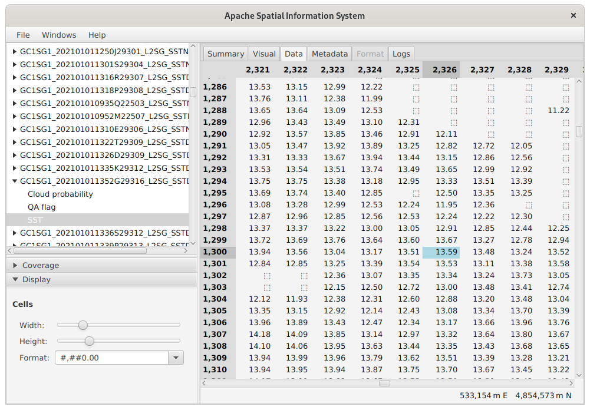

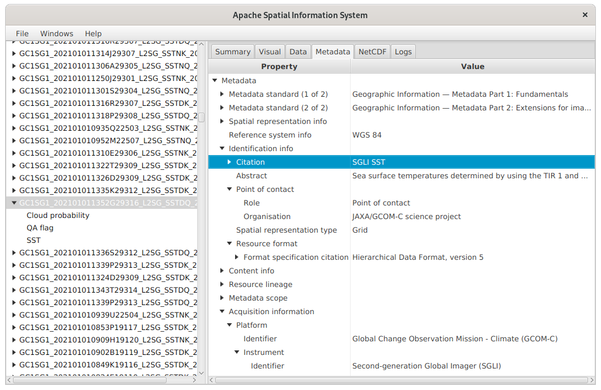

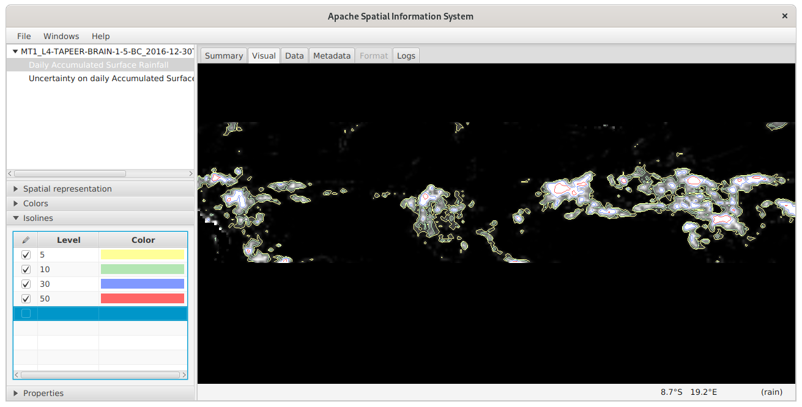

<a id="javafx--open-files"></a>

# Open files

Drag and drop some netCDF, GeoTIFF, ASCII Grid or World Files in the explorer
(the white area on the left side of main window).
Multiple files or entire directories can be dragged.
Opened files are listed and variables are shown below each file as a tree.
Files can be closed with the contextual menu (click on a file with the right mouse button).
The panel on the right side gives a summary of the selected file or variable;
more information can be read in the “Metadata” tab.
The summary panel shows the data geographic area as a blue bounding box on a world map.
If the geographic area crosses the anti-meridian (the meridian at ±180° of longitude), the bounding box will be shown with two parts on each side of the map.
Many (but not all) classes of the Apache SIS library are capable to handle such situation.

<a id="javafx--data-on-cloud"></a>

## Data on cloud

Apache SIS can open data on Amazon S3.
This is not enabled by default in the JavaFX application because of the large amount of dependencies required.
An option for downloading the dependencies may be provided in a future release.
In the meantime, SIS has to be built from the source for enabling this functionality.

<a id="javafx--file-size-limit"></a>

## File size limit

There is usually no size limit when viewing only the metadata, because only the file headers are read at that time.
When viewing the data, there is no size limit if the data are pyramided and tiled with tiles of reasonable size, because the application loads only the tiles needed for the area being displayed.
An example of file format supporting tiling is GeoTIFF.
If a format does not support tiling (e.g. netCDF-3) or if data does not use the tiling capability of the format, then the data are fully loaded as one big tile.
A future version of the JavaFX application may allow to load only a subset of the data
(the Apache SIS API already allows that).

<a id="javafx--explore-metadata"></a>

# Explore metadata

Two kinds of information can be explored: the metadata and the data.
The metadata provide information necessary for understanding the data.
Metadata answer questions such as “what”, “where”, “when” and “how”.
Apache SIS adopts the ISO 19115 — Geographic information — Metadata international standard
as a universal structure for describing all data that the application can read, regardless data format.
The content of selected file can be viewed by clicking on the “Metadata” tab.
Contextual menu allows to export selected nodes and its children to various formats, including ISO 19115-3 (a XML format) and Geographic Markup Language (GML).

<a id="javafx--view-data"></a>

# View data

Data can be viewed in two ways: either as an image, or as tabular values.
Those two visualization modes are provided by “Visual” and “Data” tabs respectively.
The “Visual” tab visualizes the selected variable.
The image is initially shown in the native Coordinate Reference System (CRS) of the data, but can be reprojected.
User can pan the raster, zoom with mouse wheel or rotate with keyboard (Alt + arrows).
Colors can be modified by clicking on the “Colors” title on the left side.

Raster data can use more than one value for representing missing data.
The kinds of values are listed in the “Category” section.
Example of missing value categories are: “Missing”, “Retrieval error”, “Cloud” or “Land”.
Each kind of missing value can be assigned a different color by clicking the corresponding cell in the “Colors” column.

<a id="javafx--coordinates-and-data-values-under-mouse-cursor"></a>

## Coordinates and data values under mouse cursor

By moving mouse cursor over the image, user can see the value and spatial coordinates of the pixel under cursor.
Raster values are shown in their units of measurement (e.g. “°C”) if sufficient information is available in metadata.
If the mouse cursor is over a missing value, the category name (e.g. “Cloud”) will be shown.
The Coordinate Reference System (CRS) used by the status bar can be changed independently of image CRS
by clicking with the right mouse button on the status bar.
For example it is possible to view the image in a Mercator projection
and still show mouse positions with geographic coordinates.

<a id="javafx--coordinates-precision"></a>

## Coordinates precision

The coordinates shown on the status bar use the minimal amount of fraction digits
needed for separating two screen pixels at current zoom level.
This precision varies with map scales:
user can see the number of fraction digits increasing during zoom-in, and conversely during zoom-out.
This calculation works even if the image and the status bar use different map projections.
For example the number of fraction digits may increase when the mouse moves toward a pole
(depending on the map projections).

The process of transforming mouse coordinates to raster coordinates to status bar coordinates may be complex.
If that chain involves a datum change, then the results have an uncertainty
which can be anything between a few millimeters to a kilometer.
If the uncertainty is smaller than the precision of coordinates shown in the status bar, then the accuracy is not provided.
But if user zooms enough, the coordinate precision may become finer than positional accuracy.
In that case a text such “± 1 m” appears.

<a id="javafx--raster-reprojection"></a>

## Raster reprojection

The raster can be reprojected to different Coordinate Reference Systems (CRS).
For applying a reprojection, click with the right mouse button somewhere on the image.
The click location is significant, because Apache SIS will adjust zoom and rotation
after reprojection for minimizing visual changes around that point.
The contextual menu offers two ways to choose a CRS:
the first way is the “Reference system” menu item, which offers a list of predefined CRS.
If the desired CRS is not in the initial short list, click on “Others” for choosing among the +6000 CRS supported by Apache SIS.
(Note: this list is available only if the [EPSG geodetic dataset](#epsg) has been installed, which is not the case by default for licensing reason).
The “Filter” field can help to find the desired CRS.
The dialog box shows a warning in red if the selected CRS
does not have a domain of validity intersecting the raster geographic area.

The second way to select a CRS is the “Centered projection” menu item.
It offers projections configured for the location where mouse click occurred.
For example if the “Universal Transverse Mercator” (UTM) sub-menu is selected, then Apache SIS will chose automatically the appropriate UTM zone.
It often makes shapes more recognizable.
Another choice offered by “Centered projection” menu item is “Azimuthal equidistant”.
When choosing this sub-menu item, the mouse click position become the map projection center.
Distances and angles measured from that point are corrects
(but only from that point, not between arbitrary pair of points).

---

<a id="documentation"></a>

<!-- source_url: https://sis.apache.org/documentation.html -->

<!-- page_index: 9 -->

# Apache SIS - Documentation


Documentation

Supported features:

- [EPSG geodetic dataset](#epsg)
- [Coordinate reference systems](#tables-coordinatereferencesystems)
- [Operation methods](https://sis.apache.org/tables/CoordinateOperationMethods.html)
- [Data formats](#formats)
- [International standards](#standards)

For library users:

- [How to…](#howto)
- [Online Javadoc](https://sis.apache.org/apidocs/index.html)
- [Developer guide](#book-en-developer-guide)
- [Recommended code patterns](https://sis.apache.org/code-patterns.html)
- [Frequently Asked Questions](#faq)

For library developers:

- [Coding conventions](https://sis.apache.org/coding-conventions.html)
- [Release management](https://sis.apache.org/release-management.html)
- [Issues tracker](https://issues.apache.org/jira/browse/SIS)
- [Nightly builds](https://ci-builds.apache.org/job/SIS/)
- [Wiki](https://cwiki.apache.org/confluence/display/SIS)

---

<a id="book-en-developer-guide"></a>

<!-- source_url: https://sis.apache.org/book/en/developer-guide.html -->

<!-- page_index: 10 -->

# 1. Introduction

Apache SIS™ developer guide

Apache SIS is a free software, Java language library for developing geospatial desktop or server applications.
This library provides services for data discovery (metadata), reading and writing vector or raster data, filtering the data and applying operations such as map projections.
Apache SIS data structures follow closely the geospatial models defined in the international standards published by
the Open Geospatial Consortium (OGC) and the International Organization for Standardization (ISO).
The [annex](#book-en-developer-guide--annexes) provides more context about international standards.

The library is an implementation of OGC [GeoAPI](http://www.geoapi.org) interfaces.
In a series of `org.opengis.*` packages, GeoAPI offers a set of implementation-neutral Java interfaces for geospatial applications.
These interfaces closely follow the specifications of the OGC, while interpreting and adapting them to meet the needs of Java developers.
The conceptual model of GeoAPI will be explained in detail in the chapters describing Apache SIS implementation.

While Apache SIS is primarily a library for helping developers to create their own applications, SIS provides also an optional JavaFX application for testing its capability to read, transform and visualize data files.
Screenshots of this application are used in this document for illustrative purposes.

**Note:** this document contains mathematical formulas expressed in MathML.
For viewing those formulas, a MathML-capable browser (e.g. Firefox) is required.

The meaning of words sometime depend on the community using them.
The Apache SIS library prefers as much as possible to use terms in the sense of OGC and ISO standards.
Particular care must be taken with the interfaces between SIS and certain other external libraries.
For example, the ISO 19123 standard see `CV_Coverage` as functions
in which the domain is the set of spatio-temporal coordinates encompassed by the data, and the range is the set of values encompassed.
However, UCAR’s netCDF library
applies these terms instead to the function for converting pixel indices (its domain) to spatial-temporal coordinates (its range).
Thus the UCAR library’s range may be the domain of ISO 19123.

Coverage
:   Feature that acts as a function to return values from its range for any direct position within its spatial,
    temporal or spatiotemporal domain.
    ISO 19123

Coordinate
:   One of a sequence of numbers designating the position of a point.
    ISO 19111

Coordinate operation
:   Process using a mathematical model, based on a one-to-one relationship, that changes coordinates
    in a source coordinate reference system to coordinates in a target coordinate reference system,
    or that changes coordinates at a source coordinate epoch to coordinates at a target coordinate epoch
    within the same coordinate reference system.
    ISO 19111

Coordinate reference system
:   Coordinate system that is related to an object by a datum.
    ISO 19111

Coordinate system
:   Set of mathematical rules for specifying how coordinates are to be assigned to points.
    ISO 19111

Coordinate tuple
:   Tuple composed of coordinates.
    The number of coordinates in the coordinate tuple equals the dimension of the coordinate system.
    The order of coordinates in the coordinate tuple is identical to the order of the axes of the coordinate system.
    ISO 19111

Datum
:   Parameter or set of parameters that realize the position of the origin,
    the scale, and the orientation of a coordinate system.
    ISO 19111

Domain
:   Well-defined set.
    ISO 19123

Range
:   Set of feature attribute values associated by a function with the elements of the domain of a coverage.
    ISO 19123

The elements defined in a computer language, such as classes and methods in Java or elements in an XML document, appear in monospaced font in this document.
In order to facilitate an understanding of the relationships between Apache SIS and the standards, these elements are also represented using the following color codes:

- Elements in blue are defined in an ISO
  or OGC standard other than GeoAPI.
- Elements in green are Java element defined in GeoAPI.
- Elements in brown are defined in Apache SIS.
- Elements left in black are either defined elsewhere (for example the standard Java library),
  or there is no emphasis on that element for the discussion.

For example to represent a projected coordinate reference system (Mercator, Lambert, *etc*), `SC_ProjectedCRS` is an UML and XML element defined by the ISO 19111 standard.
Then `org.opengis.referencing.crs.ProjectedCRS` is the implementation-neutral GeoAPI interface derived from that standard, and `org.apache.sis.referencing.crs.DefaultProjectedCRS` is the implementation class provided by Apache SIS.

Apache SIS implements most GeoAPI interfaces by a classes of the same name than the interface
but prefixed by `Abstract`, `Default` or `General` word.
The `General` prefix is sometimes used instead of `Default`
to indicate that alternative implementations are available for some specific cases.
For example the `Envelope` interface is implemented by at least two Apache SIS classes:
`GeneralEnvelope` and `Envelope2D`.
The first implementation can represent envelopes with any number of dimensions
while the second implementation is specialized for two-dimensional envelopes.

Apache SIS classes prefixed by `Abstract` should not (in principle) be instantiated.
Users should instantiate a non-abstract subclass instead.
However many SIS classes are only conceptually abstract, without `abstract` Java keyword in class definition.
Such classes can be instantiated by a `new AbstractXXX(…)` statement despite being conceptually abstract.
Such instantiations should be avoided, but are nevertheless permitted in last resort when it is not possible to determine the exact subtype.

The easiest way to use Apache SIS is to declare Maven dependencies in the application project.
SIS is divided in about 20 modules, which allow applications to import a subset of the library.
The [Apache SIS downloads](#downloads) page lists the main modules.
The `pom.xml` fragment below gives all dependencies needed by the code snippets in this document
(ignoring core modules such as `sis-referencing` which are inherited by transitive dependencies).
*Note that the `sis-epsg` optional module is not under Apache license.*
Inclusion of that module is subject to acceptation of [EPSG terms of use](https://epsg.org/terms-of-use.html).
It is optional but recommended;
see [How to use EPSG geodetic dataset](#epsg) page for more information.

```
<properties>
  <sis.version>1.4</sis.version>
</properties>
<dependencies>
  <dependency>
    <groupId>org.apache.sis.storage</groupId>
    <artifactId>sis-geotiff</artifactId>
    <version>${sis.version}</version>
  </dependency>
  <dependency>
    <groupId>org.apache.sis.storage</groupId>
    <artifactId>sis-netcdf</artifactId>
    <version>${sis.version}</version>
  </dependency>

  <!-- Specialization of GeoTIFF reader for Landsat data. -->
  <dependency>
    <groupId>org.apache.sis.storage</groupId>
    <artifactId>sis-earth-observation</artifactId>
    <version>${sis.version}</version>
  </dependency>

  <!-- The following dependency can be omitted if XML support is not desired. -->
  <dependency>
    <groupId>org.glassfish.jaxb</groupId>
    <artifactId>jaxb-runtime</artifactId>
    <version>4.0.4</version>
    <scope>runtime</scope>
  </dependency>

  <!-- This optional dependency requires agreement with EPSG terms of use. -->
  <dependency>
    <groupId>org.apache.sis.non-free</groupId>
    <artifactId>sis-epsg</artifactId>
    <version>${sis.version}</version>
    <scope>runtime</scope>
  </dependency>
</dependencies>
```

The `sis-epsg` optional module needs a directory where it will install the geodetic database.
That directory can be anywhere on the local machine, it shall exist (but should be initially empty), and its location should be specified by the `SIS_DATA` environment variable.
For example on a Unix system
(replace `user` by the actual user name and `some_directory` by anything):

```
export SIS_DATA=/home/user/some_directory
mkdir $SIS_DATA
```

It is possible to avoid the need to setup `SIS_DATA` directory
if the `sis-epsg` dependency is replaced by `sis-embedded-data`.
However the latter is slower, and an `SIS_DATA` directory is still needed
for other purposes such as the installation of datum shift grids.

It is possible to instantiate data structures programmatically in memory.
But more often, data are read from files or other kinds of data stores.
There is different ways to access those data, but an easy way is to use
the `DataStores.open(Object)` convenience method.
The method argument can be a path to a data file
(`File`, `Path`, `URL`, `URI`), a stream
(`Channel`, `DataInput`, `InputStream`, `Reader`), a connection to a data base (`DataSource`, `Connection`)
or other kinds of object specific to the data source.
The `DataStores.open(Object)` method detects data formats
and returns a `DataStore` instance for that format.

`DataStore` functionalities depend on the kind of data (coverage, feature set, time series, *etc.*).
But in all cases, there is always some metadata that can be obtained.
Metadata allows to identify the phenomenon or features described by the data
(temperature, land occupation, *etc.*), the geographic area or temporal period covered by the data, together with their resolution.
Some rich data source provides also a data quality estimation, contact information for the responsible person or organization, legal or technical constraints on data usage, the history of processing apply on the data, expected updates schedule, *etc.*
The metadata structures depends on the data formats, but Apache SIS translates all of them
in a unique metadata model in order to hide this heterogeneity.
This *pivot model* approach is often used by various libraries, with Dublin Core as a popular choice.
For Apache SIS, the chosen pivot model is the ISO 19115 international standard.
This model organizes metadata in a tree structure.
For example if a data format can provides a geographic bounding box encompassing all data, then that information will always be accessible (regardless the data format) from the root `Metadata` object
under the `identificationInfo` node, then the `extent` sub-node, and finally the `geographicElement` sub-node.
For example, the following code read a metadata file from a Landsat-8 image and prints the declared geographic bounding box:

```

import org.opengis.metadata.Metadata;
import org.opengis.metadata.extent.GeographicBoundingBox;
import org.apache.sis.storage.DataStore;
import org.apache.sis.storage.DataStores;
import org.apache.sis.storage.DataStoreException;
import org.apache.sis.metadata.iso.extent.Extents;

void main() throws DataStoreException {
    try (DataStore store = DataStores.open(new File("LC81230522014071LGN00_MTL.txt"))) {
        Metadata overview = store.getMetadata();

        // Convenience method for fetching value at the "metadata/identificationInfo/geographicElement" path.
        GeographicBoundingBox bbox = Extents.getGeographicBoundingBox(overview);

        System.out.println("The geographic bounding box is:");
        System.out.println(bbox);
    }
}
```

Above example produces the following output (this area is located in Vietnam):

```
The geographic bounding box is:
Geographic Bounding Box
  ├─West bound longitude…………………………… 108°20′10.464″E
  ├─East bound longitude…………………………… 110°26′39.66″E
  ├─South bound latitude…………………………… 10°29′59.604″N
  └─North bound latitude…………………………… 12°37′25.716″N
```

Metadata are covered in more details in a [latter chapter](#book-en-developer-guide--metadata).
Among metadata elements, there is one which will be the topic of
a [dedicated chapter](#book-en-developer-guide--referencing): `referenceSystemInfo`.
Its content is essential for accurate data positioning;
without this element, even positions given by latitudes and longitudes are ambiguous.
Reference systems have many characteristics that make them apart from other metadata:
they are immutable, have a particular Well-Known Text representation and are associated
to an engine performing coordinate transformation from one reference system to another.

Images, or rasters, are a particular case of a data structure called a coverage.
A coverage is a function which returns attribute values from an input coordinate.
The set of valid input values is called the domain, while the set of possible output values is called the range.
The domain is often the spatio-temporal area covered by the data, but SIS does not prevents coverages from extending to other dimensions.
For example, thermodynamic studies often use an area where the dimensions are temperature and pressure.

**Example:**
Digital Elevation Models (DEM) are often represented as images where pixel values are terrain elevation values.
This image can be used as the basis of an h = f(φ,λ) function providing
(eventually by interpolations between pixels) the elevation h at the geographic coordinate (φ,λ).
In that case, the f function is the coverage, the geographic envelope of the image is the domain, and the set of pixel values h that this function can return is the range.

Ranges may be finite or infinite, and are not necessarily numerical.
For example, the values returned by a coverage may come from an enumeration (“this is a forest”, “this is a lake”, *etc.*).
However in the enumeration case, interpolations are not allowed.
A coverage without interpolation is called a discrete coverage
while a coverage that allows interpolations is called a continuous coverage.

Different types of coverages may also be characterized by the geometry of their cells.
In particular, a coverage is not necessarily composed of quadrilateral cells.
However, given that quadrilateral cells are by far the most frequent (since this is the usual geometry of image pixels), we use the grid coverage term to specify coverages composed of such cells.

The domain of a coverage is the set of valid input values.
In Apache SIS, the domain of grid coverages is described by the `GridGeometry` class.
This class contains the following information:

- A grid extent (a.k.a. grid envelope), often inferred from the image size in pixels.
- A grid to CRS conversion, typically as a scale followed by a translation.
- A georeferenced envelope, which can be inferred from the grid extent and the grid to CRS conversion.
- A Coordinate Reference System (CRS) which is the target of the grid to CRS conversion.
- An *estimation* of grid resolution along each CRS axes.
- An indication of whether conversion for some axes is linear or not.

One of the most important property listed above is the grid to CRS conversion, which defines how to map pixel coordinates to "real world" coordinates such as latitudes and longitudes.
This relationship is often linear (an affine transform), but not necessarily;
`GridGeometry` accepts non-linear conversions as well.

Among the many kinds of operations performed by GIS software products on spatial coordinates, affine transforms are both relatively simple and very common.
Affine transforms can represent any combination of scales, shears, flips, rotations and translations, which are *linear* operations.
Affine transforms cannot handle *non-linear* operations like map projections, but the affine transform capabilities nevertheless cover many other cases:

- Axis order changes, for example from (latitude, longitude) to (longitude, latitude).
- Axis direction changes, for example the y axis oriented toward down in images.
- Prime meridian rotations, for example from Paris to Greenwich prime meridian.
- Dimensionality changes, for example from 3-dimensional coordinates to 2-dimensional coordinates by dropping the height.
- Unit conversion, for example from feet to metres.
- Pixel to geodetic coordinate, for example the conversion represented in the `.tfw` files associated to some TIFF images.
- Part of map projections, for example the False Easting, False Northing and Scale factor parameters.

Affine transforms can be concatenated efficiently.
No matter how many affine transforms are chained, the result can be represented by a single affine transform.
Affine transforms are extensively used by Apache SIS for “grid to CRS” conversions.
Given an image with pixel coordinates represented by (x,y) tuples and given the following assumptions:

- There is no shear, no rotation and no flip.
- All pixels have the same width in degrees of longitude.
- All pixels have the same height in degrees of latitude.
- Pixel indices are positive integers starting at (0,0) inclusive.

Then conversions from pixel coordinates (x,y)
to geographic coordinates (λ,φ) can be represented by the following equations, where Nx is the image width and
Ny the image height in number of pixels:

<math alttext="MathML capable browser required" display="block" xmlns="http://www.w3.org/1998/Math/MathML">
<mtable>
<mtr>
<mtd><mo>λ</mo></mtd>
<mtd><mo>=</mo></mtd>
<mtd><msub><mi>S</mi><mrow>λ</mrow></msub><mi>x</mi><mo>+</mo><msub><mi>T</mi><mrow>λ</mrow></msub></mtd>
<mtd><mtext>        where        </mtext></mtd>
<mtd><msub><mi>S</mi><mrow>λ</mrow></msub></mtd>
<mtd><mo>=</mo></mtd>
<mtd>
<mfrac>
<mrow>
<msub><mi>λ</mi><mrow>max</mrow></msub><mo>-</mo>
<msub><mi>λ</mi><mrow>min</mrow></msub>
</mrow><mrow>
<msub><mi>N</mi><mrow><mi>x</mi></mrow></msub>
</mrow>
</mfrac>
</mtd>
<mtd><mtext>    and    </mtext></mtd>
<mtd><msub><mi>T</mi><mrow>λ</mrow></msub></mtd>
<mtd><mo>=</mo></mtd>
<mtd><msub><mi>λ</mi><mrow>min</mrow></msub></mtd>
</mtr>
<mtr>
<mtd><mo>φ</mo></mtd>
<mtd><mo>=</mo></mtd>
<mtd><msub><mi>S</mi><mrow>φ</mrow></msub><mi>y</mi><mo>+</mo><msub><mi>T</mi><mrow>φ</mrow></msub></mtd>
<mtd><mtext>        where        </mtext></mtd>
<mtd><msub><mi>S</mi><mrow>φ</mrow></msub></mtd>
<mtd><mo>=</mo></mtd>
<mtd>
<mfrac>
<mrow>
<msub><mi>φ</mi><mrow>max</mrow></msub><mo>-</mo>
<msub><mi>φ</mi><mrow>min</mrow></msub>
</mrow><mrow>
<msub><mi>N</mi><mrow><mi>y</mi></mrow></msub>
</mrow>
</mfrac>
</mtd>
<mtd><mtext>    and    </mtext></mtd>
<mtd><msub><mi>T</mi><mrow>φ</mrow></msub></mtd>
<mtd><mo>=</mo></mtd>
<mtd><msub><mi>φ</mi><mrow>min</mrow></msub></mtd>
</mtr>
</mtable>
</math>

Above equations can be represented in matrix form as below:

<math alttext="MathML capable browser required" display="block" xmlns="http://www.w3.org/1998/Math/MathML">
<mrow>
<mo>[</mo>
<mtable>
<mtr><mtd><mi>λ</mi></mtd></mtr>
<mtr><mtd><mi>φ</mi></mtd></mtr>
<mtr><mtd><mn>1</mn></mtd></mtr>
</mtable>
<mo>]</mo>
</mrow>
<mo>=</mo>
<mrow>
<mo>[</mo>
<mtable>
<mtr>
<mtd><msub><mi>S</mi><mrow>λ</mrow></msub></mtd>
<mtd><mn>0</mn></mtd>
<mtd><msub><mi>T</mi><mrow>λ</mrow></msub></mtd>
</mtr>
<mtr>
<mtd><mn>0</mn></mtd>
<mtd><msub><mi>S</mi><mrow>φ</mrow></msub></mtd>
<mtd><msub><mi>T</mi><mrow>φ</mrow></msub></mtd>
</mtr>
<mtr>
<mtd><mn>0</mn></mtd>
<mtd><mn>0</mn></mtd>
<mtd><mn>1</mn></mtd>
</mtr>
</mtable>
<mo>]</mo>
</mrow>
<mo>×</mo>
<mrow>
<mo>[</mo>
<mtable>
<mtr><mtd><mi>x</mi></mtd></mtr>
<mtr><mtd><mi>y</mi></mtd></mtr>
<mtr><mtd><mn>1</mn></mtd></mtr>
</mtable>
<mo>]</mo>
</mrow>
</math>

In this particular case, scale factors S are the pixel size in degrees
and translation terms T are the geographic coordinate of an image corner
(not necessarily the lower-left corner if some axes have been flipped).
This straightforward interpretation holds because of above-cited assumptions, but
matrix coefficients become more complex if the image has shear or rotation
or if pixel coordinates do not start at (0,0).
However it is not necessary to use more complex equations for supporting more generic cases.
The following example starts with an “initial conversion” matrix
where the S and T terms are set to the most straightforward values.
Then the y axis direction is reversed for matching the most common convention in image coordinate systems (change 1), and axis are swapped resulting in latitude before longitude (change 2).
Note that when affine transform concatenations are written as matrix multiplications, operations are ordered from right to left:
A×B×C is equivalent to first applying operation C, then operation B and finally operation A.

Change 2

Change 1

Initial conversion

Concatenated operation

<math alttext="MathML capable browser required" display="block" xmlns="http://www.w3.org/1998/Math/MathML">
<mrow>
<mo>[</mo>
<mtable>
<mtr>
<mtd><mn>0</mn></mtd>
<mtd><mn>1</mn></mtd>
<mtd><mn>0</mn></mtd>
</mtr>
<mtr>
<mtd><mn>1</mn></mtd>
<mtd><mn>0</mn></mtd>
<mtd><mn>0</mn></mtd>
</mtr>
<mtr>
<mtd><mn>0</mn></mtd>
<mtd><mn>0</mn></mtd>
<mtd><mn>1</mn></mtd>
</mtr>
</mtable>
<mo>]</mo>
</mrow>
</math>

×

<math display="block" xmlns="http://www.w3.org/1998/Math/MathML">
<mrow>
<mo>[</mo>
<mtable>
<mtr>
<mtd><mn>1</mn></mtd>
<mtd><mn>0</mn></mtd>
<mtd><mn>0</mn></mtd>
</mtr>
<mtr>
<mtd><mn>0</mn></mtd>
<mtd><mn>-1</mn></mtd>
<msub><mi>N</mi><mrow><mi>y</mi></mrow></msub>
</mtr>
<mtr>
<mtd><mn>0</mn></mtd>
<mtd><mn>0</mn></mtd>
<mtd><mn>1</mn></mtd>
</mtr>
</mtable>
<mo>]</mo>
</mrow>
</math>

×

<math display="block" xmlns="http://www.w3.org/1998/Math/MathML">
<mrow>
<mo>[</mo>
<mtable>
<mtr>
<mtd><mfrac>
<mrow>
<msub><mi>λ</mi><mrow>max</mrow></msub><mo>-</mo>
<msub><mi>λ</mi><mrow>min</mrow></msub>
</mrow><mrow>
<msub><mi>N</mi><mrow><mi>x</mi></mrow></msub>
</mrow>
</mfrac></mtd>
<mtd><mn>0</mn></mtd>
<mtd><msub><mi>λ</mi><mrow>min</mrow></msub></mtd>
</mtr>
<mtr>
<mtd><mn>0</mn></mtd>
<mtd><mfrac>
<mrow>
<msub><mi>φ</mi><mrow>max</mrow></msub><mo>-</mo>
<msub><mi>φ</mi><mrow>min</mrow></msub>
</mrow><mrow>
<msub><mi>N</mi><mrow><mi>y</mi></mrow></msub>
</mrow>
</mfrac></mtd>
<mtd><msub><mi>φ</mi><mrow>min</mrow></msub></mtd>
</mtr>
<mtr>
<mtd><mn>0</mn></mtd>
<mtd><mn>0</mn></mtd>
<mtd><mn>1</mn></mtd>
</mtr>
</mtable>
<mo>]</mo>
</mrow>
</math>

=

<math display="block" xmlns="http://www.w3.org/1998/Math/MathML">
<mrow>
<mo>[</mo>
<mtable>
<mtr>
<mtd><mn>0</mn></mtd>
<mtd><mo>-</mo><mfrac>
<mrow>
<msub><mi>φ</mi><mrow>max</mrow></msub><mo>-</mo>
<msub><mi>φ</mi><mrow>min</mrow></msub>
</mrow><mrow>
<msub><mi>N</mi><mrow><mi>y</mi></mrow></msub>
</mrow>
</mfrac></mtd>
<mtd><msub><mi>φ</mi><mrow>max</mrow></msub></mtd>
</mtr>
<mtr>
<mtd><mfrac>
<mrow>
<msub><mi>λ</mi><mrow>max</mrow></msub><mo>-</mo>
<msub><mi>λ</mi><mrow>min</mrow></msub>
</mrow><mrow>
<msub><mi>N</mi><mrow><mi>x</mi></mrow></msub>
</mrow>
</mfrac></mtd>
<mtd><mn>0</mn></mtd>
<mtd><msub><mi>λ</mi><mrow>min</mrow></msub></mtd>
</mtr>
<mtr>
<mtd><mn>0</mn></mtd>
<mtd><mn>0</mn></mtd>
<mtd><mn>1</mn></mtd>
</mtr>
</mtable>
<mo>]</mo>
</mrow>
</math>

A key principle is that there is no need to write Java code dedicated to above kinds of axis changes.
Those operations, and many other, can be handled by matrix algebra.
This approach makes easier to write generic code and improves performance.
Apache SIS follows this principle by using affine transforms for every operations
that can be performed by such transform.
For instance there is no code dedicated to changing order of ordinate values in a coordinate.

This section is incomplete. See Javadoc for more details.

The range of a coverage is the set of valid output values.
In Apache SIS, the distinction between ranges of numerical values and range of any types of values is represented by
`NumberRange` and `Range` classes respectively.
The `NumberRange` is used more often, and is also the one that most closely approaches the
[the common mathematical concept of an interval](http://en.wikipedia.org/wiki/Interval_%28mathematics%29).
This textual representation approaches the specifications of ISO 31-11 standard, except that the comma is replaced by the character “…” as the separator of minimal and maximal values.
For example, “[0 … 256)” represents the range of values from 0 inclusive to 256 exclusive.

`Range` objects are only indirectly associated with coverages.
In SIS, the values that can return coverages are described by objects of the
`SampleDimension` type.
It is these that contain instances of `Range`, as well as other information such as *transfer function* (described later).

This section is incomplete. See Javadoc for more details.

The `SampleDimension.Builder` provides convenience methods for building the sample dimensions of a coverage.
The usage pattern is to invoke the following methods:

- `setName(…)` for giving a name to a band.
- `addQuantitative(…)` for declaring a range of sample values to convert to units of measurement.
- `addQualitative(…)` for declaring "no data" values.
- `setBackground(…)` for declaring a "no data" value which can also be used for filling empty space.

Each geometric object is considered as an infinite set of points
(except the `Point` object which contains only itself).
To better represent this concept, the `TransfiniteSet` interface
can be seen as a `Set` of potentially infinite size in which the elements are points.
All geometries are specializations of `TransfiniteSet`.

There is two types of structures to represent a point: `Point` and `DirectPosition`.
The first type is a true geometry and may therefore be relatively cumbersome, depending on the implementation.
The second type is not formally considered to be a geometry;
it extends neither `Geometry` nor `TransfiniteSet`.
It barely defines any operations besides the storing of a sequence of numbers representing a coordinate.
It may therefore be a more lightweight object.

In order to allow the API to work equally with these two types of positions, `Position` is defined as a common interface implemented by `DirectPosition` and `Point`.
In practice, the great majority of Apache SIS’s API works on `DirectPosition`s, and occasionally on `Position`s when it seems useful to also allow geometric points.

Envelopes store minimal and maximal coordinate values of a geometry.
Envelopes are *not* geometries themselves; they are not infinite sets of points (`TransfiniteSet`).
There is no guarantee that all the positions contained within the limits of an envelope are geographically valid.
Envelopes must be seen as information about extreme values that might take the coordinates of a geometry as if
each dimension were independent of the others, nothing more.
Nevertheless, we speak of envelopes as rectangles, cubes or hyper-cubes (depending on the number of dimensions)
in order to facilitate discussion, while bearing in mind their non-geometric nature.

**Example:**
We could test whether a position is within the limits of an envelope.
A positive result does not guarantee that the position is within the geometry delimited by the envelope, but a negative result guarantees that it is outside the geometry.
We can perform intersection tests in the same way.
On the other hand, it makes little sense to apply a rotation to an envelope, as the result may be very different from that which we would obtain by performing a rotation on the original geometry, and then recalculating its envelope.

An envelope might be represented by two positions corresponding to two opposite corners of a rectangle, cube or hyper-cube.
For the first corner, we often take the one whose ordinates all have the maximal value (`upperCorner`).
When displayed using a conventional system of coordinates (with y axis values running upwards), these two positions appear respectively in the lower left corner and the upper right corner of a rectangle.
Care must be taken with different coordinate systems, however, which may vary the positions of these corners on the screen.
The expressions *lower corner* and *upper corner* should thus be understood in the mathematical rather than the visual sense.

<a id="book-en-developer-guide--antimeridian"></a>
<a id="book-en-developer-guide--3.1.1.-crossing-the-antimeridian"></a>

### 3.1.1. Crossing the antimeridian

Minimums and maximums are the values most often assigned to `lowerCorner`
and `upperCorner`.
But the situation becomes complicated when an envelope crosses the antimeridian (−180° or 180° longitude).
For example, an envelope 10° in size may begin at 175° longitude and end at −175°.
In this case, the longitude value assigned to `lowerCorner` is greater than that assigned to `upperCorner`.
Apache SIS therefore uses a slightly different definition of these two corners:

- **`lowerCorner`:**
  the starting point, if we move along the inside of the envelope in the direction of ascending values.
- **`upperCorner`:**
  the end-point, if we move along the inside of the envelope in the direction of ascending values.

If the envelope does not cross the antimeridian, these two definitions are equivalent to the selection of minimal and
maximal values respectively. This is the case in the green rectangle in the figure below.
When the envelope crosses the antimeridian, the `lowerCorner` and the
`upperCorner` appear again at the bottom and top of the rectangle
(assuming a standard system of coordinates), so their names remain appropriate from a visual standpoint.
However, the left and right positions are switched.
This case is illustrated by the red rectangle in the figure below.

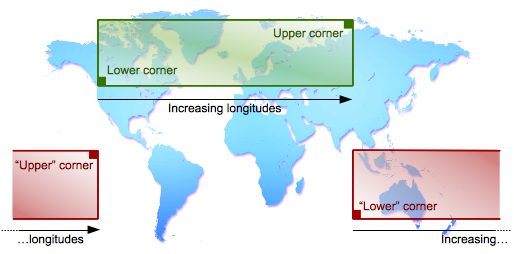

The notions of inclusion and intersection, however, are interpreted slightly differently in these two cases.
In the usual case where the envelope does not cross the antimeridian, the green rectangle covers a region of inclusion.
The regions excluded from this rectangle continue on to infinity in all directions.
In other words, the region of inclusion is not repeated every 360°.
But in the case of the red rectangle, the information provided by the envelope actually covers a region of exclusion
between the two edges of the rectangle. The region of inclusion extends to infinity to the left and right.
We could stipulate that all longitudes below −180° or above 180° are considered excluded, but this would be an arbitrary decision that would not be an exact counterpart to the usual case (green rectangle).
A developer may wish to use these values, for example, in a mosaic where the map of the world is repeated several times
horizontally and each repetition is considered distinct.
If developers wish to perform operations as though the regions of inclusion or exclusion were repeated every 360°, they themselves will have to bring the longitudinal values between −180° and 180° in advance.
All the `add(…)`, `contains(…)`, `intersect(…)`, etc. functions of all the envelopes defined in the
`org.apache.sis.geometry` package perform their calculations according to this convention.

<a id="book-en-developer-guide--generalizing-to-other-types-of-axes"></a>

##### Generalizing to other types of axes

This section specifically relates to longitude, as it is the most usual example of a cyclic axis.
However, in Apache SIS envelopes, there is no explicit mention of longitude, or of its 360° cycle.
The characteristics of the range of values of each axis (its extremum, units, type of cycle, etc.)
are attributes of `CoordinateSystemAxis` objects, indirectly associated with envelopes via the coordinate reference system.
Apache SIS inspects these attributes to determine the way in which it must perform these operations.
Thus, any axis associated with the code `RangeMeaning.WRAPAROUND` benefit from
the same treatment as does longitude.
For example, this could be a time axis for climatological data (one “year” represents the average temperature in all the
months of January, followed by the average of all the months of February, etc.)
This generalization also applies to longitude axes defined by a range of 0° to 360° rather than −180° to 180°.

In order for functions such as `add(…)` to work correctly, all objects involved must use the same coordinate reference system, including the same range of values.
Thus an envelope that expresses longitudes in the range [−180 … +180]° is not compatible with an envelope that expresses
longitudes in the range [0 … 360]°.
The conversions, if necessary, are up to the user
(the `Envelopes` class provides convenience methods to do this).
Moreover, the envelope’s coordinates must be included within the system of coordinates, unless the developer explicitly decides to consider (for example) 300° longitude as a position distinct from −60°.
The `GeneralEnvelope` class provides a `normalize()` method to bring
coordinates within the desired limits, sometimes at the cost of lower values being higher than
upper values.

<a id="book-en-developer-guide--the-special-case-of-0-0-range"></a>

##### The special case of [+0 … −0] range

Java (or more generally, IEEE Standard 754) defines two zero values:
a positive zero and a negative zero. These two values are considered equal when we compare them with the `==` operator in Java.
But in SIS envelopes, they may actually return opposite results for axes using `RangeMeaning.WRAPAROUND`.
An envelope whose range is [0 … 0], [−0 … −0] or [−0 … +0] would normally be considered an empty envelope, but the [+0 … −0] range would in fact be considered to include the entire set of values all around the world.
This behaviour conforms to the definition of `lowerCorner` and `upperCorner`, which considers +0 as the starting point, and −0 as the end-point after cycling through all possible values.
Such behaviour only occurs for the pair of values +0 and −0, and only in that order.
For all other real values, if the condition `lower` `==` `upper` is true, then it is guaranteed that the envelope is empty.

<a id="book-en-developer-guide--envelopetransform"></a>
<a id="book-en-developer-guide--3.1.2.-transforming-to-another-reference-system"></a>

### 3.1.2. Transforming to another reference system

Geographic information systems often need to transform an envelope
from one Coordinate Reference System (CRS) to another.
But a naive approach transforming the 4 corners is not sufficient.
The figure below shows an envelope before a map projection and the geometric shape
that we would get if all points (not only the corners) were projected.
The resulting geometric shape is more complex than a rectangle because of the curvature caused by the map projection.
Computing the envelope that contains the 4 corners of that shape is not enough, because the area in the bottom of the projected shape is lower than the two bottom corners.
That surface would be outside the envelope.

Envelope before projection

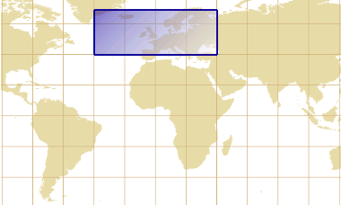

Geometric shape after projection

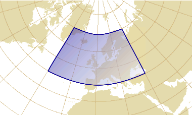

Sampling a larger number of points reduces the problem but does not resolve it.
[Map projection derivatives](#book-en-developer-guide--transformderivative) offer a more efficient way to resolve this problem
(see the [annex](#book-en-developer-guide--derivativeandenvelope) for more mathematical details).
Another complication occurs if the envelope contains the North or South pole.
For making a long story short, transforming an envelope is *a lot* more complicated than it looks like.
Apache SIS contains a few utility methods for making this task easier.
For transforming an envelope to another CRS (WGS 84 / World Mercator in this example):

```
CoordinateReferenceSystem targetCRS = CRS.forCode("EPSG:3395");
Envelope transformed = Envelopes.transform(envelope, targetCRS);
```

If envelopes are transformed in the goal of using a common CRS before to compute the union of many envelopes, an additional complication is that each envelope may use a CRS with a relatively small domain of validity.
The union operation needs to find a CRS valid in a domain large enough for containing all envelopes.
It may be a CRS different than all CRS used by the source envelopes.
Apache SIS has an utility method for handling this additional complexity.
This method accepts an arbitrary number of envelopes that may be in different CRS:

```
Envelope union = Envelopes.union(envelope1, envelope2, envelope3);
```

For locating a point on Earth one can use identifiers like city name or postal address
— an approach known as spatial reference systems by identifiers —
or use numerical values valid in a given coordinate system like latitudes and longitudes
— an approach known as spatial reference systems by coordinates.
Each reference system implies approximations like
the choice of a figure of the Earth (geoid, ellipsoid, *etc.*) used as an approximation of Earth shape, the choice of geometric properties (angles, distances, *etc.*) to be preserved when a map is shown on plane surface, and
a lost of precision when coordinates are transformed to systems using a different [datum](#book-en-developer-guide--geodeticdatum).

A very common misbelief is that one can avoid this complexity by using a single coordinate reference system
(typically WGS84) as a universal system for all data.
The next chapters will explain why the reality is not so simple.
Whether a universal reference system can suit an application needs or not depends on the desired positional accuracy
and the kind of calculations to be performed with the data.
Unless otherwise specified, Apache SIS aims to represent coordinates on Earth with an accuracy of one centimetre or better.
But the accuracy can be altered by various situations:

- Points should be inside the domain of validity as given by `ReferenceSystem.getDomainOfValidity()`.
- Distance measurements in a given map projection are true only is some special locations,
  named for instance “standards parallels”.
- Positional accuracy is altered after coordinate transformations.
  The new accuracy is described by `CoordinateOperation.getCoordinateOperationAccuracy()`.
- Finding the most appropriate coordinate transformation parameters require the use of a geodetic dataset like EPSG.
  Declaring those parameters within the CRS (for example with a `TOWGS84` element) is often not sufficient.

The `sis-referencing` module provides a set of classes implementing
different specializations of the `ReferenceSystem` interface, together with required components.
Those implementations store spatial reference system descriptions, together with metadata like their domain of validity.
However those objects do not perform any operation on coordinate values.
Coordinates conversions or transformations are performed by another family of types, with `CoordinateOperation` as the root interface.
Those types will be discussed in [another section](#book-en-developer-guide--coordinateoperations).

Spatial reference systems by coordinates provide necessary information for mapping numerical coordinate values
to real-world locations. In Apache SIS, most information is contained (directly or indirectly) in
classes with a name ending in CRS, the abbreviation of *Coordinate Reference System*.
Those objects contain:

- A *datum*, which specifies among other things which ellipsoid to use as an Earth shape approximation.
- A description for each axis: name, direction, units of measurement, range of values.
- Sometimes a list of parameters, especially when using map projections.

Those systems are described by the ISO 19111 standard (*Referencing by Coordinates*), which replaces for most parts the older OGC 01-009 standard (*Coordinate Transformation Services*).
Those standards are completed by two other standards defining exchange formats:
ISO 19136 and 19162 respectively for the
Geographic Markup Language (GML) — a XML format which is quite detailed but verbose —
and the Well-Known Text (WKT) — a text format easier to read by humans.

<a id="book-en-developer-guide--projectedcrs"></a>
<a id="book-en-developer-guide--4.1.1.-map-projections"></a>

### 4.1.1. Map projections

Map projections represent a curved surface (the Earth surface) on a plane surface (a map or a computer screen).
Every rendering of geospatial data on a flat screen uses some kind of map projection, sometimes implicitly.
Well-designed map projections provide some control over deformations:
one can preserve the angles, another projection can preserve the areas, but none can preserve both in same time.
The geometric properties to preserve depend on the feature to represent and the work to do on that feature.
For example countries elongated along the East-West axis often use a Lambert projection, while countries elongated along the North-South axis prefer a Transverse Mercator projection.

There is thousands of projected CRS in use around the world.
Many of them are published in the [EPSG geodetic database](#epsg).
The easiest way to get a projected CRS with Apache SIS is to use its EPSG code.
For example the following code gets the definition of the JGD2000 / UTM zone 54N CRS
(for Japan from 138°E to 144°E):

```
CoordinateReferenceSystem crs = CRS.forCode("EPSG:3100");
```

Other ways to get a coordinate reference system will be given in a [next section](#book-en-developer-guide--getcrs).

<a id="book-en-developer-guide--geographiccrs"></a>
<a id="book-en-developer-guide--4.1.2.-geographic-reference-systems"></a>

### 4.1.2. Geographic reference systems

All map projections are based on a geodetic (usually geographic) CRS.
A geodetic CRS is a coordinate reference system with latitude, longitude and sometimes height axes.
There is many kinds of latitudes and longitudes, but two common kinds supported by Apache SIS are geodetic and geocentric latitudes.
Those two angles differ slightly in the way they intersect the ellipsoid surface.
On Earth surface, the difference between those two kinds of latitude varies between 0 and about 20 km.

When peoples talk about latitudes and longitudes, they usually mean *geodetic* latitudes and longitudes.
A coordinate reference system using such latitudes and longitudes is said geographic
and is represented by the `GeographicCRS` interface.
Systems using the other kinds of latitude are represented by other CRS interfaces.

Theoretically, data expressed in a geographic CRS can never be rendered directly on a flat screen
(they could be rendered directly on a planetarium dome however).
In practice we allow data rendering in a geographic CRS, but this process implicitly uses a Plate Carrée projection.

<a id="book-en-developer-guide--compoundcrs"></a>
<a id="book-en-developer-guide--4.1.3.-vertical-and-temporal-dimensions"></a>

### 4.1.3. Vertical and temporal dimensions

TODO

<a id="book-en-developer-guide--coordinatesystem"></a>
<a id="book-en-developer-guide--4.1.4.-coordinate-systems"></a>

### 4.1.4. Coordinate systems

A Coordinate System (CS) defines the set of axes that spans a given coordinate space.
Each axis defines an approximative direction (north, south, east, west, up, down, port, starboard, past, future, *etc.*), units of measurement, minimal and maximal values, and what happen after reaching those extremum.
For example in longitude case, after +180° the coordinate values continue at −180°.
Axes having such behavior are flagged by the `RangeMeaning.WRAPAROUND` code.

<a id="book-en-developer-guide--generalizing-to-other-types-of-axes-2"></a>

#### Generalizing to other types of axes

Wraparound can also exist in time axis. For example in climatological data defining normal temperatures, after December the data sequence restarts to January; those months are associated to no particular year.
Apache SIS allows wraparound to happen on any axis, as long as it is flagged by `RangeMeaning` code.
It is possible to have many wraparound axes in the same coordinate system.

Each Coordinate Reference System (CRS)
is associated with exactly one Coordinate System (CS).
Some properties that we can get from a coordinate system and its axes are shown below.
Axes are numbered from 0 to `cs.getDimension()-1` inclusive.

```
CoordinateSystem cs = crs.getCoordinateSystem();
CoordinateSystemAxis secondAxis = cs.getAxis(1);            // For a geographic CRS, this is usually geodetic longitude.
String        abbreviation = secondAxis.getAbbreviation();  // For a longitude axis, this is usually "λ", "L" or "lon".
AxisDirection direction    = secondAxis.getDirection();     // For a longitude axis, this is usually EAST. Another occasional value is WEST.
Unit<?>       units        = secondAxis.getUnit();          // For a longitude axis, this is usually Units.DEGREE.
double        minimum      = secondAxis.getMinimumValue();  // For a longitude axis, this is usually −180°. Another common value is 0°.
double        maximum      = secondAxis.getMaximumValue();  // For a longitude axis, this is usually +180°. Another common value is 360°.
RangeMeaning  atEnds       = secondAxis.getRangeMeaning();  // For a longitude axis, this is WRAPAROUND.
```

In addition to axis definitions, another important coordinate system characteristic is their type
(`CartesianCS`, `SphericalCS`, *etc.*).
The CS type implies the set of mathematical rules for calculating geometric quantities like angles, distances and surfaces.
Usually the various CS subtypes do not define any new Java methods compared to the parent type, but are nevertheless important for type safety.
For example many calculations or associations are legal only when all axes are perpendicular to each other.
In such case the coordinate system type is restricted to `CartesianCS` in method signatures.

Coordinate systems are mathematical concepts; they do **not** contain any information
about where on Earth is located the system origin.
Consequently coordinate systems alone are not sufficient for describing a location;
they must be combined with a datum (or reference frame).
Those combinations form the coordinate reference systems described in previous sections.

<a id="book-en-developer-guide--geodeticdatum"></a>
<a id="book-en-developer-guide--4.1.5.-geodetic-datum"></a>

### 4.1.5. Geodetic datum

Since the real topographic surface is difficult to represent mathematically, it is not used directly.
A slightly more convenient surface is the geoid, a surface where the gravitational field has the same value everywhere (an equipotential surface).
This surface is perpendicular to the direction of a plumb line at all points.
The geoid surface would be equivalent to the mean sea level if all oceans where at rest, without winds or permanent currents like the Gulf Stream.

While much smoother than topographic surface, the geoid surface still have hollows and bumps
caused by the uneven distribution of mass inside Earth.
For more convenient mathematical operations, the geoid surface is approximated by an ellipsoid.
This “figure of Earth” is represented in GeoAPI by the `Ellipsoid` interface, which is a fundamental component in coordinate reference systems of type `GeographicCRS` and `ProjectedCRS`.
Tenth of ellipsoids are commonly used for datum definitions.
Some of them provide a very good approximation for a particular geographic area
at the expense of the rest of the world for which the datum was not designed.
Other datums are compromises applicable to the whole world.

**Example:**
the EPSG geodetic dataset defines among others the “WGS 84”, “Clarke 1866”, “Clarke 1880”,
“GRS 1980” and “GRS 1980 Authalic Sphere” (a sphere of same surface than the GRS 1980 ellipsoid).
Ellipsoids may be used in various places of the world or may be defined for a very specific region.
For example in USA at the beginning of XXth century, the Michigan state used an ellipsoid based on the “Clarke 1866” ellipsoid but with axis lengths expanded by 800 feet.
This modification aimed to take in account the average state height above mean sea level.

The main properties that we can get from an ellipsoid are given below.
The semi-major axis length is sometimes called equatorial radius and
the semi-minor axis length the polar radius.
The inverse flattening factor is apparently superfluous since it can be derived from other quantities, but many ellipsoid definitions provide this factor instead of semi-minor axis length.

```
Unit<Length> units = ellipsoid.getAxisUnit();
double semiMajor   = ellipsoid.getSemiMajorAxis();          // In units of measurement given above.
double semiMinor   = ellipsoid.getSemiMinorAxis();          // In units of measurement given above.
double ivf         = ellipsoid.getInverseFlattening();      // = semiMajor / (semiMajor - semiMinor).
```

For defining a geodetic system in a country, a national authority selects an ellipsoid matching closely the country surface.
Differences between that ellipsoid and the geoid’s hollows and bumps are usually less than 100 metres.
Parameters that relate an `Ellipsoid` to the Earth surface (for example the position of ellipsoid center)
are represented by instances of `GeodeticDatum`.
Many `GeodeticDatum` definitions can use the same `Ellipsoid`, but with different orientations or center positions.

Before the satellite era, geodetic measurements were performed exclusively from Earth surface.
Consequently, two islands or continents not in range of sight from each other were not geodetically related.
So the North American Datum 1983 (NAD83) and the European Datum 1950 (ED50)
are independent: their ellipsoids have different sizes and are centered at a different positions.
The same geographic coordinate will map different locations on Earth depending on whether the coordinate
uses one reference system or the other.

The GPS invention implied the creation of a
world geodetic system named WGS84.
The ellipsoid is then unique and centered at the Earth gravity center.
GPS provides at any moment the receptor absolute position on that world geodetic system.
But since WGS84 is a world-wide system, it may differs significantly from local systems.
For example the difference between WGS84 and the European system ED50 is about 150 metres, and the average difference between WGS84 and the Réunion 1947 system is 1.5 kilometres.
Consequently we shall not blindly use GPS coordinates on a map, as transformations to the local system may be required.
Those transformations are represented in GeoAPI by instances of the `Transformation` interface.

The WGS84 ubiquity tends to reduce the need for `Transformation` operations with recent data, but does not eliminate it.
The Earth moves under the effect of plate tectonic and new systems are defined every years for taking that fact in account.
For example while NAD83 was originally defined as practically equivalent to WGS84, there is now (as of 2016) a 1.5 metres difference.
The Japanese Geodetic Datum 2000 was also defined as practically equivalent to WGS84, but the Japanese Geodetic Datum 2011 now differs.
Even the WGS84 datum, which was a terrestrial model realization at a specific time, got revisions because of improvements in instruments accuracy.
Today, at least six WGS84 versions exist.
Furthermore many borders were legally defined in legacy datums, for example NAD27 in USA.
Updating data to the new datum would imply transforming some straight lines or simple geometric shapes
into more irregular shapes, if the shapes are large enough.

Contrarily to other kinds of objects introduced in this section, there is not many useful information that we can get from a `Datum` instance except its name.
It is difficult to translate in programming language how a datum is related to the Earth.
Often, the most we can do is to consider that having two datums with different names implies that the same location on Earth
has different coordinate values when using those different datums, even if the ellipsoid is identical in both cases.
Coordinate transformations between datums require some kind of database.

TODO:

- Using `CommonCRS`
- Looking CRS defined by authorities with `CRSAuthorityFactory`
- Reading definitions in GML or WKT format
- Constructing programmatically using `CRSFactory`

<a id="book-en-developer-guide--crs_usercode"></a>
<a id="book-en-developer-guide--4.2.1.-adding-new-crs-definitions"></a>

### 4.2.1. Adding new CRS definitions

TODO

The axis order is specified by the authority (typically a national agency) defining the Coordinate Reference System (CRS).
The order depends on the CRS type and the country defining the CRS.
In the case of geographic CRS, the (latitude, longitude) axis order is widely used by geographers and pilots for centuries.
However software developers tend to consistently use the (x, y) order for every kind of CRS.
Those different practices resulted in contradictory definitions of axis order for almost every CRS of kind `GeographicCRS`, for some `ProjectedCRS` in the South hemisphere (South Africa, Australia, *etc.*) and for some polar projections among others.

Recent OGC standards mandate the use of axis order as defined by the authority.
Oldest OGC standards used the (x, y) axis order instead, ignoring any authority specification.
Many software products still use the old (x, y) axis order, maybe because such uniformization makes CRS implementation and usage *apparently* easier.
Apache SIS supports both conventions with the following approach:
by default, SIS creates CRS with axis order *as defined by the authority*.
Those CRS are created by calls to the `CRS.forCode(String)` method
and the actual axis order can be verified after the CRS creation with `System.out.println(crs)`.
But if (x, y) axis order is wanted for compatibility with older OGC specifications or other software products, then CRS forced to *longitude first* axis order can be created by a call to the following method:

```
CoordinateReferenceSystem crs = …;               // CRS obtained by any means.
crs = AbstractCRS.castOrCopy(crs).forConvention(AxesConvention.RIGHT_HANDED)
```

Among the legacy OGC standards that used the non-conform axis order, an influent one is version 1 of the Well Known Text (WKT) format specification.
According that widely-used format, WKT 1 definitions without explicit `AXIS[…]` elements
shall default to (longitude, latitude) or (x, y) axis order.
In version 2 of WKT format, `AXIS[…]` elements are no longer optional
and should contain an explicit `ORDER[…]` sub-element for making the intended order yet more obvious.
But if `AXIS[…]` elements are nevertheless missing in a WKT 2 definition, Apache SIS defaults to (latitude, longitude) order.
So in summary:

- Default WKT 1 axis order of geographic CRS is (longitude, latitude) as mandated by OGC 01-009 specification.
- Default WKT 2 axis order of geographic CRS is (latitude, longitude),
  but this is SIS-specific as ISO 19162 does not mention default axis order.

To avoid ambiguities, users are encouraged to always provide explicit `AXIS[…]` elements in their WKT.

Given a *source* coordinate reference system (CRS) in which existing coordinate values are expressed, and a *target* coordinate reference system in which coordinate values are desired, Apache SIS can provide a *coordinate operation* performing the conversion or transformation work.
The search for coordinate operations may use a third argument, optional but recommended, which is the geographic area of the data to transform.
That later argument is recommended because coordinate operations are often valid only in a some geographic area
(typically a particular country or state), and many transformations may exist
for the same pair of source and target CRS but different domain of validity.
Different coordinate operations may also be different compromises between accuracy and their domain of validity, and specifying a smaller area of interest may allow Apache SIS to select a more accurate operation.

**Example:**
the EPSG geodetic dataset (as of version 7.9) defines 77 coordinate operations from the
North American Datum 1927 (EPSG:4267) coordinate reference system to the
World Geodetic System 1984 (EPSG:4326) CRS.
There is one operation valid only for coordinate transformations in Québec, another operation valid for coordinate transformations in Texas west of 100°W, another operation for the same state but east of 100°W, *etc*.
If the user did not specified any geographic area of interest, then Apache SIS defaults on the coordinate operation which is valid in the largest area.
In this example, the “largest area” criterion results in the selection of a coordinate operation valid for Canada, not USA.

<a id="book-en-developer-guide--crs.findoperation"></a>
<a id="book-en-developer-guide--4.4.1.-getting-a-coordinate-operation"></a>

### 4.4.1. Getting a coordinate operation

The easiest way to obtain a coordinate operation from above-cited information
is to use the `org.apache.sis.referencing.CRS` convenience class:

```
CoordinateOperation cop = CRS.findOperation(sourceCRS, targetCRS, areaOfInterest);
```

Among the information provided by `CoordinateOperation` object, the following are of special interest:

- The domain of validity, either as a textual description (e.g. “Canada – onshore and offshore”)
  or with the coordinates of a geographic bounding box.
- The positional accuracy, which may be anything from 1 centimetre to a few kilometres.
- The coordinate operation subtype. Among them, two sub-types provide the same functionalities but with a significant conceptual difference:
  - Coordinate **conversions** are fully determined by mathematical formulas.
    Those conversions would have an infinite precision if it was not for the unavoidable rounding errors
    inherent to floating-point calculations.
    Map projections are in this category.
  - Coordinate **transformations** are defined empirically.
    They often have errors of a few metres which are not caused by limitation in computer accuracy.
    Those errors exist because transformations are only approximations of a more complex reality.
    Datum shifts from NAD27 to NAD83
    are in this category.

If the coordinate operation is an instance of `Transformation`, then the instance selected by SIS may be one among many possibilities depending on the area of interest.
Furthermore its accuracy is usually less than the centimetric accuracy that we can expect from a `Conversion`.
Consequently verifying the domain of validity and the positional accuracy declared in the transformation metadata is of particular importance.

<a id="book-en-developer-guide--mathtransform"></a>
<a id="book-en-developer-guide--4.4.2.-executing-an-operation-on-coordinate-values"></a>

### 4.4.2. Executing an operation on coordinate values

The `CoordinateOperation` object introduced in above section provides high-level informations
(source and target CRS, domain of validity, positional accuracy, operation parameters, *etc*).
The actual mathematical work is performed by a separated object obtained by a call to `CoordinateOperation.getMathTransform()`.
At the difference of `CoordinateOperation` instances, `MathTransform` instances do not carry any metadata.
They are kind of black box which know nothing about the source and target CRS
(actually the same `MathTransform` can be used for different pairs of CRS if the mathematical work is the same), domain or accuracy.
Furthermore `MathTransform` may be implemented in a very different way than what `CoordinateOperation` said.
In particular many conceptually different coordinate operations (e.g. longitude rotations, change of units of measurement, conversions between two Mercator projections on the same datum, *etc.*)
are implemented by `MathTransform` as [affine transforms](#book-en-developer-guide--affinetransform) and concatenated for efficiency, even if `CoordinateOperation` reports them as a chain of Mercator and other operations.
The “[conceptual versus real chain of coordinate operations](#book-en-developer-guide--coordinateoperationsteps)” section explains the differences in more details.

The following Java code performs a map projection from geographic coordinates on the World Geodetic System 1984 (WGS84) datum
coordinates in the WGS 84 / UTM zone 33N coordinate reference system.
In order to make the example a little bit simpler, this code uses predefined constants given by the `CommonCRS` convenience class.
But more advanced applications will typically use EPSG codes instead.
Note that all geographic coordinates below express latitude before longitude.

```
import org.opengis.geometry.DirectPosition;
import org.opengis.referencing.crs.CoordinateReferenceSystem;
import org.opengis.referencing.operation.CoordinateOperation;
import org.opengis.referencing.operation.TransformException;
import org.opengis.util.FactoryException;
import org.apache.sis.referencing.CRS;
import org.apache.sis.referencing.CommonCRS;
import org.apache.sis.geometry.DirectPosition2D;

public class MyApp {
    public static void main(String[] args) throws FactoryException, TransformException {
        CoordinateReferenceSystem sourceCRS = CommonCRS.WGS84.geographic();
        CoordinateReferenceSystem targetCRS = CommonCRS.WGS84.universal(40, 14);  // Get whatever zone is valid for 14°E.
        CoordinateOperation operation = CRS.findOperation(sourceCRS, targetCRS, null);

        // The above lines are costly and should be performed only once before to project many points.
        // In this example, the operation that we got is valid for coordinates in geographic area from
        // 12°E to 18°E (UTM zone 33) and 0°N to 84°N.

        DirectPosition ptSrc = new DirectPosition2D(40, 14);           // 40°N 14°E
        DirectPosition ptDst = operation.getMathTransform().transform(ptSrc, null);

        System.out.println("Source: " + ptSrc);
        System.out.println("Target: " + ptDst);
    }
}
```

<a id="book-en-developer-guide--transformderivative"></a>
<a id="book-en-developer-guide--4.4.3.-partial-derivatives-of-coordinate-operations"></a>

### 4.4.3. Partial derivatives of coordinate operations

Previous section shows how to project a coordinate from one reference system to another one.
There is another, less known, operation which does not compute the projected coordinates of a given point, but instead the derivative of the projection function at that point.
Let P be a map projection converting degrees of latitude and longitude (φ, λ)
into projected coordinates (x, y) in metres.
The formula below represents the map projection result as a column matrix
(reason will become clearer soon):

Equation

<math alttext="MathML capable browser required" display="block" xmlns="http://www.w3.org/1998/Math/MathML">
<mi>P</mi><mo>(</mo><mi>φ</mi><mo>,</mo><mi>λ</mi><mo>)</mo>
<mo>=</mo>
<mrow>
<mo>[</mo>
<mtable>
<mtr><mtd><mi>x</mi><mo>(</mo><mi>φ</mi><mo>,</mo><mi>λ</mi><mo>)</mo></mtd></mtr>
<mtr><mtd><mi>y</mi><mo>(</mo><mi>φ</mi><mo>,</mo><mi>λ</mi><mo>)</mo></mtd></mtr>
</mtable>
<mo>]</mo>
</mrow>
</math>

Java code

```
DirectPosition geographic = new DirectPosition2D(φ, λ);
DirectPosition projected = P.transform(geographic, null);
double x = projected.getOrdinate(0);
double y = projected.getOrdinate(1);
```

The map projection partial derivate at this point can be represented by a Jacobian matrix:

Equation

<math alttext="MathML capable browser required" display="block" xmlns="http://www.w3.org/1998/Math/MathML">
<msup><mi>P</mi><mo>′</mo></msup><mo>(</mo><mi>φ</mi><mo>,</mo><mi>λ</mi><mo>)</mo>
<mo>=</mo>
<msub><mi>JAC</mi><mrow><mi>P</mi><mo>(</mo><mi>φ</mi><mo>,</mo><mi>λ</mi><mo>)</mo></mrow></msub>
<mo>=</mo>
<mrow>
<mo>[</mo>
<mtable>
<mtr>
<mtd><mfrac><mrow><mo>∂</mo><mi>x</mi><mo>(</mo><mi>φ</mi><mo>,</mo><mi>λ</mi><mo>)</mo></mrow><mrow><mo>∂</mo><mi>φ</mi></mrow></mfrac></mtd>
<mtd><mfrac><mrow><mo>∂</mo><mi>x</mi><mo>(</mo><mi>φ</mi><mo>,</mo><mi>λ</mi><mo>)</mo></mrow><mrow><mo>∂</mo><mi>λ</mi></mrow></mfrac></mtd>
</mtr>
<mtr>
<mtd><mfrac><mrow><mo>∂</mo><mi>y</mi><mo>(</mo><mi>φ</mi><mo>,</mo><mi>λ</mi><mo>)</mo></mrow><mrow><mo>∂</mo><mi>φ</mi></mrow></mfrac></mtd>
<mtd><mfrac><mrow><mo>∂</mo><mi>y</mi><mo>(</mo><mi>φ</mi><mo>,</mo><mi>λ</mi><mo>)</mo></mrow><mrow><mo>∂</mo><mi>λ</mi></mrow></mfrac></mtd>
</mtr>
</mtable>
<mo>]</mo>
</mrow>
</math>

Java code

```
DirectPosition geographic = new DirectPosition2D(φ, λ);
Matrix jacobian = P.derivative(geographic);
double dx_dλ = jacobian.getElement(0,1);
double dy_dφ = jacobian.getElement(1,0);
```

The first matrix column tells us that if we apply a displacement of 1° of latitude from the (φ, λ) position,
— in other words if we move at the (φ + 1, λ) geographic position —
then the projected coordinates would be displaced by (∂x, ∂λ) metres
— in other words they would become (x + ∂x, y + ∂y) —
if the map projection is approximated by an affine transform valid at the (φ, λ) position.
Similarly the last matrix column gives us the displacement that happen on the projected coordinate
if we apply a displacement of 1° of longitude on the source geographic coordinate under the same assumption.
We can visualize such displacements in a figure like below.
This figure shows the derivative at two points, P1 and P2, for emphasing that the result change for every points.
In that figure, vectors U et V stand for the first and second column respectively
in the Jacobian matrices.

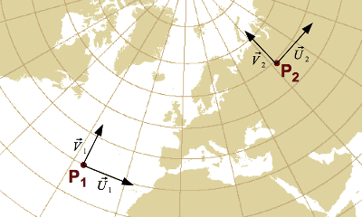

where vectors are related to the matrix by:

<math alttext="MathML capable browser required" display="block" xmlns="http://www.w3.org/1998/Math/MathML">
<mtable><mtr>
<mtd>
<mover><mi>U</mi><mo>→</mo></mover><mo>=</mo>
<mrow>
<mo>[</mo>
<mtable>
<mtr>
<mtd><mfrac><mrow><mo>∂</mo><mi>x</mi></mrow><mrow><mo>∂</mo><mi>φ</mi></mrow></mfrac></mtd>
</mtr>
<mtr>
<mtd><mfrac><mrow><mo>∂</mo><mi>y</mi></mrow><mrow><mo>∂</mo><mi>φ</mi></mrow></mfrac></mtd>
</mtr>
</mtable>
<mo>]</mo>
</mrow>
</mtd>
<mtd><mtext>et</mtext></mtd>
<mtd>
<mover><mi>V</mi><mo>→</mo></mover><mo>=</mo>
<mrow>
<mo>[</mo>
<mtable>
<mtr>
<mtd><mfrac><mrow><mo>∂</mo><mi>x</mi></mrow><mrow><mo>∂</mo><mi>λ</mi></mrow></mfrac></mtd>
</mtr>
<mtr>
<mtd><mfrac><mrow><mo>∂</mo><mi>y</mi></mrow><mrow><mo>∂</mo><mi>λ</mi></mrow></mfrac></mtd>
</mtr>
</mtable>
<mo>]</mo>
</mrow>
</mtd>
</mtr></mtable>
</math>

Above figure shows one usage of map projection derivatives:
they provide the direction of parallels and meridians at a given location in a map projection.
One can use that information for determining if axes have been swapped or their direction reversed.
But the usefulness of map projection derivatives goes further.
The [annex](#book-en-developer-guide--jacobianusage) explains how derivatives are used by the Apache SIS
implementation of envelope and raster reprojections.

<a id="book-en-developer-guide--coordinateoperationsteps"></a>
<a id="book-en-developer-guide--4.4.4.-chain-of-coordinate-operation-steps"></a>

### 4.4.4. Chain of coordinate operation steps

Coordinate operations may include many steps, each with their own set of parameters.
For example transformations from one datum (e.g. NAD27) to another datum (e.g. WGS84)
can be approximated by an affine transform (translation, rotation and scale) applied on the *geocentric* coordinates.
This implies that the coordinates must be converted from *geographic* to geocentric domain before the affine transform, then back to geographic domain after the affine transform.
The result is a three-steps process illustrated in the “Conceptual chain of operations” column of the example below.
However because that operation chain is very common, the EPSG geodetic dataset provides a shortcut
named “Geocentric translation *in geographic domain*”.
Using this operation, the conversion steps between geographic and geocentric CRS are implicit.
Consequently the datum shifts as specified by EPSG appears as if it was a single operation, but the real operation executed by Apache SIS is divided in more steps.

**Example:**
transformation of geographic coordinates from NAD27 to WGS84 in Canada
can be approximated by the EPSG:1172 coordinate operation.
This single EPSG operation is actually a chain of three operations in which two steps are implicit.
The operation as specified by EPSG is shown in the first column below.
The same operation with the two hidden steps made explicit is shown in the second column.
The last column shows the same operation as implemented by Apache SIS under the hood, which contains additional operations discussed below.
For all columns, input coordinates of the first step and output coordinates of the last step
are (latitude, longitude) coordinates in degrees.

**Operation specified by EPSG:**

1. **Geocentric translation** in *geographic* domain
   - X-axis translation = −10 m
   - Y-axis translation = 158 m
   - Z-axis translation = 187 m

Conversions between geographic and geocentric domains are implicit.
The semi-major and semi-minor axis lengths required for those conversions
are inferred from the source and target datum.

**Conceptual chain of operations:**

1. **Geographic to geocentric**
   - Source semi-major = 6378206.4 m
   - Source semi-minor = 6356583.8 m
2. **Geocentric translation**
   - X-axis translation = −10 m
   - Y-axis translation = 158 m
   - Z-axis translation = 187 m
3. **Geocentric to geographic**
   - Target semi-major = 6378137.0 m
   - Target semi-minor ≈ 6356752.3 m

Axis order and units are implicitly defined by the source and target CRS.
It is implementation responsibility to perform any needed unit conversions and/or axis swapping.

**Operations actually performed by Apache SIS:**

1. **Affine parametric conversion**
   - Scale factors (λ and φ) = 0
   - Shear factors (λ and φ) = π/180
2. **Ellipsoid (radians) to centric**
   - Eccentricity ≈ 0.08227
3. **Affine parametric transformation**
   - Scale factors ≈ 1.00001088
   - X-axis translation ≈ −1.568 E-6
   - Y-axis translation ≈ 24.772 E-6
   - Z-axis translation ≈ 29.319 E-6
4. **Centric to ellipsoid (radians)**
   - Eccentricity ≈ 0.08182
5. **Affine parametric conversion**
   - Scale factors (λ and φ) = 0
   - Shear factors (λ and φ) = 180/π

The operation chain actually performed by Apache SIS is very different than the conceptual operation chain
because the coordinate systems are not the same.
Except for the first and last ones, all Apache SIS steps work on right-handed coordinate systems
(as opposed to the left-handed coordinate system when latitude is before longitude), with angular units in radians (instead of degrees) and
linear units relative to an ellipsoid of semi-major axis length of 1 (instead of Earth’s size).
Working in those coordinate systems requires additional steps for unit conversions and axes swapping
at the beginning and at the end of the chain.
Apache SIS uses affine parametric conversions for this purpose, which allow to combine axes swapping and unit conversions in a single step
(see [affine transform](#book-en-developer-guide--affinetransform) for more information).
The reason why Apache SIS splits conceptual operations in such fine-grained operations
is to allow more efficient concatenations of operation steps.
This approach often allows cancellation of two consecutive affine transforms, for example a conversion from radians to degrees (e.g. after a geocentric to ellipsoid conversion)
immediately followed by a conversion from degrees to radians (e.g. before a map projection).
Another example is the Affine parametric transformation step above, which combines both the geocentric translation step
and a scale factor implied by the ellipsoid change.

All those operation chains can be viewed in Well Known Text (WKT) or pseudo-WKT format.
The simplest operation chain, as specified by the authority, is given directly by the
`String` representation of the `CoordinateOperation` instance.
This WKT 2 representation contains not only a description of operations with their parameter values, but also additional information about the context in which the operation applies (the source and target CRS)
together with some metadata like the accuracy and domain of validity.
Some operation steps and parameters may be omitted if they can be inferred from the context.

**Example:**
the WKT 2 representation on the right is for the same coordinate operation than the one used in previous example.
This representation can be obtained by a call to `System.out.println(cop)`
where `cop` is a `CoordinateOperation` instance.
Some characteristics of this representation are:

- The `SourceCRS` and `TargetCRS` elements determine axis order and units.
  For this reason, axis swapping and unit conversions do not need to be represented in this WKT.
- The “Geocentric translation in geographic domain” operation implies conversions between geographic and geocentric coordinate reference systems.
  Ellipsoid semi-axis lengths are inferred from above `SourceCRS` and `TargetCRS` elements,
  so they do not need to be specified in this WKT.
- The operation accuracy (20 metres) is much greater than the numerical floating-point precision.
  This kind of metadata could hardly be guessed from the mathematical function alone.

```
CoordinateOperation["NAD27 to WGS 84 (3)",
  SourceCRS[full CRS definition required here but omitted for brevity],
  TargetCRS[full CRS definition required here but omitted for brevity],
  Method["Geocentric translations (geog2D domain)"],
    Parameter["X-axis translation", -10.0, Unit["metre", 1]],
    Parameter["Y-axis translation", 158.0, Unit["metre", 1]],
    Parameter["Z-axis translation", 187.0, Unit["metre", 1]],
  OperationAccuracy[20.0],
  Area["Canada - onshore and offshore"],
  BBox[40.04, -141.01, 86.46, -47.74],
  Id["EPSG", 1172, "8.9"]]
```

An operation chain closer to what Apache SIS really performs is given by the
`String` representation of the `MathTransform` instance.
In this WKT 1 representation, contextual information and metadata are lost;
a `MathTransform` is like a mathematical function with no knowledge about the meaning of the coordinates on which it operates.
Since contextual information are lost, implicit operations and parameters become explicit.
This representation is useful for debugging since any axis swapping operation (for example) become visible.
Apache SIS constructs this representation from the data structure in memory, but convert them in a more convenient form for human, for example by converting radians to degrees.

**Example:**
the WKT 1 representation on the right is for the same coordinate operation than the one used in previous example.
This representation can be obtained by a call to `System.out.println(cop.getMathTransform())`
where `cop` is a `CoordinateOperation` instance.
Some characteristics of this representation are:

- Since there is not anymore (on intent) any information about source and target CRS,
  axis swapping (if needed) and unit conversions must be performed explicitly.
  This is the task of the first and last affine operations in this WKT.
- The “Geocentric translation” operation is not anymore applied in the geographic domain, but in the geocentric domain.
  Consequently conversions between geographic and geocentric coordinate reference systems must be made explicit.
  Those explicit steps are also necessary for specifying the ellipsoid semi-axis lengths,
  since they cannot anymore by inferred for source and target CRS.
- Conversions between geographic and geocentric coordinates are three-dimensional.
  Consequently operations for increasing and reducing the number of dimensions are inserted.
  By default the ellipsoidal height before conversion is set to zero.

```
Concat_MT[
  Param_MT["Affine parametric transformation",
    Parameter[parameters performing axis swapping omitted for brevity]],
  Inverse_MT[Param_MT["Geographic3D to 2D conversion"]],
  Param_MT["Geographic/geocentric conversions",
    Parameter["semi_major", 6378206.4],
    Parameter["semi_minor", 6356583.8]],
  Param_MT["Geocentric translations (geocentric domain)",
    Parameter["X-axis translation", -10.0],
    Parameter["Y-axis translation", 158.0],
    Parameter["Z-axis translation", 187.0]],
  Param_MT["Geocentric_To_Ellipsoid",
    Parameter["semi_major", 6378137.0],
    Parameter["semi_minor", 6356752.314245179]],
  Param_MT["Geographic3D to 2D conversion"],
  Param_MT["Affine parametric transformation",
    Parameter[parameters performing axis swapping omitted for brevity]]]
```

The latter form is often useful for debugging.
If a coordinate operation seems to produce wrong results, inspecting the Well Known Text like above should be the first thing to do.
The [Frequently Asked Questions page](#faq--transforms) gives more tips
about common causes of coordinate transformation errors.

Many metadata standards exist, including Dublin core, ISO 19115
and the Image I/O metadata defined in the `javax.imageio.metadata` package.
Apache SIS uses the ISO 19115 series of standards as the pivotal metadata structure, and converts other metadata structures to ISO 19115 when needed.
The ISO 19115 standard defines hundreds of metadata elements, but the following table gives an overview with a few of them.
Note that most of the nodes accept an arbitrary number of values.
For example the `extent` node may contain many geographic areas.

| Element | Description |
| --- | --- |
| Metadata | Metadata about a dataset, service or other resources. |
| ├─Reference system info | Description of the spatial and temporal reference systems used in the dataset. |
| ├─Identification info | Basic information about the resource(s) to which the metadata applies. |
| │ ├─Citation | Name by which the cited resource is known, reference dates, presentation form, *etc.* |
| │ │ └─Cited responsible party | Role, name, contact and position information for individuals or organizations that are responsible for the resource. |
| │ ├─Topic category | Main theme(s) of the resource (e.g. farming, climatology, environment, economy, health, transportation, *etc.*). |
| │ ├─Descriptive keywords | Category keywords, their type, and reference source. |
| │ ├─Spatial resolution | Factor which provides a general understanding of the density of spatial data in the resource. |
| │ ├─Temporal resolution | Smallest resolvable temporal period in a resource. |
| │ ├─Extent | Spatial and temporal extent of the resource. |
| │ ├─Resource format | Description of the format of the resource(s). |
| │ ├─Resource maintenance | Information about the frequency of resource updates, and the scope of those updates. |
| │ └─Resource constraints | Information about constraints (legal or security) which apply to the resource(s). |
| ├─Content info | Information about the feature catalog and describes the coverage and image data characteristics. |
| │ ├─Imaging condition | Conditions which affected the image (e.g. blurred image, fog, semi darkness, *etc.*). |
| │ ├─Cloud cover percentage | Area of the dataset obscured by clouds, expressed as a percentage of the spatial extent. |
| │ └─Attribute group | Information on attribute groups of the resource. |
| │ ├─Content type | Types of information represented by the values (e.g. thematic classification, physical measurement, *etc.*). |
| │ └─Attribute | Information on an attribute of the resource. |
| │ ├─Sequence identifier | Unique name or number that identifies attributes included in the coverage. |
| │ ├─Peak response | Wavelength at which the response is the highest. |
| │ ├─Min/max value | Minimum/maximum value of data values in each sample dimension included in the resource. |
| │ ├─Units | Units of data in each dimension included in the resource. |
| │ └─Transfer function type | Type of transfer function to be used when scaling a physical value for a given element. |
| ├─Distribution info | Information about the distributor of and options for obtaining the resource(s). |
| │ ├─Distribution format | Description of the format of the data to be distributed. |
| │ └─Transfer options | Technical means and media by which a resource is obtained from the distributor. |
| ├─Data quality info | Overall assessment of quality of a resource(s). |
| ├─Acquisition information | Information about the acquisition of the data. |
| │ ├─Environmental conditions | Record of the environmental circumstances during the data acquisition. |
| │ └─Platform | General information about the platform from which the data were taken. |
| │ └─Instrument | Instrument(s) mounted on a platform. |
| └─Resource lineage | Information about the provenance, sources and/or the production processes applied to the resource. |
| ├─Source | Information about the source data used in creating the data specified by the scope. |
| └─Process step | Information about events in the life of a resource specified by the scope. |

The ISO 19115 standard is reified by the [GeoAPI](http://www.geoapi.org) interfaces
defined in the `org.opengis.metadata` package and sub-packages.
For each interface, the collection of declared getter methods defines its properties (or attributes).
The implementation classes are defined in the `org.apache.sis.metadata.iso` package and sub-packages.
The sub-packages hierarchy is the same as GeoAPI, and the names of implementation classes are the name of the GeoAPI interfaces
prefixed with `Abstract` or `Default`. In this context, the `Abstract` prefix means that the class is abstract in the sense of the implemented standard.
It it not necessarily abstract in the sense of Java. Because incomplete metadata are common in practice, sometimes an "abstract" class may be instantiated because of the lack of knowledge about the exact sub-type.
A metadata instance (abstract or not) may also have missing values for properties considered as mandatory.
The latter case is handled by [nil reasons](#book-en-developer-guide--nilreason).

A metadata may be created programmatically like below:

```

import org.apache.sis.metadata.iso.citation.DefaultCitation;
import org.opengis.metadata.citation.PresentationForm;

void main() {
    // Convenience constructor setting the "title" property to the given value.
    var citation = new DefaultCitation("Map of Antarctica");
    citation.getPresentationForms().add(PresentationForm.DOCUMENT_HARDCOPY);

    // The following code prints "Map of Antarctica".
    System.out.println(citation.getTitle());
}
```

But more often, metadata are obtained by parsing an XML document
conforms to the ISO 19115-3 schema:

```
import org.apache.sis.xml.XML;
import org.opengis.metadata.Metadata;
import jakarta.xml.bind.JAXBException;

void main() throws JAXBException {
    var metadata = (Metadata) XML.unmarshal(Path.of("Map of Antarctica.xml"));
}
```

Metadata objects in Apache SIS are mostly containers:
they provide getter and setter methods for manipulating the values associated to properties
(for example the `title` property of a `Citation` object), but otherwise does not process the values.
Exceptions to this rule are deprecated properties, which are not stored but rather redirected to their replacements.

The metadata modules provide support methods for handling the metadata objects through Java Reflection.
This is an approach similar to Java Beans, in that users are encouraged to use directly the API of
Plain Old Java objects every time their type is known at compile time, and fallback on the reflection technic when the type is known only at runtime.
When using Java reflection, a metadata can be viewed in different ways:

- As key-value pairs in a `Map` (from `java.util`).
- As a `TreeTable` (from `org.apache.sis.util.collection`).
- As a table record in a database (using `org.apache.sis.metadata.sql`).
- As an XML document conforms to ISO standard schema.

The use of reflection is described [below](#book-en-developer-guide--metadataasmap).
The XML representation is described in a [separated chapter](#book-en-developer-guide--xml-iso-19115).

<a id="book-en-developer-guide--getmetadataelement"></a>
<a id="book-en-developer-guide--5.1.1.-direct-access-via-getter-methods"></a>

### 5.1.1. Direct access via getter methods

All metadata classes provide getter, and sometime setter, methods for their properties.
Some properties accept many values, in which case the property type is a collection.
The following example prints the range of latitudes of all data descriptions
found in a given root `Metadata` object:

```
import org.opengis.metadata.metadata; import org.opengis.metadata.extent.Extent; import org.opengis.metadata.extent.GeographicExtent; import org.opengis.metadata.extent.GeographicBoundingBox; import org.opengis.metadata.identification.Identification; import org.opengis.metadata.identification.DataIdentification;
void main() {Metadata metadata = ...;    // For example, metadata read from a data store.for (Identification identification : metadata.getIdentificationInfo()) {if (identification instanceof DataIdentification data) {for (Extent extent : data.getExtents()) {// Extents may have horizontal, vertical and temporal components.for (GeographicExtent horizontal : extent.getGeographicElements()) {if (horizontal instanceof GeographicBoundingBox bbox) {double south = bbox.getSouthBoundLatitude(); double north = bbox.getNorthBoundLatitude(); System.out.println("Latitude range: " + south + " to " + north);}}}}}}
```

Because of ISO 19115 richness, interesting information may be buried deeply in the metadata tree, as in above example.
For a few frequently-used elements, some convenience methods are provided.
Those conveniences are generally defined as static methods in classes having a name in plural form.
For example the `Extents` class defines static methods for fetching more easily some information from `Extent` metadata elements.
For example the following method navigates through different branches where North, South, East and West data bounds may be found:

```

import org.opengis.metadata.metadata;
import org.opengis.metadata.extent.GeographicBoundingBox;
import org.apache.sis.metadata.iso.extent.Extents;

void main() {
    Metadata metadata = ...;    // For example, metadata read from a data store.
    GeographicBoundingBox bbox = Extents.getGeographicBoundingBox(extent);
}
```

Those conveniences are defined as static methods in order to allow their use with different metadata implementations.
Some other classes providing static methods for specific interfaces are
`Citations`, `Envelopes`, `Matrices` and `MathTransforms`.

<a id="book-en-developer-guide--metadataasmap"></a>
<a id="book-en-developer-guide--5.1.2.-view-as-key-value-pairs"></a>

### 5.1.2. View as key-value pairs

Above static methods explore fragments of metadata tree in search for requested information, but the searches are still targeted to elements whose types and at least part of their paths are known at compile-time.
Sometimes the element to search is known only at runtime, or sometimes there is a need to iterate over all elements.
In such cases, one can view the metadata as a `java.util.Map` like below:

```

import java.util.Map;
import org.apache.sis.metadata.MetadataStandard;
import org.apache.sis.metadata.KeyNamePolicy;
import org.apache.sis.metadata.ValueExistencePolicy;

void main() {
    Map<String,Object> elements = MetadataStandard.ISO_19115.asValueMap(
            metadata,                           // Any instance from the org.opengis.metadata package or a sub-package.
            null,                               // Used for resolving ambiguities. We can ignore for this example.
            KeyNamePolicy.JAVABEANS_PROPERTY,   // Keys in the map will be getter method names without "get" prefix.
            ValueExistencePolicy.NON_EMPTY);    // Entries with null or empty values will be omitted.

    // Print the names of all root metadata elements having a value.
    for (String name : elements.keySet()) {
        System.out.println(name);
    }
}
```

The `Map` object returned by `asValueMap(…)` is live:
any change in the `metadata` instance will be immediately reflected in the view.
Actually, each `map.get("foo")` call is forwarded to the corresponding `metadata.getFoo()` method.
Conversely, any `map.put("foo", …)` or `map.remove("foo")` operation applied on the view
will be forwarded to the corresponding `metadata.setFoo(…)` method, if that method exists.
The view is lenient regarding keys given in arguments to `Map` methods:
keys may be property names (`"foo"`), method names (`"getFoo"`), or names used in ISO 19115 standard UML diagrams
(similar to property names but not always identical).
Differences in upper cases and lower cases are ignored when this tolerance does not introduce ambiguities.
For more information on metadata views, see
[`org.apache.sis.metadata`](https://sis.apache.org/apidocs/org.apache.sis.metadata/org/apache/sis/metadata/package-summary.html#package.description)
package javadoc.

<a id="book-en-developer-guide--metadataastreetable"></a>
<a id="book-en-developer-guide--5.1.3.-view-as-tree-table"></a>

### 5.1.3. View as tree table

A richer alternative to the view as a map is the view as a tree table.
With this view, the metadata structure is visible as a tree, and each tree node is a table row with the following columns:

| Column | Description |
| --- | --- |
| `IDENTIFIER` | The UML identifier if any, or otherwise the Java Beans name, of the metadata property. |
| `INDEX` | If the property is a collection, then the zero-based index of the element in that collection. |
| `NAME` | A human-readable name for the node, derived from above identifier and index. |
| `TYPE` | The base type of the value (usually a GeoAPI interface). |
| `VALUE` | The metadata value for the node. This column may be writable. |
| `NIL_REASON` | If the value is mandatory and nevertheless absent, the reason why. |
| `REMARKS` | Remarks or warning on the property value. |

Tree table views are obtained in a way similar to [map views](#book-en-developer-guide--metadataasmap), but using the `asTreeTable(Object)` method instead of `asValueMap(Object)`.

Apache SIS allows any metadata property to be `null`
(for values that are not collections) or an empty collection.
However, ISO 19115 defines some properties as mandatory.
For example, the `title` of a `Citation` is mandatory, while the `edition` is optional.
Apache SIS will not raise any warning or error if a mandatory property is missing.
But for strict ISO compliance, the reason why the property is missing should be provided.
Predefined reasons are:

| Reason | Explanation |
| --- | --- |
| `inapplicable` | The property is not applicable. |
| `unknown` | The value probably exists but is not known. |
| `missing` | The value cannot exist. |
| `withheld` | The value cannot be revealed. |
| `template` | The value will be available later. |

The transmission of this information requires the use of a non-null object, even when the value is missing.
In such case, SIS will return an object that, besides implementing the desired GeoAPI interface, also implements the `org.apache.sis.xml.NilObject` interface.
This interface flags the instances where all methods return an empty collection, an empty table, `null`, `NaN`, `0` or `false`, in this preference order, as permitted by the return types of the methods.
Each instance that implements `NilObject` provides a `getNilReason()` method
indicating why the object is nil.

Different OGC/ISO standards do not always use the same strategy to express objects in XML.
ISO 19115-3 standard in particular uses a more verbose approach than other standards, and will be the subject of its [own section](#book-en-developer-guide--xml-iso-19115).
But most XML formats define supplementary types and attributes that are not part of the original abstract specifications.
These supplementary attributes are usually specific to XML and may not appear in the API of Apache SIS.
However, some of these attributes, such as `id`, `uuid` and
`xlink:href`, remain accessible in the form of key-value pairs.

XML documents may use any prefixes, but the following prefixes are commonly used.
They therefore appear by default in documents produced by Apache SIS.
These prefixes are defined in the `org.apache.sis.xml.Namespaces` class.

| Prefix | Namespace |
| --- | --- |
| `gco` | `http://www.isotc211.org/2005/gco` |
| `gfc` | `http://www.isotc211.org/2005/gfc` |
| `gmd` | `http://www.isotc211.org/2005/gmd` |
| `gmi` | `http://www.isotc211.org/2005/gmi` |
| `gmx` | `http://www.isotc211.org/2005/gmx` |
| `gml` | `http://www.opengis.net/gml/3.2` |
| `xlink` | `http://www.w3.org/1999/xlink` |

For each metadata class, there is an XML type with the same name than in the abstract specification
(for example, `mdb:MD_Metadata` and `cit:CI_Citation`).
All of these types may be used as the root of an XML document.
It is therefore possible to write a document representing a complete `MD_Metadata` object, or to write a document representing only a `CI_Citation` object.

ISO 19115-3 standard arranges the content of these objects in an unusual way:
for each property whose value type is itself another class of ISO 19115, the value is wrapped in an element that represents its type, rather than being written directly.
For example, in an object of the `CI_Citation` type, the value of the `citedResponsibleParty` property is incorporated
into a `CI_Responsibility` element.
This practice doubles the depth of the hierarchy, and introduces duplication at all levels for each value, as in the following example:

```
<MD_Metadata>
  <identificationInfo>
    <MD_DataIdentification>
      <citation>
        <CI_Citation>
          <citedResponsibleParty>
            <CI_Responsibility>
              <party>
                <CI_Party>
                  <contactInfo>
                    <CI_Contact>
                      <onlineResource>
                        <CI_OnlineResource>
                          <linkage>
                            <URL>https://www.ogc.org</URL>
                          </linkage>
                        </CI_OnlineResource>
                      </onlineResource>
                    </CI_Contact>
                  </contactInfo>
                </CI_Party>
              </party>
            </CI_Responsibility>
          </citedResponsibleParty>
        </CI_Citation>
      </citation>
    </MD_DataIdentification>
  </identificationInfo>
</MD_Metadata>
```

The preceding example, like all documents that conform to ISO 19115-3, consists of a systematic alternation of two types of XML elements:

1. It begins with the name of the property, which always begins with a lower-case letter (ignoring prefixes).
   In Java APIs, each property corresponds to a method in its enclosing class.
   In the example above, `mdb:identificationInfo` (a property of `MD_Metadata` class)
   corresponds to the `Metadata.getIdentificationInfo()` method.
2. The value type is included under each property, unless it has been replaced with a reference
   (the following [sub-section](#book-en-developer-guide--gco-id) will elaborate on this subject).
   The value type is an XML element whose name always begins with an upper-case letter,
   ignoring prefixes.
   In the example above we had `MD_DataIdentification`,
   which corresponds to the `DataIdentification` Java interface.
   It is this XML element that contains the child properties.

In order to reduce the complexity of the libraries, GeoAPI and Apache SIS
only expose publicly a single unified view of these two types of elements.
The public API basically corresponds to the second group.

<a id="book-en-developer-guide--gco-id"></a>
<a id="book-en-developer-guide--6.1.1.-links-to-previously-defined-instances"></a>

### 6.1.1. Links to previously-defined instances

The parent element may contain an `id` or `uuid` attribute.
If one of these attributes is present, the parent attribute may be completely omitted;
it will be replaced at the time of reading by the element referenced by the attribute.
In the following example, the part on the left defines an element associated with the identifier “`my_id`,”
while the part on the right references this element:

Defining an identifier

```
<!-- insert child properties here -->
```

Using a defined identifier

```
<MD_MetaData>
  <identificationInfo xlink:href="#my_id"/>
</MD_MetaData>
```

The decision of which attribute to use depends on the scope of the referenced item:

- `id` is only valid in the same XML document that defines the object it references.
- `uuid` may be valid outside the XML document,
  but someone must maintain a database providing the objects for each given UUID.
- `xlink:href` may reference another XML document accessible on the Internet.

In the SIS library, all objects that can be identified in an XML document
implements the `org.apache.sis.xml.IdentifiedObject` interface.
Each instance of this interface provides a view of its identifiers in the form of a `Map<Citation,String>`, in which the `Citation` key indicates the type of identifier and the value is the identifier itself.
Some constants representing different types of identifiers are listed in `IdentifierSpace`, including `ID`, `UUID` and `HREF`.
Each of these keys may be associated with a different type of value (usually `String`, `UUID` or `URI`) depending on the key.
For example, the following code defines a value for the `uuid` attribute:

```
import org.apache.sis.metadata.iso.DefaultMetadata;
import org.apache.sis.xml.IdentifierSpace;
import java.util.UUID;

public class MyClass {
    public void myMethod() {
        UUID identifier = UUID.randomUUID();
        DefaultMetadata metadata = new DefaultMetadata();
        metadata.getIdentifierMap().putSpecialized(IdentifierSpace.UUID, identifier);
    }
}
```

Although this mechanism has been defined in order to better support the representation of XML attributes
of the `gco:ObjectIdentification` group, it also conveniently allows other types of identifiers to be manipulated.
For example, the `ISBN` and `ISSN` attributes of
`Citation` may be manipulated in this way.
The methods of the `IdentifiedObject` interface therefore provides a specific location
where all types of identifiers (not only XML) associated with an object may be manipulated.

<a id="book-en-developer-guide--nilreason"></a>
<a id="book-en-developer-guide--6.1.2.-placeholders-for-missing-values"></a>

### 6.1.2. Placeholders for missing values

If a mandatory property value is missing, a [nil reason should be provided](#book-en-developer-guide--nilreason).
The reason is specified in a `nilReason` attribute, which can take values such as
`unknown`, `missing`, `inapplicable`, `withheld`, `template`, *etc.*
In the following example, the left side shows a `CI_Citation` element containing a
`CI_Series` element, while on the right side the series is unknown.
If the `CI_Series` element had been completely omitted, then the `Citation.getSeries()` method would return `null` in Java.
But when a `nilReason` is present, the SIS implementation of
`getSeries()` returns instead an object that implements both the
`Series` and `NilReason` interfaces, and in which the
`getNilReason()` method returns the constant `UNKNOWN`.

Information included

```
<!-- insert child properties here -->
```

Missing information

```
<CI_Citation>
  <series nilReason="unknown"/>
</CI_Citation>
```

This chapter describes aspects of Apache SIS that apply to the entire library.
Most of these utilities are not specific to spatial information systems.

There are various opinions on how to implement Java standard’s `Object.equals(Object)` method.
According to some, it should be possible to compare different implementations of the same interface or base class.
But to follow this policy, each interface or base class’s javadoc must define the algorithms that all implementations
shall use for their `equals(Object)` and `hashCode()` methods.
This approach is common in `java.util.Collection` and its child interfaces.
Transferring this approach to certain GeoAPI interfaces, however, would be a difficult task, and would probably not be followed in many implementations.
Moreover, it comes at the expense of being able to take into account supplementary attributes in the child interfaces, unless this possibility has been specified in the parent interface.
This constraint arises from the following points of the `equals(Object)` and `hashCode()` method contracts:

- `A.equals(B)` implies `B.equals(A)` (symmetry);
- `A.equals(B)` and `B.equals(C)` implies `A.equals(C)` (transitivity);
- `A.equals(B)` implies `A.hashCode() == B.hashCode()`.

For example, these three constraints are violated if A (and eventually C) can contain attributes
which B ignores.
To bypass this problem, an alternative approach is to require that the objects compared by the
`Object.equals(Object)` method be of the same class; in other words, `A.getClass() == B.getClass()`.
This approach is sometimes regarded as contrary to the principles of object oriented programming.
In practice, for relatively complex applications, the important accorded to these principles depends on the context
in which the objects are compared:
if the objects are added to a `HashSet` or used as keys in a `HashMap`, we would need a stricter adherence to the `equals(Object)` and `hashCode()` contract.
But if the developer is comparing the objects his- or herself, for example to check that the relevant information has been changed, then the constraints of symmetry, transitivity or coherence with the hash values may be of little interest.
More permissive comparisons may be desirable, sometimes going so far as to tolerate minor discrepancies in numerical values.

In order to allow developers a certain amount of flexibility, many classes in the SIS
library implement the `org.apache.sis.util.LenientComparable` interface, which defines a `equals(Object, ComparisonMode)` method.
The principle modes of comparison are:

- **`STRICT`** — The objects compared must share the same class and have exactly equal attributes,
  including any possible public attributes specific to the implementation.
- **`BY_CONTRACT`** — The objects compared must implement the same GeoAPI (or other standard)
  interface, but need not be of the same implementation class.
  Only the attributes defined in the interface are compared;
  all other attributes specific to the implementation — even if they are public — are ignored.
- **`IGNORE_METADATA`** — Like `BY_CONTRACT`,
  but only compares attributes that influence the operations (numeric calculations or otherwise) performed by the object.
  For example, in a geodesic datum, the longitude (in relation to Greenwich) of the original meridian
  would be taken into account, while the name of the meridian would be ignored.
- **`APPROXIMATIVE`** — Like `IGNORE_METADATA`,
  but tolerates minor discrepancies in numerical values.

The default mode, used in all `equals(Object)` methods in SIS, is `STRICT`. This mode is chosen for a safe operation — particularly with `HashMap` —
without the need to rigorously define `equals(Object)` and `hashCode()` operations in every interface.
With this mode, the order of objects (`A.equals(B)` or `B.equals(A)`) is unimportant.
It is, however, the only mode that offers this guarantee.
In the expression `A.equals(B)`, the `BY_CONTRACT` mode
(and so by extension all other modes that depend on it) only compares the properties known to `A`, regardless of whether `B` knows more.

There is sometimes a need to convert instances from a source Java type to a target Java type
while those types are unknown at compile time.
Various projects (Apache Common Convert, Spring, *etc.*)
have created their own interface for performing object conversions between types known only at runtime.
Details vary, but such interfaces typically look like below:

```
interface ObjectConverter<S,T> {   // Some projects use only "Converter" as interface name.
    T apply(S object);             // Another method name commonly found in other projects is "convert".
}
```

Like other projects, Apache SIS also defines its own `ObjectConverter` interface.
The main difference between SIS converter interface and the interfaces found in other projects
is that SIS converters provide some information about their mathematical properties.
An Apache SIS converter can have zero, one or many of the following properties:

Injective
:   A function is injective if no pair of S values can produce the same T value.

    **Example:**
    the `Integer` → `String` conversion performed by `Integer.toString()`
    is an injective function because if two `Integer` values are not equal,
    then it is guaranteed that their conversions will result in different `String` values.
    However the `String` → `Integer` conversion performed by `Integer.valueOf(String)`
    is **not** an injective function
    because many distinct `String` values can be converted to the same `Integer` value.
    For example converting the "42", "+42" and "0042" character strings all result in the same 42 integer value.

Surjective
:   A function is surjective if each values of T can be created from at least one value of S.

    **Example:**
    the `String` → `Integer` conversion performed by `Integer.valueOf(String)`
    is a surjective function because every `Integer` value can be created from at least one `String` value.
    However the `Integer` → `String` conversion performed by `Integer.toString()`
    is **not** a surjective function because it cannot produce all possible `String` values.
    For example there is no way to produce the "ABC" value with the `Integer.toString()` method.

Bijective
:   A function is bijective if there is a one-to-one relationship between S and T values.

    **Note:**
    the bijective property is defined here for clarity, but actually does not have an explicit item
    in Apache SIS `FunctionProperty` enumeration.
    It is not necessary since a function that is both injective and surjective is necessarily bijective.

Order preserving
:   A function is order preserving if any sequence of increasing S values is mapped to a sequence of increasing T values.

    **Example:**
    conversion from `Integer` to `Long` preserve the natural ordering of elements.
    However conversions from `Integer` to `String` do **not** preserve natural ordering,
    because some sequences of increasing integer values are ordered differently when their string representations are sorted by lexicographic order.
    For example 1, 2, 10 become "1", "10", "2".

Order reversing
:   A function is order reversing if any sequence of increasing S values is mapped to a sequence of decreasing T values.

    **Example:**
    a conversion that reverses the sign of numbers.

Above information may seem unnecessary when values are converted without taking in account the context in which the values appear.
But when the value to convert is part of a bigger object, then above information can affect the way the converted value will be used.
For example conversion of a [min … max] range is straightforward when the converter is order preserving.
But if the converter is order reversing, then the minimum and maximum values need to be interchanged.
For example if the converter reverses the sign of values, then the converted range is [-max … -min].
If the converter is neither order preserving or order reversing, then range conversion is not allowed at all
(because it does not contain the same set of values) even if the minimum and maximum values could be converted individually.

In an architecture where a program executed on a server provides its data to multiple clients, the server’s locale conventions are not necessarily the same as those of the clients.
Conventions may differ in language, but also in the way they write numeric values
(even between two countries that speak the same language) as well in time zone.
To produce messages that conform to the client’s conventions, SIS uses
two approaches, distinguished by their level of granularity: at the level of the messages themselves, or at the level of the objects that create the messages.
The approach used also determines whether it is possible to share the same instance of an object for all languages.

<a id="book-en-developer-guide--localizedstring"></a>
<a id="book-en-developer-guide--7.3.1.-distinct-character-sequences-for-each-locale"></a>

### 7.3.1. Distinct character sequences for each locale

Some classes are only designed to function according to one locale convention at a time.
This is of course true for the standard implementations of `java.text.Format`, as they are entirely dedicated to the work of internationalization.
But it is also the case for other less obvious classes like `javax.imageio.ImageReader` and `ImageWriter`.
When one of these classes is implemented by SIS, we identify it by implementing the `org.apache.sis.util.Localized` interface.
The `getLocale()` method of this interface can determine the locale conventions
by which the instance produces its message.

Another class that provides different methods for different locales is `java.lang.Throwable`.
The standard Java API defines two methods for getting the error message:
`getMessage()` and `getLocalizedMessage()`.
Usually those two methods return the same character sequences, but some exceptions thrown by Apache SIS may use different locales.
The policy that SIS tries to apply on a *best-effort* basis is:

- `getMessage()` returns the message in the JVM default locale.
  In a client-server architecture, this is often the locale on the server side.
  This is the recommended language for logging messages to be read by system administrators.
- `getLocalizedMessage()` returns the message in a locale that depends on the context
  in which the exception has been thrown. This is often the locale used by a particular `Format`
  or `DataStore` instance, and can be presumed to be the locale on the client side.
  This is the recommended language to show in the user application.

**Example:**
If an error occurred while a Japanese client connected to an European server, the localized message may be sent
to the client in Japanese language as given by `getLocalizedMessage()` while the same error may be
logged on the server side in the French (for example) language as given by `getMessage()`.
This allows system administrator to analyze the issue without the need to understand client’s language.

The utility class `org.apache.sis.util.Exceptions` provides convenience methods to get messages
according to the conventions of a given locale, when this information is available.

<a id="book-en-developer-guide--internationalstring"></a>
<a id="book-en-developer-guide--7.3.2.-single-instance-for-all-supported-locales"></a>

### 7.3.2. Single instance for all supported locales

The API conventions defined by SIS or inherited by GeoAPI favour the use of the
`InternationalString` type when the value of a `String` type would likely be localized.
This approach allows us to defer the internationalization process to the time when a character sequence is requested, rather than the time when the object that contains them is created.
This is particularly useful for immutable classes used for creating unique instances independently of locale conventions.

**Example:**
SIS includes only one instance of the `OperationMethod`
type representing the Mercator projection, regardless of the client’s language.
But its `getName()` method (indirectly) provides an instance of
`InternationalString`, so that `toString(Locale.ENGLISH)` returns Mercator projection
while `toString(Locale.FRENCH)` returns Projection de Mercator.

When defining spatial objects independently of locale conventions, we reduce the risk of computational overload.
For example, it is easier to detect that two maps use the same cartographic projection if this last is represented by the
same instance of `CoordinateOperation`, even if the projection has a different name depending on the country.
Moreover, certain types of `CoordinateOperation` may require coordinate transformation matrices, so sharing a single instance becomes even more preferable in order to reduce memory consumption.

<a id="book-en-developer-guide--locale.root"></a>
<a id="book-en-developer-guide--7.3.3.-locale.root-convention"></a>

### 7.3.3. `Locale.ROOT` convention

All SIS methods receiving or returning the value of a `Locale` type accept the `Locale.ROOT` value.
This value is interpreted as specifying not to localize the text.
The notion of a non-localized text is a little false, as it is always necessary to chose a formatting convention.
This convention however, though very close to English, is usually slightly different.
For example:

- Identifiers are written as they appear in UML diagrams,
  such as blurredImage instead of Blurred image.
- Dates are written according to the ISO 8601 format,
  which does not correspond to English conventions.
- Numbers are written using their `toString()` methods, rather than using a `java.text.NumberFormat`.
  As a result, there are differences in the number of significant digits,
  use of exponential notation and the absence of thousands separators.

<a id="book-en-developer-guide--unicodepoint"></a>
<a id="book-en-developer-guide--7.3.4.-treatment-of-characters"></a>

### 7.3.4. Treatment of characters

In Java, sequences of characters use UTF-16 encoding.
There is a direct correspondence between the values of the `char` type and the great majority of characters, which facilitates the use of sequences so long as these characters are sufficient.
However, certain Unicode characters cannot be represented by a single `char`.
These *supplementary characters* include certain ideograms, but also road and geographical symbols in the 1F680 to 1F700 range.
Support for these supplementary characters requires slightly more complex interactions than the classic case, where we may assume a direct correspondence.
Thus, instead of the loop on the left below, international applications must generally use the loop on the right:

Loop to Avoid

```
for (int i=0; i<string.length(); i++) {
    char c = string.charAt(i);
    if (Character.isWhitespace(c)) {
        // A blank space was found.
    }
}
```

Recommended loop

```
for (int i=0; i<string.length();) {
    int c = string.codePointAt(i);
    if (Character.isWhitespace(c)) {
        // A blank space was found.
    }
    i += Character.charCount(c);
}
```

Supplementary character examples

(rendering depends on browser capabilities)

🚉 🚥 🚧 🚫
🚯 🚸 🚺 🚹 🛄 🚭

SIS supports supplementary characters by using the loop on the right where necessary, but the loop on the left is occasionally used when it is known that the characters searched for are not supplementary characters, even if some may be present in the sequence in which we are searching.

<a id="book-en-developer-guide--whitespaces"></a>
<a id="book-en-developer-guide--7.3.4.1.-blank-spaces-interpretation"></a>

#### 7.3.4.1. Blank spaces interpretation

Standard Java provides two methods for determining whether a character is a blank space:
`Character.isWhitespace(…)` and `Character.isSpaceChar(…)`.
These two methods differ in their interpretations of non-breaking spaces, tabs and line breaks.
The first method conforms to the interpretation currently used in languages such as Java, C/C++ and XML, which considers tabs and line breaks to be blank spaces, while non-breaking spaces are read as not blank.
The second method — which conforms strictly to the Unicode definition — makes the opposite interpretation.

SIS uses each of these methods in different contexts.
`isWhitespace(…)` is used to *separate* the elements of a list (numbers, dates, words, etc.), while `isSpaceChar(…)` is used to ignore blank spaces *inside* a single element.

**Example:**
Take a list of numbers represented according to French conventions.
Each number may contain *non-breaking spaces* as thousands separators, while the different numbers in the list may be separated by ordinary spaces, tabs or line breaks.
When analyzing a number, we want to consider the non-breaking spaces as being part of the number, whereas a tab or a line break most likely indicates a separation between this number and the next.
We would thus use `isSpaceChar(…)`.
Conversely, when separating the numbers in the list, we want to consider tabs and line breaks as separators, but not non-breaking spaces.
We would thus use `isWhitespace(…)`.
The role of ordinary spaces, to which either case might apply, should be decided beforehand.

In practice, this distinction is reflected in the use of `isSpaceChar(…)` in the implementations of `java.text.Format`, or the use of `isWhitespace(…)` in nearly all the rest of the SIS library.

The rest of this document provides historical contexts, rational behind some design choices
and guidance for reducing the dependency of an application to Apache SIS.
Those annexes can be safely ignored by most Apache SIS users, but may be useful for developers wanting to create their own geospatial libraries.

A geospatial information community is a collection of systems or individuals capable of exchanging their geospatial data
through the use of common standards, allowing them to communicate with one another.
As there are many ways to represent geospatial information, each community tends to structure this information in light of its areas of interest.
This diversity complicates the task of Spatial Information System (SIS) users
by confronting them with an apparently chaotic variety of data formats and structures.
The characteristics of these structures vary according to the observed phenomenon and measurement methods, as well as the habits of the organizations producing the data.
Such a variety represents an obstacle in studies that require heterogeneous combinations of data, especially when they originate in communities that are traditionally distinct.
For example, a researcher studying cholera might be interested in populations of shrimp as a propagation vector of the disease.
But as doctors and oceanographers may not be used to share their work, the participants of such a study may be limited by the effort required to convert the data.

We cannot impose a uniform format on all data collections, as the diversity of formats is tied to factors
such as the constraints imposed by the measuring apparatus, and the statistical distribution of values.
A more flexible solution is to ensure the interoperability of data across a common programming interface
(API).
This API is not necessarily defined in a programming language;
the actual tendency is rather to define conventions that use existing web protocols, which we can translate into various programming languages.
But in order for this approach to be viable, the API must be generally accepted by independent developers.
In other words, the API must come as near as possible to industrial standards.

For example, one task that benefit from a successful standardization is the accessing of relational databases.
The industry has established a common language — the SQL standard —
that the creators of Java have embedded in standard JDBC programming interfaces.
Today, these interfaces are implemented by many software programs, both free and commercial.
Like databases, methods of accessing geographic information have been standardized.
In this case, however, the efforts have been more recent, and their integration in software — especially in older programs — is incomplete and not always coherent.
At the time of writing, no product to our knowledge has implemented all of the specifications in their entirety.
However, there are many implementations that cover a fairly large spectrum.
One of these is the Apache SIS™ library that is described in this document.

Apache SIS is characterized by a sustained effort to comply with standards.
In general, complying with standards demands a greater effort than would be required for an isolated development, but rewards us with a double advantage: not only does it improve the interoperability of our data with that of external projects, it also points towards a robust way of elaborating the conceptual model reflected in the API.
In effect, the groups of experts who conceived the standards anticipated difficulties that sometimes escape the engineer at the beginning of a project, but which risk to hit them before the end.

Most standards used by Apache SIS have been devised by the [Open Geospatial Consortium](https://www.ogc.org/) (OGC), sometimes in collaboration with the [International Organization for Standardization](https://www.iso.org/) (ISO).
Some ISO standards themselves become European standards via the [INSPIRE Directive](http://inspire.jrc.ec.europa.eu).
These standards offer two key features:

- Allowing a community to make its information public in such a way that outside individuals or systems can discover it.
- Transferring information from one community to another while preserving its semantics,
  even if the two communities use very different internal representations.

These standards are made available to the international community for free, as [specifications (PDF files)](https://www.ogc.org/standards/is) or
as [schemas (XSD files)](http://schemas.opengis.net/gml/3.3/).
Standardization organizations do not create software; to obtain an implementation of these specifications, users must choose one of the compliant products available on the market, or develop their own solutions.
Such voluntary compliance with these specifications allow independent communities to more easily exchange geographic information.

<details>
<summary>More about standardization process</summary>
<article id="OGC-process">
<p>
The work of the <abbr title="Open Geospatial Consortium">OGC</abbr> is done by email, teleconferences, and at <a href="https://www.ogc.org/event?category=ogctcpc">in-person meetings</a>.
The <abbr>OGC</abbr> organizes four meetings per year, each lasting five days, and hosted by member organizations that sponsor the event (companies, universities, research centres, <i>etc</i>).
The host continent alternates between Europe and North America, with a growing presence in Asia since 2011.
These meetings are usually attended by between 50 and 100 participants from among the hundreds of members of the <abbr>OGC</abbr>.
Some participants are present at almost all the meetings, forming the pillars of the organization.
The meetings of the <abbr>OGC</abbr> offer opportunities for exchange among members from diverse backgrounds.
</p><p>
The creation of a <abbr>OGC</abbr> standard begins with a gathering of organizations or individuals with a common interest in an issue.
A working group is proposed as a <i>Domain Working Group</i> (<abbr>DWG</abbr>) or as a <i>Standard Working Group</i> (<abbr>SWG</abbr>).
<abbr>DWG</abbr>s are open to all members of the <abbr>OGC</abbr>, while <abbr>SWG</abbr>s require that their participants enter into an agreement not to hinder the distribution of the standard through intellectual property claims.
</p>
<a id="book-en-developer-guide--ogc-swg"></a>
<a id="book-en-developer-guide--standard-working-group-swg-procedures"></a>

<h3 id="OGC-SWG">Standard Working Group (<abbr>SWG</abbr>) procedures</h3>
<p>
In order to be accepted, a standardization project must be supported by a minimum number of members belonging to distinct organizations.
These founding members draft a charter defining the objectives of the <abbr>SWG</abbr>, which must be approved by the Technical Committee of the <abbr title="Open Geospatial Consortium">OGC</abbr>.
Each founding member is endowed with the right to vote, with a limit of one voting member per organization.
Each new member that wishes to join the <abbr>SWG</abbr> after its creation is granted the role of observer, and receives on request the right to vote after several months of observation.
</p><p>
A <abbr>SWG</abbr> may contain several dozen members, but the volunteers performing the bulk of the work are usually fewer.
Their proposals are submitted to the entire membership of the group, who may accept them by unanimous consent.
Any objections must be debated, and an alternative proposed.
<abbr>SWG</abbr>s usually try to debate an issue until a consensus emerges rather than move ahead despite negative votes, even if those opposed are in a minority.
The decisions of the group are then integrated into the specifications by a member who assumes the role of editor.
</p><p>
As far as possible, the working group must structure the specifications as a core around which various extensions might be built.
A series of tests must accompany the standard, allowing implementations to be classified by the level of test passed.
There must be at least one <i>reference implementation</i> that passes all the tests in order to demonstrate that the standard is usable.
</p><p>
When the standard is considered ready, the <abbr>SWG</abbr> votes on a motion proposing its submission to a vote by the higher authorities of the <abbr>OGC</abbr>.
This process takes several months. There is a faster process for approving <i>de facto</i> standards, but it is applied sparingly.
</p>
<a id="book-en-developer-guide--ogc-oab"></a>
<a id="book-en-developer-guide--the-architecture-board-oab-and-the-technical-committee-tc"></a>

<h3 id="OGC-OAB">The Architecture Board (<abbr>OAB</abbr>) and the Technical Committee (<abbr>TC</abbr>)</h3>
<p>
All proposals for standards are first examined by the <abbr title="Open Geospatial Consortium">OGC</abbr> Architecture Board (<abbr>OAB</abbr>).
This board ensures that the standard conforms to the requirements of the <abbr>OGC</abbr> in form, modularization, and in terms of integration with other standards.
If the <abbr>OAB</abbr> approves it, the standard is next submitted to a vote by the members of the Technical Committee (<abbr>TC</abbr>).
This committee consists of the principal members of the <abbr>OGC</abbr>, and only they are capable of granting final approval.
If approved, the standard is made publicly available for comments during a period of several months.
At the end of this period, the <abbr title="Standard Working Group">SWG</abbr> must examine and respond to each comment.
The eventual modifications of the standard are submitted to the <abbr>OAB</abbr>, then the standard is published in its final form.
This distribution is announced in a press release by the <abbr>OGC</abbr>.
</p><p>
Certain members of the <abbr title="Open Geospatial Consortium">OGC</abbr> and the <abbr title="Technical Committee">TC</abbr>
also act as liaisons with the International Organization for Standardization (<abbr title="International Organization for Standardization">ISO</abbr>).
Cooperation between the two organizations goes two ways:
the <abbr>OGC</abbr> adopts the <abbr>ISO</abbr> standards as a foundation on which to develop new standards, and certain <abbr>OGC</abbr> standards become <abbr>ISO</abbr> standards.
</p>
<a id="book-en-developer-guide--ogc-rfc"></a>
<a id="book-en-developer-guide--procedure-for-the-submission-of-proposals-for-modification"></a>

<h3 id="OGC-RFC">Procedure for the submission of proposals for modification</h3>
<p>
All users, whether or not they are members of the Open Geospatial Consortium, may propose modifications to <abbr title="Open Geospatial Consortium">OGC</abbr> standards.
A list of current proposals for changes, along with a form for submitting new proposals, is <a href="https://www.ogc.org/standards/cr">available online</a>.
Each proposal is reviewed by the <abbr title="Standard Working Group">SWG</abbr>.
</p><p>
Some working groups use other parallel systems for submissions, for example GitHub merge requests, hosted outside of the structures of the <abbr>OGC</abbr>.
</p>
</article>
</details>

Besides these formal standardization organizations, there are organizations that are not officially dedicated
to the creation of standards, but whose work has largely been adopted as *de facto* standards.
In particular, the [EPSG repository](https://epsg.org/) offers numeric codes which allow the easy identification of a
Coordinates Reference System (CRS) among [several thousand](#tables-coordinatereferencesystems).
This database is offered by petroleum companies that have an interest in ensuring their explorations are conducted in the correct place, even when using map produced by another party.
Other examples of *de facto* standards include [GeoTIFF](http://geotiff.osgeo.org) for data distributed on a grid (such as images), and [Shapefile](http://en.wikipedia.org/wiki/Shapefile) for vector data (such as geometric shapes).

OGC standards are specified in several dozen documents.
Each document outlines a service — for example, the transformation of coordinates.
The function of each service is described by a collection of object classes and their interactions.
These elements are illustrated by UML (Unified Modeling Language) diagrams in specifications called “abstracts”.
[Abstract specifications](https://www.ogc.org/standards/as) do not refer to any specific computer language.
Their concepts may be applied more or less directly to a programming language, a database or an XML schema.
There is always an element of arbitrariness in the method of applying an abstract specification, given that adjustments are often necessary to take into account the constraints or conventions of the target language.
Certain data structures only exist in a few languages — for example, unions that exist in C/C++ but not in Java.

<details>
<summary>More about “implementation specifications”</summary>
<article id="implementation-standard">
<p>
At the turn of the millennium, the abstract specifications were explicitly concretized in <i>implementation specifications</i>.
The term “implementation” is used here in the sense of all types of interfaces (Java or others) derived from
<abbr title="Unified Modeling Language">UML</abbr> diagrams, and not implementations in the Java sense.
Such specifications existed for <abbr title="Structured Query Language">SQL</abbr>,
<abbr title="Common Object Request Broker Architecture">CORBA</abbr>, <abbr title="Component Object Model">COM</abbr>, and Java languages.
As these languages are capable of executing procedures, the specifications of this period define not only data structures, but also operations that apply to these structures.
</p><p>
Thereafter, enthusiasm for “Web 2.0” increased interest for <abbr>XML</abbr> over other languages.
Older implementation specifications were deprecated, and <abbr title="XML Schema Definition">XSD</abbr> schemas became the main concretization of abstract specifications.
Even the way abstract specifications are designed has evolved: they are less likely to define operations, and so what remains is closer to descriptions of database schemas.
Some operations that were defined in older standards now appear, in another form, in web service specifications.
Finally, the term “implementation specification” has been deprecated, to be subsumed under the term “<abbr title="Open Geospatial Consortium">OGC</abbr> standard.”
But despite their depreciation, <a href="https://www.ogc.org/docs/retired">old implementation specifications</a> remain useful to programs in Java, because:
</p>
<ul>
<li>Their simpler models, applied to the same concepts, are helpful in understanding new specifications.</li>
<li>They sometimes define easy ways to perform common tasks, where the newer specifications limit themselves to general cases.</li>
<li>As operations are more often omitted from the newer specifications, the old ones remain a useful supplement when defining <abbr title="Application Programming Interface">API</abbr>s.</li>
</ul>
<p>
The Apache <abbr title="Spatial Information System">SIS</abbr> project is based on the most recent specifications, drawing from the archives of the <abbr>OGC</abbr> to complete certain abstract standards or make them more usable.
Some old definitions are preserved as “convenience methods”, not always bringing new functionality, but facilitating the practical use of a library.
</p>
</article>
</details>

The [GeoAPI](http://www.geoapi.org) project offers a set of Java interfaces for geospatial applications.
In a series of `org.opengis.*` packages, GeoAPI defines structures representing metadata, coordinate reference systems and operations that perform cartographic projections.
In a part that is not yet standardized — called *pending* — GeoAPI defines structures that represent geo-referenced images, geometries, filters that can be applied to queries, and other features.
These interfaces closely follow the specifications of the OGC, while interpreting and adapting them
to meet the needs of Java developers — for example, conforming with naming conventions.
These interfaces benefit both client applications and libraries:

- Developers of client applications benefit from the greater knowledge base available on the Internet
  (due to the many publications related to OGC standards), as well as increased interoperability.
  Interoperability is facilitated by a better separation between applications that *call* GeoAPI functions,
  and libraries that *implement* GeoAPI.
  The separation is similar to that offered by the [JDBC](http://docs.oracle.com/javase/8/docs/technotes/guides/jdbc/) (*Java Database Connectivity*) interfaces of standard Java.
  Using the interfaces’ API, developers can ignore the underlying implementation.
  For example, they can perform cartographic projections with the help of the [Proj.4](http://www.geoapi.org/geoapi-proj4/index.html) library, or the Apache SIS library,
  without having to change their programs when they change libraries.
- The developers of libraries inherit the expertise of the specifications’ authors, via the models that represent interfaces.
  GeoAPI also provides a framework within which developers can prioritize the implementation of the features they most need,
  while leaving the remaining features as extension points for future developments.
  For example, clients can call a GeoAPI function even if it is not yet supported by the library,
  and simply get a null value until a new version of the library returns a relevant value.

<details>
<summary>More about the GeoAPI project</summary>
<article id="GeoAPI-history">
<p>
In 2001, the Open GIS Consortium (the former name of the Open Geospatial Consortium) published
<a href="https://www.ogc.org/standards/ct"><abbr title="Open Geospatial Consortium">OGC</abbr> implementation specification 01-009:
<cite>Coordinate Transformation Services</cite></a>.
This specification, developed by the Computer Aided Development Corporation (Cadcorp), was accompanied by <abbr title="Component Object Model">COM</abbr>, <abbr title="Common Object Request Broker Architecture">CORBA</abbr>, and Java interfaces.
At this time, the wave of web services had not yet eclipsed classical programming interfaces.
The interfaces of the <abbr>OGC</abbr> did anticipate a networked world, but invested rather — in the case of Java — in <abbr>RMI</abbr> (<i>Remote Method Invocation</i>) technology.
As the GeoAPI project did not yet exist, we retroactively designate these historical interfaces
“<a href="http://www.geoapi.org/archives/1.0/index.html">GeoAPI 1.0</a>”.
These interfaces already used the package name <code>org.opengis</code>, which would be adopted by GeoAPI.
</p><p>
In 2002, developers of free projects launched a
<a href="http://web.archive.org/web/20030509104308/http://digitalearth.org/story/2002/10/10/55046/206">call for the creation of a geospatial <abbr title="Application Programming Interface">API</abbr></a>.
The initial proposal attracted the interest of at least five free projects.
The project was created using <a href="http://sourceforge.net/projects/geoapi/">SourceForge</a>, which has since hosted the source code in a <a href="http://www.geoapi.org/source-repository.html">Subversion repository</a>.
It was then that the project assumed the name “GeoAPI”, and used the interfaces of the <abbr>OGC</abbr> specification 01-009 as a starting point.
</p><p>
A few months later, the <abbr>OGC</abbr> launched the <a href="https://www.ogc.org/standards/go"><abbr>GO</abbr>-1: <i>Geographic Objects</i></a> project, which pursued goals similar to those of GeoAPI.
In the meantime, the <abbr>OGC</abbr> abandonned some of their specifications in favor of <abbr title="International Organization for Standardization">ISO</abbr> standards.
GeoAPI and <abbr>GO-1</abbr> worked jointly to rework the GeoAPI interfaces and base them on the new <abbr>ISO</abbr> norms.
Their first interation, <a href="http://www.geoapi.org/1.0/index.html">GeoAPI 1.0</a>, served as a starting point for the first draft of the <abbr>OGC</abbr> specification 03-064 by the <abbr>GO</abbr>-1 working group.
The final version of this specification became an <abbr>OGC</abbr> standard in 2005, and <a href="http://www.geoapi.org/2.0/index.html">GeoAPI 2.0</a> was published at that time.
</p><p>
The <abbr>GO</abbr>-1 project was largely supported by a company called <i>Polexis</i>.
Its acquisition by <i>Sys Technology</i>, and the change in priorities under the new owners, brought a halt to the <abbr>GO</abbr>-1 project, which in turn slowed development on GeoAPI.
In order to resume development, a new working group entitled “GeoAPI 3.0” was created at the <abbr>OGC</abbr>.
This group took a narrower focus compared to GeoAPI 2.0, concentrating on the most stable interfaces, and putting the others
— such as geometries — in a module entitled “<a href="http://www.geoapi.org/geoapi-pending/index.html">pending</a>”, for future consideration.
<a href="http://www.geoapi.org/3.0/index.html">GeoAPI 3.0</a> became an <a href="https://www.ogc.org/standards/geoapi"><abbr>OGC</abbr> standard</a> in 2011.
This version was the first to be deployed in the <a href="http://search.maven.org/#search|ga|1|geoapi">Maven central repository</a>.
</p>
</article>
</details>

The GeoAPI project consists of a standardized part (`geoapi`)
and an experimental part (`geoapi-pending`).
As these two parts are mutually exclusive, users must take care not to mix them in the same project.
This separation is guaranteed for all projects that depend only on the Maven central repository
(including the final versions of Apache SIS), as the `geoapi-pending` module is never deployed on this central repository.
By contrast, certain SIS development branches may depend on `geoapi-pending`.

GeoAPI modules are:

- **`geoapi`** — includes interfaces covered by the
  [GeoAPI standard of the OGC](https://www.ogc.org/standards/geoapi).
  The final versions of Apache SIS depend on this module.
- **`geoapi-pending`** — contains a
  *copy* of all interfaces in the `geoapi` module
  (not a dependence) with additions that have not yet been approved as an OGC standard.
  Some additions appear in interfaces normally defined by the `geoapi` module, hence the need to copy them.
  Apache SIS’s development branches depend on this module,
  but this dependence becomes a dependence on the `geoapi` standard module
  when the development branches are merged to the main branch.
- **`geoapi-conformance`** — includes a JUnit test suite that developers may use to test their implementations.
- **`geoapi-examples`** — includes examples of relatively simple implementations.
  These examples are placed in the public domain in order to encourage users to copy and adapt them to their needs if
  Apache SIS services are unsuitable.

GeoAPI interfaces are sometimes generated from other files provided by OGC, like XSD files.
But there is always a manual revision, and often modifications compared to automatically generated Java files.
It would have been possible to automatically generate Java interfaces from OGC standards using existing tools.
For example one of the most commonly-used approaches is to transform [XSD schemas](http://schemas.opengis.net/gml/3.3/)
into Java interfaces using command line utility `xjc`.
As this utility is included in most Java distributions (it is one of the [JAXB](http://jaxb.java.net) tools), this approach is favoured by many projects found on the Internet.
Other approaches use tools integrated into the Eclipse Development Environment, which is based on UML schemas rather than XSD ones.
A similar approach was attempted in the early days of the GeoAPI project, but was quickly abandoned.
We favor a manual approach for the following reasons:

- Some XSD schemas are much more verbose than the original UML schemas.
  Converting from XSD schemas introduces — at least in the case of metadata —
  almost double the number of interfaces actually defined by the standard, without adding any new features.
  XSD schemas also define attributes specific to XML documents (`id`,
  `uuid`, `xlink:href`, *etc.*), that do not exist in the original UML diagrams,
  and which we do not necessarily wish to expose in a Java API.
  Converting from UML schemas avoids this problem, but tools capable of performing this operation are less common.

  **Example:**
  XSD metadata schemas insert a `<cit:CI_Citation>` element
  inside a `<cit:citation>`,
  a `<cit:CI_OnlineResource>` element inside a `<cit:onlineResource>`,
  and so on for the hundreds of classes defined by ISO 19115 standard.
  This redundancy is certainly not necessary in a Java program.
- OGC standards use different naming conventions than Java.
  In particular, the names of almost all OGC classes begin with a two-letter prefix,
  such as `MD_Identifier`.
  This prefixes fulfill the same role as package names in Java.
  GeoAPI adapts this practice by using interface names without prefixes and placing these interfaces in packages corresponding to the prefixes,
  but with more descriptive names.
  Occasionally we also change the names; for example, to avoid acronyms, or to conform to an established convention such as JavaBeans.

  **Example:**
  The OGC class `MD_Identifier` becomes the
  `Identifier` interface in the `org.opengis.metadata` package.
  The OGC class `SC_CRS` becomes the `CoordinateReferenceSystem` interface,
  and the `usesDatum` association becomes a `getDatum()` method,
  rather than the “`getUsesDatum()`” that would result from an automatic conversion tool.
  We do not allow programs to blindly apply rules that ignore the conventions of the community whose schemas we translate.
- The standards may contain structures that do not have a direct equivalent in Java,
  such as unions similar to what we would find in C/C++.
  The strategy used to obtain an equivalent feature in Java depends on the context:
  multiple inheritance of interfaces, modification of the hierarchy, or simply omitting the union.
  These decisions are made case-by-case based on a needs analysis.

  **Example:**
  ISO 19111 standard defines different types of coordinate systems, such as spherical, cylindrical, polar or Cartesian.
  It then defines several *subsets* of these types of coordinate systems systems.
  These subsets, represented by unions, serve to specify that a class may only be associated with a particular type of coordinate system.
  For example, a union of types may be associated with an image, named `CS_ImageCS`,
  which can only contain `CS_CartesianCS` and `CS_AffineCS`.
  In this case, we get the desired effect in Java through a modification of the hierarchy of classes:
  we define the `CartesianCS` interface as a specialization of `AffineCS`,
  which is semantically correct.
  But it is not possible to apply a similar strategy to other unions without violating the semantics.
- Several specifications overlap.
  GeoAPI performs the work of integration by replacing some duplicate structures with references to equivalent structures from the standards that best represent them.

  **Example:**
  ISO 19115:2003 standard, which defines metadata structures,
  also attempts to describe a few structures representing coordinate reference systems (CRS).
  Yet these are also the focus of another standard: ISO 19111.
  At the same time, ISO 19111:2007 states in section 3 that it reuses all of the elements of
  ISO 19115:2003 except `MD_CRS` and its components.
  GeoAPI interfaces reduce the redundancy by applying the exclusion recommended by ISO 19111 to the entire project.
- The complexity of some standards have increased for historical reasons rather than technical ones, related to the standardization process.
  GeoAPI reduces the technical debt by designing interfaces with each element in its proper place,
  regardless of the chronological order in which the standards were published.

  **Example:**
  ISO 19115-2 standard is an extension of ISO 19115-1 standard, adding image metadata structures.
  These metadata were defined in a separate standard because they were not yet ready when the first part of the standard was published.
  As it was not possible for administrative reasons to add attributes to already-published classes,
  the new attributes were added in a sub-class bearing almost the same name.
  Thus, ISO 19115-2 defines the class `MI_Band`,
  which extends the class `MD_Band` from ISO 19115-1 by adding attributes that would have appeared
  directly in the parent class if there were ready on time.
  In GeoAPI, we have chosen to “repair” these anomalies by fusing these two classes into a single interface.

Deviations from the standards are documented in each affected class and method.
Each mention of a deviation is also collected on a [single page](http://www.geoapi.org/3.0/javadoc/departures.html) in order to provide an overview.
Since these deviations blur the relationships between the standards and certain Java interfaces, the correspondence between these languages is explained by `@UML` annotations and property files described in the following section.

<a id="book-en-developer-guide--uml-annotation"></a>
<a id="book-en-developer-guide--8.1.4.1.-explicit-mapping-given-by-uml-annotations"></a>

#### 8.1.4.1. Explicit mapping given by `@UML` annotations

For each class, method and constant defined by an OGC or ISO standard, GeoAPI indicates its provenance using annotations defined in the `org.opengis.annotation` package.
In particular, the `@UML` annotations indicates the standard, the name of the element in that standard, and also its obligation.
For example, in the following code snippet, the first `@UML` code indicates that the Java interface that follows
(`ProjectedCRS`) is defined using the `SC_ProjectedCRS` type of ISO 19111 standard.
The second `@UML` annotation, this time applied to the `getCoordinateSystem()` method, indicates that this method is defined using the `coordinateSystem` association of ISO 19111 standard, and that this association is mandatory — meaning, in Java, that the method is not allowed to return a `null` value.

```
package org.opengis.referencing.crs;
/** * A 2D coordinate reference system used to approximate the shape of the earth on a planar surface.*/ @UML(specification=ISO_19111, identifier="SC_ProjectedCRS") public interface ProjectedCRS extends GeneralDerivedCRS {/** * Returns the coordinate system, which must be Cartesian.*/ @UML(obligation=MANDATORY, specification=ISO_19111, identifier="coordinateSystem") CartesianCS getCoordinateSystem();}
```

Java reflection methods allow access to this information during the execution of an application.
This is useful for displaying UML identifiers for users familiar with OGC standards, or for writing elements in an XML document.
Class `org.apache.sis.util.iso.Types` provides static convenience methods
like `getStandardName(Class)` for such operations.
For example the following code will display
“Standard name of type `org.opengis.referencing.crs.ProjectedCRS` is `SC_ProjectedCRS`”:

```
Class<?> type = ProjectedCRS.class;
System.out.println("Standard name of type " + type.getName() + " is " + Types.getStandardName(type));
```

The `Types.forStandardName(String)` convenience method performs the reverse operation.
Applications who want to perform those operations without SIS convenience methods can follow indications
provided in a [separated chapter](#book-en-developer-guide--uml-annotation-geoapi).

<a id="book-en-developer-guide--mappingtojdk"></a>
<a id="book-en-developer-guide--8.1.4.2.-implicit-mapping-to-standard-jdk"></a>

#### 8.1.4.2. Implicit mapping to standard JDK

Some classes and methods have neither an `@UML` annotation, nor an entry in the `class-index.properties` file.
They are either extensions of GeoAPI, or else types defined in other libraries, such as standard JDK.
In this last case, the mapping to ISO standards is implicit.
The following table describes this mapping for ISO 19103 types.
Java’s primitive types are preferred when applicable, but where necessary their wrappers are used in order to authorize null values.

<table>
<caption>Mapping between ISO 19103 and JDK types</caption>
<tr>
<th>ISO type</th>
<th>JDK type</th>
<th>Remarks</th>
</tr>
<tr>
<td colspan="2">Numbers</td>
<td></td>
</tr>
<tr>
<td><code>Integer</code></td>
<td><code>int</code></td>
<td>Sometimes <code>java.lang.Integer</code> for optional attributes.</td>
</tr>
<tr>
<td><code>Integer</code> (in some cases)</td>
<td><code>long</code></td>
<td>Sometimes <code>java.lang.Long</code> for optional attributes.</td>
</tr>
<tr>
<td><code>Real</code></td>
<td><code>double</code></td>
<td>Sometimes <code>java.lang.Double</code> for optional attributes.</td>
</tr>
<tr>
<td><code>Decimal</code></td>
<td><code>java.math.BigDecimal</code></td>
<td></td>
</tr>
<tr>
<td><code>Number</code></td>
<td><code>java.lang.Number</code></td>
<td></td>
</tr>
<tr>
<td colspan="2">Texts</td>
<td></td>
</tr>
<tr>
<td><code>FreeText</code></td>
<td>(no equivalent)</td>
<td>See <code>org.opengis.util.InternationalString</code> below.</td>
</tr>
<tr>
<td><code>CharacterString</code></td>
<td><code>java.lang.String</code></td>
<td>Often <code>org.opengis.util.InternationalString</code> (see below).</td>
</tr>
<tr>
<td><code>LocalisedCharacterString</code></td>
<td><code>java.lang.String</code></td>
<td></td>
</tr>
<tr>
<td><code>Sequence&lt;Character&gt;</code></td>
<td><code>java.lang.CharSequence</code></td>
<td></td>
</tr>
<tr>
<td><code>Character</code></td>
<td><code>char</code></td>
<td></td>
</tr>
<tr>
<td colspan="2">Dates and hours</td>
<td></td>
</tr>
<tr>
<td><code>Date</code></td>
<td><code>java.util.Date</code></td>
<td></td>
</tr>
<tr>
<td><code>Time</code></td>
<td><code>java.util.Date</code></td>
<td></td>
</tr>
<tr>
<td><code>DateTime</code></td>
<td><code>java.util.Date</code></td>
<td></td>
</tr>
<tr>
<td colspan="2">Collections</td>
<td></td>
</tr>
<tr>
<td><code>Collection</code></td>
<td><code>java.util.Collection</code></td>
<td></td>
</tr>
<tr>
<td><code>Bag</code></td>
<td><code>java.util.Collection</code></td>
<td>A <code>Bag</code> is similar to a
<code>Set</code> without being restricted by uniqueness.</td>
</tr>
<tr>
<td><code>Set</code></td>
<td><code>java.util.Set</code></td>
<td></td>
</tr>
<tr>
<td><code>Sequence</code></td>
<td><code>java.util.List</code></td>
<td></td>
</tr>
<tr>
<td><code>Dictionary</code></td>
<td><code>java.util.Map</code></td>
<td></td>
</tr>
<tr>
<td><code>KeyValuePair</code></td>
<td><code>java.util.Map.Entry</code></td>
<td></td>
</tr>
<tr>
<td colspan="2">Enumerations</td>
<td></td>
</tr>
<tr>
<td><code>Enumeration</code></td>
<td><code>java.lang.Enum</code></td>
<td></td>
</tr>
<tr>
<td><code>CodeList</code></td>
<td>(no equivalent)</td>
<td>See <code>org.opengis.util.CodeList</code> below.</td>
</tr>
<tr>
<td colspan="2">Various</td>
<td></td>
</tr>
<tr>
<td><code>Boolean</code></td>
<td><code>boolean</code></td>
<td>Sometimes <code>java.lang.Boolean</code> for optional attributes.</td>
</tr>
<tr>
<td><code>Any</code></td>
<td><code>java.lang.Object</code></td>
<td></td>
</tr>
</table>

The nearest equivalent for `CharacterString` is the `String` class, but GeoAPI often uses the `InternationalString` interface, allowing the client to choose the language.
For example, it is useful on a server that simultaneously provides pages in multiple languages.
By returning translations when objects are used rather than at the time of their creation, we allow the SIS library to provide the same instances of `Metadata`
or `Coverage` (for example) for the same data, regardless of the client’s language.
Translations may be made on the fly with the help of the application’s `ResourceBundle`, or may be provided directly with the data (as in the case of `Metadata`).

An `Enumeration` corresponds to an `Enum` in Java.
Both define all authorized values, without allowing the user to add any.
A `CodeList` is similar to an enumeration, except that users may add their own items.
Standard JDK does not offer this possibility.
GeoAPI defines an abstract `CodeList` class that reproduces some of the functionality of `Enum` while being extensible.
Extensions are made available by the `valueOf(String)` static method, which, in contrast to `Enum`, creates new instances if the name provided does not correspond to the name of an existing instance.

```
MediumName cdRom  = MediumName.CD_ROM;
MediumName usbKey = MediumName.valueOf("USB_KEY"); // There is no constraint on this value.
assert MediumName.valueOf("CD_ROM")  == cdRom  : "valueOf must return existing constants.";
assert MediumName.valueOf("USB_KEY") == usbKey : "valueOf must cache the previously requested values.";
```

Previous chapters used Apache SIS static methods for convenience.
In some cases, usage of those convenience methods can be replaced by Java code using only GeoAPI methods.
Such replacements may be desirable for applications who want to reduce direct dependency toward Apache SIS, for example in order to ease migrations between SIS and other GeoAPI implementations.
However this may require that applications write their own convenience methods.
The following sections provide some tip for easing this task.

<a id="book-en-developer-guide--uml-annotation-indep"></a>
<a id="book-en-developer-guide--8.1.5.1.-mapping-given-by-uml-annotations"></a>

#### 8.1.5.1. Mapping given by `@UML` annotations

For each class, method and constant defined by an OGC or ISO standard, GeoAPI indicates its provenance using annotations defined in the `org.opengis.annotation` package.
This mapping is described in the [chapter about GeoAPI](#book-en-developer-guide--uml-annotation).
Java reflection methods allow access to this information during the execution of an application.
Class `org.apache.sis.util.iso.Types` provides static convenience methods like
`getStandardName(Class)`, but one can avoid those methods.
The following example displays the standard name for the method `getTitle()` from the `Citation` interface:

```
Class<?> type   = Citation.class;
Method   method = type.getMethod("getTitle", (Class<?>[]) null);
UML      annot  = method.getAnnotation(UML.class);
String   id     = annot.identifier();
System.out.println("The standard name for the " + method.getName() + " method is " + id);
```

The reverse operation — getting the Java class and method from a standard name — is a bit more complicated.
It requires reading the `class-index.properties` file provided in the `org.opengis.annotation` package.
The following example reads the files just before searching for the name of the interface corresponding to `CI_Citation`.
Users are always encouraged to only read this file once and then save its contents in their application’s cache.

```
Properties isoToGeoAPI = new Properties();
try (InputStream in = UML.class.getResourceAsStream("class-index.properties")) {
    isoToGeoAPI.load(in);
}
String isoName = "CI_Citation";
String geoName = getProperty(isoName);
Class<?>  type = Class.forName(geoName);
System.out.println("The GeoAPI interface for ISO type " + isoName + " is " + type);
```

The `org.apache.sis.util.iso.Types` convenience method for above task is
`forStandardName(String)`.

<a id="book-en-developer-guide--serviceloader"></a>
<a id="book-en-developer-guide--8.1.5.2.-fetching-implementations-of-geoapi-interfaces"></a>

#### 8.1.5.2. Fetching implementations of GeoAPI interfaces

GeoAPI defines factories (`Factory`) that can create implementations of interfaces.
For example, `DatumFactory` provides methods that can create instances which implement interfaces of the
`org.opengis.referencing.datum` package.
A `Factory` must be implemented by a geospatial library, and declared as a *service* as defined by the `java.util.ServiceLoader` class.
The `ServiceLoader` javadoc explains this procedure.
In brief, the library must create a file in the `META-INF/services/` directory, with a name corresponding to the complete name of an interface in the factory
(in the preceding example, `org.opengis.referencing.datum.DatumFactory`).
On one line, this text file must include the complete name of the class that implements this interface.
This class may be hidden from users, as they do not need to know of its existence.

If the library has correctly declared its factories as services, users may import them by using `ServiceLoader`, as in the example below.
This example only takes the first factory located; if there is more than one factory -
for example when multiple libraries coexist — then the choice is left to the user.

```
import org.opengis.referencing.GeodeticDatum;
import org.opengis.referencing.DatumFactory;
import java.util.ServiceLoader;

public class MyApplication {
    public void createMyDatum() {
        ServiceLoader  loader = ServiceLoader.load(DatumFactory.class);
        DatumFactory  factory = loader.iterator().next();
        GeodeticDatum myDatum = factory.createGeodeticDatum(…);
    }
}
```

<a id="book-en-developer-guide--geoapi-simple"></a>
<a id="book-en-developer-guide--8.1.5.2.1.-defining-custom-implementations"></a>

##### 8.1.5.2.1. Defining custom implementations

Implementing GeoAPI oneself in order to meet very specific needs is not difficult.
A developer might concentrate on a handful of interfaces among the hundreds available, while keeping other interfaces as extension points to eventually implement as needed.

The conceptual model that the interfaces represent is complex. But this complexity may be reduced by combining certain interfaces.
For example, many libraries, even well-known ones, do not distinguish between a Coordinate System (CS)
and a Coordinate Reference System (CRS).
A developer that also wishes not to make this distinction may implement these two interfaces with the same class.
The resulting implementation may have a simpler class hierarchy than that of GeoAPI interfaces.
The `geoapi-examples` module, discussed later, provides such combinations.
The following table lists a few possible combinations:

| Main Interface | Auxiliary Interface | Use |
| --- | --- | --- |
| `CoordinateReferenceSystem` | `CoordinateSystem` | Description of a spatial reference system (CRS). |
| `GeodeticDatum` | `Ellipsoid` | Description of the geodetic datum. |
| `CoordinateOperation` | `MathTransform` | Coordinate transformation operations. |
| `IdentifiedObject` | `ReferenceIdentifier` | An objet (usually a CRS) that we can identify by a code. |
| `Citation` | `InternationalString` | Bibliographic reference consisting of a simple title. |
| `GeographicBoundingBox` | `Extent` | Spatial area in degrees of longitude and latitude. |
| `ParameterValue` | `ParameterDescriptor` | Description of a parameter (name, type) associated with its value. |
| `ParameterValueGroup` | `ParameterDescriptorGroup` | Description of a set of parameters associated with their values. |

The `geoapi-examples` module provides examples of simple implementations.
Many of these classes implement more than one interface at a time in order to provide a simpler conceptual model.
The [javadoc for this module](http://www.geoapi.org/geoapi-examples/apidocs/overview-summary.html)
lists key packages and classes along with the combinations performed.
This module illustrates not only how GeoAPI might be implemented, but also how the implementation might be tested using `geoapi-conformance`.

Although its primary goal is to serve as a source of inspiration for implementors, `geoapi-examples` was also designed so as to be usable by applications with very simple needs.
As all the examples are in the public domain, developers are invited to freely adapt copies of these classes as necessary.
However, if changes are made outside the framework of the GeoAPI project, fair use demands that modified copies be placed in a package with a different name than `org.opengis`.

For somewhat more involved needs, developers are invited to examine the
`geoapi-proj4` and `geoapi-netcdf` modules.
These two modules provide examples of adaptors that are allowed, via GeoAPI interfaces, to use some of the features of external libraries (Proj.4 and netCDF).
The advantage of using these interfaces is to provide a unified model to operate two very different APIs, while retaining the ability to switch easily to another library if desired.

In addition to its own tests, Apache SIS uses tests defined by GeoAPI.
One advantages is that those tests provide an external source for the definition of expected results
(for example the numerical values of coordinates obtained after a map projection).
Such external source reduce the risk that some tests are actually anti-regression tests
instead of correctness tests.
Those tests can also be used by projects other than Apache SIS.

The `geoapi-conformance` module provides *validators*, a JUnit *test suite*, and *report generators*
in the form of HTML pages.
This module may be used with any GeoAPI implementation.
For developers of a geospatial library, it offers the following advantages:

- Reduces the tedious task of writing tests by using existing tests.
- Increases confidence in the validity of tests,
  since `geoapi-conformance` has its own test suite and is applied to other implementations.
- Facilitates comparison with other implementations.

<a id="book-en-developer-guide--geoapi-validators"></a>
<a id="book-en-developer-guide--8.2.1.1.-instance-validations"></a>

#### 8.2.1.1. Instance validations

GeoAPI can validate an instance of its interfaces by checking that certain constraints are observed.
Many constraints cannot be expressed in the method signature. Those constraints
are usually described textually in the abstract specifications or in the javadoc.

**Example:**
A coordinate conversion or transformation (`CC_CoordinateOperation`) may require a sequence of several steps.
In such a sequence of operations (`CC_ConcatenatedOperation`), for each step (`CC_SingleOperation`)
the number of output dimensions must equal the number of input dimensions in the next operation.
Expressed in Java, this constraint stipulates that for the entire index 0 < i < n where n
is the number of operations, we have `coordOperation[i].targetDimensions == coordOperation[i-1].sourceDimensions`.

The easiest way to perform these verifications is to call the static methods `validate(…)`
of the `org.opengis.test.Validators` class.
As all of `Validators` methods bear the same name, it is enough to write “`validate(value)`”
and then let the compiler choose the most appropriate method for the type of object given in argument.
If the object type is not known at the time of compilation, the `dispatch(Object)` method can be invoked for redirecting the work to the most appropriate `validate(…)` method.

All `validate(…)` functions follow a chain of dependencies, meaning that they will also validate each component of the object to be validated.
For example, the validation of a `GeographicCRS` implies the validation of its component
`GeodeticDatum`, which itself implies the validation of its component `Ellipsoid`, and so on.
Thus it is unnecessary to validate the components explicitly, unless the developer wishes to isolate the test for a particular item known to cause problems.

By default, validations are as strict as possible. It is always possible to relax certain rules.
The most common is to tolerate the absence of attributes that would normally be mandatory.
This rule and a few others may be modified globally for all tests executed by the currently running JVM, as in the following example:

```
import org.opengis.metadata.Metadata; import org.opengis.test.Validators; import org.junit.Test;
public class MyTest {/* * Tolerate the absence of mandatory attributes in metadata and citation packages.* This modification applies to all tests executed by the currently running JVM.* If there are multiple test classes, this initialization may be performed * in a parent class to all test classes.*/ static {Validators.DEFAULT.metadata.requireMandatoryAttributes = false; Validators.DEFAULT.citation.requireMandatoryAttributes = false;}
@Test public void testMyMetadata() {Metadata myObject = …; // Create an object here.Validators.validate(myObject);}}
```

Rules may also be modified for a particular test suite without affecting the default configuration of the standard JVM.
This approach requires the creation of a new instance of the validator that we wish to modify the configuration.

```
import org.opengis.metadata.Metadata;
import org.opengis.test.ValidatorContainer;
import org.junit.Test;

public class MyTest {
    private final ValidatorContainer validators;

    public MyTest() {
        validators = new ValidatorContainer();
        validators.metadata.requireMandatoryAttributes = false;
        validators.citation.requireMandatoryAttributes = false;
    }

    @Test
    public void testMyMetadata() {
        Metadata myObject = …; // Create an object here.
        validators.validate(myObject);
    }
}
```

<a id="book-en-developer-guide--geoapi-tests"></a>
<a id="book-en-developer-guide--8.2.1.2.-executing-predefined-tests"></a>

#### 8.2.1.2. Executing predefined tests

JUnit tests are defined in the `org.opengis.test` sub-packages.
All test classes bear a name ending in "`Test`".
GeoAPI also provides an `org.opengis.test.TestSuite` class including all test classes defined in the
`geoapi-conformance` module, but Apache SIS does not use it.
Instead, Apache SIS inherits GeoAPI’s `*Test` classes on a case-by-case basis, in the appropriate modules.
The example below gives an example of a customized GeoAPI test:
The [parent test javadoc](http://www.geoapi.org/geoapi-conformance/apidocs/org/opengis/test/referencing/ParameterizedTransformTest.html)
documents the tests performed in detail.
In this example, only one test is modified and all the others are inherited as they are (it is not necessary to repeat them in the sub-class).
However, this example adds a supplemental verification, annotated with `@After`, which will be executed after each test.

```
import org.junit.*; import org.junit.runner.RunWith; import org.junit.runners.JUnit4; import org.opengis.test.referencing.ParameterizedTransformTest; import static org.junit.Assert.*;
@RunWith(JUnit4.class) public class MyTest extends ParameterizedTransformTest {/** * Specify our own coordinate transformation factory for the GeoAPI tests.* GeoAPI will test the objects created by this factory.*/ public MyTest() {super(new MyMathTransformFactory());}
/** * Changes the behaviour of a test. This example relaxes the requirements of this test a little,* by accepting errors of up to 10 centimetres, rather than the default value of 1 cm.* This change only applies to this method, and does not affect the other inherited tests.*/ @Test @Override public void testLambertAzimuthalEqualArea() throws FactoryException, TransformException {tolerance = 0.1;                    // 10 cm tolerance.super.testLambertAzimuthalEqualArea();}
/** * Supplemental verification performed after each test, inherited or not.* In this example, we are verifying that the transformation tested * works correctly in two-dimensional spaces.*/ @After public void ensureAllTransformAreMath2D() {assertTrue(transform instanceof MathTransform2D);}}
```

Following sections explain the rational behind some implementation choices done in Apache SIS.

Because of the WGS84 ubiquity, it is tempting to use that system as a hub or a pivot system
for all coordinate transformations.
The use of an “universal” system as a pivot simplifies the design of coordinate transformations libraries.
For example transformations from datum A to datum B can be done by first transforming
from A to WGS84, then from WGS84 to B.
With such approach, a coordinate transformations library would only need to associate each
`GeodeticDatum` instance with the transformation parameters from that datum to WGS84.
This approach was encouraged in version 1 of WKT format, since that format specified a
`TOWGS84[…]` element (removed in WKT version 2) precisely for that purpose.
This approach is known in EPSG guidance notes as “early binding” implementations
since information about coordinate transformations are associated early in geodetic object definitions, usually right at `GeographicCRS` creation time.
While EPSG acknowledges that this approach is commonly used, this is not a recommended strategy for the following reasons:

- More than one transformation may exist from datum A to datum B,
  where each transformation is designed for a different geographic area.
- Some operations are designed specifically for transformations from A to B
  and do not have the same accuracy than an operation using WGS84 as an intermediate step.
- WGS84 itself has been updated many times,
  which makes it a kind of moving target (admittedly slowly) for coordinate transformations libraries.
- Different systems could be used as the pivot system, for example the Galileo Reference Frame
  (GTRF) created for the European GPS competitor.

**Example:**
the EPSG geodetic dataset defines about 50 transformations from NAD27 to NAD83.
In an early binding approach, the same geographic CRS (namely “NAD27”) in the WKT 1
format would need to be defined with a `TOWGS84[-8, 160, 176]` element for coordinates in USA
or with a `TOWGS84[-10, 158, 187]` element for coordinates in Canada.
Different parameter values exist for other regions like Cuba, so it is not possible to represent such diversity
with a single `TOWGS84[…]` element associated to a CRS.
But even when restricting CRS usage to the domain of validity of its single `TOWGS84[…]` element, those transformations are still approximative with a 10 metres accuracy in the USA case.
More accurate transformations exist in the form of NADCON grid shift files, but those transformations are from NAD27 to NAD83 (which move together on the same continental plate), not to WGS84 (which move independently).
The difference was often ignored when NAD83 and WGS84 were considered as practically equivalent, but that assumption is subject to more caution today.

EPSG rather recommends the use of “late binding” approach, in which coordinate transformation methods and parameters are defined for
“A to B” pairs of systems (eventually completed with domain of validity)
rather than associated to standalone datums.
Apache SIS is a “late binding” implementation, while some reminiscences of “early binding” approach still exist in the form of the
`DefaultGeodeticDatum.getBursaWolfParameters()` property.
The later is used only if SIS fails to apply the late binding approach for given reference systems.

GIS make an extensive usage of matrices for displaying maps or for transforming coordinates.
There is many excellent open source or commercial matrix libraries available.
However, GIS have some specific needs that differ a little bit from the goals of many existent libraries.
Matrix operations like those described in the [affine transform chapter](#book-en-developer-guide--affinetransform)
appear in almost all coordinate operations applied by Apache SIS.
But the analysis of those operations reveal some patterns:

- Those matrices are almost always of small size, rarely more than 5 rows and 5 columns.
- “Heavy” matrix operations (matrix inversions or multiplications) do not happen in performance-critical code.
  In almost every cases, those heavy operations are executed only once, for example when a data file is read
  or in preparation steps before to transform coordinates.
  Those heavy operations rarely happen in the loop that apply the coordinate operation
  after we finished to prepare it.
- In a sequence of matrix multiplications or inversions, rounding errors accumulate and grow fast.
  If the sequence of matrix operations is long enough,
  rounding errors can become indistinguishable from real operations like datum shifts.
  This ambiguity can happen because the matrix representation of some datum shifts has small values,
  with scale factors of a few parts per million and rotation terms of a few arc-seconds.
- It is quite common that two affine transforms cancel each other when they are concatenated, i.e.
  that matrix multiplications result in some or all scale factors equal to 1 and some or all translation terms equal to 0.
  However because of rounding errors the results are rarely exact, but are rather some values like 0,9999…97 instead of 1.
  The usual workaround is to compare floating point numbers with some tolerance threshold.
  Unfortunately it is difficult to choose a threshold that catch a wide range of rounding errors
  without wrongly considering legitimate datum shifts as rounding errors (see previous point).

As a consequence of above points, accuracy of a matrix library is more important than performance for a GIS like Apache SIS.
Paradoxically, a good way to improve performance is to invest more CPU time for more accurate matrix operations
when *preparing* (not *executing*) the coordinate operation, because it increases the chances to correctly detect which operations cancel each other.
This investment can save execution time at the place where it matters most:
in the code looping over millions of coordinates to transform.

However matrix libraries are often designed for high performances with large matrices, sometimes containing thousands of rows and columns.
Those libraries can efficiently resolve systems of linear equations with hundreds of unknown variables.
Those libraries resolve difficult problems, but not of the same kind than the problems that Apache SIS needs to solve.
For that reason, and also for another reason described in next paragraphs, Apache SIS uses its own matrix implementation.
This implementation addresses the accuracy issue by using “double-double” arithmetic
(a technic for simulating the accuracy of approximately 120 bits wide floating point numbers)
at the cost of performance in a phase (transform *preparation*) where performance is not considered critical.

<a id="book-en-developer-guide--nonsquarematrix"></a>
<a id="book-en-developer-guide--8.3.2.1.-what-to-do-with-non-square-matrices-and-why"></a>

#### 8.3.2.1. What to do with non-square matrices (and why)

Apache SIS often needs to inverse matrices, in order to perform a coordinate operation in reverse direction.
Matrix inversions are typically performed on square matrices, but SIS also needs to inverse non-square matrices.
Depending on whether we have more lines than columns:

- From Apache SIS library perspective, a non-square matrix is a coordinate operation that adds or removes a dimension.
- From linear algebra libraries perspective, a non-square matrix is an under-determined or over-determined system of equations.

To illustrate the issues caused by direct use of libraries designed for linear algebra, consider a (φ₁, λ₁, h) → (φ₂, λ₂) conversion
from three-dimensional points to two-dimensional points on a surface.
The φ terms are latitudes, the λ terms are longitudes and
(φ₂, λ₂) may be different than (φ₁, λ₁) if h axis is not perpendicular to the surface.

<math alttext="MathML capable browser required" display="block" xmlns="http://www.w3.org/1998/Math/MathML">
<mrow>
<mo>[</mo>
<mtable>
<mtr><mtd><msub><mi>φ</mi><mrow><mn>2</mn></mrow></msub></mtd></mtr>
<mtr><mtd><msub><mi>λ</mi><mrow><mn>2</mn></mrow></msub></mtd></mtr>
<mtr><mtd><mn>1</mn></mtd></mtr>
</mtable>
<mo>]</mo>
</mrow>
<mo>=</mo>
<mrow>
<mo>[</mo>
<mtable>
<mtr>
<mtd><mn>1</mn></mtd>
<mtd><mn>0</mn></mtd>
<mtd><mn>0</mn></mtd>
<mtd><mn>0</mn></mtd>
</mtr>
<mtr>
<mtd><mn>0</mn></mtd>
<mtd><mn>1</mn></mtd>
<mtd><mn>0</mn></mtd>
<mtd><mn>0</mn></mtd>
</mtr>
<mtr>
<mtd><mn>0</mn></mtd>
<mtd><mn>0</mn></mtd>
<mtd><mn>0</mn></mtd>
<mtd><mn>1</mn></mtd>
</mtr>
</mtable>
<mo>]</mo>
</mrow>
<mo>×</mo>
<mrow>
<mo>[</mo>
<mtable>
<mtr><mtd><msub><mi>φ</mi><mrow><mn>1</mn></mrow></msub></mtd></mtr>
<mtr><mtd><msub><mi>λ</mi><mrow><mn>1</mn></mrow></msub></mtd></mtr>
<mtr><mtd><mi>h</mi></mtd></mtr>
<mtr><mtd><mn>1</mn></mtd></mtr>
</mtable>
<mo>]</mo>
</mrow>
</math>

For linear algebra libraries, the above non-square matrix represents an under-determined system of equations and may be considered unresolvable.
Indeed the above coordinate operation cannot be inverted as a (φ₂, λ₂) → (φ₁, λ₁, h)
operation because we do not know which value to assign to h.
Ignoring h implies that we cannot assign values to (φ₁, λ₁) neither since those values may depend on h.
However in GIS case, the ellipsoidal h axis is perpendicular to the ellipsoid surface
on which the *geodetic* latitudes and longitudes (φ, λ) are represented
(note that this statement is not true for *geocentric* latitudes and longitudes).
This perpendicularity makes φ₁ and λ₁ independent of h.
In such cases, we can can still do some processing.

Apache SIS proceeds by checking if h values are independent of φ and λ values.
We identify such cases by checking which matrix coefficients are zero.
If SIS can identify independent dimensions, it can temporarily exclude those dimensions
and invert the matrix using only the remaining dimensions.
If SIS does not found a sufficient amount of independent dimensions, an exception is thrown.
But if a matrix inversion has been possible, then we need to decide which value to assign to the dimensions that SIS temporarily excluded.
By default, SIS assigns the `NaN` (Not-a-Number) value to those dimensions.
However in the particular case of ellipsoidal height h in a (φ₂, λ₂) → (φ₁, λ₁, h) operation, the zero value may also be appropriate on the assumption that the coordinates are usually close to the ellipsoid surface.
In any case, the coefficients that Apache SIS sets to zero or `NaN` is based on the assumption
that the matrix represents a coordinate operation; this is not something that can be done with arbitrary matrices.

The above-described approach allows Apache SIS to resolve some under-determined equation systems commonly found in GIS.
In our example using `NaN` as the default value, the h ordinate stay unknown – we do not create information from nothing –
but at least the (φ, λ) coordinates are preserved.
The opposite problem, those of over-determined equation systems, is more subtile.
An approach commonly applied by linear algebra libraries is to resolve over-determined systems by the least squares method.
Such method applied to our example would compute a (φ₂, λ₂, h) → (φ₁, λ₁) operation
that seems the best compromise for various φ₂, λ₂ and h values, while being (except special cases) an exact solution for no-one.
Furthermore linear combinations between those three variables may be an issue because of heterogenous units of measurement, for instance with h in metres and (φ, λ) in degrees.
Apache SIS rather proceeds in the same way than for under-determined systems:
by requiring that some dimensions are independent from other dimensions, otherwise the matrix is considered non-invertible.
Consequently in over-determined systems case, SIS may refuse to perform some matrix inversions that linear algebra libraries can do, but in case of success the resulting coordinate operation is guaranteed to be exact (ignoring rounding errors).

<a id="book-en-developer-guide--matrixlibrarysummary"></a>
<a id="book-en-developer-guide--8.3.2.2.-apache-sis-matrix-library"></a>

#### 8.3.2.2. Apache SIS matrix library

In summary, Apache SIS provides its own matrix library for the following reasons:

- Lightweight objects for small matrices, especially the 3×3 ones.
- Improved accuracy with “double-double” arithmetic, accepting performance cost in codes where performance is not critical.
- Special handling of non-square matrices on the assumption that those matrices represent coordinate operations.

This library is provided in the `org.apache.sis.matrix` package of the `sis-referencing` module.

The Jacobian matrix (or transform derivative) was introduced in the
[section about coordinate operations](#book-en-developer-guide--transformderivative).
This section explains how derivatives are used by the Apache SIS
implementation of some high-level operations.

<a id="book-en-developer-guide--derivativeandenvelope"></a>
<a id="book-en-developer-guide--8.3.3.1.-transform-derivatives-applied-to-envelopes"></a>

#### 8.3.3.1. Transform derivatives applied to envelopes

Geographic information systems often need to transform an envelope from one CRS to another.
A [previous section](#book-en-developer-guide--envelopetransform) has shown why a naive approach transforming the 4 corners is not sufficient.
A simple way to reduce the problem could be to sample a large number of points on each envelope border.
For example we could sample 40 points on each border, transform them to the target CRS
and compute an envelope containing all the transformed points.
But even with 40 points, the point which is closest to the minimum in above figure can still be above that minimum.
Consequently we still miss a small portion of the projected shape.
It may be tempting to declare this error is negligible, but a single missing pixel can be enough for
causing artifacts such as thin black lines in a mosaic or missing “piece of pie” in a projection over a pole.
A workaround could be to arbitrarily increase the envelope size by some percentage, but a percentage too high will cause a larger amount of unnecessary data processing (e.g. more data to load from a file)
while a percentage too low will leave some artifacts.

Map projection derivatives offer a more efficient way to resolve this problem.
The figure below reproduces the same projected shape than above figure but with exaggerated deformations.
The Apache SIS algorithm projects the 4 corners as in the naive approach, but opportunistically computes also their derivatives (the Jacobian matrices).
Between two corners and using derivative information, there is only one possible cubic curve.
We can describe that curve by the
*f(x)* = C₀ + C₁x + C₂x² + C₃x³ equation
with C coefficients computed from corner positions and derivatives.
This approximation (shown by the red curve in above figure) does not match exactly the desired curve
(shown by the blue shape in above figure) but is close.
We do not use directly the cubic curve minimum, but instead we take the longitude λ (for above example) where this minimum is located.
This is shown by the green dashed line in above figure.
This position is easy to compute when the C coefficients are known.
Assuming that the λ coordinate of the cubic curve minimum is close to the λ coordinates of the projected shape minimum, we can project the point on the envelope border at that location instead of projecting blindly 40 points on that border.

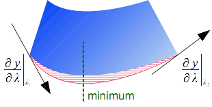

Legend:

- **Blue:** the geometric shape of the envelope after projection.
  This is the shape from which to get a new envelope.
- **Red** (with hash): The
  y = C₀ + C₁λ + C₂λ² + C₃λ³ approximation.
- **Green** (dashed line): Position λm of approximation minimum, obtained by resolving
  0 = C₁ + 2C₂λm + 3C₃λm².
  The same cubic line can have two minimums.

In practice Apache SIS uses 8 points:
the 4 corners plus one point at the center of each border of the envelope to project.
The center points are added as a safety for map projections having symmetric deformations above and below equator.
According our tests, using only those 8 points together with derivatives as described above
gives more accurate results than “brute force” approach with 160 points on the 4 envelope borders.
Saving 150 points seems small compared to computer performances.
But above discussion used a two-dimensional envelope as an example.
The same discussion applies to n-dimensional envelopes as well.
Apache SIS can apply this algorithm on envelopes with any number of dimensions up to 64.
The performance gain offered by this algorithm compared to “brute force” approach
increases exponentially with the number of dimensions.

Apache SIS implements the algorithm described in this section
by the static `Envelopes.transform(CoordinateOperation, Envelope)` method.
An alternative `Envelopes.transform(MathTransform, Envelope)` method is also available, but should be used only when the `CoordinateOperation` is unknown.
The reason is because `MathTransform` objects does not contain any information about coordinate system axes, which prevent the `Envelopes.transform(…)` method to handle special cases such as envelopes containing a pole.

<a id="book-en-developer-guide--derivativeandraster"></a>
<a id="book-en-developer-guide--8.3.3.2.-transform-derivatives-applied-to-rasters"></a>

#### 8.3.3.2. Transform derivatives applied to rasters

A raster can be projected by preparing an initially empty raster which will contain the resampled pixel values.
Then for each pixel in the *destination* raster, we use the *inverse* of the map projection
(T⁻¹) for computing the coordinates of the corresponding pixel in source raster.
The transformed coordinates may not fall at the center of a source raster pixel, so source pixel values usually need to be interpolated.

Source image

Destination image

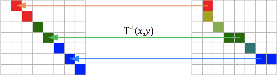

However applying the inverse transform on all pixel coordinates can be relatively slow.
We can accelerate raster reprojections by pre-computing an interpolation grid.
This grid contains the coordinate values of inverse transform T⁻¹ for only a few points.
The coordinate values of other points are obtained by bilinear interpolations between interpolation grid points.
Historically, this algorithm was implemented in the `WarpGrid` object of Java Advanced Imaging library.
The performance gain is yet better if the same interpolation grid is reused for many rasters having their pixels at the same coordinates.

A difficulty in using interpolation grids is to determine how many points we need for keeping errors
(defined as the difference between interpolated positions and actual positions computed by T⁻¹)
below some threshold value (for example ¼ of pixel size).
A “brute force” approach is to begin with a grid of size 3×3, then increase the number of points iteratively:

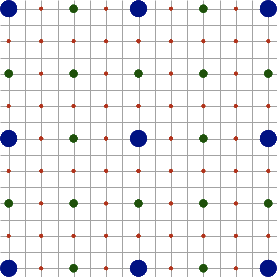

Legend:

- **Blue dots:** first iteration (9 points).
- **Green dots:** second iteration (25 points, including 16 news).
- **Red dots:** third iteration (81 points, including 56 news).

Continuing…

- Forth iteration: 289 points, including 208 news.
- Fifth iteration: 1089 points, including 800 news.
- Sixth iteration: 4225 points, including 3136 news.
- …

We could stop dividing the grid when, after having computed new points, we verified that the differences between coordinates computed by T⁻¹ during last iteration
and coordinates computed by bilinear interpolations for the same points are lower than the threshold value.
Unfortunately this approach can only tell us **after** computing new points… that those new points were unnecessary.
This is unfortunate considering that each iteration adds an amount of points approximately equal to
3 times the *sum* of the number of points of all previous iterations.

Map projection derivatives help to improve the speed of interpolation grid computations.
Using the derivatives, we can estimate whether another iteration is necessary **before** to execute it.
The basic idea is to check if the derivatives at two neighbor points define two tangent lines that are almost parallel.
In such case, we assume that the transform between those two points is almost linear.
In order to define numerically the meaning of “almost linear”, we compute the intersection of the two tangent lines as illustrated below (the blue arrows).
Then we compute the distance between that intersection and the straight line connecting the two points
(the dashed line in the figure below).

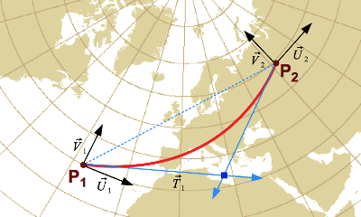

In “brute force” algorithm without derivatives, iteration stops when the distance between interpolated positions (blue dashed line)
and actual projected positions (red curve) is less than the threshold value.
This criteria requires to compute the projected positions before the decision can be made.
But with an algorithm using derivatives, the projected positions (red curve) are replaced by the tangents intersection point.
If the actual projected curve does not have too much deformations
(which should be the case for pairs of neighbor points close enough), then the red curve stay between the blue dashed line and the tangents intersection point.
By using that intersection point, we reduce greatly the number of points to transform
(3× the sum of all previous iterations).

<a id="book-en-developer-guide--getderivative"></a>
<a id="book-en-developer-guide--8.3.3.3.-getting-the-derivative-at-a-point"></a>

#### 8.3.3.3. Getting the derivative at a point

The algorithms discussed in previous section would be irrelevant if map projection derivatives were costly to compute.
But analytic derivations of their formulas show that map projection and derivative formulas have many terms in common.
Furthermore map projection formulas are simplified by Apache SIS implementation strategy, which takes out linear terms (delegated to affine transforms)
so that `NormalizedProjection` subclasses can focus on the non-linear terms only.
Map projection implementations in Apache SIS exploit those characteristics
for computing Jacobian matrices (if required) together with projected points in a single operation, reusing many common terms between the two set of formulas.
Example:

```
AbstractMathTransform projection = ...;         // An Apache SIS map projection.
double[] sourcePoint = {longitude, latitude};   // The geographic coordinate to project.
double[] targetPoint = new double[2];           // Where to store the projection result.
Matrix   derivative  = projection.transform(sourcePoint, 0, targetPoint, 0, true);
```

If only the Jacobian matrix is desired (without the projected point), then the `MathTransform.derivative(DirectPosition)` method offers a more readable alternative.

Many operations on coordinate transforms can also be applied on transform derivatives:
concatenation of a chain of transforms, inversion, taking a subset of the dimensions, *etc.*
reverse projection formulas are usually more complicated than forward projections formulas, but thankfully their derivatives do not need to be computed:
the Jacobian matrix of an inverse transform is the inverse of the Jacobian matrix of the forward transform.
Calculation of reverse projections can be implemented as below:

```
@Override
public Matrix derivative(DirectPosition p) throws TransformException {
    Matrix jac = inverse().derivative(transform(p));
    return Matrices.inverse(jac);
}
```

Affine transforms, introduced [earlier](#book-en-developer-guide--affinetransform), are extensively used by Apache SIS.
About all graphical libraries support some kind of coordinate operations, usually as affine transforms
or a slight generalization like perspective transforms.
Each library defines its own API. Some examples are listed below:

| Library | Transform implementation | Dimensions |
| --- | --- | --- |
| Java2D | `java.awt.geom.AffineTransform` | 2 |
| Java3D | `javax.media.j3d.Transform3D` | 3 |
| JavaFX | `javafx.scene.transform.Affine` | 2 or 3 |
| Java Advanced Imaging (JAI) | `javax.media.jai.PerspectiveTransform` | 2 |
| Android | `android.graphics.Matrix` | 2 |

However in many cases, affine or perspective transforms are the only kind of coordinate operations supported by the graphical library.
Apache SIS needs to handle a wider range of operations, in which affine transforms are only special cases.
In particular most map projections and datum shifts cannot be represented by affine transforms.
SIS also needs to support arbitrary number of dimensions, while above-cited API restrict the use to a fixed number of dimensions.
For those reasons SIS cannot use directly the above-cited API.
Instead, SIS uses the more abstract `org.opengis.referencing.transform.MathTransform` interface.
But in the special case where the transform is actually affine, SIS may try to use an existing implementation, in particular Java2D. The following Java code can be used in situations where the Java2D object is desired:

```
MathTransform mt = ...;    // Any math transform created by Apache SIS.
if (mt instanceof AffineTransform) {
    AffineTransform at = (AffineTransform) mt;
    // Use Java2D API from here.
}
```

Apache SIS uses Java2D on a *best effort* basis only.
The above cast is not guaranteed to succeed, even when the `MathTransform` meets the requirements allowing Java2D usage.

Apache SIS uses different libraries to read and write different types of objects.
The library used depends on the complexity of the object and on performance constraints.
For example, JAXB annotations have the advantage of being close to code, which makes it easier to maintain mapping between Java and XML.
On the other hand, SAX is more efficient.
In general, Apache SIS uses:

- JAXB for objects that do not occur very often in XML documents, but with complex structures and deep hierarchies.
  The metadata set in ISO 19115-3 standard is a typical example
- SAX for objects that are relatively simple, but which may exist in very large numbers.
  The set of points in a geometry is a typical example.
- DOM as an alternative to JAXB
  when the XML elements do not correspond exactly to Java attributes.
  *Features* are an example, as their structure is dynamic.

<a id="book-en-developer-guide--xml-sis"></a>
<a id="book-en-developer-guide--8.3.5.1.-implementation-strategy-in-apache-sis"></a>

#### 8.3.5.1. Implementation strategy in Apache SIS

`org.apache.sis.internal.jaxb.*` packages (non-public) define JAXB adaptors for all types of ISO objects.
These adaptors are required anyway to allow JAXB to get SIS classes while implementing GeoAPI interfaces.
Conveniently, SIS made both JAXB adaptors and objects wrapping the “real” object to be read or written.
This double usage avoids having to double the number of classes (already quite high) present in the internal packages.

<a id="book-en-developer-guide--8.3.5.2.-naming-conventions-in-xsd-schemas"></a>

#### 8.3.5.2. Naming conventions in XSD schemas

For each element of the first group listed above, the XSD schemas of the OGC
define a type whose name ends with “`_PropertyType`”.
For the second group, each element has a type whose name ends with “`_Type`”.
The “`_PropertyType`” elements may have a group of attributes
(such as `gco:uuidref` and `xlink:href`)
which the XSD schemas collectively name `gco:ObjectIdentification`.
These attributes do not have dedicated Java methods, but are accessible indirectly via the
`IdentifiedObject` interface described in the following subsection.

---

<a id="faq"></a>

<!-- source_url: https://sis.apache.org/faq.html -->

<!-- page_index: 11 -->

# Referencing


Frequently asked questions

This page lists some Frequently Asked Questions (FAQ) when using Apache SIS.

- [Referencing](#faq--referencing)
  - [Getting started](#faq--referencing-intro)
    - [How do I get a Coordinate Reference System?](#faq--getcrs)
    - [How do I transform a coordinate?](#faq--transform-point)
    - [Which map projections are supported?](#faq--operation-methods)
  - [Coordinate Reference Systems](#faq--crs)
    - [What is the Google projection?](#faq--google)
    - [What is the axis order issue and how is it addressed?](#faq--axisorder)
    - [Is IdentifiedObjects.lookupEPSG(…) a reliable inverse of CRS.forCode(…)?](#faq--lookupreliability)
    - [Are CRS objects safe for use as keys in HashMap?](#faq--crshashcode)
  - [Coordinate transformations](#faq--transforms)
    - [My transformed coordinates are totally wrong!](#faq--axisorderintransforms)
    - [I have correct axis order but my transformed coordinates are still wrong.](#faq--projectionname)
    - [I just used the WKT of a well-known authority and my transformed coordinates are still wrong!](#faq--parameterunits)
    - [I verified all the above and still have an error of about one kilometer.](#faq--bursawolf)
    - [I get slightly different results depending on the environment I’m running in.](#faq--slightdifferences)
    - [Can I always expect a transform from an arbitrary CRS to WGS84 to succeed?](#faq--towgs84)
- [Metadata](#faq--metadata)
  - [Custom implementations](#faq--metadata-implementation)
    - [My metadata are stored in a database-like framework. Implementing every GeoAPI interfaces for them is impractical.](#faq--metadata-proxy)
    - [I cannot marshall my custom implementation.](#faq--metadata-unknownclass)
<a id="faq--referencing"></a>

# Referencing

<a id="faq--referencing-intro"></a>
<a id="faq--getting-started"></a>

## Getting started

<a id="faq--getcrs"></a>
<a id="faq--how-do-i-get-a-coordinate-reference-system"></a>

### How do I get a Coordinate Reference System?

The `CRS` class in the `org.apache.sis.referencing.crs` package provides static convenience methods.
The most notable methods are:

- `CRS.forCode(String)` for fetching a CRS from an authority code in a database.
  Some supported authorities are [EPSG](#epsg), AUTO, AUTO2 and CRS.
- `CRS.fromWKT(String)` for parsing a CRS definition from a character string in Well-Known Text (WKT) format.
- `CRS.fromXML(String)` for parsing a CRS definition from a character string in Geographic Markup Language (GML) format.

<a id="faq--transform-point"></a>
<a id="faq--how-do-i-transform-a-coordinate"></a>

### How do I transform a coordinate?

See the [“How to…”](#howto--referencing) page for Java code examples.
Those examples get Coordinate Reference Systems (CRS) instances in various ways
and apply coordinate operations between two reference systems.

<a id="faq--operation-methods"></a>
<a id="faq--which-map-projections-are-supported"></a>

### Which map projections are supported?

The operation *methods* (including, but not limited to, map projections) supported by
Apache SIS are listed in the [Coordinate Operation Methods](https://sis.apache.org/tables/CoordinateOperationMethods.html) page.
The amount of map projection methods is relatively small, but the amount of *projected Coordinate Reference Systems* that we can build from them can be very large.
For example with only three family of methods (*Cylindrical Mercator*, *Transverse Mercator* and *Lambert Conic Conformal*)
used with different parameter values, we can cover thousands of projected CRS listed in the EPSG geodetic dataset.

In order to use a map projection method, we need to know the value to assign to the projection parameters.
For convenience, thousands of projected CRS with predefined parameter values are are assigned a unique identifier.
A well-known source of such definitions is the EPSG geodetic dataset, but other authorities also exist.
The predefined CRS known to Apache SIS are listed in the
[Coordinate Reference Systems](#tables-coordinatereferencesystems) page.

<a id="faq--crs"></a>
<a id="faq--coordinate-reference-systems"></a>

## Coordinate Reference Systems

<a id="faq--google"></a>
<a id="faq--what-is-the-google-projection"></a>

### What is the Google projection?

The Google projection is a Mercator projection that pretends to be defined on the WGS84 datum, but actually ignores the ellipsoidal nature of that datum and uses the simpler spherical formulas instead.
Since version 6.15 of EPSG geodetic dataset, the preferred way to get that projection is to invoke `CRS.forCode("EPSG:3857")`.
Note that the use of that projection is **not** recommended, unless needed for compatibility with other data.

The EPSG:3857 definition uses a map projection method named *“Popular Visualisation Pseudo Mercator”*.
The EPSG geodetic dataset provides also some other map projections that use spherical formulas.
Those methods have “(Spherical)” in their name, for example *“Mercator (Spherical)”*, and differs from *“Popular Visualisation Pseudo Mercator”* by the use of a more appropriate sphere radius.
Those projection methods can be used in Well Known Text (WKT) definitions.

If there is a need to use spherical formulas with a projection that does not have a spherical counterpart, this can be done with explicit declarations of `"semi_major"` and `"semi_minor"` parameter values in the WKT definition.
Those parameter values are usually inferred from the datum, but Apache SIS allows explicit declarations to override the inferred values.
This hack is provided for making possible to use data that ignore the ellipsoid flattening factor
(which are unfortunately not uncommon), but it should be used in last resort only.

<a id="faq--axisorder"></a>
<a id="faq--what-is-the-axis-order-issue-and-how-is-it-addressed"></a>

### What is the axis order issue and how is it addressed?

The axis order is specified by the authority (typically a national agency) defining the Coordinate Reference System (CRS).
The order depends on the CRS type and the country defining the CRS.
In the case of geographic CRS, the (*latitude*, *longitude*) axis order is widely used by geographers and pilots for centuries.
However software developers tend to consistently use the (*x*, *y*) order for every kind of CRS.
Those different practices resulted in contradictory definitions of axis order for almost every CRS of kind `GeographicCRS`, for some `ProjectedCRS` in the South hemisphere (South Africa, Australia, *etc.*) and for some polar projections among others.

For any CRS identified by an EPSG code, the official axis order can be checked on the
official EPSG registry at <https://epsg.org/>
(not to be confused with other sites having “epsg” in their name, but actually unrelated to the organization in charge of EPSG definitions):
click on the *“Retrieve by code”* link and enter the numerical code.
Then click on the *“View”* link on the right side, and click on the *"+"* symbol of the left side of *“Axes”*.

Recent OGC standards mandate the use of axis order as defined by the authority.
Oldest OGC standards used the (*x*, *y*) axis order instead, ignoring any authority specification.
Among the legacy OGC standards that used the non-conform axis order, an influent one is version 1 of the *Well Known Text* (WKT) format specification.
According that widely-used format, WKT definitions without explicit `AXIS[…]` elements
shall default to (*longitude*, *latitude*) or (*x*, *y*) axis order.
In version 2 of the WKT format, `AXIS[…]` elements are no longer optional
and should contain an explicit `ORDER[…]` sub-element for making the intended order yet more obvious.

Many software products still use the old (*x*, *y*) axis order, sometimes because it is easier to implement.
But Apache SIS rather defaults to axis order *as defined by the authority* (except when parsing a WKT 1 definition), but allows changing axis order to the (*x*, *y*) order after CRS creation.
This change can be done with the following code:

```java
CoordinateReferenceSystem crs = ...; // CRS obtained by any means.
crs = AbstractCRS.castOrCopy(crs).forConvention(AxesConvention.RIGHT_HANDED)
```

<a id="faq--lookupreliability"></a>
<a id="faq--is-identifiedobjects.lookupepsg-a-reliable-inverse-of-crs.forcode"></a>

### Is IdentifiedObjects.lookupEPSG(…) a reliable inverse of CRS.forCode(…)?

For CRS created from the EPSG geodetic dataset, usually yes.
Note however that `IdentifiedObjects.getIdentifier(…)` is cheaper and insensitive to the details of CRS definition, since it never query the database. But it works only if the CRS declares explicitly its code, which is the case for CRS created from the EPSG database or parsed from a Well Known Text (WKT) having an `AUTHORITY` or `ID` element.
The `lookupEPSG(…)` method on the other hand is robust to erroneous code declaration, since it always compares the CRS with the database content.
But it may fail if there is slight mismatch (for example rounding errors in projection parameters)
between the supplied CRS and the CRS found in the database.

<a id="faq--crshashcode"></a>
<a id="faq--are-crs-objects-safe-for-use-as-keys-in-hashmap"></a>

### Are CRS objects safe for use as keys in HashMap?

Yes, every classes defined in the `org.apache.sis.referencing.crs`, `cs` and `datum` packages
define properly their `equals(Object)` and `hashCode()` methods.
The Apache SIS library itself uses CRS objects in `HashMap`-like containers for caching purpose.

<a id="faq--transforms"></a>
<a id="faq--coordinate-transformations"></a>

## Coordinate transformations

<a id="faq--axisorderintransforms"></a>
<a id="faq--my-transformed-coordinates-are-totally-wrong"></a>

### My transformed coordinates are totally wrong!

This is most frequently caused by coordinate values given in the wrong order.
Developers tend to assume a (*x*, *y*) or (*longitude*, *latitude*) axis order.
But geographers and pilots are using (*latitude*, *longitude*) axis order for centuries, and the EPSG geodetic dataset defines geographic Coordinate Reference Systems that way.
If a coordinate transformation seems to produce totally wrong values, the first thing to do should be to print the source and target Coordinate Reference Systems:

```java
System.out.println(sourceCRS);
System.out.println(targetCRS);
```

Attention should be paid to the order of `AXIS` elements.
In the example below, the Coordinate Reference System clearly uses (*latitude*, *longitude*) axis order:

```
GeodeticCRS["WGS 84",
  Datum["World Geodetic System 1984",
    Ellipsoid["WGS 84", 6378137.0, 298.257223563]],
  CS[ellipsoidal, 2],
    Axis["Geodetic latitude (Lat)", north],
    Axis["Geodetic longitude (Lon)", east],
    Unit["degree", 0.017453292519943295]]
```

If (*longitude*, *latitude*) axis order is really wanted, Apache SIS can be forced to that order [as described above](#faq--axisorder).

<a id="faq--projectionname"></a>
<a id="faq--i-have-correct-axis-order-but-my-transformed-coordinates-are-still-wrong."></a>

### I have correct axis order but my transformed coordinates are still wrong.

Make sure that the right projection is used. Some projection names are confusing.
For example *“Oblique Mercator”* and *“Hotine Oblique Mercator”* (in EPSG naming) are two different projections.
But *“Oblique Mercator”* (not Hotine) in EPSG naming is also called *“Hotine Oblique Mercator Azimuth Center”* by ESRI, while *“Hotine Oblique Mercator”* (EPSG naming) is called *“Hotine Oblique Mercator Azimuth Natural Origin”* by ESRI.

The *“Oblique Stereographic”* projection (EPSG name) is called *“Double Stereographic”* by ESRI.
ESRI also defines a *“Stereographic”* projection, which is actually an oblique projection like the former but using different formulas.

<a id="faq--parameterunits"></a>
<a id="faq--i-just-used-the-wkt-of-a-well-known-authority-and-my-transformed-coordinates-are-still-wrong"></a>

### I just used the WKT of a well-known authority and my transformed coordinates are still wrong!

The version 1 of Well Known Text (WKT) specification has been interpreted in different ways by different implementors.
One subtle issue is the angular units of prime meridian and projection parameter values.
The WKT 1 specification clary states: *“If the `PRIMEM` clause occurs inside a `GEOGCS`, then the longitude units will match those of the geographic coordinate system”* (source: OGC 01-009).
However ESRI and GDAL among others unconditionally use decimal degrees, ignoring this part of the WKT 1 specification
(note: this remark does not apply to WKT 2).
This problem can be identified by WKT inspection as in the following extract:

```
PROJCS["Lambert II étendu",
  GEOGCS["Nouvelle Triangulation Française", ...,
    PRIMEM["Paris", 2.337229167],
    UNIT["grad", 0.01570796326794897]]
  PROJECTION["Lambert_Conformal_Conic_1SP"],
  PARAMETER["latitude_of_origin", 46.8], ...]
```

The Paris prime meridian is located at approximately 2.597 gradians from Greenwich, which is 2.337 degrees.
From this fact, we can see that the above WKT uses decimal degrees despite its `UNIT["grad"]` declaration.
This mismatch applies also to the parameter value, which declare 46.8° in the above example while the official value is 52 gradians.
By default, Apache SIS interprets those angular values as gradians when parsing such WKT, resulting in a large error.
In order to get the intended result, there is a choice:

- Replace `UNIT["grad", 0.01570796326794897]` by `UNIT["degree", 0.017453292519943295]`,
  which ensure that Apache SIS, GDAL and ESRI understand that WKT 1 in the same way.
- Or ask explicitly Apache SIS to parse the WKT using the ESRI or GDAL conventions, by specifying the
  `Convention.WKT1_COMMON_UNITS` enumeration value to `WKTFormat` in the `org.apache.sis.io.wkt` package.

Note that the GeoPackage standard explicitly requires OGC 01-009 compliant WKT
and the new WKT 2 standard also follows the OGC 01-009 interpretation.
The default Apache SIS behavior is consistent with those two standards.

<a id="faq--bursawolf"></a>
<a id="faq--i-verified-all-the-above-and-still-have-an-error-of-about-one-kilometer."></a>

### I verified all the above and still have an error of about one kilometer.

Coordinate Reference Systems (CRS) approximate the Earth’s shape by an ellipsoid.
Different ellipsoids (actually different *datum*) are used in different countries of the world and at different time in history.
When transforming coordinates between two CRS using the same datum, no Bursa-Wolf parameters are needed.
But when the transformation involves a change of datum, the referencing module needs some information about how to perform that datum shift.

There is many way to specify how to perform a datum shift, and most of them are only approximation.
The Bursa-Wolf method is one of them, not the only one. However it is one of the most frequently used methods.
The Bursa-Wolf parameters can be specified inside a `TOWGS84` element with version 1 of Well Known Text (WKT) format, or in a `BOUNDCRS` element with version 2 of WKT format.
If the CRS are parsed from a WKT string, make sure that the string contains the appropriate element.

<a id="faq--slightdifferences"></a>
<a id="faq--i-get-slightly-different-results-depending-on-the-environment-i-m-running-in."></a>

### I get slightly different results depending on the environment I’m running in.

The results of coordinate transformations when running in a web application container (JBoss, *etc.*)
may be a few meters off compared to coordinates transformations in an IDE (NetBeans, Eclipse, *etc.*).
The results depend on whether an EPSG factory is available on the classpath, **regardless how the CRS were created**, because the EPSG factory specifies explicitly the coordinate operation to apply for some pairs of CRS.
In such case, the coordinate operation specified by EPSG has precedence over the Burwa-Wolf parameters
(the `TOWGS84` element in version 1 of Well Known Text format).

A connection to the EPSG database may have been established for one environment
(typically the JEE one) and not the other (typically the IDE one) because only the former has JDBC driver.
The recommended way to uniformize the results is to add in the second environment (IDE)
the same JDBC driver than the one available in the first environment (JEE).
It should be one of the following: JavaDB (a.k.a. Derby), HSQL or PostgreSQL.
Make sure that the [connection parameters to the EPSG database](#epsg) are also the same.

<a id="faq--towgs84"></a>
<a id="faq--can-i-always-expect-a-transform-from-an-arbitrary-crs-to-wgs84-to-succeed"></a>

### Can I always expect a transform from an arbitrary CRS to WGS84 to succeed?

For 2D horizontal CRS created from the EPSG database, calls to `CRS.findOperation(…)` should generally succeed.
For 3D CRS having any kind of height different than ellipsoidal height, or for a 2D CRS of type `EngineeringCRS`, it may fail.
Note however that even if the call to `CRS.findOperation(…)` succeed, the call to `MathTransform.transform(…)` may fail
or produce `NaN` or infinity values if the coordinate to transform is far from the domain of validity.

<a id="faq--metadata"></a>

# Metadata

<a id="faq--metadata-implementation"></a>
<a id="faq--custom-implementations"></a>

## Custom implementations

<a id="faq--metadata-proxy"></a>
<a id="faq--my-metadata-are-stored-in-a-database-like-framework.-implementing-every-geoapi-interfaces-for-them-is-impractical."></a>

### My metadata are stored in a database-like framework. Implementing every GeoAPI interfaces for them is impractical.

Developers do not need to implement directly the metadata interfaces.
If the underlying storage framework can access metadata from their class and attribute names (either Java names
or ISO/OGC names), then it is possible to implement a single engine accessing any kind of metadata and let the
Java Virtual Machine implements the GeoAPI interfaces on-the-fly, using the `java.lang.reflect.Proxy` class.
See the `Proxy` Javadoc for details, keeping in mind that the ISO/OGC name of a `java.lang.Class` or
`java.lang.reflect.Method` object can be obtained as below:

```java
UML uml = method.getAnnotation(UML.class);
if (uml != null) {
    String name = uml.identifier();
    // Fetch the metadata here.
}
```

This is indeed the approach taken by the `org.apache.sis.metadata.sql` package for providing an implementation
of all GeoAPI metadata interfaces reading their values directly from a SQL database.

<a id="faq--metadata-unknownclass"></a>
<a id="faq--i-cannot-marshall-my-custom-implementation."></a>

### I cannot marshall my custom implementation.

The classes given to the JAXB marshaller shall contain JAXB annotations, otherwise the following exception is thrown:

```
javax.xml.bind.JAXBException: class MyCustomClass nor any of its super class is known to this context.
```

The easiest workaround is to wrap the custom implementation into one of the implementations
provided in the `org.apache.metadata.iso` package.
All those SIS implementation classes provide shallow copy constructor for making that easy.
Note that you need to wrap only the root class, not the attributes.
The attribute values will be wrapped automatically as needed by JAXB adapters.

---

<a id="howto-compound_crs"></a>

<!-- source_url: https://sis.apache.org/howto/compound_crs.html -->

<!-- page_index: 12 -->

# Direct dependencies


Add vertical and temporal axes to an horizontal CRS

This example creates a 4-dimensional Coordinate Reference System (CRS)
with an horizontal, a vertical and a temporal component.
While it is possible to create a `CompoundCRS` programmatically, it is much easier to do that from authority codes when those codes exist.
There is two syntaxes standardized by the Open Geospatial Consortium (OGC):
One syntax using an identifier starting with `http://www.opengis.net/def/crs-compound`
followed by the components in the query part of the URL, and a shorter but less common syntax starting with `urn:ogc:def:crs`.
Apache SIS accepts both, illustrated below.

<a id="howto-compound_crs--direct-dependencies"></a>

# Direct dependencies

| Maven coordinates | Module info |
| --- | --- |
| `org.apache.sis.core:sis-referencing` | `org.apache.sis.referencing` |

<a id="howto-compound_crs--code-example"></a>

# Code example

```java
import org.apache.sis.referencing.CRS;
public class Compound {/** * Demo entry point.* * @param  args  ignored.* @throws FactoryException if an error occurred while creating the CRS *         or searching for a coordinate operation.*/ public static void main(String[] args) throws FactoryException {var crs = CRS.forCode("http://www.opengis.net/def/crs-compound?"+ "1=http://www.opengis.net/def/crs/epsg/0/4326&"+ "2=http://www.opengis.net/def/crs/epsg/0/5714&" + "3=http://www.opengis.net/def/crs/OGC/0/JulianDate"); /* * The following is a more compact way to request the same CRS.* If (longitude, latitude) axis order is desired, just replace * "EPSG::4326" by "OGC::84".*/ var alternative = CRS.forCode("urn:ogc:def:crs,crs:EPSG::4326,crs:EPSG::5714,crs:OGC::JulianDate");
System.out.println(crs); System.out.println(); System.out.println("Compact alternative is equal: " + crs.equals(alternative));}}
```

Alternatively, if the components are already available as `CoordinateReferenceSystem` object, the
[compound method](https://sis.apache.org/apidocs/org.apache.sis.referencing/org/apache/sis/referencing/CRS.html#compound(org.opengis.referencing.crs.CoordinateReferenceSystem...))
can be invoked instead.

<a id="howto-compound_crs--output"></a>

# Output

```
CompoundCRS["WGS 84 + MSL height + Julian",
  GeographicCRS["WGS 84",
    Ensemble["World Geodetic System 1984 ensemble",
      (... ensemble members omitted for brevity ...)
      Ellipsoid["WGS 84", 6378137.0, 298.257223563],
      EnsembleAccuracy[2.0]],
    CS[ellipsoidal, 2],
      Axis["Latitude (B)", north],
      Axis["Longitude (L)", east],
      Unit["degree", 0.017453292519943295],
    Id["EPSG", 4326, "12.047"]],
  VerticalCRS["MSL height",
    VerticalDatum["Mean Sea Level"],
    CS[vertical, 1],
      Axis["Gravity-related height (H)", up],
      Unit["metre", 1],
    Id["EPSG", 5714, "12.047"]],
  TimeCRS["Julian",
    TimeDatum["Julian", TimeOrigin[-4713-11-24T12:00:00.000]],
    CS[temporal, 1],
      Axis["Time (t)", future],
      TimeUnit["day", 86400],
    Id["OGC", "JulianDate"]],
  Usage[
    BBox[-90.00, -180.00, 90.00, 180.00]]]

Compact alternative is equal: true
```

---

<a id="howto-crs_equality"></a>

<!-- source_url: https://sis.apache.org/howto/crs_equality.html -->

<!-- page_index: 13 -->

# Direct dependencies


Determine if two CRS are functionally equal

Two Coordinate Reference Systems may not be considered equal if they are associated to different metadata
(name, identifiers, scope, domain of validity, remarks), even though they represent the same logical CRS.
In order to test if two CRS are functionally equivalent, `CRS.equivalent(crs1, crs2)` can be used.

In some cases, `equivalent(…)` may fail to see that two reference systems are equal.
It may happen for example when two map projections are defined with different parameters, but are mathematically equivalent.
A more reliable but more costly way to check if two CRS are functionally equivalent
is to request the coordinate operation between them, and check if that operation is identity.

<a id="howto-crs_equality--direct-dependencies"></a>

# Direct dependencies

| Maven coordinates | Module info |
| --- | --- |
| `org.apache.sis.core:sis-referencing` | `org.apache.sis.referencing` |

<a id="howto-crs_equality--code-example"></a>

# Code example

```java
import org.opengis.referencing.crs.CoordinateReferenceSystem;
import org.opengis.util.FactoryException;
import org.apache.sis.referencing.CRS;
import org.apache.sis.referencing.CommonCRS;

public class CrsEquality {
    /**
     * Demo entry point.
     *
     * @param  args  ignored.
     * @throws FactoryException if an error occurred while creating the CRS
     *         or searching for a coordinate operation.
     */
    public static void main(String[] args) throws FactoryException {
        CoordinateReferenceSystem crs1 = CommonCRS.WGS84.geographic();
        CoordinateReferenceSystem crs2 = CRS.fromWKT(
                """
                GeodeticCRS["WGS84 with a different name",
                  Datum["World Geodetic System 1984",
                    Ellipsoid["A different name", 6378137.0, 298.257223563]],
                  CS[ellipsoidal, 2],
                    Axis["Latitude (B)", north],
                    Axis["Longitude (L)", east],
                    Unit["degree", 0.017453292519943295]]
                """);

        System.out.println("equals: " + crs1.equals(crs2));
        System.out.println("equivalent: " + CRS.equivalent(crs1, crs2));
        System.out.println("Identity transform: "
                + CRS.findOperation(crs2, crs2, null).getMathTransform().isIdentity());
    }
}
```

<a id="howto-crs_equality--output"></a>

# Output

```
equals: false
equivalent: true
Identity transform: true
```

---

<a id="howto-custom_crs"></a>

<!-- source_url: https://sis.apache.org/howto/custom_crs.html -->

<!-- page_index: 14 -->

# Direct dependencies


Extend with custom Coordinate Reference Systems

An application can associate its own authority codes to custom Coordinate Reference System (CRS) definitions.
Such custom CRS definitions can be written in Well-Known Text (WKT) format in any text file, and declared to Apache SIS using the service provider mechanism.
After those steps, custom Coordinate Reference Systems can be created
in the same way as for EPSG definitions, with calls to `CRS.forCode(String)`.

<a id="howto-custom_crs--direct-dependencies"></a>

# Direct dependencies

| Maven coordinates | Module info |
| --- | --- |
| `org.apache.sis.core:sis-metadata` | `org.apache.sis.metadata` |
| `org.apache.sis.core:sis-referencing` | `org.apache.sis.referencing` |

<a id="howto-custom_crs--example-of-crs-definitions"></a>

# Example of CRS definitions

The first step is to choose an authority name.
This page uses “MyOrg”, but applications should replace by their own names.
Then, the additional CRS definitions can be written in WKT format in a text file.
The file can contain as many definitions as desired.
Each CRS definition must end with an `ID[authority, code]` element where *authority*
is the chosen authority name, and *code* is an arbitrary code managed by that authority.
The codes are often numerical, but not necessarily:
alphanumeric codes between quotes are also accepted.
Example:

```wkt
ProjectedCRS["North Pole Azimuthal Equidistant",
 BaseGeodCRS["WGS 1984",
  Datum["World Geodetic System 1984",
   Ellipsoid["WGS 1984", 6378137, 298.257223563]],
  AngleUnit["Degree", 0.0174532925199433]],
 Conversion["North Pole Azimuthal Equidistant",
  Method["Azimuthal Equidistant (Spherical)"],
  Parameter["Latitude of natural origin", 90]],
 CS[Cartesian, 2],
  Axis["Easting (E)", east],
  Axis["Northing (N)", north],
  Unit["metre", 1],
 Id["MyOrg", 102016]]

ProjectedCRS["North Pole Stereographic",
  ...
  Id["MyOrg", 102018]]
```

<a id="howto-custom_crs--more-compact-definitions-non-standard"></a>

## More compact definitions (non-standard)

A file with many CRS definitions may contain a lot of redundancy.
For example, the `BaseGeodCRS` and `CS` elements are often repeated verbatim in many `ProjectedCRS` definitions.
Apache SIS has a non-standard mechanism for declaring WKT fragments and reusing them in many CRS definitions.
The fragments can be declared with a `SET` directive, and reused by prefixing a fragment name with `$`.
Example for the same CRS than above:

```wkt
SET WGS84_BASE =
 BaseGeodCRS["WGS 1984",
  Datum["World Geodetic System 1984",
   Ellipsoid["WGS 1984", 6378137, 298.257223563]],
  AngleUnit["Degree", 0.0174532925199433]]

SET CARTESIAN_CS =
 CS[Cartesian, 2],
  Axis["Easting (E)", east],
  Axis["Northing (N)", north],
  Unit["metre", 1]

ProjectedCRS["North Pole Azimuthal Equidistant",
 $WGS84_BASE,
 Conversion["North Pole Azimuthal Equidistant",
  Method["Azimuthal Equidistant (Spherical)"],
  Parameter["Latitude of natural origin", 90]],
 $CARTESIAN_CS,
 Id["MyOrg", 102016]]
```

The above examples are available with more explanations in a [text file](assets/files/esri_8560615ec3ef51d7.txt).

<a id="howto-custom_crs--java-code"></a>

# Java code

A Java application can load CRS definitions from above file like below
(see the [Javadoc](https://sis.apache.org/apidocs/org.apache.sis.referencing/org/apache/sis/io/wkt/WKTDictionary.html) for more information).
Replace `"MyOrg"` by the chosen authority name and `"MyRegistry.txt"` by the
filename of the text file containing CRS definitions in WKT format:

```java
package org.myorg;

import java.io.BufferedReader;
import java.io.IOException;
import java.nio.file.Files;
import java.nio.file.Path;
import org.apache.sis.io.wkt.WKTDictionary;
import org.apache.sis.metadata.iso.citation.DefaultCitation;
import org.opengis.referencing.crs.CRSAuthorityFactory;
import org.opengis.util.FactoryException;

public class MyRegistry extends WKTDictionary implements CRSAuthorityFactory {
    MyRegistry() throws IOException, FactoryException {
        super(new DefaultCitation("MyOrg"));
        try (BufferedReader source = Files.newBufferedReader(Path.of("MyRegistry.txt"))) {
            load(source);
        }
    }
}
```

Finally, the application needs to declare the above class as a service in its `module-info.java` file:

```java
module org.myorg {
    requires org.apache.sis.referencing;
    provides org.opengis.referencing.crs.CRSAuthorityFactory with org.myorg.MyRegistry;
}
```

Alternatively, non-modular applications can register in `META-INF/services/` instead.

<a id="howto-custom_crs--usage"></a>

# Usage

After all above steps have been completed, the `org.apache.sis.referencing.CRS` class should recognize the custom authority codes.
For example, a call to `CRS.forCode("MyOrg:102016")` should return the `ProjectedCRS` defined in above example.

---

<a id="howto-datalake_to_datacube"></a>

<!-- source_url: https://sis.apache.org/howto/datalake_to_datacube.html -->

<!-- page_index: 15 -->

# Direct dependencies


From data lake to data cube

This example opens a few files where each file represent a slice in a data cube.
Then the slices are aggregated together in a single multi-dimensional data cube.
For example each file may be a raster representing Sea Surface Temperature (SST) at a specific day, and those files can be a aggregated in a single three-dimensional raster with a temporal dimension.

A current limitation is that each slice must have the same number of dimensions than the data cube.
For the example of SST raster for a specific day, the raster CRS must still have a temporal axis
even if the grid contains only one cell in the temporal dimension.
A future Apache SIS version will provide methods for adding dimensions.

This example assumes that all slice have the same size, resolution and coordinate reference system.
If this is not the case, the aggregation will still work but instead of producing a data cube, it may produce an `Aggregate` resource containing a tree like below:

```
Root aggregate
├─ All coverages with same sample dimensions #1
│  └─ ...
└─ All coverages with same sample dimensions #2
   ├─ Coverages with equivalent reference systems #1
   │  └─ ...
   └─ Coverages with equivalent reference systems #2
      ├─ Slices with compatible "grid to CRS" #1
      ├─ Slices with compatible "grid to CRS" #2
      └─ ...</pre>
```

A future Apache SIS version will provide methods for controlling the way to aggregate
such heterogeneous data set.

This example works with `Resource` instances, which are not necessarily data loaded in memory.
Consequently the `DataStore` instances must be kept open for all the duration of data cube usage.

<a id="howto-datalake_to_datacube--direct-dependencies"></a>

# Direct dependencies

| Maven coordinates | Module info | Remarks |
| --- | --- | --- |
| `org.apache.sis.code:sis-feature` | `org.apache.sis.feature` |  |
| `org.apache.sis.storage:sis-netcdf` | `org.apache.sis.storage.netcdf` |  |
| `edu.ucar:cdm-core` |  | For netCDF-4 or HDF5 |

The `cdm-core` dependency can be omitted for netCDF-3 (a.k.a. “classic”),

<a id="howto-datalake_to_datacube--code-example"></a>

# Code example

The file name and geospatial coordinates in following code need to be updated for yours data.

```java
import java.io.File; import org.apache.sis.storage.DataStore; import org.apache.sis.storage.DataStores; import org.apache.sis.storage.DataStoreException; import org.apache.sis.storage.GridCoverageResource; import org.apache.sis.storage.aggregate.CoverageAggregator;
public class DataLakeToDataCube {/** * Demo entry point.* * @param  args  ignored.* @throws DataStoreException if an error occurred while reading the raster.*/ public static void main(String[] args) throws DataStoreException {try (DataStore s1 = DataStores.open(new File("CMEMS_20220301.nc")); DataStore s2 = DataStores.open(new File("CMEMS_20220302.nc")); DataStore s3 = DataStores.open(new File("CMEMS_20220303.nc"))) {/* * Following casts are okay if we know that the resources are raster data,* all of them having the same grid geometry. Otherwise the code can still * work but would require more `if (x instanceof Y)` checks.*/ var r1 = (GridCoverageResource) s1.findResource("sea_surface_height_above_geoid"); var r2 = (GridCoverageResource) s2.findResource("sea_surface_height_above_geoid"); var r3 = (GridCoverageResource) s3.findResource("sea_surface_height_above_geoid");
System.out.printf("Extent of first set of slices:%n%s%n",  r1.getGridGeometry().getExtent()); System.out.printf("Extent of second set of slices:%n%s%n", r2.getGridGeometry().getExtent()); System.out.printf("Extent of third set of slices:%n%s%n",  r3.getGridGeometry().getExtent());
var aggregator = new CoverageAggregator(); aggregator.add(r1); aggregator.add(r2); aggregator.add(r3); var dataCube = (GridCoverageResource) aggregator.build(); /* * From this point, the data cube can be used as a three-dimension grid coverage.* See "Get raster values at geographic (or pixel) coordinates" for usage examples.* However all usages must be done inside this `try` block.*/ System.out.printf("Extent of the data cube:%n%s%n", dataCube.getGridGeometry().getExtent());}}}
```

<a id="howto-datalake_to_datacube--output"></a>

# Output

The output depends on the raster data and the locale.
Below is an example:

```
Extent of first set of slices:
Column: [0 …  864]  (865 cells)
Row:    [0 … 1080] (1081 cells)
Time:   [0 …   95]   (96 cells)

Extent of second set of slices:
Column: [0 …  864]  (865 cells)
Row:    [0 … 1080] (1081 cells)
Time:   [0 …   95]   (96 cells)

Extent of third set of slices:
Column: [0 …  864]  (865 cells)
Row:    [0 … 1080] (1081 cells)
Time:   [0 …   95]   (96 cells)

Extent of the data cube:
Column: [0 …  864]  (865 cells)
Row:    [0 … 1080] (1081 cells)
Time:   [0 …  287]  (288 cells)
```

---

<a id="howto-envelopes_in_different_crs"></a>

<!-- source_url: https://sis.apache.org/howto/envelopes_in_different_crs.html -->

<!-- page_index: 16 -->

# Direct dependencies


Union or intersection of envelopes in different CRS

Before to compute the union or intersection of two or more envelopes (bounding boxes), all envelopes must be [transformed](#howto-transform_envelopes) to the same Coordinate Reference System (CRS).
But the choice of a common CRS is not easy.
We must verify that all envelopes are inside the domain of validity of the common CRS, which may require to choose a common CRS different than the CRS of all envelopes.
Apache SIS can handle this task automatically.

<a id="howto-envelopes_in_different_crs--direct-dependencies"></a>

# Direct dependencies

| Maven coordinates | Module info |
| --- | --- |
| `org.apache.sis.core:sis-referencing` | `org.apache.sis.referencing` |

<a id="howto-envelopes_in_different_crs--code-example"></a>

# Code example

Note that all geographic coordinates below express latitude *before* longitude.

```java
import org.opengis.geometry.Envelope;
import org.opengis.referencing.crs.CoordinateReferenceSystem;
import org.opengis.referencing.operation.TransformException;
import org.opengis.util.FactoryException;
import org.apache.sis.referencing.CommonCRS;
import org.apache.sis.geometry.Envelopes;
import org.apache.sis.geometry.Envelope2D;

public class UnionOfEnvelopes {
    /**
     * Demo entry point.
     *
     * @param  args  ignored.
     * @throws FactoryException   if an error occurred while creating a Coordinate Reference System (CRS).
     * @throws TransformException if an error occurred while transforming coordinates to the target CRS.
     */
    public static void main(String[] args) throws FactoryException, TransformException {
        CoordinateReferenceSystem crs1 = CommonCRS.WGS84.universal(40, 10);     // 40°N 10°E
        CoordinateReferenceSystem crs2 = CommonCRS.WGS84.universal(40, 20);     // 40°N 20°E

        Envelope2D bbox1 = new Envelope2D(crs1, 500_000, 400_000, 100_000, 100_000);
        Envelope2D bbox2 = new Envelope2D(crs2, 400_000, 500_000, 100_000, 100_000);
        Envelope   union = Envelopes.union(bbox1, bbox2);

        System.out.println("First CRS:    " + crs1.getName());
        System.out.println("Second CRS:   " + crs2.getName());
        System.out.println("Selected CRS: " + union.getCoordinateReferenceSystem().getName());
        System.out.println("Union result: " + union);
    }
}
```

<a id="howto-envelopes_in_different_crs--output"></a>

# Output

```
First CRS:    EPSG:WGS 84 / UTM zone 32N
Second CRS:   EPSG:WGS 84 / UTM zone 34N
Selected CRS: EPSG:WGS 84
Union result: BOX(3.6184285185271796 9, 5.428225419697392 21)
```

---

<a id="howto-export_metadata_to_xml"></a>

<!-- source_url: https://sis.apache.org/howto/export_metadata_to_xml.html -->

<!-- page_index: 17 -->

# Direct dependencies


Geographic bounding box of a data file

This example prints the metadata of a netCDF file in the XML format
defined by the ISO 19115-3 international standard.
The coverage values are not read, only the netCDF file header is read.

<a id="howto-export_metadata_to_xml--direct-dependencies"></a>

# Direct dependencies

| Maven coordinates | Module info | Remarks |
| --- | --- | --- |
| `org.apache.sis.storage:sis-netcdf` | `org.apache.sis.storage.netcdf` |  |
| `edu.ucar:cdm-core` |  | For netCDF-4 or HDF5 |

The `cdm-core` dependency can be omitted for netCDF-3 (a.k.a. “classic”), GeoTIFF or any other [formats supported by Apache SIS](#formats).
For the dependencies required for reading GeoTIFF instead of netCDF files, see the [geographic bounding box](#howto-geographic_bounding_box) code example.

<a id="howto-export_metadata_to_xml--code-example"></a>

# Code example

The file name in following code need to be updated for yours data.

```java
import java.util.Map; import java.io.File; import java.io.StringWriter; import javax.xml.bind.JAXBException; import javax.xml.transform.stream.StreamResult; import org.opengis.metadata.Metadata; import org.apache.sis.storage.DataStore; import org.apache.sis.storage.DataStores; import org.apache.sis.storage.DataStoreException; import org.apache.sis.xml.XML;
public class ExportMetadata {/** * Demo entry point.* * @param  args  ignored.* @throws DataStoreException if an error occurred while reading the data file.* @throws JAXBException if an error occurred while marshalling metadata to XML.*/ public static void main(String[] args) throws DataStoreException, JAXBException {try (DataStore store = DataStores.open(new File("CMEMS.nc"))) {Metadata metadata = store.getMetadata(); System.out.println(XML.marshal(metadata)); /* * By default the XML schema is the most recent version of the standard supported * by Apache SIS. But the legacy version published in 2007 is still in wide use.* The legacy version can be requested with the `METADATA_VERSION` property.*/ Map<String,String> config = Map.of(XML.METADATA_VERSION, "2007"); StringWriter result = new StringWriter(); XML.marshal(metadata, new StreamResult(result), config); // Result is in `result.toString()`.}}}
```

<a id="howto-export_metadata_to_xml--output"></a>

# Output

The output depends on the data and the locale.
Below is an example:

```xml
<?xml version="1.0" encoding="UTF-8" standalone="yes"?>
<mdb:MD_Metadata xmlns:cit="http://standards.iso.org/iso/19115/-3/cit/1.0"
                 xmlns:gco="http://standards.iso.org/iso/19115/-3/gco/1.0"
                 xmlns:mcc="http://standards.iso.org/iso/19115/-3/mcc/1.0"
                 xmlns:mdb="http://standards.iso.org/iso/19115/-3/mdb/1.0"
                 xmlns:mrc="http://standards.iso.org/iso/19115/-3/mrc/1.0"
                 xmlns:mrd="http://standards.iso.org/iso/19115/-3/mrd/1.0"
                 xmlns:mri="http://standards.iso.org/iso/19115/-3/mri/1.0"
                 xmlns:mrl="http://standards.iso.org/iso/19115/-3/mrl/1.0"
                 xmlns:mrs="http://standards.iso.org/iso/19115/-3/mrs/1.0"
                 xmlns:msr="http://standards.iso.org/iso/19115/-3/msr/1.0">
  <mdb:metadataStandard>
    <!-- Omitted for brevity -->
  </mdb:metadataStandard>
  <mdb:spatialRepresentationInfo>
    <msr:MD_GridSpatialRepresentation>
      <msr:numberOfDimensions>
        <gco:Integer>3</gco:Integer>
      </msr:numberOfDimensions>
      <msr:axisDimensionProperties>
        <msr:MD_Dimension>
          <msr:dimensionName>
            <msr:MD_DimensionNameTypeCode codeList="(…snip…)#MD_DimensionNameTypeCode" codeListValue="column">Column</msr:MD_DimensionNameTypeCode>
          </msr:dimensionName>
          <msr:dimensionSize>
            <gco:Integer>865</gco:Integer>
          </msr:dimensionSize>
        </msr:MD_Dimension>
      </msr:axisDimensionProperties>
      <msr:axisDimensionProperties>
        <msr:MD_Dimension>
          <msr:dimensionName>
            <msr:MD_DimensionNameTypeCode codeList="(…snip…)#MD_DimensionNameTypeCode" codeListValue="row">Row</msr:MD_DimensionNameTypeCode>
          </msr:dimensionName>
          <msr:dimensionSize>
            <gco:Integer>1081</gco:Integer>
          </msr:dimensionSize>
        </msr:MD_Dimension>
      </msr:axisDimensionProperties>
      <msr:axisDimensionProperties>
        <msr:MD_Dimension>
          <msr:dimensionName>
            <msr:MD_DimensionNameTypeCode codeList="(…snip…)#MD_DimensionNameTypeCode" codeListValue="time">Time</msr:MD_DimensionNameTypeCode>
          </msr:dimensionName>
          <msr:dimensionSize>
            <gco:Integer>96</gco:Integer>
          </msr:dimensionSize>
        </msr:MD_Dimension>
      </msr:axisDimensionProperties>
      <msr:cellGeometry>
        <msr:MD_CellGeometryCode codeList="(…snip…)#MD_CellGeometryCode" codeListValue="area">Area</msr:MD_CellGeometryCode>
      </msr:cellGeometry>
      <msr:transformationParameterAvailability>
        <gco:Boolean>false</gco:Boolean>
      </msr:transformationParameterAvailability>
    </msr:MD_GridSpatialRepresentation>
  </mdb:spatialRepresentationInfo>
  <mdb:referenceSystemInfo>
    <mrs:MD_ReferenceSystem>
      <mrs:referenceSystemIdentifier>
        <mcc:MD_Identifier>
          <mcc:code>
            <gco:CharacterString>time latitude longitude</gco:CharacterString>
          </mcc:code>
        </mcc:MD_Identifier>
      </mrs:referenceSystemIdentifier>
    </mrs:MD_ReferenceSystem>
  </mdb:referenceSystemInfo>
  <mdb:identificationInfo>
    <mri:MD_DataIdentification>
      <mri:citation>
        <cit:CI_Citation>
          <cit:title>
            <gco:CharacterString>Ocean surface 15-minutes mean fields for the Iberia-Biscay-Ireland (IBI) region</gco:CharacterString>
          </cit:title>
          <cit:identifier>
            <mcc:MD_Identifier>
              <mcc:code>
                <gco:CharacterString>CMEMS_v5r1_IBI_PHY_NRT_PdE_15minav_20220516_20220516_R20220516_FC01</gco:CharacterString>
              </mcc:code>
            </mcc:MD_Identifier>
          </cit:identifier>
          <cit:citedResponsibleParty>
            <cit:CI_Responsibility>
              <cit:role>
                <cit:CI_RoleCode codeList="(…snip…)#CI_RoleCode" codeListValue="originator">Originator</cit:CI_RoleCode>
              </cit:role>
              <cit:party>
                <cit:CI_Organisation>
                  <cit:name>
                    <gco:CharacterString>Puertos del Estado (PdE)</gco:CharacterString>
                  </cit:name>
                </cit:CI_Organisation>
              </cit:party>
            </cit:CI_Responsibility>
          </cit:citedResponsibleParty>
          <cit:otherCitationDetails>
            <gco:CharacterString>http://marine.copernicus.eu/</gco:CharacterString>
          </cit:otherCitationDetails>
        </cit:CI_Citation>
      </mri:citation>
      <mri:pointOfContact>
        <cit:CI_Responsibility>
          <cit:role>
            <cit:CI_RoleCode codeList="(…snip…)#CI_RoleCode" codeListValue="pointOfContact">Point of contact</cit:CI_RoleCode>
          </cit:role>
          <cit:party>
            <cit:CI_Organisation>
              <cit:name>
                <gco:CharacterString>Puertos del Estado (PdE)</gco:CharacterString>
              </cit:name>
            </cit:CI_Organisation>
          </cit:party>
        </cit:CI_Responsibility>
      </mri:pointOfContact>
      <mri:spatialRepresentationType>
        <mcc:MD_SpatialRepresentationTypeCode codeList="(…snip…)#MD_SpatialRepresentationTypeCode" codeListValue="grid">Grid</mcc:MD_SpatialRepresentationTypeCode>
      </mri:spatialRepresentationType>
      <mri:resourceFormat>
        <mrd:MD_Format>
          <mrd:formatSpecificationCitation>
            <cit:CI_Citation>
              <cit:title>
                <gco:CharacterString>Hierarchical Data Format, version 5</gco:CharacterString>
              </cit:title>
              <cit:alternateTitle>
                <gco:CharacterString>NetCDF-4</gco:CharacterString>
              </cit:alternateTitle>
            </cit:CI_Citation>
          </mrd:formatSpecificationCitation>
        </mrd:MD_Format>
      </mri:resourceFormat>
    </mri:MD_DataIdentification>
  </mdb:identificationInfo>
  <mdb:contentInfo>
    <mrc:MD_CoverageDescription>
      <mrc:attributeGroup>
        <mrc:MD_AttributeGroup>
          <mrc:attribute>
            <mrc:MD_SampleDimension>
              <mrc:sequenceIdentifier>
                <gco:MemberName>
                  <gco:aName>
                    <gco:CharacterString>zos</gco:CharacterString>
                  </gco:aName>
                  <gco:attributeType>
                    <gco:TypeName>
                      <gco:aName>
                        <gco:CharacterString>short[865][1081][96]</gco:CharacterString>
                      </gco:aName>
                    </gco:TypeName>
                  </gco:attributeType>
                </gco:MemberName>
              </mrc:sequenceIdentifier>
              <mrc:description>
                <gco:CharacterString>Sea surface height</gco:CharacterString>
              </mrc:description>
              <mrc:name>
                <mcc:MD_Identifier>
                  <mcc:code>
                    <gco:CharacterString>sea_surface_height_above_geoid</gco:CharacterString>
                  </mcc:code>
                </mcc:MD_Identifier>
              </mrc:name>
              <mrc:units>m</mrc:units>
              <mrc:scaleFactor>
                <gco:Real>0.001</gco:Real>
              </mrc:scaleFactor>
              <mrc:offset>
                <gco:Real>0.0</gco:Real>
              </mrc:offset>
            </mrc:MD_SampleDimension>
          </mrc:attribute>
          <mrc:attribute>
            <mrc:MD_SampleDimension>
              <mrc:sequenceIdentifier>
                <gco:MemberName>
                  <gco:aName>
                    <gco:CharacterString>uo</gco:CharacterString>
                  </gco:aName>
                  <gco:attributeType>
                    <gco:TypeName>
                      <gco:aName>
                        <gco:CharacterString>short[865][1081][96]</gco:CharacterString>
                      </gco:aName>
                    </gco:TypeName>
                  </gco:attributeType>
                </gco:MemberName>
              </mrc:sequenceIdentifier>
              <mrc:description>
                <gco:CharacterString>Eastward velocity</gco:CharacterString>
              </mrc:description>
              <mrc:name>
                <mcc:MD_Identifier>
                  <mcc:code>
                    <gco:CharacterString>eastward_sea_water_velocity</gco:CharacterString>
                  </mcc:code>
                </mcc:MD_Identifier>
              </mrc:name>
              <mrc:units>m∕s</mrc:units>
              <mrc:scaleFactor>
                <gco:Real>0.001</gco:Real>
              </mrc:scaleFactor>
              <mrc:offset>
                <gco:Real>0.0</gco:Real>
              </mrc:offset>
            </mrc:MD_SampleDimension>
          </mrc:attribute>
          <mrc:attribute>
            <mrc:MD_SampleDimension>
              <mrc:sequenceIdentifier>
                <gco:MemberName>
                  <gco:aName>
                    <gco:CharacterString>vo</gco:CharacterString>
                  </gco:aName>
                  <gco:attributeType>
                    <gco:TypeName>
                      <gco:aName>
                        <gco:CharacterString>short[865][1081][96]</gco:CharacterString>
                      </gco:aName>
                    </gco:TypeName>
                  </gco:attributeType>
                </gco:MemberName>
              </mrc:sequenceIdentifier>
              <mrc:description>
                <gco:CharacterString>Northward velocity</gco:CharacterString>
              </mrc:description>
              <mrc:name>
                <mcc:MD_Identifier>
                  <mcc:code>
                    <gco:CharacterString>northward_sea_water_velocity</gco:CharacterString>
                  </mcc:code>
                </mcc:MD_Identifier>
              </mrc:name>
              <mrc:units>m∕s</mrc:units>
              <mrc:scaleFactor>
                <gco:Real>0.001</gco:Real>
              </mrc:scaleFactor>
              <mrc:offset>
                <gco:Real>0.0</gco:Real>
              </mrc:offset>
            </mrc:MD_SampleDimension>
          </mrc:attribute>
        </mrc:MD_AttributeGroup>
      </mrc:attributeGroup>
    </mrc:MD_CoverageDescription>
  </mdb:contentInfo>
  <mdb:resourceLineage>
    <mrl:LI_Lineage>
      <mrl:source>
        <mrl:LI_Source>
          <mrl:description>
            <gco:CharacterString>IBI-MFC (PdE Production Center)</gco:CharacterString>
          </mrl:description>
        </mrl:LI_Source>
      </mrl:source>
    </mrl:LI_Lineage>
  </mdb:resourceLineage>
  <mdb:metadataScope>
    <mdb:MD_MetadataScope>
      <mdb:resourceScope>
        <mcc:MD_ScopeCode codeList="(…snip…)#MD_ScopeCode" codeListValue="dataset">Dataset</mcc:MD_ScopeCode>
      </mdb:resourceScope>
    </mdb:MD_MetadataScope>
  </mdb:metadataScope>
</mdb:MD_Metadata>
```

---

<a id="howto-geodetic_paths"></a>

<!-- source_url: https://sis.apache.org/howto/geodetic_paths.html -->

<!-- page_index: 18 -->

# Direct dependencies


Compute geodetic distances and paths

The following example computes the geodetic distance between given positions.
The geodetic distance is the shortest distance on Earth ellipsoid.
Apache SIS can also compute the path as a Béziers curve, with the property that the azimuths at the two curve extremities are preserved.

<a id="howto-geodetic_paths--direct-dependencies"></a>

# Direct dependencies

| Maven coordinates | Module info |
| --- | --- |
| `org.apache.sis.core:sis-referencing` | `org.apache.sis.referencing` |

<a id="howto-geodetic_paths--code-example"></a>

# Code example

Note that all geographic coordinates below express latitude *before* longitude.

```java
import java.awt.Shape; import org.apache.sis.referencing.CommonCRS; import org.apache.sis.referencing.GeodeticCalculator;
public class GeodeticPaths {/** * Demo entry point.* * @param  args  ignored.*/ public static void main(String[] args) {var calculator = GeodeticCalculator.create(CommonCRS.WGS84.geographic()); calculator.setStartGeographicPoint(40, 5); calculator.setEndGeographicPoint(42, 3); System.out.printf("Result of geodetic calculation: %s%n", calculator);
double d; d  = calculator.getRhumblineLength(); d -= calculator.getGeodesicDistance(); System.out.printf("The rhumbline is %1.2f %s longer%n", d, calculator.getDistanceUnit());
Shape path = calculator.createGeodesicPath2D(100); System.out.printf("Java2D shape class for approximating this path: %s%n", path.getClass());}}
```

<a id="howto-geodetic_paths--output"></a>

# Output

The output depends on the locale.
Below is an example:

```
Result of geodetic calculation:
Coordinate reference system: WGS 84
┌─────────────┬─────────────────┬────────────────┬────────────┐
│             │    Latitude     │   Longitude    │  Azimuth   │
│ Start point │ 40°00′00.0000″N │ 5°00′00.0000″E │ -36°29′45″ │
│ End point   │ 42°00′00.0000″N │ 3°00′00.0000″E │ -37°48′29″ │
└─────────────┴─────────────────┴────────────────┴────────────┘
Geodesic distance: 278,632.68 m

The rhumbline is 6.09 m longer
Java2D shape class for approximating this path: class java.awt.geom.QuadCurve2D$Double
```

---

<a id="howto-geographic_bounding_box"></a>

<!-- source_url: https://sis.apache.org/howto/geographic_bounding_box.html -->

<!-- page_index: 19 -->

# Direct dependencies


Geographic bounding box of a data file

This example prints the bounding box of a GeoTIFF image.
The pixel values are not read, only the GeoTIFF file header is read.
If the file contains many images, the bounding box of each image is printed.

<a id="howto-geographic_bounding_box--direct-dependencies"></a>

# Direct dependencies

| Maven coordinates | Module info | Remarks |
| --- | --- | --- |
| `org.apache.sis.storage:sis-geotiff` | `org.apache.sis.storage.geotiff` |  |
| `org.apache.sis.non-free:sis-embedded-data` | `org.apache.sis.referencing.database` | Optional. Non-Apache license. |

The [EPSG dependency](#epsg) may or may not be needed, depending how the Coordinate Reference System (CRS) is encoded in the GeoTIFF file.

<a id="howto-geographic_bounding_box--code-example"></a>

# Code example

The file name in following code need to be updated for yours data.

```java
import java.io.File; import org.apache.sis.storage.Aggregate; import org.apache.sis.storage.DataStore; import org.apache.sis.storage.DataStores; import org.apache.sis.storage.DataStoreException; import org.apache.sis.metadata.iso.extent.Extents; import org.apache.sis.storage.Resource;
public class GetBBOX {/** * Demo entry point.* * @param  args  ignored.* @throws DataStoreException if an error occurred while reading the data file.*/ public static void main(String[] args) throws DataStoreException {try (DataStore store = DataStores.open(new File("Airport.tiff"))) {System.out.println("For the whole file"); System.out.println(Extents.getGeographicBoundingBox(store.getMetadata())); if (store instanceof Aggregate agg) {for (Resource component : agg.components()) {System.out.println("For component " + component.getIdentifier()); System.out.println(Extents.getGeographicBoundingBox(component.getMetadata()));}}}}}
```

<a id="howto-geographic_bounding_box--output"></a>

# Output

The output depends on the data and the locale.
Below is an example:

```
For the whole file
Geographic bounding box
  ├─West bound longitude…… 2°31′33.51153867218″E
  ├─East bound longitude…… 2°34′15.75923342244″E
  ├─South bound latitude…… 48°59′20.7793385101″N
  ├─North bound latitude…… 49°01′07.5236778991″N
  └─Extent type code……………… True

For component Optional[Airport:1]
Geographic bounding box
  ├─West bound longitude…… 2°31′33.51153867218″E
  ├─East bound longitude…… 2°34′15.75923342244″E
  ├─South bound latitude…… 48°59′20.7793385101″N
  ├─North bound latitude…… 49°01′07.5236778991″N
  └─Extent type code……………… True
```

---

<a id="howto-instantiate_utm_projection"></a>

<!-- source_url: https://sis.apache.org/howto/instantiate_utm_projection.html -->

<!-- page_index: 20 -->

# Direct dependencies


Instantiate a UTM projection

The Universal Transverse Mercator (UTM) projection divides the world in 60 zones.
If the UTM zone is unknown, an easy way to instantiate the projection
is to invoke the `universal(…)` method on one of the `CommonCRS` predefined constants.
That method receives in argument a geographic coordinate in (*latitude*, *longitude*) order and computes the UTM zone from it.
It takes in account the special cases of Norway and Svalbard.

An alternative, more standard, way using geographic coordinates is to format an “AUTO” authority code.
The syntax is `"AUTO2:42001,1,<longitude>,<latitude>"`.
However this approach works only for the WGS84 datum.

If the UTM zone is known, another way is to use the “EPSG” authority factory.
The EPSG code of some UTM projections can be determined as below, where *zone* is a number from 1 to 60 inclusive (unless otherwise specified):

- WGS 84 (northern hemisphere): 32600 + *zone*
- WGS 84 (southern hemisphere): 32700 + *zone*
- WGS 72 (northern hemisphere): 32200 + *zone*
- WGS 72 (southern hemisphere): 32300 + *zone*
- NAD 83 (northern hemisphere): 26900 + *zone* (zone 1 to 23 only)
- NAD 27 (northern hemisphere): 26700 + *zone* (zone 1 to 22 only)
- See the EPSG dataset for additional UTM definitions
  (WGS 72BE, SIRGAS 2000, SIRGAS 1995, SAD 69, ETRS 89, *etc.*).

The code example below instantiates the same CRS using the three approaches.

<a id="howto-instantiate_utm_projection--direct-dependencies"></a>

# Direct dependencies

| Maven coordinates | Module info | Remarks |
| --- | --- | --- |
| `org.apache.sis.core:sis-referencing` | `org.apache.sis.referencing` |  |
| `org.apache.sis.non-free:sis-embedded-data` | `org.apache.sis.referencing.database` | Optional. Non-Apache license. |

The [EPSG dependency](#epsg) is optional for examples using the `CommonCRS` enumeration
or the “AUTO” authority, but is required for examples using the “EPSG” authority.

<a id="howto-instantiate_utm_projection--code-example"></a>

# Code example

Note that all geographic coordinates below express latitude *before* longitude, except in “AUTO2” authority code.

```java
import org.opengis.referencing.crs.CoordinateReferenceSystem; import org.opengis.util.FactoryException; import org.apache.sis.referencing.CRS; import org.apache.sis.referencing.CommonCRS;
public class InstantiateUTM {/** * Demo entry point.* * @param  args  ignored.* @throws FactoryException if an error occurred while creating the Coordinate Reference System (CRS).*/ public static void main(String[] args) throws FactoryException {/* * Get UTM projection for whatever zone is valid for 40°N 14°E.*/ double latitude  = 40;      // Will determine the hemisphere.double longitude = 14;      // Will determine the UTM zone.CoordinateReferenceSystem crsFromPoint = CommonCRS.WGS84.universal(latitude, longitude); CoordinateReferenceSystem crsFromAUTO2 = CRS.forCode("AUTO2:42001,1," + longitude + "," + latitude); /* * Get the UTM projection for a specific zone.*/ int zone = 33;              // UTM zone 33.int code = 32600 + zone;    // For WGS84 northern hemisphere CoordinateReferenceSystem crsFromCode = CRS.forCode("EPSG:" + code); /* * Compare the results.*/ System.out.println("Are the CRS equivalent?"); System.out.println("AUTO2: " + CRS.equivalent(crsFromPoint, crsFromAUTO2)); System.out.println("EPSG:  " + CRS.equivalent(crsFromPoint, crsFromCode));}}
```

<a id="howto-instantiate_utm_projection--output"></a>

# Output

```
Are the CRS equivalent?
AUTO2: true
EPSG:  true
```

---

<a id="howto-lookup_crs_urn"></a>

<!-- source_url: https://sis.apache.org/howto/lookup_crs_urn.html -->

<!-- page_index: 21 -->

# Direct dependencies


Get the EPSG code or URN of an existing CRS

The *identifier* of a Coordinate Reference System (CRS) object can be obtained by the `getIdentifiers()` method, which usually return a collection of zero or one element.
If the CRS has been created from a Well Known Text (WKT) parsing
and the WKT ends with an `AUTHORITY["EPSG", "xxxx"]` (WKT version 1)
or `ID["EPSG", xxxx]` (WKT version 2) element, then the identifier (an EPSG numerical code in this example) is the *xxxx* value in that element.
If the CRS has been created from the EPSG geodetic dataset (for example by a call to `CRS.forCode("EPSG:xxxx")`), then the identifier is the *xxxx* code given to that method.
If the CRS has been created in another way, then the collection returned by the `getIdentifiers()` method
may or may not be empty depending if the program that created the CRS took the responsibility of providing identifiers.

If the collection of identifiers is empty, the most effective fix is to make sure that the WKT
contains an `AUTHORITY` or `ID` element (assuming that the CRS was parsed from a WKT).
If this is not possible, then the `org.apache.sis.referencing.IdentifiedObjects` class contains some convenience methods which may help.
In the following example, the call to `lookupEPSG(…)` will scan the EPSG database for a CRS equals
(ignoring metadata) to the given one. *Note that this scan is sensitive to axis order.*
Most geographic CRS in the EPSG database are declared with (*latitude*, *longitude*) axis order.
Consequently if the given CRS has (*longitude*, *latitude*) axis order, then the scan is likely to find no match.

<a id="howto-lookup_crs_urn--direct-dependencies"></a>

# Direct dependencies

| Maven coordinates | Module info | Remarks |
| --- | --- | --- |
| `org.apache.sis.core:sis-referencing` | `org.apache.sis.referencing` |  |
| `org.apache.sis.non-free:sis-embedded-data` | `org.apache.sis.referencing.database` | Optional. Non-Apache license. |

The [EPSG dependency](#epsg) is not needed if the WKT string declares an `AUTHORITY` element.
But it is required if the `AUTHORITY` element is absent and Apache SIS needs to scan the EPSG database
for finding its value.

<a id="howto-lookup_crs_urn--code-example"></a>

# Code example

```java
import org.opengis.referencing.crs.CoordinateReferenceSystem;
import org.opengis.util.FactoryException;
import org.apache.sis.referencing.CRS;
import org.apache.sis.referencing.IdentifiedObjects;

public class LookupAuthorityCode {
    /**
     * Demo entry point.
     *
     * @param  args  ignored.
     * @throws FactoryException if an error occurred while creating the CRS or searching in EPSG database.
     */
    public static void main(String[] args) throws FactoryException {
        CoordinateReferenceSystem crs = CRS.fromWKT(
                """
                PROJCRS["NTF (Paris) / zone to be discovered by the demo",
                  BASEGEODCRS["NTF (Paris)",
                    DATUM["Nouvelle Triangulation Francaise",
                      ELLIPSOID["Clarke 1880 (IGN)", 6378249.2, 293.4660212936269]],
                      PRIMEM["Paris", 2.5969213],
                    UNIT["grade", 0.015707963267948967]],
                  CONVERSION["Lambert zone II",
                    METHOD["Lambert Conic Conformal (1SP)"],
                    PARAMETER["Latitude of natural origin", 52.0],
                    PARAMETER["Longitude of natural origin", 0.0],
                    PARAMETER["Scale factor at natural origin", 0.99987742],
                    PARAMETER["False easting", 600000.0],
                    PARAMETER["False northing", 2200000.0]],
                  CS[Cartesian, 2],
                    AXIS["Easting (E)", east],
                    AXIS["Northing (N)", north],
                    LENGTHUNIT["metre", 1],
                  REMARK["EPSG:27572 identifier intentionally omitted."]]
                """);

        System.out.println("Identifier declared in the CRS: "
                + IdentifiedObjects.getIdentifier(crs, null));

        System.out.println("Searching in EPSG database: "
                + IdentifiedObjects.lookupEPSG(crs));

        System.out.println("Same, but more generic: "
                + IdentifiedObjects.lookupURN(crs, null));
    }
}
```

<a id="howto-lookup_crs_urn--output"></a>

# Output

```
Identifier declared in the CRS: null
Searching in EPSG database: 27572
Same, but more generic: urn:ogc:def:crs:EPSG:12.047:27572
```

---

<a id="howto-parallel_computation"></a>

<!-- source_url: https://sis.apache.org/howto/parallel_computation.html -->

<!-- page_index: 22 -->

# Direct dependencies


Parallel computation

Some grid coverages will read or compute chunks of data only when first requested.
For example when a coverage is the [result of a reprojection](#howto-resample_raster), or when a big coverage [uses deferred tile reading](#howto-rasters_bigger_than_memory).
However if tiles are always requested in the same thread, it will result in a sequential, mono-threaded computation.
Furthermore it may cause a lot of seek or “HTTP range” operations if tiles are read in random order.
For parallel computation using all available processors, or for more efficient read operations, we need to inform Apache SIS in advance about which pixels are about to be requested.

<a id="howto-parallel_computation--direct-dependencies"></a>

# Direct dependencies

| Maven coordinates | Module info | Remarks |
| --- | --- | --- |
| `org.apache.sis.code:sis-feature` | `org.apache.sis.feature` |  |

<a id="howto-parallel_computation--code-example"></a>

# Code example

```java
import java.awt.image.ImagingOpException; import java.awt.image.RenderedImage; import org.apache.sis.coverage.grid.GridCoverage; import org.apache.sis.image.ImageProcessor;
public class ParallelTileComputation {/** * Demo entry point.* * @param  args  ignored.* @throws ImagingOpException unchecked exception thrown if an error occurred while computing a tile.*/ public static void main(String[] args) {GridCoverage coverage = ...;        // See "Resample a raster" code example./* * Get all data from the coverage, assuming that the grid is two-dimensional.* If there is three or more dimensions, the null value needs to be replaced * by a `GridExtent` specifying the two-dimensional slice to fetch.*/ RenderedImage data = coverage.render(null); /* * With above `RenderedImage`, tiles are computed when first requested and cached for future uses.* If all tiles will be requested in the same thread, it results in a sequential tile computation.* For parallel computation using all available processors, we need to inform Apache SIS in advance * about which pixels will be requested. The `null` argument below means "all pixels in the image".* Don't use that null argument if the image is very big! */ var processor = new ImageProcessor(); data = processor.prefetch(data, null); /* * See for example "Get raster values at pixel coordinates" for using this image.*/}}
```

---

<a id="howto-parse_and_format_mgrs_codes"></a>

<!-- source_url: https://sis.apache.org/howto/parse_and_format_mgrs_codes.html -->

<!-- page_index: 23 -->

# Direct dependencies


Parse and format MGRS codes

The following example converts geographic coordinates to
Military Grid Reference System (MGRS) codes and conversely.
MGRS codes can be seen as a kind of GeoHash but with better properties.
Apache SIS supports also GeoHash if desired, in a way similar to this example.

<a id="howto-parse_and_format_mgrs_codes--direct-dependencies"></a>

# Direct dependencies

| Maven coordinates | Module info |
| --- | --- |
| `org.apache.sis.core:sis-referencing` | `org.apache.sis.referencing` |

<a id="howto-parse_and_format_mgrs_codes--code-example"></a>

# Code example

Note that all geographic coordinates below express latitude *before* longitude.

```java
import org.apache.sis.geometry.DirectPosition2D;
import org.apache.sis.referencing.CommonCRS;
import org.apache.sis.referencing.gazetteer.MilitaryGridReferenceSystem;
import org.opengis.referencing.gazetteer.Location;
import org.opengis.referencing.operation.TransformException;

public class MGRS {
    /**
     * Demo entry point.
     *
     * @param  args  ignored.
     * @throws TransformException if an error occurred when encoding or decoding a position.
     */
    public static void main(String[] args) throws  TransformException {
        var rs    = new MilitaryGridReferenceSystem();
        var point = new DirectPosition2D(CommonCRS.WGS84.geographic(), 40, 5);
        var coder = rs.createCoder();
        var code  = coder.encode(point);
        System.out.printf("MGRS code of %s is %s%n", point, code);

        coder.setPrecision(1000);           // Limit to a precision of 1 km.
        code = coder.encode(point);
        System.out.printf("Same code reduced to 1 km precision: %s%n", code);

        Location reverse = coder.decode(code);
        System.out.printf("Back to geographic coordinates: %s%n", reverse);
    }
}
```

<a id="howto-parse_and_format_mgrs_codes--output"></a>

# Output

The output depends on the locale.
Below is an example:

```
MGRS code of POINT(40 5) is 31TFE7072529672
Same code reduced to 1 km precision: 31TFE7029
Back to geographic coordinates:
┌─────────────────────────────────────────────────────────────────┐
│ Location type:               Grid coordinate                    │
│ Geographic identifier:       31TFE7029                          │
│ West bound:                    670,000 m    —     4°59′28″E     │
│ Representative value:          670,500 m    —     4°59′51″E     │
│ East bound:                    671,000 m    —     5°00′12″E     │
│ South bound:                 4,429,656 m    —    40°00′00″N     │
│ Representative value:        4,429,828 m    —    40°00′05″N     │
│ North bound:                 4,430,000 m    —    40°00′12″N     │
│ Coordinate reference system: WGS 84 / UTM zone 31N              │
│ Administrator:               North Atlantic Treaty Organization │
└─────────────────────────────────────────────────────────────────┘
```

---

<a id="howto-raster_values_at_geographic_coordinates"></a>

<!-- source_url: https://sis.apache.org/howto/raster_values_at_geographic_coordinates.html -->

<!-- page_index: 24 -->

# Direct dependencies


Get raster values at geographic coordinates

This example fetches values at given geospatial coordinates in a raster.
The coordinates can be expressed in different Coordinate Reference System (CRS).
Conversions from geographic or projected coordinates to pixel coordinates, optionally followed by conversions from raster data to units of measurement, are done automatically.
Raster data and spatiotemporal coordinates can have more than two dimensions.

This example assumes a preloaded three-dimensional raster.
For the loading part, see [read from a netCDF file](#howto-read_netcdf)
or [read from a GeoTIFF file](#howto-read_geotiff)
code examples.

Some file formats store values as integers for compactness reasons, but provide a *transfer function* for converting those integers to “real world” values.
Apache SIS can provide either the original integers or the converted values, at user’s choice.
This choice is specified by the boolean argument in the `data.forConvertedValues(…)` call.

<a id="howto-raster_values_at_geographic_coordinates--direct-dependencies"></a>

# Direct dependencies

| Maven coordinates | Module info | Remarks |
| --- | --- | --- |
| `org.apache.sis.code:sis-feature` | `org.apache.sis.feature` |  |

<a id="howto-raster_values_at_geographic_coordinates--code-example"></a>

# Code example

The geographic coordinates in following code need to be updated for yours data.

```java
import java.util.Map; import javax.measure.Unit; import org.apache.sis.coverage.grid.GridCoverage; import org.apache.sis.geometry.GeneralDirectPosition; import org.apache.sis.referencing.CommonCRS; import org.apache.sis.measure.Units;
public class RasterValuesAtGeographicCoordinates {/** * Demo entry point.* * @param  args  ignored.*/ public static void main(String[] args) {GridCoverage data = ...;      // See "Read netCDF" or "Read GeoTIFF" code examples./* * Switch to a view of the data in the units of measurement.* Then get the unit of measurement of the first band (0).* If no unit is specified, fallback on dimensionless unit.*/ data = data.forConvertedValues(true); int band = 0; Unit<?> unit = data.getSampleDimensions().get(band).getUnits().orElse(Units.UNITY); /* * Get raster values at geographic coordinates expressed in WGS84.* Coordinate values in this example are in (latitude, longitude) order.* Any compatible coordinate reference system (CRS) can be used below,* Apache SIS will automatically transform to the CRS used by the raster.* If the raster data are three-dimensional, a 3D CRS should be specified.*/ System.out.println("Evaluation at some (latitude, longitude) coordinates:"); var point = new GeneralDirectPosition(CommonCRS.WGS84.geographic()); GridCoverage.Evaluator eval = data.evaluator(); /* * If the data are three-dimensional but we still want to use two-dimensional * coordinates, we need to specify a default value for the temporal dimension.* This code set the default to slice 0 (the first slice) in dimension 2.* Omit this line if the data are two-dimensional or if `point` has a 3D CRS.*/ eval.setDefaultSlice(Map.of(2, 0L)); /* * The same `Evaluator` can be reused as often as needed for evaluating * at many points.*/ point.setCoordinate(40, -10);           // 40°N 10°W double[] values = eval.apply(point); System.out.printf("- Value at %s is %g %s.%n", point, values[band], unit);
point.setCoordinate(30, -15);           // 30°N 15°W values = eval.apply(point); System.out.printf("- Value at %s is %g %s.%n", point, values[band], unit);}}
```

<a id="howto-raster_values_at_geographic_coordinates--output"></a>

# Output

The output depends on the raster data and the locale.
Below is an example:

```
Evaluation at some (latitude, longitude) coordinates:
- Value at POINT(40 -10) is 0.188000 m.
- Value at POINT(30 -15) is 0.619000 m.
```

---

<a id="howto-raster_values_at_pixel_coordinates"></a>

<!-- source_url: https://sis.apache.org/howto/raster_values_at_pixel_coordinates.html -->

<!-- page_index: 25 -->

# Direct dependencies


Get raster values at pixel coordinates

This example fetches values at given pixel coordinates in a raster.
This example assumes a preloaded three-dimensional raster.
For the loading part, see [read from a netCDF file](#howto-read_netcdf)
or [read from a GeoTIFF file](#howto-read_geotiff)
code examples.

Some file formats store values as integers for compactness reasons, but provide a *transfer function* for converting those integers to “real world” values.
Apache SIS can provide either the original integers or the converted values, at user’s choice.
This choice is specified by the boolean argument in the `data.forConvertedValues(…)` call.

Note that pixel coordinates are relative to the request made in the call to `render(…)`.
They are not directly the grid coordinates of the coverage.
The use of relative coordinates makes possible to avoid 32 bits integer overflow, and is also convenient for working on an area of interest regardless the grid coverage origin.

<a id="howto-raster_values_at_pixel_coordinates--direct-dependencies"></a>

# Direct dependencies

| Maven coordinates | Module info | Remarks |
| --- | --- | --- |
| `org.apache.sis.code:sis-feature` | `org.apache.sis.feature` |  |

<a id="howto-raster_values_at_pixel_coordinates--code-example"></a>

# Code example

The pixel coordinates in following code need to be updated for yours data.

```java
import java.awt.Point; import java.awt.image.RenderedImage; import javax.measure.Unit; import org.apache.sis.coverage.grid.GridCoverage; import org.apache.sis.coverage.grid.GridExtent; import org.apache.sis.image.PixelIterator; import org.apache.sis.measure.Units;
public class RasterValuesAtPixelCoordinates {/** * Demo entry point.* * @param  args  ignored.*/ public static void main(String[] args) {GridCoverage data = ...;      // See "Read netCDF" or "Read GeoTIFF" code examples./* * Switch to a view of the data in the units of measurement.* Then get the unit of measurement of the first band (0).* If no unit is specified, fallback on dimensionless unit.*/ data = data.forConvertedValues(true); int band = 0; Unit<?> unit = data.getSampleDimensions().get(band).getUnits().orElse(Units.UNITY); /* * If the data are three-dimensional, we need to specify a two-dimensional slice * for the `RenderedImage`. Following code arbitrarily takes the first slice.*/ GridExtent extent = data.getGridGeometry().getExtent(); System.out.format("Grid extent:%n%s%n", extent); if (extent.getDimension() > 2) {long first = extent.getLow(2); extent = extent.withRange(2, first, first);} RenderedImage image = data.render(extent); /* * Prints the value at a few positions. For avoiding to flood the output stream,* this example prints a value only for the 3 first pixel, then an arbitrary pixel.*/ int n = 3; PixelIterator pit = PixelIterator.create(image); while (pit.next()) {Point pos = pit.getPosition(); float value = pit.getSampleFloat(band); System.out.printf("Value at (%d,%d) is %g %s.%n", pos.x, pos.y, value, unit); if (--n == 0) break;} pit.moveTo(100, 200);                   // Relative to `extent` low coordinates.float value = pit.getSampleFloat(band); System.out.printf("Value at (100,200) is %g %s.%n", value, unit);}}
```

<a id="howto-raster_values_at_pixel_coordinates--output"></a>

# Output

The output depends on the raster data and the locale.
Below is an example:

```
Grid extent:
Column: [0 …  864]  (865 cells)
Row:    [0 … 1080] (1081 cells)
Time:   [0 …   95]   (96 cells)

Value at (0,0) is NaN m.
Value at (1,0) is NaN m.
Value at (2,0) is NaN m.
Value at (100,200) is 0.586000 m.
```

---

<a id="howto-rasters_bigger_than_memory"></a>

<!-- source_url: https://sis.apache.org/howto/rasters_bigger_than_memory.html -->

<!-- page_index: 26 -->

# Direct dependencies


Handle rasters bigger than memory

This example opens a big GeoTIFF file without reading the tiles immediately.
Instead, tiles will be read only when requested by a call to the Java2D `RenderedImage.getTile(int, int)` method.
Loaded tiles are cached by soft references, i.e. they may be discarted and reloaded when needed again.
This approach allows processing of raster data larger than memory, provided that the application does not request all tiles at once.
It integrates well with operations provided by Apache SIS such as
[raster resampling](#howto-resample_raster) and
[getting values at geographic coordinates](#howto-raster_values_at_geographic_coordinates).

The approach demonstrated in this example has one drawback compared to the default behavior:
the `DataStore` must be kept open during all the time that the `GridCoverage` is used.
Consequently the `data` variable should not be used outside the `try` block in this example.

The example in this page works with pixel coordinates.
For working with geographic coordinates, see
[values at geographic coordinates](#howto-raster_values_at_geographic_coordinates) code example.

<a id="howto-rasters_bigger_than_memory--direct-dependencies"></a>

# Direct dependencies

| Maven coordinates | Module info | Remarks |
| --- | --- | --- |
| `org.apache.sis.storage:sis-geotiff` | `org.apache.sis.storage.geotiff` |  |
| `org.apache.sis.non-free:sis-embedded-data` | `org.apache.sis.referencing.database` | Optional. Non-Apache license. |

The [EPSG dependency](#epsg) may or may not be needed, depending how the Coordinate Reference System (CRS) is encoded in the GeoTIFF file.

<a id="howto-rasters_bigger_than_memory--code-example"></a>

# Code example

The file name in following code need to be updated for yours data.

```java
import java.io.File; import java.util.Collection; import java.awt.Rectangle; import java.awt.image.Raster; import java.awt.image.RenderedImage; import java.awt.image.ImagingOpException; import org.apache.sis.image.ImageProcessor; import org.apache.sis.storage.Resource; import org.apache.sis.storage.Aggregate; import org.apache.sis.storage.DataStore; import org.apache.sis.storage.DataStores; import org.apache.sis.storage.DataStoreException; import org.apache.sis.storage.GridCoverageResource; import org.apache.sis.storage.RasterLoadingStrategy; import org.apache.sis.coverage.grid.GridCoverage;
public class RasterBiggerThanMemory {/** * Demo entry point.* * @param  args  ignored.* @throws DataStoreException if an error occurred while reading the raster.* @throws ImagingOpException unchecked exception thrown if an error occurred while loading a tile.*/ public static void main(String[] args) throws DataStoreException {try (DataStore store = DataStores.open(new File("TM250m.tiff"))) {Collection<? extends Resource> allImages = ((Aggregate) store).components(); GridCoverageResource firstImage = (GridCoverageResource) allImages.iterator().next(); /* * Following line requests to load data at `RenderedImage.getTile(…)` invocation time.* This is the key line of code for handling rasters larger than memory, but is effective * only if the file is tiled as in, for example, Cloud Optimized GeoTIFF (COG) convention.* Without this line, the default is to load all data at `GridCoverageResource.read(…)` * invocation time.*/ firstImage.setLoadingStrategy(RasterLoadingStrategy.AT_GET_TILE_TIME); GridCoverage data = firstImage.read(null, null); printPixelValue(data, false); /* * Contrarily to other examples, the `GridCoverage` fetched in deferred reading mode * can NOT be used outside this `try` block, because the `DataStore` must be open.*/}}
/** * Prints the value of an arbitrary pixel.* * @param data      the data from which to get sample values.* @param prefetch  whether to load some pixels in advance.*/ private static void printPixelValue(GridCoverage data, boolean prefetch) {RenderedImage image = data.render(null); System.out.printf("The image has %d × %d tiles.%n", image.getNumXTiles(), image.getNumYTiles()); /* * If we know in advance which tiles will be requested, specifying them in advance allows * the GeoTIFF reader to use a better strategy than loading the tiles in random order.* This step is optional.*/ if (prefetch) {var processor = new ImageProcessor(); image = processor.prefetch(image, new Rectangle(90000, 50000, 1000, 1000));} /* * Get an arbitrary tile, then get an arbitrary sample value in an arbitrary band (the blue channel).* This example handles the tiles directly for demonstration purposes, but it could be simplified * by using `PixelIterator` instead.*/ Raster tile = image.getTile(130, 80);               // This is where tile loading actually happen.System.out.printf("Got a tile starting at coordinates %d, %d.%n", tile.getMinX(), tile.getMinY()); System.out.printf("A sample value in the arbitrary tile: %d%n", tile.getSample(93710, 57680, 2));}}
```

<a id="howto-rasters_bigger_than_memory--output"></a>

# Output

The output depends on the raster data and the locale.
Below is an example:

```
The image has 240 × 120 tiles.
Got a tile starting at coordinates 93600, 57600.
A sample value in the arbitrary tile: 20
```

If logging at fine level is enabled, the logs should contain an entry likes below.
The interesting point is that the “loading” of the TIFF file was quick even if the file was very big.
This is because the loading did not really happens at that time, but instead was deferred at `image.getTile(…)` or `processor.prefetch(…)` time.

```
FINE [GridCoverageResource] Loaded grid coverage between 90°S – 90°N and 180°W – 180°E from file “TM250m.tiff” in 0.779 seconds.
```

---

<a id="howto-read_geotiff"></a>

<!-- source_url: https://sis.apache.org/howto/read_geotiff.html -->

<!-- page_index: 27 -->

# Direct dependencies


Read raster from a GeoTIFF file

This example reads data in GeoTIFF format.
Contrarily to other formats such as PNG or JPEG, a GeoTIFF file can contain an arbitrary number of images.
For this reason, `GeoTiffStore` does not implement directly `GridCoverageResource`.
Instead, `GeoTiffStore` implements the `Aggregate` interface.

This example assumes that the raster, optionally clipped to a subregion, can fit in memory.
For potentially much bigger rasters, see [rasters bigger than memory](#howto-rasters_bigger_than_memory) code example.

<a id="howto-read_geotiff--direct-dependencies"></a>

# Direct dependencies

| Maven coordinates | Module info | Remarks |
| --- | --- | --- |
| `org.apache.sis.storage:sis-geotiff` | `org.apache.sis.storage.geotiff` |  |
| `org.apache.sis.non-free:sis-embedded-data` | `org.apache.sis.referencing.database` | Optional. Non-Apache license. |

The [EPSG dependency](#epsg) may or may not be needed, depending how the Coordinate Reference System (CRS) is encoded in the GeoTIFF file.

<a id="howto-read_geotiff--code-example"></a>

# Code example

The file name and geospatial coordinates in following code need to be updated for yours data.

```java
import java.io.File; import java.util.Collection; import java.awt.image.ImagingOpException; import org.apache.sis.storage.Resource; import org.apache.sis.storage.Aggregate; import org.apache.sis.storage.DataStore; import org.apache.sis.storage.DataStores; import org.apache.sis.storage.DataStoreException; import org.apache.sis.storage.GridCoverageResource; import org.apache.sis.coverage.grid.GridCoverage; import org.apache.sis.coverage.grid.GridGeometry; import org.apache.sis.geometry.GeneralEnvelope; import org.apache.sis.referencing.CommonCRS;
public class ReadGeoTIFF {/** * Demo entry point.* * @param  args  ignored.* @throws DataStoreException if an error occurred while reading the raster.* @throws ImagingOpException unchecked exception thrown if an error occurred while loading a tile.*/ public static void main(String[] args) throws DataStoreException {example();}
/** * Reads an example file and prints some information about it.* * @return the raster data.* @throws DataStoreException if an error occurred while reading the raster.*/ public static GridCoverage example() throws DataStoreException {GridCoverage data; try (DataStore store = DataStores.open(new File("Aéroport.tiff"))) {/* * This data store is an aggregate because a GeoTIFF file may contain many images.* Not all data stores are aggregate, so the following casts do not apply to all.* For this example, we know that the file is GeoTIFF and we take the first image.*/ Collection<? extends Resource> allImages = ((Aggregate) store).components(); GridCoverageResource firstImage = (GridCoverageResource) allImages.iterator().next(); /* * Read the resource immediately and fully.*/ data = firstImage.read(null, null); System.out.printf("Information about the selected image:%n%s%n", data); /* * Read only a subset of the resource. The Area Of Interest can be specified * in any Coordinate Reference System (CRS). The envelope will be transformed * automatically to the CRS of the data (the data are not transformed).* This example uses Universal Transverse Mercator (UTM) zone 31 North.*/ var areaOfInterest = new GeneralEnvelope(CommonCRS.WGS84.universal(49, 2.5)); areaOfInterest.setRange(0,   46600,  467000);       // Minimal and maximal easting values (metres) areaOfInterest.setRange(1, 5427000, 5428000);       // Minimal and maximal northing values (metres).data = firstImage.read(new GridGeometry(areaOfInterest), null); System.out.printf("Information about the resource subset:%n%s%n",data.getGridGeometry().getExtent());} /* * By default, it is possible to continue to use the `GridCoverage` (but not the `Resource`) after * the `DataStore` has been closed because data are in memory. Note that it would not be the case * if deferred data loading was enabled has shown in "Handle rasters bigger than memory" example.*/ return data;}}
```

<a id="howto-read_geotiff--output"></a>

# Output

If logging at fine level is enabled, the logs should contain some entries like below.
The “Slowness” level is an Apache SIS custom level for operations taking more than an arbitrary time limit.

```
Slowness [GridCoverageResource] Loaded grid coverage between 48°59′N – 49°02′N and 2°31′E – 2°35′E from file “Aéroport.tiff” in 1.249 seconds.
FINE [GridCoverageResource] Loaded grid coverage between 48°59.6′N – 49°00.3′N and 2°31′E – 2°33′E from file “Aéroport.tiff” in 0.033 seconds.
```

The output depends on the raster data and the locale.
Below is an example:

```
Information about the selected image:
GridCoverage2D
  ├─Coverage domain
  │   ├─Grid extent
  │   │   ├─Column: [0 … 8191] (8192 cells)
  │   │   └─Row:    [0 … 8191] (8192 cells)
  │   ├─Geographic extent
  │   │   ├─Lower bound:  48°59′20″N  02°31′33″E
  │   │   └─Upper bound:  49°01′08″N  02°34′16″E
  │   ├─Envelope
  │   │   ├─Easting:    465,341.6 … 468,618.39999999997  ∆E = 0.4 m
  │   │   └─Northing: 5,426,352.8 … 5,429,629.6          ∆N = 0.4 m
  │   ├─Coordinate reference system
  │   │   └─EPSG:32631 — WGS 84 / UTM zone 31N
  │   └─Conversion (origin in a cell center)
  │       └─┌                      ┐
  │         │ 0.4   0     465341.8 │
  │         │ 0    -0.4  5429629.4 │
  │         │ 0     0          1   │
  │         └                      ┘
  └─Image layout
      ├─Origin: 0, 0
      ├─Tile size: 8,192 × 128
      ├─Data type: byte
      └─Image is opaque.

Information about the resource subset:
Column: [   0 … 4145] (4146 cells)
Row:    [3968 … 6655] (2688 cells)
```

---

<a id="howto-read_netcdf"></a>

<!-- source_url: https://sis.apache.org/howto/read_netcdf.html -->

<!-- page_index: 28 -->

# Direct dependencies


Read raster from a netCDF file

This example reads data in netCDF format.
Contrarily to other formats such as PNG or JPEG, a netCDF file can contain an arbitrary number of variables
with none of them identified as the main data.
Furthermore those data are not necessarily rasters.
For this reason, `NetcdfStore` does not implement directly `GridCoverageResource`.
Instead, `NetcdfStore` implements the `Aggregate` interface
and the desired variable must be specified.
The variables may be instances of `GridCoverageResource`, but not necessarily.

<a id="howto-read_netcdf--direct-dependencies"></a>

# Direct dependencies

| Maven coordinates | Module info | Remarks |
| --- | --- | --- |
| `org.apache.sis.storage:sis-netcdf` | `org.apache.sis.storage.netcdf` |  |
| `edu.ucar:cdm-core` |  | For netCDF-4 or HDF5 |

The `cdm-core` dependency can be omitted for netCDF-3 (a.k.a. “classic”),

<a id="howto-read_netcdf--code-example"></a>

# Code example

The file name, resource name and geographic coordinates
in following code need to be updated for yours data.

```java
import java.io.File; import org.apache.sis.storage.Resource; import org.apache.sis.storage.Aggregate; import org.apache.sis.storage.DataStore; import org.apache.sis.storage.DataStores; import org.apache.sis.storage.DataStoreException; import org.apache.sis.storage.GridCoverageResource; import org.apache.sis.coverage.grid.GridCoverage; import org.apache.sis.coverage.grid.GridGeometry; import org.apache.sis.geometry.GeneralEnvelope; import org.apache.sis.referencing.CommonCRS;
public class ReadNetCDF {/** * Demo entry point.* * @param  args  ignored.* @throws DataStoreException if an error occurred while reading the raster.*/ public static void main(String[] args) throws DataStoreException {example();}
/** * Reads an example file and prints some information about it.* * @return the raster data.* @throws DataStoreException if an error occurred while reading the raster.*/ public static GridCoverage example() throws DataStoreException {GridCoverage data; try (DataStore store = DataStores.open(new File("CMEMS_20220516.nc"))) {/* * See what is inside this file. One of the components listed * below can be given in argument to `findResource(String)`.* For this example we use a hard-coded variable name.*/ printComponents(store); Resource resource = store.findResource("sea_surface_height_above_geoid"); if (resource instanceof GridCoverageResource gridded) {/* * Read the resource immediately and fully.* `data` can be used outside the `try` block.*/ data = gridded.read(null, null); System.out.printf("Information about the selected resource:%n%s%n", data); /* * Read only a subset of the resource. The Area Of Interest can be specified * in any Coordinate Reference System (CRS). The envelope will be transformed * automatically to the CRS of the data (the data are not transformed).*/ var areaOfInterest = new GeneralEnvelope(CommonCRS.WGS84.geographic()); areaOfInterest.setRange(0, 30, 40);     // Minimal and maximal latitude values.areaOfInterest.setRange(1, -5,  4);     // Minimal and maximal longitude values.data = gridded.read(new GridGeometry(areaOfInterest), null); System.out.printf("Information about the resource subset:%n%s%n",data.getGridGeometry().getExtent()); } else {throw new DataStoreException("Unexpected type of resource.");}} /* * By default, it is possible to continue to use the `GridCoverage` (but not the `Resource`) after * the `DataStore` has been closed because data are in memory. Note that it would not be the case * if deferred data loading was enabled has shown in "Handle rasters bigger than memory" example.*/ return data;}
/** * Lists the components found in the given data store.* They are the values that can be given to {@link DataStore#findResource(String).* * @param  store  the data store from which to get the components.* @throws DataStoreException if an error occurred while reading the raster.*/ private static void printComponents(DataStore store) throws DataStoreException {if (store instanceof Aggregate agg) {System.out.println("Components found in the data store:"); for (Resource component : agg.components()) {component.getIdentifier().ifPresent((id) -> System.out.println("- " + id));} } else {System.out.println("The data store is not an aggregate.");} System.out.println();}}
```

<a id="howto-read_netcdf--output"></a>

# Output

If logging at fine level is enabled, the logs should contain some entries like below.
The “Slowness” level is an Apache SIS custom level for operations taking more than an arbitrary time limit.

```
Slowness [GridCoverageResource] Loaded grid coverage between 25°N – 57°N and 19°W – 6°E from file “CMEMS.nc” in 1.03 seconds.
FINE     [GridCoverageResource] Loaded grid coverage between 29°N – 41°N and  5°W – 5°E from file “CMEMS.nc” in 0.246 seconds.
```

The output depends on the raster data and the locale.
Below is an example:

```
Components found in the data store:
- sea_surface_height_above_geoid
- sea_water_velocity

Information about the selected resource:
Raster
  ├─Coverage domain
  │   ├─Grid extent
  │   │   ├─Column: [0 …  864]  (865 cells)
  │   │   ├─Row:    [0 … 1080] (1081 cells)
  │   │   └─Time:   [0 …   95]   (96 cells)
  │   ├─Geographic extent
  │   │   ├─Lower bound:  25°59′09″N  19°00′50″W  2022-05-16T00:00:00Z
  │   │   └─Upper bound:  56°00′50″N  05°00′50″E  2022-05-17T00:00:00Z
  │   ├─Envelope
  │   │   ├─Geodetic longitude: -19.01388888888889 … 5.013888888888888   ∆Lon = 0.02777778°
  │   │   ├─Geodetic latitude:   25.98611111111111 … 56.013888888888886  ∆Lat = 0.02777778°
  │   │   └─time:                        634,392.0 … 634,416.0           ∆t   = 0.25 h
  │   ├─Coordinate reference system
  │   │   └─time latitude longitude
  │   └─Conversion (origin in a cell center)
  │       └─┌                                                              ┐
  │         │ 0.027777777777777776  0                     0        -19.000 │
  │         │ 0                     0.027777777777777776  0         26.000 │
  │         │ 0                     0                     0.25  634392.125 │
  │         │ 0                     0                     0          1     │
  │         └                                                              ┘
  └─Sample dimensions
      └─┌────────────────────┬────────────────────────┬────────────────────┐
        │       Values       │        Measures        │        Name        │
        ╞════════════════════╧════════════════════════╧════════════════════╡
        │ zos                                                              │
        ├────────────────────┬────────────────────────┬────────────────────┤
        │           -32,767  │ NaN #0                 │ Fill value         │
        │ [-10,000 … 10,000] │ [-10.0000 … 10.0000] m │ Sea surface height │
        └────────────────────┴────────────────────────┴────────────────────┘

Information about the resource subset:
Column: [504 … 828] (325 cellules)
Row:    [144 … 504] (361 cellules)
Time:   [  0 …  95]  (96 cellules)
```

---

<a id="howto-resample_raster"></a>

<!-- source_url: https://sis.apache.org/howto/resample_raster.html -->

<!-- page_index: 29 -->

# Direct dependencies


Resample a raster

This example reprojects a raster to a different Coordinate Reference System (CRS).
This example assumes a preloaded two-dimensional raster.
For the loading part, see [read from a netCDF file](#howto-read_netcdf)
or [read from a GeoTIFF file](#howto-read_geotiff)
code examples.

<a id="howto-resample_raster--direct-dependencies"></a>

# Direct dependencies

| Maven coordinates | Module info | Remarks |
| --- | --- | --- |
| `org.apache.sis.code:sis-feature` | `org.apache.sis.feature` |  |
| `org.apache.sis.non-free:sis-embedded-data` | `org.apache.sis.referencing.database` | Non-Apache license. |

The [EPSG dependency](#epsg) is necessary for this example
because a Coordinate Reference System (CRS) is instantiated from its EPSG code.
But it would also be possible to specify a CRS without EPSG code, for example using Well Known Text (WKT) format.

<a id="howto-resample_raster--code-example"></a>

# Code example

The file name in following code need to be updated for yours data.

```java
import org.apache.sis.coverage.grid.GridCoverage; import org.apache.sis.coverage.grid.GridCoverageProcessor; import org.apache.sis.image.Interpolation; import org.apache.sis.referencing.CRS; import org.opengis.referencing.operation.TransformException; import org.opengis.util.FactoryException;
public class ResampleRaster {/** * Demo entry point.* * @param  args  ignored.* @throws FactoryException   if an error occurred while creating the Coordinate Reference System (CRS).* @throws TransformException if an error occurred while transforming coordinates to the target CRS.*/ public static void main(String[] args) throws FactoryException, TransformException {GridCoverage data = ...;      // See "Read netCDF" or "Read GeoTIFF" code examples.System.out.printf("Information about the selected image:%n%s%n", data.getGridGeometry()); /* * Reproject to "WGS 84 / World Mercator" (EPSG::3395) using bilinear interpolation.* This example lets Apache SIS choose the output grid size and resolution.* But it is possible to specify those aspects if desired.*/ var processor = new GridCoverageProcessor(); processor.setInterpolation(Interpolation.BILINEAR); data = processor.resample(data, CRS.forCode("EPSG::3395")); System.out.printf("Information about the image after reprojection:%n%s%n", data.getGridGeometry());}}
```

<a id="howto-resample_raster--output"></a>

# Output

The output depends on the raster data and the locale.
Below is an example:

```
Information about the image after reprojection:
GridGeometry
  ├─Grid extent
  │   ├─Column: [0 … 8191] (8192 cells)
  │   └─Row:    [0 … 8191] (8192 cells)
  ├─Geographic extent
  │   ├─Lower bound:  48°59′20″N  02°31′33″E
  │   └─Upper bound:  49°01′08″N  02°34′16″E
  ├─Envelope
  │   ├─Easting:    465,341.6 … 468,618.39999999997  ∆E = 0.4 m
  │   └─Northing: 5,426,352.8 … 5,429,629.6          ∆N = 0.4 m
  ├─Coordinate reference system
  │   └─EPSG:32631 — WGS 84 / UTM zone 31N
  └─Conversion (origin in a cell center)
      └─┌                      ┐
        │ 0.4   0     465341.8 │
        │ 0    -0.4  5429629.4 │
        │ 0     0          1   │
        └                      ┘

Information about the image after reprojection:
GridGeometry
  ├─Grid extent
  │   ├─Dimension 0: [0 … 8239] (8240 cells)
  │   └─Dimension 1: [0 … 8240] (8241 cells)
  ├─Geographic extent
  │   ├─Lower bound:  48°59′20″N  02°31′33″E
  │   └─Upper bound:  49°01′08″N  02°34′16″E
  ├─Envelope
  │   ├─Easting:   281,190.4273301751 … 286,207.11249780044  ∆E = 0.60882102 m
  │   └─Northing: 6,240,752.860382801 … 6,245,770.154371441  ∆N = 0.60882102 m
  ├─Coordinate reference system
  │   └─EPSG:3395 — WGS 84 / World Mercator
  └─Conversion (origin in a cell center)
      └─┌                                                            ┐
        │ 0.6088210154885099   0                  281190.73174068285 │
        │ 0                   -0.60882101548851  6245769.8499609330  │
        │ 0                    0                       1             │
        └                                                            ┘
```

---

<a id="howto-transform_coordinates"></a>

<!-- source_url: https://sis.apache.org/howto/transform_coordinates.html -->

<!-- page_index: 30 -->

# Direct dependencies


Transform coordinates

The following Java code projects geographic coordinates from the *World Geodetic System 1984* (WGS84) to *WGS 84 / UTM zone 33N*.
In order to make the example a little bit simpler, this code uses predefined constants given by the `CommonCRS` convenience class.
But more advanced applications may use [EPSG codes](#epsg) or definitions in Well-Known Text (WKT) instead.

**Note:** if the result of a coordinate transformation seems wrong, see the [FAQ](#faq) page.
Unexpected results are often caused by wrong axis order.

<a id="howto-transform_coordinates--direct-dependencies"></a>

# Direct dependencies

| Maven coordinates | Module info | Remarks |
| --- | --- | --- |
| `org.apache.sis.core:sis-referencing` | `org.apache.sis.referencing` |  |
| `org.apache.sis.non-free:sis-embedded-data` | `org.apache.sis.referencing.database` | Optional. Non-Apache license. |

The [EPSG dependency](#epsg) is optional for this example.
But if present, the Coordinate Reference Systems will have more metadata.
Consequently, coordinate transformation results between some pairs of reference systems
may be different depending on whether the EPSG dataset is present or not.
In general, results are more accurate and/or more reliable in presence of EPSG dataset.

<a id="howto-transform_coordinates--code-example"></a>

# Code example

Note that all geographic coordinates below express latitude *before* longitude.

```java
import org.opengis.geometry.DirectPosition; import org.opengis.referencing.crs.CoordinateReferenceSystem; import org.opengis.referencing.operation.CoordinateOperation; import org.opengis.referencing.operation.TransformException; import org.opengis.util.FactoryException; import org.apache.sis.referencing.CRS; import org.apache.sis.referencing.CommonCRS; import org.apache.sis.geometry.DirectPosition2D;
public class TransformCoordinates {/** * Demo entry point.* * @param  args  ignored.* @throws FactoryException   if an error occurred while creating the Coordinate Reference System (CRS).* @throws TransformException if an error occurred while transforming coordinates to the target CRS.*/ public static void main(String[] args) throws FactoryException, TransformException {CoordinateReferenceSystem sourceCRS = CommonCRS.WGS84.geographic(); CoordinateReferenceSystem targetCRS = CommonCRS.WGS84.universal(40, 14);  // UTM zone for 40°N 14°E.CoordinateOperation operation = CRS.findOperation(sourceCRS, targetCRS, null); /* * The above lines are costly and should be performed only once before to project many points.* In this example, the operation that we got is valid for coordinates in geographic area from * 12°E to 18°E (UTM zone 33) and 0°N to 84°N.*/ System.out.println("Domain of validity:"); System.out.println(CRS.getGeographicBoundingBox(operation));
DirectPosition ptSrc = new DirectPosition2D(40, 14);           // 40°N 14°E DirectPosition ptDst = operation.getMathTransform().transform(ptSrc, null);
System.out.println("Source: " + ptSrc); System.out.println("Target: " + ptDst);}}
```

<a id="howto-transform_coordinates--output"></a>

# Output

Note: for some pairs of Coordinate Reference Systems, the output may vary depending on whether the [EPSG geodetic dataset](#epsg) is present or not.

```
Domain of validity:
Geographic bounding box
  ├─West bound longitude…… 12°E
  ├─East bound longitude…… 18°E
  ├─South bound latitude…… 0°N
  └─North bound latitude…… 84°N

Source: POINT(40 14)
Target: POINT(414639.5381572213 4428236.064633072)
```

---

<a id="howto-transform_envelopes"></a>

<!-- source_url: https://sis.apache.org/howto/transform_envelopes.html -->

<!-- page_index: 31 -->

# Direct dependencies


Transform envelopes (bounding boxes)

The transformation of envelopes (or bounding boxes) is a much more difficult task
than transforming the four corners of a rectangle.
The rectangle straight lines in source CRS may become curves in the target CRS
with minimum and maximum values that are not located in any corner.
The calculation is also more complicated if the envelope contains a pole or crosses the anti-meridian.
Apache SIS handles those complexities in convenience static methods.
This is demonstrated by comparing the result of using Apache SIS methods
with the result of transforming the four corners.
The latter naive approach has an error of 40 kilometres in this example.

While the example below uses a two-dimensional envelope, the same Apache SIS methods can transform efficiently *N*-dimensional envelopes.

<a id="howto-transform_envelopes--direct-dependencies"></a>

# Direct dependencies

| Maven coordinates | Module info |
| --- | --- |
| `org.apache.sis.core:sis-referencing` | `org.apache.sis.referencing` |

<a id="howto-transform_envelopes--code-example"></a>

# Code example

Note that all geographic coordinates below express latitude *before* longitude.

```java
import org.opengis.geometry.Envelope; import org.opengis.referencing.crs.CoordinateReferenceSystem; import org.opengis.referencing.operation.CoordinateOperation; import org.opengis.referencing.operation.TransformException; import org.opengis.util.FactoryException; import org.apache.sis.referencing.CRS; import org.apache.sis.referencing.CommonCRS; import org.apache.sis.geometry.Envelopes; import org.apache.sis.geometry.GeneralEnvelope; import org.apache.sis.geometry.DirectPosition2D;
public class TransformEnvelopes {/** * Demo entry point.* * @param  args  ignored.* @throws FactoryException   if an error occurred while creating a Coordinate Reference System (CRS).* @throws TransformException if an error occurred while transforming coordinates to the target CRS.*/ public static void main(String[] args) throws FactoryException, TransformException {CoordinateReferenceSystem sourceCRS = CommonCRS.WGS84.geographic(); CoordinateReferenceSystem targetCRS = CommonCRS.WGS84.universal(90, 0);  // Polar stereographic.
GeneralEnvelope bbox = new GeneralEnvelope(sourceCRS); bbox.setRange(0,  84, 88);             // Latitudes.bbox.setRange(1, -20, 50);             // Longitudes.
Envelope transformed = Envelopes.transform(bbox, targetCRS); Envelope corners = transformCorners(bbox, CRS.findOperation(sourceCRS, targetCRS, null));
System.out.println("Source:  " + bbox); System.out.println("Result:  " + transformed); System.out.println("Corners: " + corners); System.out.println("Errors on Y axis: " + (corners.getMinimum(1) - transformed.getMinimum(1)) + " metres.");}
/** * Transforms the 4 corners of a two-dimensional envelope. This is not recommended.* This method is provided only for demonstrating that this approach is not sufficient.* * @param  bbox       the bounding box to transform.* @param  operation  the coordinate operation to use for transforming corners.* @return the result of transforming the 4 corners of the provided bounding box.* @throws TransformException if a coordinate cannot be converted.*/ private static Envelope transformCorners(Envelope bbox, CoordinateOperation operation) throws TransformException {double[] corners = {bbox.getMinimum(0), bbox.getMinimum(1),bbox.getMaximum(0), bbox.getMinimum(1),bbox.getMaximum(0), bbox.getMaximum(1),bbox.getMinimum(0), bbox.getMaximum(1) }; operation.getMathTransform().transform(corners, 0, corners, 0, 4); GeneralEnvelope result = new GeneralEnvelope(operation.getTargetCRS()); for (int i=0; i<result.getDimension(); i++) {result.setRange(i, corners[i], corners[i]);} for (int i=0; i<corners.length;) {result.add(new DirectPosition2D(corners[i++], corners[i++]));} return result;}}
```

<a id="howto-transform_envelopes--output"></a>

# Output

```
Source:  BOX(84 -20, 88 50)
Result:  BOX(1771965.695226812 1333272.44494046, 2510743.0524805877 1857256.625440407)
Corners: BOX(1771965.695226812 1373480.89677463, 2510743.0524805877 1857256.625440407)
Errors on Y axis: 40208.451834172476 metres.
```

---

<a id="howto-write_raster"></a>

<!-- source_url: https://sis.apache.org/howto/write_raster.html -->

<!-- page_index: 32 -->

# Direct dependencies


Write a raster to a file

This example saves a raster in PNG format together with its WorldFile PRJ and PGW auxiliary files.
This example assumes a preloaded raster.
For the loading part, see [read from a netCDF file](#howto-read_netcdf)
or [read from a GeoTIFF file](#howto-read_geotiff)
code examples.

<a id="howto-write_raster--direct-dependencies"></a>

# Direct dependencies

| Maven coordinates | Module info | Remarks |
| --- | --- | --- |
| `org.apache.sis.storage:sis-storage` | `org.apache.sis.storage` |  |

<a id="howto-write_raster--code-example"></a>

# Code example

The file name in following code need to be updated for yours data.

```java
import java.io.File; import org.apache.sis.storage.DataStore; import org.apache.sis.storage.DataStores; import org.apache.sis.storage.DataStoreException; import org.apache.sis.storage.WritableGridCoverageResource; import org.apache.sis.coverage.grid.GridCoverage;
public class WriteRaster {/** * Demo entry point.* * @param  args  ignored.* @throws DataStoreException if an error occurred while reading or writing the raster.*/ public static void main(String[] args) throws DataStoreException {/* * In this example we just read an existing grid coverage,* but it could be the result of some calculation instead.* See "Read netCDF" or "Read GeoTIFF" code examples.*/ GridCoverage data = ReadGeoTIFF.example(); try (DataStore store = DataStores.openWritable(new File("output.png"), "PNG")) {/* * In this example, we use the knowledge that PNG format can store only one image.* So we can cast to `WritableGridCoverageResource`. If the format supported many * images (e.g. GeoTIFF), the store would rather be a `WritableAggregate`.*/ var writable = (WritableGridCoverageResource) store; writable.write(data);}}}
```

---

<a id="tables-coordinatereferencesystems"></a>

<!-- source_url: https://sis.apache.org/tables/CoordinateReferenceSystems.html -->

<!-- page_index: 33 -->

<a id="tables-coordinatereferencesystems--coordinate-reference-systems-recognized-by-apache-sis"></a>

# Coordinate Reference Systems recognized by Apache SIS™

This list is generated from the EPSG geodetic dataset version 12.047, together with other sources.
Those Coordinate Reference Systems (CRS) are supported by the Apache SIS™ library version 1.6
(provided that a [connection to an EPSG database](#epsg) exists), except those with a red text in the last column.
There are 8171 codes, 97% of them being supported.

**Notation:**

- The ↷ symbol in front of authority codes (37% of them) identifies left-handed coordinate systems (for example with latitude axis before longitude).
- The ~~codes with a strike~~ (10% of them) identify deprecated definitions. In some cases, the remarks column indicates the replacement.
- Coordinate Reference Systems are grouped by their reference frame or datum.

<table>
<tr><th></th><th>Code</th><th>Name</th><th>Remarks</th></tr>
<tr><td colspan="4">Abidjan 1987</td></tr>
<tr><td>↷</td><td><code>EPSG:4143</code></td><td>Abidjan 1987</td><td>Geographic</td></tr>
<tr><td>↷</td><td><code>EPSG:61436405</code></td><td>Abidjan 1987 (deg)</td><td>Superseded by 4143.</td></tr>
<tr><td></td><td><code>EPSG:2165</code></td><td>Abidjan 1987 / TM 5 NW</td><td><a href="https://sis.apache.org/tables/CoordinateOperationMethods.html#9807">Transverse Mercator</a></td></tr>
<tr><td></td><td><code>EPSG:2043</code></td><td>Abidjan 1987 / UTM zone 29N</td><td><a href="https://sis.apache.org/tables/CoordinateOperationMethods.html#9807">Transverse Mercator</a></td></tr>
<tr><td></td><td><code>EPSG:2041</code></td><td>Abidjan 1987 / UTM zone 30N</td><td><a href="https://sis.apache.org/tables/CoordinateOperationMethods.html#9807">Transverse Mercator</a></td></tr>
<tr><td colspan="4">AbInvA96 2020 Intermediate Reference Frame</td></tr>
<tr><td></td><td><code>EPSG:9387</code></td><td>AbInvA96_2020 Grid</td><td><a href="https://sis.apache.org/tables/CoordinateOperationMethods.html#9807">Transverse Mercator</a></td></tr>
<tr><td></td><td><code>EPSG:9388</code></td><td>AbInvA96_2020 Grid + ODN height</td><td><a href="https://sis.apache.org/tables/CoordinateOperationMethods.html#9807">Transverse Mercator</a> + Levelling realization method</td></tr>
<tr><td>↷</td><td><code>EPSG:9384</code></td><td>AbInvA96_2020-IRF</td><td>Geographic</td></tr>
<tr><td colspan="4">Accra</td></tr>
<tr><td>↷</td><td><code>EPSG:4168</code></td><td>Accra</td><td>Geographic</td></tr>
<tr><td>↷</td><td><code>EPSG:61686405</code></td><td>Accra (deg)</td><td>Superseded by 4168.</td></tr>
<tr><td></td><td><code>EPSG:2136</code></td><td>Accra / Ghana National Grid</td><td><a href="https://sis.apache.org/tables/CoordinateOperationMethods.html#9807">Transverse Mercator</a></td></tr>
<tr><td></td><td><code>EPSG:2137</code></td><td>Accra / TM 1 NW</td><td><a href="https://sis.apache.org/tables/CoordinateOperationMethods.html#9807">Transverse Mercator</a></td></tr>
<tr><td colspan="4">Aden 1925</td></tr>
<tr><td>↷</td><td><code>EPSG:6881</code></td><td>Aden 1925</td><td>Geographic</td></tr>
<tr><td colspan="4">Adindan</td></tr>
<tr><td>↷</td><td><code>EPSG:4201</code></td><td>Adindan</td><td>Geographic</td></tr>
<tr><td>↷</td><td><code>EPSG:62016405</code></td><td>Adindan (deg)</td><td>Superseded by 4201.</td></tr>
<tr><td></td><td><code>EPSG:20135</code></td><td>Adindan / UTM zone 35N</td><td><a href="https://sis.apache.org/tables/CoordinateOperationMethods.html#9807">Transverse Mercator</a></td></tr>
<tr><td></td><td><code>EPSG:20136</code></td><td>Adindan / UTM zone 36N</td><td><a href="https://sis.apache.org/tables/CoordinateOperationMethods.html#9807">Transverse Mercator</a></td></tr>
<tr><td></td><td><code>EPSG:20137</code></td><td>Adindan / UTM zone 37N</td><td><a href="https://sis.apache.org/tables/CoordinateOperationMethods.html#9807">Transverse Mercator</a></td></tr>
<tr><td></td><td><code>EPSG:20138</code></td><td>Adindan / UTM zone 38N</td><td><a href="https://sis.apache.org/tables/CoordinateOperationMethods.html#9807">Transverse Mercator</a></td></tr>
<tr><td>↷</td><td><code>EPSG:4296</code></td><td>Sudan</td><td>Superseded by 4201.</td></tr>
<tr><td></td><td><code>EPSG:29635</code></td><td>Sudan / UTM zone 35N</td><td>Superseded by 20135.</td></tr>
<tr><td></td><td><code>EPSG:29636</code></td><td>Sudan / UTM zone 36N</td><td>Superseded by 20136.</td></tr>
<tr><td colspan="4">Afgooye</td></tr>
<tr><td>↷</td><td><code>EPSG:4205</code></td><td>Afgooye</td><td>Geographic</td></tr>
<tr><td>↷</td><td><code>EPSG:62056405</code></td><td>Afgooye (deg)</td><td>Superseded by 4205.</td></tr>
<tr><td></td><td><code>EPSG:20538</code></td><td>Afgooye / UTM zone 38N</td><td><a href="https://sis.apache.org/tables/CoordinateOperationMethods.html#9807">Transverse Mercator</a></td></tr>
<tr><td></td><td><code>EPSG:20539</code></td><td>Afgooye / UTM zone 39N</td><td><a href="https://sis.apache.org/tables/CoordinateOperationMethods.html#9807">Transverse Mercator</a></td></tr>
<tr><td colspan="4">Agadez</td></tr>
<tr><td>↷</td><td><code>EPSG:4206</code></td><td>Agadez</td><td>Geographic</td></tr>
<tr><td>↷</td><td><code>EPSG:62066405</code></td><td>Agadez (deg)</td><td>Superseded by 4206.</td></tr>
<tr><td colspan="4">AGRS2010 (ETRF2000)</td></tr>
<tr><td></td><td><code>EPSG:11035</code></td><td>ETRS89-NLD [AGRS2010]</td><td>Geocentric (Cartesian coordinate system)</td></tr>
<tr><td>↷</td><td><code>EPSG:11036</code></td><td>ETRS89-NLD [AGRS2010]</td><td>Geographic 3D</td></tr>
<tr><td>↷</td><td><code>EPSG:11037</code></td><td>ETRS89-NLD [AGRS2010]</td><td>Geographic</td></tr>
<tr><td>↷</td><td><code>EPSG:9289</code></td><td>ETRS89-NLD [AGRS2010] + LAT-NLD depth</td><td>Geographic + Tidal realization method</td></tr>
<tr><td>↷</td><td><code>EPSG:9290</code></td><td>ETRS89-NLD [AGRS2010] + MSL-NLD depth</td><td>Geographic + Geoid realization method</td></tr>
<tr><td>↷</td><td><code>EPSG:9286</code></td><td>ETRS89-NLD [AGRS2010] + NAP height</td><td>Geographic + Levelling realization method</td></tr>
<tr><td colspan="4">Ain el Abd 1970</td></tr>
<tr><td>↷</td><td><code>EPSG:4204</code></td><td>Ain el Abd</td><td>Geographic</td></tr>
<tr><td>↷</td><td><code>EPSG:62046405</code></td><td>Ain el Abd (deg)</td><td>Superseded by 4204.</td></tr>
<tr><td></td><td><code>EPSG:2318</code></td><td>Ain el Abd / Aramco Lambert</td><td><a href="https://sis.apache.org/tables/CoordinateOperationMethods.html#9802">Lambert Conic Conformal (2SP)</a></td></tr>
<tr><td></td><td><code>EPSG:20499</code></td><td>Ain el Abd / Bahrain Grid</td><td><a href="https://sis.apache.org/tables/CoordinateOperationMethods.html#9807">Transverse Mercator</a></td></tr>
<tr><td></td><td><code>EPSG:20436</code></td><td>Ain el Abd / UTM zone 36N</td><td><a href="https://sis.apache.org/tables/CoordinateOperationMethods.html#9807">Transverse Mercator</a></td></tr>
<tr><td></td><td><code>EPSG:20437</code></td><td>Ain el Abd / UTM zone 37N</td><td><a href="https://sis.apache.org/tables/CoordinateOperationMethods.html#9807">Transverse Mercator</a></td></tr>
<tr><td></td><td><code>EPSG:20438</code></td><td>Ain el Abd / UTM zone 38N</td><td><a href="https://sis.apache.org/tables/CoordinateOperationMethods.html#9807">Transverse Mercator</a></td></tr>
<tr><td></td><td><code>EPSG:20439</code></td><td>Ain el Abd / UTM zone 39N</td><td><a href="https://sis.apache.org/tables/CoordinateOperationMethods.html#9807">Transverse Mercator</a></td></tr>
<tr><td></td><td><code>EPSG:20440</code></td><td>Ain el Abd / UTM zone 40N</td><td><a href="https://sis.apache.org/tables/CoordinateOperationMethods.html#9807">Transverse Mercator</a></td></tr>
<tr><td></td><td><code>EPSG:5734</code></td><td>AIOC95 depth</td><td>Unexpected null value in record “5734” for the column “DATUM_CODE” in table “Coordinate Reference System”.</td></tr>
<tr><td colspan="4">AIOC 1995</td></tr>
<tr><td></td><td><code>EPSG:5797</code></td><td>AIOC95 height</td><td>Levelling realization method</td></tr>
<tr><td colspan="4">Albanian 1987</td></tr>
<tr><td>↷</td><td><code>EPSG:4191</code></td><td>Albanian 1987</td><td>Geographic</td></tr>
<tr><td>↷</td><td><code>EPSG:61916405</code></td><td>Albanian 1987 (deg)</td><td>Superseded by 4191.</td></tr>
<tr><td>↷</td><td><code>EPSG:2199</code></td><td>Albanian 1987 / Gauss Kruger zone 4</td><td>Superseded by 2462.</td></tr>
<tr><td>↷</td><td><code>EPSG:2462</code></td><td>Albanian 1987 / Gauss-Kruger zone 4</td><td><a href="https://sis.apache.org/tables/CoordinateOperationMethods.html#9807">Transverse Mercator</a></td></tr>
<tr><td colspan="4">Albanian Geodetic Reference Frame 2010</td></tr>
<tr><td></td><td><code>EPSG:11045</code></td><td>ETRS89-ALB [KRGJSH 2010]</td><td>Geocentric (Cartesian coordinate system)</td></tr>
<tr><td>↷</td><td><code>EPSG:11046</code></td><td>ETRS89-ALB [KRGJSH 2010]</td><td>Geographic 3D</td></tr>
<tr><td>↷</td><td><code>EPSG:11047</code></td><td>ETRS89-ALB [KRGJSH 2010]</td><td>Geographic</td></tr>
<tr><td>↷</td><td><code>EPSG:6962</code></td><td>ETRS89-ALB [KRGJSH] / Albania LCC 2010</td><td><a href="https://sis.apache.org/tables/CoordinateOperationMethods.html#9802">Lambert Conic Conformal (2SP)</a></td></tr>
<tr><td>↷</td><td><code>EPSG:6870</code></td><td>ETRS89-ALB [KRGJSH] / Albania TM 2010</td><td><a href="https://sis.apache.org/tables/CoordinateOperationMethods.html#9807">Transverse Mercator</a></td></tr>
<tr><td colspan="4">Alboran</td></tr>
<tr><td></td><td><code>EPSG:10353</code></td><td>Alboran height</td><td>Levelling realization method</td></tr>
<tr><td colspan="4">Alicante</td></tr>
<tr><td></td><td><code>EPSG:5782</code></td><td>Alicante height</td><td>Levelling realization method</td></tr>
<tr><td colspan="4">American Samoa 1962</td></tr>
<tr><td>↷</td><td><code>EPSG:4169</code></td><td>American Samoa 1962</td><td>Geographic</td></tr>
<tr><td>↷</td><td><code>EPSG:61696405</code></td><td>American Samoa 1962 (deg)</td><td>Superseded by 4169.</td></tr>
<tr><td></td><td><code>EPSG:2155</code></td><td>American Samoa 1962 / American Samoa Lambert</td><td>Superseded by 2194.</td></tr>
<tr><td></td><td><code>EPSG:2194</code></td><td>American Samoa 1962 / American Samoa Lambert</td><td>Superseded by 3102.</td></tr>
<tr><td></td><td><code>EPSG:3102</code></td><td>American Samoa 1962 / American Samoa Lambert</td><td><a href="https://sis.apache.org/tables/CoordinateOperationMethods.html#9801">Lambert Conic Conformal (1SP)</a></td></tr>
<tr><td colspan="4">American Samoa Vertical Datum of 2002</td></tr>
<tr><td></td><td><code>EPSG:6643</code></td><td>ASVD02 height</td><td>Levelling realization method</td></tr>
<tr><td colspan="4">Amersfoort</td></tr>
<tr><td>↷</td><td><code>EPSG:4289</code></td><td>Amersfoort</td><td>Geographic</td></tr>
<tr><td>↷</td><td><code>EPSG:62896405</code></td><td>Amersfoort (deg)</td><td>Superseded by 4289.</td></tr>
<tr><td></td><td><code>EPSG:28992</code></td><td>Amersfoort / RD New</td><td><a href="https://sis.apache.org/tables/CoordinateOperationMethods.html#9809">Oblique Stereographic</a></td></tr>
<tr><td></td><td><code>EPSG:7415</code></td><td>Amersfoort / RD New + NAP height</td><td><a href="https://sis.apache.org/tables/CoordinateOperationMethods.html#9809">Oblique Stereographic</a> + Levelling realization method</td></tr>
<tr><td></td><td><code>EPSG:28991</code></td><td>Amersfoort / RD Old</td><td><a href="https://sis.apache.org/tables/CoordinateOperationMethods.html#9809">Oblique Stereographic</a></td></tr>
<tr><td>↷</td><td><code>EPSG:7408</code></td><td>RD/NAP</td><td>Superseded by 7415.</td></tr>
<tr><td colspan="4">Ammassalik 1958</td></tr>
<tr><td>↷</td><td><code>EPSG:4196</code></td><td>Ammassalik 1958</td><td>Geographic</td></tr>
<tr><td>↷</td><td><code>EPSG:61966405</code></td><td>Ammassalik 1958 (deg)</td><td>Superseded by 4196.</td></tr>
<tr><td></td><td><code>EPSG:2296</code></td><td>Ammassalik 1958 / Greenland zone 7 east</td><td><a href="https://sis.apache.org/tables/CoordinateOperationMethods.html#9826">Lambert Conic Conformal (West Orientated)</a></td></tr>
<tr><td colspan="4">Ancienne Triangulation Française (Paris)</td></tr>
<tr><td>↷</td><td><code>EPSG:4901</code></td><td>ATF (Paris)</td><td>Geographic</td></tr>
<tr><td></td><td><code>EPSG:27500</code></td><td>ATF (Paris) / Nord de Guerre</td><td><a href="https://sis.apache.org/tables/CoordinateOperationMethods.html#9801">Lambert Conic Conformal (1SP)</a></td></tr>
<tr><td>↷</td><td><code>EPSG:4902</code></td><td>NDG (Paris)</td><td>Superseded by 4901.</td></tr>
<tr><td colspan="4">Anguilla 1957</td></tr>
<tr><td>↷</td><td><code>EPSG:4600</code></td><td>Anguilla 1957</td><td>Geographic</td></tr>
<tr><td>↷</td><td><code>EPSG:66006405</code></td><td>Anguilla 1957 (deg)</td><td>Superseded by 4600.</td></tr>
<tr><td></td><td><code>EPSG:2000</code></td><td>Anguilla 1957 / British West Indies Grid</td><td><a href="https://sis.apache.org/tables/CoordinateOperationMethods.html#9807">Transverse Mercator</a></td></tr>
<tr><td colspan="4">Antalya</td></tr>
<tr><td></td><td><code>EPSG:5775</code></td><td>Antalya height</td><td>Levelling realization method</td></tr>
<tr><td colspan="4">Antigua 1943</td></tr>
<tr><td>↷</td><td><code>EPSG:4601</code></td><td>Antigua 1943</td><td>Geographic</td></tr>
<tr><td>↷</td><td><code>EPSG:66016405</code></td><td>Antigua 1943 (deg)</td><td>Superseded by 4601.</td></tr>
<tr><td></td><td><code>EPSG:2001</code></td><td>Antigua 1943 / British West Indies Grid</td><td><a href="https://sis.apache.org/tables/CoordinateOperationMethods.html#9807">Transverse Mercator</a></td></tr>
<tr><td colspan="4">Aratu</td></tr>
<tr><td>↷</td><td><code>EPSG:4208</code></td><td>Aratu</td><td>Geographic</td></tr>
<tr><td>↷</td><td><code>EPSG:62086405</code></td><td>Aratu (deg)</td><td>Superseded by 4208.</td></tr>
<tr><td></td><td><code>EPSG:20822</code></td><td>Aratu / UTM zone 22S</td><td><a href="https://sis.apache.org/tables/CoordinateOperationMethods.html#9807">Transverse Mercator</a></td></tr>
<tr><td></td><td><code>EPSG:20823</code></td><td>Aratu / UTM zone 23S</td><td><a href="https://sis.apache.org/tables/CoordinateOperationMethods.html#9807">Transverse Mercator</a></td></tr>
<tr><td></td><td><code>EPSG:20824</code></td><td>Aratu / UTM zone 24S</td><td><a href="https://sis.apache.org/tables/CoordinateOperationMethods.html#9807">Transverse Mercator</a></td></tr>
<tr><td></td><td><code>EPSG:5337</code></td><td>Aratu / UTM zone 25S</td><td><a href="https://sis.apache.org/tables/CoordinateOperationMethods.html#9807">Transverse Mercator</a></td></tr>
<tr><td colspan="4">Arc 1950</td></tr>
<tr><td>↷</td><td><code>EPSG:4209</code></td><td>Arc 1950</td><td>Geographic</td></tr>
<tr><td>↷</td><td><code>EPSG:62096405</code></td><td>Arc 1950 (deg)</td><td>Superseded by 4209.</td></tr>
<tr><td></td><td><code>EPSG:20934</code></td><td>Arc 1950 / UTM zone 34S</td><td><a href="https://sis.apache.org/tables/CoordinateOperationMethods.html#9807">Transverse Mercator</a></td></tr>
<tr><td></td><td><code>EPSG:20935</code></td><td>Arc 1950 / UTM zone 35S</td><td><a href="https://sis.apache.org/tables/CoordinateOperationMethods.html#9807">Transverse Mercator</a></td></tr>
<tr><td></td><td><code>EPSG:20936</code></td><td>Arc 1950 / UTM zone 36S</td><td><a href="https://sis.apache.org/tables/CoordinateOperationMethods.html#9807">Transverse Mercator</a></td></tr>
<tr><td colspan="4">Arc 1960</td></tr>
<tr><td>↷</td><td><code>EPSG:4210</code></td><td>Arc 1960</td><td>Geographic</td></tr>
<tr><td>↷</td><td><code>EPSG:62106405</code></td><td>Arc 1960 (deg)</td><td>Superseded by 4210.</td></tr>
<tr><td></td><td><code>EPSG:21095</code></td><td>Arc 1960 / UTM zone 35N</td><td><a href="https://sis.apache.org/tables/CoordinateOperationMethods.html#9807">Transverse Mercator</a></td></tr>
<tr><td></td><td><code>EPSG:21096</code></td><td>Arc 1960 / UTM zone 36N</td><td><a href="https://sis.apache.org/tables/CoordinateOperationMethods.html#9807">Transverse Mercator</a></td></tr>
<tr><td></td><td><code>EPSG:21097</code></td><td>Arc 1960 / UTM zone 37N</td><td><a href="https://sis.apache.org/tables/CoordinateOperationMethods.html#9807">Transverse Mercator</a></td></tr>
<tr><td></td><td><code>EPSG:21035</code></td><td>Arc 1960 / UTM zone 35S</td><td><a href="https://sis.apache.org/tables/CoordinateOperationMethods.html#9807">Transverse Mercator</a></td></tr>
<tr><td></td><td><code>EPSG:21036</code></td><td>Arc 1960 / UTM zone 36S</td><td><a href="https://sis.apache.org/tables/CoordinateOperationMethods.html#9807">Transverse Mercator</a></td></tr>
<tr><td></td><td><code>EPSG:21037</code></td><td>Arc 1960 / UTM zone 37S</td><td><a href="https://sis.apache.org/tables/CoordinateOperationMethods.html#9807">Transverse Mercator</a></td></tr>
<tr><td colspan="4">Ascension Island 1958</td></tr>
<tr><td>↷</td><td><code>EPSG:4712</code></td><td>Ascension Island 1958</td><td>Geographic</td></tr>
<tr><td colspan="4">Asse geodetic datum 2025</td></tr>
<tr><td>↷</td><td><code>EPSG:10898</code></td><td>Asse 2025</td><td>Geographic</td></tr>
<tr><td>↷</td><td><code>EPSG:10904</code></td><td>Asse 2025 + Asse 2025 height</td><td>Geographic + Levelling realization method</td></tr>
<tr><td></td><td><code>EPSG:10899</code></td><td>Asse 2025 / 3-degree Gauss-Kruger zone 4 (E-N)</td><td><a href="https://sis.apache.org/tables/CoordinateOperationMethods.html#9807">Transverse Mercator</a></td></tr>
<tr><td></td><td><code>EPSG:10906</code></td><td>Asse 2025 / Gauss-Kruger zone 4 (E-N) + Asse 2025 height</td><td><a href="https://sis.apache.org/tables/CoordinateOperationMethods.html#9807">Transverse Mercator</a> + Levelling realization method</td></tr>
<tr><td colspan="4">Asse vertical datum 2025</td></tr>
<tr><td></td><td><code>EPSG:10900</code></td><td>Asse 2025 height</td><td>Levelling realization method</td></tr>
<tr><td colspan="4">Astra Minas</td></tr>
<tr><td></td><td><code>EPSG:5800</code></td><td>Astra Minas Grid</td><td>Engineering (Cartesian 2D CS. Axes: 1st local axis, 2nd local axis (X,Y). Orientations: north, west. UoM: m.)</td></tr>
<tr><td colspan="4">Astro DOS 71</td></tr>
<tr><td>↷</td><td><code>EPSG:4710</code></td><td>Astro DOS 71</td><td>Geographic</td></tr>
<tr><td></td><td><code>EPSG:7877</code></td><td>Astro DOS 71 / SHLG71</td><td><a href="https://sis.apache.org/tables/CoordinateOperationMethods.html#9807">Transverse Mercator</a></td></tr>
<tr><td></td><td><code>EPSG:7878</code></td><td>Astro DOS 71 / UTM zone 30S</td><td><a href="https://sis.apache.org/tables/CoordinateOperationMethods.html#9807">Transverse Mercator</a></td></tr>
<tr><td></td><td><code>EPSG:7954</code></td><td>Astro DOS 71 / UTM zone 30S + Jamestown 1971 height</td><td><a href="https://sis.apache.org/tables/CoordinateOperationMethods.html#9807">Transverse Mercator</a> + Levelling realization method</td></tr>
<tr><td colspan="4">Auckland 1946</td></tr>
<tr><td></td><td><code>EPSG:5759</code></td><td>Auckland 1946 height</td><td>Levelling realization method</td></tr>
<tr><td colspan="4">Australian Antarctic Datum 1998</td></tr>
<tr><td>↷</td><td><code>EPSG:4176</code></td><td>Australian Antarctic</td><td>Geographic</td></tr>
<tr><td></td><td><code>EPSG:4930</code></td><td>Australian Antarctic</td><td>Geocentric (Cartesian coordinate system)</td></tr>
<tr><td>↷</td><td><code>EPSG:4931</code></td><td>Australian Antarctic</td><td>Geographic 3D</td></tr>
<tr><td>↷</td><td><code>EPSG:61766413</code></td><td>Australian Antarctic (3D deg)</td><td>Superseded by 4176.</td></tr>
<tr><td>↷</td><td><code>EPSG:4339</code></td><td>Australian Antarctic (3D)</td><td>Superseded by 4931.</td></tr>
<tr><td>↷</td><td><code>EPSG:61766405</code></td><td>Australian Antarctic (deg)</td><td>Superseded by 4176.</td></tr>
<tr><td></td><td><code>EPSG:4340</code></td><td>Australian Antarctic (geocentric)</td><td>Superseded by 4930.</td></tr>
<tr><td colspan="4">Australian Geodetic Datum 1966</td></tr>
<tr><td>↷</td><td><code>EPSG:4202</code></td><td>AGD66</td><td>Geographic</td></tr>
<tr><td>↷</td><td><code>EPSG:62026405</code></td><td>AGD66 (deg)</td><td>Superseded by 4202.</td></tr>
<tr><td></td><td><code>EPSG:5825</code></td><td>AGD66 / ACT Standard Grid</td><td><a href="https://sis.apache.org/tables/CoordinateOperationMethods.html#9807">Transverse Mercator</a></td></tr>
<tr><td></td><td><code>EPSG:20248</code></td><td>AGD66 / AMG zone 48</td><td>Superseded by (none).</td></tr>
<tr><td></td><td><code>EPSG:20249</code></td><td>AGD66 / AMG zone 49</td><td><a href="https://sis.apache.org/tables/CoordinateOperationMethods.html#9807">Transverse Mercator</a></td></tr>
<tr><td></td><td><code>EPSG:20250</code></td><td>AGD66 / AMG zone 50</td><td><a href="https://sis.apache.org/tables/CoordinateOperationMethods.html#9807">Transverse Mercator</a></td></tr>
<tr><td></td><td><code>EPSG:20251</code></td><td>AGD66 / AMG zone 51</td><td><a href="https://sis.apache.org/tables/CoordinateOperationMethods.html#9807">Transverse Mercator</a></td></tr>
<tr><td></td><td><code>EPSG:20252</code></td><td>AGD66 / AMG zone 52</td><td><a href="https://sis.apache.org/tables/CoordinateOperationMethods.html#9807">Transverse Mercator</a></td></tr>
<tr><td></td><td><code>EPSG:20253</code></td><td>AGD66 / AMG zone 53</td><td><a href="https://sis.apache.org/tables/CoordinateOperationMethods.html#9807">Transverse Mercator</a></td></tr>
<tr><td></td><td><code>EPSG:20254</code></td><td>AGD66 / AMG zone 54</td><td><a href="https://sis.apache.org/tables/CoordinateOperationMethods.html#9807">Transverse Mercator</a></td></tr>
<tr><td></td><td><code>EPSG:20255</code></td><td>AGD66 / AMG zone 55</td><td><a href="https://sis.apache.org/tables/CoordinateOperationMethods.html#9807">Transverse Mercator</a></td></tr>
<tr><td></td><td><code>EPSG:20256</code></td><td>AGD66 / AMG zone 56</td><td><a href="https://sis.apache.org/tables/CoordinateOperationMethods.html#9807">Transverse Mercator</a></td></tr>
<tr><td></td><td><code>EPSG:20257</code></td><td>AGD66 / AMG zone 57</td><td><a href="https://sis.apache.org/tables/CoordinateOperationMethods.html#9807">Transverse Mercator</a></td></tr>
<tr><td></td><td><code>EPSG:20258</code></td><td>AGD66 / AMG zone 58</td><td><a href="https://sis.apache.org/tables/CoordinateOperationMethods.html#9807">Transverse Mercator</a></td></tr>
<tr><td></td><td><code>EPSG:3110</code></td><td>AGD66 / Vicgrid66</td><td><a href="https://sis.apache.org/tables/CoordinateOperationMethods.html#9802">Lambert Conic Conformal (2SP)</a></td></tr>
<tr><td colspan="4">Australian Geodetic Datum 1984</td></tr>
<tr><td>↷</td><td><code>EPSG:4203</code></td><td>AGD84</td><td>Geographic</td></tr>
<tr><td>↷</td><td><code>EPSG:62036405</code></td><td>AGD84 (deg)</td><td>Superseded by 4203.</td></tr>
<tr><td></td><td><code>EPSG:20348</code></td><td>AGD84 / AMG zone 48</td><td>Superseded by (none).</td></tr>
<tr><td></td><td><code>EPSG:20349</code></td><td>AGD84 / AMG zone 49</td><td><a href="https://sis.apache.org/tables/CoordinateOperationMethods.html#9807">Transverse Mercator</a></td></tr>
<tr><td></td><td><code>EPSG:20350</code></td><td>AGD84 / AMG zone 50</td><td><a href="https://sis.apache.org/tables/CoordinateOperationMethods.html#9807">Transverse Mercator</a></td></tr>
<tr><td></td><td><code>EPSG:20351</code></td><td>AGD84 / AMG zone 51</td><td><a href="https://sis.apache.org/tables/CoordinateOperationMethods.html#9807">Transverse Mercator</a></td></tr>
<tr><td></td><td><code>EPSG:20352</code></td><td>AGD84 / AMG zone 52</td><td><a href="https://sis.apache.org/tables/CoordinateOperationMethods.html#9807">Transverse Mercator</a></td></tr>
<tr><td></td><td><code>EPSG:20353</code></td><td>AGD84 / AMG zone 53</td><td><a href="https://sis.apache.org/tables/CoordinateOperationMethods.html#9807">Transverse Mercator</a></td></tr>
<tr><td></td><td><code>EPSG:20354</code></td><td>AGD84 / AMG zone 54</td><td><a href="https://sis.apache.org/tables/CoordinateOperationMethods.html#9807">Transverse Mercator</a></td></tr>
<tr><td></td><td><code>EPSG:20355</code></td><td>AGD84 / AMG zone 55</td><td><a href="https://sis.apache.org/tables/CoordinateOperationMethods.html#9807">Transverse Mercator</a></td></tr>
<tr><td></td><td><code>EPSG:20356</code></td><td>AGD84 / AMG zone 56</td><td><a href="https://sis.apache.org/tables/CoordinateOperationMethods.html#9807">Transverse Mercator</a></td></tr>
<tr><td></td><td><code>EPSG:20357</code></td><td>AGD84 / AMG zone 57</td><td>Superseded by (none).</td></tr>
<tr><td></td><td><code>EPSG:20358</code></td><td>AGD84 / AMG zone 58</td><td>Superseded by (none).</td></tr>
<tr><td colspan="4">Australian Height Datum</td></tr>
<tr><td></td><td><code>EPSG:5711</code></td><td>AHD height</td><td>Levelling realization method</td></tr>
<tr><td colspan="4">Australian Height Datum (Tasmania)</td></tr>
<tr><td></td><td><code>EPSG:5712</code></td><td>AHD (Tasmania) height</td><td>Levelling realization method</td></tr>
<tr><td colspan="4">Australian Terrestrial Reference Frame 2014</td></tr>
<tr><td></td><td><code>EPSG:9307</code></td><td>ATRF2014</td><td>Geocentric (Cartesian coordinate system)</td></tr>
<tr><td>↷</td><td><code>EPSG:9308</code></td><td>ATRF2014</td><td>Geographic 3D</td></tr>
<tr><td>↷</td><td><code>EPSG:9309</code></td><td>ATRF2014</td><td>Geographic</td></tr>
<tr><td colspan="4">Australian Vertical Working Surface</td></tr>
<tr><td></td><td><code>EPSG:9458</code></td><td>AVWS height</td><td>Geoid realization method</td></tr>
<tr><td colspan="4">Autonomous Regions of Portugal 2008</td></tr>
<tr><td></td><td><code>EPSG:5011</code></td><td>PTRA08</td><td>Geocentric (Cartesian coordinate system)</td></tr>
<tr><td>↷</td><td><code>EPSG:5012</code></td><td>PTRA08</td><td>Geographic 3D</td></tr>
<tr><td>↷</td><td><code>EPSG:5013</code></td><td>PTRA08</td><td>Geographic</td></tr>
<tr><td>↷</td><td><code>EPSG:5633</code></td><td>PTRA08 / LAEA Europe</td><td><a href="https://sis.apache.org/tables/CoordinateOperationMethods.html#9820">Lambert Azimuthal Equal Area</a></td></tr>
<tr><td>↷</td><td><code>EPSG:5632</code></td><td>PTRA08 / LCC Europe</td><td><a href="https://sis.apache.org/tables/CoordinateOperationMethods.html#9802">Lambert Conic Conformal (2SP)</a></td></tr>
<tr><td></td><td><code>EPSG:5014</code></td><td>PTRA08 / UTM zone 25N</td><td><a href="https://sis.apache.org/tables/CoordinateOperationMethods.html#9807">Transverse Mercator</a></td></tr>
<tr><td></td><td><code>EPSG:5015</code></td><td>PTRA08 / UTM zone 26N</td><td><a href="https://sis.apache.org/tables/CoordinateOperationMethods.html#9807">Transverse Mercator</a></td></tr>
<tr><td></td><td><code>EPSG:5016</code></td><td>PTRA08 / UTM zone 28N</td><td><a href="https://sis.apache.org/tables/CoordinateOperationMethods.html#9807">Transverse Mercator</a></td></tr>
<tr><td colspan="4">Average Terrestrial System 1977</td></tr>
<tr><td>↷</td><td><code>EPSG:4122</code></td><td>ATS77</td><td>Geographic</td></tr>
<tr><td>↷</td><td><code>EPSG:61226405</code></td><td>ATS77 (deg)</td><td>Superseded by 4122.</td></tr>
<tr><td></td><td><code>EPSG:2294</code></td><td>ATS77 / MTM Nova Scotia zone 4</td><td><a href="https://sis.apache.org/tables/CoordinateOperationMethods.html#9807">Transverse Mercator</a></td></tr>
<tr><td></td><td><code>EPSG:2295</code></td><td>ATS77 / MTM Nova Scotia zone 5</td><td><a href="https://sis.apache.org/tables/CoordinateOperationMethods.html#9807">Transverse Mercator</a></td></tr>
<tr><td>↷</td><td><code>EPSG:2200</code></td><td>ATS77 / New Brunswick Stereographic (ATS77)</td><td><a href="https://sis.apache.org/tables/CoordinateOperationMethods.html#9809">Oblique Stereographic</a></td></tr>
<tr><td></td><td><code>EPSG:2290</code></td><td>ATS77 / Prince Edward Isl. Stereographic (ATS77)</td><td><a href="https://sis.apache.org/tables/CoordinateOperationMethods.html#9809">Oblique Stereographic</a></td></tr>
<tr><td></td><td><code>EPSG:2219</code></td><td>ATS77 / UTM zone 19N</td><td><a href="https://sis.apache.org/tables/CoordinateOperationMethods.html#9807">Transverse Mercator</a></td></tr>
<tr><td></td><td><code>EPSG:2220</code></td><td>ATS77 / UTM zone 20N</td><td><a href="https://sis.apache.org/tables/CoordinateOperationMethods.html#9807">Transverse Mercator</a></td></tr>
<tr><td colspan="4">Ayabelle Lighthouse</td></tr>
<tr><td>↷</td><td><code>EPSG:4713</code></td><td>Ayabelle Lighthouse</td><td>Geographic</td></tr>
<tr><td colspan="4">Azores Central Islands 1948</td></tr>
<tr><td></td><td><code>EPSG:2189</code></td><td>Azores Central 1948 / UTM zone 26N</td><td><a href="https://sis.apache.org/tables/CoordinateOperationMethods.html#9807">Transverse Mercator</a></td></tr>
<tr><td>↷</td><td><code>EPSG:4183</code></td><td>Azores Central 1948</td><td>Geographic</td></tr>
<tr><td>↷</td><td><code>EPSG:61836405</code></td><td>Azores Central 1948 (deg)</td><td>Superseded by 4183.</td></tr>
<tr><td colspan="4">Azores Central Islands 1995</td></tr>
<tr><td></td><td><code>EPSG:3063</code></td><td>Azores Central 1995 / UTM zone 26N</td><td><a href="https://sis.apache.org/tables/CoordinateOperationMethods.html#9807">Transverse Mercator</a></td></tr>
<tr><td>↷</td><td><code>EPSG:4665</code></td><td>Azores Central 1995</td><td>Geographic</td></tr>
<tr><td>↷</td><td><code>EPSG:66656405</code></td><td>Azores Central 1995 (deg)</td><td>Superseded by 4665.</td></tr>
<tr><td colspan="4">Azores Occidental Islands 1939</td></tr>
<tr><td>↷</td><td><code>EPSG:4182</code></td><td>Azores Occidental 1939</td><td>Geographic</td></tr>
<tr><td>↷</td><td><code>EPSG:61826405</code></td><td>Azores Occidental 1939 (deg)</td><td>Superseded by 4182.</td></tr>
<tr><td></td><td><code>EPSG:2188</code></td><td>Azores Occidental 1939 / UTM zone 25N</td><td><a href="https://sis.apache.org/tables/CoordinateOperationMethods.html#9807">Transverse Mercator</a></td></tr>
<tr><td colspan="4">Azores Oriental Islands 1940</td></tr>
<tr><td>↷</td><td><code>EPSG:4184</code></td><td>Azores Oriental 1940</td><td>Geographic</td></tr>
<tr><td>↷</td><td><code>EPSG:61846405</code></td><td>Azores Oriental 1940 (deg)</td><td>Superseded by 4184.</td></tr>
<tr><td></td><td><code>EPSG:2190</code></td><td>Azores Oriental 1940 / UTM zone 26N</td><td><a href="https://sis.apache.org/tables/CoordinateOperationMethods.html#9807">Transverse Mercator</a></td></tr>
<tr><td colspan="4">Azores Oriental Islands 1995</td></tr>
<tr><td>↷</td><td><code>EPSG:4664</code></td><td>Azores Oriental 1995</td><td>Geographic</td></tr>
<tr><td>↷</td><td><code>EPSG:66646405</code></td><td>Azores Oriental 1995 (deg)</td><td>Superseded by 4664.</td></tr>
<tr><td></td><td><code>EPSG:3062</code></td><td>Azores Oriental 1995 / UTM zone 26N</td><td><a href="https://sis.apache.org/tables/CoordinateOperationMethods.html#9807">Transverse Mercator</a></td></tr>
<tr><td></td><td><code>EPSG:8358</code></td><td>Baltic 1957 depth</td><td>Unexpected null value in record “8358” for the column “DATUM_CODE” in table “Coordinate Reference System”.</td></tr>
<tr><td colspan="4">Baltic 1957</td></tr>
<tr><td></td><td><code>EPSG:8357</code></td><td>Baltic 1957 height</td><td>Levelling realization method</td></tr>
<tr><td></td><td><code>EPSG:5612</code></td><td>Baltic 1977 depth</td><td>Unexpected null value in record “5612” for the column “DATUM_CODE” in table “Coordinate Reference System”.</td></tr>
<tr><td colspan="4">Baltic 1977</td></tr>
<tr><td></td><td><code>EPSG:5705</code></td><td>Baltic 1977 height</td><td>Levelling realization method</td></tr>
<tr><td colspan="4">Baltic 1980</td></tr>
<tr><td></td><td><code>EPSG:5787</code></td><td>EOMA 1980 height</td><td>Levelling realization method</td></tr>
<tr><td colspan="4">Baltic 1982</td></tr>
<tr><td></td><td><code>EPSG:5786</code></td><td>Baltic 1982 height</td><td>Levelling realization method</td></tr>
<tr><td colspan="4">Baltic 1986</td></tr>
<tr><td></td><td><code>EPSG:9650</code></td><td>Baltic 1986 height</td><td>Levelling realization method</td></tr>
<tr><td colspan="4">Baltic Sea Chart Datum 2000</td></tr>
<tr><td></td><td><code>EPSG:10678</code></td><td>BSCD2000 depth</td><td>Geoid realization method</td></tr>
<tr><td colspan="4">Bandar Abbas</td></tr>
<tr><td></td><td><code>EPSG:5752</code></td><td>Bandar Abbas height</td><td>Levelling realization method</td></tr>
<tr><td colspan="4">Barbados 1938</td></tr>
<tr><td>↷</td><td><code>EPSG:4212</code></td><td>Barbados 1938</td><td>Geographic</td></tr>
<tr><td>↷</td><td><code>EPSG:62126405</code></td><td>Barbados 1938 (deg)</td><td>Superseded by 4212.</td></tr>
<tr><td></td><td><code>EPSG:21292</code></td><td>Barbados 1938 / Barbados National Grid</td><td><a href="https://sis.apache.org/tables/CoordinateOperationMethods.html#9807">Transverse Mercator</a></td></tr>
<tr><td></td><td><code>EPSG:21291</code></td><td>Barbados 1938 / British West Indies Grid</td><td><a href="https://sis.apache.org/tables/CoordinateOperationMethods.html#9807">Transverse Mercator</a></td></tr>
<tr><td colspan="4">Barcelona</td></tr>
<tr><td>↷</td><td><code>EPSG:5801</code></td><td>Barcelona Grid B1</td><td>Engineering (Cartesian 2D CS. Axes: northing, easting (N,E). Orientations: north, east. UoM: m.)</td></tr>
<tr><td>↷</td><td><code>EPSG:5802</code></td><td>Barcelona Grid B2</td><td>Engineering (Cartesian 2D CS. Axes: northing, easting (N,E). Orientations: north, east. UoM: m.)</td></tr>
<tr><td colspan="4">Barinas west base</td></tr>
<tr><td>↷</td><td><code>EPSG:5816</code></td><td>Barinas west base</td><td>Engineering (Cartesian 2D CS. Axes: northing, easting (N,E). Orientations: north, east. UoM: m.)</td></tr>
<tr><td colspan="4">Batavia</td></tr>
<tr><td>↷</td><td><code>EPSG:4211</code></td><td>Batavia</td><td>Geographic</td></tr>
<tr><td>↷</td><td><code>EPSG:62116405</code></td><td>Batavia (deg)</td><td>Superseded by 4211.</td></tr>
<tr><td></td><td><code>EPSG:21100</code></td><td>Batavia (Jakarta) / NEIEZ</td><td>Superseded by 3001.</td></tr>
<tr><td></td><td><code>EPSG:3001</code></td><td>Batavia / NEIEZ</td><td><a href="https://sis.apache.org/tables/CoordinateOperationMethods.html#9804">Mercator (variant A)</a></td></tr>
<tr><td></td><td><code>EPSG:2308</code></td><td>Batavia / TM 109 SE</td><td><a href="https://sis.apache.org/tables/CoordinateOperationMethods.html#9807">Transverse Mercator</a></td></tr>
<tr><td></td><td><code>EPSG:21148</code></td><td>Batavia / UTM zone 48S</td><td><a href="https://sis.apache.org/tables/CoordinateOperationMethods.html#9807">Transverse Mercator</a></td></tr>
<tr><td></td><td><code>EPSG:21149</code></td><td>Batavia / UTM zone 49S</td><td><a href="https://sis.apache.org/tables/CoordinateOperationMethods.html#9807">Transverse Mercator</a></td></tr>
<tr><td></td><td><code>EPSG:21150</code></td><td>Batavia / UTM zone 50S</td><td><a href="https://sis.apache.org/tables/CoordinateOperationMethods.html#9807">Transverse Mercator</a></td></tr>
<tr><td>↷</td><td><code>EPSG:4280</code></td><td>Padang</td><td>Superseded by 4211.</td></tr>
<tr><td colspan="4">Batavia (Jakarta)</td></tr>
<tr><td>↷</td><td><code>EPSG:4813</code></td><td>Batavia (Jakarta)</td><td>Geographic</td></tr>
<tr><td>↷</td><td><code>EPSG:68136405</code></td><td>Batavia (Jakarta) (deg)</td><td>Superseded by 4813.</td></tr>
<tr><td></td><td><code>EPSG:5330</code></td><td>Batavia (Jakarta) / NEIEZ</td><td><a href="https://sis.apache.org/tables/CoordinateOperationMethods.html#9804">Mercator (variant A)</a></td></tr>
<tr><td>↷</td><td><code>EPSG:4808</code></td><td>Padang (Jakarta)</td><td>Superseded by 4813.</td></tr>
<tr><td colspan="4">Beduaram</td></tr>
<tr><td>↷</td><td><code>EPSG:4213</code></td><td>Beduaram</td><td>Geographic</td></tr>
<tr><td>↷</td><td><code>EPSG:62136405</code></td><td>Beduaram (deg)</td><td>Superseded by 4213.</td></tr>
<tr><td></td><td><code>EPSG:2931</code></td><td>Beduaram / TM 13 NE</td><td><a href="https://sis.apache.org/tables/CoordinateOperationMethods.html#9807">Transverse Mercator</a></td></tr>
<tr><td colspan="4">Beijing 1954</td></tr>
<tr><td>↷</td><td><code>EPSG:4214</code></td><td>Beijing 1954</td><td>Geographic</td></tr>
<tr><td>↷</td><td><code>EPSG:62146405</code></td><td>Beijing 1954 (deg)</td><td>Superseded by 4214.</td></tr>
<tr><td>↷</td><td><code>EPSG:2422</code></td><td>Beijing 1954 / 3-degree Gauss-Kruger CM 75E</td><td><a href="https://sis.apache.org/tables/CoordinateOperationMethods.html#9807">Transverse Mercator</a></td></tr>
<tr><td>↷</td><td><code>EPSG:2423</code></td><td>Beijing 1954 / 3-degree Gauss-Kruger CM 78E</td><td><a href="https://sis.apache.org/tables/CoordinateOperationMethods.html#9807">Transverse Mercator</a></td></tr>
<tr><td>↷</td><td><code>EPSG:2424</code></td><td>Beijing 1954 / 3-degree Gauss-Kruger CM 81E</td><td><a href="https://sis.apache.org/tables/CoordinateOperationMethods.html#9807">Transverse Mercator</a></td></tr>
<tr><td>↷</td><td><code>EPSG:2425</code></td><td>Beijing 1954 / 3-degree Gauss-Kruger CM 84E</td><td><a href="https://sis.apache.org/tables/CoordinateOperationMethods.html#9807">Transverse Mercator</a></td></tr>
<tr><td>↷</td><td><code>EPSG:2426</code></td><td>Beijing 1954 / 3-degree Gauss-Kruger CM 87E</td><td><a href="https://sis.apache.org/tables/CoordinateOperationMethods.html#9807">Transverse Mercator</a></td></tr>
<tr><td>↷</td><td><code>EPSG:2427</code></td><td>Beijing 1954 / 3-degree Gauss-Kruger CM 90E</td><td><a href="https://sis.apache.org/tables/CoordinateOperationMethods.html#9807">Transverse Mercator</a></td></tr>
<tr><td>↷</td><td><code>EPSG:2428</code></td><td>Beijing 1954 / 3-degree Gauss-Kruger CM 93E</td><td><a href="https://sis.apache.org/tables/CoordinateOperationMethods.html#9807">Transverse Mercator</a></td></tr>
<tr><td>↷</td><td><code>EPSG:2429</code></td><td>Beijing 1954 / 3-degree Gauss-Kruger CM 96E</td><td><a href="https://sis.apache.org/tables/CoordinateOperationMethods.html#9807">Transverse Mercator</a></td></tr>
<tr><td>↷</td><td><code>EPSG:2430</code></td><td>Beijing 1954 / 3-degree Gauss-Kruger CM 99E</td><td><a href="https://sis.apache.org/tables/CoordinateOperationMethods.html#9807">Transverse Mercator</a></td></tr>
<tr><td>↷</td><td><code>EPSG:2431</code></td><td>Beijing 1954 / 3-degree Gauss-Kruger CM 102E</td><td><a href="https://sis.apache.org/tables/CoordinateOperationMethods.html#9807">Transverse Mercator</a></td></tr>
<tr><td>↷</td><td><code>EPSG:2432</code></td><td>Beijing 1954 / 3-degree Gauss-Kruger CM 105E</td><td><a href="https://sis.apache.org/tables/CoordinateOperationMethods.html#9807">Transverse Mercator</a></td></tr>
<tr><td>↷</td><td><code>EPSG:2433</code></td><td>Beijing 1954 / 3-degree Gauss-Kruger CM 108E</td><td><a href="https://sis.apache.org/tables/CoordinateOperationMethods.html#9807">Transverse Mercator</a></td></tr>
<tr><td>↷</td><td><code>EPSG:2434</code></td><td>Beijing 1954 / 3-degree Gauss-Kruger CM 111E</td><td><a href="https://sis.apache.org/tables/CoordinateOperationMethods.html#9807">Transverse Mercator</a></td></tr>
<tr><td>↷</td><td><code>EPSG:2435</code></td><td>Beijing 1954 / 3-degree Gauss-Kruger CM 114E</td><td><a href="https://sis.apache.org/tables/CoordinateOperationMethods.html#9807">Transverse Mercator</a></td></tr>
<tr><td>↷</td><td><code>EPSG:2436</code></td><td>Beijing 1954 / 3-degree Gauss-Kruger CM 117E</td><td><a href="https://sis.apache.org/tables/CoordinateOperationMethods.html#9807">Transverse Mercator</a></td></tr>
<tr><td>↷</td><td><code>EPSG:2437</code></td><td>Beijing 1954 / 3-degree Gauss-Kruger CM 120E</td><td><a href="https://sis.apache.org/tables/CoordinateOperationMethods.html#9807">Transverse Mercator</a></td></tr>
<tr><td>↷</td><td><code>EPSG:2438</code></td><td>Beijing 1954 / 3-degree Gauss-Kruger CM 123E</td><td><a href="https://sis.apache.org/tables/CoordinateOperationMethods.html#9807">Transverse Mercator</a></td></tr>
<tr><td>↷</td><td><code>EPSG:2439</code></td><td>Beijing 1954 / 3-degree Gauss-Kruger CM 126E</td><td><a href="https://sis.apache.org/tables/CoordinateOperationMethods.html#9807">Transverse Mercator</a></td></tr>
<tr><td>↷</td><td><code>EPSG:2440</code></td><td>Beijing 1954 / 3-degree Gauss-Kruger CM 129E</td><td><a href="https://sis.apache.org/tables/CoordinateOperationMethods.html#9807">Transverse Mercator</a></td></tr>
<tr><td>↷</td><td><code>EPSG:2441</code></td><td>Beijing 1954 / 3-degree Gauss-Kruger CM 132E</td><td><a href="https://sis.apache.org/tables/CoordinateOperationMethods.html#9807">Transverse Mercator</a></td></tr>
<tr><td>↷</td><td><code>EPSG:2442</code></td><td>Beijing 1954 / 3-degree Gauss-Kruger CM 135E</td><td><a href="https://sis.apache.org/tables/CoordinateOperationMethods.html#9807">Transverse Mercator</a></td></tr>
<tr><td>↷</td><td><code>EPSG:2401</code></td><td>Beijing 1954 / 3-degree Gauss-Kruger zone 25</td><td><a href="https://sis.apache.org/tables/CoordinateOperationMethods.html#9807">Transverse Mercator</a></td></tr>
<tr><td>↷</td><td><code>EPSG:2402</code></td><td>Beijing 1954 / 3-degree Gauss-Kruger zone 26</td><td><a href="https://sis.apache.org/tables/CoordinateOperationMethods.html#9807">Transverse Mercator</a></td></tr>
<tr><td>↷</td><td><code>EPSG:2403</code></td><td>Beijing 1954 / 3-degree Gauss-Kruger zone 27</td><td><a href="https://sis.apache.org/tables/CoordinateOperationMethods.html#9807">Transverse Mercator</a></td></tr>
<tr><td>↷</td><td><code>EPSG:2404</code></td><td>Beijing 1954 / 3-degree Gauss-Kruger zone 28</td><td><a href="https://sis.apache.org/tables/CoordinateOperationMethods.html#9807">Transverse Mercator</a></td></tr>
<tr><td>↷</td><td><code>EPSG:2405</code></td><td>Beijing 1954 / 3-degree Gauss-Kruger zone 29</td><td><a href="https://sis.apache.org/tables/CoordinateOperationMethods.html#9807">Transverse Mercator</a></td></tr>
<tr><td>↷</td><td><code>EPSG:2406</code></td><td>Beijing 1954 / 3-degree Gauss-Kruger zone 30</td><td><a href="https://sis.apache.org/tables/CoordinateOperationMethods.html#9807">Transverse Mercator</a></td></tr>
<tr><td>↷</td><td><code>EPSG:2407</code></td><td>Beijing 1954 / 3-degree Gauss-Kruger zone 31</td><td><a href="https://sis.apache.org/tables/CoordinateOperationMethods.html#9807">Transverse Mercator</a></td></tr>
<tr><td>↷</td><td><code>EPSG:2408</code></td><td>Beijing 1954 / 3-degree Gauss-Kruger zone 32</td><td><a href="https://sis.apache.org/tables/CoordinateOperationMethods.html#9807">Transverse Mercator</a></td></tr>
<tr><td>↷</td><td><code>EPSG:2409</code></td><td>Beijing 1954 / 3-degree Gauss-Kruger zone 33</td><td><a href="https://sis.apache.org/tables/CoordinateOperationMethods.html#9807">Transverse Mercator</a></td></tr>
<tr><td>↷</td><td><code>EPSG:2410</code></td><td>Beijing 1954 / 3-degree Gauss-Kruger zone 34</td><td><a href="https://sis.apache.org/tables/CoordinateOperationMethods.html#9807">Transverse Mercator</a></td></tr>
<tr><td>↷</td><td><code>EPSG:2411</code></td><td>Beijing 1954 / 3-degree Gauss-Kruger zone 35</td><td><a href="https://sis.apache.org/tables/CoordinateOperationMethods.html#9807">Transverse Mercator</a></td></tr>
<tr><td>↷</td><td><code>EPSG:2412</code></td><td>Beijing 1954 / 3-degree Gauss-Kruger zone 36</td><td><a href="https://sis.apache.org/tables/CoordinateOperationMethods.html#9807">Transverse Mercator</a></td></tr>
<tr><td>↷</td><td><code>EPSG:2413</code></td><td>Beijing 1954 / 3-degree Gauss-Kruger zone 37</td><td><a href="https://sis.apache.org/tables/CoordinateOperationMethods.html#9807">Transverse Mercator</a></td></tr>
<tr><td>↷</td><td><code>EPSG:2414</code></td><td>Beijing 1954 / 3-degree Gauss-Kruger zone 38</td><td><a href="https://sis.apache.org/tables/CoordinateOperationMethods.html#9807">Transverse Mercator</a></td></tr>
<tr><td>↷</td><td><code>EPSG:2415</code></td><td>Beijing 1954 / 3-degree Gauss-Kruger zone 39</td><td><a href="https://sis.apache.org/tables/CoordinateOperationMethods.html#9807">Transverse Mercator</a></td></tr>
<tr><td>↷</td><td><code>EPSG:2416</code></td><td>Beijing 1954 / 3-degree Gauss-Kruger zone 40</td><td><a href="https://sis.apache.org/tables/CoordinateOperationMethods.html#9807">Transverse Mercator</a></td></tr>
<tr><td>↷</td><td><code>EPSG:2417</code></td><td>Beijing 1954 / 3-degree Gauss-Kruger zone 41</td><td><a href="https://sis.apache.org/tables/CoordinateOperationMethods.html#9807">Transverse Mercator</a></td></tr>
<tr><td>↷</td><td><code>EPSG:2418</code></td><td>Beijing 1954 / 3-degree Gauss-Kruger zone 42</td><td><a href="https://sis.apache.org/tables/CoordinateOperationMethods.html#9807">Transverse Mercator</a></td></tr>
<tr><td>↷</td><td><code>EPSG:2419</code></td><td>Beijing 1954 / 3-degree Gauss-Kruger zone 43</td><td><a href="https://sis.apache.org/tables/CoordinateOperationMethods.html#9807">Transverse Mercator</a></td></tr>
<tr><td>↷</td><td><code>EPSG:2420</code></td><td>Beijing 1954 / 3-degree Gauss-Kruger zone 44</td><td><a href="https://sis.apache.org/tables/CoordinateOperationMethods.html#9807">Transverse Mercator</a></td></tr>
<tr><td>↷</td><td><code>EPSG:2421</code></td><td>Beijing 1954 / 3-degree Gauss-Kruger zone 45</td><td><a href="https://sis.apache.org/tables/CoordinateOperationMethods.html#9807">Transverse Mercator</a></td></tr>
<tr><td>↷</td><td><code>EPSG:21473</code></td><td>Beijing 1954 / Gauss-Kruger 13N</td><td>Superseded by 21453.</td></tr>
<tr><td>↷</td><td><code>EPSG:21474</code></td><td>Beijing 1954 / Gauss-Kruger 14N</td><td>Superseded by 21454.</td></tr>
<tr><td>↷</td><td><code>EPSG:21475</code></td><td>Beijing 1954 / Gauss-Kruger 15N</td><td>Superseded by 21455.</td></tr>
<tr><td>↷</td><td><code>EPSG:21476</code></td><td>Beijing 1954 / Gauss-Kruger 16N</td><td>Superseded by 21456.</td></tr>
<tr><td>↷</td><td><code>EPSG:21477</code></td><td>Beijing 1954 / Gauss-Kruger 17N</td><td>Superseded by 21457.</td></tr>
<tr><td>↷</td><td><code>EPSG:21478</code></td><td>Beijing 1954 / Gauss-Kruger 18N</td><td>Superseded by 21458.</td></tr>
<tr><td>↷</td><td><code>EPSG:21479</code></td><td>Beijing 1954 / Gauss-Kruger 19N</td><td>Superseded by 21459.</td></tr>
<tr><td>↷</td><td><code>EPSG:21480</code></td><td>Beijing 1954 / Gauss-Kruger 20N</td><td>Superseded by 21460.</td></tr>
<tr><td>↷</td><td><code>EPSG:21481</code></td><td>Beijing 1954 / Gauss-Kruger 21N</td><td>Superseded by 21461.</td></tr>
<tr><td>↷</td><td><code>EPSG:21482</code></td><td>Beijing 1954 / Gauss-Kruger 22N</td><td>Superseded by 21462.</td></tr>
<tr><td>↷</td><td><code>EPSG:21483</code></td><td>Beijing 1954 / Gauss-Kruger 23N</td><td>Superseded by 21463.</td></tr>
<tr><td>↷</td><td><code>EPSG:21453</code></td><td>Beijing 1954 / Gauss-Kruger CM 75E</td><td><a href="https://sis.apache.org/tables/CoordinateOperationMethods.html#9807">Transverse Mercator</a></td></tr>
<tr><td>↷</td><td><code>EPSG:21454</code></td><td>Beijing 1954 / Gauss-Kruger CM 81E</td><td><a href="https://sis.apache.org/tables/CoordinateOperationMethods.html#9807">Transverse Mercator</a></td></tr>
<tr><td>↷</td><td><code>EPSG:21455</code></td><td>Beijing 1954 / Gauss-Kruger CM 87E</td><td><a href="https://sis.apache.org/tables/CoordinateOperationMethods.html#9807">Transverse Mercator</a></td></tr>
<tr><td>↷</td><td><code>EPSG:21456</code></td><td>Beijing 1954 / Gauss-Kruger CM 93E</td><td><a href="https://sis.apache.org/tables/CoordinateOperationMethods.html#9807">Transverse Mercator</a></td></tr>
<tr><td>↷</td><td><code>EPSG:21457</code></td><td>Beijing 1954 / Gauss-Kruger CM 99E</td><td><a href="https://sis.apache.org/tables/CoordinateOperationMethods.html#9807">Transverse Mercator</a></td></tr>
<tr><td>↷</td><td><code>EPSG:21458</code></td><td>Beijing 1954 / Gauss-Kruger CM 105E</td><td><a href="https://sis.apache.org/tables/CoordinateOperationMethods.html#9807">Transverse Mercator</a></td></tr>
<tr><td>↷</td><td><code>EPSG:21459</code></td><td>Beijing 1954 / Gauss-Kruger CM 111E</td><td><a href="https://sis.apache.org/tables/CoordinateOperationMethods.html#9807">Transverse Mercator</a></td></tr>
<tr><td>↷</td><td><code>EPSG:21460</code></td><td>Beijing 1954 / Gauss-Kruger CM 117E</td><td><a href="https://sis.apache.org/tables/CoordinateOperationMethods.html#9807">Transverse Mercator</a></td></tr>
<tr><td>↷</td><td><code>EPSG:21461</code></td><td>Beijing 1954 / Gauss-Kruger CM 123E</td><td><a href="https://sis.apache.org/tables/CoordinateOperationMethods.html#9807">Transverse Mercator</a></td></tr>
<tr><td>↷</td><td><code>EPSG:21462</code></td><td>Beijing 1954 / Gauss-Kruger CM 129E</td><td><a href="https://sis.apache.org/tables/CoordinateOperationMethods.html#9807">Transverse Mercator</a></td></tr>
<tr><td>↷</td><td><code>EPSG:21463</code></td><td>Beijing 1954 / Gauss-Kruger CM 135E</td><td><a href="https://sis.apache.org/tables/CoordinateOperationMethods.html#9807">Transverse Mercator</a></td></tr>
<tr><td>↷</td><td><code>EPSG:21413</code></td><td>Beijing 1954 / Gauss-Kruger zone 13</td><td><a href="https://sis.apache.org/tables/CoordinateOperationMethods.html#9807">Transverse Mercator</a></td></tr>
<tr><td>↷</td><td><code>EPSG:21414</code></td><td>Beijing 1954 / Gauss-Kruger zone 14</td><td><a href="https://sis.apache.org/tables/CoordinateOperationMethods.html#9807">Transverse Mercator</a></td></tr>
<tr><td>↷</td><td><code>EPSG:21415</code></td><td>Beijing 1954 / Gauss-Kruger zone 15</td><td><a href="https://sis.apache.org/tables/CoordinateOperationMethods.html#9807">Transverse Mercator</a></td></tr>
<tr><td>↷</td><td><code>EPSG:21416</code></td><td>Beijing 1954 / Gauss-Kruger zone 16</td><td><a href="https://sis.apache.org/tables/CoordinateOperationMethods.html#9807">Transverse Mercator</a></td></tr>
<tr><td>↷</td><td><code>EPSG:21417</code></td><td>Beijing 1954 / Gauss-Kruger zone 17</td><td><a href="https://sis.apache.org/tables/CoordinateOperationMethods.html#9807">Transverse Mercator</a></td></tr>
<tr><td>↷</td><td><code>EPSG:21418</code></td><td>Beijing 1954 / Gauss-Kruger zone 18</td><td><a href="https://sis.apache.org/tables/CoordinateOperationMethods.html#9807">Transverse Mercator</a></td></tr>
<tr><td>↷</td><td><code>EPSG:21419</code></td><td>Beijing 1954 / Gauss-Kruger zone 19</td><td><a href="https://sis.apache.org/tables/CoordinateOperationMethods.html#9807">Transverse Mercator</a></td></tr>
<tr><td>↷</td><td><code>EPSG:21420</code></td><td>Beijing 1954 / Gauss-Kruger zone 20</td><td><a href="https://sis.apache.org/tables/CoordinateOperationMethods.html#9807">Transverse Mercator</a></td></tr>
<tr><td>↷</td><td><code>EPSG:21421</code></td><td>Beijing 1954 / Gauss-Kruger zone 21</td><td><a href="https://sis.apache.org/tables/CoordinateOperationMethods.html#9807">Transverse Mercator</a></td></tr>
<tr><td>↷</td><td><code>EPSG:21422</code></td><td>Beijing 1954 / Gauss-Kruger zone 22</td><td><a href="https://sis.apache.org/tables/CoordinateOperationMethods.html#9807">Transverse Mercator</a></td></tr>
<tr><td>↷</td><td><code>EPSG:21423</code></td><td>Beijing 1954 / Gauss-Kruger zone 23</td><td><a href="https://sis.apache.org/tables/CoordinateOperationMethods.html#9807">Transverse Mercator</a></td></tr>
<tr><td colspan="4">Bekaa Valley 1920</td></tr>
<tr><td>↷</td><td><code>EPSG:6882</code></td><td>Bekaa Valley 1920</td><td>Geographic</td></tr>
<tr><td colspan="4">Belfast Lough</td></tr>
<tr><td></td><td><code>EPSG:5732</code></td><td>Belfast height</td><td>Levelling realization method</td></tr>
<tr><td colspan="4">Belgian Reference Frame 2002</td></tr>
<tr><td></td><td><code>EPSG:11061</code></td><td>ETRS89-BEL [BEREF2002]</td><td>Geocentric (Cartesian coordinate system)</td></tr>
<tr><td>↷</td><td><code>EPSG:11062</code></td><td>ETRS89-BEL [BEREF2002]</td><td>Geographic 3D</td></tr>
<tr><td>↷</td><td><code>EPSG:11063</code></td><td>ETRS89-BEL [BEREF2002]</td><td>Geographic</td></tr>
<tr><td></td><td><code>EPSG:3447</code></td><td>ETRS89-BEL [BEREF2002] / Belgian Lambert 2005</td><td><a href="https://sis.apache.org/tables/CoordinateOperationMethods.html#9802">Lambert Conic Conformal (2SP)</a></td></tr>
<tr><td></td><td><code>EPSG:3812</code></td><td>ETRS89-BEL [BEREF2002] / Belgian Lambert 2008</td><td><a href="https://sis.apache.org/tables/CoordinateOperationMethods.html#9802">Lambert Conic Conformal (2SP)</a></td></tr>
<tr><td></td><td><code>EPSG:8370</code></td><td>ETRS89-BEL [BEREF2002] / Belgian Lambert 2008 + Ostend height</td><td><a href="https://sis.apache.org/tables/CoordinateOperationMethods.html#9802">Lambert Conic Conformal (2SP)</a> + Levelling realization method</td></tr>
<tr><td colspan="4">Belgian Reference Frame 2011</td></tr>
<tr><td></td><td><code>EPSG:11213</code></td><td>ETRS89-BEL [BEREF2011]</td><td>Geocentric (Cartesian coordinate system)</td></tr>
<tr><td>↷</td><td><code>EPSG:11214</code></td><td>ETRS89-BEL [BEREF2011]</td><td>Geographic 3D</td></tr>
<tr><td>↷</td><td><code>EPSG:11215</code></td><td>ETRS89-BEL [BEREF2011]</td><td>Geographic</td></tr>
<tr><td>↷</td><td><code>EPSG:9907</code></td><td>ETRS89-BEL [BEREF2011] + Ostend height</td><td>Geographic + Levelling realization method</td></tr>
<tr><td></td><td><code>EPSG:11219</code></td><td>ETRS89-BEL [BEREF2011] / Belgian Lambert 2008</td><td><a href="https://sis.apache.org/tables/CoordinateOperationMethods.html#9802">Lambert Conic Conformal (2SP)</a></td></tr>
<tr><td colspan="4">Bellevue</td></tr>
<tr><td>↷</td><td><code>EPSG:4714</code></td><td>Bellevue</td><td>Geographic</td></tr>
<tr><td colspan="4">Bermuda 1957</td></tr>
<tr><td>↷</td><td><code>EPSG:4216</code></td><td>Bermuda 1957</td><td>Geographic</td></tr>
<tr><td>↷</td><td><code>EPSG:62166405</code></td><td>Bermuda 1957 (deg)</td><td>Superseded by 4216.</td></tr>
<tr><td></td><td><code>EPSG:3769</code></td><td>Bermuda 1957 / UTM zone 20N</td><td><a href="https://sis.apache.org/tables/CoordinateOperationMethods.html#9807">Transverse Mercator</a></td></tr>
<tr><td colspan="4">Bermuda 2000</td></tr>
<tr><td>↷</td><td><code>EPSG:4762</code></td><td>BDA2000</td><td>Geographic</td></tr>
<tr><td></td><td><code>EPSG:4886</code></td><td>BDA2000</td><td>Geocentric (Cartesian coordinate system)</td></tr>
<tr><td>↷</td><td><code>EPSG:4887</code></td><td>BDA2000</td><td>Geographic 3D</td></tr>
<tr><td></td><td><code>EPSG:3770</code></td><td>BDA2000 / Bermuda 2000 National Grid</td><td><a href="https://sis.apache.org/tables/CoordinateOperationMethods.html#9807">Transverse Mercator</a></td></tr>
<tr><td colspan="4">Bern 1938</td></tr>
<tr><td>↷</td><td><code>EPSG:4306</code></td><td>Bern 1938</td><td>Geographic</td></tr>
<tr><td>↷</td><td><code>EPSG:63066405</code></td><td>Bern 1938 (deg)</td><td>Superseded by 4306.</td></tr>
<tr><td colspan="4">BES2020 Saba</td></tr>
<tr><td></td><td><code>EPSG:10637</code></td><td>BES2020 Saba</td><td>Geocentric (Cartesian coordinate system)</td></tr>
<tr><td>↷</td><td><code>EPSG:10638</code></td><td>BES2020 Saba</td><td>Geographic 3D</td></tr>
<tr><td>↷</td><td><code>EPSG:10639</code></td><td>BES2020 Saba</td><td>Geographic</td></tr>
<tr><td>↷</td><td><code>EPSG:10644</code></td><td>BES2020 Saba + Saba height</td><td>Geographic + Levelling realization method</td></tr>
<tr><td colspan="4">BES2020 Sint Eustatius</td></tr>
<tr><td></td><td><code>EPSG:10737</code></td><td>BES2020 Sint Eustatius</td><td>Geocentric (Cartesian coordinate system)</td></tr>
<tr><td>↷</td><td><code>EPSG:10738</code></td><td>BES2020 Sint Eustatius</td><td>Geographic 3D</td></tr>
<tr><td>↷</td><td><code>EPSG:10739</code></td><td>BES2020 Sint Eustatius</td><td>Geographic</td></tr>
<tr><td>↷</td><td><code>EPSG:10742</code></td><td>BES2020 Sint Eustatius + Sint Eustatius height</td><td>Geographic + Levelling realization method</td></tr>
<tr><td colspan="4">BH ETRS89</td></tr>
<tr><td></td><td><code>EPSG:10326</code></td><td>ETRS89-BIH [BH_ETRS89]</td><td>Geocentric (Cartesian coordinate system)</td></tr>
<tr><td>↷</td><td><code>EPSG:10327</code></td><td>ETRS89-BIH [BH_ETRS89]</td><td>Geographic 3D</td></tr>
<tr><td>↷</td><td><code>EPSG:10328</code></td><td>ETRS89-BIH [BH_ETRS89]</td><td>Geographic</td></tr>
<tr><td>↷</td><td><code>EPSG:10329</code></td><td>ETRS89-BIH [BH_ETRS89] / TM</td><td><a href="https://sis.apache.org/tables/CoordinateOperationMethods.html#9807">Transverse Mercator</a></td></tr>
<tr><td colspan="4">Bhutan National Geodetic Datum</td></tr>
<tr><td></td><td><code>EPSG:5262</code></td><td>DRUKREF 03</td><td>Geocentric (Cartesian coordinate system)</td></tr>
<tr><td>↷</td><td><code>EPSG:5263</code></td><td>DRUKREF 03</td><td>Geographic 3D</td></tr>
<tr><td>↷</td><td><code>EPSG:5264</code></td><td>DRUKREF 03</td><td>Geographic</td></tr>
<tr><td></td><td><code>EPSG:5266</code></td><td>DRUKREF 03 / Bhutan National Grid</td><td><a href="https://sis.apache.org/tables/CoordinateOperationMethods.html#9807">Transverse Mercator</a></td></tr>
<tr><td></td><td><code>EPSG:5292</code></td><td>DRUKREF 03 / Bumthang TM</td><td><a href="https://sis.apache.org/tables/CoordinateOperationMethods.html#9807">Transverse Mercator</a></td></tr>
<tr><td></td><td><code>EPSG:5293</code></td><td>DRUKREF 03 / Chhukha TM</td><td><a href="https://sis.apache.org/tables/CoordinateOperationMethods.html#9807">Transverse Mercator</a></td></tr>
<tr><td></td><td><code>EPSG:5294</code></td><td>DRUKREF 03 / Dagana TM</td><td><a href="https://sis.apache.org/tables/CoordinateOperationMethods.html#9807">Transverse Mercator</a></td></tr>
<tr><td></td><td><code>EPSG:5295</code></td><td>DRUKREF 03 / Gasa TM</td><td><a href="https://sis.apache.org/tables/CoordinateOperationMethods.html#9807">Transverse Mercator</a></td></tr>
<tr><td></td><td><code>EPSG:5296</code></td><td>DRUKREF 03 / Ha TM</td><td><a href="https://sis.apache.org/tables/CoordinateOperationMethods.html#9807">Transverse Mercator</a></td></tr>
<tr><td></td><td><code>EPSG:5297</code></td><td>DRUKREF 03 / Lhuentse TM</td><td><a href="https://sis.apache.org/tables/CoordinateOperationMethods.html#9807">Transverse Mercator</a></td></tr>
<tr><td></td><td><code>EPSG:5298</code></td><td>DRUKREF 03 / Mongar TM</td><td><a href="https://sis.apache.org/tables/CoordinateOperationMethods.html#9807">Transverse Mercator</a></td></tr>
<tr><td></td><td><code>EPSG:5299</code></td><td>DRUKREF 03 / Paro TM</td><td><a href="https://sis.apache.org/tables/CoordinateOperationMethods.html#9807">Transverse Mercator</a></td></tr>
<tr><td></td><td><code>EPSG:5300</code></td><td>DRUKREF 03 / Pemagatshel TM</td><td><a href="https://sis.apache.org/tables/CoordinateOperationMethods.html#9807">Transverse Mercator</a></td></tr>
<tr><td></td><td><code>EPSG:5301</code></td><td>DRUKREF 03 / Punakha TM</td><td><a href="https://sis.apache.org/tables/CoordinateOperationMethods.html#9807">Transverse Mercator</a></td></tr>
<tr><td></td><td><code>EPSG:5302</code></td><td>DRUKREF 03 / Samdrup Jongkhar TM</td><td><a href="https://sis.apache.org/tables/CoordinateOperationMethods.html#9807">Transverse Mercator</a></td></tr>
<tr><td></td><td><code>EPSG:5303</code></td><td>DRUKREF 03 / Samtse TM</td><td><a href="https://sis.apache.org/tables/CoordinateOperationMethods.html#9807">Transverse Mercator</a></td></tr>
<tr><td></td><td><code>EPSG:5304</code></td><td>DRUKREF 03 / Sarpang TM</td><td><a href="https://sis.apache.org/tables/CoordinateOperationMethods.html#9807">Transverse Mercator</a></td></tr>
<tr><td></td><td><code>EPSG:5305</code></td><td>DRUKREF 03 / Thimphu TM</td><td><a href="https://sis.apache.org/tables/CoordinateOperationMethods.html#9807">Transverse Mercator</a></td></tr>
<tr><td></td><td><code>EPSG:5306</code></td><td>DRUKREF 03 / Trashigang TM</td><td><a href="https://sis.apache.org/tables/CoordinateOperationMethods.html#9807">Transverse Mercator</a></td></tr>
<tr><td></td><td><code>EPSG:5307</code></td><td>DRUKREF 03 / Trongsa TM</td><td><a href="https://sis.apache.org/tables/CoordinateOperationMethods.html#9807">Transverse Mercator</a></td></tr>
<tr><td></td><td><code>EPSG:5308</code></td><td>DRUKREF 03 / Tsirang TM</td><td><a href="https://sis.apache.org/tables/CoordinateOperationMethods.html#9807">Transverse Mercator</a></td></tr>
<tr><td></td><td><code>EPSG:5309</code></td><td>DRUKREF 03 / Wangdue Phodrang TM</td><td><a href="https://sis.apache.org/tables/CoordinateOperationMethods.html#9807">Transverse Mercator</a></td></tr>
<tr><td></td><td><code>EPSG:5310</code></td><td>DRUKREF 03 / Yangtse TM</td><td><a href="https://sis.apache.org/tables/CoordinateOperationMethods.html#9807">Transverse Mercator</a></td></tr>
<tr><td></td><td><code>EPSG:5311</code></td><td>DRUKREF 03 / Zhemgang TM</td><td><a href="https://sis.apache.org/tables/CoordinateOperationMethods.html#9807">Transverse Mercator</a></td></tr>
<tr><td colspan="4">Bioko</td></tr>
<tr><td>↷</td><td><code>EPSG:6883</code></td><td>Bioko</td><td>Geographic</td></tr>
<tr><td colspan="4">Bissau</td></tr>
<tr><td>↷</td><td><code>EPSG:4165</code></td><td>Bissau</td><td>Geographic</td></tr>
<tr><td>↷</td><td><code>EPSG:61656405</code></td><td>Bissau (deg)</td><td>Superseded by 4165.</td></tr>
<tr><td></td><td><code>EPSG:2095</code></td><td>Bissau / UTM zone 28N</td><td><a href="https://sis.apache.org/tables/CoordinateOperationMethods.html#9807">Transverse Mercator</a></td></tr>
<tr><td></td><td><code>EPSG:5336</code></td><td>Black Sea depth</td><td>Unexpected null value in record “5336” for the column “DATUM_CODE” in table “Coordinate Reference System”.</td></tr>
<tr><td colspan="4">Black Sea</td></tr>
<tr><td></td><td><code>EPSG:5735</code></td><td>Black Sea height</td><td>Levelling realization method</td></tr>
<tr><td colspan="4">Bluff 1955</td></tr>
<tr><td></td><td><code>EPSG:5760</code></td><td>Bluff 1955 height</td><td>Levelling realization method</td></tr>
<tr><td colspan="4">Bogota 1975</td></tr>
<tr><td>↷</td><td><code>EPSG:4218</code></td><td>Bogota 1975</td><td>Geographic</td></tr>
<tr><td>↷</td><td><code>EPSG:62186405</code></td><td>Bogota 1975 (deg)</td><td>Superseded by 4218.</td></tr>
<tr><td></td><td><code>EPSG:21891</code></td><td>Bogota 1975 / Colombia West zone</td><td>Superseded by 21896.</td></tr>
<tr><td></td><td><code>EPSG:21892</code></td><td>Bogota 1975 / Colombia Bogota zone</td><td>Superseded by 21897.</td></tr>
<tr><td></td><td><code>EPSG:21893</code></td><td>Bogota 1975 / Colombia East Central zone</td><td>Superseded by 21898.</td></tr>
<tr><td></td><td><code>EPSG:21894</code></td><td>Bogota 1975 / Colombia East</td><td>Superseded by 21899.</td></tr>
<tr><td>↷</td><td><code>EPSG:21896</code></td><td>Bogota 1975 / Colombia West zone</td><td><a href="https://sis.apache.org/tables/CoordinateOperationMethods.html#9807">Transverse Mercator</a></td></tr>
<tr><td>↷</td><td><code>EPSG:21897</code></td><td>Bogota 1975 / Colombia Bogota zone</td><td><a href="https://sis.apache.org/tables/CoordinateOperationMethods.html#9807">Transverse Mercator</a></td></tr>
<tr><td>↷</td><td><code>EPSG:21898</code></td><td>Bogota 1975 / Colombia East Central zone</td><td><a href="https://sis.apache.org/tables/CoordinateOperationMethods.html#9807">Transverse Mercator</a></td></tr>
<tr><td>↷</td><td><code>EPSG:21899</code></td><td>Bogota 1975 / Colombia East zone</td><td><a href="https://sis.apache.org/tables/CoordinateOperationMethods.html#9807">Transverse Mercator</a></td></tr>
<tr><td></td><td><code>EPSG:21817</code></td><td>Bogota 1975 / UTM zone 17N</td><td>Superseded by (none).</td></tr>
<tr><td></td><td><code>EPSG:21818</code></td><td>Bogota 1975 / UTM zone 18N</td><td><a href="https://sis.apache.org/tables/CoordinateOperationMethods.html#9807">Transverse Mercator</a></td></tr>
<tr><td colspan="4">Bogota 1975 (Bogota)</td></tr>
<tr><td>↷</td><td><code>EPSG:4802</code></td><td>Bogota 1975 (Bogota)</td><td>Geographic</td></tr>
<tr><td>↷</td><td><code>EPSG:68026405</code></td><td>Bogota 1975 (Bogota) (deg)</td><td>Superseded by 4802.</td></tr>
<tr><td colspan="4">Bonaire</td></tr>
<tr><td>↷</td><td><code>EPSG:10758</code></td><td>Bonaire</td><td>Geographic</td></tr>
<tr><td></td><td><code>EPSG:10759</code></td><td>Bonaire DPnet</td><td><a href="https://sis.apache.org/tables/CoordinateOperationMethods.html#9807">Transverse Mercator</a></td></tr>
<tr><td></td><td><code>EPSG:10764</code></td><td>Bonaire DPnet + Bonaire height</td><td><a href="https://sis.apache.org/tables/CoordinateOperationMethods.html#9807">Transverse Mercator</a> + Levelling realization method</td></tr>
<tr><td colspan="4">Bonaire 2004</td></tr>
<tr><td></td><td><code>EPSG:10760</code></td><td>Bonaire 2004</td><td>Geocentric (Cartesian coordinate system)</td></tr>
<tr><td>↷</td><td><code>EPSG:10761</code></td><td>Bonaire 2004</td><td>Geographic 3D</td></tr>
<tr><td>↷</td><td><code>EPSG:10762</code></td><td>Bonaire 2004</td><td>Geographic</td></tr>
<tr><td>↷</td><td><code>EPSG:10765</code></td><td>Bonaire 2004 + Bonaire height</td><td>Geographic + Levelling realization method</td></tr>
<tr><td colspan="4">Bonaire Vertical Datum</td></tr>
<tr><td></td><td><code>EPSG:10763</code></td><td>Bonaire height</td><td>Levelling realization method</td></tr>
<tr><td colspan="4">Bora Bora SAU 2001</td></tr>
<tr><td></td><td><code>EPSG:5607</code></td><td>Bora Bora SAU 2001 height</td><td>Levelling realization method</td></tr>
<tr><td colspan="4">Brenner Base Tunnel 2000</td></tr>
<tr><td></td><td><code>EPSG:10473</code></td><td>BBT2000</td><td>Geocentric (Cartesian coordinate system)</td></tr>
<tr><td>↷</td><td><code>EPSG:10474</code></td><td>BBT2000</td><td>Geographic 3D</td></tr>
<tr><td>↷</td><td><code>EPSG:10475</code></td><td>BBT2000</td><td>Geographic</td></tr>
<tr><td></td><td><code>EPSG:10477</code></td><td>BBT2000 / BBT-TM</td><td><a href="https://sis.apache.org/tables/CoordinateOperationMethods.html#9807">Transverse Mercator</a></td></tr>
<tr><td colspan="4">Bukit Rimpah</td></tr>
<tr><td>↷</td><td><code>EPSG:4219</code></td><td>Bukit Rimpah</td><td>Geographic</td></tr>
<tr><td>↷</td><td><code>EPSG:62196405</code></td><td>Bukit Rimpah (deg)</td><td>Superseded by 4219.</td></tr>
<tr><td colspan="4">Bulgaria Geodetic System 2005</td></tr>
<tr><td></td><td><code>EPSG:7804</code></td><td>BGS2005 / UTM zone 35N</td><td>Superseded by 9391.</td></tr>
<tr><td></td><td><code>EPSG:7796</code></td><td>ETRS89-BGR [BGS2005]</td><td>Geocentric (Cartesian coordinate system)</td></tr>
<tr><td>↷</td><td><code>EPSG:7797</code></td><td>ETRS89-BGR [BGS2005]</td><td>Geographic 3D</td></tr>
<tr><td>↷</td><td><code>EPSG:7798</code></td><td>ETRS89-BGR [BGS2005]</td><td>Geographic</td></tr>
<tr><td>↷</td><td><code>EPSG:7801</code></td><td>ETRS89-BGR [BGS2005] / CCS2005</td><td><a href="https://sis.apache.org/tables/CoordinateOperationMethods.html#9802">Lambert Conic Conformal (2SP)</a></td></tr>
<tr><td>↷</td><td><code>EPSG:7799</code></td><td>ETRS89-BGR [BGS2005] / UTM zone 34N (N-E)</td><td><a href="https://sis.apache.org/tables/CoordinateOperationMethods.html#9807">Transverse Mercator</a></td></tr>
<tr><td></td><td><code>EPSG:7803</code></td><td>ETRS89-BGR [BGS2005] / UTM zone 34N</td><td><a href="https://sis.apache.org/tables/CoordinateOperationMethods.html#9807">Transverse Mercator</a></td></tr>
<tr><td>↷</td><td><code>EPSG:7800</code></td><td>ETRS89-BGR [BGS2005] / UTM zone 35N (N-E)</td><td><a href="https://sis.apache.org/tables/CoordinateOperationMethods.html#9807">Transverse Mercator</a></td></tr>
<tr><td></td><td><code>EPSG:9391</code></td><td>ETRS89-BGR [BGS2005] / UTM zone 35N</td><td><a href="https://sis.apache.org/tables/CoordinateOperationMethods.html#9807">Transverse Mercator</a></td></tr>
<tr><td></td><td><code>EPSG:7805</code></td><td>ETRS89-BGR [BGS2005] / UTM zone 36N</td><td><a href="https://sis.apache.org/tables/CoordinateOperationMethods.html#9807">Transverse Mercator</a></td></tr>
<tr><td colspan="4">Bulgarian Height System 2005</td></tr>
<tr><td></td><td><code>EPSG:9669</code></td><td>BGS2005 height</td><td>Levelling realization method</td></tr>
<tr><td></td><td><code>EPSG:9451</code></td><td>BI height</td><td></td></tr>
<tr><td colspan="4">Cadastre 1997</td></tr>
<tr><td>↷</td><td><code>EPSG:4472</code></td><td>Cadastre 1997</td><td>Geographic 3D</td></tr>
<tr><td></td><td><code>EPSG:4473</code></td><td>Cadastre 1997</td><td>Geocentric (Cartesian coordinate system)</td></tr>
<tr><td>↷</td><td><code>EPSG:4475</code></td><td>Cadastre 1997</td><td>Geographic</td></tr>
<tr><td></td><td><code>EPSG:4474</code></td><td>Cadastre 1997 / UTM zone 38S</td><td>Superseded by 5879.</td></tr>
<tr><td></td><td><code>EPSG:5879</code></td><td>Cadastre 1997 / UTM zone 38S</td><td><a href="https://sis.apache.org/tables/CoordinateOperationMethods.html#9807">Transverse Mercator</a></td></tr>
<tr><td colspan="4">Cagliari 1956</td></tr>
<tr><td></td><td><code>EPSG:9722</code></td><td>Cagliari 1956 height</td><td>Levelling realization method</td></tr>
<tr><td></td><td><code>EPSG:10377</code></td><td>Cais da Figueirinha depth</td><td>Unexpected null value in record “10377” for the column “DATUM_CODE” in table “Coordinate Reference System”.</td></tr>
<tr><td colspan="4">Cais da Figueirinha</td></tr>
<tr><td></td><td><code>EPSG:6184</code></td><td>Cais da Figueirinha height</td><td>Levelling realization method</td></tr>
<tr><td></td><td><code>EPSG:10374</code></td><td>Cais da Madalena depth</td><td>Unexpected null value in record “10374” for the column “DATUM_CODE” in table “Coordinate Reference System”.</td></tr>
<tr><td colspan="4">Cais da Madalena</td></tr>
<tr><td></td><td><code>EPSG:6182</code></td><td>Cais da Madalena height</td><td>Levelling realization method</td></tr>
<tr><td></td><td><code>EPSG:10370</code></td><td>Cais da Pontinha depth</td><td>Unexpected null value in record “10370” for the column “DATUM_CODE” in table “Coordinate Reference System”.</td></tr>
<tr><td colspan="4">Cais da Pontinha</td></tr>
<tr><td></td><td><code>EPSG:6178</code></td><td>Cais da Pontinha height</td><td>Levelling realization method</td></tr>
<tr><td></td><td><code>EPSG:10371</code></td><td>Cais da Vila depth</td><td>Unexpected null value in record “10371” for the column “DATUM_CODE” in table “Coordinate Reference System”.</td></tr>
<tr><td></td><td><code>EPSG:10379</code></td><td>Cais da Vila do Porto depth</td><td>Unexpected null value in record “10379” for the column “DATUM_CODE” in table “Coordinate Reference System”.</td></tr>
<tr><td colspan="4">Cais da Vila</td></tr>
<tr><td></td><td><code>EPSG:6179</code></td><td>Cais da Vila height</td><td>Levelling realization method</td></tr>
<tr><td></td><td><code>EPSG:10375</code></td><td>Cais das Velas depth</td><td>Unexpected null value in record “10375” for the column “DATUM_CODE” in table “Coordinate Reference System”.</td></tr>
<tr><td colspan="4">Cais da Vila do Porto</td></tr>
<tr><td></td><td><code>EPSG:6186</code></td><td>Cais da Vila do Porto height</td><td>Levelling realization method</td></tr>
<tr><td colspan="4">Cais das Velas</td></tr>
<tr><td></td><td><code>EPSG:6180</code></td><td>Cais das Velas height</td><td>Levelling realization method</td></tr>
<tr><td colspan="4">California Spatial Reference Network epoch 2025.0 (ITRF2020)</td></tr>
<tr><td></td><td><code>EPSG:10950</code></td><td>CSRN epoch 2025.0 (ITRF2020)</td><td>Geocentric (Cartesian coordinate system)</td></tr>
<tr><td>↷</td><td><code>EPSG:10951</code></td><td>CSRN epoch 2025.0 (ITRF2020)</td><td>Geographic 3D</td></tr>
<tr><td>↷</td><td><code>EPSG:10952</code></td><td>CSRN epoch 2025.0 (ITRF2020)</td><td>Geographic</td></tr>
<tr><td colspan="4">California Spatial Reference Network epoch 2025.0 (NAD83 2011)</td></tr>
<tr><td></td><td><code>EPSG:10908</code></td><td>CSRN epoch 2025.0 (NAD83 2011)</td><td>Geocentric (Cartesian coordinate system)</td></tr>
<tr><td>↷</td><td><code>EPSG:10909</code></td><td>CSRN epoch 2025.0 (NAD83 2011)</td><td>Geographic 3D</td></tr>
<tr><td>↷</td><td><code>EPSG:10910</code></td><td>CSRN epoch 2025.0 (NAD83 2011)</td><td>Geographic</td></tr>
<tr><td>↷</td><td><code>EPSG:10920</code></td><td>CSRN2025 (NAD83 2011) + COH88 2025 (NAVD88) height</td><td>Geographic + Geoid realization method</td></tr>
<tr><td></td><td><code>EPSG:10917</code></td><td>CSRN2025 (NAD83 2011) / California Albers</td><td><a href="https://sis.apache.org/tables/CoordinateOperationMethods.html#9822">Albers Equal Area</a></td></tr>
<tr><td></td><td><code>EPSG:10911</code></td><td>CSRN2025 (NAD83 2011) / California zone 1 (ftUS)</td><td><a href="https://sis.apache.org/tables/CoordinateOperationMethods.html#9802">Lambert Conic Conformal (2SP)</a></td></tr>
<tr><td></td><td><code>EPSG:10912</code></td><td>CSRN2025 (NAD83 2011) / California zone 2 (ftUS)</td><td><a href="https://sis.apache.org/tables/CoordinateOperationMethods.html#9802">Lambert Conic Conformal (2SP)</a></td></tr>
<tr><td></td><td><code>EPSG:10913</code></td><td>CSRN2025 (NAD83 2011) / California zone 3 (ftUS)</td><td><a href="https://sis.apache.org/tables/CoordinateOperationMethods.html#9802">Lambert Conic Conformal (2SP)</a></td></tr>
<tr><td></td><td><code>EPSG:10914</code></td><td>CSRN2025 (NAD83 2011) / California zone 4 (ftUS)</td><td><a href="https://sis.apache.org/tables/CoordinateOperationMethods.html#9802">Lambert Conic Conformal (2SP)</a></td></tr>
<tr><td></td><td><code>EPSG:10915</code></td><td>CSRN2025 (NAD83 2011) / California zone 5 (ftUS)</td><td><a href="https://sis.apache.org/tables/CoordinateOperationMethods.html#9802">Lambert Conic Conformal (2SP)</a></td></tr>
<tr><td></td><td><code>EPSG:10916</code></td><td>CSRN2025 (NAD83 2011) / California zone 6 (ftUS)</td><td><a href="https://sis.apache.org/tables/CoordinateOperationMethods.html#9802">Lambert Conic Conformal (2SP)</a></td></tr>
<tr><td></td><td><code>EPSG:10921</code></td><td>CSRN2025 (NAD83 2011) / California zone 1</td><td><a href="https://sis.apache.org/tables/CoordinateOperationMethods.html#9802">Lambert Conic Conformal (2SP)</a></td></tr>
<tr><td></td><td><code>EPSG:10922</code></td><td>CSRN2025 (NAD83 2011) / California zone 2</td><td><a href="https://sis.apache.org/tables/CoordinateOperationMethods.html#9802">Lambert Conic Conformal (2SP)</a></td></tr>
<tr><td></td><td><code>EPSG:10923</code></td><td>CSRN2025 (NAD83 2011) / California zone 3</td><td><a href="https://sis.apache.org/tables/CoordinateOperationMethods.html#9802">Lambert Conic Conformal (2SP)</a></td></tr>
<tr><td></td><td><code>EPSG:10924</code></td><td>CSRN2025 (NAD83 2011) / California zone 4</td><td><a href="https://sis.apache.org/tables/CoordinateOperationMethods.html#9802">Lambert Conic Conformal (2SP)</a></td></tr>
<tr><td></td><td><code>EPSG:10925</code></td><td>CSRN2025 (NAD83 2011) / California zone 5</td><td><a href="https://sis.apache.org/tables/CoordinateOperationMethods.html#9802">Lambert Conic Conformal (2SP)</a></td></tr>
<tr><td></td><td><code>EPSG:10926</code></td><td>CSRN2025 (NAD83 2011) / California zone 6</td><td><a href="https://sis.apache.org/tables/CoordinateOperationMethods.html#9802">Lambert Conic Conformal (2SP)</a></td></tr>
<tr><td colspan="4">Camacupa 1948</td></tr>
<tr><td>↷</td><td><code>EPSG:62206405</code></td><td>Camacupa (deg)</td><td>Superseded by 4220.</td></tr>
<tr><td>↷</td><td><code>EPSG:4220</code></td><td>Camacupa 1948</td><td>Geographic</td></tr>
<tr><td></td><td><code>EPSG:22091</code></td><td>Camacupa 1948 / TM 11.30 SE</td><td><a href="https://sis.apache.org/tables/CoordinateOperationMethods.html#9807">Transverse Mercator</a></td></tr>
<tr><td></td><td><code>EPSG:22092</code></td><td>Camacupa 1948 / TM 12 SE</td><td><a href="https://sis.apache.org/tables/CoordinateOperationMethods.html#9807">Transverse Mercator</a></td></tr>
<tr><td></td><td><code>EPSG:22032</code></td><td>Camacupa 1948 / UTM zone 32S</td><td><a href="https://sis.apache.org/tables/CoordinateOperationMethods.html#9807">Transverse Mercator</a></td></tr>
<tr><td></td><td><code>EPSG:22033</code></td><td>Camacupa 1948 / UTM zone 33S</td><td><a href="https://sis.apache.org/tables/CoordinateOperationMethods.html#9807">Transverse Mercator</a></td></tr>
<tr><td colspan="4">Camacupa 2015</td></tr>
<tr><td>↷</td><td><code>EPSG:8694</code></td><td>Camacupa 2015</td><td>Geographic</td></tr>
<tr><td colspan="4">Camp Area Astro</td></tr>
<tr><td>↷</td><td><code>EPSG:4715</code></td><td>Camp Area Astro</td><td>Geographic</td></tr>
<tr><td colspan="4">Campo Inchauspe</td></tr>
<tr><td>↷</td><td><code>EPSG:4221</code></td><td>Campo Inchauspe</td><td>Geographic</td></tr>
<tr><td>↷</td><td><code>EPSG:62216405</code></td><td>Campo Inchauspe (deg)</td><td>Superseded by 4221.</td></tr>
<tr><td>↷</td><td><code>EPSG:22191</code></td><td>Campo Inchauspe / Argentina 1</td><td><a href="https://sis.apache.org/tables/CoordinateOperationMethods.html#9807">Transverse Mercator</a></td></tr>
<tr><td>↷</td><td><code>EPSG:22192</code></td><td>Campo Inchauspe / Argentina 2</td><td><a href="https://sis.apache.org/tables/CoordinateOperationMethods.html#9807">Transverse Mercator</a></td></tr>
<tr><td>↷</td><td><code>EPSG:22193</code></td><td>Campo Inchauspe / Argentina 3</td><td><a href="https://sis.apache.org/tables/CoordinateOperationMethods.html#9807">Transverse Mercator</a></td></tr>
<tr><td>↷</td><td><code>EPSG:22194</code></td><td>Campo Inchauspe / Argentina 4</td><td><a href="https://sis.apache.org/tables/CoordinateOperationMethods.html#9807">Transverse Mercator</a></td></tr>
<tr><td>↷</td><td><code>EPSG:22195</code></td><td>Campo Inchauspe / Argentina 5</td><td><a href="https://sis.apache.org/tables/CoordinateOperationMethods.html#9807">Transverse Mercator</a></td></tr>
<tr><td>↷</td><td><code>EPSG:22196</code></td><td>Campo Inchauspe / Argentina 6</td><td><a href="https://sis.apache.org/tables/CoordinateOperationMethods.html#9807">Transverse Mercator</a></td></tr>
<tr><td>↷</td><td><code>EPSG:22197</code></td><td>Campo Inchauspe / Argentina 7</td><td><a href="https://sis.apache.org/tables/CoordinateOperationMethods.html#9807">Transverse Mercator</a></td></tr>
<tr><td></td><td><code>EPSG:2315</code></td><td>Campo Inchauspe / UTM zone 19S</td><td><a href="https://sis.apache.org/tables/CoordinateOperationMethods.html#9807">Transverse Mercator</a></td></tr>
<tr><td></td><td><code>EPSG:2316</code></td><td>Campo Inchauspe / UTM zone 20S</td><td><a href="https://sis.apache.org/tables/CoordinateOperationMethods.html#9807">Transverse Mercator</a></td></tr>
<tr><td colspan="4">Canadian Geodetic Vertical Datum of 1928</td></tr>
<tr><td></td><td><code>EPSG:5713</code></td><td>CGVD28 height</td><td>Levelling realization method</td></tr>
<tr><td colspan="4">Canadian Geodetic Vertical Datum of 1928 (Height Transformation version 2.0)</td></tr>
<tr><td></td><td><code>EPSG:10588</code></td><td>CGVD28(HTv2.0) height</td><td>Geoid realization method</td></tr>
<tr><td colspan="4">Canadian Geodetic Vertical Datum of 2013 (CGG2013)</td></tr>
<tr><td></td><td><code>EPSG:6647</code></td><td>CGVD2013(CGG2013) height</td><td>Geoid realization method</td></tr>
<tr><td colspan="4">Canadian Geodetic Vertical Datum of 2013 (CGG2013a) epoch 1997</td></tr>
<tr><td></td><td><code>EPSG:20035</code></td><td>CGVD2013a(1997) height</td><td>Geoid realization method</td></tr>
<tr><td colspan="4">Canadian Geodetic Vertical Datum of 2013 (CGG2013a) epoch 2002</td></tr>
<tr><td></td><td><code>EPSG:20034</code></td><td>CGVD2013a(2002) height</td><td>Geoid realization method</td></tr>
<tr><td colspan="4">Canadian Geodetic Vertical Datum of 2013 (CGG2013a) epoch 2010</td></tr>
<tr><td></td><td><code>EPSG:9245</code></td><td>CGVD2013a(2010) height</td><td>Geoid realization method</td></tr>
<tr><td colspan="4">Cape</td></tr>
<tr><td>↷</td><td><code>EPSG:4222</code></td><td>Cape</td><td>Geographic</td></tr>
<tr><td>↷</td><td><code>EPSG:62226405</code></td><td>Cape (deg)</td><td>Superseded by 4222.</td></tr>
<tr><td></td><td><code>EPSG:22275</code></td><td>Cape / Lo15</td><td><a href="https://sis.apache.org/tables/CoordinateOperationMethods.html#9808">Transverse Mercator (South Orientated)</a></td></tr>
<tr><td></td><td><code>EPSG:22277</code></td><td>Cape / Lo17</td><td><a href="https://sis.apache.org/tables/CoordinateOperationMethods.html#9808">Transverse Mercator (South Orientated)</a></td></tr>
<tr><td></td><td><code>EPSG:22279</code></td><td>Cape / Lo19</td><td><a href="https://sis.apache.org/tables/CoordinateOperationMethods.html#9808">Transverse Mercator (South Orientated)</a></td></tr>
<tr><td></td><td><code>EPSG:22281</code></td><td>Cape / Lo21</td><td><a href="https://sis.apache.org/tables/CoordinateOperationMethods.html#9808">Transverse Mercator (South Orientated)</a></td></tr>
<tr><td></td><td><code>EPSG:22283</code></td><td>Cape / Lo23</td><td><a href="https://sis.apache.org/tables/CoordinateOperationMethods.html#9808">Transverse Mercator (South Orientated)</a></td></tr>
<tr><td></td><td><code>EPSG:22285</code></td><td>Cape / Lo25</td><td><a href="https://sis.apache.org/tables/CoordinateOperationMethods.html#9808">Transverse Mercator (South Orientated)</a></td></tr>
<tr><td></td><td><code>EPSG:22287</code></td><td>Cape / Lo27</td><td><a href="https://sis.apache.org/tables/CoordinateOperationMethods.html#9808">Transverse Mercator (South Orientated)</a></td></tr>
<tr><td></td><td><code>EPSG:22289</code></td><td>Cape / Lo29</td><td><a href="https://sis.apache.org/tables/CoordinateOperationMethods.html#9808">Transverse Mercator (South Orientated)</a></td></tr>
<tr><td></td><td><code>EPSG:22291</code></td><td>Cape / Lo31</td><td><a href="https://sis.apache.org/tables/CoordinateOperationMethods.html#9808">Transverse Mercator (South Orientated)</a></td></tr>
<tr><td></td><td><code>EPSG:22293</code></td><td>Cape / Lo33</td><td><a href="https://sis.apache.org/tables/CoordinateOperationMethods.html#9808">Transverse Mercator (South Orientated)</a></td></tr>
<tr><td></td><td><code>EPSG:22234</code></td><td>Cape / UTM zone 34S</td><td><a href="https://sis.apache.org/tables/CoordinateOperationMethods.html#9807">Transverse Mercator</a></td></tr>
<tr><td></td><td><code>EPSG:22235</code></td><td>Cape / UTM zone 35S</td><td><a href="https://sis.apache.org/tables/CoordinateOperationMethods.html#9807">Transverse Mercator</a></td></tr>
<tr><td></td><td><code>EPSG:22236</code></td><td>Cape / UTM zone 36S</td><td>Superseded by (none).</td></tr>
<tr><td colspan="4">Cape Canaveral</td></tr>
<tr><td>↷</td><td><code>EPSG:4717</code></td><td>Cape Canaveral</td><td>Geographic</td></tr>
<tr><td colspan="4">Carthage</td></tr>
<tr><td>↷</td><td><code>EPSG:4223</code></td><td>Carthage</td><td>Geographic</td></tr>
<tr><td>↷</td><td><code>EPSG:62236405</code></td><td>Carthage (deg)</td><td>Superseded by 4223.</td></tr>
<tr><td></td><td><code>EPSG:22391</code></td><td>Carthage / Nord Tunisie</td><td><a href="https://sis.apache.org/tables/CoordinateOperationMethods.html#9801">Lambert Conic Conformal (1SP)</a></td></tr>
<tr><td></td><td><code>EPSG:22392</code></td><td>Carthage / Sud Tunisie</td><td><a href="https://sis.apache.org/tables/CoordinateOperationMethods.html#9801">Lambert Conic Conformal (1SP)</a></td></tr>
<tr><td></td><td><code>EPSG:2088</code></td><td>Carthage / TM 11 NE</td><td><a href="https://sis.apache.org/tables/CoordinateOperationMethods.html#9807">Transverse Mercator</a></td></tr>
<tr><td></td><td><code>EPSG:22332</code></td><td>Carthage / UTM zone 32N</td><td><a href="https://sis.apache.org/tables/CoordinateOperationMethods.html#9807">Transverse Mercator</a></td></tr>
<tr><td></td><td><code>EPSG:10364</code></td><td>Cascais depth</td><td>Unexpected null value in record “10364” for the column “DATUM_CODE” in table “Coordinate Reference System”.</td></tr>
<tr><td colspan="4">Carthage (Paris)</td></tr>
<tr><td>↷</td><td><code>EPSG:4816</code></td><td>Carthage (Paris)</td><td>Geographic</td></tr>
<tr><td></td><td><code>EPSG:22300</code></td><td>Carthage (Paris) / Tunisia Mining Grid</td><td>“Tunisia Mining Grid” operation method is not yet supported.</td></tr>
<tr><td colspan="4">Cascais</td></tr>
<tr><td></td><td><code>EPSG:5780</code></td><td>Cascais height</td><td>Levelling realization method</td></tr>
<tr><td></td><td><code>EPSG:5706</code></td><td>Caspian depth</td><td>Unexpected null value in record “5706” for the column “DATUM_CODE” in table “Coordinate Reference System”.</td></tr>
<tr><td colspan="4">Caspian Sea</td></tr>
<tr><td></td><td><code>EPSG:5611</code></td><td>Caspian height</td><td>Tidal realization method</td></tr>
<tr><td colspan="4">Catania 1965</td></tr>
<tr><td></td><td><code>EPSG:9721</code></td><td>Catania 1965 height</td><td>Levelling realization method</td></tr>
<tr><td colspan="4">Cayman Brac Vertical Datum 1961</td></tr>
<tr><td></td><td><code>EPSG:6132</code></td><td>CBVD61 height (ft)</td><td>Levelling realization method</td></tr>
<tr><td colspan="4">Cayman Islands Geodetic Datum 2011</td></tr>
<tr><td></td><td><code>EPSG:6141</code></td><td>Cayman Islands National Grid 2011</td><td>Superseded by 6391.</td></tr>
<tr><td></td><td><code>EPSG:6391</code></td><td>Cayman Islands National Grid 2011</td><td><a href="https://sis.apache.org/tables/CoordinateOperationMethods.html#9802">Lambert Conic Conformal (2SP)</a></td></tr>
<tr><td></td><td><code>EPSG:6133</code></td><td>CIGD11</td><td>Geocentric (Cartesian coordinate system)</td></tr>
<tr><td>↷</td><td><code>EPSG:6134</code></td><td>CIGD11</td><td>Geographic 3D</td></tr>
<tr><td>↷</td><td><code>EPSG:6135</code></td><td>CIGD11</td><td>Geographic</td></tr>
<tr><td>↷</td><td><code>EPSG:9502</code></td><td>CIGD11 + CBVD61 height (ft)</td><td>Geographic + Levelling realization method</td></tr>
<tr><td>↷</td><td><code>EPSG:9503</code></td><td>CIGD11 + GCVD54 height (ft)</td><td>Geographic + Levelling realization method</td></tr>
<tr><td>↷</td><td><code>EPSG:9504</code></td><td>CIGD11 + LCVD61 height (ft)</td><td>Geographic + Levelling realization method</td></tr>
<tr><td colspan="4">Centre Spatial Guyanais 1967</td></tr>
<tr><td>↷</td><td><code>EPSG:4623</code></td><td>CSG67</td><td>Geographic</td></tr>
<tr><td>↷</td><td><code>EPSG:66236405</code></td><td>CSG67 (deg)</td><td>Superseded by 4623.</td></tr>
<tr><td></td><td><code>EPSG:3312</code></td><td>CSG67 / UTM zone 21N</td><td><a href="https://sis.apache.org/tables/CoordinateOperationMethods.html#9807">Transverse Mercator</a></td></tr>
<tr><td></td><td><code>EPSG:2971</code></td><td>CSG67 / UTM zone 22N</td><td><a href="https://sis.apache.org/tables/CoordinateOperationMethods.html#9807">Transverse Mercator</a></td></tr>
<tr><td>↷</td><td><code>EPSG:4235</code></td><td>Guyane Francaise</td><td>Superseded by 4623.</td></tr>
<tr><td colspan="4">Ceuta 2</td></tr>
<tr><td></td><td><code>EPSG:9402</code></td><td>Ceuta 2 height</td><td>Levelling realization method</td></tr>
<tr><td colspan="4">CH1903</td></tr>
<tr><td>↷</td><td><code>EPSG:4149</code></td><td>CH1903</td><td>Geographic</td></tr>
<tr><td>↷</td><td><code>EPSG:61496405</code></td><td>CH1903 (deg)</td><td>Superseded by 4149.</td></tr>
<tr><td></td><td><code>EPSG:21781</code></td><td>CH1903 / LV03</td><td><a href="https://sis.apache.org/tables/CoordinateOperationMethods.html#9815">Hotine Oblique Mercator (variant B)</a></td></tr>
<tr><td></td><td><code>EPSG:21782</code></td><td>CH1903 / LV03C-G</td><td><a href="https://sis.apache.org/tables/CoordinateOperationMethods.html#9815">Hotine Oblique Mercator (variant B)</a></td></tr>
<tr><td colspan="4">CH1903 (Bern)</td></tr>
<tr><td>↷</td><td><code>EPSG:68016405</code></td><td>Bern 1898 (Bern) (deg)</td><td>Superseded by 4801.</td></tr>
<tr><td>↷</td><td><code>EPSG:4801</code></td><td>CH1903 (Bern)</td><td>Geographic</td></tr>
<tr><td></td><td><code>EPSG:21780</code></td><td>CH1903 (Bern) / LV03C</td><td><a href="https://sis.apache.org/tables/CoordinateOperationMethods.html#9815">Hotine Oblique Mercator (variant B)</a></td></tr>
<tr><td colspan="4">CH1903+</td></tr>
<tr><td>↷</td><td><code>EPSG:4150</code></td><td>CH1903+</td><td>Geographic</td></tr>
<tr><td>↷</td><td><code>EPSG:61506405</code></td><td>CH1903+ (deg)</td><td>Superseded by 4150.</td></tr>
<tr><td></td><td><code>EPSG:2056</code></td><td>CH1903+ / LV95</td><td><a href="https://sis.apache.org/tables/CoordinateOperationMethods.html#9815">Hotine Oblique Mercator (variant B)</a></td></tr>
<tr><td colspan="4">Chart Datum Portugal</td></tr>
<tr><td></td><td><code>EPSG:10349</code></td><td>ZH Portugal depth</td><td>Tidal realization method</td></tr>
<tr><td colspan="4">Chart Datum UK &amp; Ireland VORF08</td></tr>
<tr><td></td><td><code>EPSG:10151</code></td><td>CD UK &amp; Ireland VORF08 depth</td><td>Tidal realization method</td></tr>
<tr><td colspan="4">Chatham Islands Datum 1971</td></tr>
<tr><td>↷</td><td><code>EPSG:4672</code></td><td>Chatham Islands 1971</td><td>Geographic</td></tr>
<tr><td>↷</td><td><code>EPSG:5518</code></td><td>CI1971 / Chatham Islands Map Grid</td><td><a href="https://sis.apache.org/tables/CoordinateOperationMethods.html#9807">Transverse Mercator</a></td></tr>
<tr><td colspan="4">Chatham Islands Datum 1979</td></tr>
<tr><td>↷</td><td><code>EPSG:4673</code></td><td>Chatham Islands 1979</td><td>Geographic</td></tr>
<tr><td>↷</td><td><code>EPSG:5519</code></td><td>CI1979 / Chatham Islands Map Grid</td><td><a href="https://sis.apache.org/tables/CoordinateOperationMethods.html#9807">Transverse Mercator</a></td></tr>
<tr><td colspan="4">China 2000</td></tr>
<tr><td>↷</td><td><code>EPSG:4534</code></td><td>CGCS2000 / 3-degree Gauss-Kruger CM 75E</td><td><a href="https://sis.apache.org/tables/CoordinateOperationMethods.html#9807">Transverse Mercator</a></td></tr>
<tr><td>↷</td><td><code>EPSG:4535</code></td><td>CGCS2000 / 3-degree Gauss-Kruger CM 78E</td><td><a href="https://sis.apache.org/tables/CoordinateOperationMethods.html#9807">Transverse Mercator</a></td></tr>
<tr><td>↷</td><td><code>EPSG:4536</code></td><td>CGCS2000 / 3-degree Gauss-Kruger CM 81E</td><td><a href="https://sis.apache.org/tables/CoordinateOperationMethods.html#9807">Transverse Mercator</a></td></tr>
<tr><td>↷</td><td><code>EPSG:4537</code></td><td>CGCS2000 / 3-degree Gauss-Kruger CM 84E</td><td><a href="https://sis.apache.org/tables/CoordinateOperationMethods.html#9807">Transverse Mercator</a></td></tr>
<tr><td>↷</td><td><code>EPSG:4538</code></td><td>CGCS2000 / 3-degree Gauss-Kruger CM 87E</td><td><a href="https://sis.apache.org/tables/CoordinateOperationMethods.html#9807">Transverse Mercator</a></td></tr>
<tr><td>↷</td><td><code>EPSG:4539</code></td><td>CGCS2000 / 3-degree Gauss-Kruger CM 90E</td><td><a href="https://sis.apache.org/tables/CoordinateOperationMethods.html#9807">Transverse Mercator</a></td></tr>
<tr><td>↷</td><td><code>EPSG:4540</code></td><td>CGCS2000 / 3-degree Gauss-Kruger CM 93E</td><td><a href="https://sis.apache.org/tables/CoordinateOperationMethods.html#9807">Transverse Mercator</a></td></tr>
<tr><td>↷</td><td><code>EPSG:4541</code></td><td>CGCS2000 / 3-degree Gauss-Kruger CM 96E</td><td><a href="https://sis.apache.org/tables/CoordinateOperationMethods.html#9807">Transverse Mercator</a></td></tr>
<tr><td>↷</td><td><code>EPSG:4542</code></td><td>CGCS2000 / 3-degree Gauss-Kruger CM 99E</td><td><a href="https://sis.apache.org/tables/CoordinateOperationMethods.html#9807">Transverse Mercator</a></td></tr>
<tr><td>↷</td><td><code>EPSG:4543</code></td><td>CGCS2000 / 3-degree Gauss-Kruger CM 102E</td><td><a href="https://sis.apache.org/tables/CoordinateOperationMethods.html#9807">Transverse Mercator</a></td></tr>
<tr><td>↷</td><td><code>EPSG:4544</code></td><td>CGCS2000 / 3-degree Gauss-Kruger CM 105E</td><td><a href="https://sis.apache.org/tables/CoordinateOperationMethods.html#9807">Transverse Mercator</a></td></tr>
<tr><td>↷</td><td><code>EPSG:4545</code></td><td>CGCS2000 / 3-degree Gauss-Kruger CM 108E</td><td><a href="https://sis.apache.org/tables/CoordinateOperationMethods.html#9807">Transverse Mercator</a></td></tr>
<tr><td>↷</td><td><code>EPSG:4546</code></td><td>CGCS2000 / 3-degree Gauss-Kruger CM 111E</td><td><a href="https://sis.apache.org/tables/CoordinateOperationMethods.html#9807">Transverse Mercator</a></td></tr>
<tr><td>↷</td><td><code>EPSG:4547</code></td><td>CGCS2000 / 3-degree Gauss-Kruger CM 114E</td><td><a href="https://sis.apache.org/tables/CoordinateOperationMethods.html#9807">Transverse Mercator</a></td></tr>
<tr><td>↷</td><td><code>EPSG:4548</code></td><td>CGCS2000 / 3-degree Gauss-Kruger CM 117E</td><td><a href="https://sis.apache.org/tables/CoordinateOperationMethods.html#9807">Transverse Mercator</a></td></tr>
<tr><td>↷</td><td><code>EPSG:4549</code></td><td>CGCS2000 / 3-degree Gauss-Kruger CM 120E</td><td><a href="https://sis.apache.org/tables/CoordinateOperationMethods.html#9807">Transverse Mercator</a></td></tr>
<tr><td>↷</td><td><code>EPSG:4550</code></td><td>CGCS2000 / 3-degree Gauss-Kruger CM 123E</td><td><a href="https://sis.apache.org/tables/CoordinateOperationMethods.html#9807">Transverse Mercator</a></td></tr>
<tr><td>↷</td><td><code>EPSG:4551</code></td><td>CGCS2000 / 3-degree Gauss-Kruger CM 126E</td><td><a href="https://sis.apache.org/tables/CoordinateOperationMethods.html#9807">Transverse Mercator</a></td></tr>
<tr><td>↷</td><td><code>EPSG:4552</code></td><td>CGCS2000 / 3-degree Gauss-Kruger CM 129E</td><td><a href="https://sis.apache.org/tables/CoordinateOperationMethods.html#9807">Transverse Mercator</a></td></tr>
<tr><td>↷</td><td><code>EPSG:4553</code></td><td>CGCS2000 / 3-degree Gauss-Kruger CM 132E</td><td><a href="https://sis.apache.org/tables/CoordinateOperationMethods.html#9807">Transverse Mercator</a></td></tr>
<tr><td>↷</td><td><code>EPSG:4554</code></td><td>CGCS2000 / 3-degree Gauss-Kruger CM 135E</td><td><a href="https://sis.apache.org/tables/CoordinateOperationMethods.html#9807">Transverse Mercator</a></td></tr>
<tr><td>↷</td><td><code>EPSG:4513</code></td><td>CGCS2000 / 3-degree Gauss-Kruger zone 25</td><td><a href="https://sis.apache.org/tables/CoordinateOperationMethods.html#9807">Transverse Mercator</a></td></tr>
<tr><td>↷</td><td><code>EPSG:4514</code></td><td>CGCS2000 / 3-degree Gauss-Kruger zone 26</td><td><a href="https://sis.apache.org/tables/CoordinateOperationMethods.html#9807">Transverse Mercator</a></td></tr>
<tr><td>↷</td><td><code>EPSG:4515</code></td><td>CGCS2000 / 3-degree Gauss-Kruger zone 27</td><td><a href="https://sis.apache.org/tables/CoordinateOperationMethods.html#9807">Transverse Mercator</a></td></tr>
<tr><td>↷</td><td><code>EPSG:4516</code></td><td>CGCS2000 / 3-degree Gauss-Kruger zone 28</td><td><a href="https://sis.apache.org/tables/CoordinateOperationMethods.html#9807">Transverse Mercator</a></td></tr>
<tr><td>↷</td><td><code>EPSG:4517</code></td><td>CGCS2000 / 3-degree Gauss-Kruger zone 29</td><td><a href="https://sis.apache.org/tables/CoordinateOperationMethods.html#9807">Transverse Mercator</a></td></tr>
<tr><td>↷</td><td><code>EPSG:4518</code></td><td>CGCS2000 / 3-degree Gauss-Kruger zone 30</td><td><a href="https://sis.apache.org/tables/CoordinateOperationMethods.html#9807">Transverse Mercator</a></td></tr>
<tr><td>↷</td><td><code>EPSG:4519</code></td><td>CGCS2000 / 3-degree Gauss-Kruger zone 31</td><td><a href="https://sis.apache.org/tables/CoordinateOperationMethods.html#9807">Transverse Mercator</a></td></tr>
<tr><td>↷</td><td><code>EPSG:4520</code></td><td>CGCS2000 / 3-degree Gauss-Kruger zone 32</td><td><a href="https://sis.apache.org/tables/CoordinateOperationMethods.html#9807">Transverse Mercator</a></td></tr>
<tr><td>↷</td><td><code>EPSG:4521</code></td><td>CGCS2000 / 3-degree Gauss-Kruger zone 33</td><td><a href="https://sis.apache.org/tables/CoordinateOperationMethods.html#9807">Transverse Mercator</a></td></tr>
<tr><td>↷</td><td><code>EPSG:4522</code></td><td>CGCS2000 / 3-degree Gauss-Kruger zone 34</td><td><a href="https://sis.apache.org/tables/CoordinateOperationMethods.html#9807">Transverse Mercator</a></td></tr>
<tr><td>↷</td><td><code>EPSG:4523</code></td><td>CGCS2000 / 3-degree Gauss-Kruger zone 35</td><td><a href="https://sis.apache.org/tables/CoordinateOperationMethods.html#9807">Transverse Mercator</a></td></tr>
<tr><td>↷</td><td><code>EPSG:4524</code></td><td>CGCS2000 / 3-degree Gauss-Kruger zone 36</td><td><a href="https://sis.apache.org/tables/CoordinateOperationMethods.html#9807">Transverse Mercator</a></td></tr>
<tr><td>↷</td><td><code>EPSG:4525</code></td><td>CGCS2000 / 3-degree Gauss-Kruger zone 37</td><td><a href="https://sis.apache.org/tables/CoordinateOperationMethods.html#9807">Transverse Mercator</a></td></tr>
<tr><td>↷</td><td><code>EPSG:4526</code></td><td>CGCS2000 / 3-degree Gauss-Kruger zone 38</td><td><a href="https://sis.apache.org/tables/CoordinateOperationMethods.html#9807">Transverse Mercator</a></td></tr>
<tr><td>↷</td><td><code>EPSG:4527</code></td><td>CGCS2000 / 3-degree Gauss-Kruger zone 39</td><td><a href="https://sis.apache.org/tables/CoordinateOperationMethods.html#9807">Transverse Mercator</a></td></tr>
<tr><td>↷</td><td><code>EPSG:4528</code></td><td>CGCS2000 / 3-degree Gauss-Kruger zone 40</td><td><a href="https://sis.apache.org/tables/CoordinateOperationMethods.html#9807">Transverse Mercator</a></td></tr>
<tr><td>↷</td><td><code>EPSG:4529</code></td><td>CGCS2000 / 3-degree Gauss-Kruger zone 41</td><td><a href="https://sis.apache.org/tables/CoordinateOperationMethods.html#9807">Transverse Mercator</a></td></tr>
<tr><td>↷</td><td><code>EPSG:4530</code></td><td>CGCS2000 / 3-degree Gauss-Kruger zone 42</td><td><a href="https://sis.apache.org/tables/CoordinateOperationMethods.html#9807">Transverse Mercator</a></td></tr>
<tr><td>↷</td><td><code>EPSG:4531</code></td><td>CGCS2000 / 3-degree Gauss-Kruger zone 43</td><td><a href="https://sis.apache.org/tables/CoordinateOperationMethods.html#9807">Transverse Mercator</a></td></tr>
<tr><td>↷</td><td><code>EPSG:4532</code></td><td>CGCS2000 / 3-degree Gauss-Kruger zone 44</td><td><a href="https://sis.apache.org/tables/CoordinateOperationMethods.html#9807">Transverse Mercator</a></td></tr>
<tr><td>↷</td><td><code>EPSG:4533</code></td><td>CGCS2000 / 3-degree Gauss-Kruger zone 45</td><td><a href="https://sis.apache.org/tables/CoordinateOperationMethods.html#9807">Transverse Mercator</a></td></tr>
<tr><td>↷</td><td><code>EPSG:4502</code></td><td>CGCS2000 / Gauss-Kruger CM 75E</td><td><a href="https://sis.apache.org/tables/CoordinateOperationMethods.html#9807">Transverse Mercator</a></td></tr>
<tr><td>↷</td><td><code>EPSG:4503</code></td><td>CGCS2000 / Gauss-Kruger CM 81E</td><td><a href="https://sis.apache.org/tables/CoordinateOperationMethods.html#9807">Transverse Mercator</a></td></tr>
<tr><td>↷</td><td><code>EPSG:4504</code></td><td>CGCS2000 / Gauss-Kruger CM 87E</td><td><a href="https://sis.apache.org/tables/CoordinateOperationMethods.html#9807">Transverse Mercator</a></td></tr>
<tr><td>↷</td><td><code>EPSG:4505</code></td><td>CGCS2000 / Gauss-Kruger CM 93E</td><td><a href="https://sis.apache.org/tables/CoordinateOperationMethods.html#9807">Transverse Mercator</a></td></tr>
<tr><td>↷</td><td><code>EPSG:4506</code></td><td>CGCS2000 / Gauss-Kruger CM 99E</td><td><a href="https://sis.apache.org/tables/CoordinateOperationMethods.html#9807">Transverse Mercator</a></td></tr>
<tr><td>↷</td><td><code>EPSG:4507</code></td><td>CGCS2000 / Gauss-Kruger CM 105E</td><td><a href="https://sis.apache.org/tables/CoordinateOperationMethods.html#9807">Transverse Mercator</a></td></tr>
<tr><td>↷</td><td><code>EPSG:4508</code></td><td>CGCS2000 / Gauss-Kruger CM 111E</td><td><a href="https://sis.apache.org/tables/CoordinateOperationMethods.html#9807">Transverse Mercator</a></td></tr>
<tr><td>↷</td><td><code>EPSG:4509</code></td><td>CGCS2000 / Gauss-Kruger CM 117E</td><td><a href="https://sis.apache.org/tables/CoordinateOperationMethods.html#9807">Transverse Mercator</a></td></tr>
<tr><td>↷</td><td><code>EPSG:4510</code></td><td>CGCS2000 / Gauss-Kruger CM 123E</td><td><a href="https://sis.apache.org/tables/CoordinateOperationMethods.html#9807">Transverse Mercator</a></td></tr>
<tr><td>↷</td><td><code>EPSG:4511</code></td><td>CGCS2000 / Gauss-Kruger CM 129E</td><td><a href="https://sis.apache.org/tables/CoordinateOperationMethods.html#9807">Transverse Mercator</a></td></tr>
<tr><td>↷</td><td><code>EPSG:4512</code></td><td>CGCS2000 / Gauss-Kruger CM 135E</td><td><a href="https://sis.apache.org/tables/CoordinateOperationMethods.html#9807">Transverse Mercator</a></td></tr>
<tr><td>↷</td><td><code>EPSG:4491</code></td><td>CGCS2000 / Gauss-Kruger zone 13</td><td><a href="https://sis.apache.org/tables/CoordinateOperationMethods.html#9807">Transverse Mercator</a></td></tr>
<tr><td>↷</td><td><code>EPSG:4492</code></td><td>CGCS2000 / Gauss-Kruger zone 14</td><td><a href="https://sis.apache.org/tables/CoordinateOperationMethods.html#9807">Transverse Mercator</a></td></tr>
<tr><td>↷</td><td><code>EPSG:4493</code></td><td>CGCS2000 / Gauss-Kruger zone 15</td><td><a href="https://sis.apache.org/tables/CoordinateOperationMethods.html#9807">Transverse Mercator</a></td></tr>
<tr><td>↷</td><td><code>EPSG:4494</code></td><td>CGCS2000 / Gauss-Kruger zone 16</td><td><a href="https://sis.apache.org/tables/CoordinateOperationMethods.html#9807">Transverse Mercator</a></td></tr>
<tr><td>↷</td><td><code>EPSG:4495</code></td><td>CGCS2000 / Gauss-Kruger zone 17</td><td><a href="https://sis.apache.org/tables/CoordinateOperationMethods.html#9807">Transverse Mercator</a></td></tr>
<tr><td>↷</td><td><code>EPSG:4496</code></td><td>CGCS2000 / Gauss-Kruger zone 18</td><td><a href="https://sis.apache.org/tables/CoordinateOperationMethods.html#9807">Transverse Mercator</a></td></tr>
<tr><td>↷</td><td><code>EPSG:4497</code></td><td>CGCS2000 / Gauss-Kruger zone 19</td><td><a href="https://sis.apache.org/tables/CoordinateOperationMethods.html#9807">Transverse Mercator</a></td></tr>
<tr><td>↷</td><td><code>EPSG:4498</code></td><td>CGCS2000 / Gauss-Kruger zone 20</td><td><a href="https://sis.apache.org/tables/CoordinateOperationMethods.html#9807">Transverse Mercator</a></td></tr>
<tr><td>↷</td><td><code>EPSG:4499</code></td><td>CGCS2000 / Gauss-Kruger zone 21</td><td><a href="https://sis.apache.org/tables/CoordinateOperationMethods.html#9807">Transverse Mercator</a></td></tr>
<tr><td>↷</td><td><code>EPSG:4500</code></td><td>CGCS2000 / Gauss-Kruger zone 22</td><td><a href="https://sis.apache.org/tables/CoordinateOperationMethods.html#9807">Transverse Mercator</a></td></tr>
<tr><td>↷</td><td><code>EPSG:4501</code></td><td>CGCS2000 / Gauss-Kruger zone 23</td><td><a href="https://sis.apache.org/tables/CoordinateOperationMethods.html#9807">Transverse Mercator</a></td></tr>
<tr><td></td><td><code>EPSG:4479</code></td><td>China Geodetic Coordinate System 2000</td><td>Geocentric (Cartesian coordinate system)</td></tr>
<tr><td>↷</td><td><code>EPSG:4480</code></td><td>China Geodetic Coordinate System 2000</td><td>Geographic 3D</td></tr>
<tr><td>↷</td><td><code>EPSG:4490</code></td><td>China Geodetic Coordinate System 2000</td><td>Geographic</td></tr>
<tr><td colspan="4">Chos Malal 1914</td></tr>
<tr><td>↷</td><td><code>EPSG:4160</code></td><td>Chos Malal 1914</td><td>Geographic</td></tr>
<tr><td>↷</td><td><code>EPSG:61606405</code></td><td>Chos Malal 1914 (deg)</td><td>Superseded by 4160.</td></tr>
<tr><td>↷</td><td><code>EPSG:2081</code></td><td>Chos Malal 1914 / Argentina 2</td><td><a href="https://sis.apache.org/tables/CoordinateOperationMethods.html#9807">Transverse Mercator</a></td></tr>
<tr><td colspan="4">Christmas Island Datum 1985</td></tr>
<tr><td></td><td><code>EPSG:6715</code></td><td>Christmas Island Grid 1985</td><td>Engineering (Cartesian 2D CS. Axes: easting, northing (E,N). Orientations: east, north. UoM: m.)</td></tr>
<tr><td colspan="4">Chua</td></tr>
<tr><td>↷</td><td><code>EPSG:4224</code></td><td>Chua</td><td>Geographic</td></tr>
<tr><td>↷</td><td><code>EPSG:62246405</code></td><td>Chua (deg)</td><td>Superseded by 4224.</td></tr>
<tr><td></td><td><code>EPSG:4071</code></td><td>Chua / UTM zone 23S</td><td><a href="https://sis.apache.org/tables/CoordinateOperationMethods.html#9807">Transverse Mercator</a></td></tr>
<tr><td colspan="4">CNH22 Intermediate Reference Frame</td></tr>
<tr><td></td><td><code>EPSG:10194</code></td><td>CNH22 Grid</td><td><a href="https://sis.apache.org/tables/CoordinateOperationMethods.html#9802">Lambert Conic Conformal (2SP)</a></td></tr>
<tr><td></td><td><code>EPSG:10195</code></td><td>CNH22 Grid + ODN height</td><td><a href="https://sis.apache.org/tables/CoordinateOperationMethods.html#9802">Lambert Conic Conformal (2SP)</a> + Levelling realization method</td></tr>
<tr><td>↷</td><td><code>EPSG:10191</code></td><td>CNH22-IRF</td><td>Geographic</td></tr>
<tr><td colspan="4">Cocos Islands 1965</td></tr>
<tr><td>↷</td><td><code>EPSG:4708</code></td><td>Cocos Islands 1965</td><td>Geographic</td></tr>
<tr><td colspan="4">Combani 1950</td></tr>
<tr><td>↷</td><td><code>EPSG:4632</code></td><td>Combani 1950</td><td>Geographic</td></tr>
<tr><td>↷</td><td><code>EPSG:66326405</code></td><td>Combani 1950 (deg)</td><td>Superseded by 4632.</td></tr>
<tr><td></td><td><code>EPSG:2980</code></td><td>Combani 1950 / UTM zone 38S</td><td><a href="https://sis.apache.org/tables/CoordinateOperationMethods.html#9807">Transverse Mercator</a></td></tr>
<tr><td colspan="4">Computer display</td></tr>
<tr><td>↷</td><td><code>CRS:1</code></td><td>1</td><td>Engineering (Computer display)</td></tr>
<tr><td colspan="4">Conakry 1905</td></tr>
<tr><td>↷</td><td><code>EPSG:4315</code></td><td>Conakry 1905</td><td>Geographic</td></tr>
<tr><td>↷</td><td><code>EPSG:63156405</code></td><td>Conakry 1905 (deg)</td><td>Superseded by 4315.</td></tr>
<tr><td></td><td><code>EPSG:31528</code></td><td>Conakry 1905 / UTM zone 28N</td><td><a href="https://sis.apache.org/tables/CoordinateOperationMethods.html#9807">Transverse Mercator</a></td></tr>
<tr><td></td><td><code>EPSG:31529</code></td><td>Conakry 1905 / UTM zone 29N</td><td><a href="https://sis.apache.org/tables/CoordinateOperationMethods.html#9807">Transverse Mercator</a></td></tr>
<tr><td colspan="4">Congo 1960 Pointe Noire</td></tr>
<tr><td>↷</td><td><code>EPSG:4282</code></td><td>Pointe Noire</td><td>Geographic</td></tr>
<tr><td>↷</td><td><code>EPSG:62826405</code></td><td>Pointe Noire (deg)</td><td>Superseded by 4282.</td></tr>
<tr><td></td><td><code>EPSG:28232</code></td><td>Pointe Noire / UTM zone 32S</td><td><a href="https://sis.apache.org/tables/CoordinateOperationMethods.html#9807">Transverse Mercator</a></td></tr>
<tr><td colspan="4">Constanta</td></tr>
<tr><td></td><td><code>EPSG:5781</code></td><td>Constanta height</td><td>Levelling realization method</td></tr>
<tr><td colspan="4">Copenhagen Commune Intermediate Datum</td></tr>
<tr><td>↷</td><td><code>EPSG:10265</code></td><td>KK-IRF</td><td>Geographic</td></tr>
<tr><td colspan="4">Corrego Alegre 1961</td></tr>
<tr><td>↷</td><td><code>EPSG:5524</code></td><td>Corrego Alegre 1961</td><td>Geographic</td></tr>
<tr><td></td><td><code>EPSG:5536</code></td><td>Corrego Alegre 1961 / UTM zone 21S</td><td><a href="https://sis.apache.org/tables/CoordinateOperationMethods.html#9807">Transverse Mercator</a></td></tr>
<tr><td></td><td><code>EPSG:5537</code></td><td>Corrego Alegre 1961 / UTM zone 22S</td><td><a href="https://sis.apache.org/tables/CoordinateOperationMethods.html#9807">Transverse Mercator</a></td></tr>
<tr><td></td><td><code>EPSG:5538</code></td><td>Corrego Alegre 1961 / UTM zone 23S</td><td><a href="https://sis.apache.org/tables/CoordinateOperationMethods.html#9807">Transverse Mercator</a></td></tr>
<tr><td></td><td><code>EPSG:5539</code></td><td>Corrego Alegre 1961 / UTM zone 24S</td><td><a href="https://sis.apache.org/tables/CoordinateOperationMethods.html#9807">Transverse Mercator</a></td></tr>
<tr><td colspan="4">Corrego Alegre 1970-72</td></tr>
<tr><td>↷</td><td><code>EPSG:62256405</code></td><td>Corrego Alegre (deg)</td><td>Superseded by 4225.</td></tr>
<tr><td>↷</td><td><code>EPSG:4225</code></td><td>Corrego Alegre 1970-72</td><td>Geographic</td></tr>
<tr><td></td><td><code>EPSG:22521</code></td><td>Corrego Alegre 1970-72 / UTM zone 21S</td><td><a href="https://sis.apache.org/tables/CoordinateOperationMethods.html#9807">Transverse Mercator</a></td></tr>
<tr><td></td><td><code>EPSG:22522</code></td><td>Corrego Alegre 1970-72 / UTM zone 22S</td><td><a href="https://sis.apache.org/tables/CoordinateOperationMethods.html#9807">Transverse Mercator</a></td></tr>
<tr><td></td><td><code>EPSG:22523</code></td><td>Corrego Alegre 1970-72 / UTM zone 23S</td><td><a href="https://sis.apache.org/tables/CoordinateOperationMethods.html#9807">Transverse Mercator</a></td></tr>
<tr><td></td><td><code>EPSG:22524</code></td><td>Corrego Alegre 1970-72 / UTM zone 24S</td><td><a href="https://sis.apache.org/tables/CoordinateOperationMethods.html#9807">Transverse Mercator</a></td></tr>
<tr><td></td><td><code>EPSG:22525</code></td><td>Corrego Alegre 1970-72 / UTM zone 25S</td><td><a href="https://sis.apache.org/tables/CoordinateOperationMethods.html#9807">Transverse Mercator</a></td></tr>
<tr><td colspan="4">Costa Rica 2005</td></tr>
<tr><td></td><td><code>EPSG:5363</code></td><td>CR05</td><td>Geocentric (Cartesian coordinate system)</td></tr>
<tr><td>↷</td><td><code>EPSG:5364</code></td><td>CR05</td><td>Geographic 3D</td></tr>
<tr><td>↷</td><td><code>EPSG:5365</code></td><td>CR05</td><td>Geographic</td></tr>
<tr><td>↷</td><td><code>EPSG:5367</code></td><td>CR05 / CRTM05</td><td><a href="https://sis.apache.org/tables/CoordinateOperationMethods.html#9807">Transverse Mercator</a></td></tr>
<tr><td colspan="4">COV23 Intermediate Reference Frame</td></tr>
<tr><td></td><td><code>EPSG:10471</code></td><td>COV23 Grid</td><td><a href="https://sis.apache.org/tables/CoordinateOperationMethods.html#9807">Transverse Mercator</a></td></tr>
<tr><td></td><td><code>EPSG:10472</code></td><td>COV23 Grid + ODN height</td><td><a href="https://sis.apache.org/tables/CoordinateOperationMethods.html#9807">Transverse Mercator</a> + Levelling realization method</td></tr>
<tr><td>↷</td><td><code>EPSG:10468</code></td><td>COV23-IRF</td><td>Geographic</td></tr>
<tr><td colspan="4">CR-SIRGAS epoch 2014.59</td></tr>
<tr><td></td><td><code>EPSG:8905</code></td><td>CR-SIRGAS epoch 2014.59</td><td>Geocentric (Cartesian coordinate system)</td></tr>
<tr><td>↷</td><td><code>EPSG:8906</code></td><td>CR-SIRGAS epoch 2014.59</td><td>Geographic 3D</td></tr>
<tr><td>↷</td><td><code>EPSG:8907</code></td><td>CR-SIRGAS epoch 2014.59</td><td>Geographic</td></tr>
<tr><td></td><td><code>EPSG:8908</code></td><td>CR-SIRGAS epoch 2014.59 / CRTM05</td><td><a href="https://sis.apache.org/tables/CoordinateOperationMethods.html#9807">Transverse Mercator</a></td></tr>
<tr><td></td><td><code>EPSG:8912</code></td><td>CR-SIRGAS epoch 2014.59 / CRTM05 + DACR52 height</td><td><a href="https://sis.apache.org/tables/CoordinateOperationMethods.html#9807">Transverse Mercator</a> + Levelling realization method</td></tr>
<tr><td></td><td><code>EPSG:8909</code></td><td>CR-SIRGAS epoch 2014.59 / UTM zone 16N</td><td><a href="https://sis.apache.org/tables/CoordinateOperationMethods.html#9807">Transverse Mercator</a></td></tr>
<tr><td></td><td><code>EPSG:8910</code></td><td>CR-SIRGAS epoch 2014.59 / UTM zone 17N</td><td><a href="https://sis.apache.org/tables/CoordinateOperationMethods.html#9807">Transverse Mercator</a></td></tr>
<tr><td colspan="4">CR-SIRGAS epoch 2019.24</td></tr>
<tr><td></td><td><code>EPSG:11041</code></td><td>CR-SIRGAS epoch 2019.24</td><td>Geocentric (Cartesian coordinate system)</td></tr>
<tr><td>↷</td><td><code>EPSG:11042</code></td><td>CR-SIRGAS epoch 2019.24</td><td>Geographic 3D</td></tr>
<tr><td>↷</td><td><code>EPSG:11043</code></td><td>CR-SIRGAS epoch 2019.24</td><td>Geographic</td></tr>
<tr><td colspan="4">Croatian Terrestrial Reference System</td></tr>
<tr><td>↷</td><td><code>EPSG:4761</code></td><td>ETRS89-HRV [HTRS96]</td><td>Geographic</td></tr>
<tr><td></td><td><code>EPSG:4888</code></td><td>ETRS89-HRV [HTRS96]</td><td>Geocentric (Cartesian coordinate system)</td></tr>
<tr><td>↷</td><td><code>EPSG:4889</code></td><td>ETRS89-HRV [HTRS96]</td><td>Geographic 3D</td></tr>
<tr><td></td><td><code>EPSG:3766</code></td><td>ETRS89-HRV [HTRS96] / Croatia LCC</td><td><a href="https://sis.apache.org/tables/CoordinateOperationMethods.html#9802">Lambert Conic Conformal (2SP)</a></td></tr>
<tr><td></td><td><code>EPSG:3765</code></td><td>ETRS89-HRV [HTRS96] / Croatia TM</td><td><a href="https://sis.apache.org/tables/CoordinateOperationMethods.html#9807">Transverse Mercator</a></td></tr>
<tr><td></td><td><code>EPSG:3767</code></td><td>ETRS89-HRV [HTRS96] / UTM zone 33N</td><td><a href="https://sis.apache.org/tables/CoordinateOperationMethods.html#9807">Transverse Mercator</a></td></tr>
<tr><td></td><td><code>EPSG:3768</code></td><td>ETRS89-HRV [HTRS96] / UTM zone 34N</td><td><a href="https://sis.apache.org/tables/CoordinateOperationMethods.html#9807">Transverse Mercator</a></td></tr>
<tr><td colspan="4">Croatian Vertical Reference Datum 1971</td></tr>
<tr><td></td><td><code>EPSG:5610</code></td><td>HVRS71 height</td><td>Levelling realization method</td></tr>
<tr><td colspan="4">CROPOS</td></tr>
<tr><td></td><td><code>EPSG:11187</code></td><td>ETRS89-HRV [CROPOS]</td><td>Geocentric (Cartesian coordinate system)</td></tr>
<tr><td>↷</td><td><code>EPSG:11188</code></td><td>ETRS89-HRV [CROPOS]</td><td>Geographic 3D</td></tr>
<tr><td>↷</td><td><code>EPSG:11189</code></td><td>ETRS89-HRV [CROPOS]</td><td>Geographic</td></tr>
<tr><td colspan="4">CWS13 Intermediate Reference Frame</td></tr>
<tr><td></td><td><code>EPSG:10199</code></td><td>CWS13 Grid</td><td><a href="https://sis.apache.org/tables/CoordinateOperationMethods.html#9807">Transverse Mercator</a></td></tr>
<tr><td></td><td><code>EPSG:10200</code></td><td>CWS13 Grid + ODN height</td><td><a href="https://sis.apache.org/tables/CoordinateOperationMethods.html#9807">Transverse Mercator</a> + Levelling realization method</td></tr>
<tr><td>↷</td><td><code>EPSG:10196</code></td><td>CWS13-IRF</td><td>Geographic</td></tr>
<tr><td colspan="4">Cyprus Geodetic Reference System 1993</td></tr>
<tr><td></td><td><code>EPSG:6309</code></td><td>CGRS93</td><td>Geocentric (Cartesian coordinate system)</td></tr>
<tr><td>↷</td><td><code>EPSG:6310</code></td><td>CGRS93</td><td>Geographic 3D</td></tr>
<tr><td>↷</td><td><code>EPSG:6311</code></td><td>CGRS93</td><td>Geographic</td></tr>
<tr><td>↷</td><td><code>EPSG:10865</code></td><td>CGRS93 + Famagusta 1960 height</td><td>Geographic + Levelling realization method</td></tr>
<tr><td></td><td><code>EPSG:6312</code></td><td>CGRS93 / Cyprus Local Transverse Mercator</td><td><a href="https://sis.apache.org/tables/CoordinateOperationMethods.html#9807">Transverse Mercator</a></td></tr>
<tr><td colspan="4">Dabajuro</td></tr>
<tr><td>↷</td><td><code>EPSG:5813</code></td><td>Dabajuro</td><td>Engineering (Cartesian 2D CS. Axes: northing, easting (N,E). Orientations: north, east. UoM: m.)</td></tr>
<tr><td colspan="4">Dabola 1981</td></tr>
<tr><td>↷</td><td><code>EPSG:4155</code></td><td>Dabola 1981</td><td>Geographic</td></tr>
<tr><td>↷</td><td><code>EPSG:61556405</code></td><td>Dabola 1981 (deg)</td><td>Superseded by 4155.</td></tr>
<tr><td></td><td><code>EPSG:2063</code></td><td>Dabola 1981 / UTM zone 28N</td><td>Superseded by 3461.</td></tr>
<tr><td></td><td><code>EPSG:3461</code></td><td>Dabola 1981 / UTM zone 28N</td><td><a href="https://sis.apache.org/tables/CoordinateOperationMethods.html#9807">Transverse Mercator</a></td></tr>
<tr><td></td><td><code>EPSG:2064</code></td><td>Dabola 1981 / UTM zone 29N</td><td>Superseded by 3462.</td></tr>
<tr><td></td><td><code>EPSG:3462</code></td><td>Dabola 1981 / UTM zone 29N</td><td><a href="https://sis.apache.org/tables/CoordinateOperationMethods.html#9807">Transverse Mercator</a></td></tr>
<tr><td colspan="4">Danger 1950</td></tr>
<tr><td></td><td><code>EPSG:5792</code></td><td>Danger 1950 height</td><td>Levelling realization method</td></tr>
<tr><td colspan="4">Dansk Normal Nul</td></tr>
<tr><td></td><td><code>EPSG:5733</code></td><td>DNN height</td><td>Levelling realization method</td></tr>
<tr><td colspan="4">Dansk Vertikal Reference 1990 (2000)</td></tr>
<tr><td></td><td><code>EPSG:10482</code></td><td>DVR90(2000) height</td><td>Levelling realization method</td></tr>
<tr><td colspan="4">Dansk Vertikal Reference 1990 (2002)</td></tr>
<tr><td></td><td><code>EPSG:10483</code></td><td>DVR90(2002) height</td><td>Geoid realization method</td></tr>
<tr><td colspan="4">Dansk Vertikal Reference 1990 (2013)</td></tr>
<tr><td></td><td><code>EPSG:10484</code></td><td>DVR90(2013) height</td><td>Geoid realization method</td></tr>
<tr><td colspan="4">Dansk Vertikal Reference 1990 (2023)</td></tr>
<tr><td></td><td><code>EPSG:10485</code></td><td>DVR90(2023) height</td><td>Geoid realization method</td></tr>
<tr><td colspan="4">Datum 73</td></tr>
<tr><td>↷</td><td><code>EPSG:4274</code></td><td>Datum 73</td><td>Geographic</td></tr>
<tr><td>↷</td><td><code>EPSG:62746405</code></td><td>Datum 73 (deg)</td><td>Superseded by 4274.</td></tr>
<tr><td>↷</td><td><code>EPSG:27492</code></td><td>Datum 73 / Modified Portuguese Grid</td><td>Superseded by 27493.</td></tr>
<tr><td></td><td><code>EPSG:27493</code></td><td>Datum 73 / Modified Portuguese Grid</td><td><a href="https://sis.apache.org/tables/CoordinateOperationMethods.html#9807">Transverse Mercator</a></td></tr>
<tr><td></td><td><code>EPSG:27429</code></td><td>Datum 73 / UTM zone 29N</td><td><a href="https://sis.apache.org/tables/CoordinateOperationMethods.html#9807">Transverse Mercator</a></td></tr>
<tr><td colspan="4">Datum Altimetrico de Costa Rica 1952</td></tr>
<tr><td></td><td><code>EPSG:8911</code></td><td>DACR52 height</td><td>Levelling realization method</td></tr>
<tr><td colspan="4">Datum Geodesi Nasional 1995</td></tr>
<tr><td>↷</td><td><code>EPSG:4755</code></td><td>DGN95</td><td>Geographic</td></tr>
<tr><td></td><td><code>EPSG:4897</code></td><td>DGN95</td><td>Geocentric (Cartesian coordinate system)</td></tr>
<tr><td>↷</td><td><code>EPSG:4898</code></td><td>DGN95</td><td>Geographic 3D</td></tr>
<tr><td></td><td><code>EPSG:23830</code></td><td>DGN95 / Indonesia TM-3 zone 46.2</td><td><a href="https://sis.apache.org/tables/CoordinateOperationMethods.html#9807">Transverse Mercator</a></td></tr>
<tr><td></td><td><code>EPSG:23831</code></td><td>DGN95 / Indonesia TM-3 zone 47.1</td><td><a href="https://sis.apache.org/tables/CoordinateOperationMethods.html#9807">Transverse Mercator</a></td></tr>
<tr><td></td><td><code>EPSG:23832</code></td><td>DGN95 / Indonesia TM-3 zone 47.2</td><td><a href="https://sis.apache.org/tables/CoordinateOperationMethods.html#9807">Transverse Mercator</a></td></tr>
<tr><td></td><td><code>EPSG:23833</code></td><td>DGN95 / Indonesia TM-3 zone 48.1</td><td><a href="https://sis.apache.org/tables/CoordinateOperationMethods.html#9807">Transverse Mercator</a></td></tr>
<tr><td></td><td><code>EPSG:23834</code></td><td>DGN95 / Indonesia TM-3 zone 48.2</td><td><a href="https://sis.apache.org/tables/CoordinateOperationMethods.html#9807">Transverse Mercator</a></td></tr>
<tr><td></td><td><code>EPSG:23835</code></td><td>DGN95 / Indonesia TM-3 zone 49.1</td><td><a href="https://sis.apache.org/tables/CoordinateOperationMethods.html#9807">Transverse Mercator</a></td></tr>
<tr><td></td><td><code>EPSG:23836</code></td><td>DGN95 / Indonesia TM-3 zone 49.2</td><td><a href="https://sis.apache.org/tables/CoordinateOperationMethods.html#9807">Transverse Mercator</a></td></tr>
<tr><td></td><td><code>EPSG:23837</code></td><td>DGN95 / Indonesia TM-3 zone 50.1</td><td><a href="https://sis.apache.org/tables/CoordinateOperationMethods.html#9807">Transverse Mercator</a></td></tr>
<tr><td></td><td><code>EPSG:23838</code></td><td>DGN95 / Indonesia TM-3 zone 50.2</td><td><a href="https://sis.apache.org/tables/CoordinateOperationMethods.html#9807">Transverse Mercator</a></td></tr>
<tr><td></td><td><code>EPSG:23839</code></td><td>DGN95 / Indonesia TM-3 zone 51.1</td><td><a href="https://sis.apache.org/tables/CoordinateOperationMethods.html#9807">Transverse Mercator</a></td></tr>
<tr><td></td><td><code>EPSG:23840</code></td><td>DGN95 / Indonesia TM-3 zone 51.2</td><td><a href="https://sis.apache.org/tables/CoordinateOperationMethods.html#9807">Transverse Mercator</a></td></tr>
<tr><td></td><td><code>EPSG:23841</code></td><td>DGN95 / Indonesia TM-3 zone 52.1</td><td><a href="https://sis.apache.org/tables/CoordinateOperationMethods.html#9807">Transverse Mercator</a></td></tr>
<tr><td></td><td><code>EPSG:23842</code></td><td>DGN95 / Indonesia TM-3 zone 52.2</td><td><a href="https://sis.apache.org/tables/CoordinateOperationMethods.html#9807">Transverse Mercator</a></td></tr>
<tr><td></td><td><code>EPSG:23843</code></td><td>DGN95 / Indonesia TM-3 zone 53.1</td><td><a href="https://sis.apache.org/tables/CoordinateOperationMethods.html#9807">Transverse Mercator</a></td></tr>
<tr><td></td><td><code>EPSG:23844</code></td><td>DGN95 / Indonesia TM-3 zone 53.2</td><td><a href="https://sis.apache.org/tables/CoordinateOperationMethods.html#9807">Transverse Mercator</a></td></tr>
<tr><td></td><td><code>EPSG:23845</code></td><td>DGN95 / Indonesia TM-3 zone 54.1</td><td><a href="https://sis.apache.org/tables/CoordinateOperationMethods.html#9807">Transverse Mercator</a></td></tr>
<tr><td></td><td><code>EPSG:23866</code></td><td>DGN95 / UTM zone 46N</td><td><a href="https://sis.apache.org/tables/CoordinateOperationMethods.html#9807">Transverse Mercator</a></td></tr>
<tr><td></td><td><code>EPSG:23867</code></td><td>DGN95 / UTM zone 47N</td><td><a href="https://sis.apache.org/tables/CoordinateOperationMethods.html#9807">Transverse Mercator</a></td></tr>
<tr><td></td><td><code>EPSG:23868</code></td><td>DGN95 / UTM zone 48N</td><td><a href="https://sis.apache.org/tables/CoordinateOperationMethods.html#9807">Transverse Mercator</a></td></tr>
<tr><td></td><td><code>EPSG:23869</code></td><td>DGN95 / UTM zone 49N</td><td><a href="https://sis.apache.org/tables/CoordinateOperationMethods.html#9807">Transverse Mercator</a></td></tr>
<tr><td></td><td><code>EPSG:23870</code></td><td>DGN95 / UTM zone 50N</td><td><a href="https://sis.apache.org/tables/CoordinateOperationMethods.html#9807">Transverse Mercator</a></td></tr>
<tr><td></td><td><code>EPSG:23871</code></td><td>DGN95 / UTM zone 51N</td><td><a href="https://sis.apache.org/tables/CoordinateOperationMethods.html#9807">Transverse Mercator</a></td></tr>
<tr><td></td><td><code>EPSG:23872</code></td><td>DGN95 / UTM zone 52N</td><td><a href="https://sis.apache.org/tables/CoordinateOperationMethods.html#9807">Transverse Mercator</a></td></tr>
<tr><td></td><td><code>EPSG:23877</code></td><td>DGN95 / UTM zone 47S</td><td><a href="https://sis.apache.org/tables/CoordinateOperationMethods.html#9807">Transverse Mercator</a></td></tr>
<tr><td></td><td><code>EPSG:23878</code></td><td>DGN95 / UTM zone 48S</td><td><a href="https://sis.apache.org/tables/CoordinateOperationMethods.html#9807">Transverse Mercator</a></td></tr>
<tr><td></td><td><code>EPSG:23879</code></td><td>DGN95 / UTM zone 49S</td><td><a href="https://sis.apache.org/tables/CoordinateOperationMethods.html#9807">Transverse Mercator</a></td></tr>
<tr><td></td><td><code>EPSG:23880</code></td><td>DGN95 / UTM zone 50S</td><td><a href="https://sis.apache.org/tables/CoordinateOperationMethods.html#9807">Transverse Mercator</a></td></tr>
<tr><td></td><td><code>EPSG:23881</code></td><td>DGN95 / UTM zone 51S</td><td><a href="https://sis.apache.org/tables/CoordinateOperationMethods.html#9807">Transverse Mercator</a></td></tr>
<tr><td></td><td><code>EPSG:23882</code></td><td>DGN95 / UTM zone 52S</td><td><a href="https://sis.apache.org/tables/CoordinateOperationMethods.html#9807">Transverse Mercator</a></td></tr>
<tr><td></td><td><code>EPSG:23883</code></td><td>DGN95 / UTM zone 53S</td><td><a href="https://sis.apache.org/tables/CoordinateOperationMethods.html#9807">Transverse Mercator</a></td></tr>
<tr><td></td><td><code>EPSG:23884</code></td><td>DGN95 / UTM zone 54S</td><td><a href="https://sis.apache.org/tables/CoordinateOperationMethods.html#9807">Transverse Mercator</a></td></tr>
<tr><td colspan="4">Dealul Piscului 1930</td></tr>
<tr><td>↷</td><td><code>EPSG:4316</code></td><td>Dealul Piscului 1930</td><td>Geographic</td></tr>
<tr><td></td><td><code>EPSG:31600</code></td><td>Dealul Piscului 1930 / Stereo 33</td><td><a href="https://sis.apache.org/tables/CoordinateOperationMethods.html#9809">Oblique Stereographic</a></td></tr>
<tr><td>↷</td><td><code>EPSG:63166405</code></td><td>Dealul Piscului 1933 (deg)</td><td>Superseded by 4316.</td></tr>
<tr><td colspan="4">Dealul Piscului 1970</td></tr>
<tr><td>↷</td><td><code>EPSG:63176405</code></td><td>Dealul Piscului 1970 (deg)</td><td>Superseded by 4317.</td></tr>
<tr><td colspan="4">Deception Island</td></tr>
<tr><td>↷</td><td><code>EPSG:4736</code></td><td>Deception Island</td><td>Geographic</td></tr>
<tr><td colspan="4">Deir ez Zor</td></tr>
<tr><td>↷</td><td><code>EPSG:4227</code></td><td>Deir ez Zor</td><td>Geographic</td></tr>
<tr><td>↷</td><td><code>EPSG:62276405</code></td><td>Deir ez Zor (deg)</td><td>Superseded by 4227.</td></tr>
<tr><td></td><td><code>EPSG:22780</code></td><td>Deir ez Zor / Levant Stereographic</td><td><a href="https://sis.apache.org/tables/CoordinateOperationMethods.html#9809">Oblique Stereographic</a></td></tr>
<tr><td></td><td><code>EPSG:22700</code></td><td>Deir ez Zor / Levant Zone</td><td>“Lambert Conic Near-Conformal” operation method is not yet supported.</td></tr>
<tr><td></td><td><code>EPSG:22770</code></td><td>Deir ez Zor / Syria Lambert</td><td><a href="https://sis.apache.org/tables/CoordinateOperationMethods.html#9801">Lambert Conic Conformal (1SP)</a></td></tr>
<tr><td colspan="4">Denmark Lowest Astronomic Tide (2023)</td></tr>
<tr><td></td><td><code>EPSG:10550</code></td><td>DKLAT(2023) depth</td><td>Tidal realization method</td></tr>
<tr><td></td><td><code>EPSG:10551</code></td><td>DKMSL depth</td><td></td></tr>
<tr><td colspan="4">Denmark Lowest Astronomical Tide (2022)</td></tr>
<tr><td></td><td><code>EPSG:10548</code></td><td>DKLAT(2022) depth</td><td>Tidal realization method</td></tr>
<tr><td colspan="4">Denmark Mean Sea Level (2022)</td></tr>
<tr><td></td><td><code>EPSG:10547</code></td><td>DKMSL(2022) depth</td><td>Tidal realization method</td></tr>
<tr><td colspan="4">Denmark Mean Sea Level (2023)</td></tr>
<tr><td></td><td><code>EPSG:10549</code></td><td>DKMSL(2023) depth</td><td>Tidal realization method</td></tr>
<tr><td colspan="4">Derived California Orthometric Heights of 1988 epoch 2025</td></tr>
<tr><td></td><td><code>EPSG:10918</code></td><td>COH88 2025 (NAVD88) height</td><td>Geoid realization method</td></tr>
<tr><td></td><td><code>EPSG:10919</code></td><td>COH88 2025 (NAVD88) height (ftUS)</td><td>Unexpected null value in record “10919” for the column “DATUM_CODE” in table “Coordinate Reference System”.</td></tr>
<tr><td colspan="4">Deutsche Bahn Reference System</td></tr>
<tr><td>↷</td><td><code>EPSG:5681</code></td><td>DB_REF</td><td>Geographic</td></tr>
<tr><td></td><td><code>EPSG:5828</code></td><td>DB_REF</td><td>Geocentric (Cartesian coordinate system)</td></tr>
<tr><td>↷</td><td><code>EPSG:5830</code></td><td>DB_REF</td><td>Geographic 3D</td></tr>
<tr><td></td><td><code>EPSG:5682</code></td><td>DB_REF / 3-degree Gauss-Kruger zone 2 (E-N)</td><td><a href="https://sis.apache.org/tables/CoordinateOperationMethods.html#9807">Transverse Mercator</a></td></tr>
<tr><td></td><td><code>EPSG:5683</code></td><td>DB_REF / 3-degree Gauss-Kruger zone 3 (E-N)</td><td><a href="https://sis.apache.org/tables/CoordinateOperationMethods.html#9807">Transverse Mercator</a></td></tr>
<tr><td></td><td><code>EPSG:5684</code></td><td>DB_REF / 3-degree Gauss-Kruger zone 4 (E-N)</td><td><a href="https://sis.apache.org/tables/CoordinateOperationMethods.html#9807">Transverse Mercator</a></td></tr>
<tr><td></td><td><code>EPSG:5685</code></td><td>DB_REF / 3-degree Gauss-Kruger zone 5 (E-N)</td><td><a href="https://sis.apache.org/tables/CoordinateOperationMethods.html#9807">Transverse Mercator</a></td></tr>
<tr><td></td><td><code>EPSG:5832</code></td><td>DB_REF / 3-degree Gauss-Kruger zone 2 (E-N) + DHHN92 height</td><td>Superseded by 9928.</td></tr>
<tr><td></td><td><code>EPSG:5833</code></td><td>DB_REF / 3-degree Gauss-Kruger zone 3 (E-N) + DHHN92 height</td><td>Superseded by 9929.</td></tr>
<tr><td></td><td><code>EPSG:5834</code></td><td>DB_REF / 3-degree Gauss-Kruger zone 4 (E-N) + DHHN92 height</td><td>Superseded by 9930.</td></tr>
<tr><td></td><td><code>EPSG:5835</code></td><td>DB_REF / 3-degree Gauss-Kruger zone 5 (E-N) + DHHN92 height</td><td>Superseded by 9931.</td></tr>
<tr><td></td><td><code>EPSG:9928</code></td><td>DB_REF2003 zone 2</td><td><a href="https://sis.apache.org/tables/CoordinateOperationMethods.html#9807">Transverse Mercator</a> + Geoid realization method</td></tr>
<tr><td></td><td><code>EPSG:9929</code></td><td>DB_REF2003 zone 3</td><td><a href="https://sis.apache.org/tables/CoordinateOperationMethods.html#9807">Transverse Mercator</a> + Geoid realization method</td></tr>
<tr><td></td><td><code>EPSG:9930</code></td><td>DB_REF2003 zone 4</td><td><a href="https://sis.apache.org/tables/CoordinateOperationMethods.html#9807">Transverse Mercator</a> + Geoid realization method</td></tr>
<tr><td></td><td><code>EPSG:9931</code></td><td>DB_REF2003 zone 5</td><td><a href="https://sis.apache.org/tables/CoordinateOperationMethods.html#9807">Transverse Mercator</a> + Geoid realization method</td></tr>
<tr><td></td><td><code>EPSG:9932</code></td><td>DB_REF2016 zone 2</td><td><a href="https://sis.apache.org/tables/CoordinateOperationMethods.html#9807">Transverse Mercator</a> + Geoid realization method</td></tr>
<tr><td></td><td><code>EPSG:9933</code></td><td>DB_REF2016 zone 3</td><td><a href="https://sis.apache.org/tables/CoordinateOperationMethods.html#9807">Transverse Mercator</a> + Geoid realization method</td></tr>
<tr><td></td><td><code>EPSG:9934</code></td><td>DB_REF2016 zone 4</td><td><a href="https://sis.apache.org/tables/CoordinateOperationMethods.html#9807">Transverse Mercator</a> + Geoid realization method</td></tr>
<tr><td></td><td><code>EPSG:9935</code></td><td>DB_REF2016 zone 5</td><td><a href="https://sis.apache.org/tables/CoordinateOperationMethods.html#9807">Transverse Mercator</a> + Geoid realization method</td></tr>
<tr><td colspan="4">Deutsches Hauptdreiecksnetz</td></tr>
<tr><td>↷</td><td><code>EPSG:4314</code></td><td>DHDN</td><td>Geographic</td></tr>
<tr><td>↷</td><td><code>EPSG:63146405</code></td><td>DHDN (deg)</td><td>Superseded by 4314.</td></tr>
<tr><td></td><td><code>EPSG:31461</code></td><td>DHDN / 3-degree Gauss zone 1</td><td>Superseded by (none).</td></tr>
<tr><td></td><td><code>EPSG:31462</code></td><td>DHDN / 3-degree Gauss zone 2</td><td>Superseded by 31466.</td></tr>
<tr><td></td><td><code>EPSG:31463</code></td><td>DHDN / 3-degree Gauss zone 3</td><td>Superseded by 31467.</td></tr>
<tr><td></td><td><code>EPSG:31464</code></td><td>DHDN / 3-degree Gauss zone 4</td><td>Superseded by 31468.</td></tr>
<tr><td></td><td><code>EPSG:31465</code></td><td>DHDN / 3-degree Gauss zone 5</td><td>Superseded by 31469.</td></tr>
<tr><td>↷</td><td><code>EPSG:5520</code></td><td>DHDN / 3-degree Gauss-Kruger zone 1</td><td><a href="https://sis.apache.org/tables/CoordinateOperationMethods.html#9807">Transverse Mercator</a></td></tr>
<tr><td></td><td><code>EPSG:5680</code></td><td>DHDN / 3-degree Gauss-Kruger zone 1 (E-N)</td><td><a href="https://sis.apache.org/tables/CoordinateOperationMethods.html#9807">Transverse Mercator</a></td></tr>
<tr><td>↷</td><td><code>EPSG:31466</code></td><td>DHDN / 3-degree Gauss-Kruger zone 2</td><td><a href="https://sis.apache.org/tables/CoordinateOperationMethods.html#9807">Transverse Mercator</a></td></tr>
<tr><td></td><td><code>EPSG:5676</code></td><td>DHDN / 3-degree Gauss-Kruger zone 2 (E-N)</td><td><a href="https://sis.apache.org/tables/CoordinateOperationMethods.html#9807">Transverse Mercator</a></td></tr>
<tr><td>↷</td><td><code>EPSG:31467</code></td><td>DHDN / 3-degree Gauss-Kruger zone 3</td><td><a href="https://sis.apache.org/tables/CoordinateOperationMethods.html#9807">Transverse Mercator</a></td></tr>
<tr><td></td><td><code>EPSG:5677</code></td><td>DHDN / 3-degree Gauss-Kruger zone 3 (E-N)</td><td><a href="https://sis.apache.org/tables/CoordinateOperationMethods.html#9807">Transverse Mercator</a></td></tr>
<tr><td>↷</td><td><code>EPSG:31468</code></td><td>DHDN / 3-degree Gauss-Kruger zone 4</td><td><a href="https://sis.apache.org/tables/CoordinateOperationMethods.html#9807">Transverse Mercator</a></td></tr>
<tr><td></td><td><code>EPSG:5678</code></td><td>DHDN / 3-degree Gauss-Kruger zone 4 (E-N)</td><td><a href="https://sis.apache.org/tables/CoordinateOperationMethods.html#9807">Transverse Mercator</a></td></tr>
<tr><td>↷</td><td><code>EPSG:31469</code></td><td>DHDN / 3-degree Gauss-Kruger zone 5</td><td><a href="https://sis.apache.org/tables/CoordinateOperationMethods.html#9807">Transverse Mercator</a></td></tr>
<tr><td></td><td><code>EPSG:5679</code></td><td>DHDN / 3-degree Gauss-Kruger zone 5 (E-N)</td><td><a href="https://sis.apache.org/tables/CoordinateOperationMethods.html#9807">Transverse Mercator</a></td></tr>
<tr><td>↷</td><td><code>EPSG:3068</code></td><td>DHDN / Soldner Berlin</td><td><a href="https://sis.apache.org/tables/CoordinateOperationMethods.html#9806">Cassini-Soldner</a></td></tr>
<tr><td colspan="4">Deutsches Haupthoehennetz 1912</td></tr>
<tr><td></td><td><code>EPSG:7699</code></td><td>DHHN12 height</td><td>Levelling realization method</td></tr>
<tr><td colspan="4">Deutsches Haupthoehennetz 1985</td></tr>
<tr><td></td><td><code>EPSG:5784</code></td><td>DHHN85 height</td><td>Levelling realization method</td></tr>
<tr><td colspan="4">Deutsches Haupthoehennetz 1992</td></tr>
<tr><td></td><td><code>EPSG:5783</code></td><td>DHHN92 height</td><td>Levelling realization method</td></tr>
<tr><td colspan="4">Deutsches Haupthoehennetz 2016</td></tr>
<tr><td></td><td><code>EPSG:7837</code></td><td>DHHN2016 height</td><td>Levelling realization method</td></tr>
<tr><td colspan="4">DIBA15 Intermediate Reference Frame</td></tr>
<tr><td></td><td><code>EPSG:10207</code></td><td>DIBA15 Grid</td><td><a href="https://sis.apache.org/tables/CoordinateOperationMethods.html#9807">Transverse Mercator</a></td></tr>
<tr><td></td><td><code>EPSG:10208</code></td><td>DIBA15 Grid + ODN height</td><td><a href="https://sis.apache.org/tables/CoordinateOperationMethods.html#9807">Transverse Mercator</a> + Levelling realization method</td></tr>
<tr><td>↷</td><td><code>EPSG:10204</code></td><td>DIBA15-IRF</td><td>Geographic</td></tr>
<tr><td colspan="4">Diego Garcia 1969</td></tr>
<tr><td>↷</td><td><code>EPSG:4724</code></td><td>Diego Garcia 1969</td><td>Geographic</td></tr>
<tr><td></td><td><code>EPSG:10552</code></td><td>DKLAT depth</td><td></td></tr>
<tr><td colspan="4">Dominica 1945</td></tr>
<tr><td>↷</td><td><code>EPSG:4602</code></td><td>Dominica 1945</td><td>Geographic</td></tr>
<tr><td>↷</td><td><code>EPSG:66026405</code></td><td>Dominica 1945 (deg)</td><td>Superseded by 4602.</td></tr>
<tr><td></td><td><code>EPSG:2002</code></td><td>Dominica 1945 / British West Indies Grid</td><td><a href="https://sis.apache.org/tables/CoordinateOperationMethods.html#9807">Transverse Mercator</a></td></tr>
<tr><td colspan="4">DoPw22 Intermediate Reference Frame</td></tr>
<tr><td></td><td><code>EPSG:10183</code></td><td>DoPw22 Grid</td><td><a href="https://sis.apache.org/tables/CoordinateOperationMethods.html#9807">Transverse Mercator</a></td></tr>
<tr><td></td><td><code>EPSG:10184</code></td><td>DoPw22 Grid + ODN height</td><td><a href="https://sis.apache.org/tables/CoordinateOperationMethods.html#9807">Transverse Mercator</a> + Levelling realization method</td></tr>
<tr><td>↷</td><td><code>EPSG:10175</code></td><td>DoPw22-IRF</td><td>Geographic</td></tr>
<tr><td colspan="4">Douala 1948</td></tr>
<tr><td>↷</td><td><code>EPSG:4228</code></td><td>Douala</td><td>Superseded by 4192.</td></tr>
<tr><td></td><td><code>EPSG:22832</code></td><td>Douala / UTM zone 32N</td><td>Superseded by 2214.</td></tr>
<tr><td>↷</td><td><code>EPSG:4192</code></td><td>Douala 1948</td><td>Geographic</td></tr>
<tr><td>↷</td><td><code>EPSG:61926405</code></td><td>Douala 1948 (deg)</td><td>Superseded by 4192.</td></tr>
<tr><td></td><td><code>EPSG:3119</code></td><td>Douala 1948 / AEF west</td><td><a href="https://sis.apache.org/tables/CoordinateOperationMethods.html#9807">Transverse Mercator</a></td></tr>
<tr><td></td><td><code>EPSG:2214</code></td><td>Douala 1948 / AOF west</td><td>Superseded by 3119.</td></tr>
<tr><td colspan="4">Douglas</td></tr>
<tr><td></td><td><code>EPSG:5750</code></td><td>Douglas height</td><td>Levelling realization method</td></tr>
<tr><td colspan="4">Dunedin 1958</td></tr>
<tr><td></td><td><code>EPSG:5761</code></td><td>Dunedin 1958 height</td><td>Levelling realization method</td></tr>
<tr><td colspan="4">Dunedin-Bluff 1960</td></tr>
<tr><td></td><td><code>EPSG:4458</code></td><td>Dunedin-Bluff 1960 height</td><td>Levelling realization method</td></tr>
<tr><td colspan="4">Durres</td></tr>
<tr><td></td><td><code>EPSG:5777</code></td><td>Durres height</td><td>Levelling realization method</td></tr>
<tr><td></td><td><code>EPSG:5799</code></td><td>DVR90 height</td><td></td></tr>
<tr><td colspan="4">Easter Island 1967</td></tr>
<tr><td>↷</td><td><code>EPSG:4719</code></td><td>Easter Island 1967</td><td>Geographic</td></tr>
<tr><td colspan="4">EBBWV14 Intermediate Reference Frame</td></tr>
<tr><td></td><td><code>EPSG:9943</code></td><td>EBBWV14 Grid</td><td><a href="https://sis.apache.org/tables/CoordinateOperationMethods.html#9807">Transverse Mercator</a></td></tr>
<tr><td></td><td><code>EPSG:9944</code></td><td>EBBWV14 Grid + ODN height</td><td><a href="https://sis.apache.org/tables/CoordinateOperationMethods.html#9807">Transverse Mercator</a> + Levelling realization method</td></tr>
<tr><td>↷</td><td><code>EPSG:9939</code></td><td>EBBWV14-IRF</td><td>Geographic</td></tr>
<tr><td colspan="4">ECML14 Intermediate Reference Frame</td></tr>
<tr><td></td><td><code>EPSG:10626</code></td><td>ECML14 Grid</td><td><a href="https://sis.apache.org/tables/CoordinateOperationMethods.html#9807">Transverse Mercator</a></td></tr>
<tr><td></td><td><code>EPSG:10627</code></td><td>ECML14 Grid + ODN height</td><td><a href="https://sis.apache.org/tables/CoordinateOperationMethods.html#9807">Transverse Mercator</a> + Levelling realization method</td></tr>
<tr><td>↷</td><td><code>EPSG:10623</code></td><td>ECML14-IRF</td><td>Geographic</td></tr>
<tr><td colspan="4">ECML14 NB Intermediate Reference Frame</td></tr>
<tr><td></td><td><code>EPSG:9761</code></td><td>ECML14_NB Grid</td><td><a href="https://sis.apache.org/tables/CoordinateOperationMethods.html#9807">Transverse Mercator</a></td></tr>
<tr><td></td><td><code>EPSG:9762</code></td><td>ECML14_NB Grid + ODN height</td><td><a href="https://sis.apache.org/tables/CoordinateOperationMethods.html#9807">Transverse Mercator</a> + Levelling realization method</td></tr>
<tr><td>↷</td><td><code>EPSG:9758</code></td><td>ECML14_NB-IRF</td><td>Geographic</td></tr>
<tr><td colspan="4">EGM2008 geoid</td></tr>
<tr><td></td><td><code>EPSG:3855</code></td><td>EGM2008 height</td><td>Geoid realization method</td></tr>
<tr><td colspan="4">EGM84 geoid</td></tr>
<tr><td></td><td><code>EPSG:5798</code></td><td>EGM84 height</td><td>Geoid realization method</td></tr>
<tr><td colspan="4">EGM96 geoid</td></tr>
<tr><td></td><td><code>EPSG:5773</code></td><td>EGM96 height</td><td>Geoid realization method</td></tr>
<tr><td colspan="4">Egypt 1907</td></tr>
<tr><td>↷</td><td><code>EPSG:4229</code></td><td>Egypt 1907</td><td>Geographic</td></tr>
<tr><td>↷</td><td><code>EPSG:62296405</code></td><td>Egypt 1907 (deg)</td><td>Superseded by 4229.</td></tr>
<tr><td></td><td><code>EPSG:22991</code></td><td>Egypt 1907 / Blue Belt</td><td><a href="https://sis.apache.org/tables/CoordinateOperationMethods.html#9807">Transverse Mercator</a></td></tr>
<tr><td></td><td><code>EPSG:22994</code></td><td>Egypt 1907 / Extended Purple Belt</td><td><a href="https://sis.apache.org/tables/CoordinateOperationMethods.html#9807">Transverse Mercator</a></td></tr>
<tr><td></td><td><code>EPSG:22993</code></td><td>Egypt 1907 / Purple Belt</td><td><a href="https://sis.apache.org/tables/CoordinateOperationMethods.html#9807">Transverse Mercator</a></td></tr>
<tr><td></td><td><code>EPSG:22992</code></td><td>Egypt 1907 / Red Belt</td><td><a href="https://sis.apache.org/tables/CoordinateOperationMethods.html#9807">Transverse Mercator</a></td></tr>
<tr><td colspan="4">Egypt 1930</td></tr>
<tr><td>↷</td><td><code>EPSG:4199</code></td><td>Egypt 1930</td><td>Geographic</td></tr>
<tr><td>↷</td><td><code>EPSG:61996405</code></td><td>Egypt 1930 (deg)</td><td>Superseded by 4199.</td></tr>
<tr><td colspan="4">Egypt Gulf of Suez S-650 TL</td></tr>
<tr><td>↷</td><td><code>EPSG:4706</code></td><td>Egypt Gulf of Suez S-650 TL</td><td>Geographic</td></tr>
<tr><td></td><td><code>EPSG:3355</code></td><td>Egypt Gulf of Suez S-650 TL / Red Belt</td><td><a href="https://sis.apache.org/tables/CoordinateOperationMethods.html#9807">Transverse Mercator</a></td></tr>
<tr><td colspan="4">El Cubo</td></tr>
<tr><td>↷</td><td><code>EPSG:5812</code></td><td>El Cubo</td><td>Engineering (Cartesian 2D CS. Axes: northing, easting (N,E). Orientations: north, east. UoM: m.)</td></tr>
<tr><td colspan="4">El Hierro</td></tr>
<tr><td></td><td><code>EPSG:9401</code></td><td>El Hierro height</td><td>Levelling realization method</td></tr>
<tr><td colspan="4">EOS21 Intermediate Reference Frame</td></tr>
<tr><td></td><td><code>EPSG:9741</code></td><td>EOS21 Grid</td><td><a href="https://sis.apache.org/tables/CoordinateOperationMethods.html#9807">Transverse Mercator</a></td></tr>
<tr><td></td><td><code>EPSG:9742</code></td><td>EOS21 Grid + ODN height</td><td><a href="https://sis.apache.org/tables/CoordinateOperationMethods.html#9807">Transverse Mercator</a> + Levelling realization method</td></tr>
<tr><td>↷</td><td><code>EPSG:9739</code></td><td>EOS21-IRF</td><td>Geographic</td></tr>
<tr><td></td><td><code>EPSG:32762</code></td><td>EPSG example I=J+90 bin grid (integer values)</td><td>Type ‘derived’ is unknown in this context.</td></tr>
<tr><td></td><td><code>EPSG:32596</code></td><td>EPSG example I=J+90 bin grid (real values)</td><td>Type ‘derived’ is unknown in this context.</td></tr>
<tr><td></td><td><code>EPSG:32764</code></td><td>EPSG example I=J+90 local bin grid (integer values)</td><td>Unexpected null value in record “32890” for the column “UOM_CODE” in table “Coordinate Axis”.</td></tr>
<tr><td colspan="4">EPSG example  X</td></tr>
<tr><td>↷</td><td><code>EPSG:5804</code></td><td>EPSG seismic bin grid example A</td><td>Superseded by 5818.</td></tr>
<tr><td></td><td><code>EPSG:5805</code></td><td>EPSG seismic bin grid example B</td><td>Superseded by 5818.</td></tr>
<tr><td colspan="4">EPSG example datum for local bin grid</td></tr>
<tr><td></td><td><code>EPSG:32598</code></td><td>EPSG example I=J+90 local bin grid (real values)</td><td>Engineering (Bin grid I=J+90 CS (datatype=real). Axes: I,J.)</td></tr>
<tr><td></td><td><code>EPSG:32763</code></td><td>EPSG example I=J-90 bin grid (integer values)</td><td>Type ‘derived’ is unknown in this context.</td></tr>
<tr><td></td><td><code>EPSG:32597</code></td><td>EPSG example I=J-90 bin grid (real values)</td><td>Type ‘derived’ is unknown in this context.</td></tr>
<tr><td></td><td><code>EPSG:32765</code></td><td>EPSG example I=J-90 local bin grid (integer values)</td><td>Unexpected null value in record “32894” for the column “UOM_CODE” in table “Coordinate Axis”.</td></tr>
<tr><td></td><td><code>EPSG:32599</code></td><td>EPSG example I=J-90 local bin grid (real values)</td><td>Engineering (Bin grid I=J-90 CS (datatype=real). Axes: I,J.)</td></tr>
<tr><td colspan="4">EPSG example moving platform reference point</td></tr>
<tr><td></td><td><code>EPSG:7706</code></td><td>EPSG moving platform example</td><td>Engineering (Cartesian 3D CS. Axes: x,y,z. Orientations: starboard, forward, up. UoM: m.)</td></tr>
<tr><td colspan="4">EPSG example wellbore local horizontal datum - grid north</td></tr>
<tr><td>↷</td><td><code>EPSG:8821</code></td><td>EPSG example wellbore local cubic CRS - grid north (ft)</td><td>Engineering (Cartesian 2D CS. Axes: local northing, local easting (n,e). Orientations: north, east. UoM: ft.) + Local realization method</td></tr>
<tr><td>↷</td><td><code>EPSG:8896</code></td><td>EPSG example wellbore local horizontal CRS - grid north (ft)</td><td>Engineering (Cartesian 2D CS. Axes: local northing, local easting (n,e). Orientations: north, east. UoM: ft.)</td></tr>
<tr><td>↷</td><td><code>EPSG:5806</code></td><td>EPSG local engineering grid example A</td><td>Superseded by 8821.</td></tr>
<tr><td colspan="4">EPSG example wellbore local horizontal datum - true north</td></tr>
<tr><td>↷</td><td><code>EPSG:8820</code></td><td>EPSG example wellbore local cubic CRS - true north</td><td>Engineering (Cartesian 2D CS. Axes: local northing, local easting (n,e). Orientations: north, east. UoM: m.) + Local realization method</td></tr>
<tr><td>↷</td><td><code>EPSG:8377</code></td><td>EPSG example wellbore local horizontal CRS - true north</td><td>Engineering (Cartesian 2D CS. Axes: local northing, local easting (n,e). Orientations: north, east. UoM: m.)</td></tr>
<tr><td colspan="4">EPSG example wellbore vertical datum</td></tr>
<tr><td></td><td><code>EPSG:8378</code></td><td>EPSG example wellbore local vertical CRS</td><td>Local realization method</td></tr>
<tr><td></td><td><code>EPSG:8897</code></td><td>EPSG example wellbore local vertical CRS (ft)</td><td>Local realization method</td></tr>
<tr><td colspan="4">Estonia 1992</td></tr>
<tr><td>↷</td><td><code>EPSG:4133</code></td><td>EST92</td><td>Geographic</td></tr>
<tr><td>↷</td><td><code>EPSG:61336405</code></td><td>EST92 (deg)</td><td>Superseded by 4133.</td></tr>
<tr><td>↷</td><td><code>EPSG:3300</code></td><td>Estonian Coordinate System of 1992</td><td><a href="https://sis.apache.org/tables/CoordinateOperationMethods.html#9802">Lambert Conic Conformal (2SP)</a></td></tr>
<tr><td colspan="4">Estonia 1997</td></tr>
<tr><td>↷</td><td><code>EPSG:61806413</code></td><td>EST97 (3D deg)</td><td>Superseded by 4180.</td></tr>
<tr><td>↷</td><td><code>EPSG:4341</code></td><td>EST97 (3D)</td><td>Superseded by 4935.</td></tr>
<tr><td>↷</td><td><code>EPSG:61806405</code></td><td>EST97 (deg)</td><td>Superseded by 4180.</td></tr>
<tr><td></td><td><code>EPSG:4342</code></td><td>EST97 (geocentric)</td><td>Superseded by 4934.</td></tr>
<tr><td>↷</td><td><code>EPSG:3301</code></td><td>Estonian Coordinate System of 1997</td><td><a href="https://sis.apache.org/tables/CoordinateOperationMethods.html#9802">Lambert Conic Conformal (2SP)</a></td></tr>
<tr><td>↷</td><td><code>EPSG:4180</code></td><td>ETRS89-EST [EST97]</td><td>Geographic</td></tr>
<tr><td></td><td><code>EPSG:4934</code></td><td>ETRS89-EST [EST97]</td><td>Geocentric (Cartesian coordinate system)</td></tr>
<tr><td>↷</td><td><code>EPSG:4935</code></td><td>ETRS89-EST [EST97]</td><td>Geographic 3D</td></tr>
<tr><td>↷</td><td><code>EPSG:3035</code></td><td>ETRS89-extended / LAEA Europe</td><td><a href="https://sis.apache.org/tables/CoordinateOperationMethods.html#9820">Lambert Azimuthal Equal Area</a></td></tr>
<tr><td>↷</td><td><code>EPSG:3034</code></td><td>ETRS89-extended / LCC Europe</td><td><a href="https://sis.apache.org/tables/CoordinateOperationMethods.html#9802">Lambert Conic Conformal (2SP)</a></td></tr>
<tr><td colspan="4">Estonian Height System 2000</td></tr>
<tr><td></td><td><code>EPSG:9663</code></td><td>EH2000 height</td><td>Levelling realization method</td></tr>
<tr><td colspan="4">ETRF2000 Poland</td></tr>
<tr><td></td><td><code>EPSG:9700</code></td><td>ETRS89-POL [PL-ETRF2000]</td><td>Geocentric (Cartesian coordinate system)</td></tr>
<tr><td>↷</td><td><code>EPSG:9701</code></td><td>ETRS89-POL [PL-ETRF2000]</td><td>Geographic 3D</td></tr>
<tr><td>↷</td><td><code>EPSG:9702</code></td><td>ETRS89-POL [PL-ETRF2000]</td><td>Geographic</td></tr>
<tr><td>↷</td><td><code>EPSG:9656</code></td><td>ETRS89-POL [PL-ETRF2000] + Baltic 1986 height</td><td>Geographic + Levelling realization method</td></tr>
<tr><td>↷</td><td><code>EPSG:9657</code></td><td>ETRS89-POL [PL-ETRF2000] + PL-EVRF2007 height</td><td>Geographic + Levelling realization method</td></tr>
<tr><td>↷</td><td><code>EPSG:2176</code></td><td>ETRS89-POL [PL-ETRF2000] / CS2000/15</td><td><a href="https://sis.apache.org/tables/CoordinateOperationMethods.html#9807">Transverse Mercator</a></td></tr>
<tr><td>↷</td><td><code>EPSG:2177</code></td><td>ETRS89-POL [PL-ETRF2000] / CS2000/18</td><td><a href="https://sis.apache.org/tables/CoordinateOperationMethods.html#9807">Transverse Mercator</a></td></tr>
<tr><td>↷</td><td><code>EPSG:2178</code></td><td>ETRS89-POL [PL-ETRF2000] / CS2000/21</td><td><a href="https://sis.apache.org/tables/CoordinateOperationMethods.html#9807">Transverse Mercator</a></td></tr>
<tr><td>↷</td><td><code>EPSG:2179</code></td><td>ETRS89-POL [PL-ETRF2000] / CS2000/24</td><td><a href="https://sis.apache.org/tables/CoordinateOperationMethods.html#9807">Transverse Mercator</a></td></tr>
<tr><td colspan="4">ETRS89-ALB [CORS]</td></tr>
<tr><td></td><td><code>EPSG:11051</code></td><td>ETRS89-ALB [CORS]</td><td>Geocentric (Cartesian coordinate system)</td></tr>
<tr><td>↷</td><td><code>EPSG:11052</code></td><td>ETRS89-ALB [CORS]</td><td>Geographic 3D</td></tr>
<tr><td>↷</td><td><code>EPSG:11053</code></td><td>ETRS89-ALB [CORS]</td><td>Geographic</td></tr>
<tr><td colspan="4">ETRS89-AUT [2002]</td></tr>
<tr><td></td><td><code>EPSG:11055</code></td><td>ETRS89-AUT [2002]</td><td>Geocentric (Cartesian coordinate system)</td></tr>
<tr><td>↷</td><td><code>EPSG:11056</code></td><td>ETRS89-AUT [2002]</td><td>Geographic 3D</td></tr>
<tr><td>↷</td><td><code>EPSG:11057</code></td><td>ETRS89-AUT [2002]</td><td>Geographic</td></tr>
<tr><td>↷</td><td><code>EPSG:9500</code></td><td>ETRS89-AUT [2002] + EVRF2000 Austria height</td><td>Geographic + Levelling realization method</td></tr>
<tr><td>↷</td><td><code>EPSG:3416</code></td><td>ETRS89-AUT [2002] / Austria Lambert</td><td><a href="https://sis.apache.org/tables/CoordinateOperationMethods.html#9802">Lambert Conic Conformal (2SP)</a></td></tr>
<tr><td colspan="4">ETRS89-CZE [2007]</td></tr>
<tr><td>↷</td><td><code>EPSG:8360</code></td><td>ETRS89 + Baltic 1957 height</td><td>Superseded by 11311.</td></tr>
<tr><td>↷</td><td><code>EPSG:9452</code></td><td>ETRS89 + BI height</td><td>Geographic + </td></tr>
<tr><td>↷</td><td><code>EPSG:10679</code></td><td>ETRS89 + BSCD2000 depth</td><td>Geographic + Geoid realization method</td></tr>
<tr><td>↷</td><td><code>EPSG:10157</code></td><td>ETRS89 + CD UK &amp; Ireland VORF08 depth</td><td>Geographic + Tidal realization method</td></tr>
<tr><td>↷</td><td><code>EPSG:9924</code></td><td>ETRS89 + DHHN2016 height</td><td>Geographic + Levelling realization method</td></tr>
<tr><td>↷</td><td><code>EPSG:10554</code></td><td>ETRS89 + DKLAT(2022) depth</td><td>Geographic + Tidal realization method</td></tr>
<tr><td>↷</td><td><code>EPSG:10556</code></td><td>ETRS89 + DKLAT(2023) depth</td><td>Geographic + Tidal realization method</td></tr>
<tr><td>↷</td><td><code>EPSG:10553</code></td><td>ETRS89 + DKMSL(2022) depth</td><td>Geographic + Tidal realization method</td></tr>
<tr><td>↷</td><td><code>EPSG:10555</code></td><td>ETRS89 + DKMSL(2023) depth</td><td>Geographic + Tidal realization method</td></tr>
<tr><td>↷</td><td><code>EPSG:9429</code></td><td>ETRS89 + Douglas height</td><td>Geographic + Levelling realization method</td></tr>
<tr><td>↷</td><td><code>EPSG:10486</code></td><td>ETRS89 + DVR90(2002) height</td><td>Geographic + Geoid realization method</td></tr>
<tr><td>↷</td><td><code>EPSG:10487</code></td><td>ETRS89 + DVR90(2013) height</td><td>Geographic + Geoid realization method</td></tr>
<tr><td>↷</td><td><code>EPSG:10488</code></td><td>ETRS89 + DVR90(2023) height</td><td>Geographic + Geoid realization method</td></tr>
<tr><td>↷</td><td><code>EPSG:7409</code></td><td>ETRS89 + EVRF2000 height</td><td>Geographic + Levelling realization method</td></tr>
<tr><td>↷</td><td><code>EPSG:7423</code></td><td>ETRS89 + EVRF2007 height</td><td>Geographic + Levelling realization method</td></tr>
<tr><td>↷</td><td><code>EPSG:9422</code></td><td>ETRS89 + EVRF2019 height</td><td>Geographic + Levelling realization method</td></tr>
<tr><td>↷</td><td><code>EPSG:9423</code></td><td>ETRS89 + EVRF2019 mean-tide height</td><td>Geographic + Levelling realization method</td></tr>
<tr><td>↷</td><td><code>EPSG:10156</code></td><td>ETRS89 + MSL UK &amp; Ireland VORF08 depth</td><td>Geographic + Geoid realization method</td></tr>
<tr><td>↷</td><td><code>EPSG:9425</code></td><td>ETRS89 + ODN (Offshore) height</td><td>Geographic + Geoid realization method</td></tr>
<tr><td></td><td><code>EPSG:4093</code></td><td>ETRS89 / DKTM1</td><td><a href="https://sis.apache.org/tables/CoordinateOperationMethods.html#9807">Transverse Mercator</a></td></tr>
<tr><td></td><td><code>EPSG:4094</code></td><td>ETRS89 / DKTM2</td><td><a href="https://sis.apache.org/tables/CoordinateOperationMethods.html#9807">Transverse Mercator</a></td></tr>
<tr><td></td><td><code>EPSG:4095</code></td><td>ETRS89 / DKTM3</td><td><a href="https://sis.apache.org/tables/CoordinateOperationMethods.html#9807">Transverse Mercator</a></td></tr>
<tr><td></td><td><code>EPSG:4096</code></td><td>ETRS89 / DKTM4</td><td><a href="https://sis.apache.org/tables/CoordinateOperationMethods.html#9807">Transverse Mercator</a></td></tr>
<tr><td></td><td><code>EPSG:4097</code></td><td>ETRS89 / DKTM1 + DVR90 height</td><td><a href="https://sis.apache.org/tables/CoordinateOperationMethods.html#9807">Transverse Mercator</a> + </td></tr>
<tr><td></td><td><code>EPSG:4098</code></td><td>ETRS89 / DKTM2 + DVR90 height</td><td><a href="https://sis.apache.org/tables/CoordinateOperationMethods.html#9807">Transverse Mercator</a> + </td></tr>
<tr><td></td><td><code>EPSG:4099</code></td><td>ETRS89 / DKTM3 + DVR90 height</td><td><a href="https://sis.apache.org/tables/CoordinateOperationMethods.html#9807">Transverse Mercator</a> + </td></tr>
<tr><td></td><td><code>EPSG:4100</code></td><td>ETRS89 / DKTM4 + DVR90 height</td><td><a href="https://sis.apache.org/tables/CoordinateOperationMethods.html#9807">Transverse Mercator</a> + </td></tr>
<tr><td></td><td><code>EPSG:6069</code></td><td>ETRS89 / EPSG Arctic zone 2-22</td><td><a href="https://sis.apache.org/tables/CoordinateOperationMethods.html#9802">Lambert Conic Conformal (2SP)</a></td></tr>
<tr><td></td><td><code>EPSG:6070</code></td><td>ETRS89 / EPSG Arctic zone 3-11</td><td><a href="https://sis.apache.org/tables/CoordinateOperationMethods.html#9802">Lambert Conic Conformal (2SP)</a></td></tr>
<tr><td></td><td><code>EPSG:6071</code></td><td>ETRS89 / EPSG Arctic zone 4-26</td><td><a href="https://sis.apache.org/tables/CoordinateOperationMethods.html#9802">Lambert Conic Conformal (2SP)</a></td></tr>
<tr><td></td><td><code>EPSG:6072</code></td><td>ETRS89 / EPSG Arctic zone 4-28</td><td><a href="https://sis.apache.org/tables/CoordinateOperationMethods.html#9802">Lambert Conic Conformal (2SP)</a></td></tr>
<tr><td></td><td><code>EPSG:6073</code></td><td>ETRS89 / EPSG Arctic zone 5-11</td><td><a href="https://sis.apache.org/tables/CoordinateOperationMethods.html#9802">Lambert Conic Conformal (2SP)</a></td></tr>
<tr><td></td><td><code>EPSG:6074</code></td><td>ETRS89 / EPSG Arctic zone 5-13</td><td><a href="https://sis.apache.org/tables/CoordinateOperationMethods.html#9802">Lambert Conic Conformal (2SP)</a></td></tr>
<tr><td></td><td><code>EPSG:6125</code></td><td>ETRS89 / EPSG Arctic zone 5-47</td><td><a href="https://sis.apache.org/tables/CoordinateOperationMethods.html#9802">Lambert Conic Conformal (2SP)</a></td></tr>
<tr><td></td><td><code>EPSG:8395</code></td><td>ETRS89 / Gauss-Kruger CM 9E</td><td><a href="https://sis.apache.org/tables/CoordinateOperationMethods.html#9807">Transverse Mercator</a></td></tr>
<tr><td></td><td><code>EPSG:3108</code></td><td>ETRS89 / Guernsey Grid</td><td><a href="https://sis.apache.org/tables/CoordinateOperationMethods.html#9807">Transverse Mercator</a></td></tr>
<tr><td></td><td><code>EPSG:11068</code></td><td>ETRS89-CZE [2007]</td><td>Geocentric (Cartesian coordinate system)</td></tr>
<tr><td>↷</td><td><code>EPSG:11069</code></td><td>ETRS89-CZE [2007]</td><td>Geographic 3D</td></tr>
<tr><td>↷</td><td><code>EPSG:11070</code></td><td>ETRS89-CZE [2007]</td><td>Geographic</td></tr>
<tr><td>↷</td><td><code>EPSG:11311</code></td><td>ETRS89-CZE [2007] + Baltic 1957 height</td><td>Geographic + Levelling realization method</td></tr>
<tr><td colspan="4">ETRS89-DNK</td></tr>
<tr><td></td><td><code>EPSG:10890</code></td><td>ETRS89-DNK</td><td>Geocentric (Cartesian coordinate system)</td></tr>
<tr><td>↷</td><td><code>EPSG:10891</code></td><td>ETRS89-DNK</td><td>Geographic 3D</td></tr>
<tr><td>↷</td><td><code>EPSG:10892</code></td><td>ETRS89-DNK</td><td>Geographic</td></tr>
<tr><td colspan="4">ETRS89-ESP [ERGNSS]</td></tr>
<tr><td></td><td><code>EPSG:11126</code></td><td>ETRS89-ESP [ERGNSS]</td><td>Geocentric (Cartesian coordinate system)</td></tr>
<tr><td>↷</td><td><code>EPSG:11127</code></td><td>ETRS89-ESP [ERGNSS]</td><td>Geographic 3D</td></tr>
<tr><td>↷</td><td><code>EPSG:11128</code></td><td>ETRS89-ESP [ERGNSS]</td><td>Geographic</td></tr>
<tr><td colspan="4">ETRS89-ESP [REGENTE]</td></tr>
<tr><td></td><td><code>EPSG:11129</code></td><td>ETRS89-ESP [REGENTE]</td><td>Geocentric (Cartesian coordinate system)</td></tr>
<tr><td>↷</td><td><code>EPSG:11130</code></td><td>ETRS89-ESP [REGENTE]</td><td>Geographic 3D</td></tr>
<tr><td>↷</td><td><code>EPSG:11134</code></td><td>ETRS89-ESP [REGENTE]</td><td>Geographic</td></tr>
<tr><td>↷</td><td><code>EPSG:10356</code></td><td>ETRS89-ESP [REGENTE] + Alboran height</td><td>Geographic + Levelling realization method</td></tr>
<tr><td>↷</td><td><code>EPSG:9505</code></td><td>ETRS89-ESP [REGENTE] + Alicante height</td><td>Geographic + Levelling realization method</td></tr>
<tr><td>↷</td><td><code>EPSG:9506</code></td><td>ETRS89-ESP [REGENTE] + Ceuta 2 height</td><td>Geographic + Levelling realization method</td></tr>
<tr><td>↷</td><td><code>EPSG:10355</code></td><td>ETRS89-ESP [REGENTE] + Formentera height</td><td>Geographic + Levelling realization method</td></tr>
<tr><td>↷</td><td><code>EPSG:9507</code></td><td>ETRS89-ESP [REGENTE] + Ibiza height</td><td>Geographic + Levelling realization method</td></tr>
<tr><td>↷</td><td><code>EPSG:9508</code></td><td>ETRS89-ESP [REGENTE] + Mallorca height</td><td>Geographic + Levelling realization method</td></tr>
<tr><td>↷</td><td><code>EPSG:10357</code></td><td>ETRS89-ESP [REGENTE] + Melilla height</td><td>Geographic + Levelling realization method</td></tr>
<tr><td>↷</td><td><code>EPSG:9509</code></td><td>ETRS89-ESP [REGENTE] + Menorca height</td><td>Geographic + Levelling realization method</td></tr>
<tr><td></td><td><code>EPSG:11141</code></td><td>ETRS89-ESP [REGENTE] / UTM zone 28N</td><td><a href="https://sis.apache.org/tables/CoordinateOperationMethods.html#9807">Transverse Mercator</a></td></tr>
<tr><td>↷</td><td><code>EPSG:11142</code></td><td>ETRS89-ESP [REGENTE] / UTM zone 28N (N-E)</td><td><a href="https://sis.apache.org/tables/CoordinateOperationMethods.html#9807">Transverse Mercator</a></td></tr>
<tr><td></td><td><code>EPSG:11143</code></td><td>ETRS89-ESP [REGENTE] / UTM zone 29N</td><td><a href="https://sis.apache.org/tables/CoordinateOperationMethods.html#9807">Transverse Mercator</a></td></tr>
<tr><td>↷</td><td><code>EPSG:11144</code></td><td>ETRS89-ESP [REGENTE] / UTM zone 29N (N-E)</td><td><a href="https://sis.apache.org/tables/CoordinateOperationMethods.html#9807">Transverse Mercator</a></td></tr>
<tr><td></td><td><code>EPSG:11145</code></td><td>ETRS89-ESP [REGENTE] / UTM zone 30N</td><td><a href="https://sis.apache.org/tables/CoordinateOperationMethods.html#9807">Transverse Mercator</a></td></tr>
<tr><td>↷</td><td><code>EPSG:11146</code></td><td>ETRS89-ESP [REGENTE] / UTM zone 30N (N-E)</td><td><a href="https://sis.apache.org/tables/CoordinateOperationMethods.html#9807">Transverse Mercator</a></td></tr>
<tr><td></td><td><code>EPSG:11147</code></td><td>ETRS89-ESP [REGENTE] / UTM zone 31N</td><td><a href="https://sis.apache.org/tables/CoordinateOperationMethods.html#9807">Transverse Mercator</a></td></tr>
<tr><td>↷</td><td><code>EPSG:11148</code></td><td>ETRS89-ESP [REGENTE] / UTM zone 31N (N-E)</td><td><a href="https://sis.apache.org/tables/CoordinateOperationMethods.html#9807">Transverse Mercator</a></td></tr>
<tr><td colspan="4">ETRS89-FRO [2008]</td></tr>
<tr><td></td><td><code>EPSG:11085</code></td><td>ETRS89-FRO [2008]</td><td>Geocentric (Cartesian coordinate system)</td></tr>
<tr><td>↷</td><td><code>EPSG:11086</code></td><td>ETRS89-FRO [2008]</td><td>Geographic 3D</td></tr>
<tr><td>↷</td><td><code>EPSG:11087</code></td><td>ETRS89-FRO [2008]</td><td>Geographic</td></tr>
<tr><td>↷</td><td><code>EPSG:11120</code></td><td>ETRS89-FRO [2008] + FVR09 height</td><td>Geographic + Levelling realization method</td></tr>
<tr><td></td><td><code>EPSG:3145</code></td><td>ETRS89-FRO [2008] / Faroe Lambert</td><td><a href="https://sis.apache.org/tables/CoordinateOperationMethods.html#9826">Lambert Conic Conformal (West Orientated)</a></td></tr>
<tr><td></td><td><code>EPSG:5316</code></td><td>ETRS89-FRO [2008] / Faroe TM</td><td><a href="https://sis.apache.org/tables/CoordinateOperationMethods.html#9807">Transverse Mercator</a></td></tr>
<tr><td></td><td><code>EPSG:5318</code></td><td>ETRS89-FRO [2008] / Faroe TM + FVR09 height</td><td><a href="https://sis.apache.org/tables/CoordinateOperationMethods.html#9807">Transverse Mercator</a> + Levelling realization method</td></tr>
<tr><td colspan="4">ETRS89-GRC [HTRS07]</td></tr>
<tr><td></td><td><code>EPSG:11091</code></td><td>ETRS89-GRC [HTRS07]</td><td>Geocentric (Cartesian coordinate system)</td></tr>
<tr><td>↷</td><td><code>EPSG:11092</code></td><td>ETRS89-GRC [HTRS07]</td><td>Geographic 3D</td></tr>
<tr><td>↷</td><td><code>EPSG:11093</code></td><td>ETRS89-GRC [HTRS07]</td><td>Geographic</td></tr>
<tr><td colspan="4">ETRS89-HUN [ETRF2000]</td></tr>
<tr><td></td><td><code>EPSG:11161</code></td><td>ETRS89-HUN [ETRF2000]</td><td>Geocentric (Cartesian coordinate system)</td></tr>
<tr><td>↷</td><td><code>EPSG:11162</code></td><td>ETRS89-HUN [ETRF2000]</td><td>Geographic 3D</td></tr>
<tr><td>↷</td><td><code>EPSG:11163</code></td><td>ETRS89-HUN [ETRF2000]</td><td>Geographic</td></tr>
<tr><td>↷</td><td><code>EPSG:10659</code></td><td>ETRS89-HUN [ETRF2000] + EOMA 1980 height</td><td>Geographic + Levelling realization method</td></tr>
<tr><td colspan="4">ETRS89-IRE [ETRF2000]</td></tr>
<tr><td></td><td><code>EPSG:9922</code></td><td>ETRS89 / ITM + BI height</td><td><a href="https://sis.apache.org/tables/CoordinateOperationMethods.html#9807">Transverse Mercator</a> + </td></tr>
<tr><td></td><td><code>EPSG:3109</code></td><td>ETRS89 / Jersey Transverse Mercator</td><td><a href="https://sis.apache.org/tables/CoordinateOperationMethods.html#9807">Transverse Mercator</a></td></tr>
<tr><td></td><td><code>EPSG:2198</code></td><td>ETRS89 / Kp2000 Bornholm</td><td><a href="https://sis.apache.org/tables/CoordinateOperationMethods.html#9807">Transverse Mercator</a></td></tr>
<tr><td></td><td><code>EPSG:7420</code></td><td>ETRS89 / Kp2000 Bornholm + DVR90 height</td><td><a href="https://sis.apache.org/tables/CoordinateOperationMethods.html#9807">Transverse Mercator</a> + </td></tr>
<tr><td></td><td><code>EPSG:2196</code></td><td>ETRS89 / Kp2000 Jutland</td><td><a href="https://sis.apache.org/tables/CoordinateOperationMethods.html#9807">Transverse Mercator</a></td></tr>
<tr><td></td><td><code>EPSG:7418</code></td><td>ETRS89 / Kp2000 Jutland + DVR90 height</td><td><a href="https://sis.apache.org/tables/CoordinateOperationMethods.html#9807">Transverse Mercator</a> + </td></tr>
<tr><td></td><td><code>EPSG:2197</code></td><td>ETRS89 / Kp2000 Zealand</td><td><a href="https://sis.apache.org/tables/CoordinateOperationMethods.html#9807">Transverse Mercator</a></td></tr>
<tr><td></td><td><code>EPSG:7419</code></td><td>ETRS89 / Kp2000 Zealand + DVR90 height</td><td><a href="https://sis.apache.org/tables/CoordinateOperationMethods.html#9807">Transverse Mercator</a> + </td></tr>
<tr><td></td><td><code>EPSG:5243</code></td><td>ETRS89 / LCC Germany (E-N)</td><td><a href="https://sis.apache.org/tables/CoordinateOperationMethods.html#9802">Lambert Conic Conformal (2SP)</a></td></tr>
<tr><td>↷</td><td><code>EPSG:4839</code></td><td>ETRS89 / LCC Germany (N-E)</td><td><a href="https://sis.apache.org/tables/CoordinateOperationMethods.html#9802">Lambert Conic Conformal (2SP)</a></td></tr>
<tr><td>↷</td><td><code>EPSG:4173</code></td><td>ETRS89-IRE [ETRF2000]</td><td>Geographic</td></tr>
<tr><td></td><td><code>EPSG:4942</code></td><td>ETRS89-IRE [ETRF2000]</td><td>Geocentric (Cartesian coordinate system)</td></tr>
<tr><td>↷</td><td><code>EPSG:4943</code></td><td>ETRS89-IRE [ETRF2000]</td><td>Geographic 3D</td></tr>
<tr><td>↷</td><td><code>EPSG:9450</code></td><td>ETRS89-IRE [ETRF2000] + Belfast height</td><td>Geographic + Levelling realization method</td></tr>
<tr><td>↷</td><td><code>EPSG:9449</code></td><td>ETRS89-IRE [ETRF2000] + Malin Head height</td><td>Geographic + Levelling realization method</td></tr>
<tr><td></td><td><code>EPSG:2157</code></td><td>ETRS89-IRE [ETRF2000] / Irish Transverse Mercator</td><td><a href="https://sis.apache.org/tables/CoordinateOperationMethods.html#9807">Transverse Mercator</a></td></tr>
<tr><td></td><td><code>EPSG:2158</code></td><td>ETRS89-IRE [ETRF2000] / UTM zone 29N</td><td><a href="https://sis.apache.org/tables/CoordinateOperationMethods.html#9807">Transverse Mercator</a></td></tr>
<tr><td>↷</td><td><code>EPSG:61736413</code></td><td>IRENET95 (3D deg)</td><td>Superseded by 4173.</td></tr>
<tr><td>↷</td><td><code>EPSG:4351</code></td><td>IRENET95 (3D)</td><td>Superseded by 4943.</td></tr>
<tr><td>↷</td><td><code>EPSG:61736405</code></td><td>IRENET95 (deg)</td><td>Superseded by 4173.</td></tr>
<tr><td></td><td><code>EPSG:4352</code></td><td>IRENET95 (geocentric)</td><td>Superseded by 4942.</td></tr>
<tr><td colspan="4">ETRS89-MKD [EUREF-MAK2010]</td></tr>
<tr><td></td><td><code>EPSG:11097</code></td><td>ETRS89-MKD [EUREF-MAK2010]</td><td>Geocentric (Cartesian coordinate system)</td></tr>
<tr><td>↷</td><td><code>EPSG:11098</code></td><td>ETRS89-MKD [EUREF-MAK2010]</td><td>Geographic 3D</td></tr>
<tr><td>↷</td><td><code>EPSG:11099</code></td><td>ETRS89-MKD [EUREF-MAK2010]</td><td>Geographic</td></tr>
<tr><td colspan="4">ETRS89-NOR [EUREF89]</td></tr>
<tr><td>↷</td><td><code>EPSG:4855</code></td><td>ETRS89 / NTM zone 5</td><td>Superseded by 5105.</td></tr>
<tr><td>↷</td><td><code>EPSG:4856</code></td><td>ETRS89 / NTM zone 6</td><td>Superseded by 5106.</td></tr>
<tr><td>↷</td><td><code>EPSG:4857</code></td><td>ETRS89 / NTM zone 7</td><td>Superseded by 5107.</td></tr>
<tr><td>↷</td><td><code>EPSG:4858</code></td><td>ETRS89 / NTM zone 8</td><td>Superseded by 5108.</td></tr>
<tr><td>↷</td><td><code>EPSG:4859</code></td><td>ETRS89 / NTM zone 9</td><td>Superseded by 5109.</td></tr>
<tr><td>↷</td><td><code>EPSG:4860</code></td><td>ETRS89 / NTM zone 10</td><td>Superseded by 5110.</td></tr>
<tr><td>↷</td><td><code>EPSG:4861</code></td><td>ETRS89 / NTM zone 11</td><td>Superseded by 5111.</td></tr>
<tr><td>↷</td><td><code>EPSG:4862</code></td><td>ETRS89 / NTM zone 12</td><td>Superseded by 5112.</td></tr>
<tr><td>↷</td><td><code>EPSG:4863</code></td><td>ETRS89 / NTM zone 13</td><td>Superseded by 5113.</td></tr>
<tr><td>↷</td><td><code>EPSG:4864</code></td><td>ETRS89 / NTM zone 14</td><td>Superseded by 5114.</td></tr>
<tr><td>↷</td><td><code>EPSG:4865</code></td><td>ETRS89 / NTM zone 15</td><td>Superseded by 5115.</td></tr>
<tr><td>↷</td><td><code>EPSG:4866</code></td><td>ETRS89 / NTM zone 16</td><td>Superseded by 5116.</td></tr>
<tr><td>↷</td><td><code>EPSG:4867</code></td><td>ETRS89 / NTM zone 17</td><td>Superseded by 5117.</td></tr>
<tr><td>↷</td><td><code>EPSG:4868</code></td><td>ETRS89 / NTM zone 18</td><td>Superseded by 5118.</td></tr>
<tr><td>↷</td><td><code>EPSG:4869</code></td><td>ETRS89 / NTM zone 19</td><td>Superseded by 5119.</td></tr>
<tr><td>↷</td><td><code>EPSG:4870</code></td><td>ETRS89 / NTM zone 20</td><td>Superseded by 5120.</td></tr>
<tr><td>↷</td><td><code>EPSG:4871</code></td><td>ETRS89 / NTM zone 21</td><td>Superseded by 5121.</td></tr>
<tr><td>↷</td><td><code>EPSG:4872</code></td><td>ETRS89 / NTM zone 22</td><td>Superseded by 5122.</td></tr>
<tr><td>↷</td><td><code>EPSG:4873</code></td><td>ETRS89 / NTM zone 23</td><td>Superseded by 5123.</td></tr>
<tr><td>↷</td><td><code>EPSG:4874</code></td><td>ETRS89 / NTM zone 24</td><td>Superseded by 5124.</td></tr>
<tr><td>↷</td><td><code>EPSG:4875</code></td><td>ETRS89 / NTM zone 25</td><td>Superseded by 5125.</td></tr>
<tr><td>↷</td><td><code>EPSG:4876</code></td><td>ETRS89 / NTM zone 26</td><td>Superseded by 5126.</td></tr>
<tr><td>↷</td><td><code>EPSG:4877</code></td><td>ETRS89 / NTM zone 27</td><td>Superseded by 5127.</td></tr>
<tr><td>↷</td><td><code>EPSG:4878</code></td><td>ETRS89 / NTM zone 28</td><td>Superseded by 5128.</td></tr>
<tr><td>↷</td><td><code>EPSG:4879</code></td><td>ETRS89 / NTM zone 29</td><td>Superseded by 5129.</td></tr>
<tr><td>↷</td><td><code>EPSG:4880</code></td><td>ETRS89 / NTM zone 30</td><td>Superseded by 5130.</td></tr>
<tr><td>↷</td><td><code>EPSG:2180</code></td><td>ETRS89 / PL-1992</td><td><a href="https://sis.apache.org/tables/CoordinateOperationMethods.html#9807">Transverse Mercator</a></td></tr>
<tr><td></td><td><code>EPSG:2213</code></td><td>ETRS89 / TM 30 NE</td><td><a href="https://sis.apache.org/tables/CoordinateOperationMethods.html#9807">Transverse Mercator</a></td></tr>
<tr><td>↷</td><td><code>EPSG:25884</code></td><td>ETRS89 / TM Baltic93</td><td><a href="https://sis.apache.org/tables/CoordinateOperationMethods.html#9807">Transverse Mercator</a></td></tr>
<tr><td>↷</td><td><code>EPSG:3038</code></td><td>ETRS89 / TM26</td><td>Superseded by (none).</td></tr>
<tr><td>↷</td><td><code>EPSG:3039</code></td><td>ETRS89 / TM27</td><td>Superseded by (none).</td></tr>
<tr><td>↷</td><td><code>EPSG:3050</code></td><td>ETRS89 / TM38</td><td>Superseded by (none).</td></tr>
<tr><td>↷</td><td><code>EPSG:3051</code></td><td>ETRS89 / TM39</td><td>Superseded by (none).</td></tr>
<tr><td></td><td><code>EPSG:25828</code></td><td>ETRS89 / UTM zone 28N</td><td><a href="https://sis.apache.org/tables/CoordinateOperationMethods.html#9807">Transverse Mercator</a></td></tr>
<tr><td>↷</td><td><code>EPSG:3040</code></td><td>ETRS89 / UTM zone 28N (N-E)</td><td><a href="https://sis.apache.org/tables/CoordinateOperationMethods.html#9807">Transverse Mercator</a></td></tr>
<tr><td></td><td><code>EPSG:25829</code></td><td>ETRS89 / UTM zone 29N</td><td><a href="https://sis.apache.org/tables/CoordinateOperationMethods.html#9807">Transverse Mercator</a></td></tr>
<tr><td>↷</td><td><code>EPSG:3041</code></td><td>ETRS89 / UTM zone 29N (N-E)</td><td><a href="https://sis.apache.org/tables/CoordinateOperationMethods.html#9807">Transverse Mercator</a></td></tr>
<tr><td></td><td><code>EPSG:25830</code></td><td>ETRS89 / UTM zone 30N</td><td><a href="https://sis.apache.org/tables/CoordinateOperationMethods.html#9807">Transverse Mercator</a></td></tr>
<tr><td>↷</td><td><code>EPSG:3042</code></td><td>ETRS89 / UTM zone 30N (N-E)</td><td><a href="https://sis.apache.org/tables/CoordinateOperationMethods.html#9807">Transverse Mercator</a></td></tr>
<tr><td></td><td><code>EPSG:25831</code></td><td>ETRS89 / UTM zone 31N</td><td><a href="https://sis.apache.org/tables/CoordinateOperationMethods.html#9807">Transverse Mercator</a></td></tr>
<tr><td>↷</td><td><code>EPSG:3043</code></td><td>ETRS89 / UTM zone 31N (N-E)</td><td><a href="https://sis.apache.org/tables/CoordinateOperationMethods.html#9807">Transverse Mercator</a></td></tr>
<tr><td></td><td><code>EPSG:5649</code></td><td>ETRS89 / UTM zone 31N (zE-N)</td><td><a href="https://sis.apache.org/tables/CoordinateOperationMethods.html#9807">Transverse Mercator</a></td></tr>
<tr><td>↷</td><td><code>EPSG:5651</code></td><td>ETRS89 / UTM zone 31N (N-zE)</td><td><a href="https://sis.apache.org/tables/CoordinateOperationMethods.html#9807">Transverse Mercator</a></td></tr>
<tr><td></td><td><code>EPSG:25832</code></td><td>ETRS89 / UTM zone 32N</td><td><a href="https://sis.apache.org/tables/CoordinateOperationMethods.html#9807">Transverse Mercator</a></td></tr>
<tr><td>↷</td><td><code>EPSG:3044</code></td><td>ETRS89 / UTM zone 32N (N-E)</td><td><a href="https://sis.apache.org/tables/CoordinateOperationMethods.html#9807">Transverse Mercator</a></td></tr>
<tr><td></td><td><code>EPSG:4647</code></td><td>ETRS89 / UTM zone 32N (zE-N)</td><td><a href="https://sis.apache.org/tables/CoordinateOperationMethods.html#9807">Transverse Mercator</a></td></tr>
<tr><td>↷</td><td><code>EPSG:5652</code></td><td>ETRS89 / UTM zone 32N (N-zE)</td><td><a href="https://sis.apache.org/tables/CoordinateOperationMethods.html#9807">Transverse Mercator</a></td></tr>
<tr><td></td><td><code>EPSG:25833</code></td><td>ETRS89 / UTM zone 33N</td><td><a href="https://sis.apache.org/tables/CoordinateOperationMethods.html#9807">Transverse Mercator</a></td></tr>
<tr><td>↷</td><td><code>EPSG:3045</code></td><td>ETRS89 / UTM zone 33N (N-E)</td><td><a href="https://sis.apache.org/tables/CoordinateOperationMethods.html#9807">Transverse Mercator</a></td></tr>
<tr><td></td><td><code>EPSG:5650</code></td><td>ETRS89 / UTM zone 33N (zE-N)</td><td><a href="https://sis.apache.org/tables/CoordinateOperationMethods.html#9807">Transverse Mercator</a></td></tr>
<tr><td>↷</td><td><code>EPSG:5653</code></td><td>ETRS89 / UTM zone 33N (N-zE)</td><td><a href="https://sis.apache.org/tables/CoordinateOperationMethods.html#9807">Transverse Mercator</a></td></tr>
<tr><td></td><td><code>EPSG:25834</code></td><td>ETRS89 / UTM zone 34N</td><td><a href="https://sis.apache.org/tables/CoordinateOperationMethods.html#9807">Transverse Mercator</a></td></tr>
<tr><td>↷</td><td><code>EPSG:3046</code></td><td>ETRS89 / UTM zone 34N (N-E)</td><td><a href="https://sis.apache.org/tables/CoordinateOperationMethods.html#9807">Transverse Mercator</a></td></tr>
<tr><td></td><td><code>EPSG:25835</code></td><td>ETRS89 / UTM zone 35N</td><td><a href="https://sis.apache.org/tables/CoordinateOperationMethods.html#9807">Transverse Mercator</a></td></tr>
<tr><td>↷</td><td><code>EPSG:3047</code></td><td>ETRS89 / UTM zone 35N (N-E)</td><td><a href="https://sis.apache.org/tables/CoordinateOperationMethods.html#9807">Transverse Mercator</a></td></tr>
<tr><td></td><td><code>EPSG:25836</code></td><td>ETRS89 / UTM zone 36N</td><td><a href="https://sis.apache.org/tables/CoordinateOperationMethods.html#9807">Transverse Mercator</a></td></tr>
<tr><td>↷</td><td><code>EPSG:3048</code></td><td>ETRS89 / UTM zone 36N (N-E)</td><td><a href="https://sis.apache.org/tables/CoordinateOperationMethods.html#9807">Transverse Mercator</a></td></tr>
<tr><td></td><td><code>EPSG:25837</code></td><td>ETRS89 / UTM zone 37N</td><td><a href="https://sis.apache.org/tables/CoordinateOperationMethods.html#9807">Transverse Mercator</a></td></tr>
<tr><td>↷</td><td><code>EPSG:3049</code></td><td>ETRS89 / UTM zone 37N (N-E)</td><td><a href="https://sis.apache.org/tables/CoordinateOperationMethods.html#9807">Transverse Mercator</a></td></tr>
<tr><td></td><td><code>EPSG:25838</code></td><td>ETRS89 / UTM zone 38N</td><td>Superseded by (none).</td></tr>
<tr><td></td><td><code>EPSG:5554</code></td><td>ETRS89 / UTM zone 31N + DHHN92 height</td><td><a href="https://sis.apache.org/tables/CoordinateOperationMethods.html#9807">Transverse Mercator</a> + Levelling realization method</td></tr>
<tr><td></td><td><code>EPSG:5555</code></td><td>ETRS89 / UTM zone 32N + DHHN92 height</td><td><a href="https://sis.apache.org/tables/CoordinateOperationMethods.html#9807">Transverse Mercator</a> + Levelling realization method</td></tr>
<tr><td></td><td><code>EPSG:7416</code></td><td>ETRS89 / UTM zone 32N + DVR90 height</td><td><a href="https://sis.apache.org/tables/CoordinateOperationMethods.html#9807">Transverse Mercator</a> + </td></tr>
<tr><td></td><td><code>EPSG:5556</code></td><td>ETRS89 / UTM zone 33N + DHHN92 height</td><td><a href="https://sis.apache.org/tables/CoordinateOperationMethods.html#9807">Transverse Mercator</a> + Levelling realization method</td></tr>
<tr><td></td><td><code>EPSG:7417</code></td><td>ETRS89 / UTM zone 33N + DVR90 height</td><td><a href="https://sis.apache.org/tables/CoordinateOperationMethods.html#9807">Transverse Mercator</a> + </td></tr>
<tr><td></td><td><code>EPSG:10873</code></td><td>ETRS89-NOR [EUREF89]</td><td>Geocentric (Cartesian coordinate system)</td></tr>
<tr><td>↷</td><td><code>EPSG:10874</code></td><td>ETRS89-NOR [EUREF89]</td><td>Geographic 3D</td></tr>
<tr><td>↷</td><td><code>EPSG:10875</code></td><td>ETRS89-NOR [EUREF89]</td><td>Geographic</td></tr>
<tr><td>↷</td><td><code>EPSG:9883</code></td><td>ETRS89-NOR [EUREF89] + CD Norway depth</td><td>Geographic + Tidal realization method</td></tr>
<tr><td>↷</td><td><code>EPSG:5942</code></td><td>ETRS89-NOR [EUREF89] + NN2000 height</td><td>Geographic + Levelling realization method</td></tr>
<tr><td>↷</td><td><code>EPSG:6144</code></td><td>ETRS89-NOR [EUREF89] + NN54 height</td><td>Geographic + Levelling realization method</td></tr>
<tr><td>↷</td><td><code>EPSG:20001</code></td><td>ETRS89-NOR [EUREF89] + SVD2006 height</td><td>Geographic + Geoid realization method</td></tr>
<tr><td>↷</td><td><code>EPSG:11000</code></td><td>ETRS89-NOR [EUREF89] + SVD2024 height</td><td>Geographic + Tidal realization method</td></tr>
<tr><td>↷</td><td><code>EPSG:5105</code></td><td>ETRS89-NOR [EUREF89] / NTM zone 5</td><td><a href="https://sis.apache.org/tables/CoordinateOperationMethods.html#9807">Transverse Mercator</a></td></tr>
<tr><td>↷</td><td><code>EPSG:5106</code></td><td>ETRS89-NOR [EUREF89] / NTM zone 6</td><td><a href="https://sis.apache.org/tables/CoordinateOperationMethods.html#9807">Transverse Mercator</a></td></tr>
<tr><td>↷</td><td><code>EPSG:5107</code></td><td>ETRS89-NOR [EUREF89] / NTM zone 7</td><td><a href="https://sis.apache.org/tables/CoordinateOperationMethods.html#9807">Transverse Mercator</a></td></tr>
<tr><td>↷</td><td><code>EPSG:5108</code></td><td>ETRS89-NOR [EUREF89] / NTM zone 8</td><td><a href="https://sis.apache.org/tables/CoordinateOperationMethods.html#9807">Transverse Mercator</a></td></tr>
<tr><td>↷</td><td><code>EPSG:5109</code></td><td>ETRS89-NOR [EUREF89] / NTM zone 9</td><td><a href="https://sis.apache.org/tables/CoordinateOperationMethods.html#9807">Transverse Mercator</a></td></tr>
<tr><td>↷</td><td><code>EPSG:5110</code></td><td>ETRS89-NOR [EUREF89] / NTM zone 10</td><td><a href="https://sis.apache.org/tables/CoordinateOperationMethods.html#9807">Transverse Mercator</a></td></tr>
<tr><td>↷</td><td><code>EPSG:5111</code></td><td>ETRS89-NOR [EUREF89] / NTM zone 11</td><td><a href="https://sis.apache.org/tables/CoordinateOperationMethods.html#9807">Transverse Mercator</a></td></tr>
<tr><td>↷</td><td><code>EPSG:5112</code></td><td>ETRS89-NOR [EUREF89] / NTM zone 12</td><td><a href="https://sis.apache.org/tables/CoordinateOperationMethods.html#9807">Transverse Mercator</a></td></tr>
<tr><td>↷</td><td><code>EPSG:5113</code></td><td>ETRS89-NOR [EUREF89] / NTM zone 13</td><td><a href="https://sis.apache.org/tables/CoordinateOperationMethods.html#9807">Transverse Mercator</a></td></tr>
<tr><td>↷</td><td><code>EPSG:5114</code></td><td>ETRS89-NOR [EUREF89] / NTM zone 14</td><td><a href="https://sis.apache.org/tables/CoordinateOperationMethods.html#9807">Transverse Mercator</a></td></tr>
<tr><td>↷</td><td><code>EPSG:5115</code></td><td>ETRS89-NOR [EUREF89] / NTM zone 15</td><td><a href="https://sis.apache.org/tables/CoordinateOperationMethods.html#9807">Transverse Mercator</a></td></tr>
<tr><td>↷</td><td><code>EPSG:5116</code></td><td>ETRS89-NOR [EUREF89] / NTM zone 16</td><td><a href="https://sis.apache.org/tables/CoordinateOperationMethods.html#9807">Transverse Mercator</a></td></tr>
<tr><td>↷</td><td><code>EPSG:5117</code></td><td>ETRS89-NOR [EUREF89] / NTM zone 17</td><td><a href="https://sis.apache.org/tables/CoordinateOperationMethods.html#9807">Transverse Mercator</a></td></tr>
<tr><td>↷</td><td><code>EPSG:5118</code></td><td>ETRS89-NOR [EUREF89] / NTM zone 18</td><td><a href="https://sis.apache.org/tables/CoordinateOperationMethods.html#9807">Transverse Mercator</a></td></tr>
<tr><td>↷</td><td><code>EPSG:5119</code></td><td>ETRS89-NOR [EUREF89] / NTM zone 19</td><td><a href="https://sis.apache.org/tables/CoordinateOperationMethods.html#9807">Transverse Mercator</a></td></tr>
<tr><td>↷</td><td><code>EPSG:5120</code></td><td>ETRS89-NOR [EUREF89] / NTM zone 20</td><td><a href="https://sis.apache.org/tables/CoordinateOperationMethods.html#9807">Transverse Mercator</a></td></tr>
<tr><td>↷</td><td><code>EPSG:5121</code></td><td>ETRS89-NOR [EUREF89] / NTM zone 21</td><td><a href="https://sis.apache.org/tables/CoordinateOperationMethods.html#9807">Transverse Mercator</a></td></tr>
<tr><td>↷</td><td><code>EPSG:5122</code></td><td>ETRS89-NOR [EUREF89] / NTM zone 22</td><td><a href="https://sis.apache.org/tables/CoordinateOperationMethods.html#9807">Transverse Mercator</a></td></tr>
<tr><td>↷</td><td><code>EPSG:5123</code></td><td>ETRS89-NOR [EUREF89] / NTM zone 23</td><td><a href="https://sis.apache.org/tables/CoordinateOperationMethods.html#9807">Transverse Mercator</a></td></tr>
<tr><td>↷</td><td><code>EPSG:5124</code></td><td>ETRS89-NOR [EUREF89] / NTM zone 24</td><td><a href="https://sis.apache.org/tables/CoordinateOperationMethods.html#9807">Transverse Mercator</a></td></tr>
<tr><td>↷</td><td><code>EPSG:5125</code></td><td>ETRS89-NOR [EUREF89] / NTM zone 25</td><td><a href="https://sis.apache.org/tables/CoordinateOperationMethods.html#9807">Transverse Mercator</a></td></tr>
<tr><td>↷</td><td><code>EPSG:5126</code></td><td>ETRS89-NOR [EUREF89] / NTM zone 26</td><td><a href="https://sis.apache.org/tables/CoordinateOperationMethods.html#9807">Transverse Mercator</a></td></tr>
<tr><td>↷</td><td><code>EPSG:5127</code></td><td>ETRS89-NOR [EUREF89] / NTM zone 27</td><td><a href="https://sis.apache.org/tables/CoordinateOperationMethods.html#9807">Transverse Mercator</a></td></tr>
<tr><td>↷</td><td><code>EPSG:5128</code></td><td>ETRS89-NOR [EUREF89] / NTM zone 28</td><td><a href="https://sis.apache.org/tables/CoordinateOperationMethods.html#9807">Transverse Mercator</a></td></tr>
<tr><td>↷</td><td><code>EPSG:5129</code></td><td>ETRS89-NOR [EUREF89] / NTM zone 29</td><td><a href="https://sis.apache.org/tables/CoordinateOperationMethods.html#9807">Transverse Mercator</a></td></tr>
<tr><td>↷</td><td><code>EPSG:5130</code></td><td>ETRS89-NOR [EUREF89] / NTM zone 30</td><td><a href="https://sis.apache.org/tables/CoordinateOperationMethods.html#9807">Transverse Mercator</a></td></tr>
<tr><td>↷</td><td><code>EPSG:5950</code></td><td>ETRS89-NOR [EUREF89] / NTM zone 10 + NN2000 height</td><td><a href="https://sis.apache.org/tables/CoordinateOperationMethods.html#9807">Transverse Mercator</a> + Levelling realization method</td></tr>
<tr><td>↷</td><td><code>EPSG:6150</code></td><td>ETRS89-NOR [EUREF89] / NTM zone 10 + NN54 height</td><td><a href="https://sis.apache.org/tables/CoordinateOperationMethods.html#9807">Transverse Mercator</a> + Levelling realization method</td></tr>
<tr><td>↷</td><td><code>EPSG:5951</code></td><td>ETRS89-NOR [EUREF89] / NTM zone 11 + NN2000 height</td><td><a href="https://sis.apache.org/tables/CoordinateOperationMethods.html#9807">Transverse Mercator</a> + Levelling realization method</td></tr>
<tr><td>↷</td><td><code>EPSG:6151</code></td><td>ETRS89-NOR [EUREF89] / NTM zone 11 + NN54 height</td><td><a href="https://sis.apache.org/tables/CoordinateOperationMethods.html#9807">Transverse Mercator</a> + Levelling realization method</td></tr>
<tr><td>↷</td><td><code>EPSG:5952</code></td><td>ETRS89-NOR [EUREF89] / NTM zone 12 + NN2000 height</td><td><a href="https://sis.apache.org/tables/CoordinateOperationMethods.html#9807">Transverse Mercator</a> + Levelling realization method</td></tr>
<tr><td>↷</td><td><code>EPSG:6152</code></td><td>ETRS89-NOR [EUREF89] / NTM zone 12 + NN54 height</td><td><a href="https://sis.apache.org/tables/CoordinateOperationMethods.html#9807">Transverse Mercator</a> + Levelling realization method</td></tr>
<tr><td>↷</td><td><code>EPSG:5953</code></td><td>ETRS89-NOR [EUREF89] / NTM zone 13 + NN2000 height</td><td><a href="https://sis.apache.org/tables/CoordinateOperationMethods.html#9807">Transverse Mercator</a> + Levelling realization method</td></tr>
<tr><td>↷</td><td><code>EPSG:6153</code></td><td>ETRS89-NOR [EUREF89] / NTM zone 13 + NN54 height</td><td><a href="https://sis.apache.org/tables/CoordinateOperationMethods.html#9807">Transverse Mercator</a> + Levelling realization method</td></tr>
<tr><td>↷</td><td><code>EPSG:5954</code></td><td>ETRS89-NOR [EUREF89] / NTM zone 14 + NN2000 height</td><td><a href="https://sis.apache.org/tables/CoordinateOperationMethods.html#9807">Transverse Mercator</a> + Levelling realization method</td></tr>
<tr><td>↷</td><td><code>EPSG:6154</code></td><td>ETRS89-NOR [EUREF89] / NTM zone 14 + NN54 height</td><td><a href="https://sis.apache.org/tables/CoordinateOperationMethods.html#9807">Transverse Mercator</a> + Levelling realization method</td></tr>
<tr><td>↷</td><td><code>EPSG:5955</code></td><td>ETRS89-NOR [EUREF89] / NTM zone 15 + NN2000 height</td><td><a href="https://sis.apache.org/tables/CoordinateOperationMethods.html#9807">Transverse Mercator</a> + Levelling realization method</td></tr>
<tr><td>↷</td><td><code>EPSG:6155</code></td><td>ETRS89-NOR [EUREF89] / NTM zone 15 + NN54 height</td><td><a href="https://sis.apache.org/tables/CoordinateOperationMethods.html#9807">Transverse Mercator</a> + Levelling realization method</td></tr>
<tr><td>↷</td><td><code>EPSG:5956</code></td><td>ETRS89-NOR [EUREF89] / NTM zone 16 + NN2000 height</td><td><a href="https://sis.apache.org/tables/CoordinateOperationMethods.html#9807">Transverse Mercator</a> + Levelling realization method</td></tr>
<tr><td>↷</td><td><code>EPSG:6156</code></td><td>ETRS89-NOR [EUREF89] / NTM zone 16 + NN54 height</td><td><a href="https://sis.apache.org/tables/CoordinateOperationMethods.html#9807">Transverse Mercator</a> + Levelling realization method</td></tr>
<tr><td>↷</td><td><code>EPSG:5957</code></td><td>ETRS89-NOR [EUREF89] / NTM zone 17 + NN2000 height</td><td><a href="https://sis.apache.org/tables/CoordinateOperationMethods.html#9807">Transverse Mercator</a> + Levelling realization method</td></tr>
<tr><td>↷</td><td><code>EPSG:6157</code></td><td>ETRS89-NOR [EUREF89] / NTM zone 17 + NN54 height</td><td><a href="https://sis.apache.org/tables/CoordinateOperationMethods.html#9807">Transverse Mercator</a> + Levelling realization method</td></tr>
<tr><td>↷</td><td><code>EPSG:5958</code></td><td>ETRS89-NOR [EUREF89] / NTM zone 18 + NN2000 height</td><td><a href="https://sis.apache.org/tables/CoordinateOperationMethods.html#9807">Transverse Mercator</a> + Levelling realization method</td></tr>
<tr><td>↷</td><td><code>EPSG:6158</code></td><td>ETRS89-NOR [EUREF89] / NTM zone 18 + NN54 height</td><td><a href="https://sis.apache.org/tables/CoordinateOperationMethods.html#9807">Transverse Mercator</a> + Levelling realization method</td></tr>
<tr><td>↷</td><td><code>EPSG:5959</code></td><td>ETRS89-NOR [EUREF89] / NTM zone 19 + NN2000 height</td><td><a href="https://sis.apache.org/tables/CoordinateOperationMethods.html#9807">Transverse Mercator</a> + Levelling realization method</td></tr>
<tr><td>↷</td><td><code>EPSG:6159</code></td><td>ETRS89-NOR [EUREF89] / NTM zone 19 + NN54 height</td><td><a href="https://sis.apache.org/tables/CoordinateOperationMethods.html#9807">Transverse Mercator</a> + Levelling realization method</td></tr>
<tr><td>↷</td><td><code>EPSG:5960</code></td><td>ETRS89-NOR [EUREF89] / NTM zone 20 + NN2000 height</td><td><a href="https://sis.apache.org/tables/CoordinateOperationMethods.html#9807">Transverse Mercator</a> + Levelling realization method</td></tr>
<tr><td>↷</td><td><code>EPSG:6160</code></td><td>ETRS89-NOR [EUREF89] / NTM zone 20 + NN54 height</td><td><a href="https://sis.apache.org/tables/CoordinateOperationMethods.html#9807">Transverse Mercator</a> + Levelling realization method</td></tr>
<tr><td>↷</td><td><code>EPSG:5961</code></td><td>ETRS89-NOR [EUREF89] / NTM zone 21 + NN2000 height</td><td><a href="https://sis.apache.org/tables/CoordinateOperationMethods.html#9807">Transverse Mercator</a> + Levelling realization method</td></tr>
<tr><td>↷</td><td><code>EPSG:6161</code></td><td>ETRS89-NOR [EUREF89] / NTM zone 21 + NN54 height</td><td><a href="https://sis.apache.org/tables/CoordinateOperationMethods.html#9807">Transverse Mercator</a> + Levelling realization method</td></tr>
<tr><td>↷</td><td><code>EPSG:5962</code></td><td>ETRS89-NOR [EUREF89] / NTM zone 22 + NN2000 height</td><td><a href="https://sis.apache.org/tables/CoordinateOperationMethods.html#9807">Transverse Mercator</a> + Levelling realization method</td></tr>
<tr><td>↷</td><td><code>EPSG:6162</code></td><td>ETRS89-NOR [EUREF89] / NTM zone 22 + NN54 height</td><td><a href="https://sis.apache.org/tables/CoordinateOperationMethods.html#9807">Transverse Mercator</a> + Levelling realization method</td></tr>
<tr><td>↷</td><td><code>EPSG:5963</code></td><td>ETRS89-NOR [EUREF89] / NTM zone 23 + NN2000 height</td><td><a href="https://sis.apache.org/tables/CoordinateOperationMethods.html#9807">Transverse Mercator</a> + Levelling realization method</td></tr>
<tr><td>↷</td><td><code>EPSG:6163</code></td><td>ETRS89-NOR [EUREF89] / NTM zone 23 + NN54 height</td><td><a href="https://sis.apache.org/tables/CoordinateOperationMethods.html#9807">Transverse Mercator</a> + Levelling realization method</td></tr>
<tr><td>↷</td><td><code>EPSG:5964</code></td><td>ETRS89-NOR [EUREF89] / NTM zone 24 + NN2000 height</td><td><a href="https://sis.apache.org/tables/CoordinateOperationMethods.html#9807">Transverse Mercator</a> + Levelling realization method</td></tr>
<tr><td>↷</td><td><code>EPSG:6164</code></td><td>ETRS89-NOR [EUREF89] / NTM zone 24 + NN54 height</td><td><a href="https://sis.apache.org/tables/CoordinateOperationMethods.html#9807">Transverse Mercator</a> + Levelling realization method</td></tr>
<tr><td>↷</td><td><code>EPSG:5965</code></td><td>ETRS89-NOR [EUREF89] / NTM zone 25 + NN2000 height</td><td><a href="https://sis.apache.org/tables/CoordinateOperationMethods.html#9807">Transverse Mercator</a> + Levelling realization method</td></tr>
<tr><td>↷</td><td><code>EPSG:6165</code></td><td>ETRS89-NOR [EUREF89] / NTM zone 25 + NN54 height</td><td><a href="https://sis.apache.org/tables/CoordinateOperationMethods.html#9807">Transverse Mercator</a> + Levelling realization method</td></tr>
<tr><td>↷</td><td><code>EPSG:5966</code></td><td>ETRS89-NOR [EUREF89] / NTM zone 26 + NN2000 height</td><td><a href="https://sis.apache.org/tables/CoordinateOperationMethods.html#9807">Transverse Mercator</a> + Levelling realization method</td></tr>
<tr><td>↷</td><td><code>EPSG:6166</code></td><td>ETRS89-NOR [EUREF89] / NTM zone 26 + NN54 height</td><td><a href="https://sis.apache.org/tables/CoordinateOperationMethods.html#9807">Transverse Mercator</a> + Levelling realization method</td></tr>
<tr><td>↷</td><td><code>EPSG:5967</code></td><td>ETRS89-NOR [EUREF89] / NTM zone 27 + NN2000 height</td><td><a href="https://sis.apache.org/tables/CoordinateOperationMethods.html#9807">Transverse Mercator</a> + Levelling realization method</td></tr>
<tr><td>↷</td><td><code>EPSG:6167</code></td><td>ETRS89-NOR [EUREF89] / NTM zone 27 + NN54 height</td><td><a href="https://sis.apache.org/tables/CoordinateOperationMethods.html#9807">Transverse Mercator</a> + Levelling realization method</td></tr>
<tr><td>↷</td><td><code>EPSG:5968</code></td><td>ETRS89-NOR [EUREF89] / NTM zone 28 + NN2000 height</td><td><a href="https://sis.apache.org/tables/CoordinateOperationMethods.html#9807">Transverse Mercator</a> + Levelling realization method</td></tr>
<tr><td>↷</td><td><code>EPSG:6168</code></td><td>ETRS89-NOR [EUREF89] / NTM zone 28 + NN54 height</td><td><a href="https://sis.apache.org/tables/CoordinateOperationMethods.html#9807">Transverse Mercator</a> + Levelling realization method</td></tr>
<tr><td>↷</td><td><code>EPSG:5969</code></td><td>ETRS89-NOR [EUREF89] / NTM zone 29 + NN2000 height</td><td><a href="https://sis.apache.org/tables/CoordinateOperationMethods.html#9807">Transverse Mercator</a> + Levelling realization method</td></tr>
<tr><td>↷</td><td><code>EPSG:6169</code></td><td>ETRS89-NOR [EUREF89] / NTM zone 29 + NN54 height</td><td><a href="https://sis.apache.org/tables/CoordinateOperationMethods.html#9807">Transverse Mercator</a> + Levelling realization method</td></tr>
<tr><td>↷</td><td><code>EPSG:5970</code></td><td>ETRS89-NOR [EUREF89] / NTM zone 30 + NN2000 height</td><td><a href="https://sis.apache.org/tables/CoordinateOperationMethods.html#9807">Transverse Mercator</a> + Levelling realization method</td></tr>
<tr><td>↷</td><td><code>EPSG:6170</code></td><td>ETRS89-NOR [EUREF89] / NTM zone 30 + NN54 height</td><td><a href="https://sis.apache.org/tables/CoordinateOperationMethods.html#9807">Transverse Mercator</a> + Levelling realization method</td></tr>
<tr><td>↷</td><td><code>EPSG:5945</code></td><td>ETRS89-NOR [EUREF89] / NTM zone 5 + NN2000 height</td><td><a href="https://sis.apache.org/tables/CoordinateOperationMethods.html#9807">Transverse Mercator</a> + Levelling realization method</td></tr>
<tr><td>↷</td><td><code>EPSG:6145</code></td><td>ETRS89-NOR [EUREF89] / NTM zone 5 + NN54 height</td><td><a href="https://sis.apache.org/tables/CoordinateOperationMethods.html#9807">Transverse Mercator</a> + Levelling realization method</td></tr>
<tr><td>↷</td><td><code>EPSG:5946</code></td><td>ETRS89-NOR [EUREF89] / NTM zone 6 + NN2000 height</td><td><a href="https://sis.apache.org/tables/CoordinateOperationMethods.html#9807">Transverse Mercator</a> + Levelling realization method</td></tr>
<tr><td>↷</td><td><code>EPSG:6146</code></td><td>ETRS89-NOR [EUREF89] / NTM zone 6 + NN54 height</td><td><a href="https://sis.apache.org/tables/CoordinateOperationMethods.html#9807">Transverse Mercator</a> + Levelling realization method</td></tr>
<tr><td>↷</td><td><code>EPSG:5947</code></td><td>ETRS89-NOR [EUREF89] / NTM zone 7 + NN2000 height</td><td><a href="https://sis.apache.org/tables/CoordinateOperationMethods.html#9807">Transverse Mercator</a> + Levelling realization method</td></tr>
<tr><td>↷</td><td><code>EPSG:6147</code></td><td>ETRS89-NOR [EUREF89] / NTM zone 7 + NN54 height</td><td><a href="https://sis.apache.org/tables/CoordinateOperationMethods.html#9807">Transverse Mercator</a> + Levelling realization method</td></tr>
<tr><td>↷</td><td><code>EPSG:5948</code></td><td>ETRS89-NOR [EUREF89] / NTM zone 8 + NN2000 height</td><td><a href="https://sis.apache.org/tables/CoordinateOperationMethods.html#9807">Transverse Mercator</a> + Levelling realization method</td></tr>
<tr><td>↷</td><td><code>EPSG:6148</code></td><td>ETRS89-NOR [EUREF89] / NTM zone 8 + NN54 height</td><td><a href="https://sis.apache.org/tables/CoordinateOperationMethods.html#9807">Transverse Mercator</a> + Levelling realization method</td></tr>
<tr><td>↷</td><td><code>EPSG:5949</code></td><td>ETRS89-NOR [EUREF89] / NTM zone 9 + NN2000 height</td><td><a href="https://sis.apache.org/tables/CoordinateOperationMethods.html#9807">Transverse Mercator</a> + Levelling realization method</td></tr>
<tr><td>↷</td><td><code>EPSG:6149</code></td><td>ETRS89-NOR [EUREF89] / NTM zone 9 + NN54 height</td><td><a href="https://sis.apache.org/tables/CoordinateOperationMethods.html#9807">Transverse Mercator</a> + Levelling realization method</td></tr>
<tr><td>↷</td><td><code>EPSG:11012</code></td><td>ETRS89-NOR [EUREF89] / UTM zone 30N (N-E)</td><td><a href="https://sis.apache.org/tables/CoordinateOperationMethods.html#9807">Transverse Mercator</a></td></tr>
<tr><td></td><td><code>EPSG:11020</code></td><td>ETRS89-NOR [EUREF89] / UTM zone 30N</td><td><a href="https://sis.apache.org/tables/CoordinateOperationMethods.html#9807">Transverse Mercator</a></td></tr>
<tr><td>↷</td><td><code>EPSG:11013</code></td><td>ETRS89-NOR [EUREF89] / UTM zone 31N (N-E)</td><td><a href="https://sis.apache.org/tables/CoordinateOperationMethods.html#9807">Transverse Mercator</a></td></tr>
<tr><td></td><td><code>EPSG:11021</code></td><td>ETRS89-NOR [EUREF89] / UTM zone 31N</td><td><a href="https://sis.apache.org/tables/CoordinateOperationMethods.html#9807">Transverse Mercator</a></td></tr>
<tr><td>↷</td><td><code>EPSG:11014</code></td><td>ETRS89-NOR [EUREF89] / UTM zone 32N (N-E)</td><td><a href="https://sis.apache.org/tables/CoordinateOperationMethods.html#9807">Transverse Mercator</a></td></tr>
<tr><td></td><td><code>EPSG:11022</code></td><td>ETRS89-NOR [EUREF89] / UTM zone 32N</td><td><a href="https://sis.apache.org/tables/CoordinateOperationMethods.html#9807">Transverse Mercator</a></td></tr>
<tr><td>↷</td><td><code>EPSG:11015</code></td><td>ETRS89-NOR [EUREF89] / UTM zone 33N (N-E)</td><td><a href="https://sis.apache.org/tables/CoordinateOperationMethods.html#9807">Transverse Mercator</a></td></tr>
<tr><td></td><td><code>EPSG:11023</code></td><td>ETRS89-NOR [EUREF89] / UTM zone 33N</td><td><a href="https://sis.apache.org/tables/CoordinateOperationMethods.html#9807">Transverse Mercator</a></td></tr>
<tr><td>↷</td><td><code>EPSG:11016</code></td><td>ETRS89-NOR [EUREF89] / UTM zone 34N (N-E)</td><td><a href="https://sis.apache.org/tables/CoordinateOperationMethods.html#9807">Transverse Mercator</a></td></tr>
<tr><td></td><td><code>EPSG:11024</code></td><td>ETRS89-NOR [EUREF89] / UTM zone 34N</td><td><a href="https://sis.apache.org/tables/CoordinateOperationMethods.html#9807">Transverse Mercator</a></td></tr>
<tr><td>↷</td><td><code>EPSG:11017</code></td><td>ETRS89-NOR [EUREF89] / UTM zone 35N (N-E)</td><td><a href="https://sis.apache.org/tables/CoordinateOperationMethods.html#9807">Transverse Mercator</a></td></tr>
<tr><td></td><td><code>EPSG:11025</code></td><td>ETRS89-NOR [EUREF89] / UTM zone 35N</td><td><a href="https://sis.apache.org/tables/CoordinateOperationMethods.html#9807">Transverse Mercator</a></td></tr>
<tr><td>↷</td><td><code>EPSG:11018</code></td><td>ETRS89-NOR [EUREF89] / UTM zone 36N (N-E)</td><td><a href="https://sis.apache.org/tables/CoordinateOperationMethods.html#9807">Transverse Mercator</a></td></tr>
<tr><td></td><td><code>EPSG:11026</code></td><td>ETRS89-NOR [EUREF89] / UTM zone 36N</td><td><a href="https://sis.apache.org/tables/CoordinateOperationMethods.html#9807">Transverse Mercator</a></td></tr>
<tr><td>↷</td><td><code>EPSG:11019</code></td><td>ETRS89-NOR [EUREF89] / UTM zone 37N (N-E)</td><td><a href="https://sis.apache.org/tables/CoordinateOperationMethods.html#9807">Transverse Mercator</a></td></tr>
<tr><td></td><td><code>EPSG:11027</code></td><td>ETRS89-NOR [EUREF89] / UTM zone 37N</td><td><a href="https://sis.apache.org/tables/CoordinateOperationMethods.html#9807">Transverse Mercator</a></td></tr>
<tr><td></td><td><code>EPSG:5971</code></td><td>ETRS89-NOR [EUREF89] / UTM zone 31N + NN2000 height</td><td><a href="https://sis.apache.org/tables/CoordinateOperationMethods.html#9807">Transverse Mercator</a> + Levelling realization method</td></tr>
<tr><td></td><td><code>EPSG:6171</code></td><td>ETRS89-NOR [EUREF89] / UTM zone 31N + NN54 height</td><td><a href="https://sis.apache.org/tables/CoordinateOperationMethods.html#9807">Transverse Mercator</a> + Levelling realization method</td></tr>
<tr><td></td><td><code>EPSG:5972</code></td><td>ETRS89-NOR [EUREF89] / UTM zone 32N + NN2000 height</td><td><a href="https://sis.apache.org/tables/CoordinateOperationMethods.html#9807">Transverse Mercator</a> + Levelling realization method</td></tr>
<tr><td></td><td><code>EPSG:6172</code></td><td>ETRS89-NOR [EUREF89] / UTM zone 32N + NN54 height</td><td><a href="https://sis.apache.org/tables/CoordinateOperationMethods.html#9807">Transverse Mercator</a> + Levelling realization method</td></tr>
<tr><td></td><td><code>EPSG:5973</code></td><td>ETRS89-NOR [EUREF89] / UTM zone 33N + NN2000 height</td><td><a href="https://sis.apache.org/tables/CoordinateOperationMethods.html#9807">Transverse Mercator</a> + Levelling realization method</td></tr>
<tr><td></td><td><code>EPSG:6173</code></td><td>ETRS89-NOR [EUREF89] / UTM zone 33N + NN54 height</td><td><a href="https://sis.apache.org/tables/CoordinateOperationMethods.html#9807">Transverse Mercator</a> + Levelling realization method</td></tr>
<tr><td></td><td><code>EPSG:5974</code></td><td>ETRS89-NOR [EUREF89] / UTM zone 34N + NN2000 height</td><td><a href="https://sis.apache.org/tables/CoordinateOperationMethods.html#9807">Transverse Mercator</a> + Levelling realization method</td></tr>
<tr><td></td><td><code>EPSG:6174</code></td><td>ETRS89-NOR [EUREF89] / UTM zone 34N + NN54 height</td><td><a href="https://sis.apache.org/tables/CoordinateOperationMethods.html#9807">Transverse Mercator</a> + Levelling realization method</td></tr>
<tr><td></td><td><code>EPSG:5975</code></td><td>ETRS89-NOR [EUREF89] / UTM zone 35N + NN2000 height</td><td><a href="https://sis.apache.org/tables/CoordinateOperationMethods.html#9807">Transverse Mercator</a> + Levelling realization method</td></tr>
<tr><td></td><td><code>EPSG:6175</code></td><td>ETRS89-NOR [EUREF89] / UTM zone 35N + NN54 height</td><td><a href="https://sis.apache.org/tables/CoordinateOperationMethods.html#9807">Transverse Mercator</a> + Levelling realization method</td></tr>
<tr><td></td><td><code>EPSG:5976</code></td><td>ETRS89-NOR [EUREF89] / UTM zone 36N + NN2000 height</td><td><a href="https://sis.apache.org/tables/CoordinateOperationMethods.html#9807">Transverse Mercator</a> + Levelling realization method</td></tr>
<tr><td></td><td><code>EPSG:6176</code></td><td>ETRS89-NOR [EUREF89] / UTM zone 36N + NN54 height</td><td><a href="https://sis.apache.org/tables/CoordinateOperationMethods.html#9807">Transverse Mercator</a> + Levelling realization method</td></tr>
<tr><td colspan="4">ETRS89-PRT [1995]</td></tr>
<tr><td></td><td><code>EPSG:11106</code></td><td>ETRS89-PRT [1995]</td><td>Geocentric (Cartesian coordinate system)</td></tr>
<tr><td>↷</td><td><code>EPSG:11107</code></td><td>ETRS89-PRT [1995]</td><td>Geographic 3D</td></tr>
<tr><td>↷</td><td><code>EPSG:11108</code></td><td>ETRS89-PRT [1995]</td><td>Geographic</td></tr>
<tr><td>↷</td><td><code>EPSG:10545</code></td><td>ETRS89-PRT [1995] + Cascais height</td><td>Geographic + Levelling realization method</td></tr>
<tr><td></td><td><code>EPSG:3763</code></td><td>ETRS89-PRT [1995] / Portugal TM06</td><td><a href="https://sis.apache.org/tables/CoordinateOperationMethods.html#9807">Transverse Mercator</a></td></tr>
<tr><td colspan="4">ETRS89-ROU [ETRF2000]</td></tr>
<tr><td></td><td><code>EPSG:11112</code></td><td>ETRS89-ROU [ETRF2000]</td><td>Geocentric (Cartesian coordinate system)</td></tr>
<tr><td>↷</td><td><code>EPSG:11113</code></td><td>ETRS89-ROU [ETRF2000]</td><td>Geographic 3D</td></tr>
<tr><td>↷</td><td><code>EPSG:11119</code></td><td>ETRS89-ROU [ETRF2000]</td><td>Geographic</td></tr>
<tr><td colspan="4">ETRS89-SVK [SKTRF09]</td></tr>
<tr><td></td><td><code>EPSG:11074</code></td><td>ETRS89-SVK [SKTRF09]</td><td>Geocentric (Cartesian coordinate system)</td></tr>
<tr><td>↷</td><td><code>EPSG:11075</code></td><td>ETRS89-SVK [SKTRF09]</td><td>Geographic 3D</td></tr>
<tr><td>↷</td><td><code>EPSG:11076</code></td><td>ETRS89-SVK [SKTRF09]</td><td>Geographic</td></tr>
<tr><td>↷</td><td><code>EPSG:11312</code></td><td>ETRS89-SVK [SKTRF09] + Baltic 1957 height</td><td>Geographic + Levelling realization method</td></tr>
<tr><td>↷</td><td><code>EPSG:11314</code></td><td>ETRS89-SVK [SKTRF09] + EVRF2007 height</td><td>Geographic + Levelling realization method</td></tr>
<tr><td colspan="4">ETRS89-SVK [SKTRF2022]</td></tr>
<tr><td></td><td><code>EPSG:11077</code></td><td>ETRS89-SVK [SKTRF2022]</td><td>Geocentric (Cartesian coordinate system)</td></tr>
<tr><td>↷</td><td><code>EPSG:11078</code></td><td>ETRS89-SVK [SKTRF2022]</td><td>Geographic 3D</td></tr>
<tr><td>↷</td><td><code>EPSG:11079</code></td><td>ETRS89-SVK [SKTRF2022]</td><td>Geographic</td></tr>
<tr><td colspan="4">ETRS89/DREF91 Realization 2016</td></tr>
<tr><td></td><td><code>EPSG:10282</code></td><td>ETRS89-DEU [ETRS89/DREF91/2016]</td><td>Geocentric (Cartesian coordinate system)</td></tr>
<tr><td>↷</td><td><code>EPSG:10283</code></td><td>ETRS89-DEU [ETRS89/DREF91/2016]</td><td>Geographic 3D</td></tr>
<tr><td>↷</td><td><code>EPSG:10284</code></td><td>ETRS89-DEU [ETRS89/DREF91/2016]</td><td>Geographic</td></tr>
<tr><td>↷</td><td><code>EPSG:10293</code></td><td>ETRS89-DEU [ETRS89/DREF91/2016] + DHHN2016 height</td><td>Geographic + Levelling realization method</td></tr>
<tr><td></td><td><code>EPSG:10285</code></td><td>ETRS89-DEU [ETRS89/DREF91/2016] / 3-degree Gauss-Kruger zone 3</td><td><a href="https://sis.apache.org/tables/CoordinateOperationMethods.html#9807">Transverse Mercator</a></td></tr>
<tr><td>↷</td><td><code>EPSG:10286</code></td><td>ETRS89-DEU [ETRS89/DREF91/2016] / UTM zone 31N (N-zE)</td><td><a href="https://sis.apache.org/tables/CoordinateOperationMethods.html#9807">Transverse Mercator</a></td></tr>
<tr><td></td><td><code>EPSG:10287</code></td><td>ETRS89-DEU [ETRS89/DREF91/2016] / UTM zone 31N (zE-N)</td><td><a href="https://sis.apache.org/tables/CoordinateOperationMethods.html#9807">Transverse Mercator</a></td></tr>
<tr><td></td><td><code>EPSG:10731</code></td><td>ETRS89-DEU [ETRS89/DREF91/2016] / UTM zone 31N</td><td><a href="https://sis.apache.org/tables/CoordinateOperationMethods.html#9807">Transverse Mercator</a></td></tr>
<tr><td>↷</td><td><code>EPSG:10288</code></td><td>ETRS89-DEU [ETRS89/DREF91/2016] / UTM zone 32N (N-zE)</td><td><a href="https://sis.apache.org/tables/CoordinateOperationMethods.html#9807">Transverse Mercator</a></td></tr>
<tr><td></td><td><code>EPSG:10289</code></td><td>ETRS89-DEU [ETRS89/DREF91/2016] / UTM zone 32N (zE-N)</td><td><a href="https://sis.apache.org/tables/CoordinateOperationMethods.html#9807">Transverse Mercator</a></td></tr>
<tr><td></td><td><code>EPSG:10732</code></td><td>ETRS89-DEU [ETRS89/DREF91/2016] / UTM zone 32N</td><td><a href="https://sis.apache.org/tables/CoordinateOperationMethods.html#9807">Transverse Mercator</a></td></tr>
<tr><td>↷</td><td><code>EPSG:10290</code></td><td>ETRS89-DEU [ETRS89/DREF91/2016] / UTM zone 33N (N-zE)</td><td><a href="https://sis.apache.org/tables/CoordinateOperationMethods.html#9807">Transverse Mercator</a></td></tr>
<tr><td></td><td><code>EPSG:10291</code></td><td>ETRS89-DEU [ETRS89/DREF91/2016] / UTM zone 33N (zE-N)</td><td><a href="https://sis.apache.org/tables/CoordinateOperationMethods.html#9807">Transverse Mercator</a></td></tr>
<tr><td></td><td><code>EPSG:10733</code></td><td>ETRS89-DEU [ETRS89/DREF91/2016] / UTM zone 33N</td><td><a href="https://sis.apache.org/tables/CoordinateOperationMethods.html#9807">Transverse Mercator</a></td></tr>
<tr><td colspan="4">ETRS89/DREF91 Realization 2025</td></tr>
<tr><td></td><td><code>EPSG:11197</code></td><td>ETRS89-DEU [ETRS89/DREF91/2025]</td><td>Geocentric (Cartesian coordinate system)</td></tr>
<tr><td>↷</td><td><code>EPSG:11198</code></td><td>ETRS89-DEU [ETRS89/DREF91/2025]</td><td>Geographic 3D</td></tr>
<tr><td>↷</td><td><code>EPSG:11199</code></td><td>ETRS89-DEU [ETRS89/DREF91/2025]</td><td>Geographic</td></tr>
<tr><td colspan="4">EUREF-FIN</td></tr>
<tr><td></td><td><code>EPSG:10688</code></td><td>ETRS89-FIN [EUREF-FIN]</td><td>Geocentric (Cartesian coordinate system)</td></tr>
<tr><td>↷</td><td><code>EPSG:10689</code></td><td>ETRS89-FIN [EUREF-FIN]</td><td>Geographic 3D</td></tr>
<tr><td>↷</td><td><code>EPSG:10690</code></td><td>ETRS89-FIN [EUREF-FIN]</td><td>Geographic</td></tr>
<tr><td>↷</td><td><code>EPSG:10692</code></td><td>ETRS89-FIN [EUREF-FIN] + N2000 height</td><td>Geographic + Levelling realization method</td></tr>
<tr><td>↷</td><td><code>EPSG:10691</code></td><td>ETRS89-FIN [EUREF-FIN] + N60 height</td><td>Geographic + Levelling realization method</td></tr>
<tr><td>↷</td><td><code>EPSG:3126</code></td><td>ETRS89-FIN [EUREF-FIN] / ETRS-GK19FIN</td><td><a href="https://sis.apache.org/tables/CoordinateOperationMethods.html#9807">Transverse Mercator</a></td></tr>
<tr><td>↷</td><td><code>EPSG:3127</code></td><td>ETRS89-FIN [EUREF-FIN] / ETRS-GK20FIN</td><td><a href="https://sis.apache.org/tables/CoordinateOperationMethods.html#9807">Transverse Mercator</a></td></tr>
<tr><td>↷</td><td><code>EPSG:3128</code></td><td>ETRS89-FIN [EUREF-FIN] / ETRS-GK21FIN</td><td><a href="https://sis.apache.org/tables/CoordinateOperationMethods.html#9807">Transverse Mercator</a></td></tr>
<tr><td>↷</td><td><code>EPSG:3129</code></td><td>ETRS89-FIN [EUREF-FIN] / ETRS-GK22FIN</td><td><a href="https://sis.apache.org/tables/CoordinateOperationMethods.html#9807">Transverse Mercator</a></td></tr>
<tr><td>↷</td><td><code>EPSG:3130</code></td><td>ETRS89-FIN [EUREF-FIN] / ETRS-GK23FIN</td><td><a href="https://sis.apache.org/tables/CoordinateOperationMethods.html#9807">Transverse Mercator</a></td></tr>
<tr><td>↷</td><td><code>EPSG:3131</code></td><td>ETRS89-FIN [EUREF-FIN] / ETRS-GK24FIN</td><td><a href="https://sis.apache.org/tables/CoordinateOperationMethods.html#9807">Transverse Mercator</a></td></tr>
<tr><td>↷</td><td><code>EPSG:3132</code></td><td>ETRS89-FIN [EUREF-FIN] / ETRS-GK25FIN</td><td><a href="https://sis.apache.org/tables/CoordinateOperationMethods.html#9807">Transverse Mercator</a></td></tr>
<tr><td>↷</td><td><code>EPSG:3133</code></td><td>ETRS89-FIN [EUREF-FIN] / ETRS-GK26FIN</td><td><a href="https://sis.apache.org/tables/CoordinateOperationMethods.html#9807">Transverse Mercator</a></td></tr>
<tr><td>↷</td><td><code>EPSG:3134</code></td><td>ETRS89-FIN [EUREF-FIN] / ETRS-GK27FIN</td><td><a href="https://sis.apache.org/tables/CoordinateOperationMethods.html#9807">Transverse Mercator</a></td></tr>
<tr><td>↷</td><td><code>EPSG:3135</code></td><td>ETRS89-FIN [EUREF-FIN] / ETRS-GK28FIN</td><td><a href="https://sis.apache.org/tables/CoordinateOperationMethods.html#9807">Transverse Mercator</a></td></tr>
<tr><td>↷</td><td><code>EPSG:3136</code></td><td>ETRS89-FIN [EUREF-FIN] / ETRS-GK29FIN</td><td><a href="https://sis.apache.org/tables/CoordinateOperationMethods.html#9807">Transverse Mercator</a></td></tr>
<tr><td>↷</td><td><code>EPSG:3137</code></td><td>ETRS89-FIN [EUREF-FIN] / ETRS-GK30FIN</td><td><a href="https://sis.apache.org/tables/CoordinateOperationMethods.html#9807">Transverse Mercator</a></td></tr>
<tr><td>↷</td><td><code>EPSG:3138</code></td><td>ETRS89-FIN [EUREF-FIN] / ETRS-GK31FIN</td><td><a href="https://sis.apache.org/tables/CoordinateOperationMethods.html#9807">Transverse Mercator</a></td></tr>
<tr><td>↷</td><td><code>EPSG:3873</code></td><td>ETRS89-FIN [EUREF-FIN] / GK19FIN</td><td><a href="https://sis.apache.org/tables/CoordinateOperationMethods.html#9807">Transverse Mercator</a></td></tr>
<tr><td>↷</td><td><code>EPSG:11169</code></td><td>ETRS89-FIN [EUREF-FIN] / GK19FIN + N2000 height</td><td><a href="https://sis.apache.org/tables/CoordinateOperationMethods.html#9807">Transverse Mercator</a> + Levelling realization method</td></tr>
<tr><td>↷</td><td><code>EPSG:3874</code></td><td>ETRS89-FIN [EUREF-FIN] / GK20FIN</td><td><a href="https://sis.apache.org/tables/CoordinateOperationMethods.html#9807">Transverse Mercator</a></td></tr>
<tr><td>↷</td><td><code>EPSG:11170</code></td><td>ETRS89-FIN [EUREF-FIN] / GK20FIN + N2000 height</td><td><a href="https://sis.apache.org/tables/CoordinateOperationMethods.html#9807">Transverse Mercator</a> + Levelling realization method</td></tr>
<tr><td>↷</td><td><code>EPSG:3875</code></td><td>ETRS89-FIN [EUREF-FIN] / GK21FIN</td><td><a href="https://sis.apache.org/tables/CoordinateOperationMethods.html#9807">Transverse Mercator</a></td></tr>
<tr><td>↷</td><td><code>EPSG:11171</code></td><td>ETRS89-FIN [EUREF-FIN] / GK21FIN + N2000 height</td><td><a href="https://sis.apache.org/tables/CoordinateOperationMethods.html#9807">Transverse Mercator</a> + Levelling realization method</td></tr>
<tr><td>↷</td><td><code>EPSG:3876</code></td><td>ETRS89-FIN [EUREF-FIN] / GK22FIN</td><td><a href="https://sis.apache.org/tables/CoordinateOperationMethods.html#9807">Transverse Mercator</a></td></tr>
<tr><td>↷</td><td><code>EPSG:11172</code></td><td>ETRS89-FIN [EUREF-FIN] / GK22FIN + N2000 height</td><td><a href="https://sis.apache.org/tables/CoordinateOperationMethods.html#9807">Transverse Mercator</a> + Levelling realization method</td></tr>
<tr><td>↷</td><td><code>EPSG:3877</code></td><td>ETRS89-FIN [EUREF-FIN] / GK23FIN</td><td><a href="https://sis.apache.org/tables/CoordinateOperationMethods.html#9807">Transverse Mercator</a></td></tr>
<tr><td>↷</td><td><code>EPSG:11173</code></td><td>ETRS89-FIN [EUREF-FIN] / GK23FIN + N2000 height</td><td><a href="https://sis.apache.org/tables/CoordinateOperationMethods.html#9807">Transverse Mercator</a> + Levelling realization method</td></tr>
<tr><td>↷</td><td><code>EPSG:3878</code></td><td>ETRS89-FIN [EUREF-FIN] / GK24FIN</td><td><a href="https://sis.apache.org/tables/CoordinateOperationMethods.html#9807">Transverse Mercator</a></td></tr>
<tr><td>↷</td><td><code>EPSG:11174</code></td><td>ETRS89-FIN [EUREF-FIN] / GK24FIN + N2000 height</td><td><a href="https://sis.apache.org/tables/CoordinateOperationMethods.html#9807">Transverse Mercator</a> + Levelling realization method</td></tr>
<tr><td>↷</td><td><code>EPSG:3879</code></td><td>ETRS89-FIN [EUREF-FIN] / GK25FIN</td><td><a href="https://sis.apache.org/tables/CoordinateOperationMethods.html#9807">Transverse Mercator</a></td></tr>
<tr><td>↷</td><td><code>EPSG:11175</code></td><td>ETRS89-FIN [EUREF-FIN] / GK25FIN + N2000 height</td><td><a href="https://sis.apache.org/tables/CoordinateOperationMethods.html#9807">Transverse Mercator</a> + Levelling realization method</td></tr>
<tr><td>↷</td><td><code>EPSG:3880</code></td><td>ETRS89-FIN [EUREF-FIN] / GK26FIN</td><td><a href="https://sis.apache.org/tables/CoordinateOperationMethods.html#9807">Transverse Mercator</a></td></tr>
<tr><td>↷</td><td><code>EPSG:11176</code></td><td>ETRS89-FIN [EUREF-FIN] / GK26FIN + N2000 height</td><td><a href="https://sis.apache.org/tables/CoordinateOperationMethods.html#9807">Transverse Mercator</a> + Levelling realization method</td></tr>
<tr><td>↷</td><td><code>EPSG:3881</code></td><td>ETRS89-FIN [EUREF-FIN] / GK27FIN</td><td><a href="https://sis.apache.org/tables/CoordinateOperationMethods.html#9807">Transverse Mercator</a></td></tr>
<tr><td>↷</td><td><code>EPSG:11177</code></td><td>ETRS89-FIN [EUREF-FIN] / GK27FIN + N2000 height</td><td><a href="https://sis.apache.org/tables/CoordinateOperationMethods.html#9807">Transverse Mercator</a> + Levelling realization method</td></tr>
<tr><td>↷</td><td><code>EPSG:3882</code></td><td>ETRS89-FIN [EUREF-FIN] / GK28FIN</td><td><a href="https://sis.apache.org/tables/CoordinateOperationMethods.html#9807">Transverse Mercator</a></td></tr>
<tr><td>↷</td><td><code>EPSG:11178</code></td><td>ETRS89-FIN [EUREF-FIN] / GK28FIN + N2000 height</td><td><a href="https://sis.apache.org/tables/CoordinateOperationMethods.html#9807">Transverse Mercator</a> + Levelling realization method</td></tr>
<tr><td>↷</td><td><code>EPSG:3883</code></td><td>ETRS89-FIN [EUREF-FIN] / GK29FIN</td><td><a href="https://sis.apache.org/tables/CoordinateOperationMethods.html#9807">Transverse Mercator</a></td></tr>
<tr><td>↷</td><td><code>EPSG:11179</code></td><td>ETRS89-FIN [EUREF-FIN] / GK29FIN + N2000 height</td><td><a href="https://sis.apache.org/tables/CoordinateOperationMethods.html#9807">Transverse Mercator</a> + Levelling realization method</td></tr>
<tr><td>↷</td><td><code>EPSG:3884</code></td><td>ETRS89-FIN [EUREF-FIN] / GK30FIN</td><td><a href="https://sis.apache.org/tables/CoordinateOperationMethods.html#9807">Transverse Mercator</a></td></tr>
<tr><td>↷</td><td><code>EPSG:11180</code></td><td>ETRS89-FIN [EUREF-FIN] / GK30FIN + N2000 height</td><td><a href="https://sis.apache.org/tables/CoordinateOperationMethods.html#9807">Transverse Mercator</a> + Levelling realization method</td></tr>
<tr><td>↷</td><td><code>EPSG:3885</code></td><td>ETRS89-FIN [EUREF-FIN] / GK31FIN</td><td><a href="https://sis.apache.org/tables/CoordinateOperationMethods.html#9807">Transverse Mercator</a></td></tr>
<tr><td>↷</td><td><code>EPSG:11181</code></td><td>ETRS89-FIN [EUREF-FIN] / GK31FIN + N2000 height</td><td><a href="https://sis.apache.org/tables/CoordinateOperationMethods.html#9807">Transverse Mercator</a> + Levelling realization method</td></tr>
<tr><td></td><td><code>EPSG:10774</code></td><td>ETRS89-FIN [EUREF-FIN] / TM35FIN(E,N) + N2000 height</td><td><a href="https://sis.apache.org/tables/CoordinateOperationMethods.html#9807">Transverse Mercator</a> + Levelling realization method</td></tr>
<tr><td></td><td><code>EPSG:3067</code></td><td>ETRS89-FIN [EUREF-FIN] / TM35FIN(E,N)</td><td><a href="https://sis.apache.org/tables/CoordinateOperationMethods.html#9807">Transverse Mercator</a></td></tr>
<tr><td>↷</td><td><code>EPSG:3902</code></td><td>ETRS89-FIN [EUREF-FIN] / TM35FIN(N,E) + N60 height</td><td><a href="https://sis.apache.org/tables/CoordinateOperationMethods.html#9807">Transverse Mercator</a> + Levelling realization method</td></tr>
<tr><td>↷</td><td><code>EPSG:3903</code></td><td>ETRS89-FIN [EUREF-FIN] / TM35FIN(N,E) + N2000 height</td><td><a href="https://sis.apache.org/tables/CoordinateOperationMethods.html#9807">Transverse Mercator</a> + Levelling realization method</td></tr>
<tr><td>↷</td><td><code>EPSG:5048</code></td><td>ETRS89-FIN [EUREF-FIN] / TM35FIN(N,E)</td><td><a href="https://sis.apache.org/tables/CoordinateOperationMethods.html#9807">Transverse Mercator</a></td></tr>
<tr><td></td><td><code>EPSG:10699</code></td><td>ETRS89-FIN [EUREF-FIN] / UTM zone 34N</td><td><a href="https://sis.apache.org/tables/CoordinateOperationMethods.html#9807">Transverse Mercator</a></td></tr>
<tr><td></td><td><code>EPSG:10702</code></td><td>ETRS89-FIN [EUREF-FIN] / UTM zone 36N</td><td><a href="https://sis.apache.org/tables/CoordinateOperationMethods.html#9807">Transverse Mercator</a></td></tr>
<tr><td colspan="4">European Datum 1950</td></tr>
<tr><td>↷</td><td><code>EPSG:4230</code></td><td>ED50</td><td>Geographic</td></tr>
<tr><td>↷</td><td><code>EPSG:62306405</code></td><td>ED50 (deg)</td><td>Superseded by 4230.</td></tr>
<tr><td>↷</td><td><code>EPSG:2206</code></td><td>ED50 / 3-degree Gauss-Kruger zone 9</td><td><a href="https://sis.apache.org/tables/CoordinateOperationMethods.html#9807">Transverse Mercator</a></td></tr>
<tr><td>↷</td><td><code>EPSG:2207</code></td><td>ED50 / 3-degree Gauss-Kruger zone 10</td><td><a href="https://sis.apache.org/tables/CoordinateOperationMethods.html#9807">Transverse Mercator</a></td></tr>
<tr><td>↷</td><td><code>EPSG:2208</code></td><td>ED50 / 3-degree Gauss-Kruger zone 11</td><td><a href="https://sis.apache.org/tables/CoordinateOperationMethods.html#9807">Transverse Mercator</a></td></tr>
<tr><td>↷</td><td><code>EPSG:2209</code></td><td>ED50 / 3-degree Gauss-Kruger zone 12</td><td><a href="https://sis.apache.org/tables/CoordinateOperationMethods.html#9807">Transverse Mercator</a></td></tr>
<tr><td>↷</td><td><code>EPSG:2210</code></td><td>ED50 / 3-degree Gauss-Kruger zone 13</td><td><a href="https://sis.apache.org/tables/CoordinateOperationMethods.html#9807">Transverse Mercator</a></td></tr>
<tr><td>↷</td><td><code>EPSG:2211</code></td><td>ED50 / 3-degree Gauss-Kruger zone 14</td><td><a href="https://sis.apache.org/tables/CoordinateOperationMethods.html#9807">Transverse Mercator</a></td></tr>
<tr><td>↷</td><td><code>EPSG:2212</code></td><td>ED50 / 3-degree Gauss-Kruger zone 15</td><td><a href="https://sis.apache.org/tables/CoordinateOperationMethods.html#9807">Transverse Mercator</a></td></tr>
<tr><td></td><td><code>EPSG:3893</code></td><td>ED50 / Iraq National Grid</td><td><a href="https://sis.apache.org/tables/CoordinateOperationMethods.html#9807">Transverse Mercator</a></td></tr>
<tr><td></td><td><code>EPSG:3066</code></td><td>ED50 / Jordan TM</td><td><a href="https://sis.apache.org/tables/CoordinateOperationMethods.html#9807">Transverse Mercator</a></td></tr>
<tr><td></td><td><code>EPSG:5643</code></td><td>ED50 / SPBA LCC</td><td><a href="https://sis.apache.org/tables/CoordinateOperationMethods.html#9802">Lambert Conic Conformal (2SP)</a></td></tr>
<tr><td></td><td><code>EPSG:23090</code></td><td>ED50 / TM 0 N</td><td><a href="https://sis.apache.org/tables/CoordinateOperationMethods.html#9807">Transverse Mercator</a></td></tr>
<tr><td></td><td><code>EPSG:23095</code></td><td>ED50 / TM 5 NE</td><td><a href="https://sis.apache.org/tables/CoordinateOperationMethods.html#9807">Transverse Mercator</a></td></tr>
<tr><td>↷</td><td><code>EPSG:2319</code></td><td>ED50 / TM27</td><td><a href="https://sis.apache.org/tables/CoordinateOperationMethods.html#9807">Transverse Mercator</a></td></tr>
<tr><td>↷</td><td><code>EPSG:2320</code></td><td>ED50 / TM30</td><td><a href="https://sis.apache.org/tables/CoordinateOperationMethods.html#9807">Transverse Mercator</a></td></tr>
<tr><td>↷</td><td><code>EPSG:2321</code></td><td>ED50 / TM33</td><td><a href="https://sis.apache.org/tables/CoordinateOperationMethods.html#9807">Transverse Mercator</a></td></tr>
<tr><td>↷</td><td><code>EPSG:2322</code></td><td>ED50 / TM36</td><td><a href="https://sis.apache.org/tables/CoordinateOperationMethods.html#9807">Transverse Mercator</a></td></tr>
<tr><td>↷</td><td><code>EPSG:2323</code></td><td>ED50 / TM39</td><td><a href="https://sis.apache.org/tables/CoordinateOperationMethods.html#9807">Transverse Mercator</a></td></tr>
<tr><td>↷</td><td><code>EPSG:2324</code></td><td>ED50 / TM42</td><td><a href="https://sis.apache.org/tables/CoordinateOperationMethods.html#9807">Transverse Mercator</a></td></tr>
<tr><td>↷</td><td><code>EPSG:2325</code></td><td>ED50 / TM45</td><td><a href="https://sis.apache.org/tables/CoordinateOperationMethods.html#9807">Transverse Mercator</a></td></tr>
<tr><td></td><td><code>EPSG:5627</code></td><td>ED50 / TM 6 NE</td><td><a href="https://sis.apache.org/tables/CoordinateOperationMethods.html#9807">Transverse Mercator</a></td></tr>
<tr><td></td><td><code>EPSG:23028</code></td><td>ED50 / UTM zone 28N</td><td><a href="https://sis.apache.org/tables/CoordinateOperationMethods.html#9807">Transverse Mercator</a></td></tr>
<tr><td></td><td><code>EPSG:23029</code></td><td>ED50 / UTM zone 29N</td><td><a href="https://sis.apache.org/tables/CoordinateOperationMethods.html#9807">Transverse Mercator</a></td></tr>
<tr><td></td><td><code>EPSG:23030</code></td><td>ED50 / UTM zone 30N</td><td><a href="https://sis.apache.org/tables/CoordinateOperationMethods.html#9807">Transverse Mercator</a></td></tr>
<tr><td></td><td><code>EPSG:23031</code></td><td>ED50 / UTM zone 31N</td><td><a href="https://sis.apache.org/tables/CoordinateOperationMethods.html#9807">Transverse Mercator</a></td></tr>
<tr><td></td><td><code>EPSG:23032</code></td><td>ED50 / UTM zone 32N</td><td><a href="https://sis.apache.org/tables/CoordinateOperationMethods.html#9807">Transverse Mercator</a></td></tr>
<tr><td></td><td><code>EPSG:23033</code></td><td>ED50 / UTM zone 33N</td><td><a href="https://sis.apache.org/tables/CoordinateOperationMethods.html#9807">Transverse Mercator</a></td></tr>
<tr><td></td><td><code>EPSG:23034</code></td><td>ED50 / UTM zone 34N</td><td><a href="https://sis.apache.org/tables/CoordinateOperationMethods.html#9807">Transverse Mercator</a></td></tr>
<tr><td></td><td><code>EPSG:23035</code></td><td>ED50 / UTM zone 35N</td><td><a href="https://sis.apache.org/tables/CoordinateOperationMethods.html#9807">Transverse Mercator</a></td></tr>
<tr><td></td><td><code>EPSG:23036</code></td><td>ED50 / UTM zone 36N</td><td><a href="https://sis.apache.org/tables/CoordinateOperationMethods.html#9807">Transverse Mercator</a></td></tr>
<tr><td></td><td><code>EPSG:23037</code></td><td>ED50 / UTM zone 37N</td><td><a href="https://sis.apache.org/tables/CoordinateOperationMethods.html#9807">Transverse Mercator</a></td></tr>
<tr><td></td><td><code>EPSG:23038</code></td><td>ED50 / UTM zone 38N</td><td><a href="https://sis.apache.org/tables/CoordinateOperationMethods.html#9807">Transverse Mercator</a></td></tr>
<tr><td colspan="4">European Datum 1950(1977)</td></tr>
<tr><td>↷</td><td><code>EPSG:4154</code></td><td>ED50(ED77)</td><td>Geographic</td></tr>
<tr><td>↷</td><td><code>EPSG:61546405</code></td><td>ED50(ED77) (deg)</td><td>Superseded by 4154.</td></tr>
<tr><td></td><td><code>EPSG:2058</code></td><td>ED50(ED77) / UTM zone 38N</td><td><a href="https://sis.apache.org/tables/CoordinateOperationMethods.html#9807">Transverse Mercator</a></td></tr>
<tr><td></td><td><code>EPSG:2059</code></td><td>ED50(ED77) / UTM zone 39N</td><td><a href="https://sis.apache.org/tables/CoordinateOperationMethods.html#9807">Transverse Mercator</a></td></tr>
<tr><td></td><td><code>EPSG:2060</code></td><td>ED50(ED77) / UTM zone 40N</td><td><a href="https://sis.apache.org/tables/CoordinateOperationMethods.html#9807">Transverse Mercator</a></td></tr>
<tr><td></td><td><code>EPSG:2061</code></td><td>ED50(ED77) / UTM zone 41N</td><td><a href="https://sis.apache.org/tables/CoordinateOperationMethods.html#9807">Transverse Mercator</a></td></tr>
<tr><td colspan="4">European Datum 1979</td></tr>
<tr><td>↷</td><td><code>EPSG:4668</code></td><td>ED79</td><td>Geographic</td></tr>
<tr><td colspan="4">European Datum 1987</td></tr>
<tr><td>↷</td><td><code>EPSG:4231</code></td><td>ED87</td><td>Geographic</td></tr>
<tr><td>↷</td><td><code>EPSG:62316405</code></td><td>ED87 (deg)</td><td>Superseded by 4231.</td></tr>
<tr><td colspan="4">European Libyan Datum 1979</td></tr>
<tr><td>↷</td><td><code>EPSG:4159</code></td><td>ELD79</td><td>Geographic</td></tr>
<tr><td>↷</td><td><code>EPSG:61596405</code></td><td>ELD79 (deg)</td><td>Superseded by 4159.</td></tr>
<tr><td></td><td><code>EPSG:2068</code></td><td>ELD79 / Libya zone 5</td><td><a href="https://sis.apache.org/tables/CoordinateOperationMethods.html#9807">Transverse Mercator</a></td></tr>
<tr><td></td><td><code>EPSG:2069</code></td><td>ELD79 / Libya zone 6</td><td><a href="https://sis.apache.org/tables/CoordinateOperationMethods.html#9807">Transverse Mercator</a></td></tr>
<tr><td></td><td><code>EPSG:2070</code></td><td>ELD79 / Libya zone 7</td><td><a href="https://sis.apache.org/tables/CoordinateOperationMethods.html#9807">Transverse Mercator</a></td></tr>
<tr><td></td><td><code>EPSG:2071</code></td><td>ELD79 / Libya zone 8</td><td><a href="https://sis.apache.org/tables/CoordinateOperationMethods.html#9807">Transverse Mercator</a></td></tr>
<tr><td></td><td><code>EPSG:2072</code></td><td>ELD79 / Libya zone 9</td><td><a href="https://sis.apache.org/tables/CoordinateOperationMethods.html#9807">Transverse Mercator</a></td></tr>
<tr><td></td><td><code>EPSG:2073</code></td><td>ELD79 / Libya zone 10</td><td><a href="https://sis.apache.org/tables/CoordinateOperationMethods.html#9807">Transverse Mercator</a></td></tr>
<tr><td></td><td><code>EPSG:2074</code></td><td>ELD79 / Libya zone 11</td><td><a href="https://sis.apache.org/tables/CoordinateOperationMethods.html#9807">Transverse Mercator</a></td></tr>
<tr><td></td><td><code>EPSG:2075</code></td><td>ELD79 / Libya zone 12</td><td><a href="https://sis.apache.org/tables/CoordinateOperationMethods.html#9807">Transverse Mercator</a></td></tr>
<tr><td></td><td><code>EPSG:2076</code></td><td>ELD79 / Libya zone 13</td><td><a href="https://sis.apache.org/tables/CoordinateOperationMethods.html#9807">Transverse Mercator</a></td></tr>
<tr><td></td><td><code>EPSG:2087</code></td><td>ELD79 / TM 12 NE</td><td><a href="https://sis.apache.org/tables/CoordinateOperationMethods.html#9807">Transverse Mercator</a></td></tr>
<tr><td></td><td><code>EPSG:2077</code></td><td>ELD79 / UTM zone 32N</td><td><a href="https://sis.apache.org/tables/CoordinateOperationMethods.html#9807">Transverse Mercator</a></td></tr>
<tr><td></td><td><code>EPSG:2078</code></td><td>ELD79 / UTM zone 33N</td><td><a href="https://sis.apache.org/tables/CoordinateOperationMethods.html#9807">Transverse Mercator</a></td></tr>
<tr><td></td><td><code>EPSG:2079</code></td><td>ELD79 / UTM zone 34N</td><td><a href="https://sis.apache.org/tables/CoordinateOperationMethods.html#9807">Transverse Mercator</a></td></tr>
<tr><td></td><td><code>EPSG:2080</code></td><td>ELD79 / UTM zone 35N</td><td><a href="https://sis.apache.org/tables/CoordinateOperationMethods.html#9807">Transverse Mercator</a></td></tr>
<tr><td></td><td><code>EPSG:5818</code></td><td>enter here name of I=J+90 bin grid</td><td>Axis direction “J-axis plus 90 degrees” is unknown.</td></tr>
<tr><td></td><td><code>EPSG:5859</code></td><td>enter here name of I=J-90 bin grid</td><td>Axis direction “J-axis minus 90 degrees” is unknown.</td></tr>
<tr><td colspan="4">European Terrestrial Reference Frame 1989</td></tr>
<tr><td></td><td><code>EPSG:7914</code></td><td>ETRF89</td><td>Geocentric (Cartesian coordinate system)</td></tr>
<tr><td>↷</td><td><code>EPSG:7915</code></td><td>ETRF89</td><td>Geographic 3D</td></tr>
<tr><td>↷</td><td><code>EPSG:9059</code></td><td>ETRF89</td><td>Geographic</td></tr>
<tr><td colspan="4">European Terrestrial Reference Frame 1990</td></tr>
<tr><td></td><td><code>EPSG:7916</code></td><td>ETRF90</td><td>Geocentric (Cartesian coordinate system)</td></tr>
<tr><td>↷</td><td><code>EPSG:7917</code></td><td>ETRF90</td><td>Geographic 3D</td></tr>
<tr><td>↷</td><td><code>EPSG:9060</code></td><td>ETRF90</td><td>Geographic</td></tr>
<tr><td colspan="4">European Terrestrial Reference Frame 1991</td></tr>
<tr><td></td><td><code>EPSG:7918</code></td><td>ETRF91</td><td>Geocentric (Cartesian coordinate system)</td></tr>
<tr><td>↷</td><td><code>EPSG:7919</code></td><td>ETRF91</td><td>Geographic 3D</td></tr>
<tr><td>↷</td><td><code>EPSG:9061</code></td><td>ETRF91</td><td>Geographic</td></tr>
<tr><td colspan="4">European Terrestrial Reference Frame 1992</td></tr>
<tr><td></td><td><code>EPSG:7920</code></td><td>ETRF92</td><td>Geocentric (Cartesian coordinate system)</td></tr>
<tr><td>↷</td><td><code>EPSG:7921</code></td><td>ETRF92</td><td>Geographic 3D</td></tr>
<tr><td>↷</td><td><code>EPSG:9062</code></td><td>ETRF92</td><td>Geographic</td></tr>
<tr><td colspan="4">European Terrestrial Reference Frame 1993</td></tr>
<tr><td></td><td><code>EPSG:7922</code></td><td>ETRF93</td><td>Geocentric (Cartesian coordinate system)</td></tr>
<tr><td>↷</td><td><code>EPSG:7923</code></td><td>ETRF93</td><td>Geographic 3D</td></tr>
<tr><td>↷</td><td><code>EPSG:9063</code></td><td>ETRF93</td><td>Geographic</td></tr>
<tr><td colspan="4">European Terrestrial Reference Frame 1994</td></tr>
<tr><td></td><td><code>EPSG:7924</code></td><td>ETRF94</td><td>Geocentric (Cartesian coordinate system)</td></tr>
<tr><td>↷</td><td><code>EPSG:7925</code></td><td>ETRF94</td><td>Geographic 3D</td></tr>
<tr><td>↷</td><td><code>EPSG:9064</code></td><td>ETRF94</td><td>Geographic</td></tr>
<tr><td colspan="4">European Terrestrial Reference Frame 1996</td></tr>
<tr><td></td><td><code>EPSG:7926</code></td><td>ETRF96</td><td>Geocentric (Cartesian coordinate system)</td></tr>
<tr><td>↷</td><td><code>EPSG:7927</code></td><td>ETRF96</td><td>Geographic 3D</td></tr>
<tr><td>↷</td><td><code>EPSG:9065</code></td><td>ETRF96</td><td>Geographic</td></tr>
<tr><td colspan="4">European Terrestrial Reference Frame 1997</td></tr>
<tr><td></td><td><code>EPSG:7928</code></td><td>ETRF97</td><td>Geocentric (Cartesian coordinate system)</td></tr>
<tr><td>↷</td><td><code>EPSG:7929</code></td><td>ETRF97</td><td>Geographic 3D</td></tr>
<tr><td>↷</td><td><code>EPSG:9066</code></td><td>ETRF97</td><td>Geographic</td></tr>
<tr><td>↷</td><td><code>EPSG:4258</code></td><td>ETRS89</td><td>Geographic</td></tr>
<tr><td></td><td><code>EPSG:4936</code></td><td>ETRS89</td><td>Geocentric (Cartesian coordinate system)</td></tr>
<tr><td>↷</td><td><code>EPSG:4937</code></td><td>ETRS89</td><td>Geographic 3D</td></tr>
<tr><td>↷</td><td><code>EPSG:62586413</code></td><td>ETRS89 (3D deg)</td><td>Superseded by 4258.</td></tr>
<tr><td>↷</td><td><code>EPSG:4345</code></td><td>ETRS89 (3D)</td><td>Superseded by 4937.</td></tr>
<tr><td>↷</td><td><code>EPSG:62586405</code></td><td>ETRS89 (deg)</td><td>Superseded by 4258.</td></tr>
<tr><td></td><td><code>EPSG:4346</code></td><td>ETRS89 (geocentric)</td><td>Superseded by 4936.</td></tr>
<tr><td colspan="4">European Terrestrial Reference Frame 2000</td></tr>
<tr><td></td><td><code>EPSG:7930</code></td><td>ETRF2000</td><td>Geocentric (Cartesian coordinate system)</td></tr>
<tr><td>↷</td><td><code>EPSG:7931</code></td><td>ETRF2000</td><td>Geographic 3D</td></tr>
<tr><td>↷</td><td><code>EPSG:9067</code></td><td>ETRF2000</td><td>Geographic</td></tr>
<tr><td colspan="4">European Terrestrial Reference Frame 2005</td></tr>
<tr><td></td><td><code>EPSG:8397</code></td><td>ETRF2005</td><td>Geocentric (Cartesian coordinate system)</td></tr>
<tr><td>↷</td><td><code>EPSG:8399</code></td><td>ETRF2005</td><td>Geographic 3D</td></tr>
<tr><td>↷</td><td><code>EPSG:9068</code></td><td>ETRF2005</td><td>Geographic</td></tr>
<tr><td colspan="4">European Terrestrial Reference Frame 2014</td></tr>
<tr><td></td><td><code>EPSG:8401</code></td><td>ETRF2014</td><td>Geocentric (Cartesian coordinate system)</td></tr>
<tr><td>↷</td><td><code>EPSG:8403</code></td><td>ETRF2014</td><td>Geographic 3D</td></tr>
<tr><td>↷</td><td><code>EPSG:9069</code></td><td>ETRF2014</td><td>Geographic</td></tr>
<tr><td colspan="4">European Terrestrial Reference Frame 2020</td></tr>
<tr><td></td><td><code>EPSG:10569</code></td><td>ETRF2020</td><td>Geocentric (Cartesian coordinate system)</td></tr>
<tr><td>↷</td><td><code>EPSG:10570</code></td><td>ETRF2020</td><td>Geographic 3D</td></tr>
<tr><td>↷</td><td><code>EPSG:10571</code></td><td>ETRF2020</td><td>Geographic</td></tr>
<tr><td colspan="4">European Vertical Reference Frame 2000</td></tr>
<tr><td></td><td><code>EPSG:5730</code></td><td>EVRF2000 height</td><td>Levelling realization method</td></tr>
<tr><td colspan="4">European Vertical Reference Frame 2000 Austria</td></tr>
<tr><td></td><td><code>EPSG:9274</code></td><td>EVRF2000 Austria height</td><td>Levelling realization method</td></tr>
<tr><td colspan="4">European Vertical Reference Frame 2007</td></tr>
<tr><td></td><td><code>EPSG:5621</code></td><td>EVRF2007 height</td><td>Levelling realization method</td></tr>
<tr><td colspan="4">European Vertical Reference Frame 2007 Poland</td></tr>
<tr><td></td><td><code>EPSG:9651</code></td><td>PL-EVRF2007 height</td><td>Levelling realization method</td></tr>
<tr><td colspan="4">European Vertical Reference Frame 2019</td></tr>
<tr><td></td><td><code>EPSG:9389</code></td><td>EVRF2019 height</td><td>Levelling realization method</td></tr>
<tr><td colspan="4">European Vertical Reference Frame 2019 mean tide</td></tr>
<tr><td></td><td><code>EPSG:9390</code></td><td>EVRF2019 mean-tide height</td><td>Levelling realization method</td></tr>
<tr><td colspan="4">EWR2 Intermediate Reference Frame</td></tr>
<tr><td></td><td><code>EPSG:9766</code></td><td>EWR2 Grid</td><td><a href="https://sis.apache.org/tables/CoordinateOperationMethods.html#9807">Transverse Mercator</a></td></tr>
<tr><td></td><td><code>EPSG:9767</code></td><td>EWR2 Grid + ODN height</td><td><a href="https://sis.apache.org/tables/CoordinateOperationMethods.html#9807">Transverse Mercator</a> + Levelling realization method</td></tr>
<tr><td>↷</td><td><code>EPSG:9763</code></td><td>EWR2-IRF</td><td>Geographic</td></tr>
<tr><td colspan="4">EWR3 Intermediate Reference Frame</td></tr>
<tr><td></td><td><code>EPSG:10851</code></td><td>EWR3 Grid</td><td><a href="https://sis.apache.org/tables/CoordinateOperationMethods.html#9807">Transverse Mercator</a></td></tr>
<tr><td></td><td><code>EPSG:10852</code></td><td>EWR3 Grid + ODN height</td><td><a href="https://sis.apache.org/tables/CoordinateOperationMethods.html#9807">Transverse Mercator</a> + Levelling realization method</td></tr>
<tr><td>↷</td><td><code>EPSG:10849</code></td><td>EWR3-IRF</td><td>Geographic</td></tr>
<tr><td colspan="4">Fahud</td></tr>
<tr><td>↷</td><td><code>EPSG:4232</code></td><td>Fahud</td><td>Geographic</td></tr>
<tr><td>↷</td><td><code>EPSG:62326405</code></td><td>Fahud (deg)</td><td>Superseded by 4232.</td></tr>
<tr><td></td><td><code>EPSG:23239</code></td><td>Fahud / UTM zone 39N</td><td><a href="https://sis.apache.org/tables/CoordinateOperationMethods.html#9807">Transverse Mercator</a></td></tr>
<tr><td></td><td><code>EPSG:23240</code></td><td>Fahud / UTM zone 40N</td><td><a href="https://sis.apache.org/tables/CoordinateOperationMethods.html#9807">Transverse Mercator</a></td></tr>
<tr><td colspan="4">Fahud Height Datum</td></tr>
<tr><td></td><td><code>EPSG:5725</code></td><td>Fahud HD height</td><td>Levelling realization method</td></tr>
<tr><td colspan="4">Fair Isle</td></tr>
<tr><td></td><td><code>EPSG:5741</code></td><td>Fair Isle height</td><td>Levelling realization method</td></tr>
<tr><td colspan="4">Famagusta 1960</td></tr>
<tr><td></td><td><code>EPSG:7446</code></td><td>Famagusta 1960 height</td><td>Levelling realization method</td></tr>
<tr><td colspan="4">Fao</td></tr>
<tr><td></td><td><code>EPSG:5751</code></td><td>Fao height</td><td>Levelling realization method</td></tr>
<tr><td colspan="4">Fao 1979</td></tr>
<tr><td></td><td><code>EPSG:3886</code></td><td>Fao 1979 height</td><td>Levelling realization method</td></tr>
<tr><td colspan="4">Faroe Datum 1954</td></tr>
<tr><td>↷</td><td><code>EPSG:4741</code></td><td>FD54</td><td>Geographic</td></tr>
<tr><td></td><td><code>EPSG:3144</code></td><td>FD54 / Faroe Lambert</td><td><a href="https://sis.apache.org/tables/CoordinateOperationMethods.html#9826">Lambert Conic Conformal (West Orientated)</a></td></tr>
<tr><td></td><td><code>EPSG:3374</code></td><td>FD54 / UTM zone 29N</td><td><a href="https://sis.apache.org/tables/CoordinateOperationMethods.html#9807">Transverse Mercator</a></td></tr>
<tr><td colspan="4">Faroe Islands Vertical Reference 2009</td></tr>
<tr><td></td><td><code>EPSG:5317</code></td><td>FVR09 height</td><td>Levelling realization method</td></tr>
<tr><td colspan="4">Fatu Iva 72</td></tr>
<tr><td>↷</td><td><code>EPSG:4688</code></td><td>Fatu Iva 72</td><td>Geographic</td></tr>
<tr><td></td><td><code>EPSG:3303</code></td><td>Fatu Iva 72 / UTM zone 7S</td><td><a href="https://sis.apache.org/tables/CoordinateOperationMethods.html#9807">Transverse Mercator</a></td></tr>
<tr><td colspan="4">Fehmarnbelt Datum 2010</td></tr>
<tr><td></td><td><code>EPSG:5591</code></td><td>FEH2010</td><td>Geocentric (Cartesian coordinate system)</td></tr>
<tr><td>↷</td><td><code>EPSG:5592</code></td><td>FEH2010</td><td>Geographic 3D</td></tr>
<tr><td>↷</td><td><code>EPSG:5593</code></td><td>FEH2010</td><td>Geographic</td></tr>
<tr><td>↷</td><td><code>EPSG:9519</code></td><td>FEH2010 + FCSVR10 height</td><td>Geographic + Levelling realization method</td></tr>
<tr><td></td><td><code>EPSG:5596</code></td><td>FEH2010 / Fehmarnbelt TM</td><td><a href="https://sis.apache.org/tables/CoordinateOperationMethods.html#9807">Transverse Mercator</a></td></tr>
<tr><td></td><td><code>EPSG:5598</code></td><td>FEH2010 / Fehmarnbelt TM + FCSVR10 height</td><td><a href="https://sis.apache.org/tables/CoordinateOperationMethods.html#9807">Transverse Mercator</a> + Levelling realization method</td></tr>
<tr><td colspan="4">Fehmarnbelt Vertical Reference 2010</td></tr>
<tr><td></td><td><code>EPSG:5597</code></td><td>FCSVR10 height</td><td>Levelling realization method</td></tr>
<tr><td colspan="4">Fiji 1956</td></tr>
<tr><td>↷</td><td><code>EPSG:4721</code></td><td>Fiji 1956</td><td>Geographic</td></tr>
<tr><td></td><td><code>EPSG:3141</code></td><td>Fiji 1956 / UTM zone 60S</td><td><a href="https://sis.apache.org/tables/CoordinateOperationMethods.html#9807">Transverse Mercator</a></td></tr>
<tr><td></td><td><code>EPSG:3142</code></td><td>Fiji 1956 / UTM zone 1S</td><td><a href="https://sis.apache.org/tables/CoordinateOperationMethods.html#9807">Transverse Mercator</a></td></tr>
<tr><td colspan="4">Fiji Geodetic Datum 1986</td></tr>
<tr><td>↷</td><td><code>EPSG:4720</code></td><td>Fiji 1986</td><td>Geographic</td></tr>
<tr><td></td><td><code>EPSG:3143</code></td><td>Fiji 1986 / Fiji Map Grid</td><td>Superseded by 3460.</td></tr>
<tr><td></td><td><code>EPSG:3460</code></td><td>Fiji 1986 / Fiji Map Grid</td><td><a href="https://sis.apache.org/tables/CoordinateOperationMethods.html#9807">Transverse Mercator</a></td></tr>
<tr><td colspan="4">Final Datum 1958</td></tr>
<tr><td>↷</td><td><code>EPSG:4132</code></td><td>FD58</td><td>Geographic</td></tr>
<tr><td>↷</td><td><code>EPSG:61326405</code></td><td>FD58 (deg)</td><td>Superseded by 4132.</td></tr>
<tr><td></td><td><code>EPSG:3200</code></td><td>FD58 / Iraq zone</td><td><a href="https://sis.apache.org/tables/CoordinateOperationMethods.html#9801">Lambert Conic Conformal (1SP)</a></td></tr>
<tr><td colspan="4">fk89</td></tr>
<tr><td>↷</td><td><code>EPSG:4753</code></td><td>fk89</td><td>Geographic</td></tr>
<tr><td></td><td><code>EPSG:3173</code></td><td>fk89 / Faroe Lambert FK89</td><td><a href="https://sis.apache.org/tables/CoordinateOperationMethods.html#9826">Lambert Conic Conformal (West Orientated)</a></td></tr>
<tr><td colspan="4">Flannan Isles</td></tr>
<tr><td></td><td><code>EPSG:5748</code></td><td>Flannan Isles height</td><td>Levelling realization method</td></tr>
<tr><td colspan="4">FNL22 Intermediate Reference Frame</td></tr>
<tr><td></td><td><code>EPSG:9977</code></td><td>FNL22 Grid</td><td><a href="https://sis.apache.org/tables/CoordinateOperationMethods.html#9807">Transverse Mercator</a></td></tr>
<tr><td></td><td><code>EPSG:9978</code></td><td>FNL22 Grid + ODN height</td><td><a href="https://sis.apache.org/tables/CoordinateOperationMethods.html#9807">Transverse Mercator</a> + Levelling realization method</td></tr>
<tr><td>↷</td><td><code>EPSG:9974</code></td><td>FNL22-IRF</td><td>Geographic</td></tr>
<tr><td colspan="4">Formentera</td></tr>
<tr><td></td><td><code>EPSG:10352</code></td><td>Formentera height</td><td>Levelling realization method</td></tr>
<tr><td colspan="4">Fort Marigot</td></tr>
<tr><td>↷</td><td><code>EPSG:4621</code></td><td>Fort Marigot</td><td>Geographic</td></tr>
<tr><td>↷</td><td><code>EPSG:66216405</code></td><td>Fort Marigot (deg)</td><td>Superseded by 4621.</td></tr>
<tr><td></td><td><code>EPSG:2969</code></td><td>Fort Marigot / UTM zone 20N</td><td><a href="https://sis.apache.org/tables/CoordinateOperationMethods.html#9807">Transverse Mercator</a></td></tr>
<tr><td colspan="4">Foula</td></tr>
<tr><td></td><td><code>EPSG:5743</code></td><td>Foula height</td><td>Levelling realization method</td></tr>
<tr><td colspan="4">Fuerteventura</td></tr>
<tr><td></td><td><code>EPSG:9396</code></td><td>Fuerteventura height</td><td>Levelling realization method</td></tr>
<tr><td colspan="4">Gambia</td></tr>
<tr><td>↷</td><td><code>EPSG:6894</code></td><td>Gambia</td><td>Geographic</td></tr>
<tr><td colspan="4">Gan 1970</td></tr>
<tr><td>↷</td><td><code>EPSG:4684</code></td><td>Gan 1970</td><td>Geographic</td></tr>
<tr><td>↷</td><td><code>EPSG:4233</code></td><td>Gandajika 1970</td><td>Superseded by 4684.</td></tr>
<tr><td colspan="4">Gandajika 1970</td></tr>
<tr><td>↷</td><td><code>EPSG:62336405</code></td><td>Gandajika 1970 (deg)</td><td>Superseded by 4233.</td></tr>
<tr><td colspan="4">Garoua</td></tr>
<tr><td>↷</td><td><code>EPSG:4197</code></td><td>Garoua</td><td>Geographic</td></tr>
<tr><td>↷</td><td><code>EPSG:4234</code></td><td>Garoua</td><td>Superseded by 4197.</td></tr>
<tr><td>↷</td><td><code>EPSG:61976405</code></td><td>Garoua (deg)</td><td>Superseded by 4197.</td></tr>
<tr><td></td><td><code>EPSG:2312</code></td><td>Garoua / UTM zone 33N</td><td><a href="https://sis.apache.org/tables/CoordinateOperationMethods.html#9807">Transverse Mercator</a></td></tr>
<tr><td></td><td><code>EPSG:23433</code></td><td>Garoua / UTM zone 33N</td><td>Superseded by 2312.</td></tr>
<tr><td colspan="4">GBK19 Intermediate Reference Frame</td></tr>
<tr><td></td><td><code>EPSG:9456</code></td><td>GBK19 Grid</td><td><a href="https://sis.apache.org/tables/CoordinateOperationMethods.html#9807">Transverse Mercator</a></td></tr>
<tr><td></td><td><code>EPSG:9457</code></td><td>GBK19 Grid + ODN height</td><td><a href="https://sis.apache.org/tables/CoordinateOperationMethods.html#9807">Transverse Mercator</a> + Levelling realization method</td></tr>
<tr><td>↷</td><td><code>EPSG:9453</code></td><td>GBK19-IRF</td><td>Geographic</td></tr>
<tr><td colspan="4">Gebrauchshohen ADRIA</td></tr>
<tr><td></td><td><code>EPSG:5778</code></td><td>GHA height</td><td>Levelling realization method</td></tr>
<tr><td colspan="4">Generalstabens System Bornholm Intermediate Datum</td></tr>
<tr><td>↷</td><td><code>EPSG:10260</code></td><td>GSB-IRF</td><td>Geographic</td></tr>
<tr><td colspan="4">Generalstabens System Intermediate Datum</td></tr>
<tr><td>↷</td><td><code>EPSG:10256</code></td><td>GS-IRF</td><td>Geographic</td></tr>
<tr><td></td><td><code>EPSG:10262</code></td><td>GSB reconstruction east-orientated</td><td>“Lambert Conic Conformal (1SP variant B)” operation method is not yet supported.</td></tr>
<tr><td colspan="4">Genoa 1942</td></tr>
<tr><td></td><td><code>EPSG:5214</code></td><td>Genoa 1942 height</td><td>Levelling realization method</td></tr>
<tr><td colspan="4">Geocentric Datum Brunei Darussalam 2009</td></tr>
<tr><td></td><td><code>EPSG:5244</code></td><td>GDBD2009</td><td>Geocentric (Cartesian coordinate system)</td></tr>
<tr><td>↷</td><td><code>EPSG:5245</code></td><td>GDBD2009</td><td>Geographic 3D</td></tr>
<tr><td>↷</td><td><code>EPSG:5246</code></td><td>GDBD2009</td><td>Geographic</td></tr>
<tr><td></td><td><code>EPSG:5247</code></td><td>GDBD2009 / Brunei BRSO</td><td><a href="https://sis.apache.org/tables/CoordinateOperationMethods.html#9812">Hotine Oblique Mercator (variant A)</a></td></tr>
<tr><td colspan="4">Geocentric Datum of Australia 1994</td></tr>
<tr><td>↷</td><td><code>EPSG:4283</code></td><td>GDA94</td><td>Geographic</td></tr>
<tr><td></td><td><code>EPSG:4938</code></td><td>GDA94</td><td>Geocentric (Cartesian coordinate system)</td></tr>
<tr><td>↷</td><td><code>EPSG:4939</code></td><td>GDA94</td><td>Geographic 3D</td></tr>
<tr><td>↷</td><td><code>EPSG:62836413</code></td><td>GDA94 (3D deg)</td><td>Superseded by 4283.</td></tr>
<tr><td>↷</td><td><code>EPSG:4347</code></td><td>GDA94 (3D)</td><td>Superseded by 4939.</td></tr>
<tr><td>↷</td><td><code>EPSG:62836405</code></td><td>GDA94 (deg)</td><td>Superseded by 4283.</td></tr>
<tr><td></td><td><code>EPSG:4348</code></td><td>GDA94 (geocentric)</td><td>Superseded by 4938.</td></tr>
<tr><td>↷</td><td><code>EPSG:9464</code></td><td>GDA94 + AHD height</td><td>Geographic + Levelling realization method</td></tr>
<tr><td></td><td><code>EPSG:10448</code></td><td>GDA94 / ALB94</td><td><a href="https://sis.apache.org/tables/CoordinateOperationMethods.html#9807">Transverse Mercator</a></td></tr>
<tr><td></td><td><code>EPSG:3577</code></td><td>GDA94 / Australian Albers</td><td><a href="https://sis.apache.org/tables/CoordinateOperationMethods.html#9822">Albers Equal Area</a></td></tr>
<tr><td></td><td><code>EPSG:10451</code></td><td>GDA94 / BCG94</td><td><a href="https://sis.apache.org/tables/CoordinateOperationMethods.html#9807">Transverse Mercator</a></td></tr>
<tr><td></td><td><code>EPSG:3113</code></td><td>GDA94 / BCSG02</td><td><a href="https://sis.apache.org/tables/CoordinateOperationMethods.html#9807">Transverse Mercator</a></td></tr>
<tr><td></td><td><code>EPSG:10449</code></td><td>GDA94 / BIO94</td><td><a href="https://sis.apache.org/tables/CoordinateOperationMethods.html#9807">Transverse Mercator</a></td></tr>
<tr><td></td><td><code>EPSG:10450</code></td><td>GDA94 / BRO94</td><td><a href="https://sis.apache.org/tables/CoordinateOperationMethods.html#9807">Transverse Mercator</a></td></tr>
<tr><td></td><td><code>EPSG:10452</code></td><td>GDA94 / CARN94</td><td><a href="https://sis.apache.org/tables/CoordinateOperationMethods.html#9807">Transverse Mercator</a></td></tr>
<tr><td></td><td><code>EPSG:6721</code></td><td>GDA94 / CIG94</td><td><a href="https://sis.apache.org/tables/CoordinateOperationMethods.html#9807">Transverse Mercator</a></td></tr>
<tr><td></td><td><code>EPSG:6723</code></td><td>GDA94 / CKIG94</td><td><a href="https://sis.apache.org/tables/CoordinateOperationMethods.html#9807">Transverse Mercator</a></td></tr>
<tr><td></td><td><code>EPSG:10453</code></td><td>GDA94 / COL94</td><td><a href="https://sis.apache.org/tables/CoordinateOperationMethods.html#9807">Transverse Mercator</a></td></tr>
<tr><td></td><td><code>EPSG:10454</code></td><td>GDA94 / ESP94</td><td><a href="https://sis.apache.org/tables/CoordinateOperationMethods.html#9807">Transverse Mercator</a></td></tr>
<tr><td></td><td><code>EPSG:10455</code></td><td>GDA94 / EXM94</td><td><a href="https://sis.apache.org/tables/CoordinateOperationMethods.html#9807">Transverse Mercator</a></td></tr>
<tr><td></td><td><code>EPSG:10456</code></td><td>GDA94 / GCG94</td><td><a href="https://sis.apache.org/tables/CoordinateOperationMethods.html#9807">Transverse Mercator</a></td></tr>
<tr><td></td><td><code>EPSG:3112</code></td><td>GDA94 / Geoscience Australia Lambert</td><td><a href="https://sis.apache.org/tables/CoordinateOperationMethods.html#9802">Lambert Conic Conformal (2SP)</a></td></tr>
<tr><td></td><td><code>EPSG:10457</code></td><td>GDA94 / GOLD94</td><td><a href="https://sis.apache.org/tables/CoordinateOperationMethods.html#9807">Transverse Mercator</a></td></tr>
<tr><td></td><td><code>EPSG:10458</code></td><td>GDA94 / JCG94</td><td><a href="https://sis.apache.org/tables/CoordinateOperationMethods.html#9807">Transverse Mercator</a></td></tr>
<tr><td></td><td><code>EPSG:10459</code></td><td>GDA94 / KALB94</td><td><a href="https://sis.apache.org/tables/CoordinateOperationMethods.html#9807">Transverse Mercator</a></td></tr>
<tr><td></td><td><code>EPSG:10460</code></td><td>GDA94 / KAR94</td><td><a href="https://sis.apache.org/tables/CoordinateOperationMethods.html#9807">Transverse Mercator</a></td></tr>
<tr><td></td><td><code>EPSG:10461</code></td><td>GDA94 / KUN94</td><td><a href="https://sis.apache.org/tables/CoordinateOperationMethods.html#9807">Transverse Mercator</a></td></tr>
<tr><td></td><td><code>EPSG:10462</code></td><td>GDA94 / LCG94</td><td><a href="https://sis.apache.org/tables/CoordinateOperationMethods.html#9807">Transverse Mercator</a></td></tr>
<tr><td></td><td><code>EPSG:6732</code></td><td>GDA94 / MGA zone 41</td><td>Superseded by (none).</td></tr>
<tr><td></td><td><code>EPSG:6733</code></td><td>GDA94 / MGA zone 42</td><td>Superseded by (none).</td></tr>
<tr><td></td><td><code>EPSG:6734</code></td><td>GDA94 / MGA zone 43</td><td>Superseded by (none).</td></tr>
<tr><td></td><td><code>EPSG:6735</code></td><td>GDA94 / MGA zone 44</td><td>Superseded by (none).</td></tr>
<tr><td></td><td><code>EPSG:6736</code></td><td>GDA94 / MGA zone 46</td><td><a href="https://sis.apache.org/tables/CoordinateOperationMethods.html#9807">Transverse Mercator</a></td></tr>
<tr><td></td><td><code>EPSG:6737</code></td><td>GDA94 / MGA zone 47</td><td><a href="https://sis.apache.org/tables/CoordinateOperationMethods.html#9807">Transverse Mercator</a></td></tr>
<tr><td></td><td><code>EPSG:28348</code></td><td>GDA94 / MGA zone 48</td><td><a href="https://sis.apache.org/tables/CoordinateOperationMethods.html#9807">Transverse Mercator</a></td></tr>
<tr><td></td><td><code>EPSG:28349</code></td><td>GDA94 / MGA zone 49</td><td><a href="https://sis.apache.org/tables/CoordinateOperationMethods.html#9807">Transverse Mercator</a></td></tr>
<tr><td></td><td><code>EPSG:28350</code></td><td>GDA94 / MGA zone 50</td><td><a href="https://sis.apache.org/tables/CoordinateOperationMethods.html#9807">Transverse Mercator</a></td></tr>
<tr><td></td><td><code>EPSG:28351</code></td><td>GDA94 / MGA zone 51</td><td><a href="https://sis.apache.org/tables/CoordinateOperationMethods.html#9807">Transverse Mercator</a></td></tr>
<tr><td></td><td><code>EPSG:28352</code></td><td>GDA94 / MGA zone 52</td><td><a href="https://sis.apache.org/tables/CoordinateOperationMethods.html#9807">Transverse Mercator</a></td></tr>
<tr><td></td><td><code>EPSG:28353</code></td><td>GDA94 / MGA zone 53</td><td><a href="https://sis.apache.org/tables/CoordinateOperationMethods.html#9807">Transverse Mercator</a></td></tr>
<tr><td></td><td><code>EPSG:28354</code></td><td>GDA94 / MGA zone 54</td><td><a href="https://sis.apache.org/tables/CoordinateOperationMethods.html#9807">Transverse Mercator</a></td></tr>
<tr><td></td><td><code>EPSG:28355</code></td><td>GDA94 / MGA zone 55</td><td><a href="https://sis.apache.org/tables/CoordinateOperationMethods.html#9807">Transverse Mercator</a></td></tr>
<tr><td></td><td><code>EPSG:28356</code></td><td>GDA94 / MGA zone 56</td><td><a href="https://sis.apache.org/tables/CoordinateOperationMethods.html#9807">Transverse Mercator</a></td></tr>
<tr><td></td><td><code>EPSG:28357</code></td><td>GDA94 / MGA zone 57</td><td><a href="https://sis.apache.org/tables/CoordinateOperationMethods.html#9807">Transverse Mercator</a></td></tr>
<tr><td></td><td><code>EPSG:28358</code></td><td>GDA94 / MGA zone 58</td><td><a href="https://sis.apache.org/tables/CoordinateOperationMethods.html#9807">Transverse Mercator</a></td></tr>
<tr><td></td><td><code>EPSG:6738</code></td><td>GDA94 / MGA zone 59</td><td><a href="https://sis.apache.org/tables/CoordinateOperationMethods.html#9807">Transverse Mercator</a></td></tr>
<tr><td></td><td><code>EPSG:10463</code></td><td>GDA94 / MRCG94</td><td><a href="https://sis.apache.org/tables/CoordinateOperationMethods.html#9807">Transverse Mercator</a></td></tr>
<tr><td></td><td><code>EPSG:3308</code></td><td>GDA94 / NSW Lambert</td><td><a href="https://sis.apache.org/tables/CoordinateOperationMethods.html#9802">Lambert Conic Conformal (2SP)</a></td></tr>
<tr><td></td><td><code>EPSG:10464</code></td><td>GDA94 / PCG94</td><td><a href="https://sis.apache.org/tables/CoordinateOperationMethods.html#9807">Transverse Mercator</a></td></tr>
<tr><td></td><td><code>EPSG:10465</code></td><td>GDA94 / PHG94</td><td><a href="https://sis.apache.org/tables/CoordinateOperationMethods.html#9807">Transverse Mercator</a></td></tr>
<tr><td></td><td><code>EPSG:3107</code></td><td>GDA94 / SA Lambert</td><td><a href="https://sis.apache.org/tables/CoordinateOperationMethods.html#9802">Lambert Conic Conformal (2SP)</a></td></tr>
<tr><td></td><td><code>EPSG:3111</code></td><td>GDA94 / Vicgrid</td><td><a href="https://sis.apache.org/tables/CoordinateOperationMethods.html#9802">Lambert Conic Conformal (2SP)</a></td></tr>
<tr><td></td><td><code>EPSG:8391</code></td><td>GDA94 / WEIPA94</td><td><a href="https://sis.apache.org/tables/CoordinateOperationMethods.html#9807">Transverse Mercator</a></td></tr>
<tr><td colspan="4">Geocentric Datum of Australia 2020</td></tr>
<tr><td></td><td><code>EPSG:7842</code></td><td>GDA2020</td><td>Geocentric (Cartesian coordinate system)</td></tr>
<tr><td>↷</td><td><code>EPSG:7843</code></td><td>GDA2020</td><td>Geographic 3D</td></tr>
<tr><td>↷</td><td><code>EPSG:7844</code></td><td>GDA2020</td><td>Geographic</td></tr>
<tr><td>↷</td><td><code>EPSG:9463</code></td><td>GDA2020 + AHD height</td><td>Geographic + Levelling realization method</td></tr>
<tr><td>↷</td><td><code>EPSG:9462</code></td><td>GDA2020 + AVWS height</td><td>Geographic + Geoid realization method</td></tr>
<tr><td></td><td><code>EPSG:8013</code></td><td>GDA2020 / ALB2020</td><td><a href="https://sis.apache.org/tables/CoordinateOperationMethods.html#9807">Transverse Mercator</a></td></tr>
<tr><td></td><td><code>EPSG:9473</code></td><td>GDA2020 / Australian Albers</td><td><a href="https://sis.apache.org/tables/CoordinateOperationMethods.html#9822">Albers Equal Area</a></td></tr>
<tr><td></td><td><code>EPSG:8016</code></td><td>GDA2020 / BCG2020</td><td><a href="https://sis.apache.org/tables/CoordinateOperationMethods.html#9807">Transverse Mercator</a></td></tr>
<tr><td></td><td><code>EPSG:20047</code></td><td>GDA2020 / BCSG2020</td><td><a href="https://sis.apache.org/tables/CoordinateOperationMethods.html#9807">Transverse Mercator</a></td></tr>
<tr><td></td><td><code>EPSG:8014</code></td><td>GDA2020 / BIO2020</td><td><a href="https://sis.apache.org/tables/CoordinateOperationMethods.html#9807">Transverse Mercator</a></td></tr>
<tr><td></td><td><code>EPSG:8015</code></td><td>GDA2020 / BRO2020</td><td><a href="https://sis.apache.org/tables/CoordinateOperationMethods.html#9807">Transverse Mercator</a></td></tr>
<tr><td></td><td><code>EPSG:8017</code></td><td>GDA2020 / CARN2020</td><td><a href="https://sis.apache.org/tables/CoordinateOperationMethods.html#9807">Transverse Mercator</a></td></tr>
<tr><td></td><td><code>EPSG:8018</code></td><td>GDA2020 / CIG2020</td><td><a href="https://sis.apache.org/tables/CoordinateOperationMethods.html#9807">Transverse Mercator</a></td></tr>
<tr><td></td><td><code>EPSG:8019</code></td><td>GDA2020 / CKIG2020</td><td><a href="https://sis.apache.org/tables/CoordinateOperationMethods.html#9807">Transverse Mercator</a></td></tr>
<tr><td></td><td><code>EPSG:8020</code></td><td>GDA2020 / COL2020</td><td><a href="https://sis.apache.org/tables/CoordinateOperationMethods.html#9807">Transverse Mercator</a></td></tr>
<tr><td></td><td><code>EPSG:8021</code></td><td>GDA2020 / ESP2020</td><td><a href="https://sis.apache.org/tables/CoordinateOperationMethods.html#9807">Transverse Mercator</a></td></tr>
<tr><td></td><td><code>EPSG:8022</code></td><td>GDA2020 / EXM2020</td><td><a href="https://sis.apache.org/tables/CoordinateOperationMethods.html#9807">Transverse Mercator</a></td></tr>
<tr><td></td><td><code>EPSG:7845</code></td><td>GDA2020 / GA LCC</td><td><a href="https://sis.apache.org/tables/CoordinateOperationMethods.html#9802">Lambert Conic Conformal (2SP)</a></td></tr>
<tr><td></td><td><code>EPSG:8023</code></td><td>GDA2020 / GCG2020</td><td><a href="https://sis.apache.org/tables/CoordinateOperationMethods.html#9807">Transverse Mercator</a></td></tr>
<tr><td></td><td><code>EPSG:8024</code></td><td>GDA2020 / GOLD2020</td><td><a href="https://sis.apache.org/tables/CoordinateOperationMethods.html#9807">Transverse Mercator</a></td></tr>
<tr><td></td><td><code>EPSG:8025</code></td><td>GDA2020 / JCG2020</td><td><a href="https://sis.apache.org/tables/CoordinateOperationMethods.html#9807">Transverse Mercator</a></td></tr>
<tr><td></td><td><code>EPSG:8026</code></td><td>GDA2020 / KALB2020</td><td><a href="https://sis.apache.org/tables/CoordinateOperationMethods.html#9807">Transverse Mercator</a></td></tr>
<tr><td></td><td><code>EPSG:8027</code></td><td>GDA2020 / KAR2020</td><td><a href="https://sis.apache.org/tables/CoordinateOperationMethods.html#9807">Transverse Mercator</a></td></tr>
<tr><td></td><td><code>EPSG:8028</code></td><td>GDA2020 / KUN2020</td><td><a href="https://sis.apache.org/tables/CoordinateOperationMethods.html#9807">Transverse Mercator</a></td></tr>
<tr><td></td><td><code>EPSG:8029</code></td><td>GDA2020 / LCG2020</td><td><a href="https://sis.apache.org/tables/CoordinateOperationMethods.html#9807">Transverse Mercator</a></td></tr>
<tr><td></td><td><code>EPSG:7846</code></td><td>GDA2020 / MGA zone 46</td><td><a href="https://sis.apache.org/tables/CoordinateOperationMethods.html#9807">Transverse Mercator</a></td></tr>
<tr><td></td><td><code>EPSG:7847</code></td><td>GDA2020 / MGA zone 47</td><td><a href="https://sis.apache.org/tables/CoordinateOperationMethods.html#9807">Transverse Mercator</a></td></tr>
<tr><td></td><td><code>EPSG:7848</code></td><td>GDA2020 / MGA zone 48</td><td><a href="https://sis.apache.org/tables/CoordinateOperationMethods.html#9807">Transverse Mercator</a></td></tr>
<tr><td></td><td><code>EPSG:7849</code></td><td>GDA2020 / MGA zone 49</td><td><a href="https://sis.apache.org/tables/CoordinateOperationMethods.html#9807">Transverse Mercator</a></td></tr>
<tr><td></td><td><code>EPSG:7850</code></td><td>GDA2020 / MGA zone 50</td><td><a href="https://sis.apache.org/tables/CoordinateOperationMethods.html#9807">Transverse Mercator</a></td></tr>
<tr><td></td><td><code>EPSG:7851</code></td><td>GDA2020 / MGA zone 51</td><td><a href="https://sis.apache.org/tables/CoordinateOperationMethods.html#9807">Transverse Mercator</a></td></tr>
<tr><td></td><td><code>EPSG:7852</code></td><td>GDA2020 / MGA zone 52</td><td><a href="https://sis.apache.org/tables/CoordinateOperationMethods.html#9807">Transverse Mercator</a></td></tr>
<tr><td></td><td><code>EPSG:7853</code></td><td>GDA2020 / MGA zone 53</td><td><a href="https://sis.apache.org/tables/CoordinateOperationMethods.html#9807">Transverse Mercator</a></td></tr>
<tr><td></td><td><code>EPSG:7854</code></td><td>GDA2020 / MGA zone 54</td><td><a href="https://sis.apache.org/tables/CoordinateOperationMethods.html#9807">Transverse Mercator</a></td></tr>
<tr><td></td><td><code>EPSG:7855</code></td><td>GDA2020 / MGA zone 55</td><td><a href="https://sis.apache.org/tables/CoordinateOperationMethods.html#9807">Transverse Mercator</a></td></tr>
<tr><td></td><td><code>EPSG:7856</code></td><td>GDA2020 / MGA zone 56</td><td><a href="https://sis.apache.org/tables/CoordinateOperationMethods.html#9807">Transverse Mercator</a></td></tr>
<tr><td></td><td><code>EPSG:7857</code></td><td>GDA2020 / MGA zone 57</td><td><a href="https://sis.apache.org/tables/CoordinateOperationMethods.html#9807">Transverse Mercator</a></td></tr>
<tr><td></td><td><code>EPSG:7858</code></td><td>GDA2020 / MGA zone 58</td><td><a href="https://sis.apache.org/tables/CoordinateOperationMethods.html#9807">Transverse Mercator</a></td></tr>
<tr><td></td><td><code>EPSG:7859</code></td><td>GDA2020 / MGA zone 59</td><td><a href="https://sis.apache.org/tables/CoordinateOperationMethods.html#9807">Transverse Mercator</a></td></tr>
<tr><td></td><td><code>EPSG:8030</code></td><td>GDA2020 / MRCG2020</td><td><a href="https://sis.apache.org/tables/CoordinateOperationMethods.html#9807">Transverse Mercator</a></td></tr>
<tr><td></td><td><code>EPSG:8058</code></td><td>GDA2020 / NSW Lambert</td><td><a href="https://sis.apache.org/tables/CoordinateOperationMethods.html#9802">Lambert Conic Conformal (2SP)</a></td></tr>
<tr><td></td><td><code>EPSG:8031</code></td><td>GDA2020 / PCG2020</td><td><a href="https://sis.apache.org/tables/CoordinateOperationMethods.html#9807">Transverse Mercator</a></td></tr>
<tr><td></td><td><code>EPSG:8032</code></td><td>GDA2020 / PHG2020</td><td><a href="https://sis.apache.org/tables/CoordinateOperationMethods.html#9807">Transverse Mercator</a></td></tr>
<tr><td></td><td><code>EPSG:8059</code></td><td>GDA2020 / SA Lambert</td><td><a href="https://sis.apache.org/tables/CoordinateOperationMethods.html#9802">Lambert Conic Conformal (2SP)</a></td></tr>
<tr><td></td><td><code>EPSG:7899</code></td><td>GDA2020 / Vicgrid</td><td><a href="https://sis.apache.org/tables/CoordinateOperationMethods.html#9802">Lambert Conic Conformal (2SP)</a></td></tr>
<tr><td colspan="4">Geodetic Datum of 1965</td></tr>
<tr><td>↷</td><td><code>EPSG:4300</code></td><td>TM75</td><td>Geographic</td></tr>
<tr><td>↷</td><td><code>EPSG:63006405</code></td><td>TM75 (deg)</td><td>Superseded by 4300.</td></tr>
<tr><td></td><td><code>EPSG:29903</code></td><td>TM75 / Irish Grid</td><td><a href="https://sis.apache.org/tables/CoordinateOperationMethods.html#9807">Transverse Mercator</a></td></tr>
<tr><td colspan="4">Geodetic Datum of Malaysia 2000</td></tr>
<tr><td>↷</td><td><code>EPSG:4742</code></td><td>GDM2000</td><td>Geographic</td></tr>
<tr><td></td><td><code>EPSG:4920</code></td><td>GDM2000</td><td>Geocentric (Cartesian coordinate system)</td></tr>
<tr><td>↷</td><td><code>EPSG:4921</code></td><td>GDM2000</td><td>Geographic 3D</td></tr>
<tr><td></td><td><code>EPSG:3376</code></td><td>GDM2000 / East Malaysia BRSO</td><td><a href="https://sis.apache.org/tables/CoordinateOperationMethods.html#9812">Hotine Oblique Mercator (variant A)</a></td></tr>
<tr><td></td><td><code>EPSG:3377</code></td><td>GDM2000 / Johor Grid</td><td><a href="https://sis.apache.org/tables/CoordinateOperationMethods.html#9806">Cassini-Soldner</a></td></tr>
<tr><td></td><td><code>EPSG:3383</code></td><td>GDM2000 / Kedah and Perlis Grid</td><td><a href="https://sis.apache.org/tables/CoordinateOperationMethods.html#9806">Cassini-Soldner</a></td></tr>
<tr><td></td><td><code>EPSG:3385</code></td><td>GDM2000 / Kelantan Grid</td><td><a href="https://sis.apache.org/tables/CoordinateOperationMethods.html#9806">Cassini-Soldner</a></td></tr>
<tr><td></td><td><code>EPSG:3379</code></td><td>GDM2000 / Pahang Grid</td><td><a href="https://sis.apache.org/tables/CoordinateOperationMethods.html#9806">Cassini-Soldner</a></td></tr>
<tr><td></td><td><code>EPSG:3375</code></td><td>GDM2000 / Peninsula RSO</td><td><a href="https://sis.apache.org/tables/CoordinateOperationMethods.html#9812">Hotine Oblique Mercator (variant A)</a></td></tr>
<tr><td></td><td><code>EPSG:3384</code></td><td>GDM2000 / Perak Grid</td><td><a href="https://sis.apache.org/tables/CoordinateOperationMethods.html#9806">Cassini-Soldner</a></td></tr>
<tr><td></td><td><code>EPSG:3382</code></td><td>GDM2000 / Pinang Grid</td><td><a href="https://sis.apache.org/tables/CoordinateOperationMethods.html#9806">Cassini-Soldner</a></td></tr>
<tr><td></td><td><code>EPSG:3380</code></td><td>GDM2000 / Selangor Grid</td><td><a href="https://sis.apache.org/tables/CoordinateOperationMethods.html#9806">Cassini-Soldner</a></td></tr>
<tr><td></td><td><code>EPSG:3378</code></td><td>GDM2000 / Sembilan and Melaka Grid</td><td><a href="https://sis.apache.org/tables/CoordinateOperationMethods.html#9806">Cassini-Soldner</a></td></tr>
<tr><td></td><td><code>EPSG:3381</code></td><td>GDM2000 / Terengganu Grid</td><td><a href="https://sis.apache.org/tables/CoordinateOperationMethods.html#9806">Cassini-Soldner</a></td></tr>
<tr><td colspan="4">Geodezicheskaya Sistema Koordinat 2011</td></tr>
<tr><td></td><td><code>EPSG:7681</code></td><td>GSK-2011</td><td>Geocentric (Cartesian coordinate system)</td></tr>
<tr><td>↷</td><td><code>EPSG:7682</code></td><td>GSK-2011</td><td>Geographic 3D</td></tr>
<tr><td>↷</td><td><code>EPSG:7683</code></td><td>GSK-2011</td><td>Geographic</td></tr>
<tr><td>↷</td><td><code>EPSG:21004</code></td><td>GSK-2011 / Gauss-Kruger CM 21E</td><td><a href="https://sis.apache.org/tables/CoordinateOperationMethods.html#9807">Transverse Mercator</a></td></tr>
<tr><td>↷</td><td><code>EPSG:21005</code></td><td>GSK-2011 / Gauss-Kruger CM 27E</td><td><a href="https://sis.apache.org/tables/CoordinateOperationMethods.html#9807">Transverse Mercator</a></td></tr>
<tr><td>↷</td><td><code>EPSG:21006</code></td><td>GSK-2011 / Gauss-Kruger CM 33E</td><td><a href="https://sis.apache.org/tables/CoordinateOperationMethods.html#9807">Transverse Mercator</a></td></tr>
<tr><td>↷</td><td><code>EPSG:21007</code></td><td>GSK-2011 / Gauss-Kruger CM 39E</td><td><a href="https://sis.apache.org/tables/CoordinateOperationMethods.html#9807">Transverse Mercator</a></td></tr>
<tr><td>↷</td><td><code>EPSG:21008</code></td><td>GSK-2011 / Gauss-Kruger CM 45E</td><td><a href="https://sis.apache.org/tables/CoordinateOperationMethods.html#9807">Transverse Mercator</a></td></tr>
<tr><td>↷</td><td><code>EPSG:21009</code></td><td>GSK-2011 / Gauss-Kruger CM 51E</td><td><a href="https://sis.apache.org/tables/CoordinateOperationMethods.html#9807">Transverse Mercator</a></td></tr>
<tr><td>↷</td><td><code>EPSG:21010</code></td><td>GSK-2011 / Gauss-Kruger CM 57E</td><td><a href="https://sis.apache.org/tables/CoordinateOperationMethods.html#9807">Transverse Mercator</a></td></tr>
<tr><td>↷</td><td><code>EPSG:21011</code></td><td>GSK-2011 / Gauss-Kruger CM 63E</td><td><a href="https://sis.apache.org/tables/CoordinateOperationMethods.html#9807">Transverse Mercator</a></td></tr>
<tr><td>↷</td><td><code>EPSG:21012</code></td><td>GSK-2011 / Gauss-Kruger CM 69E</td><td><a href="https://sis.apache.org/tables/CoordinateOperationMethods.html#9807">Transverse Mercator</a></td></tr>
<tr><td>↷</td><td><code>EPSG:21013</code></td><td>GSK-2011 / Gauss-Kruger CM 75E</td><td><a href="https://sis.apache.org/tables/CoordinateOperationMethods.html#9807">Transverse Mercator</a></td></tr>
<tr><td>↷</td><td><code>EPSG:21014</code></td><td>GSK-2011 / Gauss-Kruger CM 81E</td><td><a href="https://sis.apache.org/tables/CoordinateOperationMethods.html#9807">Transverse Mercator</a></td></tr>
<tr><td>↷</td><td><code>EPSG:21015</code></td><td>GSK-2011 / Gauss-Kruger CM 87E</td><td><a href="https://sis.apache.org/tables/CoordinateOperationMethods.html#9807">Transverse Mercator</a></td></tr>
<tr><td>↷</td><td><code>EPSG:21016</code></td><td>GSK-2011 / Gauss-Kruger CM 93E</td><td><a href="https://sis.apache.org/tables/CoordinateOperationMethods.html#9807">Transverse Mercator</a></td></tr>
<tr><td>↷</td><td><code>EPSG:21017</code></td><td>GSK-2011 / Gauss-Kruger CM 99E</td><td><a href="https://sis.apache.org/tables/CoordinateOperationMethods.html#9807">Transverse Mercator</a></td></tr>
<tr><td>↷</td><td><code>EPSG:21018</code></td><td>GSK-2011 / Gauss-Kruger CM 105E</td><td><a href="https://sis.apache.org/tables/CoordinateOperationMethods.html#9807">Transverse Mercator</a></td></tr>
<tr><td>↷</td><td><code>EPSG:21019</code></td><td>GSK-2011 / Gauss-Kruger CM 111E</td><td><a href="https://sis.apache.org/tables/CoordinateOperationMethods.html#9807">Transverse Mercator</a></td></tr>
<tr><td>↷</td><td><code>EPSG:21020</code></td><td>GSK-2011 / Gauss-Kruger CM 117E</td><td><a href="https://sis.apache.org/tables/CoordinateOperationMethods.html#9807">Transverse Mercator</a></td></tr>
<tr><td>↷</td><td><code>EPSG:21021</code></td><td>GSK-2011 / Gauss-Kruger CM 123E</td><td><a href="https://sis.apache.org/tables/CoordinateOperationMethods.html#9807">Transverse Mercator</a></td></tr>
<tr><td>↷</td><td><code>EPSG:21022</code></td><td>GSK-2011 / Gauss-Kruger CM 129E</td><td><a href="https://sis.apache.org/tables/CoordinateOperationMethods.html#9807">Transverse Mercator</a></td></tr>
<tr><td>↷</td><td><code>EPSG:21023</code></td><td>GSK-2011 / Gauss-Kruger CM 135E</td><td><a href="https://sis.apache.org/tables/CoordinateOperationMethods.html#9807">Transverse Mercator</a></td></tr>
<tr><td>↷</td><td><code>EPSG:21024</code></td><td>GSK-2011 / Gauss-Kruger CM 141E</td><td><a href="https://sis.apache.org/tables/CoordinateOperationMethods.html#9807">Transverse Mercator</a></td></tr>
<tr><td>↷</td><td><code>EPSG:21025</code></td><td>GSK-2011 / Gauss-Kruger CM 147E</td><td><a href="https://sis.apache.org/tables/CoordinateOperationMethods.html#9807">Transverse Mercator</a></td></tr>
<tr><td>↷</td><td><code>EPSG:21026</code></td><td>GSK-2011 / Gauss-Kruger CM 153E</td><td><a href="https://sis.apache.org/tables/CoordinateOperationMethods.html#9807">Transverse Mercator</a></td></tr>
<tr><td>↷</td><td><code>EPSG:21027</code></td><td>GSK-2011 / Gauss-Kruger CM 159E</td><td><a href="https://sis.apache.org/tables/CoordinateOperationMethods.html#9807">Transverse Mercator</a></td></tr>
<tr><td>↷</td><td><code>EPSG:21028</code></td><td>GSK-2011 / Gauss-Kruger CM 165E</td><td><a href="https://sis.apache.org/tables/CoordinateOperationMethods.html#9807">Transverse Mercator</a></td></tr>
<tr><td>↷</td><td><code>EPSG:21029</code></td><td>GSK-2011 / Gauss-Kruger CM 171E</td><td><a href="https://sis.apache.org/tables/CoordinateOperationMethods.html#9807">Transverse Mercator</a></td></tr>
<tr><td>↷</td><td><code>EPSG:21030</code></td><td>GSK-2011 / Gauss-Kruger CM 177E</td><td><a href="https://sis.apache.org/tables/CoordinateOperationMethods.html#9807">Transverse Mercator</a></td></tr>
<tr><td>↷</td><td><code>EPSG:21032</code></td><td>GSK-2011 / Gauss-Kruger CM 171W</td><td><a href="https://sis.apache.org/tables/CoordinateOperationMethods.html#9807">Transverse Mercator</a></td></tr>
<tr><td>↷</td><td><code>EPSG:21031</code></td><td>GSK-2011 / Gauss-Kruger CM 177W</td><td><a href="https://sis.apache.org/tables/CoordinateOperationMethods.html#9807">Transverse Mercator</a></td></tr>
<tr><td>↷</td><td><code>EPSG:20904</code></td><td>GSK-2011 / Gauss-Kruger zone 4</td><td><a href="https://sis.apache.org/tables/CoordinateOperationMethods.html#9807">Transverse Mercator</a></td></tr>
<tr><td>↷</td><td><code>EPSG:20905</code></td><td>GSK-2011 / Gauss-Kruger zone 5</td><td><a href="https://sis.apache.org/tables/CoordinateOperationMethods.html#9807">Transverse Mercator</a></td></tr>
<tr><td>↷</td><td><code>EPSG:20906</code></td><td>GSK-2011 / Gauss-Kruger zone 6</td><td><a href="https://sis.apache.org/tables/CoordinateOperationMethods.html#9807">Transverse Mercator</a></td></tr>
<tr><td>↷</td><td><code>EPSG:20907</code></td><td>GSK-2011 / Gauss-Kruger zone 7</td><td><a href="https://sis.apache.org/tables/CoordinateOperationMethods.html#9807">Transverse Mercator</a></td></tr>
<tr><td>↷</td><td><code>EPSG:20908</code></td><td>GSK-2011 / Gauss-Kruger zone 8</td><td><a href="https://sis.apache.org/tables/CoordinateOperationMethods.html#9807">Transverse Mercator</a></td></tr>
<tr><td>↷</td><td><code>EPSG:20909</code></td><td>GSK-2011 / Gauss-Kruger zone 9</td><td><a href="https://sis.apache.org/tables/CoordinateOperationMethods.html#9807">Transverse Mercator</a></td></tr>
<tr><td>↷</td><td><code>EPSG:20910</code></td><td>GSK-2011 / Gauss-Kruger zone 10</td><td><a href="https://sis.apache.org/tables/CoordinateOperationMethods.html#9807">Transverse Mercator</a></td></tr>
<tr><td>↷</td><td><code>EPSG:20911</code></td><td>GSK-2011 / Gauss-Kruger zone 11</td><td><a href="https://sis.apache.org/tables/CoordinateOperationMethods.html#9807">Transverse Mercator</a></td></tr>
<tr><td>↷</td><td><code>EPSG:20912</code></td><td>GSK-2011 / Gauss-Kruger zone 12</td><td><a href="https://sis.apache.org/tables/CoordinateOperationMethods.html#9807">Transverse Mercator</a></td></tr>
<tr><td>↷</td><td><code>EPSG:20913</code></td><td>GSK-2011 / Gauss-Kruger zone 13</td><td><a href="https://sis.apache.org/tables/CoordinateOperationMethods.html#9807">Transverse Mercator</a></td></tr>
<tr><td>↷</td><td><code>EPSG:20914</code></td><td>GSK-2011 / Gauss-Kruger zone 14</td><td><a href="https://sis.apache.org/tables/CoordinateOperationMethods.html#9807">Transverse Mercator</a></td></tr>
<tr><td>↷</td><td><code>EPSG:20915</code></td><td>GSK-2011 / Gauss-Kruger zone 15</td><td><a href="https://sis.apache.org/tables/CoordinateOperationMethods.html#9807">Transverse Mercator</a></td></tr>
<tr><td>↷</td><td><code>EPSG:20916</code></td><td>GSK-2011 / Gauss-Kruger zone 16</td><td><a href="https://sis.apache.org/tables/CoordinateOperationMethods.html#9807">Transverse Mercator</a></td></tr>
<tr><td>↷</td><td><code>EPSG:20917</code></td><td>GSK-2011 / Gauss-Kruger zone 17</td><td><a href="https://sis.apache.org/tables/CoordinateOperationMethods.html#9807">Transverse Mercator</a></td></tr>
<tr><td>↷</td><td><code>EPSG:20918</code></td><td>GSK-2011 / Gauss-Kruger zone 18</td><td><a href="https://sis.apache.org/tables/CoordinateOperationMethods.html#9807">Transverse Mercator</a></td></tr>
<tr><td>↷</td><td><code>EPSG:20919</code></td><td>GSK-2011 / Gauss-Kruger zone 19</td><td><a href="https://sis.apache.org/tables/CoordinateOperationMethods.html#9807">Transverse Mercator</a></td></tr>
<tr><td>↷</td><td><code>EPSG:20920</code></td><td>GSK-2011 / Gauss-Kruger zone 20</td><td><a href="https://sis.apache.org/tables/CoordinateOperationMethods.html#9807">Transverse Mercator</a></td></tr>
<tr><td>↷</td><td><code>EPSG:20921</code></td><td>GSK-2011 / Gauss-Kruger zone 21</td><td><a href="https://sis.apache.org/tables/CoordinateOperationMethods.html#9807">Transverse Mercator</a></td></tr>
<tr><td>↷</td><td><code>EPSG:20922</code></td><td>GSK-2011 / Gauss-Kruger zone 22</td><td><a href="https://sis.apache.org/tables/CoordinateOperationMethods.html#9807">Transverse Mercator</a></td></tr>
<tr><td>↷</td><td><code>EPSG:20923</code></td><td>GSK-2011 / Gauss-Kruger zone 23</td><td><a href="https://sis.apache.org/tables/CoordinateOperationMethods.html#9807">Transverse Mercator</a></td></tr>
<tr><td>↷</td><td><code>EPSG:20924</code></td><td>GSK-2011 / Gauss-Kruger zone 24</td><td><a href="https://sis.apache.org/tables/CoordinateOperationMethods.html#9807">Transverse Mercator</a></td></tr>
<tr><td>↷</td><td><code>EPSG:20925</code></td><td>GSK-2011 / Gauss-Kruger zone 25</td><td><a href="https://sis.apache.org/tables/CoordinateOperationMethods.html#9807">Transverse Mercator</a></td></tr>
<tr><td>↷</td><td><code>EPSG:20926</code></td><td>GSK-2011 / Gauss-Kruger zone 26</td><td><a href="https://sis.apache.org/tables/CoordinateOperationMethods.html#9807">Transverse Mercator</a></td></tr>
<tr><td>↷</td><td><code>EPSG:20927</code></td><td>GSK-2011 / Gauss-Kruger zone 27</td><td><a href="https://sis.apache.org/tables/CoordinateOperationMethods.html#9807">Transverse Mercator</a></td></tr>
<tr><td>↷</td><td><code>EPSG:20928</code></td><td>GSK-2011 / Gauss-Kruger zone 28</td><td><a href="https://sis.apache.org/tables/CoordinateOperationMethods.html#9807">Transverse Mercator</a></td></tr>
<tr><td>↷</td><td><code>EPSG:20929</code></td><td>GSK-2011 / Gauss-Kruger zone 29</td><td><a href="https://sis.apache.org/tables/CoordinateOperationMethods.html#9807">Transverse Mercator</a></td></tr>
<tr><td>↷</td><td><code>EPSG:20930</code></td><td>GSK-2011 / Gauss-Kruger zone 30</td><td><a href="https://sis.apache.org/tables/CoordinateOperationMethods.html#9807">Transverse Mercator</a></td></tr>
<tr><td>↷</td><td><code>EPSG:20931</code></td><td>GSK-2011 / Gauss-Kruger zone 31</td><td><a href="https://sis.apache.org/tables/CoordinateOperationMethods.html#9807">Transverse Mercator</a></td></tr>
<tr><td>↷</td><td><code>EPSG:20932</code></td><td>GSK-2011 / Gauss-Kruger zone 32</td><td><a href="https://sis.apache.org/tables/CoordinateOperationMethods.html#9807">Transverse Mercator</a></td></tr>
<tr><td>↷</td><td><code>EPSG:21307</code></td><td>GSK-2011 / GSK 3GK CM 21E</td><td><a href="https://sis.apache.org/tables/CoordinateOperationMethods.html#9807">Transverse Mercator</a></td></tr>
<tr><td>↷</td><td><code>EPSG:21308</code></td><td>GSK-2011 / GSK 3GK CM 24E</td><td><a href="https://sis.apache.org/tables/CoordinateOperationMethods.html#9807">Transverse Mercator</a></td></tr>
<tr><td>↷</td><td><code>EPSG:21309</code></td><td>GSK-2011 / GSK 3GK CM 27E</td><td><a href="https://sis.apache.org/tables/CoordinateOperationMethods.html#9807">Transverse Mercator</a></td></tr>
<tr><td>↷</td><td><code>EPSG:21310</code></td><td>GSK-2011 / GSK 3GK CM 30E</td><td><a href="https://sis.apache.org/tables/CoordinateOperationMethods.html#9807">Transverse Mercator</a></td></tr>
<tr><td>↷</td><td><code>EPSG:21311</code></td><td>GSK-2011 / GSK 3GK CM 33E</td><td><a href="https://sis.apache.org/tables/CoordinateOperationMethods.html#9807">Transverse Mercator</a></td></tr>
<tr><td>↷</td><td><code>EPSG:21312</code></td><td>GSK-2011 / GSK 3GK CM 36E</td><td><a href="https://sis.apache.org/tables/CoordinateOperationMethods.html#9807">Transverse Mercator</a></td></tr>
<tr><td>↷</td><td><code>EPSG:21313</code></td><td>GSK-2011 / GSK 3GK CM 39E</td><td><a href="https://sis.apache.org/tables/CoordinateOperationMethods.html#9807">Transverse Mercator</a></td></tr>
<tr><td>↷</td><td><code>EPSG:21314</code></td><td>GSK-2011 / GSK 3GK CM 42E</td><td><a href="https://sis.apache.org/tables/CoordinateOperationMethods.html#9807">Transverse Mercator</a></td></tr>
<tr><td>↷</td><td><code>EPSG:21315</code></td><td>GSK-2011 / GSK 3GK CM 45E</td><td><a href="https://sis.apache.org/tables/CoordinateOperationMethods.html#9807">Transverse Mercator</a></td></tr>
<tr><td>↷</td><td><code>EPSG:21316</code></td><td>GSK-2011 / GSK 3GK CM 48E</td><td><a href="https://sis.apache.org/tables/CoordinateOperationMethods.html#9807">Transverse Mercator</a></td></tr>
<tr><td>↷</td><td><code>EPSG:21317</code></td><td>GSK-2011 / GSK 3GK CM 51E</td><td><a href="https://sis.apache.org/tables/CoordinateOperationMethods.html#9807">Transverse Mercator</a></td></tr>
<tr><td>↷</td><td><code>EPSG:21318</code></td><td>GSK-2011 / GSK 3GK CM 54E</td><td><a href="https://sis.apache.org/tables/CoordinateOperationMethods.html#9807">Transverse Mercator</a></td></tr>
<tr><td>↷</td><td><code>EPSG:21319</code></td><td>GSK-2011 / GSK 3GK CM 57E</td><td><a href="https://sis.apache.org/tables/CoordinateOperationMethods.html#9807">Transverse Mercator</a></td></tr>
<tr><td>↷</td><td><code>EPSG:21320</code></td><td>GSK-2011 / GSK 3GK CM 60E</td><td><a href="https://sis.apache.org/tables/CoordinateOperationMethods.html#9807">Transverse Mercator</a></td></tr>
<tr><td>↷</td><td><code>EPSG:21321</code></td><td>GSK-2011 / GSK 3GK CM 63E</td><td><a href="https://sis.apache.org/tables/CoordinateOperationMethods.html#9807">Transverse Mercator</a></td></tr>
<tr><td>↷</td><td><code>EPSG:21322</code></td><td>GSK-2011 / GSK 3GK CM 66E</td><td><a href="https://sis.apache.org/tables/CoordinateOperationMethods.html#9807">Transverse Mercator</a></td></tr>
<tr><td>↷</td><td><code>EPSG:21323</code></td><td>GSK-2011 / GSK 3GK CM 69E</td><td><a href="https://sis.apache.org/tables/CoordinateOperationMethods.html#9807">Transverse Mercator</a></td></tr>
<tr><td>↷</td><td><code>EPSG:21324</code></td><td>GSK-2011 / GSK 3GK CM 72E</td><td><a href="https://sis.apache.org/tables/CoordinateOperationMethods.html#9807">Transverse Mercator</a></td></tr>
<tr><td>↷</td><td><code>EPSG:21325</code></td><td>GSK-2011 / GSK 3GK CM 75E</td><td><a href="https://sis.apache.org/tables/CoordinateOperationMethods.html#9807">Transverse Mercator</a></td></tr>
<tr><td>↷</td><td><code>EPSG:21326</code></td><td>GSK-2011 / GSK 3GK CM 78E</td><td><a href="https://sis.apache.org/tables/CoordinateOperationMethods.html#9807">Transverse Mercator</a></td></tr>
<tr><td>↷</td><td><code>EPSG:21327</code></td><td>GSK-2011 / GSK 3GK CM 81E</td><td><a href="https://sis.apache.org/tables/CoordinateOperationMethods.html#9807">Transverse Mercator</a></td></tr>
<tr><td>↷</td><td><code>EPSG:21328</code></td><td>GSK-2011 / GSK 3GK CM 84E</td><td><a href="https://sis.apache.org/tables/CoordinateOperationMethods.html#9807">Transverse Mercator</a></td></tr>
<tr><td>↷</td><td><code>EPSG:21329</code></td><td>GSK-2011 / GSK 3GK CM 87E</td><td><a href="https://sis.apache.org/tables/CoordinateOperationMethods.html#9807">Transverse Mercator</a></td></tr>
<tr><td>↷</td><td><code>EPSG:21330</code></td><td>GSK-2011 / GSK 3GK CM 90E</td><td><a href="https://sis.apache.org/tables/CoordinateOperationMethods.html#9807">Transverse Mercator</a></td></tr>
<tr><td>↷</td><td><code>EPSG:21331</code></td><td>GSK-2011 / GSK 3GK CM 93E</td><td><a href="https://sis.apache.org/tables/CoordinateOperationMethods.html#9807">Transverse Mercator</a></td></tr>
<tr><td>↷</td><td><code>EPSG:21332</code></td><td>GSK-2011 / GSK 3GK CM 96E</td><td><a href="https://sis.apache.org/tables/CoordinateOperationMethods.html#9807">Transverse Mercator</a></td></tr>
<tr><td>↷</td><td><code>EPSG:21333</code></td><td>GSK-2011 / GSK 3GK CM 99E</td><td><a href="https://sis.apache.org/tables/CoordinateOperationMethods.html#9807">Transverse Mercator</a></td></tr>
<tr><td>↷</td><td><code>EPSG:21334</code></td><td>GSK-2011 / GSK 3GK CM 102E</td><td><a href="https://sis.apache.org/tables/CoordinateOperationMethods.html#9807">Transverse Mercator</a></td></tr>
<tr><td>↷</td><td><code>EPSG:21335</code></td><td>GSK-2011 / GSK 3GK CM 105E</td><td><a href="https://sis.apache.org/tables/CoordinateOperationMethods.html#9807">Transverse Mercator</a></td></tr>
<tr><td>↷</td><td><code>EPSG:21336</code></td><td>GSK-2011 / GSK 3GK CM 108E</td><td><a href="https://sis.apache.org/tables/CoordinateOperationMethods.html#9807">Transverse Mercator</a></td></tr>
<tr><td>↷</td><td><code>EPSG:21337</code></td><td>GSK-2011 / GSK 3GK CM 111E</td><td><a href="https://sis.apache.org/tables/CoordinateOperationMethods.html#9807">Transverse Mercator</a></td></tr>
<tr><td>↷</td><td><code>EPSG:21338</code></td><td>GSK-2011 / GSK 3GK CM 114E</td><td><a href="https://sis.apache.org/tables/CoordinateOperationMethods.html#9807">Transverse Mercator</a></td></tr>
<tr><td>↷</td><td><code>EPSG:21339</code></td><td>GSK-2011 / GSK 3GK CM 117E</td><td><a href="https://sis.apache.org/tables/CoordinateOperationMethods.html#9807">Transverse Mercator</a></td></tr>
<tr><td>↷</td><td><code>EPSG:21340</code></td><td>GSK-2011 / GSK 3GK CM 120E</td><td><a href="https://sis.apache.org/tables/CoordinateOperationMethods.html#9807">Transverse Mercator</a></td></tr>
<tr><td>↷</td><td><code>EPSG:21341</code></td><td>GSK-2011 / GSK 3GK CM 123E</td><td><a href="https://sis.apache.org/tables/CoordinateOperationMethods.html#9807">Transverse Mercator</a></td></tr>
<tr><td>↷</td><td><code>EPSG:21342</code></td><td>GSK-2011 / GSK 3GK CM 126E</td><td><a href="https://sis.apache.org/tables/CoordinateOperationMethods.html#9807">Transverse Mercator</a></td></tr>
<tr><td>↷</td><td><code>EPSG:21343</code></td><td>GSK-2011 / GSK 3GK CM 129E</td><td><a href="https://sis.apache.org/tables/CoordinateOperationMethods.html#9807">Transverse Mercator</a></td></tr>
<tr><td>↷</td><td><code>EPSG:21344</code></td><td>GSK-2011 / GSK 3GK CM 132E</td><td><a href="https://sis.apache.org/tables/CoordinateOperationMethods.html#9807">Transverse Mercator</a></td></tr>
<tr><td>↷</td><td><code>EPSG:21345</code></td><td>GSK-2011 / GSK 3GK CM 135E</td><td><a href="https://sis.apache.org/tables/CoordinateOperationMethods.html#9807">Transverse Mercator</a></td></tr>
<tr><td>↷</td><td><code>EPSG:21346</code></td><td>GSK-2011 / GSK 3GK CM 138E</td><td><a href="https://sis.apache.org/tables/CoordinateOperationMethods.html#9807">Transverse Mercator</a></td></tr>
<tr><td>↷</td><td><code>EPSG:21347</code></td><td>GSK-2011 / GSK 3GK CM 141E</td><td><a href="https://sis.apache.org/tables/CoordinateOperationMethods.html#9807">Transverse Mercator</a></td></tr>
<tr><td>↷</td><td><code>EPSG:21348</code></td><td>GSK-2011 / GSK 3GK CM 144E</td><td><a href="https://sis.apache.org/tables/CoordinateOperationMethods.html#9807">Transverse Mercator</a></td></tr>
<tr><td>↷</td><td><code>EPSG:21349</code></td><td>GSK-2011 / GSK 3GK CM 147E</td><td><a href="https://sis.apache.org/tables/CoordinateOperationMethods.html#9807">Transverse Mercator</a></td></tr>
<tr><td>↷</td><td><code>EPSG:21350</code></td><td>GSK-2011 / GSK 3GK CM 150E</td><td><a href="https://sis.apache.org/tables/CoordinateOperationMethods.html#9807">Transverse Mercator</a></td></tr>
<tr><td>↷</td><td><code>EPSG:21351</code></td><td>GSK-2011 / GSK 3GK CM 153E</td><td><a href="https://sis.apache.org/tables/CoordinateOperationMethods.html#9807">Transverse Mercator</a></td></tr>
<tr><td>↷</td><td><code>EPSG:21352</code></td><td>GSK-2011 / GSK 3GK CM 156E</td><td><a href="https://sis.apache.org/tables/CoordinateOperationMethods.html#9807">Transverse Mercator</a></td></tr>
<tr><td>↷</td><td><code>EPSG:21353</code></td><td>GSK-2011 / GSK 3GK CM 159E</td><td><a href="https://sis.apache.org/tables/CoordinateOperationMethods.html#9807">Transverse Mercator</a></td></tr>
<tr><td>↷</td><td><code>EPSG:21354</code></td><td>GSK-2011 / GSK 3GK CM 162E</td><td><a href="https://sis.apache.org/tables/CoordinateOperationMethods.html#9807">Transverse Mercator</a></td></tr>
<tr><td>↷</td><td><code>EPSG:21355</code></td><td>GSK-2011 / GSK 3GK CM 165E</td><td><a href="https://sis.apache.org/tables/CoordinateOperationMethods.html#9807">Transverse Mercator</a></td></tr>
<tr><td>↷</td><td><code>EPSG:21356</code></td><td>GSK-2011 / GSK 3GK CM 168E</td><td><a href="https://sis.apache.org/tables/CoordinateOperationMethods.html#9807">Transverse Mercator</a></td></tr>
<tr><td>↷</td><td><code>EPSG:21357</code></td><td>GSK-2011 / GSK 3GK CM 171E</td><td><a href="https://sis.apache.org/tables/CoordinateOperationMethods.html#9807">Transverse Mercator</a></td></tr>
<tr><td>↷</td><td><code>EPSG:21358</code></td><td>GSK-2011 / GSK 3GK CM 174E</td><td><a href="https://sis.apache.org/tables/CoordinateOperationMethods.html#9807">Transverse Mercator</a></td></tr>
<tr><td>↷</td><td><code>EPSG:21359</code></td><td>GSK-2011 / GSK 3GK CM 177E</td><td><a href="https://sis.apache.org/tables/CoordinateOperationMethods.html#9807">Transverse Mercator</a></td></tr>
<tr><td>↷</td><td><code>EPSG:21360</code></td><td>GSK-2011 / GSK 3GK CM 180E</td><td><a href="https://sis.apache.org/tables/CoordinateOperationMethods.html#9807">Transverse Mercator</a></td></tr>
<tr><td>↷</td><td><code>EPSG:21364</code></td><td>GSK-2011 / GSK 3GK CM 168W</td><td><a href="https://sis.apache.org/tables/CoordinateOperationMethods.html#9807">Transverse Mercator</a></td></tr>
<tr><td>↷</td><td><code>EPSG:21363</code></td><td>GSK-2011 / GSK 3GK CM 171W</td><td><a href="https://sis.apache.org/tables/CoordinateOperationMethods.html#9807">Transverse Mercator</a></td></tr>
<tr><td>↷</td><td><code>EPSG:21362</code></td><td>GSK-2011 / GSK 3GK CM 174W</td><td><a href="https://sis.apache.org/tables/CoordinateOperationMethods.html#9807">Transverse Mercator</a></td></tr>
<tr><td>↷</td><td><code>EPSG:21361</code></td><td>GSK-2011 / GSK 3GK CM 177W</td><td><a href="https://sis.apache.org/tables/CoordinateOperationMethods.html#9807">Transverse Mercator</a></td></tr>
<tr><td>↷</td><td><code>EPSG:21207</code></td><td>GSK-2011 / GSK 3GK zone 7</td><td><a href="https://sis.apache.org/tables/CoordinateOperationMethods.html#9807">Transverse Mercator</a></td></tr>
<tr><td>↷</td><td><code>EPSG:21208</code></td><td>GSK-2011 / GSK 3GK zone 8</td><td><a href="https://sis.apache.org/tables/CoordinateOperationMethods.html#9807">Transverse Mercator</a></td></tr>
<tr><td>↷</td><td><code>EPSG:21209</code></td><td>GSK-2011 / GSK 3GK zone 9</td><td><a href="https://sis.apache.org/tables/CoordinateOperationMethods.html#9807">Transverse Mercator</a></td></tr>
<tr><td>↷</td><td><code>EPSG:21210</code></td><td>GSK-2011 / GSK 3GK zone 10</td><td><a href="https://sis.apache.org/tables/CoordinateOperationMethods.html#9807">Transverse Mercator</a></td></tr>
<tr><td>↷</td><td><code>EPSG:21211</code></td><td>GSK-2011 / GSK 3GK zone 11</td><td><a href="https://sis.apache.org/tables/CoordinateOperationMethods.html#9807">Transverse Mercator</a></td></tr>
<tr><td>↷</td><td><code>EPSG:21212</code></td><td>GSK-2011 / GSK 3GK zone 12</td><td><a href="https://sis.apache.org/tables/CoordinateOperationMethods.html#9807">Transverse Mercator</a></td></tr>
<tr><td>↷</td><td><code>EPSG:21213</code></td><td>GSK-2011 / GSK 3GK zone 13</td><td><a href="https://sis.apache.org/tables/CoordinateOperationMethods.html#9807">Transverse Mercator</a></td></tr>
<tr><td>↷</td><td><code>EPSG:21214</code></td><td>GSK-2011 / GSK 3GK zone 14</td><td><a href="https://sis.apache.org/tables/CoordinateOperationMethods.html#9807">Transverse Mercator</a></td></tr>
<tr><td>↷</td><td><code>EPSG:21215</code></td><td>GSK-2011 / GSK 3GK zone 15</td><td><a href="https://sis.apache.org/tables/CoordinateOperationMethods.html#9807">Transverse Mercator</a></td></tr>
<tr><td>↷</td><td><code>EPSG:21216</code></td><td>GSK-2011 / GSK 3GK zone 16</td><td><a href="https://sis.apache.org/tables/CoordinateOperationMethods.html#9807">Transverse Mercator</a></td></tr>
<tr><td>↷</td><td><code>EPSG:21217</code></td><td>GSK-2011 / GSK 3GK zone 17</td><td><a href="https://sis.apache.org/tables/CoordinateOperationMethods.html#9807">Transverse Mercator</a></td></tr>
<tr><td>↷</td><td><code>EPSG:21218</code></td><td>GSK-2011 / GSK 3GK zone 18</td><td><a href="https://sis.apache.org/tables/CoordinateOperationMethods.html#9807">Transverse Mercator</a></td></tr>
<tr><td>↷</td><td><code>EPSG:21219</code></td><td>GSK-2011 / GSK 3GK zone 19</td><td><a href="https://sis.apache.org/tables/CoordinateOperationMethods.html#9807">Transverse Mercator</a></td></tr>
<tr><td>↷</td><td><code>EPSG:21220</code></td><td>GSK-2011 / GSK 3GK zone 20</td><td><a href="https://sis.apache.org/tables/CoordinateOperationMethods.html#9807">Transverse Mercator</a></td></tr>
<tr><td>↷</td><td><code>EPSG:21221</code></td><td>GSK-2011 / GSK 3GK zone 21</td><td><a href="https://sis.apache.org/tables/CoordinateOperationMethods.html#9807">Transverse Mercator</a></td></tr>
<tr><td>↷</td><td><code>EPSG:21222</code></td><td>GSK-2011 / GSK 3GK zone 22</td><td><a href="https://sis.apache.org/tables/CoordinateOperationMethods.html#9807">Transverse Mercator</a></td></tr>
<tr><td>↷</td><td><code>EPSG:21223</code></td><td>GSK-2011 / GSK 3GK zone 23</td><td><a href="https://sis.apache.org/tables/CoordinateOperationMethods.html#9807">Transverse Mercator</a></td></tr>
<tr><td>↷</td><td><code>EPSG:21224</code></td><td>GSK-2011 / GSK 3GK zone 24</td><td><a href="https://sis.apache.org/tables/CoordinateOperationMethods.html#9807">Transverse Mercator</a></td></tr>
<tr><td>↷</td><td><code>EPSG:21225</code></td><td>GSK-2011 / GSK 3GK zone 25</td><td><a href="https://sis.apache.org/tables/CoordinateOperationMethods.html#9807">Transverse Mercator</a></td></tr>
<tr><td>↷</td><td><code>EPSG:21226</code></td><td>GSK-2011 / GSK 3GK zone 26</td><td><a href="https://sis.apache.org/tables/CoordinateOperationMethods.html#9807">Transverse Mercator</a></td></tr>
<tr><td>↷</td><td><code>EPSG:21227</code></td><td>GSK-2011 / GSK 3GK zone 27</td><td><a href="https://sis.apache.org/tables/CoordinateOperationMethods.html#9807">Transverse Mercator</a></td></tr>
<tr><td>↷</td><td><code>EPSG:21228</code></td><td>GSK-2011 / GSK 3GK zone 28</td><td><a href="https://sis.apache.org/tables/CoordinateOperationMethods.html#9807">Transverse Mercator</a></td></tr>
<tr><td>↷</td><td><code>EPSG:21229</code></td><td>GSK-2011 / GSK 3GK zone 29</td><td><a href="https://sis.apache.org/tables/CoordinateOperationMethods.html#9807">Transverse Mercator</a></td></tr>
<tr><td>↷</td><td><code>EPSG:21230</code></td><td>GSK-2011 / GSK 3GK zone 30</td><td><a href="https://sis.apache.org/tables/CoordinateOperationMethods.html#9807">Transverse Mercator</a></td></tr>
<tr><td>↷</td><td><code>EPSG:21231</code></td><td>GSK-2011 / GSK 3GK zone 31</td><td><a href="https://sis.apache.org/tables/CoordinateOperationMethods.html#9807">Transverse Mercator</a></td></tr>
<tr><td>↷</td><td><code>EPSG:21232</code></td><td>GSK-2011 / GSK 3GK zone 32</td><td><a href="https://sis.apache.org/tables/CoordinateOperationMethods.html#9807">Transverse Mercator</a></td></tr>
<tr><td>↷</td><td><code>EPSG:21233</code></td><td>GSK-2011 / GSK 3GK zone 33</td><td><a href="https://sis.apache.org/tables/CoordinateOperationMethods.html#9807">Transverse Mercator</a></td></tr>
<tr><td>↷</td><td><code>EPSG:21234</code></td><td>GSK-2011 / GSK 3GK zone 34</td><td><a href="https://sis.apache.org/tables/CoordinateOperationMethods.html#9807">Transverse Mercator</a></td></tr>
<tr><td>↷</td><td><code>EPSG:21235</code></td><td>GSK-2011 / GSK 3GK zone 35</td><td><a href="https://sis.apache.org/tables/CoordinateOperationMethods.html#9807">Transverse Mercator</a></td></tr>
<tr><td>↷</td><td><code>EPSG:21236</code></td><td>GSK-2011 / GSK 3GK zone 36</td><td><a href="https://sis.apache.org/tables/CoordinateOperationMethods.html#9807">Transverse Mercator</a></td></tr>
<tr><td>↷</td><td><code>EPSG:21237</code></td><td>GSK-2011 / GSK 3GK zone 37</td><td><a href="https://sis.apache.org/tables/CoordinateOperationMethods.html#9807">Transverse Mercator</a></td></tr>
<tr><td>↷</td><td><code>EPSG:21238</code></td><td>GSK-2011 / GSK 3GK zone 38</td><td><a href="https://sis.apache.org/tables/CoordinateOperationMethods.html#9807">Transverse Mercator</a></td></tr>
<tr><td>↷</td><td><code>EPSG:21239</code></td><td>GSK-2011 / GSK 3GK zone 39</td><td><a href="https://sis.apache.org/tables/CoordinateOperationMethods.html#9807">Transverse Mercator</a></td></tr>
<tr><td>↷</td><td><code>EPSG:21240</code></td><td>GSK-2011 / GSK 3GK zone 40</td><td><a href="https://sis.apache.org/tables/CoordinateOperationMethods.html#9807">Transverse Mercator</a></td></tr>
<tr><td>↷</td><td><code>EPSG:21241</code></td><td>GSK-2011 / GSK 3GK zone 41</td><td><a href="https://sis.apache.org/tables/CoordinateOperationMethods.html#9807">Transverse Mercator</a></td></tr>
<tr><td>↷</td><td><code>EPSG:21242</code></td><td>GSK-2011 / GSK 3GK zone 42</td><td><a href="https://sis.apache.org/tables/CoordinateOperationMethods.html#9807">Transverse Mercator</a></td></tr>
<tr><td>↷</td><td><code>EPSG:21243</code></td><td>GSK-2011 / GSK 3GK zone 43</td><td><a href="https://sis.apache.org/tables/CoordinateOperationMethods.html#9807">Transverse Mercator</a></td></tr>
<tr><td>↷</td><td><code>EPSG:21244</code></td><td>GSK-2011 / GSK 3GK zone 44</td><td><a href="https://sis.apache.org/tables/CoordinateOperationMethods.html#9807">Transverse Mercator</a></td></tr>
<tr><td>↷</td><td><code>EPSG:21245</code></td><td>GSK-2011 / GSK 3GK zone 45</td><td><a href="https://sis.apache.org/tables/CoordinateOperationMethods.html#9807">Transverse Mercator</a></td></tr>
<tr><td>↷</td><td><code>EPSG:21246</code></td><td>GSK-2011 / GSK 3GK zone 46</td><td><a href="https://sis.apache.org/tables/CoordinateOperationMethods.html#9807">Transverse Mercator</a></td></tr>
<tr><td>↷</td><td><code>EPSG:21247</code></td><td>GSK-2011 / GSK 3GK zone 47</td><td><a href="https://sis.apache.org/tables/CoordinateOperationMethods.html#9807">Transverse Mercator</a></td></tr>
<tr><td>↷</td><td><code>EPSG:21248</code></td><td>GSK-2011 / GSK 3GK zone 48</td><td><a href="https://sis.apache.org/tables/CoordinateOperationMethods.html#9807">Transverse Mercator</a></td></tr>
<tr><td>↷</td><td><code>EPSG:21249</code></td><td>GSK-2011 / GSK 3GK zone 49</td><td><a href="https://sis.apache.org/tables/CoordinateOperationMethods.html#9807">Transverse Mercator</a></td></tr>
<tr><td>↷</td><td><code>EPSG:21250</code></td><td>GSK-2011 / GSK 3GK zone 50</td><td><a href="https://sis.apache.org/tables/CoordinateOperationMethods.html#9807">Transverse Mercator</a></td></tr>
<tr><td>↷</td><td><code>EPSG:21251</code></td><td>GSK-2011 / GSK 3GK zone 51</td><td><a href="https://sis.apache.org/tables/CoordinateOperationMethods.html#9807">Transverse Mercator</a></td></tr>
<tr><td>↷</td><td><code>EPSG:21252</code></td><td>GSK-2011 / GSK 3GK zone 52</td><td><a href="https://sis.apache.org/tables/CoordinateOperationMethods.html#9807">Transverse Mercator</a></td></tr>
<tr><td>↷</td><td><code>EPSG:21253</code></td><td>GSK-2011 / GSK 3GK zone 53</td><td><a href="https://sis.apache.org/tables/CoordinateOperationMethods.html#9807">Transverse Mercator</a></td></tr>
<tr><td>↷</td><td><code>EPSG:21254</code></td><td>GSK-2011 / GSK 3GK zone 54</td><td><a href="https://sis.apache.org/tables/CoordinateOperationMethods.html#9807">Transverse Mercator</a></td></tr>
<tr><td>↷</td><td><code>EPSG:21255</code></td><td>GSK-2011 / GSK 3GK zone 55</td><td><a href="https://sis.apache.org/tables/CoordinateOperationMethods.html#9807">Transverse Mercator</a></td></tr>
<tr><td>↷</td><td><code>EPSG:21256</code></td><td>GSK-2011 / GSK 3GK zone 56</td><td><a href="https://sis.apache.org/tables/CoordinateOperationMethods.html#9807">Transverse Mercator</a></td></tr>
<tr><td>↷</td><td><code>EPSG:21257</code></td><td>GSK-2011 / GSK 3GK zone 57</td><td><a href="https://sis.apache.org/tables/CoordinateOperationMethods.html#9807">Transverse Mercator</a></td></tr>
<tr><td>↷</td><td><code>EPSG:21258</code></td><td>GSK-2011 / GSK 3GK zone 58</td><td><a href="https://sis.apache.org/tables/CoordinateOperationMethods.html#9807">Transverse Mercator</a></td></tr>
<tr><td>↷</td><td><code>EPSG:21259</code></td><td>GSK-2011 / GSK 3GK zone 59</td><td><a href="https://sis.apache.org/tables/CoordinateOperationMethods.html#9807">Transverse Mercator</a></td></tr>
<tr><td>↷</td><td><code>EPSG:21260</code></td><td>GSK-2011 / GSK 3GK zone 60</td><td><a href="https://sis.apache.org/tables/CoordinateOperationMethods.html#9807">Transverse Mercator</a></td></tr>
<tr><td>↷</td><td><code>EPSG:21261</code></td><td>GSK-2011 / GSK 3GK zone 61</td><td><a href="https://sis.apache.org/tables/CoordinateOperationMethods.html#9807">Transverse Mercator</a></td></tr>
<tr><td>↷</td><td><code>EPSG:21262</code></td><td>GSK-2011 / GSK 3GK zone 62</td><td><a href="https://sis.apache.org/tables/CoordinateOperationMethods.html#9807">Transverse Mercator</a></td></tr>
<tr><td>↷</td><td><code>EPSG:21263</code></td><td>GSK-2011 / GSK 3GK zone 63</td><td><a href="https://sis.apache.org/tables/CoordinateOperationMethods.html#9807">Transverse Mercator</a></td></tr>
<tr><td>↷</td><td><code>EPSG:21264</code></td><td>GSK-2011 / GSK 3GK zone 64</td><td><a href="https://sis.apache.org/tables/CoordinateOperationMethods.html#9807">Transverse Mercator</a></td></tr>
<tr><td colspan="4">Georgia Geodetic Datum</td></tr>
<tr><td></td><td><code>EPSG:10829</code></td><td>Georgia Geodetic Datum</td><td>Geocentric (Cartesian coordinate system)</td></tr>
<tr><td>↷</td><td><code>EPSG:10830</code></td><td>Georgia Geodetic Datum</td><td>Geographic 3D</td></tr>
<tr><td>↷</td><td><code>EPSG:10831</code></td><td>Georgia Geodetic Datum</td><td>Geographic</td></tr>
<tr><td>↷</td><td><code>EPSG:10833</code></td><td>Georgia Geodetic Datum / Lambert</td><td><a href="https://sis.apache.org/tables/CoordinateOperationMethods.html#9802">Lambert Conic Conformal (2SP)</a></td></tr>
<tr><td>↷</td><td><code>EPSG:10836</code></td><td>Georgia Geodetic Datum / UTM zone 37N (N-E)</td><td><a href="https://sis.apache.org/tables/CoordinateOperationMethods.html#9807">Transverse Mercator</a></td></tr>
<tr><td>↷</td><td><code>EPSG:10837</code></td><td>Georgia Geodetic Datum / UTM zone 38N (N-E)</td><td><a href="https://sis.apache.org/tables/CoordinateOperationMethods.html#9807">Transverse Mercator</a></td></tr>
<tr><td colspan="4">Gisborne 1926</td></tr>
<tr><td></td><td><code>EPSG:5762</code></td><td>Gisborne 1926 height</td><td>Levelling realization method</td></tr>
<tr><td colspan="4">GNTRANS</td></tr>
<tr><td></td><td><code>EPSG:9923</code></td><td>GNTRANS height</td><td>Geoid realization method</td></tr>
<tr><td colspan="4">GNTRANS2016</td></tr>
<tr><td></td><td><code>EPSG:9927</code></td><td>GNTRANS2016 height</td><td>Geoid realization method</td></tr>
<tr><td>↷</td><td><code>EPSG:4747</code></td><td>GR96</td><td>Geographic</td></tr>
<tr><td></td><td><code>EPSG:4908</code></td><td>GR96</td><td>Geocentric (Cartesian coordinate system)</td></tr>
<tr><td>↷</td><td><code>EPSG:4909</code></td><td>GR96</td><td>Geographic 3D</td></tr>
<tr><td>↷</td><td><code>EPSG:10652</code></td><td>GR96 + GLLAT(2023) depth</td><td>Geographic + Tidal realization method</td></tr>
<tr><td>↷</td><td><code>EPSG:10651</code></td><td>GR96 + GLMSL(2023) depth</td><td>Geographic + Tidal realization method</td></tr>
<tr><td>↷</td><td><code>EPSG:8349</code></td><td>GR96 + GVR2000 height</td><td>Geographic + Levelling realization method</td></tr>
<tr><td>↷</td><td><code>EPSG:8350</code></td><td>GR96 + GVR2016 height</td><td>Geographic + Geoid realization method</td></tr>
<tr><td></td><td><code>EPSG:6050</code></td><td>GR96 / EPSG Arctic zone 1-25</td><td><a href="https://sis.apache.org/tables/CoordinateOperationMethods.html#9802">Lambert Conic Conformal (2SP)</a></td></tr>
<tr><td></td><td><code>EPSG:6051</code></td><td>GR96 / EPSG Arctic zone 2-18</td><td><a href="https://sis.apache.org/tables/CoordinateOperationMethods.html#9802">Lambert Conic Conformal (2SP)</a></td></tr>
<tr><td></td><td><code>EPSG:6052</code></td><td>GR96 / EPSG Arctic zone 2-20</td><td><a href="https://sis.apache.org/tables/CoordinateOperationMethods.html#9802">Lambert Conic Conformal (2SP)</a></td></tr>
<tr><td></td><td><code>EPSG:6053</code></td><td>GR96 / EPSG Arctic zone 3-29</td><td><a href="https://sis.apache.org/tables/CoordinateOperationMethods.html#9802">Lambert Conic Conformal (2SP)</a></td></tr>
<tr><td></td><td><code>EPSG:6054</code></td><td>GR96 / EPSG Arctic zone 3-31</td><td><a href="https://sis.apache.org/tables/CoordinateOperationMethods.html#9802">Lambert Conic Conformal (2SP)</a></td></tr>
<tr><td></td><td><code>EPSG:6055</code></td><td>GR96 / EPSG Arctic zone 3-33</td><td><a href="https://sis.apache.org/tables/CoordinateOperationMethods.html#9802">Lambert Conic Conformal (2SP)</a></td></tr>
<tr><td></td><td><code>EPSG:6056</code></td><td>GR96 / EPSG Arctic zone 4-20</td><td><a href="https://sis.apache.org/tables/CoordinateOperationMethods.html#9802">Lambert Conic Conformal (2SP)</a></td></tr>
<tr><td></td><td><code>EPSG:6057</code></td><td>GR96 / EPSG Arctic zone 4-22</td><td><a href="https://sis.apache.org/tables/CoordinateOperationMethods.html#9802">Lambert Conic Conformal (2SP)</a></td></tr>
<tr><td></td><td><code>EPSG:6058</code></td><td>GR96 / EPSG Arctic zone 4-24</td><td><a href="https://sis.apache.org/tables/CoordinateOperationMethods.html#9802">Lambert Conic Conformal (2SP)</a></td></tr>
<tr><td></td><td><code>EPSG:6059</code></td><td>GR96 / EPSG Arctic zone 5-41</td><td><a href="https://sis.apache.org/tables/CoordinateOperationMethods.html#9802">Lambert Conic Conformal (2SP)</a></td></tr>
<tr><td></td><td><code>EPSG:6060</code></td><td>GR96 / EPSG Arctic zone 5-43</td><td><a href="https://sis.apache.org/tables/CoordinateOperationMethods.html#9802">Lambert Conic Conformal (2SP)</a></td></tr>
<tr><td></td><td><code>EPSG:6061</code></td><td>GR96 / EPSG Arctic zone 5-45</td><td><a href="https://sis.apache.org/tables/CoordinateOperationMethods.html#9802">Lambert Conic Conformal (2SP)</a></td></tr>
<tr><td></td><td><code>EPSG:6062</code></td><td>GR96 / EPSG Arctic zone 6-26</td><td><a href="https://sis.apache.org/tables/CoordinateOperationMethods.html#9802">Lambert Conic Conformal (2SP)</a></td></tr>
<tr><td></td><td><code>EPSG:6063</code></td><td>GR96 / EPSG Arctic zone 6-28</td><td><a href="https://sis.apache.org/tables/CoordinateOperationMethods.html#9802">Lambert Conic Conformal (2SP)</a></td></tr>
<tr><td></td><td><code>EPSG:6064</code></td><td>GR96 / EPSG Arctic zone 6-30</td><td><a href="https://sis.apache.org/tables/CoordinateOperationMethods.html#9802">Lambert Conic Conformal (2SP)</a></td></tr>
<tr><td></td><td><code>EPSG:6065</code></td><td>GR96 / EPSG Arctic zone 7-11</td><td><a href="https://sis.apache.org/tables/CoordinateOperationMethods.html#9802">Lambert Conic Conformal (2SP)</a></td></tr>
<tr><td></td><td><code>EPSG:6066</code></td><td>GR96 / EPSG Arctic zone 7-13</td><td><a href="https://sis.apache.org/tables/CoordinateOperationMethods.html#9802">Lambert Conic Conformal (2SP)</a></td></tr>
<tr><td></td><td><code>EPSG:6067</code></td><td>GR96 / EPSG Arctic zone 8-20</td><td><a href="https://sis.apache.org/tables/CoordinateOperationMethods.html#9802">Lambert Conic Conformal (2SP)</a></td></tr>
<tr><td></td><td><code>EPSG:6068</code></td><td>GR96 / EPSG Arctic zone 8-22</td><td><a href="https://sis.apache.org/tables/CoordinateOperationMethods.html#9802">Lambert Conic Conformal (2SP)</a></td></tr>
<tr><td></td><td><code>EPSG:3178</code></td><td>GR96 / UTM zone 18N</td><td><a href="https://sis.apache.org/tables/CoordinateOperationMethods.html#9807">Transverse Mercator</a></td></tr>
<tr><td></td><td><code>EPSG:3179</code></td><td>GR96 / UTM zone 19N</td><td><a href="https://sis.apache.org/tables/CoordinateOperationMethods.html#9807">Transverse Mercator</a></td></tr>
<tr><td></td><td><code>EPSG:3180</code></td><td>GR96 / UTM zone 20N</td><td><a href="https://sis.apache.org/tables/CoordinateOperationMethods.html#9807">Transverse Mercator</a></td></tr>
<tr><td></td><td><code>EPSG:3181</code></td><td>GR96 / UTM zone 21N</td><td><a href="https://sis.apache.org/tables/CoordinateOperationMethods.html#9807">Transverse Mercator</a></td></tr>
<tr><td></td><td><code>EPSG:3182</code></td><td>GR96 / UTM zone 22N</td><td><a href="https://sis.apache.org/tables/CoordinateOperationMethods.html#9807">Transverse Mercator</a></td></tr>
<tr><td></td><td><code>EPSG:3183</code></td><td>GR96 / UTM zone 23N</td><td><a href="https://sis.apache.org/tables/CoordinateOperationMethods.html#9807">Transverse Mercator</a></td></tr>
<tr><td></td><td><code>EPSG:3184</code></td><td>GR96 / UTM zone 24N</td><td><a href="https://sis.apache.org/tables/CoordinateOperationMethods.html#9807">Transverse Mercator</a></td></tr>
<tr><td></td><td><code>EPSG:3185</code></td><td>GR96 / UTM zone 25N</td><td><a href="https://sis.apache.org/tables/CoordinateOperationMethods.html#9807">Transverse Mercator</a></td></tr>
<tr><td></td><td><code>EPSG:3186</code></td><td>GR96 / UTM zone 26N</td><td><a href="https://sis.apache.org/tables/CoordinateOperationMethods.html#9807">Transverse Mercator</a></td></tr>
<tr><td></td><td><code>EPSG:3187</code></td><td>GR96 / UTM zone 27N</td><td><a href="https://sis.apache.org/tables/CoordinateOperationMethods.html#9807">Transverse Mercator</a></td></tr>
<tr><td></td><td><code>EPSG:3188</code></td><td>GR96 / UTM zone 28N</td><td><a href="https://sis.apache.org/tables/CoordinateOperationMethods.html#9807">Transverse Mercator</a></td></tr>
<tr><td></td><td><code>EPSG:3189</code></td><td>GR96 / UTM zone 29N</td><td><a href="https://sis.apache.org/tables/CoordinateOperationMethods.html#9807">Transverse Mercator</a></td></tr>
<tr><td colspan="4">Gran Canaria</td></tr>
<tr><td></td><td><code>EPSG:9397</code></td><td>Gran Canaria height</td><td>Levelling realization method</td></tr>
<tr><td colspan="4">Grand Cayman Geodetic Datum 1959</td></tr>
<tr><td>↷</td><td><code>EPSG:4723</code></td><td>GCGD59</td><td>Geographic</td></tr>
<tr><td></td><td><code>EPSG:3356</code></td><td>Grand Cayman 1959 / UTM zone 17N</td><td>Superseded by 6128.</td></tr>
<tr><td></td><td><code>EPSG:6128</code></td><td>Grand Cayman National Grid 1959</td><td><a href="https://sis.apache.org/tables/CoordinateOperationMethods.html#9807">Transverse Mercator</a></td></tr>
<tr><td colspan="4">Grand Cayman Vertical Datum 1954</td></tr>
<tr><td></td><td><code>EPSG:6130</code></td><td>GCVD54 height (ft)</td><td>Levelling realization method</td></tr>
<tr><td colspan="4">Grand Comoros</td></tr>
<tr><td>↷</td><td><code>EPSG:4646</code></td><td>Grand Comoros</td><td>Geographic</td></tr>
<tr><td>↷</td><td><code>EPSG:66466405</code></td><td>Grand Comoros (deg)</td><td>Superseded by 4646.</td></tr>
<tr><td></td><td><code>EPSG:2999</code></td><td>Grand Comoros / UTM zone 38S</td><td><a href="https://sis.apache.org/tables/CoordinateOperationMethods.html#9807">Transverse Mercator</a></td></tr>
<tr><td colspan="4">Greek</td></tr>
<tr><td>↷</td><td><code>EPSG:4120</code></td><td>Greek</td><td>Geographic</td></tr>
<tr><td>↷</td><td><code>EPSG:61206405</code></td><td>Greek (deg)</td><td>Superseded by 4120.</td></tr>
<tr><td colspan="4">Greek (Athens)</td></tr>
<tr><td>↷</td><td><code>EPSG:4815</code></td><td>Greek (Athens)</td><td>Geographic</td></tr>
<tr><td>↷</td><td><code>EPSG:68156405</code></td><td>Greek (Athens) (deg)</td><td>Superseded by 4815.</td></tr>
<tr><td colspan="4">Greek Geodetic Reference System 1987</td></tr>
<tr><td>↷</td><td><code>EPSG:4121</code></td><td>GGRS87</td><td>Geographic</td></tr>
<tr><td>↷</td><td><code>EPSG:61216405</code></td><td>GGRS87 (deg)</td><td>Superseded by 4121.</td></tr>
<tr><td></td><td><code>EPSG:2100</code></td><td>GGRS87 / Greek Grid</td><td><a href="https://sis.apache.org/tables/CoordinateOperationMethods.html#9807">Transverse Mercator</a></td></tr>
<tr><td colspan="4">Greenland Local Mean Sea Level (2022)</td></tr>
<tr><td></td><td><code>EPSG:10565</code></td><td>GLLMSL(2022) height</td><td>Tidal realization method</td></tr>
<tr><td colspan="4">Greenland Lowest Astronomic Tide (2023)</td></tr>
<tr><td></td><td><code>EPSG:10650</code></td><td>GLLAT(2023) depth</td><td>Tidal realization method</td></tr>
<tr><td colspan="4">Greenland Mean Sea Level (2023)</td></tr>
<tr><td></td><td><code>EPSG:10649</code></td><td>GLMSL(2023) depth</td><td>Tidal realization method</td></tr>
<tr><td colspan="4">Greenland Reference 1996 (1996)</td></tr>
<tr><td></td><td><code>EPSG:10954</code></td><td>GR96(1996)</td><td>Geocentric (Cartesian coordinate system)</td></tr>
<tr><td>↷</td><td><code>EPSG:10955</code></td><td>GR96(1996)</td><td>Geographic 3D</td></tr>
<tr><td>↷</td><td><code>EPSG:10956</code></td><td>GR96(1996)</td><td>Geographic</td></tr>
<tr><td colspan="4">Greenland Reference 1996 (2021)</td></tr>
<tr><td></td><td><code>EPSG:10957</code></td><td>GR96(2021)</td><td>Geocentric (Cartesian coordinate system)</td></tr>
<tr><td>↷</td><td><code>EPSG:10958</code></td><td>GR96(2021)</td><td>Geographic 3D</td></tr>
<tr><td>↷</td><td><code>EPSG:10959</code></td><td>GR96(2021)</td><td>Geographic</td></tr>
<tr><td colspan="4">Greenland Vertical Reference 2000</td></tr>
<tr><td></td><td><code>EPSG:8266</code></td><td>GVR2000 height</td><td>Levelling realization method</td></tr>
<tr><td colspan="4">Greenland Vertical Reference 2016</td></tr>
<tr><td></td><td><code>EPSG:8267</code></td><td>GVR2016 height</td><td>Geoid realization method</td></tr>
<tr><td colspan="4">Grenada 1953</td></tr>
<tr><td>↷</td><td><code>EPSG:4603</code></td><td>Grenada 1953</td><td>Geographic</td></tr>
<tr><td>↷</td><td><code>EPSG:66036405</code></td><td>Grenada 1953 (deg)</td><td>Superseded by 4603.</td></tr>
<tr><td></td><td><code>EPSG:2003</code></td><td>Grenada 1953 / British West Indies Grid</td><td><a href="https://sis.apache.org/tables/CoordinateOperationMethods.html#9807">Transverse Mercator</a></td></tr>
<tr><td></td><td><code>EPSG:10258</code></td><td>GS reconstruction east-orientated</td><td>“Lambert Conic Conformal (1SP variant B)” operation method is not yet supported.</td></tr>
<tr><td colspan="4">Guadeloupe 1948</td></tr>
<tr><td>↷</td><td><code>EPSG:4622</code></td><td>Guadeloupe 1948</td><td>Geographic</td></tr>
<tr><td></td><td><code>EPSG:2970</code></td><td>Guadeloupe 1948 / UTM zone 20N</td><td><a href="https://sis.apache.org/tables/CoordinateOperationMethods.html#9807">Transverse Mercator</a></td></tr>
<tr><td>↷</td><td><code>EPSG:66226405</code></td><td>Sainte Anne (deg)</td><td>Superseded by 4622.</td></tr>
<tr><td colspan="4">Guadeloupe 1951</td></tr>
<tr><td></td><td><code>EPSG:5795</code></td><td>Guadeloupe 1951 height</td><td>Levelling realization method</td></tr>
<tr><td colspan="4">Guadeloupe 1988</td></tr>
<tr><td></td><td><code>EPSG:5757</code></td><td>Guadeloupe 1988 height</td><td>Levelling realization method</td></tr>
<tr><td colspan="4">Guam 1963</td></tr>
<tr><td>↷</td><td><code>EPSG:4675</code></td><td>Guam 1963</td><td>Geographic</td></tr>
<tr><td></td><td><code>EPSG:3993</code></td><td>Guam 1963 / Guam SPCS</td><td>“Guam Projection” operation method is not yet supported.</td></tr>
<tr><td></td><td><code>EPSG:3295</code></td><td>Guam 1963 / Yap Islands</td><td><a href="https://sis.apache.org/tables/CoordinateOperationMethods.html#9832">Modified Azimuthal Equidistant</a></td></tr>
<tr><td colspan="4">Guam Vertical Datum of 1963</td></tr>
<tr><td></td><td><code>EPSG:6639</code></td><td>Guam 1963 height</td><td>Levelling realization method</td></tr>
<tr><td colspan="4">Guam Vertical Datum of 2004</td></tr>
<tr><td></td><td><code>EPSG:6644</code></td><td>GUVD04 height</td><td>Levelling realization method</td></tr>
<tr><td colspan="4">Gulshan 303</td></tr>
<tr><td>↷</td><td><code>EPSG:4682</code></td><td>Gulshan 303</td><td>Geographic</td></tr>
<tr><td></td><td><code>EPSG:9678</code></td><td>Gulshan 303 / Bangladesh Transverse Mercator</td><td><a href="https://sis.apache.org/tables/CoordinateOperationMethods.html#9807">Transverse Mercator</a></td></tr>
<tr><td></td><td><code>EPSG:3106</code></td><td>Gulshan 303 / TM 90 NE</td><td><a href="https://sis.apache.org/tables/CoordinateOperationMethods.html#9807">Transverse Mercator</a></td></tr>
<tr><td colspan="4">Gunung Segara</td></tr>
<tr><td>↷</td><td><code>EPSG:4125</code></td><td>Samboja</td><td>Superseded by 4613.</td></tr>
<tr><td></td><td><code>EPSG:2550</code></td><td>Samboja / UTM zone 50S</td><td>Superseded by 2933.</td></tr>
<tr><td></td><td><code>EPSG:10376</code></td><td>Santa Cruz da Graciosa depth</td><td>Unexpected null value in record “10376” for the column “DATUM_CODE” in table “Coordinate Reference System”.</td></tr>
<tr><td>↷</td><td><code>EPSG:4613</code></td><td>Segara</td><td>Geographic</td></tr>
<tr><td>↷</td><td><code>EPSG:66136405</code></td><td>Segara (deg)</td><td>Superseded by 4613.</td></tr>
<tr><td></td><td><code>EPSG:2934</code></td><td>Segara (Jakarta) / NEIEZ</td><td>Superseded by 3000.</td></tr>
<tr><td></td><td><code>EPSG:3000</code></td><td>Segara / NEIEZ</td><td><a href="https://sis.apache.org/tables/CoordinateOperationMethods.html#9804">Mercator (variant A)</a></td></tr>
<tr><td></td><td><code>EPSG:2933</code></td><td>Segara / UTM zone 50S</td><td><a href="https://sis.apache.org/tables/CoordinateOperationMethods.html#9807">Transverse Mercator</a></td></tr>
<tr><td>↷</td><td><code>EPSG:4294</code></td><td>Segora</td><td>Superseded by 4613.</td></tr>
<tr><td colspan="4">Gunung Segara (Jakarta)</td></tr>
<tr><td>↷</td><td><code>EPSG:4820</code></td><td>Segara (Jakarta)</td><td>Geographic</td></tr>
<tr><td>↷</td><td><code>EPSG:68206405</code></td><td>Segara (Jakarta) (deg)</td><td>Superseded by 4820.</td></tr>
<tr><td></td><td><code>EPSG:5329</code></td><td>Segara (Jakarta) / NEIEZ</td><td><a href="https://sis.apache.org/tables/CoordinateOperationMethods.html#9804">Mercator (variant A)</a></td></tr>
<tr><td colspan="4">Gusterberg (Ferro)</td></tr>
<tr><td>↷</td><td><code>EPSG:8042</code></td><td>Gusterberg (Ferro)</td><td>Geographic</td></tr>
<tr><td>↷</td><td><code>EPSG:8044</code></td><td>Gusterberg Grid (Ferro)</td><td><a href="https://sis.apache.org/tables/CoordinateOperationMethods.html#9806">Cassini-Soldner</a></td></tr>
<tr><td colspan="4">GWPBS22 Intermediate Reference Frame</td></tr>
<tr><td></td><td><code>EPSG:10212</code></td><td>GWPBS22 Grid</td><td><a href="https://sis.apache.org/tables/CoordinateOperationMethods.html#9802">Lambert Conic Conformal (2SP)</a></td></tr>
<tr><td></td><td><code>EPSG:10213</code></td><td>GWPBS22 Grid + ODN height</td><td><a href="https://sis.apache.org/tables/CoordinateOperationMethods.html#9802">Lambert Conic Conformal (2SP)</a> + Levelling realization method</td></tr>
<tr><td>↷</td><td><code>EPSG:10209</code></td><td>GWPBS22-IRF</td><td>Geographic</td></tr>
<tr><td colspan="4">GWWAB22 Intermediate Reference Frame</td></tr>
<tr><td></td><td><code>EPSG:10217</code></td><td>GWWAB22 Grid</td><td><a href="https://sis.apache.org/tables/CoordinateOperationMethods.html#9802">Lambert Conic Conformal (2SP)</a></td></tr>
<tr><td></td><td><code>EPSG:10218</code></td><td>GWWAB22 Grid + ODN height</td><td><a href="https://sis.apache.org/tables/CoordinateOperationMethods.html#9802">Lambert Conic Conformal (2SP)</a> + Levelling realization method</td></tr>
<tr><td>↷</td><td><code>EPSG:10214</code></td><td>GWWAB22-IRF</td><td>Geographic</td></tr>
<tr><td colspan="4">GWWWA22 Intermediate Reference Frame</td></tr>
<tr><td></td><td><code>EPSG:10222</code></td><td>GWWWA22 Grid</td><td><a href="https://sis.apache.org/tables/CoordinateOperationMethods.html#9802">Lambert Conic Conformal (2SP)</a></td></tr>
<tr><td></td><td><code>EPSG:10223</code></td><td>GWWWA22 Grid + ODN height</td><td><a href="https://sis.apache.org/tables/CoordinateOperationMethods.html#9802">Lambert Conic Conformal (2SP)</a> + Levelling realization method</td></tr>
<tr><td>↷</td><td><code>EPSG:10219</code></td><td>GWWWA22-IRF</td><td>Geographic</td></tr>
<tr><td colspan="4">Ha Tien 1960</td></tr>
<tr><td></td><td><code>EPSG:5726</code></td><td>Ha Tien 1960 height</td><td>Levelling realization method</td></tr>
<tr><td colspan="4">Hanoi 1972</td></tr>
<tr><td>↷</td><td><code>EPSG:4147</code></td><td>Hanoi 1972</td><td>Geographic</td></tr>
<tr><td>↷</td><td><code>EPSG:61476405</code></td><td>Hanoi 1972 (deg)</td><td>Superseded by 4147.</td></tr>
<tr><td>↷</td><td><code>EPSG:2044</code></td><td>Hanoi 1972 / Gauss-Kruger zone 18</td><td><a href="https://sis.apache.org/tables/CoordinateOperationMethods.html#9807">Transverse Mercator</a></td></tr>
<tr><td>↷</td><td><code>EPSG:2045</code></td><td>Hanoi 1972 / Gauss-Kruger zone 19</td><td><a href="https://sis.apache.org/tables/CoordinateOperationMethods.html#9807">Transverse Mercator</a></td></tr>
<tr><td>↷</td><td><code>EPSG:2093</code></td><td>Hanoi 1972 / GK 106 NE</td><td><a href="https://sis.apache.org/tables/CoordinateOperationMethods.html#9807">Transverse Mercator</a></td></tr>
<tr><td colspan="4">Hartebeesthoek94</td></tr>
<tr><td>↷</td><td><code>EPSG:4148</code></td><td>Hartebeesthoek94</td><td>Geographic</td></tr>
<tr><td></td><td><code>EPSG:4940</code></td><td>Hartebeesthoek94</td><td>Geocentric (Cartesian coordinate system)</td></tr>
<tr><td>↷</td><td><code>EPSG:4941</code></td><td>Hartebeesthoek94</td><td>Geographic 3D</td></tr>
<tr><td>↷</td><td><code>EPSG:61486413</code></td><td>Hartebeesthoek94 (3D deg)</td><td>Superseded by 4148.</td></tr>
<tr><td>↷</td><td><code>EPSG:4349</code></td><td>Hartebeesthoek94 (3D)</td><td>Superseded by 4941.</td></tr>
<tr><td>↷</td><td><code>EPSG:61486405</code></td><td>Hartebeesthoek94 (deg)</td><td>Superseded by 4148.</td></tr>
<tr><td></td><td><code>EPSG:4350</code></td><td>Hartebeesthoek94 (geocentric)</td><td>Superseded by 4940.</td></tr>
<tr><td></td><td><code>EPSG:11296</code></td><td>Hartebeesthoek94 / Inverted Lo17</td><td><a href="https://sis.apache.org/tables/CoordinateOperationMethods.html#9807">Transverse Mercator</a></td></tr>
<tr><td></td><td><code>EPSG:11297</code></td><td>Hartebeesthoek94 / Inverted Lo19</td><td><a href="https://sis.apache.org/tables/CoordinateOperationMethods.html#9807">Transverse Mercator</a></td></tr>
<tr><td></td><td><code>EPSG:11298</code></td><td>Hartebeesthoek94 / Inverted Lo21</td><td><a href="https://sis.apache.org/tables/CoordinateOperationMethods.html#9807">Transverse Mercator</a></td></tr>
<tr><td></td><td><code>EPSG:11299</code></td><td>Hartebeesthoek94 / Inverted Lo23</td><td><a href="https://sis.apache.org/tables/CoordinateOperationMethods.html#9807">Transverse Mercator</a></td></tr>
<tr><td></td><td><code>EPSG:11300</code></td><td>Hartebeesthoek94 / Inverted Lo25</td><td><a href="https://sis.apache.org/tables/CoordinateOperationMethods.html#9807">Transverse Mercator</a></td></tr>
<tr><td></td><td><code>EPSG:11303</code></td><td>Hartebeesthoek94 / Inverted Lo27</td><td><a href="https://sis.apache.org/tables/CoordinateOperationMethods.html#9807">Transverse Mercator</a></td></tr>
<tr><td></td><td><code>EPSG:11304</code></td><td>Hartebeesthoek94 / Inverted Lo29</td><td><a href="https://sis.apache.org/tables/CoordinateOperationMethods.html#9807">Transverse Mercator</a></td></tr>
<tr><td></td><td><code>EPSG:11305</code></td><td>Hartebeesthoek94 / Inverted Lo31</td><td><a href="https://sis.apache.org/tables/CoordinateOperationMethods.html#9807">Transverse Mercator</a></td></tr>
<tr><td></td><td><code>EPSG:11306</code></td><td>Hartebeesthoek94 / Inverted Lo33</td><td><a href="https://sis.apache.org/tables/CoordinateOperationMethods.html#9807">Transverse Mercator</a></td></tr>
<tr><td></td><td><code>EPSG:2046</code></td><td>Hartebeesthoek94 / Lo15</td><td><a href="https://sis.apache.org/tables/CoordinateOperationMethods.html#9808">Transverse Mercator (South Orientated)</a></td></tr>
<tr><td></td><td><code>EPSG:2047</code></td><td>Hartebeesthoek94 / Lo17</td><td><a href="https://sis.apache.org/tables/CoordinateOperationMethods.html#9808">Transverse Mercator (South Orientated)</a></td></tr>
<tr><td></td><td><code>EPSG:2048</code></td><td>Hartebeesthoek94 / Lo19</td><td><a href="https://sis.apache.org/tables/CoordinateOperationMethods.html#9808">Transverse Mercator (South Orientated)</a></td></tr>
<tr><td></td><td><code>EPSG:2049</code></td><td>Hartebeesthoek94 / Lo21</td><td><a href="https://sis.apache.org/tables/CoordinateOperationMethods.html#9808">Transverse Mercator (South Orientated)</a></td></tr>
<tr><td></td><td><code>EPSG:2050</code></td><td>Hartebeesthoek94 / Lo23</td><td><a href="https://sis.apache.org/tables/CoordinateOperationMethods.html#9808">Transverse Mercator (South Orientated)</a></td></tr>
<tr><td></td><td><code>EPSG:2051</code></td><td>Hartebeesthoek94 / Lo25</td><td><a href="https://sis.apache.org/tables/CoordinateOperationMethods.html#9808">Transverse Mercator (South Orientated)</a></td></tr>
<tr><td></td><td><code>EPSG:2052</code></td><td>Hartebeesthoek94 / Lo27</td><td><a href="https://sis.apache.org/tables/CoordinateOperationMethods.html#9808">Transverse Mercator (South Orientated)</a></td></tr>
<tr><td></td><td><code>EPSG:2053</code></td><td>Hartebeesthoek94 / Lo29</td><td><a href="https://sis.apache.org/tables/CoordinateOperationMethods.html#9808">Transverse Mercator (South Orientated)</a></td></tr>
<tr><td></td><td><code>EPSG:2054</code></td><td>Hartebeesthoek94 / Lo31</td><td><a href="https://sis.apache.org/tables/CoordinateOperationMethods.html#9808">Transverse Mercator (South Orientated)</a></td></tr>
<tr><td></td><td><code>EPSG:2055</code></td><td>Hartebeesthoek94 / Lo33</td><td><a href="https://sis.apache.org/tables/CoordinateOperationMethods.html#9808">Transverse Mercator (South Orientated)</a></td></tr>
<tr><td>↷</td><td><code>EPSG:9221</code></td><td>Hartebeesthoek94 / ZAF BSU Albers 25E</td><td><a href="https://sis.apache.org/tables/CoordinateOperationMethods.html#9822">Albers Equal Area</a></td></tr>
<tr><td>↷</td><td><code>EPSG:9222</code></td><td>Hartebeesthoek94 / ZAF BSU Albers 44E</td><td><a href="https://sis.apache.org/tables/CoordinateOperationMethods.html#9822">Albers Equal Area</a></td></tr>
<tr><td colspan="4">Helle 1954</td></tr>
<tr><td>↷</td><td><code>EPSG:4660</code></td><td>Helle 1954</td><td>Geographic</td></tr>
<tr><td>↷</td><td><code>EPSG:66606405</code></td><td>Helle 1954 (deg)</td><td>Superseded by 4660.</td></tr>
<tr><td>↷</td><td><code>EPSG:3058</code></td><td>Helle 1954 / Jan Mayen Grid</td><td><a href="https://sis.apache.org/tables/CoordinateOperationMethods.html#9807">Transverse Mercator</a></td></tr>
<tr><td colspan="4">Helsinki 1943</td></tr>
<tr><td></td><td><code>EPSG:8675</code></td><td>N43 height</td><td>Levelling realization method</td></tr>
<tr><td colspan="4">Helsinki 1960</td></tr>
<tr><td></td><td><code>EPSG:5717</code></td><td>N60 height</td><td>Levelling realization method</td></tr>
<tr><td colspan="4">Herat North</td></tr>
<tr><td>↷</td><td><code>EPSG:4255</code></td><td>Herat North</td><td>Geographic</td></tr>
<tr><td>↷</td><td><code>EPSG:62556405</code></td><td>Herat North (deg)</td><td>Superseded by 4255.</td></tr>
<tr><td colspan="4">High Water</td></tr>
<tr><td></td><td><code>EPSG:5874</code></td><td>High Water height</td><td>Tidal realization method</td></tr>
<tr><td colspan="4">Higher High Water Large Tide</td></tr>
<tr><td></td><td><code>EPSG:5871</code></td><td>HHWLT height</td><td>Tidal realization method</td></tr>
<tr><td colspan="4">Highest Astronomical Tide</td></tr>
<tr><td></td><td><code>EPSG:5872</code></td><td>HAT height</td><td>Tidal realization method</td></tr>
<tr><td colspan="4">Hito XVIII 1963</td></tr>
<tr><td>↷</td><td><code>EPSG:4254</code></td><td>Hito XVIII 1963</td><td>Geographic</td></tr>
<tr><td>↷</td><td><code>EPSG:62546405</code></td><td>Hito XVIII 1963 (deg)</td><td>Superseded by 4254.</td></tr>
<tr><td>↷</td><td><code>EPSG:2083</code></td><td>Hito XVIII 1963 / Argentina 2</td><td><a href="https://sis.apache.org/tables/CoordinateOperationMethods.html#9807">Transverse Mercator</a></td></tr>
<tr><td></td><td><code>EPSG:2084</code></td><td>Hito XVIII 1963 / UTM zone 19S</td><td><a href="https://sis.apache.org/tables/CoordinateOperationMethods.html#9807">Transverse Mercator</a></td></tr>
<tr><td colspan="4">Hjorsey 1955</td></tr>
<tr><td>↷</td><td><code>EPSG:4658</code></td><td>Hjorsey 1955</td><td>Geographic</td></tr>
<tr><td>↷</td><td><code>EPSG:66586405</code></td><td>Hjorsey 1955 (deg)</td><td>Superseded by 4658.</td></tr>
<tr><td>↷</td><td><code>EPSG:3053</code></td><td>Hjorsey 1955 / Lambert 1955</td><td><a href="https://sis.apache.org/tables/CoordinateOperationMethods.html#9826">Lambert Conic Conformal (West Orientated)</a></td></tr>
<tr><td></td><td><code>EPSG:3054</code></td><td>Hjorsey 1955 / UTM zone 26N</td><td><a href="https://sis.apache.org/tables/CoordinateOperationMethods.html#9807">Transverse Mercator</a></td></tr>
<tr><td></td><td><code>EPSG:3055</code></td><td>Hjorsey 1955 / UTM zone 27N</td><td><a href="https://sis.apache.org/tables/CoordinateOperationMethods.html#9807">Transverse Mercator</a></td></tr>
<tr><td></td><td><code>EPSG:3056</code></td><td>Hjorsey 1955 / UTM zone 28N</td><td><a href="https://sis.apache.org/tables/CoordinateOperationMethods.html#9807">Transverse Mercator</a></td></tr>
<tr><td colspan="4">Hon Dau 1992</td></tr>
<tr><td></td><td><code>EPSG:5727</code></td><td>Hon Dau 1992 height</td><td>Levelling realization method</td></tr>
<tr><td colspan="4">Hong Kong 1963</td></tr>
<tr><td>↷</td><td><code>EPSG:4738</code></td><td>Hong Kong 1963</td><td>Geographic</td></tr>
<tr><td>↷</td><td><code>EPSG:3366</code></td><td>Hong Kong 1963 Grid System</td><td>Superseded by 3407.</td></tr>
<tr><td>↷</td><td><code>EPSG:3407</code></td><td>Hong Kong 1963 Grid System</td><td><a href="https://sis.apache.org/tables/CoordinateOperationMethods.html#9806">Cassini-Soldner</a></td></tr>
<tr><td colspan="4">Hong Kong 1963(67)</td></tr>
<tr><td>↷</td><td><code>EPSG:4739</code></td><td>Hong Kong 1963(67)</td><td>Geographic</td></tr>
<tr><td colspan="4">Hong Kong 1980</td></tr>
<tr><td>↷</td><td><code>EPSG:4611</code></td><td>Hong Kong 1980</td><td>Geographic</td></tr>
<tr><td>↷</td><td><code>EPSG:66116405</code></td><td>Hong Kong 1980 (deg)</td><td>Superseded by 4611.</td></tr>
<tr><td>↷</td><td><code>EPSG:2326</code></td><td>Hong Kong 1980 Grid System</td><td><a href="https://sis.apache.org/tables/CoordinateOperationMethods.html#9807">Transverse Mercator</a></td></tr>
<tr><td colspan="4">Hong Kong Chart Datum</td></tr>
<tr><td></td><td><code>EPSG:5739</code></td><td>HKCD depth</td><td>Tidal realization method</td></tr>
<tr><td></td><td><code>EPSG:7976</code></td><td>HKPD depth</td><td>Unexpected null value in record “7976” for the column “DATUM_CODE” in table “Coordinate Reference System”.</td></tr>
<tr><td colspan="4">Hong Kong Geodetic</td></tr>
<tr><td></td><td><code>EPSG:8425</code></td><td>Hong Kong Geodetic CS</td><td>Geocentric (Cartesian coordinate system)</td></tr>
<tr><td>↷</td><td><code>EPSG:8426</code></td><td>Hong Kong Geodetic CS</td><td>Geographic 3D</td></tr>
<tr><td>↷</td><td><code>EPSG:8427</code></td><td>Hong Kong Geodetic CS</td><td>Geographic</td></tr>
<tr><td></td><td><code>EPSG:10373</code></td><td>Horta depth</td><td>Unexpected null value in record “10373” for the column “DATUM_CODE” in table “Coordinate Reference System”.</td></tr>
<tr><td colspan="4">Hong Kong Principal Datum</td></tr>
<tr><td></td><td><code>EPSG:5738</code></td><td>HKPD height</td><td>Levelling realization method</td></tr>
<tr><td colspan="4">Horta</td></tr>
<tr><td></td><td><code>EPSG:6181</code></td><td>Horta height</td><td>Levelling realization method</td></tr>
<tr><td colspan="4">HS2 Intermediate Reference Frame</td></tr>
<tr><td></td><td><code>EPSG:9300</code></td><td>HS2 Survey Grid</td><td><a href="https://sis.apache.org/tables/CoordinateOperationMethods.html#9807">Transverse Mercator</a></td></tr>
<tr><td></td><td><code>EPSG:9306</code></td><td>HS2 Survey Grid + HS2-VRF height</td><td><a href="https://sis.apache.org/tables/CoordinateOperationMethods.html#9807">Transverse Mercator</a> + Levelling realization method</td></tr>
<tr><td>↷</td><td><code>EPSG:9299</code></td><td>HS2-IRF</td><td>Geographic</td></tr>
<tr><td colspan="4">HS2 Vertical Reference Frame</td></tr>
<tr><td></td><td><code>EPSG:9303</code></td><td>HS2-VRF height</td><td>Levelling realization method</td></tr>
<tr><td colspan="4">Hu Tzu Shan 1950</td></tr>
<tr><td>↷</td><td><code>EPSG:62366405</code></td><td>Hu Tzu Shan (deg)</td><td>Superseded by 4236.</td></tr>
<tr><td>↷</td><td><code>EPSG:4236</code></td><td>Hu Tzu Shan 1950</td><td>Geographic</td></tr>
<tr><td></td><td><code>EPSG:3829</code></td><td>Hu Tzu Shan 1950 / UTM zone 51N</td><td><a href="https://sis.apache.org/tables/CoordinateOperationMethods.html#9807">Transverse Mercator</a></td></tr>
<tr><td colspan="4">Huahine SAU 2001</td></tr>
<tr><td></td><td><code>EPSG:5605</code></td><td>Huahine SAU 2001 height</td><td>Levelling realization method</td></tr>
<tr><td colspan="4">Hughes 1980</td></tr>
<tr><td>↷</td><td><code>EPSG:10345</code></td><td>Hughes 1980</td><td>Geographic</td></tr>
<tr><td></td><td><code>EPSG:3411</code></td><td>NSIDC Sea Ice Polar Stereographic North</td><td><a href="https://sis.apache.org/tables/CoordinateOperationMethods.html#9829">Polar Stereographic (variant B)</a></td></tr>
<tr><td></td><td><code>EPSG:3412</code></td><td>NSIDC Sea Ice Polar Stereographic South</td><td><a href="https://sis.apache.org/tables/CoordinateOperationMethods.html#9829">Polar Stereographic (variant B)</a></td></tr>
<tr><td colspan="4">HULLEE13 Intermediate Reference Frame</td></tr>
<tr><td></td><td><code>EPSG:9967</code></td><td>HULLEE13 Grid</td><td><a href="https://sis.apache.org/tables/CoordinateOperationMethods.html#9807">Transverse Mercator</a></td></tr>
<tr><td></td><td><code>EPSG:9968</code></td><td>HULLEE13 Grid + ODN height</td><td><a href="https://sis.apache.org/tables/CoordinateOperationMethods.html#9807">Transverse Mercator</a> + Levelling realization method</td></tr>
<tr><td>↷</td><td><code>EPSG:9964</code></td><td>HULLEE13-IRF</td><td>Geographic</td></tr>
<tr><td colspan="4">Hungarian Datum 1909</td></tr>
<tr><td>↷</td><td><code>EPSG:3819</code></td><td>HD1909</td><td>Geographic</td></tr>
<tr><td colspan="4">Hungarian Datum 1972</td></tr>
<tr><td>↷</td><td><code>EPSG:4237</code></td><td>HD72</td><td>Geographic</td></tr>
<tr><td>↷</td><td><code>EPSG:62376405</code></td><td>HD72 (deg)</td><td>Superseded by 4237.</td></tr>
<tr><td></td><td><code>EPSG:23700</code></td><td>HD72 / EOV</td><td><a href="https://sis.apache.org/tables/CoordinateOperationMethods.html#9815">Hotine Oblique Mercator (variant B)</a></td></tr>
<tr><td></td><td><code>EPSG:10660</code></td><td>HD72 / EOV + EOMA 1980 height</td><td><a href="https://sis.apache.org/tables/CoordinateOperationMethods.html#9815">Hotine Oblique Mercator (variant B)</a> + Levelling realization method</td></tr>
<tr><td colspan="4">Ibiza</td></tr>
<tr><td></td><td><code>EPSG:9394</code></td><td>Ibiza height</td><td>Levelling realization method</td></tr>
<tr><td colspan="4">IG05 Intermediate Datum</td></tr>
<tr><td></td><td><code>EPSG:6981</code></td><td>IG05 Intermediate CRS</td><td>Geocentric (Cartesian coordinate system)</td></tr>
<tr><td>↷</td><td><code>EPSG:6982</code></td><td>IG05 Intermediate CRS</td><td>Geographic 3D</td></tr>
<tr><td>↷</td><td><code>EPSG:6983</code></td><td>IG05 Intermediate CRS</td><td>Geographic</td></tr>
<tr><td></td><td><code>EPSG:6984</code></td><td>Israeli Grid 05</td><td><a href="https://sis.apache.org/tables/CoordinateOperationMethods.html#9807">Transverse Mercator</a></td></tr>
<tr><td colspan="4">IG05/12 Intermediate Datum</td></tr>
<tr><td></td><td><code>EPSG:6988</code></td><td>IG05/12 Intermediate CRS</td><td>Geocentric (Cartesian coordinate system)</td></tr>
<tr><td>↷</td><td><code>EPSG:6989</code></td><td>IG05/12 Intermediate CRS</td><td>Geographic 3D</td></tr>
<tr><td>↷</td><td><code>EPSG:6990</code></td><td>IG05/12 Intermediate CRS</td><td>Geographic</td></tr>
<tr><td></td><td><code>EPSG:6991</code></td><td>Israeli Grid 05/12</td><td><a href="https://sis.apache.org/tables/CoordinateOperationMethods.html#9807">Transverse Mercator</a></td></tr>
<tr><td colspan="4">IGb00</td></tr>
<tr><td></td><td><code>EPSG:9007</code></td><td>IGb00</td><td>Geocentric (Cartesian coordinate system)</td></tr>
<tr><td>↷</td><td><code>EPSG:9008</code></td><td>IGb00</td><td>Geographic 3D</td></tr>
<tr><td>↷</td><td><code>EPSG:9009</code></td><td>IGb00</td><td>Geographic</td></tr>
<tr><td colspan="4">IGb08</td></tr>
<tr><td></td><td><code>EPSG:9015</code></td><td>IGb08</td><td>Geocentric (Cartesian coordinate system)</td></tr>
<tr><td>↷</td><td><code>EPSG:9016</code></td><td>IGb08</td><td>Geographic 3D</td></tr>
<tr><td>↷</td><td><code>EPSG:9017</code></td><td>IGb08</td><td>Geographic</td></tr>
<tr><td colspan="4">IGb14</td></tr>
<tr><td></td><td><code>EPSG:9378</code></td><td>IGb14</td><td>Geocentric (Cartesian coordinate system)</td></tr>
<tr><td>↷</td><td><code>EPSG:9379</code></td><td>IGb14</td><td>Geographic 3D</td></tr>
<tr><td>↷</td><td><code>EPSG:9380</code></td><td>IGb14</td><td>Geographic</td></tr>
<tr><td colspan="4">IGb20</td></tr>
<tr><td></td><td><code>EPSG:10783</code></td><td>IGb20</td><td>Geocentric (Cartesian coordinate system)</td></tr>
<tr><td>↷</td><td><code>EPSG:10784</code></td><td>IGb20</td><td>Geographic 3D</td></tr>
<tr><td>↷</td><td><code>EPSG:10785</code></td><td>IGb20</td><td>Geographic</td></tr>
<tr><td colspan="4">IGC 1962 Arc of the 6th Parallel South</td></tr>
<tr><td></td><td><code>EPSG:3318</code></td><td>IGC 1962 / Congo TM zone 12</td><td><a href="https://sis.apache.org/tables/CoordinateOperationMethods.html#9807">Transverse Mercator</a></td></tr>
<tr><td></td><td><code>EPSG:3319</code></td><td>IGC 1962 / Congo TM zone 14</td><td><a href="https://sis.apache.org/tables/CoordinateOperationMethods.html#9807">Transverse Mercator</a></td></tr>
<tr><td></td><td><code>EPSG:3320</code></td><td>IGC 1962 / Congo TM zone 16</td><td><a href="https://sis.apache.org/tables/CoordinateOperationMethods.html#9807">Transverse Mercator</a></td></tr>
<tr><td></td><td><code>EPSG:3321</code></td><td>IGC 1962 / Congo TM zone 18</td><td><a href="https://sis.apache.org/tables/CoordinateOperationMethods.html#9807">Transverse Mercator</a></td></tr>
<tr><td></td><td><code>EPSG:3322</code></td><td>IGC 1962 / Congo TM zone 20</td><td><a href="https://sis.apache.org/tables/CoordinateOperationMethods.html#9807">Transverse Mercator</a></td></tr>
<tr><td></td><td><code>EPSG:3323</code></td><td>IGC 1962 / Congo TM zone 22</td><td><a href="https://sis.apache.org/tables/CoordinateOperationMethods.html#9807">Transverse Mercator</a></td></tr>
<tr><td></td><td><code>EPSG:3324</code></td><td>IGC 1962 / Congo TM zone 24</td><td><a href="https://sis.apache.org/tables/CoordinateOperationMethods.html#9807">Transverse Mercator</a></td></tr>
<tr><td></td><td><code>EPSG:3325</code></td><td>IGC 1962 / Congo TM zone 26</td><td><a href="https://sis.apache.org/tables/CoordinateOperationMethods.html#9807">Transverse Mercator</a></td></tr>
<tr><td></td><td><code>EPSG:3326</code></td><td>IGC 1962 / Congo TM zone 28</td><td><a href="https://sis.apache.org/tables/CoordinateOperationMethods.html#9807">Transverse Mercator</a></td></tr>
<tr><td></td><td><code>EPSG:3327</code></td><td>IGC 1962 / Congo TM zone 30</td><td><a href="https://sis.apache.org/tables/CoordinateOperationMethods.html#9807">Transverse Mercator</a></td></tr>
<tr><td>↷</td><td><code>EPSG:4697</code></td><td>IGC 1962 6th Parallel South</td><td>Geographic</td></tr>
<tr><td colspan="4">IGN 1962 Kerguelen</td></tr>
<tr><td>↷</td><td><code>EPSG:4698</code></td><td>IGN 1962 Kerguelen</td><td>Geographic</td></tr>
<tr><td></td><td><code>EPSG:3336</code></td><td>IGN 1962 Kerguelen / UTM zone 42S</td><td><a href="https://sis.apache.org/tables/CoordinateOperationMethods.html#9807">Transverse Mercator</a></td></tr>
<tr><td>↷</td><td><code>EPSG:4631</code></td><td>K0 1949</td><td>Superseded by 4698.</td></tr>
<tr><td></td><td><code>EPSG:2979</code></td><td>K0 1949 / UTM zone 42S</td><td>Superseded by 3336.</td></tr>
<tr><td colspan="4">IGN 1966</td></tr>
<tr><td></td><td><code>EPSG:5601</code></td><td>IGN 1966 height</td><td>Levelling realization method</td></tr>
<tr><td colspan="4">IGN 1988 LS</td></tr>
<tr><td></td><td><code>EPSG:5616</code></td><td>IGN 1988 LS height</td><td>Levelling realization method</td></tr>
<tr><td colspan="4">IGN 1988 MG</td></tr>
<tr><td></td><td><code>EPSG:5617</code></td><td>IGN 1988 MG height</td><td>Levelling realization method</td></tr>
<tr><td colspan="4">IGN 1988 SB</td></tr>
<tr><td></td><td><code>EPSG:5619</code></td><td>IGN 1988 SB height</td><td>Levelling realization method</td></tr>
<tr><td colspan="4">IGN 1988 SM</td></tr>
<tr><td></td><td><code>EPSG:5620</code></td><td>IGN 1988 SM height</td><td>Levelling realization method</td></tr>
<tr><td colspan="4">IGN 1992 LD</td></tr>
<tr><td></td><td><code>EPSG:5618</code></td><td>IGN 1992 LD height</td><td>Levelling realization method</td></tr>
<tr><td colspan="4">IGN 2008 LD</td></tr>
<tr><td></td><td><code>EPSG:9130</code></td><td>IGN 2008 LD height</td><td>Levelling realization method</td></tr>
<tr><td colspan="4">IGN 2023 Mayotte</td></tr>
<tr><td></td><td><code>EPSG:11157</code></td><td>IGN 2023 Mayotte height</td><td>Levelling realization method</td></tr>
<tr><td colspan="4">IGN Astro 1960</td></tr>
<tr><td>↷</td><td><code>EPSG:4700</code></td><td>IGN Astro 1960</td><td>Geographic</td></tr>
<tr><td></td><td><code>EPSG:3367</code></td><td>IGN Astro 1960 / UTM zone 28N</td><td><a href="https://sis.apache.org/tables/CoordinateOperationMethods.html#9807">Transverse Mercator</a></td></tr>
<tr><td></td><td><code>EPSG:3368</code></td><td>IGN Astro 1960 / UTM zone 29N</td><td><a href="https://sis.apache.org/tables/CoordinateOperationMethods.html#9807">Transverse Mercator</a></td></tr>
<tr><td></td><td><code>EPSG:3369</code></td><td>IGN Astro 1960 / UTM zone 30N</td><td><a href="https://sis.apache.org/tables/CoordinateOperationMethods.html#9807">Transverse Mercator</a></td></tr>
<tr><td>↷</td><td><code>EPSG:4681</code></td><td>Mauritania 1999</td><td>Superseded by 4700.</td></tr>
<tr><td colspan="4">IGN53 Mare</td></tr>
<tr><td>↷</td><td><code>EPSG:4641</code></td><td>IGN53 Mare</td><td>Geographic</td></tr>
<tr><td>↷</td><td><code>EPSG:66416405</code></td><td>IGN53 Mare (deg)</td><td>Superseded by 4641.</td></tr>
<tr><td></td><td><code>EPSG:2995</code></td><td>IGN53 Mare / UTM zone 58S</td><td><a href="https://sis.apache.org/tables/CoordinateOperationMethods.html#9807">Transverse Mercator</a></td></tr>
<tr><td></td><td><code>EPSG:3172</code></td><td>IGN53 Mare / UTM zone 59S</td><td><a href="https://sis.apache.org/tables/CoordinateOperationMethods.html#9807">Transverse Mercator</a></td></tr>
<tr><td colspan="4">IGN56 Lifou</td></tr>
<tr><td>↷</td><td><code>EPSG:4633</code></td><td>IGN56 Lifou</td><td>Geographic</td></tr>
<tr><td>↷</td><td><code>EPSG:66336405</code></td><td>IGN56 Lifou (deg)</td><td>Superseded by 4633.</td></tr>
<tr><td></td><td><code>EPSG:2981</code></td><td>IGN56 Lifou / UTM zone 58S</td><td><a href="https://sis.apache.org/tables/CoordinateOperationMethods.html#9807">Transverse Mercator</a></td></tr>
<tr><td colspan="4">IGN63 Hiva Oa</td></tr>
<tr><td>↷</td><td><code>EPSG:4689</code></td><td>IGN63 Hiva Oa</td><td>Geographic</td></tr>
<tr><td></td><td><code>EPSG:3302</code></td><td>IGN63 Hiva Oa / UTM zone 7S</td><td><a href="https://sis.apache.org/tables/CoordinateOperationMethods.html#9807">Transverse Mercator</a></td></tr>
<tr><td colspan="4">IGN72 Grande Terre</td></tr>
<tr><td>↷</td><td><code>EPSG:4634</code></td><td>IGN72 Grand Terre</td><td>Superseded by 4662.</td></tr>
<tr><td></td><td><code>EPSG:2982</code></td><td>IGN72 Grand Terre / UTM zone 58S</td><td>Superseded by 3060.</td></tr>
<tr><td>↷</td><td><code>EPSG:4662</code></td><td>IGN72 Grande Terre</td><td>Geographic</td></tr>
<tr><td>↷</td><td><code>EPSG:66346405</code></td><td>IGN72 Grande Terre (deg)</td><td>Superseded by 4634.</td></tr>
<tr><td></td><td><code>EPSG:3060</code></td><td>IGN72 Grande Terre / UTM zone 58S</td><td><a href="https://sis.apache.org/tables/CoordinateOperationMethods.html#9807">Transverse Mercator</a></td></tr>
<tr><td colspan="4">IGN72 Nuku Hiva</td></tr>
<tr><td>↷</td><td><code>EPSG:4630</code></td><td>IGN72 Nuku Hiva</td><td>Geographic</td></tr>
<tr><td>↷</td><td><code>EPSG:66306405</code></td><td>IGN72 Nuku Hiva (deg)</td><td>Superseded by 4630.</td></tr>
<tr><td></td><td><code>EPSG:2978</code></td><td>IGN72 Nuku Hiva / UTM zone 7S</td><td><a href="https://sis.apache.org/tables/CoordinateOperationMethods.html#9807">Transverse Mercator</a></td></tr>
<tr><td colspan="4">IGS00</td></tr>
<tr><td></td><td><code>EPSG:9004</code></td><td>IGS00</td><td>Geocentric (Cartesian coordinate system)</td></tr>
<tr><td>↷</td><td><code>EPSG:9005</code></td><td>IGS00</td><td>Geographic 3D</td></tr>
<tr><td>↷</td><td><code>EPSG:9006</code></td><td>IGS00</td><td>Geographic</td></tr>
<tr><td colspan="4">IGS05</td></tr>
<tr><td></td><td><code>EPSG:9010</code></td><td>IGS05</td><td>Geocentric (Cartesian coordinate system)</td></tr>
<tr><td>↷</td><td><code>EPSG:9011</code></td><td>IGS05</td><td>Geographic 3D</td></tr>
<tr><td>↷</td><td><code>EPSG:9012</code></td><td>IGS05</td><td>Geographic</td></tr>
<tr><td colspan="4">IGS08</td></tr>
<tr><td></td><td><code>EPSG:6934</code></td><td>IGS08</td><td>Geocentric (Cartesian coordinate system)</td></tr>
<tr><td>↷</td><td><code>EPSG:9013</code></td><td>IGS08</td><td>Geographic 3D</td></tr>
<tr><td>↷</td><td><code>EPSG:9014</code></td><td>IGS08</td><td>Geographic</td></tr>
<tr><td colspan="4">IGS14</td></tr>
<tr><td></td><td><code>EPSG:8227</code></td><td>IGS14</td><td>Geocentric (Cartesian coordinate system)</td></tr>
<tr><td>↷</td><td><code>EPSG:9018</code></td><td>IGS14</td><td>Geographic 3D</td></tr>
<tr><td>↷</td><td><code>EPSG:9019</code></td><td>IGS14</td><td>Geographic</td></tr>
<tr><td colspan="4">IGS20</td></tr>
<tr><td></td><td><code>EPSG:10176</code></td><td>IGS20</td><td>Geocentric (Cartesian coordinate system)</td></tr>
<tr><td>↷</td><td><code>EPSG:10177</code></td><td>IGS20</td><td>Geographic 3D</td></tr>
<tr><td>↷</td><td><code>EPSG:10178</code></td><td>IGS20</td><td>Geographic</td></tr>
<tr><td colspan="4">IGS97</td></tr>
<tr><td></td><td><code>EPSG:9001</code></td><td>IGS97</td><td>Geocentric (Cartesian coordinate system)</td></tr>
<tr><td>↷</td><td><code>EPSG:9002</code></td><td>IGS97</td><td>Geographic 3D</td></tr>
<tr><td>↷</td><td><code>EPSG:9003</code></td><td>IGS97</td><td>Geographic</td></tr>
<tr><td colspan="4">Indian 1954</td></tr>
<tr><td>↷</td><td><code>EPSG:4239</code></td><td>Indian 1954</td><td>Geographic</td></tr>
<tr><td>↷</td><td><code>EPSG:62396405</code></td><td>Indian 1954 (deg)</td><td>Superseded by 4239.</td></tr>
<tr><td></td><td><code>EPSG:23946</code></td><td>Indian 1954 / UTM zone 46N</td><td><a href="https://sis.apache.org/tables/CoordinateOperationMethods.html#9807">Transverse Mercator</a></td></tr>
<tr><td></td><td><code>EPSG:23947</code></td><td>Indian 1954 / UTM zone 47N</td><td><a href="https://sis.apache.org/tables/CoordinateOperationMethods.html#9807">Transverse Mercator</a></td></tr>
<tr><td></td><td><code>EPSG:23948</code></td><td>Indian 1954 / UTM zone 48N</td><td><a href="https://sis.apache.org/tables/CoordinateOperationMethods.html#9807">Transverse Mercator</a></td></tr>
<tr><td colspan="4">Indian 1960</td></tr>
<tr><td>↷</td><td><code>EPSG:4131</code></td><td>Indian 1960</td><td>Geographic</td></tr>
<tr><td>↷</td><td><code>EPSG:61316405</code></td><td>Indian 1960 (deg)</td><td>Superseded by 4131.</td></tr>
<tr><td></td><td><code>EPSG:3176</code></td><td>Indian 1960 / TM 106 NE</td><td><a href="https://sis.apache.org/tables/CoordinateOperationMethods.html#9807">Transverse Mercator</a></td></tr>
<tr><td></td><td><code>EPSG:3148</code></td><td>Indian 1960 / UTM zone 48N</td><td><a href="https://sis.apache.org/tables/CoordinateOperationMethods.html#9807">Transverse Mercator</a></td></tr>
<tr><td></td><td><code>EPSG:3149</code></td><td>Indian 1960 / UTM zone 49N</td><td><a href="https://sis.apache.org/tables/CoordinateOperationMethods.html#9807">Transverse Mercator</a></td></tr>
<tr><td colspan="4">Indian 1975</td></tr>
<tr><td>↷</td><td><code>EPSG:4240</code></td><td>Indian 1975</td><td>Geographic</td></tr>
<tr><td>↷</td><td><code>EPSG:62406405</code></td><td>Indian 1975 (deg)</td><td>Superseded by 4240.</td></tr>
<tr><td></td><td><code>EPSG:24047</code></td><td>Indian 1975 / UTM zone 47N</td><td><a href="https://sis.apache.org/tables/CoordinateOperationMethods.html#9807">Transverse Mercator</a></td></tr>
<tr><td></td><td><code>EPSG:24048</code></td><td>Indian 1975 / UTM zone 48N</td><td><a href="https://sis.apache.org/tables/CoordinateOperationMethods.html#9807">Transverse Mercator</a></td></tr>
<tr><td></td><td><code>EPSG:5831</code></td><td>Instantaneous Water Level depth</td><td>Unexpected null value in record “5831” for the column “DATUM_CODE” in table “Coordinate Reference System”.</td></tr>
<tr><td colspan="4">Indian Spring Low Water</td></tr>
<tr><td></td><td><code>EPSG:5863</code></td><td>ISLW depth</td><td>Tidal realization method</td></tr>
<tr><td colspan="4">Indonesian Datum 1974</td></tr>
<tr><td>↷</td><td><code>EPSG:4238</code></td><td>ID74</td><td>Geographic</td></tr>
<tr><td>↷</td><td><code>EPSG:62386405</code></td><td>ID74 (deg)</td><td>Superseded by 4238.</td></tr>
<tr><td></td><td><code>EPSG:23846</code></td><td>ID74 / UTM zone 46N</td><td><a href="https://sis.apache.org/tables/CoordinateOperationMethods.html#9807">Transverse Mercator</a></td></tr>
<tr><td></td><td><code>EPSG:23847</code></td><td>ID74 / UTM zone 47N</td><td><a href="https://sis.apache.org/tables/CoordinateOperationMethods.html#9807">Transverse Mercator</a></td></tr>
<tr><td></td><td><code>EPSG:23848</code></td><td>ID74 / UTM zone 48N</td><td><a href="https://sis.apache.org/tables/CoordinateOperationMethods.html#9807">Transverse Mercator</a></td></tr>
<tr><td></td><td><code>EPSG:23849</code></td><td>ID74 / UTM zone 49N</td><td><a href="https://sis.apache.org/tables/CoordinateOperationMethods.html#9807">Transverse Mercator</a></td></tr>
<tr><td></td><td><code>EPSG:23850</code></td><td>ID74 / UTM zone 50N</td><td><a href="https://sis.apache.org/tables/CoordinateOperationMethods.html#9807">Transverse Mercator</a></td></tr>
<tr><td></td><td><code>EPSG:23851</code></td><td>ID74 / UTM zone 51N</td><td><a href="https://sis.apache.org/tables/CoordinateOperationMethods.html#9807">Transverse Mercator</a></td></tr>
<tr><td></td><td><code>EPSG:23852</code></td><td>ID74 / UTM zone 52N</td><td><a href="https://sis.apache.org/tables/CoordinateOperationMethods.html#9807">Transverse Mercator</a></td></tr>
<tr><td></td><td><code>EPSG:23853</code></td><td>ID74 / UTM zone 53N</td><td>Superseded by (none).</td></tr>
<tr><td></td><td><code>EPSG:23886</code></td><td>ID74 / UTM zone 46S</td><td>Superseded by (none).</td></tr>
<tr><td></td><td><code>EPSG:23887</code></td><td>ID74 / UTM zone 47S</td><td><a href="https://sis.apache.org/tables/CoordinateOperationMethods.html#9807">Transverse Mercator</a></td></tr>
<tr><td></td><td><code>EPSG:23888</code></td><td>ID74 / UTM zone 48S</td><td><a href="https://sis.apache.org/tables/CoordinateOperationMethods.html#9807">Transverse Mercator</a></td></tr>
<tr><td></td><td><code>EPSG:23889</code></td><td>ID74 / UTM zone 49S</td><td><a href="https://sis.apache.org/tables/CoordinateOperationMethods.html#9807">Transverse Mercator</a></td></tr>
<tr><td></td><td><code>EPSG:23890</code></td><td>ID74 / UTM zone 50S</td><td><a href="https://sis.apache.org/tables/CoordinateOperationMethods.html#9807">Transverse Mercator</a></td></tr>
<tr><td></td><td><code>EPSG:23891</code></td><td>ID74 / UTM zone 51S</td><td><a href="https://sis.apache.org/tables/CoordinateOperationMethods.html#9807">Transverse Mercator</a></td></tr>
<tr><td></td><td><code>EPSG:23892</code></td><td>ID74 / UTM zone 52S</td><td><a href="https://sis.apache.org/tables/CoordinateOperationMethods.html#9807">Transverse Mercator</a></td></tr>
<tr><td></td><td><code>EPSG:23893</code></td><td>ID74 / UTM zone 53S</td><td><a href="https://sis.apache.org/tables/CoordinateOperationMethods.html#9807">Transverse Mercator</a></td></tr>
<tr><td></td><td><code>EPSG:23894</code></td><td>ID74 / UTM zone 54S</td><td><a href="https://sis.apache.org/tables/CoordinateOperationMethods.html#9807">Transverse Mercator</a></td></tr>
<tr><td colspan="4">Indonesian Geoid 2020 version 1</td></tr>
<tr><td></td><td><code>EPSG:9471</code></td><td>INAGeoid2020 v1 height</td><td>Geoid realization method</td></tr>
<tr><td colspan="4">Indonesian Geoid 2020 version 2</td></tr>
<tr><td></td><td><code>EPSG:20036</code></td><td>INAGeoid2020 v2 height</td><td>Geoid realization method</td></tr>
<tr><td colspan="4">Instantaneous Water Level</td></tr>
<tr><td></td><td><code>EPSG:5829</code></td><td>Instantaneous Water Level height</td><td>Tidal realization method</td></tr>
<tr><td colspan="4">Institut Geographique du Congo Belge 1955</td></tr>
<tr><td>↷</td><td><code>EPSG:4701</code></td><td>IGCB 1955</td><td>Geographic</td></tr>
<tr><td></td><td><code>EPSG:3339</code></td><td>IGCB 1955 / Congo TM zone 12</td><td><a href="https://sis.apache.org/tables/CoordinateOperationMethods.html#9807">Transverse Mercator</a></td></tr>
<tr><td></td><td><code>EPSG:3340</code></td><td>IGCB 1955 / Congo TM zone 14</td><td><a href="https://sis.apache.org/tables/CoordinateOperationMethods.html#9807">Transverse Mercator</a></td></tr>
<tr><td></td><td><code>EPSG:3341</code></td><td>IGCB 1955 / Congo TM zone 16</td><td><a href="https://sis.apache.org/tables/CoordinateOperationMethods.html#9807">Transverse Mercator</a></td></tr>
<tr><td></td><td><code>EPSG:3342</code></td><td>IGCB 1955 / UTM zone 33S</td><td><a href="https://sis.apache.org/tables/CoordinateOperationMethods.html#9807">Transverse Mercator</a></td></tr>
<tr><td colspan="4">International Great Lakes Datum 1955</td></tr>
<tr><td></td><td><code>EPSG:5608</code></td><td>IGLD 1955 height</td><td>Levelling realization method</td></tr>
<tr><td colspan="4">International Great Lakes Datum 1985</td></tr>
<tr><td></td><td><code>EPSG:5609</code></td><td>IGLD 1985 height</td><td>Levelling realization method</td></tr>
<tr><td colspan="4">International Terrestrial Reference Frame 1988</td></tr>
<tr><td></td><td><code>EPSG:4910</code></td><td>ITRF88</td><td>Geocentric (Cartesian coordinate system)</td></tr>
<tr><td>↷</td><td><code>EPSG:7900</code></td><td>ITRF88</td><td>Geographic 3D</td></tr>
<tr><td>↷</td><td><code>EPSG:8988</code></td><td>ITRF88</td><td>Geographic</td></tr>
<tr><td></td><td><code>EPSG:4330</code></td><td>ITRF88 (geocentric)</td><td>Superseded by 4910.</td></tr>
<tr><td colspan="4">International Terrestrial Reference Frame 1989</td></tr>
<tr><td></td><td><code>EPSG:4911</code></td><td>ITRF89</td><td>Geocentric (Cartesian coordinate system)</td></tr>
<tr><td>↷</td><td><code>EPSG:7901</code></td><td>ITRF89</td><td>Geographic 3D</td></tr>
<tr><td>↷</td><td><code>EPSG:8989</code></td><td>ITRF89</td><td>Geographic</td></tr>
<tr><td></td><td><code>EPSG:4331</code></td><td>ITRF89 (geocentric)</td><td>Superseded by 4911.</td></tr>
<tr><td colspan="4">International Terrestrial Reference Frame 1990</td></tr>
<tr><td></td><td><code>EPSG:4912</code></td><td>ITRF90</td><td>Geocentric (Cartesian coordinate system)</td></tr>
<tr><td>↷</td><td><code>EPSG:7902</code></td><td>ITRF90</td><td>Geographic 3D</td></tr>
<tr><td>↷</td><td><code>EPSG:8990</code></td><td>ITRF90</td><td>Geographic</td></tr>
<tr><td></td><td><code>EPSG:4332</code></td><td>ITRF90 (geocentric)</td><td>Superseded by 4912.</td></tr>
<tr><td colspan="4">International Terrestrial Reference Frame 1991</td></tr>
<tr><td></td><td><code>EPSG:4913</code></td><td>ITRF91</td><td>Geocentric (Cartesian coordinate system)</td></tr>
<tr><td>↷</td><td><code>EPSG:7903</code></td><td>ITRF91</td><td>Geographic 3D</td></tr>
<tr><td>↷</td><td><code>EPSG:8991</code></td><td>ITRF91</td><td>Geographic</td></tr>
<tr><td></td><td><code>EPSG:4333</code></td><td>ITRF91 (geocentric)</td><td>Superseded by 4913.</td></tr>
<tr><td colspan="4">International Terrestrial Reference Frame 1992</td></tr>
<tr><td></td><td><code>EPSG:4914</code></td><td>ITRF92</td><td>Geocentric (Cartesian coordinate system)</td></tr>
<tr><td>↷</td><td><code>EPSG:7904</code></td><td>ITRF92</td><td>Geographic 3D</td></tr>
<tr><td>↷</td><td><code>EPSG:8992</code></td><td>ITRF92</td><td>Geographic</td></tr>
<tr><td></td><td><code>EPSG:4334</code></td><td>ITRF92 (geocentric)</td><td>Superseded by 4914.</td></tr>
<tr><td colspan="4">International Terrestrial Reference Frame 1993</td></tr>
<tr><td></td><td><code>EPSG:4915</code></td><td>ITRF93</td><td>Geocentric (Cartesian coordinate system)</td></tr>
<tr><td>↷</td><td><code>EPSG:7905</code></td><td>ITRF93</td><td>Geographic 3D</td></tr>
<tr><td>↷</td><td><code>EPSG:8993</code></td><td>ITRF93</td><td>Geographic</td></tr>
<tr><td></td><td><code>EPSG:4335</code></td><td>ITRF93 (geocentric)</td><td>Superseded by 4915.</td></tr>
<tr><td colspan="4">International Terrestrial Reference Frame 1994</td></tr>
<tr><td></td><td><code>EPSG:4916</code></td><td>ITRF94</td><td>Geocentric (Cartesian coordinate system)</td></tr>
<tr><td>↷</td><td><code>EPSG:7906</code></td><td>ITRF94</td><td>Geographic 3D</td></tr>
<tr><td>↷</td><td><code>EPSG:8994</code></td><td>ITRF94</td><td>Geographic</td></tr>
<tr><td></td><td><code>EPSG:4336</code></td><td>ITRF94 (geocentric)</td><td>Superseded by 4916.</td></tr>
<tr><td colspan="4">International Terrestrial Reference Frame 1996</td></tr>
<tr><td></td><td><code>EPSG:4917</code></td><td>ITRF96</td><td>Geocentric (Cartesian coordinate system)</td></tr>
<tr><td>↷</td><td><code>EPSG:7907</code></td><td>ITRF96</td><td>Geographic 3D</td></tr>
<tr><td>↷</td><td><code>EPSG:8995</code></td><td>ITRF96</td><td>Geographic</td></tr>
<tr><td></td><td><code>EPSG:4337</code></td><td>ITRF96 (geocentric)</td><td>Superseded by 4917.</td></tr>
<tr><td colspan="4">International Terrestrial Reference Frame 1997</td></tr>
<tr><td></td><td><code>EPSG:4918</code></td><td>ITRF97</td><td>Geocentric (Cartesian coordinate system)</td></tr>
<tr><td>↷</td><td><code>EPSG:7908</code></td><td>ITRF97</td><td>Geographic 3D</td></tr>
<tr><td>↷</td><td><code>EPSG:8996</code></td><td>ITRF97</td><td>Geographic</td></tr>
<tr><td></td><td><code>EPSG:4338</code></td><td>ITRF97 (geocentric)</td><td>Superseded by 4918.</td></tr>
<tr><td colspan="4">International Terrestrial Reference Frame 2000</td></tr>
<tr><td></td><td><code>EPSG:4919</code></td><td>ITRF2000</td><td>Geocentric (Cartesian coordinate system)</td></tr>
<tr><td>↷</td><td><code>EPSG:7909</code></td><td>ITRF2000</td><td>Geographic 3D</td></tr>
<tr><td>↷</td><td><code>EPSG:8997</code></td><td>ITRF2000</td><td>Geographic</td></tr>
<tr><td></td><td><code>EPSG:4385</code></td><td>ITRF2000 (geocentric)</td><td>Superseded by 4919.</td></tr>
<tr><td colspan="4">International Terrestrial Reference Frame 2005</td></tr>
<tr><td></td><td><code>EPSG:4896</code></td><td>ITRF2005</td><td>Geocentric (Cartesian coordinate system)</td></tr>
<tr><td>↷</td><td><code>EPSG:7910</code></td><td>ITRF2005</td><td>Geographic 3D</td></tr>
<tr><td>↷</td><td><code>EPSG:8998</code></td><td>ITRF2005</td><td>Geographic</td></tr>
<tr><td>↷</td><td><code>EPSG:9543</code></td><td>ITRF2005 + SA LLD height</td><td>Geographic + Levelling realization method</td></tr>
<tr><td colspan="4">International Terrestrial Reference Frame 2008</td></tr>
<tr><td></td><td><code>EPSG:5332</code></td><td>ITRF2008</td><td>Geocentric (Cartesian coordinate system)</td></tr>
<tr><td>↷</td><td><code>EPSG:7911</code></td><td>ITRF2008</td><td>Geographic 3D</td></tr>
<tr><td>↷</td><td><code>EPSG:8999</code></td><td>ITRF2008</td><td>Geographic</td></tr>
<tr><td colspan="4">International Terrestrial Reference Frame 2014</td></tr>
<tr><td></td><td><code>EPSG:7789</code></td><td>ITRF2014</td><td>Geocentric (Cartesian coordinate system)</td></tr>
<tr><td>↷</td><td><code>EPSG:7912</code></td><td>ITRF2014</td><td>Geographic 3D</td></tr>
<tr><td>↷</td><td><code>EPSG:9000</code></td><td>ITRF2014</td><td>Geographic</td></tr>
<tr><td colspan="4">International Terrestrial Reference Frame 2020</td></tr>
<tr><td></td><td><code>EPSG:9988</code></td><td>ITRF2020</td><td>Geocentric (Cartesian coordinate system)</td></tr>
<tr><td>↷</td><td><code>EPSG:9989</code></td><td>ITRF2020</td><td>Geographic 3D</td></tr>
<tr><td>↷</td><td><code>EPSG:9990</code></td><td>ITRF2020</td><td>Geographic</td></tr>
<tr><td colspan="4">International Terrestrial Reference Frame 2020-u2023</td></tr>
<tr><td></td><td><code>EPSG:10779</code></td><td>ITRF2020-u2023</td><td>Geocentric (Cartesian coordinate system)</td></tr>
<tr><td>↷</td><td><code>EPSG:10780</code></td><td>ITRF2020-u2023</td><td>Geographic 3D</td></tr>
<tr><td>↷</td><td><code>EPSG:10781</code></td><td>ITRF2020-u2023</td><td>Geographic</td></tr>
<tr><td colspan="4">Iraq-Kuwait Boundary Datum 1992</td></tr>
<tr><td>↷</td><td><code>EPSG:4667</code></td><td>IKBD-92</td><td>Geographic</td></tr>
<tr><td>↷</td><td><code>EPSG:66676405</code></td><td>IKBD-92 (deg)</td><td>Superseded by 4667.</td></tr>
<tr><td colspan="4">Iraqi Geospatial Reference System</td></tr>
<tr><td></td><td><code>EPSG:3887</code></td><td>IGRS</td><td>Geocentric (Cartesian coordinate system)</td></tr>
<tr><td>↷</td><td><code>EPSG:3888</code></td><td>IGRS</td><td>Geographic 3D</td></tr>
<tr><td>↷</td><td><code>EPSG:3889</code></td><td>IGRS</td><td>Geographic</td></tr>
<tr><td></td><td><code>EPSG:3890</code></td><td>IGRS / UTM zone 37N</td><td><a href="https://sis.apache.org/tables/CoordinateOperationMethods.html#9807">Transverse Mercator</a></td></tr>
<tr><td></td><td><code>EPSG:3891</code></td><td>IGRS / UTM zone 38N</td><td><a href="https://sis.apache.org/tables/CoordinateOperationMethods.html#9807">Transverse Mercator</a></td></tr>
<tr><td></td><td><code>EPSG:3892</code></td><td>IGRS / UTM zone 39N</td><td><a href="https://sis.apache.org/tables/CoordinateOperationMethods.html#9807">Transverse Mercator</a></td></tr>
<tr><td colspan="4">Islands Net 1993</td></tr>
<tr><td>↷</td><td><code>EPSG:4659</code></td><td>ISN93</td><td>Geographic</td></tr>
<tr><td></td><td><code>EPSG:4944</code></td><td>ISN93</td><td>Geocentric (Cartesian coordinate system)</td></tr>
<tr><td>↷</td><td><code>EPSG:4945</code></td><td>ISN93</td><td>Geographic 3D</td></tr>
<tr><td>↷</td><td><code>EPSG:66596413</code></td><td>ISN93 (3D deg)</td><td>Superseded by 4659.</td></tr>
<tr><td>↷</td><td><code>EPSG:4386</code></td><td>ISN93 (3D)</td><td>Superseded by 4945.</td></tr>
<tr><td>↷</td><td><code>EPSG:66596405</code></td><td>ISN93 (deg)</td><td>Superseded by 4659.</td></tr>
<tr><td></td><td><code>EPSG:4387</code></td><td>ISN93 (geocentric)</td><td>Superseded by 4944.</td></tr>
<tr><td>↷</td><td><code>EPSG:9948</code></td><td>ISN93 + ISH2004 height</td><td>Geographic + Levelling realization method</td></tr>
<tr><td></td><td><code>EPSG:3057</code></td><td>ISN93 / Lambert 1993</td><td><a href="https://sis.apache.org/tables/CoordinateOperationMethods.html#9802">Lambert Conic Conformal (2SP)</a></td></tr>
<tr><td></td><td><code>EPSG:9951</code></td><td>ISN93 / Lambert 1993 + ISH2004 height</td><td><a href="https://sis.apache.org/tables/CoordinateOperationMethods.html#9802">Lambert Conic Conformal (2SP)</a> + Levelling realization method</td></tr>
<tr><td colspan="4">Islands Net 2004</td></tr>
<tr><td></td><td><code>EPSG:5322</code></td><td>ISN2004</td><td>Geocentric (Cartesian coordinate system)</td></tr>
<tr><td>↷</td><td><code>EPSG:5323</code></td><td>ISN2004</td><td>Geographic 3D</td></tr>
<tr><td>↷</td><td><code>EPSG:5324</code></td><td>ISN2004</td><td>Geographic</td></tr>
<tr><td>↷</td><td><code>EPSG:9949</code></td><td>ISN2004 + ISH2004 height</td><td>Geographic + Levelling realization method</td></tr>
<tr><td>↷</td><td><code>EPSG:5638</code></td><td>ISN2004 / LAEA Europe</td><td><a href="https://sis.apache.org/tables/CoordinateOperationMethods.html#9820">Lambert Azimuthal Equal Area</a></td></tr>
<tr><td></td><td><code>EPSG:9947</code></td><td>ISN2004 / LAEA Iceland</td><td><a href="https://sis.apache.org/tables/CoordinateOperationMethods.html#9820">Lambert Azimuthal Equal Area</a></td></tr>
<tr><td></td><td><code>EPSG:5325</code></td><td>ISN2004 / Lambert 2004</td><td><a href="https://sis.apache.org/tables/CoordinateOperationMethods.html#9802">Lambert Conic Conformal (2SP)</a></td></tr>
<tr><td></td><td><code>EPSG:9952</code></td><td>ISN2004 / Lambert 2004 + ISH2004 height</td><td><a href="https://sis.apache.org/tables/CoordinateOperationMethods.html#9802">Lambert Conic Conformal (2SP)</a> + Levelling realization method</td></tr>
<tr><td>↷</td><td><code>EPSG:5639</code></td><td>ISN2004 / LCC Europe</td><td><a href="https://sis.apache.org/tables/CoordinateOperationMethods.html#9802">Lambert Conic Conformal (2SP)</a></td></tr>
<tr><td colspan="4">Islands Net 2016</td></tr>
<tr><td></td><td><code>EPSG:8084</code></td><td>ISN2016</td><td>Geocentric (Cartesian coordinate system)</td></tr>
<tr><td>↷</td><td><code>EPSG:8085</code></td><td>ISN2016</td><td>Geographic 3D</td></tr>
<tr><td>↷</td><td><code>EPSG:8086</code></td><td>ISN2016</td><td>Geographic</td></tr>
<tr><td>↷</td><td><code>EPSG:9950</code></td><td>ISN2016 + ISH2004 height</td><td>Geographic + Levelling realization method</td></tr>
<tr><td>↷</td><td><code>EPSG:9039</code></td><td>ISN2016 / LAEA Europe</td><td><a href="https://sis.apache.org/tables/CoordinateOperationMethods.html#9820">Lambert Azimuthal Equal Area</a></td></tr>
<tr><td></td><td><code>EPSG:8088</code></td><td>ISN2016 / Lambert 2016</td><td><a href="https://sis.apache.org/tables/CoordinateOperationMethods.html#9802">Lambert Conic Conformal (2SP)</a></td></tr>
<tr><td></td><td><code>EPSG:9953</code></td><td>ISN2016 / Lambert 2016 + ISH2004 height</td><td><a href="https://sis.apache.org/tables/CoordinateOperationMethods.html#9802">Lambert Conic Conformal (2SP)</a> + Levelling realization method</td></tr>
<tr><td>↷</td><td><code>EPSG:9040</code></td><td>ISN2016 / LCC Europe</td><td><a href="https://sis.apache.org/tables/CoordinateOperationMethods.html#9802">Lambert Conic Conformal (2SP)</a></td></tr>
<tr><td colspan="4">Israel 1993</td></tr>
<tr><td>↷</td><td><code>EPSG:61416405</code></td><td>Israel (deg)</td><td>Superseded by 4141.</td></tr>
<tr><td>↷</td><td><code>EPSG:4141</code></td><td>Israel 1993</td><td>Geographic</td></tr>
<tr><td></td><td><code>EPSG:2039</code></td><td>Israel 1993 / Israeli TM Grid</td><td><a href="https://sis.apache.org/tables/CoordinateOperationMethods.html#9807">Transverse Mercator</a></td></tr>
<tr><td colspan="4">Israeli Geodetic Datum 2005</td></tr>
<tr><td></td><td><code>EPSG:6978</code></td><td>IGD05</td><td>Superseded by 7134.</td></tr>
<tr><td>↷</td><td><code>EPSG:6979</code></td><td>IGD05</td><td>Superseded by 7135.</td></tr>
<tr><td>↷</td><td><code>EPSG:6980</code></td><td>IGD05</td><td>Superseded by 7136.</td></tr>
<tr><td></td><td><code>EPSG:7134</code></td><td>IGD05</td><td>Geocentric (Cartesian coordinate system)</td></tr>
<tr><td>↷</td><td><code>EPSG:7135</code></td><td>IGD05</td><td>Geographic 3D</td></tr>
<tr><td>↷</td><td><code>EPSG:7136</code></td><td>IGD05</td><td>Geographic</td></tr>
<tr><td colspan="4">Israeli Geodetic Datum 2005(2012)</td></tr>
<tr><td></td><td><code>EPSG:6985</code></td><td>IGD05/12</td><td>Superseded by 7137.</td></tr>
<tr><td>↷</td><td><code>EPSG:6986</code></td><td>IGD05/12</td><td>Superseded by 7138.</td></tr>
<tr><td>↷</td><td><code>EPSG:6987</code></td><td>IGD05/12</td><td>Superseded by 7139.</td></tr>
<tr><td></td><td><code>EPSG:7137</code></td><td>IGD05/12</td><td>Geocentric (Cartesian coordinate system)</td></tr>
<tr><td>↷</td><td><code>EPSG:7138</code></td><td>IGD05/12</td><td>Geographic 3D</td></tr>
<tr><td>↷</td><td><code>EPSG:7139</code></td><td>IGD05/12</td><td>Geographic</td></tr>
<tr><td colspan="4">Istituto Geografico Militaire 1995</td></tr>
<tr><td>↷</td><td><code>EPSG:4670</code></td><td>ETRS89-ITA [IGM95]</td><td>Geographic</td></tr>
<tr><td></td><td><code>EPSG:4982</code></td><td>ETRS89-ITA [IGM95]</td><td>Geocentric (Cartesian coordinate system)</td></tr>
<tr><td>↷</td><td><code>EPSG:4983</code></td><td>ETRS89-ITA [IGM95]</td><td>Geographic 3D</td></tr>
<tr><td></td><td><code>EPSG:3064</code></td><td>ETRS89-ITA [IGM95] / UTM zone 32N</td><td><a href="https://sis.apache.org/tables/CoordinateOperationMethods.html#9807">Transverse Mercator</a></td></tr>
<tr><td></td><td><code>EPSG:3065</code></td><td>ETRS89-ITA [IGM95] / UTM zone 33N</td><td><a href="https://sis.apache.org/tables/CoordinateOperationMethods.html#9807">Transverse Mercator</a></td></tr>
<tr><td></td><td><code>EPSG:9716</code></td><td>ETRS89-ITA [IGM95] / UTM zone 34N</td><td><a href="https://sis.apache.org/tables/CoordinateOperationMethods.html#9807">Transverse Mercator</a></td></tr>
<tr><td colspan="4">Iwo Jima 1945</td></tr>
<tr><td>↷</td><td><code>EPSG:4709</code></td><td>Iwo Jima 1945</td><td>Geographic</td></tr>
<tr><td colspan="4">Jamaica 1875</td></tr>
<tr><td>↷</td><td><code>EPSG:4241</code></td><td>Jamaica 1875</td><td>Geographic</td></tr>
<tr><td>↷</td><td><code>EPSG:62416405</code></td><td>Jamaica 1875 (deg)</td><td>Superseded by 4241.</td></tr>
<tr><td></td><td><code>EPSG:24100</code></td><td>Jamaica 1875 / Jamaica (Old Grid)</td><td><a href="https://sis.apache.org/tables/CoordinateOperationMethods.html#9801">Lambert Conic Conformal (1SP)</a></td></tr>
<tr><td colspan="4">Jamaica 1969</td></tr>
<tr><td>↷</td><td><code>EPSG:4242</code></td><td>JAD69</td><td>Geographic</td></tr>
<tr><td>↷</td><td><code>EPSG:62426405</code></td><td>JAD69 (deg)</td><td>Superseded by 4242.</td></tr>
<tr><td></td><td><code>EPSG:24200</code></td><td>JAD69 / Jamaica National Grid</td><td><a href="https://sis.apache.org/tables/CoordinateOperationMethods.html#9801">Lambert Conic Conformal (1SP)</a></td></tr>
<tr><td colspan="4">Jamaica 2001</td></tr>
<tr><td>↷</td><td><code>EPSG:4758</code></td><td>JAD2001</td><td>Geographic</td></tr>
<tr><td></td><td><code>EPSG:4894</code></td><td>JAD2001</td><td>Geocentric (Cartesian coordinate system)</td></tr>
<tr><td>↷</td><td><code>EPSG:4895</code></td><td>JAD2001</td><td>Geographic 3D</td></tr>
<tr><td></td><td><code>EPSG:3448</code></td><td>JAD2001 / Jamaica Metric Grid</td><td><a href="https://sis.apache.org/tables/CoordinateOperationMethods.html#9801">Lambert Conic Conformal (1SP)</a></td></tr>
<tr><td></td><td><code>EPSG:3449</code></td><td>JAD2001 / UTM zone 17N</td><td><a href="https://sis.apache.org/tables/CoordinateOperationMethods.html#9807">Transverse Mercator</a></td></tr>
<tr><td></td><td><code>EPSG:3450</code></td><td>JAD2001 / UTM zone 18N</td><td><a href="https://sis.apache.org/tables/CoordinateOperationMethods.html#9807">Transverse Mercator</a></td></tr>
<tr><td colspan="4">Jamestown 1971</td></tr>
<tr><td></td><td><code>EPSG:7888</code></td><td>Jamestown 1971 height</td><td>Levelling realization method</td></tr>
<tr><td colspan="4">Japanese Geodetic Datum 2000</td></tr>
<tr><td>↷</td><td><code>EPSG:4612</code></td><td>JGD2000</td><td>Geographic</td></tr>
<tr><td></td><td><code>EPSG:4946</code></td><td>JGD2000</td><td>Geocentric (Cartesian coordinate system)</td></tr>
<tr><td>↷</td><td><code>EPSG:4947</code></td><td>JGD2000</td><td>Geographic 3D</td></tr>
<tr><td>↷</td><td><code>EPSG:66126413</code></td><td>JGD2000 (3D deg)</td><td>Superseded by 4612.</td></tr>
<tr><td>↷</td><td><code>EPSG:4353</code></td><td>JGD2000 (3D)</td><td>Superseded by 4947.</td></tr>
<tr><td>↷</td><td><code>EPSG:66126405</code></td><td>JGD2000 (deg)</td><td>Superseded by 4612.</td></tr>
<tr><td></td><td><code>EPSG:4354</code></td><td>JGD2000 (geocentric)</td><td>Superseded by 4946.</td></tr>
<tr><td>↷</td><td><code>EPSG:6696</code></td><td>JGD2000 + JGD2000 (vertical) height</td><td>Geographic + Levelling realization method</td></tr>
<tr><td>↷</td><td><code>EPSG:2443</code></td><td>JGD2000 / Japan Plane Rectangular CS I</td><td><a href="https://sis.apache.org/tables/CoordinateOperationMethods.html#9807">Transverse Mercator</a></td></tr>
<tr><td>↷</td><td><code>EPSG:2444</code></td><td>JGD2000 / Japan Plane Rectangular CS II</td><td><a href="https://sis.apache.org/tables/CoordinateOperationMethods.html#9807">Transverse Mercator</a></td></tr>
<tr><td>↷</td><td><code>EPSG:2445</code></td><td>JGD2000 / Japan Plane Rectangular CS III</td><td><a href="https://sis.apache.org/tables/CoordinateOperationMethods.html#9807">Transverse Mercator</a></td></tr>
<tr><td>↷</td><td><code>EPSG:2446</code></td><td>JGD2000 / Japan Plane Rectangular CS IV</td><td><a href="https://sis.apache.org/tables/CoordinateOperationMethods.html#9807">Transverse Mercator</a></td></tr>
<tr><td>↷</td><td><code>EPSG:2447</code></td><td>JGD2000 / Japan Plane Rectangular CS V</td><td><a href="https://sis.apache.org/tables/CoordinateOperationMethods.html#9807">Transverse Mercator</a></td></tr>
<tr><td>↷</td><td><code>EPSG:2448</code></td><td>JGD2000 / Japan Plane Rectangular CS VI</td><td><a href="https://sis.apache.org/tables/CoordinateOperationMethods.html#9807">Transverse Mercator</a></td></tr>
<tr><td>↷</td><td><code>EPSG:2449</code></td><td>JGD2000 / Japan Plane Rectangular CS VII</td><td><a href="https://sis.apache.org/tables/CoordinateOperationMethods.html#9807">Transverse Mercator</a></td></tr>
<tr><td>↷</td><td><code>EPSG:2450</code></td><td>JGD2000 / Japan Plane Rectangular CS VIII</td><td><a href="https://sis.apache.org/tables/CoordinateOperationMethods.html#9807">Transverse Mercator</a></td></tr>
<tr><td>↷</td><td><code>EPSG:2451</code></td><td>JGD2000 / Japan Plane Rectangular CS IX</td><td><a href="https://sis.apache.org/tables/CoordinateOperationMethods.html#9807">Transverse Mercator</a></td></tr>
<tr><td>↷</td><td><code>EPSG:2452</code></td><td>JGD2000 / Japan Plane Rectangular CS X</td><td><a href="https://sis.apache.org/tables/CoordinateOperationMethods.html#9807">Transverse Mercator</a></td></tr>
<tr><td>↷</td><td><code>EPSG:2453</code></td><td>JGD2000 / Japan Plane Rectangular CS XI</td><td><a href="https://sis.apache.org/tables/CoordinateOperationMethods.html#9807">Transverse Mercator</a></td></tr>
<tr><td>↷</td><td><code>EPSG:2454</code></td><td>JGD2000 / Japan Plane Rectangular CS XII</td><td><a href="https://sis.apache.org/tables/CoordinateOperationMethods.html#9807">Transverse Mercator</a></td></tr>
<tr><td>↷</td><td><code>EPSG:2455</code></td><td>JGD2000 / Japan Plane Rectangular CS XIII</td><td><a href="https://sis.apache.org/tables/CoordinateOperationMethods.html#9807">Transverse Mercator</a></td></tr>
<tr><td>↷</td><td><code>EPSG:2456</code></td><td>JGD2000 / Japan Plane Rectangular CS XIV</td><td><a href="https://sis.apache.org/tables/CoordinateOperationMethods.html#9807">Transverse Mercator</a></td></tr>
<tr><td>↷</td><td><code>EPSG:2457</code></td><td>JGD2000 / Japan Plane Rectangular CS XV</td><td><a href="https://sis.apache.org/tables/CoordinateOperationMethods.html#9807">Transverse Mercator</a></td></tr>
<tr><td>↷</td><td><code>EPSG:2458</code></td><td>JGD2000 / Japan Plane Rectangular CS XVI</td><td><a href="https://sis.apache.org/tables/CoordinateOperationMethods.html#9807">Transverse Mercator</a></td></tr>
<tr><td>↷</td><td><code>EPSG:2459</code></td><td>JGD2000 / Japan Plane Rectangular CS XVII</td><td><a href="https://sis.apache.org/tables/CoordinateOperationMethods.html#9807">Transverse Mercator</a></td></tr>
<tr><td>↷</td><td><code>EPSG:2460</code></td><td>JGD2000 / Japan Plane Rectangular CS XVIII</td><td><a href="https://sis.apache.org/tables/CoordinateOperationMethods.html#9807">Transverse Mercator</a></td></tr>
<tr><td>↷</td><td><code>EPSG:2461</code></td><td>JGD2000 / Japan Plane Rectangular CS XIX</td><td><a href="https://sis.apache.org/tables/CoordinateOperationMethods.html#9807">Transverse Mercator</a></td></tr>
<tr><td></td><td><code>EPSG:3097</code></td><td>JGD2000 / UTM zone 51N</td><td><a href="https://sis.apache.org/tables/CoordinateOperationMethods.html#9807">Transverse Mercator</a></td></tr>
<tr><td></td><td><code>EPSG:3098</code></td><td>JGD2000 / UTM zone 52N</td><td><a href="https://sis.apache.org/tables/CoordinateOperationMethods.html#9807">Transverse Mercator</a></td></tr>
<tr><td></td><td><code>EPSG:3099</code></td><td>JGD2000 / UTM zone 53N</td><td><a href="https://sis.apache.org/tables/CoordinateOperationMethods.html#9807">Transverse Mercator</a></td></tr>
<tr><td></td><td><code>EPSG:3100</code></td><td>JGD2000 / UTM zone 54N</td><td><a href="https://sis.apache.org/tables/CoordinateOperationMethods.html#9807">Transverse Mercator</a></td></tr>
<tr><td></td><td><code>EPSG:3101</code></td><td>JGD2000 / UTM zone 55N</td><td><a href="https://sis.apache.org/tables/CoordinateOperationMethods.html#9807">Transverse Mercator</a></td></tr>
<tr><td colspan="4">Japanese Geodetic Datum 2000 (vertical)</td></tr>
<tr><td></td><td><code>EPSG:6694</code></td><td>JGD2000 (vertical) height</td><td>Levelling realization method</td></tr>
<tr><td colspan="4">Japanese Geodetic Datum 2011</td></tr>
<tr><td></td><td><code>EPSG:6666</code></td><td>JGD2011</td><td>Geocentric (Cartesian coordinate system)</td></tr>
<tr><td>↷</td><td><code>EPSG:6667</code></td><td>JGD2011</td><td>Geographic 3D</td></tr>
<tr><td>↷</td><td><code>EPSG:6668</code></td><td>JGD2011</td><td>Geographic</td></tr>
<tr><td>↷</td><td><code>EPSG:6697</code></td><td>JGD2011 + JGD2011 (vertical) height</td><td>Geographic + Levelling realization method</td></tr>
<tr><td>↷</td><td><code>EPSG:10162</code></td><td>JGD2011 / Japan Plane Rectangular CS I + JGD2011 (vertical) height</td><td><a href="https://sis.apache.org/tables/CoordinateOperationMethods.html#9807">Transverse Mercator</a> + Levelling realization method</td></tr>
<tr><td>↷</td><td><code>EPSG:10163</code></td><td>JGD2011 / Japan Plane Rectangular CS II + JGD2011 (vertical) height</td><td><a href="https://sis.apache.org/tables/CoordinateOperationMethods.html#9807">Transverse Mercator</a> + Levelling realization method</td></tr>
<tr><td>↷</td><td><code>EPSG:10164</code></td><td>JGD2011 / Japan Plane Rectangular CS III + JGD2011 (vertical) height</td><td><a href="https://sis.apache.org/tables/CoordinateOperationMethods.html#9807">Transverse Mercator</a> + Levelling realization method</td></tr>
<tr><td>↷</td><td><code>EPSG:10165</code></td><td>JGD2011 / Japan Plane Rectangular CS IV + JGD2011 (vertical) height</td><td><a href="https://sis.apache.org/tables/CoordinateOperationMethods.html#9807">Transverse Mercator</a> + Levelling realization method</td></tr>
<tr><td>↷</td><td><code>EPSG:10166</code></td><td>JGD2011 / Japan Plane Rectangular CS V + JGD2011 (vertical) height</td><td><a href="https://sis.apache.org/tables/CoordinateOperationMethods.html#9807">Transverse Mercator</a> + Levelling realization method</td></tr>
<tr><td>↷</td><td><code>EPSG:10167</code></td><td>JGD2011 / Japan Plane Rectangular CS VI + JGD2011 (vertical) height</td><td><a href="https://sis.apache.org/tables/CoordinateOperationMethods.html#9807">Transverse Mercator</a> + Levelling realization method</td></tr>
<tr><td>↷</td><td><code>EPSG:10168</code></td><td>JGD2011 / Japan Plane Rectangular CS VII + JGD2011 (vertical) height</td><td><a href="https://sis.apache.org/tables/CoordinateOperationMethods.html#9807">Transverse Mercator</a> + Levelling realization method</td></tr>
<tr><td>↷</td><td><code>EPSG:10169</code></td><td>JGD2011 / Japan Plane Rectangular CS VIII + JGD2011 (vertical) height</td><td><a href="https://sis.apache.org/tables/CoordinateOperationMethods.html#9807">Transverse Mercator</a> + Levelling realization method</td></tr>
<tr><td>↷</td><td><code>EPSG:10170</code></td><td>JGD2011 / Japan Plane Rectangular CS IX + JGD2011 (vertical) height</td><td><a href="https://sis.apache.org/tables/CoordinateOperationMethods.html#9807">Transverse Mercator</a> + Levelling realization method</td></tr>
<tr><td>↷</td><td><code>EPSG:10171</code></td><td>JGD2011 / Japan Plane Rectangular CS X + JGD2011 (vertical) height</td><td><a href="https://sis.apache.org/tables/CoordinateOperationMethods.html#9807">Transverse Mercator</a> + Levelling realization method</td></tr>
<tr><td>↷</td><td><code>EPSG:10172</code></td><td>JGD2011 / Japan Plane Rectangular CS XI + JGD2011 (vertical) height</td><td><a href="https://sis.apache.org/tables/CoordinateOperationMethods.html#9807">Transverse Mercator</a> + Levelling realization method</td></tr>
<tr><td>↷</td><td><code>EPSG:10173</code></td><td>JGD2011 / Japan Plane Rectangular CS XII + JGD2011 (vertical) height</td><td><a href="https://sis.apache.org/tables/CoordinateOperationMethods.html#9807">Transverse Mercator</a> + Levelling realization method</td></tr>
<tr><td>↷</td><td><code>EPSG:10174</code></td><td>JGD2011 / Japan Plane Rectangular CS XIII + JGD2011 (vertical) height</td><td><a href="https://sis.apache.org/tables/CoordinateOperationMethods.html#9807">Transverse Mercator</a> + Levelling realization method</td></tr>
<tr><td>↷</td><td><code>EPSG:6669</code></td><td>JGD2011 / Japan Plane Rectangular CS I</td><td><a href="https://sis.apache.org/tables/CoordinateOperationMethods.html#9807">Transverse Mercator</a></td></tr>
<tr><td>↷</td><td><code>EPSG:6670</code></td><td>JGD2011 / Japan Plane Rectangular CS II</td><td><a href="https://sis.apache.org/tables/CoordinateOperationMethods.html#9807">Transverse Mercator</a></td></tr>
<tr><td>↷</td><td><code>EPSG:6671</code></td><td>JGD2011 / Japan Plane Rectangular CS III</td><td><a href="https://sis.apache.org/tables/CoordinateOperationMethods.html#9807">Transverse Mercator</a></td></tr>
<tr><td>↷</td><td><code>EPSG:6672</code></td><td>JGD2011 / Japan Plane Rectangular CS IV</td><td><a href="https://sis.apache.org/tables/CoordinateOperationMethods.html#9807">Transverse Mercator</a></td></tr>
<tr><td>↷</td><td><code>EPSG:6673</code></td><td>JGD2011 / Japan Plane Rectangular CS V</td><td><a href="https://sis.apache.org/tables/CoordinateOperationMethods.html#9807">Transverse Mercator</a></td></tr>
<tr><td>↷</td><td><code>EPSG:6674</code></td><td>JGD2011 / Japan Plane Rectangular CS VI</td><td><a href="https://sis.apache.org/tables/CoordinateOperationMethods.html#9807">Transverse Mercator</a></td></tr>
<tr><td>↷</td><td><code>EPSG:6675</code></td><td>JGD2011 / Japan Plane Rectangular CS VII</td><td><a href="https://sis.apache.org/tables/CoordinateOperationMethods.html#9807">Transverse Mercator</a></td></tr>
<tr><td>↷</td><td><code>EPSG:6676</code></td><td>JGD2011 / Japan Plane Rectangular CS VIII</td><td><a href="https://sis.apache.org/tables/CoordinateOperationMethods.html#9807">Transverse Mercator</a></td></tr>
<tr><td>↷</td><td><code>EPSG:6677</code></td><td>JGD2011 / Japan Plane Rectangular CS IX</td><td><a href="https://sis.apache.org/tables/CoordinateOperationMethods.html#9807">Transverse Mercator</a></td></tr>
<tr><td>↷</td><td><code>EPSG:6678</code></td><td>JGD2011 / Japan Plane Rectangular CS X</td><td><a href="https://sis.apache.org/tables/CoordinateOperationMethods.html#9807">Transverse Mercator</a></td></tr>
<tr><td>↷</td><td><code>EPSG:6679</code></td><td>JGD2011 / Japan Plane Rectangular CS XI</td><td><a href="https://sis.apache.org/tables/CoordinateOperationMethods.html#9807">Transverse Mercator</a></td></tr>
<tr><td>↷</td><td><code>EPSG:6680</code></td><td>JGD2011 / Japan Plane Rectangular CS XII</td><td><a href="https://sis.apache.org/tables/CoordinateOperationMethods.html#9807">Transverse Mercator</a></td></tr>
<tr><td>↷</td><td><code>EPSG:6681</code></td><td>JGD2011 / Japan Plane Rectangular CS XIII</td><td><a href="https://sis.apache.org/tables/CoordinateOperationMethods.html#9807">Transverse Mercator</a></td></tr>
<tr><td>↷</td><td><code>EPSG:6682</code></td><td>JGD2011 / Japan Plane Rectangular CS XIV</td><td><a href="https://sis.apache.org/tables/CoordinateOperationMethods.html#9807">Transverse Mercator</a></td></tr>
<tr><td>↷</td><td><code>EPSG:6683</code></td><td>JGD2011 / Japan Plane Rectangular CS XV</td><td><a href="https://sis.apache.org/tables/CoordinateOperationMethods.html#9807">Transverse Mercator</a></td></tr>
<tr><td>↷</td><td><code>EPSG:6684</code></td><td>JGD2011 / Japan Plane Rectangular CS XVI</td><td><a href="https://sis.apache.org/tables/CoordinateOperationMethods.html#9807">Transverse Mercator</a></td></tr>
<tr><td>↷</td><td><code>EPSG:6685</code></td><td>JGD2011 / Japan Plane Rectangular CS XVII</td><td><a href="https://sis.apache.org/tables/CoordinateOperationMethods.html#9807">Transverse Mercator</a></td></tr>
<tr><td>↷</td><td><code>EPSG:6686</code></td><td>JGD2011 / Japan Plane Rectangular CS XVIII</td><td><a href="https://sis.apache.org/tables/CoordinateOperationMethods.html#9807">Transverse Mercator</a></td></tr>
<tr><td>↷</td><td><code>EPSG:6687</code></td><td>JGD2011 / Japan Plane Rectangular CS XIX</td><td><a href="https://sis.apache.org/tables/CoordinateOperationMethods.html#9807">Transverse Mercator</a></td></tr>
<tr><td></td><td><code>EPSG:6688</code></td><td>JGD2011 / UTM zone 51N</td><td><a href="https://sis.apache.org/tables/CoordinateOperationMethods.html#9807">Transverse Mercator</a></td></tr>
<tr><td></td><td><code>EPSG:6689</code></td><td>JGD2011 / UTM zone 52N</td><td><a href="https://sis.apache.org/tables/CoordinateOperationMethods.html#9807">Transverse Mercator</a></td></tr>
<tr><td></td><td><code>EPSG:6690</code></td><td>JGD2011 / UTM zone 53N</td><td><a href="https://sis.apache.org/tables/CoordinateOperationMethods.html#9807">Transverse Mercator</a></td></tr>
<tr><td></td><td><code>EPSG:6691</code></td><td>JGD2011 / UTM zone 54N</td><td><a href="https://sis.apache.org/tables/CoordinateOperationMethods.html#9807">Transverse Mercator</a></td></tr>
<tr><td></td><td><code>EPSG:6692</code></td><td>JGD2011 / UTM zone 55N</td><td><a href="https://sis.apache.org/tables/CoordinateOperationMethods.html#9807">Transverse Mercator</a></td></tr>
<tr><td colspan="4">Japanese Geodetic Datum 2011 (vertical)</td></tr>
<tr><td></td><td><code>EPSG:6695</code></td><td>JGD2011 (vertical) height</td><td>Levelling realization method</td></tr>
<tr><td colspan="4">Japanese Standard Levelling Datum 1969</td></tr>
<tr><td></td><td><code>EPSG:5723</code></td><td>JSLD69 height</td><td>Levelling realization method</td></tr>
<tr><td colspan="4">Japanese Standard Levelling Datum 1972</td></tr>
<tr><td></td><td><code>EPSG:6693</code></td><td>JSLD72 height</td><td>Levelling realization method</td></tr>
<tr><td colspan="4">Johnston Island 1961</td></tr>
<tr><td>↷</td><td><code>EPSG:4725</code></td><td>Johnston Island 1961</td><td>Geographic</td></tr>
<tr><td colspan="4">Jouik 1961</td></tr>
<tr><td>↷</td><td><code>EPSG:4679</code></td><td>Jouik 1961</td><td>Geographic</td></tr>
<tr><td colspan="4">Julian</td></tr>
<tr><td></td><td><code>OGC:JulianDate</code></td><td>Julian</td><td></td></tr>
<tr><td colspan="4">K0 1949</td></tr>
<tr><td>↷</td><td><code>EPSG:66316405</code></td><td>K0 1949 (deg)</td><td>Superseded by 4631.</td></tr>
<tr><td colspan="4">Kalianpur 1880</td></tr>
<tr><td>↷</td><td><code>EPSG:4243</code></td><td>Kalianpur 1880</td><td>Geographic</td></tr>
<tr><td>↷</td><td><code>EPSG:62436405</code></td><td>Kalianpur 1880 (deg)</td><td>Superseded by 4243.</td></tr>
<tr><td></td><td><code>EPSG:24370</code></td><td>Kalianpur 1880 / India zone 0</td><td><a href="https://sis.apache.org/tables/CoordinateOperationMethods.html#9801">Lambert Conic Conformal (1SP)</a></td></tr>
<tr><td></td><td><code>EPSG:24371</code></td><td>Kalianpur 1880 / India zone I</td><td><a href="https://sis.apache.org/tables/CoordinateOperationMethods.html#9801">Lambert Conic Conformal (1SP)</a></td></tr>
<tr><td></td><td><code>EPSG:24372</code></td><td>Kalianpur 1880 / India zone IIa</td><td><a href="https://sis.apache.org/tables/CoordinateOperationMethods.html#9801">Lambert Conic Conformal (1SP)</a></td></tr>
<tr><td></td><td><code>EPSG:24382</code></td><td>Kalianpur 1880 / India zone IIb</td><td><a href="https://sis.apache.org/tables/CoordinateOperationMethods.html#9801">Lambert Conic Conformal (1SP)</a></td></tr>
<tr><td></td><td><code>EPSG:24373</code></td><td>Kalianpur 1880 / India zone IIIa</td><td><a href="https://sis.apache.org/tables/CoordinateOperationMethods.html#9801">Lambert Conic Conformal (1SP)</a></td></tr>
<tr><td></td><td><code>EPSG:24374</code></td><td>Kalianpur 1880 / India zone IVa</td><td><a href="https://sis.apache.org/tables/CoordinateOperationMethods.html#9801">Lambert Conic Conformal (1SP)</a></td></tr>
<tr><td colspan="4">Kalianpur 1937</td></tr>
<tr><td>↷</td><td><code>EPSG:4144</code></td><td>Kalianpur 1937</td><td>Geographic</td></tr>
<tr><td>↷</td><td><code>EPSG:61446405</code></td><td>Kalianpur 1937 (deg)</td><td>Superseded by 4144.</td></tr>
<tr><td></td><td><code>EPSG:24375</code></td><td>Kalianpur 1937 / India zone IIb</td><td><a href="https://sis.apache.org/tables/CoordinateOperationMethods.html#9801">Lambert Conic Conformal (1SP)</a></td></tr>
<tr><td></td><td><code>EPSG:24305</code></td><td>Kalianpur 1937 / UTM zone 45N</td><td><a href="https://sis.apache.org/tables/CoordinateOperationMethods.html#9807">Transverse Mercator</a></td></tr>
<tr><td></td><td><code>EPSG:24306</code></td><td>Kalianpur 1937 / UTM zone 46N</td><td><a href="https://sis.apache.org/tables/CoordinateOperationMethods.html#9807">Transverse Mercator</a></td></tr>
<tr><td colspan="4">Kalianpur 1962</td></tr>
<tr><td>↷</td><td><code>EPSG:4145</code></td><td>Kalianpur 1962</td><td>Geographic</td></tr>
<tr><td>↷</td><td><code>EPSG:61456405</code></td><td>Kalianpur 1962 (deg)</td><td>Superseded by 4145.</td></tr>
<tr><td></td><td><code>EPSG:24376</code></td><td>Kalianpur 1962 / India zone I</td><td><a href="https://sis.apache.org/tables/CoordinateOperationMethods.html#9801">Lambert Conic Conformal (1SP)</a></td></tr>
<tr><td></td><td><code>EPSG:24377</code></td><td>Kalianpur 1962 / India zone IIa</td><td><a href="https://sis.apache.org/tables/CoordinateOperationMethods.html#9801">Lambert Conic Conformal (1SP)</a></td></tr>
<tr><td></td><td><code>EPSG:24311</code></td><td>Kalianpur 1962 / UTM zone 41N</td><td><a href="https://sis.apache.org/tables/CoordinateOperationMethods.html#9807">Transverse Mercator</a></td></tr>
<tr><td></td><td><code>EPSG:24312</code></td><td>Kalianpur 1962 / UTM zone 42N</td><td><a href="https://sis.apache.org/tables/CoordinateOperationMethods.html#9807">Transverse Mercator</a></td></tr>
<tr><td></td><td><code>EPSG:24313</code></td><td>Kalianpur 1962 / UTM zone 43N</td><td><a href="https://sis.apache.org/tables/CoordinateOperationMethods.html#9807">Transverse Mercator</a></td></tr>
<tr><td colspan="4">Kalianpur 1975</td></tr>
<tr><td>↷</td><td><code>EPSG:4146</code></td><td>Kalianpur 1975</td><td>Geographic</td></tr>
<tr><td>↷</td><td><code>EPSG:61466405</code></td><td>Kalianpur 1975 (deg)</td><td>Superseded by 4146.</td></tr>
<tr><td></td><td><code>EPSG:24378</code></td><td>Kalianpur 1975 / India zone I</td><td><a href="https://sis.apache.org/tables/CoordinateOperationMethods.html#9801">Lambert Conic Conformal (1SP)</a></td></tr>
<tr><td></td><td><code>EPSG:24379</code></td><td>Kalianpur 1975 / India zone IIa</td><td><a href="https://sis.apache.org/tables/CoordinateOperationMethods.html#9801">Lambert Conic Conformal (1SP)</a></td></tr>
<tr><td></td><td><code>EPSG:24380</code></td><td>Kalianpur 1975 / India zone IIb</td><td><a href="https://sis.apache.org/tables/CoordinateOperationMethods.html#9801">Lambert Conic Conformal (1SP)</a></td></tr>
<tr><td></td><td><code>EPSG:24381</code></td><td>Kalianpur 1975 / India zone IIIa</td><td><a href="https://sis.apache.org/tables/CoordinateOperationMethods.html#9801">Lambert Conic Conformal (1SP)</a></td></tr>
<tr><td></td><td><code>EPSG:24383</code></td><td>Kalianpur 1975 / India zone IVa</td><td><a href="https://sis.apache.org/tables/CoordinateOperationMethods.html#9801">Lambert Conic Conformal (1SP)</a></td></tr>
<tr><td></td><td><code>EPSG:24342</code></td><td>Kalianpur 1975 / UTM zone 42N</td><td><a href="https://sis.apache.org/tables/CoordinateOperationMethods.html#9807">Transverse Mercator</a></td></tr>
<tr><td></td><td><code>EPSG:24343</code></td><td>Kalianpur 1975 / UTM zone 43N</td><td><a href="https://sis.apache.org/tables/CoordinateOperationMethods.html#9807">Transverse Mercator</a></td></tr>
<tr><td></td><td><code>EPSG:24344</code></td><td>Kalianpur 1975 / UTM zone 44N</td><td><a href="https://sis.apache.org/tables/CoordinateOperationMethods.html#9807">Transverse Mercator</a></td></tr>
<tr><td></td><td><code>EPSG:24345</code></td><td>Kalianpur 1975 / UTM zone 45N</td><td><a href="https://sis.apache.org/tables/CoordinateOperationMethods.html#9807">Transverse Mercator</a></td></tr>
<tr><td></td><td><code>EPSG:24346</code></td><td>Kalianpur 1975 / UTM zone 46N</td><td><a href="https://sis.apache.org/tables/CoordinateOperationMethods.html#9807">Transverse Mercator</a></td></tr>
<tr><td></td><td><code>EPSG:24347</code></td><td>Kalianpur 1975 / UTM zone 47N</td><td><a href="https://sis.apache.org/tables/CoordinateOperationMethods.html#9807">Transverse Mercator</a></td></tr>
<tr><td colspan="4">Kandawala</td></tr>
<tr><td>↷</td><td><code>EPSG:4244</code></td><td>Kandawala</td><td>Geographic</td></tr>
<tr><td>↷</td><td><code>EPSG:62446405</code></td><td>Kandawala (deg)</td><td>Superseded by 4244.</td></tr>
<tr><td></td><td><code>EPSG:5234</code></td><td>Kandawala / Sri Lanka Grid</td><td><a href="https://sis.apache.org/tables/CoordinateOperationMethods.html#9807">Transverse Mercator</a></td></tr>
<tr><td colspan="4">Karbala 1979</td></tr>
<tr><td>↷</td><td><code>EPSG:4743</code></td><td>Karbala 1979</td><td>Geographic</td></tr>
<tr><td></td><td><code>EPSG:6646</code></td><td>Karbala 1979 / Iraq National Grid</td><td><a href="https://sis.apache.org/tables/CoordinateOperationMethods.html#9807">Transverse Mercator</a></td></tr>
<tr><td></td><td><code>EPSG:3391</code></td><td>Karbala 1979 / UTM zone 37N</td><td><a href="https://sis.apache.org/tables/CoordinateOperationMethods.html#9807">Transverse Mercator</a></td></tr>
<tr><td></td><td><code>EPSG:3392</code></td><td>Karbala 1979 / UTM zone 38N</td><td><a href="https://sis.apache.org/tables/CoordinateOperationMethods.html#9807">Transverse Mercator</a></td></tr>
<tr><td></td><td><code>EPSG:3393</code></td><td>Karbala 1979 / UTM zone 39N</td><td><a href="https://sis.apache.org/tables/CoordinateOperationMethods.html#9807">Transverse Mercator</a></td></tr>
<tr><td colspan="4">Kartastokoordinaattijärjestelmä (1966)</td></tr>
<tr><td>↷</td><td><code>EPSG:4123</code></td><td>KKJ</td><td>Geographic</td></tr>
<tr><td>↷</td><td><code>EPSG:61236405</code></td><td>KKJ (deg)</td><td>Superseded by 4123.</td></tr>
<tr><td>↷</td><td><code>EPSG:2393</code></td><td>KKJ / Finland Uniform Coordinate System</td><td><a href="https://sis.apache.org/tables/CoordinateOperationMethods.html#9807">Transverse Mercator</a></td></tr>
<tr><td>↷</td><td><code>EPSG:3901</code></td><td>KKJ / Finland Uniform Coordinate System + N60 height</td><td><a href="https://sis.apache.org/tables/CoordinateOperationMethods.html#9807">Transverse Mercator</a> + Levelling realization method</td></tr>
<tr><td>↷</td><td><code>EPSG:3386</code></td><td>KKJ / Finland zone 0</td><td><a href="https://sis.apache.org/tables/CoordinateOperationMethods.html#9807">Transverse Mercator</a></td></tr>
<tr><td>↷</td><td><code>EPSG:2391</code></td><td>KKJ / Finland zone 1</td><td><a href="https://sis.apache.org/tables/CoordinateOperationMethods.html#9807">Transverse Mercator</a></td></tr>
<tr><td>↷</td><td><code>EPSG:2392</code></td><td>KKJ / Finland zone 2</td><td><a href="https://sis.apache.org/tables/CoordinateOperationMethods.html#9807">Transverse Mercator</a></td></tr>
<tr><td>↷</td><td><code>EPSG:2394</code></td><td>KKJ / Finland zone 4</td><td><a href="https://sis.apache.org/tables/CoordinateOperationMethods.html#9807">Transverse Mercator</a></td></tr>
<tr><td>↷</td><td><code>EPSG:3387</code></td><td>KKJ / Finland zone 5</td><td><a href="https://sis.apache.org/tables/CoordinateOperationMethods.html#9807">Transverse Mercator</a></td></tr>
<tr><td colspan="4">Kasai 1953</td></tr>
<tr><td>↷</td><td><code>EPSG:4685</code></td><td>Gandajika</td><td>Superseded by 4696.</td></tr>
<tr><td>↷</td><td><code>EPSG:4696</code></td><td>Kasai 1953</td><td>Geographic</td></tr>
<tr><td></td><td><code>EPSG:3316</code></td><td>Kasai 1953 / Congo TM zone 22</td><td><a href="https://sis.apache.org/tables/CoordinateOperationMethods.html#9807">Transverse Mercator</a></td></tr>
<tr><td></td><td><code>EPSG:3317</code></td><td>Kasai 1953 / Congo TM zone 24</td><td><a href="https://sis.apache.org/tables/CoordinateOperationMethods.html#9807">Transverse Mercator</a></td></tr>
<tr><td colspan="4">Katanga 1955</td></tr>
<tr><td>↷</td><td><code>EPSG:4695</code></td><td>Katanga 1955</td><td>Geographic</td></tr>
<tr><td></td><td><code>EPSG:3986</code></td><td>Katanga 1955 / Katanga Gauss zone A</td><td><a href="https://sis.apache.org/tables/CoordinateOperationMethods.html#9807">Transverse Mercator</a></td></tr>
<tr><td></td><td><code>EPSG:3987</code></td><td>Katanga 1955 / Katanga Gauss zone B</td><td><a href="https://sis.apache.org/tables/CoordinateOperationMethods.html#9807">Transverse Mercator</a></td></tr>
<tr><td></td><td><code>EPSG:3988</code></td><td>Katanga 1955 / Katanga Gauss zone C</td><td><a href="https://sis.apache.org/tables/CoordinateOperationMethods.html#9807">Transverse Mercator</a></td></tr>
<tr><td></td><td><code>EPSG:3989</code></td><td>Katanga 1955 / Katanga Gauss zone D</td><td><a href="https://sis.apache.org/tables/CoordinateOperationMethods.html#9807">Transverse Mercator</a></td></tr>
<tr><td></td><td><code>EPSG:3314</code></td><td>Katanga 1955 / Katanga Lambert</td><td>Superseded by 3985.</td></tr>
<tr><td></td><td><code>EPSG:3985</code></td><td>Katanga 1955 / Katanga Lambert</td><td>Superseded by 4415.</td></tr>
<tr><td></td><td><code>EPSG:4415</code></td><td>Katanga 1955 / Katanga Lambert</td><td><a href="https://sis.apache.org/tables/CoordinateOperationMethods.html#9802">Lambert Conic Conformal (2SP)</a></td></tr>
<tr><td></td><td><code>EPSG:3315</code></td><td>Katanga 1955 / Katanga TM</td><td>Superseded by 3989.</td></tr>
<tr><td colspan="4">Kazakhstan Terrestrial Reference Frame 2023</td></tr>
<tr><td></td><td><code>EPSG:10939</code></td><td>QazTRF-23</td><td>Geocentric (Cartesian coordinate system)</td></tr>
<tr><td>↷</td><td><code>EPSG:10940</code></td><td>QazTRF-23</td><td>Geographic 3D</td></tr>
<tr><td>↷</td><td><code>EPSG:10941</code></td><td>QazTRF-23</td><td>Geographic</td></tr>
<tr><td></td><td><code>EPSG:10942</code></td><td>QazTRF-23 / Gauss-Kruger zone 8</td><td><a href="https://sis.apache.org/tables/CoordinateOperationMethods.html#9807">Transverse Mercator</a></td></tr>
<tr><td></td><td><code>EPSG:10943</code></td><td>QazTRF-23 / Gauss-Kruger zone 9</td><td><a href="https://sis.apache.org/tables/CoordinateOperationMethods.html#9807">Transverse Mercator</a></td></tr>
<tr><td></td><td><code>EPSG:10944</code></td><td>QazTRF-23 / Gauss-Kruger zone 10</td><td><a href="https://sis.apache.org/tables/CoordinateOperationMethods.html#9807">Transverse Mercator</a></td></tr>
<tr><td></td><td><code>EPSG:10945</code></td><td>QazTRF-23 / Gauss-Kruger zone 11</td><td><a href="https://sis.apache.org/tables/CoordinateOperationMethods.html#9807">Transverse Mercator</a></td></tr>
<tr><td></td><td><code>EPSG:10946</code></td><td>QazTRF-23 / Gauss-Kruger zone 12</td><td><a href="https://sis.apache.org/tables/CoordinateOperationMethods.html#9807">Transverse Mercator</a></td></tr>
<tr><td></td><td><code>EPSG:10947</code></td><td>QazTRF-23 / Gauss-Kruger zone 13</td><td><a href="https://sis.apache.org/tables/CoordinateOperationMethods.html#9807">Transverse Mercator</a></td></tr>
<tr><td></td><td><code>EPSG:10948</code></td><td>QazTRF-23 / Gauss-Kruger zone 14</td><td><a href="https://sis.apache.org/tables/CoordinateOperationMethods.html#9807">Transverse Mercator</a></td></tr>
<tr><td></td><td><code>EPSG:10949</code></td><td>QazTRF-23 / Gauss-Kruger zone 15</td><td><a href="https://sis.apache.org/tables/CoordinateOperationMethods.html#9807">Transverse Mercator</a></td></tr>
<tr><td colspan="4">Kertau (RSO)</td></tr>
<tr><td>↷</td><td><code>EPSG:4751</code></td><td>Kertau (RSO)</td><td>Geographic</td></tr>
<tr><td></td><td><code>EPSG:3167</code></td><td>Kertau (RSO) / RSO Malaya (ch)</td><td><a href="https://sis.apache.org/tables/CoordinateOperationMethods.html#9812">Hotine Oblique Mercator (variant A)</a></td></tr>
<tr><td></td><td><code>EPSG:3168</code></td><td>Kertau (RSO) / RSO Malaya (m)</td><td><a href="https://sis.apache.org/tables/CoordinateOperationMethods.html#9812">Hotine Oblique Mercator (variant A)</a></td></tr>
<tr><td></td><td><code>EPSG:24571</code></td><td>Kertau / R.S.O. Malaya (ch)</td><td>Superseded by 3167.</td></tr>
<tr><td colspan="4">Kertau 1968</td></tr>
<tr><td>↷</td><td><code>EPSG:62456405</code></td><td>Kertau (deg)</td><td>Superseded by 4245.</td></tr>
<tr><td>↷</td><td><code>EPSG:4245</code></td><td>Kertau 1968</td><td>Geographic</td></tr>
<tr><td></td><td><code>EPSG:4390</code></td><td>Kertau 1968 / Johor Grid</td><td><a href="https://sis.apache.org/tables/CoordinateOperationMethods.html#9806">Cassini-Soldner</a></td></tr>
<tr><td></td><td><code>EPSG:4396</code></td><td>Kertau 1968 / Kedah and Perlis Grid</td><td><a href="https://sis.apache.org/tables/CoordinateOperationMethods.html#9806">Cassini-Soldner</a></td></tr>
<tr><td></td><td><code>EPSG:4398</code></td><td>Kertau 1968 / Kelantan Grid</td><td><a href="https://sis.apache.org/tables/CoordinateOperationMethods.html#9806">Cassini-Soldner</a></td></tr>
<tr><td></td><td><code>EPSG:4392</code></td><td>Kertau 1968 / Pahang Grid</td><td><a href="https://sis.apache.org/tables/CoordinateOperationMethods.html#9806">Cassini-Soldner</a></td></tr>
<tr><td></td><td><code>EPSG:4397</code></td><td>Kertau 1968 / Perak Revised Grid</td><td><a href="https://sis.apache.org/tables/CoordinateOperationMethods.html#9806">Cassini-Soldner</a></td></tr>
<tr><td></td><td><code>EPSG:4395</code></td><td>Kertau 1968 / Pinang Grid</td><td><a href="https://sis.apache.org/tables/CoordinateOperationMethods.html#9806">Cassini-Soldner</a></td></tr>
<tr><td></td><td><code>EPSG:4393</code></td><td>Kertau 1968 / Selangor Grid</td><td><a href="https://sis.apache.org/tables/CoordinateOperationMethods.html#9806">Cassini-Soldner</a></td></tr>
<tr><td></td><td><code>EPSG:4391</code></td><td>Kertau 1968 / Sembilan and Melaka Grid</td><td><a href="https://sis.apache.org/tables/CoordinateOperationMethods.html#9806">Cassini-Soldner</a></td></tr>
<tr><td></td><td><code>EPSG:24500</code></td><td>Kertau 1968 / Singapore Grid</td><td><a href="https://sis.apache.org/tables/CoordinateOperationMethods.html#9806">Cassini-Soldner</a></td></tr>
<tr><td></td><td><code>EPSG:4394</code></td><td>Kertau 1968 / Terengganu Grid</td><td><a href="https://sis.apache.org/tables/CoordinateOperationMethods.html#9806">Cassini-Soldner</a></td></tr>
<tr><td></td><td><code>EPSG:24547</code></td><td>Kertau 1968 / UTM zone 47N</td><td><a href="https://sis.apache.org/tables/CoordinateOperationMethods.html#9807">Transverse Mercator</a></td></tr>
<tr><td></td><td><code>EPSG:24548</code></td><td>Kertau 1968 / UTM zone 48N</td><td><a href="https://sis.apache.org/tables/CoordinateOperationMethods.html#9807">Transverse Mercator</a></td></tr>
<tr><td colspan="4">Kingdom of Saudi Arabia Geodetic Reference Frame 2017</td></tr>
<tr><td></td><td><code>EPSG:9331</code></td><td>KSA-GRF17</td><td>Geocentric (Cartesian coordinate system)</td></tr>
<tr><td>↷</td><td><code>EPSG:9332</code></td><td>KSA-GRF17</td><td>Geographic 3D</td></tr>
<tr><td>↷</td><td><code>EPSG:9333</code></td><td>KSA-GRF17</td><td>Geographic</td></tr>
<tr><td>↷</td><td><code>EPSG:9520</code></td><td>KSA-GRF17 + KSA-VRF14 height</td><td>Geographic + Levelling realization method</td></tr>
<tr><td></td><td><code>EPSG:9356</code></td><td>KSA-GRF17 / UTM zone 36N</td><td><a href="https://sis.apache.org/tables/CoordinateOperationMethods.html#9807">Transverse Mercator</a></td></tr>
<tr><td></td><td><code>EPSG:9357</code></td><td>KSA-GRF17 / UTM zone 37N</td><td><a href="https://sis.apache.org/tables/CoordinateOperationMethods.html#9807">Transverse Mercator</a></td></tr>
<tr><td></td><td><code>EPSG:9358</code></td><td>KSA-GRF17 / UTM zone 38N</td><td><a href="https://sis.apache.org/tables/CoordinateOperationMethods.html#9807">Transverse Mercator</a></td></tr>
<tr><td></td><td><code>EPSG:9359</code></td><td>KSA-GRF17 / UTM zone 39N</td><td><a href="https://sis.apache.org/tables/CoordinateOperationMethods.html#9807">Transverse Mercator</a></td></tr>
<tr><td></td><td><code>EPSG:9360</code></td><td>KSA-GRF17 / UTM zone 40N</td><td><a href="https://sis.apache.org/tables/CoordinateOperationMethods.html#9807">Transverse Mercator</a></td></tr>
<tr><td colspan="4">Kingdom of Saudi Arabia Vertical Reference Frame Jeddah 2014</td></tr>
<tr><td></td><td><code>EPSG:9335</code></td><td>KSA-VRF14 height</td><td>Levelling realization method</td></tr>
<tr><td colspan="4">Kiunga</td></tr>
<tr><td></td><td><code>EPSG:7652</code></td><td>Kiunga height</td><td>Levelling realization method</td></tr>
<tr><td></td><td><code>EPSG:10266</code></td><td>KK reconstruction east-orientated</td><td>“Lambert Conic Conformal (1SP variant B)” operation method is not yet supported.</td></tr>
<tr><td colspan="4">KOC Construction Datum</td></tr>
<tr><td></td><td><code>EPSG:5790</code></td><td>KOC CD height</td><td>Levelling realization method</td></tr>
<tr><td colspan="4">KOC Well Datum</td></tr>
<tr><td></td><td><code>EPSG:7979</code></td><td>KOC WD height</td><td>Levelling realization method</td></tr>
<tr><td colspan="4">Korean Datum 1985</td></tr>
<tr><td>↷</td><td><code>EPSG:4162</code></td><td>Korean 1985</td><td>Geographic</td></tr>
<tr><td>↷</td><td><code>EPSG:61626405</code></td><td>Korean 1985 (deg)</td><td>Superseded by 4162.</td></tr>
<tr><td>↷</td><td><code>EPSG:2096</code></td><td>Korean 1985 / East Belt</td><td><a href="https://sis.apache.org/tables/CoordinateOperationMethods.html#9807">Transverse Mercator</a></td></tr>
<tr><td>↷</td><td><code>EPSG:2097</code></td><td>Korean 1985 / Central Belt</td><td><a href="https://sis.apache.org/tables/CoordinateOperationMethods.html#9807">Transverse Mercator</a></td></tr>
<tr><td>↷</td><td><code>EPSG:2098</code></td><td>Korean 1985 / West Belt</td><td><a href="https://sis.apache.org/tables/CoordinateOperationMethods.html#9807">Transverse Mercator</a></td></tr>
<tr><td>↷</td><td><code>EPSG:5167</code></td><td>Korean 1985 / East Sea Belt</td><td><a href="https://sis.apache.org/tables/CoordinateOperationMethods.html#9807">Transverse Mercator</a></td></tr>
<tr><td>↷</td><td><code>EPSG:5168</code></td><td>Korean 1985 / Central Belt Jeju</td><td><a href="https://sis.apache.org/tables/CoordinateOperationMethods.html#9807">Transverse Mercator</a></td></tr>
<tr><td>↷</td><td><code>EPSG:5173</code></td><td>Korean 1985 / Modified West Belt</td><td><a href="https://sis.apache.org/tables/CoordinateOperationMethods.html#9807">Transverse Mercator</a></td></tr>
<tr><td>↷</td><td><code>EPSG:5174</code></td><td>Korean 1985 / Modified Central Belt</td><td><a href="https://sis.apache.org/tables/CoordinateOperationMethods.html#9807">Transverse Mercator</a></td></tr>
<tr><td>↷</td><td><code>EPSG:5175</code></td><td>Korean 1985 / Modified Central Belt Jeju</td><td><a href="https://sis.apache.org/tables/CoordinateOperationMethods.html#9807">Transverse Mercator</a></td></tr>
<tr><td>↷</td><td><code>EPSG:5176</code></td><td>Korean 1985 / Modified East Belt</td><td><a href="https://sis.apache.org/tables/CoordinateOperationMethods.html#9807">Transverse Mercator</a></td></tr>
<tr><td>↷</td><td><code>EPSG:5177</code></td><td>Korean 1985 / Modified East Sea Belt</td><td><a href="https://sis.apache.org/tables/CoordinateOperationMethods.html#9807">Transverse Mercator</a></td></tr>
<tr><td>↷</td><td><code>EPSG:5178</code></td><td>Korean 1985 / Unified CS</td><td><a href="https://sis.apache.org/tables/CoordinateOperationMethods.html#9807">Transverse Mercator</a></td></tr>
<tr><td colspan="4">Korean Datum 1995</td></tr>
<tr><td>↷</td><td><code>EPSG:4166</code></td><td>Korean 1995</td><td>Geographic</td></tr>
<tr><td>↷</td><td><code>EPSG:61666405</code></td><td>Korean 1995 (deg)</td><td>Superseded by 4166.</td></tr>
<tr><td colspan="4">Korean Geodetic Datum 2002</td></tr>
<tr><td>↷</td><td><code>EPSG:4737</code></td><td>KGD2002</td><td>Geographic</td></tr>
<tr><td></td><td><code>EPSG:4926</code></td><td>KGD2002</td><td>Geocentric (Cartesian coordinate system)</td></tr>
<tr><td>↷</td><td><code>EPSG:4927</code></td><td>KGD2002</td><td>Geographic 3D</td></tr>
<tr><td>↷</td><td><code>EPSG:10365</code></td><td>KGD2002 + KVD1964 height</td><td>Geographic + Levelling realization method</td></tr>
<tr><td>↷</td><td><code>EPSG:5180</code></td><td>KGD2002 / West Belt</td><td><a href="https://sis.apache.org/tables/CoordinateOperationMethods.html#9807">Transverse Mercator</a></td></tr>
<tr><td>↷</td><td><code>EPSG:5181</code></td><td>KGD2002 / Central Belt</td><td><a href="https://sis.apache.org/tables/CoordinateOperationMethods.html#9807">Transverse Mercator</a></td></tr>
<tr><td>↷</td><td><code>EPSG:5182</code></td><td>KGD2002 / Central Belt Jeju</td><td><a href="https://sis.apache.org/tables/CoordinateOperationMethods.html#9807">Transverse Mercator</a></td></tr>
<tr><td>↷</td><td><code>EPSG:5183</code></td><td>KGD2002 / East Belt</td><td><a href="https://sis.apache.org/tables/CoordinateOperationMethods.html#9807">Transverse Mercator</a></td></tr>
<tr><td>↷</td><td><code>EPSG:5184</code></td><td>KGD2002 / East Sea Belt</td><td><a href="https://sis.apache.org/tables/CoordinateOperationMethods.html#9807">Transverse Mercator</a></td></tr>
<tr><td>↷</td><td><code>EPSG:5185</code></td><td>KGD2002 / West Belt 2010</td><td><a href="https://sis.apache.org/tables/CoordinateOperationMethods.html#9807">Transverse Mercator</a></td></tr>
<tr><td>↷</td><td><code>EPSG:5186</code></td><td>KGD2002 / Central Belt 2010</td><td><a href="https://sis.apache.org/tables/CoordinateOperationMethods.html#9807">Transverse Mercator</a></td></tr>
<tr><td>↷</td><td><code>EPSG:5187</code></td><td>KGD2002 / East Belt 2010</td><td><a href="https://sis.apache.org/tables/CoordinateOperationMethods.html#9807">Transverse Mercator</a></td></tr>
<tr><td>↷</td><td><code>EPSG:5188</code></td><td>KGD2002 / East Sea Belt 2010</td><td><a href="https://sis.apache.org/tables/CoordinateOperationMethods.html#9807">Transverse Mercator</a></td></tr>
<tr><td>↷</td><td><code>EPSG:5179</code></td><td>KGD2002 / Unified CS</td><td><a href="https://sis.apache.org/tables/CoordinateOperationMethods.html#9807">Transverse Mercator</a></td></tr>
<tr><td colspan="4">Korean Vertical Datum 1964</td></tr>
<tr><td></td><td><code>EPSG:5193</code></td><td>KVD1964 height</td><td>Levelling realization method</td></tr>
<tr><td colspan="4">Kosovo Reference System 2001</td></tr>
<tr><td></td><td><code>EPSG:9138</code></td><td>ETRS89-XKX [KOSOVAREF01]</td><td>Geocentric (Cartesian coordinate system)</td></tr>
<tr><td>↷</td><td><code>EPSG:9139</code></td><td>ETRS89-XKX [KOSOVAREF01]</td><td>Geographic 3D</td></tr>
<tr><td>↷</td><td><code>EPSG:9140</code></td><td>ETRS89-XKX [KOSOVAREF01]</td><td>Geographic</td></tr>
<tr><td></td><td><code>EPSG:9141</code></td><td>ETRS89-XKX [KOSOVAREF01] / Balkans zone 7</td><td><a href="https://sis.apache.org/tables/CoordinateOperationMethods.html#9807">Transverse Mercator</a></td></tr>
<tr><td colspan="4">Kousseri</td></tr>
<tr><td>↷</td><td><code>EPSG:4198</code></td><td>Kousseri</td><td>Geographic</td></tr>
<tr><td>↷</td><td><code>EPSG:61986405</code></td><td>Kousseri (deg)</td><td>Superseded by 4198.</td></tr>
<tr><td></td><td><code>EPSG:2313</code></td><td>Kousseri / UTM zone 33N</td><td><a href="https://sis.apache.org/tables/CoordinateOperationMethods.html#9807">Transverse Mercator</a></td></tr>
<tr><td colspan="4">Kumul 34</td></tr>
<tr><td></td><td><code>EPSG:7651</code></td><td>Kumul 34 height</td><td>Levelling realization method</td></tr>
<tr><td colspan="4">Kusaie 1951</td></tr>
<tr><td>↷</td><td><code>EPSG:4735</code></td><td>Kusaie 1951</td><td>Geographic</td></tr>
<tr><td colspan="4">Kuwait Oil Company</td></tr>
<tr><td>↷</td><td><code>EPSG:4246</code></td><td>KOC</td><td>Geographic</td></tr>
<tr><td>↷</td><td><code>EPSG:62466405</code></td><td>KOC (deg)</td><td>Superseded by 4246.</td></tr>
<tr><td></td><td><code>EPSG:24600</code></td><td>KOC Lambert</td><td><a href="https://sis.apache.org/tables/CoordinateOperationMethods.html#9801">Lambert Conic Conformal (1SP)</a></td></tr>
<tr><td></td><td><code>EPSG:5789</code></td><td>KOC WD depth</td><td>Unexpected null value in record “5789” for the column “DATUM_CODE” in table “Coordinate Reference System”.</td></tr>
<tr><td></td><td><code>EPSG:5614</code></td><td>KOC WD depth (ft)</td><td>Unexpected null value in record “5614” for the column “DATUM_CODE” in table “Coordinate Reference System”.</td></tr>
<tr><td colspan="4">Kuwait PWD</td></tr>
<tr><td></td><td><code>EPSG:5788</code></td><td>Kuwait PWD height</td><td>Levelling realization method</td></tr>
<tr><td colspan="4">Kuwait Utility</td></tr>
<tr><td>↷</td><td><code>EPSG:4319</code></td><td>KUDAMS</td><td>Geographic</td></tr>
<tr><td>↷</td><td><code>EPSG:63196405</code></td><td>KUDAMS (deg)</td><td>Superseded by 4319.</td></tr>
<tr><td></td><td><code>EPSG:31900</code></td><td>KUDAMS / KTM</td><td>Superseded by 31901.</td></tr>
<tr><td></td><td><code>EPSG:31901</code></td><td>KUDAMS / KTM</td><td><a href="https://sis.apache.org/tables/CoordinateOperationMethods.html#9807">Transverse Mercator</a></td></tr>
<tr><td colspan="4">Kyrgyzstan Geodetic Datum 2006</td></tr>
<tr><td></td><td><code>EPSG:7684</code></td><td>Kyrg-06</td><td>Geocentric (Cartesian coordinate system)</td></tr>
<tr><td>↷</td><td><code>EPSG:7685</code></td><td>Kyrg-06</td><td>Geographic 3D</td></tr>
<tr><td>↷</td><td><code>EPSG:7686</code></td><td>Kyrg-06</td><td>Geographic</td></tr>
<tr><td></td><td><code>EPSG:7692</code></td><td>Kyrg-06 / zone 1</td><td><a href="https://sis.apache.org/tables/CoordinateOperationMethods.html#9807">Transverse Mercator</a></td></tr>
<tr><td></td><td><code>EPSG:7693</code></td><td>Kyrg-06 / zone 2</td><td><a href="https://sis.apache.org/tables/CoordinateOperationMethods.html#9807">Transverse Mercator</a></td></tr>
<tr><td></td><td><code>EPSG:7694</code></td><td>Kyrg-06 / zone 3</td><td><a href="https://sis.apache.org/tables/CoordinateOperationMethods.html#9807">Transverse Mercator</a></td></tr>
<tr><td></td><td><code>EPSG:7695</code></td><td>Kyrg-06 / zone 4</td><td><a href="https://sis.apache.org/tables/CoordinateOperationMethods.html#9807">Transverse Mercator</a></td></tr>
<tr><td></td><td><code>EPSG:7696</code></td><td>Kyrg-06 / zone 5</td><td><a href="https://sis.apache.org/tables/CoordinateOperationMethods.html#9807">Transverse Mercator</a></td></tr>
<tr><td colspan="4">La Canoa</td></tr>
<tr><td>↷</td><td><code>EPSG:4247</code></td><td>La Canoa</td><td>Geographic</td></tr>
<tr><td>↷</td><td><code>EPSG:62476405</code></td><td>La Canoa (deg)</td><td>Superseded by 4247.</td></tr>
<tr><td></td><td><code>EPSG:24718</code></td><td>La Canoa / UTM zone 18N</td><td><a href="https://sis.apache.org/tables/CoordinateOperationMethods.html#9807">Transverse Mercator</a></td></tr>
<tr><td></td><td><code>EPSG:24719</code></td><td>La Canoa / UTM zone 19N</td><td><a href="https://sis.apache.org/tables/CoordinateOperationMethods.html#9807">Transverse Mercator</a></td></tr>
<tr><td></td><td><code>EPSG:24720</code></td><td>La Canoa / UTM zone 20N</td><td><a href="https://sis.apache.org/tables/CoordinateOperationMethods.html#9807">Transverse Mercator</a></td></tr>
<tr><td colspan="4">La Gomera</td></tr>
<tr><td></td><td><code>EPSG:9399</code></td><td>La Gomera height</td><td>Levelling realization method</td></tr>
<tr><td colspan="4">La Palma</td></tr>
<tr><td></td><td><code>EPSG:9400</code></td><td>La Palma height</td><td>Levelling realization method</td></tr>
<tr><td colspan="4">La Rosa</td></tr>
<tr><td>↷</td><td><code>EPSG:5810</code></td><td>La Rosa Grid</td><td>Engineering (Cartesian 2D CS. Axes: northing, easting (N,E). Orientations: north, east. UoM: m.)</td></tr>
<tr><td colspan="4">Lagos 1955</td></tr>
<tr><td></td><td><code>EPSG:5796</code></td><td>Lagos 1955 height</td><td>Levelling realization method</td></tr>
<tr><td colspan="4">Lake</td></tr>
<tr><td>↷</td><td><code>EPSG:4249</code></td><td>Lake</td><td>Geographic</td></tr>
<tr><td>↷</td><td><code>EPSG:62496405</code></td><td>Lake (deg)</td><td>Superseded by 4249.</td></tr>
<tr><td></td><td><code>EPSG:2102</code></td><td>Lake / Maracaibo Grid</td><td><a href="https://sis.apache.org/tables/CoordinateOperationMethods.html#9801">Lambert Conic Conformal (1SP)</a></td></tr>
<tr><td></td><td><code>EPSG:2101</code></td><td>Lake / Maracaibo Grid M1</td><td><a href="https://sis.apache.org/tables/CoordinateOperationMethods.html#9801">Lambert Conic Conformal (1SP)</a></td></tr>
<tr><td></td><td><code>EPSG:2103</code></td><td>Lake / Maracaibo Grid M3</td><td><a href="https://sis.apache.org/tables/CoordinateOperationMethods.html#9801">Lambert Conic Conformal (1SP)</a></td></tr>
<tr><td></td><td><code>EPSG:2104</code></td><td>Lake / Maracaibo La Rosa Grid</td><td><a href="https://sis.apache.org/tables/CoordinateOperationMethods.html#9801">Lambert Conic Conformal (1SP)</a></td></tr>
<tr><td colspan="4">Landeshohennetz 1995</td></tr>
<tr><td></td><td><code>EPSG:5729</code></td><td>LHN95 height</td><td>Levelling realization method</td></tr>
<tr><td colspan="4">Landesnivellement 1902</td></tr>
<tr><td></td><td><code>EPSG:5728</code></td><td>LN02 height</td><td>Levelling realization method</td></tr>
<tr><td colspan="4">Landshaedarkerfi Islands 2004</td></tr>
<tr><td></td><td><code>EPSG:8089</code></td><td>ISH2004 height</td><td>Levelling realization method</td></tr>
<tr><td colspan="4">Lanzarote</td></tr>
<tr><td></td><td><code>EPSG:9395</code></td><td>Lanzarote height</td><td>Levelling realization method</td></tr>
<tr><td colspan="4">Lao 1993</td></tr>
<tr><td>↷</td><td><code>EPSG:4677</code></td><td>Lao 1993</td><td>Geographic</td></tr>
<tr><td></td><td><code>EPSG:4990</code></td><td>Lao 1993</td><td>Geocentric (Cartesian coordinate system)</td></tr>
<tr><td>↷</td><td><code>EPSG:4991</code></td><td>Lao 1993</td><td>Geographic 3D</td></tr>
<tr><td colspan="4">Lao National Datum 1997</td></tr>
<tr><td>↷</td><td><code>EPSG:4678</code></td><td>Lao 1997</td><td>Geographic</td></tr>
<tr><td></td><td><code>EPSG:4992</code></td><td>Lao 1997</td><td>Geocentric (Cartesian coordinate system)</td></tr>
<tr><td>↷</td><td><code>EPSG:4993</code></td><td>Lao 1997</td><td>Geographic 3D</td></tr>
<tr><td colspan="4">Latvian coordinate system 2020</td></tr>
<tr><td></td><td><code>EPSG:10303</code></td><td>ETRS89-LVA [LKS-2020]</td><td>Geocentric (Cartesian coordinate system)</td></tr>
<tr><td>↷</td><td><code>EPSG:10304</code></td><td>ETRS89-LVA [LKS-2020]</td><td>Geographic 3D</td></tr>
<tr><td>↷</td><td><code>EPSG:10305</code></td><td>ETRS89-LVA [LKS-2020]</td><td>Geographic</td></tr>
<tr><td>↷</td><td><code>EPSG:10839</code></td><td>ETRS89-LVA [LKS-2020] + Latvia 2000 height</td><td>Geographic + Levelling realization method</td></tr>
<tr><td>↷</td><td><code>EPSG:10306</code></td><td>ETRS89-LVA [LKS-2020] / Latvia TM</td><td><a href="https://sis.apache.org/tables/CoordinateOperationMethods.html#9807">Transverse Mercator</a></td></tr>
<tr><td colspan="4">Latvian geodetic coordinate system 1992</td></tr>
<tr><td>↷</td><td><code>EPSG:4661</code></td><td>ETRS89-LVA [LKS-92]</td><td>Geographic</td></tr>
<tr><td></td><td><code>EPSG:4948</code></td><td>ETRS89-LVA [LKS-92]</td><td>Geocentric (Cartesian coordinate system)</td></tr>
<tr><td>↷</td><td><code>EPSG:4949</code></td><td>ETRS89-LVA [LKS-92]</td><td>Geographic 3D</td></tr>
<tr><td>↷</td><td><code>EPSG:10826</code></td><td>ETRS89-LVA [LKS-92] + Latvia 2000 height</td><td>Geographic + Levelling realization method</td></tr>
<tr><td>↷</td><td><code>EPSG:3059</code></td><td>ETRS89-LVA [LKS-92] / Latvia TM</td><td><a href="https://sis.apache.org/tables/CoordinateOperationMethods.html#9807">Transverse Mercator</a></td></tr>
<tr><td>↷</td><td><code>EPSG:66616413</code></td><td>LKS92 (3D deg)</td><td>Superseded by 4661.</td></tr>
<tr><td>↷</td><td><code>EPSG:4388</code></td><td>LKS92 (3D)</td><td>Superseded by 4949.</td></tr>
<tr><td>↷</td><td><code>EPSG:66616405</code></td><td>LKS92 (deg)</td><td>Superseded by 4661.</td></tr>
<tr><td></td><td><code>EPSG:4389</code></td><td>LKS92 (geocentric)</td><td>Superseded by 4948.</td></tr>
<tr><td colspan="4">Latvian Height System 2000</td></tr>
<tr><td></td><td><code>EPSG:7700</code></td><td>Latvia 2000 height</td><td>Levelling realization method</td></tr>
<tr><td colspan="4">Le Pouce 1934</td></tr>
<tr><td>↷</td><td><code>EPSG:4699</code></td><td>Le Pouce 1934</td><td>Geographic</td></tr>
<tr><td></td><td><code>EPSG:3337</code></td><td>Le Pouce 1934 / Mauritius Grid</td><td><a href="https://sis.apache.org/tables/CoordinateOperationMethods.html#9801">Lambert Conic Conformal (1SP)</a></td></tr>
<tr><td colspan="4">Leigon</td></tr>
<tr><td>↷</td><td><code>EPSG:4250</code></td><td>Leigon</td><td>Geographic</td></tr>
<tr><td>↷</td><td><code>EPSG:62506405</code></td><td>Leigon (deg)</td><td>Superseded by 4250.</td></tr>
<tr><td></td><td><code>EPSG:25000</code></td><td>Leigon / Ghana Metre Grid</td><td><a href="https://sis.apache.org/tables/CoordinateOperationMethods.html#9807">Transverse Mercator</a></td></tr>
<tr><td colspan="4">Lerwick</td></tr>
<tr><td></td><td><code>EPSG:5742</code></td><td>Lerwick height</td><td>Levelling realization method</td></tr>
<tr><td colspan="4">Liberia 1964</td></tr>
<tr><td>↷</td><td><code>EPSG:4251</code></td><td>Liberia 1964</td><td>Geographic</td></tr>
<tr><td>↷</td><td><code>EPSG:62516405</code></td><td>Liberia 1964 (deg)</td><td>Superseded by 4251.</td></tr>
<tr><td colspan="4">Liberia Reference Frame 2021</td></tr>
<tr><td></td><td><code>EPSG:10798</code></td><td>LibRef21</td><td>Geocentric (Cartesian coordinate system)</td></tr>
<tr><td>↷</td><td><code>EPSG:10799</code></td><td>LibRef21</td><td>Geographic 3D</td></tr>
<tr><td>↷</td><td><code>EPSG:10800</code></td><td>LibRef21</td><td>Geographic</td></tr>
<tr><td></td><td><code>EPSG:10801</code></td><td>LibRef21 / UTM zone 28N</td><td><a href="https://sis.apache.org/tables/CoordinateOperationMethods.html#9807">Transverse Mercator</a></td></tr>
<tr><td></td><td><code>EPSG:10802</code></td><td>LibRef21 / UTM zone 29N</td><td><a href="https://sis.apache.org/tables/CoordinateOperationMethods.html#9807">Transverse Mercator</a></td></tr>
<tr><td colspan="4">Libyan Geodetic Datum 2006</td></tr>
<tr><td>↷</td><td><code>EPSG:4754</code></td><td>LGD2006</td><td>Geographic</td></tr>
<tr><td></td><td><code>EPSG:4899</code></td><td>LGD2006</td><td>Geocentric (Cartesian coordinate system)</td></tr>
<tr><td>↷</td><td><code>EPSG:4900</code></td><td>LGD2006</td><td>Geographic 3D</td></tr>
<tr><td></td><td><code>EPSG:3177</code></td><td>LGD2006 / Libya TM</td><td><a href="https://sis.apache.org/tables/CoordinateOperationMethods.html#9807">Transverse Mercator</a></td></tr>
<tr><td></td><td><code>EPSG:3190</code></td><td>LGD2006 / Libya TM zone 5</td><td><a href="https://sis.apache.org/tables/CoordinateOperationMethods.html#9807">Transverse Mercator</a></td></tr>
<tr><td></td><td><code>EPSG:3191</code></td><td>LGD2006 / Libya TM zone 6</td><td><a href="https://sis.apache.org/tables/CoordinateOperationMethods.html#9807">Transverse Mercator</a></td></tr>
<tr><td></td><td><code>EPSG:3192</code></td><td>LGD2006 / Libya TM zone 7</td><td><a href="https://sis.apache.org/tables/CoordinateOperationMethods.html#9807">Transverse Mercator</a></td></tr>
<tr><td></td><td><code>EPSG:3193</code></td><td>LGD2006 / Libya TM zone 8</td><td><a href="https://sis.apache.org/tables/CoordinateOperationMethods.html#9807">Transverse Mercator</a></td></tr>
<tr><td></td><td><code>EPSG:3194</code></td><td>LGD2006 / Libya TM zone 9</td><td><a href="https://sis.apache.org/tables/CoordinateOperationMethods.html#9807">Transverse Mercator</a></td></tr>
<tr><td></td><td><code>EPSG:3195</code></td><td>LGD2006 / Libya TM zone 10</td><td><a href="https://sis.apache.org/tables/CoordinateOperationMethods.html#9807">Transverse Mercator</a></td></tr>
<tr><td></td><td><code>EPSG:3196</code></td><td>LGD2006 / Libya TM zone 11</td><td><a href="https://sis.apache.org/tables/CoordinateOperationMethods.html#9807">Transverse Mercator</a></td></tr>
<tr><td></td><td><code>EPSG:3197</code></td><td>LGD2006 / Libya TM zone 12</td><td><a href="https://sis.apache.org/tables/CoordinateOperationMethods.html#9807">Transverse Mercator</a></td></tr>
<tr><td></td><td><code>EPSG:3198</code></td><td>LGD2006 / Libya TM zone 13</td><td><a href="https://sis.apache.org/tables/CoordinateOperationMethods.html#9807">Transverse Mercator</a></td></tr>
<tr><td></td><td><code>EPSG:3199</code></td><td>LGD2006 / UTM zone 32N</td><td><a href="https://sis.apache.org/tables/CoordinateOperationMethods.html#9807">Transverse Mercator</a></td></tr>
<tr><td></td><td><code>EPSG:3201</code></td><td>LGD2006 / UTM zone 33N</td><td><a href="https://sis.apache.org/tables/CoordinateOperationMethods.html#9807">Transverse Mercator</a></td></tr>
<tr><td></td><td><code>EPSG:3202</code></td><td>LGD2006 / UTM zone 34N</td><td><a href="https://sis.apache.org/tables/CoordinateOperationMethods.html#9807">Transverse Mercator</a></td></tr>
<tr><td></td><td><code>EPSG:3203</code></td><td>LGD2006 / UTM zone 35N</td><td><a href="https://sis.apache.org/tables/CoordinateOperationMethods.html#9807">Transverse Mercator</a></td></tr>
<tr><td colspan="4">Lisbon 1890</td></tr>
<tr><td>↷</td><td><code>EPSG:4666</code></td><td>Lisbon 1890</td><td>Geographic</td></tr>
<tr><td>↷</td><td><code>EPSG:66666405</code></td><td>Lisbon 1890 (deg)</td><td>Superseded by 4666.</td></tr>
<tr><td colspan="4">Lisbon 1890 (Lisbon)</td></tr>
<tr><td>↷</td><td><code>EPSG:4904</code></td><td>Lisbon 1890 (Lisbon)</td><td>Geographic</td></tr>
<tr><td></td><td><code>EPSG:2963</code></td><td>Lisbon 1890 (Lisbon) / Portugal Bonne</td><td>“Bonne (South Orientated)” operation method is not yet supported.</td></tr>
<tr><td></td><td><code>EPSG:5017</code></td><td>Lisbon 1890 / Portugal Bonne New</td><td>“Bonne (South Orientated)” operation method is not yet supported.</td></tr>
<tr><td colspan="4">Lisbon 1937</td></tr>
<tr><td>↷</td><td><code>EPSG:4207</code></td><td>Lisbon</td><td>Geographic</td></tr>
<tr><td>↷</td><td><code>EPSG:62076405</code></td><td>Lisbon (deg)</td><td>Superseded by 4207.</td></tr>
<tr><td></td><td><code>EPSG:5018</code></td><td>Lisbon / Portuguese Grid New</td><td><a href="https://sis.apache.org/tables/CoordinateOperationMethods.html#9807">Transverse Mercator</a></td></tr>
<tr><td colspan="4">Lisbon 1937 (Lisbon)</td></tr>
<tr><td>↷</td><td><code>EPSG:4803</code></td><td>Lisbon (Lisbon)</td><td>Geographic</td></tr>
<tr><td>↷</td><td><code>EPSG:68036405</code></td><td>Lisbon (Lisbon) (deg)</td><td>Superseded by 4803.</td></tr>
<tr><td></td><td><code>EPSG:20791</code></td><td>Lisbon (Lisbon) / Portuguese Grid</td><td><a href="https://sis.apache.org/tables/CoordinateOperationMethods.html#9807">Transverse Mercator</a></td></tr>
<tr><td></td><td><code>EPSG:20790</code></td><td>Lisbon (Lisbon) / Portuguese National Grid</td><td><a href="https://sis.apache.org/tables/CoordinateOperationMethods.html#9807">Transverse Mercator</a></td></tr>
<tr><td colspan="4">Lithuania 1994 (ETRS89)</td></tr>
<tr><td>↷</td><td><code>EPSG:4669</code></td><td>ETRS89-LTU [LKS94]</td><td>Geographic</td></tr>
<tr><td></td><td><code>EPSG:4950</code></td><td>ETRS89-LTU [LKS94]</td><td>Geocentric (Cartesian coordinate system)</td></tr>
<tr><td>↷</td><td><code>EPSG:4951</code></td><td>ETRS89-LTU [LKS94]</td><td>Geographic 3D</td></tr>
<tr><td>↷</td><td><code>EPSG:3346</code></td><td>ETRS89-LTU [LKS94] / Lithuania TM</td><td><a href="https://sis.apache.org/tables/CoordinateOperationMethods.html#9807">Transverse Mercator</a></td></tr>
<tr><td>↷</td><td><code>EPSG:2600</code></td><td>Lietuvos Koordinoei Sistema 1994</td><td>Superseded by 3346.</td></tr>
<tr><td>↷</td><td><code>EPSG:4126</code></td><td>LKS94 (ETRS89)</td><td>Superseded by 4669.</td></tr>
<tr><td>↷</td><td><code>EPSG:61266413</code></td><td>LKS94 (ETRS89) (3D deg)</td><td>Superseded by 4126.</td></tr>
<tr><td>↷</td><td><code>EPSG:4355</code></td><td>LKS94 (ETRS89) (3D)</td><td>Superseded by 4951.</td></tr>
<tr><td>↷</td><td><code>EPSG:61266405</code></td><td>LKS94 (ETRS89) (deg)</td><td>Superseded by 4126.</td></tr>
<tr><td></td><td><code>EPSG:4356</code></td><td>LKS94 (ETRS89) (geocentric)</td><td>Superseded by 4950.</td></tr>
<tr><td colspan="4">Lithuanian Height System 2007</td></tr>
<tr><td></td><td><code>EPSG:9666</code></td><td>LAS07 height</td><td>Levelling realization method</td></tr>
<tr><td colspan="4">Little Cayman Vertical Datum 1961</td></tr>
<tr><td></td><td><code>EPSG:6131</code></td><td>LCVD61 height (ft)</td><td>Levelling realization method</td></tr>
<tr><td colspan="4">Local Tidal Datum at Pago Pago 2020</td></tr>
<tr><td></td><td><code>EPSG:9675</code></td><td>Pago Pago 2020 height</td><td>Levelling realization method</td></tr>
<tr><td colspan="4">Locodjo 1965</td></tr>
<tr><td>↷</td><td><code>EPSG:4226</code></td><td>Cote d'Ivoire</td><td>Superseded by 4142.</td></tr>
<tr><td>↷</td><td><code>EPSG:4142</code></td><td>Locodjo 1965</td><td>Geographic</td></tr>
<tr><td>↷</td><td><code>EPSG:61426405</code></td><td>Locodjo 1965 (deg)</td><td>Superseded by 4142.</td></tr>
<tr><td></td><td><code>EPSG:2164</code></td><td>Locodjo 1965 / TM 5 NW</td><td><a href="https://sis.apache.org/tables/CoordinateOperationMethods.html#9807">Transverse Mercator</a></td></tr>
<tr><td></td><td><code>EPSG:2042</code></td><td>Locodjo 1965 / UTM zone 29N</td><td><a href="https://sis.apache.org/tables/CoordinateOperationMethods.html#9807">Transverse Mercator</a></td></tr>
<tr><td></td><td><code>EPSG:2040</code></td><td>Locodjo 1965 / UTM zone 30N</td><td><a href="https://sis.apache.org/tables/CoordinateOperationMethods.html#9807">Transverse Mercator</a></td></tr>
<tr><td colspan="4">Loma Quintana</td></tr>
<tr><td>↷</td><td><code>EPSG:4288</code></td><td>Loma Quintana</td><td>Geographic</td></tr>
<tr><td>↷</td><td><code>EPSG:62886405</code></td><td>Loma Quintana (deg)</td><td>Superseded by 4288.</td></tr>
<tr><td colspan="4">Lome</td></tr>
<tr><td>↷</td><td><code>EPSG:4252</code></td><td>Lome</td><td>Geographic</td></tr>
<tr><td>↷</td><td><code>EPSG:62526405</code></td><td>Lome (deg)</td><td>Superseded by 4252.</td></tr>
<tr><td></td><td><code>EPSG:25231</code></td><td>Lome / UTM zone 31N</td><td><a href="https://sis.apache.org/tables/CoordinateOperationMethods.html#9807">Transverse Mercator</a></td></tr>
<tr><td colspan="4">London Survey Grid height datum</td></tr>
<tr><td></td><td><code>EPSG:10989</code></td><td>London Survey Grid height</td><td>Geoid realization method</td></tr>
<tr><td colspan="4">Low Water</td></tr>
<tr><td></td><td><code>EPSG:5873</code></td><td>Low Water depth</td><td>Tidal realization method</td></tr>
<tr><td></td><td><code>EPSG:9549</code></td><td>LTF2004(C)</td><td>“Lambert Conic Conformal (1SP variant B)” operation method is not yet supported.</td></tr>
<tr><td colspan="4">Lower Low Water Large Tide</td></tr>
<tr><td></td><td><code>EPSG:5862</code></td><td>LLWLT depth</td><td>Tidal realization method</td></tr>
<tr><td colspan="4">Lowest Astronomical Tide</td></tr>
<tr><td></td><td><code>EPSG:5861</code></td><td>LAT depth</td><td>Tidal realization method</td></tr>
<tr><td colspan="4">Lowest Astronomical Tide Netherlands</td></tr>
<tr><td></td><td><code>EPSG:9287</code></td><td>LAT-NLD depth</td><td>Tidal realization method</td></tr>
<tr><td colspan="4">Luxembourg Reference Frame</td></tr>
<tr><td>↷</td><td><code>EPSG:4181</code></td><td>LUREF</td><td>Geographic</td></tr>
<tr><td></td><td><code>EPSG:9892</code></td><td>LUREF</td><td>Geocentric (Cartesian coordinate system)</td></tr>
<tr><td>↷</td><td><code>EPSG:9893</code></td><td>LUREF</td><td>Geographic 3D</td></tr>
<tr><td>↷</td><td><code>EPSG:2169</code></td><td>LUREF / Luxembourg TM</td><td><a href="https://sis.apache.org/tables/CoordinateOperationMethods.html#9807">Transverse Mercator</a></td></tr>
<tr><td></td><td><code>EPSG:9895</code></td><td>LUREF / Luxembourg TM (3D)</td><td>“Transverse Mercator 3D” operation method is not yet supported.</td></tr>
<tr><td>↷</td><td><code>EPSG:9897</code></td><td>LUREF / Luxembourg TM + NG95 height</td><td><a href="https://sis.apache.org/tables/CoordinateOperationMethods.html#9807">Transverse Mercator</a> + Levelling realization method</td></tr>
<tr><td>↷</td><td><code>EPSG:61816405</code></td><td>Luxembourg 1930 (deg)</td><td>Superseded by 4181.</td></tr>
<tr><td colspan="4">Luzon 1911</td></tr>
<tr><td>↷</td><td><code>EPSG:4253</code></td><td>Luzon 1911</td><td>Geographic</td></tr>
<tr><td>↷</td><td><code>EPSG:62536405</code></td><td>Luzon 1911 (deg)</td><td>Superseded by 4253.</td></tr>
<tr><td></td><td><code>EPSG:25391</code></td><td>Luzon 1911 / Philippines zone I</td><td><a href="https://sis.apache.org/tables/CoordinateOperationMethods.html#9807">Transverse Mercator</a></td></tr>
<tr><td></td><td><code>EPSG:25392</code></td><td>Luzon 1911 / Philippines zone II</td><td><a href="https://sis.apache.org/tables/CoordinateOperationMethods.html#9807">Transverse Mercator</a></td></tr>
<tr><td></td><td><code>EPSG:25393</code></td><td>Luzon 1911 / Philippines zone III</td><td><a href="https://sis.apache.org/tables/CoordinateOperationMethods.html#9807">Transverse Mercator</a></td></tr>
<tr><td></td><td><code>EPSG:25394</code></td><td>Luzon 1911 / Philippines zone IV</td><td><a href="https://sis.apache.org/tables/CoordinateOperationMethods.html#9807">Transverse Mercator</a></td></tr>
<tr><td></td><td><code>EPSG:25395</code></td><td>Luzon 1911 / Philippines zone V</td><td><a href="https://sis.apache.org/tables/CoordinateOperationMethods.html#9807">Transverse Mercator</a></td></tr>
<tr><td colspan="4">Lyon Turin Ferroviaire 2004</td></tr>
<tr><td></td><td><code>EPSG:9545</code></td><td>LTF2004(G)</td><td>Geocentric (Cartesian coordinate system)</td></tr>
<tr><td>↷</td><td><code>EPSG:9546</code></td><td>LTF2004(G)</td><td>Geographic 3D</td></tr>
<tr><td>↷</td><td><code>EPSG:9547</code></td><td>LTF2004(G)</td><td>Geographic</td></tr>
<tr><td colspan="4">Lyttelton 1937</td></tr>
<tr><td></td><td><code>EPSG:5763</code></td><td>Lyttelton 1937 height</td><td>Levelling realization method</td></tr>
<tr><td colspan="4">M'poraloko</td></tr>
<tr><td>↷</td><td><code>EPSG:4266</code></td><td>M'poraloko</td><td>Geographic</td></tr>
<tr><td>↷</td><td><code>EPSG:62666405</code></td><td>M'poraloko (deg)</td><td>Superseded by 4266.</td></tr>
<tr><td></td><td><code>EPSG:26632</code></td><td>M'poraloko / UTM zone 32N</td><td><a href="https://sis.apache.org/tables/CoordinateOperationMethods.html#9807">Transverse Mercator</a></td></tr>
<tr><td></td><td><code>EPSG:26692</code></td><td>M'poraloko / UTM zone 32S</td><td><a href="https://sis.apache.org/tables/CoordinateOperationMethods.html#9807">Transverse Mercator</a></td></tr>
<tr><td colspan="4">Macao 1920</td></tr>
<tr><td>↷</td><td><code>EPSG:8428</code></td><td>Macao 1920</td><td>Geographic</td></tr>
<tr><td>↷</td><td><code>EPSG:8433</code></td><td>Macao 1920 / Macao Grid</td><td><a href="https://sis.apache.org/tables/CoordinateOperationMethods.html#9807">Transverse Mercator</a></td></tr>
<tr><td colspan="4">Macao Geodetic Datum 2008</td></tr>
<tr><td></td><td><code>EPSG:8429</code></td><td>Macao 2008</td><td>Geocentric (Cartesian coordinate system)</td></tr>
<tr><td>↷</td><td><code>EPSG:8430</code></td><td>Macao 2008</td><td>Geographic 3D</td></tr>
<tr><td>↷</td><td><code>EPSG:8431</code></td><td>Macao 2008</td><td>Geographic</td></tr>
<tr><td colspan="4">Macao Height Datum</td></tr>
<tr><td></td><td><code>EPSG:8434</code></td><td>Macao height</td><td>Levelling realization method</td></tr>
<tr><td colspan="4">Madrid 1870 (Madrid)</td></tr>
<tr><td>↷</td><td><code>EPSG:4903</code></td><td>Madrid 1870 (Madrid)</td><td>Geographic</td></tr>
<tr><td>↷</td><td><code>EPSG:69036405</code></td><td>Madrid 1870 (Madrid) (deg)</td><td>Superseded by 4903.</td></tr>
<tr><td></td><td><code>EPSG:2062</code></td><td>Madrid 1870 (Madrid) / Spain LCC</td><td><a href="https://sis.apache.org/tables/CoordinateOperationMethods.html#9801">Lambert Conic Conformal (1SP)</a></td></tr>
<tr><td colspan="4">Madzansua</td></tr>
<tr><td>↷</td><td><code>EPSG:4128</code></td><td>Madzansua</td><td>Geographic</td></tr>
<tr><td>↷</td><td><code>EPSG:61286405</code></td><td>Madzansua (deg)</td><td>Superseded by 4128.</td></tr>
<tr><td colspan="4">Mahe 1971</td></tr>
<tr><td>↷</td><td><code>EPSG:4256</code></td><td>Mahe 1971</td><td>Geographic</td></tr>
<tr><td>↷</td><td><code>EPSG:62566405</code></td><td>Mahe 1971 (deg)</td><td>Superseded by 4256.</td></tr>
<tr><td colspan="4">Makassar</td></tr>
<tr><td>↷</td><td><code>EPSG:4257</code></td><td>Makassar</td><td>Geographic</td></tr>
<tr><td>↷</td><td><code>EPSG:62576405</code></td><td>Makassar (deg)</td><td>Superseded by 4257.</td></tr>
<tr><td></td><td><code>EPSG:25700</code></td><td>Makassar (Jakarta) / NEIEZ</td><td>Superseded by 3002.</td></tr>
<tr><td></td><td><code>EPSG:3002</code></td><td>Makassar / NEIEZ</td><td><a href="https://sis.apache.org/tables/CoordinateOperationMethods.html#9804">Mercator (variant A)</a></td></tr>
<tr><td colspan="4">Makassar (Jakarta)</td></tr>
<tr><td>↷</td><td><code>EPSG:4804</code></td><td>Makassar (Jakarta)</td><td>Geographic</td></tr>
<tr><td>↷</td><td><code>EPSG:68046405</code></td><td>Makassar (Jakarta) (deg)</td><td>Superseded by 4804.</td></tr>
<tr><td></td><td><code>EPSG:5331</code></td><td>Makassar (Jakarta) / NEIEZ</td><td><a href="https://sis.apache.org/tables/CoordinateOperationMethods.html#9804">Mercator (variant A)</a></td></tr>
<tr><td colspan="4">Malin Head</td></tr>
<tr><td></td><td><code>EPSG:5731</code></td><td>Malin Head height</td><td>Levelling realization method</td></tr>
<tr><td colspan="4">Mallorca</td></tr>
<tr><td></td><td><code>EPSG:9392</code></td><td>Mallorca height</td><td>Levelling realization method</td></tr>
<tr><td colspan="4">Malongo 1987</td></tr>
<tr><td>↷</td><td><code>EPSG:4259</code></td><td>Malongo 1987</td><td>Geographic</td></tr>
<tr><td>↷</td><td><code>EPSG:62596405</code></td><td>Malongo 1987 (deg)</td><td>Superseded by 4259.</td></tr>
<tr><td></td><td><code>EPSG:25932</code></td><td>Malongo 1987 / UTM zone 32S</td><td><a href="https://sis.apache.org/tables/CoordinateOperationMethods.html#9807">Transverse Mercator</a></td></tr>
<tr><td></td><td><code>EPSG:7992</code></td><td>Malongo 1987 / UTM zone 33S</td><td><a href="https://sis.apache.org/tables/CoordinateOperationMethods.html#9807">Transverse Mercator</a></td></tr>
<tr><td colspan="4">MALS09 Intermediate Reference Frame</td></tr>
<tr><td></td><td><code>EPSG:10227</code></td><td>MALS09 Grid</td><td><a href="https://sis.apache.org/tables/CoordinateOperationMethods.html#9807">Transverse Mercator</a></td></tr>
<tr><td></td><td><code>EPSG:10228</code></td><td>MALS09 Grid + ODN height</td><td><a href="https://sis.apache.org/tables/CoordinateOperationMethods.html#9807">Transverse Mercator</a> + Levelling realization method</td></tr>
<tr><td>↷</td><td><code>EPSG:10224</code></td><td>MALS09-IRF</td><td>Geographic</td></tr>
<tr><td colspan="4">Manoca 1962</td></tr>
<tr><td>↷</td><td><code>EPSG:4260</code></td><td>Manoca</td><td>Superseded by 4193.</td></tr>
<tr><td>↷</td><td><code>EPSG:4193</code></td><td>Manoca 1962</td><td>Geographic</td></tr>
<tr><td>↷</td><td><code>EPSG:61936405</code></td><td>Manoca 1962 (deg)</td><td>Superseded by 4193.</td></tr>
<tr><td></td><td><code>EPSG:2215</code></td><td>Manoca 1962 / UTM zone 32N</td><td><a href="https://sis.apache.org/tables/CoordinateOperationMethods.html#9807">Transverse Mercator</a></td></tr>
<tr><td colspan="4">Maputo</td></tr>
<tr><td></td><td><code>EPSG:5722</code></td><td>Maputo height</td><td>Levelling realization method</td></tr>
<tr><td colspan="4">Maracaibo Cross</td></tr>
<tr><td>↷</td><td><code>EPSG:5808</code></td><td>Maracaibo Cross Grid M4</td><td>Engineering (Cartesian 2D CS. Axes: northing, easting (N,E). Orientations: north, east. UoM: m.)</td></tr>
<tr><td>↷</td><td><code>EPSG:5809</code></td><td>Maracaibo Cross Grid M5</td><td>Engineering (Cartesian 2D CS. Axes: northing, easting (N,E). Orientations: north, east. UoM: m.)</td></tr>
<tr><td colspan="4">Marco Geocentrico Nacional de Referencia</td></tr>
<tr><td>↷</td><td><code>EPSG:4686</code></td><td>MAGNA-SIRGAS</td><td>Geographic</td></tr>
<tr><td></td><td><code>EPSG:4996</code></td><td>MAGNA-SIRGAS</td><td>Geocentric (Cartesian coordinate system)</td></tr>
<tr><td>↷</td><td><code>EPSG:4997</code></td><td>MAGNA-SIRGAS</td><td>Geographic 3D</td></tr>
<tr><td></td><td><code>EPSG:6244</code></td><td>MAGNA-SIRGAS / Arauca urban grid</td><td>“Colombia Urban” operation method is not yet supported.</td></tr>
<tr><td></td><td><code>EPSG:6245</code></td><td>MAGNA-SIRGAS / Armenia urban grid</td><td>“Colombia Urban” operation method is not yet supported.</td></tr>
<tr><td></td><td><code>EPSG:6246</code></td><td>MAGNA-SIRGAS / Barranquilla urban grid</td><td>“Colombia Urban” operation method is not yet supported.</td></tr>
<tr><td></td><td><code>EPSG:6247</code></td><td>MAGNA-SIRGAS / Bogota urban grid</td><td>“Colombia Urban” operation method is not yet supported.</td></tr>
<tr><td></td><td><code>EPSG:6248</code></td><td>MAGNA-SIRGAS / Bucaramanga urban grid</td><td>“Colombia Urban” operation method is not yet supported.</td></tr>
<tr><td></td><td><code>EPSG:6249</code></td><td>MAGNA-SIRGAS / Cali urban grid</td><td>“Colombia Urban” operation method is not yet supported.</td></tr>
<tr><td></td><td><code>EPSG:6250</code></td><td>MAGNA-SIRGAS / Cartagena urban grid</td><td>“Colombia Urban” operation method is not yet supported.</td></tr>
<tr><td>↷</td><td><code>EPSG:3114</code></td><td>MAGNA-SIRGAS / Colombia Far West zone</td><td><a href="https://sis.apache.org/tables/CoordinateOperationMethods.html#9807">Transverse Mercator</a></td></tr>
<tr><td>↷</td><td><code>EPSG:3115</code></td><td>MAGNA-SIRGAS / Colombia West zone</td><td><a href="https://sis.apache.org/tables/CoordinateOperationMethods.html#9807">Transverse Mercator</a></td></tr>
<tr><td>↷</td><td><code>EPSG:3116</code></td><td>MAGNA-SIRGAS / Colombia Bogota zone</td><td><a href="https://sis.apache.org/tables/CoordinateOperationMethods.html#9807">Transverse Mercator</a></td></tr>
<tr><td>↷</td><td><code>EPSG:3117</code></td><td>MAGNA-SIRGAS / Colombia East Central zone</td><td><a href="https://sis.apache.org/tables/CoordinateOperationMethods.html#9807">Transverse Mercator</a></td></tr>
<tr><td>↷</td><td><code>EPSG:3118</code></td><td>MAGNA-SIRGAS / Colombia East zone</td><td><a href="https://sis.apache.org/tables/CoordinateOperationMethods.html#9807">Transverse Mercator</a></td></tr>
<tr><td></td><td><code>EPSG:6251</code></td><td>MAGNA-SIRGAS / Cucuta urban grid</td><td>“Colombia Urban” operation method is not yet supported.</td></tr>
<tr><td></td><td><code>EPSG:6252</code></td><td>MAGNA-SIRGAS / Florencia urban grid</td><td>“Colombia Urban” operation method is not yet supported.</td></tr>
<tr><td></td><td><code>EPSG:6253</code></td><td>MAGNA-SIRGAS / Ibague urban grid</td><td>“Colombia Urban” operation method is not yet supported.</td></tr>
<tr><td></td><td><code>EPSG:6254</code></td><td>MAGNA-SIRGAS / Inirida urban grid</td><td>“Colombia Urban” operation method is not yet supported.</td></tr>
<tr><td></td><td><code>EPSG:6255</code></td><td>MAGNA-SIRGAS / Leticia urban grid</td><td>“Colombia Urban” operation method is not yet supported.</td></tr>
<tr><td></td><td><code>EPSG:6256</code></td><td>MAGNA-SIRGAS / Manizales urban grid</td><td>“Colombia Urban” operation method is not yet supported.</td></tr>
<tr><td></td><td><code>EPSG:6257</code></td><td>MAGNA-SIRGAS / Medellin urban grid</td><td>“Colombia Urban” operation method is not yet supported.</td></tr>
<tr><td></td><td><code>EPSG:6258</code></td><td>MAGNA-SIRGAS / Mitu urban grid</td><td>“Colombia Urban” operation method is not yet supported.</td></tr>
<tr><td></td><td><code>EPSG:6259</code></td><td>MAGNA-SIRGAS / Mocoa urban grid</td><td>“Colombia Urban” operation method is not yet supported.</td></tr>
<tr><td></td><td><code>EPSG:6260</code></td><td>MAGNA-SIRGAS / Monteria urban grid</td><td>“Colombia Urban” operation method is not yet supported.</td></tr>
<tr><td></td><td><code>EPSG:6261</code></td><td>MAGNA-SIRGAS / Neiva urban grid</td><td>“Colombia Urban” operation method is not yet supported.</td></tr>
<tr><td></td><td><code>EPSG:6262</code></td><td>MAGNA-SIRGAS / Pasto urban grid</td><td>“Colombia Urban” operation method is not yet supported.</td></tr>
<tr><td></td><td><code>EPSG:6263</code></td><td>MAGNA-SIRGAS / Pereira urban grid</td><td>“Colombia Urban” operation method is not yet supported.</td></tr>
<tr><td></td><td><code>EPSG:6264</code></td><td>MAGNA-SIRGAS / Popayan urban grid</td><td>“Colombia Urban” operation method is not yet supported.</td></tr>
<tr><td></td><td><code>EPSG:6265</code></td><td>MAGNA-SIRGAS / Puerto Carreno urban grid</td><td>“Colombia Urban” operation method is not yet supported.</td></tr>
<tr><td></td><td><code>EPSG:6266</code></td><td>MAGNA-SIRGAS / Quibdo urban grid</td><td>“Colombia Urban” operation method is not yet supported.</td></tr>
<tr><td></td><td><code>EPSG:6267</code></td><td>MAGNA-SIRGAS / Riohacha urban grid</td><td>“Colombia Urban” operation method is not yet supported.</td></tr>
<tr><td></td><td><code>EPSG:6268</code></td><td>MAGNA-SIRGAS / San Andres urban grid</td><td>“Colombia Urban” operation method is not yet supported.</td></tr>
<tr><td></td><td><code>EPSG:6269</code></td><td>MAGNA-SIRGAS / San Jose del Guaviare urban grid</td><td>“Colombia Urban” operation method is not yet supported.</td></tr>
<tr><td></td><td><code>EPSG:6270</code></td><td>MAGNA-SIRGAS / Santa Marta urban grid</td><td>“Colombia Urban” operation method is not yet supported.</td></tr>
<tr><td></td><td><code>EPSG:6271</code></td><td>MAGNA-SIRGAS / Sucre urban grid</td><td>“Colombia Urban” operation method is not yet supported.</td></tr>
<tr><td></td><td><code>EPSG:6272</code></td><td>MAGNA-SIRGAS / Tunja urban grid</td><td>“Colombia Urban” operation method is not yet supported.</td></tr>
<tr><td></td><td><code>EPSG:6273</code></td><td>MAGNA-SIRGAS / Valledupar urban grid</td><td>“Colombia Urban” operation method is not yet supported.</td></tr>
<tr><td></td><td><code>EPSG:6274</code></td><td>MAGNA-SIRGAS / Villavicencio urban grid</td><td>“Colombia Urban” operation method is not yet supported.</td></tr>
<tr><td></td><td><code>EPSG:6275</code></td><td>MAGNA-SIRGAS / Yopal urban grid</td><td>“Colombia Urban” operation method is not yet supported.</td></tr>
<tr><td colspan="4">Marco Geocentrico Nacional de Referencia 2018</td></tr>
<tr><td></td><td><code>EPSG:20044</code></td><td>MAGNA-SIRGAS 2018</td><td>Geocentric (Cartesian coordinate system)</td></tr>
<tr><td>↷</td><td><code>EPSG:20045</code></td><td>MAGNA-SIRGAS 2018</td><td>Geographic 3D</td></tr>
<tr><td>↷</td><td><code>EPSG:20046</code></td><td>MAGNA-SIRGAS 2018</td><td>Geographic</td></tr>
<tr><td>↷</td><td><code>EPSG:11114</code></td><td>MAGNA-SIRGAS 2018 / Colombia Far West zone</td><td><a href="https://sis.apache.org/tables/CoordinateOperationMethods.html#9807">Transverse Mercator</a></td></tr>
<tr><td>↷</td><td><code>EPSG:11115</code></td><td>MAGNA-SIRGAS 2018 / Colombia West zone</td><td><a href="https://sis.apache.org/tables/CoordinateOperationMethods.html#9807">Transverse Mercator</a></td></tr>
<tr><td>↷</td><td><code>EPSG:11116</code></td><td>MAGNA-SIRGAS 2018 / Colombia Bogota zone</td><td><a href="https://sis.apache.org/tables/CoordinateOperationMethods.html#9807">Transverse Mercator</a></td></tr>
<tr><td>↷</td><td><code>EPSG:11117</code></td><td>MAGNA-SIRGAS 2018 / Colombia East Central zone</td><td><a href="https://sis.apache.org/tables/CoordinateOperationMethods.html#9807">Transverse Mercator</a></td></tr>
<tr><td>↷</td><td><code>EPSG:11118</code></td><td>MAGNA-SIRGAS 2018 / Colombia East zone</td><td><a href="https://sis.apache.org/tables/CoordinateOperationMethods.html#9807">Transverse Mercator</a></td></tr>
<tr><td>↷</td><td><code>EPSG:9377</code></td><td>MAGNA-SIRGAS 2018 / Origen-Nacional</td><td><a href="https://sis.apache.org/tables/CoordinateOperationMethods.html#9807">Transverse Mercator</a></td></tr>
<tr><td colspan="4">Marco Geodesico Nacional de Bolivia</td></tr>
<tr><td></td><td><code>EPSG:5352</code></td><td>MARGEN</td><td>Geocentric (Cartesian coordinate system)</td></tr>
<tr><td>↷</td><td><code>EPSG:5353</code></td><td>MARGEN</td><td>Geographic 3D</td></tr>
<tr><td>↷</td><td><code>EPSG:5354</code></td><td>MARGEN</td><td>Geographic</td></tr>
<tr><td></td><td><code>EPSG:5356</code></td><td>MARGEN / UTM zone 19S</td><td><a href="https://sis.apache.org/tables/CoordinateOperationMethods.html#9807">Transverse Mercator</a></td></tr>
<tr><td></td><td><code>EPSG:5355</code></td><td>MARGEN / UTM zone 20S</td><td><a href="https://sis.apache.org/tables/CoordinateOperationMethods.html#9807">Transverse Mercator</a></td></tr>
<tr><td></td><td><code>EPSG:5357</code></td><td>MARGEN / UTM zone 21S</td><td><a href="https://sis.apache.org/tables/CoordinateOperationMethods.html#9807">Transverse Mercator</a></td></tr>
<tr><td colspan="4">Marcus Island 1952</td></tr>
<tr><td>↷</td><td><code>EPSG:4711</code></td><td>Marcus Island 1952</td><td>Geographic</td></tr>
<tr><td colspan="4">Marshall Islands 1960</td></tr>
<tr><td>↷</td><td><code>EPSG:4732</code></td><td>Marshall Islands 1960</td><td>Geographic</td></tr>
<tr><td colspan="4">Martinique 1938</td></tr>
<tr><td>↷</td><td><code>EPSG:66256405</code></td><td>Fort Desaix (deg)</td><td>Superseded by 4625.</td></tr>
<tr><td>↷</td><td><code>EPSG:4625</code></td><td>Martinique 1938</td><td>Geographic</td></tr>
<tr><td></td><td><code>EPSG:2973</code></td><td>Martinique 1938 / UTM zone 20N</td><td><a href="https://sis.apache.org/tables/CoordinateOperationMethods.html#9807">Transverse Mercator</a></td></tr>
<tr><td colspan="4">Martinique 1955</td></tr>
<tr><td></td><td><code>EPSG:5794</code></td><td>Martinique 1955 height</td><td>Levelling realization method</td></tr>
<tr><td colspan="4">Martinique 1987</td></tr>
<tr><td></td><td><code>EPSG:5756</code></td><td>Martinique 1987 height</td><td>Levelling realization method</td></tr>
<tr><td colspan="4">Massawa</td></tr>
<tr><td>↷</td><td><code>EPSG:4262</code></td><td>Massawa</td><td>Geographic</td></tr>
<tr><td>↷</td><td><code>EPSG:62626405</code></td><td>Massawa (deg)</td><td>Superseded by 4262.</td></tr>
<tr><td></td><td><code>EPSG:26237</code></td><td>Massawa / UTM zone 37N</td><td><a href="https://sis.apache.org/tables/CoordinateOperationMethods.html#9807">Transverse Mercator</a></td></tr>
<tr><td colspan="4">Maturin</td></tr>
<tr><td>↷</td><td><code>EPSG:5803</code></td><td>Maturin Grid</td><td>Engineering (Cartesian 2D CS. Axes: northing, easting (N,E). Orientations: north, east. UoM: m.)</td></tr>
<tr><td colspan="4">Maupiti 83</td></tr>
<tr><td>↷</td><td><code>EPSG:4692</code></td><td>Maupiti 83</td><td>Geographic</td></tr>
<tr><td></td><td><code>EPSG:3306</code></td><td>Maupiti 83 / UTM zone 5S</td><td><a href="https://sis.apache.org/tables/CoordinateOperationMethods.html#9807">Transverse Mercator</a></td></tr>
<tr><td colspan="4">Maupiti SAU 2001</td></tr>
<tr><td></td><td><code>EPSG:5604</code></td><td>Maupiti SAU 2001 height</td><td>Levelling realization method</td></tr>
<tr><td colspan="4">Mauritania 1999</td></tr>
<tr><td>↷</td><td><code>EPSG:4702</code></td><td>Mauritania 1999</td><td>Geographic</td></tr>
<tr><td></td><td><code>EPSG:4924</code></td><td>Mauritania 1999</td><td>Geocentric (Cartesian coordinate system)</td></tr>
<tr><td>↷</td><td><code>EPSG:4925</code></td><td>Mauritania 1999</td><td>Geographic 3D</td></tr>
<tr><td></td><td><code>EPSG:3103</code></td><td>Mauritania 1999 / UTM zone 28N</td><td>Superseded by 3343.</td></tr>
<tr><td></td><td><code>EPSG:3343</code></td><td>Mauritania 1999 / UTM zone 28N</td><td><a href="https://sis.apache.org/tables/CoordinateOperationMethods.html#9807">Transverse Mercator</a></td></tr>
<tr><td></td><td><code>EPSG:3104</code></td><td>Mauritania 1999 / UTM zone 29N</td><td>Superseded by 3344.</td></tr>
<tr><td></td><td><code>EPSG:3344</code></td><td>Mauritania 1999 / UTM zone 29N</td><td><a href="https://sis.apache.org/tables/CoordinateOperationMethods.html#9807">Transverse Mercator</a></td></tr>
<tr><td></td><td><code>EPSG:3105</code></td><td>Mauritania 1999 / UTM zone 30N</td><td>Superseded by 3345.</td></tr>
<tr><td></td><td><code>EPSG:3345</code></td><td>Mauritania 1999 / UTM zone 30N</td><td><a href="https://sis.apache.org/tables/CoordinateOperationMethods.html#9807">Transverse Mercator</a></td></tr>
<tr><td colspan="4">Mayotte 1950</td></tr>
<tr><td></td><td><code>EPSG:5793</code></td><td>Mayotte 1950 height</td><td>Levelling realization method</td></tr>
<tr><td colspan="4">Mayotte Geodetic Reference Frame 2023</td></tr>
<tr><td></td><td><code>EPSG:10669</code></td><td>RGM23</td><td>Geocentric (Cartesian coordinate system)</td></tr>
<tr><td>↷</td><td><code>EPSG:10670</code></td><td>RGM23</td><td>Geographic 3D</td></tr>
<tr><td>↷</td><td><code>EPSG:10671</code></td><td>RGM23</td><td>Geographic</td></tr>
<tr><td></td><td><code>EPSG:10672</code></td><td>RGM23 (lon-lat)</td><td>Geographic 3D</td></tr>
<tr><td></td><td><code>EPSG:10673</code></td><td>RGM23 (lon-lat)</td><td>Geographic</td></tr>
<tr><td>↷</td><td><code>EPSG:11158</code></td><td>RGM23 + IGN 2023 Mayotte height</td><td>Geographic + Levelling realization method</td></tr>
<tr><td></td><td><code>EPSG:10674</code></td><td>RGM23 / UTM zone 38S</td><td><a href="https://sis.apache.org/tables/CoordinateOperationMethods.html#9807">Transverse Mercator</a></td></tr>
<tr><td colspan="4">Mean High Water</td></tr>
<tr><td></td><td><code>EPSG:5868</code></td><td>MHW height</td><td>Tidal realization method</td></tr>
<tr><td colspan="4">Mean High Water Spring Tides</td></tr>
<tr><td></td><td><code>EPSG:5870</code></td><td>MHWS height</td><td>Tidal realization method</td></tr>
<tr><td colspan="4">Mean Higher High Water</td></tr>
<tr><td></td><td><code>EPSG:5869</code></td><td>MHHW height</td><td>Tidal realization method</td></tr>
<tr><td colspan="4">Mean Low Water</td></tr>
<tr><td></td><td><code>EPSG:5867</code></td><td>MLW depth</td><td>Tidal realization method</td></tr>
<tr><td colspan="4">Mean Low Water Spring Tides</td></tr>
<tr><td></td><td><code>EPSG:5865</code></td><td>MLWS depth</td><td>Tidal realization method</td></tr>
<tr><td colspan="4">Mean Lower Low Water</td></tr>
<tr><td></td><td><code>EPSG:5866</code></td><td>MLLW depth</td><td>Tidal realization method</td></tr>
<tr><td colspan="4">Mean Lower Low Water Spring Tides</td></tr>
<tr><td></td><td><code>EPSG:5864</code></td><td>MLLWS depth</td><td>Tidal realization method</td></tr>
<tr><td colspan="4">Mean Sea Level</td></tr>
<tr><td></td><td><code>EPSG:5715</code></td><td>MSL depth</td><td>Tidal realization method</td></tr>
<tr><td></td><td><code>EPSG:8051</code></td><td>MSL depth (ft)</td><td>Tidal realization method</td></tr>
<tr><td></td><td><code>EPSG:8053</code></td><td>MSL depth (ftUS)</td><td>Tidal realization method</td></tr>
<tr><td></td><td><code>EPSG:5714</code></td><td>MSL height</td><td>Tidal realization method</td></tr>
<tr><td></td><td><code>EPSG:8050</code></td><td>MSL height (ft)</td><td>Tidal realization method</td></tr>
<tr><td></td><td><code>EPSG:8052</code></td><td>MSL height (ftUS)</td><td>Tidal realization method</td></tr>
<tr><td colspan="4">Mean Sea Level Netherlands</td></tr>
<tr><td></td><td><code>EPSG:9288</code></td><td>MSL-NLD depth</td><td>Geoid realization method</td></tr>
<tr><td colspan="4">Mean Sea Level UK &amp; Ireland VORF08</td></tr>
<tr><td></td><td><code>EPSG:10150</code></td><td>MSL UK &amp; Ireland VORF08 depth</td><td>Geoid realization method</td></tr>
<tr><td colspan="4">Melilla</td></tr>
<tr><td></td><td><code>EPSG:10354</code></td><td>Melilla height</td><td>Levelling realization method</td></tr>
<tr><td colspan="4">Mene Grande</td></tr>
<tr><td>↷</td><td><code>EPSG:5811</code></td><td>Mene Grande</td><td>Engineering (Cartesian 2D CS. Axes: northing, easting (N,E). Orientations: north, east. UoM: m.)</td></tr>
<tr><td colspan="4">Menorca</td></tr>
<tr><td></td><td><code>EPSG:9393</code></td><td>Menorca height</td><td>Levelling realization method</td></tr>
<tr><td colspan="4">Merchich</td></tr>
<tr><td>↷</td><td><code>EPSG:4261</code></td><td>Merchich</td><td>Geographic</td></tr>
<tr><td>↷</td><td><code>EPSG:62616405</code></td><td>Merchich (deg)</td><td>Superseded by 4261.</td></tr>
<tr><td></td><td><code>EPSG:26191</code></td><td>Merchich / Nord Maroc</td><td><a href="https://sis.apache.org/tables/CoordinateOperationMethods.html#9801">Lambert Conic Conformal (1SP)</a></td></tr>
<tr><td></td><td><code>EPSG:26193</code></td><td>Merchich / Sahara</td><td>Superseded by 26194.</td></tr>
<tr><td></td><td><code>EPSG:26194</code></td><td>Merchich / Sahara Nord</td><td><a href="https://sis.apache.org/tables/CoordinateOperationMethods.html#9801">Lambert Conic Conformal (1SP)</a></td></tr>
<tr><td></td><td><code>EPSG:26195</code></td><td>Merchich / Sahara Sud</td><td><a href="https://sis.apache.org/tables/CoordinateOperationMethods.html#9801">Lambert Conic Conformal (1SP)</a></td></tr>
<tr><td></td><td><code>EPSG:26192</code></td><td>Merchich / Sud Maroc</td><td><a href="https://sis.apache.org/tables/CoordinateOperationMethods.html#9801">Lambert Conic Conformal (1SP)</a></td></tr>
<tr><td colspan="4">Mexico ITRF2008</td></tr>
<tr><td></td><td><code>EPSG:6363</code></td><td>Mexico ITRF2008</td><td>Geocentric (Cartesian coordinate system)</td></tr>
<tr><td>↷</td><td><code>EPSG:6364</code></td><td>Mexico ITRF2008</td><td>Geographic 3D</td></tr>
<tr><td>↷</td><td><code>EPSG:6365</code></td><td>Mexico ITRF2008</td><td>Geographic</td></tr>
<tr><td>↷</td><td><code>EPSG:6372</code></td><td>Mexico ITRF2008 / LCC</td><td><a href="https://sis.apache.org/tables/CoordinateOperationMethods.html#9802">Lambert Conic Conformal (2SP)</a></td></tr>
<tr><td></td><td><code>EPSG:6366</code></td><td>Mexico ITRF2008 / UTM zone 11N</td><td><a href="https://sis.apache.org/tables/CoordinateOperationMethods.html#9807">Transverse Mercator</a></td></tr>
<tr><td></td><td><code>EPSG:6367</code></td><td>Mexico ITRF2008 / UTM zone 12N</td><td><a href="https://sis.apache.org/tables/CoordinateOperationMethods.html#9807">Transverse Mercator</a></td></tr>
<tr><td></td><td><code>EPSG:6368</code></td><td>Mexico ITRF2008 / UTM zone 13N</td><td><a href="https://sis.apache.org/tables/CoordinateOperationMethods.html#9807">Transverse Mercator</a></td></tr>
<tr><td></td><td><code>EPSG:6369</code></td><td>Mexico ITRF2008 / UTM zone 14N</td><td><a href="https://sis.apache.org/tables/CoordinateOperationMethods.html#9807">Transverse Mercator</a></td></tr>
<tr><td></td><td><code>EPSG:6370</code></td><td>Mexico ITRF2008 / UTM zone 15N</td><td><a href="https://sis.apache.org/tables/CoordinateOperationMethods.html#9807">Transverse Mercator</a></td></tr>
<tr><td></td><td><code>EPSG:6371</code></td><td>Mexico ITRF2008 / UTM zone 16N</td><td><a href="https://sis.apache.org/tables/CoordinateOperationMethods.html#9807">Transverse Mercator</a></td></tr>
<tr><td colspan="4">Mexico ITRF92</td></tr>
<tr><td></td><td><code>EPSG:4481</code></td><td>Mexico ITRF92</td><td>Geocentric (Cartesian coordinate system)</td></tr>
<tr><td>↷</td><td><code>EPSG:4482</code></td><td>Mexico ITRF92</td><td>Geographic 3D</td></tr>
<tr><td>↷</td><td><code>EPSG:4483</code></td><td>Mexico ITRF92</td><td>Geographic</td></tr>
<tr><td>↷</td><td><code>EPSG:6362</code></td><td>Mexico ITRF92 / LCC</td><td><a href="https://sis.apache.org/tables/CoordinateOperationMethods.html#9802">Lambert Conic Conformal (2SP)</a></td></tr>
<tr><td></td><td><code>EPSG:4484</code></td><td>Mexico ITRF92 / UTM zone 11N</td><td><a href="https://sis.apache.org/tables/CoordinateOperationMethods.html#9807">Transverse Mercator</a></td></tr>
<tr><td></td><td><code>EPSG:4485</code></td><td>Mexico ITRF92 / UTM zone 12N</td><td><a href="https://sis.apache.org/tables/CoordinateOperationMethods.html#9807">Transverse Mercator</a></td></tr>
<tr><td></td><td><code>EPSG:4486</code></td><td>Mexico ITRF92 / UTM zone 13N</td><td><a href="https://sis.apache.org/tables/CoordinateOperationMethods.html#9807">Transverse Mercator</a></td></tr>
<tr><td></td><td><code>EPSG:4487</code></td><td>Mexico ITRF92 / UTM zone 14N</td><td><a href="https://sis.apache.org/tables/CoordinateOperationMethods.html#9807">Transverse Mercator</a></td></tr>
<tr><td></td><td><code>EPSG:4488</code></td><td>Mexico ITRF92 / UTM zone 15N</td><td><a href="https://sis.apache.org/tables/CoordinateOperationMethods.html#9807">Transverse Mercator</a></td></tr>
<tr><td></td><td><code>EPSG:4489</code></td><td>Mexico ITRF92 / UTM zone 16N</td><td><a href="https://sis.apache.org/tables/CoordinateOperationMethods.html#9807">Transverse Mercator</a></td></tr>
<tr><td colspan="4">MGI 1901</td></tr>
<tr><td></td><td><code>EPSG:6204</code></td><td>Macedonia State Coordinate System</td><td><a href="https://sis.apache.org/tables/CoordinateOperationMethods.html#9807">Transverse Mercator</a></td></tr>
<tr><td></td><td><code>EPSG:9945</code></td><td>Macedonia State Coordinate System truncated</td><td><a href="https://sis.apache.org/tables/CoordinateOperationMethods.html#9807">Transverse Mercator</a></td></tr>
<tr><td>↷</td><td><code>EPSG:31275</code></td><td>MGI / Balkans zone 5</td><td>Superseded by 3907.</td></tr>
<tr><td>↷</td><td><code>EPSG:31276</code></td><td>MGI / Balkans zone 6</td><td>Superseded by 3908.</td></tr>
<tr><td>↷</td><td><code>EPSG:31277</code></td><td>MGI / Balkans zone 7</td><td>Superseded by 3909.</td></tr>
<tr><td>↷</td><td><code>EPSG:31279</code></td><td>MGI / Balkans zone 8</td><td>Superseded by 3910.</td></tr>
<tr><td></td><td><code>EPSG:3787</code></td><td>MGI / Slovene National Grid</td><td>Superseded by 3912.</td></tr>
<tr><td>↷</td><td><code>EPSG:2170</code></td><td>MGI / Slovenia Grid</td><td>Superseded by 3911.</td></tr>
<tr><td>↷</td><td><code>EPSG:3906</code></td><td>MGI 1901</td><td>Geographic</td></tr>
<tr><td>↷</td><td><code>EPSG:3907</code></td><td>MGI 1901 / Balkans zone 5</td><td>Superseded by 8677.</td></tr>
<tr><td></td><td><code>EPSG:8677</code></td><td>MGI 1901 / Balkans zone 5</td><td><a href="https://sis.apache.org/tables/CoordinateOperationMethods.html#9807">Transverse Mercator</a></td></tr>
<tr><td>↷</td><td><code>EPSG:3908</code></td><td>MGI 1901 / Balkans zone 6</td><td>Superseded by 8678.</td></tr>
<tr><td></td><td><code>EPSG:8678</code></td><td>MGI 1901 / Balkans zone 6</td><td><a href="https://sis.apache.org/tables/CoordinateOperationMethods.html#9807">Transverse Mercator</a></td></tr>
<tr><td>↷</td><td><code>EPSG:3909</code></td><td>MGI 1901 / Balkans zone 7</td><td>Superseded by 6316.</td></tr>
<tr><td></td><td><code>EPSG:6316</code></td><td>MGI 1901 / Balkans zone 7</td><td><a href="https://sis.apache.org/tables/CoordinateOperationMethods.html#9807">Transverse Mercator</a></td></tr>
<tr><td>↷</td><td><code>EPSG:3910</code></td><td>MGI 1901 / Balkans zone 8</td><td>Superseded by 8679.</td></tr>
<tr><td></td><td><code>EPSG:8679</code></td><td>MGI 1901 / Balkans zone 8</td><td><a href="https://sis.apache.org/tables/CoordinateOperationMethods.html#9807">Transverse Mercator</a></td></tr>
<tr><td></td><td><code>EPSG:3912</code></td><td>MGI 1901 / Slovene National Grid</td><td><a href="https://sis.apache.org/tables/CoordinateOperationMethods.html#9807">Transverse Mercator</a></td></tr>
<tr><td>↷</td><td><code>EPSG:3911</code></td><td>MGI 1901 / Slovenia Grid</td><td>Superseded by 8686.</td></tr>
<tr><td></td><td><code>EPSG:8686</code></td><td>MGI 1901 / Slovenia Grid</td><td><a href="https://sis.apache.org/tables/CoordinateOperationMethods.html#9807">Transverse Mercator</a></td></tr>
<tr><td colspan="4">Mhast</td></tr>
<tr><td>↷</td><td><code>EPSG:62646405</code></td><td>Mhast (deg)</td><td>Superseded by 4264.</td></tr>
<tr><td colspan="4">Mhast (offshore)</td></tr>
<tr><td>↷</td><td><code>EPSG:4705</code></td><td>Mhast (offshore)</td><td>Geographic</td></tr>
<tr><td></td><td><code>EPSG:3354</code></td><td>Mhast (offshore) / UTM zone 32S</td><td><a href="https://sis.apache.org/tables/CoordinateOperationMethods.html#9807">Transverse Mercator</a></td></tr>
<tr><td colspan="4">Mhast (onshore)</td></tr>
<tr><td>↷</td><td><code>EPSG:4264</code></td><td>Mhast</td><td>Superseded by 4704.</td></tr>
<tr><td>↷</td><td><code>EPSG:4704</code></td><td>Mhast (onshore)</td><td>Geographic</td></tr>
<tr><td></td><td><code>EPSG:3353</code></td><td>Mhast (onshore) / UTM zone 32S</td><td><a href="https://sis.apache.org/tables/CoordinateOperationMethods.html#9807">Transverse Mercator</a></td></tr>
<tr><td></td><td><code>EPSG:26432</code></td><td>Mhast / UTM zone 32S</td><td>Superseded by 3353.</td></tr>
<tr><td colspan="4">Midway 1961</td></tr>
<tr><td>↷</td><td><code>EPSG:4727</code></td><td>Midway 1961</td><td>Geographic</td></tr>
<tr><td colspan="4">Militar-Geographische Institut</td></tr>
<tr><td>↷</td><td><code>EPSG:4312</code></td><td>MGI</td><td>Geographic</td></tr>
<tr><td></td><td><code>EPSG:9266</code></td><td>MGI</td><td>Geocentric (Cartesian coordinate system)</td></tr>
<tr><td>↷</td><td><code>EPSG:9267</code></td><td>MGI</td><td>Geographic 3D</td></tr>
<tr><td>↷</td><td><code>EPSG:63126405</code></td><td>MGI (deg)</td><td>Superseded by 4312.</td></tr>
<tr><td>↷</td><td><code>EPSG:9501</code></td><td>MGI + EVRF2000 Austria height</td><td>Geographic + Levelling realization method</td></tr>
<tr><td></td><td><code>EPSG:31265</code></td><td>MGI / 3-degree Gauss zone 5</td><td>Superseded by 31275.</td></tr>
<tr><td></td><td><code>EPSG:31266</code></td><td>MGI / 3-degree Gauss zone 6</td><td>Superseded by 31276.</td></tr>
<tr><td></td><td><code>EPSG:31267</code></td><td>MGI / 3-degree Gauss zone 7</td><td>Superseded by 31277.</td></tr>
<tr><td></td><td><code>EPSG:31268</code></td><td>MGI / 3-degree Gauss zone 8</td><td>Superseded by 31278.</td></tr>
<tr><td>↷</td><td><code>EPSG:9271</code></td><td>MGI / Austria West</td><td><a href="https://sis.apache.org/tables/CoordinateOperationMethods.html#9807">Transverse Mercator</a></td></tr>
<tr><td>↷</td><td><code>EPSG:9272</code></td><td>MGI / Austria Central</td><td><a href="https://sis.apache.org/tables/CoordinateOperationMethods.html#9807">Transverse Mercator</a></td></tr>
<tr><td>↷</td><td><code>EPSG:9273</code></td><td>MGI / Austria East</td><td><a href="https://sis.apache.org/tables/CoordinateOperationMethods.html#9807">Transverse Mercator</a></td></tr>
<tr><td>↷</td><td><code>EPSG:31254</code></td><td>MGI / Austria GK West</td><td><a href="https://sis.apache.org/tables/CoordinateOperationMethods.html#9807">Transverse Mercator</a></td></tr>
<tr><td>↷</td><td><code>EPSG:31255</code></td><td>MGI / Austria GK Central</td><td><a href="https://sis.apache.org/tables/CoordinateOperationMethods.html#9807">Transverse Mercator</a></td></tr>
<tr><td>↷</td><td><code>EPSG:31256</code></td><td>MGI / Austria GK East</td><td><a href="https://sis.apache.org/tables/CoordinateOperationMethods.html#9807">Transverse Mercator</a></td></tr>
<tr><td>↷</td><td><code>EPSG:31257</code></td><td>MGI / Austria GK M28</td><td><a href="https://sis.apache.org/tables/CoordinateOperationMethods.html#9807">Transverse Mercator</a></td></tr>
<tr><td>↷</td><td><code>EPSG:31258</code></td><td>MGI / Austria GK M31</td><td><a href="https://sis.apache.org/tables/CoordinateOperationMethods.html#9807">Transverse Mercator</a></td></tr>
<tr><td>↷</td><td><code>EPSG:31259</code></td><td>MGI / Austria GK M34</td><td><a href="https://sis.apache.org/tables/CoordinateOperationMethods.html#9807">Transverse Mercator</a></td></tr>
<tr><td>↷</td><td><code>EPSG:31287</code></td><td>MGI / Austria Lambert</td><td><a href="https://sis.apache.org/tables/CoordinateOperationMethods.html#9802">Lambert Conic Conformal (2SP)</a></td></tr>
<tr><td></td><td><code>EPSG:31297</code></td><td>MGI / Austria Lambert</td><td>Superseded by 31287.</td></tr>
<tr><td>↷</td><td><code>EPSG:31284</code></td><td>MGI / Austria M28</td><td><a href="https://sis.apache.org/tables/CoordinateOperationMethods.html#9807">Transverse Mercator</a></td></tr>
<tr><td>↷</td><td><code>EPSG:31285</code></td><td>MGI / Austria M31</td><td><a href="https://sis.apache.org/tables/CoordinateOperationMethods.html#9807">Transverse Mercator</a></td></tr>
<tr><td>↷</td><td><code>EPSG:31286</code></td><td>MGI / Austria M34</td><td><a href="https://sis.apache.org/tables/CoordinateOperationMethods.html#9807">Transverse Mercator</a></td></tr>
<tr><td>↷</td><td><code>EPSG:31278</code></td><td>MGI / Balkans zone 8</td><td>Superseded by 31279.</td></tr>
<tr><td></td><td><code>EPSG:31294</code></td><td>MGI / M28</td><td>Superseded by 31284.</td></tr>
<tr><td></td><td><code>EPSG:31295</code></td><td>MGI / M31</td><td>Superseded by 31285.</td></tr>
<tr><td></td><td><code>EPSG:31296</code></td><td>MGI / M34</td><td>Superseded by 31286.</td></tr>
<tr><td colspan="4">Militar-Geographische Institut (Ferro)</td></tr>
<tr><td>↷</td><td><code>EPSG:4805</code></td><td>MGI (Ferro)</td><td>Geographic</td></tr>
<tr><td>↷</td><td><code>EPSG:68056405</code></td><td>MGI (Ferro) (deg)</td><td>Superseded by 4805.</td></tr>
<tr><td>↷</td><td><code>EPSG:31281</code></td><td>MGI (Ferro) / Austria West Zone</td><td><a href="https://sis.apache.org/tables/CoordinateOperationMethods.html#9807">Transverse Mercator</a></td></tr>
<tr><td>↷</td><td><code>EPSG:31282</code></td><td>MGI (Ferro) / Austria Central Zone</td><td><a href="https://sis.apache.org/tables/CoordinateOperationMethods.html#9807">Transverse Mercator</a></td></tr>
<tr><td>↷</td><td><code>EPSG:31283</code></td><td>MGI (Ferro) / Austria East Zone</td><td><a href="https://sis.apache.org/tables/CoordinateOperationMethods.html#9807">Transverse Mercator</a></td></tr>
<tr><td></td><td><code>EPSG:31291</code></td><td>MGI (Ferro) / Austria West Zone</td><td>Superseded by 31281.</td></tr>
<tr><td></td><td><code>EPSG:31292</code></td><td>MGI (Ferro) / Austria Central Zone</td><td>Superseded by 31282.</td></tr>
<tr><td></td><td><code>EPSG:31293</code></td><td>MGI (Ferro) / Austria East Zone</td><td>Superseded by 31283.</td></tr>
<tr><td>↷</td><td><code>EPSG:31251</code></td><td>MGI (Ferro) / Austria GK West Zone</td><td><a href="https://sis.apache.org/tables/CoordinateOperationMethods.html#9807">Transverse Mercator</a></td></tr>
<tr><td>↷</td><td><code>EPSG:31252</code></td><td>MGI (Ferro) / Austria GK Central Zone</td><td><a href="https://sis.apache.org/tables/CoordinateOperationMethods.html#9807">Transverse Mercator</a></td></tr>
<tr><td>↷</td><td><code>EPSG:31253</code></td><td>MGI (Ferro) / Austria GK East Zone</td><td><a href="https://sis.apache.org/tables/CoordinateOperationMethods.html#9807">Transverse Mercator</a></td></tr>
<tr><td>↷</td><td><code>EPSG:31288</code></td><td>MGI (Ferro) / Austria zone M28</td><td><a href="https://sis.apache.org/tables/CoordinateOperationMethods.html#9807">Transverse Mercator</a></td></tr>
<tr><td>↷</td><td><code>EPSG:31289</code></td><td>MGI (Ferro) / Austria zone M31</td><td><a href="https://sis.apache.org/tables/CoordinateOperationMethods.html#9807">Transverse Mercator</a></td></tr>
<tr><td>↷</td><td><code>EPSG:31290</code></td><td>MGI (Ferro) / Austria zone M34</td><td><a href="https://sis.apache.org/tables/CoordinateOperationMethods.html#9807">Transverse Mercator</a></td></tr>
<tr><td colspan="4">Ministerio de Marina Norte</td></tr>
<tr><td>↷</td><td><code>EPSG:9251</code></td><td>MMN</td><td>Geographic</td></tr>
<tr><td>↷</td><td><code>EPSG:9252</code></td><td>MMN / Argentina 2</td><td><a href="https://sis.apache.org/tables/CoordinateOperationMethods.html#9807">Transverse Mercator</a></td></tr>
<tr><td colspan="4">Ministerio de Marina Sur</td></tr>
<tr><td>↷</td><td><code>EPSG:9253</code></td><td>MMS</td><td>Geographic</td></tr>
<tr><td>↷</td><td><code>EPSG:9254</code></td><td>MMS / Argentina 2</td><td><a href="https://sis.apache.org/tables/CoordinateOperationMethods.html#9807">Transverse Mercator</a></td></tr>
<tr><td colspan="4">Minna</td></tr>
<tr><td>↷</td><td><code>EPSG:4263</code></td><td>Minna</td><td>Geographic</td></tr>
<tr><td>↷</td><td><code>EPSG:62636405</code></td><td>Minna (deg)</td><td>Superseded by 4263.</td></tr>
<tr><td></td><td><code>EPSG:26391</code></td><td>Minna / Nigeria West Belt</td><td><a href="https://sis.apache.org/tables/CoordinateOperationMethods.html#9807">Transverse Mercator</a></td></tr>
<tr><td></td><td><code>EPSG:26393</code></td><td>Minna / Nigeria East Belt</td><td><a href="https://sis.apache.org/tables/CoordinateOperationMethods.html#9807">Transverse Mercator</a></td></tr>
<tr><td></td><td><code>EPSG:26392</code></td><td>Minna / Nigeria Mid Belt</td><td><a href="https://sis.apache.org/tables/CoordinateOperationMethods.html#9807">Transverse Mercator</a></td></tr>
<tr><td></td><td><code>EPSG:26331</code></td><td>Minna / UTM zone 31N</td><td><a href="https://sis.apache.org/tables/CoordinateOperationMethods.html#9807">Transverse Mercator</a></td></tr>
<tr><td></td><td><code>EPSG:26332</code></td><td>Minna / UTM zone 32N</td><td><a href="https://sis.apache.org/tables/CoordinateOperationMethods.html#9807">Transverse Mercator</a></td></tr>
<tr><td colspan="4">Missao Hidrografico Angola y Sao Tome 1951</td></tr>
<tr><td>↷</td><td><code>EPSG:4703</code></td><td>Mhast 1951</td><td>Geographic</td></tr>
<tr><td colspan="4">MML07 Intermediate Reference Frame</td></tr>
<tr><td></td><td><code>EPSG:9373</code></td><td>MML07 Grid</td><td><a href="https://sis.apache.org/tables/CoordinateOperationMethods.html#9807">Transverse Mercator</a></td></tr>
<tr><td></td><td><code>EPSG:9374</code></td><td>MML07 Grid + ODN height</td><td><a href="https://sis.apache.org/tables/CoordinateOperationMethods.html#9807">Transverse Mercator</a> + Levelling realization method</td></tr>
<tr><td>↷</td><td><code>EPSG:9372</code></td><td>MML07-IRF</td><td>Geographic</td></tr>
<tr><td colspan="4">MOLDOR11 Intermediate Reference Frame</td></tr>
<tr><td></td><td><code>EPSG:9880</code></td><td>MOLDOR11 Grid</td><td><a href="https://sis.apache.org/tables/CoordinateOperationMethods.html#9807">Transverse Mercator</a></td></tr>
<tr><td></td><td><code>EPSG:9881</code></td><td>MOLDOR11 Grid + ODN height</td><td><a href="https://sis.apache.org/tables/CoordinateOperationMethods.html#9807">Transverse Mercator</a> + Levelling realization method</td></tr>
<tr><td>↷</td><td><code>EPSG:9871</code></td><td>MOLDOR11-IRF</td><td>Geographic</td></tr>
<tr><td colspan="4">MOLDREF99</td></tr>
<tr><td></td><td><code>EPSG:4000</code></td><td>ETRS89-MDA [MOLDREF99]</td><td>Geocentric (Cartesian coordinate system)</td></tr>
<tr><td>↷</td><td><code>EPSG:4017</code></td><td>ETRS89-MDA [MOLDREF99]</td><td>Geographic 3D</td></tr>
<tr><td>↷</td><td><code>EPSG:4023</code></td><td>ETRS89-MDA [MOLDREF99]</td><td>Geographic</td></tr>
<tr><td>↷</td><td><code>EPSG:4026</code></td><td>ETRS89-MDA [MOLDREF99] / Moldova TM</td><td><a href="https://sis.apache.org/tables/CoordinateOperationMethods.html#9807">Transverse Mercator</a></td></tr>
<tr><td colspan="4">MOMRA Terrestrial Reference Frame 2000</td></tr>
<tr><td></td><td><code>EPSG:8816</code></td><td>MTRF-2000</td><td>Geocentric (Cartesian coordinate system)</td></tr>
<tr><td>↷</td><td><code>EPSG:8817</code></td><td>MTRF-2000</td><td>Geographic 3D</td></tr>
<tr><td>↷</td><td><code>EPSG:8818</code></td><td>MTRF-2000</td><td>Geographic</td></tr>
<tr><td></td><td><code>EPSG:8836</code></td><td>MTRF-2000 / UTM zone 36N</td><td><a href="https://sis.apache.org/tables/CoordinateOperationMethods.html#9807">Transverse Mercator</a></td></tr>
<tr><td></td><td><code>EPSG:8837</code></td><td>MTRF-2000 / UTM zone 37N</td><td><a href="https://sis.apache.org/tables/CoordinateOperationMethods.html#9807">Transverse Mercator</a></td></tr>
<tr><td></td><td><code>EPSG:8838</code></td><td>MTRF-2000 / UTM zone 38N</td><td><a href="https://sis.apache.org/tables/CoordinateOperationMethods.html#9807">Transverse Mercator</a></td></tr>
<tr><td></td><td><code>EPSG:8839</code></td><td>MTRF-2000 / UTM zone 39N</td><td><a href="https://sis.apache.org/tables/CoordinateOperationMethods.html#9807">Transverse Mercator</a></td></tr>
<tr><td></td><td><code>EPSG:8840</code></td><td>MTRF-2000 / UTM zone 40N</td><td><a href="https://sis.apache.org/tables/CoordinateOperationMethods.html#9807">Transverse Mercator</a></td></tr>
<tr><td colspan="4">MOMRA Vertical Geodetic Control</td></tr>
<tr><td></td><td><code>EPSG:8841</code></td><td>MVGC height</td><td>Levelling realization method</td></tr>
<tr><td colspan="4">Monte Mario</td></tr>
<tr><td>↷</td><td><code>EPSG:4265</code></td><td>Monte Mario</td><td>Geographic</td></tr>
<tr><td>↷</td><td><code>EPSG:62656405</code></td><td>Monte Mario (deg)</td><td>Superseded by 4265.</td></tr>
<tr><td></td><td><code>EPSG:26591</code></td><td>Monte Mario (Rome) / Italy zone 1</td><td>Superseded by 3003.</td></tr>
<tr><td></td><td><code>EPSG:26592</code></td><td>Monte Mario (Rome) / Italy zone 2</td><td>Superseded by 3004.</td></tr>
<tr><td></td><td><code>EPSG:3003</code></td><td>Monte Mario / Italy zone 1</td><td><a href="https://sis.apache.org/tables/CoordinateOperationMethods.html#9807">Transverse Mercator</a></td></tr>
<tr><td></td><td><code>EPSG:3004</code></td><td>Monte Mario / Italy zone 2</td><td><a href="https://sis.apache.org/tables/CoordinateOperationMethods.html#9807">Transverse Mercator</a></td></tr>
<tr><td></td><td><code>EPSG:5659</code></td><td>Monte Mario / TM Emilia-Romagna</td><td><a href="https://sis.apache.org/tables/CoordinateOperationMethods.html#9807">Transverse Mercator</a></td></tr>
<tr><td colspan="4">Monte Mario (Rome)</td></tr>
<tr><td>↷</td><td><code>EPSG:4806</code></td><td>Monte Mario (Rome)</td><td>Geographic</td></tr>
<tr><td>↷</td><td><code>EPSG:68066405</code></td><td>Monte Mario (Rome) (deg)</td><td>Superseded by 4806.</td></tr>
<tr><td colspan="4">Montserrat 1958</td></tr>
<tr><td>↷</td><td><code>EPSG:4604</code></td><td>Montserrat 1958</td><td>Geographic</td></tr>
<tr><td>↷</td><td><code>EPSG:66046405</code></td><td>Montserrat 1958 (deg)</td><td>Superseded by 4604.</td></tr>
<tr><td></td><td><code>EPSG:2004</code></td><td>Montserrat 1958 / British West Indies Grid</td><td><a href="https://sis.apache.org/tables/CoordinateOperationMethods.html#9807">Transverse Mercator</a></td></tr>
<tr><td colspan="4">Moorea 87</td></tr>
<tr><td>↷</td><td><code>EPSG:4691</code></td><td>Moorea 87</td><td>Geographic</td></tr>
<tr><td></td><td><code>EPSG:3305</code></td><td>Moorea 87 / UTM zone 6S</td><td><a href="https://sis.apache.org/tables/CoordinateOperationMethods.html#9807">Transverse Mercator</a></td></tr>
<tr><td colspan="4">Moorea SAU 1981</td></tr>
<tr><td></td><td><code>EPSG:5602</code></td><td>Moorea SAU 1981 height</td><td>Levelling realization method</td></tr>
<tr><td colspan="4">MOP78</td></tr>
<tr><td>↷</td><td><code>EPSG:4639</code></td><td>MOP78</td><td>Geographic</td></tr>
<tr><td>↷</td><td><code>EPSG:66396405</code></td><td>MOP78 (deg)</td><td>Superseded by 4639.</td></tr>
<tr><td></td><td><code>EPSG:2988</code></td><td>MOP78 / UTM zone 1S</td><td><a href="https://sis.apache.org/tables/CoordinateOperationMethods.html#9807">Transverse Mercator</a></td></tr>
<tr><td colspan="4">Moturiki 1953</td></tr>
<tr><td></td><td><code>EPSG:5764</code></td><td>Moturiki 1953 height</td><td>Levelling realization method</td></tr>
<tr><td colspan="4">Mount Dillon</td></tr>
<tr><td>↷</td><td><code>EPSG:4157</code></td><td>Mount Dillon</td><td>Geographic</td></tr>
<tr><td>↷</td><td><code>EPSG:61576405</code></td><td>Mount Dillon (deg)</td><td>Superseded by 4157.</td></tr>
<tr><td></td><td><code>EPSG:2066</code></td><td>Mount Dillon / Tobago Grid</td><td><a href="https://sis.apache.org/tables/CoordinateOperationMethods.html#9806">Cassini-Soldner</a></td></tr>
<tr><td colspan="4">Moznet (ITRF94)</td></tr>
<tr><td>↷</td><td><code>EPSG:4130</code></td><td>Moznet</td><td>Geographic</td></tr>
<tr><td></td><td><code>EPSG:4952</code></td><td>Moznet</td><td>Geocentric (Cartesian coordinate system)</td></tr>
<tr><td>↷</td><td><code>EPSG:4953</code></td><td>Moznet</td><td>Geographic 3D</td></tr>
<tr><td>↷</td><td><code>EPSG:61306413</code></td><td>Moznet (3D deg)</td><td>Superseded by 4130.</td></tr>
<tr><td>↷</td><td><code>EPSG:4357</code></td><td>Moznet (3D)</td><td>Superseded by 4953.</td></tr>
<tr><td>↷</td><td><code>EPSG:61306405</code></td><td>Moznet (deg)</td><td>Superseded by 4130.</td></tr>
<tr><td></td><td><code>EPSG:4358</code></td><td>Moznet (geocentric)</td><td>Superseded by 4952.</td></tr>
<tr><td></td><td><code>EPSG:3036</code></td><td>Moznet / UTM zone 36S</td><td><a href="https://sis.apache.org/tables/CoordinateOperationMethods.html#9807">Transverse Mercator</a></td></tr>
<tr><td></td><td><code>EPSG:3037</code></td><td>Moznet / UTM zone 37S</td><td><a href="https://sis.apache.org/tables/CoordinateOperationMethods.html#9807">Transverse Mercator</a></td></tr>
<tr><td></td><td><code>EPSG:5629</code></td><td>Moznet / UTM zone 38S</td><td><a href="https://sis.apache.org/tables/CoordinateOperationMethods.html#9807">Transverse Mercator</a></td></tr>
<tr><td colspan="4">MRH21 Intermediate Reference Frame</td></tr>
<tr><td></td><td><code>EPSG:9869</code></td><td>MRH21 Grid</td><td><a href="https://sis.apache.org/tables/CoordinateOperationMethods.html#9807">Transverse Mercator</a></td></tr>
<tr><td></td><td><code>EPSG:9870</code></td><td>MRH21 Grid + ODN height</td><td><a href="https://sis.apache.org/tables/CoordinateOperationMethods.html#9807">Transverse Mercator</a> + Levelling realization method</td></tr>
<tr><td>↷</td><td><code>EPSG:9866</code></td><td>MRH21-IRF</td><td>Geographic</td></tr>
<tr><td colspan="4">MWC18 Intermediate Reference Frame</td></tr>
<tr><td></td><td><code>EPSG:20002</code></td><td>MWC18 Grid</td><td><a href="https://sis.apache.org/tables/CoordinateOperationMethods.html#9807">Transverse Mercator</a></td></tr>
<tr><td></td><td><code>EPSG:20003</code></td><td>MWC18 Grid + ODN height</td><td><a href="https://sis.apache.org/tables/CoordinateOperationMethods.html#9807">Transverse Mercator</a> + Levelling realization method</td></tr>
<tr><td>↷</td><td><code>EPSG:20033</code></td><td>MWC18-IRF</td><td>Geographic</td></tr>
<tr><td colspan="4">N2000</td></tr>
<tr><td></td><td><code>EPSG:3900</code></td><td>N2000 height</td><td>Levelling realization method</td></tr>
<tr><td colspan="4">NAD27 Michigan</td></tr>
<tr><td>↷</td><td><code>EPSG:62686405</code></td><td>NAD27 Michigan (deg)</td><td>Superseded by 4268.</td></tr>
<tr><td colspan="4">NAD83 (Continuously Operating Reference Station 1996)</td></tr>
<tr><td></td><td><code>EPSG:6781</code></td><td>NAD83(CORS96)</td><td>Geocentric (Cartesian coordinate system)</td></tr>
<tr><td>↷</td><td><code>EPSG:6782</code></td><td>NAD83(CORS96)</td><td>Geographic 3D</td></tr>
<tr><td>↷</td><td><code>EPSG:6783</code></td><td>NAD83(CORS96)</td><td>Geographic</td></tr>
<tr><td></td><td><code>EPSG:6785</code></td><td>NAD83(CORS96) / Oregon Baker zone (ft)</td><td><a href="https://sis.apache.org/tables/CoordinateOperationMethods.html#9807">Transverse Mercator</a></td></tr>
<tr><td></td><td><code>EPSG:6784</code></td><td>NAD83(CORS96) / Oregon Baker zone (m)</td><td><a href="https://sis.apache.org/tables/CoordinateOperationMethods.html#9807">Transverse Mercator</a></td></tr>
<tr><td></td><td><code>EPSG:6797</code></td><td>NAD83(CORS96) / Oregon Bend-Burns zone (ft)</td><td><a href="https://sis.apache.org/tables/CoordinateOperationMethods.html#9801">Lambert Conic Conformal (1SP)</a></td></tr>
<tr><td></td><td><code>EPSG:6796</code></td><td>NAD83(CORS96) / Oregon Bend-Burns zone (m)</td><td><a href="https://sis.apache.org/tables/CoordinateOperationMethods.html#9801">Lambert Conic Conformal (1SP)</a></td></tr>
<tr><td></td><td><code>EPSG:6789</code></td><td>NAD83(CORS96) / Oregon Bend-Klamath Falls zone (ft)</td><td><a href="https://sis.apache.org/tables/CoordinateOperationMethods.html#9807">Transverse Mercator</a></td></tr>
<tr><td></td><td><code>EPSG:6788</code></td><td>NAD83(CORS96) / Oregon Bend-Klamath Falls zone (m)</td><td><a href="https://sis.apache.org/tables/CoordinateOperationMethods.html#9807">Transverse Mercator</a></td></tr>
<tr><td></td><td><code>EPSG:6793</code></td><td>NAD83(CORS96) / Oregon Bend-Redmond-Prineville zone (ft)</td><td><a href="https://sis.apache.org/tables/CoordinateOperationMethods.html#9801">Lambert Conic Conformal (1SP)</a></td></tr>
<tr><td></td><td><code>EPSG:6792</code></td><td>NAD83(CORS96) / Oregon Bend-Redmond-Prineville zone (m)</td><td><a href="https://sis.apache.org/tables/CoordinateOperationMethods.html#9801">Lambert Conic Conformal (1SP)</a></td></tr>
<tr><td></td><td><code>EPSG:6801</code></td><td>NAD83(CORS96) / Oregon Canyonville-Grants Pass zone (ft)</td><td><a href="https://sis.apache.org/tables/CoordinateOperationMethods.html#9807">Transverse Mercator</a></td></tr>
<tr><td></td><td><code>EPSG:6800</code></td><td>NAD83(CORS96) / Oregon Canyonville-Grants Pass zone (m)</td><td><a href="https://sis.apache.org/tables/CoordinateOperationMethods.html#9807">Transverse Mercator</a></td></tr>
<tr><td></td><td><code>EPSG:6841</code></td><td>NAD83(CORS96) / Oregon Coast zone (ft)</td><td><a href="https://sis.apache.org/tables/CoordinateOperationMethods.html#9812">Hotine Oblique Mercator (variant A)</a></td></tr>
<tr><td></td><td><code>EPSG:6840</code></td><td>NAD83(CORS96) / Oregon Coast zone (m)</td><td><a href="https://sis.apache.org/tables/CoordinateOperationMethods.html#9812">Hotine Oblique Mercator (variant A)</a></td></tr>
<tr><td></td><td><code>EPSG:6804</code></td><td>NAD83(CORS96) / Oregon Columbia River East zone (m)</td><td><a href="https://sis.apache.org/tables/CoordinateOperationMethods.html#9801">Lambert Conic Conformal (1SP)</a></td></tr>
<tr><td></td><td><code>EPSG:6805</code></td><td>NAD83(CORS96) / Oregon Columbia River East zone (ft)</td><td><a href="https://sis.apache.org/tables/CoordinateOperationMethods.html#9801">Lambert Conic Conformal (1SP)</a></td></tr>
<tr><td></td><td><code>EPSG:6808</code></td><td>NAD83(CORS96) / Oregon Columbia River West zone (m)</td><td><a href="https://sis.apache.org/tables/CoordinateOperationMethods.html#9812">Hotine Oblique Mercator (variant A)</a></td></tr>
<tr><td></td><td><code>EPSG:6809</code></td><td>NAD83(CORS96) / Oregon Columbia River West zone (ft)</td><td><a href="https://sis.apache.org/tables/CoordinateOperationMethods.html#9812">Hotine Oblique Mercator (variant A)</a></td></tr>
<tr><td></td><td><code>EPSG:6813</code></td><td>NAD83(CORS96) / Oregon Cottage Grove-Canyonville zone (ft)</td><td><a href="https://sis.apache.org/tables/CoordinateOperationMethods.html#9807">Transverse Mercator</a></td></tr>
<tr><td></td><td><code>EPSG:6812</code></td><td>NAD83(CORS96) / Oregon Cottage Grove-Canyonville zone (m)</td><td><a href="https://sis.apache.org/tables/CoordinateOperationMethods.html#9807">Transverse Mercator</a></td></tr>
<tr><td></td><td><code>EPSG:6817</code></td><td>NAD83(CORS96) / Oregon Dufur-Madras zone (ft)</td><td><a href="https://sis.apache.org/tables/CoordinateOperationMethods.html#9807">Transverse Mercator</a></td></tr>
<tr><td></td><td><code>EPSG:6816</code></td><td>NAD83(CORS96) / Oregon Dufur-Madras zone (m)</td><td><a href="https://sis.apache.org/tables/CoordinateOperationMethods.html#9807">Transverse Mercator</a></td></tr>
<tr><td></td><td><code>EPSG:6821</code></td><td>NAD83(CORS96) / Oregon Eugene zone (ft)</td><td><a href="https://sis.apache.org/tables/CoordinateOperationMethods.html#9807">Transverse Mercator</a></td></tr>
<tr><td></td><td><code>EPSG:6820</code></td><td>NAD83(CORS96) / Oregon Eugene zone (m)</td><td><a href="https://sis.apache.org/tables/CoordinateOperationMethods.html#9807">Transverse Mercator</a></td></tr>
<tr><td></td><td><code>EPSG:6868</code></td><td>NAD83(CORS96) / Oregon GIC Lambert (ft)</td><td><a href="https://sis.apache.org/tables/CoordinateOperationMethods.html#9802">Lambert Conic Conformal (2SP)</a></td></tr>
<tr><td></td><td><code>EPSG:6825</code></td><td>NAD83(CORS96) / Oregon Grants Pass-Ashland zone (ft)</td><td><a href="https://sis.apache.org/tables/CoordinateOperationMethods.html#9807">Transverse Mercator</a></td></tr>
<tr><td></td><td><code>EPSG:6824</code></td><td>NAD83(CORS96) / Oregon Grants Pass-Ashland zone (m)</td><td><a href="https://sis.apache.org/tables/CoordinateOperationMethods.html#9807">Transverse Mercator</a></td></tr>
<tr><td></td><td><code>EPSG:6829</code></td><td>NAD83(CORS96) / Oregon Gresham-Warm Springs zone (ft)</td><td><a href="https://sis.apache.org/tables/CoordinateOperationMethods.html#9807">Transverse Mercator</a></td></tr>
<tr><td></td><td><code>EPSG:6828</code></td><td>NAD83(CORS96) / Oregon Gresham-Warm Springs zone (m)</td><td><a href="https://sis.apache.org/tables/CoordinateOperationMethods.html#9807">Transverse Mercator</a></td></tr>
<tr><td></td><td><code>EPSG:6833</code></td><td>NAD83(CORS96) / Oregon La Grande zone (ft)</td><td><a href="https://sis.apache.org/tables/CoordinateOperationMethods.html#9807">Transverse Mercator</a></td></tr>
<tr><td></td><td><code>EPSG:6832</code></td><td>NAD83(CORS96) / Oregon La Grande zone (m)</td><td><a href="https://sis.apache.org/tables/CoordinateOperationMethods.html#9807">Transverse Mercator</a></td></tr>
<tr><td></td><td><code>EPSG:6867</code></td><td>NAD83(CORS96) / Oregon LCC (m)</td><td><a href="https://sis.apache.org/tables/CoordinateOperationMethods.html#9802">Lambert Conic Conformal (2SP)</a></td></tr>
<tr><td></td><td><code>EPSG:6884</code></td><td>NAD83(CORS96) / Oregon North</td><td><a href="https://sis.apache.org/tables/CoordinateOperationMethods.html#9802">Lambert Conic Conformal (2SP)</a></td></tr>
<tr><td></td><td><code>EPSG:6885</code></td><td>NAD83(CORS96) / Oregon North (ft)</td><td><a href="https://sis.apache.org/tables/CoordinateOperationMethods.html#9802">Lambert Conic Conformal (2SP)</a></td></tr>
<tr><td></td><td><code>EPSG:6837</code></td><td>NAD83(CORS96) / Oregon Ontario zone (ft)</td><td><a href="https://sis.apache.org/tables/CoordinateOperationMethods.html#9807">Transverse Mercator</a></td></tr>
<tr><td></td><td><code>EPSG:6836</code></td><td>NAD83(CORS96) / Oregon Ontario zone (m)</td><td><a href="https://sis.apache.org/tables/CoordinateOperationMethods.html#9807">Transverse Mercator</a></td></tr>
<tr><td></td><td><code>EPSG:6845</code></td><td>NAD83(CORS96) / Oregon Pendleton zone (ft)</td><td><a href="https://sis.apache.org/tables/CoordinateOperationMethods.html#9807">Transverse Mercator</a></td></tr>
<tr><td></td><td><code>EPSG:6844</code></td><td>NAD83(CORS96) / Oregon Pendleton zone (m)</td><td><a href="https://sis.apache.org/tables/CoordinateOperationMethods.html#9807">Transverse Mercator</a></td></tr>
<tr><td></td><td><code>EPSG:6849</code></td><td>NAD83(CORS96) / Oregon Pendleton-La Grande zone (ft)</td><td><a href="https://sis.apache.org/tables/CoordinateOperationMethods.html#9807">Transverse Mercator</a></td></tr>
<tr><td></td><td><code>EPSG:6848</code></td><td>NAD83(CORS96) / Oregon Pendleton-La Grande zone (m)</td><td><a href="https://sis.apache.org/tables/CoordinateOperationMethods.html#9807">Transverse Mercator</a></td></tr>
<tr><td></td><td><code>EPSG:6853</code></td><td>NAD83(CORS96) / Oregon Portland zone (ft)</td><td><a href="https://sis.apache.org/tables/CoordinateOperationMethods.html#9801">Lambert Conic Conformal (1SP)</a></td></tr>
<tr><td></td><td><code>EPSG:6852</code></td><td>NAD83(CORS96) / Oregon Portland zone (m)</td><td><a href="https://sis.apache.org/tables/CoordinateOperationMethods.html#9801">Lambert Conic Conformal (1SP)</a></td></tr>
<tr><td></td><td><code>EPSG:6857</code></td><td>NAD83(CORS96) / Oregon Salem zone (ft)</td><td><a href="https://sis.apache.org/tables/CoordinateOperationMethods.html#9807">Transverse Mercator</a></td></tr>
<tr><td></td><td><code>EPSG:6856</code></td><td>NAD83(CORS96) / Oregon Salem zone (m)</td><td><a href="https://sis.apache.org/tables/CoordinateOperationMethods.html#9807">Transverse Mercator</a></td></tr>
<tr><td></td><td><code>EPSG:6861</code></td><td>NAD83(CORS96) / Oregon Santiam Pass zone (ft)</td><td><a href="https://sis.apache.org/tables/CoordinateOperationMethods.html#9807">Transverse Mercator</a></td></tr>
<tr><td></td><td><code>EPSG:6860</code></td><td>NAD83(CORS96) / Oregon Santiam Pass zone (m)</td><td><a href="https://sis.apache.org/tables/CoordinateOperationMethods.html#9807">Transverse Mercator</a></td></tr>
<tr><td></td><td><code>EPSG:6886</code></td><td>NAD83(CORS96) / Oregon South</td><td><a href="https://sis.apache.org/tables/CoordinateOperationMethods.html#9802">Lambert Conic Conformal (2SP)</a></td></tr>
<tr><td></td><td><code>EPSG:6887</code></td><td>NAD83(CORS96) / Oregon South (ft)</td><td><a href="https://sis.apache.org/tables/CoordinateOperationMethods.html#9802">Lambert Conic Conformal (2SP)</a></td></tr>
<tr><td></td><td><code>EPSG:6307</code></td><td>NAD83(CORS96) / Puerto Rico and Virgin Is.</td><td><a href="https://sis.apache.org/tables/CoordinateOperationMethods.html#9802">Lambert Conic Conformal (2SP)</a></td></tr>
<tr><td colspan="4">NAD83 (Federal Base Network)</td></tr>
<tr><td>↷</td><td><code>EPSG:8449</code></td><td>NAD83(FBN)</td><td>Superseded by 8860.</td></tr>
<tr><td></td><td><code>EPSG:8541</code></td><td>NAD83(FBN)</td><td>Geocentric (Cartesian coordinate system)</td></tr>
<tr><td>↷</td><td><code>EPSG:8542</code></td><td>NAD83(FBN)</td><td>Geographic 3D</td></tr>
<tr><td>↷</td><td><code>EPSG:8860</code></td><td>NAD83(FBN)</td><td>Geographic</td></tr>
<tr><td colspan="4">NAD83 (High Accuracy Reference Network - Corrected)</td></tr>
<tr><td></td><td><code>EPSG:8543</code></td><td>NAD83(HARN Corrected)</td><td>Geocentric (Cartesian coordinate system)</td></tr>
<tr><td>↷</td><td><code>EPSG:8544</code></td><td>NAD83(HARN Corrected)</td><td>Geographic 3D</td></tr>
<tr><td>↷</td><td><code>EPSG:8545</code></td><td>NAD83(HARN Corrected)</td><td>Geographic</td></tr>
<tr><td colspan="4">NAD83 (High Accuracy Reference Network)</td></tr>
<tr><td>↷</td><td><code>EPSG:4152</code></td><td>NAD83(HARN)</td><td>Geographic</td></tr>
<tr><td></td><td><code>EPSG:4956</code></td><td>NAD83(HARN)</td><td>Geocentric (Cartesian coordinate system)</td></tr>
<tr><td>↷</td><td><code>EPSG:4957</code></td><td>NAD83(HARN)</td><td>Geographic 3D</td></tr>
<tr><td>↷</td><td><code>EPSG:61526413</code></td><td>NAD83(HARN) (3D deg)</td><td>Superseded by 4152.</td></tr>
<tr><td>↷</td><td><code>EPSG:4361</code></td><td>NAD83(HARN) (3D)</td><td>Superseded by 4957.</td></tr>
<tr><td>↷</td><td><code>EPSG:61526405</code></td><td>NAD83(HARN) (deg)</td><td>Superseded by 4152.</td></tr>
<tr><td></td><td><code>EPSG:4362</code></td><td>NAD83(HARN) (geocentric)</td><td>Superseded by 4956.</td></tr>
<tr><td>↷</td><td><code>EPSG:5499</code></td><td>NAD83(HARN) + NAVD88 height</td><td>Geographic + Levelling realization method</td></tr>
<tr><td></td><td><code>EPSG:26834</code></td><td>NAD83(HARN) / West Virginia North (ftUS)</td><td>Superseded by 26861.</td></tr>
<tr><td></td><td><code>EPSG:26835</code></td><td>NAD83(HARN) / West Virginia South (ftUS)</td><td>Superseded by 26862.</td></tr>
<tr><td></td><td><code>EPSG:26861</code></td><td>NAD83(HARN) / West Virginia North (ftUS)</td><td><a href="https://sis.apache.org/tables/CoordinateOperationMethods.html#9802">Lambert Conic Conformal (2SP)</a></td></tr>
<tr><td></td><td><code>EPSG:26862</code></td><td>NAD83(HARN) / West Virginia South (ftUS)</td><td><a href="https://sis.apache.org/tables/CoordinateOperationMethods.html#9802">Lambert Conic Conformal (2SP)</a></td></tr>
<tr><td></td><td><code>EPSG:2857</code></td><td>NAD83(HARN) / West Virginia North</td><td><a href="https://sis.apache.org/tables/CoordinateOperationMethods.html#9802">Lambert Conic Conformal (2SP)</a></td></tr>
<tr><td></td><td><code>EPSG:2858</code></td><td>NAD83(HARN) / West Virginia South</td><td><a href="https://sis.apache.org/tables/CoordinateOperationMethods.html#9802">Lambert Conic Conformal (2SP)</a></td></tr>
<tr><td></td><td><code>EPSG:2759</code></td><td>NAD83(HARN) / Alabama East</td><td><a href="https://sis.apache.org/tables/CoordinateOperationMethods.html#9807">Transverse Mercator</a></td></tr>
<tr><td></td><td><code>EPSG:2760</code></td><td>NAD83(HARN) / Alabama West</td><td><a href="https://sis.apache.org/tables/CoordinateOperationMethods.html#9807">Transverse Mercator</a></td></tr>
<tr><td></td><td><code>EPSG:2761</code></td><td>NAD83(HARN) / Arizona East</td><td><a href="https://sis.apache.org/tables/CoordinateOperationMethods.html#9807">Transverse Mercator</a></td></tr>
<tr><td></td><td><code>EPSG:2762</code></td><td>NAD83(HARN) / Arizona Central</td><td><a href="https://sis.apache.org/tables/CoordinateOperationMethods.html#9807">Transverse Mercator</a></td></tr>
<tr><td></td><td><code>EPSG:2763</code></td><td>NAD83(HARN) / Arizona West</td><td><a href="https://sis.apache.org/tables/CoordinateOperationMethods.html#9807">Transverse Mercator</a></td></tr>
<tr><td></td><td><code>EPSG:2867</code></td><td>NAD83(HARN) / Arizona East (ft)</td><td><a href="https://sis.apache.org/tables/CoordinateOperationMethods.html#9807">Transverse Mercator</a></td></tr>
<tr><td></td><td><code>EPSG:2868</code></td><td>NAD83(HARN) / Arizona Central (ft)</td><td><a href="https://sis.apache.org/tables/CoordinateOperationMethods.html#9807">Transverse Mercator</a></td></tr>
<tr><td></td><td><code>EPSG:2869</code></td><td>NAD83(HARN) / Arizona West (ft)</td><td><a href="https://sis.apache.org/tables/CoordinateOperationMethods.html#9807">Transverse Mercator</a></td></tr>
<tr><td></td><td><code>EPSG:2764</code></td><td>NAD83(HARN) / Arkansas North</td><td><a href="https://sis.apache.org/tables/CoordinateOperationMethods.html#9802">Lambert Conic Conformal (2SP)</a></td></tr>
<tr><td></td><td><code>EPSG:3441</code></td><td>NAD83(HARN) / Arkansas North (ftUS)</td><td><a href="https://sis.apache.org/tables/CoordinateOperationMethods.html#9802">Lambert Conic Conformal (2SP)</a></td></tr>
<tr><td></td><td><code>EPSG:2765</code></td><td>NAD83(HARN) / Arkansas South</td><td><a href="https://sis.apache.org/tables/CoordinateOperationMethods.html#9802">Lambert Conic Conformal (2SP)</a></td></tr>
<tr><td></td><td><code>EPSG:3442</code></td><td>NAD83(HARN) / Arkansas South (ftUS)</td><td><a href="https://sis.apache.org/tables/CoordinateOperationMethods.html#9802">Lambert Conic Conformal (2SP)</a></td></tr>
<tr><td></td><td><code>EPSG:3311</code></td><td>NAD83(HARN) / California Albers</td><td><a href="https://sis.apache.org/tables/CoordinateOperationMethods.html#9822">Albers Equal Area</a></td></tr>
<tr><td></td><td><code>EPSG:2766</code></td><td>NAD83(HARN) / California zone 1</td><td><a href="https://sis.apache.org/tables/CoordinateOperationMethods.html#9802">Lambert Conic Conformal (2SP)</a></td></tr>
<tr><td></td><td><code>EPSG:2767</code></td><td>NAD83(HARN) / California zone 2</td><td><a href="https://sis.apache.org/tables/CoordinateOperationMethods.html#9802">Lambert Conic Conformal (2SP)</a></td></tr>
<tr><td></td><td><code>EPSG:2768</code></td><td>NAD83(HARN) / California zone 3</td><td><a href="https://sis.apache.org/tables/CoordinateOperationMethods.html#9802">Lambert Conic Conformal (2SP)</a></td></tr>
<tr><td></td><td><code>EPSG:2769</code></td><td>NAD83(HARN) / California zone 4</td><td><a href="https://sis.apache.org/tables/CoordinateOperationMethods.html#9802">Lambert Conic Conformal (2SP)</a></td></tr>
<tr><td></td><td><code>EPSG:2770</code></td><td>NAD83(HARN) / California zone 5</td><td><a href="https://sis.apache.org/tables/CoordinateOperationMethods.html#9802">Lambert Conic Conformal (2SP)</a></td></tr>
<tr><td></td><td><code>EPSG:2771</code></td><td>NAD83(HARN) / California zone 6</td><td><a href="https://sis.apache.org/tables/CoordinateOperationMethods.html#9802">Lambert Conic Conformal (2SP)</a></td></tr>
<tr><td></td><td><code>EPSG:2870</code></td><td>NAD83(HARN) / California zone 1 (ftUS)</td><td><a href="https://sis.apache.org/tables/CoordinateOperationMethods.html#9802">Lambert Conic Conformal (2SP)</a></td></tr>
<tr><td></td><td><code>EPSG:2871</code></td><td>NAD83(HARN) / California zone 2 (ftUS)</td><td><a href="https://sis.apache.org/tables/CoordinateOperationMethods.html#9802">Lambert Conic Conformal (2SP)</a></td></tr>
<tr><td></td><td><code>EPSG:2872</code></td><td>NAD83(HARN) / California zone 3 (ftUS)</td><td><a href="https://sis.apache.org/tables/CoordinateOperationMethods.html#9802">Lambert Conic Conformal (2SP)</a></td></tr>
<tr><td></td><td><code>EPSG:2873</code></td><td>NAD83(HARN) / California zone 4 (ftUS)</td><td><a href="https://sis.apache.org/tables/CoordinateOperationMethods.html#9802">Lambert Conic Conformal (2SP)</a></td></tr>
<tr><td></td><td><code>EPSG:2874</code></td><td>NAD83(HARN) / California zone 5 (ftUS)</td><td><a href="https://sis.apache.org/tables/CoordinateOperationMethods.html#9802">Lambert Conic Conformal (2SP)</a></td></tr>
<tr><td></td><td><code>EPSG:2875</code></td><td>NAD83(HARN) / California zone 6 (ftUS)</td><td><a href="https://sis.apache.org/tables/CoordinateOperationMethods.html#9802">Lambert Conic Conformal (2SP)</a></td></tr>
<tr><td></td><td><code>EPSG:2773</code></td><td>NAD83(HARN) / Colorado Central</td><td><a href="https://sis.apache.org/tables/CoordinateOperationMethods.html#9802">Lambert Conic Conformal (2SP)</a></td></tr>
<tr><td></td><td><code>EPSG:2877</code></td><td>NAD83(HARN) / Colorado Central (ftUS)</td><td><a href="https://sis.apache.org/tables/CoordinateOperationMethods.html#9802">Lambert Conic Conformal (2SP)</a></td></tr>
<tr><td></td><td><code>EPSG:2772</code></td><td>NAD83(HARN) / Colorado North</td><td><a href="https://sis.apache.org/tables/CoordinateOperationMethods.html#9802">Lambert Conic Conformal (2SP)</a></td></tr>
<tr><td></td><td><code>EPSG:2876</code></td><td>NAD83(HARN) / Colorado North (ftUS)</td><td><a href="https://sis.apache.org/tables/CoordinateOperationMethods.html#9802">Lambert Conic Conformal (2SP)</a></td></tr>
<tr><td></td><td><code>EPSG:2774</code></td><td>NAD83(HARN) / Colorado South</td><td><a href="https://sis.apache.org/tables/CoordinateOperationMethods.html#9802">Lambert Conic Conformal (2SP)</a></td></tr>
<tr><td></td><td><code>EPSG:2878</code></td><td>NAD83(HARN) / Colorado South (ftUS)</td><td><a href="https://sis.apache.org/tables/CoordinateOperationMethods.html#9802">Lambert Conic Conformal (2SP)</a></td></tr>
<tr><td></td><td><code>EPSG:2775</code></td><td>NAD83(HARN) / Connecticut</td><td><a href="https://sis.apache.org/tables/CoordinateOperationMethods.html#9802">Lambert Conic Conformal (2SP)</a></td></tr>
<tr><td></td><td><code>EPSG:2879</code></td><td>NAD83(HARN) / Connecticut (ftUS)</td><td><a href="https://sis.apache.org/tables/CoordinateOperationMethods.html#9802">Lambert Conic Conformal (2SP)</a></td></tr>
<tr><td></td><td><code>EPSG:5071</code></td><td>NAD83(HARN) / Conus Albers</td><td><a href="https://sis.apache.org/tables/CoordinateOperationMethods.html#9822">Albers Equal Area</a></td></tr>
<tr><td></td><td><code>EPSG:2776</code></td><td>NAD83(HARN) / Delaware</td><td><a href="https://sis.apache.org/tables/CoordinateOperationMethods.html#9807">Transverse Mercator</a></td></tr>
<tr><td></td><td><code>EPSG:2880</code></td><td>NAD83(HARN) / Delaware (ftUS)</td><td><a href="https://sis.apache.org/tables/CoordinateOperationMethods.html#9807">Transverse Mercator</a></td></tr>
<tr><td></td><td><code>EPSG:2777</code></td><td>NAD83(HARN) / Florida East</td><td><a href="https://sis.apache.org/tables/CoordinateOperationMethods.html#9807">Transverse Mercator</a></td></tr>
<tr><td></td><td><code>EPSG:2778</code></td><td>NAD83(HARN) / Florida West</td><td><a href="https://sis.apache.org/tables/CoordinateOperationMethods.html#9807">Transverse Mercator</a></td></tr>
<tr><td></td><td><code>EPSG:2881</code></td><td>NAD83(HARN) / Florida East (ftUS)</td><td><a href="https://sis.apache.org/tables/CoordinateOperationMethods.html#9807">Transverse Mercator</a></td></tr>
<tr><td></td><td><code>EPSG:2882</code></td><td>NAD83(HARN) / Florida West (ftUS)</td><td><a href="https://sis.apache.org/tables/CoordinateOperationMethods.html#9807">Transverse Mercator</a></td></tr>
<tr><td></td><td><code>EPSG:3087</code></td><td>NAD83(HARN) / Florida GDL Albers</td><td><a href="https://sis.apache.org/tables/CoordinateOperationMethods.html#9822">Albers Equal Area</a></td></tr>
<tr><td></td><td><code>EPSG:2779</code></td><td>NAD83(HARN) / Florida North</td><td><a href="https://sis.apache.org/tables/CoordinateOperationMethods.html#9802">Lambert Conic Conformal (2SP)</a></td></tr>
<tr><td></td><td><code>EPSG:2883</code></td><td>NAD83(HARN) / Florida North (ftUS)</td><td><a href="https://sis.apache.org/tables/CoordinateOperationMethods.html#9802">Lambert Conic Conformal (2SP)</a></td></tr>
<tr><td></td><td><code>EPSG:2780</code></td><td>NAD83(HARN) / Georgia East</td><td><a href="https://sis.apache.org/tables/CoordinateOperationMethods.html#9807">Transverse Mercator</a></td></tr>
<tr><td></td><td><code>EPSG:2781</code></td><td>NAD83(HARN) / Georgia West</td><td><a href="https://sis.apache.org/tables/CoordinateOperationMethods.html#9807">Transverse Mercator</a></td></tr>
<tr><td></td><td><code>EPSG:2884</code></td><td>NAD83(HARN) / Georgia East (ftUS)</td><td><a href="https://sis.apache.org/tables/CoordinateOperationMethods.html#9807">Transverse Mercator</a></td></tr>
<tr><td></td><td><code>EPSG:2885</code></td><td>NAD83(HARN) / Georgia West (ftUS)</td><td><a href="https://sis.apache.org/tables/CoordinateOperationMethods.html#9807">Transverse Mercator</a></td></tr>
<tr><td></td><td><code>EPSG:4414</code></td><td>NAD83(HARN) / Guam Map Grid</td><td><a href="https://sis.apache.org/tables/CoordinateOperationMethods.html#9807">Transverse Mercator</a></td></tr>
<tr><td></td><td><code>EPSG:2782</code></td><td>NAD83(HARN) / Hawaii zone 1</td><td><a href="https://sis.apache.org/tables/CoordinateOperationMethods.html#9807">Transverse Mercator</a></td></tr>
<tr><td></td><td><code>EPSG:2783</code></td><td>NAD83(HARN) / Hawaii zone 2</td><td><a href="https://sis.apache.org/tables/CoordinateOperationMethods.html#9807">Transverse Mercator</a></td></tr>
<tr><td></td><td><code>EPSG:2784</code></td><td>NAD83(HARN) / Hawaii zone 3</td><td><a href="https://sis.apache.org/tables/CoordinateOperationMethods.html#9807">Transverse Mercator</a></td></tr>
<tr><td></td><td><code>EPSG:3760</code></td><td>NAD83(HARN) / Hawaii zone 3 (ftUS)</td><td><a href="https://sis.apache.org/tables/CoordinateOperationMethods.html#9807">Transverse Mercator</a></td></tr>
<tr><td></td><td><code>EPSG:2785</code></td><td>NAD83(HARN) / Hawaii zone 4</td><td><a href="https://sis.apache.org/tables/CoordinateOperationMethods.html#9807">Transverse Mercator</a></td></tr>
<tr><td></td><td><code>EPSG:2786</code></td><td>NAD83(HARN) / Hawaii zone 5</td><td><a href="https://sis.apache.org/tables/CoordinateOperationMethods.html#9807">Transverse Mercator</a></td></tr>
<tr><td></td><td><code>EPSG:2787</code></td><td>NAD83(HARN) / Idaho East</td><td><a href="https://sis.apache.org/tables/CoordinateOperationMethods.html#9807">Transverse Mercator</a></td></tr>
<tr><td></td><td><code>EPSG:2788</code></td><td>NAD83(HARN) / Idaho Central</td><td><a href="https://sis.apache.org/tables/CoordinateOperationMethods.html#9807">Transverse Mercator</a></td></tr>
<tr><td></td><td><code>EPSG:2789</code></td><td>NAD83(HARN) / Idaho West</td><td><a href="https://sis.apache.org/tables/CoordinateOperationMethods.html#9807">Transverse Mercator</a></td></tr>
<tr><td></td><td><code>EPSG:2886</code></td><td>NAD83(HARN) / Idaho East (ftUS)</td><td><a href="https://sis.apache.org/tables/CoordinateOperationMethods.html#9807">Transverse Mercator</a></td></tr>
<tr><td></td><td><code>EPSG:2887</code></td><td>NAD83(HARN) / Idaho Central (ftUS)</td><td><a href="https://sis.apache.org/tables/CoordinateOperationMethods.html#9807">Transverse Mercator</a></td></tr>
<tr><td></td><td><code>EPSG:2888</code></td><td>NAD83(HARN) / Idaho West (ftUS)</td><td><a href="https://sis.apache.org/tables/CoordinateOperationMethods.html#9807">Transverse Mercator</a></td></tr>
<tr><td></td><td><code>EPSG:2790</code></td><td>NAD83(HARN) / Illinois East</td><td><a href="https://sis.apache.org/tables/CoordinateOperationMethods.html#9807">Transverse Mercator</a></td></tr>
<tr><td></td><td><code>EPSG:2791</code></td><td>NAD83(HARN) / Illinois West</td><td><a href="https://sis.apache.org/tables/CoordinateOperationMethods.html#9807">Transverse Mercator</a></td></tr>
<tr><td></td><td><code>EPSG:3443</code></td><td>NAD83(HARN) / Illinois East (ftUS)</td><td><a href="https://sis.apache.org/tables/CoordinateOperationMethods.html#9807">Transverse Mercator</a></td></tr>
<tr><td></td><td><code>EPSG:3444</code></td><td>NAD83(HARN) / Illinois West (ftUS)</td><td><a href="https://sis.apache.org/tables/CoordinateOperationMethods.html#9807">Transverse Mercator</a></td></tr>
<tr><td></td><td><code>EPSG:2792</code></td><td>NAD83(HARN) / Indiana East</td><td><a href="https://sis.apache.org/tables/CoordinateOperationMethods.html#9807">Transverse Mercator</a></td></tr>
<tr><td></td><td><code>EPSG:2793</code></td><td>NAD83(HARN) / Indiana West</td><td><a href="https://sis.apache.org/tables/CoordinateOperationMethods.html#9807">Transverse Mercator</a></td></tr>
<tr><td></td><td><code>EPSG:2889</code></td><td>NAD83(HARN) / Indiana East (ftUS)</td><td>Superseded by 2967.</td></tr>
<tr><td></td><td><code>EPSG:2890</code></td><td>NAD83(HARN) / Indiana West (ftUS)</td><td>Superseded by 2968.</td></tr>
<tr><td></td><td><code>EPSG:2967</code></td><td>NAD83(HARN) / Indiana East (ftUS)</td><td><a href="https://sis.apache.org/tables/CoordinateOperationMethods.html#9807">Transverse Mercator</a></td></tr>
<tr><td></td><td><code>EPSG:2968</code></td><td>NAD83(HARN) / Indiana West (ftUS)</td><td><a href="https://sis.apache.org/tables/CoordinateOperationMethods.html#9807">Transverse Mercator</a></td></tr>
<tr><td></td><td><code>EPSG:2794</code></td><td>NAD83(HARN) / Iowa North</td><td><a href="https://sis.apache.org/tables/CoordinateOperationMethods.html#9802">Lambert Conic Conformal (2SP)</a></td></tr>
<tr><td></td><td><code>EPSG:3425</code></td><td>NAD83(HARN) / Iowa North (ftUS)</td><td><a href="https://sis.apache.org/tables/CoordinateOperationMethods.html#9802">Lambert Conic Conformal (2SP)</a></td></tr>
<tr><td></td><td><code>EPSG:2795</code></td><td>NAD83(HARN) / Iowa South</td><td><a href="https://sis.apache.org/tables/CoordinateOperationMethods.html#9802">Lambert Conic Conformal (2SP)</a></td></tr>
<tr><td></td><td><code>EPSG:3426</code></td><td>NAD83(HARN) / Iowa South (ftUS)</td><td><a href="https://sis.apache.org/tables/CoordinateOperationMethods.html#9802">Lambert Conic Conformal (2SP)</a></td></tr>
<tr><td></td><td><code>EPSG:2796</code></td><td>NAD83(HARN) / Kansas North</td><td><a href="https://sis.apache.org/tables/CoordinateOperationMethods.html#9802">Lambert Conic Conformal (2SP)</a></td></tr>
<tr><td></td><td><code>EPSG:3427</code></td><td>NAD83(HARN) / Kansas North (ftUS)</td><td><a href="https://sis.apache.org/tables/CoordinateOperationMethods.html#9802">Lambert Conic Conformal (2SP)</a></td></tr>
<tr><td></td><td><code>EPSG:2797</code></td><td>NAD83(HARN) / Kansas South</td><td><a href="https://sis.apache.org/tables/CoordinateOperationMethods.html#9802">Lambert Conic Conformal (2SP)</a></td></tr>
<tr><td></td><td><code>EPSG:3428</code></td><td>NAD83(HARN) / Kansas South (ftUS)</td><td><a href="https://sis.apache.org/tables/CoordinateOperationMethods.html#9802">Lambert Conic Conformal (2SP)</a></td></tr>
<tr><td></td><td><code>EPSG:2798</code></td><td>NAD83(HARN) / Kentucky North</td><td><a href="https://sis.apache.org/tables/CoordinateOperationMethods.html#9802">Lambert Conic Conformal (2SP)</a></td></tr>
<tr><td></td><td><code>EPSG:2891</code></td><td>NAD83(HARN) / Kentucky North (ftUS)</td><td><a href="https://sis.apache.org/tables/CoordinateOperationMethods.html#9802">Lambert Conic Conformal (2SP)</a></td></tr>
<tr><td></td><td><code>EPSG:3090</code></td><td>NAD83(HARN) / Kentucky Single Zone</td><td><a href="https://sis.apache.org/tables/CoordinateOperationMethods.html#9802">Lambert Conic Conformal (2SP)</a></td></tr>
<tr><td></td><td><code>EPSG:3091</code></td><td>NAD83(HARN) / Kentucky Single Zone (ftUS)</td><td><a href="https://sis.apache.org/tables/CoordinateOperationMethods.html#9802">Lambert Conic Conformal (2SP)</a></td></tr>
<tr><td></td><td><code>EPSG:2799</code></td><td>NAD83(HARN) / Kentucky South</td><td><a href="https://sis.apache.org/tables/CoordinateOperationMethods.html#9802">Lambert Conic Conformal (2SP)</a></td></tr>
<tr><td></td><td><code>EPSG:2892</code></td><td>NAD83(HARN) / Kentucky South (ftUS)</td><td><a href="https://sis.apache.org/tables/CoordinateOperationMethods.html#9802">Lambert Conic Conformal (2SP)</a></td></tr>
<tr><td></td><td><code>EPSG:2800</code></td><td>NAD83(HARN) / Louisiana North</td><td><a href="https://sis.apache.org/tables/CoordinateOperationMethods.html#9802">Lambert Conic Conformal (2SP)</a></td></tr>
<tr><td></td><td><code>EPSG:3456</code></td><td>NAD83(HARN) / Louisiana North (ftUS)</td><td><a href="https://sis.apache.org/tables/CoordinateOperationMethods.html#9802">Lambert Conic Conformal (2SP)</a></td></tr>
<tr><td></td><td><code>EPSG:2801</code></td><td>NAD83(HARN) / Louisiana South</td><td><a href="https://sis.apache.org/tables/CoordinateOperationMethods.html#9802">Lambert Conic Conformal (2SP)</a></td></tr>
<tr><td></td><td><code>EPSG:3457</code></td><td>NAD83(HARN) / Louisiana South (ftUS)</td><td><a href="https://sis.apache.org/tables/CoordinateOperationMethods.html#9802">Lambert Conic Conformal (2SP)</a></td></tr>
<tr><td></td><td><code>EPSG:26825</code></td><td>NAD83(HARN) / Maine East (ftUS)</td><td>Superseded by 26855.</td></tr>
<tr><td></td><td><code>EPSG:26826</code></td><td>NAD83(HARN) / Maine West (ftUS)</td><td>Superseded by 26856.</td></tr>
<tr><td></td><td><code>EPSG:26855</code></td><td>NAD83(HARN) / Maine East (ftUS)</td><td><a href="https://sis.apache.org/tables/CoordinateOperationMethods.html#9807">Transverse Mercator</a></td></tr>
<tr><td></td><td><code>EPSG:26856</code></td><td>NAD83(HARN) / Maine West (ftUS)</td><td><a href="https://sis.apache.org/tables/CoordinateOperationMethods.html#9807">Transverse Mercator</a></td></tr>
<tr><td></td><td><code>EPSG:2802</code></td><td>NAD83(HARN) / Maine East</td><td><a href="https://sis.apache.org/tables/CoordinateOperationMethods.html#9807">Transverse Mercator</a></td></tr>
<tr><td></td><td><code>EPSG:2803</code></td><td>NAD83(HARN) / Maine West</td><td><a href="https://sis.apache.org/tables/CoordinateOperationMethods.html#9807">Transverse Mercator</a></td></tr>
<tr><td></td><td><code>EPSG:3075</code></td><td>NAD83(HARN) / Maine CS2000 East</td><td><a href="https://sis.apache.org/tables/CoordinateOperationMethods.html#9807">Transverse Mercator</a></td></tr>
<tr><td></td><td><code>EPSG:3076</code></td><td>NAD83(HARN) / Maine CS2000 Central</td><td>Superseded by 3464.</td></tr>
<tr><td></td><td><code>EPSG:3077</code></td><td>NAD83(HARN) / Maine CS2000 West</td><td><a href="https://sis.apache.org/tables/CoordinateOperationMethods.html#9807">Transverse Mercator</a></td></tr>
<tr><td></td><td><code>EPSG:3464</code></td><td>NAD83(HARN) / Maine CS2000 Central</td><td><a href="https://sis.apache.org/tables/CoordinateOperationMethods.html#9807">Transverse Mercator</a></td></tr>
<tr><td></td><td><code>EPSG:2804</code></td><td>NAD83(HARN) / Maryland</td><td><a href="https://sis.apache.org/tables/CoordinateOperationMethods.html#9802">Lambert Conic Conformal (2SP)</a></td></tr>
<tr><td></td><td><code>EPSG:2893</code></td><td>NAD83(HARN) / Maryland (ftUS)</td><td><a href="https://sis.apache.org/tables/CoordinateOperationMethods.html#9802">Lambert Conic Conformal (2SP)</a></td></tr>
<tr><td></td><td><code>EPSG:2806</code></td><td>NAD83(HARN) / Massachusetts Island</td><td><a href="https://sis.apache.org/tables/CoordinateOperationMethods.html#9802">Lambert Conic Conformal (2SP)</a></td></tr>
<tr><td></td><td><code>EPSG:2895</code></td><td>NAD83(HARN) / Massachusetts Island (ftUS)</td><td><a href="https://sis.apache.org/tables/CoordinateOperationMethods.html#9802">Lambert Conic Conformal (2SP)</a></td></tr>
<tr><td></td><td><code>EPSG:2805</code></td><td>NAD83(HARN) / Massachusetts Mainland</td><td><a href="https://sis.apache.org/tables/CoordinateOperationMethods.html#9802">Lambert Conic Conformal (2SP)</a></td></tr>
<tr><td></td><td><code>EPSG:2894</code></td><td>NAD83(HARN) / Massachusetts Mainland (ftUS)</td><td><a href="https://sis.apache.org/tables/CoordinateOperationMethods.html#9802">Lambert Conic Conformal (2SP)</a></td></tr>
<tr><td></td><td><code>EPSG:2808</code></td><td>NAD83(HARN) / Michigan Central</td><td><a href="https://sis.apache.org/tables/CoordinateOperationMethods.html#9802">Lambert Conic Conformal (2SP)</a></td></tr>
<tr><td></td><td><code>EPSG:2897</code></td><td>NAD83(HARN) / Michigan Central (ft)</td><td><a href="https://sis.apache.org/tables/CoordinateOperationMethods.html#9802">Lambert Conic Conformal (2SP)</a></td></tr>
<tr><td></td><td><code>EPSG:2807</code></td><td>NAD83(HARN) / Michigan North</td><td><a href="https://sis.apache.org/tables/CoordinateOperationMethods.html#9802">Lambert Conic Conformal (2SP)</a></td></tr>
<tr><td></td><td><code>EPSG:2896</code></td><td>NAD83(HARN) / Michigan North (ft)</td><td><a href="https://sis.apache.org/tables/CoordinateOperationMethods.html#9802">Lambert Conic Conformal (2SP)</a></td></tr>
<tr><td></td><td><code>EPSG:3079</code></td><td>NAD83(HARN) / Michigan Oblique Mercator</td><td><a href="https://sis.apache.org/tables/CoordinateOperationMethods.html#9812">Hotine Oblique Mercator (variant A)</a></td></tr>
<tr><td></td><td><code>EPSG:2809</code></td><td>NAD83(HARN) / Michigan South</td><td><a href="https://sis.apache.org/tables/CoordinateOperationMethods.html#9802">Lambert Conic Conformal (2SP)</a></td></tr>
<tr><td></td><td><code>EPSG:2898</code></td><td>NAD83(HARN) / Michigan South (ft)</td><td><a href="https://sis.apache.org/tables/CoordinateOperationMethods.html#9802">Lambert Conic Conformal (2SP)</a></td></tr>
<tr><td></td><td><code>EPSG:26831</code></td><td>NAD83(HARN) / Minnesota Central (ftUS)</td><td>Superseded by 26858.</td></tr>
<tr><td></td><td><code>EPSG:26858</code></td><td>NAD83(HARN) / Minnesota Central (ftUS)</td><td><a href="https://sis.apache.org/tables/CoordinateOperationMethods.html#9802">Lambert Conic Conformal (2SP)</a></td></tr>
<tr><td></td><td><code>EPSG:2811</code></td><td>NAD83(HARN) / Minnesota Central</td><td><a href="https://sis.apache.org/tables/CoordinateOperationMethods.html#9802">Lambert Conic Conformal (2SP)</a></td></tr>
<tr><td></td><td><code>EPSG:2810</code></td><td>NAD83(HARN) / Minnesota North</td><td><a href="https://sis.apache.org/tables/CoordinateOperationMethods.html#9802">Lambert Conic Conformal (2SP)</a></td></tr>
<tr><td></td><td><code>EPSG:26830</code></td><td>NAD83(HARN) / Minnesota North (ftUS)</td><td>Superseded by 26857.</td></tr>
<tr><td></td><td><code>EPSG:26857</code></td><td>NAD83(HARN) / Minnesota North (ftUS)</td><td><a href="https://sis.apache.org/tables/CoordinateOperationMethods.html#9802">Lambert Conic Conformal (2SP)</a></td></tr>
<tr><td></td><td><code>EPSG:2812</code></td><td>NAD83(HARN) / Minnesota South</td><td><a href="https://sis.apache.org/tables/CoordinateOperationMethods.html#9802">Lambert Conic Conformal (2SP)</a></td></tr>
<tr><td></td><td><code>EPSG:26832</code></td><td>NAD83(HARN) / Minnesota South (ftUS)</td><td>Superseded by 26859.</td></tr>
<tr><td></td><td><code>EPSG:26859</code></td><td>NAD83(HARN) / Minnesota South (ftUS)</td><td><a href="https://sis.apache.org/tables/CoordinateOperationMethods.html#9802">Lambert Conic Conformal (2SP)</a></td></tr>
<tr><td></td><td><code>EPSG:2813</code></td><td>NAD83(HARN) / Mississippi East</td><td><a href="https://sis.apache.org/tables/CoordinateOperationMethods.html#9807">Transverse Mercator</a></td></tr>
<tr><td></td><td><code>EPSG:2814</code></td><td>NAD83(HARN) / Mississippi West</td><td><a href="https://sis.apache.org/tables/CoordinateOperationMethods.html#9807">Transverse Mercator</a></td></tr>
<tr><td></td><td><code>EPSG:2899</code></td><td>NAD83(HARN) / Mississippi East (ftUS)</td><td><a href="https://sis.apache.org/tables/CoordinateOperationMethods.html#9807">Transverse Mercator</a></td></tr>
<tr><td></td><td><code>EPSG:2900</code></td><td>NAD83(HARN) / Mississippi West (ftUS)</td><td><a href="https://sis.apache.org/tables/CoordinateOperationMethods.html#9807">Transverse Mercator</a></td></tr>
<tr><td></td><td><code>EPSG:3815</code></td><td>NAD83(HARN) / Mississippi TM</td><td><a href="https://sis.apache.org/tables/CoordinateOperationMethods.html#9807">Transverse Mercator</a></td></tr>
<tr><td></td><td><code>EPSG:2815</code></td><td>NAD83(HARN) / Missouri East</td><td><a href="https://sis.apache.org/tables/CoordinateOperationMethods.html#9807">Transverse Mercator</a></td></tr>
<tr><td></td><td><code>EPSG:2816</code></td><td>NAD83(HARN) / Missouri Central</td><td><a href="https://sis.apache.org/tables/CoordinateOperationMethods.html#9807">Transverse Mercator</a></td></tr>
<tr><td></td><td><code>EPSG:2817</code></td><td>NAD83(HARN) / Missouri West</td><td><a href="https://sis.apache.org/tables/CoordinateOperationMethods.html#9807">Transverse Mercator</a></td></tr>
<tr><td></td><td><code>EPSG:2818</code></td><td>NAD83(HARN) / Montana</td><td><a href="https://sis.apache.org/tables/CoordinateOperationMethods.html#9802">Lambert Conic Conformal (2SP)</a></td></tr>
<tr><td></td><td><code>EPSG:2901</code></td><td>NAD83(HARN) / Montana (ft)</td><td><a href="https://sis.apache.org/tables/CoordinateOperationMethods.html#9802">Lambert Conic Conformal (2SP)</a></td></tr>
<tr><td></td><td><code>EPSG:2819</code></td><td>NAD83(HARN) / Nebraska</td><td><a href="https://sis.apache.org/tables/CoordinateOperationMethods.html#9802">Lambert Conic Conformal (2SP)</a></td></tr>
<tr><td></td><td><code>EPSG:26833</code></td><td>NAD83(HARN) / Nebraska (ftUS)</td><td>Superseded by 26860.</td></tr>
<tr><td></td><td><code>EPSG:26860</code></td><td>NAD83(HARN) / Nebraska (ftUS)</td><td><a href="https://sis.apache.org/tables/CoordinateOperationMethods.html#9802">Lambert Conic Conformal (2SP)</a></td></tr>
<tr><td></td><td><code>EPSG:2820</code></td><td>NAD83(HARN) / Nevada East</td><td><a href="https://sis.apache.org/tables/CoordinateOperationMethods.html#9807">Transverse Mercator</a></td></tr>
<tr><td></td><td><code>EPSG:2821</code></td><td>NAD83(HARN) / Nevada Central</td><td><a href="https://sis.apache.org/tables/CoordinateOperationMethods.html#9807">Transverse Mercator</a></td></tr>
<tr><td></td><td><code>EPSG:2822</code></td><td>NAD83(HARN) / Nevada West</td><td><a href="https://sis.apache.org/tables/CoordinateOperationMethods.html#9807">Transverse Mercator</a></td></tr>
<tr><td></td><td><code>EPSG:3429</code></td><td>NAD83(HARN) / Nevada East (ftUS)</td><td><a href="https://sis.apache.org/tables/CoordinateOperationMethods.html#9807">Transverse Mercator</a></td></tr>
<tr><td></td><td><code>EPSG:3430</code></td><td>NAD83(HARN) / Nevada Central (ftUS)</td><td><a href="https://sis.apache.org/tables/CoordinateOperationMethods.html#9807">Transverse Mercator</a></td></tr>
<tr><td></td><td><code>EPSG:3431</code></td><td>NAD83(HARN) / Nevada West (ftUS)</td><td><a href="https://sis.apache.org/tables/CoordinateOperationMethods.html#9807">Transverse Mercator</a></td></tr>
<tr><td></td><td><code>EPSG:2823</code></td><td>NAD83(HARN) / New Hampshire</td><td><a href="https://sis.apache.org/tables/CoordinateOperationMethods.html#9807">Transverse Mercator</a></td></tr>
<tr><td></td><td><code>EPSG:3445</code></td><td>NAD83(HARN) / New Hampshire (ftUS)</td><td><a href="https://sis.apache.org/tables/CoordinateOperationMethods.html#9807">Transverse Mercator</a></td></tr>
<tr><td></td><td><code>EPSG:2824</code></td><td>NAD83(HARN) / New Jersey</td><td><a href="https://sis.apache.org/tables/CoordinateOperationMethods.html#9807">Transverse Mercator</a></td></tr>
<tr><td></td><td><code>EPSG:3432</code></td><td>NAD83(HARN) / New Jersey (ftUS)</td><td><a href="https://sis.apache.org/tables/CoordinateOperationMethods.html#9807">Transverse Mercator</a></td></tr>
<tr><td></td><td><code>EPSG:2825</code></td><td>NAD83(HARN) / New Mexico East</td><td><a href="https://sis.apache.org/tables/CoordinateOperationMethods.html#9807">Transverse Mercator</a></td></tr>
<tr><td></td><td><code>EPSG:2826</code></td><td>NAD83(HARN) / New Mexico Central</td><td><a href="https://sis.apache.org/tables/CoordinateOperationMethods.html#9807">Transverse Mercator</a></td></tr>
<tr><td></td><td><code>EPSG:2827</code></td><td>NAD83(HARN) / New Mexico West</td><td><a href="https://sis.apache.org/tables/CoordinateOperationMethods.html#9807">Transverse Mercator</a></td></tr>
<tr><td></td><td><code>EPSG:2902</code></td><td>NAD83(HARN) / New Mexico East (ftUS)</td><td><a href="https://sis.apache.org/tables/CoordinateOperationMethods.html#9807">Transverse Mercator</a></td></tr>
<tr><td></td><td><code>EPSG:2903</code></td><td>NAD83(HARN) / New Mexico Central (ftUS)</td><td><a href="https://sis.apache.org/tables/CoordinateOperationMethods.html#9807">Transverse Mercator</a></td></tr>
<tr><td></td><td><code>EPSG:2904</code></td><td>NAD83(HARN) / New Mexico West (ftUS)</td><td><a href="https://sis.apache.org/tables/CoordinateOperationMethods.html#9807">Transverse Mercator</a></td></tr>
<tr><td></td><td><code>EPSG:2828</code></td><td>NAD83(HARN) / New York East</td><td><a href="https://sis.apache.org/tables/CoordinateOperationMethods.html#9807">Transverse Mercator</a></td></tr>
<tr><td></td><td><code>EPSG:2829</code></td><td>NAD83(HARN) / New York Central</td><td><a href="https://sis.apache.org/tables/CoordinateOperationMethods.html#9807">Transverse Mercator</a></td></tr>
<tr><td></td><td><code>EPSG:2830</code></td><td>NAD83(HARN) / New York West</td><td><a href="https://sis.apache.org/tables/CoordinateOperationMethods.html#9807">Transverse Mercator</a></td></tr>
<tr><td></td><td><code>EPSG:2905</code></td><td>NAD83(HARN) / New York East (ftUS)</td><td><a href="https://sis.apache.org/tables/CoordinateOperationMethods.html#9807">Transverse Mercator</a></td></tr>
<tr><td></td><td><code>EPSG:2906</code></td><td>NAD83(HARN) / New York Central (ftUS)</td><td><a href="https://sis.apache.org/tables/CoordinateOperationMethods.html#9807">Transverse Mercator</a></td></tr>
<tr><td></td><td><code>EPSG:2907</code></td><td>NAD83(HARN) / New York West (ftUS)</td><td><a href="https://sis.apache.org/tables/CoordinateOperationMethods.html#9807">Transverse Mercator</a></td></tr>
<tr><td></td><td><code>EPSG:2831</code></td><td>NAD83(HARN) / New York Long Island</td><td><a href="https://sis.apache.org/tables/CoordinateOperationMethods.html#9802">Lambert Conic Conformal (2SP)</a></td></tr>
<tr><td></td><td><code>EPSG:2908</code></td><td>NAD83(HARN) / New York Long Island (ftUS)</td><td><a href="https://sis.apache.org/tables/CoordinateOperationMethods.html#9802">Lambert Conic Conformal (2SP)</a></td></tr>
<tr><td></td><td><code>EPSG:3358</code></td><td>NAD83(HARN) / North Carolina</td><td><a href="https://sis.apache.org/tables/CoordinateOperationMethods.html#9802">Lambert Conic Conformal (2SP)</a></td></tr>
<tr><td></td><td><code>EPSG:3359</code></td><td>NAD83(HARN) / North Carolina (ftUS)</td><td>Superseded by 3404.</td></tr>
<tr><td></td><td><code>EPSG:3404</code></td><td>NAD83(HARN) / North Carolina (ftUS)</td><td><a href="https://sis.apache.org/tables/CoordinateOperationMethods.html#9802">Lambert Conic Conformal (2SP)</a></td></tr>
<tr><td></td><td><code>EPSG:2832</code></td><td>NAD83(HARN) / North Dakota North</td><td><a href="https://sis.apache.org/tables/CoordinateOperationMethods.html#9802">Lambert Conic Conformal (2SP)</a></td></tr>
<tr><td></td><td><code>EPSG:2909</code></td><td>NAD83(HARN) / North Dakota North (ft)</td><td><a href="https://sis.apache.org/tables/CoordinateOperationMethods.html#9802">Lambert Conic Conformal (2SP)</a></td></tr>
<tr><td></td><td><code>EPSG:2833</code></td><td>NAD83(HARN) / North Dakota South</td><td><a href="https://sis.apache.org/tables/CoordinateOperationMethods.html#9802">Lambert Conic Conformal (2SP)</a></td></tr>
<tr><td></td><td><code>EPSG:2910</code></td><td>NAD83(HARN) / North Dakota South (ft)</td><td><a href="https://sis.apache.org/tables/CoordinateOperationMethods.html#9802">Lambert Conic Conformal (2SP)</a></td></tr>
<tr><td></td><td><code>EPSG:2834</code></td><td>NAD83(HARN) / Ohio North</td><td><a href="https://sis.apache.org/tables/CoordinateOperationMethods.html#9802">Lambert Conic Conformal (2SP)</a></td></tr>
<tr><td></td><td><code>EPSG:3753</code></td><td>NAD83(HARN) / Ohio North (ftUS)</td><td><a href="https://sis.apache.org/tables/CoordinateOperationMethods.html#9802">Lambert Conic Conformal (2SP)</a></td></tr>
<tr><td></td><td><code>EPSG:2835</code></td><td>NAD83(HARN) / Ohio South</td><td><a href="https://sis.apache.org/tables/CoordinateOperationMethods.html#9802">Lambert Conic Conformal (2SP)</a></td></tr>
<tr><td></td><td><code>EPSG:3754</code></td><td>NAD83(HARN) / Ohio South (ftUS)</td><td><a href="https://sis.apache.org/tables/CoordinateOperationMethods.html#9802">Lambert Conic Conformal (2SP)</a></td></tr>
<tr><td></td><td><code>EPSG:2836</code></td><td>NAD83(HARN) / Oklahoma North</td><td><a href="https://sis.apache.org/tables/CoordinateOperationMethods.html#9802">Lambert Conic Conformal (2SP)</a></td></tr>
<tr><td></td><td><code>EPSG:2911</code></td><td>NAD83(HARN) / Oklahoma North (ftUS)</td><td><a href="https://sis.apache.org/tables/CoordinateOperationMethods.html#9802">Lambert Conic Conformal (2SP)</a></td></tr>
<tr><td></td><td><code>EPSG:2837</code></td><td>NAD83(HARN) / Oklahoma South</td><td><a href="https://sis.apache.org/tables/CoordinateOperationMethods.html#9802">Lambert Conic Conformal (2SP)</a></td></tr>
<tr><td></td><td><code>EPSG:2912</code></td><td>NAD83(HARN) / Oklahoma South (ftUS)</td><td><a href="https://sis.apache.org/tables/CoordinateOperationMethods.html#9802">Lambert Conic Conformal (2SP)</a></td></tr>
<tr><td></td><td><code>EPSG:2994</code></td><td>NAD83(HARN) / Oregon GIC Lambert (ft)</td><td><a href="https://sis.apache.org/tables/CoordinateOperationMethods.html#9802">Lambert Conic Conformal (2SP)</a></td></tr>
<tr><td></td><td><code>EPSG:2993</code></td><td>NAD83(HARN) / Oregon LCC (m)</td><td><a href="https://sis.apache.org/tables/CoordinateOperationMethods.html#9802">Lambert Conic Conformal (2SP)</a></td></tr>
<tr><td></td><td><code>EPSG:2838</code></td><td>NAD83(HARN) / Oregon North</td><td><a href="https://sis.apache.org/tables/CoordinateOperationMethods.html#9802">Lambert Conic Conformal (2SP)</a></td></tr>
<tr><td></td><td><code>EPSG:2913</code></td><td>NAD83(HARN) / Oregon North (ft)</td><td><a href="https://sis.apache.org/tables/CoordinateOperationMethods.html#9802">Lambert Conic Conformal (2SP)</a></td></tr>
<tr><td></td><td><code>EPSG:2839</code></td><td>NAD83(HARN) / Oregon South</td><td><a href="https://sis.apache.org/tables/CoordinateOperationMethods.html#9802">Lambert Conic Conformal (2SP)</a></td></tr>
<tr><td></td><td><code>EPSG:2914</code></td><td>NAD83(HARN) / Oregon South (ft)</td><td><a href="https://sis.apache.org/tables/CoordinateOperationMethods.html#9802">Lambert Conic Conformal (2SP)</a></td></tr>
<tr><td></td><td><code>EPSG:3362</code></td><td>NAD83(HARN) / Pennsylvania North</td><td><a href="https://sis.apache.org/tables/CoordinateOperationMethods.html#9802">Lambert Conic Conformal (2SP)</a></td></tr>
<tr><td></td><td><code>EPSG:3363</code></td><td>NAD83(HARN) / Pennsylvania North (ftUS)</td><td><a href="https://sis.apache.org/tables/CoordinateOperationMethods.html#9802">Lambert Conic Conformal (2SP)</a></td></tr>
<tr><td></td><td><code>EPSG:3364</code></td><td>NAD83(HARN) / Pennsylvania South</td><td><a href="https://sis.apache.org/tables/CoordinateOperationMethods.html#9802">Lambert Conic Conformal (2SP)</a></td></tr>
<tr><td></td><td><code>EPSG:3365</code></td><td>NAD83(HARN) / Pennsylvania South (ftUS)</td><td><a href="https://sis.apache.org/tables/CoordinateOperationMethods.html#9802">Lambert Conic Conformal (2SP)</a></td></tr>
<tr><td></td><td><code>EPSG:2866</code></td><td>NAD83(HARN) / Puerto Rico and Virgin Is.</td><td><a href="https://sis.apache.org/tables/CoordinateOperationMethods.html#9802">Lambert Conic Conformal (2SP)</a></td></tr>
<tr><td></td><td><code>EPSG:2840</code></td><td>NAD83(HARN) / Rhode Island</td><td><a href="https://sis.apache.org/tables/CoordinateOperationMethods.html#9807">Transverse Mercator</a></td></tr>
<tr><td></td><td><code>EPSG:3446</code></td><td>NAD83(HARN) / Rhode Island (ftUS)</td><td><a href="https://sis.apache.org/tables/CoordinateOperationMethods.html#9807">Transverse Mercator</a></td></tr>
<tr><td></td><td><code>EPSG:3360</code></td><td>NAD83(HARN) / South Carolina</td><td><a href="https://sis.apache.org/tables/CoordinateOperationMethods.html#9802">Lambert Conic Conformal (2SP)</a></td></tr>
<tr><td></td><td><code>EPSG:3361</code></td><td>NAD83(HARN) / South Carolina (ft)</td><td><a href="https://sis.apache.org/tables/CoordinateOperationMethods.html#9802">Lambert Conic Conformal (2SP)</a></td></tr>
<tr><td></td><td><code>EPSG:2841</code></td><td>NAD83(HARN) / South Dakota North</td><td><a href="https://sis.apache.org/tables/CoordinateOperationMethods.html#9802">Lambert Conic Conformal (2SP)</a></td></tr>
<tr><td></td><td><code>EPSG:3458</code></td><td>NAD83(HARN) / South Dakota North (ftUS)</td><td><a href="https://sis.apache.org/tables/CoordinateOperationMethods.html#9802">Lambert Conic Conformal (2SP)</a></td></tr>
<tr><td></td><td><code>EPSG:2842</code></td><td>NAD83(HARN) / South Dakota South</td><td><a href="https://sis.apache.org/tables/CoordinateOperationMethods.html#9802">Lambert Conic Conformal (2SP)</a></td></tr>
<tr><td></td><td><code>EPSG:3459</code></td><td>NAD83(HARN) / South Dakota South (ftUS)</td><td><a href="https://sis.apache.org/tables/CoordinateOperationMethods.html#9802">Lambert Conic Conformal (2SP)</a></td></tr>
<tr><td></td><td><code>EPSG:2843</code></td><td>NAD83(HARN) / Tennessee</td><td><a href="https://sis.apache.org/tables/CoordinateOperationMethods.html#9802">Lambert Conic Conformal (2SP)</a></td></tr>
<tr><td></td><td><code>EPSG:2915</code></td><td>NAD83(HARN) / Tennessee (ftUS)</td><td><a href="https://sis.apache.org/tables/CoordinateOperationMethods.html#9802">Lambert Conic Conformal (2SP)</a></td></tr>
<tr><td></td><td><code>EPSG:2846</code></td><td>NAD83(HARN) / Texas Central</td><td><a href="https://sis.apache.org/tables/CoordinateOperationMethods.html#9802">Lambert Conic Conformal (2SP)</a></td></tr>
<tr><td></td><td><code>EPSG:2918</code></td><td>NAD83(HARN) / Texas Central (ftUS)</td><td><a href="https://sis.apache.org/tables/CoordinateOperationMethods.html#9802">Lambert Conic Conformal (2SP)</a></td></tr>
<tr><td></td><td><code>EPSG:3085</code></td><td>NAD83(HARN) / Texas Centric Albers Equal Area</td><td><a href="https://sis.apache.org/tables/CoordinateOperationMethods.html#9822">Albers Equal Area</a></td></tr>
<tr><td></td><td><code>EPSG:3084</code></td><td>NAD83(HARN) / Texas Centric Lambert Conformal</td><td><a href="https://sis.apache.org/tables/CoordinateOperationMethods.html#9802">Lambert Conic Conformal (2SP)</a></td></tr>
<tr><td></td><td><code>EPSG:2844</code></td><td>NAD83(HARN) / Texas North</td><td><a href="https://sis.apache.org/tables/CoordinateOperationMethods.html#9802">Lambert Conic Conformal (2SP)</a></td></tr>
<tr><td></td><td><code>EPSG:2845</code></td><td>NAD83(HARN) / Texas North Central</td><td><a href="https://sis.apache.org/tables/CoordinateOperationMethods.html#9802">Lambert Conic Conformal (2SP)</a></td></tr>
<tr><td></td><td><code>EPSG:2917</code></td><td>NAD83(HARN) / Texas North Central (ftUS)</td><td><a href="https://sis.apache.org/tables/CoordinateOperationMethods.html#9802">Lambert Conic Conformal (2SP)</a></td></tr>
<tr><td></td><td><code>EPSG:2916</code></td><td>NAD83(HARN) / Texas North (ftUS)</td><td><a href="https://sis.apache.org/tables/CoordinateOperationMethods.html#9802">Lambert Conic Conformal (2SP)</a></td></tr>
<tr><td></td><td><code>EPSG:2847</code></td><td>NAD83(HARN) / Texas South Central</td><td><a href="https://sis.apache.org/tables/CoordinateOperationMethods.html#9802">Lambert Conic Conformal (2SP)</a></td></tr>
<tr><td></td><td><code>EPSG:2848</code></td><td>NAD83(HARN) / Texas South</td><td><a href="https://sis.apache.org/tables/CoordinateOperationMethods.html#9802">Lambert Conic Conformal (2SP)</a></td></tr>
<tr><td></td><td><code>EPSG:2919</code></td><td>NAD83(HARN) / Texas South Central (ftUS)</td><td><a href="https://sis.apache.org/tables/CoordinateOperationMethods.html#9802">Lambert Conic Conformal (2SP)</a></td></tr>
<tr><td></td><td><code>EPSG:2920</code></td><td>NAD83(HARN) / Texas South (ftUS)</td><td><a href="https://sis.apache.org/tables/CoordinateOperationMethods.html#9802">Lambert Conic Conformal (2SP)</a></td></tr>
<tr><td></td><td><code>EPSG:2850</code></td><td>NAD83(HARN) / Utah Central</td><td><a href="https://sis.apache.org/tables/CoordinateOperationMethods.html#9802">Lambert Conic Conformal (2SP)</a></td></tr>
<tr><td></td><td><code>EPSG:2922</code></td><td>NAD83(HARN) / Utah Central (ft)</td><td><a href="https://sis.apache.org/tables/CoordinateOperationMethods.html#9802">Lambert Conic Conformal (2SP)</a></td></tr>
<tr><td></td><td><code>EPSG:3569</code></td><td>NAD83(HARN) / Utah Central (ftUS)</td><td><a href="https://sis.apache.org/tables/CoordinateOperationMethods.html#9802">Lambert Conic Conformal (2SP)</a></td></tr>
<tr><td></td><td><code>EPSG:2849</code></td><td>NAD83(HARN) / Utah North</td><td><a href="https://sis.apache.org/tables/CoordinateOperationMethods.html#9802">Lambert Conic Conformal (2SP)</a></td></tr>
<tr><td></td><td><code>EPSG:2921</code></td><td>NAD83(HARN) / Utah North (ft)</td><td><a href="https://sis.apache.org/tables/CoordinateOperationMethods.html#9802">Lambert Conic Conformal (2SP)</a></td></tr>
<tr><td></td><td><code>EPSG:3568</code></td><td>NAD83(HARN) / Utah North (ftUS)</td><td><a href="https://sis.apache.org/tables/CoordinateOperationMethods.html#9802">Lambert Conic Conformal (2SP)</a></td></tr>
<tr><td></td><td><code>EPSG:2851</code></td><td>NAD83(HARN) / Utah South</td><td><a href="https://sis.apache.org/tables/CoordinateOperationMethods.html#9802">Lambert Conic Conformal (2SP)</a></td></tr>
<tr><td></td><td><code>EPSG:2923</code></td><td>NAD83(HARN) / Utah South (ft)</td><td><a href="https://sis.apache.org/tables/CoordinateOperationMethods.html#9802">Lambert Conic Conformal (2SP)</a></td></tr>
<tr><td></td><td><code>EPSG:3570</code></td><td>NAD83(HARN) / Utah South (ftUS)</td><td><a href="https://sis.apache.org/tables/CoordinateOperationMethods.html#9802">Lambert Conic Conformal (2SP)</a></td></tr>
<tr><td></td><td><code>EPSG:3750</code></td><td>NAD83(HARN) / UTM zone 4N</td><td><a href="https://sis.apache.org/tables/CoordinateOperationMethods.html#9807">Transverse Mercator</a></td></tr>
<tr><td></td><td><code>EPSG:3751</code></td><td>NAD83(HARN) / UTM zone 5N</td><td><a href="https://sis.apache.org/tables/CoordinateOperationMethods.html#9807">Transverse Mercator</a></td></tr>
<tr><td></td><td><code>EPSG:3740</code></td><td>NAD83(HARN) / UTM zone 10N</td><td><a href="https://sis.apache.org/tables/CoordinateOperationMethods.html#9807">Transverse Mercator</a></td></tr>
<tr><td></td><td><code>EPSG:3741</code></td><td>NAD83(HARN) / UTM zone 11N</td><td><a href="https://sis.apache.org/tables/CoordinateOperationMethods.html#9807">Transverse Mercator</a></td></tr>
<tr><td></td><td><code>EPSG:3742</code></td><td>NAD83(HARN) / UTM zone 12N</td><td><a href="https://sis.apache.org/tables/CoordinateOperationMethods.html#9807">Transverse Mercator</a></td></tr>
<tr><td></td><td><code>EPSG:3743</code></td><td>NAD83(HARN) / UTM zone 13N</td><td><a href="https://sis.apache.org/tables/CoordinateOperationMethods.html#9807">Transverse Mercator</a></td></tr>
<tr><td></td><td><code>EPSG:3744</code></td><td>NAD83(HARN) / UTM zone 14N</td><td><a href="https://sis.apache.org/tables/CoordinateOperationMethods.html#9807">Transverse Mercator</a></td></tr>
<tr><td></td><td><code>EPSG:3745</code></td><td>NAD83(HARN) / UTM zone 15N</td><td><a href="https://sis.apache.org/tables/CoordinateOperationMethods.html#9807">Transverse Mercator</a></td></tr>
<tr><td></td><td><code>EPSG:3746</code></td><td>NAD83(HARN) / UTM zone 16N</td><td><a href="https://sis.apache.org/tables/CoordinateOperationMethods.html#9807">Transverse Mercator</a></td></tr>
<tr><td></td><td><code>EPSG:3747</code></td><td>NAD83(HARN) / UTM zone 17N</td><td><a href="https://sis.apache.org/tables/CoordinateOperationMethods.html#9807">Transverse Mercator</a></td></tr>
<tr><td></td><td><code>EPSG:3748</code></td><td>NAD83(HARN) / UTM zone 18N</td><td><a href="https://sis.apache.org/tables/CoordinateOperationMethods.html#9807">Transverse Mercator</a></td></tr>
<tr><td></td><td><code>EPSG:3749</code></td><td>NAD83(HARN) / UTM zone 19N</td><td><a href="https://sis.apache.org/tables/CoordinateOperationMethods.html#9807">Transverse Mercator</a></td></tr>
<tr><td></td><td><code>EPSG:2195</code></td><td>NAD83(HARN) / UTM zone 2S</td><td><a href="https://sis.apache.org/tables/CoordinateOperationMethods.html#9807">Transverse Mercator</a></td></tr>
<tr><td></td><td><code>EPSG:2156</code></td><td>NAD83(HARN) / UTM zone 59S</td><td>Superseded by 2195.</td></tr>
<tr><td></td><td><code>EPSG:2852</code></td><td>NAD83(HARN) / Vermont</td><td><a href="https://sis.apache.org/tables/CoordinateOperationMethods.html#9807">Transverse Mercator</a></td></tr>
<tr><td></td><td><code>EPSG:5654</code></td><td>NAD83(HARN) / Vermont (ftUS)</td><td><a href="https://sis.apache.org/tables/CoordinateOperationMethods.html#9807">Transverse Mercator</a></td></tr>
<tr><td></td><td><code>EPSG:3969</code></td><td>NAD83(HARN) / Virginia Lambert</td><td><a href="https://sis.apache.org/tables/CoordinateOperationMethods.html#9802">Lambert Conic Conformal (2SP)</a></td></tr>
<tr><td></td><td><code>EPSG:2853</code></td><td>NAD83(HARN) / Virginia North</td><td><a href="https://sis.apache.org/tables/CoordinateOperationMethods.html#9802">Lambert Conic Conformal (2SP)</a></td></tr>
<tr><td></td><td><code>EPSG:2924</code></td><td>NAD83(HARN) / Virginia North (ftUS)</td><td><a href="https://sis.apache.org/tables/CoordinateOperationMethods.html#9802">Lambert Conic Conformal (2SP)</a></td></tr>
<tr><td></td><td><code>EPSG:2854</code></td><td>NAD83(HARN) / Virginia South</td><td><a href="https://sis.apache.org/tables/CoordinateOperationMethods.html#9802">Lambert Conic Conformal (2SP)</a></td></tr>
<tr><td></td><td><code>EPSG:2925</code></td><td>NAD83(HARN) / Virginia South (ftUS)</td><td><a href="https://sis.apache.org/tables/CoordinateOperationMethods.html#9802">Lambert Conic Conformal (2SP)</a></td></tr>
<tr><td></td><td><code>EPSG:2855</code></td><td>NAD83(HARN) / Washington North</td><td><a href="https://sis.apache.org/tables/CoordinateOperationMethods.html#9802">Lambert Conic Conformal (2SP)</a></td></tr>
<tr><td></td><td><code>EPSG:2926</code></td><td>NAD83(HARN) / Washington North (ftUS)</td><td><a href="https://sis.apache.org/tables/CoordinateOperationMethods.html#9802">Lambert Conic Conformal (2SP)</a></td></tr>
<tr><td></td><td><code>EPSG:2856</code></td><td>NAD83(HARN) / Washington South</td><td><a href="https://sis.apache.org/tables/CoordinateOperationMethods.html#9802">Lambert Conic Conformal (2SP)</a></td></tr>
<tr><td></td><td><code>EPSG:2927</code></td><td>NAD83(HARN) / Washington South (ftUS)</td><td><a href="https://sis.apache.org/tables/CoordinateOperationMethods.html#9802">Lambert Conic Conformal (2SP)</a></td></tr>
<tr><td></td><td><code>EPSG:2860</code></td><td>NAD83(HARN) / Wisconsin Central</td><td><a href="https://sis.apache.org/tables/CoordinateOperationMethods.html#9802">Lambert Conic Conformal (2SP)</a></td></tr>
<tr><td></td><td><code>EPSG:2929</code></td><td>NAD83(HARN) / Wisconsin Central (ftUS)</td><td><a href="https://sis.apache.org/tables/CoordinateOperationMethods.html#9802">Lambert Conic Conformal (2SP)</a></td></tr>
<tr><td></td><td><code>EPSG:2859</code></td><td>NAD83(HARN) / Wisconsin North</td><td><a href="https://sis.apache.org/tables/CoordinateOperationMethods.html#9802">Lambert Conic Conformal (2SP)</a></td></tr>
<tr><td></td><td><code>EPSG:2928</code></td><td>NAD83(HARN) / Wisconsin North (ftUS)</td><td><a href="https://sis.apache.org/tables/CoordinateOperationMethods.html#9802">Lambert Conic Conformal (2SP)</a></td></tr>
<tr><td></td><td><code>EPSG:2861</code></td><td>NAD83(HARN) / Wisconsin South</td><td><a href="https://sis.apache.org/tables/CoordinateOperationMethods.html#9802">Lambert Conic Conformal (2SP)</a></td></tr>
<tr><td></td><td><code>EPSG:2930</code></td><td>NAD83(HARN) / Wisconsin South (ftUS)</td><td><a href="https://sis.apache.org/tables/CoordinateOperationMethods.html#9802">Lambert Conic Conformal (2SP)</a></td></tr>
<tr><td></td><td><code>EPSG:3071</code></td><td>NAD83(HARN) / Wisconsin Transverse Mercator</td><td><a href="https://sis.apache.org/tables/CoordinateOperationMethods.html#9807">Transverse Mercator</a></td></tr>
<tr><td></td><td><code>EPSG:8226</code></td><td>NAD83(HARN) / WISCRS Adams and Juneau (ftUS)</td><td><a href="https://sis.apache.org/tables/CoordinateOperationMethods.html#9807">Transverse Mercator</a></td></tr>
<tr><td></td><td><code>EPSG:8225</code></td><td>NAD83(HARN) / WISCRS Adams and Juneau (m)</td><td><a href="https://sis.apache.org/tables/CoordinateOperationMethods.html#9807">Transverse Mercator</a></td></tr>
<tr><td></td><td><code>EPSG:8224</code></td><td>NAD83(HARN) / WISCRS Ashland (ftUS)</td><td><a href="https://sis.apache.org/tables/CoordinateOperationMethods.html#9807">Transverse Mercator</a></td></tr>
<tr><td></td><td><code>EPSG:8222</code></td><td>NAD83(HARN) / WISCRS Ashland (m)</td><td><a href="https://sis.apache.org/tables/CoordinateOperationMethods.html#9807">Transverse Mercator</a></td></tr>
<tr><td></td><td><code>EPSG:8220</code></td><td>NAD83(HARN) / WISCRS Barron (ftUS)</td><td><a href="https://sis.apache.org/tables/CoordinateOperationMethods.html#9807">Transverse Mercator</a></td></tr>
<tr><td></td><td><code>EPSG:8218</code></td><td>NAD83(HARN) / WISCRS Barron (m)</td><td><a href="https://sis.apache.org/tables/CoordinateOperationMethods.html#9807">Transverse Mercator</a></td></tr>
<tr><td></td><td><code>EPSG:8216</code></td><td>NAD83(HARN) / WISCRS Bayfield (ftUS)</td><td><a href="https://sis.apache.org/tables/CoordinateOperationMethods.html#9801">Lambert Conic Conformal (1SP)</a></td></tr>
<tr><td></td><td><code>EPSG:8214</code></td><td>NAD83(HARN) / WISCRS Bayfield (m)</td><td><a href="https://sis.apache.org/tables/CoordinateOperationMethods.html#9801">Lambert Conic Conformal (1SP)</a></td></tr>
<tr><td></td><td><code>EPSG:8213</code></td><td>NAD83(HARN) / WISCRS Brown (ftUS)</td><td><a href="https://sis.apache.org/tables/CoordinateOperationMethods.html#9807">Transverse Mercator</a></td></tr>
<tr><td></td><td><code>EPSG:8212</code></td><td>NAD83(HARN) / WISCRS Brown (m)</td><td><a href="https://sis.apache.org/tables/CoordinateOperationMethods.html#9807">Transverse Mercator</a></td></tr>
<tr><td></td><td><code>EPSG:8210</code></td><td>NAD83(HARN) / WISCRS Buffalo (ftUS)</td><td><a href="https://sis.apache.org/tables/CoordinateOperationMethods.html#9807">Transverse Mercator</a></td></tr>
<tr><td></td><td><code>EPSG:8209</code></td><td>NAD83(HARN) / WISCRS Buffalo (m)</td><td><a href="https://sis.apache.org/tables/CoordinateOperationMethods.html#9807">Transverse Mercator</a></td></tr>
<tr><td></td><td><code>EPSG:8208</code></td><td>NAD83(HARN) / WISCRS Burnett (ftUS)</td><td><a href="https://sis.apache.org/tables/CoordinateOperationMethods.html#9801">Lambert Conic Conformal (1SP)</a></td></tr>
<tr><td></td><td><code>EPSG:8207</code></td><td>NAD83(HARN) / WISCRS Burnett (m)</td><td><a href="https://sis.apache.org/tables/CoordinateOperationMethods.html#9801">Lambert Conic Conformal (1SP)</a></td></tr>
<tr><td></td><td><code>EPSG:8206</code></td><td>NAD83(HARN) / WISCRS Calumet, Fond du Lac, Outagamie and Winnebago (ftUS)</td><td><a href="https://sis.apache.org/tables/CoordinateOperationMethods.html#9807">Transverse Mercator</a></td></tr>
<tr><td></td><td><code>EPSG:8205</code></td><td>NAD83(HARN) / WISCRS Calumet, Fond du Lac, Outagamie and Winnebago (m)</td><td><a href="https://sis.apache.org/tables/CoordinateOperationMethods.html#9807">Transverse Mercator</a></td></tr>
<tr><td></td><td><code>EPSG:8204</code></td><td>NAD83(HARN) / WISCRS Chippewa (ftUS)</td><td><a href="https://sis.apache.org/tables/CoordinateOperationMethods.html#9801">Lambert Conic Conformal (1SP)</a></td></tr>
<tr><td></td><td><code>EPSG:8203</code></td><td>NAD83(HARN) / WISCRS Chippewa (m)</td><td><a href="https://sis.apache.org/tables/CoordinateOperationMethods.html#9801">Lambert Conic Conformal (1SP)</a></td></tr>
<tr><td></td><td><code>EPSG:8202</code></td><td>NAD83(HARN) / WISCRS Clark (ftUS)</td><td><a href="https://sis.apache.org/tables/CoordinateOperationMethods.html#9807">Transverse Mercator</a></td></tr>
<tr><td></td><td><code>EPSG:8201</code></td><td>NAD83(HARN) / WISCRS Clark (m)</td><td><a href="https://sis.apache.org/tables/CoordinateOperationMethods.html#9807">Transverse Mercator</a></td></tr>
<tr><td></td><td><code>EPSG:8200</code></td><td>NAD83(HARN) / WISCRS Columbia (ftUS)</td><td><a href="https://sis.apache.org/tables/CoordinateOperationMethods.html#9801">Lambert Conic Conformal (1SP)</a></td></tr>
<tr><td></td><td><code>EPSG:8198</code></td><td>NAD83(HARN) / WISCRS Columbia (m)</td><td><a href="https://sis.apache.org/tables/CoordinateOperationMethods.html#9801">Lambert Conic Conformal (1SP)</a></td></tr>
<tr><td></td><td><code>EPSG:8197</code></td><td>NAD83(HARN) / WISCRS Crawford (ftUS)</td><td><a href="https://sis.apache.org/tables/CoordinateOperationMethods.html#9801">Lambert Conic Conformal (1SP)</a></td></tr>
<tr><td></td><td><code>EPSG:8196</code></td><td>NAD83(HARN) / WISCRS Crawford (m)</td><td><a href="https://sis.apache.org/tables/CoordinateOperationMethods.html#9801">Lambert Conic Conformal (1SP)</a></td></tr>
<tr><td></td><td><code>EPSG:8193</code></td><td>NAD83(HARN) / WISCRS Dane (ftUS)</td><td><a href="https://sis.apache.org/tables/CoordinateOperationMethods.html#9801">Lambert Conic Conformal (1SP)</a></td></tr>
<tr><td></td><td><code>EPSG:8191</code></td><td>NAD83(HARN) / WISCRS Dane (m)</td><td><a href="https://sis.apache.org/tables/CoordinateOperationMethods.html#9801">Lambert Conic Conformal (1SP)</a></td></tr>
<tr><td></td><td><code>EPSG:8189</code></td><td>NAD83(HARN) / WISCRS Dodge and Jefferson (ftUS)</td><td><a href="https://sis.apache.org/tables/CoordinateOperationMethods.html#9807">Transverse Mercator</a></td></tr>
<tr><td></td><td><code>EPSG:8187</code></td><td>NAD83(HARN) / WISCRS Dodge and Jefferson (m)</td><td><a href="https://sis.apache.org/tables/CoordinateOperationMethods.html#9807">Transverse Mercator</a></td></tr>
<tr><td></td><td><code>EPSG:8185</code></td><td>NAD83(HARN) / WISCRS Door (ftUS)</td><td><a href="https://sis.apache.org/tables/CoordinateOperationMethods.html#9807">Transverse Mercator</a></td></tr>
<tr><td></td><td><code>EPSG:8184</code></td><td>NAD83(HARN) / WISCRS Door (m)</td><td><a href="https://sis.apache.org/tables/CoordinateOperationMethods.html#9807">Transverse Mercator</a></td></tr>
<tr><td></td><td><code>EPSG:8182</code></td><td>NAD83(HARN) / WISCRS Douglas (ftUS)</td><td><a href="https://sis.apache.org/tables/CoordinateOperationMethods.html#9807">Transverse Mercator</a></td></tr>
<tr><td></td><td><code>EPSG:8181</code></td><td>NAD83(HARN) / WISCRS Douglas (m)</td><td><a href="https://sis.apache.org/tables/CoordinateOperationMethods.html#9807">Transverse Mercator</a></td></tr>
<tr><td></td><td><code>EPSG:8180</code></td><td>NAD83(HARN) / WISCRS Dunn (ftUS)</td><td><a href="https://sis.apache.org/tables/CoordinateOperationMethods.html#9807">Transverse Mercator</a></td></tr>
<tr><td></td><td><code>EPSG:8179</code></td><td>NAD83(HARN) / WISCRS Dunn (m)</td><td><a href="https://sis.apache.org/tables/CoordinateOperationMethods.html#9807">Transverse Mercator</a></td></tr>
<tr><td></td><td><code>EPSG:8093</code></td><td>NAD83(HARN) / WISCRS Eau Claire (ftUS)</td><td><a href="https://sis.apache.org/tables/CoordinateOperationMethods.html#9801">Lambert Conic Conformal (1SP)</a></td></tr>
<tr><td></td><td><code>EPSG:8092</code></td><td>NAD83(HARN) / WISCRS Eau Claire (m)</td><td><a href="https://sis.apache.org/tables/CoordinateOperationMethods.html#9801">Lambert Conic Conformal (1SP)</a></td></tr>
<tr><td></td><td><code>EPSG:8091</code></td><td>NAD83(HARN) / WISCRS Florence (ftUS)</td><td><a href="https://sis.apache.org/tables/CoordinateOperationMethods.html#9807">Transverse Mercator</a></td></tr>
<tr><td></td><td><code>EPSG:8090</code></td><td>NAD83(HARN) / WISCRS Florence (m)</td><td><a href="https://sis.apache.org/tables/CoordinateOperationMethods.html#9807">Transverse Mercator</a></td></tr>
<tr><td></td><td><code>EPSG:8177</code></td><td>NAD83(HARN) / WISCRS Forest (ftUS)</td><td><a href="https://sis.apache.org/tables/CoordinateOperationMethods.html#9807">Transverse Mercator</a></td></tr>
<tr><td></td><td><code>EPSG:8173</code></td><td>NAD83(HARN) / WISCRS Forest (m)</td><td><a href="https://sis.apache.org/tables/CoordinateOperationMethods.html#9807">Transverse Mercator</a></td></tr>
<tr><td></td><td><code>EPSG:8172</code></td><td>NAD83(HARN) / WISCRS Grant (ftUS)</td><td><a href="https://sis.apache.org/tables/CoordinateOperationMethods.html#9807">Transverse Mercator</a></td></tr>
<tr><td></td><td><code>EPSG:8171</code></td><td>NAD83(HARN) / WISCRS Grant (m)</td><td><a href="https://sis.apache.org/tables/CoordinateOperationMethods.html#9807">Transverse Mercator</a></td></tr>
<tr><td></td><td><code>EPSG:8170</code></td><td>NAD83(HARN) / WISCRS Green and Lafayette (ftUS)</td><td><a href="https://sis.apache.org/tables/CoordinateOperationMethods.html#9801">Lambert Conic Conformal (1SP)</a></td></tr>
<tr><td></td><td><code>EPSG:8169</code></td><td>NAD83(HARN) / WISCRS Green and Lafayette (m)</td><td><a href="https://sis.apache.org/tables/CoordinateOperationMethods.html#9801">Lambert Conic Conformal (1SP)</a></td></tr>
<tr><td></td><td><code>EPSG:8168</code></td><td>NAD83(HARN) / WISCRS Green Lake and Marquette (ftUS)</td><td><a href="https://sis.apache.org/tables/CoordinateOperationMethods.html#9801">Lambert Conic Conformal (1SP)</a></td></tr>
<tr><td></td><td><code>EPSG:8167</code></td><td>NAD83(HARN) / WISCRS Green Lake and Marquette (m)</td><td><a href="https://sis.apache.org/tables/CoordinateOperationMethods.html#9801">Lambert Conic Conformal (1SP)</a></td></tr>
<tr><td></td><td><code>EPSG:8166</code></td><td>NAD83(HARN) / WISCRS Iowa (ftUS)</td><td><a href="https://sis.apache.org/tables/CoordinateOperationMethods.html#9807">Transverse Mercator</a></td></tr>
<tr><td></td><td><code>EPSG:8165</code></td><td>NAD83(HARN) / WISCRS Iowa (m)</td><td><a href="https://sis.apache.org/tables/CoordinateOperationMethods.html#9807">Transverse Mercator</a></td></tr>
<tr><td></td><td><code>EPSG:8164</code></td><td>NAD83(HARN) / WISCRS Iron (ftUS)</td><td><a href="https://sis.apache.org/tables/CoordinateOperationMethods.html#9807">Transverse Mercator</a></td></tr>
<tr><td></td><td><code>EPSG:8163</code></td><td>NAD83(HARN) / WISCRS Iron (m)</td><td><a href="https://sis.apache.org/tables/CoordinateOperationMethods.html#9807">Transverse Mercator</a></td></tr>
<tr><td></td><td><code>EPSG:8162</code></td><td>NAD83(HARN) / WISCRS Jackson (ftUS)</td><td><a href="https://sis.apache.org/tables/CoordinateOperationMethods.html#9807">Transverse Mercator</a></td></tr>
<tr><td></td><td><code>EPSG:8161</code></td><td>NAD83(HARN) / WISCRS Jackson (m)</td><td><a href="https://sis.apache.org/tables/CoordinateOperationMethods.html#9807">Transverse Mercator</a></td></tr>
<tr><td></td><td><code>EPSG:8160</code></td><td>NAD83(HARN) / WISCRS Kenosha, Milwaukee, Ozaukee and Racine (ftUS)</td><td><a href="https://sis.apache.org/tables/CoordinateOperationMethods.html#9807">Transverse Mercator</a></td></tr>
<tr><td></td><td><code>EPSG:8159</code></td><td>NAD83(HARN) / WISCRS Kenosha, Milwaukee, Ozaukee and Racine (m)</td><td><a href="https://sis.apache.org/tables/CoordinateOperationMethods.html#9807">Transverse Mercator</a></td></tr>
<tr><td></td><td><code>EPSG:8158</code></td><td>NAD83(HARN) / WISCRS Kewaunee, Manitowoc and Sheboygan (ftUS)</td><td><a href="https://sis.apache.org/tables/CoordinateOperationMethods.html#9807">Transverse Mercator</a></td></tr>
<tr><td></td><td><code>EPSG:8157</code></td><td>NAD83(HARN) / WISCRS Kewaunee, Manitowoc and Sheboygan (m)</td><td><a href="https://sis.apache.org/tables/CoordinateOperationMethods.html#9807">Transverse Mercator</a></td></tr>
<tr><td></td><td><code>EPSG:8156</code></td><td>NAD83(HARN) / WISCRS La Crosse (ftUS)</td><td><a href="https://sis.apache.org/tables/CoordinateOperationMethods.html#9807">Transverse Mercator</a></td></tr>
<tr><td></td><td><code>EPSG:8155</code></td><td>NAD83(HARN) / WISCRS La Crosse (m)</td><td><a href="https://sis.apache.org/tables/CoordinateOperationMethods.html#9807">Transverse Mercator</a></td></tr>
<tr><td></td><td><code>EPSG:8154</code></td><td>NAD83(HARN) / WISCRS Langlade (ftUS)</td><td><a href="https://sis.apache.org/tables/CoordinateOperationMethods.html#9801">Lambert Conic Conformal (1SP)</a></td></tr>
<tr><td></td><td><code>EPSG:8153</code></td><td>NAD83(HARN) / WISCRS Langlade (m)</td><td><a href="https://sis.apache.org/tables/CoordinateOperationMethods.html#9801">Lambert Conic Conformal (1SP)</a></td></tr>
<tr><td></td><td><code>EPSG:8152</code></td><td>NAD83(HARN) / WISCRS Lincoln (ftUS)</td><td><a href="https://sis.apache.org/tables/CoordinateOperationMethods.html#9807">Transverse Mercator</a></td></tr>
<tr><td></td><td><code>EPSG:8151</code></td><td>NAD83(HARN) / WISCRS Lincoln (m)</td><td><a href="https://sis.apache.org/tables/CoordinateOperationMethods.html#9807">Transverse Mercator</a></td></tr>
<tr><td></td><td><code>EPSG:8150</code></td><td>NAD83(HARN) / WISCRS Marathon (ftUS)</td><td><a href="https://sis.apache.org/tables/CoordinateOperationMethods.html#9801">Lambert Conic Conformal (1SP)</a></td></tr>
<tr><td></td><td><code>EPSG:8149</code></td><td>NAD83(HARN) / WISCRS Marathon (m)</td><td><a href="https://sis.apache.org/tables/CoordinateOperationMethods.html#9801">Lambert Conic Conformal (1SP)</a></td></tr>
<tr><td></td><td><code>EPSG:8148</code></td><td>NAD83(HARN) / WISCRS Marinette (ftUS)</td><td><a href="https://sis.apache.org/tables/CoordinateOperationMethods.html#9807">Transverse Mercator</a></td></tr>
<tr><td></td><td><code>EPSG:8147</code></td><td>NAD83(HARN) / WISCRS Marinette (m)</td><td><a href="https://sis.apache.org/tables/CoordinateOperationMethods.html#9807">Transverse Mercator</a></td></tr>
<tr><td></td><td><code>EPSG:8146</code></td><td>NAD83(HARN) / WISCRS Menominee (ftUS)</td><td><a href="https://sis.apache.org/tables/CoordinateOperationMethods.html#9807">Transverse Mercator</a></td></tr>
<tr><td></td><td><code>EPSG:8145</code></td><td>NAD83(HARN) / WISCRS Menominee (m)</td><td><a href="https://sis.apache.org/tables/CoordinateOperationMethods.html#9807">Transverse Mercator</a></td></tr>
<tr><td></td><td><code>EPSG:8144</code></td><td>NAD83(HARN) / WISCRS Monroe (ftUS)</td><td><a href="https://sis.apache.org/tables/CoordinateOperationMethods.html#9801">Lambert Conic Conformal (1SP)</a></td></tr>
<tr><td></td><td><code>EPSG:8143</code></td><td>NAD83(HARN) / WISCRS Monroe (m)</td><td><a href="https://sis.apache.org/tables/CoordinateOperationMethods.html#9801">Lambert Conic Conformal (1SP)</a></td></tr>
<tr><td></td><td><code>EPSG:8142</code></td><td>NAD83(HARN) / WISCRS Oconto (ftUS)</td><td><a href="https://sis.apache.org/tables/CoordinateOperationMethods.html#9807">Transverse Mercator</a></td></tr>
<tr><td></td><td><code>EPSG:8141</code></td><td>NAD83(HARN) / WISCRS Oconto (m)</td><td><a href="https://sis.apache.org/tables/CoordinateOperationMethods.html#9807">Transverse Mercator</a></td></tr>
<tr><td></td><td><code>EPSG:8140</code></td><td>NAD83(HARN) / WISCRS Oneida (ftUS)</td><td><a href="https://sis.apache.org/tables/CoordinateOperationMethods.html#9801">Lambert Conic Conformal (1SP)</a></td></tr>
<tr><td></td><td><code>EPSG:8139</code></td><td>NAD83(HARN) / WISCRS Oneida (m)</td><td><a href="https://sis.apache.org/tables/CoordinateOperationMethods.html#9801">Lambert Conic Conformal (1SP)</a></td></tr>
<tr><td></td><td><code>EPSG:8138</code></td><td>NAD83(HARN) / WISCRS Pepin and Pierce (ftUS)</td><td><a href="https://sis.apache.org/tables/CoordinateOperationMethods.html#9801">Lambert Conic Conformal (1SP)</a></td></tr>
<tr><td></td><td><code>EPSG:8137</code></td><td>NAD83(HARN) / WISCRS Pepin and Pierce (m)</td><td><a href="https://sis.apache.org/tables/CoordinateOperationMethods.html#9801">Lambert Conic Conformal (1SP)</a></td></tr>
<tr><td></td><td><code>EPSG:8136</code></td><td>NAD83(HARN) / WISCRS Polk (ftUS)</td><td><a href="https://sis.apache.org/tables/CoordinateOperationMethods.html#9807">Transverse Mercator</a></td></tr>
<tr><td></td><td><code>EPSG:8135</code></td><td>NAD83(HARN) / WISCRS Polk (m)</td><td><a href="https://sis.apache.org/tables/CoordinateOperationMethods.html#9807">Transverse Mercator</a></td></tr>
<tr><td></td><td><code>EPSG:8134</code></td><td>NAD83(HARN) / WISCRS Portage (ftUS)</td><td><a href="https://sis.apache.org/tables/CoordinateOperationMethods.html#9801">Lambert Conic Conformal (1SP)</a></td></tr>
<tr><td></td><td><code>EPSG:8133</code></td><td>NAD83(HARN) / WISCRS Portage (m)</td><td><a href="https://sis.apache.org/tables/CoordinateOperationMethods.html#9801">Lambert Conic Conformal (1SP)</a></td></tr>
<tr><td></td><td><code>EPSG:8132</code></td><td>NAD83(HARN) / WISCRS Price (ftUS)</td><td><a href="https://sis.apache.org/tables/CoordinateOperationMethods.html#9807">Transverse Mercator</a></td></tr>
<tr><td></td><td><code>EPSG:8131</code></td><td>NAD83(HARN) / WISCRS Price (m)</td><td><a href="https://sis.apache.org/tables/CoordinateOperationMethods.html#9807">Transverse Mercator</a></td></tr>
<tr><td></td><td><code>EPSG:8130</code></td><td>NAD83(HARN) / WISCRS Richland (ftUS)</td><td><a href="https://sis.apache.org/tables/CoordinateOperationMethods.html#9801">Lambert Conic Conformal (1SP)</a></td></tr>
<tr><td></td><td><code>EPSG:8129</code></td><td>NAD83(HARN) / WISCRS Richland (m)</td><td><a href="https://sis.apache.org/tables/CoordinateOperationMethods.html#9801">Lambert Conic Conformal (1SP)</a></td></tr>
<tr><td></td><td><code>EPSG:8128</code></td><td>NAD83(HARN) / WISCRS Rock (ftUS)</td><td><a href="https://sis.apache.org/tables/CoordinateOperationMethods.html#9807">Transverse Mercator</a></td></tr>
<tr><td></td><td><code>EPSG:8127</code></td><td>NAD83(HARN) / WISCRS Rock (m)</td><td><a href="https://sis.apache.org/tables/CoordinateOperationMethods.html#9807">Transverse Mercator</a></td></tr>
<tr><td></td><td><code>EPSG:8126</code></td><td>NAD83(HARN) / WISCRS Rusk (ftUS)</td><td><a href="https://sis.apache.org/tables/CoordinateOperationMethods.html#9807">Transverse Mercator</a></td></tr>
<tr><td></td><td><code>EPSG:8125</code></td><td>NAD83(HARN) / WISCRS Rusk (m)</td><td><a href="https://sis.apache.org/tables/CoordinateOperationMethods.html#9807">Transverse Mercator</a></td></tr>
<tr><td></td><td><code>EPSG:8124</code></td><td>NAD83(HARN) / WISCRS Sauk (ftUS)</td><td><a href="https://sis.apache.org/tables/CoordinateOperationMethods.html#9807">Transverse Mercator</a></td></tr>
<tr><td></td><td><code>EPSG:8123</code></td><td>NAD83(HARN) / WISCRS Sauk (m)</td><td><a href="https://sis.apache.org/tables/CoordinateOperationMethods.html#9807">Transverse Mercator</a></td></tr>
<tr><td></td><td><code>EPSG:8122</code></td><td>NAD83(HARN) / WISCRS Sawyer (ftUS)</td><td><a href="https://sis.apache.org/tables/CoordinateOperationMethods.html#9801">Lambert Conic Conformal (1SP)</a></td></tr>
<tr><td></td><td><code>EPSG:8121</code></td><td>NAD83(HARN) / WISCRS Sawyer (m)</td><td><a href="https://sis.apache.org/tables/CoordinateOperationMethods.html#9801">Lambert Conic Conformal (1SP)</a></td></tr>
<tr><td></td><td><code>EPSG:8120</code></td><td>NAD83(HARN) / WISCRS Shawano (ftUS)</td><td><a href="https://sis.apache.org/tables/CoordinateOperationMethods.html#9807">Transverse Mercator</a></td></tr>
<tr><td></td><td><code>EPSG:8119</code></td><td>NAD83(HARN) / WISCRS Shawano (m)</td><td><a href="https://sis.apache.org/tables/CoordinateOperationMethods.html#9807">Transverse Mercator</a></td></tr>
<tr><td></td><td><code>EPSG:8118</code></td><td>NAD83(HARN) / WISCRS St. Croix (ftUS)</td><td><a href="https://sis.apache.org/tables/CoordinateOperationMethods.html#9807">Transverse Mercator</a></td></tr>
<tr><td></td><td><code>EPSG:8117</code></td><td>NAD83(HARN) / WISCRS St. Croix (m)</td><td><a href="https://sis.apache.org/tables/CoordinateOperationMethods.html#9807">Transverse Mercator</a></td></tr>
<tr><td></td><td><code>EPSG:8116</code></td><td>NAD83(HARN) / WISCRS Taylor (ftUS)</td><td><a href="https://sis.apache.org/tables/CoordinateOperationMethods.html#9801">Lambert Conic Conformal (1SP)</a></td></tr>
<tr><td></td><td><code>EPSG:8115</code></td><td>NAD83(HARN) / WISCRS Taylor (m)</td><td><a href="https://sis.apache.org/tables/CoordinateOperationMethods.html#9801">Lambert Conic Conformal (1SP)</a></td></tr>
<tr><td></td><td><code>EPSG:8114</code></td><td>NAD83(HARN) / WISCRS Trempealeau (ftUS)</td><td><a href="https://sis.apache.org/tables/CoordinateOperationMethods.html#9807">Transverse Mercator</a></td></tr>
<tr><td></td><td><code>EPSG:8113</code></td><td>NAD83(HARN) / WISCRS Trempealeau (m)</td><td><a href="https://sis.apache.org/tables/CoordinateOperationMethods.html#9807">Transverse Mercator</a></td></tr>
<tr><td></td><td><code>EPSG:8112</code></td><td>NAD83(HARN) / WISCRS Vernon (ftUS)</td><td><a href="https://sis.apache.org/tables/CoordinateOperationMethods.html#9801">Lambert Conic Conformal (1SP)</a></td></tr>
<tr><td></td><td><code>EPSG:8111</code></td><td>NAD83(HARN) / WISCRS Vernon (m)</td><td><a href="https://sis.apache.org/tables/CoordinateOperationMethods.html#9801">Lambert Conic Conformal (1SP)</a></td></tr>
<tr><td></td><td><code>EPSG:8110</code></td><td>NAD83(HARN) / WISCRS Vilas (ftUS)</td><td><a href="https://sis.apache.org/tables/CoordinateOperationMethods.html#9801">Lambert Conic Conformal (1SP)</a></td></tr>
<tr><td></td><td><code>EPSG:8109</code></td><td>NAD83(HARN) / WISCRS Vilas (m)</td><td><a href="https://sis.apache.org/tables/CoordinateOperationMethods.html#9801">Lambert Conic Conformal (1SP)</a></td></tr>
<tr><td></td><td><code>EPSG:8108</code></td><td>NAD83(HARN) / WISCRS Walworth (ftUS)</td><td><a href="https://sis.apache.org/tables/CoordinateOperationMethods.html#9801">Lambert Conic Conformal (1SP)</a></td></tr>
<tr><td></td><td><code>EPSG:8107</code></td><td>NAD83(HARN) / WISCRS Walworth (m)</td><td><a href="https://sis.apache.org/tables/CoordinateOperationMethods.html#9801">Lambert Conic Conformal (1SP)</a></td></tr>
<tr><td></td><td><code>EPSG:8106</code></td><td>NAD83(HARN) / WISCRS Washburn (ftUS)</td><td><a href="https://sis.apache.org/tables/CoordinateOperationMethods.html#9801">Lambert Conic Conformal (1SP)</a></td></tr>
<tr><td></td><td><code>EPSG:8105</code></td><td>NAD83(HARN) / WISCRS Washburn (m)</td><td><a href="https://sis.apache.org/tables/CoordinateOperationMethods.html#9801">Lambert Conic Conformal (1SP)</a></td></tr>
<tr><td></td><td><code>EPSG:8104</code></td><td>NAD83(HARN) / WISCRS Washington (ftUS)</td><td><a href="https://sis.apache.org/tables/CoordinateOperationMethods.html#9807">Transverse Mercator</a></td></tr>
<tr><td></td><td><code>EPSG:8103</code></td><td>NAD83(HARN) / WISCRS Washington (m)</td><td><a href="https://sis.apache.org/tables/CoordinateOperationMethods.html#9807">Transverse Mercator</a></td></tr>
<tr><td></td><td><code>EPSG:8102</code></td><td>NAD83(HARN) / WISCRS Waukesha (ftUS)</td><td><a href="https://sis.apache.org/tables/CoordinateOperationMethods.html#9807">Transverse Mercator</a></td></tr>
<tr><td></td><td><code>EPSG:8101</code></td><td>NAD83(HARN) / WISCRS Waukesha (m)</td><td><a href="https://sis.apache.org/tables/CoordinateOperationMethods.html#9807">Transverse Mercator</a></td></tr>
<tr><td></td><td><code>EPSG:8100</code></td><td>NAD83(HARN) / WISCRS Waupaca (ftUS)</td><td><a href="https://sis.apache.org/tables/CoordinateOperationMethods.html#9807">Transverse Mercator</a></td></tr>
<tr><td></td><td><code>EPSG:8099</code></td><td>NAD83(HARN) / WISCRS Waupaca (m)</td><td><a href="https://sis.apache.org/tables/CoordinateOperationMethods.html#9807">Transverse Mercator</a></td></tr>
<tr><td></td><td><code>EPSG:8098</code></td><td>NAD83(HARN) / WISCRS Waushara (ftUS)</td><td><a href="https://sis.apache.org/tables/CoordinateOperationMethods.html#9801">Lambert Conic Conformal (1SP)</a></td></tr>
<tr><td></td><td><code>EPSG:8097</code></td><td>NAD83(HARN) / WISCRS Waushara (m)</td><td><a href="https://sis.apache.org/tables/CoordinateOperationMethods.html#9801">Lambert Conic Conformal (1SP)</a></td></tr>
<tr><td></td><td><code>EPSG:8096</code></td><td>NAD83(HARN) / WISCRS Wood (ftUS)</td><td><a href="https://sis.apache.org/tables/CoordinateOperationMethods.html#9801">Lambert Conic Conformal (1SP)</a></td></tr>
<tr><td></td><td><code>EPSG:8095</code></td><td>NAD83(HARN) / WISCRS Wood (m)</td><td><a href="https://sis.apache.org/tables/CoordinateOperationMethods.html#9801">Lambert Conic Conformal (1SP)</a></td></tr>
<tr><td></td><td><code>EPSG:2862</code></td><td>NAD83(HARN) / Wyoming East</td><td><a href="https://sis.apache.org/tables/CoordinateOperationMethods.html#9807">Transverse Mercator</a></td></tr>
<tr><td></td><td><code>EPSG:2863</code></td><td>NAD83(HARN) / Wyoming East Central</td><td><a href="https://sis.apache.org/tables/CoordinateOperationMethods.html#9807">Transverse Mercator</a></td></tr>
<tr><td></td><td><code>EPSG:2864</code></td><td>NAD83(HARN) / Wyoming West Central</td><td><a href="https://sis.apache.org/tables/CoordinateOperationMethods.html#9807">Transverse Mercator</a></td></tr>
<tr><td></td><td><code>EPSG:2865</code></td><td>NAD83(HARN) / Wyoming West</td><td><a href="https://sis.apache.org/tables/CoordinateOperationMethods.html#9807">Transverse Mercator</a></td></tr>
<tr><td></td><td><code>EPSG:3755</code></td><td>NAD83(HARN) / Wyoming East (ftUS)</td><td><a href="https://sis.apache.org/tables/CoordinateOperationMethods.html#9807">Transverse Mercator</a></td></tr>
<tr><td></td><td><code>EPSG:3756</code></td><td>NAD83(HARN) / Wyoming East Central (ftUS)</td><td><a href="https://sis.apache.org/tables/CoordinateOperationMethods.html#9807">Transverse Mercator</a></td></tr>
<tr><td></td><td><code>EPSG:3757</code></td><td>NAD83(HARN) / Wyoming West Central (ftUS)</td><td><a href="https://sis.apache.org/tables/CoordinateOperationMethods.html#9807">Transverse Mercator</a></td></tr>
<tr><td></td><td><code>EPSG:3758</code></td><td>NAD83(HARN) / Wyoming West (ftUS)</td><td><a href="https://sis.apache.org/tables/CoordinateOperationMethods.html#9807">Transverse Mercator</a></td></tr>
<tr><td colspan="4">NAD83 (National Spatial Reference System 2007)</td></tr>
<tr><td>↷</td><td><code>EPSG:4759</code></td><td>NAD83(NSRS2007)</td><td>Geographic</td></tr>
<tr><td></td><td><code>EPSG:4892</code></td><td>NAD83(NSRS2007)</td><td>Geocentric (Cartesian coordinate system)</td></tr>
<tr><td>↷</td><td><code>EPSG:4893</code></td><td>NAD83(NSRS2007)</td><td>Geographic 3D</td></tr>
<tr><td>↷</td><td><code>EPSG:5500</code></td><td>NAD83(NSRS2007) + NAVD88 height</td><td>Geographic + Levelling realization method</td></tr>
<tr><td></td><td><code>EPSG:26845</code></td><td>NAD83(NSRS2007) / West Virginia North (ftUS)</td><td>Superseded by 26869.</td></tr>
<tr><td></td><td><code>EPSG:26846</code></td><td>NAD83(NSRS2007) / West Virginia South (ftUS)</td><td>Superseded by 26870.</td></tr>
<tr><td></td><td><code>EPSG:26869</code></td><td>NAD83(NSRS2007) / West Virginia North (ftUS)</td><td><a href="https://sis.apache.org/tables/CoordinateOperationMethods.html#9802">Lambert Conic Conformal (2SP)</a></td></tr>
<tr><td></td><td><code>EPSG:26870</code></td><td>NAD83(NSRS2007) / West Virginia South (ftUS)</td><td><a href="https://sis.apache.org/tables/CoordinateOperationMethods.html#9802">Lambert Conic Conformal (2SP)</a></td></tr>
<tr><td></td><td><code>EPSG:3693</code></td><td>NAD83(NSRS2007) / West Virginia North</td><td><a href="https://sis.apache.org/tables/CoordinateOperationMethods.html#9802">Lambert Conic Conformal (2SP)</a></td></tr>
<tr><td></td><td><code>EPSG:3694</code></td><td>NAD83(NSRS2007) / West Virginia South</td><td><a href="https://sis.apache.org/tables/CoordinateOperationMethods.html#9802">Lambert Conic Conformal (2SP)</a></td></tr>
<tr><td></td><td><code>EPSG:3465</code></td><td>NAD83(NSRS2007) / Alabama East</td><td><a href="https://sis.apache.org/tables/CoordinateOperationMethods.html#9807">Transverse Mercator</a></td></tr>
<tr><td></td><td><code>EPSG:3466</code></td><td>NAD83(NSRS2007) / Alabama West</td><td><a href="https://sis.apache.org/tables/CoordinateOperationMethods.html#9807">Transverse Mercator</a></td></tr>
<tr><td></td><td><code>EPSG:3467</code></td><td>NAD83(NSRS2007) / Alaska Albers</td><td><a href="https://sis.apache.org/tables/CoordinateOperationMethods.html#9822">Albers Equal Area</a></td></tr>
<tr><td></td><td><code>EPSG:3468</code></td><td>NAD83(NSRS2007) / Alaska zone 1</td><td><a href="https://sis.apache.org/tables/CoordinateOperationMethods.html#9812">Hotine Oblique Mercator (variant A)</a></td></tr>
<tr><td></td><td><code>EPSG:3469</code></td><td>NAD83(NSRS2007) / Alaska zone 2</td><td><a href="https://sis.apache.org/tables/CoordinateOperationMethods.html#9807">Transverse Mercator</a></td></tr>
<tr><td></td><td><code>EPSG:3470</code></td><td>NAD83(NSRS2007) / Alaska zone 3</td><td><a href="https://sis.apache.org/tables/CoordinateOperationMethods.html#9807">Transverse Mercator</a></td></tr>
<tr><td></td><td><code>EPSG:3471</code></td><td>NAD83(NSRS2007) / Alaska zone 4</td><td><a href="https://sis.apache.org/tables/CoordinateOperationMethods.html#9807">Transverse Mercator</a></td></tr>
<tr><td></td><td><code>EPSG:3472</code></td><td>NAD83(NSRS2007) / Alaska zone 5</td><td><a href="https://sis.apache.org/tables/CoordinateOperationMethods.html#9807">Transverse Mercator</a></td></tr>
<tr><td></td><td><code>EPSG:3473</code></td><td>NAD83(NSRS2007) / Alaska zone 6</td><td><a href="https://sis.apache.org/tables/CoordinateOperationMethods.html#9807">Transverse Mercator</a></td></tr>
<tr><td></td><td><code>EPSG:3474</code></td><td>NAD83(NSRS2007) / Alaska zone 7</td><td><a href="https://sis.apache.org/tables/CoordinateOperationMethods.html#9807">Transverse Mercator</a></td></tr>
<tr><td></td><td><code>EPSG:3475</code></td><td>NAD83(NSRS2007) / Alaska zone 8</td><td><a href="https://sis.apache.org/tables/CoordinateOperationMethods.html#9807">Transverse Mercator</a></td></tr>
<tr><td></td><td><code>EPSG:3476</code></td><td>NAD83(NSRS2007) / Alaska zone 9</td><td><a href="https://sis.apache.org/tables/CoordinateOperationMethods.html#9807">Transverse Mercator</a></td></tr>
<tr><td></td><td><code>EPSG:3477</code></td><td>NAD83(NSRS2007) / Alaska zone 10</td><td><a href="https://sis.apache.org/tables/CoordinateOperationMethods.html#9802">Lambert Conic Conformal (2SP)</a></td></tr>
<tr><td></td><td><code>EPSG:3478</code></td><td>NAD83(NSRS2007) / Arizona Central</td><td><a href="https://sis.apache.org/tables/CoordinateOperationMethods.html#9807">Transverse Mercator</a></td></tr>
<tr><td></td><td><code>EPSG:3479</code></td><td>NAD83(NSRS2007) / Arizona Central (ft)</td><td><a href="https://sis.apache.org/tables/CoordinateOperationMethods.html#9807">Transverse Mercator</a></td></tr>
<tr><td></td><td><code>EPSG:3480</code></td><td>NAD83(NSRS2007) / Arizona East</td><td><a href="https://sis.apache.org/tables/CoordinateOperationMethods.html#9807">Transverse Mercator</a></td></tr>
<tr><td></td><td><code>EPSG:3481</code></td><td>NAD83(NSRS2007) / Arizona East (ft)</td><td><a href="https://sis.apache.org/tables/CoordinateOperationMethods.html#9807">Transverse Mercator</a></td></tr>
<tr><td></td><td><code>EPSG:3482</code></td><td>NAD83(NSRS2007) / Arizona West</td><td><a href="https://sis.apache.org/tables/CoordinateOperationMethods.html#9807">Transverse Mercator</a></td></tr>
<tr><td></td><td><code>EPSG:3483</code></td><td>NAD83(NSRS2007) / Arizona West (ft)</td><td><a href="https://sis.apache.org/tables/CoordinateOperationMethods.html#9807">Transverse Mercator</a></td></tr>
<tr><td></td><td><code>EPSG:3484</code></td><td>NAD83(NSRS2007) / Arkansas North</td><td><a href="https://sis.apache.org/tables/CoordinateOperationMethods.html#9802">Lambert Conic Conformal (2SP)</a></td></tr>
<tr><td></td><td><code>EPSG:3485</code></td><td>NAD83(NSRS2007) / Arkansas North (ftUS)</td><td><a href="https://sis.apache.org/tables/CoordinateOperationMethods.html#9802">Lambert Conic Conformal (2SP)</a></td></tr>
<tr><td></td><td><code>EPSG:3486</code></td><td>NAD83(NSRS2007) / Arkansas South</td><td><a href="https://sis.apache.org/tables/CoordinateOperationMethods.html#9802">Lambert Conic Conformal (2SP)</a></td></tr>
<tr><td></td><td><code>EPSG:3487</code></td><td>NAD83(NSRS2007) / Arkansas South (ftUS)</td><td><a href="https://sis.apache.org/tables/CoordinateOperationMethods.html#9802">Lambert Conic Conformal (2SP)</a></td></tr>
<tr><td></td><td><code>EPSG:3488</code></td><td>NAD83(NSRS2007) / California Albers</td><td><a href="https://sis.apache.org/tables/CoordinateOperationMethods.html#9822">Albers Equal Area</a></td></tr>
<tr><td></td><td><code>EPSG:3489</code></td><td>NAD83(NSRS2007) / California zone 1</td><td><a href="https://sis.apache.org/tables/CoordinateOperationMethods.html#9802">Lambert Conic Conformal (2SP)</a></td></tr>
<tr><td></td><td><code>EPSG:3490</code></td><td>NAD83(NSRS2007) / California zone 1 (ftUS)</td><td><a href="https://sis.apache.org/tables/CoordinateOperationMethods.html#9802">Lambert Conic Conformal (2SP)</a></td></tr>
<tr><td></td><td><code>EPSG:3491</code></td><td>NAD83(NSRS2007) / California zone 2</td><td><a href="https://sis.apache.org/tables/CoordinateOperationMethods.html#9802">Lambert Conic Conformal (2SP)</a></td></tr>
<tr><td></td><td><code>EPSG:3492</code></td><td>NAD83(NSRS2007) / California zone 2 (ftUS)</td><td><a href="https://sis.apache.org/tables/CoordinateOperationMethods.html#9802">Lambert Conic Conformal (2SP)</a></td></tr>
<tr><td></td><td><code>EPSG:3493</code></td><td>NAD83(NSRS2007) / California zone 3</td><td><a href="https://sis.apache.org/tables/CoordinateOperationMethods.html#9802">Lambert Conic Conformal (2SP)</a></td></tr>
<tr><td></td><td><code>EPSG:3494</code></td><td>NAD83(NSRS2007) / California zone 3 (ftUS)</td><td><a href="https://sis.apache.org/tables/CoordinateOperationMethods.html#9802">Lambert Conic Conformal (2SP)</a></td></tr>
<tr><td></td><td><code>EPSG:3495</code></td><td>NAD83(NSRS2007) / California zone 4</td><td><a href="https://sis.apache.org/tables/CoordinateOperationMethods.html#9802">Lambert Conic Conformal (2SP)</a></td></tr>
<tr><td></td><td><code>EPSG:3496</code></td><td>NAD83(NSRS2007) / California zone 4 (ftUS)</td><td><a href="https://sis.apache.org/tables/CoordinateOperationMethods.html#9802">Lambert Conic Conformal (2SP)</a></td></tr>
<tr><td></td><td><code>EPSG:3497</code></td><td>NAD83(NSRS2007) / California zone 5</td><td><a href="https://sis.apache.org/tables/CoordinateOperationMethods.html#9802">Lambert Conic Conformal (2SP)</a></td></tr>
<tr><td></td><td><code>EPSG:3498</code></td><td>NAD83(NSRS2007) / California zone 5 (ftUS)</td><td><a href="https://sis.apache.org/tables/CoordinateOperationMethods.html#9802">Lambert Conic Conformal (2SP)</a></td></tr>
<tr><td></td><td><code>EPSG:3499</code></td><td>NAD83(NSRS2007) / California zone 6</td><td><a href="https://sis.apache.org/tables/CoordinateOperationMethods.html#9802">Lambert Conic Conformal (2SP)</a></td></tr>
<tr><td></td><td><code>EPSG:3500</code></td><td>NAD83(NSRS2007) / California zone 6 (ftUS)</td><td><a href="https://sis.apache.org/tables/CoordinateOperationMethods.html#9802">Lambert Conic Conformal (2SP)</a></td></tr>
<tr><td></td><td><code>EPSG:3501</code></td><td>NAD83(NSRS2007) / Colorado Central</td><td><a href="https://sis.apache.org/tables/CoordinateOperationMethods.html#9802">Lambert Conic Conformal (2SP)</a></td></tr>
<tr><td></td><td><code>EPSG:3502</code></td><td>NAD83(NSRS2007) / Colorado Central (ftUS)</td><td><a href="https://sis.apache.org/tables/CoordinateOperationMethods.html#9802">Lambert Conic Conformal (2SP)</a></td></tr>
<tr><td></td><td><code>EPSG:3503</code></td><td>NAD83(NSRS2007) / Colorado North</td><td><a href="https://sis.apache.org/tables/CoordinateOperationMethods.html#9802">Lambert Conic Conformal (2SP)</a></td></tr>
<tr><td></td><td><code>EPSG:3504</code></td><td>NAD83(NSRS2007) / Colorado North (ftUS)</td><td><a href="https://sis.apache.org/tables/CoordinateOperationMethods.html#9802">Lambert Conic Conformal (2SP)</a></td></tr>
<tr><td></td><td><code>EPSG:3505</code></td><td>NAD83(NSRS2007) / Colorado South</td><td><a href="https://sis.apache.org/tables/CoordinateOperationMethods.html#9802">Lambert Conic Conformal (2SP)</a></td></tr>
<tr><td></td><td><code>EPSG:3506</code></td><td>NAD83(NSRS2007) / Colorado South (ftUS)</td><td><a href="https://sis.apache.org/tables/CoordinateOperationMethods.html#9802">Lambert Conic Conformal (2SP)</a></td></tr>
<tr><td></td><td><code>EPSG:3507</code></td><td>NAD83(NSRS2007) / Connecticut</td><td><a href="https://sis.apache.org/tables/CoordinateOperationMethods.html#9802">Lambert Conic Conformal (2SP)</a></td></tr>
<tr><td></td><td><code>EPSG:3508</code></td><td>NAD83(NSRS2007) / Connecticut (ftUS)</td><td><a href="https://sis.apache.org/tables/CoordinateOperationMethods.html#9802">Lambert Conic Conformal (2SP)</a></td></tr>
<tr><td></td><td><code>EPSG:5072</code></td><td>NAD83(NSRS2007) / Conus Albers</td><td><a href="https://sis.apache.org/tables/CoordinateOperationMethods.html#9822">Albers Equal Area</a></td></tr>
<tr><td></td><td><code>EPSG:3509</code></td><td>NAD83(NSRS2007) / Delaware</td><td><a href="https://sis.apache.org/tables/CoordinateOperationMethods.html#9807">Transverse Mercator</a></td></tr>
<tr><td></td><td><code>EPSG:3510</code></td><td>NAD83(NSRS2007) / Delaware (ftUS)</td><td><a href="https://sis.apache.org/tables/CoordinateOperationMethods.html#9807">Transverse Mercator</a></td></tr>
<tr><td></td><td><code>EPSG:6094</code></td><td>NAD83(NSRS2007) / EPSG Arctic zone 5-29</td><td><a href="https://sis.apache.org/tables/CoordinateOperationMethods.html#9802">Lambert Conic Conformal (2SP)</a></td></tr>
<tr><td></td><td><code>EPSG:6095</code></td><td>NAD83(NSRS2007) / EPSG Arctic zone 5-31</td><td><a href="https://sis.apache.org/tables/CoordinateOperationMethods.html#9802">Lambert Conic Conformal (2SP)</a></td></tr>
<tr><td></td><td><code>EPSG:6096</code></td><td>NAD83(NSRS2007) / EPSG Arctic zone 6-14</td><td><a href="https://sis.apache.org/tables/CoordinateOperationMethods.html#9802">Lambert Conic Conformal (2SP)</a></td></tr>
<tr><td></td><td><code>EPSG:6097</code></td><td>NAD83(NSRS2007) / EPSG Arctic zone 6-16</td><td><a href="https://sis.apache.org/tables/CoordinateOperationMethods.html#9802">Lambert Conic Conformal (2SP)</a></td></tr>
<tr><td></td><td><code>EPSG:3511</code></td><td>NAD83(NSRS2007) / Florida East</td><td><a href="https://sis.apache.org/tables/CoordinateOperationMethods.html#9807">Transverse Mercator</a></td></tr>
<tr><td></td><td><code>EPSG:3512</code></td><td>NAD83(NSRS2007) / Florida East (ftUS)</td><td><a href="https://sis.apache.org/tables/CoordinateOperationMethods.html#9807">Transverse Mercator</a></td></tr>
<tr><td></td><td><code>EPSG:3516</code></td><td>NAD83(NSRS2007) / Florida West</td><td><a href="https://sis.apache.org/tables/CoordinateOperationMethods.html#9807">Transverse Mercator</a></td></tr>
<tr><td></td><td><code>EPSG:3517</code></td><td>NAD83(NSRS2007) / Florida West (ftUS)</td><td><a href="https://sis.apache.org/tables/CoordinateOperationMethods.html#9807">Transverse Mercator</a></td></tr>
<tr><td></td><td><code>EPSG:3513</code></td><td>NAD83(NSRS2007) / Florida GDL Albers</td><td><a href="https://sis.apache.org/tables/CoordinateOperationMethods.html#9822">Albers Equal Area</a></td></tr>
<tr><td></td><td><code>EPSG:3514</code></td><td>NAD83(NSRS2007) / Florida North</td><td><a href="https://sis.apache.org/tables/CoordinateOperationMethods.html#9802">Lambert Conic Conformal (2SP)</a></td></tr>
<tr><td></td><td><code>EPSG:3515</code></td><td>NAD83(NSRS2007) / Florida North (ftUS)</td><td><a href="https://sis.apache.org/tables/CoordinateOperationMethods.html#9802">Lambert Conic Conformal (2SP)</a></td></tr>
<tr><td></td><td><code>EPSG:3518</code></td><td>NAD83(NSRS2007) / Georgia East</td><td><a href="https://sis.apache.org/tables/CoordinateOperationMethods.html#9807">Transverse Mercator</a></td></tr>
<tr><td></td><td><code>EPSG:3519</code></td><td>NAD83(NSRS2007) / Georgia East (ftUS)</td><td><a href="https://sis.apache.org/tables/CoordinateOperationMethods.html#9807">Transverse Mercator</a></td></tr>
<tr><td></td><td><code>EPSG:3520</code></td><td>NAD83(NSRS2007) / Georgia West</td><td><a href="https://sis.apache.org/tables/CoordinateOperationMethods.html#9807">Transverse Mercator</a></td></tr>
<tr><td></td><td><code>EPSG:3521</code></td><td>NAD83(NSRS2007) / Georgia West (ftUS)</td><td><a href="https://sis.apache.org/tables/CoordinateOperationMethods.html#9807">Transverse Mercator</a></td></tr>
<tr><td></td><td><code>EPSG:3522</code></td><td>NAD83(NSRS2007) / Idaho Central</td><td><a href="https://sis.apache.org/tables/CoordinateOperationMethods.html#9807">Transverse Mercator</a></td></tr>
<tr><td></td><td><code>EPSG:3523</code></td><td>NAD83(NSRS2007) / Idaho Central (ftUS)</td><td><a href="https://sis.apache.org/tables/CoordinateOperationMethods.html#9807">Transverse Mercator</a></td></tr>
<tr><td></td><td><code>EPSG:3524</code></td><td>NAD83(NSRS2007) / Idaho East</td><td><a href="https://sis.apache.org/tables/CoordinateOperationMethods.html#9807">Transverse Mercator</a></td></tr>
<tr><td></td><td><code>EPSG:3525</code></td><td>NAD83(NSRS2007) / Idaho East (ftUS)</td><td><a href="https://sis.apache.org/tables/CoordinateOperationMethods.html#9807">Transverse Mercator</a></td></tr>
<tr><td></td><td><code>EPSG:3526</code></td><td>NAD83(NSRS2007) / Idaho West</td><td><a href="https://sis.apache.org/tables/CoordinateOperationMethods.html#9807">Transverse Mercator</a></td></tr>
<tr><td></td><td><code>EPSG:3527</code></td><td>NAD83(NSRS2007) / Idaho West (ftUS)</td><td><a href="https://sis.apache.org/tables/CoordinateOperationMethods.html#9807">Transverse Mercator</a></td></tr>
<tr><td></td><td><code>EPSG:3528</code></td><td>NAD83(NSRS2007) / Illinois East</td><td><a href="https://sis.apache.org/tables/CoordinateOperationMethods.html#9807">Transverse Mercator</a></td></tr>
<tr><td></td><td><code>EPSG:3529</code></td><td>NAD83(NSRS2007) / Illinois East (ftUS)</td><td><a href="https://sis.apache.org/tables/CoordinateOperationMethods.html#9807">Transverse Mercator</a></td></tr>
<tr><td></td><td><code>EPSG:3530</code></td><td>NAD83(NSRS2007) / Illinois West</td><td><a href="https://sis.apache.org/tables/CoordinateOperationMethods.html#9807">Transverse Mercator</a></td></tr>
<tr><td></td><td><code>EPSG:3531</code></td><td>NAD83(NSRS2007) / Illinois West (ftUS)</td><td><a href="https://sis.apache.org/tables/CoordinateOperationMethods.html#9807">Transverse Mercator</a></td></tr>
<tr><td></td><td><code>EPSG:3532</code></td><td>NAD83(NSRS2007) / Indiana East</td><td><a href="https://sis.apache.org/tables/CoordinateOperationMethods.html#9807">Transverse Mercator</a></td></tr>
<tr><td></td><td><code>EPSG:3533</code></td><td>NAD83(NSRS2007) / Indiana East (ftUS)</td><td><a href="https://sis.apache.org/tables/CoordinateOperationMethods.html#9807">Transverse Mercator</a></td></tr>
<tr><td></td><td><code>EPSG:3534</code></td><td>NAD83(NSRS2007) / Indiana West</td><td><a href="https://sis.apache.org/tables/CoordinateOperationMethods.html#9807">Transverse Mercator</a></td></tr>
<tr><td></td><td><code>EPSG:3535</code></td><td>NAD83(NSRS2007) / Indiana West (ftUS)</td><td><a href="https://sis.apache.org/tables/CoordinateOperationMethods.html#9807">Transverse Mercator</a></td></tr>
<tr><td></td><td><code>EPSG:3536</code></td><td>NAD83(NSRS2007) / Iowa North</td><td><a href="https://sis.apache.org/tables/CoordinateOperationMethods.html#9802">Lambert Conic Conformal (2SP)</a></td></tr>
<tr><td></td><td><code>EPSG:3537</code></td><td>NAD83(NSRS2007) / Iowa North (ftUS)</td><td><a href="https://sis.apache.org/tables/CoordinateOperationMethods.html#9802">Lambert Conic Conformal (2SP)</a></td></tr>
<tr><td></td><td><code>EPSG:3538</code></td><td>NAD83(NSRS2007) / Iowa South</td><td><a href="https://sis.apache.org/tables/CoordinateOperationMethods.html#9802">Lambert Conic Conformal (2SP)</a></td></tr>
<tr><td></td><td><code>EPSG:3539</code></td><td>NAD83(NSRS2007) / Iowa South (ftUS)</td><td><a href="https://sis.apache.org/tables/CoordinateOperationMethods.html#9802">Lambert Conic Conformal (2SP)</a></td></tr>
<tr><td></td><td><code>EPSG:3540</code></td><td>NAD83(NSRS2007) / Kansas North</td><td><a href="https://sis.apache.org/tables/CoordinateOperationMethods.html#9802">Lambert Conic Conformal (2SP)</a></td></tr>
<tr><td></td><td><code>EPSG:3541</code></td><td>NAD83(NSRS2007) / Kansas North (ftUS)</td><td><a href="https://sis.apache.org/tables/CoordinateOperationMethods.html#9802">Lambert Conic Conformal (2SP)</a></td></tr>
<tr><td></td><td><code>EPSG:3542</code></td><td>NAD83(NSRS2007) / Kansas South</td><td><a href="https://sis.apache.org/tables/CoordinateOperationMethods.html#9802">Lambert Conic Conformal (2SP)</a></td></tr>
<tr><td></td><td><code>EPSG:3543</code></td><td>NAD83(NSRS2007) / Kansas South (ftUS)</td><td><a href="https://sis.apache.org/tables/CoordinateOperationMethods.html#9802">Lambert Conic Conformal (2SP)</a></td></tr>
<tr><td></td><td><code>EPSG:3544</code></td><td>NAD83(NSRS2007) / Kentucky North</td><td><a href="https://sis.apache.org/tables/CoordinateOperationMethods.html#9802">Lambert Conic Conformal (2SP)</a></td></tr>
<tr><td></td><td><code>EPSG:3545</code></td><td>NAD83(NSRS2007) / Kentucky North (ftUS)</td><td><a href="https://sis.apache.org/tables/CoordinateOperationMethods.html#9802">Lambert Conic Conformal (2SP)</a></td></tr>
<tr><td></td><td><code>EPSG:3546</code></td><td>NAD83(NSRS2007) / Kentucky Single Zone</td><td><a href="https://sis.apache.org/tables/CoordinateOperationMethods.html#9802">Lambert Conic Conformal (2SP)</a></td></tr>
<tr><td></td><td><code>EPSG:3547</code></td><td>NAD83(NSRS2007) / Kentucky Single Zone (ftUS)</td><td><a href="https://sis.apache.org/tables/CoordinateOperationMethods.html#9802">Lambert Conic Conformal (2SP)</a></td></tr>
<tr><td></td><td><code>EPSG:3548</code></td><td>NAD83(NSRS2007) / Kentucky South</td><td><a href="https://sis.apache.org/tables/CoordinateOperationMethods.html#9802">Lambert Conic Conformal (2SP)</a></td></tr>
<tr><td></td><td><code>EPSG:3549</code></td><td>NAD83(NSRS2007) / Kentucky South (ftUS)</td><td><a href="https://sis.apache.org/tables/CoordinateOperationMethods.html#9802">Lambert Conic Conformal (2SP)</a></td></tr>
<tr><td></td><td><code>EPSG:3550</code></td><td>NAD83(NSRS2007) / Louisiana North</td><td><a href="https://sis.apache.org/tables/CoordinateOperationMethods.html#9802">Lambert Conic Conformal (2SP)</a></td></tr>
<tr><td></td><td><code>EPSG:3551</code></td><td>NAD83(NSRS2007) / Louisiana North (ftUS)</td><td><a href="https://sis.apache.org/tables/CoordinateOperationMethods.html#9802">Lambert Conic Conformal (2SP)</a></td></tr>
<tr><td></td><td><code>EPSG:3552</code></td><td>NAD83(NSRS2007) / Louisiana South</td><td><a href="https://sis.apache.org/tables/CoordinateOperationMethods.html#9802">Lambert Conic Conformal (2SP)</a></td></tr>
<tr><td></td><td><code>EPSG:3553</code></td><td>NAD83(NSRS2007) / Louisiana South (ftUS)</td><td><a href="https://sis.apache.org/tables/CoordinateOperationMethods.html#9802">Lambert Conic Conformal (2SP)</a></td></tr>
<tr><td></td><td><code>EPSG:26836</code></td><td>NAD83(NSRS2007) / Maine East (ftUS)</td><td>Superseded by 26863.</td></tr>
<tr><td></td><td><code>EPSG:26837</code></td><td>NAD83(NSRS2007) / Maine West (ftUS)</td><td>Superseded by 26864.</td></tr>
<tr><td></td><td><code>EPSG:26863</code></td><td>NAD83(NSRS2007) / Maine East (ftUS)</td><td><a href="https://sis.apache.org/tables/CoordinateOperationMethods.html#9807">Transverse Mercator</a></td></tr>
<tr><td></td><td><code>EPSG:26864</code></td><td>NAD83(NSRS2007) / Maine West (ftUS)</td><td><a href="https://sis.apache.org/tables/CoordinateOperationMethods.html#9807">Transverse Mercator</a></td></tr>
<tr><td></td><td><code>EPSG:3557</code></td><td>NAD83(NSRS2007) / Maine East</td><td><a href="https://sis.apache.org/tables/CoordinateOperationMethods.html#9807">Transverse Mercator</a></td></tr>
<tr><td></td><td><code>EPSG:3558</code></td><td>NAD83(NSRS2007) / Maine West</td><td><a href="https://sis.apache.org/tables/CoordinateOperationMethods.html#9807">Transverse Mercator</a></td></tr>
<tr><td></td><td><code>EPSG:3554</code></td><td>NAD83(NSRS2007) / Maine CS2000 Central</td><td><a href="https://sis.apache.org/tables/CoordinateOperationMethods.html#9807">Transverse Mercator</a></td></tr>
<tr><td></td><td><code>EPSG:3555</code></td><td>NAD83(NSRS2007) / Maine CS2000 East</td><td><a href="https://sis.apache.org/tables/CoordinateOperationMethods.html#9807">Transverse Mercator</a></td></tr>
<tr><td></td><td><code>EPSG:3556</code></td><td>NAD83(NSRS2007) / Maine CS2000 West</td><td><a href="https://sis.apache.org/tables/CoordinateOperationMethods.html#9807">Transverse Mercator</a></td></tr>
<tr><td></td><td><code>EPSG:3559</code></td><td>NAD83(NSRS2007) / Maryland</td><td><a href="https://sis.apache.org/tables/CoordinateOperationMethods.html#9802">Lambert Conic Conformal (2SP)</a></td></tr>
<tr><td></td><td><code>EPSG:3582</code></td><td>NAD83(NSRS2007) / Maryland (ftUS)</td><td><a href="https://sis.apache.org/tables/CoordinateOperationMethods.html#9802">Lambert Conic Conformal (2SP)</a></td></tr>
<tr><td></td><td><code>EPSG:3583</code></td><td>NAD83(NSRS2007) / Massachusetts Island</td><td><a href="https://sis.apache.org/tables/CoordinateOperationMethods.html#9802">Lambert Conic Conformal (2SP)</a></td></tr>
<tr><td></td><td><code>EPSG:3584</code></td><td>NAD83(NSRS2007) / Massachusetts Island (ftUS)</td><td><a href="https://sis.apache.org/tables/CoordinateOperationMethods.html#9802">Lambert Conic Conformal (2SP)</a></td></tr>
<tr><td></td><td><code>EPSG:3585</code></td><td>NAD83(NSRS2007) / Massachusetts Mainland</td><td><a href="https://sis.apache.org/tables/CoordinateOperationMethods.html#9802">Lambert Conic Conformal (2SP)</a></td></tr>
<tr><td></td><td><code>EPSG:3586</code></td><td>NAD83(NSRS2007) / Massachusetts Mainland (ftUS)</td><td><a href="https://sis.apache.org/tables/CoordinateOperationMethods.html#9802">Lambert Conic Conformal (2SP)</a></td></tr>
<tr><td></td><td><code>EPSG:3587</code></td><td>NAD83(NSRS2007) / Michigan Central</td><td><a href="https://sis.apache.org/tables/CoordinateOperationMethods.html#9802">Lambert Conic Conformal (2SP)</a></td></tr>
<tr><td></td><td><code>EPSG:3588</code></td><td>NAD83(NSRS2007) / Michigan Central (ft)</td><td><a href="https://sis.apache.org/tables/CoordinateOperationMethods.html#9802">Lambert Conic Conformal (2SP)</a></td></tr>
<tr><td></td><td><code>EPSG:3589</code></td><td>NAD83(NSRS2007) / Michigan North</td><td><a href="https://sis.apache.org/tables/CoordinateOperationMethods.html#9802">Lambert Conic Conformal (2SP)</a></td></tr>
<tr><td></td><td><code>EPSG:3590</code></td><td>NAD83(NSRS2007) / Michigan North (ft)</td><td><a href="https://sis.apache.org/tables/CoordinateOperationMethods.html#9802">Lambert Conic Conformal (2SP)</a></td></tr>
<tr><td></td><td><code>EPSG:3591</code></td><td>NAD83(NSRS2007) / Michigan Oblique Mercator</td><td><a href="https://sis.apache.org/tables/CoordinateOperationMethods.html#9812">Hotine Oblique Mercator (variant A)</a></td></tr>
<tr><td></td><td><code>EPSG:3592</code></td><td>NAD83(NSRS2007) / Michigan South</td><td><a href="https://sis.apache.org/tables/CoordinateOperationMethods.html#9802">Lambert Conic Conformal (2SP)</a></td></tr>
<tr><td></td><td><code>EPSG:3593</code></td><td>NAD83(NSRS2007) / Michigan South (ft)</td><td><a href="https://sis.apache.org/tables/CoordinateOperationMethods.html#9802">Lambert Conic Conformal (2SP)</a></td></tr>
<tr><td></td><td><code>EPSG:26842</code></td><td>NAD83(NSRS2007) / Minnesota Central (ftUS)</td><td>Superseded by 26866.</td></tr>
<tr><td></td><td><code>EPSG:26866</code></td><td>NAD83(NSRS2007) / Minnesota Central (ftUS)</td><td><a href="https://sis.apache.org/tables/CoordinateOperationMethods.html#9802">Lambert Conic Conformal (2SP)</a></td></tr>
<tr><td></td><td><code>EPSG:3594</code></td><td>NAD83(NSRS2007) / Minnesota Central</td><td><a href="https://sis.apache.org/tables/CoordinateOperationMethods.html#9802">Lambert Conic Conformal (2SP)</a></td></tr>
<tr><td></td><td><code>EPSG:3595</code></td><td>NAD83(NSRS2007) / Minnesota North</td><td><a href="https://sis.apache.org/tables/CoordinateOperationMethods.html#9802">Lambert Conic Conformal (2SP)</a></td></tr>
<tr><td></td><td><code>EPSG:26841</code></td><td>NAD83(NSRS2007) / Minnesota North (ftUS)</td><td>Superseded by 26865.</td></tr>
<tr><td></td><td><code>EPSG:26865</code></td><td>NAD83(NSRS2007) / Minnesota North (ftUS)</td><td><a href="https://sis.apache.org/tables/CoordinateOperationMethods.html#9802">Lambert Conic Conformal (2SP)</a></td></tr>
<tr><td></td><td><code>EPSG:3596</code></td><td>NAD83(NSRS2007) / Minnesota South</td><td><a href="https://sis.apache.org/tables/CoordinateOperationMethods.html#9802">Lambert Conic Conformal (2SP)</a></td></tr>
<tr><td></td><td><code>EPSG:26843</code></td><td>NAD83(NSRS2007) / Minnesota South (ftUS)</td><td>Superseded by 26867.</td></tr>
<tr><td></td><td><code>EPSG:26867</code></td><td>NAD83(NSRS2007) / Minnesota South (ftUS)</td><td><a href="https://sis.apache.org/tables/CoordinateOperationMethods.html#9802">Lambert Conic Conformal (2SP)</a></td></tr>
<tr><td></td><td><code>EPSG:3597</code></td><td>NAD83(NSRS2007) / Mississippi East</td><td><a href="https://sis.apache.org/tables/CoordinateOperationMethods.html#9807">Transverse Mercator</a></td></tr>
<tr><td></td><td><code>EPSG:3598</code></td><td>NAD83(NSRS2007) / Mississippi East (ftUS)</td><td><a href="https://sis.apache.org/tables/CoordinateOperationMethods.html#9807">Transverse Mercator</a></td></tr>
<tr><td></td><td><code>EPSG:3599</code></td><td>NAD83(NSRS2007) / Mississippi West</td><td><a href="https://sis.apache.org/tables/CoordinateOperationMethods.html#9807">Transverse Mercator</a></td></tr>
<tr><td></td><td><code>EPSG:3600</code></td><td>NAD83(NSRS2007) / Mississippi West (ftUS)</td><td><a href="https://sis.apache.org/tables/CoordinateOperationMethods.html#9807">Transverse Mercator</a></td></tr>
<tr><td></td><td><code>EPSG:3816</code></td><td>NAD83(NSRS2007) / Mississippi TM</td><td><a href="https://sis.apache.org/tables/CoordinateOperationMethods.html#9807">Transverse Mercator</a></td></tr>
<tr><td></td><td><code>EPSG:3601</code></td><td>NAD83(NSRS2007) / Missouri Central</td><td><a href="https://sis.apache.org/tables/CoordinateOperationMethods.html#9807">Transverse Mercator</a></td></tr>
<tr><td></td><td><code>EPSG:3602</code></td><td>NAD83(NSRS2007) / Missouri East</td><td><a href="https://sis.apache.org/tables/CoordinateOperationMethods.html#9807">Transverse Mercator</a></td></tr>
<tr><td></td><td><code>EPSG:3603</code></td><td>NAD83(NSRS2007) / Missouri West</td><td><a href="https://sis.apache.org/tables/CoordinateOperationMethods.html#9807">Transverse Mercator</a></td></tr>
<tr><td></td><td><code>EPSG:3604</code></td><td>NAD83(NSRS2007) / Montana</td><td><a href="https://sis.apache.org/tables/CoordinateOperationMethods.html#9802">Lambert Conic Conformal (2SP)</a></td></tr>
<tr><td></td><td><code>EPSG:3605</code></td><td>NAD83(NSRS2007) / Montana (ft)</td><td><a href="https://sis.apache.org/tables/CoordinateOperationMethods.html#9802">Lambert Conic Conformal (2SP)</a></td></tr>
<tr><td></td><td><code>EPSG:3606</code></td><td>NAD83(NSRS2007) / Nebraska</td><td><a href="https://sis.apache.org/tables/CoordinateOperationMethods.html#9802">Lambert Conic Conformal (2SP)</a></td></tr>
<tr><td></td><td><code>EPSG:26844</code></td><td>NAD83(NSRS2007) / Nebraska (ftUS)</td><td>Superseded by 26868.</td></tr>
<tr><td></td><td><code>EPSG:26868</code></td><td>NAD83(NSRS2007) / Nebraska (ftUS)</td><td><a href="https://sis.apache.org/tables/CoordinateOperationMethods.html#9802">Lambert Conic Conformal (2SP)</a></td></tr>
<tr><td></td><td><code>EPSG:3607</code></td><td>NAD83(NSRS2007) / Nevada Central</td><td><a href="https://sis.apache.org/tables/CoordinateOperationMethods.html#9807">Transverse Mercator</a></td></tr>
<tr><td></td><td><code>EPSG:3608</code></td><td>NAD83(NSRS2007) / Nevada Central (ftUS)</td><td><a href="https://sis.apache.org/tables/CoordinateOperationMethods.html#9807">Transverse Mercator</a></td></tr>
<tr><td></td><td><code>EPSG:3609</code></td><td>NAD83(NSRS2007) / Nevada East</td><td><a href="https://sis.apache.org/tables/CoordinateOperationMethods.html#9807">Transverse Mercator</a></td></tr>
<tr><td></td><td><code>EPSG:3610</code></td><td>NAD83(NSRS2007) / Nevada East (ftUS)</td><td><a href="https://sis.apache.org/tables/CoordinateOperationMethods.html#9807">Transverse Mercator</a></td></tr>
<tr><td></td><td><code>EPSG:3611</code></td><td>NAD83(NSRS2007) / Nevada West</td><td><a href="https://sis.apache.org/tables/CoordinateOperationMethods.html#9807">Transverse Mercator</a></td></tr>
<tr><td></td><td><code>EPSG:3612</code></td><td>NAD83(NSRS2007) / Nevada West (ftUS)</td><td><a href="https://sis.apache.org/tables/CoordinateOperationMethods.html#9807">Transverse Mercator</a></td></tr>
<tr><td></td><td><code>EPSG:3613</code></td><td>NAD83(NSRS2007) / New Hampshire</td><td><a href="https://sis.apache.org/tables/CoordinateOperationMethods.html#9807">Transverse Mercator</a></td></tr>
<tr><td></td><td><code>EPSG:3614</code></td><td>NAD83(NSRS2007) / New Hampshire (ftUS)</td><td><a href="https://sis.apache.org/tables/CoordinateOperationMethods.html#9807">Transverse Mercator</a></td></tr>
<tr><td></td><td><code>EPSG:3615</code></td><td>NAD83(NSRS2007) / New Jersey</td><td><a href="https://sis.apache.org/tables/CoordinateOperationMethods.html#9807">Transverse Mercator</a></td></tr>
<tr><td></td><td><code>EPSG:3616</code></td><td>NAD83(NSRS2007) / New Jersey (ftUS)</td><td><a href="https://sis.apache.org/tables/CoordinateOperationMethods.html#9807">Transverse Mercator</a></td></tr>
<tr><td></td><td><code>EPSG:3617</code></td><td>NAD83(NSRS2007) / New Mexico Central</td><td><a href="https://sis.apache.org/tables/CoordinateOperationMethods.html#9807">Transverse Mercator</a></td></tr>
<tr><td></td><td><code>EPSG:3618</code></td><td>NAD83(NSRS2007) / New Mexico Central (ftUS)</td><td><a href="https://sis.apache.org/tables/CoordinateOperationMethods.html#9807">Transverse Mercator</a></td></tr>
<tr><td></td><td><code>EPSG:3619</code></td><td>NAD83(NSRS2007) / New Mexico East</td><td><a href="https://sis.apache.org/tables/CoordinateOperationMethods.html#9807">Transverse Mercator</a></td></tr>
<tr><td></td><td><code>EPSG:3620</code></td><td>NAD83(NSRS2007) / New Mexico East (ftUS)</td><td><a href="https://sis.apache.org/tables/CoordinateOperationMethods.html#9807">Transverse Mercator</a></td></tr>
<tr><td></td><td><code>EPSG:3621</code></td><td>NAD83(NSRS2007) / New Mexico West</td><td><a href="https://sis.apache.org/tables/CoordinateOperationMethods.html#9807">Transverse Mercator</a></td></tr>
<tr><td></td><td><code>EPSG:3622</code></td><td>NAD83(NSRS2007) / New Mexico West (ftUS)</td><td><a href="https://sis.apache.org/tables/CoordinateOperationMethods.html#9807">Transverse Mercator</a></td></tr>
<tr><td></td><td><code>EPSG:3623</code></td><td>NAD83(NSRS2007) / New York Central</td><td><a href="https://sis.apache.org/tables/CoordinateOperationMethods.html#9807">Transverse Mercator</a></td></tr>
<tr><td></td><td><code>EPSG:3624</code></td><td>NAD83(NSRS2007) / New York Central (ftUS)</td><td><a href="https://sis.apache.org/tables/CoordinateOperationMethods.html#9807">Transverse Mercator</a></td></tr>
<tr><td></td><td><code>EPSG:3625</code></td><td>NAD83(NSRS2007) / New York East</td><td><a href="https://sis.apache.org/tables/CoordinateOperationMethods.html#9807">Transverse Mercator</a></td></tr>
<tr><td></td><td><code>EPSG:3626</code></td><td>NAD83(NSRS2007) / New York East (ftUS)</td><td><a href="https://sis.apache.org/tables/CoordinateOperationMethods.html#9807">Transverse Mercator</a></td></tr>
<tr><td></td><td><code>EPSG:3629</code></td><td>NAD83(NSRS2007) / New York West</td><td><a href="https://sis.apache.org/tables/CoordinateOperationMethods.html#9807">Transverse Mercator</a></td></tr>
<tr><td></td><td><code>EPSG:3630</code></td><td>NAD83(NSRS2007) / New York West (ftUS)</td><td><a href="https://sis.apache.org/tables/CoordinateOperationMethods.html#9807">Transverse Mercator</a></td></tr>
<tr><td></td><td><code>EPSG:3627</code></td><td>NAD83(NSRS2007) / New York Long Island</td><td><a href="https://sis.apache.org/tables/CoordinateOperationMethods.html#9802">Lambert Conic Conformal (2SP)</a></td></tr>
<tr><td></td><td><code>EPSG:3628</code></td><td>NAD83(NSRS2007) / New York Long Island (ftUS)</td><td><a href="https://sis.apache.org/tables/CoordinateOperationMethods.html#9802">Lambert Conic Conformal (2SP)</a></td></tr>
<tr><td></td><td><code>EPSG:3631</code></td><td>NAD83(NSRS2007) / North Carolina</td><td><a href="https://sis.apache.org/tables/CoordinateOperationMethods.html#9802">Lambert Conic Conformal (2SP)</a></td></tr>
<tr><td></td><td><code>EPSG:3632</code></td><td>NAD83(NSRS2007) / North Carolina (ftUS)</td><td><a href="https://sis.apache.org/tables/CoordinateOperationMethods.html#9802">Lambert Conic Conformal (2SP)</a></td></tr>
<tr><td></td><td><code>EPSG:3633</code></td><td>NAD83(NSRS2007) / North Dakota North</td><td><a href="https://sis.apache.org/tables/CoordinateOperationMethods.html#9802">Lambert Conic Conformal (2SP)</a></td></tr>
<tr><td></td><td><code>EPSG:3634</code></td><td>NAD83(NSRS2007) / North Dakota North (ft)</td><td><a href="https://sis.apache.org/tables/CoordinateOperationMethods.html#9802">Lambert Conic Conformal (2SP)</a></td></tr>
<tr><td></td><td><code>EPSG:3635</code></td><td>NAD83(NSRS2007) / North Dakota South</td><td><a href="https://sis.apache.org/tables/CoordinateOperationMethods.html#9802">Lambert Conic Conformal (2SP)</a></td></tr>
<tr><td></td><td><code>EPSG:3636</code></td><td>NAD83(NSRS2007) / North Dakota South (ft)</td><td><a href="https://sis.apache.org/tables/CoordinateOperationMethods.html#9802">Lambert Conic Conformal (2SP)</a></td></tr>
<tr><td></td><td><code>EPSG:3637</code></td><td>NAD83(NSRS2007) / Ohio North</td><td><a href="https://sis.apache.org/tables/CoordinateOperationMethods.html#9802">Lambert Conic Conformal (2SP)</a></td></tr>
<tr><td></td><td><code>EPSG:3728</code></td><td>NAD83(NSRS2007) / Ohio North (ftUS)</td><td><a href="https://sis.apache.org/tables/CoordinateOperationMethods.html#9802">Lambert Conic Conformal (2SP)</a></td></tr>
<tr><td></td><td><code>EPSG:3638</code></td><td>NAD83(NSRS2007) / Ohio South</td><td><a href="https://sis.apache.org/tables/CoordinateOperationMethods.html#9802">Lambert Conic Conformal (2SP)</a></td></tr>
<tr><td></td><td><code>EPSG:3729</code></td><td>NAD83(NSRS2007) / Ohio South (ftUS)</td><td><a href="https://sis.apache.org/tables/CoordinateOperationMethods.html#9802">Lambert Conic Conformal (2SP)</a></td></tr>
<tr><td></td><td><code>EPSG:3639</code></td><td>NAD83(NSRS2007) / Oklahoma North</td><td><a href="https://sis.apache.org/tables/CoordinateOperationMethods.html#9802">Lambert Conic Conformal (2SP)</a></td></tr>
<tr><td></td><td><code>EPSG:3640</code></td><td>NAD83(NSRS2007) / Oklahoma North (ftUS)</td><td><a href="https://sis.apache.org/tables/CoordinateOperationMethods.html#9802">Lambert Conic Conformal (2SP)</a></td></tr>
<tr><td></td><td><code>EPSG:3641</code></td><td>NAD83(NSRS2007) / Oklahoma South</td><td><a href="https://sis.apache.org/tables/CoordinateOperationMethods.html#9802">Lambert Conic Conformal (2SP)</a></td></tr>
<tr><td></td><td><code>EPSG:3642</code></td><td>NAD83(NSRS2007) / Oklahoma South (ftUS)</td><td><a href="https://sis.apache.org/tables/CoordinateOperationMethods.html#9802">Lambert Conic Conformal (2SP)</a></td></tr>
<tr><td></td><td><code>EPSG:3644</code></td><td>NAD83(NSRS2007) / Oregon GIC Lambert (ft)</td><td><a href="https://sis.apache.org/tables/CoordinateOperationMethods.html#9802">Lambert Conic Conformal (2SP)</a></td></tr>
<tr><td></td><td><code>EPSG:3643</code></td><td>NAD83(NSRS2007) / Oregon LCC (m)</td><td><a href="https://sis.apache.org/tables/CoordinateOperationMethods.html#9802">Lambert Conic Conformal (2SP)</a></td></tr>
<tr><td></td><td><code>EPSG:3645</code></td><td>NAD83(NSRS2007) / Oregon North</td><td><a href="https://sis.apache.org/tables/CoordinateOperationMethods.html#9802">Lambert Conic Conformal (2SP)</a></td></tr>
<tr><td></td><td><code>EPSG:3646</code></td><td>NAD83(NSRS2007) / Oregon North (ft)</td><td><a href="https://sis.apache.org/tables/CoordinateOperationMethods.html#9802">Lambert Conic Conformal (2SP)</a></td></tr>
<tr><td></td><td><code>EPSG:3647</code></td><td>NAD83(NSRS2007) / Oregon South</td><td><a href="https://sis.apache.org/tables/CoordinateOperationMethods.html#9802">Lambert Conic Conformal (2SP)</a></td></tr>
<tr><td></td><td><code>EPSG:3648</code></td><td>NAD83(NSRS2007) / Oregon South (ft)</td><td><a href="https://sis.apache.org/tables/CoordinateOperationMethods.html#9802">Lambert Conic Conformal (2SP)</a></td></tr>
<tr><td></td><td><code>EPSG:3649</code></td><td>NAD83(NSRS2007) / Pennsylvania North</td><td><a href="https://sis.apache.org/tables/CoordinateOperationMethods.html#9802">Lambert Conic Conformal (2SP)</a></td></tr>
<tr><td></td><td><code>EPSG:3650</code></td><td>NAD83(NSRS2007) / Pennsylvania North (ftUS)</td><td><a href="https://sis.apache.org/tables/CoordinateOperationMethods.html#9802">Lambert Conic Conformal (2SP)</a></td></tr>
<tr><td></td><td><code>EPSG:3651</code></td><td>NAD83(NSRS2007) / Pennsylvania South</td><td><a href="https://sis.apache.org/tables/CoordinateOperationMethods.html#9802">Lambert Conic Conformal (2SP)</a></td></tr>
<tr><td></td><td><code>EPSG:3652</code></td><td>NAD83(NSRS2007) / Pennsylvania South (ftUS)</td><td><a href="https://sis.apache.org/tables/CoordinateOperationMethods.html#9802">Lambert Conic Conformal (2SP)</a></td></tr>
<tr><td></td><td><code>EPSG:4437</code></td><td>NAD83(NSRS2007) / Puerto Rico and Virgin Is.</td><td><a href="https://sis.apache.org/tables/CoordinateOperationMethods.html#9802">Lambert Conic Conformal (2SP)</a></td></tr>
<tr><td></td><td><code>EPSG:3653</code></td><td>NAD83(NSRS2007) / Rhode Island</td><td><a href="https://sis.apache.org/tables/CoordinateOperationMethods.html#9807">Transverse Mercator</a></td></tr>
<tr><td></td><td><code>EPSG:3654</code></td><td>NAD83(NSRS2007) / Rhode Island (ftUS)</td><td><a href="https://sis.apache.org/tables/CoordinateOperationMethods.html#9807">Transverse Mercator</a></td></tr>
<tr><td></td><td><code>EPSG:3655</code></td><td>NAD83(NSRS2007) / South Carolina</td><td><a href="https://sis.apache.org/tables/CoordinateOperationMethods.html#9802">Lambert Conic Conformal (2SP)</a></td></tr>
<tr><td></td><td><code>EPSG:3656</code></td><td>NAD83(NSRS2007) / South Carolina (ft)</td><td><a href="https://sis.apache.org/tables/CoordinateOperationMethods.html#9802">Lambert Conic Conformal (2SP)</a></td></tr>
<tr><td></td><td><code>EPSG:3657</code></td><td>NAD83(NSRS2007) / South Dakota North</td><td><a href="https://sis.apache.org/tables/CoordinateOperationMethods.html#9802">Lambert Conic Conformal (2SP)</a></td></tr>
<tr><td></td><td><code>EPSG:3658</code></td><td>NAD83(NSRS2007) / South Dakota North (ftUS)</td><td><a href="https://sis.apache.org/tables/CoordinateOperationMethods.html#9802">Lambert Conic Conformal (2SP)</a></td></tr>
<tr><td></td><td><code>EPSG:3659</code></td><td>NAD83(NSRS2007) / South Dakota South</td><td><a href="https://sis.apache.org/tables/CoordinateOperationMethods.html#9802">Lambert Conic Conformal (2SP)</a></td></tr>
<tr><td></td><td><code>EPSG:3660</code></td><td>NAD83(NSRS2007) / South Dakota South (ftUS)</td><td><a href="https://sis.apache.org/tables/CoordinateOperationMethods.html#9802">Lambert Conic Conformal (2SP)</a></td></tr>
<tr><td></td><td><code>EPSG:3661</code></td><td>NAD83(NSRS2007) / Tennessee</td><td><a href="https://sis.apache.org/tables/CoordinateOperationMethods.html#9802">Lambert Conic Conformal (2SP)</a></td></tr>
<tr><td></td><td><code>EPSG:3662</code></td><td>NAD83(NSRS2007) / Tennessee (ftUS)</td><td><a href="https://sis.apache.org/tables/CoordinateOperationMethods.html#9802">Lambert Conic Conformal (2SP)</a></td></tr>
<tr><td></td><td><code>EPSG:3663</code></td><td>NAD83(NSRS2007) / Texas Central</td><td><a href="https://sis.apache.org/tables/CoordinateOperationMethods.html#9802">Lambert Conic Conformal (2SP)</a></td></tr>
<tr><td></td><td><code>EPSG:3664</code></td><td>NAD83(NSRS2007) / Texas Central (ftUS)</td><td><a href="https://sis.apache.org/tables/CoordinateOperationMethods.html#9802">Lambert Conic Conformal (2SP)</a></td></tr>
<tr><td></td><td><code>EPSG:3665</code></td><td>NAD83(NSRS2007) / Texas Centric Albers Equal Area</td><td><a href="https://sis.apache.org/tables/CoordinateOperationMethods.html#9822">Albers Equal Area</a></td></tr>
<tr><td></td><td><code>EPSG:3666</code></td><td>NAD83(NSRS2007) / Texas Centric Lambert Conformal</td><td><a href="https://sis.apache.org/tables/CoordinateOperationMethods.html#9802">Lambert Conic Conformal (2SP)</a></td></tr>
<tr><td></td><td><code>EPSG:3667</code></td><td>NAD83(NSRS2007) / Texas North</td><td><a href="https://sis.apache.org/tables/CoordinateOperationMethods.html#9802">Lambert Conic Conformal (2SP)</a></td></tr>
<tr><td></td><td><code>EPSG:3669</code></td><td>NAD83(NSRS2007) / Texas North Central</td><td><a href="https://sis.apache.org/tables/CoordinateOperationMethods.html#9802">Lambert Conic Conformal (2SP)</a></td></tr>
<tr><td></td><td><code>EPSG:3670</code></td><td>NAD83(NSRS2007) / Texas North Central (ftUS)</td><td><a href="https://sis.apache.org/tables/CoordinateOperationMethods.html#9802">Lambert Conic Conformal (2SP)</a></td></tr>
<tr><td></td><td><code>EPSG:3668</code></td><td>NAD83(NSRS2007) / Texas North (ftUS)</td><td><a href="https://sis.apache.org/tables/CoordinateOperationMethods.html#9802">Lambert Conic Conformal (2SP)</a></td></tr>
<tr><td></td><td><code>EPSG:3671</code></td><td>NAD83(NSRS2007) / Texas South</td><td><a href="https://sis.apache.org/tables/CoordinateOperationMethods.html#9802">Lambert Conic Conformal (2SP)</a></td></tr>
<tr><td></td><td><code>EPSG:3673</code></td><td>NAD83(NSRS2007) / Texas South Central</td><td><a href="https://sis.apache.org/tables/CoordinateOperationMethods.html#9802">Lambert Conic Conformal (2SP)</a></td></tr>
<tr><td></td><td><code>EPSG:3674</code></td><td>NAD83(NSRS2007) / Texas South Central (ftUS)</td><td><a href="https://sis.apache.org/tables/CoordinateOperationMethods.html#9802">Lambert Conic Conformal (2SP)</a></td></tr>
<tr><td></td><td><code>EPSG:3672</code></td><td>NAD83(NSRS2007) / Texas South (ftUS)</td><td><a href="https://sis.apache.org/tables/CoordinateOperationMethods.html#9802">Lambert Conic Conformal (2SP)</a></td></tr>
<tr><td></td><td><code>EPSG:3675</code></td><td>NAD83(NSRS2007) / Utah Central</td><td><a href="https://sis.apache.org/tables/CoordinateOperationMethods.html#9802">Lambert Conic Conformal (2SP)</a></td></tr>
<tr><td></td><td><code>EPSG:3676</code></td><td>NAD83(NSRS2007) / Utah Central (ft)</td><td><a href="https://sis.apache.org/tables/CoordinateOperationMethods.html#9802">Lambert Conic Conformal (2SP)</a></td></tr>
<tr><td></td><td><code>EPSG:3677</code></td><td>NAD83(NSRS2007) / Utah Central (ftUS)</td><td><a href="https://sis.apache.org/tables/CoordinateOperationMethods.html#9802">Lambert Conic Conformal (2SP)</a></td></tr>
<tr><td></td><td><code>EPSG:3678</code></td><td>NAD83(NSRS2007) / Utah North</td><td><a href="https://sis.apache.org/tables/CoordinateOperationMethods.html#9802">Lambert Conic Conformal (2SP)</a></td></tr>
<tr><td></td><td><code>EPSG:3679</code></td><td>NAD83(NSRS2007) / Utah North (ft)</td><td><a href="https://sis.apache.org/tables/CoordinateOperationMethods.html#9802">Lambert Conic Conformal (2SP)</a></td></tr>
<tr><td></td><td><code>EPSG:3680</code></td><td>NAD83(NSRS2007) / Utah North (ftUS)</td><td><a href="https://sis.apache.org/tables/CoordinateOperationMethods.html#9802">Lambert Conic Conformal (2SP)</a></td></tr>
<tr><td></td><td><code>EPSG:3681</code></td><td>NAD83(NSRS2007) / Utah South</td><td><a href="https://sis.apache.org/tables/CoordinateOperationMethods.html#9802">Lambert Conic Conformal (2SP)</a></td></tr>
<tr><td></td><td><code>EPSG:3682</code></td><td>NAD83(NSRS2007) / Utah South (ft)</td><td><a href="https://sis.apache.org/tables/CoordinateOperationMethods.html#9802">Lambert Conic Conformal (2SP)</a></td></tr>
<tr><td></td><td><code>EPSG:3683</code></td><td>NAD83(NSRS2007) / Utah South (ftUS)</td><td><a href="https://sis.apache.org/tables/CoordinateOperationMethods.html#9802">Lambert Conic Conformal (2SP)</a></td></tr>
<tr><td></td><td><code>EPSG:3708</code></td><td>NAD83(NSRS2007) / UTM zone 1N</td><td><a href="https://sis.apache.org/tables/CoordinateOperationMethods.html#9807">Transverse Mercator</a></td></tr>
<tr><td></td><td><code>EPSG:3709</code></td><td>NAD83(NSRS2007) / UTM zone 2N</td><td><a href="https://sis.apache.org/tables/CoordinateOperationMethods.html#9807">Transverse Mercator</a></td></tr>
<tr><td></td><td><code>EPSG:3710</code></td><td>NAD83(NSRS2007) / UTM zone 3N</td><td><a href="https://sis.apache.org/tables/CoordinateOperationMethods.html#9807">Transverse Mercator</a></td></tr>
<tr><td></td><td><code>EPSG:3711</code></td><td>NAD83(NSRS2007) / UTM zone 4N</td><td><a href="https://sis.apache.org/tables/CoordinateOperationMethods.html#9807">Transverse Mercator</a></td></tr>
<tr><td></td><td><code>EPSG:3712</code></td><td>NAD83(NSRS2007) / UTM zone 5N</td><td><a href="https://sis.apache.org/tables/CoordinateOperationMethods.html#9807">Transverse Mercator</a></td></tr>
<tr><td></td><td><code>EPSG:3713</code></td><td>NAD83(NSRS2007) / UTM zone 6N</td><td><a href="https://sis.apache.org/tables/CoordinateOperationMethods.html#9807">Transverse Mercator</a></td></tr>
<tr><td></td><td><code>EPSG:3714</code></td><td>NAD83(NSRS2007) / UTM zone 7N</td><td><a href="https://sis.apache.org/tables/CoordinateOperationMethods.html#9807">Transverse Mercator</a></td></tr>
<tr><td></td><td><code>EPSG:3715</code></td><td>NAD83(NSRS2007) / UTM zone 8N</td><td><a href="https://sis.apache.org/tables/CoordinateOperationMethods.html#9807">Transverse Mercator</a></td></tr>
<tr><td></td><td><code>EPSG:3716</code></td><td>NAD83(NSRS2007) / UTM zone 9N</td><td><a href="https://sis.apache.org/tables/CoordinateOperationMethods.html#9807">Transverse Mercator</a></td></tr>
<tr><td></td><td><code>EPSG:3717</code></td><td>NAD83(NSRS2007) / UTM zone 10N</td><td><a href="https://sis.apache.org/tables/CoordinateOperationMethods.html#9807">Transverse Mercator</a></td></tr>
<tr><td></td><td><code>EPSG:3718</code></td><td>NAD83(NSRS2007) / UTM zone 11N</td><td><a href="https://sis.apache.org/tables/CoordinateOperationMethods.html#9807">Transverse Mercator</a></td></tr>
<tr><td></td><td><code>EPSG:3719</code></td><td>NAD83(NSRS2007) / UTM zone 12N</td><td><a href="https://sis.apache.org/tables/CoordinateOperationMethods.html#9807">Transverse Mercator</a></td></tr>
<tr><td></td><td><code>EPSG:3720</code></td><td>NAD83(NSRS2007) / UTM zone 13N</td><td><a href="https://sis.apache.org/tables/CoordinateOperationMethods.html#9807">Transverse Mercator</a></td></tr>
<tr><td></td><td><code>EPSG:3721</code></td><td>NAD83(NSRS2007) / UTM zone 14N</td><td><a href="https://sis.apache.org/tables/CoordinateOperationMethods.html#9807">Transverse Mercator</a></td></tr>
<tr><td></td><td><code>EPSG:3722</code></td><td>NAD83(NSRS2007) / UTM zone 15N</td><td><a href="https://sis.apache.org/tables/CoordinateOperationMethods.html#9807">Transverse Mercator</a></td></tr>
<tr><td></td><td><code>EPSG:3723</code></td><td>NAD83(NSRS2007) / UTM zone 16N</td><td><a href="https://sis.apache.org/tables/CoordinateOperationMethods.html#9807">Transverse Mercator</a></td></tr>
<tr><td></td><td><code>EPSG:3724</code></td><td>NAD83(NSRS2007) / UTM zone 17N</td><td><a href="https://sis.apache.org/tables/CoordinateOperationMethods.html#9807">Transverse Mercator</a></td></tr>
<tr><td></td><td><code>EPSG:3725</code></td><td>NAD83(NSRS2007) / UTM zone 18N</td><td><a href="https://sis.apache.org/tables/CoordinateOperationMethods.html#9807">Transverse Mercator</a></td></tr>
<tr><td></td><td><code>EPSG:3726</code></td><td>NAD83(NSRS2007) / UTM zone 19N</td><td><a href="https://sis.apache.org/tables/CoordinateOperationMethods.html#9807">Transverse Mercator</a></td></tr>
<tr><td></td><td><code>EPSG:3706</code></td><td>NAD83(NSRS2007) / UTM zone 59N</td><td><a href="https://sis.apache.org/tables/CoordinateOperationMethods.html#9807">Transverse Mercator</a></td></tr>
<tr><td></td><td><code>EPSG:3707</code></td><td>NAD83(NSRS2007) / UTM zone 60N</td><td><a href="https://sis.apache.org/tables/CoordinateOperationMethods.html#9807">Transverse Mercator</a></td></tr>
<tr><td></td><td><code>EPSG:3684</code></td><td>NAD83(NSRS2007) / Vermont</td><td><a href="https://sis.apache.org/tables/CoordinateOperationMethods.html#9807">Transverse Mercator</a></td></tr>
<tr><td></td><td><code>EPSG:5655</code></td><td>NAD83(NSRS2007) / Vermont (ftUS)</td><td><a href="https://sis.apache.org/tables/CoordinateOperationMethods.html#9807">Transverse Mercator</a></td></tr>
<tr><td></td><td><code>EPSG:3970</code></td><td>NAD83(NSRS2007) / Virginia Lambert</td><td><a href="https://sis.apache.org/tables/CoordinateOperationMethods.html#9802">Lambert Conic Conformal (2SP)</a></td></tr>
<tr><td></td><td><code>EPSG:3685</code></td><td>NAD83(NSRS2007) / Virginia North</td><td><a href="https://sis.apache.org/tables/CoordinateOperationMethods.html#9802">Lambert Conic Conformal (2SP)</a></td></tr>
<tr><td></td><td><code>EPSG:3686</code></td><td>NAD83(NSRS2007) / Virginia North (ftUS)</td><td><a href="https://sis.apache.org/tables/CoordinateOperationMethods.html#9802">Lambert Conic Conformal (2SP)</a></td></tr>
<tr><td></td><td><code>EPSG:3687</code></td><td>NAD83(NSRS2007) / Virginia South</td><td><a href="https://sis.apache.org/tables/CoordinateOperationMethods.html#9802">Lambert Conic Conformal (2SP)</a></td></tr>
<tr><td></td><td><code>EPSG:3688</code></td><td>NAD83(NSRS2007) / Virginia South (ftUS)</td><td><a href="https://sis.apache.org/tables/CoordinateOperationMethods.html#9802">Lambert Conic Conformal (2SP)</a></td></tr>
<tr><td></td><td><code>EPSG:3689</code></td><td>NAD83(NSRS2007) / Washington North</td><td><a href="https://sis.apache.org/tables/CoordinateOperationMethods.html#9802">Lambert Conic Conformal (2SP)</a></td></tr>
<tr><td></td><td><code>EPSG:3690</code></td><td>NAD83(NSRS2007) / Washington North (ftUS)</td><td><a href="https://sis.apache.org/tables/CoordinateOperationMethods.html#9802">Lambert Conic Conformal (2SP)</a></td></tr>
<tr><td></td><td><code>EPSG:3691</code></td><td>NAD83(NSRS2007) / Washington South</td><td><a href="https://sis.apache.org/tables/CoordinateOperationMethods.html#9802">Lambert Conic Conformal (2SP)</a></td></tr>
<tr><td></td><td><code>EPSG:3692</code></td><td>NAD83(NSRS2007) / Washington South (ftUS)</td><td><a href="https://sis.apache.org/tables/CoordinateOperationMethods.html#9802">Lambert Conic Conformal (2SP)</a></td></tr>
<tr><td></td><td><code>EPSG:3695</code></td><td>NAD83(NSRS2007) / Wisconsin Central</td><td><a href="https://sis.apache.org/tables/CoordinateOperationMethods.html#9802">Lambert Conic Conformal (2SP)</a></td></tr>
<tr><td></td><td><code>EPSG:3696</code></td><td>NAD83(NSRS2007) / Wisconsin Central (ftUS)</td><td><a href="https://sis.apache.org/tables/CoordinateOperationMethods.html#9802">Lambert Conic Conformal (2SP)</a></td></tr>
<tr><td></td><td><code>EPSG:3697</code></td><td>NAD83(NSRS2007) / Wisconsin North</td><td><a href="https://sis.apache.org/tables/CoordinateOperationMethods.html#9802">Lambert Conic Conformal (2SP)</a></td></tr>
<tr><td></td><td><code>EPSG:3698</code></td><td>NAD83(NSRS2007) / Wisconsin North (ftUS)</td><td><a href="https://sis.apache.org/tables/CoordinateOperationMethods.html#9802">Lambert Conic Conformal (2SP)</a></td></tr>
<tr><td></td><td><code>EPSG:3699</code></td><td>NAD83(NSRS2007) / Wisconsin South</td><td><a href="https://sis.apache.org/tables/CoordinateOperationMethods.html#9802">Lambert Conic Conformal (2SP)</a></td></tr>
<tr><td></td><td><code>EPSG:3700</code></td><td>NAD83(NSRS2007) / Wisconsin South (ftUS)</td><td><a href="https://sis.apache.org/tables/CoordinateOperationMethods.html#9802">Lambert Conic Conformal (2SP)</a></td></tr>
<tr><td></td><td><code>EPSG:3701</code></td><td>NAD83(NSRS2007) / Wisconsin Transverse Mercator</td><td><a href="https://sis.apache.org/tables/CoordinateOperationMethods.html#9807">Transverse Mercator</a></td></tr>
<tr><td></td><td><code>EPSG:3702</code></td><td>NAD83(NSRS2007) / Wyoming East</td><td><a href="https://sis.apache.org/tables/CoordinateOperationMethods.html#9807">Transverse Mercator</a></td></tr>
<tr><td></td><td><code>EPSG:3703</code></td><td>NAD83(NSRS2007) / Wyoming East Central</td><td><a href="https://sis.apache.org/tables/CoordinateOperationMethods.html#9807">Transverse Mercator</a></td></tr>
<tr><td></td><td><code>EPSG:3704</code></td><td>NAD83(NSRS2007) / Wyoming West Central</td><td><a href="https://sis.apache.org/tables/CoordinateOperationMethods.html#9807">Transverse Mercator</a></td></tr>
<tr><td></td><td><code>EPSG:3705</code></td><td>NAD83(NSRS2007) / Wyoming West</td><td><a href="https://sis.apache.org/tables/CoordinateOperationMethods.html#9807">Transverse Mercator</a></td></tr>
<tr><td></td><td><code>EPSG:3730</code></td><td>NAD83(NSRS2007) / Wyoming East (ftUS)</td><td><a href="https://sis.apache.org/tables/CoordinateOperationMethods.html#9807">Transverse Mercator</a></td></tr>
<tr><td></td><td><code>EPSG:3731</code></td><td>NAD83(NSRS2007) / Wyoming East Central (ftUS)</td><td><a href="https://sis.apache.org/tables/CoordinateOperationMethods.html#9807">Transverse Mercator</a></td></tr>
<tr><td></td><td><code>EPSG:3732</code></td><td>NAD83(NSRS2007) / Wyoming West Central (ftUS)</td><td><a href="https://sis.apache.org/tables/CoordinateOperationMethods.html#9807">Transverse Mercator</a></td></tr>
<tr><td></td><td><code>EPSG:3733</code></td><td>NAD83(NSRS2007) / Wyoming West (ftUS)</td><td><a href="https://sis.apache.org/tables/CoordinateOperationMethods.html#9807">Transverse Mercator</a></td></tr>
<tr><td colspan="4">NAD83 (National Spatial Reference System 2011)</td></tr>
<tr><td></td><td><code>EPSG:6317</code></td><td>NAD83(2011)</td><td>Geocentric (Cartesian coordinate system)</td></tr>
<tr><td>↷</td><td><code>EPSG:6318</code></td><td>NAD83(2011)</td><td>Geographic</td></tr>
<tr><td>↷</td><td><code>EPSG:6319</code></td><td>NAD83(2011)</td><td>Geographic 3D</td></tr>
<tr><td>↷</td><td><code>EPSG:6349</code></td><td>NAD83(2011) + NAVD88 height</td><td>Geographic + Levelling realization method</td></tr>
<tr><td>↷</td><td><code>EPSG:9522</code></td><td>NAD83(2011) + PRVD02 height</td><td>Geographic + Levelling realization method</td></tr>
<tr><td>↷</td><td><code>EPSG:9523</code></td><td>NAD83(2011) + VIVD09 height</td><td>Geographic + Levelling realization method</td></tr>
<tr><td></td><td><code>EPSG:6600</code></td><td>NAD83(2011) / West Virginia North</td><td><a href="https://sis.apache.org/tables/CoordinateOperationMethods.html#9802">Lambert Conic Conformal (2SP)</a></td></tr>
<tr><td></td><td><code>EPSG:6601</code></td><td>NAD83(2011) / West Virginia North (ftUS)</td><td><a href="https://sis.apache.org/tables/CoordinateOperationMethods.html#9802">Lambert Conic Conformal (2SP)</a></td></tr>
<tr><td></td><td><code>EPSG:6602</code></td><td>NAD83(2011) / West Virginia South</td><td><a href="https://sis.apache.org/tables/CoordinateOperationMethods.html#9802">Lambert Conic Conformal (2SP)</a></td></tr>
<tr><td></td><td><code>EPSG:6603</code></td><td>NAD83(2011) / West Virginia South (ftUS)</td><td><a href="https://sis.apache.org/tables/CoordinateOperationMethods.html#9802">Lambert Conic Conformal (2SP)</a></td></tr>
<tr><td></td><td><code>EPSG:10516</code></td><td>NAD83(2011) / Adjusted Jackson (ftUS)</td><td><a href="https://sis.apache.org/tables/CoordinateOperationMethods.html#9807">Transverse Mercator</a></td></tr>
<tr><td></td><td><code>EPSG:6355</code></td><td>NAD83(2011) / Alabama East</td><td><a href="https://sis.apache.org/tables/CoordinateOperationMethods.html#9807">Transverse Mercator</a></td></tr>
<tr><td></td><td><code>EPSG:6356</code></td><td>NAD83(2011) / Alabama West</td><td><a href="https://sis.apache.org/tables/CoordinateOperationMethods.html#9807">Transverse Mercator</a></td></tr>
<tr><td></td><td><code>EPSG:9748</code></td><td>NAD83(2011) / Alabama East (ftUS)</td><td><a href="https://sis.apache.org/tables/CoordinateOperationMethods.html#9807">Transverse Mercator</a></td></tr>
<tr><td></td><td><code>EPSG:9749</code></td><td>NAD83(2011) / Alabama West (ftUS)</td><td><a href="https://sis.apache.org/tables/CoordinateOperationMethods.html#9807">Transverse Mercator</a></td></tr>
<tr><td></td><td><code>EPSG:6393</code></td><td>NAD83(2011) / Alaska Albers</td><td><a href="https://sis.apache.org/tables/CoordinateOperationMethods.html#9822">Albers Equal Area</a></td></tr>
<tr><td></td><td><code>EPSG:6394</code></td><td>NAD83(2011) / Alaska zone 1</td><td><a href="https://sis.apache.org/tables/CoordinateOperationMethods.html#9812">Hotine Oblique Mercator (variant A)</a></td></tr>
<tr><td></td><td><code>EPSG:6395</code></td><td>NAD83(2011) / Alaska zone 2</td><td><a href="https://sis.apache.org/tables/CoordinateOperationMethods.html#9807">Transverse Mercator</a></td></tr>
<tr><td></td><td><code>EPSG:6396</code></td><td>NAD83(2011) / Alaska zone 3</td><td><a href="https://sis.apache.org/tables/CoordinateOperationMethods.html#9807">Transverse Mercator</a></td></tr>
<tr><td></td><td><code>EPSG:6397</code></td><td>NAD83(2011) / Alaska zone 4</td><td><a href="https://sis.apache.org/tables/CoordinateOperationMethods.html#9807">Transverse Mercator</a></td></tr>
<tr><td></td><td><code>EPSG:6398</code></td><td>NAD83(2011) / Alaska zone 5</td><td><a href="https://sis.apache.org/tables/CoordinateOperationMethods.html#9807">Transverse Mercator</a></td></tr>
<tr><td></td><td><code>EPSG:6399</code></td><td>NAD83(2011) / Alaska zone 6</td><td><a href="https://sis.apache.org/tables/CoordinateOperationMethods.html#9807">Transverse Mercator</a></td></tr>
<tr><td></td><td><code>EPSG:6400</code></td><td>NAD83(2011) / Alaska zone 7</td><td><a href="https://sis.apache.org/tables/CoordinateOperationMethods.html#9807">Transverse Mercator</a></td></tr>
<tr><td></td><td><code>EPSG:6401</code></td><td>NAD83(2011) / Alaska zone 8</td><td><a href="https://sis.apache.org/tables/CoordinateOperationMethods.html#9807">Transverse Mercator</a></td></tr>
<tr><td></td><td><code>EPSG:6402</code></td><td>NAD83(2011) / Alaska zone 9</td><td><a href="https://sis.apache.org/tables/CoordinateOperationMethods.html#9807">Transverse Mercator</a></td></tr>
<tr><td></td><td><code>EPSG:6403</code></td><td>NAD83(2011) / Alaska zone 10</td><td><a href="https://sis.apache.org/tables/CoordinateOperationMethods.html#9802">Lambert Conic Conformal (2SP)</a></td></tr>
<tr><td></td><td><code>EPSG:20050</code></td><td>NAD83(2011) / Amtrak NECCS21 (ft)</td><td><a href="https://sis.apache.org/tables/CoordinateOperationMethods.html#9815">Hotine Oblique Mercator (variant B)</a></td></tr>
<tr><td></td><td><code>EPSG:6404</code></td><td>NAD83(2011) / Arizona Central</td><td><a href="https://sis.apache.org/tables/CoordinateOperationMethods.html#9807">Transverse Mercator</a></td></tr>
<tr><td></td><td><code>EPSG:6405</code></td><td>NAD83(2011) / Arizona Central (ft)</td><td><a href="https://sis.apache.org/tables/CoordinateOperationMethods.html#9807">Transverse Mercator</a></td></tr>
<tr><td></td><td><code>EPSG:6406</code></td><td>NAD83(2011) / Arizona East</td><td><a href="https://sis.apache.org/tables/CoordinateOperationMethods.html#9807">Transverse Mercator</a></td></tr>
<tr><td></td><td><code>EPSG:6407</code></td><td>NAD83(2011) / Arizona East (ft)</td><td><a href="https://sis.apache.org/tables/CoordinateOperationMethods.html#9807">Transverse Mercator</a></td></tr>
<tr><td></td><td><code>EPSG:6408</code></td><td>NAD83(2011) / Arizona West</td><td><a href="https://sis.apache.org/tables/CoordinateOperationMethods.html#9807">Transverse Mercator</a></td></tr>
<tr><td></td><td><code>EPSG:6409</code></td><td>NAD83(2011) / Arizona West (ft)</td><td><a href="https://sis.apache.org/tables/CoordinateOperationMethods.html#9807">Transverse Mercator</a></td></tr>
<tr><td></td><td><code>EPSG:6410</code></td><td>NAD83(2011) / Arkansas North</td><td><a href="https://sis.apache.org/tables/CoordinateOperationMethods.html#9802">Lambert Conic Conformal (2SP)</a></td></tr>
<tr><td></td><td><code>EPSG:6411</code></td><td>NAD83(2011) / Arkansas North (ftUS)</td><td><a href="https://sis.apache.org/tables/CoordinateOperationMethods.html#9802">Lambert Conic Conformal (2SP)</a></td></tr>
<tr><td></td><td><code>EPSG:6412</code></td><td>NAD83(2011) / Arkansas South</td><td><a href="https://sis.apache.org/tables/CoordinateOperationMethods.html#9802">Lambert Conic Conformal (2SP)</a></td></tr>
<tr><td></td><td><code>EPSG:6413</code></td><td>NAD83(2011) / Arkansas South (ftUS)</td><td><a href="https://sis.apache.org/tables/CoordinateOperationMethods.html#9802">Lambert Conic Conformal (2SP)</a></td></tr>
<tr><td></td><td><code>EPSG:6414</code></td><td>NAD83(2011) / California Albers</td><td><a href="https://sis.apache.org/tables/CoordinateOperationMethods.html#9822">Albers Equal Area</a></td></tr>
<tr><td></td><td><code>EPSG:6415</code></td><td>NAD83(2011) / California zone 1</td><td><a href="https://sis.apache.org/tables/CoordinateOperationMethods.html#9802">Lambert Conic Conformal (2SP)</a></td></tr>
<tr><td></td><td><code>EPSG:6416</code></td><td>NAD83(2011) / California zone 1 (ftUS)</td><td><a href="https://sis.apache.org/tables/CoordinateOperationMethods.html#9802">Lambert Conic Conformal (2SP)</a></td></tr>
<tr><td></td><td><code>EPSG:6417</code></td><td>NAD83(2011) / California zone 2</td><td><a href="https://sis.apache.org/tables/CoordinateOperationMethods.html#9802">Lambert Conic Conformal (2SP)</a></td></tr>
<tr><td></td><td><code>EPSG:6418</code></td><td>NAD83(2011) / California zone 2 (ftUS)</td><td><a href="https://sis.apache.org/tables/CoordinateOperationMethods.html#9802">Lambert Conic Conformal (2SP)</a></td></tr>
<tr><td></td><td><code>EPSG:6419</code></td><td>NAD83(2011) / California zone 3</td><td><a href="https://sis.apache.org/tables/CoordinateOperationMethods.html#9802">Lambert Conic Conformal (2SP)</a></td></tr>
<tr><td></td><td><code>EPSG:6420</code></td><td>NAD83(2011) / California zone 3 (ftUS)</td><td><a href="https://sis.apache.org/tables/CoordinateOperationMethods.html#9802">Lambert Conic Conformal (2SP)</a></td></tr>
<tr><td></td><td><code>EPSG:6421</code></td><td>NAD83(2011) / California zone 4</td><td><a href="https://sis.apache.org/tables/CoordinateOperationMethods.html#9802">Lambert Conic Conformal (2SP)</a></td></tr>
<tr><td></td><td><code>EPSG:6422</code></td><td>NAD83(2011) / California zone 4 (ftUS)</td><td><a href="https://sis.apache.org/tables/CoordinateOperationMethods.html#9802">Lambert Conic Conformal (2SP)</a></td></tr>
<tr><td></td><td><code>EPSG:6423</code></td><td>NAD83(2011) / California zone 5</td><td><a href="https://sis.apache.org/tables/CoordinateOperationMethods.html#9802">Lambert Conic Conformal (2SP)</a></td></tr>
<tr><td></td><td><code>EPSG:6424</code></td><td>NAD83(2011) / California zone 5 (ftUS)</td><td><a href="https://sis.apache.org/tables/CoordinateOperationMethods.html#9802">Lambert Conic Conformal (2SP)</a></td></tr>
<tr><td></td><td><code>EPSG:6425</code></td><td>NAD83(2011) / California zone 6</td><td><a href="https://sis.apache.org/tables/CoordinateOperationMethods.html#9802">Lambert Conic Conformal (2SP)</a></td></tr>
<tr><td></td><td><code>EPSG:6426</code></td><td>NAD83(2011) / California zone 6 (ftUS)</td><td><a href="https://sis.apache.org/tables/CoordinateOperationMethods.html#9802">Lambert Conic Conformal (2SP)</a></td></tr>
<tr><td></td><td><code>EPSG:6427</code></td><td>NAD83(2011) / Colorado Central</td><td><a href="https://sis.apache.org/tables/CoordinateOperationMethods.html#9802">Lambert Conic Conformal (2SP)</a></td></tr>
<tr><td></td><td><code>EPSG:6428</code></td><td>NAD83(2011) / Colorado Central (ftUS)</td><td><a href="https://sis.apache.org/tables/CoordinateOperationMethods.html#9802">Lambert Conic Conformal (2SP)</a></td></tr>
<tr><td></td><td><code>EPSG:6429</code></td><td>NAD83(2011) / Colorado North</td><td><a href="https://sis.apache.org/tables/CoordinateOperationMethods.html#9802">Lambert Conic Conformal (2SP)</a></td></tr>
<tr><td></td><td><code>EPSG:6430</code></td><td>NAD83(2011) / Colorado North (ftUS)</td><td><a href="https://sis.apache.org/tables/CoordinateOperationMethods.html#9802">Lambert Conic Conformal (2SP)</a></td></tr>
<tr><td></td><td><code>EPSG:6431</code></td><td>NAD83(2011) / Colorado South</td><td><a href="https://sis.apache.org/tables/CoordinateOperationMethods.html#9802">Lambert Conic Conformal (2SP)</a></td></tr>
<tr><td></td><td><code>EPSG:6432</code></td><td>NAD83(2011) / Colorado South (ftUS)</td><td><a href="https://sis.apache.org/tables/CoordinateOperationMethods.html#9802">Lambert Conic Conformal (2SP)</a></td></tr>
<tr><td></td><td><code>EPSG:6433</code></td><td>NAD83(2011) / Connecticut</td><td><a href="https://sis.apache.org/tables/CoordinateOperationMethods.html#9802">Lambert Conic Conformal (2SP)</a></td></tr>
<tr><td></td><td><code>EPSG:6434</code></td><td>NAD83(2011) / Connecticut (ftUS)</td><td><a href="https://sis.apache.org/tables/CoordinateOperationMethods.html#9802">Lambert Conic Conformal (2SP)</a></td></tr>
<tr><td></td><td><code>EPSG:6350</code></td><td>NAD83(2011) / Conus Albers</td><td><a href="https://sis.apache.org/tables/CoordinateOperationMethods.html#9822">Albers Equal Area</a></td></tr>
<tr><td></td><td><code>EPSG:6435</code></td><td>NAD83(2011) / Delaware</td><td><a href="https://sis.apache.org/tables/CoordinateOperationMethods.html#9807">Transverse Mercator</a></td></tr>
<tr><td></td><td><code>EPSG:6436</code></td><td>NAD83(2011) / Delaware (ftUS)</td><td><a href="https://sis.apache.org/tables/CoordinateOperationMethods.html#9807">Transverse Mercator</a></td></tr>
<tr><td></td><td><code>EPSG:6351</code></td><td>NAD83(2011) / EPSG Arctic zone 5-29</td><td><a href="https://sis.apache.org/tables/CoordinateOperationMethods.html#9802">Lambert Conic Conformal (2SP)</a></td></tr>
<tr><td></td><td><code>EPSG:6352</code></td><td>NAD83(2011) / EPSG Arctic zone 5-31</td><td><a href="https://sis.apache.org/tables/CoordinateOperationMethods.html#9802">Lambert Conic Conformal (2SP)</a></td></tr>
<tr><td></td><td><code>EPSG:6353</code></td><td>NAD83(2011) / EPSG Arctic zone 6-14</td><td><a href="https://sis.apache.org/tables/CoordinateOperationMethods.html#9802">Lambert Conic Conformal (2SP)</a></td></tr>
<tr><td></td><td><code>EPSG:6354</code></td><td>NAD83(2011) / EPSG Arctic zone 6-16</td><td><a href="https://sis.apache.org/tables/CoordinateOperationMethods.html#9802">Lambert Conic Conformal (2SP)</a></td></tr>
<tr><td></td><td><code>EPSG:6437</code></td><td>NAD83(2011) / Florida East</td><td><a href="https://sis.apache.org/tables/CoordinateOperationMethods.html#9807">Transverse Mercator</a></td></tr>
<tr><td></td><td><code>EPSG:6438</code></td><td>NAD83(2011) / Florida East (ftUS)</td><td><a href="https://sis.apache.org/tables/CoordinateOperationMethods.html#9807">Transverse Mercator</a></td></tr>
<tr><td></td><td><code>EPSG:6442</code></td><td>NAD83(2011) / Florida West</td><td><a href="https://sis.apache.org/tables/CoordinateOperationMethods.html#9807">Transverse Mercator</a></td></tr>
<tr><td></td><td><code>EPSG:6443</code></td><td>NAD83(2011) / Florida West (ftUS)</td><td><a href="https://sis.apache.org/tables/CoordinateOperationMethods.html#9807">Transverse Mercator</a></td></tr>
<tr><td></td><td><code>EPSG:6439</code></td><td>NAD83(2011) / Florida GDL Albers</td><td><a href="https://sis.apache.org/tables/CoordinateOperationMethods.html#9822">Albers Equal Area</a></td></tr>
<tr><td></td><td><code>EPSG:6440</code></td><td>NAD83(2011) / Florida North</td><td><a href="https://sis.apache.org/tables/CoordinateOperationMethods.html#9802">Lambert Conic Conformal (2SP)</a></td></tr>
<tr><td></td><td><code>EPSG:6441</code></td><td>NAD83(2011) / Florida North (ftUS)</td><td><a href="https://sis.apache.org/tables/CoordinateOperationMethods.html#9802">Lambert Conic Conformal (2SP)</a></td></tr>
<tr><td></td><td><code>EPSG:6444</code></td><td>NAD83(2011) / Georgia East</td><td><a href="https://sis.apache.org/tables/CoordinateOperationMethods.html#9807">Transverse Mercator</a></td></tr>
<tr><td></td><td><code>EPSG:6445</code></td><td>NAD83(2011) / Georgia East (ftUS)</td><td><a href="https://sis.apache.org/tables/CoordinateOperationMethods.html#9807">Transverse Mercator</a></td></tr>
<tr><td></td><td><code>EPSG:6446</code></td><td>NAD83(2011) / Georgia West</td><td><a href="https://sis.apache.org/tables/CoordinateOperationMethods.html#9807">Transverse Mercator</a></td></tr>
<tr><td></td><td><code>EPSG:6447</code></td><td>NAD83(2011) / Georgia West (ftUS)</td><td><a href="https://sis.apache.org/tables/CoordinateOperationMethods.html#9807">Transverse Mercator</a></td></tr>
<tr><td></td><td><code>EPSG:7057</code></td><td>NAD83(2011) / IaRCS zone 1</td><td><a href="https://sis.apache.org/tables/CoordinateOperationMethods.html#9801">Lambert Conic Conformal (1SP)</a></td></tr>
<tr><td></td><td><code>EPSG:7058</code></td><td>NAD83(2011) / IaRCS zone 2</td><td><a href="https://sis.apache.org/tables/CoordinateOperationMethods.html#9801">Lambert Conic Conformal (1SP)</a></td></tr>
<tr><td></td><td><code>EPSG:7059</code></td><td>NAD83(2011) / IaRCS zone 3</td><td><a href="https://sis.apache.org/tables/CoordinateOperationMethods.html#9807">Transverse Mercator</a></td></tr>
<tr><td></td><td><code>EPSG:7060</code></td><td>NAD83(2011) / IaRCS zone 4</td><td><a href="https://sis.apache.org/tables/CoordinateOperationMethods.html#9801">Lambert Conic Conformal (1SP)</a></td></tr>
<tr><td></td><td><code>EPSG:7061</code></td><td>NAD83(2011) / IaRCS zone 5</td><td><a href="https://sis.apache.org/tables/CoordinateOperationMethods.html#9801">Lambert Conic Conformal (1SP)</a></td></tr>
<tr><td></td><td><code>EPSG:7062</code></td><td>NAD83(2011) / IaRCS zone 6</td><td><a href="https://sis.apache.org/tables/CoordinateOperationMethods.html#9807">Transverse Mercator</a></td></tr>
<tr><td></td><td><code>EPSG:7063</code></td><td>NAD83(2011) / IaRCS zone 7</td><td><a href="https://sis.apache.org/tables/CoordinateOperationMethods.html#9807">Transverse Mercator</a></td></tr>
<tr><td></td><td><code>EPSG:7064</code></td><td>NAD83(2011) / IaRCS zone 8</td><td><a href="https://sis.apache.org/tables/CoordinateOperationMethods.html#9807">Transverse Mercator</a></td></tr>
<tr><td></td><td><code>EPSG:7065</code></td><td>NAD83(2011) / IaRCS zone 9</td><td><a href="https://sis.apache.org/tables/CoordinateOperationMethods.html#9807">Transverse Mercator</a></td></tr>
<tr><td></td><td><code>EPSG:7066</code></td><td>NAD83(2011) / IaRCS zone 10</td><td><a href="https://sis.apache.org/tables/CoordinateOperationMethods.html#9801">Lambert Conic Conformal (1SP)</a></td></tr>
<tr><td></td><td><code>EPSG:7067</code></td><td>NAD83(2011) / IaRCS zone 11</td><td><a href="https://sis.apache.org/tables/CoordinateOperationMethods.html#9807">Transverse Mercator</a></td></tr>
<tr><td></td><td><code>EPSG:7068</code></td><td>NAD83(2011) / IaRCS zone 12</td><td><a href="https://sis.apache.org/tables/CoordinateOperationMethods.html#9801">Lambert Conic Conformal (1SP)</a></td></tr>
<tr><td></td><td><code>EPSG:7069</code></td><td>NAD83(2011) / IaRCS zone 13</td><td><a href="https://sis.apache.org/tables/CoordinateOperationMethods.html#9807">Transverse Mercator</a></td></tr>
<tr><td></td><td><code>EPSG:7070</code></td><td>NAD83(2011) / IaRCS zone 14</td><td><a href="https://sis.apache.org/tables/CoordinateOperationMethods.html#9807">Transverse Mercator</a></td></tr>
<tr><td>↷</td><td><code>EPSG:23303</code></td><td>NAD83(2011) / ICS83-Aurora (ftUS)</td><td><a href="https://sis.apache.org/tables/CoordinateOperationMethods.html#9807">Transverse Mercator</a></td></tr>
<tr><td>↷</td><td><code>EPSG:23329</code></td><td>NAD83(2011) / ICS83-Belleville (ftUS)</td><td><a href="https://sis.apache.org/tables/CoordinateOperationMethods.html#9807">Transverse Mercator</a></td></tr>
<tr><td>↷</td><td><code>EPSG:23313</code></td><td>NAD83(2011) / ICS83-Bloomington (ftUS)</td><td><a href="https://sis.apache.org/tables/CoordinateOperationMethods.html#9801">Lambert Conic Conformal (1SP)</a></td></tr>
<tr><td>↷</td><td><code>EPSG:23332</code></td><td>NAD83(2011) / ICS83-Carbondale (ftUS)</td><td><a href="https://sis.apache.org/tables/CoordinateOperationMethods.html#9801">Lambert Conic Conformal (1SP)</a></td></tr>
<tr><td>↷</td><td><code>EPSG:23325</code></td><td>NAD83(2011) / ICS83-Carlinville (ftUS)</td><td><a href="https://sis.apache.org/tables/CoordinateOperationMethods.html#9801">Lambert Conic Conformal (1SP)</a></td></tr>
<tr><td>↷</td><td><code>EPSG:23320</code></td><td>NAD83(2011) / ICS83-Champaign (ftUS)</td><td><a href="https://sis.apache.org/tables/CoordinateOperationMethods.html#9801">Lambert Conic Conformal (1SP)</a></td></tr>
<tr><td>↷</td><td><code>EPSG:23323</code></td><td>NAD83(2011) / ICS83-Charleston (ftUS)</td><td><a href="https://sis.apache.org/tables/CoordinateOperationMethods.html#9801">Lambert Conic Conformal (1SP)</a></td></tr>
<tr><td>↷</td><td><code>EPSG:23304</code></td><td>NAD83(2011) / ICS83-Chicago (ftUS)</td><td><a href="https://sis.apache.org/tables/CoordinateOperationMethods.html#9807">Transverse Mercator</a></td></tr>
<tr><td>↷</td><td><code>EPSG:23319</code></td><td>NAD83(2011) / ICS83-Decatur (ftUS)</td><td><a href="https://sis.apache.org/tables/CoordinateOperationMethods.html#9807">Transverse Mercator</a></td></tr>
<tr><td>↷</td><td><code>EPSG:23327</code></td><td>NAD83(2011) / ICS83-Effingham (ftUS)</td><td><a href="https://sis.apache.org/tables/CoordinateOperationMethods.html#9801">Lambert Conic Conformal (1SP)</a></td></tr>
<tr><td>↷</td><td><code>EPSG:23312</code></td><td>NAD83(2011) / ICS83-Eureka (ftUS)</td><td><a href="https://sis.apache.org/tables/CoordinateOperationMethods.html#9807">Transverse Mercator</a></td></tr>
<tr><td>↷</td><td><code>EPSG:23301</code></td><td>NAD83(2011) / ICS83-Freeport (ftUS)</td><td><a href="https://sis.apache.org/tables/CoordinateOperationMethods.html#9801">Lambert Conic Conformal (1SP)</a></td></tr>
<tr><td>↷</td><td><code>EPSG:23310</code></td><td>NAD83(2011) / ICS83-Galesburg (ftUS)</td><td><a href="https://sis.apache.org/tables/CoordinateOperationMethods.html#9807">Transverse Mercator</a></td></tr>
<tr><td>↷</td><td><code>EPSG:23321</code></td><td>NAD83(2011) / ICS83-Jacksonville (ftUS)</td><td><a href="https://sis.apache.org/tables/CoordinateOperationMethods.html#9801">Lambert Conic Conformal (1SP)</a></td></tr>
<tr><td>↷</td><td><code>EPSG:23324</code></td><td>NAD83(2011) / ICS83-Jerseyville (ftUS)</td><td><a href="https://sis.apache.org/tables/CoordinateOperationMethods.html#9807">Transverse Mercator</a></td></tr>
<tr><td>↷</td><td><code>EPSG:23308</code></td><td>NAD83(2011) / ICS83-Joliet (ftUS)</td><td><a href="https://sis.apache.org/tables/CoordinateOperationMethods.html#9807">Transverse Mercator</a></td></tr>
<tr><td>↷</td><td><code>EPSG:23318</code></td><td>NAD83(2011) / ICS83-Lincoln (ftUS)</td><td><a href="https://sis.apache.org/tables/CoordinateOperationMethods.html#9801">Lambert Conic Conformal (1SP)</a></td></tr>
<tr><td>↷</td><td><code>EPSG:23317</code></td><td>NAD83(2011) / ICS83-Macomb (ftUS)</td><td><a href="https://sis.apache.org/tables/CoordinateOperationMethods.html#9807">Transverse Mercator</a></td></tr>
<tr><td>↷</td><td><code>EPSG:23333</code></td><td>NAD83(2011) / ICS83-Metropolis (ftUS)</td><td><a href="https://sis.apache.org/tables/CoordinateOperationMethods.html#9801">Lambert Conic Conformal (1SP)</a></td></tr>
<tr><td>↷</td><td><code>EPSG:23305</code></td><td>NAD83(2011) / ICS83-Moline (ftUS)</td><td><a href="https://sis.apache.org/tables/CoordinateOperationMethods.html#9801">Lambert Conic Conformal (1SP)</a></td></tr>
<tr><td>↷</td><td><code>EPSG:23309</code></td><td>NAD83(2011) / ICS83-Monmouth (ftUS)</td><td><a href="https://sis.apache.org/tables/CoordinateOperationMethods.html#9807">Transverse Mercator</a></td></tr>
<tr><td>↷</td><td><code>EPSG:23330</code></td><td>NAD83(2011) / ICS83-Mount Vernon (ftUS)</td><td><a href="https://sis.apache.org/tables/CoordinateOperationMethods.html#9801">Lambert Conic Conformal (1SP)</a></td></tr>
<tr><td>↷</td><td><code>EPSG:23331</code></td><td>NAD83(2011) / ICS83-Olney (ftUS)</td><td><a href="https://sis.apache.org/tables/CoordinateOperationMethods.html#9801">Lambert Conic Conformal (1SP)</a></td></tr>
<tr><td>↷</td><td><code>EPSG:23307</code></td><td>NAD83(2011) / ICS83-Ottawa (ftUS)</td><td><a href="https://sis.apache.org/tables/CoordinateOperationMethods.html#9801">Lambert Conic Conformal (1SP)</a></td></tr>
<tr><td>↷</td><td><code>EPSG:23311</code></td><td>NAD83(2011) / ICS83-Peoria (ftUS)</td><td><a href="https://sis.apache.org/tables/CoordinateOperationMethods.html#9807">Transverse Mercator</a></td></tr>
<tr><td>↷</td><td><code>EPSG:23314</code></td><td>NAD83(2011) / ICS83-Pontiac (ftUS)</td><td><a href="https://sis.apache.org/tables/CoordinateOperationMethods.html#9801">Lambert Conic Conformal (1SP)</a></td></tr>
<tr><td>↷</td><td><code>EPSG:23316</code></td><td>NAD83(2011) / ICS83-Quincy (ftUS)</td><td><a href="https://sis.apache.org/tables/CoordinateOperationMethods.html#9807">Transverse Mercator</a></td></tr>
<tr><td>↷</td><td><code>EPSG:23328</code></td><td>NAD83(2011) / ICS83-Robinson (ftUS)</td><td><a href="https://sis.apache.org/tables/CoordinateOperationMethods.html#9801">Lambert Conic Conformal (1SP)</a></td></tr>
<tr><td>↷</td><td><code>EPSG:23302</code></td><td>NAD83(2011) / ICS83-Rockford (ftUS)</td><td><a href="https://sis.apache.org/tables/CoordinateOperationMethods.html#9807">Transverse Mercator</a></td></tr>
<tr><td>↷</td><td><code>EPSG:23322</code></td><td>NAD83(2011) / ICS83-Springfield (ftUS)</td><td><a href="https://sis.apache.org/tables/CoordinateOperationMethods.html#9801">Lambert Conic Conformal (1SP)</a></td></tr>
<tr><td>↷</td><td><code>EPSG:23306</code></td><td>NAD83(2011) / ICS83-Sterling (ftUS)</td><td><a href="https://sis.apache.org/tables/CoordinateOperationMethods.html#9801">Lambert Conic Conformal (1SP)</a></td></tr>
<tr><td>↷</td><td><code>EPSG:23326</code></td><td>NAD83(2011) / ICS83-Taylorville (ftUS)</td><td><a href="https://sis.apache.org/tables/CoordinateOperationMethods.html#9807">Transverse Mercator</a></td></tr>
<tr><td>↷</td><td><code>EPSG:23315</code></td><td>NAD83(2011) / ICS83-Watseka (ftUS)</td><td><a href="https://sis.apache.org/tables/CoordinateOperationMethods.html#9801">Lambert Conic Conformal (1SP)</a></td></tr>
<tr><td></td><td><code>EPSG:6448</code></td><td>NAD83(2011) / Idaho Central</td><td><a href="https://sis.apache.org/tables/CoordinateOperationMethods.html#9807">Transverse Mercator</a></td></tr>
<tr><td></td><td><code>EPSG:6449</code></td><td>NAD83(2011) / Idaho Central (ftUS)</td><td><a href="https://sis.apache.org/tables/CoordinateOperationMethods.html#9807">Transverse Mercator</a></td></tr>
<tr><td></td><td><code>EPSG:6450</code></td><td>NAD83(2011) / Idaho East</td><td><a href="https://sis.apache.org/tables/CoordinateOperationMethods.html#9807">Transverse Mercator</a></td></tr>
<tr><td></td><td><code>EPSG:6451</code></td><td>NAD83(2011) / Idaho East (ftUS)</td><td><a href="https://sis.apache.org/tables/CoordinateOperationMethods.html#9807">Transverse Mercator</a></td></tr>
<tr><td></td><td><code>EPSG:6452</code></td><td>NAD83(2011) / Idaho West</td><td><a href="https://sis.apache.org/tables/CoordinateOperationMethods.html#9807">Transverse Mercator</a></td></tr>
<tr><td></td><td><code>EPSG:6453</code></td><td>NAD83(2011) / Idaho West (ftUS)</td><td><a href="https://sis.apache.org/tables/CoordinateOperationMethods.html#9807">Transverse Mercator</a></td></tr>
<tr><td></td><td><code>EPSG:6454</code></td><td>NAD83(2011) / Illinois East</td><td><a href="https://sis.apache.org/tables/CoordinateOperationMethods.html#9807">Transverse Mercator</a></td></tr>
<tr><td></td><td><code>EPSG:6455</code></td><td>NAD83(2011) / Illinois East (ftUS)</td><td><a href="https://sis.apache.org/tables/CoordinateOperationMethods.html#9807">Transverse Mercator</a></td></tr>
<tr><td></td><td><code>EPSG:6456</code></td><td>NAD83(2011) / Illinois West</td><td><a href="https://sis.apache.org/tables/CoordinateOperationMethods.html#9807">Transverse Mercator</a></td></tr>
<tr><td></td><td><code>EPSG:6457</code></td><td>NAD83(2011) / Illinois West (ftUS)</td><td><a href="https://sis.apache.org/tables/CoordinateOperationMethods.html#9807">Transverse Mercator</a></td></tr>
<tr><td></td><td><code>EPSG:6458</code></td><td>NAD83(2011) / Indiana East</td><td><a href="https://sis.apache.org/tables/CoordinateOperationMethods.html#9807">Transverse Mercator</a></td></tr>
<tr><td></td><td><code>EPSG:6459</code></td><td>NAD83(2011) / Indiana East (ftUS)</td><td><a href="https://sis.apache.org/tables/CoordinateOperationMethods.html#9807">Transverse Mercator</a></td></tr>
<tr><td></td><td><code>EPSG:6460</code></td><td>NAD83(2011) / Indiana West</td><td><a href="https://sis.apache.org/tables/CoordinateOperationMethods.html#9807">Transverse Mercator</a></td></tr>
<tr><td></td><td><code>EPSG:6461</code></td><td>NAD83(2011) / Indiana West (ftUS)</td><td><a href="https://sis.apache.org/tables/CoordinateOperationMethods.html#9807">Transverse Mercator</a></td></tr>
<tr><td></td><td><code>EPSG:7258</code></td><td>NAD83(2011) / InGCS Adams (ftUS)</td><td><a href="https://sis.apache.org/tables/CoordinateOperationMethods.html#9807">Transverse Mercator</a></td></tr>
<tr><td></td><td><code>EPSG:7257</code></td><td>NAD83(2011) / InGCS Adams (m)</td><td><a href="https://sis.apache.org/tables/CoordinateOperationMethods.html#9807">Transverse Mercator</a></td></tr>
<tr><td></td><td><code>EPSG:7260</code></td><td>NAD83(2011) / InGCS Allen (ftUS)</td><td><a href="https://sis.apache.org/tables/CoordinateOperationMethods.html#9807">Transverse Mercator</a></td></tr>
<tr><td></td><td><code>EPSG:7259</code></td><td>NAD83(2011) / InGCS Allen (m)</td><td><a href="https://sis.apache.org/tables/CoordinateOperationMethods.html#9807">Transverse Mercator</a></td></tr>
<tr><td></td><td><code>EPSG:7262</code></td><td>NAD83(2011) / InGCS Bartholomew (ftUS)</td><td><a href="https://sis.apache.org/tables/CoordinateOperationMethods.html#9807">Transverse Mercator</a></td></tr>
<tr><td></td><td><code>EPSG:7261</code></td><td>NAD83(2011) / InGCS Bartholomew (m)</td><td><a href="https://sis.apache.org/tables/CoordinateOperationMethods.html#9807">Transverse Mercator</a></td></tr>
<tr><td></td><td><code>EPSG:7264</code></td><td>NAD83(2011) / InGCS Benton (ftUS)</td><td><a href="https://sis.apache.org/tables/CoordinateOperationMethods.html#9807">Transverse Mercator</a></td></tr>
<tr><td></td><td><code>EPSG:7263</code></td><td>NAD83(2011) / InGCS Benton (m)</td><td><a href="https://sis.apache.org/tables/CoordinateOperationMethods.html#9807">Transverse Mercator</a></td></tr>
<tr><td></td><td><code>EPSG:7266</code></td><td>NAD83(2011) / InGCS Blackford-Delaware (ftUS)</td><td><a href="https://sis.apache.org/tables/CoordinateOperationMethods.html#9807">Transverse Mercator</a></td></tr>
<tr><td></td><td><code>EPSG:7265</code></td><td>NAD83(2011) / InGCS Blackford-Delaware (m)</td><td><a href="https://sis.apache.org/tables/CoordinateOperationMethods.html#9807">Transverse Mercator</a></td></tr>
<tr><td></td><td><code>EPSG:7268</code></td><td>NAD83(2011) / InGCS Boone-Hendricks (ftUS)</td><td><a href="https://sis.apache.org/tables/CoordinateOperationMethods.html#9807">Transverse Mercator</a></td></tr>
<tr><td></td><td><code>EPSG:7267</code></td><td>NAD83(2011) / InGCS Boone-Hendricks (m)</td><td><a href="https://sis.apache.org/tables/CoordinateOperationMethods.html#9807">Transverse Mercator</a></td></tr>
<tr><td></td><td><code>EPSG:7270</code></td><td>NAD83(2011) / InGCS Brown (ftUS)</td><td><a href="https://sis.apache.org/tables/CoordinateOperationMethods.html#9807">Transverse Mercator</a></td></tr>
<tr><td></td><td><code>EPSG:7269</code></td><td>NAD83(2011) / InGCS Brown (m)</td><td><a href="https://sis.apache.org/tables/CoordinateOperationMethods.html#9807">Transverse Mercator</a></td></tr>
<tr><td></td><td><code>EPSG:7272</code></td><td>NAD83(2011) / InGCS Carroll (ftUS)</td><td><a href="https://sis.apache.org/tables/CoordinateOperationMethods.html#9807">Transverse Mercator</a></td></tr>
<tr><td></td><td><code>EPSG:7271</code></td><td>NAD83(2011) / InGCS Carroll (m)</td><td><a href="https://sis.apache.org/tables/CoordinateOperationMethods.html#9807">Transverse Mercator</a></td></tr>
<tr><td></td><td><code>EPSG:7274</code></td><td>NAD83(2011) / InGCS Cass (ftUS)</td><td><a href="https://sis.apache.org/tables/CoordinateOperationMethods.html#9807">Transverse Mercator</a></td></tr>
<tr><td></td><td><code>EPSG:7273</code></td><td>NAD83(2011) / InGCS Cass (m)</td><td><a href="https://sis.apache.org/tables/CoordinateOperationMethods.html#9807">Transverse Mercator</a></td></tr>
<tr><td></td><td><code>EPSG:7276</code></td><td>NAD83(2011) / InGCS Clark-Floyd-Scott (ftUS)</td><td><a href="https://sis.apache.org/tables/CoordinateOperationMethods.html#9807">Transverse Mercator</a></td></tr>
<tr><td></td><td><code>EPSG:7275</code></td><td>NAD83(2011) / InGCS Clark-Floyd-Scott (m)</td><td><a href="https://sis.apache.org/tables/CoordinateOperationMethods.html#9807">Transverse Mercator</a></td></tr>
<tr><td></td><td><code>EPSG:7278</code></td><td>NAD83(2011) / InGCS Clay (ftUS)</td><td><a href="https://sis.apache.org/tables/CoordinateOperationMethods.html#9807">Transverse Mercator</a></td></tr>
<tr><td></td><td><code>EPSG:7277</code></td><td>NAD83(2011) / InGCS Clay (m)</td><td><a href="https://sis.apache.org/tables/CoordinateOperationMethods.html#9807">Transverse Mercator</a></td></tr>
<tr><td></td><td><code>EPSG:7280</code></td><td>NAD83(2011) / InGCS Clinton (ftUS)</td><td><a href="https://sis.apache.org/tables/CoordinateOperationMethods.html#9807">Transverse Mercator</a></td></tr>
<tr><td></td><td><code>EPSG:7279</code></td><td>NAD83(2011) / InGCS Clinton (m)</td><td><a href="https://sis.apache.org/tables/CoordinateOperationMethods.html#9807">Transverse Mercator</a></td></tr>
<tr><td></td><td><code>EPSG:7282</code></td><td>NAD83(2011) / InGCS Crawford-Lawrence-Orange (ftUS)</td><td><a href="https://sis.apache.org/tables/CoordinateOperationMethods.html#9807">Transverse Mercator</a></td></tr>
<tr><td></td><td><code>EPSG:7281</code></td><td>NAD83(2011) / InGCS Crawford-Lawrence-Orange (m)</td><td><a href="https://sis.apache.org/tables/CoordinateOperationMethods.html#9807">Transverse Mercator</a></td></tr>
<tr><td></td><td><code>EPSG:7284</code></td><td>NAD83(2011) / InGCS Daviess-Greene (ftUS)</td><td><a href="https://sis.apache.org/tables/CoordinateOperationMethods.html#9807">Transverse Mercator</a></td></tr>
<tr><td></td><td><code>EPSG:7283</code></td><td>NAD83(2011) / InGCS Daviess-Greene (m)</td><td><a href="https://sis.apache.org/tables/CoordinateOperationMethods.html#9807">Transverse Mercator</a></td></tr>
<tr><td></td><td><code>EPSG:7286</code></td><td>NAD83(2011) / InGCS Dearborn-Ohio-Switzerland (ftUS)</td><td><a href="https://sis.apache.org/tables/CoordinateOperationMethods.html#9807">Transverse Mercator</a></td></tr>
<tr><td></td><td><code>EPSG:7285</code></td><td>NAD83(2011) / InGCS Dearborn-Ohio-Switzerland (m)</td><td><a href="https://sis.apache.org/tables/CoordinateOperationMethods.html#9807">Transverse Mercator</a></td></tr>
<tr><td></td><td><code>EPSG:7288</code></td><td>NAD83(2011) / InGCS Decatur-Rush (ftUS)</td><td><a href="https://sis.apache.org/tables/CoordinateOperationMethods.html#9807">Transverse Mercator</a></td></tr>
<tr><td></td><td><code>EPSG:7287</code></td><td>NAD83(2011) / InGCS Decatur-Rush (m)</td><td><a href="https://sis.apache.org/tables/CoordinateOperationMethods.html#9807">Transverse Mercator</a></td></tr>
<tr><td></td><td><code>EPSG:7290</code></td><td>NAD83(2011) / InGCS DeKalb (ftUS)</td><td><a href="https://sis.apache.org/tables/CoordinateOperationMethods.html#9807">Transverse Mercator</a></td></tr>
<tr><td></td><td><code>EPSG:7289</code></td><td>NAD83(2011) / InGCS DeKalb (m)</td><td><a href="https://sis.apache.org/tables/CoordinateOperationMethods.html#9807">Transverse Mercator</a></td></tr>
<tr><td></td><td><code>EPSG:7292</code></td><td>NAD83(2011) / InGCS Dubois-Martin (ftUS)</td><td><a href="https://sis.apache.org/tables/CoordinateOperationMethods.html#9807">Transverse Mercator</a></td></tr>
<tr><td></td><td><code>EPSG:7291</code></td><td>NAD83(2011) / InGCS Dubois-Martin (m)</td><td><a href="https://sis.apache.org/tables/CoordinateOperationMethods.html#9807">Transverse Mercator</a></td></tr>
<tr><td></td><td><code>EPSG:7294</code></td><td>NAD83(2011) / InGCS Elkhart-Kosciusko-Wabash (ftUS)</td><td><a href="https://sis.apache.org/tables/CoordinateOperationMethods.html#9807">Transverse Mercator</a></td></tr>
<tr><td></td><td><code>EPSG:7293</code></td><td>NAD83(2011) / InGCS Elkhart-Kosciusko-Wabash (m)</td><td><a href="https://sis.apache.org/tables/CoordinateOperationMethods.html#9807">Transverse Mercator</a></td></tr>
<tr><td></td><td><code>EPSG:7296</code></td><td>NAD83(2011) / InGCS Fayette-Franklin-Union (ftUS)</td><td><a href="https://sis.apache.org/tables/CoordinateOperationMethods.html#9807">Transverse Mercator</a></td></tr>
<tr><td></td><td><code>EPSG:7295</code></td><td>NAD83(2011) / InGCS Fayette-Franklin-Union (m)</td><td><a href="https://sis.apache.org/tables/CoordinateOperationMethods.html#9807">Transverse Mercator</a></td></tr>
<tr><td></td><td><code>EPSG:7298</code></td><td>NAD83(2011) / InGCS Fountain-Warren (ftUS)</td><td><a href="https://sis.apache.org/tables/CoordinateOperationMethods.html#9807">Transverse Mercator</a></td></tr>
<tr><td></td><td><code>EPSG:7297</code></td><td>NAD83(2011) / InGCS Fountain-Warren (m)</td><td><a href="https://sis.apache.org/tables/CoordinateOperationMethods.html#9807">Transverse Mercator</a></td></tr>
<tr><td></td><td><code>EPSG:7300</code></td><td>NAD83(2011) / InGCS Fulton-Marshall-St. Joseph (ftUS)</td><td><a href="https://sis.apache.org/tables/CoordinateOperationMethods.html#9807">Transverse Mercator</a></td></tr>
<tr><td></td><td><code>EPSG:7299</code></td><td>NAD83(2011) / InGCS Fulton-Marshall-St. Joseph (m)</td><td><a href="https://sis.apache.org/tables/CoordinateOperationMethods.html#9807">Transverse Mercator</a></td></tr>
<tr><td></td><td><code>EPSG:7302</code></td><td>NAD83(2011) / InGCS Gibson (ftUS)</td><td><a href="https://sis.apache.org/tables/CoordinateOperationMethods.html#9807">Transverse Mercator</a></td></tr>
<tr><td></td><td><code>EPSG:7301</code></td><td>NAD83(2011) / InGCS Gibson (m)</td><td><a href="https://sis.apache.org/tables/CoordinateOperationMethods.html#9807">Transverse Mercator</a></td></tr>
<tr><td></td><td><code>EPSG:7304</code></td><td>NAD83(2011) / InGCS Grant (ftUS)</td><td><a href="https://sis.apache.org/tables/CoordinateOperationMethods.html#9807">Transverse Mercator</a></td></tr>
<tr><td></td><td><code>EPSG:7303</code></td><td>NAD83(2011) / InGCS Grant (m)</td><td><a href="https://sis.apache.org/tables/CoordinateOperationMethods.html#9807">Transverse Mercator</a></td></tr>
<tr><td></td><td><code>EPSG:7306</code></td><td>NAD83(2011) / InGCS Hamilton-Tipton (ftUS)</td><td><a href="https://sis.apache.org/tables/CoordinateOperationMethods.html#9807">Transverse Mercator</a></td></tr>
<tr><td></td><td><code>EPSG:7305</code></td><td>NAD83(2011) / InGCS Hamilton-Tipton (m)</td><td><a href="https://sis.apache.org/tables/CoordinateOperationMethods.html#9807">Transverse Mercator</a></td></tr>
<tr><td></td><td><code>EPSG:7308</code></td><td>NAD83(2011) / InGCS Hancock-Madison (ftUS)</td><td><a href="https://sis.apache.org/tables/CoordinateOperationMethods.html#9807">Transverse Mercator</a></td></tr>
<tr><td></td><td><code>EPSG:7307</code></td><td>NAD83(2011) / InGCS Hancock-Madison (m)</td><td><a href="https://sis.apache.org/tables/CoordinateOperationMethods.html#9807">Transverse Mercator</a></td></tr>
<tr><td></td><td><code>EPSG:7310</code></td><td>NAD83(2011) / InGCS Harrison-Washington (ftUS)</td><td><a href="https://sis.apache.org/tables/CoordinateOperationMethods.html#9807">Transverse Mercator</a></td></tr>
<tr><td></td><td><code>EPSG:7309</code></td><td>NAD83(2011) / InGCS Harrison-Washington (m)</td><td><a href="https://sis.apache.org/tables/CoordinateOperationMethods.html#9807">Transverse Mercator</a></td></tr>
<tr><td></td><td><code>EPSG:7312</code></td><td>NAD83(2011) / InGCS Henry (ftUS)</td><td><a href="https://sis.apache.org/tables/CoordinateOperationMethods.html#9807">Transverse Mercator</a></td></tr>
<tr><td></td><td><code>EPSG:7311</code></td><td>NAD83(2011) / InGCS Henry (m)</td><td><a href="https://sis.apache.org/tables/CoordinateOperationMethods.html#9807">Transverse Mercator</a></td></tr>
<tr><td></td><td><code>EPSG:7314</code></td><td>NAD83(2011) / InGCS Howard-Miami (ftUS)</td><td><a href="https://sis.apache.org/tables/CoordinateOperationMethods.html#9807">Transverse Mercator</a></td></tr>
<tr><td></td><td><code>EPSG:7313</code></td><td>NAD83(2011) / InGCS Howard-Miami (m)</td><td><a href="https://sis.apache.org/tables/CoordinateOperationMethods.html#9807">Transverse Mercator</a></td></tr>
<tr><td></td><td><code>EPSG:7316</code></td><td>NAD83(2011) / InGCS Huntington-Whitley (ftUS)</td><td><a href="https://sis.apache.org/tables/CoordinateOperationMethods.html#9807">Transverse Mercator</a></td></tr>
<tr><td></td><td><code>EPSG:7315</code></td><td>NAD83(2011) / InGCS Huntington-Whitley (m)</td><td><a href="https://sis.apache.org/tables/CoordinateOperationMethods.html#9807">Transverse Mercator</a></td></tr>
<tr><td></td><td><code>EPSG:7318</code></td><td>NAD83(2011) / InGCS Jackson (ftUS)</td><td><a href="https://sis.apache.org/tables/CoordinateOperationMethods.html#9807">Transverse Mercator</a></td></tr>
<tr><td></td><td><code>EPSG:7317</code></td><td>NAD83(2011) / InGCS Jackson (m)</td><td><a href="https://sis.apache.org/tables/CoordinateOperationMethods.html#9807">Transverse Mercator</a></td></tr>
<tr><td></td><td><code>EPSG:7320</code></td><td>NAD83(2011) / InGCS Jasper-Porter (ftUS)</td><td><a href="https://sis.apache.org/tables/CoordinateOperationMethods.html#9807">Transverse Mercator</a></td></tr>
<tr><td></td><td><code>EPSG:7319</code></td><td>NAD83(2011) / InGCS Jasper-Porter (m)</td><td><a href="https://sis.apache.org/tables/CoordinateOperationMethods.html#9807">Transverse Mercator</a></td></tr>
<tr><td></td><td><code>EPSG:7322</code></td><td>NAD83(2011) / InGCS Jay (ftUS)</td><td><a href="https://sis.apache.org/tables/CoordinateOperationMethods.html#9807">Transverse Mercator</a></td></tr>
<tr><td></td><td><code>EPSG:7321</code></td><td>NAD83(2011) / InGCS Jay (m)</td><td><a href="https://sis.apache.org/tables/CoordinateOperationMethods.html#9807">Transverse Mercator</a></td></tr>
<tr><td></td><td><code>EPSG:7324</code></td><td>NAD83(2011) / InGCS Jefferson (ftUS)</td><td><a href="https://sis.apache.org/tables/CoordinateOperationMethods.html#9807">Transverse Mercator</a></td></tr>
<tr><td></td><td><code>EPSG:7323</code></td><td>NAD83(2011) / InGCS Jefferson (m)</td><td><a href="https://sis.apache.org/tables/CoordinateOperationMethods.html#9807">Transverse Mercator</a></td></tr>
<tr><td></td><td><code>EPSG:7326</code></td><td>NAD83(2011) / InGCS Jennings (ftUS)</td><td><a href="https://sis.apache.org/tables/CoordinateOperationMethods.html#9807">Transverse Mercator</a></td></tr>
<tr><td></td><td><code>EPSG:7325</code></td><td>NAD83(2011) / InGCS Jennings (m)</td><td><a href="https://sis.apache.org/tables/CoordinateOperationMethods.html#9807">Transverse Mercator</a></td></tr>
<tr><td></td><td><code>EPSG:7328</code></td><td>NAD83(2011) / InGCS Johnson-Marion (ftUS)</td><td><a href="https://sis.apache.org/tables/CoordinateOperationMethods.html#9807">Transverse Mercator</a></td></tr>
<tr><td></td><td><code>EPSG:7327</code></td><td>NAD83(2011) / InGCS Johnson-Marion (m)</td><td><a href="https://sis.apache.org/tables/CoordinateOperationMethods.html#9807">Transverse Mercator</a></td></tr>
<tr><td></td><td><code>EPSG:7330</code></td><td>NAD83(2011) / InGCS Knox (ftUS)</td><td><a href="https://sis.apache.org/tables/CoordinateOperationMethods.html#9807">Transverse Mercator</a></td></tr>
<tr><td></td><td><code>EPSG:7329</code></td><td>NAD83(2011) / InGCS Knox (m)</td><td><a href="https://sis.apache.org/tables/CoordinateOperationMethods.html#9807">Transverse Mercator</a></td></tr>
<tr><td></td><td><code>EPSG:7332</code></td><td>NAD83(2011) / InGCS LaGrange-Noble (ftUS)</td><td><a href="https://sis.apache.org/tables/CoordinateOperationMethods.html#9807">Transverse Mercator</a></td></tr>
<tr><td></td><td><code>EPSG:7331</code></td><td>NAD83(2011) / InGCS LaGrange-Noble (m)</td><td><a href="https://sis.apache.org/tables/CoordinateOperationMethods.html#9807">Transverse Mercator</a></td></tr>
<tr><td></td><td><code>EPSG:7334</code></td><td>NAD83(2011) / InGCS Lake-Newton (ftUS)</td><td><a href="https://sis.apache.org/tables/CoordinateOperationMethods.html#9807">Transverse Mercator</a></td></tr>
<tr><td></td><td><code>EPSG:7333</code></td><td>NAD83(2011) / InGCS Lake-Newton (m)</td><td><a href="https://sis.apache.org/tables/CoordinateOperationMethods.html#9807">Transverse Mercator</a></td></tr>
<tr><td></td><td><code>EPSG:7336</code></td><td>NAD83(2011) / InGCS LaPorte-Pulaski-Starke (ftUS)</td><td><a href="https://sis.apache.org/tables/CoordinateOperationMethods.html#9807">Transverse Mercator</a></td></tr>
<tr><td></td><td><code>EPSG:7335</code></td><td>NAD83(2011) / InGCS LaPorte-Pulaski-Starke (m)</td><td><a href="https://sis.apache.org/tables/CoordinateOperationMethods.html#9807">Transverse Mercator</a></td></tr>
<tr><td></td><td><code>EPSG:7338</code></td><td>NAD83(2011) / InGCS Monroe-Morgan (ftUS)</td><td><a href="https://sis.apache.org/tables/CoordinateOperationMethods.html#9807">Transverse Mercator</a></td></tr>
<tr><td></td><td><code>EPSG:7337</code></td><td>NAD83(2011) / InGCS Monroe-Morgan (m)</td><td><a href="https://sis.apache.org/tables/CoordinateOperationMethods.html#9807">Transverse Mercator</a></td></tr>
<tr><td></td><td><code>EPSG:7340</code></td><td>NAD83(2011) / InGCS Montgomery-Putnam (ftUS)</td><td><a href="https://sis.apache.org/tables/CoordinateOperationMethods.html#9807">Transverse Mercator</a></td></tr>
<tr><td></td><td><code>EPSG:7339</code></td><td>NAD83(2011) / InGCS Montgomery-Putnam (m)</td><td><a href="https://sis.apache.org/tables/CoordinateOperationMethods.html#9807">Transverse Mercator</a></td></tr>
<tr><td></td><td><code>EPSG:7342</code></td><td>NAD83(2011) / InGCS Owen (ftUS)</td><td><a href="https://sis.apache.org/tables/CoordinateOperationMethods.html#9807">Transverse Mercator</a></td></tr>
<tr><td></td><td><code>EPSG:7341</code></td><td>NAD83(2011) / InGCS Owen (m)</td><td><a href="https://sis.apache.org/tables/CoordinateOperationMethods.html#9807">Transverse Mercator</a></td></tr>
<tr><td></td><td><code>EPSG:7344</code></td><td>NAD83(2011) / InGCS Parke-Vermillion (ftUS)</td><td><a href="https://sis.apache.org/tables/CoordinateOperationMethods.html#9807">Transverse Mercator</a></td></tr>
<tr><td></td><td><code>EPSG:7343</code></td><td>NAD83(2011) / InGCS Parke-Vermillion (m)</td><td><a href="https://sis.apache.org/tables/CoordinateOperationMethods.html#9807">Transverse Mercator</a></td></tr>
<tr><td></td><td><code>EPSG:7346</code></td><td>NAD83(2011) / InGCS Perry (ftUS)</td><td><a href="https://sis.apache.org/tables/CoordinateOperationMethods.html#9807">Transverse Mercator</a></td></tr>
<tr><td></td><td><code>EPSG:7345</code></td><td>NAD83(2011) / InGCS Perry (m)</td><td><a href="https://sis.apache.org/tables/CoordinateOperationMethods.html#9807">Transverse Mercator</a></td></tr>
<tr><td></td><td><code>EPSG:7348</code></td><td>NAD83(2011) / InGCS Pike-Warrick (ftUS)</td><td><a href="https://sis.apache.org/tables/CoordinateOperationMethods.html#9807">Transverse Mercator</a></td></tr>
<tr><td></td><td><code>EPSG:7347</code></td><td>NAD83(2011) / InGCS Pike-Warrick (m)</td><td><a href="https://sis.apache.org/tables/CoordinateOperationMethods.html#9807">Transverse Mercator</a></td></tr>
<tr><td></td><td><code>EPSG:7350</code></td><td>NAD83(2011) / InGCS Posey (ftUS)</td><td><a href="https://sis.apache.org/tables/CoordinateOperationMethods.html#9807">Transverse Mercator</a></td></tr>
<tr><td></td><td><code>EPSG:7349</code></td><td>NAD83(2011) / InGCS Posey (m)</td><td><a href="https://sis.apache.org/tables/CoordinateOperationMethods.html#9807">Transverse Mercator</a></td></tr>
<tr><td></td><td><code>EPSG:7352</code></td><td>NAD83(2011) / InGCS Randolph-Wayne (ftUS)</td><td><a href="https://sis.apache.org/tables/CoordinateOperationMethods.html#9807">Transverse Mercator</a></td></tr>
<tr><td></td><td><code>EPSG:7351</code></td><td>NAD83(2011) / InGCS Randolph-Wayne (m)</td><td><a href="https://sis.apache.org/tables/CoordinateOperationMethods.html#9807">Transverse Mercator</a></td></tr>
<tr><td></td><td><code>EPSG:7354</code></td><td>NAD83(2011) / InGCS Ripley (ftUS)</td><td><a href="https://sis.apache.org/tables/CoordinateOperationMethods.html#9807">Transverse Mercator</a></td></tr>
<tr><td></td><td><code>EPSG:7353</code></td><td>NAD83(2011) / InGCS Ripley (m)</td><td><a href="https://sis.apache.org/tables/CoordinateOperationMethods.html#9807">Transverse Mercator</a></td></tr>
<tr><td></td><td><code>EPSG:7356</code></td><td>NAD83(2011) / InGCS Shelby (ftUS)</td><td><a href="https://sis.apache.org/tables/CoordinateOperationMethods.html#9807">Transverse Mercator</a></td></tr>
<tr><td></td><td><code>EPSG:7355</code></td><td>NAD83(2011) / InGCS Shelby (m)</td><td><a href="https://sis.apache.org/tables/CoordinateOperationMethods.html#9807">Transverse Mercator</a></td></tr>
<tr><td></td><td><code>EPSG:7358</code></td><td>NAD83(2011) / InGCS Spencer (ftUS)</td><td><a href="https://sis.apache.org/tables/CoordinateOperationMethods.html#9807">Transverse Mercator</a></td></tr>
<tr><td></td><td><code>EPSG:7357</code></td><td>NAD83(2011) / InGCS Spencer (m)</td><td><a href="https://sis.apache.org/tables/CoordinateOperationMethods.html#9807">Transverse Mercator</a></td></tr>
<tr><td></td><td><code>EPSG:7360</code></td><td>NAD83(2011) / InGCS Steuben (ftUS)</td><td><a href="https://sis.apache.org/tables/CoordinateOperationMethods.html#9807">Transverse Mercator</a></td></tr>
<tr><td></td><td><code>EPSG:7359</code></td><td>NAD83(2011) / InGCS Steuben (m)</td><td><a href="https://sis.apache.org/tables/CoordinateOperationMethods.html#9807">Transverse Mercator</a></td></tr>
<tr><td></td><td><code>EPSG:7362</code></td><td>NAD83(2011) / InGCS Sullivan (ftUS)</td><td><a href="https://sis.apache.org/tables/CoordinateOperationMethods.html#9807">Transverse Mercator</a></td></tr>
<tr><td></td><td><code>EPSG:7361</code></td><td>NAD83(2011) / InGCS Sullivan (m)</td><td><a href="https://sis.apache.org/tables/CoordinateOperationMethods.html#9807">Transverse Mercator</a></td></tr>
<tr><td></td><td><code>EPSG:7364</code></td><td>NAD83(2011) / InGCS Tippecanoe-White (ftUS)</td><td><a href="https://sis.apache.org/tables/CoordinateOperationMethods.html#9807">Transverse Mercator</a></td></tr>
<tr><td></td><td><code>EPSG:7363</code></td><td>NAD83(2011) / InGCS Tippecanoe-White (m)</td><td><a href="https://sis.apache.org/tables/CoordinateOperationMethods.html#9807">Transverse Mercator</a></td></tr>
<tr><td></td><td><code>EPSG:7366</code></td><td>NAD83(2011) / InGCS Vanderburgh (ftUS)</td><td><a href="https://sis.apache.org/tables/CoordinateOperationMethods.html#9807">Transverse Mercator</a></td></tr>
<tr><td></td><td><code>EPSG:7365</code></td><td>NAD83(2011) / InGCS Vanderburgh (m)</td><td><a href="https://sis.apache.org/tables/CoordinateOperationMethods.html#9807">Transverse Mercator</a></td></tr>
<tr><td></td><td><code>EPSG:7368</code></td><td>NAD83(2011) / InGCS Vigo (ftUS)</td><td><a href="https://sis.apache.org/tables/CoordinateOperationMethods.html#9807">Transverse Mercator</a></td></tr>
<tr><td></td><td><code>EPSG:7367</code></td><td>NAD83(2011) / InGCS Vigo (m)</td><td><a href="https://sis.apache.org/tables/CoordinateOperationMethods.html#9807">Transverse Mercator</a></td></tr>
<tr><td></td><td><code>EPSG:7370</code></td><td>NAD83(2011) / InGCS Wells (ftUS)</td><td><a href="https://sis.apache.org/tables/CoordinateOperationMethods.html#9807">Transverse Mercator</a></td></tr>
<tr><td></td><td><code>EPSG:7369</code></td><td>NAD83(2011) / InGCS Wells (m)</td><td><a href="https://sis.apache.org/tables/CoordinateOperationMethods.html#9807">Transverse Mercator</a></td></tr>
<tr><td></td><td><code>EPSG:6462</code></td><td>NAD83(2011) / Iowa North</td><td><a href="https://sis.apache.org/tables/CoordinateOperationMethods.html#9802">Lambert Conic Conformal (2SP)</a></td></tr>
<tr><td></td><td><code>EPSG:6463</code></td><td>NAD83(2011) / Iowa North (ftUS)</td><td><a href="https://sis.apache.org/tables/CoordinateOperationMethods.html#9802">Lambert Conic Conformal (2SP)</a></td></tr>
<tr><td></td><td><code>EPSG:6464</code></td><td>NAD83(2011) / Iowa South</td><td><a href="https://sis.apache.org/tables/CoordinateOperationMethods.html#9802">Lambert Conic Conformal (2SP)</a></td></tr>
<tr><td></td><td><code>EPSG:6465</code></td><td>NAD83(2011) / Iowa South (ftUS)</td><td><a href="https://sis.apache.org/tables/CoordinateOperationMethods.html#9802">Lambert Conic Conformal (2SP)</a></td></tr>
<tr><td></td><td><code>EPSG:6924</code></td><td>NAD83(2011) / Kansas LCC</td><td><a href="https://sis.apache.org/tables/CoordinateOperationMethods.html#9802">Lambert Conic Conformal (2SP)</a></td></tr>
<tr><td></td><td><code>EPSG:6925</code></td><td>NAD83(2011) / Kansas LCC (ftUS)</td><td><a href="https://sis.apache.org/tables/CoordinateOperationMethods.html#9802">Lambert Conic Conformal (2SP)</a></td></tr>
<tr><td></td><td><code>EPSG:6466</code></td><td>NAD83(2011) / Kansas North</td><td><a href="https://sis.apache.org/tables/CoordinateOperationMethods.html#9802">Lambert Conic Conformal (2SP)</a></td></tr>
<tr><td></td><td><code>EPSG:6467</code></td><td>NAD83(2011) / Kansas North (ftUS)</td><td><a href="https://sis.apache.org/tables/CoordinateOperationMethods.html#9802">Lambert Conic Conformal (2SP)</a></td></tr>
<tr><td></td><td><code>EPSG:6468</code></td><td>NAD83(2011) / Kansas South</td><td><a href="https://sis.apache.org/tables/CoordinateOperationMethods.html#9802">Lambert Conic Conformal (2SP)</a></td></tr>
<tr><td></td><td><code>EPSG:6469</code></td><td>NAD83(2011) / Kansas South (ftUS)</td><td><a href="https://sis.apache.org/tables/CoordinateOperationMethods.html#9802">Lambert Conic Conformal (2SP)</a></td></tr>
<tr><td></td><td><code>EPSG:6470</code></td><td>NAD83(2011) / Kentucky North</td><td><a href="https://sis.apache.org/tables/CoordinateOperationMethods.html#9802">Lambert Conic Conformal (2SP)</a></td></tr>
<tr><td></td><td><code>EPSG:6471</code></td><td>NAD83(2011) / Kentucky North (ftUS)</td><td><a href="https://sis.apache.org/tables/CoordinateOperationMethods.html#9802">Lambert Conic Conformal (2SP)</a></td></tr>
<tr><td></td><td><code>EPSG:6472</code></td><td>NAD83(2011) / Kentucky Single Zone</td><td><a href="https://sis.apache.org/tables/CoordinateOperationMethods.html#9802">Lambert Conic Conformal (2SP)</a></td></tr>
<tr><td></td><td><code>EPSG:6473</code></td><td>NAD83(2011) / Kentucky Single Zone (ftUS)</td><td><a href="https://sis.apache.org/tables/CoordinateOperationMethods.html#9802">Lambert Conic Conformal (2SP)</a></td></tr>
<tr><td></td><td><code>EPSG:6474</code></td><td>NAD83(2011) / Kentucky South</td><td><a href="https://sis.apache.org/tables/CoordinateOperationMethods.html#9802">Lambert Conic Conformal (2SP)</a></td></tr>
<tr><td></td><td><code>EPSG:6475</code></td><td>NAD83(2011) / Kentucky South (ftUS)</td><td><a href="https://sis.apache.org/tables/CoordinateOperationMethods.html#9802">Lambert Conic Conformal (2SP)</a></td></tr>
<tr><td></td><td><code>EPSG:8518</code></td><td>NAD83(2011) / KS RCS zone 1</td><td><a href="https://sis.apache.org/tables/CoordinateOperationMethods.html#9807">Transverse Mercator</a></td></tr>
<tr><td></td><td><code>EPSG:8519</code></td><td>NAD83(2011) / KS RCS zone 2</td><td><a href="https://sis.apache.org/tables/CoordinateOperationMethods.html#9807">Transverse Mercator</a></td></tr>
<tr><td></td><td><code>EPSG:8520</code></td><td>NAD83(2011) / KS RCS zone 3</td><td><a href="https://sis.apache.org/tables/CoordinateOperationMethods.html#9807">Transverse Mercator</a></td></tr>
<tr><td></td><td><code>EPSG:8521</code></td><td>NAD83(2011) / KS RCS zone 4</td><td><a href="https://sis.apache.org/tables/CoordinateOperationMethods.html#9807">Transverse Mercator</a></td></tr>
<tr><td></td><td><code>EPSG:8522</code></td><td>NAD83(2011) / KS RCS zone 5</td><td><a href="https://sis.apache.org/tables/CoordinateOperationMethods.html#9807">Transverse Mercator</a></td></tr>
<tr><td></td><td><code>EPSG:8523</code></td><td>NAD83(2011) / KS RCS zone 6</td><td><a href="https://sis.apache.org/tables/CoordinateOperationMethods.html#9807">Transverse Mercator</a></td></tr>
<tr><td></td><td><code>EPSG:8524</code></td><td>NAD83(2011) / KS RCS zone 7</td><td><a href="https://sis.apache.org/tables/CoordinateOperationMethods.html#9807">Transverse Mercator</a></td></tr>
<tr><td></td><td><code>EPSG:8525</code></td><td>NAD83(2011) / KS RCS zone 8</td><td><a href="https://sis.apache.org/tables/CoordinateOperationMethods.html#9801">Lambert Conic Conformal (1SP)</a></td></tr>
<tr><td></td><td><code>EPSG:8526</code></td><td>NAD83(2011) / KS RCS zone 9</td><td><a href="https://sis.apache.org/tables/CoordinateOperationMethods.html#9801">Lambert Conic Conformal (1SP)</a></td></tr>
<tr><td></td><td><code>EPSG:8527</code></td><td>NAD83(2011) / KS RCS zone 10</td><td><a href="https://sis.apache.org/tables/CoordinateOperationMethods.html#9801">Lambert Conic Conformal (1SP)</a></td></tr>
<tr><td></td><td><code>EPSG:8528</code></td><td>NAD83(2011) / KS RCS zone 11</td><td><a href="https://sis.apache.org/tables/CoordinateOperationMethods.html#9801">Lambert Conic Conformal (1SP)</a></td></tr>
<tr><td></td><td><code>EPSG:8529</code></td><td>NAD83(2011) / KS RCS zone 12</td><td><a href="https://sis.apache.org/tables/CoordinateOperationMethods.html#9807">Transverse Mercator</a></td></tr>
<tr><td></td><td><code>EPSG:8531</code></td><td>NAD83(2011) / KS RCS zone 13</td><td><a href="https://sis.apache.org/tables/CoordinateOperationMethods.html#9807">Transverse Mercator</a></td></tr>
<tr><td></td><td><code>EPSG:8533</code></td><td>NAD83(2011) / KS RCS zone 14</td><td><a href="https://sis.apache.org/tables/CoordinateOperationMethods.html#9807">Transverse Mercator</a></td></tr>
<tr><td></td><td><code>EPSG:8534</code></td><td>NAD83(2011) / KS RCS zone 15</td><td><a href="https://sis.apache.org/tables/CoordinateOperationMethods.html#9807">Transverse Mercator</a></td></tr>
<tr><td></td><td><code>EPSG:8535</code></td><td>NAD83(2011) / KS RCS zone 16</td><td><a href="https://sis.apache.org/tables/CoordinateOperationMethods.html#9807">Transverse Mercator</a></td></tr>
<tr><td></td><td><code>EPSG:8536</code></td><td>NAD83(2011) / KS RCS zone 17</td><td><a href="https://sis.apache.org/tables/CoordinateOperationMethods.html#9801">Lambert Conic Conformal (1SP)</a></td></tr>
<tr><td></td><td><code>EPSG:8538</code></td><td>NAD83(2011) / KS RCS zone 18</td><td><a href="https://sis.apache.org/tables/CoordinateOperationMethods.html#9801">Lambert Conic Conformal (1SP)</a></td></tr>
<tr><td></td><td><code>EPSG:8539</code></td><td>NAD83(2011) / KS RCS zone 19</td><td><a href="https://sis.apache.org/tables/CoordinateOperationMethods.html#9807">Transverse Mercator</a></td></tr>
<tr><td></td><td><code>EPSG:8540</code></td><td>NAD83(2011) / KS RCS zone 20</td><td><a href="https://sis.apache.org/tables/CoordinateOperationMethods.html#9807">Transverse Mercator</a></td></tr>
<tr><td></td><td><code>EPSG:6476</code></td><td>NAD83(2011) / Louisiana North</td><td><a href="https://sis.apache.org/tables/CoordinateOperationMethods.html#9802">Lambert Conic Conformal (2SP)</a></td></tr>
<tr><td></td><td><code>EPSG:6477</code></td><td>NAD83(2011) / Louisiana North (ftUS)</td><td><a href="https://sis.apache.org/tables/CoordinateOperationMethods.html#9802">Lambert Conic Conformal (2SP)</a></td></tr>
<tr><td></td><td><code>EPSG:6478</code></td><td>NAD83(2011) / Louisiana South</td><td><a href="https://sis.apache.org/tables/CoordinateOperationMethods.html#9802">Lambert Conic Conformal (2SP)</a></td></tr>
<tr><td></td><td><code>EPSG:6479</code></td><td>NAD83(2011) / Louisiana South (ftUS)</td><td><a href="https://sis.apache.org/tables/CoordinateOperationMethods.html#9802">Lambert Conic Conformal (2SP)</a></td></tr>
<tr><td></td><td><code>EPSG:6483</code></td><td>NAD83(2011) / Maine East</td><td><a href="https://sis.apache.org/tables/CoordinateOperationMethods.html#9807">Transverse Mercator</a></td></tr>
<tr><td></td><td><code>EPSG:6484</code></td><td>NAD83(2011) / Maine East (ftUS)</td><td><a href="https://sis.apache.org/tables/CoordinateOperationMethods.html#9807">Transverse Mercator</a></td></tr>
<tr><td></td><td><code>EPSG:6485</code></td><td>NAD83(2011) / Maine West</td><td><a href="https://sis.apache.org/tables/CoordinateOperationMethods.html#9807">Transverse Mercator</a></td></tr>
<tr><td></td><td><code>EPSG:6486</code></td><td>NAD83(2011) / Maine West (ftUS)</td><td><a href="https://sis.apache.org/tables/CoordinateOperationMethods.html#9807">Transverse Mercator</a></td></tr>
<tr><td></td><td><code>EPSG:6480</code></td><td>NAD83(2011) / Maine CS2000 Central</td><td><a href="https://sis.apache.org/tables/CoordinateOperationMethods.html#9807">Transverse Mercator</a></td></tr>
<tr><td></td><td><code>EPSG:6481</code></td><td>NAD83(2011) / Maine CS2000 East</td><td><a href="https://sis.apache.org/tables/CoordinateOperationMethods.html#9807">Transverse Mercator</a></td></tr>
<tr><td></td><td><code>EPSG:6482</code></td><td>NAD83(2011) / Maine CS2000 West</td><td><a href="https://sis.apache.org/tables/CoordinateOperationMethods.html#9807">Transverse Mercator</a></td></tr>
<tr><td></td><td><code>EPSG:6487</code></td><td>NAD83(2011) / Maryland</td><td><a href="https://sis.apache.org/tables/CoordinateOperationMethods.html#9802">Lambert Conic Conformal (2SP)</a></td></tr>
<tr><td></td><td><code>EPSG:6488</code></td><td>NAD83(2011) / Maryland (ftUS)</td><td><a href="https://sis.apache.org/tables/CoordinateOperationMethods.html#9802">Lambert Conic Conformal (2SP)</a></td></tr>
<tr><td></td><td><code>EPSG:6489</code></td><td>NAD83(2011) / Massachusetts Island</td><td><a href="https://sis.apache.org/tables/CoordinateOperationMethods.html#9802">Lambert Conic Conformal (2SP)</a></td></tr>
<tr><td></td><td><code>EPSG:6490</code></td><td>NAD83(2011) / Massachusetts Island (ftUS)</td><td><a href="https://sis.apache.org/tables/CoordinateOperationMethods.html#9802">Lambert Conic Conformal (2SP)</a></td></tr>
<tr><td></td><td><code>EPSG:6491</code></td><td>NAD83(2011) / Massachusetts Mainland</td><td><a href="https://sis.apache.org/tables/CoordinateOperationMethods.html#9802">Lambert Conic Conformal (2SP)</a></td></tr>
<tr><td></td><td><code>EPSG:6492</code></td><td>NAD83(2011) / Massachusetts Mainland (ftUS)</td><td><a href="https://sis.apache.org/tables/CoordinateOperationMethods.html#9802">Lambert Conic Conformal (2SP)</a></td></tr>
<tr><td></td><td><code>EPSG:6493</code></td><td>NAD83(2011) / Michigan Central</td><td><a href="https://sis.apache.org/tables/CoordinateOperationMethods.html#9802">Lambert Conic Conformal (2SP)</a></td></tr>
<tr><td></td><td><code>EPSG:6494</code></td><td>NAD83(2011) / Michigan Central (ft)</td><td><a href="https://sis.apache.org/tables/CoordinateOperationMethods.html#9802">Lambert Conic Conformal (2SP)</a></td></tr>
<tr><td></td><td><code>EPSG:6495</code></td><td>NAD83(2011) / Michigan North</td><td><a href="https://sis.apache.org/tables/CoordinateOperationMethods.html#9802">Lambert Conic Conformal (2SP)</a></td></tr>
<tr><td></td><td><code>EPSG:6496</code></td><td>NAD83(2011) / Michigan North (ft)</td><td><a href="https://sis.apache.org/tables/CoordinateOperationMethods.html#9802">Lambert Conic Conformal (2SP)</a></td></tr>
<tr><td></td><td><code>EPSG:6497</code></td><td>NAD83(2011) / Michigan Oblique Mercator</td><td><a href="https://sis.apache.org/tables/CoordinateOperationMethods.html#9812">Hotine Oblique Mercator (variant A)</a></td></tr>
<tr><td></td><td><code>EPSG:6498</code></td><td>NAD83(2011) / Michigan South</td><td><a href="https://sis.apache.org/tables/CoordinateOperationMethods.html#9802">Lambert Conic Conformal (2SP)</a></td></tr>
<tr><td></td><td><code>EPSG:6499</code></td><td>NAD83(2011) / Michigan South (ft)</td><td><a href="https://sis.apache.org/tables/CoordinateOperationMethods.html#9802">Lambert Conic Conformal (2SP)</a></td></tr>
<tr><td></td><td><code>EPSG:6500</code></td><td>NAD83(2011) / Minnesota Central</td><td><a href="https://sis.apache.org/tables/CoordinateOperationMethods.html#9802">Lambert Conic Conformal (2SP)</a></td></tr>
<tr><td></td><td><code>EPSG:6501</code></td><td>NAD83(2011) / Minnesota Central (ftUS)</td><td><a href="https://sis.apache.org/tables/CoordinateOperationMethods.html#9802">Lambert Conic Conformal (2SP)</a></td></tr>
<tr><td></td><td><code>EPSG:6502</code></td><td>NAD83(2011) / Minnesota North</td><td><a href="https://sis.apache.org/tables/CoordinateOperationMethods.html#9802">Lambert Conic Conformal (2SP)</a></td></tr>
<tr><td></td><td><code>EPSG:6503</code></td><td>NAD83(2011) / Minnesota North (ftUS)</td><td><a href="https://sis.apache.org/tables/CoordinateOperationMethods.html#9802">Lambert Conic Conformal (2SP)</a></td></tr>
<tr><td></td><td><code>EPSG:6504</code></td><td>NAD83(2011) / Minnesota South</td><td><a href="https://sis.apache.org/tables/CoordinateOperationMethods.html#9802">Lambert Conic Conformal (2SP)</a></td></tr>
<tr><td></td><td><code>EPSG:6505</code></td><td>NAD83(2011) / Minnesota South (ftUS)</td><td><a href="https://sis.apache.org/tables/CoordinateOperationMethods.html#9802">Lambert Conic Conformal (2SP)</a></td></tr>
<tr><td></td><td><code>EPSG:6506</code></td><td>NAD83(2011) / Mississippi East</td><td><a href="https://sis.apache.org/tables/CoordinateOperationMethods.html#9807">Transverse Mercator</a></td></tr>
<tr><td></td><td><code>EPSG:6507</code></td><td>NAD83(2011) / Mississippi East (ftUS)</td><td><a href="https://sis.apache.org/tables/CoordinateOperationMethods.html#9807">Transverse Mercator</a></td></tr>
<tr><td></td><td><code>EPSG:6509</code></td><td>NAD83(2011) / Mississippi West</td><td><a href="https://sis.apache.org/tables/CoordinateOperationMethods.html#9807">Transverse Mercator</a></td></tr>
<tr><td></td><td><code>EPSG:6510</code></td><td>NAD83(2011) / Mississippi West (ftUS)</td><td><a href="https://sis.apache.org/tables/CoordinateOperationMethods.html#9807">Transverse Mercator</a></td></tr>
<tr><td></td><td><code>EPSG:6508</code></td><td>NAD83(2011) / Mississippi TM</td><td><a href="https://sis.apache.org/tables/CoordinateOperationMethods.html#9807">Transverse Mercator</a></td></tr>
<tr><td></td><td><code>EPSG:6511</code></td><td>NAD83(2011) / Missouri Central</td><td><a href="https://sis.apache.org/tables/CoordinateOperationMethods.html#9807">Transverse Mercator</a></td></tr>
<tr><td></td><td><code>EPSG:6512</code></td><td>NAD83(2011) / Missouri East</td><td><a href="https://sis.apache.org/tables/CoordinateOperationMethods.html#9807">Transverse Mercator</a></td></tr>
<tr><td></td><td><code>EPSG:6513</code></td><td>NAD83(2011) / Missouri West</td><td><a href="https://sis.apache.org/tables/CoordinateOperationMethods.html#9807">Transverse Mercator</a></td></tr>
<tr><td></td><td><code>EPSG:6514</code></td><td>NAD83(2011) / Montana</td><td><a href="https://sis.apache.org/tables/CoordinateOperationMethods.html#9802">Lambert Conic Conformal (2SP)</a></td></tr>
<tr><td></td><td><code>EPSG:6515</code></td><td>NAD83(2011) / Montana (ft)</td><td><a href="https://sis.apache.org/tables/CoordinateOperationMethods.html#9802">Lambert Conic Conformal (2SP)</a></td></tr>
<tr><td></td><td><code>EPSG:8384</code></td><td>NAD83(2011) / NCRS Las Vegas (ftUS)</td><td><a href="https://sis.apache.org/tables/CoordinateOperationMethods.html#9807">Transverse Mercator</a></td></tr>
<tr><td></td><td><code>EPSG:8383</code></td><td>NAD83(2011) / NCRS Las Vegas (m)</td><td><a href="https://sis.apache.org/tables/CoordinateOperationMethods.html#9807">Transverse Mercator</a></td></tr>
<tr><td></td><td><code>EPSG:8387</code></td><td>NAD83(2011) / NCRS Las Vegas high (ftUS)</td><td><a href="https://sis.apache.org/tables/CoordinateOperationMethods.html#9807">Transverse Mercator</a></td></tr>
<tr><td></td><td><code>EPSG:8385</code></td><td>NAD83(2011) / NCRS Las Vegas high (m)</td><td><a href="https://sis.apache.org/tables/CoordinateOperationMethods.html#9807">Transverse Mercator</a></td></tr>
<tr><td></td><td><code>EPSG:6516</code></td><td>NAD83(2011) / Nebraska</td><td><a href="https://sis.apache.org/tables/CoordinateOperationMethods.html#9802">Lambert Conic Conformal (2SP)</a></td></tr>
<tr><td></td><td><code>EPSG:6517</code></td><td>NAD83(2011) / Nebraska (ftUS)</td><td>Superseded by 6880.</td></tr>
<tr><td></td><td><code>EPSG:6880</code></td><td>NAD83(2011) / Nebraska (ftUS)</td><td><a href="https://sis.apache.org/tables/CoordinateOperationMethods.html#9802">Lambert Conic Conformal (2SP)</a></td></tr>
<tr><td></td><td><code>EPSG:6518</code></td><td>NAD83(2011) / Nevada Central</td><td><a href="https://sis.apache.org/tables/CoordinateOperationMethods.html#9807">Transverse Mercator</a></td></tr>
<tr><td></td><td><code>EPSG:6519</code></td><td>NAD83(2011) / Nevada Central (ftUS)</td><td><a href="https://sis.apache.org/tables/CoordinateOperationMethods.html#9807">Transverse Mercator</a></td></tr>
<tr><td></td><td><code>EPSG:6520</code></td><td>NAD83(2011) / Nevada East</td><td><a href="https://sis.apache.org/tables/CoordinateOperationMethods.html#9807">Transverse Mercator</a></td></tr>
<tr><td></td><td><code>EPSG:6521</code></td><td>NAD83(2011) / Nevada East (ftUS)</td><td><a href="https://sis.apache.org/tables/CoordinateOperationMethods.html#9807">Transverse Mercator</a></td></tr>
<tr><td></td><td><code>EPSG:6522</code></td><td>NAD83(2011) / Nevada West</td><td><a href="https://sis.apache.org/tables/CoordinateOperationMethods.html#9807">Transverse Mercator</a></td></tr>
<tr><td></td><td><code>EPSG:6523</code></td><td>NAD83(2011) / Nevada West (ftUS)</td><td><a href="https://sis.apache.org/tables/CoordinateOperationMethods.html#9807">Transverse Mercator</a></td></tr>
<tr><td></td><td><code>EPSG:6524</code></td><td>NAD83(2011) / New Hampshire</td><td><a href="https://sis.apache.org/tables/CoordinateOperationMethods.html#9807">Transverse Mercator</a></td></tr>
<tr><td></td><td><code>EPSG:6525</code></td><td>NAD83(2011) / New Hampshire (ftUS)</td><td><a href="https://sis.apache.org/tables/CoordinateOperationMethods.html#9807">Transverse Mercator</a></td></tr>
<tr><td></td><td><code>EPSG:6526</code></td><td>NAD83(2011) / New Jersey</td><td><a href="https://sis.apache.org/tables/CoordinateOperationMethods.html#9807">Transverse Mercator</a></td></tr>
<tr><td></td><td><code>EPSG:6527</code></td><td>NAD83(2011) / New Jersey (ftUS)</td><td><a href="https://sis.apache.org/tables/CoordinateOperationMethods.html#9807">Transverse Mercator</a></td></tr>
<tr><td></td><td><code>EPSG:6528</code></td><td>NAD83(2011) / New Mexico Central</td><td><a href="https://sis.apache.org/tables/CoordinateOperationMethods.html#9807">Transverse Mercator</a></td></tr>
<tr><td></td><td><code>EPSG:6529</code></td><td>NAD83(2011) / New Mexico Central (ftUS)</td><td><a href="https://sis.apache.org/tables/CoordinateOperationMethods.html#9807">Transverse Mercator</a></td></tr>
<tr><td></td><td><code>EPSG:6530</code></td><td>NAD83(2011) / New Mexico East</td><td><a href="https://sis.apache.org/tables/CoordinateOperationMethods.html#9807">Transverse Mercator</a></td></tr>
<tr><td></td><td><code>EPSG:6531</code></td><td>NAD83(2011) / New Mexico East (ftUS)</td><td><a href="https://sis.apache.org/tables/CoordinateOperationMethods.html#9807">Transverse Mercator</a></td></tr>
<tr><td></td><td><code>EPSG:6532</code></td><td>NAD83(2011) / New Mexico West</td><td><a href="https://sis.apache.org/tables/CoordinateOperationMethods.html#9807">Transverse Mercator</a></td></tr>
<tr><td></td><td><code>EPSG:6533</code></td><td>NAD83(2011) / New Mexico West (ftUS)</td><td><a href="https://sis.apache.org/tables/CoordinateOperationMethods.html#9807">Transverse Mercator</a></td></tr>
<tr><td></td><td><code>EPSG:6534</code></td><td>NAD83(2011) / New York Central</td><td><a href="https://sis.apache.org/tables/CoordinateOperationMethods.html#9807">Transverse Mercator</a></td></tr>
<tr><td></td><td><code>EPSG:6535</code></td><td>NAD83(2011) / New York Central (ftUS)</td><td><a href="https://sis.apache.org/tables/CoordinateOperationMethods.html#9807">Transverse Mercator</a></td></tr>
<tr><td></td><td><code>EPSG:6536</code></td><td>NAD83(2011) / New York East</td><td><a href="https://sis.apache.org/tables/CoordinateOperationMethods.html#9807">Transverse Mercator</a></td></tr>
<tr><td></td><td><code>EPSG:6537</code></td><td>NAD83(2011) / New York East (ftUS)</td><td><a href="https://sis.apache.org/tables/CoordinateOperationMethods.html#9807">Transverse Mercator</a></td></tr>
<tr><td></td><td><code>EPSG:6540</code></td><td>NAD83(2011) / New York West</td><td><a href="https://sis.apache.org/tables/CoordinateOperationMethods.html#9807">Transverse Mercator</a></td></tr>
<tr><td></td><td><code>EPSG:6541</code></td><td>NAD83(2011) / New York West (ftUS)</td><td><a href="https://sis.apache.org/tables/CoordinateOperationMethods.html#9807">Transverse Mercator</a></td></tr>
<tr><td></td><td><code>EPSG:6538</code></td><td>NAD83(2011) / New York Long Island</td><td><a href="https://sis.apache.org/tables/CoordinateOperationMethods.html#9802">Lambert Conic Conformal (2SP)</a></td></tr>
<tr><td></td><td><code>EPSG:6539</code></td><td>NAD83(2011) / New York Long Island (ftUS)</td><td><a href="https://sis.apache.org/tables/CoordinateOperationMethods.html#9802">Lambert Conic Conformal (2SP)</a></td></tr>
<tr><td></td><td><code>EPSG:6542</code></td><td>NAD83(2011) / North Carolina</td><td><a href="https://sis.apache.org/tables/CoordinateOperationMethods.html#9802">Lambert Conic Conformal (2SP)</a></td></tr>
<tr><td></td><td><code>EPSG:6543</code></td><td>NAD83(2011) / North Carolina (ftUS)</td><td><a href="https://sis.apache.org/tables/CoordinateOperationMethods.html#9802">Lambert Conic Conformal (2SP)</a></td></tr>
<tr><td></td><td><code>EPSG:6544</code></td><td>NAD83(2011) / North Dakota North</td><td><a href="https://sis.apache.org/tables/CoordinateOperationMethods.html#9802">Lambert Conic Conformal (2SP)</a></td></tr>
<tr><td></td><td><code>EPSG:6545</code></td><td>NAD83(2011) / North Dakota North (ft)</td><td><a href="https://sis.apache.org/tables/CoordinateOperationMethods.html#9802">Lambert Conic Conformal (2SP)</a></td></tr>
<tr><td></td><td><code>EPSG:6546</code></td><td>NAD83(2011) / North Dakota South</td><td><a href="https://sis.apache.org/tables/CoordinateOperationMethods.html#9802">Lambert Conic Conformal (2SP)</a></td></tr>
<tr><td></td><td><code>EPSG:6547</code></td><td>NAD83(2011) / North Dakota South (ft)</td><td><a href="https://sis.apache.org/tables/CoordinateOperationMethods.html#9802">Lambert Conic Conformal (2SP)</a></td></tr>
<tr><td></td><td><code>EPSG:6548</code></td><td>NAD83(2011) / Ohio North</td><td><a href="https://sis.apache.org/tables/CoordinateOperationMethods.html#9802">Lambert Conic Conformal (2SP)</a></td></tr>
<tr><td></td><td><code>EPSG:6549</code></td><td>NAD83(2011) / Ohio North (ftUS)</td><td><a href="https://sis.apache.org/tables/CoordinateOperationMethods.html#9802">Lambert Conic Conformal (2SP)</a></td></tr>
<tr><td></td><td><code>EPSG:6550</code></td><td>NAD83(2011) / Ohio South</td><td><a href="https://sis.apache.org/tables/CoordinateOperationMethods.html#9802">Lambert Conic Conformal (2SP)</a></td></tr>
<tr><td></td><td><code>EPSG:6551</code></td><td>NAD83(2011) / Ohio South (ftUS)</td><td><a href="https://sis.apache.org/tables/CoordinateOperationMethods.html#9802">Lambert Conic Conformal (2SP)</a></td></tr>
<tr><td></td><td><code>EPSG:6552</code></td><td>NAD83(2011) / Oklahoma North</td><td><a href="https://sis.apache.org/tables/CoordinateOperationMethods.html#9802">Lambert Conic Conformal (2SP)</a></td></tr>
<tr><td></td><td><code>EPSG:6553</code></td><td>NAD83(2011) / Oklahoma North (ftUS)</td><td><a href="https://sis.apache.org/tables/CoordinateOperationMethods.html#9802">Lambert Conic Conformal (2SP)</a></td></tr>
<tr><td></td><td><code>EPSG:6554</code></td><td>NAD83(2011) / Oklahoma South</td><td><a href="https://sis.apache.org/tables/CoordinateOperationMethods.html#9802">Lambert Conic Conformal (2SP)</a></td></tr>
<tr><td></td><td><code>EPSG:6555</code></td><td>NAD83(2011) / Oklahoma South (ftUS)</td><td><a href="https://sis.apache.org/tables/CoordinateOperationMethods.html#9802">Lambert Conic Conformal (2SP)</a></td></tr>
<tr><td></td><td><code>EPSG:6787</code></td><td>NAD83(2011) / Oregon Baker zone (ft)</td><td><a href="https://sis.apache.org/tables/CoordinateOperationMethods.html#9807">Transverse Mercator</a></td></tr>
<tr><td></td><td><code>EPSG:6786</code></td><td>NAD83(2011) / Oregon Baker zone (m)</td><td><a href="https://sis.apache.org/tables/CoordinateOperationMethods.html#9807">Transverse Mercator</a></td></tr>
<tr><td></td><td><code>EPSG:6799</code></td><td>NAD83(2011) / Oregon Bend-Burns zone (ft)</td><td><a href="https://sis.apache.org/tables/CoordinateOperationMethods.html#9801">Lambert Conic Conformal (1SP)</a></td></tr>
<tr><td></td><td><code>EPSG:6798</code></td><td>NAD83(2011) / Oregon Bend-Burns zone (m)</td><td><a href="https://sis.apache.org/tables/CoordinateOperationMethods.html#9801">Lambert Conic Conformal (1SP)</a></td></tr>
<tr><td></td><td><code>EPSG:6791</code></td><td>NAD83(2011) / Oregon Bend-Klamath Falls zone (ft)</td><td><a href="https://sis.apache.org/tables/CoordinateOperationMethods.html#9807">Transverse Mercator</a></td></tr>
<tr><td></td><td><code>EPSG:6790</code></td><td>NAD83(2011) / Oregon Bend-Klamath Falls zone (m)</td><td><a href="https://sis.apache.org/tables/CoordinateOperationMethods.html#9807">Transverse Mercator</a></td></tr>
<tr><td></td><td><code>EPSG:6795</code></td><td>NAD83(2011) / Oregon Bend-Redmond-Prineville zone (ft)</td><td><a href="https://sis.apache.org/tables/CoordinateOperationMethods.html#9801">Lambert Conic Conformal (1SP)</a></td></tr>
<tr><td></td><td><code>EPSG:6794</code></td><td>NAD83(2011) / Oregon Bend-Redmond-Prineville zone (m)</td><td><a href="https://sis.apache.org/tables/CoordinateOperationMethods.html#9801">Lambert Conic Conformal (1SP)</a></td></tr>
<tr><td></td><td><code>EPSG:8312</code></td><td>NAD83(2011) / Oregon Burns-Harper zone (ft)</td><td><a href="https://sis.apache.org/tables/CoordinateOperationMethods.html#9807">Transverse Mercator</a></td></tr>
<tr><td></td><td><code>EPSG:8311</code></td><td>NAD83(2011) / Oregon Burns-Harper zone (m)</td><td><a href="https://sis.apache.org/tables/CoordinateOperationMethods.html#9807">Transverse Mercator</a></td></tr>
<tr><td></td><td><code>EPSG:8314</code></td><td>NAD83(2011) / Oregon Canyon City-Burns zone (ft)</td><td><a href="https://sis.apache.org/tables/CoordinateOperationMethods.html#9807">Transverse Mercator</a></td></tr>
<tr><td></td><td><code>EPSG:8313</code></td><td>NAD83(2011) / Oregon Canyon City-Burns zone (m)</td><td><a href="https://sis.apache.org/tables/CoordinateOperationMethods.html#9807">Transverse Mercator</a></td></tr>
<tr><td></td><td><code>EPSG:6803</code></td><td>NAD83(2011) / Oregon Canyonville-Grants Pass zone (ft)</td><td><a href="https://sis.apache.org/tables/CoordinateOperationMethods.html#9807">Transverse Mercator</a></td></tr>
<tr><td></td><td><code>EPSG:6802</code></td><td>NAD83(2011) / Oregon Canyonville-Grants Pass zone (m)</td><td><a href="https://sis.apache.org/tables/CoordinateOperationMethods.html#9807">Transverse Mercator</a></td></tr>
<tr><td></td><td><code>EPSG:8316</code></td><td>NAD83(2011) / Oregon Coast Range North zone (ft)</td><td><a href="https://sis.apache.org/tables/CoordinateOperationMethods.html#9801">Lambert Conic Conformal (1SP)</a></td></tr>
<tr><td></td><td><code>EPSG:8315</code></td><td>NAD83(2011) / Oregon Coast Range North zone (m)</td><td><a href="https://sis.apache.org/tables/CoordinateOperationMethods.html#9801">Lambert Conic Conformal (1SP)</a></td></tr>
<tr><td></td><td><code>EPSG:6843</code></td><td>NAD83(2011) / Oregon Coast zone (ft)</td><td><a href="https://sis.apache.org/tables/CoordinateOperationMethods.html#9812">Hotine Oblique Mercator (variant A)</a></td></tr>
<tr><td></td><td><code>EPSG:6842</code></td><td>NAD83(2011) / Oregon Coast zone (m)</td><td><a href="https://sis.apache.org/tables/CoordinateOperationMethods.html#9812">Hotine Oblique Mercator (variant A)</a></td></tr>
<tr><td></td><td><code>EPSG:6806</code></td><td>NAD83(2011) / Oregon Columbia River East zone (m)</td><td><a href="https://sis.apache.org/tables/CoordinateOperationMethods.html#9801">Lambert Conic Conformal (1SP)</a></td></tr>
<tr><td></td><td><code>EPSG:6807</code></td><td>NAD83(2011) / Oregon Columbia River East zone (ft)</td><td><a href="https://sis.apache.org/tables/CoordinateOperationMethods.html#9801">Lambert Conic Conformal (1SP)</a></td></tr>
<tr><td></td><td><code>EPSG:6810</code></td><td>NAD83(2011) / Oregon Columbia River West zone (m)</td><td><a href="https://sis.apache.org/tables/CoordinateOperationMethods.html#9812">Hotine Oblique Mercator (variant A)</a></td></tr>
<tr><td></td><td><code>EPSG:6811</code></td><td>NAD83(2011) / Oregon Columbia River West zone (ft)</td><td><a href="https://sis.apache.org/tables/CoordinateOperationMethods.html#9812">Hotine Oblique Mercator (variant A)</a></td></tr>
<tr><td></td><td><code>EPSG:6815</code></td><td>NAD83(2011) / Oregon Cottage Grove-Canyonville zone (ft)</td><td><a href="https://sis.apache.org/tables/CoordinateOperationMethods.html#9807">Transverse Mercator</a></td></tr>
<tr><td></td><td><code>EPSG:6814</code></td><td>NAD83(2011) / Oregon Cottage Grove-Canyonville zone (m)</td><td><a href="https://sis.apache.org/tables/CoordinateOperationMethods.html#9807">Transverse Mercator</a></td></tr>
<tr><td></td><td><code>EPSG:8318</code></td><td>NAD83(2011) / Oregon Dayville-Prairie City zone (ft)</td><td><a href="https://sis.apache.org/tables/CoordinateOperationMethods.html#9807">Transverse Mercator</a></td></tr>
<tr><td></td><td><code>EPSG:8317</code></td><td>NAD83(2011) / Oregon Dayville-Prairie City zone (m)</td><td><a href="https://sis.apache.org/tables/CoordinateOperationMethods.html#9807">Transverse Mercator</a></td></tr>
<tr><td></td><td><code>EPSG:8320</code></td><td>NAD83(2011) / Oregon Denio-Burns zone (ft)</td><td><a href="https://sis.apache.org/tables/CoordinateOperationMethods.html#9807">Transverse Mercator</a></td></tr>
<tr><td></td><td><code>EPSG:8319</code></td><td>NAD83(2011) / Oregon Denio-Burns zone (m)</td><td><a href="https://sis.apache.org/tables/CoordinateOperationMethods.html#9807">Transverse Mercator</a></td></tr>
<tr><td></td><td><code>EPSG:6819</code></td><td>NAD83(2011) / Oregon Dufur-Madras zone (ft)</td><td><a href="https://sis.apache.org/tables/CoordinateOperationMethods.html#9807">Transverse Mercator</a></td></tr>
<tr><td></td><td><code>EPSG:6818</code></td><td>NAD83(2011) / Oregon Dufur-Madras zone (m)</td><td><a href="https://sis.apache.org/tables/CoordinateOperationMethods.html#9807">Transverse Mercator</a></td></tr>
<tr><td></td><td><code>EPSG:6823</code></td><td>NAD83(2011) / Oregon Eugene zone (ft)</td><td><a href="https://sis.apache.org/tables/CoordinateOperationMethods.html#9807">Transverse Mercator</a></td></tr>
<tr><td></td><td><code>EPSG:6822</code></td><td>NAD83(2011) / Oregon Eugene zone (m)</td><td><a href="https://sis.apache.org/tables/CoordinateOperationMethods.html#9807">Transverse Mercator</a></td></tr>
<tr><td></td><td><code>EPSG:6557</code></td><td>NAD83(2011) / Oregon GIC Lambert (ft)</td><td><a href="https://sis.apache.org/tables/CoordinateOperationMethods.html#9802">Lambert Conic Conformal (2SP)</a></td></tr>
<tr><td></td><td><code>EPSG:6827</code></td><td>NAD83(2011) / Oregon Grants Pass-Ashland zone (ft)</td><td><a href="https://sis.apache.org/tables/CoordinateOperationMethods.html#9807">Transverse Mercator</a></td></tr>
<tr><td></td><td><code>EPSG:6826</code></td><td>NAD83(2011) / Oregon Grants Pass-Ashland zone (m)</td><td><a href="https://sis.apache.org/tables/CoordinateOperationMethods.html#9807">Transverse Mercator</a></td></tr>
<tr><td></td><td><code>EPSG:6831</code></td><td>NAD83(2011) / Oregon Gresham-Warm Springs zone (ft)</td><td><a href="https://sis.apache.org/tables/CoordinateOperationMethods.html#9807">Transverse Mercator</a></td></tr>
<tr><td></td><td><code>EPSG:6830</code></td><td>NAD83(2011) / Oregon Gresham-Warm Springs zone (m)</td><td><a href="https://sis.apache.org/tables/CoordinateOperationMethods.html#9807">Transverse Mercator</a></td></tr>
<tr><td></td><td><code>EPSG:8322</code></td><td>NAD83(2011) / Oregon Halfway zone (ft)</td><td><a href="https://sis.apache.org/tables/CoordinateOperationMethods.html#9801">Lambert Conic Conformal (1SP)</a></td></tr>
<tr><td></td><td><code>EPSG:8321</code></td><td>NAD83(2011) / Oregon Halfway zone (m)</td><td><a href="https://sis.apache.org/tables/CoordinateOperationMethods.html#9801">Lambert Conic Conformal (1SP)</a></td></tr>
<tr><td></td><td><code>EPSG:6835</code></td><td>NAD83(2011) / Oregon La Grande zone (ft)</td><td><a href="https://sis.apache.org/tables/CoordinateOperationMethods.html#9807">Transverse Mercator</a></td></tr>
<tr><td></td><td><code>EPSG:6834</code></td><td>NAD83(2011) / Oregon La Grande zone (m)</td><td><a href="https://sis.apache.org/tables/CoordinateOperationMethods.html#9807">Transverse Mercator</a></td></tr>
<tr><td></td><td><code>EPSG:6556</code></td><td>NAD83(2011) / Oregon LCC (m)</td><td><a href="https://sis.apache.org/tables/CoordinateOperationMethods.html#9802">Lambert Conic Conformal (2SP)</a></td></tr>
<tr><td></td><td><code>EPSG:8324</code></td><td>NAD83(2011) / Oregon Medford-Diamond Lake zone (ft)</td><td><a href="https://sis.apache.org/tables/CoordinateOperationMethods.html#9801">Lambert Conic Conformal (1SP)</a></td></tr>
<tr><td></td><td><code>EPSG:8323</code></td><td>NAD83(2011) / Oregon Medford-Diamond Lake zone (m)</td><td><a href="https://sis.apache.org/tables/CoordinateOperationMethods.html#9801">Lambert Conic Conformal (1SP)</a></td></tr>
<tr><td></td><td><code>EPSG:8326</code></td><td>NAD83(2011) / Oregon Mitchell zone (ft)</td><td><a href="https://sis.apache.org/tables/CoordinateOperationMethods.html#9801">Lambert Conic Conformal (1SP)</a></td></tr>
<tr><td></td><td><code>EPSG:8325</code></td><td>NAD83(2011) / Oregon Mitchell zone (m)</td><td><a href="https://sis.apache.org/tables/CoordinateOperationMethods.html#9801">Lambert Conic Conformal (1SP)</a></td></tr>
<tr><td></td><td><code>EPSG:6558</code></td><td>NAD83(2011) / Oregon North</td><td><a href="https://sis.apache.org/tables/CoordinateOperationMethods.html#9802">Lambert Conic Conformal (2SP)</a></td></tr>
<tr><td></td><td><code>EPSG:8327</code></td><td>NAD83(2011) / Oregon North Central zone (m)</td><td><a href="https://sis.apache.org/tables/CoordinateOperationMethods.html#9801">Lambert Conic Conformal (1SP)</a></td></tr>
<tr><td></td><td><code>EPSG:8328</code></td><td>NAD83(2011) / Oregon North Central zone (ft)</td><td><a href="https://sis.apache.org/tables/CoordinateOperationMethods.html#9801">Lambert Conic Conformal (1SP)</a></td></tr>
<tr><td></td><td><code>EPSG:6559</code></td><td>NAD83(2011) / Oregon North (ft)</td><td><a href="https://sis.apache.org/tables/CoordinateOperationMethods.html#9802">Lambert Conic Conformal (2SP)</a></td></tr>
<tr><td></td><td><code>EPSG:8330</code></td><td>NAD83(2011) / Oregon Ochoco Summit zone (ft)</td><td><a href="https://sis.apache.org/tables/CoordinateOperationMethods.html#9801">Lambert Conic Conformal (1SP)</a></td></tr>
<tr><td></td><td><code>EPSG:8329</code></td><td>NAD83(2011) / Oregon Ochoco Summit zone (m)</td><td><a href="https://sis.apache.org/tables/CoordinateOperationMethods.html#9801">Lambert Conic Conformal (1SP)</a></td></tr>
<tr><td></td><td><code>EPSG:6839</code></td><td>NAD83(2011) / Oregon Ontario zone (ft)</td><td><a href="https://sis.apache.org/tables/CoordinateOperationMethods.html#9807">Transverse Mercator</a></td></tr>
<tr><td></td><td><code>EPSG:6838</code></td><td>NAD83(2011) / Oregon Ontario zone (m)</td><td><a href="https://sis.apache.org/tables/CoordinateOperationMethods.html#9807">Transverse Mercator</a></td></tr>
<tr><td></td><td><code>EPSG:8332</code></td><td>NAD83(2011) / Oregon Owyhee zone (ft)</td><td><a href="https://sis.apache.org/tables/CoordinateOperationMethods.html#9807">Transverse Mercator</a></td></tr>
<tr><td></td><td><code>EPSG:8331</code></td><td>NAD83(2011) / Oregon Owyhee zone (m)</td><td><a href="https://sis.apache.org/tables/CoordinateOperationMethods.html#9807">Transverse Mercator</a></td></tr>
<tr><td></td><td><code>EPSG:6847</code></td><td>NAD83(2011) / Oregon Pendleton zone (ft)</td><td><a href="https://sis.apache.org/tables/CoordinateOperationMethods.html#9807">Transverse Mercator</a></td></tr>
<tr><td></td><td><code>EPSG:6846</code></td><td>NAD83(2011) / Oregon Pendleton zone (m)</td><td><a href="https://sis.apache.org/tables/CoordinateOperationMethods.html#9807">Transverse Mercator</a></td></tr>
<tr><td></td><td><code>EPSG:6851</code></td><td>NAD83(2011) / Oregon Pendleton-La Grande zone (ft)</td><td><a href="https://sis.apache.org/tables/CoordinateOperationMethods.html#9807">Transverse Mercator</a></td></tr>
<tr><td></td><td><code>EPSG:6850</code></td><td>NAD83(2011) / Oregon Pendleton-La Grande zone (m)</td><td><a href="https://sis.apache.org/tables/CoordinateOperationMethods.html#9807">Transverse Mercator</a></td></tr>
<tr><td></td><td><code>EPSG:8334</code></td><td>NAD83(2011) / Oregon Pilot Rock-Ukiah zone (ft)</td><td><a href="https://sis.apache.org/tables/CoordinateOperationMethods.html#9801">Lambert Conic Conformal (1SP)</a></td></tr>
<tr><td></td><td><code>EPSG:8333</code></td><td>NAD83(2011) / Oregon Pilot Rock-Ukiah zone (m)</td><td><a href="https://sis.apache.org/tables/CoordinateOperationMethods.html#9801">Lambert Conic Conformal (1SP)</a></td></tr>
<tr><td></td><td><code>EPSG:6855</code></td><td>NAD83(2011) / Oregon Portland zone (ft)</td><td><a href="https://sis.apache.org/tables/CoordinateOperationMethods.html#9801">Lambert Conic Conformal (1SP)</a></td></tr>
<tr><td></td><td><code>EPSG:6854</code></td><td>NAD83(2011) / Oregon Portland zone (m)</td><td><a href="https://sis.apache.org/tables/CoordinateOperationMethods.html#9801">Lambert Conic Conformal (1SP)</a></td></tr>
<tr><td></td><td><code>EPSG:8336</code></td><td>NAD83(2011) / Oregon Prairie City-Brogan zone (ft)</td><td><a href="https://sis.apache.org/tables/CoordinateOperationMethods.html#9801">Lambert Conic Conformal (1SP)</a></td></tr>
<tr><td></td><td><code>EPSG:8335</code></td><td>NAD83(2011) / Oregon Prairie City-Brogan zone (m)</td><td><a href="https://sis.apache.org/tables/CoordinateOperationMethods.html#9801">Lambert Conic Conformal (1SP)</a></td></tr>
<tr><td></td><td><code>EPSG:8338</code></td><td>NAD83(2011) / Oregon Riley-Lakeview zone (ft)</td><td><a href="https://sis.apache.org/tables/CoordinateOperationMethods.html#9807">Transverse Mercator</a></td></tr>
<tr><td></td><td><code>EPSG:8337</code></td><td>NAD83(2011) / Oregon Riley-Lakeview zone (m)</td><td><a href="https://sis.apache.org/tables/CoordinateOperationMethods.html#9807">Transverse Mercator</a></td></tr>
<tr><td></td><td><code>EPSG:6859</code></td><td>NAD83(2011) / Oregon Salem zone (ft)</td><td><a href="https://sis.apache.org/tables/CoordinateOperationMethods.html#9807">Transverse Mercator</a></td></tr>
<tr><td></td><td><code>EPSG:6858</code></td><td>NAD83(2011) / Oregon Salem zone (m)</td><td><a href="https://sis.apache.org/tables/CoordinateOperationMethods.html#9807">Transverse Mercator</a></td></tr>
<tr><td></td><td><code>EPSG:6863</code></td><td>NAD83(2011) / Oregon Santiam Pass zone (ft)</td><td><a href="https://sis.apache.org/tables/CoordinateOperationMethods.html#9807">Transverse Mercator</a></td></tr>
<tr><td></td><td><code>EPSG:6862</code></td><td>NAD83(2011) / Oregon Santiam Pass zone (m)</td><td><a href="https://sis.apache.org/tables/CoordinateOperationMethods.html#9807">Transverse Mercator</a></td></tr>
<tr><td></td><td><code>EPSG:8340</code></td><td>NAD83(2011) / Oregon Siskiyou Pass zone (ft)</td><td><a href="https://sis.apache.org/tables/CoordinateOperationMethods.html#9801">Lambert Conic Conformal (1SP)</a></td></tr>
<tr><td></td><td><code>EPSG:8339</code></td><td>NAD83(2011) / Oregon Siskiyou Pass zone (m)</td><td><a href="https://sis.apache.org/tables/CoordinateOperationMethods.html#9801">Lambert Conic Conformal (1SP)</a></td></tr>
<tr><td></td><td><code>EPSG:6560</code></td><td>NAD83(2011) / Oregon South</td><td><a href="https://sis.apache.org/tables/CoordinateOperationMethods.html#9802">Lambert Conic Conformal (2SP)</a></td></tr>
<tr><td></td><td><code>EPSG:6561</code></td><td>NAD83(2011) / Oregon South (ft)</td><td><a href="https://sis.apache.org/tables/CoordinateOperationMethods.html#9802">Lambert Conic Conformal (2SP)</a></td></tr>
<tr><td></td><td><code>EPSG:8342</code></td><td>NAD83(2011) / Oregon Ukiah-Fox zone (ft)</td><td><a href="https://sis.apache.org/tables/CoordinateOperationMethods.html#9801">Lambert Conic Conformal (1SP)</a></td></tr>
<tr><td></td><td><code>EPSG:8341</code></td><td>NAD83(2011) / Oregon Ukiah-Fox zone (m)</td><td><a href="https://sis.apache.org/tables/CoordinateOperationMethods.html#9801">Lambert Conic Conformal (1SP)</a></td></tr>
<tr><td></td><td><code>EPSG:8344</code></td><td>NAD83(2011) / Oregon Wallowa zone (ft)</td><td><a href="https://sis.apache.org/tables/CoordinateOperationMethods.html#9807">Transverse Mercator</a></td></tr>
<tr><td></td><td><code>EPSG:8343</code></td><td>NAD83(2011) / Oregon Wallowa zone (m)</td><td><a href="https://sis.apache.org/tables/CoordinateOperationMethods.html#9807">Transverse Mercator</a></td></tr>
<tr><td></td><td><code>EPSG:8346</code></td><td>NAD83(2011) / Oregon Warner Highway zone (ft)</td><td><a href="https://sis.apache.org/tables/CoordinateOperationMethods.html#9801">Lambert Conic Conformal (1SP)</a></td></tr>
<tr><td></td><td><code>EPSG:8345</code></td><td>NAD83(2011) / Oregon Warner Highway zone (m)</td><td><a href="https://sis.apache.org/tables/CoordinateOperationMethods.html#9801">Lambert Conic Conformal (1SP)</a></td></tr>
<tr><td></td><td><code>EPSG:8348</code></td><td>NAD83(2011) / Oregon Willamette Pass zone (ft)</td><td><a href="https://sis.apache.org/tables/CoordinateOperationMethods.html#9807">Transverse Mercator</a></td></tr>
<tr><td></td><td><code>EPSG:8347</code></td><td>NAD83(2011) / Oregon Willamette Pass zone (m)</td><td><a href="https://sis.apache.org/tables/CoordinateOperationMethods.html#9807">Transverse Mercator</a></td></tr>
<tr><td></td><td><code>EPSG:8065</code></td><td>NAD83(2011) / PCCS zone 1 (ft)</td><td><a href="https://sis.apache.org/tables/CoordinateOperationMethods.html#9815">Hotine Oblique Mercator (variant B)</a></td></tr>
<tr><td></td><td><code>EPSG:8066</code></td><td>NAD83(2011) / PCCS zone 2 (ft)</td><td><a href="https://sis.apache.org/tables/CoordinateOperationMethods.html#9807">Transverse Mercator</a></td></tr>
<tr><td></td><td><code>EPSG:8067</code></td><td>NAD83(2011) / PCCS zone 3 (ft)</td><td><a href="https://sis.apache.org/tables/CoordinateOperationMethods.html#9807">Transverse Mercator</a></td></tr>
<tr><td></td><td><code>EPSG:8068</code></td><td>NAD83(2011) / PCCS zone 4 (ft)</td><td><a href="https://sis.apache.org/tables/CoordinateOperationMethods.html#9801">Lambert Conic Conformal (1SP)</a></td></tr>
<tr><td></td><td><code>EPSG:6562</code></td><td>NAD83(2011) / Pennsylvania North</td><td><a href="https://sis.apache.org/tables/CoordinateOperationMethods.html#9802">Lambert Conic Conformal (2SP)</a></td></tr>
<tr><td></td><td><code>EPSG:6563</code></td><td>NAD83(2011) / Pennsylvania North (ftUS)</td><td><a href="https://sis.apache.org/tables/CoordinateOperationMethods.html#9802">Lambert Conic Conformal (2SP)</a></td></tr>
<tr><td></td><td><code>EPSG:6564</code></td><td>NAD83(2011) / Pennsylvania South</td><td><a href="https://sis.apache.org/tables/CoordinateOperationMethods.html#9802">Lambert Conic Conformal (2SP)</a></td></tr>
<tr><td></td><td><code>EPSG:6565</code></td><td>NAD83(2011) / Pennsylvania South (ftUS)</td><td><a href="https://sis.apache.org/tables/CoordinateOperationMethods.html#9802">Lambert Conic Conformal (2SP)</a></td></tr>
<tr><td></td><td><code>EPSG:6566</code></td><td>NAD83(2011) / Puerto Rico and Virgin Is.</td><td><a href="https://sis.apache.org/tables/CoordinateOperationMethods.html#9802">Lambert Conic Conformal (2SP)</a></td></tr>
<tr><td></td><td><code>EPSG:6567</code></td><td>NAD83(2011) / Rhode Island</td><td><a href="https://sis.apache.org/tables/CoordinateOperationMethods.html#9807">Transverse Mercator</a></td></tr>
<tr><td></td><td><code>EPSG:6568</code></td><td>NAD83(2011) / Rhode Island (ftUS)</td><td><a href="https://sis.apache.org/tables/CoordinateOperationMethods.html#9807">Transverse Mercator</a></td></tr>
<tr><td></td><td><code>EPSG:7127</code></td><td>NAD83(2011) / RMTCRS Billings (ft)</td><td><a href="https://sis.apache.org/tables/CoordinateOperationMethods.html#9801">Lambert Conic Conformal (1SP)</a></td></tr>
<tr><td></td><td><code>EPSG:7117</code></td><td>NAD83(2011) / RMTCRS Billings (m)</td><td><a href="https://sis.apache.org/tables/CoordinateOperationMethods.html#9801">Lambert Conic Conformal (1SP)</a></td></tr>
<tr><td></td><td><code>EPSG:7120</code></td><td>NAD83(2011) / RMTCRS Blackfeet (ft)</td><td><a href="https://sis.apache.org/tables/CoordinateOperationMethods.html#9807">Transverse Mercator</a></td></tr>
<tr><td></td><td><code>EPSG:7110</code></td><td>NAD83(2011) / RMTCRS Blackfeet (m)</td><td><a href="https://sis.apache.org/tables/CoordinateOperationMethods.html#9807">Transverse Mercator</a></td></tr>
<tr><td></td><td><code>EPSG:7126</code></td><td>NAD83(2011) / RMTCRS Bobcat (ft)</td><td><a href="https://sis.apache.org/tables/CoordinateOperationMethods.html#9801">Lambert Conic Conformal (1SP)</a></td></tr>
<tr><td></td><td><code>EPSG:7116</code></td><td>NAD83(2011) / RMTCRS Bobcat (m)</td><td><a href="https://sis.apache.org/tables/CoordinateOperationMethods.html#9801">Lambert Conic Conformal (1SP)</a></td></tr>
<tr><td></td><td><code>EPSG:7125</code></td><td>NAD83(2011) / RMTCRS Crow (ft)</td><td><a href="https://sis.apache.org/tables/CoordinateOperationMethods.html#9807">Transverse Mercator</a></td></tr>
<tr><td></td><td><code>EPSG:7115</code></td><td>NAD83(2011) / RMTCRS Crow (m)</td><td><a href="https://sis.apache.org/tables/CoordinateOperationMethods.html#9807">Transverse Mercator</a></td></tr>
<tr><td></td><td><code>EPSG:7122</code></td><td>NAD83(2011) / RMTCRS Fort Belknap (ft)</td><td><a href="https://sis.apache.org/tables/CoordinateOperationMethods.html#9801">Lambert Conic Conformal (1SP)</a></td></tr>
<tr><td></td><td><code>EPSG:7112</code></td><td>NAD83(2011) / RMTCRS Fort Belknap (m)</td><td><a href="https://sis.apache.org/tables/CoordinateOperationMethods.html#9801">Lambert Conic Conformal (1SP)</a></td></tr>
<tr><td></td><td><code>EPSG:7123</code></td><td>NAD83(2011) / RMTCRS Fort Peck Assiniboine (ft)</td><td><a href="https://sis.apache.org/tables/CoordinateOperationMethods.html#9801">Lambert Conic Conformal (1SP)</a></td></tr>
<tr><td></td><td><code>EPSG:7113</code></td><td>NAD83(2011) / RMTCRS Fort Peck Assiniboine (m)</td><td><a href="https://sis.apache.org/tables/CoordinateOperationMethods.html#9801">Lambert Conic Conformal (1SP)</a></td></tr>
<tr><td></td><td><code>EPSG:7124</code></td><td>NAD83(2011) / RMTCRS Fort Peck Sioux (ft)</td><td><a href="https://sis.apache.org/tables/CoordinateOperationMethods.html#9801">Lambert Conic Conformal (1SP)</a></td></tr>
<tr><td></td><td><code>EPSG:7114</code></td><td>NAD83(2011) / RMTCRS Fort Peck Sioux (m)</td><td><a href="https://sis.apache.org/tables/CoordinateOperationMethods.html#9801">Lambert Conic Conformal (1SP)</a></td></tr>
<tr><td></td><td><code>EPSG:7121</code></td><td>NAD83(2011) / RMTCRS Milk River (ft)</td><td><a href="https://sis.apache.org/tables/CoordinateOperationMethods.html#9801">Lambert Conic Conformal (1SP)</a></td></tr>
<tr><td></td><td><code>EPSG:7111</code></td><td>NAD83(2011) / RMTCRS Milk River (m)</td><td><a href="https://sis.apache.org/tables/CoordinateOperationMethods.html#9801">Lambert Conic Conformal (1SP)</a></td></tr>
<tr><td></td><td><code>EPSG:7119</code></td><td>NAD83(2011) / RMTCRS St Mary (ft)</td><td><a href="https://sis.apache.org/tables/CoordinateOperationMethods.html#9807">Transverse Mercator</a></td></tr>
<tr><td></td><td><code>EPSG:7109</code></td><td>NAD83(2011) / RMTCRS St Mary (m)</td><td><a href="https://sis.apache.org/tables/CoordinateOperationMethods.html#9807">Transverse Mercator</a></td></tr>
<tr><td></td><td><code>EPSG:7128</code></td><td>NAD83(2011) / RMTCRS Wind River (ftUS)</td><td><a href="https://sis.apache.org/tables/CoordinateOperationMethods.html#9807">Transverse Mercator</a></td></tr>
<tr><td></td><td><code>EPSG:7118</code></td><td>NAD83(2011) / RMTCRS Wind River (m)</td><td><a href="https://sis.apache.org/tables/CoordinateOperationMethods.html#9807">Transverse Mercator</a></td></tr>
<tr><td></td><td><code>EPSG:6996</code></td><td>NAD83(2011) / San Francisco CS13</td><td>Superseded by 7131.</td></tr>
<tr><td></td><td><code>EPSG:6997</code></td><td>NAD83(2011) / San Francisco CS13 (ftUS)</td><td>Superseded by 7132.</td></tr>
<tr><td></td><td><code>EPSG:7131</code></td><td>NAD83(2011) / San Francisco CS13</td><td><a href="https://sis.apache.org/tables/CoordinateOperationMethods.html#9807">Transverse Mercator</a></td></tr>
<tr><td></td><td><code>EPSG:7132</code></td><td>NAD83(2011) / San Francisco CS13 (ftUS)</td><td><a href="https://sis.apache.org/tables/CoordinateOperationMethods.html#9807">Transverse Mercator</a></td></tr>
<tr><td></td><td><code>EPSG:10622</code></td><td>NAD83(2011) / San Francisco SFO-B18 (ftUS)</td><td>“Local Orthographic” operation method is not yet supported.</td></tr>
<tr><td></td><td><code>EPSG:6569</code></td><td>NAD83(2011) / South Carolina</td><td><a href="https://sis.apache.org/tables/CoordinateOperationMethods.html#9802">Lambert Conic Conformal (2SP)</a></td></tr>
<tr><td></td><td><code>EPSG:6570</code></td><td>NAD83(2011) / South Carolina (ft)</td><td><a href="https://sis.apache.org/tables/CoordinateOperationMethods.html#9802">Lambert Conic Conformal (2SP)</a></td></tr>
<tr><td></td><td><code>EPSG:6571</code></td><td>NAD83(2011) / South Dakota North</td><td><a href="https://sis.apache.org/tables/CoordinateOperationMethods.html#9802">Lambert Conic Conformal (2SP)</a></td></tr>
<tr><td></td><td><code>EPSG:6572</code></td><td>NAD83(2011) / South Dakota North (ftUS)</td><td><a href="https://sis.apache.org/tables/CoordinateOperationMethods.html#9802">Lambert Conic Conformal (2SP)</a></td></tr>
<tr><td></td><td><code>EPSG:6573</code></td><td>NAD83(2011) / South Dakota South</td><td><a href="https://sis.apache.org/tables/CoordinateOperationMethods.html#9802">Lambert Conic Conformal (2SP)</a></td></tr>
<tr><td></td><td><code>EPSG:6574</code></td><td>NAD83(2011) / South Dakota South (ftUS)</td><td><a href="https://sis.apache.org/tables/CoordinateOperationMethods.html#9802">Lambert Conic Conformal (2SP)</a></td></tr>
<tr><td></td><td><code>EPSG:6575</code></td><td>NAD83(2011) / Tennessee</td><td><a href="https://sis.apache.org/tables/CoordinateOperationMethods.html#9802">Lambert Conic Conformal (2SP)</a></td></tr>
<tr><td></td><td><code>EPSG:6576</code></td><td>NAD83(2011) / Tennessee (ftUS)</td><td><a href="https://sis.apache.org/tables/CoordinateOperationMethods.html#9802">Lambert Conic Conformal (2SP)</a></td></tr>
<tr><td></td><td><code>EPSG:6577</code></td><td>NAD83(2011) / Texas Central</td><td><a href="https://sis.apache.org/tables/CoordinateOperationMethods.html#9802">Lambert Conic Conformal (2SP)</a></td></tr>
<tr><td></td><td><code>EPSG:6578</code></td><td>NAD83(2011) / Texas Central (ftUS)</td><td><a href="https://sis.apache.org/tables/CoordinateOperationMethods.html#9802">Lambert Conic Conformal (2SP)</a></td></tr>
<tr><td></td><td><code>EPSG:6579</code></td><td>NAD83(2011) / Texas Centric Albers Equal Area</td><td><a href="https://sis.apache.org/tables/CoordinateOperationMethods.html#9822">Albers Equal Area</a></td></tr>
<tr><td></td><td><code>EPSG:6580</code></td><td>NAD83(2011) / Texas Centric Lambert Conformal</td><td><a href="https://sis.apache.org/tables/CoordinateOperationMethods.html#9802">Lambert Conic Conformal (2SP)</a></td></tr>
<tr><td></td><td><code>EPSG:6581</code></td><td>NAD83(2011) / Texas North</td><td><a href="https://sis.apache.org/tables/CoordinateOperationMethods.html#9802">Lambert Conic Conformal (2SP)</a></td></tr>
<tr><td></td><td><code>EPSG:6583</code></td><td>NAD83(2011) / Texas North Central</td><td><a href="https://sis.apache.org/tables/CoordinateOperationMethods.html#9802">Lambert Conic Conformal (2SP)</a></td></tr>
<tr><td></td><td><code>EPSG:6584</code></td><td>NAD83(2011) / Texas North Central (ftUS)</td><td><a href="https://sis.apache.org/tables/CoordinateOperationMethods.html#9802">Lambert Conic Conformal (2SP)</a></td></tr>
<tr><td></td><td><code>EPSG:6582</code></td><td>NAD83(2011) / Texas North (ftUS)</td><td><a href="https://sis.apache.org/tables/CoordinateOperationMethods.html#9802">Lambert Conic Conformal (2SP)</a></td></tr>
<tr><td></td><td><code>EPSG:6585</code></td><td>NAD83(2011) / Texas South</td><td><a href="https://sis.apache.org/tables/CoordinateOperationMethods.html#9802">Lambert Conic Conformal (2SP)</a></td></tr>
<tr><td></td><td><code>EPSG:6587</code></td><td>NAD83(2011) / Texas South Central</td><td><a href="https://sis.apache.org/tables/CoordinateOperationMethods.html#9802">Lambert Conic Conformal (2SP)</a></td></tr>
<tr><td></td><td><code>EPSG:6588</code></td><td>NAD83(2011) / Texas South Central (ftUS)</td><td><a href="https://sis.apache.org/tables/CoordinateOperationMethods.html#9802">Lambert Conic Conformal (2SP)</a></td></tr>
<tr><td></td><td><code>EPSG:6586</code></td><td>NAD83(2011) / Texas South (ftUS)</td><td><a href="https://sis.apache.org/tables/CoordinateOperationMethods.html#9802">Lambert Conic Conformal (2SP)</a></td></tr>
<tr><td></td><td><code>EPSG:6619</code></td><td>NAD83(2011) / Utah Central</td><td><a href="https://sis.apache.org/tables/CoordinateOperationMethods.html#9802">Lambert Conic Conformal (2SP)</a></td></tr>
<tr><td></td><td><code>EPSG:6625</code></td><td>NAD83(2011) / Utah Central (ftUS)</td><td><a href="https://sis.apache.org/tables/CoordinateOperationMethods.html#9802">Lambert Conic Conformal (2SP)</a></td></tr>
<tr><td></td><td><code>EPSG:6620</code></td><td>NAD83(2011) / Utah North</td><td><a href="https://sis.apache.org/tables/CoordinateOperationMethods.html#9802">Lambert Conic Conformal (2SP)</a></td></tr>
<tr><td></td><td><code>EPSG:6626</code></td><td>NAD83(2011) / Utah North (ftUS)</td><td><a href="https://sis.apache.org/tables/CoordinateOperationMethods.html#9802">Lambert Conic Conformal (2SP)</a></td></tr>
<tr><td></td><td><code>EPSG:6621</code></td><td>NAD83(2011) / Utah South</td><td><a href="https://sis.apache.org/tables/CoordinateOperationMethods.html#9802">Lambert Conic Conformal (2SP)</a></td></tr>
<tr><td></td><td><code>EPSG:6627</code></td><td>NAD83(2011) / Utah South (ftUS)</td><td><a href="https://sis.apache.org/tables/CoordinateOperationMethods.html#9802">Lambert Conic Conformal (2SP)</a></td></tr>
<tr><td></td><td><code>EPSG:6330</code></td><td>NAD83(2011) / UTM zone 1N</td><td><a href="https://sis.apache.org/tables/CoordinateOperationMethods.html#9807">Transverse Mercator</a></td></tr>
<tr><td></td><td><code>EPSG:6331</code></td><td>NAD83(2011) / UTM zone 2N</td><td><a href="https://sis.apache.org/tables/CoordinateOperationMethods.html#9807">Transverse Mercator</a></td></tr>
<tr><td></td><td><code>EPSG:6332</code></td><td>NAD83(2011) / UTM zone 3N</td><td><a href="https://sis.apache.org/tables/CoordinateOperationMethods.html#9807">Transverse Mercator</a></td></tr>
<tr><td></td><td><code>EPSG:6333</code></td><td>NAD83(2011) / UTM zone 4N</td><td><a href="https://sis.apache.org/tables/CoordinateOperationMethods.html#9807">Transverse Mercator</a></td></tr>
<tr><td></td><td><code>EPSG:6334</code></td><td>NAD83(2011) / UTM zone 5N</td><td><a href="https://sis.apache.org/tables/CoordinateOperationMethods.html#9807">Transverse Mercator</a></td></tr>
<tr><td></td><td><code>EPSG:6335</code></td><td>NAD83(2011) / UTM zone 6N</td><td><a href="https://sis.apache.org/tables/CoordinateOperationMethods.html#9807">Transverse Mercator</a></td></tr>
<tr><td></td><td><code>EPSG:6336</code></td><td>NAD83(2011) / UTM zone 7N</td><td><a href="https://sis.apache.org/tables/CoordinateOperationMethods.html#9807">Transverse Mercator</a></td></tr>
<tr><td></td><td><code>EPSG:6337</code></td><td>NAD83(2011) / UTM zone 8N</td><td><a href="https://sis.apache.org/tables/CoordinateOperationMethods.html#9807">Transverse Mercator</a></td></tr>
<tr><td></td><td><code>EPSG:6338</code></td><td>NAD83(2011) / UTM zone 9N</td><td><a href="https://sis.apache.org/tables/CoordinateOperationMethods.html#9807">Transverse Mercator</a></td></tr>
<tr><td></td><td><code>EPSG:6339</code></td><td>NAD83(2011) / UTM zone 10N</td><td><a href="https://sis.apache.org/tables/CoordinateOperationMethods.html#9807">Transverse Mercator</a></td></tr>
<tr><td></td><td><code>EPSG:6340</code></td><td>NAD83(2011) / UTM zone 11N</td><td><a href="https://sis.apache.org/tables/CoordinateOperationMethods.html#9807">Transverse Mercator</a></td></tr>
<tr><td></td><td><code>EPSG:6341</code></td><td>NAD83(2011) / UTM zone 12N</td><td><a href="https://sis.apache.org/tables/CoordinateOperationMethods.html#9807">Transverse Mercator</a></td></tr>
<tr><td></td><td><code>EPSG:6342</code></td><td>NAD83(2011) / UTM zone 13N</td><td><a href="https://sis.apache.org/tables/CoordinateOperationMethods.html#9807">Transverse Mercator</a></td></tr>
<tr><td></td><td><code>EPSG:6343</code></td><td>NAD83(2011) / UTM zone 14N</td><td><a href="https://sis.apache.org/tables/CoordinateOperationMethods.html#9807">Transverse Mercator</a></td></tr>
<tr><td></td><td><code>EPSG:6344</code></td><td>NAD83(2011) / UTM zone 15N</td><td><a href="https://sis.apache.org/tables/CoordinateOperationMethods.html#9807">Transverse Mercator</a></td></tr>
<tr><td></td><td><code>EPSG:6345</code></td><td>NAD83(2011) / UTM zone 16N</td><td><a href="https://sis.apache.org/tables/CoordinateOperationMethods.html#9807">Transverse Mercator</a></td></tr>
<tr><td></td><td><code>EPSG:6346</code></td><td>NAD83(2011) / UTM zone 17N</td><td><a href="https://sis.apache.org/tables/CoordinateOperationMethods.html#9807">Transverse Mercator</a></td></tr>
<tr><td></td><td><code>EPSG:6347</code></td><td>NAD83(2011) / UTM zone 18N</td><td><a href="https://sis.apache.org/tables/CoordinateOperationMethods.html#9807">Transverse Mercator</a></td></tr>
<tr><td></td><td><code>EPSG:6348</code></td><td>NAD83(2011) / UTM zone 19N</td><td><a href="https://sis.apache.org/tables/CoordinateOperationMethods.html#9807">Transverse Mercator</a></td></tr>
<tr><td></td><td><code>EPSG:6328</code></td><td>NAD83(2011) / UTM zone 59N</td><td><a href="https://sis.apache.org/tables/CoordinateOperationMethods.html#9807">Transverse Mercator</a></td></tr>
<tr><td></td><td><code>EPSG:6329</code></td><td>NAD83(2011) / UTM zone 60N</td><td><a href="https://sis.apache.org/tables/CoordinateOperationMethods.html#9807">Transverse Mercator</a></td></tr>
<tr><td></td><td><code>EPSG:6589</code></td><td>NAD83(2011) / Vermont</td><td><a href="https://sis.apache.org/tables/CoordinateOperationMethods.html#9807">Transverse Mercator</a></td></tr>
<tr><td></td><td><code>EPSG:6590</code></td><td>NAD83(2011) / Vermont (ftUS)</td><td><a href="https://sis.apache.org/tables/CoordinateOperationMethods.html#9807">Transverse Mercator</a></td></tr>
<tr><td></td><td><code>EPSG:6591</code></td><td>NAD83(2011) / Virginia Lambert</td><td><a href="https://sis.apache.org/tables/CoordinateOperationMethods.html#9802">Lambert Conic Conformal (2SP)</a></td></tr>
<tr><td></td><td><code>EPSG:6592</code></td><td>NAD83(2011) / Virginia North</td><td><a href="https://sis.apache.org/tables/CoordinateOperationMethods.html#9802">Lambert Conic Conformal (2SP)</a></td></tr>
<tr><td></td><td><code>EPSG:6593</code></td><td>NAD83(2011) / Virginia North (ftUS)</td><td><a href="https://sis.apache.org/tables/CoordinateOperationMethods.html#9802">Lambert Conic Conformal (2SP)</a></td></tr>
<tr><td></td><td><code>EPSG:6594</code></td><td>NAD83(2011) / Virginia South</td><td><a href="https://sis.apache.org/tables/CoordinateOperationMethods.html#9802">Lambert Conic Conformal (2SP)</a></td></tr>
<tr><td></td><td><code>EPSG:6595</code></td><td>NAD83(2011) / Virginia South (ftUS)</td><td><a href="https://sis.apache.org/tables/CoordinateOperationMethods.html#9802">Lambert Conic Conformal (2SP)</a></td></tr>
<tr><td></td><td><code>EPSG:6596</code></td><td>NAD83(2011) / Washington North</td><td><a href="https://sis.apache.org/tables/CoordinateOperationMethods.html#9802">Lambert Conic Conformal (2SP)</a></td></tr>
<tr><td></td><td><code>EPSG:6597</code></td><td>NAD83(2011) / Washington North (ftUS)</td><td><a href="https://sis.apache.org/tables/CoordinateOperationMethods.html#9802">Lambert Conic Conformal (2SP)</a></td></tr>
<tr><td></td><td><code>EPSG:6598</code></td><td>NAD83(2011) / Washington South</td><td><a href="https://sis.apache.org/tables/CoordinateOperationMethods.html#9802">Lambert Conic Conformal (2SP)</a></td></tr>
<tr><td></td><td><code>EPSG:6599</code></td><td>NAD83(2011) / Washington South (ftUS)</td><td><a href="https://sis.apache.org/tables/CoordinateOperationMethods.html#9802">Lambert Conic Conformal (2SP)</a></td></tr>
<tr><td></td><td><code>EPSG:6604</code></td><td>NAD83(2011) / Wisconsin Central</td><td>Superseded by 6879.</td></tr>
<tr><td></td><td><code>EPSG:6605</code></td><td>NAD83(2011) / Wisconsin Central (ftUS)</td><td><a href="https://sis.apache.org/tables/CoordinateOperationMethods.html#9802">Lambert Conic Conformal (2SP)</a></td></tr>
<tr><td></td><td><code>EPSG:6879</code></td><td>NAD83(2011) / Wisconsin Central</td><td><a href="https://sis.apache.org/tables/CoordinateOperationMethods.html#9802">Lambert Conic Conformal (2SP)</a></td></tr>
<tr><td></td><td><code>EPSG:6606</code></td><td>NAD83(2011) / Wisconsin North</td><td><a href="https://sis.apache.org/tables/CoordinateOperationMethods.html#9802">Lambert Conic Conformal (2SP)</a></td></tr>
<tr><td></td><td><code>EPSG:6607</code></td><td>NAD83(2011) / Wisconsin North (ftUS)</td><td><a href="https://sis.apache.org/tables/CoordinateOperationMethods.html#9802">Lambert Conic Conformal (2SP)</a></td></tr>
<tr><td></td><td><code>EPSG:6608</code></td><td>NAD83(2011) / Wisconsin South</td><td><a href="https://sis.apache.org/tables/CoordinateOperationMethods.html#9802">Lambert Conic Conformal (2SP)</a></td></tr>
<tr><td></td><td><code>EPSG:6609</code></td><td>NAD83(2011) / Wisconsin South (ftUS)</td><td><a href="https://sis.apache.org/tables/CoordinateOperationMethods.html#9802">Lambert Conic Conformal (2SP)</a></td></tr>
<tr><td></td><td><code>EPSG:6610</code></td><td>NAD83(2011) / Wisconsin Transverse Mercator</td><td><a href="https://sis.apache.org/tables/CoordinateOperationMethods.html#9807">Transverse Mercator</a></td></tr>
<tr><td></td><td><code>EPSG:7587</code></td><td>NAD83(2011) / WISCRS Adams and Juneau (ftUS)</td><td><a href="https://sis.apache.org/tables/CoordinateOperationMethods.html#9807">Transverse Mercator</a></td></tr>
<tr><td></td><td><code>EPSG:7528</code></td><td>NAD83(2011) / WISCRS Adams and Juneau (m)</td><td><a href="https://sis.apache.org/tables/CoordinateOperationMethods.html#9807">Transverse Mercator</a></td></tr>
<tr><td></td><td><code>EPSG:7588</code></td><td>NAD83(2011) / WISCRS Ashland (ftUS)</td><td><a href="https://sis.apache.org/tables/CoordinateOperationMethods.html#9807">Transverse Mercator</a></td></tr>
<tr><td></td><td><code>EPSG:7529</code></td><td>NAD83(2011) / WISCRS Ashland (m)</td><td><a href="https://sis.apache.org/tables/CoordinateOperationMethods.html#9807">Transverse Mercator</a></td></tr>
<tr><td></td><td><code>EPSG:7589</code></td><td>NAD83(2011) / WISCRS Barron (ftUS)</td><td><a href="https://sis.apache.org/tables/CoordinateOperationMethods.html#9807">Transverse Mercator</a></td></tr>
<tr><td></td><td><code>EPSG:7530</code></td><td>NAD83(2011) / WISCRS Barron (m)</td><td><a href="https://sis.apache.org/tables/CoordinateOperationMethods.html#9807">Transverse Mercator</a></td></tr>
<tr><td></td><td><code>EPSG:7590</code></td><td>NAD83(2011) / WISCRS Bayfield (ftUS)</td><td><a href="https://sis.apache.org/tables/CoordinateOperationMethods.html#9801">Lambert Conic Conformal (1SP)</a></td></tr>
<tr><td></td><td><code>EPSG:7531</code></td><td>NAD83(2011) / WISCRS Bayfield (m)</td><td><a href="https://sis.apache.org/tables/CoordinateOperationMethods.html#9801">Lambert Conic Conformal (1SP)</a></td></tr>
<tr><td></td><td><code>EPSG:7591</code></td><td>NAD83(2011) / WISCRS Brown (ftUS)</td><td><a href="https://sis.apache.org/tables/CoordinateOperationMethods.html#9807">Transverse Mercator</a></td></tr>
<tr><td></td><td><code>EPSG:7532</code></td><td>NAD83(2011) / WISCRS Brown (m)</td><td><a href="https://sis.apache.org/tables/CoordinateOperationMethods.html#9807">Transverse Mercator</a></td></tr>
<tr><td></td><td><code>EPSG:7592</code></td><td>NAD83(2011) / WISCRS Buffalo (ftUS)</td><td><a href="https://sis.apache.org/tables/CoordinateOperationMethods.html#9807">Transverse Mercator</a></td></tr>
<tr><td></td><td><code>EPSG:7533</code></td><td>NAD83(2011) / WISCRS Buffalo (m)</td><td><a href="https://sis.apache.org/tables/CoordinateOperationMethods.html#9807">Transverse Mercator</a></td></tr>
<tr><td></td><td><code>EPSG:7593</code></td><td>NAD83(2011) / WISCRS Burnett (ftUS)</td><td><a href="https://sis.apache.org/tables/CoordinateOperationMethods.html#9801">Lambert Conic Conformal (1SP)</a></td></tr>
<tr><td></td><td><code>EPSG:7534</code></td><td>NAD83(2011) / WISCRS Burnett (m)</td><td><a href="https://sis.apache.org/tables/CoordinateOperationMethods.html#9801">Lambert Conic Conformal (1SP)</a></td></tr>
<tr><td></td><td><code>EPSG:7594</code></td><td>NAD83(2011) / WISCRS Calumet, Fond du Lac, Outagamie and Winnebago (ftUS)</td><td><a href="https://sis.apache.org/tables/CoordinateOperationMethods.html#9807">Transverse Mercator</a></td></tr>
<tr><td></td><td><code>EPSG:7535</code></td><td>NAD83(2011) / WISCRS Calumet, Fond du Lac, Outagamie and Winnebago (m)</td><td><a href="https://sis.apache.org/tables/CoordinateOperationMethods.html#9807">Transverse Mercator</a></td></tr>
<tr><td></td><td><code>EPSG:7595</code></td><td>NAD83(2011) / WISCRS Chippewa (ftUS)</td><td><a href="https://sis.apache.org/tables/CoordinateOperationMethods.html#9801">Lambert Conic Conformal (1SP)</a></td></tr>
<tr><td></td><td><code>EPSG:7536</code></td><td>NAD83(2011) / WISCRS Chippewa (m)</td><td><a href="https://sis.apache.org/tables/CoordinateOperationMethods.html#9801">Lambert Conic Conformal (1SP)</a></td></tr>
<tr><td></td><td><code>EPSG:7596</code></td><td>NAD83(2011) / WISCRS Clark (ftUS)</td><td><a href="https://sis.apache.org/tables/CoordinateOperationMethods.html#9807">Transverse Mercator</a></td></tr>
<tr><td></td><td><code>EPSG:7537</code></td><td>NAD83(2011) / WISCRS Clark (m)</td><td><a href="https://sis.apache.org/tables/CoordinateOperationMethods.html#9807">Transverse Mercator</a></td></tr>
<tr><td></td><td><code>EPSG:7597</code></td><td>NAD83(2011) / WISCRS Columbia (ftUS)</td><td><a href="https://sis.apache.org/tables/CoordinateOperationMethods.html#9801">Lambert Conic Conformal (1SP)</a></td></tr>
<tr><td></td><td><code>EPSG:7538</code></td><td>NAD83(2011) / WISCRS Columbia (m)</td><td><a href="https://sis.apache.org/tables/CoordinateOperationMethods.html#9801">Lambert Conic Conformal (1SP)</a></td></tr>
<tr><td></td><td><code>EPSG:7598</code></td><td>NAD83(2011) / WISCRS Crawford (ftUS)</td><td><a href="https://sis.apache.org/tables/CoordinateOperationMethods.html#9801">Lambert Conic Conformal (1SP)</a></td></tr>
<tr><td></td><td><code>EPSG:7539</code></td><td>NAD83(2011) / WISCRS Crawford (m)</td><td><a href="https://sis.apache.org/tables/CoordinateOperationMethods.html#9801">Lambert Conic Conformal (1SP)</a></td></tr>
<tr><td></td><td><code>EPSG:7599</code></td><td>NAD83(2011) / WISCRS Dane (ftUS)</td><td><a href="https://sis.apache.org/tables/CoordinateOperationMethods.html#9801">Lambert Conic Conformal (1SP)</a></td></tr>
<tr><td></td><td><code>EPSG:7540</code></td><td>NAD83(2011) / WISCRS Dane (m)</td><td><a href="https://sis.apache.org/tables/CoordinateOperationMethods.html#9801">Lambert Conic Conformal (1SP)</a></td></tr>
<tr><td></td><td><code>EPSG:7600</code></td><td>NAD83(2011) / WISCRS Dodge and Jefferson (ftUS)</td><td><a href="https://sis.apache.org/tables/CoordinateOperationMethods.html#9807">Transverse Mercator</a></td></tr>
<tr><td></td><td><code>EPSG:7541</code></td><td>NAD83(2011) / WISCRS Dodge and Jefferson (m)</td><td><a href="https://sis.apache.org/tables/CoordinateOperationMethods.html#9807">Transverse Mercator</a></td></tr>
<tr><td></td><td><code>EPSG:7601</code></td><td>NAD83(2011) / WISCRS Door (ftUS)</td><td><a href="https://sis.apache.org/tables/CoordinateOperationMethods.html#9807">Transverse Mercator</a></td></tr>
<tr><td></td><td><code>EPSG:7542</code></td><td>NAD83(2011) / WISCRS Door (m)</td><td><a href="https://sis.apache.org/tables/CoordinateOperationMethods.html#9807">Transverse Mercator</a></td></tr>
<tr><td></td><td><code>EPSG:7602</code></td><td>NAD83(2011) / WISCRS Douglas (ftUS)</td><td><a href="https://sis.apache.org/tables/CoordinateOperationMethods.html#9807">Transverse Mercator</a></td></tr>
<tr><td></td><td><code>EPSG:7543</code></td><td>NAD83(2011) / WISCRS Douglas (m)</td><td><a href="https://sis.apache.org/tables/CoordinateOperationMethods.html#9807">Transverse Mercator</a></td></tr>
<tr><td></td><td><code>EPSG:7603</code></td><td>NAD83(2011) / WISCRS Dunn (ftUS)</td><td><a href="https://sis.apache.org/tables/CoordinateOperationMethods.html#9807">Transverse Mercator</a></td></tr>
<tr><td></td><td><code>EPSG:7544</code></td><td>NAD83(2011) / WISCRS Dunn (m)</td><td><a href="https://sis.apache.org/tables/CoordinateOperationMethods.html#9807">Transverse Mercator</a></td></tr>
<tr><td></td><td><code>EPSG:7604</code></td><td>NAD83(2011) / WISCRS Eau Claire (ftUS)</td><td><a href="https://sis.apache.org/tables/CoordinateOperationMethods.html#9801">Lambert Conic Conformal (1SP)</a></td></tr>
<tr><td></td><td><code>EPSG:7545</code></td><td>NAD83(2011) / WISCRS Eau Claire (m)</td><td><a href="https://sis.apache.org/tables/CoordinateOperationMethods.html#9801">Lambert Conic Conformal (1SP)</a></td></tr>
<tr><td></td><td><code>EPSG:7605</code></td><td>NAD83(2011) / WISCRS Florence (ftUS)</td><td><a href="https://sis.apache.org/tables/CoordinateOperationMethods.html#9807">Transverse Mercator</a></td></tr>
<tr><td></td><td><code>EPSG:7546</code></td><td>NAD83(2011) / WISCRS Florence (m)</td><td><a href="https://sis.apache.org/tables/CoordinateOperationMethods.html#9807">Transverse Mercator</a></td></tr>
<tr><td></td><td><code>EPSG:7606</code></td><td>NAD83(2011) / WISCRS Forest (ftUS)</td><td><a href="https://sis.apache.org/tables/CoordinateOperationMethods.html#9807">Transverse Mercator</a></td></tr>
<tr><td></td><td><code>EPSG:7547</code></td><td>NAD83(2011) / WISCRS Forest (m)</td><td><a href="https://sis.apache.org/tables/CoordinateOperationMethods.html#9807">Transverse Mercator</a></td></tr>
<tr><td></td><td><code>EPSG:7607</code></td><td>NAD83(2011) / WISCRS Grant (ftUS)</td><td><a href="https://sis.apache.org/tables/CoordinateOperationMethods.html#9807">Transverse Mercator</a></td></tr>
<tr><td></td><td><code>EPSG:7548</code></td><td>NAD83(2011) / WISCRS Grant (m)</td><td><a href="https://sis.apache.org/tables/CoordinateOperationMethods.html#9807">Transverse Mercator</a></td></tr>
<tr><td></td><td><code>EPSG:7608</code></td><td>NAD83(2011) / WISCRS Green and Lafayette (ftUS)</td><td><a href="https://sis.apache.org/tables/CoordinateOperationMethods.html#9801">Lambert Conic Conformal (1SP)</a></td></tr>
<tr><td></td><td><code>EPSG:7549</code></td><td>NAD83(2011) / WISCRS Green and Lafayette (m)</td><td><a href="https://sis.apache.org/tables/CoordinateOperationMethods.html#9801">Lambert Conic Conformal (1SP)</a></td></tr>
<tr><td></td><td><code>EPSG:7609</code></td><td>NAD83(2011) / WISCRS Green Lake and Marquette (ftUS)</td><td><a href="https://sis.apache.org/tables/CoordinateOperationMethods.html#9801">Lambert Conic Conformal (1SP)</a></td></tr>
<tr><td></td><td><code>EPSG:7550</code></td><td>NAD83(2011) / WISCRS Green Lake and Marquette (m)</td><td><a href="https://sis.apache.org/tables/CoordinateOperationMethods.html#9801">Lambert Conic Conformal (1SP)</a></td></tr>
<tr><td></td><td><code>EPSG:7610</code></td><td>NAD83(2011) / WISCRS Iowa (ftUS)</td><td><a href="https://sis.apache.org/tables/CoordinateOperationMethods.html#9807">Transverse Mercator</a></td></tr>
<tr><td></td><td><code>EPSG:7551</code></td><td>NAD83(2011) / WISCRS Iowa (m)</td><td><a href="https://sis.apache.org/tables/CoordinateOperationMethods.html#9807">Transverse Mercator</a></td></tr>
<tr><td></td><td><code>EPSG:7611</code></td><td>NAD83(2011) / WISCRS Iron (ftUS)</td><td><a href="https://sis.apache.org/tables/CoordinateOperationMethods.html#9807">Transverse Mercator</a></td></tr>
<tr><td></td><td><code>EPSG:7552</code></td><td>NAD83(2011) / WISCRS Iron (m)</td><td><a href="https://sis.apache.org/tables/CoordinateOperationMethods.html#9807">Transverse Mercator</a></td></tr>
<tr><td></td><td><code>EPSG:7612</code></td><td>NAD83(2011) / WISCRS Jackson (ftUS)</td><td><a href="https://sis.apache.org/tables/CoordinateOperationMethods.html#9807">Transverse Mercator</a></td></tr>
<tr><td></td><td><code>EPSG:7553</code></td><td>NAD83(2011) / WISCRS Jackson (m)</td><td><a href="https://sis.apache.org/tables/CoordinateOperationMethods.html#9807">Transverse Mercator</a></td></tr>
<tr><td></td><td><code>EPSG:7613</code></td><td>NAD83(2011) / WISCRS Kenosha, Milwaukee, Ozaukee and Racine (ftUS)</td><td><a href="https://sis.apache.org/tables/CoordinateOperationMethods.html#9807">Transverse Mercator</a></td></tr>
<tr><td></td><td><code>EPSG:7554</code></td><td>NAD83(2011) / WISCRS Kenosha, Milwaukee, Ozaukee and Racine (m)</td><td><a href="https://sis.apache.org/tables/CoordinateOperationMethods.html#9807">Transverse Mercator</a></td></tr>
<tr><td></td><td><code>EPSG:7614</code></td><td>NAD83(2011) / WISCRS Kewaunee, Manitowoc and Sheboygan (ftUS)</td><td><a href="https://sis.apache.org/tables/CoordinateOperationMethods.html#9807">Transverse Mercator</a></td></tr>
<tr><td></td><td><code>EPSG:7555</code></td><td>NAD83(2011) / WISCRS Kewaunee, Manitowoc and Sheboygan (m)</td><td><a href="https://sis.apache.org/tables/CoordinateOperationMethods.html#9807">Transverse Mercator</a></td></tr>
<tr><td></td><td><code>EPSG:7615</code></td><td>NAD83(2011) / WISCRS La Crosse (ftUS)</td><td><a href="https://sis.apache.org/tables/CoordinateOperationMethods.html#9807">Transverse Mercator</a></td></tr>
<tr><td></td><td><code>EPSG:7556</code></td><td>NAD83(2011) / WISCRS La Crosse (m)</td><td><a href="https://sis.apache.org/tables/CoordinateOperationMethods.html#9807">Transverse Mercator</a></td></tr>
<tr><td></td><td><code>EPSG:7616</code></td><td>NAD83(2011) / WISCRS Langlade (ftUS)</td><td><a href="https://sis.apache.org/tables/CoordinateOperationMethods.html#9801">Lambert Conic Conformal (1SP)</a></td></tr>
<tr><td></td><td><code>EPSG:7557</code></td><td>NAD83(2011) / WISCRS Langlade (m)</td><td><a href="https://sis.apache.org/tables/CoordinateOperationMethods.html#9801">Lambert Conic Conformal (1SP)</a></td></tr>
<tr><td></td><td><code>EPSG:7617</code></td><td>NAD83(2011) / WISCRS Lincoln (ftUS)</td><td><a href="https://sis.apache.org/tables/CoordinateOperationMethods.html#9807">Transverse Mercator</a></td></tr>
<tr><td></td><td><code>EPSG:7558</code></td><td>NAD83(2011) / WISCRS Lincoln (m)</td><td><a href="https://sis.apache.org/tables/CoordinateOperationMethods.html#9807">Transverse Mercator</a></td></tr>
<tr><td></td><td><code>EPSG:7618</code></td><td>NAD83(2011) / WISCRS Marathon (ftUS)</td><td><a href="https://sis.apache.org/tables/CoordinateOperationMethods.html#9801">Lambert Conic Conformal (1SP)</a></td></tr>
<tr><td></td><td><code>EPSG:7559</code></td><td>NAD83(2011) / WISCRS Marathon (m)</td><td><a href="https://sis.apache.org/tables/CoordinateOperationMethods.html#9801">Lambert Conic Conformal (1SP)</a></td></tr>
<tr><td></td><td><code>EPSG:7619</code></td><td>NAD83(2011) / WISCRS Marinette (ftUS)</td><td><a href="https://sis.apache.org/tables/CoordinateOperationMethods.html#9807">Transverse Mercator</a></td></tr>
<tr><td></td><td><code>EPSG:7560</code></td><td>NAD83(2011) / WISCRS Marinette (m)</td><td><a href="https://sis.apache.org/tables/CoordinateOperationMethods.html#9807">Transverse Mercator</a></td></tr>
<tr><td></td><td><code>EPSG:7620</code></td><td>NAD83(2011) / WISCRS Menominee (ftUS)</td><td><a href="https://sis.apache.org/tables/CoordinateOperationMethods.html#9807">Transverse Mercator</a></td></tr>
<tr><td></td><td><code>EPSG:7561</code></td><td>NAD83(2011) / WISCRS Menominee (m)</td><td><a href="https://sis.apache.org/tables/CoordinateOperationMethods.html#9807">Transverse Mercator</a></td></tr>
<tr><td></td><td><code>EPSG:7621</code></td><td>NAD83(2011) / WISCRS Monroe (ftUS)</td><td><a href="https://sis.apache.org/tables/CoordinateOperationMethods.html#9801">Lambert Conic Conformal (1SP)</a></td></tr>
<tr><td></td><td><code>EPSG:7562</code></td><td>NAD83(2011) / WISCRS Monroe (m)</td><td><a href="https://sis.apache.org/tables/CoordinateOperationMethods.html#9801">Lambert Conic Conformal (1SP)</a></td></tr>
<tr><td></td><td><code>EPSG:7622</code></td><td>NAD83(2011) / WISCRS Oconto (ftUS)</td><td><a href="https://sis.apache.org/tables/CoordinateOperationMethods.html#9807">Transverse Mercator</a></td></tr>
<tr><td></td><td><code>EPSG:7563</code></td><td>NAD83(2011) / WISCRS Oconto (m)</td><td><a href="https://sis.apache.org/tables/CoordinateOperationMethods.html#9807">Transverse Mercator</a></td></tr>
<tr><td></td><td><code>EPSG:7623</code></td><td>NAD83(2011) / WISCRS Oneida (ftUS)</td><td><a href="https://sis.apache.org/tables/CoordinateOperationMethods.html#9801">Lambert Conic Conformal (1SP)</a></td></tr>
<tr><td></td><td><code>EPSG:7564</code></td><td>NAD83(2011) / WISCRS Oneida (m)</td><td><a href="https://sis.apache.org/tables/CoordinateOperationMethods.html#9801">Lambert Conic Conformal (1SP)</a></td></tr>
<tr><td></td><td><code>EPSG:7624</code></td><td>NAD83(2011) / WISCRS Pepin and Pierce (ftUS)</td><td><a href="https://sis.apache.org/tables/CoordinateOperationMethods.html#9801">Lambert Conic Conformal (1SP)</a></td></tr>
<tr><td></td><td><code>EPSG:7565</code></td><td>NAD83(2011) / WISCRS Pepin and Pierce (m)</td><td><a href="https://sis.apache.org/tables/CoordinateOperationMethods.html#9801">Lambert Conic Conformal (1SP)</a></td></tr>
<tr><td></td><td><code>EPSG:7625</code></td><td>NAD83(2011) / WISCRS Polk (ftUS)</td><td><a href="https://sis.apache.org/tables/CoordinateOperationMethods.html#9807">Transverse Mercator</a></td></tr>
<tr><td></td><td><code>EPSG:7566</code></td><td>NAD83(2011) / WISCRS Polk (m)</td><td><a href="https://sis.apache.org/tables/CoordinateOperationMethods.html#9807">Transverse Mercator</a></td></tr>
<tr><td></td><td><code>EPSG:7626</code></td><td>NAD83(2011) / WISCRS Portage (ftUS)</td><td><a href="https://sis.apache.org/tables/CoordinateOperationMethods.html#9801">Lambert Conic Conformal (1SP)</a></td></tr>
<tr><td></td><td><code>EPSG:7567</code></td><td>NAD83(2011) / WISCRS Portage (m)</td><td><a href="https://sis.apache.org/tables/CoordinateOperationMethods.html#9801">Lambert Conic Conformal (1SP)</a></td></tr>
<tr><td></td><td><code>EPSG:7627</code></td><td>NAD83(2011) / WISCRS Price (ftUS)</td><td><a href="https://sis.apache.org/tables/CoordinateOperationMethods.html#9807">Transverse Mercator</a></td></tr>
<tr><td></td><td><code>EPSG:7568</code></td><td>NAD83(2011) / WISCRS Price (m)</td><td><a href="https://sis.apache.org/tables/CoordinateOperationMethods.html#9807">Transverse Mercator</a></td></tr>
<tr><td></td><td><code>EPSG:7628</code></td><td>NAD83(2011) / WISCRS Richland (ftUS)</td><td><a href="https://sis.apache.org/tables/CoordinateOperationMethods.html#9801">Lambert Conic Conformal (1SP)</a></td></tr>
<tr><td></td><td><code>EPSG:7569</code></td><td>NAD83(2011) / WISCRS Richland (m)</td><td><a href="https://sis.apache.org/tables/CoordinateOperationMethods.html#9801">Lambert Conic Conformal (1SP)</a></td></tr>
<tr><td></td><td><code>EPSG:7629</code></td><td>NAD83(2011) / WISCRS Rock (ftUS)</td><td><a href="https://sis.apache.org/tables/CoordinateOperationMethods.html#9807">Transverse Mercator</a></td></tr>
<tr><td></td><td><code>EPSG:7570</code></td><td>NAD83(2011) / WISCRS Rock (m)</td><td><a href="https://sis.apache.org/tables/CoordinateOperationMethods.html#9807">Transverse Mercator</a></td></tr>
<tr><td></td><td><code>EPSG:7630</code></td><td>NAD83(2011) / WISCRS Rusk (ftUS)</td><td><a href="https://sis.apache.org/tables/CoordinateOperationMethods.html#9807">Transverse Mercator</a></td></tr>
<tr><td></td><td><code>EPSG:7571</code></td><td>NAD83(2011) / WISCRS Rusk (m)</td><td><a href="https://sis.apache.org/tables/CoordinateOperationMethods.html#9807">Transverse Mercator</a></td></tr>
<tr><td></td><td><code>EPSG:7631</code></td><td>NAD83(2011) / WISCRS Sauk (ftUS)</td><td><a href="https://sis.apache.org/tables/CoordinateOperationMethods.html#9807">Transverse Mercator</a></td></tr>
<tr><td></td><td><code>EPSG:7572</code></td><td>NAD83(2011) / WISCRS Sauk (m)</td><td><a href="https://sis.apache.org/tables/CoordinateOperationMethods.html#9807">Transverse Mercator</a></td></tr>
<tr><td></td><td><code>EPSG:7632</code></td><td>NAD83(2011) / WISCRS Sawyer (ftUS)</td><td><a href="https://sis.apache.org/tables/CoordinateOperationMethods.html#9801">Lambert Conic Conformal (1SP)</a></td></tr>
<tr><td></td><td><code>EPSG:7573</code></td><td>NAD83(2011) / WISCRS Sawyer (m)</td><td><a href="https://sis.apache.org/tables/CoordinateOperationMethods.html#9801">Lambert Conic Conformal (1SP)</a></td></tr>
<tr><td></td><td><code>EPSG:7633</code></td><td>NAD83(2011) / WISCRS Shawano (ftUS)</td><td><a href="https://sis.apache.org/tables/CoordinateOperationMethods.html#9807">Transverse Mercator</a></td></tr>
<tr><td></td><td><code>EPSG:7574</code></td><td>NAD83(2011) / WISCRS Shawano (m)</td><td><a href="https://sis.apache.org/tables/CoordinateOperationMethods.html#9807">Transverse Mercator</a></td></tr>
<tr><td></td><td><code>EPSG:7634</code></td><td>NAD83(2011) / WISCRS St. Croix (ftUS)</td><td><a href="https://sis.apache.org/tables/CoordinateOperationMethods.html#9807">Transverse Mercator</a></td></tr>
<tr><td></td><td><code>EPSG:7575</code></td><td>NAD83(2011) / WISCRS St. Croix (m)</td><td><a href="https://sis.apache.org/tables/CoordinateOperationMethods.html#9807">Transverse Mercator</a></td></tr>
<tr><td></td><td><code>EPSG:7635</code></td><td>NAD83(2011) / WISCRS Taylor (ftUS)</td><td><a href="https://sis.apache.org/tables/CoordinateOperationMethods.html#9801">Lambert Conic Conformal (1SP)</a></td></tr>
<tr><td></td><td><code>EPSG:7576</code></td><td>NAD83(2011) / WISCRS Taylor (m)</td><td><a href="https://sis.apache.org/tables/CoordinateOperationMethods.html#9801">Lambert Conic Conformal (1SP)</a></td></tr>
<tr><td></td><td><code>EPSG:7636</code></td><td>NAD83(2011) / WISCRS Trempealeau (ftUS)</td><td><a href="https://sis.apache.org/tables/CoordinateOperationMethods.html#9807">Transverse Mercator</a></td></tr>
<tr><td></td><td><code>EPSG:7577</code></td><td>NAD83(2011) / WISCRS Trempealeau (m)</td><td><a href="https://sis.apache.org/tables/CoordinateOperationMethods.html#9807">Transverse Mercator</a></td></tr>
<tr><td></td><td><code>EPSG:7637</code></td><td>NAD83(2011) / WISCRS Vernon (ftUS)</td><td><a href="https://sis.apache.org/tables/CoordinateOperationMethods.html#9801">Lambert Conic Conformal (1SP)</a></td></tr>
<tr><td></td><td><code>EPSG:7578</code></td><td>NAD83(2011) / WISCRS Vernon (m)</td><td><a href="https://sis.apache.org/tables/CoordinateOperationMethods.html#9801">Lambert Conic Conformal (1SP)</a></td></tr>
<tr><td></td><td><code>EPSG:7638</code></td><td>NAD83(2011) / WISCRS Vilas (ftUS)</td><td><a href="https://sis.apache.org/tables/CoordinateOperationMethods.html#9801">Lambert Conic Conformal (1SP)</a></td></tr>
<tr><td></td><td><code>EPSG:7579</code></td><td>NAD83(2011) / WISCRS Vilas (m)</td><td><a href="https://sis.apache.org/tables/CoordinateOperationMethods.html#9801">Lambert Conic Conformal (1SP)</a></td></tr>
<tr><td></td><td><code>EPSG:7639</code></td><td>NAD83(2011) / WISCRS Walworth (ftUS)</td><td><a href="https://sis.apache.org/tables/CoordinateOperationMethods.html#9801">Lambert Conic Conformal (1SP)</a></td></tr>
<tr><td></td><td><code>EPSG:7580</code></td><td>NAD83(2011) / WISCRS Walworth (m)</td><td><a href="https://sis.apache.org/tables/CoordinateOperationMethods.html#9801">Lambert Conic Conformal (1SP)</a></td></tr>
<tr><td></td><td><code>EPSG:7640</code></td><td>NAD83(2011) / WISCRS Washburn (ftUS)</td><td><a href="https://sis.apache.org/tables/CoordinateOperationMethods.html#9801">Lambert Conic Conformal (1SP)</a></td></tr>
<tr><td></td><td><code>EPSG:7581</code></td><td>NAD83(2011) / WISCRS Washburn (m)</td><td><a href="https://sis.apache.org/tables/CoordinateOperationMethods.html#9801">Lambert Conic Conformal (1SP)</a></td></tr>
<tr><td></td><td><code>EPSG:7641</code></td><td>NAD83(2011) / WISCRS Washington (ftUS)</td><td><a href="https://sis.apache.org/tables/CoordinateOperationMethods.html#9807">Transverse Mercator</a></td></tr>
<tr><td></td><td><code>EPSG:7582</code></td><td>NAD83(2011) / WISCRS Washington (m)</td><td><a href="https://sis.apache.org/tables/CoordinateOperationMethods.html#9807">Transverse Mercator</a></td></tr>
<tr><td></td><td><code>EPSG:7642</code></td><td>NAD83(2011) / WISCRS Waukesha (ftUS)</td><td><a href="https://sis.apache.org/tables/CoordinateOperationMethods.html#9807">Transverse Mercator</a></td></tr>
<tr><td></td><td><code>EPSG:7583</code></td><td>NAD83(2011) / WISCRS Waukesha (m)</td><td><a href="https://sis.apache.org/tables/CoordinateOperationMethods.html#9807">Transverse Mercator</a></td></tr>
<tr><td></td><td><code>EPSG:7643</code></td><td>NAD83(2011) / WISCRS Waupaca (ftUS)</td><td><a href="https://sis.apache.org/tables/CoordinateOperationMethods.html#9807">Transverse Mercator</a></td></tr>
<tr><td></td><td><code>EPSG:7584</code></td><td>NAD83(2011) / WISCRS Waupaca (m)</td><td><a href="https://sis.apache.org/tables/CoordinateOperationMethods.html#9807">Transverse Mercator</a></td></tr>
<tr><td></td><td><code>EPSG:7644</code></td><td>NAD83(2011) / WISCRS Waushara (ftUS)</td><td><a href="https://sis.apache.org/tables/CoordinateOperationMethods.html#9801">Lambert Conic Conformal (1SP)</a></td></tr>
<tr><td></td><td><code>EPSG:7585</code></td><td>NAD83(2011) / WISCRS Waushara (m)</td><td><a href="https://sis.apache.org/tables/CoordinateOperationMethods.html#9801">Lambert Conic Conformal (1SP)</a></td></tr>
<tr><td></td><td><code>EPSG:7645</code></td><td>NAD83(2011) / WISCRS Wood (ftUS)</td><td><a href="https://sis.apache.org/tables/CoordinateOperationMethods.html#9801">Lambert Conic Conformal (1SP)</a></td></tr>
<tr><td></td><td><code>EPSG:7586</code></td><td>NAD83(2011) / WISCRS Wood (m)</td><td><a href="https://sis.apache.org/tables/CoordinateOperationMethods.html#9801">Lambert Conic Conformal (1SP)</a></td></tr>
<tr><td></td><td><code>EPSG:6611</code></td><td>NAD83(2011) / Wyoming East</td><td><a href="https://sis.apache.org/tables/CoordinateOperationMethods.html#9807">Transverse Mercator</a></td></tr>
<tr><td></td><td><code>EPSG:6612</code></td><td>NAD83(2011) / Wyoming East (ftUS)</td><td><a href="https://sis.apache.org/tables/CoordinateOperationMethods.html#9807">Transverse Mercator</a></td></tr>
<tr><td></td><td><code>EPSG:6613</code></td><td>NAD83(2011) / Wyoming East Central</td><td><a href="https://sis.apache.org/tables/CoordinateOperationMethods.html#9807">Transverse Mercator</a></td></tr>
<tr><td></td><td><code>EPSG:6614</code></td><td>NAD83(2011) / Wyoming East Central (ftUS)</td><td><a href="https://sis.apache.org/tables/CoordinateOperationMethods.html#9807">Transverse Mercator</a></td></tr>
<tr><td></td><td><code>EPSG:6615</code></td><td>NAD83(2011) / Wyoming West</td><td><a href="https://sis.apache.org/tables/CoordinateOperationMethods.html#9807">Transverse Mercator</a></td></tr>
<tr><td></td><td><code>EPSG:6616</code></td><td>NAD83(2011) / Wyoming West (ftUS)</td><td><a href="https://sis.apache.org/tables/CoordinateOperationMethods.html#9807">Transverse Mercator</a></td></tr>
<tr><td></td><td><code>EPSG:6617</code></td><td>NAD83(2011) / Wyoming West Central</td><td><a href="https://sis.apache.org/tables/CoordinateOperationMethods.html#9807">Transverse Mercator</a></td></tr>
<tr><td></td><td><code>EPSG:6618</code></td><td>NAD83(2011) / Wyoming West Central (ftUS)</td><td><a href="https://sis.apache.org/tables/CoordinateOperationMethods.html#9807">Transverse Mercator</a></td></tr>
<tr><td colspan="4">NAD83 (National Spatial Reference System MA11)</td></tr>
<tr><td></td><td><code>EPSG:6323</code></td><td>NAD83(MA11)</td><td>Geocentric (Cartesian coordinate system)</td></tr>
<tr><td>↷</td><td><code>EPSG:6324</code></td><td>NAD83(MA11)</td><td>Geographic 3D</td></tr>
<tr><td>↷</td><td><code>EPSG:6325</code></td><td>NAD83(MA11)</td><td>Geographic</td></tr>
<tr><td>↷</td><td><code>EPSG:9524</code></td><td>NAD83(MA11) + GUVD04 height</td><td>Geographic + Levelling realization method</td></tr>
<tr><td>↷</td><td><code>EPSG:9525</code></td><td>NAD83(MA11) + NMVD03 height</td><td>Geographic + Levelling realization method</td></tr>
<tr><td></td><td><code>EPSG:6637</code></td><td>NAD83(MA11) / Guam Map Grid</td><td><a href="https://sis.apache.org/tables/CoordinateOperationMethods.html#9807">Transverse Mercator</a></td></tr>
<tr><td></td><td><code>EPSG:8692</code></td><td>NAD83(MA11) / UTM zone 54N</td><td><a href="https://sis.apache.org/tables/CoordinateOperationMethods.html#9807">Transverse Mercator</a></td></tr>
<tr><td></td><td><code>EPSG:8693</code></td><td>NAD83(MA11) / UTM zone 55N</td><td><a href="https://sis.apache.org/tables/CoordinateOperationMethods.html#9807">Transverse Mercator</a></td></tr>
<tr><td colspan="4">NAD83 (National Spatial Reference System PA11)</td></tr>
<tr><td></td><td><code>EPSG:6320</code></td><td>NAD83(PA11)</td><td>Geocentric (Cartesian coordinate system)</td></tr>
<tr><td>↷</td><td><code>EPSG:6321</code></td><td>NAD83(PA11)</td><td>Geographic 3D</td></tr>
<tr><td>↷</td><td><code>EPSG:6322</code></td><td>NAD83(PA11)</td><td>Geographic</td></tr>
<tr><td>↷</td><td><code>EPSG:9526</code></td><td>NAD83(PA11) + ASVD02 height</td><td>Geographic + Levelling realization method</td></tr>
<tr><td></td><td><code>EPSG:6628</code></td><td>NAD83(PA11) / Hawaii zone 1</td><td><a href="https://sis.apache.org/tables/CoordinateOperationMethods.html#9807">Transverse Mercator</a></td></tr>
<tr><td></td><td><code>EPSG:6629</code></td><td>NAD83(PA11) / Hawaii zone 2</td><td><a href="https://sis.apache.org/tables/CoordinateOperationMethods.html#9807">Transverse Mercator</a></td></tr>
<tr><td></td><td><code>EPSG:6630</code></td><td>NAD83(PA11) / Hawaii zone 3</td><td><a href="https://sis.apache.org/tables/CoordinateOperationMethods.html#9807">Transverse Mercator</a></td></tr>
<tr><td></td><td><code>EPSG:6633</code></td><td>NAD83(PA11) / Hawaii zone 3 (ftUS)</td><td><a href="https://sis.apache.org/tables/CoordinateOperationMethods.html#9807">Transverse Mercator</a></td></tr>
<tr><td></td><td><code>EPSG:6631</code></td><td>NAD83(PA11) / Hawaii zone 4</td><td><a href="https://sis.apache.org/tables/CoordinateOperationMethods.html#9807">Transverse Mercator</a></td></tr>
<tr><td></td><td><code>EPSG:6632</code></td><td>NAD83(PA11) / Hawaii zone 5</td><td><a href="https://sis.apache.org/tables/CoordinateOperationMethods.html#9807">Transverse Mercator</a></td></tr>
<tr><td></td><td><code>EPSG:6634</code></td><td>NAD83(PA11) / UTM zone 4N</td><td><a href="https://sis.apache.org/tables/CoordinateOperationMethods.html#9807">Transverse Mercator</a></td></tr>
<tr><td></td><td><code>EPSG:6635</code></td><td>NAD83(PA11) / UTM zone 5N</td><td><a href="https://sis.apache.org/tables/CoordinateOperationMethods.html#9807">Transverse Mercator</a></td></tr>
<tr><td></td><td><code>EPSG:6636</code></td><td>NAD83(PA11) / UTM zone 2S</td><td><a href="https://sis.apache.org/tables/CoordinateOperationMethods.html#9807">Transverse Mercator</a></td></tr>
<tr><td colspan="4">NAD83 Canadian Spatial Reference System</td></tr>
<tr><td>↷</td><td><code>EPSG:4617</code></td><td>NAD83(CSRS)</td><td>Geographic</td></tr>
<tr><td></td><td><code>EPSG:4954</code></td><td>NAD83(CSRS)</td><td>Geocentric (Cartesian coordinate system)</td></tr>
<tr><td>↷</td><td><code>EPSG:4955</code></td><td>NAD83(CSRS)</td><td>Geographic 3D</td></tr>
<tr><td>↷</td><td><code>EPSG:61406413</code></td><td>NAD83(CSRS) (3D deg)</td><td>Superseded by 4140.</td></tr>
<tr><td>↷</td><td><code>EPSG:4359</code></td><td>NAD83(CSRS) (3D)</td><td>Superseded by 4955.</td></tr>
<tr><td>↷</td><td><code>EPSG:61406405</code></td><td>NAD83(CSRS) (deg)</td><td>Superseded by 4140.</td></tr>
<tr><td></td><td><code>EPSG:4360</code></td><td>NAD83(CSRS) (geocentric)</td><td>Superseded by 4954.</td></tr>
<tr><td>↷</td><td><code>EPSG:6649</code></td><td>NAD83(CSRS) + CGVD2013(CGG2013) height</td><td>Geographic + Geoid realization method</td></tr>
<tr><td></td><td><code>EPSG:3402</code></td><td>NAD83(CSRS) / Alberta 10-TM (Forest)</td><td><a href="https://sis.apache.org/tables/CoordinateOperationMethods.html#9807">Transverse Mercator</a></td></tr>
<tr><td></td><td><code>EPSG:3403</code></td><td>NAD83(CSRS) / Alberta 10-TM (Resource)</td><td><a href="https://sis.apache.org/tables/CoordinateOperationMethods.html#9807">Transverse Mercator</a></td></tr>
<tr><td></td><td><code>EPSG:3779</code></td><td>NAD83(CSRS) / Alberta 3TM ref merid 111 W</td><td><a href="https://sis.apache.org/tables/CoordinateOperationMethods.html#9807">Transverse Mercator</a></td></tr>
<tr><td></td><td><code>EPSG:3780</code></td><td>NAD83(CSRS) / Alberta 3TM ref merid 114 W</td><td><a href="https://sis.apache.org/tables/CoordinateOperationMethods.html#9807">Transverse Mercator</a></td></tr>
<tr><td></td><td><code>EPSG:3781</code></td><td>NAD83(CSRS) / Alberta 3TM ref merid 117 W</td><td><a href="https://sis.apache.org/tables/CoordinateOperationMethods.html#9807">Transverse Mercator</a></td></tr>
<tr><td></td><td><code>EPSG:3782</code></td><td>NAD83(CSRS) / Alberta 3TM ref merid 120 W</td><td>Superseded by 3802.</td></tr>
<tr><td></td><td><code>EPSG:3802</code></td><td>NAD83(CSRS) / Alberta 3TM ref merid 120 W</td><td><a href="https://sis.apache.org/tables/CoordinateOperationMethods.html#9807">Transverse Mercator</a></td></tr>
<tr><td></td><td><code>EPSG:3153</code></td><td>NAD83(CSRS) / BC Albers</td><td><a href="https://sis.apache.org/tables/CoordinateOperationMethods.html#9822">Albers Equal Area</a></td></tr>
<tr><td></td><td><code>EPSG:3979</code></td><td>NAD83(CSRS) / Canada Atlas Lambert</td><td><a href="https://sis.apache.org/tables/CoordinateOperationMethods.html#9802">Lambert Conic Conformal (2SP)</a></td></tr>
<tr><td></td><td><code>EPSG:6098</code></td><td>NAD83(CSRS) / EPSG Arctic zone 1-23</td><td><a href="https://sis.apache.org/tables/CoordinateOperationMethods.html#9802">Lambert Conic Conformal (2SP)</a></td></tr>
<tr><td></td><td><code>EPSG:6099</code></td><td>NAD83(CSRS) / EPSG Arctic zone 2-14</td><td><a href="https://sis.apache.org/tables/CoordinateOperationMethods.html#9802">Lambert Conic Conformal (2SP)</a></td></tr>
<tr><td></td><td><code>EPSG:6100</code></td><td>NAD83(CSRS) / EPSG Arctic zone 2-16</td><td><a href="https://sis.apache.org/tables/CoordinateOperationMethods.html#9802">Lambert Conic Conformal (2SP)</a></td></tr>
<tr><td></td><td><code>EPSG:6101</code></td><td>NAD83(CSRS) / EPSG Arctic zone 3-25</td><td><a href="https://sis.apache.org/tables/CoordinateOperationMethods.html#9802">Lambert Conic Conformal (2SP)</a></td></tr>
<tr><td></td><td><code>EPSG:6102</code></td><td>NAD83(CSRS) / EPSG Arctic zone 3-27</td><td><a href="https://sis.apache.org/tables/CoordinateOperationMethods.html#9802">Lambert Conic Conformal (2SP)</a></td></tr>
<tr><td></td><td><code>EPSG:6103</code></td><td>NAD83(CSRS) / EPSG Arctic zone 3-29</td><td><a href="https://sis.apache.org/tables/CoordinateOperationMethods.html#9802">Lambert Conic Conformal (2SP)</a></td></tr>
<tr><td></td><td><code>EPSG:6104</code></td><td>NAD83(CSRS) / EPSG Arctic zone 4-14</td><td><a href="https://sis.apache.org/tables/CoordinateOperationMethods.html#9802">Lambert Conic Conformal (2SP)</a></td></tr>
<tr><td></td><td><code>EPSG:6105</code></td><td>NAD83(CSRS) / EPSG Arctic zone 4-16</td><td><a href="https://sis.apache.org/tables/CoordinateOperationMethods.html#9802">Lambert Conic Conformal (2SP)</a></td></tr>
<tr><td></td><td><code>EPSG:6106</code></td><td>NAD83(CSRS) / EPSG Arctic zone 4-18</td><td><a href="https://sis.apache.org/tables/CoordinateOperationMethods.html#9802">Lambert Conic Conformal (2SP)</a></td></tr>
<tr><td></td><td><code>EPSG:6107</code></td><td>NAD83(CSRS) / EPSG Arctic zone 5-33</td><td><a href="https://sis.apache.org/tables/CoordinateOperationMethods.html#9802">Lambert Conic Conformal (2SP)</a></td></tr>
<tr><td></td><td><code>EPSG:6108</code></td><td>NAD83(CSRS) / EPSG Arctic zone 5-35</td><td><a href="https://sis.apache.org/tables/CoordinateOperationMethods.html#9802">Lambert Conic Conformal (2SP)</a></td></tr>
<tr><td></td><td><code>EPSG:6109</code></td><td>NAD83(CSRS) / EPSG Arctic zone 5-37</td><td><a href="https://sis.apache.org/tables/CoordinateOperationMethods.html#9802">Lambert Conic Conformal (2SP)</a></td></tr>
<tr><td></td><td><code>EPSG:6110</code></td><td>NAD83(CSRS) / EPSG Arctic zone 5-39</td><td><a href="https://sis.apache.org/tables/CoordinateOperationMethods.html#9802">Lambert Conic Conformal (2SP)</a></td></tr>
<tr><td></td><td><code>EPSG:6111</code></td><td>NAD83(CSRS) / EPSG Arctic zone 6-18</td><td><a href="https://sis.apache.org/tables/CoordinateOperationMethods.html#9802">Lambert Conic Conformal (2SP)</a></td></tr>
<tr><td></td><td><code>EPSG:6112</code></td><td>NAD83(CSRS) / EPSG Arctic zone 6-20</td><td><a href="https://sis.apache.org/tables/CoordinateOperationMethods.html#9802">Lambert Conic Conformal (2SP)</a></td></tr>
<tr><td></td><td><code>EPSG:6113</code></td><td>NAD83(CSRS) / EPSG Arctic zone 6-22</td><td><a href="https://sis.apache.org/tables/CoordinateOperationMethods.html#9802">Lambert Conic Conformal (2SP)</a></td></tr>
<tr><td></td><td><code>EPSG:6114</code></td><td>NAD83(CSRS) / EPSG Arctic zone 6-24</td><td><a href="https://sis.apache.org/tables/CoordinateOperationMethods.html#9802">Lambert Conic Conformal (2SP)</a></td></tr>
<tr><td></td><td><code>EPSG:26898</code></td><td>NAD83(CSRS) / MTM zone 1</td><td><a href="https://sis.apache.org/tables/CoordinateOperationMethods.html#9807">Transverse Mercator</a></td></tr>
<tr><td></td><td><code>EPSG:26899</code></td><td>NAD83(CSRS) / MTM zone 2</td><td><a href="https://sis.apache.org/tables/CoordinateOperationMethods.html#9807">Transverse Mercator</a></td></tr>
<tr><td></td><td><code>EPSG:2945</code></td><td>NAD83(CSRS) / MTM zone 3</td><td><a href="https://sis.apache.org/tables/CoordinateOperationMethods.html#9807">Transverse Mercator</a></td></tr>
<tr><td></td><td><code>EPSG:2946</code></td><td>NAD83(CSRS) / MTM zone 4</td><td><a href="https://sis.apache.org/tables/CoordinateOperationMethods.html#9807">Transverse Mercator</a></td></tr>
<tr><td></td><td><code>EPSG:2947</code></td><td>NAD83(CSRS) / MTM zone 5</td><td><a href="https://sis.apache.org/tables/CoordinateOperationMethods.html#9807">Transverse Mercator</a></td></tr>
<tr><td></td><td><code>EPSG:2948</code></td><td>NAD83(CSRS) / MTM zone 6</td><td><a href="https://sis.apache.org/tables/CoordinateOperationMethods.html#9807">Transverse Mercator</a></td></tr>
<tr><td></td><td><code>EPSG:2949</code></td><td>NAD83(CSRS) / MTM zone 7</td><td><a href="https://sis.apache.org/tables/CoordinateOperationMethods.html#9807">Transverse Mercator</a></td></tr>
<tr><td></td><td><code>EPSG:2950</code></td><td>NAD83(CSRS) / MTM zone 8</td><td><a href="https://sis.apache.org/tables/CoordinateOperationMethods.html#9807">Transverse Mercator</a></td></tr>
<tr><td></td><td><code>EPSG:2951</code></td><td>NAD83(CSRS) / MTM zone 9</td><td><a href="https://sis.apache.org/tables/CoordinateOperationMethods.html#9807">Transverse Mercator</a></td></tr>
<tr><td></td><td><code>EPSG:2952</code></td><td>NAD83(CSRS) / MTM zone 10</td><td><a href="https://sis.apache.org/tables/CoordinateOperationMethods.html#9807">Transverse Mercator</a></td></tr>
<tr><td></td><td><code>EPSG:26891</code></td><td>NAD83(CSRS) / MTM zone 11</td><td><a href="https://sis.apache.org/tables/CoordinateOperationMethods.html#9807">Transverse Mercator</a></td></tr>
<tr><td></td><td><code>EPSG:26892</code></td><td>NAD83(CSRS) / MTM zone 12</td><td><a href="https://sis.apache.org/tables/CoordinateOperationMethods.html#9807">Transverse Mercator</a></td></tr>
<tr><td></td><td><code>EPSG:26893</code></td><td>NAD83(CSRS) / MTM zone 13</td><td><a href="https://sis.apache.org/tables/CoordinateOperationMethods.html#9807">Transverse Mercator</a></td></tr>
<tr><td></td><td><code>EPSG:26894</code></td><td>NAD83(CSRS) / MTM zone 14</td><td><a href="https://sis.apache.org/tables/CoordinateOperationMethods.html#9807">Transverse Mercator</a></td></tr>
<tr><td></td><td><code>EPSG:26895</code></td><td>NAD83(CSRS) / MTM zone 15</td><td><a href="https://sis.apache.org/tables/CoordinateOperationMethods.html#9807">Transverse Mercator</a></td></tr>
<tr><td></td><td><code>EPSG:26896</code></td><td>NAD83(CSRS) / MTM zone 16</td><td><a href="https://sis.apache.org/tables/CoordinateOperationMethods.html#9807">Transverse Mercator</a></td></tr>
<tr><td></td><td><code>EPSG:26897</code></td><td>NAD83(CSRS) / MTM zone 17</td><td><a href="https://sis.apache.org/tables/CoordinateOperationMethods.html#9807">Transverse Mercator</a></td></tr>
<tr><td></td><td><code>EPSG:3799</code></td><td>NAD83(CSRS) / MTQ Lambert</td><td><a href="https://sis.apache.org/tables/CoordinateOperationMethods.html#9802">Lambert Conic Conformal (2SP)</a></td></tr>
<tr><td>↷</td><td><code>EPSG:2953</code></td><td>NAD83(CSRS) / New Brunswick Stereographic</td><td><a href="https://sis.apache.org/tables/CoordinateOperationMethods.html#9809">Oblique Stereographic</a></td></tr>
<tr><td></td><td><code>EPSG:3581</code></td><td>NAD83(CSRS) / NWT Lambert</td><td><a href="https://sis.apache.org/tables/CoordinateOperationMethods.html#9802">Lambert Conic Conformal (2SP)</a></td></tr>
<tr><td></td><td><code>EPSG:3162</code></td><td>NAD83(CSRS) / Ontario MNR Lambert</td><td><a href="https://sis.apache.org/tables/CoordinateOperationMethods.html#9802">Lambert Conic Conformal (2SP)</a></td></tr>
<tr><td></td><td><code>EPSG:2954</code></td><td>NAD83(CSRS) / Prince Edward Isl. Stereographic (NAD83)</td><td><a href="https://sis.apache.org/tables/CoordinateOperationMethods.html#9809">Oblique Stereographic</a></td></tr>
<tr><td></td><td><code>EPSG:2944</code></td><td>NAD83(CSRS) / SCoPQ zone 2</td><td>Superseded by (none).</td></tr>
<tr><td></td><td><code>EPSG:3348</code></td><td>NAD83(CSRS) / Statistics Canada Lambert</td><td><a href="https://sis.apache.org/tables/CoordinateOperationMethods.html#9802">Lambert Conic Conformal (2SP)</a></td></tr>
<tr><td></td><td><code>EPSG:5321</code></td><td>NAD83(CSRS) / Teranet Ontario Lambert</td><td><a href="https://sis.apache.org/tables/CoordinateOperationMethods.html#9802">Lambert Conic Conformal (2SP)</a></td></tr>
<tr><td></td><td><code>EPSG:3154</code></td><td>NAD83(CSRS) / UTM zone 7N</td><td><a href="https://sis.apache.org/tables/CoordinateOperationMethods.html#9807">Transverse Mercator</a></td></tr>
<tr><td></td><td><code>EPSG:3155</code></td><td>NAD83(CSRS) / UTM zone 8N</td><td><a href="https://sis.apache.org/tables/CoordinateOperationMethods.html#9807">Transverse Mercator</a></td></tr>
<tr><td></td><td><code>EPSG:3156</code></td><td>NAD83(CSRS) / UTM zone 9N</td><td><a href="https://sis.apache.org/tables/CoordinateOperationMethods.html#9807">Transverse Mercator</a></td></tr>
<tr><td></td><td><code>EPSG:3157</code></td><td>NAD83(CSRS) / UTM zone 10N</td><td><a href="https://sis.apache.org/tables/CoordinateOperationMethods.html#9807">Transverse Mercator</a></td></tr>
<tr><td></td><td><code>EPSG:2955</code></td><td>NAD83(CSRS) / UTM zone 11N</td><td><a href="https://sis.apache.org/tables/CoordinateOperationMethods.html#9807">Transverse Mercator</a></td></tr>
<tr><td></td><td><code>EPSG:2956</code></td><td>NAD83(CSRS) / UTM zone 12N</td><td><a href="https://sis.apache.org/tables/CoordinateOperationMethods.html#9807">Transverse Mercator</a></td></tr>
<tr><td></td><td><code>EPSG:2957</code></td><td>NAD83(CSRS) / UTM zone 13N</td><td><a href="https://sis.apache.org/tables/CoordinateOperationMethods.html#9807">Transverse Mercator</a></td></tr>
<tr><td></td><td><code>EPSG:3158</code></td><td>NAD83(CSRS) / UTM zone 14N</td><td><a href="https://sis.apache.org/tables/CoordinateOperationMethods.html#9807">Transverse Mercator</a></td></tr>
<tr><td></td><td><code>EPSG:3159</code></td><td>NAD83(CSRS) / UTM zone 15N</td><td><a href="https://sis.apache.org/tables/CoordinateOperationMethods.html#9807">Transverse Mercator</a></td></tr>
<tr><td></td><td><code>EPSG:3160</code></td><td>NAD83(CSRS) / UTM zone 16N</td><td><a href="https://sis.apache.org/tables/CoordinateOperationMethods.html#9807">Transverse Mercator</a></td></tr>
<tr><td></td><td><code>EPSG:2958</code></td><td>NAD83(CSRS) / UTM zone 17N</td><td><a href="https://sis.apache.org/tables/CoordinateOperationMethods.html#9807">Transverse Mercator</a></td></tr>
<tr><td></td><td><code>EPSG:2959</code></td><td>NAD83(CSRS) / UTM zone 18N</td><td><a href="https://sis.apache.org/tables/CoordinateOperationMethods.html#9807">Transverse Mercator</a></td></tr>
<tr><td></td><td><code>EPSG:2960</code></td><td>NAD83(CSRS) / UTM zone 19N</td><td><a href="https://sis.apache.org/tables/CoordinateOperationMethods.html#9807">Transverse Mercator</a></td></tr>
<tr><td></td><td><code>EPSG:2961</code></td><td>NAD83(CSRS) / UTM zone 20N</td><td><a href="https://sis.apache.org/tables/CoordinateOperationMethods.html#9807">Transverse Mercator</a></td></tr>
<tr><td></td><td><code>EPSG:2962</code></td><td>NAD83(CSRS) / UTM zone 21N</td><td><a href="https://sis.apache.org/tables/CoordinateOperationMethods.html#9807">Transverse Mercator</a></td></tr>
<tr><td></td><td><code>EPSG:3761</code></td><td>NAD83(CSRS) / UTM zone 22N</td><td><a href="https://sis.apache.org/tables/CoordinateOperationMethods.html#9807">Transverse Mercator</a></td></tr>
<tr><td></td><td><code>EPSG:9709</code></td><td>NAD83(CSRS) / UTM zone 23N</td><td><a href="https://sis.apache.org/tables/CoordinateOperationMethods.html#9807">Transverse Mercator</a></td></tr>
<tr><td></td><td><code>EPSG:9713</code></td><td>NAD83(CSRS) / UTM zone 24N</td><td><a href="https://sis.apache.org/tables/CoordinateOperationMethods.html#9807">Transverse Mercator</a></td></tr>
<tr><td></td><td><code>EPSG:6653</code></td><td>NAD83(CSRS) / UTM zone 10N + CGVD2013 height</td><td><a href="https://sis.apache.org/tables/CoordinateOperationMethods.html#9807">Transverse Mercator</a> + Geoid realization method</td></tr>
<tr><td></td><td><code>EPSG:6654</code></td><td>NAD83(CSRS) / UTM zone 11N + CGVD2013 height</td><td><a href="https://sis.apache.org/tables/CoordinateOperationMethods.html#9807">Transverse Mercator</a> + Geoid realization method</td></tr>
<tr><td></td><td><code>EPSG:6655</code></td><td>NAD83(CSRS) / UTM zone 12N + CGVD2013 height</td><td><a href="https://sis.apache.org/tables/CoordinateOperationMethods.html#9807">Transverse Mercator</a> + Geoid realization method</td></tr>
<tr><td></td><td><code>EPSG:6656</code></td><td>NAD83(CSRS) / UTM zone 13N + CGVD2013 height</td><td><a href="https://sis.apache.org/tables/CoordinateOperationMethods.html#9807">Transverse Mercator</a> + Geoid realization method</td></tr>
<tr><td></td><td><code>EPSG:6657</code></td><td>NAD83(CSRS) / UTM zone 14N + CGVD2013 height</td><td><a href="https://sis.apache.org/tables/CoordinateOperationMethods.html#9807">Transverse Mercator</a> + Geoid realization method</td></tr>
<tr><td></td><td><code>EPSG:6658</code></td><td>NAD83(CSRS) / UTM zone 15N + CGVD2013 height</td><td><a href="https://sis.apache.org/tables/CoordinateOperationMethods.html#9807">Transverse Mercator</a> + Geoid realization method</td></tr>
<tr><td></td><td><code>EPSG:9715</code></td><td>NAD83(CSRS) / UTM zone 15N + CGVD2013a(2010) height</td><td><a href="https://sis.apache.org/tables/CoordinateOperationMethods.html#9807">Transverse Mercator</a> + Geoid realization method</td></tr>
<tr><td></td><td><code>EPSG:6659</code></td><td>NAD83(CSRS) / UTM zone 16N + CGVD2013 height</td><td><a href="https://sis.apache.org/tables/CoordinateOperationMethods.html#9807">Transverse Mercator</a> + Geoid realization method</td></tr>
<tr><td></td><td><code>EPSG:6660</code></td><td>NAD83(CSRS) / UTM zone 17N + CGVD2013 height</td><td><a href="https://sis.apache.org/tables/CoordinateOperationMethods.html#9807">Transverse Mercator</a> + Geoid realization method</td></tr>
<tr><td></td><td><code>EPSG:6661</code></td><td>NAD83(CSRS) / UTM zone 18N + CGVD2013 height</td><td><a href="https://sis.apache.org/tables/CoordinateOperationMethods.html#9807">Transverse Mercator</a> + Geoid realization method</td></tr>
<tr><td></td><td><code>EPSG:6662</code></td><td>NAD83(CSRS) / UTM zone 19N + CGVD2013 height</td><td><a href="https://sis.apache.org/tables/CoordinateOperationMethods.html#9807">Transverse Mercator</a> + Geoid realization method</td></tr>
<tr><td></td><td><code>EPSG:6663</code></td><td>NAD83(CSRS) / UTM zone 20N + CGVD2013 height</td><td><a href="https://sis.apache.org/tables/CoordinateOperationMethods.html#9807">Transverse Mercator</a> + Geoid realization method</td></tr>
<tr><td></td><td><code>EPSG:6664</code></td><td>NAD83(CSRS) / UTM zone 21N + CGVD2013 height</td><td><a href="https://sis.apache.org/tables/CoordinateOperationMethods.html#9807">Transverse Mercator</a> + Geoid realization method</td></tr>
<tr><td></td><td><code>EPSG:6665</code></td><td>NAD83(CSRS) / UTM zone 22N + CGVD2013 height</td><td><a href="https://sis.apache.org/tables/CoordinateOperationMethods.html#9807">Transverse Mercator</a> + Geoid realization method</td></tr>
<tr><td></td><td><code>EPSG:9711</code></td><td>NAD83(CSRS) / UTM zone 23N + CGVD2013 height</td><td><a href="https://sis.apache.org/tables/CoordinateOperationMethods.html#9807">Transverse Mercator</a> + Geoid realization method</td></tr>
<tr><td></td><td><code>EPSG:9714</code></td><td>NAD83(CSRS) / UTM zone 24N + CGVD2013 height</td><td><a href="https://sis.apache.org/tables/CoordinateOperationMethods.html#9807">Transverse Mercator</a> + Geoid realization method</td></tr>
<tr><td></td><td><code>EPSG:6650</code></td><td>NAD83(CSRS) / UTM zone 7N + CGVD2013 height</td><td><a href="https://sis.apache.org/tables/CoordinateOperationMethods.html#9807">Transverse Mercator</a> + Geoid realization method</td></tr>
<tr><td></td><td><code>EPSG:6651</code></td><td>NAD83(CSRS) / UTM zone 8N + CGVD2013 height</td><td><a href="https://sis.apache.org/tables/CoordinateOperationMethods.html#9807">Transverse Mercator</a> + Geoid realization method</td></tr>
<tr><td></td><td><code>EPSG:6652</code></td><td>NAD83(CSRS) / UTM zone 9N + CGVD2013 height</td><td><a href="https://sis.apache.org/tables/CoordinateOperationMethods.html#9807">Transverse Mercator</a> + Geoid realization method</td></tr>
<tr><td></td><td><code>EPSG:3579</code></td><td>NAD83(CSRS) / Yukon Albers</td><td><a href="https://sis.apache.org/tables/CoordinateOperationMethods.html#9822">Albers Equal Area</a></td></tr>
<tr><td>↷</td><td><code>EPSG:4140</code></td><td>NAD83(CSRS98)</td><td>Superseded by 4617.</td></tr>
<tr><td></td><td><code>EPSG:2140</code></td><td>NAD83(CSRS98) / MTM zone 3</td><td>Superseded by 2945.</td></tr>
<tr><td></td><td><code>EPSG:2141</code></td><td>NAD83(CSRS98) / MTM zone 4</td><td>Superseded by 2946.</td></tr>
<tr><td></td><td><code>EPSG:2142</code></td><td>NAD83(CSRS98) / MTM zone 5</td><td>Superseded by 2947.</td></tr>
<tr><td></td><td><code>EPSG:2143</code></td><td>NAD83(CSRS98) / MTM zone 6</td><td>Superseded by 2948.</td></tr>
<tr><td></td><td><code>EPSG:2144</code></td><td>NAD83(CSRS98) / MTM zone 7</td><td>Superseded by 2949.</td></tr>
<tr><td></td><td><code>EPSG:2145</code></td><td>NAD83(CSRS98) / MTM zone 8</td><td>Superseded by 2950.</td></tr>
<tr><td></td><td><code>EPSG:2146</code></td><td>NAD83(CSRS98) / MTM zone 9</td><td>Superseded by 2951.</td></tr>
<tr><td></td><td><code>EPSG:2147</code></td><td>NAD83(CSRS98) / MTM zone 10</td><td>Superseded by 2952.</td></tr>
<tr><td>↷</td><td><code>EPSG:2036</code></td><td>NAD83(CSRS98) / New Brunswick Stereo</td><td>Superseded by 2953.</td></tr>
<tr><td></td><td><code>EPSG:2291</code></td><td>NAD83(CSRS98) / Prince Edward Isl. Stereographic (NAD83)</td><td>Superseded by 2292.</td></tr>
<tr><td></td><td><code>EPSG:2292</code></td><td>NAD83(CSRS98) / Prince Edward Isl. Stereographic (NAD83)</td><td>Superseded by 2954.</td></tr>
<tr><td></td><td><code>EPSG:2139</code></td><td>NAD83(CSRS98) / SCoPQ zone 2</td><td>Superseded by 2944.</td></tr>
<tr><td></td><td><code>EPSG:2153</code></td><td>NAD83(CSRS98) / UTM zone 11N</td><td>Superseded by 2955.</td></tr>
<tr><td></td><td><code>EPSG:2152</code></td><td>NAD83(CSRS98) / UTM zone 12N</td><td>Superseded by 2956.</td></tr>
<tr><td></td><td><code>EPSG:2151</code></td><td>NAD83(CSRS98) / UTM zone 13N</td><td>Superseded by 2957.</td></tr>
<tr><td></td><td><code>EPSG:2150</code></td><td>NAD83(CSRS98) / UTM zone 17N</td><td>Superseded by 2958.</td></tr>
<tr><td></td><td><code>EPSG:2149</code></td><td>NAD83(CSRS98) / UTM zone 18N</td><td>Superseded by 2959.</td></tr>
<tr><td></td><td><code>EPSG:2037</code></td><td>NAD83(CSRS98) / UTM zone 19N</td><td>Superseded by 2960.</td></tr>
<tr><td></td><td><code>EPSG:2038</code></td><td>NAD83(CSRS98) / UTM zone 20N</td><td>Superseded by 2961.</td></tr>
<tr><td></td><td><code>EPSG:2148</code></td><td>NAD83(CSRS98) / UTM zone 21N</td><td>Superseded by 2962.</td></tr>
<tr><td colspan="4">Nahrwan 1934</td></tr>
<tr><td>↷</td><td><code>EPSG:4744</code></td><td>Nahrwan 1934</td><td>Geographic</td></tr>
<tr><td></td><td><code>EPSG:3394</code></td><td>Nahrwan 1934 / Iraq zone</td><td><a href="https://sis.apache.org/tables/CoordinateOperationMethods.html#9801">Lambert Conic Conformal (1SP)</a></td></tr>
<tr><td></td><td><code>EPSG:7005</code></td><td>Nahrwan 1934 / UTM zone 37N</td><td><a href="https://sis.apache.org/tables/CoordinateOperationMethods.html#9807">Transverse Mercator</a></td></tr>
<tr><td></td><td><code>EPSG:7006</code></td><td>Nahrwan 1934 / UTM zone 38N</td><td><a href="https://sis.apache.org/tables/CoordinateOperationMethods.html#9807">Transverse Mercator</a></td></tr>
<tr><td></td><td><code>EPSG:7007</code></td><td>Nahrwan 1934 / UTM zone 39N</td><td><a href="https://sis.apache.org/tables/CoordinateOperationMethods.html#9807">Transverse Mercator</a></td></tr>
<tr><td></td><td><code>EPSG:27037</code></td><td>Nahrwan 1967 / UTM zone 37N</td><td>Superseded by 7005.</td></tr>
<tr><td></td><td><code>EPSG:27038</code></td><td>Nahrwan 1967 / UTM zone 38N</td><td>Superseded by 7006.</td></tr>
<tr><td colspan="4">Nahrwan 1967</td></tr>
<tr><td>↷</td><td><code>EPSG:4270</code></td><td>Nahrwan 1967</td><td>Geographic</td></tr>
<tr><td>↷</td><td><code>EPSG:62706405</code></td><td>Nahrwan 1967 (deg)</td><td>Superseded by 4270.</td></tr>
<tr><td></td><td><code>EPSG:27039</code></td><td>Nahrwan 1967 / UTM zone 39N</td><td><a href="https://sis.apache.org/tables/CoordinateOperationMethods.html#9807">Transverse Mercator</a></td></tr>
<tr><td></td><td><code>EPSG:27040</code></td><td>Nahrwan 1967 / UTM zone 40N</td><td><a href="https://sis.apache.org/tables/CoordinateOperationMethods.html#9807">Transverse Mercator</a></td></tr>
<tr><td colspan="4">Nakhl-e Ghanem</td></tr>
<tr><td>↷</td><td><code>EPSG:4693</code></td><td>Nakhl-e Ghanem</td><td>Geographic</td></tr>
<tr><td></td><td><code>EPSG:3307</code></td><td>Nakhl-e Ghanem / UTM zone 39N</td><td><a href="https://sis.apache.org/tables/CoordinateOperationMethods.html#9807">Transverse Mercator</a></td></tr>
<tr><td colspan="4">Naparima 1955</td></tr>
<tr><td>↷</td><td><code>EPSG:4158</code></td><td>Naparima 1955</td><td>Geographic</td></tr>
<tr><td>↷</td><td><code>EPSG:61586405</code></td><td>Naparima 1955 (deg)</td><td>Superseded by 4158.</td></tr>
<tr><td></td><td><code>EPSG:2067</code></td><td>Naparima 1955 / UTM zone 20N</td><td><a href="https://sis.apache.org/tables/CoordinateOperationMethods.html#9807">Transverse Mercator</a></td></tr>
<tr><td colspan="4">Naparima 1972</td></tr>
<tr><td>↷</td><td><code>EPSG:4271</code></td><td>Naparima 1972</td><td>Geographic</td></tr>
<tr><td>↷</td><td><code>EPSG:62716405</code></td><td>Naparima 1972 (deg)</td><td>Superseded by 4271.</td></tr>
<tr><td></td><td><code>EPSG:27120</code></td><td>Naparima 1972 / UTM zone 20N</td><td><a href="https://sis.apache.org/tables/CoordinateOperationMethods.html#9807">Transverse Mercator</a></td></tr>
<tr><td colspan="4">Napier 1962</td></tr>
<tr><td></td><td><code>EPSG:5765</code></td><td>Napier 1962 height</td><td>Levelling realization method</td></tr>
<tr><td colspan="4">National Geodetic Network</td></tr>
<tr><td>↷</td><td><code>EPSG:4318</code></td><td>NGN</td><td>Geographic</td></tr>
<tr><td>↷</td><td><code>EPSG:63186405</code></td><td>NGN (deg)</td><td>Superseded by 4318.</td></tr>
<tr><td></td><td><code>EPSG:31838</code></td><td>NGN / UTM zone 38N</td><td><a href="https://sis.apache.org/tables/CoordinateOperationMethods.html#9807">Transverse Mercator</a></td></tr>
<tr><td></td><td><code>EPSG:31839</code></td><td>NGN / UTM zone 39N</td><td><a href="https://sis.apache.org/tables/CoordinateOperationMethods.html#9807">Transverse Mercator</a></td></tr>
<tr><td colspan="4">National Geodetic Vertical Datum 1929</td></tr>
<tr><td></td><td><code>EPSG:5702</code></td><td>NGVD29 height (ftUS)</td><td>Levelling realization method</td></tr>
<tr><td></td><td><code>EPSG:7968</code></td><td>NGVD29 height (m)</td><td>Unexpected null value in record “7968” for the column “DATUM_CODE” in table “Coordinate Reference System”.</td></tr>
<tr><td colspan="4">National Vertical Datum 1992</td></tr>
<tr><td></td><td><code>EPSG:9681</code></td><td>NVD 1992 height</td><td>Levelling realization method</td></tr>
<tr><td colspan="4">NEA74 Noumea</td></tr>
<tr><td>↷</td><td><code>EPSG:4644</code></td><td>NEA74 Noumea</td><td>Geographic</td></tr>
<tr><td>↷</td><td><code>EPSG:66446405</code></td><td>NEA74 Noumea (deg)</td><td>Superseded by 4644.</td></tr>
<tr><td></td><td><code>EPSG:3165</code></td><td>NEA74 Noumea / Noumea Lambert</td><td><a href="https://sis.apache.org/tables/CoordinateOperationMethods.html#9802">Lambert Conic Conformal (2SP)</a></td></tr>
<tr><td></td><td><code>EPSG:3166</code></td><td>NEA74 Noumea / Noumea Lambert 2</td><td><a href="https://sis.apache.org/tables/CoordinateOperationMethods.html#9802">Lambert Conic Conformal (2SP)</a></td></tr>
<tr><td></td><td><code>EPSG:2998</code></td><td>NEA74 Noumea / UTM zone 58S</td><td><a href="https://sis.apache.org/tables/CoordinateOperationMethods.html#9807">Transverse Mercator</a></td></tr>
<tr><td colspan="4">Nelson 1955</td></tr>
<tr><td></td><td><code>EPSG:5766</code></td><td>Nelson 1955 height</td><td>Levelling realization method</td></tr>
<tr><td colspan="4">Nepal 1981</td></tr>
<tr><td>↷</td><td><code>EPSG:6207</code></td><td>Nepal 1981</td><td>Geographic</td></tr>
<tr><td colspan="4">New Beijing</td></tr>
<tr><td>↷</td><td><code>EPSG:4555</code></td><td>New Beijing</td><td>Geographic</td></tr>
<tr><td>↷</td><td><code>EPSG:4782</code></td><td>New Beijing / 3-degree Gauss-Kruger CM 75E</td><td><a href="https://sis.apache.org/tables/CoordinateOperationMethods.html#9807">Transverse Mercator</a></td></tr>
<tr><td>↷</td><td><code>EPSG:4783</code></td><td>New Beijing / 3-degree Gauss-Kruger CM 78E</td><td><a href="https://sis.apache.org/tables/CoordinateOperationMethods.html#9807">Transverse Mercator</a></td></tr>
<tr><td>↷</td><td><code>EPSG:4784</code></td><td>New Beijing / 3-degree Gauss-Kruger CM 81E</td><td><a href="https://sis.apache.org/tables/CoordinateOperationMethods.html#9807">Transverse Mercator</a></td></tr>
<tr><td>↷</td><td><code>EPSG:4785</code></td><td>New Beijing / 3-degree Gauss-Kruger CM 84E</td><td><a href="https://sis.apache.org/tables/CoordinateOperationMethods.html#9807">Transverse Mercator</a></td></tr>
<tr><td>↷</td><td><code>EPSG:4786</code></td><td>New Beijing / 3-degree Gauss-Kruger CM 87E</td><td><a href="https://sis.apache.org/tables/CoordinateOperationMethods.html#9807">Transverse Mercator</a></td></tr>
<tr><td>↷</td><td><code>EPSG:4787</code></td><td>New Beijing / 3-degree Gauss-Kruger CM 90E</td><td><a href="https://sis.apache.org/tables/CoordinateOperationMethods.html#9807">Transverse Mercator</a></td></tr>
<tr><td>↷</td><td><code>EPSG:4788</code></td><td>New Beijing / 3-degree Gauss-Kruger CM 93E</td><td><a href="https://sis.apache.org/tables/CoordinateOperationMethods.html#9807">Transverse Mercator</a></td></tr>
<tr><td>↷</td><td><code>EPSG:4789</code></td><td>New Beijing / 3-degree Gauss-Kruger CM 96E</td><td><a href="https://sis.apache.org/tables/CoordinateOperationMethods.html#9807">Transverse Mercator</a></td></tr>
<tr><td>↷</td><td><code>EPSG:4790</code></td><td>New Beijing / 3-degree Gauss-Kruger CM 99E</td><td><a href="https://sis.apache.org/tables/CoordinateOperationMethods.html#9807">Transverse Mercator</a></td></tr>
<tr><td>↷</td><td><code>EPSG:4791</code></td><td>New Beijing / 3-degree Gauss-Kruger CM 102E</td><td><a href="https://sis.apache.org/tables/CoordinateOperationMethods.html#9807">Transverse Mercator</a></td></tr>
<tr><td>↷</td><td><code>EPSG:4792</code></td><td>New Beijing / 3-degree Gauss-Kruger CM 105E</td><td><a href="https://sis.apache.org/tables/CoordinateOperationMethods.html#9807">Transverse Mercator</a></td></tr>
<tr><td>↷</td><td><code>EPSG:4793</code></td><td>New Beijing / 3-degree Gauss-Kruger CM 108E</td><td><a href="https://sis.apache.org/tables/CoordinateOperationMethods.html#9807">Transverse Mercator</a></td></tr>
<tr><td>↷</td><td><code>EPSG:4794</code></td><td>New Beijing / 3-degree Gauss-Kruger CM 111E</td><td><a href="https://sis.apache.org/tables/CoordinateOperationMethods.html#9807">Transverse Mercator</a></td></tr>
<tr><td>↷</td><td><code>EPSG:4795</code></td><td>New Beijing / 3-degree Gauss-Kruger CM 114E</td><td><a href="https://sis.apache.org/tables/CoordinateOperationMethods.html#9807">Transverse Mercator</a></td></tr>
<tr><td>↷</td><td><code>EPSG:4796</code></td><td>New Beijing / 3-degree Gauss-Kruger CM 117E</td><td><a href="https://sis.apache.org/tables/CoordinateOperationMethods.html#9807">Transverse Mercator</a></td></tr>
<tr><td>↷</td><td><code>EPSG:4797</code></td><td>New Beijing / 3-degree Gauss-Kruger CM 120E</td><td><a href="https://sis.apache.org/tables/CoordinateOperationMethods.html#9807">Transverse Mercator</a></td></tr>
<tr><td>↷</td><td><code>EPSG:4798</code></td><td>New Beijing / 3-degree Gauss-Kruger CM 123E</td><td><a href="https://sis.apache.org/tables/CoordinateOperationMethods.html#9807">Transverse Mercator</a></td></tr>
<tr><td>↷</td><td><code>EPSG:4799</code></td><td>New Beijing / 3-degree Gauss-Kruger CM 126E</td><td><a href="https://sis.apache.org/tables/CoordinateOperationMethods.html#9807">Transverse Mercator</a></td></tr>
<tr><td>↷</td><td><code>EPSG:4800</code></td><td>New Beijing / 3-degree Gauss-Kruger CM 129E</td><td><a href="https://sis.apache.org/tables/CoordinateOperationMethods.html#9807">Transverse Mercator</a></td></tr>
<tr><td>↷</td><td><code>EPSG:4812</code></td><td>New Beijing / 3-degree Gauss-Kruger CM 132E</td><td><a href="https://sis.apache.org/tables/CoordinateOperationMethods.html#9807">Transverse Mercator</a></td></tr>
<tr><td>↷</td><td><code>EPSG:4822</code></td><td>New Beijing / 3-degree Gauss-Kruger CM 135E</td><td><a href="https://sis.apache.org/tables/CoordinateOperationMethods.html#9807">Transverse Mercator</a></td></tr>
<tr><td>↷</td><td><code>EPSG:4652</code></td><td>New Beijing / 3-degree Gauss-Kruger zone 25</td><td><a href="https://sis.apache.org/tables/CoordinateOperationMethods.html#9807">Transverse Mercator</a></td></tr>
<tr><td>↷</td><td><code>EPSG:4653</code></td><td>New Beijing / 3-degree Gauss-Kruger zone 26</td><td><a href="https://sis.apache.org/tables/CoordinateOperationMethods.html#9807">Transverse Mercator</a></td></tr>
<tr><td>↷</td><td><code>EPSG:4654</code></td><td>New Beijing / 3-degree Gauss-Kruger zone 27</td><td><a href="https://sis.apache.org/tables/CoordinateOperationMethods.html#9807">Transverse Mercator</a></td></tr>
<tr><td>↷</td><td><code>EPSG:4655</code></td><td>New Beijing / 3-degree Gauss-Kruger zone 28</td><td><a href="https://sis.apache.org/tables/CoordinateOperationMethods.html#9807">Transverse Mercator</a></td></tr>
<tr><td>↷</td><td><code>EPSG:4656</code></td><td>New Beijing / 3-degree Gauss-Kruger zone 29</td><td><a href="https://sis.apache.org/tables/CoordinateOperationMethods.html#9807">Transverse Mercator</a></td></tr>
<tr><td>↷</td><td><code>EPSG:4766</code></td><td>New Beijing / 3-degree Gauss-Kruger zone 30</td><td><a href="https://sis.apache.org/tables/CoordinateOperationMethods.html#9807">Transverse Mercator</a></td></tr>
<tr><td>↷</td><td><code>EPSG:4767</code></td><td>New Beijing / 3-degree Gauss-Kruger zone 31</td><td><a href="https://sis.apache.org/tables/CoordinateOperationMethods.html#9807">Transverse Mercator</a></td></tr>
<tr><td>↷</td><td><code>EPSG:4768</code></td><td>New Beijing / 3-degree Gauss-Kruger zone 32</td><td><a href="https://sis.apache.org/tables/CoordinateOperationMethods.html#9807">Transverse Mercator</a></td></tr>
<tr><td>↷</td><td><code>EPSG:4769</code></td><td>New Beijing / 3-degree Gauss-Kruger zone 33</td><td><a href="https://sis.apache.org/tables/CoordinateOperationMethods.html#9807">Transverse Mercator</a></td></tr>
<tr><td>↷</td><td><code>EPSG:4770</code></td><td>New Beijing / 3-degree Gauss-Kruger zone 34</td><td><a href="https://sis.apache.org/tables/CoordinateOperationMethods.html#9807">Transverse Mercator</a></td></tr>
<tr><td>↷</td><td><code>EPSG:4771</code></td><td>New Beijing / 3-degree Gauss-Kruger zone 35</td><td><a href="https://sis.apache.org/tables/CoordinateOperationMethods.html#9807">Transverse Mercator</a></td></tr>
<tr><td>↷</td><td><code>EPSG:4772</code></td><td>New Beijing / 3-degree Gauss-Kruger zone 36</td><td><a href="https://sis.apache.org/tables/CoordinateOperationMethods.html#9807">Transverse Mercator</a></td></tr>
<tr><td>↷</td><td><code>EPSG:4773</code></td><td>New Beijing / 3-degree Gauss-Kruger zone 37</td><td><a href="https://sis.apache.org/tables/CoordinateOperationMethods.html#9807">Transverse Mercator</a></td></tr>
<tr><td>↷</td><td><code>EPSG:4774</code></td><td>New Beijing / 3-degree Gauss-Kruger zone 38</td><td><a href="https://sis.apache.org/tables/CoordinateOperationMethods.html#9807">Transverse Mercator</a></td></tr>
<tr><td>↷</td><td><code>EPSG:4775</code></td><td>New Beijing / 3-degree Gauss-Kruger zone 39</td><td><a href="https://sis.apache.org/tables/CoordinateOperationMethods.html#9807">Transverse Mercator</a></td></tr>
<tr><td>↷</td><td><code>EPSG:4776</code></td><td>New Beijing / 3-degree Gauss-Kruger zone 40</td><td><a href="https://sis.apache.org/tables/CoordinateOperationMethods.html#9807">Transverse Mercator</a></td></tr>
<tr><td>↷</td><td><code>EPSG:4777</code></td><td>New Beijing / 3-degree Gauss-Kruger zone 41</td><td><a href="https://sis.apache.org/tables/CoordinateOperationMethods.html#9807">Transverse Mercator</a></td></tr>
<tr><td>↷</td><td><code>EPSG:4778</code></td><td>New Beijing / 3-degree Gauss-Kruger zone 42</td><td><a href="https://sis.apache.org/tables/CoordinateOperationMethods.html#9807">Transverse Mercator</a></td></tr>
<tr><td>↷</td><td><code>EPSG:4779</code></td><td>New Beijing / 3-degree Gauss-Kruger zone 43</td><td><a href="https://sis.apache.org/tables/CoordinateOperationMethods.html#9807">Transverse Mercator</a></td></tr>
<tr><td>↷</td><td><code>EPSG:4780</code></td><td>New Beijing / 3-degree Gauss-Kruger zone 44</td><td><a href="https://sis.apache.org/tables/CoordinateOperationMethods.html#9807">Transverse Mercator</a></td></tr>
<tr><td>↷</td><td><code>EPSG:4781</code></td><td>New Beijing / 3-degree Gauss-Kruger zone 45</td><td><a href="https://sis.apache.org/tables/CoordinateOperationMethods.html#9807">Transverse Mercator</a></td></tr>
<tr><td>↷</td><td><code>EPSG:4579</code></td><td>New Beijing / Gauss-Kruger CM 75E</td><td><a href="https://sis.apache.org/tables/CoordinateOperationMethods.html#9807">Transverse Mercator</a></td></tr>
<tr><td>↷</td><td><code>EPSG:4580</code></td><td>New Beijing / Gauss-Kruger CM 81E</td><td><a href="https://sis.apache.org/tables/CoordinateOperationMethods.html#9807">Transverse Mercator</a></td></tr>
<tr><td>↷</td><td><code>EPSG:4581</code></td><td>New Beijing / Gauss-Kruger CM 87E</td><td><a href="https://sis.apache.org/tables/CoordinateOperationMethods.html#9807">Transverse Mercator</a></td></tr>
<tr><td>↷</td><td><code>EPSG:4582</code></td><td>New Beijing / Gauss-Kruger CM 93E</td><td><a href="https://sis.apache.org/tables/CoordinateOperationMethods.html#9807">Transverse Mercator</a></td></tr>
<tr><td>↷</td><td><code>EPSG:4583</code></td><td>New Beijing / Gauss-Kruger CM 99E</td><td><a href="https://sis.apache.org/tables/CoordinateOperationMethods.html#9807">Transverse Mercator</a></td></tr>
<tr><td>↷</td><td><code>EPSG:4584</code></td><td>New Beijing / Gauss-Kruger CM 105E</td><td><a href="https://sis.apache.org/tables/CoordinateOperationMethods.html#9807">Transverse Mercator</a></td></tr>
<tr><td>↷</td><td><code>EPSG:4585</code></td><td>New Beijing / Gauss-Kruger CM 111E</td><td><a href="https://sis.apache.org/tables/CoordinateOperationMethods.html#9807">Transverse Mercator</a></td></tr>
<tr><td>↷</td><td><code>EPSG:4586</code></td><td>New Beijing / Gauss-Kruger CM 117E</td><td><a href="https://sis.apache.org/tables/CoordinateOperationMethods.html#9807">Transverse Mercator</a></td></tr>
<tr><td>↷</td><td><code>EPSG:4587</code></td><td>New Beijing / Gauss-Kruger CM 123E</td><td><a href="https://sis.apache.org/tables/CoordinateOperationMethods.html#9807">Transverse Mercator</a></td></tr>
<tr><td>↷</td><td><code>EPSG:4588</code></td><td>New Beijing / Gauss-Kruger CM 129E</td><td><a href="https://sis.apache.org/tables/CoordinateOperationMethods.html#9807">Transverse Mercator</a></td></tr>
<tr><td>↷</td><td><code>EPSG:4589</code></td><td>New Beijing / Gauss-Kruger CM 135E</td><td><a href="https://sis.apache.org/tables/CoordinateOperationMethods.html#9807">Transverse Mercator</a></td></tr>
<tr><td>↷</td><td><code>EPSG:4568</code></td><td>New Beijing / Gauss-Kruger zone 13</td><td><a href="https://sis.apache.org/tables/CoordinateOperationMethods.html#9807">Transverse Mercator</a></td></tr>
<tr><td>↷</td><td><code>EPSG:4569</code></td><td>New Beijing / Gauss-Kruger zone 14</td><td><a href="https://sis.apache.org/tables/CoordinateOperationMethods.html#9807">Transverse Mercator</a></td></tr>
<tr><td>↷</td><td><code>EPSG:4570</code></td><td>New Beijing / Gauss-Kruger zone 15</td><td><a href="https://sis.apache.org/tables/CoordinateOperationMethods.html#9807">Transverse Mercator</a></td></tr>
<tr><td>↷</td><td><code>EPSG:4571</code></td><td>New Beijing / Gauss-Kruger zone 16</td><td><a href="https://sis.apache.org/tables/CoordinateOperationMethods.html#9807">Transverse Mercator</a></td></tr>
<tr><td>↷</td><td><code>EPSG:4572</code></td><td>New Beijing / Gauss-Kruger zone 17</td><td><a href="https://sis.apache.org/tables/CoordinateOperationMethods.html#9807">Transverse Mercator</a></td></tr>
<tr><td>↷</td><td><code>EPSG:4573</code></td><td>New Beijing / Gauss-Kruger zone 18</td><td><a href="https://sis.apache.org/tables/CoordinateOperationMethods.html#9807">Transverse Mercator</a></td></tr>
<tr><td>↷</td><td><code>EPSG:4574</code></td><td>New Beijing / Gauss-Kruger zone 19</td><td><a href="https://sis.apache.org/tables/CoordinateOperationMethods.html#9807">Transverse Mercator</a></td></tr>
<tr><td>↷</td><td><code>EPSG:4575</code></td><td>New Beijing / Gauss-Kruger zone 20</td><td><a href="https://sis.apache.org/tables/CoordinateOperationMethods.html#9807">Transverse Mercator</a></td></tr>
<tr><td>↷</td><td><code>EPSG:4576</code></td><td>New Beijing / Gauss-Kruger zone 21</td><td><a href="https://sis.apache.org/tables/CoordinateOperationMethods.html#9807">Transverse Mercator</a></td></tr>
<tr><td>↷</td><td><code>EPSG:4577</code></td><td>New Beijing / Gauss-Kruger zone 22</td><td><a href="https://sis.apache.org/tables/CoordinateOperationMethods.html#9807">Transverse Mercator</a></td></tr>
<tr><td>↷</td><td><code>EPSG:4578</code></td><td>New Beijing / Gauss-Kruger zone 23</td><td><a href="https://sis.apache.org/tables/CoordinateOperationMethods.html#9807">Transverse Mercator</a></td></tr>
<tr><td colspan="4">New Zealand Geodetic Datum 1949</td></tr>
<tr><td>↷</td><td><code>EPSG:4272</code></td><td>NZGD49</td><td>Geographic</td></tr>
<tr><td>↷</td><td><code>EPSG:62726405</code></td><td>NZGD49 (deg)</td><td>Superseded by 4272.</td></tr>
<tr><td>↷</td><td><code>EPSG:27219</code></td><td>NZGD49 / Amuri Circuit</td><td><a href="https://sis.apache.org/tables/CoordinateOperationMethods.html#9807">Transverse Mercator</a></td></tr>
<tr><td>↷</td><td><code>EPSG:27206</code></td><td>NZGD49 / Bay of Plenty Circuit</td><td><a href="https://sis.apache.org/tables/CoordinateOperationMethods.html#9807">Transverse Mercator</a></td></tr>
<tr><td>↷</td><td><code>EPSG:27232</code></td><td>NZGD49 / Bluff Circuit</td><td><a href="https://sis.apache.org/tables/CoordinateOperationMethods.html#9807">Transverse Mercator</a></td></tr>
<tr><td>↷</td><td><code>EPSG:27217</code></td><td>NZGD49 / Buller Circuit</td><td><a href="https://sis.apache.org/tables/CoordinateOperationMethods.html#9807">Transverse Mercator</a></td></tr>
<tr><td>↷</td><td><code>EPSG:27214</code></td><td>NZGD49 / Collingwood Circuit</td><td><a href="https://sis.apache.org/tables/CoordinateOperationMethods.html#9807">Transverse Mercator</a></td></tr>
<tr><td>↷</td><td><code>EPSG:27225</code></td><td>NZGD49 / Gawler Circuit</td><td><a href="https://sis.apache.org/tables/CoordinateOperationMethods.html#9807">Transverse Mercator</a></td></tr>
<tr><td>↷</td><td><code>EPSG:27218</code></td><td>NZGD49 / Grey Circuit</td><td><a href="https://sis.apache.org/tables/CoordinateOperationMethods.html#9807">Transverse Mercator</a></td></tr>
<tr><td>↷</td><td><code>EPSG:27208</code></td><td>NZGD49 / Hawkes Bay Circuit</td><td><a href="https://sis.apache.org/tables/CoordinateOperationMethods.html#9807">Transverse Mercator</a></td></tr>
<tr><td>↷</td><td><code>EPSG:27221</code></td><td>NZGD49 / Hokitika Circuit</td><td><a href="https://sis.apache.org/tables/CoordinateOperationMethods.html#9807">Transverse Mercator</a></td></tr>
<tr><td>↷</td><td><code>EPSG:27223</code></td><td>NZGD49 / Jacksons Bay Circuit</td><td><a href="https://sis.apache.org/tables/CoordinateOperationMethods.html#9807">Transverse Mercator</a></td></tr>
<tr><td>↷</td><td><code>EPSG:27216</code></td><td>NZGD49 / Karamea Circuit</td><td><a href="https://sis.apache.org/tables/CoordinateOperationMethods.html#9807">Transverse Mercator</a></td></tr>
<tr><td>↷</td><td><code>EPSG:27227</code></td><td>NZGD49 / Lindis Peak Circuit</td><td><a href="https://sis.apache.org/tables/CoordinateOperationMethods.html#9807">Transverse Mercator</a></td></tr>
<tr><td>↷</td><td><code>EPSG:27220</code></td><td>NZGD49 / Marlborough Circuit</td><td><a href="https://sis.apache.org/tables/CoordinateOperationMethods.html#9807">Transverse Mercator</a></td></tr>
<tr><td>↷</td><td><code>EPSG:27205</code></td><td>NZGD49 / Mount Eden Circuit</td><td><a href="https://sis.apache.org/tables/CoordinateOperationMethods.html#9807">Transverse Mercator</a></td></tr>
<tr><td>↷</td><td><code>EPSG:27228</code></td><td>NZGD49 / Mount Nicholas Circuit</td><td><a href="https://sis.apache.org/tables/CoordinateOperationMethods.html#9807">Transverse Mercator</a></td></tr>
<tr><td>↷</td><td><code>EPSG:27224</code></td><td>NZGD49 / Mount Pleasant Circuit</td><td><a href="https://sis.apache.org/tables/CoordinateOperationMethods.html#9807">Transverse Mercator</a></td></tr>
<tr><td>↷</td><td><code>EPSG:27229</code></td><td>NZGD49 / Mount York Circuit</td><td><a href="https://sis.apache.org/tables/CoordinateOperationMethods.html#9807">Transverse Mercator</a></td></tr>
<tr><td>↷</td><td><code>EPSG:27215</code></td><td>NZGD49 / Nelson Circuit</td><td><a href="https://sis.apache.org/tables/CoordinateOperationMethods.html#9807">Transverse Mercator</a></td></tr>
<tr><td></td><td><code>EPSG:27200</code></td><td>NZGD49 / New Zealand Map Grid</td><td>“New Zealand Map Grid” operation method is not yet supported.</td></tr>
<tr><td></td><td><code>EPSG:27291</code></td><td>NZGD49 / North Island Grid</td><td><a href="https://sis.apache.org/tables/CoordinateOperationMethods.html#9807">Transverse Mercator</a></td></tr>
<tr><td>↷</td><td><code>EPSG:27231</code></td><td>NZGD49 / North Taieri Circuit</td><td><a href="https://sis.apache.org/tables/CoordinateOperationMethods.html#9807">Transverse Mercator</a></td></tr>
<tr><td>↷</td><td><code>EPSG:27230</code></td><td>NZGD49 / Observation Point Circuit</td><td><a href="https://sis.apache.org/tables/CoordinateOperationMethods.html#9807">Transverse Mercator</a></td></tr>
<tr><td>↷</td><td><code>EPSG:27222</code></td><td>NZGD49 / Okarito Circuit</td><td><a href="https://sis.apache.org/tables/CoordinateOperationMethods.html#9807">Transverse Mercator</a></td></tr>
<tr><td>↷</td><td><code>EPSG:27207</code></td><td>NZGD49 / Poverty Bay Circuit</td><td><a href="https://sis.apache.org/tables/CoordinateOperationMethods.html#9807">Transverse Mercator</a></td></tr>
<tr><td></td><td><code>EPSG:27292</code></td><td>NZGD49 / South Island Grid</td><td><a href="https://sis.apache.org/tables/CoordinateOperationMethods.html#9807">Transverse Mercator</a></td></tr>
<tr><td>↷</td><td><code>EPSG:27209</code></td><td>NZGD49 / Taranaki Circuit</td><td><a href="https://sis.apache.org/tables/CoordinateOperationMethods.html#9807">Transverse Mercator</a></td></tr>
<tr><td>↷</td><td><code>EPSG:27226</code></td><td>NZGD49 / Timaru Circuit</td><td><a href="https://sis.apache.org/tables/CoordinateOperationMethods.html#9807">Transverse Mercator</a></td></tr>
<tr><td>↷</td><td><code>EPSG:27210</code></td><td>NZGD49 / Tuhirangi Circuit</td><td><a href="https://sis.apache.org/tables/CoordinateOperationMethods.html#9807">Transverse Mercator</a></td></tr>
<tr><td></td><td><code>EPSG:27258</code></td><td>NZGD49 / UTM zone 58S</td><td><a href="https://sis.apache.org/tables/CoordinateOperationMethods.html#9807">Transverse Mercator</a></td></tr>
<tr><td></td><td><code>EPSG:27259</code></td><td>NZGD49 / UTM zone 59S</td><td><a href="https://sis.apache.org/tables/CoordinateOperationMethods.html#9807">Transverse Mercator</a></td></tr>
<tr><td></td><td><code>EPSG:27260</code></td><td>NZGD49 / UTM zone 60S</td><td><a href="https://sis.apache.org/tables/CoordinateOperationMethods.html#9807">Transverse Mercator</a></td></tr>
<tr><td>↷</td><td><code>EPSG:27212</code></td><td>NZGD49 / Wairarapa Circuit</td><td><a href="https://sis.apache.org/tables/CoordinateOperationMethods.html#9807">Transverse Mercator</a></td></tr>
<tr><td>↷</td><td><code>EPSG:27211</code></td><td>NZGD49 / Wanganui Circuit</td><td><a href="https://sis.apache.org/tables/CoordinateOperationMethods.html#9807">Transverse Mercator</a></td></tr>
<tr><td>↷</td><td><code>EPSG:27213</code></td><td>NZGD49 / Wellington Circuit</td><td><a href="https://sis.apache.org/tables/CoordinateOperationMethods.html#9807">Transverse Mercator</a></td></tr>
<tr><td colspan="4">New Zealand Geodetic Datum 2000</td></tr>
<tr><td>↷</td><td><code>EPSG:4167</code></td><td>NZGD2000</td><td>Geographic</td></tr>
<tr><td></td><td><code>EPSG:4958</code></td><td>NZGD2000</td><td>Geocentric (Cartesian coordinate system)</td></tr>
<tr><td>↷</td><td><code>EPSG:4959</code></td><td>NZGD2000</td><td>Geographic 3D</td></tr>
<tr><td>↷</td><td><code>EPSG:61676413</code></td><td>NZGD2000 (3D deg)</td><td>Superseded by 4167.</td></tr>
<tr><td>↷</td><td><code>EPSG:4363</code></td><td>NZGD2000 (3D)</td><td>Superseded by 4959.</td></tr>
<tr><td>↷</td><td><code>EPSG:61676405</code></td><td>NZGD2000 (deg)</td><td>Superseded by 4167.</td></tr>
<tr><td></td><td><code>EPSG:4364</code></td><td>NZGD2000 (geocentric)</td><td>Superseded by 4958.</td></tr>
<tr><td>↷</td><td><code>EPSG:9527</code></td><td>NZGD2000 + NZVD2009 height</td><td>Geographic + Geoid realization method</td></tr>
<tr><td>↷</td><td><code>EPSG:9528</code></td><td>NZGD2000 + NZVD2016 height</td><td>Geographic + Geoid realization method</td></tr>
<tr><td>↷</td><td><code>EPSG:2119</code></td><td>NZGD2000 / Amuri 2000</td><td><a href="https://sis.apache.org/tables/CoordinateOperationMethods.html#9807">Transverse Mercator</a></td></tr>
<tr><td>↷</td><td><code>EPSG:3790</code></td><td>NZGD2000 / Antipodes Islands TM 2000</td><td><a href="https://sis.apache.org/tables/CoordinateOperationMethods.html#9807">Transverse Mercator</a></td></tr>
<tr><td>↷</td><td><code>EPSG:3788</code></td><td>NZGD2000 / Auckland Islands TM 2000</td><td><a href="https://sis.apache.org/tables/CoordinateOperationMethods.html#9807">Transverse Mercator</a></td></tr>
<tr><td>↷</td><td><code>EPSG:2106</code></td><td>NZGD2000 / Bay of Plenty 2000</td><td><a href="https://sis.apache.org/tables/CoordinateOperationMethods.html#9807">Transverse Mercator</a></td></tr>
<tr><td>↷</td><td><code>EPSG:2132</code></td><td>NZGD2000 / Bluff 2000</td><td><a href="https://sis.apache.org/tables/CoordinateOperationMethods.html#9807">Transverse Mercator</a></td></tr>
<tr><td>↷</td><td><code>EPSG:2117</code></td><td>NZGD2000 / Buller 2000</td><td><a href="https://sis.apache.org/tables/CoordinateOperationMethods.html#9807">Transverse Mercator</a></td></tr>
<tr><td>↷</td><td><code>EPSG:3789</code></td><td>NZGD2000 / Campbell Island TM 2000</td><td><a href="https://sis.apache.org/tables/CoordinateOperationMethods.html#9807">Transverse Mercator</a></td></tr>
<tr><td>↷</td><td><code>EPSG:3764</code></td><td>NZGD2000 / Chatham Island Circuit 2000</td><td><a href="https://sis.apache.org/tables/CoordinateOperationMethods.html#9807">Transverse Mercator</a></td></tr>
<tr><td>↷</td><td><code>EPSG:3793</code></td><td>NZGD2000 / Chatham Islands TM 2000</td><td><a href="https://sis.apache.org/tables/CoordinateOperationMethods.html#9807">Transverse Mercator</a></td></tr>
<tr><td>↷</td><td><code>EPSG:2114</code></td><td>NZGD2000 / Collingwood 2000</td><td><a href="https://sis.apache.org/tables/CoordinateOperationMethods.html#9807">Transverse Mercator</a></td></tr>
<tr><td>↷</td><td><code>EPSG:2125</code></td><td>NZGD2000 / Gawler 2000</td><td><a href="https://sis.apache.org/tables/CoordinateOperationMethods.html#9807">Transverse Mercator</a></td></tr>
<tr><td>↷</td><td><code>EPSG:2118</code></td><td>NZGD2000 / Grey 2000</td><td><a href="https://sis.apache.org/tables/CoordinateOperationMethods.html#9807">Transverse Mercator</a></td></tr>
<tr><td>↷</td><td><code>EPSG:2108</code></td><td>NZGD2000 / Hawkes Bay 2000</td><td><a href="https://sis.apache.org/tables/CoordinateOperationMethods.html#9807">Transverse Mercator</a></td></tr>
<tr><td>↷</td><td><code>EPSG:2121</code></td><td>NZGD2000 / Hokitika 2000</td><td><a href="https://sis.apache.org/tables/CoordinateOperationMethods.html#9807">Transverse Mercator</a></td></tr>
<tr><td>↷</td><td><code>EPSG:2123</code></td><td>NZGD2000 / Jacksons Bay 2000</td><td><a href="https://sis.apache.org/tables/CoordinateOperationMethods.html#9807">Transverse Mercator</a></td></tr>
<tr><td>↷</td><td><code>EPSG:2116</code></td><td>NZGD2000 / Karamea 2000</td><td><a href="https://sis.apache.org/tables/CoordinateOperationMethods.html#9807">Transverse Mercator</a></td></tr>
<tr><td>↷</td><td><code>EPSG:2127</code></td><td>NZGD2000 / Lindis Peak 2000</td><td><a href="https://sis.apache.org/tables/CoordinateOperationMethods.html#9807">Transverse Mercator</a></td></tr>
<tr><td>↷</td><td><code>EPSG:2120</code></td><td>NZGD2000 / Marlborough 2000</td><td><a href="https://sis.apache.org/tables/CoordinateOperationMethods.html#9807">Transverse Mercator</a></td></tr>
<tr><td>↷</td><td><code>EPSG:2105</code></td><td>NZGD2000 / Mount Eden 2000</td><td><a href="https://sis.apache.org/tables/CoordinateOperationMethods.html#9807">Transverse Mercator</a></td></tr>
<tr><td>↷</td><td><code>EPSG:2128</code></td><td>NZGD2000 / Mount Nicholas 2000</td><td><a href="https://sis.apache.org/tables/CoordinateOperationMethods.html#9807">Transverse Mercator</a></td></tr>
<tr><td>↷</td><td><code>EPSG:2124</code></td><td>NZGD2000 / Mount Pleasant 2000</td><td><a href="https://sis.apache.org/tables/CoordinateOperationMethods.html#9807">Transverse Mercator</a></td></tr>
<tr><td>↷</td><td><code>EPSG:2129</code></td><td>NZGD2000 / Mount York 2000</td><td><a href="https://sis.apache.org/tables/CoordinateOperationMethods.html#9807">Transverse Mercator</a></td></tr>
<tr><td>↷</td><td><code>EPSG:2115</code></td><td>NZGD2000 / Nelson 2000</td><td><a href="https://sis.apache.org/tables/CoordinateOperationMethods.html#9807">Transverse Mercator</a></td></tr>
<tr><td>↷</td><td><code>EPSG:2193</code></td><td>NZGD2000 / New Zealand Transverse Mercator 2000</td><td><a href="https://sis.apache.org/tables/CoordinateOperationMethods.html#9807">Transverse Mercator</a></td></tr>
<tr><td>↷</td><td><code>EPSG:2131</code></td><td>NZGD2000 / North Taieri 2000</td><td><a href="https://sis.apache.org/tables/CoordinateOperationMethods.html#9807">Transverse Mercator</a></td></tr>
<tr><td>↷</td><td><code>EPSG:3851</code></td><td>NZGD2000 / NZCS2000</td><td><a href="https://sis.apache.org/tables/CoordinateOperationMethods.html#9802">Lambert Conic Conformal (2SP)</a></td></tr>
<tr><td>↷</td><td><code>EPSG:2130</code></td><td>NZGD2000 / Observation Point 2000</td><td><a href="https://sis.apache.org/tables/CoordinateOperationMethods.html#9807">Transverse Mercator</a></td></tr>
<tr><td>↷</td><td><code>EPSG:2122</code></td><td>NZGD2000 / Okarito 2000</td><td><a href="https://sis.apache.org/tables/CoordinateOperationMethods.html#9807">Transverse Mercator</a></td></tr>
<tr><td>↷</td><td><code>EPSG:2107</code></td><td>NZGD2000 / Poverty Bay 2000</td><td><a href="https://sis.apache.org/tables/CoordinateOperationMethods.html#9807">Transverse Mercator</a></td></tr>
<tr><td>↷</td><td><code>EPSG:3791</code></td><td>NZGD2000 / Raoul Island TM 2000</td><td><a href="https://sis.apache.org/tables/CoordinateOperationMethods.html#9807">Transverse Mercator</a></td></tr>
<tr><td>↷</td><td><code>EPSG:2109</code></td><td>NZGD2000 / Taranaki 2000</td><td><a href="https://sis.apache.org/tables/CoordinateOperationMethods.html#9807">Transverse Mercator</a></td></tr>
<tr><td>↷</td><td><code>EPSG:2126</code></td><td>NZGD2000 / Timaru 2000</td><td><a href="https://sis.apache.org/tables/CoordinateOperationMethods.html#9807">Transverse Mercator</a></td></tr>
<tr><td>↷</td><td><code>EPSG:2110</code></td><td>NZGD2000 / Tuhirangi 2000</td><td><a href="https://sis.apache.org/tables/CoordinateOperationMethods.html#9807">Transverse Mercator</a></td></tr>
<tr><td></td><td><code>EPSG:5700</code></td><td>NZGD2000 / UTM zone 1S</td><td><a href="https://sis.apache.org/tables/CoordinateOperationMethods.html#9807">Transverse Mercator</a></td></tr>
<tr><td></td><td><code>EPSG:2133</code></td><td>NZGD2000 / UTM zone 58S</td><td><a href="https://sis.apache.org/tables/CoordinateOperationMethods.html#9807">Transverse Mercator</a></td></tr>
<tr><td></td><td><code>EPSG:2134</code></td><td>NZGD2000 / UTM zone 59S</td><td><a href="https://sis.apache.org/tables/CoordinateOperationMethods.html#9807">Transverse Mercator</a></td></tr>
<tr><td></td><td><code>EPSG:2135</code></td><td>NZGD2000 / UTM zone 60S</td><td><a href="https://sis.apache.org/tables/CoordinateOperationMethods.html#9807">Transverse Mercator</a></td></tr>
<tr><td>↷</td><td><code>EPSG:2112</code></td><td>NZGD2000 / Wairarapa 2000</td><td><a href="https://sis.apache.org/tables/CoordinateOperationMethods.html#9807">Transverse Mercator</a></td></tr>
<tr><td>↷</td><td><code>EPSG:2111</code></td><td>NZGD2000 / Wanganui 2000</td><td><a href="https://sis.apache.org/tables/CoordinateOperationMethods.html#9807">Transverse Mercator</a></td></tr>
<tr><td>↷</td><td><code>EPSG:2113</code></td><td>NZGD2000 / Wellington 2000</td><td><a href="https://sis.apache.org/tables/CoordinateOperationMethods.html#9807">Transverse Mercator</a></td></tr>
<tr><td colspan="4">New Zealand Vertical Datum 2009</td></tr>
<tr><td></td><td><code>EPSG:4440</code></td><td>NZVD2009 height</td><td>Geoid realization method</td></tr>
<tr><td colspan="4">New Zealand Vertical Datum 2016</td></tr>
<tr><td></td><td><code>EPSG:7839</code></td><td>NZVD2016 height</td><td>Geoid realization method</td></tr>
<tr><td colspan="4">NGO 1948</td></tr>
<tr><td>↷</td><td><code>EPSG:4273</code></td><td>NGO 1948</td><td>Geographic</td></tr>
<tr><td>↷</td><td><code>EPSG:62736405</code></td><td>NGO 1948 (deg)</td><td>Superseded by 4273.</td></tr>
<tr><td colspan="4">NGO 1948 (Oslo)</td></tr>
<tr><td>↷</td><td><code>EPSG:4817</code></td><td>NGO 1948 (Oslo)</td><td>Geographic</td></tr>
<tr><td>↷</td><td><code>EPSG:27391</code></td><td>NGO 1948 (Oslo) / NGO zone I</td><td><a href="https://sis.apache.org/tables/CoordinateOperationMethods.html#9807">Transverse Mercator</a></td></tr>
<tr><td>↷</td><td><code>EPSG:27392</code></td><td>NGO 1948 (Oslo) / NGO zone II</td><td><a href="https://sis.apache.org/tables/CoordinateOperationMethods.html#9807">Transverse Mercator</a></td></tr>
<tr><td>↷</td><td><code>EPSG:27393</code></td><td>NGO 1948 (Oslo) / NGO zone III</td><td><a href="https://sis.apache.org/tables/CoordinateOperationMethods.html#9807">Transverse Mercator</a></td></tr>
<tr><td>↷</td><td><code>EPSG:27394</code></td><td>NGO 1948 (Oslo) / NGO zone IV</td><td><a href="https://sis.apache.org/tables/CoordinateOperationMethods.html#9807">Transverse Mercator</a></td></tr>
<tr><td>↷</td><td><code>EPSG:27395</code></td><td>NGO 1948 (Oslo) / NGO zone V</td><td><a href="https://sis.apache.org/tables/CoordinateOperationMethods.html#9807">Transverse Mercator</a></td></tr>
<tr><td>↷</td><td><code>EPSG:27396</code></td><td>NGO 1948 (Oslo) / NGO zone VI</td><td><a href="https://sis.apache.org/tables/CoordinateOperationMethods.html#9807">Transverse Mercator</a></td></tr>
<tr><td>↷</td><td><code>EPSG:27397</code></td><td>NGO 1948 (Oslo) / NGO zone VII</td><td><a href="https://sis.apache.org/tables/CoordinateOperationMethods.html#9807">Transverse Mercator</a></td></tr>
<tr><td>↷</td><td><code>EPSG:27398</code></td><td>NGO 1948 (Oslo) / NGO zone VIII</td><td><a href="https://sis.apache.org/tables/CoordinateOperationMethods.html#9807">Transverse Mercator</a></td></tr>
<tr><td colspan="4">Nivellement General de l'Algerie 2022</td></tr>
<tr><td></td><td><code>EPSG:10190</code></td><td>NGA 2022 height</td><td>Levelling realization method</td></tr>
<tr><td colspan="4">Nivellement Général de la Corse 1948</td></tr>
<tr><td></td><td><code>EPSG:5791</code></td><td>NGC 1948 height</td><td>Levelling realization method</td></tr>
<tr><td colspan="4">Nivellement Général de la France - IGN69</td></tr>
<tr><td></td><td><code>EPSG:5720</code></td><td>NGF-IGN69 height</td><td>Levelling realization method</td></tr>
<tr><td colspan="4">Nivellement Général de la France - IGN78</td></tr>
<tr><td></td><td><code>EPSG:5721</code></td><td>NGF-IGN78 height</td><td>Levelling realization method</td></tr>
<tr><td colspan="4">Nivellement Général de la France - Lallemand</td></tr>
<tr><td></td><td><code>EPSG:5719</code></td><td>NGF Lallemand height</td><td>Levelling realization method</td></tr>
<tr><td colspan="4">Nivellement Général de Nouvelle Calédonie</td></tr>
<tr><td></td><td><code>EPSG:5753</code></td><td>NGNC69 height</td><td>Levelling realization method</td></tr>
<tr><td colspan="4">Nivellement Général de Nouvelle Calédonie 2008</td></tr>
<tr><td></td><td><code>EPSG:9351</code></td><td>NGNC08 height</td><td>Levelling realization method</td></tr>
<tr><td colspan="4">Nivellement Général de Polynésie Française</td></tr>
<tr><td></td><td><code>EPSG:5600</code></td><td>NGPF height</td><td>Levelling realization method</td></tr>
<tr><td></td><td><code>EPSG:6359</code></td><td>NGVD29 depth (ftUS)</td><td>Unexpected null value in record “6359” for the column “DATUM_CODE” in table “Coordinate Reference System”.</td></tr>
<tr><td colspan="4">Nivellement General du Luxembourg 1995</td></tr>
<tr><td></td><td><code>EPSG:5774</code></td><td>NG95 height</td><td>Levelling realization method</td></tr>
<tr><td colspan="4">Nivellement Général Guyanais 1977</td></tr>
<tr><td></td><td><code>EPSG:5755</code></td><td>NGG1977 height</td><td>Levelling realization method</td></tr>
<tr><td colspan="4">Nord Sahara 1959</td></tr>
<tr><td>↷</td><td><code>EPSG:4307</code></td><td>Nord Sahara 1959</td><td>Geographic</td></tr>
<tr><td>↷</td><td><code>EPSG:63076405</code></td><td>Nord Sahara 1959 (deg)</td><td>Superseded by 4307.</td></tr>
<tr><td>↷</td><td><code>EPSG:4819</code></td><td>Nord Sahara 1959 (Paris)</td><td>Superseded by 4307.</td></tr>
<tr><td></td><td><code>EPSG:30791</code></td><td>Nord Sahara 1959 / Nord Algerie</td><td><a href="https://sis.apache.org/tables/CoordinateOperationMethods.html#9801">Lambert Conic Conformal (1SP)</a></td></tr>
<tr><td></td><td><code>EPSG:30792</code></td><td>Nord Sahara 1959 / Sud Algerie</td><td><a href="https://sis.apache.org/tables/CoordinateOperationMethods.html#9801">Lambert Conic Conformal (1SP)</a></td></tr>
<tr><td></td><td><code>EPSG:30729</code></td><td>Nord Sahara 1959 / UTM zone 29N</td><td><a href="https://sis.apache.org/tables/CoordinateOperationMethods.html#9807">Transverse Mercator</a></td></tr>
<tr><td></td><td><code>EPSG:30730</code></td><td>Nord Sahara 1959 / UTM zone 30N</td><td><a href="https://sis.apache.org/tables/CoordinateOperationMethods.html#9807">Transverse Mercator</a></td></tr>
<tr><td></td><td><code>EPSG:30731</code></td><td>Nord Sahara 1959 / UTM zone 31N</td><td><a href="https://sis.apache.org/tables/CoordinateOperationMethods.html#9807">Transverse Mercator</a></td></tr>
<tr><td></td><td><code>EPSG:30732</code></td><td>Nord Sahara 1959 / UTM zone 32N</td><td><a href="https://sis.apache.org/tables/CoordinateOperationMethods.html#9807">Transverse Mercator</a></td></tr>
<tr><td colspan="4">Nordic Geodetic Commission ETRF14</td></tr>
<tr><td></td><td><code>EPSG:10805</code></td><td>NKG_ETRF14</td><td>Geocentric (Cartesian coordinate system)</td></tr>
<tr><td>↷</td><td><code>EPSG:10806</code></td><td>NKG_ETRF14</td><td>Geographic 3D</td></tr>
<tr><td>↷</td><td><code>EPSG:10807</code></td><td>NKG_ETRF14</td><td>Geographic</td></tr>
<tr><td colspan="4">Normaal Amsterdams Peil</td></tr>
<tr><td></td><td><code>EPSG:5709</code></td><td>NAP height</td><td>Levelling realization method</td></tr>
<tr><td colspan="4">North American Datum 1927</td></tr>
<tr><td></td><td><code>EPSG:26801</code></td><td>NAD Michigan / Michigan East</td><td>Superseded by 5623.</td></tr>
<tr><td></td><td><code>EPSG:26802</code></td><td>NAD Michigan / Michigan Old Central</td><td>Superseded by 5624.</td></tr>
<tr><td></td><td><code>EPSG:26803</code></td><td>NAD Michigan / Michigan West</td><td>Superseded by 5625.</td></tr>
<tr><td></td><td><code>EPSG:26812</code></td><td>NAD Michigan / Michigan Central</td><td>Superseded by 6201.</td></tr>
<tr><td></td><td><code>EPSG:26811</code></td><td>NAD Michigan / Michigan North</td><td>Superseded by 6200.</td></tr>
<tr><td></td><td><code>EPSG:26813</code></td><td>NAD Michigan / Michigan South</td><td>Superseded by 6202.</td></tr>
<tr><td></td><td><code>CRS:27</code></td><td>NAD27</td><td>Geographic</td></tr>
<tr><td>↷</td><td><code>EPSG:4267</code></td><td>NAD27</td><td>Geographic</td></tr>
<tr><td>↷</td><td><code>EPSG:62676405</code></td><td>NAD27 (deg)</td><td>Superseded by 4267.</td></tr>
<tr><td>↷</td><td><code>EPSG:7406</code></td><td>NAD27 + NGVD29 height (ftUS)</td><td>Geographic + Levelling realization method</td></tr>
<tr><td></td><td><code>EPSG:32050</code></td><td>NAD27 / West Virginia North</td><td><a href="https://sis.apache.org/tables/CoordinateOperationMethods.html#9802">Lambert Conic Conformal (2SP)</a></td></tr>
<tr><td></td><td><code>EPSG:32051</code></td><td>NAD27 / West Virginia South</td><td><a href="https://sis.apache.org/tables/CoordinateOperationMethods.html#9802">Lambert Conic Conformal (2SP)</a></td></tr>
<tr><td></td><td><code>EPSG:26729</code></td><td>NAD27 / Alabama East</td><td><a href="https://sis.apache.org/tables/CoordinateOperationMethods.html#9807">Transverse Mercator</a></td></tr>
<tr><td></td><td><code>EPSG:26730</code></td><td>NAD27 / Alabama West</td><td><a href="https://sis.apache.org/tables/CoordinateOperationMethods.html#9807">Transverse Mercator</a></td></tr>
<tr><td></td><td><code>EPSG:2964</code></td><td>NAD27 / Alaska Albers</td><td><a href="https://sis.apache.org/tables/CoordinateOperationMethods.html#9822">Albers Equal Area</a></td></tr>
<tr><td></td><td><code>EPSG:26731</code></td><td>NAD27 / Alaska zone 1</td><td><a href="https://sis.apache.org/tables/CoordinateOperationMethods.html#9812">Hotine Oblique Mercator (variant A)</a></td></tr>
<tr><td></td><td><code>EPSG:26732</code></td><td>NAD27 / Alaska zone 2</td><td><a href="https://sis.apache.org/tables/CoordinateOperationMethods.html#9807">Transverse Mercator</a></td></tr>
<tr><td></td><td><code>EPSG:26733</code></td><td>NAD27 / Alaska zone 3</td><td><a href="https://sis.apache.org/tables/CoordinateOperationMethods.html#9807">Transverse Mercator</a></td></tr>
<tr><td></td><td><code>EPSG:26734</code></td><td>NAD27 / Alaska zone 4</td><td><a href="https://sis.apache.org/tables/CoordinateOperationMethods.html#9807">Transverse Mercator</a></td></tr>
<tr><td></td><td><code>EPSG:26735</code></td><td>NAD27 / Alaska zone 5</td><td><a href="https://sis.apache.org/tables/CoordinateOperationMethods.html#9807">Transverse Mercator</a></td></tr>
<tr><td></td><td><code>EPSG:26736</code></td><td>NAD27 / Alaska zone 6</td><td><a href="https://sis.apache.org/tables/CoordinateOperationMethods.html#9807">Transverse Mercator</a></td></tr>
<tr><td></td><td><code>EPSG:26737</code></td><td>NAD27 / Alaska zone 7</td><td><a href="https://sis.apache.org/tables/CoordinateOperationMethods.html#9807">Transverse Mercator</a></td></tr>
<tr><td></td><td><code>EPSG:26738</code></td><td>NAD27 / Alaska zone 8</td><td><a href="https://sis.apache.org/tables/CoordinateOperationMethods.html#9807">Transverse Mercator</a></td></tr>
<tr><td></td><td><code>EPSG:26739</code></td><td>NAD27 / Alaska zone 9</td><td><a href="https://sis.apache.org/tables/CoordinateOperationMethods.html#9807">Transverse Mercator</a></td></tr>
<tr><td></td><td><code>EPSG:26740</code></td><td>NAD27 / Alaska zone 10</td><td><a href="https://sis.apache.org/tables/CoordinateOperationMethods.html#9802">Lambert Conic Conformal (2SP)</a></td></tr>
<tr><td></td><td><code>EPSG:3771</code></td><td>NAD27 / Alberta 3TM ref merid 111 W</td><td><a href="https://sis.apache.org/tables/CoordinateOperationMethods.html#9807">Transverse Mercator</a></td></tr>
<tr><td></td><td><code>EPSG:3772</code></td><td>NAD27 / Alberta 3TM ref merid 114 W</td><td><a href="https://sis.apache.org/tables/CoordinateOperationMethods.html#9807">Transverse Mercator</a></td></tr>
<tr><td></td><td><code>EPSG:3773</code></td><td>NAD27 / Alberta 3TM ref merid 117 W</td><td><a href="https://sis.apache.org/tables/CoordinateOperationMethods.html#9807">Transverse Mercator</a></td></tr>
<tr><td></td><td><code>EPSG:3774</code></td><td>NAD27 / Alberta 3TM ref merid 120 W</td><td>Superseded by 3800.</td></tr>
<tr><td></td><td><code>EPSG:3800</code></td><td>NAD27 / Alberta 3TM ref merid 120 W</td><td><a href="https://sis.apache.org/tables/CoordinateOperationMethods.html#9807">Transverse Mercator</a></td></tr>
<tr><td></td><td><code>EPSG:26748</code></td><td>NAD27 / Arizona East</td><td><a href="https://sis.apache.org/tables/CoordinateOperationMethods.html#9807">Transverse Mercator</a></td></tr>
<tr><td></td><td><code>EPSG:26749</code></td><td>NAD27 / Arizona Central</td><td><a href="https://sis.apache.org/tables/CoordinateOperationMethods.html#9807">Transverse Mercator</a></td></tr>
<tr><td></td><td><code>EPSG:26750</code></td><td>NAD27 / Arizona West</td><td><a href="https://sis.apache.org/tables/CoordinateOperationMethods.html#9807">Transverse Mercator</a></td></tr>
<tr><td></td><td><code>EPSG:26751</code></td><td>NAD27 / Arkansas North</td><td><a href="https://sis.apache.org/tables/CoordinateOperationMethods.html#9802">Lambert Conic Conformal (2SP)</a></td></tr>
<tr><td></td><td><code>EPSG:26752</code></td><td>NAD27 / Arkansas South</td><td><a href="https://sis.apache.org/tables/CoordinateOperationMethods.html#9802">Lambert Conic Conformal (2SP)</a></td></tr>
<tr><td></td><td><code>EPSG:4401</code></td><td>NAD27 / BLM 1N (ftUS)</td><td><a href="https://sis.apache.org/tables/CoordinateOperationMethods.html#9807">Transverse Mercator</a></td></tr>
<tr><td></td><td><code>EPSG:4402</code></td><td>NAD27 / BLM 2N (ftUS)</td><td><a href="https://sis.apache.org/tables/CoordinateOperationMethods.html#9807">Transverse Mercator</a></td></tr>
<tr><td></td><td><code>EPSG:4403</code></td><td>NAD27 / BLM 3N (ftUS)</td><td><a href="https://sis.apache.org/tables/CoordinateOperationMethods.html#9807">Transverse Mercator</a></td></tr>
<tr><td></td><td><code>EPSG:4404</code></td><td>NAD27 / BLM 4N (ftUS)</td><td><a href="https://sis.apache.org/tables/CoordinateOperationMethods.html#9807">Transverse Mercator</a></td></tr>
<tr><td></td><td><code>EPSG:4405</code></td><td>NAD27 / BLM 5N (ftUS)</td><td><a href="https://sis.apache.org/tables/CoordinateOperationMethods.html#9807">Transverse Mercator</a></td></tr>
<tr><td></td><td><code>EPSG:4406</code></td><td>NAD27 / BLM 6N (ftUS)</td><td><a href="https://sis.apache.org/tables/CoordinateOperationMethods.html#9807">Transverse Mercator</a></td></tr>
<tr><td></td><td><code>EPSG:4407</code></td><td>NAD27 / BLM 7N (ftUS)</td><td><a href="https://sis.apache.org/tables/CoordinateOperationMethods.html#9807">Transverse Mercator</a></td></tr>
<tr><td></td><td><code>EPSG:4408</code></td><td>NAD27 / BLM 8N (ftUS)</td><td><a href="https://sis.apache.org/tables/CoordinateOperationMethods.html#9807">Transverse Mercator</a></td></tr>
<tr><td></td><td><code>EPSG:4409</code></td><td>NAD27 / BLM 9N (ftUS)</td><td><a href="https://sis.apache.org/tables/CoordinateOperationMethods.html#9807">Transverse Mercator</a></td></tr>
<tr><td></td><td><code>EPSG:4410</code></td><td>NAD27 / BLM 10N (ftUS)</td><td><a href="https://sis.apache.org/tables/CoordinateOperationMethods.html#9807">Transverse Mercator</a></td></tr>
<tr><td></td><td><code>EPSG:4411</code></td><td>NAD27 / BLM 11N (ftUS)</td><td><a href="https://sis.apache.org/tables/CoordinateOperationMethods.html#9807">Transverse Mercator</a></td></tr>
<tr><td></td><td><code>EPSG:4412</code></td><td>NAD27 / BLM 12N (ftUS)</td><td><a href="https://sis.apache.org/tables/CoordinateOperationMethods.html#9807">Transverse Mercator</a></td></tr>
<tr><td></td><td><code>EPSG:4413</code></td><td>NAD27 / BLM 13N (ftUS)</td><td><a href="https://sis.apache.org/tables/CoordinateOperationMethods.html#9807">Transverse Mercator</a></td></tr>
<tr><td></td><td><code>EPSG:32064</code></td><td>NAD27 / BLM 14N (ftUS)</td><td><a href="https://sis.apache.org/tables/CoordinateOperationMethods.html#9807">Transverse Mercator</a></td></tr>
<tr><td></td><td><code>EPSG:32074</code></td><td>NAD27 / BLM 14N (feet)</td><td>Superseded by 32064.</td></tr>
<tr><td></td><td><code>EPSG:32065</code></td><td>NAD27 / BLM 15N (ftUS)</td><td><a href="https://sis.apache.org/tables/CoordinateOperationMethods.html#9807">Transverse Mercator</a></td></tr>
<tr><td></td><td><code>EPSG:32075</code></td><td>NAD27 / BLM 15N (feet)</td><td>Superseded by 32065.</td></tr>
<tr><td></td><td><code>EPSG:32066</code></td><td>NAD27 / BLM 16N (ftUS)</td><td><a href="https://sis.apache.org/tables/CoordinateOperationMethods.html#9807">Transverse Mercator</a></td></tr>
<tr><td></td><td><code>EPSG:32076</code></td><td>NAD27 / BLM 16N (feet)</td><td>Superseded by 32066.</td></tr>
<tr><td></td><td><code>EPSG:32067</code></td><td>NAD27 / BLM 17N (ftUS)</td><td><a href="https://sis.apache.org/tables/CoordinateOperationMethods.html#9807">Transverse Mercator</a></td></tr>
<tr><td></td><td><code>EPSG:32077</code></td><td>NAD27 / BLM 17N (feet)</td><td>Superseded by 32067.</td></tr>
<tr><td></td><td><code>EPSG:4418</code></td><td>NAD27 / BLM 18N (ftUS)</td><td><a href="https://sis.apache.org/tables/CoordinateOperationMethods.html#9807">Transverse Mercator</a></td></tr>
<tr><td></td><td><code>EPSG:4419</code></td><td>NAD27 / BLM 19N (ftUS)</td><td><a href="https://sis.apache.org/tables/CoordinateOperationMethods.html#9807">Transverse Mercator</a></td></tr>
<tr><td></td><td><code>EPSG:4399</code></td><td>NAD27 / BLM 59N (ftUS)</td><td><a href="https://sis.apache.org/tables/CoordinateOperationMethods.html#9807">Transverse Mercator</a></td></tr>
<tr><td></td><td><code>EPSG:4400</code></td><td>NAD27 / BLM 60N (ftUS)</td><td><a href="https://sis.apache.org/tables/CoordinateOperationMethods.html#9807">Transverse Mercator</a></td></tr>
<tr><td></td><td><code>EPSG:3309</code></td><td>NAD27 / California Albers</td><td><a href="https://sis.apache.org/tables/CoordinateOperationMethods.html#9822">Albers Equal Area</a></td></tr>
<tr><td></td><td><code>EPSG:26741</code></td><td>NAD27 / California zone I</td><td><a href="https://sis.apache.org/tables/CoordinateOperationMethods.html#9802">Lambert Conic Conformal (2SP)</a></td></tr>
<tr><td></td><td><code>EPSG:26742</code></td><td>NAD27 / California zone II</td><td><a href="https://sis.apache.org/tables/CoordinateOperationMethods.html#9802">Lambert Conic Conformal (2SP)</a></td></tr>
<tr><td></td><td><code>EPSG:26743</code></td><td>NAD27 / California zone III</td><td><a href="https://sis.apache.org/tables/CoordinateOperationMethods.html#9802">Lambert Conic Conformal (2SP)</a></td></tr>
<tr><td></td><td><code>EPSG:26744</code></td><td>NAD27 / California zone IV</td><td><a href="https://sis.apache.org/tables/CoordinateOperationMethods.html#9802">Lambert Conic Conformal (2SP)</a></td></tr>
<tr><td></td><td><code>EPSG:26745</code></td><td>NAD27 / California zone V</td><td><a href="https://sis.apache.org/tables/CoordinateOperationMethods.html#9802">Lambert Conic Conformal (2SP)</a></td></tr>
<tr><td></td><td><code>EPSG:26746</code></td><td>NAD27 / California zone VI</td><td><a href="https://sis.apache.org/tables/CoordinateOperationMethods.html#9802">Lambert Conic Conformal (2SP)</a></td></tr>
<tr><td></td><td><code>EPSG:26747</code></td><td>NAD27 / California zone VII</td><td>Superseded by 26799.</td></tr>
<tr><td></td><td><code>EPSG:26799</code></td><td>NAD27 / California zone VII</td><td><a href="https://sis.apache.org/tables/CoordinateOperationMethods.html#9802">Lambert Conic Conformal (2SP)</a></td></tr>
<tr><td></td><td><code>EPSG:26754</code></td><td>NAD27 / Colorado Central</td><td><a href="https://sis.apache.org/tables/CoordinateOperationMethods.html#9802">Lambert Conic Conformal (2SP)</a></td></tr>
<tr><td></td><td><code>EPSG:26753</code></td><td>NAD27 / Colorado North</td><td><a href="https://sis.apache.org/tables/CoordinateOperationMethods.html#9802">Lambert Conic Conformal (2SP)</a></td></tr>
<tr><td></td><td><code>EPSG:26755</code></td><td>NAD27 / Colorado South</td><td><a href="https://sis.apache.org/tables/CoordinateOperationMethods.html#9802">Lambert Conic Conformal (2SP)</a></td></tr>
<tr><td></td><td><code>EPSG:26756</code></td><td>NAD27 / Connecticut</td><td><a href="https://sis.apache.org/tables/CoordinateOperationMethods.html#9802">Lambert Conic Conformal (2SP)</a></td></tr>
<tr><td></td><td><code>EPSG:5069</code></td><td>NAD27 / Conus Albers</td><td><a href="https://sis.apache.org/tables/CoordinateOperationMethods.html#9822">Albers Equal Area</a></td></tr>
<tr><td>↷</td><td><code>EPSG:2085</code></td><td>NAD27 / Cuba Norte</td><td>Superseded by 3795.</td></tr>
<tr><td>↷</td><td><code>EPSG:3795</code></td><td>NAD27 / Cuba Norte</td><td><a href="https://sis.apache.org/tables/CoordinateOperationMethods.html#9802">Lambert Conic Conformal (2SP)</a></td></tr>
<tr><td>↷</td><td><code>EPSG:2086</code></td><td>NAD27 / Cuba Sur</td><td>Superseded by 3796.</td></tr>
<tr><td>↷</td><td><code>EPSG:3796</code></td><td>NAD27 / Cuba Sur</td><td><a href="https://sis.apache.org/tables/CoordinateOperationMethods.html#9802">Lambert Conic Conformal (2SP)</a></td></tr>
<tr><td></td><td><code>EPSG:26757</code></td><td>NAD27 / Delaware</td><td><a href="https://sis.apache.org/tables/CoordinateOperationMethods.html#9807">Transverse Mercator</a></td></tr>
<tr><td></td><td><code>EPSG:26758</code></td><td>NAD27 / Florida East</td><td><a href="https://sis.apache.org/tables/CoordinateOperationMethods.html#9807">Transverse Mercator</a></td></tr>
<tr><td></td><td><code>EPSG:26759</code></td><td>NAD27 / Florida West</td><td><a href="https://sis.apache.org/tables/CoordinateOperationMethods.html#9807">Transverse Mercator</a></td></tr>
<tr><td></td><td><code>EPSG:26760</code></td><td>NAD27 / Florida North</td><td><a href="https://sis.apache.org/tables/CoordinateOperationMethods.html#9802">Lambert Conic Conformal (2SP)</a></td></tr>
<tr><td></td><td><code>EPSG:26766</code></td><td>NAD27 / Georgia East</td><td><a href="https://sis.apache.org/tables/CoordinateOperationMethods.html#9807">Transverse Mercator</a></td></tr>
<tr><td></td><td><code>EPSG:26767</code></td><td>NAD27 / Georgia West</td><td><a href="https://sis.apache.org/tables/CoordinateOperationMethods.html#9807">Transverse Mercator</a></td></tr>
<tr><td></td><td><code>EPSG:32061</code></td><td>NAD27 / Guatemala Norte</td><td>Superseded by 5458.</td></tr>
<tr><td></td><td><code>EPSG:26768</code></td><td>NAD27 / Idaho East</td><td><a href="https://sis.apache.org/tables/CoordinateOperationMethods.html#9807">Transverse Mercator</a></td></tr>
<tr><td></td><td><code>EPSG:26769</code></td><td>NAD27 / Idaho Central</td><td><a href="https://sis.apache.org/tables/CoordinateOperationMethods.html#9807">Transverse Mercator</a></td></tr>
<tr><td></td><td><code>EPSG:26770</code></td><td>NAD27 / Idaho West</td><td><a href="https://sis.apache.org/tables/CoordinateOperationMethods.html#9807">Transverse Mercator</a></td></tr>
<tr><td></td><td><code>EPSG:26771</code></td><td>NAD27 / Illinois East</td><td><a href="https://sis.apache.org/tables/CoordinateOperationMethods.html#9807">Transverse Mercator</a></td></tr>
<tr><td></td><td><code>EPSG:26772</code></td><td>NAD27 / Illinois West</td><td><a href="https://sis.apache.org/tables/CoordinateOperationMethods.html#9807">Transverse Mercator</a></td></tr>
<tr><td></td><td><code>EPSG:26773</code></td><td>NAD27 / Indiana East</td><td><a href="https://sis.apache.org/tables/CoordinateOperationMethods.html#9807">Transverse Mercator</a></td></tr>
<tr><td></td><td><code>EPSG:26774</code></td><td>NAD27 / Indiana West</td><td><a href="https://sis.apache.org/tables/CoordinateOperationMethods.html#9807">Transverse Mercator</a></td></tr>
<tr><td></td><td><code>EPSG:26775</code></td><td>NAD27 / Iowa North</td><td><a href="https://sis.apache.org/tables/CoordinateOperationMethods.html#9802">Lambert Conic Conformal (2SP)</a></td></tr>
<tr><td></td><td><code>EPSG:26776</code></td><td>NAD27 / Iowa South</td><td><a href="https://sis.apache.org/tables/CoordinateOperationMethods.html#9802">Lambert Conic Conformal (2SP)</a></td></tr>
<tr><td></td><td><code>EPSG:26777</code></td><td>NAD27 / Kansas North</td><td><a href="https://sis.apache.org/tables/CoordinateOperationMethods.html#9802">Lambert Conic Conformal (2SP)</a></td></tr>
<tr><td></td><td><code>EPSG:26778</code></td><td>NAD27 / Kansas South</td><td><a href="https://sis.apache.org/tables/CoordinateOperationMethods.html#9802">Lambert Conic Conformal (2SP)</a></td></tr>
<tr><td></td><td><code>EPSG:26779</code></td><td>NAD27 / Kentucky North</td><td><a href="https://sis.apache.org/tables/CoordinateOperationMethods.html#9802">Lambert Conic Conformal (2SP)</a></td></tr>
<tr><td></td><td><code>EPSG:26780</code></td><td>NAD27 / Kentucky South</td><td><a href="https://sis.apache.org/tables/CoordinateOperationMethods.html#9802">Lambert Conic Conformal (2SP)</a></td></tr>
<tr><td></td><td><code>EPSG:26781</code></td><td>NAD27 / Louisiana North</td><td><a href="https://sis.apache.org/tables/CoordinateOperationMethods.html#9802">Lambert Conic Conformal (2SP)</a></td></tr>
<tr><td></td><td><code>EPSG:32099</code></td><td>NAD27 / Louisiana Offshore</td><td><a href="https://sis.apache.org/tables/CoordinateOperationMethods.html#9802">Lambert Conic Conformal (2SP)</a></td></tr>
<tr><td></td><td><code>EPSG:26782</code></td><td>NAD27 / Louisiana South</td><td><a href="https://sis.apache.org/tables/CoordinateOperationMethods.html#9802">Lambert Conic Conformal (2SP)</a></td></tr>
<tr><td></td><td><code>EPSG:26783</code></td><td>NAD27 / Maine East</td><td><a href="https://sis.apache.org/tables/CoordinateOperationMethods.html#9807">Transverse Mercator</a></td></tr>
<tr><td></td><td><code>EPSG:26784</code></td><td>NAD27 / Maine West</td><td><a href="https://sis.apache.org/tables/CoordinateOperationMethods.html#9807">Transverse Mercator</a></td></tr>
<tr><td></td><td><code>EPSG:26785</code></td><td>NAD27 / Maryland</td><td><a href="https://sis.apache.org/tables/CoordinateOperationMethods.html#9802">Lambert Conic Conformal (2SP)</a></td></tr>
<tr><td></td><td><code>EPSG:26787</code></td><td>NAD27 / Massachusetts Island</td><td><a href="https://sis.apache.org/tables/CoordinateOperationMethods.html#9802">Lambert Conic Conformal (2SP)</a></td></tr>
<tr><td></td><td><code>EPSG:26786</code></td><td>NAD27 / Massachusetts Mainland</td><td><a href="https://sis.apache.org/tables/CoordinateOperationMethods.html#9802">Lambert Conic Conformal (2SP)</a></td></tr>
<tr><td></td><td><code>EPSG:5623</code></td><td>NAD27 / Michigan East</td><td><a href="https://sis.apache.org/tables/CoordinateOperationMethods.html#9807">Transverse Mercator</a></td></tr>
<tr><td></td><td><code>EPSG:5624</code></td><td>NAD27 / Michigan Old Central</td><td><a href="https://sis.apache.org/tables/CoordinateOperationMethods.html#9807">Transverse Mercator</a></td></tr>
<tr><td></td><td><code>EPSG:5625</code></td><td>NAD27 / Michigan West</td><td><a href="https://sis.apache.org/tables/CoordinateOperationMethods.html#9807">Transverse Mercator</a></td></tr>
<tr><td></td><td><code>EPSG:6201</code></td><td>NAD27 / Michigan Central</td><td><a href="https://sis.apache.org/tables/CoordinateOperationMethods.html#1051">Lambert Conic Conformal (2SP Michigan)</a></td></tr>
<tr><td></td><td><code>EPSG:6200</code></td><td>NAD27 / Michigan North</td><td>Superseded by 6966.</td></tr>
<tr><td></td><td><code>EPSG:6966</code></td><td>NAD27 / Michigan North</td><td><a href="https://sis.apache.org/tables/CoordinateOperationMethods.html#1051">Lambert Conic Conformal (2SP Michigan)</a></td></tr>
<tr><td></td><td><code>EPSG:6202</code></td><td>NAD27 / Michigan South</td><td><a href="https://sis.apache.org/tables/CoordinateOperationMethods.html#1051">Lambert Conic Conformal (2SP Michigan)</a></td></tr>
<tr><td></td><td><code>EPSG:26792</code></td><td>NAD27 / Minnesota Central</td><td><a href="https://sis.apache.org/tables/CoordinateOperationMethods.html#9802">Lambert Conic Conformal (2SP)</a></td></tr>
<tr><td></td><td><code>EPSG:26791</code></td><td>NAD27 / Minnesota North</td><td><a href="https://sis.apache.org/tables/CoordinateOperationMethods.html#9802">Lambert Conic Conformal (2SP)</a></td></tr>
<tr><td></td><td><code>EPSG:26793</code></td><td>NAD27 / Minnesota South</td><td><a href="https://sis.apache.org/tables/CoordinateOperationMethods.html#9802">Lambert Conic Conformal (2SP)</a></td></tr>
<tr><td></td><td><code>EPSG:26794</code></td><td>NAD27 / Mississippi East</td><td><a href="https://sis.apache.org/tables/CoordinateOperationMethods.html#9807">Transverse Mercator</a></td></tr>
<tr><td></td><td><code>EPSG:26795</code></td><td>NAD27 / Mississippi West</td><td><a href="https://sis.apache.org/tables/CoordinateOperationMethods.html#9807">Transverse Mercator</a></td></tr>
<tr><td></td><td><code>EPSG:26796</code></td><td>NAD27 / Missouri East</td><td><a href="https://sis.apache.org/tables/CoordinateOperationMethods.html#9807">Transverse Mercator</a></td></tr>
<tr><td></td><td><code>EPSG:26797</code></td><td>NAD27 / Missouri Central</td><td><a href="https://sis.apache.org/tables/CoordinateOperationMethods.html#9807">Transverse Mercator</a></td></tr>
<tr><td></td><td><code>EPSG:26798</code></td><td>NAD27 / Missouri West</td><td><a href="https://sis.apache.org/tables/CoordinateOperationMethods.html#9807">Transverse Mercator</a></td></tr>
<tr><td></td><td><code>EPSG:32002</code></td><td>NAD27 / Montana Central</td><td><a href="https://sis.apache.org/tables/CoordinateOperationMethods.html#9802">Lambert Conic Conformal (2SP)</a></td></tr>
<tr><td></td><td><code>EPSG:32001</code></td><td>NAD27 / Montana North</td><td><a href="https://sis.apache.org/tables/CoordinateOperationMethods.html#9802">Lambert Conic Conformal (2SP)</a></td></tr>
<tr><td></td><td><code>EPSG:32003</code></td><td>NAD27 / Montana South</td><td><a href="https://sis.apache.org/tables/CoordinateOperationMethods.html#9802">Lambert Conic Conformal (2SP)</a></td></tr>
<tr><td></td><td><code>EPSG:32081</code></td><td>NAD27 / MTM zone 1</td><td><a href="https://sis.apache.org/tables/CoordinateOperationMethods.html#9807">Transverse Mercator</a></td></tr>
<tr><td></td><td><code>EPSG:32082</code></td><td>NAD27 / MTM zone 2</td><td><a href="https://sis.apache.org/tables/CoordinateOperationMethods.html#9807">Transverse Mercator</a></td></tr>
<tr><td></td><td><code>EPSG:32083</code></td><td>NAD27 / MTM zone 3</td><td><a href="https://sis.apache.org/tables/CoordinateOperationMethods.html#9807">Transverse Mercator</a></td></tr>
<tr><td></td><td><code>EPSG:32084</code></td><td>NAD27 / MTM zone 4</td><td><a href="https://sis.apache.org/tables/CoordinateOperationMethods.html#9807">Transverse Mercator</a></td></tr>
<tr><td></td><td><code>EPSG:32085</code></td><td>NAD27 / MTM zone 5</td><td><a href="https://sis.apache.org/tables/CoordinateOperationMethods.html#9807">Transverse Mercator</a></td></tr>
<tr><td></td><td><code>EPSG:32086</code></td><td>NAD27 / MTM zone 6</td><td><a href="https://sis.apache.org/tables/CoordinateOperationMethods.html#9807">Transverse Mercator</a></td></tr>
<tr><td></td><td><code>EPSG:7991</code></td><td>NAD27 / MTM zone 10</td><td><a href="https://sis.apache.org/tables/CoordinateOperationMethods.html#9807">Transverse Mercator</a></td></tr>
<tr><td></td><td><code>EPSG:3797</code></td><td>NAD27 / MTQ Lambert</td><td><a href="https://sis.apache.org/tables/CoordinateOperationMethods.html#9802">Lambert Conic Conformal (2SP)</a></td></tr>
<tr><td></td><td><code>EPSG:32005</code></td><td>NAD27 / Nebraska North</td><td><a href="https://sis.apache.org/tables/CoordinateOperationMethods.html#9802">Lambert Conic Conformal (2SP)</a></td></tr>
<tr><td></td><td><code>EPSG:32006</code></td><td>NAD27 / Nebraska South</td><td><a href="https://sis.apache.org/tables/CoordinateOperationMethods.html#9802">Lambert Conic Conformal (2SP)</a></td></tr>
<tr><td></td><td><code>EPSG:32007</code></td><td>NAD27 / Nevada East</td><td><a href="https://sis.apache.org/tables/CoordinateOperationMethods.html#9807">Transverse Mercator</a></td></tr>
<tr><td></td><td><code>EPSG:32008</code></td><td>NAD27 / Nevada Central</td><td><a href="https://sis.apache.org/tables/CoordinateOperationMethods.html#9807">Transverse Mercator</a></td></tr>
<tr><td></td><td><code>EPSG:32009</code></td><td>NAD27 / Nevada West</td><td><a href="https://sis.apache.org/tables/CoordinateOperationMethods.html#9807">Transverse Mercator</a></td></tr>
<tr><td>↷</td><td><code>EPSG:5588</code></td><td>NAD27 / New Brunswick Stereographic (NAD27)</td><td><a href="https://sis.apache.org/tables/CoordinateOperationMethods.html#9809">Oblique Stereographic</a></td></tr>
<tr><td></td><td><code>EPSG:32010</code></td><td>NAD27 / New Hampshire</td><td><a href="https://sis.apache.org/tables/CoordinateOperationMethods.html#9807">Transverse Mercator</a></td></tr>
<tr><td></td><td><code>EPSG:32011</code></td><td>NAD27 / New Jersey</td><td><a href="https://sis.apache.org/tables/CoordinateOperationMethods.html#9807">Transverse Mercator</a></td></tr>
<tr><td></td><td><code>EPSG:32012</code></td><td>NAD27 / New Mexico East</td><td><a href="https://sis.apache.org/tables/CoordinateOperationMethods.html#9807">Transverse Mercator</a></td></tr>
<tr><td></td><td><code>EPSG:32013</code></td><td>NAD27 / New Mexico Central</td><td><a href="https://sis.apache.org/tables/CoordinateOperationMethods.html#9807">Transverse Mercator</a></td></tr>
<tr><td></td><td><code>EPSG:32014</code></td><td>NAD27 / New Mexico West</td><td><a href="https://sis.apache.org/tables/CoordinateOperationMethods.html#9807">Transverse Mercator</a></td></tr>
<tr><td></td><td><code>EPSG:32015</code></td><td>NAD27 / New York East</td><td><a href="https://sis.apache.org/tables/CoordinateOperationMethods.html#9807">Transverse Mercator</a></td></tr>
<tr><td></td><td><code>EPSG:32016</code></td><td>NAD27 / New York Central</td><td><a href="https://sis.apache.org/tables/CoordinateOperationMethods.html#9807">Transverse Mercator</a></td></tr>
<tr><td></td><td><code>EPSG:32017</code></td><td>NAD27 / New York West</td><td><a href="https://sis.apache.org/tables/CoordinateOperationMethods.html#9807">Transverse Mercator</a></td></tr>
<tr><td></td><td><code>EPSG:32018</code></td><td>NAD27 / New York Long Island</td><td>Superseded by 4456.</td></tr>
<tr><td></td><td><code>EPSG:4456</code></td><td>NAD27 / New York Long Island</td><td><a href="https://sis.apache.org/tables/CoordinateOperationMethods.html#9802">Lambert Conic Conformal (2SP)</a></td></tr>
<tr><td></td><td><code>EPSG:32019</code></td><td>NAD27 / North Carolina</td><td><a href="https://sis.apache.org/tables/CoordinateOperationMethods.html#9802">Lambert Conic Conformal (2SP)</a></td></tr>
<tr><td></td><td><code>EPSG:32020</code></td><td>NAD27 / North Dakota North</td><td><a href="https://sis.apache.org/tables/CoordinateOperationMethods.html#9802">Lambert Conic Conformal (2SP)</a></td></tr>
<tr><td></td><td><code>EPSG:32021</code></td><td>NAD27 / North Dakota South</td><td><a href="https://sis.apache.org/tables/CoordinateOperationMethods.html#9802">Lambert Conic Conformal (2SP)</a></td></tr>
<tr><td></td><td><code>EPSG:32022</code></td><td>NAD27 / Ohio North</td><td><a href="https://sis.apache.org/tables/CoordinateOperationMethods.html#9802">Lambert Conic Conformal (2SP)</a></td></tr>
<tr><td></td><td><code>EPSG:32023</code></td><td>NAD27 / Ohio South</td><td><a href="https://sis.apache.org/tables/CoordinateOperationMethods.html#9802">Lambert Conic Conformal (2SP)</a></td></tr>
<tr><td></td><td><code>EPSG:32024</code></td><td>NAD27 / Oklahoma North</td><td><a href="https://sis.apache.org/tables/CoordinateOperationMethods.html#9802">Lambert Conic Conformal (2SP)</a></td></tr>
<tr><td></td><td><code>EPSG:32025</code></td><td>NAD27 / Oklahoma South</td><td><a href="https://sis.apache.org/tables/CoordinateOperationMethods.html#9802">Lambert Conic Conformal (2SP)</a></td></tr>
<tr><td></td><td><code>EPSG:32026</code></td><td>NAD27 / Oregon North</td><td><a href="https://sis.apache.org/tables/CoordinateOperationMethods.html#9802">Lambert Conic Conformal (2SP)</a></td></tr>
<tr><td></td><td><code>EPSG:32027</code></td><td>NAD27 / Oregon South</td><td><a href="https://sis.apache.org/tables/CoordinateOperationMethods.html#9802">Lambert Conic Conformal (2SP)</a></td></tr>
<tr><td></td><td><code>EPSG:32028</code></td><td>NAD27 / Pennsylvania North</td><td><a href="https://sis.apache.org/tables/CoordinateOperationMethods.html#9802">Lambert Conic Conformal (2SP)</a></td></tr>
<tr><td></td><td><code>EPSG:32029</code></td><td>NAD27 / Pennsylvania South</td><td>Superseded by 4455.</td></tr>
<tr><td></td><td><code>EPSG:4455</code></td><td>NAD27 / Pennsylvania South</td><td><a href="https://sis.apache.org/tables/CoordinateOperationMethods.html#9802">Lambert Conic Conformal (2SP)</a></td></tr>
<tr><td></td><td><code>EPSG:32098</code></td><td>NAD27 / Quebec Lambert</td><td><a href="https://sis.apache.org/tables/CoordinateOperationMethods.html#9802">Lambert Conic Conformal (2SP)</a></td></tr>
<tr><td></td><td><code>EPSG:32030</code></td><td>NAD27 / Rhode Island</td><td><a href="https://sis.apache.org/tables/CoordinateOperationMethods.html#9807">Transverse Mercator</a></td></tr>
<tr><td></td><td><code>EPSG:3080</code></td><td>NAD27 / Shackleford</td><td><a href="https://sis.apache.org/tables/CoordinateOperationMethods.html#9802">Lambert Conic Conformal (2SP)</a></td></tr>
<tr><td></td><td><code>EPSG:32031</code></td><td>NAD27 / South Carolina North</td><td><a href="https://sis.apache.org/tables/CoordinateOperationMethods.html#9802">Lambert Conic Conformal (2SP)</a></td></tr>
<tr><td></td><td><code>EPSG:32033</code></td><td>NAD27 / South Carolina South</td><td><a href="https://sis.apache.org/tables/CoordinateOperationMethods.html#9802">Lambert Conic Conformal (2SP)</a></td></tr>
<tr><td></td><td><code>EPSG:32034</code></td><td>NAD27 / South Dakota North</td><td><a href="https://sis.apache.org/tables/CoordinateOperationMethods.html#9802">Lambert Conic Conformal (2SP)</a></td></tr>
<tr><td></td><td><code>EPSG:32035</code></td><td>NAD27 / South Dakota South</td><td><a href="https://sis.apache.org/tables/CoordinateOperationMethods.html#9802">Lambert Conic Conformal (2SP)</a></td></tr>
<tr><td></td><td><code>EPSG:2204</code></td><td>NAD27 / Tennessee</td><td><a href="https://sis.apache.org/tables/CoordinateOperationMethods.html#9802">Lambert Conic Conformal (2SP)</a></td></tr>
<tr><td></td><td><code>EPSG:32036</code></td><td>NAD27 / Tennessee</td><td>Superseded by 2204.</td></tr>
<tr><td></td><td><code>EPSG:32039</code></td><td>NAD27 / Texas Central</td><td><a href="https://sis.apache.org/tables/CoordinateOperationMethods.html#9802">Lambert Conic Conformal (2SP)</a></td></tr>
<tr><td></td><td><code>EPSG:32037</code></td><td>NAD27 / Texas North</td><td><a href="https://sis.apache.org/tables/CoordinateOperationMethods.html#9802">Lambert Conic Conformal (2SP)</a></td></tr>
<tr><td></td><td><code>EPSG:32038</code></td><td>NAD27 / Texas North Central</td><td><a href="https://sis.apache.org/tables/CoordinateOperationMethods.html#9802">Lambert Conic Conformal (2SP)</a></td></tr>
<tr><td></td><td><code>EPSG:7407</code></td><td>NAD27 / Texas North + NGVD29 height (ftUS)</td><td><a href="https://sis.apache.org/tables/CoordinateOperationMethods.html#9802">Lambert Conic Conformal (2SP)</a> + Levelling realization method</td></tr>
<tr><td></td><td><code>EPSG:32040</code></td><td>NAD27 / Texas South Central</td><td><a href="https://sis.apache.org/tables/CoordinateOperationMethods.html#9802">Lambert Conic Conformal (2SP)</a></td></tr>
<tr><td></td><td><code>EPSG:32041</code></td><td>NAD27 / Texas South</td><td><a href="https://sis.apache.org/tables/CoordinateOperationMethods.html#9802">Lambert Conic Conformal (2SP)</a></td></tr>
<tr><td></td><td><code>EPSG:9311</code></td><td>NAD27 / US National Atlas Equal Area</td><td><a href="https://sis.apache.org/tables/CoordinateOperationMethods.html#1027">Lambert Azimuthal Equal Area (Spherical)</a></td></tr>
<tr><td></td><td><code>EPSG:32043</code></td><td>NAD27 / Utah Central</td><td><a href="https://sis.apache.org/tables/CoordinateOperationMethods.html#9802">Lambert Conic Conformal (2SP)</a></td></tr>
<tr><td></td><td><code>EPSG:32042</code></td><td>NAD27 / Utah North</td><td><a href="https://sis.apache.org/tables/CoordinateOperationMethods.html#9802">Lambert Conic Conformal (2SP)</a></td></tr>
<tr><td></td><td><code>EPSG:32044</code></td><td>NAD27 / Utah South</td><td><a href="https://sis.apache.org/tables/CoordinateOperationMethods.html#9802">Lambert Conic Conformal (2SP)</a></td></tr>
<tr><td></td><td><code>EPSG:26701</code></td><td>NAD27 / UTM zone 1N</td><td><a href="https://sis.apache.org/tables/CoordinateOperationMethods.html#9807">Transverse Mercator</a></td></tr>
<tr><td></td><td><code>EPSG:26702</code></td><td>NAD27 / UTM zone 2N</td><td><a href="https://sis.apache.org/tables/CoordinateOperationMethods.html#9807">Transverse Mercator</a></td></tr>
<tr><td></td><td><code>EPSG:26703</code></td><td>NAD27 / UTM zone 3N</td><td><a href="https://sis.apache.org/tables/CoordinateOperationMethods.html#9807">Transverse Mercator</a></td></tr>
<tr><td></td><td><code>EPSG:26704</code></td><td>NAD27 / UTM zone 4N</td><td><a href="https://sis.apache.org/tables/CoordinateOperationMethods.html#9807">Transverse Mercator</a></td></tr>
<tr><td></td><td><code>EPSG:26705</code></td><td>NAD27 / UTM zone 5N</td><td><a href="https://sis.apache.org/tables/CoordinateOperationMethods.html#9807">Transverse Mercator</a></td></tr>
<tr><td></td><td><code>EPSG:26706</code></td><td>NAD27 / UTM zone 6N</td><td><a href="https://sis.apache.org/tables/CoordinateOperationMethods.html#9807">Transverse Mercator</a></td></tr>
<tr><td></td><td><code>EPSG:26707</code></td><td>NAD27 / UTM zone 7N</td><td><a href="https://sis.apache.org/tables/CoordinateOperationMethods.html#9807">Transverse Mercator</a></td></tr>
<tr><td></td><td><code>EPSG:26708</code></td><td>NAD27 / UTM zone 8N</td><td><a href="https://sis.apache.org/tables/CoordinateOperationMethods.html#9807">Transverse Mercator</a></td></tr>
<tr><td></td><td><code>EPSG:26709</code></td><td>NAD27 / UTM zone 9N</td><td><a href="https://sis.apache.org/tables/CoordinateOperationMethods.html#9807">Transverse Mercator</a></td></tr>
<tr><td></td><td><code>EPSG:26710</code></td><td>NAD27 / UTM zone 10N</td><td><a href="https://sis.apache.org/tables/CoordinateOperationMethods.html#9807">Transverse Mercator</a></td></tr>
<tr><td></td><td><code>EPSG:26711</code></td><td>NAD27 / UTM zone 11N</td><td><a href="https://sis.apache.org/tables/CoordinateOperationMethods.html#9807">Transverse Mercator</a></td></tr>
<tr><td></td><td><code>EPSG:26712</code></td><td>NAD27 / UTM zone 12N</td><td><a href="https://sis.apache.org/tables/CoordinateOperationMethods.html#9807">Transverse Mercator</a></td></tr>
<tr><td></td><td><code>EPSG:26713</code></td><td>NAD27 / UTM zone 13N</td><td><a href="https://sis.apache.org/tables/CoordinateOperationMethods.html#9807">Transverse Mercator</a></td></tr>
<tr><td></td><td><code>EPSG:26714</code></td><td>NAD27 / UTM zone 14N</td><td><a href="https://sis.apache.org/tables/CoordinateOperationMethods.html#9807">Transverse Mercator</a></td></tr>
<tr><td></td><td><code>EPSG:26715</code></td><td>NAD27 / UTM zone 15N</td><td><a href="https://sis.apache.org/tables/CoordinateOperationMethods.html#9807">Transverse Mercator</a></td></tr>
<tr><td></td><td><code>EPSG:26716</code></td><td>NAD27 / UTM zone 16N</td><td><a href="https://sis.apache.org/tables/CoordinateOperationMethods.html#9807">Transverse Mercator</a></td></tr>
<tr><td></td><td><code>EPSG:26717</code></td><td>NAD27 / UTM zone 17N</td><td><a href="https://sis.apache.org/tables/CoordinateOperationMethods.html#9807">Transverse Mercator</a></td></tr>
<tr><td></td><td><code>EPSG:26718</code></td><td>NAD27 / UTM zone 18N</td><td><a href="https://sis.apache.org/tables/CoordinateOperationMethods.html#9807">Transverse Mercator</a></td></tr>
<tr><td></td><td><code>EPSG:26719</code></td><td>NAD27 / UTM zone 19N</td><td><a href="https://sis.apache.org/tables/CoordinateOperationMethods.html#9807">Transverse Mercator</a></td></tr>
<tr><td></td><td><code>EPSG:26720</code></td><td>NAD27 / UTM zone 20N</td><td><a href="https://sis.apache.org/tables/CoordinateOperationMethods.html#9807">Transverse Mercator</a></td></tr>
<tr><td></td><td><code>EPSG:26721</code></td><td>NAD27 / UTM zone 21N</td><td><a href="https://sis.apache.org/tables/CoordinateOperationMethods.html#9807">Transverse Mercator</a></td></tr>
<tr><td></td><td><code>EPSG:26722</code></td><td>NAD27 / UTM zone 22N</td><td><a href="https://sis.apache.org/tables/CoordinateOperationMethods.html#9807">Transverse Mercator</a></td></tr>
<tr><td></td><td><code>EPSG:3370</code></td><td>NAD27 / UTM zone 59N</td><td><a href="https://sis.apache.org/tables/CoordinateOperationMethods.html#9807">Transverse Mercator</a></td></tr>
<tr><td></td><td><code>EPSG:3371</code></td><td>NAD27 / UTM zone 60N</td><td><a href="https://sis.apache.org/tables/CoordinateOperationMethods.html#9807">Transverse Mercator</a></td></tr>
<tr><td></td><td><code>EPSG:32045</code></td><td>NAD27 / Vermont</td><td><a href="https://sis.apache.org/tables/CoordinateOperationMethods.html#9807">Transverse Mercator</a></td></tr>
<tr><td></td><td><code>EPSG:32046</code></td><td>NAD27 / Virginia North</td><td><a href="https://sis.apache.org/tables/CoordinateOperationMethods.html#9802">Lambert Conic Conformal (2SP)</a></td></tr>
<tr><td></td><td><code>EPSG:32047</code></td><td>NAD27 / Virginia South</td><td><a href="https://sis.apache.org/tables/CoordinateOperationMethods.html#9802">Lambert Conic Conformal (2SP)</a></td></tr>
<tr><td></td><td><code>EPSG:32048</code></td><td>NAD27 / Washington North</td><td><a href="https://sis.apache.org/tables/CoordinateOperationMethods.html#9802">Lambert Conic Conformal (2SP)</a></td></tr>
<tr><td></td><td><code>EPSG:32049</code></td><td>NAD27 / Washington South</td><td><a href="https://sis.apache.org/tables/CoordinateOperationMethods.html#9802">Lambert Conic Conformal (2SP)</a></td></tr>
<tr><td></td><td><code>EPSG:32053</code></td><td>NAD27 / Wisconsin Central</td><td><a href="https://sis.apache.org/tables/CoordinateOperationMethods.html#9802">Lambert Conic Conformal (2SP)</a></td></tr>
<tr><td></td><td><code>EPSG:32052</code></td><td>NAD27 / Wisconsin North</td><td><a href="https://sis.apache.org/tables/CoordinateOperationMethods.html#9802">Lambert Conic Conformal (2SP)</a></td></tr>
<tr><td></td><td><code>EPSG:32054</code></td><td>NAD27 / Wisconsin South</td><td><a href="https://sis.apache.org/tables/CoordinateOperationMethods.html#9802">Lambert Conic Conformal (2SP)</a></td></tr>
<tr><td></td><td><code>EPSG:3069</code></td><td>NAD27 / Wisconsin Transverse Mercator</td><td><a href="https://sis.apache.org/tables/CoordinateOperationMethods.html#9807">Transverse Mercator</a></td></tr>
<tr><td></td><td><code>EPSG:32055</code></td><td>NAD27 / Wyoming East</td><td><a href="https://sis.apache.org/tables/CoordinateOperationMethods.html#9807">Transverse Mercator</a></td></tr>
<tr><td></td><td><code>EPSG:32056</code></td><td>NAD27 / Wyoming East Central</td><td><a href="https://sis.apache.org/tables/CoordinateOperationMethods.html#9807">Transverse Mercator</a></td></tr>
<tr><td></td><td><code>EPSG:32057</code></td><td>NAD27 / Wyoming West Central</td><td><a href="https://sis.apache.org/tables/CoordinateOperationMethods.html#9807">Transverse Mercator</a></td></tr>
<tr><td></td><td><code>EPSG:32058</code></td><td>NAD27 / Wyoming West</td><td><a href="https://sis.apache.org/tables/CoordinateOperationMethods.html#9807">Transverse Mercator</a></td></tr>
<tr><td>↷</td><td><code>EPSG:4268</code></td><td>NAD27 Michigan</td><td>Superseded by 4267.</td></tr>
<tr><td></td><td><code>EPSG:2163</code></td><td>US National Atlas Equal Area</td><td>Superseded by 9311.</td></tr>
<tr><td colspan="4">North American Datum 1927 (1976)</td></tr>
<tr><td>↷</td><td><code>EPSG:4608</code></td><td>NAD27(76)</td><td>Geographic</td></tr>
<tr><td>↷</td><td><code>EPSG:66086405</code></td><td>NAD27(76) (deg)</td><td>Superseded by 4608.</td></tr>
<tr><td></td><td><code>EPSG:2017</code></td><td>NAD27(76) / MTM zone 8</td><td><a href="https://sis.apache.org/tables/CoordinateOperationMethods.html#9807">Transverse Mercator</a></td></tr>
<tr><td></td><td><code>EPSG:2018</code></td><td>NAD27(76) / MTM zone 9</td><td><a href="https://sis.apache.org/tables/CoordinateOperationMethods.html#9807">Transverse Mercator</a></td></tr>
<tr><td></td><td><code>EPSG:2019</code></td><td>NAD27(76) / MTM zone 10</td><td><a href="https://sis.apache.org/tables/CoordinateOperationMethods.html#9807">Transverse Mercator</a></td></tr>
<tr><td></td><td><code>EPSG:2020</code></td><td>NAD27(76) / MTM zone 11</td><td><a href="https://sis.apache.org/tables/CoordinateOperationMethods.html#9807">Transverse Mercator</a></td></tr>
<tr><td></td><td><code>EPSG:2021</code></td><td>NAD27(76) / MTM zone 12</td><td><a href="https://sis.apache.org/tables/CoordinateOperationMethods.html#9807">Transverse Mercator</a></td></tr>
<tr><td></td><td><code>EPSG:2022</code></td><td>NAD27(76) / MTM zone 13</td><td><a href="https://sis.apache.org/tables/CoordinateOperationMethods.html#9807">Transverse Mercator</a></td></tr>
<tr><td></td><td><code>EPSG:2023</code></td><td>NAD27(76) / MTM zone 14</td><td><a href="https://sis.apache.org/tables/CoordinateOperationMethods.html#9807">Transverse Mercator</a></td></tr>
<tr><td></td><td><code>EPSG:2024</code></td><td>NAD27(76) / MTM zone 15</td><td><a href="https://sis.apache.org/tables/CoordinateOperationMethods.html#9807">Transverse Mercator</a></td></tr>
<tr><td></td><td><code>EPSG:2025</code></td><td>NAD27(76) / MTM zone 16</td><td><a href="https://sis.apache.org/tables/CoordinateOperationMethods.html#9807">Transverse Mercator</a></td></tr>
<tr><td></td><td><code>EPSG:2026</code></td><td>NAD27(76) / MTM zone 17</td><td><a href="https://sis.apache.org/tables/CoordinateOperationMethods.html#9807">Transverse Mercator</a></td></tr>
<tr><td></td><td><code>EPSG:2027</code></td><td>NAD27(76) / UTM zone 15N</td><td><a href="https://sis.apache.org/tables/CoordinateOperationMethods.html#9807">Transverse Mercator</a></td></tr>
<tr><td></td><td><code>EPSG:2028</code></td><td>NAD27(76) / UTM zone 16N</td><td><a href="https://sis.apache.org/tables/CoordinateOperationMethods.html#9807">Transverse Mercator</a></td></tr>
<tr><td></td><td><code>EPSG:2029</code></td><td>NAD27(76) / UTM zone 17N</td><td><a href="https://sis.apache.org/tables/CoordinateOperationMethods.html#9807">Transverse Mercator</a></td></tr>
<tr><td></td><td><code>EPSG:2030</code></td><td>NAD27(76) / UTM zone 18N</td><td><a href="https://sis.apache.org/tables/CoordinateOperationMethods.html#9807">Transverse Mercator</a></td></tr>
<tr><td colspan="4">North American Datum 1927 (CGQ77)</td></tr>
<tr><td>↷</td><td><code>EPSG:4609</code></td><td>NAD27(CGQ77)</td><td>Geographic</td></tr>
<tr><td>↷</td><td><code>EPSG:66096405</code></td><td>NAD27(CGQ77) (deg)</td><td>Superseded by 4609.</td></tr>
<tr><td></td><td><code>EPSG:2138</code></td><td>NAD27(CGQ77) / Quebec Lambert</td><td><a href="https://sis.apache.org/tables/CoordinateOperationMethods.html#9802">Lambert Conic Conformal (2SP)</a></td></tr>
<tr><td></td><td><code>EPSG:2008</code></td><td>NAD27(CGQ77) / SCoPQ zone 2</td><td>Superseded by (none).</td></tr>
<tr><td></td><td><code>EPSG:2009</code></td><td>NAD27(CGQ77) / SCoPQ zone 3</td><td><a href="https://sis.apache.org/tables/CoordinateOperationMethods.html#9807">Transverse Mercator</a></td></tr>
<tr><td></td><td><code>EPSG:2010</code></td><td>NAD27(CGQ77) / SCoPQ zone 4</td><td><a href="https://sis.apache.org/tables/CoordinateOperationMethods.html#9807">Transverse Mercator</a></td></tr>
<tr><td></td><td><code>EPSG:2011</code></td><td>NAD27(CGQ77) / SCoPQ zone 5</td><td><a href="https://sis.apache.org/tables/CoordinateOperationMethods.html#9807">Transverse Mercator</a></td></tr>
<tr><td></td><td><code>EPSG:2012</code></td><td>NAD27(CGQ77) / SCoPQ zone 6</td><td><a href="https://sis.apache.org/tables/CoordinateOperationMethods.html#9807">Transverse Mercator</a></td></tr>
<tr><td></td><td><code>EPSG:2013</code></td><td>NAD27(CGQ77) / SCoPQ zone 7</td><td><a href="https://sis.apache.org/tables/CoordinateOperationMethods.html#9807">Transverse Mercator</a></td></tr>
<tr><td></td><td><code>EPSG:2014</code></td><td>NAD27(CGQ77) / SCoPQ zone 8</td><td><a href="https://sis.apache.org/tables/CoordinateOperationMethods.html#9807">Transverse Mercator</a></td></tr>
<tr><td></td><td><code>EPSG:2015</code></td><td>NAD27(CGQ77) / SCoPQ zone 9</td><td><a href="https://sis.apache.org/tables/CoordinateOperationMethods.html#9807">Transverse Mercator</a></td></tr>
<tr><td></td><td><code>EPSG:2016</code></td><td>NAD27(CGQ77) / SCoPQ zone 10</td><td><a href="https://sis.apache.org/tables/CoordinateOperationMethods.html#9807">Transverse Mercator</a></td></tr>
<tr><td></td><td><code>EPSG:2031</code></td><td>NAD27(CGQ77) / UTM zone 17N</td><td><a href="https://sis.apache.org/tables/CoordinateOperationMethods.html#9807">Transverse Mercator</a></td></tr>
<tr><td></td><td><code>EPSG:2032</code></td><td>NAD27(CGQ77) / UTM zone 18N</td><td><a href="https://sis.apache.org/tables/CoordinateOperationMethods.html#9807">Transverse Mercator</a></td></tr>
<tr><td></td><td><code>EPSG:2033</code></td><td>NAD27(CGQ77) / UTM zone 19N</td><td><a href="https://sis.apache.org/tables/CoordinateOperationMethods.html#9807">Transverse Mercator</a></td></tr>
<tr><td></td><td><code>EPSG:2034</code></td><td>NAD27(CGQ77) / UTM zone 20N</td><td><a href="https://sis.apache.org/tables/CoordinateOperationMethods.html#9807">Transverse Mercator</a></td></tr>
<tr><td></td><td><code>EPSG:2035</code></td><td>NAD27(CGQ77) / UTM zone 21N</td><td><a href="https://sis.apache.org/tables/CoordinateOperationMethods.html#9807">Transverse Mercator</a></td></tr>
<tr><td colspan="4">North American Datum 1983</td></tr>
<tr><td></td><td><code>CRS:83</code></td><td>NAD83</td><td>Geographic</td></tr>
<tr><td>↷</td><td><code>EPSG:4269</code></td><td>NAD83</td><td>Geographic</td></tr>
<tr><td>↷</td><td><code>EPSG:62696405</code></td><td>NAD83 (deg)</td><td>Superseded by 4269.</td></tr>
<tr><td>↷</td><td><code>EPSG:5498</code></td><td>NAD83 + NAVD88 height</td><td>Geographic + Levelling realization method</td></tr>
<tr><td></td><td><code>EPSG:26823</code></td><td>NAD83 / West Virginia North (ftUS)</td><td>Superseded by 26853.</td></tr>
<tr><td></td><td><code>EPSG:26824</code></td><td>NAD83 / West Virginia South (ftUS)</td><td>Superseded by 26854.</td></tr>
<tr><td></td><td><code>EPSG:26853</code></td><td>NAD83 / West Virginia North (ftUS)</td><td><a href="https://sis.apache.org/tables/CoordinateOperationMethods.html#9802">Lambert Conic Conformal (2SP)</a></td></tr>
<tr><td></td><td><code>EPSG:26854</code></td><td>NAD83 / West Virginia South (ftUS)</td><td><a href="https://sis.apache.org/tables/CoordinateOperationMethods.html#9802">Lambert Conic Conformal (2SP)</a></td></tr>
<tr><td></td><td><code>EPSG:32150</code></td><td>NAD83 / West Virginia North</td><td><a href="https://sis.apache.org/tables/CoordinateOperationMethods.html#9802">Lambert Conic Conformal (2SP)</a></td></tr>
<tr><td></td><td><code>EPSG:32151</code></td><td>NAD83 / West Virginia South</td><td><a href="https://sis.apache.org/tables/CoordinateOperationMethods.html#9802">Lambert Conic Conformal (2SP)</a></td></tr>
<tr><td></td><td><code>EPSG:8792</code></td><td>NAD83 / West Virginia North (ftUS) + NAVD88 height (ftUS)</td><td>Unexpected null value in record “6360” for the column “DATUM_CODE” in table “Coordinate Reference System”.</td></tr>
<tr><td></td><td><code>EPSG:8793</code></td><td>NAD83 / West Virginia South (ftUS) + NAVD88 height (ftUS)</td><td>Unexpected null value in record “6360” for the column “DATUM_CODE” in table “Coordinate Reference System”.</td></tr>
<tr><td></td><td><code>EPSG:26929</code></td><td>NAD83 / Alabama East</td><td><a href="https://sis.apache.org/tables/CoordinateOperationMethods.html#9807">Transverse Mercator</a></td></tr>
<tr><td></td><td><code>EPSG:26930</code></td><td>NAD83 / Alabama West</td><td><a href="https://sis.apache.org/tables/CoordinateOperationMethods.html#9807">Transverse Mercator</a></td></tr>
<tr><td></td><td><code>EPSG:8801</code></td><td>NAD83 / Alabama East + NAVD88 height</td><td><a href="https://sis.apache.org/tables/CoordinateOperationMethods.html#9807">Transverse Mercator</a> + Levelling realization method</td></tr>
<tr><td></td><td><code>EPSG:8802</code></td><td>NAD83 / Alabama West + NAVD88 height</td><td><a href="https://sis.apache.org/tables/CoordinateOperationMethods.html#9807">Transverse Mercator</a> + Levelling realization method</td></tr>
<tr><td></td><td><code>EPSG:3338</code></td><td>NAD83 / Alaska Albers</td><td><a href="https://sis.apache.org/tables/CoordinateOperationMethods.html#9822">Albers Equal Area</a></td></tr>
<tr><td></td><td><code>EPSG:26931</code></td><td>NAD83 / Alaska zone 1</td><td><a href="https://sis.apache.org/tables/CoordinateOperationMethods.html#9812">Hotine Oblique Mercator (variant A)</a></td></tr>
<tr><td></td><td><code>EPSG:26932</code></td><td>NAD83 / Alaska zone 2</td><td><a href="https://sis.apache.org/tables/CoordinateOperationMethods.html#9807">Transverse Mercator</a></td></tr>
<tr><td></td><td><code>EPSG:26933</code></td><td>NAD83 / Alaska zone 3</td><td><a href="https://sis.apache.org/tables/CoordinateOperationMethods.html#9807">Transverse Mercator</a></td></tr>
<tr><td></td><td><code>EPSG:26934</code></td><td>NAD83 / Alaska zone 4</td><td><a href="https://sis.apache.org/tables/CoordinateOperationMethods.html#9807">Transverse Mercator</a></td></tr>
<tr><td></td><td><code>EPSG:26935</code></td><td>NAD83 / Alaska zone 5</td><td><a href="https://sis.apache.org/tables/CoordinateOperationMethods.html#9807">Transverse Mercator</a></td></tr>
<tr><td></td><td><code>EPSG:26936</code></td><td>NAD83 / Alaska zone 6</td><td><a href="https://sis.apache.org/tables/CoordinateOperationMethods.html#9807">Transverse Mercator</a></td></tr>
<tr><td></td><td><code>EPSG:26937</code></td><td>NAD83 / Alaska zone 7</td><td><a href="https://sis.apache.org/tables/CoordinateOperationMethods.html#9807">Transverse Mercator</a></td></tr>
<tr><td></td><td><code>EPSG:26938</code></td><td>NAD83 / Alaska zone 8</td><td><a href="https://sis.apache.org/tables/CoordinateOperationMethods.html#9807">Transverse Mercator</a></td></tr>
<tr><td></td><td><code>EPSG:26939</code></td><td>NAD83 / Alaska zone 9</td><td><a href="https://sis.apache.org/tables/CoordinateOperationMethods.html#9807">Transverse Mercator</a></td></tr>
<tr><td></td><td><code>EPSG:26940</code></td><td>NAD83 / Alaska zone 10</td><td><a href="https://sis.apache.org/tables/CoordinateOperationMethods.html#9802">Lambert Conic Conformal (2SP)</a></td></tr>
<tr><td></td><td><code>EPSG:8803</code></td><td>NAD83 / Alaska zone 1 + NAVD88 height</td><td><a href="https://sis.apache.org/tables/CoordinateOperationMethods.html#9812">Hotine Oblique Mercator (variant A)</a> + Levelling realization method</td></tr>
<tr><td></td><td><code>EPSG:8812</code></td><td>NAD83 / Alaska zone 10 + NAVD88 height</td><td><a href="https://sis.apache.org/tables/CoordinateOperationMethods.html#9802">Lambert Conic Conformal (2SP)</a> + Levelling realization method</td></tr>
<tr><td></td><td><code>EPSG:8804</code></td><td>NAD83 / Alaska zone 2 + NAVD88 height</td><td><a href="https://sis.apache.org/tables/CoordinateOperationMethods.html#9807">Transverse Mercator</a> + Levelling realization method</td></tr>
<tr><td></td><td><code>EPSG:8805</code></td><td>NAD83 / Alaska zone 3 + NAVD88 height</td><td><a href="https://sis.apache.org/tables/CoordinateOperationMethods.html#9807">Transverse Mercator</a> + Levelling realization method</td></tr>
<tr><td></td><td><code>EPSG:8806</code></td><td>NAD83 / Alaska zone 4 + NAVD88 height</td><td><a href="https://sis.apache.org/tables/CoordinateOperationMethods.html#9807">Transverse Mercator</a> + Levelling realization method</td></tr>
<tr><td></td><td><code>EPSG:8807</code></td><td>NAD83 / Alaska zone 5 + NAVD88 height</td><td><a href="https://sis.apache.org/tables/CoordinateOperationMethods.html#9807">Transverse Mercator</a> + Levelling realization method</td></tr>
<tr><td></td><td><code>EPSG:8808</code></td><td>NAD83 / Alaska zone 6 + NAVD88 height</td><td><a href="https://sis.apache.org/tables/CoordinateOperationMethods.html#9807">Transverse Mercator</a> + Levelling realization method</td></tr>
<tr><td></td><td><code>EPSG:8809</code></td><td>NAD83 / Alaska zone 7 + NAVD88 height</td><td><a href="https://sis.apache.org/tables/CoordinateOperationMethods.html#9807">Transverse Mercator</a> + Levelling realization method</td></tr>
<tr><td></td><td><code>EPSG:8810</code></td><td>NAD83 / Alaska zone 8 + NAVD88 height</td><td><a href="https://sis.apache.org/tables/CoordinateOperationMethods.html#9807">Transverse Mercator</a> + Levelling realization method</td></tr>
<tr><td></td><td><code>EPSG:8811</code></td><td>NAD83 / Alaska zone 9 + NAVD88 height</td><td><a href="https://sis.apache.org/tables/CoordinateOperationMethods.html#9807">Transverse Mercator</a> + Levelling realization method</td></tr>
<tr><td></td><td><code>EPSG:3400</code></td><td>NAD83 / Alberta 10-TM (Forest)</td><td><a href="https://sis.apache.org/tables/CoordinateOperationMethods.html#9807">Transverse Mercator</a></td></tr>
<tr><td></td><td><code>EPSG:3401</code></td><td>NAD83 / Alberta 10-TM (Resource)</td><td><a href="https://sis.apache.org/tables/CoordinateOperationMethods.html#9807">Transverse Mercator</a></td></tr>
<tr><td></td><td><code>EPSG:3775</code></td><td>NAD83 / Alberta 3TM ref merid 111 W</td><td><a href="https://sis.apache.org/tables/CoordinateOperationMethods.html#9807">Transverse Mercator</a></td></tr>
<tr><td></td><td><code>EPSG:3776</code></td><td>NAD83 / Alberta 3TM ref merid 114 W</td><td><a href="https://sis.apache.org/tables/CoordinateOperationMethods.html#9807">Transverse Mercator</a></td></tr>
<tr><td></td><td><code>EPSG:3777</code></td><td>NAD83 / Alberta 3TM ref merid 117 W</td><td><a href="https://sis.apache.org/tables/CoordinateOperationMethods.html#9807">Transverse Mercator</a></td></tr>
<tr><td></td><td><code>EPSG:3778</code></td><td>NAD83 / Alberta 3TM ref merid 120 W</td><td>Superseded by 3801.</td></tr>
<tr><td></td><td><code>EPSG:3801</code></td><td>NAD83 / Alberta 3TM ref merid 120 W</td><td><a href="https://sis.apache.org/tables/CoordinateOperationMethods.html#9807">Transverse Mercator</a></td></tr>
<tr><td></td><td><code>EPSG:2222</code></td><td>NAD83 / Arizona East (ft)</td><td><a href="https://sis.apache.org/tables/CoordinateOperationMethods.html#9807">Transverse Mercator</a></td></tr>
<tr><td></td><td><code>EPSG:2223</code></td><td>NAD83 / Arizona Central (ft)</td><td><a href="https://sis.apache.org/tables/CoordinateOperationMethods.html#9807">Transverse Mercator</a></td></tr>
<tr><td></td><td><code>EPSG:2224</code></td><td>NAD83 / Arizona West (ft)</td><td><a href="https://sis.apache.org/tables/CoordinateOperationMethods.html#9807">Transverse Mercator</a></td></tr>
<tr><td></td><td><code>EPSG:26948</code></td><td>NAD83 / Arizona East</td><td><a href="https://sis.apache.org/tables/CoordinateOperationMethods.html#9807">Transverse Mercator</a></td></tr>
<tr><td></td><td><code>EPSG:26949</code></td><td>NAD83 / Arizona Central</td><td><a href="https://sis.apache.org/tables/CoordinateOperationMethods.html#9807">Transverse Mercator</a></td></tr>
<tr><td></td><td><code>EPSG:26950</code></td><td>NAD83 / Arizona West</td><td><a href="https://sis.apache.org/tables/CoordinateOperationMethods.html#9807">Transverse Mercator</a></td></tr>
<tr><td></td><td><code>EPSG:8700</code></td><td>NAD83 / Arizona East (ft) + NAVD88 height (ft)</td><td>Unexpected null value in record “8228” for the column “DATUM_CODE” in table “Coordinate Reference System”.</td></tr>
<tr><td></td><td><code>EPSG:8701</code></td><td>NAD83 / Arizona Central (ft) + NAVD88 height (ft)</td><td>Unexpected null value in record “8228” for the column “DATUM_CODE” in table “Coordinate Reference System”.</td></tr>
<tr><td></td><td><code>EPSG:8702</code></td><td>NAD83 / Arizona West (ft) + NAVD88 height (ft)</td><td>Unexpected null value in record “8228” for the column “DATUM_CODE” in table “Coordinate Reference System”.</td></tr>
<tr><td></td><td><code>EPSG:26951</code></td><td>NAD83 / Arkansas North</td><td><a href="https://sis.apache.org/tables/CoordinateOperationMethods.html#9802">Lambert Conic Conformal (2SP)</a></td></tr>
<tr><td></td><td><code>EPSG:3433</code></td><td>NAD83 / Arkansas North (ftUS)</td><td><a href="https://sis.apache.org/tables/CoordinateOperationMethods.html#9802">Lambert Conic Conformal (2SP)</a></td></tr>
<tr><td></td><td><code>EPSG:8712</code></td><td>NAD83 / Arkansas North (ftUS) + NAVD88 height (ftUS)</td><td>Unexpected null value in record “6360” for the column “DATUM_CODE” in table “Coordinate Reference System”.</td></tr>
<tr><td></td><td><code>EPSG:26952</code></td><td>NAD83 / Arkansas South</td><td><a href="https://sis.apache.org/tables/CoordinateOperationMethods.html#9802">Lambert Conic Conformal (2SP)</a></td></tr>
<tr><td></td><td><code>EPSG:3434</code></td><td>NAD83 / Arkansas South (ftUS)</td><td><a href="https://sis.apache.org/tables/CoordinateOperationMethods.html#9802">Lambert Conic Conformal (2SP)</a></td></tr>
<tr><td></td><td><code>EPSG:8713</code></td><td>NAD83 / Arkansas South (ftUS) + NAVD88 height (ftUS)</td><td>Unexpected null value in record “6360” for the column “DATUM_CODE” in table “Coordinate Reference System”.</td></tr>
<tr><td></td><td><code>EPSG:3005</code></td><td>NAD83 / BC Albers</td><td><a href="https://sis.apache.org/tables/CoordinateOperationMethods.html#9822">Albers Equal Area</a></td></tr>
<tr><td></td><td><code>EPSG:4421</code></td><td>NAD83 / BLM 1N (ftUS)</td><td><a href="https://sis.apache.org/tables/CoordinateOperationMethods.html#9807">Transverse Mercator</a></td></tr>
<tr><td></td><td><code>EPSG:4422</code></td><td>NAD83 / BLM 2N (ftUS)</td><td><a href="https://sis.apache.org/tables/CoordinateOperationMethods.html#9807">Transverse Mercator</a></td></tr>
<tr><td></td><td><code>EPSG:4423</code></td><td>NAD83 / BLM 3N (ftUS)</td><td><a href="https://sis.apache.org/tables/CoordinateOperationMethods.html#9807">Transverse Mercator</a></td></tr>
<tr><td></td><td><code>EPSG:4424</code></td><td>NAD83 / BLM 4N (ftUS)</td><td><a href="https://sis.apache.org/tables/CoordinateOperationMethods.html#9807">Transverse Mercator</a></td></tr>
<tr><td></td><td><code>EPSG:4425</code></td><td>NAD83 / BLM 5N (ftUS)</td><td><a href="https://sis.apache.org/tables/CoordinateOperationMethods.html#9807">Transverse Mercator</a></td></tr>
<tr><td></td><td><code>EPSG:4426</code></td><td>NAD83 / BLM 6N (ftUS)</td><td><a href="https://sis.apache.org/tables/CoordinateOperationMethods.html#9807">Transverse Mercator</a></td></tr>
<tr><td></td><td><code>EPSG:4427</code></td><td>NAD83 / BLM 7N (ftUS)</td><td><a href="https://sis.apache.org/tables/CoordinateOperationMethods.html#9807">Transverse Mercator</a></td></tr>
<tr><td></td><td><code>EPSG:4428</code></td><td>NAD83 / BLM 8N (ftUS)</td><td><a href="https://sis.apache.org/tables/CoordinateOperationMethods.html#9807">Transverse Mercator</a></td></tr>
<tr><td></td><td><code>EPSG:4429</code></td><td>NAD83 / BLM 9N (ftUS)</td><td><a href="https://sis.apache.org/tables/CoordinateOperationMethods.html#9807">Transverse Mercator</a></td></tr>
<tr><td></td><td><code>EPSG:4430</code></td><td>NAD83 / BLM 10N (ftUS)</td><td><a href="https://sis.apache.org/tables/CoordinateOperationMethods.html#9807">Transverse Mercator</a></td></tr>
<tr><td></td><td><code>EPSG:4431</code></td><td>NAD83 / BLM 11N (ftUS)</td><td><a href="https://sis.apache.org/tables/CoordinateOperationMethods.html#9807">Transverse Mercator</a></td></tr>
<tr><td></td><td><code>EPSG:4432</code></td><td>NAD83 / BLM 12N (ftUS)</td><td><a href="https://sis.apache.org/tables/CoordinateOperationMethods.html#9807">Transverse Mercator</a></td></tr>
<tr><td></td><td><code>EPSG:4433</code></td><td>NAD83 / BLM 13N (ftUS)</td><td><a href="https://sis.apache.org/tables/CoordinateOperationMethods.html#9807">Transverse Mercator</a></td></tr>
<tr><td></td><td><code>EPSG:32164</code></td><td>NAD83 / BLM 14N (ftUS)</td><td><a href="https://sis.apache.org/tables/CoordinateOperationMethods.html#9807">Transverse Mercator</a></td></tr>
<tr><td></td><td><code>EPSG:32165</code></td><td>NAD83 / BLM 15N (ftUS)</td><td><a href="https://sis.apache.org/tables/CoordinateOperationMethods.html#9807">Transverse Mercator</a></td></tr>
<tr><td></td><td><code>EPSG:32166</code></td><td>NAD83 / BLM 16N (ftUS)</td><td><a href="https://sis.apache.org/tables/CoordinateOperationMethods.html#9807">Transverse Mercator</a></td></tr>
<tr><td></td><td><code>EPSG:32167</code></td><td>NAD83 / BLM 17N (ftUS)</td><td><a href="https://sis.apache.org/tables/CoordinateOperationMethods.html#9807">Transverse Mercator</a></td></tr>
<tr><td></td><td><code>EPSG:4438</code></td><td>NAD83 / BLM 18N (ftUS)</td><td><a href="https://sis.apache.org/tables/CoordinateOperationMethods.html#9807">Transverse Mercator</a></td></tr>
<tr><td></td><td><code>EPSG:4439</code></td><td>NAD83 / BLM 19N (ftUS)</td><td><a href="https://sis.apache.org/tables/CoordinateOperationMethods.html#9807">Transverse Mercator</a></td></tr>
<tr><td></td><td><code>EPSG:4217</code></td><td>NAD83 / BLM 59N (ftUS)</td><td><a href="https://sis.apache.org/tables/CoordinateOperationMethods.html#9807">Transverse Mercator</a></td></tr>
<tr><td></td><td><code>EPSG:4420</code></td><td>NAD83 / BLM 60N (ftUS)</td><td><a href="https://sis.apache.org/tables/CoordinateOperationMethods.html#9807">Transverse Mercator</a></td></tr>
<tr><td></td><td><code>EPSG:3310</code></td><td>NAD83 / California Albers</td><td><a href="https://sis.apache.org/tables/CoordinateOperationMethods.html#9822">Albers Equal Area</a></td></tr>
<tr><td></td><td><code>EPSG:2225</code></td><td>NAD83 / California zone 1 (ftUS)</td><td><a href="https://sis.apache.org/tables/CoordinateOperationMethods.html#9802">Lambert Conic Conformal (2SP)</a></td></tr>
<tr><td></td><td><code>EPSG:2226</code></td><td>NAD83 / California zone 2 (ftUS)</td><td><a href="https://sis.apache.org/tables/CoordinateOperationMethods.html#9802">Lambert Conic Conformal (2SP)</a></td></tr>
<tr><td></td><td><code>EPSG:2227</code></td><td>NAD83 / California zone 3 (ftUS)</td><td><a href="https://sis.apache.org/tables/CoordinateOperationMethods.html#9802">Lambert Conic Conformal (2SP)</a></td></tr>
<tr><td></td><td><code>EPSG:2228</code></td><td>NAD83 / California zone 4 (ftUS)</td><td><a href="https://sis.apache.org/tables/CoordinateOperationMethods.html#9802">Lambert Conic Conformal (2SP)</a></td></tr>
<tr><td></td><td><code>EPSG:2229</code></td><td>NAD83 / California zone 5 (ftUS)</td><td><a href="https://sis.apache.org/tables/CoordinateOperationMethods.html#9802">Lambert Conic Conformal (2SP)</a></td></tr>
<tr><td></td><td><code>EPSG:2230</code></td><td>NAD83 / California zone 6 (ftUS)</td><td><a href="https://sis.apache.org/tables/CoordinateOperationMethods.html#9802">Lambert Conic Conformal (2SP)</a></td></tr>
<tr><td></td><td><code>EPSG:26941</code></td><td>NAD83 / California zone 1</td><td><a href="https://sis.apache.org/tables/CoordinateOperationMethods.html#9802">Lambert Conic Conformal (2SP)</a></td></tr>
<tr><td></td><td><code>EPSG:26942</code></td><td>NAD83 / California zone 2</td><td><a href="https://sis.apache.org/tables/CoordinateOperationMethods.html#9802">Lambert Conic Conformal (2SP)</a></td></tr>
<tr><td></td><td><code>EPSG:26943</code></td><td>NAD83 / California zone 3</td><td><a href="https://sis.apache.org/tables/CoordinateOperationMethods.html#9802">Lambert Conic Conformal (2SP)</a></td></tr>
<tr><td></td><td><code>EPSG:26944</code></td><td>NAD83 / California zone 4</td><td><a href="https://sis.apache.org/tables/CoordinateOperationMethods.html#9802">Lambert Conic Conformal (2SP)</a></td></tr>
<tr><td></td><td><code>EPSG:26945</code></td><td>NAD83 / California zone 5</td><td><a href="https://sis.apache.org/tables/CoordinateOperationMethods.html#9802">Lambert Conic Conformal (2SP)</a></td></tr>
<tr><td></td><td><code>EPSG:26946</code></td><td>NAD83 / California zone 6</td><td><a href="https://sis.apache.org/tables/CoordinateOperationMethods.html#9802">Lambert Conic Conformal (2SP)</a></td></tr>
<tr><td></td><td><code>EPSG:8714</code></td><td>NAD83 / California zone 1 (ftUS) + NAVD88 height (ftUS)</td><td>Unexpected null value in record “6360” for the column “DATUM_CODE” in table “Coordinate Reference System”.</td></tr>
<tr><td></td><td><code>EPSG:8715</code></td><td>NAD83 / California zone 2 (ftUS) + NAVD88 height (ftUS)</td><td>Unexpected null value in record “6360” for the column “DATUM_CODE” in table “Coordinate Reference System”.</td></tr>
<tr><td></td><td><code>EPSG:8716</code></td><td>NAD83 / California zone 3 (ftUS) + NAVD88 height (ftUS)</td><td>Unexpected null value in record “6360” for the column “DATUM_CODE” in table “Coordinate Reference System”.</td></tr>
<tr><td></td><td><code>EPSG:8717</code></td><td>NAD83 / California zone 4 (ftUS) + NAVD88 height (ftUS)</td><td>Unexpected null value in record “6360” for the column “DATUM_CODE” in table “Coordinate Reference System”.</td></tr>
<tr><td></td><td><code>EPSG:8718</code></td><td>NAD83 / California zone 5 (ftUS) + NAVD88 height (ftUS)</td><td>Unexpected null value in record “6360” for the column “DATUM_CODE” in table “Coordinate Reference System”.</td></tr>
<tr><td></td><td><code>EPSG:8719</code></td><td>NAD83 / California zone 6 (ftUS) + NAVD88 height (ftUS)</td><td>Unexpected null value in record “6360” for the column “DATUM_CODE” in table “Coordinate Reference System”.</td></tr>
<tr><td></td><td><code>EPSG:3978</code></td><td>NAD83 / Canada Atlas Lambert</td><td><a href="https://sis.apache.org/tables/CoordinateOperationMethods.html#9802">Lambert Conic Conformal (2SP)</a></td></tr>
<tr><td></td><td><code>EPSG:2232</code></td><td>NAD83 / Colorado Central (ftUS)</td><td><a href="https://sis.apache.org/tables/CoordinateOperationMethods.html#9802">Lambert Conic Conformal (2SP)</a></td></tr>
<tr><td></td><td><code>EPSG:26954</code></td><td>NAD83 / Colorado Central</td><td><a href="https://sis.apache.org/tables/CoordinateOperationMethods.html#9802">Lambert Conic Conformal (2SP)</a></td></tr>
<tr><td></td><td><code>EPSG:8721</code></td><td>NAD83 / Colorado Central (ftUS) + NAVD88 height (ftUS)</td><td>Unexpected null value in record “6360” for the column “DATUM_CODE” in table “Coordinate Reference System”.</td></tr>
<tr><td></td><td><code>EPSG:26953</code></td><td>NAD83 / Colorado North</td><td><a href="https://sis.apache.org/tables/CoordinateOperationMethods.html#9802">Lambert Conic Conformal (2SP)</a></td></tr>
<tr><td></td><td><code>EPSG:2231</code></td><td>NAD83 / Colorado North (ftUS)</td><td><a href="https://sis.apache.org/tables/CoordinateOperationMethods.html#9802">Lambert Conic Conformal (2SP)</a></td></tr>
<tr><td></td><td><code>EPSG:8720</code></td><td>NAD83 / Colorado North (ftUS) + NAVD88 height (ftUS)</td><td>Unexpected null value in record “6360” for the column “DATUM_CODE” in table “Coordinate Reference System”.</td></tr>
<tr><td></td><td><code>EPSG:26955</code></td><td>NAD83 / Colorado South</td><td><a href="https://sis.apache.org/tables/CoordinateOperationMethods.html#9802">Lambert Conic Conformal (2SP)</a></td></tr>
<tr><td></td><td><code>EPSG:2233</code></td><td>NAD83 / Colorado South (ftUS)</td><td><a href="https://sis.apache.org/tables/CoordinateOperationMethods.html#9802">Lambert Conic Conformal (2SP)</a></td></tr>
<tr><td></td><td><code>EPSG:8722</code></td><td>NAD83 / Colorado South (ftUS) + NAVD88 height (ftUS)</td><td>Unexpected null value in record “6360” for the column “DATUM_CODE” in table “Coordinate Reference System”.</td></tr>
<tr><td></td><td><code>EPSG:26956</code></td><td>NAD83 / Connecticut</td><td><a href="https://sis.apache.org/tables/CoordinateOperationMethods.html#9802">Lambert Conic Conformal (2SP)</a></td></tr>
<tr><td></td><td><code>EPSG:2234</code></td><td>NAD83 / Connecticut (ftUS)</td><td><a href="https://sis.apache.org/tables/CoordinateOperationMethods.html#9802">Lambert Conic Conformal (2SP)</a></td></tr>
<tr><td></td><td><code>EPSG:8723</code></td><td>NAD83 / Connecticut (ftUS) + NAVD88 height (ftUS)</td><td>Unexpected null value in record “6360” for the column “DATUM_CODE” in table “Coordinate Reference System”.</td></tr>
<tr><td></td><td><code>EPSG:5070</code></td><td>NAD83 / Conus Albers</td><td><a href="https://sis.apache.org/tables/CoordinateOperationMethods.html#9822">Albers Equal Area</a></td></tr>
<tr><td></td><td><code>EPSG:26957</code></td><td>NAD83 / Delaware</td><td><a href="https://sis.apache.org/tables/CoordinateOperationMethods.html#9807">Transverse Mercator</a></td></tr>
<tr><td></td><td><code>EPSG:2235</code></td><td>NAD83 / Delaware (ftUS)</td><td><a href="https://sis.apache.org/tables/CoordinateOperationMethods.html#9807">Transverse Mercator</a></td></tr>
<tr><td></td><td><code>EPSG:8724</code></td><td>NAD83 / Delaware (ftUS) + NAVD88 height (ftUS)</td><td>Unexpected null value in record “6360” for the column “DATUM_CODE” in table “Coordinate Reference System”.</td></tr>
<tr><td></td><td><code>EPSG:2236</code></td><td>NAD83 / Florida East (ftUS)</td><td><a href="https://sis.apache.org/tables/CoordinateOperationMethods.html#9807">Transverse Mercator</a></td></tr>
<tr><td></td><td><code>EPSG:2237</code></td><td>NAD83 / Florida West (ftUS)</td><td><a href="https://sis.apache.org/tables/CoordinateOperationMethods.html#9807">Transverse Mercator</a></td></tr>
<tr><td></td><td><code>EPSG:26958</code></td><td>NAD83 / Florida East</td><td><a href="https://sis.apache.org/tables/CoordinateOperationMethods.html#9807">Transverse Mercator</a></td></tr>
<tr><td></td><td><code>EPSG:26959</code></td><td>NAD83 / Florida West</td><td><a href="https://sis.apache.org/tables/CoordinateOperationMethods.html#9807">Transverse Mercator</a></td></tr>
<tr><td></td><td><code>EPSG:8726</code></td><td>NAD83 / Florida East (ftUS) + NAVD88 height (ftUS)</td><td>Unexpected null value in record “6360” for the column “DATUM_CODE” in table “Coordinate Reference System”.</td></tr>
<tr><td></td><td><code>EPSG:8727</code></td><td>NAD83 / Florida West (ftUS) + NAVD88 height (ftUS)</td><td>Unexpected null value in record “6360” for the column “DATUM_CODE” in table “Coordinate Reference System”.</td></tr>
<tr><td></td><td><code>EPSG:3086</code></td><td>NAD83 / Florida GDL Albers</td><td><a href="https://sis.apache.org/tables/CoordinateOperationMethods.html#9822">Albers Equal Area</a></td></tr>
<tr><td></td><td><code>EPSG:26960</code></td><td>NAD83 / Florida North</td><td><a href="https://sis.apache.org/tables/CoordinateOperationMethods.html#9802">Lambert Conic Conformal (2SP)</a></td></tr>
<tr><td></td><td><code>EPSG:2238</code></td><td>NAD83 / Florida North (ftUS)</td><td><a href="https://sis.apache.org/tables/CoordinateOperationMethods.html#9802">Lambert Conic Conformal (2SP)</a></td></tr>
<tr><td></td><td><code>EPSG:8725</code></td><td>NAD83 / Florida North (ftUS) + NAVD88 height (ftUS)</td><td>Unexpected null value in record “6360” for the column “DATUM_CODE” in table “Coordinate Reference System”.</td></tr>
<tr><td></td><td><code>EPSG:2239</code></td><td>NAD83 / Georgia East (ftUS)</td><td><a href="https://sis.apache.org/tables/CoordinateOperationMethods.html#9807">Transverse Mercator</a></td></tr>
<tr><td></td><td><code>EPSG:2240</code></td><td>NAD83 / Georgia West (ftUS)</td><td><a href="https://sis.apache.org/tables/CoordinateOperationMethods.html#9807">Transverse Mercator</a></td></tr>
<tr><td></td><td><code>EPSG:26966</code></td><td>NAD83 / Georgia East</td><td><a href="https://sis.apache.org/tables/CoordinateOperationMethods.html#9807">Transverse Mercator</a></td></tr>
<tr><td></td><td><code>EPSG:26967</code></td><td>NAD83 / Georgia West</td><td><a href="https://sis.apache.org/tables/CoordinateOperationMethods.html#9807">Transverse Mercator</a></td></tr>
<tr><td></td><td><code>EPSG:8728</code></td><td>NAD83 / Georgia East (ftUS) + NAVD88 height (ftUS)</td><td>Unexpected null value in record “6360” for the column “DATUM_CODE” in table “Coordinate Reference System”.</td></tr>
<tr><td></td><td><code>EPSG:8729</code></td><td>NAD83 / Georgia West (ftUS) + NAVD88 height (ftUS)</td><td>Unexpected null value in record “6360” for the column “DATUM_CODE” in table “Coordinate Reference System”.</td></tr>
<tr><td></td><td><code>EPSG:3174</code></td><td>NAD83 / Great Lakes Albers</td><td><a href="https://sis.apache.org/tables/CoordinateOperationMethods.html#9822">Albers Equal Area</a></td></tr>
<tr><td></td><td><code>EPSG:3175</code></td><td>NAD83 / Great Lakes and St Lawrence Albers</td><td><a href="https://sis.apache.org/tables/CoordinateOperationMethods.html#9822">Albers Equal Area</a></td></tr>
<tr><td></td><td><code>EPSG:26961</code></td><td>NAD83 / Hawaii zone 1</td><td><a href="https://sis.apache.org/tables/CoordinateOperationMethods.html#9807">Transverse Mercator</a></td></tr>
<tr><td></td><td><code>EPSG:26962</code></td><td>NAD83 / Hawaii zone 2</td><td><a href="https://sis.apache.org/tables/CoordinateOperationMethods.html#9807">Transverse Mercator</a></td></tr>
<tr><td></td><td><code>EPSG:26963</code></td><td>NAD83 / Hawaii zone 3</td><td><a href="https://sis.apache.org/tables/CoordinateOperationMethods.html#9807">Transverse Mercator</a></td></tr>
<tr><td></td><td><code>EPSG:3759</code></td><td>NAD83 / Hawaii zone 3 (ftUS)</td><td><a href="https://sis.apache.org/tables/CoordinateOperationMethods.html#9807">Transverse Mercator</a></td></tr>
<tr><td></td><td><code>EPSG:26964</code></td><td>NAD83 / Hawaii zone 4</td><td><a href="https://sis.apache.org/tables/CoordinateOperationMethods.html#9807">Transverse Mercator</a></td></tr>
<tr><td></td><td><code>EPSG:26965</code></td><td>NAD83 / Hawaii zone 5</td><td><a href="https://sis.apache.org/tables/CoordinateOperationMethods.html#9807">Transverse Mercator</a></td></tr>
<tr><td></td><td><code>EPSG:2241</code></td><td>NAD83 / Idaho East (ftUS)</td><td><a href="https://sis.apache.org/tables/CoordinateOperationMethods.html#9807">Transverse Mercator</a></td></tr>
<tr><td></td><td><code>EPSG:2242</code></td><td>NAD83 / Idaho Central (ftUS)</td><td><a href="https://sis.apache.org/tables/CoordinateOperationMethods.html#9807">Transverse Mercator</a></td></tr>
<tr><td></td><td><code>EPSG:2243</code></td><td>NAD83 / Idaho West (ftUS)</td><td><a href="https://sis.apache.org/tables/CoordinateOperationMethods.html#9807">Transverse Mercator</a></td></tr>
<tr><td></td><td><code>EPSG:26968</code></td><td>NAD83 / Idaho East</td><td><a href="https://sis.apache.org/tables/CoordinateOperationMethods.html#9807">Transverse Mercator</a></td></tr>
<tr><td></td><td><code>EPSG:26969</code></td><td>NAD83 / Idaho Central</td><td><a href="https://sis.apache.org/tables/CoordinateOperationMethods.html#9807">Transverse Mercator</a></td></tr>
<tr><td></td><td><code>EPSG:26970</code></td><td>NAD83 / Idaho West</td><td><a href="https://sis.apache.org/tables/CoordinateOperationMethods.html#9807">Transverse Mercator</a></td></tr>
<tr><td></td><td><code>EPSG:8730</code></td><td>NAD83 / Idaho East (ftUS) + NAVD88 height (ftUS)</td><td>Unexpected null value in record “6360” for the column “DATUM_CODE” in table “Coordinate Reference System”.</td></tr>
<tr><td></td><td><code>EPSG:8731</code></td><td>NAD83 / Idaho Central (ftUS) + NAVD88 height (ftUS)</td><td>Unexpected null value in record “6360” for the column “DATUM_CODE” in table “Coordinate Reference System”.</td></tr>
<tr><td></td><td><code>EPSG:8732</code></td><td>NAD83 / Idaho West (ftUS) + NAVD88 height (ftUS)</td><td>Unexpected null value in record “6360” for the column “DATUM_CODE” in table “Coordinate Reference System”.</td></tr>
<tr><td></td><td><code>EPSG:8826</code></td><td>NAD83 / Idaho Transverse Mercator</td><td><a href="https://sis.apache.org/tables/CoordinateOperationMethods.html#9807">Transverse Mercator</a></td></tr>
<tr><td></td><td><code>EPSG:26971</code></td><td>NAD83 / Illinois East</td><td><a href="https://sis.apache.org/tables/CoordinateOperationMethods.html#9807">Transverse Mercator</a></td></tr>
<tr><td></td><td><code>EPSG:26972</code></td><td>NAD83 / Illinois West</td><td><a href="https://sis.apache.org/tables/CoordinateOperationMethods.html#9807">Transverse Mercator</a></td></tr>
<tr><td></td><td><code>EPSG:3435</code></td><td>NAD83 / Illinois East (ftUS)</td><td><a href="https://sis.apache.org/tables/CoordinateOperationMethods.html#9807">Transverse Mercator</a></td></tr>
<tr><td></td><td><code>EPSG:3436</code></td><td>NAD83 / Illinois West (ftUS)</td><td><a href="https://sis.apache.org/tables/CoordinateOperationMethods.html#9807">Transverse Mercator</a></td></tr>
<tr><td></td><td><code>EPSG:8733</code></td><td>NAD83 / Illinois East (ftUS) + NAVD88 height (ftUS)</td><td>Unexpected null value in record “6360” for the column “DATUM_CODE” in table “Coordinate Reference System”.</td></tr>
<tr><td></td><td><code>EPSG:8734</code></td><td>NAD83 / Illinois West (ftUS) + NAVD88 height (ftUS)</td><td>Unexpected null value in record “6360” for the column “DATUM_CODE” in table “Coordinate Reference System”.</td></tr>
<tr><td></td><td><code>EPSG:2244</code></td><td>NAD83 / Indiana East (ftUS)</td><td>Superseded by 2965.</td></tr>
<tr><td></td><td><code>EPSG:2245</code></td><td>NAD83 / Indiana West (ftUS)</td><td>Superseded by 2966.</td></tr>
<tr><td></td><td><code>EPSG:26973</code></td><td>NAD83 / Indiana East</td><td><a href="https://sis.apache.org/tables/CoordinateOperationMethods.html#9807">Transverse Mercator</a></td></tr>
<tr><td></td><td><code>EPSG:26974</code></td><td>NAD83 / Indiana West</td><td><a href="https://sis.apache.org/tables/CoordinateOperationMethods.html#9807">Transverse Mercator</a></td></tr>
<tr><td></td><td><code>EPSG:2965</code></td><td>NAD83 / Indiana East (ftUS)</td><td><a href="https://sis.apache.org/tables/CoordinateOperationMethods.html#9807">Transverse Mercator</a></td></tr>
<tr><td></td><td><code>EPSG:2966</code></td><td>NAD83 / Indiana West (ftUS)</td><td><a href="https://sis.apache.org/tables/CoordinateOperationMethods.html#9807">Transverse Mercator</a></td></tr>
<tr><td></td><td><code>EPSG:8735</code></td><td>NAD83 / Indiana East (ftUS) + NAVD88 height (ftUS)</td><td>Unexpected null value in record “6360” for the column “DATUM_CODE” in table “Coordinate Reference System”.</td></tr>
<tr><td></td><td><code>EPSG:8736</code></td><td>NAD83 / Indiana West (ftUS) + NAVD88 height (ftUS)</td><td>Unexpected null value in record “6360” for the column “DATUM_CODE” in table “Coordinate Reference System”.</td></tr>
<tr><td></td><td><code>EPSG:26975</code></td><td>NAD83 / Iowa North</td><td><a href="https://sis.apache.org/tables/CoordinateOperationMethods.html#9802">Lambert Conic Conformal (2SP)</a></td></tr>
<tr><td></td><td><code>EPSG:3417</code></td><td>NAD83 / Iowa North (ftUS)</td><td><a href="https://sis.apache.org/tables/CoordinateOperationMethods.html#9802">Lambert Conic Conformal (2SP)</a></td></tr>
<tr><td></td><td><code>EPSG:8737</code></td><td>NAD83 / Iowa North (ftUS) + NAVD88 height (ftUS)</td><td>Unexpected null value in record “6360” for the column “DATUM_CODE” in table “Coordinate Reference System”.</td></tr>
<tr><td></td><td><code>EPSG:26976</code></td><td>NAD83 / Iowa South</td><td><a href="https://sis.apache.org/tables/CoordinateOperationMethods.html#9802">Lambert Conic Conformal (2SP)</a></td></tr>
<tr><td></td><td><code>EPSG:3418</code></td><td>NAD83 / Iowa South (ftUS)</td><td><a href="https://sis.apache.org/tables/CoordinateOperationMethods.html#9802">Lambert Conic Conformal (2SP)</a></td></tr>
<tr><td></td><td><code>EPSG:8738</code></td><td>NAD83 / Iowa South (ftUS) + NAVD88 height (ftUS)</td><td>Unexpected null value in record “6360” for the column “DATUM_CODE” in table “Coordinate Reference System”.</td></tr>
<tr><td></td><td><code>EPSG:6922</code></td><td>NAD83 / Kansas LCC</td><td><a href="https://sis.apache.org/tables/CoordinateOperationMethods.html#9802">Lambert Conic Conformal (2SP)</a></td></tr>
<tr><td></td><td><code>EPSG:6923</code></td><td>NAD83 / Kansas LCC (ftUS)</td><td><a href="https://sis.apache.org/tables/CoordinateOperationMethods.html#9802">Lambert Conic Conformal (2SP)</a></td></tr>
<tr><td></td><td><code>EPSG:26977</code></td><td>NAD83 / Kansas North</td><td><a href="https://sis.apache.org/tables/CoordinateOperationMethods.html#9802">Lambert Conic Conformal (2SP)</a></td></tr>
<tr><td></td><td><code>EPSG:3419</code></td><td>NAD83 / Kansas North (ftUS)</td><td><a href="https://sis.apache.org/tables/CoordinateOperationMethods.html#9802">Lambert Conic Conformal (2SP)</a></td></tr>
<tr><td></td><td><code>EPSG:8739</code></td><td>NAD83 / Kansas North (ftUS) + NAVD88 height (ftUS)</td><td>Unexpected null value in record “6360” for the column “DATUM_CODE” in table “Coordinate Reference System”.</td></tr>
<tr><td></td><td><code>EPSG:26978</code></td><td>NAD83 / Kansas South</td><td><a href="https://sis.apache.org/tables/CoordinateOperationMethods.html#9802">Lambert Conic Conformal (2SP)</a></td></tr>
<tr><td></td><td><code>EPSG:3420</code></td><td>NAD83 / Kansas South (ftUS)</td><td><a href="https://sis.apache.org/tables/CoordinateOperationMethods.html#9802">Lambert Conic Conformal (2SP)</a></td></tr>
<tr><td></td><td><code>EPSG:8740</code></td><td>NAD83 / Kansas South (ftUS) + NAVD88 height (ftUS)</td><td>Unexpected null value in record “6360” for the column “DATUM_CODE” in table “Coordinate Reference System”.</td></tr>
<tr><td></td><td><code>EPSG:2205</code></td><td>NAD83 / Kentucky North</td><td><a href="https://sis.apache.org/tables/CoordinateOperationMethods.html#9802">Lambert Conic Conformal (2SP)</a></td></tr>
<tr><td></td><td><code>EPSG:26979</code></td><td>NAD83 / Kentucky North</td><td>Superseded by 2205.</td></tr>
<tr><td></td><td><code>EPSG:2246</code></td><td>NAD83 / Kentucky North (ftUS)</td><td><a href="https://sis.apache.org/tables/CoordinateOperationMethods.html#9802">Lambert Conic Conformal (2SP)</a></td></tr>
<tr><td></td><td><code>EPSG:8741</code></td><td>NAD83 / Kentucky North (ftUS) + NAVD88 height (ftUS)</td><td>Unexpected null value in record “6360” for the column “DATUM_CODE” in table “Coordinate Reference System”.</td></tr>
<tr><td></td><td><code>EPSG:3088</code></td><td>NAD83 / Kentucky Single Zone</td><td><a href="https://sis.apache.org/tables/CoordinateOperationMethods.html#9802">Lambert Conic Conformal (2SP)</a></td></tr>
<tr><td></td><td><code>EPSG:3089</code></td><td>NAD83 / Kentucky Single Zone (ftUS)</td><td><a href="https://sis.apache.org/tables/CoordinateOperationMethods.html#9802">Lambert Conic Conformal (2SP)</a></td></tr>
<tr><td></td><td><code>EPSG:26980</code></td><td>NAD83 / Kentucky South</td><td><a href="https://sis.apache.org/tables/CoordinateOperationMethods.html#9802">Lambert Conic Conformal (2SP)</a></td></tr>
<tr><td></td><td><code>EPSG:2247</code></td><td>NAD83 / Kentucky South (ftUS)</td><td><a href="https://sis.apache.org/tables/CoordinateOperationMethods.html#9802">Lambert Conic Conformal (2SP)</a></td></tr>
<tr><td></td><td><code>EPSG:8742</code></td><td>NAD83 / Kentucky South (ftUS) + NAVD88 height (ftUS)</td><td>Unexpected null value in record “6360” for the column “DATUM_CODE” in table “Coordinate Reference System”.</td></tr>
<tr><td></td><td><code>EPSG:26981</code></td><td>NAD83 / Louisiana North</td><td><a href="https://sis.apache.org/tables/CoordinateOperationMethods.html#9802">Lambert Conic Conformal (2SP)</a></td></tr>
<tr><td></td><td><code>EPSG:3451</code></td><td>NAD83 / Louisiana North (ftUS)</td><td><a href="https://sis.apache.org/tables/CoordinateOperationMethods.html#9802">Lambert Conic Conformal (2SP)</a></td></tr>
<tr><td></td><td><code>EPSG:8743</code></td><td>NAD83 / Louisiana North (ftUS) + NAVD88 height (ftUS)</td><td>Unexpected null value in record “6360” for the column “DATUM_CODE” in table “Coordinate Reference System”.</td></tr>
<tr><td></td><td><code>EPSG:32199</code></td><td>NAD83 / Louisiana Offshore</td><td><a href="https://sis.apache.org/tables/CoordinateOperationMethods.html#9802">Lambert Conic Conformal (2SP)</a></td></tr>
<tr><td></td><td><code>EPSG:3453</code></td><td>NAD83 / Louisiana Offshore (ftUS)</td><td><a href="https://sis.apache.org/tables/CoordinateOperationMethods.html#9802">Lambert Conic Conformal (2SP)</a></td></tr>
<tr><td></td><td><code>EPSG:26982</code></td><td>NAD83 / Louisiana South</td><td><a href="https://sis.apache.org/tables/CoordinateOperationMethods.html#9802">Lambert Conic Conformal (2SP)</a></td></tr>
<tr><td></td><td><code>EPSG:3452</code></td><td>NAD83 / Louisiana South (ftUS)</td><td><a href="https://sis.apache.org/tables/CoordinateOperationMethods.html#9802">Lambert Conic Conformal (2SP)</a></td></tr>
<tr><td></td><td><code>EPSG:8744</code></td><td>NAD83 / Louisiana South (ftUS) + NAVD88 height (ftUS)</td><td>Unexpected null value in record “6360” for the column “DATUM_CODE” in table “Coordinate Reference System”.</td></tr>
<tr><td></td><td><code>EPSG:26814</code></td><td>NAD83 / Maine East (ftUS)</td><td>Superseded by 26847.</td></tr>
<tr><td></td><td><code>EPSG:26815</code></td><td>NAD83 / Maine West (ftUS)</td><td>Superseded by 26848.</td></tr>
<tr><td></td><td><code>EPSG:26847</code></td><td>NAD83 / Maine East (ftUS)</td><td><a href="https://sis.apache.org/tables/CoordinateOperationMethods.html#9807">Transverse Mercator</a></td></tr>
<tr><td></td><td><code>EPSG:26848</code></td><td>NAD83 / Maine West (ftUS)</td><td><a href="https://sis.apache.org/tables/CoordinateOperationMethods.html#9807">Transverse Mercator</a></td></tr>
<tr><td></td><td><code>EPSG:26983</code></td><td>NAD83 / Maine East</td><td><a href="https://sis.apache.org/tables/CoordinateOperationMethods.html#9807">Transverse Mercator</a></td></tr>
<tr><td></td><td><code>EPSG:26984</code></td><td>NAD83 / Maine West</td><td><a href="https://sis.apache.org/tables/CoordinateOperationMethods.html#9807">Transverse Mercator</a></td></tr>
<tr><td></td><td><code>EPSG:8745</code></td><td>NAD83 / Maine East (ftUS) + NAVD88 height (ftUS)</td><td>Unexpected null value in record “6360” for the column “DATUM_CODE” in table “Coordinate Reference System”.</td></tr>
<tr><td></td><td><code>EPSG:8746</code></td><td>NAD83 / Maine West (ftUS) + NAVD88 height (ftUS)</td><td>Unexpected null value in record “6360” for the column “DATUM_CODE” in table “Coordinate Reference System”.</td></tr>
<tr><td></td><td><code>EPSG:3072</code></td><td>NAD83 / Maine CS2000 East</td><td><a href="https://sis.apache.org/tables/CoordinateOperationMethods.html#9807">Transverse Mercator</a></td></tr>
<tr><td></td><td><code>EPSG:3073</code></td><td>NAD83 / Maine CS2000 Central</td><td>Superseded by 3463.</td></tr>
<tr><td></td><td><code>EPSG:3074</code></td><td>NAD83 / Maine CS2000 West</td><td><a href="https://sis.apache.org/tables/CoordinateOperationMethods.html#9807">Transverse Mercator</a></td></tr>
<tr><td></td><td><code>EPSG:3463</code></td><td>NAD83 / Maine CS2000 Central</td><td><a href="https://sis.apache.org/tables/CoordinateOperationMethods.html#9807">Transverse Mercator</a></td></tr>
<tr><td></td><td><code>EPSG:26985</code></td><td>NAD83 / Maryland</td><td><a href="https://sis.apache.org/tables/CoordinateOperationMethods.html#9802">Lambert Conic Conformal (2SP)</a></td></tr>
<tr><td></td><td><code>EPSG:2248</code></td><td>NAD83 / Maryland (ftUS)</td><td><a href="https://sis.apache.org/tables/CoordinateOperationMethods.html#9802">Lambert Conic Conformal (2SP)</a></td></tr>
<tr><td></td><td><code>EPSG:8747</code></td><td>NAD83 / Maryland (ftUS) + NAVD88 height (ftUS)</td><td>Unexpected null value in record “6360” for the column “DATUM_CODE” in table “Coordinate Reference System”.</td></tr>
<tr><td></td><td><code>EPSG:26987</code></td><td>NAD83 / Massachusetts Island</td><td><a href="https://sis.apache.org/tables/CoordinateOperationMethods.html#9802">Lambert Conic Conformal (2SP)</a></td></tr>
<tr><td></td><td><code>EPSG:2250</code></td><td>NAD83 / Massachusetts Island (ftUS)</td><td><a href="https://sis.apache.org/tables/CoordinateOperationMethods.html#9802">Lambert Conic Conformal (2SP)</a></td></tr>
<tr><td></td><td><code>EPSG:8749</code></td><td>NAD83 / Massachusetts Island (ftUS) + NAVD88 height (ftUS)</td><td>Unexpected null value in record “6360” for the column “DATUM_CODE” in table “Coordinate Reference System”.</td></tr>
<tr><td></td><td><code>EPSG:26986</code></td><td>NAD83 / Massachusetts Mainland</td><td><a href="https://sis.apache.org/tables/CoordinateOperationMethods.html#9802">Lambert Conic Conformal (2SP)</a></td></tr>
<tr><td></td><td><code>EPSG:2249</code></td><td>NAD83 / Massachusetts Mainland (ftUS)</td><td><a href="https://sis.apache.org/tables/CoordinateOperationMethods.html#9802">Lambert Conic Conformal (2SP)</a></td></tr>
<tr><td></td><td><code>EPSG:8748</code></td><td>NAD83 / Massachusetts Mainland (ftUS) + NAVD88 height (ftUS)</td><td>Unexpected null value in record “6360” for the column “DATUM_CODE” in table “Coordinate Reference System”.</td></tr>
<tr><td></td><td><code>EPSG:2252</code></td><td>NAD83 / Michigan Central (ft)</td><td><a href="https://sis.apache.org/tables/CoordinateOperationMethods.html#9802">Lambert Conic Conformal (2SP)</a></td></tr>
<tr><td></td><td><code>EPSG:26989</code></td><td>NAD83 / Michigan Central</td><td><a href="https://sis.apache.org/tables/CoordinateOperationMethods.html#9802">Lambert Conic Conformal (2SP)</a></td></tr>
<tr><td></td><td><code>EPSG:8704</code></td><td>NAD83 / Michigan Central (ft) + NAVD88 height (ft)</td><td>Unexpected null value in record “8228” for the column “DATUM_CODE” in table “Coordinate Reference System”.</td></tr>
<tr><td></td><td><code>EPSG:26988</code></td><td>NAD83 / Michigan North</td><td><a href="https://sis.apache.org/tables/CoordinateOperationMethods.html#9802">Lambert Conic Conformal (2SP)</a></td></tr>
<tr><td></td><td><code>EPSG:2251</code></td><td>NAD83 / Michigan North (ft)</td><td><a href="https://sis.apache.org/tables/CoordinateOperationMethods.html#9802">Lambert Conic Conformal (2SP)</a></td></tr>
<tr><td></td><td><code>EPSG:8703</code></td><td>NAD83 / Michigan North (ft) + NAVD88 height (ft)</td><td>Unexpected null value in record “8228” for the column “DATUM_CODE” in table “Coordinate Reference System”.</td></tr>
<tr><td></td><td><code>EPSG:3078</code></td><td>NAD83 / Michigan Oblique Mercator</td><td><a href="https://sis.apache.org/tables/CoordinateOperationMethods.html#9812">Hotine Oblique Mercator (variant A)</a></td></tr>
<tr><td></td><td><code>EPSG:26990</code></td><td>NAD83 / Michigan South</td><td><a href="https://sis.apache.org/tables/CoordinateOperationMethods.html#9802">Lambert Conic Conformal (2SP)</a></td></tr>
<tr><td></td><td><code>EPSG:2253</code></td><td>NAD83 / Michigan South (ft)</td><td><a href="https://sis.apache.org/tables/CoordinateOperationMethods.html#9802">Lambert Conic Conformal (2SP)</a></td></tr>
<tr><td></td><td><code>EPSG:8705</code></td><td>NAD83 / Michigan South (ft) + NAVD88 height (ft)</td><td>Unexpected null value in record “8228” for the column “DATUM_CODE” in table “Coordinate Reference System”.</td></tr>
<tr><td></td><td><code>EPSG:26820</code></td><td>NAD83 / Minnesota Central (ftUS)</td><td>Superseded by 26850.</td></tr>
<tr><td></td><td><code>EPSG:26850</code></td><td>NAD83 / Minnesota Central (ftUS)</td><td><a href="https://sis.apache.org/tables/CoordinateOperationMethods.html#9802">Lambert Conic Conformal (2SP)</a></td></tr>
<tr><td></td><td><code>EPSG:26992</code></td><td>NAD83 / Minnesota Central</td><td><a href="https://sis.apache.org/tables/CoordinateOperationMethods.html#9802">Lambert Conic Conformal (2SP)</a></td></tr>
<tr><td></td><td><code>EPSG:8751</code></td><td>NAD83 / Minnesota Central (ftUS) + NAVD88 height (ftUS)</td><td>Unexpected null value in record “6360” for the column “DATUM_CODE” in table “Coordinate Reference System”.</td></tr>
<tr><td></td><td><code>EPSG:26991</code></td><td>NAD83 / Minnesota North</td><td><a href="https://sis.apache.org/tables/CoordinateOperationMethods.html#9802">Lambert Conic Conformal (2SP)</a></td></tr>
<tr><td></td><td><code>EPSG:26819</code></td><td>NAD83 / Minnesota North (ftUS)</td><td>Superseded by 26849.</td></tr>
<tr><td></td><td><code>EPSG:26849</code></td><td>NAD83 / Minnesota North (ftUS)</td><td><a href="https://sis.apache.org/tables/CoordinateOperationMethods.html#9802">Lambert Conic Conformal (2SP)</a></td></tr>
<tr><td></td><td><code>EPSG:8750</code></td><td>NAD83 / Minnesota North (ftUS) + NAVD88 height (ftUS)</td><td>Unexpected null value in record “6360” for the column “DATUM_CODE” in table “Coordinate Reference System”.</td></tr>
<tr><td></td><td><code>EPSG:26993</code></td><td>NAD83 / Minnesota South</td><td><a href="https://sis.apache.org/tables/CoordinateOperationMethods.html#9802">Lambert Conic Conformal (2SP)</a></td></tr>
<tr><td></td><td><code>EPSG:26821</code></td><td>NAD83 / Minnesota South (ftUS)</td><td>Superseded by 26851.</td></tr>
<tr><td></td><td><code>EPSG:26851</code></td><td>NAD83 / Minnesota South (ftUS)</td><td><a href="https://sis.apache.org/tables/CoordinateOperationMethods.html#9802">Lambert Conic Conformal (2SP)</a></td></tr>
<tr><td></td><td><code>EPSG:8752</code></td><td>NAD83 / Minnesota South (ftUS) + NAVD88 height (ftUS)</td><td>Unexpected null value in record “6360” for the column “DATUM_CODE” in table “Coordinate Reference System”.</td></tr>
<tr><td></td><td><code>EPSG:2254</code></td><td>NAD83 / Mississippi East (ftUS)</td><td><a href="https://sis.apache.org/tables/CoordinateOperationMethods.html#9807">Transverse Mercator</a></td></tr>
<tr><td></td><td><code>EPSG:2255</code></td><td>NAD83 / Mississippi West (ftUS)</td><td><a href="https://sis.apache.org/tables/CoordinateOperationMethods.html#9807">Transverse Mercator</a></td></tr>
<tr><td></td><td><code>EPSG:26994</code></td><td>NAD83 / Mississippi East</td><td><a href="https://sis.apache.org/tables/CoordinateOperationMethods.html#9807">Transverse Mercator</a></td></tr>
<tr><td></td><td><code>EPSG:26995</code></td><td>NAD83 / Mississippi West</td><td><a href="https://sis.apache.org/tables/CoordinateOperationMethods.html#9807">Transverse Mercator</a></td></tr>
<tr><td></td><td><code>EPSG:8753</code></td><td>NAD83 / Mississippi East (ftUS) + NAVD88 height (ftUS)</td><td>Unexpected null value in record “6360” for the column “DATUM_CODE” in table “Coordinate Reference System”.</td></tr>
<tr><td></td><td><code>EPSG:8754</code></td><td>NAD83 / Mississippi West (ftUS) + NAVD88 height (ftUS)</td><td>Unexpected null value in record “6360” for the column “DATUM_CODE” in table “Coordinate Reference System”.</td></tr>
<tr><td></td><td><code>EPSG:3814</code></td><td>NAD83 / Mississippi TM</td><td><a href="https://sis.apache.org/tables/CoordinateOperationMethods.html#9807">Transverse Mercator</a></td></tr>
<tr><td></td><td><code>EPSG:26996</code></td><td>NAD83 / Missouri East</td><td><a href="https://sis.apache.org/tables/CoordinateOperationMethods.html#9807">Transverse Mercator</a></td></tr>
<tr><td></td><td><code>EPSG:26997</code></td><td>NAD83 / Missouri Central</td><td><a href="https://sis.apache.org/tables/CoordinateOperationMethods.html#9807">Transverse Mercator</a></td></tr>
<tr><td></td><td><code>EPSG:26998</code></td><td>NAD83 / Missouri West</td><td><a href="https://sis.apache.org/tables/CoordinateOperationMethods.html#9807">Transverse Mercator</a></td></tr>
<tr><td></td><td><code>EPSG:8813</code></td><td>NAD83 / Missouri East + NAVD88 height</td><td><a href="https://sis.apache.org/tables/CoordinateOperationMethods.html#9807">Transverse Mercator</a> + Levelling realization method</td></tr>
<tr><td></td><td><code>EPSG:8814</code></td><td>NAD83 / Missouri Central + NAVD88 height</td><td><a href="https://sis.apache.org/tables/CoordinateOperationMethods.html#9807">Transverse Mercator</a> + Levelling realization method</td></tr>
<tr><td></td><td><code>EPSG:8815</code></td><td>NAD83 / Missouri West + NAVD88 height</td><td><a href="https://sis.apache.org/tables/CoordinateOperationMethods.html#9807">Transverse Mercator</a> + Levelling realization method</td></tr>
<tr><td></td><td><code>EPSG:32100</code></td><td>NAD83 / Montana</td><td><a href="https://sis.apache.org/tables/CoordinateOperationMethods.html#9802">Lambert Conic Conformal (2SP)</a></td></tr>
<tr><td></td><td><code>EPSG:2256</code></td><td>NAD83 / Montana (ft)</td><td><a href="https://sis.apache.org/tables/CoordinateOperationMethods.html#9802">Lambert Conic Conformal (2SP)</a></td></tr>
<tr><td></td><td><code>EPSG:8706</code></td><td>NAD83 / Montana (ft) + NAVD88 height (ft)</td><td>Unexpected null value in record “8228” for the column “DATUM_CODE” in table “Coordinate Reference System”.</td></tr>
<tr><td></td><td><code>EPSG:32181</code></td><td>NAD83 / MTM zone 1</td><td><a href="https://sis.apache.org/tables/CoordinateOperationMethods.html#9807">Transverse Mercator</a></td></tr>
<tr><td></td><td><code>EPSG:32182</code></td><td>NAD83 / MTM zone 2</td><td><a href="https://sis.apache.org/tables/CoordinateOperationMethods.html#9807">Transverse Mercator</a></td></tr>
<tr><td></td><td><code>EPSG:32183</code></td><td>NAD83 / MTM zone 3</td><td><a href="https://sis.apache.org/tables/CoordinateOperationMethods.html#9807">Transverse Mercator</a></td></tr>
<tr><td></td><td><code>EPSG:32184</code></td><td>NAD83 / MTM zone 4</td><td><a href="https://sis.apache.org/tables/CoordinateOperationMethods.html#9807">Transverse Mercator</a></td></tr>
<tr><td></td><td><code>EPSG:32185</code></td><td>NAD83 / MTM zone 5</td><td><a href="https://sis.apache.org/tables/CoordinateOperationMethods.html#9807">Transverse Mercator</a></td></tr>
<tr><td></td><td><code>EPSG:32186</code></td><td>NAD83 / MTM zone 6</td><td><a href="https://sis.apache.org/tables/CoordinateOperationMethods.html#9807">Transverse Mercator</a></td></tr>
<tr><td></td><td><code>EPSG:32187</code></td><td>NAD83 / MTM zone 7</td><td><a href="https://sis.apache.org/tables/CoordinateOperationMethods.html#9807">Transverse Mercator</a></td></tr>
<tr><td></td><td><code>EPSG:32188</code></td><td>NAD83 / MTM zone 8</td><td><a href="https://sis.apache.org/tables/CoordinateOperationMethods.html#9807">Transverse Mercator</a></td></tr>
<tr><td></td><td><code>EPSG:32189</code></td><td>NAD83 / MTM zone 9</td><td><a href="https://sis.apache.org/tables/CoordinateOperationMethods.html#9807">Transverse Mercator</a></td></tr>
<tr><td></td><td><code>EPSG:32190</code></td><td>NAD83 / MTM zone 10</td><td><a href="https://sis.apache.org/tables/CoordinateOperationMethods.html#9807">Transverse Mercator</a></td></tr>
<tr><td></td><td><code>EPSG:32191</code></td><td>NAD83 / MTM zone 11</td><td><a href="https://sis.apache.org/tables/CoordinateOperationMethods.html#9807">Transverse Mercator</a></td></tr>
<tr><td></td><td><code>EPSG:32192</code></td><td>NAD83 / MTM zone 12</td><td><a href="https://sis.apache.org/tables/CoordinateOperationMethods.html#9807">Transverse Mercator</a></td></tr>
<tr><td></td><td><code>EPSG:32193</code></td><td>NAD83 / MTM zone 13</td><td><a href="https://sis.apache.org/tables/CoordinateOperationMethods.html#9807">Transverse Mercator</a></td></tr>
<tr><td></td><td><code>EPSG:32194</code></td><td>NAD83 / MTM zone 14</td><td><a href="https://sis.apache.org/tables/CoordinateOperationMethods.html#9807">Transverse Mercator</a></td></tr>
<tr><td></td><td><code>EPSG:32195</code></td><td>NAD83 / MTM zone 15</td><td><a href="https://sis.apache.org/tables/CoordinateOperationMethods.html#9807">Transverse Mercator</a></td></tr>
<tr><td></td><td><code>EPSG:32196</code></td><td>NAD83 / MTM zone 16</td><td><a href="https://sis.apache.org/tables/CoordinateOperationMethods.html#9807">Transverse Mercator</a></td></tr>
<tr><td></td><td><code>EPSG:32197</code></td><td>NAD83 / MTM zone 17</td><td><a href="https://sis.apache.org/tables/CoordinateOperationMethods.html#9807">Transverse Mercator</a></td></tr>
<tr><td></td><td><code>EPSG:3798</code></td><td>NAD83 / MTQ Lambert</td><td><a href="https://sis.apache.org/tables/CoordinateOperationMethods.html#9802">Lambert Conic Conformal (2SP)</a></td></tr>
<tr><td></td><td><code>EPSG:8380</code></td><td>NAD83 / NCRS Las Vegas (ftUS)</td><td><a href="https://sis.apache.org/tables/CoordinateOperationMethods.html#9807">Transverse Mercator</a></td></tr>
<tr><td></td><td><code>EPSG:8379</code></td><td>NAD83 / NCRS Las Vegas (m)</td><td><a href="https://sis.apache.org/tables/CoordinateOperationMethods.html#9807">Transverse Mercator</a></td></tr>
<tr><td></td><td><code>EPSG:8382</code></td><td>NAD83 / NCRS Las Vegas high (ftUS)</td><td><a href="https://sis.apache.org/tables/CoordinateOperationMethods.html#9807">Transverse Mercator</a></td></tr>
<tr><td></td><td><code>EPSG:8381</code></td><td>NAD83 / NCRS Las Vegas high (m)</td><td><a href="https://sis.apache.org/tables/CoordinateOperationMethods.html#9807">Transverse Mercator</a></td></tr>
<tr><td></td><td><code>EPSG:32104</code></td><td>NAD83 / Nebraska</td><td><a href="https://sis.apache.org/tables/CoordinateOperationMethods.html#9802">Lambert Conic Conformal (2SP)</a></td></tr>
<tr><td></td><td><code>EPSG:26822</code></td><td>NAD83 / Nebraska (ftUS)</td><td>Superseded by 26852.</td></tr>
<tr><td></td><td><code>EPSG:26852</code></td><td>NAD83 / Nebraska (ftUS)</td><td><a href="https://sis.apache.org/tables/CoordinateOperationMethods.html#9802">Lambert Conic Conformal (2SP)</a></td></tr>
<tr><td></td><td><code>EPSG:8755</code></td><td>NAD83 / Nebraska (ftUS) + NAVD88 height (ftUS)</td><td>Unexpected null value in record “6360” for the column “DATUM_CODE” in table “Coordinate Reference System”.</td></tr>
<tr><td></td><td><code>EPSG:32107</code></td><td>NAD83 / Nevada East</td><td><a href="https://sis.apache.org/tables/CoordinateOperationMethods.html#9807">Transverse Mercator</a></td></tr>
<tr><td></td><td><code>EPSG:32108</code></td><td>NAD83 / Nevada Central</td><td><a href="https://sis.apache.org/tables/CoordinateOperationMethods.html#9807">Transverse Mercator</a></td></tr>
<tr><td></td><td><code>EPSG:32109</code></td><td>NAD83 / Nevada West</td><td><a href="https://sis.apache.org/tables/CoordinateOperationMethods.html#9807">Transverse Mercator</a></td></tr>
<tr><td></td><td><code>EPSG:3421</code></td><td>NAD83 / Nevada East (ftUS)</td><td><a href="https://sis.apache.org/tables/CoordinateOperationMethods.html#9807">Transverse Mercator</a></td></tr>
<tr><td></td><td><code>EPSG:3422</code></td><td>NAD83 / Nevada Central (ftUS)</td><td><a href="https://sis.apache.org/tables/CoordinateOperationMethods.html#9807">Transverse Mercator</a></td></tr>
<tr><td></td><td><code>EPSG:3423</code></td><td>NAD83 / Nevada West (ftUS)</td><td><a href="https://sis.apache.org/tables/CoordinateOperationMethods.html#9807">Transverse Mercator</a></td></tr>
<tr><td></td><td><code>EPSG:8756</code></td><td>NAD83 / Nevada East (ftUS) + NAVD88 height (ftUS)</td><td>Unexpected null value in record “6360” for the column “DATUM_CODE” in table “Coordinate Reference System”.</td></tr>
<tr><td></td><td><code>EPSG:8757</code></td><td>NAD83 / Nevada Central (ftUS) + NAVD88 height (ftUS)</td><td>Unexpected null value in record “6360” for the column “DATUM_CODE” in table “Coordinate Reference System”.</td></tr>
<tr><td></td><td><code>EPSG:8758</code></td><td>NAD83 / Nevada West (ftUS) + NAVD88 height (ftUS)</td><td>Unexpected null value in record “6360” for the column “DATUM_CODE” in table “Coordinate Reference System”.</td></tr>
<tr><td></td><td><code>EPSG:32110</code></td><td>NAD83 / New Hampshire</td><td><a href="https://sis.apache.org/tables/CoordinateOperationMethods.html#9807">Transverse Mercator</a></td></tr>
<tr><td></td><td><code>EPSG:3437</code></td><td>NAD83 / New Hampshire (ftUS)</td><td><a href="https://sis.apache.org/tables/CoordinateOperationMethods.html#9807">Transverse Mercator</a></td></tr>
<tr><td></td><td><code>EPSG:8759</code></td><td>NAD83 / New Hampshire (ftUS) + NAVD88 height (ftUS)</td><td>Unexpected null value in record “6360” for the column “DATUM_CODE” in table “Coordinate Reference System”.</td></tr>
<tr><td></td><td><code>EPSG:32111</code></td><td>NAD83 / New Jersey</td><td><a href="https://sis.apache.org/tables/CoordinateOperationMethods.html#9807">Transverse Mercator</a></td></tr>
<tr><td></td><td><code>EPSG:3424</code></td><td>NAD83 / New Jersey (ftUS)</td><td><a href="https://sis.apache.org/tables/CoordinateOperationMethods.html#9807">Transverse Mercator</a></td></tr>
<tr><td></td><td><code>EPSG:8760</code></td><td>NAD83 / New Jersey (ftUS) + NAVD88 height (ftUS)</td><td>Unexpected null value in record “6360” for the column “DATUM_CODE” in table “Coordinate Reference System”.</td></tr>
<tr><td></td><td><code>EPSG:2257</code></td><td>NAD83 / New Mexico East (ftUS)</td><td><a href="https://sis.apache.org/tables/CoordinateOperationMethods.html#9807">Transverse Mercator</a></td></tr>
<tr><td></td><td><code>EPSG:2258</code></td><td>NAD83 / New Mexico Central (ftUS)</td><td><a href="https://sis.apache.org/tables/CoordinateOperationMethods.html#9807">Transverse Mercator</a></td></tr>
<tr><td></td><td><code>EPSG:2259</code></td><td>NAD83 / New Mexico West (ftUS)</td><td><a href="https://sis.apache.org/tables/CoordinateOperationMethods.html#9807">Transverse Mercator</a></td></tr>
<tr><td></td><td><code>EPSG:32112</code></td><td>NAD83 / New Mexico East</td><td><a href="https://sis.apache.org/tables/CoordinateOperationMethods.html#9807">Transverse Mercator</a></td></tr>
<tr><td></td><td><code>EPSG:32113</code></td><td>NAD83 / New Mexico Central</td><td><a href="https://sis.apache.org/tables/CoordinateOperationMethods.html#9807">Transverse Mercator</a></td></tr>
<tr><td></td><td><code>EPSG:32114</code></td><td>NAD83 / New Mexico West</td><td><a href="https://sis.apache.org/tables/CoordinateOperationMethods.html#9807">Transverse Mercator</a></td></tr>
<tr><td></td><td><code>EPSG:8761</code></td><td>NAD83 / New Mexico East (ftUS) + NAVD88 height (ftUS)</td><td>Unexpected null value in record “6360” for the column “DATUM_CODE” in table “Coordinate Reference System”.</td></tr>
<tr><td></td><td><code>EPSG:8762</code></td><td>NAD83 / New Mexico Central (ftUS) + NAVD88 height (ftUS)</td><td>Unexpected null value in record “6360” for the column “DATUM_CODE” in table “Coordinate Reference System”.</td></tr>
<tr><td></td><td><code>EPSG:8763</code></td><td>NAD83 / New Mexico West (ftUS) + NAVD88 height (ftUS)</td><td>Unexpected null value in record “6360” for the column “DATUM_CODE” in table “Coordinate Reference System”.</td></tr>
<tr><td></td><td><code>EPSG:2260</code></td><td>NAD83 / New York East (ftUS)</td><td><a href="https://sis.apache.org/tables/CoordinateOperationMethods.html#9807">Transverse Mercator</a></td></tr>
<tr><td></td><td><code>EPSG:2261</code></td><td>NAD83 / New York Central (ftUS)</td><td><a href="https://sis.apache.org/tables/CoordinateOperationMethods.html#9807">Transverse Mercator</a></td></tr>
<tr><td></td><td><code>EPSG:2262</code></td><td>NAD83 / New York West (ftUS)</td><td><a href="https://sis.apache.org/tables/CoordinateOperationMethods.html#9807">Transverse Mercator</a></td></tr>
<tr><td></td><td><code>EPSG:32115</code></td><td>NAD83 / New York East</td><td><a href="https://sis.apache.org/tables/CoordinateOperationMethods.html#9807">Transverse Mercator</a></td></tr>
<tr><td></td><td><code>EPSG:32116</code></td><td>NAD83 / New York Central</td><td><a href="https://sis.apache.org/tables/CoordinateOperationMethods.html#9807">Transverse Mercator</a></td></tr>
<tr><td></td><td><code>EPSG:32117</code></td><td>NAD83 / New York West</td><td><a href="https://sis.apache.org/tables/CoordinateOperationMethods.html#9807">Transverse Mercator</a></td></tr>
<tr><td></td><td><code>EPSG:8764</code></td><td>NAD83 / New York East (ftUS) + NAVD88 height (ftUS)</td><td>Unexpected null value in record “6360” for the column “DATUM_CODE” in table “Coordinate Reference System”.</td></tr>
<tr><td></td><td><code>EPSG:8765</code></td><td>NAD83 / New York Central (ftUS) + NAVD88 height (ftUS)</td><td>Unexpected null value in record “6360” for the column “DATUM_CODE” in table “Coordinate Reference System”.</td></tr>
<tr><td></td><td><code>EPSG:8766</code></td><td>NAD83 / New York West (ftUS) + NAVD88 height (ftUS)</td><td>Unexpected null value in record “6360” for the column “DATUM_CODE” in table “Coordinate Reference System”.</td></tr>
<tr><td></td><td><code>EPSG:32118</code></td><td>NAD83 / New York Long Island</td><td><a href="https://sis.apache.org/tables/CoordinateOperationMethods.html#9802">Lambert Conic Conformal (2SP)</a></td></tr>
<tr><td></td><td><code>EPSG:2263</code></td><td>NAD83 / New York Long Island (ftUS)</td><td><a href="https://sis.apache.org/tables/CoordinateOperationMethods.html#9802">Lambert Conic Conformal (2SP)</a></td></tr>
<tr><td></td><td><code>EPSG:8767</code></td><td>NAD83 / New York Long Island (ftUS) + NAVD88 height (ftUS)</td><td>Unexpected null value in record “6360” for the column “DATUM_CODE” in table “Coordinate Reference System”.</td></tr>
<tr><td></td><td><code>EPSG:32119</code></td><td>NAD83 / North Carolina</td><td><a href="https://sis.apache.org/tables/CoordinateOperationMethods.html#9802">Lambert Conic Conformal (2SP)</a></td></tr>
<tr><td></td><td><code>EPSG:2264</code></td><td>NAD83 / North Carolina (ftUS)</td><td><a href="https://sis.apache.org/tables/CoordinateOperationMethods.html#9802">Lambert Conic Conformal (2SP)</a></td></tr>
<tr><td></td><td><code>EPSG:8768</code></td><td>NAD83 / North Carolina (ftUS) + NAVD88 height (ftUS)</td><td>Unexpected null value in record “6360” for the column “DATUM_CODE” in table “Coordinate Reference System”.</td></tr>
<tr><td></td><td><code>EPSG:32120</code></td><td>NAD83 / North Dakota North</td><td><a href="https://sis.apache.org/tables/CoordinateOperationMethods.html#9802">Lambert Conic Conformal (2SP)</a></td></tr>
<tr><td></td><td><code>EPSG:2265</code></td><td>NAD83 / North Dakota North (ft)</td><td><a href="https://sis.apache.org/tables/CoordinateOperationMethods.html#9802">Lambert Conic Conformal (2SP)</a></td></tr>
<tr><td></td><td><code>EPSG:8707</code></td><td>NAD83 / North Dakota North (ft) + NAVD88 height (ft)</td><td>Unexpected null value in record “8228” for the column “DATUM_CODE” in table “Coordinate Reference System”.</td></tr>
<tr><td></td><td><code>EPSG:32121</code></td><td>NAD83 / North Dakota South</td><td><a href="https://sis.apache.org/tables/CoordinateOperationMethods.html#9802">Lambert Conic Conformal (2SP)</a></td></tr>
<tr><td></td><td><code>EPSG:2266</code></td><td>NAD83 / North Dakota South (ft)</td><td><a href="https://sis.apache.org/tables/CoordinateOperationMethods.html#9802">Lambert Conic Conformal (2SP)</a></td></tr>
<tr><td></td><td><code>EPSG:8708</code></td><td>NAD83 / North Dakota South (ft) + NAVD88 height (ft)</td><td>Unexpected null value in record “8228” for the column “DATUM_CODE” in table “Coordinate Reference System”.</td></tr>
<tr><td></td><td><code>EPSG:3580</code></td><td>NAD83 / NWT Lambert</td><td><a href="https://sis.apache.org/tables/CoordinateOperationMethods.html#9802">Lambert Conic Conformal (2SP)</a></td></tr>
<tr><td></td><td><code>EPSG:32122</code></td><td>NAD83 / Ohio North</td><td><a href="https://sis.apache.org/tables/CoordinateOperationMethods.html#9802">Lambert Conic Conformal (2SP)</a></td></tr>
<tr><td></td><td><code>EPSG:3734</code></td><td>NAD83 / Ohio North (ftUS)</td><td><a href="https://sis.apache.org/tables/CoordinateOperationMethods.html#9802">Lambert Conic Conformal (2SP)</a></td></tr>
<tr><td></td><td><code>EPSG:8769</code></td><td>NAD83 / Ohio North (ftUS) + NAVD88 height (ftUS)</td><td>Unexpected null value in record “6360” for the column “DATUM_CODE” in table “Coordinate Reference System”.</td></tr>
<tr><td></td><td><code>EPSG:32123</code></td><td>NAD83 / Ohio South</td><td><a href="https://sis.apache.org/tables/CoordinateOperationMethods.html#9802">Lambert Conic Conformal (2SP)</a></td></tr>
<tr><td></td><td><code>EPSG:3735</code></td><td>NAD83 / Ohio South (ftUS)</td><td><a href="https://sis.apache.org/tables/CoordinateOperationMethods.html#9802">Lambert Conic Conformal (2SP)</a></td></tr>
<tr><td></td><td><code>EPSG:8770</code></td><td>NAD83 / Ohio South (ftUS) + NAVD88 height (ftUS)</td><td>Unexpected null value in record “6360” for the column “DATUM_CODE” in table “Coordinate Reference System”.</td></tr>
<tr><td></td><td><code>EPSG:32124</code></td><td>NAD83 / Oklahoma North</td><td><a href="https://sis.apache.org/tables/CoordinateOperationMethods.html#9802">Lambert Conic Conformal (2SP)</a></td></tr>
<tr><td></td><td><code>EPSG:2267</code></td><td>NAD83 / Oklahoma North (ftUS)</td><td><a href="https://sis.apache.org/tables/CoordinateOperationMethods.html#9802">Lambert Conic Conformal (2SP)</a></td></tr>
<tr><td></td><td><code>EPSG:8771</code></td><td>NAD83 / Oklahoma North (ftUS) + NAVD88 height (ftUS)</td><td>Unexpected null value in record “6360” for the column “DATUM_CODE” in table “Coordinate Reference System”.</td></tr>
<tr><td></td><td><code>EPSG:32125</code></td><td>NAD83 / Oklahoma South</td><td><a href="https://sis.apache.org/tables/CoordinateOperationMethods.html#9802">Lambert Conic Conformal (2SP)</a></td></tr>
<tr><td></td><td><code>EPSG:2268</code></td><td>NAD83 / Oklahoma South (ftUS)</td><td><a href="https://sis.apache.org/tables/CoordinateOperationMethods.html#9802">Lambert Conic Conformal (2SP)</a></td></tr>
<tr><td></td><td><code>EPSG:8772</code></td><td>NAD83 / Oklahoma South (ftUS) + NAVD88 height (ftUS)</td><td>Unexpected null value in record “6360” for the column “DATUM_CODE” in table “Coordinate Reference System”.</td></tr>
<tr><td></td><td><code>EPSG:3161</code></td><td>NAD83 / Ontario MNR Lambert</td><td><a href="https://sis.apache.org/tables/CoordinateOperationMethods.html#9802">Lambert Conic Conformal (2SP)</a></td></tr>
<tr><td></td><td><code>EPSG:2992</code></td><td>NAD83 / Oregon GIC Lambert (ft)</td><td><a href="https://sis.apache.org/tables/CoordinateOperationMethods.html#9802">Lambert Conic Conformal (2SP)</a></td></tr>
<tr><td></td><td><code>EPSG:2991</code></td><td>NAD83 / Oregon LCC (m)</td><td><a href="https://sis.apache.org/tables/CoordinateOperationMethods.html#9802">Lambert Conic Conformal (2SP)</a></td></tr>
<tr><td></td><td><code>EPSG:32126</code></td><td>NAD83 / Oregon North</td><td><a href="https://sis.apache.org/tables/CoordinateOperationMethods.html#9802">Lambert Conic Conformal (2SP)</a></td></tr>
<tr><td></td><td><code>EPSG:2269</code></td><td>NAD83 / Oregon North (ft)</td><td><a href="https://sis.apache.org/tables/CoordinateOperationMethods.html#9802">Lambert Conic Conformal (2SP)</a></td></tr>
<tr><td></td><td><code>EPSG:8709</code></td><td>NAD83 / Oregon North (ft) + NAVD88 height (ft)</td><td>Unexpected null value in record “8228” for the column “DATUM_CODE” in table “Coordinate Reference System”.</td></tr>
<tr><td></td><td><code>EPSG:32127</code></td><td>NAD83 / Oregon South</td><td><a href="https://sis.apache.org/tables/CoordinateOperationMethods.html#9802">Lambert Conic Conformal (2SP)</a></td></tr>
<tr><td></td><td><code>EPSG:2270</code></td><td>NAD83 / Oregon South (ft)</td><td><a href="https://sis.apache.org/tables/CoordinateOperationMethods.html#9802">Lambert Conic Conformal (2SP)</a></td></tr>
<tr><td></td><td><code>EPSG:8710</code></td><td>NAD83 / Oregon South (ft) + NAVD88 height (ft)</td><td>Unexpected null value in record “8228” for the column “DATUM_CODE” in table “Coordinate Reference System”.</td></tr>
<tr><td></td><td><code>EPSG:32128</code></td><td>NAD83 / Pennsylvania North</td><td><a href="https://sis.apache.org/tables/CoordinateOperationMethods.html#9802">Lambert Conic Conformal (2SP)</a></td></tr>
<tr><td></td><td><code>EPSG:2271</code></td><td>NAD83 / Pennsylvania North (ftUS)</td><td><a href="https://sis.apache.org/tables/CoordinateOperationMethods.html#9802">Lambert Conic Conformal (2SP)</a></td></tr>
<tr><td></td><td><code>EPSG:8773</code></td><td>NAD83 / Pennsylvania North (ftUS) + NAVD88 height (ftUS)</td><td>Unexpected null value in record “6360” for the column “DATUM_CODE” in table “Coordinate Reference System”.</td></tr>
<tr><td></td><td><code>EPSG:32129</code></td><td>NAD83 / Pennsylvania South</td><td><a href="https://sis.apache.org/tables/CoordinateOperationMethods.html#9802">Lambert Conic Conformal (2SP)</a></td></tr>
<tr><td></td><td><code>EPSG:2272</code></td><td>NAD83 / Pennsylvania South (ftUS)</td><td><a href="https://sis.apache.org/tables/CoordinateOperationMethods.html#9802">Lambert Conic Conformal (2SP)</a></td></tr>
<tr><td></td><td><code>EPSG:8774</code></td><td>NAD83 / Pennsylvania South (ftUS) + NAVD88 height (ftUS)</td><td>Unexpected null value in record “6360” for the column “DATUM_CODE” in table “Coordinate Reference System”.</td></tr>
<tr><td></td><td><code>EPSG:32161</code></td><td>NAD83 / Puerto Rico &amp; Virgin Is.</td><td><a href="https://sis.apache.org/tables/CoordinateOperationMethods.html#9802">Lambert Conic Conformal (2SP)</a></td></tr>
<tr><td></td><td><code>EPSG:6623</code></td><td>NAD83 / Quebec Albers</td><td><a href="https://sis.apache.org/tables/CoordinateOperationMethods.html#9822">Albers Equal Area</a></td></tr>
<tr><td></td><td><code>EPSG:32198</code></td><td>NAD83 / Quebec Lambert</td><td><a href="https://sis.apache.org/tables/CoordinateOperationMethods.html#9802">Lambert Conic Conformal (2SP)</a></td></tr>
<tr><td></td><td><code>EPSG:32130</code></td><td>NAD83 / Rhode Island</td><td><a href="https://sis.apache.org/tables/CoordinateOperationMethods.html#9807">Transverse Mercator</a></td></tr>
<tr><td></td><td><code>EPSG:3438</code></td><td>NAD83 / Rhode Island (ftUS)</td><td><a href="https://sis.apache.org/tables/CoordinateOperationMethods.html#9807">Transverse Mercator</a></td></tr>
<tr><td></td><td><code>EPSG:8775</code></td><td>NAD83 / Rhode Island (ftUS) + NAVD88 height (ftUS)</td><td>Unexpected null value in record “6360” for the column “DATUM_CODE” in table “Coordinate Reference System”.</td></tr>
<tr><td></td><td><code>EPSG:32180</code></td><td>NAD83 / SCoPQ zone 2</td><td>Superseded by (none).</td></tr>
<tr><td></td><td><code>EPSG:32133</code></td><td>NAD83 / South Carolina</td><td><a href="https://sis.apache.org/tables/CoordinateOperationMethods.html#9802">Lambert Conic Conformal (2SP)</a></td></tr>
<tr><td></td><td><code>EPSG:2273</code></td><td>NAD83 / South Carolina (ft)</td><td><a href="https://sis.apache.org/tables/CoordinateOperationMethods.html#9802">Lambert Conic Conformal (2SP)</a></td></tr>
<tr><td></td><td><code>EPSG:8711</code></td><td>NAD83 / South Carolina (ft) + NAVD88 height (ft)</td><td>Unexpected null value in record “8228” for the column “DATUM_CODE” in table “Coordinate Reference System”.</td></tr>
<tr><td></td><td><code>EPSG:32134</code></td><td>NAD83 / South Dakota North</td><td><a href="https://sis.apache.org/tables/CoordinateOperationMethods.html#9802">Lambert Conic Conformal (2SP)</a></td></tr>
<tr><td></td><td><code>EPSG:3454</code></td><td>NAD83 / South Dakota North (ftUS)</td><td>Superseded by 4457.</td></tr>
<tr><td></td><td><code>EPSG:4457</code></td><td>NAD83 / South Dakota North (ftUS)</td><td><a href="https://sis.apache.org/tables/CoordinateOperationMethods.html#9802">Lambert Conic Conformal (2SP)</a></td></tr>
<tr><td></td><td><code>EPSG:8776</code></td><td>NAD83 / South Dakota North (ftUS) + NAVD88 height (ftUS)</td><td>Unexpected null value in record “6360” for the column “DATUM_CODE” in table “Coordinate Reference System”.</td></tr>
<tr><td></td><td><code>EPSG:32135</code></td><td>NAD83 / South Dakota South</td><td><a href="https://sis.apache.org/tables/CoordinateOperationMethods.html#9802">Lambert Conic Conformal (2SP)</a></td></tr>
<tr><td></td><td><code>EPSG:3455</code></td><td>NAD83 / South Dakota South (ftUS)</td><td><a href="https://sis.apache.org/tables/CoordinateOperationMethods.html#9802">Lambert Conic Conformal (2SP)</a></td></tr>
<tr><td></td><td><code>EPSG:8777</code></td><td>NAD83 / South Dakota South (ftUS) + NAVD88 height (ftUS)</td><td>Unexpected null value in record “6360” for the column “DATUM_CODE” in table “Coordinate Reference System”.</td></tr>
<tr><td></td><td><code>EPSG:3347</code></td><td>NAD83 / Statistics Canada Lambert</td><td><a href="https://sis.apache.org/tables/CoordinateOperationMethods.html#9802">Lambert Conic Conformal (2SP)</a></td></tr>
<tr><td></td><td><code>EPSG:32136</code></td><td>NAD83 / Tennessee</td><td><a href="https://sis.apache.org/tables/CoordinateOperationMethods.html#9802">Lambert Conic Conformal (2SP)</a></td></tr>
<tr><td></td><td><code>EPSG:2274</code></td><td>NAD83 / Tennessee (ftUS)</td><td><a href="https://sis.apache.org/tables/CoordinateOperationMethods.html#9802">Lambert Conic Conformal (2SP)</a></td></tr>
<tr><td></td><td><code>EPSG:8778</code></td><td>NAD83 / Tennessee (ftUS) + NAVD88 height (ftUS)</td><td>Unexpected null value in record “6360” for the column “DATUM_CODE” in table “Coordinate Reference System”.</td></tr>
<tr><td></td><td><code>EPSG:5320</code></td><td>NAD83 / Teranet Ontario Lambert</td><td><a href="https://sis.apache.org/tables/CoordinateOperationMethods.html#9802">Lambert Conic Conformal (2SP)</a></td></tr>
<tr><td></td><td><code>EPSG:2277</code></td><td>NAD83 / Texas Central (ftUS)</td><td><a href="https://sis.apache.org/tables/CoordinateOperationMethods.html#9802">Lambert Conic Conformal (2SP)</a></td></tr>
<tr><td></td><td><code>EPSG:32139</code></td><td>NAD83 / Texas Central</td><td><a href="https://sis.apache.org/tables/CoordinateOperationMethods.html#9802">Lambert Conic Conformal (2SP)</a></td></tr>
<tr><td></td><td><code>EPSG:8781</code></td><td>NAD83 / Texas Central (ftUS) + NAVD88 height (ftUS)</td><td>Unexpected null value in record “6360” for the column “DATUM_CODE” in table “Coordinate Reference System”.</td></tr>
<tr><td></td><td><code>EPSG:3083</code></td><td>NAD83 / Texas Centric Albers Equal Area</td><td><a href="https://sis.apache.org/tables/CoordinateOperationMethods.html#9822">Albers Equal Area</a></td></tr>
<tr><td></td><td><code>EPSG:3082</code></td><td>NAD83 / Texas Centric Lambert Conformal</td><td><a href="https://sis.apache.org/tables/CoordinateOperationMethods.html#9802">Lambert Conic Conformal (2SP)</a></td></tr>
<tr><td></td><td><code>EPSG:2276</code></td><td>NAD83 / Texas North Central (ftUS)</td><td><a href="https://sis.apache.org/tables/CoordinateOperationMethods.html#9802">Lambert Conic Conformal (2SP)</a></td></tr>
<tr><td></td><td><code>EPSG:32137</code></td><td>NAD83 / Texas North</td><td><a href="https://sis.apache.org/tables/CoordinateOperationMethods.html#9802">Lambert Conic Conformal (2SP)</a></td></tr>
<tr><td></td><td><code>EPSG:32138</code></td><td>NAD83 / Texas North Central</td><td><a href="https://sis.apache.org/tables/CoordinateOperationMethods.html#9802">Lambert Conic Conformal (2SP)</a></td></tr>
<tr><td></td><td><code>EPSG:8780</code></td><td>NAD83 / Texas North Central (ftUS) + NAVD88 height (ftUS)</td><td>Unexpected null value in record “6360” for the column “DATUM_CODE” in table “Coordinate Reference System”.</td></tr>
<tr><td></td><td><code>EPSG:2275</code></td><td>NAD83 / Texas North (ftUS)</td><td><a href="https://sis.apache.org/tables/CoordinateOperationMethods.html#9802">Lambert Conic Conformal (2SP)</a></td></tr>
<tr><td></td><td><code>EPSG:8779</code></td><td>NAD83 / Texas North (ftUS) + NAVD88 height (ftUS)</td><td>Unexpected null value in record “6360” for the column “DATUM_CODE” in table “Coordinate Reference System”.</td></tr>
<tr><td></td><td><code>EPSG:2278</code></td><td>NAD83 / Texas South Central (ftUS)</td><td><a href="https://sis.apache.org/tables/CoordinateOperationMethods.html#9802">Lambert Conic Conformal (2SP)</a></td></tr>
<tr><td></td><td><code>EPSG:32140</code></td><td>NAD83 / Texas South Central</td><td><a href="https://sis.apache.org/tables/CoordinateOperationMethods.html#9802">Lambert Conic Conformal (2SP)</a></td></tr>
<tr><td></td><td><code>EPSG:32141</code></td><td>NAD83 / Texas South</td><td><a href="https://sis.apache.org/tables/CoordinateOperationMethods.html#9802">Lambert Conic Conformal (2SP)</a></td></tr>
<tr><td></td><td><code>EPSG:8782</code></td><td>NAD83 / Texas South Central (ftUS) + NAVD88 height (ftUS)</td><td>Unexpected null value in record “6360” for the column “DATUM_CODE” in table “Coordinate Reference System”.</td></tr>
<tr><td></td><td><code>EPSG:2279</code></td><td>NAD83 / Texas South (ftUS)</td><td><a href="https://sis.apache.org/tables/CoordinateOperationMethods.html#9802">Lambert Conic Conformal (2SP)</a></td></tr>
<tr><td></td><td><code>EPSG:8783</code></td><td>NAD83 / Texas South (ftUS) + NAVD88 height (ftUS)</td><td>Unexpected null value in record “6360” for the column “DATUM_CODE” in table “Coordinate Reference System”.</td></tr>
<tr><td></td><td><code>EPSG:3081</code></td><td>NAD83 / Texas State Mapping System</td><td><a href="https://sis.apache.org/tables/CoordinateOperationMethods.html#9802">Lambert Conic Conformal (2SP)</a></td></tr>
<tr><td></td><td><code>EPSG:10480</code></td><td>NAD83 / TWDB GM</td><td>Superseded by 10481.</td></tr>
<tr><td></td><td><code>EPSG:10481</code></td><td>NAD83 / TWDB GM</td><td><a href="https://sis.apache.org/tables/CoordinateOperationMethods.html#9822">Albers Equal Area</a></td></tr>
<tr><td></td><td><code>EPSG:9674</code></td><td>NAD83 / USFS R6 Albers</td><td><a href="https://sis.apache.org/tables/CoordinateOperationMethods.html#9822">Albers Equal Area</a></td></tr>
<tr><td></td><td><code>EPSG:2281</code></td><td>NAD83 / Utah Central (ft)</td><td><a href="https://sis.apache.org/tables/CoordinateOperationMethods.html#9802">Lambert Conic Conformal (2SP)</a></td></tr>
<tr><td></td><td><code>EPSG:32143</code></td><td>NAD83 / Utah Central</td><td><a href="https://sis.apache.org/tables/CoordinateOperationMethods.html#9802">Lambert Conic Conformal (2SP)</a></td></tr>
<tr><td></td><td><code>EPSG:3566</code></td><td>NAD83 / Utah Central (ftUS)</td><td><a href="https://sis.apache.org/tables/CoordinateOperationMethods.html#9802">Lambert Conic Conformal (2SP)</a></td></tr>
<tr><td></td><td><code>EPSG:8785</code></td><td>NAD83 / Utah Central (ftUS) + NAVD88 height (ftUS)</td><td>Unexpected null value in record “6360” for the column “DATUM_CODE” in table “Coordinate Reference System”.</td></tr>
<tr><td></td><td><code>EPSG:32142</code></td><td>NAD83 / Utah North</td><td><a href="https://sis.apache.org/tables/CoordinateOperationMethods.html#9802">Lambert Conic Conformal (2SP)</a></td></tr>
<tr><td></td><td><code>EPSG:2280</code></td><td>NAD83 / Utah North (ft)</td><td><a href="https://sis.apache.org/tables/CoordinateOperationMethods.html#9802">Lambert Conic Conformal (2SP)</a></td></tr>
<tr><td></td><td><code>EPSG:3560</code></td><td>NAD83 / Utah North (ftUS)</td><td><a href="https://sis.apache.org/tables/CoordinateOperationMethods.html#9802">Lambert Conic Conformal (2SP)</a></td></tr>
<tr><td></td><td><code>EPSG:8784</code></td><td>NAD83 / Utah North (ftUS) + NAVD88 height (ftUS)</td><td>Unexpected null value in record “6360” for the column “DATUM_CODE” in table “Coordinate Reference System”.</td></tr>
<tr><td></td><td><code>EPSG:32144</code></td><td>NAD83 / Utah South</td><td><a href="https://sis.apache.org/tables/CoordinateOperationMethods.html#9802">Lambert Conic Conformal (2SP)</a></td></tr>
<tr><td></td><td><code>EPSG:2282</code></td><td>NAD83 / Utah South (ft)</td><td><a href="https://sis.apache.org/tables/CoordinateOperationMethods.html#9802">Lambert Conic Conformal (2SP)</a></td></tr>
<tr><td></td><td><code>EPSG:3567</code></td><td>NAD83 / Utah South (ftUS)</td><td><a href="https://sis.apache.org/tables/CoordinateOperationMethods.html#9802">Lambert Conic Conformal (2SP)</a></td></tr>
<tr><td></td><td><code>EPSG:8786</code></td><td>NAD83 / Utah South (ftUS) + NAVD88 height (ftUS)</td><td>Unexpected null value in record “6360” for the column “DATUM_CODE” in table “Coordinate Reference System”.</td></tr>
<tr><td></td><td><code>EPSG:26901</code></td><td>NAD83 / UTM zone 1N</td><td><a href="https://sis.apache.org/tables/CoordinateOperationMethods.html#9807">Transverse Mercator</a></td></tr>
<tr><td></td><td><code>EPSG:26902</code></td><td>NAD83 / UTM zone 2N</td><td><a href="https://sis.apache.org/tables/CoordinateOperationMethods.html#9807">Transverse Mercator</a></td></tr>
<tr><td></td><td><code>EPSG:26903</code></td><td>NAD83 / UTM zone 3N</td><td><a href="https://sis.apache.org/tables/CoordinateOperationMethods.html#9807">Transverse Mercator</a></td></tr>
<tr><td></td><td><code>EPSG:26904</code></td><td>NAD83 / UTM zone 4N</td><td><a href="https://sis.apache.org/tables/CoordinateOperationMethods.html#9807">Transverse Mercator</a></td></tr>
<tr><td></td><td><code>EPSG:26905</code></td><td>NAD83 / UTM zone 5N</td><td><a href="https://sis.apache.org/tables/CoordinateOperationMethods.html#9807">Transverse Mercator</a></td></tr>
<tr><td></td><td><code>EPSG:26906</code></td><td>NAD83 / UTM zone 6N</td><td><a href="https://sis.apache.org/tables/CoordinateOperationMethods.html#9807">Transverse Mercator</a></td></tr>
<tr><td></td><td><code>EPSG:26907</code></td><td>NAD83 / UTM zone 7N</td><td><a href="https://sis.apache.org/tables/CoordinateOperationMethods.html#9807">Transverse Mercator</a></td></tr>
<tr><td></td><td><code>EPSG:26908</code></td><td>NAD83 / UTM zone 8N</td><td><a href="https://sis.apache.org/tables/CoordinateOperationMethods.html#9807">Transverse Mercator</a></td></tr>
<tr><td></td><td><code>EPSG:26909</code></td><td>NAD83 / UTM zone 9N</td><td><a href="https://sis.apache.org/tables/CoordinateOperationMethods.html#9807">Transverse Mercator</a></td></tr>
<tr><td></td><td><code>EPSG:26910</code></td><td>NAD83 / UTM zone 10N</td><td><a href="https://sis.apache.org/tables/CoordinateOperationMethods.html#9807">Transverse Mercator</a></td></tr>
<tr><td></td><td><code>EPSG:26911</code></td><td>NAD83 / UTM zone 11N</td><td><a href="https://sis.apache.org/tables/CoordinateOperationMethods.html#9807">Transverse Mercator</a></td></tr>
<tr><td></td><td><code>EPSG:26912</code></td><td>NAD83 / UTM zone 12N</td><td><a href="https://sis.apache.org/tables/CoordinateOperationMethods.html#9807">Transverse Mercator</a></td></tr>
<tr><td></td><td><code>EPSG:26913</code></td><td>NAD83 / UTM zone 13N</td><td><a href="https://sis.apache.org/tables/CoordinateOperationMethods.html#9807">Transverse Mercator</a></td></tr>
<tr><td></td><td><code>EPSG:26914</code></td><td>NAD83 / UTM zone 14N</td><td><a href="https://sis.apache.org/tables/CoordinateOperationMethods.html#9807">Transverse Mercator</a></td></tr>
<tr><td></td><td><code>EPSG:26915</code></td><td>NAD83 / UTM zone 15N</td><td><a href="https://sis.apache.org/tables/CoordinateOperationMethods.html#9807">Transverse Mercator</a></td></tr>
<tr><td></td><td><code>EPSG:26916</code></td><td>NAD83 / UTM zone 16N</td><td><a href="https://sis.apache.org/tables/CoordinateOperationMethods.html#9807">Transverse Mercator</a></td></tr>
<tr><td></td><td><code>EPSG:26917</code></td><td>NAD83 / UTM zone 17N</td><td><a href="https://sis.apache.org/tables/CoordinateOperationMethods.html#9807">Transverse Mercator</a></td></tr>
<tr><td></td><td><code>EPSG:26918</code></td><td>NAD83 / UTM zone 18N</td><td><a href="https://sis.apache.org/tables/CoordinateOperationMethods.html#9807">Transverse Mercator</a></td></tr>
<tr><td></td><td><code>EPSG:26919</code></td><td>NAD83 / UTM zone 19N</td><td><a href="https://sis.apache.org/tables/CoordinateOperationMethods.html#9807">Transverse Mercator</a></td></tr>
<tr><td></td><td><code>EPSG:26920</code></td><td>NAD83 / UTM zone 20N</td><td><a href="https://sis.apache.org/tables/CoordinateOperationMethods.html#9807">Transverse Mercator</a></td></tr>
<tr><td></td><td><code>EPSG:26921</code></td><td>NAD83 / UTM zone 21N</td><td><a href="https://sis.apache.org/tables/CoordinateOperationMethods.html#9807">Transverse Mercator</a></td></tr>
<tr><td></td><td><code>EPSG:26922</code></td><td>NAD83 / UTM zone 22N</td><td><a href="https://sis.apache.org/tables/CoordinateOperationMethods.html#9807">Transverse Mercator</a></td></tr>
<tr><td></td><td><code>EPSG:26923</code></td><td>NAD83 / UTM zone 23N</td><td><a href="https://sis.apache.org/tables/CoordinateOperationMethods.html#9807">Transverse Mercator</a></td></tr>
<tr><td></td><td><code>EPSG:9712</code></td><td>NAD83 / UTM zone 24N</td><td><a href="https://sis.apache.org/tables/CoordinateOperationMethods.html#9807">Transverse Mercator</a></td></tr>
<tr><td></td><td><code>EPSG:3372</code></td><td>NAD83 / UTM zone 59N</td><td><a href="https://sis.apache.org/tables/CoordinateOperationMethods.html#9807">Transverse Mercator</a></td></tr>
<tr><td></td><td><code>EPSG:3373</code></td><td>NAD83 / UTM zone 60N</td><td><a href="https://sis.apache.org/tables/CoordinateOperationMethods.html#9807">Transverse Mercator</a></td></tr>
<tr><td></td><td><code>EPSG:32145</code></td><td>NAD83 / Vermont</td><td><a href="https://sis.apache.org/tables/CoordinateOperationMethods.html#9807">Transverse Mercator</a></td></tr>
<tr><td></td><td><code>EPSG:5646</code></td><td>NAD83 / Vermont (ftUS)</td><td><a href="https://sis.apache.org/tables/CoordinateOperationMethods.html#9807">Transverse Mercator</a></td></tr>
<tr><td></td><td><code>EPSG:8787</code></td><td>NAD83 / Vermont (ftUS) + NAVD88 height (ftUS)</td><td>Unexpected null value in record “6360” for the column “DATUM_CODE” in table “Coordinate Reference System”.</td></tr>
<tr><td></td><td><code>EPSG:3968</code></td><td>NAD83 / Virginia Lambert</td><td><a href="https://sis.apache.org/tables/CoordinateOperationMethods.html#9802">Lambert Conic Conformal (2SP)</a></td></tr>
<tr><td></td><td><code>EPSG:32146</code></td><td>NAD83 / Virginia North</td><td><a href="https://sis.apache.org/tables/CoordinateOperationMethods.html#9802">Lambert Conic Conformal (2SP)</a></td></tr>
<tr><td></td><td><code>EPSG:2283</code></td><td>NAD83 / Virginia North (ftUS)</td><td><a href="https://sis.apache.org/tables/CoordinateOperationMethods.html#9802">Lambert Conic Conformal (2SP)</a></td></tr>
<tr><td></td><td><code>EPSG:8788</code></td><td>NAD83 / Virginia North (ftUS) + NAVD88 height (ftUS)</td><td>Unexpected null value in record “6360” for the column “DATUM_CODE” in table “Coordinate Reference System”.</td></tr>
<tr><td></td><td><code>EPSG:32147</code></td><td>NAD83 / Virginia South</td><td><a href="https://sis.apache.org/tables/CoordinateOperationMethods.html#9802">Lambert Conic Conformal (2SP)</a></td></tr>
<tr><td></td><td><code>EPSG:2284</code></td><td>NAD83 / Virginia South (ftUS)</td><td><a href="https://sis.apache.org/tables/CoordinateOperationMethods.html#9802">Lambert Conic Conformal (2SP)</a></td></tr>
<tr><td></td><td><code>EPSG:8789</code></td><td>NAD83 / Virginia South (ftUS) + NAVD88 height (ftUS)</td><td>Unexpected null value in record “6360” for the column “DATUM_CODE” in table “Coordinate Reference System”.</td></tr>
<tr><td></td><td><code>EPSG:32148</code></td><td>NAD83 / Washington North</td><td><a href="https://sis.apache.org/tables/CoordinateOperationMethods.html#9802">Lambert Conic Conformal (2SP)</a></td></tr>
<tr><td></td><td><code>EPSG:2285</code></td><td>NAD83 / Washington North (ftUS)</td><td><a href="https://sis.apache.org/tables/CoordinateOperationMethods.html#9802">Lambert Conic Conformal (2SP)</a></td></tr>
<tr><td></td><td><code>EPSG:8790</code></td><td>NAD83 / Washington North (ftUS) + NAVD88 height (ftUS)</td><td>Unexpected null value in record “6360” for the column “DATUM_CODE” in table “Coordinate Reference System”.</td></tr>
<tr><td></td><td><code>EPSG:32149</code></td><td>NAD83 / Washington South</td><td><a href="https://sis.apache.org/tables/CoordinateOperationMethods.html#9802">Lambert Conic Conformal (2SP)</a></td></tr>
<tr><td></td><td><code>EPSG:2286</code></td><td>NAD83 / Washington South (ftUS)</td><td><a href="https://sis.apache.org/tables/CoordinateOperationMethods.html#9802">Lambert Conic Conformal (2SP)</a></td></tr>
<tr><td></td><td><code>EPSG:8791</code></td><td>NAD83 / Washington South (ftUS) + NAVD88 height (ftUS)</td><td>Unexpected null value in record “6360” for the column “DATUM_CODE” in table “Coordinate Reference System”.</td></tr>
<tr><td></td><td><code>EPSG:2288</code></td><td>NAD83 / Wisconsin Central (ftUS)</td><td><a href="https://sis.apache.org/tables/CoordinateOperationMethods.html#9802">Lambert Conic Conformal (2SP)</a></td></tr>
<tr><td></td><td><code>EPSG:32153</code></td><td>NAD83 / Wisconsin Central</td><td><a href="https://sis.apache.org/tables/CoordinateOperationMethods.html#9802">Lambert Conic Conformal (2SP)</a></td></tr>
<tr><td></td><td><code>EPSG:8795</code></td><td>NAD83 / Wisconsin Central (ftUS) + NAVD88 height (ftUS)</td><td>Unexpected null value in record “6360” for the column “DATUM_CODE” in table “Coordinate Reference System”.</td></tr>
<tr><td></td><td><code>EPSG:32152</code></td><td>NAD83 / Wisconsin North</td><td><a href="https://sis.apache.org/tables/CoordinateOperationMethods.html#9802">Lambert Conic Conformal (2SP)</a></td></tr>
<tr><td></td><td><code>EPSG:2287</code></td><td>NAD83 / Wisconsin North (ftUS)</td><td><a href="https://sis.apache.org/tables/CoordinateOperationMethods.html#9802">Lambert Conic Conformal (2SP)</a></td></tr>
<tr><td></td><td><code>EPSG:8794</code></td><td>NAD83 / Wisconsin North (ftUS) + NAVD88 height (ftUS)</td><td>Unexpected null value in record “6360” for the column “DATUM_CODE” in table “Coordinate Reference System”.</td></tr>
<tr><td></td><td><code>EPSG:32154</code></td><td>NAD83 / Wisconsin South</td><td><a href="https://sis.apache.org/tables/CoordinateOperationMethods.html#9802">Lambert Conic Conformal (2SP)</a></td></tr>
<tr><td></td><td><code>EPSG:2289</code></td><td>NAD83 / Wisconsin South (ftUS)</td><td><a href="https://sis.apache.org/tables/CoordinateOperationMethods.html#9802">Lambert Conic Conformal (2SP)</a></td></tr>
<tr><td></td><td><code>EPSG:8796</code></td><td>NAD83 / Wisconsin South (ftUS) + NAVD88 height (ftUS)</td><td>Unexpected null value in record “6360” for the column “DATUM_CODE” in table “Coordinate Reference System”.</td></tr>
<tr><td></td><td><code>EPSG:3070</code></td><td>NAD83 / Wisconsin Transverse Mercator</td><td><a href="https://sis.apache.org/tables/CoordinateOperationMethods.html#9807">Transverse Mercator</a></td></tr>
<tr><td></td><td><code>EPSG:32155</code></td><td>NAD83 / Wyoming East</td><td><a href="https://sis.apache.org/tables/CoordinateOperationMethods.html#9807">Transverse Mercator</a></td></tr>
<tr><td></td><td><code>EPSG:32156</code></td><td>NAD83 / Wyoming East Central</td><td><a href="https://sis.apache.org/tables/CoordinateOperationMethods.html#9807">Transverse Mercator</a></td></tr>
<tr><td></td><td><code>EPSG:32157</code></td><td>NAD83 / Wyoming West Central</td><td><a href="https://sis.apache.org/tables/CoordinateOperationMethods.html#9807">Transverse Mercator</a></td></tr>
<tr><td></td><td><code>EPSG:32158</code></td><td>NAD83 / Wyoming West</td><td><a href="https://sis.apache.org/tables/CoordinateOperationMethods.html#9807">Transverse Mercator</a></td></tr>
<tr><td></td><td><code>EPSG:3736</code></td><td>NAD83 / Wyoming East (ftUS)</td><td><a href="https://sis.apache.org/tables/CoordinateOperationMethods.html#9807">Transverse Mercator</a></td></tr>
<tr><td></td><td><code>EPSG:3737</code></td><td>NAD83 / Wyoming East Central (ftUS)</td><td><a href="https://sis.apache.org/tables/CoordinateOperationMethods.html#9807">Transverse Mercator</a></td></tr>
<tr><td></td><td><code>EPSG:3738</code></td><td>NAD83 / Wyoming West Central (ftUS)</td><td><a href="https://sis.apache.org/tables/CoordinateOperationMethods.html#9807">Transverse Mercator</a></td></tr>
<tr><td></td><td><code>EPSG:3739</code></td><td>NAD83 / Wyoming West (ftUS)</td><td><a href="https://sis.apache.org/tables/CoordinateOperationMethods.html#9807">Transverse Mercator</a></td></tr>
<tr><td></td><td><code>EPSG:8797</code></td><td>NAD83 / Wyoming East (ftUS) + NAVD88 height (ftUS)</td><td>Unexpected null value in record “6360” for the column “DATUM_CODE” in table “Coordinate Reference System”.</td></tr>
<tr><td></td><td><code>EPSG:8798</code></td><td>NAD83 / Wyoming East Central (ftUS) + NAVD88 height (ftUS)</td><td>Unexpected null value in record “6360” for the column “DATUM_CODE” in table “Coordinate Reference System”.</td></tr>
<tr><td></td><td><code>EPSG:8799</code></td><td>NAD83 / Wyoming West Central (ftUS) + NAVD88 height (ftUS)</td><td>Unexpected null value in record “6360” for the column “DATUM_CODE” in table “Coordinate Reference System”.</td></tr>
<tr><td></td><td><code>EPSG:8800</code></td><td>NAD83 / Wyoming West (ftUS) + NAVD88 height (ftUS)</td><td>Unexpected null value in record “6360” for the column “DATUM_CODE” in table “Coordinate Reference System”.</td></tr>
<tr><td></td><td><code>EPSG:32159</code></td><td>NAD83 / Wyoming Lambert</td><td><a href="https://sis.apache.org/tables/CoordinateOperationMethods.html#9802">Lambert Conic Conformal (2SP)</a></td></tr>
<tr><td></td><td><code>EPSG:3578</code></td><td>NAD83 / Yukon Albers</td><td><a href="https://sis.apache.org/tables/CoordinateOperationMethods.html#9822">Albers Equal Area</a></td></tr>
<tr><td colspan="4">North American Datum of 1983 (CSRS) version 2</td></tr>
<tr><td></td><td><code>EPSG:8233</code></td><td>NAD83(CSRS)v2</td><td>Geocentric (Cartesian coordinate system)</td></tr>
<tr><td>↷</td><td><code>EPSG:8235</code></td><td>NAD83(CSRS)v2</td><td>Geographic 3D</td></tr>
<tr><td>↷</td><td><code>EPSG:8237</code></td><td>NAD83(CSRS)v2</td><td>Geographic</td></tr>
<tr><td></td><td><code>EPSG:22262</code></td><td>NAD83(CSRS)v2 / Alberta 3TM ref merid 111 W</td><td><a href="https://sis.apache.org/tables/CoordinateOperationMethods.html#9807">Transverse Mercator</a></td></tr>
<tr><td></td><td><code>EPSG:22263</code></td><td>NAD83(CSRS)v2 / Alberta 3TM ref merid 114 W</td><td><a href="https://sis.apache.org/tables/CoordinateOperationMethods.html#9807">Transverse Mercator</a></td></tr>
<tr><td></td><td><code>EPSG:22264</code></td><td>NAD83(CSRS)v2 / Alberta 3TM ref merid 117 W</td><td><a href="https://sis.apache.org/tables/CoordinateOperationMethods.html#9807">Transverse Mercator</a></td></tr>
<tr><td></td><td><code>EPSG:22265</code></td><td>NAD83(CSRS)v2 / Alberta 3TM ref merid 120 W</td><td><a href="https://sis.apache.org/tables/CoordinateOperationMethods.html#9807">Transverse Mercator</a></td></tr>
<tr><td>↷</td><td><code>EPSG:22240</code></td><td>NAD83(CSRS)v2 / NB Stereographic</td><td><a href="https://sis.apache.org/tables/CoordinateOperationMethods.html#9809">Oblique Stereographic</a></td></tr>
<tr><td></td><td><code>EPSG:22239</code></td><td>NAD83(CSRS)v2 / PEI Stereographic</td><td><a href="https://sis.apache.org/tables/CoordinateOperationMethods.html#9809">Oblique Stereographic</a></td></tr>
<tr><td></td><td><code>EPSG:6624</code></td><td>NAD83(CSRS)v2 / Quebec Albers</td><td><a href="https://sis.apache.org/tables/CoordinateOperationMethods.html#9822">Albers Equal Area</a></td></tr>
<tr><td></td><td><code>EPSG:6622</code></td><td>NAD83(CSRS)v2 / Quebec Lambert</td><td><a href="https://sis.apache.org/tables/CoordinateOperationMethods.html#9802">Lambert Conic Conformal (2SP)</a></td></tr>
<tr><td></td><td><code>EPSG:22243</code></td><td>NAD83(CSRS)v2 / SCoPQ zone 3</td><td><a href="https://sis.apache.org/tables/CoordinateOperationMethods.html#9807">Transverse Mercator</a></td></tr>
<tr><td></td><td><code>EPSG:22244</code></td><td>NAD83(CSRS)v2 / SCoPQ zone 4</td><td><a href="https://sis.apache.org/tables/CoordinateOperationMethods.html#9807">Transverse Mercator</a></td></tr>
<tr><td></td><td><code>EPSG:22245</code></td><td>NAD83(CSRS)v2 / SCoPQ zone 5</td><td><a href="https://sis.apache.org/tables/CoordinateOperationMethods.html#9807">Transverse Mercator</a></td></tr>
<tr><td></td><td><code>EPSG:22246</code></td><td>NAD83(CSRS)v2 / SCoPQ zone 6</td><td><a href="https://sis.apache.org/tables/CoordinateOperationMethods.html#9807">Transverse Mercator</a></td></tr>
<tr><td></td><td><code>EPSG:22247</code></td><td>NAD83(CSRS)v2 / SCoPQ zone 7</td><td><a href="https://sis.apache.org/tables/CoordinateOperationMethods.html#9807">Transverse Mercator</a></td></tr>
<tr><td></td><td><code>EPSG:22248</code></td><td>NAD83(CSRS)v2 / SCoPQ zone 8</td><td><a href="https://sis.apache.org/tables/CoordinateOperationMethods.html#9807">Transverse Mercator</a></td></tr>
<tr><td></td><td><code>EPSG:22249</code></td><td>NAD83(CSRS)v2 / SCoPQ zone 9</td><td><a href="https://sis.apache.org/tables/CoordinateOperationMethods.html#9807">Transverse Mercator</a></td></tr>
<tr><td></td><td><code>EPSG:22250</code></td><td>NAD83(CSRS)v2 / SCoPQ zone 10</td><td><a href="https://sis.apache.org/tables/CoordinateOperationMethods.html#9807">Transverse Mercator</a></td></tr>
<tr><td></td><td><code>EPSG:22207</code></td><td>NAD83(CSRS)v2 / UTM zone 7N</td><td><a href="https://sis.apache.org/tables/CoordinateOperationMethods.html#9807">Transverse Mercator</a></td></tr>
<tr><td></td><td><code>EPSG:22208</code></td><td>NAD83(CSRS)v2 / UTM zone 8N</td><td><a href="https://sis.apache.org/tables/CoordinateOperationMethods.html#9807">Transverse Mercator</a></td></tr>
<tr><td></td><td><code>EPSG:22209</code></td><td>NAD83(CSRS)v2 / UTM zone 9N</td><td><a href="https://sis.apache.org/tables/CoordinateOperationMethods.html#9807">Transverse Mercator</a></td></tr>
<tr><td></td><td><code>EPSG:22210</code></td><td>NAD83(CSRS)v2 / UTM zone 10N</td><td><a href="https://sis.apache.org/tables/CoordinateOperationMethods.html#9807">Transverse Mercator</a></td></tr>
<tr><td></td><td><code>EPSG:22211</code></td><td>NAD83(CSRS)v2 / UTM zone 11N</td><td><a href="https://sis.apache.org/tables/CoordinateOperationMethods.html#9807">Transverse Mercator</a></td></tr>
<tr><td></td><td><code>EPSG:22212</code></td><td>NAD83(CSRS)v2 / UTM zone 12N</td><td><a href="https://sis.apache.org/tables/CoordinateOperationMethods.html#9807">Transverse Mercator</a></td></tr>
<tr><td></td><td><code>EPSG:22213</code></td><td>NAD83(CSRS)v2 / UTM zone 13N</td><td><a href="https://sis.apache.org/tables/CoordinateOperationMethods.html#9807">Transverse Mercator</a></td></tr>
<tr><td></td><td><code>EPSG:22214</code></td><td>NAD83(CSRS)v2 / UTM zone 14N</td><td><a href="https://sis.apache.org/tables/CoordinateOperationMethods.html#9807">Transverse Mercator</a></td></tr>
<tr><td></td><td><code>EPSG:22215</code></td><td>NAD83(CSRS)v2 / UTM zone 15N</td><td><a href="https://sis.apache.org/tables/CoordinateOperationMethods.html#9807">Transverse Mercator</a></td></tr>
<tr><td></td><td><code>EPSG:22216</code></td><td>NAD83(CSRS)v2 / UTM zone 16N</td><td><a href="https://sis.apache.org/tables/CoordinateOperationMethods.html#9807">Transverse Mercator</a></td></tr>
<tr><td></td><td><code>EPSG:22217</code></td><td>NAD83(CSRS)v2 / UTM zone 17N</td><td><a href="https://sis.apache.org/tables/CoordinateOperationMethods.html#9807">Transverse Mercator</a></td></tr>
<tr><td></td><td><code>EPSG:22218</code></td><td>NAD83(CSRS)v2 / UTM zone 18N</td><td><a href="https://sis.apache.org/tables/CoordinateOperationMethods.html#9807">Transverse Mercator</a></td></tr>
<tr><td></td><td><code>EPSG:22219</code></td><td>NAD83(CSRS)v2 / UTM zone 19N</td><td><a href="https://sis.apache.org/tables/CoordinateOperationMethods.html#9807">Transverse Mercator</a></td></tr>
<tr><td></td><td><code>EPSG:22220</code></td><td>NAD83(CSRS)v2 / UTM zone 20N</td><td><a href="https://sis.apache.org/tables/CoordinateOperationMethods.html#9807">Transverse Mercator</a></td></tr>
<tr><td></td><td><code>EPSG:22221</code></td><td>NAD83(CSRS)v2 / UTM zone 21N</td><td><a href="https://sis.apache.org/tables/CoordinateOperationMethods.html#9807">Transverse Mercator</a></td></tr>
<tr><td></td><td><code>EPSG:22222</code></td><td>NAD83(CSRS)v2 / UTM zone 22N</td><td><a href="https://sis.apache.org/tables/CoordinateOperationMethods.html#9807">Transverse Mercator</a></td></tr>
<tr><td colspan="4">North American Datum of 1983 (CSRS) version 3</td></tr>
<tr><td></td><td><code>EPSG:8238</code></td><td>NAD83(CSRS)v3</td><td>Geocentric (Cartesian coordinate system)</td></tr>
<tr><td>↷</td><td><code>EPSG:8239</code></td><td>NAD83(CSRS)v3</td><td>Geographic 3D</td></tr>
<tr><td>↷</td><td><code>EPSG:8240</code></td><td>NAD83(CSRS)v3</td><td>Geographic</td></tr>
<tr><td>↷</td><td><code>EPSG:20038</code></td><td>NAD83(CSRS)v3 + CGVD2013a(1997) height</td><td>Geographic + Geoid realization method</td></tr>
<tr><td></td><td><code>EPSG:22338</code></td><td>NAD83(CSRS)v3 / MTM NS 1997 zone 4</td><td><a href="https://sis.apache.org/tables/CoordinateOperationMethods.html#9807">Transverse Mercator</a></td></tr>
<tr><td></td><td><code>EPSG:22337</code></td><td>NAD83(CSRS)v3 / MTM NS 1997 zone 5</td><td><a href="https://sis.apache.org/tables/CoordinateOperationMethods.html#9807">Transverse Mercator</a></td></tr>
<tr><td></td><td><code>EPSG:22348</code></td><td>NAD83(CSRS)v3 / MTM zone 8</td><td><a href="https://sis.apache.org/tables/CoordinateOperationMethods.html#9807">Transverse Mercator</a></td></tr>
<tr><td></td><td><code>EPSG:22349</code></td><td>NAD83(CSRS)v3 / MTM zone 9</td><td><a href="https://sis.apache.org/tables/CoordinateOperationMethods.html#9807">Transverse Mercator</a></td></tr>
<tr><td></td><td><code>EPSG:22350</code></td><td>NAD83(CSRS)v3 / MTM zone 10</td><td><a href="https://sis.apache.org/tables/CoordinateOperationMethods.html#9807">Transverse Mercator</a></td></tr>
<tr><td></td><td><code>EPSG:22351</code></td><td>NAD83(CSRS)v3 / MTM zone 11</td><td><a href="https://sis.apache.org/tables/CoordinateOperationMethods.html#9807">Transverse Mercator</a></td></tr>
<tr><td></td><td><code>EPSG:22352</code></td><td>NAD83(CSRS)v3 / MTM zone 12</td><td><a href="https://sis.apache.org/tables/CoordinateOperationMethods.html#9807">Transverse Mercator</a></td></tr>
<tr><td></td><td><code>EPSG:22353</code></td><td>NAD83(CSRS)v3 / MTM zone 13</td><td><a href="https://sis.apache.org/tables/CoordinateOperationMethods.html#9807">Transverse Mercator</a></td></tr>
<tr><td></td><td><code>EPSG:22354</code></td><td>NAD83(CSRS)v3 / MTM zone 14</td><td><a href="https://sis.apache.org/tables/CoordinateOperationMethods.html#9807">Transverse Mercator</a></td></tr>
<tr><td></td><td><code>EPSG:22355</code></td><td>NAD83(CSRS)v3 / MTM zone 15</td><td><a href="https://sis.apache.org/tables/CoordinateOperationMethods.html#9807">Transverse Mercator</a></td></tr>
<tr><td></td><td><code>EPSG:22356</code></td><td>NAD83(CSRS)v3 / MTM zone 16</td><td><a href="https://sis.apache.org/tables/CoordinateOperationMethods.html#9807">Transverse Mercator</a></td></tr>
<tr><td></td><td><code>EPSG:22357</code></td><td>NAD83(CSRS)v3 / MTM zone 17</td><td><a href="https://sis.apache.org/tables/CoordinateOperationMethods.html#9807">Transverse Mercator</a></td></tr>
<tr><td></td><td><code>EPSG:22307</code></td><td>NAD83(CSRS)v3 / UTM zone 7N</td><td><a href="https://sis.apache.org/tables/CoordinateOperationMethods.html#9807">Transverse Mercator</a></td></tr>
<tr><td></td><td><code>EPSG:22308</code></td><td>NAD83(CSRS)v3 / UTM zone 8N</td><td><a href="https://sis.apache.org/tables/CoordinateOperationMethods.html#9807">Transverse Mercator</a></td></tr>
<tr><td></td><td><code>EPSG:22309</code></td><td>NAD83(CSRS)v3 / UTM zone 9N</td><td><a href="https://sis.apache.org/tables/CoordinateOperationMethods.html#9807">Transverse Mercator</a></td></tr>
<tr><td></td><td><code>EPSG:22310</code></td><td>NAD83(CSRS)v3 / UTM zone 10N</td><td><a href="https://sis.apache.org/tables/CoordinateOperationMethods.html#9807">Transverse Mercator</a></td></tr>
<tr><td></td><td><code>EPSG:22311</code></td><td>NAD83(CSRS)v3 / UTM zone 11N</td><td><a href="https://sis.apache.org/tables/CoordinateOperationMethods.html#9807">Transverse Mercator</a></td></tr>
<tr><td></td><td><code>EPSG:22312</code></td><td>NAD83(CSRS)v3 / UTM zone 12N</td><td><a href="https://sis.apache.org/tables/CoordinateOperationMethods.html#9807">Transverse Mercator</a></td></tr>
<tr><td></td><td><code>EPSG:22313</code></td><td>NAD83(CSRS)v3 / UTM zone 13N</td><td><a href="https://sis.apache.org/tables/CoordinateOperationMethods.html#9807">Transverse Mercator</a></td></tr>
<tr><td></td><td><code>EPSG:22314</code></td><td>NAD83(CSRS)v3 / UTM zone 14N</td><td><a href="https://sis.apache.org/tables/CoordinateOperationMethods.html#9807">Transverse Mercator</a></td></tr>
<tr><td></td><td><code>EPSG:22315</code></td><td>NAD83(CSRS)v3 / UTM zone 15N</td><td><a href="https://sis.apache.org/tables/CoordinateOperationMethods.html#9807">Transverse Mercator</a></td></tr>
<tr><td></td><td><code>EPSG:22316</code></td><td>NAD83(CSRS)v3 / UTM zone 16N</td><td><a href="https://sis.apache.org/tables/CoordinateOperationMethods.html#9807">Transverse Mercator</a></td></tr>
<tr><td></td><td><code>EPSG:22317</code></td><td>NAD83(CSRS)v3 / UTM zone 17N</td><td><a href="https://sis.apache.org/tables/CoordinateOperationMethods.html#9807">Transverse Mercator</a></td></tr>
<tr><td></td><td><code>EPSG:22318</code></td><td>NAD83(CSRS)v3 / UTM zone 18N</td><td><a href="https://sis.apache.org/tables/CoordinateOperationMethods.html#9807">Transverse Mercator</a></td></tr>
<tr><td></td><td><code>EPSG:22319</code></td><td>NAD83(CSRS)v3 / UTM zone 19N</td><td><a href="https://sis.apache.org/tables/CoordinateOperationMethods.html#9807">Transverse Mercator</a></td></tr>
<tr><td></td><td><code>EPSG:22320</code></td><td>NAD83(CSRS)v3 / UTM zone 20N</td><td><a href="https://sis.apache.org/tables/CoordinateOperationMethods.html#9807">Transverse Mercator</a></td></tr>
<tr><td></td><td><code>EPSG:22321</code></td><td>NAD83(CSRS)v3 / UTM zone 21N</td><td><a href="https://sis.apache.org/tables/CoordinateOperationMethods.html#9807">Transverse Mercator</a></td></tr>
<tr><td></td><td><code>EPSG:22322</code></td><td>NAD83(CSRS)v3 / UTM zone 22N</td><td><a href="https://sis.apache.org/tables/CoordinateOperationMethods.html#9807">Transverse Mercator</a></td></tr>
<tr><td colspan="4">North American Datum of 1983 (CSRS) version 4</td></tr>
<tr><td></td><td><code>EPSG:8242</code></td><td>NAD83(CSRS)v4</td><td>Geocentric (Cartesian coordinate system)</td></tr>
<tr><td>↷</td><td><code>EPSG:8244</code></td><td>NAD83(CSRS)v4</td><td>Geographic 3D</td></tr>
<tr><td>↷</td><td><code>EPSG:8246</code></td><td>NAD83(CSRS)v4</td><td>Geographic</td></tr>
<tr><td>↷</td><td><code>EPSG:20037</code></td><td>NAD83(CSRS)v4 + CGVD2013a(2002) height</td><td>Geographic + Geoid realization method</td></tr>
<tr><td></td><td><code>EPSG:22462</code></td><td>NAD83(CSRS)v4 / Alberta 3TM ref merid 111 W</td><td><a href="https://sis.apache.org/tables/CoordinateOperationMethods.html#9807">Transverse Mercator</a></td></tr>
<tr><td></td><td><code>EPSG:22463</code></td><td>NAD83(CSRS)v4 / Alberta 3TM ref merid 114 W</td><td><a href="https://sis.apache.org/tables/CoordinateOperationMethods.html#9807">Transverse Mercator</a></td></tr>
<tr><td></td><td><code>EPSG:22464</code></td><td>NAD83(CSRS)v4 / Alberta 3TM ref merid 117 W</td><td><a href="https://sis.apache.org/tables/CoordinateOperationMethods.html#9807">Transverse Mercator</a></td></tr>
<tr><td></td><td><code>EPSG:22465</code></td><td>NAD83(CSRS)v4 / Alberta 3TM ref merid 120 W</td><td><a href="https://sis.apache.org/tables/CoordinateOperationMethods.html#9807">Transverse Mercator</a></td></tr>
<tr><td></td><td><code>EPSG:22407</code></td><td>NAD83(CSRS)v4 / UTM zone 7N</td><td><a href="https://sis.apache.org/tables/CoordinateOperationMethods.html#9807">Transverse Mercator</a></td></tr>
<tr><td></td><td><code>EPSG:22408</code></td><td>NAD83(CSRS)v4 / UTM zone 8N</td><td><a href="https://sis.apache.org/tables/CoordinateOperationMethods.html#9807">Transverse Mercator</a></td></tr>
<tr><td></td><td><code>EPSG:22409</code></td><td>NAD83(CSRS)v4 / UTM zone 9N</td><td><a href="https://sis.apache.org/tables/CoordinateOperationMethods.html#9807">Transverse Mercator</a></td></tr>
<tr><td></td><td><code>EPSG:22410</code></td><td>NAD83(CSRS)v4 / UTM zone 10N</td><td><a href="https://sis.apache.org/tables/CoordinateOperationMethods.html#9807">Transverse Mercator</a></td></tr>
<tr><td></td><td><code>EPSG:22411</code></td><td>NAD83(CSRS)v4 / UTM zone 11N</td><td><a href="https://sis.apache.org/tables/CoordinateOperationMethods.html#9807">Transverse Mercator</a></td></tr>
<tr><td></td><td><code>EPSG:22412</code></td><td>NAD83(CSRS)v4 / UTM zone 12N</td><td><a href="https://sis.apache.org/tables/CoordinateOperationMethods.html#9807">Transverse Mercator</a></td></tr>
<tr><td></td><td><code>EPSG:22413</code></td><td>NAD83(CSRS)v4 / UTM zone 13N</td><td><a href="https://sis.apache.org/tables/CoordinateOperationMethods.html#9807">Transverse Mercator</a></td></tr>
<tr><td></td><td><code>EPSG:22414</code></td><td>NAD83(CSRS)v4 / UTM zone 14N</td><td><a href="https://sis.apache.org/tables/CoordinateOperationMethods.html#9807">Transverse Mercator</a></td></tr>
<tr><td></td><td><code>EPSG:22415</code></td><td>NAD83(CSRS)v4 / UTM zone 15N</td><td><a href="https://sis.apache.org/tables/CoordinateOperationMethods.html#9807">Transverse Mercator</a></td></tr>
<tr><td></td><td><code>EPSG:22416</code></td><td>NAD83(CSRS)v4 / UTM zone 16N</td><td><a href="https://sis.apache.org/tables/CoordinateOperationMethods.html#9807">Transverse Mercator</a></td></tr>
<tr><td></td><td><code>EPSG:22417</code></td><td>NAD83(CSRS)v4 / UTM zone 17N</td><td><a href="https://sis.apache.org/tables/CoordinateOperationMethods.html#9807">Transverse Mercator</a></td></tr>
<tr><td></td><td><code>EPSG:22418</code></td><td>NAD83(CSRS)v4 / UTM zone 18N</td><td><a href="https://sis.apache.org/tables/CoordinateOperationMethods.html#9807">Transverse Mercator</a></td></tr>
<tr><td></td><td><code>EPSG:22419</code></td><td>NAD83(CSRS)v4 / UTM zone 19N</td><td><a href="https://sis.apache.org/tables/CoordinateOperationMethods.html#9807">Transverse Mercator</a></td></tr>
<tr><td></td><td><code>EPSG:22420</code></td><td>NAD83(CSRS)v4 / UTM zone 20N</td><td><a href="https://sis.apache.org/tables/CoordinateOperationMethods.html#9807">Transverse Mercator</a></td></tr>
<tr><td></td><td><code>EPSG:22421</code></td><td>NAD83(CSRS)v4 / UTM zone 21N</td><td><a href="https://sis.apache.org/tables/CoordinateOperationMethods.html#9807">Transverse Mercator</a></td></tr>
<tr><td></td><td><code>EPSG:22422</code></td><td>NAD83(CSRS)v4 / UTM zone 22N</td><td><a href="https://sis.apache.org/tables/CoordinateOperationMethods.html#9807">Transverse Mercator</a></td></tr>
<tr><td colspan="4">North American Datum of 1983 (CSRS) version 5</td></tr>
<tr><td></td><td><code>EPSG:8247</code></td><td>NAD83(CSRS)v5</td><td>Geocentric (Cartesian coordinate system)</td></tr>
<tr><td>↷</td><td><code>EPSG:8248</code></td><td>NAD83(CSRS)v5</td><td>Geographic 3D</td></tr>
<tr><td>↷</td><td><code>EPSG:8249</code></td><td>NAD83(CSRS)v5</td><td>Geographic</td></tr>
<tr><td colspan="4">North American Datum of 1983 (CSRS) version 6</td></tr>
<tr><td></td><td><code>EPSG:8250</code></td><td>NAD83(CSRS)v6</td><td>Geocentric (Cartesian coordinate system)</td></tr>
<tr><td>↷</td><td><code>EPSG:8251</code></td><td>NAD83(CSRS)v6</td><td>Geographic 3D</td></tr>
<tr><td>↷</td><td><code>EPSG:8252</code></td><td>NAD83(CSRS)v6</td><td>Geographic</td></tr>
<tr><td>↷</td><td><code>EPSG:9544</code></td><td>NAD83(CSRS)v6 + CGVD2013a(2010) height</td><td>Geographic + Geoid realization method</td></tr>
<tr><td></td><td><code>EPSG:8082</code></td><td>NAD83(CSRS)v6 / MTM NS 2010 zone 4</td><td><a href="https://sis.apache.org/tables/CoordinateOperationMethods.html#9807">Transverse Mercator</a></td></tr>
<tr><td></td><td><code>EPSG:8083</code></td><td>NAD83(CSRS)v6 / MTM NS 2010 zone 5</td><td><a href="https://sis.apache.org/tables/CoordinateOperationMethods.html#9807">Transverse Mercator</a></td></tr>
<tr><td></td><td><code>EPSG:22641</code></td><td>NAD83(CSRS)v6 / MTM zone 1</td><td><a href="https://sis.apache.org/tables/CoordinateOperationMethods.html#9807">Transverse Mercator</a></td></tr>
<tr><td></td><td><code>EPSG:22642</code></td><td>NAD83(CSRS)v6 / MTM zone 2</td><td><a href="https://sis.apache.org/tables/CoordinateOperationMethods.html#9807">Transverse Mercator</a></td></tr>
<tr><td></td><td><code>EPSG:22643</code></td><td>NAD83(CSRS)v6 / MTM zone 3</td><td><a href="https://sis.apache.org/tables/CoordinateOperationMethods.html#9807">Transverse Mercator</a></td></tr>
<tr><td></td><td><code>EPSG:22644</code></td><td>NAD83(CSRS)v6 / MTM zone 4</td><td><a href="https://sis.apache.org/tables/CoordinateOperationMethods.html#9807">Transverse Mercator</a></td></tr>
<tr><td></td><td><code>EPSG:22645</code></td><td>NAD83(CSRS)v6 / MTM zone 5</td><td><a href="https://sis.apache.org/tables/CoordinateOperationMethods.html#9807">Transverse Mercator</a></td></tr>
<tr><td></td><td><code>EPSG:22646</code></td><td>NAD83(CSRS)v6 / MTM zone 6</td><td><a href="https://sis.apache.org/tables/CoordinateOperationMethods.html#9807">Transverse Mercator</a></td></tr>
<tr><td></td><td><code>EPSG:22648</code></td><td>NAD83(CSRS)v6 / MTM zone 8</td><td><a href="https://sis.apache.org/tables/CoordinateOperationMethods.html#9807">Transverse Mercator</a></td></tr>
<tr><td></td><td><code>EPSG:22649</code></td><td>NAD83(CSRS)v6 / MTM zone 9</td><td><a href="https://sis.apache.org/tables/CoordinateOperationMethods.html#9807">Transverse Mercator</a></td></tr>
<tr><td></td><td><code>EPSG:22650</code></td><td>NAD83(CSRS)v6 / MTM zone 10</td><td><a href="https://sis.apache.org/tables/CoordinateOperationMethods.html#9807">Transverse Mercator</a></td></tr>
<tr><td></td><td><code>EPSG:22651</code></td><td>NAD83(CSRS)v6 / MTM zone 11</td><td><a href="https://sis.apache.org/tables/CoordinateOperationMethods.html#9807">Transverse Mercator</a></td></tr>
<tr><td></td><td><code>EPSG:22652</code></td><td>NAD83(CSRS)v6 / MTM zone 12</td><td><a href="https://sis.apache.org/tables/CoordinateOperationMethods.html#9807">Transverse Mercator</a></td></tr>
<tr><td></td><td><code>EPSG:22653</code></td><td>NAD83(CSRS)v6 / MTM zone 13</td><td><a href="https://sis.apache.org/tables/CoordinateOperationMethods.html#9807">Transverse Mercator</a></td></tr>
<tr><td></td><td><code>EPSG:22654</code></td><td>NAD83(CSRS)v6 / MTM zone 14</td><td><a href="https://sis.apache.org/tables/CoordinateOperationMethods.html#9807">Transverse Mercator</a></td></tr>
<tr><td></td><td><code>EPSG:22655</code></td><td>NAD83(CSRS)v6 / MTM zone 15</td><td><a href="https://sis.apache.org/tables/CoordinateOperationMethods.html#9807">Transverse Mercator</a></td></tr>
<tr><td></td><td><code>EPSG:22656</code></td><td>NAD83(CSRS)v6 / MTM zone 16</td><td><a href="https://sis.apache.org/tables/CoordinateOperationMethods.html#9807">Transverse Mercator</a></td></tr>
<tr><td></td><td><code>EPSG:22657</code></td><td>NAD83(CSRS)v6 / MTM zone 17</td><td><a href="https://sis.apache.org/tables/CoordinateOperationMethods.html#9807">Transverse Mercator</a></td></tr>
<tr><td></td><td><code>EPSG:22639</code></td><td>NAD83(CSRS)v6 / PEI Stereographic</td><td><a href="https://sis.apache.org/tables/CoordinateOperationMethods.html#9809">Oblique Stereographic</a></td></tr>
<tr><td></td><td><code>EPSG:22607</code></td><td>NAD83(CSRS)v6 / UTM zone 7N</td><td><a href="https://sis.apache.org/tables/CoordinateOperationMethods.html#9807">Transverse Mercator</a></td></tr>
<tr><td></td><td><code>EPSG:22608</code></td><td>NAD83(CSRS)v6 / UTM zone 8N</td><td><a href="https://sis.apache.org/tables/CoordinateOperationMethods.html#9807">Transverse Mercator</a></td></tr>
<tr><td></td><td><code>EPSG:22609</code></td><td>NAD83(CSRS)v6 / UTM zone 9N</td><td><a href="https://sis.apache.org/tables/CoordinateOperationMethods.html#9807">Transverse Mercator</a></td></tr>
<tr><td></td><td><code>EPSG:22610</code></td><td>NAD83(CSRS)v6 / UTM zone 10N</td><td><a href="https://sis.apache.org/tables/CoordinateOperationMethods.html#9807">Transverse Mercator</a></td></tr>
<tr><td></td><td><code>EPSG:22611</code></td><td>NAD83(CSRS)v6 / UTM zone 11N</td><td><a href="https://sis.apache.org/tables/CoordinateOperationMethods.html#9807">Transverse Mercator</a></td></tr>
<tr><td></td><td><code>EPSG:22612</code></td><td>NAD83(CSRS)v6 / UTM zone 12N</td><td><a href="https://sis.apache.org/tables/CoordinateOperationMethods.html#9807">Transverse Mercator</a></td></tr>
<tr><td></td><td><code>EPSG:22613</code></td><td>NAD83(CSRS)v6 / UTM zone 13N</td><td><a href="https://sis.apache.org/tables/CoordinateOperationMethods.html#9807">Transverse Mercator</a></td></tr>
<tr><td></td><td><code>EPSG:22614</code></td><td>NAD83(CSRS)v6 / UTM zone 14N</td><td><a href="https://sis.apache.org/tables/CoordinateOperationMethods.html#9807">Transverse Mercator</a></td></tr>
<tr><td></td><td><code>EPSG:22615</code></td><td>NAD83(CSRS)v6 / UTM zone 15N</td><td><a href="https://sis.apache.org/tables/CoordinateOperationMethods.html#9807">Transverse Mercator</a></td></tr>
<tr><td></td><td><code>EPSG:22616</code></td><td>NAD83(CSRS)v6 / UTM zone 16N</td><td><a href="https://sis.apache.org/tables/CoordinateOperationMethods.html#9807">Transverse Mercator</a></td></tr>
<tr><td></td><td><code>EPSG:22617</code></td><td>NAD83(CSRS)v6 / UTM zone 17N</td><td><a href="https://sis.apache.org/tables/CoordinateOperationMethods.html#9807">Transverse Mercator</a></td></tr>
<tr><td></td><td><code>EPSG:22618</code></td><td>NAD83(CSRS)v6 / UTM zone 18N</td><td><a href="https://sis.apache.org/tables/CoordinateOperationMethods.html#9807">Transverse Mercator</a></td></tr>
<tr><td></td><td><code>EPSG:22619</code></td><td>NAD83(CSRS)v6 / UTM zone 19N</td><td><a href="https://sis.apache.org/tables/CoordinateOperationMethods.html#9807">Transverse Mercator</a></td></tr>
<tr><td></td><td><code>EPSG:22620</code></td><td>NAD83(CSRS)v6 / UTM zone 20N</td><td><a href="https://sis.apache.org/tables/CoordinateOperationMethods.html#9807">Transverse Mercator</a></td></tr>
<tr><td></td><td><code>EPSG:22621</code></td><td>NAD83(CSRS)v6 / UTM zone 21N</td><td><a href="https://sis.apache.org/tables/CoordinateOperationMethods.html#9807">Transverse Mercator</a></td></tr>
<tr><td></td><td><code>EPSG:22622</code></td><td>NAD83(CSRS)v6 / UTM zone 22N</td><td><a href="https://sis.apache.org/tables/CoordinateOperationMethods.html#9807">Transverse Mercator</a></td></tr>
<tr><td colspan="4">North American Datum of 1983 (CSRS) version 7</td></tr>
<tr><td></td><td><code>EPSG:8253</code></td><td>NAD83(CSRS)v7</td><td>Geocentric (Cartesian coordinate system)</td></tr>
<tr><td>↷</td><td><code>EPSG:8254</code></td><td>NAD83(CSRS)v7</td><td>Geographic 3D</td></tr>
<tr><td>↷</td><td><code>EPSG:8255</code></td><td>NAD83(CSRS)v7</td><td>Geographic</td></tr>
<tr><td></td><td><code>EPSG:22762</code></td><td>NAD83(CSRS)v7 / Alberta 3TM ref merid 111 W</td><td><a href="https://sis.apache.org/tables/CoordinateOperationMethods.html#9807">Transverse Mercator</a></td></tr>
<tr><td></td><td><code>EPSG:22763</code></td><td>NAD83(CSRS)v7 / Alberta 3TM ref merid 114 W</td><td><a href="https://sis.apache.org/tables/CoordinateOperationMethods.html#9807">Transverse Mercator</a></td></tr>
<tr><td></td><td><code>EPSG:22764</code></td><td>NAD83(CSRS)v7 / Alberta 3TM ref merid 117 W</td><td><a href="https://sis.apache.org/tables/CoordinateOperationMethods.html#9807">Transverse Mercator</a></td></tr>
<tr><td></td><td><code>EPSG:22765</code></td><td>NAD83(CSRS)v7 / Alberta 3TM ref merid 120 W</td><td><a href="https://sis.apache.org/tables/CoordinateOperationMethods.html#9807">Transverse Mercator</a></td></tr>
<tr><td></td><td><code>EPSG:22739</code></td><td>NAD83(CSRS)v7 / PEI Stereographic</td><td><a href="https://sis.apache.org/tables/CoordinateOperationMethods.html#9809">Oblique Stereographic</a></td></tr>
<tr><td></td><td><code>EPSG:22707</code></td><td>NAD83(CSRS)v7 / UTM zone 7N</td><td><a href="https://sis.apache.org/tables/CoordinateOperationMethods.html#9807">Transverse Mercator</a></td></tr>
<tr><td></td><td><code>EPSG:22708</code></td><td>NAD83(CSRS)v7 / UTM zone 8N</td><td><a href="https://sis.apache.org/tables/CoordinateOperationMethods.html#9807">Transverse Mercator</a></td></tr>
<tr><td></td><td><code>EPSG:22709</code></td><td>NAD83(CSRS)v7 / UTM zone 9N</td><td><a href="https://sis.apache.org/tables/CoordinateOperationMethods.html#9807">Transverse Mercator</a></td></tr>
<tr><td></td><td><code>EPSG:22710</code></td><td>NAD83(CSRS)v7 / UTM zone 10N</td><td><a href="https://sis.apache.org/tables/CoordinateOperationMethods.html#9807">Transverse Mercator</a></td></tr>
<tr><td></td><td><code>EPSG:22711</code></td><td>NAD83(CSRS)v7 / UTM zone 11N</td><td><a href="https://sis.apache.org/tables/CoordinateOperationMethods.html#9807">Transverse Mercator</a></td></tr>
<tr><td></td><td><code>EPSG:22712</code></td><td>NAD83(CSRS)v7 / UTM zone 12N</td><td><a href="https://sis.apache.org/tables/CoordinateOperationMethods.html#9807">Transverse Mercator</a></td></tr>
<tr><td></td><td><code>EPSG:22713</code></td><td>NAD83(CSRS)v7 / UTM zone 13N</td><td><a href="https://sis.apache.org/tables/CoordinateOperationMethods.html#9807">Transverse Mercator</a></td></tr>
<tr><td></td><td><code>EPSG:22714</code></td><td>NAD83(CSRS)v7 / UTM zone 14N</td><td><a href="https://sis.apache.org/tables/CoordinateOperationMethods.html#9807">Transverse Mercator</a></td></tr>
<tr><td></td><td><code>EPSG:22715</code></td><td>NAD83(CSRS)v7 / UTM zone 15N</td><td><a href="https://sis.apache.org/tables/CoordinateOperationMethods.html#9807">Transverse Mercator</a></td></tr>
<tr><td></td><td><code>EPSG:22716</code></td><td>NAD83(CSRS)v7 / UTM zone 16N</td><td><a href="https://sis.apache.org/tables/CoordinateOperationMethods.html#9807">Transverse Mercator</a></td></tr>
<tr><td></td><td><code>EPSG:22717</code></td><td>NAD83(CSRS)v7 / UTM zone 17N</td><td><a href="https://sis.apache.org/tables/CoordinateOperationMethods.html#9807">Transverse Mercator</a></td></tr>
<tr><td></td><td><code>EPSG:22718</code></td><td>NAD83(CSRS)v7 / UTM zone 18N</td><td><a href="https://sis.apache.org/tables/CoordinateOperationMethods.html#9807">Transverse Mercator</a></td></tr>
<tr><td></td><td><code>EPSG:22719</code></td><td>NAD83(CSRS)v7 / UTM zone 19N</td><td><a href="https://sis.apache.org/tables/CoordinateOperationMethods.html#9807">Transverse Mercator</a></td></tr>
<tr><td></td><td><code>EPSG:22720</code></td><td>NAD83(CSRS)v7 / UTM zone 20N</td><td><a href="https://sis.apache.org/tables/CoordinateOperationMethods.html#9807">Transverse Mercator</a></td></tr>
<tr><td></td><td><code>EPSG:22721</code></td><td>NAD83(CSRS)v7 / UTM zone 21N</td><td><a href="https://sis.apache.org/tables/CoordinateOperationMethods.html#9807">Transverse Mercator</a></td></tr>
<tr><td></td><td><code>EPSG:22722</code></td><td>NAD83(CSRS)v7 / UTM zone 22N</td><td><a href="https://sis.apache.org/tables/CoordinateOperationMethods.html#9807">Transverse Mercator</a></td></tr>
<tr><td colspan="4">North American Datum of 1983 (CSRS) version 8</td></tr>
<tr><td></td><td><code>EPSG:10412</code></td><td>NAD83(CSRS)v8</td><td>Geocentric (Cartesian coordinate system)</td></tr>
<tr><td>↷</td><td><code>EPSG:10413</code></td><td>NAD83(CSRS)v8</td><td>Geographic 3D</td></tr>
<tr><td>↷</td><td><code>EPSG:10414</code></td><td>NAD83(CSRS)v8</td><td>Geographic</td></tr>
<tr><td></td><td><code>EPSG:22807</code></td><td>NAD83(CSRS)v8 / UTM zone 7N</td><td><a href="https://sis.apache.org/tables/CoordinateOperationMethods.html#9807">Transverse Mercator</a></td></tr>
<tr><td></td><td><code>EPSG:22808</code></td><td>NAD83(CSRS)v8 / UTM zone 8N</td><td><a href="https://sis.apache.org/tables/CoordinateOperationMethods.html#9807">Transverse Mercator</a></td></tr>
<tr><td></td><td><code>EPSG:22809</code></td><td>NAD83(CSRS)v8 / UTM zone 9N</td><td><a href="https://sis.apache.org/tables/CoordinateOperationMethods.html#9807">Transverse Mercator</a></td></tr>
<tr><td></td><td><code>EPSG:22810</code></td><td>NAD83(CSRS)v8 / UTM zone 10N</td><td><a href="https://sis.apache.org/tables/CoordinateOperationMethods.html#9807">Transverse Mercator</a></td></tr>
<tr><td></td><td><code>EPSG:22811</code></td><td>NAD83(CSRS)v8 / UTM zone 11N</td><td><a href="https://sis.apache.org/tables/CoordinateOperationMethods.html#9807">Transverse Mercator</a></td></tr>
<tr><td></td><td><code>EPSG:22812</code></td><td>NAD83(CSRS)v8 / UTM zone 12N</td><td><a href="https://sis.apache.org/tables/CoordinateOperationMethods.html#9807">Transverse Mercator</a></td></tr>
<tr><td></td><td><code>EPSG:22813</code></td><td>NAD83(CSRS)v8 / UTM zone 13N</td><td><a href="https://sis.apache.org/tables/CoordinateOperationMethods.html#9807">Transverse Mercator</a></td></tr>
<tr><td></td><td><code>EPSG:22814</code></td><td>NAD83(CSRS)v8 / UTM zone 14N</td><td><a href="https://sis.apache.org/tables/CoordinateOperationMethods.html#9807">Transverse Mercator</a></td></tr>
<tr><td></td><td><code>EPSG:22815</code></td><td>NAD83(CSRS)v8 / UTM zone 15N</td><td><a href="https://sis.apache.org/tables/CoordinateOperationMethods.html#9807">Transverse Mercator</a></td></tr>
<tr><td></td><td><code>EPSG:22816</code></td><td>NAD83(CSRS)v8 / UTM zone 16N</td><td><a href="https://sis.apache.org/tables/CoordinateOperationMethods.html#9807">Transverse Mercator</a></td></tr>
<tr><td></td><td><code>EPSG:22817</code></td><td>NAD83(CSRS)v8 / UTM zone 17N</td><td><a href="https://sis.apache.org/tables/CoordinateOperationMethods.html#9807">Transverse Mercator</a></td></tr>
<tr><td></td><td><code>EPSG:22818</code></td><td>NAD83(CSRS)v8 / UTM zone 18N</td><td><a href="https://sis.apache.org/tables/CoordinateOperationMethods.html#9807">Transverse Mercator</a></td></tr>
<tr><td></td><td><code>EPSG:22819</code></td><td>NAD83(CSRS)v8 / UTM zone 19N</td><td><a href="https://sis.apache.org/tables/CoordinateOperationMethods.html#9807">Transverse Mercator</a></td></tr>
<tr><td></td><td><code>EPSG:22820</code></td><td>NAD83(CSRS)v8 / UTM zone 20N</td><td><a href="https://sis.apache.org/tables/CoordinateOperationMethods.html#9807">Transverse Mercator</a></td></tr>
<tr><td></td><td><code>EPSG:22821</code></td><td>NAD83(CSRS)v8 / UTM zone 21N</td><td><a href="https://sis.apache.org/tables/CoordinateOperationMethods.html#9807">Transverse Mercator</a></td></tr>
<tr><td></td><td><code>EPSG:22822</code></td><td>NAD83(CSRS)v8 / UTM zone 22N</td><td><a href="https://sis.apache.org/tables/CoordinateOperationMethods.html#9807">Transverse Mercator</a></td></tr>
<tr><td colspan="4">North American Datum of 1983 (CSRS96)</td></tr>
<tr><td></td><td><code>EPSG:8230</code></td><td>NAD83(CSRS96)</td><td>Geocentric (Cartesian coordinate system)</td></tr>
<tr><td>↷</td><td><code>EPSG:8231</code></td><td>NAD83(CSRS96)</td><td>Geographic 3D</td></tr>
<tr><td>↷</td><td><code>EPSG:8232</code></td><td>NAD83(CSRS96)</td><td>Geographic</td></tr>
<tr><td colspan="4">North American Datum of 1983 (MARP00)</td></tr>
<tr><td></td><td><code>EPSG:9070</code></td><td>NAD83(MARP00)</td><td>Geocentric (Cartesian coordinate system)</td></tr>
<tr><td>↷</td><td><code>EPSG:9071</code></td><td>NAD83(MARP00)</td><td>Geographic 3D</td></tr>
<tr><td>↷</td><td><code>EPSG:9072</code></td><td>NAD83(MARP00)</td><td>Geographic</td></tr>
<tr><td colspan="4">North American Datum of 1983 (PACP00)</td></tr>
<tr><td></td><td><code>EPSG:9073</code></td><td>NAD83(PACP00)</td><td>Geocentric (Cartesian coordinate system)</td></tr>
<tr><td>↷</td><td><code>EPSG:9074</code></td><td>NAD83(PACP00)</td><td>Geographic 3D</td></tr>
<tr><td>↷</td><td><code>EPSG:9075</code></td><td>NAD83(PACP00)</td><td>Geographic</td></tr>
<tr><td colspan="4">North American Terrestrial Reference Frame of 2022</td></tr>
<tr><td></td><td><code>EPSG:10966</code></td><td>NATRF2022</td><td>Geocentric (Cartesian coordinate system)</td></tr>
<tr><td>↷</td><td><code>EPSG:10967</code></td><td>NATRF2022</td><td>Geographic 3D</td></tr>
<tr><td>↷</td><td><code>EPSG:10968</code></td><td>NATRF2022</td><td>Geographic</td></tr>
<tr><td>↷</td><td><code>EPSG:10979</code></td><td>NATRF2022 / Gulf</td><td><a href="https://sis.apache.org/tables/CoordinateOperationMethods.html#9801">Lambert Conic Conformal (1SP)</a></td></tr>
<tr><td></td><td><code>EPSG:10984</code></td><td>NATRF2022 / Gulf West (ft)</td><td><a href="https://sis.apache.org/tables/CoordinateOperationMethods.html#9807">Transverse Mercator</a></td></tr>
<tr><td></td><td><code>EPSG:10985</code></td><td>NATRF2022 / Gulf West Central (ft)</td><td><a href="https://sis.apache.org/tables/CoordinateOperationMethods.html#9807">Transverse Mercator</a></td></tr>
<tr><td></td><td><code>EPSG:10986</code></td><td>NATRF2022 / Gulf East Central (ft)</td><td><a href="https://sis.apache.org/tables/CoordinateOperationMethods.html#9807">Transverse Mercator</a></td></tr>
<tr><td></td><td><code>EPSG:10987</code></td><td>NATRF2022 / Gulf East (ft)</td><td><a href="https://sis.apache.org/tables/CoordinateOperationMethods.html#9807">Transverse Mercator</a></td></tr>
<tr><td>↷</td><td><code>EPSG:10980</code></td><td>NATRF2022 / Gulf (ft)</td><td><a href="https://sis.apache.org/tables/CoordinateOperationMethods.html#9801">Lambert Conic Conformal (1SP)</a></td></tr>
<tr><td></td><td><code>EPSG:10981</code></td><td>NATRF2022 / Gulf Louisiana Shelf (ft)</td><td><a href="https://sis.apache.org/tables/CoordinateOperationMethods.html#9801">Lambert Conic Conformal (1SP)</a></td></tr>
<tr><td></td><td><code>EPSG:10982</code></td><td>NATRF2022 / Gulf Texas Shelf North (ft)</td><td><a href="https://sis.apache.org/tables/CoordinateOperationMethods.html#9801">Lambert Conic Conformal (1SP)</a></td></tr>
<tr><td></td><td><code>EPSG:10983</code></td><td>NATRF2022 / Gulf Texas Shelf South (ft)</td><td><a href="https://sis.apache.org/tables/CoordinateOperationMethods.html#9801">Lambert Conic Conformal (1SP)</a></td></tr>
<tr><td></td><td><code>EPSG:6357</code></td><td>NAVD88 depth</td><td>Unexpected null value in record “6357” for the column “DATUM_CODE” in table “Coordinate Reference System”.</td></tr>
<tr><td></td><td><code>EPSG:6358</code></td><td>NAVD88 depth (ftUS)</td><td>Unexpected null value in record “6358” for the column “DATUM_CODE” in table “Coordinate Reference System”.</td></tr>
<tr><td colspan="4">North American Vertical Datum 1988</td></tr>
<tr><td></td><td><code>CRS:88</code></td><td>NAVD88 height</td><td>Levelling realization method</td></tr>
<tr><td></td><td><code>EPSG:5703</code></td><td>NAVD88 height</td><td>Levelling realization method</td></tr>
<tr><td></td><td><code>EPSG:8228</code></td><td>NAVD88 height (ft)</td><td>Unexpected null value in record “8228” for the column “DATUM_CODE” in table “Coordinate Reference System”.</td></tr>
<tr><td></td><td><code>EPSG:6360</code></td><td>NAVD88 height (ftUS)</td><td>Unexpected null value in record “6360” for the column “DATUM_CODE” in table “Coordinate Reference System”.</td></tr>
<tr><td colspan="4">North Rona</td></tr>
<tr><td></td><td><code>EPSG:5745</code></td><td>North Rona height</td><td>Levelling realization method</td></tr>
<tr><td colspan="4">Northern Marianas Vertical Datum of 2003</td></tr>
<tr><td></td><td><code>EPSG:6640</code></td><td>NMVD03 height</td><td>Levelling realization method</td></tr>
<tr><td colspan="4">Norway Normal Null 1954</td></tr>
<tr><td></td><td><code>EPSG:5776</code></td><td>NN54 height</td><td>Levelling realization method</td></tr>
<tr><td colspan="4">Norway Normal Null 2000</td></tr>
<tr><td></td><td><code>EPSG:5941</code></td><td>NN2000 height</td><td>Levelling realization method</td></tr>
<tr><td colspan="4">Norwegian Chart Datum</td></tr>
<tr><td></td><td><code>EPSG:9672</code></td><td>CD Norway depth</td><td>Tidal realization method</td></tr>
<tr><td colspan="4">Not specified (based on Airy 1830 ellipsoid)</td></tr>
<tr><td>↷</td><td><code>EPSG:4001</code></td><td>Unknown datum based upon the Airy 1830 ellipsoid</td><td>Superseded by (none).</td></tr>
<tr><td colspan="4">Not specified (based on Airy Modified 1849 ellipsoid)</td></tr>
<tr><td>↷</td><td><code>EPSG:4002</code></td><td>Unknown datum based upon the Airy Modified 1849 ellipsoid</td><td>Superseded by (none).</td></tr>
<tr><td colspan="4">Not specified (based on Australian National Spheroid)</td></tr>
<tr><td>↷</td><td><code>EPSG:4003</code></td><td>Unknown datum based upon the Australian National Spheroid</td><td>Superseded by (none).</td></tr>
<tr><td colspan="4">Not specified (based on Average Terrestrial System 1977 ellipsoid)</td></tr>
<tr><td>↷</td><td><code>EPSG:4041</code></td><td>Unknown datum based upon the Average Terrestrial System 1977 ellipsoid</td><td>Superseded by (none).</td></tr>
<tr><td colspan="4">Not specified (based on Bessel 1841 ellipsoid)</td></tr>
<tr><td>↷</td><td><code>EPSG:4004</code></td><td>Unknown datum based upon the Bessel 1841 ellipsoid</td><td>Superseded by (none).</td></tr>
<tr><td colspan="4">Not specified (based on Bessel Modified ellipsoid)</td></tr>
<tr><td>↷</td><td><code>EPSG:4005</code></td><td>Unknown datum based upon the Bessel Modified ellipsoid</td><td>Superseded by (none).</td></tr>
<tr><td colspan="4">Not specified (based on Bessel Namibia ellipsoid)</td></tr>
<tr><td>↷</td><td><code>EPSG:4006</code></td><td>Unknown datum based upon the Bessel Namibia ellipsoid</td><td>Superseded by (none).</td></tr>
<tr><td colspan="4">Not specified (based on Clarke 1858 ellipsoid)</td></tr>
<tr><td>↷</td><td><code>EPSG:4007</code></td><td>Unknown datum based upon the Clarke 1858 ellipsoid</td><td>Superseded by (none).</td></tr>
<tr><td colspan="4">Not specified (based on Clarke 1866 Authalic Sphere)</td></tr>
<tr><td>↷</td><td><code>EPSG:4052</code></td><td>Unspecified datum based upon the Clarke 1866 Authalic Sphere</td><td>Superseded by (none).</td></tr>
<tr><td colspan="4">Not specified (based on Clarke 1866 ellipsoid)</td></tr>
<tr><td>↷</td><td><code>EPSG:4008</code></td><td>Unknown datum based upon the Clarke 1866 ellipsoid</td><td>Superseded by (none).</td></tr>
<tr><td colspan="4">Not specified (based on Clarke 1866 Michigan ellipsoid)</td></tr>
<tr><td>↷</td><td><code>EPSG:4009</code></td><td>Unknown datum based upon the Clarke 1866 Michigan ellipsoid</td><td>Superseded by (none).</td></tr>
<tr><td colspan="4">Not specified (based on Clarke 1880 (Arc) ellipsoid)</td></tr>
<tr><td>↷</td><td><code>EPSG:4013</code></td><td>Unknown datum based upon the Clarke 1880 (Arc) ellipsoid</td><td>Superseded by (none).</td></tr>
<tr><td colspan="4">Not specified (based on Clarke 1880 (Benoit) ellipsoid)</td></tr>
<tr><td>↷</td><td><code>EPSG:4010</code></td><td>Unknown datum based upon the Clarke 1880 (Benoit) ellipsoid</td><td>Superseded by (none).</td></tr>
<tr><td colspan="4">Not specified (based on Clarke 1880 (IGN) ellipsoid)</td></tr>
<tr><td>↷</td><td><code>EPSG:4011</code></td><td>Unknown datum based upon the Clarke 1880 (IGN) ellipsoid</td><td>Superseded by (none).</td></tr>
<tr><td colspan="4">Not specified (based on Clarke 1880 (RGS) ellipsoid)</td></tr>
<tr><td>↷</td><td><code>EPSG:4012</code></td><td>Unknown datum based upon the Clarke 1880 (RGS) ellipsoid</td><td>Superseded by (none).</td></tr>
<tr><td colspan="4">Not specified (based on Clarke 1880 (SGA 1922) ellipsoid)</td></tr>
<tr><td>↷</td><td><code>EPSG:4014</code></td><td>Unknown datum based upon the Clarke 1880 (SGA 1922) ellipsoid</td><td>Superseded by (none).</td></tr>
<tr><td colspan="4">Not specified (based on Clarke 1880 ellipsoid)</td></tr>
<tr><td>↷</td><td><code>EPSG:4034</code></td><td>Unknown datum based upon the Clarke 1880 ellipsoid</td><td>Superseded by (none).</td></tr>
<tr><td colspan="4">Not specified (based on Everest (1830 Definition) ellipsoid)</td></tr>
<tr><td>↷</td><td><code>EPSG:4042</code></td><td>Unknown datum based upon the Everest (1830 Definition) ellipsoid</td><td>Superseded by (none).</td></tr>
<tr><td colspan="4">Not specified (based on Everest 1830 (1937 Adjustment) ellipsoid)</td></tr>
<tr><td>↷</td><td><code>EPSG:4015</code></td><td>Unknown datum based upon the Everest 1830 (1937 Adjustment) ellipsoid</td><td>Superseded by (none).</td></tr>
<tr><td colspan="4">Not specified (based on Everest 1830 (1962 Definition) ellipsoid)</td></tr>
<tr><td>↷</td><td><code>EPSG:4044</code></td><td>Unknown datum based upon the Everest 1830 (1962 Definition) ellipsoid</td><td>Superseded by (none).</td></tr>
<tr><td colspan="4">Not specified (based on Everest 1830 (1967 Definition) ellipsoid)</td></tr>
<tr><td>↷</td><td><code>EPSG:4016</code></td><td>Unknown datum based upon the Everest 1830 (1967 Definition) ellipsoid</td><td>Superseded by (none).</td></tr>
<tr><td colspan="4">Not specified (based on Everest 1830 (1975 Definition) ellipsoid)</td></tr>
<tr><td>↷</td><td><code>EPSG:4045</code></td><td>Unknown datum based upon the Everest 1830 (1975 Definition) ellipsoid</td><td>Superseded by (none).</td></tr>
<tr><td colspan="4">Not specified (based on Everest 1830 Modified ellipsoid)</td></tr>
<tr><td>↷</td><td><code>EPSG:4018</code></td><td>Unknown datum based upon the Everest 1830 Modified ellipsoid</td><td>Superseded by (none).</td></tr>
<tr><td colspan="4">Not specified (based on GEM 10C ellipsoid)</td></tr>
<tr><td>↷</td><td><code>EPSG:4031</code></td><td>Unknown datum based upon the GEM 10C ellipsoid</td><td>Superseded by (none).</td></tr>
<tr><td colspan="4">Not specified (based on GRS 1967 ellipsoid)</td></tr>
<tr><td>↷</td><td><code>EPSG:4036</code></td><td>Unknown datum based upon the GRS 1967 ellipsoid</td><td>Superseded by (none).</td></tr>
<tr><td colspan="4">Not specified (based on GRS 1980 Authalic Sphere)</td></tr>
<tr><td>↷</td><td><code>EPSG:4035</code></td><td>Unknown datum based upon the Authalic Sphere</td><td>Superseded by 4047.</td></tr>
<tr><td>↷</td><td><code>EPSG:4047</code></td><td>Unspecified datum based upon the GRS 1980 Authalic Sphere</td><td>Superseded by (none).</td></tr>
<tr><td></td><td><code>EPSG:3786</code></td><td>World Equidistant Cylindrical (Sphere)</td><td>Superseded by 4088.</td></tr>
<tr><td></td><td><code>EPSG:4088</code></td><td>World Equidistant Cylindrical (Sphere)</td><td>Superseded by 4087.</td></tr>
<tr><td colspan="4">Not specified (based on GRS 1980 ellipsoid)</td></tr>
<tr><td>↷</td><td><code>EPSG:4019</code></td><td>Unknown datum based upon the GRS 1980 ellipsoid</td><td>Superseded by (none).</td></tr>
<tr><td colspan="4">Not specified (based on Helmert 1906 ellipsoid)</td></tr>
<tr><td>↷</td><td><code>EPSG:4020</code></td><td>Unknown datum based upon the Helmert 1906 ellipsoid</td><td>Superseded by (none).</td></tr>
<tr><td colspan="4">Not specified (based on Hughes 1980 ellipsoid)</td></tr>
<tr><td></td><td><code>EPSG:5890</code></td><td>JAXA Snow Depth Polar Stereographic North</td><td>Superseded by (none).</td></tr>
<tr><td>↷</td><td><code>EPSG:4054</code></td><td>Unspecified datum based upon the Hughes 1980 ellipsoid</td><td>Superseded by (none).</td></tr>
<tr><td colspan="4">Not specified (based on Indonesian National Spheroid)</td></tr>
<tr><td>↷</td><td><code>EPSG:4021</code></td><td>Unknown datum based upon the Indonesian National Spheroid</td><td>Superseded by (none).</td></tr>
<tr><td colspan="4">Not specified (based on International 1924 Authalic Sphere)</td></tr>
<tr><td>↷</td><td><code>EPSG:4053</code></td><td>Unspecified datum based upon the International 1924 Authalic Sphere</td><td>Superseded by (none).</td></tr>
<tr><td colspan="4">Not specified (based on International 1924 ellipsoid)</td></tr>
<tr><td>↷</td><td><code>EPSG:4022</code></td><td>Unknown datum based upon the International 1924 ellipsoid</td><td>Superseded by (none).</td></tr>
<tr><td colspan="4">Not specified (based on Krassowsky 1940 ellipsoid)</td></tr>
<tr><td>↷</td><td><code>EPSG:4024</code></td><td>Unknown datum based upon the Krassowsky 1940 ellipsoid</td><td>Superseded by (none).</td></tr>
<tr><td colspan="4">Not specified (based on NWL 9D ellipsoid)</td></tr>
<tr><td>↷</td><td><code>EPSG:4025</code></td><td>Unknown datum based upon the NWL 9D ellipsoid</td><td>Superseded by (none).</td></tr>
<tr><td colspan="4">Not specified (based on OSU86F ellipsoid)</td></tr>
<tr><td>↷</td><td><code>EPSG:4032</code></td><td>Unknown datum based upon the OSU86F ellipsoid</td><td>Superseded by (none).</td></tr>
<tr><td colspan="4">Not specified (based on OSU91A ellipsoid)</td></tr>
<tr><td>↷</td><td><code>EPSG:4033</code></td><td>Unknown datum based upon the OSU91A ellipsoid</td><td>Superseded by (none).</td></tr>
<tr><td colspan="4">Not specified (based on Plessis 1817 ellipsoid)</td></tr>
<tr><td>↷</td><td><code>EPSG:4027</code></td><td>Unknown datum based upon the Plessis 1817 ellipsoid</td><td>Superseded by (none).</td></tr>
<tr><td colspan="4">Not specified (based on Struve 1860 ellipsoid)</td></tr>
<tr><td>↷</td><td><code>EPSG:4028</code></td><td>Unknown datum based upon the Struve 1860 ellipsoid</td><td>Superseded by (none).</td></tr>
<tr><td colspan="4">Not specified (based on War Office ellipsoid)</td></tr>
<tr><td>↷</td><td><code>EPSG:4029</code></td><td>Unknown datum based upon the War Office ellipsoid</td><td>Superseded by (none).</td></tr>
<tr><td colspan="4">Not specified (based on WGS 72 ellipsoid)</td></tr>
<tr><td>↷</td><td><code>EPSG:4043</code></td><td>Unknown datum based upon the WGS 72 ellipsoid</td><td>Superseded by (none).</td></tr>
<tr><td colspan="4">Not specified (based on WGS 84 ellipsoid)</td></tr>
<tr><td>↷</td><td><code>EPSG:4030</code></td><td>Unknown datum based upon the WGS 84 ellipsoid</td><td>Superseded by (none).</td></tr>
<tr><td colspan="4">Nouakchott 1965</td></tr>
<tr><td>↷</td><td><code>EPSG:4680</code></td><td>Nouakchott 1965</td><td>Geographic</td></tr>
<tr><td colspan="4">Nouvelle Triangulation Française</td></tr>
<tr><td>↷</td><td><code>EPSG:4275</code></td><td>NTF</td><td>Geographic</td></tr>
<tr><td>↷</td><td><code>EPSG:62756405</code></td><td>NTF (deg)</td><td>Superseded by 4275.</td></tr>
<tr><td colspan="4">Nouvelle Triangulation Française (Paris)</td></tr>
<tr><td>↷</td><td><code>EPSG:4807</code></td><td>NTF (Paris)</td><td>Geographic</td></tr>
<tr><td>↷</td><td><code>EPSG:7400</code></td><td>NTF (Paris) + NGF-IGN69 height</td><td>Geographic + Levelling realization method</td></tr>
<tr><td></td><td><code>EPSG:27592</code></td><td>NTF (Paris) / Centre France</td><td>Superseded by 27562.</td></tr>
<tr><td></td><td><code>EPSG:27594</code></td><td>NTF (Paris) / Corse</td><td>Superseded by 27564.</td></tr>
<tr><td></td><td><code>EPSG:27581</code></td><td>NTF (Paris) / France I</td><td>Superseded by 27571.</td></tr>
<tr><td></td><td><code>EPSG:27582</code></td><td>NTF (Paris) / France II</td><td>Superseded by 27572.</td></tr>
<tr><td></td><td><code>EPSG:7402</code></td><td>NTF (Paris) / France II + NGF IGN69</td><td>Superseded by 7412.</td></tr>
<tr><td></td><td><code>EPSG:7401</code></td><td>NTF (Paris) / France II + NGF Lallemand</td><td>Superseded by 7411.</td></tr>
<tr><td></td><td><code>EPSG:27583</code></td><td>NTF (Paris) / France III</td><td>Superseded by 27573.</td></tr>
<tr><td></td><td><code>EPSG:7403</code></td><td>NTF (Paris) / France III + NGF IGN69</td><td>Superseded by 7413.</td></tr>
<tr><td></td><td><code>EPSG:27584</code></td><td>NTF (Paris) / France IV</td><td>Superseded by 27574.</td></tr>
<tr><td></td><td><code>EPSG:27562</code></td><td>NTF (Paris) / Lambert Centre France</td><td><a href="https://sis.apache.org/tables/CoordinateOperationMethods.html#9801">Lambert Conic Conformal (1SP)</a></td></tr>
<tr><td></td><td><code>EPSG:27564</code></td><td>NTF (Paris) / Lambert Corse</td><td><a href="https://sis.apache.org/tables/CoordinateOperationMethods.html#9801">Lambert Conic Conformal (1SP)</a></td></tr>
<tr><td></td><td><code>EPSG:27561</code></td><td>NTF (Paris) / Lambert Nord France</td><td><a href="https://sis.apache.org/tables/CoordinateOperationMethods.html#9801">Lambert Conic Conformal (1SP)</a></td></tr>
<tr><td></td><td><code>EPSG:27563</code></td><td>NTF (Paris) / Lambert Sud France</td><td><a href="https://sis.apache.org/tables/CoordinateOperationMethods.html#9801">Lambert Conic Conformal (1SP)</a></td></tr>
<tr><td></td><td><code>EPSG:27571</code></td><td>NTF (Paris) / Lambert zone I</td><td><a href="https://sis.apache.org/tables/CoordinateOperationMethods.html#9801">Lambert Conic Conformal (1SP)</a></td></tr>
<tr><td></td><td><code>EPSG:27572</code></td><td>NTF (Paris) / Lambert zone II</td><td><a href="https://sis.apache.org/tables/CoordinateOperationMethods.html#9801">Lambert Conic Conformal (1SP)</a></td></tr>
<tr><td></td><td><code>EPSG:27573</code></td><td>NTF (Paris) / Lambert zone III</td><td><a href="https://sis.apache.org/tables/CoordinateOperationMethods.html#9801">Lambert Conic Conformal (1SP)</a></td></tr>
<tr><td></td><td><code>EPSG:27574</code></td><td>NTF (Paris) / Lambert zone IV</td><td><a href="https://sis.apache.org/tables/CoordinateOperationMethods.html#9801">Lambert Conic Conformal (1SP)</a></td></tr>
<tr><td></td><td><code>EPSG:5707</code></td><td>NTF (Paris) / Lambert zone I + NGF-IGN69 height</td><td><a href="https://sis.apache.org/tables/CoordinateOperationMethods.html#9801">Lambert Conic Conformal (1SP)</a> + Levelling realization method</td></tr>
<tr><td></td><td><code>EPSG:5708</code></td><td>NTF (Paris) / Lambert zone IV + NGF-IGN78 height</td><td><a href="https://sis.apache.org/tables/CoordinateOperationMethods.html#9801">Lambert Conic Conformal (1SP)</a> + Levelling realization method</td></tr>
<tr><td></td><td><code>EPSG:7411</code></td><td>NTF (Paris) / Lambert zone II + NGF Lallemand height</td><td><a href="https://sis.apache.org/tables/CoordinateOperationMethods.html#9801">Lambert Conic Conformal (1SP)</a> + Levelling realization method</td></tr>
<tr><td></td><td><code>EPSG:7412</code></td><td>NTF (Paris) / Lambert zone II + NGF IGN69</td><td>Superseded by 7421.</td></tr>
<tr><td></td><td><code>EPSG:7413</code></td><td>NTF (Paris) / Lambert zone III + NGF IGN69</td><td>Superseded by 7422.</td></tr>
<tr><td></td><td><code>EPSG:7421</code></td><td>NTF (Paris) / Lambert zone II + NGF-IGN69 height</td><td><a href="https://sis.apache.org/tables/CoordinateOperationMethods.html#9801">Lambert Conic Conformal (1SP)</a> + Levelling realization method</td></tr>
<tr><td></td><td><code>EPSG:7422</code></td><td>NTF (Paris) / Lambert zone III + NGF-IGN69 height</td><td><a href="https://sis.apache.org/tables/CoordinateOperationMethods.html#9801">Lambert Conic Conformal (1SP)</a> + Levelling realization method</td></tr>
<tr><td></td><td><code>EPSG:27591</code></td><td>NTF (Paris) / Nord France</td><td>Superseded by 27561.</td></tr>
<tr><td></td><td><code>EPSG:27593</code></td><td>NTF (Paris) / Sud France</td><td>Superseded by 27563.</td></tr>
<tr><td colspan="4">NSIDC International 1924 Authalic Sphere</td></tr>
<tr><td>↷</td><td><code>EPSG:10346</code></td><td>NSIDC Authalic Sphere</td><td>Geographic</td></tr>
<tr><td></td><td><code>EPSG:3410</code></td><td>NSIDC EASE-Grid Global</td><td><a href="https://sis.apache.org/tables/CoordinateOperationMethods.html#9834">Lambert Cylindrical Equal Area (Spherical)</a></td></tr>
<tr><td></td><td><code>EPSG:3408</code></td><td>NSIDC EASE-Grid North</td><td><a href="https://sis.apache.org/tables/CoordinateOperationMethods.html#1027">Lambert Azimuthal Equal Area (Spherical)</a></td></tr>
<tr><td></td><td><code>EPSG:3409</code></td><td>NSIDC EASE-Grid South</td><td><a href="https://sis.apache.org/tables/CoordinateOperationMethods.html#1027">Lambert Azimuthal Equal Area (Spherical)</a></td></tr>
<tr><td colspan="4">NSWC 9Z-2</td></tr>
<tr><td>↷</td><td><code>EPSG:4276</code></td><td>NSWC 9Z-2</td><td>Geographic</td></tr>
<tr><td>↷</td><td><code>EPSG:62766405</code></td><td>NSWC 9Z-2 (deg)</td><td>Superseded by 4276.</td></tr>
<tr><td colspan="4">Observatario</td></tr>
<tr><td>↷</td><td><code>EPSG:4129</code></td><td>Observatario</td><td>Geographic</td></tr>
<tr><td>↷</td><td><code>EPSG:61296405</code></td><td>Observatario (deg)</td><td>Superseded by 4129.</td></tr>
<tr><td colspan="4">Ocotepeque 1935</td></tr>
<tr><td></td><td><code>EPSG:32062</code></td><td>NAD27 / Guatemala Sur</td><td>Superseded by 5459.</td></tr>
<tr><td>↷</td><td><code>EPSG:5451</code></td><td>Ocotepeque 1935</td><td>Geographic</td></tr>
<tr><td></td><td><code>EPSG:5456</code></td><td>Ocotepeque 1935 / Costa Rica Norte</td><td><a href="https://sis.apache.org/tables/CoordinateOperationMethods.html#9801">Lambert Conic Conformal (1SP)</a></td></tr>
<tr><td></td><td><code>EPSG:5457</code></td><td>Ocotepeque 1935 / Costa Rica Sur</td><td><a href="https://sis.apache.org/tables/CoordinateOperationMethods.html#9801">Lambert Conic Conformal (1SP)</a></td></tr>
<tr><td></td><td><code>EPSG:5460</code></td><td>Ocotepeque 1935 / El Salvador Lambert</td><td><a href="https://sis.apache.org/tables/CoordinateOperationMethods.html#9801">Lambert Conic Conformal (1SP)</a></td></tr>
<tr><td></td><td><code>EPSG:5458</code></td><td>Ocotepeque 1935 / Guatemala Norte</td><td>Superseded by 5559.</td></tr>
<tr><td></td><td><code>EPSG:5559</code></td><td>Ocotepeque 1935 / Guatemala Norte</td><td><a href="https://sis.apache.org/tables/CoordinateOperationMethods.html#9801">Lambert Conic Conformal (1SP)</a></td></tr>
<tr><td></td><td><code>EPSG:5459</code></td><td>Ocotepeque 1935 / Guatemala Sur</td><td><a href="https://sis.apache.org/tables/CoordinateOperationMethods.html#9801">Lambert Conic Conformal (1SP)</a></td></tr>
<tr><td></td><td><code>EPSG:5461</code></td><td>Ocotepeque 1935 / Nicaragua Norte</td><td><a href="https://sis.apache.org/tables/CoordinateOperationMethods.html#9801">Lambert Conic Conformal (1SP)</a></td></tr>
<tr><td></td><td><code>EPSG:5462</code></td><td>Ocotepeque 1935 / Nicaragua Sur</td><td><a href="https://sis.apache.org/tables/CoordinateOperationMethods.html#9801">Lambert Conic Conformal (1SP)</a></td></tr>
<tr><td colspan="4">Old Hawaiian</td></tr>
<tr><td>↷</td><td><code>EPSG:4135</code></td><td>Old Hawaiian</td><td>Geographic</td></tr>
<tr><td>↷</td><td><code>EPSG:61356405</code></td><td>Old Hawaiian (deg)</td><td>Superseded by 4135.</td></tr>
<tr><td></td><td><code>EPSG:3561</code></td><td>Old Hawaiian / Hawaii zone 1</td><td><a href="https://sis.apache.org/tables/CoordinateOperationMethods.html#9807">Transverse Mercator</a></td></tr>
<tr><td></td><td><code>EPSG:3562</code></td><td>Old Hawaiian / Hawaii zone 2</td><td><a href="https://sis.apache.org/tables/CoordinateOperationMethods.html#9807">Transverse Mercator</a></td></tr>
<tr><td></td><td><code>EPSG:3563</code></td><td>Old Hawaiian / Hawaii zone 3</td><td><a href="https://sis.apache.org/tables/CoordinateOperationMethods.html#9807">Transverse Mercator</a></td></tr>
<tr><td></td><td><code>EPSG:3564</code></td><td>Old Hawaiian / Hawaii zone 4</td><td><a href="https://sis.apache.org/tables/CoordinateOperationMethods.html#9807">Transverse Mercator</a></td></tr>
<tr><td></td><td><code>EPSG:3565</code></td><td>Old Hawaiian / Hawaii zone 5</td><td><a href="https://sis.apache.org/tables/CoordinateOperationMethods.html#9807">Transverse Mercator</a></td></tr>
<tr><td colspan="4">Oman National Geodetic Datum 2014</td></tr>
<tr><td></td><td><code>EPSG:7371</code></td><td>ONGD14</td><td>Geocentric (Cartesian coordinate system)</td></tr>
<tr><td>↷</td><td><code>EPSG:7372</code></td><td>ONGD14</td><td>Geographic 3D</td></tr>
<tr><td>↷</td><td><code>EPSG:7373</code></td><td>ONGD14</td><td>Geographic</td></tr>
<tr><td></td><td><code>EPSG:7374</code></td><td>ONGD14 / UTM zone 39N</td><td><a href="https://sis.apache.org/tables/CoordinateOperationMethods.html#9807">Transverse Mercator</a></td></tr>
<tr><td></td><td><code>EPSG:7375</code></td><td>ONGD14 / UTM zone 40N</td><td><a href="https://sis.apache.org/tables/CoordinateOperationMethods.html#9807">Transverse Mercator</a></td></tr>
<tr><td></td><td><code>EPSG:7376</code></td><td>ONGD14 / UTM zone 41N</td><td><a href="https://sis.apache.org/tables/CoordinateOperationMethods.html#9807">Transverse Mercator</a></td></tr>
<tr><td colspan="4">Oman National Geodetic Datum 2017</td></tr>
<tr><td></td><td><code>EPSG:9292</code></td><td>ONGD17</td><td>Geocentric (Cartesian coordinate system)</td></tr>
<tr><td>↷</td><td><code>EPSG:9293</code></td><td>ONGD17</td><td>Geographic 3D</td></tr>
<tr><td>↷</td><td><code>EPSG:9294</code></td><td>ONGD17</td><td>Geographic</td></tr>
<tr><td></td><td><code>EPSG:9295</code></td><td>ONGD17 / UTM zone 39N</td><td><a href="https://sis.apache.org/tables/CoordinateOperationMethods.html#9807">Transverse Mercator</a></td></tr>
<tr><td></td><td><code>EPSG:9296</code></td><td>ONGD17 / UTM zone 40N</td><td><a href="https://sis.apache.org/tables/CoordinateOperationMethods.html#9807">Transverse Mercator</a></td></tr>
<tr><td></td><td><code>EPSG:9297</code></td><td>ONGD17 / UTM zone 41N</td><td><a href="https://sis.apache.org/tables/CoordinateOperationMethods.html#9807">Transverse Mercator</a></td></tr>
<tr><td colspan="4">One Tree Point 1964</td></tr>
<tr><td></td><td><code>EPSG:5767</code></td><td>One Tree Point 1964 height</td><td>Levelling realization method</td></tr>
<tr><td colspan="4">Ordnance Datum Newlyn</td></tr>
<tr><td></td><td><code>EPSG:5701</code></td><td>ODN height</td><td>Levelling realization method</td></tr>
<tr><td colspan="4">Ordnance Datum Newlyn (Offshore)</td></tr>
<tr><td></td><td><code>EPSG:7707</code></td><td>ODN (Offshore) height</td><td>Geoid realization method</td></tr>
<tr><td colspan="4">Ordnance Datum Newlyn (Orkney Isles)</td></tr>
<tr><td></td><td><code>EPSG:5740</code></td><td>ODN Orkney height</td><td>Levelling realization method</td></tr>
<tr><td colspan="4">Ordnance Survey of Great Britain 1936</td></tr>
<tr><td>↷</td><td><code>EPSG:62776405</code></td><td>OSGB 1936 (deg)</td><td>Superseded by 4277.</td></tr>
<tr><td>↷</td><td><code>EPSG:4277</code></td><td>OSGB36</td><td>Geographic</td></tr>
<tr><td></td><td><code>EPSG:27700</code></td><td>OSGB36 / British National Grid</td><td><a href="https://sis.apache.org/tables/CoordinateOperationMethods.html#9807">Transverse Mercator</a></td></tr>
<tr><td></td><td><code>EPSG:9920</code></td><td>OSGB36 / British National Grid + BI height</td><td><a href="https://sis.apache.org/tables/CoordinateOperationMethods.html#9807">Transverse Mercator</a> + </td></tr>
<tr><td></td><td><code>EPSG:7405</code></td><td>OSGB36 / British National Grid + ODN height</td><td><a href="https://sis.apache.org/tables/CoordinateOperationMethods.html#9807">Transverse Mercator</a> + Levelling realization method</td></tr>
<tr><td colspan="4">OS (SN) 1980</td></tr>
<tr><td>↷</td><td><code>EPSG:4279</code></td><td>OS(SN)80</td><td>Geographic</td></tr>
<tr><td>↷</td><td><code>EPSG:62796405</code></td><td>OS(SN)80 (deg)</td><td>Superseded by 4279.</td></tr>
<tr><td colspan="4">OSGB 1970 (SN)</td></tr>
<tr><td>↷</td><td><code>EPSG:4278</code></td><td>OSGB70</td><td>Geographic</td></tr>
<tr><td>↷</td><td><code>EPSG:62786405</code></td><td>OSGB70 (deg)</td><td>Superseded by 4278.</td></tr>
<tr><td colspan="4">OSNet v2009</td></tr>
<tr><td></td><td><code>EPSG:11007</code></td><td>ETRS89-GBR [OSNet v2009]</td><td>Geocentric (Cartesian coordinate system)</td></tr>
<tr><td>↷</td><td><code>EPSG:11008</code></td><td>ETRS89-GBR [OSNet v2009]</td><td>Geographic 3D</td></tr>
<tr><td>↷</td><td><code>EPSG:11009</code></td><td>ETRS89-GBR [OSNet v2009]</td><td>Geographic</td></tr>
<tr><td>↷</td><td><code>EPSG:9427</code></td><td>ETRS89-GBR [OSNet v2009] + Lerwick height</td><td>Geographic + Levelling realization method</td></tr>
<tr><td>↷</td><td><code>EPSG:10997</code></td><td>ETRS89-GBR [OSNet v2009] + London Survey Grid height</td><td>Geographic + Geoid realization method</td></tr>
<tr><td>↷</td><td><code>EPSG:9424</code></td><td>ETRS89-GBR [OSNet v2009] + ODN height</td><td>Geographic + Levelling realization method</td></tr>
<tr><td>↷</td><td><code>EPSG:9426</code></td><td>ETRS89-GBR [OSNet v2009] + ODN Orkney height</td><td>Geographic + Levelling realization method</td></tr>
<tr><td>↷</td><td><code>EPSG:9430</code></td><td>ETRS89-GBR [OSNet v2009] + St. Marys height</td><td>Geographic + Levelling realization method</td></tr>
<tr><td>↷</td><td><code>EPSG:9428</code></td><td>ETRS89-GBR [OSNet v2009] + Stornoway height</td><td>Geographic + Levelling realization method</td></tr>
<tr><td colspan="4">OSNI 1952</td></tr>
<tr><td>↷</td><td><code>EPSG:4188</code></td><td>OSNI 1952</td><td>Geographic</td></tr>
<tr><td>↷</td><td><code>EPSG:61886405</code></td><td>OSNI 1952 (deg)</td><td>Superseded by 4188.</td></tr>
<tr><td></td><td><code>EPSG:29901</code></td><td>OSNI 1952 / Irish National Grid</td><td><a href="https://sis.apache.org/tables/CoordinateOperationMethods.html#9807">Transverse Mercator</a></td></tr>
<tr><td colspan="4">Ostend</td></tr>
<tr><td></td><td><code>EPSG:5710</code></td><td>Ostend height</td><td>Levelling realization method</td></tr>
<tr><td colspan="4">Ostenfeld  Intermediate Datum</td></tr>
<tr><td></td><td><code>EPSG:10270</code></td><td>Ostenfeld reconstruction</td><td><a href="https://sis.apache.org/tables/CoordinateOperationMethods.html#9807">Transverse Mercator</a></td></tr>
<tr><td>↷</td><td><code>EPSG:10268</code></td><td>Ostenfeld-IRF</td><td>Geographic</td></tr>
<tr><td colspan="4">OxWo08 Intermediate Reference Frame</td></tr>
<tr><td></td><td><code>EPSG:10235</code></td><td>OxWo08 Grid</td><td><a href="https://sis.apache.org/tables/CoordinateOperationMethods.html#9807">Transverse Mercator</a></td></tr>
<tr><td></td><td><code>EPSG:10236</code></td><td>OxWo08 Grid + ODN height</td><td><a href="https://sis.apache.org/tables/CoordinateOperationMethods.html#9807">Transverse Mercator</a> + Levelling realization method</td></tr>
<tr><td>↷</td><td><code>EPSG:10229</code></td><td>OxWo08-IRF</td><td>Geographic</td></tr>
<tr><td colspan="4">Padang 1884</td></tr>
<tr><td>↷</td><td><code>EPSG:62806405</code></td><td>Padang (deg)</td><td>Superseded by 4280.</td></tr>
<tr><td colspan="4">Padang 1884 (Jakarta)</td></tr>
<tr><td>↷</td><td><code>EPSG:68086405</code></td><td>Padang (Jakarta) (deg)</td><td>Superseded by 4808.</td></tr>
<tr><td colspan="4">Palestine 1923</td></tr>
<tr><td>↷</td><td><code>EPSG:4281</code></td><td>Palestine 1923</td><td>Geographic</td></tr>
<tr><td>↷</td><td><code>EPSG:62816405</code></td><td>Palestine 1923 (deg)</td><td>Superseded by 4281.</td></tr>
<tr><td></td><td><code>EPSG:28193</code></td><td>Palestine 1923 / Israeli CS Grid</td><td><a href="https://sis.apache.org/tables/CoordinateOperationMethods.html#9806">Cassini-Soldner</a></td></tr>
<tr><td></td><td><code>EPSG:28192</code></td><td>Palestine 1923 / Palestine Belt</td><td><a href="https://sis.apache.org/tables/CoordinateOperationMethods.html#9807">Transverse Mercator</a></td></tr>
<tr><td></td><td><code>EPSG:28191</code></td><td>Palestine 1923 / Palestine Grid</td><td><a href="https://sis.apache.org/tables/CoordinateOperationMethods.html#9806">Cassini-Soldner</a></td></tr>
<tr><td></td><td><code>EPSG:7142</code></td><td>Palestine 1923 / Palestine Grid modified</td><td><a href="https://sis.apache.org/tables/CoordinateOperationMethods.html#9807">Transverse Mercator</a></td></tr>
<tr><td colspan="4">Pampa del Castillo</td></tr>
<tr><td>↷</td><td><code>EPSG:4161</code></td><td>Pampa del Castillo</td><td>Geographic</td></tr>
<tr><td>↷</td><td><code>EPSG:61616405</code></td><td>Pampa del Castillo (deg)</td><td>Superseded by 4161.</td></tr>
<tr><td>↷</td><td><code>EPSG:9284</code></td><td>Pampa del Castillo / Argentina 1</td><td><a href="https://sis.apache.org/tables/CoordinateOperationMethods.html#9807">Transverse Mercator</a></td></tr>
<tr><td>↷</td><td><code>EPSG:2082</code></td><td>Pampa del Castillo / Argentina 2</td><td><a href="https://sis.apache.org/tables/CoordinateOperationMethods.html#9807">Transverse Mercator</a></td></tr>
<tr><td>↷</td><td><code>EPSG:9285</code></td><td>Pampa del Castillo / Argentina 3</td><td><a href="https://sis.apache.org/tables/CoordinateOperationMethods.html#9807">Transverse Mercator</a></td></tr>
<tr><td colspan="4">Panamá-Colón 1911</td></tr>
<tr><td>↷</td><td><code>EPSG:5467</code></td><td>Panama-Colon 1911</td><td>Geographic</td></tr>
<tr><td></td><td><code>EPSG:5469</code></td><td>Panama-Colon 1911 / Panama Lambert</td><td><a href="https://sis.apache.org/tables/CoordinateOperationMethods.html#9801">Lambert Conic Conformal (1SP)</a></td></tr>
<tr><td></td><td><code>EPSG:5472</code></td><td>Panama-Colon 1911 / Panama Polyconic</td><td><a href="https://sis.apache.org/tables/CoordinateOperationMethods.html#9818">American Polyconic</a></td></tr>
<tr><td colspan="4">Papua New Guinea Geodetic Datum 1994</td></tr>
<tr><td></td><td><code>EPSG:5544</code></td><td>PNG94</td><td>Geocentric (Cartesian coordinate system)</td></tr>
<tr><td>↷</td><td><code>EPSG:5545</code></td><td>PNG94</td><td>Geographic 3D</td></tr>
<tr><td>↷</td><td><code>EPSG:5546</code></td><td>PNG94</td><td>Geographic</td></tr>
<tr><td></td><td><code>EPSG:5550</code></td><td>PNG94 / PNGMG94 zone 54</td><td><a href="https://sis.apache.org/tables/CoordinateOperationMethods.html#9807">Transverse Mercator</a></td></tr>
<tr><td></td><td><code>EPSG:5551</code></td><td>PNG94 / PNGMG94 zone 55</td><td><a href="https://sis.apache.org/tables/CoordinateOperationMethods.html#9807">Transverse Mercator</a></td></tr>
<tr><td></td><td><code>EPSG:5552</code></td><td>PNG94 / PNGMG94 zone 56</td><td><a href="https://sis.apache.org/tables/CoordinateOperationMethods.html#9807">Transverse Mercator</a></td></tr>
<tr><td></td><td><code>EPSG:9874</code></td><td>PNG94 / PNGMG94 zone 57</td><td><a href="https://sis.apache.org/tables/CoordinateOperationMethods.html#9807">Transverse Mercator</a></td></tr>
<tr><td></td><td><code>EPSG:9875</code></td><td>PNG94 / PNGMG94 zone 58</td><td><a href="https://sis.apache.org/tables/CoordinateOperationMethods.html#9807">Transverse Mercator</a></td></tr>
<tr><td colspan="4">Parametry Zemli 1990</td></tr>
<tr><td>↷</td><td><code>EPSG:4740</code></td><td>PZ-90</td><td>Geographic</td></tr>
<tr><td></td><td><code>EPSG:4922</code></td><td>PZ-90</td><td>Geocentric (Cartesian coordinate system)</td></tr>
<tr><td>↷</td><td><code>EPSG:4923</code></td><td>PZ-90</td><td>Geographic 3D</td></tr>
<tr><td colspan="4">Parametry Zemli 1990.02</td></tr>
<tr><td></td><td><code>EPSG:7677</code></td><td>PZ-90.02</td><td>Geocentric (Cartesian coordinate system)</td></tr>
<tr><td>↷</td><td><code>EPSG:7678</code></td><td>PZ-90.02</td><td>Geographic 3D</td></tr>
<tr><td>↷</td><td><code>EPSG:9474</code></td><td>PZ-90.02</td><td>Geographic</td></tr>
<tr><td colspan="4">Parametry Zemli 1990.11</td></tr>
<tr><td></td><td><code>EPSG:7679</code></td><td>PZ-90.11</td><td>Geocentric (Cartesian coordinate system)</td></tr>
<tr><td>↷</td><td><code>EPSG:7680</code></td><td>PZ-90.11</td><td>Geographic 3D</td></tr>
<tr><td>↷</td><td><code>EPSG:9475</code></td><td>PZ-90.11</td><td>Geographic</td></tr>
<tr><td colspan="4">PDO Height Datum 1993</td></tr>
<tr><td></td><td><code>EPSG:5724</code></td><td>PHD93 height</td><td>Levelling realization method</td></tr>
<tr><td colspan="4">PDO Survey Datum 1993</td></tr>
<tr><td>↷</td><td><code>EPSG:61346405</code></td><td>PDO Survey Datum 1993 (deg)</td><td>Superseded by 4134.</td></tr>
<tr><td>↷</td><td><code>EPSG:4134</code></td><td>PSD93</td><td>Geographic</td></tr>
<tr><td></td><td><code>EPSG:3439</code></td><td>PSD93 / UTM zone 39N</td><td><a href="https://sis.apache.org/tables/CoordinateOperationMethods.html#9807">Transverse Mercator</a></td></tr>
<tr><td></td><td><code>EPSG:3440</code></td><td>PSD93 / UTM zone 40N</td><td><a href="https://sis.apache.org/tables/CoordinateOperationMethods.html#9807">Transverse Mercator</a></td></tr>
<tr><td>↷</td><td><code>EPSG:7410</code></td><td>PSHD93</td><td>Geographic + Levelling realization method</td></tr>
<tr><td colspan="4">Peru96</td></tr>
<tr><td></td><td><code>EPSG:5369</code></td><td>Peru96</td><td>Geocentric (Cartesian coordinate system)</td></tr>
<tr><td>↷</td><td><code>EPSG:5372</code></td><td>Peru96</td><td>Geographic 3D</td></tr>
<tr><td>↷</td><td><code>EPSG:5373</code></td><td>Peru96</td><td>Geographic</td></tr>
<tr><td></td><td><code>EPSG:5388</code></td><td>Peru96 / UTM zone 17S</td><td>Superseded by 5839.</td></tr>
<tr><td></td><td><code>EPSG:5839</code></td><td>Peru96 / UTM zone 17S</td><td><a href="https://sis.apache.org/tables/CoordinateOperationMethods.html#9807">Transverse Mercator</a></td></tr>
<tr><td></td><td><code>EPSG:5387</code></td><td>Peru96 / UTM zone 18S</td><td><a href="https://sis.apache.org/tables/CoordinateOperationMethods.html#9807">Transverse Mercator</a></td></tr>
<tr><td></td><td><code>EPSG:5389</code></td><td>Peru96 / UTM zone 19S</td><td><a href="https://sis.apache.org/tables/CoordinateOperationMethods.html#9807">Transverse Mercator</a></td></tr>
<tr><td colspan="4">Petrels 1972</td></tr>
<tr><td>↷</td><td><code>EPSG:4636</code></td><td>Petrels 1972</td><td>Geographic</td></tr>
<tr><td>↷</td><td><code>EPSG:66366405</code></td><td>Petrels 1972 (deg)</td><td>Superseded by 4636.</td></tr>
<tr><td></td><td><code>EPSG:2985</code></td><td>Petrels 1972 / Terre Adelie Polar Stereographic</td><td><a href="https://sis.apache.org/tables/CoordinateOperationMethods.html#9830">Polar Stereographic (variant C)</a></td></tr>
<tr><td colspan="4">Philippine Reference System 1992</td></tr>
<tr><td>↷</td><td><code>EPSG:4683</code></td><td>PRS92</td><td>Geographic</td></tr>
<tr><td></td><td><code>EPSG:4994</code></td><td>PRS92</td><td>Geocentric (Cartesian coordinate system)</td></tr>
<tr><td>↷</td><td><code>EPSG:4995</code></td><td>PRS92</td><td>Geographic 3D</td></tr>
<tr><td></td><td><code>EPSG:3121</code></td><td>PRS92 / Philippines zone 1</td><td><a href="https://sis.apache.org/tables/CoordinateOperationMethods.html#9807">Transverse Mercator</a></td></tr>
<tr><td></td><td><code>EPSG:3122</code></td><td>PRS92 / Philippines zone 2</td><td><a href="https://sis.apache.org/tables/CoordinateOperationMethods.html#9807">Transverse Mercator</a></td></tr>
<tr><td></td><td><code>EPSG:3123</code></td><td>PRS92 / Philippines zone 3</td><td><a href="https://sis.apache.org/tables/CoordinateOperationMethods.html#9807">Transverse Mercator</a></td></tr>
<tr><td></td><td><code>EPSG:3124</code></td><td>PRS92 / Philippines zone 4</td><td><a href="https://sis.apache.org/tables/CoordinateOperationMethods.html#9807">Transverse Mercator</a></td></tr>
<tr><td></td><td><code>EPSG:3125</code></td><td>PRS92 / Philippines zone 5</td><td><a href="https://sis.apache.org/tables/CoordinateOperationMethods.html#9807">Transverse Mercator</a></td></tr>
<tr><td colspan="4">Phoenix Islands 1966</td></tr>
<tr><td>↷</td><td><code>EPSG:4716</code></td><td>Phoenix Islands 1966</td><td>Geographic</td></tr>
<tr><td colspan="4">Pico de las Nieves 1968</td></tr>
<tr><td>↷</td><td><code>EPSG:9403</code></td><td>PN68</td><td>Geographic</td></tr>
<tr><td></td><td><code>EPSG:9404</code></td><td>PN68 / UTM zone 27N</td><td><a href="https://sis.apache.org/tables/CoordinateOperationMethods.html#9807">Transverse Mercator</a></td></tr>
<tr><td></td><td><code>EPSG:9405</code></td><td>PN68 / UTM zone 28N</td><td><a href="https://sis.apache.org/tables/CoordinateOperationMethods.html#9807">Transverse Mercator</a></td></tr>
<tr><td colspan="4">Pico de las Nieves 1984</td></tr>
<tr><td>↷</td><td><code>EPSG:4728</code></td><td>PN84</td><td>Geographic</td></tr>
<tr><td></td><td><code>EPSG:9406</code></td><td>PN84 / UTM zone 27N</td><td><a href="https://sis.apache.org/tables/CoordinateOperationMethods.html#9807">Transverse Mercator</a></td></tr>
<tr><td></td><td><code>EPSG:9407</code></td><td>PN84 / UTM zone 28N</td><td><a href="https://sis.apache.org/tables/CoordinateOperationMethods.html#9807">Transverse Mercator</a></td></tr>
<tr><td colspan="4">Piraeus Harbour 1986</td></tr>
<tr><td></td><td><code>EPSG:5716</code></td><td>Piraeus height</td><td>Levelling realization method</td></tr>
<tr><td colspan="4">Pitcairn 1967</td></tr>
<tr><td>↷</td><td><code>EPSG:4729</code></td><td>Pitcairn 1967</td><td>Geographic</td></tr>
<tr><td></td><td><code>EPSG:3784</code></td><td>Pitcairn 1967 / UTM zone 9S</td><td><a href="https://sis.apache.org/tables/CoordinateOperationMethods.html#9807">Transverse Mercator</a></td></tr>
<tr><td colspan="4">Pitcairn 2006</td></tr>
<tr><td>↷</td><td><code>EPSG:4763</code></td><td>Pitcairn 2006</td><td>Geographic</td></tr>
<tr><td></td><td><code>EPSG:3783</code></td><td>Pitcairn 2006 / Pitcairn TM 2006</td><td><a href="https://sis.apache.org/tables/CoordinateOperationMethods.html#9807">Transverse Mercator</a></td></tr>
<tr><td colspan="4">PNG08</td></tr>
<tr><td></td><td><code>EPSG:7447</code></td><td>PNG08 height</td><td>Levelling realization method</td></tr>
<tr><td colspan="4">Point 58</td></tr>
<tr><td>↷</td><td><code>EPSG:4620</code></td><td>Point 58</td><td>Geographic</td></tr>
<tr><td>↷</td><td><code>EPSG:66206405</code></td><td>Point 58 (deg)</td><td>Superseded by 4620.</td></tr>
<tr><td colspan="4">Pointe Geologie Perroud 1950</td></tr>
<tr><td>↷</td><td><code>EPSG:4637</code></td><td>Perroud 1950</td><td>Geographic</td></tr>
<tr><td>↷</td><td><code>EPSG:66376405</code></td><td>Perroud 1950 (deg)</td><td>Superseded by 4637.</td></tr>
<tr><td></td><td><code>EPSG:2986</code></td><td>Perroud 1950 / Terre Adelie Polar Stereographic</td><td><a href="https://sis.apache.org/tables/CoordinateOperationMethods.html#9830">Polar Stereographic (variant C)</a></td></tr>
<tr><td colspan="4">Ponta Delgada</td></tr>
<tr><td></td><td><code>EPSG:6187</code></td><td>Ponta Delgada height</td><td>Levelling realization method</td></tr>
<tr><td colspan="4">Poolbeg</td></tr>
<tr><td></td><td><code>EPSG:5754</code></td><td>Poolbeg height (ft(Br36))</td><td>Levelling realization method</td></tr>
<tr><td></td><td><code>EPSG:7962</code></td><td>Poolbeg height (m)</td><td>Unexpected null value in record “7962” for the column “DATUM_CODE” in table “Coordinate Reference System”.</td></tr>
<tr><td colspan="4">Popular Visualisation Datum</td></tr>
<tr><td>↷</td><td><code>EPSG:4055</code></td><td>Popular Visualisation CRS</td><td>Superseded by (none).</td></tr>
<tr><td></td><td><code>EPSG:3785</code></td><td>Popular Visualisation CRS / Mercator</td><td>Superseded by 3857.</td></tr>
<tr><td colspan="4">Port Moresby 1996</td></tr>
<tr><td></td><td><code>EPSG:7832</code></td><td>POM96 height</td><td>Levelling realization method</td></tr>
<tr><td></td><td><code>EPSG:10378</code></td><td>Ponta Delgada depth</td><td>Unexpected null value in record “10378” for the column “DATUM_CODE” in table “Coordinate Reference System”.</td></tr>
<tr><td colspan="4">Port Moresby 2008</td></tr>
<tr><td></td><td><code>EPSG:7841</code></td><td>POM08 height</td><td>Levelling realization method</td></tr>
<tr><td colspan="4">Porto Santo 1936</td></tr>
<tr><td>↷</td><td><code>EPSG:4185</code></td><td>Madeira 1936</td><td>Superseded by 4615.</td></tr>
<tr><td></td><td><code>EPSG:2191</code></td><td>Madeira 1936 / UTM zone 28N</td><td>Superseded by 2942.</td></tr>
<tr><td>↷</td><td><code>EPSG:4615</code></td><td>Porto Santo</td><td>Geographic</td></tr>
<tr><td>↷</td><td><code>EPSG:66156405</code></td><td>Porto Santo (deg)</td><td>Superseded by 4615.</td></tr>
<tr><td></td><td><code>EPSG:2942</code></td><td>Porto Santo / UTM zone 28N</td><td><a href="https://sis.apache.org/tables/CoordinateOperationMethods.html#9807">Transverse Mercator</a></td></tr>
<tr><td colspan="4">Porto Santo 1995</td></tr>
<tr><td>↷</td><td><code>EPSG:4663</code></td><td>Porto Santo 1995</td><td>Geographic</td></tr>
<tr><td>↷</td><td><code>EPSG:66636405</code></td><td>Porto Santo 1995 (deg)</td><td>Superseded by 4663.</td></tr>
<tr><td></td><td><code>EPSG:3061</code></td><td>Porto Santo 1995 / UTM zone 28N</td><td><a href="https://sis.apache.org/tables/CoordinateOperationMethods.html#9807">Transverse Mercator</a></td></tr>
<tr><td colspan="4">Posiciones Geodésicas Argentinas 1994</td></tr>
<tr><td>↷</td><td><code>EPSG:4694</code></td><td>POSGAR 94</td><td>Geographic</td></tr>
<tr><td></td><td><code>EPSG:4928</code></td><td>POSGAR 94</td><td>Geocentric (Cartesian coordinate system)</td></tr>
<tr><td>↷</td><td><code>EPSG:4929</code></td><td>POSGAR 94</td><td>Geographic 3D</td></tr>
<tr><td>↷</td><td><code>EPSG:22181</code></td><td>POSGAR 94 / Argentina 1</td><td><a href="https://sis.apache.org/tables/CoordinateOperationMethods.html#9807">Transverse Mercator</a></td></tr>
<tr><td>↷</td><td><code>EPSG:22182</code></td><td>POSGAR 94 / Argentina 2</td><td><a href="https://sis.apache.org/tables/CoordinateOperationMethods.html#9807">Transverse Mercator</a></td></tr>
<tr><td>↷</td><td><code>EPSG:22183</code></td><td>POSGAR 94 / Argentina 3</td><td><a href="https://sis.apache.org/tables/CoordinateOperationMethods.html#9807">Transverse Mercator</a></td></tr>
<tr><td>↷</td><td><code>EPSG:22184</code></td><td>POSGAR 94 / Argentina 4</td><td><a href="https://sis.apache.org/tables/CoordinateOperationMethods.html#9807">Transverse Mercator</a></td></tr>
<tr><td>↷</td><td><code>EPSG:22185</code></td><td>POSGAR 94 / Argentina 5</td><td><a href="https://sis.apache.org/tables/CoordinateOperationMethods.html#9807">Transverse Mercator</a></td></tr>
<tr><td>↷</td><td><code>EPSG:22186</code></td><td>POSGAR 94 / Argentina 6</td><td><a href="https://sis.apache.org/tables/CoordinateOperationMethods.html#9807">Transverse Mercator</a></td></tr>
<tr><td>↷</td><td><code>EPSG:22187</code></td><td>POSGAR 94 / Argentina 7</td><td><a href="https://sis.apache.org/tables/CoordinateOperationMethods.html#9807">Transverse Mercator</a></td></tr>
<tr><td colspan="4">Posiciones Geodésicas Argentinas 1998</td></tr>
<tr><td>↷</td><td><code>EPSG:4172</code></td><td>POSGAR</td><td>Superseded by 4190.</td></tr>
<tr><td>↷</td><td><code>EPSG:4190</code></td><td>POSGAR 98</td><td>Geographic</td></tr>
<tr><td></td><td><code>EPSG:4960</code></td><td>POSGAR 98</td><td>Geocentric (Cartesian coordinate system)</td></tr>
<tr><td>↷</td><td><code>EPSG:4961</code></td><td>POSGAR 98</td><td>Geographic 3D</td></tr>
<tr><td>↷</td><td><code>EPSG:61906413</code></td><td>POSGAR 98 (3D deg)</td><td>Superseded by 4190.</td></tr>
<tr><td>↷</td><td><code>EPSG:4365</code></td><td>POSGAR 98 (3D)</td><td>Superseded by 4961.</td></tr>
<tr><td>↷</td><td><code>EPSG:61906405</code></td><td>POSGAR 98 (deg)</td><td>Superseded by 4190.</td></tr>
<tr><td></td><td><code>EPSG:4366</code></td><td>POSGAR 98 (geocentric)</td><td>Superseded by 4960.</td></tr>
<tr><td>↷</td><td><code>EPSG:22171</code></td><td>POSGAR 98 / Argentina 1</td><td><a href="https://sis.apache.org/tables/CoordinateOperationMethods.html#9807">Transverse Mercator</a></td></tr>
<tr><td>↷</td><td><code>EPSG:22172</code></td><td>POSGAR 98 / Argentina 2</td><td><a href="https://sis.apache.org/tables/CoordinateOperationMethods.html#9807">Transverse Mercator</a></td></tr>
<tr><td>↷</td><td><code>EPSG:22173</code></td><td>POSGAR 98 / Argentina 3</td><td><a href="https://sis.apache.org/tables/CoordinateOperationMethods.html#9807">Transverse Mercator</a></td></tr>
<tr><td>↷</td><td><code>EPSG:22174</code></td><td>POSGAR 98 / Argentina 4</td><td><a href="https://sis.apache.org/tables/CoordinateOperationMethods.html#9807">Transverse Mercator</a></td></tr>
<tr><td>↷</td><td><code>EPSG:22175</code></td><td>POSGAR 98 / Argentina 5</td><td><a href="https://sis.apache.org/tables/CoordinateOperationMethods.html#9807">Transverse Mercator</a></td></tr>
<tr><td>↷</td><td><code>EPSG:22176</code></td><td>POSGAR 98 / Argentina 6</td><td><a href="https://sis.apache.org/tables/CoordinateOperationMethods.html#9807">Transverse Mercator</a></td></tr>
<tr><td>↷</td><td><code>EPSG:22177</code></td><td>POSGAR 98 / Argentina 7</td><td><a href="https://sis.apache.org/tables/CoordinateOperationMethods.html#9807">Transverse Mercator</a></td></tr>
<tr><td colspan="4">Posiciones Geodésicas Argentinas 2007</td></tr>
<tr><td>↷</td><td><code>EPSG:5340</code></td><td>POSGAR 2007</td><td>Geographic</td></tr>
<tr><td></td><td><code>EPSG:5341</code></td><td>POSGAR 2007</td><td>Geocentric (Cartesian coordinate system)</td></tr>
<tr><td>↷</td><td><code>EPSG:5342</code></td><td>POSGAR 2007</td><td>Geographic 3D</td></tr>
<tr><td>↷</td><td><code>EPSG:9521</code></td><td>POSGAR 2007 + SRVN16 height</td><td>Geographic + Levelling realization method</td></tr>
<tr><td>↷</td><td><code>EPSG:5343</code></td><td>POSGAR 2007 / Argentina 1</td><td><a href="https://sis.apache.org/tables/CoordinateOperationMethods.html#9807">Transverse Mercator</a></td></tr>
<tr><td>↷</td><td><code>EPSG:5344</code></td><td>POSGAR 2007 / Argentina 2</td><td><a href="https://sis.apache.org/tables/CoordinateOperationMethods.html#9807">Transverse Mercator</a></td></tr>
<tr><td>↷</td><td><code>EPSG:5345</code></td><td>POSGAR 2007 / Argentina 3</td><td><a href="https://sis.apache.org/tables/CoordinateOperationMethods.html#9807">Transverse Mercator</a></td></tr>
<tr><td>↷</td><td><code>EPSG:5346</code></td><td>POSGAR 2007 / Argentina 4</td><td><a href="https://sis.apache.org/tables/CoordinateOperationMethods.html#9807">Transverse Mercator</a></td></tr>
<tr><td>↷</td><td><code>EPSG:5347</code></td><td>POSGAR 2007 / Argentina 5</td><td><a href="https://sis.apache.org/tables/CoordinateOperationMethods.html#9807">Transverse Mercator</a></td></tr>
<tr><td>↷</td><td><code>EPSG:5348</code></td><td>POSGAR 2007 / Argentina 6</td><td><a href="https://sis.apache.org/tables/CoordinateOperationMethods.html#9807">Transverse Mercator</a></td></tr>
<tr><td>↷</td><td><code>EPSG:5349</code></td><td>POSGAR 2007 / Argentina 7</td><td><a href="https://sis.apache.org/tables/CoordinateOperationMethods.html#9807">Transverse Mercator</a></td></tr>
<tr><td>↷</td><td><code>EPSG:9498</code></td><td>POSGAR 2007 / CABA 2019</td><td><a href="https://sis.apache.org/tables/CoordinateOperationMethods.html#9807">Transverse Mercator</a></td></tr>
<tr><td></td><td><code>EPSG:9265</code></td><td>POSGAR 2007 / UTM zone 19S</td><td><a href="https://sis.apache.org/tables/CoordinateOperationMethods.html#9807">Transverse Mercator</a></td></tr>
<tr><td colspan="4">Potsdam Datum/83</td></tr>
<tr><td>↷</td><td><code>EPSG:4746</code></td><td>PD/83</td><td>Geographic</td></tr>
<tr><td>↷</td><td><code>EPSG:3396</code></td><td>PD/83 / 3-degree Gauss-Kruger zone 3</td><td><a href="https://sis.apache.org/tables/CoordinateOperationMethods.html#9807">Transverse Mercator</a></td></tr>
<tr><td></td><td><code>EPSG:5666</code></td><td>PD/83 / 3-degree Gauss-Kruger zone 3 (E-N)</td><td><a href="https://sis.apache.org/tables/CoordinateOperationMethods.html#9807">Transverse Mercator</a></td></tr>
<tr><td>↷</td><td><code>EPSG:3397</code></td><td>PD/83 / 3-degree Gauss-Kruger zone 4</td><td><a href="https://sis.apache.org/tables/CoordinateOperationMethods.html#9807">Transverse Mercator</a></td></tr>
<tr><td></td><td><code>EPSG:5667</code></td><td>PD/83 / 3-degree Gauss-Kruger zone 4 (E-N)</td><td><a href="https://sis.apache.org/tables/CoordinateOperationMethods.html#9807">Transverse Mercator</a></td></tr>
<tr><td colspan="4">Principe</td></tr>
<tr><td>↷</td><td><code>EPSG:4824</code></td><td>Principe</td><td>Geographic</td></tr>
<tr><td colspan="4">Provisional South American Datum 1956</td></tr>
<tr><td>↷</td><td><code>EPSG:4248</code></td><td>PSAD56</td><td>Geographic</td></tr>
<tr><td>↷</td><td><code>EPSG:62486405</code></td><td>PSAD56 (deg)</td><td>Superseded by 4248.</td></tr>
<tr><td></td><td><code>EPSG:2317</code></td><td>PSAD56 / ICN Regional</td><td><a href="https://sis.apache.org/tables/CoordinateOperationMethods.html#9802">Lambert Conic Conformal (2SP)</a></td></tr>
<tr><td></td><td><code>EPSG:24891</code></td><td>PSAD56 / Peru west zone</td><td><a href="https://sis.apache.org/tables/CoordinateOperationMethods.html#9807">Transverse Mercator</a></td></tr>
<tr><td></td><td><code>EPSG:24892</code></td><td>PSAD56 / Peru central zone</td><td><a href="https://sis.apache.org/tables/CoordinateOperationMethods.html#9807">Transverse Mercator</a></td></tr>
<tr><td></td><td><code>EPSG:24893</code></td><td>PSAD56 / Peru east zone</td><td><a href="https://sis.apache.org/tables/CoordinateOperationMethods.html#9807">Transverse Mercator</a></td></tr>
<tr><td></td><td><code>EPSG:24817</code></td><td>PSAD56 / UTM zone 17N</td><td><a href="https://sis.apache.org/tables/CoordinateOperationMethods.html#9807">Transverse Mercator</a></td></tr>
<tr><td></td><td><code>EPSG:24818</code></td><td>PSAD56 / UTM zone 18N</td><td><a href="https://sis.apache.org/tables/CoordinateOperationMethods.html#9807">Transverse Mercator</a></td></tr>
<tr><td></td><td><code>EPSG:24819</code></td><td>PSAD56 / UTM zone 19N</td><td><a href="https://sis.apache.org/tables/CoordinateOperationMethods.html#9807">Transverse Mercator</a></td></tr>
<tr><td></td><td><code>EPSG:24820</code></td><td>PSAD56 / UTM zone 20N</td><td><a href="https://sis.apache.org/tables/CoordinateOperationMethods.html#9807">Transverse Mercator</a></td></tr>
<tr><td></td><td><code>EPSG:24821</code></td><td>PSAD56 / UTM zone 21N</td><td><a href="https://sis.apache.org/tables/CoordinateOperationMethods.html#9807">Transverse Mercator</a></td></tr>
<tr><td></td><td><code>EPSG:24877</code></td><td>PSAD56 / UTM zone 17S</td><td><a href="https://sis.apache.org/tables/CoordinateOperationMethods.html#9807">Transverse Mercator</a></td></tr>
<tr><td></td><td><code>EPSG:24878</code></td><td>PSAD56 / UTM zone 18S</td><td><a href="https://sis.apache.org/tables/CoordinateOperationMethods.html#9807">Transverse Mercator</a></td></tr>
<tr><td></td><td><code>EPSG:24879</code></td><td>PSAD56 / UTM zone 19S</td><td><a href="https://sis.apache.org/tables/CoordinateOperationMethods.html#9807">Transverse Mercator</a></td></tr>
<tr><td></td><td><code>EPSG:24880</code></td><td>PSAD56 / UTM zone 20S</td><td><a href="https://sis.apache.org/tables/CoordinateOperationMethods.html#9807">Transverse Mercator</a></td></tr>
<tr><td></td><td><code>EPSG:24881</code></td><td>PSAD56 / UTM zone 21S</td><td><a href="https://sis.apache.org/tables/CoordinateOperationMethods.html#9807">Transverse Mercator</a></td></tr>
<tr><td></td><td><code>EPSG:24882</code></td><td>PSAD56 / UTM zone 22S</td><td><a href="https://sis.apache.org/tables/CoordinateOperationMethods.html#9807">Transverse Mercator</a></td></tr>
<tr><td colspan="4">Puerto Rico</td></tr>
<tr><td>↷</td><td><code>EPSG:4139</code></td><td>Puerto Rico</td><td>Geographic</td></tr>
<tr><td>↷</td><td><code>EPSG:61396405</code></td><td>Puerto Rico (deg)</td><td>Superseded by 4139.</td></tr>
<tr><td></td><td><code>EPSG:3992</code></td><td>Puerto Rico / St. Croix</td><td><a href="https://sis.apache.org/tables/CoordinateOperationMethods.html#9802">Lambert Conic Conformal (2SP)</a></td></tr>
<tr><td></td><td><code>EPSG:3920</code></td><td>Puerto Rico / UTM zone 20N</td><td><a href="https://sis.apache.org/tables/CoordinateOperationMethods.html#9807">Transverse Mercator</a></td></tr>
<tr><td></td><td><code>EPSG:3991</code></td><td>Puerto Rico State Plane CS of 1927</td><td><a href="https://sis.apache.org/tables/CoordinateOperationMethods.html#9802">Lambert Conic Conformal (2SP)</a></td></tr>
<tr><td colspan="4">Puerto Rico Vertical Datum of 2002</td></tr>
<tr><td></td><td><code>EPSG:6641</code></td><td>PRVD02 height</td><td>Levelling realization method</td></tr>
<tr><td colspan="4">Pulkovo 1942</td></tr>
<tr><td>↷</td><td><code>EPSG:4284</code></td><td>Pulkovo 1942</td><td>Geographic</td></tr>
<tr><td>↷</td><td><code>EPSG:62846405</code></td><td>Pulkovo 1942 (deg)</td><td>Superseded by 4284.</td></tr>
<tr><td>↷</td><td><code>EPSG:3147</code></td><td>Pulkovo 1942 / 3-degree Gauss-Kruger CM 18E</td><td>Superseded by (none).</td></tr>
<tr><td>↷</td><td><code>EPSG:2582</code></td><td>Pulkovo 1942 / 3-degree Gauss-Kruger CM 21E</td><td><a href="https://sis.apache.org/tables/CoordinateOperationMethods.html#9807">Transverse Mercator</a></td></tr>
<tr><td>↷</td><td><code>EPSG:2583</code></td><td>Pulkovo 1942 / 3-degree Gauss-Kruger CM 24E</td><td><a href="https://sis.apache.org/tables/CoordinateOperationMethods.html#9807">Transverse Mercator</a></td></tr>
<tr><td>↷</td><td><code>EPSG:2584</code></td><td>Pulkovo 1942 / 3-degree Gauss-Kruger CM 27E</td><td><a href="https://sis.apache.org/tables/CoordinateOperationMethods.html#9807">Transverse Mercator</a></td></tr>
<tr><td>↷</td><td><code>EPSG:2585</code></td><td>Pulkovo 1942 / 3-degree Gauss-Kruger CM 30E</td><td><a href="https://sis.apache.org/tables/CoordinateOperationMethods.html#9807">Transverse Mercator</a></td></tr>
<tr><td>↷</td><td><code>EPSG:2586</code></td><td>Pulkovo 1942 / 3-degree Gauss-Kruger CM 33E</td><td><a href="https://sis.apache.org/tables/CoordinateOperationMethods.html#9807">Transverse Mercator</a></td></tr>
<tr><td>↷</td><td><code>EPSG:2587</code></td><td>Pulkovo 1942 / 3-degree Gauss-Kruger CM 36E</td><td><a href="https://sis.apache.org/tables/CoordinateOperationMethods.html#9807">Transverse Mercator</a></td></tr>
<tr><td>↷</td><td><code>EPSG:2588</code></td><td>Pulkovo 1942 / 3-degree Gauss-Kruger CM 39E</td><td><a href="https://sis.apache.org/tables/CoordinateOperationMethods.html#9807">Transverse Mercator</a></td></tr>
<tr><td>↷</td><td><code>EPSG:2589</code></td><td>Pulkovo 1942 / 3-degree Gauss-Kruger CM 42E</td><td><a href="https://sis.apache.org/tables/CoordinateOperationMethods.html#9807">Transverse Mercator</a></td></tr>
<tr><td>↷</td><td><code>EPSG:2590</code></td><td>Pulkovo 1942 / 3-degree Gauss-Kruger CM 45E</td><td><a href="https://sis.apache.org/tables/CoordinateOperationMethods.html#9807">Transverse Mercator</a></td></tr>
<tr><td>↷</td><td><code>EPSG:2591</code></td><td>Pulkovo 1942 / 3-degree Gauss-Kruger CM 48E</td><td><a href="https://sis.apache.org/tables/CoordinateOperationMethods.html#9807">Transverse Mercator</a></td></tr>
<tr><td>↷</td><td><code>EPSG:2592</code></td><td>Pulkovo 1942 / 3-degree Gauss-Kruger CM 51E</td><td><a href="https://sis.apache.org/tables/CoordinateOperationMethods.html#9807">Transverse Mercator</a></td></tr>
<tr><td>↷</td><td><code>EPSG:2593</code></td><td>Pulkovo 1942 / 3-degree Gauss-Kruger CM 54E</td><td><a href="https://sis.apache.org/tables/CoordinateOperationMethods.html#9807">Transverse Mercator</a></td></tr>
<tr><td>↷</td><td><code>EPSG:2594</code></td><td>Pulkovo 1942 / 3-degree Gauss-Kruger CM 57E</td><td><a href="https://sis.apache.org/tables/CoordinateOperationMethods.html#9807">Transverse Mercator</a></td></tr>
<tr><td>↷</td><td><code>EPSG:2595</code></td><td>Pulkovo 1942 / 3-degree Gauss-Kruger CM 60E</td><td><a href="https://sis.apache.org/tables/CoordinateOperationMethods.html#9807">Transverse Mercator</a></td></tr>
<tr><td>↷</td><td><code>EPSG:2596</code></td><td>Pulkovo 1942 / 3-degree Gauss-Kruger CM 63E</td><td><a href="https://sis.apache.org/tables/CoordinateOperationMethods.html#9807">Transverse Mercator</a></td></tr>
<tr><td>↷</td><td><code>EPSG:2597</code></td><td>Pulkovo 1942 / 3-degree Gauss-Kruger CM 66E</td><td><a href="https://sis.apache.org/tables/CoordinateOperationMethods.html#9807">Transverse Mercator</a></td></tr>
<tr><td>↷</td><td><code>EPSG:2598</code></td><td>Pulkovo 1942 / 3-degree Gauss-Kruger CM 69E</td><td><a href="https://sis.apache.org/tables/CoordinateOperationMethods.html#9807">Transverse Mercator</a></td></tr>
<tr><td>↷</td><td><code>EPSG:2599</code></td><td>Pulkovo 1942 / 3-degree Gauss-Kruger CM 72E</td><td><a href="https://sis.apache.org/tables/CoordinateOperationMethods.html#9807">Transverse Mercator</a></td></tr>
<tr><td>↷</td><td><code>EPSG:2601</code></td><td>Pulkovo 1942 / 3-degree Gauss-Kruger CM 75E</td><td><a href="https://sis.apache.org/tables/CoordinateOperationMethods.html#9807">Transverse Mercator</a></td></tr>
<tr><td>↷</td><td><code>EPSG:2602</code></td><td>Pulkovo 1942 / 3-degree Gauss-Kruger CM 78E</td><td><a href="https://sis.apache.org/tables/CoordinateOperationMethods.html#9807">Transverse Mercator</a></td></tr>
<tr><td>↷</td><td><code>EPSG:2603</code></td><td>Pulkovo 1942 / 3-degree Gauss-Kruger CM 81E</td><td><a href="https://sis.apache.org/tables/CoordinateOperationMethods.html#9807">Transverse Mercator</a></td></tr>
<tr><td>↷</td><td><code>EPSG:2604</code></td><td>Pulkovo 1942 / 3-degree Gauss-Kruger CM 84E</td><td><a href="https://sis.apache.org/tables/CoordinateOperationMethods.html#9807">Transverse Mercator</a></td></tr>
<tr><td>↷</td><td><code>EPSG:2605</code></td><td>Pulkovo 1942 / 3-degree Gauss-Kruger CM 87E</td><td><a href="https://sis.apache.org/tables/CoordinateOperationMethods.html#9807">Transverse Mercator</a></td></tr>
<tr><td>↷</td><td><code>EPSG:2606</code></td><td>Pulkovo 1942 / 3-degree Gauss-Kruger CM 90E</td><td><a href="https://sis.apache.org/tables/CoordinateOperationMethods.html#9807">Transverse Mercator</a></td></tr>
<tr><td>↷</td><td><code>EPSG:2607</code></td><td>Pulkovo 1942 / 3-degree Gauss-Kruger CM 93E</td><td><a href="https://sis.apache.org/tables/CoordinateOperationMethods.html#9807">Transverse Mercator</a></td></tr>
<tr><td>↷</td><td><code>EPSG:2608</code></td><td>Pulkovo 1942 / 3-degree Gauss-Kruger CM 96E</td><td><a href="https://sis.apache.org/tables/CoordinateOperationMethods.html#9807">Transverse Mercator</a></td></tr>
<tr><td>↷</td><td><code>EPSG:2609</code></td><td>Pulkovo 1942 / 3-degree Gauss-Kruger CM 99E</td><td><a href="https://sis.apache.org/tables/CoordinateOperationMethods.html#9807">Transverse Mercator</a></td></tr>
<tr><td>↷</td><td><code>EPSG:2610</code></td><td>Pulkovo 1942 / 3-degree Gauss-Kruger CM 102E</td><td><a href="https://sis.apache.org/tables/CoordinateOperationMethods.html#9807">Transverse Mercator</a></td></tr>
<tr><td>↷</td><td><code>EPSG:2611</code></td><td>Pulkovo 1942 / 3-degree Gauss-Kruger CM 105E</td><td><a href="https://sis.apache.org/tables/CoordinateOperationMethods.html#9807">Transverse Mercator</a></td></tr>
<tr><td>↷</td><td><code>EPSG:2612</code></td><td>Pulkovo 1942 / 3-degree Gauss-Kruger CM 108E</td><td><a href="https://sis.apache.org/tables/CoordinateOperationMethods.html#9807">Transverse Mercator</a></td></tr>
<tr><td>↷</td><td><code>EPSG:2613</code></td><td>Pulkovo 1942 / 3-degree Gauss-Kruger CM 111E</td><td><a href="https://sis.apache.org/tables/CoordinateOperationMethods.html#9807">Transverse Mercator</a></td></tr>
<tr><td>↷</td><td><code>EPSG:2614</code></td><td>Pulkovo 1942 / 3-degree Gauss-Kruger CM 114E</td><td><a href="https://sis.apache.org/tables/CoordinateOperationMethods.html#9807">Transverse Mercator</a></td></tr>
<tr><td>↷</td><td><code>EPSG:2615</code></td><td>Pulkovo 1942 / 3-degree Gauss-Kruger CM 117E</td><td><a href="https://sis.apache.org/tables/CoordinateOperationMethods.html#9807">Transverse Mercator</a></td></tr>
<tr><td>↷</td><td><code>EPSG:2616</code></td><td>Pulkovo 1942 / 3-degree Gauss-Kruger CM 120E</td><td><a href="https://sis.apache.org/tables/CoordinateOperationMethods.html#9807">Transverse Mercator</a></td></tr>
<tr><td>↷</td><td><code>EPSG:2617</code></td><td>Pulkovo 1942 / 3-degree Gauss-Kruger CM 123E</td><td><a href="https://sis.apache.org/tables/CoordinateOperationMethods.html#9807">Transverse Mercator</a></td></tr>
<tr><td>↷</td><td><code>EPSG:2618</code></td><td>Pulkovo 1942 / 3-degree Gauss-Kruger CM 126E</td><td><a href="https://sis.apache.org/tables/CoordinateOperationMethods.html#9807">Transverse Mercator</a></td></tr>
<tr><td>↷</td><td><code>EPSG:2619</code></td><td>Pulkovo 1942 / 3-degree Gauss-Kruger CM 129E</td><td><a href="https://sis.apache.org/tables/CoordinateOperationMethods.html#9807">Transverse Mercator</a></td></tr>
<tr><td>↷</td><td><code>EPSG:2620</code></td><td>Pulkovo 1942 / 3-degree Gauss-Kruger CM 132E</td><td><a href="https://sis.apache.org/tables/CoordinateOperationMethods.html#9807">Transverse Mercator</a></td></tr>
<tr><td>↷</td><td><code>EPSG:2621</code></td><td>Pulkovo 1942 / 3-degree Gauss-Kruger CM 135E</td><td><a href="https://sis.apache.org/tables/CoordinateOperationMethods.html#9807">Transverse Mercator</a></td></tr>
<tr><td>↷</td><td><code>EPSG:2622</code></td><td>Pulkovo 1942 / 3-degree Gauss-Kruger CM 138E</td><td><a href="https://sis.apache.org/tables/CoordinateOperationMethods.html#9807">Transverse Mercator</a></td></tr>
<tr><td>↷</td><td><code>EPSG:2623</code></td><td>Pulkovo 1942 / 3-degree Gauss-Kruger CM 141E</td><td><a href="https://sis.apache.org/tables/CoordinateOperationMethods.html#9807">Transverse Mercator</a></td></tr>
<tr><td>↷</td><td><code>EPSG:2624</code></td><td>Pulkovo 1942 / 3-degree Gauss-Kruger CM 144E</td><td><a href="https://sis.apache.org/tables/CoordinateOperationMethods.html#9807">Transverse Mercator</a></td></tr>
<tr><td>↷</td><td><code>EPSG:2625</code></td><td>Pulkovo 1942 / 3-degree Gauss-Kruger CM 147E</td><td><a href="https://sis.apache.org/tables/CoordinateOperationMethods.html#9807">Transverse Mercator</a></td></tr>
<tr><td>↷</td><td><code>EPSG:2626</code></td><td>Pulkovo 1942 / 3-degree Gauss-Kruger CM 150E</td><td><a href="https://sis.apache.org/tables/CoordinateOperationMethods.html#9807">Transverse Mercator</a></td></tr>
<tr><td>↷</td><td><code>EPSG:2627</code></td><td>Pulkovo 1942 / 3-degree Gauss-Kruger CM 153E</td><td><a href="https://sis.apache.org/tables/CoordinateOperationMethods.html#9807">Transverse Mercator</a></td></tr>
<tr><td>↷</td><td><code>EPSG:2628</code></td><td>Pulkovo 1942 / 3-degree Gauss-Kruger CM 156E</td><td><a href="https://sis.apache.org/tables/CoordinateOperationMethods.html#9807">Transverse Mercator</a></td></tr>
<tr><td>↷</td><td><code>EPSG:2629</code></td><td>Pulkovo 1942 / 3-degree Gauss-Kruger CM 159E</td><td><a href="https://sis.apache.org/tables/CoordinateOperationMethods.html#9807">Transverse Mercator</a></td></tr>
<tr><td>↷</td><td><code>EPSG:2630</code></td><td>Pulkovo 1942 / 3-degree Gauss-Kruger CM 162E</td><td><a href="https://sis.apache.org/tables/CoordinateOperationMethods.html#9807">Transverse Mercator</a></td></tr>
<tr><td>↷</td><td><code>EPSG:2631</code></td><td>Pulkovo 1942 / 3-degree Gauss-Kruger CM 165E</td><td><a href="https://sis.apache.org/tables/CoordinateOperationMethods.html#9807">Transverse Mercator</a></td></tr>
<tr><td>↷</td><td><code>EPSG:2632</code></td><td>Pulkovo 1942 / 3-degree Gauss-Kruger CM 168E</td><td><a href="https://sis.apache.org/tables/CoordinateOperationMethods.html#9807">Transverse Mercator</a></td></tr>
<tr><td>↷</td><td><code>EPSG:2633</code></td><td>Pulkovo 1942 / 3-degree Gauss-Kruger CM 171E</td><td><a href="https://sis.apache.org/tables/CoordinateOperationMethods.html#9807">Transverse Mercator</a></td></tr>
<tr><td>↷</td><td><code>EPSG:2634</code></td><td>Pulkovo 1942 / 3-degree Gauss-Kruger CM 174E</td><td><a href="https://sis.apache.org/tables/CoordinateOperationMethods.html#9807">Transverse Mercator</a></td></tr>
<tr><td>↷</td><td><code>EPSG:2635</code></td><td>Pulkovo 1942 / 3-degree Gauss-Kruger CM 177E</td><td><a href="https://sis.apache.org/tables/CoordinateOperationMethods.html#9807">Transverse Mercator</a></td></tr>
<tr><td>↷</td><td><code>EPSG:2636</code></td><td>Pulkovo 1942 / 3-degree Gauss-Kruger CM 180E</td><td><a href="https://sis.apache.org/tables/CoordinateOperationMethods.html#9807">Transverse Mercator</a></td></tr>
<tr><td>↷</td><td><code>EPSG:2640</code></td><td>Pulkovo 1942 / 3-degree Gauss-Kruger CM 168W</td><td><a href="https://sis.apache.org/tables/CoordinateOperationMethods.html#9807">Transverse Mercator</a></td></tr>
<tr><td>↷</td><td><code>EPSG:2639</code></td><td>Pulkovo 1942 / 3-degree Gauss-Kruger CM 171W</td><td><a href="https://sis.apache.org/tables/CoordinateOperationMethods.html#9807">Transverse Mercator</a></td></tr>
<tr><td>↷</td><td><code>EPSG:2638</code></td><td>Pulkovo 1942 / 3-degree Gauss-Kruger CM 174W</td><td><a href="https://sis.apache.org/tables/CoordinateOperationMethods.html#9807">Transverse Mercator</a></td></tr>
<tr><td>↷</td><td><code>EPSG:2637</code></td><td>Pulkovo 1942 / 3-degree Gauss-Kruger CM 177W</td><td><a href="https://sis.apache.org/tables/CoordinateOperationMethods.html#9807">Transverse Mercator</a></td></tr>
<tr><td>↷</td><td><code>EPSG:3146</code></td><td>Pulkovo 1942 / 3-degree Gauss-Kruger zone 6</td><td>Superseded by (none).</td></tr>
<tr><td>↷</td><td><code>EPSG:2523</code></td><td>Pulkovo 1942 / 3-degree Gauss-Kruger zone 7</td><td><a href="https://sis.apache.org/tables/CoordinateOperationMethods.html#9807">Transverse Mercator</a></td></tr>
<tr><td>↷</td><td><code>EPSG:2524</code></td><td>Pulkovo 1942 / 3-degree Gauss-Kruger zone 8</td><td><a href="https://sis.apache.org/tables/CoordinateOperationMethods.html#9807">Transverse Mercator</a></td></tr>
<tr><td>↷</td><td><code>EPSG:2525</code></td><td>Pulkovo 1942 / 3-degree Gauss-Kruger zone 9</td><td><a href="https://sis.apache.org/tables/CoordinateOperationMethods.html#9807">Transverse Mercator</a></td></tr>
<tr><td>↷</td><td><code>EPSG:2526</code></td><td>Pulkovo 1942 / 3-degree Gauss-Kruger zone 10</td><td><a href="https://sis.apache.org/tables/CoordinateOperationMethods.html#9807">Transverse Mercator</a></td></tr>
<tr><td>↷</td><td><code>EPSG:2527</code></td><td>Pulkovo 1942 / 3-degree Gauss-Kruger zone 11</td><td><a href="https://sis.apache.org/tables/CoordinateOperationMethods.html#9807">Transverse Mercator</a></td></tr>
<tr><td>↷</td><td><code>EPSG:2528</code></td><td>Pulkovo 1942 / 3-degree Gauss-Kruger zone 12</td><td><a href="https://sis.apache.org/tables/CoordinateOperationMethods.html#9807">Transverse Mercator</a></td></tr>
<tr><td>↷</td><td><code>EPSG:2529</code></td><td>Pulkovo 1942 / 3-degree Gauss-Kruger zone 13</td><td><a href="https://sis.apache.org/tables/CoordinateOperationMethods.html#9807">Transverse Mercator</a></td></tr>
<tr><td>↷</td><td><code>EPSG:2530</code></td><td>Pulkovo 1942 / 3-degree Gauss-Kruger zone 14</td><td><a href="https://sis.apache.org/tables/CoordinateOperationMethods.html#9807">Transverse Mercator</a></td></tr>
<tr><td>↷</td><td><code>EPSG:2531</code></td><td>Pulkovo 1942 / 3-degree Gauss-Kruger zone 15</td><td><a href="https://sis.apache.org/tables/CoordinateOperationMethods.html#9807">Transverse Mercator</a></td></tr>
<tr><td>↷</td><td><code>EPSG:2532</code></td><td>Pulkovo 1942 / 3-degree Gauss-Kruger zone 16</td><td><a href="https://sis.apache.org/tables/CoordinateOperationMethods.html#9807">Transverse Mercator</a></td></tr>
<tr><td>↷</td><td><code>EPSG:2533</code></td><td>Pulkovo 1942 / 3-degree Gauss-Kruger zone 17</td><td><a href="https://sis.apache.org/tables/CoordinateOperationMethods.html#9807">Transverse Mercator</a></td></tr>
<tr><td>↷</td><td><code>EPSG:2534</code></td><td>Pulkovo 1942 / 3-degree Gauss-Kruger zone 18</td><td><a href="https://sis.apache.org/tables/CoordinateOperationMethods.html#9807">Transverse Mercator</a></td></tr>
<tr><td>↷</td><td><code>EPSG:2535</code></td><td>Pulkovo 1942 / 3-degree Gauss-Kruger zone 19</td><td><a href="https://sis.apache.org/tables/CoordinateOperationMethods.html#9807">Transverse Mercator</a></td></tr>
<tr><td>↷</td><td><code>EPSG:2536</code></td><td>Pulkovo 1942 / 3-degree Gauss-Kruger zone 20</td><td><a href="https://sis.apache.org/tables/CoordinateOperationMethods.html#9807">Transverse Mercator</a></td></tr>
<tr><td>↷</td><td><code>EPSG:2537</code></td><td>Pulkovo 1942 / 3-degree Gauss-Kruger zone 21</td><td><a href="https://sis.apache.org/tables/CoordinateOperationMethods.html#9807">Transverse Mercator</a></td></tr>
<tr><td>↷</td><td><code>EPSG:2538</code></td><td>Pulkovo 1942 / 3-degree Gauss-Kruger zone 22</td><td><a href="https://sis.apache.org/tables/CoordinateOperationMethods.html#9807">Transverse Mercator</a></td></tr>
<tr><td>↷</td><td><code>EPSG:2539</code></td><td>Pulkovo 1942 / 3-degree Gauss-Kruger zone 23</td><td><a href="https://sis.apache.org/tables/CoordinateOperationMethods.html#9807">Transverse Mercator</a></td></tr>
<tr><td>↷</td><td><code>EPSG:2540</code></td><td>Pulkovo 1942 / 3-degree Gauss-Kruger zone 24</td><td><a href="https://sis.apache.org/tables/CoordinateOperationMethods.html#9807">Transverse Mercator</a></td></tr>
<tr><td>↷</td><td><code>EPSG:2541</code></td><td>Pulkovo 1942 / 3-degree Gauss-Kruger zone 25</td><td><a href="https://sis.apache.org/tables/CoordinateOperationMethods.html#9807">Transverse Mercator</a></td></tr>
<tr><td>↷</td><td><code>EPSG:2542</code></td><td>Pulkovo 1942 / 3-degree Gauss-Kruger zone 26</td><td><a href="https://sis.apache.org/tables/CoordinateOperationMethods.html#9807">Transverse Mercator</a></td></tr>
<tr><td>↷</td><td><code>EPSG:2543</code></td><td>Pulkovo 1942 / 3-degree Gauss-Kruger zone 27</td><td><a href="https://sis.apache.org/tables/CoordinateOperationMethods.html#9807">Transverse Mercator</a></td></tr>
<tr><td>↷</td><td><code>EPSG:2544</code></td><td>Pulkovo 1942 / 3-degree Gauss-Kruger zone 28</td><td><a href="https://sis.apache.org/tables/CoordinateOperationMethods.html#9807">Transverse Mercator</a></td></tr>
<tr><td>↷</td><td><code>EPSG:2545</code></td><td>Pulkovo 1942 / 3-degree Gauss-Kruger zone 29</td><td><a href="https://sis.apache.org/tables/CoordinateOperationMethods.html#9807">Transverse Mercator</a></td></tr>
<tr><td>↷</td><td><code>EPSG:2546</code></td><td>Pulkovo 1942 / 3-degree Gauss-Kruger zone 30</td><td><a href="https://sis.apache.org/tables/CoordinateOperationMethods.html#9807">Transverse Mercator</a></td></tr>
<tr><td>↷</td><td><code>EPSG:2547</code></td><td>Pulkovo 1942 / 3-degree Gauss-Kruger zone 31</td><td><a href="https://sis.apache.org/tables/CoordinateOperationMethods.html#9807">Transverse Mercator</a></td></tr>
<tr><td>↷</td><td><code>EPSG:2548</code></td><td>Pulkovo 1942 / 3-degree Gauss-Kruger zone 32</td><td><a href="https://sis.apache.org/tables/CoordinateOperationMethods.html#9807">Transverse Mercator</a></td></tr>
<tr><td>↷</td><td><code>EPSG:2549</code></td><td>Pulkovo 1942 / 3-degree Gauss-Kruger zone 33</td><td><a href="https://sis.apache.org/tables/CoordinateOperationMethods.html#9807">Transverse Mercator</a></td></tr>
<tr><td>↷</td><td><code>EPSG:2551</code></td><td>Pulkovo 1942 / 3-degree Gauss-Kruger zone 34</td><td><a href="https://sis.apache.org/tables/CoordinateOperationMethods.html#9807">Transverse Mercator</a></td></tr>
<tr><td>↷</td><td><code>EPSG:2552</code></td><td>Pulkovo 1942 / 3-degree Gauss-Kruger zone 35</td><td><a href="https://sis.apache.org/tables/CoordinateOperationMethods.html#9807">Transverse Mercator</a></td></tr>
<tr><td>↷</td><td><code>EPSG:2553</code></td><td>Pulkovo 1942 / 3-degree Gauss-Kruger zone 36</td><td><a href="https://sis.apache.org/tables/CoordinateOperationMethods.html#9807">Transverse Mercator</a></td></tr>
<tr><td>↷</td><td><code>EPSG:2554</code></td><td>Pulkovo 1942 / 3-degree Gauss-Kruger zone 37</td><td><a href="https://sis.apache.org/tables/CoordinateOperationMethods.html#9807">Transverse Mercator</a></td></tr>
<tr><td>↷</td><td><code>EPSG:2555</code></td><td>Pulkovo 1942 / 3-degree Gauss-Kruger zone 38</td><td><a href="https://sis.apache.org/tables/CoordinateOperationMethods.html#9807">Transverse Mercator</a></td></tr>
<tr><td>↷</td><td><code>EPSG:2556</code></td><td>Pulkovo 1942 / 3-degree Gauss-Kruger zone 39</td><td><a href="https://sis.apache.org/tables/CoordinateOperationMethods.html#9807">Transverse Mercator</a></td></tr>
<tr><td>↷</td><td><code>EPSG:2557</code></td><td>Pulkovo 1942 / 3-degree Gauss-Kruger zone 40</td><td><a href="https://sis.apache.org/tables/CoordinateOperationMethods.html#9807">Transverse Mercator</a></td></tr>
<tr><td>↷</td><td><code>EPSG:2558</code></td><td>Pulkovo 1942 / 3-degree Gauss-Kruger zone 41</td><td><a href="https://sis.apache.org/tables/CoordinateOperationMethods.html#9807">Transverse Mercator</a></td></tr>
<tr><td>↷</td><td><code>EPSG:2559</code></td><td>Pulkovo 1942 / 3-degree Gauss-Kruger zone 42</td><td><a href="https://sis.apache.org/tables/CoordinateOperationMethods.html#9807">Transverse Mercator</a></td></tr>
<tr><td>↷</td><td><code>EPSG:2560</code></td><td>Pulkovo 1942 / 3-degree Gauss-Kruger zone 43</td><td><a href="https://sis.apache.org/tables/CoordinateOperationMethods.html#9807">Transverse Mercator</a></td></tr>
<tr><td>↷</td><td><code>EPSG:2561</code></td><td>Pulkovo 1942 / 3-degree Gauss-Kruger zone 44</td><td><a href="https://sis.apache.org/tables/CoordinateOperationMethods.html#9807">Transverse Mercator</a></td></tr>
<tr><td>↷</td><td><code>EPSG:2562</code></td><td>Pulkovo 1942 / 3-degree Gauss-Kruger zone 45</td><td><a href="https://sis.apache.org/tables/CoordinateOperationMethods.html#9807">Transverse Mercator</a></td></tr>
<tr><td>↷</td><td><code>EPSG:2563</code></td><td>Pulkovo 1942 / 3-degree Gauss-Kruger zone 46</td><td><a href="https://sis.apache.org/tables/CoordinateOperationMethods.html#9807">Transverse Mercator</a></td></tr>
<tr><td>↷</td><td><code>EPSG:2564</code></td><td>Pulkovo 1942 / 3-degree Gauss-Kruger zone 47</td><td><a href="https://sis.apache.org/tables/CoordinateOperationMethods.html#9807">Transverse Mercator</a></td></tr>
<tr><td>↷</td><td><code>EPSG:2565</code></td><td>Pulkovo 1942 / 3-degree Gauss-Kruger zone 48</td><td><a href="https://sis.apache.org/tables/CoordinateOperationMethods.html#9807">Transverse Mercator</a></td></tr>
<tr><td>↷</td><td><code>EPSG:2566</code></td><td>Pulkovo 1942 / 3-degree Gauss-Kruger zone 49</td><td><a href="https://sis.apache.org/tables/CoordinateOperationMethods.html#9807">Transverse Mercator</a></td></tr>
<tr><td>↷</td><td><code>EPSG:2567</code></td><td>Pulkovo 1942 / 3-degree Gauss-Kruger zone 50</td><td><a href="https://sis.apache.org/tables/CoordinateOperationMethods.html#9807">Transverse Mercator</a></td></tr>
<tr><td>↷</td><td><code>EPSG:2568</code></td><td>Pulkovo 1942 / 3-degree Gauss-Kruger zone 51</td><td><a href="https://sis.apache.org/tables/CoordinateOperationMethods.html#9807">Transverse Mercator</a></td></tr>
<tr><td>↷</td><td><code>EPSG:2569</code></td><td>Pulkovo 1942 / 3-degree Gauss-Kruger zone 52</td><td><a href="https://sis.apache.org/tables/CoordinateOperationMethods.html#9807">Transverse Mercator</a></td></tr>
<tr><td>↷</td><td><code>EPSG:2570</code></td><td>Pulkovo 1942 / 3-degree Gauss-Kruger zone 53</td><td><a href="https://sis.apache.org/tables/CoordinateOperationMethods.html#9807">Transverse Mercator</a></td></tr>
<tr><td>↷</td><td><code>EPSG:2571</code></td><td>Pulkovo 1942 / 3-degree Gauss-Kruger zone 54</td><td><a href="https://sis.apache.org/tables/CoordinateOperationMethods.html#9807">Transverse Mercator</a></td></tr>
<tr><td>↷</td><td><code>EPSG:2572</code></td><td>Pulkovo 1942 / 3-degree Gauss-Kruger zone 55</td><td><a href="https://sis.apache.org/tables/CoordinateOperationMethods.html#9807">Transverse Mercator</a></td></tr>
<tr><td>↷</td><td><code>EPSG:2573</code></td><td>Pulkovo 1942 / 3-degree Gauss-Kruger zone 56</td><td><a href="https://sis.apache.org/tables/CoordinateOperationMethods.html#9807">Transverse Mercator</a></td></tr>
<tr><td>↷</td><td><code>EPSG:2574</code></td><td>Pulkovo 1942 / 3-degree Gauss-Kruger zone 57</td><td><a href="https://sis.apache.org/tables/CoordinateOperationMethods.html#9807">Transverse Mercator</a></td></tr>
<tr><td>↷</td><td><code>EPSG:2575</code></td><td>Pulkovo 1942 / 3-degree Gauss-Kruger zone 58</td><td><a href="https://sis.apache.org/tables/CoordinateOperationMethods.html#9807">Transverse Mercator</a></td></tr>
<tr><td>↷</td><td><code>EPSG:2576</code></td><td>Pulkovo 1942 / 3-degree Gauss-Kruger zone 59</td><td><a href="https://sis.apache.org/tables/CoordinateOperationMethods.html#9807">Transverse Mercator</a></td></tr>
<tr><td>↷</td><td><code>EPSG:2577</code></td><td>Pulkovo 1942 / 3-degree Gauss-Kruger zone 60</td><td>Superseded by 3389.</td></tr>
<tr><td>↷</td><td><code>EPSG:3389</code></td><td>Pulkovo 1942 / 3-degree Gauss-Kruger zone 60</td><td><a href="https://sis.apache.org/tables/CoordinateOperationMethods.html#9807">Transverse Mercator</a></td></tr>
<tr><td>↷</td><td><code>EPSG:2578</code></td><td>Pulkovo 1942 / 3-degree Gauss-Kruger zone 61</td><td><a href="https://sis.apache.org/tables/CoordinateOperationMethods.html#9807">Transverse Mercator</a></td></tr>
<tr><td>↷</td><td><code>EPSG:2579</code></td><td>Pulkovo 1942 / 3-degree Gauss-Kruger zone 62</td><td><a href="https://sis.apache.org/tables/CoordinateOperationMethods.html#9807">Transverse Mercator</a></td></tr>
<tr><td>↷</td><td><code>EPSG:2580</code></td><td>Pulkovo 1942 / 3-degree Gauss-Kruger zone 63</td><td><a href="https://sis.apache.org/tables/CoordinateOperationMethods.html#9807">Transverse Mercator</a></td></tr>
<tr><td>↷</td><td><code>EPSG:2581</code></td><td>Pulkovo 1942 / 3-degree Gauss-Kruger zone 64</td><td><a href="https://sis.apache.org/tables/CoordinateOperationMethods.html#9807">Transverse Mercator</a></td></tr>
<tr><td>↷</td><td><code>EPSG:3388</code></td><td>Pulkovo 1942 / Caspian Sea Mercator</td><td><a href="https://sis.apache.org/tables/CoordinateOperationMethods.html#9805">Mercator (variant B)</a></td></tr>
<tr><td>↷</td><td><code>EPSG:2935</code></td><td>Pulkovo 1942 / CS63 zone A1</td><td><a href="https://sis.apache.org/tables/CoordinateOperationMethods.html#9807">Transverse Mercator</a></td></tr>
<tr><td>↷</td><td><code>EPSG:2936</code></td><td>Pulkovo 1942 / CS63 zone A2</td><td><a href="https://sis.apache.org/tables/CoordinateOperationMethods.html#9807">Transverse Mercator</a></td></tr>
<tr><td>↷</td><td><code>EPSG:2937</code></td><td>Pulkovo 1942 / CS63 zone A3</td><td><a href="https://sis.apache.org/tables/CoordinateOperationMethods.html#9807">Transverse Mercator</a></td></tr>
<tr><td>↷</td><td><code>EPSG:2938</code></td><td>Pulkovo 1942 / CS63 zone A4</td><td><a href="https://sis.apache.org/tables/CoordinateOperationMethods.html#9807">Transverse Mercator</a></td></tr>
<tr><td>↷</td><td><code>EPSG:3350</code></td><td>Pulkovo 1942 / CS63 zone C0</td><td><a href="https://sis.apache.org/tables/CoordinateOperationMethods.html#9807">Transverse Mercator</a></td></tr>
<tr><td>↷</td><td><code>EPSG:3351</code></td><td>Pulkovo 1942 / CS63 zone C1</td><td><a href="https://sis.apache.org/tables/CoordinateOperationMethods.html#9807">Transverse Mercator</a></td></tr>
<tr><td>↷</td><td><code>EPSG:3352</code></td><td>Pulkovo 1942 / CS63 zone C2</td><td><a href="https://sis.apache.org/tables/CoordinateOperationMethods.html#9807">Transverse Mercator</a></td></tr>
<tr><td>↷</td><td><code>EPSG:2939</code></td><td>Pulkovo 1942 / CS63 zone K2</td><td><a href="https://sis.apache.org/tables/CoordinateOperationMethods.html#9807">Transverse Mercator</a></td></tr>
<tr><td>↷</td><td><code>EPSG:2940</code></td><td>Pulkovo 1942 / CS63 zone K3</td><td><a href="https://sis.apache.org/tables/CoordinateOperationMethods.html#9807">Transverse Mercator</a></td></tr>
<tr><td>↷</td><td><code>EPSG:2941</code></td><td>Pulkovo 1942 / CS63 zone K4</td><td><a href="https://sis.apache.org/tables/CoordinateOperationMethods.html#9807">Transverse Mercator</a></td></tr>
<tr><td>↷</td><td><code>EPSG:7825</code></td><td>Pulkovo 1942 / CS63 zone X1</td><td><a href="https://sis.apache.org/tables/CoordinateOperationMethods.html#9807">Transverse Mercator</a></td></tr>
<tr><td>↷</td><td><code>EPSG:7826</code></td><td>Pulkovo 1942 / CS63 zone X2</td><td><a href="https://sis.apache.org/tables/CoordinateOperationMethods.html#9807">Transverse Mercator</a></td></tr>
<tr><td>↷</td><td><code>EPSG:7827</code></td><td>Pulkovo 1942 / CS63 zone X3</td><td><a href="https://sis.apache.org/tables/CoordinateOperationMethods.html#9807">Transverse Mercator</a></td></tr>
<tr><td>↷</td><td><code>EPSG:7828</code></td><td>Pulkovo 1942 / CS63 zone X4</td><td><a href="https://sis.apache.org/tables/CoordinateOperationMethods.html#9807">Transverse Mercator</a></td></tr>
<tr><td>↷</td><td><code>EPSG:7829</code></td><td>Pulkovo 1942 / CS63 zone X5</td><td><a href="https://sis.apache.org/tables/CoordinateOperationMethods.html#9807">Transverse Mercator</a></td></tr>
<tr><td>↷</td><td><code>EPSG:7830</code></td><td>Pulkovo 1942 / CS63 zone X6</td><td><a href="https://sis.apache.org/tables/CoordinateOperationMethods.html#9807">Transverse Mercator</a></td></tr>
<tr><td>↷</td><td><code>EPSG:7831</code></td><td>Pulkovo 1942 / CS63 zone X7</td><td><a href="https://sis.apache.org/tables/CoordinateOperationMethods.html#9807">Transverse Mercator</a></td></tr>
<tr><td>↷</td><td><code>EPSG:28462</code></td><td>Pulkovo 1942 / Gauss-Kruger 2N</td><td>Superseded by 2492.</td></tr>
<tr><td>↷</td><td><code>EPSG:28463</code></td><td>Pulkovo 1942 / Gauss-Kruger 3N</td><td>Superseded by 2493.</td></tr>
<tr><td>↷</td><td><code>EPSG:28464</code></td><td>Pulkovo 1942 / Gauss-Kruger 4N</td><td>Superseded by 2494.</td></tr>
<tr><td>↷</td><td><code>EPSG:28465</code></td><td>Pulkovo 1942 / Gauss-Kruger 5N</td><td>Superseded by 2495.</td></tr>
<tr><td>↷</td><td><code>EPSG:28466</code></td><td>Pulkovo 1942 / Gauss-Kruger 6N</td><td>Superseded by 2496.</td></tr>
<tr><td>↷</td><td><code>EPSG:28467</code></td><td>Pulkovo 1942 / Gauss-Kruger 7N</td><td>Superseded by 2497.</td></tr>
<tr><td>↷</td><td><code>EPSG:28468</code></td><td>Pulkovo 1942 / Gauss-Kruger 8N</td><td>Superseded by 2498.</td></tr>
<tr><td>↷</td><td><code>EPSG:28469</code></td><td>Pulkovo 1942 / Gauss-Kruger 9N</td><td>Superseded by 2499.</td></tr>
<tr><td>↷</td><td><code>EPSG:28470</code></td><td>Pulkovo 1942 / Gauss-Kruger 10N</td><td>Superseded by 2500.</td></tr>
<tr><td>↷</td><td><code>EPSG:28471</code></td><td>Pulkovo 1942 / Gauss-Kruger 11N</td><td>Superseded by 2501.</td></tr>
<tr><td>↷</td><td><code>EPSG:28472</code></td><td>Pulkovo 1942 / Gauss-Kruger 12N</td><td>Superseded by 2502.</td></tr>
<tr><td>↷</td><td><code>EPSG:28473</code></td><td>Pulkovo 1942 / Gauss-Kruger 13N</td><td>Superseded by 2503.</td></tr>
<tr><td>↷</td><td><code>EPSG:28474</code></td><td>Pulkovo 1942 / Gauss-Kruger 14N</td><td>Superseded by 2504.</td></tr>
<tr><td>↷</td><td><code>EPSG:28475</code></td><td>Pulkovo 1942 / Gauss-Kruger 15N</td><td>Superseded by 2505.</td></tr>
<tr><td>↷</td><td><code>EPSG:28476</code></td><td>Pulkovo 1942 / Gauss-Kruger 16N</td><td>Superseded by 2506.</td></tr>
<tr><td>↷</td><td><code>EPSG:28477</code></td><td>Pulkovo 1942 / Gauss-Kruger 17N</td><td>Superseded by 2507.</td></tr>
<tr><td>↷</td><td><code>EPSG:28478</code></td><td>Pulkovo 1942 / Gauss-Kruger 18N</td><td>Superseded by 2508.</td></tr>
<tr><td>↷</td><td><code>EPSG:28479</code></td><td>Pulkovo 1942 / Gauss-Kruger 19N</td><td>Superseded by 2509.</td></tr>
<tr><td>↷</td><td><code>EPSG:28480</code></td><td>Pulkovo 1942 / Gauss-Kruger 20N</td><td>Superseded by 2510.</td></tr>
<tr><td>↷</td><td><code>EPSG:28481</code></td><td>Pulkovo 1942 / Gauss-Kruger 21N</td><td>Superseded by 2511.</td></tr>
<tr><td>↷</td><td><code>EPSG:28482</code></td><td>Pulkovo 1942 / Gauss-Kruger 22N</td><td>Superseded by 2512.</td></tr>
<tr><td>↷</td><td><code>EPSG:28483</code></td><td>Pulkovo 1942 / Gauss-Kruger 23N</td><td>Superseded by 2513.</td></tr>
<tr><td>↷</td><td><code>EPSG:28484</code></td><td>Pulkovo 1942 / Gauss-Kruger 24N</td><td>Superseded by 2514.</td></tr>
<tr><td>↷</td><td><code>EPSG:28485</code></td><td>Pulkovo 1942 / Gauss-Kruger 25N</td><td>Superseded by 2515.</td></tr>
<tr><td>↷</td><td><code>EPSG:28486</code></td><td>Pulkovo 1942 / Gauss-Kruger 26N</td><td>Superseded by 2516.</td></tr>
<tr><td>↷</td><td><code>EPSG:28487</code></td><td>Pulkovo 1942 / Gauss-Kruger 27N</td><td>Superseded by 2517.</td></tr>
<tr><td>↷</td><td><code>EPSG:28488</code></td><td>Pulkovo 1942 / Gauss-Kruger 28N</td><td>Superseded by 2518.</td></tr>
<tr><td>↷</td><td><code>EPSG:28489</code></td><td>Pulkovo 1942 / Gauss-Kruger 29N</td><td>Superseded by 2519.</td></tr>
<tr><td>↷</td><td><code>EPSG:28490</code></td><td>Pulkovo 1942 / Gauss-Kruger 30N</td><td>Superseded by 2520.</td></tr>
<tr><td>↷</td><td><code>EPSG:28491</code></td><td>Pulkovo 1942 / Gauss-Kruger 31N</td><td>Superseded by 2521.</td></tr>
<tr><td>↷</td><td><code>EPSG:28492</code></td><td>Pulkovo 1942 / Gauss-Kruger 32N</td><td>Superseded by 2522.</td></tr>
<tr><td>↷</td><td><code>EPSG:2492</code></td><td>Pulkovo 1942 / Gauss-Kruger CM 9E</td><td>Superseded by (none).</td></tr>
<tr><td>↷</td><td><code>EPSG:2493</code></td><td>Pulkovo 1942 / Gauss-Kruger CM 15E</td><td>Superseded by (none).</td></tr>
<tr><td>↷</td><td><code>EPSG:2494</code></td><td>Pulkovo 1942 / Gauss-Kruger CM 21E</td><td><a href="https://sis.apache.org/tables/CoordinateOperationMethods.html#9807">Transverse Mercator</a></td></tr>
<tr><td>↷</td><td><code>EPSG:2495</code></td><td>Pulkovo 1942 / Gauss-Kruger CM 27E</td><td><a href="https://sis.apache.org/tables/CoordinateOperationMethods.html#9807">Transverse Mercator</a></td></tr>
<tr><td>↷</td><td><code>EPSG:2496</code></td><td>Pulkovo 1942 / Gauss-Kruger CM 33E</td><td><a href="https://sis.apache.org/tables/CoordinateOperationMethods.html#9807">Transverse Mercator</a></td></tr>
<tr><td>↷</td><td><code>EPSG:2497</code></td><td>Pulkovo 1942 / Gauss-Kruger CM 39E</td><td><a href="https://sis.apache.org/tables/CoordinateOperationMethods.html#9807">Transverse Mercator</a></td></tr>
<tr><td>↷</td><td><code>EPSG:2498</code></td><td>Pulkovo 1942 / Gauss-Kruger CM 45E</td><td><a href="https://sis.apache.org/tables/CoordinateOperationMethods.html#9807">Transverse Mercator</a></td></tr>
<tr><td>↷</td><td><code>EPSG:2499</code></td><td>Pulkovo 1942 / Gauss-Kruger CM 51E</td><td><a href="https://sis.apache.org/tables/CoordinateOperationMethods.html#9807">Transverse Mercator</a></td></tr>
<tr><td>↷</td><td><code>EPSG:2500</code></td><td>Pulkovo 1942 / Gauss-Kruger CM 57E</td><td><a href="https://sis.apache.org/tables/CoordinateOperationMethods.html#9807">Transverse Mercator</a></td></tr>
<tr><td>↷</td><td><code>EPSG:2501</code></td><td>Pulkovo 1942 / Gauss-Kruger CM 63E</td><td><a href="https://sis.apache.org/tables/CoordinateOperationMethods.html#9807">Transverse Mercator</a></td></tr>
<tr><td>↷</td><td><code>EPSG:2502</code></td><td>Pulkovo 1942 / Gauss-Kruger CM 69E</td><td><a href="https://sis.apache.org/tables/CoordinateOperationMethods.html#9807">Transverse Mercator</a></td></tr>
<tr><td>↷</td><td><code>EPSG:2503</code></td><td>Pulkovo 1942 / Gauss-Kruger CM 75E</td><td><a href="https://sis.apache.org/tables/CoordinateOperationMethods.html#9807">Transverse Mercator</a></td></tr>
<tr><td>↷</td><td><code>EPSG:2504</code></td><td>Pulkovo 1942 / Gauss-Kruger CM 81E</td><td><a href="https://sis.apache.org/tables/CoordinateOperationMethods.html#9807">Transverse Mercator</a></td></tr>
<tr><td>↷</td><td><code>EPSG:2505</code></td><td>Pulkovo 1942 / Gauss-Kruger CM 87E</td><td><a href="https://sis.apache.org/tables/CoordinateOperationMethods.html#9807">Transverse Mercator</a></td></tr>
<tr><td>↷</td><td><code>EPSG:2506</code></td><td>Pulkovo 1942 / Gauss-Kruger CM 93E</td><td><a href="https://sis.apache.org/tables/CoordinateOperationMethods.html#9807">Transverse Mercator</a></td></tr>
<tr><td>↷</td><td><code>EPSG:2507</code></td><td>Pulkovo 1942 / Gauss-Kruger CM 99E</td><td><a href="https://sis.apache.org/tables/CoordinateOperationMethods.html#9807">Transverse Mercator</a></td></tr>
<tr><td>↷</td><td><code>EPSG:2508</code></td><td>Pulkovo 1942 / Gauss-Kruger CM 105E</td><td><a href="https://sis.apache.org/tables/CoordinateOperationMethods.html#9807">Transverse Mercator</a></td></tr>
<tr><td>↷</td><td><code>EPSG:2509</code></td><td>Pulkovo 1942 / Gauss-Kruger CM 111E</td><td><a href="https://sis.apache.org/tables/CoordinateOperationMethods.html#9807">Transverse Mercator</a></td></tr>
<tr><td>↷</td><td><code>EPSG:2510</code></td><td>Pulkovo 1942 / Gauss-Kruger CM 117E</td><td><a href="https://sis.apache.org/tables/CoordinateOperationMethods.html#9807">Transverse Mercator</a></td></tr>
<tr><td>↷</td><td><code>EPSG:2511</code></td><td>Pulkovo 1942 / Gauss-Kruger CM 123E</td><td><a href="https://sis.apache.org/tables/CoordinateOperationMethods.html#9807">Transverse Mercator</a></td></tr>
<tr><td>↷</td><td><code>EPSG:2512</code></td><td>Pulkovo 1942 / Gauss-Kruger CM 129E</td><td><a href="https://sis.apache.org/tables/CoordinateOperationMethods.html#9807">Transverse Mercator</a></td></tr>
<tr><td>↷</td><td><code>EPSG:2513</code></td><td>Pulkovo 1942 / Gauss-Kruger CM 135E</td><td><a href="https://sis.apache.org/tables/CoordinateOperationMethods.html#9807">Transverse Mercator</a></td></tr>
<tr><td>↷</td><td><code>EPSG:2514</code></td><td>Pulkovo 1942 / Gauss-Kruger CM 141E</td><td><a href="https://sis.apache.org/tables/CoordinateOperationMethods.html#9807">Transverse Mercator</a></td></tr>
<tr><td>↷</td><td><code>EPSG:2515</code></td><td>Pulkovo 1942 / Gauss-Kruger CM 147E</td><td><a href="https://sis.apache.org/tables/CoordinateOperationMethods.html#9807">Transverse Mercator</a></td></tr>
<tr><td>↷</td><td><code>EPSG:2516</code></td><td>Pulkovo 1942 / Gauss-Kruger CM 153E</td><td><a href="https://sis.apache.org/tables/CoordinateOperationMethods.html#9807">Transverse Mercator</a></td></tr>
<tr><td>↷</td><td><code>EPSG:2517</code></td><td>Pulkovo 1942 / Gauss-Kruger CM 159E</td><td><a href="https://sis.apache.org/tables/CoordinateOperationMethods.html#9807">Transverse Mercator</a></td></tr>
<tr><td>↷</td><td><code>EPSG:2518</code></td><td>Pulkovo 1942 / Gauss-Kruger CM 165E</td><td><a href="https://sis.apache.org/tables/CoordinateOperationMethods.html#9807">Transverse Mercator</a></td></tr>
<tr><td>↷</td><td><code>EPSG:2519</code></td><td>Pulkovo 1942 / Gauss-Kruger CM 171E</td><td><a href="https://sis.apache.org/tables/CoordinateOperationMethods.html#9807">Transverse Mercator</a></td></tr>
<tr><td>↷</td><td><code>EPSG:2520</code></td><td>Pulkovo 1942 / Gauss-Kruger CM 177E</td><td><a href="https://sis.apache.org/tables/CoordinateOperationMethods.html#9807">Transverse Mercator</a></td></tr>
<tr><td>↷</td><td><code>EPSG:2522</code></td><td>Pulkovo 1942 / Gauss-Kruger CM 171W</td><td><a href="https://sis.apache.org/tables/CoordinateOperationMethods.html#9807">Transverse Mercator</a></td></tr>
<tr><td>↷</td><td><code>EPSG:2521</code></td><td>Pulkovo 1942 / Gauss-Kruger CM 177W</td><td><a href="https://sis.apache.org/tables/CoordinateOperationMethods.html#9807">Transverse Mercator</a></td></tr>
<tr><td>↷</td><td><code>EPSG:28404</code></td><td>Pulkovo 1942 / Gauss-Kruger zone 4</td><td><a href="https://sis.apache.org/tables/CoordinateOperationMethods.html#9807">Transverse Mercator</a></td></tr>
<tr><td>↷</td><td><code>EPSG:28405</code></td><td>Pulkovo 1942 / Gauss-Kruger zone 5</td><td><a href="https://sis.apache.org/tables/CoordinateOperationMethods.html#9807">Transverse Mercator</a></td></tr>
<tr><td>↷</td><td><code>EPSG:28406</code></td><td>Pulkovo 1942 / Gauss-Kruger zone 6</td><td><a href="https://sis.apache.org/tables/CoordinateOperationMethods.html#9807">Transverse Mercator</a></td></tr>
<tr><td>↷</td><td><code>EPSG:28407</code></td><td>Pulkovo 1942 / Gauss-Kruger zone 7</td><td><a href="https://sis.apache.org/tables/CoordinateOperationMethods.html#9807">Transverse Mercator</a></td></tr>
<tr><td>↷</td><td><code>EPSG:28408</code></td><td>Pulkovo 1942 / Gauss-Kruger zone 8</td><td><a href="https://sis.apache.org/tables/CoordinateOperationMethods.html#9807">Transverse Mercator</a></td></tr>
<tr><td>↷</td><td><code>EPSG:28409</code></td><td>Pulkovo 1942 / Gauss-Kruger zone 9</td><td><a href="https://sis.apache.org/tables/CoordinateOperationMethods.html#9807">Transverse Mercator</a></td></tr>
<tr><td>↷</td><td><code>EPSG:28410</code></td><td>Pulkovo 1942 / Gauss-Kruger zone 10</td><td><a href="https://sis.apache.org/tables/CoordinateOperationMethods.html#9807">Transverse Mercator</a></td></tr>
<tr><td>↷</td><td><code>EPSG:28411</code></td><td>Pulkovo 1942 / Gauss-Kruger zone 11</td><td><a href="https://sis.apache.org/tables/CoordinateOperationMethods.html#9807">Transverse Mercator</a></td></tr>
<tr><td>↷</td><td><code>EPSG:28412</code></td><td>Pulkovo 1942 / Gauss-Kruger zone 12</td><td><a href="https://sis.apache.org/tables/CoordinateOperationMethods.html#9807">Transverse Mercator</a></td></tr>
<tr><td>↷</td><td><code>EPSG:28413</code></td><td>Pulkovo 1942 / Gauss-Kruger zone 13</td><td><a href="https://sis.apache.org/tables/CoordinateOperationMethods.html#9807">Transverse Mercator</a></td></tr>
<tr><td>↷</td><td><code>EPSG:28414</code></td><td>Pulkovo 1942 / Gauss-Kruger zone 14</td><td><a href="https://sis.apache.org/tables/CoordinateOperationMethods.html#9807">Transverse Mercator</a></td></tr>
<tr><td>↷</td><td><code>EPSG:28415</code></td><td>Pulkovo 1942 / Gauss-Kruger zone 15</td><td><a href="https://sis.apache.org/tables/CoordinateOperationMethods.html#9807">Transverse Mercator</a></td></tr>
<tr><td>↷</td><td><code>EPSG:28416</code></td><td>Pulkovo 1942 / Gauss-Kruger zone 16</td><td><a href="https://sis.apache.org/tables/CoordinateOperationMethods.html#9807">Transverse Mercator</a></td></tr>
<tr><td>↷</td><td><code>EPSG:28417</code></td><td>Pulkovo 1942 / Gauss-Kruger zone 17</td><td><a href="https://sis.apache.org/tables/CoordinateOperationMethods.html#9807">Transverse Mercator</a></td></tr>
<tr><td>↷</td><td><code>EPSG:28418</code></td><td>Pulkovo 1942 / Gauss-Kruger zone 18</td><td><a href="https://sis.apache.org/tables/CoordinateOperationMethods.html#9807">Transverse Mercator</a></td></tr>
<tr><td>↷</td><td><code>EPSG:28419</code></td><td>Pulkovo 1942 / Gauss-Kruger zone 19</td><td><a href="https://sis.apache.org/tables/CoordinateOperationMethods.html#9807">Transverse Mercator</a></td></tr>
<tr><td>↷</td><td><code>EPSG:28420</code></td><td>Pulkovo 1942 / Gauss-Kruger zone 20</td><td><a href="https://sis.apache.org/tables/CoordinateOperationMethods.html#9807">Transverse Mercator</a></td></tr>
<tr><td>↷</td><td><code>EPSG:28421</code></td><td>Pulkovo 1942 / Gauss-Kruger zone 21</td><td><a href="https://sis.apache.org/tables/CoordinateOperationMethods.html#9807">Transverse Mercator</a></td></tr>
<tr><td>↷</td><td><code>EPSG:28422</code></td><td>Pulkovo 1942 / Gauss-Kruger zone 22</td><td><a href="https://sis.apache.org/tables/CoordinateOperationMethods.html#9807">Transverse Mercator</a></td></tr>
<tr><td>↷</td><td><code>EPSG:28423</code></td><td>Pulkovo 1942 / Gauss-Kruger zone 23</td><td><a href="https://sis.apache.org/tables/CoordinateOperationMethods.html#9807">Transverse Mercator</a></td></tr>
<tr><td>↷</td><td><code>EPSG:28424</code></td><td>Pulkovo 1942 / Gauss-Kruger zone 24</td><td><a href="https://sis.apache.org/tables/CoordinateOperationMethods.html#9807">Transverse Mercator</a></td></tr>
<tr><td>↷</td><td><code>EPSG:28425</code></td><td>Pulkovo 1942 / Gauss-Kruger zone 25</td><td><a href="https://sis.apache.org/tables/CoordinateOperationMethods.html#9807">Transverse Mercator</a></td></tr>
<tr><td>↷</td><td><code>EPSG:28426</code></td><td>Pulkovo 1942 / Gauss-Kruger zone 26</td><td><a href="https://sis.apache.org/tables/CoordinateOperationMethods.html#9807">Transverse Mercator</a></td></tr>
<tr><td>↷</td><td><code>EPSG:28427</code></td><td>Pulkovo 1942 / Gauss-Kruger zone 27</td><td><a href="https://sis.apache.org/tables/CoordinateOperationMethods.html#9807">Transverse Mercator</a></td></tr>
<tr><td>↷</td><td><code>EPSG:28428</code></td><td>Pulkovo 1942 / Gauss-Kruger zone 28</td><td><a href="https://sis.apache.org/tables/CoordinateOperationMethods.html#9807">Transverse Mercator</a></td></tr>
<tr><td>↷</td><td><code>EPSG:28429</code></td><td>Pulkovo 1942 / Gauss-Kruger zone 29</td><td><a href="https://sis.apache.org/tables/CoordinateOperationMethods.html#9807">Transverse Mercator</a></td></tr>
<tr><td>↷</td><td><code>EPSG:28430</code></td><td>Pulkovo 1942 / Gauss-Kruger zone 30</td><td><a href="https://sis.apache.org/tables/CoordinateOperationMethods.html#9807">Transverse Mercator</a></td></tr>
<tr><td>↷</td><td><code>EPSG:28431</code></td><td>Pulkovo 1942 / Gauss-Kruger zone 31</td><td><a href="https://sis.apache.org/tables/CoordinateOperationMethods.html#9807">Transverse Mercator</a></td></tr>
<tr><td>↷</td><td><code>EPSG:28432</code></td><td>Pulkovo 1942 / Gauss-Kruger zone 32</td><td><a href="https://sis.apache.org/tables/CoordinateOperationMethods.html#9807">Transverse Mercator</a></td></tr>
<tr><td colspan="4">Pulkovo 1942(58)</td></tr>
<tr><td>↷</td><td><code>EPSG:4317</code></td><td>Dealul Piscului 1970</td><td>Superseded by 4179.</td></tr>
<tr><td>↷</td><td><code>EPSG:31700</code></td><td>Dealul Piscului 1970/ Stereo 70</td><td>Superseded by 3844.</td></tr>
<tr><td>↷</td><td><code>EPSG:28402</code></td><td>Pulkovo 1942 / Gauss-Kruger zone 2</td><td>Superseded by 3833.</td></tr>
<tr><td>↷</td><td><code>EPSG:28403</code></td><td>Pulkovo 1942 / Gauss-Kruger zone 3</td><td>Superseded by 3333.</td></tr>
<tr><td>↷</td><td><code>EPSG:4179</code></td><td>Pulkovo 1942(58)</td><td>Geographic</td></tr>
<tr><td>↷</td><td><code>EPSG:61796405</code></td><td>Pulkovo 1942(58) (deg)</td><td>Superseded by 4179.</td></tr>
<tr><td>↷</td><td><code>EPSG:3837</code></td><td>Pulkovo 1942(58) / 3-degree Gauss-Kruger zone 3</td><td><a href="https://sis.apache.org/tables/CoordinateOperationMethods.html#9807">Transverse Mercator</a></td></tr>
<tr><td></td><td><code>EPSG:5670</code></td><td>Pulkovo 1942(58) / 3-degree Gauss-Kruger zone 3 (E-N)</td><td><a href="https://sis.apache.org/tables/CoordinateOperationMethods.html#9807">Transverse Mercator</a></td></tr>
<tr><td>↷</td><td><code>EPSG:3838</code></td><td>Pulkovo 1942(58) / 3-degree Gauss-Kruger zone 4</td><td><a href="https://sis.apache.org/tables/CoordinateOperationMethods.html#9807">Transverse Mercator</a></td></tr>
<tr><td></td><td><code>EPSG:5671</code></td><td>Pulkovo 1942(58) / 3-degree Gauss-Kruger zone 4 (E-N)</td><td><a href="https://sis.apache.org/tables/CoordinateOperationMethods.html#9807">Transverse Mercator</a></td></tr>
<tr><td>↷</td><td><code>EPSG:3329</code></td><td>Pulkovo 1942(58) / 3-degree Gauss-Kruger zone 5</td><td><a href="https://sis.apache.org/tables/CoordinateOperationMethods.html#9807">Transverse Mercator</a></td></tr>
<tr><td></td><td><code>EPSG:5672</code></td><td>Pulkovo 1942(58) / 3-degree Gauss-Kruger zone 5 (E-N)</td><td><a href="https://sis.apache.org/tables/CoordinateOperationMethods.html#9807">Transverse Mercator</a></td></tr>
<tr><td>↷</td><td><code>EPSG:3330</code></td><td>Pulkovo 1942(58) / 3-degree Gauss-Kruger zone 6</td><td><a href="https://sis.apache.org/tables/CoordinateOperationMethods.html#9807">Transverse Mercator</a></td></tr>
<tr><td>↷</td><td><code>EPSG:3331</code></td><td>Pulkovo 1942(58) / 3-degree Gauss-Kruger zone 7</td><td><a href="https://sis.apache.org/tables/CoordinateOperationMethods.html#9807">Transverse Mercator</a></td></tr>
<tr><td>↷</td><td><code>EPSG:3332</code></td><td>Pulkovo 1942(58) / 3-degree Gauss-Kruger zone 8</td><td><a href="https://sis.apache.org/tables/CoordinateOperationMethods.html#9807">Transverse Mercator</a></td></tr>
<tr><td>↷</td><td><code>EPSG:3839</code></td><td>Pulkovo 1942(58) / 3-degree Gauss-Kruger zone 9</td><td><a href="https://sis.apache.org/tables/CoordinateOperationMethods.html#9807">Transverse Mercator</a></td></tr>
<tr><td>↷</td><td><code>EPSG:3840</code></td><td>Pulkovo 1942(58) / 3-degree Gauss-Kruger zone 10</td><td><a href="https://sis.apache.org/tables/CoordinateOperationMethods.html#9807">Transverse Mercator</a></td></tr>
<tr><td>↷</td><td><code>EPSG:3833</code></td><td>Pulkovo 1942(58) / Gauss-Kruger zone 2</td><td><a href="https://sis.apache.org/tables/CoordinateOperationMethods.html#9807">Transverse Mercator</a></td></tr>
<tr><td></td><td><code>EPSG:5631</code></td><td>Pulkovo 1942(58) / Gauss-Kruger zone 2 (E-N)</td><td><a href="https://sis.apache.org/tables/CoordinateOperationMethods.html#9807">Transverse Mercator</a></td></tr>
<tr><td>↷</td><td><code>EPSG:3333</code></td><td>Pulkovo 1942(58) / Gauss-Kruger zone 3</td><td><a href="https://sis.apache.org/tables/CoordinateOperationMethods.html#9807">Transverse Mercator</a></td></tr>
<tr><td></td><td><code>EPSG:5663</code></td><td>Pulkovo 1942(58) / Gauss-Kruger zone 3 (E-N)</td><td><a href="https://sis.apache.org/tables/CoordinateOperationMethods.html#9807">Transverse Mercator</a></td></tr>
<tr><td>↷</td><td><code>EPSG:3334</code></td><td>Pulkovo 1942(58) / Gauss-Kruger zone 4</td><td><a href="https://sis.apache.org/tables/CoordinateOperationMethods.html#9807">Transverse Mercator</a></td></tr>
<tr><td>↷</td><td><code>EPSG:3335</code></td><td>Pulkovo 1942(58) / Gauss-Kruger zone 5</td><td><a href="https://sis.apache.org/tables/CoordinateOperationMethods.html#9807">Transverse Mercator</a></td></tr>
<tr><td>↷</td><td><code>EPSG:3328</code></td><td>Pulkovo 1942(58) / GUGiK-80</td><td><a href="https://sis.apache.org/tables/CoordinateOperationMethods.html#9809">Oblique Stereographic</a></td></tr>
<tr><td>↷</td><td><code>EPSG:2171</code></td><td>Pulkovo 1942(58) / Poland zone I</td><td>Superseded by 3120.</td></tr>
<tr><td>↷</td><td><code>EPSG:3120</code></td><td>Pulkovo 1942(58) / Poland zone I</td><td><a href="https://sis.apache.org/tables/CoordinateOperationMethods.html#9809">Oblique Stereographic</a></td></tr>
<tr><td>↷</td><td><code>EPSG:2172</code></td><td>Pulkovo 1942(58) / Poland zone II</td><td><a href="https://sis.apache.org/tables/CoordinateOperationMethods.html#9809">Oblique Stereographic</a></td></tr>
<tr><td>↷</td><td><code>EPSG:2173</code></td><td>Pulkovo 1942(58) / Poland zone III</td><td><a href="https://sis.apache.org/tables/CoordinateOperationMethods.html#9809">Oblique Stereographic</a></td></tr>
<tr><td>↷</td><td><code>EPSG:2174</code></td><td>Pulkovo 1942(58) / Poland zone IV</td><td><a href="https://sis.apache.org/tables/CoordinateOperationMethods.html#9809">Oblique Stereographic</a></td></tr>
<tr><td>↷</td><td><code>EPSG:2175</code></td><td>Pulkovo 1942(58) / Poland zone V</td><td><a href="https://sis.apache.org/tables/CoordinateOperationMethods.html#9807">Transverse Mercator</a></td></tr>
<tr><td>↷</td><td><code>EPSG:3844</code></td><td>Pulkovo 1942(58) / Stereo70</td><td><a href="https://sis.apache.org/tables/CoordinateOperationMethods.html#9809">Oblique Stereographic</a></td></tr>
<tr><td colspan="4">Pulkovo 1942(83)</td></tr>
<tr><td>↷</td><td><code>EPSG:4178</code></td><td>Pulkovo 1942(83)</td><td>Geographic</td></tr>
<tr><td>↷</td><td><code>EPSG:61786405</code></td><td>Pulkovo 1942(83) (deg)</td><td>Superseded by 4178.</td></tr>
<tr><td>↷</td><td><code>EPSG:2397</code></td><td>Pulkovo 1942(83) / 3-degree Gauss-Kruger zone 3</td><td><a href="https://sis.apache.org/tables/CoordinateOperationMethods.html#9807">Transverse Mercator</a></td></tr>
<tr><td></td><td><code>EPSG:5673</code></td><td>Pulkovo 1942(83) / 3-degree Gauss-Kruger zone 3 (E-N)</td><td><a href="https://sis.apache.org/tables/CoordinateOperationMethods.html#9807">Transverse Mercator</a></td></tr>
<tr><td>↷</td><td><code>EPSG:2398</code></td><td>Pulkovo 1942(83) / 3-degree Gauss-Kruger zone 4</td><td><a href="https://sis.apache.org/tables/CoordinateOperationMethods.html#9807">Transverse Mercator</a></td></tr>
<tr><td></td><td><code>EPSG:5674</code></td><td>Pulkovo 1942(83) / 3-degree Gauss-Kruger zone 4 (E-N)</td><td><a href="https://sis.apache.org/tables/CoordinateOperationMethods.html#9807">Transverse Mercator</a></td></tr>
<tr><td>↷</td><td><code>EPSG:2399</code></td><td>Pulkovo 1942(83) / 3-degree Gauss-Kruger zone 5</td><td><a href="https://sis.apache.org/tables/CoordinateOperationMethods.html#9807">Transverse Mercator</a></td></tr>
<tr><td></td><td><code>EPSG:5675</code></td><td>Pulkovo 1942(83) / 3-degree Gauss-Kruger zone 5 (E-N)</td><td><a href="https://sis.apache.org/tables/CoordinateOperationMethods.html#9807">Transverse Mercator</a></td></tr>
<tr><td>↷</td><td><code>EPSG:3841</code></td><td>Pulkovo 1942(83) / 3-degree Gauss-Kruger zone 6</td><td><a href="https://sis.apache.org/tables/CoordinateOperationMethods.html#9807">Transverse Mercator</a></td></tr>
<tr><td>↷</td><td><code>EPSG:3842</code></td><td>Pulkovo 1942(83) / 3-degree Gauss-Kruger zone 7</td><td>Superseded by 4417.</td></tr>
<tr><td>↷</td><td><code>EPSG:4417</code></td><td>Pulkovo 1942(83) / 3-degree Gauss-Kruger zone 7</td><td><a href="https://sis.apache.org/tables/CoordinateOperationMethods.html#9807">Transverse Mercator</a></td></tr>
<tr><td>↷</td><td><code>EPSG:3843</code></td><td>Pulkovo 1942(83) / 3-degree Gauss-Kruger zone 8</td><td>Superseded by 4434.</td></tr>
<tr><td>↷</td><td><code>EPSG:4434</code></td><td>Pulkovo 1942(83) / 3-degree Gauss-Kruger zone 8</td><td><a href="https://sis.apache.org/tables/CoordinateOperationMethods.html#9807">Transverse Mercator</a></td></tr>
<tr><td>↷</td><td><code>EPSG:2166</code></td><td>Pulkovo 1942(83) / Gauss Kruger zone 3</td><td>Superseded by 2397.</td></tr>
<tr><td>↷</td><td><code>EPSG:2167</code></td><td>Pulkovo 1942(83) / Gauss Kruger zone 4</td><td>Superseded by 2398.</td></tr>
<tr><td>↷</td><td><code>EPSG:2168</code></td><td>Pulkovo 1942(83) / Gauss Kruger zone 5</td><td>Superseded by 2399.</td></tr>
<tr><td>↷</td><td><code>EPSG:3834</code></td><td>Pulkovo 1942(83) / Gauss-Kruger zone 2</td><td><a href="https://sis.apache.org/tables/CoordinateOperationMethods.html#9807">Transverse Mercator</a></td></tr>
<tr><td></td><td><code>EPSG:5664</code></td><td>Pulkovo 1942(83) / Gauss-Kruger zone 2 (E-N)</td><td><a href="https://sis.apache.org/tables/CoordinateOperationMethods.html#9807">Transverse Mercator</a></td></tr>
<tr><td>↷</td><td><code>EPSG:3835</code></td><td>Pulkovo 1942(83) / Gauss-Kruger zone 3</td><td><a href="https://sis.apache.org/tables/CoordinateOperationMethods.html#9807">Transverse Mercator</a></td></tr>
<tr><td></td><td><code>EPSG:5665</code></td><td>Pulkovo 1942(83) / Gauss-Kruger zone 3 (E-N)</td><td><a href="https://sis.apache.org/tables/CoordinateOperationMethods.html#9807">Transverse Mercator</a></td></tr>
<tr><td>↷</td><td><code>EPSG:3836</code></td><td>Pulkovo 1942(83) / Gauss-Kruger zone 4</td><td><a href="https://sis.apache.org/tables/CoordinateOperationMethods.html#9807">Transverse Mercator</a></td></tr>
<tr><td colspan="4">Pulkovo 1995</td></tr>
<tr><td>↷</td><td><code>EPSG:4200</code></td><td>Pulkovo 1995</td><td>Geographic</td></tr>
<tr><td>↷</td><td><code>EPSG:62006405</code></td><td>Pulkovo 1995 (deg)</td><td>Superseded by 4200.</td></tr>
<tr><td>↷</td><td><code>EPSG:3151</code></td><td>Pulkovo 1995 / 3-degree Gauss-Kruger CM 18E</td><td>Superseded by (none).</td></tr>
<tr><td>↷</td><td><code>EPSG:2699</code></td><td>Pulkovo 1995 / 3-degree Gauss-Kruger CM 21E</td><td><a href="https://sis.apache.org/tables/CoordinateOperationMethods.html#9807">Transverse Mercator</a></td></tr>
<tr><td>↷</td><td><code>EPSG:2700</code></td><td>Pulkovo 1995 / 3-degree Gauss-Kruger CM 24E</td><td><a href="https://sis.apache.org/tables/CoordinateOperationMethods.html#9807">Transverse Mercator</a></td></tr>
<tr><td>↷</td><td><code>EPSG:2701</code></td><td>Pulkovo 1995 / 3-degree Gauss-Kruger CM 27E</td><td><a href="https://sis.apache.org/tables/CoordinateOperationMethods.html#9807">Transverse Mercator</a></td></tr>
<tr><td>↷</td><td><code>EPSG:2702</code></td><td>Pulkovo 1995 / 3-degree Gauss-Kruger CM 30E</td><td><a href="https://sis.apache.org/tables/CoordinateOperationMethods.html#9807">Transverse Mercator</a></td></tr>
<tr><td>↷</td><td><code>EPSG:2703</code></td><td>Pulkovo 1995 / 3-degree Gauss-Kruger CM 33E</td><td><a href="https://sis.apache.org/tables/CoordinateOperationMethods.html#9807">Transverse Mercator</a></td></tr>
<tr><td>↷</td><td><code>EPSG:2704</code></td><td>Pulkovo 1995 / 3-degree Gauss-Kruger CM 36E</td><td><a href="https://sis.apache.org/tables/CoordinateOperationMethods.html#9807">Transverse Mercator</a></td></tr>
<tr><td>↷</td><td><code>EPSG:2705</code></td><td>Pulkovo 1995 / 3-degree Gauss-Kruger CM 39E</td><td><a href="https://sis.apache.org/tables/CoordinateOperationMethods.html#9807">Transverse Mercator</a></td></tr>
<tr><td>↷</td><td><code>EPSG:2706</code></td><td>Pulkovo 1995 / 3-degree Gauss-Kruger CM 42E</td><td><a href="https://sis.apache.org/tables/CoordinateOperationMethods.html#9807">Transverse Mercator</a></td></tr>
<tr><td>↷</td><td><code>EPSG:2707</code></td><td>Pulkovo 1995 / 3-degree Gauss-Kruger CM 45E</td><td><a href="https://sis.apache.org/tables/CoordinateOperationMethods.html#9807">Transverse Mercator</a></td></tr>
<tr><td>↷</td><td><code>EPSG:2708</code></td><td>Pulkovo 1995 / 3-degree Gauss-Kruger CM 48E</td><td><a href="https://sis.apache.org/tables/CoordinateOperationMethods.html#9807">Transverse Mercator</a></td></tr>
<tr><td>↷</td><td><code>EPSG:2709</code></td><td>Pulkovo 1995 / 3-degree Gauss-Kruger CM 51E</td><td><a href="https://sis.apache.org/tables/CoordinateOperationMethods.html#9807">Transverse Mercator</a></td></tr>
<tr><td>↷</td><td><code>EPSG:2710</code></td><td>Pulkovo 1995 / 3-degree Gauss-Kruger CM 54E</td><td><a href="https://sis.apache.org/tables/CoordinateOperationMethods.html#9807">Transverse Mercator</a></td></tr>
<tr><td>↷</td><td><code>EPSG:2711</code></td><td>Pulkovo 1995 / 3-degree Gauss-Kruger CM 57E</td><td><a href="https://sis.apache.org/tables/CoordinateOperationMethods.html#9807">Transverse Mercator</a></td></tr>
<tr><td>↷</td><td><code>EPSG:2712</code></td><td>Pulkovo 1995 / 3-degree Gauss-Kruger CM 60E</td><td><a href="https://sis.apache.org/tables/CoordinateOperationMethods.html#9807">Transverse Mercator</a></td></tr>
<tr><td>↷</td><td><code>EPSG:2713</code></td><td>Pulkovo 1995 / 3-degree Gauss-Kruger CM 63E</td><td><a href="https://sis.apache.org/tables/CoordinateOperationMethods.html#9807">Transverse Mercator</a></td></tr>
<tr><td>↷</td><td><code>EPSG:2714</code></td><td>Pulkovo 1995 / 3-degree Gauss-Kruger CM 66E</td><td><a href="https://sis.apache.org/tables/CoordinateOperationMethods.html#9807">Transverse Mercator</a></td></tr>
<tr><td>↷</td><td><code>EPSG:2715</code></td><td>Pulkovo 1995 / 3-degree Gauss-Kruger CM 69E</td><td><a href="https://sis.apache.org/tables/CoordinateOperationMethods.html#9807">Transverse Mercator</a></td></tr>
<tr><td>↷</td><td><code>EPSG:2716</code></td><td>Pulkovo 1995 / 3-degree Gauss-Kruger CM 72E</td><td><a href="https://sis.apache.org/tables/CoordinateOperationMethods.html#9807">Transverse Mercator</a></td></tr>
<tr><td>↷</td><td><code>EPSG:2717</code></td><td>Pulkovo 1995 / 3-degree Gauss-Kruger CM 75E</td><td><a href="https://sis.apache.org/tables/CoordinateOperationMethods.html#9807">Transverse Mercator</a></td></tr>
<tr><td>↷</td><td><code>EPSG:2718</code></td><td>Pulkovo 1995 / 3-degree Gauss-Kruger CM 78E</td><td><a href="https://sis.apache.org/tables/CoordinateOperationMethods.html#9807">Transverse Mercator</a></td></tr>
<tr><td>↷</td><td><code>EPSG:2719</code></td><td>Pulkovo 1995 / 3-degree Gauss-Kruger CM 81E</td><td><a href="https://sis.apache.org/tables/CoordinateOperationMethods.html#9807">Transverse Mercator</a></td></tr>
<tr><td>↷</td><td><code>EPSG:2720</code></td><td>Pulkovo 1995 / 3-degree Gauss-Kruger CM 84E</td><td><a href="https://sis.apache.org/tables/CoordinateOperationMethods.html#9807">Transverse Mercator</a></td></tr>
<tr><td>↷</td><td><code>EPSG:2721</code></td><td>Pulkovo 1995 / 3-degree Gauss-Kruger CM 87E</td><td><a href="https://sis.apache.org/tables/CoordinateOperationMethods.html#9807">Transverse Mercator</a></td></tr>
<tr><td>↷</td><td><code>EPSG:2722</code></td><td>Pulkovo 1995 / 3-degree Gauss-Kruger CM 90E</td><td><a href="https://sis.apache.org/tables/CoordinateOperationMethods.html#9807">Transverse Mercator</a></td></tr>
<tr><td>↷</td><td><code>EPSG:2723</code></td><td>Pulkovo 1995 / 3-degree Gauss-Kruger CM 93E</td><td><a href="https://sis.apache.org/tables/CoordinateOperationMethods.html#9807">Transverse Mercator</a></td></tr>
<tr><td>↷</td><td><code>EPSG:2724</code></td><td>Pulkovo 1995 / 3-degree Gauss-Kruger CM 96E</td><td><a href="https://sis.apache.org/tables/CoordinateOperationMethods.html#9807">Transverse Mercator</a></td></tr>
<tr><td>↷</td><td><code>EPSG:2725</code></td><td>Pulkovo 1995 / 3-degree Gauss-Kruger CM 99E</td><td><a href="https://sis.apache.org/tables/CoordinateOperationMethods.html#9807">Transverse Mercator</a></td></tr>
<tr><td>↷</td><td><code>EPSG:2726</code></td><td>Pulkovo 1995 / 3-degree Gauss-Kruger CM 102E</td><td><a href="https://sis.apache.org/tables/CoordinateOperationMethods.html#9807">Transverse Mercator</a></td></tr>
<tr><td>↷</td><td><code>EPSG:2727</code></td><td>Pulkovo 1995 / 3-degree Gauss-Kruger CM 105E</td><td><a href="https://sis.apache.org/tables/CoordinateOperationMethods.html#9807">Transverse Mercator</a></td></tr>
<tr><td>↷</td><td><code>EPSG:2728</code></td><td>Pulkovo 1995 / 3-degree Gauss-Kruger CM 108E</td><td><a href="https://sis.apache.org/tables/CoordinateOperationMethods.html#9807">Transverse Mercator</a></td></tr>
<tr><td>↷</td><td><code>EPSG:2729</code></td><td>Pulkovo 1995 / 3-degree Gauss-Kruger CM 111E</td><td><a href="https://sis.apache.org/tables/CoordinateOperationMethods.html#9807">Transverse Mercator</a></td></tr>
<tr><td>↷</td><td><code>EPSG:2730</code></td><td>Pulkovo 1995 / 3-degree Gauss-Kruger CM 114E</td><td><a href="https://sis.apache.org/tables/CoordinateOperationMethods.html#9807">Transverse Mercator</a></td></tr>
<tr><td>↷</td><td><code>EPSG:2731</code></td><td>Pulkovo 1995 / 3-degree Gauss-Kruger CM 117E</td><td><a href="https://sis.apache.org/tables/CoordinateOperationMethods.html#9807">Transverse Mercator</a></td></tr>
<tr><td>↷</td><td><code>EPSG:2732</code></td><td>Pulkovo 1995 / 3-degree Gauss-Kruger CM 120E</td><td><a href="https://sis.apache.org/tables/CoordinateOperationMethods.html#9807">Transverse Mercator</a></td></tr>
<tr><td>↷</td><td><code>EPSG:2733</code></td><td>Pulkovo 1995 / 3-degree Gauss-Kruger CM 123E</td><td><a href="https://sis.apache.org/tables/CoordinateOperationMethods.html#9807">Transverse Mercator</a></td></tr>
<tr><td>↷</td><td><code>EPSG:2734</code></td><td>Pulkovo 1995 / 3-degree Gauss-Kruger CM 126E</td><td><a href="https://sis.apache.org/tables/CoordinateOperationMethods.html#9807">Transverse Mercator</a></td></tr>
<tr><td>↷</td><td><code>EPSG:2735</code></td><td>Pulkovo 1995 / 3-degree Gauss-Kruger CM 129E</td><td><a href="https://sis.apache.org/tables/CoordinateOperationMethods.html#9807">Transverse Mercator</a></td></tr>
<tr><td>↷</td><td><code>EPSG:2738</code></td><td>Pulkovo 1995 / 3-degree Gauss-Kruger CM 132E</td><td><a href="https://sis.apache.org/tables/CoordinateOperationMethods.html#9807">Transverse Mercator</a></td></tr>
<tr><td>↷</td><td><code>EPSG:2739</code></td><td>Pulkovo 1995 / 3-degree Gauss-Kruger CM 135E</td><td><a href="https://sis.apache.org/tables/CoordinateOperationMethods.html#9807">Transverse Mercator</a></td></tr>
<tr><td>↷</td><td><code>EPSG:2740</code></td><td>Pulkovo 1995 / 3-degree Gauss-Kruger CM 138E</td><td><a href="https://sis.apache.org/tables/CoordinateOperationMethods.html#9807">Transverse Mercator</a></td></tr>
<tr><td>↷</td><td><code>EPSG:2741</code></td><td>Pulkovo 1995 / 3-degree Gauss-Kruger CM 141E</td><td><a href="https://sis.apache.org/tables/CoordinateOperationMethods.html#9807">Transverse Mercator</a></td></tr>
<tr><td>↷</td><td><code>EPSG:2742</code></td><td>Pulkovo 1995 / 3-degree Gauss-Kruger CM 144E</td><td><a href="https://sis.apache.org/tables/CoordinateOperationMethods.html#9807">Transverse Mercator</a></td></tr>
<tr><td>↷</td><td><code>EPSG:2743</code></td><td>Pulkovo 1995 / 3-degree Gauss-Kruger CM 147E</td><td><a href="https://sis.apache.org/tables/CoordinateOperationMethods.html#9807">Transverse Mercator</a></td></tr>
<tr><td>↷</td><td><code>EPSG:2744</code></td><td>Pulkovo 1995 / 3-degree Gauss-Kruger CM 150E</td><td><a href="https://sis.apache.org/tables/CoordinateOperationMethods.html#9807">Transverse Mercator</a></td></tr>
<tr><td>↷</td><td><code>EPSG:2745</code></td><td>Pulkovo 1995 / 3-degree Gauss-Kruger CM 153E</td><td><a href="https://sis.apache.org/tables/CoordinateOperationMethods.html#9807">Transverse Mercator</a></td></tr>
<tr><td>↷</td><td><code>EPSG:2746</code></td><td>Pulkovo 1995 / 3-degree Gauss-Kruger CM 156E</td><td><a href="https://sis.apache.org/tables/CoordinateOperationMethods.html#9807">Transverse Mercator</a></td></tr>
<tr><td>↷</td><td><code>EPSG:2747</code></td><td>Pulkovo 1995 / 3-degree Gauss-Kruger CM 159E</td><td><a href="https://sis.apache.org/tables/CoordinateOperationMethods.html#9807">Transverse Mercator</a></td></tr>
<tr><td>↷</td><td><code>EPSG:2748</code></td><td>Pulkovo 1995 / 3-degree Gauss-Kruger CM 162E</td><td><a href="https://sis.apache.org/tables/CoordinateOperationMethods.html#9807">Transverse Mercator</a></td></tr>
<tr><td>↷</td><td><code>EPSG:2749</code></td><td>Pulkovo 1995 / 3-degree Gauss-Kruger CM 165E</td><td><a href="https://sis.apache.org/tables/CoordinateOperationMethods.html#9807">Transverse Mercator</a></td></tr>
<tr><td>↷</td><td><code>EPSG:2750</code></td><td>Pulkovo 1995 / 3-degree Gauss-Kruger CM 168E</td><td><a href="https://sis.apache.org/tables/CoordinateOperationMethods.html#9807">Transverse Mercator</a></td></tr>
<tr><td>↷</td><td><code>EPSG:2751</code></td><td>Pulkovo 1995 / 3-degree Gauss-Kruger CM 171E</td><td><a href="https://sis.apache.org/tables/CoordinateOperationMethods.html#9807">Transverse Mercator</a></td></tr>
<tr><td>↷</td><td><code>EPSG:2752</code></td><td>Pulkovo 1995 / 3-degree Gauss-Kruger CM 174E</td><td><a href="https://sis.apache.org/tables/CoordinateOperationMethods.html#9807">Transverse Mercator</a></td></tr>
<tr><td>↷</td><td><code>EPSG:2753</code></td><td>Pulkovo 1995 / 3-degree Gauss-Kruger CM 177E</td><td><a href="https://sis.apache.org/tables/CoordinateOperationMethods.html#9807">Transverse Mercator</a></td></tr>
<tr><td>↷</td><td><code>EPSG:2754</code></td><td>Pulkovo 1995 / 3-degree Gauss-Kruger CM 180E</td><td><a href="https://sis.apache.org/tables/CoordinateOperationMethods.html#9807">Transverse Mercator</a></td></tr>
<tr><td>↷</td><td><code>EPSG:2758</code></td><td>Pulkovo 1995 / 3-degree Gauss-Kruger CM 168W</td><td><a href="https://sis.apache.org/tables/CoordinateOperationMethods.html#9807">Transverse Mercator</a></td></tr>
<tr><td>↷</td><td><code>EPSG:2757</code></td><td>Pulkovo 1995 / 3-degree Gauss-Kruger CM 171W</td><td><a href="https://sis.apache.org/tables/CoordinateOperationMethods.html#9807">Transverse Mercator</a></td></tr>
<tr><td>↷</td><td><code>EPSG:2756</code></td><td>Pulkovo 1995 / 3-degree Gauss-Kruger CM 174W</td><td><a href="https://sis.apache.org/tables/CoordinateOperationMethods.html#9807">Transverse Mercator</a></td></tr>
<tr><td>↷</td><td><code>EPSG:2755</code></td><td>Pulkovo 1995 / 3-degree Gauss-Kruger CM 177W</td><td><a href="https://sis.apache.org/tables/CoordinateOperationMethods.html#9807">Transverse Mercator</a></td></tr>
<tr><td>↷</td><td><code>EPSG:3150</code></td><td>Pulkovo 1995 / 3-degree Gauss-Kruger zone 6</td><td>Superseded by (none).</td></tr>
<tr><td>↷</td><td><code>EPSG:2641</code></td><td>Pulkovo 1995 / 3-degree Gauss-Kruger zone 7</td><td><a href="https://sis.apache.org/tables/CoordinateOperationMethods.html#9807">Transverse Mercator</a></td></tr>
<tr><td>↷</td><td><code>EPSG:2642</code></td><td>Pulkovo 1995 / 3-degree Gauss-Kruger zone 8</td><td><a href="https://sis.apache.org/tables/CoordinateOperationMethods.html#9807">Transverse Mercator</a></td></tr>
<tr><td>↷</td><td><code>EPSG:2643</code></td><td>Pulkovo 1995 / 3-degree Gauss-Kruger zone 9</td><td><a href="https://sis.apache.org/tables/CoordinateOperationMethods.html#9807">Transverse Mercator</a></td></tr>
<tr><td>↷</td><td><code>EPSG:2644</code></td><td>Pulkovo 1995 / 3-degree Gauss-Kruger zone 10</td><td><a href="https://sis.apache.org/tables/CoordinateOperationMethods.html#9807">Transverse Mercator</a></td></tr>
<tr><td>↷</td><td><code>EPSG:2645</code></td><td>Pulkovo 1995 / 3-degree Gauss-Kruger zone 11</td><td><a href="https://sis.apache.org/tables/CoordinateOperationMethods.html#9807">Transverse Mercator</a></td></tr>
<tr><td>↷</td><td><code>EPSG:2646</code></td><td>Pulkovo 1995 / 3-degree Gauss-Kruger zone 12</td><td><a href="https://sis.apache.org/tables/CoordinateOperationMethods.html#9807">Transverse Mercator</a></td></tr>
<tr><td>↷</td><td><code>EPSG:2647</code></td><td>Pulkovo 1995 / 3-degree Gauss-Kruger zone 13</td><td><a href="https://sis.apache.org/tables/CoordinateOperationMethods.html#9807">Transverse Mercator</a></td></tr>
<tr><td>↷</td><td><code>EPSG:2648</code></td><td>Pulkovo 1995 / 3-degree Gauss-Kruger zone 14</td><td><a href="https://sis.apache.org/tables/CoordinateOperationMethods.html#9807">Transverse Mercator</a></td></tr>
<tr><td>↷</td><td><code>EPSG:2649</code></td><td>Pulkovo 1995 / 3-degree Gauss-Kruger zone 15</td><td><a href="https://sis.apache.org/tables/CoordinateOperationMethods.html#9807">Transverse Mercator</a></td></tr>
<tr><td>↷</td><td><code>EPSG:2650</code></td><td>Pulkovo 1995 / 3-degree Gauss-Kruger zone 16</td><td><a href="https://sis.apache.org/tables/CoordinateOperationMethods.html#9807">Transverse Mercator</a></td></tr>
<tr><td>↷</td><td><code>EPSG:2651</code></td><td>Pulkovo 1995 / 3-degree Gauss-Kruger zone 17</td><td><a href="https://sis.apache.org/tables/CoordinateOperationMethods.html#9807">Transverse Mercator</a></td></tr>
<tr><td>↷</td><td><code>EPSG:2652</code></td><td>Pulkovo 1995 / 3-degree Gauss-Kruger zone 18</td><td><a href="https://sis.apache.org/tables/CoordinateOperationMethods.html#9807">Transverse Mercator</a></td></tr>
<tr><td>↷</td><td><code>EPSG:2653</code></td><td>Pulkovo 1995 / 3-degree Gauss-Kruger zone 19</td><td><a href="https://sis.apache.org/tables/CoordinateOperationMethods.html#9807">Transverse Mercator</a></td></tr>
<tr><td>↷</td><td><code>EPSG:2654</code></td><td>Pulkovo 1995 / 3-degree Gauss-Kruger zone 20</td><td><a href="https://sis.apache.org/tables/CoordinateOperationMethods.html#9807">Transverse Mercator</a></td></tr>
<tr><td>↷</td><td><code>EPSG:2655</code></td><td>Pulkovo 1995 / 3-degree Gauss-Kruger zone 21</td><td><a href="https://sis.apache.org/tables/CoordinateOperationMethods.html#9807">Transverse Mercator</a></td></tr>
<tr><td>↷</td><td><code>EPSG:2656</code></td><td>Pulkovo 1995 / 3-degree Gauss-Kruger zone 22</td><td><a href="https://sis.apache.org/tables/CoordinateOperationMethods.html#9807">Transverse Mercator</a></td></tr>
<tr><td>↷</td><td><code>EPSG:2657</code></td><td>Pulkovo 1995 / 3-degree Gauss-Kruger zone 23</td><td><a href="https://sis.apache.org/tables/CoordinateOperationMethods.html#9807">Transverse Mercator</a></td></tr>
<tr><td>↷</td><td><code>EPSG:2658</code></td><td>Pulkovo 1995 / 3-degree Gauss-Kruger zone 24</td><td><a href="https://sis.apache.org/tables/CoordinateOperationMethods.html#9807">Transverse Mercator</a></td></tr>
<tr><td>↷</td><td><code>EPSG:2659</code></td><td>Pulkovo 1995 / 3-degree Gauss-Kruger zone 25</td><td><a href="https://sis.apache.org/tables/CoordinateOperationMethods.html#9807">Transverse Mercator</a></td></tr>
<tr><td>↷</td><td><code>EPSG:2660</code></td><td>Pulkovo 1995 / 3-degree Gauss-Kruger zone 26</td><td><a href="https://sis.apache.org/tables/CoordinateOperationMethods.html#9807">Transverse Mercator</a></td></tr>
<tr><td>↷</td><td><code>EPSG:2661</code></td><td>Pulkovo 1995 / 3-degree Gauss-Kruger zone 27</td><td><a href="https://sis.apache.org/tables/CoordinateOperationMethods.html#9807">Transverse Mercator</a></td></tr>
<tr><td>↷</td><td><code>EPSG:2662</code></td><td>Pulkovo 1995 / 3-degree Gauss-Kruger zone 28</td><td><a href="https://sis.apache.org/tables/CoordinateOperationMethods.html#9807">Transverse Mercator</a></td></tr>
<tr><td>↷</td><td><code>EPSG:2663</code></td><td>Pulkovo 1995 / 3-degree Gauss-Kruger zone 29</td><td><a href="https://sis.apache.org/tables/CoordinateOperationMethods.html#9807">Transverse Mercator</a></td></tr>
<tr><td>↷</td><td><code>EPSG:2664</code></td><td>Pulkovo 1995 / 3-degree Gauss-Kruger zone 30</td><td><a href="https://sis.apache.org/tables/CoordinateOperationMethods.html#9807">Transverse Mercator</a></td></tr>
<tr><td>↷</td><td><code>EPSG:2665</code></td><td>Pulkovo 1995 / 3-degree Gauss-Kruger zone 31</td><td><a href="https://sis.apache.org/tables/CoordinateOperationMethods.html#9807">Transverse Mercator</a></td></tr>
<tr><td>↷</td><td><code>EPSG:2666</code></td><td>Pulkovo 1995 / 3-degree Gauss-Kruger zone 32</td><td><a href="https://sis.apache.org/tables/CoordinateOperationMethods.html#9807">Transverse Mercator</a></td></tr>
<tr><td>↷</td><td><code>EPSG:2667</code></td><td>Pulkovo 1995 / 3-degree Gauss-Kruger zone 33</td><td><a href="https://sis.apache.org/tables/CoordinateOperationMethods.html#9807">Transverse Mercator</a></td></tr>
<tr><td>↷</td><td><code>EPSG:2668</code></td><td>Pulkovo 1995 / 3-degree Gauss-Kruger zone 34</td><td><a href="https://sis.apache.org/tables/CoordinateOperationMethods.html#9807">Transverse Mercator</a></td></tr>
<tr><td>↷</td><td><code>EPSG:2669</code></td><td>Pulkovo 1995 / 3-degree Gauss-Kruger zone 35</td><td><a href="https://sis.apache.org/tables/CoordinateOperationMethods.html#9807">Transverse Mercator</a></td></tr>
<tr><td>↷</td><td><code>EPSG:2670</code></td><td>Pulkovo 1995 / 3-degree Gauss-Kruger zone 36</td><td><a href="https://sis.apache.org/tables/CoordinateOperationMethods.html#9807">Transverse Mercator</a></td></tr>
<tr><td>↷</td><td><code>EPSG:2671</code></td><td>Pulkovo 1995 / 3-degree Gauss-Kruger zone 37</td><td><a href="https://sis.apache.org/tables/CoordinateOperationMethods.html#9807">Transverse Mercator</a></td></tr>
<tr><td>↷</td><td><code>EPSG:2672</code></td><td>Pulkovo 1995 / 3-degree Gauss-Kruger zone 38</td><td><a href="https://sis.apache.org/tables/CoordinateOperationMethods.html#9807">Transverse Mercator</a></td></tr>
<tr><td>↷</td><td><code>EPSG:2673</code></td><td>Pulkovo 1995 / 3-degree Gauss-Kruger zone 39</td><td><a href="https://sis.apache.org/tables/CoordinateOperationMethods.html#9807">Transverse Mercator</a></td></tr>
<tr><td>↷</td><td><code>EPSG:2674</code></td><td>Pulkovo 1995 / 3-degree Gauss-Kruger zone 40</td><td><a href="https://sis.apache.org/tables/CoordinateOperationMethods.html#9807">Transverse Mercator</a></td></tr>
<tr><td>↷</td><td><code>EPSG:2675</code></td><td>Pulkovo 1995 / 3-degree Gauss-Kruger zone 41</td><td><a href="https://sis.apache.org/tables/CoordinateOperationMethods.html#9807">Transverse Mercator</a></td></tr>
<tr><td>↷</td><td><code>EPSG:2676</code></td><td>Pulkovo 1995 / 3-degree Gauss-Kruger zone 42</td><td><a href="https://sis.apache.org/tables/CoordinateOperationMethods.html#9807">Transverse Mercator</a></td></tr>
<tr><td>↷</td><td><code>EPSG:2677</code></td><td>Pulkovo 1995 / 3-degree Gauss-Kruger zone 43</td><td><a href="https://sis.apache.org/tables/CoordinateOperationMethods.html#9807">Transverse Mercator</a></td></tr>
<tr><td>↷</td><td><code>EPSG:2678</code></td><td>Pulkovo 1995 / 3-degree Gauss-Kruger zone 44</td><td><a href="https://sis.apache.org/tables/CoordinateOperationMethods.html#9807">Transverse Mercator</a></td></tr>
<tr><td>↷</td><td><code>EPSG:2679</code></td><td>Pulkovo 1995 / 3-degree Gauss-Kruger zone 45</td><td><a href="https://sis.apache.org/tables/CoordinateOperationMethods.html#9807">Transverse Mercator</a></td></tr>
<tr><td>↷</td><td><code>EPSG:2680</code></td><td>Pulkovo 1995 / 3-degree Gauss-Kruger zone 46</td><td><a href="https://sis.apache.org/tables/CoordinateOperationMethods.html#9807">Transverse Mercator</a></td></tr>
<tr><td>↷</td><td><code>EPSG:2681</code></td><td>Pulkovo 1995 / 3-degree Gauss-Kruger zone 47</td><td><a href="https://sis.apache.org/tables/CoordinateOperationMethods.html#9807">Transverse Mercator</a></td></tr>
<tr><td>↷</td><td><code>EPSG:2682</code></td><td>Pulkovo 1995 / 3-degree Gauss-Kruger zone 48</td><td><a href="https://sis.apache.org/tables/CoordinateOperationMethods.html#9807">Transverse Mercator</a></td></tr>
<tr><td>↷</td><td><code>EPSG:2683</code></td><td>Pulkovo 1995 / 3-degree Gauss-Kruger zone 49</td><td><a href="https://sis.apache.org/tables/CoordinateOperationMethods.html#9807">Transverse Mercator</a></td></tr>
<tr><td>↷</td><td><code>EPSG:2684</code></td><td>Pulkovo 1995 / 3-degree Gauss-Kruger zone 50</td><td><a href="https://sis.apache.org/tables/CoordinateOperationMethods.html#9807">Transverse Mercator</a></td></tr>
<tr><td>↷</td><td><code>EPSG:2685</code></td><td>Pulkovo 1995 / 3-degree Gauss-Kruger zone 51</td><td><a href="https://sis.apache.org/tables/CoordinateOperationMethods.html#9807">Transverse Mercator</a></td></tr>
<tr><td>↷</td><td><code>EPSG:2686</code></td><td>Pulkovo 1995 / 3-degree Gauss-Kruger zone 52</td><td><a href="https://sis.apache.org/tables/CoordinateOperationMethods.html#9807">Transverse Mercator</a></td></tr>
<tr><td>↷</td><td><code>EPSG:2687</code></td><td>Pulkovo 1995 / 3-degree Gauss-Kruger zone 53</td><td><a href="https://sis.apache.org/tables/CoordinateOperationMethods.html#9807">Transverse Mercator</a></td></tr>
<tr><td>↷</td><td><code>EPSG:2688</code></td><td>Pulkovo 1995 / 3-degree Gauss-Kruger zone 54</td><td><a href="https://sis.apache.org/tables/CoordinateOperationMethods.html#9807">Transverse Mercator</a></td></tr>
<tr><td>↷</td><td><code>EPSG:2689</code></td><td>Pulkovo 1995 / 3-degree Gauss-Kruger zone 55</td><td><a href="https://sis.apache.org/tables/CoordinateOperationMethods.html#9807">Transverse Mercator</a></td></tr>
<tr><td>↷</td><td><code>EPSG:2690</code></td><td>Pulkovo 1995 / 3-degree Gauss-Kruger zone 56</td><td><a href="https://sis.apache.org/tables/CoordinateOperationMethods.html#9807">Transverse Mercator</a></td></tr>
<tr><td>↷</td><td><code>EPSG:2691</code></td><td>Pulkovo 1995 / 3-degree Gauss-Kruger zone 57</td><td><a href="https://sis.apache.org/tables/CoordinateOperationMethods.html#9807">Transverse Mercator</a></td></tr>
<tr><td>↷</td><td><code>EPSG:2692</code></td><td>Pulkovo 1995 / 3-degree Gauss-Kruger zone 58</td><td><a href="https://sis.apache.org/tables/CoordinateOperationMethods.html#9807">Transverse Mercator</a></td></tr>
<tr><td>↷</td><td><code>EPSG:2693</code></td><td>Pulkovo 1995 / 3-degree Gauss-Kruger zone 59</td><td><a href="https://sis.apache.org/tables/CoordinateOperationMethods.html#9807">Transverse Mercator</a></td></tr>
<tr><td>↷</td><td><code>EPSG:2694</code></td><td>Pulkovo 1995 / 3-degree Gauss-Kruger zone 60</td><td>Superseded by 3390.</td></tr>
<tr><td>↷</td><td><code>EPSG:3390</code></td><td>Pulkovo 1995 / 3-degree Gauss-Kruger zone 60</td><td><a href="https://sis.apache.org/tables/CoordinateOperationMethods.html#9807">Transverse Mercator</a></td></tr>
<tr><td>↷</td><td><code>EPSG:2695</code></td><td>Pulkovo 1995 / 3-degree Gauss-Kruger zone 61</td><td><a href="https://sis.apache.org/tables/CoordinateOperationMethods.html#9807">Transverse Mercator</a></td></tr>
<tr><td>↷</td><td><code>EPSG:2696</code></td><td>Pulkovo 1995 / 3-degree Gauss-Kruger zone 62</td><td><a href="https://sis.apache.org/tables/CoordinateOperationMethods.html#9807">Transverse Mercator</a></td></tr>
<tr><td>↷</td><td><code>EPSG:2697</code></td><td>Pulkovo 1995 / 3-degree Gauss-Kruger zone 63</td><td><a href="https://sis.apache.org/tables/CoordinateOperationMethods.html#9807">Transverse Mercator</a></td></tr>
<tr><td>↷</td><td><code>EPSG:2698</code></td><td>Pulkovo 1995 / 3-degree Gauss-Kruger zone 64</td><td><a href="https://sis.apache.org/tables/CoordinateOperationMethods.html#9807">Transverse Mercator</a></td></tr>
<tr><td>↷</td><td><code>EPSG:20064</code></td><td>Pulkovo 1995 / Gauss-Kruger 4N</td><td>Superseded by 2463.</td></tr>
<tr><td>↷</td><td><code>EPSG:20065</code></td><td>Pulkovo 1995 / Gauss-Kruger 5N</td><td>Superseded by 2464.</td></tr>
<tr><td>↷</td><td><code>EPSG:20066</code></td><td>Pulkovo 1995 / Gauss-Kruger 6N</td><td>Superseded by 2465.</td></tr>
<tr><td>↷</td><td><code>EPSG:20067</code></td><td>Pulkovo 1995 / Gauss-Kruger 7N</td><td>Superseded by 2466.</td></tr>
<tr><td>↷</td><td><code>EPSG:20068</code></td><td>Pulkovo 1995 / Gauss-Kruger 8N</td><td>Superseded by 2467.</td></tr>
<tr><td>↷</td><td><code>EPSG:20069</code></td><td>Pulkovo 1995 / Gauss-Kruger 9N</td><td>Superseded by 2468.</td></tr>
<tr><td>↷</td><td><code>EPSG:20070</code></td><td>Pulkovo 1995 / Gauss-Kruger 10N</td><td>Superseded by 2469.</td></tr>
<tr><td>↷</td><td><code>EPSG:20071</code></td><td>Pulkovo 1995 / Gauss-Kruger 11N</td><td>Superseded by 2470.</td></tr>
<tr><td>↷</td><td><code>EPSG:20072</code></td><td>Pulkovo 1995 / Gauss-Kruger 12N</td><td>Superseded by 2471.</td></tr>
<tr><td>↷</td><td><code>EPSG:20073</code></td><td>Pulkovo 1995 / Gauss-Kruger 13N</td><td>Superseded by 2472.</td></tr>
<tr><td>↷</td><td><code>EPSG:20074</code></td><td>Pulkovo 1995 / Gauss-Kruger 14N</td><td>Superseded by 2473.</td></tr>
<tr><td>↷</td><td><code>EPSG:20075</code></td><td>Pulkovo 1995 / Gauss-Kruger 15N</td><td>Superseded by 2474.</td></tr>
<tr><td>↷</td><td><code>EPSG:20076</code></td><td>Pulkovo 1995 / Gauss-Kruger 16N</td><td>Superseded by 2475.</td></tr>
<tr><td>↷</td><td><code>EPSG:20077</code></td><td>Pulkovo 1995 / Gauss-Kruger 17N</td><td>Superseded by 2476.</td></tr>
<tr><td>↷</td><td><code>EPSG:20078</code></td><td>Pulkovo 1995 / Gauss-Kruger 18N</td><td>Superseded by 2477.</td></tr>
<tr><td>↷</td><td><code>EPSG:20079</code></td><td>Pulkovo 1995 / Gauss-Kruger 19N</td><td>Superseded by 2478.</td></tr>
<tr><td>↷</td><td><code>EPSG:20080</code></td><td>Pulkovo 1995 / Gauss-Kruger 20N</td><td>Superseded by 2479.</td></tr>
<tr><td>↷</td><td><code>EPSG:20081</code></td><td>Pulkovo 1995 / Gauss-Kruger 21N</td><td>Superseded by 2480.</td></tr>
<tr><td>↷</td><td><code>EPSG:20082</code></td><td>Pulkovo 1995 / Gauss-Kruger 22N</td><td>Superseded by 2481.</td></tr>
<tr><td>↷</td><td><code>EPSG:20083</code></td><td>Pulkovo 1995 / Gauss-Kruger 23N</td><td>Superseded by 2482.</td></tr>
<tr><td>↷</td><td><code>EPSG:20084</code></td><td>Pulkovo 1995 / Gauss-Kruger 24N</td><td>Superseded by 2483.</td></tr>
<tr><td>↷</td><td><code>EPSG:20085</code></td><td>Pulkovo 1995 / Gauss-Kruger 25N</td><td>Superseded by 2484.</td></tr>
<tr><td>↷</td><td><code>EPSG:20086</code></td><td>Pulkovo 1995 / Gauss-Kruger 26N</td><td>Superseded by 2485.</td></tr>
<tr><td>↷</td><td><code>EPSG:20087</code></td><td>Pulkovo 1995 / Gauss-Kruger 27N</td><td>Superseded by 2486.</td></tr>
<tr><td>↷</td><td><code>EPSG:20088</code></td><td>Pulkovo 1995 / Gauss-Kruger 28N</td><td>Superseded by 2487.</td></tr>
<tr><td>↷</td><td><code>EPSG:20089</code></td><td>Pulkovo 1995 / Gauss-Kruger 29N</td><td>Superseded by 2488.</td></tr>
<tr><td>↷</td><td><code>EPSG:20090</code></td><td>Pulkovo 1995 / Gauss-Kruger 30N</td><td>Superseded by 2489.</td></tr>
<tr><td>↷</td><td><code>EPSG:20091</code></td><td>Pulkovo 1995 / Gauss-Kruger 31N</td><td>Superseded by 2490.</td></tr>
<tr><td>↷</td><td><code>EPSG:20092</code></td><td>Pulkovo 1995 / Gauss-Kruger 32N</td><td>Superseded by 2491.</td></tr>
<tr><td>↷</td><td><code>EPSG:2463</code></td><td>Pulkovo 1995 / Gauss-Kruger CM 21E</td><td><a href="https://sis.apache.org/tables/CoordinateOperationMethods.html#9807">Transverse Mercator</a></td></tr>
<tr><td>↷</td><td><code>EPSG:2464</code></td><td>Pulkovo 1995 / Gauss-Kruger CM 27E</td><td><a href="https://sis.apache.org/tables/CoordinateOperationMethods.html#9807">Transverse Mercator</a></td></tr>
<tr><td>↷</td><td><code>EPSG:2465</code></td><td>Pulkovo 1995 / Gauss-Kruger CM 33E</td><td><a href="https://sis.apache.org/tables/CoordinateOperationMethods.html#9807">Transverse Mercator</a></td></tr>
<tr><td>↷</td><td><code>EPSG:2466</code></td><td>Pulkovo 1995 / Gauss-Kruger CM 39E</td><td><a href="https://sis.apache.org/tables/CoordinateOperationMethods.html#9807">Transverse Mercator</a></td></tr>
<tr><td>↷</td><td><code>EPSG:2467</code></td><td>Pulkovo 1995 / Gauss-Kruger CM 45E</td><td><a href="https://sis.apache.org/tables/CoordinateOperationMethods.html#9807">Transverse Mercator</a></td></tr>
<tr><td>↷</td><td><code>EPSG:2468</code></td><td>Pulkovo 1995 / Gauss-Kruger CM 51E</td><td><a href="https://sis.apache.org/tables/CoordinateOperationMethods.html#9807">Transverse Mercator</a></td></tr>
<tr><td>↷</td><td><code>EPSG:2469</code></td><td>Pulkovo 1995 / Gauss-Kruger CM 57E</td><td><a href="https://sis.apache.org/tables/CoordinateOperationMethods.html#9807">Transverse Mercator</a></td></tr>
<tr><td>↷</td><td><code>EPSG:2470</code></td><td>Pulkovo 1995 / Gauss-Kruger CM 63E</td><td><a href="https://sis.apache.org/tables/CoordinateOperationMethods.html#9807">Transverse Mercator</a></td></tr>
<tr><td>↷</td><td><code>EPSG:2471</code></td><td>Pulkovo 1995 / Gauss-Kruger CM 69E</td><td><a href="https://sis.apache.org/tables/CoordinateOperationMethods.html#9807">Transverse Mercator</a></td></tr>
<tr><td>↷</td><td><code>EPSG:2472</code></td><td>Pulkovo 1995 / Gauss-Kruger CM 75E</td><td><a href="https://sis.apache.org/tables/CoordinateOperationMethods.html#9807">Transverse Mercator</a></td></tr>
<tr><td>↷</td><td><code>EPSG:2473</code></td><td>Pulkovo 1995 / Gauss-Kruger CM 81E</td><td><a href="https://sis.apache.org/tables/CoordinateOperationMethods.html#9807">Transverse Mercator</a></td></tr>
<tr><td>↷</td><td><code>EPSG:2474</code></td><td>Pulkovo 1995 / Gauss-Kruger CM 87E</td><td><a href="https://sis.apache.org/tables/CoordinateOperationMethods.html#9807">Transverse Mercator</a></td></tr>
<tr><td>↷</td><td><code>EPSG:2475</code></td><td>Pulkovo 1995 / Gauss-Kruger CM 93E</td><td><a href="https://sis.apache.org/tables/CoordinateOperationMethods.html#9807">Transverse Mercator</a></td></tr>
<tr><td>↷</td><td><code>EPSG:2476</code></td><td>Pulkovo 1995 / Gauss-Kruger CM 99E</td><td><a href="https://sis.apache.org/tables/CoordinateOperationMethods.html#9807">Transverse Mercator</a></td></tr>
<tr><td>↷</td><td><code>EPSG:2477</code></td><td>Pulkovo 1995 / Gauss-Kruger CM 105E</td><td><a href="https://sis.apache.org/tables/CoordinateOperationMethods.html#9807">Transverse Mercator</a></td></tr>
<tr><td>↷</td><td><code>EPSG:2478</code></td><td>Pulkovo 1995 / Gauss-Kruger CM 111E</td><td><a href="https://sis.apache.org/tables/CoordinateOperationMethods.html#9807">Transverse Mercator</a></td></tr>
<tr><td>↷</td><td><code>EPSG:2479</code></td><td>Pulkovo 1995 / Gauss-Kruger CM 117E</td><td><a href="https://sis.apache.org/tables/CoordinateOperationMethods.html#9807">Transverse Mercator</a></td></tr>
<tr><td>↷</td><td><code>EPSG:2480</code></td><td>Pulkovo 1995 / Gauss-Kruger CM 123E</td><td><a href="https://sis.apache.org/tables/CoordinateOperationMethods.html#9807">Transverse Mercator</a></td></tr>
<tr><td>↷</td><td><code>EPSG:2481</code></td><td>Pulkovo 1995 / Gauss-Kruger CM 129E</td><td><a href="https://sis.apache.org/tables/CoordinateOperationMethods.html#9807">Transverse Mercator</a></td></tr>
<tr><td>↷</td><td><code>EPSG:2482</code></td><td>Pulkovo 1995 / Gauss-Kruger CM 135E</td><td><a href="https://sis.apache.org/tables/CoordinateOperationMethods.html#9807">Transverse Mercator</a></td></tr>
<tr><td>↷</td><td><code>EPSG:2483</code></td><td>Pulkovo 1995 / Gauss-Kruger CM 141E</td><td><a href="https://sis.apache.org/tables/CoordinateOperationMethods.html#9807">Transverse Mercator</a></td></tr>
<tr><td>↷</td><td><code>EPSG:2484</code></td><td>Pulkovo 1995 / Gauss-Kruger CM 147E</td><td><a href="https://sis.apache.org/tables/CoordinateOperationMethods.html#9807">Transverse Mercator</a></td></tr>
<tr><td>↷</td><td><code>EPSG:2485</code></td><td>Pulkovo 1995 / Gauss-Kruger CM 153E</td><td><a href="https://sis.apache.org/tables/CoordinateOperationMethods.html#9807">Transverse Mercator</a></td></tr>
<tr><td>↷</td><td><code>EPSG:2486</code></td><td>Pulkovo 1995 / Gauss-Kruger CM 159E</td><td><a href="https://sis.apache.org/tables/CoordinateOperationMethods.html#9807">Transverse Mercator</a></td></tr>
<tr><td>↷</td><td><code>EPSG:2487</code></td><td>Pulkovo 1995 / Gauss-Kruger CM 165E</td><td><a href="https://sis.apache.org/tables/CoordinateOperationMethods.html#9807">Transverse Mercator</a></td></tr>
<tr><td>↷</td><td><code>EPSG:2488</code></td><td>Pulkovo 1995 / Gauss-Kruger CM 171E</td><td><a href="https://sis.apache.org/tables/CoordinateOperationMethods.html#9807">Transverse Mercator</a></td></tr>
<tr><td>↷</td><td><code>EPSG:2489</code></td><td>Pulkovo 1995 / Gauss-Kruger CM 177E</td><td><a href="https://sis.apache.org/tables/CoordinateOperationMethods.html#9807">Transverse Mercator</a></td></tr>
<tr><td>↷</td><td><code>EPSG:2491</code></td><td>Pulkovo 1995 / Gauss-Kruger CM 171W</td><td><a href="https://sis.apache.org/tables/CoordinateOperationMethods.html#9807">Transverse Mercator</a></td></tr>
<tr><td>↷</td><td><code>EPSG:2490</code></td><td>Pulkovo 1995 / Gauss-Kruger CM 177W</td><td><a href="https://sis.apache.org/tables/CoordinateOperationMethods.html#9807">Transverse Mercator</a></td></tr>
<tr><td>↷</td><td><code>EPSG:20004</code></td><td>Pulkovo 1995 / Gauss-Kruger zone 4</td><td><a href="https://sis.apache.org/tables/CoordinateOperationMethods.html#9807">Transverse Mercator</a></td></tr>
<tr><td>↷</td><td><code>EPSG:20005</code></td><td>Pulkovo 1995 / Gauss-Kruger zone 5</td><td><a href="https://sis.apache.org/tables/CoordinateOperationMethods.html#9807">Transverse Mercator</a></td></tr>
<tr><td>↷</td><td><code>EPSG:20006</code></td><td>Pulkovo 1995 / Gauss-Kruger zone 6</td><td><a href="https://sis.apache.org/tables/CoordinateOperationMethods.html#9807">Transverse Mercator</a></td></tr>
<tr><td>↷</td><td><code>EPSG:20007</code></td><td>Pulkovo 1995 / Gauss-Kruger zone 7</td><td><a href="https://sis.apache.org/tables/CoordinateOperationMethods.html#9807">Transverse Mercator</a></td></tr>
<tr><td>↷</td><td><code>EPSG:20008</code></td><td>Pulkovo 1995 / Gauss-Kruger zone 8</td><td><a href="https://sis.apache.org/tables/CoordinateOperationMethods.html#9807">Transverse Mercator</a></td></tr>
<tr><td>↷</td><td><code>EPSG:20009</code></td><td>Pulkovo 1995 / Gauss-Kruger zone 9</td><td><a href="https://sis.apache.org/tables/CoordinateOperationMethods.html#9807">Transverse Mercator</a></td></tr>
<tr><td>↷</td><td><code>EPSG:20010</code></td><td>Pulkovo 1995 / Gauss-Kruger zone 10</td><td><a href="https://sis.apache.org/tables/CoordinateOperationMethods.html#9807">Transverse Mercator</a></td></tr>
<tr><td>↷</td><td><code>EPSG:20011</code></td><td>Pulkovo 1995 / Gauss-Kruger zone 11</td><td><a href="https://sis.apache.org/tables/CoordinateOperationMethods.html#9807">Transverse Mercator</a></td></tr>
<tr><td>↷</td><td><code>EPSG:20012</code></td><td>Pulkovo 1995 / Gauss-Kruger zone 12</td><td><a href="https://sis.apache.org/tables/CoordinateOperationMethods.html#9807">Transverse Mercator</a></td></tr>
<tr><td>↷</td><td><code>EPSG:20013</code></td><td>Pulkovo 1995 / Gauss-Kruger zone 13</td><td><a href="https://sis.apache.org/tables/CoordinateOperationMethods.html#9807">Transverse Mercator</a></td></tr>
<tr><td>↷</td><td><code>EPSG:20014</code></td><td>Pulkovo 1995 / Gauss-Kruger zone 14</td><td><a href="https://sis.apache.org/tables/CoordinateOperationMethods.html#9807">Transverse Mercator</a></td></tr>
<tr><td>↷</td><td><code>EPSG:20015</code></td><td>Pulkovo 1995 / Gauss-Kruger zone 15</td><td><a href="https://sis.apache.org/tables/CoordinateOperationMethods.html#9807">Transverse Mercator</a></td></tr>
<tr><td>↷</td><td><code>EPSG:20016</code></td><td>Pulkovo 1995 / Gauss-Kruger zone 16</td><td><a href="https://sis.apache.org/tables/CoordinateOperationMethods.html#9807">Transverse Mercator</a></td></tr>
<tr><td>↷</td><td><code>EPSG:20017</code></td><td>Pulkovo 1995 / Gauss-Kruger zone 17</td><td><a href="https://sis.apache.org/tables/CoordinateOperationMethods.html#9807">Transverse Mercator</a></td></tr>
<tr><td>↷</td><td><code>EPSG:20018</code></td><td>Pulkovo 1995 / Gauss-Kruger zone 18</td><td><a href="https://sis.apache.org/tables/CoordinateOperationMethods.html#9807">Transverse Mercator</a></td></tr>
<tr><td>↷</td><td><code>EPSG:20019</code></td><td>Pulkovo 1995 / Gauss-Kruger zone 19</td><td><a href="https://sis.apache.org/tables/CoordinateOperationMethods.html#9807">Transverse Mercator</a></td></tr>
<tr><td>↷</td><td><code>EPSG:20020</code></td><td>Pulkovo 1995 / Gauss-Kruger zone 20</td><td><a href="https://sis.apache.org/tables/CoordinateOperationMethods.html#9807">Transverse Mercator</a></td></tr>
<tr><td>↷</td><td><code>EPSG:20021</code></td><td>Pulkovo 1995 / Gauss-Kruger zone 21</td><td><a href="https://sis.apache.org/tables/CoordinateOperationMethods.html#9807">Transverse Mercator</a></td></tr>
<tr><td>↷</td><td><code>EPSG:20022</code></td><td>Pulkovo 1995 / Gauss-Kruger zone 22</td><td><a href="https://sis.apache.org/tables/CoordinateOperationMethods.html#9807">Transverse Mercator</a></td></tr>
<tr><td>↷</td><td><code>EPSG:20023</code></td><td>Pulkovo 1995 / Gauss-Kruger zone 23</td><td><a href="https://sis.apache.org/tables/CoordinateOperationMethods.html#9807">Transverse Mercator</a></td></tr>
<tr><td>↷</td><td><code>EPSG:20024</code></td><td>Pulkovo 1995 / Gauss-Kruger zone 24</td><td><a href="https://sis.apache.org/tables/CoordinateOperationMethods.html#9807">Transverse Mercator</a></td></tr>
<tr><td>↷</td><td><code>EPSG:20025</code></td><td>Pulkovo 1995 / Gauss-Kruger zone 25</td><td><a href="https://sis.apache.org/tables/CoordinateOperationMethods.html#9807">Transverse Mercator</a></td></tr>
<tr><td>↷</td><td><code>EPSG:20026</code></td><td>Pulkovo 1995 / Gauss-Kruger zone 26</td><td><a href="https://sis.apache.org/tables/CoordinateOperationMethods.html#9807">Transverse Mercator</a></td></tr>
<tr><td>↷</td><td><code>EPSG:20027</code></td><td>Pulkovo 1995 / Gauss-Kruger zone 27</td><td><a href="https://sis.apache.org/tables/CoordinateOperationMethods.html#9807">Transverse Mercator</a></td></tr>
<tr><td>↷</td><td><code>EPSG:20028</code></td><td>Pulkovo 1995 / Gauss-Kruger zone 28</td><td><a href="https://sis.apache.org/tables/CoordinateOperationMethods.html#9807">Transverse Mercator</a></td></tr>
<tr><td>↷</td><td><code>EPSG:20029</code></td><td>Pulkovo 1995 / Gauss-Kruger zone 29</td><td><a href="https://sis.apache.org/tables/CoordinateOperationMethods.html#9807">Transverse Mercator</a></td></tr>
<tr><td>↷</td><td><code>EPSG:20030</code></td><td>Pulkovo 1995 / Gauss-Kruger zone 30</td><td><a href="https://sis.apache.org/tables/CoordinateOperationMethods.html#9807">Transverse Mercator</a></td></tr>
<tr><td>↷</td><td><code>EPSG:20031</code></td><td>Pulkovo 1995 / Gauss-Kruger zone 31</td><td><a href="https://sis.apache.org/tables/CoordinateOperationMethods.html#9807">Transverse Mercator</a></td></tr>
<tr><td>↷</td><td><code>EPSG:20032</code></td><td>Pulkovo 1995 / Gauss-Kruger zone 32</td><td><a href="https://sis.apache.org/tables/CoordinateOperationMethods.html#9807">Transverse Mercator</a></td></tr>
<tr><td colspan="4">Qatar 1948</td></tr>
<tr><td>↷</td><td><code>EPSG:4286</code></td><td>Qatar 1948</td><td>Geographic</td></tr>
<tr><td>↷</td><td><code>EPSG:62866405</code></td><td>Qatar 1948 (deg)</td><td>Superseded by 4286.</td></tr>
<tr><td></td><td><code>EPSG:2099</code></td><td>Qatar 1948 / Qatar Grid</td><td><a href="https://sis.apache.org/tables/CoordinateOperationMethods.html#9806">Cassini-Soldner</a></td></tr>
<tr><td colspan="4">Qatar 1974</td></tr>
<tr><td>↷</td><td><code>EPSG:4285</code></td><td>Qatar 1974</td><td>Geographic</td></tr>
<tr><td>↷</td><td><code>EPSG:62856405</code></td><td>Qatar 1974 (deg)</td><td>Superseded by 4285.</td></tr>
<tr><td></td><td><code>EPSG:28600</code></td><td>Qatar 1974 / Qatar National Grid</td><td><a href="https://sis.apache.org/tables/CoordinateOperationMethods.html#9807">Transverse Mercator</a></td></tr>
<tr><td colspan="4">Qatar National Datum 1995</td></tr>
<tr><td>↷</td><td><code>EPSG:4614</code></td><td>QND95</td><td>Geographic</td></tr>
<tr><td>↷</td><td><code>EPSG:66146405</code></td><td>QND95 (deg)</td><td>Superseded by 4614.</td></tr>
<tr><td></td><td><code>EPSG:2932</code></td><td>QND95 / Qatar National Grid</td><td><a href="https://sis.apache.org/tables/CoordinateOperationMethods.html#9807">Transverse Mercator</a></td></tr>
<tr><td colspan="4">Qoornoq 1927</td></tr>
<tr><td>↷</td><td><code>EPSG:4194</code></td><td>Qoornoq 1927</td><td>Geographic</td></tr>
<tr><td></td><td><code>EPSG:2299</code></td><td>Qoornoq 1927 / Greenland zone 2 west</td><td><a href="https://sis.apache.org/tables/CoordinateOperationMethods.html#9826">Lambert Conic Conformal (West Orientated)</a></td></tr>
<tr><td></td><td><code>EPSG:2301</code></td><td>Qoornoq 1927 / Greenland zone 3 west</td><td><a href="https://sis.apache.org/tables/CoordinateOperationMethods.html#9826">Lambert Conic Conformal (West Orientated)</a></td></tr>
<tr><td></td><td><code>EPSG:2303</code></td><td>Qoornoq 1927 / Greenland zone 4 west</td><td><a href="https://sis.apache.org/tables/CoordinateOperationMethods.html#9826">Lambert Conic Conformal (West Orientated)</a></td></tr>
<tr><td></td><td><code>EPSG:2304</code></td><td>Qoornoq 1927 / Greenland zone 5 west</td><td><a href="https://sis.apache.org/tables/CoordinateOperationMethods.html#9826">Lambert Conic Conformal (West Orientated)</a></td></tr>
<tr><td></td><td><code>EPSG:2305</code></td><td>Qoornoq 1927 / Greenland zone 6 west</td><td><a href="https://sis.apache.org/tables/CoordinateOperationMethods.html#9826">Lambert Conic Conformal (West Orientated)</a></td></tr>
<tr><td></td><td><code>EPSG:2306</code></td><td>Qoornoq 1927 / Greenland zone 7 west</td><td><a href="https://sis.apache.org/tables/CoordinateOperationMethods.html#9826">Lambert Conic Conformal (West Orientated)</a></td></tr>
<tr><td></td><td><code>EPSG:2307</code></td><td>Qoornoq 1927 / Greenland zone 8</td><td><a href="https://sis.apache.org/tables/CoordinateOperationMethods.html#9826">Lambert Conic Conformal (West Orientated)</a></td></tr>
<tr><td></td><td><code>EPSG:2216</code></td><td>Qoornoq 1927 / UTM zone 22N</td><td><a href="https://sis.apache.org/tables/CoordinateOperationMethods.html#9807">Transverse Mercator</a></td></tr>
<tr><td></td><td><code>EPSG:2217</code></td><td>Qoornoq 1927 / UTM zone 23N</td><td><a href="https://sis.apache.org/tables/CoordinateOperationMethods.html#9807">Transverse Mercator</a></td></tr>
<tr><td>↷</td><td><code>EPSG:4287</code></td><td>Qornoq</td><td>Superseded by 4194.</td></tr>
<tr><td>↷</td><td><code>EPSG:61946405</code></td><td>Qornoq 1927 (deg)</td><td>Superseded by 4194.</td></tr>
<tr><td></td><td><code>EPSG:2297</code></td><td>Qornoq 1927 / Greenland zone 1 east</td><td>Superseded by (none).</td></tr>
<tr><td></td><td><code>EPSG:2298</code></td><td>Qornoq 1927 / Greenland zone 2 east</td><td>Superseded by (none).</td></tr>
<tr><td></td><td><code>EPSG:2300</code></td><td>Qornoq 1927 / Greenland zone 3 east</td><td>Superseded by (none).</td></tr>
<tr><td></td><td><code>EPSG:2302</code></td><td>Qornoq 1927 / Greenland zone 4 east</td><td>Superseded by (none).</td></tr>
<tr><td colspan="4">Raiatea SAU 2001</td></tr>
<tr><td></td><td><code>EPSG:5603</code></td><td>Raiatea SAU 2001 height</td><td>Levelling realization method</td></tr>
<tr><td colspan="4">Ras Ghumays</td></tr>
<tr><td></td><td><code>EPSG:5843</code></td><td>Ras Ghumays height</td><td>Levelling realization method</td></tr>
<tr><td colspan="4">Rassadiran</td></tr>
<tr><td>↷</td><td><code>EPSG:4153</code></td><td>Rassadiran</td><td>Geographic</td></tr>
<tr><td>↷</td><td><code>EPSG:61536405</code></td><td>Rassadiran (deg)</td><td>Superseded by 4153.</td></tr>
<tr><td></td><td><code>EPSG:2057</code></td><td>Rassadiran / Nakhl e Taqi</td><td><a href="https://sis.apache.org/tables/CoordinateOperationMethods.html#9815">Hotine Oblique Mercator (variant B)</a></td></tr>
<tr><td colspan="4">Rauenberg Datum/83</td></tr>
<tr><td>↷</td><td><code>EPSG:4745</code></td><td>RD/83</td><td>Geographic</td></tr>
<tr><td>↷</td><td><code>EPSG:3398</code></td><td>RD/83 / 3-degree Gauss-Kruger zone 4</td><td><a href="https://sis.apache.org/tables/CoordinateOperationMethods.html#9807">Transverse Mercator</a></td></tr>
<tr><td></td><td><code>EPSG:5668</code></td><td>RD/83 / 3-degree Gauss-Kruger zone 4 (E-N)</td><td><a href="https://sis.apache.org/tables/CoordinateOperationMethods.html#9807">Transverse Mercator</a></td></tr>
<tr><td>↷</td><td><code>EPSG:3399</code></td><td>RD/83 / 3-degree Gauss-Kruger zone 5</td><td><a href="https://sis.apache.org/tables/CoordinateOperationMethods.html#9807">Transverse Mercator</a></td></tr>
<tr><td></td><td><code>EPSG:5669</code></td><td>RD/83 / 3-degree Gauss-Kruger zone 5 (E-N)</td><td><a href="https://sis.apache.org/tables/CoordinateOperationMethods.html#9807">Transverse Mercator</a></td></tr>
<tr><td colspan="4">RBEPP12 Intermediate Reference Frame</td></tr>
<tr><td></td><td><code>EPSG:10280</code></td><td>RBEPP12 Grid</td><td><a href="https://sis.apache.org/tables/CoordinateOperationMethods.html#9802">Lambert Conic Conformal (2SP)</a></td></tr>
<tr><td></td><td><code>EPSG:10281</code></td><td>RBEPP12 Grid + ODN height</td><td><a href="https://sis.apache.org/tables/CoordinateOperationMethods.html#9802">Lambert Conic Conformal (2SP)</a> + Levelling realization method</td></tr>
<tr><td>↷</td><td><code>EPSG:10277</code></td><td>RBEPP12-IRF</td><td>Geographic</td></tr>
<tr><td colspan="4">Red Geodesica de Canarias 1995</td></tr>
<tr><td></td><td><code>EPSG:4079</code></td><td>REGCAN95</td><td>Geocentric (Cartesian coordinate system)</td></tr>
<tr><td>↷</td><td><code>EPSG:4080</code></td><td>REGCAN95</td><td>Geographic 3D</td></tr>
<tr><td>↷</td><td><code>EPSG:4081</code></td><td>REGCAN95</td><td>Geographic</td></tr>
<tr><td>↷</td><td><code>EPSG:9510</code></td><td>REGCAN95 + El Hierro height</td><td>Geographic + Levelling realization method</td></tr>
<tr><td>↷</td><td><code>EPSG:9511</code></td><td>REGCAN95 + Fuerteventura height</td><td>Geographic + Levelling realization method</td></tr>
<tr><td>↷</td><td><code>EPSG:9512</code></td><td>REGCAN95 + Gran Canaria height</td><td>Geographic + Levelling realization method</td></tr>
<tr><td>↷</td><td><code>EPSG:9513</code></td><td>REGCAN95 + La Gomera height</td><td>Geographic + Levelling realization method</td></tr>
<tr><td>↷</td><td><code>EPSG:9514</code></td><td>REGCAN95 + La Palma height</td><td>Geographic + Levelling realization method</td></tr>
<tr><td>↷</td><td><code>EPSG:9515</code></td><td>REGCAN95 + Lanzarote height</td><td>Geographic + Levelling realization method</td></tr>
<tr><td>↷</td><td><code>EPSG:9516</code></td><td>REGCAN95 + Tenerife height</td><td>Geographic + Levelling realization method</td></tr>
<tr><td>↷</td><td><code>EPSG:5635</code></td><td>REGCAN95 / LAEA Europe</td><td><a href="https://sis.apache.org/tables/CoordinateOperationMethods.html#9820">Lambert Azimuthal Equal Area</a></td></tr>
<tr><td>↷</td><td><code>EPSG:5634</code></td><td>REGCAN95 / LCC Europe</td><td><a href="https://sis.apache.org/tables/CoordinateOperationMethods.html#9802">Lambert Conic Conformal (2SP)</a></td></tr>
<tr><td></td><td><code>EPSG:4082</code></td><td>REGCAN95 / UTM zone 27N</td><td><a href="https://sis.apache.org/tables/CoordinateOperationMethods.html#9807">Transverse Mercator</a></td></tr>
<tr><td></td><td><code>EPSG:4083</code></td><td>REGCAN95 / UTM zone 28N</td><td><a href="https://sis.apache.org/tables/CoordinateOperationMethods.html#9807">Transverse Mercator</a></td></tr>
<tr><td colspan="4">Red Geodesica Para Mineria en Chile</td></tr>
<tr><td></td><td><code>EPSG:9694</code></td><td>REDGEOMIN</td><td>Geocentric (Cartesian coordinate system)</td></tr>
<tr><td>↷</td><td><code>EPSG:9695</code></td><td>REDGEOMIN</td><td>Geographic 3D</td></tr>
<tr><td>↷</td><td><code>EPSG:9696</code></td><td>REDGEOMIN</td><td>Geographic</td></tr>
<tr><td></td><td><code>EPSG:9697</code></td><td>REDGEOMIN / UTM zone 12S</td><td><a href="https://sis.apache.org/tables/CoordinateOperationMethods.html#9807">Transverse Mercator</a></td></tr>
<tr><td></td><td><code>EPSG:9698</code></td><td>REDGEOMIN / UTM zone 18S</td><td><a href="https://sis.apache.org/tables/CoordinateOperationMethods.html#9807">Transverse Mercator</a></td></tr>
<tr><td></td><td><code>EPSG:9699</code></td><td>REDGEOMIN / UTM zone 19S</td><td><a href="https://sis.apache.org/tables/CoordinateOperationMethods.html#9807">Transverse Mercator</a></td></tr>
<tr><td colspan="4">Red Geodesica Venezolana</td></tr>
<tr><td>↷</td><td><code>EPSG:4189</code></td><td>REGVEN</td><td>Geographic</td></tr>
<tr><td></td><td><code>EPSG:4962</code></td><td>REGVEN</td><td>Geocentric (Cartesian coordinate system)</td></tr>
<tr><td>↷</td><td><code>EPSG:4963</code></td><td>REGVEN</td><td>Geographic 3D</td></tr>
<tr><td>↷</td><td><code>EPSG:61896413</code></td><td>REGVEN (3D deg)</td><td>Superseded by 4189.</td></tr>
<tr><td>↷</td><td><code>EPSG:4367</code></td><td>REGVEN (3D)</td><td>Superseded by 4963.</td></tr>
<tr><td>↷</td><td><code>EPSG:61896405</code></td><td>REGVEN (deg)</td><td>Superseded by 4189.</td></tr>
<tr><td></td><td><code>EPSG:4368</code></td><td>REGVEN (geocentric)</td><td>Superseded by 4962.</td></tr>
<tr><td></td><td><code>EPSG:2201</code></td><td>REGVEN / UTM zone 18N</td><td><a href="https://sis.apache.org/tables/CoordinateOperationMethods.html#9807">Transverse Mercator</a></td></tr>
<tr><td></td><td><code>EPSG:2202</code></td><td>REGVEN / UTM zone 19N</td><td><a href="https://sis.apache.org/tables/CoordinateOperationMethods.html#9807">Transverse Mercator</a></td></tr>
<tr><td></td><td><code>EPSG:2203</code></td><td>REGVEN / UTM zone 20N</td><td><a href="https://sis.apache.org/tables/CoordinateOperationMethods.html#9807">Transverse Mercator</a></td></tr>
<tr><td colspan="4">Reference System de Angola 2013</td></tr>
<tr><td></td><td><code>EPSG:8697</code></td><td>RSAO13</td><td>Geocentric (Cartesian coordinate system)</td></tr>
<tr><td>↷</td><td><code>EPSG:8698</code></td><td>RSAO13</td><td>Geographic 3D</td></tr>
<tr><td>↷</td><td><code>EPSG:8699</code></td><td>RSAO13</td><td>Geographic</td></tr>
<tr><td></td><td><code>EPSG:9159</code></td><td>RSAO13 / TM 12 SE</td><td><a href="https://sis.apache.org/tables/CoordinateOperationMethods.html#9807">Transverse Mercator</a></td></tr>
<tr><td></td><td><code>EPSG:9156</code></td><td>RSAO13 / UTM zone 32S</td><td><a href="https://sis.apache.org/tables/CoordinateOperationMethods.html#9807">Transverse Mercator</a></td></tr>
<tr><td></td><td><code>EPSG:9157</code></td><td>RSAO13 / UTM zone 33S</td><td><a href="https://sis.apache.org/tables/CoordinateOperationMethods.html#9807">Transverse Mercator</a></td></tr>
<tr><td></td><td><code>EPSG:9158</code></td><td>RSAO13 / UTM zone 34S</td><td><a href="https://sis.apache.org/tables/CoordinateOperationMethods.html#9807">Transverse Mercator</a></td></tr>
<tr><td colspan="4">Réseau de Référence des Antilles Françaises 1991</td></tr>
<tr><td></td><td><code>EPSG:4556</code></td><td>RRAF 1991</td><td>Geocentric (Cartesian coordinate system)</td></tr>
<tr><td>↷</td><td><code>EPSG:4557</code></td><td>RRAF 1991</td><td>Geographic 3D</td></tr>
<tr><td>↷</td><td><code>EPSG:4558</code></td><td>RRAF 1991</td><td>Geographic</td></tr>
<tr><td>↷</td><td><code>EPSG:4640</code></td><td>RRAF 1991</td><td>Superseded by 4558.</td></tr>
<tr><td></td><td><code>EPSG:4972</code></td><td>RRAF 1991</td><td>Superseded by 4556.</td></tr>
<tr><td>↷</td><td><code>EPSG:4973</code></td><td>RRAF 1991</td><td>Superseded by 4557.</td></tr>
<tr><td>↷</td><td><code>EPSG:66406413</code></td><td>RRAF 1991 (3D deg)</td><td>Superseded by 4640.</td></tr>
<tr><td>↷</td><td><code>EPSG:4383</code></td><td>RRAF 1991 (3D)</td><td>Superseded by 4973.</td></tr>
<tr><td>↷</td><td><code>EPSG:66406405</code></td><td>RRAF 1991 (deg)</td><td>Superseded by 4640.</td></tr>
<tr><td></td><td><code>EPSG:4384</code></td><td>RRAF 1991 (geocentric)</td><td>Superseded by 4972.</td></tr>
<tr><td>↷</td><td><code>EPSG:9542</code></td><td>RRAF 1991 + IGN 2008 LD height</td><td>Geographic + Levelling realization method</td></tr>
<tr><td></td><td><code>EPSG:2989</code></td><td>RRAF 1991 / UTM zone 20N</td><td>Superseded by 4559.</td></tr>
<tr><td></td><td><code>EPSG:4559</code></td><td>RRAF 1991 / UTM zone 20N</td><td><a href="https://sis.apache.org/tables/CoordinateOperationMethods.html#9807">Transverse Mercator</a></td></tr>
<tr><td colspan="4">Réseau Géodésique de la Polynésie Française</td></tr>
<tr><td>↷</td><td><code>EPSG:4687</code></td><td>RGPF</td><td>Geographic</td></tr>
<tr><td></td><td><code>EPSG:4998</code></td><td>RGPF</td><td>Geocentric (Cartesian coordinate system)</td></tr>
<tr><td>↷</td><td><code>EPSG:4999</code></td><td>RGPF</td><td>Geographic 3D</td></tr>
<tr><td></td><td><code>EPSG:3296</code></td><td>RGPF / UTM zone 5S</td><td><a href="https://sis.apache.org/tables/CoordinateOperationMethods.html#9807">Transverse Mercator</a></td></tr>
<tr><td></td><td><code>EPSG:3297</code></td><td>RGPF / UTM zone 6S</td><td><a href="https://sis.apache.org/tables/CoordinateOperationMethods.html#9807">Transverse Mercator</a></td></tr>
<tr><td></td><td><code>EPSG:3298</code></td><td>RGPF / UTM zone 7S</td><td><a href="https://sis.apache.org/tables/CoordinateOperationMethods.html#9807">Transverse Mercator</a></td></tr>
<tr><td></td><td><code>EPSG:3299</code></td><td>RGPF / UTM zone 8S</td><td><a href="https://sis.apache.org/tables/CoordinateOperationMethods.html#9807">Transverse Mercator</a></td></tr>
<tr><td colspan="4">Réseau Géodésique de la RDC 2005</td></tr>
<tr><td></td><td><code>EPSG:4039</code></td><td>RGRDC 2005</td><td>Geocentric (Cartesian coordinate system)</td></tr>
<tr><td>↷</td><td><code>EPSG:4040</code></td><td>RGRDC 2005</td><td>Geographic 3D</td></tr>
<tr><td>↷</td><td><code>EPSG:4046</code></td><td>RGRDC 2005</td><td>Geographic</td></tr>
<tr><td></td><td><code>EPSG:4048</code></td><td>RGRDC 2005 / Congo TM zone 12</td><td><a href="https://sis.apache.org/tables/CoordinateOperationMethods.html#9807">Transverse Mercator</a></td></tr>
<tr><td></td><td><code>EPSG:4049</code></td><td>RGRDC 2005 / Congo TM zone 14</td><td><a href="https://sis.apache.org/tables/CoordinateOperationMethods.html#9807">Transverse Mercator</a></td></tr>
<tr><td></td><td><code>EPSG:4050</code></td><td>RGRDC 2005 / Congo TM zone 16</td><td><a href="https://sis.apache.org/tables/CoordinateOperationMethods.html#9807">Transverse Mercator</a></td></tr>
<tr><td></td><td><code>EPSG:4051</code></td><td>RGRDC 2005 / Congo TM zone 18</td><td><a href="https://sis.apache.org/tables/CoordinateOperationMethods.html#9807">Transverse Mercator</a></td></tr>
<tr><td></td><td><code>EPSG:4056</code></td><td>RGRDC 2005 / Congo TM zone 20</td><td><a href="https://sis.apache.org/tables/CoordinateOperationMethods.html#9807">Transverse Mercator</a></td></tr>
<tr><td></td><td><code>EPSG:4057</code></td><td>RGRDC 2005 / Congo TM zone 22</td><td><a href="https://sis.apache.org/tables/CoordinateOperationMethods.html#9807">Transverse Mercator</a></td></tr>
<tr><td></td><td><code>EPSG:4058</code></td><td>RGRDC 2005 / Congo TM zone 24</td><td><a href="https://sis.apache.org/tables/CoordinateOperationMethods.html#9807">Transverse Mercator</a></td></tr>
<tr><td></td><td><code>EPSG:4059</code></td><td>RGRDC 2005 / Congo TM zone 26</td><td><a href="https://sis.apache.org/tables/CoordinateOperationMethods.html#9807">Transverse Mercator</a></td></tr>
<tr><td></td><td><code>EPSG:4060</code></td><td>RGRDC 2005 / Congo TM zone 28</td><td><a href="https://sis.apache.org/tables/CoordinateOperationMethods.html#9807">Transverse Mercator</a></td></tr>
<tr><td></td><td><code>EPSG:5844</code></td><td>RGRDC 2005 / Congo TM zone 30</td><td><a href="https://sis.apache.org/tables/CoordinateOperationMethods.html#9807">Transverse Mercator</a></td></tr>
<tr><td></td><td><code>EPSG:4061</code></td><td>RGRDC 2005 / UTM zone 33S</td><td><a href="https://sis.apache.org/tables/CoordinateOperationMethods.html#9807">Transverse Mercator</a></td></tr>
<tr><td></td><td><code>EPSG:4062</code></td><td>RGRDC 2005 / UTM zone 34S</td><td><a href="https://sis.apache.org/tables/CoordinateOperationMethods.html#9807">Transverse Mercator</a></td></tr>
<tr><td></td><td><code>EPSG:4063</code></td><td>RGRDC 2005 / UTM zone 35S</td><td><a href="https://sis.apache.org/tables/CoordinateOperationMethods.html#9807">Transverse Mercator</a></td></tr>
<tr><td colspan="4">Réseau Géodésique de la Réunion 1992</td></tr>
<tr><td>↷</td><td><code>EPSG:4627</code></td><td>RGR92</td><td>Geographic</td></tr>
<tr><td></td><td><code>EPSG:4970</code></td><td>RGR92</td><td>Geocentric (Cartesian coordinate system)</td></tr>
<tr><td>↷</td><td><code>EPSG:4971</code></td><td>RGR92</td><td>Geographic 3D</td></tr>
<tr><td>↷</td><td><code>EPSG:66276413</code></td><td>RGR92 (3D deg)</td><td>Superseded by 4627.</td></tr>
<tr><td>↷</td><td><code>EPSG:4373</code></td><td>RGR92 (3D)</td><td>Superseded by 4971.</td></tr>
<tr><td>↷</td><td><code>EPSG:66276405</code></td><td>RGR92 (deg)</td><td>Superseded by 4627.</td></tr>
<tr><td></td><td><code>EPSG:4374</code></td><td>RGR92 (geocentric)</td><td>Superseded by 4970.</td></tr>
<tr><td></td><td><code>EPSG:7036</code></td><td>RGR92 (lon-lat)</td><td>Geographic 3D</td></tr>
<tr><td></td><td><code>EPSG:7037</code></td><td>RGR92 (lon-lat)</td><td>Geographic</td></tr>
<tr><td></td><td><code>EPSG:5644</code></td><td>RGR92 / UTM zone 39S</td><td><a href="https://sis.apache.org/tables/CoordinateOperationMethods.html#9807">Transverse Mercator</a></td></tr>
<tr><td></td><td><code>EPSG:2975</code></td><td>RGR92 / UTM zone 40S</td><td><a href="https://sis.apache.org/tables/CoordinateOperationMethods.html#9807">Transverse Mercator</a></td></tr>
<tr><td colspan="4">Réseau Géodésique de Mayotte 2004</td></tr>
<tr><td></td><td><code>EPSG:4468</code></td><td>RGM04</td><td>Geocentric (Cartesian coordinate system)</td></tr>
<tr><td>↷</td><td><code>EPSG:4469</code></td><td>RGM04</td><td>Geographic 3D</td></tr>
<tr><td>↷</td><td><code>EPSG:4470</code></td><td>RGM04</td><td>Geographic</td></tr>
<tr><td></td><td><code>EPSG:7038</code></td><td>RGM04 (lon-lat)</td><td>Geographic 3D</td></tr>
<tr><td></td><td><code>EPSG:7039</code></td><td>RGM04 (lon-lat)</td><td>Geographic</td></tr>
<tr><td></td><td><code>EPSG:4471</code></td><td>RGM04 / UTM zone 38S</td><td><a href="https://sis.apache.org/tables/CoordinateOperationMethods.html#9807">Transverse Mercator</a></td></tr>
<tr><td colspan="4">Réseau Géodésique de Nouvelle Calédonie 2015</td></tr>
<tr><td></td><td><code>EPSG:10308</code></td><td>RGNC15</td><td>Geocentric (Cartesian coordinate system)</td></tr>
<tr><td>↷</td><td><code>EPSG:10309</code></td><td>RGNC15</td><td>Geographic 3D</td></tr>
<tr><td>↷</td><td><code>EPSG:10310</code></td><td>RGNC15</td><td>Geographic</td></tr>
<tr><td></td><td><code>EPSG:10311</code></td><td>RGNC15 (lon-lat)</td><td>Geographic 3D</td></tr>
<tr><td></td><td><code>EPSG:10312</code></td><td>RGNC15 (lon-lat)</td><td>Geographic</td></tr>
<tr><td></td><td><code>EPSG:10318</code></td><td>RGNC15 (lon-lat) + NGNC08 height</td><td>Geographic + Levelling realization method</td></tr>
<tr><td></td><td><code>EPSG:10314</code></td><td>RGNC15 / Lambert New Caledonia 2015</td><td><a href="https://sis.apache.org/tables/CoordinateOperationMethods.html#9802">Lambert Conic Conformal (2SP)</a></td></tr>
<tr><td></td><td><code>EPSG:10315</code></td><td>RGNC15 / UTM zone 57S</td><td><a href="https://sis.apache.org/tables/CoordinateOperationMethods.html#9807">Transverse Mercator</a></td></tr>
<tr><td></td><td><code>EPSG:10316</code></td><td>RGNC15 / UTM zone 58S</td><td><a href="https://sis.apache.org/tables/CoordinateOperationMethods.html#9807">Transverse Mercator</a></td></tr>
<tr><td></td><td><code>EPSG:10317</code></td><td>RGNC15 / UTM zone 59S</td><td><a href="https://sis.apache.org/tables/CoordinateOperationMethods.html#9807">Transverse Mercator</a></td></tr>
<tr><td colspan="4">Réseau Géodésique de Nouvelle Calédonie 91-93</td></tr>
<tr><td>↷</td><td><code>EPSG:4645</code></td><td>RGNC 1991</td><td>Superseded by 4749.</td></tr>
<tr><td></td><td><code>EPSG:4968</code></td><td>RGNC 1991</td><td>Superseded by 4906.</td></tr>
<tr><td>↷</td><td><code>EPSG:4969</code></td><td>RGNC 1991</td><td>Superseded by 4907.</td></tr>
<tr><td></td><td><code>EPSG:2984</code></td><td>RGNC 1991 / Lambert New Caledonia</td><td>Superseded by 3163.</td></tr>
<tr><td>↷</td><td><code>EPSG:4749</code></td><td>RGNC91-93</td><td>Geographic</td></tr>
<tr><td></td><td><code>EPSG:4906</code></td><td>RGNC91-93</td><td>Geocentric (Cartesian coordinate system)</td></tr>
<tr><td>↷</td><td><code>EPSG:4907</code></td><td>RGNC91-93</td><td>Geographic 3D</td></tr>
<tr><td></td><td><code>EPSG:10300</code></td><td>RGNC91-93 (lon-lat)</td><td>Geographic 3D</td></tr>
<tr><td></td><td><code>EPSG:10307</code></td><td>RGNC91-93 (lon-lat)</td><td>Geographic</td></tr>
<tr><td>↷</td><td><code>EPSG:9540</code></td><td>RGNC91-93 + NGNC08 height</td><td>Geographic + Levelling realization method</td></tr>
<tr><td></td><td><code>EPSG:3163</code></td><td>RGNC91-93 / Lambert New Caledonia</td><td><a href="https://sis.apache.org/tables/CoordinateOperationMethods.html#9802">Lambert Conic Conformal (2SP)</a></td></tr>
<tr><td></td><td><code>EPSG:3169</code></td><td>RGNC91-93 / UTM zone 57S</td><td><a href="https://sis.apache.org/tables/CoordinateOperationMethods.html#9807">Transverse Mercator</a></td></tr>
<tr><td></td><td><code>EPSG:3170</code></td><td>RGNC91-93 / UTM zone 58S</td><td><a href="https://sis.apache.org/tables/CoordinateOperationMethods.html#9807">Transverse Mercator</a></td></tr>
<tr><td></td><td><code>EPSG:3171</code></td><td>RGNC91-93 / UTM zone 59S</td><td><a href="https://sis.apache.org/tables/CoordinateOperationMethods.html#9807">Transverse Mercator</a></td></tr>
<tr><td colspan="4">Réseau Géodésique de Saint Pierre et Miquelon 2006</td></tr>
<tr><td>↷</td><td><code>EPSG:4463</code></td><td>RGSPM06</td><td>Geographic</td></tr>
<tr><td></td><td><code>EPSG:4465</code></td><td>RGSPM06</td><td>Geocentric (Cartesian coordinate system)</td></tr>
<tr><td>↷</td><td><code>EPSG:4466</code></td><td>RGSPM06</td><td>Geographic 3D</td></tr>
<tr><td></td><td><code>EPSG:7034</code></td><td>RGSPM06 (lon-lat)</td><td>Geographic 3D</td></tr>
<tr><td></td><td><code>EPSG:7035</code></td><td>RGSPM06 (lon-lat)</td><td>Geographic</td></tr>
<tr><td>↷</td><td><code>EPSG:9541</code></td><td>RGSPM06 + Danger 1950 height</td><td>Geographic + Levelling realization method</td></tr>
<tr><td></td><td><code>EPSG:4467</code></td><td>RGSPM06 / UTM zone 21N</td><td><a href="https://sis.apache.org/tables/CoordinateOperationMethods.html#9807">Transverse Mercator</a></td></tr>
<tr><td colspan="4">Réseau Géodésique de Wallis et Futuna 1996</td></tr>
<tr><td></td><td><code>EPSG:8898</code></td><td>RGWF96</td><td>Geocentric (Cartesian coordinate system)</td></tr>
<tr><td>↷</td><td><code>EPSG:8899</code></td><td>RGWF96</td><td>Geographic 3D</td></tr>
<tr><td>↷</td><td><code>EPSG:8900</code></td><td>RGWF96</td><td>Geographic</td></tr>
<tr><td></td><td><code>EPSG:8901</code></td><td>RGWF96 (lon-lat)</td><td>Geographic 3D</td></tr>
<tr><td></td><td><code>EPSG:8902</code></td><td>RGWF96 (lon-lat)</td><td>Geographic</td></tr>
<tr><td></td><td><code>EPSG:8903</code></td><td>RGWF96 / UTM zone 1S</td><td><a href="https://sis.apache.org/tables/CoordinateOperationMethods.html#9807">Transverse Mercator</a></td></tr>
<tr><td colspan="4">Réseau Géodésique des Antilles Françaises 2009</td></tr>
<tr><td></td><td><code>EPSG:5487</code></td><td>RGAF09</td><td>Geocentric (Cartesian coordinate system)</td></tr>
<tr><td>↷</td><td><code>EPSG:5488</code></td><td>RGAF09</td><td>Geographic 3D</td></tr>
<tr><td>↷</td><td><code>EPSG:5489</code></td><td>RGAF09</td><td>Geographic</td></tr>
<tr><td></td><td><code>EPSG:7085</code></td><td>RGAF09 (lon-lat)</td><td>Geographic 3D</td></tr>
<tr><td></td><td><code>EPSG:7086</code></td><td>RGAF09 (lon-lat)</td><td>Geographic</td></tr>
<tr><td>↷</td><td><code>EPSG:9531</code></td><td>RGAF09 + Guadeloupe 1988 height</td><td>Geographic + Levelling realization method</td></tr>
<tr><td>↷</td><td><code>EPSG:9532</code></td><td>RGAF09 + IGN 1988 LS height</td><td>Geographic + Levelling realization method</td></tr>
<tr><td>↷</td><td><code>EPSG:9533</code></td><td>RGAF09 + IGN 1988 MG height</td><td>Geographic + Levelling realization method</td></tr>
<tr><td>↷</td><td><code>EPSG:9534</code></td><td>RGAF09 + IGN 1988 SB height</td><td>Geographic + Levelling realization method</td></tr>
<tr><td>↷</td><td><code>EPSG:9535</code></td><td>RGAF09 + IGN 1988 SM height</td><td>Geographic + Levelling realization method</td></tr>
<tr><td>↷</td><td><code>EPSG:9536</code></td><td>RGAF09 + IGN 2008 LD height</td><td>Geographic + Levelling realization method</td></tr>
<tr><td>↷</td><td><code>EPSG:9537</code></td><td>RGAF09 + Martinique 1987 height</td><td>Geographic + Levelling realization method</td></tr>
<tr><td></td><td><code>EPSG:5490</code></td><td>RGAF09 / UTM zone 20N</td><td><a href="https://sis.apache.org/tables/CoordinateOperationMethods.html#9807">Transverse Mercator</a></td></tr>
<tr><td></td><td><code>EPSG:10633</code></td><td>RGAF09 / UTM zone 20N + Martinique 1987 height</td><td><a href="https://sis.apache.org/tables/CoordinateOperationMethods.html#9807">Transverse Mercator</a> + Levelling realization method</td></tr>
<tr><td colspan="4">Réseau Géodésique des Terres Australes et Antarctiques Françaises 2007</td></tr>
<tr><td></td><td><code>EPSG:7071</code></td><td>RGTAAF07</td><td>Geocentric (Cartesian coordinate system)</td></tr>
<tr><td>↷</td><td><code>EPSG:7072</code></td><td>RGTAAF07</td><td>Geographic 3D</td></tr>
<tr><td>↷</td><td><code>EPSG:7073</code></td><td>RGTAAF07</td><td>Geographic</td></tr>
<tr><td></td><td><code>EPSG:7087</code></td><td>RGTAAF07 (lon-lat)</td><td>Geographic 3D</td></tr>
<tr><td></td><td><code>EPSG:7088</code></td><td>RGTAAF07 (lon-lat)</td><td>Superseded by 7133.</td></tr>
<tr><td></td><td><code>EPSG:7133</code></td><td>RGTAAF07 (lon-lat)</td><td>Geographic</td></tr>
<tr><td></td><td><code>EPSG:7082</code></td><td>RGTAAF07 / Terre Adelie Polar Stereographic</td><td>Superseded by 8456.</td></tr>
<tr><td></td><td><code>EPSG:7074</code></td><td>RGTAAF07 / UTM zone 37S</td><td><a href="https://sis.apache.org/tables/CoordinateOperationMethods.html#9807">Transverse Mercator</a></td></tr>
<tr><td></td><td><code>EPSG:7075</code></td><td>RGTAAF07 / UTM zone 38S</td><td><a href="https://sis.apache.org/tables/CoordinateOperationMethods.html#9807">Transverse Mercator</a></td></tr>
<tr><td></td><td><code>EPSG:7076</code></td><td>RGTAAF07 / UTM zone 39S</td><td><a href="https://sis.apache.org/tables/CoordinateOperationMethods.html#9807">Transverse Mercator</a></td></tr>
<tr><td></td><td><code>EPSG:7077</code></td><td>RGTAAF07 / UTM zone 40S</td><td><a href="https://sis.apache.org/tables/CoordinateOperationMethods.html#9807">Transverse Mercator</a></td></tr>
<tr><td></td><td><code>EPSG:7078</code></td><td>RGTAAF07 / UTM zone 41S</td><td><a href="https://sis.apache.org/tables/CoordinateOperationMethods.html#9807">Transverse Mercator</a></td></tr>
<tr><td></td><td><code>EPSG:7079</code></td><td>RGTAAF07 / UTM zone 42S</td><td><a href="https://sis.apache.org/tables/CoordinateOperationMethods.html#9807">Transverse Mercator</a></td></tr>
<tr><td></td><td><code>EPSG:7080</code></td><td>RGTAAF07 / UTM zone 43S</td><td><a href="https://sis.apache.org/tables/CoordinateOperationMethods.html#9807">Transverse Mercator</a></td></tr>
<tr><td></td><td><code>EPSG:7081</code></td><td>RGTAAF07 / UTM zone 44S</td><td><a href="https://sis.apache.org/tables/CoordinateOperationMethods.html#9807">Transverse Mercator</a></td></tr>
<tr><td></td><td><code>EPSG:8455</code></td><td>RGTAAF07 / UTM zone 53S</td><td><a href="https://sis.apache.org/tables/CoordinateOperationMethods.html#9807">Transverse Mercator</a></td></tr>
<tr><td></td><td><code>EPSG:8456</code></td><td>RGTAAF07 / UTM zone 54S</td><td><a href="https://sis.apache.org/tables/CoordinateOperationMethods.html#9807">Transverse Mercator</a></td></tr>
<tr><td colspan="4">Réseau Géodesique Français 1993 v1</td></tr>
<tr><td></td><td><code>EPSG:2192</code></td><td>ED50 / France EuroLambert</td><td>Superseded by 2154.</td></tr>
<tr><td>↷</td><td><code>EPSG:4171</code></td><td>ETRS89-FRA [RGF93 v1]</td><td>Geographic</td></tr>
<tr><td></td><td><code>EPSG:4964</code></td><td>ETRS89-FRA [RGF93 v1]</td><td>Geocentric (Cartesian coordinate system)</td></tr>
<tr><td>↷</td><td><code>EPSG:4965</code></td><td>ETRS89-FRA [RGF93 v1]</td><td>Geographic 3D</td></tr>
<tr><td></td><td><code>EPSG:7042</code></td><td>ETRS89-FRA [RGF93 v1] (lon-lat)</td><td>Geographic 3D</td></tr>
<tr><td></td><td><code>EPSG:7084</code></td><td>ETRS89-FRA [RGF93 v1] (lon-lat)</td><td>Geographic</td></tr>
<tr><td></td><td><code>EPSG:3942</code></td><td>ETRS89-FRA [RGF93 v1] / CC42</td><td><a href="https://sis.apache.org/tables/CoordinateOperationMethods.html#9802">Lambert Conic Conformal (2SP)</a></td></tr>
<tr><td></td><td><code>EPSG:3943</code></td><td>ETRS89-FRA [RGF93 v1] / CC43</td><td><a href="https://sis.apache.org/tables/CoordinateOperationMethods.html#9802">Lambert Conic Conformal (2SP)</a></td></tr>
<tr><td></td><td><code>EPSG:3944</code></td><td>ETRS89-FRA [RGF93 v1] / CC44</td><td><a href="https://sis.apache.org/tables/CoordinateOperationMethods.html#9802">Lambert Conic Conformal (2SP)</a></td></tr>
<tr><td></td><td><code>EPSG:3945</code></td><td>ETRS89-FRA [RGF93 v1] / CC45</td><td><a href="https://sis.apache.org/tables/CoordinateOperationMethods.html#9802">Lambert Conic Conformal (2SP)</a></td></tr>
<tr><td></td><td><code>EPSG:3946</code></td><td>ETRS89-FRA [RGF93 v1] / CC46</td><td><a href="https://sis.apache.org/tables/CoordinateOperationMethods.html#9802">Lambert Conic Conformal (2SP)</a></td></tr>
<tr><td></td><td><code>EPSG:3947</code></td><td>ETRS89-FRA [RGF93 v1] / CC47</td><td><a href="https://sis.apache.org/tables/CoordinateOperationMethods.html#9802">Lambert Conic Conformal (2SP)</a></td></tr>
<tr><td></td><td><code>EPSG:3948</code></td><td>ETRS89-FRA [RGF93 v1] / CC48</td><td><a href="https://sis.apache.org/tables/CoordinateOperationMethods.html#9802">Lambert Conic Conformal (2SP)</a></td></tr>
<tr><td></td><td><code>EPSG:3949</code></td><td>ETRS89-FRA [RGF93 v1] / CC49</td><td><a href="https://sis.apache.org/tables/CoordinateOperationMethods.html#9802">Lambert Conic Conformal (2SP)</a></td></tr>
<tr><td></td><td><code>EPSG:3950</code></td><td>ETRS89-FRA [RGF93 v1] / CC50</td><td><a href="https://sis.apache.org/tables/CoordinateOperationMethods.html#9802">Lambert Conic Conformal (2SP)</a></td></tr>
<tr><td></td><td><code>EPSG:2154</code></td><td>ETRS89-FRA [RGF93 v1] / Lambert-93</td><td><a href="https://sis.apache.org/tables/CoordinateOperationMethods.html#9802">Lambert Conic Conformal (2SP)</a></td></tr>
<tr><td></td><td><code>EPSG:5698</code></td><td>ETRS89-FRA [RGF93 v1] / Lambert-93 + NGF-IGN69 height</td><td><a href="https://sis.apache.org/tables/CoordinateOperationMethods.html#9802">Lambert Conic Conformal (2SP)</a> + Levelling realization method</td></tr>
<tr><td></td><td><code>EPSG:5699</code></td><td>ETRS89-FRA [RGF93 v1] / Lambert-93 + NGF-IGN78 height</td><td><a href="https://sis.apache.org/tables/CoordinateOperationMethods.html#9802">Lambert Conic Conformal (2SP)</a> + Levelling realization method</td></tr>
<tr><td>↷</td><td><code>EPSG:61716413</code></td><td>RGF93 (3D deg)</td><td>Superseded by 4171.</td></tr>
<tr><td>↷</td><td><code>EPSG:4369</code></td><td>RGF93 (3D)</td><td>Superseded by 4965.</td></tr>
<tr><td>↷</td><td><code>EPSG:61716405</code></td><td>RGF93 (deg)</td><td>Superseded by 4171.</td></tr>
<tr><td></td><td><code>EPSG:4370</code></td><td>RGF93 (geocentric)</td><td>Superseded by 4964.</td></tr>
<tr><td colspan="4">Réseau Géodesique Français 1993 v2</td></tr>
<tr><td></td><td><code>EPSG:9775</code></td><td>ETRS89-FRA [RGF93 v2]</td><td>Geocentric (Cartesian coordinate system)</td></tr>
<tr><td>↷</td><td><code>EPSG:9776</code></td><td>ETRS89-FRA [RGF93 v2]</td><td>Geographic 3D</td></tr>
<tr><td>↷</td><td><code>EPSG:9777</code></td><td>ETRS89-FRA [RGF93 v2]</td><td>Geographic</td></tr>
<tr><td></td><td><code>EPSG:9778</code></td><td>ETRS89-FRA [RGF93 v2] (lon-lat)</td><td>Geographic 3D</td></tr>
<tr><td></td><td><code>EPSG:9779</code></td><td>ETRS89-FRA [RGF93 v2] (lon-lat)</td><td>Geographic</td></tr>
<tr><td>↷</td><td><code>EPSG:9538</code></td><td>ETRS89-FRA [RGF93 v2] + NGF-IGN69 height</td><td>Geographic + Levelling realization method</td></tr>
<tr><td>↷</td><td><code>EPSG:9539</code></td><td>ETRS89-FRA [RGF93 v2] + NGF-IGN78 height</td><td>Geographic + Levelling realization method</td></tr>
<tr><td></td><td><code>EPSG:9822</code></td><td>ETRS89-FRA [RGF93 v2] / CC42</td><td><a href="https://sis.apache.org/tables/CoordinateOperationMethods.html#9802">Lambert Conic Conformal (2SP)</a></td></tr>
<tr><td></td><td><code>EPSG:9823</code></td><td>ETRS89-FRA [RGF93 v2] / CC43</td><td><a href="https://sis.apache.org/tables/CoordinateOperationMethods.html#9802">Lambert Conic Conformal (2SP)</a></td></tr>
<tr><td></td><td><code>EPSG:9824</code></td><td>ETRS89-FRA [RGF93 v2] / CC44</td><td><a href="https://sis.apache.org/tables/CoordinateOperationMethods.html#9802">Lambert Conic Conformal (2SP)</a></td></tr>
<tr><td></td><td><code>EPSG:9825</code></td><td>ETRS89-FRA [RGF93 v2] / CC45</td><td><a href="https://sis.apache.org/tables/CoordinateOperationMethods.html#9802">Lambert Conic Conformal (2SP)</a></td></tr>
<tr><td></td><td><code>EPSG:9826</code></td><td>ETRS89-FRA [RGF93 v2] / CC46</td><td><a href="https://sis.apache.org/tables/CoordinateOperationMethods.html#9802">Lambert Conic Conformal (2SP)</a></td></tr>
<tr><td></td><td><code>EPSG:9827</code></td><td>ETRS89-FRA [RGF93 v2] / CC47</td><td><a href="https://sis.apache.org/tables/CoordinateOperationMethods.html#9802">Lambert Conic Conformal (2SP)</a></td></tr>
<tr><td></td><td><code>EPSG:9828</code></td><td>ETRS89-FRA [RGF93 v2] / CC48</td><td><a href="https://sis.apache.org/tables/CoordinateOperationMethods.html#9802">Lambert Conic Conformal (2SP)</a></td></tr>
<tr><td></td><td><code>EPSG:9829</code></td><td>ETRS89-FRA [RGF93 v2] / CC49</td><td><a href="https://sis.apache.org/tables/CoordinateOperationMethods.html#9802">Lambert Conic Conformal (2SP)</a></td></tr>
<tr><td></td><td><code>EPSG:9830</code></td><td>ETRS89-FRA [RGF93 v2] / CC50</td><td><a href="https://sis.apache.org/tables/CoordinateOperationMethods.html#9802">Lambert Conic Conformal (2SP)</a></td></tr>
<tr><td></td><td><code>EPSG:9793</code></td><td>ETRS89-FRA [RGF93 v2] / Lambert-93</td><td><a href="https://sis.apache.org/tables/CoordinateOperationMethods.html#9802">Lambert Conic Conformal (2SP)</a></td></tr>
<tr><td></td><td><code>EPSG:10497</code></td><td>ETRS89-FRA [RGF93 v2] / Lambert-93 + NGF-IGN69 height</td><td><a href="https://sis.apache.org/tables/CoordinateOperationMethods.html#9802">Lambert Conic Conformal (2SP)</a> + Levelling realization method</td></tr>
<tr><td></td><td><code>EPSG:10498</code></td><td>ETRS89-FRA [RGF93 v2] / Lambert-93 + NGF-IGN78 height</td><td><a href="https://sis.apache.org/tables/CoordinateOperationMethods.html#9802">Lambert Conic Conformal (2SP)</a> + Levelling realization method</td></tr>
<tr><td colspan="4">Réseau Géodesique Français 1993 v2b</td></tr>
<tr><td></td><td><code>EPSG:9780</code></td><td>ETRS89-FRA [RGF93 v2b]</td><td>Geocentric (Cartesian coordinate system)</td></tr>
<tr><td>↷</td><td><code>EPSG:9781</code></td><td>ETRS89-FRA [RGF93 v2b]</td><td>Geographic 3D</td></tr>
<tr><td>↷</td><td><code>EPSG:9782</code></td><td>ETRS89-FRA [RGF93 v2b]</td><td>Geographic</td></tr>
<tr><td></td><td><code>EPSG:9783</code></td><td>ETRS89-FRA [RGF93 v2b] (lon-lat)</td><td>Geographic 3D</td></tr>
<tr><td></td><td><code>EPSG:9784</code></td><td>ETRS89-FRA [RGF93 v2b] (lon-lat)</td><td>Geographic</td></tr>
<tr><td>↷</td><td><code>EPSG:9785</code></td><td>ETRS89-FRA [RGF93 v2b] + NGF-IGN69 height</td><td>Geographic + Levelling realization method</td></tr>
<tr><td>↷</td><td><code>EPSG:10507</code></td><td>ETRS89-FRA [RGF93 v2b] + NGF-IGN78 height</td><td>Geographic + Levelling realization method</td></tr>
<tr><td></td><td><code>EPSG:9842</code></td><td>ETRS89-FRA [RGF93 v2b] / CC42</td><td><a href="https://sis.apache.org/tables/CoordinateOperationMethods.html#9802">Lambert Conic Conformal (2SP)</a></td></tr>
<tr><td></td><td><code>EPSG:9843</code></td><td>ETRS89-FRA [RGF93 v2b] / CC43</td><td><a href="https://sis.apache.org/tables/CoordinateOperationMethods.html#9802">Lambert Conic Conformal (2SP)</a></td></tr>
<tr><td></td><td><code>EPSG:9844</code></td><td>ETRS89-FRA [RGF93 v2b] / CC44</td><td><a href="https://sis.apache.org/tables/CoordinateOperationMethods.html#9802">Lambert Conic Conformal (2SP)</a></td></tr>
<tr><td></td><td><code>EPSG:9845</code></td><td>ETRS89-FRA [RGF93 v2b] / CC45</td><td><a href="https://sis.apache.org/tables/CoordinateOperationMethods.html#9802">Lambert Conic Conformal (2SP)</a></td></tr>
<tr><td></td><td><code>EPSG:9846</code></td><td>ETRS89-FRA [RGF93 v2b] / CC46</td><td><a href="https://sis.apache.org/tables/CoordinateOperationMethods.html#9802">Lambert Conic Conformal (2SP)</a></td></tr>
<tr><td></td><td><code>EPSG:9847</code></td><td>ETRS89-FRA [RGF93 v2b] / CC47</td><td><a href="https://sis.apache.org/tables/CoordinateOperationMethods.html#9802">Lambert Conic Conformal (2SP)</a></td></tr>
<tr><td></td><td><code>EPSG:9848</code></td><td>ETRS89-FRA [RGF93 v2b] / CC48</td><td><a href="https://sis.apache.org/tables/CoordinateOperationMethods.html#9802">Lambert Conic Conformal (2SP)</a></td></tr>
<tr><td></td><td><code>EPSG:9849</code></td><td>ETRS89-FRA [RGF93 v2b] / CC49</td><td><a href="https://sis.apache.org/tables/CoordinateOperationMethods.html#9802">Lambert Conic Conformal (2SP)</a></td></tr>
<tr><td></td><td><code>EPSG:9850</code></td><td>ETRS89-FRA [RGF93 v2b] / CC50</td><td><a href="https://sis.apache.org/tables/CoordinateOperationMethods.html#9802">Lambert Conic Conformal (2SP)</a></td></tr>
<tr><td></td><td><code>EPSG:9794</code></td><td>ETRS89-FRA [RGF93 v2b] / Lambert-93</td><td><a href="https://sis.apache.org/tables/CoordinateOperationMethods.html#9802">Lambert Conic Conformal (2SP)</a></td></tr>
<tr><td></td><td><code>EPSG:10499</code></td><td>ETRS89-FRA [RGF93 v2b] / Lambert-93 + NGF-IGN69 height</td><td><a href="https://sis.apache.org/tables/CoordinateOperationMethods.html#9802">Lambert Conic Conformal (2SP)</a> + Levelling realization method</td></tr>
<tr><td></td><td><code>EPSG:10500</code></td><td>ETRS89-FRA [RGF93 v2b] / Lambert-93 + NGF-IGN78 height</td><td><a href="https://sis.apache.org/tables/CoordinateOperationMethods.html#9802">Lambert Conic Conformal (2SP)</a> + Levelling realization method</td></tr>
<tr><td colspan="4">Reseau Geodesique Francais Guyane 1995</td></tr>
<tr><td>↷</td><td><code>EPSG:4624</code></td><td>RGFG95</td><td>Geographic</td></tr>
<tr><td></td><td><code>EPSG:4966</code></td><td>RGFG95</td><td>Geocentric (Cartesian coordinate system)</td></tr>
<tr><td>↷</td><td><code>EPSG:4967</code></td><td>RGFG95</td><td>Geographic 3D</td></tr>
<tr><td>↷</td><td><code>EPSG:66246413</code></td><td>RGFG95 (3D deg)</td><td>Superseded by 4624.</td></tr>
<tr><td>↷</td><td><code>EPSG:4371</code></td><td>RGFG95 (3D)</td><td>Superseded by 4967.</td></tr>
<tr><td>↷</td><td><code>EPSG:66246405</code></td><td>RGFG95 (deg)</td><td>Superseded by 4624.</td></tr>
<tr><td></td><td><code>EPSG:4372</code></td><td>RGFG95 (geocentric)</td><td>Superseded by 4966.</td></tr>
<tr><td></td><td><code>EPSG:7040</code></td><td>RGFG95 (lon-lat)</td><td>Geographic 3D</td></tr>
<tr><td></td><td><code>EPSG:7041</code></td><td>RGFG95 (lon-lat)</td><td>Geographic</td></tr>
<tr><td>↷</td><td><code>EPSG:9530</code></td><td>RGFG95 + NGG1977 height</td><td>Geographic + Levelling realization method</td></tr>
<tr><td></td><td><code>EPSG:3313</code></td><td>RGFG95 / UTM zone 21N</td><td><a href="https://sis.apache.org/tables/CoordinateOperationMethods.html#9807">Transverse Mercator</a></td></tr>
<tr><td></td><td><code>EPSG:2972</code></td><td>RGFG95 / UTM zone 22N</td><td><a href="https://sis.apache.org/tables/CoordinateOperationMethods.html#9807">Transverse Mercator</a></td></tr>
<tr><td colspan="4">Reseau Geodesique Nouvelle Caledonie 1991</td></tr>
<tr><td>↷</td><td><code>EPSG:66456413</code></td><td>RGNC 1991 (3D deg)</td><td>Superseded by 4645.</td></tr>
<tr><td>↷</td><td><code>EPSG:4381</code></td><td>RGNC 1991 (3D)</td><td>Superseded by 4969.</td></tr>
<tr><td>↷</td><td><code>EPSG:66456405</code></td><td>RGNC 1991 (deg)</td><td>Superseded by 4645.</td></tr>
<tr><td></td><td><code>EPSG:4382</code></td><td>RGNC 1991 (geocentric)</td><td>Superseded by 4968.</td></tr>
<tr><td colspan="4">Réseau National Belge 1950</td></tr>
<tr><td>↷</td><td><code>EPSG:4215</code></td><td>BD50</td><td>Geographic</td></tr>
<tr><td>↷</td><td><code>EPSG:62156405</code></td><td>Belge 1950 (deg)</td><td>Superseded by 4215.</td></tr>
<tr><td colspan="4">Réseau National Belge 1950 (Brussels)</td></tr>
<tr><td>↷</td><td><code>EPSG:4809</code></td><td>BD50 (Brussels)</td><td>Geographic</td></tr>
<tr><td></td><td><code>EPSG:21500</code></td><td>BD50 (Brussels) / Belge Lambert 50</td><td><a href="https://sis.apache.org/tables/CoordinateOperationMethods.html#9802">Lambert Conic Conformal (2SP)</a></td></tr>
<tr><td>↷</td><td><code>EPSG:68096405</code></td><td>Belge 1950 (Brussels) (deg)</td><td>Superseded by 4809.</td></tr>
<tr><td colspan="4">Réseau National Belge 1972</td></tr>
<tr><td>↷</td><td><code>EPSG:4313</code></td><td>BD72</td><td>Geographic</td></tr>
<tr><td></td><td><code>EPSG:31300</code></td><td>BD72 / Belge Lambert 72</td><td><a href="https://sis.apache.org/tables/CoordinateOperationMethods.html#9803">Lambert Conic Conformal (2SP Belgium)</a></td></tr>
<tr><td></td><td><code>EPSG:31370</code></td><td>BD72 / Belgian Lambert 72</td><td><a href="https://sis.apache.org/tables/CoordinateOperationMethods.html#9802">Lambert Conic Conformal (2SP)</a></td></tr>
<tr><td></td><td><code>EPSG:6190</code></td><td>BD72 / Belgian Lambert 72 + Ostend height</td><td><a href="https://sis.apache.org/tables/CoordinateOperationMethods.html#9802">Lambert Conic Conformal (2SP)</a> + Levelling realization method</td></tr>
<tr><td>↷</td><td><code>EPSG:63136405</code></td><td>Belge 1972 (deg)</td><td>Superseded by 4313.</td></tr>
<tr><td colspan="4">Rete Dinamica Nazionale 2008</td></tr>
<tr><td></td><td><code>EPSG:6704</code></td><td>ETRS89-ITA [RDN2008]</td><td>Geocentric (Cartesian coordinate system)</td></tr>
<tr><td>↷</td><td><code>EPSG:6705</code></td><td>ETRS89-ITA [RDN2008]</td><td>Geographic 3D</td></tr>
<tr><td>↷</td><td><code>EPSG:6706</code></td><td>ETRS89-ITA [RDN2008]</td><td>Geographic</td></tr>
<tr><td>↷</td><td><code>EPSG:9725</code></td><td>ETRS89-ITA [RDN2008] + Cagliari 1956 height</td><td>Geographic + Levelling realization method</td></tr>
<tr><td>↷</td><td><code>EPSG:9724</code></td><td>ETRS89-ITA [RDN2008] + Catania 1965 height</td><td>Geographic + Levelling realization method</td></tr>
<tr><td>↷</td><td><code>EPSG:9723</code></td><td>ETRS89-ITA [RDN2008] + Genoa 1942 height</td><td>Geographic + Levelling realization method</td></tr>
<tr><td></td><td><code>EPSG:7794</code></td><td>ETRS89-ITA [RDN2008] / Italy zone (E-N)</td><td><a href="https://sis.apache.org/tables/CoordinateOperationMethods.html#9807">Transverse Mercator</a></td></tr>
<tr><td>↷</td><td><code>EPSG:6875</code></td><td>ETRS89-ITA [RDN2008] / Italy zone (N-E)</td><td><a href="https://sis.apache.org/tables/CoordinateOperationMethods.html#9807">Transverse Mercator</a></td></tr>
<tr><td>↷</td><td><code>EPSG:6707</code></td><td>ETRS89-ITA [RDN2008] / UTM zone 32N (N-E)</td><td><a href="https://sis.apache.org/tables/CoordinateOperationMethods.html#9807">Transverse Mercator</a></td></tr>
<tr><td></td><td><code>EPSG:7791</code></td><td>ETRS89-ITA [RDN2008] / UTM zone 32N</td><td><a href="https://sis.apache.org/tables/CoordinateOperationMethods.html#9807">Transverse Mercator</a></td></tr>
<tr><td>↷</td><td><code>EPSG:6708</code></td><td>ETRS89-ITA [RDN2008] / UTM zone 33N (N-E)</td><td><a href="https://sis.apache.org/tables/CoordinateOperationMethods.html#9807">Transverse Mercator</a></td></tr>
<tr><td></td><td><code>EPSG:7792</code></td><td>ETRS89-ITA [RDN2008] / UTM zone 33N</td><td><a href="https://sis.apache.org/tables/CoordinateOperationMethods.html#9807">Transverse Mercator</a></td></tr>
<tr><td>↷</td><td><code>EPSG:6709</code></td><td>ETRS89-ITA [RDN2008] / UTM zone 34N (N-E)</td><td><a href="https://sis.apache.org/tables/CoordinateOperationMethods.html#9807">Transverse Mercator</a></td></tr>
<tr><td></td><td><code>EPSG:7793</code></td><td>ETRS89-ITA [RDN2008] / UTM zone 34N</td><td><a href="https://sis.apache.org/tables/CoordinateOperationMethods.html#9807">Transverse Mercator</a></td></tr>
<tr><td>↷</td><td><code>EPSG:6876</code></td><td>ETRS89-ITA [RDN2008] / Zone 12 (N-E)</td><td><a href="https://sis.apache.org/tables/CoordinateOperationMethods.html#9807">Transverse Mercator</a></td></tr>
<tr><td></td><td><code>EPSG:7795</code></td><td>ETRS89-ITA [RDN2008] / Zone 12 (E-N)</td><td><a href="https://sis.apache.org/tables/CoordinateOperationMethods.html#9807">Transverse Mercator</a></td></tr>
<tr><td colspan="4">Reunion 1947</td></tr>
<tr><td>↷</td><td><code>EPSG:66266405</code></td><td>Piton des Neiges (deg)</td><td>Superseded by 4626.</td></tr>
<tr><td>↷</td><td><code>EPSG:4626</code></td><td>Reunion 1947</td><td>Geographic</td></tr>
<tr><td></td><td><code>EPSG:2990</code></td><td>Reunion 1947 / TM Reunion</td><td>Superseded by 3727.</td></tr>
<tr><td></td><td><code>EPSG:3727</code></td><td>Reunion 1947 / TM Reunion</td><td><a href="https://sis.apache.org/tables/CoordinateOperationMethods.html#9807">Transverse Mercator</a></td></tr>
<tr><td colspan="4">Reunion 1989</td></tr>
<tr><td></td><td><code>EPSG:5758</code></td><td>Reunion 1989 height</td><td>Levelling realization method</td></tr>
<tr><td colspan="4">Reykjavik 1900</td></tr>
<tr><td>↷</td><td><code>EPSG:4657</code></td><td>Reykjavik 1900</td><td>Geographic</td></tr>
<tr><td>↷</td><td><code>EPSG:66576405</code></td><td>Reykjavik 1900 (deg)</td><td>Superseded by 4657.</td></tr>
<tr><td>↷</td><td><code>EPSG:3052</code></td><td>Reykjavik 1900 / Lambert 1900</td><td><a href="https://sis.apache.org/tables/CoordinateOperationMethods.html#9826">Lambert Conic Conformal (West Orientated)</a></td></tr>
<tr><td colspan="4">Rikets hojdsystem 1900</td></tr>
<tr><td></td><td><code>EPSG:5615</code></td><td>RH00 height</td><td>Levelling realization method</td></tr>
<tr><td colspan="4">Rikets hojdsystem 1970</td></tr>
<tr><td></td><td><code>EPSG:5718</code></td><td>RH70 height</td><td>Levelling realization method</td></tr>
<tr><td colspan="4">Rikets hojdsystem 2000</td></tr>
<tr><td></td><td><code>EPSG:5613</code></td><td>RH2000 height</td><td>Levelling realization method</td></tr>
<tr><td colspan="4">Rikets koordinatsystem 1990</td></tr>
<tr><td>↷</td><td><code>EPSG:4124</code></td><td>RT90</td><td>Geographic</td></tr>
<tr><td>↷</td><td><code>EPSG:61246405</code></td><td>RT90 (deg)</td><td>Superseded by 4124.</td></tr>
<tr><td>↷</td><td><code>EPSG:7404</code></td><td>RT90 + RH70 height</td><td>Geographic + Levelling realization method</td></tr>
<tr><td>↷</td><td><code>EPSG:3022</code></td><td>RT90 0 gon</td><td><a href="https://sis.apache.org/tables/CoordinateOperationMethods.html#9807">Transverse Mercator</a></td></tr>
<tr><td>↷</td><td><code>EPSG:3023</code></td><td>RT90 2.5 gon O</td><td><a href="https://sis.apache.org/tables/CoordinateOperationMethods.html#9807">Transverse Mercator</a></td></tr>
<tr><td>↷</td><td><code>EPSG:3021</code></td><td>RT90 2.5 gon V</td><td><a href="https://sis.apache.org/tables/CoordinateOperationMethods.html#9807">Transverse Mercator</a></td></tr>
<tr><td>↷</td><td><code>EPSG:2400</code></td><td>RT90 2.5 gon W</td><td>Superseded by 3021.</td></tr>
<tr><td>↷</td><td><code>EPSG:3024</code></td><td>RT90 5 gon O</td><td><a href="https://sis.apache.org/tables/CoordinateOperationMethods.html#9807">Transverse Mercator</a></td></tr>
<tr><td>↷</td><td><code>EPSG:3020</code></td><td>RT90 5 gon V</td><td><a href="https://sis.apache.org/tables/CoordinateOperationMethods.html#9807">Transverse Mercator</a></td></tr>
<tr><td>↷</td><td><code>EPSG:3019</code></td><td>RT90 7.5 gon V</td><td><a href="https://sis.apache.org/tables/CoordinateOperationMethods.html#9807">Transverse Mercator</a></td></tr>
<tr><td colspan="4">Ross Sea Region Geodetic Datum 2000</td></tr>
<tr><td>↷</td><td><code>EPSG:4764</code></td><td>RSRGD2000</td><td>Geographic</td></tr>
<tr><td></td><td><code>EPSG:4884</code></td><td>RSRGD2000</td><td>Geocentric (Cartesian coordinate system)</td></tr>
<tr><td>↷</td><td><code>EPSG:4885</code></td><td>RSRGD2000</td><td>Geographic 3D</td></tr>
<tr><td>↷</td><td><code>EPSG:5480</code></td><td>RSRGD2000 / BCLC2000</td><td><a href="https://sis.apache.org/tables/CoordinateOperationMethods.html#9802">Lambert Conic Conformal (2SP)</a></td></tr>
<tr><td>↷</td><td><code>EPSG:3852</code></td><td>RSRGD2000 / DGLC2000</td><td><a href="https://sis.apache.org/tables/CoordinateOperationMethods.html#9802">Lambert Conic Conformal (2SP)</a></td></tr>
<tr><td>↷</td><td><code>EPSG:5479</code></td><td>RSRGD2000 / MSLC2000</td><td><a href="https://sis.apache.org/tables/CoordinateOperationMethods.html#9802">Lambert Conic Conformal (2SP)</a></td></tr>
<tr><td>↷</td><td><code>EPSG:5481</code></td><td>RSRGD2000 / PCLC2000</td><td><a href="https://sis.apache.org/tables/CoordinateOperationMethods.html#9802">Lambert Conic Conformal (2SP)</a></td></tr>
<tr><td>↷</td><td><code>EPSG:5482</code></td><td>RSRGD2000 / RSPS2000</td><td><a href="https://sis.apache.org/tables/CoordinateOperationMethods.html#9810">Polar Stereographic (variant A)</a></td></tr>
<tr><td colspan="4">Saba</td></tr>
<tr><td></td><td><code>EPSG:10634</code></td><td>Saba</td><td>Geocentric (Cartesian coordinate system)</td></tr>
<tr><td>↷</td><td><code>EPSG:10635</code></td><td>Saba</td><td>Geographic 3D</td></tr>
<tr><td>↷</td><td><code>EPSG:10636</code></td><td>Saba</td><td>Geographic</td></tr>
<tr><td>↷</td><td><code>EPSG:10643</code></td><td>Saba + Saba height</td><td>Geographic + Levelling realization method</td></tr>
<tr><td></td><td><code>EPSG:10641</code></td><td>Saba DPnet</td><td><a href="https://sis.apache.org/tables/CoordinateOperationMethods.html#9807">Transverse Mercator</a></td></tr>
<tr><td></td><td><code>EPSG:10645</code></td><td>Saba DPnet + Saba height</td><td><a href="https://sis.apache.org/tables/CoordinateOperationMethods.html#9807">Transverse Mercator</a> + Levelling realization method</td></tr>
<tr><td colspan="4">Saba Vertical Datum</td></tr>
<tr><td></td><td><code>EPSG:10642</code></td><td>Saba height</td><td>Levelling realization method</td></tr>
<tr><td colspan="4">Saint Pierre et Miquelon 1950</td></tr>
<tr><td>↷</td><td><code>EPSG:4638</code></td><td>Saint Pierre et Miquelon 1950</td><td>Geographic</td></tr>
<tr><td>↷</td><td><code>EPSG:66386405</code></td><td>Saint Pierre et Miquelon 1950 (deg)</td><td>Superseded by 4638.</td></tr>
<tr><td></td><td><code>EPSG:2987</code></td><td>Saint Pierre et Miquelon 1950 / UTM zone 21N</td><td><a href="https://sis.apache.org/tables/CoordinateOperationMethods.html#9807">Transverse Mercator</a></td></tr>
<tr><td colspan="4">Santa Cruz da Graciosa</td></tr>
<tr><td></td><td><code>EPSG:6183</code></td><td>Santa Cruz da Graciosa height</td><td>Levelling realization method</td></tr>
<tr><td></td><td><code>EPSG:10372</code></td><td>Santa Cruz das Flores depth</td><td>Unexpected null value in record “10372” for the column “DATUM_CODE” in table “Coordinate Reference System”.</td></tr>
<tr><td colspan="4">Santa Cruz das Flores</td></tr>
<tr><td></td><td><code>EPSG:6185</code></td><td>Santa Cruz das Flores height</td><td>Levelling realization method</td></tr>
<tr><td colspan="4">Santa Maria de Ipire</td></tr>
<tr><td>↷</td><td><code>EPSG:5815</code></td><td>Santa Maria de Ipire</td><td>Engineering (Cartesian 2D CS. Axes: northing, easting (N,E). Orientations: north, east. UoM: m.)</td></tr>
<tr><td colspan="4">Santo 1965</td></tr>
<tr><td>↷</td><td><code>EPSG:4730</code></td><td>Santo 1965</td><td>Geographic</td></tr>
<tr><td colspan="4">Sao Tome</td></tr>
<tr><td>↷</td><td><code>EPSG:4823</code></td><td>Sao Tome</td><td>Geographic</td></tr>
<tr><td colspan="4">Sapper Hill 1943</td></tr>
<tr><td>↷</td><td><code>EPSG:4292</code></td><td>Sapper Hill 1943</td><td>Geographic</td></tr>
<tr><td>↷</td><td><code>EPSG:62926405</code></td><td>Sapper Hill 1943 (deg)</td><td>Superseded by 4292.</td></tr>
<tr><td></td><td><code>EPSG:29220</code></td><td>Sapper Hill 1943 / UTM zone 20S</td><td><a href="https://sis.apache.org/tables/CoordinateOperationMethods.html#9807">Transverse Mercator</a></td></tr>
<tr><td></td><td><code>EPSG:29221</code></td><td>Sapper Hill 1943 / UTM zone 21S</td><td><a href="https://sis.apache.org/tables/CoordinateOperationMethods.html#9807">Transverse Mercator</a></td></tr>
<tr><td colspan="4">Schwarzeck</td></tr>
<tr><td>↷</td><td><code>EPSG:4293</code></td><td>Schwarzeck</td><td>Geographic</td></tr>
<tr><td>↷</td><td><code>EPSG:62936405</code></td><td>Schwarzeck (deg)</td><td>Superseded by 4293.</td></tr>
<tr><td></td><td><code>EPSG:29371</code></td><td>Schwarzeck / Lo22/11</td><td><a href="https://sis.apache.org/tables/CoordinateOperationMethods.html#9808">Transverse Mercator (South Orientated)</a></td></tr>
<tr><td></td><td><code>EPSG:29373</code></td><td>Schwarzeck / Lo22/13</td><td><a href="https://sis.apache.org/tables/CoordinateOperationMethods.html#9808">Transverse Mercator (South Orientated)</a></td></tr>
<tr><td></td><td><code>EPSG:29375</code></td><td>Schwarzeck / Lo22/15</td><td><a href="https://sis.apache.org/tables/CoordinateOperationMethods.html#9808">Transverse Mercator (South Orientated)</a></td></tr>
<tr><td></td><td><code>EPSG:29377</code></td><td>Schwarzeck / Lo22/17</td><td><a href="https://sis.apache.org/tables/CoordinateOperationMethods.html#9808">Transverse Mercator (South Orientated)</a></td></tr>
<tr><td></td><td><code>EPSG:29379</code></td><td>Schwarzeck / Lo22/19</td><td><a href="https://sis.apache.org/tables/CoordinateOperationMethods.html#9808">Transverse Mercator (South Orientated)</a></td></tr>
<tr><td></td><td><code>EPSG:29381</code></td><td>Schwarzeck / Lo22/21</td><td><a href="https://sis.apache.org/tables/CoordinateOperationMethods.html#9808">Transverse Mercator (South Orientated)</a></td></tr>
<tr><td></td><td><code>EPSG:29383</code></td><td>Schwarzeck / Lo22/23</td><td><a href="https://sis.apache.org/tables/CoordinateOperationMethods.html#9808">Transverse Mercator (South Orientated)</a></td></tr>
<tr><td></td><td><code>EPSG:29385</code></td><td>Schwarzeck / Lo22/25</td><td><a href="https://sis.apache.org/tables/CoordinateOperationMethods.html#9808">Transverse Mercator (South Orientated)</a></td></tr>
<tr><td></td><td><code>EPSG:29333</code></td><td>Schwarzeck / UTM zone 33S</td><td><a href="https://sis.apache.org/tables/CoordinateOperationMethods.html#9807">Transverse Mercator</a></td></tr>
<tr><td colspan="4">SCM22 Intermediate Reference Frame</td></tr>
<tr><td></td><td><code>EPSG:9972</code></td><td>SCM22 Grid</td><td><a href="https://sis.apache.org/tables/CoordinateOperationMethods.html#9807">Transverse Mercator</a></td></tr>
<tr><td></td><td><code>EPSG:9973</code></td><td>SCM22 Grid + ODN height</td><td><a href="https://sis.apache.org/tables/CoordinateOperationMethods.html#9807">Transverse Mercator</a> + Levelling realization method</td></tr>
<tr><td>↷</td><td><code>EPSG:9969</code></td><td>SCM22-IRF</td><td>Geographic</td></tr>
<tr><td colspan="4">Scoresbysund 1952</td></tr>
<tr><td>↷</td><td><code>EPSG:4195</code></td><td>Scoresbysund 1952</td><td>Geographic</td></tr>
<tr><td>↷</td><td><code>EPSG:61956405</code></td><td>Scoresbysund 1952 (deg)</td><td>Superseded by 4195.</td></tr>
<tr><td></td><td><code>EPSG:2218</code></td><td>Scoresbysund 1952 / Greenland zone 5 east</td><td><a href="https://sis.apache.org/tables/CoordinateOperationMethods.html#9826">Lambert Conic Conformal (West Orientated)</a></td></tr>
<tr><td></td><td><code>EPSG:2221</code></td><td>Scoresbysund 1952 / Greenland zone 6 east</td><td><a href="https://sis.apache.org/tables/CoordinateOperationMethods.html#9826">Lambert Conic Conformal (West Orientated)</a></td></tr>
<tr><td colspan="4">Selvagem Grande</td></tr>
<tr><td>↷</td><td><code>EPSG:4616</code></td><td>Selvagem Grande</td><td>Geographic</td></tr>
<tr><td>↷</td><td><code>EPSG:66166405</code></td><td>Selvagem Grande (deg)</td><td>Superseded by 4616.</td></tr>
<tr><td></td><td><code>EPSG:2943</code></td><td>Selvagem Grande / UTM zone 28N</td><td><a href="https://sis.apache.org/tables/CoordinateOperationMethods.html#9807">Transverse Mercator</a></td></tr>
<tr><td colspan="4">Serbian Reference Network 1998</td></tr>
<tr><td></td><td><code>EPSG:4073</code></td><td>ETRS89-SRB [SREF98]</td><td>Geocentric (Cartesian coordinate system)</td></tr>
<tr><td>↷</td><td><code>EPSG:4074</code></td><td>ETRS89-SRB [SREF98]</td><td>Geographic 3D</td></tr>
<tr><td>↷</td><td><code>EPSG:4075</code></td><td>ETRS89-SRB [SREF98]</td><td>Geographic</td></tr>
<tr><td colspan="4">Serbian Spatial Reference System 2000</td></tr>
<tr><td></td><td><code>EPSG:8683</code></td><td>ETRS89-SRB [STRS00]</td><td>Geocentric (Cartesian coordinate system)</td></tr>
<tr><td>↷</td><td><code>EPSG:8684</code></td><td>ETRS89-SRB [STRS00]</td><td>Geographic 3D</td></tr>
<tr><td>↷</td><td><code>EPSG:8685</code></td><td>ETRS89-SRB [STRS00]</td><td>Geographic</td></tr>
<tr><td></td><td><code>EPSG:8682</code></td><td>ETRS89-SRB [STRS00] / UTM zone 34N</td><td><a href="https://sis.apache.org/tables/CoordinateOperationMethods.html#9807">Transverse Mercator</a></td></tr>
<tr><td colspan="4">Serbian Vertical Reference System 2012</td></tr>
<tr><td></td><td><code>EPSG:8691</code></td><td>SRB_VRS12 height</td><td>Levelling realization method</td></tr>
<tr><td colspan="4">Serindung</td></tr>
<tr><td>↷</td><td><code>EPSG:4295</code></td><td>Serindung</td><td>Geographic</td></tr>
<tr><td>↷</td><td><code>EPSG:62956405</code></td><td>Serindung (deg)</td><td>Superseded by 4295.</td></tr>
<tr><td colspan="4">ShAb07 Intermediate Reference Frame</td></tr>
<tr><td></td><td><code>EPSG:10188</code></td><td>ShAb07 Grid</td><td><a href="https://sis.apache.org/tables/CoordinateOperationMethods.html#9807">Transverse Mercator</a></td></tr>
<tr><td></td><td><code>EPSG:10189</code></td><td>ShAb07 Grid + ODN height</td><td><a href="https://sis.apache.org/tables/CoordinateOperationMethods.html#9807">Transverse Mercator</a> + Levelling realization method</td></tr>
<tr><td>↷</td><td><code>EPSG:10185</code></td><td>ShAb07-IRF</td><td>Geographic</td></tr>
<tr><td colspan="4">Sibun Gorge 1922</td></tr>
<tr><td>↷</td><td><code>EPSG:5464</code></td><td>Sibun Gorge 1922</td><td>Geographic</td></tr>
<tr><td></td><td><code>EPSG:5466</code></td><td>Sibun Gorge 1922 / Colony Grid</td><td>Superseded by 5589.</td></tr>
<tr><td></td><td><code>EPSG:5589</code></td><td>Sibun Gorge 1922 / Colony Grid</td><td><a href="https://sis.apache.org/tables/CoordinateOperationMethods.html#9807">Transverse Mercator</a></td></tr>
<tr><td colspan="4">Sierra Leone 1968</td></tr>
<tr><td>↷</td><td><code>EPSG:4175</code></td><td>Sierra Leone 1968</td><td>Geographic</td></tr>
<tr><td>↷</td><td><code>EPSG:61756405</code></td><td>Sierra Leone 1968 (deg)</td><td>Superseded by 4175.</td></tr>
<tr><td></td><td><code>EPSG:2161</code></td><td>Sierra Leone 1968 / UTM zone 28N</td><td><a href="https://sis.apache.org/tables/CoordinateOperationMethods.html#9807">Transverse Mercator</a></td></tr>
<tr><td></td><td><code>EPSG:2162</code></td><td>Sierra Leone 1968 / UTM zone 29N</td><td><a href="https://sis.apache.org/tables/CoordinateOperationMethods.html#9807">Transverse Mercator</a></td></tr>
<tr><td colspan="4">Sierra Leone Colony 1924</td></tr>
<tr><td>↷</td><td><code>EPSG:4174</code></td><td>Sierra Leone 1924</td><td>Geographic</td></tr>
<tr><td>↷</td><td><code>EPSG:61746405</code></td><td>Sierra Leone 1924 (deg)</td><td>Superseded by 4174.</td></tr>
<tr><td></td><td><code>EPSG:2159</code></td><td>Sierra Leone 1924 / New Colony Grid</td><td><a href="https://sis.apache.org/tables/CoordinateOperationMethods.html#9807">Transverse Mercator</a></td></tr>
<tr><td></td><td><code>EPSG:2160</code></td><td>Sierra Leone 1924 / New War Office Grid</td><td><a href="https://sis.apache.org/tables/CoordinateOperationMethods.html#9807">Transverse Mercator</a></td></tr>
<tr><td colspan="4">Singapore Height Datum</td></tr>
<tr><td></td><td><code>EPSG:6916</code></td><td>SHD height</td><td>Levelling realization method</td></tr>
<tr><td colspan="4">Sint Eustatius</td></tr>
<tr><td></td><td><code>EPSG:10734</code></td><td>Sint Eustatius</td><td>Geocentric (Cartesian coordinate system)</td></tr>
<tr><td>↷</td><td><code>EPSG:10735</code></td><td>Sint Eustatius</td><td>Geographic 3D</td></tr>
<tr><td>↷</td><td><code>EPSG:10736</code></td><td>Sint Eustatius</td><td>Geographic</td></tr>
<tr><td>↷</td><td><code>EPSG:10741</code></td><td>Sint Eustatius + Sint Eustatius height</td><td>Geographic + Levelling realization method</td></tr>
<tr><td></td><td><code>EPSG:10745</code></td><td>Sint Eustatius DPnet long</td><td><a href="https://sis.apache.org/tables/CoordinateOperationMethods.html#9807">Transverse Mercator</a></td></tr>
<tr><td></td><td><code>EPSG:10747</code></td><td>Sint Eustatius DPnet long + Sint Eustatius height</td><td><a href="https://sis.apache.org/tables/CoordinateOperationMethods.html#9807">Transverse Mercator</a> + Levelling realization method</td></tr>
<tr><td></td><td><code>EPSG:10744</code></td><td>Sint Eustatius DPnet short</td><td><a href="https://sis.apache.org/tables/CoordinateOperationMethods.html#9807">Transverse Mercator</a></td></tr>
<tr><td></td><td><code>EPSG:10746</code></td><td>Sint Eustatius DPnet short + Sint Eustatius height</td><td><a href="https://sis.apache.org/tables/CoordinateOperationMethods.html#9807">Transverse Mercator</a> + Levelling realization method</td></tr>
<tr><td colspan="4">Sint Eustatius Vertical Datum</td></tr>
<tr><td></td><td><code>EPSG:10740</code></td><td>Sint Eustatius height</td><td>Levelling realization method</td></tr>
<tr><td colspan="4">SIRGAS Continuously Operating Network DGF00P01</td></tr>
<tr><td></td><td><code>EPSG:8915</code></td><td>SIRGAS-CON DGF00P01</td><td>Geocentric (Cartesian coordinate system)</td></tr>
<tr><td>↷</td><td><code>EPSG:8916</code></td><td>SIRGAS-CON DGF00P01</td><td>Geographic 3D</td></tr>
<tr><td>↷</td><td><code>EPSG:8972</code></td><td>SIRGAS-CON DGF00P01</td><td>Geographic</td></tr>
<tr><td colspan="4">SIRGAS Continuously Operating Network DGF01P01</td></tr>
<tr><td></td><td><code>EPSG:8917</code></td><td>SIRGAS-CON DGF01P01</td><td>Geocentric (Cartesian coordinate system)</td></tr>
<tr><td>↷</td><td><code>EPSG:8918</code></td><td>SIRGAS-CON DGF01P01</td><td>Geographic 3D</td></tr>
<tr><td>↷</td><td><code>EPSG:8973</code></td><td>SIRGAS-CON DGF01P01</td><td>Geographic</td></tr>
<tr><td colspan="4">SIRGAS Continuously Operating Network DGF01P02</td></tr>
<tr><td></td><td><code>EPSG:8919</code></td><td>SIRGAS-CON DGF01P02</td><td>Geocentric (Cartesian coordinate system)</td></tr>
<tr><td>↷</td><td><code>EPSG:8920</code></td><td>SIRGAS-CON DGF01P02</td><td>Geographic 3D</td></tr>
<tr><td>↷</td><td><code>EPSG:8974</code></td><td>SIRGAS-CON DGF01P02</td><td>Geographic</td></tr>
<tr><td colspan="4">SIRGAS Continuously Operating Network DGF02P01</td></tr>
<tr><td></td><td><code>EPSG:8921</code></td><td>SIRGAS-CON DGF02P01</td><td>Geocentric (Cartesian coordinate system)</td></tr>
<tr><td>↷</td><td><code>EPSG:8922</code></td><td>SIRGAS-CON DGF02P01</td><td>Geographic 3D</td></tr>
<tr><td>↷</td><td><code>EPSG:8975</code></td><td>SIRGAS-CON DGF02P01</td><td>Geographic</td></tr>
<tr><td colspan="4">SIRGAS Continuously Operating Network DGF04P01</td></tr>
<tr><td></td><td><code>EPSG:8923</code></td><td>SIRGAS-CON DGF04P01</td><td>Geocentric (Cartesian coordinate system)</td></tr>
<tr><td>↷</td><td><code>EPSG:8924</code></td><td>SIRGAS-CON DGF04P01</td><td>Geographic 3D</td></tr>
<tr><td>↷</td><td><code>EPSG:8976</code></td><td>SIRGAS-CON DGF04P01</td><td>Geographic</td></tr>
<tr><td colspan="4">SIRGAS Continuously Operating Network DGF05P01</td></tr>
<tr><td></td><td><code>EPSG:8925</code></td><td>SIRGAS-CON DGF05P01</td><td>Geocentric (Cartesian coordinate system)</td></tr>
<tr><td>↷</td><td><code>EPSG:8926</code></td><td>SIRGAS-CON DGF05P01</td><td>Geographic 3D</td></tr>
<tr><td>↷</td><td><code>EPSG:8977</code></td><td>SIRGAS-CON DGF05P01</td><td>Geographic</td></tr>
<tr><td colspan="4">SIRGAS Continuously Operating Network DGF06P01</td></tr>
<tr><td></td><td><code>EPSG:8927</code></td><td>SIRGAS-CON DGF06P01</td><td>Geocentric (Cartesian coordinate system)</td></tr>
<tr><td>↷</td><td><code>EPSG:8928</code></td><td>SIRGAS-CON DGF06P01</td><td>Geographic 3D</td></tr>
<tr><td>↷</td><td><code>EPSG:8978</code></td><td>SIRGAS-CON DGF06P01</td><td>Geographic</td></tr>
<tr><td colspan="4">SIRGAS Continuously Operating Network DGF07P01</td></tr>
<tr><td></td><td><code>EPSG:8929</code></td><td>SIRGAS-CON DGF07P01</td><td>Geocentric (Cartesian coordinate system)</td></tr>
<tr><td>↷</td><td><code>EPSG:8930</code></td><td>SIRGAS-CON DGF07P01</td><td>Geographic 3D</td></tr>
<tr><td>↷</td><td><code>EPSG:8979</code></td><td>SIRGAS-CON DGF07P01</td><td>Geographic</td></tr>
<tr><td colspan="4">SIRGAS Continuously Operating Network DGF08P01</td></tr>
<tr><td></td><td><code>EPSG:8931</code></td><td>SIRGAS-CON DGF08P01</td><td>Geocentric (Cartesian coordinate system)</td></tr>
<tr><td>↷</td><td><code>EPSG:8932</code></td><td>SIRGAS-CON DGF08P01</td><td>Geographic 3D</td></tr>
<tr><td>↷</td><td><code>EPSG:8980</code></td><td>SIRGAS-CON DGF08P01</td><td>Geographic</td></tr>
<tr><td colspan="4">SIRGAS Continuously Operating Network SIR09P01</td></tr>
<tr><td></td><td><code>EPSG:8933</code></td><td>SIRGAS-CON SIR09P01</td><td>Geocentric (Cartesian coordinate system)</td></tr>
<tr><td>↷</td><td><code>EPSG:8934</code></td><td>SIRGAS-CON SIR09P01</td><td>Geographic 3D</td></tr>
<tr><td>↷</td><td><code>EPSG:8981</code></td><td>SIRGAS-CON SIR09P01</td><td>Geographic</td></tr>
<tr><td colspan="4">SIRGAS Continuously Operating Network SIR10P01</td></tr>
<tr><td></td><td><code>EPSG:8935</code></td><td>SIRGAS-CON SIR10P01</td><td>Geocentric (Cartesian coordinate system)</td></tr>
<tr><td>↷</td><td><code>EPSG:8936</code></td><td>SIRGAS-CON SIR10P01</td><td>Geographic 3D</td></tr>
<tr><td>↷</td><td><code>EPSG:8982</code></td><td>SIRGAS-CON SIR10P01</td><td>Geographic</td></tr>
<tr><td colspan="4">SIRGAS Continuously Operating Network SIR11P01</td></tr>
<tr><td></td><td><code>EPSG:8937</code></td><td>SIRGAS-CON SIR11P01</td><td>Geocentric (Cartesian coordinate system)</td></tr>
<tr><td>↷</td><td><code>EPSG:8938</code></td><td>SIRGAS-CON SIR11P01</td><td>Geographic 3D</td></tr>
<tr><td>↷</td><td><code>EPSG:8983</code></td><td>SIRGAS-CON SIR11P01</td><td>Geographic</td></tr>
<tr><td colspan="4">SIRGAS Continuously Operating Network SIR13P01</td></tr>
<tr><td></td><td><code>EPSG:8939</code></td><td>SIRGAS-CON SIR13P01</td><td>Geocentric (Cartesian coordinate system)</td></tr>
<tr><td>↷</td><td><code>EPSG:8940</code></td><td>SIRGAS-CON SIR13P01</td><td>Geographic 3D</td></tr>
<tr><td>↷</td><td><code>EPSG:8984</code></td><td>SIRGAS-CON SIR13P01</td><td>Geographic</td></tr>
<tr><td colspan="4">SIRGAS Continuously Operating Network SIR14P01</td></tr>
<tr><td></td><td><code>EPSG:8941</code></td><td>SIRGAS-CON SIR14P01</td><td>Geocentric (Cartesian coordinate system)</td></tr>
<tr><td>↷</td><td><code>EPSG:8942</code></td><td>SIRGAS-CON SIR14P01</td><td>Geographic 3D</td></tr>
<tr><td>↷</td><td><code>EPSG:8985</code></td><td>SIRGAS-CON SIR14P01</td><td>Geographic</td></tr>
<tr><td colspan="4">SIRGAS Continuously Operating Network SIR15P01</td></tr>
<tr><td></td><td><code>EPSG:8943</code></td><td>SIRGAS-CON SIR15P01</td><td>Geocentric (Cartesian coordinate system)</td></tr>
<tr><td>↷</td><td><code>EPSG:8944</code></td><td>SIRGAS-CON SIR15P01</td><td>Geographic 3D</td></tr>
<tr><td>↷</td><td><code>EPSG:8986</code></td><td>SIRGAS-CON SIR15P01</td><td>Geographic</td></tr>
<tr><td colspan="4">SIRGAS Continuously Operating Network SIR17P01</td></tr>
<tr><td></td><td><code>EPSG:8945</code></td><td>SIRGAS-CON SIR17P01</td><td>Geocentric (Cartesian coordinate system)</td></tr>
<tr><td>↷</td><td><code>EPSG:8946</code></td><td>SIRGAS-CON SIR17P01</td><td>Geographic 3D</td></tr>
<tr><td>↷</td><td><code>EPSG:8987</code></td><td>SIRGAS-CON SIR17P01</td><td>Geographic</td></tr>
<tr><td colspan="4">SIRGAS ES2007.8</td></tr>
<tr><td></td><td><code>EPSG:5391</code></td><td>SIRGAS_ES2007.8</td><td>Geocentric (Cartesian coordinate system)</td></tr>
<tr><td>↷</td><td><code>EPSG:5392</code></td><td>SIRGAS_ES2007.8</td><td>Geographic 3D</td></tr>
<tr><td>↷</td><td><code>EPSG:5393</code></td><td>SIRGAS_ES2007.8</td><td>Geographic</td></tr>
<tr><td colspan="4">SIRGAS-Chile</td></tr>
<tr><td></td><td><code>EPSG:9182</code></td><td>SIRGAS-Chile</td><td>Superseded by (none).</td></tr>
<tr><td>↷</td><td><code>EPSG:9183</code></td><td>SIRGAS-Chile</td><td>Superseded by (none).</td></tr>
<tr><td>↷</td><td><code>EPSG:9184</code></td><td>SIRGAS-Chile</td><td>Superseded by (none).</td></tr>
<tr><td colspan="4">SIRGAS-Chile realization 1 epoch 2002</td></tr>
<tr><td></td><td><code>EPSG:5358</code></td><td>SIRGAS-Chile 2002</td><td>Geocentric (Cartesian coordinate system)</td></tr>
<tr><td>↷</td><td><code>EPSG:5359</code></td><td>SIRGAS-Chile 2002</td><td>Geographic 3D</td></tr>
<tr><td>↷</td><td><code>EPSG:5360</code></td><td>SIRGAS-Chile 2002</td><td>Geographic</td></tr>
<tr><td></td><td><code>EPSG:5362</code></td><td>SIRGAS-Chile 2002 / UTM zone 18S</td><td><a href="https://sis.apache.org/tables/CoordinateOperationMethods.html#9807">Transverse Mercator</a></td></tr>
<tr><td></td><td><code>EPSG:5361</code></td><td>SIRGAS-Chile 2002 / UTM zone 19S</td><td><a href="https://sis.apache.org/tables/CoordinateOperationMethods.html#9807">Transverse Mercator</a></td></tr>
<tr><td colspan="4">SIRGAS-Chile realization 2 epoch 2010</td></tr>
<tr><td></td><td><code>EPSG:8947</code></td><td>SIRGAS-Chile 2010</td><td>Geocentric (Cartesian coordinate system)</td></tr>
<tr><td>↷</td><td><code>EPSG:8948</code></td><td>SIRGAS-Chile 2010</td><td>Geographic 3D</td></tr>
<tr><td>↷</td><td><code>EPSG:8949</code></td><td>SIRGAS-Chile 2010</td><td>Geographic</td></tr>
<tr><td></td><td><code>EPSG:8950</code></td><td>SIRGAS-Chile 2010 / UTM zone 18S</td><td><a href="https://sis.apache.org/tables/CoordinateOperationMethods.html#9807">Transverse Mercator</a></td></tr>
<tr><td></td><td><code>EPSG:8951</code></td><td>SIRGAS-Chile 2010 / UTM zone 19S</td><td><a href="https://sis.apache.org/tables/CoordinateOperationMethods.html#9807">Transverse Mercator</a></td></tr>
<tr><td colspan="4">SIRGAS-Chile realization 3 epoch 2013</td></tr>
<tr><td></td><td><code>EPSG:9146</code></td><td>SIRGAS-Chile 2013</td><td>Geocentric (Cartesian coordinate system)</td></tr>
<tr><td>↷</td><td><code>EPSG:9147</code></td><td>SIRGAS-Chile 2013</td><td>Geographic 3D</td></tr>
<tr><td>↷</td><td><code>EPSG:9148</code></td><td>SIRGAS-Chile 2013</td><td>Geographic</td></tr>
<tr><td></td><td><code>EPSG:9149</code></td><td>SIRGAS-Chile 2013 / UTM zone 18S</td><td><a href="https://sis.apache.org/tables/CoordinateOperationMethods.html#9807">Transverse Mercator</a></td></tr>
<tr><td></td><td><code>EPSG:9150</code></td><td>SIRGAS-Chile 2013 / UTM zone 19S</td><td><a href="https://sis.apache.org/tables/CoordinateOperationMethods.html#9807">Transverse Mercator</a></td></tr>
<tr><td colspan="4">SIRGAS-Chile realization 4 epoch 2016</td></tr>
<tr><td></td><td><code>EPSG:9151</code></td><td>SIRGAS-Chile 2016</td><td>Geocentric (Cartesian coordinate system)</td></tr>
<tr><td>↷</td><td><code>EPSG:9152</code></td><td>SIRGAS-Chile 2016</td><td>Geographic 3D</td></tr>
<tr><td>↷</td><td><code>EPSG:9153</code></td><td>SIRGAS-Chile 2016</td><td>Geographic</td></tr>
<tr><td></td><td><code>EPSG:9154</code></td><td>SIRGAS-Chile 2016 / UTM zone 18S</td><td><a href="https://sis.apache.org/tables/CoordinateOperationMethods.html#9807">Transverse Mercator</a></td></tr>
<tr><td></td><td><code>EPSG:9155</code></td><td>SIRGAS-Chile 2016 / UTM zone 19S</td><td><a href="https://sis.apache.org/tables/CoordinateOperationMethods.html#9807">Transverse Mercator</a></td></tr>
<tr><td colspan="4">SIRGAS-Chile realization 5 epoch 2021</td></tr>
<tr><td></td><td><code>EPSG:20039</code></td><td>SIRGAS-Chile 2021</td><td>Geocentric (Cartesian coordinate system)</td></tr>
<tr><td>↷</td><td><code>EPSG:20040</code></td><td>SIRGAS-Chile 2021</td><td>Geographic 3D</td></tr>
<tr><td>↷</td><td><code>EPSG:20041</code></td><td>SIRGAS-Chile 2021</td><td>Geographic</td></tr>
<tr><td></td><td><code>EPSG:20042</code></td><td>SIRGAS-Chile 2021 / UTM zone 12S</td><td><a href="https://sis.apache.org/tables/CoordinateOperationMethods.html#9807">Transverse Mercator</a></td></tr>
<tr><td></td><td><code>EPSG:20048</code></td><td>SIRGAS-Chile 2021 / UTM zone 18S</td><td><a href="https://sis.apache.org/tables/CoordinateOperationMethods.html#9807">Transverse Mercator</a></td></tr>
<tr><td></td><td><code>EPSG:20049</code></td><td>SIRGAS-Chile 2021 / UTM zone 19S</td><td><a href="https://sis.apache.org/tables/CoordinateOperationMethods.html#9807">Transverse Mercator</a></td></tr>
<tr><td colspan="4">SIRGAS-ROU98</td></tr>
<tr><td></td><td><code>EPSG:5379</code></td><td>SIRGAS-ROU98</td><td>Geocentric (Cartesian coordinate system)</td></tr>
<tr><td>↷</td><td><code>EPSG:5380</code></td><td>SIRGAS-ROU98</td><td>Geographic 3D</td></tr>
<tr><td>↷</td><td><code>EPSG:5381</code></td><td>SIRGAS-ROU98</td><td>Geographic</td></tr>
<tr><td></td><td><code>EPSG:5382</code></td><td>SIRGAS-ROU98 / UTM zone 21S</td><td><a href="https://sis.apache.org/tables/CoordinateOperationMethods.html#9807">Transverse Mercator</a></td></tr>
<tr><td></td><td><code>EPSG:5383</code></td><td>SIRGAS-ROU98 / UTM zone 22S</td><td><a href="https://sis.apache.org/tables/CoordinateOperationMethods.html#9807">Transverse Mercator</a></td></tr>
<tr><td colspan="4">Sistem Referensi Geospasial Indonesia 2013</td></tr>
<tr><td></td><td><code>EPSG:9468</code></td><td>SRGI2013</td><td>Geocentric (Cartesian coordinate system)</td></tr>
<tr><td>↷</td><td><code>EPSG:9469</code></td><td>SRGI2013</td><td>Geographic 3D</td></tr>
<tr><td>↷</td><td><code>EPSG:9470</code></td><td>SRGI2013</td><td>Geographic</td></tr>
<tr><td>↷</td><td><code>EPSG:9529</code></td><td>SRGI2013 + INAGeoid2020 v1 height</td><td>Geographic + Geoid realization method</td></tr>
<tr><td>↷</td><td><code>EPSG:20043</code></td><td>SRGI2013 + INAGeoid2020 v2 height</td><td>Geographic + Geoid realization method</td></tr>
<tr><td></td><td><code>EPSG:9476</code></td><td>SRGI2013 / UTM zone 46N</td><td><a href="https://sis.apache.org/tables/CoordinateOperationMethods.html#9807">Transverse Mercator</a></td></tr>
<tr><td></td><td><code>EPSG:9477</code></td><td>SRGI2013 / UTM zone 47N</td><td><a href="https://sis.apache.org/tables/CoordinateOperationMethods.html#9807">Transverse Mercator</a></td></tr>
<tr><td></td><td><code>EPSG:9478</code></td><td>SRGI2013 / UTM zone 48N</td><td><a href="https://sis.apache.org/tables/CoordinateOperationMethods.html#9807">Transverse Mercator</a></td></tr>
<tr><td></td><td><code>EPSG:9479</code></td><td>SRGI2013 / UTM zone 49N</td><td><a href="https://sis.apache.org/tables/CoordinateOperationMethods.html#9807">Transverse Mercator</a></td></tr>
<tr><td></td><td><code>EPSG:9480</code></td><td>SRGI2013 / UTM zone 50N</td><td><a href="https://sis.apache.org/tables/CoordinateOperationMethods.html#9807">Transverse Mercator</a></td></tr>
<tr><td></td><td><code>EPSG:9481</code></td><td>SRGI2013 / UTM zone 51N</td><td><a href="https://sis.apache.org/tables/CoordinateOperationMethods.html#9807">Transverse Mercator</a></td></tr>
<tr><td></td><td><code>EPSG:9482</code></td><td>SRGI2013 / UTM zone 52N</td><td><a href="https://sis.apache.org/tables/CoordinateOperationMethods.html#9807">Transverse Mercator</a></td></tr>
<tr><td></td><td><code>EPSG:9487</code></td><td>SRGI2013 / UTM zone 47S</td><td><a href="https://sis.apache.org/tables/CoordinateOperationMethods.html#9807">Transverse Mercator</a></td></tr>
<tr><td></td><td><code>EPSG:9488</code></td><td>SRGI2013 / UTM zone 48S</td><td><a href="https://sis.apache.org/tables/CoordinateOperationMethods.html#9807">Transverse Mercator</a></td></tr>
<tr><td></td><td><code>EPSG:9489</code></td><td>SRGI2013 / UTM zone 49S</td><td><a href="https://sis.apache.org/tables/CoordinateOperationMethods.html#9807">Transverse Mercator</a></td></tr>
<tr><td></td><td><code>EPSG:9490</code></td><td>SRGI2013 / UTM zone 50S</td><td><a href="https://sis.apache.org/tables/CoordinateOperationMethods.html#9807">Transverse Mercator</a></td></tr>
<tr><td></td><td><code>EPSG:9491</code></td><td>SRGI2013 / UTM zone 51S</td><td><a href="https://sis.apache.org/tables/CoordinateOperationMethods.html#9807">Transverse Mercator</a></td></tr>
<tr><td></td><td><code>EPSG:9492</code></td><td>SRGI2013 / UTM zone 52S</td><td><a href="https://sis.apache.org/tables/CoordinateOperationMethods.html#9807">Transverse Mercator</a></td></tr>
<tr><td></td><td><code>EPSG:9493</code></td><td>SRGI2013 / UTM zone 53S</td><td><a href="https://sis.apache.org/tables/CoordinateOperationMethods.html#9807">Transverse Mercator</a></td></tr>
<tr><td></td><td><code>EPSG:9494</code></td><td>SRGI2013 / UTM zone 54S</td><td><a href="https://sis.apache.org/tables/CoordinateOperationMethods.html#9807">Transverse Mercator</a></td></tr>
<tr><td colspan="4">Sistem Referensi Geospasial Indonesia 2013 epoch 2021.0</td></tr>
<tr><td></td><td><code>EPSG:11029</code></td><td>SRGI2013 epoch 2021.0</td><td>Geocentric (Cartesian coordinate system)</td></tr>
<tr><td>↷</td><td><code>EPSG:11030</code></td><td>SRGI2013 epoch 2021.0</td><td>Geographic 3D</td></tr>
<tr><td>↷</td><td><code>EPSG:11033</code></td><td>SRGI2013 epoch 2021.0</td><td>Geographic</td></tr>
<tr><td>↷</td><td><code>EPSG:11274</code></td><td>SRGI2013 epoch 2021.0 + INAGeoid2020 v2 height</td><td>Geographic + Geoid realization method</td></tr>
<tr><td></td><td><code>EPSG:11266</code></td><td>SRGI2013 epoch 2021.0 / UTM zone 46N</td><td><a href="https://sis.apache.org/tables/CoordinateOperationMethods.html#9807">Transverse Mercator</a></td></tr>
<tr><td></td><td><code>EPSG:11267</code></td><td>SRGI2013 epoch 2021.0 / UTM zone 47N</td><td><a href="https://sis.apache.org/tables/CoordinateOperationMethods.html#9807">Transverse Mercator</a></td></tr>
<tr><td></td><td><code>EPSG:11268</code></td><td>SRGI2013 epoch 2021.0 / UTM zone 48N</td><td><a href="https://sis.apache.org/tables/CoordinateOperationMethods.html#9807">Transverse Mercator</a></td></tr>
<tr><td></td><td><code>EPSG:11269</code></td><td>SRGI2013 epoch 2021.0 / UTM zone 49N</td><td><a href="https://sis.apache.org/tables/CoordinateOperationMethods.html#9807">Transverse Mercator</a></td></tr>
<tr><td></td><td><code>EPSG:11270</code></td><td>SRGI2013 epoch 2021.0 / UTM zone 50N</td><td><a href="https://sis.apache.org/tables/CoordinateOperationMethods.html#9807">Transverse Mercator</a></td></tr>
<tr><td></td><td><code>EPSG:11271</code></td><td>SRGI2013 epoch 2021.0 / UTM zone 51N</td><td><a href="https://sis.apache.org/tables/CoordinateOperationMethods.html#9807">Transverse Mercator</a></td></tr>
<tr><td></td><td><code>EPSG:11272</code></td><td>SRGI2013 epoch 2021.0 / UTM zone 52N</td><td><a href="https://sis.apache.org/tables/CoordinateOperationMethods.html#9807">Transverse Mercator</a></td></tr>
<tr><td></td><td><code>EPSG:11277</code></td><td>SRGI2013 epoch 2021.0 / UTM zone 47S</td><td><a href="https://sis.apache.org/tables/CoordinateOperationMethods.html#9807">Transverse Mercator</a></td></tr>
<tr><td></td><td><code>EPSG:11278</code></td><td>SRGI2013 epoch 2021.0 / UTM zone 48S</td><td><a href="https://sis.apache.org/tables/CoordinateOperationMethods.html#9807">Transverse Mercator</a></td></tr>
<tr><td></td><td><code>EPSG:11279</code></td><td>SRGI2013 epoch 2021.0 / UTM zone 49S</td><td><a href="https://sis.apache.org/tables/CoordinateOperationMethods.html#9807">Transverse Mercator</a></td></tr>
<tr><td></td><td><code>EPSG:11280</code></td><td>SRGI2013 epoch 2021.0 / UTM zone 50S</td><td><a href="https://sis.apache.org/tables/CoordinateOperationMethods.html#9807">Transverse Mercator</a></td></tr>
<tr><td></td><td><code>EPSG:11281</code></td><td>SRGI2013 epoch 2021.0 / UTM zone 51S</td><td><a href="https://sis.apache.org/tables/CoordinateOperationMethods.html#9807">Transverse Mercator</a></td></tr>
<tr><td></td><td><code>EPSG:11282</code></td><td>SRGI2013 epoch 2021.0 / UTM zone 52S</td><td><a href="https://sis.apache.org/tables/CoordinateOperationMethods.html#9807">Transverse Mercator</a></td></tr>
<tr><td></td><td><code>EPSG:11283</code></td><td>SRGI2013 epoch 2021.0 / UTM zone 53S</td><td><a href="https://sis.apache.org/tables/CoordinateOperationMethods.html#9807">Transverse Mercator</a></td></tr>
<tr><td></td><td><code>EPSG:11284</code></td><td>SRGI2013 epoch 2021.0 / UTM zone 54S</td><td><a href="https://sis.apache.org/tables/CoordinateOperationMethods.html#9807">Transverse Mercator</a></td></tr>
<tr><td colspan="4">Sistema de Referencia Geocentrico para America del Sur 1995</td></tr>
<tr><td>↷</td><td><code>EPSG:61706413</code></td><td>SIRGAS (3D deg)</td><td>Superseded by 4170.</td></tr>
<tr><td>↷</td><td><code>EPSG:4375</code></td><td>SIRGAS (3D)</td><td>Superseded by 4975.</td></tr>
<tr><td>↷</td><td><code>EPSG:61706405</code></td><td>SIRGAS (deg)</td><td>Superseded by 4170.</td></tr>
<tr><td></td><td><code>EPSG:4376</code></td><td>SIRGAS (geocentric)</td><td>Superseded by 4974.</td></tr>
<tr><td>↷</td><td><code>EPSG:4170</code></td><td>SIRGAS 1995</td><td>Geographic</td></tr>
<tr><td></td><td><code>EPSG:4974</code></td><td>SIRGAS 1995</td><td>Geocentric (Cartesian coordinate system)</td></tr>
<tr><td>↷</td><td><code>EPSG:4975</code></td><td>SIRGAS 1995</td><td>Geographic 3D</td></tr>
<tr><td></td><td><code>EPSG:31986</code></td><td>SIRGAS 1995 / UTM zone 17N</td><td><a href="https://sis.apache.org/tables/CoordinateOperationMethods.html#9807">Transverse Mercator</a></td></tr>
<tr><td></td><td><code>EPSG:31987</code></td><td>SIRGAS 1995 / UTM zone 18N</td><td><a href="https://sis.apache.org/tables/CoordinateOperationMethods.html#9807">Transverse Mercator</a></td></tr>
<tr><td></td><td><code>EPSG:31988</code></td><td>SIRGAS 1995 / UTM zone 19N</td><td><a href="https://sis.apache.org/tables/CoordinateOperationMethods.html#9807">Transverse Mercator</a></td></tr>
<tr><td></td><td><code>EPSG:31989</code></td><td>SIRGAS 1995 / UTM zone 20N</td><td><a href="https://sis.apache.org/tables/CoordinateOperationMethods.html#9807">Transverse Mercator</a></td></tr>
<tr><td></td><td><code>EPSG:31990</code></td><td>SIRGAS 1995 / UTM zone 21N</td><td><a href="https://sis.apache.org/tables/CoordinateOperationMethods.html#9807">Transverse Mercator</a></td></tr>
<tr><td></td><td><code>EPSG:31991</code></td><td>SIRGAS 1995 / UTM zone 22N</td><td><a href="https://sis.apache.org/tables/CoordinateOperationMethods.html#9807">Transverse Mercator</a></td></tr>
<tr><td></td><td><code>EPSG:31992</code></td><td>SIRGAS 1995 / UTM zone 17S</td><td><a href="https://sis.apache.org/tables/CoordinateOperationMethods.html#9807">Transverse Mercator</a></td></tr>
<tr><td></td><td><code>EPSG:31993</code></td><td>SIRGAS 1995 / UTM zone 18S</td><td><a href="https://sis.apache.org/tables/CoordinateOperationMethods.html#9807">Transverse Mercator</a></td></tr>
<tr><td></td><td><code>EPSG:31994</code></td><td>SIRGAS 1995 / UTM zone 19S</td><td><a href="https://sis.apache.org/tables/CoordinateOperationMethods.html#9807">Transverse Mercator</a></td></tr>
<tr><td></td><td><code>EPSG:31995</code></td><td>SIRGAS 1995 / UTM zone 20S</td><td><a href="https://sis.apache.org/tables/CoordinateOperationMethods.html#9807">Transverse Mercator</a></td></tr>
<tr><td></td><td><code>EPSG:31996</code></td><td>SIRGAS 1995 / UTM zone 21S</td><td><a href="https://sis.apache.org/tables/CoordinateOperationMethods.html#9807">Transverse Mercator</a></td></tr>
<tr><td></td><td><code>EPSG:31997</code></td><td>SIRGAS 1995 / UTM zone 22S</td><td><a href="https://sis.apache.org/tables/CoordinateOperationMethods.html#9807">Transverse Mercator</a></td></tr>
<tr><td></td><td><code>EPSG:31998</code></td><td>SIRGAS 1995 / UTM zone 23S</td><td><a href="https://sis.apache.org/tables/CoordinateOperationMethods.html#9807">Transverse Mercator</a></td></tr>
<tr><td></td><td><code>EPSG:31999</code></td><td>SIRGAS 1995 / UTM zone 24S</td><td><a href="https://sis.apache.org/tables/CoordinateOperationMethods.html#9807">Transverse Mercator</a></td></tr>
<tr><td></td><td><code>EPSG:32000</code></td><td>SIRGAS 1995 / UTM zone 25S</td><td><a href="https://sis.apache.org/tables/CoordinateOperationMethods.html#9807">Transverse Mercator</a></td></tr>
<tr><td colspan="4">Sistema de Referencia Geocentrico para las AmericaS 2000</td></tr>
<tr><td>↷</td><td><code>EPSG:4674</code></td><td>SIRGAS 2000</td><td>Geographic</td></tr>
<tr><td></td><td><code>EPSG:4988</code></td><td>SIRGAS 2000</td><td>Geocentric (Cartesian coordinate system)</td></tr>
<tr><td>↷</td><td><code>EPSG:4989</code></td><td>SIRGAS 2000</td><td>Geographic 3D</td></tr>
<tr><td></td><td><code>EPSG:10857</code></td><td>SIRGAS 2000 / Brazil Albers</td><td><a href="https://sis.apache.org/tables/CoordinateOperationMethods.html#9822">Albers Equal Area</a></td></tr>
<tr><td></td><td><code>EPSG:5641</code></td><td>SIRGAS 2000 / Brazil Mercator</td><td><a href="https://sis.apache.org/tables/CoordinateOperationMethods.html#9805">Mercator (variant B)</a></td></tr>
<tr><td></td><td><code>EPSG:5880</code></td><td>SIRGAS 2000 / Brazil Polyconic</td><td><a href="https://sis.apache.org/tables/CoordinateOperationMethods.html#9818">American Polyconic</a></td></tr>
<tr><td></td><td><code>EPSG:10665</code></td><td>SIRGAS 2000 / Porto Alegre TM</td><td><a href="https://sis.apache.org/tables/CoordinateOperationMethods.html#9807">Transverse Mercator</a></td></tr>
<tr><td></td><td><code>EPSG:10773</code></td><td>SIRGAS 2000 / Ribeirao Preto Local TM</td><td><a href="https://sis.apache.org/tables/CoordinateOperationMethods.html#9807">Transverse Mercator</a></td></tr>
<tr><td></td><td><code>EPSG:31965</code></td><td>SIRGAS 2000 / UTM zone 11N</td><td><a href="https://sis.apache.org/tables/CoordinateOperationMethods.html#9807">Transverse Mercator</a></td></tr>
<tr><td></td><td><code>EPSG:31966</code></td><td>SIRGAS 2000 / UTM zone 12N</td><td><a href="https://sis.apache.org/tables/CoordinateOperationMethods.html#9807">Transverse Mercator</a></td></tr>
<tr><td></td><td><code>EPSG:31967</code></td><td>SIRGAS 2000 / UTM zone 13N</td><td><a href="https://sis.apache.org/tables/CoordinateOperationMethods.html#9807">Transverse Mercator</a></td></tr>
<tr><td></td><td><code>EPSG:31968</code></td><td>SIRGAS 2000 / UTM zone 14N</td><td><a href="https://sis.apache.org/tables/CoordinateOperationMethods.html#9807">Transverse Mercator</a></td></tr>
<tr><td></td><td><code>EPSG:31969</code></td><td>SIRGAS 2000 / UTM zone 15N</td><td><a href="https://sis.apache.org/tables/CoordinateOperationMethods.html#9807">Transverse Mercator</a></td></tr>
<tr><td></td><td><code>EPSG:31970</code></td><td>SIRGAS 2000 / UTM zone 16N</td><td><a href="https://sis.apache.org/tables/CoordinateOperationMethods.html#9807">Transverse Mercator</a></td></tr>
<tr><td></td><td><code>EPSG:31971</code></td><td>SIRGAS 2000 / UTM zone 17N</td><td><a href="https://sis.apache.org/tables/CoordinateOperationMethods.html#9807">Transverse Mercator</a></td></tr>
<tr><td></td><td><code>EPSG:31972</code></td><td>SIRGAS 2000 / UTM zone 18N</td><td><a href="https://sis.apache.org/tables/CoordinateOperationMethods.html#9807">Transverse Mercator</a></td></tr>
<tr><td></td><td><code>EPSG:31973</code></td><td>SIRGAS 2000 / UTM zone 19N</td><td><a href="https://sis.apache.org/tables/CoordinateOperationMethods.html#9807">Transverse Mercator</a></td></tr>
<tr><td></td><td><code>EPSG:31974</code></td><td>SIRGAS 2000 / UTM zone 20N</td><td><a href="https://sis.apache.org/tables/CoordinateOperationMethods.html#9807">Transverse Mercator</a></td></tr>
<tr><td></td><td><code>EPSG:31975</code></td><td>SIRGAS 2000 / UTM zone 21N</td><td><a href="https://sis.apache.org/tables/CoordinateOperationMethods.html#9807">Transverse Mercator</a></td></tr>
<tr><td></td><td><code>EPSG:31976</code></td><td>SIRGAS 2000 / UTM zone 22N</td><td><a href="https://sis.apache.org/tables/CoordinateOperationMethods.html#9807">Transverse Mercator</a></td></tr>
<tr><td></td><td><code>EPSG:6210</code></td><td>SIRGAS 2000 / UTM zone 23N</td><td><a href="https://sis.apache.org/tables/CoordinateOperationMethods.html#9807">Transverse Mercator</a></td></tr>
<tr><td></td><td><code>EPSG:6211</code></td><td>SIRGAS 2000 / UTM zone 24N</td><td><a href="https://sis.apache.org/tables/CoordinateOperationMethods.html#9807">Transverse Mercator</a></td></tr>
<tr><td></td><td><code>EPSG:31977</code></td><td>SIRGAS 2000 / UTM zone 17S</td><td><a href="https://sis.apache.org/tables/CoordinateOperationMethods.html#9807">Transverse Mercator</a></td></tr>
<tr><td></td><td><code>EPSG:31978</code></td><td>SIRGAS 2000 / UTM zone 18S</td><td><a href="https://sis.apache.org/tables/CoordinateOperationMethods.html#9807">Transverse Mercator</a></td></tr>
<tr><td></td><td><code>EPSG:31979</code></td><td>SIRGAS 2000 / UTM zone 19S</td><td><a href="https://sis.apache.org/tables/CoordinateOperationMethods.html#9807">Transverse Mercator</a></td></tr>
<tr><td></td><td><code>EPSG:31980</code></td><td>SIRGAS 2000 / UTM zone 20S</td><td><a href="https://sis.apache.org/tables/CoordinateOperationMethods.html#9807">Transverse Mercator</a></td></tr>
<tr><td></td><td><code>EPSG:31981</code></td><td>SIRGAS 2000 / UTM zone 21S</td><td><a href="https://sis.apache.org/tables/CoordinateOperationMethods.html#9807">Transverse Mercator</a></td></tr>
<tr><td></td><td><code>EPSG:31982</code></td><td>SIRGAS 2000 / UTM zone 22S</td><td><a href="https://sis.apache.org/tables/CoordinateOperationMethods.html#9807">Transverse Mercator</a></td></tr>
<tr><td></td><td><code>EPSG:31983</code></td><td>SIRGAS 2000 / UTM zone 23S</td><td><a href="https://sis.apache.org/tables/CoordinateOperationMethods.html#9807">Transverse Mercator</a></td></tr>
<tr><td></td><td><code>EPSG:31984</code></td><td>SIRGAS 2000 / UTM zone 24S</td><td><a href="https://sis.apache.org/tables/CoordinateOperationMethods.html#9807">Transverse Mercator</a></td></tr>
<tr><td></td><td><code>EPSG:31985</code></td><td>SIRGAS 2000 / UTM zone 25S</td><td><a href="https://sis.apache.org/tables/CoordinateOperationMethods.html#9807">Transverse Mercator</a></td></tr>
<tr><td></td><td><code>EPSG:5396</code></td><td>SIRGAS 2000 / UTM zone 26S</td><td><a href="https://sis.apache.org/tables/CoordinateOperationMethods.html#9807">Transverse Mercator</a></td></tr>
<tr><td colspan="4">Sistema de Referencia Vertical Nacional 2016</td></tr>
<tr><td></td><td><code>EPSG:9255</code></td><td>SRVN16 height</td><td>Levelling realization method</td></tr>
<tr><td colspan="4">Sistema Geodesico Nacional de Panama MACARIO SOLIS</td></tr>
<tr><td></td><td><code>EPSG:5368</code></td><td>MACARIO SOLIS</td><td>Geocentric (Cartesian coordinate system)</td></tr>
<tr><td>↷</td><td><code>EPSG:5370</code></td><td>MACARIO SOLIS</td><td>Geographic 3D</td></tr>
<tr><td>↷</td><td><code>EPSG:5371</code></td><td>MACARIO SOLIS</td><td>Geographic</td></tr>
<tr><td colspan="4">Sister Islands Geodetic Datum 1961</td></tr>
<tr><td></td><td><code>EPSG:3357</code></td><td>Little Cayman 1961 / UTM zone 17N</td><td>Superseded by 6129.</td></tr>
<tr><td>↷</td><td><code>EPSG:4726</code></td><td>SIGD61</td><td>Geographic</td></tr>
<tr><td></td><td><code>EPSG:6129</code></td><td>Sister Islands National Grid 1961</td><td><a href="https://sis.apache.org/tables/CoordinateOperationMethods.html#9807">Transverse Mercator</a></td></tr>
<tr><td colspan="4">Slovenia Geodetic Datum 1996</td></tr>
<tr><td>↷</td><td><code>EPSG:4765</code></td><td>ETRS89-SVN [D96]</td><td>Geographic</td></tr>
<tr><td></td><td><code>EPSG:4882</code></td><td>ETRS89-SVN [D96]</td><td>Geocentric (Cartesian coordinate system)</td></tr>
<tr><td>↷</td><td><code>EPSG:4883</code></td><td>ETRS89-SVN [D96]</td><td>Geographic 3D</td></tr>
<tr><td>↷</td><td><code>EPSG:10686</code></td><td>ETRS89-SVN [D96] + SVS2000 height</td><td>Geographic + Levelling realization method</td></tr>
<tr><td>↷</td><td><code>EPSG:10245</code></td><td>ETRS89-SVN [D96] + SVS2010 height</td><td>Geographic + Levelling realization method</td></tr>
<tr><td></td><td><code>EPSG:3794</code></td><td>ETRS89-SVN [D96] / Slovene National Grid</td><td><a href="https://sis.apache.org/tables/CoordinateOperationMethods.html#9807">Transverse Mercator</a></td></tr>
<tr><td></td><td><code>EPSG:10687</code></td><td>ETRS89-SVN [D96] / Slovene National Grid + SVS2000 height</td><td><a href="https://sis.apache.org/tables/CoordinateOperationMethods.html#9807">Transverse Mercator</a> + Levelling realization method</td></tr>
<tr><td></td><td><code>EPSG:10246</code></td><td>ETRS89-SVN [D96] / Slovene National Grid + SVS2010 height</td><td><a href="https://sis.apache.org/tables/CoordinateOperationMethods.html#9807">Transverse Mercator</a> + Levelling realization method</td></tr>
<tr><td></td><td><code>EPSG:8687</code></td><td>ETRS89-SVN [D96] / UTM zone 33N</td><td><a href="https://sis.apache.org/tables/CoordinateOperationMethods.html#9807">Transverse Mercator</a></td></tr>
<tr><td colspan="4">Slovenian Vertical System 2000</td></tr>
<tr><td></td><td><code>EPSG:5779</code></td><td>SVS2000 height</td><td>Levelling realization method</td></tr>
<tr><td colspan="4">Slovenian Vertical System 2010</td></tr>
<tr><td></td><td><code>EPSG:8690</code></td><td>SVS2010 height</td><td>Levelling realization method</td></tr>
<tr><td colspan="4">SMITB20 Intermediate Reference Frame</td></tr>
<tr><td></td><td><code>EPSG:10275</code></td><td>SMITB20 Grid</td><td><a href="https://sis.apache.org/tables/CoordinateOperationMethods.html#9807">Transverse Mercator</a></td></tr>
<tr><td></td><td><code>EPSG:10276</code></td><td>SMITB20 Grid + ODN height</td><td><a href="https://sis.apache.org/tables/CoordinateOperationMethods.html#9807">Transverse Mercator</a> + Levelling realization method</td></tr>
<tr><td>↷</td><td><code>EPSG:10272</code></td><td>SMITB20-IRF</td><td>Geographic</td></tr>
<tr><td colspan="4">Solomon 1968</td></tr>
<tr><td>↷</td><td><code>EPSG:4718</code></td><td>Solomon 1968</td><td>Geographic</td></tr>
<tr><td colspan="4">Sonatrach Reference Frame 2020</td></tr>
<tr><td></td><td><code>EPSG:10297</code></td><td>RGSH2020</td><td>Geocentric (Cartesian coordinate system)</td></tr>
<tr><td>↷</td><td><code>EPSG:10298</code></td><td>RGSH2020</td><td>Geographic 3D</td></tr>
<tr><td>↷</td><td><code>EPSG:10299</code></td><td>RGSH2020</td><td>Geographic</td></tr>
<tr><td></td><td><code>EPSG:22229</code></td><td>RGSH2020 / UTM zone 29N</td><td><a href="https://sis.apache.org/tables/CoordinateOperationMethods.html#9807">Transverse Mercator</a></td></tr>
<tr><td></td><td><code>EPSG:22230</code></td><td>RGSH2020 / UTM zone 30N</td><td><a href="https://sis.apache.org/tables/CoordinateOperationMethods.html#9807">Transverse Mercator</a></td></tr>
<tr><td></td><td><code>EPSG:22231</code></td><td>RGSH2020 / UTM zone 31N</td><td><a href="https://sis.apache.org/tables/CoordinateOperationMethods.html#9807">Transverse Mercator</a></td></tr>
<tr><td></td><td><code>EPSG:22232</code></td><td>RGSH2020 / UTM zone 32N</td><td><a href="https://sis.apache.org/tables/CoordinateOperationMethods.html#9807">Transverse Mercator</a></td></tr>
<tr><td colspan="4">South Africa Land Levelling Datum</td></tr>
<tr><td></td><td><code>EPSG:9279</code></td><td>SA LLD height</td><td>Levelling realization method</td></tr>
<tr><td colspan="4">South American Datum 1969</td></tr>
<tr><td>↷</td><td><code>EPSG:4291</code></td><td>SAD69</td><td>Superseded by 4618.</td></tr>
<tr><td>↷</td><td><code>EPSG:4618</code></td><td>SAD69</td><td>Geographic</td></tr>
<tr><td>↷</td><td><code>EPSG:66186405</code></td><td>SAD69 (deg)</td><td>Superseded by 4618.</td></tr>
<tr><td></td><td><code>EPSG:29100</code></td><td>SAD69 / Brazil Polyconic</td><td>Superseded by 29101.</td></tr>
<tr><td></td><td><code>EPSG:29101</code></td><td>SAD69 / Brazil Polyconic</td><td><a href="https://sis.apache.org/tables/CoordinateOperationMethods.html#9818">American Polyconic</a></td></tr>
<tr><td></td><td><code>EPSG:5463</code></td><td>SAD69 / UTM zone 17N</td><td><a href="https://sis.apache.org/tables/CoordinateOperationMethods.html#9807">Transverse Mercator</a></td></tr>
<tr><td></td><td><code>EPSG:29118</code></td><td>SAD69 / UTM zone 18N</td><td>Superseded by 29168.</td></tr>
<tr><td></td><td><code>EPSG:29168</code></td><td>SAD69 / UTM zone 18N</td><td><a href="https://sis.apache.org/tables/CoordinateOperationMethods.html#9807">Transverse Mercator</a></td></tr>
<tr><td></td><td><code>EPSG:29119</code></td><td>SAD69 / UTM zone 19N</td><td>Superseded by 29169.</td></tr>
<tr><td></td><td><code>EPSG:29169</code></td><td>SAD69 / UTM zone 19N</td><td><a href="https://sis.apache.org/tables/CoordinateOperationMethods.html#9807">Transverse Mercator</a></td></tr>
<tr><td></td><td><code>EPSG:29120</code></td><td>SAD69 / UTM zone 20N</td><td>Superseded by 29170.</td></tr>
<tr><td></td><td><code>EPSG:29170</code></td><td>SAD69 / UTM zone 20N</td><td><a href="https://sis.apache.org/tables/CoordinateOperationMethods.html#9807">Transverse Mercator</a></td></tr>
<tr><td></td><td><code>EPSG:29121</code></td><td>SAD69 / UTM zone 21N</td><td>Superseded by 29171.</td></tr>
<tr><td></td><td><code>EPSG:29171</code></td><td>SAD69 / UTM zone 21N</td><td><a href="https://sis.apache.org/tables/CoordinateOperationMethods.html#9807">Transverse Mercator</a></td></tr>
<tr><td></td><td><code>EPSG:29122</code></td><td>SAD69 / UTM zone 22N</td><td>Superseded by 29172.</td></tr>
<tr><td></td><td><code>EPSG:29172</code></td><td>SAD69 / UTM zone 22N</td><td><a href="https://sis.apache.org/tables/CoordinateOperationMethods.html#9807">Transverse Mercator</a></td></tr>
<tr><td></td><td><code>EPSG:29177</code></td><td>SAD69 / UTM zone 17S</td><td>Superseded by 29187.</td></tr>
<tr><td></td><td><code>EPSG:29187</code></td><td>SAD69 / UTM zone 17S</td><td><a href="https://sis.apache.org/tables/CoordinateOperationMethods.html#9807">Transverse Mercator</a></td></tr>
<tr><td></td><td><code>EPSG:29178</code></td><td>SAD69 / UTM zone 18S</td><td>Superseded by 29188.</td></tr>
<tr><td></td><td><code>EPSG:29188</code></td><td>SAD69 / UTM zone 18S</td><td><a href="https://sis.apache.org/tables/CoordinateOperationMethods.html#9807">Transverse Mercator</a></td></tr>
<tr><td></td><td><code>EPSG:29179</code></td><td>SAD69 / UTM zone 19S</td><td>Superseded by 29189.</td></tr>
<tr><td></td><td><code>EPSG:29189</code></td><td>SAD69 / UTM zone 19S</td><td><a href="https://sis.apache.org/tables/CoordinateOperationMethods.html#9807">Transverse Mercator</a></td></tr>
<tr><td></td><td><code>EPSG:29180</code></td><td>SAD69 / UTM zone 20S</td><td>Superseded by 29190.</td></tr>
<tr><td></td><td><code>EPSG:29190</code></td><td>SAD69 / UTM zone 20S</td><td><a href="https://sis.apache.org/tables/CoordinateOperationMethods.html#9807">Transverse Mercator</a></td></tr>
<tr><td></td><td><code>EPSG:29181</code></td><td>SAD69 / UTM zone 21S</td><td>Superseded by 29191.</td></tr>
<tr><td></td><td><code>EPSG:29191</code></td><td>SAD69 / UTM zone 21S</td><td><a href="https://sis.apache.org/tables/CoordinateOperationMethods.html#9807">Transverse Mercator</a></td></tr>
<tr><td></td><td><code>EPSG:29182</code></td><td>SAD69 / UTM zone 22S</td><td>Superseded by 29192.</td></tr>
<tr><td></td><td><code>EPSG:29192</code></td><td>SAD69 / UTM zone 22S</td><td><a href="https://sis.apache.org/tables/CoordinateOperationMethods.html#9807">Transverse Mercator</a></td></tr>
<tr><td></td><td><code>EPSG:29183</code></td><td>SAD69 / UTM zone 23S</td><td>Superseded by 29193.</td></tr>
<tr><td></td><td><code>EPSG:29193</code></td><td>SAD69 / UTM zone 23S</td><td><a href="https://sis.apache.org/tables/CoordinateOperationMethods.html#9807">Transverse Mercator</a></td></tr>
<tr><td></td><td><code>EPSG:29184</code></td><td>SAD69 / UTM zone 24S</td><td>Superseded by 29194.</td></tr>
<tr><td></td><td><code>EPSG:29194</code></td><td>SAD69 / UTM zone 24S</td><td><a href="https://sis.apache.org/tables/CoordinateOperationMethods.html#9807">Transverse Mercator</a></td></tr>
<tr><td></td><td><code>EPSG:29185</code></td><td>SAD69 / UTM zone 25S</td><td>Superseded by 29195.</td></tr>
<tr><td></td><td><code>EPSG:29195</code></td><td>SAD69 / UTM zone 25S</td><td><a href="https://sis.apache.org/tables/CoordinateOperationMethods.html#9807">Transverse Mercator</a></td></tr>
<tr><td colspan="4">South American Datum 1969(96)</td></tr>
<tr><td>↷</td><td><code>EPSG:5527</code></td><td>SAD69(96)</td><td>Geographic</td></tr>
<tr><td></td><td><code>EPSG:5530</code></td><td>SAD69(96) / Brazil Polyconic</td><td><a href="https://sis.apache.org/tables/CoordinateOperationMethods.html#9818">American Polyconic</a></td></tr>
<tr><td></td><td><code>EPSG:5875</code></td><td>SAD69(96) / UTM zone 18S</td><td><a href="https://sis.apache.org/tables/CoordinateOperationMethods.html#9807">Transverse Mercator</a></td></tr>
<tr><td></td><td><code>EPSG:5876</code></td><td>SAD69(96) / UTM zone 19S</td><td><a href="https://sis.apache.org/tables/CoordinateOperationMethods.html#9807">Transverse Mercator</a></td></tr>
<tr><td></td><td><code>EPSG:5877</code></td><td>SAD69(96) / UTM zone 20S</td><td><a href="https://sis.apache.org/tables/CoordinateOperationMethods.html#9807">Transverse Mercator</a></td></tr>
<tr><td></td><td><code>EPSG:5531</code></td><td>SAD69(96) / UTM zone 21S</td><td><a href="https://sis.apache.org/tables/CoordinateOperationMethods.html#9807">Transverse Mercator</a></td></tr>
<tr><td></td><td><code>EPSG:5532</code></td><td>SAD69(96) / UTM zone 22S</td><td>Superseded by 5858.</td></tr>
<tr><td></td><td><code>EPSG:5858</code></td><td>SAD69(96) / UTM zone 22S</td><td><a href="https://sis.apache.org/tables/CoordinateOperationMethods.html#9807">Transverse Mercator</a></td></tr>
<tr><td></td><td><code>EPSG:5533</code></td><td>SAD69(96) / UTM zone 23S</td><td><a href="https://sis.apache.org/tables/CoordinateOperationMethods.html#9807">Transverse Mercator</a></td></tr>
<tr><td></td><td><code>EPSG:5534</code></td><td>SAD69(96) / UTM zone 24S</td><td><a href="https://sis.apache.org/tables/CoordinateOperationMethods.html#9807">Transverse Mercator</a></td></tr>
<tr><td></td><td><code>EPSG:5535</code></td><td>SAD69(96) / UTM zone 25S</td><td><a href="https://sis.apache.org/tables/CoordinateOperationMethods.html#9807">Transverse Mercator</a></td></tr>
<tr><td colspan="4">South East Island 1943</td></tr>
<tr><td>↷</td><td><code>EPSG:6892</code></td><td>South East Island 1943</td><td>Geographic</td></tr>
<tr><td></td><td><code>EPSG:6915</code></td><td>South East Island 1943 / UTM zone 40N</td><td><a href="https://sis.apache.org/tables/CoordinateOperationMethods.html#9807">Transverse Mercator</a></td></tr>
<tr><td colspan="4">South Georgia 1968</td></tr>
<tr><td>↷</td><td><code>EPSG:4722</code></td><td>South Georgia 1968</td><td>Geographic</td></tr>
<tr><td colspan="4">South Yemen</td></tr>
<tr><td>↷</td><td><code>EPSG:4164</code></td><td>South Yemen</td><td>Geographic</td></tr>
<tr><td>↷</td><td><code>EPSG:61646405</code></td><td>South Yemen (deg)</td><td>Superseded by 4164.</td></tr>
<tr><td>↷</td><td><code>EPSG:2091</code></td><td>South Yemen / Gauss Kruger zone 8</td><td>Superseded by 2395.</td></tr>
<tr><td>↷</td><td><code>EPSG:2092</code></td><td>South Yemen / Gauss Kruger zone 9</td><td>Superseded by 2396.</td></tr>
<tr><td>↷</td><td><code>EPSG:2395</code></td><td>South Yemen / Gauss-Kruger zone 8</td><td><a href="https://sis.apache.org/tables/CoordinateOperationMethods.html#9807">Transverse Mercator</a></td></tr>
<tr><td>↷</td><td><code>EPSG:2396</code></td><td>South Yemen / Gauss-Kruger zone 9</td><td><a href="https://sis.apache.org/tables/CoordinateOperationMethods.html#9807">Transverse Mercator</a></td></tr>
<tr><td colspan="4">Sri Lanka Datum 1999</td></tr>
<tr><td>↷</td><td><code>EPSG:5233</code></td><td>SLD99</td><td>Geographic</td></tr>
<tr><td></td><td><code>EPSG:5235</code></td><td>SLD99 / Sri Lanka Grid 1999</td><td><a href="https://sis.apache.org/tables/CoordinateOperationMethods.html#9807">Transverse Mercator</a></td></tr>
<tr><td colspan="4">Sri Lanka Vertical Datum</td></tr>
<tr><td></td><td><code>EPSG:5237</code></td><td>SLVD height</td><td>Levelling realization method</td></tr>
<tr><td colspan="4">St. George Island</td></tr>
<tr><td>↷</td><td><code>EPSG:4138</code></td><td>St. George Island</td><td>Geographic</td></tr>
<tr><td>↷</td><td><code>EPSG:61386405</code></td><td>St. George Island (deg)</td><td>Superseded by 4138.</td></tr>
<tr><td colspan="4">St. Helena Geodetic Datum 2015</td></tr>
<tr><td></td><td><code>EPSG:7884</code></td><td>SHGD2015</td><td>Geocentric (Cartesian coordinate system)</td></tr>
<tr><td>↷</td><td><code>EPSG:7885</code></td><td>SHGD2015</td><td>Geographic 3D</td></tr>
<tr><td>↷</td><td><code>EPSG:7886</code></td><td>SHGD2015</td><td>Geographic</td></tr>
<tr><td>↷</td><td><code>EPSG:9517</code></td><td>SHGD2015 + SHVD2015 height</td><td>Geographic + Levelling realization method</td></tr>
<tr><td></td><td><code>EPSG:7887</code></td><td>SHMG2015</td><td><a href="https://sis.apache.org/tables/CoordinateOperationMethods.html#9807">Transverse Mercator</a></td></tr>
<tr><td></td><td><code>EPSG:7956</code></td><td>SHMG2015 + SHVD2015 height</td><td><a href="https://sis.apache.org/tables/CoordinateOperationMethods.html#9807">Transverse Mercator</a> + Levelling realization method</td></tr>
<tr><td colspan="4">St. Helena Tritan</td></tr>
<tr><td></td><td><code>EPSG:7879</code></td><td>St. Helena Tritan</td><td>Geocentric (Cartesian coordinate system)</td></tr>
<tr><td>↷</td><td><code>EPSG:7880</code></td><td>St. Helena Tritan</td><td>Geographic 3D</td></tr>
<tr><td>↷</td><td><code>EPSG:7881</code></td><td>St. Helena Tritan</td><td>Geographic</td></tr>
<tr><td></td><td><code>EPSG:7882</code></td><td>St. Helena Tritan / SHLG(Tritan)</td><td><a href="https://sis.apache.org/tables/CoordinateOperationMethods.html#9807">Transverse Mercator</a></td></tr>
<tr><td></td><td><code>EPSG:7883</code></td><td>St. Helena Tritan / UTM zone 30S</td><td><a href="https://sis.apache.org/tables/CoordinateOperationMethods.html#9807">Transverse Mercator</a></td></tr>
<tr><td></td><td><code>EPSG:7955</code></td><td>St. Helena Tritan / UTM zone 30S + Tritan 2011 height</td><td><a href="https://sis.apache.org/tables/CoordinateOperationMethods.html#9807">Transverse Mercator</a> + Levelling realization method</td></tr>
<tr><td colspan="4">St. Helena Tritan Vertical Datum 2011</td></tr>
<tr><td></td><td><code>EPSG:7889</code></td><td>St. Helena Tritan 2011 height</td><td>Levelling realization method</td></tr>
<tr><td colspan="4">St. Helena Vertical Datum 2015</td></tr>
<tr><td></td><td><code>EPSG:7890</code></td><td>SHVD2015 height</td><td>Levelling realization method</td></tr>
<tr><td colspan="4">St. Kilda</td></tr>
<tr><td></td><td><code>EPSG:5747</code></td><td>St. Kilda height</td><td>Levelling realization method</td></tr>
<tr><td colspan="4">St. Kitts 1955</td></tr>
<tr><td>↷</td><td><code>EPSG:4605</code></td><td>St. Kitts 1955</td><td>Geographic</td></tr>
<tr><td>↷</td><td><code>EPSG:66056405</code></td><td>St. Kitts 1955 (deg)</td><td>Superseded by 4605.</td></tr>
<tr><td></td><td><code>EPSG:2005</code></td><td>St. Kitts 1955 / British West Indies Grid</td><td><a href="https://sis.apache.org/tables/CoordinateOperationMethods.html#9807">Transverse Mercator</a></td></tr>
<tr><td colspan="4">St. Lawrence Island</td></tr>
<tr><td>↷</td><td><code>EPSG:4136</code></td><td>St. Lawrence Island</td><td>Geographic</td></tr>
<tr><td>↷</td><td><code>EPSG:61366405</code></td><td>St. Lawrence Island (deg)</td><td>Superseded by 4136.</td></tr>
<tr><td colspan="4">St. Lucia 1955</td></tr>
<tr><td>↷</td><td><code>EPSG:4606</code></td><td>St. Lucia 1955</td><td>Geographic</td></tr>
<tr><td>↷</td><td><code>EPSG:66066405</code></td><td>St. Lucia 1955 (deg)</td><td>Superseded by 4606.</td></tr>
<tr><td></td><td><code>EPSG:2006</code></td><td>St. Lucia 1955 / British West Indies Grid</td><td><a href="https://sis.apache.org/tables/CoordinateOperationMethods.html#9807">Transverse Mercator</a></td></tr>
<tr><td colspan="4">St. Marys</td></tr>
<tr><td></td><td><code>EPSG:5749</code></td><td>St. Marys height</td><td>Levelling realization method</td></tr>
<tr><td colspan="4">St. Paul Island</td></tr>
<tr><td>↷</td><td><code>EPSG:4137</code></td><td>St. Paul Island</td><td>Geographic</td></tr>
<tr><td>↷</td><td><code>EPSG:61376405</code></td><td>St. Paul Island (deg)</td><td>Superseded by 4137.</td></tr>
<tr><td colspan="4">St. Stephen (Ferro)</td></tr>
<tr><td>↷</td><td><code>EPSG:8043</code></td><td>St. Stephen (Ferro)</td><td>Geographic</td></tr>
<tr><td>↷</td><td><code>EPSG:8045</code></td><td>St. Stephen Grid (Ferro)</td><td><a href="https://sis.apache.org/tables/CoordinateOperationMethods.html#9806">Cassini-Soldner</a></td></tr>
<tr><td colspan="4">St. Vincent 1945</td></tr>
<tr><td>↷</td><td><code>EPSG:4607</code></td><td>St. Vincent 1945</td><td>Geographic</td></tr>
<tr><td>↷</td><td><code>EPSG:66076405</code></td><td>St. Vincent 1945 (deg)</td><td>Superseded by 4607.</td></tr>
<tr><td></td><td><code>EPSG:2007</code></td><td>St. Vincent 45 / British West Indies Grid</td><td><a href="https://sis.apache.org/tables/CoordinateOperationMethods.html#9807">Transverse Mercator</a></td></tr>
<tr><td colspan="4">ST71 Belep</td></tr>
<tr><td>↷</td><td><code>EPSG:4643</code></td><td>ST71 Belep</td><td>Geographic</td></tr>
<tr><td>↷</td><td><code>EPSG:66436405</code></td><td>ST71 Belep (deg)</td><td>Superseded by 4643.</td></tr>
<tr><td></td><td><code>EPSG:2997</code></td><td>ST71 Belep / UTM zone 58S</td><td><a href="https://sis.apache.org/tables/CoordinateOperationMethods.html#9807">Transverse Mercator</a></td></tr>
<tr><td colspan="4">ST84 Ile des Pins</td></tr>
<tr><td>↷</td><td><code>EPSG:4642</code></td><td>ST84 Ile des Pins</td><td>Geographic</td></tr>
<tr><td>↷</td><td><code>EPSG:66426405</code></td><td>ST84 Ile des Pins (deg)</td><td>Superseded by 4642.</td></tr>
<tr><td></td><td><code>EPSG:2996</code></td><td>ST84 Ile des Pins / UTM zone 58S</td><td><a href="https://sis.apache.org/tables/CoordinateOperationMethods.html#9807">Transverse Mercator</a></td></tr>
<tr><td colspan="4">ST87 Ouvea</td></tr>
<tr><td>↷</td><td><code>EPSG:4635</code></td><td>ST87 Ouvea</td><td>Superseded by 4750.</td></tr>
<tr><td>↷</td><td><code>EPSG:4750</code></td><td>ST87 Ouvea</td><td>Geographic</td></tr>
<tr><td>↷</td><td><code>EPSG:66356405</code></td><td>ST87 Ouvea (deg)</td><td>Superseded by 4635.</td></tr>
<tr><td></td><td><code>EPSG:2983</code></td><td>ST87 Ouvea / UTM zone 58S</td><td>Superseded by 3164.</td></tr>
<tr><td></td><td><code>EPSG:3164</code></td><td>ST87 Ouvea / UTM zone 58S</td><td><a href="https://sis.apache.org/tables/CoordinateOperationMethods.html#9807">Transverse Mercator</a></td></tr>
<tr><td colspan="4">Staatlichen Nivellementnetzes 1976</td></tr>
<tr><td></td><td><code>EPSG:5785</code></td><td>SNN76 height</td><td>Levelling realization method</td></tr>
<tr><td colspan="4">Stewart Island 1977</td></tr>
<tr><td></td><td><code>EPSG:5772</code></td><td>Stewart Island 1977 height</td><td>Levelling realization method</td></tr>
<tr><td colspan="4">Stockholm 1938</td></tr>
<tr><td>↷</td><td><code>EPSG:4308</code></td><td>RT38</td><td>Geographic</td></tr>
<tr><td>↷</td><td><code>EPSG:63086405</code></td><td>RT38 (deg)</td><td>Superseded by 4308.</td></tr>
<tr><td>↷</td><td><code>EPSG:3028</code></td><td>RT38 0 gon</td><td><a href="https://sis.apache.org/tables/CoordinateOperationMethods.html#9807">Transverse Mercator</a></td></tr>
<tr><td>↷</td><td><code>EPSG:3029</code></td><td>RT38 2.5 gon O</td><td><a href="https://sis.apache.org/tables/CoordinateOperationMethods.html#9807">Transverse Mercator</a></td></tr>
<tr><td>↷</td><td><code>EPSG:3027</code></td><td>RT38 2.5 gon V</td><td><a href="https://sis.apache.org/tables/CoordinateOperationMethods.html#9807">Transverse Mercator</a></td></tr>
<tr><td>↷</td><td><code>EPSG:30800</code></td><td>RT38 2.5 gon W</td><td>Superseded by 3027.</td></tr>
<tr><td>↷</td><td><code>EPSG:3030</code></td><td>RT38 5 gon O</td><td><a href="https://sis.apache.org/tables/CoordinateOperationMethods.html#9807">Transverse Mercator</a></td></tr>
<tr><td>↷</td><td><code>EPSG:3026</code></td><td>RT38 5 gon V</td><td><a href="https://sis.apache.org/tables/CoordinateOperationMethods.html#9807">Transverse Mercator</a></td></tr>
<tr><td>↷</td><td><code>EPSG:3025</code></td><td>RT38 7.5 gon V</td><td><a href="https://sis.apache.org/tables/CoordinateOperationMethods.html#9807">Transverse Mercator</a></td></tr>
<tr><td colspan="4">Stockholm 1938 (Stockholm)</td></tr>
<tr><td>↷</td><td><code>EPSG:4814</code></td><td>RT38 (Stockholm)</td><td>Geographic</td></tr>
<tr><td>↷</td><td><code>EPSG:68146405</code></td><td>RT38 (Stockholm) (deg)</td><td>Superseded by 4814.</td></tr>
<tr><td colspan="4">Stornoway</td></tr>
<tr><td></td><td><code>EPSG:5746</code></td><td>Stornoway height</td><td>Levelling realization method</td></tr>
<tr><td colspan="4">Sule Skerry</td></tr>
<tr><td></td><td><code>EPSG:5744</code></td><td>Sule Skerry height</td><td>Levelling realization method</td></tr>
<tr><td colspan="4">Svalbard vertical datum 2006</td></tr>
<tr><td></td><td><code>EPSG:20000</code></td><td>SVD2006 height</td><td>Geoid realization method</td></tr>
<tr><td colspan="4">Svalbard vertical datum 2024</td></tr>
<tr><td></td><td><code>EPSG:10999</code></td><td>SVD2024 height</td><td>Tidal realization method</td></tr>
<tr><td colspan="4">SVY21</td></tr>
<tr><td>↷</td><td><code>EPSG:4757</code></td><td>SVY21</td><td>Geographic</td></tr>
<tr><td>↷</td><td><code>EPSG:6917</code></td><td>SVY21 + SHD height</td><td>Geographic + Levelling realization method</td></tr>
<tr><td>↷</td><td><code>EPSG:3414</code></td><td>SVY21 / Singapore TM</td><td><a href="https://sis.apache.org/tables/CoordinateOperationMethods.html#9807">Transverse Mercator</a></td></tr>
<tr><td>↷</td><td><code>EPSG:6927</code></td><td>SVY21 / Singapore TM + SHD height</td><td><a href="https://sis.apache.org/tables/CoordinateOperationMethods.html#9807">Transverse Mercator</a> + Levelling realization method</td></tr>
<tr><td colspan="4">SWEREF 99</td></tr>
<tr><td>↷</td><td><code>EPSG:3854</code></td><td>County ST74</td><td><a href="https://sis.apache.org/tables/CoordinateOperationMethods.html#9807">Transverse Mercator</a></td></tr>
<tr><td>↷</td><td><code>EPSG:3007</code></td><td>ETRS89-SWE [SWEREF 99 12 00]</td><td><a href="https://sis.apache.org/tables/CoordinateOperationMethods.html#9807">Transverse Mercator</a></td></tr>
<tr><td>↷</td><td><code>EPSG:5846</code></td><td>ETRS89-SWE [SWEREF 99 12 00] + RH2000 height</td><td><a href="https://sis.apache.org/tables/CoordinateOperationMethods.html#9807">Transverse Mercator</a> + Levelling realization method</td></tr>
<tr><td>↷</td><td><code>EPSG:3008</code></td><td>ETRS89-SWE [SWEREF 99 13 30]</td><td><a href="https://sis.apache.org/tables/CoordinateOperationMethods.html#9807">Transverse Mercator</a></td></tr>
<tr><td>↷</td><td><code>EPSG:5847</code></td><td>ETRS89-SWE [SWEREF 99 13 30] + RH2000 height</td><td><a href="https://sis.apache.org/tables/CoordinateOperationMethods.html#9807">Transverse Mercator</a> + Levelling realization method</td></tr>
<tr><td>↷</td><td><code>EPSG:3012</code></td><td>ETRS89-SWE [SWEREF 99 14 15]</td><td><a href="https://sis.apache.org/tables/CoordinateOperationMethods.html#9807">Transverse Mercator</a></td></tr>
<tr><td>↷</td><td><code>EPSG:5851</code></td><td>ETRS89-SWE [SWEREF 99 14 15] + RH2000 height</td><td><a href="https://sis.apache.org/tables/CoordinateOperationMethods.html#9807">Transverse Mercator</a> + Levelling realization method</td></tr>
<tr><td>↷</td><td><code>EPSG:3009</code></td><td>ETRS89-SWE [SWEREF 99 15 00]</td><td><a href="https://sis.apache.org/tables/CoordinateOperationMethods.html#9807">Transverse Mercator</a></td></tr>
<tr><td>↷</td><td><code>EPSG:5848</code></td><td>ETRS89-SWE [SWEREF 99 15 00] + RH2000 height</td><td><a href="https://sis.apache.org/tables/CoordinateOperationMethods.html#9807">Transverse Mercator</a> + Levelling realization method</td></tr>
<tr><td>↷</td><td><code>EPSG:3013</code></td><td>ETRS89-SWE [SWEREF 99 15 45]</td><td><a href="https://sis.apache.org/tables/CoordinateOperationMethods.html#9807">Transverse Mercator</a></td></tr>
<tr><td>↷</td><td><code>EPSG:5852</code></td><td>ETRS89-SWE [SWEREF 99 15 45] + RH2000 height</td><td><a href="https://sis.apache.org/tables/CoordinateOperationMethods.html#9807">Transverse Mercator</a> + Levelling realization method</td></tr>
<tr><td>↷</td><td><code>EPSG:3010</code></td><td>ETRS89-SWE [SWEREF 99 16 30]</td><td><a href="https://sis.apache.org/tables/CoordinateOperationMethods.html#9807">Transverse Mercator</a></td></tr>
<tr><td>↷</td><td><code>EPSG:5849</code></td><td>ETRS89-SWE [SWEREF 99 16 30] + RH2000 height</td><td><a href="https://sis.apache.org/tables/CoordinateOperationMethods.html#9807">Transverse Mercator</a> + Levelling realization method</td></tr>
<tr><td>↷</td><td><code>EPSG:3014</code></td><td>ETRS89-SWE [SWEREF 99 17 15]</td><td><a href="https://sis.apache.org/tables/CoordinateOperationMethods.html#9807">Transverse Mercator</a></td></tr>
<tr><td>↷</td><td><code>EPSG:5853</code></td><td>ETRS89-SWE [SWEREF 99 17 15] + RH2000 height</td><td><a href="https://sis.apache.org/tables/CoordinateOperationMethods.html#9807">Transverse Mercator</a> + Levelling realization method</td></tr>
<tr><td>↷</td><td><code>EPSG:3011</code></td><td>ETRS89-SWE [SWEREF 99 18 00]</td><td><a href="https://sis.apache.org/tables/CoordinateOperationMethods.html#9807">Transverse Mercator</a></td></tr>
<tr><td>↷</td><td><code>EPSG:5850</code></td><td>ETRS89-SWE [SWEREF 99 18 00] + RH2000 height</td><td><a href="https://sis.apache.org/tables/CoordinateOperationMethods.html#9807">Transverse Mercator</a> + Levelling realization method</td></tr>
<tr><td>↷</td><td><code>EPSG:3015</code></td><td>ETRS89-SWE [SWEREF 99 18 45]</td><td><a href="https://sis.apache.org/tables/CoordinateOperationMethods.html#9807">Transverse Mercator</a></td></tr>
<tr><td>↷</td><td><code>EPSG:5854</code></td><td>ETRS89-SWE [SWEREF 99 18 45] + RH2000 height</td><td><a href="https://sis.apache.org/tables/CoordinateOperationMethods.html#9807">Transverse Mercator</a> + Levelling realization method</td></tr>
<tr><td>↷</td><td><code>EPSG:3016</code></td><td>ETRS89-SWE [SWEREF 99 20 15]</td><td><a href="https://sis.apache.org/tables/CoordinateOperationMethods.html#9807">Transverse Mercator</a></td></tr>
<tr><td>↷</td><td><code>EPSG:5855</code></td><td>ETRS89-SWE [SWEREF 99 20 15] + RH2000 height</td><td><a href="https://sis.apache.org/tables/CoordinateOperationMethods.html#9807">Transverse Mercator</a> + Levelling realization method</td></tr>
<tr><td>↷</td><td><code>EPSG:3017</code></td><td>ETRS89-SWE [SWEREF 99 21 45]</td><td><a href="https://sis.apache.org/tables/CoordinateOperationMethods.html#9807">Transverse Mercator</a></td></tr>
<tr><td>↷</td><td><code>EPSG:5856</code></td><td>ETRS89-SWE [SWEREF 99 21 45] + RH2000 height</td><td><a href="https://sis.apache.org/tables/CoordinateOperationMethods.html#9807">Transverse Mercator</a> + Levelling realization method</td></tr>
<tr><td>↷</td><td><code>EPSG:3018</code></td><td>ETRS89-SWE [SWEREF 99 23 15]</td><td><a href="https://sis.apache.org/tables/CoordinateOperationMethods.html#9807">Transverse Mercator</a></td></tr>
<tr><td>↷</td><td><code>EPSG:5857</code></td><td>ETRS89-SWE [SWEREF 99 23 15] + RH2000 height</td><td><a href="https://sis.apache.org/tables/CoordinateOperationMethods.html#9807">Transverse Mercator</a> + Levelling realization method</td></tr>
<tr><td>↷</td><td><code>EPSG:3006</code></td><td>ETRS89-SWE [SWEREF 99 TM]</td><td><a href="https://sis.apache.org/tables/CoordinateOperationMethods.html#9807">Transverse Mercator</a></td></tr>
<tr><td>↷</td><td><code>EPSG:4619</code></td><td>ETRS89-SWE [SWEREF 99]</td><td>Geographic</td></tr>
<tr><td></td><td><code>EPSG:4976</code></td><td>ETRS89-SWE [SWEREF 99]</td><td>Geocentric (Cartesian coordinate system)</td></tr>
<tr><td>↷</td><td><code>EPSG:4977</code></td><td>ETRS89-SWE [SWEREF 99]</td><td>Geographic 3D</td></tr>
<tr><td>↷</td><td><code>EPSG:5628</code></td><td>ETRS89-SWE [SWEREF 99] + RH2000 height</td><td>Geographic + Levelling realization method</td></tr>
<tr><td>↷</td><td><code>EPSG:3848</code></td><td>ETRS89-SWE [SWEREF 99] / RT90 0 gon emulation</td><td><a href="https://sis.apache.org/tables/CoordinateOperationMethods.html#9807">Transverse Mercator</a></td></tr>
<tr><td>↷</td><td><code>EPSG:3849</code></td><td>ETRS89-SWE [SWEREF 99] / RT90 2.5 gon O emulation</td><td><a href="https://sis.apache.org/tables/CoordinateOperationMethods.html#9807">Transverse Mercator</a></td></tr>
<tr><td>↷</td><td><code>EPSG:3847</code></td><td>ETRS89-SWE [SWEREF 99] / RT90 2.5 gon V emulation</td><td><a href="https://sis.apache.org/tables/CoordinateOperationMethods.html#9807">Transverse Mercator</a></td></tr>
<tr><td>↷</td><td><code>EPSG:3850</code></td><td>ETRS89-SWE [SWEREF 99] / RT90 5 gon O emulation</td><td><a href="https://sis.apache.org/tables/CoordinateOperationMethods.html#9807">Transverse Mercator</a></td></tr>
<tr><td>↷</td><td><code>EPSG:3846</code></td><td>ETRS89-SWE [SWEREF 99] / RT90 5 gon V emulation</td><td><a href="https://sis.apache.org/tables/CoordinateOperationMethods.html#9807">Transverse Mercator</a></td></tr>
<tr><td>↷</td><td><code>EPSG:3845</code></td><td>ETRS89-SWE [SWEREF 99] / RT90 7.5 gon V emulation</td><td><a href="https://sis.apache.org/tables/CoordinateOperationMethods.html#9807">Transverse Mercator</a></td></tr>
<tr><td>↷</td><td><code>EPSG:5845</code></td><td>ETRS89-SWE [SWEREF 99] TM + RH2000 height</td><td><a href="https://sis.apache.org/tables/CoordinateOperationMethods.html#9807">Transverse Mercator</a> + Levelling realization method</td></tr>
<tr><td>↷</td><td><code>EPSG:3152</code></td><td>ST74</td><td><a href="https://sis.apache.org/tables/CoordinateOperationMethods.html#9807">Transverse Mercator</a></td></tr>
<tr><td>↷</td><td><code>EPSG:66196413</code></td><td>SWEREF99 (3D deg)</td><td>Superseded by 4619.</td></tr>
<tr><td>↷</td><td><code>EPSG:4377</code></td><td>SWEREF99 (3D)</td><td>Superseded by 4977.</td></tr>
<tr><td>↷</td><td><code>EPSG:66196405</code></td><td>SWEREF99 (deg)</td><td>Superseded by 4619.</td></tr>
<tr><td></td><td><code>EPSG:4378</code></td><td>SWEREF99 (geocentric)</td><td>Superseded by 4976.</td></tr>
<tr><td colspan="4">Swiss Terrestrial Reference System 1995</td></tr>
<tr><td>↷</td><td><code>EPSG:61516413</code></td><td>CHTRF95 (3D deg)</td><td>Superseded by 4151.</td></tr>
<tr><td>↷</td><td><code>EPSG:4343</code></td><td>CHTRF95 (3D)</td><td>Superseded by 4933.</td></tr>
<tr><td>↷</td><td><code>EPSG:61516405</code></td><td>CHTRF95 (deg)</td><td>Superseded by 4151.</td></tr>
<tr><td></td><td><code>EPSG:4344</code></td><td>CHTRF95 (geocentric)</td><td>Superseded by 4932.</td></tr>
<tr><td>↷</td><td><code>EPSG:4151</code></td><td>CHTRS95</td><td>Geographic</td></tr>
<tr><td></td><td><code>EPSG:4932</code></td><td>CHTRS95</td><td>Geocentric (Cartesian coordinate system)</td></tr>
<tr><td>↷</td><td><code>EPSG:4933</code></td><td>CHTRS95</td><td>Geographic 3D</td></tr>
<tr><td colspan="4">SYC20 Intermediate Reference Frame</td></tr>
<tr><td></td><td><code>EPSG:10240</code></td><td>SYC20 Grid</td><td><a href="https://sis.apache.org/tables/CoordinateOperationMethods.html#9807">Transverse Mercator</a></td></tr>
<tr><td></td><td><code>EPSG:10241</code></td><td>SYC20 Grid + ODN height</td><td><a href="https://sis.apache.org/tables/CoordinateOperationMethods.html#9807">Transverse Mercator</a> + Levelling realization method</td></tr>
<tr><td>↷</td><td><code>EPSG:10237</code></td><td>SYC20-IRF</td><td>Geographic</td></tr>
<tr><td colspan="4">System 34 Jylland Intermediate Datum</td></tr>
<tr><td></td><td><code>EPSG:10160</code></td><td>S34J reconstruction east-orientated</td><td><a href="https://sis.apache.org/tables/CoordinateOperationMethods.html#9807">Transverse Mercator</a></td></tr>
<tr><td>↷</td><td><code>EPSG:10158</code></td><td>S34J-IRF</td><td>Geographic</td></tr>
<tr><td colspan="4">System 34 Sjaelland Intermediate Datum</td></tr>
<tr><td></td><td><code>EPSG:10250</code></td><td>S34S reconstruction east-orientated</td><td><a href="https://sis.apache.org/tables/CoordinateOperationMethods.html#9807">Transverse Mercator</a></td></tr>
<tr><td>↷</td><td><code>EPSG:10249</code></td><td>S34S-IRF</td><td>Geographic</td></tr>
<tr><td colspan="4">System 45 Bornholm Intermediate Datum</td></tr>
<tr><td></td><td><code>EPSG:10254</code></td><td>S45B reconstruction east-orientated</td><td><a href="https://sis.apache.org/tables/CoordinateOperationMethods.html#9807">Transverse Mercator</a></td></tr>
<tr><td>↷</td><td><code>EPSG:10252</code></td><td>S45B-IRF</td><td>Geographic</td></tr>
<tr><td colspan="4">System of the Unified Trigonometrical Cadastral Network</td></tr>
<tr><td>↷</td><td><code>EPSG:4156</code></td><td>S-JTSK</td><td>Geographic</td></tr>
<tr><td>↷</td><td><code>EPSG:61566405</code></td><td>S-JTSK (deg)</td><td>Superseded by 4156.</td></tr>
<tr><td colspan="4">System of the Unified Trigonometrical Cadastral Network (Ferro)</td></tr>
<tr><td>↷</td><td><code>EPSG:4818</code></td><td>S-JTSK (Ferro)</td><td>Geographic</td></tr>
<tr><td>↷</td><td><code>EPSG:68186405</code></td><td>S-JTSK (Ferro) (deg)</td><td>Superseded by 4818.</td></tr>
<tr><td></td><td><code>EPSG:2065</code></td><td>S-JTSK (Ferro) / Krovak</td><td>“Krovak” operation method is not yet supported.</td></tr>
<tr><td></td><td><code>EPSG:5221</code></td><td>S-JTSK (Ferro) / Krovak East North</td><td>“Krovak (North Orientated)” operation method is not yet supported.</td></tr>
<tr><td></td><td><code>EPSG:5513</code></td><td>S-JTSK / Krovak</td><td>“Krovak” operation method is not yet supported.</td></tr>
<tr><td></td><td><code>EPSG:5514</code></td><td>S-JTSK / Krovak East North</td><td>“Krovak (North Orientated)” operation method is not yet supported.</td></tr>
<tr><td colspan="4">System of the Unified Trigonometrical Cadastral Network [JTSK03]</td></tr>
<tr><td>↷</td><td><code>EPSG:8351</code></td><td>S-JTSK [JTSK03]</td><td>Geographic</td></tr>
<tr><td></td><td><code>EPSG:8352</code></td><td>S-JTSK [JTSK03] / Krovak</td><td>“Krovak” operation method is not yet supported.</td></tr>
<tr><td></td><td><code>EPSG:8353</code></td><td>S-JTSK [JTSK03] / Krovak East North</td><td>“Krovak (North Orientated)” operation method is not yet supported.</td></tr>
<tr><td colspan="4">System of the Unified Trigonometrical Cadastral Network/05</td></tr>
<tr><td>↷</td><td><code>EPSG:5228</code></td><td>S-JTSK/05</td><td>Geographic</td></tr>
<tr><td colspan="4">System of the Unified Trigonometrical Cadastral Network/05 (Ferro)</td></tr>
<tr><td>↷</td><td><code>EPSG:5229</code></td><td>S-JTSK/05 (Ferro)</td><td>Geographic</td></tr>
<tr><td></td><td><code>EPSG:5224</code></td><td>S-JTSK/05 (Ferro) / Modified Krovak</td><td>“Krovak Modified” operation method is not yet supported.</td></tr>
<tr><td></td><td><code>EPSG:5225</code></td><td>S-JTSK/05 (Ferro) / Modified Krovak East North</td><td>“Krovak Modified (North Orientated)” operation method is not yet supported.</td></tr>
<tr><td></td><td><code>EPSG:5515</code></td><td>S-JTSK/05 / Modified Krovak</td><td>“Krovak Modified” operation method is not yet supported.</td></tr>
<tr><td></td><td><code>EPSG:5516</code></td><td>S-JTSK/05 / Modified Krovak East North</td><td>“Krovak Modified (North Orientated)” operation method is not yet supported.</td></tr>
<tr><td colspan="4">Tahaa 54</td></tr>
<tr><td>↷</td><td><code>EPSG:66296405</code></td><td>Tahaa (deg)</td><td>Superseded by 4629.</td></tr>
<tr><td>↷</td><td><code>EPSG:4629</code></td><td>Tahaa 54</td><td>Geographic</td></tr>
<tr><td></td><td><code>EPSG:2977</code></td><td>Tahaa 54 / UTM zone 5S</td><td><a href="https://sis.apache.org/tables/CoordinateOperationMethods.html#9807">Transverse Mercator</a></td></tr>
<tr><td colspan="4">Tahaa SAU 2001</td></tr>
<tr><td></td><td><code>EPSG:5606</code></td><td>Tahaa SAU 2001 height</td><td>Levelling realization method</td></tr>
<tr><td colspan="4">Tahiti 52</td></tr>
<tr><td>↷</td><td><code>EPSG:66286405</code></td><td>Tahiti (deg)</td><td>Superseded by 4628.</td></tr>
<tr><td>↷</td><td><code>EPSG:4628</code></td><td>Tahiti 52</td><td>Geographic</td></tr>
<tr><td></td><td><code>EPSG:2976</code></td><td>Tahiti 52 / UTM zone 6S</td><td><a href="https://sis.apache.org/tables/CoordinateOperationMethods.html#9807">Transverse Mercator</a></td></tr>
<tr><td colspan="4">Tahiti 79</td></tr>
<tr><td>↷</td><td><code>EPSG:4690</code></td><td>Tahiti 79</td><td>Geographic</td></tr>
<tr><td></td><td><code>EPSG:3304</code></td><td>Tahiti 79 / UTM zone 6S</td><td><a href="https://sis.apache.org/tables/CoordinateOperationMethods.html#9807">Transverse Mercator</a></td></tr>
<tr><td colspan="4">Taiwan Datum 1967</td></tr>
<tr><td>↷</td><td><code>EPSG:3821</code></td><td>TWD67</td><td>Geographic</td></tr>
<tr><td></td><td><code>EPSG:3827</code></td><td>TWD67 / TM2 zone 119</td><td><a href="https://sis.apache.org/tables/CoordinateOperationMethods.html#9807">Transverse Mercator</a></td></tr>
<tr><td></td><td><code>EPSG:3828</code></td><td>TWD67 / TM2 zone 121</td><td><a href="https://sis.apache.org/tables/CoordinateOperationMethods.html#9807">Transverse Mercator</a></td></tr>
<tr><td colspan="4">Taiwan Datum 1997</td></tr>
<tr><td></td><td><code>EPSG:3822</code></td><td>TWD97</td><td>Geocentric (Cartesian coordinate system)</td></tr>
<tr><td>↷</td><td><code>EPSG:3823</code></td><td>TWD97</td><td>Geographic 3D</td></tr>
<tr><td>↷</td><td><code>EPSG:3824</code></td><td>TWD97</td><td>Geographic</td></tr>
<tr><td></td><td><code>EPSG:3825</code></td><td>TWD97 / TM2 zone 119</td><td><a href="https://sis.apache.org/tables/CoordinateOperationMethods.html#9807">Transverse Mercator</a></td></tr>
<tr><td></td><td><code>EPSG:3826</code></td><td>TWD97 / TM2 zone 121</td><td><a href="https://sis.apache.org/tables/CoordinateOperationMethods.html#9807">Transverse Mercator</a></td></tr>
<tr><td colspan="4">Taiwan Vertical Datum 2001</td></tr>
<tr><td></td><td><code>EPSG:8904</code></td><td>TWVD 2001 height</td><td>Levelling realization method</td></tr>
<tr><td colspan="4">Tananarive 1925</td></tr>
<tr><td>↷</td><td><code>EPSG:4297</code></td><td>Tananarive</td><td>Geographic</td></tr>
<tr><td>↷</td><td><code>EPSG:62976405</code></td><td>Tananarive (deg)</td><td>Superseded by 4297.</td></tr>
<tr><td></td><td><code>EPSG:29738</code></td><td>Tananarive / UTM zone 38S</td><td><a href="https://sis.apache.org/tables/CoordinateOperationMethods.html#9807">Transverse Mercator</a></td></tr>
<tr><td></td><td><code>EPSG:29739</code></td><td>Tananarive / UTM zone 39S</td><td><a href="https://sis.apache.org/tables/CoordinateOperationMethods.html#9807">Transverse Mercator</a></td></tr>
<tr><td colspan="4">Tananarive 1925 (Paris)</td></tr>
<tr><td>↷</td><td><code>EPSG:4810</code></td><td>Tananarive (Paris)</td><td>Geographic</td></tr>
<tr><td></td><td><code>EPSG:29700</code></td><td>Tananarive (Paris) / Laborde Grid</td><td>Superseded by 29701.</td></tr>
<tr><td></td><td><code>EPSG:29701</code></td><td>Tananarive (Paris) / Laborde Grid</td><td>“Laborde Oblique Mercator” operation method is not yet supported.</td></tr>
<tr><td>↷</td><td><code>EPSG:29702</code></td><td>Tananarive (Paris) / Laborde Grid approximation</td><td><a href="https://sis.apache.org/tables/CoordinateOperationMethods.html#9815">Hotine Oblique Mercator (variant B)</a></td></tr>
<tr><td></td><td><code>EPSG:8441</code></td><td>Tananarive / Laborde Grid</td><td>“Laborde Oblique Mercator” operation method is not yet supported.</td></tr>
<tr><td colspan="4">Tapi Aike</td></tr>
<tr><td>↷</td><td><code>EPSG:9248</code></td><td>Tapi Aike</td><td>Geographic</td></tr>
<tr><td>↷</td><td><code>EPSG:9249</code></td><td>Tapi Aike / Argentina 1</td><td><a href="https://sis.apache.org/tables/CoordinateOperationMethods.html#9807">Transverse Mercator</a></td></tr>
<tr><td>↷</td><td><code>EPSG:9250</code></td><td>Tapi Aike / Argentina 2</td><td><a href="https://sis.apache.org/tables/CoordinateOperationMethods.html#9807">Transverse Mercator</a></td></tr>
<tr><td colspan="4">Taranaki 1970</td></tr>
<tr><td></td><td><code>EPSG:5769</code></td><td>Taranaki 1970 height</td><td>Levelling realization method</td></tr>
<tr><td colspan="4">Tararu 1952</td></tr>
<tr><td></td><td><code>EPSG:5768</code></td><td>Tararu 1952 height</td><td>Levelling realization method</td></tr>
<tr><td colspan="4">Tenerife</td></tr>
<tr><td></td><td><code>EPSG:9398</code></td><td>Tenerife height</td><td>Levelling realization method</td></tr>
<tr><td colspan="4">Tern Island 1961</td></tr>
<tr><td>↷</td><td><code>EPSG:4707</code></td><td>Tern Island 1961</td><td>Geographic</td></tr>
<tr><td colspan="4">Tete</td></tr>
<tr><td>↷</td><td><code>EPSG:4127</code></td><td>Tete</td><td>Geographic</td></tr>
<tr><td>↷</td><td><code>EPSG:61276405</code></td><td>Tete (deg)</td><td>Superseded by 4127.</td></tr>
<tr><td></td><td><code>EPSG:2736</code></td><td>Tete / UTM zone 36S</td><td><a href="https://sis.apache.org/tables/CoordinateOperationMethods.html#9807">Transverse Mercator</a></td></tr>
<tr><td></td><td><code>EPSG:2737</code></td><td>Tete / UTM zone 37S</td><td><a href="https://sis.apache.org/tables/CoordinateOperationMethods.html#9807">Transverse Mercator</a></td></tr>
<tr><td colspan="4">Timbalai 1948</td></tr>
<tr><td>↷</td><td><code>EPSG:4298</code></td><td>Timbalai 1948</td><td>Geographic</td></tr>
<tr><td>↷</td><td><code>EPSG:62986405</code></td><td>Timbalai 1948 (deg)</td><td>Superseded by 4298.</td></tr>
<tr><td></td><td><code>EPSG:29871</code></td><td>Timbalai 1948 / RSO Borneo (ch)</td><td><a href="https://sis.apache.org/tables/CoordinateOperationMethods.html#9815">Hotine Oblique Mercator (variant B)</a></td></tr>
<tr><td></td><td><code>EPSG:29872</code></td><td>Timbalai 1948 / RSO Borneo (ftSe)</td><td><a href="https://sis.apache.org/tables/CoordinateOperationMethods.html#9815">Hotine Oblique Mercator (variant B)</a></td></tr>
<tr><td></td><td><code>EPSG:29873</code></td><td>Timbalai 1948 / RSO Borneo (m)</td><td><a href="https://sis.apache.org/tables/CoordinateOperationMethods.html#9815">Hotine Oblique Mercator (variant B)</a></td></tr>
<tr><td></td><td><code>EPSG:29874</code></td><td>Timbalai 1948 / RSO Sarawak LSD (m)</td><td><a href="https://sis.apache.org/tables/CoordinateOperationMethods.html#9812">Hotine Oblique Mercator (variant A)</a></td></tr>
<tr><td></td><td><code>EPSG:29849</code></td><td>Timbalai 1948 / UTM zone 49N</td><td><a href="https://sis.apache.org/tables/CoordinateOperationMethods.html#9807">Transverse Mercator</a></td></tr>
<tr><td></td><td><code>EPSG:29850</code></td><td>Timbalai 1948 / UTM zone 50N</td><td><a href="https://sis.apache.org/tables/CoordinateOperationMethods.html#9807">Transverse Mercator</a></td></tr>
<tr><td colspan="4">TM65</td></tr>
<tr><td>↷</td><td><code>EPSG:4299</code></td><td>TM65</td><td>Geographic</td></tr>
<tr><td>↷</td><td><code>EPSG:62996405</code></td><td>TM65 (deg)</td><td>Superseded by 4299.</td></tr>
<tr><td></td><td><code>EPSG:29902</code></td><td>TM65 / Irish Grid</td><td><a href="https://sis.apache.org/tables/CoordinateOperationMethods.html#9807">Transverse Mercator</a></td></tr>
<tr><td></td><td><code>EPSG:29900</code></td><td>TM65 / Irish National Grid</td><td>Superseded by 29902.</td></tr>
<tr><td colspan="4">Tokyo</td></tr>
<tr><td>↷</td><td><code>EPSG:4301</code></td><td>Tokyo</td><td>Geographic</td></tr>
<tr><td>↷</td><td><code>EPSG:63016405</code></td><td>Tokyo (deg)</td><td>Superseded by 4301.</td></tr>
<tr><td>↷</td><td><code>EPSG:7414</code></td><td>Tokyo + JSLD69 height</td><td>Geographic + Levelling realization method</td></tr>
<tr><td>↷</td><td><code>EPSG:6700</code></td><td>Tokyo + JSLD72 height</td><td>Geographic + Levelling realization method</td></tr>
<tr><td>↷</td><td><code>EPSG:30161</code></td><td>Tokyo / Japan Plane Rectangular CS I</td><td><a href="https://sis.apache.org/tables/CoordinateOperationMethods.html#9807">Transverse Mercator</a></td></tr>
<tr><td>↷</td><td><code>EPSG:30162</code></td><td>Tokyo / Japan Plane Rectangular CS II</td><td><a href="https://sis.apache.org/tables/CoordinateOperationMethods.html#9807">Transverse Mercator</a></td></tr>
<tr><td>↷</td><td><code>EPSG:30163</code></td><td>Tokyo / Japan Plane Rectangular CS III</td><td><a href="https://sis.apache.org/tables/CoordinateOperationMethods.html#9807">Transverse Mercator</a></td></tr>
<tr><td>↷</td><td><code>EPSG:30164</code></td><td>Tokyo / Japan Plane Rectangular CS IV</td><td><a href="https://sis.apache.org/tables/CoordinateOperationMethods.html#9807">Transverse Mercator</a></td></tr>
<tr><td>↷</td><td><code>EPSG:30165</code></td><td>Tokyo / Japan Plane Rectangular CS V</td><td><a href="https://sis.apache.org/tables/CoordinateOperationMethods.html#9807">Transverse Mercator</a></td></tr>
<tr><td>↷</td><td><code>EPSG:30166</code></td><td>Tokyo / Japan Plane Rectangular CS VI</td><td><a href="https://sis.apache.org/tables/CoordinateOperationMethods.html#9807">Transverse Mercator</a></td></tr>
<tr><td>↷</td><td><code>EPSG:30167</code></td><td>Tokyo / Japan Plane Rectangular CS VII</td><td><a href="https://sis.apache.org/tables/CoordinateOperationMethods.html#9807">Transverse Mercator</a></td></tr>
<tr><td>↷</td><td><code>EPSG:30168</code></td><td>Tokyo / Japan Plane Rectangular CS VIII</td><td><a href="https://sis.apache.org/tables/CoordinateOperationMethods.html#9807">Transverse Mercator</a></td></tr>
<tr><td>↷</td><td><code>EPSG:30169</code></td><td>Tokyo / Japan Plane Rectangular CS IX</td><td><a href="https://sis.apache.org/tables/CoordinateOperationMethods.html#9807">Transverse Mercator</a></td></tr>
<tr><td>↷</td><td><code>EPSG:30170</code></td><td>Tokyo / Japan Plane Rectangular CS X</td><td><a href="https://sis.apache.org/tables/CoordinateOperationMethods.html#9807">Transverse Mercator</a></td></tr>
<tr><td>↷</td><td><code>EPSG:30171</code></td><td>Tokyo / Japan Plane Rectangular CS XI</td><td><a href="https://sis.apache.org/tables/CoordinateOperationMethods.html#9807">Transverse Mercator</a></td></tr>
<tr><td>↷</td><td><code>EPSG:30172</code></td><td>Tokyo / Japan Plane Rectangular CS XII</td><td><a href="https://sis.apache.org/tables/CoordinateOperationMethods.html#9807">Transverse Mercator</a></td></tr>
<tr><td>↷</td><td><code>EPSG:30173</code></td><td>Tokyo / Japan Plane Rectangular CS XIII</td><td><a href="https://sis.apache.org/tables/CoordinateOperationMethods.html#9807">Transverse Mercator</a></td></tr>
<tr><td>↷</td><td><code>EPSG:30174</code></td><td>Tokyo / Japan Plane Rectangular CS XIV</td><td><a href="https://sis.apache.org/tables/CoordinateOperationMethods.html#9807">Transverse Mercator</a></td></tr>
<tr><td>↷</td><td><code>EPSG:30175</code></td><td>Tokyo / Japan Plane Rectangular CS XV</td><td><a href="https://sis.apache.org/tables/CoordinateOperationMethods.html#9807">Transverse Mercator</a></td></tr>
<tr><td>↷</td><td><code>EPSG:30176</code></td><td>Tokyo / Japan Plane Rectangular CS XVI</td><td><a href="https://sis.apache.org/tables/CoordinateOperationMethods.html#9807">Transverse Mercator</a></td></tr>
<tr><td>↷</td><td><code>EPSG:30177</code></td><td>Tokyo / Japan Plane Rectangular CS XVII</td><td><a href="https://sis.apache.org/tables/CoordinateOperationMethods.html#9807">Transverse Mercator</a></td></tr>
<tr><td>↷</td><td><code>EPSG:30178</code></td><td>Tokyo / Japan Plane Rectangular CS XVIII</td><td><a href="https://sis.apache.org/tables/CoordinateOperationMethods.html#9807">Transverse Mercator</a></td></tr>
<tr><td>↷</td><td><code>EPSG:30179</code></td><td>Tokyo / Japan Plane Rectangular CS XIX</td><td><a href="https://sis.apache.org/tables/CoordinateOperationMethods.html#9807">Transverse Mercator</a></td></tr>
<tr><td></td><td><code>EPSG:3092</code></td><td>Tokyo / UTM zone 51N</td><td><a href="https://sis.apache.org/tables/CoordinateOperationMethods.html#9807">Transverse Mercator</a></td></tr>
<tr><td></td><td><code>EPSG:3093</code></td><td>Tokyo / UTM zone 52N</td><td><a href="https://sis.apache.org/tables/CoordinateOperationMethods.html#9807">Transverse Mercator</a></td></tr>
<tr><td></td><td><code>EPSG:3094</code></td><td>Tokyo / UTM zone 53N</td><td><a href="https://sis.apache.org/tables/CoordinateOperationMethods.html#9807">Transverse Mercator</a></td></tr>
<tr><td></td><td><code>EPSG:3095</code></td><td>Tokyo / UTM zone 54N</td><td><a href="https://sis.apache.org/tables/CoordinateOperationMethods.html#9807">Transverse Mercator</a></td></tr>
<tr><td></td><td><code>EPSG:3096</code></td><td>Tokyo / UTM zone 55N</td><td><a href="https://sis.apache.org/tables/CoordinateOperationMethods.html#9807">Transverse Mercator</a></td></tr>
<tr><td colspan="4">Tokyo 1892</td></tr>
<tr><td>↷</td><td><code>EPSG:5132</code></td><td>Tokyo 1892</td><td>Geographic</td></tr>
<tr><td>↷</td><td><code>EPSG:5169</code></td><td>Tokyo 1892 / Korea West Belt</td><td><a href="https://sis.apache.org/tables/CoordinateOperationMethods.html#9807">Transverse Mercator</a></td></tr>
<tr><td>↷</td><td><code>EPSG:5170</code></td><td>Tokyo 1892 / Korea Central Belt</td><td><a href="https://sis.apache.org/tables/CoordinateOperationMethods.html#9807">Transverse Mercator</a></td></tr>
<tr><td>↷</td><td><code>EPSG:5171</code></td><td>Tokyo 1892 / Korea East Belt</td><td><a href="https://sis.apache.org/tables/CoordinateOperationMethods.html#9807">Transverse Mercator</a></td></tr>
<tr><td>↷</td><td><code>EPSG:5172</code></td><td>Tokyo 1892 / Korea East Sea Belt</td><td><a href="https://sis.apache.org/tables/CoordinateOperationMethods.html#9807">Transverse Mercator</a></td></tr>
<tr><td colspan="4">Tombak LNG plant</td></tr>
<tr><td>↷</td><td><code>EPSG:5807</code></td><td>EPSG local engineering grid example B</td><td>Superseded by 5817.</td></tr>
<tr><td></td><td><code>EPSG:5817</code></td><td>Tombak LNG plant</td><td>Engineering (Cartesian 2D CS. Axes: plant E, Plant N (x,y). Orientations: northeast, northwest. UoM: m.)</td></tr>
<tr><td colspan="4">Tonga Geodetic Datum 2005</td></tr>
<tr><td></td><td><code>EPSG:5884</code></td><td>TGD2005</td><td>Geocentric (Cartesian coordinate system)</td></tr>
<tr><td>↷</td><td><code>EPSG:5885</code></td><td>TGD2005</td><td>Geographic 3D</td></tr>
<tr><td>↷</td><td><code>EPSG:5886</code></td><td>TGD2005</td><td>Geographic</td></tr>
<tr><td></td><td><code>EPSG:5887</code></td><td>TGD2005 / Tonga Map Grid</td><td><a href="https://sis.apache.org/tables/CoordinateOperationMethods.html#9807">Transverse Mercator</a></td></tr>
<tr><td colspan="4">TPEN11 Intermediate Reference Frame</td></tr>
<tr><td></td><td><code>EPSG:9367</code></td><td>TPEN11 Grid</td><td><a href="https://sis.apache.org/tables/CoordinateOperationMethods.html#9807">Transverse Mercator</a></td></tr>
<tr><td></td><td><code>EPSG:9368</code></td><td>TPEN11 Grid + ODN height</td><td><a href="https://sis.apache.org/tables/CoordinateOperationMethods.html#9807">Transverse Mercator</a> + Levelling realization method</td></tr>
<tr><td>↷</td><td><code>EPSG:9364</code></td><td>TPEN11-IRF</td><td>Geographic</td></tr>
<tr><td colspan="4">Trieste</td></tr>
<tr><td></td><td><code>EPSG:5195</code></td><td>Trieste height</td><td>Levelling realization method</td></tr>
<tr><td colspan="4">Trinidad 1903</td></tr>
<tr><td>↷</td><td><code>EPSG:4302</code></td><td>Trinidad 1903</td><td>Geographic</td></tr>
<tr><td>↷</td><td><code>EPSG:63026405</code></td><td>Trinidad 1903 (deg)</td><td>Superseded by 4302.</td></tr>
<tr><td></td><td><code>EPSG:30200</code></td><td>Trinidad 1903 / Trinidad Grid</td><td><a href="https://sis.apache.org/tables/CoordinateOperationMethods.html#9806">Cassini-Soldner</a></td></tr>
<tr><td></td><td><code>EPSG:2314</code></td><td>Trinidad 1903 / Trinidad Grid (ftCla)</td><td><a href="https://sis.apache.org/tables/CoordinateOperationMethods.html#9806">Cassini-Soldner</a></td></tr>
<tr><td colspan="4">Tristan 1968</td></tr>
<tr><td>↷</td><td><code>EPSG:4734</code></td><td>Tristan 1968</td><td>Geographic</td></tr>
<tr><td colspan="4">Trucial Coast 1948</td></tr>
<tr><td>↷</td><td><code>EPSG:4303</code></td><td>TC(1948)</td><td>Geographic</td></tr>
<tr><td>↷</td><td><code>EPSG:63036405</code></td><td>TC(1948) (deg)</td><td>Superseded by 4303.</td></tr>
<tr><td></td><td><code>EPSG:30339</code></td><td>TC(1948) / UTM zone 39N</td><td><a href="https://sis.apache.org/tables/CoordinateOperationMethods.html#9807">Transverse Mercator</a></td></tr>
<tr><td></td><td><code>EPSG:30340</code></td><td>TC(1948) / UTM zone 40N</td><td><a href="https://sis.apache.org/tables/CoordinateOperationMethods.html#9807">Transverse Mercator</a></td></tr>
<tr><td colspan="4">Truncated Julian</td></tr>
<tr><td></td><td><code>OGC:TruncatedJulianDate</code></td><td>Truncated Julian</td><td></td></tr>
<tr><td colspan="4">Tucupita</td></tr>
<tr><td>↷</td><td><code>EPSG:5814</code></td><td>Tucupita</td><td>Engineering (Cartesian 2D CS. Axes: northing, easting (N,E). Orientations: north, east. UoM: m.)</td></tr>
<tr><td colspan="4">Turkish National Reference Frame</td></tr>
<tr><td></td><td><code>EPSG:5250</code></td><td>TUREF</td><td>Geocentric (Cartesian coordinate system)</td></tr>
<tr><td>↷</td><td><code>EPSG:5251</code></td><td>TUREF</td><td>Geographic 3D</td></tr>
<tr><td>↷</td><td><code>EPSG:5252</code></td><td>TUREF</td><td>Geographic</td></tr>
<tr><td>↷</td><td><code>EPSG:5269</code></td><td>TUREF / 3-degree Gauss-Kruger zone 9</td><td><a href="https://sis.apache.org/tables/CoordinateOperationMethods.html#9807">Transverse Mercator</a></td></tr>
<tr><td>↷</td><td><code>EPSG:5270</code></td><td>TUREF / 3-degree Gauss-Kruger zone 10</td><td><a href="https://sis.apache.org/tables/CoordinateOperationMethods.html#9807">Transverse Mercator</a></td></tr>
<tr><td>↷</td><td><code>EPSG:5271</code></td><td>TUREF / 3-degree Gauss-Kruger zone 11</td><td><a href="https://sis.apache.org/tables/CoordinateOperationMethods.html#9807">Transverse Mercator</a></td></tr>
<tr><td>↷</td><td><code>EPSG:5272</code></td><td>TUREF / 3-degree Gauss-Kruger zone 12</td><td><a href="https://sis.apache.org/tables/CoordinateOperationMethods.html#9807">Transverse Mercator</a></td></tr>
<tr><td>↷</td><td><code>EPSG:5273</code></td><td>TUREF / 3-degree Gauss-Kruger zone 13</td><td><a href="https://sis.apache.org/tables/CoordinateOperationMethods.html#9807">Transverse Mercator</a></td></tr>
<tr><td>↷</td><td><code>EPSG:5274</code></td><td>TUREF / 3-degree Gauss-Kruger zone 14</td><td><a href="https://sis.apache.org/tables/CoordinateOperationMethods.html#9807">Transverse Mercator</a></td></tr>
<tr><td>↷</td><td><code>EPSG:5275</code></td><td>TUREF / 3-degree Gauss-Kruger zone 15</td><td><a href="https://sis.apache.org/tables/CoordinateOperationMethods.html#9807">Transverse Mercator</a></td></tr>
<tr><td>↷</td><td><code>EPSG:5636</code></td><td>TUREF / LAEA Europe</td><td><a href="https://sis.apache.org/tables/CoordinateOperationMethods.html#9820">Lambert Azimuthal Equal Area</a></td></tr>
<tr><td>↷</td><td><code>EPSG:5637</code></td><td>TUREF / LCC Europe</td><td><a href="https://sis.apache.org/tables/CoordinateOperationMethods.html#9802">Lambert Conic Conformal (2SP)</a></td></tr>
<tr><td>↷</td><td><code>EPSG:5253</code></td><td>TUREF / TM27</td><td><a href="https://sis.apache.org/tables/CoordinateOperationMethods.html#9807">Transverse Mercator</a></td></tr>
<tr><td>↷</td><td><code>EPSG:5254</code></td><td>TUREF / TM30</td><td><a href="https://sis.apache.org/tables/CoordinateOperationMethods.html#9807">Transverse Mercator</a></td></tr>
<tr><td>↷</td><td><code>EPSG:5255</code></td><td>TUREF / TM33</td><td><a href="https://sis.apache.org/tables/CoordinateOperationMethods.html#9807">Transverse Mercator</a></td></tr>
<tr><td>↷</td><td><code>EPSG:5256</code></td><td>TUREF / TM36</td><td><a href="https://sis.apache.org/tables/CoordinateOperationMethods.html#9807">Transverse Mercator</a></td></tr>
<tr><td>↷</td><td><code>EPSG:5257</code></td><td>TUREF / TM39</td><td><a href="https://sis.apache.org/tables/CoordinateOperationMethods.html#9807">Transverse Mercator</a></td></tr>
<tr><td>↷</td><td><code>EPSG:5258</code></td><td>TUREF / TM42</td><td><a href="https://sis.apache.org/tables/CoordinateOperationMethods.html#9807">Transverse Mercator</a></td></tr>
<tr><td>↷</td><td><code>EPSG:5259</code></td><td>TUREF / TM45</td><td><a href="https://sis.apache.org/tables/CoordinateOperationMethods.html#9807">Transverse Mercator</a></td></tr>
<tr><td colspan="4">Tutuila Vertical Datum of 1962</td></tr>
<tr><td></td><td><code>EPSG:6638</code></td><td>Tutuila 1962 height</td><td>Levelling realization method</td></tr>
<tr><td colspan="4">Ukraine 2000</td></tr>
<tr><td></td><td><code>EPSG:5558</code></td><td>UCS-2000</td><td>Geocentric (Cartesian coordinate system)</td></tr>
<tr><td>↷</td><td><code>EPSG:5560</code></td><td>UCS-2000</td><td>Geographic 3D</td></tr>
<tr><td>↷</td><td><code>EPSG:5561</code></td><td>UCS-2000</td><td>Geographic</td></tr>
<tr><td>↷</td><td><code>EPSG:5577</code></td><td>UCS-2000 / 3-degree Gauss-Kruger CM 21E</td><td>Superseded by 6381.</td></tr>
<tr><td>↷</td><td><code>EPSG:5578</code></td><td>UCS-2000 / 3-degree Gauss-Kruger CM 24E</td><td>Superseded by 6382.</td></tr>
<tr><td>↷</td><td><code>EPSG:5579</code></td><td>UCS-2000 / 3-degree Gauss-Kruger CM 27E</td><td>Superseded by 6383.</td></tr>
<tr><td>↷</td><td><code>EPSG:5580</code></td><td>UCS-2000 / 3-degree Gauss-Kruger CM 30E</td><td>Superseded by 6384.</td></tr>
<tr><td>↷</td><td><code>EPSG:5581</code></td><td>UCS-2000 / 3-degree Gauss-Kruger CM 33E</td><td>Superseded by 6385.</td></tr>
<tr><td>↷</td><td><code>EPSG:5582</code></td><td>UCS-2000 / 3-degree Gauss-Kruger CM 36E</td><td>Superseded by 6386.</td></tr>
<tr><td>↷</td><td><code>EPSG:5583</code></td><td>UCS-2000 / 3-degree Gauss-Kruger CM 39E</td><td>Superseded by 6387.</td></tr>
<tr><td>↷</td><td><code>EPSG:5570</code></td><td>UCS-2000 / 3-degree Gauss-Kruger zone 7</td><td>Superseded by 6381.</td></tr>
<tr><td>↷</td><td><code>EPSG:5571</code></td><td>UCS-2000 / 3-degree Gauss-Kruger zone 8</td><td>Superseded by 6382.</td></tr>
<tr><td>↷</td><td><code>EPSG:5572</code></td><td>UCS-2000 / 3-degree Gauss-Kruger zone 9</td><td>Superseded by 6383.</td></tr>
<tr><td>↷</td><td><code>EPSG:5573</code></td><td>UCS-2000 / 3-degree Gauss-Kruger zone 10</td><td>Superseded by 6384.</td></tr>
<tr><td>↷</td><td><code>EPSG:5574</code></td><td>UCS-2000 / 3-degree Gauss-Kruger zone 11</td><td>Superseded by 6385.</td></tr>
<tr><td>↷</td><td><code>EPSG:5575</code></td><td>UCS-2000 / 3-degree Gauss-Kruger zone 12</td><td>Superseded by 6386.</td></tr>
<tr><td>↷</td><td><code>EPSG:5576</code></td><td>UCS-2000 / 3-degree Gauss-Kruger zone 13</td><td>Superseded by 6387.</td></tr>
<tr><td>↷</td><td><code>EPSG:5566</code></td><td>UCS-2000 / Gauss-Kruger CM 21E</td><td><a href="https://sis.apache.org/tables/CoordinateOperationMethods.html#9807">Transverse Mercator</a></td></tr>
<tr><td>↷</td><td><code>EPSG:5567</code></td><td>UCS-2000 / Gauss-Kruger CM 27E</td><td><a href="https://sis.apache.org/tables/CoordinateOperationMethods.html#9807">Transverse Mercator</a></td></tr>
<tr><td>↷</td><td><code>EPSG:5568</code></td><td>UCS-2000 / Gauss-Kruger CM 33E</td><td><a href="https://sis.apache.org/tables/CoordinateOperationMethods.html#9807">Transverse Mercator</a></td></tr>
<tr><td>↷</td><td><code>EPSG:5569</code></td><td>UCS-2000 / Gauss-Kruger CM 39E</td><td><a href="https://sis.apache.org/tables/CoordinateOperationMethods.html#9807">Transverse Mercator</a></td></tr>
<tr><td>↷</td><td><code>EPSG:5562</code></td><td>UCS-2000 / Gauss-Kruger zone 4</td><td><a href="https://sis.apache.org/tables/CoordinateOperationMethods.html#9807">Transverse Mercator</a></td></tr>
<tr><td>↷</td><td><code>EPSG:5563</code></td><td>UCS-2000 / Gauss-Kruger zone 5</td><td><a href="https://sis.apache.org/tables/CoordinateOperationMethods.html#9807">Transverse Mercator</a></td></tr>
<tr><td>↷</td><td><code>EPSG:5564</code></td><td>UCS-2000 / Gauss-Kruger zone 6</td><td><a href="https://sis.apache.org/tables/CoordinateOperationMethods.html#9807">Transverse Mercator</a></td></tr>
<tr><td>↷</td><td><code>EPSG:5565</code></td><td>UCS-2000 / Gauss-Kruger zone 7</td><td><a href="https://sis.apache.org/tables/CoordinateOperationMethods.html#9807">Transverse Mercator</a></td></tr>
<tr><td>↷</td><td><code>EPSG:9831</code></td><td>UCS-2000 / LCS-01 Crimea</td><td><a href="https://sis.apache.org/tables/CoordinateOperationMethods.html#9807">Transverse Mercator</a></td></tr>
<tr><td>↷</td><td><code>EPSG:9832</code></td><td>UCS-2000 / LCS-05 Vinnytsia</td><td><a href="https://sis.apache.org/tables/CoordinateOperationMethods.html#9807">Transverse Mercator</a></td></tr>
<tr><td>↷</td><td><code>EPSG:9833</code></td><td>UCS-2000 / LCS-07 Volyn</td><td><a href="https://sis.apache.org/tables/CoordinateOperationMethods.html#9807">Transverse Mercator</a></td></tr>
<tr><td>↷</td><td><code>EPSG:9834</code></td><td>UCS-2000 / LCS-12 Dnipropetrovsk</td><td><a href="https://sis.apache.org/tables/CoordinateOperationMethods.html#9807">Transverse Mercator</a></td></tr>
<tr><td>↷</td><td><code>EPSG:9835</code></td><td>UCS-2000 / LCS-14 Donetsk</td><td><a href="https://sis.apache.org/tables/CoordinateOperationMethods.html#9807">Transverse Mercator</a></td></tr>
<tr><td>↷</td><td><code>EPSG:9836</code></td><td>UCS-2000 / LCS-18 Zhytomyr</td><td><a href="https://sis.apache.org/tables/CoordinateOperationMethods.html#9807">Transverse Mercator</a></td></tr>
<tr><td>↷</td><td><code>EPSG:9837</code></td><td>UCS-2000 / LCS-21 Zakarpattia</td><td><a href="https://sis.apache.org/tables/CoordinateOperationMethods.html#9807">Transverse Mercator</a></td></tr>
<tr><td>↷</td><td><code>EPSG:9838</code></td><td>UCS-2000 / LCS-23 Zaporizhzhia</td><td><a href="https://sis.apache.org/tables/CoordinateOperationMethods.html#9807">Transverse Mercator</a></td></tr>
<tr><td>↷</td><td><code>EPSG:9839</code></td><td>UCS-2000 / LCS-26 Ivano-Frankivsk</td><td><a href="https://sis.apache.org/tables/CoordinateOperationMethods.html#9807">Transverse Mercator</a></td></tr>
<tr><td>↷</td><td><code>EPSG:9821</code></td><td>UCS-2000 / LCS-32 Kyiv region</td><td><a href="https://sis.apache.org/tables/CoordinateOperationMethods.html#9807">Transverse Mercator</a></td></tr>
<tr><td>↷</td><td><code>EPSG:9840</code></td><td>UCS-2000 / LCS-35 Kirovohrad</td><td><a href="https://sis.apache.org/tables/CoordinateOperationMethods.html#9807">Transverse Mercator</a></td></tr>
<tr><td>↷</td><td><code>EPSG:9841</code></td><td>UCS-2000 / LCS-44 Luhansk</td><td><a href="https://sis.apache.org/tables/CoordinateOperationMethods.html#9807">Transverse Mercator</a></td></tr>
<tr><td>↷</td><td><code>EPSG:9851</code></td><td>UCS-2000 / LCS-46 Lviv</td><td><a href="https://sis.apache.org/tables/CoordinateOperationMethods.html#9807">Transverse Mercator</a></td></tr>
<tr><td>↷</td><td><code>EPSG:9852</code></td><td>UCS-2000 / LCS-48 Mykolaiv</td><td><a href="https://sis.apache.org/tables/CoordinateOperationMethods.html#9807">Transverse Mercator</a></td></tr>
<tr><td>↷</td><td><code>EPSG:9853</code></td><td>UCS-2000 / LCS-51 Odessa</td><td><a href="https://sis.apache.org/tables/CoordinateOperationMethods.html#9807">Transverse Mercator</a></td></tr>
<tr><td>↷</td><td><code>EPSG:9854</code></td><td>UCS-2000 / LCS-53 Poltava</td><td><a href="https://sis.apache.org/tables/CoordinateOperationMethods.html#9807">Transverse Mercator</a></td></tr>
<tr><td>↷</td><td><code>EPSG:9855</code></td><td>UCS-2000 / LCS-56 Rivne</td><td><a href="https://sis.apache.org/tables/CoordinateOperationMethods.html#9807">Transverse Mercator</a></td></tr>
<tr><td>↷</td><td><code>EPSG:9856</code></td><td>UCS-2000 / LCS-59 Sumy</td><td><a href="https://sis.apache.org/tables/CoordinateOperationMethods.html#9807">Transverse Mercator</a></td></tr>
<tr><td>↷</td><td><code>EPSG:9857</code></td><td>UCS-2000 / LCS-61 Ternopil</td><td><a href="https://sis.apache.org/tables/CoordinateOperationMethods.html#9807">Transverse Mercator</a></td></tr>
<tr><td>↷</td><td><code>EPSG:9858</code></td><td>UCS-2000 / LCS-63 Kharkiv</td><td><a href="https://sis.apache.org/tables/CoordinateOperationMethods.html#9807">Transverse Mercator</a></td></tr>
<tr><td>↷</td><td><code>EPSG:9859</code></td><td>UCS-2000 / LCS-65 Kherson</td><td><a href="https://sis.apache.org/tables/CoordinateOperationMethods.html#9807">Transverse Mercator</a></td></tr>
<tr><td>↷</td><td><code>EPSG:9860</code></td><td>UCS-2000 / LCS-68 Khmelnytsky</td><td><a href="https://sis.apache.org/tables/CoordinateOperationMethods.html#9807">Transverse Mercator</a></td></tr>
<tr><td>↷</td><td><code>EPSG:9861</code></td><td>UCS-2000 / LCS-71 Cherkasy</td><td><a href="https://sis.apache.org/tables/CoordinateOperationMethods.html#9807">Transverse Mercator</a></td></tr>
<tr><td>↷</td><td><code>EPSG:9862</code></td><td>UCS-2000 / LCS-73 Chernivtsi</td><td><a href="https://sis.apache.org/tables/CoordinateOperationMethods.html#9807">Transverse Mercator</a></td></tr>
<tr><td>↷</td><td><code>EPSG:9863</code></td><td>UCS-2000 / LCS-74 Chernihiv</td><td><a href="https://sis.apache.org/tables/CoordinateOperationMethods.html#9807">Transverse Mercator</a></td></tr>
<tr><td>↷</td><td><code>EPSG:9864</code></td><td>UCS-2000 / LCS-80 Kyiv city</td><td><a href="https://sis.apache.org/tables/CoordinateOperationMethods.html#9807">Transverse Mercator</a></td></tr>
<tr><td>↷</td><td><code>EPSG:9865</code></td><td>UCS-2000 / LCS-85 Sevastopol</td><td><a href="https://sis.apache.org/tables/CoordinateOperationMethods.html#9807">Transverse Mercator</a></td></tr>
<tr><td>↷</td><td><code>EPSG:6381</code></td><td>UCS-2000 / Ukraine TM zone 7</td><td><a href="https://sis.apache.org/tables/CoordinateOperationMethods.html#9807">Transverse Mercator</a></td></tr>
<tr><td>↷</td><td><code>EPSG:6382</code></td><td>UCS-2000 / Ukraine TM zone 8</td><td><a href="https://sis.apache.org/tables/CoordinateOperationMethods.html#9807">Transverse Mercator</a></td></tr>
<tr><td>↷</td><td><code>EPSG:6383</code></td><td>UCS-2000 / Ukraine TM zone 9</td><td><a href="https://sis.apache.org/tables/CoordinateOperationMethods.html#9807">Transverse Mercator</a></td></tr>
<tr><td>↷</td><td><code>EPSG:6384</code></td><td>UCS-2000 / Ukraine TM zone 10</td><td><a href="https://sis.apache.org/tables/CoordinateOperationMethods.html#9807">Transverse Mercator</a></td></tr>
<tr><td>↷</td><td><code>EPSG:6385</code></td><td>UCS-2000 / Ukraine TM zone 11</td><td><a href="https://sis.apache.org/tables/CoordinateOperationMethods.html#9807">Transverse Mercator</a></td></tr>
<tr><td>↷</td><td><code>EPSG:6386</code></td><td>UCS-2000 / Ukraine TM zone 12</td><td><a href="https://sis.apache.org/tables/CoordinateOperationMethods.html#9807">Transverse Mercator</a></td></tr>
<tr><td>↷</td><td><code>EPSG:6387</code></td><td>UCS-2000 / Ukraine TM zone 13</td><td><a href="https://sis.apache.org/tables/CoordinateOperationMethods.html#9807">Transverse Mercator</a></td></tr>
<tr><td></td><td><code>EPSG:10789</code></td><td>UGRF</td><td>Text 'March2011' could not be parsed at index 0</td></tr>
<tr><td></td><td><code>EPSG:10790</code></td><td>UGRF</td><td>Text 'March2011' could not be parsed at index 0</td></tr>
<tr><td></td><td><code>EPSG:10791</code></td><td>UGRF</td><td>Text 'March2011' could not be parsed at index 0</td></tr>
<tr><td></td><td><code>EPSG:10792</code></td><td>UGRF / UTM zone 35N</td><td>Text 'March2011' could not be parsed at index 0</td></tr>
<tr><td></td><td><code>EPSG:10793</code></td><td>UGRF / UTM zone 36N</td><td>Text 'March2011' could not be parsed at index 0</td></tr>
<tr><td></td><td><code>EPSG:10795</code></td><td>UGRF / UTM zone 35S</td><td>Text 'March2011' could not be parsed at index 0</td></tr>
<tr><td></td><td><code>EPSG:10794</code></td><td>UGRF / UTM zone 36S</td><td>Text 'March2011' could not be parsed at index 0</td></tr>
<tr><td colspan="4">Unix/POSIX time</td></tr>
<tr><td></td><td><code>OGC:UnixTime</code></td><td>Unix/POSIX time</td><td></td></tr>
<tr><td colspan="4">Uzbekistan Geodetic Datum 2024</td></tr>
<tr><td></td><td><code>EPSG:10723</code></td><td>UZGD2024</td><td>Geocentric (Cartesian coordinate system)</td></tr>
<tr><td>↷</td><td><code>EPSG:10724</code></td><td>UZGD2024</td><td>Geographic 3D</td></tr>
<tr><td>↷</td><td><code>EPSG:10725</code></td><td>UZGD2024</td><td>Geographic</td></tr>
<tr><td></td><td><code>EPSG:10726</code></td><td>UZGD2024 / UzREF24 zone 40</td><td><a href="https://sis.apache.org/tables/CoordinateOperationMethods.html#9807">Transverse Mercator</a></td></tr>
<tr><td></td><td><code>EPSG:10727</code></td><td>UZGD2024 / UzREF24 zone 41</td><td><a href="https://sis.apache.org/tables/CoordinateOperationMethods.html#9807">Transverse Mercator</a></td></tr>
<tr><td></td><td><code>EPSG:10728</code></td><td>UZGD2024 / UzREF24 zone 42</td><td><a href="https://sis.apache.org/tables/CoordinateOperationMethods.html#9807">Transverse Mercator</a></td></tr>
<tr><td></td><td><code>EPSG:10729</code></td><td>UZGD2024 / UzREF24 zone 43</td><td><a href="https://sis.apache.org/tables/CoordinateOperationMethods.html#9807">Transverse Mercator</a></td></tr>
<tr><td colspan="4">Vanua Levu 1915</td></tr>
<tr><td>↷</td><td><code>EPSG:4748</code></td><td>Vanua Levu 1915</td><td>Geographic</td></tr>
<tr><td>↷</td><td><code>EPSG:3139</code></td><td>Vanua Levu 1915 / Vanua Levu Grid</td><td><a href="https://sis.apache.org/tables/CoordinateOperationMethods.html#9833">Hyperbolic Cassini-Soldner</a></td></tr>
<tr><td colspan="4">Vientiane 1982</td></tr>
<tr><td>↷</td><td><code>EPSG:4676</code></td><td>Vientiane 1982</td><td>Geographic</td></tr>
<tr><td colspan="4">Vietnam 2000</td></tr>
<tr><td>↷</td><td><code>EPSG:4756</code></td><td>VN-2000</td><td>Geographic</td></tr>
<tr><td></td><td><code>EPSG:5896</code></td><td>VN-2000 / TM-3 zone 481</td><td><a href="https://sis.apache.org/tables/CoordinateOperationMethods.html#9807">Transverse Mercator</a></td></tr>
<tr><td></td><td><code>EPSG:5897</code></td><td>VN-2000 / TM-3 zone 482</td><td><a href="https://sis.apache.org/tables/CoordinateOperationMethods.html#9807">Transverse Mercator</a></td></tr>
<tr><td></td><td><code>EPSG:5898</code></td><td>VN-2000 / TM-3 zone 491</td><td><a href="https://sis.apache.org/tables/CoordinateOperationMethods.html#9807">Transverse Mercator</a></td></tr>
<tr><td></td><td><code>EPSG:5899</code></td><td>VN-2000 / TM-3 107-45</td><td><a href="https://sis.apache.org/tables/CoordinateOperationMethods.html#9807">Transverse Mercator</a></td></tr>
<tr><td></td><td><code>EPSG:6956</code></td><td>VN-2000 / TM-3 zone 481</td><td>Superseded by 5896.</td></tr>
<tr><td></td><td><code>EPSG:6957</code></td><td>VN-2000 / TM-3 zone 482</td><td>Superseded by 5897.</td></tr>
<tr><td></td><td><code>EPSG:6958</code></td><td>VN-2000 / TM-3 zone 491</td><td>Superseded by 5898.</td></tr>
<tr><td></td><td><code>EPSG:6959</code></td><td>VN-2000 / TM-3 Da Nang zone</td><td>Superseded by 5899.</td></tr>
<tr><td></td><td><code>EPSG:9205</code></td><td>VN-2000 / TM-3 103-00</td><td><a href="https://sis.apache.org/tables/CoordinateOperationMethods.html#9807">Transverse Mercator</a></td></tr>
<tr><td></td><td><code>EPSG:9206</code></td><td>VN-2000 / TM-3 104-00</td><td><a href="https://sis.apache.org/tables/CoordinateOperationMethods.html#9807">Transverse Mercator</a></td></tr>
<tr><td></td><td><code>EPSG:9207</code></td><td>VN-2000 / TM-3 104-30</td><td><a href="https://sis.apache.org/tables/CoordinateOperationMethods.html#9807">Transverse Mercator</a></td></tr>
<tr><td></td><td><code>EPSG:9208</code></td><td>VN-2000 / TM-3 104-45</td><td><a href="https://sis.apache.org/tables/CoordinateOperationMethods.html#9807">Transverse Mercator</a></td></tr>
<tr><td></td><td><code>EPSG:9209</code></td><td>VN-2000 / TM-3 105-30</td><td><a href="https://sis.apache.org/tables/CoordinateOperationMethods.html#9807">Transverse Mercator</a></td></tr>
<tr><td></td><td><code>EPSG:9210</code></td><td>VN-2000 / TM-3 105-45</td><td><a href="https://sis.apache.org/tables/CoordinateOperationMethods.html#9807">Transverse Mercator</a></td></tr>
<tr><td></td><td><code>EPSG:9211</code></td><td>VN-2000 / TM-3 106-00</td><td><a href="https://sis.apache.org/tables/CoordinateOperationMethods.html#9807">Transverse Mercator</a></td></tr>
<tr><td></td><td><code>EPSG:9212</code></td><td>VN-2000 / TM-3 106-15</td><td><a href="https://sis.apache.org/tables/CoordinateOperationMethods.html#9807">Transverse Mercator</a></td></tr>
<tr><td></td><td><code>EPSG:9213</code></td><td>VN-2000 / TM-3 106-30</td><td><a href="https://sis.apache.org/tables/CoordinateOperationMethods.html#9807">Transverse Mercator</a></td></tr>
<tr><td></td><td><code>EPSG:9214</code></td><td>VN-2000 / TM-3 107-00</td><td><a href="https://sis.apache.org/tables/CoordinateOperationMethods.html#9807">Transverse Mercator</a></td></tr>
<tr><td></td><td><code>EPSG:9215</code></td><td>VN-2000 / TM-3 107-15</td><td><a href="https://sis.apache.org/tables/CoordinateOperationMethods.html#9807">Transverse Mercator</a></td></tr>
<tr><td></td><td><code>EPSG:9216</code></td><td>VN-2000 / TM-3 107-30</td><td><a href="https://sis.apache.org/tables/CoordinateOperationMethods.html#9807">Transverse Mercator</a></td></tr>
<tr><td></td><td><code>EPSG:9217</code></td><td>VN-2000 / TM-3 108-15</td><td><a href="https://sis.apache.org/tables/CoordinateOperationMethods.html#9807">Transverse Mercator</a></td></tr>
<tr><td></td><td><code>EPSG:9218</code></td><td>VN-2000 / TM-3 108-30</td><td><a href="https://sis.apache.org/tables/CoordinateOperationMethods.html#9807">Transverse Mercator</a></td></tr>
<tr><td></td><td><code>EPSG:3405</code></td><td>VN-2000 / UTM zone 48N</td><td><a href="https://sis.apache.org/tables/CoordinateOperationMethods.html#9807">Transverse Mercator</a></td></tr>
<tr><td></td><td><code>EPSG:3406</code></td><td>VN-2000 / UTM zone 49N</td><td><a href="https://sis.apache.org/tables/CoordinateOperationMethods.html#9807">Transverse Mercator</a></td></tr>
<tr><td colspan="4">Virgin Islands Vertical Datum of 2009</td></tr>
<tr><td></td><td><code>EPSG:6642</code></td><td>VIVD09 height</td><td>Levelling realization method</td></tr>
<tr><td colspan="4">Viti Levu 1912</td></tr>
<tr><td>↷</td><td><code>EPSG:4752</code></td><td>Viti Levu 1912</td><td>Geographic</td></tr>
<tr><td>↷</td><td><code>EPSG:3140</code></td><td>Viti Levu 1912 / Viti Levu Grid</td><td><a href="https://sis.apache.org/tables/CoordinateOperationMethods.html#9806">Cassini-Soldner</a></td></tr>
<tr><td>↷</td><td><code>EPSG:4731</code></td><td>Viti Levu 1916</td><td>Superseded by 4752.</td></tr>
<tr><td colspan="4">Voirol 1875</td></tr>
<tr><td>↷</td><td><code>EPSG:4304</code></td><td>Voirol 1875</td><td>Geographic</td></tr>
<tr><td>↷</td><td><code>EPSG:63046405</code></td><td>Voirol 1875 (deg)</td><td>Superseded by 4304.</td></tr>
<tr><td></td><td><code>EPSG:30491</code></td><td>Voirol 1875 / Nord Algerie (ancienne)</td><td><a href="https://sis.apache.org/tables/CoordinateOperationMethods.html#9801">Lambert Conic Conformal (1SP)</a></td></tr>
<tr><td></td><td><code>EPSG:30492</code></td><td>Voirol 1875 / Sud Algerie (ancienne)</td><td><a href="https://sis.apache.org/tables/CoordinateOperationMethods.html#9801">Lambert Conic Conformal (1SP)</a></td></tr>
<tr><td colspan="4">Voirol 1875 (Paris)</td></tr>
<tr><td>↷</td><td><code>EPSG:4811</code></td><td>Voirol 1875 (Paris)</td><td>Geographic</td></tr>
<tr><td colspan="4">Voirol 1879</td></tr>
<tr><td>↷</td><td><code>EPSG:4671</code></td><td>Voirol 1879</td><td>Geographic</td></tr>
<tr><td></td><td><code>EPSG:30493</code></td><td>Voirol 1879 / Nord Algerie (ancienne)</td><td><a href="https://sis.apache.org/tables/CoordinateOperationMethods.html#9801">Lambert Conic Conformal (1SP)</a></td></tr>
<tr><td></td><td><code>EPSG:30494</code></td><td>Voirol 1879 / Sud Algerie (ancienne)</td><td><a href="https://sis.apache.org/tables/CoordinateOperationMethods.html#9801">Lambert Conic Conformal (1SP)</a></td></tr>
<tr><td colspan="4">Voirol 1879 (Paris)</td></tr>
<tr><td>↷</td><td><code>EPSG:4821</code></td><td>Voirol 1879 (Paris)</td><td>Geographic</td></tr>
<tr><td colspan="4">Waitangi (Chatham Island) 1959</td></tr>
<tr><td></td><td><code>EPSG:5771</code></td><td>Chatham Island 1959 height</td><td>Levelling realization method</td></tr>
<tr><td colspan="4">Wake Island 1952</td></tr>
<tr><td>↷</td><td><code>EPSG:4733</code></td><td>Wake Island 1952</td><td>Geographic</td></tr>
<tr><td colspan="4">WC05 Intermediate Reference Frame</td></tr>
<tr><td></td><td><code>EPSG:10632</code></td><td>WC05 Grid</td><td><a href="https://sis.apache.org/tables/CoordinateOperationMethods.html#9807">Transverse Mercator</a></td></tr>
<tr><td>↷</td><td><code>EPSG:10628</code></td><td>WC05-IRF</td><td>Geographic</td></tr>
<tr><td colspan="4">Wellington 1953</td></tr>
<tr><td></td><td><code>EPSG:5770</code></td><td>Wellington 1953 height</td><td>Levelling realization method</td></tr>
<tr><td colspan="4">WGS 72 Transit Broadcast Ephemeris</td></tr>
<tr><td>↷</td><td><code>EPSG:4324</code></td><td>WGS 72BE</td><td>Geographic</td></tr>
<tr><td></td><td><code>EPSG:4986</code></td><td>WGS 72BE</td><td>Geocentric (Cartesian coordinate system)</td></tr>
<tr><td>↷</td><td><code>EPSG:4987</code></td><td>WGS 72BE</td><td>Geographic 3D</td></tr>
<tr><td>↷</td><td><code>EPSG:63246405</code></td><td>WGS 72BE (deg)</td><td>Superseded by 4324.</td></tr>
<tr><td></td><td><code>EPSG:3415</code></td><td>WGS 72BE / South China Sea Lambert</td><td><a href="https://sis.apache.org/tables/CoordinateOperationMethods.html#9802">Lambert Conic Conformal (2SP)</a></td></tr>
<tr><td></td><td><code>EPSG:2094</code></td><td>WGS 72BE / TM 106 NE</td><td><a href="https://sis.apache.org/tables/CoordinateOperationMethods.html#9807">Transverse Mercator</a></td></tr>
<tr><td></td><td><code>EPSG:32401</code></td><td>WGS 72BE / UTM zone 1N</td><td><a href="https://sis.apache.org/tables/CoordinateOperationMethods.html#9807">Transverse Mercator</a></td></tr>
<tr><td></td><td><code>EPSG:32402</code></td><td>WGS 72BE / UTM zone 2N</td><td><a href="https://sis.apache.org/tables/CoordinateOperationMethods.html#9807">Transverse Mercator</a></td></tr>
<tr><td></td><td><code>EPSG:32403</code></td><td>WGS 72BE / UTM zone 3N</td><td><a href="https://sis.apache.org/tables/CoordinateOperationMethods.html#9807">Transverse Mercator</a></td></tr>
<tr><td></td><td><code>EPSG:32404</code></td><td>WGS 72BE / UTM zone 4N</td><td><a href="https://sis.apache.org/tables/CoordinateOperationMethods.html#9807">Transverse Mercator</a></td></tr>
<tr><td></td><td><code>EPSG:32405</code></td><td>WGS 72BE / UTM zone 5N</td><td><a href="https://sis.apache.org/tables/CoordinateOperationMethods.html#9807">Transverse Mercator</a></td></tr>
<tr><td></td><td><code>EPSG:32406</code></td><td>WGS 72BE / UTM zone 6N</td><td><a href="https://sis.apache.org/tables/CoordinateOperationMethods.html#9807">Transverse Mercator</a></td></tr>
<tr><td></td><td><code>EPSG:32407</code></td><td>WGS 72BE / UTM zone 7N</td><td><a href="https://sis.apache.org/tables/CoordinateOperationMethods.html#9807">Transverse Mercator</a></td></tr>
<tr><td></td><td><code>EPSG:32408</code></td><td>WGS 72BE / UTM zone 8N</td><td><a href="https://sis.apache.org/tables/CoordinateOperationMethods.html#9807">Transverse Mercator</a></td></tr>
<tr><td></td><td><code>EPSG:32409</code></td><td>WGS 72BE / UTM zone 9N</td><td><a href="https://sis.apache.org/tables/CoordinateOperationMethods.html#9807">Transverse Mercator</a></td></tr>
<tr><td></td><td><code>EPSG:32410</code></td><td>WGS 72BE / UTM zone 10N</td><td><a href="https://sis.apache.org/tables/CoordinateOperationMethods.html#9807">Transverse Mercator</a></td></tr>
<tr><td></td><td><code>EPSG:32411</code></td><td>WGS 72BE / UTM zone 11N</td><td><a href="https://sis.apache.org/tables/CoordinateOperationMethods.html#9807">Transverse Mercator</a></td></tr>
<tr><td></td><td><code>EPSG:32412</code></td><td>WGS 72BE / UTM zone 12N</td><td><a href="https://sis.apache.org/tables/CoordinateOperationMethods.html#9807">Transverse Mercator</a></td></tr>
<tr><td></td><td><code>EPSG:32413</code></td><td>WGS 72BE / UTM zone 13N</td><td><a href="https://sis.apache.org/tables/CoordinateOperationMethods.html#9807">Transverse Mercator</a></td></tr>
<tr><td></td><td><code>EPSG:32414</code></td><td>WGS 72BE / UTM zone 14N</td><td><a href="https://sis.apache.org/tables/CoordinateOperationMethods.html#9807">Transverse Mercator</a></td></tr>
<tr><td></td><td><code>EPSG:32415</code></td><td>WGS 72BE / UTM zone 15N</td><td><a href="https://sis.apache.org/tables/CoordinateOperationMethods.html#9807">Transverse Mercator</a></td></tr>
<tr><td></td><td><code>EPSG:32416</code></td><td>WGS 72BE / UTM zone 16N</td><td><a href="https://sis.apache.org/tables/CoordinateOperationMethods.html#9807">Transverse Mercator</a></td></tr>
<tr><td></td><td><code>EPSG:32417</code></td><td>WGS 72BE / UTM zone 17N</td><td><a href="https://sis.apache.org/tables/CoordinateOperationMethods.html#9807">Transverse Mercator</a></td></tr>
<tr><td></td><td><code>EPSG:32418</code></td><td>WGS 72BE / UTM zone 18N</td><td><a href="https://sis.apache.org/tables/CoordinateOperationMethods.html#9807">Transverse Mercator</a></td></tr>
<tr><td></td><td><code>EPSG:32419</code></td><td>WGS 72BE / UTM zone 19N</td><td><a href="https://sis.apache.org/tables/CoordinateOperationMethods.html#9807">Transverse Mercator</a></td></tr>
<tr><td></td><td><code>EPSG:32420</code></td><td>WGS 72BE / UTM zone 20N</td><td><a href="https://sis.apache.org/tables/CoordinateOperationMethods.html#9807">Transverse Mercator</a></td></tr>
<tr><td></td><td><code>EPSG:32421</code></td><td>WGS 72BE / UTM zone 21N</td><td><a href="https://sis.apache.org/tables/CoordinateOperationMethods.html#9807">Transverse Mercator</a></td></tr>
<tr><td></td><td><code>EPSG:32422</code></td><td>WGS 72BE / UTM zone 22N</td><td><a href="https://sis.apache.org/tables/CoordinateOperationMethods.html#9807">Transverse Mercator</a></td></tr>
<tr><td></td><td><code>EPSG:32423</code></td><td>WGS 72BE / UTM zone 23N</td><td><a href="https://sis.apache.org/tables/CoordinateOperationMethods.html#9807">Transverse Mercator</a></td></tr>
<tr><td></td><td><code>EPSG:32424</code></td><td>WGS 72BE / UTM zone 24N</td><td><a href="https://sis.apache.org/tables/CoordinateOperationMethods.html#9807">Transverse Mercator</a></td></tr>
<tr><td></td><td><code>EPSG:32425</code></td><td>WGS 72BE / UTM zone 25N</td><td><a href="https://sis.apache.org/tables/CoordinateOperationMethods.html#9807">Transverse Mercator</a></td></tr>
<tr><td></td><td><code>EPSG:32426</code></td><td>WGS 72BE / UTM zone 26N</td><td><a href="https://sis.apache.org/tables/CoordinateOperationMethods.html#9807">Transverse Mercator</a></td></tr>
<tr><td></td><td><code>EPSG:32427</code></td><td>WGS 72BE / UTM zone 27N</td><td><a href="https://sis.apache.org/tables/CoordinateOperationMethods.html#9807">Transverse Mercator</a></td></tr>
<tr><td></td><td><code>EPSG:32428</code></td><td>WGS 72BE / UTM zone 28N</td><td><a href="https://sis.apache.org/tables/CoordinateOperationMethods.html#9807">Transverse Mercator</a></td></tr>
<tr><td></td><td><code>EPSG:32429</code></td><td>WGS 72BE / UTM zone 29N</td><td><a href="https://sis.apache.org/tables/CoordinateOperationMethods.html#9807">Transverse Mercator</a></td></tr>
<tr><td></td><td><code>EPSG:32430</code></td><td>WGS 72BE / UTM zone 30N</td><td><a href="https://sis.apache.org/tables/CoordinateOperationMethods.html#9807">Transverse Mercator</a></td></tr>
<tr><td></td><td><code>EPSG:32431</code></td><td>WGS 72BE / UTM zone 31N</td><td><a href="https://sis.apache.org/tables/CoordinateOperationMethods.html#9807">Transverse Mercator</a></td></tr>
<tr><td></td><td><code>EPSG:32432</code></td><td>WGS 72BE / UTM zone 32N</td><td><a href="https://sis.apache.org/tables/CoordinateOperationMethods.html#9807">Transverse Mercator</a></td></tr>
<tr><td></td><td><code>EPSG:32433</code></td><td>WGS 72BE / UTM zone 33N</td><td><a href="https://sis.apache.org/tables/CoordinateOperationMethods.html#9807">Transverse Mercator</a></td></tr>
<tr><td></td><td><code>EPSG:32434</code></td><td>WGS 72BE / UTM zone 34N</td><td><a href="https://sis.apache.org/tables/CoordinateOperationMethods.html#9807">Transverse Mercator</a></td></tr>
<tr><td></td><td><code>EPSG:32435</code></td><td>WGS 72BE / UTM zone 35N</td><td><a href="https://sis.apache.org/tables/CoordinateOperationMethods.html#9807">Transverse Mercator</a></td></tr>
<tr><td></td><td><code>EPSG:32436</code></td><td>WGS 72BE / UTM zone 36N</td><td><a href="https://sis.apache.org/tables/CoordinateOperationMethods.html#9807">Transverse Mercator</a></td></tr>
<tr><td></td><td><code>EPSG:32437</code></td><td>WGS 72BE / UTM zone 37N</td><td><a href="https://sis.apache.org/tables/CoordinateOperationMethods.html#9807">Transverse Mercator</a></td></tr>
<tr><td></td><td><code>EPSG:32438</code></td><td>WGS 72BE / UTM zone 38N</td><td><a href="https://sis.apache.org/tables/CoordinateOperationMethods.html#9807">Transverse Mercator</a></td></tr>
<tr><td></td><td><code>EPSG:32439</code></td><td>WGS 72BE / UTM zone 39N</td><td><a href="https://sis.apache.org/tables/CoordinateOperationMethods.html#9807">Transverse Mercator</a></td></tr>
<tr><td></td><td><code>EPSG:32440</code></td><td>WGS 72BE / UTM zone 40N</td><td><a href="https://sis.apache.org/tables/CoordinateOperationMethods.html#9807">Transverse Mercator</a></td></tr>
<tr><td></td><td><code>EPSG:32441</code></td><td>WGS 72BE / UTM zone 41N</td><td><a href="https://sis.apache.org/tables/CoordinateOperationMethods.html#9807">Transverse Mercator</a></td></tr>
<tr><td></td><td><code>EPSG:32442</code></td><td>WGS 72BE / UTM zone 42N</td><td><a href="https://sis.apache.org/tables/CoordinateOperationMethods.html#9807">Transverse Mercator</a></td></tr>
<tr><td></td><td><code>EPSG:32443</code></td><td>WGS 72BE / UTM zone 43N</td><td><a href="https://sis.apache.org/tables/CoordinateOperationMethods.html#9807">Transverse Mercator</a></td></tr>
<tr><td></td><td><code>EPSG:32444</code></td><td>WGS 72BE / UTM zone 44N</td><td><a href="https://sis.apache.org/tables/CoordinateOperationMethods.html#9807">Transverse Mercator</a></td></tr>
<tr><td></td><td><code>EPSG:32445</code></td><td>WGS 72BE / UTM zone 45N</td><td><a href="https://sis.apache.org/tables/CoordinateOperationMethods.html#9807">Transverse Mercator</a></td></tr>
<tr><td></td><td><code>EPSG:32446</code></td><td>WGS 72BE / UTM zone 46N</td><td><a href="https://sis.apache.org/tables/CoordinateOperationMethods.html#9807">Transverse Mercator</a></td></tr>
<tr><td></td><td><code>EPSG:32447</code></td><td>WGS 72BE / UTM zone 47N</td><td><a href="https://sis.apache.org/tables/CoordinateOperationMethods.html#9807">Transverse Mercator</a></td></tr>
<tr><td></td><td><code>EPSG:32448</code></td><td>WGS 72BE / UTM zone 48N</td><td><a href="https://sis.apache.org/tables/CoordinateOperationMethods.html#9807">Transverse Mercator</a></td></tr>
<tr><td></td><td><code>EPSG:32449</code></td><td>WGS 72BE / UTM zone 49N</td><td><a href="https://sis.apache.org/tables/CoordinateOperationMethods.html#9807">Transverse Mercator</a></td></tr>
<tr><td></td><td><code>EPSG:32450</code></td><td>WGS 72BE / UTM zone 50N</td><td><a href="https://sis.apache.org/tables/CoordinateOperationMethods.html#9807">Transverse Mercator</a></td></tr>
<tr><td></td><td><code>EPSG:32451</code></td><td>WGS 72BE / UTM zone 51N</td><td><a href="https://sis.apache.org/tables/CoordinateOperationMethods.html#9807">Transverse Mercator</a></td></tr>
<tr><td></td><td><code>EPSG:32452</code></td><td>WGS 72BE / UTM zone 52N</td><td><a href="https://sis.apache.org/tables/CoordinateOperationMethods.html#9807">Transverse Mercator</a></td></tr>
<tr><td></td><td><code>EPSG:32453</code></td><td>WGS 72BE / UTM zone 53N</td><td><a href="https://sis.apache.org/tables/CoordinateOperationMethods.html#9807">Transverse Mercator</a></td></tr>
<tr><td></td><td><code>EPSG:32454</code></td><td>WGS 72BE / UTM zone 54N</td><td><a href="https://sis.apache.org/tables/CoordinateOperationMethods.html#9807">Transverse Mercator</a></td></tr>
<tr><td></td><td><code>EPSG:32455</code></td><td>WGS 72BE / UTM zone 55N</td><td><a href="https://sis.apache.org/tables/CoordinateOperationMethods.html#9807">Transverse Mercator</a></td></tr>
<tr><td></td><td><code>EPSG:32456</code></td><td>WGS 72BE / UTM zone 56N</td><td><a href="https://sis.apache.org/tables/CoordinateOperationMethods.html#9807">Transverse Mercator</a></td></tr>
<tr><td></td><td><code>EPSG:32457</code></td><td>WGS 72BE / UTM zone 57N</td><td><a href="https://sis.apache.org/tables/CoordinateOperationMethods.html#9807">Transverse Mercator</a></td></tr>
<tr><td></td><td><code>EPSG:32458</code></td><td>WGS 72BE / UTM zone 58N</td><td><a href="https://sis.apache.org/tables/CoordinateOperationMethods.html#9807">Transverse Mercator</a></td></tr>
<tr><td></td><td><code>EPSG:32459</code></td><td>WGS 72BE / UTM zone 59N</td><td><a href="https://sis.apache.org/tables/CoordinateOperationMethods.html#9807">Transverse Mercator</a></td></tr>
<tr><td></td><td><code>EPSG:32460</code></td><td>WGS 72BE / UTM zone 60N</td><td><a href="https://sis.apache.org/tables/CoordinateOperationMethods.html#9807">Transverse Mercator</a></td></tr>
<tr><td></td><td><code>EPSG:32501</code></td><td>WGS 72BE / UTM zone 1S</td><td><a href="https://sis.apache.org/tables/CoordinateOperationMethods.html#9807">Transverse Mercator</a></td></tr>
<tr><td></td><td><code>EPSG:32502</code></td><td>WGS 72BE / UTM zone 2S</td><td><a href="https://sis.apache.org/tables/CoordinateOperationMethods.html#9807">Transverse Mercator</a></td></tr>
<tr><td></td><td><code>EPSG:32503</code></td><td>WGS 72BE / UTM zone 3S</td><td><a href="https://sis.apache.org/tables/CoordinateOperationMethods.html#9807">Transverse Mercator</a></td></tr>
<tr><td></td><td><code>EPSG:32504</code></td><td>WGS 72BE / UTM zone 4S</td><td><a href="https://sis.apache.org/tables/CoordinateOperationMethods.html#9807">Transverse Mercator</a></td></tr>
<tr><td></td><td><code>EPSG:32505</code></td><td>WGS 72BE / UTM zone 5S</td><td><a href="https://sis.apache.org/tables/CoordinateOperationMethods.html#9807">Transverse Mercator</a></td></tr>
<tr><td></td><td><code>EPSG:32506</code></td><td>WGS 72BE / UTM zone 6S</td><td><a href="https://sis.apache.org/tables/CoordinateOperationMethods.html#9807">Transverse Mercator</a></td></tr>
<tr><td></td><td><code>EPSG:32507</code></td><td>WGS 72BE / UTM zone 7S</td><td><a href="https://sis.apache.org/tables/CoordinateOperationMethods.html#9807">Transverse Mercator</a></td></tr>
<tr><td></td><td><code>EPSG:32508</code></td><td>WGS 72BE / UTM zone 8S</td><td><a href="https://sis.apache.org/tables/CoordinateOperationMethods.html#9807">Transverse Mercator</a></td></tr>
<tr><td></td><td><code>EPSG:32509</code></td><td>WGS 72BE / UTM zone 9S</td><td><a href="https://sis.apache.org/tables/CoordinateOperationMethods.html#9807">Transverse Mercator</a></td></tr>
<tr><td></td><td><code>EPSG:32510</code></td><td>WGS 72BE / UTM zone 10S</td><td><a href="https://sis.apache.org/tables/CoordinateOperationMethods.html#9807">Transverse Mercator</a></td></tr>
<tr><td></td><td><code>EPSG:32511</code></td><td>WGS 72BE / UTM zone 11S</td><td><a href="https://sis.apache.org/tables/CoordinateOperationMethods.html#9807">Transverse Mercator</a></td></tr>
<tr><td></td><td><code>EPSG:32512</code></td><td>WGS 72BE / UTM zone 12S</td><td><a href="https://sis.apache.org/tables/CoordinateOperationMethods.html#9807">Transverse Mercator</a></td></tr>
<tr><td></td><td><code>EPSG:32513</code></td><td>WGS 72BE / UTM zone 13S</td><td><a href="https://sis.apache.org/tables/CoordinateOperationMethods.html#9807">Transverse Mercator</a></td></tr>
<tr><td></td><td><code>EPSG:32514</code></td><td>WGS 72BE / UTM zone 14S</td><td><a href="https://sis.apache.org/tables/CoordinateOperationMethods.html#9807">Transverse Mercator</a></td></tr>
<tr><td></td><td><code>EPSG:32515</code></td><td>WGS 72BE / UTM zone 15S</td><td><a href="https://sis.apache.org/tables/CoordinateOperationMethods.html#9807">Transverse Mercator</a></td></tr>
<tr><td></td><td><code>EPSG:32516</code></td><td>WGS 72BE / UTM zone 16S</td><td><a href="https://sis.apache.org/tables/CoordinateOperationMethods.html#9807">Transverse Mercator</a></td></tr>
<tr><td></td><td><code>EPSG:32517</code></td><td>WGS 72BE / UTM zone 17S</td><td><a href="https://sis.apache.org/tables/CoordinateOperationMethods.html#9807">Transverse Mercator</a></td></tr>
<tr><td></td><td><code>EPSG:32518</code></td><td>WGS 72BE / UTM zone 18S</td><td><a href="https://sis.apache.org/tables/CoordinateOperationMethods.html#9807">Transverse Mercator</a></td></tr>
<tr><td></td><td><code>EPSG:32519</code></td><td>WGS 72BE / UTM zone 19S</td><td><a href="https://sis.apache.org/tables/CoordinateOperationMethods.html#9807">Transverse Mercator</a></td></tr>
<tr><td></td><td><code>EPSG:32520</code></td><td>WGS 72BE / UTM zone 20S</td><td><a href="https://sis.apache.org/tables/CoordinateOperationMethods.html#9807">Transverse Mercator</a></td></tr>
<tr><td></td><td><code>EPSG:32521</code></td><td>WGS 72BE / UTM zone 21S</td><td><a href="https://sis.apache.org/tables/CoordinateOperationMethods.html#9807">Transverse Mercator</a></td></tr>
<tr><td></td><td><code>EPSG:32522</code></td><td>WGS 72BE / UTM zone 22S</td><td><a href="https://sis.apache.org/tables/CoordinateOperationMethods.html#9807">Transverse Mercator</a></td></tr>
<tr><td></td><td><code>EPSG:32523</code></td><td>WGS 72BE / UTM zone 23S</td><td><a href="https://sis.apache.org/tables/CoordinateOperationMethods.html#9807">Transverse Mercator</a></td></tr>
<tr><td></td><td><code>EPSG:32524</code></td><td>WGS 72BE / UTM zone 24S</td><td><a href="https://sis.apache.org/tables/CoordinateOperationMethods.html#9807">Transverse Mercator</a></td></tr>
<tr><td></td><td><code>EPSG:32525</code></td><td>WGS 72BE / UTM zone 25S</td><td><a href="https://sis.apache.org/tables/CoordinateOperationMethods.html#9807">Transverse Mercator</a></td></tr>
<tr><td></td><td><code>EPSG:32526</code></td><td>WGS 72BE / UTM zone 26S</td><td><a href="https://sis.apache.org/tables/CoordinateOperationMethods.html#9807">Transverse Mercator</a></td></tr>
<tr><td></td><td><code>EPSG:32527</code></td><td>WGS 72BE / UTM zone 27S</td><td><a href="https://sis.apache.org/tables/CoordinateOperationMethods.html#9807">Transverse Mercator</a></td></tr>
<tr><td></td><td><code>EPSG:32528</code></td><td>WGS 72BE / UTM zone 28S</td><td><a href="https://sis.apache.org/tables/CoordinateOperationMethods.html#9807">Transverse Mercator</a></td></tr>
<tr><td></td><td><code>EPSG:32529</code></td><td>WGS 72BE / UTM zone 29S</td><td><a href="https://sis.apache.org/tables/CoordinateOperationMethods.html#9807">Transverse Mercator</a></td></tr>
<tr><td></td><td><code>EPSG:32530</code></td><td>WGS 72BE / UTM zone 30S</td><td><a href="https://sis.apache.org/tables/CoordinateOperationMethods.html#9807">Transverse Mercator</a></td></tr>
<tr><td></td><td><code>EPSG:32531</code></td><td>WGS 72BE / UTM zone 31S</td><td><a href="https://sis.apache.org/tables/CoordinateOperationMethods.html#9807">Transverse Mercator</a></td></tr>
<tr><td></td><td><code>EPSG:32532</code></td><td>WGS 72BE / UTM zone 32S</td><td><a href="https://sis.apache.org/tables/CoordinateOperationMethods.html#9807">Transverse Mercator</a></td></tr>
<tr><td></td><td><code>EPSG:32533</code></td><td>WGS 72BE / UTM zone 33S</td><td><a href="https://sis.apache.org/tables/CoordinateOperationMethods.html#9807">Transverse Mercator</a></td></tr>
<tr><td></td><td><code>EPSG:32534</code></td><td>WGS 72BE / UTM zone 34S</td><td><a href="https://sis.apache.org/tables/CoordinateOperationMethods.html#9807">Transverse Mercator</a></td></tr>
<tr><td></td><td><code>EPSG:32535</code></td><td>WGS 72BE / UTM zone 35S</td><td><a href="https://sis.apache.org/tables/CoordinateOperationMethods.html#9807">Transverse Mercator</a></td></tr>
<tr><td></td><td><code>EPSG:32536</code></td><td>WGS 72BE / UTM zone 36S</td><td><a href="https://sis.apache.org/tables/CoordinateOperationMethods.html#9807">Transverse Mercator</a></td></tr>
<tr><td></td><td><code>EPSG:32537</code></td><td>WGS 72BE / UTM zone 37S</td><td><a href="https://sis.apache.org/tables/CoordinateOperationMethods.html#9807">Transverse Mercator</a></td></tr>
<tr><td></td><td><code>EPSG:32538</code></td><td>WGS 72BE / UTM zone 38S</td><td><a href="https://sis.apache.org/tables/CoordinateOperationMethods.html#9807">Transverse Mercator</a></td></tr>
<tr><td></td><td><code>EPSG:32539</code></td><td>WGS 72BE / UTM zone 39S</td><td><a href="https://sis.apache.org/tables/CoordinateOperationMethods.html#9807">Transverse Mercator</a></td></tr>
<tr><td></td><td><code>EPSG:32540</code></td><td>WGS 72BE / UTM zone 40S</td><td><a href="https://sis.apache.org/tables/CoordinateOperationMethods.html#9807">Transverse Mercator</a></td></tr>
<tr><td></td><td><code>EPSG:32541</code></td><td>WGS 72BE / UTM zone 41S</td><td><a href="https://sis.apache.org/tables/CoordinateOperationMethods.html#9807">Transverse Mercator</a></td></tr>
<tr><td></td><td><code>EPSG:32542</code></td><td>WGS 72BE / UTM zone 42S</td><td><a href="https://sis.apache.org/tables/CoordinateOperationMethods.html#9807">Transverse Mercator</a></td></tr>
<tr><td></td><td><code>EPSG:32543</code></td><td>WGS 72BE / UTM zone 43S</td><td><a href="https://sis.apache.org/tables/CoordinateOperationMethods.html#9807">Transverse Mercator</a></td></tr>
<tr><td></td><td><code>EPSG:32544</code></td><td>WGS 72BE / UTM zone 44S</td><td><a href="https://sis.apache.org/tables/CoordinateOperationMethods.html#9807">Transverse Mercator</a></td></tr>
<tr><td></td><td><code>EPSG:32545</code></td><td>WGS 72BE / UTM zone 45S</td><td><a href="https://sis.apache.org/tables/CoordinateOperationMethods.html#9807">Transverse Mercator</a></td></tr>
<tr><td></td><td><code>EPSG:32546</code></td><td>WGS 72BE / UTM zone 46S</td><td><a href="https://sis.apache.org/tables/CoordinateOperationMethods.html#9807">Transverse Mercator</a></td></tr>
<tr><td></td><td><code>EPSG:32547</code></td><td>WGS 72BE / UTM zone 47S</td><td><a href="https://sis.apache.org/tables/CoordinateOperationMethods.html#9807">Transverse Mercator</a></td></tr>
<tr><td></td><td><code>EPSG:32548</code></td><td>WGS 72BE / UTM zone 48S</td><td><a href="https://sis.apache.org/tables/CoordinateOperationMethods.html#9807">Transverse Mercator</a></td></tr>
<tr><td></td><td><code>EPSG:32549</code></td><td>WGS 72BE / UTM zone 49S</td><td><a href="https://sis.apache.org/tables/CoordinateOperationMethods.html#9807">Transverse Mercator</a></td></tr>
<tr><td></td><td><code>EPSG:32550</code></td><td>WGS 72BE / UTM zone 50S</td><td><a href="https://sis.apache.org/tables/CoordinateOperationMethods.html#9807">Transverse Mercator</a></td></tr>
<tr><td></td><td><code>EPSG:32551</code></td><td>WGS 72BE / UTM zone 51S</td><td><a href="https://sis.apache.org/tables/CoordinateOperationMethods.html#9807">Transverse Mercator</a></td></tr>
<tr><td></td><td><code>EPSG:32552</code></td><td>WGS 72BE / UTM zone 52S</td><td><a href="https://sis.apache.org/tables/CoordinateOperationMethods.html#9807">Transverse Mercator</a></td></tr>
<tr><td></td><td><code>EPSG:32553</code></td><td>WGS 72BE / UTM zone 53S</td><td><a href="https://sis.apache.org/tables/CoordinateOperationMethods.html#9807">Transverse Mercator</a></td></tr>
<tr><td></td><td><code>EPSG:32554</code></td><td>WGS 72BE / UTM zone 54S</td><td><a href="https://sis.apache.org/tables/CoordinateOperationMethods.html#9807">Transverse Mercator</a></td></tr>
<tr><td></td><td><code>EPSG:32555</code></td><td>WGS 72BE / UTM zone 55S</td><td><a href="https://sis.apache.org/tables/CoordinateOperationMethods.html#9807">Transverse Mercator</a></td></tr>
<tr><td></td><td><code>EPSG:32556</code></td><td>WGS 72BE / UTM zone 56S</td><td><a href="https://sis.apache.org/tables/CoordinateOperationMethods.html#9807">Transverse Mercator</a></td></tr>
<tr><td></td><td><code>EPSG:32557</code></td><td>WGS 72BE / UTM zone 57S</td><td><a href="https://sis.apache.org/tables/CoordinateOperationMethods.html#9807">Transverse Mercator</a></td></tr>
<tr><td></td><td><code>EPSG:32558</code></td><td>WGS 72BE / UTM zone 58S</td><td><a href="https://sis.apache.org/tables/CoordinateOperationMethods.html#9807">Transverse Mercator</a></td></tr>
<tr><td></td><td><code>EPSG:32559</code></td><td>WGS 72BE / UTM zone 59S</td><td><a href="https://sis.apache.org/tables/CoordinateOperationMethods.html#9807">Transverse Mercator</a></td></tr>
<tr><td></td><td><code>EPSG:32560</code></td><td>WGS 72BE / UTM zone 60S</td><td><a href="https://sis.apache.org/tables/CoordinateOperationMethods.html#9807">Transverse Mercator</a></td></tr>
<tr><td></td><td><code>CRS:84</code></td><td>WGS 84</td><td>Geographic</td></tr>
<tr><td>↷</td><td><code>EPSG:4326</code></td><td>WGS 84</td><td>Geographic</td></tr>
<tr><td></td><td><code>EPSG:4978</code></td><td>WGS 84</td><td>Geocentric (Cartesian coordinate system)</td></tr>
<tr><td>↷</td><td><code>EPSG:4979</code></td><td>WGS 84</td><td>Geographic 3D</td></tr>
<tr><td>↷</td><td><code>EPSG:63266413</code></td><td>WGS 84 (3D deg)</td><td>Superseded by 4326.</td></tr>
<tr><td></td><td><code>EPSG:63266414</code></td><td>WGS 84 (3D degH)</td><td>Unit “9116” is not recognized.</td></tr>
<tr><td></td><td><code>EPSG:63266416</code></td><td>WGS 84 (3D DM)</td><td>Unit “9115” is not recognized.</td></tr>
<tr><td></td><td><code>EPSG:63266417</code></td><td>WGS 84 (3D DMH)</td><td>Unit “9118” is not recognized.</td></tr>
<tr><td>↷</td><td><code>EPSG:63266419</code></td><td>WGS 84 (3D DMS)</td><td>Superseded by 4326.</td></tr>
<tr><td></td><td><code>EPSG:63266415</code></td><td>WGS 84 (3D Hdeg)</td><td>Unit “9117” is not recognized.</td></tr>
<tr><td></td><td><code>EPSG:63266418</code></td><td>WGS 84 (3D HDM)</td><td>Unit “9119” is not recognized.</td></tr>
<tr><td></td><td><code>EPSG:63266420</code></td><td>WGS 84 (3D HDMS)</td><td>Unit “9120” is not recognized.</td></tr>
<tr><td>↷</td><td><code>EPSG:4329</code></td><td>WGS 84 (3D)</td><td>Superseded by 4979.</td></tr>
<tr><td>↷</td><td><code>EPSG:63266405</code></td><td>WGS 84 (deg)</td><td>Superseded by 4326.</td></tr>
<tr><td></td><td><code>EPSG:63266406</code></td><td>WGS 84 (degH)</td><td>Unit “9116” is not recognized.</td></tr>
<tr><td></td><td><code>EPSG:63266408</code></td><td>WGS 84 (DM)</td><td>Unit “9115” is not recognized.</td></tr>
<tr><td></td><td><code>EPSG:63266409</code></td><td>WGS 84 (DMH)</td><td>Unit “9118” is not recognized.</td></tr>
<tr><td>↷</td><td><code>EPSG:63266411</code></td><td>WGS 84 (DMS)</td><td>Superseded by 4326.</td></tr>
<tr><td colspan="4">Wiener Null</td></tr>
<tr><td></td><td><code>EPSG:8881</code></td><td>Vienna height</td><td>Levelling realization method</td></tr>
<tr><td colspan="4">World Geodetic System 1966</td></tr>
<tr><td>↷</td><td><code>EPSG:4760</code></td><td>WGS 66</td><td>Geographic</td></tr>
<tr><td></td><td><code>EPSG:4890</code></td><td>WGS 66</td><td>Geocentric (Cartesian coordinate system)</td></tr>
<tr><td>↷</td><td><code>EPSG:4891</code></td><td>WGS 66</td><td>Geographic 3D</td></tr>
<tr><td colspan="4">World Geodetic System 1972</td></tr>
<tr><td>↷</td><td><code>EPSG:4322</code></td><td>WGS 72</td><td>Geographic</td></tr>
<tr><td></td><td><code>EPSG:4984</code></td><td>WGS 72</td><td>Geocentric (Cartesian coordinate system)</td></tr>
<tr><td>↷</td><td><code>EPSG:4985</code></td><td>WGS 72</td><td>Geographic 3D</td></tr>
<tr><td>↷</td><td><code>EPSG:63226405</code></td><td>WGS 72 (deg)</td><td>Superseded by 4322.</td></tr>
<tr><td></td><td><code>EPSG:32201</code></td><td>WGS 72 / UTM zone 1N</td><td><a href="https://sis.apache.org/tables/CoordinateOperationMethods.html#9807">Transverse Mercator</a></td></tr>
<tr><td></td><td><code>EPSG:32202</code></td><td>WGS 72 / UTM zone 2N</td><td><a href="https://sis.apache.org/tables/CoordinateOperationMethods.html#9807">Transverse Mercator</a></td></tr>
<tr><td></td><td><code>EPSG:32203</code></td><td>WGS 72 / UTM zone 3N</td><td><a href="https://sis.apache.org/tables/CoordinateOperationMethods.html#9807">Transverse Mercator</a></td></tr>
<tr><td></td><td><code>EPSG:32204</code></td><td>WGS 72 / UTM zone 4N</td><td><a href="https://sis.apache.org/tables/CoordinateOperationMethods.html#9807">Transverse Mercator</a></td></tr>
<tr><td></td><td><code>EPSG:32205</code></td><td>WGS 72 / UTM zone 5N</td><td><a href="https://sis.apache.org/tables/CoordinateOperationMethods.html#9807">Transverse Mercator</a></td></tr>
<tr><td></td><td><code>EPSG:32206</code></td><td>WGS 72 / UTM zone 6N</td><td><a href="https://sis.apache.org/tables/CoordinateOperationMethods.html#9807">Transverse Mercator</a></td></tr>
<tr><td></td><td><code>EPSG:32207</code></td><td>WGS 72 / UTM zone 7N</td><td><a href="https://sis.apache.org/tables/CoordinateOperationMethods.html#9807">Transverse Mercator</a></td></tr>
<tr><td></td><td><code>EPSG:32208</code></td><td>WGS 72 / UTM zone 8N</td><td><a href="https://sis.apache.org/tables/CoordinateOperationMethods.html#9807">Transverse Mercator</a></td></tr>
<tr><td></td><td><code>EPSG:32209</code></td><td>WGS 72 / UTM zone 9N</td><td><a href="https://sis.apache.org/tables/CoordinateOperationMethods.html#9807">Transverse Mercator</a></td></tr>
<tr><td></td><td><code>EPSG:32210</code></td><td>WGS 72 / UTM zone 10N</td><td><a href="https://sis.apache.org/tables/CoordinateOperationMethods.html#9807">Transverse Mercator</a></td></tr>
<tr><td></td><td><code>EPSG:32211</code></td><td>WGS 72 / UTM zone 11N</td><td><a href="https://sis.apache.org/tables/CoordinateOperationMethods.html#9807">Transverse Mercator</a></td></tr>
<tr><td></td><td><code>EPSG:32212</code></td><td>WGS 72 / UTM zone 12N</td><td><a href="https://sis.apache.org/tables/CoordinateOperationMethods.html#9807">Transverse Mercator</a></td></tr>
<tr><td></td><td><code>EPSG:32213</code></td><td>WGS 72 / UTM zone 13N</td><td><a href="https://sis.apache.org/tables/CoordinateOperationMethods.html#9807">Transverse Mercator</a></td></tr>
<tr><td></td><td><code>EPSG:32214</code></td><td>WGS 72 / UTM zone 14N</td><td><a href="https://sis.apache.org/tables/CoordinateOperationMethods.html#9807">Transverse Mercator</a></td></tr>
<tr><td></td><td><code>EPSG:32215</code></td><td>WGS 72 / UTM zone 15N</td><td><a href="https://sis.apache.org/tables/CoordinateOperationMethods.html#9807">Transverse Mercator</a></td></tr>
<tr><td></td><td><code>EPSG:32216</code></td><td>WGS 72 / UTM zone 16N</td><td><a href="https://sis.apache.org/tables/CoordinateOperationMethods.html#9807">Transverse Mercator</a></td></tr>
<tr><td></td><td><code>EPSG:32217</code></td><td>WGS 72 / UTM zone 17N</td><td><a href="https://sis.apache.org/tables/CoordinateOperationMethods.html#9807">Transverse Mercator</a></td></tr>
<tr><td></td><td><code>EPSG:32218</code></td><td>WGS 72 / UTM zone 18N</td><td><a href="https://sis.apache.org/tables/CoordinateOperationMethods.html#9807">Transverse Mercator</a></td></tr>
<tr><td></td><td><code>EPSG:32219</code></td><td>WGS 72 / UTM zone 19N</td><td><a href="https://sis.apache.org/tables/CoordinateOperationMethods.html#9807">Transverse Mercator</a></td></tr>
<tr><td></td><td><code>EPSG:32220</code></td><td>WGS 72 / UTM zone 20N</td><td><a href="https://sis.apache.org/tables/CoordinateOperationMethods.html#9807">Transverse Mercator</a></td></tr>
<tr><td></td><td><code>EPSG:32221</code></td><td>WGS 72 / UTM zone 21N</td><td><a href="https://sis.apache.org/tables/CoordinateOperationMethods.html#9807">Transverse Mercator</a></td></tr>
<tr><td></td><td><code>EPSG:32222</code></td><td>WGS 72 / UTM zone 22N</td><td><a href="https://sis.apache.org/tables/CoordinateOperationMethods.html#9807">Transverse Mercator</a></td></tr>
<tr><td></td><td><code>EPSG:32223</code></td><td>WGS 72 / UTM zone 23N</td><td><a href="https://sis.apache.org/tables/CoordinateOperationMethods.html#9807">Transverse Mercator</a></td></tr>
<tr><td></td><td><code>EPSG:32224</code></td><td>WGS 72 / UTM zone 24N</td><td><a href="https://sis.apache.org/tables/CoordinateOperationMethods.html#9807">Transverse Mercator</a></td></tr>
<tr><td></td><td><code>EPSG:32225</code></td><td>WGS 72 / UTM zone 25N</td><td><a href="https://sis.apache.org/tables/CoordinateOperationMethods.html#9807">Transverse Mercator</a></td></tr>
<tr><td></td><td><code>EPSG:32226</code></td><td>WGS 72 / UTM zone 26N</td><td><a href="https://sis.apache.org/tables/CoordinateOperationMethods.html#9807">Transverse Mercator</a></td></tr>
<tr><td></td><td><code>EPSG:32227</code></td><td>WGS 72 / UTM zone 27N</td><td><a href="https://sis.apache.org/tables/CoordinateOperationMethods.html#9807">Transverse Mercator</a></td></tr>
<tr><td></td><td><code>EPSG:32228</code></td><td>WGS 72 / UTM zone 28N</td><td><a href="https://sis.apache.org/tables/CoordinateOperationMethods.html#9807">Transverse Mercator</a></td></tr>
<tr><td></td><td><code>EPSG:32229</code></td><td>WGS 72 / UTM zone 29N</td><td><a href="https://sis.apache.org/tables/CoordinateOperationMethods.html#9807">Transverse Mercator</a></td></tr>
<tr><td></td><td><code>EPSG:32230</code></td><td>WGS 72 / UTM zone 30N</td><td><a href="https://sis.apache.org/tables/CoordinateOperationMethods.html#9807">Transverse Mercator</a></td></tr>
<tr><td></td><td><code>EPSG:32231</code></td><td>WGS 72 / UTM zone 31N</td><td><a href="https://sis.apache.org/tables/CoordinateOperationMethods.html#9807">Transverse Mercator</a></td></tr>
<tr><td></td><td><code>EPSG:32232</code></td><td>WGS 72 / UTM zone 32N</td><td><a href="https://sis.apache.org/tables/CoordinateOperationMethods.html#9807">Transverse Mercator</a></td></tr>
<tr><td></td><td><code>EPSG:32233</code></td><td>WGS 72 / UTM zone 33N</td><td><a href="https://sis.apache.org/tables/CoordinateOperationMethods.html#9807">Transverse Mercator</a></td></tr>
<tr><td></td><td><code>EPSG:32234</code></td><td>WGS 72 / UTM zone 34N</td><td><a href="https://sis.apache.org/tables/CoordinateOperationMethods.html#9807">Transverse Mercator</a></td></tr>
<tr><td></td><td><code>EPSG:32235</code></td><td>WGS 72 / UTM zone 35N</td><td><a href="https://sis.apache.org/tables/CoordinateOperationMethods.html#9807">Transverse Mercator</a></td></tr>
<tr><td></td><td><code>EPSG:32236</code></td><td>WGS 72 / UTM zone 36N</td><td><a href="https://sis.apache.org/tables/CoordinateOperationMethods.html#9807">Transverse Mercator</a></td></tr>
<tr><td></td><td><code>EPSG:32237</code></td><td>WGS 72 / UTM zone 37N</td><td><a href="https://sis.apache.org/tables/CoordinateOperationMethods.html#9807">Transverse Mercator</a></td></tr>
<tr><td></td><td><code>EPSG:32238</code></td><td>WGS 72 / UTM zone 38N</td><td><a href="https://sis.apache.org/tables/CoordinateOperationMethods.html#9807">Transverse Mercator</a></td></tr>
<tr><td></td><td><code>EPSG:32239</code></td><td>WGS 72 / UTM zone 39N</td><td><a href="https://sis.apache.org/tables/CoordinateOperationMethods.html#9807">Transverse Mercator</a></td></tr>
<tr><td></td><td><code>EPSG:32240</code></td><td>WGS 72 / UTM zone 40N</td><td><a href="https://sis.apache.org/tables/CoordinateOperationMethods.html#9807">Transverse Mercator</a></td></tr>
<tr><td></td><td><code>EPSG:32241</code></td><td>WGS 72 / UTM zone 41N</td><td><a href="https://sis.apache.org/tables/CoordinateOperationMethods.html#9807">Transverse Mercator</a></td></tr>
<tr><td></td><td><code>EPSG:32242</code></td><td>WGS 72 / UTM zone 42N</td><td><a href="https://sis.apache.org/tables/CoordinateOperationMethods.html#9807">Transverse Mercator</a></td></tr>
<tr><td></td><td><code>EPSG:32243</code></td><td>WGS 72 / UTM zone 43N</td><td><a href="https://sis.apache.org/tables/CoordinateOperationMethods.html#9807">Transverse Mercator</a></td></tr>
<tr><td></td><td><code>EPSG:32244</code></td><td>WGS 72 / UTM zone 44N</td><td><a href="https://sis.apache.org/tables/CoordinateOperationMethods.html#9807">Transverse Mercator</a></td></tr>
<tr><td></td><td><code>EPSG:32245</code></td><td>WGS 72 / UTM zone 45N</td><td><a href="https://sis.apache.org/tables/CoordinateOperationMethods.html#9807">Transverse Mercator</a></td></tr>
<tr><td></td><td><code>EPSG:32246</code></td><td>WGS 72 / UTM zone 46N</td><td><a href="https://sis.apache.org/tables/CoordinateOperationMethods.html#9807">Transverse Mercator</a></td></tr>
<tr><td></td><td><code>EPSG:32247</code></td><td>WGS 72 / UTM zone 47N</td><td><a href="https://sis.apache.org/tables/CoordinateOperationMethods.html#9807">Transverse Mercator</a></td></tr>
<tr><td></td><td><code>EPSG:32248</code></td><td>WGS 72 / UTM zone 48N</td><td><a href="https://sis.apache.org/tables/CoordinateOperationMethods.html#9807">Transverse Mercator</a></td></tr>
<tr><td></td><td><code>EPSG:32249</code></td><td>WGS 72 / UTM zone 49N</td><td><a href="https://sis.apache.org/tables/CoordinateOperationMethods.html#9807">Transverse Mercator</a></td></tr>
<tr><td></td><td><code>EPSG:32250</code></td><td>WGS 72 / UTM zone 50N</td><td><a href="https://sis.apache.org/tables/CoordinateOperationMethods.html#9807">Transverse Mercator</a></td></tr>
<tr><td></td><td><code>EPSG:32251</code></td><td>WGS 72 / UTM zone 51N</td><td><a href="https://sis.apache.org/tables/CoordinateOperationMethods.html#9807">Transverse Mercator</a></td></tr>
<tr><td></td><td><code>EPSG:32252</code></td><td>WGS 72 / UTM zone 52N</td><td><a href="https://sis.apache.org/tables/CoordinateOperationMethods.html#9807">Transverse Mercator</a></td></tr>
<tr><td></td><td><code>EPSG:32253</code></td><td>WGS 72 / UTM zone 53N</td><td><a href="https://sis.apache.org/tables/CoordinateOperationMethods.html#9807">Transverse Mercator</a></td></tr>
<tr><td></td><td><code>EPSG:32254</code></td><td>WGS 72 / UTM zone 54N</td><td><a href="https://sis.apache.org/tables/CoordinateOperationMethods.html#9807">Transverse Mercator</a></td></tr>
<tr><td></td><td><code>EPSG:32255</code></td><td>WGS 72 / UTM zone 55N</td><td><a href="https://sis.apache.org/tables/CoordinateOperationMethods.html#9807">Transverse Mercator</a></td></tr>
<tr><td></td><td><code>EPSG:32256</code></td><td>WGS 72 / UTM zone 56N</td><td><a href="https://sis.apache.org/tables/CoordinateOperationMethods.html#9807">Transverse Mercator</a></td></tr>
<tr><td></td><td><code>EPSG:32257</code></td><td>WGS 72 / UTM zone 57N</td><td><a href="https://sis.apache.org/tables/CoordinateOperationMethods.html#9807">Transverse Mercator</a></td></tr>
<tr><td></td><td><code>EPSG:32258</code></td><td>WGS 72 / UTM zone 58N</td><td><a href="https://sis.apache.org/tables/CoordinateOperationMethods.html#9807">Transverse Mercator</a></td></tr>
<tr><td></td><td><code>EPSG:32259</code></td><td>WGS 72 / UTM zone 59N</td><td><a href="https://sis.apache.org/tables/CoordinateOperationMethods.html#9807">Transverse Mercator</a></td></tr>
<tr><td></td><td><code>EPSG:32260</code></td><td>WGS 72 / UTM zone 60N</td><td><a href="https://sis.apache.org/tables/CoordinateOperationMethods.html#9807">Transverse Mercator</a></td></tr>
<tr><td></td><td><code>EPSG:32301</code></td><td>WGS 72 / UTM zone 1S</td><td><a href="https://sis.apache.org/tables/CoordinateOperationMethods.html#9807">Transverse Mercator</a></td></tr>
<tr><td></td><td><code>EPSG:32302</code></td><td>WGS 72 / UTM zone 2S</td><td><a href="https://sis.apache.org/tables/CoordinateOperationMethods.html#9807">Transverse Mercator</a></td></tr>
<tr><td></td><td><code>EPSG:32303</code></td><td>WGS 72 / UTM zone 3S</td><td><a href="https://sis.apache.org/tables/CoordinateOperationMethods.html#9807">Transverse Mercator</a></td></tr>
<tr><td></td><td><code>EPSG:32304</code></td><td>WGS 72 / UTM zone 4S</td><td><a href="https://sis.apache.org/tables/CoordinateOperationMethods.html#9807">Transverse Mercator</a></td></tr>
<tr><td></td><td><code>EPSG:32305</code></td><td>WGS 72 / UTM zone 5S</td><td><a href="https://sis.apache.org/tables/CoordinateOperationMethods.html#9807">Transverse Mercator</a></td></tr>
<tr><td></td><td><code>EPSG:32306</code></td><td>WGS 72 / UTM zone 6S</td><td><a href="https://sis.apache.org/tables/CoordinateOperationMethods.html#9807">Transverse Mercator</a></td></tr>
<tr><td></td><td><code>EPSG:32307</code></td><td>WGS 72 / UTM zone 7S</td><td><a href="https://sis.apache.org/tables/CoordinateOperationMethods.html#9807">Transverse Mercator</a></td></tr>
<tr><td></td><td><code>EPSG:32308</code></td><td>WGS 72 / UTM zone 8S</td><td><a href="https://sis.apache.org/tables/CoordinateOperationMethods.html#9807">Transverse Mercator</a></td></tr>
<tr><td></td><td><code>EPSG:32309</code></td><td>WGS 72 / UTM zone 9S</td><td><a href="https://sis.apache.org/tables/CoordinateOperationMethods.html#9807">Transverse Mercator</a></td></tr>
<tr><td></td><td><code>EPSG:32310</code></td><td>WGS 72 / UTM zone 10S</td><td><a href="https://sis.apache.org/tables/CoordinateOperationMethods.html#9807">Transverse Mercator</a></td></tr>
<tr><td></td><td><code>EPSG:32311</code></td><td>WGS 72 / UTM zone 11S</td><td><a href="https://sis.apache.org/tables/CoordinateOperationMethods.html#9807">Transverse Mercator</a></td></tr>
<tr><td></td><td><code>EPSG:32312</code></td><td>WGS 72 / UTM zone 12S</td><td><a href="https://sis.apache.org/tables/CoordinateOperationMethods.html#9807">Transverse Mercator</a></td></tr>
<tr><td></td><td><code>EPSG:32313</code></td><td>WGS 72 / UTM zone 13S</td><td><a href="https://sis.apache.org/tables/CoordinateOperationMethods.html#9807">Transverse Mercator</a></td></tr>
<tr><td></td><td><code>EPSG:32314</code></td><td>WGS 72 / UTM zone 14S</td><td><a href="https://sis.apache.org/tables/CoordinateOperationMethods.html#9807">Transverse Mercator</a></td></tr>
<tr><td></td><td><code>EPSG:32315</code></td><td>WGS 72 / UTM zone 15S</td><td><a href="https://sis.apache.org/tables/CoordinateOperationMethods.html#9807">Transverse Mercator</a></td></tr>
<tr><td></td><td><code>EPSG:32316</code></td><td>WGS 72 / UTM zone 16S</td><td><a href="https://sis.apache.org/tables/CoordinateOperationMethods.html#9807">Transverse Mercator</a></td></tr>
<tr><td></td><td><code>EPSG:32317</code></td><td>WGS 72 / UTM zone 17S</td><td><a href="https://sis.apache.org/tables/CoordinateOperationMethods.html#9807">Transverse Mercator</a></td></tr>
<tr><td></td><td><code>EPSG:32318</code></td><td>WGS 72 / UTM zone 18S</td><td><a href="https://sis.apache.org/tables/CoordinateOperationMethods.html#9807">Transverse Mercator</a></td></tr>
<tr><td></td><td><code>EPSG:32319</code></td><td>WGS 72 / UTM zone 19S</td><td><a href="https://sis.apache.org/tables/CoordinateOperationMethods.html#9807">Transverse Mercator</a></td></tr>
<tr><td></td><td><code>EPSG:32320</code></td><td>WGS 72 / UTM zone 20S</td><td><a href="https://sis.apache.org/tables/CoordinateOperationMethods.html#9807">Transverse Mercator</a></td></tr>
<tr><td></td><td><code>EPSG:32321</code></td><td>WGS 72 / UTM zone 21S</td><td><a href="https://sis.apache.org/tables/CoordinateOperationMethods.html#9807">Transverse Mercator</a></td></tr>
<tr><td></td><td><code>EPSG:32322</code></td><td>WGS 72 / UTM zone 22S</td><td><a href="https://sis.apache.org/tables/CoordinateOperationMethods.html#9807">Transverse Mercator</a></td></tr>
<tr><td></td><td><code>EPSG:32323</code></td><td>WGS 72 / UTM zone 23S</td><td><a href="https://sis.apache.org/tables/CoordinateOperationMethods.html#9807">Transverse Mercator</a></td></tr>
<tr><td></td><td><code>EPSG:32324</code></td><td>WGS 72 / UTM zone 24S</td><td><a href="https://sis.apache.org/tables/CoordinateOperationMethods.html#9807">Transverse Mercator</a></td></tr>
<tr><td></td><td><code>EPSG:32325</code></td><td>WGS 72 / UTM zone 25S</td><td><a href="https://sis.apache.org/tables/CoordinateOperationMethods.html#9807">Transverse Mercator</a></td></tr>
<tr><td></td><td><code>EPSG:32326</code></td><td>WGS 72 / UTM zone 26S</td><td><a href="https://sis.apache.org/tables/CoordinateOperationMethods.html#9807">Transverse Mercator</a></td></tr>
<tr><td></td><td><code>EPSG:32327</code></td><td>WGS 72 / UTM zone 27S</td><td><a href="https://sis.apache.org/tables/CoordinateOperationMethods.html#9807">Transverse Mercator</a></td></tr>
<tr><td></td><td><code>EPSG:32328</code></td><td>WGS 72 / UTM zone 28S</td><td><a href="https://sis.apache.org/tables/CoordinateOperationMethods.html#9807">Transverse Mercator</a></td></tr>
<tr><td></td><td><code>EPSG:32329</code></td><td>WGS 72 / UTM zone 29S</td><td><a href="https://sis.apache.org/tables/CoordinateOperationMethods.html#9807">Transverse Mercator</a></td></tr>
<tr><td></td><td><code>EPSG:32330</code></td><td>WGS 72 / UTM zone 30S</td><td><a href="https://sis.apache.org/tables/CoordinateOperationMethods.html#9807">Transverse Mercator</a></td></tr>
<tr><td></td><td><code>EPSG:32331</code></td><td>WGS 72 / UTM zone 31S</td><td><a href="https://sis.apache.org/tables/CoordinateOperationMethods.html#9807">Transverse Mercator</a></td></tr>
<tr><td></td><td><code>EPSG:32332</code></td><td>WGS 72 / UTM zone 32S</td><td><a href="https://sis.apache.org/tables/CoordinateOperationMethods.html#9807">Transverse Mercator</a></td></tr>
<tr><td></td><td><code>EPSG:32333</code></td><td>WGS 72 / UTM zone 33S</td><td><a href="https://sis.apache.org/tables/CoordinateOperationMethods.html#9807">Transverse Mercator</a></td></tr>
<tr><td></td><td><code>EPSG:32334</code></td><td>WGS 72 / UTM zone 34S</td><td><a href="https://sis.apache.org/tables/CoordinateOperationMethods.html#9807">Transverse Mercator</a></td></tr>
<tr><td></td><td><code>EPSG:32335</code></td><td>WGS 72 / UTM zone 35S</td><td><a href="https://sis.apache.org/tables/CoordinateOperationMethods.html#9807">Transverse Mercator</a></td></tr>
<tr><td></td><td><code>EPSG:32336</code></td><td>WGS 72 / UTM zone 36S</td><td><a href="https://sis.apache.org/tables/CoordinateOperationMethods.html#9807">Transverse Mercator</a></td></tr>
<tr><td></td><td><code>EPSG:32337</code></td><td>WGS 72 / UTM zone 37S</td><td><a href="https://sis.apache.org/tables/CoordinateOperationMethods.html#9807">Transverse Mercator</a></td></tr>
<tr><td></td><td><code>EPSG:32338</code></td><td>WGS 72 / UTM zone 38S</td><td><a href="https://sis.apache.org/tables/CoordinateOperationMethods.html#9807">Transverse Mercator</a></td></tr>
<tr><td></td><td><code>EPSG:32339</code></td><td>WGS 72 / UTM zone 39S</td><td><a href="https://sis.apache.org/tables/CoordinateOperationMethods.html#9807">Transverse Mercator</a></td></tr>
<tr><td></td><td><code>EPSG:32340</code></td><td>WGS 72 / UTM zone 40S</td><td><a href="https://sis.apache.org/tables/CoordinateOperationMethods.html#9807">Transverse Mercator</a></td></tr>
<tr><td></td><td><code>EPSG:32341</code></td><td>WGS 72 / UTM zone 41S</td><td><a href="https://sis.apache.org/tables/CoordinateOperationMethods.html#9807">Transverse Mercator</a></td></tr>
<tr><td></td><td><code>EPSG:32342</code></td><td>WGS 72 / UTM zone 42S</td><td><a href="https://sis.apache.org/tables/CoordinateOperationMethods.html#9807">Transverse Mercator</a></td></tr>
<tr><td></td><td><code>EPSG:32343</code></td><td>WGS 72 / UTM zone 43S</td><td><a href="https://sis.apache.org/tables/CoordinateOperationMethods.html#9807">Transverse Mercator</a></td></tr>
<tr><td></td><td><code>EPSG:32344</code></td><td>WGS 72 / UTM zone 44S</td><td><a href="https://sis.apache.org/tables/CoordinateOperationMethods.html#9807">Transverse Mercator</a></td></tr>
<tr><td></td><td><code>EPSG:32345</code></td><td>WGS 72 / UTM zone 45S</td><td><a href="https://sis.apache.org/tables/CoordinateOperationMethods.html#9807">Transverse Mercator</a></td></tr>
<tr><td></td><td><code>EPSG:32346</code></td><td>WGS 72 / UTM zone 46S</td><td><a href="https://sis.apache.org/tables/CoordinateOperationMethods.html#9807">Transverse Mercator</a></td></tr>
<tr><td></td><td><code>EPSG:32347</code></td><td>WGS 72 / UTM zone 47S</td><td><a href="https://sis.apache.org/tables/CoordinateOperationMethods.html#9807">Transverse Mercator</a></td></tr>
<tr><td></td><td><code>EPSG:32348</code></td><td>WGS 72 / UTM zone 48S</td><td><a href="https://sis.apache.org/tables/CoordinateOperationMethods.html#9807">Transverse Mercator</a></td></tr>
<tr><td></td><td><code>EPSG:32349</code></td><td>WGS 72 / UTM zone 49S</td><td><a href="https://sis.apache.org/tables/CoordinateOperationMethods.html#9807">Transverse Mercator</a></td></tr>
<tr><td></td><td><code>EPSG:32350</code></td><td>WGS 72 / UTM zone 50S</td><td><a href="https://sis.apache.org/tables/CoordinateOperationMethods.html#9807">Transverse Mercator</a></td></tr>
<tr><td></td><td><code>EPSG:32351</code></td><td>WGS 72 / UTM zone 51S</td><td><a href="https://sis.apache.org/tables/CoordinateOperationMethods.html#9807">Transverse Mercator</a></td></tr>
<tr><td></td><td><code>EPSG:32352</code></td><td>WGS 72 / UTM zone 52S</td><td><a href="https://sis.apache.org/tables/CoordinateOperationMethods.html#9807">Transverse Mercator</a></td></tr>
<tr><td></td><td><code>EPSG:32353</code></td><td>WGS 72 / UTM zone 53S</td><td><a href="https://sis.apache.org/tables/CoordinateOperationMethods.html#9807">Transverse Mercator</a></td></tr>
<tr><td></td><td><code>EPSG:32354</code></td><td>WGS 72 / UTM zone 54S</td><td><a href="https://sis.apache.org/tables/CoordinateOperationMethods.html#9807">Transverse Mercator</a></td></tr>
<tr><td></td><td><code>EPSG:32355</code></td><td>WGS 72 / UTM zone 55S</td><td><a href="https://sis.apache.org/tables/CoordinateOperationMethods.html#9807">Transverse Mercator</a></td></tr>
<tr><td></td><td><code>EPSG:32356</code></td><td>WGS 72 / UTM zone 56S</td><td><a href="https://sis.apache.org/tables/CoordinateOperationMethods.html#9807">Transverse Mercator</a></td></tr>
<tr><td></td><td><code>EPSG:32357</code></td><td>WGS 72 / UTM zone 57S</td><td><a href="https://sis.apache.org/tables/CoordinateOperationMethods.html#9807">Transverse Mercator</a></td></tr>
<tr><td></td><td><code>EPSG:32358</code></td><td>WGS 72 / UTM zone 58S</td><td><a href="https://sis.apache.org/tables/CoordinateOperationMethods.html#9807">Transverse Mercator</a></td></tr>
<tr><td></td><td><code>EPSG:32359</code></td><td>WGS 72 / UTM zone 59S</td><td><a href="https://sis.apache.org/tables/CoordinateOperationMethods.html#9807">Transverse Mercator</a></td></tr>
<tr><td></td><td><code>EPSG:32360</code></td><td>WGS 72 / UTM zone 60S</td><td><a href="https://sis.apache.org/tables/CoordinateOperationMethods.html#9807">Transverse Mercator</a></td></tr>
<tr><td colspan="4">World Geodetic System 1984 (G1150)</td></tr>
<tr><td></td><td><code>EPSG:7660</code></td><td>WGS 84 (G1150)</td><td>Geocentric (Cartesian coordinate system)</td></tr>
<tr><td>↷</td><td><code>EPSG:7661</code></td><td>WGS 84 (G1150)</td><td>Geographic 3D</td></tr>
<tr><td>↷</td><td><code>EPSG:9055</code></td><td>WGS 84 (G1150)</td><td>Geographic</td></tr>
<tr><td colspan="4">World Geodetic System 1984 (G1674)</td></tr>
<tr><td></td><td><code>EPSG:7662</code></td><td>WGS 84 (G1674)</td><td>Geocentric (Cartesian coordinate system)</td></tr>
<tr><td>↷</td><td><code>EPSG:7663</code></td><td>WGS 84 (G1674)</td><td>Geographic 3D</td></tr>
<tr><td>↷</td><td><code>EPSG:9056</code></td><td>WGS 84 (G1674)</td><td>Geographic</td></tr>
<tr><td colspan="4">World Geodetic System 1984 (G1762)</td></tr>
<tr><td></td><td><code>EPSG:7664</code></td><td>WGS 84 (G1762)</td><td>Geocentric (Cartesian coordinate system)</td></tr>
<tr><td>↷</td><td><code>EPSG:7665</code></td><td>WGS 84 (G1762)</td><td>Geographic 3D</td></tr>
<tr><td>↷</td><td><code>EPSG:9057</code></td><td>WGS 84 (G1762)</td><td>Geographic</td></tr>
<tr><td colspan="4">World Geodetic System 1984 (G2139)</td></tr>
<tr><td></td><td><code>EPSG:9753</code></td><td>WGS 84 (G2139)</td><td>Geocentric (Cartesian coordinate system)</td></tr>
<tr><td>↷</td><td><code>EPSG:9754</code></td><td>WGS 84 (G2139)</td><td>Geographic 3D</td></tr>
<tr><td>↷</td><td><code>EPSG:9755</code></td><td>WGS 84 (G2139)</td><td>Geographic</td></tr>
<tr><td colspan="4">World Geodetic System 1984 (G2296)</td></tr>
<tr><td></td><td><code>EPSG:10604</code></td><td>WGS 84 (G2296)</td><td>Geocentric (Cartesian coordinate system)</td></tr>
<tr><td>↷</td><td><code>EPSG:10605</code></td><td>WGS 84 (G2296)</td><td>Geographic 3D</td></tr>
<tr><td>↷</td><td><code>EPSG:10606</code></td><td>WGS 84 (G2296)</td><td>Geographic</td></tr>
<tr><td colspan="4">World Geodetic System 1984 (G730)</td></tr>
<tr><td></td><td><code>EPSG:7656</code></td><td>WGS 84 (G730)</td><td>Geocentric (Cartesian coordinate system)</td></tr>
<tr><td>↷</td><td><code>EPSG:7657</code></td><td>WGS 84 (G730)</td><td>Geographic 3D</td></tr>
<tr><td>↷</td><td><code>EPSG:9053</code></td><td>WGS 84 (G730)</td><td>Geographic</td></tr>
<tr><td colspan="4">World Geodetic System 1984 (G873)</td></tr>
<tr><td></td><td><code>EPSG:7658</code></td><td>WGS 84 (G873)</td><td>Geocentric (Cartesian coordinate system)</td></tr>
<tr><td>↷</td><td><code>EPSG:7659</code></td><td>WGS 84 (G873)</td><td>Geographic 3D</td></tr>
<tr><td>↷</td><td><code>EPSG:9054</code></td><td>WGS 84 (G873)</td><td>Geographic</td></tr>
<tr><td></td><td><code>EPSG:4328</code></td><td>WGS 84 (geocentric)</td><td>Superseded by 4978.</td></tr>
<tr><td>↷</td><td><code>EPSG:4327</code></td><td>WGS 84 (geographic 3D)</td><td>Superseded by 4329.</td></tr>
<tr><td></td><td><code>EPSG:63266407</code></td><td>WGS 84 (Hdeg)</td><td>Unit “9117” is not recognized.</td></tr>
<tr><td></td><td><code>EPSG:63266410</code></td><td>WGS 84 (HDM)</td><td>Unit “9119” is not recognized.</td></tr>
<tr><td></td><td><code>EPSG:63266412</code></td><td>WGS 84 (HDMS)</td><td>Unit “9120” is not recognized.</td></tr>
<tr><td colspan="4">World Geodetic System 1984 (Transit)</td></tr>
<tr><td></td><td><code>EPSG:7815</code></td><td>WGS 84 (Transit)</td><td>Geocentric (Cartesian coordinate system)</td></tr>
<tr><td>↷</td><td><code>EPSG:7816</code></td><td>WGS 84 (Transit)</td><td>Geographic 3D</td></tr>
<tr><td>↷</td><td><code>EPSG:8888</code></td><td>WGS 84 (Transit)</td><td>Geographic</td></tr>
<tr><td>↷</td><td><code>EPSG:9518</code></td><td>WGS 84 + EGM2008 height</td><td>Geographic + Geoid realization method</td></tr>
<tr><td>↷</td><td><code>EPSG:9707</code></td><td>WGS 84 + EGM96 height</td><td>Geographic + Geoid realization method</td></tr>
<tr><td>↷</td><td><code>EPSG:9705</code></td><td>WGS 84 + MSL height</td><td>Geographic + Tidal realization method</td></tr>
<tr><td></td><td><code>EPSG:7787</code></td><td>WGS 84 / West Bengal</td><td><a href="https://sis.apache.org/tables/CoordinateOperationMethods.html#9807">Transverse Mercator</a></td></tr>
<tr><td></td><td><code>EPSG:10788</code></td><td>WGS 84 / Agriculture Canada Albers</td><td>Sexagesimal angle 44.75 is illegal because the minutes field cannot take the 75 value.</td></tr>
<tr><td></td><td><code>EPSG:10820</code></td><td>WGS 84 / Agriculture Canada Albers</td><td><a href="https://sis.apache.org/tables/CoordinateOperationMethods.html#9822">Albers Equal Area</a></td></tr>
<tr><td></td><td><code>EPSG:7777</code></td><td>WGS 84 / Andaman and Nicobar</td><td><a href="https://sis.apache.org/tables/CoordinateOperationMethods.html#9807">Transverse Mercator</a></td></tr>
<tr><td></td><td><code>EPSG:7756</code></td><td>WGS 84 / Andhra Pradesh</td><td><a href="https://sis.apache.org/tables/CoordinateOperationMethods.html#9802">Lambert Conic Conformal (2SP)</a></td></tr>
<tr><td></td><td><code>EPSG:3031</code></td><td>WGS 84 / Antarctic Polar Stereographic</td><td><a href="https://sis.apache.org/tables/CoordinateOperationMethods.html#9829">Polar Stereographic (variant B)</a></td></tr>
<tr><td></td><td><code>EPSG:3995</code></td><td>WGS 84 / Arctic Polar Stereographic</td><td><a href="https://sis.apache.org/tables/CoordinateOperationMethods.html#9829">Polar Stereographic (variant B)</a></td></tr>
<tr><td></td><td><code>EPSG:7757</code></td><td>WGS 84 / Arunachal Pradesh</td><td><a href="https://sis.apache.org/tables/CoordinateOperationMethods.html#9802">Lambert Conic Conformal (2SP)</a></td></tr>
<tr><td></td><td><code>EPSG:7758</code></td><td>WGS 84 / Assam</td><td><a href="https://sis.apache.org/tables/CoordinateOperationMethods.html#9802">Lambert Conic Conformal (2SP)</a></td></tr>
<tr><td></td><td><code>EPSG:3033</code></td><td>WGS 84 / Australian Antarctic Lambert</td><td><a href="https://sis.apache.org/tables/CoordinateOperationMethods.html#9802">Lambert Conic Conformal (2SP)</a></td></tr>
<tr><td></td><td><code>EPSG:3032</code></td><td>WGS 84 / Australian Antarctic Polar Stereographic</td><td><a href="https://sis.apache.org/tables/CoordinateOperationMethods.html#9829">Polar Stereographic (variant B)</a></td></tr>
<tr><td></td><td><code>EPSG:4462</code></td><td>WGS 84 / Australian Centre for Remote Sensing Lambert</td><td><a href="https://sis.apache.org/tables/CoordinateOperationMethods.html#9802">Lambert Conic Conformal (2SP)</a></td></tr>
<tr><td colspan="4">World Geodetic System 1984 ensemble</td></tr>
<tr><td></td><td><code>AUTO2:42004</code></td><td>WGS 84 / Auto Equirectangular</td><td>Projected</td></tr>
<tr><td></td><td><code>AUTO2:42005</code></td><td>WGS 84 / Auto Mollweide</td><td>Projected</td></tr>
<tr><td></td><td><code>AUTO2:42003</code></td><td>WGS 84 / Auto Orthographic</td><td>Projected</td></tr>
<tr><td></td><td><code>AUTO2:42002</code></td><td>WGS 84 / Auto Tr. Mercator</td><td>Projected</td></tr>
<tr><td></td><td><code>AUTO2:42001</code></td><td>WGS 84 / Auto UTM</td><td>Projected</td></tr>
<tr><td></td><td><code>EPSG:7759</code></td><td>WGS 84 / Bihar</td><td><a href="https://sis.apache.org/tables/CoordinateOperationMethods.html#9802">Lambert Conic Conformal (2SP)</a></td></tr>
<tr><td></td><td><code>EPSG:32664</code></td><td>WGS 84 / BLM 14N (ftUS)</td><td><a href="https://sis.apache.org/tables/CoordinateOperationMethods.html#9807">Transverse Mercator</a></td></tr>
<tr><td></td><td><code>EPSG:32665</code></td><td>WGS 84 / BLM 15N (ftUS)</td><td><a href="https://sis.apache.org/tables/CoordinateOperationMethods.html#9807">Transverse Mercator</a></td></tr>
<tr><td></td><td><code>EPSG:32666</code></td><td>WGS 84 / BLM 16N (ftUS)</td><td><a href="https://sis.apache.org/tables/CoordinateOperationMethods.html#9807">Transverse Mercator</a></td></tr>
<tr><td></td><td><code>EPSG:32667</code></td><td>WGS 84 / BLM 17N (ftUS)</td><td><a href="https://sis.apache.org/tables/CoordinateOperationMethods.html#9807">Transverse Mercator</a></td></tr>
<tr><td></td><td><code>EPSG:4826</code></td><td>WGS 84 / Cape Verde National</td><td><a href="https://sis.apache.org/tables/CoordinateOperationMethods.html#9802">Lambert Conic Conformal (2SP)</a></td></tr>
<tr><td></td><td><code>EPSG:7778</code></td><td>WGS 84 / Chhattisgarh</td><td><a href="https://sis.apache.org/tables/CoordinateOperationMethods.html#9807">Transverse Mercator</a></td></tr>
<tr><td></td><td><code>EPSG:6720</code></td><td>WGS 84 / CIG92</td><td><a href="https://sis.apache.org/tables/CoordinateOperationMethods.html#9807">Transverse Mercator</a></td></tr>
<tr><td></td><td><code>EPSG:6722</code></td><td>WGS 84 / CKIG92</td><td><a href="https://sis.apache.org/tables/CoordinateOperationMethods.html#9807">Transverse Mercator</a></td></tr>
<tr><td></td><td><code>EPSG:7760</code></td><td>WGS 84 / Delhi</td><td><a href="https://sis.apache.org/tables/CoordinateOperationMethods.html#9802">Lambert Conic Conformal (2SP)</a></td></tr>
<tr><td></td><td><code>EPSG:3997</code></td><td>WGS 84 / Dubai Local TM</td><td><a href="https://sis.apache.org/tables/CoordinateOperationMethods.html#9807">Transverse Mercator</a></td></tr>
<tr><td></td><td><code>EPSG:5936</code></td><td>WGS 84 / EPSG Alaska Polar Stereographic</td><td><a href="https://sis.apache.org/tables/CoordinateOperationMethods.html#9810">Polar Stereographic (variant A)</a></td></tr>
<tr><td></td><td><code>EPSG:5921</code></td><td>WGS 84 / EPSG Arctic Regional zone A1</td><td><a href="https://sis.apache.org/tables/CoordinateOperationMethods.html#9802">Lambert Conic Conformal (2SP)</a></td></tr>
<tr><td></td><td><code>EPSG:5922</code></td><td>WGS 84 / EPSG Arctic Regional zone A2</td><td><a href="https://sis.apache.org/tables/CoordinateOperationMethods.html#9802">Lambert Conic Conformal (2SP)</a></td></tr>
<tr><td></td><td><code>EPSG:5923</code></td><td>WGS 84 / EPSG Arctic Regional zone A3</td><td><a href="https://sis.apache.org/tables/CoordinateOperationMethods.html#9802">Lambert Conic Conformal (2SP)</a></td></tr>
<tr><td></td><td><code>EPSG:5924</code></td><td>WGS 84 / EPSG Arctic Regional zone A4</td><td><a href="https://sis.apache.org/tables/CoordinateOperationMethods.html#9802">Lambert Conic Conformal (2SP)</a></td></tr>
<tr><td></td><td><code>EPSG:5925</code></td><td>WGS 84 / EPSG Arctic Regional zone A5</td><td><a href="https://sis.apache.org/tables/CoordinateOperationMethods.html#9802">Lambert Conic Conformal (2SP)</a></td></tr>
<tr><td></td><td><code>EPSG:5926</code></td><td>WGS 84 / EPSG Arctic Regional zone B1</td><td><a href="https://sis.apache.org/tables/CoordinateOperationMethods.html#9802">Lambert Conic Conformal (2SP)</a></td></tr>
<tr><td></td><td><code>EPSG:5927</code></td><td>WGS 84 / EPSG Arctic Regional zone B2</td><td><a href="https://sis.apache.org/tables/CoordinateOperationMethods.html#9802">Lambert Conic Conformal (2SP)</a></td></tr>
<tr><td></td><td><code>EPSG:5928</code></td><td>WGS 84 / EPSG Arctic Regional zone B3</td><td><a href="https://sis.apache.org/tables/CoordinateOperationMethods.html#9802">Lambert Conic Conformal (2SP)</a></td></tr>
<tr><td></td><td><code>EPSG:5929</code></td><td>WGS 84 / EPSG Arctic Regional zone B4</td><td><a href="https://sis.apache.org/tables/CoordinateOperationMethods.html#9802">Lambert Conic Conformal (2SP)</a></td></tr>
<tr><td></td><td><code>EPSG:5930</code></td><td>WGS 84 / EPSG Arctic Regional zone B5</td><td><a href="https://sis.apache.org/tables/CoordinateOperationMethods.html#9802">Lambert Conic Conformal (2SP)</a></td></tr>
<tr><td></td><td><code>EPSG:5931</code></td><td>WGS 84 / EPSG Arctic Regional zone C1</td><td><a href="https://sis.apache.org/tables/CoordinateOperationMethods.html#9802">Lambert Conic Conformal (2SP)</a></td></tr>
<tr><td></td><td><code>EPSG:5932</code></td><td>WGS 84 / EPSG Arctic Regional zone C2</td><td><a href="https://sis.apache.org/tables/CoordinateOperationMethods.html#9802">Lambert Conic Conformal (2SP)</a></td></tr>
<tr><td></td><td><code>EPSG:5933</code></td><td>WGS 84 / EPSG Arctic Regional zone C3</td><td><a href="https://sis.apache.org/tables/CoordinateOperationMethods.html#9802">Lambert Conic Conformal (2SP)</a></td></tr>
<tr><td></td><td><code>EPSG:5934</code></td><td>WGS 84 / EPSG Arctic Regional zone C4</td><td><a href="https://sis.apache.org/tables/CoordinateOperationMethods.html#9802">Lambert Conic Conformal (2SP)</a></td></tr>
<tr><td></td><td><code>EPSG:5935</code></td><td>WGS 84 / EPSG Arctic Regional zone C5</td><td><a href="https://sis.apache.org/tables/CoordinateOperationMethods.html#9802">Lambert Conic Conformal (2SP)</a></td></tr>
<tr><td></td><td><code>EPSG:6118</code></td><td>WGS 84 / EPSG Arctic zone 1-21</td><td><a href="https://sis.apache.org/tables/CoordinateOperationMethods.html#9802">Lambert Conic Conformal (2SP)</a></td></tr>
<tr><td></td><td><code>EPSG:6115</code></td><td>WGS 84 / EPSG Arctic zone 1-27</td><td><a href="https://sis.apache.org/tables/CoordinateOperationMethods.html#9802">Lambert Conic Conformal (2SP)</a></td></tr>
<tr><td></td><td><code>EPSG:6116</code></td><td>WGS 84 / EPSG Arctic zone 1-29</td><td><a href="https://sis.apache.org/tables/CoordinateOperationMethods.html#9802">Lambert Conic Conformal (2SP)</a></td></tr>
<tr><td></td><td><code>EPSG:6117</code></td><td>WGS 84 / EPSG Arctic zone 1-31</td><td><a href="https://sis.apache.org/tables/CoordinateOperationMethods.html#9802">Lambert Conic Conformal (2SP)</a></td></tr>
<tr><td></td><td><code>EPSG:6120</code></td><td>WGS 84 / EPSG Arctic zone 2-10</td><td><a href="https://sis.apache.org/tables/CoordinateOperationMethods.html#9802">Lambert Conic Conformal (2SP)</a></td></tr>
<tr><td></td><td><code>EPSG:6121</code></td><td>WGS 84 / EPSG Arctic zone 2-12</td><td><a href="https://sis.apache.org/tables/CoordinateOperationMethods.html#9802">Lambert Conic Conformal (2SP)</a></td></tr>
<tr><td></td><td><code>EPSG:6075</code></td><td>WGS 84 / EPSG Arctic zone 2-24</td><td><a href="https://sis.apache.org/tables/CoordinateOperationMethods.html#9802">Lambert Conic Conformal (2SP)</a></td></tr>
<tr><td></td><td><code>EPSG:6076</code></td><td>WGS 84 / EPSG Arctic zone 2-26</td><td><a href="https://sis.apache.org/tables/CoordinateOperationMethods.html#9802">Lambert Conic Conformal (2SP)</a></td></tr>
<tr><td></td><td><code>EPSG:6119</code></td><td>WGS 84 / EPSG Arctic zone 2-28</td><td><a href="https://sis.apache.org/tables/CoordinateOperationMethods.html#9802">Lambert Conic Conformal (2SP)</a></td></tr>
<tr><td></td><td><code>EPSG:6077</code></td><td>WGS 84 / EPSG Arctic zone 3-13</td><td><a href="https://sis.apache.org/tables/CoordinateOperationMethods.html#9802">Lambert Conic Conformal (2SP)</a></td></tr>
<tr><td></td><td><code>EPSG:6078</code></td><td>WGS 84 / EPSG Arctic zone 3-15</td><td><a href="https://sis.apache.org/tables/CoordinateOperationMethods.html#9802">Lambert Conic Conformal (2SP)</a></td></tr>
<tr><td></td><td><code>EPSG:6079</code></td><td>WGS 84 / EPSG Arctic zone 3-17</td><td><a href="https://sis.apache.org/tables/CoordinateOperationMethods.html#9802">Lambert Conic Conformal (2SP)</a></td></tr>
<tr><td></td><td><code>EPSG:6080</code></td><td>WGS 84 / EPSG Arctic zone 3-19</td><td><a href="https://sis.apache.org/tables/CoordinateOperationMethods.html#9802">Lambert Conic Conformal (2SP)</a></td></tr>
<tr><td></td><td><code>EPSG:6122</code></td><td>WGS 84 / EPSG Arctic zone 3-21</td><td><a href="https://sis.apache.org/tables/CoordinateOperationMethods.html#9802">Lambert Conic Conformal (2SP)</a></td></tr>
<tr><td></td><td><code>EPSG:6123</code></td><td>WGS 84 / EPSG Arctic zone 3-23</td><td><a href="https://sis.apache.org/tables/CoordinateOperationMethods.html#9802">Lambert Conic Conformal (2SP)</a></td></tr>
<tr><td></td><td><code>EPSG:6124</code></td><td>WGS 84 / EPSG Arctic zone 4-12</td><td><a href="https://sis.apache.org/tables/CoordinateOperationMethods.html#9802">Lambert Conic Conformal (2SP)</a></td></tr>
<tr><td></td><td><code>EPSG:6081</code></td><td>WGS 84 / EPSG Arctic zone 4-30</td><td><a href="https://sis.apache.org/tables/CoordinateOperationMethods.html#9802">Lambert Conic Conformal (2SP)</a></td></tr>
<tr><td></td><td><code>EPSG:6082</code></td><td>WGS 84 / EPSG Arctic zone 4-32</td><td><a href="https://sis.apache.org/tables/CoordinateOperationMethods.html#9802">Lambert Conic Conformal (2SP)</a></td></tr>
<tr><td></td><td><code>EPSG:6083</code></td><td>WGS 84 / EPSG Arctic zone 4-34</td><td><a href="https://sis.apache.org/tables/CoordinateOperationMethods.html#9802">Lambert Conic Conformal (2SP)</a></td></tr>
<tr><td></td><td><code>EPSG:6084</code></td><td>WGS 84 / EPSG Arctic zone 4-36</td><td><a href="https://sis.apache.org/tables/CoordinateOperationMethods.html#9802">Lambert Conic Conformal (2SP)</a></td></tr>
<tr><td></td><td><code>EPSG:6085</code></td><td>WGS 84 / EPSG Arctic zone 4-38</td><td><a href="https://sis.apache.org/tables/CoordinateOperationMethods.html#9802">Lambert Conic Conformal (2SP)</a></td></tr>
<tr><td></td><td><code>EPSG:6086</code></td><td>WGS 84 / EPSG Arctic zone 4-40</td><td><a href="https://sis.apache.org/tables/CoordinateOperationMethods.html#9802">Lambert Conic Conformal (2SP)</a></td></tr>
<tr><td></td><td><code>EPSG:6087</code></td><td>WGS 84 / EPSG Arctic zone 5-15</td><td><a href="https://sis.apache.org/tables/CoordinateOperationMethods.html#9802">Lambert Conic Conformal (2SP)</a></td></tr>
<tr><td></td><td><code>EPSG:6088</code></td><td>WGS 84 / EPSG Arctic zone 5-17</td><td><a href="https://sis.apache.org/tables/CoordinateOperationMethods.html#9802">Lambert Conic Conformal (2SP)</a></td></tr>
<tr><td></td><td><code>EPSG:6089</code></td><td>WGS 84 / EPSG Arctic zone 5-19</td><td><a href="https://sis.apache.org/tables/CoordinateOperationMethods.html#9802">Lambert Conic Conformal (2SP)</a></td></tr>
<tr><td></td><td><code>EPSG:6090</code></td><td>WGS 84 / EPSG Arctic zone 5-21</td><td><a href="https://sis.apache.org/tables/CoordinateOperationMethods.html#9802">Lambert Conic Conformal (2SP)</a></td></tr>
<tr><td></td><td><code>EPSG:6091</code></td><td>WGS 84 / EPSG Arctic zone 5-23</td><td><a href="https://sis.apache.org/tables/CoordinateOperationMethods.html#9802">Lambert Conic Conformal (2SP)</a></td></tr>
<tr><td></td><td><code>EPSG:6092</code></td><td>WGS 84 / EPSG Arctic zone 5-25</td><td><a href="https://sis.apache.org/tables/CoordinateOperationMethods.html#9802">Lambert Conic Conformal (2SP)</a></td></tr>
<tr><td></td><td><code>EPSG:6093</code></td><td>WGS 84 / EPSG Arctic zone 5-27</td><td><a href="https://sis.apache.org/tables/CoordinateOperationMethods.html#9802">Lambert Conic Conformal (2SP)</a></td></tr>
<tr><td></td><td><code>EPSG:5937</code></td><td>WGS 84 / EPSG Canada Polar Stereographic</td><td><a href="https://sis.apache.org/tables/CoordinateOperationMethods.html#9810">Polar Stereographic (variant A)</a></td></tr>
<tr><td></td><td><code>EPSG:5938</code></td><td>WGS 84 / EPSG Greenland Polar Stereographic</td><td><a href="https://sis.apache.org/tables/CoordinateOperationMethods.html#9810">Polar Stereographic (variant A)</a></td></tr>
<tr><td></td><td><code>EPSG:5939</code></td><td>WGS 84 / EPSG Norway Polar Stereographic</td><td><a href="https://sis.apache.org/tables/CoordinateOperationMethods.html#9810">Polar Stereographic (variant A)</a></td></tr>
<tr><td></td><td><code>EPSG:5940</code></td><td>WGS 84 / EPSG Russia Polar Stereographic</td><td><a href="https://sis.apache.org/tables/CoordinateOperationMethods.html#9810">Polar Stereographic (variant A)</a></td></tr>
<tr><td></td><td><code>EPSG:8858</code></td><td>WGS 84 / Equal Earth Americas</td><td>“Equal Earth” operation method is not yet supported.</td></tr>
<tr><td></td><td><code>EPSG:8859</code></td><td>WGS 84 / Equal Earth Asia-Pacific</td><td>“Equal Earth” operation method is not yet supported.</td></tr>
<tr><td></td><td><code>EPSG:8857</code></td><td>WGS 84 / Equal Earth Greenwich</td><td>“Equal Earth” operation method is not yet supported.</td></tr>
<tr><td></td><td><code>EPSG:27701</code></td><td>WGS 84 / Equi7 Africa</td><td>“Azimuthal Equidistant” operation method is not yet supported.</td></tr>
<tr><td></td><td><code>EPSG:27702</code></td><td>WGS 84 / Equi7 Antarctica</td><td>“Azimuthal Equidistant” operation method is not yet supported.</td></tr>
<tr><td></td><td><code>EPSG:27703</code></td><td>WGS 84 / Equi7 Asia</td><td>“Azimuthal Equidistant” operation method is not yet supported.</td></tr>
<tr><td></td><td><code>EPSG:27704</code></td><td>WGS 84 / Equi7 Europe</td><td>“Azimuthal Equidistant” operation method is not yet supported.</td></tr>
<tr><td></td><td><code>EPSG:27705</code></td><td>WGS 84 / Equi7 North America</td><td>“Azimuthal Equidistant” operation method is not yet supported.</td></tr>
<tr><td></td><td><code>EPSG:27706</code></td><td>WGS 84 / Equi7 Oceania</td><td>“Azimuthal Equidistant” operation method is not yet supported.</td></tr>
<tr><td></td><td><code>EPSG:27707</code></td><td>WGS 84 / Equi7 South America</td><td>“Azimuthal Equidistant” operation method is not yet supported.</td></tr>
<tr><td></td><td><code>EPSG:5223</code></td><td>WGS 84 / Gabon TM</td><td><a href="https://sis.apache.org/tables/CoordinateOperationMethods.html#9807">Transverse Mercator</a></td></tr>
<tr><td></td><td><code>EPSG:5523</code></td><td>WGS 84 / Gabon TM 2011</td><td><a href="https://sis.apache.org/tables/CoordinateOperationMethods.html#9807">Transverse Mercator</a></td></tr>
<tr><td></td><td><code>EPSG:10592</code></td><td>WGS 84 / GLANCE Africa</td><td><a href="https://sis.apache.org/tables/CoordinateOperationMethods.html#9820">Lambert Azimuthal Equal Area</a></td></tr>
<tr><td></td><td><code>EPSG:10594</code></td><td>WGS 84 / GLANCE Asia</td><td><a href="https://sis.apache.org/tables/CoordinateOperationMethods.html#9820">Lambert Azimuthal Equal Area</a></td></tr>
<tr><td></td><td><code>EPSG:10596</code></td><td>WGS 84 / GLANCE Europe</td><td><a href="https://sis.apache.org/tables/CoordinateOperationMethods.html#9820">Lambert Azimuthal Equal Area</a></td></tr>
<tr><td></td><td><code>EPSG:10598</code></td><td>WGS 84 / GLANCE North America</td><td><a href="https://sis.apache.org/tables/CoordinateOperationMethods.html#9820">Lambert Azimuthal Equal Area</a></td></tr>
<tr><td></td><td><code>EPSG:10601</code></td><td>WGS 84 / GLANCE Oceania</td><td><a href="https://sis.apache.org/tables/CoordinateOperationMethods.html#9820">Lambert Azimuthal Equal Area</a></td></tr>
<tr><td></td><td><code>EPSG:10603</code></td><td>WGS 84 / GLANCE South America</td><td><a href="https://sis.apache.org/tables/CoordinateOperationMethods.html#9820">Lambert Azimuthal Equal Area</a></td></tr>
<tr><td></td><td><code>EPSG:7779</code></td><td>WGS 84 / Goa</td><td><a href="https://sis.apache.org/tables/CoordinateOperationMethods.html#9807">Transverse Mercator</a></td></tr>
<tr><td></td><td><code>EPSG:7761</code></td><td>WGS 84 / Gujarat</td><td><a href="https://sis.apache.org/tables/CoordinateOperationMethods.html#9802">Lambert Conic Conformal (2SP)</a></td></tr>
<tr><td></td><td><code>EPSG:7762</code></td><td>WGS 84 / Haryana</td><td><a href="https://sis.apache.org/tables/CoordinateOperationMethods.html#9802">Lambert Conic Conformal (2SP)</a></td></tr>
<tr><td></td><td><code>EPSG:7763</code></td><td>WGS 84 / Himachal Pradesh</td><td><a href="https://sis.apache.org/tables/CoordinateOperationMethods.html#9802">Lambert Conic Conformal (2SP)</a></td></tr>
<tr><td></td><td><code>EPSG:3996</code></td><td>WGS 84 / IBCAO Polar Stereographic</td><td><a href="https://sis.apache.org/tables/CoordinateOperationMethods.html#9829">Polar Stereographic (variant B)</a></td></tr>
<tr><td></td><td><code>EPSG:9354</code></td><td>WGS 84 / IBCSO Polar Stereographic</td><td><a href="https://sis.apache.org/tables/CoordinateOperationMethods.html#9829">Polar Stereographic (variant B)</a></td></tr>
<tr><td></td><td><code>EPSG:7771</code></td><td>WGS 84 / India Northeast</td><td><a href="https://sis.apache.org/tables/CoordinateOperationMethods.html#9802">Lambert Conic Conformal (2SP)</a></td></tr>
<tr><td></td><td><code>EPSG:7755</code></td><td>WGS 84 / India NSF LCC</td><td><a href="https://sis.apache.org/tables/CoordinateOperationMethods.html#9802">Lambert Conic Conformal (2SP)</a></td></tr>
<tr><td></td><td><code>EPSG:7764</code></td><td>WGS 84 / Jammu and Kashmir</td><td><a href="https://sis.apache.org/tables/CoordinateOperationMethods.html#9802">Lambert Conic Conformal (2SP)</a></td></tr>
<tr><td></td><td><code>EPSG:7765</code></td><td>WGS 84 / Jharkhand</td><td><a href="https://sis.apache.org/tables/CoordinateOperationMethods.html#9802">Lambert Conic Conformal (2SP)</a></td></tr>
<tr><td></td><td><code>EPSG:7780</code></td><td>WGS 84 / Karnataka</td><td><a href="https://sis.apache.org/tables/CoordinateOperationMethods.html#9807">Transverse Mercator</a></td></tr>
<tr><td></td><td><code>EPSG:7781</code></td><td>WGS 84 / Kerala</td><td><a href="https://sis.apache.org/tables/CoordinateOperationMethods.html#9807">Transverse Mercator</a></td></tr>
<tr><td></td><td><code>EPSG:7782</code></td><td>WGS 84 / Lakshadweep</td><td><a href="https://sis.apache.org/tables/CoordinateOperationMethods.html#9807">Transverse Mercator</a></td></tr>
<tr><td></td><td><code>EPSG:7766</code></td><td>WGS 84 / Madhya Pradesh</td><td><a href="https://sis.apache.org/tables/CoordinateOperationMethods.html#9802">Lambert Conic Conformal (2SP)</a></td></tr>
<tr><td></td><td><code>EPSG:7767</code></td><td>WGS 84 / Maharashtra</td><td><a href="https://sis.apache.org/tables/CoordinateOperationMethods.html#9802">Lambert Conic Conformal (2SP)</a></td></tr>
<tr><td></td><td><code>EPSG:7768</code></td><td>WGS 84 / Manipur</td><td><a href="https://sis.apache.org/tables/CoordinateOperationMethods.html#9802">Lambert Conic Conformal (2SP)</a></td></tr>
<tr><td></td><td><code>EPSG:7769</code></td><td>WGS 84 / Meghalaya</td><td><a href="https://sis.apache.org/tables/CoordinateOperationMethods.html#9802">Lambert Conic Conformal (2SP)</a></td></tr>
<tr><td></td><td><code>EPSG:3752</code></td><td>WGS 84 / Mercator 41</td><td>Superseded by 3994.</td></tr>
<tr><td></td><td><code>EPSG:3994</code></td><td>WGS 84 / Mercator 41</td><td><a href="https://sis.apache.org/tables/CoordinateOperationMethods.html#9805">Mercator (variant B)</a></td></tr>
<tr><td></td><td><code>EPSG:7783</code></td><td>WGS 84 / Mizoram</td><td><a href="https://sis.apache.org/tables/CoordinateOperationMethods.html#9807">Transverse Mercator</a></td></tr>
<tr><td></td><td><code>EPSG:7770</code></td><td>WGS 84 / Nagaland</td><td><a href="https://sis.apache.org/tables/CoordinateOperationMethods.html#9802">Lambert Conic Conformal (2SP)</a></td></tr>
<tr><td></td><td><code>EPSG:9191</code></td><td>WGS 84 / NIWA Albers</td><td><a href="https://sis.apache.org/tables/CoordinateOperationMethods.html#9822">Albers Equal Area</a></td></tr>
<tr><td></td><td><code>EPSG:3572</code></td><td>WGS 84 / North Pole LAEA Alaska</td><td><a href="https://sis.apache.org/tables/CoordinateOperationMethods.html#9820">Lambert Azimuthal Equal Area</a></td></tr>
<tr><td></td><td><code>EPSG:3574</code></td><td>WGS 84 / North Pole LAEA Atlantic</td><td><a href="https://sis.apache.org/tables/CoordinateOperationMethods.html#9820">Lambert Azimuthal Equal Area</a></td></tr>
<tr><td></td><td><code>EPSG:3571</code></td><td>WGS 84 / North Pole LAEA Bering Sea</td><td><a href="https://sis.apache.org/tables/CoordinateOperationMethods.html#9820">Lambert Azimuthal Equal Area</a></td></tr>
<tr><td></td><td><code>EPSG:3573</code></td><td>WGS 84 / North Pole LAEA Canada</td><td><a href="https://sis.apache.org/tables/CoordinateOperationMethods.html#9820">Lambert Azimuthal Equal Area</a></td></tr>
<tr><td></td><td><code>EPSG:3575</code></td><td>WGS 84 / North Pole LAEA Europe</td><td><a href="https://sis.apache.org/tables/CoordinateOperationMethods.html#9820">Lambert Azimuthal Equal Area</a></td></tr>
<tr><td></td><td><code>EPSG:3576</code></td><td>WGS 84 / North Pole LAEA Russia</td><td><a href="https://sis.apache.org/tables/CoordinateOperationMethods.html#9820">Lambert Azimuthal Equal Area</a></td></tr>
<tr><td></td><td><code>EPSG:6933</code></td><td>WGS 84 / NSIDC EASE-Grid 2.0 Global</td><td><a href="https://sis.apache.org/tables/CoordinateOperationMethods.html#9835">Lambert Cylindrical Equal Area</a></td></tr>
<tr><td></td><td><code>EPSG:6931</code></td><td>WGS 84 / NSIDC EASE-Grid 2.0 North</td><td><a href="https://sis.apache.org/tables/CoordinateOperationMethods.html#9820">Lambert Azimuthal Equal Area</a></td></tr>
<tr><td></td><td><code>EPSG:6932</code></td><td>WGS 84 / NSIDC EASE-Grid 2.0 South</td><td><a href="https://sis.apache.org/tables/CoordinateOperationMethods.html#9820">Lambert Azimuthal Equal Area</a></td></tr>
<tr><td></td><td><code>EPSG:3975</code></td><td>WGS 84 / NSIDC EASE-Grid Global</td><td>Superseded by 6933.</td></tr>
<tr><td></td><td><code>EPSG:3973</code></td><td>WGS 84 / NSIDC EASE-Grid North</td><td>Superseded by 6931.</td></tr>
<tr><td></td><td><code>EPSG:3974</code></td><td>WGS 84 / NSIDC EASE-Grid South</td><td>Superseded by 6932.</td></tr>
<tr><td></td><td><code>EPSG:3413</code></td><td>WGS 84 / NSIDC Sea Ice Polar Stereographic North</td><td><a href="https://sis.apache.org/tables/CoordinateOperationMethods.html#9829">Polar Stereographic (variant B)</a></td></tr>
<tr><td></td><td><code>EPSG:3976</code></td><td>WGS 84 / NSIDC Sea Ice Polar Stereographic South</td><td><a href="https://sis.apache.org/tables/CoordinateOperationMethods.html#9829">Polar Stereographic (variant B)</a></td></tr>
<tr><td></td><td><code>EPSG:7772</code></td><td>WGS 84 / Orissa</td><td><a href="https://sis.apache.org/tables/CoordinateOperationMethods.html#9802">Lambert Conic Conformal (2SP)</a></td></tr>
<tr><td></td><td><code>EPSG:3349</code></td><td>WGS 84 / PDC Mercator</td><td>Superseded by 3832.</td></tr>
<tr><td></td><td><code>EPSG:3832</code></td><td>WGS 84 / PDC Mercator</td><td><a href="https://sis.apache.org/tables/CoordinateOperationMethods.html#9804">Mercator (variant A)</a></td></tr>
<tr><td></td><td><code>EPSG:32662</code></td><td>WGS 84 / Plate Carree</td><td>Superseded by 32663.</td></tr>
<tr><td></td><td><code>EPSG:3857</code></td><td>WGS 84 / Pseudo-Mercator</td><td><a href="https://sis.apache.org/tables/CoordinateOperationMethods.html#1024">Popular Visualisation Pseudo Mercator</a></td></tr>
<tr><td></td><td><code>EPSG:6871</code></td><td>WGS 84 / Pseudo-Mercator +  EGM2008 geoid height</td><td>Superseded by 6893.</td></tr>
<tr><td></td><td><code>EPSG:7773</code></td><td>WGS 84 / Punjab</td><td><a href="https://sis.apache.org/tables/CoordinateOperationMethods.html#9802">Lambert Conic Conformal (2SP)</a></td></tr>
<tr><td></td><td><code>EPSG:7774</code></td><td>WGS 84 / Rajasthan</td><td><a href="https://sis.apache.org/tables/CoordinateOperationMethods.html#9802">Lambert Conic Conformal (2SP)</a></td></tr>
<tr><td></td><td><code>EPSG:3204</code></td><td>WGS 84 / SCAR IMW SP19-20</td><td><a href="https://sis.apache.org/tables/CoordinateOperationMethods.html#9802">Lambert Conic Conformal (2SP)</a></td></tr>
<tr><td></td><td><code>EPSG:3205</code></td><td>WGS 84 / SCAR IMW SP21-22</td><td><a href="https://sis.apache.org/tables/CoordinateOperationMethods.html#9802">Lambert Conic Conformal (2SP)</a></td></tr>
<tr><td></td><td><code>EPSG:3206</code></td><td>WGS 84 / SCAR IMW SP23-24</td><td><a href="https://sis.apache.org/tables/CoordinateOperationMethods.html#9802">Lambert Conic Conformal (2SP)</a></td></tr>
<tr><td></td><td><code>EPSG:3207</code></td><td>WGS 84 / SCAR IMW SQ01-02</td><td><a href="https://sis.apache.org/tables/CoordinateOperationMethods.html#9802">Lambert Conic Conformal (2SP)</a></td></tr>
<tr><td></td><td><code>EPSG:3208</code></td><td>WGS 84 / SCAR IMW SQ19-20</td><td><a href="https://sis.apache.org/tables/CoordinateOperationMethods.html#9802">Lambert Conic Conformal (2SP)</a></td></tr>
<tr><td></td><td><code>EPSG:3209</code></td><td>WGS 84 / SCAR IMW SQ21-22</td><td><a href="https://sis.apache.org/tables/CoordinateOperationMethods.html#9802">Lambert Conic Conformal (2SP)</a></td></tr>
<tr><td></td><td><code>EPSG:3210</code></td><td>WGS 84 / SCAR IMW SQ37-38</td><td><a href="https://sis.apache.org/tables/CoordinateOperationMethods.html#9802">Lambert Conic Conformal (2SP)</a></td></tr>
<tr><td></td><td><code>EPSG:3211</code></td><td>WGS 84 / SCAR IMW SQ39-40</td><td><a href="https://sis.apache.org/tables/CoordinateOperationMethods.html#9802">Lambert Conic Conformal (2SP)</a></td></tr>
<tr><td></td><td><code>EPSG:3212</code></td><td>WGS 84 / SCAR IMW SQ41-42</td><td><a href="https://sis.apache.org/tables/CoordinateOperationMethods.html#9802">Lambert Conic Conformal (2SP)</a></td></tr>
<tr><td></td><td><code>EPSG:3213</code></td><td>WGS 84 / SCAR IMW SQ43-44</td><td><a href="https://sis.apache.org/tables/CoordinateOperationMethods.html#9802">Lambert Conic Conformal (2SP)</a></td></tr>
<tr><td></td><td><code>EPSG:3214</code></td><td>WGS 84 / SCAR IMW SQ45-46</td><td><a href="https://sis.apache.org/tables/CoordinateOperationMethods.html#9802">Lambert Conic Conformal (2SP)</a></td></tr>
<tr><td></td><td><code>EPSG:3215</code></td><td>WGS 84 / SCAR IMW SQ47-48</td><td><a href="https://sis.apache.org/tables/CoordinateOperationMethods.html#9802">Lambert Conic Conformal (2SP)</a></td></tr>
<tr><td></td><td><code>EPSG:3216</code></td><td>WGS 84 / SCAR IMW SQ49-50</td><td><a href="https://sis.apache.org/tables/CoordinateOperationMethods.html#9802">Lambert Conic Conformal (2SP)</a></td></tr>
<tr><td></td><td><code>EPSG:3217</code></td><td>WGS 84 / SCAR IMW SQ51-52</td><td><a href="https://sis.apache.org/tables/CoordinateOperationMethods.html#9802">Lambert Conic Conformal (2SP)</a></td></tr>
<tr><td></td><td><code>EPSG:3218</code></td><td>WGS 84 / SCAR IMW SQ53-54</td><td><a href="https://sis.apache.org/tables/CoordinateOperationMethods.html#9802">Lambert Conic Conformal (2SP)</a></td></tr>
<tr><td></td><td><code>EPSG:3219</code></td><td>WGS 84 / SCAR IMW SQ55-56</td><td><a href="https://sis.apache.org/tables/CoordinateOperationMethods.html#9802">Lambert Conic Conformal (2SP)</a></td></tr>
<tr><td></td><td><code>EPSG:3220</code></td><td>WGS 84 / SCAR IMW SQ57-58</td><td><a href="https://sis.apache.org/tables/CoordinateOperationMethods.html#9802">Lambert Conic Conformal (2SP)</a></td></tr>
<tr><td></td><td><code>EPSG:3221</code></td><td>WGS 84 / SCAR IMW SR13-14</td><td><a href="https://sis.apache.org/tables/CoordinateOperationMethods.html#9802">Lambert Conic Conformal (2SP)</a></td></tr>
<tr><td></td><td><code>EPSG:3222</code></td><td>WGS 84 / SCAR IMW SR15-16</td><td><a href="https://sis.apache.org/tables/CoordinateOperationMethods.html#9802">Lambert Conic Conformal (2SP)</a></td></tr>
<tr><td></td><td><code>EPSG:3223</code></td><td>WGS 84 / SCAR IMW SR17-18</td><td><a href="https://sis.apache.org/tables/CoordinateOperationMethods.html#9802">Lambert Conic Conformal (2SP)</a></td></tr>
<tr><td></td><td><code>EPSG:3224</code></td><td>WGS 84 / SCAR IMW SR19-20</td><td><a href="https://sis.apache.org/tables/CoordinateOperationMethods.html#9802">Lambert Conic Conformal (2SP)</a></td></tr>
<tr><td></td><td><code>EPSG:3225</code></td><td>WGS 84 / SCAR IMW SR27-28</td><td><a href="https://sis.apache.org/tables/CoordinateOperationMethods.html#9802">Lambert Conic Conformal (2SP)</a></td></tr>
<tr><td></td><td><code>EPSG:3226</code></td><td>WGS 84 / SCAR IMW SR29-30</td><td><a href="https://sis.apache.org/tables/CoordinateOperationMethods.html#9802">Lambert Conic Conformal (2SP)</a></td></tr>
<tr><td></td><td><code>EPSG:3227</code></td><td>WGS 84 / SCAR IMW SR31-32</td><td><a href="https://sis.apache.org/tables/CoordinateOperationMethods.html#9802">Lambert Conic Conformal (2SP)</a></td></tr>
<tr><td></td><td><code>EPSG:3228</code></td><td>WGS 84 / SCAR IMW SR33-34</td><td><a href="https://sis.apache.org/tables/CoordinateOperationMethods.html#9802">Lambert Conic Conformal (2SP)</a></td></tr>
<tr><td></td><td><code>EPSG:3229</code></td><td>WGS 84 / SCAR IMW SR35-36</td><td><a href="https://sis.apache.org/tables/CoordinateOperationMethods.html#9802">Lambert Conic Conformal (2SP)</a></td></tr>
<tr><td></td><td><code>EPSG:3230</code></td><td>WGS 84 / SCAR IMW SR37-38</td><td><a href="https://sis.apache.org/tables/CoordinateOperationMethods.html#9802">Lambert Conic Conformal (2SP)</a></td></tr>
<tr><td></td><td><code>EPSG:3231</code></td><td>WGS 84 / SCAR IMW SR39-40</td><td><a href="https://sis.apache.org/tables/CoordinateOperationMethods.html#9802">Lambert Conic Conformal (2SP)</a></td></tr>
<tr><td></td><td><code>EPSG:3232</code></td><td>WGS 84 / SCAR IMW SR41-42</td><td><a href="https://sis.apache.org/tables/CoordinateOperationMethods.html#9802">Lambert Conic Conformal (2SP)</a></td></tr>
<tr><td></td><td><code>EPSG:3233</code></td><td>WGS 84 / SCAR IMW SR43-44</td><td><a href="https://sis.apache.org/tables/CoordinateOperationMethods.html#9802">Lambert Conic Conformal (2SP)</a></td></tr>
<tr><td></td><td><code>EPSG:3234</code></td><td>WGS 84 / SCAR IMW SR45-46</td><td><a href="https://sis.apache.org/tables/CoordinateOperationMethods.html#9802">Lambert Conic Conformal (2SP)</a></td></tr>
<tr><td></td><td><code>EPSG:3235</code></td><td>WGS 84 / SCAR IMW SR47-48</td><td><a href="https://sis.apache.org/tables/CoordinateOperationMethods.html#9802">Lambert Conic Conformal (2SP)</a></td></tr>
<tr><td></td><td><code>EPSG:3236</code></td><td>WGS 84 / SCAR IMW SR49-50</td><td><a href="https://sis.apache.org/tables/CoordinateOperationMethods.html#9802">Lambert Conic Conformal (2SP)</a></td></tr>
<tr><td></td><td><code>EPSG:3237</code></td><td>WGS 84 / SCAR IMW SR51-52</td><td><a href="https://sis.apache.org/tables/CoordinateOperationMethods.html#9802">Lambert Conic Conformal (2SP)</a></td></tr>
<tr><td></td><td><code>EPSG:3238</code></td><td>WGS 84 / SCAR IMW SR53-54</td><td><a href="https://sis.apache.org/tables/CoordinateOperationMethods.html#9802">Lambert Conic Conformal (2SP)</a></td></tr>
<tr><td></td><td><code>EPSG:3239</code></td><td>WGS 84 / SCAR IMW SR55-56</td><td><a href="https://sis.apache.org/tables/CoordinateOperationMethods.html#9802">Lambert Conic Conformal (2SP)</a></td></tr>
<tr><td></td><td><code>EPSG:3240</code></td><td>WGS 84 / SCAR IMW SR57-58</td><td><a href="https://sis.apache.org/tables/CoordinateOperationMethods.html#9802">Lambert Conic Conformal (2SP)</a></td></tr>
<tr><td></td><td><code>EPSG:3241</code></td><td>WGS 84 / SCAR IMW SR59-60</td><td><a href="https://sis.apache.org/tables/CoordinateOperationMethods.html#9802">Lambert Conic Conformal (2SP)</a></td></tr>
<tr><td></td><td><code>EPSG:3242</code></td><td>WGS 84 / SCAR IMW SS04-06</td><td><a href="https://sis.apache.org/tables/CoordinateOperationMethods.html#9802">Lambert Conic Conformal (2SP)</a></td></tr>
<tr><td></td><td><code>EPSG:3243</code></td><td>WGS 84 / SCAR IMW SS07-09</td><td><a href="https://sis.apache.org/tables/CoordinateOperationMethods.html#9802">Lambert Conic Conformal (2SP)</a></td></tr>
<tr><td></td><td><code>EPSG:3244</code></td><td>WGS 84 / SCAR IMW SS10-12</td><td><a href="https://sis.apache.org/tables/CoordinateOperationMethods.html#9802">Lambert Conic Conformal (2SP)</a></td></tr>
<tr><td></td><td><code>EPSG:3245</code></td><td>WGS 84 / SCAR IMW SS13-15</td><td><a href="https://sis.apache.org/tables/CoordinateOperationMethods.html#9802">Lambert Conic Conformal (2SP)</a></td></tr>
<tr><td></td><td><code>EPSG:3246</code></td><td>WGS 84 / SCAR IMW SS16-18</td><td><a href="https://sis.apache.org/tables/CoordinateOperationMethods.html#9802">Lambert Conic Conformal (2SP)</a></td></tr>
<tr><td></td><td><code>EPSG:3247</code></td><td>WGS 84 / SCAR IMW SS19-21</td><td><a href="https://sis.apache.org/tables/CoordinateOperationMethods.html#9802">Lambert Conic Conformal (2SP)</a></td></tr>
<tr><td></td><td><code>EPSG:3248</code></td><td>WGS 84 / SCAR IMW SS25-27</td><td><a href="https://sis.apache.org/tables/CoordinateOperationMethods.html#9802">Lambert Conic Conformal (2SP)</a></td></tr>
<tr><td></td><td><code>EPSG:3249</code></td><td>WGS 84 / SCAR IMW SS28-30</td><td><a href="https://sis.apache.org/tables/CoordinateOperationMethods.html#9802">Lambert Conic Conformal (2SP)</a></td></tr>
<tr><td></td><td><code>EPSG:3250</code></td><td>WGS 84 / SCAR IMW SS31-33</td><td><a href="https://sis.apache.org/tables/CoordinateOperationMethods.html#9802">Lambert Conic Conformal (2SP)</a></td></tr>
<tr><td></td><td><code>EPSG:3251</code></td><td>WGS 84 / SCAR IMW SS34-36</td><td><a href="https://sis.apache.org/tables/CoordinateOperationMethods.html#9802">Lambert Conic Conformal (2SP)</a></td></tr>
<tr><td></td><td><code>EPSG:3252</code></td><td>WGS 84 / SCAR IMW SS37-39</td><td><a href="https://sis.apache.org/tables/CoordinateOperationMethods.html#9802">Lambert Conic Conformal (2SP)</a></td></tr>
<tr><td></td><td><code>EPSG:3253</code></td><td>WGS 84 / SCAR IMW SS40-42</td><td><a href="https://sis.apache.org/tables/CoordinateOperationMethods.html#9802">Lambert Conic Conformal (2SP)</a></td></tr>
<tr><td></td><td><code>EPSG:3254</code></td><td>WGS 84 / SCAR IMW SS43-45</td><td><a href="https://sis.apache.org/tables/CoordinateOperationMethods.html#9802">Lambert Conic Conformal (2SP)</a></td></tr>
<tr><td></td><td><code>EPSG:3255</code></td><td>WGS 84 / SCAR IMW SS46-48</td><td><a href="https://sis.apache.org/tables/CoordinateOperationMethods.html#9802">Lambert Conic Conformal (2SP)</a></td></tr>
<tr><td></td><td><code>EPSG:3256</code></td><td>WGS 84 / SCAR IMW SS49-51</td><td><a href="https://sis.apache.org/tables/CoordinateOperationMethods.html#9802">Lambert Conic Conformal (2SP)</a></td></tr>
<tr><td></td><td><code>EPSG:3257</code></td><td>WGS 84 / SCAR IMW SS52-54</td><td><a href="https://sis.apache.org/tables/CoordinateOperationMethods.html#9802">Lambert Conic Conformal (2SP)</a></td></tr>
<tr><td></td><td><code>EPSG:3258</code></td><td>WGS 84 / SCAR IMW SS55-57</td><td><a href="https://sis.apache.org/tables/CoordinateOperationMethods.html#9802">Lambert Conic Conformal (2SP)</a></td></tr>
<tr><td></td><td><code>EPSG:3259</code></td><td>WGS 84 / SCAR IMW SS58-60</td><td><a href="https://sis.apache.org/tables/CoordinateOperationMethods.html#9802">Lambert Conic Conformal (2SP)</a></td></tr>
<tr><td></td><td><code>EPSG:3260</code></td><td>WGS 84 / SCAR IMW ST01-04</td><td><a href="https://sis.apache.org/tables/CoordinateOperationMethods.html#9802">Lambert Conic Conformal (2SP)</a></td></tr>
<tr><td></td><td><code>EPSG:3261</code></td><td>WGS 84 / SCAR IMW ST05-08</td><td><a href="https://sis.apache.org/tables/CoordinateOperationMethods.html#9802">Lambert Conic Conformal (2SP)</a></td></tr>
<tr><td></td><td><code>EPSG:3262</code></td><td>WGS 84 / SCAR IMW ST09-12</td><td><a href="https://sis.apache.org/tables/CoordinateOperationMethods.html#9802">Lambert Conic Conformal (2SP)</a></td></tr>
<tr><td></td><td><code>EPSG:3263</code></td><td>WGS 84 / SCAR IMW ST13-16</td><td><a href="https://sis.apache.org/tables/CoordinateOperationMethods.html#9802">Lambert Conic Conformal (2SP)</a></td></tr>
<tr><td></td><td><code>EPSG:3264</code></td><td>WGS 84 / SCAR IMW ST17-20</td><td><a href="https://sis.apache.org/tables/CoordinateOperationMethods.html#9802">Lambert Conic Conformal (2SP)</a></td></tr>
<tr><td></td><td><code>EPSG:3265</code></td><td>WGS 84 / SCAR IMW ST21-24</td><td><a href="https://sis.apache.org/tables/CoordinateOperationMethods.html#9802">Lambert Conic Conformal (2SP)</a></td></tr>
<tr><td></td><td><code>EPSG:3266</code></td><td>WGS 84 / SCAR IMW ST25-28</td><td><a href="https://sis.apache.org/tables/CoordinateOperationMethods.html#9802">Lambert Conic Conformal (2SP)</a></td></tr>
<tr><td></td><td><code>EPSG:3267</code></td><td>WGS 84 / SCAR IMW ST29-32</td><td><a href="https://sis.apache.org/tables/CoordinateOperationMethods.html#9802">Lambert Conic Conformal (2SP)</a></td></tr>
<tr><td></td><td><code>EPSG:3268</code></td><td>WGS 84 / SCAR IMW ST33-36</td><td><a href="https://sis.apache.org/tables/CoordinateOperationMethods.html#9802">Lambert Conic Conformal (2SP)</a></td></tr>
<tr><td></td><td><code>EPSG:3269</code></td><td>WGS 84 / SCAR IMW ST37-40</td><td><a href="https://sis.apache.org/tables/CoordinateOperationMethods.html#9802">Lambert Conic Conformal (2SP)</a></td></tr>
<tr><td></td><td><code>EPSG:3270</code></td><td>WGS 84 / SCAR IMW ST41-44</td><td><a href="https://sis.apache.org/tables/CoordinateOperationMethods.html#9802">Lambert Conic Conformal (2SP)</a></td></tr>
<tr><td></td><td><code>EPSG:3271</code></td><td>WGS 84 / SCAR IMW ST45-48</td><td><a href="https://sis.apache.org/tables/CoordinateOperationMethods.html#9802">Lambert Conic Conformal (2SP)</a></td></tr>
<tr><td></td><td><code>EPSG:3272</code></td><td>WGS 84 / SCAR IMW ST49-52</td><td><a href="https://sis.apache.org/tables/CoordinateOperationMethods.html#9802">Lambert Conic Conformal (2SP)</a></td></tr>
<tr><td></td><td><code>EPSG:3273</code></td><td>WGS 84 / SCAR IMW ST53-56</td><td><a href="https://sis.apache.org/tables/CoordinateOperationMethods.html#9802">Lambert Conic Conformal (2SP)</a></td></tr>
<tr><td></td><td><code>EPSG:3274</code></td><td>WGS 84 / SCAR IMW ST57-60</td><td><a href="https://sis.apache.org/tables/CoordinateOperationMethods.html#9802">Lambert Conic Conformal (2SP)</a></td></tr>
<tr><td></td><td><code>EPSG:3275</code></td><td>WGS 84 / SCAR IMW SU01-05</td><td><a href="https://sis.apache.org/tables/CoordinateOperationMethods.html#9829">Polar Stereographic (variant B)</a></td></tr>
<tr><td></td><td><code>EPSG:3276</code></td><td>WGS 84 / SCAR IMW SU06-10</td><td><a href="https://sis.apache.org/tables/CoordinateOperationMethods.html#9829">Polar Stereographic (variant B)</a></td></tr>
<tr><td></td><td><code>EPSG:3277</code></td><td>WGS 84 / SCAR IMW SU11-15</td><td><a href="https://sis.apache.org/tables/CoordinateOperationMethods.html#9829">Polar Stereographic (variant B)</a></td></tr>
<tr><td></td><td><code>EPSG:3278</code></td><td>WGS 84 / SCAR IMW SU16-20</td><td><a href="https://sis.apache.org/tables/CoordinateOperationMethods.html#9829">Polar Stereographic (variant B)</a></td></tr>
<tr><td></td><td><code>EPSG:3279</code></td><td>WGS 84 / SCAR IMW SU21-25</td><td><a href="https://sis.apache.org/tables/CoordinateOperationMethods.html#9829">Polar Stereographic (variant B)</a></td></tr>
<tr><td></td><td><code>EPSG:3280</code></td><td>WGS 84 / SCAR IMW SU26-30</td><td><a href="https://sis.apache.org/tables/CoordinateOperationMethods.html#9829">Polar Stereographic (variant B)</a></td></tr>
<tr><td></td><td><code>EPSG:3281</code></td><td>WGS 84 / SCAR IMW SU31-35</td><td><a href="https://sis.apache.org/tables/CoordinateOperationMethods.html#9829">Polar Stereographic (variant B)</a></td></tr>
<tr><td></td><td><code>EPSG:3282</code></td><td>WGS 84 / SCAR IMW SU36-40</td><td><a href="https://sis.apache.org/tables/CoordinateOperationMethods.html#9829">Polar Stereographic (variant B)</a></td></tr>
<tr><td></td><td><code>EPSG:3283</code></td><td>WGS 84 / SCAR IMW SU41-45</td><td><a href="https://sis.apache.org/tables/CoordinateOperationMethods.html#9829">Polar Stereographic (variant B)</a></td></tr>
<tr><td></td><td><code>EPSG:3284</code></td><td>WGS 84 / SCAR IMW SU46-50</td><td><a href="https://sis.apache.org/tables/CoordinateOperationMethods.html#9829">Polar Stereographic (variant B)</a></td></tr>
<tr><td></td><td><code>EPSG:3285</code></td><td>WGS 84 / SCAR IMW SU51-55</td><td><a href="https://sis.apache.org/tables/CoordinateOperationMethods.html#9829">Polar Stereographic (variant B)</a></td></tr>
<tr><td></td><td><code>EPSG:3286</code></td><td>WGS 84 / SCAR IMW SU56-60</td><td><a href="https://sis.apache.org/tables/CoordinateOperationMethods.html#9829">Polar Stereographic (variant B)</a></td></tr>
<tr><td></td><td><code>EPSG:3287</code></td><td>WGS 84 / SCAR IMW SV01-10</td><td><a href="https://sis.apache.org/tables/CoordinateOperationMethods.html#9829">Polar Stereographic (variant B)</a></td></tr>
<tr><td></td><td><code>EPSG:3288</code></td><td>WGS 84 / SCAR IMW SV11-20</td><td><a href="https://sis.apache.org/tables/CoordinateOperationMethods.html#9829">Polar Stereographic (variant B)</a></td></tr>
<tr><td></td><td><code>EPSG:3289</code></td><td>WGS 84 / SCAR IMW SV21-30</td><td><a href="https://sis.apache.org/tables/CoordinateOperationMethods.html#9829">Polar Stereographic (variant B)</a></td></tr>
<tr><td></td><td><code>EPSG:3290</code></td><td>WGS 84 / SCAR IMW SV31-40</td><td><a href="https://sis.apache.org/tables/CoordinateOperationMethods.html#9829">Polar Stereographic (variant B)</a></td></tr>
<tr><td></td><td><code>EPSG:3291</code></td><td>WGS 84 / SCAR IMW SV41-50</td><td><a href="https://sis.apache.org/tables/CoordinateOperationMethods.html#9829">Polar Stereographic (variant B)</a></td></tr>
<tr><td></td><td><code>EPSG:3292</code></td><td>WGS 84 / SCAR IMW SV51-60</td><td><a href="https://sis.apache.org/tables/CoordinateOperationMethods.html#9829">Polar Stereographic (variant B)</a></td></tr>
<tr><td></td><td><code>EPSG:3293</code></td><td>WGS 84 / SCAR IMW SW01-60</td><td><a href="https://sis.apache.org/tables/CoordinateOperationMethods.html#9829">Polar Stereographic (variant B)</a></td></tr>
<tr><td></td><td><code>EPSG:7784</code></td><td>WGS 84 / Sikkim</td><td><a href="https://sis.apache.org/tables/CoordinateOperationMethods.html#9807">Transverse Mercator</a></td></tr>
<tr><td></td><td><code>EPSG:3762</code></td><td>WGS 84 / South Georgia Lambert</td><td><a href="https://sis.apache.org/tables/CoordinateOperationMethods.html#9802">Lambert Conic Conformal (2SP)</a></td></tr>
<tr><td></td><td><code>EPSG:7785</code></td><td>WGS 84 / Tamil Nadu</td><td><a href="https://sis.apache.org/tables/CoordinateOperationMethods.html#9807">Transverse Mercator</a></td></tr>
<tr><td></td><td><code>EPSG:2309</code></td><td>WGS 84 / TM 116 SE</td><td><a href="https://sis.apache.org/tables/CoordinateOperationMethods.html#9807">Transverse Mercator</a></td></tr>
<tr><td></td><td><code>EPSG:2310</code></td><td>WGS 84 / TM 132 SE</td><td><a href="https://sis.apache.org/tables/CoordinateOperationMethods.html#9807">Transverse Mercator</a></td></tr>
<tr><td></td><td><code>EPSG:2311</code></td><td>WGS 84 / TM 6 NE</td><td><a href="https://sis.apache.org/tables/CoordinateOperationMethods.html#9807">Transverse Mercator</a></td></tr>
<tr><td></td><td><code>EPSG:32766</code></td><td>WGS 84 / TM 36 SE</td><td><a href="https://sis.apache.org/tables/CoordinateOperationMethods.html#9807">Transverse Mercator</a></td></tr>
<tr><td>↷</td><td><code>EPSG:4037</code></td><td>WGS 84 / TMzn35N</td><td><a href="https://sis.apache.org/tables/CoordinateOperationMethods.html#9807">Transverse Mercator</a></td></tr>
<tr><td>↷</td><td><code>EPSG:4038</code></td><td>WGS 84 / TMzn36N</td><td><a href="https://sis.apache.org/tables/CoordinateOperationMethods.html#9807">Transverse Mercator</a></td></tr>
<tr><td></td><td><code>EPSG:5842</code></td><td>WGS 84 / TM 12 SE</td><td><a href="https://sis.apache.org/tables/CoordinateOperationMethods.html#9807">Transverse Mercator</a></td></tr>
<tr><td></td><td><code>EPSG:6703</code></td><td>WGS 84 / TM 60 SW</td><td><a href="https://sis.apache.org/tables/CoordinateOperationMethods.html#9807">Transverse Mercator</a></td></tr>
<tr><td></td><td><code>EPSG:8035</code></td><td>WGS 84 / TM Zone 20N (ftUS)</td><td><a href="https://sis.apache.org/tables/CoordinateOperationMethods.html#9807">Transverse Mercator</a></td></tr>
<tr><td></td><td><code>EPSG:8036</code></td><td>WGS 84 / TM Zone 21N (ftUS)</td><td><a href="https://sis.apache.org/tables/CoordinateOperationMethods.html#9807">Transverse Mercator</a></td></tr>
<tr><td></td><td><code>EPSG:9680</code></td><td>WGS 84 / TM 90 NE</td><td><a href="https://sis.apache.org/tables/CoordinateOperationMethods.html#9807">Transverse Mercator</a></td></tr>
<tr><td></td><td><code>EPSG:7786</code></td><td>WGS 84 / Tripura</td><td><a href="https://sis.apache.org/tables/CoordinateOperationMethods.html#9807">Transverse Mercator</a></td></tr>
<tr><td></td><td><code>EPSG:5041</code></td><td>WGS 84 / UPS North (E,N)</td><td><a href="https://sis.apache.org/tables/CoordinateOperationMethods.html#9810">Polar Stereographic (variant A)</a></td></tr>
<tr><td>↷</td><td><code>EPSG:32661</code></td><td>WGS 84 / UPS North (N,E)</td><td><a href="https://sis.apache.org/tables/CoordinateOperationMethods.html#9810">Polar Stereographic (variant A)</a></td></tr>
<tr><td></td><td><code>EPSG:5042</code></td><td>WGS 84 / UPS South (E,N)</td><td><a href="https://sis.apache.org/tables/CoordinateOperationMethods.html#9810">Polar Stereographic (variant A)</a></td></tr>
<tr><td>↷</td><td><code>EPSG:32761</code></td><td>WGS 84 / UPS South (N,E)</td><td><a href="https://sis.apache.org/tables/CoordinateOperationMethods.html#9810">Polar Stereographic (variant A)</a></td></tr>
<tr><td></td><td><code>EPSG:3294</code></td><td>WGS 84 / USGS Transantarctic Mountains</td><td><a href="https://sis.apache.org/tables/CoordinateOperationMethods.html#9802">Lambert Conic Conformal (2SP)</a></td></tr>
<tr><td></td><td><code>EPSG:32600</code></td><td>WGS 84 / UTM grid system (northern hemisphere)</td><td><a href="https://sis.apache.org/tables/CoordinateOperationMethods.html#9824">Transverse Mercator Zoned Grid System</a></td></tr>
<tr><td></td><td><code>EPSG:32700</code></td><td>WGS 84 / UTM grid system (southern hemisphere)</td><td><a href="https://sis.apache.org/tables/CoordinateOperationMethods.html#9824">Transverse Mercator Zoned Grid System</a></td></tr>
<tr><td></td><td><code>EPSG:32601</code></td><td>WGS 84 / UTM zone 1N</td><td><a href="https://sis.apache.org/tables/CoordinateOperationMethods.html#9807">Transverse Mercator</a></td></tr>
<tr><td></td><td><code>EPSG:32602</code></td><td>WGS 84 / UTM zone 2N</td><td><a href="https://sis.apache.org/tables/CoordinateOperationMethods.html#9807">Transverse Mercator</a></td></tr>
<tr><td></td><td><code>EPSG:32603</code></td><td>WGS 84 / UTM zone 3N</td><td><a href="https://sis.apache.org/tables/CoordinateOperationMethods.html#9807">Transverse Mercator</a></td></tr>
<tr><td></td><td><code>EPSG:32604</code></td><td>WGS 84 / UTM zone 4N</td><td><a href="https://sis.apache.org/tables/CoordinateOperationMethods.html#9807">Transverse Mercator</a></td></tr>
<tr><td></td><td><code>EPSG:32605</code></td><td>WGS 84 / UTM zone 5N</td><td><a href="https://sis.apache.org/tables/CoordinateOperationMethods.html#9807">Transverse Mercator</a></td></tr>
<tr><td></td><td><code>EPSG:32606</code></td><td>WGS 84 / UTM zone 6N</td><td><a href="https://sis.apache.org/tables/CoordinateOperationMethods.html#9807">Transverse Mercator</a></td></tr>
<tr><td></td><td><code>EPSG:32607</code></td><td>WGS 84 / UTM zone 7N</td><td><a href="https://sis.apache.org/tables/CoordinateOperationMethods.html#9807">Transverse Mercator</a></td></tr>
<tr><td></td><td><code>EPSG:32608</code></td><td>WGS 84 / UTM zone 8N</td><td><a href="https://sis.apache.org/tables/CoordinateOperationMethods.html#9807">Transverse Mercator</a></td></tr>
<tr><td></td><td><code>EPSG:32609</code></td><td>WGS 84 / UTM zone 9N</td><td><a href="https://sis.apache.org/tables/CoordinateOperationMethods.html#9807">Transverse Mercator</a></td></tr>
<tr><td></td><td><code>EPSG:32610</code></td><td>WGS 84 / UTM zone 10N</td><td><a href="https://sis.apache.org/tables/CoordinateOperationMethods.html#9807">Transverse Mercator</a></td></tr>
<tr><td></td><td><code>EPSG:32611</code></td><td>WGS 84 / UTM zone 11N</td><td><a href="https://sis.apache.org/tables/CoordinateOperationMethods.html#9807">Transverse Mercator</a></td></tr>
<tr><td></td><td><code>EPSG:32612</code></td><td>WGS 84 / UTM zone 12N</td><td><a href="https://sis.apache.org/tables/CoordinateOperationMethods.html#9807">Transverse Mercator</a></td></tr>
<tr><td></td><td><code>EPSG:32613</code></td><td>WGS 84 / UTM zone 13N</td><td><a href="https://sis.apache.org/tables/CoordinateOperationMethods.html#9807">Transverse Mercator</a></td></tr>
<tr><td></td><td><code>EPSG:32614</code></td><td>WGS 84 / UTM zone 14N</td><td><a href="https://sis.apache.org/tables/CoordinateOperationMethods.html#9807">Transverse Mercator</a></td></tr>
<tr><td></td><td><code>EPSG:32615</code></td><td>WGS 84 / UTM zone 15N</td><td><a href="https://sis.apache.org/tables/CoordinateOperationMethods.html#9807">Transverse Mercator</a></td></tr>
<tr><td></td><td><code>EPSG:32616</code></td><td>WGS 84 / UTM zone 16N</td><td><a href="https://sis.apache.org/tables/CoordinateOperationMethods.html#9807">Transverse Mercator</a></td></tr>
<tr><td></td><td><code>EPSG:32617</code></td><td>WGS 84 / UTM zone 17N</td><td><a href="https://sis.apache.org/tables/CoordinateOperationMethods.html#9807">Transverse Mercator</a></td></tr>
<tr><td></td><td><code>EPSG:32618</code></td><td>WGS 84 / UTM zone 18N</td><td><a href="https://sis.apache.org/tables/CoordinateOperationMethods.html#9807">Transverse Mercator</a></td></tr>
<tr><td></td><td><code>EPSG:32619</code></td><td>WGS 84 / UTM zone 19N</td><td><a href="https://sis.apache.org/tables/CoordinateOperationMethods.html#9807">Transverse Mercator</a></td></tr>
<tr><td></td><td><code>EPSG:32620</code></td><td>WGS 84 / UTM zone 20N</td><td><a href="https://sis.apache.org/tables/CoordinateOperationMethods.html#9807">Transverse Mercator</a></td></tr>
<tr><td></td><td><code>EPSG:32621</code></td><td>WGS 84 / UTM zone 21N</td><td><a href="https://sis.apache.org/tables/CoordinateOperationMethods.html#9807">Transverse Mercator</a></td></tr>
<tr><td></td><td><code>EPSG:32622</code></td><td>WGS 84 / UTM zone 22N</td><td><a href="https://sis.apache.org/tables/CoordinateOperationMethods.html#9807">Transverse Mercator</a></td></tr>
<tr><td></td><td><code>EPSG:32623</code></td><td>WGS 84 / UTM zone 23N</td><td><a href="https://sis.apache.org/tables/CoordinateOperationMethods.html#9807">Transverse Mercator</a></td></tr>
<tr><td></td><td><code>EPSG:32624</code></td><td>WGS 84 / UTM zone 24N</td><td><a href="https://sis.apache.org/tables/CoordinateOperationMethods.html#9807">Transverse Mercator</a></td></tr>
<tr><td></td><td><code>EPSG:32625</code></td><td>WGS 84 / UTM zone 25N</td><td><a href="https://sis.apache.org/tables/CoordinateOperationMethods.html#9807">Transverse Mercator</a></td></tr>
<tr><td></td><td><code>EPSG:32626</code></td><td>WGS 84 / UTM zone 26N</td><td><a href="https://sis.apache.org/tables/CoordinateOperationMethods.html#9807">Transverse Mercator</a></td></tr>
<tr><td></td><td><code>EPSG:32627</code></td><td>WGS 84 / UTM zone 27N</td><td><a href="https://sis.apache.org/tables/CoordinateOperationMethods.html#9807">Transverse Mercator</a></td></tr>
<tr><td></td><td><code>EPSG:32628</code></td><td>WGS 84 / UTM zone 28N</td><td><a href="https://sis.apache.org/tables/CoordinateOperationMethods.html#9807">Transverse Mercator</a></td></tr>
<tr><td></td><td><code>EPSG:32629</code></td><td>WGS 84 / UTM zone 29N</td><td><a href="https://sis.apache.org/tables/CoordinateOperationMethods.html#9807">Transverse Mercator</a></td></tr>
<tr><td></td><td><code>EPSG:32630</code></td><td>WGS 84 / UTM zone 30N</td><td><a href="https://sis.apache.org/tables/CoordinateOperationMethods.html#9807">Transverse Mercator</a></td></tr>
<tr><td></td><td><code>EPSG:32631</code></td><td>WGS 84 / UTM zone 31N</td><td><a href="https://sis.apache.org/tables/CoordinateOperationMethods.html#9807">Transverse Mercator</a></td></tr>
<tr><td></td><td><code>EPSG:32632</code></td><td>WGS 84 / UTM zone 32N</td><td><a href="https://sis.apache.org/tables/CoordinateOperationMethods.html#9807">Transverse Mercator</a></td></tr>
<tr><td></td><td><code>EPSG:32633</code></td><td>WGS 84 / UTM zone 33N</td><td><a href="https://sis.apache.org/tables/CoordinateOperationMethods.html#9807">Transverse Mercator</a></td></tr>
<tr><td></td><td><code>EPSG:32634</code></td><td>WGS 84 / UTM zone 34N</td><td><a href="https://sis.apache.org/tables/CoordinateOperationMethods.html#9807">Transverse Mercator</a></td></tr>
<tr><td></td><td><code>EPSG:32635</code></td><td>WGS 84 / UTM zone 35N</td><td><a href="https://sis.apache.org/tables/CoordinateOperationMethods.html#9807">Transverse Mercator</a></td></tr>
<tr><td></td><td><code>EPSG:32636</code></td><td>WGS 84 / UTM zone 36N</td><td><a href="https://sis.apache.org/tables/CoordinateOperationMethods.html#9807">Transverse Mercator</a></td></tr>
<tr><td></td><td><code>EPSG:32637</code></td><td>WGS 84 / UTM zone 37N</td><td><a href="https://sis.apache.org/tables/CoordinateOperationMethods.html#9807">Transverse Mercator</a></td></tr>
<tr><td></td><td><code>EPSG:32638</code></td><td>WGS 84 / UTM zone 38N</td><td><a href="https://sis.apache.org/tables/CoordinateOperationMethods.html#9807">Transverse Mercator</a></td></tr>
<tr><td></td><td><code>EPSG:32639</code></td><td>WGS 84 / UTM zone 39N</td><td><a href="https://sis.apache.org/tables/CoordinateOperationMethods.html#9807">Transverse Mercator</a></td></tr>
<tr><td></td><td><code>EPSG:32640</code></td><td>WGS 84 / UTM zone 40N</td><td><a href="https://sis.apache.org/tables/CoordinateOperationMethods.html#9807">Transverse Mercator</a></td></tr>
<tr><td></td><td><code>EPSG:32641</code></td><td>WGS 84 / UTM zone 41N</td><td><a href="https://sis.apache.org/tables/CoordinateOperationMethods.html#9807">Transverse Mercator</a></td></tr>
<tr><td></td><td><code>EPSG:32642</code></td><td>WGS 84 / UTM zone 42N</td><td><a href="https://sis.apache.org/tables/CoordinateOperationMethods.html#9807">Transverse Mercator</a></td></tr>
<tr><td></td><td><code>EPSG:32643</code></td><td>WGS 84 / UTM zone 43N</td><td><a href="https://sis.apache.org/tables/CoordinateOperationMethods.html#9807">Transverse Mercator</a></td></tr>
<tr><td></td><td><code>EPSG:32644</code></td><td>WGS 84 / UTM zone 44N</td><td><a href="https://sis.apache.org/tables/CoordinateOperationMethods.html#9807">Transverse Mercator</a></td></tr>
<tr><td></td><td><code>EPSG:32645</code></td><td>WGS 84 / UTM zone 45N</td><td><a href="https://sis.apache.org/tables/CoordinateOperationMethods.html#9807">Transverse Mercator</a></td></tr>
<tr><td></td><td><code>EPSG:32646</code></td><td>WGS 84 / UTM zone 46N</td><td><a href="https://sis.apache.org/tables/CoordinateOperationMethods.html#9807">Transverse Mercator</a></td></tr>
<tr><td></td><td><code>EPSG:32647</code></td><td>WGS 84 / UTM zone 47N</td><td><a href="https://sis.apache.org/tables/CoordinateOperationMethods.html#9807">Transverse Mercator</a></td></tr>
<tr><td></td><td><code>EPSG:32648</code></td><td>WGS 84 / UTM zone 48N</td><td><a href="https://sis.apache.org/tables/CoordinateOperationMethods.html#9807">Transverse Mercator</a></td></tr>
<tr><td></td><td><code>EPSG:32649</code></td><td>WGS 84 / UTM zone 49N</td><td><a href="https://sis.apache.org/tables/CoordinateOperationMethods.html#9807">Transverse Mercator</a></td></tr>
<tr><td></td><td><code>EPSG:32650</code></td><td>WGS 84 / UTM zone 50N</td><td><a href="https://sis.apache.org/tables/CoordinateOperationMethods.html#9807">Transverse Mercator</a></td></tr>
<tr><td></td><td><code>EPSG:32651</code></td><td>WGS 84 / UTM zone 51N</td><td><a href="https://sis.apache.org/tables/CoordinateOperationMethods.html#9807">Transverse Mercator</a></td></tr>
<tr><td></td><td><code>EPSG:32652</code></td><td>WGS 84 / UTM zone 52N</td><td><a href="https://sis.apache.org/tables/CoordinateOperationMethods.html#9807">Transverse Mercator</a></td></tr>
<tr><td></td><td><code>EPSG:32653</code></td><td>WGS 84 / UTM zone 53N</td><td><a href="https://sis.apache.org/tables/CoordinateOperationMethods.html#9807">Transverse Mercator</a></td></tr>
<tr><td></td><td><code>EPSG:32654</code></td><td>WGS 84 / UTM zone 54N</td><td><a href="https://sis.apache.org/tables/CoordinateOperationMethods.html#9807">Transverse Mercator</a></td></tr>
<tr><td></td><td><code>EPSG:32655</code></td><td>WGS 84 / UTM zone 55N</td><td><a href="https://sis.apache.org/tables/CoordinateOperationMethods.html#9807">Transverse Mercator</a></td></tr>
<tr><td></td><td><code>EPSG:32656</code></td><td>WGS 84 / UTM zone 56N</td><td><a href="https://sis.apache.org/tables/CoordinateOperationMethods.html#9807">Transverse Mercator</a></td></tr>
<tr><td></td><td><code>EPSG:32657</code></td><td>WGS 84 / UTM zone 57N</td><td><a href="https://sis.apache.org/tables/CoordinateOperationMethods.html#9807">Transverse Mercator</a></td></tr>
<tr><td></td><td><code>EPSG:32658</code></td><td>WGS 84 / UTM zone 58N</td><td><a href="https://sis.apache.org/tables/CoordinateOperationMethods.html#9807">Transverse Mercator</a></td></tr>
<tr><td></td><td><code>EPSG:32659</code></td><td>WGS 84 / UTM zone 59N</td><td><a href="https://sis.apache.org/tables/CoordinateOperationMethods.html#9807">Transverse Mercator</a></td></tr>
<tr><td></td><td><code>EPSG:32660</code></td><td>WGS 84 / UTM zone 60N</td><td><a href="https://sis.apache.org/tables/CoordinateOperationMethods.html#9807">Transverse Mercator</a></td></tr>
<tr><td></td><td><code>EPSG:32701</code></td><td>WGS 84 / UTM zone 1S</td><td><a href="https://sis.apache.org/tables/CoordinateOperationMethods.html#9807">Transverse Mercator</a></td></tr>
<tr><td></td><td><code>EPSG:32702</code></td><td>WGS 84 / UTM zone 2S</td><td><a href="https://sis.apache.org/tables/CoordinateOperationMethods.html#9807">Transverse Mercator</a></td></tr>
<tr><td></td><td><code>EPSG:32703</code></td><td>WGS 84 / UTM zone 3S</td><td><a href="https://sis.apache.org/tables/CoordinateOperationMethods.html#9807">Transverse Mercator</a></td></tr>
<tr><td></td><td><code>EPSG:32704</code></td><td>WGS 84 / UTM zone 4S</td><td><a href="https://sis.apache.org/tables/CoordinateOperationMethods.html#9807">Transverse Mercator</a></td></tr>
<tr><td></td><td><code>EPSG:32705</code></td><td>WGS 84 / UTM zone 5S</td><td><a href="https://sis.apache.org/tables/CoordinateOperationMethods.html#9807">Transverse Mercator</a></td></tr>
<tr><td></td><td><code>EPSG:32706</code></td><td>WGS 84 / UTM zone 6S</td><td><a href="https://sis.apache.org/tables/CoordinateOperationMethods.html#9807">Transverse Mercator</a></td></tr>
<tr><td></td><td><code>EPSG:32707</code></td><td>WGS 84 / UTM zone 7S</td><td><a href="https://sis.apache.org/tables/CoordinateOperationMethods.html#9807">Transverse Mercator</a></td></tr>
<tr><td></td><td><code>EPSG:32708</code></td><td>WGS 84 / UTM zone 8S</td><td><a href="https://sis.apache.org/tables/CoordinateOperationMethods.html#9807">Transverse Mercator</a></td></tr>
<tr><td></td><td><code>EPSG:32709</code></td><td>WGS 84 / UTM zone 9S</td><td><a href="https://sis.apache.org/tables/CoordinateOperationMethods.html#9807">Transverse Mercator</a></td></tr>
<tr><td></td><td><code>EPSG:32710</code></td><td>WGS 84 / UTM zone 10S</td><td><a href="https://sis.apache.org/tables/CoordinateOperationMethods.html#9807">Transverse Mercator</a></td></tr>
<tr><td></td><td><code>EPSG:32711</code></td><td>WGS 84 / UTM zone 11S</td><td><a href="https://sis.apache.org/tables/CoordinateOperationMethods.html#9807">Transverse Mercator</a></td></tr>
<tr><td></td><td><code>EPSG:32712</code></td><td>WGS 84 / UTM zone 12S</td><td><a href="https://sis.apache.org/tables/CoordinateOperationMethods.html#9807">Transverse Mercator</a></td></tr>
<tr><td></td><td><code>EPSG:32713</code></td><td>WGS 84 / UTM zone 13S</td><td><a href="https://sis.apache.org/tables/CoordinateOperationMethods.html#9807">Transverse Mercator</a></td></tr>
<tr><td></td><td><code>EPSG:32714</code></td><td>WGS 84 / UTM zone 14S</td><td><a href="https://sis.apache.org/tables/CoordinateOperationMethods.html#9807">Transverse Mercator</a></td></tr>
<tr><td></td><td><code>EPSG:32715</code></td><td>WGS 84 / UTM zone 15S</td><td><a href="https://sis.apache.org/tables/CoordinateOperationMethods.html#9807">Transverse Mercator</a></td></tr>
<tr><td></td><td><code>EPSG:32716</code></td><td>WGS 84 / UTM zone 16S</td><td><a href="https://sis.apache.org/tables/CoordinateOperationMethods.html#9807">Transverse Mercator</a></td></tr>
<tr><td></td><td><code>EPSG:32717</code></td><td>WGS 84 / UTM zone 17S</td><td><a href="https://sis.apache.org/tables/CoordinateOperationMethods.html#9807">Transverse Mercator</a></td></tr>
<tr><td></td><td><code>EPSG:32718</code></td><td>WGS 84 / UTM zone 18S</td><td><a href="https://sis.apache.org/tables/CoordinateOperationMethods.html#9807">Transverse Mercator</a></td></tr>
<tr><td></td><td><code>EPSG:32719</code></td><td>WGS 84 / UTM zone 19S</td><td><a href="https://sis.apache.org/tables/CoordinateOperationMethods.html#9807">Transverse Mercator</a></td></tr>
<tr><td></td><td><code>EPSG:32720</code></td><td>WGS 84 / UTM zone 20S</td><td><a href="https://sis.apache.org/tables/CoordinateOperationMethods.html#9807">Transverse Mercator</a></td></tr>
<tr><td></td><td><code>EPSG:32721</code></td><td>WGS 84 / UTM zone 21S</td><td><a href="https://sis.apache.org/tables/CoordinateOperationMethods.html#9807">Transverse Mercator</a></td></tr>
<tr><td></td><td><code>EPSG:32722</code></td><td>WGS 84 / UTM zone 22S</td><td><a href="https://sis.apache.org/tables/CoordinateOperationMethods.html#9807">Transverse Mercator</a></td></tr>
<tr><td></td><td><code>EPSG:32723</code></td><td>WGS 84 / UTM zone 23S</td><td><a href="https://sis.apache.org/tables/CoordinateOperationMethods.html#9807">Transverse Mercator</a></td></tr>
<tr><td></td><td><code>EPSG:32724</code></td><td>WGS 84 / UTM zone 24S</td><td><a href="https://sis.apache.org/tables/CoordinateOperationMethods.html#9807">Transverse Mercator</a></td></tr>
<tr><td></td><td><code>EPSG:32725</code></td><td>WGS 84 / UTM zone 25S</td><td><a href="https://sis.apache.org/tables/CoordinateOperationMethods.html#9807">Transverse Mercator</a></td></tr>
<tr><td></td><td><code>EPSG:32726</code></td><td>WGS 84 / UTM zone 26S</td><td><a href="https://sis.apache.org/tables/CoordinateOperationMethods.html#9807">Transverse Mercator</a></td></tr>
<tr><td></td><td><code>EPSG:32727</code></td><td>WGS 84 / UTM zone 27S</td><td><a href="https://sis.apache.org/tables/CoordinateOperationMethods.html#9807">Transverse Mercator</a></td></tr>
<tr><td></td><td><code>EPSG:32728</code></td><td>WGS 84 / UTM zone 28S</td><td><a href="https://sis.apache.org/tables/CoordinateOperationMethods.html#9807">Transverse Mercator</a></td></tr>
<tr><td></td><td><code>EPSG:32729</code></td><td>WGS 84 / UTM zone 29S</td><td><a href="https://sis.apache.org/tables/CoordinateOperationMethods.html#9807">Transverse Mercator</a></td></tr>
<tr><td></td><td><code>EPSG:32730</code></td><td>WGS 84 / UTM zone 30S</td><td><a href="https://sis.apache.org/tables/CoordinateOperationMethods.html#9807">Transverse Mercator</a></td></tr>
<tr><td></td><td><code>EPSG:32731</code></td><td>WGS 84 / UTM zone 31S</td><td><a href="https://sis.apache.org/tables/CoordinateOperationMethods.html#9807">Transverse Mercator</a></td></tr>
<tr><td></td><td><code>EPSG:32732</code></td><td>WGS 84 / UTM zone 32S</td><td><a href="https://sis.apache.org/tables/CoordinateOperationMethods.html#9807">Transverse Mercator</a></td></tr>
<tr><td></td><td><code>EPSG:32733</code></td><td>WGS 84 / UTM zone 33S</td><td><a href="https://sis.apache.org/tables/CoordinateOperationMethods.html#9807">Transverse Mercator</a></td></tr>
<tr><td></td><td><code>EPSG:32734</code></td><td>WGS 84 / UTM zone 34S</td><td><a href="https://sis.apache.org/tables/CoordinateOperationMethods.html#9807">Transverse Mercator</a></td></tr>
<tr><td></td><td><code>EPSG:32735</code></td><td>WGS 84 / UTM zone 35S</td><td><a href="https://sis.apache.org/tables/CoordinateOperationMethods.html#9807">Transverse Mercator</a></td></tr>
<tr><td></td><td><code>EPSG:32736</code></td><td>WGS 84 / UTM zone 36S</td><td><a href="https://sis.apache.org/tables/CoordinateOperationMethods.html#9807">Transverse Mercator</a></td></tr>
<tr><td></td><td><code>EPSG:32737</code></td><td>WGS 84 / UTM zone 37S</td><td><a href="https://sis.apache.org/tables/CoordinateOperationMethods.html#9807">Transverse Mercator</a></td></tr>
<tr><td></td><td><code>EPSG:32738</code></td><td>WGS 84 / UTM zone 38S</td><td><a href="https://sis.apache.org/tables/CoordinateOperationMethods.html#9807">Transverse Mercator</a></td></tr>
<tr><td></td><td><code>EPSG:32739</code></td><td>WGS 84 / UTM zone 39S</td><td><a href="https://sis.apache.org/tables/CoordinateOperationMethods.html#9807">Transverse Mercator</a></td></tr>
<tr><td></td><td><code>EPSG:32740</code></td><td>WGS 84 / UTM zone 40S</td><td><a href="https://sis.apache.org/tables/CoordinateOperationMethods.html#9807">Transverse Mercator</a></td></tr>
<tr><td></td><td><code>EPSG:32741</code></td><td>WGS 84 / UTM zone 41S</td><td><a href="https://sis.apache.org/tables/CoordinateOperationMethods.html#9807">Transverse Mercator</a></td></tr>
<tr><td></td><td><code>EPSG:32742</code></td><td>WGS 84 / UTM zone 42S</td><td><a href="https://sis.apache.org/tables/CoordinateOperationMethods.html#9807">Transverse Mercator</a></td></tr>
<tr><td></td><td><code>EPSG:32743</code></td><td>WGS 84 / UTM zone 43S</td><td><a href="https://sis.apache.org/tables/CoordinateOperationMethods.html#9807">Transverse Mercator</a></td></tr>
<tr><td></td><td><code>EPSG:32744</code></td><td>WGS 84 / UTM zone 44S</td><td><a href="https://sis.apache.org/tables/CoordinateOperationMethods.html#9807">Transverse Mercator</a></td></tr>
<tr><td></td><td><code>EPSG:32745</code></td><td>WGS 84 / UTM zone 45S</td><td><a href="https://sis.apache.org/tables/CoordinateOperationMethods.html#9807">Transverse Mercator</a></td></tr>
<tr><td></td><td><code>EPSG:32746</code></td><td>WGS 84 / UTM zone 46S</td><td><a href="https://sis.apache.org/tables/CoordinateOperationMethods.html#9807">Transverse Mercator</a></td></tr>
<tr><td></td><td><code>EPSG:32747</code></td><td>WGS 84 / UTM zone 47S</td><td><a href="https://sis.apache.org/tables/CoordinateOperationMethods.html#9807">Transverse Mercator</a></td></tr>
<tr><td></td><td><code>EPSG:32748</code></td><td>WGS 84 / UTM zone 48S</td><td><a href="https://sis.apache.org/tables/CoordinateOperationMethods.html#9807">Transverse Mercator</a></td></tr>
<tr><td></td><td><code>EPSG:32749</code></td><td>WGS 84 / UTM zone 49S</td><td><a href="https://sis.apache.org/tables/CoordinateOperationMethods.html#9807">Transverse Mercator</a></td></tr>
<tr><td></td><td><code>EPSG:32750</code></td><td>WGS 84 / UTM zone 50S</td><td><a href="https://sis.apache.org/tables/CoordinateOperationMethods.html#9807">Transverse Mercator</a></td></tr>
<tr><td></td><td><code>EPSG:32751</code></td><td>WGS 84 / UTM zone 51S</td><td><a href="https://sis.apache.org/tables/CoordinateOperationMethods.html#9807">Transverse Mercator</a></td></tr>
<tr><td></td><td><code>EPSG:32752</code></td><td>WGS 84 / UTM zone 52S</td><td><a href="https://sis.apache.org/tables/CoordinateOperationMethods.html#9807">Transverse Mercator</a></td></tr>
<tr><td></td><td><code>EPSG:32753</code></td><td>WGS 84 / UTM zone 53S</td><td><a href="https://sis.apache.org/tables/CoordinateOperationMethods.html#9807">Transverse Mercator</a></td></tr>
<tr><td></td><td><code>EPSG:32754</code></td><td>WGS 84 / UTM zone 54S</td><td><a href="https://sis.apache.org/tables/CoordinateOperationMethods.html#9807">Transverse Mercator</a></td></tr>
<tr><td></td><td><code>EPSG:32755</code></td><td>WGS 84 / UTM zone 55S</td><td><a href="https://sis.apache.org/tables/CoordinateOperationMethods.html#9807">Transverse Mercator</a></td></tr>
<tr><td></td><td><code>EPSG:32756</code></td><td>WGS 84 / UTM zone 56S</td><td><a href="https://sis.apache.org/tables/CoordinateOperationMethods.html#9807">Transverse Mercator</a></td></tr>
<tr><td></td><td><code>EPSG:32757</code></td><td>WGS 84 / UTM zone 57S</td><td><a href="https://sis.apache.org/tables/CoordinateOperationMethods.html#9807">Transverse Mercator</a></td></tr>
<tr><td></td><td><code>EPSG:32758</code></td><td>WGS 84 / UTM zone 58S</td><td><a href="https://sis.apache.org/tables/CoordinateOperationMethods.html#9807">Transverse Mercator</a></td></tr>
<tr><td></td><td><code>EPSG:32759</code></td><td>WGS 84 / UTM zone 59S</td><td><a href="https://sis.apache.org/tables/CoordinateOperationMethods.html#9807">Transverse Mercator</a></td></tr>
<tr><td></td><td><code>EPSG:32760</code></td><td>WGS 84 / UTM zone 60S</td><td><a href="https://sis.apache.org/tables/CoordinateOperationMethods.html#9807">Transverse Mercator</a></td></tr>
<tr><td></td><td><code>EPSG:7775</code></td><td>WGS 84 / Uttar Pradesh</td><td><a href="https://sis.apache.org/tables/CoordinateOperationMethods.html#9802">Lambert Conic Conformal (2SP)</a></td></tr>
<tr><td></td><td><code>EPSG:7776</code></td><td>WGS 84 / Uttaranchal</td><td><a href="https://sis.apache.org/tables/CoordinateOperationMethods.html#9802">Lambert Conic Conformal (2SP)</a></td></tr>
<tr><td></td><td><code>EPSG:32663</code></td><td>WGS 84 / World Equidistant Cylindrical</td><td>Parameter “Longitude of false origin” was not expected.</td></tr>
<tr><td></td><td><code>EPSG:4087</code></td><td>WGS 84 / World Equidistant Cylindrical</td><td><a href="https://sis.apache.org/tables/CoordinateOperationMethods.html#1028">Equidistant Cylindrical</a></td></tr>
<tr><td></td><td><code>EPSG:3395</code></td><td>WGS 84 / World Mercator</td><td><a href="https://sis.apache.org/tables/CoordinateOperationMethods.html#9804">Mercator (variant A)</a></td></tr>
<tr><td></td><td><code>EPSG:6893</code></td><td>WGS 84 / World Mercator + EGM2008 height</td><td><a href="https://sis.apache.org/tables/CoordinateOperationMethods.html#9804">Mercator (variant A)</a> + Geoid realization method</td></tr>
<tr><td colspan="4">WSPG Intermediate Reference Frame</td></tr>
<tr><td></td><td><code>EPSG:10863</code></td><td>WSPG Grid</td><td><a href="https://sis.apache.org/tables/CoordinateOperationMethods.html#9807">Transverse Mercator</a></td></tr>
<tr><td></td><td><code>EPSG:10864</code></td><td>WSPG Grid + ODN height</td><td><a href="https://sis.apache.org/tables/CoordinateOperationMethods.html#9807">Transverse Mercator</a> + Levelling realization method</td></tr>
<tr><td>↷</td><td><code>EPSG:10860</code></td><td>WSPG-IRF</td><td>Geographic</td></tr>
<tr><td colspan="4">Xian 1980</td></tr>
<tr><td>↷</td><td><code>EPSG:4610</code></td><td>Xian 1980</td><td>Geographic</td></tr>
<tr><td>↷</td><td><code>EPSG:66106405</code></td><td>Xian 1980 (deg)</td><td>Superseded by 4610.</td></tr>
<tr><td>↷</td><td><code>EPSG:2370</code></td><td>Xian 1980 / 3-degree Gauss-Kruger CM 75E</td><td><a href="https://sis.apache.org/tables/CoordinateOperationMethods.html#9807">Transverse Mercator</a></td></tr>
<tr><td>↷</td><td><code>EPSG:2371</code></td><td>Xian 1980 / 3-degree Gauss-Kruger CM 78E</td><td><a href="https://sis.apache.org/tables/CoordinateOperationMethods.html#9807">Transverse Mercator</a></td></tr>
<tr><td>↷</td><td><code>EPSG:2372</code></td><td>Xian 1980 / 3-degree Gauss-Kruger CM 81E</td><td><a href="https://sis.apache.org/tables/CoordinateOperationMethods.html#9807">Transverse Mercator</a></td></tr>
<tr><td>↷</td><td><code>EPSG:2373</code></td><td>Xian 1980 / 3-degree Gauss-Kruger CM 84E</td><td><a href="https://sis.apache.org/tables/CoordinateOperationMethods.html#9807">Transverse Mercator</a></td></tr>
<tr><td>↷</td><td><code>EPSG:2374</code></td><td>Xian 1980 / 3-degree Gauss-Kruger CM 87E</td><td><a href="https://sis.apache.org/tables/CoordinateOperationMethods.html#9807">Transverse Mercator</a></td></tr>
<tr><td>↷</td><td><code>EPSG:2375</code></td><td>Xian 1980 / 3-degree Gauss-Kruger CM 90E</td><td><a href="https://sis.apache.org/tables/CoordinateOperationMethods.html#9807">Transverse Mercator</a></td></tr>
<tr><td>↷</td><td><code>EPSG:2376</code></td><td>Xian 1980 / 3-degree Gauss-Kruger CM 93E</td><td><a href="https://sis.apache.org/tables/CoordinateOperationMethods.html#9807">Transverse Mercator</a></td></tr>
<tr><td>↷</td><td><code>EPSG:2377</code></td><td>Xian 1980 / 3-degree Gauss-Kruger CM 96E</td><td><a href="https://sis.apache.org/tables/CoordinateOperationMethods.html#9807">Transverse Mercator</a></td></tr>
<tr><td>↷</td><td><code>EPSG:2378</code></td><td>Xian 1980 / 3-degree Gauss-Kruger CM 99E</td><td><a href="https://sis.apache.org/tables/CoordinateOperationMethods.html#9807">Transverse Mercator</a></td></tr>
<tr><td>↷</td><td><code>EPSG:2379</code></td><td>Xian 1980 / 3-degree Gauss-Kruger CM 102E</td><td><a href="https://sis.apache.org/tables/CoordinateOperationMethods.html#9807">Transverse Mercator</a></td></tr>
<tr><td>↷</td><td><code>EPSG:2380</code></td><td>Xian 1980 / 3-degree Gauss-Kruger CM 105E</td><td><a href="https://sis.apache.org/tables/CoordinateOperationMethods.html#9807">Transverse Mercator</a></td></tr>
<tr><td>↷</td><td><code>EPSG:2381</code></td><td>Xian 1980 / 3-degree Gauss-Kruger CM 108E</td><td><a href="https://sis.apache.org/tables/CoordinateOperationMethods.html#9807">Transverse Mercator</a></td></tr>
<tr><td>↷</td><td><code>EPSG:2382</code></td><td>Xian 1980 / 3-degree Gauss-Kruger CM 111E</td><td><a href="https://sis.apache.org/tables/CoordinateOperationMethods.html#9807">Transverse Mercator</a></td></tr>
<tr><td>↷</td><td><code>EPSG:2383</code></td><td>Xian 1980 / 3-degree Gauss-Kruger CM 114E</td><td><a href="https://sis.apache.org/tables/CoordinateOperationMethods.html#9807">Transverse Mercator</a></td></tr>
<tr><td>↷</td><td><code>EPSG:2384</code></td><td>Xian 1980 / 3-degree Gauss-Kruger CM 117E</td><td><a href="https://sis.apache.org/tables/CoordinateOperationMethods.html#9807">Transverse Mercator</a></td></tr>
<tr><td>↷</td><td><code>EPSG:2385</code></td><td>Xian 1980 / 3-degree Gauss-Kruger CM 120E</td><td><a href="https://sis.apache.org/tables/CoordinateOperationMethods.html#9807">Transverse Mercator</a></td></tr>
<tr><td>↷</td><td><code>EPSG:2386</code></td><td>Xian 1980 / 3-degree Gauss-Kruger CM 123E</td><td><a href="https://sis.apache.org/tables/CoordinateOperationMethods.html#9807">Transverse Mercator</a></td></tr>
<tr><td>↷</td><td><code>EPSG:2387</code></td><td>Xian 1980 / 3-degree Gauss-Kruger CM 126E</td><td><a href="https://sis.apache.org/tables/CoordinateOperationMethods.html#9807">Transverse Mercator</a></td></tr>
<tr><td>↷</td><td><code>EPSG:2388</code></td><td>Xian 1980 / 3-degree Gauss-Kruger CM 129E</td><td><a href="https://sis.apache.org/tables/CoordinateOperationMethods.html#9807">Transverse Mercator</a></td></tr>
<tr><td>↷</td><td><code>EPSG:2389</code></td><td>Xian 1980 / 3-degree Gauss-Kruger CM 132E</td><td><a href="https://sis.apache.org/tables/CoordinateOperationMethods.html#9807">Transverse Mercator</a></td></tr>
<tr><td>↷</td><td><code>EPSG:2390</code></td><td>Xian 1980 / 3-degree Gauss-Kruger CM 135E</td><td><a href="https://sis.apache.org/tables/CoordinateOperationMethods.html#9807">Transverse Mercator</a></td></tr>
<tr><td>↷</td><td><code>EPSG:2349</code></td><td>Xian 1980 / 3-degree Gauss-Kruger zone 25</td><td><a href="https://sis.apache.org/tables/CoordinateOperationMethods.html#9807">Transverse Mercator</a></td></tr>
<tr><td>↷</td><td><code>EPSG:2350</code></td><td>Xian 1980 / 3-degree Gauss-Kruger zone 26</td><td><a href="https://sis.apache.org/tables/CoordinateOperationMethods.html#9807">Transverse Mercator</a></td></tr>
<tr><td>↷</td><td><code>EPSG:2351</code></td><td>Xian 1980 / 3-degree Gauss-Kruger zone 27</td><td><a href="https://sis.apache.org/tables/CoordinateOperationMethods.html#9807">Transverse Mercator</a></td></tr>
<tr><td>↷</td><td><code>EPSG:2352</code></td><td>Xian 1980 / 3-degree Gauss-Kruger zone 28</td><td><a href="https://sis.apache.org/tables/CoordinateOperationMethods.html#9807">Transverse Mercator</a></td></tr>
<tr><td>↷</td><td><code>EPSG:2353</code></td><td>Xian 1980 / 3-degree Gauss-Kruger zone 29</td><td><a href="https://sis.apache.org/tables/CoordinateOperationMethods.html#9807">Transverse Mercator</a></td></tr>
<tr><td>↷</td><td><code>EPSG:2354</code></td><td>Xian 1980 / 3-degree Gauss-Kruger zone 30</td><td><a href="https://sis.apache.org/tables/CoordinateOperationMethods.html#9807">Transverse Mercator</a></td></tr>
<tr><td>↷</td><td><code>EPSG:2355</code></td><td>Xian 1980 / 3-degree Gauss-Kruger zone 31</td><td><a href="https://sis.apache.org/tables/CoordinateOperationMethods.html#9807">Transverse Mercator</a></td></tr>
<tr><td>↷</td><td><code>EPSG:2356</code></td><td>Xian 1980 / 3-degree Gauss-Kruger zone 32</td><td><a href="https://sis.apache.org/tables/CoordinateOperationMethods.html#9807">Transverse Mercator</a></td></tr>
<tr><td>↷</td><td><code>EPSG:2357</code></td><td>Xian 1980 / 3-degree Gauss-Kruger zone 33</td><td><a href="https://sis.apache.org/tables/CoordinateOperationMethods.html#9807">Transverse Mercator</a></td></tr>
<tr><td>↷</td><td><code>EPSG:2358</code></td><td>Xian 1980 / 3-degree Gauss-Kruger zone 34</td><td><a href="https://sis.apache.org/tables/CoordinateOperationMethods.html#9807">Transverse Mercator</a></td></tr>
<tr><td>↷</td><td><code>EPSG:2359</code></td><td>Xian 1980 / 3-degree Gauss-Kruger zone 35</td><td><a href="https://sis.apache.org/tables/CoordinateOperationMethods.html#9807">Transverse Mercator</a></td></tr>
<tr><td>↷</td><td><code>EPSG:2360</code></td><td>Xian 1980 / 3-degree Gauss-Kruger zone 36</td><td><a href="https://sis.apache.org/tables/CoordinateOperationMethods.html#9807">Transverse Mercator</a></td></tr>
<tr><td>↷</td><td><code>EPSG:2361</code></td><td>Xian 1980 / 3-degree Gauss-Kruger zone 37</td><td><a href="https://sis.apache.org/tables/CoordinateOperationMethods.html#9807">Transverse Mercator</a></td></tr>
<tr><td>↷</td><td><code>EPSG:2362</code></td><td>Xian 1980 / 3-degree Gauss-Kruger zone 38</td><td><a href="https://sis.apache.org/tables/CoordinateOperationMethods.html#9807">Transverse Mercator</a></td></tr>
<tr><td>↷</td><td><code>EPSG:2363</code></td><td>Xian 1980 / 3-degree Gauss-Kruger zone 39</td><td><a href="https://sis.apache.org/tables/CoordinateOperationMethods.html#9807">Transverse Mercator</a></td></tr>
<tr><td>↷</td><td><code>EPSG:2364</code></td><td>Xian 1980 / 3-degree Gauss-Kruger zone 40</td><td><a href="https://sis.apache.org/tables/CoordinateOperationMethods.html#9807">Transverse Mercator</a></td></tr>
<tr><td>↷</td><td><code>EPSG:2365</code></td><td>Xian 1980 / 3-degree Gauss-Kruger zone 41</td><td><a href="https://sis.apache.org/tables/CoordinateOperationMethods.html#9807">Transverse Mercator</a></td></tr>
<tr><td>↷</td><td><code>EPSG:2366</code></td><td>Xian 1980 / 3-degree Gauss-Kruger zone 42</td><td><a href="https://sis.apache.org/tables/CoordinateOperationMethods.html#9807">Transverse Mercator</a></td></tr>
<tr><td>↷</td><td><code>EPSG:2367</code></td><td>Xian 1980 / 3-degree Gauss-Kruger zone 43</td><td><a href="https://sis.apache.org/tables/CoordinateOperationMethods.html#9807">Transverse Mercator</a></td></tr>
<tr><td>↷</td><td><code>EPSG:2368</code></td><td>Xian 1980 / 3-degree Gauss-Kruger zone 44</td><td><a href="https://sis.apache.org/tables/CoordinateOperationMethods.html#9807">Transverse Mercator</a></td></tr>
<tr><td>↷</td><td><code>EPSG:2369</code></td><td>Xian 1980 / 3-degree Gauss-Kruger zone 45</td><td><a href="https://sis.apache.org/tables/CoordinateOperationMethods.html#9807">Transverse Mercator</a></td></tr>
<tr><td>↷</td><td><code>EPSG:2338</code></td><td>Xian 1980 / Gauss-Kruger CM 75E</td><td><a href="https://sis.apache.org/tables/CoordinateOperationMethods.html#9807">Transverse Mercator</a></td></tr>
<tr><td>↷</td><td><code>EPSG:2339</code></td><td>Xian 1980 / Gauss-Kruger CM 81E</td><td><a href="https://sis.apache.org/tables/CoordinateOperationMethods.html#9807">Transverse Mercator</a></td></tr>
<tr><td>↷</td><td><code>EPSG:2340</code></td><td>Xian 1980 / Gauss-Kruger CM 87E</td><td><a href="https://sis.apache.org/tables/CoordinateOperationMethods.html#9807">Transverse Mercator</a></td></tr>
<tr><td>↷</td><td><code>EPSG:2341</code></td><td>Xian 1980 / Gauss-Kruger CM 93E</td><td><a href="https://sis.apache.org/tables/CoordinateOperationMethods.html#9807">Transverse Mercator</a></td></tr>
<tr><td>↷</td><td><code>EPSG:2342</code></td><td>Xian 1980 / Gauss-Kruger CM 99E</td><td><a href="https://sis.apache.org/tables/CoordinateOperationMethods.html#9807">Transverse Mercator</a></td></tr>
<tr><td>↷</td><td><code>EPSG:2343</code></td><td>Xian 1980 / Gauss-Kruger CM 105E</td><td><a href="https://sis.apache.org/tables/CoordinateOperationMethods.html#9807">Transverse Mercator</a></td></tr>
<tr><td>↷</td><td><code>EPSG:2344</code></td><td>Xian 1980 / Gauss-Kruger CM 111E</td><td><a href="https://sis.apache.org/tables/CoordinateOperationMethods.html#9807">Transverse Mercator</a></td></tr>
<tr><td>↷</td><td><code>EPSG:2345</code></td><td>Xian 1980 / Gauss-Kruger CM 117E</td><td><a href="https://sis.apache.org/tables/CoordinateOperationMethods.html#9807">Transverse Mercator</a></td></tr>
<tr><td>↷</td><td><code>EPSG:2346</code></td><td>Xian 1980 / Gauss-Kruger CM 123E</td><td><a href="https://sis.apache.org/tables/CoordinateOperationMethods.html#9807">Transverse Mercator</a></td></tr>
<tr><td>↷</td><td><code>EPSG:2347</code></td><td>Xian 1980 / Gauss-Kruger CM 129E</td><td><a href="https://sis.apache.org/tables/CoordinateOperationMethods.html#9807">Transverse Mercator</a></td></tr>
<tr><td>↷</td><td><code>EPSG:2348</code></td><td>Xian 1980 / Gauss-Kruger CM 135E</td><td><a href="https://sis.apache.org/tables/CoordinateOperationMethods.html#9807">Transverse Mercator</a></td></tr>
<tr><td>↷</td><td><code>EPSG:2327</code></td><td>Xian 1980 / Gauss-Kruger zone 13</td><td><a href="https://sis.apache.org/tables/CoordinateOperationMethods.html#9807">Transverse Mercator</a></td></tr>
<tr><td>↷</td><td><code>EPSG:2328</code></td><td>Xian 1980 / Gauss-Kruger zone 14</td><td><a href="https://sis.apache.org/tables/CoordinateOperationMethods.html#9807">Transverse Mercator</a></td></tr>
<tr><td>↷</td><td><code>EPSG:2329</code></td><td>Xian 1980 / Gauss-Kruger zone 15</td><td><a href="https://sis.apache.org/tables/CoordinateOperationMethods.html#9807">Transverse Mercator</a></td></tr>
<tr><td>↷</td><td><code>EPSG:2330</code></td><td>Xian 1980 / Gauss-Kruger zone 16</td><td><a href="https://sis.apache.org/tables/CoordinateOperationMethods.html#9807">Transverse Mercator</a></td></tr>
<tr><td>↷</td><td><code>EPSG:2331</code></td><td>Xian 1980 / Gauss-Kruger zone 17</td><td><a href="https://sis.apache.org/tables/CoordinateOperationMethods.html#9807">Transverse Mercator</a></td></tr>
<tr><td>↷</td><td><code>EPSG:2332</code></td><td>Xian 1980 / Gauss-Kruger zone 18</td><td><a href="https://sis.apache.org/tables/CoordinateOperationMethods.html#9807">Transverse Mercator</a></td></tr>
<tr><td>↷</td><td><code>EPSG:2333</code></td><td>Xian 1980 / Gauss-Kruger zone 19</td><td><a href="https://sis.apache.org/tables/CoordinateOperationMethods.html#9807">Transverse Mercator</a></td></tr>
<tr><td>↷</td><td><code>EPSG:2334</code></td><td>Xian 1980 / Gauss-Kruger zone 20</td><td><a href="https://sis.apache.org/tables/CoordinateOperationMethods.html#9807">Transverse Mercator</a></td></tr>
<tr><td>↷</td><td><code>EPSG:2335</code></td><td>Xian 1980 / Gauss-Kruger zone 21</td><td><a href="https://sis.apache.org/tables/CoordinateOperationMethods.html#9807">Transverse Mercator</a></td></tr>
<tr><td>↷</td><td><code>EPSG:2336</code></td><td>Xian 1980 / Gauss-Kruger zone 22</td><td><a href="https://sis.apache.org/tables/CoordinateOperationMethods.html#9807">Transverse Mercator</a></td></tr>
<tr><td>↷</td><td><code>EPSG:2337</code></td><td>Xian 1980 / Gauss-Kruger zone 23</td><td><a href="https://sis.apache.org/tables/CoordinateOperationMethods.html#9807">Transverse Mercator</a></td></tr>
<tr><td colspan="4">Xrail84</td></tr>
<tr><td></td><td><code>EPSG:11006</code></td><td>London Survey Grid 2025</td><td><a href="https://sis.apache.org/tables/CoordinateOperationMethods.html#9807">Transverse Mercator</a> + Geoid realization method</td></tr>
<tr><td></td><td><code>EPSG:10991</code></td><td>Xrail84</td><td>Geocentric (Cartesian coordinate system)</td></tr>
<tr><td>↷</td><td><code>EPSG:10992</code></td><td>Xrail84</td><td>Geographic 3D</td></tr>
<tr><td>↷</td><td><code>EPSG:10993</code></td><td>Xrail84</td><td>Geographic</td></tr>
<tr><td></td><td><code>EPSG:10995</code></td><td>Xrail84 / London Survey Grid TM</td><td><a href="https://sis.apache.org/tables/CoordinateOperationMethods.html#9807">Transverse Mercator</a></td></tr>
<tr><td colspan="4">Yacare</td></tr>
<tr><td>↷</td><td><code>EPSG:4309</code></td><td>Yacare</td><td>Geographic</td></tr>
<tr><td>↷</td><td><code>EPSG:63096405</code></td><td>Yacare (deg)</td><td>Superseded by 4309.</td></tr>
<tr><td colspan="4">Yellow Sea 1956</td></tr>
<tr><td></td><td><code>EPSG:5704</code></td><td>Yellow Sea</td><td>Superseded by 5736.</td></tr>
<tr><td></td><td><code>EPSG:5736</code></td><td>Yellow Sea 1956 height</td><td>Levelling realization method</td></tr>
<tr><td colspan="4">Yellow Sea 1985</td></tr>
<tr><td></td><td><code>EPSG:5737</code></td><td>Yellow Sea 1985 height</td><td>Levelling realization method</td></tr>
<tr><td colspan="4">Yemen National Geodetic Network 1996</td></tr>
<tr><td>↷</td><td><code>EPSG:4163</code></td><td>Yemen NGN96</td><td>Geographic</td></tr>
<tr><td></td><td><code>EPSG:4980</code></td><td>Yemen NGN96</td><td>Geocentric (Cartesian coordinate system)</td></tr>
<tr><td>↷</td><td><code>EPSG:4981</code></td><td>Yemen NGN96</td><td>Geographic 3D</td></tr>
<tr><td>↷</td><td><code>EPSG:61636413</code></td><td>Yemen NGN96 (3D deg)</td><td>Superseded by 4163.</td></tr>
<tr><td>↷</td><td><code>EPSG:4379</code></td><td>Yemen NGN96 (3D)</td><td>Superseded by 4981.</td></tr>
<tr><td>↷</td><td><code>EPSG:61636405</code></td><td>Yemen NGN96 (deg)</td><td>Superseded by 4163.</td></tr>
<tr><td></td><td><code>EPSG:4380</code></td><td>Yemen NGN96 (geocentric)</td><td>Superseded by 4980.</td></tr>
<tr><td></td><td><code>EPSG:5836</code></td><td>Yemen NGN96 / UTM zone 37N</td><td><a href="https://sis.apache.org/tables/CoordinateOperationMethods.html#9807">Transverse Mercator</a></td></tr>
<tr><td></td><td><code>EPSG:2089</code></td><td>Yemen NGN96 / UTM zone 38N</td><td><a href="https://sis.apache.org/tables/CoordinateOperationMethods.html#9807">Transverse Mercator</a></td></tr>
<tr><td></td><td><code>EPSG:2090</code></td><td>Yemen NGN96 / UTM zone 39N</td><td><a href="https://sis.apache.org/tables/CoordinateOperationMethods.html#9807">Transverse Mercator</a></td></tr>
<tr><td></td><td><code>EPSG:5837</code></td><td>Yemen NGN96 / UTM zone 40N</td><td><a href="https://sis.apache.org/tables/CoordinateOperationMethods.html#9807">Transverse Mercator</a></td></tr>
<tr><td colspan="4">Yoff</td></tr>
<tr><td>↷</td><td><code>EPSG:4310</code></td><td>Yoff</td><td>Geographic</td></tr>
<tr><td>↷</td><td><code>EPSG:63106405</code></td><td>Yoff (deg)</td><td>Superseded by 4310.</td></tr>
<tr><td></td><td><code>EPSG:31028</code></td><td>Yoff / UTM zone 28N</td><td><a href="https://sis.apache.org/tables/CoordinateOperationMethods.html#9807">Transverse Mercator</a></td></tr>
<tr><td colspan="4">Zanderij</td></tr>
<tr><td>↷</td><td><code>EPSG:4311</code></td><td>Zanderij</td><td>Geographic</td></tr>
<tr><td>↷</td><td><code>EPSG:63116405</code></td><td>Zanderij (deg)</td><td>Superseded by 4311.</td></tr>
<tr><td></td><td><code>EPSG:31170</code></td><td>Zanderij / Suriname Old TM</td><td><a href="https://sis.apache.org/tables/CoordinateOperationMethods.html#9807">Transverse Mercator</a></td></tr>
<tr><td></td><td><code>EPSG:31171</code></td><td>Zanderij / Suriname TM</td><td><a href="https://sis.apache.org/tables/CoordinateOperationMethods.html#9807">Transverse Mercator</a></td></tr>
<tr><td></td><td><code>EPSG:31154</code></td><td>Zanderij / TM 54 NW</td><td><a href="https://sis.apache.org/tables/CoordinateOperationMethods.html#9807">Transverse Mercator</a></td></tr>
<tr><td></td><td><code>EPSG:31121</code></td><td>Zanderij / UTM zone 21N</td><td><a href="https://sis.apache.org/tables/CoordinateOperationMethods.html#9807">Transverse Mercator</a></td></tr>
</table>

---
