# Apache Stanbol Documentation

## Navigation

- [Docs](#index)
- [Trunk](#trunk)
- [Components](#trunk-components)
- [Enhancer](#trunk-components-enhancer)
- [Engines](#trunk-components-enhancer-engines)
- Preprocessing
  - [Tika Engine](#trunk-components-enhancer-engines-tikaengine)
  - [Metaxa Engine](#trunk-components-enhancer-engines-metaxaengine)
- Language Detection
  - [Language Identification Engine](#trunk-components-enhancer-engines-langidengine)
  - [Language Detection Engine](#trunk-components-enhancer-engines-langdetectengine)
  - [RESTful Language Identification Engine](#trunk-components-enhancer-engines-restfullangident)
    - [Client for the](#trunk-components-enhancer-nlp-restfullangidentservice)
- Sentence Detection
  - [OpenNLP Sentence Detection Engine](#trunk-components-enhancer-engines-opennlpsentence)
  - Smartcn Sentence Detection Engine
    - [Part of the](#trunk-components-enhancer-nlp-smartcn)
- Tokenizer Engines
  - [OpenNLP Tokenizer Detection Engine](#trunk-components-enhancer-engines-opennlptokenizer)
  - Smartcn Tokenizer Engine
    - [Part of the](#trunk-components-enhancer-nlp-smartcn)
  - Paoding Tokenizer Engine
    - [Part of the](#trunk-components-enhancer-nlp-paoding)
- Part of Speech (POS) Tagging
  - [OpenNLP POS Tagging Engine](#trunk-components-enhancer-engines-opennlppos)
- Chunk/Phrase detection
  - [OpenNLP Chunker Engine](#trunk-components-enhancer-engines-opennlpchunker)
- Named Entity Recognition (NER) Engines
  - [OpenNLP NER Engine](#trunk-components-enhancer-engines-opennlpner)
    - [supports](#trunk-components-enhancer-nlp-nlpannotations--name-entity-ner-annotations)
  - [OpenNLP Custom NER Model Engine](#trunk-components-enhancer-engines-opennlpcustomner)
  - [OpenCalais Enhancement Engine](#trunk-components-enhancer-engines-opencalaisengine)
- General NLP processing Engines
  - [RESTfull NLP Analysis Engine](#trunk-components-enhancer-engines-restfulnlpanalysis)
    - [client for the](#trunk-components-enhancer-nlp-restfulnlpanalysisservice)
  - [Kuromoji NLP Engine](#trunk-components-enhancer-engines-kuromojinlp)
- Linking / Suggestions
  - [Named Entity Linking Engine](#trunk-components-enhancer-engines-namedentitytaggingengine)
  - [Entityhub Linking Engine](#trunk-components-enhancer-engines-entityhublinking)
    - [EntityLinkingEngine](#trunk-components-enhancer-engines-entitylinking)
    - [consumes NLP processing results form the](#trunk-components-enhancer-nlp-analyzedtext)
  - [FST Linking Engine](#trunk-components-enhancer-engines-lucenefstlinking)
    - [Provides better linking performance as the](#trunk-components-enhancer-engines-entityhublinking)
  - [Entity Co-Mention Engine](#trunk-components-enhancer-engines-comention)
  - [Geonames Enhancement Engine](#trunk-components-enhancer-engines-geonamesengine)
  - [OpenCalais Enhancement Engine](#trunk-components-enhancer-engines-opencalaisengine)
  - [Zemanta Enhancement Engine](#trunk-components-enhancer-engines-zemantaengine)
- Sentiment Analyses
  - [AnalyzedText](#trunk-components-enhancer-nlp-analyzedtext)
- Dereference Entities
  - [Entityhub Dereference Engine](#trunk-components-enhancer-engines-entityhubdereference)
- Refactor Engines
  - [TextAnnotation new Model Converter Engine](#trunk-components-enhancer-engines-textannotationnewmodel)
  - [Refactor Engine](#trunk-components-enhancer-engines-refactorengine)
- Others
  - [NIF 2.0 Transformation Engine](#trunk-components-enhancer-engines-nif20)
    - [This engines allows to retrieve detailed information about NLP results typically only available by the Java API of the](#trunk-components-enhancer-nlp-analyzedtext)
- Deprecated
  - [KeywordLinkingEngine](#trunk-components-enhancer-engines-keywordlinkingengine)
  - STANBOL-741
    - [replaced by the](#trunk-components-enhancer-engines-nif20)
    - [converts NLP processing results stored in the](#trunk-components-enhancer-nlp-analyzedtext)
- EntityLinkingEngine
  - [EntitySearcher](#trunk-components-enhancer-engines-entityhublinking)
- Entity Linker Configuration
  - [Type Field](#trunk-components-enhancer-enhancementstructure--fiseentityannotation)
  - [Type Mappings](#trunk-components-enhancer-enhancementstructure--fisetextannotation)
- [Min Search Token Length](#trunk-components-enhancer-nlp-analyzedtext)
- [Nlp](#trunk-components-enhancer-nlp)
- Overview:
  - The
    - [how to implement an](#trunk-components-enhancer-nlp-nlpengine)
    - [how to integrate third party NLP frameworks as a](#trunk-components-enhancer-nlp-restfulnlpanalysisservice)
- NLP processing API
  - [Analysed Text](#trunk-components-enhancer-nlp-analyzedtext)
  - [NLP Annotations](#trunk-components-enhancer-nlp-nlpannotations)
- [Utilities for](#trunk-components-enhancer-nlp-nlpengine)
- [JSON serialization and parsing support for analysed text including NLP annotations. Together with the](#trunk-components-enhancer-engines-restfulnlpanalysis)
- [RESTful service definition for a](#trunk-components-enhancer-nlp-restfullangidentservice)
- Integrated NLP frameworks
  - [OpenNLP](#trunk-components-enhancer-nlp-opennlp)
  - [Smartcn](#trunk-components-enhancer-nlp-smartcn)
  - [Paoding](#trunk-components-enhancer-nlp-paoding)
  - [CELI / linguagrid.org](#trunk-components-enhancer-nlp-celi)
- Supported Languages
  - Chinese
    - [Smartcn](#trunk-components-enhancer-nlp-smartcn)
    - [Paoding](#trunk-components-enhancer-nlp-paoding)
  - Danish
    - [OpenNLP](#trunk-components-enhancer-nlp-opennlp)
    - [CELI](#trunk-components-enhancer-nlp-celi)
  - English
    - [OpenNLP](#trunk-components-enhancer-nlp-opennlp)
    - [OpenCalais](#trunk-components-enhancer-engines-opencalaisengine)
  - French
    - [CELI](#trunk-components-enhancer-nlp-celi)
    - [OpenCalais](#trunk-components-enhancer-engines-opencalaisengine)
  - German
    - [OpenNLP](#trunk-components-enhancer-nlp-opennlp)
    - [CELI](#trunk-components-enhancer-nlp-celi)
  - Italien
    - [CELI](#trunk-components-enhancer-nlp-celi)
  - Japanese
    - [Kuromoji](#trunk-components-enhancer-engines-kuromojinlp)
  - Portuguese
    - [OpenNLP](#trunk-components-enhancer-nlp-opennlp)
  - Romanian
    - [CELI](#trunk-components-enhancer-nlp-celi)
  - Russian
    - [CELI](#trunk-components-enhancer-nlp-celi)
  - Spanish
    - [OpenNLP](#trunk-components-enhancer-nlp-opennlp)
    - [OpenCalais](#trunk-components-enhancer-engines-opencalaisengine)
  - Swedish
    - [OpenNLP](#trunk-components-enhancer-nlp-opennlp)
    - [CELI](#trunk-components-enhancer-nlp-celi)
- Managing Custom Vocabularies with the Stanbol Entityhub
  - [Managed Sites](#trunk-components-entityhub-managedsite)
- Using a Entityhub Managed Site
  - [the](#trunk-components-entityhub-managedsite--configuration-of-a-solryard)
- ["langdetect" -](#trunk-components-enhancer-engines-langdetectengine)
- ["{name}Linking - the](#trunk-components-enhancer-engines-namedentitytaggingengine)
- Configuring Entity Linking
  - The configuration of the field used for linking
    - [in case of the FST Linking engine you need to provide the](#trunk-components-enhancer-engines-lucenefstlinking--fst-tagging-configuration)
  - [The "Type Mappings" might be interesting for you if your vocabulary contains custom types as those mappings can be used to map 'rdf:type's of entities in your vocabulary to 'dc:typ](#trunk-components-enhancer-engines-entitylinking--type-mappings-syntax)
- [opennlp-sentence -](#trunk-components-enhancer-engines-opennlpsentence)
- [opennlp-token -](#trunk-components-enhancer-engines-opennlptokenizer)
- [opennlp-pos -](#trunk-components-enhancer-engines-opennlppos)
- [opennlp-chunker - The](#trunk-components-enhancer-engines-opennlpchunker)
- ["{name}Extraction - the](#trunk-components-enhancer-engines-entityhublinking)
- Working with Multiple Languages
  - [Keyword Linking](#trunk-components-enhancer-engines-keywordlinkingengine)
- [English](#trunk-components-enhancer-engines-namedentitytaggingengine)
- [Spansh](#trunk-components-enhancer-engines-namedentitytaggingengine)
- [Dutch](#trunk-components-enhancer-engines-namedentitytaggingengine)
- [French](#trunk-components-enhancer-engines-opencalaisengine)
- Configuration steps
  - Configure the Named Entity Linking / Keyword Linking chain(s)
    - [ensure language detection support (e.g by using the](#trunk-components-enhancer-engines-langidengine)
    - [configure the required Enhancement Engines and one or more](#trunk-components-enhancer-chains)
- Configure Named Entity Linking
  - NER Engine: possibilities include
    - [NamedEntityTaggingEngine](#trunk-components-enhancer-engines-namedentitytaggingengine)
    - [OpenCalais](#trunk-components-enhancer-engines-opencalaisengine)
- Configure KeywordLinking
  - [Name](#trunk-components-enhancer-chains)
- ["youVocKeyqord - custom configuration of the](#trunk-components-enhancer-engines-keywordlinkingengine)
- Configuration
  - [Fallback Mode](#trunk-components-enhancer-chains-weightedchain)
- Configuration Parameter
  - [Name](#trunk-components-enhancer-engines)
  - [Label Field](#trunk-customvocabulary)
  - [Type Field](#trunk-components-enhancer-enhancementstructure--fiseentityannotation)
  - [Type Mappings](#trunk-components-enhancer-enhancementstructure--fisetextannotation)
- Engine Name and Service Ranking
  - [Name](#trunk-components-enhancer-engines)
- Configuration of the Solr Index
  - [ReferencedSolrServer](#trunk-utils-commons-solr--referencedsolrserver)
  - [ManagedSolrServer](#trunk-utils-commons-solr--managedsolrserver)
- Linking Mode
  - [: This mode will only consider detected Named Entities for linking. This mode is similar to using the](#trunk-components-enhancer-engines-namedentitytaggingengine)
- FST storage location
  - [: the name of the](#trunk-utils-commons-solr--referencedsolrserver)
- RESTful NLP Analysis Service
  - [NLP Frameworks under licenses with strong copy left such as GPL and AGLP: Integrating a NLP framework as](#trunk-components-enhancer-nlp-nlpengine)
- Integration of NLP frameworks with the Stanbol NLP processing Module
  - [create an](#trunk-components-enhancer-nlp-analyzedtext)
- Design
  - [EnhancementEngine](#trunk-components-enhancer-engines)
    - [supports](#trunk-components-enhancer-enhancementproperties)
- [Ontologymanager](#trunk-components-ontologymanager)
- [Ontonet](#trunk-components-ontologymanager-ontonet)
- Main Interfaces and Utility Classes
  - [ContentItem](#trunk-components-enhancer-contentitem)
  - [EnhancementEngine](#trunk-components-enhancer-engines)
  - [EnhancementChain](#trunk-components-enhancer-chains)
  - [EnhancementJobManager](#trunk-components-enhancer-enhancementjobmanager)
  - [ChainManager](#trunk-components-enhancer-chains-chainmanager)
  - [EnhancementEngineManager](#trunk-components-enhancer-engines-enhancementenginemanager)
- Enhancement Structure
  - [TextAnnotaitons](#trunk-components-enhancer-enhancementstructure--fisetextannotation)
  - [EntityAnnotaitons](#trunk-components-enhancer-enhancementstructure--fiseentityannotation)
  - [TopicAnnotaitons](#trunk-components-enhancer-enhancementstructure--fisetopicannotation)
- Configuring and Using Enhancement Chains
  - [the self sorting](#trunk-components-enhancer-chains-weightedchain)
  - [the](#trunk-components-enhancer-chains-listchain)
- [tika](#trunk-components-enhancer-engines-tikaengine)
- [langid](#trunk-components-enhancer-engines-langidengine)
- [dbpediaLinking](#trunk-components-enhancer-engines-namedentitytaggingengine)
- [myCustomVocExtraction](#trunk-components-enhancer-engines-keywordlinkingengine)
- [zemanta](#trunk-components-enhancer-engines-zemantaengine)
- [As one needs to use the names of active](#trunk-components-enhancer-engines)
- [Utils](#trunk-utils)
- [Chains](#trunk-components-enhancer-chains)
- Chain implementations
  - [DefaultChain](#trunk-components-enhancer-chains-defaultchain)
  - [ListChain](#trunk-components-enhancer-chains-listchain)
  - [WeightedChain](#trunk-components-enhancer-chains-weightedchain)
  - [GraphChain](#trunk-components-enhancer-chains-graphchain)
  - [SingleEngineChain](#trunk-components-enhancer-enhancementjobmanager)
- [Apache Stanbol Ontology Manager](#trunk-components-ontologymanager)
- Features
  - [SWRL](#trunk-components-reasoner)
  - [Jena Rules](#trunk-components-reasoner)
  - [SPARQL](#trunk-components-rules-refactor)
- Sub-Components
  - [OntoNet](#trunk-components-ontologymanager-ontonet)
  - [Registry](#trunk-components-ontologymanager-registry)
  - [Rule language](#trunk-components-rules-language)
  - [Rule Store](#trunk-components-rules-store)
  - [Refactor](#trunk-components-rules-refactor)
- [Rules](#trunk-components-rules)
- [Entityhub](#trunk-components-entityhub)
- [Apache Entityhub](#trunk-components-entityhub)
  - [Entityhub](#trunk-components-entityhub-managedsite)
  - Sites
    - [ReferencedSite](#trunk-customvocabulary)
    - [ManagedSite](#trunk-components-entityhub-managedsite)
- [Reasoner](#trunk-components-reasoner)
- Apache Stanbol Tools and Utilities
  - [Enhancer Stress Test Tool](#trunk-utils-enhancerstresstest)
  - [Commons Solr](#trunk-utils-commons-solr)
  - [Marmotta KiWi Repository Service](#trunk-utils-marmotta-kiwi-repository-service)
  - [Data File Provider](#trunk-utils-datafileprovider)
- [Cmsadapter](#trunk-components-cmsadapter)
- [CMS Adapter](#trunk-components-cmsadapter)
- [Getting Started](#trunk-tutorial)
- [Documentation](#trunk)
  - [Usage Scenarios](#trunk-scenarios)
  - [Components](#trunk-components)
  - [Production Mode](#trunk-production-mode)
- [Downloads](#trunk-components-enhancer-enhancementstructure)
- [Factstore](#trunk-components-factstore)
- [Contenthub](#trunk-components-contenthub)
- [Apache Stanbol Contenthub](#trunk-components-contenthub)
- Other pages
  - [Downloads](#trunk-components-cmsadapter-cmsadapter5min)
  - [Downloads](#trunk-components-contenthub-contenthub5min)
  - [Execution Plan](#trunk-components-enhancer-chains-executionplan)
  - [Downloads](#trunk-components-enhancer-contentitemfactory)
  - [Downloads](#trunk-components-enhancer-engines-dereference)
  - [Downloads](#trunk-components-enhancer-engines-list)
  - [Downloads](#trunk-components-enhancer-enhancerrest)
  - [Downloads](#trunk-components-enhancer-executionmetadata)
  - [In-Memory AnalyzedText and Annotation implementation](#trunk-components-enhancer-nlp-inmemoryanalyzedtextimpl)
  - [FactStore Implementation Concept](#trunk-components-factstore-implementation)
  - [Downloads](#trunk-components-factstore-specification)
  - [Ontology Registry Language](#trunk-components-ontologymanager-registry-language)
  - [Downloads](#trunk-contentenhancement)
  - [Downloads](#trunk-enhancementusage)
  - [Downloads](#trunk-multilingual)
  - [File based bundle configuration](#trunk-production-mode-file-bundle-configuration)
  - [Hot partial Stanbol update](#trunk-production-mode-partial-updates)
  - [Build your launcher](#trunk-production-mode-your-launcher)

## Content

<a id="index"></a>

<!-- source_url: https://stanbol.apache.org/docs/ -->

<!-- page_index: 1 -->

<a id="index--apache-stanbol-documentation"></a>

# Apache Stanbol Documentation

Please select the version of Apache Stanbol for which you would like to read the documentation.

- [Latest Development from the Trunk](#trunk)
- [0.9.0-incubating](https://stanbol.apache.org/docs/0.9.0-incubating/)

Copyright © 2010 The Apache Software Foundation, Licensed under
the [Apache License, Version 2.0](http://www.apache.org/licenses/LICENSE-2.0).
Apache, Stanbol and the Apache feather and Stanbol logos are trademarks of The Apache Software Foundation.

---

<a id="trunk"></a>

<!-- source_url: https://stanbol.apache.org/docs/trunk/ -->

<!-- page_index: 2 -->

<a id="trunk--apache-stanbol-documentation"></a>

# Apache Stanbol Documentation

This documentation of Apache Stanbol targets at Content Management System (CMS) developers and integrators, who want to use and integrate Apache Stanbol RESTful services into their CMS. Secondly, it is for Apache Stanbol contributors, which are developing Apache Stanbol components and engines.

- [Usage Scenarios](#trunk-scenarios)
  - [Basic Content Enhancement](#trunk-contentenhancement)
  - [Making use of Apache Stanbol Enhancements](#trunk-enhancementusage)
  - [Working with Custom Vocabularies](#trunk-customvocabulary)
  - [Working with Multiple Languages](#trunk-multilingual)
- [Components](#trunk-components)
  - [Enhancer](#trunk-components-enhancer)
    - [NLP processing](#trunk-components-enhancer-nlp)
    - List of [Enhancement Engines](#trunk-components-enhancer-engines-list)
    - [Enhancement Structure](#trunk-components-enhancer-enhancementstructure)
  - [Entityhub](#trunk-components-entityhub)
  - [Contenthub](#trunk-components-contenthub)
  - [Ontology Manager](#trunk-components-ontologymanager)
  - [Rules](#trunk-components-rules)
  - [Reasoners](#trunk-components-reasoner)
  - [CMS Adapter](#trunk-components-cmsadapter)
  - [FactStore](#trunk-components-factstore)
- [Tools and Utilities](#trunk-utils)
  - [Enhancer Stress Test Tool](#trunk-utils-enhancerstresstest) - allows to send concurrent requests to the Stanbol Enhancer for Performace/Stress testing of the Stanbol Enhancer, Chains and Enhancement Engines.
  - [Commons Solr](#trunk-utils-commons-solr) - as [Apache Solr](http://lucene.apache.org/solr/) is used by several Apache Stanbol components Apache Stanbol provides utilities that ease the use of Solr within OSGi; support the initialization of SolrCores with predefined configurations and data; allows to publish the Solr RESTful API on the Stanbol Web UI.
  - [Marmotta KiWi Repository Service](#trunk-utils-marmotta-kiwi-repository-service) - allows to use the [Apache Marmotta](http://marmotta.apache.org) [KiWi Triplestore](http://marmotta.apache.org/kiwi) within an OSGI environment.
  - [Data File Provider](#trunk-utils-datafileprovider) - infrastructure used by Apache Stanbol to load data file such as statistical models of NLP frameworks. archives of Knowledge Bases ...
- Demos
  - Online demos of the basic/stable features of Apache Stanbol are available [here](http://stanbol.demo.nuxeo.com/) and [here](http://dev.iks-project.eu:8080/). An experimental/full version of Apache Stanbol is available [here](http://dev.iks-project.eu:8081/).
- A few [slide decks](https://stanbol.apache.org/presentations/)  are available.

---

**Note 1**: In addition to the documentation on this site, every Apache Stanbol instance provides you with live documentation when pointing your browser to the Apache Stanbol start page. It contains further descriptions and the most up-to-date documenation for each component and its RESTful API. Additional technical notes for each component can be found within various README files within the [source code](http://svn.apache.org/repos/asf/incubator/stanbol/trunk/).

**Note 2**: This is the documentation of the Apache Stanbol **trunk**. Meaning that some of the features documented here might not yet be available in an official Apache Stanbol release. If you are using a specific released version of Apache Stanbol, you might want to consider using the documentation of this release instead.

---

<a id="trunk-components"></a>

<!-- source_url: https://stanbol.apache.org/docs/trunk/components/ -->

<!-- page_index: 3 -->

<a id="trunk-components--apache-stanbol-components"></a>

# Apache Stanbol Components

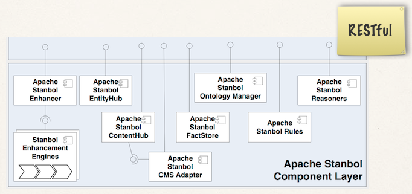

Figure 1: The Apache Stanbol Components

- [Enhancer](#trunk-components-enhancer)
  - [NLP processing](#trunk-components-enhancer-nlp)
  - List of [Enhancement Engines](#trunk-components-enhancer-engines-list)
  - [Enhancement Structure](#trunk-components-enhancer-enhancementstructure)
- [Entityhub](#trunk-components-entityhub)
- [Contenthub](#trunk-components-contenthub)
- [Ontology Manager](#trunk-components-ontologymanager)
- [Rules](#trunk-components-rules)
- [Reasoners](#trunk-components-reasoner)
- [CMS Adapter](#trunk-components-cmsadapter)
- [FactStore](#trunk-components-factstore)

Apache Stanbol is built as a modular set of components. Each component is
accessible via its own RESTful web interface. From this viewpoint, all Apache
Stanbol features can be used via RESTful service calls.

Components do not depend on each other. However they can be easily combined if
needed as shown by the different [usage scenarios](https://stanbol.apache.org/docs/trunk/components/scenarios.html). This
ensures that the list of used components depend on the specific usage scenario
and not on the Apache Stanbol architecture.

All components are implemented as
[OSGi](http://www2.osgi.org/Specifications/HomePage) bundles, components and
services. By default Apache Stanbol uses the
[Apache Felix](http://felix.apache.org) OSGi environment. However generally we try
to avoid the use of Felix specific features. If you need to run Stanbol in an
other OSGi environment an encounter problems tell us by opening a [JIRA
issue](https://issues.apache.org/jira/browse/STANBOL) and/or asking about it
on the Stanbol Developer [mailing list](https://stanbol.apache.org/docs/trunk/components/mailinglists.html).

For deployment Stanbol uses the [Apache Sling](http://sling.apache.org)
launcher. While the Stanbol Community maintains different launcher options
including run-able JARs and WAR files we expect users to configure their
custom launchers optimized for their usage scenario. However it os also
possible to us Stanbol with other launchers (such as
[Apache Karaf](http://karaf.apache.org/)) or to add its bundles to any existing OSGi
environment.

Figure 2 depicts the main Apache Stanbol components and their arrangement
within the Apache Stanbol architecture.

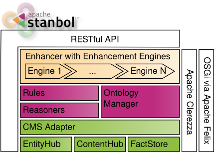

Figure 2: Apache Stanbol Architecture

- The [Enhancer](#trunk-components-enhancer) component together with its [Enhancement
  Engines](#trunk-components-enhancer-engines-list) provides you with the ability to post
  content to Apache Stanbol and get suggestions for possible entity annotation
  in return. The enhancements are provided via natural language processing,
  metadata extraction and linking named entities to public or private entity
  repositories. Furthermore, Apache Stanbol provides a machinery to further
  process this data and add additional knowledge and links via applying rules
  and reasoning. Technically, the enhancements are stored in a triple-graph
  that is maintained by [Apache Clerezza](http://incubator.apache.org/clerezza).
- The 'Sparql endpoint' gives access to RDF graphs of Apache Stanbol. This
  especially includes the graph with all enhancement results managed by the
  Apache Stanbol [Contenthub](#trunk-components-contenthub).
- The 'EnhancerVIE' is a stateful interface to submit content to analyze and
  store the results on the server. It is then possible to browse the resulting
  enhanced content items.
- The [Rules](#trunk-components-rules) component provides you with the means to refactor
  knowledge graphs, e.g. for supporting the schema.org vocabulary for search
  engine optimization.
- The [Reasoner](#trunk-components-reasoner) can be used to automatically infer additional
  knowledge. It is used to obtain new facts in the knowledge base, e.g. if
  your enhanced content tells you about a shop located in "Montparnasse", you
  can infer via a "located-in" relation that the same shop is located in
  "Paris", in the "Île-de-France" and in "France".
- The [Ontology Manager](#trunk-components-ontologymanager) is the facility that manages your
  ontologies. Ontologies are used to define the knowledge models that describe
  the metadata of content. Additionally, the semantics of your metadata can be
  defined through an ontology.
- The [CMS Adapter](#trunk-components-cmsadapter) CMS Adapter component acts as a bridge
  between JCR/CMIS compliant content management systems and Apache
  Stanbol. It can be used to map existing node structures from JCR/CMIS content
  repositories to RDF models or vica versa. It also provides services for the
  management of content repository items called
  [content items](#trunk-components-enhancer-contentitem) within the
  [Contenthub](#trunk-components-contenthub).
- The [Entityhub](#trunk-components-entityhub) is the component, which lets you cache and
  manage local indexes of repositories such as DBPedia but also custom data
  (e.g. product descriptions, contact data, specialized topic thesauri).
- The [Contenthub](#trunk-components-contenthub) is the component which provides persistent
  document store whose back-end is Apache Solr. On top of the store, it
  enables semantic indexing facilities during text based document submission
  and semantic search together with faceted search capability on the
  documents.
- The [FactStore](#trunk-components-factstore) is a component that let's use store relations
  between entities identified by their URIs. This relation between two
  entities is called a *fact*.

---

<a id="trunk-components-enhancer"></a>

<!-- source_url: https://stanbol.apache.org/docs/trunk/components/enhancer/ -->

<!-- page_index: 4 -->

# Downloads

[](https://stanbol.apache.org/index.html)

- [Getting Started](#trunk-tutorial)
- [Documentation](#trunk)
  - [Usage Scenarios](#trunk-scenarios)
  - [Components](#trunk-components)
  - [Production Mode](#trunk-production-mode)
- [Development](https://stanbol.apache.org/development/)
  - [Mailing Lists](https://stanbol.apache.org/development/index.html#mailing_lists)
  - [Issue Tracker](https://stanbol.apache.org/development/index.html#issue_tracker)
  - [Source Code](https://stanbol.apache.org/development/index.html#source_code)
  - [Development Practices](https://stanbol.apache.org/development/index.html#development_practices)

<a id="trunk-components-enhancer--downloads"></a>

# Downloads

- [Overview](https://stanbol.apache.org/downloads/)
  - [Releases](https://stanbol.apache.org/downloads/releases.html)
  - [Launchers](https://stanbol.apache.org/downloads/launchers.html)

<a id="trunk-components-enhancer--project"></a>

# Project

- [Team](https://stanbol.apache.org/team.html)
- [License](http://www.apache.org/licenses/LICENSE-2.0)
- [Privacy Policy](https://stanbol.apache.org/privacy-policy.html)

<a id="trunk-components-enhancer--archived-docs"></a>

# Archived Docs

- [0.9.0-incubating](https://stanbol.apache.org/docs/0.9.0-incubating/)

<a id="trunk-components-enhancer--the-asf"></a>

# The ASF

- [Apache Software Foundation](http://www.apache.org)
- [Thanks](http://www.apache.org/foundation/thanks.html)
- [Become a Sponsor](http://www.apache.org/foundation/sponsorship.html)
- [Security](http://www.apache.org/security/)

[](https://stanbol.apache.org/doap.rdf)

Copyright © 2010 The Apache Software Foundation, Licensed under
the [Apache License, Version 2.0](http://www.apache.org/licenses/LICENSE-2.0).
Apache, Stanbol and the Apache feather and Stanbol logos are trademarks of The Apache Software Foundation.

---

<a id="trunk-components-enhancer-engines"></a>

<!-- source_url: https://stanbol.apache.org/docs/trunk/components/enhancer/engines/ -->

<!-- page_index: 5 -->

<a id="trunk-components-enhancer-engines--enhancement-engines"></a>

# Enhancement Engines

Enhancement engines are the components responsible to enhance [content items](#trunk-components-enhancer-contentitem). They are called by the [Enhancement Job Manager](#trunk-components-enhancer-enhancementjobmanager). Enhancement engines do have full access to the parsed content items. They are expected to modify their state.

The RESTful interface of an enhancement engine can be accessed via

```
http://{host}:{port}/{stanbol-root}/enhancer/engine/{engine-name}
```

e.g. an enhancement engine with the name "ner" running at a Apache Stanbol instance on local host with the default configuration will be accessible at

```
http://localhost:8080/enhancer/engine/ner
```

When using the Java API, enhancement engines can be linked up as OSGI services. The [Enhancement Engine Manager](#trunk-components-enhancer-engines-enhancementenginemanager) service is designed to ease this by providing an API that allows to access enhancement engine by their name.

<a id="trunk-components-enhancer-engines--enhancement-engine-interface"></a>

## Enhancement Engine Interface

The interface for enhancement engines contains the following three methods:

```
/** Getter for the value of the "stanbol.enhancer.engine.name" property */ + getName ():String /** Checks if this engine can enhance the parsed content item */ + canEnhance (ContentItem ci):int /** Enhances the parsed content item */ + computeEnhancements (ContentItem ci) /** The property used for the name of an engine */ PROPERTY_NAME:String /** Indicates that this engine can not enhance an content item */ CANNOT_ENHANCE:int /** Indicates support for synchronous enhancement */ ENHANCE_SYNCHRONOUS:int /** Indicates support for asynchronous enhancement */ ENHANCE_ASYNC:int
```

Each enhancement engine has a name. This is typically provided by the engine configuration and MUST be set as value to the property "stanbol.enhancer.engine.name" in the service registration of the enhancement engine. The getter for the name MUST return the same value as the value set to this property. Enhancement engine implementations will usually get the name by calling:

```
this.name =(String) ComponentContext.getProperties (EnhancementEngine.PROPERTY_NAME );
```

The `canEnhance(ContentItem ci)` method is used by the [Enhancement Job Manager](#trunk-components-enhancer-enhancementjobmanager) to check if an engine is able to process a [Content Item](#trunk-components-enhancer-contentitem). Calling this method MUST NOT change the state of the content item and this method MUST also NOT acquire a write lock on the content item.

The `computeEnhancements(ContentItem ci)` starts the processing of the parsed content item by the engine. It is expected to change the state of the parsed content item. Engines that support asynchronous processing need to take care to correctly apply read/write locks when reading/writing information from/to the content item. Engines that return `ENHANCE_SYNCHRONOUS` on calls to `canEnhance(..)` do not need to use locks. They can trust that they have exclusive read/write access to the content item.

Enhancement engines do have full access to the content item. Theoretically, they would be even allowed to delete all metadata as well as all content parts from the parsed content item. However typically the do only

- read existing content parts
- add new content parts
- add new enhancements to the metadata
- some engines might also need to update/delete existing metadata.

Both the `canEnhance(..)` and `computeEnhancements(..)` methods MUST be called by the [Enhancement Job Manager](#trunk-components-enhancer-enhancementjobmanager) after all the executions of all enhancement engines this one depends on are completed. This dependencies are defined by the [Execution Plan](#trunk-components-enhancer-chains-executionplan) used by the enhancement job manager to enhance the content item. Implementors of enhancement engines can therefore trust that all metadata expected to be added by other enhancement engines are already present within the metadata of the parsed content items when `canEnhance(..)` or `computeEnhancements(..)` is called.

<a id="trunk-components-enhancer-engines--services-properties-interface"></a>

### Services Properties Interface

This interface is implemented by most of the current enhancement engines. It allows engines to expose additional properties to other components. This interface defines a single method

```
/** Getter for the ServiceProperties */ Map <String,Object> getServiceProperties ();
```

but also predefines the property `ENHANCEMENT_ENGINE_ORDERING = "org.apache.stanbol.enhancer.engine.order"` that can be used by enhancement engine implementations to specify their typical ordering within the enhancement process.

<a id="trunk-components-enhancer-engines--engine-ordering-information"></a>

### Engine Ordering Information

By implementing the ServicesProperties interface, enhancement engines do have the possibility to expose additional metadata to other components. The services properties interface defines only a single method

```
/** Getter for the ServiceProperties */ Map <String,Object> getServiceProperties ();
```

and is implemented by most of the current enhancement engines. Its currently only use is to provide information about the engine ordering within the enhancement process. This information is exposed by using the key "org.apache.stanbol.enhancer.engine.order" that is defined as value by the constant `ENHANCEMENT_ENGINE_ORDERING` defined directly by the services properties interface. Values are expected to be integer within the ranges

- **ORDERING\_PRE\_PROCESSING**: All values >= 200 are considered for engines that do some kind of preprocessing of the content. This includes e.g. the conversion of media formats such as extracting the plain text from HTML, keyframes from videos, wave form from mp3 ...; extracting metadata directly encoded within the parsed content such as ID3 tags from MP3 or RDFa, microdata provided by HTML content.
- **ORDERING\_CONTENT\_EXTRACTION**: This range includes values form < 200 and >= 100 and shall be used by enhancement engines that need to analyze the parsed content to extract additional metadata. Examples would be Language detection, Natural Language Processing, Named Entity Recognition, Face Detection in Images, Speech to text …
- **ORDERING\_EXTRACTION\_ENHANCEMENT**: This range includes values from < 100 and >= 1 and shall be used by enhancement engines to provide semantic lifting of preexisting enhancement such as linking named entities extracted by an NER engine with entities defines in a controlled vocabulary or lifting artist names, song titles ... extracted from mp3 files with the according Entities defined in an music database.
- **ORDERING\_DEFAULT**: This represents the value 0 and shall be used as default value for all enhancement engines that do not provide ordering information or do not implement the ServicesProperties interface.
- **ORDERING\_POST\_PROCESSING**: This range includes valued form < 0 and >= -100 and is intended to be used by all enhancement engines that do post processing of enhancement results such as schema translation, filtering of Enhancements ...

The engine ordering information as described here are used by the [Default Chain](#trunk-components-enhancer-chains-defaultchain) and the [Weighted Chain](#trunk-components-enhancer-chains-weightedchain) to calculate the [Execution Plan](#trunk-components-enhancer-chains-executionplan).

Basically this features allows the implementor of an enhancement engine to define the correct position of his engine within an typical enhancement chain and therefore ensure that users who add this engine to an enhancer installation to immediately use this engine with the [Default Chain](#trunk-components-enhancer-chains-defaultchain).

However, the engine ordering is not the only possibility for users to control the execution order. Enhancement chain implementations such as the [List Chain](#trunk-components-enhancer-chains-listchain) and the [Graph Chain](#trunk-components-enhancer-chains-graphchain) do also allow to directly define the oder of execution. For these chains the ordering information provided by enhancement engines are ignored.

<a id="trunk-components-enhancer-engines--enhancement-properties-support"></a>

### Enhancement Properties support

**since version `0.12.1`**

[Enhancement Properties](#trunk-components-enhancer-enhancementproperties) can be used to parameterize [Enhancement Chains](#trunk-components-enhancer-chains) and/or the enhancement of single [Content Item](#trunk-components-enhancer-contentitem)s. Support by EnhancementEngines is optional. Engines that do support EnhancementProperties *SHOULD* list the keys of supported properties in their documentation.

In version `0.12.1` and `1.*` EnhancementProperties are contained in the [ContentItem](https://stanbol.apache.org/docs/trunk/components/enhancer/engines/contentitem) parsed to the EnhancementEngine. The `EnhancementEngineHeloer` utility has methods to access them. The following listing shows the code necessary to get the Enhancement Properties from the parsed ContentItem.

```
@Override public final void computeEnhancements (ContentItem ci) throws EngineException {Map <String,Object> enhancemntProps =EnhancementEngineHelper.getEnhancementProperties (this,ci ); [..]}
```

With `2.0.0` the EnhancementEngine API will be changed so that the EnhancementProperties are parsed as an additional parameter.

```
@Override public final void computeEnhancements (ContentItem ci,Map <String,Object> enhancemntProps) throws EngineException {[..]}
```

The `Map<String,Object>` containing the EnhancementProperties is a read/write-able copy of the EnhancementProperties parsed with the ContentItem. That mean that EnhancementEngine implementations are free to change the contents of that map. Those changes will not affect the state of the ContentItem.

The keys of in the map are the string keys of the parsed Enhancement Properties (e.g. `enhancer.max-suggestion` or `enhancer.engines.dereference.fields`). Values can be any Object. Arrays and Collections may be used for multi value properties. The `EnhancementEngineHelper` utility provides methods to convert values to expected.

```
//define supported enhancement properties as constants public static final String MAX_SUGGESTIONS ="enhancer.max-suggestions";
public static final String DEREFERENCED_FIELDS ="enhancer.engines.dereference.fields";
[..] @Override public final void computeEnhancements (ContentItem ci) throws EngineException {Map <String,Object> enhProp =EnhancementEngineHelper.getEnhancementProperties (this,ci ); Integer maxSuggestions =EnhancementEngineHelper.getFirstConfigValue (this,ci,enhProp,MAX_SUGGESTIONS,Integer.class ); Collection <String> fields =EnhancementEngineHelper.getConfigValues (this,ci,enhProp,DEREFERENCED_FIELDS,String.class );}
```

There are also `parseConfig*(..)` methods where one can directly parse the object value. Those methods do also not throw an `EnhancementPropertyException`. Note also the `get*ConfigValue(Dictionary<String,Object>, ...)` methods that can be used to parsed the OSGI component configuration.

<a id="trunk-components-enhancer-engines--enhancement-engine-management"></a>

## Enhancement Engine Management

This section describes how enhancement engines are managed by the Apache Stanbol Enhancer and how they can be selected/accessed through the [Enhancement Job Manager](#trunk-components-enhancer-enhancementjobmanager) and executed in an [Enhancement Chain](#trunk-components-enhancer-chains).

Enhancement engines are registered as OSGi services and managed by using the following service properties:

- **Name:** Defined by the value of the property "stanbol.enhancer.engine.name" it will be used to access engines on the Stanbol RESTful interface
- **Service Ranking:** The service ranking property defined by OSGI will be used to decide which engine to use in case several active enhancement engines do use the same name. In such cases only the Engine with the highest ranking will be used to enhance ContentItems.

Other components such as enhancement chains do refer to engines by their name. The actual enhancement engine instance is only looked up shortly before the execution.

<a id="trunk-components-enhancer-engines--enhancement-engine-name-conflicts"></a>

### Enhancement Engine Name Conflicts

As enhancement engines are identified by the value of the "stanbol.enhancer.engine.name" property - the name - there might be cases where multiple enhancement engine are registered with the same name. In such cases the normal OSGi procedure to select the default service instance of several possible matches is used. This means that

1. the enhancement engine with the highest "service.ranking" and
2. the enhancement engine with the lowest "service.id"

will be selected on requests for a enhancement engine with a given name. Requests on the RESTful service API will always answer with the enhancement engine selected as default. When using the Java API there are also means to retrieve all enhancement engines for a given name via the [Enhancement Engine Manager](#trunk-components-enhancer-engines-enhancementenginemanager) interface.

Out of a user perspective there is one major use case for configuring multiple enhancement engines with the same name. This is to allow the definition of fallback engines if the main one becomes unavailable. E.g. lets assume that a user has a local cache of geonames.org loaded into the [Entityhub](#trunk-components-entityhub) and configures an [Named Entity Linking](#trunk-components-enhancer-engines-keywordlinkingengine) engine to perform semantic lifting of extracted locations. However Apache Stanbol also provides the [geonames.org Engine](#trunk-components-enhancer-engines-geonamesengine) that provides a similar functionality by directly accessing [geonames.org](http://geonames.org). By configuring both engines for the same name, but specifying a higher service ranking for the one using the local cache one can ensure that the local cache is used for the enhancement under normal circumstances. However in case the local cache becomes unavailable the other engine using the remote service will be used for enhancement.

<a id="trunk-components-enhancer-engines--enhancement-engine-manager-interface"></a>

### Enhancement Engine Manager Interface

The [Enhancement Engine Manager](#trunk-components-enhancer-engines-enhancementenginemanager) is the management interface for enhancement engines that can be used by components to lookup enhancement engines based on their name. There is also OSGI ServiceTracker like implementation that can be used to track only enhancement engines registered for a specific set of names.

<a id="trunk-components-enhancer-engines--enhancement-engine-implementations"></a>

## Enhancement Engine Implementations

A list of enhancement engine implementations maintained directly by the Apache Stanbol community can be found [here](#trunk-components-enhancer-engines-list).
However the enhancement engine interface is designed in a way that it should be possible for advanced Apache Stanbol users to implement own enhancement engine implementations fulfilling their special needs.

The Apache Stanbol community would be very happy if users decide to share thoughts about possible enhancement engines or even would like to contribute additional engines to the Apache Stanbol project.

Copyright © 2010 The Apache Software Foundation, Licensed under
the [Apache License, Version 2.0](http://www.apache.org/licenses/LICENSE-2.0).
Apache, Stanbol and the Apache feather and Stanbol logos are trademarks of The Apache Software Foundation.

---

<a id="trunk-components-enhancer-engines-tikaengine"></a>

<!-- source_url: https://stanbol.apache.org/docs/trunk/components/enhancer/engines/tikaengine -->

<!-- page_index: 6 -->

<a id="trunk-components-enhancer-engines-tikaengine--tika-engine"></a>

# Tika Engine

Apache Stanbol Enhancement Engine based on Apache Tika that has three main functionalities:

1. To detect the content type of parsed content. This is only performed if the no content type is parsed of the cogent type is set to "application/octed-stream". The detected content type is added to the metadata of the Content Item.
2. To extract the plain text (and XHTML) from parsed content and add it to the [ContentItem](#trunk-components-enhancer-contentitem) as content parts with the type Blob.
3. To extract metadata from the parsed content and add it to the metadata of the [ContentItem](#trunk-components-enhancer-contentitem)

<a id="trunk-components-enhancer-engines-tikaengine--supported-media-types"></a>

## Supported Media Types

As this engine uses Apache Tika the supported media types are the same as stated on the [Tika Homepage](http://tika.apache.org/1.0/formats.html).

<a id="trunk-components-enhancer-engines-tikaengine--extracted-metadata"></a>

## Extracted Metadata

Tika provides metadata as 'key:values' pairs. To use them efficiently within stanbol they need to be converted to valid RDF and aligned with existing Ontologies.

The TikaEngine supports alignments to several different Ontologies. Such alignment rules can be activated/deactivated within the configuration of the TikaEngine.

Supported Ontologies:

- [Ontology for Media Resources](http://www.w3.org/TR/mediaont-10/): This is the most complete mapping to an single Ontology. This includes mappings for all Dublin Core metadata; geo locations; some image specific data and most of the Audio and Viedo related metadata.
- [DC terms](http://dublincore.org/documents/dcmi-terms/): Provides good mappings for text documents (HTML, Office, OpenOffice, PDF ...)
- [Nepomuk EXIF ontology](http://www.semanticdesktop.org/ontologies/2007/05/10/nexif/): Interesting for users that want to work with EXIF metadata extracted from images.
- [Nepomuk Message Ontology](http://www.semanticdesktop.org/ontologies/2007/03/22/nmo/): Used for sender and recaiver information of mail messages.
- SKOS: Allows mapping of labels and notes to [SKOS](http://www.w3.org/2009/08/skos-reference/skos.html). This is deactivated by default.
- RDFS: Allows to map labels and comments to "rdfs:label" and "rdfs:comment"

Note that the metadata extracted by the Tika engine are not covered by the Stanbol [Enhancement Structure](#trunk-components-enhancer-enhancementstructure) as they are outside of its scope.

<a id="trunk-components-enhancer-engines-tikaengine--contenttype"></a>
<a id="trunk-components-enhancer-engines-tikaengine--contenttype:"></a>

### ContentType:

The detected content type for the parsed contentItem is added by using the following two properties:

- 'http://purl.org/dc/terms/format': Dublin Core terms 'format'
- 'http://www.w3.org/ns/ma-ont#hasFormat': Media Resource Ontology 'hasFormat'

Note that this properties will only be present if the related Ontology is activated in the TikaEngine configuration.

<a id="trunk-components-enhancer-engines-tikaengine--sending-requests-directly-to-the-tika-engine"></a>

## Sending Requests directly to the Tika Engine

The Stanbol Enhancer allows to send enhancement requests directly to specific EnhancementEngine. This feature can be used in combination with the Tika Engine to request

1. the "text/plain" or "application/xhtml+xml" version of parsed content
2. the extracted metadata as RDF aligned to the activated Ontologies

The first example requests the plain text version of a PDF file with the name "test.pdf".

```
curl -v -X POST -H "Accept: text/plain" -T test.pdf \
    "http://localhost:8080/enhancer/engine/tika?omitMetadata=true"
```

Note the

- 'Accept' header is set to the contentType of the requested content and the
- 'omitMetadata=true' telling the Enhancer to not return the RDF metadata.

This second example returns the metadata as extracted from the parsed "song.mp3"

```
curl -v -X POST -H "Accept: application/rdf+xml" -T song.mp3 \
    "http://localhost:8080/enhancer/engine/tika"
```

---

<a id="trunk-components-enhancer-engines-metaxaengine"></a>

<!-- source_url: https://stanbol.apache.org/docs/trunk/components/enhancer/engines/metaxaengine -->

<!-- page_index: 7 -->

<a id="trunk-components-enhancer-engines-metaxaengine--the-metaxa-enhancement-engine:-extracting-content-and-metadata-from-various-formats"></a>

# The Metaxa Enhancement Engine: extracting content and metadata from various formats

The **Metaxa Enhancement Engine** extracts embedded metadata and textual content from a large variety of document types and formats. The text extraction functionality also makes Metaxa suitable as a pre-processor for other components, especially NLP processors and indexing for search.

<a id="trunk-components-enhancer-engines-metaxaengine--technical-description"></a>

## Technical description

The engine is based on the [Aperture
framework](http://aperture.sourceforge.net/) with new extensions to handling structured content embedded in HTML web content, such as [Microformats](http://microformats.org/) and [RDFa](http://www.w3.org/TR/rdfa-syntax/).
Also some of the original extractors of Aperture were replaced by other engines using different base libraries.
Metaxa introduces a single TextEnhancement instance that refers to the content item by its *extracted-from* property. The specific metadata extracted by Metaxa are ascribed directly to the content item/document since they represent
document properties and not text annotations. Various ontologies are employed to describe various types of metadata. An overview will be given below.

The general structure of the Metaxa annotations consists of three levels of annotations illustrated in the following example:

<a id="trunk-components-enhancer-engines-metaxaengine--the-top-level-wzxhzdk10textannotationwzxhzdk11-instance"></a>
<a id="trunk-components-enhancer-engines-metaxaengine--the-top-level-textannotation-instance"></a>

#### The top-level TextAnnotation instance

```
<urn:enhancement-03c9e85e-2681-21b7-a5af-6da62d67ef6b>
     a       <http://fise.iks-project.eu/ontology/TextAnnotation> ,
             <http://fise.iks-project.eu/ontology/Enhancement> ;
             <http://fise.iks-project.eu/ontology/confidence>
                 "1.0"^^<http://www.w3.org/2001/XMLSchema#double> ;
     <http://fise.iks-project.eu/ontology/extracted-from>
             <http://localhost:8080/store/content/mf_example.htm> ;
     <http://purl.org/dc/terms/created>
             "2010-09-22T09:06:53.056+02:00"^^<http://www.w3.org/2001/XMLSchema#dateTime> ;
     <http://purl.org/dc/terms/creator>
              "org.apache.enhancer.engines.metaxa.MetaxaEngine"^^<http://www.w3.org/2001/XMLSchema#string> .
```

<a id="trunk-components-enhancer-engines-metaxaengine--the-top-level-document-metadata-referenced-from-the-wzxhzdk12textannotationwzxhzdk13-instance-via-the-extracted-from-property"></a>
<a id="trunk-components-enhancer-engines-metaxaengine--the-top-level-document-metadata-referenced-from-the-textannotation-instance-via-the-extracted-from-property:"></a>

#### The top-level document metadata, referenced from the TextAnnotation instance via the *extracted-from* property:

```
<http://localhost:8080/store/content/mf_example.htm>
     a       <http://www.semanticdesktop.org/ontologies/2007/03/22/nfo#HtmlDocument> ;
     <http://www.semanticdesktop.org/ontologies/2007/01/19/nie#contains>
             <urn:rnd:-9e25553:12b3843df43:-7ffe> ;
     <http://www.semanticdesktop.org/ontologies/2007/01/19/nie#description>
             "Cheap Flights to Tenerife, Arrecife, Paphos, Mahon, Las Palmas, Malaga, Alicante, Faro, Heraklion, Palma and the rest of the World. Flightline searches over 100 Airlines and 30,000 Hotels. ABTA, IATA, ATOL Bonded." ;
     <http://www.semanticdesktop.org/ontologies/2007/01/19/nie#keyword>
             "travel" , "bargain flights" , "late deals" , "hotels" , "air tickets" , "air fares" , "discount travel" , "last minute flights" , "cheap airlines" , "cheap holidays" , "cheap flights" , "flightline" , "hotel reservations" , "discount flights" , "air travel" , "package holidays" ;
     <http://www.semanticdesktop.org/ontologies/2007/01/19/nie#title>
             "Flightline | Cheap Flights, Package Holidays, Hotels, Travel Insurance &amp; More" .
```

NOTE: The extracted plain text is no longer added to the metadata of the ContentItem but stores in an own [ContentPart](#trunk-components-enhancer-contentitem--content_parts) with the media type "text/plain". Both the RESTful Service as the Java API allows to request this data. See the according documentations for details.

<a id="trunk-components-enhancer-engines-metaxaengine--embedded-wzxhzdk14hcardwzxhzdk15-microformat-data-referenced-via-the-wzxhzdk16niecontainswzxhzdk17-property"></a>
<a id="trunk-components-enhancer-engines-metaxaengine--embedded-hcard-microformat-data-referenced-via-the-nie:contains-property:"></a>

#### Embedded hCard microformat data referenced via the nie:contains property:

```
<urn:rnd:-9e25553:12b3843df43:-7ffe>
     a       <http://www.w3.org/2006/vcard/ns#VCard> ;
     <http://www.w3.org/2006/vcard/ns#adr>
           <urn:rnd:-9e25553:12b3843df43:-7ffc> ;
     <http://www.w3.org/2006/vcard/ns#fn>
           "Flightgeoline Essex Limited" ;
     <http://www.w3.org/2006/vcard/ns#geo>
           <urn:rnd:-9e25553:12b3843df43:-7ffb> ;
    <http://www.w3.org/2006/vcard/ns#org>
           <urn:rnd:-9e25553:12b3843df43:-7ffd> ;
    <http://www.w3.org/2006/vcard/ns#photo>
           <https://www.flightline.co.uk/common/images/building_banner_sm.jpg> ;
    <http://www.w3.org/2006/vcard/ns#url>
           <http://www.flightline.co.uk> ;
    <http://www.w3.org/2006/vcard/ns#workTel>
           <tel:0800541541> .

<urn:rnd:-9e25553:12b3843df43:-7ffd>
     a       <http://www.w3.org/2006/vcard/ns#Organization> ;
     <http://www.w3.org/2006/vcard/ns#organization-name>
           "Flightline Essex Limited" .

<urn:rnd:-9e25553:12b3843df43:-7ffc>
     a       <http://www.w3.org/2006/vcard/ns#Address> ;
     <http://www.w3.org/2006/vcard/ns#countryName>
           "UK" ;
     <http://www.w3.org/2006/vcard/ns#extendedAddress>
          "Flightline House" ;
     <http://www.w3.org/2006/vcard/ns#locality>
          "Westcliff-on-Sea" ;
     <http://www.w3.org/2006/vcard/ns#postalCode>
          "SS0 7JE" ;
     <http://www.w3.org/2006/vcard/ns#region>
          "Essex" ;
     <http://www.w3.org/2006/vcard/ns#streetAddress>
          "32-38 Milton Road" .

<urn:rnd:-9e25553:12b3843df43:-7ffb>
     a       <http://www.w3.org/2006/vcard/ns#Location> ;
     <http://www.w3.org/2006/vcard/ns#latitude>
          "51.53894902845868" ;
     <http://www.w3.org/2006/vcard/ns#longitude>
          "0.700753927230835" .
```

<a id="trunk-components-enhancer-engines-metaxaengine--supported-document-types"></a>

### Supported document types

The set of extraction engines for specific document types is defined by the resource *extractionregistry.xml*. Each engine specifies what MIME types it can handle. By default the extraction registry provides extractors for the
following set of document formats:

- *Office documents*:
- MS-Works
- MS-Office
- Excel
- PowerPoint
- Word
- Visio
- OpenDocument
- OpenXml
- Publisher
- Corel-Presentations
- QuattroPro
- WordPerfect
- *Multimedia documents*:
- JPG
- MP3
- *(X)HTML*, supporting also these types of embedded structures/microformats, as defined by the default resource *htmlextractors.xml*:
- RDFa
- geo
- hAtom
- hCal
- hCard
- hReview
- rel-license
- rel-tag
- xFolk
- *Other*:
- PDF
- RTF
- Plain Text
- XML

<a id="trunk-components-enhancer-engines-metaxaengine--textual-content"></a>

### Textual Content

The extracted plain text is no longer added to the metadata of the contentItem but stores in an own [ContentPart](#trunk-components-enhancer-contentitem--content_parts) with the media type "text/plain".

The following POST request to the Enhancer can be used to directly request the plain text version of a parsed content

```
curl -v -X POST -H "Accept: text/plain" \
    -H "Content-type: text/html; charset=UTF-8" \
    --data "<html><body><p>The Stanbol enhancer can detect \
      famous cities such as Paris and people such as Bob Marley.</p></body></html>" \
    "http://localhost:8080/enhancer/chain/language?omitMetadata=true"
```

There is also the possibility to request both the extracted metadata and the plain text version. Please see the Documentation of the RESTful API (<http://localhost:8080/enhacer> if Stanbol runs on localhost).

NOTE: previous versions of this engine had stored the plain text version by using the "http://www.semanticdesktop.org/ontologies/2007/01/19/nie#plainTextContent" property directly in the metadata of the ContentItem. This is no longer supported.

<a id="trunk-components-enhancer-engines-metaxaengine--vocabularies"></a>

### Vocabularies

Metaxa uses a set of vocabularies ("ontologies") for structured data representation.

<a id="trunk-components-enhancer-engines-metaxaengine--aperture-core-ontologies"></a>

#### Aperture Core Ontologies

These ontologies belong to the underlying Aperture subsystem, contained in the
package

```
org.semanticdesktop.aperture.vocabulary
```

The most important ones with respect to top-level document properties are

- NIE (Nepomuk Information Element):

  :::text
  http://www.semanticdesktop.org/ontologies/2007/01/19/nie#
- NFO (Nepomuk File Object):

  :::text
  http://www.semanticdesktop.org/ontologies/2007/01/19/nfo#

Documentation of Aperture's core ontologies is provided in Aperture's Javadoc <http://aperture.sourceforge.net/doc/javadoc/1.5.0/index.html> for the packages in

```
org.semanticdesktop.aperture.vocabulary.
```

<a id="trunk-components-enhancer-engines-metaxaengine--html-microformat-extractors"></a>

#### HTML Microformat Extractors

The following table describes which vocabularies are used for representing microformat data in Metaxa:

| MF | Vocabulary (Namespace) |
| --- | --- |
| geo | wgs84 (http://www.w3.org/2003/01/geo/wgs84\_pos#) |
| hAtom | atom (http://www.w3.org/2005/Atom#) |
|  | tagging (http://aperture.sourceforge.net/ontologies/tagging#) |
| hCal | ical (http://www.w3.org/2002/12/cal/icaltzd#) |
|  | vcard (http://www.w3.org/2006/vcard/ns#) |
| hCard | vcard (http://www.w3.org/2006/vcard/ns#) |
| hReview | review (http://www.purl.org/stuff/rev#) |
|  | wgs84 (http://www.w3.org/2003/01/geo/wgs84\_pos#) |
|  | dc (http://purl.org/dc/elements/1.1/) |
|  | dcterms (http://purl.org/dc/dcmitype/) |
|  | foaf (http://xmlns.com/foaf/0.1/) |
|  | vcard (http://www.w3.org/2006/vcard/ns#) |
|  | tag (http://www.holygoat.co.uk/owl/redwood/0.1/tags/) |
| rel-license | dc (http://purl.org/dc/elements/1.1/) |
| rel-tag | tagging (http://aperture.sourceforge.net/ontologies/tagging#) |
| xFolk | nfo (http://www.semanticdesktop.org/ontologies/2007/03/22/nfo#) |
|  | dc (http://purl.org/dc/elements/1.1/) |
|  | tagging (http://aperture.sourceforge.net/ontologies/tagging#) |

<a id="trunk-components-enhancer-engines-metaxaengine--configuration-options"></a>

## Configuration options

By default, Metaxa uses the extractors specified in the resource "extractionregistry.xml", and for HTML pages, the resource "htmlregistry.xml".
Alternative configurations and extractors can be attached to Metaxa as fragment bundles, specifying as host bundle

```
Fragment-Host: org.apache.stanbol.enhancer.engines.metaxa
```

The alternative configuration files then can be set as values of the properties

-
```
org.apache.stanbol.enhancer.engines.metaxa.extractionregistry
```

-
```
org.apache.stanbol.enhancer.engines.metaxa.htmlextractors
```

<a id="trunk-components-enhancer-engines-metaxaengine--usage"></a>

## Usage

Assuming that the Stanbol endpoint with the full launcher is running at

```
http://localhost:8080
```

and the engine is activated, from the command line commands like this can be used for submitting some file as content item, where the mime type must match the document type:

- stateless interface

  :::text
  curl -i -X POST -H "Content-Type:text/html" -T testpage.html http://localhost:8080/engines
- stateful interface

  :::text
  curl -i -X PUT -H "Content-Type:text/html" -T testpage.html http://localhost:8080/contenthub/content/someFileId

Alternatively, the Stanbol web interface can be used for submitting documents
and viewing the metadata at

```
http://localhost:8080/contenthub
```

Copyright © 2010 The Apache Software Foundation, Licensed under
the [Apache License, Version 2.0](http://www.apache.org/licenses/LICENSE-2.0).
Apache, Stanbol and the Apache feather and Stanbol logos are trademarks of The Apache Software Foundation.

---

<a id="trunk-components-enhancer-engines-langidengine"></a>

<!-- source_url: https://stanbol.apache.org/docs/trunk/components/enhancer/engines/langidengine -->

<!-- page_index: 8 -->

<a id="trunk-components-enhancer-engines-langidengine--the-language-identification-engine"></a>

# The Language Identification Engine

The **LangId** engine determines the language of text.

*NOTE*: Users of this engine might want to consider using the [LangDetect](#trunk-components-enhancer-engines-langdetectengine) instead because the language detection library used by this engine supports more languages and also delivers better results.

<a id="trunk-components-enhancer-engines-langidengine--technical-description"></a>

## Technical Description

The provided engine is based on the language identifier of [Apache Tika](http://tika.apache.org/).
The text to be checked must be provided in plain text format in one of two forms:

- a plain text content item
- by the content item's metadata as the string value of the property

  :::html

```
http://www.semanticdesktop.org/ontologies/2007/01/19/nie#plainTextContent
```

The result of language identification is added as [fise:TextAnnotation](#trunk-components-enhancer-enhancementstructure--fisetextannotation) to the content item's metadata as string value of the property

```
http://purl.org/dc/terms/language
```

This RDF snippet illustrates the output:

```
<fise:TextAnnotation rdf:about="urn:enhancement-a147957b-41f9-58f7-bbf1-b880b3aa4b49">
    <dc:language>en</dc:language>
    <dc:creator>org.apache.stanbol.enhancer.engines.langid.LangIdEnhancementEngine</dc:creator>
</fise:TextAnnotation>
```

By default the language identifier distinguishes the languages listed below. After the colon the value of the language label in the metadata is given.

- German: de
- English: en
- Estonian: et
- French: fr
- Spanish: es
- Italian: it
- Swedish: sv
- Polish: pl
- Dutch: nl
- Norwegian: no
- Finnish: fi
- Greek: el
- Danish: da
- Hungarian: hu
- Icelandic: is
- Lithuanian: lt
- Portuguese: pt
- Russian: ru
- Thai: th

Additional language models can be created as Tika [LanguageProfile](https://stanbol.apache.org/docs/trunk/components/enhancer/engines/org.apache.tika.language.LanguageProfile).

<a id="trunk-components-enhancer-engines-langidengine--configuration-options"></a>

## Configuration options

- `org.apache.stanbol.enhancer.engines.langid.probe-length`: an integer specifying how many characters will be used for identification. A value of 0 or below means to use the complete text. Otherwise only a substring of the specified length taken from the middle of the text will be used. The default value is 400 characters.
- `stanbol.enhancer.engine.name`: As with any EnhancementEngine this property can be used to change the name of the Engine. The default is "langid"

<a id="trunk-components-enhancer-engines-langidengine--usage"></a>

## Usage

Assuming that the Stanbol endpoint with the full launcher is running at

```
http://localhost:8080
```

and the engine is activated, from the command line commands like this
can be used for submitting some text file as content item:

- stateless interface

  :::bash
  curl -i -X POST -H "Content-Type:text/plain" -T testfile.txt http://localhost:8080/engines
- stateful interface

  :::bash
  curl -i -X PUT -H "Content-Type:text/plain" -T testfile.txt http://localhost:8080/contenthub/content/someFileId

Alternatively, the Stanbol web interface can be used for submitting documents
and viewing the metadata at

```
http://localhost:8080/contenthub
```

---

<a id="trunk-components-enhancer-engines-langdetectengine"></a>

<!-- source_url: https://stanbol.apache.org/docs/trunk/components/enhancer/engines/langdetectengine -->

<!-- page_index: 9 -->

<a id="trunk-components-enhancer-engines-langdetectengine--the-language-detection-engine"></a>

# The Language Detection Engine

The **LangDetect** engine determines the language of text.

<a id="trunk-components-enhancer-engines-langdetectengine--technical-description"></a>

## Technical Description

The provided engine is based on the language identifier of [language-detection](http://code.google.com/p/language-detection/) project.

The plain text needed for the detection is retrieved from the processed [ContentItem](#trunk-components-enhancer-contentitem) by searching a Blob with the media type "text/plain".

The result of language identification is added as [fise:TextAnnotation](#trunk-components-enhancer-enhancementstructure--fisetextannotation) to the content item's metadata as string value of the property

```
http://purl.org/dc/terms/language
```

This RDF snippet illustrates the output:

```
<fise:TextAnnotation rdf:about="urn:enhancement-a147957b-41f9-58f7-bbf1-b880b3aa4b49">
    <dc:language>en</dc:language>
    <fise:confidence>0.99987</fise:confidence>
    <dc:type rdf:resource="http://purl.org/dc/terms/LinguisticSystem"/>
    <dc:creator>org.apache.stanbol.enhancer.engines.langdetect.LanguageDetectionEnhancementEngine</dc:creator>
</fise:TextAnnotation>
```

The list of supported languages is available [here](http://code.google.com/p/language-detection/wiki/LanguageList).

<a id="trunk-components-enhancer-engines-langdetectengine--configuration-options"></a>

## Configuration options

> [!NOTE]
> - `org.apache.stanbol.enhancer.engines.langdetect.probe-length`: an integer specifying how many characters will be used for identification. A value of 0 or below means to use the complete text. Otherwise only a substring of the specified length taken from the middle of the text will be used. that the used library already supports random selection of text parts so typically the probe-lengh feature should not be activated.
- `org.apache.stanbol.enhancer.engines.langdetect.max-suggested`: The used language detection library supports the annotation of multiple languages. This allows to configure the maximum number of suggested languages.
- `stanbol.enhancer.engine.name`: As with any EnhancementEngine this property can be used to change the name of the Engine. The default is "langdetect"

---

<a id="trunk-components-enhancer-engines-restfullangident"></a>

<!-- source_url: https://stanbol.apache.org/docs/trunk/components/enhancer/engines/restfullangident -->

<!-- page_index: 10 -->

#

<a id="trunk-components-enhancer-engines-restfullangident--restful-language-identification-engine"></a>

# RESTful Language Identification Engine

This Enhancement Engine implements an client for the [RESTful Language Identification Service](#trunk-components-enhancer-nlp-restfullangidentservice).

The Engine lookups the `plain/text` content part of the processed [ContentItem](#trunk-components-enhancer-contentitem) and send it to the configured service URL. Based on the response it will create [fise:TextAnnotations](#trunk-components-enhancer-enhancementstructure--fisetextannotation) (as defined by [STANBOL-613](https://issues.apache.org/jira/browse/STANBOL-613)) for the detected languages.

<a id="trunk-components-enhancer-engines-restfullangident--configuration-parameter"></a>

### Configuration parameter

The configuration of the Engine allows to set the

- **Name** *(stanbol.enhancer.engine.name)*: The name of the Enhancement Engine. This name is used to refer an [EnhancementEngine](#trunk-components-enhancer-engines) in [EnhancementChain](https://stanbol.apache.org/docs/trunk/components/enhancer/engines/enhancementchain.html)s
- **Service URI** *(enhancer.engine.restful.langident.service)*: The URL of the service implementing the [RESTful Language Identification Service](#trunk-components-enhancer-nlp-restfullangidentservice) (as specified by [STANBOL-894](https://issues.apache.org/jira/browse/STANBOL-894))
- **User** *(enhancer.engine.restful.langident.service.user)*: If required the user name for accessing the Server
- **Password** *(enhancer.engine.restful.langident.service.pwd)*: The password for the configured user name
- **Ranking** *(service.ranking)*: This property is used of two engines do use the same *Name*. In such cases the one with the higher ranking will be used to enhance content items. Typically users will not need to change this.

---

<a id="trunk-components-enhancer-nlp-restfullangidentservice"></a>

<!-- source_url: https://stanbol.apache.org/docs/trunk/components/enhancer/nlp/restfullangidentservice -->

<!-- page_index: 11 -->

#

<a id="trunk-components-enhancer-nlp-restfullangidentservice--restful-language-identification-service"></a>

## RESTful Language Identification Service

[STANBOL-894](https://issues.apache.org/jira/browse/STANBOL-894) added a standard RESTful Language Identification service that can be used to integrate NLP processing frameworks that do support Language Identification.

On the Stanbol Enhancer side the service is consumed by the [RESTful Language Identification Engine](#trunk-components-enhancer-engines-restfullangident) meaning that integrators of the Language Identification functionality do only need to take care of implementing the RESTful service.

This option of integrating an NLP framework with the Stanbol Enhancer should be considered in the following scenarios:

- NLP Frameworks that are not implemented in Java: As this allows integrators to implement the RESTful service in the programming language of their choice.
- Avoid OSGI: All utilities provided by Apache Stanbol do work inside and outside an OSGI environment.
- NLP Frameworks under licenses with strong copy left such as GPL and AGLP: Integrating a NLP framework as [NLP EnhancementEngine](#trunk-components-enhancer-nlp-nlpengine) means linking against the API of the NLP framework, what is an problem for users with none open source extensions to Apache Stanbol. Integrating such Frameworks as a standalone server that provide a RESTful service does not suffer this problem.
- Crashes of the NLP framework integration does not affect Stanbol: Especially for NLP frameworks that do use native libraries any exception may cause the JVM to crash.
- Distribution: Integration over RESTful services allows to distribute NLP processing task on different servers.

<a id="trunk-components-enhancer-nlp-restfullangidentservice--restful-service-specification"></a>

### RESTful Service specification

- Method: POST {service-baseuri}
- Request Headers:
  - Content-Type: Must be `plain/text; charset={charset}`. If the charset parameter is missing that `UTF-8` is used as default.
- Response: The JSON serialized Information about the detected Languages (see specification below)

<a id="trunk-components-enhancer-nlp-restfullangidentservice--json-representation-for-detected-languages"></a>

### JSON Representation for Detected Languages

The detected languages are encoded as an JSON Array. Each Element of the array needs to define the "lang" attribute with a string value representing the language and an optional "prob" attribute with an numerical value representing the probability.

**Example**

A POST request with a `Content-Language` header and `plain/text` as content

```
curl -i -X POST -H "Content-Type: text/plain" -T en.txt http://localhost:8080/langident
```

will return an JSON array with the detected languages

HTTP/1.1 200 OK
Content-Type: application/json
Transfer-Encoding: chunked
Server: Jetty(6.0.x)

```
[{lang:"en",prob:0.907 },{lang:"fr",prob:0.532 },{lang:"it",prob:0.384 }]
```

---

<a id="trunk-components-enhancer-engines-opennlpsentence"></a>

<!-- source_url: https://stanbol.apache.org/docs/trunk/components/enhancer/engines/opennlpsentence -->

<!-- page_index: 12 -->

<a id="trunk-components-enhancer-engines-opennlpsentence--opennlp-sentence-detection-engine"></a>

# OpenNLP Sentence Detection Engine

The OpenNLP Sentence Detection Engine adds *Sentences* to the *[AnalyzedText](#trunk-components-enhancer-nlp-analyzedtext)* content part. If the *AnalyzedText* content part is not yet present it is created by this engine.

<a id="trunk-components-enhancer-engines-opennlpsentence--consumed-information"></a>

## Consumed information

- **Language** (required): The language of the text needs to be available. It is read as specified by [STANBOL-613](https://issues.apache.org/jira/browse/STANBOL-613) from the metadata of the ContentItem. Effectively this means that any Stanbol Language Detection engine will need to be executed before the OpenNLP POS Tagging Engine.

<a id="trunk-components-enhancer-engines-opennlpsentence--configuration"></a>

## Configuration

The OpenNLP Sentence Detector Engine provides a default service instance (configuration policy is optional). This instance processes all languages and adds *Sentences* for all languages where a OpenNLP sentence detection model is available. This Engine instance uses the name 'opennlp-sentence' and has a service ranking of '-100'.

This engine supports the default configuration for Enhancement Engines including the **name** *(stanbol.enhancer.engine.name)* and the **ranking** *(service.ranking)* In addition it is possible to configure the **processed languages** *(org.apache.stanbol.enhancer.sentence.languages)* and an parameter to specify the name of the sentence detection model used for a language.

**1. Processed Language Configuraiton:**

For the configuration of the processed languages the following syntax is used:

```
de
en
```

This would configure the Engine to only process German and English texts. It is also possible to explicitly exclude languages

```
!fr
!it
*
```

This specifies that all Languages other than French and Italien are processed.

Values can be parsed as Array or Vector. This is done by using the ["elem1","elem2",...] syntax as defined by OSGI ".config" files. As fallback also ',' separated Strings are supported.

The following example shows the two above examples combined to a single configuration.

```
org.apache.stanbol.enhancer.sentence.languages=["!fr","!it","de","en","*"]
```

NOTE that the "processed language" configuration only specifies what languages are considered for processing. If "de" is enabled, but there is no sentence detection model available for that language, than German text will still not be processed. However if there is a POS model for "it" but the "processed language" configuration does not include Italian, than Italian text will NOT be processed.

**2. Sentnece detection model parameter**

The OpenNLP Sentence Detection engine supports the 'model' parameter to explicitly parse the name of the sentence detection model used for an language. Models are loaded via the Stanbol DataFile provider infrastructure. That means that models can be loaded from the {stanbol-working-dir}/stanbol/datafiles folder.

The syntax for parameters is as follows

```
{language};{param-name}={param-value}
```

So to use the "my-de-sentence-model.zip" for detecting sentences in German texts one can use a configuration like follows

```
de;model=my-de-sentence-model.zip
*
```

By default OpenNLP sentence detection models are loaded from '{lang}-sent.bin'. To use models with other names users need to use the 'model' parameter as described above.

---

<a id="trunk-components-enhancer-nlp-smartcn"></a>

<!-- source_url: https://stanbol.apache.org/docs/trunk/components/enhancer/nlp/smartcn -->

<!-- page_index: 13 -->

#

<a id="trunk-components-enhancer-nlp-smartcn--basic-chinese-language-support-based-on-lucene-smartcn-analyzer"></a>

# Basic Chinese language support based on Lucene Smartcn Analyzer

As Chinese does not use *Whiespace* characters for word tokenization the default tokenizers used by Stanbol are not capable to properly process Chinese language texts. Therefore users that need to process Chinese texts need to add special modules even for basic language support.

The integration of the Stanbol NLP processing module with the Lucene Smartcn Analyzer provides this by

- Allowing to correctly index Controlled Vocabularies with Chinese labels with the Stanbol Entityhub
- Detect Sentences and Tokenize parsed Chinese Text
- Tokenizer Chinese Labels of Entities in the controlled vocabulary.

<a id="trunk-components-enhancer-nlp-smartcn--installation"></a>

## Installation

The Smartcn integration consists of three bundles as referenced by the [Smartcn Bundle List](http://svn.apache.org/repos/asf/stanbol/trunk/launchers/bundlelists/language-extras/smartcn/src/main/bundles/list.xml).
Users can either include this BundleList in their [Custom Launcher configuration](#trunk-production-mode-your-launcher) by including the

```
<dependency>
    <groupId>org.apache.stanbol</groupId>
    <artifactId>org.apache.stanbol.launchers.bundlelists.languageextras.smartcn</artifactId>
    <version>0.10.0-SNAPSHOT</version>
    <packaging>partialbundlelist</packaging>
</dependency>
```

or alternatively manually installing the tree bundles referenced by the [Smartcn Bundle List](http://svn.apache.org/repos/asf/stanbol/trunk/launchers/bundlelists/language-extras/smartcn/src/main/bundles/list.xml) to the Stanbol Environment (e.g. by copying them to the `stanbol/fileinstall` directory)

<a id="trunk-components-enhancer-nlp-smartcn--stanbol-enhancer-configuration"></a>

## Stanbol Enhancer configuration

When the Smartcn Analyzer is installed to the Stanbol Environment two new EnhancementEngiens will be available that can be used to configure an EnhancementChain for Chinese texts. A typical EnhancementChain for Chinese text will look like:

```
langdetect
smartcn-sentence;optional
smartcn-token
{your-entitylinking}
```

where '{your-entitylinking}' will typically be an [EntityhubLinkingEngine](#trunk-components-enhancer-engines-entityhublinking) engine configured for your vocabulary containing the Entities with Chinese labels.

<a id="trunk-components-enhancer-nlp-smartcn--solr-configuration"></a>

## Solr Configuration

When you plan to use the Smartcn Analyzer to process Chinese texts it is important to also properly configure the Solr schema.xml used by the Entityhub SolrYard.

For that you will need to add two things:

1. A fieldType specification for Chinese


```
<fieldType name="text_zh" class="solr.TextField" positionIncrementGap="100"> <analyzer type="index"> <tokenizer class="solr.SmartChineseSentenceTokenizerFactory" /> <filter class="solr.SmartChineseWordTokenFilterFactory" /> <filter class="solr.LowerCaseFilterFactory" /> <filter class="solr.RemoveDuplicatesTokenFilterFactory" /> </analyzer> <analyzer type="query"> <tokenizer class="solr.SmartChineseSentenceTokenizerFactory" /> <filter class="solr.SmartChineseWordTokenFilterFactory" /> <filter class="solr.LowerCaseFilterFactory" /> <filter class="solr.RemoveDuplicatesTokenFilterFactory" /> <filter class="solr.PositionFilterFactory" /> </analyzer> </fieldType>
```

2. A dynamic field using this field type that matches against Chinese language literals


```
<!--
 Dynamic field for Chinese languages.
 -->
<dynamicField
name=
"@zh*"
type=
"text_zh"
indexed=
"true"
stored=
"true"
multiValued=
"true"
omitNorms=
"false"
/>
```

The [smartcn.solrindex.zip](https://svn.apache.org/repos/asf/stanbol/trunk/entityhub/yard/solr/src/main/resources/solr/core/smartcn.solrindex.zip) is identical with the default configuration but uses the above fieldType and dynamicField specification.

<a id="trunk-components-enhancer-nlp-smartcn--usage-with-the-entityhubindexing-tool"></a>

### Usage with the EntityhubIndexing Tool

1. Extract the [smartcn.solrindex.zip](https://svn.apache.org/repos/asf/stanbol/trunk/entityhub/yard/solr/src/main/resources/solr/core/smartcn.solrindex.zip) to the "indexing/config" directory
2. Rename the "indexing/config/smartcn" directory to the {site-name} (the value of the "name" property of the "indexing/config/indexing.properties" file).

As an alternative to (2) you can also explicitly configure the name of the solr config as value to the "solrConf:smartcn" of SolrYardIndexingDestination.

```
indexingDestination=org.apache.stanbol.entityhub.indexing.destination.solryard.SolrYardIndexingDestination,solrConf:smartcn,boosts:fieldboosts
```

<a id="trunk-components-enhancer-nlp-smartcn--usage-with-the-entityhub-solryard"></a>

### Usage with the Entityhub SolrYard

If you want to create an empty SolrYard instance using the [smartcn.solrindex.zip](https://svn.apache.org/repos/asf/stanbol/trunk/entityhub/yard/solr/src/main/resources/solr/core/smartcn.solrindex.zip) configuration you will need to

1. copy the smartcn.solrindex.zip to the datafile directory of your Stanbol instance ({working-dir}/stanbol/datafiles)
2. rename it to the {name} of the SolrYard you want to create. The file name needs to be {name}.solrindex.zip
3. create the SolrYard instance and configure the "Solr Index/Core" (org.apache.stanbol.entityhub.yard.solr.solrUri) to {name}. Make sure the "Use default SolrCore configuration" (org.apache.stanbol.entityhub.yard.solr.useDefaultConfig) is disabled.

If you want to use the smartcn.solrindex.zip as default you can rename the file in the datafilee folder to "default.solrindex.zip" and the enable the "Use default SolrCore configuration" (org.apache.stanbol.entityhub.yard.solr.useDefaultConfig) when you configure a SolrYard instance.

See also the documentation on how to [configure a managed site](#trunk-components-entityhub-managedsite--configuration-of-managedsites).

---

<a id="trunk-components-enhancer-engines-opennlptokenizer"></a>

<!-- source_url: https://stanbol.apache.org/docs/trunk/components/enhancer/engines/opennlptokenizer -->

<!-- page_index: 14 -->

<a id="trunk-components-enhancer-engines-opennlptokenizer--opennlp-tokenizer-engine"></a>

# OpenNLP Tokenizer Engine

The OpenNLP Tokenizer Engine adds *Tokens* to the *AnalyzedText* content part. If this content part is not yet present it adds it to the ContentItem.

<a id="trunk-components-enhancer-engines-opennlptokenizer--consumed-information"></a>

## Consumed information

- **Language** (required): The language of the text needs to be available. It is read as specified by [STANBOL-613](https://issues.apache.org/jira/browse/STANBOL-613) from the metadata of the ContentItem. Effectively this means that any Stanbol Language Detection engine will need to be executed before the OpenNLP POS Tagging Engine.
- **Sentences** (optional): In case *Sentences* are available in the *AnalyzedText* content part the tokenization of the text is done sentence by sentence. Otherwise the whole text is tokenized at once.

<a id="trunk-components-enhancer-engines-opennlptokenizer--configuration"></a>

## Configuration

The OpenNLP Tokenizer engine provides a default service instance (configuration policy is optional). This instance processes all languages. Language specific tokenizer models are used if available. For other languages the OpenNLP SimpleTokenizer is used. This Engine instance uses the name 'opennlp-token' and has a service ranking of '-100'.

While this engine supports the default configuration including the **name** *(stanbol.enhancer.engine.name)* and the **ranking** *(service.ranking)* the engine also allows to configure **processed languages** *(org.apache.stanbol.enhancer.token.languages)* and an parameter to specify the name of the tokenizer model used for a language.

**1. Processed Language Configuraiton:**

For the configuration of the processed languages the following syntax is used:

```
de
en
```

This would configure the Engine to only process German and English texts. It is also possible to explicitly exclude languages

```
!fr
!it
*
```

This specifies that all Languages other than French and Italien are tokenized.

Values can be parsed as Array or Vector. This is done by using the ["elem1","elem2",...] syntax as defined by OSGI ".config" files. As fallback also ',' separated Strings are supported.

The following example shows the two above examples combined to a single configuration.

```
org.apache.stanbol.enhancer.token.languages=["!fr","!it","de","en","*"]
```

**2. Tokenizer model parameter**

The OpenNLP Tokenizer engine supports the 'model' parameter to explicitly parse the name of the Tokenizer model used for an language. Tokenizer models are loaded via the Stanbol DataFile provider infrastructure. That means that models can be loaded from the {stanbol-working-dir}/stanbol/datafiles folder.

The syntax for parameters is as follows

```
{language};{param-name}={param-value}
```

So to use the "my-de-tokenizer-model.zip" for tokenizing German texts one can use a configuration like follows

```
de;model=my-de-tokenizer-model.zip
*
```

To configure that the SimpleTokenizer should be used for a given language the 'model' parameter needs to be set to 'SIMPLE' as shown in the following example

```
de;model=SIMPLE
*
```

By default OpenNLP Tokenizer models are loaded for '{lang}-token.bin'. To use models with other names users need to use the 'model' parameter as described above.

---

<a id="trunk-components-enhancer-nlp-paoding"></a>

<!-- source_url: https://stanbol.apache.org/docs/trunk/components/enhancer/nlp/paoding -->

<!-- page_index: 15 -->

#

<a id="trunk-components-enhancer-nlp-paoding--basic-chinese-language-support-based-on-paoding-analyzer"></a>

# Basic Chinese language support based on Paoding Analyzer

As Chinese does not use *Whiespace* characters for word tokenization the default tokenizers used by Stanbol are not capable to properly process Chinese language texts. Therefore users that need to process Chinese texts need to add special modules even for basic language support.

The integration of the Stanbol NLP processing module with the Paoding Analyzer provides this by

- Allowing to correctly index Controlled Vocabularies with Chinese labels with the Stanbol Entityhub
- Tokenize parsed Chinese Text
- Tokenizer Chinese Labels of Entities in the controlled vocabulary.

It is highly recommended to use the Paoding Analyzer in combination with the [Smartcn](#trunk-components-enhancer-nlp-smartcn) as the Smartcn Analyzer provide Sentence detection.

<a id="trunk-components-enhancer-nlp-paoding--installation"></a>

## Installation

The Paoding Analyzer integration consists of three bundles as referenced by the [Paoding Bundle List](http://svn.apache.org/repos/asf/stanbol/trunk/launchers/bundlelists/language-extras/paoding/src/main/bundles/list.xml).
Users can either include this BundleList in their [Custom Launcher configuration](#trunk-production-mode-your-launcher) by including the

```
<dependency>
    <groupId>org.apache.stanbol</groupId>
    <artifactId>org.apache.stanbol.launchers.bundlelists.languageextras.paoding</artifactId>
    <version>0.10.0-SNAPSHOT</version>
    <packaging>partialbundlelist</packaging>
</dependency>
```

or alternatively manually installing the tree bundles referenced by the [Paoding Bundle List](http://svn.apache.org/repos/asf/stanbol/trunk/launchers/bundlelists/language-extras/paoding/src/main/bundles/list.xml) to the Stanbol Environment (e.g. by copying them to the `stanbol/fileinstall` directory)

*NOTE* that if for Sentence Detection users will also need to install the [Smartcn Analyer](#trunk-components-enhancer-nlp-smartcn)

<a id="trunk-components-enhancer-nlp-paoding--stanbol-enhancer-configuration"></a>

## Stanbol Enhancer configuration

When Paoding and [Smartcn](#trunk-components-enhancer-nlp-smartcn) are installed to the Stanbol Environment several EnhancementEngiens will be available that can be used to configure an EnhancementChain for Chinese texts. A typical EnhancementChain for Chinese text will look like:

```
langdetect
smartcn-sentence;optional
paoding-token
{your-entitylinking}
```

where '{your-entitylinking}' will typically be an [EntityhubLinkingEngine](#trunk-components-enhancer-engines-entityhublinking) engine configured for your vocabulary containing the Entities with Chinese labels. Note that the `smartcn-sentence` will be only available if the [Smartcn](#trunk-components-enhancer-nlp-smartcn) analyzer is also installed.

<a id="trunk-components-enhancer-nlp-paoding--solr-configuration"></a>

## Solr Configuration

When you plan to use the Paoding Analyzer to process Chinese texts it is important to also properly configure the Solr schema.xml used by the Entityhub SolrYard. The DZone article [Indexing Chinese in Solr](http://java.dzone.com/articles/indexing-chinese-solr) by [Jason Hull](http://java.dzone.com/users/hullj) provides really great background information on that.

When following those instructions keep in mind that the {working-dir} of the Stanbol Entityhub IndexingTool is that directory where you call '`java -jar …`' therefore if you configure the 'PAODING\_DIC\_HOME' the value will be relative to the {working-dir}.

For the use of Paoding within Apache Stanbol the directory will be automatically initialized and be located in the persistent storage location of the `org.apache.stanbol:org.apache.stanbol.commons.solr.extras.paoding:0.10.0-SNAPSHOT` bundle.

<a id="trunk-components-enhancer-nlp-paoding--solr-field-configuration"></a>

### Solr Field Configuration

To use the Paoding Analyzer for Chinese literals a FieldType and a DynamicField configuration need to be added to the Solr schema.xml.

1. the fieldType specification for Chinese


```
<fieldType
name=
"text_zh"
class=
"solr.TextField"
> <analyzer class="net.paoding.analysis.analyzer.PaodingAnalyzer"/> </fieldType>
```

2. A dynamic field using this field type that matches against Chinese language literals


```
<!--
 Dynamic field for Chinese languages.
 -->
<dynamicField
name=
"@zh*"
type=
"text_zh"
indexed=
"true"
stored=
"true"
multiValued=
"true"
omitNorms=
"false"
/>
```

The [smartcn.solrindex.zip](https://svn.apache.org/repos/asf/stanbol/trunk/entityhub/yard/solr/src/main/resources/solr/core/smartcn.solrindex.zip) is identical with the default configuration but uses the above fieldType and dynamicField specification.

<a id="trunk-components-enhancer-nlp-paoding--usage-with-the-entityhubindexing-tool"></a>

### Usage with the EntityhubIndexing Tool

1. Extract the [paoding.solrindex.zip](https://svn.apache.org/repos/asf/stanbol/trunk/entityhub/yard/solr/src/main/resources/solr/core/paoding.solrindex.zip) to the "indexing/config" directory.
2. Copy the Paoding Bundle (`org.apache.stanbol:org.apache.stanbol.commons.solr.extras.paoding`) in the lib directory of the Solr Core configuration "indexing/config/paoding/lib". Solr includes all jar files within this directory in the Classpath. Because of that it will find the padding analyzer implementation during indexing.
3. Rename the "indexing/config/paoding" directory to the {site-name} (the value of the "name" property of the "indexing/config/indexing.properties" file).

   As an alternative to (2) you can also explicitly configure the name of the solr config as value to the "solrConf:smartcn" of SolrYardIndexingDestination.


```
indexingDestination=org.apache.stanbol.entityhub.indexing.destination.solryard.SolrYardIndexingDestination,solrConf:smartcn,boosts:fieldboosts
```

4. Copy the padding dictionary to '{paoding-dic-dir}'. You can obtain the dic from the original paoding projects [SVN repository](http://paoding.googlecode.com/svn/trunk/paoding-analysis/dic/). An [Zip archive](https://stanbol.apache.org/docs/trunk/components/enhancer/nlp/svn.apache.org/repos/asf/stanbol/trunk/launchers/bundlelists/language-extras/paoding/src/main/resources/paoding-dict.zip) with the dictionary is also included in the Paoding OSGI bundle part of Stanbol.
5. Correctly parse the -DPAODING\_DIC\_HOME={paoding-dic-dir} when calling the Entityhub indexing tool. As alternative you can also set the 'PAODING\_DIC\_HOME' as system environment variable.

<a id="trunk-components-enhancer-nlp-paoding--usage-with-the-entityhub-solryard"></a>

### Usage with the Entityhub SolrYard

If you want to create an empty SolrYard instance using the [paoding.solrindex.zip](https://svn.apache.org/repos/asf/stanbol/trunk/entityhub/yard/solr/src/main/resources/solr/core/paoding.solrindex.zip) configuration you will need to

1. copy the paoding.solrindex.zip to the datafile directory of your Stanbol instance ({working-dir}/stanbol/datafiles)
2. rename it to the {name} of the SolrYard you want to create. The file name needs to be {name}.solrindex.zip
3. create the SolrYard instance and configure the "Solr Index/Core" (org.apache.stanbol.entityhub.yard.solr.solrUri) to {name}. Make sure the "Use default SolrCore configuration" (org.apache.stanbol.entityhub.yard.solr.useDefaultConfig) is disabled.

If you want to use the paoding.solrindex.zip as default you can rename the file in the datafilee folder to "default.solrindex.zip" and the enable the "Use default SolrCore configuration" (org.apache.stanbol.entityhub.yard.solr.useDefaultConfig) when you configure a SolrYard instance.

See also the documentation on how to [configure a managed site](#trunk-components-entityhub-managedsite--configuration-of-managedsites).

---

<a id="trunk-components-enhancer-engines-opennlppos"></a>

<!-- source_url: https://stanbol.apache.org/docs/trunk/components/enhancer/engines/opennlppos -->

<!-- page_index: 16 -->

<a id="trunk-components-enhancer-engines-opennlppos--opennlp-pos-tagging-engine"></a>

# OpenNLP POS Tagging Engine

POS tagging Engine using the [AnalyzedText](#trunk-components-enhancer-nlp-analyzedtext) ContentPart based on the [OpenNLP](http://opennlp.apache.org) POS tagging functionality.

<a id="trunk-components-enhancer-engines-opennlppos--consumed-information"></a>

## Consumed information

- **Language** (required): The language of the text needs to be available. It is read as specified by [STANBOL-613](https://issues.apache.org/jira/browse/STANBOL-613) from the metadata of the ContentItem. Effectively this means that any Stanbol Language Detection engine will need to be executed before the OpenNLP POS Tagging Engine.
- **Sentences** (optional): In case *Sentences* are available in the *AnalyzedText* content part the tokenization of the text is done sentence by sentence. If no *Sentences* are available this engine detects sentences if a sentence detection model is available for that language (see below for more information). If no *Sentences* are present and no OpenNLP sentence detection model is available for the language of the processed text, than the whole text is processed as a single sentence.
- **Tokens** (optional): Foe POS tagging the Text needs to be tokenized. This Engine tries to consume *Tokens* from the *AnalyzedText* content part. If no Tokens are available it uses the OpenNLP tokenizer to tokenize the text (see below for more information).

<a id="trunk-components-enhancer-engines-opennlppos--pos-tagging"></a>

## POS Tagging

POS tags are represented by adding *NlpAnnotations#POS\_ANNOTATION*'s to the *Tokens* of the *AnalyzedText* content part. As the OpenNLP Tokenizer supports multiple Pos tags/probability suggestions the OpenNLP POS Tagging Engine can add multiple POS annotations to a Token.

POS annotations are added by using the key "stanbol.enhancer.nlp.pos" and are represented by the *PosTag* class. However typical users will rather use the *NlpAnnotations#POS\_ANNOTATION* to access POS annotations of tokens

```
//The POS tag with the highest probability Value <PosTag> posAnnotation =token.getAnnotation (NlpAnnotations.POS_ANNOTATION ); //Get the list of all POS annotations List <Value <PosTag >> posAnnotations =token.getAnnotations (NlpAnnotations.POS_ANNOTATION ); //Value provides the probability and the PosTag double prob =posAnnotation.probability (); PosTag pos =posAnnotation.value (); //The string tag as used by the Tokenizer String tag =pos.getTag (); //POS tags can be mapped to LexicalCategories and Pos types //so we can check if a Token is a Noun without the need to //know the POS tags used by the POS tagger of the current language boolean isNoun =pos.hasCategory (LexicalCategory.Noun ); boolean isProperNoun =pos.hasPos (Pos.ProperNoun ); //but not all PosTags might be mapped so we should check for boolean mapped =pos.isMapped ();
```

The OpenNLP Pos Tagging engine supports mapped PosTags for the following languages

- English: based on the Penn Treebank mappings to the [OLiA Ontology](http://nlp2rdf.lod2.eu/olia/) ([annotation model](http://purl.org/olia/penn.owl), [linking model](http://purl.org/olia/penn-link.rdf))
- German: based on the STTS mapping to the [OLiA Ontology](http://nlp2rdf.lod2.eu/olia/) ([annotation model](http://purl.org/olia/stts.owl), [linking model](http://purl.org/olia/stts-link.rdf))
- Spanish: based on the PAROLE TagSet mapping to the [OLiA Ontology](http://nlp2rdf.lod2.eu/olia/) ([annotation model](http://purl.org/olia/parole_es_cat.owl))
- Danish: mappings for the PAROLE Tagset as described by [this paper](http://korpus.dsl.dk/paroledoc_en.pdf).
- Portuguese: mappings based on the [PALAVRAS tag set](http://beta.visl.sdu.dk/visl/pt/symbolset-floresta.html)
- Dutch: mappings based on the WOTAN Tagset for Dutch as described by *"WOTAN: Een automatische grammatikale tagger voor het Nederlands", doctoral dissertation, Department of language & Speech, Nijmegen University (renamed to Radboud University), december 1994."*. *NOTE* that this TagSet does NOT distinguish between *ProperNouns* and \_CommonNoun\_s.
- Swedish: based on the [Lexical categories in MAMBA](http://w3.msi.vxu.se/users/nivre/research/MAMBAlex.html)

**TODO:** Currently the Engine is limited to those TagSets as it is not yet possible to extend this by additional one.

<a id="trunk-components-enhancer-engines-opennlppos--tokenizing-and-sentence-detection-support"></a>

## Tokenizing and Sentence Detection Support

The OpenNLP POS Tagging engine implicitly supports tokenizing and sentence detection. That means if the *[AnalyzedText](https://stanbol.apache.org/docs/trunk/components/enhancer/nlp/analysedtext)* is not present or does not contain *Tokens* than this engine will use the OpenNLP Tokenizer to tokenize the text. If no language specific OpenNLP tokenizer model is available, than it will use the SIMPLE\_TOKENIZER.

Sentence detection is only done if no *Sentences* are present in the *AnalyzedText* AND if a language specific sentence detection model is available.

> [!NOTE]
> : Support for Tokenizing and Sentence Detection is not a replacement for explicitly adding a Tokenizing and Sentence Detection Engine to a Enhancement Chain as this Engine does not guarantee that *Tokens* or *Sentences* are added to the *AnalyzedText* content part. If no POS model is available for a language or a language is not configured to be processed there will be no *Tokens* nor *Sentences* added. Chains the relay on *Tokens* and/or *Sentences* MUST explicitly include a Tokenizing and Sentence detection engine!

<a id="trunk-components-enhancer-engines-opennlppos--configuration"></a>

## Configuration

*NOTE* that the OpenNLP POS Tagging engine provides a default service instance (configuration policy is optional). This instance processes all languages where default POS models are provided by the OpenNLP service. This Engine instance uses the name 'opennlp-pos' and has a service ranking of '-100'.

While this engine supports the default configuration including the **name** *(stanbol.enhancer.engine.name)* and the **ranking** *(service.ranking)* the engine also allows to configure **processed languages** *(org.apache.stanbol.enhancer.pos.languages)* and a parameter to specify the name of the POS model used for a language.

**1. Processed Language Configuraiton:**

For the configuration of the processed languages the following syntax is used:

```
de
en
```

This would configure the Engine to only process German and English texts. It is also possible to explicitly exclude languages

```
!fr
!it
*
```

This specifies that all Languages other than French and Italien are processed.

Values can be parsed as Array or Vector. This is done by using the ["elem1","elem2",...] syntax as defined by OSGI ".config" files. As fallback also ',' separated Strings are supported.

The following example shows the two above examples combined to a single configuration.

```
org.apache.stanbol.enhancer.pos.languages=["!fr","!it","de","en","*"]
```

NOTE that the "processed language" configuration only specifies what languages are considered for processing. If "de" is enabled, but there is no POS model available for that language, than German text will still not be processed. However if there is a POS model for "it" but the "processed language" configuration does not include Italian, than Italian text will NOT be processed.

**2. POS model parameter**

The OpenNLP POS annotation engine supports the 'model' parameter to explicitly parse the name of the POS model used for a language. POS models are loaded via the Stanbol DataFile provider infrastructure. That means that models can be loaded from the {stanbol-working-dir}/stanbol/datafiles folder.

The syntax for parameters is as follows

```
{language};{param-name}={param-value}
```

So to use the "my-de-pos-model.zip" for POS tagging German texts one can use a configuration like follows

```
de;model=my-de-pos-model.zip
*
```

By default OpenNLP POS models are loaded for the names '{lang}-pos-perceptron.bin' and '{lang}-pos-maxent.bin' to use models with other names users need to use the 'model' parameter as described above.

Copyright © 2010 The Apache Software Foundation, Licensed under
the [Apache License, Version 2.0](http://www.apache.org/licenses/LICENSE-2.0).
Apache, Stanbol and the Apache feather and Stanbol logos are trademarks of The Apache Software Foundation.

---

<a id="trunk-components-enhancer-engines-opennlpchunker"></a>

<!-- source_url: https://stanbol.apache.org/docs/trunk/components/enhancer/engines/opennlpchunker -->

<!-- page_index: 17 -->

<a id="trunk-components-enhancer-engines-opennlpchunker--opennlp-chunker-engine"></a>

# OpenNLP Chunker Engine

The OpenNLP Chunker Engine support the detection of Phrases (Noun, Verb, ...) within the parsed Text. For that it uses the OpenNLP Chunker feature. Detected Phrases are added as *Chunks* to the *[AnalyzedText](#trunk-components-enhancer-nlp-analyzedtext)* content part. In addition added *Chunks* are annotated with an [Phrase Annotation](#trunk-components-enhancer-nlp-nlpannotations--phrase-annotations) providing the type of the Phrase represented by the *Chunk*.

<a id="trunk-components-enhancer-engines-opennlpchunker--consumed-information"></a>

## Consumed information

- **Language** (required): The language of the text needs to be available. It is read as specified by [STANBOL-613](https://issues.apache.org/jira/browse/STANBOL-613) from the metadata of the ContentItem. Effectively this means that any Stanbol Language Detection engine will need to be executed before the OpenNLP POS Tagging Engine.
- **Tokens with POS annotations** (required): This Engine needs the Text to be tokenized and POS tagged. Even more the POS tags need to be compatible with the POS tags used to train the Chunker model. This effectively means that this Engine will only work as expected if the POS tagging was done by the OpenNLP POS Tagging Engine configured with a POS model using the same POS tag set as used for training the chunker model.
- **Sentences** (optional): In case *Sentences* are available in the *AnalyzedText* content part the tokenization of the text is done sentence by sentence. Otherwise the whole text is tokenized at once.

<a id="trunk-components-enhancer-engines-opennlpchunker--configuration"></a>

## Configuration

The OpenNLP Chunker Engine provides a default service instance (configuration policy is optional) that is configured to process all languages. For German the model parameter is set to 'OpenNLP\_1.5.1-German-Chunker-TigerCorps07.zip' a chunker model that only detects Noun Phrases. This model is included in the 'o.a.stanbol.data.opennlp.lang.de' module. This Engine instance uses the name 'opennlp-chunker' and has a service ranking of '-100'.

This engine supports the default configuration for Enhancement Engines including the **name** *(stanbol.enhancer.engine.name)* and the **ranking** *(service.ranking)* In addition it is possible to configure the **processed languages** *(org.apache.stanbol.enhancer.chunker.languages)* and an parameter to specify the name of the chunker model used for a language.

**1. Processed Language Configuraiton:**

For the configuration of the processed languages the following syntax is used:

```
de
en
```

This would configure the Engine to only process German and English texts. It is also possible to explicitly exclude languages

```
!fr
!it
*
```

This specifies that all Languages other than French and Italien are processed.

Values can be parsed as Array or Vector. This is done by using the ["elem1","elem2",...] syntax as defined by OSGI ".config" files. As fallback also ',' separated Strings are supported.

The following example shows the two above examples combined to a single configuration.

```
org.apache.stanbol.enhancer.chunker.languages=["!fr","!it","de","en","*"]
```

NOTE that the "processed language" configuration only specifies what languages are considered for processing. If "de" is enabled, but there is no sentence detection model available for that language, than German text will still not be processed. However if there is a POS model for "it" but the "processed language" configuration does not include Italian, than Italian text will NOT be processed.

**2. Sentnece detection model parameter**

The OpenNLP Sentence Detection engine supports the 'model' parameter to explicitly parse the name of the sentence detection model used for an language. Models are loaded via the Stanbol DataFile provider infrastructure. That means that models can be loaded from the {stanbol-working-dir}/stanbol/datafiles folder.

The syntax for parameters is as follows

```
{language };{param - name }={param - value}
```

As shown by the default configuration of this engine, to use "OpenNLP\_1.5.1-German-Chunker-TigerCorps07.zip" for detecting sentences in German texts one can use a configuration like follows

```
de;model=OpenNLP_1.5.1-German-Chunker-TigerCorps07.zip
*
```

By default OpenNLP chunker models are loaded from '{lang}-chunker.bin'. To use models with other names users need to use the 'model' parameter as described above.

---

<a id="trunk-components-enhancer-engines-opennlpner"></a>

<!-- source_url: https://stanbol.apache.org/docs/trunk/components/enhancer/engines/opennlpner -->

<!-- page_index: 18 -->

<a id="trunk-components-enhancer-engines-opennlpner--the-named-entity-extraction-engine"></a>

# The Named Entity Extraction Engine

This engine detects named entities from unstructured text. It is implemented based on Natural Language Processing (NLP) features of the [Apache OpenNLP (incubating)](http://incubator.apache.org/opennlp/). It uses the maximum entropy models to detect persons, names and organizations.

<a id="trunk-components-enhancer-engines-opennlpner--example-result"></a>

## Example Result

This engine adds [fise:TextAnnotation](#trunk-components-enhancer-enhancementstructure--fisetextannotation) for the text "The Stanbol enhancer can detect famous cities such as Paris and people such as Bob Marley.", (amongst other) the following information to the enhancement graph, suggesting Bob Marley (of type: Person) for the string "Bob Marley":

```
{
  "@subject": "urn:enhancement-b3d4617d-1760-0374-f471-e0e746003f4e",
      "@type": [ "enhancer:Enhancement","enhancer:TextAnnotation"],
      "dc:created": "2012-02-29T11:34:56.369Z",
      "dc:creator": "org.apache.stanbol.enhancer.engines.opennlp.impl.NEREngineCore",
      "dc:type": "dbp-ont:Person",
      "enhancer:confidence": 0.94647044,
      "enhancer:end": 59,
      "enhancer:extracted-from": "urn:content-item-sha1-37c8a8244041cf6113d4ee04b3a04d0a014f6e10",
      "enhancer:selected-text": "Bob Marley",
      "enhancer:selection-context": 
      "The Stanbol enhancer can detect famous Entities such as Paris or Bob Marley.",
      "enhancer:start": 69
}
```

The following figure provides a visual representation of the above graph


See the documentation of the [Enhancement Structure](#trunk-components-enhancer-enhancementstructure) for details.

---

<a id="trunk-components-enhancer-nlp-nlpannotations"></a>

<!-- source_url: https://stanbol.apache.org/docs/trunk/components/enhancer/nlp/nlpannotations -->

<!-- page_index: 19 -->

<a id="trunk-components-enhancer-nlp-nlpannotations--nlp-annotations"></a>

# NLP Annotations

While the The [Analyzed Text](#trunk-components-enhancer-nlp-analyzedtext) interface allows to define Sentences, Chunks and Tokens within the text and also to attach annotations to those this part of the Stanbol NLP processing module provides the Java domain model for the annotations section this part of the Stanbol NLP processing module defines the Java domain model used for those annotations. This includes annotation models for Part of Speech (POS) tags, Chunks , recognized Named Entities (NER) as well as morphological analysis.

<a id="trunk-components-enhancer-nlp-nlpannotations--part-of-speech-pos-annotations"></a>

### Part of Speech (POS) annotations

Part of Speech (POS) tagging represents an token level annotation. It assigns tokens with categories like noun, verb, adjectives, punctuation ... This annotations are typically provided by an POS tagger that consumes Tokens and provides tag(s) with confidence(s) as output. Tags are usually string values that are member of a TagSet - a fixed list of tags used to annotate tokens. Those Tag sets are typically language and often even trainings corpus specific. This makes it really hard to consume POS tags created by different POS tagger for different languages as the consumer would need to know about the meanings of all the different POS tags for the different languages.

The POS annotation model defined by the Stanbol NLP module tries to solve this issue by providing means to align POS tag sets with formal categories defined by the [OLiA Ontology](http://nlp2rdf.lod2.eu/olia/). The following sub-section will provide details and usage examples.

<a id="trunk-components-enhancer-nlp-nlpannotations--olia-morphosyntacticcategories"></a>

#### OLiA MorphosyntacticCategories

The '[OLiA](http://nlp2rdf.lod2.eu/olia/) Reference Model for Morphology and Morphosyntax, with experimental extension to Syntax' defines a set of ~150 formally defined and multi-lingual POS tags. Those types are defined as a non-cyclic multi-hierarchy with 'oilia:MorphosyntacticCategory' as common root.

To give an example the POS 'olia:Gerund' is defined as a 'olia:NonFiniteVerb' what itself is a 'olia:Verb'. An example for a multi-hierarchy is 'olia:NominalQuantifier' that is both a 'olia:Noun' and a 'olia:Quantifier'.

To allow support a nice integration of the formal definitions by the OLiA ontology within the Stanbol NLP annotations there are two Java enumerations:

- **LexicalCategories**: This enumeration covers the 12 top level categories as defined by OLiA. This includes Noun, Verb, Adjective, Adposition, Adverb, Conjuction, Interjection, PronounOrDeterminer, Punctuation, Quantifier, Residual and Unique.
- **Pos**: This enumeration covers all OLiA MorphosyntacticCategories from the 2+ level. So by using the *Pos* enum one can e.g. distinguish between ProperNoun's and CommonNoun's or FiniteVerb's and NonFiniteVerb's ... The *Pos* enumeration has full support for the multi-hierarchy as defined by OLiA. The Pos#categories() methods allows to get the 1st level parents of *Pos*. The Pos#hierarchy() returns all 2+ level parents of a *Pos* member.

<a id="trunk-components-enhancer-nlp-nlpannotations--postag-and-tagset"></a>

#### PosTag and TagSet

The PosTag represents a POS tag as used by an POS tagger. PosTags do support the following features:

- **tag** [1..1]::Stirng - This is the string tag as used by the POS tagger.
- **category** [0..\*]::LexicalCategory - The assigned LexicalCategory enumeration members.
- **pos** [0..\*]::Pos - The assigned Pos enumeration members.

An Example for a PosTag representing a 'olia:ProperNoun' looks like follows

```
PosTag tag =new PosTag ("NP",Pos.ProperNoun );
```

The first parameter is the String POS tag used by the POS tagger and the second parameter represents the mapping to the OLiA MorphosyntacticCategories for this tag. The next example shows an sofisticated mapping for the "PWAV" (Pronominaladverb) as used by the STTS tag set for the German language

```
new PosTag ("PWAV",LexicalCategory.Adverb,Pos.RelativePronoun,Pos.InterrogativePronoun );
```

*TagSet* is the other important class as it allows to manage the set of PosTag instances. *TagSet* has two main functions: First it allows an integrator of an POS tagger with Stanbol to define the mappings from the string POS tags used by the Pos Tagger to the LexicalCategory and Pos enumeration members as preferable used by the Stanbol NLP chain. Second it ensures that there is only a single instance of PosTag used to annotate all Tokens with the same type.

TagSets are typically specified as static members of utility classes. The following code snippet shows an example

```
//Tagset is generically typed. We need a TagSet for PosTag's public static final TagSet <PosTag> STTS =new TagSet <PosTag >("STTS","de" ); //define a name and the languages it supports static {//you can set properties to a TagSet. While supported this //feature is currently not used by Stanbol STTS.getProperties ().put ("olia.annotationModel",new UriRef ("http://purl.org/olia/stts.owl" )); STTS.getProperties ().put ("olia.linkingModel",new UriRef ("http://purl.org/olia/stts-link.rdf" )); STTS.addTag (new PosTag ("ADJA",Pos.AttributiveAdjective )); STTS.addTag (new PosTag ("ADJD",Pos.PredicativeAdjective )); STTS.addTag (new PosTag ("ADV",LexicalCategory.Adverb )); //[...]}
```

The string tag (first parameter) of the *PosTag* is used as unique key by the *TagSet*. Adding an 2nd *PasTag* with the same tag will override the first one. *PosTags* that are added to a *TagSet* have the *Tag#getAnnotationModel()* property set to that model.

The final example shows a code snippet shows the core part of an POS tagging engine using the both the [AnalyzedText](#trunk-components-enhancer-nlp-analyzedtext) and the *PosTag* and *TagSet* APIs.

```
TagSet <PosTag> tagSet;
//the used TagSet //holds PosTags for tags returned by the POS tagger that //are missing in the TagSet Map <String,PosTag> adhocTags =new HashMap <String,PosTag >():List <Span> token =new ArrayList <Span >(64 ); Iterator <Section> sentences;
//Iterator over the sentences while (sentences.hasNext ()){Section sentence =sentences.next (); //get the tokens of the current sentence token.clean (); AnalysedTextUtils.appandToList (sentence.getEnclosed (SpanTypeEnum.Token ),tokenList ); //typically one needs also to get the Strings //of the tokens for the pos tagger String [] tokenText =new String [tokenList.size ()]; for (int i =0;
i <tokens.size (); i ++){tokenText [i] =tokens.get (i ).getSpan ();} //now POS tag the sentence String [] posTags =posTagger.tag (tokens ); //finally apply the PosTags and save the annotation for (int i =0;
i <tokens.size (); i ++){PosTag tag =tagSet.get (posTags [i ]); if (tag ==null) {//unmapped tag tag =adhocTags.get (posTags [i ]);} if (tag ==null) {//unknown tag tag =new PosTag (posTags [i ]); adhocTags.put (posTags [i ],tag );} //add the annotation to the Token token.addAnnotation (NlpAnnotations.POS_ANNOTATION,Value.value (tag ));}}
```

<a id="trunk-components-enhancer-nlp-nlpannotations--phrase-annotations"></a>

### Phrase annotations

Phrase annotations can be used to define the type of a *Chunk*. The *PhraseTag* class is used for phrase annotations. It defines first a string tag and secondly the Phrase category. The *LexicalCategory* enumeration is used as valued for the category. As the *PhraseTag* is a subclass of *Tag* it can be also used in combination with the *TagSet* class as described in the [PosTag and TagSet] section.

The following code snippets show how to create a PhraseTag for noun phrases

```
PhraseTag tag =new PhraseTag ("NP",LexicalCategory.Noun );
```

<a id="trunk-components-enhancer-nlp-nlpannotations--name-entity-ner-annotations"></a>

### Name Entity (NER) annotations

Named Entity annotations are created by NER modules. Before the Stanbol NLP chain they where represented in Stanbol by using '[fise:TextAnnotation](#trunk-components-enhancer-enhancementstructure--fisetextannotation)'s and any Enhancement Engine that does NER should still support this. With the Stanbol NLP processing module it is now also possible to represent detected Named Entities as *Chunk* with an PhraseTag added as Annotation.

A Named Entity represented as 'fise:TextAnnotation' includes the following information:

```
urn:namedEntity:1 rdf:type fise:TextAnnotation,fise:Enhancement fise:selected - text {named - entity - text} fise:start {start - char - pos} fise:end {end - char - pos} dc:type {named - entity - type}
```

where:

- {named-entity-text} is the text recognized as Named Entity. This is the same as returned by *Chunk#getSpan()*
- {start-char-pos} is the start character position of the Named Entity relative to the start of the text. This is the same as *Chunk#getStart()*
- {end-char-pos} is the end position and the same as *Chunk#getEnd()*
- {named-enttiy-type} is the type of the recognized Named Entity as URI. The \_PhraseTag allows to define both the string tag as used by the NER component as well as the URI this type is mapped to. In Stanbol it is preferred to use 'dbpedia:Person', 'dbpedia:Organisation' and 'dbpedia:Place' for the according entity types.

The *NerTag* class extends *Tag* and can therefore be also used with the *TagSet* class. This means that users of the API can use *TagSet* to manage the string tag to URI mappings for the supported Named Entity types.

The following Code Snippets shows how to add NER annotations to the AnalysedText:

```
AnalysedText at;
//The AnalysedText TagSet <NerTag> nerTags;
//registered NER tags Iterator <Section> sections;
//sections to iterate over List <String> tokenTexts =new ArrayList <Span >(64 ); while (sections.hasNext ()){Section section =sections.next (); //NER tagger typically need String[] as input token.clean ();
```

Iterator tokens = section.getTokens;
while(tokens.hasNext()){
tokenTexts.add(tokens.next().getSpan());
}
//Span -> #start #end #type #probability
Span[] nerSpans = nerTagger.tag(
tokenTexts.toArray(new String[tokenTexts.size()]);
for(int i=0; i < nerSpans.length; i++){
Chunk namedEntity = at.addChunk(
nerSpans[i].start,nerSpans[i].start);
NerTag tag = nerTags.get(nerSpans[i].type)
if(tag == null){ //unmapped NER
tag = new NerTag(nerSpans[i].type);
}
namedEntity.addAnnotation(
NlpAnnotations.NER\_ANNOTATION, Value.value(tag, nerSpans[i]. probability));
}
}

Note that the above Code Snippet only shows how to add the Named Entity to the AnalyzedText ContentPart. A actual NER engine Implementation needs also to add those information to the metadata of the [ContentItem](#trunk-components-enhancer-contentitem).

```
ContentItem ci;
//The processed ContentItem Language lang;
//The Language of the processed Text MGraph metadata =ci.getMetadata (); Section section;
//the current Section Chunk namedEntity //the currently processed Named Entity Value <NerTag> nerAnnotation =namedEntity.getAnnotation (NlpAnnotations.NER_ANNOTATION ); UriRef textAnnotation =EnhancementEngineHelper.createTextEnhancement (ci,this ); metadata.add (new TripleImpl (textAnnotation,ENHANCER_SELECTED_TEXT,new PlainLiteralImpl (namedEntity.getSpan (),language ))); metadata.add.add (new TripleImpl (textAnnotation,ENHANCER_SELECTION_CONTEXT,new PlainLiteralImpl (section.getSpan (),language ))); if (tag.getType () !=null ){metadata.add (new TripleImpl (textAnnotation,DC_TYPE,nerAnnotation.value ().getType ));} //else do not add an dc:type for unmapped NamedEntities g.add (new TripleImpl (textAnnotation,ENHANCER_CONFIDENCE,literalFactory.createTypedLiteral (nerAnnotation.probability ()))); g.add (new TripleImpl (textAnnotation,ENHANCER_START,literalFactory.createTypedLiteral (namedEntity.getStart ())); g.add (new TripleImpl (textAnnotation,ENHANCER_END,literalFactory.createTypedLiteral (namedEntity.getEnd ())));
```

<a id="trunk-components-enhancer-nlp-nlpannotations--morphological-analyses"></a>

### Morphological Analyses

**NOTE:** *This part of the Stanbol NLP annotations is still work in progress. So this part of the API might undergo heavy changes even in minor releases.*

The results of a Morphological Analyses are represented by the *MorphoFeatures* class and can be added to the analyzed word (*Token*) by using the *NlpAnnotations.MORPHO\_ANNOTATION*. The *MorphoFeatures* class provides the following features:

- **Lemma**: A String value representing the lemmatization of the annotated Token.
- **Case**: The *Case* enumeration contains around 70 members defined based on concepts of the [OLiA Ontology](http://nlp2rdf.lod2.eu/olia/). The *CaseTag* allows to define cases and optionally map them to the cases defined by the enumeration.
- **Definitness**: The *Definitness* enumeration has the members Definite and Indefinite also defined by Concepts in the [OLiA Ontology](http://nlp2rdf.lod2.eu/olia/).
- **Gender**: The *Gender* enumeration contains the six gender defined by the [OLiA Ontology](http://nlp2rdf.lod2.eu/olia/). The *GenderTag* allows to define Genders and optionally map them to the gender defined by the enumeration.
- **Number**: The *NumberFeature* enumeration defines the eight number features defined by [OLiA](http://nlp2rdf.lod2.eu/olia/). The *NumberTag* can be used to define number features and map them to the members of the enumeration
- **Person**: the *Person* enumeration has the definitions for 'first', 'second' and 'third' with mappings to the according concepts of the [OLiA Ontology](http://nlp2rdf.lod2.eu/olia/).
- **Tense**: The *Tense* enumeration represents the tense hierarchy as defined by the [OLiA Ontology](http://nlp2rdf.lod2.eu/olia/). the *Tense#getParent()* allows access to the direct parent of a *Tense* while the *Tense#getTenses()* method can be used to obtain the transitive closure (including the *Tens* object itself). *TenseTag* is used for Tense annotations. It allows both to parse a string tag representing the tense as well as defining a mapping to the tenses defined by the *Tense* enumeration.
- **Mood**: The *VerbMood* enumeration currently defines members from different part of the [OLiA Ontology](http://nlp2rdf.lod2.eu/olia/). While OLiA does define the 'ilia:MoodFeature' class but those members had not a good match with verb moods as used by the CELI/linguagrid.org service. For now the decision was to define the *VerbMood* enumeration more closely to the usage of CELI, but this needs clearly to be validated as soon as implementations for other NLP frameworks are added. Their is also a *VerbMoodTag* that allows to define verb moods by a string tag and an mapping to the *VerbMood* enumeration.

The *MorphoFeatures* supports multi valued annotations for all the above features. Getter for a single value will always return the first added value.

Copyright © 2010 The Apache Software Foundation, Licensed under
the [Apache License, Version 2.0](http://www.apache.org/licenses/LICENSE-2.0).
Apache, Stanbol and the Apache feather and Stanbol logos are trademarks of The Apache Software Foundation.

---

<a id="trunk-components-enhancer-engines-opennlpcustomner"></a>

<!-- source_url: https://stanbol.apache.org/docs/trunk/components/enhancer/engines/opennlpcustomner -->

<!-- page_index: 20 -->

<a id="trunk-components-enhancer-engines-opennlpcustomner--the-opennlp-custom-ner-model-extraction-engine"></a>

# The OpenNLP Custom NER Model Extraction Engine

This engine allows the configuration of custom [Apache OpenNLP](http://opennlp.apache.org) NameFinder models for NER of plain text content.

<a id="trunk-components-enhancer-engines-opennlpcustomner--example-result"></a>

## Example Result

This engine adds [fise:TextAnnotation](#trunk-components-enhancer-enhancementstructure--fisetextannotation) for the processed plain text to the metadata of the content item. The following code listing shows an DNA type Named Entity detected based on a OpenNLP NameFinder model trained based on the [BioNLP2004](http://www.nactem.ac.uk/tsujii/GENIA/ERtask/report.html) dataset:

```
{"@subject":"urn:enhancement-0e31eb01-23c5-82b5-1372-5c5606c09960","@type":["Enhancement","TextAnnotation" ],"confidence":0.40148407,"creator":"org.apache.stanbol.enhancer.engines.opennlp.impl.CustomNERModelEnhancementEngine","start":228,"end":242,"extracted-from":"urn:content-item-sha1-84a30aeeb073be543f7c54266e232aae572efac0","selected-text":{"@language":"en","@literal":"HIV-2 enhancer" },"selection-context":{"@language":"en","@literal":"activation of the HIV-2 enhancer in monocytes and T cells" },"type":"http://www.bootstrep.eu/ontology/GRO#DNA"},
```

<a id="trunk-components-enhancer-engines-opennlpcustomner--configuration"></a>

## Configuration

The usage of this Engine requires to create a service configuration. Configurations require at least a single NameFinderModel name to be configured.

<a id="trunk-components-enhancer-engines-opennlpcustomner--parameters"></a>

### Parameters

- **Name Finder Models** *(stanbol.engines.opennlp-ner.nameFinderModels)*: The list if custom NameFinderModels used by this engine. The Engine supports Arrays, Vectors and comma separated string for. Values are the file names of the NameFinderModel files. Configured files are loaded by using the DataFileProvider service. That means that files copied into the 'datafile' folder (by default located at '{stanbol-working-dir}/stanbol/datafiles').
- **Named Entity to 'dc:type' Mappings** *(stanbol.engines.opennlp-ner.typeMappings)*: This configuration uses the syntax {named-entity-type} > {uri}": {named-entity-type} matches to the string "name" used for the named entity type in the OpenNLP NameFinder model. {uri} MUST BE a valid URI and is used as dc:type value for fise:TextAnnotations created by the engine for extracted Named Entities. NOTE: that TextAnnotations for unmapped Named Entity Types will have no dc:type information.

The following figure provides a visual representation of an engine configuration configured for all NamedEntity types supported by the [BioNLP2004](http://www.nactem.ac.uk/tsujii/GENIA/ERtask/report.html) dataset.

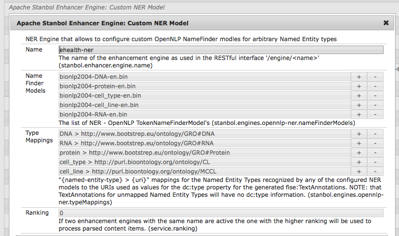

The same configuration can be also provided as OSGI configuration file with the name 'org.apache.stanbol.enhancer.engines.opennlp.impl.CustomNERModelEnhancementEngine-ehealthner.config' and the contents:

```
stanbol.enhancer.engine.name="ehealth-ner"
stanbol.engines.opennlp-ner.nameFinderModels=["bionlp2004-DNA-en.bin","bionlp2004-protein-en.bin","bionlp2004-cell_type-en.bin","bionlp2004-cell_line-en.bin","bionlp2004-RNA-en.bin"]
stanbol.engines.opennlp-ner.typeMappings=["DNA\ >\ http://www.bootstrep.eu/ontology/GRO#DNA","RNA\ >\ http://www.bootstrep.eu/ontology/GRO#RNA","protein\ >\ http://www.bootstrep.eu/ontology/GRO#Protein","cell_type\ >\ http://purl.bioontology.org/ontology/CL","cell_line\ >\ http://purl.bioontology.org/ontology/MCCL"]
```

NOTE: that the '.config' format requires spaces to be escaped with '\'

---

<a id="trunk-components-enhancer-engines-opencalaisengine"></a>

<!-- source_url: https://stanbol.apache.org/docs/trunk/components/enhancer/engines/opencalaisengine -->

<!-- page_index: 21 -->

<a id="trunk-components-enhancer-engines-opencalaisengine--the-opencalais-enhancement-engine"></a>

# The OpenCalais Enhancement Engine

The **OpenCalais Enhancement Engine** provides an interface to the [OpenCalais
Webservice](http://www.opencalais.com/) for Named Entity Recognition (NER).

<a id="trunk-components-enhancer-engines-opencalaisengine--technical-description"></a>

## Technical description

The engine will send the text of content item to the OpenCalais service and
retrieve the NER annotations in RDF format. The OpenCalais annotations are
added to the content item's metadata as specified by the Stanbol [Enhancement
Structures](#trunk-components-enhancer-enhancementstructure).

The engine natively supports the mime types *text/plain* and
*text/html*. Additionally, text can be processed that is provided in the content
item's metadata as value of the property

```
http://www.semanticdesktop.org/ontologies/2007/01/19/nie#plainTextContent
```

Supported languages are

- English (en)
- French (fr)
- Spanish (es)

<a id="trunk-components-enhancer-engines-opencalaisengine--requirements-for-use-and-configuration-options"></a>

## Requirements for use and configuration options

The use of this component requires an API key from OpenCalais. Without
providing an API key, the engine will not do anything. Such a key can be
obtained from <http://www.opencalais.com/APIkey>.

In the OSGi configuration the key is set as value of the property

```
org.apache.stanbol.enhancer.engines.opencalais.license
```

Also, the unit tests require the API key. Without the key some tests will be
skipped. For Maven the key can be set as a system property on the command line:

```
mvn -Dorg.apache.stanbol.enhancer.engines.opencalais.license=YOUR_API_KEY [install|test]
```

The following configuration properties are defined:

- org.apache.stanbol.enhancer.engines.opencalais.license: The OpenCalais license key that **must** be defined.
- org.apache.stanbol.enhancer.engines.opencalais.url: The URL of the OpenCalais RESTful service. That needs only be changed when OpenCalais should change its web service address.
- org.apache.stanbol.enhancer.engines.opencalais.typeMap: The value is the name of a file for mapping the NER types from OpenCalais to other types. By default, a mapping to the DBPedia types is provided in order to achieve compatibility with the Stanbol OpenLNLP-NER engine. If no mapping is desired one might pass an empty mapping file. Types for which no mapping is defined are passed as is to the metadata. The syntax of the mapping table is similar to that of Java property files. Each entry takes the form

  :::text
  CalaisTypeURI=TargetTypeURI
- org.apache.stanbol.enhancer.engines.opencalais.NERonly: A Boolean property to specify whether in addition to the NER enhancements also the OpenCalais Linked Data references are included as entity references. By default, these are omitted.

<a id="trunk-components-enhancer-engines-opencalaisengine--usage"></a>

## Usage

Assuming that the Stanbol endpoint with the full launcher is running at

```
http://localhost:8080
```

the license key has been defined and the engine is activated, from the
command line commands like this can be used for submitting some text file as content item:

- stateless interface

  :::bash
  curl -i -X POST -H "Content-Type:text/plain" -T testfile.txt http://localhost:8080/engines
- stateful interface

  :::bash
  curl -i -X PUT -H "Content-Type:text/plain" -T testfile.txt http://localhost:8080/contenthub/content/someFileId

Alternatively, the Stanbol web interface can be used for submitting documents
and viewing the metadata at

```
http://localhost:8080/contenthub
```

---

<a id="trunk-components-enhancer-engines-restfulnlpanalysis"></a>

<!-- source_url: https://stanbol.apache.org/docs/trunk/components/enhancer/engines/restfulnlpanalysis -->

<!-- page_index: 22 -->

#

<a id="trunk-components-enhancer-engines-restfulnlpanalysis--restful-nlp-analysisengine"></a>

# RESTful NLP AnalysisEngine

This Enhancement Engine implements an client for the [RESTful NLP Analysis Service](#trunk-components-enhancer-nlp-restfulnlpanalysisservice).

This Engine requires the language to be detected for processed [ContentItem](#trunk-components-enhancer-contentitem)s. It retrieves/creates the [AnalysedText](https://stanbol.apache.org/docs/trunk/components/enhancer/engines/analyzedtext) content part for the processed [ContentItem](#trunk-components-enhancer-contentitem) and sends the `text/plain` content to the configured service URL. Based on the response it adds all received Spans and Annotations to the [AnalysedText](https://stanbol.apache.org/docs/trunk/components/enhancer/engines/analyzedtext) instance. In addition it adds [fise:TextAnnotations](#trunk-components-enhancer-enhancementstructure--fisetextannotation) for all detected Named Entities to the metadata of the ContentItem.

<a id="trunk-components-enhancer-engines-restfulnlpanalysis--configuration-parameter"></a>

### Configuration parameter

The configuration of the Engine allows to set the

- **Name** *(stanbol.enhancer.engine.name)*: The name of the Enhancement Engine. This name is used to refer an [EnhancementEngine](#trunk-components-enhancer-engines) in [EnhancementChain](https://stanbol.apache.org/docs/trunk/components/enhancer/engines/enhancementchain.html)s
- **Service URI** *(enhancer.engine.restful.nlp.analysis.service)*: The URL of the service implementing the [RESTful Language Identification Service](#trunk-components-enhancer-nlp-restfullangidentservice) (as specified by [STANBOL-892](https://issues.apache.org/jira/browse/STANBOL-892))
- **User** *(enhancer.engine.restful.nlp.analysis.service.user)*: If required the user name for accessing the Server
- **Password** *(enhancer.engine.restful.nlp.analysis.service.pwd)*: The password for the configured user name
- **Ranking** *(service.ranking)*: This property is used of two engines do use the same *Name*. In such cases the one with the higher ranking will be used to enhance content items. Typically users will not need to change this.

---

<a id="trunk-components-enhancer-nlp-restfulnlpanalysisservice"></a>

<!-- source_url: https://stanbol.apache.org/docs/trunk/components/enhancer/nlp/restfulnlpanalysisservice -->

<!-- page_index: 23 -->

#

<a id="trunk-components-enhancer-nlp-restfulnlpanalysisservice--restful-nlp-analysis-service"></a>

## RESTful NLP Analysis Service

[STANBOL-892](https://issues.apache.org/jira/browse/STANBOL-892) added a standard RESTful NLP Analyses service based on the JSON serialization support for the [AnalysedText](#trunk-components-enhancer-nlp-analyzedtext) content part.

On the Stanbol Enhancer side the service is consumed by the [RESTful NLP processing Enigne](#trunk-components-enhancer-engines-restfulnlpanalysis) meaning that integrators of NLP frameworks need only take care of implementing the RESTful service.

This option of integrating an NLP framework with the Stanbol Enhancer should be considered in the following scenarios:

- NLP Frameworks that are not implemented in Java: As this allows integrators to implement the RESTful service in the programming language of their choice.
- Avoid OSGI: All utilities provided by Apache Stanbol do work inside and outside an OSGI environment.
- NLP Frameworks under licenses with strong copy left such as GPL and AGLP: Integrating a NLP framework as [NLP EnhancementEngine](#trunk-components-enhancer-nlp-nlpengine) means linking against the API of the NLP framework, what is an problem for users with none open source extensions to Apache Stanbol. Integrating such Frameworks as a standalone server that provide a RESTful service does not suffer this problem.
- Crashes of the NLP framework integration does not affect Stanbol: Especially for NLP frameworks that do use native libraries any exception may cause the JVM to crash.
- Distribution: Integration over RESTful services allows to distribute NLP processing task on different servers.

The first NLP processing Frameworks integrated by this method where [Freeling](https://github.com/insideout10/stanbol-freeling) and [Talismane](https://github.com/westei/stanbol-talismane). For integrators it is strongly recommended to have a look at those two implementations.

The following sub sections provide more information on how to implement a Stanbol compatible RESTful NLP Analyses service

<a id="trunk-components-enhancer-nlp-restfulnlpanalysisservice--restful-interface"></a>

### RESTful Interface

The RESTful Interface (as specified by [STANBOL-892](https://issues.apache.org/jira/browse/STANBOL-892)) defines two services:

1. **Supported Languages**: The languages supported by the NLP Analyses server need to be returned as an JSON array on GET requests to the Analysis Endpoint. A request to `curl -X GET -H "Accept: application/json" http://{analysis-endpoint}` will return the supported languages like `["it","en"]`
2. **NLP Analysis**: The NLP Analyses of a Text is done by sending a POST request to the Analysis Endpoint. The language of the parsed text can be specified by using the 'Content-Language' header. If not present the service might try to detect the language or return a 'HTTP Error 400 Bad request' if not possible/supported. The response is a JSON serialized *AnalysedText* content part (see below for more information). The response needs also to include the `Content-Language` header with the language of the processed text as value.

For both services the `Accept` header is optional. However if present it must be set to `application/json`. Implementations might also support HTML compatible media types to provide the documentation if a Browser send an request to the Analysis Endpoint.

<a id="trunk-components-enhancer-nlp-restfulnlpanalysisservice--integration-of-nlp-frameworks-with-the-stanbol-nlp-processing-module"></a>

### Integration of NLP frameworks with the Stanbol NLP processing Module

When implementing the Stanbol RESTful NLP Analyses service will need to convert the results of the integrated NLP framework to the Stanbol NLP processing framework. This is requires to

- create an [AnalysedText](#trunk-components-enhancer-nlp-analyzedtext) instance
- add detected Sentences, Chunks and Tokens to the AnalysedText
- add NLP Annotations such as adding PosTags to Tokens or NerTags and PhraseTags to Chunks.

The documentation of the [AnalysedText](#trunk-components-enhancer-nlp-analyzedtext) provides a good overview and several examples on how to use the API.

An special feature of the Stanbol NLP processing module is that it supports the alignment of TagSets (typically simple String codes) with Ontological concepts as defined by the [OLIA](http://olia.nlp2rdf.org/) ontology. This alignment is important as it allows other EnhancementEngines to process NLP annotations without the need to know language specific Tag sets.

To avoid the need for users to directly use the [OLIA](http://olia.nlp2rdf.org/) ontology the Stanbol NLP processing module defines Java Enumerations [LexicalCategory](http://svn.apache.org/repos/asf/stanbol/trunk/enhancer/generic/nlp/src/main/java/org/apache/stanbol/enhancer/nlp/pos/LexicalCategory.java), [POS](http://svn.apache.org/repos/asf/stanbol/trunk/enhancer/generic/nlp/src/main/java/org/apache/stanbol/enhancer/nlp/pos/Pos.java), [Case](http://svn.apache.org/repos/asf/stanbol/trunk/enhancer/generic/nlp/src/main/java/org/apache/stanbol/enhancer/nlp/morpho/Case.java), [Definitness](http://svn.apache.org/repos/asf/stanbol/trunk/enhancer/generic/nlp/src/main/java/org/apache/stanbol/enhancer/nlp/morpho/Definitness.java), [Gender](http://svn.apache.org/repos/asf/stanbol/trunk/enhancer/generic/nlp/src/main/java/org/apache/stanbol/enhancer/nlp/morpho/Gender.java), [NumberFeature](http://svn.apache.org/repos/asf/stanbol/trunk/enhancer/generic/nlp/src/main/java/org/apache/stanbol/enhancer/nlp/morpho/NumberFeature.java), [Person](http://svn.apache.org/repos/asf/stanbol/trunk/enhancer/generic/nlp/src/main/java/org/apache/stanbol/enhancer/nlp/morpho/Person.java), [Tense](http://svn.apache.org/repos/asf/stanbol/trunk/enhancer/generic/nlp/src/main/java/org/apache/stanbol/enhancer/nlp/morpho/Tense.java), [VerbNood](http://svn.apache.org/repos/asf/stanbol/trunk/enhancer/generic/nlp/src/main/java/org/apache/stanbol/enhancer/nlp/morpho/VerbMood.java)) for the concepts defined by the Ontology. Server side implementations that do use Java should use those enumerations. Implementations in other programming languages can use the names of the enumerations entries (e.g. `PossessiveAdjective` as defined in the Pos enumeration).

Typically the mappings between TagSets of NLP frameworks with the Tags used by Stanbol are defines in TagSets. The following example shows such mappings for the Penn Treebank POS tag set for English

```
/** Penn Treebank Stanbol NLP module mappings */ public static final TagSet <PosTag> PENN_TREEBANK =new TagSet <PosTag >("Penn Treebank","en" ); static {PENN_TREEBANK.addTag (new PosTag ("CC",Pos.CoordinatingConjunction )); PENN_TREEBANK.addTag (new PosTag ("CD",Pos.CardinalNumber )); //[..] PENN_TREEBANK.addTag (new PosTag ("NN",Pos.CommonNoun,Pos.SingularQuantifier )); PENN_TREEBANK.addTag (new PosTag ("NNP",Pos.ProperNoun,Pos.SingularQuantifier )); PENN_TREEBANK.addTag (new PosTag ("NNPS",Pos.ProperNoun,Pos.PluralQuantifier )); PENN_TREEBANK.addTag (new PosTag ("NNS",Pos.CommonNoun,Pos.PluralQuantifier )); //[..]}
```

<a id="trunk-components-enhancer-nlp-restfulnlpanalysisservice--json-serialization-of-the-analysedtext"></a>

### JSON serialization of the AnalysedText

For Java users it is strongly recommended to use the `AnalyzedTextSerializer` provided by the `org.apache.stanbol:org.apache.stanbol.enhancer.nlp.json` module. Users that use a JAX-RS framework can also use the `AnalyzedTextWriter` that implements the `MessageBodyWriter` interface for `AnalysedText`.

Non Java users will need to generate the JSON themselves based on the following documentation:

1. **Root Element**: The JSON representation of the AnalysedText uses a JSON object as root object. This root object has the `spans` attribute with an array as value. The array contains all JSON serialized Spans as values. The first entry in the array MUST BE the AnalysedText - a span with the `"type"="Text"` - itself.
2. **Span**: Each Span is serialized as an JSON object with the following attributes
   - *type*: one of `Text`, `Sentence`, `Chunk` or `Token`
   - *start*: the absolute start index of the span
   - *end*: the absolute end index of the span
   - {annotation-key}: keys used by annotations of the span. Values can be both an array or a single value
3. **Annotations**: Annotations are encoded as JSON Objects. They are added as values to the {annotation-key} directly to the *Span*. The encoding of {annotation-value}(s) is specific to the value. However the following keys are reserved:
   - *class* (required): the Java class for the annotation Value (e.g `org.apache.stanbol.enhancer.nlp.pos.PosTag` or `java.lang.Double` in case the value is a simple Double). This information is required by the deserializer to select the correct parser.
   - *prob* (optional): the probability for the annotation. Expected to be a floating point number in the range [0..1]
4. **PosTag**: This annotation uses the annotation-key `stanbol.enhancer.nlp.pos` and defines the following attributes
   - *class*: `org.apache.stanbol.enhancer.nlp.pos.PosTag`
   - *tag* (required): The String tag as used by the TagSet
   - *lc* (optional): The name(s) of the [LexicalCategories](http://svn.apache.org/repos/asf/stanbol/trunk/enhancer/generic/nlp/src/main/java/org/apache/stanbol/enhancer/nlp/pos/LexicalCategory.java) (e.g. `Noun`, `Verb` …). In case of a single value the use of a JSON Array is optional. NOTE that instead of the names it is also possible to use ordinal numbers.
   - *pos* (optional): The name(s) of the [POS](http://svn.apache.org/repos/asf/stanbol/trunk/enhancer/generic/nlp/src/main/java/org/apache/stanbol/enhancer/nlp/pos/Pos.java) tags (e.g. `ProperNoun`, `FiniteVerb` …). In case of a single value the use of a JSON Array is optional. NOTE that instead of the names it is also possible to use ordinal numbers.
5. **PhraseTag**: This annotation uses the annotation-key `stanbol.enhancer.nlp.phrase` and defines the following attributes
   - *class*: `org.apache.stanbol.enhancer.nlp.phrase.PhraseTag`
   - *tag* (required): The String tag as used by the TagSet
   - *lc* (optional): The name(s) of the [LexicalCategories](http://svn.apache.org/repos/asf/stanbol/trunk/enhancer/generic/nlp/src/main/java/org/apache/stanbol/enhancer/nlp/pos/LexicalCategory.java) (e.g. `Noun`, `Verb` …). In case of a single value the use of a JSON Array is optional. NOTE that instead of the names it is also possible to use ordinal numbers.
6. **NerTag**: This annotation uses the annotation-key `stanbol.enhancer.nlp.ner` and defines the following attributes
   - *class*: `org.apache.stanbol.enhancer.nlp.ner.NerTag`
   - *tag* (required): The String tag as used by the TagSet
   - *uri* (optional): the URI of the entity. Stanbol prefers the URIs http://dbpedia.org/ontology/Person http://dbpedia.org/ontology/Organisation and http://dbpedia.org/ontology/Place for Persons, Organizations and Places.
7. **MorphoFeatures**: This annotation uses the annotation-key `stanbol.enhancer.nlp.morpho` and defines the following attributes
   - *class*: `org.apache.stanbol.enhancer.nlp.morpho.MorphoFeatures`
   - *lemma*: The lemma for the annotated span. MUST BE a single value.
   - *pos* (optional): An array of \_PosTag\_s. Encoded as specified above. Integrators are free to add all possible morphological interpretations for a Span or just those that correspond with the detected POS tag of a word.
   - *case* (optional) : Array with CaseTag elements defining the following attributes
     - *tag* (required): The string tag as used by the NLP framework
     - *type* (optional): the [Case](http://svn.apache.org/repos/asf/stanbol/trunk/enhancer/generic/nlp/src/main/java/org/apache/stanbol/enhancer/nlp/morpho/Case.java) name
   - *definitness* (optional): The [Definitness](http://svn.apache.org/repos/asf/stanbol/trunk/enhancer/generic/nlp/src/main/java/org/apache/stanbol/enhancer/nlp/morpho/Definitness.java) value
   - *gender* (optional): Array with GenderTag elements defining the following attributes
     - *tag* (required): The string tag as used by the NLP framework
     - *type* (optional): the [Gender](http://svn.apache.org/repos/asf/stanbol/trunk/enhancer/generic/nlp/src/main/java/org/apache/stanbol/enhancer/nlp/morpho/Gender.java) name
   - *number* (optional): Array with the NumberTag elements defining the following attributes
     - *tag* (required): The string tag as used by the NLP framework
     - *type* (optional): the [NumberFeature](http://svn.apache.org/repos/asf/stanbol/trunk/enhancer/generic/nlp/src/main/java/org/apache/stanbol/enhancer/nlp/morpho/NumberFeature.java) name
   - *person*: The [Person](http://svn.apache.org/repos/asf/stanbol/trunk/enhancer/generic/nlp/src/main/java/org/apache/stanbol/enhancer/nlp/morpho/Person.java) name
   - *tense* (optional): Array with the TenseTag elements defining the following attributes
     - *tag* (required): The string tag as used by the NLP framework
     - *type* (optional): the [Tense](http://svn.apache.org/repos/asf/stanbol/trunk/enhancer/generic/nlp/src/main/java/org/apache/stanbol/enhancer/nlp/morpho/Tense.java) name
   - *verb-mood* (optional): Array with the MoodTag elements defining the following attributes
     - *tag* (required): The string tag as used by the NLP framework
     - *type* (optional): the [VerbMood](http://svn.apache.org/repos/asf/stanbol/trunk/enhancer/generic/nlp/src/main/java/org/apache/stanbol/enhancer/nlp/morpho/VerbMood.java) name
8. **Default Value Mappings** : For Annotations without an specific serializer/parser Stanbol uses [Jackson Data Binding](http://wiki.fasterxml.com/JacksonDataBinding). In those cases the annotation-key is still the string used by the annotation of the Span
   - *class*: The class of the value. Typically a java.lang.String, any java.lang.Number, collection
   - *value* (required): Holding the JSON serialized value.

The following Example shows the serialized JSON as serialized/parsed by the unit test. It contains at least a single example for all Elements described above.

```
{"spans":[{"type":"Text","start":0,"end":90 },{"type":"Sentence","start":0,"end":90 },{"type":"Token","start":0,"end":3,"stanbol.enhancer.nlp.pos":{"tag":"PREP","pos":12,"class":"org.apache.stanbol.enhancer.nlp.pos.PosTag","prob":0.85} },{"type":"Chunk","start":4,"end":20,"stanbol.enhancer.nlp.ner":{"tag":"organization","uri":"http://dbpedia.org/ontology/Organisation","class":"org.apache.stanbol.enhancer.nlp.ner.NerTag" },"stanbol.enhancer.nlp.phrase":{"tag":"NP","lc":0,"class":"org.apache.stanbol.enhancer.nlp.phrase.PhraseTag","prob":0.98} },{"type":"Token","start":4,"end":11,"stanbol.enhancer.nlp.pos":{"tag":"PN","pos":53,"class":"org.apache.stanbol.enhancer.nlp.pos.PosTag","prob":0.95 },"stanbol.enhancer.nlp.sentiment":{"value":0.5,"class":"java.lang.Double"} },{"type":"Token","start":12,"end":20,"stanbol.enhancer.nlp.pos":[{"tag":"PN","pos":53,"class":"org.apache.stanbol.enhancer.nlp.pos.PosTag","prob":0.95 },{"tag":"N","lc":0,"class":"org.apache.stanbol.enhancer.nlp.pos.PosTag","prob":0.87} ],"stanbol.enhancer.nlp.morpho":{"lemma":"enhance","case":[{"tag":"test-case-1","type":"Comitative" },{"tag":"test-case-2","type":"Abessive"} ],"definitness":"Definite","gender":[{"tag":"test-gender","type":"Masculine"} ],"number":[{"tag":"test-number","type":"Plural"} ],"person":"First","pos":[{"tag":"PN","pos":53} ],"tense":[{"tag":"test-tense","type":"Present"} ],"verb-mood":[{"tag":"test-verb-mood","type":"ConditionalVerb"} ],"class":"org.apache.stanbol.enhancer.nlp.morpho.MorphoFeatures"}}]}
```

Copyright © 2010 The Apache Software Foundation, Licensed under
the [Apache License, Version 2.0](http://www.apache.org/licenses/LICENSE-2.0).
Apache, Stanbol and the Apache feather and Stanbol logos are trademarks of The Apache Software Foundation.

---

<a id="trunk-components-enhancer-engines-kuromojinlp"></a>

<!-- source_url: https://stanbol.apache.org/docs/trunk/components/enhancer/engines/kuromojinlp -->

<!-- page_index: 24 -->

<a id="trunk-components-enhancer-engines-kuromojinlp--kuromoji-nlp-engine-for-japanese"></a>

# Kuromoji NLP Engine for Japanese

[Kuromoji](http://www.atilika.org/) is a NLP Framework contributed to [Apache Lucene](http://lucene.apache.org). It is available starting with version 3.6.2 and 4.1 of Solr/Lucene. In Stanbol it requires the use of a version newer than [revision 1458703](http://svn.apache.org/r1458703) as it only works for the stanbol.commons.solr modules compatible to Solr 4.1.

<a id="trunk-components-enhancer-engines-kuromojinlp--consumed-information"></a>

## Consumed information

- **Language** (required): The language of the text needs to be available. It is read as specified by [STANBOL-613](https://issues.apache.org/jira/browse/STANBOL-613) from the metadata of the ContentItem. Effectively this means that any Stanbol Language Detection engine will need to be executed before the OpenNLP POS Tagging Engine.

<a id="trunk-components-enhancer-engines-kuromojinlp--supported-modules"></a>

## Supported modules

- **Sentences** : Kuromoji itself does not provide sentence detection. Because of that the detection of sentences is done by using POS tagging results. The POS tag '記号-句点' is used for splitting Sentences. Further it is assumed that each Text starts and ends with a complete sentence.
- **Tokens**: Kuromoji is configured to provide tokens for all words and punctuation. This is done by configuring an empty stop tag list as well as setting the 'discardPunctuation' property to `false`
- **POS tagging**: The POS tag set used by Kuromoji was mapped to the LexicalCategories and POS types as defined by the Stanbol NLP processing module. For the String tags the Japanese name is used (e.g. '名詞-代名詞-縮約' := Pos.Pronoun,Pos.Participle, description: noun-pronoun-contraction: Spoken language contraction made by combining a pronoun and the particle 'wa'. e.g. ありゃ, こりゃ, こりゃあ, そりゃ, そりゃあ )
  POS tags are represented by adding *NlpAnnotations#POS\_ANNOTATION*'s to the *Tokens* of the *AnalyzedText* content part. Kuromoji provides only a single POS tag per Token.
- **NER detection**; The POS tag set used by Kuromoji defines POS tags describing named entities. Those POS tags are than combined to chunks and interpreted as named entities (e.g. '名詞-固有名詞-人名-姓' noun-proper-person-surname; '名詞-固有名詞-人名-名' noun-proper-person-given\_name)
  Named Entities are represented by adding *NlpAnnotations#NER\_ANNOTATION*'s to the *Tokens* of the *AnalyzedText* content part. In addition also 'fise:TextAnnotations' are added to the metadata of the ContentItem.

<a id="trunk-components-enhancer-engines-kuromojinlp--confidence"></a>

### Confidence

Kuromoji does not provide confidence values for results.

<a id="trunk-components-enhancer-engines-kuromojinlp--configuration"></a>

## Configuration

The engine does not provide any custom configuration. However it supports the configuration of the engine name.

---

<a id="trunk-components-enhancer-engines-namedentitytaggingengine"></a>

<!-- source_url: https://stanbol.apache.org/docs/trunk/components/enhancer/engines/namedentitytaggingengine -->

<!-- page_index: 25 -->

<a id="trunk-components-enhancer-engines-namedentitytaggingengine--the-named-entity-tagging-engine:-linking-text-annotations-to-external-datasets-of-entities"></a>

# The Named Entity Tagging Engine: linking text annotations to (external) datasets of entities

The Entity Linking Engine uses *[Referenced Sites](#trunk-components-entityhub)* to search for Entities based on given Text Annotations.

<a id="trunk-components-enhancer-engines-namedentitytaggingengine--configuration"></a>

## Configuration

The configuration decides, which dataset you want to use as linking target. The default value is "local" referencing to the default DBpedia index. You may also decide on whether given types should restrict the set of possible links. E.g. for DBpedia, some organisations are not tagged as such, therefore, you want get them with this engine although, you expect them from your dataset.

- Referenced Site: {local, your referenced site}: The ID of the Entityhub Referenced Site used for semantic lifting of TextAnnotations.
- Persons: {true, false}: Set to TRUE to enable semantic lifting of Persons
- Person Type {, dbp-ont:Person}: The rdf:type used to search for Persons. If empty Entities of any type are accepted.
- Organisations {true, false}: Set to TRUE to enable semantic lifting of Organisations
- Organisation Type {, dbp-ont:Organisation}: The rdf:type used to search for Organizations. If empty Entities of any type are accepted.
- Places {true, false}: Set to TRUE to enable semantic lifting of Places
- Place Type {, dbp-ont:Place}: The rdf:type used to search for Places. If empty Entities of any type are accepted.\*
- Label Field {, rdfs:label}: The field used to search for Entities with a label similar to the selected text of the Text Annotation. If empty rdfs:label is used as default\*

<a id="trunk-components-enhancer-engines-namedentitytaggingengine--example-result"></a>

## Example Result

For the sentence "The Stanbol enhancer can detect famous cities such as Paris and people such as Bob Marley.", you will get several EntityAnnotations for the terms "Paris" and "Bob Marley" from your linking target resource (in this case DBpedia) together with a confidence value, which can be used to sort the suggestions, e.g.:

```
{"@subject": "urn:enhancement-b98283ae-845d-6666-d68b-f649852a7959","@type": ["enhancer:Enhancement","enhancer:EntityAnnotation"],"dc:created": "2012-02-29T11:34:56.383Z","dc:creator": "org.apache.stanbol.enhancer.engines.entitytagging.impl.NamedEntityTaggingEngine","dc:relation": "urn:enhancement-b3d4617d-1760-0374-f471-e0e746003f4e","enhancer:confidence": 16641.191,"enhancer:entity-label":{"@literal": "Bob Marley","@language": "en" },"enhancer:entity-reference": "http://dbpedia.org/resource/Bob_Marley","enhancer:entity-type":["dbp-ont:MusicalArtist", "foaf:Person", "dbp-ont:Artist","dbp-ont:Person", "owl:Thing"],"enhancer:extracted-from": "urn:content-item-sha1-37c8a8244041cf6113d4ee04b3a04d0a014f6e10" },
```

or

```
{"@subject": "urn:enhancement-785a4c4f-dc7d-aa46-91a2-aef840542ae2","@type": ["enhancer:Enhancement","enhancer:EntityAnnotation"],"dc:created": "2012-02-29T11:34:56.383Z","dc:creator": "org.apache.stanbol.enhancer.engines.entitytagging.impl.NamedEntityTaggingEngine","dc:relation": "urn:enhancement-c176f1bf-a1dd-830e-df7d-deecdfdc8375","enhancer:confidence": 1323049.5,"enhancer:entity-label":{"@literal": "Paris","@language": "en" },"enhancer:entity-reference": "http://dbpedia.org/resource/Paris","enhancer:entity-type":["dbp-ont:PopulatedPlace","dbp-ont:Settlement","http://www.opengis.net/gml/_Feature","dbp-ont:Place","owl:Thing"],"enhancer:extracted-from": "urn:content-item-sha1-37c8a8244041cf6113d4ee04b3a04d0a014f6e10"}
```

---

<a id="trunk-components-enhancer-engines-entityhublinking"></a>

<!-- source_url: https://stanbol.apache.org/docs/trunk/components/enhancer/engines/entityhublinking -->

<!-- page_index: 26 -->

<a id="trunk-components-enhancer-engines-entityhublinking--the-entityhub-linking-engine:-linking-nlp-processed-text-with-vocabularies-managed-by-the-stanbol-entityhub"></a>

# The Entityhub Linking Engine: Linking NLP processed Text with Vocabularies managed by the Stanbol Entityhub

The EntityhubLinkingEngine is the successor of the [KeywordLinkingEngine](#trunk-components-enhancer-engines-keywordlinkingengine). It is based on the [EntityLinkingEngine](#trunk-components-enhancer-engines-entitylinking) configured with an [EntitySearcher](#trunk-components-enhancer-engines-entitylinking--entitysearcher) that can link Entities managed by either the Entityhub, ReferencedSites as well as ManagedSites. The EntityhubLinkingEngine does not implement the [EnhancementEngine](#trunk-components-enhancer-engines) interface itself. It only configures an instance of the [EntityLinkingEngine](#trunk-components-enhancer-engines-entitylinking).

For a detailed documentation of the linking process please see the documentation of the [EntityLinkingEngine](#trunk-components-enhancer-engines-entitylinking). This document only focuses on the configuration and the usage of this Engine.

<a id="trunk-components-enhancer-engines-entityhublinking--configuration"></a>

## Configuration

The configuration of the EntityhubLinkingEngine supports the following options. First it allows to configure the two properties common to all enhancement engines

- **Name** *(stanbol.enhancer.engine.name)*: The name of the Enhancement Engine. This name is used to refer an [EnhancementEngine](#trunk-components-enhancer-engines) in [EnhancementChain](#trunk-components-enhancer-chains)s
- **ServiceRankging** *(service.ranking)*: In case multiple enhancement engines do use the same name, than only the one with the higher ranking will get uses.

Next it allows to configure the used Entityhub Site

- **Referenced Site** *(enhancer.engines.linking.entityhub.siteId)*: The name of the ReferencedSite of the Stanbol Entityhub that holds the controlled vocabulary to be used for extracting Entities. "entityhub" or "local" can be used to extract Entities managed directly by the Entityhub.

Finally it supports all configuration options supported by the [EntityLinkingEngine](#trunk-components-enhancer-engines-entitylinking).

- [Text Processing Configuration](#trunk-components-enhancer-engines-entitylinking--text-processing-configuration): This defines what languages are enabled and is also used to configure how NLP processing results are used by the Engine
- [Entity Linking Configuration](#trunk-components-enhancer-engines-entitylinking--entity-linker-configuration): This defines how entity are searched in the vocabulary and search results are matched with the text. It also allows to configure 'dc:type's for created 'fise:TextAnnotation's and if entity information are included in the enhancement results or not.

The following screenshot shows the configuration dialog of the EntityhubLinkingEngine as shown when using the Apache Felix Webconsole for its configuration. However users need to know that this dialog only provides a limited set of configuration options. Other supported configuration options can only be configured by directly using OSGI "\*.config" files.

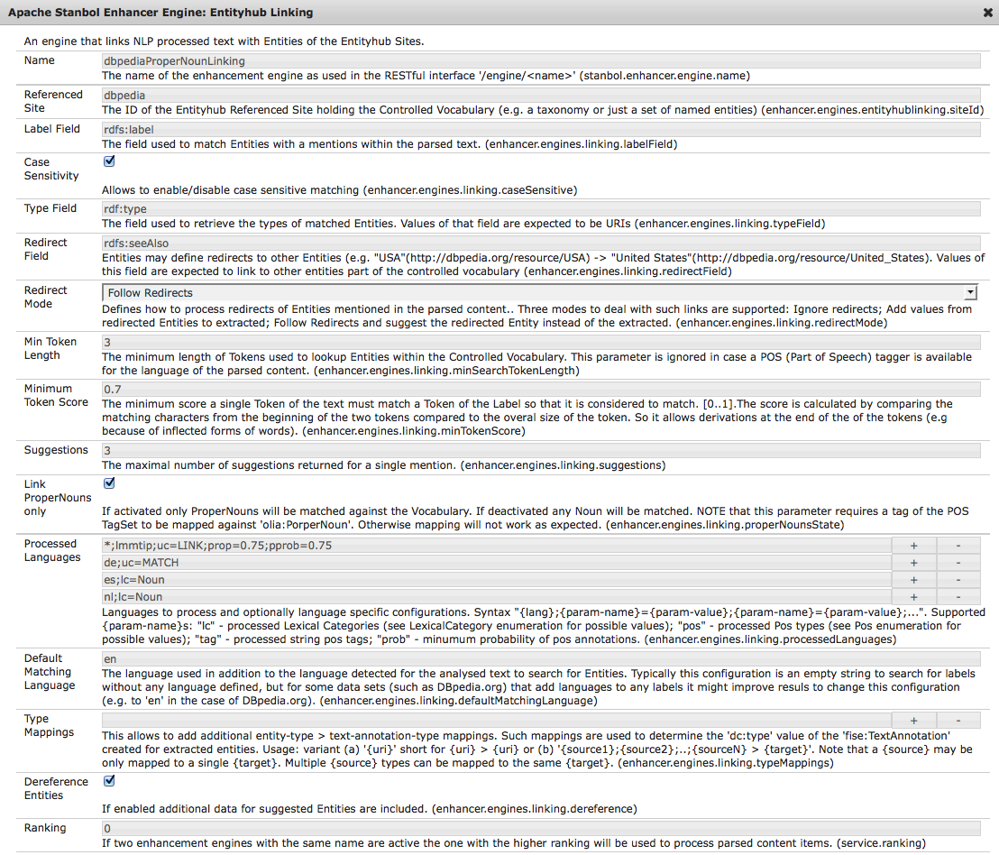

---

<a id="trunk-components-enhancer-engines-entitylinking"></a>

<!-- source_url: https://stanbol.apache.org/docs/trunk/components/enhancer/engines/entitylinking -->

<!-- page_index: 27 -->

<a id="trunk-components-enhancer-engines-entitylinking--entitylinkingengine"></a>

# EntityLinkingEngine

The EntityLinkingEngine is an Engine that consumes results from NLP processing from the [AnalyzedText](#trunk-components-enhancer-nlp-analyzedtext) content part and uses those information to link (search and match) entities from an configured vocabulary.

For doing so it uses the following configurations and components:

- **Text Processing Configuration**: This configures how the EntityLinkingEngine consumes NLP processing results. Such configurations can be language specific.
- **Entity Linking Configuration**: This configures various properties that are used for the linking process with the vocabulary
- **EntitySearcher**: This interface is used to search and dereference Entities. It needs to be implemented to use a datasource for linking with the EntityLinkingEngine. Stanbol provides implementations for the Stanbol Entityhub (see [EntityhubLinkingEngine](#trunk-components-enhancer-engines-entityhublinking))
- **LabelTokenizer**: While processed text is already tokenized the Entity labels are note. For the matching of Labels with the text the EntityLinkingEngine needs therefore to tokenizer those labels. Apache Stanbol provides an default implementation of this interface based on the [OpenNLP](http://opennlp.apache.org) tokenizer API.

The EntityLinkingEngine can not directly be used as the four things listed above need to be parsed in its constructor. It is instead intended to be configured/extended by other components. The [EntityhubLinkingEngine](#trunk-components-enhancer-engines-entityhublinking) is one of them configuring the EntityLinkingEngine with EntitySearcher for the Stanbol Entityhub.

This documentation first describes the implemented entity linking process than provides information about the supported configuration parameters of the *Text Processing Configuration* and the *Entity Linking Configuration*. The last part described how to extend the EntityLinking engine by implementing/providing custom *EntitySearcher* and *LabelTokenizer*.

<a id="trunk-components-enhancer-engines-entitylinking--linking-process"></a>
<a id="trunk-components-enhancer-engines-entitylinking--linking-process:"></a>

## Linking Process:

The Linking Process consists of three major steps: First it consumes results of the NLP processing to determine tokens - words - that need to be linked with the configured vocabulary. Second the linking of entities based on their labels with the current section of the Text and third the writing of the enhancement results.

<a id="trunk-components-enhancer-engines-entitylinking--token-types"></a>

### Token Types

The EntityLinkingEngine operates based on tokens (words). Those tokens are divided in the following Categories

- **Linkable Tokens**: This are words that are linked with the Vocabulary. This means that the engine will issue quires in the controlled vocabulary for those tokens
- **Matchable Tokens**: Matchable tokens are used to refine quires. For the matching of entity labels with the text those words are treated in the same way as linkable words. So the main difference is that matchable words alone will not cause the engine to query for Entities in the Controlled Vocabulary.
- **Other Tokens**: All other tokens in the text are not used for searches in the configured vocabulary. However during the matching of labels with the Text they are considered as they might also be present in labels of entities

"University of Salzburg" is a good example as 'University' - a common noun - can be considered a matchable token, 'of' an other- and 'Salzburg' as proper noun is a typical linkable token. As the engine only queries for linkable token a single query for 'Salzburg' would be issued against the vocabulary. However this query would also use the matchable token 'University' as a secondary query term. The token 'of' would only be considered during matching.

In addition to the token type the engine also determines the rolling parameters

- **Token Length**: The number of characters of a word. This is especially important for languages where no POS tagger is available.
- **Alpha-Numeric**: If a Token does contain an alpha or an numeric character. This is mainly used to skip processing of tokens that represent punctuation.
- **Upper Case**: Upper Case Tokens do often represent named entities. because of that the Engine keeps track of upper case words.
- **Token Phrase**: If a Token is member of a *processable* Phrase. Phrases are groups of Tokens that can be detected by a Chunker. A typical examples are Noun Phrases.

<a id="trunk-components-enhancer-engines-entitylinking--consumed-nlp-processing-results"></a>
<a id="trunk-components-enhancer-engines-entitylinking--consumed-nlp-processing-results:"></a>

### Consumed NLP Processing Results:

The EntityLinkingEngine consumes NLP processing results from the AnalyzedText ContentPart of the processed ContentItem. The following list describes the consumed information and their usage in the linking process:

1. \_\_Language\_ *(required)*: The Language of the Text is acquired from the Metadata of the ContentItem. It is required to search for labels in the correct language and also to correctly apply language specific configurations of the engine.
2. **Sentences** *(optional)*: Sentence annotations are used as segments for the matching process. In addition for the first word of an Sentence the *Upper Case* feature is NOT set. In the case that no Sentence Annotations are present the whole text is treated as a single Sentence.
3. **Tokens** *(required)*: As this Engine is based on the processing of Tokens such information are absolutely required.
4. **POS Annotations** *(optional)*: Part of Speech (POS) tags are used to determine the *Token Type*. The NLP processing module provides two enumerations that define POS types. The high level *Lexical Categories* (16 members including "Noun", "Verb", "Adjective", "Adposition" ...) and the Pos enumeration with ~150 very detailed POS definitions (such as (e.g. "ProperNoun", "CommonNoun", "Infinitive", "Gerund", "PresentParticiple" …). In addition the engine can also be configured to use the string tag as used by the POS tagger. The mapping of the *POS Annotation* to the *Token Type* is provided by the Engine configuration and can be language specific.
5. **Phrase Annotation** *(optional)*: Phrase Annotations of Chunks present in the AnalyzedText are checked against the configured processable phrase categories. The linking of Tokens is NOT limited to Tokens within processable phrases. Phrases are only used as additional context to improve the matching process. The *Lexical Category* and the string tags used by the Chunker can be used to configure the processable Phrase categories.
6. **Lemma** *(optional)*: The Lemma provided by the MorphoAnalysis annotation can be used for linking instead of the token as used within the text.

<a id="trunk-components-enhancer-engines-entitylinking--entity-linking"></a>
<a id="trunk-components-enhancer-engines-entitylinking--entity-linking:"></a>

### Entity Linking:

The linking process is based the matching of labels of entities returned as result for searches for entities in the configured controlled vocabulary. In addition the engine can be configured to consider redirects for entities returned by searches.

Searches are issued only for *Linkable Tokens* and may include up to *Max Search Tokens* additional *Linkable-* or *Matchable Tokens*. If the *Linkable Token* is within an *Phrase* than only other tokens within the same phrase are considered. Otherwise any *Linkable-* or *Matchable Tokens* within the configured *Max Search Token Distance* is considered for the search.

Searches to the controlled vocabulary are issued using the *EntitySearcher* interface and build like follows:

```
{lt }@{lang} || {lt }@{dl} || [{at }@{lang} || {at }@{dl} ...]
```

where:

- {lt} ... the *Linkable Token* for that the search is issued
- {at} ... additional *Linkable-* or *Matchable Tokens* included in the search
- {lang} ... the language of the text
- {dl} ... the configured *Default Matching Language*. If '{df} == {lang}' than the or term(s) for the {dl} are omitted

For results of those queries the labels in the {lang} and {dl} are matched against the text. However {dl} labels are only considered if no match was found for labels in the language of the text. For matching labels with the Tokens of the text the engine need to tokenize the labels. This is done by using the *LabelTokenizer* interface.

The matching process distinguishes between matchable and non-matchable Tokens as well as non-alpha-numeric Tokens that are completely ignored. Matching starts at the position of the *Linkable Token* for that the search in the configured vocabulary was issued. From this position Tokens in the Label are matched with Tokens in the text until the first matchable or 2nd non-matchable token is not found. In a second round the same is done in the backward direction. The configured *Min Token Match Factor* determines how exact tokens in the text must correspond to tokens in the label so that a match is considered. This is repeated for all labels of an Entity. The label match that covers the most tokens is than considered as the match for that Entity.

There are various parameters that can be used to fine tune the matching process. But the most important decision is if one want to include suggestions where labels with two tokens do only match a single *Matchable Token* in the Text (e.g. "Barack Obama" matching "Obama" but also 1000+ "Tom {something}" matching "Tom"). The default configuration of the Engine excludes those but depending on the use case and the linked vocabulary users might want to change this. See the documentation of the *Min Matched Tokens* and *Min Labe Score* for details and examples.

<a id="trunk-components-enhancer-engines-entitylinking--writing-enhancement-results"></a>

### Writing Enhancement Results

This step covers the following steps:

- processing of redirects as configured by the *Redirect Mode*
- mapping of the Entity types to the dc:type values for fise:TextAnnotations as configured by the *Type Mappings* configuration
- if *Dereference Entities* is enabled than information for all configured *Dereferenced Fields* need to be obtained
- writing of the fise:TextAnnotations, fise:EntityAnnotations and dereferenced entities (if enabled) to the metadata of the processed ContentItem

<a id="trunk-components-enhancer-engines-entitylinking--configurations"></a>

## Configurations

The configuration of the EntityLinkingEngine done by parsing a *TextProcessingConfig* and an *EntityLinkingConfig* in it constructor. Both configuration classes provide an API base configuration (via getter and setter) as well as an OSGI Dictionary based configuration (via a static method that configures a new instance by an parsed configuration).

The following two sections describe the "key, value" based configuration as the API based version is anyway described by the JavaDoc.

<a id="trunk-components-enhancer-engines-entitylinking--text-processing-configuration"></a>

### Text Processing Configuration

<a id="trunk-components-enhancer-engines-entitylinking--proper-noun-linking-wzxhzdk15enhancerengineslinkingpropernounsstatewzxhzdk16"></a>
<a id="trunk-components-enhancer-engines-entitylinking--proper-noun-linking-enhancer.engines.linking.propernounsstate"></a>

#### Proper Noun Linking *(enhancer.engines.linking.properNounsState)*

This is a high level configuration option allowing users to easily specify if they want to do EntityLinking based on any Nouns ("Noun Linking") or only ProperNouns ("Proper Noun Linking").
Configuration wise this will pre-set the defaults for the linkable *LexcicalCategories* and *Pos* types.

"Noun linking" is equivalent to the behavior of the [KeywordLinkingEngine](#trunk-components-enhancer-engines-keywordlinkingengine) while "Proper Noun Linking" is similar to using NER (Named Entity Recognition) with the [NamedEntityLinking](https://stanbol.apache.org/docs/trunk/components/enhancer/engines/namedentityextractionengine) engine.

When activating "Proper Noun Linking" users need to ensure that:

1. the POS tagging for given languages do support *Pos#ProperNoun*. If this is not the case for some languages than language specific configurations need to be used to manually adjust configurations for such languages. The next section provides examples for that.
2. the Entities in the Vocabulary linked against need typically be mentioned as Proper Nouns in the Text. Users that need to link Vocabularies with Entities that use common nouns as their labels (e.g. House, Mountain, Summer, ...) can typically not use "Proper Noun Linking" with the following exceptions:
   - Entities with labels comprised of multiple common nouns (e.g. White House) can be detected in cases where *Chunks* are supported and the *Link Multiple Matchable Tokens in Phrases* option is enabled (see the next sub-section for details).
   - In case Entities mentioned in the text are written as upper case tokens that the *Upper Case Token Mode* can be set to "LINK" (see the next sub-section for details)

If suitable it is strongly recommended to activate "Proper Noun Linking" as it highly increases the performance because in typical text only around 1/10 of the Nouns are marked as Proper Nouns and therefore the amount of vocabulary lookups also decreases by this amount.

<a id="trunk-components-enhancer-engines-entitylinking--language-processing-configuration-wzxhzdk17enhancerengineslinkingprocessedlanguageswzxhzdk18"></a>
<a id="trunk-components-enhancer-engines-entitylinking--language-processing-configuration-enhancer.engines.linking.processedlanguages"></a>

#### Language Processing configuration *(enhancer.engines.linking.processedLanguages)*

This parameter is used for two things: (1) to specify what languages are processed and (2) to provide specific configurations on how languages are processed. For the 2nd aspect there is also a default configuration that can be extended with language specific setting.

**1. Processed Languages Configuration:**

For the configuration of the processed languages the following syntax is used:

```
de
en
```

This would configure the Engine to only process German and English texts. It is also possible to explicitly exclude languages

```
!fr
!it
*
```

This specifies that all Languages other than French and Italien are processed by an EntityLinkingEngine instance.

Values MUST BE parsed as Array or Vector. This is done by using the ["elem1","elem2",...] syntax as defined by OSGI ".config" files. The following example shows the two above examples combined to a single configuration.

```
enhancer.engines.linking.processedLanguages=["!fr","!it","de","en","*"]
```

**2. Language specific Parameter Configuration**

In addition to specifying the processed languages this configuration can also be used to parse language specific parameters. The syntax for parameters is as follows

```
{language };{param - name }={param - value };{param - name }={param - value} * ;{param - name }={param - value };{param - name }={param - value} ;{param - name }={param - value };{param - name }={param - value}
```

The first line sets the parameter for {language}. The 2nd and 3rd line show that either the wildcard language '\*' or the empty language '' can be used to configure parameters that are used as defaults for all languages.

The following param-names are supported by the EntityLinkingEngine

**Phrase level Parameters:**

- **pc** {name}::LexicalCategory - The *Phrase Categories* processed by the Engine. Valid values include the name's of members of the LexicalCategory enumeration (e.g. "Noun", "Verb", "Adjective", "Adposition", ...)
- **ptag** {tag}::String - the *Phrase Tag* processed by the Engine. This allows to configure the String tags as used by the Chunker of a Language. This should only be used of the Chunk types of the Chunker are not mapped with members of the LexicalCategory enumeration.
- **pprob** [0..1)::double - the *Min Phrase Tag Probability* for Chunks to be accepted as processable ('value/2' is sufficient for rejecting).
- **lmmtip** [''/true/false]::boolean - the *Link Multiple Matchable Tokens in Phrases* parameter. As the name says it allows to enable/disable the linking of multiple matchable tokens within the same Chunk. This is especially important if *Proper Noun Linking* is active, as it allows to detect 'named entities' that are constituted by two common nouns. NOTE that 'lmmtip' is short for 'lmmtip=true'

**Token level Parameters:**

- **lc** {name}::LexicalCategory - The linked *Token Categories*. Valid values include the name's of members of the LexicalCategory enumeration (e.g. "Noun", "Verb", "Adjective", "Adposition", …). Typical configurations include "lc=Noun" or an empty list ("lc" or "lc=") to deactivate all categories and provide more fine granular Pos or Tag level configuration.
- **pos** {name}::Pos - This linked *Pos Types*. Valid values include the name's of members of the Pos enumeration (e.g. "ProperNoun", "CommonNoun", "Infinitive", "Gerund", "PresentParticiple" and ~150 others). This parameter can be used to provide a very fine granular configuration. It is e.g. used by the *Link ProperNouns only* setting to define that only "pos=ProperNoun" are linked.
- **tag** {tag}::String - The linked *Pos Tags*. This parameter allows to configure POS tags as used by the POS tagger. This is useful if those Tags are not mapped to LexicalCategories or Pos types.
- **prob** [0..1)::double - the *Min PosTag Probability*. This parameter replaces the formally used *Min POS tag probability* *(org.apache.stanbol.enhancer.engines.keywordextraction.minPosTagProbability)* property. It defines the minimum confidence so that a POS annotation is accepted for linkable and matchable tokens ('value/2' is sufficient for rejecting none linked/matched tokens).
- **uc** {NONE/MATCH/LINK}::string - the *Upper Case Token Mode* allows to configure how upper case words are treated. There are three possible modes: (1) NONE: defines that they are not specially treated; (2) MATCH defines that they are considered as matchable tokens (independent of the POS tag or the token length; (3) LINK: defines that they are in any case linked with the vocabulary. The default is "LINK" - as upper case words often represent named entities - with the exception of German ('de') where the mode is set to MATCH - as all Nouns in German are upper case.

NOTE: that tokens are linked if any of "lc", "pos" or "tag" match the configuration. This means that adding "lc=Noun" will render "pos=ProperNoun" useless as the Pos type ProperNoun is already included in the LexicalCategory Noun.

**Examples:**

The default configuration for the EntityLinkingEngine uses the following setting

```
*;lmmtip;uc=LINK;prob=0.75;pprob=0.75
de;uc=MATCH
es;lc=Noun
nl;lc=Noun
```

The first line enable *Link Multiple Matchable Tokens in Phrases* and linking of upper case tokens for all languages. In addition it sets the minimum probabilities for Pos- and Phrase annotations to 0.75 (what would be also the default). The following three lines provide additional language specific defaults. For German the upper case mode is reset to MATCH as in German all Nouns use upper case. For Spain and Dutch linking for the LexicalCategory Noun is enabled. This is because the OpenNLP POS tagger for those languages does not support ProperNoun's and therefore the Engine would not link any tokens if *Link ProperNouns only* is enabled. The same configuration in the OSGI '.config' file syntax would look like follows *(NOTE: please exclude the line break used here for better formatting)*

```
enhancer.engines.linking.processedLanguages=
    ["*;lmmtip;uc\=LINK;prop\=0.75;pprob\=0.75","de;uc\=MATCH","es;lc\=Noun","nl;lc\=Noun"]
```

The 2nd example shows how to define default settings without using the wildcard '\*' that would enable processing of all languages. The following example shows an configuration that only enables English and ignores text in all other languages.

```
;lmmtip;uc=LINK;prob=0.75;pprob=0.75
en
de;uc=MATCH
```

<a id="trunk-components-enhancer-engines-entitylinking--entity-linker-configuration"></a>

### Entity Linker Configuration

This configuration allows to configure the linking process with the controlled vocabulary. This includes all searching, matching as well as writing Enhancements for suggestions. *NOTE* that all parameters do support String values regardless of the data type. E.g. parsing "true" is supported for boolean; "1.5" for floating points ...

- **Label Field** *(enhancer.engines.linking.labelField)*: The name of the field/property used to link (search and match) Entities. Only a single field is supported for performance reasons.
- **Case Sensitivity** *(enhancer.engines.linking.caseSensitive)*: Boolean switch that allows to activate/deactivate case sensitive matching. It is important to understand that even with case sensitivity activated an Entity with the label such as "Anaconda" will be suggested for the mention of "anaconda" in the text. The main difference will be the confidence value of such a suggestion as with case sensitivity activated the starting letters "A" and "a" are NOT considered to be matching. See the second technical part for details about the matching process. Case Sensitivity is deactivated by default. It is recommended to be activated if controlled vocabularies contain abbreviations similar to commonly used words e.g. CAN for Canada.
- **Type Field** *(enhancer.engines.linking.typeField)*: Values of this field are used as values of the "fise:entity-types" property of created "[fise:EntityAnnotation](#trunk-components-enhancer-enhancementstructure--fiseentityannotation)"s. The default is "rdf:type". *NOTE* that in contrast to the [NamedEntityLinking](https://stanbol.apache.org/docs/trunk/components/enhancer/engines/namedentityextractionengine) the types are not used for the linking process. They are only used while writing the 'fise:EntityAnnotation's and to determine the 'dc:type' values of 'fise:TextAnnotation's.
- **Type Mappings** *(enhancer.engines.linking.typeMappings)*: The FISE enhancement structure (as used by the Stanbol Enhancer) distinguishes [TextAnnotation](#trunk-components-enhancer-enhancementstructure--fisetextannotation) and [EntityAnnotation](#trunk-components-enhancer-enhancementstructure--fiseentityannotation)s. The EntityLinkingEgnine needs to create both types of Annotations: TextAnnotations selecting the words that match some Entities in the Controlled Vocabulary and EntityAnnotations that represent an Entity suggested for a TextAnnotation. The Type Mappings are used to determine the "dc:type" of the TextAnnotation based on the types of the suggested Entity. The default configuration comes with mappings for Persons, Organizations, Places and Concepts but this fields allows to define additional mappings. For details about the syntax see the sub-section "Type Mapping Syntax" below.
- **Redirect Field** *(enhancer.engines.linking.redirectField)* and **Redirect Mode** *(enhancer.engines.linking.redirectMode)*: Redirects allow to follow links to other entities defined in the vocabulary linked against. This is useful in cases where matched Entities are not equals to the Entities that users want to suggest. A good example is [DBpedia](http://dbpedia.org) where the Entity 'dbpedia:USA' defines only the label "USA" and an redirect to the Entity 'dbpedia:United\_States' with all the information. The *Redirect Mode* can now be used to define if redirects should be "IGNORE"; "ADD\_VALUES" causes information of the redirected entity ('dbpedia:United\_States') to be added to the matched one ('dbpedia:USA'); "FOLLOW" will suggest the redirected Entity ('dbpedia:United\_States') instead of the matched one ('dbpedia:USA'). The *Redirect Field* defines the field/property used for redirects.
- **Suggestions** *(enhancer.engines.linking.suggestions)*: The maximum number of suggestions. The default value for this is '3'. If the engine is used in combination with an post processing engine (e.g. disambiguation) that users might want to increase this value.

The following properties define how Linkable and Matchable Tokens are linked against the Entities of the linked vocabulary

- **Default Matching Language** *(enhancer.engines.linking.defaultMatchingLanguage)*: Linking is always done in the language of the processed text and in the *Default Matching Language*. By default the default language are labels without an language tag, but this parameter allows to override this to a specific language. This is e.g. useful for [DBpedia](http://dbpedia.org) where all labels are marked with the language of the source Wikipedia data. So it makes sense to configure the default matching language to this value.
- **Max Search Token Distance** *(enhancer.engines.linking.maxSearchTokenDistance)*: The maximum number of Tokens searched around a linked token to search for additional matchable tokens to be included for searches for Entities. The default value is '3'. As an Example in the text section "at the University of Munich a new procedure to" only "Munich" would be marked as linkable token if *Proper Noun Linking* is activated. However for searching Entities it makes sense to also use the matchable term 'University', because otherwise a search would potentially return an huge number of candidates of Entities mentioning 'Munich' in their labels. This parameter allows to configure the maximum distance of tokens so that the EntityLinkingEngine may include them as additional optional constraints for queries via the EntitySearcher interface. *NOTE* that this parameter will not allow to include tokens outside of a *processable chunk* if the *linked token* is within an such.
- **Max Search Tokens** *(enhancer.engines.linking.maxSearchTokens)*: The maximum number of Tokens used for searches via the *EntitySearcher* interface. The default value is '2'. In case more *matchable tokens* are within the configured *Max Search Token Distance* than those closer & trailing the *linkable token* are preferred. E.g. the text "president Barack Obama" where 'Barack' is the currently active *linkable token* will result in a query with the tokens 'Barack' OR 'Obama' if *Max Search Tokens*=2 and *Max Search Token Distance*>=1 because both 'president' and 'Obama' do have a distance of 1 but trailing Tokens are preferred.
- **Lemma based Matching** *(enhancer.engines.linking.lemmaMatching)*: If this feature in enabled than the *MorphoFeatures#getLemma()* values are used instead of the *Token#getSpan()s* if present.
- **Min Search Token Length** *(enhancer.engines.linking.minSearchTokenLength)*: This is used as fallback if the *Tokens* in the *[AnalyzedText](#trunk-components-enhancer-nlp-analyzedtext)* do not contain Part of Speech annotations or if the confidence of those annotations is to low. The default value is '3' meaning that in such cases all tokens with more than '3' characters are linked with the vocabulary. *NOTE* that this configuration might move to the *Text Processing Configuration* in future versions.

The parameters below are used to configure the matching process.

- **Minimum Chunk Match Score** *(enhancer.engines.linking.minChunkMatchScore)*: If the mention of an Entity is within a Chunk (e.g. a Noun Phrase) this specifies the minimum percentage of Tokens the detected Entity must match to be accepted. Only matchable tokens of phrases are counted (e.g. for the `lovely Julia Roberts` only `Julia Roberts` would count as lovely is an adjective). By default this is set to `0.51` so an Entity with a label `Julia` would not be accepted. *NOTE:* This only considers 'processable' chunks. Because of that it depends also on the *pc* parameter of the Language Processing configuration; This feature was introduced with [STANBOL-1211](https://issues.apache.org/jira/browse/STANBOL-1211).
- **Minimum Token Match Score** *(enhancer.engines.linking.minTokenScore)*: This defines how well single tokens of the text need to match single tokens in the label so that they are considered as matching. This parameter configures the lower limit. However the actual token match score does also influence the overall matching scores for labels with the text. So non exact matches will decrease matching scores for the whole label with the text.
- **Min Label Score** *(enhancer.engines.linking.minLabelScore)* [0..1]::double: The "Label Score" [0..1] represents how much of the Label of an Entity matches with the Text. It compares the number of Tokens of the Label with the number of Tokens matched to the Text. Not exact matches for Tokens, or if the Tokens within the label do appear in an other order than in the text do also reduce this score. Entities are only considered if at least one of their labels cores higher than the minimum for all tree of *Min Labe Score*, *Min Text Match Score* and *Min Match Score*.
- **Min Matched Tokens** *(enhancer.engines.linking.minFoundTokens)* [1..\*]::int: The minimum number of matching tokens. Only "matchable" tokens are counted. For full matches (where all tokens of the Label do match tokens in the text) this parameter is ignored.

  This parameter is strongly related with the *Min Labe Score* Typical setting are

  1. *Min Matched Tokens*=1 and *Min Label Score* > 0.5 (e.g. 0.75)
  2. *Min Matched Tokens*=2 and *Min Label Score* <= 0.5 (e.g. 0.5)

  For Labels containing of one or two words both options do have the same result, but for Longer labels (1) is more restrictive than (2). The important thing is that both options ensures that Labels with more than one tokens will not be considered if only a single token does match the text.

  If used in combination with an disambiguation Engine one might want to consider to suggest Entities where only a single token of multi-token labels do match. In such cases a configuration like *Min Matched Tokens*=1 and *Min Label Score* <= 0.5 (e.g. 0.4) might be considered. With such scenarios users will also want to considerable increase the value for *Max Suggestions* (typically values > 10).
- **Min Text Score** *(enhancer.engines.linking.minTextScore)* [0..1]::double: The "Text Score" [0..1] represents how well the Label of an Entity matches to the selected Span in the Text. It compares the number of matched {@link Token} from the label with the number of Tokens enclosed by the Span in the Text an Entity is suggested for. Not exact matches for Tokens, or if the Tokens within the label do appear in an other order than in the text do also reduce this score. Entities are only considered if at least one of their labels cores higher than the minimum for all three of *Min Label Score*, *Min Text Match Score* and *Min Match Score*.
- **Min Match Score** *(enhancer.engines.linking.minMatchScore)* [0..1]::double: Defined as the product of the "Text Score" with the "Label Score" - meaning that this value represents both how well the label matches the text and how much of the label is matched with the text. Entities are only considered if at least one of their labels cores higher than the minimum for all tree of *Min Labe Score*, *Min Text Match Score* and *Min Match Score*.
- **Use EntityRankings** *(enhancer.engines.linking.useEntityRankings)* ::boolean (default=true): Entity Rankings can be used to define the ranking (popularity, importance, connectivity, ...) of an entity relative to other within the knowledge base. While fise:confidence values calculated by the EntityLinkingEngie do only represent how well a label of the entity do match with the given section in the processed text it does make sense for manny use cases to sort Entities with the same score based on their entity rankings (e.g. users would expect to get "Paris (France)" suggested before "Paris (Texas)" for Paris appearing in a text. Enabling this feature will slightly (< 0.1) change the score of suggestions to ensure such a ordering.

<a id="trunk-components-enhancer-engines-entitylinking--type-mappings-syntax"></a>

#### Type Mappings Syntax

The Type Mappings are used to determine the "dc:type" of the [TextAnnotation](#trunk-components-enhancer-enhancementstructure--fisetextannotation) based on the types of the suggested Entity. The field "Type Mappings" (property: *enhancer.engines.linking.typeMappings*) can be used to customize such mappings.

This field uses the following syntax

```
{uri} {source}> {target} {source1 }; {source2 }; ...{sourceN}> {target}
```

The first variant is a shorthand for {uri} > {uri} and therefore specifies that the {uri} should be used as 'dc:type' for [TextAnnotation](#trunk-components-enhancer-enhancementstructure--fisetextannotation)s if the matched entity is of type {uri}. The second variant matches a {source} URI to a {target}. Variant three shows the possibility to match multiple URIs to the same target in a single configuration line.

Both 'ns:localName' and full qualified URIs are supported. For supported namespaces see the [NamespaceEnum](http://svn.apache.org/repos/asf/incubator/stanbol/trunk/entityhub/generic/servicesapi/src/main/java/org/apache/stanbol/entityhub/servicesapi/defaults/NamespaceEnum.java). Information about accepted (INFO) and ignored (WARN) type mappings are available in the logs.

Some Examples of additional Mappings for the e-health domain:

```
drugbank:drugs;
dbp - ont:Drug;
dailymed:drugs;
sider:drugs;
tcm:Medicine> drugbank:drugs diseasome:diseases;
linkedct:condition;
tcm:Disease> diseasome:diseases sider:side_effects dailymed:ingredients dailymed:organization> dbp - ont:Organisation
```

The first two lines map some will known Classes that represent drugs and diseases to 'drugbank:drugs' and 'diseasome:diseases'. The third and fourth line define 1:1 mappings for side effects and ingredients and the last line adds 'dailymed:organization' as an additional mapping to DBpedia Ontology Organisation.

The following mappings are predefined by the EntityLinkingEngine.

```
dbp - ont:Person;
foaf:Person;
schema:Person> dbp - ont:Person dbp - ont:Organisation;
dbp - ont:Newspaper;
schema:Organization> dbp - ont:Organisation dbp - ont:Place;
schema:Place;
gml:_Feature> dbp - ont:Place skos:Concept
```

<a id="trunk-components-enhancer-engines-entitylinking--extension-points"></a>

## Extension Points

This section describes Interfaces that are used as Extension Points by the EntityLinkingEngine

<a id="trunk-components-enhancer-engines-entitylinking--entitysearcher"></a>

### EntitySearcher

The EntitySearch Interface is used by the EntityLinkingEngine to search for Entities in the linked Vocabulary. An EntitySearcher instance is parsed in the constructor of the EntityLinkingEngine.

This interface supports with search and dereference two main functionalities but also provides some additional metadata. The following list provides a short overview about the methods.

- **Dereference Entities** *get(String id,Set<String> includeFields)::Representation*

This method is called with the 'id' of an Entity and needs to return the data of the Entity as *Representation*. The returned *Representation* needs to at least include the parsed 'includeFields'. If 'includeFields' is empty or NULL than all information for the Entity should be included in the returned *Representation*.

- **Entity Search** *lookup(String field, Set<String> includeFields, List<String> search, String[] languages,Integer limit)::Collection<Representation>*

This method is used for searching entities in the controlled vocabulary. The configured *Label Field* is parsed in the 'field' parameter. The 'includedFileds' contain all fields required for the linking process. *Representations* returned as result need to include values for those fields. The 'search' parameter includes the tokens used for the search. Values should be considered optional however Results are considered to rank Entities that match more search tokens first. The array of 'languages' is used to parse the languages that need to be considered for the search. If 'languages' contains NULL or '' it means that also labels without an language tag need to be included in the search (NOTE that this DOES NOT mean to include labels of any language!). Finally the 'limit' parameter is used to specify the maximum number of results. If NULL than the implementation can choose an meaningful default.

- **Offline Mode** *supportsOfflineMode()::boolean* : indicates if the EntitySearcher implementation needs to connect an remote service. This is needed to deactivate the EntityLinkingEngine in cases where Apache Stanbol is started in OfflineMode
- **Serach Result Limit** *getLimit()::Integer* : The maximum number of search results supported by the EntitySearcher implementation. Can return NULL if not applicable or unknown.
- **Origin Information** *getOriginInformation()::Map<UriRef,Collection<Resource>>* : This method allows to return information about the origin that are added to every 'fise:EntityAnnotation' created by the EntityLinkingEngine. This is e.g. used by the Entityhub based information to provide the 'id' of the Entiyhub Site where the Entities where retrieved from.

The [EntityhubLinkingEngine](#trunk-components-enhancer-engines-entityhublinking) includes EntitySearcher implementations based on the FieldQuery search interface implemented by the Stanbol Entityhub.

Currently the StanbolEntityhub based implementations are instantiated based on the value of the *'enhancer.engines.linking.entityhub.siteId'*. Users that want to use a different implementation of this Interface to be used for linking will need to extend the EntityLinkingEngine and override the #activateEntitySearcher(ComponentContext context, Dictionary configuration) and #deactivateEntitySearcher(). Those methods are called during activation/deactivation of the EntityLinkingEngine and are expected to set/unset the #entitySearcher field.

<a id="trunk-components-enhancer-engines-entitylinking--labeltokenizer"></a>

### LabelTokenizer

The LabelTokenizer interface is used to tokenize labels of Entity suggestions as returned by the [EntitySearcer](#trunk-components-enhancer-engines-entitylinking--entitysearcher). As the matching process of the EntityLinkingEngine is based on Tokens (words) multi-word labels (e.g. Univerity of Munich) need to be tokenized before they can be matched against the current context in the Text.

The *LabelTokenizer* interface defines only the single *tokenize(String label, String language)::String[]* method that gets the label and the language as parameter and returns the tokens as a String array. If the tokenizer where not able to tokenize the label (e.g. because he does not support the language) it MUST return NULL. In this case the NamedEntityLinking engine will try to match the label as a single token.

<a id="trunk-components-enhancer-engines-entitylinking--mainlabeltokenizer"></a>

#### MainLabelTokenizer

As it might very likely be the case that users will want to use multiple LabelTokenizer for different languages the EntityLinkingEngine comes with an MainLabelTokenizer implementation. It registers itself as LabelTokenizer with highest possible OSGI 'service.ranking' and tracks all other registered *LabelTokenizers*.

So if custom *LabelTokenizers* register themselves as OSGI service than the MainLabelTokenizer can forward requests to them. It will do so in the order of the '`service.ranking`'s. in addition *LabelTokenizer* can use the '`enhancer.engines.entitylinking.labeltokenizer.languages`' property to formally specify the languages they are supporting. This property does use the language configuration syntax (e.g. "en,de" would include English and German; "!it,!fr,*" would specify all languages expect Italian and French). If no configuration is provided than "*" (all languages) is assumed - what is fine as default as long as *LabelTokenizer* correctly return NULL for languages they do not support.

The MainLabelTokenizer forwards tokenize requests to all available LabelTokenizer implementations that support a specific language sorted by their '`service.ranking`' until the first one does NOT return NULL. If no LabelTokenizer was found or all returned NULL it will also return NULL.

The following code snippet shows how to use the *MainLabelTokenizer* as *LabelTokenizer* for the *EntityLinkingEngine*

```
@Reference
LabelTokenizer
labelTokenizer
;
```

This will inject the MainLabelTokenizer as it uses `Integer.MAX_VALUE` as `service.ranking`.

```
@Activate protected void activate (ComponentContext ctx ){//within the activate method it can than be used //to initialize the NamedEntityLinkingEngine NamedEntityLinkingEngine engine =new NamedEntityLinkingEngine (engineName,entitySearcher,//the searcher might not be available textProcessingConfig,linkerConfig,//config labelTokenizer ); //the MainLabelTokenizer
```

Configuring the NamedEntityLinkingEngine like this ensures that all registered *LabelTokenizers* are considered for tokenizing.s\_

<a id="trunk-components-enhancer-engines-entitylinking--simple-labeltokenizer"></a>

#### Simple LabelTokenizer

This is the default implementation of a LabelTokenizer that does not depend on any external dependencies. This implementation behaves exactly the same as the [OpenNLP](http://opennlp.apache.org) SimpleTokenizer. It is active by default and configured to process all languages. It uses an '`service.ranking`' of '-1000' so will be typically overwritten by custom registers implementations.

The main intension of this implementation is to be a reasonable default ensuring LabelTokenizer support for all languages.

<a id="trunk-components-enhancer-engines-entitylinking--opennlp-labeltokenizer"></a>

#### OpenNLP LabelTokenizer

The EntityLinkingEngie also contains an [OpenNLP](http://opennlp.apache.org) tokenizer API based implementation. As the dependency to OpenNLP and the Stanbol Commons OpenNLP module are optionally this implementation will only be active if the `org.apache.stanbol:org.apache.stanbol.commons.opennlp` bundle with an version starting from `0.10.0` is active.

This *LabelTokenizer* supports the configuration of custom OpenNLP tokenizer models for specific languages e.g. "de;model=my-de-tokenizermodel.zip;\*" would use a custom model for German and the default models for all other languages.

Internally the OpenNLP service to load tokenizer models for languages. That means that tokenizer models are loaded via the DataFileProvider infrastructure. For user that means that custom tokenizer models are loaded from the Stanbol Datafiles directory ({stanbol-working-dir}/stanbol/datafiles).

<a id="trunk-components-enhancer-engines-entitylinking--linkingstateaware"></a>

### LinkingStateAware

Added with [STANBOL-1070](https://issues.apache.org/jira/browse/STANBOL-1070) this interface allows to receive callbacks about the processing state of the entity linking process. This interface define methods for start/end section as well as start/end token. Both the start and the end method do parsed the active Span as parameter. An instance of this interface can be parsed to the constructor of the EntityLinker implementation.

The typical usage of this extension point is as follows:

```
@Reference protected LabelTokenizer labelTokenizer;
private TextProcessingConfig textProcessingConfig;
private EntityLinkerConfig linkerConfig;
private EntitySearcher entitySearcher;
@Activate @SuppressWarnings ("unchecked") protected void activate (ComponentContext ctx) throws ConfigurationException {super.activate (ctx ); Dictionary <String,Object> properties =ctx.getProperties (); //extract TextProcessing and EnityLinking config from the provided properties textProcessingConfig =TextProcessingConfig.createInstance (properties ); linkerConfig =EntityLinkerConfig.createInstance (properties,prefixService ); //create/init the entitySearcher entitySearcher =new MyEntitySearcher (); //parse additional properties} public void computeEnhancements (ContentItem ci) throws EngineException {AnalysedText at =NlpEngineHelper.getAnalysedText (this,ci,true ); String language =NlpEngineHelper.getLanguage (this,ci,true ); //create an instance of your LinkingStateAware implementation LinkingStateAware linkingStateAware;
//= new YourImpl(..); //create one EntityLinker instance per enhancement request EntityLinker entityLinker =new EntityLinker (at,language,languageConfig,entitySearcher,linkerConfig,labelTokenizer,linkingStateAware ); //during processing we will receive callbacks to the //linkingStateAware instance try {entityLinker.process ();} catch (EntitySearcherException e) {log.error ("Unable to link Entities with " + entityLinker,e ); throw new EngineException (this,ci,"Unable to link Entities with " + entityLinker,e );}}
```

Note that it is also possible to use a single EntityLinker/LinkingStateAware pair to process multiple ContentItems. However in this case received callbacks need to be filtered based on the AnalysedText being the context of the Span instanced parsed to the callback methods.

```
@Override public void startToken (Token token) {//process based on the context AnalysedText at =token.getContext (); // …}
```

In addition such a usage would require the LinkingStateAware implementation to be thread save.

Copyright © 2010 The Apache Software Foundation, Licensed under
the [Apache License, Version 2.0](http://www.apache.org/licenses/LICENSE-2.0).
Apache, Stanbol and the Apache feather and Stanbol logos are trademarks of The Apache Software Foundation.

---

<a id="trunk-components-enhancer-nlp-analyzedtext"></a>

<!-- source_url: https://stanbol.apache.org/docs/trunk/components/enhancer/nlp/analyzedtext -->

<!-- page_index: 28 -->

<a id="trunk-components-enhancer-nlp-analyzedtext--analysedtext"></a>

# AnalysedText

The AnalysedText is a Java domain model designed to describe NLP processing results. It describes of two major parts:

1. Structure of the Text such as text-sections, sentences, chunks and tokens
2. Annotations for the detected parts of the text.

<a id="trunk-components-enhancer-nlp-analyzedtext--analysettext-as-contentpart"></a>

## AnalysetText as ContentPart

Within the Stanbol Enhancer the AnalysedText is used as [ContentPart](#trunk-components-enhancer-contentitem--content-parts) registered with the URI `urn:stanbol.enhancer:nlp.analysedText`

Because of that it can be retrieved by using the following code

```
AnalysedText at;
ci.getLock ().readLock ().lock (); try {at =ci.getPart (AnalysedText.ANALYSED_TEXT_URI,AnalysedText.class );} catch (NoSuchPartException e) {//not present at =null;
} finally {ci.getLock ().readLock ().unlock ();}
```

Components that need to create an AnalysedText instance can do so by using the *AnalysedTextFactory*

```
@Reference AnalysedTextFactory atf;
ContentItem ci;
//the contentItem AnalysedText at;
Entry <String,Blob> plainTextBlob =ContentItemHelper.getBlob (ci,Collections.singelton ("text/plain" )); if (plainTextBlob !=null ){//creates and adds the AnalysedText ContentPart to the ContentItem ci.getLock ().writeLock ().lock (); try {at =atf.createAnalysedText (ci,plainTextBlob.value ());} finally {ci.getLock ().writeLock ().unlock ();}} else {//no NLP processing possible at =null;
}
```

If used outside of OSGI users can also use the AnalysedTextFactory#getDefaultInstance() to obtain the AnalysedTextFactory instance of the in-memory implementation.

<a id="trunk-components-enhancer-nlp-analyzedtext--structure-of-the-text"></a>

## Structure of the Text

The basic building block of the AnalysedText is the Span. A Span defines type, [start,end) as well as the spanText. For the type an enumeration (*SpanTypeEnum*) with the members Text, TextSection, Sentence, Chunk and Text. [start,end) define the character positions of the Span within the Text where the start position is inclusive and the end position is exclusive.

Analog to the type of the Span there are also Java interfaces representing those types and providing additional convenience methods. An additional *Section* interface was introduced as common parent for all types that may have enclosed Spans. The AnalyzedText is the interface representing SpanTypeEnum#Text. The main intension of those Java classes are to have convenience methods that ease the use of the API.

<a id="trunk-components-enhancer-nlp-analyzedtext--uniqueness-of-spans"></a>

### Uniqueness of Spans

A Span is considered equals to an other Span if [start, end) and type are the same. The natural oder of Spans is defined by

- smaller start index first
- bigger end index first
- higher ordinal number of the SpanTypeEnum first

This order is used by all Iterators returned by the AnalyzedText API

<a id="trunk-components-enhancer-nlp-analyzedtext--concurrent-modifications-and-iterators"></a>

### Concurrent Modifications and Iterators

Iterators returned by the AnalyzedText API MUST throw *ConcurrentModificationExceptions* but rather reflect changes to the underlaying model. While this is not constant with the default behavior of Iterators in Java this is central for the effective usage of the AnalyzedText API - e.g. when Iterating over Sentences while adding Tokens.

<a id="trunk-components-enhancer-nlp-analyzedtext--code-samples"></a>
<a id="trunk-components-enhancer-nlp-analyzedtext--code-samples:"></a>

### Code Samples:

The following Code Snippet shows some typical usages of the API:

```
AnalysedText at;
//typically retrieved from the contentPart Iterator <Sentence> sentences =at.getSentences;
while (sentences.hasNext ){Sentence sentence =sentences.next (); String sentText =sentence.getSpan (); Iterator <SentenceToken> tokens =sentence.getTokens (); while (tokens.hasNext ()){Token token =tokens.next (); String tokenText =token.getSpan (); Value <PosTag> pos =token.getAnnotation (NlpAnnotations.posAnnotation ); String tag =pos.value ().getTag (); double confidence =pos.probability ();}}
```

Code that adds new Spans looks like follows

```
//Tokenize an Text Iterator <Sentence> sentences =at.getSentences (); Iterator <? extends Section> sections;
if (sentences.hasNext ()){//sentence Annotations presnet sections =sentences;
} else {//if no sentences tokenize the text at once sections =Collections.singelton (at ).iterator ();} //Tokenize the sections for (Section section:sentenceList ){//assuming the Tokenizer returns tokens as 2dim int array int [][] tokenSpans =tokenizer.tokenize (section.getSpan ()); for (int ti =0;
ti <tokenSpans.length;
ti ++){Token token =section.addToken (tokenSpans [ti ][0 ],tokenSpans [ti ][1 ]);}}
```

For all #add**(start,end) methods in the API the parsed start and end indexes are relative to the parent (the one the #add**(..) method is called). The [start,end) indexes returned by Spans are absolute values. If an #add\*\*(..) method is called for a Span '[start,end):type' that already exists than instead of an new instance the already existing one is returned.

<a id="trunk-components-enhancer-nlp-analyzedtext--annotation-support"></a>

## Annotation Support

Annotation support is provided by two interfaces *Annotated* and *Annotation* and the *Value* class. *Annotated* provides an API for adding information the the annotated object. Those annotations are represented by key value mappings where Object is used as key and the *Value* class for values. The *Value* class provides the generically typed value as well as a double probability in the range [0..1] or -1 if not known. Finally the *Annotation* class is used to ensure type safety.

The following example shows the intended usage of the API

1. One needs to define the *Annotations* one would like to use. Annotations are typically defined as public static members of interfaces or classes. The following example uses the definition of the Part of Speech annotation.


```
public interface NlpAnnotations {//an Part of Speech Annotation using a String key //and the PosTag class as value Annotation <String,PosTag> POS_ANNOTATION =new Annotation <String,PosTag >("stanbol.enhancer.nlp.pos",PosTag.class ); ...}
```

2. Defined *Annotation* are used to add information to an *Annotated* instance (like a Span). For adding annotations the use of *Annotations* is required to ensure type safety. The following code snippet shows how to add an PosTag with the probability 0.95.


```
PosTag tag =new PosTag ("N" ); //a simple POS tag Token token;
//The Token we want to add the tag token.addAnnotations (POS_ANNOTATION,Value.value (tag ),0.95 );
```

3. For consuming annotations there are two options. First the possibility to use the *Annotation* object and second by directly using the key. While the 2nd option is not as nicely to use (as it does not provide type safety) it allows consuming annotations without the need to have the used *Annotation* in the classpath. The following examples show both options


```
Iterator <Token> tokens =sentence.getTokens (); while (tokens.hasNext ){Token token =tokens.next (); //use the POS_ANNOTATION to get the PosTag PosTag tag =token.getAnnotation (POS_ANNOTATION ); if (tag !=null ){log.info ("{} has PosTag {}",token,tag.value ());} else {log.infor ("{} has no PosTag",token );} //(2) use the key to retrieve values String key ="urn:test-dummy";
Value <?> value =token.getValue (key ); //the programmer needs to know the type! if (v.probability ()> 0.5 ){log.info ("{}={}",key,value.value ());}}
```

The *Annotated* interface supports multi valued annotations. For that it defines methods for adding/setting and getting multiple values. Values are sorted first by the probability (unknown probability last) and secondly by the insert order (first in first out). So calling the single value getAnnotation() method on a multi valued field will return the first item (highest probability and first added in case of multiple items with the same/no probabilities)

Copyright © 2010 The Apache Software Foundation, Licensed under
the [Apache License, Version 2.0](http://www.apache.org/licenses/LICENSE-2.0).
Apache, Stanbol and the Apache feather and Stanbol logos are trademarks of The Apache Software Foundation.

---

<a id="trunk-components-enhancer-engines-lucenefstlinking"></a>

<!-- source_url: https://stanbol.apache.org/docs/trunk/components/enhancer/engines/lucenefstlinking -->

<!-- page_index: 29 -->

<a id="trunk-components-enhancer-engines-lucenefstlinking--the-fst-linking-engine:-linking-nlp-processed-text-with-vocabularies-indexed-in-a-solr-index"></a>

# The FST Linking Engine: Linking NLP processed Text with Vocabularies indexed in a Solr index

The **Lucene FST Linking Engine** is an Entity Linking Engine based on the [Lucene](http://lucene.apache.org) FST (Finite State Transducer) technology. FST provides a very efficient way to hold Entity labels in-memory. This avoids the need of disc IO for such as required by the other entity linking engines.

This engine is build on top of the OpenSextant [Solr-Text-Tagger](https://github.com/OpenSextant/SolrTextTagger/) that implements the building of the FST models as well as the tagging of the processed text.

<a id="trunk-components-enhancer-engines-lucenefstlinking--configuration"></a>

## Configuration

The configuration of the FST linking engine consists of several parts explained in detail by the following sub-sections.
Configurations can be created by using the [Configuration Dialog](assets/images/fstengine-config_ad4dd66615f5aca0.png) provided by the Apache Felix Webconsole (search for "FST Linking" in the configuration tab). However NOTE that his dialog dos not include all supported configuration options. Options not included in the dialog can be configured by directly using OSGi configuration (\*.config) files.

<a id="trunk-components-enhancer-engines-lucenefstlinking--engine-name-and-service-ranking"></a>

### Engine Name and Service Ranking

As all Stanbol Enhancement Engines this engine support the following two properties

- **Name** *(stanbol.enhancer.engine.name)*: The name of the Enhancement Engine. This name is used to refer an [EnhancementEngine](#trunk-components-enhancer-engines) in [EnhancementChain](#trunk-components-enhancer-chains)s
- **ServiceRankging** *(service.ranking)*: In case multiple enhancement engines do use the same name, than only the one with the higher ranking will get uses.

<a id="trunk-components-enhancer-engines-lucenefstlinking--configuration-of-the-solr-index"></a>

### Configuration of the Solr Index

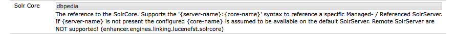

The Solr index is configured by using the `enhancer.engines.linking.lucenefst.solrcore` configuration property of the Engine. This property needs to point to a Solr index that runs embedded in the same JVM as Apache Stanbol. The Stanbol Commons Solr modules provide two Components that allow to configure embedded Solr Indexes:

1. **[ReferencedSolrServer](#trunk-utils-commons-solr--referencedsolrserver)**: This components allows uses to configure a directory containing a SolrServer configuration (the directory with the solr.xml file). All Solr indexes defined by the Solr.xml will be initialized and published as OSGI services to Apache Stanbol. Such indexes can be configured to the engine by using {server-name}:{index-name}. {server-name} is the name of the ReferencedSolrServer as provided in the configuration. {index-name} is the name of the Solr index as defined in the solr.xml.
2. **[ManagedSolrServer](#trunk-utils-commons-solr--managedsolrserver)**: This component allows to have a Solr server that is fully managed by Apache Stanbol. Indexes can be installed by copying '{name-name}.solrindex.zip' files to the 'stanbol/datafiles'. Solr indexes initialized like that will be available under '{index-name}' and 'default:{index-name}'.

Used Solr indexes need also confirm to the requirements of the [SolrTextTagger](https://github.com/OpenSextant/SolrTextTagger/) module. That means that fields used for FST linking MUST use field analyzers that produce consecutive positions (i.e. the position increment of each term must always be 1). This means that typical field analyzers as sued for searches will not work.

The SolrTextTagger README provides an example for a Field Analyzer configuration that does work. To make things easier this engine includes this [XML file](https://stanbol.apache.org/docs/trunk/components/enhancer/engines/fst_field_types.xml) that includes a schema.xml fragment with FST tagging compatible configurations for most languages supported by Solr.

<a id="trunk-components-enhancer-engines-lucenefstlinking--solr-index-layout-configuration"></a>

### Solr Index Layout Configuration

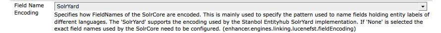

This part of the configuration is used to specify the layout if the used Solr index. It specifies how Entity information are stored in the Solr index.

<a id="trunk-components-enhancer-engines-lucenefstlinking--field-name-encoding"></a>

#### Field Name Encoding

The Field Name Encoding configuration `enhancer.engines.linking.lucenefst.fieldEncoding` specifies how Solr fields for multiple languages are encoded. As an example a Vocabulary with labels in multiple languages might use "en\_label" for the English language labels and "de\_label" for the German language labels. In this case users should set this property to `UnderscorePrefix` and simple use "label" when configuring the FST field name.

The Field Name Encodings work well with Solr dynamic field configurations that allow to map language specific FieldType specifications to prefixes and suffixes such as

This is the full list of supported Field encodings:

- SolrYard: This supports the encoding use by the Stanbol Entityhub SolrYard implementation to encode RDF data types and language literals. If you configure the FST Linking Engine for a Solr index build for the SolrYard you need to use this encoding
- MinusPrefix: `{lang}-{field}` (e.g. "en-name")
- UnderscorePrefix: `{lang}_{field}` (e.g. "en\_name")
- AtPrefix: `{lang}@{field}` (e.g. "en@name")
- MinusSuffix: `{field}-{lang}` (e.g. "name-en")
- UnderscoreSuffix: `{field}-{lang}` (e.g. "name\_en")
- AtSuffix: `{field}-{lang}` (e.g. "name@en")
- None: In this case no prefix/suffix rewriting of configured `field` and `store` values is done. This means that the FST Configuration MUST define the exact field names in the Solr index for every configured language.

<a id="trunk-components-enhancer-engines-lucenefstlinking--fst-tagging-configuration"></a>

#### FST Tagging Configuration

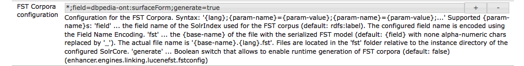

The FST Tagging Configuration `enhancer.engines.linking.lucenefst.fstconfig` defines several things:

1. for what languages FST models should be build. This configuration is basically a list of language codes but also supports wildcards '\*' and exclusions '!{en}'
2. what fields in the Solr Index are used to build FST models. Two fields per language are required: a) an 'Indexed Field' (*field* parameter) and b) a 'Stored Field' (*stored* parameter). Both the indexed and stored field might refer to the same field in the Solr index. In that case this field needs to use `indexed="true" stored="true"`.
3. if FST models can be build by the Engine at runtime as well as the name of the serialized models.

This configuration is line based (multi valued) and uses the following generic syntax:

```
{language };{param }={value };{param1 }={value1 }; !{language}
```

`{language}` is either the name of the language (e.g. 'en'), '\*' for all languages or '' (empty string) for defining default parameter values without including all languages. Lines that do start with '!' do explicitly exclude a language. Those lines do not allow parameters.

The following parameters are supported by the Engine:

- **field**: The indexed field in the configured Solr index. In multilingual scenarios this might be the 'base name' of the field that is extended by a prefix or suffix to get the actual field name in the Solr index (see also the field encoding configuration)
- **stored** (default: *field* value) : The field in the Solr index with the stored label information. This parameter is optional. If not present `stored` is assumed to be equals to `field`.
- **fst** (default based on *field* value): This parameter allows to specify the name of the FST file stored within the FST directory (as configured by the [FST storage location]. The default name is generated by using the `field` with non alpha-numeric chars replaced by '\_').
- **generate** (default: false): If enabled the Engine will generate missing FST models. If this is enabled the engine will also be able to update FST models after changes to the Solr Index. **NOTE** that the creation of FST models is an expensive operation (both CPU and memory wise). The FST engine uses a pool of low priority threads to create FST models. The size of the pool can be configured by using the `enhancer.engines.linking.lucenefst.fstThreadPoolSize` parameter. Because of this the default is `false`.

A more advanced Configuration might look like:

```
; field =fise:fstTagging;
stored =rdfs:label;
generate =true en de es fr it
```

This would set the index field to "fise:fstTagging", the stored field to "rdfs:label" and allow runtime generation. It would also enable to process English, German, Spanish, French and Italian texts. A similar configuration that would build FST models for all languages would look as follows

```
*;
field =fise:fstTagging;
stored =rdfs:label;
generate =true
```

<a id="trunk-components-enhancer-engines-lucenefstlinking--linking-mode"></a>

#### Linking Mode

The FST linking engine does support three different linking modes. Those are configures using the **Linking Mode** *(enhancer.engines.linking.lucenefst.mode)* property. The linking mode property is no longer part of the configuration form. as their are now three separate components with a specialized configuration for each linking mode.

The three modes are

1. `PLAIN`: This mode links the plain text with the vocabulary. Every single word of the text will get looked up with the vocabulary. This mode does not use NLP results other than language detection. Because of that this mode will ignore any [Text Processing Configuration](#trunk-components-enhancer-engines-lucenefstlinking--text-processing-configuration). The PLAIN mode works fine with smaller and specific vocabularies that do not only contain entities but also things like product ids, activities, adjectives ...
2. `LINKABLE_TOKEN`: This mode links only linkable tokens of the parsed text. The provided [Text Processing Configuration](#trunk-components-enhancer-engines-lucenefstlinking--text-processing-configuration) is used to determine linkable tokens in the text (based on NLP results). This is the default mode for this engine. It is well suited for vocabularies containing named entities (such as persons, cities, products, organizations, roles, ...)
3. `NER`: This mode will only consider detected Named Entities for linking. This mode is similar to using the [Named Entity Linking Engine](#trunk-components-enhancer-engines-namedentitytaggingengine). This is a best mode if the enhancement chain contains an NER component that can detect the types of entities contained in the linked vocabulary. Important for this mode is that Named Entity types can be mapped to types of Entities in the linked vocabulary. This allows to validate matching entities based on their type. Those mappings are configured by the **Named Entity Type Mappings** *(enhancer.engines.linking.lucenefst.neTypeMapping)* property.

The *Named Entity Type Mappings* uses the following syntax:

```
{named-entity-type} > {voc-type-1}[; {voc-type-2}; ...]
```

meaning that the Named Entities with the `{named-entity-type}` will only accept entities in the vocabulary with one of the `{voc-type-1}, {voc-type-2}, ...` types. Entities of other types that would match the mention of the Named Entities will get filtered.

An typical configuration could look like the following.

```
dbp - ont:Person> dbp - ont:Person;
schema:Person;
foaf:Person dbp - ont:Organisation> dbp - ont:Organisation;
dbp - ont:Newspaper;
schema:Organization dbp - ont:Place> dbp - ont:Place;
schema:Place;
geonames:Feature
```

*NOTE:* Also full URIs can be used

By default the FST linking engine uses the `LINKABLE_TOKEN`. In this mode this engine behaves similar as the [Entityhub Linking Engine](#trunk-components-enhancer-engines-entityhublinking).

As mentioned before three OSGI components are provided for configuring FST linking engines with the different modes:

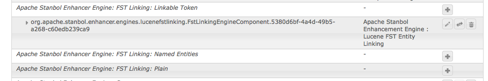

The **Apache Stanbol Enhancer Engine: FST Linking: Linkable Token** *(org.apache.stanbol.enhancer.engines.lucenefstlinking.FstLinkingEngineComponent)* is the default FstLinkingEngine component. It supports all configuration parameter. When not using the user interface it is strongly recommended to use this component for the configuration of the FST linking engine.

The **Apache Stanbol Enhancer Engine: FST Linking: Plain** *(org.apache.stanbol.enhancer.engines.lucenefstlinking.PlainFstLinkingComponnet)* can be used to configure a `PLAIN` mode linking engine. The form excludes any [Text Processing Configuration](#trunk-components-enhancer-engines-lucenefstlinking--text-processing-configuration) property as those are anyway not used in the `PLAIN` mode.

The **Apache Stanbol Enhancer Engine: FST Linking: Named Entities** *(org.apache.stanbol.enhancer.engines.lucenefstlinking.NamedEntityFstLinkingComponnet)* is intended to allow the configuration of a FST linking engine in the `NER` mode. It includes the **Named Entity Type Mappings** *(enhancer.engines.linking.lucenefst.neTypeMapping)* property in the form. This is used to configure type mappings from the Named Entity types to types in the linked vocabulary.

<a id="trunk-components-enhancer-engines-lucenefstlinking--additional-entity-information"></a>

#### Additional Entity Information

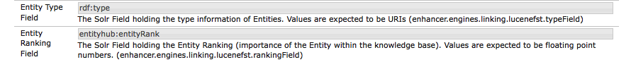

In addition to the URI and the labels of Entities the EntityLinking process also uses entity type and ranking information.

- **Entity Type Field** *(enhancer.engines.linking.lucenefst.typeField)*: This field specifies the Solr field name holding entity type information of Entities. In case 'SolrYard' is used as *Field Name Encoding* one can use the the QNAME of the property (typically 'rdf:type'). Otherwise the value must be the exact field name holding the type information. Values are expected to be URIs.
- **Entity Ranking Field** *(enhancer.engines.linking.lucenefst.rankingField)*: This is an **ADDITIONAL** property used to configure the name of the Field storing the floating point value of the ranking for the Entity. Entities with higher ranking will get a slightly better `fise:confidence` value if labels of several Entities do match the text.

NOTE that type and ranking information are optional.

<a id="trunk-components-enhancer-engines-lucenefstlinking--runtime-fst-generation-thread-pool"></a>

### Runtime FST generation Thread Pool

The `enhancer.engines.linking.lucenefst.fstThreadPoolSize` parameter can be used to configure the size of the thread pool used for the runtime generation of FST models. The default size of the thread pool is `1`. Threads do use the lowest possible priority to reduce the performance impact on enhancements as much as possible.

When configuring the size of the thread pool users need to be aware that the generation of FST models does need a lot more memory as the resulting model. So having to manny parallel threads might require to increase the memory settings of the JVM. On typical machines FST creation threads will consume 100% CPU. That means that the number of threads should be configured to the number of CPU cores that can be spared for FST generation.

*NOTE* that the `generate` parameter of the FST Tagging Configuration needs to be set to `true` to enable runtime generation.

<a id="trunk-components-enhancer-engines-lucenefstlinking--fst-storage-location"></a>

### FST storage location

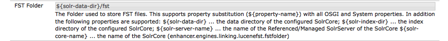

FST models are not only kept in memory but also serialized to disc. This avoids rebuilding the model after a restart of the Stanbol Server. By default the models are stored within the data folder of the SolrCore. However in some scenarios users might want to store FST models in a different location. This can be achieved by using the `enhancer.engines.linking.lucenefst.fstfolder` property.

The configuration options does support property substitution with OSGI and System properties. In addition it supports the following additional properties (all relative to the configured SolrCore.

- `solr-data-dir` : the data directory of the SolrCore
- `solr-index-dir`: the index directory of the SolrCore
- `solr-server-name`: the name of the [ReferencedSolrServer](#trunk-utils-commons-solr--referencedsolrserver) or [ManagedSolrServer](#trunk-utils-commons-solr--managedsolrserver) holding the SolrCore (see also [Configuration of the Solr Index]
- `solr-core-name` : the name of the SolrCore

The default value of this property is '`${solr-data-dir}/fst`'. To manage FST models within the Stanbol folder you can us e.g. '`${sling.home}/fst/${solr-server-name}/solr-core-name`'.

<a id="trunk-components-enhancer-engines-lucenefstlinking--entity-cache-configuration"></a>

### Entity Cache Configuration

While FST tagging is fully done in-memory the FST linking engine needs to read information of matching Entities from the Solr index. This requires disc IO and is typically the part of the process that consumes the most time. The Entity Cache tries to prevent such disc level IO by caching SolrDocuments containing only fields required for the linking process (labels, types and (if available) entity rankings). To further reduce memory requirements only labels in languages requested by processed ContentItems are stored in the cache. The Cache uses the LRU semantic and is based on the Solr cache implementation.

The size of the cache can be configured by using the `enhancer.engines.linking.lucenefst.entityCacheSize` parameter. The default size is ~65k entities. Increasing the maximum size of the cache will improve performance.

**TIP:** For small and medium sized vocabularies the cache can be configured to be >= as the size of Entities in the Vocabulary. In this case the FST linking engine will full operate in-memory. For such scenarios linking was up to 100 times faster as with the [Entityhub Linking Engine](#trunk-components-enhancer-engines-entityhublinking)

<a id="trunk-components-enhancer-engines-lucenefstlinking--text-processing-configuration"></a>

### Text Processing Configuration

With the extension of the SolrTextTagger with a [TaggingAttribute](https://github.com/OpenSextant/SolrTextTagger/pull/7) the FST linking engine can support the exact same text processing functionality as the other Entity Linking Engine.

For the configuration please see the [Text Processing configuration](#trunk-components-enhancer-engines-entitylinking--text-processing-configuration) section of the Entity Linking Engine.

<a id="trunk-components-enhancer-engines-lucenefstlinking--entity-linking-configuration"></a>

### Entity Linking Configuration

The Entity Linking Configuration of this Engine is very similar as the one for the [EntityLinking engine](#trunk-components-enhancer-engines-entitylinking--entity-linker-configuration). The configuration does use the exact same keys, but it does not support all properties and some do have a slightly different meaning. In the following only the differences are described. For the all other things please refer to the linked section of the documentation of the EntityLinking engine.

- ~~**Label Field** *(enhancer.engines.linking.labelField)*~~: The label field is **IGNORED** as the field holding the labels is anyway provided by the [FST Tagging Configuration]. That means that the field defined by the *stored* parameter is used. If the *stored* parameter is not present it fallbacks to the *field* parameter.
- ~~**Type Field** *(enhancer.engines.linking.typeField)*~~: This configuration gets **IGNORED** in favor of the `enhancer.engines.linking.lucenefst.typeField`. See the [Additional Entity Information] section for details.
- **Redirect Field** *(enhancer.engines.linking.redirectField)*: Note implemented. **NOTE** This might not be possible to efficiently implement. When those redirects need already be considered when building the FST models.
- ~~**Use EntityRankings** *(enhancer.engines.linking.useEntityRankings)*~~: This configuration gets **IGNORED**. EntityRanking based sorting is enabled as soon as the *Entity Ranking Field* is configured.
- ~~**Lemma based Matching** *(enhancer.engines.linking.lemmaMatching)*~~: Not Yet implemented
- **Min Match Score** *(enhancer.engines.linking.minMatchScore)*: The FST linking engine uses [Levenshtein distance](http://en.wikipedia.org/wiki/Levenshtein_distance) between the mention in the text and the best matching label of an Entity. It only adds suggestions if the match is greater as the configured value. *NOTE* that this might filter suggestions of the FST for several reasons but typical reasons are stemming on short labels as well as case insensitive analyzers combined with case sensitive matching.
- **Minimum Chunk Match Score** *(enhancer.engines.linking.minChunkMatchScore)*: Tags provided by FST linking are reduced if they do match less as the configured percentage of tokens in a chunk. Implemented as `TagClusterReducer`.

In addition the following properties are **IGNORED** as they are not relevant for the FST Linking Engine:

- ~~**Max Search Token Distance** *(enhancer.engines.linking.maxSearchTokenDistance)*~~
- ~~**Max Search Tokens** *(enhancer.engines.linking.maxSearchTokens)*~~
- ~~**Min Matched Tokens** *(enhancer.engines.linking.minFoundTokens)*~~
- ~~**Min Text Score** *(enhancer.engines.linking.minTextScore)*~~

Copyright © 2010 The Apache Software Foundation, Licensed under
the [Apache License, Version 2.0](http://www.apache.org/licenses/LICENSE-2.0).
Apache, Stanbol and the Apache feather and Stanbol logos are trademarks of The Apache Software Foundation.

---

<a id="trunk-components-enhancer-engines-comention"></a>

<!-- source_url: https://stanbol.apache.org/docs/trunk/components/enhancer/engines/comention -->

<!-- page_index: 30 -->

<a id="trunk-components-enhancer-engines-comention--co-mention-engine"></a>

# Co-Mention Engine

The Co-Mention engine aims to link initial mentions of Entities with later references in the Text.

The typical example are persons only mentioned by their family name after an initial mention with the full name e.g.

```
...
Barack
Obama
gave
a
talk
to
members
of
the
Labor
Union
...
Obama
specially
mentioned
...
```

**NOTE:** This Engine does *NOT* provide/use NLP co-reference support (e.g. linking a Pronoun with the Entity it stands for). Its purpose it to (1) link follow up mentions of Entities with the original one and (2) add suggestion of the initial mention to follow up mentions.

<a id="trunk-components-enhancer-engines-comention--configuration"></a>

## Configuration

As this engine does use entity linking functionality of the [EntityLinkingEngine](#trunk-components-enhancer-engines-entitylinking) its configuration supports similar properties.

- **Name** *(stanbol.enhancer.engine.name)*: The name of the Enhancement Engine. This name is used to refer an [EnhancementEngine](#trunk-components-enhancer-engines) in [EnhancementChain](#trunk-components-enhancer-chains)s
- **ServiceRankging** *(service.ranking)*: In case multiple enhancement engines do use the same name, than only the one with the higher ranking will get uses.
- **Case Sensitivity** *(enhancer.engines.linking.caseSensitive)*: Boolean switch that allows to activate/deactivate case sensitive matching. It is important to understand that even with case sensitivity activated an Entity with the label such as "Anaconda" will be suggested for the mention of "anaconda" in the text. The main difference will be the confidence value of such a suggestion as with case sensitivity activated the starting letters "A" and "a" are NOT considered to be matching. See the second technical part for details about the matching process. Case Sensitivity is deactivated by default. It is recommended to be activated if controlled vocabularies contain abbreviations similar to commonly used words e.g. CAN for Canada.
- **Proper Noun Linking** *(enhancer.engines.linking.properNounsState)*: Enables/Disables proper noun linking for searching co-mentions. By default this is disabled to also consider Commons Nouns when searching for co-mentions. However for Vocabularies that only contain Proper Nouns (Persons, Organizations, ...) enabling this might be useful. For the full documentation of this feature see the [Text Processing Configuration](#trunk-components-enhancer-engines-entitylinking--text-processing-configuration) section of the EntityLinking engine.
- **Processed Languages** *(enhancer.engines.linking.processedLanguages)*: Allows the detailed configuration on how NLP processing results should be consumed by the Co-Mention engine. For the full documentation of this feature see the [Text Processing Configuration](#trunk-components-enhancer-engines-entitylinking--text-processing-configuration)
- **Adjust Existing Confidence** *(enhancer.engines.comention.adjustExistingConfidence)*: If the Engine engine detect a co-mention for an existing fise:TextAnnotation it can adjust confidence values for existing suggestions. This property will take values in the range `[0..1)`. Confidence values of existing suggestions will be multiplied with `1-{value}`. Configuring `0.0` deactivates this feature. The default is `0.33`. See [STANBOL-1219](https://issues.apache.org/jira/browse/STANBOL-1219) for details and an example.

Other supported properties that are not included in the Felix Webconsole configuration dialog. Those properties can only be set via OSGI configuration files. See the [Entity Linking Engine](#trunk-components-enhancer-engines-entitylinking) configuration for the full documentation of those properties

- **Min Search Token Length** *(enhancer.engines.linking.minSearchTokenLength)*
- **Minimum Token Match Score** *(enhancer.engines.linking.minTokenScore)*
- **Lemma based Matching** *(enhancer.engines.linking.lemmaMatching)*
- **Max Search Token Distance** *(enhancer.engines.linking.maxSearchTokenDistance)*
- **Max Search Tokens** *(enhancer.engines.linking.maxSearchTokens)*

The following properties of the EntityLinking engine are ignored:

- **Type Mappings** *(enhancer.engines.linking.typeMappings)*: The Co-Mention engine uses the dc:types of the initial mention. Therefore dc:Type mappings need not to be specified
- **Default Matching Language** *(enhancer.engines.linking.defaultMatchingLanguage)*: The engine uses the language as detected for the parsed document for matching.
- **Redirect Field** *(enhancer.engines.linking.redirectField)* and **Redirect Mode** *(enhancer.engines.linking.redirectMode)*: The engine uses suggestions of the initial mention. Redirects where already processed for those suggestions. Therefore the Co-Mention engine does not need to deal with redirects.
- **Label Field** *(enhancer.engines.linking.labelField)*: The engine uses the initial mention as label to search for co-mentions. Because of theta no label field needs to be configured.
- **Type Field** *(enhancer.engines.linking.typeField)*: The engine uses the types of the suggestions for the initial mentions.
- **Suggestions** *(enhancer.engines.linking.suggestions)*: The Co-Mentions Engine adds all suggestions of the initial mention to co-mentions.
- **Min Matched Tokens** *(enhancer.engines.linking.minFoundTokens)* is set to '1' meaning that at least a single token of the initial mention needs to match co-mentions.
- **Min Label Score** *(enhancer.engines.linking.minLabelScore)* is set to '1/4' meaning that at least 1/4 of the tokens for the initial mention need to be present in co-mentions.
- **Min Match Score** *(enhancer.engines.linking.minMatchScore)* is set to a value so that it does not filter any results.

---

<a id="trunk-components-enhancer-engines-geonamesengine"></a>

<!-- source_url: https://stanbol.apache.org/docs/trunk/components/enhancer/engines/geonamesengine -->

<!-- page_index: 31 -->

<a id="trunk-components-enhancer-engines-geonamesengine--the-geonames-enhancement-engine"></a>

# The Geonames Enhancement Engine

This engine creates fise:EntityAnnotations based on the http://geonames.org dataset. It does not directly work on the parsed content, but processes named entities extracted by some NLP (natural language processing) engine. This engine creates EntityAnnotations for Features found for named entities in the geonames.org data set. In addition it adds EntityAnnotations for the continent, country and administrative regions for entities with an high confidence level.

<a id="trunk-components-enhancer-engines-geonamesengine--processed-annotations-input"></a>

## Processed Annotations (Input)

This engine consumes fise:TextAnnotations of type dbpedia:Place. More concretely it filters for enhancements which confirm to the following two requirements and consumes the text selected by the TextAnnotations:

```
?textAnnotation rdf:type fise:TextAnnotation .
?textAnnotation dc:type dbpedia:Place
?textAnnotation fise:selected-text ?text
```

Here an example for such an TextAnnotations selecting the text "Vienna" form the content "The community Workshop will take place in Vienna".

```
urn:enhancement:text-enhancement:id1
    a       fise:TextAnnotation , fise:Enhancement ;
    dc:type
         dbpedia:Place ;
    fise:selected-text
         "Vienna"^^xsd:string ;
    fise:selection-context
         "The community Workshop will take place in Vienna"^^xsd:string ;
    fise:start
         "46"^^xsd:int ;
    fise:end
         "52"^^xsd:int ;
    fise:confidence
         "0.9773640902587215"^^xsd:double ;
    fise:extracted-from
         urn:content-item:id1 .
```

Typically such enhancements are created by engines that provide named entity extraction based on some natural language processing framework.

<a id="trunk-components-enhancer-engines-geonamesengine--created-enhancements-output"></a>

## Created Enhancements (Output)

The LocationEnhancementEngine creates two types of EntityAnnotations. First it suggests Entities for processed TextAnnotations and second it creates EntityAnnotations for the hierarchy of regions the suggested Entities are located in. Suggested Entities are connected with the "dc:relation" attribute to the TextAnnotation they enhance. EntityAnnotations representing the hierarchydefine a dc:requires attribute to the EntityAnnotation.

<a id="trunk-components-enhancer-engines-geonamesengine--entity-suggestions"></a>

### Entity Suggestions

Entity suggestions are EntityEnhancements that suggest Features of the geonames.org dataset for an processed TextAnnotation. This suggestions are currently only calculated based on the fise:selected-text of the TextAnnotation.

The following example shows three EntityAnnotations for the TextAnnotation used in the above example. See the fise:relation statements at the end of each of the two EntityAnnotations.

The first Entity found in the geonames.orf dataset is the capital city in Austria with an confidence level of 1.0:

```
urn:enhancement:entity-enhancement:id1
    a      fise:EntityAnnotation , fise:Enhancement ;
    fise:confidence
         "1.0"^^xsd:double ;
    fise:entity-label
         "Vienna"^^xsd:string ;
    fise:entity-reference
         http://sws.geonames.org/2761369/ ;
    fise:entity-type
         geonames:Feature , dbpedia:Place , dbpedia:Settlement , dbpedia:PopulatedPlace , geonames:P.PPLC ;
    fise:extracted-from
         urn:content-item:id1 ;
   dc:relation
         urn:enhancement:text-enhancement:id1 .
```

With lower confidence levels there are a lot of other populated places with the name "Vienna" found in the geonames.org dataset.

```
urn:enhancement:entity-enhancement:id2
    a      fise:EntityAnnotation , fise:Enhancement ;
    fise:confidence
         "0.42163702845573425"^^xsd:double ;
    fise:entity-label
         "Vienna"^^xsd:string ;
    fise:entity-reference
         http://sws.geonames.org/4496671/ ;
    fise:entity-type
         geonames:Feature , dbpedia:Place , dbpedia:Settlement , dbpedia:PopulatedPlace , geonames:P.PPL ;
    fise:extracted-from
         urn:content-item:id1 ;
   dc:relation
         urn:enhancement:text-enhancement:id1 .

urn:enhancement:entity-enhancement:id3
    a      fise:EntityAnnotation , fise:Enhancement ;
    fise:confidence
         "0.42163702845573425"^^xsd:double ;
    fise:entity-label
         "Vienna"^^xsd:string ;
    fise:entity-reference
         http://sws.geonames.org/4825976/ ;
    fise:entity-type
         geonames:Feature , dbpedia:Place , dbpedia:Settlement , dbpedia:PopulatedPlace , geonames:P.PPL ;
    fise:extracted-from
         urn:content-item:id1 ;
    dc:relation
         urn:enhancement:text-enhancement:id1 .
```

<a id="trunk-components-enhancer-engines-geonamesengine--entity-hierarchy-enhancements"></a>

## Entity Hierarchy Enhancements

Entity Hierarchy Enhancements describe the regions that contain suggested Features based on the geonames.org dataset. Enhancements describing this hierarchy are added for all suggested entities with a confidence level above the value of "eu.iksproject.fise.engines.geonames.locationEnhancementEngine.min-hierarchy-score".

The default value for this property is 0.7. The hierarchy web service provided by geonames.org is used to calculate the regions.
The following example shows the entity hierarchy enhancements for the suggested entity for Vienna (Autria). *Please note the dc:requires relation to this EntityAnnotation at the end of each of the following enhancement.*

<a id="trunk-components-enhancer-engines-geonamesengine--continent-europe"></a>
<a id="trunk-components-enhancer-engines-geonamesengine--continent:-europe"></a>

### Continent: Europe

First the enhancement for the continent Europe:

```
urn:enhancement:entity-hierarchy-enhancement:id1
    a      fise:EntityAnnotation , fise:Enhancement ;
    fise:confidence
         "0.42163702845573425"^^xsd:double ;
    fise:entity-label
         "Europe"^^xsd:string ;
    fise:entity-reference
         http://sws.geonames.org/6255148/ ;
    fise:entity-type
         geonames:Feature , dbpedia:Place, geonames:L.CONT ;
    fise:extracted-from
         urn:content-item:id1 ;
   dc:requires
         urn:enhancement:entity-enhancement:id1 .
```

<a id="trunk-components-enhancer-engines-geonamesengine--country-austria"></a>
<a id="trunk-components-enhancer-engines-geonamesengine--country:-austria"></a>

### Country: Austria

Next the enhancement for the country "Austria", classified as an independent political entry within geonames.org

```
urn:enhancement:entity-hierarchy-enhancement:id2
    a      fise:EntityAnnotation , fise:Enhancement ;
    fise:confidence
         "0.42163702845573425"^^xsd:double ;
    fise:entity-label
         "Austria"^^xsd:string ;
    fise:entity-reference
         http://sws.geonames.org/2782113/ ;
    fise:entity-type
         geonames:Feature , dbpedia:Place, dbpedia: AdministrativeRegion, geonames:A.PCLI ;
    fise:extracted-from
         urn:content-item:id1 ;
    dc:requires
         urn:enhancement:entity-enhancement:id1 .
```

<a id="trunk-components-enhancer-engines-geonamesengine--aadm1-a-county"></a>
<a id="trunk-components-enhancer-engines-geonamesengine--a.adm1-a-county"></a>

### A.ADM1 - A county

Now three enhancements describing the different hierarchies of administrative regions within Austria. First the "Bundesland", next the "Stadtteil" and last the "Gemeindebezirk".

```
urn:enhancement:entity-hierarchy-enhancement:id3
    a      fise:EntityAnnotation , fise:Enhancement ;
    fise:confidence
         "0.42163702845573425"^^xsd:double ;
    fise:entity-label
         "Vienna"^^xsd:string ;
    fise:entity-reference
         http://sws.geonames.org/2761367/ ;
    fise:entity-type
         geonames:Feature , dbpedia:Place, dbpedia: AdministrativeRegion, geonames:A.ADM1 ;
    fise:extracted-from
         urn:content-item:id1 ;
    dc:requires
         urn:enhancement:entity-enhancement:id1 .
```

<a id="trunk-components-enhancer-engines-geonamesengine--aadm2-a-city"></a>
<a id="trunk-components-enhancer-engines-geonamesengine--a.adm2-a-city"></a>

### A.ADM2 - A city

```
urn:enhancement:entity-hierarchy-enhancement:id4
    a      fise:EntityAnnotation , fise:Enhancement ;
    fise:confidence
         "0.42163702845573425"^^xsd:double ;
    fise:entity-label
         "Politischer Bezirk Wien (Stadt)"^^xsd:string ;
    fise:entity-reference
         http://sws.geonames.org/2761333/ ;
    fise:entity-type
         geonames:Feature , dbpedia:Place, dbpedia: AdministrativeRegion, geonames:A.ADM2 ;
    fise:extracted-from
         urn:content-item:id1 ;
   dc:requires
         urn:enhancement:entity-enhancement:id1 .
```

<a id="trunk-components-enhancer-engines-geonamesengine--aadm3-a-village"></a>
<a id="trunk-components-enhancer-engines-geonamesengine--a.adm3-a-village"></a>

### A.ADM3 - A village

```
urn:enhancement:entity-hierarchy-enhancement:id5
    a      fise:EntityAnnotation , fise:Enhancement ;
    fise:confidence
         "0.42163702845573425"^^xsd:double ;
    fise:entity-label
         "Gemeindebezirk Innere Stadt"^^xsd:string ;
    fise:entity-reference
         http://sws.geonames.org/2775259/ ;
    fise:entity-type
         geonames:Feature , dbpedia:Place, dbpedia: AdministrativeRegion, geonames:A.ADM3 ;
    fise:extracted-from
         urn:content-item:id1 ;
   dc:requires
         urn:enhancement:entity-enhancement:id1 .
```

The last two hierarchy levels are no longer valid for the meaning of "Vienna" as selected by the TextAnnotation, but added, because the geonames.org dataset locations the Feature of cities exactly in the center. However if the TextAnnotation would describe a precise address such hierarchy levels would completely make sense.

<a id="trunk-components-enhancer-engines-geonamesengine--configuration"></a>

## Configuration

The LocationEnhancementEngine provides six configurations

The first three can be used to optimise the behaviour of the Engine

- Minimum score (default = 0.33): The minimum score (confidence) that is required for entity suggestions
- Maximum Locations (default = 3): The maximum numbers of entity suggestions added (regardless if there would be more results with a score > min-score.
- Maximum Locations (default = 0.7): The minimum score (confidence) that is required that hierarchy enhancements are added for an suggested entity. To add hierarchy enhancements for all suggested entities min-hierarchy-score needs to be set to a value smaller equals than min-score.

The other three are used to configure the configured geonames.org server

- geonames.org Server: The URL of the geonames.org service. The default is the free geonames.org webserver that works without user authentication. There is a second free server at http://api.geonames.org/ that requires to setup a free user account. Users with a premium account will require to add here there own URL
- User Name: Thats the name of the account (can be empty if the configured server does not require user authentication
- Token: The token is usually the password of the user account.

<a id="trunk-components-enhancer-engines-geonamesengine--howto-setup-a-free-user-account"></a>
<a id="trunk-components-enhancer-engines-geonamesengine--howto-setup-a-free-user-account:"></a>

### HOWTO setup a free user account:

Such an account is required to be able to use the http://api.geonames.org/ server
that should support better performance and higher uptime than the default
free server available at http://ws.geonames.org/.

To setup the free account:

1. go to www.geonames.org. In the right top corner you will find a "login" link that is also used to create new accounts
2. choose a username and pwd. You will get an confirmation mail at the provided email address. When choosing the password consider, that it will be sent unencrypted (as token) with every webservice Request. Therefore it is strongly suggested to do not use an password that is used for any other account!
3. confirm the account
4. IMPORTANT: You need to activate the free web service for the account via http://www.geonames.org/manageaccount. Log in first, go back to this site. At the botton you should find the text "the account is not yet enabled to use the free web services. Click here to enable"

If you do not complete step (4) requests with your account will result an IOExceptions with the message

```
"user account not enabled to use the free webservice. Please enable it on your account page: http://www.geonames.org/manageaccount"
```

Copyright © 2010 The Apache Software Foundation, Licensed under
the [Apache License, Version 2.0](http://www.apache.org/licenses/LICENSE-2.0).
Apache, Stanbol and the Apache feather and Stanbol logos are trademarks of The Apache Software Foundation.

---

<a id="trunk-components-enhancer-engines-zemantaengine"></a>

<!-- source_url: https://stanbol.apache.org/docs/trunk/components/enhancer/engines/zemantaengine -->

<!-- page_index: 32 -->

<a id="trunk-components-enhancer-engines-zemantaengine--the-zemanta-enhancement-engine"></a>

# The Zemanta enhancement engine

Enhancement engine that uses the Zemanta API. You need a Zemanta API key to run this engine.

<a id="trunk-components-enhancer-engines-zemantaengine--usage"></a>

## Usage

If the Engine does not show up in the Componets tab of the Apache Felix Web Console you will first need to build and install this Engine to your OSGI environment

1. build ("mvn install") and deploy the Clerezza bundle org.apache.clerezza.rdf.jena.parser
2. build the jar ("mvn install")
3. import the jar into the OSGi runtime (all default

To use this Enhancement Engine it is important to configure your Zemanta API key.

- In the OSGi web console, set the property "org.apache.stanbol.enhancer.engines.zemanta.key" with your API key
- restart the component in the OSGi console
- Watch the console when you add text using commands such as:

  :::bash
  curl -T myText.txt -H Content-Type:text/plain http://localhost:8080/enhancer

<a id="trunk-components-enhancer-engines-zemantaengine--enhancements"></a>

## Enhancements

This engine supports Extracted Entities and Topic Classification. The occurrence of extracted entities are represented by '[fise:TextAnnotation](#trunk-components-enhancer-enhancementstructure--fisetextannotation)' while suggested Entities are represented as '[fise:EntityAnnotation](#trunk-components-enhancer-enhancementstructure--fiseentityannotation)' with a 'dc:relation' link to the 'fise:TextAnnotation'. Categories are represented as '[fise:TopicAnnotation](#trunk-components-enhancer-enhancementstructure--fisetopicannotation)'s.

Enhancemetns created by the ZemantaEngine are compatible to those created by similar engines such as the [Named Entity Extraction Enhancement Engine](https://stanbol.apache.org/docs/trunk/components/enhancer/engines/namedentityextractionengine.html), [KeywordLinkingEngine](#trunk-components-enhancer-engines-keywordlinkingengine) or [Named Entity Tagging Engine](#trunk-components-enhancer-engines-namedentitytaggingengine). This ensures that Stanbol Users can arbitrary mix those engines with the Zemanta based variant without the need to adapt client side code.

---

<a id="trunk-components-enhancer-engines-entityhubdereference"></a>

<!-- source_url: https://stanbol.apache.org/docs/trunk/components/enhancer/engines/entityhubdereference -->

<!-- page_index: 33 -->

<a id="trunk-components-enhancer-engines-entityhubdereference--entityhub-dereference-engine"></a>

# Entityhub Dereference Engine

This is an [Entity Dereference Engine](#trunk-components-enhancer-engines-dereference) for the [Stanbol Entityhub](#trunk-components-entityhub). It supports dereferencing Entities from

- Entityhub: locally managed Entities (the `/entityhub` endpoint)
- Managed and Referenced Sites (the `/entityhub/site/{site-name}` endpoints)
- SiteManager: Union view over all Managed and Referenced Sites (the `/entityhub/sites` endpoint)

<a id="trunk-components-enhancer-engines-entityhubdereference--configuration"></a>

## Configuration

The following figure shows the configuration dialog of the Entityhub Dereference Engine:

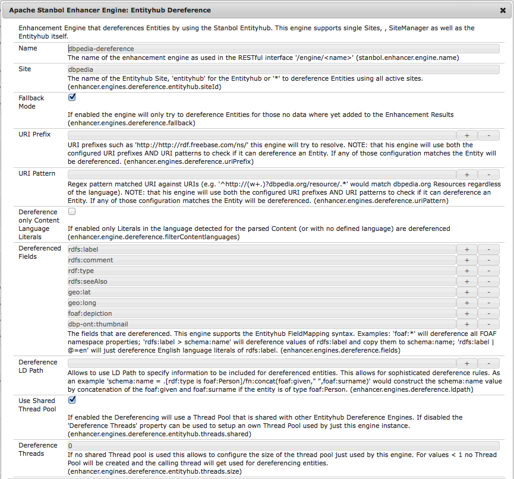

The following Configuration parameter are defined by the core Entity Dereference Engine. Actual Dereference Engine implementations might not support all of them.

- **Name** *(stanbol.enhancer.engine.name)*: The name of the Enhancement engine
- **Site** *(enhancer.engines.dereference.entityhub.siteId)*: The name of the Entityhub Site to be used for dereferencing. `*` will dereference against the SiteManager (union over all Referenced and Managed sites) and `entityhub` will use the entityhub itself for dereferencing.
- **Fallback Mode** *(enhancer.engines.dereference.fallback)*: The fallback mode will only schedule Entities for dereferencing if no data for them are yet present in the Enhancement results (see the documentation of the [Entity Dereference Engine](#trunk-components-enhancer-engines-dereference) for more information and possible usage scenarios).
- **URI Prefix** *(enhancer.engines.dereference.uriPrefix)*: Allows to configure [0..\*] prefixes of Entity URIs that can be dereferenced by this engine. If present only Entities that match one of those prefixes are scheduled to be dereferenced by the `EntityDereferencer`.
- **URI Pattern** *(enhancer.engines.dereference.uriPatter)*: Allows to configure a regex pattern for matching Entity URIs. If present only Entities matching at lease one of the configured patterns will be scheduled for dereferencing.
- **Dereference only Content Language Literals** *(enhancer.engine.dereference.filterContentlanguages)*: If enabled only Literals with the same language as the language detected for the Content will get dereferenced. Literals with no language tag will always get dereferenced.
- **Dereferenced Fields** *(enhancer.engines.dereference.fields)*: The dereferenced fields - in RDF terminology 'properties' - to be dereferenced. QNames (e.g. `rdf:label`) can be used for the configuration. This Engine supports the use of FieldMappings for the configuration (see the according sub-section for details).
- **Dereference LD Path** *(enhancer.engines.dereference.ldpath)*: The [LD Path Language](http://marmotta.apache.org/ldpath/language.html) allows to define powerful selectors for dereferenced Entities.
- **Use Shared Thread Pool** *(enhancer.engines.dereference.entityhub.threads.shared)*: If enabled multiple configured Entityhub Dereference Engines will use a shared Thread Pool. The shared Thread pool is provided by an own Component that can be configured independently (see next sub-section). In most cases it is better to enable this feature and to add additional threads to the shared pool if necessary.
- **Dereference Threads** *(enhancer.engines.dereference.entityhub.threads.size)*: If no shared Thread pool is used this allows to configure the size of the thread pool just used by this engine. For values < 1 no Thread Pool will be created and the calling thread will get used to dereference entities.

Additional Supported Properties that are not included in the configuration form:

- **Dereference Properties** *(enhancer.engines.dereference.references)*: The list of properties that reference Entities. By default `fise:entity-reference` is used. A Triple pattern `(null,{entity-reference},null)` is used for all configured property URIs. All unique objects of type URI are considered as entities to be dereferenced. *NOTE* that configured *URI Prefix* and/or an *URI Pattern* are also applied to the list of entity uris.
- **Dereference Languages** *(enhancer.engines.dereference.languages)*: A set of languages that are dereferenced. Even if *'Dereference only Content Language Literals'* is active explicitly configured languages will still get dereferenced. If not present and *'Dereference only Content Language Literals'* is deactivated literals of any language will get dereferenced.
- **Service Ranking** *(service.ranking)*: The OSGI service ranking. Will only have an effect if their are two engines with the same name. In such cases the one with the higher service ranking will get called.

<a id="trunk-components-enhancer-engines-entityhubdereference--shared-thread-pool-configuration"></a>

### Shared Thread Pool Configuration

The Shared Thread Pool is a singelton Component used by all Entityhub Dereference Engines with the *'Use Shared Thread Pool'* option enabled. It has only a single configuration option *(enhancer.engines.dereference.entityhub.sharedthreadpool.size)* that allows to set the size of the thread pool.

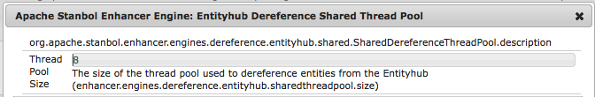

<a id="trunk-components-enhancer-engines-entityhubdereference--advanced-dereference-configurations"></a>

### Advanced Dereference Configurations

<a id="trunk-components-enhancer-engines-entityhubdereference--entityhub-field-mapping-support"></a>

#### Entityhub Field Mapping Support

The *enhancer.engines.dereference.fields* configuration does support the Entityhub Field Mapping language.

FieldMappings do use the following syntax:

```
[!]FieldPattern [| Filter] [> Mapping]
```

- an optional Exclusion indicated by '!' as the first character of the mapping used to exclude fields that are matched by the `FieldPattern` part (e.g. `!foaf:*` will exclude all properties of the FOAF namespace). Exclusions are only useful if a wildcard is used (e.g. `foaf:*` together with `!foaf:mbox`).
- the required *FieldPattern* supports the definition of prefixes such as `http://xmlns.com/foaf/0.1/*` or `foaf:*`
- the optional *Filter* part allows to filter specific languages (e.g. `@=null;en;de;` will only dereference English and German literals as well as literals with no language tag), typed literals (e.g. `d=xsd:dateTime;xsd:date`) or URI values (e.g. `d=entityhub:ref`). Filters will also try to convert values to the parsed data type (e.g. `d=xsd:double` would convert `xsd:float` values to `xsd:doule`. Also string literals that can be parsed as double would be converted).
- an optional *Mapping* can be used to copy values to an other field (e.g. `foaf:name > schema:name` would copy all FOAF names to the schema.org name field)

> [!NOTE]
> that Field Mappings configured for the EntityhubDerefereceEngine are overridden by Field Mappings parsed as [Enhancement Properties](#trunk-components-enhancer-enhancementproperties).

<a id="trunk-components-enhancer-engines-entityhubdereference--ldpath-support"></a>

### LDPath support

The use of[LD Path Language](http://marmotta.apache.org/ldpath/language.html) is an alternative to most of the features supported by the Entityhub Field Mapping language. Especially *Filters* and *Mapping* SHOULD BE expressed using LD Path.

The only advantage of the Field Mapping language is that is supports the use of wildcards and exclusions. So in cases where one once to dereference all properties of a specific namespace it is only possible to specify this by using the Field Mapping language.

The following Example shows a configuration that dereferences all schema.org properties and also uses LD Path to align soem none schema.org properties

```
enhancer.engines.dereference.fields="schema:*"
enhancer.engines.dereference.ldpath=["@prefix schema <http://schema.org/>;",
    "@prefix dct <http://purl.org/dc/terms/>;",
    "schema:name = (rdfs:label | dct:title | dc:title | foaf:name | skos:prefLabel);",
    "schema:alternateName = skos:altLabel;"
    "schema:image = foaf:depiction;",
    "schema:homepage = foaf:homepage;"]
```

*NOTE* when used in a OSGI `*.cfg` file one would need to escape spaces and `=` with `\` and remove all line breaks.

<a id="trunk-components-enhancer-engines-entityhubdereference--supported-enhancement-properties"></a>

## Supported Enhancement Properties

**since version `0.12.1`** with [STANBOL-1287](https://issues.apache.org/jira/browse/STANBOL-1287)

The following Enhancement Properties are supported by the Entityhub Dereference Engine

- **Dereference Properties** *(enhancer.engines.dereference.references)*: a collection of properties that reference Entities. Parsed values will me merged (union) to those statically configured for the Engine.
- **Dereference Languages** *(enhancer.engines.dereference.languages)*: A set of languages that are dereferenced. Even if *'Dereference only Content Language Literals'* is active explicitly configured languages will still get dereferenced. \* **Dereferenced Fields** *(enhancer.engines.dereference.fields)*: The dereferenced fields - in RDF terminology 'properties' - to be dereferenced. QNames (e.g. `rdf:label`) can be used for the configuration. This Engine supports the use of FieldMappings for the configuration. Dereferenced Fields parsed as EnhancementProperty will override values configured for the Engine.
- **Dereference LD Path** *(enhancer.engines.dereference.ldpath)*: The [LD Path Language](http://marmotta.apache.org/ldpath/language.html) allows to define powerful selectors for dereferenced Entities. An LD Path program parsed as EnhancementProperty will be executed in addition to those configured for the engine.

As an example the following query parameter would instruct all Entityhub Dereference engines used in an enhancement engine to just dereference English and German literals.

```
curl -X POST -H "Accept: text/turtle" -H "Content-type: text/plain" \
    --data "The Eifeltower is located in Paris." 
    http://localhost:8080/enhancer?enhancer.engines.dereference.languages=en&\
    enhancer.engines.dereference.languages=de
```

Copyright © 2010 The Apache Software Foundation, Licensed under
the [Apache License, Version 2.0](http://www.apache.org/licenses/LICENSE-2.0).
Apache, Stanbol and the Apache feather and Stanbol logos are trademarks of The Apache Software Foundation.

---

<a id="trunk-components-enhancer-engines-textannotationnewmodel"></a>

<!-- source_url: https://stanbol.apache.org/docs/trunk/components/enhancer/engines/textannotationnewmodel -->

<!-- page_index: 34 -->

<a id="trunk-components-enhancer-engines-textannotationnewmodel--textannotation-new-model-converter-engine"></a>

# TextAnnotation new Model Converter Engine

This Engine converts '[fise:TextAnnotation](#trunk-components-enhancer-enhancementstructure--fisetextannotation)' to include the 'fise:selection-prefix' and 'fise:selection-suffix' properties as introduced by [STANBOL-987](https://issues.apache.org/jira/browse/STANBOL-987).

It processes all 'fise:TextAnnotation' that select a specific part of the text. Meaning that they define a 'fise:start' and 'fise:end' property. 'fise:TextAnnotations' that do already define 'fise:selection-prefix' or 'fise:selection-suffix' properties are skipped.

<a id="trunk-components-enhancer-engines-textannotationnewmodel--configuration"></a>
<a id="trunk-components-enhancer-engines-textannotationnewmodel--configuration:"></a>

## Configuration:

Other than the configurations for the engines name and ranking this engine supports the following custom properties:

- **Prefix Suffix Length** *(enhancer.engines.textannotationnewmodel.prefixSuffixSize)*: Allows to change the char length of prefixes and suffixes. The default is `10`. The minimum allowed value is `3`

---

<a id="trunk-components-enhancer-engines-refactorengine"></a>

<!-- source_url: https://stanbol.apache.org/docs/trunk/components/enhancer/engines/refactorengine -->

<!-- page_index: 35 -->

<a id="trunk-components-enhancer-engines-refactorengine--the-refactor-engine"></a>

# The Refactor Engine

It re-factors the RDF graphs of recognized entities to a target vocabulary. The engines is provided with a default set of rules (a recipe) for the refactoring which allows to produce an RDF graph according to the google vocabulary. That default recipe allows to produce google rich
snippets.

<a id="trunk-components-enhancer-engines-refactorengine--technical-description"></a>

## Technical Description

This enhancement engine requires the following components running:

- Stanbol Entityhub
- Stanbol Refactor
- Stanbol OntoNet

<a id="trunk-components-enhancer-engines-refactorengine--example"></a>

## Example

TODO

---

<a id="trunk-components-enhancer-engines-nif20"></a>

<!-- source_url: https://stanbol.apache.org/docs/trunk/components/enhancer/engines/nif20 -->

<!-- page_index: 36 -->

<a id="trunk-components-enhancer-engines-nif20--nif-2.0-transformation-engine"></a>

# NIF 2.0 Transformation Engine

Typically low level NLP results are not included to the RDF enhancement results. This engine supports the serialization of such results by using the [NIF 2.0](http://persistence.uni-leipzig.org/nlp2rdf/) (NLP Interchange Format) standard.

<a id="trunk-components-enhancer-engines-nif20--processed-information-input"></a>

## Processed Information (Input)

Apache Stanbol manages NLP results by the [Analysed Text](#trunk-components-enhancer-nlp-analyzedtext) content part. This ContentPart provides a Java API for accessing those results. This engine reads such information and transformes it according to the [NIF 2.0](http://persistence.uni-leipzig.org/nlp2rdf/ontologies/nif-core/nif-core.html) core ontology. Transformed information will be added as RDF to the Enhancement Metadata and be included in the RDF response of the enhancement request.

If a ContentItem does not contain this content part it will not be processed by this engine.

<a id="trunk-components-enhancer-engines-nif20--created-rdf"></a>

## Created RDF

The engine serializes NLP annotations as defined by the [NIF 2.0 core ontology](http://persistence.uni-leipzig.org/nlp2rdf/ontologies/nif-core/nif-core.html). More specifically the engine is capable of it the following information:

- Segment URIs do use [RFC 5147](http://tools.ietf.org/html/rfc5147). It can be configured if the `nif:RFC5147String` type is only added to the `nif:Context` instance or to all serialized `nif:String`instances.
- Selector information like `nif:beginIndex`, `nif:endIndex` as well as `nif:before`, `nif:anchorOf` and `nif:after`. For spans longer as 100 chars the `nif:head` property is used instead of `nif:anchorOf`. Their is an option to prevent those features to be serialized. This will greatly decrease the triple count however clients will need to parse the start/end positions from the segment URI.
- All serialized `nif:String` instances do refer the `nif:Context` with the `nif:referenceContext`. The context will refer to the URI of the ContentItem by using the `nif:sourceUrl` property. The inclusion of the content as String literal is NOT supported by this engine.
- String hierarchies: This includes `nif:subWord` `nif:superWord` and `nif:sentence` properties. If not required serializing of those can be deactivated.
- String navigation: This includes `nif:nextSentence`, `nif:previousSentnece`, `nif:nextWord` and `nif:previousWord` properties. The transitive versions of those properties are NOT supported. Users that want to have transitive reasoning will anyway get those from the reasoner. String navigation properties can be deactivated. This will greatly decrease the triple count.
- String annotations: This currently includes `nif:oliaCategory`, `nif:oliaConfidence` and `nif:posTag`. `nif:oliaLink` is not supported as the Stanbol NLP API does not provide the required information. Also support for word level sentiment annotations is not yet implemented.

<a id="trunk-components-enhancer-engines-nif20--configuration"></a>

### Configuration

The Engine supports several switches that allow to enable/disable the serialization of NIF information. The engine supports the configuration of multiple instances with different configurations. The following figure shows the configuration dialog:

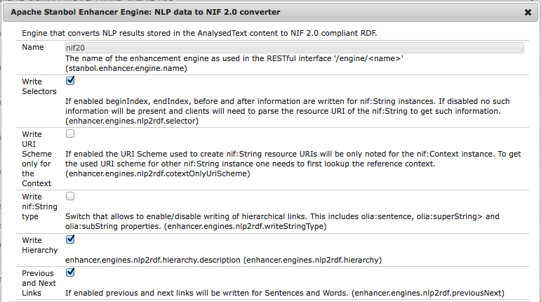

- **Selector** *(enhancer.engines.nlp2rdf.selector)*: Allows to enable/disable the serialization of selector related properties such as `nif:beginIndex`, `nif:endIndex`, `nif:before`, `nif:anchorOf` and `nif:after`. If disabled clients can still parse the start/end indexes from the [RFC 5147](http://tools.ietf.org/html/rfc5147) encoded segment URI.
- **Hierarchy** *(enhancer.engines.nlp2rdf.hierarchy)*: Switch that allows to enable/disable writing of hierarchical links. This includes `olia:sentence`, `olia:superString` and `olia:subString` properties.
- **Previous and Next Links** *(enhancer.engines.nlp2rdf.previousNext)*: Allows to enable/disable the serialization of links to the previous/next sentence/word
- **Context only URI Scheme** *(enhancer.engines.nlp2rdf.cotextOnlyUriScheme)*: If enabled the used [RFC 5147](http://tools.ietf.org/html/rfc5147) URI scheme is added only to the `rdf:type` of the `nif:Context`. If disabled the `nif:RFC5147String` `rdf:type` is added to all segments.
- **String Type** *(enhancer.engines.nlp2rdf.writeStringType)*: If enabled the `nif:String` type is added to all serialized segments. If disabled only more specific types like `nif:Sentence` or `nif:Word` are used.

<a id="trunk-components-enhancer-engines-nif20--examples"></a>

### Examples

This sections provides some examples of RDF generated by this Engine. OpenNLP was used to create the serialized NLP annotation. The Sentence `The Apache Stanbol Enhancer can detect entities in text` was used for generating this example.

```
@prefix content <urn:content-item-sha1-be57a50b7f82854460c2ff33a65637e36befe48e#> .
@prefix nif  <http://persistence.uni-leipzig.org/nlp2rdf/ontologies/nif-core#> .
@prefix olia  <http://purl.org/olia/olia.owl#> .
@prefix  xsd  <http://www.w3.org/2001/XMLSchema#> .
```

The first Turtle snippet shows the `nif:Context` instance. This is referenced by all segments and it will refer to the URI of the ContentItem by using the `nif:sourceUrl`.

```
content:char=0
    a nif:Context ,  nif:RFC5147String ;
    nif:anchorOf
        "The Apache Stanbol Enhancer can detect entities in text."@en ;
    nif:beginIndex
        "0"^^xsd:int ;
    nif:endIndex
        "56"^^xsd:int ;
    nif:sourceUrl
        <urn:content-item-sha1-be57a50b7f82854460c2ff33a65637e36befe48e> .
```

Next the segment describing the only sentence in the example text. NOTE: if `nif:before` or `nif:after` are empty strings it indicates that the section start/ends at the beginning/end of the parsed content.

```
content:char=0,56
    a nif:RFC5147String ,  nif:Sentence ;
    nif:before
        ""@en ;
    nif:anchorOf
        "The Apache Stanbol Enhancer can detect entities in text."@en ;
    nif:after
        ""@en ;
    nif:beginIndex
        "0"^^xsd:int ;
    nif:endIndex
        "56"^^xsd:int ;
    nif:firstWord
        content:char=0,3 ;
    nif:referenceContext
        content:char=0 .
```

The following snippet shows the segments for the first three words of the Sentence.

```
content:char=0,3
    a nif:RFC5147String ,  nif:Word ;
    nif:before
        ""@en ;
    nif:anchorOf
        "The"@en ;
    nif:after
        " Apache St"@en ;
    nif:beginIndex
        "0"^^xsd:int ;
    nif:endIndex
        "3"^^xsd:int ;
    nif:nextWord
        content:char=4,10 ;
    nif:oliaCategory
         olia:Determiner ,  olia:PronounOrDeterminer ;
    nif:oliaConf
        "0.9662179110607207"^^xsd:double ;
    nif:posTag
        "DT"^^xsd:string ;
    nif:referenceContext
        content:char=0 ;
    nif:sentence
        content:char=0,56 ;
    nif:subString
        content:char=0,10 .

content:char=4,10
    a nif:RFC5147String ,  nif:Word ;
    nif:before
        "The "@en ;nif:anchorOf
    nif:anchorOf
        "Apache"@en ;
    nif:after
        " Stanbol E"@en ;
    nif:beginIndex
        "4"^^xsd:int ;
    nif:endIndex
        "10"^^xsd:int ;
    nif:nextWord
        content:char=11,18 ;
    nif:oliaCategory
         olia:Noun ,  olia:PluralQuantifier ,  olia:ProperNoun ,  olia:Quantifier ;
    nif:oliaConf
        "0.7882547205652428"^^xsd:double ;
    nif:posTag
        "NNPS"^^xsd:string ;
    nif:previousWord
        content:char=0,3 ;
    nif:referenceContext
        content:char=0 ;
    nif:sentence
        content:char=0,56 ;
    nif:subString
        content:char=0,10 .

content:char=11,18
    a nif:RFC5147String ,  nif:Word ;
    nif:before
        "he Apache "@en ;
    nif:anchorOf
        "Stanbol"@en ;
    nif:after
        " Enhancer "@en ;
    nif:beginIndex
        "11"^^xsd:int ;
    nif:endIndex
        "18"^^xsd:int ;
    nif:nextWord
        content:char=19,27 ;
    nif:oliaCategory
         olia:Noun ,  olia:ProperNoun ,  olia:Quantifier ,  olia:SingularQuantifier ;
    nif:oliaConf
        "0.701014272348203"^^xsd:double ;
    nif:posTag
        "NNP"^^xsd:string ;
    nif:previousWord
        content:char=4,10 ;
    nif:referenceContext
        content:char=0 ;
    nif:sentence
        content:char=0,56 ;
    nif:subString
        content:char=11,27 .
```

Also Phrases are exported as RDF. Here an example for an Verb Phrase. Also the included the segment for the verb that links to the phrase using `nif:subString`.

```
content:char=28,38
    a nif:Phrase ,  nif:RFC5147String ;
    nif:before
        " Enhancer "@en ;
    nif:anchorOf
        "can detect"@en ;
    nif:after
        " entities "@en ;
    nif:beginIndex
        "28"^^xsd:int ;
    nif:endIndex
        "38"^^xsd:int ;
    nif:oliaCategory
         olia:VerbPhrase ;
    nif:oliaConf
        "0.9864510669287669"^^xsd:double ;
    nif:referenceContext
        content:char=0 ;
    nif:superString
        content:char=0,56 .

content:char=32,38
    a nif:RFC5147String ,  nif:Word ;
    nif:before
        "ancer can "@en ;
    nif:anchorOf
        "detect"@en ;
    nif:after
        " entities "@en ;
    nif:beginIndex
        "32"^^xsd:int ;
    nif:endIndex
        "38"^^xsd:int ;
    nif:nextWord
        content:char=39,47 ;
    nif:oliaCategory
         olia:Infinitive ,  olia:Verb ;
    nif:oliaConf
        "0.9930989756397197"^^xsd:double ;
    nif:posTag
        "VB"^^xsd:string ;
    nif:previousWord
        content:char=28,31 ;
    nif:referenceContext
        content:char=0 ;
    nif:sentence
        content:char=0,56 ;
    nif:subString
        content:char=28,38 .
```

Copyright © 2010 The Apache Software Foundation, Licensed under
the [Apache License, Version 2.0](http://www.apache.org/licenses/LICENSE-2.0).
Apache, Stanbol and the Apache feather and Stanbol logos are trademarks of The Apache Software Foundation.

---

<a id="trunk-components-enhancer-engines-keywordlinkingengine"></a>

<!-- source_url: https://stanbol.apache.org/docs/trunk/components/enhancer/engines/keywordlinkingengine -->

<!-- page_index: 37 -->

<a id="trunk-components-enhancer-engines-keywordlinkingengine--the-keyword-linking-engine:-custom-vocabularies-and-multiple-languages"></a>

# The Keyword Linking Engine: custom vocabularies and multiple languages

---

**WARNING:** This engine is deprecated. Users are encouraged to use the [EntityhubLinkingEngine](#trunk-components-enhancer-engines-entityhublinking) engine instead.

---

The KeywordLinkingEngine is intended to be used to extract occurrences of Entities part of a Controlled Vocabulary in content parsed to the Stanbol Enhancer. To do this words appearing within the text are compared with labels of entities. The Stanbol Entityhub is used to lookup Entities based on their labels.

This documentation first provides information about the configuration options of this engine. This section is mainly intended for users of this engine. The remaining part of this document is rather technical and intended to be read by developers that want to extend this engine or want to know the technical details.

<a id="trunk-components-enhancer-engines-keywordlinkingengine--configuration"></a>

## Configuration

The KeywordLinkingEnigne provides a lot of configuration possibilities. This section provides describes the different option based on the configuration dialog as shown by the Apache Felix Webconsole.

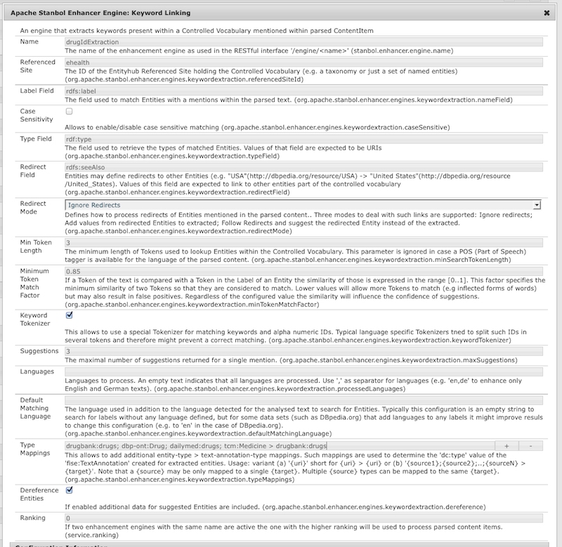

The example in the scene shows an configuration that is used to extract Drugs base on various IDs (e.g. the ATC code and the nchi key) that are all stored as values of the skos:notation property. This example is used to emphasize on newer features like case sensitive mapping, keyword tokenizer and also customized type mappings. Similar configurations would be also need to extract product ids, ISBN number or more generally concepts of an thesaurus based on there notation.

<a id="trunk-components-enhancer-engines-keywordlinkingengine--configuration-parameter"></a>

### Configuration Parameter

- **Name** *(stanbol.enhancer.engine.name)*: The name of the Enhancement Engine. This name is used to refer an [EnhancementEngine](#trunk-components-enhancer-engines) in [EnhancementChain](https://stanbol.apache.org/docs/trunk/components/enhancer/engines/enhancementchain.html)s
- **Referenced Site** *(org.apache.stanbol.enhancer.engines.keywordextraction.referencedSiteId)*: The name of the ReferencedSite of the Stanbol Entityhub that holds the controlled vocabulary to be used for extracting Entities. "entityhub" or "local" can be used to extract Entities managed directly by the Entityhub.
- **Label Field** *(org.apache.stanbol.enhancer.engines.keywordextraction.nameField)*: The name of the property used to lookup Entities. Only a single field is supported for performance reasons. Users that want to use values of several fields should collect such values by an according configuration in the mappings.txt used during indexing. This [usage scenario](#trunk-customvocabulary) provides more information on this.
- **Case Sensitivity** *(org.apache.stanbol.enhancer.engines.keywordextraction.caseSensitive)*: This allows to activate/deactivate case sensitive matching. It is important to understand that even with case sensitivity activated an Entity with the label such as "Anaconda" will be suggested for the mention of "anaconda" in the text. The main difference will be the confidence value of such a suggestion as with case sensitivity activated the starting letters "A" and "a" are NOT considered to be matching. See the second technical part for details about the matching process. Case Sensitivity is deactivated by default. It is recommended to be activated if controlled vocabularies contain abbreviations similar to commonly used words e.g. CAN for Canada.
- **Type Field** *(org.apache.stanbol.enhancer.engines.keywordextraction.typeField)*: Values of this field are used as values of the "fise:entity-types" property of created "[fise:EntityAnnotation](#trunk-components-enhancer-enhancementstructure--fiseentityannotation)"s. The default is "rdf:type".
- **Redirect Field** *(org.apache.stanbol.enhancer.engines.keywordextraction.redirectField)* and **Redirect Mode** *(org.apache.stanbol.enhancer.engines.keywordextraction.redirectMode)*: Redirects allow to tell the KeywordLinkingEngine to follow a specific property in the knowledge base for matched entities. This feature e.g. allows to follow redirects from "USA" to "United States" as defined in Wikipedia. See "Processing of Entity Suggestions" for details. Possible valued for the Redirect Mode are "IGNORE" - deactivates this feature; "ADD\_VALUES" - uses label, type informations of redirected entities, but keeps the URI of the extracted entity; "FOLLOW" - follows the redirect
- **Min Token Length** *(org.apache.stanbol.enhancer.engines.keywordextraction.minSearchTokenLength)*: While the KeywordLinkingEngine preferable uses POS (part-of-speach) taggers to determine if a word should matched with the controlled vocabulary the minimum token length provides a fall back if (a) no POS tagger is available for the language of the parsed text or (b) if the confidence of the POS tagger is lower than the threshold.
- **Minimum Token Match Factor** *(org.apache.stanbol.enhancer.engines.keywordextraction.minTokenMatchFactor)*: If a Token of the text is compared with a Token of an Entity Label the similarity of those two is expressed in the range [0..1]. The minimum token match factor specifies the minimum similarity of two Tokens so that they are considered to match. Lower similarity scores are not considered as match. This parameter is important as it e.g. allows inflected forms of words to match. However it also may result in false positives of similar words. users should note that the similarity score is also used for calculating the confidence. So similarity scores < 1 but higher than the configured minimum token match factor will reduce the confidence of suggested Entities.
- **Keyword Tokenizer** *(org.apache.stanbol.enhancer.engines.keywordextraction.keywordTokenizer)*: This allows to use a special Tokenizer for matching keywords and alpha numeric IDs. Typical language specific Tokenizers tend to split such IDs in several tokens and therefore might prevent a correct matching. This Tokenizer should only be activated if the KeywordLinkingEngine is configured to match against IDs like ISBN numbers, Product IDs ... It should not be used to match against natural language labels.
- **Suggestions** *(org.apache.stanbol.enhancer.engines.keywordextraction.maxSuggestions)*: The maximum number of suggested Entities.
- **Languages** *(org.apache.stanbol.enhancer.engines.keywordextraction.processedLanguages)* and **Default Matching Language** *(org.apache.stanbol.enhancer.engines.keywordextraction.defaultMatchingLanguage)*: The first allows to specify languages that should be processed by this engine. This is e.g. useful if the controlled vocabulary only contains labels in for a specific language but does not formally specify this information (by setting the "xml:lang" property for labels). The default matching language can be used to work around the exact opposite case. As an example in DBpedia labels do get the language of the dataset they are extracted from (e.g. all data extracted from en.wikipedia.org will get "xml:lang=en"). The default matching language allows to tell the KeywordLinkingEngine to use labels of that language for matching regardless of the language of the parsed content. In the case of DBpedia this allows e.g. to match persons mentioned in an Italian text with the english labels extracted from en.wikipedia.org. Details about natural language processing features used by this engine are provided in the section "Multiple Language Support"
- **Type Mappings** *(org.apache.stanbol.enhancer.engines.keywordextraction.typeMappings)*: The FISE enhancement structure (as used by the Stanbol Enhancer) distinguishes [TextAnnotation](#trunk-components-enhancer-enhancementstructure--fisetextannotation) and [EntityAnnotation](#trunk-components-enhancer-enhancementstructure--fiseentityannotation)s. The Keyword linking engine needs to create both types of Annotations: TextAnnotations selecting the words that match some Entities in the Controlled Vocabulary and EntityAnnotations that represent an Entity suggested for a TextAnnotation. The Type Mappings are used to determine the "dc:type" of the TextAnnotation based on the types of the suggested Entity. The default configuration comes with mappings for Persons, Organizations, Places and Concepts but this fields allows to define additional mappings. For details see the section "Type Mapping Syntax" and "Processing of Entity Suggestions".
- **Dereference Entities** *(org.apache.stanbol.enhancer.engines.keywordextraction.dereference)*: If enabled this engine adds additional information about the suggested Entities to the Metadata of the enhanced content item.
- **Ranking** *(service.ranking)*: This property is used of two engines do use the same **Name**. In such cases the one with the higher ranking will be used to enhance content items. Typically users will not need to change this.

Additionally the following properties can be configured via a configuration file:

- **Minimum Found Tokens** *(org.apache.stanbol.enhancer.engines.keywordextraction.minFoundTokens)*: This allows to tell the KeywordLinking Engine how to deal with Entities that do not exactly match words in the text. Typical Examples are "George W. Bush" -> "George Walker Bush". This parameter allows the minimum number of tokens that need to match. The default value is '2'. Note that this does not apply for exact matches. Setting this to a high value can be used to force a mode that will only consider entities where all tokens of the label match the mention in the text.
- **Minimum Pos Tag Probability** *(org.apache.stanbol.enhancer.engines.keywordextraction.minPosTagProbability)*: The minimum probability of a POS (part-of-speech) tag. Tags with a lower probability will be ignored. In such cases the configured value for the **Min Token Length** will apply. The value MUST BE in the range [0..1]

<a id="trunk-components-enhancer-engines-keywordlinkingengine--type-mappings-syntax"></a>

### Type Mappings Syntax

The Type Mappings are used to determine the "dc:type" of the [TextAnnotation](#trunk-components-enhancer-enhancementstructure--fisetextannotation) based on the types of the suggested Entity. The field "Type Mappings" (property: *org.apache.stanbol.enhancer.engines.keywordextraction.typeMappings*) can be used to customize such mappings.

This field uses the following syntax

```
{uri} {source}> {target} {source1 }; {source2 }; ...{sourceN}> {target}
```

The first variant is a shorthand for {uri} > {uri} and therefore specifies that the {uri} should be used as 'dc:type' for [TextAnnotation](#trunk-components-enhancer-enhancementstructure--fisetextannotation)s if the matched entity is of type {uri}. The second variant matches a {source} URI to a {target}. Variant three shows the possibility to match multiple URIs to the same target in a single configuration line.

Both 'ns:localName' and full qualified URIs are supported. For supported namespaces see the [NamespaceEnum](http://svn.apache.org/repos/asf/incubator/stanbol/trunk/entityhub/generic/servicesapi/src/main/java/org/apache/stanbol/entityhub/servicesapi/defaults/NamespaceEnum.java). Information about accepted (INFO) and ignored (WARN) type mappings are available in the logs.

Some Examples of additional Mappings for the e-health domain:

```
drugbank:drugs;
dbp - ont:Drug;
dailymed:drugs;
sider:drugs;
tcm:Medicine> drugbank:drugs diseasome:diseases;
linkedct:condition;
tcm:Disease> diseasome:diseases sider:side_effects dailymed:ingredients dailymed:organization> dbp - ont:Organisation
```

The first two lines map some will known Classes that represent drugs and diseases to 'drugbank:drugs' and 'diseasome:diseases'. The third and fourth line define 1:1 mappings for side effects and ingredients and the last line adds 'dailymed:organization' as an additional mapping to DBpedia Ontology Organisation.

The following mappings are predefined by the KeywordLinkingEngine.

```
dbp - ont:Person;
foaf:Person;
schema:Person> dbp - ont:Person dbp - ont:Organisation;
dbp - ont:Newspaper;
schema:Organization> dbp - ont:Organisation dbp - ont:Place;
schema:Place;
gml:_Feature> dbp - ont:Place skos:Concept
```

<a id="trunk-components-enhancer-engines-keywordlinkingengine--multiple-language-support"></a>

## Multiple Language Support

The KeywordLinkingEngine supports the extraction of keywords in multiple languages. However, the performance and to some extend also the quality of the enhancements depend on how well a language is supported by the used NLP framework (currently OpenNLP).
The following list provides a short overview about the different language specific component/configurations:

- **Language detection:** The KeywordLinkingEngine depends on the correct detection of the language by the LanguageIdentificationEngine. If no language is detected or this information is missing then "English" is assumed as default.
- **Multi-lingual labels of the controlled vocabulary:** Entities are matched based on labels of the current language and labels without any defined language. e.g. English labels will not be matched against German language texts. Therefore it is important to have a controlled vocabulary that includes labels in the language of the texts you want to enhance.
- **Natural Language Processing support:** The KeywordLinkingEngine is able to use [Sentence Detectors](http://opennlp.sourceforge.net/api/opennlp/tools/sentdetect/SentenceDetector.html), [POS (Part of Speech) taggers](http://opennlp.sourceforge.net/api/opennlp/tools/postag/POSTagger.html) and [Chunkers](http://opennlp.sourceforge.net/api/opennlp/tools/chunker/Chunker.html). If such components are available for a language then they are used to optimize the enhancement process.
- **Sentence detector:** If a sentence detector is present the memory footprint of the engines improves, because Tokens, POS tags and Chunks are only kept for the currently active sentence. If no sentence detector is available the entire content is treated as a single sentence.
- **Tokenizer:** A (word) [tokenizer](http://opennlp.sourceforge.net/api/opennlp/tools/tokenize/Tokenizer.html) is required for the enhancement process. If no specific tokenizer is available for a given language, then the [OpenNLP SimpleTokenizer](http://opennlp.sourceforge.net/api/opennlp/tools/tokenize/SimpleTokenizer.html) is used as default. The parameter **Keyword Tokenizer** can be used to force the usage of a special Tokenizer that is optimized for matching keyword. This Tokenizer ensures that alpha-numeric IDs are not tokenized to ensure correct matching of such tokens. If this option is enabled than any language specific Tokenizer will be ignored in favor of the KeywordTokenizer.
- **POS tagger:** POS (Part-of-Speech) taggers annotate tokens with their type. Because of the KeywordLinkingEngine is only interested in Nouns, Foreign Words and Numbers, the presence of such a tagger allows to skip a lot of the tokens and to improve performance. However POS taggers use different sets of tags for different languages. Because of that it is not enough that a POS tagger is available for a language there MUST BE also a configuration of the POS tags representing Nouns.
- **Chunker:** There are two types of Chunkers. First the [Chunkers](http://opennlp.sourceforge.net/api/opennlp/tools/chunker/Chunker.html) as provided by OpenNLP (based on statistical models) and second a [POS tag based Chunker](http://svn.apache.org/repos/asf/incubator/stanbol/trunk/commons/opennlp/src/main/java/org/apache/stanbol/commons/opennlp/PosTypeChunker.java) provided by the openNLP bundle of Stanbol. Currently the availability of a Chunker does not have a big influence on the performance nor the quality of the Enhancements.

<a id="trunk-components-enhancer-engines-keywordlinkingengine--keyword-extraction-and-linking-workflow"></a>

## Keyword extraction and linking workflow

Basically the text is parsed from the beginning to the end and words are looked up in the configured controlled vocabulary.

<a id="trunk-components-enhancer-engines-keywordlinkingengine--text-processing"></a>

### Text Processing

The [AnalysedContent](http://svn.apache.org/repos/asf/incubator/stanbol/trunk/enhancer/engines/keywordextraction/src/main/java/org/apache/stanbol/enhancer/engines/keywordextraction/linking/AnalysedContent.java) Interface is used to access natural language text that was already processed by a NLP framework. Currently there is only a single implementation based on the commons.opennlp [TextAnalyzer](http://svn.apache.org/repos/asf/incubator/stanbol/trunk/commons/opennlp/src/main/java/org/apache/stanbol/commons/opennlp/TextAnalyzer.java) utility. In general this part is still very focused on OpenNLP. Making it also usable together with other NLP frameworks would probably need some re-factoring.

The current state of the processing is represented by the [ProcessingState](http://svn.apache.org/repos/asf/incubator/stanbol/trunk/enhancer/engines/keywordextraction/src/main/java/org/apache/stanbol/enhancer/engines/keywordextraction/impl/ProcessingState.java). Based on the capabilities of the NLP framework for the current language it provides a the following set of information:

- **AnalysedSentence:** If a sentence detector is present, than this represent the current sentence of the text. If not, then the whole text is represented as a single sentence. The AnalysedSentence also provides access to POS tags and Chunks (if available)
- **Chunk:** If a chunker is present, then this represents the current chunk. Otherwise this will be null.
- **Token:** The currently processed word part of the chunk and the sentence.
- **TokenIndex:** The index of the currently active token relative to the AnalysedSentence.

Processing is done based on Tokens (words). The ProcessingState provides means to navigate to the next token. If Chunks are present tokens that are outside of chunks are ignored. Only 'processable' tokens are considered to lookup entities (see the next section for details). If a Token is processable is determined as follows

- Only Tokens within a Chunk are considered. If no Chunks are available all Tokens.
- If POS tags are available AND POS tags considered as NOUNS are configured (see [PosTagsCollectionEnum](http://svn.apache.org/repos/asf/incubator/stanbol/trunk/commons/opennlp/src/main/java/org/apache/stanbol/commons/opennlp/PosTagsCollectionEnum.java)) than POS tags are considered for deciding if a Token is processable
  - The minimum POS tag probability is `0.667`
  - Tokens with a POS tag representing a NOUN and a probability >= minPosTagProb are marked as processable
  - Tokens with a POS tag NOT representing a NOUN and a probability >= minPosTagProb/2 are marked as NOT processable
- If POS tags are NOT available or the NOUN POS tags configuration is missing the minimum token length *(org.apache.stanbol.enhancer.engines.keywordextraction.minSearchTokenLength)* is used as fallback. This means that all Tokens equals or longer than this value are marked as processable.

This algorithm was introduced by [STANBOL-658](https://issues.apache.org/jira/browse/STANBOL-685)

<a id="trunk-components-enhancer-engines-keywordlinkingengine--entity-lookup"></a>

### Entity Lookup

A "OR" query with [1..MAX\_SEARCH\_TOKENS] processable tokens is used to lookup entities via the [EntitySearcher](http://svn.apache.org/repos/asf/incubator/stanbol/trunk/enhancer/engines/keywordextraction/src/main/java/org/apache/stanbol/enhancer/engines/keywordextraction/linking/EntitySearcher.java) interface. If the actual implementation cut off results, than it must be ensured that Entities that match both tokens are ranked first.
Currently there are two implementations of this interface: (1) for the Entityhub ([EntityhubSearcher](http://svn.apache.org/repos/asf/incubator/stanbol/trunk/enhancer/engines/keywordextraction/src/main/java/org/apache/stanbol/enhancer/engines/keywordextraction/linking/impl/EntityhubSearcher.java)) and (2) for ReferencedSites ([ReferencedSiteSearcher](http://svn.apache.org/repos/asf/incubator/stanbol/trunk/enhancer/engines/keywordextraction/src/main/java/org/apache/stanbol/enhancer/engines/keywordextraction/linking/impl/ReferencedSiteSearcher.java)). There is also an [Implementation](http://svn.apache.org/repos/asf/incubator/stanbol/trunk/enhancer/engines/keywordextraction/src/test/java/org/apache/stanbol/enhancer/engines/keywordextraction/impl/TestSearcherImpl.java) that holds entities in-memory, however currently this is only used for unit tests.

Queries do use the configured [EntityLinkerConfig](http://svn.apache.org/repos/asf/incubator/stanbol/trunk/enhancer/engines/keywordextraction/src/main/java/org/apache/stanbol/enhancer/engines/keywordextraction/linking/EntityLinkerConfig.java).getNameField() and the language of labels is restricted to the current language or labels that do not define any language.

Only "processable" tokens are used to lookup entities. If a token is processable is determined as follows:

- If POS tags are available the "Boolean processPOS(String posTag)" method of the [AnalysedContent](http://svn.apache.org/repos/asf/incubator/stanbol/trunk/enhancer/engines/keywordextraction/src/main/java/org/apache/stanbol/enhancer/engines/keywordextraction/linking/AnalysedContent.java) is used to check if a Token needs to be processed.
- If this method returns NULL or no POS tags are available, then all Tokens longer than [EntityLinkerConfig](http://svn.apache.org/repos/asf/incubator/stanbol/trunk/enhancer/engines/keywordextraction/src/main/java/org/apache/stanbol/enhancer/engines/keywordextraction/linking/EntityLinkerConfig.java).getMinSearchTokenLength() (default=3) are considered as processable.

Typically the next MAX\_SEARCH\_TOKENS processable tokens are used for a lookup. However the current Chunk/Sentence is never left in the search for processable tokens.

<a id="trunk-components-enhancer-engines-keywordlinkingengine--matching-of-found-entities"></a>
<a id="trunk-components-enhancer-engines-keywordlinkingengine--matching-of-found-entities:"></a>

### Matching of found Entities:

All labels (values of the [EntityLinkerConfig](http://svn.apache.org/repos/asf/incubator/stanbol/trunk/enhancer/engines/keywordextraction/src/main/java/org/apache/stanbol/enhancer/engines/keywordextraction/linking/EntityLinkerConfig.java).getNameField() field) in the language of the content or without any defined language are candidates for matches.

For each label that fulfills the above criteria the following steps are processed. The best result is used as the result of the whole matching process:

- Tokens (of the text) following the current position are searched within the label. This also includes non-processable Tokens.
  - Processable Tokens MUST match with Tokens in the Label. A maximum number of [EntityLinkerConfig](http://svn.apache.org/repos/asf/incubator/stanbol/trunk/enhancer/engines/keywordextraction/src/main/java/org/apache/stanbol/enhancer/engines/keywordextraction/linking/EntityLinkerConfig.java).getMaxNotFound() non-processable Tokens may not match.
  - Token order is important. Tokens in the Entity Label are allied to be skipped (e.g. the text 'Barack Obama' will match the label 'Barack Hussein Obama' because Hussein is allowed to be skipped. The other way around it would be no match because processable Tokens in the Text are not allied to be skipped)
- If the first Token of the Label is not matches preceding Tokens of the Text are matched against the Label. This is done to ensure that Entities that use adjectives in their labels (e.g. "great improvement", "Gute Deutschkenntnisse") are matched. In addition this also helps to match named entities (e.g. person names) as the first token of those mentions are sometimes erroneously classified adjectives by POS taggers.
- Tokens that appear in the wrong order (e.g. the text 'Obama, Barack' with the label 'Barack Obama' are matched with a factor of `0.7`. Currently only exact matches are considered.

If two tokens match is calculated by dividing the longest matching part from the begin of the Token to the maximum length of the two tokens. e.g. 'German' would match with 'Germany' with `5/6=0.83`. The result of this comparison is the token similarity. If this similarity is greater equals than the configured minimum token similarity factor *(org.apache.stanbol.enhancer.engines.keywordextraction.minTokenMatchFactor)* than those tokens are considered to match. The token similarity is also used for calculating the confidence.

Entities are [Suggested](http://svn.apache.org/repos/asf/incubator/stanbol/trunk/enhancer/engines/keywordextraction/src/main/java/org/apache/stanbol/enhancer/engines/keywordextraction/linking/Suggestion.java) if:

- a label does match exactly with the current position in the text. This is if all tokens of the Label match with the Tokens of the text. Note that tokens are considered to match if the similarity is greater equals than the minimum token match factor.
- partial matches are considered if more than [EntityLinkerConfig](http://svn.apache.org/repos/asf/incubator/stanbol/trunk/enhancer/engines/keywordextraction/src/main/java/org/apache/stanbol/enhancer/engines/keywordextraction/linking/EntityLinkerConfig.java).getMinFoundTokens() (default=2) processable tokens match. Non-processable tokens are not considered for this. This ensures that "[Rupert Murdoch](http://en.wikipedia.org/wiki/Rupert_Murdoch)" is not suggested for "[Rupert](http://en.wikipedia.org/wiki/Rupert)" but on the other hand "Barack Hussein Obama" is suggested for "Barack Obama".

The described matching process is currently directly part of the [EntityLinker](http://svn.apache.org/repos/asf/incubator/stanbol/trunk/enhancer/engines/keywordextraction/src/main/java/org/apache/stanbol/enhancer/engines/keywordextraction/linking/EntityLinker.java). To support different matching strategies this would need to be externalized into an own "EntityLabelMatcher" interface.

<a id="trunk-components-enhancer-engines-keywordlinkingengine--processing-of-entity-suggestions"></a>

### Processing of Entity Suggestions

In case there are one or more [Suggestion](http://svn.apache.org/repos/asf/incubator/stanbol/trunk/enhancer/engines/keywordextraction/src/main/java/org/apache/stanbol/enhancer/engines/keywordextraction/linking/Suggestion.java)s of Entities for the current position within the text a [LinkedEntity](http://svn.apache.org/repos/asf/incubator/stanbol/trunk/enhancer/engines/keywordextraction/src/main/java/org/apache/stanbol/enhancer/engines/keywordextraction/linking/LinkedEntity.java) instance is created.

LinkedEntity is an object model representing the Stanbol Enhancement Structure. After the processing of the parsed content is completed, the LinkedEntities are "serialized" as RDF triples to the metadata of the ContentItem.

[TextAnnotation](#trunk-components-enhancer-enhancementstructure--fisetextannotation)s as defined in the [Stanbol Enhancement Structure](#trunk-components-enhancer-enhancementstructure) do use the [dc:type](http://www.dublincore.org/documents/dcmi-terms/#terms-type) property to provide the general type of the extracted Entity. However suggested Entities might have very specific types. Therefore the [EntityLinkerConfig](http://svn.apache.org/repos/asf/incubator/stanbol/trunk/enhancer/engines/keywordextraction/src/main/java/org/apache/stanbol/enhancer/engines/keywordextraction/linking/EntityLinkerConfig.java) provides the possibility to map the specific types of the Entity to types used for the dc:type property of TextAnnotations. The [EntityLinkerConfig](http://svn.apache.org/repos/asf/incubator/stanbol/trunk/enhancer/engines/keywordextraction/src/main/java/org/apache/stanbol/enhancer/engines/keywordextraction/linking/EntityLinkerConfig.java).DEFAULT\_ENTITY\_TYPE\_MAPPINGS contains some predefined mappings.
*Note that the field used to retrieve the types of a suggested Entity can be configured by the EntityLinkerConfig. The default value for the type field is "rdf:type".*

In some cases suggested entities might redirect to others. In the case of Wikipedia/DBpedia this is often used to link from acronyms like [IMF](http://en.wikipedia.org/w/index.php?title=IMF&redirect=no) to the real entity [International Monetary Fund](http://en.wikipedia.org/wiki/International_Monetary_Fund). But also some Thesauri define labels as own Entities with an URI and users might want to use the URI of the Concept rather than one of the label.
To support such use cases the KeywordLinkingEngine has support for redirects. Users can first configure the redirect mode (ignore, copy values, follow) and secondly the field used to search for redirects (default=rdfs:seeAlso).
If the redirect mode != ignore for each suggestion the Entities referenced by the configured redirect field are retrieved. In case of the "copy values" mode the values of the name, and type field are copied. In case of the "follow" mode the suggested entity is replaced with the first redirected entity.

<a id="trunk-components-enhancer-engines-keywordlinkingengine--confidence-for-suggestions"></a>

### Confidence for Suggestions

The confidence for suggestions is calculated based on the following algorithm:

Input Parameters

- max\_matched: maximum number of the matched tokens of all suggestions e.g. the text contains "Barack Obama" -> 2
- matched: number of tokens that match for the current suggestion e.g. "Barack Hussein Obama" -> 2
- span: number of tokens selected by the current suggestion e.g. "Barack Hussein Obama" -> 2
- label\_tokens: number of tokens of the matched label of the current entity (label\_token) e.g. "Barack Hussein Obama" -> 3

The confidence is calculated as follows:

```
confidence =(match / max_matched )^ 2 * (matched / span) * (matched / label_tokens)
```

Some Examples:

- "Barack Hussein Obama" matched against the text "Barack Obama" results in a confidence of (2/2)^2 \* (2/2) \* (2/3) = 0,67
- "University Michigan" matched against the text "University of Michigan" results in a confidence of (2/2)^2 \* (2/3) \* (2/2) = 0,67
- "New York City" matched against the text "New York Rangers" - assuming that "New York Rangers" is the best match - results in a confidence of (2/3)^2 \* (2/2) \* (2/3) = 0,3; Note that the best match "New York Rangers" has max\_matched=3 and gets a confidence of 1.

The calculation of the confidence is currently direct part of the [EntityLinker](http://svn.apache.org/repos/asf/incubator/stanbol/trunk/enhancer/engines/keywordextraction/src/main/java/org/apache/stanbol/enhancer/engines/keywordextraction/linking/EntityLinker.java). To support different matching strategies this would need to be externalized into an own interface.

<a id="trunk-components-enhancer-engines-keywordlinkingengine--notes-about-the-taxonomylinkingengine"></a>

## Notes about the TaxonomyLinkingEngine

The KeywordLinkingEngine is a re-implementation of the TaxonomyLinkingEngine which is more modular and therefore better suited for future improvements and extensions as requested by [STANBOL-303](https://issues.apache.org/jira/browse/STANBOL-303). As of [STANBOL-506](https://issues.apache.org/jira/browse/STANBOL-506) this engine is now deprecated and will be deleted from the SVN.

Copyright © 2010 The Apache Software Foundation, Licensed under
the [Apache License, Version 2.0](http://www.apache.org/licenses/LICENSE-2.0).
Apache, Stanbol and the Apache feather and Stanbol logos are trademarks of The Apache Software Foundation.

---

<a id="trunk-components-enhancer-enhancementstructure"></a>

<!-- source_url: https://stanbol.apache.org/docs/trunk/components/enhancer/enhancementstructure -->

<!-- page_index: 38 -->

<a id="trunk-components-enhancer-enhancementstructure--stanbol-enhancement-structure"></a>

# Stanbol Enhancement Structure

This document specifies the Structure used by the Stanbol Enhancer encodes features extracted form the parsed [ContentItem](#trunk-components-enhancer-contentitem). The Enhancement Structure is based on [RDF](http://www.w3.org/TR/rdf-primer/) technology and defined as [OWL](http://www.w3.org/2004/OWL/) ontology.

Its two main purposes are to facilitate the:

1. Interoperability between EnhancementEngines: The design of the Stanbol Enhancer is based on the processing of an [ContentItem](#trunk-components-enhancer-contentitem) by multiple [EnhancementEngine](#trunk-components-enhancer-engines)s in an [EnhancementChain](#trunk-components-enhancer-chains). Together with the ContentItem API the EnhancementStructure is the key enabler for the cooperation of the different engines. It ensures that enhancements created by one engine can be consumed by the following engines (e.g. the first engine detects the language of the parsed text; the second consumes the language to select the correct NER (named entity recognition) model and create enhancements describing Named Entities contained in the text; the third Engine consumes those Named Entity annotations and creates suggestions for Entities part of an controlled vocabulary).
2. Consumption of extracted Features: The knowledge structure standardized by this Ontology aims to allow users to consume/process the features extracted from the parsed content. This includes things like:
   - list all suggested Entities (accept/reject Tags)
   - list all suggested Topics (content classification)
   - group Entity suggestion based on detected "Named Entities" (disambiguation support)
   - show the occurrence of detected Entities within the analyzed text (similar to spell checker UIs)

While this document focuses on the first Engine and provides details on how the Stanbol Enhancement Structure it the integral part of the Stanbol Enhancer there is also a [Usage Scenario](#trunk-enhancementusage) available that focuses on how the Enhancements can be consumed by Stanbol Enhancer users.

<a id="trunk-components-enhancer-enhancementstructure--overview-on-the-stanbol-enhancement-structure"></a>

## Overview on the Stanbol Enhancement Structure

The Stanbol Enhancement Structure is a central part of the [Stanbol Enhancer](#trunk-components-enhancer) architecture as it represents the binding element between the [ContentItem](#trunk-components-enhancer-contentitem) analyzed by the the [EnhancementEngine](#trunk-components-enhancer-engines)s as configured by an [EnhancementChain](#trunk-components-enhancer-chains). Together with the [ContentParts](#trunk-components-enhancer-contentitem--content-parts) it represents the state that is constantly updated during the enhancement process.

The following graphic provides an overview on how the EnhancementStructure is used by the Stanbol Enhancer to formally represent the enhancement results.

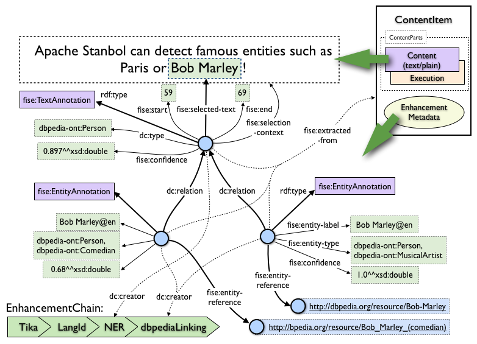

The above figure shows

- A [ContentItem](#trunk-components-enhancer-contentitem) with a single plain text [ContentParts](#trunk-components-enhancer-contentitem--content-parts) containing the text "Apache Stanbol can detect famous entities such as Paris or Bob Marley!"
- Three Enhancements: One TextAnnotation describing "Bob Marley" as Named-Entity as extracted by the NER (NamedEntityRecognition) engine and two EntityAnnotation that suggest different Entities from [DBpedia.org](http://dbpedia.org).
- Two referenced Entities: Both [dbpedia:Bob\_Marley](http://dbpedia.org/resource/Bob_Marley) and [dbpedia:Bob\_Marley\_(comedian)](http://dbpedia.org/resource/Bob_Marley_%28comedian%29) are part of [DBpedia.org](http://dbpedia.org) and referenced by fise:EntityAnnotations created by instance of the the [NamedEntityLinging engine](#trunk-components-enhancer-engines-namedentitytaggingengine) configured to link with [DBpedia.org](http://dbpedia.org)
- An [EnhancementChain](#trunk-components-enhancer-chains) with four [EnhancementEngine](#trunk-components-enhancer-engines)s. However only the enhancements of the later two are shown in the figure.

The bold relations within the figure are central as they show how the EnhancementStructure is used to formally specify that the mention "Bob Marley" within the analyzed text is believed to represent the Entity [dbpedia:Bob\_Marley](http://dbpedia.org/resource/Bob_Marley). However it is also stated that there is a disambiguation with an other person [dbpedia:Bob\_Marley\_(comedian)](http://dbpedia.org/resource/Bob_Marley_%28comedian%29).

The dashed relations are also important as they are used to formally describe the extraction context: which EnhancementEngine has extracted a feature from what ContentItem. If even more contextual information are needed, users can combine those information with the [ExecutionMetadata](#trunk-components-enhancer-executionmetadata) collected during the enhancement process.

<a id="trunk-components-enhancer-enhancementstructure--general-information"></a>

## General Information

**Used Namespaces**

This provides the list of namespaces used/referenced by the Enhancement Structure

- **fise** (*http://fise.iks-project.eu/ontology/*): This is the main namespace of the currently used Enhancement Structure. All custom concepts and properties are defined using this namespace. (\*)
- **enhancer** (*http://stanbol.apache.org/ontology/enhancer/enhancer#*): This is the main namespace of the Stanbol Enhancer defining concepts such as ContentItem, EnhancementEngine, EnhancementChain …
- **entityhub** (*http://stanbol.apache.org/ontology/entityhub/entityhub#*)
  :   This is the main namespace of the Stanbol Entityhub component.
- **dc** (*http://purl.org/dc/terms/*): The Dublin Core terms standard is also heavily used by the Stanbol Enhancement Structure. Especially to encode metada data, but also to encode relations between extracted information (fise:Enhancement's)
- **dppedia-ont** (*http://dbpedia.org/ontology/*): Concepts of this Ontology are used to describe the types of "Named Entities" detected in parsed content.
- **skos** (*http://www.w3.org/2004/02/skos/core#*): The SKOS standard is preferable used to describe entries of Thesauri or more generally any type of controlled vocabularies.
- **rdf** (*http://www.w3.org/1999/02/22-rdf-syntax-ns#*)
- in addition [EnhancementEngine](#trunk-components-enhancer-engines)s are free to add/use properties of any additional Ontology (e.g. when adding the rdf:type's of suggested Entities).

*(\*) Historical side note: FISE was the name of the Stanbol Enhancer before its [incubation to Apache](http://wiki.apache.org/incubator/StanbolProposal). The Enhancement Structure does still use the original namespace for compatibility reasons.*

**About Expressiveness:**

All Stanbol Ontologies are encoded using OWL but restrict itself to basic features. Users need to be aware that not all rules defined in this documentation are formally expressed within the Ontology. However all the stated rules are validated by the [EnhancementStructureHelper](http://svn.apache.org/repos/asf/incubator/stanbol/trunk/enhancer/generic/test/src/main/java/org/apache/stanbol/enhancer/test/helper/EnhancementStructureHelper.java) UnitTest utility part of the "org.apache.stanbol.enhancer.test" module. This ensures that EnhancementEngine implementation that validate there enhancement using this utility comply to this specification.

**About Reasoning:**

Apache Stanbol assumes the users will have no reasoning support. Because of that EnhancementEngines are required to materialize information that would be otherwise only available by reasoning (e.g. it is required that they add both "fise:TextAnnotation" and "fise:Enhancement" as "rdf:type"s when writing a TextAnnotation).

<a id="trunk-components-enhancer-enhancementstructure--core-concepts"></a>

## Core Concepts

The main concept of the Stanbol Enhancement Structure is the "fise:Enhancement". It is used as base concept for all annotation types and defines the generic properties every enhancement MUST provide (e.g. creator, creation date, extracted-from, confidence). On top of the "fise:Enhancement" three specific annotations types are defined:

- TextAnnotation: To describe features with there occurrence within the parsed Text
- EntityAnnotation: To suggest (linked) Entities with features detected within the content
- TopicAnnotation: To classify (link) the parsed content along topics

<a id="trunk-components-enhancer-enhancementstructure--fiseenhancement"></a>
<a id="trunk-components-enhancer-enhancementstructure--fise:enhancement"></a>

### fise:Enhancement

Every feature extracted by an [EnhancementEngine](#trunk-components-enhancer-engines) that is expressed using the Stanbol Enhancement Structure needs to be represented as a RDF resource with the "rdf:type" "fise:Enhancement".

Enhancements use [Dublin Core terms](http://dublincore.org/documents/dcmi-terms/) to provide metadata about their creation:

- **dc:creator** *(required, single)*: The [EnhancementEngine](#trunk-components-enhancer-engines) that created the Enhancement. Currently the full qualified name of the Java Class implementing the engine is used as String values. In future version this will change to the relative URL of the EnhancementEngine (e.g. "/enhancer/engine/{engine-name}")
- **dc:created** *(required, single)*: The UTF date/time when the enhancement was created by the EnhancementEngine.
- **dc:contributor** *(optional, multiple)*: Additional [EnhancementEngine](#trunk-components-enhancer-engines) that contributed to the Enhancement.
- **dc:modified** *(optional, single)*: The last change to a given enhancement.

The following properties provide information about the enhancement

- **fise:extracted-from** *(required, single)*: The URI of the "enhancer:ContentItem" the feature was extracted. EnhancementEngines need to use the UriRef returned by ContentItem#getUri() as value.
- **fise:confidence** *(optional, single, range: 0 <= confidence <= 1)*: The confidence of the enhancement as floating point number. NOTE that while this uses a floating point number as value users should not treat values to be on a rational scale - meaning that an enhancement with a confidence of 0.4 is NOT half as good as one with 0.8!
- **dc:relation** *(optional, multiple)*: Specifies that the current fise:Enhancement has a relation to an other fise:Enhancement. Values need to be resources of the "rdf:type" "fise:Enhancement".
- **dc:requires** *(optional, multiple)*: Specifies that the current fise:Enhancement depends on an other fise:Enhancement. This is a stronger version of using "dc:relation" and should indicate that if one of the required enhancements is declined/removed this also affects this one. Values need to be resources of the "rdf:type" "fise:Enhancement". NOTE also that Dublin Core terms defines dc:requires as an sub-property of dc:relation.

<a id="trunk-components-enhancer-enhancementstructure--fisetextannotation"></a>
<a id="trunk-components-enhancer-enhancementstructure--fise:textannotation"></a>

### fise:TextAnnotation

TextAnnotations are used to select portions parsed textual content by using the following properties:

- **fise:start** *(optional, single)*: The start character position within the plain text version of the parsed content. Note that the plain text version can be retrieved by using the [multi-part content item support](#trunk-components-enhancer-enhancerrest--multi-part-contentitem-support) of the Stanbol Enhancer RESTful API.
- **fise:end** *(required of fise:start is present, single)*: The end character position. This MUST only be present of "fise:start" is also defined.
- **fise:selected-text** *(optional, single)*: The text selected by the TextAnnotation. This MUST be the same as the text from index "fise:start" to "fise:end" within the plain text version of the parsed content.
- **fise:selection-context** *(required if fise:selected-text is present, single)*: The selection context such as the current sentence or a fixed number of characters/word before and after the selected text. This MUST be present if "fise:selected-text" is defined.
- **dc:type** *(optional,single)*: The nature of the selected part of the text (e.g. dbpedia-ont:Person, Organization, dbpedia-ont:Place for Named Entities; dc:LinguisticSystem for language annotations; skos:Concept for abstract things incl. categorizations). Note that dc:type values are just recommendations. Users are free to use different as the recommended one. As an example the [KeywordLinkingEngine](#trunk-components-enhancer-engines-keywordlinkingengine) allows users to configure dc:type mappings.

As hinted by the description of the above properties their usage depends on the size of the selected part of the text.

- selection of the whole Document: This is the default and MUST BE assumed if non of the start/end/selected-text/selection-context properties is present
- selection of a part (e.g. chapter, sentence): The preferred way is to define start/end positions. selected-text and selection-context are inefficient for bigger section as they would duplicate those sections of the content with the RDF graph as literals.
- Selection of words, word-phrases: In this case it is highly recommended to define start/end as well as selected-text/selection-context. Especially the selected-text and selection-context are important to calculate the exact position of an enhancement in non-plain-text content (e.g. HTML fragments).

The following figure shows an fise:TextAnnotation used to mark the occurrence of Named Entity "Bob Marley" form character 59 to 69 in the given Content.


NOTE: In future version TextAnnotations might switch to a Model that uses

- fise:selection-prefix: some words/characters before the selected section.
- fise:selection-head: the first few word/characters of a the selected section within the text. Alternative to fise:selected-text in case bigger sections of the parsed content need to be selected.
- fise:selection-tail: the last few words/characters of a selected section. To be used together with fise:selection-head.
- fise:selection-suffix: some words/characters after the selected section.

<a id="trunk-components-enhancer-enhancementstructure--fiseentityannotation"></a>
<a id="trunk-components-enhancer-enhancementstructure--fise:entityannotation"></a>

### fise:EntityAnnotation

EntityAnnotations are used to suggest/link entities recognized within the Text. While fise:TextAnnotations are used for representing the recognition(s) (occurrence(s) within the content) the EntityAnnotation provides information about the referenced Entity.

- **fise:entity-reference** *(required, single)*: The URI of the referenced entity. In cases several URIs are defined as equal (e.g. by "owl:sameAs") EnhancementEngines need to choose one of the URIs and include the according "owl:sameAs" in the enhancement results
- **fise:entity-label** *(required, single)*: The label of the linked entity. While entities may define multiple labels (e.g. for different languages, alternate/preferred …) EnhancementEngines are required to only include a single - the best fitting - label.
- **fise:entity-type** *(optional, multiple)*: The types of the linked entity. Usually this is the list of rdf:types. However there might be situations where other Resources are used as types.
- **dc:relation** *(required, multiple)*: The dc:relation property is required for entity annotations. Typically values are "fise:TextAnnotation"s this EntityAnnotation is a suggestion for.
- **entityhub:site** *(optional, single)*: The name of the Entityhub ReferencedSite managing the the suggested Entity. If this property is present users can dereference the suggested Entity with a GET request to "{stanbol}/entityhub/site/{site-name}/entity?id={entity}" where {site-name} is the value of this property and {entity} is the value of the "fise:entity-reference" property.
  NOTE: the values "local" and "entityhub" need to be treated separately. In those cases the GET request need to use "{stanbol}/entityhub/entity?id={entity}".

The following figure shows an fise:EntityAnnotation for the Entity ['dbpedia:Bob\_Marley'](http://dbpedia.org/resource/Bob_Marley).

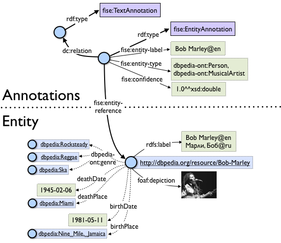

<a id="trunk-components-enhancer-enhancementstructure--fisetopicannotation"></a>
<a id="trunk-components-enhancer-enhancementstructure--fise:topicannotation"></a>

### fise:TopicAnnotation

TopicAnnotation are used to categorize/classify the parsed content along some categorization system. This is done by suggesting/linking Topics of that categorization system for (possible parts) of the parsed content. A "fise:TextAnnotation" is used to select the part of the content where the linked topics apply.

- **fise:entity-reference** *(required, single)*: The URI of the topic.
- **fise:entity-label** *(required, single)*: The human readable label of the topic. While topics may define multiple labels (e.g. for different languages) EnhancementEngines are required to only include a single - the best fitting - label.
- **fise:entity-type** *(optional, multiple)*: It is best practice to use [SKOS](http://www.w3.org/2004/02/skos/) for modeling hierarchical classification systems. If this recommendation is followed than the value of fise:entity-type will be "skos:Concept". However users are free to also use different types with "fise:TopicAnnotation"s.
- **dc:relation** *(required, multiple)*: The dc:relation property is required for topic annotations. It refers to the fise:TextAnnotation specifying the part of the text this topic is applied to.
- **entityhub:site** (optional, single)\_: The name of the Entityhub ReferencedSite managing the the suggested Entity. If this property is present users can dereference the suggested Entity with a GET request to "{stanbol}/entityhub/site/{site-name}/entity?id={entity}" where {site-name} is the value of this property and {entity} is the value of the "fise:entity-reference" property.
  NOTE: the values "local" and "entityhub" need to be treated separately. In those cases the GET request need to use "{stanbol}/entityhub/entity?id={entity}".

The following figure shows a fise:TopicAnnotation suggesting the skos:Concept "Boxing" from the [IPTC Subject Codes](http://cv.iptc.org/newscodes/subjectcode/). The figure shows also that the Boxing category has Sport as an browser one.

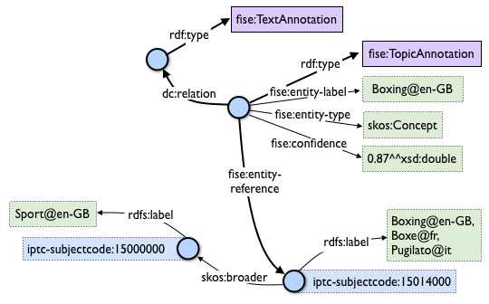

Copyright © 2010 The Apache Software Foundation, Licensed under
the [Apache License, Version 2.0](http://www.apache.org/licenses/LICENSE-2.0).
Apache, Stanbol and the Apache feather and Stanbol logos are trademarks of The Apache Software Foundation.

---

<a id="trunk-components-enhancer-nlp"></a>

<!-- source_url: https://stanbol.apache.org/docs/trunk/components/enhancer/nlp/ -->

<!-- page_index: 39 -->

# Downloads

[](https://stanbol.apache.org/index.html)

- [Getting Started](#trunk-tutorial)
- [Documentation](#trunk)
  - [Usage Scenarios](#trunk-scenarios)
  - [Components](#trunk-components)
  - [Production Mode](#trunk-production-mode)
- [Development](https://stanbol.apache.org/development/)
  - [Mailing Lists](https://stanbol.apache.org/development/index.html#mailing_lists)
  - [Issue Tracker](https://stanbol.apache.org/development/index.html#issue_tracker)
  - [Source Code](https://stanbol.apache.org/development/index.html#source_code)
  - [Development Practices](https://stanbol.apache.org/development/index.html#development_practices)

<a id="trunk-components-enhancer-nlp--downloads"></a>

# Downloads

- [Overview](https://stanbol.apache.org/downloads/)
  - [Releases](https://stanbol.apache.org/downloads/releases.html)
  - [Launchers](https://stanbol.apache.org/downloads/launchers.html)

<a id="trunk-components-enhancer-nlp--project"></a>

# Project

- [Team](https://stanbol.apache.org/team.html)
- [License](http://www.apache.org/licenses/LICENSE-2.0)
- [Privacy Policy](https://stanbol.apache.org/privacy-policy.html)

<a id="trunk-components-enhancer-nlp--archived-docs"></a>

# Archived Docs

- [0.9.0-incubating](https://stanbol.apache.org/docs/0.9.0-incubating/)

<a id="trunk-components-enhancer-nlp--the-asf"></a>

# The ASF

- [Apache Software Foundation](http://www.apache.org)
- [Thanks](http://www.apache.org/foundation/thanks.html)
- [Become a Sponsor](http://www.apache.org/foundation/sponsorship.html)
- [Security](http://www.apache.org/security/)

[](https://stanbol.apache.org/doap.rdf)

Copyright © 2010 The Apache Software Foundation, Licensed under
the [Apache License, Version 2.0](http://www.apache.org/licenses/LICENSE-2.0).
Apache, Stanbol and the Apache feather and Stanbol logos are trademarks of The Apache Software Foundation.

---

<a id="trunk-components-enhancer-nlp-nlpengine"></a>

<!-- source_url: https://stanbol.apache.org/docs/trunk/components/enhancer/nlp/nlpengine -->

<!-- page_index: 40 -->

#

<a id="trunk-components-enhancer-nlp-nlpengine--implementing-a-nlp-processing-engine"></a>

## Implementing a NLP Processing Engine

[Enhancement Engines](#trunk-components-enhancer-engines) are the basic processing unit of the Stanbol Enhancer. An NLP processing Engine is an Enhancement Engine that processing the `plain/text` version of the parsed [Content Item](#trunk-components-enhancer-contentitem) and adds processing results to the *Metadata* of the ContentItem or the [AnalysedText](TODO:%20add%20link) ContentPart. Enhancemen Engines do run in the same Java VM as the Stanbol Enhancer. However they may access remote services (e.g. a NLP processing WebService).

The following sub section will provide information on typical tasks of NLP EnhancementEngine implementors.

<a id="trunk-components-enhancer-nlp-nlpengine--accessing-the-plain-text"></a>

### Accessing the Plain Text

The plain text version of the parsed content should not be directly obtained from the [ContentItem](#trunk-components-enhancer-contentitem) parsed to the `#canEnhance(..)` and '#processEnhancement(..)' methods (e.g. by using the `ContentItem#getStream`). The reason for that is that those methods will return the content as parsed by the request and this might as well be a PDF, word document or even an Audio or Video file. In such cases Users will most likely have configured an EnhancementEngine (such as the [TikaEngine](TODO:%20add%20link)) to extract the plain text from those rich text formats.

For retrieving the plain text version from the `NlpEngineHelper` provides the '#getPlainText(..)' method. It returns an Entry with the URI of the plain text version as key and the `Blob` as value. The `Blob` interface is used by the Stanbol Enhancer to handle content elements and provides access to the content, content length, content type and charset.

The following code snippets show typical usage examples:

```
@Override public int canEnhance (ContentItem ci) throws EngineException {if (NlpEngineHelper.getPlainText (this,ci,false) ==null ){return EnhancementEngine.CANNOT_ENHANCE;
} // add further tests if this engine can Enhance the parsed // ContentItem return EnhancementEngine.ENHANCE_ASYNC;
}
```

In the `#canEnhance` method one needs to check if the EnhancementEngine is able to process the parsed ContentItem. Only if this method does return 'ENHANCE\_SYNCHRONOUS' or `ENHANCE_ASYNC` the '#computeEnhancements(..)' method will be called

```
@Override public void computeEnhancements (ContentItem ci) throws EngineException {//if TRUE is parsed as 3rd arg this will throw an exception rather than //returning NULL Entry <UriRef,Blob> plainText =NlpEngineHelper.getPlainText (this,ci,true ); //Now we can read the plain text from the Blob String charset =plainText.getValue ().getParameter ().get ("charset" ); if (charset ==null ){charset ="UTF-8";
} Reader reader =new InputStreamReader (plainText.getValue ().getStream (),charset );}
```

<a id="trunk-components-enhancer-nlp-nlpengine--the-analysedtext-content-part"></a>

### The AnalysedText Content Part

The [AnalysedText](#trunk-components-enhancer-nlp-analyzedtext) content part is used to store NLP processing results. The `NlpEngineHelper` provides the `#getAnalysedText(..)` and `#initAnalysedText(..)` methods for obtaining this content parsed form the processed ContentItem.

The `#getAnalysedText(..)` Method is typically used by EnhancementEngines that need to consume NLP processing results of previous NLP processing engines.

```
@Override public int canEnhance (ContentItem ci) throws EngineException {//possible check other requirements (such as if the language //detected for the parsed content is supported if (getAnalysedText (this,ci,false) ==null) {return CANNOT_ENHANCE;
} return ENHANCE_ASYNC;
} @Override public void computeEnhancements (ContentItem ci) throws EngineException {AnalysedText at =getAnalysedText (this,ci,true ); // [..]}
```

EnhancementEngines that do not depend on NLP processing results of other EnhancementEngines SHOULD use the `#initAnalysedText(..)` method as this method only creates a new `AnalysedText` content part if it is not already present. Otherwise it will return the already existing one.

```
/** The AnalysedTextFactory is an OSGI service **/ @Reference private AnalysedTextFactory analysedTextFactory;
@Override public void computeEnhancements (ContentItem ci) throws EngineException {AnalysedText at =initAnalysedText (this,analysedTextFactory,ci ); // [..]}
```

Note that NLP Enhancement Engines that do not consume NLP processing results of other EnhancementEngines need not to check in the `#canEnhance(..)` method if the `AnalysedText` text content part is present.

The usage of the [AnalysedText](#trunk-components-enhancer-nlp-analyzedtext) content part is not covered by this section. For more information on that please see the documentation of the [AnalysedText](#trunk-components-enhancer-nlp-analyzedtext).

<a id="trunk-components-enhancer-nlp-nlpengine--dealing-with-supported-languages-and-the-language-of-the-content"></a>

### Dealing with supported Languages and the Language of the Content

NLP processing EnhancementEngines typically only support a specific set of languages. This sub section provides best practice examples for language specific configurations as well as retrieving the language of processed content item.

For **Language specific Configurations** of EnhancementEngines the Stanbol NLP processing module provides the `LanguageConfiguration` utility. This utility implements the following configuration syntax:

- List of supported languages: To process German and English texts configure `de,en`
- List of excluded languages: `!fr,!cn, *` would process all languages other than French and Chinese
- Support for parameters by using the following syntax `{language};{param-name}={param-value};{param-name}={param-value}
  - Default parameters for all languages can be defined by applying parameters to the wildcard language `*;{param-name}={param-value};` or if no wildcard is desired by the configuration by adding parameters to the empty {language} such as `;{param-name}={param-value};`.
  - Language specific parameters will override default parameters. This means that `*;state=true, de;state=false` will result in `state=false` for German and `state=true` for all other languages.

The following example shows a typical usage of the `LanguageConfiguration` utility in an NLP processing engine

```
/** Key used for the language configuration */ public static final String CONFIG_LANGUAGES ="myNlpEngine.languageconfig";
/** Possible multiple parameters supported by this engine */ public static final String PARAM_EXAMPLE ="example";
/** The language Configuration instance used by the Engine */ private LanguageConfiguration languageConfig =new LanguageConfiguration (CONFIG_LANGUAGES,//the property key used for the configuration new String []{"*" }); //the default configuration @Activate protected void activate (ComponentContext ctx) throws ConfigurationException {super.activate (ce ); // assuming this engine extends AbstractEnhancementEngine @SuppressWarnings ("unchecked") Dictionary <String,Object> properties =ctx.getProperties (); // The LanguageConfiguration utility directly parses the config from the // properties languageConfig.setConfiguration (properties );} @Deactivate protected void deactivate (ComponentContext context) {languageConfig.setDefault (); //reset to the default configuration super.deactivate (context ); // assuming this engine extends AbstractEnhancementEngine}
```

For getting the detected language(s) of the textual content there are several utilities available. The default `EnhancementEngineHelper` provides two utility methods: First the `EnhancementEngineHelper#getLanguage(..)` method that reruns the language with the highest confidence and second the `EnhancementEngineHelper#getLanguageAnnotations(..)` that returns an ordered list with the URIs of `fise:TextAnnotation`s.

However for NLP processing EnhancementEngines it will be easier to use the higher level utilities provided by the `NlpEngineHelper`. First there is also a `#getLanguage(..)` method that does the same as the one of the `EnhancementEngineHelper` but in addition deals with Exception handling and logging. Second the `isLangaugeConfigured(..)` method that compares the detected language with the `LanguageConfiguration`.

A typical usage looks like follows

```
@Override public int canEnhance (ContentItem ci) throws EngineException {String language =getLanguage (this,ci,false ); if (language ==null ){return CANNOT_ENHANCE;
} if (! isLangaugeConfigured (this,languageConfig,language,false )){return CANNOT_ENHANCE;
} //possible further checks return ENHANCE_ASYNC;
} @Override public void computeEnhancements (ContentItem ci) throws EngineException {//get the language String language =getLanguage (this,ci,true ); //validate against the language configuration isLangaugeConfigured (this,languageConfig,language,true ); //[..]}
```

Copyright © 2010 The Apache Software Foundation, Licensed under
the [Apache License, Version 2.0](http://www.apache.org/licenses/LICENSE-2.0).
Apache, Stanbol and the Apache feather and Stanbol logos are trademarks of The Apache Software Foundation.

---

<a id="trunk-components-enhancer-nlp-opennlp"></a>

<!-- source_url: https://stanbol.apache.org/docs/trunk/components/enhancer/nlp/opennlp -->

<!-- page_index: 41 -->

#

<a id="trunk-components-enhancer-nlp-opennlp--apache-stanbol-opennlp-integration"></a>

# Apache Stanbol OpenNLP integration

[OpenNLP](http://opennlp.apache.org) is fully integrated with Apache Stanbol. It is also included in the default launcher configuration. While the Full launcher includes all available language models the Stable launcher only includes the models for English

<a id="trunk-components-enhancer-nlp-opennlp--configuration-and-customization"></a>

## Configuration and Customization

OpenNLP uses `model` files to provide the statistical models for different languages. Apache Stanbol supports the loading of such models via the [DataFileProvider](#trunk-utils-datafileprovider) infrastructure. This allows to provide models either by

- Installing one of the `org.apache.stanbol:org.apache.stanbol.data.opennlp**` bundles or by
- Copying OpenNLP model files to the Stanbol Datafiles directory (by default `{working-dir}/stanbol/datafiles`)

Stanbol assumes models to follow the following name schemes

- `{lang}-sent.bin` for sentence detection models
- `{lang}-token.bin` for tokenizer models. If no Tokenizer model for a language is present, than the `SimpleTokenizer` is used as fallback.
- `{lang}-pos-perceptron.bin` or `{lang}-pos-maxent.bin` for POS tagging modles. Perceptron models are preferred if present
- `{lang}-chunker.bin` for chunker models

In case modles do use different names the `model` parameter of the according OpenNLP EnhancementEngine must be used to configure the correct model name. See the Engine documentations for details.

<a id="trunk-components-enhancer-nlp-opennlp--stanbol-enhancer-configuration"></a>

## Stanbol Enhancer configuration

<a id="trunk-components-enhancer-nlp-opennlp--opennlp-based-nlp-enhancement-engines"></a>

### OpenNLP based NLP Enhancement Engines

- [OpenNLP Sentence Detection](#trunk-components-enhancer-engines-opennlpsentence)
- [OpenNLP Tokenizer](#trunk-components-enhancer-engines-opennlptokenizer)
- [OpenNLP POS Tagger](#trunk-components-enhancer-engines-opennlppos)
- [OpenNLP Chunker](#trunk-components-enhancer-engines-opennlpchunker)
- [OpenNLP NER](#trunk-components-enhancer-engines-opennlpner) as well as a [Custom NER Engine](#trunk-components-enhancer-engines-opennlpcustomner) that allows to use NER models for Entity types other that Person, Organization and Places.

<a id="trunk-components-enhancer-nlp-opennlp--enhancement-chain-configurations"></a>

### Enhancement Chain configurations

OpenNLP supports both the NER based *Named Entity Linking* as well as the POS tagging based *Entity Linking* processing chain.

Users that want to process texts by using Named Entity Recognition will end up using Enhancement Chain configurations similar to

```
tika;optional
langdetect
opennlp-token
opennlp-sentence
opennlp-ner
{your-named-entity-linking}
```

where `{your-named-entity-linking}` refers to an instance of the [NamedEntityLinkingEngine](#trunk-components-enhancer-engines-namedentitytaggingengine) configured for the users controlled vocabulary. Users can also use multiple NamedEntityLinkingEngines configuration in the same chain. Users that want to use NER models for other types than Persons, Organizations or Places will need to use the [CustomNerModelEngine](#trunk-components-enhancer-engines-opennlpcustomner) instead of the `opennlp-ner` engine.

Note that the use of the `opennlp-token` and `opennlp-sentence` engine is optional as the `opennlp-ner` engine will to those steps itself in case tokens and sentences are not yet available. Including those engines explicitly in the chain is only required in cases where custom configurations for the tokenizers and sentence detection engines (e.g. custom OpenNLP models) need to be applied.

A typical *Entity Linking* enhancement engine based on OpenNLP includes the following engines

```
tika;optional
langdetect
opennlp-token
opennlp-sentence
opennlp-pos
opennlp-chunker
{your-entitylinking}
```

where '{your-entitylinking}' will typically be an [EntityhubLinkingEngine](#trunk-components-enhancer-engines-entityhublinking) engine configured for the users controlled vocabulary. Users that need to link against multiple controlled vocabularies can add multiple EntityhubLinkingEngines to the enhancement chain.

Note that the use of the `opennlp-token` and `opennlp-sentence` engine is optional as the `opennlp-pos` engine will to those steps itself in case tokens and sentences are not yet available. Including those engines explicitly in the chain is only required in cases where custom configurations for the tokenizers and sentence detection engines (e.g. custom OpenNLP models) need to be applied.

---

<a id="trunk-components-enhancer-nlp-celi"></a>

<!-- source_url: https://stanbol.apache.org/docs/trunk/components/enhancer/nlp/celi -->

<!-- page_index: 42 -->

#

<a id="trunk-components-enhancer-nlp-celi--celi-linguagridorg-service-integration"></a>
<a id="trunk-components-enhancer-nlp-celi--celi-linguagrid.org-service-integration"></a>

# CELI (linguagrid.org) service Integration

The CELI EnhancementEngines where contributed by [STANBOL-583](https://issues.apache.org/jira/browse/STANBOL-583) to Apache Stanbol and later with [STANBOL-739](https://issues.apache.org/jira/browse/STANBOL-739) adapted to the Stanbol Enhancer NLP processing API.

The integration provides EnhancementEngiens for

- Language Identification
- Named Entity Recognition for French and Italien
- Lemmatization and morphological analyzer for Italien, Danish, German, Russian, Romanian and Swedish
- Content Classification engine based on DBpedia for English, French, German, Italien, Spanish, Portuguese, Polish and Dutch
- Sentiment Analysis Engine for French and Italian

Users of those engine needs to create an account with the [linguagrid.org](http://linguagrid.org/) service operated by CELI.

Pleas be aware that content analyzed by Stanbol will be sent to the Service URLs configured in the Engines configuration.

---

<a id="trunk-components-entityhub-managedsite"></a>

<!-- source_url: https://stanbol.apache.org/docs/trunk/components/entityhub/managedsite -->

<!-- page_index: 43 -->

<a id="trunk-components-entityhub-managedsite--managedsite"></a>

# ManagedSite

A ManagedSite allow users to manage a collection of Entities by using the RESTful API of the Entityhub. Other than the ReferencedSite implementation it does not allow to refer to remote services. Therefor all changes to Entities managed by a ManagedSite are preformed via the RESTful API of the Entityhub.

Users can configure multiple ManagedSites with the Stanbol Entitiyhub. They are identified by their id and share the id-space with other Sites (e.g. other ReferencedSite). The RESTful services of a ManagedSite are available via the URL pattern

```
http:// {stanbol - instance} / entityhub / site / {siteId}
```

*NOTE:* To make this documentation less abstract it will use a scenario that assumes that someone wants to managing the [IPTC Descriptive NewsCodes](http://www.iptc.org/cms/site/index.html?channel=CH0103#descrncd) by using a ManagedSite. Typical Stanbol users will want to manage their own Entities (e.g. Tags/Categories of their CMS) instead.

<a id="trunk-components-entityhub-managedsite--manage-entities-by-using-restful-services"></a>

### Manage Entities by using RESTful services

The RESTful API of Managed Sites is the same as of other Sites only the "/entity" Endpoint does also support to create, update and delete Entities.

The following Example shows how to upload a SKOS vocabulary to a ManagedSite:

```
curl -i -X PUT -H "Content-Type: application/rdf+xml" -T subject-code.rdf \
    "http://localhost:8080/site/iptc/entity"
```

This example assumes that Stanbol is running on 'localhost' port '8080' and that a ManagedSite with the id 'iptc' was configured. The uploaded file 'subject-code.rdf' contains the IPTC [subject-codes](http://cv.iptc.org/newscodes/subjectcode/). To upload also the vocabulary containing the [genre](http://cv.iptc.org/newscodes/genre/)s one needs to call

```
curl -i -X PUT -H "Content-Type: application/rdf+xml" -T genre.rdf \
    "http://localhost:8080/site/iptc/entity"
```

Calls like that will create/update all Entities contained in the parsed RDF data. If one wants to ensure that only a single Entity is created/updated one can specify the 'id' parameter.

```
curl -i -X PUT -H "Content-Type: application/rdf+xml" -T genre.rdf \
    "http://localhost:8080/site/iptc/entity?id=http://cv.iptc.org/newscodes/genre/Exclusive"
```

This will ignore all other RDF data but only update the 'genre:Exclusive' entity.

For the full documentation of the CRUD interface of the '/entity' endpoint of a ManagedSite please have a look at the RESTful API documentation served by the Web UI of the Stanbol Entityhub.

<a id="trunk-components-entityhub-managedsite--configuration-of-managedsites"></a>

### Configuration of ManagedSites

Currently their is a single implementation of the ManagesSite interface that uses a `Yard` instance for managing the entities.

For using a YardSite users need to configure two Services:

1. Yard: The Entityhub currently includes three different Yard implementations. The SolrYard, ClerezzaYard and SesameYard. The SolrYard is optimal for the use with the Stanbol Enhancer as it allows very fast label based retrieval of Entities. So if you plan to use the ManagedSite primarily with the Stanbol Enhancer this is definitely the Yard implementation to choose. The ClerezzaYard and the SesameYard store the managed Entities within a TripleStore. Both are not very efficient for label based lookups as required by the Entity Linking engines of the Stanbol Enhancer. But they are well suited for more data focused use cases as well as for the use with the Entity Dereference Engines.
2. YardSite: This configures the ManagedSite. This configuration links to the configured Yard via its id.

<a id="trunk-components-entityhub-managedsite--configuration-of-a-solryard"></a>
<a id="trunk-components-entityhub-managedsite--configuration-of-a-solryard:"></a>

#### Configuration of a SolrYard:

This describes how to configure an SolrYard to be used with an YardSite by using the Configuration tab of the Apache Felix Webconsole [http://{stanbol-instance}/system/console/configMgr](http://localhost:8080/system/console/configMgr).

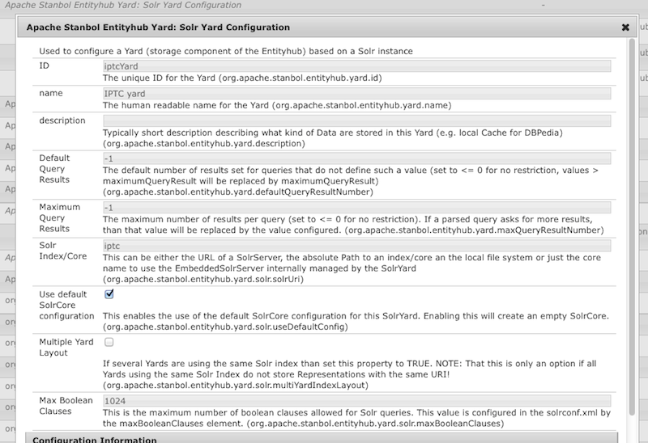

The above figure shows a typical SolrYard configuration for a YardSite. Important properties are

- **ID**: This MUST BE unique to all other Yards. It is recommended to use "{siteId}Yard".
- **Solr Index/Core**: This is the name of the SolrCore that will be used to store the data. Here it is recommended to use the same name as the {siteId}. This is because the RESTful API of the SolrCore is published under `http://{stanbol-instance}/solr/default/{solrCore}`. So using the same name as {siteId} and {solrCore} makes it easier for map the RESTful API of the SolrCore with the ManagedSite published under `http://{stanbol-instance}/entityhub/stite/{siteId}`.
- **Use default SolrCore configuration**: If enabled the SolrCore will be automatically created by using the default configuration. Users will typically want to use this option. Only users that want to use a special SolrCore configuration will need to deactivate this option and to provide a `{solrCore}.solrindex.zip` archive containing the special configuration in the `{stanbol-workingdir}/stanbol/datafiles` directory. See the[Managing Solr Indexes](https://stanbol.apache.org/docs/trunk/components/utils/commons-solr.html#managing-solr-indexes) section for detailed information.

<a id="trunk-components-entityhub-managedsite--configuration-of-a-clerezzayard"></a>
<a id="trunk-components-entityhub-managedsite--configuration-of-a-clerezzayard:"></a>

#### Configuration of a ClerezzaYard:

This describes how to configure an ClerezzaYard to be used with an YardSite by using the Configuration tab of the Apache Felix Webconsole [http://{stanbol-instance}/system/console/configMgr](http://localhost:8080/system/console/configMgr).

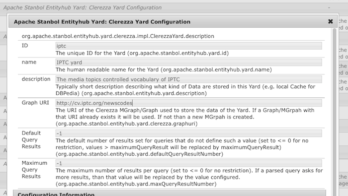

The above figure shows a typical ClerezzaYard configuration for a YardSite. Important properties are

- **ID**: This MUST BE unique to all other Yards. It is recommended to use "{siteId}Yard".
- **Graph URI**: This allows to configure the URI of the named graph used to store the RDF data. If a graph with this URL is already present than it will be reused by this Yard. Otherwise an empty graph with this URI is created using the Clerezza [TcManager](http://incubator.apache.org/clerezza/mvn-site/rdf.core/apidocs/org/apache/clerezza/rdf/core/access/TcManager.html). If this field is empty an URN will be used as default groph URI.

The ClerezzaYard also registers the its RDF graph with the Apache Stanbol SPARQL service available at `http://{stanbol-instance}/sparql`

To query the RDF graph of a ClerezzaYard you need to specify the its configured Graph URI in SPARQL queries posted to the Stanbol SPARQL endpoint

```
curl -i -X POST -d "graphuri=http://cv.iptc.org/newscodes" \
    --data-urlencode "query@sparqlQuery.txt" \
    "http://localhost:8080/sparql"
```

where 'sparqlQuery.txt' refers to a file containing the SPARQL query e.g.

```
PREFIX skos: <http://www.w3.org/2004/02/skos/core#> SELECT distinct ?concept ?prefLabel ?altLabel ?parent WHERE {?concept a skos:Concept .?concept skos:prefLabel ?prefLabel .OPTIONAL {?concept skos:altLabel ?altLabel .}}
```

<a id="trunk-components-entityhub-managedsite--configuration-of-a-sesame-yard-site"></a>

#### Configuration of a Sesame Yard Site

With [STANBOL-1169](https://issues.apache.org/jira/browse/STANBOL-1169) (since version `0.12.1`) a Sesame Repository registered as OSGI service can be used as Entityhub Yard.

The following figure shows a [Apache Marmotta Kiwi Repository](#trunk-utils-marmotta-kiwi-repository-service) registered as OSGI service.


The highlighted `org.openrdf.repository.Repository.id` key is used to link a specific Sesame Repository to a Sesame Yard Site. All the other keys are implementation specific and not used by the Entityhub Sesame Yard Site.

When configuring a SesameYard one need to set the Repository (`org.openrdf.repository.Repository.id` key) to the value of the Sesame Repository one would like to use as backend. This is especially important if multiple Sesame Repositories are registered as OSGI services.

The following figure shows the configuration dialog for a Sesame Yard. Again the id of the Sesame Repository is highlighted.

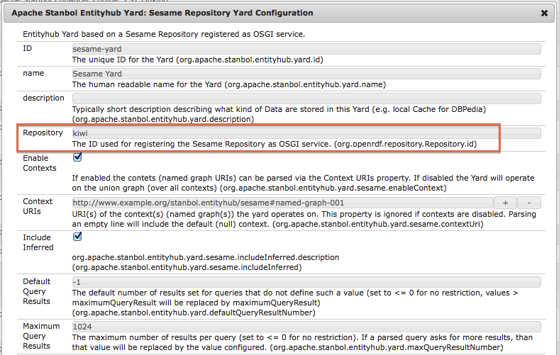

The Context URIs (`org.apache.stanbol.entityhub.yard.sesame.contextUri` key) can be used to configure specific Named Graphs used to read/write RDF triples to/from. An empty value is interpreted as the `null` context. For using the union graph one needs to deactivate the
Enable Contexts (`org.apache.stanbol.entityhub.yard.sesame.enableContext` key) option. In this case all configured Context URIs will get ignored.

<a id="trunk-components-entityhub-managedsite--configuration-of-the-yardsite"></a>

#### Configuration of the YardSite

Finally you need to configure the YardSite that uses the previously configured Yard instance (either SolrYard or ClerezzaYard). Again this will show how to configure the YardSite by using the Configuration tab of the Apache Felix Webconsole [http://{stanbol-instance}/system/console/configMgr](http://localhost:8080/system/console/configMgr).

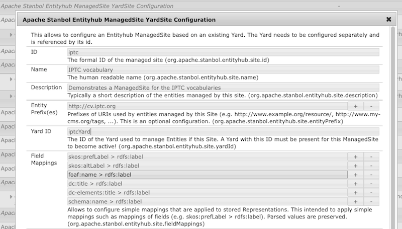

The above figure shows the configuration of the YardSite. The important properties are

- **ID**: This is the {siteId} used to map this ManagedSite to the RESTful API of the Stanbol Entityhub. Make sure that the ID is unique over all configured Sites.
- **Yard ID**: Here you need to put the ID of the Yard configured in the previous step. If no Yard with that ID is active the ManagedSite will not be initialized and therefore be not available on the RESTful API

The **Entity Prefix(es)** are an optional configuration. This is used by the SiteManager (the "/entityhub/sites" endpoint) if requested entities can be dereferenced via a registered site. If not present the SiteManager will try to dereference every request by using this ManagedSite. So correctly configuring this may slightly improve performance by avoiding unnecessary requests.

The **Field Mappings** can be used to copy property values of created/updates Entities to other properties. The mappings used in the above figure ensure that SKOS preferred/alternate labels, FOAF (Friend of a Friend) names, Dublin Core titles as well as the name property of the schema.org ontology are copied over to rdfs:label. This configuration is the default as the Stanbol Enhancer uses `rdfs:label` as default property for linking entities based on their names.

After completing all those steps you should see a new empty ManagedSite under

```
http:// {stanbol - instance} / entityhub / site / iptc
```

Copyright © 2010 The Apache Software Foundation, Licensed under
the [Apache License, Version 2.0](http://www.apache.org/licenses/LICENSE-2.0).
Apache, Stanbol and the Apache feather and Stanbol logos are trademarks of The Apache Software Foundation.

---

<a id="trunk-components-enhancer-chains"></a>

<!-- source_url: https://stanbol.apache.org/docs/trunk/components/enhancer/chains/ -->

<!-- page_index: 44 -->

# Downloads

[](https://stanbol.apache.org/index.html)

- [Getting Started](#trunk-tutorial)
- [Documentation](#trunk)
  - [Usage Scenarios](#trunk-scenarios)
  - [Components](#trunk-components)
  - [Production Mode](#trunk-production-mode)
- [Development](https://stanbol.apache.org/development/)
  - [Mailing Lists](https://stanbol.apache.org/development/index.html#mailing_lists)
  - [Issue Tracker](https://stanbol.apache.org/development/index.html#issue_tracker)
  - [Source Code](https://stanbol.apache.org/development/index.html#source_code)
  - [Development Practices](https://stanbol.apache.org/development/index.html#development_practices)

<a id="trunk-components-enhancer-chains--downloads"></a>

# Downloads

- [Overview](https://stanbol.apache.org/downloads/)
  - [Releases](https://stanbol.apache.org/downloads/releases.html)
  - [Launchers](https://stanbol.apache.org/downloads/launchers.html)

<a id="trunk-components-enhancer-chains--project"></a>

# Project

- [Team](https://stanbol.apache.org/team.html)
- [License](http://www.apache.org/licenses/LICENSE-2.0)
- [Privacy Policy](https://stanbol.apache.org/privacy-policy.html)

<a id="trunk-components-enhancer-chains--archived-docs"></a>

# Archived Docs

- [0.9.0-incubating](https://stanbol.apache.org/docs/0.9.0-incubating/)

<a id="trunk-components-enhancer-chains--the-asf"></a>

# The ASF

- [Apache Software Foundation](http://www.apache.org)
- [Thanks](http://www.apache.org/foundation/thanks.html)
- [Become a Sponsor](http://www.apache.org/foundation/sponsorship.html)
- [Security](http://www.apache.org/security/)

[](https://stanbol.apache.org/doap.rdf)

Copyright © 2010 The Apache Software Foundation, Licensed under
the [Apache License, Version 2.0](http://www.apache.org/licenses/LICENSE-2.0).
Apache, Stanbol and the Apache feather and Stanbol logos are trademarks of The Apache Software Foundation.

---

<a id="trunk-components-enhancer-chains-weightedchain"></a>

<!-- source_url: https://stanbol.apache.org/docs/trunk/components/enhancer/chains/weightedchain.html -->

<!-- page_index: 45 -->

<a id="trunk-components-enhancer-chains-weightedchain--weighted-chain"></a>

# Weighted Chain

The WeightedChain takes a list of [EnhancementEngine](#trunk-components-enhancer-engines) names as input and uses the "org.apache.stanbol.enhancer.engine.order" metadata of the configured Engines to calculate an ExecutionPlan.

This chain is designed for easy configuration - just a list of the engine names - but has limited possibilities to control the execution order.

<a id="trunk-components-enhancer-chains-weightedchain--configuration"></a>

## Configuration

The property "stanbol.enhancer.chain.weighted.chain" is used to provide the list of engine names. Both arrays and collections are supported as values.

In addition it is possible to define engines as optional. This allows to specify that the enhancement process should not fail if an engine is not active or fails while processing a content item.

The syntax to define an Engine as optional is as follows *(Both variants make the execution of the engine with the name  optional.)*:

```
<name>;optional
<name>;optional=true
```

The following figure shows the configuration dialog of a WeightedCahin configured with two required and an optional engine.

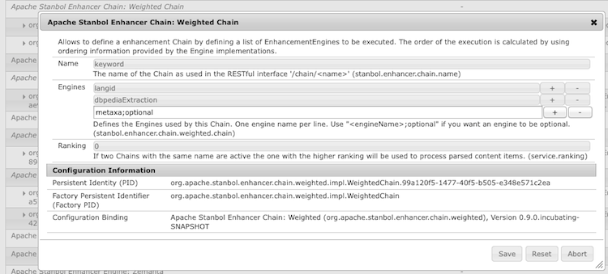

<a id="trunk-components-enhancer-chains-weightedchain--enhancement-properties-support"></a>

## Enhancement Properties Support

**since `0.12.1`**

Starting from `0.12.1` the Weighted Chain allows to configure [EnhancementProperties](#trunk-components-enhancer-enhancementproperties)

- **chain and engine** scoped properties are defined as parameters to the engines with the syntax `{engine-name}; {property-name-1}={value-1},{value-2}; {property-name-2}={value-1};`
- **chain** scoped properties can be configured by using the osgi property key `stanbol.enhancer.chain.chainproperties` by the syntax `{property-name-1}={value-1},{value-2}`. NOTE that `;` is NOT supported as separator for parsing multiple properties as OSGI configurations already define a way for parsing multiple values

All EnhancementProperties configured with a [Chain](https://stanbol.apache.org/docs/trunk/components/enhancer/chains/chains) are written as RDF to the [ExecutionPlan](https://stanbol.apache.org/docs/trunk/components/enhancer/chains/chains/executionplan). *Chain* scoped properties are directly added to the `ep:ExecutionPlan` instance while *chain and engine* scoped properties are added to the `ep:ExecutionNode` of the according engine.

The following figure and listing provide an example

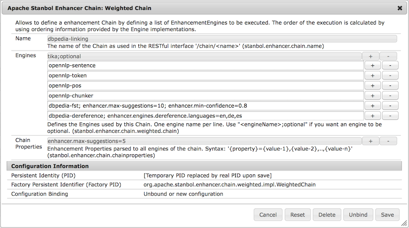

The figure shows that for the `dbpedia-fst` engine the maximum number of suggestions are set to `10`. Also the minimum confidence value is set to `0.8`. For the `dbpedia-dereference` engine the dereferenced languages are set to English, German and Spanish. Finally a *chain* scoped property is used to set the maximum number of suggestions for the whole chain to `5`. However this has no effect for the `dbpedia-fst` engine as its custom configuration will override this chain wide property.

The following listing shows the exact same configuration in the `.cfg` format.

```
stanbol.enhancer.chain.name="dbpedia-linking"
stanbol.enhancer.chain.weighted.chain=["tika;optional","opennlp-sentence","opennlp-token","opennlp-pos","opennlp-chunker",
    "dbpedia-fst;\ enhancer.max-suggestions\=10;\ enhancer.min-confidence\=0.8",
    "dbpedia-dereference;\ enhancer.engines.dereference.languages\=en,de,es"]
stanbol.enhancer.chain.chainproperties=["enhancer.max-suggestions\=5"]
```

<a id="trunk-components-enhancer-chains-weightedchain--calculation-of-the-executionplan"></a>

## Calculation of the ExecutionPlan

It is important to note that the ordering of the list has no influence on the ExecutionPlan because the order of execution of the configured [EnhancementEngines](#trunk-components-enhancer-engines) is calculated only by using the value of the "org.apache.stanbol.enhancer.engine.order" property provided by the EnhancementEngine:

- Engines with a lower order are executed before engines with a higher value
- Engines with the same order may be executed simultaneously if the EnhancementJobManager and the EnhancementEngine do support this feature.

The WeightedCahin follows exactly the same algorithm as the WeightedJobManager used to decide the execution order of all active EnhancementEngines. However the WeightedChain will only consider configured chains and ignore others.

The following image shows the ExecutionPlan as calculated based on the above configuration.

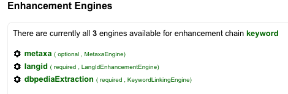

If some of the Enhancement Engines are not available this will be visualized as follows. If you parse content by using the RESTful interface similar information will be available via the the Execution Metadata included in the metadata of the enhanced content item.

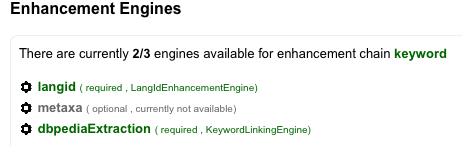

This shows that the optional engine 'metaxa' is currently not available. The chain can be still used however the functionality provided by this optional engine will not be available. In this case only requests for plain text files could be processed.

The next figure shows a situation where a required engine is not active. Requests to this chain will fail until all required engines are active.

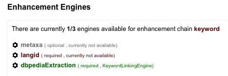

---

<a id="trunk-customvocabulary"></a>

<!-- source_url: https://stanbol.apache.org/docs/trunk/customvocabulary.html -->

<!-- page_index: 46 -->

# Downloads

[](https://stanbol.apache.org/index.html)

- [Getting Started](#trunk-tutorial)
- [Documentation](#trunk)
  - [Usage Scenarios](#trunk-scenarios)
  - [Components](#trunk-components)
  - [Production Mode](#trunk-production-mode)
- [Development](https://stanbol.apache.org/development/)
  - [Mailing Lists](https://stanbol.apache.org/development/index.html#mailing_lists)
  - [Issue Tracker](https://stanbol.apache.org/development/index.html#issue_tracker)
  - [Source Code](https://stanbol.apache.org/development/index.html#source_code)
  - [Development Practices](https://stanbol.apache.org/development/index.html#development_practices)

<a id="trunk-customvocabulary--downloads"></a>

# Downloads

- [Overview](https://stanbol.apache.org/downloads/)
  - [Releases](https://stanbol.apache.org/downloads/releases.html)
  - [Launchers](https://stanbol.apache.org/downloads/launchers.html)

<a id="trunk-customvocabulary--project"></a>

# Project

- [Team](https://stanbol.apache.org/team.html)
- [License](http://www.apache.org/licenses/LICENSE-2.0)
- [Privacy Policy](https://stanbol.apache.org/privacy-policy.html)

<a id="trunk-customvocabulary--archived-docs"></a>

# Archived Docs

- [0.9.0-incubating](https://stanbol.apache.org/docs/0.9.0-incubating/)

<a id="trunk-customvocabulary--the-asf"></a>

# The ASF

- [Apache Software Foundation](http://www.apache.org)
- [Thanks](http://www.apache.org/foundation/thanks.html)
- [Become a Sponsor](http://www.apache.org/foundation/sponsorship.html)
- [Security](http://www.apache.org/security/)

[](https://stanbol.apache.org/doap.rdf)

Copyright © 2010 The Apache Software Foundation, Licensed under
the [Apache License, Version 2.0](http://www.apache.org/licenses/LICENSE-2.0).
Apache, Stanbol and the Apache feather and Stanbol logos are trademarks of The Apache Software Foundation.

---

<a id="trunk-utils-commons-solr"></a>

<!-- source_url: https://stanbol.apache.org/docs/trunk/utils/commons-solr -->

<!-- page_index: 47 -->

<a id="trunk-utils-commons-solr--stanbol-commons-solr"></a>

# Stanbol Commons Solr

Solr is used by several Apache Stanbol components. The Apache Stanbol Solr Commons artifacts provide a set of utilities that ease the use of Solr within OSGi, allow the initialization and management of Solr indexes as well as the publishing of Solrs RESTful interface on the OSGi HttpService.

Although this utilities where implemented with the requirements of Apache Stanbol in mind they do not depend on other Stanbol components that are not themselves part of
"stanbol.commons".

<a id="trunk-utils-commons-solr--solr-osgi-bundle"></a>

## Solr OSGi Bundle

The "org.apache.commons.solr.core" bundle currently includes all dependencies required by Solr and also exports the client as well as the server API. For details please have a look at the pom file of the "solr.core" artifact.

Please note also the exclusion list, because some libraries currently not directly used by Stanbol are explicitly excluded. Using such features within a "solrConf.xml" or "schema.xml" will result in "ClassNotFoundException" and "ClassNotFoundErrors".

If you require an additional Library that is currently not included please give us a short notice on the stanbol-dev mailing list.

<a id="trunk-utils-commons-solr--solr-server-components"></a>

## Solr Server Components

This section provides information how to managed and get access to the server side CoreContainer and SolrCore components of Solr.

<a id="trunk-utils-commons-solr--accessing-corecontainers-and-solrcores"></a>

### Accessing CoreContainers and SolrCores

All CoreContainer and SolrCores initialized by the Stanbol Solr framework are registered with the OSGi Service Registry. This means that other Bundels can obtain them by using

```
CoreContainer defaultSolrServer;
ServiceReference ref = bundleContext.getServiceReference(
    CoreContainer.class.getName())
if (ref != null) {
    defaultSolrServer = (CoreContainer) bundleContext.getService(ref);
} else {
    defaultSolrServer = null; //no SolrServer available
}
```

It is also possible to track service registration and unregistration events by using the OSGi ServiceTracker utility.

The above Code snippet would always return the SolrServer with the highest priority (the highest value for the "service.ranking" property). However the OSGi Service Registry allows also to obtain/track service by the usage of filters. For specifying such filters it is important to know what metadata are provided when services are registered with the OSGi Service Registry.

<a id="trunk-utils-commons-solr--metadata-for-corecontainer"></a>
<a id="trunk-utils-commons-solr--metadata-for-corecontainer:"></a>

#### Metadata for CoreContainer:

- **org.apache.solr.core.CoreContainer.name**: The name of the SolrServer. The name MUST BE provided for each Solr CoreContainer registered with this framework. It is a required field for each configuration. If two CoreContainers are registered with the same name the "service.ranking" property shall be used to determine the current active CoreContainer for an request. However others registered for the same name may be used as fallbacks. The container name is used as a URL path component when the `publishREST` parameter is true. It is recommended to use lowercase names without non ASCII characters.
- **org.apache.solr.core.CoreContainer.dir**: The directory of a CoreContainer. This is the directory containing the "solr.xml" file.
- **org.apache.solr.core.CoreContainer.solrXml**: The name of the Solr CoreContainer configuration file. Currently always "sold.xml".
- **org.apache.solr.core.CoreContainer.cores**: A read only collection of the names of all cores registered with the CoreContainer.
- **service.ranking**: The OSGi "service.ranking" property is used to specify the ranking of a CoreContainer. The CoreContainer with the highest ranking is considered as the default server and will be returned by calls to bundleContext.getServiceReference(..) without the use of an filter.
- **org.apache.solr.core.CoreContainer.publishREST**: Boolean switch that allows to enable/disable the publishing of the Solr RESTful API on "http://{host}:{port}/solr/{server-name}". Requires the "SolrServerPublishingComponent" to be active.

<a id="trunk-utils-commons-solr--metadata-for-solrcores"></a>
<a id="trunk-utils-commons-solr--metadata-for-solrcores:"></a>

#### Metadata for SolrCores:

- **org.apache.solr.core.SolrCore.name**: The name of the SolrCore as registered with the CoreContainer
- **org.apache.solr.core.SolrCore.dir**: The instance directory of the SolrCore
- **org.apache.solr.core.SolrCore.datadir**: The data directory of the SolrCore
- **org.apache.solr.core.SolrCore.indexdir**: The directory of the index used by this SolrCore
- **org.apache.solr.core.SolrCore.schema**: The name (excluding the directory) of the Solr schema used by this core
- **org.apache.solr.core.SolrCore.solrconf**: The name (excluding the directory) of the Solr core configuration file

In addition the following metadata of the CoreContainer for this SolrCore are also available

- **org.apache.solr.core.CoreContainer.id**: The `SERVICE_ID` of the CoreContainer this SolrCore is registered with. This is usually the easiest way to obtain the ServiceReference to the CoreContainer of an SolrCore.
- **org.apache.solr.core.CoreContainer.name**: The name of the CoreContainer this SolrCore is registered with. Note that multiple CoreContainers may be registered for the same name. Therefore this property MUST NOT be used to filter for the ServiceReference to the CoreContainer of an SolrCore.
- **org.apache.solr.core.CoreContainer.dir**: The Solr directory of the CoreContainer for this SolrCore.
- **service.ranking**: The OSGi service.ranking of the CoreContainer this SolrCore is registered with. SolrCores do not define there own service.ranking but use the ranking of the CoreContainer they are registered with.

The the mentioned keys used for metadata of registered CoreContainer and SolrCores are defined as public constants in the [SolrConstants](http://svn.apache.org/repos/asf/incubator/stanbol/trunk/commons/solr/core/src/main/java/org/apache/stanbol/commons/solr/SolrConstants.java) class.

<a id="trunk-utils-commons-solr--referencedsolrserver"></a>

### ReferencedSolrServer

This component allows to initialize a Solr server running within the same JVM as Stanbol based on indexes provided by a directory on the local file system. This does not support management capabilities, but it initializes a Solr CoreContainer based on the data in the file system and registers it (including all SolrCores) with the OSGi Service Registry as described above.

The ReferencedSolrServer uses the ManagedServiceFactory pattern. This means that instances are created by parsing configurations to the OSGi ConfigurationAdmin service. Practically this means that:

- users can create instances by using the Configuration tab of the Apache Felix Web Console
- programmers can directly use the ConfigurationAdmin service to create/update and delete configurations
- Configurations can also parsed via the Apache Sling [OSGi installer](http://sling.apache.org/site/osgi-installer.html) framework. Meaning configurations can be includes within the Stanbol launchers, Bundles or copied to a directory configured for the [File Provider](http://svn.apache.org/repos/asf/sling/trunk/installer/providers/file/)

Configurations need to include the following properties (see also section "Metadata for CoreContainer" for details about such properties)

- **org.apache.solr.core.CoreContainer.name**: The name for the Solr Server
- **org.apache.solr.core.CoreContainer.dir**: The path to the directory on the local file system that is used to initialize the CoreContainer
- **service.ranking**: The OSGi service ranking used to register the CoreContainer and its SolrCores. If not specified '0' will be used as default. The value MUST BE an integer number.
- **org.apache.solr.core.CoreContainer.publishREST**: Boolean switch that allows to enable/disable the publishing of the Solr RESTful API on "http://{host}:{port}/solr/{server-name}". Requires the "SolrServerPublishingComponent" to be active.

**NOTE:** Keep in mind that of the RESTful API of the SolrServer is published users might use the Admin Request handler to manipulate the SolrConfiguration. In such cases the metadata provided by the ServiceReferences for the CoreContainer and SolrCores might get out of sync with the actual configuration of the Server.

<a id="trunk-utils-commons-solr--managedsolrserver"></a>

### ManagedSolrServer

This component allows to manage a multi core Solr server. It provides an API to create, update and remove SolrCores. In addition cores can be activated and deactivated.

<a id="trunk-utils-commons-solr--creating-managedserverinstances"></a>

#### Creating ManagedServerInstances

The ManagedSolrServer uses the ManagedServiceFactory pattern. This means that instances are created by parsing configurations to the OSGi ConfigurationAdmin service. Practically this means that:

- users can create instances by using the Configuration tab of the Apache Felix Web Console
- programmers can directly use the ConfigurationAdmin service to create/update and delete configurations
- Configurations can also parsed via the Apache Sling [OSGi installer](http://sling.apache.org/site/osgi-installer.html) framework. Meaning configurations can be includes within the Stanbol launchers, Bundles or copied to a directory configured for the [File Provider](http://svn.apache.org/repos/asf/sling/trunk/installer/providers/file/)

Configurations need to include the following properties (see also section "Metadata for CoreContainer" for details about such properties). Although the properties are the same as for the ReferencedSolrServer their semantics differs in some aspects.

- **org.apache.solr.core.CoreContainer.name**: The name for the Solr Server
- **org.apache.solr.core.CoreContainer.dir**: Optionally an directory to store the data. If not specified the data will be stored in an directory with the configured server-name at the default location (currently "${sling.home}/indexes/" or "indexes/" if the environment variable 'sling.home' is not present). Users that want to create multiple ManagedSolrServer with the same name need to specify the directory or servers will override each others data.
- **service.ranking**: The OSGi service ranking used to register the CoreContainer and its SolrCores. If not specified '0' will be used as default. The value MUST BE an integer number. In scenarios where a single ManagedSolrServer is expected it is highly recommended to specify `Integer.MAX_VALUE` (2147483647) as service ranking. This will ensure that this server can not be overridden by others.
- **org.apache.solr.core.CoreContainer.publishREST**: Boolean switch that allows to enable/disable the publishing of the Solr RESTful API on "http://{host}:{port}/solr/{server-name}". Requires the "SolrServerPublishingComponent" to be active.

**NOTE:** Keep in mind that of the RESTful API of the SolrServer is published users might use the Admin Request handler to manipulate the SolrConfiguration. In such cases the metadata provided by the ServiceReferences for the CoreContainer and SolrCores might get out of sync with the actual configuration of the Server.

<a id="trunk-utils-commons-solr--managing-solr-indexes"></a>

#### Managing Solr Indexes

This describes how to manage (create, update, remove, activate, deactivate) Indexes on a ManagedSolrServer.

Managed Indexes do not 1:1 correspond to SolrCores registered on the CoreContainer. However all SolrCores on the CoreContainer do have a 1:1 mapping with a managed index on the Managed SolrServer.

Managed Index can be in one of the following States (defined by the ManagedIndexState enumeration):

- **UNINITIALISED**: An index that was created but is still missing the configuration and/or index data is in that state. The ManagedSolrServer API allows to create indexes by referring to a Solr-Index-Archive. Such archives are than requested via the Stanbol DataFileProvider service. Usually users can provide them by copying the lined index to the "/sling/datafiles" folder.
- **INACTIVE**: This indicated that an index is was deactivated via the ManagedSolrServer API. The data are still kept, but the SolrCore was removed from the CoreContainer.
- **ACTIVE**: This indicates that an index is active and can be used. Only Indexes that are ACTIVE are registered with the CoreContainer.

> [!CAUTION]
> **ERROR**
> - : This state indicates some error during the the initialization. The stack trace of the error is available in the IndexMetadata.

Indexes can not only be managed by calls to the API of the ManagedSolrServer. The "org.apache.stanbol.commons.solr.install" bundle provides also support for installing/uninstalling indexes by using the Apache Sling [OSGi installer](http://sling.apache.org/site/osgi-installer.html) framework. This allows to install indexes by providing Solr-Index-Archives or Solr-Index-Archive-References to any available Provider. By default Apache Stanbol includes Provider for the Launchers and Bundles. However the Sling Installer Framework also includes Providers for Directories on the File and JCR Repositories.

Solr-Index-Archives do use the following name pattern:

```
{name }.solrindex [.zip |.gz |.bz2]
```

- They are normal achieves starting with the instance directory of a Solr Core.
- The name of this instance directory MUST BE the same as the {name} of the archive.
- The second extensions specifies the type of the archive. If no extension is specified the type of the Archive might still be detected by reading the first few bytes of the Archive.

Solr-Index-Archive-References are normal Java properties files and do use the following name pattern:

```
{
name
}.
solrindex
.
ref
```

The following keys are used (see also org.apache.stanbol.commons.solr.managed.ManagedIndexConstants):

- **Index-Archive**: Comma separated list of Solr-Index-Archives that can be used for initializing this index. The first index archive in the list has the highest priority. Higher priority archives will replace the data of lower priority once as soon as they become available. This feature is intended to be used to allow the replacement of a small sample dataset (e.g. shipped within a Bundle or the Launcher) with the full dataset download later from a remote Internet archive or pushed manually to the `sling/datafiles` folder of a previously installed Stanbol instance. For instance the `dbpedia.solrindex.ref` archive reference configuration provided in the default launcher has the line: `Index-Archive=dbpedia.solrindex.zip,dbpedia_43k.solrindex.zip` and only `dbpedia_43k.solrindex.zip` is shipped in the default launchers allowing for override by any archive named `dbpedia.solrindex.zip`.
- **Index-Name**: The name of the Index. If not specified the {name} part of the first Index-Archive in the list will be used.
- **Server-Name**: The name of the ManagedSolrServer this Solr index MUST BE deployed on. If not present it will be deployed on the default ManagedSolrServer (the ManagedSolrServer with the highest priority.
- **Synchronized**: Boolean switch. If enabled the index will be synchronized with the referenced Solr-Index-Archives. That means the DataFileTracker service will be used to periodically track the states of referenced Solr-Index-Archives. This allows to initialize/update and uninitialise managed Solr indexes by simple making Solr-Index-Archives un-/available to the DataFileProvider infrastructure (such as Users copying/deleting files in the "/sling/datafiles" directory).
- **other Properties**: All parsed properties are forwarded to the DataFileProvider/DataFileTracker service when looking for the referenced Solr-Index-Archives. This components might also define some special keys associated with specific functionalities. Please look at the documentation of this services for details.

<a id="trunk-utils-commons-solr--other-interesting-notes"></a>

#### Other interesting Notes

- SolrCore directory names created by the ManagedSolrServer use the current date as suffix. If a directory with that name already exists (e.g. because the same index was already updated on the very same day) than an additional "-{count}" suffix will be added to the end.
- The Managed SolrServer stores its configuration within the persistent space of the Bundle provided by the OSGi environment. When using one of the default Stanbol launchers this is within "{sling.home}/felix/bundle{bundle-id}/data". The "{bundle-id}" of the "org.apache.stanbol.commons.solr.managed" bundle can be looked up the the [Bundle tab](http://localhost:8080/system/console/bundles) of the Apache Felix Webconsole. The actual configuration of a ManagedSolrServer is than in ".config/index-config/{service.pid}". The "{service.pid}" can be also looked up via the Apache Felix Web-console in the [Configuration Status tab](http://localhost:8080/system/console/config). Within this folder the Solr index reference files (normal java properties files) with all the information about the current state of the managed indexes are present.
- Errors that occur during the asynchronous initialization of SolrCores are stored within the IndexingProperties. They can therefore be requested via the API of the ManagedSolrServer but also be looked up within the persistent state of the ManagedSolrServer (see above where such files are located).

<a id="trunk-utils-commons-solr--solr-client-components"></a>

## Solr Client Components

This sections describes how to use Solr servers and indexes referenced and managed by the "org.apache.stanbol.commons.solr" framework.
Principally there are two possibilities: (1) to directly access Solr indexes via the SolrServer Java API and (2) to publish locally managed index on the OSGi HttpService and than use such indexes via the Solr RESTful API.

The Stanbol Solr framework does not provide utilities for accessing remote Solr servers, because this is already easily possible by using SolrJ.

<a id="trunk-utils-commons-solr--java-api"></a>

### Java API

This describes how to lookup and access a Solr Server initialized by the "org.apache.stanbol.commons.solr" framework. The client side Java API of Solr is defined by the SolrServer abstract class. The implementation used for accessing a SolrCore running in the same JVM is the EmbeddedSolrServer.

All Solr server (CoreContainer) and Solr indexes (SolrCore) initialized by the ReferencedSolrServer and/or ManagedSolrServer are registered with the OSGi service registry. More information about this can be found in the first part of the "Solr Server Components" of this documentation.

OSGi already provides APIs and utilities to lookup and track registered services. In the following I will provide some examples how to lookup SolrServers registered as OSGi services.

<a id="trunk-utils-commons-solr--indexreference"></a>

#### IndexReference

The IndexReference is a Java class that manages a reference to an Index. It defines a constructor that takes a serverName and coreName. In addition there is a static parse(String ref) method that takes

- file URLs
- file paths and
- [server-name:]core-name like references.

The IndexMetadata class also defines a getter to get the IndexReference.

One feature of the IndexReference is also that it provides getters of Filters as used to lookup/track the referenced CoreContainer/SolrCore in the OSGi service Registry. The returned filter include the constraint for the registered interface (OBJECTCLASS). Therefore when using this filters one can parse NULL for the class parameter

To lookup the CoreContainer of the referenced index:

```
bundleContext.getServiceReferences (null,indexReference.getServerFilter ());
```

To lookup the SolrCore for the referenced index:

```
bundleContext.getServiceReferences (null,indexReference.getIndexFilter ());
```

<a id="trunk-utils-commons-solr--lookup-solr-indexes"></a>

#### Lookup Solr Indexes

This example shows how to lookup the default CoreContainer and create a SolrServer for the core "mydata".

```
ComponentContext context; // typically passed to the activate method
BundleContext bc = context.getBundleContext();
ServiceReference coreContainerRef =
    bc.getServiceReference(CoreContainer.class.getName());
CoreContainer coreContainer = (CoreContainer) bc.getService(coreContainerRef)
SolrServer server = new EmbeddedSolrServer(coreContainer, "mydata");
```

Now there might be cases where several CoreContainers are available and "mydata" is not available on the default one. The "default" refers to the one with the highest "service.ranking" value. In this case we need to know a available property we can use to filter for the right CoreContainer. In this case we assume the index is on a CoreContainer registered with the name "myserver".

```
ComponentContext context; // typically passed to the activate method
BundleContext bc = context.getBundleContext();

// Now let's use the IndexReference to create the filter
IndexReference indexRef = new IndexReference("myserver", "mydata");
ServiceReference[] coreContainerRefs = bc.getServiceReferences(
    null, indexRef.getServerFilter());

// TODO: check that coreContainerRefs != null AND not empty!
// Now we have all References to CoreContainers with the name "myserver"
// Yes one can register several for the same name (e.g. to have fallbacks)
// let get the one with the highest service.ranking
Arrays.sort(coreContainerRefs, ServiceReferenceRankingComparator.INSTANCE);

// Create the SolrServer (same as above)
CoreContainer coreContainer = (CoreContainer) bc.getService(coreContainerRefs[0])
SolrServer server = new EmbeddedSolrServer(coreContainer, indexRef.getIndex());
```

In cases where one only knows the name of the SolrCore (and not the CoreContainer) the initialization looks like this.

```
ComponentContext context; // typically passed to the activate method
BundleContext bc = context.getBundleContext();
String nameFilter = String.format("(%s=%s)", SolrConstants.PROPERTY_CORE_NAME, "mydata");
ServiceReference[] solrCoreRefs = bc.getServiceReferences(
    SolrCore.class.getName(), nameFilter);

// TODO: check that != null AND not empty!
// Now we have all References to CoreContainer with a SolrCore "mydata"
// let get the one with the highest service.ranking
Arrays.sort(solrCoreRefs, ServiceReferenceRankingComparator.INSTANCE);

// Now get the SolrCore and create the SolrServer
SolrCore core = (SolrCore) bc.getService(solrCoreRefs[0]);

// core.getCoreDescriptor() might be null if SolrCore is not
// registered with a CoreContainer
SolrServer server = new EmbeddedSolrServer(
    core.getCoreDescriptor().getCoreContainer(), "mydata");
```

<a id="trunk-utils-commons-solr--tracking-solr-indexes"></a>

#### Tracking Solr Indexes

The above examples do a lookup at a single point in time. However because OSGi is an dynamic environment where services can come the go at every time in most cases users might rather want to track services. To do this OSGi provides the ServiceTracker utility.

To ease the tracking of SolrServers the "org.apache.stanbol.commons.solr.core" bundle provides the RegisteredSolrServerTracker. The following examples show how to create a Managed SolrIndex and than track the SolrServer.

First during the activation we need to check if "mydata" is already created and create it if not. Than we can start tracking the index:

```
BundleContext bc;
// The ManagedSolrServer instance can be looked up manually using a service
// reference or using declarative services / SCR injection
IndexMetadata metadata = managedServer.getIndexMetadata("mydata");
if (metadata == null) {
    // No index with that name:
    // Asynchronously init the index as soon as the solrindex archive is available
    metadata = managedServer.createSolrIndex("mydata", "mydata.solrindex.zip", null);
}
RegisteredSolrServerTracker indexTracker =
    new RegisteredSolrServerTracker(bc, metadata.getIndexReference());

// Do not forget to close the tracker while deactivating
indexTracker.open();
```

Now every time we need the SolrServer we can retrieve it from the indexTracker

```
private SolrServer getServer() {SolrServer server = indexTracker.getService(); if(server == null) {// Report the missing server throw new IllegalStateException("Server 'mydata' not active"); } else {return server;}}
```

The RegisteredSolrServerTracker does take "service.ranking" into account. So if there are more Services available that match the passed IndexReference those methods will always return the one with the highest "service.ranking". In case arrays are returned such arrays are sorted accordingly.

<a id="trunk-utils-commons-solr--restful-api"></a>

### RESTful API

The following describes how to publish the RESTful API of CoreContainer registered as OSGi services on the OSGi HttpService. The functionality described in this section is provided by the "org.apache.stanbol.commons.solr.web" artifact.

<a id="trunk-utils-commons-solr--solrserverpublishingcomponent"></a>

#### SolrServerPublishingComponent

This is an OSGi component that starts immediate and does not require a configuration. Its main purpose is to track all CoreContainers with the property "org.apache.solr.core.CoreContainer.publishREST=true". For all such CoreContainers it publishes the RESTful API under the URL

```
http:// {host }:{port} / solr / {server - name}
```

If two CoreContainers with the same {server-name} (the value of the "org.apache.solr.core.CoreContainer.name" property) are registered the one with the highest "service.ranking" is published.

The root-prefix ("/solr" by default) can be configured by setting the "org.apache.stanbol.commons.solr.web.dispatchfilter.prefix" property.

<a id="trunk-utils-commons-solr--solrdispatchfiltercomponent"></a>

#### SolrDispatchFilterComponent

This Component provides the same functionality as the SolrServerPublishingComponent, but can be configured specifically for a CoreContainer. It is intended to be used if one wants to publish the RESTful API of a specific CoreContainer under a specific location. To deactivate the publishing of the same core on the SolrServerPublishingComponent users need to set the "org.apache.solr.core.CoreContainer.publishREST" to false.

This component is configured by two properties

- **org.apache.stanbl.commons.solr.web.dispatchfilter.name**: The {server-name} of the CoreContainer to publish ({server-name} refers to the value of the "org.apache.solr.core.CoreContainer.name" property).
- **org.apache.stanbl.commons.solr.web.dispatchfilter.prefix**: The prefix path to publish the server. The {server-name} is NOT appended to the configured prefix. Note that a Servlet Filter with `{prefix}/.*` is registered with the OSGi HttpService.

If two CoreContainers with the same {server-name} (the value of the "org.apache.solr.core.CoreContainer.name" property) are registered the one with the highest "service.ranking" is published.

Copyright © 2010 The Apache Software Foundation, Licensed under
the [Apache License, Version 2.0](http://www.apache.org/licenses/LICENSE-2.0).
Apache, Stanbol and the Apache feather and Stanbol logos are trademarks of The Apache Software Foundation.

---

<a id="trunk-components-enhancer-enhancementproperties"></a>

<!-- source_url: https://stanbol.apache.org/docs/trunk/components/enhancer/enhancementproperties -->

<!-- page_index: 48 -->

<a id="trunk-components-enhancer-enhancementproperties--enhancement-properties"></a>

# Enhancement Properties

**since version `0.12.1`** with [STANBOL-488](https://issues.apache.org/jira/browse/STANBOL-488)

Enhancement Properties allow to parametrize the enhancement process of a [ContentItem](#trunk-components-enhancer-contentitem). In contrast to the configuration of [Enhancement Engines](#trunk-components-enhancer-engines) - that is bound to the component life cycle - enhancement properties can be defined for [Enhancement Chain](#trunk-components-enhancer-chains) and single enhancement requests.

<a id="trunk-components-enhancer-enhancementproperties--naming-and-definition"></a>

## Naming and definition

EnhancementProperties are defined as string keys similar to Java properties. To represent them in RDF the key is transformed to an URI by using the string key as local name and `http://stanbol.apache.org/ontology/enhancementproperties#` as namespace. The default namespace prefix for enhancement properties is `ehp`.

The String key of Enhancement Properties MUST start with `enhancer.` and SHOULD use the `enhancer.{level-1}.{level-2}.{property-name}` syntax. Properties are case sensitive and SHOULD only use lower case characters. The '-' char shall be used to make properties with multiple names easier to read.

Globally defined properties use '`enhancer.{property-name}`'. Enhancement Engine specific properties a possible shorted/simplified name of the engine should be used as `{level-1}`. Engine specific properties might also use `engines` as `{level-1}` and the name of the engine as `{level-2}`.

Examples: `enhancer.max-suggestions` or `enhancer.min-confidence` are typical examples for globally defined Enhancement Properties. Properties defined by specific Enhancement Engines will look like `enhancer.entity-co-mention.adjust-existing-confidence` or `enhancer.engines.dereference.fields` (as defined by [STANBOL-1287](https://issues.apache.org/jira/browse/STANBOL-1287)).

Enhancement Properties can also be defined as RDF datatype properties. This allows to specify the expected XSD data type of
expected values.

```
@prefix ehp <http://stanbol.apache.org/ontology/enhancementproperties#> .

ehp:enhancer.max-suggestions a rdfs:DatatypeProperty ;
    xsd:datatype xsd:Integer .

ehp:enhancer.min-confidence a rdfs:DatatypeProperty ;
    xsd:datatype xsd:Double .

ehp:enhancer.entity-co-mention.adjust-existing-confidence a rdfs:DatatypeProperty ;
    xsd:datatype xsd:Double .

ehp:enhancer.engines.dereference.fields a rdfs:DatatypeProperty ;
    xsd:datatype xsd:String .
```

*NOTE* that the [Java Interface](#trunk-components-enhancer-enhancementproperties--java-interface) will parse enhancement properties as `Map<String,Object>`. Regardless of the defined data type Enhancement Engines that support a property MUST support to parse values from string values (the lexical form of the RDF literal). Multiple values may be parsed as Java Collection or an Array.

<a id="trunk-components-enhancer-enhancementproperties--scopes"></a>

## Scopes

Enhancement Properties can be defined with the following scopes

1. **request and engine**: Properties with this scope are applied for a single request and a specific [Enhancement Engine](#trunk-components-enhancer-engines) part of the executed [Enhancement Chain](#trunk-components-enhancer-chains). They do have the highest priority and will therefore override properties defined with any of the below scopes.
2. **request**: Properties valid for a single request that are parsed to every Enhancement Engine part of the executed Enhancement Chain.
3. **chain and engine**: Properties defined for a specific [Enhancement Engine](#trunk-components-enhancer-engines) of an [Enhancement Chain](#trunk-components-enhancer-chains). As all *chain* scoped properties, those get applied to all executions of that chain.
4. **chain**: Chain specific properties parsed to all Enhancement Engines of the [Enhancement Chain](#trunk-components-enhancer-chains). Enhancement Properties of this scope do have the lowest priority and will be overridden by any property with the same key and one of the above scopes.

Properties with a higher priority will override properties with an lower priority. Meaning if a property `enhancer.min-confidence=0.5` is defined on a *chain* scope it can be overridden by `enhancer.min-confidence=0.75` on a *chain and engine* scope. A single request might still override the value on a *request* or *request and engine* scope.

*Chain* and/or *chain and engine* scoped properties are configured with [Enhancement Chain](#trunk-components-enhancer-chains) definition. *Request* and/or *request and engine* scoped properties can be specified as query parameter of the POST request or via the Java API by accessing the *Request Properties* content part. See the following sections for detailed information.

<a id="trunk-components-enhancer-enhancementproperties--using-enhancement-properties"></a>

## Using Enhancement Properties

Enhancement Properties are consumed by [Enhancement Engine](https://stanbol.apache.org/docs/trunk/components/enhancer/engine)s. This section describes how implementors of engines can retrieve Enhancement Properties from the request - calls to the `computeEnhancements(..)` method.

In version `0.12.1` and `1.*` EnhancementProperties are contained in the [ContentItem](#trunk-components-enhancer-contentitem) parsed to the EnhancementEngine. The `EnhancementEngineHeloer` utility has methods to access them. The following listing shows the code necessary to get the Enhancement Properties from the parsed ContentItem.

```
@Override public final void computeEnhancements (ContentItem ci) throws EngineException {Map <String,Object> enhancemntProps =EnhancementEngineHelper.getEnhancementProperties (this,ci ); [..]}
```

With `2.0.0` the EnhancementEngine API will be changed so that the EnhancementProperties are parsed as an additional parameter.

```
@Override public final void computeEnhancements (ContentItem ci,Map <String,Object> enhancemntProps) throws EngineException {[..]}
```

The `Map<String,Object>` containing the EnhancementProperties is a read/write-able copy of the EnhancementProperties parsed with the ContentItem. That mean that EnhancementEngine implementations are free to change the contents of that map. Those changes will not affect the state of the ContentItem.

The keys of in the map are the string keys of the parsed Enhancement Properties (e.g. `enhancer.max-suggestion` or `enhancer.engines.dereference.fields`). Values can be any Object. Arrays and Collections may be used for multi value properties. The `EnhancementEngineHelper` utility provides methods to convert values to expected.

```
//define supported enhancement properties as constants public static final String MAX_SUGGESTIONS ="enhancer.max-suggestions";
public static final String DEREFERENCED_FIELDS ="enhancer.engines.dereference.fields";
[..] @Override public final void computeEnhancements (ContentItem ci) throws EngineException {Map <String,Object> enhProp =EnhancementEngineHelper.getEnhancementProperties (this,ci ); Integer maxSuggestions =EnhancementEngineHelper.getFirstConfigValue (this,ci,enhProp,MAX_SUGGESTIONS,Integer.class ); Collection <String> fields =EnhancementEngineHelper.getConfigValues (this,ci,enhProp,DEREFERENCED_FIELDS,String.class );}
```

There are also `parseConfig*(..)` methods where one can directly parse the object value. Those methods do also not throw an `EnhancementPropertyException`. Note also the `get*ConfigValue(Dictionary<String,Object>, ...)` methods that can be used to parsed the OSGI component configuration.

<a id="trunk-components-enhancer-enhancementproperties--definition-ofchain-scoped-enhancement-properties"></a>

## Definition ofChain scoped Enhancement Properties

Chain scoped EnhancementProperties are represented by RDF in the ExecutionPlan. As in `0.12.1` and `1.*` the ExecutionPlan is provided by the `Chain#getExecutionPlan()` method most currently used Chain implementations where extended to support the the configuration of *chain* scoped Enhancement Properties.

Starting from `0.12.1` the [ListChain](#trunk-components-enhancer-chains-listchain), [WeightedChain](#trunk-components-enhancer-chains-weightedchain) and [GraphChain](#trunk-components-enhancer-chains-graphchain) allow the configuration of EnhancementProperties:

- **chain and engine** scoped properties are defined as parameters to the engines with the syntax `{engine-name}; {property-name-1}={value-1},{value-2}; {property-name-2}={value-1};`
- **chain** scoped properties can be configured by using the osgi property key `stanbol.enhancer.chain.chainproperties` by the syntax `{property-name-1}={value-1},{value-2}`. NOTE that `;` is NOT supported as separator for parsing multiple properties as OSGI configurations already define a way for parsing multiple values

All EnhancementProperties configured with a [Chain](#trunk-components-enhancer-chains) are written as RDF to the
[ExecutionPlan](#trunk-components-enhancer-chains-executionplan). *Chain* scoped properties are directly added to the
`ep:ExecutionPlan` instance while *chain and engine* scoped properties are added to the
`ep:ExecutionNode` of the according engine.

The following figure shows an example of Enhancement Properties configured for a [WeightedChain](#trunk-components-enhancer-chains-weightedchain).


The figure shows that for the `dbpedia-fst` engine the maximum number of suggestions are set to `10`. Also the minimum confidence value is set to `0.8`. For the `dbpedia-dereference` engine the dereferenced languages are set to English, German and Spanish. Finally a *chain* scoped property is used to set the maximum number of suggestions for the whole chain to `5`. However this has no effect for the `dbpedia-fst` engine as its custom configuration will override this chain wide property.

The following listing shows the exact same configuration in the `.cfg` format.

```
stanbol.enhancer.chain.name="dbpedia-linking"
stanbol.enhancer.chain.weighted.chain=["tika;optional","opennlp-sentence","opennlp-token","opennlp-pos","opennlp-chunker",
    "dbpedia-fst;\ enhancer.max-suggestions\=10;\ enhancer.min-confidence\=0.8",
    "dbpedia-dereference;\ enhancer.engines.dereference.languages\=en,de,es"]
stanbol.enhancer.chain.chainproperties=["enhancer.max-suggestions\=5"]
```

*NOTE:* With version `2.*` of the enhancer it will be possible to directly parse/refer an ExecutionPlan as RDF graph. This will also allow to manage/configure *chain* scoped enhancement properties in RDF.

<a id="trunk-components-enhancer-enhancementproperties--definition-of-request-scoped-enhancement-properties"></a>

## Definition of Request scoped Enhancement Properties

*Request* and *request and engine* scoped EnhancementProperties are commonly called
\_\_Request Properties\_. They can be parsed as Query Parameter with enhancement requests or
directly set to the RequestProperties contentPart via the Java API.

<a id="trunk-components-enhancer-enhancementproperties--request-properties-encoding"></a>

### Request Properties encoding

Request properties use the following encoding:

- *request* scoped enhancement properties are directly parsed by their key
- *request and engine* scoped enhancement properties are parsed by using `{engine-name}:{property-name}`

As example the request property `enhancer.max-suggestions=5` would set the maximum number
of suggestions for all engines to five. In contrast the request property `dbpedia-fst:enhancer.max-suggestions=10` would set the maximum number of suggestions for the DBpedia FST linking engine to ten. If both request properties are parsed the DBpedia FST linking engine would be allowed to suggest ten entities while all the other would give five suggestions at max.

<a id="trunk-components-enhancer-enhancementproperties--parsing-request-properties-via-the-enhancer-restful-service"></a>

### Parsing Request Properties via the Enhancer RESTful Service

Starting with `0.12.1` Enhancement Properties can be parsed as query parameter of Enhancement Requests. For request scoped properties the property name is used as parameter. Request and engine scoped properties need to use `{engine-name}:{property-name}` as parameter.

The following shows the curl request generating the equivalent of the example used in the above section:

```
curl -X POST -H "Accept: text/turtle" -H "Content-type: text/plain" \
    --data "The Eifeltower is located in Paris." 
    http://localhost:8080/enhancer?enhancer.max-suggestions=5&\
    dbpedia-linking:enhancer.min-confidence=0.33&\
    conf-filter:enhancer.min-confidence=0.85
```

<a id="trunk-components-enhancer-enhancementproperties--request-properties-java-api"></a>

### Request Properties Java API

In version `0.12.1` and `1.*` Request Properties (*request* and *request and engine* scoped EnhancementProperties) are stored in the ContentPart with the URI `urn:apache.org:stanbol.enhancer:request.properties`. The ContentItemHelper utility provides methods to retrieve and/or init this content part.

The RequestProperties content part uses a simple `Map<Stirng,Object>`. Keys do use the
Request Properties encoding. Values can be of all types supported by enhancement properties.

The following code segment provides an example on how to set Request Properties via the
Java API.

```
ContentItem ci;
//the content item Map <String,Object> reqProp =ContentItemHelper.initEnhancementPropertiesContentPart (ci) //set min confidence to 0.5 for all engines reqProp.put ("enhancer.minConfidence","0.5" ); //set max suggestions to 10 for the linking engine reqProp.put ("linking:enhancer.maxSuggestions","10" );
```

*Note* with the enhancer `2.0` the request properties content part will get removed and replaced by the EnhancementJob API (TBD).

<a id="trunk-components-enhancer-enhancementproperties--enhancement-engine-support"></a>

## Enhancement Engine Support

Enhancement Properties MUST BE supported by Enhancement Engine implementations.

**NOTE:** that the properties used in the different examples are NOT supported in with the `0.12.1` release. The definition of global enhancement properties and its support for the most commonly used enhancement engines is paned to be added before the `1.0.0` release. The epic [STANBOL-1343](https://issues.apache.org/jira/browse/STANBOL-1343) tracks the progress. Please also note the documentation of [specific engines](#trunk-components-enhancer-engines-list) for details about supported properties.

The only engine that does already support Enhancement Properties with the `0.12.1` release is the [Entityhub Dereference Engine](#trunk-components-enhancer-engines-entityhubdereference).

Copyright © 2010 The Apache Software Foundation, Licensed under
the [Apache License, Version 2.0](http://www.apache.org/licenses/LICENSE-2.0).
Apache, Stanbol and the Apache feather and Stanbol logos are trademarks of The Apache Software Foundation.

---

<a id="trunk-components-ontologymanager"></a>

<!-- source_url: https://stanbol.apache.org/docs/trunk/components/ontologymanager/ -->

<!-- page_index: 49 -->

<a id="trunk-components-ontologymanager--apache-stanbol-ontology-manager"></a>

# Apache Stanbol Ontology Manager

The Apache Stanbol Ontology Manager provides a **controlled environment** for managing ontologies, **ontology networks** and user sessions for semantic data modeled after them. It provides full access to ontologies stored into the Stanbol persistence layer. Managing an ontology network means that you can activate or deactivate parts of a complex model from time to time, so that your data can be viewed and classified under different "logical lenses". This is especially useful in [Reasoning](#trunk-components-reasoner) operations.

<a id="trunk-components-ontologymanager--usage-scenarios"></a>

## Usage Scenarios

<a id="trunk-components-ontologymanager--user-networks"></a>

### User networks

In your CMS, you might be interested in figuring out the trust and acquaintance network of its users. This can be a combination of the *asserted* network (i.e. what other users are included in the contact or friend list of a given user) with the *inferred* network (e.g. exclude those who are in the contact list of a blacklisted user). The latter can be derived from the user activities over the user-generated content of your CMS (e.g. blogs posts, forum posts, reviews, tweets, ratings).

Both types of networks can be modelled as ontologies. Models can be build on the *class* level, or *TBox* (e.g. everyone who is an Administrator is also a User, and collaborates with every other Administrator of the same system) and on the *instance* level, or *ABox* (e.g. John is a friend of Mary, who created blog post bp345263 on 3/10/2012 at 15:10). These models can all be stored using the Store facility of the Ontology Manager.

Using a [reasoner](#trunk-components-reasoner) you can classify all the knowledge loaded on Stanbol, but this can be a time-consuming process due to classifying knowledge we are not interested in for this task. [OntoNet](https://stanbol.apache.org/docs/trunk/components/ontologymanager/ontologymanager/ontonet/) allows you to select only the "interesting" parts of your knowledge base. For example, if the knowledge contains classifications of animal species, you may want to deactivate that model when reasoning on user networks. Likewise, you may want to consider the user profiles *today*, rather than who was a user's friend five years ago. Therefore, on the instance level you will exclude the profile history and only consider today's snapshot.

<a id="trunk-components-ontologymanager--knowledge-within-content"></a>

### Knowledge within content

Hierarchical, tree-like structures are a tried-and-true mechanism for organizing documents, applications and in fact any content items. What users are required to do is select *one* set of criteria and organize the directory structure accordingly. For instance, if journalists were to classify the reserch papers on their file system, they could do as follows:

- `articles/mine` (articles authored by the users)
- `articles/ours` (articles authored by colleagues from the same publication)
- `articles/others` (articles of any other kind)

This simple structure works well because it creates a perfect partition, i.e. you will always know in which *one* of these directories any article should go. But what if the user also wanted to create directories by year of publication, or by section (politics, sports etc.)? In a file system it is possible to create these directories and add symbolic links as needed, but what if the user does not want to *know* a priori the categories to create directories for? Why not have a system that creates them aoutomatically according to the semantics of content that create "good" directories (e.g. not too many directories with just one content item)?

Organizing a network of ontologies that describe content items can allow such an application to be built. Having a dataset that represent the metadata of content stored in a CMS, it is possible to attach different ontology scopes, e.g. those with domain knowledge, or with the user's organizational hierarchy. This "virtual directory" structure can also update automatically as the knowledge does. For instance, if the user removes another user from a "friends" list, that user's contributions will also be moved out of a `articles/friends` directory but stay in a `articles/friends_of_friends` directory.

<a id="trunk-components-ontologymanager--features"></a>

## Features

A Web **Ontology** in computer and information science is a shareable conceptual model of a part of the world [[1]](#trunk-components-ontologymanager--ref1). This model describes concepts terms of their characteristics and their relations with other concepts. By means of OntoNet, it is possible to improve ontology managers like this:

- Setup multiple **Ontology networks** simultaneously, by interconnecting the knowledge contained in ontologies that normally would not be aware of one another.
- Dynamic **(de-)activation** of parts of any ontology network, as needed by specific reasoning, rule execution, or other knowledge processing tasks.
- Organize ontologies into **ontology libraries**, which can be populated by setting up simple RDF graphs called **registries**.
- Use Stanbol as a central **ontology repository** that mirrors the ontologies scattered aound the Web, so that there will be no need to query more than a single server for all the formal knowledge managed by the CMS.

<a id="trunk-components-ontologymanager--sub-components"></a>

### Sub-Components

- [OntoNet](#trunk-components-ontologymanager-ontonet) - allows to construct subsets of the knowledge base managed by Stanbol into OWL/OWL2 [[2]](#trunk-components-ontologymanager--ref2)ontology networks
- [Registry](#trunk-components-ontologymanager-registry) - manages ontology libraries for bootstrapping the network using both external and internal ontologies
- Store - create, read, update and delete operations on single ontologies stored in Stanbol. These operations can be performed on entities, axioms, and whole ontologies.

<a id="trunk-components-ontologymanager--references"></a>
<a id="trunk-components-ontologymanager--references:"></a>

## References:

- [1] [Ontologies (PDF)](http://tomgruber.org/writing/ontolingua-kaj-1993.pdf)
- [2] [The OWL 2 ontology language](http://www.w3.org/TR/owl-overview/)

---

*[Back to components](https://stanbol.apache.org/docs/trunk/components/components.html)*

---

<a id="trunk-components-ontologymanager-ontonet"></a>

<!-- source_url: https://stanbol.apache.org/docs/trunk/components/ontologymanager/ontonet/ -->

<!-- page_index: 50 -->

<a id="trunk-components-ontologymanager-ontonet--ontology-network-manager-ontonet"></a>

# Ontology Network Manager (OntoNet)

<a id="trunk-components-ontologymanager-ontonet--terminology"></a>

## Terminology

Stanbol OntoNet implements the API section for managing OWL and OWL2 ontologies, in order to prepare them for consumption by reasoning services, refactorers, rule engines and the like. Ontology management in OntoNet is sparse and not connected: once loaded internally from their remote locations, ontologies live and are known within the realm they were loaded in. This allows loose-coupling and (de-)activation of ontologies in order to scale the data sets for reasoners to process and optimize them for efficiency.

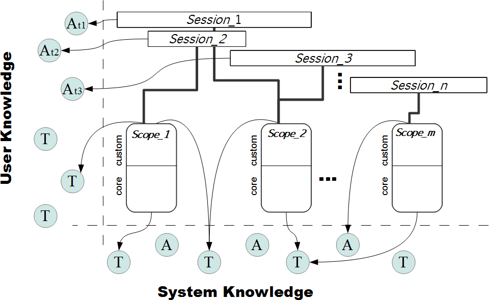

Figure 1: an example of OntoNet setup for multiple ontology networks, showing the orthogonal layering of sessions, scopes and spaces.

The following concepts have been introduced with OntoNet:

- **Ontology scope**: a "logical realm" for all the ontologies that encompass a certain CMS-related set of concepts (such as "User", "ACL", "Event", "Content", "Domain", "Reengineering", "Community", "Travelling" etc.). Scopes never inherit from each other, though they can load the same ontologies if need be.
- **Ontology space**: an access-restricted container for synchronized access to ontologies within a scope. The ontologies in a scope are loaded within its set of spaces. An ontology scope contains: (a) one core space, which contains the immutable set of essential ontologies that describe the scope; (b) one (possibly empty) custom space, which extends the core space according to specific CMS needs (e.g. the core space for the User scope may contains alignments to FOAF).
- Session: a container of (supposedly volatile) semantic data which need to be intercrossed with one or more Scopes, for stateful management of ontology networks. It can be used to load instances and reason on them using different models (one per scope). An OntoNet Session is not equivalent to an HTTP session (since it can live persistently across multiple HTTP sessions), although its behaviour can reflect the one of the HTTP session that created it, if required by the implementation.

---

<a id="trunk-components-ontologymanager-ontonet--usage"></a>

## Usage

Given the entire knowledge base managed by your CMS, OntoNet allows the construction and management of ontology networks, programmatically via its Java API or RESTful Web Services *(see next section for details on the latter)*. A criterion for choosing the appropriate API can be as follows:

- Stanbol plugins or server software that incorporates Stanbol (e.g. larger OSGi platforms) should use the Java API.
- Client applications, non-Java CMSs or services decoupled from Stanbol should use the RESTful API.
- Java-based CMSs can use either API.

<a id="trunk-components-ontologymanager-ontonet--java-api"></a>

### Java API

First and foremost, the concept of **ontology network** is implicit in the OntoNet API. There is no such thing as an `OntologyNetwork` type. What you do is create `OntologyScope` and `Session` objects and link them together at creation time or when launching a process.

<a id="trunk-components-ontologymanager-ontonet--accessing-the-managers"></a>
<a id="trunk-components-ontologymanager-ontonet--accessing-the-managers."></a>

#### Accessing the managers.

First and foremost let us obtain references to the main OntoNet manager classes. In an OSGi environment they can be obtained by reference:

```
@
Reference
ONManager
onMgr
;
@
Reference
SessionManager
sesMgr
;
```

In a non-OSGi environment they must be instantiated as POJOs (Plain Old Java Objects):

```
TODO
```

<a id="trunk-components-ontologymanager-ontonet--managing-an-ontology-scope"></a>
<a id="trunk-components-ontologymanager-ontonet--managing-an-ontology-scope."></a>

#### Managing an ontology scope.

Let us now show an example of how to setup an ontology scope, which you should use for storing the models for a certain domain of your knowledge base. In this example we will refer to social networks and communities.

```
ScopeRegistry registry = onMgr.getScopeRegistry(); OntologyScopeFactory factory = onMgr.getOntologyScopeFactory();
/* * Here we create a scope called "social" where we intend * to place all the knowledge needed for modeling social * networks and communities.* * Suppose the FOAF and SIOC ontologies are the only ones * we are concerned with at scope creation time. We tell * the scope factory method to fetch them from their * original locations on the Web.*/ try {
/* * You can include as many ontology input source as * you want, even none at all.*/ OntologyScope scope = factory.createOntologyScope("social",new RootOntologyIRISource(IRI.create("http://xmlns.com/foaf/spec/index.rdf")),new RootOntologyIRISource(IRI.create("http://rdfs.org/sioc/ns")));
/* * Setup the scope, so its ontologies will be available * via the RESTful API */ // Lock the ontology scope scope.setUp(); // Register the scope and activate it registry.registerScope(scope, true); } catch (OWLOntologyCreationException e1) {/* * Thrown if there was an error creating one of the * ontology sources (e.g. if some URL could not be * resolved or it is not an ontology.*/ e1.printStackTrace(); } catch (DuplicateIDException e1) {/* * Thrown if there is already a scope called "social".* In this case we may decide to use the existing one,* so we get it. Note that wen reusing a scope, you * lose the provilege of writing in its core space.* Only the custom space will be open for modification.*/ scope = registry.getScope("social");}
```

If you have not changed any parameters in the OntoNet configuration and have the Ontology Manager Web Service endpoint up and running, you should be able to fetch an RDF file at `http://localhost:8080/ontonet/ontology/social`. Let us check it (in Turtle Syntax):

```
% curl -H "Accept: application/turtle" http://localhost:8080/ontonet/ontology/social

@prefix xsd: <http://www.w3.org/2001/XMLSchema#> .
@prefix owl: <http://www.w3.org/2002/07/owl#> .
@prefix : 
  <http://localhost:8080/ontonet/ontology/social#> .
@prefix xml: <http://www.w3.org/XML/1998/namespace> .
@prefix rdf: 
  <http://www.w3.org/1999/02/22-rdf-syntax-ns#> .
@prefix rdfs: <http://www.w3.org/2000/01/rdf-schema#> .
@base <http://localhost:8080/ontonet/ontology/social> .

<http://localhost:8080/ontonet/ontology/social> 
  rdf:type owl:Ontology ;
  owl:imports 
    <http://localhost:8080/ontonet/ontology/social/core> .
```

Let us take a look at the imported ontology that represents the core space of the "social" scope.

```
% curl -H "Accept: application/turtle" http://localhost:8080/ontonet/ontology/social/core

@base 
  <http://localhost:8080/ontonet/ontology/social/core> .

<http://localhost:8080/ontonet/ontology/social/core> 
  rdf:type owl:Ontology ;
  owl:imports 
    <http://localhost:8080/ontonet/ontology/social/http://rdfs.org/sioc/ns> ,
    <http://localhost:8080/ontonet/ontology/social/http://xmlns.com/foaf/0.1/> .
```

Here are the `owl:imports` statements for the FOAF and SIOC ontologies, which are hijacked to "internal" versions managed by Stanbol. Of course if a domain namespace other than "http://localhost:8080/" was configured, you will see that one in each import statement.

Also note that the import statement for FOAF ends with `http://xmlns.com/foaf/0.1/`, which is different from the IRI we passed to Stanbol `http://xmlns.com/foaf/spec/index.rdf`. This happens because in the case of FOAF the *physical* IRI (which must be known a priori) differs from its *logical* IRI (which identifies the ontology and is discovered only when the ontology is read), and OntoNet tends to privilege the logical IRI when one is found, i.e. when the ontology is not anonymous.

The FOAF and SIOC ontologies are imported by the core space because they were indicated at *creation* time.

Of course it is possible to onbtain a Java object for the ontology using the Java API. Here is how to export an entire scope to an OWL API object of type `OWLOntology`:

```
/* * To obtain the OWLOntology, we must specify its class as * a return parameter.* We also set the second argument to true, to specifiy * that we want it merged with its imports, so that the * resulting object contains all axioms.*/ OWLOntology scopeAsOWL =scope.export (OWLOntology.class,true );
```

An scope can be exported either as an OWL API object or as a Clerezza object.

```
/* * In Clerezza, a Graph is a subclass of TripleCollection,* so it is supported by OntoNet. We could also export a * scope to a MGraph (modifiable Graph).*/ Graph scopeAsClerezza =scope.export (Graph,false );
```

<a id="trunk-components-ontologymanager-ontonet--ontology-input-sources"></a>
<a id="trunk-components-ontologymanager-ontonet--ontology-input-sources."></a>

#### Ontology input sources.

Note that when you add an ontology to a space or session, you pass it an `OntologyInputSource` object, or more precisely, an `OntologyInputSource<O,P>`. This is because there can be several ways to obtain an ontology, and those most common are supported in Stanbol. For example, it can be obtained by defererencing a IRI and parsing its source code (in RDF/XML, Turtle, etc.), or by reading an input stream, or taking an already stored RDF graph in the Stanbol store; or it could be an ontology Java object created from scratch. An **Ontology input source** is an object that incorporates (1) the "method" by which an ontology should be accessed; (2) the type of Java object it should create to represent an ontology; (3) where it should store the ontology.

- **`OWLOntology` input sources** comply with the OWL API specification [[1]](#trunk-components-ontologymanager-ontonet--ref1) and creates objects of type `OWLOntology` stored in an *in-memory* `OWLOntologyManager`. It will be stored persistently once added to an ontology network.
  - `RootOntologySource`. Wraps an already existing `OWLOntology`, therefore it does not provide a physical IRI.
  - `RootOntologyIRISource`. Tries to locate and load an ontology, and its imports, from a given IRI. It can use a custom `OWLOntologyManager` as a store, and can even override any mappers, in order to force-dereference the IRI.
  - `ParentPathInputSource`. Tries to load an ontology from a root `File`, and will seek its imports among the files in the same directory as the root `File`. It also allows a custom `OWLOntologyManager` as a store.
    Loads the ontology source codeWraps an already existing `OWLOntology`, therefore it does not provide a physical IRI.
  - `BlankOntologySource`. Creates an `OWLOntology` with no ID and no axioms. It can be useful for supplying dummy ontologies to methods that will not admit a null ontology. Note that the blank ontology is not shared: each `BlankOntologySource` has a distinct blank ontology object, and they are *not* equal!
- **`TripleCollection` input sources** comply with the Apache Clerezza API specification, which is also the default native implementation of OntoNet. The resulting ontology is a subtype of `TripleCollection` (`Graph` or `MGraph`) and uses a `TcProvider` as a store. Depending on the chosen Stanbol storage, it can be pesistent or in-memory. Generally, these input sources take less memory that OWL API counterparts, but do not allow RDF graphs to be managed using the OWL language constructs. Note that any `TripleCollection` can be exported as an `OWLOntology` afterwards, once stored.
  - `GraphContentInputSource`. Creates a `TripleCollection` by reading an input stream, which can be obtained from a file, URL etc. It can use any `TcProvider` as a store, otherwise it will create an in-memory triple collection, which will be copied to the Stanbol store when adding the ontology to a network. If this `TcProvider` is the `TcManager` used by Stanbol, its triples are not copied across.
  - `GraphSource`. Wraps an existing `TripleCollection` object. In general, it does not 'know' where the ontology was stored.

<a id="trunk-components-ontologymanager-ontonet--service-endpoints"></a>

### Service Endpoints

The OntoNet RESTful API is structured as follows:

*(Please note, that the following links to the actual service endpoints link to a running instance of Apache Stanbol. If you use domains or ports other than "localhost:8080", then please change accordingly)*

<a id="trunk-components-ontologymanager-ontonet--scopes-ontonetontology"></a>
<a id="trunk-components-ontologymanager-ontonet--scopes-ontonet-ontology"></a>

#### Scopes ("/ontonet/ontology")

- The endpoint @ [/ontonet/ontology](http://localhost:8080/ontonet/ontology) shows an overview (as an RDF graph or HTML document) of all registered ontology scopes.
- An Ontology Scope @ /ontonet/ontology/{scopeId} provides the de-referenceable OWL form of the ontology scope *scopeId*, inclusive of OWL import statements for the spaces and ontologies therein.

<a id="trunk-components-ontologymanager-ontonet--sessions-ontonetsession"></a>
<a id="trunk-components-ontologymanager-ontonet--sessions-ontonet-session"></a>

#### Sessions ("/ontonet/session")

- The endpoint @ [/ontonet/session](http://localhost:8080/ontonet/session) shows an overview (as an RDF graph or HTML document) of all open OntoNet sessions.
- A Session @ /ontonet/session/{sessionId} provides the de-referenceable OWL form of the OntoNet Session *sessionId*, inclusive of OWL import statements for the ontologies therein.

<a id="trunk-components-ontologymanager-ontonet--managed-ontologies-ontonetontologyid"></a>
<a id="trunk-components-ontologymanager-ontonet--managed-ontologies-ontonet-ontologyid"></a>

#### Managed Ontologies ("ontonet/{ontologyId}")

- A Managed Ontology @ /ontonet/{ontologyId}, where *ontologyId* is the full logical IRI that identifies the ontology, provides the RDF form of the ontology with that ID, if that ontology has been stored and is managed by OntoNet (i.e. is in some scope or session).

<a id="trunk-components-ontologymanager-ontonet--references"></a>
<a id="trunk-components-ontologymanager-ontonet--references:"></a>

## References:

- [1] [OWL API](http://owlapi.sourceforge.net)

---

*[Back to Ontology Manager](#trunk-components-ontologymanager)*

Copyright © 2010 The Apache Software Foundation, Licensed under
the [Apache License, Version 2.0](http://www.apache.org/licenses/LICENSE-2.0).
Apache, Stanbol and the Apache feather and Stanbol logos are trademarks of The Apache Software Foundation.

---

<a id="trunk-components-enhancer-contentitem"></a>

<!-- source_url: https://stanbol.apache.org/docs/trunk/components/enhancer/contentitem -->

<!-- page_index: 51 -->

<a id="trunk-components-enhancer-contentitem--content-item"></a>

# Content Item

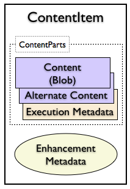

The ContentItem is the object which represents the content to be enhanced by Apache Stanbol. It is created based on the data provided by the enhancement request and used throughout the enhancement process to store results. Therefore, after the enhancement process has finished, the ContentItem represents the result of the Apache Stanbol enhancement process. ContentItem instances are created by using the [ContentItemFactory](#trunk-components-enhancer-contentitemfactory) service.

The following section describes the interface of the ContentItem in detail:

<a id="trunk-components-enhancer-contentitem--content-parts"></a>

### Content Parts

Content parts are used to represent the original content as well as transformations of the original content (typically created by pre-processing [enhancement engines](#trunk-components-enhancer-engines-list) such as the [Metaxa engine](#trunk-components-enhancer-engines-metaxaengine)).

The ContentItem provides the following API to work with content parts:

```
/** Getter for the ContentPart based on the index */ getPart (int index,Class <T> type):T /** Getter for the ContentPart based on its ID */ getPart (UriRef uri,Class <T> type):T /** Getter for the ID based on the index */ getPartUri (index index):UriRef /** Adds a new ContentPart to the content item */ addPart (UriRef uri,Object part):Object
```

Content parts are accessible by the index *and* by their URI formatted ID. Re-adding a content part will replace the old one. The index will not be changed by this operation.

There are two types of content parts:

1. Content parts which have additional metadata provided within the metadata of the content item. Such content parts are typically used to store transformed versions of the original content. This allows e.g. engines which can only process plain text versions to query for the content part containing this version of the passed document.
2. Content parts that are registered under a predefined URI. Such content parts are typically not mentioned within the metadata of the content item. This is used to share intermediate enhancement results between enhancement engines. An example would be tokens, sentences, POS tags and chunks that are extracted by some NLP engine. Engines which want to consume such data need to know the predefined URI of the content part holding this data. They will check within the `canEnhance(..)` method if a content part with an expected URI is present and if it has the correct type.

<a id="trunk-components-enhancer-contentitem--accessing-the-main-content-of-the-contentitem"></a>

### Accessing the main content of the ContentItem

The main content of the ContentItem refers to the content passed by the enhancement request (or downloaded from the URL provided by a request). For accessing this content the following methods are available

```
/** Getter for the InputStream of the content as passed for the ContentItem */ + getStream ():InputStream /** Getter for the mime type of the content */ + getMimeType ():String /** Getted for the Content as Blob */ + getBlob ():Blob
```

The `getStream()` and `getMimeType()` methods are shortcuts for the according methods of the content item's blob object. Calling `contentItem.getBlob.getStream()` will return an InputStream over the exact same content as directly calling `getStream()` on the content item. *Note that the blob interface also provides a `getParameter()` method which allows to retrieve mime-type parameters such as the charset of textual content.*

The content passed by the user is stored as content part at the index '0' with the URI of the content item in the form of a blob. Therefore, calling

```
contentItem.getPart (0,Blob.class) contentItem.getPart (contentItem.getUri (),Blob.class) contentItem.getBlob ()
```

returns the same blob instance.

<a id="trunk-components-enhancer-contentitem--metadata-of-the-contentitem"></a>

### Metadata of the ContentItem

The metadata of the ContentItem is managed by a lockable MGraph. This is basically a normal `java.util.Collections` for triples. The only RDF specific method is the support for filtered iterators which support wildcards for subjects, predicates and objects.

This graph is used to store all [enhancement results](#trunk-components-enhancer-enhancementstructure) as well as metadata about the content item (such as content parts) and the enhancement process (see [execution metadata](#trunk-components-enhancer-executionmetadata)).

<a id="trunk-components-enhancer-contentitem--readwrite-locks"></a>
<a id="trunk-components-enhancer-contentitem--read-write-locks"></a>

### Read/Write locks

During the Apache Stanbol enhancement process as executed by the [enhancement job manager](#trunk-components-enhancer-enhancementjobmanager) components running in multiple threads need to access the state of the *ContentItem*. Because of that the content item provides the possibility to acquire locks.

```
/** Getter for the ReadWirteLock of a ContentItem */ + getLock ():java.util.concurrent.ReadWriteLock
```

Note also that

```
contentItem.getLock () contentItem.getMetadata ().getLock ()
```

will return the same `ReadWriteLock` instance.

This lock can be used to request read/write locks on the content item. All methods of the content item and also the `MGraph` holding the metadata need to be protected by using the lock. This means that users which do not need to protect whole sections of code do not need to bother with the usage of locks. Typical examples are working with content parts, final classes like `Blob` or adding/removing a triple from the metadata.

However, whenever components need to ensure that the data are not changed by other threads while performing some calculations read/write locks *must be* used. A typical example are iterations over data returned by the MGraph. In this case code iterating over the results should be protected against concurrent changes by

```
contentItem.getLock ().readLock ().lock (); try {Iterator <Triple> it =contentItem.getMetadata ().filter (null,RDF.TYPE,TechnicalClasses.ENHANCER_TEXTANNOTATION ); while (it.hasNext ()){log.debug (" Process TextAnnotation:{},it.next ().getSubject ()); //read the needed information}} finally {contentItem.getLock ().readLock ().unlock ()}
```

While accessing content items within an [enhancement engine](#trunk-components-enhancer-engines) there is an exception to this rule. If an engine declares that it only supports the `SYNCHRONOUS` enhancement mode, then the [enhancement job manager](#trunk-components-enhancer-enhancementjobmanager) needs to take care that an engine has exclusive access to the *CotentItem*. In this case implementors of enhancement engines need not to care about using read/write locks.

<a id="trunk-components-enhancer-contentitem--contentitemfactory"></a>

### ContentItemFactory

Since version 0.10.0 ContentItems and Blobs are created by using the [ContentItemFactory](#trunk-components-enhancer-contentitemfactory). ContentItemFactory implementation register themselves as OSGI service. By default the implementation with the highest "service.ranking" is used by the StanbolEnhancer to create instances. By default two implementations are available. The in-memory and a file-based one where the in-memory implementation is used as default.

Most users will not need to change the default ContentItem implementation. However if the Enhancer is used to extract metadata from gib media files such as EXIF metadata from big images, ID3 from MP3 files ... than changing the default from the InMemoryContentItemFactory to the FileContentItemFactory might considerable reduce the memory footprint.

With the introduction of the ContentItemFactory also all ContentItem implementation specific constructors to parse content where deprecated and replaced by the following three interfaces:

1. **ContentSource** allows to parse Content that is available as stream, byte array or string.
2. **ContentReference** allows to parse a Reference (e.g. a URL) to a ContentItem. The derefernce() method of this interface is used by the ContentItemFactory to convert a ContentReference to a ContentSource.
3. **ContentSink** allows to obtain an OutputStream to an initially empty Blob that can later be used to stream the content. This is intended to be used by EnhancementEngine that need to convert content from one format to an other because it allows to avoid caching the converted content in-memory.

<a id="trunk-components-enhancer-contentitem--multipart-mime-serialization"></a>

### Multipart MIME serialization

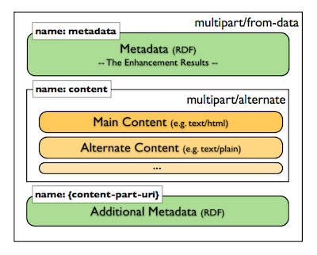

Stanbol supports the serialization of content items as multipart MIME. This serialization is used by the RESTful API of the Stanbol Enhancer. This section provides details about how content items are represented using multipart MIME. For more information on how to send/receive multipart content items via the RESTful Services provided by the Stanbol Enhancer please see the documentation provided in the web interface (e.g. at http://localhost:8080/enhancer).

The following figure provides an overview on how ContentItems are represented using MultiPart MIME.

**ContentItem Container**

- ContentItems are contained within a "multipart/form-data" container
- Apache Stanbol uses "ContentItem" as "boundary", but users may use any other as long as the "boundary" parameter in the "Content-Type" header is set correctly.
- Stanbol uses UTF-8 as charset, but users might use any supported encoding as long as the "charset" parameter in the "Content-Type" header is set accordingly.

The default Content-Type for serialized ContentItems is therefore "multipart/form-data; boundary=contentItem; charset=UTF-8"

**Enhancement Metadata**

- If present this MUST BE the first MIME part within the "multipart/form-data" container representing the ContentItem.
- The "name" parameter of the "Content-Disposition" header MUST BE "metadata"
- If the "fileName" parameter of the "Content-Disposition" header is present it MUST BE the URI of the ContentItem. Users are typically required to set this header in case they want to parse existing metadata with enhancement requests. This is because is such cases it is important that the URI of the ContentItem created by the Stanbol Enhancer is equal to the URI used to describe the Content within the passed Metadata. The Stanbol Enhancer MUST set to "fileName" parameter of the metadata to the URI of the processed ContentItem.
- The "Content-Type" of the metadata can be any RDF serialization supported by Apache Stanbol. UTF-8 is used as default charset.
- The RDF data serialized in this MIME part represent the enhancement results.

**Content**

- If present the MIME part representing the Content MUST directly follow the Metadata. If the Metadata are not present the Content MUST BE the first MIME part within the "multipart/form-data" container representing the ContentItem.
- Because multiple content variants can be included within a ContentItem a "multipart/alternate" container is used to represent the content.
- The "name" parameter of the "Content-Disposition" header MUST BE "content". The "fileName" parameter is not used and therefore not present/ignored. The Stanbol Enhancer uses "contentParts" as boundary but users may use any boundary as long as it is correctly set within the "Content-Type" header.

The various content elements are contained within the "multipart/form-data" container. The ordering is important. For serialized ContentItems it is assumed that the first element is the original document for the ConentItem. All further MIME parts are considered alternate - e.g. transcoded/transformed - versions. For serialized ContentItems provided as response to requests to the Stanbol Enhancer the ordering of the MIME parts is the same as the indexes of the ContentParts in the ContentItem.

- the "name" parameter of the "Content-Disposition" is set to the URI of the ContentPart in the ContentItem.
- the "Content-Type" header must correspond to the media type of the content

Note that users which want to send a single ContentPart AND Metadata to the Stanbol Enhancer can also directly add the content to the "multipart/form-data" container of the ContentItem. In this case the "name" parameter MUST BE still set to "content" but the "Content-Type" header needs to be directly set to the media type of the passed ContentPart. The Stanbol Enhancer does NOT use this option when serializing ContentItems. It will ALWAYS use a "multipart/alternate" container for the "content" even when only a single ContentPart is included in an Response.

**Additional Metadata**

The [ContentPart API](#trunk-components-enhancer-contentitem--content_parts) of the Stanbol ContentItem allows to register content parts of any type. The MultiPart MIME serialization of ContentItems supports the serialization of such additional parts as long as they are encoded as RDF graphs (compatible to the Clerezza TripleCollection class). Additional ContentParts which are not encoded as RDF data are currently not supported by the Multipart MIME serialization.

- MimeParts representing such ContentParts MUST BE added after the MIME parts for the "metadata" AND the "content"
- The "name" parameter of the "Content-Disposition" MUST BE set to the URI of the ContentPart in the ContentItem.
- the "Content-Type" header must correspond to the media type of the content. The Stanbol Enhancer will always use the same RDF serialization as for the "metadata" when serializing additional Metadata. Users are free to use any supported serialization as long as they set the "Content-Type" header accordingly.
- The ordering of parts representing additional Metadata is the same as the ordering (index) of the ContentParts in the ContentItem.

Copyright © 2010 The Apache Software Foundation, Licensed under
the [Apache License, Version 2.0](http://www.apache.org/licenses/LICENSE-2.0).
Apache, Stanbol and the Apache feather and Stanbol logos are trademarks of The Apache Software Foundation.

---

<a id="trunk-components-enhancer-enhancementjobmanager"></a>

<!-- source_url: https://stanbol.apache.org/docs/trunk/components/enhancer/enhancementjobmanager.html -->

<!-- page_index: 52 -->

<a id="trunk-components-enhancer-enhancementjobmanager--enhancementjobmanager"></a>

# EnhancementJobManager

The EnhancementJobManager is the component responsible for the execution of the [ExecutionPlan](#trunk-components-enhancer-chains-executionplan) as provided by the [Enhancement Chain](#trunk-components-enhancer-chains) on the [ContentItem](#trunk-components-enhancer-contentitem).

<a id="trunk-components-enhancer-enhancementjobmanager--enhancementjobmanager-interface"></a>

## EnhancementJobManager interface

The interface of the EnhancementJobManager is very simple:

```
/** Enhances the content item by using the default Chain */ + enhanceContent (ContentItem ci) /** Enhances the content item by using the parsed Chain */ + enhanceContent (ContentItem ci,Chain chain)
```

Note: the parsed ContentItem will be changed during the enhancement process. [EnhancementEngines](#trunk-components-enhancer-engines) will add extracted knowledge to the metadata of the content item. Also additional content parts may be added to the ContentItem.

<a id="trunk-components-enhancer-enhancementjobmanager--enhancement-process"></a>

## Enhancement Process

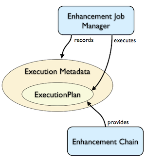

While the [ExecutionPlan](#trunk-components-enhancer-chains-executionplan) defines what EnhancementEngines are used and how they depend on each other, the EnhancementJobManager is responsible for the actual execution of the enhancement process based on this plan. This section provides detailed information about requirements and expectations that MUST BE considered.

The EnhancementJobManager is also responsible to create and update the [ExecutionMetadata](#trunk-components-enhancer-executionmetadata) in the metadata of the processed [ContentItem](#trunk-components-enhancer-contentitem). Details about this are provided in the section "[Creation/Management of ExecutionMetadata](#trunk-components-enhancer-executionmetadata--creationmanagement_of_executionmetadata)" of the ExecutionMetadata documentation.

<a id="trunk-components-enhancer-enhancementjobmanager--initializing-the-enhancement-process"></a>

### Initializing the Enhancement Process

Here one needs to distinguish two cases:

1. Initialization of an new Enhancement process and
2. Continuation of an existing Enhancement process.

The two cases can be easily detected by the EnhancementJobManager by evaluating if a content part with the URI "http://stanbol.apache.org/ontology/enhancer/executionMetadata#ChainExecution" is present within the parsed [ContentItem](#trunk-components-enhancer-contentitem).

In the first case the [ExecutionPlan](#trunk-components-enhancer-chains-executionplan) to be used by the enhancement process is provided by the Chain in a final graph that is guaranteed to be not changed. However because the configuration of a Chain might be changed at any time the EnhancementJobManager MUST retrieve the execution plan only once and use it during the entire enhancement process. In addition the ExecutionPlan MUST BE also added to the graph containing the [EnahcementMetadata](#trunk-components-enhancer-executionmetadata). In case of continuing on an previously aborted enhancement process the ExecutionPlan MUST BE initialized from the ExecutionMetadata provided by the ContentItem.

For details on how to initialize/load the execution metadata see the section "[Creation/Management of ExecutionMetadata](#trunk-components-enhancer-executionmetadata--creationmanagement_of_executionmetadata)" of the ExecutionMetadata documentation.

<a id="trunk-components-enhancer-enhancementjobmanager--engine-execution"></a>

### Engine Execution

The ExecutionPlan provides the necessary information which [EnhancementEngines](#trunk-components-enhancer-engines) can be executed at any given state. The following code shows how to determine executable engines.
This code snippet assumes to be called after the execution of an EnhancementEngine has completed. Note that in a multi threaded environment access to the list of executed and running engines need to be synchronized.

```
Collection <NonLiteral> executed;
//already executed Engines Collection <NonLiteral> running;
//currently running Engines Collection <NonLiteral> next =ExecutionPlanUtils.getExecuteable (plan,executed ); for (NonLiteral node:next ){if (! running.contains (node )){String engineName =EnhancementEngineHelper.getString (executionPlan,node,EX_ENGINE )); EnhancementEngine engine =tracker.getEngine (engineName ); if (engine !=null ){// execute engine} else {//check if optional and throw error if not}} // else already running -> ignore}
```

*NOTE* that the NonLiterals contained in the two collections are 'ep:ExecutionNode' instances and NOT 'em:EngineExecution' instances. Each 'em:EngineExecution' instance in the ExecutionMetadata' is linked by the 'em:executionNode' property to the corresponding 'ep:ExecutionNode' of the ExecutionPlan.

Before executing an [EnhancementEngine](#trunk-components-enhancer-engines), the EnhancementJobManager needs to check if and how the engine can enhance a content item. This is indicated by the integer returned by the "canEnhance(ContentItem ci)" method:

- **CANNOT\_ENHANCE**: Indicates that this engines can not process the parsed content item. In this case the EnhancementJobManager needs to skip this engine and mark the EngineExecution as skipped with a status message that the EnhancementEngine was unable to process the content item. If this engine is marked as optional the enhancement process can continue; if not, the execution MUST be marked as failed and an according exception needs to be thrown.
- **ENHANCE\_SYNCHRONOUS**: Indicates that the engine needs exclusive access to the parsed content item. The EnhancementJobManager needs to ensure that in some way. Typically by calling the "computeEnhancement(ContentItem ci)" method within a write lock.
- **ENHANCE\_ASYNC**: Indicates that this engine supports asynchronous execution and takes itself care to acquire read and write locks on the parsed content item. However this does not require the JobManager to execute the engine asynchronously.

If the execution of an EnhancementEngine completes, the JobManager needs to set the state of the execution to completed and update the execution metadata accordingly.

If a call to "computeEnhancement(ContentItem ci)" results in an Exception the EnhancementJobManager must mark the execution of the engine as failed with a decryption of the occurred exception. If the execution of the affected engine was optional, the enhancement process is continued. Otherwise the enhancement process needs to be stopped and the Error needs to rethrown by the "enhanceContent(..)" method.

For all the details on how to reflect state changes in the Execution metadata see [this section](#trunk-components-enhancer-executionmetadata--execution_state_management) of the documentation of the ExecutionMetadata.

<a id="trunk-components-enhancer-enhancementjobmanager--multi-threaded-enhancement-processes"></a>

### Multi Threaded enhancement processes

In case the EnhancementJobManager supports to simultaneously call [EnhancementEngines](#trunk-components-enhancer-engines) for the same content item in multiple threads, it is important to correctly use the ReadWriteLock as provided by the ContentItem.getLock() method.

There are many good examples on how to correctly use "java.util.concurrent.ReadWriteLock" available on the web.

<a id="trunk-components-enhancer-enhancementjobmanager--finalizing-the-enhancementprocess"></a>

### Finalizing the EnhancementProcess

When the execution is completed (successfully or failed), the EnhancementJobManager need to ensure that the 'em:status' and the 'em:completed' of the 'em:ChainExecution' instance are set. If the execution failed also the 'em:statusMessage' should be available and contain a message that describes the problem.

<a id="trunk-components-enhancer-enhancementjobmanager--enhancementjobmanager-implementations"></a>

## EnhancementJobManager implementations

EnhancementJobManager implementations need to register itself as OSGI services. By default the Stanbol Enhancer will use the implementation with the highest service ranking. The service ranking can be set by providing a configuration defining an integer value for the property "service.ranking"

<a id="trunk-components-enhancer-enhancementjobmanager--eventjobmanager"></a>

### EventJobManager

This implementation is provided by the "org.apache.stanbol.enhancer.jobmanager.event" module and is currently used as default. It registers itself (by default) with a service ranking of '0'.

This implementation supports an asynchronous enhancement process by using the ["org.osgi.service.event"](http://www.osgi.org/javadoc/r4v42/org/osgi/service/event/package-summary.html) framework.

<a id="trunk-components-enhancer-enhancementjobmanager--weightedjobmanager"></a>

### WeightedJobManager

This JobManager was used as default before the introduction of EnhancementChains. It does not support EnhancementChains and will enhance parsed [ContentItems](#trunk-components-enhancer-contentitem) by calling all currently active EnhancementEngines in a sequential manner. It does also not have support for EnhancementMetadata.

This implementation is provided by the "org.apache.stanbol.enhancer.jobmanager.weightedjobmanager" module and is no longer included within the Apache Stanbol launchers. This JobManager registers itself with a service ranking of "-1000". Users that want to use this job manager need to manually install this bundle and either deactivate other EnhancementJobManager implementations or reconfigure the service ranking of this one to an value > 0.

Copyright © 2010 The Apache Software Foundation, Licensed under
the [Apache License, Version 2.0](http://www.apache.org/licenses/LICENSE-2.0).
Apache, Stanbol and the Apache feather and Stanbol logos are trademarks of The Apache Software Foundation.

---

<a id="trunk-components-enhancer-chains-chainmanager"></a>

<!-- source_url: https://stanbol.apache.org/docs/trunk/components/enhancer/chains/chainmanager.html -->

<!-- page_index: 53 -->

<a id="trunk-components-enhancer-chains-chainmanager--chain-manager"></a>

# Chain Manager

The ChainManager provides name based access to all active [Enhancement Chains](#trunk-components-enhancer-chains) and their ServiceReferences. This interface is typically used by components that need to lookup Chains based on their name. However the ChainsTracker implementation can also be used to track specific Chains.

<a id="trunk-components-enhancer-chains-chainmanager--chainmanager-interface"></a>

## ChainManager interface

This is the Java API providing access to registered chains in the ways as described above. This interface includes the following methods:

```
/** Constant for the name of the DefaultChain */ DEFAULT_CHAIN_NAME:String /** Getter for all names with active Chains */ getActiveChainNames ():Set <String> /** Getter for the ServiceReference to the Chain with a given name sorted by service ranking */ getReference (String name):ServiceReference /** Getter for all ServiceReferences to Chains with a given name */ getReferences (String name) /** Getter for the Chain with a given name */ + getChain (Stirng name):Chain /** Getter for all Chains with a given name sorted by service ranking */ + getChains (String name):List <Chain> /** Getter for a Chain based on a service reference */ + getChain (ServiceReference ref):Chain /** Checks if there is a chain for the given name */ + isChain (String name):boolean /** Getter for the default chain */ + getDefault ():Chain
```

There are two implementations of this interface available:

<a id="trunk-components-enhancer-chains-chainmanager--chainmanager-service"></a>

### ChainManager Service

This is an implementation of the ChainManager interface that is registered as OSGI service. It can be used e.g. by using the @Reference annotation

```
@Reference
ChainManager
chainManager
```

This service is provided by the "org.apache.stanbol.enhancer.chainmanger" module and is included in all Stanbol launchers.

<a id="trunk-components-enhancer-chains-chainmanager--chainstracker"></a>

### ChainsTracker

This is an utility similar to the standard OSGI ServiceTracker that allows to track some/all chains. It also supports the usage of a ServiceTrackerCustomizer so that users of this utility can directly react to changes of tracked chains.

```
//track only "myChain" and "otherChain" ChainsTracker tracker =new ChainsTracker (context,"myChain","otherChain" ); tracker.open (); //start tracking //the tracker need to be closed if no longer needed tracker.close () tracker =null;
```

For most users the ChainManager service is sufficient and preferable. Direct use of the ChainsTracker is only recommended if one needs only to track some specific chains and especially if one needs to get notified an changes of such chains.

---

<a id="trunk-components-enhancer-engines-enhancementenginemanager"></a>

<!-- source_url: https://stanbol.apache.org/docs/trunk/components/enhancer/engines/enhancementenginemanager.html -->

<!-- page_index: 54 -->

<a id="trunk-components-enhancer-engines-enhancementenginemanager--enhancement-engine-manager"></a>

# Enhancement Engine Manager

The EnhancementEngineManager provides name based access to all active [EnhancementEngine](#trunk-components-enhancer-engines)s and their ServiceReferences. This interface is typically used by components that need to lookup EnhancementEngines based on their name. However the EngineTracker implementation can also be used to track specific EnhancementEngines.

<a id="trunk-components-enhancer-engines-enhancementenginemanager--enhancementenginemanager-interface"></a>

### EnhancementEngineManager interface

This is the Java API providing access to registered EnhancementEngines in the ways as described above. This interface includes the following methods:

```
/** Getter for all names with active engines */ getActiveEngineNames ():Set <String> /** Getter for the ServiceReference to the engine with a given name */ getReference (String name):ServiceReference /** Getter for all ServiceReferences to engines with a given name sorted by service ranking */ getReferences (String name) /** Getter for the engine with a given name */ + getEngine (Stirng name):EnhancementEngine /** Getter for all engines with a given name sorted by service ranking */ + getEngines (String name):List <EnhancementEngine> /** Getter for an engine based on a service reference */ + getEngine (ServiceReference ref):EnhancementEgnie /** Checks if there is an engine for the given name */ + isEngine (String name):boolean
```

There are two implementations of this interface available:

<a id="trunk-components-enhancer-engines-enhancementenginemanager--enhancementenginemanager-service"></a>

#### EnhancementEngineManager Service

This is an implementation of the EnhancementEngineManager interface that is registered as OSGI service. It can be used e.g. by using the @Reference annotation

```
@Reference
EnhancementEngineManager
engineManager
```

This service is provided by the "org.apache.stanbol.enhancer.enginemanager" module and is included in all Stanbol launchers.

<a id="trunk-components-enhancer-engines-enhancementenginemanager--enginestracker"></a>

#### EnginesTracker

This is an utility similar to the standard OSGI ServiceTracker which allows to track some/all EnhancementEngines. It also supports the usage of a ServiceTrackerCustomizer so that users of that utility can directly react to changes of tracked EnhancementEngines.

```
//track only "myEngine" and "otherEngine" EnginesTracker tracker =new EnginesTracker (context,"myEngine","otherEngine" ); tracker.open (); //start tracking //the tracker need to be closed if no longer needed tracker.close () tracker =null;
```

For most users the EnhancementEngineManager service is sufficient and preferable. Direct use of the EngineTracker is only recommended if one needs only to track some specific engines and especially if one needs to get notified an changes of such engines.

The implementation of the `WeightedChain` is a good example for the intended usage of the EnginesTracker.

---

<a id="trunk-components-enhancer-chains-listchain"></a>

<!-- source_url: https://stanbol.apache.org/docs/trunk/components/enhancer/chains/listchain.html -->

<!-- page_index: 55 -->

<a id="trunk-components-enhancer-chains-listchain--list-chain"></a>

# List Chain

The ListChain creates the ExecutionPlan based on the exact order of the configured [EnhancementEngines](#trunk-components-enhancer-engines). This provides users with a simple possibility to configure the exact oder in which the referenced EnhancementEngines are called during the enhancement process of a content item. However the ListChain can not support parallel execution of engines - a considerable disadvantage in contrast to the [GraphChain](#trunk-components-enhancer-chains-graphchain).

A typical usage scenario would be that users start of with configuring a ListChain and later optimize the execution by migrating functional configuration to a [GraphChain](#trunk-components-enhancer-chains-graphchain).

<a id="trunk-components-enhancer-chains-listchain--configuration"></a>

## Configuration

The property "stanbol.enhancer.chain.list.enginelist" is used to provide the list of engine names. This configuration MUST BE parsed as an array as string because the ordering of the configured entries is essential for the configuration.

In addition it is possible to define engines as optional. This allows to specify that the enhancement process should not fail if an engine is not active or fails while processing a content item.

The syntax to define an engine as optional is as follows below *(Both variants make the execution of the engine with the name  optional.)*:

```
<name>;optional
<name>;optional=true
```

The following figure shows the configuration dialog for ListChains as provided by the Apache Felix Web Console.

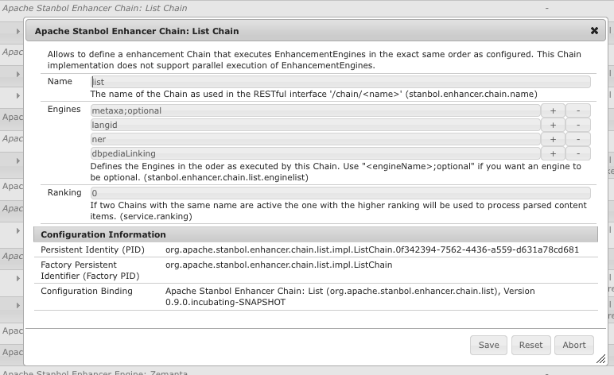

It is also possible to configure a ListChain by directly installing a configuration with the name "{classname}-{configName}.config". Note that the {configName} needs not to be the same as the name of the chain. The {configName} is just used by the OSGI environment to distinguish different configurations for {classname}.

To create the same configuration as in the above screenshot the file would need to look like this:

```
stanbol.enhancer.chain.name
=
"list"
stanbol.enhancer.chain.list.enginelist
=
["metaxa;optional","langid","ner","dbpediaLinking"]
```

<a id="trunk-components-enhancer-chains-listchain--enhancement-properties-support"></a>

## Enhancement Properties support

**since `0.12.1`**

Starting from `0.12.1` the List Chain allows to configure [EnhancementProperties](#trunk-components-enhancer-enhancementproperties)

- **chain and engine** scoped properties are defined as parameters to the engines with the syntax `{engine-name}; {property-name-1}={value-1},{value-2}; {property-name-2}={value-1};`
- **chain** scoped properties can be configured by using the osgi property key `stanbol.enhancer.chain.chainproperties` by the syntax `{property-name-1}={value-1},{value-2}`. NOTE that `;` is NOT supported as separator for parsing multiple properties as OSGI configurations already define a way for parsing multiple values

All EnhancementProperties configured with a [Chain](https://stanbol.apache.org/docs/trunk/components/enhancer/chains/chains) are written as RDF to the
[ExecutionPlan](https://stanbol.apache.org/docs/trunk/components/enhancer/chains/chains/executionplan). *Chain* scoped properties are directly added to the
`ep:ExecutionPlan` instance while *chain and engine* scoped properties are added to the
`ep:ExecutionNode` of the according engine.

The following figure and listing provide an example

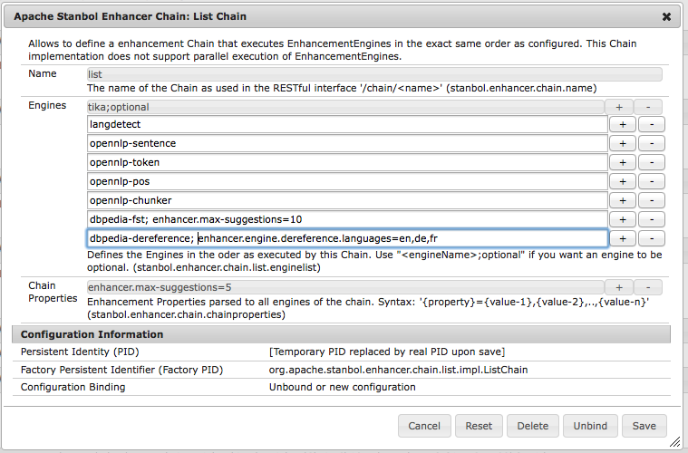

The figure shows the definition of two *chain and engine* scoped and one *chain* scoped enhancement properties. First the maximum number of suggestions are set on a chain scope to `5`. This is overridden by a specific configuration of the `dbpedia-fst` engine that thats this value to `10` for this engine. Finally the dereferenced languages are set to English, German and French for the `dbpedia-dereference` engine.

The following listing shows the exact same configuration in the `.cfg` format.

```
stanbol.enhancer.chain.name="list"
stanbol.enhancer.chain.list.enginelist=["tika;optional","langdetect","opennlp-sentence","opennlp-token","opennlp-pos","opennlp-chunker",
    "dbpedia-fst;\ enhancer.max-suggestions\=10",
    "dbpedia-dereference;\ enhancer.engine.dereference.languages\=en,de,fr"]
stanbol.enhancer.chain.chainproperties=["enhancer.max-suggestions\=5"]
```

<a id="trunk-components-enhancer-chains-listchain--calculation-of-the-executionplan"></a>

## Calculation of the ExecutionPlan

The ExecutionPlan is created based on the exact order of the [EnhancementEngines](#trunk-components-enhancer-engines) provided by the "stanbol.enhancer.chain.list.enginelist" property. The configuration MUST contain at least a single engine. In addition no engine MUST be mentioned twice.

---

<a id="trunk-utils"></a>

<!-- source_url: https://stanbol.apache.org/docs/trunk/utils/ -->

<!-- page_index: 56 -->

<a id="trunk-utils--apache-stanbol-tools-and-utilities"></a>

# Apache Stanbol Tools and Utilities

- [Enhancer Stress Test Tool](#trunk-utils-enhancerstresstest) - allows to send
  concurrent requests to the Stanbol Enhancer for Performace/Stress testing of
  the Stanbol Enhancer, Chains and Enhancement Engines.
- [Commons Solr](#trunk-utils-commons-solr) - as Apache [Solr](http://lucene.apache.org/solr/) is used
  by several Apache Stanbol components this module provides utilities that ease the use of
  Solr within OSGi. support the initialization of SolrCores with predefined configurations
  and data; allows to publish the Solr RESTful API on the Stanbol Web UI.
- [Marmotta KiWi Repository Service](#trunk-utils-marmotta-kiwi-repository-service) - allows to use the
  [Apache Marmotta](http://marmotta.apache.org) [KiWi Triplestore](http://marmotta.apache.org/kiwi)
  within an OSGI environment.
- [Data File Provider](#trunk-utils-datafileprovider) - infrastructure used by Apache Stanbol to load
  data file such as statistical models of NLP frameworks. archives of Knowledge Bases ...

Copyright © 2010 The Apache Software Foundation, Licensed under
the [Apache License, Version 2.0](http://www.apache.org/licenses/LICENSE-2.0).
Apache, Stanbol and the Apache feather and Stanbol logos are trademarks of The Apache Software Foundation.

---

<a id="trunk-components-enhancer-chains-defaultchain"></a>

<!-- source_url: https://stanbol.apache.org/docs/trunk/components/enhancer/chains/defaultchain.html -->

<!-- page_index: 57 -->

<a id="trunk-components-enhancer-chains-defaultchain--default-chain"></a>

# Default Chain

This implementation that keeps track of all currently active [Enhancement Engines](#trunk-components-enhancer-engines) and registers itself as a chain service with the "stanbol.enhancer.chain.name=default" and the service ranking of Integer.MIN\_VALUE.

This will cause this chain to be returned by the ChainManager.getDefault() method if users:

- do not deactivate this chain (see below)
- configure an other chain with the "stanbol.enhancer.chain.name=default" and a higher service ranking

The Chain returned by ChainManager.getDefault() is the one used for requests that do not specify a chain. This are enhancement requests to the "/engines" and "/enhancer" endpoint.

<a id="trunk-components-enhancer-chains-defaultchain--configuration"></a>

## Configuration

This chain can be enabled/disabled by using the "stanbol.enhancer.chain.default.enabled"

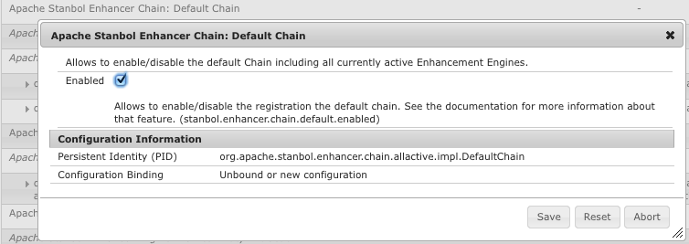

This chain does not support the configuration of the name nor the service ranking. The name is fixed to "default" and the service ranking is Integer.MIN\_VALUE

Note that the DefaultChain does not actually implement the Chain interface, but only registers an instance of the AllActiveEnginesChain on activation.
The implementation is part of the "org.apache.stanbol.enhancer.chain.allactive" module.

<a id="trunk-components-enhancer-chains-defaultchain--calculation-of-the-executionplan"></a>

## Calculation of the ExecutionPlan

This chain considers all currently active [Enhancement Engines](#trunk-components-enhancer-engines). The ExecutionPlan is calculated by using the value for the "org.apache.stanbol.enhancer.engine.order" property provided by the EnhancementEngine:

- Engines with a lower order are executed before engines with a higher value
- Engines with the same order may be executed simultaneously if the EnhancementJobMananger and the EnhancementEngine do support this feature.

The DefaultChain ensures that the default behavior of the Stanbol Enhancer does not change after the introduction of EnhancementChains. This is because the WeightedJobManager as used previously followed exactly the same rules.

However after the introduction of EnhancementChains users can now easily change the default behavior.

---

<a id="trunk-components-enhancer-chains-graphchain"></a>

<!-- source_url: https://stanbol.apache.org/docs/trunk/components/enhancer/chains/graphchain.html -->

<!-- page_index: 58 -->

<a id="trunk-components-enhancer-chains-graphchain--graph-chain"></a>

# Graph Chain

The GraphChain allows to directly configure the ExecutionPlan returned by the Chain.getExecutionPlan() method. This means on the one hand that it allows to configure any kind of execution process on the other hand its usage also requires a lot of knowledge about the [EnhancementEngine](#trunk-components-enhancer-engines)s and the ExecutionPlan model.

Typically it is a good practice to start with other - more simple to use - Chain implementation such as the [Weighted Chain](#trunk-components-enhancer-chains-weightedchain) and only afterwards convert this configuration to a GraphChain to configure optimizations to the enhancement process such as to allow more engines to be executed in parallel.

<a id="trunk-components-enhancer-chains-graphchain--configuration"></a>

## Configuration

The GraphChain supports two variants to configure the ExecutionPlan.

<a id="trunk-components-enhancer-chains-graphchain--graphresource"></a>

### GraphResource

A GraphResource is an RDF file available via the DataFileProvider. The easiest way is to copy the RDF file defining the ExecutionPlan to the "/sling/datafile" directory within the Stanbol home directory. The configuration of the GraphChain needs then only to refer to that file such as:

```
stanbol.enhancer.chain.graph.graphresource
=
myExecutionPlan.rdf
```

The used RDF encoding is guessed by the file extension. If the extension is not recognized, the format can be also parsed as additional parameter

```
stanbol.enhancer.chain.graph.graphresource
=
myExecutionPlan.something;format=application/rdf+xml
```

The GraphCain will track for that file and activate itself as soon as the file gets available. Removing the file, waiting some seconds and providing the new version afterwards should also work. Just replacing the file will not work, because the DataFileProvider does not have support for updates. In such cases it might be needed to deactivate/activate the GraphChain.

<a id="trunk-components-enhancer-chains-graphchain--chainlist"></a>

### ChainList

This allows to directly configure the ExecutionPlan as value of the "stanbol.enhancer.chain.graph.chainlist" property. Both arrays and collections are supported.

*Note:* As soon as a graph resource is configured the ChainList will be ignored. This is even true if the configured GraphResource is currently not available!

The syntax is defined as follows:

```
{engine-name};[optional];[dependsOn={engine-name1},{engine-name2}]
```

The following example shows how this syntax can be used to define an ExecutionPlan.

```
metaxa;optional
langId;dependsOn=metaxa
ner;dependsOn=langId
zemanta;optional
dbpedia-linking;dependsOn=ner
geonames;optional;dependsOn=ner
refactor;dependsOn=geonames,dbpedia-linking,zemanta
```

*Note:* The internal oder of the list does not influence the resulting ExecutionPlan. Only the "dependsOn" properties are used to determine the execution order of the engines and if engines can be executed in parallel.

Within an OSGI configuration file (org.apache.stanbol.enhancer.chain.graph.impl.GraphChain-myGraphChain.config) this would look like

```
stanbol.enhancer.chain.graph.chainlist =["metaxa;optional","langId;dependsOn\ =metaxa","ner;dependsOn\=langId","zemanta;optional","dbpedia-linking;dependsOn\ =ner","geonames;optional;dependsOn\ =ner","refactor;dependsOn\ =geonames,dbpedia-linking,zemanta"]
```

*Note:* The whole test MUST BE in a single line within the .config file.

A better visual expression provides this screenshot of the Apache Felix web console showing the dialog for the above configuration

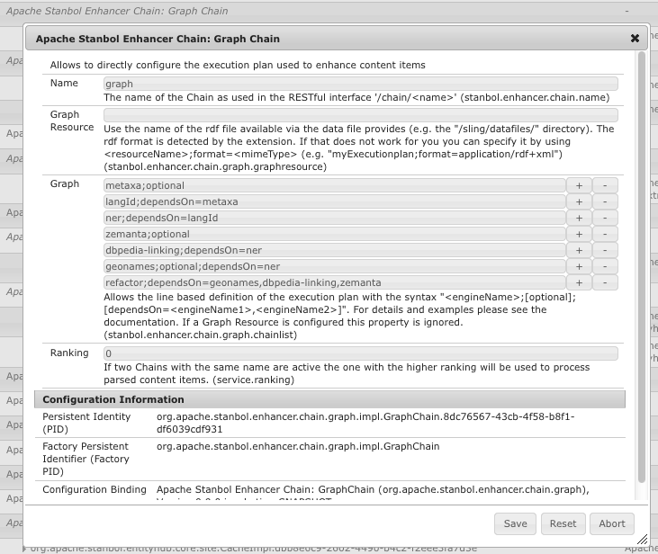

<a id="trunk-components-enhancer-chains-graphchain--enhancement-properties-support"></a>

## Enhancement Properties Support

**since `0.12.1`**

Starting from `0.12.1` the Graph Chain allows to configure [EnhancementProperties](#trunk-components-enhancer-enhancementproperties).

<a id="trunk-components-enhancer-chains-graphchain--chain-list-based-configuration"></a>

### Chain List based Configuration

In case the *Chain List* type configuration is used properties are configured as follows:

- **chain and engine** scoped properties are defined as parameters to the engines with the syntax `{engine-name}; {property-name-1}={value-1},{value-2}; {property-name-2}={value-1};`
- **chain** scoped properties can be configured by using the osgi property key `stanbol.enhancer.chain.chainproperties` by the syntax `{property-name-1}={value-1},{value-2}`. NOTE that `;` is NOT supported as separator for parsing multiple properties as OSGI configurations already define a way for parsing multiple values

All EnhancementProperties configured with a [Chain](https://stanbol.apache.org/docs/trunk/components/enhancer/chains/chains) are written as RDF to the [ExecutionPlan](https://stanbol.apache.org/docs/trunk/components/enhancer/chains/chains/executionplan). *Chain* scoped properties are directly added to the `ep:ExecutionPlan` instance while *chain and engine* scoped properties are added to the `ep:ExecutionNode` of the according engine.

The following figure and listing provide an example

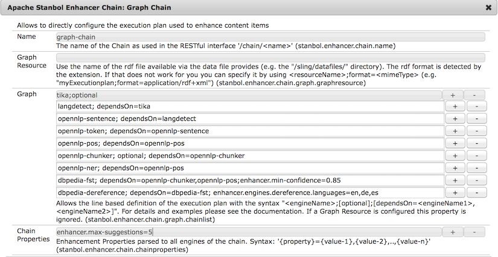

The figure shows the maximum number of suggestions is set as a *chain* scoped property to `5`. In addition two *chain and engine* scoped properties are set. First for the `dbpedia-fst` engine the minimum confidence is set to `0.85` and second for the `dbpedia-dereference` engine the dereferenced languages are set to English, German and Spanish.

In case of the GraphChain it is typical that *chain and engine* scoped Enhancement Properties get mixed with parameters of the chain configuration itself. As Enhancement Properties are required to start with `enhancer.` they can be easily separated with chain specific parameters such as `dependsOn`.

The following listing shows the exact same configuration in the `.cfg` format.

```
stanbol.enhancer.chain.name="graph-chain"
stanbol.enhancer.chain.chainproperties=["enhancer.max-suggestions\=5"]
stanbol.enhancer.chain.graph.chainlist=["tika;optional","langdetect;\ dependsOn\=tika",
    "opennlp-sentence;\ dependsOn\=langdetect","opennlp-token;\ dependsOn\=opennlp-sentence",
    "opennlp-pos;\ dependsOn\=opennlp-pos","opennlp-chunker;\ optional;\ dependsOn\=opennlp-chunker",
    "opennlp-ner;\ dependsOn\=opennlp-pos",
    "dbpedia-fst;\ dependsOn\=opennlp-chunker,opennlp-pos;enhancer.min-confidence\=0.85",
    "dbpedia-dereference;\ dependsOn\=dbpedia-fst;\ enhancer.engines.dereference.languages\=en,de,es"]
```

<a id="trunk-components-enhancer-chains-graphchain--graph-resource-configuration"></a>

### Graph Resource Configuration

In case the [ExecutionPlan](#trunk-components-enhancer-chains-executionplan) is configured by an RDF file the [EnhancementProperties](#trunk-components-enhancer-enhancementproperties) need to be directly encoded as RDF.

*Chain* scoped properties need to be attached to the `ep:ExecutionPlan` instance while *chain and engine* scoped properties are added to the `ep:ExecutionNode` of the according engine.

Single properties are represented by triples where the execution plan or execution mode instance is the subject. The URI or the enhancement property is the predicate and the value is the object. Multiple valus are represented by multiple triples with the same subject and predicate.

The following listing shows the same example as used in the above section as RDF turtle.

```
@prefix xsd: <http://www.w3.org/2001/XMLSchema#> .
@prefix rdf: <http://www.w3.org/1999/02/22-rdf-syntax-ns#> .
@prefix ep: <http://stanbol.apache.org/ontology/enhancer/executionplan#> .
@prefix ehp: <http://stanbol.apache.org/ontology/enhancementproperties#> .

urn:execPlan a ep:ExecutionPlan ;
    ep:hasExecutionNode urn:node1, urn:node2, urn:node3, urn:node4, urn:node5 
        urn:node6, urn:node7, urn:node8;
    ep:chain "demoChain" ;
    ehp:enhancer.max-suggestions "5"^^xsd:int .

urn:node1 a stanbol:ExecutionNode ;
    ep:inExecutionPlan urn:execPlan ;
    ep:engine "langdetect" .

urn:node2 a ep:ExecutionNode ;
    ep:inExecutionPlan urn:execPlan ;
    ep:dependsOn urn:node1 ;
    ep:engine "opennlp-sentence" .

urn:node3 a ep:ExecutionNode ;
    ep:inExecutionPlan urn:execPlan ;
    ep:dependsOn urn:node2 ;
    ep:engine "opennlp-token" .

urn:node4 a ep:ExecutionNode ;
    ep:inExecutionPlan urn:execPlan ;
    ep:dependsOn urn:node3 ;
    ep:engine "opennlp-pos" .

urn:node5 a ep:ExecutionNode ;
    ep:inExecutionPlan urn:execPlan ;
    ep:dependsOn urn:node4 ;
    ep:engine "opennlp-chunker" .

urn:node6 a ep:ExecutionNode ;
    ep:inExecutionPlan urn:execPlan ;
    ep:dependsOn urn:node4 ;
    ep:engine "opennlp-ner" .

urn:node7 a ep:ExecutionNode ;
    ep:inExecutionPlan urn:execPlan ;
    ep:dependsOn urn:node5 ;
    ep:engine "dbpedia-fst" ;
    ehp:enhancer.min-confidence "0.85"^^xsd:float .

urn:node8 a ep:ExecutionNode ;
    ep:inExecutionPlan urn:execPlan ;
    ep:dependsOn urn:node7 ;
    ep:engine "dbpedia-dereference" ;
    ehp:enhancer.engines.dereference.languages "en", "de", "es" .
```

<a id="trunk-components-enhancer-chains-graphchain--execution"></a>

## Execution

In contrast to other chain implementations the ExecutionPlan must not be calculated but is directly parsed by the user. This provides the most possible freedom in defining how the execution should take place.

<a id="trunk-components-enhancer-chains-graphchain--optional-engines"></a>

### Optional Engines

The execution of optional engines is not mandatory. The enhancement process will continue, even if they are not active or their execution fail. For users it is important to know, that even engines that depend on an optional engine that was not executed will be called.

Given the above example this means that even if the 'metaxa' engine can not be executed the 'langId' will be called by the EnhancementJobManager.

<a id="trunk-components-enhancer-chains-graphchain--parallel-execution"></a>

### Parallel Execution

Engines are executed as soon as all engines they depend on have completed. This also includes if optional engines were skipped (because they are not active) or failed. This means that in most cases several EnhancementEngines can be executed in parallel.

Given the above example, both the 'zemanta' and the 'metaxa' engine are executed as soon as the enhancement process starts.
When 'metaxa' is finished, the 'langid' engine is called. After the 'langid' finishes its work, the EnhancementJobManager calls the 'ner' engine. After that both the 'dbpedia-linking' and the 'geonames' engine are called. At this time three engines might run simultaneously assuming that 'zemanta' has not finished yet. Before the 'refactor' engine can be executed it need to wait for all these engines to complete.

Note that for parallel execution to be activated both the used EnhancementJobManager and the different engines must support asynchronous enhancement.

Copyright © 2010 The Apache Software Foundation, Licensed under
the [Apache License, Version 2.0](http://www.apache.org/licenses/LICENSE-2.0).
Apache, Stanbol and the Apache feather and Stanbol logos are trademarks of The Apache Software Foundation.

---

<a id="trunk-components-reasoner"></a>

<!-- source_url: https://stanbol.apache.org/docs/trunk/components/reasoner/ -->

<!-- page_index: 59 -->

<a id="trunk-components-reasoner--apache-stanbol-reasoners"></a>

# Apache Stanbol Reasoners

The Stanbol Reasoners component provides a set of services that take advantage of automatic inference engines.

The module implements a common api for reasoning services, providing the possibility to plug different reasoners and configurations in parallel.

Actually the module includes [OWLApi](http://owlapi.sourceforge.net/) and [Jena](http://jena.sourceforge.net/) based abstract services, with concrete implementations for Jena RDFS, OWL, OWLMini and HermiT reasoning service.

The Reasoners module expose a REST endpoint at the following location:

```
http://localhost:8080/reasoners
```

with the following preloaded services:

- /rdfs, which is based on Jena RDFS reasoner and supports almost all of the RDFS [[1]](#trunk-components-reasoner--ref1) entailments.
- /owl, a Jena reasoner configured to support OWL [[2]](#trunk-components-reasoner--ref2) (with some limitations, [[4]](#trunk-components-reasoner--ref4))
- /owlmini, another Jena configuration that partially supports OWL (see [[5]](#trunk-components-reasoner--ref5))

In addition, it is also available a service which uses the HermiT [[6]](#trunk-components-reasoner--ref6) reasoner to exploit the full OWL 2 [[3]](#trunk-components-reasoner--ref3) specification.

Each reasoner can be accessed with one of three tasks:

- check: to perform a consistency check. This service returns HTTP Status 200 if data is consistent, 204 otherwise (at the current state of implementation the service does not include an explanation about why the input is inconsistent. This feature is in our todo list, by the way)
- classify: to materialize all inferred rdf:type statements.
- enrich: to materialize all inferred statements.

For example:

```
http://localhost:8080/reasoners/owl/check // expose the Jena owl service with task check, or
http://localhost:8080/reasoners/owl2/classify // to use the HermiT service with task classify
```

We can use the curl command line utility to ask the Jena OWL reasoning service to materialize all inferences produced by loading the FOAF ontology:

```
$ curl -H "Accept: text/n3" "http://localhost:8080/stanbol/reasoners/owl/enrich?url=http://xmlns.com/foaf/0.1/"
```

The above example performs a GET asking for a text/n3 representation of the result. For example, the equivalency of foaf:Agent and dc:Agent result in the rdfs:subClassOf statements for the foaf:Person type:

```

```

<a id="trunk-components-reasoner--differences-between-the-reasoners"></a>

## Differences between the reasoners

Let's give some example on the differences between the available reasoners (to try the example ontology snippets you can download them from [here](https://github.com/enridaga/reasoners.examples/tree/master/enridaga.reasoners.examples)).

The first snippet uses rdfs:subClassOf to declare that any Article is a Document, which is in turn a ContentItem.

```

<!-- item_1 is an Article -->
<ex:Article rdf:about="http://www.example.org/reasoners/item_1"/>
```

<!-- An article is a kind of Document -->
<rdf:Description rdf:about="http://www.example.org/reasoners/Article">
<rdfs:subClassOf rdf:resource="http://www.example.org/reasoners/Document"/>
</rdf:Description>

<!-- An document is a kind of content item -->
<rdf:Description rdf:about="http://www.example.org/reasoners/Document">
<rdfs:subClassOf rdf:resource="http://www.example.org/reasoners/ContentItem"/>
</rdf:Description>
[download it](https://raw.github.com/enridaga/reasoners.examples/master/enridaga.reasoners.examples/rdfs/subclass.xml)

Giving it to the /rdfs reasoning service, we obtain as resulted inferred statement that item\_1 is also a Document and a ContentItem. Another feature of RDFS is the definition of the domain and range of a property.

```

<!-- Both enridaga and alexdma are authors of item_1 -->
<rdf:Description rdf:about="http://www.example.org/reasoners/enridaga">
    <ex:author rdf:resource="http://www.example.org/reasoners/item_1"/>
</rdf:Description>
<rdf:Description rdf:about="http://www.example.org/reasoners/alexdma">
    <ex:author rdf:resource="http://www.example.org/reasoners/item_1"/>
</rdf:Description>
```

<!-- ex:author wants a person as subject, and a content-item as object -->
<rdf:Description rdf:about="http://www.example.org/reasoners/author">
<rdfs:domain rdf:resource="http://www.example.org/reasoners/Person"/>
<rdfs:range rdf:resource="http://www.example.org/reasoners/ContentItem"/>
</rdf:Description>
[download it](https://raw.github.com/enridaga/reasoners.examples/master/enridaga.reasoners.examples/rdfs/domain-range.xml)
We will obtain, in this case, that both enridaga and alexdma are Authors, and that item\_1 is a ContentItem. RDFS semantics is considered also by other reasoners. The /rdfs service is the less "expressive" of the four.

The following snippet will work with /owl, /owlmini and /owl2 (but not with /rdfs):

```

<!-- ogrisel, enridaga and alexdma are developers -->
<ex:Developer rdf:about="#enridaga" />
<ex:Developer rdf:about="#ogrisel" />
<ex:Developer rdf:about="#alexdma" />
```

<!-- We know: #alexdma #workedTogheter #enridaga and #ogrisel -->
<rdf:Description rdf:about="#alexdma">
<workedTogheter rdf:resource="#ogrisel"/>
<workedTogheter rdf:resource="#enridaga"/>
</rdf:Description>

<!-- #workedTogheter is an owl:SymmetricProperty (well, this is an example...) -->
<owl:SymmetricProperty rdf:about="#workedTogheter"/>
<!-- #workedTogheter is also a owl:TransitiveProperty (well, this is an example...) -->
<owl:TransitiveProperty rdf:about="#workedTogheter"/>
[download it](https://raw.github.com/enridaga/reasoners.examples/master/enridaga.reasoners.examples/owlmini/symmetric.xml)
The OWL vocabulary introduce logical capabilities, allowing more complex inferences to be produced. In the above example we state that alexdma workedWith enridaga and ogrisel. Since we declare the property workedTogheter to be "Symmetric" and "Transitive", the result will include the following:

- enridaga workedWith alexdma (is symmetric)
- ogrisel workedWith alexdma
- ogrisel workedWith enridaga (is transitive)
- enridaga workedWith ogrisel

Next snippet is inconsistent. This means that the OWL based reasoners will not return any inference, but a 204 HTTP response:

```

<!-- enridaga is a person -->
<ex:Person rdf:about="http://www.example.org/reasoners/enridaga" />
```

<!-- Persons and Organizations are disjoint -->
<owl:Class rdf:about="http://www.example.org/reasoners/Person" />
<owl:Class rdf:about="http://www.example.org/reasoners/Organization">
<owl:disjointWith rdf:resource="http://www.example.org/reasoners/Person" />
</owl:Class>

<!-- A Public Limited Company is a kind of Company, which is a kind of Organization -->
<owl:Class rdf:about="http://www.example.org/reasoners/PublicLimitedCompany">
<rdfs:subClassOf rdf:resource="http://www.example.org/reasoners/Company" />
</owl:Class>
<owl:Class rdf:about="http://www.example.org/reasoners/Company">
<rdfs:subClassOf rdf:resource="http://www.example.org/reasoners/Organization" />
</owl:Class>

<!-- enridaga cannot be a Public Limited Company -->
<ex:PublicLimitedCompany rdf:about="http://www.example.org/reasoners/enridaga" />
[download it](https://raw.github.com/enridaga/reasoners.examples/master/enridaga.reasoners.examples/owlmini/inconsistent-types.xml)
The /owlmini implements the OWL language with some (more) limitations then /owl (both are based on the Jena rule based reasoner, as said before).

The following example shows the use of class restrictions, in particular the usage of owl:someValuesFrom:

```

<!-- john, is an developer, but we don't know anything else -->
<ex:Developer rdf:about="#john">
</ex:Developer>
```

<!-- a #SoftwareCompany is a kind of #Organization -->
<owl:Class rdf:about="SoftwareCompany">
<rdfs:subClassOf rdf:resource="#Organization" />
</owl:Class>

<!-- #Developers #worksAt some #SoftwareCompany (they are not the only one..., this is why we use owl:subClassOf) -->
<owl:Class rdf:about="#Developer">
<rdfs:subClassOf>
<owl:restriction>
<owl:onProperty rdf:resource="#worksAt" />
<owl:someValuesFrom rdf:resource="#SoftwareCompany" />
</owl:restriction>
</rdfs:subClassOf>
</owl:Class>

<!-- Employees are all who #worksAt any kind of Organization (owl:equivalentClass) -->
<owl:Class rdf:about="#Employee">
<owl:equivalentClass>
<owl:restriction>
<owl:onProperty rdf:resource="#worksAt" />
<owl:someValuesFrom rdf:resource="#Organization" />
</owl:restriction>
</owl:equivalentClass>
</owl:Class>
[download it](https://raw.github.com/enridaga/reasoners.examples/master/enridaga.reasoners.examples/owl/some-values-from.xml)

We expect an OWL reasoner to state that John is an Employee. This example does not work with /rdfs (it ignores the OWL semantics), and does not work with /owlmini, because the Jena OWL(mini) reasoner omits the forward entailments for owl:someValuesFrom restrictions (see [[4]](#trunk-components-reasoner--ref4)). It works correctly if we use the service /owl.

The /owl service support the most of the semantic of OWL. The HermiT reasoner is based on [OWLApi](http://owlapi.sourceforge.net/) and is an example of a DL reasoner. It fully covers OWL and OWL2, which introduces lot of interesting features. Here is an example:

```

<!-- any Employee must have some features: firstname, familyname, email 
    and worksAt (in one of the allowed places) -->
<owl:Class rdf:about="#Employee">
    <owl:equivalentClass>
        <owl:Class>
            <owl:intersectionOf rdf:parseType="Collection">
                <rdf:Description rdf:about="#Person" />
                <owl:Restriction>
                    <owl:onProperty rdf:resource="#firstname" />
                    <owl:someValuesFrom rdf:resource="&rdfs;Literal" />
                </owl:Restriction>
                <owl:Restriction>
                    <owl:onProperty rdf:resource="#familyname" />
                    <owl:someValuesFrom rdf:resource="&rdfs;Literal" />
                </owl:Restriction>
                <owl:Restriction>
                    <owl:onProperty rdf:resource="#email" />
                    <owl:someValuesFrom rdf:resource="&rdfs;Literal" />
                </owl:Restriction>
                <!-- -->
                <!-- Let's say that Employees can work only in #Rome , #Catania and 
                    #Bologna -->
                <owl:Restriction>
                    <owl:onProperty rdf:resource="#worksAt" />
                    <owl:someValuesFrom>
                        <owl:Class>
                            <owl:oneOf rdf:parseType="Collection">
                                <owl:Thing rdf:about="#Rome" />
                                <owl:Thing rdf:about="#Catania" />
                                <owl:Thing rdf:about="#Bologna" />
                            </owl:oneOf>
                        </owl:Class>
                    </owl:someValuesFrom>
                </owl:Restriction>
            </owl:intersectionOf>
        </owl:Class>
    </owl:equivalentClass>
</owl:Class>
```

<owl:DatatypeProperty rdf:about="#firstname" />
<owl:DatatypeProperty rdf:about="#familyname" />
<owl:DatatypeProperty rdf:about="#email" />

<!-- #worksAt has range #Place -->
<owl:ObjectProperty rdf:about="#worksAt">
<rdfs:range rdf:resource="#Place" />
</owl:ObjectProperty>

<!-- all the following places are distinct (no synonyms here) -->
<owl:AllDifferent>
<owl:distinctMembers rdf:parseType="Collection">
<owl:Thing rdf:about="#Rome" />
<owl:Thing rdf:about="#Catania" />
<owl:Thing rdf:about="#Bologna" />
<owl:Thing rdf:about="#Moricone" />
</owl:distinctMembers>
</owl:AllDifferent>

<!-- enridaga, to be an Employee, must fulfill the restrictions defined
for the class #Employee. -->
<Person rdf:about="#enridaga">
<!-- If you comment one of the next 4 statement, you won't have #enridaga
to result as #Employee. -->
<firstname>Enrico</firstname>
<familyname>Daga</familyname>
<email>enridaga@example.org</email>
<worksAt rdf:resource="#Catania" />
<!-- If you uncomment the two statements below you will obtain an inconsistency, because #Moricone is not an allowed place for developers -->
<!-- <worksAt rdf:resource="#Moricone" /> <rdf:type rdf:resource="#Employee"
/> -->
</Person>
[download it](https://raw.github.com/enridaga/reasoners.examples/master/enridaga.reasoners.examples/owl2/class-restrictions-owl2.xml)

The above differences depend on the semantic supported by the specific reasoner and from the implementation, which limit the power of the system in favour of a better efficiency (is the case of the /owlmini implementation of Jena, more efficient then the respective /owl). If you need to work with RDFS semantic, and don't need OWL for your inferences, just use the RDFS one.

<a id="trunk-components-reasoner--build-and-install"></a>

## Build and install

Run Stanbol, for example:

```
$ java -jar -Xmx1g org.apache.stanbol.launchers.full-0.9.0-incubating-SNAPSHOT.jar
```

You must have the Ontonet and Rules modules already installed (they are if you have followed the above example).
Move to the /reasoners directory, then run

```
$ mvn install -PinstallBundle -Dsling.url=&lt;the path to your running Felix administration console&gt;
```

for example

% mvn install -PinstallBundle http://localhost:8080/system/console

<a id="trunk-components-reasoner--add-the-hermit-reasoner"></a>

### Add the HermiT reasoner

To enable HermiT as OWL2 reasoner you can download and install it from the Stanbol (Incubating) svn repository. The steps are the following:

```
$ svn co https://svn.apache.org/repos/asf/incubator/stanbol/trunk/reasoners/hermit stanbol-hermit
$ cd stanbol-hermit
$ mvn install -PinstallBundle -Dsling.url=http://localhost:8080/system/console // change this to the path related to your Stanbol instance
```

<a id="trunk-components-reasoner--references"></a>
<a id="trunk-components-reasoner--references:"></a>

## References:

- [1] [RDFS](http://www.w3.org/TR/rdf-schema/)
- [2] [OWL](http://www.w3.org/TR/owl-features/)
- [3] [OWL 2](http://www.w3.org/TR/owl2-overview/)
- [4] [Jena inference support](http://jena.sourceforge.net/inference/)
- [5] [Jena OWL notes](http://jena.sourceforge.net/inference/#OWLnotes)
- [6] [HermiT](http://hermit-reasoner.com/)

---

*[Back to components](https://stanbol.apache.org/docs/trunk/components/reasoner/components.html)*

Copyright © 2010 The Apache Software Foundation, Licensed under
the [Apache License, Version 2.0](http://www.apache.org/licenses/LICENSE-2.0).
Apache, Stanbol and the Apache feather and Stanbol logos are trademarks of The Apache Software Foundation.

---

<a id="trunk-components-rules-refactor"></a>

<!-- source_url: https://stanbol.apache.org/docs/trunk/components/rules/refactor.html -->

<!-- page_index: 60 -->

<a id="trunk-components-rules-refactor--refactor"></a>

# Refactor

The Refactor is a service which allows to interpret rules in order to perform refactoring of RDF graphs. For the refactoring the set of rules in the recipes are interpreted and run as SPARQL CONTRUCT in which the where clause is derived from the body of the rule and the construct clause is derived from the head of the rule. The output of a refactoring is a transformed graph which satisfies the constraints expressed in the rules. The refactoring in useful for tasks of semantic harmonization of RDF graphs expressed with different ontologies/vocabularies towards their representation with a single ontology or vocagulary. The output of a refactoring is a transformed graph which satisfies the constraints expressed in the rules.

<a id="trunk-components-rules-refactor--terminology"></a>

## Terminology

- A **Recipe** is a set of rules defined according to a specific task. Rules are written in a specific syntax, and can then be executed for refactoring (as SPARQL queries) or through reasoning services.
- **Refactoring** is the task aimed to perform the transformation of RDF graphs. The transformation is driven by refactoring rules, basically Stanbol Rules interpreted as SPARQL CONSTRUCT clauses.
- **Reasoning** is the activity of interpreting axioms for inferring new knowledge, classifying, checking the consistency of an ontology, etc...

<a id="trunk-components-rules-refactor--usage-scenarios"></a>

## Usage Scenarios

<a id="trunk-components-rules-refactor--vocabulary-harmonization"></a>

### Vocabulary harmonization

Supposing we want to use some dataset in Linked
Data as external knowledge bases for a generic CMS enhanced with Stanbol.
Now the problem how to use data from those datasets expressed with some
external and heterogeneous vocabularies or ontologies within the CMS has.
Furthermore the CMS has its own way to formalize knowledge, namely the
its Ontology Network managed by [Stanbol OntoNet](#trunk-components-ontologymanager-ontonet).
The solution is provided by Refactor which allows to interpret the rules of
inference as refactoring rules in order harmonize external data to the
Stanbol's ontologies. Figure 1 gives a very quick idea about how the CMS can
benefit from the Refactor showing how external data can be aligned and used within the CMS.

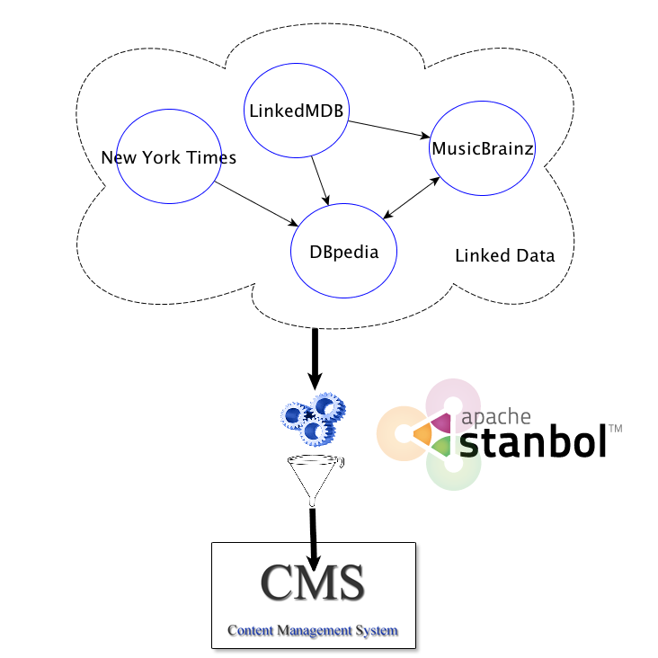

Figure 1: the refactor is used to align external data to the ontologies used in a generic CMS enhanced with Stanbol.

We can specify a concrete scenario for a better understanding of the
Refactor. Suppose we have configured the CMS (i.e. [Stanbol EntityHub](#trunk-components-entityhub)) in order
to fetch entities about persons from DBpedia. Now we want to represent these
entities adopting the vocabulary from schema.org and produce
schema.org Rich Snippets in order to provide search engine
optimization capabilities to the CMS. What we need to do is to write a recipe and call
the Refactor via HTTP REST passing to it the recipe itself and the entities we
have fetched from Linked Data.

<a id="trunk-components-rules-refactor--features"></a>

## Features

In the Refactor rules are interpreted as [SPARQL CONSTRUCT](http://www.w3.org/TR/rdf-sparql-query/#construct) queries in which
the premises (the left part before the arrow in the rule) are the WHERE clause, while the conclusion (the right part after the arrow in the rule) is
translated into the construct template, i.e., triple patterns in conjunctive form.

As an example, we can take in account the following rule:

```
prefix kn = <http://foo.org/kinship#> . 
uncleRule[ has(kn:parent, ?x, ?y) . has(kn:sibling, ?y, ?z) -> has(kn:uncle, ?x, ?z) ]
```

The rule above is transformed into the following SPARQL CONSTRUCT query:

```
PREFIX kn: <http://foo.org/kinship#>
CONSTRUCT { ?x kn:uncle ?z }
WHERE { 
    ?x kn:parent ?y .
    ?y kn:sibling ?z
}
```

The SPARQL engines used internally by the Refactor for running rules is [Apache Jena ARQ](http://incubator.apache.org/jena/documentation/query/)

We remand any detail about the syntax and the expressivity of the Stanbole Rule language to its [section](#trunk-components-rules-language).

<a id="trunk-components-rules-refactor--service-endpoints"></a>

## Service Endpoints

The Refactor RESTful API is structured as follows:
*(Please note, that the following links to the actual service endpoint link to a running instance of Apache Stanbol. If you use other domains or ports than "localhost:8080", then please change accordingly)*

<a id="trunk-components-rules-refactor--refactor-engine-refactor"></a>
<a id="trunk-components-rules-refactor--refactor-engine-refactor-:"></a>

### Refactor Engine ("/refactor"):

- The Refactor Engine **@/refactor** performs a refactoring applying an existing recipe in the rule store to the provided RDF graph.

The request should be done as it follows:

- Method: GET
- Parameters:
  - input-graph: the ID of RDF graph in the triplestore provided as input
  - output-graph: the ID of RDF graph in the triplestore in which we want to store the result.
  - recipe: the ID of the recipe in the rule store

Example:

```
curl -G -X GET \
-d input-graph=stored_graph -d recipe=myTestRecipeA -d output-graph=result_graph \
http://localhost:8080/refactor
```

<a id="trunk-components-rules-refactor--refactor-engine-refactorapply"></a>
<a id="trunk-components-rules-refactor--refactor-engine-refactor-apply-:"></a>

### Refactor Engine ("/refactor/apply"):

- Refactor Engine **@/refactor/apply** performs a refactoring applying an recipe as string to the provided RDF graph as input source.

The request should be done as it follows:

- Method: POST
- Parameters:
  - recipe: the ID of the recipe (MANDATORY)
  - input: the RDF graph to which the refactoring has to be applied. The graph has to be provided as a binary file (MANDATORY)
- Accepts:
  - application/rdf+xml
  - text/html
  - text/plain
  - application/owl+xml
  - text/owl-functional
  - text/owl-manchester
  - application/rdf+json,
  - text/turle

Example:

```
curl -X POST -H "Content-type: multipart/form-data" \
-H "Accept: application/rdf+json" \
-F recipe=recipeTestA -F input=@graph.rdf \
http://localhost:8080/refactor/apply
```

---

*[Back to Stanbol Rules](#trunk-components-rules)*

---

<a id="trunk-components-ontologymanager-registry"></a>

<!-- source_url: https://stanbol.apache.org/docs/trunk/components/ontologymanager/registry/ -->

<!-- page_index: 61 -->

<a id="trunk-components-ontologymanager-registry--ontology-registry-manager"></a>

# Ontology Registry Manager

Registry management is a facility for Stanbol **administrators** to pre-configure sets of ontologies that Stanbol should load and store, or simply be aware of, *before* they are included in a part of the ontology network (e.g. a scope or session). Via the registry manager, it is possible to configure whether these ontologies should be loaded immediately when Stanbol is initialized, or only when explicitly requested. The Ontology Registry Manager is essentially an ontology bookmarker with caching support. It is also possible to cache multiple versions of the same ontology if needed.

<a id="trunk-components-ontologymanager-registry--terminology"></a>

## Terminology

- A **Library** is a collection of references to ontologies, which can be located anywhere on the Web. CMS administrators and knowledge managers can create a library by any criterion, e.g. a library of all *W3C ontologies*, a library of all the ontologies that describe a *social network* (which can include [SIOC](http://sioc-project.org/ontology), [FOAF](http://xmlns.com/foaf/spec) etc.), a library of *ontology alignments* (which includes ontologies that align DBPedia to Schema.org, GeoNames to DBPedia, or a custom product ontology to GoodRelations).
- A **Registry** is an RDF resource (i.e. an ontology itself) that describes one or more libraries. It is the physical object that has to be accessed to gain knowledge about libraries.

<a id="trunk-components-ontologymanager-registry--usage-scenarios"></a>

## Usage Scenarios

Your CMS ca handle hundreds of vocabularies together for semantic annotation, but you do not want to clutter the system runtime by having all those vocabularies loaded altogether. You would like the ontology of a specific vocabulary to be loaded only when someone uses or requests it, and once it is loaded you would like it to be stored internally, rather than fetching it from the Web over and over again.

The Ontology Registry Manager can help you with that. With a simple RDF document that references these hundreds of ontologies, it is possible to organize them into libraries, e.g. by topic ("user profile", "product", "event") or by provenance ("W3C", "Industrial standards", "nonstandard" etc.). If a user decides to annotate a content item using `schema.org`, she can choose to do so and the Registry Manager will automatically figure out that it is referenced by libraries "Industrial standards", "user profile" and "product"). None of these libraries has been preloaded yet, so Stanbol will automatically choose the smallest one, say "Industrial standards", and load it. The `schema.org` ontology will be available from that point on.

<a id="trunk-components-ontologymanager-registry--configuration"></a>

## Configuration

Ontology registries (and, by extension, the libraries they reference) are configured by the Stanbol administrator via the Felix Web console. *Note that the following links assume Stanbol to be deployed on http://localhost:8080 .*

1. Go to the [Felix console Configuration Manager](http://localhost:8080/system/console/configMgr) and select **Apache Stanbol Ontology Registry Manager** (or follow this [direct link](http://localhost:8080/system/console/configMgr/org.apache.stanbol.ontologymanager.registry.impl.RegistryManagerImpl))
2. Under **Registry locations** you can add or remove the physical URIs of ontology registries, i.e. RDF resources that contain knowledge about ontology libraries.
3. If you wish all the registry contents to be loaded altogether on startup, uncheck the **lazy ontology loading** box.
4. You can select one **Caching policy** between Centralised (default) and Distributed. In *Centralised* caching, all the libraries that reference an ontology with the same URI will share the very same version of that ontology. In *Distributed* caching, each library will reference its own version of each ontology. Centralised caching is generally recommended, as distributed caching allows multi-version ontology management, but occupies much more storage space, depending on the amount of ontologies in common.

<a id="trunk-components-ontologymanager-registry--usage"></a>

## Usage

<a id="trunk-components-ontologymanager-registry--setup-an-ontology-registry"></a>

### Setup an Ontology Registry

To create a Registry, you simply need to make an OWL ontology with certain types of axioms. See [Registry Language](#trunk-components-ontologymanager-registry-language) for examples on how to create a Registry and add Library instances to it.

Then upload the ontology on the Web and add it to the **Registry locations** from the [Felix console Configuration](http://localhost:8080/system/console/configMgr/org.apache.stanbol.ontologymanager.registry.impl.RegistryManagerImpl).

Note that not only can a single registry describe multiple libraries, but also multiple registries can describe the same library, each adding information on the ontologies referenced by it. Library descriptions are *monotonic*, in that registries can only *add* information about libraries, never *remove* any.

<a id="trunk-components-ontologymanager-registry--access-a-cached-ontology"></a>

### Access a cached ontology

A cached ontology does not need to be loaded into an OntoNet scope or session in order to be available. It can be accessed at `@/ontonet/{ontologyURI}`, where `{ontologyURI}` can be either the ontology ID, if the ontology is named, of the physical URI it was retrieved from.

<a id="trunk-components-ontologymanager-registry--load-a-library-into-ontonet"></a>

### Load a library into OntoNet

One useful application of ontology libraries is that they can be used to populate an OntoNet ontology collector (space or session) with multiple ontologies with a single command. There are two ways to do so.

<a id="trunk-components-ontologymanager-registry--java-api"></a>

#### Java API

The Registry Manager is an OSGi service component. To obtain the service reference:

```
@
Reference
RegistryManager
registryManager
;
```

Loading the contents of a library into an ontology collector is done in the same way as with loading single ontologies, i.e. by creating a suitable `OntologyInputSource`. This time, though, it is a special input source called `LibrarySource`. A `LibrarySource` creates a new blank ontology (or uses an existing one upon request) and appends all the contents of a library to it via `owl:imports` statements.

Suppose we want to load the contents of a library called `http://stanbol.apache.org/ontologies/library/W3C_ontologies` into a scope called `AnnotationStandards` that already exists (so we'll have to use its custom space). First of all let us get a hold of the space:

```
@Reference
ONManager onManager;

OntologyScope scope = onManager.getScopeRegistry().getScope("AnnotationStandards");
OntologySpace space = scope.getCustomSpace();
```

Now create the `LibrarySource`:

```
IRI libraryID =IRI.create ("http://stanbol.apache.org/ontologies/library/W3C_ontologies" ); OntologyInputSource <?,?> libSrc =new LibrarySource (libraryID,registryManager );
```

Note that all `LibrarySource` constructors require that a `RegistryManager` be passed to them. This is because ontology input sources in general are not OSGi components and cannot trade service references.

Also note that building a `LibrarySource` will cause the contents of the corresponding library to be loaded and stored into the ontology manager, assuming the *lazy loading policy* option is set and the library had not been loaded earlier. Creating library sources is one way to "touch" an ontology library and get the Registry Manager to load it.

Finally, add the input source to the custom space. Simple as that:

```
space
.
addOntology
(
libSrc
);
```

Note that we called `addOntology()` although this resulted in adding multiple ontologies. This is because a `LibrarySource` "fools" OntoNet into thinking a single ontology is being loaded, i.e. the *root* ontology that depends on the library contents. It will still possible to access a single imported ontology, though.

<a id="trunk-components-ontologymanager-registry--rest-api"></a>

#### REST API

When using the REST API, an ontology library can be loaded into a scope the very moment the scope is created.

To load the contents of library `http://stanbol.apache.org/ontologies/library/W3C_ontologies` into a *new* scope called `AnnotationStandards`:

```
curl -X PUT http://localhost:8080/ontonet/ontology/AnnotationStandards?corereg=http://stanbol.apache.org/ontologies/library/W3C_ontologies
```

<a id="trunk-components-ontologymanager-registry--load-selected-ontologies-from-library"></a>

### Load selected ontologies from library

We are working on that. Stay tuned.

<a id="trunk-components-ontologymanager-registry--service-endpoints"></a>

### Service Endpoints

Because the configuration of registries is a task for **administrators** and is performed through the Felix administration console, there are no RESTful services for modifying ontology registries. It is however possible to browse the known ontology *libraries*.

- [**Libraries**](http://localhost:8080/ontonet/registry). If called from a Web browser, shows a list of known ontology libraries, and for each of them the caching state and the number of referenced ontologies. *Note that this service does not provide information on the registries that describe these libraries; that is classified information for administrators.* This endpoint supports only GET with no parameters, and generates text/html only.

---

*[Back to Ontology Manager](#trunk-components-ontologymanager)*

Copyright © 2010 The Apache Software Foundation, Licensed under
the [Apache License, Version 2.0](http://www.apache.org/licenses/LICENSE-2.0).
Apache, Stanbol and the Apache feather and Stanbol logos are trademarks of The Apache Software Foundation.

---

<a id="trunk-components-rules-language"></a>

<!-- source_url: https://stanbol.apache.org/docs/trunk/components/rules/language.html -->

<!-- page_index: 62 -->

<a id="trunk-components-rules-language--stanbol-rule-language"></a>

# Stanbol Rule Language

<a id="trunk-components-rules-language--example"></a>

## Example

The following is a rule, called `uncleRule`, for inferring the relation `hasUncle` between individuals `x` and `y` if `z` is a parent of `x` and `z` is brother of `y`.

In **Stanbol Rule** syntax it is:

```
uncleRule[has(<http://www.foo.org/myont.owl#hasParent>, ?x, ?z) .
          has(<http://www.foo.org/myont.owl#hasSibling>, ?z, ?y)
             ->
          has(<http://www.foo.org/myont.owl#hasUncle>, ?x, ?y)
]
```

The rule above becomes the following **SWRL** rule:

```
<swrl:Variable rdf:ID="x" /> <swrl:Variable rdf:ID="z" /> <swrl:Variable rdf:ID="y" /> <ruleml:Imp> <ruleml:body rdf:parseType="Collection"> <swrl:IndividualPropertyAtom> <swrl:propertyPredicate rdf:resource="&eg;hasParent" /> <swrl:argument1 rdf:resource="#x" /> <swrl:argument2 rdf:resource="#z" /> </swrl:IndividualPropertyAtom> <swrl:IndividualPropertyAtom> <swrl:propertyPredicate rdf:resource="&eg;hasSibling" /> <swrl:argument1 rdf:resource="#z" /> <swrl:argument2 rdf:resource="#y" /> </swrl:IndividualPropertyAtom> </ruleml:body> <ruleml:head rdf:parseType="Collection"> <swrl:IndividualPropertyAtom> <swrl:propertyPredicate rdf:resource="&eg;hasUncle" /> <swrl:argument1 rdf:resource="#x" /> <swrl:argument2 rdf:resource="#y" /> </swrl:IndividualPropertyAtom> </ruleml:head> </ruleml:Imp>
```

or the following **SPARQL CONSTRUCT** statement:

```
PREFIX myont: <http://www.foo.org/myont.owl#>

CONSTRUCT { ?x myont:hasUncle ?y }
WHERE { ?x myont:hasParent ?z . 
        ?z myont:hasSibling ?y}
```

---

*[Back to Rules](#trunk-components-rules)*

---

<a id="trunk-components-rules-store"></a>

<!-- source_url: https://stanbol.apache.org/docs/trunk/components/rules/store.html -->

<!-- page_index: 63 -->

<a id="trunk-components-rules-store--rule-store"></a>

# Rule Store

<a id="trunk-components-rules-store--service-endpoints"></a>

## Service Endpoints

The Rule Store provides a RESTful API that allows to persistently manage rules in Stanbol.
Rules organized into containers called recipes, which identify set of rules that share the same business logic.

<a id="trunk-components-rules-store--recipe-and-rule-management"></a>

### Recipe and rule management

<a id="trunk-components-rules-store--how-to-create-a-recipe"></a>

#### How to create a recipe

- Service: **/rules/recipe/**
- Method: PUT
- Parameters:
  - recipe (Path parameter): the ID of the recipe as a path parameter(MANDATORY)
  - description: the textual description of the recipe (OPTIONAL)

Example:

```
curl -G -X PUT -d description="A test recipe." \
http://localhost:8080/rules/recipe/recipeTestA
```

<a id="trunk-components-rules-store--how-to-add-rules-to-a-recipe"></a>

#### How to add rules to a recipe

- Service: **/rules/recipe/**
- Method: POST
- Parameters:
  - recipe (Path parameter): the ID of the recipe as a path parameter (MANDATORY)
  - rules: the rules in Stanbol syntax (MANDATORY)
  - description: the textual description of the rules (OPTIONAL)

Example:

```
curl -X POST -H "Content-type: multipart/form-data" \
-F rules=@myRules -F description="My rules in the recipe." \
http://localhost:8080/rules/recipe/recipeTestA
```

<a id="trunk-components-rules-store--how-to-get-a-recipe-or-a-recipe-from-the-store"></a>

#### How to get a recipe or a recipe from the store

- Service: **/rules/recipe/**
- Method: GET
- Parameters:
  - recipe (Path parameter): the ID of the recipe as a path parameter(MANDATORY)
  - rule: the ID of the rule (OPTIONAL). If it is null than the whole recipe is returned. Otherwise it is returned the single rule identified by the parameter value
- Accepts:
  - application/rdf+xml
  - text/html
  - text/plain
  - application/owl+xml
  - text/owl-functional
  - text/owl-manchester
  - application/rdf+json,
  - text/turle

Example:

```
curl -G -X GET -H "Accept: text/turtle" \ 
-d rule=recipeTestA_rule1 \
http://localhost:8080/rules/recipe/recipeTestA
```

<a id="trunk-components-rules-store--how-to-delete-a-recipe-or-a-recipe-from-the-store"></a>

#### How to delete a recipe or a recipe from the store

- Service: **/rules/recipe/**
- Method: DELETE
- Parameters:
  - recipe (Path parameter): the ID of the recipe as a path parameter(MANDATORY)
  - rule: the ID of the rule (OPTIONAL). If it is null than the whole recipe is deleted. Otherwise it is deleted the single rule identified by the parameter value

Example:

```
curl -X DELETE \
-d rule=recipeTestA_rule1 \
http://localhost:8080/rules/recipe/recipeTestA
```

<a id="trunk-components-rules-store--how-to-find-a-recipe-in-the-store"></a>

#### How to find a recipe in the store

- Service: **/rules/find/recipes**
- Method: GET
- Parameters:
  - description: some word describing the recipe. This parameter is used as search field.
- Accepts:
  - application/rdf+xml
  - text/html
  - text/plain
  - application/owl+xml
  - text/owl-functional
  - text/owl-manchester
  - application/rdf+json,
  - text/turle

Example:

```
curl -G -X GET \
-d description="test recipe" \
http://localhost:8080/rules/find/recipes
```

<a id="trunk-components-rules-store--how-to-find-a-rule-in-the-store"></a>

#### How to find a rule in the store

- Service: **/rules/find/rules**
- Method: GET
- Parameters:
  - description: some word describing the rule. This parameter is used as search field.
- Accepts:
  - application/rdf+xml
  - text/html
  - text/plain
  - application/owl+xml
  - text/owl-functional
  - text/owl-manchester
  - application/rdf+json,
  - text/turle

Example:

```
curl -G -X GET \
-d description="My rules" \
http://localhost:8080/rules/find/rules
```

---

*[Back to Stanbol Rules](#trunk-components-rules)*

---

<a id="trunk-components-rules"></a>

<!-- source_url: https://stanbol.apache.org/docs/trunk/components/rules/ -->

<!-- page_index: 64 -->

<a id="trunk-components-rules--rules"></a>

# Rules

Stanbol Rules is a component that supports the construction and execution of inference rules. An **inference rule**, or transformation rule, is a syntactic rule or function which takes premises and returns a conclusion. Stanbol Rules allows to add a layer for expressing business logics by means of axioms, which encode the inference rules. These axioms can be organized into a container called **recipe**, which identifies a set of rules that share the same business logic and interpret them as a whole.

<a id="trunk-components-rules--usage-scenarios"></a>

## Usage Scenarios

<a id="trunk-components-rules--integrity-check-from-data-fusion"></a>

### Integrity check from data fusion

With Stanbol Rules the administrator can define integrity checks for data fetched from heterogeneous and external sources in order to prevent unwanted formats or inconsistent data.
In such a way the administrator is able to configure the CMS in order filter knowledge retrieved in Linked Data, e.g., via the [Enhancer](https://stanbol.apache.org/docs/trunk/components/rules/enhancer.html), that satisfies some integrity driven constraint. The constraint can be defined by means of Stanbol Rules.
For instance in a CMS which collects core knowledge about musicians it might possible to define integrity check rules which keep only entities that are typed as Musicians in DBpedia [[5]](#trunk-components-rules--dbpedia) and have an associated image, a birth place and the instrument played.
Any other entity not satisfying the constraints is discarded.

<a id="trunk-components-rules--vocabulary-harmonization"></a>

### Vocabulary harmonization

Supposing we want to use some dataset in Linked
Data as external knowledge bases for a generic CMS enhanced with Stanbol.
Now the problem how to use data from those datasets expressed with some external
and heterogeneous vocabularies or ontologies within the CMS has.
Furthermore the CMS has its own way to formalize knowledge, namely the its
Ontology Network managed by [Stanbol OntoNet](#trunk-components-ontologymanager-ontonet).
The solution is provided by Refactor which allows to interpret the rules of
inference as refactoring rules in order harmonize external data to the Stanbol's ontologies.

Also, Stanbol Rules can be used to derive new knowledge or integrate information
from different semantically enhanced contents.

<a id="trunk-components-rules--features"></a>

## Features

Stanbol allows to provide rules to other component, i.e., Stanbol Reasoners, or to third parties in three different formats.

- **SWRL** [[1]](#trunk-components-rules--swrl). The Semantic Web Rule Language (SWRL) is a rule language which combines OWL DL with the Unary/Binary Datalog RuleML sublanguages of the Rule Markup Language and enables enables Horn-like rules to be combined with an OWL knowledge base. Providing Stanbol Rules as SWRL rules means that they can be interpreted in classical DL reasoning. That allows, for inantace, to use Stanbol Rules with any of the OWL 2 reasoners configured in the [Stanbol Reasoners component](#trunk-components-reasoner);
- **Jena Rules** [[2]](#trunk-components-rules--jena). It enables compatibility with inference engines based on Jena inference and rule language. Internally, the [Stanbol Reasoner component](#trunk-components-reasoner) provides a reasoning profile based on Jena inference;
- **SPARQL** [[3]](#trunk-components-rules--sparql). SPARQL is a W3C recommendation as a query language for RDF. A natural way to represent inference transformation rules in SPARQL is by using the CONSTRUCT query form. Stanbl Rules can be converted to SPARQL CONSTRUCTs and executed by any SPARQL engine. Stanbol provides a particular SPARQL engine, namely the [Refactor](#trunk-components-rules-refactor) which is supposed to perform transformation of RDF graphs based on transformation rules defined in Stanbol. The latter allows, for instance, the vocabulary harmonization of RDF graphs retrieved from different sources in Linked Data [[4]](#trunk-components-rules--linkeddata).

The rule pattern used for representing rules is the *modus ponens*, e.g. ***if*** *condition* ***then*** *consequent* . For example the axiom *"every person has a father"* can be expressed with
the modus ponens in the following way:

**if** X is a person **then** X has a father

and by means of predicate calculus as:

∀x∃y.Person(x) ⇒ hasFather(x, y)

where Person and hasF ather are two predicates.

The Stanbol Rules component allows to add a layer which enables Stanbol to express business logics by means of axioms, i.e., rules. These axioms can be organized into a container called Recipe, which groups and identifies set of rules which share the same business logic and interprets them as a whole.

<a id="trunk-components-rules--sub-components"></a>

### Sub-Components

- [Rule language](#trunk-components-rules-language) - specifies the syntax used in Stanbol in order to represent rules. Stanbol rules can be as SWRL, Jema rules or SPARQL CONSTRUCT;
- [Rule Store](#trunk-components-rules-store) - allows to rules persistence. Rules in set called **recipies**, which are designed to aggregate rules by their functionality;
- [Refactor](#trunk-components-rules-refactor) - performs RDF graphs transformations to specific target vocabularies or ontologies by means of rules. This allows the harmonization and the alignment of RDF graphs expressed with different vocabularies, e.g., DBpedia, schema.org etc...

<a id="trunk-components-rules--references"></a>

## References

[1] [SWRL](http://www.w3.org/Submission/SWRL/)
[2] [Jena Rules](http://jena.sourceforge.net/inference/#rules)
[3] [SPARQL](http://www.w3.org/TR/rdf-sparql-query/)
[4] [Linked Data](http://linkeddata.org/)
[5] [DBpedia](http://dbpedia.org/About)

---

*[Back to components](https://stanbol.apache.org/docs/trunk/components/rules/components.html)*

---

<a id="trunk-components-entityhub"></a>

<!-- source_url: https://stanbol.apache.org/docs/trunk/components/entityhub/ -->

<!-- page_index: 65 -->

<a id="trunk-components-entityhub--apache-entityhub"></a>

# Apache Entityhub

The Entityhub is the Stanbol component responsible for providing the information about Entities relevant to the users domain. The following figure tries to provide an overview about the features of the Entityhub.

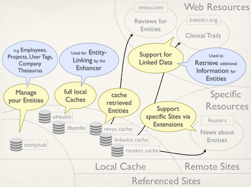

The main Features are the:

- **Entityhub** (`/entityhub`): Allows to manage local entities as well as import entities from Sites or to define mappings from local Entities to Entities managed by Sites. An Apache Stanbol instance can only have a single Entityhub so if you want to manage multiple controlled vocabularies you should preferable use [ManagedSite](#trunk-components-entityhub-managedsite) instead.
- **Site Manager** (`/entityhub/sites`): The SiteManager provides a unified access to all currently active Sites - your Entity Network. Requests sent to this endpoint will be forwarded to all currently active Sites. Users should note that queries (requests to the `/entityhub/sites/find` and `/entityhub/sites/query` endpoints) might be slow as remote services might need to be called for answering those requests. Retrieval of Entities (requests to the `/entityhub/sites/entity` endpoint) and also LDpath requests should perform reasonable well.
- **Sites** (`/entityhub/site/{siteId}`): Sites represent entity sources that are integrated with the Stanbol Entityhub. There are two different types of Sites
  - **ReferencedSite**: This site allows to refer remote services to dereference (Entity id based retrieval) and query entities. It also supports local caches and indexes. A local cache allows to locally store retrieved Entity data to speed-up retrieval on subsequent requests. A local index is a locally available index over all/some of the data of the remote dataset. If such an index is available all requests will be processed using the index. The remote services are only used as a fallback. Local Indexes are created by the Entityhub Indexing tool. The usage scenario [Working with Custom Vocabularies](#trunk-customvocabulary) provides a good overview on how to use this feature.
  - **ManagedSite**: [ManagedSites](#trunk-components-entityhub-managedsite) allow users to manage their own entity by using the RESTful API of the Entityhub. They are very similar to the `/entityhub` endpoint but do not allow to manage mappings are to import Entities from other Sites.

<a id="trunk-components-entityhub--restful-services"></a>

## RESTful services

The documentation of the RESTful services provided by the Stanbol Entityhub is served by the Web UI of your Stanbol instance. If you do not have a running Stanbol server [this introduction](#trunk-tutorial) provides you with all necessary information. You can also try to access the documentation on the Stanbol demo server available on the [IKS development server](http://dev.iks-project.eu/) at <http://dev.iks-project.eu:8081/entityhub>.

---

<a id="trunk-utils-enhancerstresstest"></a>

<!-- source_url: https://stanbol.apache.org/docs/trunk/utils/enhancerstresstest -->

<!-- page_index: 66 -->

# Downloads

[](https://stanbol.apache.org/index.html)

- [Getting Started](#trunk-tutorial)
- [Documentation](#trunk)
  - [Usage Scenarios](#trunk-scenarios)
  - [Components](#trunk-components)
  - [Production Mode](#trunk-production-mode)
- [Development](https://stanbol.apache.org/development/)
  - [Mailing Lists](https://stanbol.apache.org/development/index.html#mailing_lists)
  - [Issue Tracker](https://stanbol.apache.org/development/index.html#issue_tracker)
  - [Source Code](https://stanbol.apache.org/development/index.html#source_code)
  - [Development Practices](https://stanbol.apache.org/development/index.html#development_practices)

<a id="trunk-utils-enhancerstresstest--downloads"></a>

# Downloads

- [Overview](https://stanbol.apache.org/downloads/)
  - [Releases](https://stanbol.apache.org/downloads/releases.html)
  - [Launchers](https://stanbol.apache.org/downloads/launchers.html)

<a id="trunk-utils-enhancerstresstest--project"></a>

# Project

- [Team](https://stanbol.apache.org/team.html)
- [License](http://www.apache.org/licenses/LICENSE-2.0)
- [Privacy Policy](https://stanbol.apache.org/privacy-policy.html)

<a id="trunk-utils-enhancerstresstest--archived-docs"></a>

# Archived Docs

- [0.9.0-incubating](https://stanbol.apache.org/docs/0.9.0-incubating/)

<a id="trunk-utils-enhancerstresstest--the-asf"></a>

# The ASF

- [Apache Software Foundation](http://www.apache.org)
- [Thanks](http://www.apache.org/foundation/thanks.html)
- [Become a Sponsor](http://www.apache.org/foundation/sponsorship.html)
- [Security](http://www.apache.org/security/)

[](https://stanbol.apache.org/doap.rdf)

Copyright © 2010 The Apache Software Foundation, Licensed under
the [Apache License, Version 2.0](http://www.apache.org/licenses/LICENSE-2.0).
Apache, Stanbol and the Apache feather and Stanbol logos are trademarks of The Apache Software Foundation.

---

<a id="trunk-utils-marmotta-kiwi-repository-service"></a>

<!-- source_url: https://stanbol.apache.org/docs/trunk/utils/marmotta-kiwi-repository-service -->

<!-- page_index: 67 -->

#

<a id="trunk-utils-marmotta-kiwi-repository-service--marmotta-kiwi-repository-service"></a>

# Marmotta Kiwi Repository Service

The `org.apache.stanbol.commons.marmotta.kiwi` module allows to use the
[Marmota KiWi TripleStore](http://marmotta.apache.org/kiwi/) within an OSGI environment.

<a id="trunk-utils-marmotta-kiwi-repository-service--configuration"></a>

## Configuration

The configuration of a [KiWi TripleStore](http://marmotta.apache.org/kiwi/) is done by an
OSGI Component that configures the Kiwi Configuration based on the provided OSGI
configuration. The following figure shows the configuration dialog.

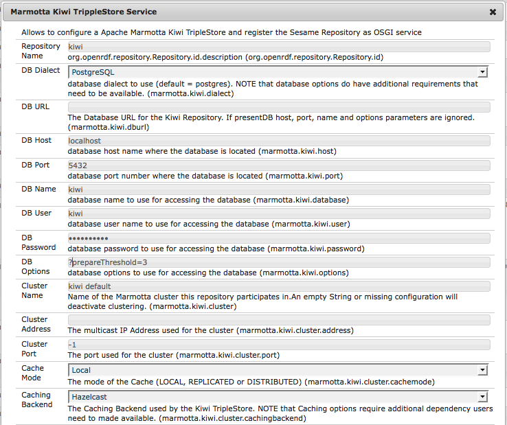

- `org.openrdf.repository.Repository.id`: The id of the Repository. Intended to be used by
  other components to track a specific repository instance.
- `marmotta.kiwi.dialect`: The KiWi Database dialect. Currently Marmotta supports the
  `H2Dialect`, `PostgreSQLDialect` and `MySQLDialect`. Note that the selected dialect will select
  different database driver. If those are not available the activation will throw an
  exception. PostgreSQL driver are embedded. H2 drivers are included in the default
  [Marmotta Kiwi Bundlelist](http://svn.apache.org/repos/asf/stanbol/branches/release-0.12/launchers/bundlelists/marmotta/kiwi/src/main/bundles/list.xml) used by Stanbol. For MySQL the according dependency needs to be uncommented in
  the [Marmotta Kiwi Bundlelist](http://svn.apache.org/repos/asf/stanbol/branches/release-0.12/launchers/bundlelists/marmotta/kiwi/src/main/bundles/list.xml).
- `marmotta.kiwi.dburl`: This property can be used to directly configure the DB URL. If
  present this is preferred over the configuration of the `host`,`port`, `database` and `options` parameters.
- `marmotta.kiwi.host`: The host of the database (a file path in case of H2)
- `marmotta.kiwi.port`: The port of the database (ignored in case of H2)
- `marmotta.kiwi.user`: The database user
- `marmotta.kiwi.password`: The password for the configured user
- `marmotta.kiwi.options`: Additional database options
- `marmotta.kiwi.cluster`: defines the name of the cluster. Different KiWi Repositories
  might use clusters with different names. If not present or empty clustering will be
  deactivated.
- `marmotta.kiwi.cluster.address`: The multicast IP Address used for the cluster. Ignored
  if clustering is deactivated.
- `marmotta.kiwi.cluster.port`: The port used for the cluster. Ignored if clustering is
  deactivated. A value <= 0 will use the default port.
- `marmotta.kiwi.cluster.cachemode`: The Mode of the Cache. Supported values include
  `LOCAL`, `REPLICATED`, `DISTRIBUTED`
- `marmotta.kiwi.cluster.cachingbackend`: The Caching Backend used by the KiWi Triplestore.
  Supported are `GUAVA` (local only), `EHCACHE` (local only), `HAZELCAST` (distributed only),
  `INFINISPAN_CLUSTERED`(distributed or replicated) and `INFINISPAN_HOTROD` (client/server).
  Please note the Marmotta KiWi documentation for details. Caching backend implementations
  do have additional dependencies. `GUAVA` and `HAZELCAST` are included in Stanbol. For the
  other please have a look for commented dependencies in the
  [Marmotta Kiwi Bundlelist](http://svn.apache.org/repos/asf/stanbol/branches/release-0.12/launchers/bundlelists/marmotta/kiwi/src/main/bundles/list.xml)

<a id="trunk-utils-marmotta-kiwi-repository-service--repository-service"></a>

## Repository Service

Providing a OSGI configuration for the `KiWiRepositoryService` component will cause a
KiWi Repository to be configured during activation. This Sesame Repository will get
registered as OSGI service with the parameters as shown in the following figure.

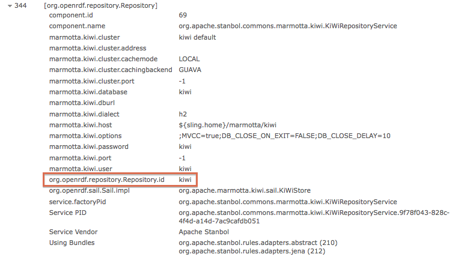

The marked `org.openrdf.repository.Repository.id` property is of special interest as it
can be used to track for a Sesame Repository with a specific name. As an Example the
Repository with the name `dummy` can be tracked with the Filter

```
(&(objectClass=org.openrdf.repository.Repository)(org.openrdf.repository.Repository.id=dummy))
```

---

<a id="trunk-utils-datafileprovider"></a>

<!-- source_url: https://stanbol.apache.org/docs/trunk/utils/datafileprovider -->

<!-- page_index: 68 -->

#

<a id="trunk-utils-datafileprovider--data-file-provider"></a>

# Data File Provider

The DataFileProvider provides data files (InputStreams actually) to
OSGi components.

<a id="trunk-utils-datafileprovider--usage"></a>

## Usage

Datafiles are requested by name. Optionally the symbolic name of the bundle
requesting the data file can be parsed. This allows to serve different versions
of the same data file to different bundles. In addition requesters can provide
a Map with additional information about the requested file.
Currently this information are only used for visualisation purposes, but future
versions might also bind specific actions to known keys.

<a id="trunk-utils-datafileprovider--main-datafileprovider"></a>

## Main DataFileProvider

The MainDataFileProvider is the default implementation of the DataFileProvider
interface. It registers itself with a service.ranking of Integer.MAX\_VALUE to
make it the default provider. I also keeps a list of all the other
DataFileProviders.

The main DataFileProvider ignores other providers if it finds the requested data
file in the filesystem, in a specific folder ("datafiles folder").
The name of that folder is configurable in the main DataFileProvider service.
The default value is "stanbol/datafiles".

If it can not find the requested file it forwards the request to all other
active DataFileProvider instances sorted by service.ranking.

When a bundle with symbolic name foo asks for data file bar.bin, the main
DataFileProvider first looks for a file named foo-bar.bin in the datafiles
folder, then for a file named bar.bin. Only if both files could not be found the
request is forwarded to the other registered DataFileProviders.

<a id="trunk-utils-datafileprovider--providing-datafiles"></a>

## Providing DataFiles

Bundles may provide there own DataFileProvider service. This might be useful
if they need to provide a default version for a data file, but intend to allow
users to override this by copying an other version to the "datafiles folder"
of the Main DataFileProvider.

It they provide such a DataFileProvider service it must register it in its
Activator, so that it's up before any component of the bundle asks for it.

If the Bundle does not want to provide a file also to other bundles than it
should check if the parsed bundleSymbolicName is equals to its own.

<a id="trunk-utils-datafileprovider--datafileprovider-for-osgi-bundles"></a>

## DataFileProvider for OSGI Bundles

Implemenation of a DataFileProvider that allows to load DataFiles from
OSGI Bundles.

<a id="trunk-utils-datafileprovider--apache-sling-osgi-installer"></a>

### Apache Sling OSGI Installer

The [OSGi installer](http://sling.apache.org/site/osgi-installer.html)
is a central service for handling installs, updates and uninstall of "artifacts".
By default, the installer supports bundles and configurations for the OSGi
configuration admin. Apache Stanbol extends this by the possibility to install
Solr indexes (see "org.apache.stanbol.commons.solr.install" for details).

Note: While the Sling OSGI Installer by default supports the installation of
Bundles this extension allows to install resources provided by bundles.

<a id="trunk-utils-datafileprovider--usage_1"></a>
<a id="trunk-utils-datafileprovider--usage-2"></a>

### Usage

This implementation tracks all Bundles of the OSGI Environment that define the
"Data-Files" key. The value is interpreted as a comma separated list of
paths to the folders that contain the data files.

For each Bundle that provides Data-Files an own DataFileProvider instance is
registered if the Bundle is STARTED and ungegisterd as soon as the Bundle is
STOPPED.
The MainDataFileProvider keeps track of all active DataFileProviders.

In addition to the "Data-Files" key an optional "Data-Files-Priority" can be
used to spefify the service-ranking for the DataFileProvider created for the
configured folders within a Bundle.
If a data file is provided by more than one DataFileProvider the one provided
by the DataFileProvider with the higest Ranking will be returned.
The default ranking is "0".

Data file names parsed to this DataFileProvider are interpreted as relative to
all configured data file paths.

<a id="trunk-utils-datafileprovider--defining-manifest-keys-with-maven"></a>

### Defining Manifest keys with Maven

When using the maven-bundle-plugin the "Install-Path" header can be defined
like this:

```
<plugin>
    <groupId>org.apache.felix</groupId>
    <artifactId>maven-bundle-plugin</artifactId>
    ...
    <configuration>
        <instructions>
            <Data-Files>data,extras/data</Data-Files>
            <Data-Files-Priority>-100</Data-Files-Priority>
        </instructions>
    </configuration>
 </plugin>
```

This would install all data files located within

```
data
/
extras
/
data
```

and will register them with a priority of "-100".

<a id="trunk-utils-datafileprovider--osgi-console-pligin"></a>

## OSGI Console Pligin

An OSGi console plugin lists all (successful or failed) requests to the main
DataFileProvider service, along with their downloadExplanations. This list of
requests can also be queried so that failed requests can be shown on the stanbol
server home page, for example. This provides a single location where stanbol
users see what data files are needed and which ones were actually loaded from
where.

<a id="trunk-utils-datafileprovider--data-file-tracker"></a>

# Data File Tracker

While the DataFileProvider only supports requests for resources the Tracker
allows register DataFileListener for a specific DataFile.

If the requested DataFile becomes available or unavailable the listener is
notified about the state.

Because the DataFileProvider does not natively support such events the
tracker uses periodical requests for all tracked DataFiles.

Note that registered Listeners are not kept if the DataFileTracker service is
restarted.

---

<a id="trunk-components-cmsadapter"></a>

<!-- source_url: https://stanbol.apache.org/docs/trunk/components/cmsadapter/ -->

<!-- page_index: 69 -->

<a id="trunk-components-cmsadapter--cms-adapter"></a>

# CMS Adapter

The CMS Adapter component acts as a bridge between content management systems and the Apache Stanbol. Please note that all components of Apache Stanbol also provides RESTful services which allow accessing them directly from outside. CMS Adapter interacts with content management systems through JCR and CMIS specifications. In other words, any content repository compliant with JCR or CMIS specifications can make use of CMS Adapter functionalities. For the time being, there are two main functionalities that CMS Adapter offers: "Bidirectional Mapping" and "Contenthub Feed".

<a id="trunk-components-cmsadapter--bidirectional-mapping"></a>

## Bidirectional Mapping

From one perspective, this feature enables content management systems to represent their content repository structure in RDF format. This helps building semantic services on top of the existing content management systems using their RDF representation.

From the other perspective, bidirectional mapping feature makes possible to exploit open linked data, which is already available on the web, in content management systems. Apart from the already available data on the web, any RDF data can be mapped to content repository. By mapping external RDF data existing content repository items can be updated or new ones created.

<a id="trunk-components-cmsadapter--contenthub-feed"></a>

## Contenthub Feed

Contenthub feed feature of CMS Adapter provides management of content repository items within Contenthub. The management process includes only two types of operations, namely: submit and delete. By submitting content items to Contenthub, you can make use of indexing and search functionalities of Contenthub over the submitted items.

<a id="trunk-components-cmsadapter--use-cases"></a>

## Use Cases

<a id="trunk-components-cmsadapter--faceted-search"></a>

### Faceted Search

As properties of content repository items are submitted to Contenthub along with the actual content, it is possible to provide to obtain faceted search facility for the content items managed within Contenthub. Furthermore, any kind of Solr query can be executed on the index keeping the submitted content items.

<a id="trunk-components-cmsadapter--exploiting-linked-data"></a>

### Exploiting Linked Data

Chance of mapping any RDF data to content repository enables users making use of [open linked data](http://linkeddata.org/) available on the web. Current implementation is especially handy for hierarchical RDF data e.g. category, topic hierarchies. Users can populate content repositories with hierarchies in which further content items can be created.

<a id="trunk-components-cmsadapter--building-and-launching"></a>

## Building and Launching

Since CMS Adapter is included in the Full Launcher of Apache Stanbol it is built with Apache Stanbol by default and can be launched under Apache Stanbol Full Launcher. For detailed instructions to build and launch Apache Stanbol see this README file.

CMS Adapter serves its features through its Java API together with the corresponding RESTful services. Restful services can be accessed starting from the root resource: http://localhost:8080/cmsadapter after launching the full launcher with default configurations.

More detailed information can be found in [5-minute documentation](#trunk-components-cmsadapter-cmsadapter5min) of CMS Adapter.

---

<a id="trunk-tutorial"></a>

<!-- source_url: https://stanbol.apache.org/docs/trunk/tutorial.html -->

<!-- page_index: 70 -->

<a id="trunk-tutorial--getting-started"></a>

# Getting Started

This tutorial targets developers, who want to enrich unstructured textual content with "named entity" tags (locations, persons or organizations such as "Paris", "Barack Obama", "BBC"). Apache Stanbol can provide such enhancements together with links to public (e.g. DBpedia) or private (e.g. an enterprise specific terminology) repositories.

<a id="trunk-tutorial--build-and-run-your-apache-stanbol-instance"></a>

## Build and run your Apache Stanbol instance

To build Apache Stanbol from source you need Java 6 and maven 3.0.3 + (version as defined in the pom). You probably need also:

```
% export MAVEN_OPTS="-Xmx1024M -XX:MaxPermSize=256M"
```

Fetch the sources from the Apache Stanbol code repository

```
% svn co http://svn.apache.org/repos/asf/stanbol/trunk stanbol
```

From the source directory run

```
% mvn clean install
```

Run the stable launcher of Apache Stanbol from your local server machine from the your local directory `{root}/stanbol/launchers/` with

```
% java -Xmx1g -jar stable/target/org.apache.stanbol.launchers.stable-{snapshot-version}-SNAPSHOT.jar
```

Your instance runs within the `stanbol/sling/` directory and is accessible at

```
http://localhost:8080
```

<a id="trunk-tutorial--post-content-item-get-an-enhancement-graph"></a>

## Post content item, get an enhancement graph

Goto the local HTTP web endpoint

```
http://localhost:8080/enhancer
```

This stateless interface allows the caller to submit content to the Apache Stanbol enhancer engines and get the resulting enhancements formatted as RDF at once without storing anything on the server-side.

Simply copy arbitrary english textual content into the input field and get back the enhancements for Bob Marley and Paris together with the enhancement graph. If you want to work with the REST interface directly, you may also post the text with the cURL command below. The resulting enhancement RDF will be in turtle notation.

```
% curl -X POST -H "Accept: text/turtle" -H "Content-type: text/plain" \ --data "The Stanbol enhancer can detect famous cities such as Paris and people such as Bob Marley." \ http://localhost:8080/enhancer
```

<a id="trunk-tutorial--configuration"></a>

## Configuration

The "default" enhancement chain includes the following, by default active Enhancement Engines:

- one engine for conversions from various document formats to plain text
- one for detection of the language of the text,
- one for named entity extractions from the content item and
- one engine configured to link the extracted entities to DBpedia entities.

You can use the [OSGI console (http://{yourdomain}:{port}/)](http://localhost:8080/) (user/pwd: admin/admin) of your running Stanbol instance to activate and configure additional engines. Additional engines provide support keyword extraction together with a better language support, for geonames, zemanta or opencalais. See the overview of available Apache Stanbol [Enhancement Engines](#trunk-components-enhancer-engines-list).

Another feature of this Apache Stanbol version is to manage and locally cache external entity repositories such as DBpedia as well as the possibility to use custom vocabularies as linking target repositories. Read more about this scenario [using custom vocabularies](#trunk-customvocabulary).

<a id="trunk-tutorial--advanced-explore-apache-stanbol-full-launcher"></a>
<a id="trunk-tutorial--advanced:-explore-apache-stanbol-full-launcher"></a>

## Advanced: Explore Apache Stanbol "full" launcher

The full (including experimental) features of Apache Stanbol can be accessed via Apache Stanbol's "full launcher". See the [list of all available components](#trunk-components) and their features.

To start the full launcher, you just have to execute its JAR via the following command:

```
$ java -Xmx1g -XX:MaxPermSize=256m \ -jar full/target/org.apache.stanbol.launchers.full-{snapshot-version}-SNAPSHOT.jar
```

To start the full launcher, you just have to execute its WAR via the following commands:

```
$ export MAVEN_OPTS="-Xmx1g -XX:MaxPermSize=256m"
$ cd launchers/full-war
$ mvn clean package tomcat7:run
```

Your instance is then available on [localhost:8080/stanbol](http://localhost:8080/stanbol).

---

<a id="trunk-scenarios"></a>

<!-- source_url: https://stanbol.apache.org/docs/trunk/scenarios.html -->

<!-- page_index: 71 -->

<a id="trunk-scenarios--apache-stanbol-usage-scenarios"></a>

# Apache Stanbol Usage Scenarios

Apache Stanbol is designed to bring semantic technologies to existing content management systems (CMS). If you have a CMS and you want to start using semantic technologies in combination with your content, Apache Stanbol is a good software candidate for you. To make the integration as easy and painless as possible all Apache Stanbol features are accessible via RESTful web services. All you need is to connect your CMS via HTTP to an instance of Apache Stanbol. Additionally, Apache Stanbol comes with a [CMS Adapter](https://stanbol.apache.org/docs/trunk/cmsadapter.html) component as a bridge between a CMIS/JCR compliant content repositories and the semantic metadata repository in Apache Stanbol. Figure 1 gives you an overview of using Apache Stanbol from a CMS.

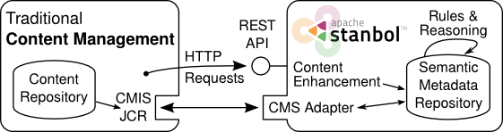

Figure 1: Traditional CMS using Apache Stanbol via its HTTP RESTful interface

The following usage scenarios explain in more detail how to use various services from a CMS.

- [Basic Content Enhancement](#trunk-contentenhancement): Analyze textual content, enhance with it with named entities (person, place, organization), suggest links to open data sources.
- [Making use of Apache Stanbol Enhancements](#trunk-enhancementusage) Describes how to work with enhancements provided by the Apache Stanbol Enhancer.
- [Working with Custom Vocabularies](#trunk-customvocabulary): Use locally defined entities (e.g. thesaurus concepts) from an organization's context.
- [Working with Multiple Languages](#trunk-multilingual): Get enhancements for textual content in multiple languages (EN, DE, SV, DA, PT and NL).
- Semantic Search in Portals: Store/index enhancements and content items. For a portal this would facilitate semantic search applications.
- Refactoring Enhancements for SEO: Refactor the enhancement result, its property names and ontology types according your target ontology.
- Transforming CMS repository structures into ontologies.
- Provide repository structures as thesaurus or domain ontology, e.g. categories.

---

*Back to [Documentation](#trunk)*

---

<a id="trunk-production-mode"></a>

<!-- source_url: https://stanbol.apache.org/docs/trunk/production-mode/ -->

<!-- page_index: 72 -->

<a id="trunk-production-mode--stanbol-in-production-mode"></a>

# Stanbol in Production Mode

This document provide some informations when running Apache Stanbol in production mode.

- [Create your launcher](#trunk-production-mode-your-launcher): The Apache Stanbol stack does many things which results in a big launcher when all is included. Coming to production not all Stanbol features are needed and the requirement to get a "just what I need" come into play. This document give some pointers to get your own custom launcher configuration.
- [Automatic bundle configuration](#trunk-production-mode-file-bundle-configuration): Apache Stanbol is a highly configurable product, thanks to the Apache Felix system console and the underlying OSGi technology. But how to safely keep this configuration from old to new versions? How to get a configured server from the first launch?
- [Partial dynamic server updates](#trunk-production-mode-partial-updates): Apache Stanbol supports the hot bundle update OSGi feature. Of course, you can do this with the Felix system console but this web interface can be less effective when updates are hudge or frequent.

---

<a id="trunk-components-factstore"></a>

<!-- source_url: https://stanbol.apache.org/docs/trunk/components/factstore/ -->

<!-- page_index: 73 -->

<a id="trunk-components-factstore--factstore"></a>

# Factstore

The FactStore is a component that let's use store relations between entities identified by their URIs. A relation between two or more entities is called a *fact*. The FactStore let's you store N-ary facts according to a user defined fact schema. In consequence you can store relations between N participating entities. The FactStore only stores the relation and not the entities itself. It only uses references to entities by using the entities' URI. The entities itself should be handled by another component, e.g. the [Entityhub](#trunk-components-entityhub). A fact is defined by a fact schema which is defined over types of entities.

A fact schema can be defined between an arbitrary number of entities. In most cases a fact schema is defined between two or three entities. For example, the fact schema 'works-for' can be defined as a relation between entities of type 'Person' and 'Organization'. The Fact Store interface allows the creation of custom fact schemata and to store facts according to these custom schemata. The Fact Store provides a simple way to define and store facts. This component is meant to be used in scenarios where a simple solution is sufficient and it is not required to define a complex ontology with reasoning support.

Read on and have a look at a concrete example or go to the [FactStore specification](#trunk-components-factstore-specification) page for more details. If you need some information about its realization, read the notes about its [implementation concept](#trunk-components-factstore-implementation).

<a id="trunk-components-factstore--example"></a>

## Example

Imagine you want to store the fact that the person named John Doe works for the company Winzigweich. John Doe is represented by the URI http://www.doe.com/john and the company by http://www.winzigweich.de. This fact is stored as a relation between the entity http://www.doe.com/john and http://www.winzigweich.de.

For this, we first need to create a so called fact schema that tells the FactStore what we would like to store. A fact schema has a unique name (often an URI is used) to identify it. To specify what kinds of entities we would like to store, we specify the type of the entities. Each type has an URI and should be defined by some ontology. For example, we can use the ontology specified by [schema.org](http://schema.org/).

According to [schema.org](http://schema.org/) is a person of type <http://schema.org/Person> and an organization is of type <http://schema.org/Organization>. We will use these type information to specify the fact schema http://factschema.org/worksFor. The specification of a fact schema is written in JSON-LD, like this:

```
{"@context" : {"#types"  : {"person"       : "http://schema.org/Person","organization" : "http://schema.org/Organization"}}}
```

To create this fact schema in the FactStore we have to store it in a \*.json file, e.g. worksFor.json, and PUT it into the FactStore. The path to put the fact schema is `/factstore/facts/{factSchemaName}`. So for our example this would be `/factstore/facts/http://factschema.org/worksFor`. Unfortunately, this is not a valid URI so that we have to URL-encode the name of the fact schema. This leads to
`/factstore/facts/http%3A%2F%2Ffactschema.org%2FworksFor`.

*Note*: If you want to avoid this URL-encoding step, you should chose another name for your fact schema that is not an URI by itself. You are free to do so!

Now to PUT the `worksFor` fact schema we can use this cURL command.

```
curl http://localhost:8080/factstore/facts/http%3A%2F%2Ffactschema.org%2FworksFor -T worksFor.json
```

After creating the fact schema we can store the fact that John Doe works for Winzigweich by POSTing it to the FactStore. The fact is specified in JSON-LD syntax. The `@profile` defines the fact schema where this fact belongs to.

```
{
  "@profile"     : "http://factschema.org/worksFor",
  "person"       : { "@iri" : "http://www.doe.com/john" },
  "organization" : { "@iri" : "http://www.winzigweich.de"}
}
```

Now we can POST this fact, e.g. stored in fact.json, to the FactStore at `/factstore/facts`. By using cURL it would be this command:

```
curl -d @fact.json -H "Content-Type: application/json" http://localhost:8080/factstore/facts
```

On success this will return a 201 (Created) and the URI of the newly created fact in the location header of the response. To retrieve a fact you can GET it from the returned URI.

<a id="trunk-components-factstore--rest-api-documentation"></a>

## REST API Documentation

To get the latest documentation you should start your copy of an Apache Stanbol launcher that includes the FactStore and navigate your browser to http://localhost:8080/factstore. There you will find more information and the documentation of the FactStore's REST API.

---

<a id="trunk-components-contenthub"></a>

<!-- source_url: https://stanbol.apache.org/docs/trunk/components/contenthub/ -->

<!-- page_index: 74 -->

<a id="trunk-components-contenthub--apache-stanbol-contenthub"></a>

# Apache Stanbol Contenthub

The Apache Stanbol Contenthub is an Apache Solr based document repository which enables
storage of text-based documents and customizable semantic search facilities.
The Contenthub exposes an efficient Java API together with the corresponding RESTful services. This is a 1 minute tutorial on how to use the Contenthub.

Apache Stanbol comes with several launchers. If you build Apache Stanbol from its source with the following command

```
mvn
clean
install
```

you can find all launchers under the launchers directory. The Contenthub is currently included in
the full launcher of Apache Stanbol. That is, you can make use of the Contenthub services if you
run the full launcher.

To run the full launcher of Apache Stanbol, go to the directory of full launcher and run the
jar file under the target directory

```
cd {stanbol} / launchers / full java - Xmx1g - jar target / org.apache.stanbol.launchers.full - {snapshot - version} - incubating - SNAPSHOT.jar
```

Your Apache Stanbol instance is running under {stanbol}/launchers/full/sling and Contenthub is accessible at

```
http://localhost:8080/contenthub
```

Contenthub is divided into Store and Search subcomponents. The link above will be automatically redirected to

```
http://localhost:8080/contenthub/contenthub/store
```

You can submit text content (sending in the payload of an HTTP POST request) with the following command

```
curl -i -X POST -H "Content-Type:text/plain" \
    --data "I live in Istanbul." \ 
    http://localhost:8080/contenthub/contenthub/store
```

Contenthub provides different search interfaces. You can directly query the Solr backend as follows

```
http://localhost:8080/solr/default/contenthub/select?q=*:*

http://localhost:8080/solr/default/contenthub/select?q=turkey
```

You can obtain a Contenthub specific search result from the featured search service based on a keyword search. The results can be retrieved in JSON format as in the following command

```
curl -i -X GET -H "Accept: application/json" \
    -H "Content-Type:text/plain" \ 
    http://localhost:8080/contenthub/contenthub/search/featured?queryTerm=turkey
```

Featured search not only returns resulting documents, but also related keywords retrieved from various resources (if the resources are available within the running Stanbol instance)

[Here](#trunk-components-contenthub-contenthub5min), you can find a more detailed version (5 minutes tutorial) of the tutorial.

---

<a id="trunk-components-cmsadapter-cmsadapter5min"></a>

<!-- source_url: https://stanbol.apache.org/docs/trunk/components/cmsadapter/cmsadapter5min -->

<!-- page_index: 75 -->

<a id="trunk-components-cmsadapter-cmsadapter5min--5-minutes-tutorial-for-cms-adapter"></a>

# 5 Minutes Tutorial for CMS Adapter

The CMS Adapter component acts as a bridge between content management systems and the Apache Stanbol. Please note that all components of Apache Stanbol also provides RESTful services which allow accessing them directly from outside. CMS Adapter interacts with content management systems through JCR and CMIS specifications. In other words, any content repository compliant with JCR or CMIS specifications can make use of CMS Adapter functionalities. For the time being, there are two main functionalities that CMS Adapter offers: "Bidirectional Mapping" and "Contenthub Feed".

> [!NOTE]
> : URLs given in the curl commands and link are valid as long as full launcher of the Stanbol is launched with the default configurations. In other words, it assumed that the root URL of the Stanbol is **http://localhost:8080**.

<a id="trunk-components-cmsadapter-cmsadapter5min--session-management"></a>

## Session Management

To be able to use Contenthub features, it is necessary to get a session key beforehand. While obtaining this key, CMS Adapter caches a JCR/CMIS session to be used when the generated session key is passed in the subsequent operations that require interaction with the content repository. A session can key can be obtained through REST services as follows:

```
curl -X GET -H "Accept: text/plain" "http://localhost:8080/cmsadapter/session?repositoryURL=rmi://localhost:1099/crx&workspaceName=demo&username=admin&password=admin&connectionType=JCR"
```

In this example a session key is obtained for a JCR compliant repository. CMS Adapter use RMI protocol to get session from JCR repositories or it tries to access repository via a URL. So, RMI endpoint or URL of the repository is specified. Furthermore target workspace in the repository has been specified together with the username and password to access it. While accessing CMIS repositories AtomPub binding is used, so repository URL should be specified considering this protocol.

Apart from the retrieval of session key by providing one by one as in the RESTful example, Java API of CMS Adapter also allows obtaining a session key with an already available session object through the SessionManager service. Thus, this is a more convenient way while obtaining a session key using CMS Adapter through its Java API.

<a id="trunk-components-cmsadapter-cmsadapter5min--bidirectional-mapping"></a>

## Bidirectional Mapping

This feature provides bidirectional mappings between JCR/CMIS compliant content repositories and external RDF data. Using this feature it is possible to generate RDF data from content repository or populate content repository based on the external RDF data.

The functionality described in this feature is realized by a two-step process. This process includes sequential execution of RDFBridge and RDFMapper services of CMS Adapter. Considering the update of content repository based on external RDF data, in the first step the given raw RDF data is annotated with standard terms by RDFBridge. There are a few terms that are described in the **CMS Vocabulary** section. RDFMapper processes the annotated RDF and update the content repository accordingly. From the other direction, in the first step content repository structure is transformed into RDF annotated with the CMS Vocabulary terms by RDFMappers. In the second step RDFBridges add implementation specific annotations.

From one perspective, bidirectional mapping feature makes possible to exploit open linked data, which is already available on the web, in content management systems. Apart from the already available RDF data on the web, any RDF data can be mapped to content repository. By mapping external RDF data existing content repository items can be updated or new ones created.

This services is also available through RESTful API. A curl command as follows will map the rdf data given in rdfData file to content repository. The mapping done according to configurations of default RDF Bridge implementation which can be changed through the **Apache Stanbol CMS Adapter Default RDF Bridge Configurations** entry of [Configuration Panel Apache Felix Web Console](http://localhost:8080/system/console/configMgr). It is possible to define several configurations and all of these configurations are processed in transformation process. In case of no configuration, provided RDF is processed by RDFMapper directly.

```
curl -i -X POST --data-urlencode "serializedGraph@rdfData" --data "sessionKey=9ef42d3c-aaa3-494f-ba6f-c247a58ac2db" http://localhost:8080/cmsadapter/map/rdf
```

This [blog post](http://blog.iks-project.eu/adding-knowledge-to-jcrcmis-content-repositories/) from October 2011 describes the process of adding knowledge from DBPedia to a Nuxeo content management system which is a CMIS compliant repository.

From the other perspective, thanks to this feature repository structure can be transformed into RDF through RESTful services as well. A curl command similar to following one can be used to map content repository structure into RDF format.

```
curl -i -X POST --data "sessionKey=9ef42d3c-aaa3-494f-ba6f-c247a58ac2db&baseURI=http://www.apache.org/stanbol/cms" http://localhost:8080/cmsadapter/map/cms
```

Note that during the mapping process of bidirectional mappings the same RDF Bridge configurations are used in both directions. Also, **baseURI** is a mandatory parameter that is used as the base URI of the RDF to be generated.

RDF representation of a content management system helps building semantic services on top of the existing system. Contenthub component of Apache Stanbol can be used to provide semantic indexing and search functionalities based on the RDF representation of content repositories. That is, the RDF representation is used as a resource that Contenthub uses to populate the underlying semantic index.

<a id="trunk-components-cmsadapter-cmsadapter5min--contenthub-feed"></a>

## Contenthub Feed

Contenthub feed feature aims to manage content repository items within the Contenthub component of Apache Stanbol. The management process includes only two types of operations, submit and delete.

Submission and deletion operations can be done based on the identifiers of path of the content repository items. During the submission process, properties of content repository items are collected and they are stored along with the actual content. This makes possible faceted search over the properties of items.

RESTful API of CMS Adapter can be used submit content repository items to Contenthub.

```
curl -i -X POST --data "sessionKey=9ef42d3c-aaa3-494f-ba6f-c247a58ac2db&path=/contenthubfeedtest&recursive=true" http://localhost:8080/cmsadapter/contenthubfeed
```

The previous curl command submits all content repository items under the **/contenthubfeedtest** path to the Contenthub. In a similar way content item can be deleted from Contenthub. Following command deletes the content items corresponding to the content repository items under the /contenthubfeedtest path.

```
curl -i -X DELETE --data "sessionKey=9ef42d3c-aaa3-494f-ba6f-c247a58ac2db&path=/contenthubfeedtest&recursive=true" http://localhost:8080/cmsadapter/contenthubfeed
```

<a id="trunk-components-cmsadapter-cmsadapter5min--cms-vocabulary"></a>

## CMS Vocabulary

This vocabulary aims to provide a standardized mapping between content repositories and RDF data. This vocabulary includes a small number of essential terms to map an RDF data to a content repository. As well as general terms that are commonly used for both JCR and CMIS repositories there are also JCR or CMIS specific terms.

<a id="trunk-components-cmsadapter-cmsadapter5min--general-terms"></a>

### General Terms

- CMS\_OBJECT: In a CMS vocabulary annotated RDF, if a resource has this URI reference as value of its rdf:type property, the subject of that resource represents a content repository item e.g a node in JCR compliant content repositories or an object in CMIS compliant content repositories.
- CMS\_OBJECT\_NAME: This URI reference represents the name of the content repository item.
- CMS\_OBJECT\_PATH: This URI reference represents the absolute path of the content repository item.
- CMS\_OBJECT\_PARENT\_REF: This URI reference represents the item to be created as parent of the item having this property.
- CMS\_OBJECT\_HAS\_URI: This URI reference represents the URI which is associated with the content repository item.

<a id="trunk-components-cmsadapter-cmsadapter5min--jcr-specific-properties"></a>

### JCR Specific Properties

- JCR\_PRIMARY\_TYPE: This URI reference represents primary node of the content repository item associated with the resource within the RDF.
- JCR\_MIXIN\_TYPES: This URI reference represents the mixin type of the content repository item associated with the resource within the RDF.

<a id="trunk-components-cmsadapter-cmsadapter5min--cmis-specific-properties"></a>

### CMIS Specific Properties

- CMIS\_BASE\_TYPE\_ID: This URI reference represents the base type of the content repository item associated with the resource within the RDF.

Copyright © 2010 The Apache Software Foundation, Licensed under
the [Apache License, Version 2.0](http://www.apache.org/licenses/LICENSE-2.0).
Apache, Stanbol and the Apache feather and Stanbol logos are trademarks of The Apache Software Foundation.

---

<a id="trunk-components-contenthub-contenthub5min"></a>

<!-- source_url: https://stanbol.apache.org/docs/trunk/components/contenthub/contenthub5min -->

<!-- page_index: 76 -->

<a id="trunk-components-contenthub-contenthub5min--contenthub-5-minutes-tutorial"></a>

# Contenthub (5 minutes tutorial)

The Apache Stanbol Contenthub is an Apache Solr based document repository which enables storage of text-based documents and customizable semantic search facilities. Contenthub exposes an efficient Java API together with the corresponding RESTful services.

Contenthub is basically a document repository. A document within Contenthub is referred as a "Content Item". A content item consists of metadata of the document in addition to the text-based content of the document. Contenthub has two main subcomponents, namely Store and Search. As their names indicate, Store is specifically responsible for persistent storage of content items. And Search provides strong semantic search facilities on top of the content items.

<a id="trunk-components-contenthub-contenthub5min--contenthub-store"></a>

## Contenthub Store

It is the part of Contenthub which actually stores the documents and their metadata persistently. In current implementation only text/plain documents are supported.

The storage part of the Contenthub provide basic methods such as create, put, get and delete. When a document is submitted, it delegates the textual content to Stanbol Enhancer to retrieve its enhancements. (Enhancements of a content item are called its metadata within the terminology) While submitting the document, it is also possible to specify external metadata (in addition to the enhancements retrieved from Enhancer) as field:value pairs along with the document.

The document itself and all metadata are indexed through an embedded Apache Solr core/index which is created specifically for Contenthub. Since documents are given unique IDs while indexing, using its unique ID, a document can be retrieved or deleted from Contenthub. Contenthub provides an HTML interface for its functionalities under the following endpoint, which is available after running the full launcher of Apache Stanbol:

```
http://localhost:8080/contenthub
```

Apache Solr can manage several cores (indexes) within the same running instance, and Contenthub makes use of this facility to manage different those cores. This management performed by LDPath programs[1](http://code.google.com/p/ldpath/).

LDPath is a simple path-based query language similar to XPath or SPARQL Property Paths that is particularly well-suited for querying and retrieving resources from the Linked Data Cloud by following RDF links between resources and servers. For example, the following path query would select the names of objects (people) who is known by the context resource (the resource on which this path is being executed):

```
foaf
:
knows
/
foaf
:
name
```

An LDPath program is a collection of path queries. For example, following LDPath program can be executed on the resources which can be retrieved from Stanbol Enhancer as a result of the enhancement process. An LDPath program can be executed on any semantic collection of resources to extract specific information.

```
@prefix rdf : <http://www.w3.org/1999/02/22-rdf-syntax-ns#>;
@prefix rdfs : <http://www.w3.org/2000/01/rdf-schema#>;
@prefix db-ont : <http://dbpedia.org/ontology/>;
title = rdfs:label :: xsd:string;
dbpediatype = rdf:type :: xsd:anyURI;
population = db-ont:populationTotal :: xsd:int;
```

Given an LDPath program, Contenthub can create a corresponding Solr core to index the content items through that core. When you submit a document to Contenthub Store by providing an LDPath program, this means the content item (the document content and its metadata/enhancements) will be indexed according to the fields determined by the LDPath program. For instance, the example LDPath program above will lead to a Solr core including the following fields (in addition to default configuration and several default fields)

```
<field name="title" type="string" stored="true" indexed="true" multiValued="true"/>
<field name="dbpediatype" type="uri" stored="true" indexed="true" multiValued="true"/>
<field name="population" type="int" stored="true" indexed="true" multiValued="true"/>
```

To submit an LDPath program, you can use the following command through the REST API of Contenthub

```
curl -i -X POST -d \ 
    "name=myindex&program=\
    @prefix rdf : <http://www.w3.org/1999/02/22-rdf-syntax-ns#>; \ 
    @prefix rdfs : <http://www.w3.org/2000/01/rdf-schema#>; \
    @prefix db-ont : <http://dbpedia.org/ontology/>; \
    title = rdfs:label :: xsd:string; dbpediatype = rdf:type :: xsd:anyURI; \ 
    population = db-ont:populationTotal :: xsd:int;" \
    http://localhost:8080/contenthub/ldpath/program
```

You can retrieve the list of managed LDPath programs in JSON format with the following command. This is also the list of available Solr cores (except the default Solr core)

```
curl -i -X GET http://localhost:8080/contenthub/ldpath
```

LDPath related management is performed through SemanticIndexManager of Contenthub. To take advantage of semantic indexes while storing content items, you need to specify the name of the index in the path of the url while submitting the document. Default index for contenthub is named as "contenthub". Hence, following command submits document to the default index:

```
curl -i -X POST -H "Content-Type:application/x-www-form-urlencoded" \
    -d "title=about me&content=I live in Istanbul." \
    http://localhost:8080/contenthub/contenthub/store
```

Following command will store the content item into Solr core names with "myindex". Therefore, the indexing will be performed through the field properties indicated with the LDPath program named with "myindex".

```
curl -i -X POST -H "Content-Type:application/x-www-form-urlencoded" \
    -d "title=about me&content=I live in Istanbul." \
    http://localhost:8080/contenthub/myindex/store
```

<a id="trunk-components-contenthub-contenthub5min--contenthub-search"></a>

## Contenthub Search

Contenthub provides three search interfaces so that capabilities of Stanbol can be adopted by the users through different levels of complexities. These interfaces are;

- **SolrSearch**: provides native Solr interface to the outside world.
  Retrieved the resulting content items (documents) from the Solr
  backend. SolrJ users can easily make use of this interface. Search
  is performed on the corresponding Solr index and results are
  returned in "org.apache.solr.client.solrj.response.QueryResponse"
  format.
- **RelatedKeywordSearch**: provides supporting functionalities for search
  facilities. Given a keyword, services of this interface finds other
  related keywords from several sources. Wordnet, domain ontologies
  and referenced sites are the data sources for these services to
  retrieve the related keywords.
- **FeaturedSearch**: Combines the services of SolrSearch and
  RelatedKeywordSearch for the users who want the results of a query
  term all in one interface. Featured search not only returns
  resulting documents, but also related keywords retrieved from
  various resources (if the resources are available within the running
  Stanbol instance) Given a query term, returns the resultant
  documents from the queried Solr core/index and related keywords from
  different sources.

Following request retrieves all documents from the default index (whose name is "contenthub") of Solr:

```
http://localhost:8080/solr/default/contenthub/select?q=*:*
```

Following request retrieves all documents from the Solr index named as "myindex":

```
http://localhost:8080/solr/default/myindex/select?q=*:*
```

RelatedKeywordSearch is performed by three independent search engines within the Stanbol system, namely:

- **OntologyResourceSearch**: If an ontology is already registered to
  Stanbol (e.g. a domain ontology), it can be used to look for similar
  keywords, given a keyword. A SPARQL query based on a LARQ index is
  executed on the specified ontology to find individual and class
  resources related with the keyword.
- **ReferencedSiteSearch**: Referenced sites are used to retrieve the
  enhancements of a content item. Stanbol Enhancer handles all
  enhancement operations through the referenced sites. This interface
  makes use of the referenced sites to look for similar keywords,
  given a keyword.
- **WordnetSearch**: If a Wordnet database is registered to the system
  (through the OSGi console), this service is ready for use. Looks for
  several relations among keywords (such as synonyms, hyponyms etc...)
  and retrieves a list of related keywords from the Wordnet database.

Following command will retrieve related keywords about "turkey" from referenced sites and wordnet (ReferencedSiteSearch and WordnetSearch). Since no ontology is specified, OntologyResourceSearch will not execute.

```
curl -i -X GET -H "Accept: application/json" \
    http://localhost:8080/contenthub/contenthub/search/related?keyword=turkey
```

If URI of an ontology is also specified with the keyword as follows, result of the service will include related keywords found through the specified ontology in addition to referenced site and wordnet data. Following command will add the related keywords of "turkey" which are retrieved from the ontology identified with "uri-dummy" to the search result of related keyword service.

```
curl -i -X GET -H "Accept: application/json" \
    http://localhost:8080/contenthub/contenthub/search/related?keyword=turkey&ontologyURI=uri-dummy
```

Lastly, Contenthub provides a featured search interface which combines the services of SolrSearch and RelatedKeywordSearch. Results of the services of FeaturedSearch interface includes resultant documents and related keywords of the given query term. Following query will retrieve the documents whose indexed fileds includes the term "turkey" and related keywords from several sources about "turkey".

```
curl -i -X GET -H "Accept: application/json" -H "Content-Type:text/plain" \
    http://localhost:8080/contenthub/contenthub/search/featured?queryTerm=turkey
```

Copyright © 2010 The Apache Software Foundation, Licensed under
the [Apache License, Version 2.0](http://www.apache.org/licenses/LICENSE-2.0).
Apache, Stanbol and the Apache feather and Stanbol logos are trademarks of The Apache Software Foundation.

---

<a id="trunk-components-enhancer-chains-executionplan"></a>

<!-- source_url: https://stanbol.apache.org/docs/trunk/components/enhancer/chains/executionplan -->

<!-- page_index: 77 -->

<a id="trunk-components-enhancer-chains-executionplan--execution-plan"></a>

# Execution Plan

The ExecutionPlan is represented as an RDF graph following the ExecutionPlan ontology. It needs to be provided by the [Enhancement Chain](#trunk-components-enhancer-chains) and is used by the [EnhancementJobManager](#trunk-components-enhancer-enhancementjobmanager) to enhance [ContentItems](#trunk-components-enhancer-contentitem) and to write the [ExecutionMetadata](#trunk-components-enhancer-executionmetadata).

<a id="trunk-components-enhancer-chains-executionplan--executionplan-ontology"></a>

## ExecutionPlan Ontology

The RDFS schema used for the execution plan is defined as follows:

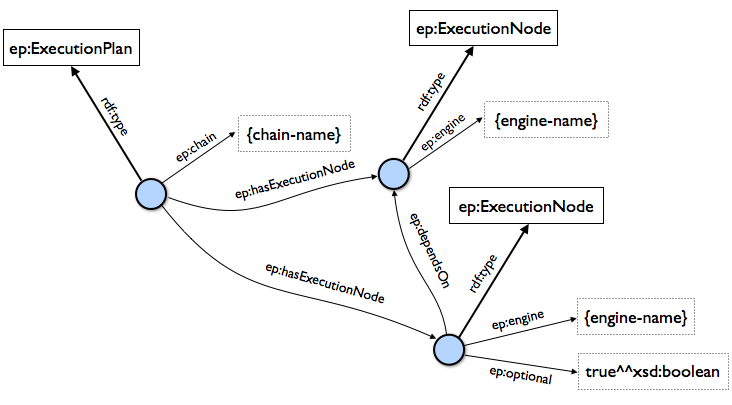

- Namespace: ep : http://stanbol.apache.org/ontology/enhancer/executionplan#
- **ep:ExecutionPlan** : Represents an execution plan defined by all linked execution nodes.
  - **ep:hasExecutionNode** (domain: ep:ExecutionPlan; range: ep:ExecutionNode; inverseOf: ep:inExecutionPlan): links the execution plan with all the execution nodes.
  - **ep:chain** (domain: ep:ExecutionPlan; range: xsd:string): The name of the chain this execution plan is used for.
- **ep:ExecutionNode** : Class used for all Nodes representing the execution of an Enhancement Engine.
  - **ep:inExecutionPlan** (domain: ep:ExecutionNode; range: ep:ExecutionPlan ;inverseOf: ep:hasExecutionNode): functional property that links the execution node with an execution plan
  - **ep:engine** (domain: ep:ExecutionNode; range: xsd:string): The property is used to link to the Enhancement Engine by the name of the engine.
  - **ep:dependsOn** (domain: ep:ExecutionNode; range: ep:ExecutionNode) Defines that the execution of this node depends on the completion of the referenced one.
  - **ep:optional** (domain: ep:ExecutionNode; range: xsd:boolean) Can be used to specify that the execution of this [EnhancementEngine](#trunk-components-enhancer-engines) is optional. If this property is set to TRUE an engine will be marked as executed even if it execution was not possible (e.g. because an engine with this name was not active) or the execution failed (e.g. because of the Exception).

Note: the data for the ep:ExecutionPlan and the ep:hasExecutionNode/ep:inExecutionPlan typically need not to be parsed as configuration of a Chain. This information are typically automatically added based on the assumption that all ep:ExecutionNode parsed in the configuration for a chain are member of the execution plan for such a chain. Therefore, this information is typically added by the chain itself when the configuration is parsed and validated.

<a id="trunk-components-enhancer-chains-executionplan--example"></a>

### Example

This example shows an ExecutionPlan with the nodes for the "langId", "ner", "dbpediaLinking" "geonamesLinking" and "zemanta" engine. Note that this names refer to actual [EnhancementEngine](#trunk-components-enhancer-engines) Services registered with the current OSGI Environment.

This example assumes that

- "langId" is the singleton instance of [LangIdEnhancementEngine](#trunk-components-enhancer-engines-langidengine)
- "ner" is the default instance of the [NamedEntityExtractionEnhancementEngine](https://stanbol.apache.org/docs/trunk/components/enhancer/engines/namedentityextractionengine.html)
- "dbpediaLinking" is an instance of the [NamedEntityTaggingEngine](#trunk-components-enhancer-engines-namedentitytaggingengine) configured to use the dbpedia.org ReferencedSite of the Entityhub
- "geonamesLinking" is an instance of the [NamedEntityTaggingEngine](#trunk-components-enhancer-engines-namedentitytaggingengine) configured to use the geonames.org ReferencedSite
- "zemanta" is the singleton instance of the [ZemantaEnhancementEngine](#trunk-components-enhancer-engines-zemantaengine)

The RDF graph of such a chain would look

```
urn:execPlan
    rdf:type ep:ExecutionPlan
    ep:hasExecutionNode urn:node1, urn:node2, urn:node3, urn:node4, urn:node5
    ep:chain "demoChain"

urn:node1
    rdf:type stanbol:ExecutionNode
    ep:inExecutionPlan urn:execPlan
    ep:engine langId

urn:node2
    rdf:type ep:ExecutionNode
    ep:inExecutionPlan urn:execPlan
    ep:dependsOn urn:node1
    ep:engine ner

urn:node3
    rdf:type ep:ExecutionNode
    ep:inExecutionPlan urn:execPlan
    ep:dependsOn urn:node1
    ep:engine dbpediaLinking

urn:node4
    rdf:type ep:ExecutionNode
    ep:inExecutionPlan urn:execPlan
    ep:dependsOn urn:node1
    ep:engine geonamesLinking

urn:node5
    rdf:type ep:ExecutionNode
    ep:inExecutionPlan urn:execPlan
    ep:engine zemanta
    ep:optional "true"^^xsd:boolean
```

This plan defines that the "langId" and the "zemanta" engine do not depend on anything and can therefore be executed from the start (even in parallel if the JobManager execution of these chains supports this). The execution of the "ner" engine depends on the extraction of the language and the execution of the entity linking to dbpedia and geonames depends on the "ner" engine. Note that the execution of the "dbpediaLinking" and "geonamesLinking" could be also processed in parallel.

<a id="trunk-components-enhancer-chains-executionplan--executionplan-utility"></a>

## ExecutionPlan Utility

The Enhancer MUST also define an utility that provides the following:

```
/** Getter for the list of executable ep:ExecutionNodes */ + getExecuteable (Graph executionPlan,Set <NonLiteral> completed):Collection <NonLiteral>
```

This method takes an execution plan and the list of already executed nodes as input and return the list of ExecutionNodes that can be executed next. The existing utility methods within the EnhancementEngineHelper can be used to retrieve further information from the ex:ExecutionNodes returned by this method.

The code using this utility will look like this (pseudo code):

```
Graph executionPlan =chain.getExecuctionPlan (); Map <String,EnhancementEngine> engines =enhancementEngineManager.getActiveEngines (chain ); Collection <NonLiteral> executed =new HashSet <NonLiteral >(); Collection <NonLiteral> next;
while (!(next =ExecutionPlanUtils.getExecuteable (plan,executed )).isEmpty ()){for (NonLiteral node:next ){EnhancementEngine engine =engines.get (EnhancementEngineHelper.getString (executionPlan,node,EX_ENGINE )); Boolean optional =EnhancementEngineHelper.get (executionPlan,node,EX_OPTIONAL,Boolean.class,literalFactory ); /* Execute the Engine */ completed.add (node );}}
```

---

<a id="trunk-components-enhancer-contentitemfactory"></a>

<!-- source_url: https://stanbol.apache.org/docs/trunk/components/enhancer/contentitemfactory.html -->

<!-- page_index: 78 -->

<a id="trunk-components-enhancer-contentitemfactory--content-item-factory"></a>

# Content Item Factory

The ContentItemFactory is used by the Stanbol Enhancer to create [ContentItem](#trunk-components-enhancer-contentitem) and Blob instances. ContentItemFactory implementation typically register themselves as OSGI service. The Stanbol Enhancer will use the factory implementation with the highest "service.ranking" to create ContentItems and Blobs for requests on the RESTful API. When using the Java API any ContentItem implementation can be used.

<a id="trunk-components-enhancer-contentitemfactory--contentitemfactory-interface"></a>

### ContentItemFactory interface

The interface of the ContentItemFactory defines the following methods to create ContentItems

```
+ createContentItem (ContentSource source):ContentItem + createContentItem (String prefix,ContentSource source):ContentItem + createContentItem (UriRef id,ContentSource source):ContentItem + createContentItem (String prefix,ContentSource source,MGraph metadata):ContentItem + createContentItem (UriRef id,ContentSource source,MGraph metadata):ContentItem + createContentItem (ContentReference reference):ContentItem + createContentItem (ContentReference reference,MGraph metadata):ContentItem
```

The content for created ContentItem can be passed by using either a ContentSource or a ContentReference. The Stanbol Enhancer Servicesapi module provides implementations for creating ContentSources for Java streams, byte arrays and string object as well as ContentReferences for URLs. For details see the sections below.

The URI of the created ContentItem is determined as follows:

- if no URI is passed, than it is calculated by using a default prefix plus an digest over the passed content. This ensures that of the some content is passed several times the created ContentItems will use the same id.
- methods that take a **prefix** will also generate the URI by calculating a digest over the passed content. However the passed prefix will be used instead of the default one.
- If an **UriRef id** is passed, than that URI is used as id for the content item.

The ContentItemFactory allows also to parse pre-existing metadata. All RDF triples in the passed MGraph are guaranteed to be added to the metadata of the created ContentItems. Note that implementations are free to directly use the passed MGraph instance for the metadata or to create an new MGraph instance and copy all triples of the passed instance.

The following methods of the ContentItemFactory can be used to create Blobs

```
+ createBlob (ContentSource source):Blob + createBlob (ContentReference reference):Blob + createContentSink (String mediaType):ContentSink
```

The Blob interface is used by the Stanbol Enhancer to represent content. Blobs are added to ContentItems as [content parts](#trunk-components-enhancer-contentitem--content-parts). In addition to the ContentSource and ContentReference interfaces that are also supported for the creation of ContentItems for the creation of Blobs also a ContentSink can be used. A ContentSink allows to obtain an OutputStream to an initially empty Blob that can later be used to stream the content. This is intended to be used by EnhancementEngine that need to convert content from one format to an other because it allows to avoid caching the converted content in-memory.

<a id="trunk-components-enhancer-contentitemfactory--contentitem-implementations"></a>

### ContentItem implementations

By default the Stanbol Enhancer provides two ContentItemFactory/ContentItem/Blob implementations. Users can control the implementation used by the Stanbol Enhancer by configuring the "service.ranking" property of the different ContentItemFactory implementations (e.g. via the configuration tab of the Apache Felix Web Console). The implementation with the highest "service.ranking" will be used by the Stanbol Enhancer to create ContentItems and Blobs.

<a id="trunk-components-enhancer-contentitemfactory--in-memory-contentitem"></a>

#### In-memory ContentItem

This implementation manages contents - Blobs - as byte arrays that are kept in-memory. While this ensures fast access to the passed content it also might cause problems if the Stanbol Enhancer is used to process big media files. Nonetheless this is currently used as default, because for typical usage scenarios content processed by the Stanbol Enhancer easily fits into memory.

The ContentItemFactory of this implementation registers itself with a "service.ranking" of 100 and is therefore used as default by the Stanbol Enhancer.

<a id="trunk-components-enhancer-contentitemfactory--file-based-contentitem"></a>

#### File-based ContentItem

This implementation differs from the in-memory one that it stores content - Blobs - in temporary files on the hard disc. All other information such as the metadata or non Blob content parts are still kept in-memory. This implementation is intended to be used by users that use the Stanbol Enhancer to process big media files such as TIFF images, MP3 files, rich text files including big graphics or even video files.

The ContentItemFactory of the the file based implementation is registered with a "service.ranking" of 50. To use it as default users need to ensure that the ranking of this implementation higher than the one of the in-memory implementation.

<a id="trunk-components-enhancer-contentitemfactory--contentsource"></a>

### ContentSource

This interface describes the source of a content. It defines the following API

```
/** the content as stream */ + getStream ():InputStream /** the content as byte array */ + getData ():byte [] /** optionally the media type of the content */ + getMediaType ():String /** optionally the file name of the content */ + getFileName ():String /** optionally additional headers */ + getHeaders ():Map <String,List <String >>
```

The ContentSource interface defines methods for obtaining the wrapped content as InputStream and byte[]. This is mainly to avoid unnecessary copying of content. Implementors of ContentItems SHOULD prefer to call

- ContentSource#getData() if the ContentItem/Blob implementation will store the content as byte[] in-memory
- ContentSource#getStream() if the content of a ContentSource is streamed to a file, database, CMS or any other target outside the JVM.

The following implementations of this interface are provided by the Stanbol Enhnacer servicesapi module

- StreamSource: A ContentSource wrapping an InputStream. Multiple calls to #getStream() are not be supported and will cause IllegalStateExceptions. Calls to #getData() will load the contents of the stream to an in memory.
- ByteArraySource: A ContentSource implementation that uses a byte array to store represent the content. All constructors take the byte array representing the content as parameter. Calls to #getData() MUST NOT copy the byte array to avoid duplications.
- StringSource: A ContentSource implementation that directly allows to parse a String instance. The constructors convert the passed String to an byte array by using the passed Charset. UTF-8 is used as default. This implementation is based on the ByteArraySource.

<a id="trunk-components-enhancer-contentitemfactory--contentreference"></a>

### ContentReference

This interface allows to describe content that is not yet locally available. The Stanbol Enhancer will dereference the content when automatically when needed.

```
/** the Reference to the content */ + gerReference ():String /** dereferences the content */ + dereference ():ContentSource
```

When referenced content is dereferenced by the Stanbol Enhancer depends on many factors. Earliest it may be dereferenced by the createBlob/createContentItem methods of a ContentItemFactory implementation. At latest it will be dereferenced when the referenced content is first used by the Stanbol Enhancer (e.g. on a call to ContentItem#getStream() or ContentItem#getMimeType()).

By default an ContentReference implementation for Java URLs is provided by the Stanbol Enhancer servicesapi module. This implementation replaces the WebContentItem that was used for obtaining content from URL until Stanbol version 0.9.0-incubating.

<a id="trunk-components-enhancer-contentitemfactory--contentsink"></a>

### ContentSink

EnhancementEngines that do convert passed content (e.g. the [TikaEngine](#trunk-components-enhancer-engines-tikaengine)) are often capable to so stream processing on content - meaning that the do not need to load the whole content in memory while analyzing it. To support this operation mode also within the StanbolEnhancer the ContentSink interface place an important role as it allows to create an - initially empty - Blob and than "stream" the content to it while processing the content.

The following method of the ContentItemFactory can be used to create a ContentSink

```
/** Creates a new ContentSink */ + createContentSink (String mediaType):ContentSink;
```

The ContentSink interface provides the OutputStream as well as the created Blob

```
/** Getter for the OutputStream */ + getOutputStream ():OutputStream;
/** Getter for the Blob */ + getBlob ():Blob;
```

**Note:** User MUST NOT parse the Blob of a ContentSink to any other components until all the data are written to the OutputStream, because this may cause that other components to read partial data when calling Blob#getStream(). This feature is intended to reduce the memory footprint and not to support concurrent writing and reading of data as supported by pipes.

<a id="trunk-components-enhancer-contentitemfactory--intended-usage"></a>
<a id="trunk-components-enhancer-contentitemfactory--intended-usage:"></a>

#### Intended Usage:

This example shows a typical usage of a ContentSink within the processEnhancement(..) method of an EnhancementEngine that needs to transform some content.

```
ContentItem ci;
//the content item to process ContentSink plainTextSink =contentItemFactory.createContentSink ("text/plain" ); Writer writer =new OutputStreamWriter (plainTextSink.getOutputStream,"UTF-8" ); try {// parse the writer to the framework that extracts the text} finally {IOUtils.closeQuietly (writer );} //now add the Blob to the ContentItem UriRef textBlobUri;
//create an UriRef for the Blob ci.addPart (textBlobUri,plainTextSink.getBlob ()); plainTextSink =null;
```

Copyright © 2010 The Apache Software Foundation, Licensed under
the [Apache License, Version 2.0](http://www.apache.org/licenses/LICENSE-2.0).
Apache, Stanbol and the Apache feather and Stanbol logos are trademarks of The Apache Software Foundation.

---

<a id="trunk-components-enhancer-engines-dereference"></a>

<!-- source_url: https://stanbol.apache.org/docs/trunk/components/enhancer/engines/dereference -->

<!-- page_index: 79 -->

<a id="trunk-components-enhancer-engines-dereference--entity-dereference-engine"></a>

# Entity Dereference Engine

**since version `0.12.0`** with [STANBOL-1222](https://issues.apache.org/jira/browse/STANBOL-1222)

The responsibility of the Dereference Engine is to retrieve information about Entities
referenced by the Enhancement Results and add them to the metadata of the [Content Item](#trunk-components-enhancer-contentitem).

<a id="trunk-components-enhancer-engines-dereference--consumed-information"></a>

## Consumed information

The Entity Dereference Engine consumes the RDF enhancements generated by other Enhancement Engines. Especially the `fise:entity-reference` properties used by `fise:EntityAnnotation` and `fise:TopicAnnotation` are processed by this engine as they do link to the Entities that need to be dereferenced.

- **Language** (optional): The language detected for the text may be used to determine the set of languages of literals to be dereferenced.

<a id="trunk-components-enhancer-engines-dereference--design"></a>

## Design

The Entity Dereference Engine can not directly be used to dereference Entities. It provides the base functionality for the implementation of dereference Engines for different technologies and services. One such implementation is the [Entityhub Dereference Engine](#trunk-components-enhancer-engines-entityhubdereference) for dereferencing Entities via the [Stanbol Entityhub](#trunk-components-entityhub)).

The module providing this infrastructure is

```
<dependency>
    <groupId>org.apache.stanbol</groupId>
    <artifactId>org.apache.stanbol.enhancer.dereference.core</artifactId>
    <version>${stanbol-version}</version>
</depednecy>
```

This module provides the following main components:

1. [EnhancementEngine](#trunk-components-enhancer-engines) implementation that
   - processes the Enhancement results and schedules Entities to be dereferenced.
   - supports the use of a thread pool to dereference multiple entities concurrently.
   - supports [EnhancementProperties](#trunk-components-enhancer-enhancementproperties) for *chain* and *request* scoped configuration of the dereferenced information.
2. Definition of the `EntityDerefernecer` interface used to dereference scheduled entities. This interface needs to be implemented by Dereference Engines for different technologies/services (e.g. the Entityhub)

In addition the module also provides utilities for managing the enhancement engine configuration as well as parsed Enhancement Properties.

<a id="trunk-components-enhancer-engines-dereference--configuration"></a>

## Configuration

The following Configuration parameter are defined by the core Entity Dereference Engine. Actual Dereference Engine implementations might not support all of them.

- **Name** *(stanbol.enhancer.engine.name)*: The name of the Enhancement engine
- **URI Prefix** *(enhancer.engines.dereference.uriPrefix)*: Allows to configure [0..\*] prefixes of Entity URIs that can be dereferenced by this engine. If present only Entities that match one of those prefixes are scheduled to be dereferenced by the `EntityDereferencer`.
- **URI Pattern** *(enhancer.engines.dereference.uriPatter)*: Allows to configure a regex pattern for matching Entity URIs. If present only Entities matching at lease one of the configured patterns will be scheduled for dereferencing.
- **Fallback Mode** *(enhancer.engines.dereference.fallback)*: The fallback mode will only schedule Entities for dereferencing if no data for them are yet present in the Enhancement results. In case a [Weighted Chain](#trunk-components-enhancer-chains-weightedchain) is use this mode will also make sure that Dereference Engines in *Fallback Mode* will be executed after those with this mode deactivated.
  This option is only useful in cases where multiple dereference engines are used in the same enhancement chain. It allows to ensure the following workflows
  1. First running Dereference Engines for fast/local data sources. Especially those where one can configure an *URI Prefix* and/or an *URI Pattern* - by deactivating *Fallback Mode*. Second running Dereference Engines for datastes that require remote service calls or for those no *URI Prefix* nor *URI Pattern* can be configured - by activating *Fallback Mode*. This can greatly improve performance and reduce the number of remote service calls as already dereferenced Entities will not get scheduled to be dereferenced by using the remote service.
  2. In settings where a partial local cache for an otherwise slow data source exists. In this case one can configure two Entity Dereference Engines for the same data source. First one with *Fallback Mode* deactivated for the partial cache and a second with enabled *Fallback Mode* for the original but slower datasource.
- **Dereference Properties** *(enhancer.engines.dereference.references)*: The list of properties that reference Entities. By default `fise:entity-reference` is used. A Triple pattern `(null,{entity-reference},null)` is used for all configured property URIs. All unique objects of type URI are considered as entities to be dereferenced. *NOTE* that configured *URI Prefix* and/or an *URI Pattern* are also applied to the list of entity uris.
- **Dereference Languages** *(enhancer.engines.dereference.languages)*: A set of languages that are dereferenced. Even if *'Dereference only Content Language Literals'* is active explicitly configured languages will still get dereferenced. If not present and *'Dereference only Content Language Literals'* is deactivated literals of any language will get dereferenced.
- **Dereference only Content Language Literals** *(enhancer.engine.dereference.filterContentlanguages)*: If enabled only Literals with the same language as the language detected for the Content will get dereferenced. Literals with no language tag will always get dereferenced.
- **Dereferenced Fields** *(enhancer.engines.dereference.fields)*: The dereferenced fields - in RDF terminology 'properties' - to be dereferenced. Typically QNames (e.g. `rdf:label`) can be used for the configuration. However support for QNames is optional. Some Implementations might also support wildcards and exclusions.
- **Dereference LD Path** *(enhancer.engines.dereference.ldpath)*: The [LD Path Language](http://marmotta.apache.org/ldpath/language.html) allows to define powerful selectors for dereferenced Entities. As an example LDPath allows to select different properties based on the type of the dereferenced entity.
- **Service Ranking** *(service.ranking)*: The OSGI service ranking. Will only have an effect if their are two engines with the same name. In such cases the one with the higher service ranking will get called.

*NOTE* that the configurations for *Dereference Languages*, *Dereferenced Fields* and *Dereference LD Path* are just managed by the Core Entity Dereference Engine implementation. Actual support for such properties will depend on the actual `EntityDereferencer` implementation.

<a id="trunk-components-enhancer-engines-dereference--building-a-custom-entity-dereference-engine"></a>

## Building a Custom Entity Dereference Engine

This provides information about the necessary steps for building a custom Entity Dereference Engine.

<a id="trunk-components-enhancer-engines-dereference--entity-dereferencer-implementation"></a>

### Entity Dereferencer implementation

The `EntityDereferencer` interface is used to dereference Entities. It also allows the `EntityDereferenceEngine` to check if *OfflineMode* is supported and to retrieve the `ExecutorService` service.

The following listing shows the signature of the `EntityDereferencer` interface

```
EntityDereferencer + supportsOfflineMode ():boolean + getExecutor ():ExecutorService + boolean dereference (UriRef entity,MGraph graph,Lock writeLock,DereferenceContext dereferenceContext) throws DereferenceException;
```

`supportsOfflineMode` need to return `true` if the implementation does not need to access a remote service for dereferencing entities and `false` if it requires remote services. If Apache Stanbol is started with *Offline Mode* enabled `EntityDereferencer` implementation that do not support *Offline Mode* will not be called - meaning that no Entities will get dereferenced from services that do require an internet connection.

The `ExecutorService` is used by the `EntityDereferenceEngine` to concurrently dereference entities. This means that the `dereference(..)` method of the `EntityDereferencer` implementations will be called in the contexts of threads provided by the returned `ExecutorService`. Returning `null` will deactivate this feature.

> [!NOTE]
> that all `EntityDereferencer` **MUST BE** thread save as multiple threads will be used to call the `dereference(..)` method. Even if `getExecutor()` returns `null` the EnhancementJobManager will still use multiple threads for calling the `EntityDereferenceEngine` - meaning that `dereference(..)` will be called with different thread contexts.

The `dereference(..)` method is used to dereference the Entity with the parsed `UriRef`. Dereferenced information are expected to be written in the parsed `MGraph`. While writing dereferenced information to the parsed graph a write lock MUST BE acquired. The `DereferenceContext` provides the configuration (see the following section for more information). If the parsed entity was successfully dereferenced this method is expected to return `true`. Otherwise `false`.

<a id="trunk-components-enhancer-engines-dereference--configuration-api"></a>

### Configuration API

Configuration Parameters supported by the Core Entity Dereference Engine implementation are defined in the `DereferenceConstants` class.

<a id="trunk-components-enhancer-engines-dereference--dereferenceengineconfig"></a>

#### DereferenceEngineConfig

The `DereferenceEngineConfig` class provides an easy - API based - access to those configuration parameters. It is instantiated by using the `Dictionary` parsed by the OSGI as part of the `ComponentContext`.

<a id="trunk-components-enhancer-engines-dereference--dereferencecontext"></a>

#### DereferenceContext

The `DereferenceContext` is used to parse request specific context to the `EntityDereferencer` implementation.

For that it is important to note that a single request to the Entity Dereference Engine can schedule multiple Entities to be dereferenced and therefore result in multiple call to the `EntityDereferencer#dereference(..)` method. All such calls will use the same `DereferenceContext` instance.

Extending the `DereferenceContextFactory` allows dereference engine implementations to use a custom `DereferenceContext`. With that it is possible to parse request specific configuration (e.g. parsed by [Enhancement Properties](#trunk-components-enhancer-enhancementproperties) only once per request. The following code snippet shows how to use a custom `DereferenceContext` with the core `EntityDereferenceEngine` implementation.

```
entityDereferenceEngine =new EntityDereferenceEngine (entityDereferencer,engineConfig,new DereferenceContextFactory () {//we want to use our own DereferenceContext impl @Override public DereferenceContext createContext (EntityDereferenceEngine engine,Map <String,Object> enhancementProperties) throws DereferenceConfigurationException {//Instantiate custom DereferenceContext DereferenceContext dereferenceContext =null;
//TODO return dereferenceContext;
} });
```

For the initialization of the custom `DereferenceContext` one need to use the `initialise` callback

```
public class MyDereferenceContext extends DereferenceContext {protected MyDereferenceContext (MyDereferenceEngine engine,Map <String,Object> enhancementProps) throws DereferenceConfigurationException {super (engine,enhancementProps );} @Override protected void initialise () throws DereferenceConfigurationException {//do your custom initialisation here}}
```

If you apply this code all calls to `EntityDereferencer#dereference(..)` will parse an instance of the custom `DereferenceContext` implementation.

The custom [DereferenceContext](http://svn.apache.org/repos/asf/stanbol/trunk/enhancement-engines/dereference/entityhub/src/main/java/org/apache/stanbol/enhancer/engines/dereference/entityhub/EntityhubDereferenceContext.java) implementation of the Entityhub Dereference Engine is a good example to start from.

<a id="trunk-components-enhancer-engines-dereference--osgi-component"></a>

### OSGI Component

Finally each Dereference Engine implementation needs to provide an OSGI component. This component is required for parsing the configuration and for implementing the life cycle.

The following listing provide the pseudo code for such a component

```
@Component (configurationFactory =true,//allow multiple instances policy =ConfigurationPolicy.REQUIRE,//a configuration is required metatype =true,immediate =true) @Properties (value ={@Property (name =PROPERTY_NAME ),//the name of the engine //Properties supported by the Core Entity Dereference Engine @Property (name =EntityhubDereferenceEngine.SITE_ID ),@Property (name =DereferenceConstants.FALLBACK_MODE,boolValue =DereferenceConstants.DEFAULT_FALLBACK_MODE ),@Property (name =DereferenceConstants.URI_PREFIX,cardinality =Integer.MAX_VALUE ),@Property (name =DereferenceConstants.URI_PATTERN,cardinality =Integer.MAX_VALUE ),@Property (name =DereferenceConstants.FILTER_CONTENT_LANGUAGES,boolValue =DereferenceConstants.DEFAULT_FILTER_CONTENT_LANGUAGES ),@Property (name =DEREFERENCE_ENTITIES_FIELDS,cardinality =Integer.MAX_VALUE,value ={"rdfs:comment","geo:lat","geo:long","foaf:depiction","dbp-ont:thumbnail" }),@Property (name =DEREFERENCE_ENTITIES_LDPATH,cardinality =Integer.MAX_VALUE ),/* add also implementation specific properties */ @Property (name =SERVICE_RANKING,intValue =0) }) public class YourDereferneceEngineComponent {/** support QName configurations */ @Reference (cardinality =ReferenceCardinality.OPTIONAL_UNARY) protected NamespacePrefixService prefixService;
/** The engine instance registered as OSGI service */ protected EntityDereferenceEngine entityDereferenceEngine;
/** The OSGI service registration */ protected ServiceRegistration engineRegistration;
@Activate protected void activate (ComponentContext ctx) throws ConfigurationException {Dictionary <String,Object> properties =ctx.getProperties (); DereferenceEngineConfig engineConfig =new DereferenceEngineConfig (properties,prefixService ); /* TODO: parse custom configuration properties */ /* Initialise the custom EntityDereferencer implemenation */ EntiyDereferencer dereferencer;
//TODO //create the Entity Dereference Engine instance entityDereferenceEngine =new EntityDereferenceEngine (entityDereferencer,engineConfig ); //register the engine as OSGI service engineRegistration =ctx.getBundleContext ().registerService (new String []{EnhancementEngine.class.getName (),ServiceProperties.class.getName ()},entityDereferenceEngine,engineConfig.getDict ());} @Deactivate protected void deactivate (ComponentContext context) {//Unregister the OSGI service if (engineRegistration !=null ){engineRegistration.unregister (); engineRegistration =null;
} entityDereferenceEngine =null;
//TODO: close the dereferencer implementation (if required)}}
```

Copyright © 2010 The Apache Software Foundation, Licensed under
the [Apache License, Version 2.0](http://www.apache.org/licenses/LICENSE-2.0).
Apache, Stanbol and the Apache feather and Stanbol logos are trademarks of The Apache Software Foundation.

---

<a id="trunk-components-enhancer-engines-list"></a>

<!-- source_url: https://stanbol.apache.org/docs/trunk/components/enhancer/engines/list -->

<!-- page_index: 80 -->

# Downloads

[](https://stanbol.apache.org/index.html)

- [Getting Started](#trunk-tutorial)
- [Documentation](#trunk)
  - [Usage Scenarios](#trunk-scenarios)
  - [Components](#trunk-components)
  - [Production Mode](#trunk-production-mode)
- [Development](https://stanbol.apache.org/development/)
  - [Mailing Lists](https://stanbol.apache.org/development/index.html#mailing_lists)
  - [Issue Tracker](https://stanbol.apache.org/development/index.html#issue_tracker)
  - [Source Code](https://stanbol.apache.org/development/index.html#source_code)
  - [Development Practices](https://stanbol.apache.org/development/index.html#development_practices)

<a id="trunk-components-enhancer-engines-list--downloads"></a>

# Downloads

- [Overview](https://stanbol.apache.org/downloads/)
  - [Releases](https://stanbol.apache.org/downloads/releases.html)
  - [Launchers](https://stanbol.apache.org/downloads/launchers.html)

<a id="trunk-components-enhancer-engines-list--project"></a>

# Project

- [Team](https://stanbol.apache.org/team.html)
- [License](http://www.apache.org/licenses/LICENSE-2.0)
- [Privacy Policy](https://stanbol.apache.org/privacy-policy.html)

<a id="trunk-components-enhancer-engines-list--archived-docs"></a>

# Archived Docs

- [0.9.0-incubating](https://stanbol.apache.org/docs/0.9.0-incubating/)

<a id="trunk-components-enhancer-engines-list--the-asf"></a>

# The ASF

- [Apache Software Foundation](http://www.apache.org)
- [Thanks](http://www.apache.org/foundation/thanks.html)
- [Become a Sponsor](http://www.apache.org/foundation/sponsorship.html)
- [Security](http://www.apache.org/security/)

[](https://stanbol.apache.org/doap.rdf)

Copyright © 2010 The Apache Software Foundation, Licensed under
the [Apache License, Version 2.0](http://www.apache.org/licenses/LICENSE-2.0).
Apache, Stanbol and the Apache feather and Stanbol logos are trademarks of The Apache Software Foundation.

---

<a id="trunk-components-enhancer-enhancerrest"></a>

<!-- source_url: https://stanbol.apache.org/docs/trunk/components/enhancer/enhancerrest.html -->

<!-- page_index: 81 -->

<a id="trunk-components-enhancer-enhancerrest--stanbol-enhancer-restful-services"></a>

# Stanbol Enhancer RESTful Services

The RESTful service endpoint provided by the Stanbol Enhancer is a stateless interface that allows the caller to submit content and get the resulting enhancements formatted as RDF at once without storing anything on the server-side. More advanced options also allow to parse pre-existing metadata, parse and request alternate content versions and additional metadata created by the Enhancer or specific Enhancement Engines.

The RESTful interface described below is provided on several endpoints

- **'/enhancer':** The main endpoint of the Stanbol Enhancer. Parsed content will get enhanced by using the default enhancement chain.
- **'/enhancer/chain/{chain-name}'**: The Stanbol Enhancer supports the configuration of multiple [Enhancement Chains](#trunk-components-enhancer-chains). Users can lookup active chains by requests to the 'enhancer/chain' endpoint.
- **'/enhancer/engine/{engine-name}'**: This can be used to enhance parsed Content with a single [Enhancement Engine](#trunk-components-enhancer-engines). Note that the parsed Content MUST be processable by the referenced engine. So if the engine is not able to directly process the parsed content you might need to send existing metadata such as explained in the section [Parsing multiple ContentParts](#trunk-components-enhancer-enhancerrest--parsing_multiple_contentparts). This feature is e.g. useful to directly send a MP3 file to the [TikaEnigne](#trunk-components-enhancer-engines-tikaengine) to extract the metadata.
- **'/engines':** Same as '/enhancer' this ensures backward compatibility to older Stanbol versions.

<a id="trunk-components-enhancer-enhancerrest--basic-enhancement-service"></a>

## Basic Enhancement Service

This sections describes how to parse content to the Stanbol Enhancer which then gets analyzed. Results are sent back in the form of a serialized RDF graph.

The content to analyze should be sent in a POST request with the mime-type specified in
the `Content-type` header. The response will hold the RDF enhancement serialized in the format specified in the `Accept` header:

```
curl -X POST -H "Accept: text/turtle" -H "Content-type: text/plain" \
    --data "The Stanbol enhancer can detect famous cities such as Paris \
            and people such as Bob Marley." \
    http://localhost:8080/enhancer
```

The list of mime-types accepted as inputs depends on the deployed engines. By default most Enhancement Engines can only process plain text content. However EnhancementEngines like [Metaxa](#trunk-components-enhancer-engines-metaxaengine) can be used to create 'text/plain' versions of parsed content. This allows also to enhance contents with mime-types such as html, pdf and MS office documents (see the Metaxa documentation for details)

Stanbol Enhancer is able to serialize the response in the following RDF formats:

```
application/json (JSON-LD)
application/rdf+xml (RDF/XML)
application/rdf+json (RDF/JSON)
text/turtle (Turtle)
text/rdf+nt (N-TRIPLES)
```

<a id="trunk-components-enhancer-enhancerrest--additional-parameters"></a>

### Additional Parameters

- **uri={content-item-uri}:** By default the URI of the content item being enhanced is a local, non de-referencable URI automatically built out of a hash digest of the binary content. Sometimes it might be helpful to provide the URI of the [ContentItem](#trunk-components-enhancer-contentitem) to be used in the enhancements RDF graph.
- **executionmetadata=true/false:** Allows the include of [execution metadata](#trunk-components-enhancer-executionmetadata) in the enhancement metadata of the response. Such data include also the [execution plan](#trunk-components-enhancer-chains-executionplan) used to enhance the parsed content. This information is typically only useful to clients that want to know how the parsed content was processed by the enhancer. NOTE that the execution metadata can also be requested by using the multi-part content item API described below.

The following example shows how to send an enhancement request with a custom content item URI that will include the execution metadata in the response.
In addition this request is directed to a [Enhancement Chain](#trunk-components-enhancer-chains) with the name "dbpedia-keyword"

```
curl -X POST -H "Accept: text/turtle" -H "Content-type: text/plain" \
    --data "The Stanbol enhancer can detect famous cities such as Paris \
            and people such as Bob Marley." \
    "http://localhost:8080/enhancer/chain/dbpedia-keyword?uri=urn:fise-example-content-item&executionmetadata=true"
```

<a id="trunk-components-enhancer-enhancerrest--request-properties-support"></a>

### Request Properties Support

**since `0.12.1`**

Request Properties allow to parse request specific [Enhancement Properties](#trunk-components-enhancer-enhancementproperties) as additional query parameters of enhancement requests.

The following shows an curl request that parses two enhancement properties:

```
curl -X POST -H "Accept: text/turtle" -H "Content-type: text/plain" \
    --data "The Eifeltower is located in Paris." 
    http://localhost:8080/enhancer?enhancer.max-suggestions=5&\
    dbpedia-fst:enhancer.min-confidence=0.85&\
    dbpedia-dereference:enhancer.engines.dereference.languages=de&\
    dbpedia-dereference:enhancer.engines.dereference.languages=es
```

The above request parses two *request and engine* scoped Enhancement Properties. First the minimum confidence value for suggested entities is set for the `dbpedia-fst` engine to `0.85` and second the `dbpedia-dereference` engine is configured to dereference German and English labels in addition to labels in the language detected for the parsed text. Finally the maximum number of suggestions is aset as a *request* scoped property to `5`. This means that this property will get parsed to all engines executed in the context of the request.

Request properties use the following encoding:

- *request* scoped enhancement properties are directly parsed by their key. Keys are required to start with `enhancer.` (e.g. `enhancer.max-suggestions` or `enhancer.min-confidence` as used in the above example)
- *request and engine* scoped enhancement properties are parsed by using `{engine-name}:{property-key}` (e.g. `dbpedia-fst:enhancer.min-confidence` or `dbpedia-dereference:enhancer.engines.dereference.languages` as used in the above example.

<a id="trunk-components-enhancer-enhancerrest--enhancer-configuration"></a>

## Enhancer Configuration

The Stanbol Enhancer supports several RESTful services to inspect the configuration. This services allow to retrieve currently active [Enhancement Engines](#trunk-components-enhancer-engines) and [Enhancement Chains](#trunk-components-enhancer-chains).

- **'/enhancer':** GET requests to the main Stanbol Enhancer endpoint the do used an 'Accept' header compatible to one of the supported RDF serializations will return the current configuration as RDF.
- **'/enhancer/engine':** Same as above however the response will only include active enhancement engines
- **'/enhancer/chain':** Returns the currently active enhancement chains.
- **'/enhancer/sparql':** SPARQL endpoint that allows to query the configuration.

Example Response as 'application/rdf' serialization of the default configuration of the Stanbol Enhancer.

The request

```
curl -v -X GET -H "Accept: application/rdf+xml" "http://localhost:8080/enhancer/ep"
```

returns the following results

```
<rdf:RDF
    xmlns:rdf="http://www.w3.org/1999/02/22-rdf-syntax-ns#"
    xmlns:j.0="http://stanbol.apache.org/ontology/enhancer/enhancer#"
    xmlns:rdfs="http://www.w3.org/2000/01/rdf-schema#" > 
  <rdf:Description rdf:about="http://localhost:8080/enhancer/engine/langid">
    <rdfs:label>langid</rdfs:label>
    <rdf:type rdf:resource="http://stanbol.apache.org/ontology/enhancer/enhancer#EnhancementEngine"/>
  </rdf:Description>
  <rdf:Description rdf:about="http://localhost:8080/enhancer">
    <rdf:type rdf:resource="http://stanbol.apache.org/ontology/enhancer/enhancer#Enhancer"/>
    <j.0:hasEngine rdf:resource="http://localhost:8080/enhancer/engine/dbpediaLinking"/>
    <j.0:hasEngine rdf:resource="http://localhost:8080/enhancer/engine/langid"/>
    <j.0:hasEngine rdf:resource="http://localhost:8080/enhancer/engine/entityhubLinking"/>
    <j.0:hasEngine rdf:resource="http://localhost:8080/enhancer/engine/tika"/>
    <j.0:hasEngine rdf:resource="http://localhost:8080/enhancer/engine/metaxa"/>
    <j.0:hasEngine rdf:resource="http://localhost:8080/enhancer/engine/ner"/>
    <j.0:hasChain rdf:resource="http://localhost:8080/enhancer/chain/default"/>
    <j.0:hasDefaultChain rdf:resource="http://localhost:8080/enhancer/chain/default"/>
    <j.0:hasChain rdf:resource="http://localhost:8080/enhancer/chain/language"/>
  </rdf:Description>
  <rdf:Description rdf:about="http://localhost:8080/enhancer/chain/language">
    <rdfs:label>language</rdfs:label>
    <rdf:type rdf:resource="http://stanbol.apache.org/ontology/enhancer/enhancer#EnhancementChain"/>
  </rdf:Description>
  <rdf:Description rdf:about="http://localhost:8080/enhancer/engine/ner">
    <rdf:type rdf:resource="http://stanbol.apache.org/ontology/enhancer/enhancer#EnhancementEngine"/>
    <rdfs:label>ner</rdfs:label>
  </rdf:Description>
[...]
</rdf:RDF>
```

<a id="trunk-components-enhancer-enhancerrest--executionplan-of-enhancement-chains"></a>

### Executionplan of Enhancement Chains

The [ExecutionPlan](#trunk-components-enhancer-chains-executionplan) can be also requested by sending a GET request with an supported RDF serialization as 'Accept' header to

- **'/enhancer/ep'**
- **'/enhancer/chain/{chain-name}/ep'**
- **'/engines/ep'**

<a id="trunk-components-enhancer-enhancerrest--multi-part-contentitem-support"></a>

## Multi-part ContentItem support

The multipart `ContentItem` extensions to the basic RESTful services are provided by the Stanbol Enhancer. It was introduced (by [STANBOL-481](https://issues.apache.org/jira/browse/STANBOL-481)) to allow advanced usage scenarios. Users will want to use this extensions if they need to:

- parse multiple versions of the content: Most CMS already do have support for converting content to plain text. This API allows to parse both the original AND multiple transcoded versions of the content to the Enhancer.
- parse pre-existing metadata: Typically CMS do have already some metadata about content parsed to the Stanbol Enhancer (e.g. User provided Tags, Categories …). The multi-part extensions do allow to parse such data in addition to the content.
- request transcoded versions of the parsed content: This API extensions allows to include transcoded (e.g. the 'plain/text') version of parsed content in the response. It also allows requests that directly returns transcoded content by omitting extracted metadata.
- request additional metadata that are normally not included within the metadata of the Enhancement response: This can to request the [execution metadata](#trunk-components-enhancer-executionmetadata) in an own RDF graph, but it can also be used to request metadata of specific enhancement engines (TODO: add example)

<a id="trunk-components-enhancer-enhancerrest--queryparameters"></a>

### QueryParameters

The following QueryParameters are defined by the multi-part content item extension:

- **outputContent=[mediaType]:** Allows to specify the Mime-types of content included within the Response of the Stanbol Enhancer. This parameter supports wild cards (e.g. '*' ... all, 'text/*'' ... all text versions, 'text/plain' ... only the plain text version). This parameter can be used multiple times.

  Responses to requests with this parameter will be encoded as `multipart/form-data`. If the "Accept" header of the request is not compatible to `multipart/form-data` it is assumed as a `400 BAD_REQUEST`. For details see the documentation of the [Multipart MIME format for ContentItems](#trunk-components-enhancer-contentitem--multipart_mime_serialization).
- **omitParsed=[true/false]:** Makes only sense in combination with the `outputContent` parameter. This allows to exclude all content included in the request from the response. A typical combination is `outputContentPart=/&omitParsed=true`. The default value of this parameter is `false`.
- **outputContentPart=[uri/'\*']:** This parameter allows to explicitly include content parts with a specific URI in the response. Currently this only supports [ContentParts](#trunk-components-enhancer-contentitem--content_parts) that are stored as RDF graphs.

  Responses to requests with this parameter will be encoded as `multipart/form-data`. If the "Accept" header of the request is not compatible to `multipart/form-data` it is assumed as a `400 BAD_REQUEST`. The selected content parts will be included as MIME parts in the returned [Multipart MIME formated ContentItems](#trunk-components-enhancer-contentitem--multipart_mime_serialization). The URI of the part will be used as name. Such parts will be added after the "metadata" and the "content" (if present).
- **omitMetadata=[true/false]:** This allows to enable/disable the inclusion of the metadata in the response. The default is `false`.

  Typically `omitMetadata=true` is used when users want to use the Stanbol Enhancer just to get one or more ContentParts as an response. Note that Requests that use an `Accept: {mimeType}` header AND `omitMetadata=true` will directly return the content version of `{mimeType}` and NOT wrap the result as `multipart/form-data`. See also the example further down this documentation.
- **rdfFormat=[rdfMimeType]:** This allows for requests that result in `multipart/form-data` encoded responses to specify the used RDF serialization format. Supported formats and defaults are the same as for normal Enhancer Requests.

<a id="trunk-components-enhancer-enhancerrest--parsing-multiple-contentparts"></a>

### Parsing multiple ContentParts

Requests to the Stanbol Enhancer with the `Content-Type: multipart/form-data` are considered to contain a ContentItem serialized as MultiPart MIME. The exact specification of the [MultiPart MIME format for ContentItems](#trunk-components-enhancer-contentitem--multipart_mime_serialization) is provided by the documentation of the ContentItem.

The combination of `multipart/form-data` encoded requests with QueryParameters as described above allow for the usage of [MultiPart MIME format for ContentItems](#trunk-components-enhancer-contentitem--multipart_mime_serialization) for both request and response.

<a id="trunk-components-enhancer-enhancerrest--using-the-multi-part-content-item-restful-api-extensions"></a>

## Using the multi-part content item RESTful API extensions

The following examples show typical usage scenarios of the multi-part content item RESTful API. Note that for better readability the values of the query parameters are not URL-encoded.

<a id="trunk-components-enhancer-enhancerrest--example-1-return-metadata-and-content"></a>
<a id="trunk-components-enhancer-enhancerrest--example-1:-return-metadata-and-content"></a>

### Example 1: Return metadata and content

The first example shows how users can request both the metadata and transcoded versions of the parsed content.
This can be achieved relatively easy by using the "`outputContent=/`" in combination with "`omitParsed=true`".

```
curl -v -X POST -H "Accept: multipart/form-data" \
    -H "Content-type: text/html; charset=UTF-8"  \
    --data "<html><body><p>The Stanbol enhancer can detect famous cities \
            such as Paris and people such as Bob Marley.</p></body></html>" \
    "${it.serviceUrl}?outputContent=*/*&omitParsed=true&rdfFormat=application/rdf+xml"
```

This will result in a response with the mime-type `"Content-Type: multipart/form-data; charset=UTF-8; boundary=contentItem"` and the metadata as well as the plain text version of the parsed HTML document as content.

```
--contentItem
Content-Disposition: form-data; name="metadata"; filename="urn:content-item-sha1-76e44d4b51c626bbed38ce88370be88702de9341"
Content-Type: application/rdf+xml; charset=UTF-8;
Content-Transfer-Encoding: 8bit

<rdf:RDF
    xmlns:rdf="http://www.w3.org/1999/02/22-rdf-syntax-ns#"
[..the metadata formatted as RDF+XML..]
</rdf:RDF>

--contentItem
Content-Disposition: form-data; name="content"
Content-Type: multipart/alternate; boundary=contentParts; charset=UTF-8
Content-Transfer-Encoding: 8bit

--contentParts
Content-Disposition: form-data; name="urn:metaxa:plain-text:2daba9dc-21f6-7ea1-70dd-a2b0d5c6cd08"
Content-Type: text/plain; charset=UTF-8
Content-Transfer-Encoding: 8bit

The Stanbol enhancer can detect famous cities such as Paris and people such as Bob Marley.
--contentParts--

--contentItem--
```

Se also the formal specification of the [MultiPart MIME format for ContentItems](#trunk-components-enhancer-contentitem--multipart_mime_serialization) for ContentItems.

<a id="trunk-components-enhancer-enhancerrest--example-2-directly-return-the-plain-text-version-of-parsed-content"></a>
<a id="trunk-components-enhancer-enhancerrest--example-2:-directly-return-the-plain-text-version-of-parsed-content"></a>

### Example 2: Directly return the plain text version of parsed content

The using the '`omitMetadata=true`' together with the "Accept: {requested-content-type}" the multi-part content API allows to directly request the transcoded version of the content with the format {requested-content-type}.

```
curl -v -X POST -H "Accept: text/plain" \
    -H "Content-type: text/html; charset=UTF-8" \
    --data "<html><body><p>The Stanbol enhancer can detect famous cities \
            such as Paris and people such as Bob Marley.</p></body></html>" \
    "${it.serviceUrl}?omitMetadata=true"
```

The response will use `Content-Type: text/plain` and contain the string

```
The Stanbol enhancer can detect famous cities such as Paris and people such as Bob Marley.
```

To make this work the requested [Enhancement Chain](#trunk-components-enhancer-chains) will need to include an engine (e.g. [Metaxa](#trunk-components-enhancer-engines-metaxaengine)) that supports transcoding the parsed content. If no content with the request type is available the request will answer with a "`404 NOT FOUND`".

Note also that because the metadata are omitted by responses to such requests it is also recommended to configure/use a chain that does no further processing on the transcoded content.

<a id="trunk-components-enhancer-enhancerrest--example-3-parse-multiple-content-versions"></a>
<a id="trunk-components-enhancer-enhancerrest--example-3:-parse-multiple-content-versions"></a>

### Example 3: Parse multiple content versions

This example will use the "httpmime" part of the Apache commons httpcomponents to create the Multipart MIME sent to the Stanbol enhancer.

```
<dependency>
    <groupId>org.apache.httpcomponents</groupId>
    <artifactId>httpmime</artifactId>
    <version>4.1.2</version>
</dependency>
```

The created Multipart MIME content MUST follow the specifications as defined by the [MultiPart MIME format for ContentItems](#trunk-components-enhancer-contentitem--multipart_mime_serialization).

```
InputStream wordIn;
//The MS Word version of the Content InputStream plainIn;
//The plain text version of the Content HttpClient httpClient;
//The client used to execute the request //create the multipart/form-data container for the ContentItem //MultipartEntity also implements HttpEntity MultipartEntity contentItem =new MultipartEntity (null,null,UTF8 ); //The multipart/alternate container for the contents HttpMultipart content =new HttpMultipart ("alternate",UTF8,"contentParts" ); //now add the container for the content to the content item container contentItem.addPart ("content",//the name MUST BE "content"! new MultipartContentBody (content )); //now add the MS word content at the first location //this will make it the "original" content content.addBodyPart (new FormBodyPart ("http://www.example.com/example.docx",//the id of the content part new InputStreamBody (wordIn,"application/vnd.openxmlformats-officedocument.wordprocessingml.document","example.docx" ))); //now add the alternate plain text version content.addBodyPart (new FormBodyPart ("http://www.example.com/example.docx",//the id of the content part new StringBody (//use a StringBody to avoid binary encoding for text IOUtils.toString (plainIn ),//apache commons IO utility "text/plain",Charset.forName ("UTF-8" )))); //now we are ready to create and execute the POST request to the //Stanbol Enhancer HttpPost request =new HttpPost ("http://localhost:8080/enhancer" ); request.setEntity (contentItem ); request.setHeader ("Accept","application/rdf+xml" ); Response response =httpClient.execute (request );
```

Note that for such requests [Metaxa](#trunk-components-enhancer-engines-metaxaengine) will still try to extract metadata of the parsed MS Word document, but all other engines will use the plain text version as parsed by the request for processing.

<a id="trunk-components-enhancer-enhancerrest--example-4-parse-existing-free-text-annotations"></a>
<a id="trunk-components-enhancer-enhancerrest--example-4:-parse-existing-free-text-annotations"></a>

### Example 4: Parse existing free text annotations

This example shows how the multi-part content item API can be used to parse already existing tags for an parsed content to the Stanbol Enhancer. For this example it is important to understand that parsed metadata need to confirm to the Stanbol [Enhancement Structure](#trunk-components-enhancer-enhancementstructure). Because of that this example consist of two main steps:

1. Convert user tags to `TextAnnotation`s
2. Send existing Metadata along with the Content to the Stanbol Enhancer

Also note that the code snippets will use utilities provided by the "org.apache.stannbol.enhancer.servicesapi" module. As RDF framework Apache Clerezza is used. Both dependencies are easily replaceable.

First lets have a look at the required information

```
MGraph graph;
//the RDF graph to store the metadata UriRef ciUri;
//the URI for the contentItem String tag;
// user provided tag UriRef tagType;
//the type of the Tag
```

Regarding the tag type: Stanbol natively supports the following types

- **Person** (http://dbpedia.org/ontology/Person)
- **Organization** (http://dbpedia.org/ontology/Organisation): NOTE the British spelling
- **Place** (http://dbpedia.org/ontology/Place)

The processing of parsed tags that use other or no type depends on the used [enhancement engines](#trunk-components-enhancer-engines) and their configurations. Especially the configuration of the [Named Entity Tagging Engine](#trunk-components-enhancer-engines-namedentitytaggingengine) is important in that respect.

```
Resource user;
//the user that has created the tag (optional) //in case of an name just use a literal user =new PlainLiteral ("Rudolf Huber" ); //in case users have assigned URIs user =new UriRef ("http://my.cms.org/users/rudof.huber" );
```

Now we can convert the User Tags to `TextAnnotation`s

```
//first create a URI for the text annotation. Here we use a random URN //If you can create a meaningful URI this would be better! UriRef ta =new UriRef ("urn:user-annotation:" + EnhancementEngineHelper.randomUUID ()); //The the 'rdf:type's graph.add (new TripleImpl (ta,RDF.type,TechnicalClasses.ENHANCER_TEXTANNOTATION )); graph.add (new TripleImpl (ta,RDF.type,TechnicalClasses.ENHANCER_ENHANCEMENT )); //this TextAnnotation is about the ContentItem graph.add (new TripleImpl (ta,Properties.ENHANCER_EXTRACTED_FROM,ciUri )); //if the Tag uses a type add it if (tagType !=null ){graph.add (new TripleImpl (ta,Properties.DC_TYPE,tagType ));} //add the value of the tag graph.add (new TripleImpl (ta,Properties.ENHANCER_SELECTED_TEXT,new PlainLiteralImpl (tag ))); //add the user if (user !=null ){graph.add (new TripleImpl (ta,Properties.DC_CREATOR,user ));}
```

Now the 'graph' contains a valid `TextAnnotation` for the given user tag. This should be done for all tags of the current content.

In the next step we need to serialize the RDF data. Again we will use here Clerezza as API, but any RDF framework will provide similar functionality

```
ByteArrayOutputStream out =new ByteArrayOutputStream (); //this tells the Serializer to create "application/rdf+xml" serializer.serialize (out,metadata,SupportedFormat.RDF_XML ); String rdfContent =new String (out.toByteArray (),UTF8 );
```

Now we need to create the MultiPart MIME content item containing the metadata and the content

```
String content;
//the content we want to send to the Stanbol Enhancer //the container for the ContentITem MultipartEntity contentItem =new MultipartEntity (null,null,UTF8 ); //The Metadata MUST BE the first element contentItem.addPart ("metadata",//the name MUST BE "metadata" new StringBody (rdfContent,SupportedFormat.RDF_XML,UTF8 ){@Override public String getFilename () {//The filename MUST BE the return ciUri.getUnicodeString (); //uri of the ContentItem} });
```

Note that because the `StringBody` class provided my the "httpmime" framework does not set a filename we need to override this method and return the URI of the content item. This is essential, because we need ensure that the URI of the `ContentItem` is the same as the URI (variable '`ciUri`') as used when creating the `TextAnnotation`s for the user tags.

For the following code snippet note that we can directly add the content to the content item container. Only if we would need to sent multiple alternate content versions (as shown in 'Example 3') the usage of an `'multipart/alternate'` container is required.

```
//Add the content as second mime part contentItem.addPart ("content",//the name MUST BE "content" new StringBody (content,"text/plain",UTF8 )); //now we are ready to create and execute the POST request to the //Stanbol Enhancer HttpPost request =new HttpPost ("http://localhost:8080/enhancer" ); request.setEntity (contentItem ); request.setHeader ("Accept",SupportedFormat.RDF_XML ); Response response =httpClient.execute (request );
```

The response of the Enhancer will now contain entity suggestions for the free text user tags.

Copyright © 2010 The Apache Software Foundation, Licensed under
the [Apache License, Version 2.0](http://www.apache.org/licenses/LICENSE-2.0).
Apache, Stanbol and the Apache feather and Stanbol logos are trademarks of The Apache Software Foundation.

---

<a id="trunk-components-enhancer-executionmetadata"></a>

<!-- source_url: https://stanbol.apache.org/docs/trunk/components/enhancer/executionmetadata.html -->

<!-- page_index: 82 -->

<a id="trunk-components-enhancer-executionmetadata--execution-metadata"></a>

# Execution Metadata

The execution metadata holds detailed information about an ongoing/completed enhancement process. Basically they describe how the [ExecutionPlan](#trunk-components-enhancer-chains-executionplan) provided by the [Chain](#trunk-components-enhancer-chains) was executed by the [EnhancementJobManager](#trunk-components-enhancer-enhancementjobmanager). Both the ExecutionMetadata and the ExecutionPlan are provided with the ContentItem as an own content part of the type MGraph with the URI "http://stanbol.apache.org/ontology/enhancer/executionmetadata#ChainExecution". For users of the Stanbol Enhancer the Execution Metadata are of interest to:

- check progress of asynchronously started Enhancement Processes: Metadata for all planed executions of engines are created as soon as an ContentItem is parsed to the EnhancementJobManager and are updated as soon as the execution of engines start/complete/fail.
- Monitor the performance of different EnhancementEngines: The Execution Metadata provide detailed information about starting/completion time points for engine executions.
- Inspect the Enhancement Process: check if optional EnhancementEngines were successfully executed or skipped/failed; validate the configured EnhancementChain by checking the actual execution order of the EnhancementEngines.

<a id="trunk-components-enhancer-executionmetadata--execution-metadata-ontology"></a>

## Execution Metadata Ontology

The RDFS schema used for the execution plan is defined as follows:

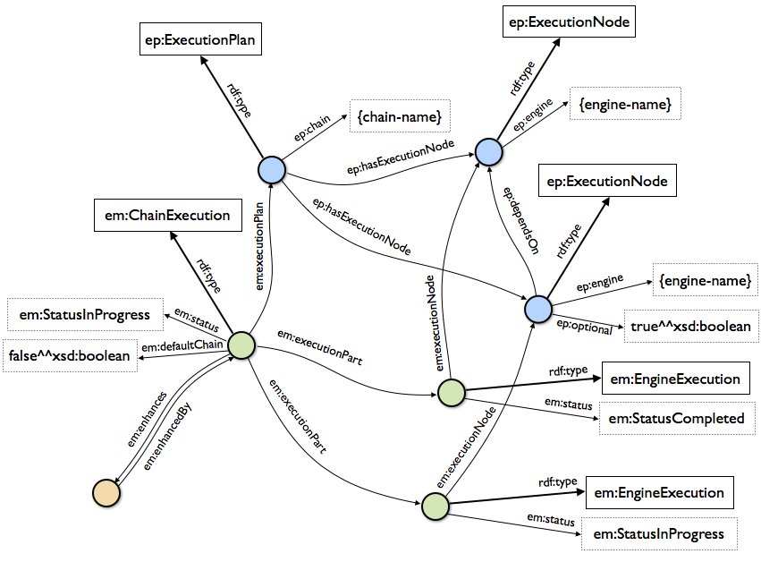

- Namespace: em : http://stanbol.apache.org/ontology/enhancer/executionmetadata#
- **em:Execution** : Super class for all Executions
  - **em:executionPart** (domain:Execution, range: em:ChainExecution): Defines that this execution was part of the execution of a chain
  - **em:status**(domain: em:Execution; range: em:ExecutionStatus): The status of an execution (used for both em:EngineExecution and em:ChainExecution
  - **em:started** (domain: em:Execution; range: xsd:dateTime): Marks the start of the execution
  - **em:completed** (domain: em:Execution; range: xsd:dateTime): Marks the completion of the execution
  - **em:statusMessage** (domain: em:Execution; range: xsd:string): A natural language description providing further information about the status of this execution. Typically used to parse error messages if the execution fails (em:status is set to em:StatusFailed).
- **em:ChainExecution** : Class used to describe the execution of an enhancement chain.
  - **em:defaultChain** (domain: em:ChainExecution; range: xsd:boolean): If the executed chain is currently the default Chain of the Stanbol Enhancer.
  - **em:executionPlan** (domain:ChainExecution; range: ep:ExecutionPlan): Links to the execution plan as provided by the chain.
  - **em:enhances**(domain: em:ChainExecution; range: rdf:Resource) : links the em:ChainExecution with the URI of the processed content item. The range needs to be updated as soon as the Stanbol Enhancement Structure is defined.
  - **em:enhancedBy** (domain: rdf:Resource; range: em:ChainExecution) : links the URI of the content item with the metadata about the enhancement process. The range needs to be updated as soon as the Stanbol Enhancement Structure is defined.
- **em:EngineExecution** : Class used to describe the execution of an EnhancementEngine.
  - **em:executionNode** (domain: em:EngineExecution; range: ep:ExecutionNode): The node within the ExecutionPlan
- **em:ExecutionStatus** : Class describing the status of an EngineExecution
  - **em:StatusScheduled** : ExecutionStatus instance describing that an execution is scheduled but has not yet started
  - **em:StatusInProgress** : ExecutionStatus instance describing that the execution of the linked EngineExecution is in progress
  - **em:StatusCompleted** : ExecutionStatus instance describing that the execution has already completed successfully
  - **em:StatusFailed** : ExecutionStatus indicating that the execution has failed. Typically an em:statusMessage describing the reason for the failed execution is provided for em:Executions with this state.
  - **em:StatusSkipped** : ExecutionStatus indicating that the execution of an ep:ExecutionNode was skipped. This is only allowed for execution nodes that are marked as optional. Typically also an em:statusMessage with the reason should be provided.

<a id="trunk-components-enhancer-executionmetadata--example"></a>

### Example

The following example uses the same properties as used within the [ExecutionPlan](#trunk-components-enhancer-chains-executionplan) section. To make it easier to see the relations between the execution metadata and the execution plan, the triples of the execution plan are included at the end of this example.

This example describes the following situation:

- the execution of the content item with the URI 'urn:contentItem1' with the default chain
- the default chain is represented by a chain with the name "demoChain" the ExecutionPlan has the URI 'urn:execPlan'
- the successful execution of the 'langid' engine (execution: 'urn:exec1', node: 'urn:node1')
- the failed execution of the 'ner' engine (execution: 'urn:exec2', node: 'urn:node2'): As reason for the failure a message is provided that the NER model for the language 'de' is not available
- the successful execution of the 'zemanta' engine (execution: 'urn:exec3', node: 'urn:node5'): This engine was started in parallel to the 'ner' engine - therefore before the chain failed.
- There is no execution of the dbpediaLinking (node: '') and geonamesLinking (node: '') engines because the chain failed before these engines were scheduled. This assumes the EnhancementJobManager does only add em:EngineExecution resources when it starts the processing of an ep:ExecutionNode defined in the execution plan. However, the EnhancementJobManager can also create ep:Execution resources for all execution nodes. In that case there would be also em:EngineExecution resources for the dbpediaLinking and geonamesLinking engines with the em:status set to 'em:StatusScheduled'.

The RDF graph with the Execution Metadata:

```
urn:exec
    rdf:type em:ChainExecution
    em:executionPlan urn:execPlan
    em:enhances urn:contentItem1
    em:defaultChain "true"
    em:started 2012-01-11T12.13.14.156
    em:completed 2012-01-11T12.13.15.157
    em:status em:StatusFailed
    em:statusMessage "Unable to execute EnhancementEngine 'new' \
        (Message: No NER model for language 'de' is available)."
    em:executionPart urn:exec1, urn:exec2, urn:exec3, urn:exec4, urn:exec5

urn:exec1
    rdf:type em:EngineExecution
    em:executionPart urn:exec
    em:executionNode urn:node1
    em:status em:StatusCompleted
    em:started 2012-01-11T12.13.14.160
    em:completed 2012-01-11T12.13.14.250

urn:exec2
    rdf:type em:EngineExecution
    em:executionPart urn:exec
    em:executionNode urn:node2
    em:status StatusFailed
    em:statusMessage "No NER model for language 'de' is available"
    em:started 2012-01-11T12.13.14.253
    em:completed 2012-01-11T12.13.14.289

urn:exec3
    rdf:type em:EngineExecution
    em:executionPart urn:exec
    em:executionNode urn:node5
    em:status StatusCompleted
    em:started 2012-01-11T12.13.14.253
    em:completed 2012-01-11T12.13.15.150
```

The Execution Plan: (copy from the example provided in the ExecutionPlan section)

```
urn:execPlan
    rdf:type ep:ExecutionPlan
    ep:hasExecutionNode urn:node1, urn:node2, urn:node3, urn:node4, urn:node5
    ep:chain "demoChain"

urn:node1
    rdf:type stanbol:ExecutionNode
    ep:inExecutionPlan urn:execPlan
    stanbol:engine langId

urn:node2
    rdf:type ep:ExecutionNode
    ep:inExecutionPlan urn:execPlan
    ep:dependsOn urn:node1
    ep:engine ner

urn:node3
    rdf:type ep:ExecutionNode
    ep:inExecutionPlan urn:execPlan
    ep:dependsOn urn:node1
    ep:engine dbpediaLinking

urn:node4
    rdf:type ep:ExecutionNode
    ep:inExecutionPlan urn:execPlan
    ep:dependsOn urn:node1
    ep:engine geonamesLinking

urn:node5
    rdf:type ep:ExecutionNode
    ep:inExecutionPlan urn:execPlan
    ep:engine zemanta
    ep:optional "true"^^xsd:boolean
```

<a id="trunk-components-enhancer-executionmetadata--creationmanagement-of-execution-metadata"></a>
<a id="trunk-components-enhancer-executionmetadata--creation-management-of-execution-metadata"></a>

## Creation/Management of Execution Metadata

This section is primarily intended for implementors of EnhancementJobManager. However it might also provide insights for users that want/need to monitor the state of enhancement processes as it describes what information are added when to the Execution Metadata.

When the [EnhancementJobManager](#trunk-components-enhancer-enhancementjobmanager) starts the Enhancement of a ContentItem it needs to check if the [ContentItem](#trunk-components-enhancer-contentitem) already contains ExecutionMetadata in the ContentPart with the URI "http://stanbol.apache.org/ontology/enhancer/executionmetadata#ChainExecution". If this is the case it needs to initialize itself based on the pre-existing information. If no ExecutionMetadata are present, a new EnhancementProcess needs to be created based on the parsed Chain. Differences between this two cases are explained in the following two sub sections.

<a id="trunk-components-enhancer-executionmetadata--initialization"></a>

### Initialization

If no ExecutionMetadata are present within a parsed ContentItem, a new EnhancementProcess needs to be set up. This includes the following steps:

1. Get the [ExecutionPlan](#trunk-components-enhancer-chains-executionplan) for the parsed enhancement [Chain](#trunk-components-enhancer-chains). If no chain is parsed the default chain need to be acquired by using the [ChainManager](#trunk-components-enhancer-chains-chainmanager).
2. Create the content part for the ExecutionMetadata with the [ContentItem](#trunk-components-enhancer-contentitem) and add the information of the [ExecutionPlan](#trunk-components-enhancer-chains-executionplan) to it.
3. Create the initial ExecutionMetadata. This includes the 'em:ChainExecution' instance for the 'ep:ExecutionPlan' as well as 'em:EngineExecution' instances for all 'ep:ExecutionNode's defined by the execution plan. All such 'em:Execution' instances MUST BE created with the 'em:ExecutionStatus' 'em:StatusSheduled'.

The ExecutionMetadataHelper utility of the "org.apache.stanbol.enhancer.servicesapi" module contains utility methods for initializing execution metadata.

<a id="trunk-components-enhancer-executionmetadata--continuation"></a>

### Continuation

If the parsed ContentItem does already contain ExecutionMetadata in the content part with the URI "http://stanbol.apache.org/ontology/enhancer/executionmetadata#ChainExecution" the EnhancementJobManager MUST follow the following steps to continue an EnhancementProcess.

1. Check if the contained ExecutionMetadata are valid
   - If a 'em:ChainExecution' node is present that 'em:enhances' the parsed ContentItem
   - If the ExecutionPlan is included and if the value of the 'ep:chain' property for the 'ep:ExecutionPlan' resource corresponds to the name of the Chain parsed in the request.
2. Check the status of all 'em:Execution' instances
   - reset the status of 'em:Execution's that are in-progress to scheduled.
   - TODO: here we could also retry the execution of failed 'em:Execution's

Note that with an continuation the ExecutionPlan MUST NOT be updated. It MUST BE also NOT checked if a Chain with the name as stored in the ExecutionMetadata is still present. Note also that configuration changes of EnhancementEngine will affect the continuation of the enhancement process.

The ExecutionMetadataHelper utility of the "org.apache.stanbol.enhancer.servicesapi" module contains utility methods for reading and validating pre-existing execution metadata.

<a id="trunk-components-enhancer-executionmetadata--execution-state-management"></a>

### Execution State Management

The following metadata need to be updated by the EnhancementJobManager when:

- Enhancement process starts
  - set the 'em:status' of the 'em:ChainExecution' to 'em:StatusInProgress'
  - set the 'em:started' to the current date time
- EnhancementEngine execution starts:
  - set the 'em:status' of the 'em:EngineExecution' to 'em:StatusInProgress'
  - set the 'em:started' to the current date time
- EnhancementEngine completes
  - set the 'em:status' of the 'em:EngineExecution' to 'em:StatusCompleted'
  - set the 'em:completed' to the current date time
- Optional EnhancementEngine not available
  - set the 'em:status' of the 'em:EngineExecution' to 'em:StatusSkipped'
  - set both 'em:started' and 'em:completed' to the current date time
- Optional EnhancementEngine failed
  - set the 'em:status' of the 'em:EngineExecution' to 'em:StatusFailed'
  - set the 'em:completed' to the current date time
- Required EnhancementEngine failed or not available
  - set the 'em:status' of the 'em:EngineExecution' to 'em:StatusFailed'
  - set the 'em:status' of the 'em:ChainExecution' to 'em:StatusFailed'
  - set the 'em:completed' of both the engine and the chain execution to the current date time
- Enhancement process completes
  - set the 'em:status' of the 'em:ChainExecution' to 'em:StatusCompleted'
  - set the 'em:completed' to the current date time
- Internal error in the EnhancementJobManager implementation
  - set the 'em:status' of the 'em:ChainExecution' to 'em:StatusFailed'
  - do not set any 'em:EngineExecution' to failed.
  - set the 'em:completed' value of the 'em:ChainExecution' to the current date time

The ExecutionMetadataHelper utility of the "org.apache.stanbol.enhancer.servicesapi" module contains utility methods to preform state transitions on 'em:Execution' instances.

<a id="trunk-components-enhancer-executionmetadata--using-executionmetadata"></a>

## Using ExecutionMetadata

This section provides some examples on how to access and retrieve information from the ExecutionMetadata.

<a id="trunk-components-enhancer-executionmetadata--accessing-executionmetadata"></a>

### Accessing ExecutionMetadata

The ExecutionMetadata and the [ExecutionPlan](#trunk-components-enhancer-chains-executionplan) are stored in a content part with with URI "http://stanbol.apache.org/ontology/enhancer/executionmetadata#ChainExecution" with the [ContentItem](#trunk-components-enhancer-contentitem). The following code segment can be used to retrieve the RDF graph with the ExecutionMetadata:

```
ContentItem ci;
//the ContentItem //the URI is available as constant of the ExecutionMetadata class UriRef contentPartURI =ExecutionMetadata.CHAIN_EXECUTION;
MGraph executionMetadata =ci.getPart (contentPartURI,MGraph.class );
```

The ExecutionMetadata are stored as read-/writeable RDF graph. To parse a read-only version to other components one can use the "getGraph()" method defined by MGraph.

<a id="trunk-components-enhancer-executionmetadata--getting-details-about-the-emchainexecution"></a>
<a id="trunk-components-enhancer-executionmetadata--getting-details-about-the-em:chainexecution"></a>

### Getting details about the em:ChainExecution

The following code segments show how to access information about the execution of the enhancement process for a [ContentItem](#trunk-components-enhancer-contentitem). All directly accessed methods in the examples below are static imports from one of the following two utility classes part of the "org.apache.stanbol.enhancer.servicesapi" module.

- ExecutionPlanHelper: Utility class that provides methods for reading and creating [ExecutionPlan](#trunk-components-enhancer-chains-executionplan).
- ExecutionMetadataHelper: Utility class for reading and manipulating the ExecutionMetadata
- EnhancementEngineHelper: Utility that contains general purpose RDF utilities.

This code example first gets the ChainExecution, ExecutionPlan and Chain name for the enhanced content item. In a second step metadata of all executed EnhancementEngines are retrieved.

```
ContentItem ci;
//the ContentItem MGraph em;
//the ExecutionMetadata //get the ChainExecution, ExecutionPlan and the name of the Chain NonLiteral ce =getChainExecution (em,ci.getUri ()); if (ce !=null ){NonLiteral ep =getExecutionPlan (em,ce ); String chainName =getString (em,ep,ExecutionPlan.CHAIN );} else {log.warn ("ExecutionMetadata of not contain information for " + "ContentItem {}!",ci.getUri ());} //get the EngineExecutions and the name of the Engines Set <NonLiteral> executions =getExecutions (em,ce ); for (NonLiteral ex:executions ){NonLiteral en =getExecutionNode (em,ex ); if (en !=null ){String engineName =getEngine (em,en ); boolean optional =isOptional (em,en );} else {//maybe a sub-chain execution //currently not supported, but might //added in future versions} UriRef status =getStatus (em,ex ); Date started =getStarted (em,ex ); Date completed =getCompleted (em,ex );}
```

Copyright © 2010 The Apache Software Foundation, Licensed under
the [Apache License, Version 2.0](http://www.apache.org/licenses/LICENSE-2.0).
Apache, Stanbol and the Apache feather and Stanbol logos are trademarks of The Apache Software Foundation.

---

<a id="trunk-components-enhancer-nlp-inmemoryanalyzedtextimpl"></a>

<!-- source_url: https://stanbol.apache.org/docs/trunk/components/enhancer/nlp/inmemoryanalyzedtextimpl -->

<!-- page_index: 83 -->

<a id="trunk-components-enhancer-nlp-inmemoryanalyzedtextimpl--in-memory-analyzedtext-and-annotation-implementation"></a>

# In-Memory AnalyzedText and Annotation implementation

This describes the implementation of the [Analyzed Text](https://stanbol.apache.org/docs/trunk/components/enhancer/nlp/analysedtext) used by default by the Stanbol NLP processing module. This implementation is directly contained within the org.apache.stanbol.enhancer.nlp module.

<a id="trunk-components-enhancer-nlp-inmemoryanalyzedtextimpl--analyzedtextfactory"></a>

## AnalyzedTextFactory

The AnalyzedTextFactory of the in-memory implementation registers itself as OSGI service with an "service.ranking" of Integer.MIN\_VALUE. That means that any other registered AnalyzedTextFactory will override this one (unless it does not use Integer.MIN\_VALUE itself).

The implementation uses the ContentItemHelper#getText(Blob blob) method to retrieve the text from the parsed blob. The text is than used to create an AnalyzedText instance.

<a id="trunk-components-enhancer-nlp-inmemoryanalyzedtextimpl--analyzedtext-implementation"></a>

## AnalyzedText Implementation

The in-memory implementation is based on a NavigableMap that uses the same span as both key and value. TreeMap is currently used as implementation. The compareTo(..) method of the Span implementation ensures the correct ordering of Spans as specified by the [Analyzed Text](#trunk-components-enhancer-nlp-analyzedtext) interface. All add\*\*(..) methods first check if a span with the added type, [start,end) is already contained. If this is the case the current span is returned otherwise an new instance is created.

The Iterator implementation is not based on the Iterators provided by the NavigableMap as those would throw ConcurrentModificationExceptions - what is prohibited by the specification. Instead in implementation that is based on the #higherKey() method is used. Filtered Iterators are implemented using Apache Commons Collections FilteredIterator utility with an Predicate based on the SpanTypeEnum.

<a id="trunk-components-enhancer-nlp-inmemoryanalyzedtextimpl--annotation-implementation"></a>

## Annotation Implementation

The implementation of the *Annotated* interface is similar to that of the SolrInputDocument. Internally it uses a Map to store data. When a single value is added it is directly store in the map. In case of multiple values data are stored in Arrays. Arrays are sorted by an comparator that ensures that the value with the highest probability is at index '0'.

Type safety is not checked so creating multiple Annotations with different value types that share the same key will cause ClassCastExceptions at runtime.

---

<a id="trunk-components-factstore-implementation"></a>

<!-- source_url: https://stanbol.apache.org/docs/trunk/components/factstore/implementation.html -->

<!-- page_index: 84 -->

<a id="trunk-components-factstore-implementation--factstore-implementation-concept"></a>

# FactStore Implementation Concept

The [FactStore specification](#trunk-components-factstore-specification) is written with a certain kind of implementation in mind. Although the implementation of the specification is not pretended it might be useful to have a look at this simple implementation concept.

<a id="trunk-components-factstore-implementation--store-implementation"></a>

## Store Implementation

The store implementation is based on the well known concept of relational databases. Each fact schema is a table in a relational database. Creating a new fact schema is equivalent to creating a new table with a number of String attributes, because we store IRIs, according to the schema. For performance reasons the attributes should be indexed.
The store just needs to be able to create new schemata. It is not specified that a schema may be altered over time. This could be an improvement for the future.

<a id="trunk-components-factstore-implementation--query-implementation"></a>

## Query Implementation

The JSON-LD query structure is designed to be mapped directly to valid SQL statements. If the store is implemented in a relational database all queries can be transformed to SQL queries to this database. For security reasons it is important to keep hacks like SQL injection in mind when transforming the JSON-LD query to SQL.

As seen in the examples, queries may use attributes of entities to formulate the request. However, the FactStore does only store the IRIs of the entities not the entities with their attributes. Therefore, the FactStores needs an EntityHub to resolve entities specified by their attributes. The EntityHub must be able to query for entities by example.

Note: Depending on the number of entities returned by the EntityHub for a certain request this architecture may lead to performance problems. It has to be evaluated where the limit of this approach is in terms of performance. However, the assumption is that in many (or most) scenarios this will not become a problem. If it becomes a problem, the type of allowed queries may be restricted, e.g. don't allow queries that use entity attributes in the "where" clause, to avoid performance or memory problems.

---

*Back to [FactStore](#trunk-components-factstore)*

---

<a id="trunk-components-factstore-specification"></a>

<!-- source_url: https://stanbol.apache.org/docs/trunk/components/factstore/specification.html -->

<!-- page_index: 85 -->

<a id="trunk-components-factstore-specification--factstore-specification"></a>

# FactStore Specification

The FactStore is designed to store semantic relations in terms of facts about entities and their relationships. Additionally, the FactStore specifies a simple SQL-like query language expressed in JSON-LD to search for semantic relations and to reason through the use of joined relationships. This specification defines required interfaces for the FactStore in terms of RESTful API interfaces and a [concept for a possible implementation](#trunk-components-factstore-implementation).

In the following, we will refer to semantic relationships as facts about entities. For example, the relation ‘emplyeeOf’ may be a fact about two entities one of type person and one of type organization. Facts are n-ary meaning that the number of participating entities is not limited. The FactStore implements a store for facts plus the ability to query for single facts and for combinations of facts. In summary, the FactStore provides:

- Persistence storage for n-ary facts about entities
- Query language to query for a single fact
- Query language to query for combinations of facts (reasoning)

In the following, we will define the required interfaces for the FactStore plus the required query language.

''Note'': Interfaces will be defined as RESTful service APIs. The payload of service calls is specified using [Specification version 20110507](http://www.json-ld.org/spec/ED/20110507/JSON-LD).

''Note'': The FactStore does not provide any SPARQL endpoint so far. This could be part of an extended version.

<a id="trunk-components-factstore-specification--store-interface"></a>

## Store Interface

The store interface allows clients to put new fact schemata and according facts (instances of that schemata) to the FactStore.

<a id="trunk-components-factstore-specification--publish-a-new-fact-schema"></a>

### Publish a New Fact Schema

Allows clients to publish new fact schemata to the FactStore. Each fact is an n-tuple where each element of that tuple defines a certain type of entity. A fact schema defines which types of entities and their roles are part of instances of that fact.

Path: /factstore/facts/{fact-schema-name}

Method: PUT with data type application/json returns HTTP 201 (created) on success.

Data: The fact schema is sent as the PUT payload in JSON-LD format as a JSON-LD profile. The name of the fact is given by the URL. The elements of the schema are defined in the "#types" section of the JSON-LD "#context". Each element is specified using a unique role name for that entity plus the entity type specified by an URN.

Example 1: PUT /factstore/facts/http%3A%2F%2Fiks-project.eu%2Font%2FemployeeOf with the following data

```
{"@context"  :{"iks"     : "http://iks-project.eu/ont/","#types"  :{"person"       : "iks:person","organization" : "iks:organization"}}}
```

will create the new fact schema for "employeeOf" at the given URL which is in decoded representation: /factstore/facts/http://iks-project.eu/ont/employeeOf

Instead one can use the cURL tool for this. Store the fact schema in a JSON file and then use this command.

```
curl http://localhost:8080/factstore/facts/http%3A%2F%2Fiks-project.eu%2Font%2FemployeeOf -T spec-example1.json
```

Example 2: PUT /factstore/facts/http%3A%2F%2Fwww.schema.org%2FEvent.attendees with the following data

```
{"@context" :{"sorg"       : "http://www.schema.org/","#types"     :{"event"    : "sorg:Event","attendee" : ["sorg:Person","sorg:Organization"]}}}
```

will create the new fact schema for "attendees" at the given URL which is in decoded representation: /factstore/facts/http://www.schema.org/Event.attendees.

''Note'': This fact schema uses the ability to define more than one possible type for a role. The role 'attendee' can be of type http://www.schema.org/Person or http://www.schema.org/Organization.

<a id="trunk-components-factstore-specification--get-fact-schema"></a>

### Get Fact Schema

Allows clients to get the definition of an existing fact schema.

Path: /factstore/facts/{fact-schema-name}

Method: GET with data type application/json returns HTTP 200 on success.

Data: The fact schema is returned as a JSON-LD profile.

Example: GET /factstore/facts/http%3A%2F%2Fiks-project.eu%2Font%2FemployeeOf will return the following data:

```
{"@context" :{"#types"  :{"person"       : "http://iks-project.eu/ont/person","organization" : "http://iks-project.eu/ont/organization"}}}
```

Status: **Implemented**

<a id="trunk-components-factstore-specification--publish-new-facts"></a>

### Publish New Facts

Allows clients to publish a new facts according to a defined fact schema that was previously published to the FactStore. Each new fact is an n-tuple according to its schema where each tuple element identifies an entity using its unique IRI.

Path: /factstore/facts

Method: POST with data type application/json returns HTTP 201 (created) on success.

Data: The facts are sent as the POST payload in JSON-LD format referring to the defined JSON-LD profile. The name of the fact is given in the "@profile" element of the JSON-LD object. The JSON-LD object contains a list of facts under the attribute "facts" where each element of that list is an n-tuple of entity instances according to fhe fact schema. The instance of an entity can be specified either by its unique IRI or by specifying the instance by example.

Using the instance by example variant requires the FactStore to resolve the entity in an EntityHub. An entity by example is specified by defining attributes and required values of the searched entity. A fact can only be stored if all entities can be uniquely identified either by their IRI or by example.

Example 1: POST /factstore/facts with the following data

```
{"@context" : {"iks" : "http://iks-project.eu/ont/","upb" : "http://upb.de/persons/" },"@profile"     : "iks:employeeOf","person"       : { "@iri" : "upb:bnagel" },"organization" : { "@iri" : "http://uni-paderborn.de"}}
```

creates a new fact of type http://iks-project.eu/ont/employeeof specifying that the person http://upb.de/persons/bnagel is employee of the organization defined by the IRI http://uni-paderborn.de.

Example 2: POST /factstore/facts with the following data to create several facts of the same type at once

```
{"@context":{"iks":"http://iks-project.eu/ont/","upb":"http://upb.de/persons/" },"@profile":"iks:employeeOf","@":[{"person":{"@iri":"upb:bnagel" },"organization":{"@iri":"http://uni-paderborn.de"} },{"person":{"@iri":"upb:fchrist" },"organization":{"@iri":"http://uni-paderborn.de"}}]}
```

creates two new facts of type http://iks-project.eu/ont/employeeof specifying that the persons http://upb.de/persons/bnagel and http://upb.de/persons/fchrist are employees of the organization defined by the IRI http://uni-paderborn.de.

Example 3: POST /factstore/facts with the following data to create several facts of different type

```
{"@context":{"iks":"http://iks-project.eu/ont/","upb":"http://upb.de/persons/" },"@":[{"@profile":"iks:employeeOf","person":{"@iri":"upb:bnagel" },"organization":{"@iri":"http://uni-paderborn.de"} },{"@profile":"iks:friendOf","person":{"@iri":"upb:bnagel" },"friend":{"@iri":"upb:fchrist"}}]}
```

creates two new facts. The first one of type http://iks-project.eu/ont/employeeof specifying that the person http://upb.de/persons/bnagel is employee of the organization defined by the IRI http://uni-paderborn.de. The second of type http://iks-project.eu/ont/friendOf specifying that http://upb.de/persons/fchrist is a friend of http://upb.de/persons/bnagel.

Status: **Implemented**

<a id="trunk-components-factstore-specification--query-interface"></a>

## Query Interface

The query interface allows clients to query for facts and combination of facts (reasoning). The JSON-LD query structure is inspired by SQL using SELECT FROM [JOIN] WHERE constructs. Depending on the implementation the JSON-LD queries may be transformed directly into valid SQL queries.

<a id="trunk-components-factstore-specification--query-for-facts-of-a-certain-type"></a>

### Query for Facts of a Certain Type

Allows clients to query stored facts of a specific type defined by the fact's schema. The clients specify the desired fact plus an arbitrary number of entities that play some role in the fact.

Path: /factstore/query

Method: POST with data type application/json returns application/json

Data: The query is specified by a JSON-LD object in the payload of the request. The query defines a "select" to specify the desired type of result to be returned in the result set. The "from" part specifies the fact type to query and the "where" clause specifies constraints to be fulfilled.

*Note*: For the moment constraints only support the equals "=" relation. There may be more relations like ">" in future versions of this specification. If there is more than one constraint all constraints are concatenated by "AND".

Example 1: POST /factstore/query with the following data

```
{"@context" : {"iks" : "http://iks-project.eu/ont/" },"select" : [ "person" ],"from"   : "iks:employeeOf","where"  : [{"="  : {"organization" : { "@iri" : "http://uni-paderborn.de" }}}]}
```

returns the list of all persons participating in the fact of type http://iks-project.eu/ont/employeeOf where the organization is http://uni-paderborn.de. The result is sent back in JSON-LD format with the result set specified by the select clause.

```
{"@subject" : [{"@subject" : "_bnode1","PERSON"   : "http://upb.de/persons/gengels" },{"@subject" : "_bnode2","PERSON"   : "http://upb.de/persons/ssauer" },{"@subject" : "_bnode3","PERSON"   : "http://upb.de/persons/bnagel" },{"@subject" : "_bnode4","PERSON"   : "http://upb.de/persons/fchrist"}]}
```

If there is only one entry in the result set, this would be returned as follows.

```
{
  "PERSON"   : "http://upb.de/persons/fchrist"
}
```

Status: **Example 1 is implemented**.

Example 2: GET /factstore/query?q= with the following data as the request parameter "q"

```
{"@context" : {"iks" : "http://iks-project.eu/ont/" },"select" : ["person.name", "person.email" ],"from" : "iks:employeeOf","where" : [{"=" : {"organization" : { "@iri" : "http://upb.de" }}}]}
```

returns a list with names and e-mail addresses of all persons participating in the fact of type http://iks-project.eu/ont/employeeOf where the organization is http://upb.de. The result is sent back in JSON-LD format with the result set specified by the select clause.

```
{"resultset": [{ "person.name" : "Gregor Engels","person.email": "engels@upb.de"  },{ "person.name" : "Stefan Sauer","person.email": "sauer@upb.de"   },{ "person.name" : "Benjamin Nagel","person.email": "nagel@upb.de"   },{ "person.name" : "Fabian Christ","person.email": "christ@upb.de"  }]}
```

Status: **Example 2 is NOT Implemented, yet.**

<a id="trunk-components-factstore-specification--query-for-combinations-of-facts"></a>

### Query for Combinations of Facts

Allows clients to query for combinations of facts.

Path: /factstore/query?q=

Method: GET with data type application/json returns application/json

Data: The query is specified by a JSON-LD object in request parameter "q" of the request. The query defines a "select" to specify the desired type of result to be returned in the result set. Instead of using a "from" part this type of query supports joins over facts using the "join" field. The "join" field specifies which facts are joined by specifying the elements of the facts that are evaluated to be equal during the join. The "where" clause specifies constraints over the join to be fulfilled.

*Note*: For the moment constraints only support the equals "=" relation. There may be more relations like ">" in future versions of this specification. If there is more than one constraint all constraints are concatenated by "AND".

Example: GET /factstore/query?q= with the following request data in request parameter "q"

```
{"@context" : {"iks" : "http://iks-project.eu/ont/" },"select": ["iks:friendOf.friend.name" ],"join" : {"iks:employeeOf.person" : "iks:friendOf.person" },"where" : [{"=" : {"iks:employeeOf.organization" : {"@iri" : "http://upb.de"}} },{"=" : {"iks:friendOf.friend.city" : "Paderborn"}}]}
```

will return a list of names of all the friends living in Paderborn of the employees of the University of Paderborn. The result in JSON-LD format would look like the following.

```
{"@context" : {"iks" : "http://iks-project.eu/ont/" },"resultset": [{ "iks:friendOf.friend.name" : "Schmidt"   },{ "iks:friendOf.friend.name" : "Meier"     },{ "iks:friendOf.friend.name" : "Schneider" },{ "iks:friendOf.friend.name" : "Schuster"  }]}
```

Status: **NOT Implemented, yet.**

---

*Back to [FactStore](#trunk-components-factstore)*

Copyright © 2010 The Apache Software Foundation, Licensed under
the [Apache License, Version 2.0](http://www.apache.org/licenses/LICENSE-2.0).
Apache, Stanbol and the Apache feather and Stanbol logos are trademarks of The Apache Software Foundation.

---

<a id="trunk-components-ontologymanager-registry-language"></a>

<!-- source_url: https://stanbol.apache.org/docs/trunk/components/ontologymanager/registry/language -->

<!-- page_index: 86 -->

<a id="trunk-components-ontologymanager-registry-language--ontology-registry-language"></a>

# Ontology Registry Language

To create an ontology registry, simply create an ontology and upload it somewhere on the Web.
Supported formats are RDF/XML, OWL/XML, Turtle, N3, Manchester OWL Syntax and OWL Functional Syntax. RDF/JSON and JSON-LD are not supported.

The ontology must contain individuals of type [<http://www.ontologydesignpatterns.org/cpont/codo/coddata.owl#OntologyLibrary>](http://www.ontologydesignpatterns.org/cpont/codo/coddata.owl#OntologyLibrary) (libraries) and/or [<http://www.ontologydesignpatterns.org/cpont/codo/codkernel.owl#Ontology>](http://www.ontologydesignpatterns.org/cpont/codo/codkernel.owl#Ontology) (ontologies referenced by libraries). The URI that identifies an individual of type Ontology MUST be the (dereferenceable) physical location of the ontology document, no matter if it differs from the actual ontology ID (which is found out only after the ontology is laoded).

Relations between libraries and ontologies are assertions on the properties [<http://www.ontologydesignpatterns.org/schemas/meta.owl#hasOntology>](http://www.ontologydesignpatterns.org/schemas/meta.owl#hasOntology) (with subject of type OntologyLibrary and object of type Ontology) and [<http://www.ontologydesignpatterns.org/schemas/meta.owl#isOntologyOf>](http://www.ontologydesignpatterns.org/schemas/meta.owl#isOntologyOf) (with inverted subject and object types). It does not matter which property you choose.

<a id="trunk-components-ontologymanager-registry-language--examples"></a>

## Examples

Given the prefix mappings:

```
@prefix meta: <http://www.ontologydesignpatterns.org/schemas/meta.owl#> .
@prefix owl: <http://www.w3.org/2002/07/owl#> .
@prefix rdf: <http://www.w3.org/1999/02/22-rdf-syntax-ns#> .
@prefix rdfs: <http://www.w3.org/2000/01/rdf-schema#> .
@prefix : <http://www.example.org/ontologies/registries#> .
@base <http://www.example.org/ontologies/registries> .
```

The following RDF code (in Turtle syntax) shows how to create an OWL individual for a library called SocialOntologies which contains the ontologies of [SIOC](http://sioc-project.org/ontology) and [Provenance](http://trdf.sourceforge.net/provenance/ns.html).

```
:SocialOntologies rdf:type <http://www.ontologydesignpatterns.org/cpont/codo/coddata.owl#OntologyLibrary> ;
          rdfs:label "Social Network Ontologies"^^xsd:string ;
          meta:hasOntology <http://rdfs.org/sioc/ns> ;
          meta:hasOntology <http://trdf.sourceforge.net/provenance/ns.rdf> .
```

You can also specify Library-Ontology relations the other way around, by stating them in the OWL individual that represents the ontology.

```
<http://rdfs.org/sioc/ns> rdf:type <http://www.ontologydesignpatterns.org/cpont/codo/codkernel.owl#Ontology> ;
          meta:isOntologyOf :SocialOntologies .
```

---

*[Back to Registry Manager](#trunk-components-ontologymanager-registry)*

*[Back to Ontology Manager](#trunk-components-ontologymanager)*

---

<a id="trunk-contentenhancement"></a>

<!-- source_url: https://stanbol.apache.org/docs/trunk/contentenhancement.html -->

<!-- page_index: 87 -->

# Downloads

[](https://stanbol.apache.org/index.html)

- [Getting Started](#trunk-tutorial)
- [Documentation](#trunk)
  - [Usage Scenarios](#trunk-scenarios)
  - [Components](#trunk-components)
  - [Production Mode](#trunk-production-mode)
- [Development](https://stanbol.apache.org/development/)
  - [Mailing Lists](https://stanbol.apache.org/development/index.html#mailing_lists)
  - [Issue Tracker](https://stanbol.apache.org/development/index.html#issue_tracker)
  - [Source Code](https://stanbol.apache.org/development/index.html#source_code)
  - [Development Practices](https://stanbol.apache.org/development/index.html#development_practices)

<a id="trunk-contentenhancement--downloads"></a>

# Downloads

- [Overview](https://stanbol.apache.org/downloads/)
  - [Releases](https://stanbol.apache.org/downloads/releases.html)
  - [Launchers](https://stanbol.apache.org/downloads/launchers.html)

<a id="trunk-contentenhancement--project"></a>

# Project

- [Team](https://stanbol.apache.org/team.html)
- [License](http://www.apache.org/licenses/LICENSE-2.0)
- [Privacy Policy](https://stanbol.apache.org/privacy-policy.html)

<a id="trunk-contentenhancement--archived-docs"></a>

# Archived Docs

- [0.9.0-incubating](https://stanbol.apache.org/docs/0.9.0-incubating/)

<a id="trunk-contentenhancement--the-asf"></a>

# The ASF

- [Apache Software Foundation](http://www.apache.org)
- [Thanks](http://www.apache.org/foundation/thanks.html)
- [Become a Sponsor](http://www.apache.org/foundation/sponsorship.html)
- [Security](http://www.apache.org/security/)

[](https://stanbol.apache.org/doap.rdf)

Copyright © 2010 The Apache Software Foundation, Licensed under
the [Apache License, Version 2.0](http://www.apache.org/licenses/LICENSE-2.0).
Apache, Stanbol and the Apache feather and Stanbol logos are trademarks of The Apache Software Foundation.

---

<a id="trunk-enhancementusage"></a>

<!-- source_url: https://stanbol.apache.org/docs/trunk/enhancementusage.html -->

<!-- page_index: 88 -->

<a id="trunk-enhancementusage--making-use-of-apache-stanbol-enhancements"></a>

# Making use of Apache Stanbol Enhancements

This document describes how to implement client side, i.e. user interface components by using the [enhancement results](#trunk-components-enhancer-enhancementstructure) returned by the [Apache Stanbol Enhancer](#trunk-components-enhancer). It does so by using three different scenarios:

- **Entity Tagging** - replacing text based tags such as "Bob Marley" with entities - [dbpedia:Bob\_Marley](http://dbpedia.org/resource/Bob_Marley) - to improve content search and categorization. As added value this can also be used for mashups with already available information about linked entities and search engine optimization by [including metadata](http://schema.org/docs/datamodel.html) of tagged entities within the content.
- **Entity Disambiguation** - enhance the entity tagging experience by explicit support for disambiguation between different suggested entities. This allows users to explicitly link to Paris (Texas), Bob Marley (Comedian) or in between any other entities that do share similar labels.
- **Entity Checker** - interact with extracted entities similar as with todays spellchecker: Show extracted/suggested dirtily within the content; Allow users to interact with suggestions and to disambiguate between different matches if necessary; Support search for additional/other entities.

This usage scenario assumes that you already know [how to enhance content](#trunk-contentenhancement) via the [Enhancer's RESTful API](#trunk-components-enhancer-enhancerrest). If not, you might want to read about [content enhancement](#trunk-contentenhancement).

<a id="trunk-enhancementusage--entity-tagging-use-tags-to-relate-you-content-to-persons-places-events"></a>
<a id="trunk-enhancementusage--entity-tagging:-use-tags-to-relate-you-content-to-persons-places-events"></a>

## Entity Tagging: Use tags to relate you content to persons, places, events …

Entity tagging is about suggesting user defined entities instead of strings to tag their documents. The difference is very easy to explain. Let's assume a blogger that uses the tag "Bob Marley" to tag a blog entry. Tagging is all about structuring content. By tagging it with "Bob Marley" he can easily find all documents that uses that tag. However, most likely he would also want to create a category of documents about reggae music and most likely he would like that documents tagged with "Bob Marley" are part of that group.

While the knowledge that "Bob Marley" is related to reggae music might be obvious for the blogger as a person it can not be known by the blogging tool she uses. Typically the only way to solve this is that the blogger tags the document with both tags.

Entity tagging tries to work around that by linking documents with entities defined by a knowledge base. The fact that Bob Marley is related to reggae music is nothing novel. [DBpedia](http://dbpedia.org), the Wikipedia database, does know that and a lot more about the entity [dbpedia:Bob\_Marley](http://dbpedia.org/resource/Bob_Marley). If the blogger tags her document with "dbpedia:Bob\_Marley", she does not only tag it with "Bob Marley" but also with all the other contextual information provided by DBPedia - including the fact that Bob Marley was a reggae interpret.

But this does not only work with famous people, big cities, etc. Nowadays the Web [links data](http://linkeddata.org) of different domains. However, this is not only about the Web - it works even better if you use entities relevant to yourself and/or your working environment (products, articles, customers, etc).

<a id="trunk-enhancementusage--suggest-entities-with-the-apache-stanbol-enhancer"></a>

### Suggest entities with the Apache Stanbol Enhancer

Requesting the Apache Stanbol Enhancer to analyze a text requires to send a POST request as defined by the [RESTful API](#trunk-components-enhancer-enhancerrest).

```
curl -X POST -H "Accept: application/rdf+xml" -H "Content-type: text/plain" \
 --data "The Stanbol enhancer can detect famous cities such as \
         Paris and people such as Bob Marley." http://{host}:{port}/enhancer
```

As response you will receive the enhancement results formatted as an RDF graph in a serialization format specified by the "Accept" header ('application/rdf+xml' in the above example request). This RDF graph contains the information about the entities extracted from the parsed content. See the documentation of the Apache Stanbol [enhancement structure](#trunk-components-enhancer-enhancementstructure) for details.

The following figure shows how extracted entities are described in the enhancement results.


In principle there are two resources that are of interest for the entity tagging use case:

1. [EntityAnnotation](#trunk-components-enhancer-enhancementstructure--fiseentityannotation)s: Resources with the 'rdf:type' 'fise:EntityAnnotation' do represent the entity suggestions by the Apache Stanbol Enhancer. This resources provide the label, type and most important the URI of the extracted entity. In addition the value of the fise:confidence' [0..1] can be used as indication how certain the Apache Stanbol Enhancer is about this entity.
2. Entities: This refers to all resources with an incoming 'fise:entity-reference' relation (such as 'dbpedia:Bob\_Marley' in the above example). Enhancement engines can be configured to "dereference" suggested entities - meaning to use the URI of the entity to retrieve additional information. In this case, additional information about suggested entities will be available in the enhancement results. If this in not the case, users will need to dereference suggested entities themselves.

<a id="trunk-enhancementusage--process-suggested-entities"></a>

### Process Suggested Entities

The following steps are typically needed to acquire the information needed to implement an entity tagging user interface:

1. Iterate over all suggested entities: These are all resources such as "{entity-annotation} rdf:type [fise:EntityAnnotation](#trunk-components-enhancer-enhancementstructure--fiseentityannotation)"
2. Basic information: Those are available directly via the {entity-annotation} to ensure their availability even if the {entity} itself in not not included - dereferenced - in the enhancement results.
   - URI of the suggested entity: {entity-annotation} fise:entity-reference {entity}
   - Label: The value of the fise:entity-label is typically the label via that the entity was recognized in the analyzed content. Additional labels are typically available via the {entity}
   - Types: Tha value of the fise:entity-type property of the {entity-annotation} are the same as the rdf:type values of the {entity}.
   - Confidence: The 'fise:confidence' value represent how confident the Apache Stanbol Enhancer is about this suggestion. Values are in the range [0..1] where 0 means very uncertain and 1 represent a high certainly.
3. Dereferenced {entity}: Some enhancement engines support to add also information about suggested entities to the enhancement results - in other words: to dereference suggested entities. In this case, additional information about the entity can be retrieved directly from the enhancement results. Note that those information include all available labels (in all languages) of the entity.
4. Dereferencing suggested entities: If the suggested entity is available via the Apache Stanbol Entityhub the {entity-anntotation} does have the 'entityhub:site' property. The value of this property is the name of the referenced site of the Entityhub. To dereference the entity a GET request to "{stanbol-root-URL}/entityhub/site/{site-name}/entity?id={entity}" need to be used. The "Accept" header of the request need to be set to the according RDF serialization (e.g. "application/rdf+json").

<a id="trunk-enhancementusage--process-content-categorizations"></a>

### Process Content Categorizations

[fise:TopicAnnotation](#trunk-components-enhancer-enhancementstructure--fisetopicannotation) instances are used to formally represent categories assigned to the parsed Content. The main difference between extracted entities and assigned categories is that extracted entities do have one or more explicit mentions within the text while assigned categories are suggested based on the document as a whole - typically they are not explicitly mentioned in the text.

Typically, an entity tagging UI will want to distinguish between categories and entities because:

- categories are used to group content (e.g. blog posts about work and private things)
- entities are used to search/suggest blog posts about specific topics (e.g. a blog about some feature implemented for "Apache Solr", a nice event in the "Sternbräu" in "Salzburg")

The usage of [fise:TopicAnnotation](#trunk-components-enhancer-enhancementstructure--fisetopicannotation) is similar to an EntityAnnotation. Both annotation types use the exact same properties ('fise:entity-referene','fise:entity-label',fise:entity-type', 'fise:confidence','entityhub:site'). The only difference is that one need to iterate over '{topic-annotation} rdf:type fise:TopicAnnotaion'. So typically clients will want to use the exact same code to process {entity-annotation} and {topic-annotation} instances.

In the next section we will describe an improved version of entity tagging is described that allows users to: (1) accept/decline a spotted entity and than (2) select one of several suggested entities.

<a id="trunk-enhancementusage--entity-tagging-with-disambiguation-support"></a>

## Entity tagging with disambiguation support

Entity disambiguation is required if an entity detected in the analyzed text can refer to different entities. The following figure shows an example where "Bob Marley" is detected as a person in the text however there are two possible matches within the controlled vocabulary.


The fact that one entity detected in the text - represented by a '[fise:TextAnnotation](#trunk-components-enhancer-enhancementstructure--fisetextannotation)' may have multiple suggested entities - represented by the two 'fise:EntityAnnotation's - has a negative impact on [entity tagging](#trunk-enhancementusage--entity-tagging-use-tags-to-relate-you-content-to-persons-places-events) interface that suggest tags based on 'fise:entityAnnotation's. This is because such an interface would show in the above case two suggestions: (1) for ['dbpedia:Bob\_Marley'](http://dbpedia.org/resource/Bob_Marley) and (2) for [dbpedia:Bob\_Marley\_(comedian)](http://dbpedia.org/resource/Bob_Marley_%28comedian%29). So even if the user want to tag this content with "Bob Marley", she will need to reject at least one of the two suggestions.

Adding explicit support for entity disambiguation to an entity tagging user interface can solve this problem by grouping suggested entities along 'fise:TextAnnotation's they are suggested for.

<a id="trunk-enhancementusage--grouping-suggested-entities"></a>

### Grouping suggested Entities

The goal of an entity tagging UI with disambiguation support is to show only a single tag suggestion for all entities suggested for the same section in the analyzed text. To solve this, we need to follow the link between 'fise:EntityAnnotation' and 'fise:TextAnnotation'.

There are several options on how to achieve this. We present a solution that iterates over the 'fise:EntityAnnotation's.

1. Iterate over all '[fise:EntityAnnotation](#trunk-components-enhancer-enhancementstructure--fiseentityannotation)' instances. This refers to all resources such as "{entity-annotation} rdf:type fise:EntityAnnotation".
   - For more information on how to collect information for extracted entities see the [according section](#trunk-enhancementusage--process-suggested-entities) in the [entity tagging](#trunk-enhancementusage--entity-tagging-use-tags-to-relate-you-content-to-persons-places-events) interface.
2. Retrieve the '[fise:TextAnnotation](#trunk-components-enhancer-enhancementstructure--fisetextannotation)' referenced by processed 'fise:EntityAnnotation's. For this, we retrieve the value(s) of the 'dc:relation' property.
3. While iterating over the 'fise:EntityAnnotation's establish a mapping 'fise:TextAnnotation' -> 'fise:EntityAnnotation','fise:EntityAnnotation, ...
   - the list of 'fise:EntityAnnotation's for each 'fise:TextAnnotation' needs to be sorted based on the value of the 'fise:confidence' property of the EntityAnnotation. Ensure that the EntityAnnotation with the higher confidence is first in the list. 'fise:confidence' values are in the range 0..1 where higher numbers represent a higher certainly.
4. Suggest tags based on 'fise:TextAnnotation's - keys in the mapping created in step (3).
   - Allow users to easily accept the Entity with the highest rank - ['dbpedia:Bob\_Marley'](http://dbpedia.org/resource/Bob_Marley) in the above example. Especially if the confidence of the first suggestion is high (e.g. >= 0.8) and considerable higher as confidence values of other options.
   - Provide users with the possibility to inspect further suggested options - to disambiguate between different options.

<a id="trunk-enhancementusage--showing-the-extraction-context"></a>

### Showing the extraction context

To allow users to more easily disambiguate between the suggested entities it is important to provide them with information about the extraction context of the suggested entities. This is of special importance if content is not completely visible to the user (e.g. because it is to long to fit on the screen or the content is of a type that can not be rendered within the browser).

Assuming the suggested entities are grouped by 'fise:TextAnnotation' - as explained in the above section - one can use the information provided by the TextAnnotation to visualize the context and therefore helping the user performing the disambiguation task.

The following information of the [TextAnnotation](#trunk-components-enhancer-enhancementstructure--fisetextannotation) can be used for this task:

- 'fise:selection-context': This is the text surrounding the extracted entity. The exact size of this context depends on the configuration and the enhancement engine. Typically it is the current sentence or about 50 charters before an after the selection.
- 'fise:selected-text': This is the text representing the extracted entity - the section of the text the entity was suggested for. The 'fise:selected-text' MUST BE contained within the 'fise:selection-context' so user interfaces to want to highlight the selected part of the context can use a contains query in the selection context for the selected text. In case of multiple matches it is typically sufficient to highlight all occurrences.
- 'fise:start' and 'fise:end' values could be also used to determine the location however because those offset are relative to the start of the content it is typically easier to use the occurrences of the selected text within the selection context.

<a id="trunk-enhancementusage--entity-checker-inline-editing-of-content-enhancements"></a>

## Entity checker - inline editing of content enhancements

This describes a user interface similar to one of a spell/grammar checker. Instead of marking misspelled words entities recognized within the text are suggested to the user. The following figure shows such an interface as implemented by the [hallo.js](http://hallojs.org) combined with the [annotate.js](https://github.com/szabyg/annotate.js) plugin (see the [demo here](http://hallojs.org/annotate.html) (last accessed 2012-05-30) - click in the Text and press the "annotate" button).

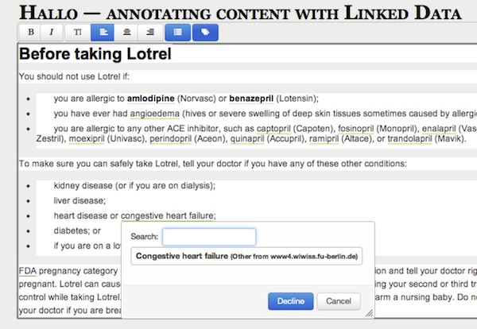

To implement user interfaces like that one needs to (1) show occurrences of extracted features within the text and (2) let the user interact with suggested entities.

<a id="trunk-enhancementusage--visualise-occurrences-of-extracted-features"></a>

### Visualise occurrences of extracted features

The occurrence of extracted features are represented by instances of the concept '[fise:TextAnnotation](#trunk-components-enhancer-enhancementstructure--fisetextannotation)'. The next figure shows how TextAnnotations describe the occurrence of an recognized feature in the parsed text.


Applications that want to visualize extracted features will need to follow/implement the following steps:

Typically the following steps are required to correctly show extracted features within the content.

1. Query for/iterate over '[fise:TextAnnotation](#trunk-components-enhancer-enhancementstructure--fisetextannotation)'s of the enhancement results.
   - it is important to only use TextAnnotations that define a 'fise:selected-text' property. TextAnnotations that do not define this property usually select whole sections or even the document as a whole. While such TextAnnotations are important (e.g. for annotating the language of the Text) they are of no interest for this use case and need therefore to be ignored.
2. Determine the exact occurrence of the TextAnnoations
   - in case of plain text content this can be easily done by using the values of 'fise:start' and 'fise:end'
   - in case the content includes additional markup the char indexes of 'fise:start'/'fise:end' will not match. In such cases the preferred way is to first search the occurrence of'fise:selection-context' and thann the occurrence of 'fise:selected-text' within.
3. Retrieve the suggestions ('fise:TextAnnoation' instances) for a given TextAnnotation. For that one needs to search for "?suggestion dc:relation {text-annotation}" where '{text-annotation}' refers to the URI of the current TextAnnotation. Note that:
   - Not every TextAnnotation will have suggestions
   - One and the same suggestion might be linked with several TextAnnotations.

The following SPARQL query could be used to select all the required information. However, the use of SPARQL is optional as the required information can be also easily retrieved by other means (e.g. by filtered iteratros as typically provided by RDF frameworks).

```
select * 
from {
    ?textAnnotation rdfs:type fise:TextAnnotation
    ?textAnnotation fise:selected-text ?selected
    ?textAnnotation fise:selection-context ?context
    ?textAnnotation fise:start ?startIndex
    ?textAnnotation fise:end ?endIndex
    ?textAnnotation dc:type ?nature
    optional { 
        ?suggestions dc:relation ?textAnnotation 
    }
}
```

*Tips and Tricks:*

- Applications that want to differentiate between different types of extracted entities (e.g. applying different stylesheets for persons, organizations and places) can use the value of the 'dc:type' for that purpose. See the section for [fise:TextAnnotation](#trunk-enhancementusage--fisetextannotation) for detailed information.

<a id="trunk-enhancementusage--interact-with-suggested-entities"></a>

### Interact with suggested entities

This section explains how users mitt want to interact with extracted/suggested entities. Extracted entities are represented by '[fise:EntityAnnotation](#trunk-components-enhancer-enhancementstructure--fiseentityannotation)'s. Those EntityAnnotations are linked with the [TextAnnotation](#trunk-components-enhancer-enhancementstructure--fisetextannotation) (occurrences) and to the entity of the used knowledge base. The following figure shows an example for an EntityAnnotation that suggests the entity ['dbpedia:Bob\_Marley'](http://dbpedia.org/resource/Bob_Marley) for the TextAnnotation used in the example of the previous section.


The main purpose of [EntityAnnotation](#trunk-components-enhancer-enhancementstructure--fiseentityannotation)s is to suggest entities (e.g. ['dbpedia:Bob\_Marley'](http://dbpedia.org/resource/Bob_Marley) for mentions within natural languages texts. While the above example (to keep it simple) shows only a single suggestion in practice one need to distinguish between three different cases - that also imply different interaction needs for users:

1. **No suggestion**: This indicates that a named entity was recognized during natural language processing, but no matching entity was found within the knowledge base. In this case users might want to
   - manually search the knowledge base for an entity. The Apache Stanbol Entityhub sites endpoint can be used to implement this feature by sending a "GET http://{host}:{port}/entityhub/sites/find?name={name}" (see the WebUI of your Stanbol instance for the detailed documentation).
   - Create a new entity based on the current TextAnnotation. In this case the 'fise:selected-text' should be suggested as 'rdfs:label' and the 'dc:type' value could be used for the 'rdf:type'. New entities can be added to the knowledge base by sending a "POST http://{host}:{port}/entityhub/entity" with the RDF data of the Entity as content (see the WebUI of your Apache Stanbol instance for the detailed documentation).
2. **Distinct suggestion**: This means that there is only a single suggestion with a high 'fise:confidence'. Also multiple suggestions where the first one as a high confidence and additional suggestions come with low confidence values may fit this description. In such situations
   - the UI might want to automatically accept the suggestion
   - allow users to show additional suggestion on request.
   - undo automatic acceptance of the suggestion.
3. **Ambiguous Suggestions**: This situation is satisfied if multiple entities are suggested with a medium to high 'fise:confidence'. This also applies to situations where there is no suggestion with an high 'fise:confidence' value. In those cases typically the user must provide additional input by
   - selecting the correct entity
   - rejecting all suggestions
   - also manually searching and/or creating a new Entity as described for (1) would be possible interaction

The required data for for the described interaction patters are available within the enhancement results as follows:

The following assumes {text-annotation} - the URI of the current '[fise:TextAnnotation](#trunk-components-enhancer-enhancementstructure--fisetextannotation)' - as context

1. Query for/iterate over all entity suggestions: The suggestions for {text-annotation} can be acquired by using "?entityAnnotation dc:relation {text-annotation}
   - only results with the the 'rdf:type' 'fise:EntityAnnotation' should be processed. However, typically all results will be any way of that type.
   - the 'fise:confidence' property represents the confidence of the suggestion in the range FROM 0 (very uncertain) TO 1 (very certain). Note that the 'fise:confidence' value is optional - so there might be EntityAnnotations without confidence information. However, all [enhancement engines managed by the Apache Stanbol community](#trunk-components-enhancer-engines-list) do provide confidence information.
2. Visualize suggestions: EntityAnnotations do provide some basic information about the suggested entity that can be used for visualization. Most important the URI of the suggested entity as value of 'fise:referenced-entity'. Additionally, the label and the types of the entity are included.
3. Retrieving additional information about referenced entities: While the EntityAnnotation includes some basic information some users might want to retrieve all available information of referenced entities - to dereference the entity:
   - As this is a rather common use case the EntityLinkingEngine and KeywordLinkingEngine are by default configured to include information of Entities within the EnhancementResults. So users that use those EnhancementEngines will not need to dereference Entities as those information are already available within the enhancement results.
   - If a 'fise:EntityAnnotation' has the 'entityhub:site' property, entities can be dereferenced by using the Apache Stanbol Entityhub (see the section for [fise:EntityAnnotation](#trunk-components-enhancer-enhancementstructure--fiseentityannotation) for details)
   - In all other cases the URI of the suggested entity need to be used for dereferencing. If the referenced entity is part of the [linked data](http://linkeddata.org/) cloud, this is often possible by the [CoolURI](http://www.w3.org/TR/cooluris/) - basically sending a "GET -h "Accept: application/json+rdf" {entity-uri}".

Copyright © 2010 The Apache Software Foundation, Licensed under
the [Apache License, Version 2.0](http://www.apache.org/licenses/LICENSE-2.0).
Apache, Stanbol and the Apache feather and Stanbol logos are trademarks of The Apache Software Foundation.

---

<a id="trunk-multilingual"></a>

<!-- source_url: https://stanbol.apache.org/docs/trunk/multilingual.html -->

<!-- page_index: 89 -->

# Downloads

[](https://stanbol.apache.org/index.html)

- [Getting Started](#trunk-tutorial)
- [Documentation](#trunk)
  - [Usage Scenarios](#trunk-scenarios)
  - [Components](#trunk-components)
  - [Production Mode](#trunk-production-mode)
- [Development](https://stanbol.apache.org/development/)
  - [Mailing Lists](https://stanbol.apache.org/development/index.html#mailing_lists)
  - [Issue Tracker](https://stanbol.apache.org/development/index.html#issue_tracker)
  - [Source Code](https://stanbol.apache.org/development/index.html#source_code)
  - [Development Practices](https://stanbol.apache.org/development/index.html#development_practices)

<a id="trunk-multilingual--downloads"></a>

# Downloads

- [Overview](https://stanbol.apache.org/downloads/)
  - [Releases](https://stanbol.apache.org/downloads/releases.html)
  - [Launchers](https://stanbol.apache.org/downloads/launchers.html)

<a id="trunk-multilingual--project"></a>

# Project

- [Team](https://stanbol.apache.org/team.html)
- [License](http://www.apache.org/licenses/LICENSE-2.0)
- [Privacy Policy](https://stanbol.apache.org/privacy-policy.html)

<a id="trunk-multilingual--archived-docs"></a>

# Archived Docs

- [0.9.0-incubating](https://stanbol.apache.org/docs/0.9.0-incubating/)

<a id="trunk-multilingual--the-asf"></a>

# The ASF

- [Apache Software Foundation](http://www.apache.org)
- [Thanks](http://www.apache.org/foundation/thanks.html)
- [Become a Sponsor](http://www.apache.org/foundation/sponsorship.html)
- [Security](http://www.apache.org/security/)

[](https://stanbol.apache.org/doap.rdf)

Copyright © 2010 The Apache Software Foundation, Licensed under
the [Apache License, Version 2.0](http://www.apache.org/licenses/LICENSE-2.0).
Apache, Stanbol and the Apache feather and Stanbol logos are trademarks of The Apache Software Foundation.

---

<a id="trunk-production-mode-file-bundle-configuration"></a>

<!-- source_url: https://stanbol.apache.org/docs/trunk/production-mode/file-bundle-configuration.html -->

<!-- page_index: 90 -->

<a id="trunk-production-mode-file-bundle-configuration--file-based-bundle-configuration"></a>

# File based bundle configuration

During development and deployment process it can be a pain have to reconfigure all your bundles in the Felix web interface.
Stanbol offer the **bundleconfig** mechanism that allow you to save this configurations and apply them automatically.

A bundleconfig artifact is a Maven project with this structure :

```

    mybundlelistFolder
      |
      |- pom.xml
      |- src
          |- main
              |- resources
                   |- config
                       |- config1.conf
                       |- config2.conf
                       |- ....
```

The pom.xml has nothing special. You can copy [this one](https://svn.apache.org/repos/asf/stanbol/trunk/data/defaultconfig/pom.xml) for example and only adapt group and artifact ID to suit your project naming convention.

The configurations are held by files in the src/main/resources/config folder. This configurations files :

- need to respect this naming convention :
  - {bundleArtifactID}-{uniqueID}.conf, where {uniqueID} can be anything but unique to not be overloaded.
  - for example a configuration file with this name "org.apache.stanbol.enhancer.engines.keywordextraction.engine.KeywordLinkingEngine-entityhub.config" will be used to configure the Keyword Linking Engine bundle.
- contains key-values pairs lines where :
  - the key is the fully qualified name of the property (example : org.apache.stanbol.enhancer.engines.keywordextraction.maxSuggestions)
  - and the value is a string that contains the needed value for the property. To ensure a correct binding between the value in the configuration file and the property's Java type, this conventions are helpfull :
    - *"my value"* : for String properties
    - *B"false"* : for boolean properties
    - *I"5"* : for int properties
    - *["value1","value2"]* : for String collection properties

Of course, this bundleconfig bundle can be added to your [custom launcher and bundlelist](#trunk-production-mode-your-launcher), just be careful to define a higher startlevel to your bundleconfig than the configured bundles' startlevel.

---

<a id="trunk-production-mode-partial-updates"></a>

<!-- source_url: https://stanbol.apache.org/docs/trunk/production-mode/partial-updates.html -->

<!-- page_index: 91 -->

<a id="trunk-production-mode-partial-updates--hot-partial-stanbol-update"></a>

# Hot partial Stanbol update

One of the biggest "cool feature" of OSGI is the capability to update pieces of the server without restart it.
Felix web interface allow you to do this with click, but it's not always comfortable to do this way (production environment, numerous bundles to update,...).
The Apache Sling File Provider allow you to define a folder, where you just have to drop/update/delete your bundle to get your server in sync.

Follow this two step procedure to enjoy this feature :

1. Install the "Sling File Provider" Bundle (not needed as this is included by default in Stanbol)
2. Configure the "sling.fileinstall.dir" property: You can add this to the "{stanbol-working-dir}/stanbol/sling.properties file" or parse it as a system property '-Dsling.fileinstall.dir={path-to-dir}' when you start stanbol.
3. Create the referenced Folder on you file system.

Note : this procedure was extracted for a Rupert Westenthaler's [mail](http://markmail.org/message/jpxpl6x4nkmz6kda). Thanks to him to spot it !

---

<a id="trunk-production-mode-your-launcher"></a>

<!-- source_url: https://stanbol.apache.org/docs/trunk/production-mode/your-launcher.html -->

<!-- page_index: 92 -->

<a id="trunk-production-mode-your-launcher--build-your-launcher"></a>

# Build your launcher

<a id="trunk-production-mode-your-launcher--principle"></a>

# Principle

A Stanbol launcher is a big set of bundles that work together and provide features packages (EntityHub, ContentHub, Enhancer,...). Each features package need a list of bundles to work smoothly.

Thanks for Stanbol design, you can have in your server only some of the proposed features package (for example only the EntityHub and Enhancer, without others features). Then you only need required bundles for the features package you want.
But identify and manually add all feature's required bundles can be pain and long. Hopefully, the **bundlelist** mechanism allow the creation of specific set of bundles that will be added together to the launcher and started in the right way.

Stanbol launcher's use this bundlelist mechanism. Let's dive into the details.

<a id="trunk-production-mode-your-launcher--use-existing-bundlelists-to-build-your-launcher"></a>

# Use existing bundlelists to build your launcher

<a id="trunk-production-mode-your-launcher--dependencies-to-bundlelist"></a>

## Dependencies to bundlelist

- Bundlelist are in fact just jar. So you just need to declare them as dependencies in you launcher pom.xml to get the feature package and all required bundle for it.
- For example, if you want the entityHub feature in you server, you only need to add this dependency to your launcher pom.xml :

`<dependency>`
`<groupId>org.apache.stanbol</groupId>`
`<artifactId>org.apache.stanbol.entityhub.bundlelist</artifactId>`
`<version>0.11.0-SNAPSHOT</version>`
`<type>partialbundlelist</type>`
`<scope>provided</scope>`
`</dependency>`

- Please note the `<type>partialbundlelist</type>` property of the dependency.
- Also in actual Stanbol code base you can easily detect feature package bundlelist as their artifactId has the structure org.apache.stanbol.{feature-name}.bundlelist

<a id="trunk-production-mode-your-launcher--build-your-launcher-2"></a>

## Build *your* launcher

- Let's imagine that for now you only use EntityHub and Enhancer features packages.
- The more simple way to get you custom launcher is to :

  - copy the [full launcher folder](http://svn.apache.org/repos/asf/stanbol/trunk/launchers/full/) to "my-launcher" folder
  - open the my-launcher/pom.xml and change the `<artifactId>org.apache.stanbol.launchers.full</artifactId>` node to `<artifactId>my.launcher</artifactId>`
- Then you get a custom launcher, but still with all the Stanbol features.
- To only keep the features you want (EntityHub and Enhancer in this example), scroll down to the `<dependencies>` part and remove all **but** dependencies labelled with :

  - "The Apache Stanbol lauchpad" and "maven-launchpad-plugin builds on the launchpad.base app" : dependencies required for the launcher to launch
  - "OSGi Framemework Bundle List" : provide all bundle for the OSGI in Stanbol
  - "Stanbol Commons Bundle List" : contains all the feature's shared bundles
  - "Stanbol Data Bundle List" : keep it only if you plan to use dataset provided by Stanbol in the EntityHub
  - "Stanbol Enhancer Bundle List" : will provide all required bundles for the enhancer feature
  - "Stanbol Entityhub Bundle List" : will provide the EntityHub feature
- At the end, your `<dependencies>` section only contains this 7 dependencies.
- Do an "mvn clean install"
- Move to you target folder and launch the my-launcher.jar.
- You get a running Stanbol with only the features you need.

<a id="trunk-production-mode-your-launcher--create-your-own-bundlelist"></a>

# Create your own bundlelist

- Going to the road of Stanbol development and use, you will just not only need to cherry pick Stanbol's features package you want but also provide your own set of bundles directly to the launcher during the building phase.
- The bundlelist mechanism is the perfect and simple way to include your list of bundles into your launcher !

<a id="trunk-production-mode-your-launcher--build-your-bundlelist-dependency"></a>

## Build *your* bundlelist dependency

- Bundlelist (or partialbundlelist) artifact is a really simple Maven project that rely on this structure :

```

    mybundlelistFolder
      |
      |- pom.xml
      |- src
          |- main
              |- bundles
                   |- list.xml
```

- You only need to define 2 files :
  - pom.xml : really simple you can copy-paste the [Enhancer bundlelist](http://svn.apache.org/repos/asf/stanbol/trunk/enhancer/bundlelist/pom.xml) one and only change the groupId and artifactId properties to suit you need. All the magic here is contained in  property.
  - list.xml : this file will contains information about the bundles you want to include. This file has a simple structure :

`<bundles>`
`<startlevel level="L0">`
`<bundle>`
`...Maven groupId,artifactID and version properties...`
`</bundle>`
`<bundle>`
`...another Maven's dependency information...`
`</bundle>`
`</startlevel>`
`<startlevel level="L1">`
`... anothers bundles nodes...`
`</startlevel>`
`</bundles>`

- Start level is an important things to keep in mind as the value of the "level" property will determine when your bundle is started during the server launch.

  - So, if your bundle require some other services to be up and running, be sure to define a higher start level to your bundle that the ones of the required services.
- You can find and extensive bundlelist definition for inspiration in the [Enhancer bundlelist list.xml](http://svn.apache.org/repos/asf/stanbol/trunk/enhancer/bundlelist/src/main/bundles/list.xml).

<a id="trunk-production-mode-your-launcher--add-your-bundlelist-to-your-launcher"></a>

## Add *your* bundlelist to *your* launcher

- Let's says that your bundlelist pom.xml contains :

`<groupId>com.example</groupId>`
`<artifactId>my.bundlelist</artifactId>`
`<version>0.10.0-SNAPSHOT</version>`
`<packaging>partialbundlelist</packaging>`

- Bring your bundles into your launcher only require you to edit my-launcher/pom.xml and add in  section, this one :

`<dependency>`
`<groupId>com.example</groupId>`
`<artifactId>my.bundlelist</artifactId>`
`<version>0.10.0-SNAPSHOT</version>`
`<packaging>partialbundlelist</packaging>`
`</dependency>`

- Stanbol is now all yours !

---
