# Documentation

## Navigation

- Basics of Storm
  - [Tutorial](#tutorial)
  - [Concepts](#concepts)
  - [Scheduler](#storm-scheduler)
  - [Configuration](#configuration)
  - [Guaranteeing message processing](#guaranteeing-message-processing)
  - [Daemon Fault Tolerance](#daemon-fault-tolerance)
  - [Command line client](#command-line-client)
  - [REST API](#storm-ui-rest-api)
  - [Understanding the parallelism of a Storm topology](#understanding-the-parallelism-of-a-storm-topology)
  - [FAQ](#faq)
- Trident
  - [Trident Tutorial](#trident-tutorial)
  - [Trident API Overview](#trident-api-overview)
  - [Trident State](#trident-state)
  - [Trident spouts](#trident-spouts)
  - [Trident RAS API](#trident-ras-api)
- Streams API
  - [Streams API](#stream-api)
- Flux
  - [Flux Data Driven Topology Builder](#flux)
- Setup and Deploying
  - [Setting up a Storm cluster](#setting-up-a-storm-cluster)
  - [Local mode](#local-mode)
  - [Troubleshooting](#troubleshooting)
  - [Running topologies on a production cluster](#running-topologies-on-a-production-cluster)
  - [Building Storm](#maven)
  - [Setting up a Secure Cluster](#security)
  - [CGroup Enforcement](#cgroups_in_storm)
  - [Pacemaker reduces load on zookeeper for large clusters](#pacemaker)
  - [Resource Aware Scheduler](#resource_aware_scheduler_overview)
  - [Generic Resources](#generic-resources)
  - [Daemon Metrics/Monitoring](#clustermetrics)
  - [Windows users guide](#windows-users-guide)
  - [Classpath handling](#classpath-handling)
- Intermediate
  - [Serialization](#serialization)
  - [Common patterns](#common-patterns)
  - [DSLs and multilang adapters](#dsls-and-multilang-adapters)
  - [Using non-JVM languages with Storm](#using-non-jvm-languages-with-storm)
  - [Distributed RPC](#distributed-rpc)
  - [Hooks](#hooks)
  - [Metrics (Deprecated)](#metrics)
  - [Metrics V2](#metrics_v2)
  - [State Checkpointing](#state-checkpointing)
  - [Windowing](#windowing)
  - [Joining Streams](#joins)
  - [Blobstore(Distcache)](#distcache-blobstore)
- Debugging
  - [Dynamic Log Level Settings](#dynamic-log-level-settings)
  - [Searching Worker Logs](#logs)
  - [Worker Profiling](#dynamic-worker-profiling)
  - [Event Logging](#eventlogging)
- Integration With External Systems, and Other Libraries
  - [Apache Kafka Integration](#storm-kafka-client)
  - [Apache HDFS Integration](#storm-hdfs)
  - [JDBC Integration](#storm-jdbc)
  - [JMS Integration](#storm-jms)
  - [Redis Integration](#storm-redis)
- Advanced
  - [Defining a non-JVM language DSL for Storm](#defining-a-non-jvm-language-dsl-for-storm)
  - [Multilang protocol](#multilang-protocol)
  - [Implementation docs](#implementation-docs)
  - [Storm Metricstore](#storm-metricstore)
- References
  - [Concepts](#concepts)
  - [Configuration](#configuration)
  - [Running topologies on a production cluster](#running-topologies-on-a-production-cluster)
  - [Local mode](#local-mode)
  - [Tutorial](#tutorial)
- [Storm Internal Implementation](#implementation-docs)
  - [Structure of the codebase](#structure-of-the-codebase)
  - [Lifecycle of a topology](#lifecycle-of-a-topology)
  - [Message passing implementation](#message-passing-implementation)
  - [Acking framework implementation](#acking-framework-implementation)
  - [Metrics](#metrics)
  - [Nimbus HA](#nimbus-ha-design)
- ["topology.kryo.register": This works a little bit differently than the other ones, since the serializations will be available to all components in the topology. More details on](#serialization)
- [Bolts, Spouts, and Plugins](#configuration)
  - [Setting up a Storm cluster](#setting-up-a-storm-cluster)
  - [Running topologies on a production cluster](#running-topologies-on-a-production-cluster)
  - [Local mode](#local-mode)
- Other pages
  - [Documentation](#index)

## Content

<a id="tutorial"></a>

<!-- source_url: https://storm.apache.org/releases/2.8.3/Tutorial.html -->

<!-- page_index: 1 -->

# Tutorial

In this tutorial, you'll learn how to create Storm topologies and deploy them to a Storm cluster. Java will be the main language used, but a few examples will use Python to illustrate Storm's multi-language capabilities.

<a id="tutorial--preliminaries"></a>

## Preliminaries

This tutorial uses examples from the [storm-starter](https://github.com/apache/storm/blob/v2.8.3/examples/storm-starter) project. It's recommended that you clone the project and follow along with the examples. Read [Setting up a development environment](https://storm.apache.org/releases/2.8.3/Setting-up-development-environment.html) and [Creating a new Storm project](https://storm.apache.org/releases/2.8.3/Creating-a-new-Storm-project.html) to get your machine set up.

<a id="tutorial--components-of-a-storm-cluster"></a>

## Components of a Storm cluster

A Storm cluster is superficially similar to a Hadoop cluster. Whereas on Hadoop you run "MapReduce jobs", on Storm you run "topologies". "Jobs" and "topologies" themselves are very different -- one key difference is that a MapReduce job eventually finishes, whereas a topology processes messages forever (or until you kill it).

There are two kinds of nodes on a Storm cluster: the master node and the worker nodes. The master node runs a daemon called "Nimbus" that is similar to Hadoop's "JobTracker". Nimbus is responsible for distributing code around the cluster, assigning tasks to machines, and monitoring for failures.

Each worker node runs a daemon called the "Supervisor". The supervisor listens for work assigned to its machine and starts and stops worker processes as necessary based on what Nimbus has assigned to it. Each worker process executes a subset of a topology; a running topology consists of many worker processes spread across many machines.

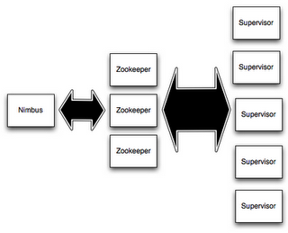

All coordination between Nimbus and the Supervisors is done through a [Zookeeper](http://zookeeper.apache.org/) cluster. Additionally, the Nimbus daemon and Supervisor daemons are fail-fast and stateless; all state is kept in Zookeeper or on a local disk. This means you can kill -9 Nimbus or the Supervisors and they'll start back up as nothing happened. This design leads to Storm clusters being incredibly stable.

<a id="tutorial--topologies"></a>

## Topologies

To do realtime computation on Storm, you create what are called "topologies". A topology is a graph of computation. Each node in a topology contains processing logic, and links between nodes indicate how data should be passed around between nodes.

Running a topology is straightforward. First, you package all your code and dependencies into a single jar. Then, you run a command like the following:

```
storm jar all-my-code.jar org.apache.storm.MyTopology arg1 arg2
```

This runs the class `org.apache.storm.MyTopology` with the arguments `arg1` and `arg2`. The main function of the class defines the topology and submits it to Nimbus. The `storm jar` part takes care of connecting to Nimbus and uploading the jar.

Since topology definitions are just Thrift structs, and Nimbus is a Thrift service, you can create and submit topologies using any programming language. The above example is the easiest way to do it from a JVM-based language. See [Running topologies on a production cluster](#running-topologies-on-a-production-cluster)] for more information on starting and stopping topologies.

<a id="tutorial--streams"></a>

## Streams

The core abstraction in Storm is the "stream". A stream is an unbounded sequence of tuples. Storm provides the primitives for transforming a stream into a new stream in a distributed and reliable way. For example, you may transform a stream of tweets into a stream of trending topics.

The basic primitives Storm provides for doing stream transformations are "spouts" and "bolts". Spouts and bolts have interfaces that you implement to run your application-specific logic.

A spout is a source of streams. For example, a spout may read tuples off of a [Kestrel](http://github.com/nathanmarz/storm-kestrel) queue and emit them as a stream. Or a spout may connect to the Twitter API and emit a stream of tweets.

A bolt consumes any number of input streams, does some processing, and possibly emits new streams. Complex stream transformations, like computing a stream of trending topics from a stream of tweets, require multiple steps and thus multiple bolts. Bolts can do anything from run functions, filter tuples, do streaming aggregations, do streaming joins, talk to databases, and more.

Networks of spouts and bolts are packaged into a "topology" which is the top-level abstraction that you submit to Storm clusters for execution. A topology is a graph of stream transformations where each node is a spout or bolt. Edges in the graph indicate which bolts are subscribing to which streams. When a spout or bolt emits a tuple to a stream, it sends the tuple to every bolt that subscribed to that stream.

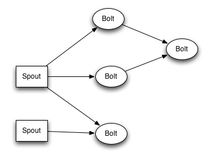

Links between nodes in your topology indicate how tuples should be passed around. For example, if there is a link between Spout A and Bolt B, a link from Spout A to Bolt C, and a link from Bolt B to Bolt C, then every time Spout A emits a tuple, it will send the tuple to both Bolt B and Bolt C. All of Bolt B's output tuples will go to Bolt C as well.

Each node in a Storm topology executes in parallel. In your topology, you can specify how much parallelism you want for each node, and then Storm will spawn that number of threads across the cluster to do the execution.

A topology runs forever, or until you kill it. Storm will automatically reassign any failed tasks. Additionally, Storm guarantees that there will be no data loss, even if machines go down and messages are dropped.

<a id="tutorial--data-model"></a>

## Data model

Storm uses tuples as its data model. A tuple is a named list of values, and a field in a tuple can be an object of any type. Out of the box, Storm supports all the primitive types, strings, and byte arrays as tuple field values. To use an object of another type, you just need to implement [a serializer](#serialization) for the type.

Every node in a topology must declare the output fields for the tuples it emits. For example, this bolt declares that it emits 2-tuples with the fields "double" and "triple":

```java
public class DoubleAndTripleBolt extends BaseRichBolt {private OutputCollectorBase _collector;
@Override public void prepare(Map conf, TopologyContext context, OutputCollectorBase collector) {_collector = collector;}
@Override public void execute(Tuple input) {int val = input.getInteger(0); _collector.emit(input, new Values(val*2, val*3)); _collector.ack(input);}
@Override public void declareOutputFields(OutputFieldsDeclarer declarer) {declarer.declare(new Fields("double", "triple"));}}
```

The `declareOutputFields` function declares the output fields `["double", "triple"]` for the component. The rest of the bolt will be explained in the upcoming sections.

<a id="tutorial--a-simple-topology"></a>

## A simple topology

Let's take a look at a simple topology to explore the concepts more and see how the code shapes up. Let's look at the `ExclamationTopology` definition from storm-starter:

```java
TopologyBuilder builder = new TopologyBuilder();        
builder.setSpout("words", new TestWordSpout(), 10);        
builder.setBolt("exclaim1", new ExclamationBolt(), 3)
        .shuffleGrouping("words");
builder.setBolt("exclaim2", new ExclamationBolt(), 2)
        .shuffleGrouping("exclaim1");
```

This topology contains a spout and two bolts. The spout emits words, and each bolt appends the string "!!!" to its input. The nodes are arranged in a line: the spout emits to the first bolt which then emits to the second bolt. If the spout emits the tuples ["bob"] and ["john"], then the second bolt will emit the words ["bob!!!!!!"] and ["john!!!!!!"].

This code defines the nodes using the `setSpout` and `setBolt` methods. These methods take as input a user-specified id, an object containing the processing logic, and the amount of parallelism you want for the node. In this example, the spout is given id "words" and the bolts are given ids "exclaim1" and "exclaim2".

The object containing the processing logic implements the [IRichSpout](https://javadoc.io/doc/org.apache.storm/storm-client/2.8.3/org/apache/storm/topology/IRichSpout.html) interface for spouts and the [IRichBolt](https://javadoc.io/doc/org.apache.storm/storm-client/2.8.3/org/apache/storm/topology/IRichBolt.html) interface for bolts.

The last parameter, how much parallelism you want for the node, is optional. It indicates how many threads should execute that component across the cluster. If you omit it, Storm will only allocate one thread for that node.

`setBolt` returns an [InputDeclarer](https://javadoc.io/doc/org.apache.storm/storm-client/2.8.3/org/apache/storm/topology/InputDeclarer.html) object that is used to define the inputs to the Bolt. Here, component "exclaim1" declares that it wants to read all the tuples emitted by component "words" using a shuffle grouping, and component "exclaim2" declares that it wants to read all the tuples emitted by component "exclaim1" using a shuffle grouping. "shuffle grouping" means that tuples should be randomly distributed from the input tasks to the bolt's tasks. There are many ways to group data between components. These will be explained in a few sections.

If you wanted component "exclaim2" to read all the tuples emitted by both component "words" and component "exclaim1", you would write component "exclaim2"'s definition like this:

```java
builder.setBolt("exclaim2", new ExclamationBolt(), 5)
            .shuffleGrouping("words")
            .shuffleGrouping("exclaim1");
```

As you can see, input declarations can be chained to specify multiple sources for the Bolt.

Let's dig into the implementations of the spouts and bolts in this topology. Spouts are responsible for emitting new messages into the topology. `TestWordSpout` in this topology emits a random word from the list ["nathan", "mike", "jackson", "golda", "bertels"] as a 1-tuple every 100ms. The implementation of `nextTuple()` in TestWordSpout looks like this:

```java
public void nextTuple() {
    Utils.sleep(100);
    final String[] words = new String[] {"nathan", "mike", "jackson", "golda", "bertels"};
    final Random rand = new Random();
    final String word = words[rand.nextInt(words.length)];
    _collector.emit(new Values(word));
}
```

As you can see, the implementation is very straightforward.

`ExclamationBolt` appends the string "!!!" to its input. Let's take a look at the full implementation for `ExclamationBolt`:

```java
public static class ExclamationBolt implements IRichBolt {OutputCollector _collector;
@Override public void prepare(Map conf, TopologyContext context, OutputCollector collector) {_collector = collector;}
@Override public void execute(Tuple tuple) {_collector.emit(tuple, new Values(tuple.getString(0) + "!!!")); _collector.ack(tuple);}
@Override public void cleanup() {}
@Override public void declareOutputFields(OutputFieldsDeclarer declarer) {declarer.declare(new Fields("word"));}
@Override public Map<String, Object> getComponentConfiguration() {return null;}}
```

The `prepare` method provides the bolt with an `OutputCollector` that is used for emitting tuples from this bolt. Tuples can be emitted at any time from the bolt -- in the `prepare`, `execute`, or `cleanup` methods, or even asynchronously in another thread. This `prepare` implementation simply saves the `OutputCollector` as an instance variable to be used later on in the `execute` method.

The `execute` method receives a tuple from one of the bolt's inputs. The `ExclamationBolt` grabs the first field from the tuple and emits a new tuple with the string "!!!" appended to it. If you implement a bolt that subscribes to multiple input sources, you can find out which component the [Tuple](https://storm.apache.org/javadoc/apidocs/org/apache/storm/tuple/Tuple.html) came from by using the `Tuple#getSourceComponent` method.

There are a few other things going on in the `execute` method, namely that the input tuple is passed as the first argument to `emit` and the input tuple is acked on the final line. These are part of Storm's reliability API for guaranteeing no data loss and will be explained later in this tutorial.

The `cleanup` method is called when a Bolt is being shutdown and should cleanup any resources that were opened. There's no guarantee that this method will be called on the cluster: for example, if the machine the task is running on blows up, there's no way to invoke the method. The `cleanup` method is intended for when you run topologies in [local mode](#local-mode) (where a Storm cluster is simulated in a process), and you want to be able to run and kill many topologies without suffering any resource leaks.

The `declareOutputFields` method declares that the `ExclamationBolt` emits 1-tuples with one field called "word".

The `getComponentConfiguration` method allows you to configure various aspects of how this component runs. This is a more advanced topic that is explained further on [Configuration](#configuration).

Methods like `cleanup` and `getComponentConfiguration` are often not needed in a bolt implementation. You can define bolts more succinctly by using a base class that provides default implementations where appropriate. `ExclamationBolt` can be written more succinctly by extending `BaseRichBolt`, like so:

```java
public static class ExclamationBolt extends BaseRichBolt {OutputCollector _collector;
@Override public void prepare(Map conf, TopologyContext context, OutputCollector collector) {_collector = collector;}
@Override public void execute(Tuple tuple) {_collector.emit(tuple, new Values(tuple.getString(0) + "!!!")); _collector.ack(tuple);}
@Override public void declareOutputFields(OutputFieldsDeclarer declarer) {declarer.declare(new Fields("word"));}}
```

<a id="tutorial--running-exclamationtopology-in-local-mode"></a>

## Running ExclamationTopology in local mode

Let's see how to run the `ExclamationTopology` in local mode and see that it's working.

Storm has two modes of operation: local mode and distributed mode. In local mode, Storm executes completely in a process by simulating worker nodes with threads. Local mode is useful for testing and development of topologies. You can read more about running topologies in local mode on [Local mode](#local-mode).

To run a topology in local mode run the command `storm local` instead of `storm jar`.

<a id="tutorial--stream-groupings"></a>

## Stream groupings

A stream grouping tells a topology how to send tuples between two components. Remember, spouts and bolts execute in parallel as many tasks across the cluster. If you look at how a topology is executing at the task level, it looks something like this:

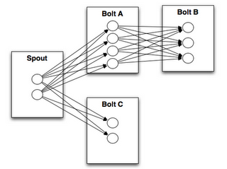

When a task for Bolt A emits a tuple to Bolt B, which task should it send the tuple to?

A "stream grouping" answers this question by telling Storm how to send tuples between sets of tasks. Before we dig into the different kinds of stream groupings, let's take a look at another topology from [storm-starter](https://github.com/apache/storm/blob/v2.8.3/examples/storm-starter). This [WordCountTopology](https://github.com/apache/storm/blob/v2.8.3/examples/storm-starter/src/jvm/org/apache/storm/starter/WordCountTopology.java) reads sentences off of a spout and streams out of `WordCountBolt` the total number of times it has seen that word before:

```java
TopologyBuilder builder = new TopologyBuilder();

builder.setSpout("sentences", new RandomSentenceSpout(), 5);        
builder.setBolt("split", new SplitSentence(), 8)
        .shuffleGrouping("sentences");
builder.setBolt("count", new WordCount(), 12)
        .fieldsGrouping("split", new Fields("word"));
```

`SplitSentence` emits a tuple for each word in each sentence it receives, and `WordCount` keeps a map in memory from word to count. Each time `WordCount` receives a word, it updates its state and emits the new word count.

There are a few different kinds of stream groupings.

The simplest kind of grouping is called a "shuffle grouping" which sends the tuple to a random task. A shuffle grouping is used in the `WordCountTopology` to send tuples from `RandomSentenceSpout` to the `SplitSentence` bolt. It has the effect of evenly distributing the work of processing the tuples across all of `SplitSentence` bolt's tasks.

A more interesting kind of grouping is the "fields grouping". A fields grouping is used between the `SplitSentence` bolt and the `WordCount` bolt. It is critical for the functioning of the `WordCount` bolt that the same word always goes to the same task. Otherwise, more than one task will see the same word, and they'll each emit incorrect values for the count since each has incomplete information. A fields grouping lets you group a stream by a subset of its fields. This causes equal values for that subset of fields to go to the same task. Since `WordCount` subscribes to `SplitSentence`'s output stream using a fields grouping on the "word" field, the same word always goes to the same task and the bolt produces the correct output.

Fields groupings are the basis of implementing streaming joins and streaming aggregations as well as a plethora of other use cases. Underneath the hood, fields groupings are implemented using mod hashing.

There are a few other kinds of stream groupings. You can read more about them on [Concepts](#concepts).

<a id="tutorial--defining-bolts-in-other-languages"></a>

## Defining Bolts in other languages

Bolts can be defined in any language. Bolts written in another language are executed as subprocesses, and Storm communicates with those subprocesses with JSON messages over stdin/stdout. The communication protocol just requires an ~100 line adapter library, and Storm ships with adapter libraries for Ruby, Python, and Fancy.

Here's the definition of the `SplitSentence` bolt from `WordCountTopology`:

```java
public static class SplitSentence extends ShellBolt implements IRichBolt {public SplitSentence() {super("python3", "splitsentence.py");}
public void declareOutputFields(OutputFieldsDeclarer declarer) {declarer.declare(new Fields("word"));}}
```

`SplitSentence` overrides `ShellBolt` and declares it as running using `python3` with the arguments `splitsentence.py`. Here's the implementation of `splitsentence.py`:

```python
import storm

class SplitSentenceBolt(storm.BasicBolt):
    def process(self, tup):
        words = tup.values[0].split(" ")
        for word in words:
          storm.emit([word])

SplitSentenceBolt().run()
```

For more information on writing spouts and bolts in other languages, and to learn about how to create topologies in other languages (and avoid the JVM completely), see [Using non-JVM languages with Storm](#using-non-jvm-languages-with-storm).

<a id="tutorial--guaranteeing-message-processing"></a>

## Guaranteeing message processing

Earlier on in this tutorial, we skipped over a few aspects of how tuples are emitted. Those aspects were part of Storm's reliability API: how Storm guarantees that every message coming off a spout will be fully processed. See [Guaranteeing message processing](#guaranteeing-message-processing) for information on how this works and what you have to do as a user to take advantage of Storm's reliability capabilities.

<a id="tutorial--trident"></a>

## Trident

Storm guarantees that every message will be played through the topology at least once. A common question asked is "how do you do things like counting on top of Storm? Won't you overcount?" Storm has a higher level API called Trident that let you achieve exactly-once messaging semantics for most computations. Read more about Trident [here](#trident-tutorial).

<a id="tutorial--distributed-rpc"></a>

## Distributed RPC

This tutorial showed how to do basic stream processing on top of Storm. There are lots more things you can do with Storm's primitives. One of the most interesting applications of Storm is Distributed RPC, where you parallelize the computation of intense functions on the fly. Read more about Distributed RPC [here](#distributed-rpc).

<a id="tutorial--conclusion"></a>

## Conclusion

This tutorial gave a broad overview of developing, testing, and deploying Storm topologies. The rest of the documentation dives deeper into all the aspects of using Storm.

---

<a id="concepts"></a>

<!-- source_url: https://storm.apache.org/releases/2.8.3/Concepts.html -->

<!-- page_index: 2 -->

# Concepts

This page lists the main concepts of Storm and links to resources where you can find more information. The concepts discussed are:

1. Topologies
2. Streams
3. Spouts
4. Bolts
5. Stream groupings
6. Reliability
7. Tasks
8. Workers

<a id="concepts--topologies"></a>

### Topologies

The logic for a realtime application is packaged into a Storm topology. A Storm topology is analogous to a MapReduce job. One key difference is that a MapReduce job eventually finishes, whereas a topology runs forever (or until you kill it, of course). A topology is a graph of spouts and bolts that are connected with stream groupings. These concepts are described below.

**Resources:**

- [TopologyBuilder](https://javadoc.io/doc/org.apache.storm/storm-client/2.8.3/org/apache/storm/topology/TopologyBuilder.html): use this class to construct topologies in Java
- [Running topologies on a production cluster](#running-topologies-on-a-production-cluster)
- [Local mode](#local-mode): Read this to learn how to develop and test topologies in local mode.

<a id="concepts--streams"></a>

### Streams

The stream is the core abstraction in Storm. A stream is an unbounded sequence of tuples that is processed and created in parallel in a distributed fashion. Streams are defined with a schema that names the fields in the stream's tuples. By default, tuples can contain integers, longs, shorts, bytes, strings, doubles, floats, booleans, and byte arrays. You can also define your own serializers so that custom types can be used natively within tuples.

Every stream is given an id when declared. Since single-stream spouts and bolts are so common, [OutputFieldsDeclarer](https://javadoc.io/doc/org.apache.storm/storm-client/2.8.3/org/apache/storm/topology/OutputFieldsDeclarer.html) has convenience methods for declaring a single stream without specifying an id. In this case, the stream is given the default id of "default".

**Resources:**

- [Tuple](https://javadoc.io/doc/org.apache.storm/storm-client/2.8.3/org/apache/storm/tuple/Tuple.html): streams are composed of tuples
- [OutputFieldsDeclarer](https://javadoc.io/doc/org.apache.storm/storm-client/2.8.3/org/apache/storm/topology/OutputFieldsDeclarer.html): used to declare streams and their schemas
- [Serialization](#serialization): Information about Storm's dynamic typing of tuples and declaring custom serializations

<a id="concepts--spouts"></a>

### Spouts

A spout is a source of streams in a topology. Generally spouts will read tuples from an external source and emit them into the topology (e.g. a Kestrel queue or the Twitter API). Spouts can either be **reliable** or **unreliable**. A reliable spout is capable of replaying a tuple if it failed to be processed by Storm, whereas an unreliable spout forgets about the tuple as soon as it is emitted.

Spouts can emit more than one stream. To do so, declare multiple streams using the `declareStream` method of [OutputFieldsDeclarer](https://javadoc.io/doc/org.apache.storm/storm-client/2.8.3/org/apache/storm/topology/OutputFieldsDeclarer.html) and specify the stream to emit to when using the `emit` method on [SpoutOutputCollector](https://javadoc.io/doc/org.apache.storm/storm-client/2.8.3/org/apache/storm/spout/SpoutOutputCollector.html).

The main method on spouts is `nextTuple`. `nextTuple` either emits a new tuple into the topology or simply returns if there are no new tuples to emit. It is imperative that `nextTuple` does not block for any spout implementation, because Storm calls all the spout methods on the same thread.

The other main methods on spouts are `ack` and `fail`. These are called when Storm detects that a tuple emitted from the spout either successfully completed through the topology or failed to be completed. `ack` and `fail` are only called for reliable spouts. See [the Javadoc](https://javadoc.io/doc/org.apache.storm/storm-client/2.8.3/org/apache/storm/spout/ISpout.html) for more information.

**Resources:**

- [IRichSpout](https://javadoc.io/doc/org.apache.storm/storm-client/2.8.3/org/apache/storm/topology/IRichSpout.html): this is the interface that spouts must implement.
- [Guaranteeing message processing](#guaranteeing-message-processing)

<a id="concepts--bolts"></a>

### Bolts

All processing in topologies is done in bolts. Bolts can do anything from filtering, functions, aggregations, joins, talking to databases, and more.

Bolts can do simple stream transformations. Doing complex stream transformations often requires multiple steps and thus multiple bolts. For example, transforming a stream of tweets into a stream of trending images requires at least two steps: a bolt to do a rolling count of retweets for each image, and one or more bolts to stream out the top X images (you can do this particular stream transformation in a more scalable way with three bolts than with two).

Bolts can emit more than one stream. To do so, declare multiple streams using the `declareStream` method of [OutputFieldsDeclarer](https://javadoc.io/doc/org.apache.storm/storm-client/2.8.3/org/apache/storm/topology/OutputFieldsDeclarer.html) and specify the stream to emit to when using the `emit` method on [OutputCollector](https://javadoc.io/doc/org.apache.storm/storm-client/2.8.3/org/apache/storm/task/OutputCollector.html).

When you declare a bolt's input streams, you always subscribe to specific streams of another component. If you want to subscribe to all the streams of another component, you have to subscribe to each one individually. [InputDeclarer](https://javadoc.io/doc/org.apache.storm/storm-client/2.8.3/org/apache/storm/topology/InputDeclarer.html) has syntactic sugar for subscribing to streams declared on the default stream id. Saying `declarer.shuffleGrouping("1")` subscribes to the default stream on component "1" and is equivalent to `declarer.shuffleGrouping("1", DEFAULT_STREAM_ID)`.

The main method in bolts is the `execute` method which takes in as input a new tuple. Bolts emit new tuples using the [OutputCollector](https://javadoc.io/doc/org.apache.storm/storm-client/2.8.3/org/apache/storm/task/OutputCollector.html) object. Bolts must call the `ack` method on the `OutputCollector` for every tuple they process so that Storm knows when tuples are completed (and can eventually determine that its safe to ack the original spout tuples). For the common case of processing an input tuple, emitting 0 or more tuples based on that tuple, and then acking the input tuple, Storm provides an [IBasicBolt](https://javadoc.io/doc/org.apache.storm/storm-client/2.8.3/org/apache/storm/topology/IBasicBolt.html) interface which does the acking automatically.

Its perfectly fine to launch new threads in bolts that do processing asynchronously. [OutputCollector](https://javadoc.io/doc/org.apache.storm/storm-client/2.8.3/org/apache/storm/task/OutputCollector.html) is thread-safe and can be called at any time.

**Resources:**

- [IRichBolt](https://javadoc.io/doc/org.apache.storm/storm-client/2.8.3/org/apache/storm/topology/IRichBolt.html): this is general interface for bolts.
- [IBasicBolt](https://javadoc.io/doc/org.apache.storm/storm-client/2.8.3/org/apache/storm/topology/IBasicBolt.html): this is a convenience interface for defining bolts that do filtering or simple functions.
- [OutputCollector](https://javadoc.io/doc/org.apache.storm/storm-client/2.8.3/org/apache/storm/task/OutputCollector.html): bolts emit tuples to their output streams using an instance of this class
- [Guaranteeing message processing](#guaranteeing-message-processing)

<a id="concepts--stream-groupings"></a>

### Stream groupings

Part of defining a topology is specifying for each bolt which streams it should receive as input. A stream grouping defines how that stream should be partitioned among the bolt's tasks.

There are eight built-in stream groupings in Storm, and you can implement a custom stream grouping by implementing the [CustomStreamGrouping](https://javadoc.io/doc/org.apache.storm/storm-client/2.8.3/org/apache/storm/grouping/CustomStreamGrouping.html) interface:

1. **Shuffle grouping**: Tuples are randomly distributed across the bolt's tasks in a way such that each bolt is guaranteed to get an equal number of tuples.
2. **Fields grouping**: The stream is partitioned by the fields specified in the grouping. For example, if the stream is grouped by the "user-id" field, tuples with the same "user-id" will always go to the same task, but tuples with different "user-id"'s may go to different tasks.
3. **Partial Key grouping**: The stream is partitioned by the fields specified in the grouping, like the Fields grouping, but are load balanced between two downstream bolts, which provides better utilization of resources when the incoming data is skewed. [This paper](https://melmeric.files.wordpress.com/2014/11/the-power-of-both-choices-practical-load-balancing-for-distributed-stream-processing-engines.pdf) provides a good explanation of how it works and the advantages it provides.
4. **All grouping**: The stream is replicated across all the bolt's tasks. Use this grouping with care.
5. **Global grouping**: The entire stream goes to a single one of the bolt's tasks. Specifically, it goes to the task with the lowest id.
6. **None grouping**: This grouping specifies that you don't care how the stream is grouped. Currently, none groupings are equivalent to shuffle groupings. Eventually though, Storm will push down bolts with none groupings to execute in the same thread as the bolt or spout they subscribe from (when possible).
7. **Direct grouping**: This is a special kind of grouping. A stream grouped this way means that the **producer** of the tuple decides which task of the consumer will receive this tuple. Direct groupings can only be declared on streams that have been declared as direct streams. Tuples emitted to a direct stream must be emitted using one of the [emitDirect](https://javadoc.io/doc/org.apache.storm/storm-client/2.8.3/org/apache/storm/task/OutputCollector.html#emitDirect-int-java.util.Collection-java.util.List-) methods. A bolt can get the task ids of its consumers by either using the provided [TopologyContext](https://javadoc.io/doc/org.apache.storm/storm-client/2.8.3/org/apache/storm/task/TopologyContext.html) or by keeping track of the output of the `emit` method in [OutputCollector](https://javadoc.io/doc/org.apache.storm/storm-client/2.8.3/org/apache/storm/task/OutputCollector.html) (which returns the task ids that the tuple was sent to).
8. **Local or shuffle grouping**: If the target bolt has one or more tasks in the same worker process, tuples will be shuffled to just those in-process tasks. Otherwise, this acts like a normal shuffle grouping.

**Resources:**

- [TopologyBuilder](https://javadoc.io/doc/org.apache.storm/storm-client/2.8.3/org/apache/storm/topology/TopologyBuilder.html): use this class to define topologies
- [InputDeclarer](https://javadoc.io/doc/org.apache.storm/storm-client/2.8.3/org/apache/storm/topology/InputDeclarer.html): this object is returned whenever `setBolt` is called on `TopologyBuilder` and is used for declaring a bolt's input streams and how those streams should be grouped

<a id="concepts--reliability"></a>

### Reliability

Storm guarantees that every spout tuple will be fully processed by the topology. It does this by tracking the tree of tuples triggered by every spout tuple and determining when that tree of tuples has been successfully completed. Every topology has a "message timeout" associated with it. If Storm fails to detect that a spout tuple has been completed within that timeout, then it fails the tuple and replays it later.

To take advantage of Storm's reliability capabilities, you must tell Storm when new edges in a tuple tree are being created and tell Storm whenever you've finished processing an individual tuple. These are done using the [OutputCollector](https://javadoc.io/doc/org.apache.storm/storm-client/2.8.3/org/apache/storm/task/OutputCollector.html) object that bolts use to emit tuples. Anchoring is done in the `emit` method, and you declare that you're finished with a tuple using the `ack` method.

This is all explained in much more detail in [Guaranteeing message processing](#guaranteeing-message-processing).

<a id="concepts--tasks"></a>

### Tasks

Each spout or bolt executes as many tasks across the cluster. Each task corresponds to one thread of execution, and stream groupings define how to send tuples from one set of tasks to another set of tasks. You set the parallelism for each spout or bolt in the `setSpout` and `setBolt` methods of [TopologyBuilder](https://javadoc.io/doc/org.apache.storm/storm-client/2.8.3/org/apache/storm/topology/TopologyBuilder.html).

<a id="concepts--workers"></a>

### Workers

Topologies execute across one or more worker processes. Each worker process is a physical JVM and executes a subset of all the tasks for the topology. For example, if the combined parallelism of the topology is 300 and 50 workers are allocated, then each worker will execute 6 tasks (as threads within the worker). Storm tries to spread the tasks evenly across all the workers.

**Resources:**

- [Config.TOPOLOGY\_WORKERS](https://javadoc.io/doc/org.apache.storm/storm-client/2.8.3/org/apache/storm/Config.html#TOPOLOGY_WORKERS): this config sets the number of workers to allocate for executing the topology

<a id="concepts--performance-tuning"></a>

### Performance Tuning

Refer to [performance tuning guide](https://storm.apache.org/releases/2.8.3/Performance.html).

---

<a id="storm-scheduler"></a>

<!-- source_url: https://storm.apache.org/releases/2.8.3/Storm-Scheduler.html -->

<!-- page_index: 3 -->

# Scheduler

Storm now has 4 kinds of built-in schedulers: [DefaultScheduler](https://github.com/apache/storm/blob/v2.8.3/storm-server/src/main/java/org/apache/storm/scheduler/DefaultScheduler.java), [IsolationScheduler](https://github.com/apache/storm/blob/v2.8.3/storm-server/src/main/java/org/apache/storm/scheduler/IsolationScheduler.java), [MultitenantScheduler](https://github.com/apache/storm/blob/v2.8.3/storm-server/src/main/java/org/apache/storm/scheduler/multitenant/MultitenantScheduler.java), [ResourceAwareScheduler](#resource_aware_scheduler_overview).

<a id="storm-scheduler--pluggable-scheduler"></a>

## Pluggable scheduler

You can implement your own scheduler to replace the default scheduler to assign executors to workers. You configure the class to use the "storm.scheduler" config in your storm.yaml, and your scheduler must implement the [IScheduler](https://github.com/apache/storm/blob/v2.8.3/storm-client/src/jvm/org/apache/storm/scheduler/IScheduler.java) interface.

<a id="storm-scheduler--isolation-scheduler"></a>

## Isolation Scheduler

The isolation scheduler makes it easy and safe to share a cluster among many topologies. The isolation scheduler lets you specify which topologies should be "isolated", meaning that they run on a dedicated set of machines within the cluster where no other topologies will be running. These isolated topologies are given priority on the cluster, so resources will be allocated to isolated topologies if there's competition with non-isolated topologies, and resources will be taken away from non-isolated topologies if necessary to get resources for an isolated topology. Once all isolated topologies are allocated, the remaining machines on the cluster are shared among all non-isolated topologies.

You can configure the isolation scheduler in the Nimbus configuration by setting "storm.scheduler" to "org.apache.storm.scheduler.IsolationScheduler". Then, use the "isolation.scheduler.machines" config to specify how many machines each topology should get. This configuration is a map from topology name to the number of isolated machines allocated to this topology. For example:

```
isolation.scheduler.machines: 
    "my-topology": 8
    "tiny-topology": 1
    "some-other-topology": 3
```

Any topologies submitted to the cluster not listed there will not be isolated. Note that there is no way for a user of Storm to affect their isolation settings – this is only allowed by the administrator of the cluster (this is very much intentional).

The isolation scheduler solves the multi-tenancy problem – avoiding resource contention between topologies – by providing full isolation between topologies. The intention is that "productionized" topologies should be listed in the isolation config, and test or in-development topologies should not. The remaining machines on the cluster serve the dual role of failover for isolated topologies and for running the non-isolated topologies.

---

<a id="configuration"></a>

<!-- source_url: https://storm.apache.org/releases/2.8.3/Configuration.html -->

<!-- page_index: 4 -->

# Bolts, Spouts, and Plugins

Storm has a variety of configurations for tweaking the behavior of nimbus, supervisors, and running topologies. Some configurations are system configurations and cannot be modified on topology by topology basis, whereas other configurations can be modified per topology.

Every configuration has a default value defined in [defaults.yaml](https://github.com/apache/storm/blob/v2.8.3/conf/defaults.yaml) in the Storm codebase. You can override these configurations by defining a storm.yaml in the classpath of Nimbus and the supervisors. Finally, you can define a topology-specific configuration that you submit along with your topology when using [StormSubmitter](https://javadoc.io/doc/org.apache.storm/storm-client/2.8.3/org/apache/storm/StormSubmitter.html). However, the topology-specific configuration can only override configs prefixed with "TOPOLOGY".

Storm 0.7.0 and onwards lets you override configuration on a per-bolt/per-spout basis. The only configurations that can be overridden this way are:

1. "topology.debug"
2. "topology.max.spout.pending"
3. "topology.max.task.parallelism"
4. "topology.kryo.register": This works a little bit differently than the other ones, since the serializations will be available to all components in the topology. More details on [Serialization](#serialization).

The Java API lets you specify component specific configurations in two ways:

1. *Internally:* Override `getComponentConfiguration` in any spout or bolt and return the component-specific configuration map.
2. *Externally:* `setSpout` and `setBolt` in `TopologyBuilder` return an object with methods `addConfiguration` and `addConfigurations` that can be used to override the configurations for the component.

The preference order for configuration values is defaults.yaml < storm.yaml < topology specific configuration < internal component specific configuration < external component specific configuration.

<a id="configuration--bolts-spouts-and-plugins"></a>

# Bolts, Spouts, and Plugins

In almost all cases configuration for a bolt or a spout should be done through setters on the bolt or spout implementation and not the topology conf. In some rare cases, it may make sense to
expose topology wide configurations that are not currently a part of [Config](https://javadoc.io/doc/org.apache.storm/storm-client/2.8.3/org/apache/storm/Config.html) or [DaemonConfig](https://javadoc.io/doc/org.apache.storm/storm-client/2.8.3/org/apache/storm/DaemonConfig.html) such as
when writing a custom scheduler or a plugin to some part of storm. In those
cases you can create your own class like Config but implements [Validated](https://javadoc.io/doc/org.apache.storm/storm-client/2.8.3/org/apache/storm/validation/Validated.html). Any `public static final String` field declared in this
class will be treated as a config and annotations from the `org.apache.storm.validation.ConfigValidationAnnotations` class can be used to enforce what is stored in that config.
To let the validator know about this class you need to treat the class
like a service that will be loaded through a ServiceLoader for the Validated class and include a `META-INF/services/org.apache.storm.validation.Validated` file in your jar that holds
the name of your Config class.

**Resources:**

- [Config](https://javadoc.io/doc/org.apache.storm/storm-client/2.8.3/org/apache/storm/Config.html): a listing of client configurations as well as a helper class for creating topology specific configurations
- [DaemonConfig](https://javadoc.io/doc/org.apache.storm/storm-client/2.8.3/org/apache/storm/DaemonConfig.html): a listing of Storm Daemon configurations.
- [defaults.yaml](https://github.com/apache/storm/blob/v2.8.3/conf/defaults.yaml): the default values for all configurations
- [Setting up a Storm cluster](#setting-up-a-storm-cluster): explains how to create and configure a Storm cluster
- [Running topologies on a production cluster](#running-topologies-on-a-production-cluster): lists useful configurations when running topologies on a cluster
- [Local mode](#local-mode): lists useful configurations when using local mode

---

<a id="guaranteeing-message-processing"></a>

<!-- source_url: https://storm.apache.org/releases/2.8.3/Guaranteeing-message-processing.html -->

<!-- page_index: 5 -->

# Guaranteeing Message Processing

Storm offers several different levels of guaranteed message processing, including best effort, at least once, and exactly once through [Trident](#trident-tutorial).
This page describes how Storm can guarantee at least once processing.

<a id="guaranteeing-message-processing--what-does-it-mean-for-a-message-to-be-fully-processed"></a>

### What does it mean for a message to be "fully processed"?

A tuple coming off a spout can trigger thousands of tuples to be created based on it. Consider, for example, the streaming word count topology:

```java
TopologyBuilder builder = new TopologyBuilder();
builder.setSpout("sentences", new KestrelSpout("kestrel.backtype.com",
                                               22133,
                                               "sentence_queue",
                                               new StringScheme()));
builder.setBolt("split", new SplitSentence(), 10)
        .shuffleGrouping("sentences");
builder.setBolt("count", new WordCount(), 20)
        .fieldsGrouping("split", new Fields("word"));
```

This topology reads sentences off of a Kestrel queue, splits the sentences into its constituent words, and then emits for each word the number of times it has seen that word before. A tuple coming off the spout triggers many tuples being created based on it: a tuple for each word in the sentence and a tuple for the updated count for each word. The tree of messages looks something like this:

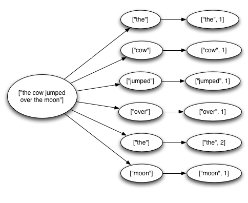

Storm considers a tuple coming off a spout "fully processed" when the tuple tree has been exhausted and every message in the tree has been processed. A tuple is considered failed when its tree of messages fails to be fully processed within a specified timeout. This timeout can be configured on a topology-specific basis using the [Config.TOPOLOGY\_MESSAGE\_TIMEOUT\_SECS](https://javadoc.io/doc/org.apache.storm/storm-client/2.8.3/org/apache/storm/Config.html#TOPOLOGY_MESSAGE_TIMEOUT_SECS) configuration and defaults to 30 seconds.

<a id="guaranteeing-message-processing--what-happens-if-a-message-is-fully-processed-or-fails-to-be-fully-processed"></a>

### What happens if a message is fully processed or fails to be fully processed?

To understand this question, let's take a look at the lifecycle of a tuple coming off of a spout. For reference, here is the interface that spouts implement (see the [Javadoc](https://javadoc.io/doc/org.apache.storm/storm-client/2.8.3/org/apache/storm/spout/ISpout.html) for more information):

```java
public interface ISpout extends Serializable {
    void open(Map conf, TopologyContext context, SpoutOutputCollector collector);
    void close();
    void nextTuple();
    void ack(Object msgId);
    void fail(Object msgId);
}
```

First, Storm requests a tuple from the `Spout` by calling the `nextTuple` method on the `Spout`. The `Spout` uses the `SpoutOutputCollector` provided in the `open` method to emit a tuple to one of its output streams. When emitting a tuple, the `Spout` provides a "message id" that will be used to identify the tuple later. For example, the `KestrelSpout` reads a message off of the kestrel queue and emits as the "message id" the id provided by Kestrel for the message. Emitting a message to the `SpoutOutputCollector` looks like this:

```java
_collector.emit(new Values("field1", "field2", 3) , msgId);
```

Next, the tuple gets sent to consuming bolts and Storm takes care of tracking the tree of messages that is created. If Storm detects that a tuple is fully processed, Storm will call the `ack` method on the originating `Spout` task with the message id that the `Spout` provided to Storm. Likewise, if the tuple times-out Storm will call the `fail` method on the `Spout`. Note that a tuple will be acked or failed by the exact same `Spout` task that created it. So if a `Spout` is executing as many tasks across the cluster, a tuple won't be acked or failed by a different task than the one that created it.

Let's use `KestrelSpout` again to see what a `Spout` needs to do to guarantee message processing. When `KestrelSpout` takes a message off the Kestrel queue, it "opens" the message. This means the message is not actually taken off the queue yet, but instead placed in a "pending" state waiting for acknowledgement that the message is completed. While in the pending state, a message will not be sent to other consumers of the queue. Additionally, if a client disconnects all pending messages for that client are put back on the queue. When a message is opened, Kestrel provides the client with the data for the message as well as a unique id for the message. The `KestrelSpout` uses that exact id as the "message id" for the tuple when emitting the tuple to the `SpoutOutputCollector`. Sometime later on, when `ack` or `fail` are called on the `KestrelSpout`, the `KestrelSpout` sends an ack or fail message to Kestrel with the message id to take the message off the queue or have it put back on.

<a id="guaranteeing-message-processing--what-is-storms-reliability-api"></a>
<a id="guaranteeing-message-processing--what-is-storm-s-reliability-api"></a>

### What is Storm's reliability API?

There are two things you have to do as a user to benefit from Storm's reliability capabilities. First, you need to tell Storm whenever you're creating a new link in the tree of tuples. Second, you need to tell Storm when you have finished processing an individual tuple. By doing both these things, Storm can detect when the tree of tuples is fully processed and can ack or fail the spout tuple appropriately. Storm's API provides a concise way of doing both of these tasks.

Specifying a link in the tuple tree is called *anchoring*. Anchoring is done at the same time you emit a new tuple. Let's use the following bolt as an example. This bolt splits a tuple containing a sentence into a tuple for each word:

```java
public class SplitSentence extends BaseRichBolt {OutputCollector _collector;
public void prepare(Map conf, TopologyContext context, OutputCollector collector) {_collector = collector;}
public void execute(Tuple tuple) {String sentence = tuple.getString(0); for(String word: sentence.split(" ")) {_collector.emit(tuple, new Values(word));} _collector.ack(tuple);}
public void declareOutputFields(OutputFieldsDeclarer declarer) {declarer.declare(new Fields("word"));}}
```

Each word tuple is *anchored* by specifying the input tuple as the first argument to `emit`. Since the word tuple is anchored, the spout tuple at the root of the tree will be replayed later on if the word tuple failed to be processed downstream. In contrast, let's look at what happens if the word tuple is emitted like this:

```java
_collector.emit(new Values(word));
```

Emitting the word tuple this way causes it to be *unanchored*. If the tuple fails be processed downstream, the root tuple will not be replayed. Depending on the fault-tolerance guarantees you need in your topology, sometimes it's appropriate to emit an unanchored tuple.

An output tuple can be anchored to more than one input tuple. This is useful when doing streaming joins or aggregations. A multi-anchored tuple failing to be processed will cause multiple tuples to be replayed from the spouts. Multi-anchoring is done by specifying a list of tuples rather than just a single tuple. For example:

```java
List<Tuple> anchors = new ArrayList<Tuple>();
anchors.add(tuple1);
anchors.add(tuple2);
_collector.emit(anchors, new Values(1, 2, 3));
```

Multi-anchoring adds the output tuple into multiple tuple trees. Note that it's also possible for multi-anchoring to break the tree structure and create tuple DAGs, like so:

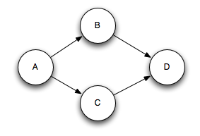

Storm's implementation works for DAGs as well as trees (pre-release it only worked for trees, and the name "tuple tree" stuck).

Anchoring is how you specify the tuple tree -- the next and final piece to Storm's reliability API is specifying when you've finished processing an individual tuple in the tuple tree. This is done by using the `ack` and `fail` methods on the `OutputCollector`. If you look back at the `SplitSentence` example, you can see that the input tuple is acked after all the word tuples are emitted.

You can use the `fail` method on the `OutputCollector` to immediately fail the spout tuple at the root of the tuple tree. For example, your application may choose to catch an exception from a database client and explicitly fail the input tuple. By failing the tuple explicitly, the spout tuple can be replayed faster than if you waited for the tuple to time-out.

Every tuple you process must be acked or failed. Storm uses memory to track each tuple, so if you don't ack/fail every tuple, the task will eventually run out of memory.

A lot of bolts follow a common pattern of reading an input tuple, emitting tuples based on it, and then acking the tuple at the end of the `execute` method. These bolts fall into the categories of filters and simple functions. Storm has an interface called `BasicBolt` that encapsulates this pattern for you. The `SplitSentence` example can be written as a `BasicBolt` like follows:

```java
public class SplitSentence extends BaseBasicBolt {public void execute(Tuple tuple, BasicOutputCollector collector) {String sentence = tuple.getString(0); for(String word: sentence.split(" ")) {collector.emit(new Values(word));}}
public void declareOutputFields(OutputFieldsDeclarer declarer) {declarer.declare(new Fields("word"));}}
```

This implementation is simpler than the implementation from before and is semantically identical. Tuples emitted to `BasicOutputCollector` are automatically anchored to the input tuple, and the input tuple is acked for you automatically when the execute method completes.

In contrast, bolts that do aggregations or joins may delay acking a tuple until after it has computed a result based on a bunch of tuples. Aggregations and joins will commonly multi-anchor their output tuples as well. These things fall outside the simpler pattern of `IBasicBolt`.

<a id="guaranteeing-message-processing--how-do-i-make-my-applications-work-correctly-given-that-tuples-can-be-replayed"></a>

### How do I make my applications work correctly given that tuples can be replayed?

As always in software design, the answer is "it depends." If you really want exactly once semantics use the [Trident](#trident-tutorial) API. In some cases, like with a lot of analytics, dropping data is OK so disabling the fault tolerance by setting the number of acker bolts to 0 [Config.TOPOLOGY\_ACKERS](https://javadoc.io/doc/org.apache.storm/storm-client/2.8.3/org/apache/storm/Config.html#TOPOLOGY_ACKERS). But in some cases you want to be sure that everything was processed at least once and nothing was dropped. This is especially useful if all operations are idenpotent or if deduping can happen aferwards.

<a id="guaranteeing-message-processing--how-does-storm-implement-reliability-in-an-efficient-way"></a>

### How does Storm implement reliability in an efficient way?

A Storm topology has a set of special "acker" tasks that track the DAG of tuples for every spout tuple. When an acker sees that a DAG is complete, it sends a message to the spout task that created the spout tuple to ack the message. You can set the number of acker tasks for a topology in the topology configuration using [Config.TOPOLOGY\_ACKERS](https://javadoc.io/doc/org.apache.storm/storm-client/2.8.3/org/apache/storm/Config.html#TOPOLOGY_ACKERS). Storm defaults TOPOLOGY\_ACKERS to one task per worker.

The best way to understand Storm's reliability implementation is to look at the lifecycle of tuples and tuple DAGs. When a tuple is created in a topology, whether in a spout or a bolt, it is given a random 64 bit id. These ids are used by ackers to track the tuple DAG for every spout tuple.

Every tuple knows the ids of all the spout tuples for which it exists in their tuple trees. When you emit a new tuple in a bolt, the spout tuple ids from the tuple's anchors are copied into the new tuple. When a tuple is acked, it sends a message to the appropriate acker tasks with information about how the tuple tree changed. In particular it tells the acker "I am now completed within the tree for this spout tuple, and here are the new tuples in the tree that were anchored to me".

For example, if tuples "D" and "E" were created based on tuple "C", here's how the tuple tree changes when "C" is acked:

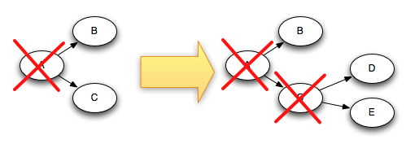

Since "C" is removed from the tree at the same time that "D" and "E" are added to it, the tree can never be prematurely completed.

There are a few more details to how Storm tracks tuple trees. As mentioned already, you can have an arbitrary number of acker tasks in a topology. This leads to the following question: when a tuple is acked in the topology, how does it know to which acker task to send that information?

Storm uses mod hashing to map a spout tuple id to an acker task. Since every tuple carries with it the spout tuple ids of all the trees they exist within, they know which acker tasks to communicate with.

Another detail of Storm is how the acker tasks track which spout tasks are responsible for each spout tuple they're tracking. When a spout task emits a new tuple, it simply sends a message to the appropriate acker telling it that its task id is responsible for that spout tuple. Then when an acker sees a tree has been completed, it knows to which task id to send the completion message.

Acker tasks do not track the tree of tuples explicitly. For large tuple trees with tens of thousands of nodes (or more), tracking all the tuple trees could overwhelm the memory used by the ackers. Instead, the ackers take a different strategy that only requires a fixed amount of space per spout tuple (about 20 bytes). This tracking algorithm is the key to how Storm works and is one of its major breakthroughs.

An acker task stores a map from a spout tuple id to a pair of values. The first value is the task id that created the spout tuple which is used later on to send completion messages. The second value is a 64 bit number called the "ack val". The ack val is a representation of the state of the entire tuple tree, no matter how big or how small. It is simply the xor of all tuple ids that have been created and/or acked in the tree.

When an acker task sees that an "ack val" has become 0, then it knows that the tuple tree is completed. Since tuple ids are random 64 bit numbers, the chances of an "ack val" accidentally becoming 0 is extremely small. If you work the math, at 10K acks per second, it will take 50,000,000 years until a mistake is made. And even then, it will only cause data loss if that tuple happens to fail in the topology.

Now that you understand the reliability algorithm, let's go over all the failure cases and see how in each case Storm avoids data loss:

- **A tuple isn't acked because the task died**: In this case the spout tuple ids at the root of the trees for the failed tuple will time out and be replayed.
- **Acker task dies**: In this case all the spout tuples the acker was tracking will time out and be replayed.
- **Spout task dies**: In this case the source that the spout talks to is responsible for replaying the messages. For example, queues like Kestrel and RabbitMQ will place all pending messages back on the queue when a client disconnects.

As you have seen, Storm's reliability mechanisms are completely distributed, scalable, and fault-tolerant.

<a id="guaranteeing-message-processing--tuning-reliability"></a>

### Tuning reliability

Acker tasks are lightweight, so you don't need very many of them in a topology. You can track their performance through the Storm UI (component id "\_\_acker"). If the throughput doesn't look right, you'll need to add more acker tasks.

If reliability isn't important to you -- that is, you don't care about losing tuples in failure situations -- then you can improve performance by not tracking the tuple tree for spout tuples. Not tracking a tuple tree halves the number of messages transferred since normally there's an ack message for every tuple in the tuple tree. Additionally, it requires fewer ids to be kept in each downstream tuple, reducing bandwidth usage.

There are three ways to remove reliability. The first is to set Config.TOPOLOGY\_ACKERS to 0. In this case, Storm will call the `ack` method on the spout immediately after the spout emits a tuple. The tuple tree won't be tracked.

The second way is to remove reliability on a message by message basis. You can turn off tracking for an individual spout tuple by omitting a message id in the `SpoutOutputCollector.emit` method.

Finally, if you don't care if a particular subset of the tuples downstream in the topology fail to be processed, you can emit them as unanchored tuples. Since they're not anchored to any spout tuples, they won't cause any spout tuples to fail if they aren't acked.

---

<a id="daemon-fault-tolerance"></a>

<!-- source_url: https://storm.apache.org/releases/2.8.3/Daemon-Fault-Tolerance.html -->

<!-- page_index: 6 -->

# Daemon Fault Tolerance

Storm has several different daemon processes. Nimbus that schedules workers, supervisors that launch and kill workers, the log viewer that gives access to logs, and the UI that shows the status of a cluster.

<a id="daemon-fault-tolerance--what-happens-when-a-worker-dies"></a>

## What happens when a worker dies?

When a worker dies, the supervisor will restart it. If it continuously fails on startup and is unable to heartbeat to Nimbus, Nimbus will reschedule the worker.

<a id="daemon-fault-tolerance--what-happens-when-a-node-dies"></a>

## What happens when a node dies?

The tasks assigned to that machine will time-out and Nimbus will reassign those tasks to other machines.

<a id="daemon-fault-tolerance--what-happens-when-nimbus-or-supervisor-daemons-die"></a>

## What happens when Nimbus or Supervisor daemons die?

The Nimbus and Supervisor daemons are designed to be fail-fast (process self-destructs whenever any unexpected situation is encountered) and stateless (all state is kept in Zookeeper or on disk). As described in [Setting up a Storm cluster](#setting-up-a-storm-cluster), the Nimbus and Supervisor daemons must be run under supervision using a tool like daemontools or monit. So if the Nimbus or Supervisor daemons die, they restart like nothing happened.

Most notably, no worker processes are affected by the death of Nimbus or the Supervisors. This is in contrast to Hadoop, where if the JobTracker dies, all the running jobs are lost.

<a id="daemon-fault-tolerance--is-nimbus-a-single-point-of-failure"></a>

## Is Nimbus a single point of failure?

If you lose the Nimbus node, the workers will still continue to function. Additionally, supervisors will continue to restart workers if they die. However, without Nimbus, workers won't be reassigned to other machines when necessary (like if you lose a worker machine).

Storm Nimbus is highly available since 1.0.0. More information please refer to [Nimbus HA Design](#nimbus-ha-design) document.

<a id="daemon-fault-tolerance--how-does-storm-guarantee-data-processing"></a>

## How does Storm guarantee data processing?

Storm provides mechanisms to guarantee data processing even if nodes die or messages are lost. See [Guaranteeing message processing](#guaranteeing-message-processing) for the details.

---

<a id="command-line-client"></a>

<!-- source_url: https://storm.apache.org/releases/2.8.3/Command-line-client.html -->

<!-- page_index: 7 -->

# Command Line Client

This page describes all the commands that are possible with the "storm" command line client. To learn how to set up your "storm" client to talk to a remote cluster, follow the instructions in [Setting up development environment](https://storm.apache.org/releases/2.8.3/Setting-up-development-environment.html). See [Classpath handling](#classpath-handling) for details on using external libraries in these commands.

These commands are:

1. jar
2. local
3. sql
4. kill
5. activate
6. deactivate
7. rebalance
8. repl
9. classpath
10. server\_classpath
11. localconfvalue
12. remoteconfvalue
13. nimbus
14. supervisor
15. ui
16. drpc
17. drpc-client
18. blobstore
19. dev-zookeeper
20. get-errors
21. heartbeats
22. kill\_workers
23. list
24. logviewer
25. monitor
26. node-health-check
27. pacemaker
28. set\_log\_level
29. shell
30. upload-credentials
31. version
32. admin
33. help

<a id="command-line-client--jar"></a>

### jar

Syntax: `storm jar topology-jar-path class ...`

Runs the main method of `class` with the specified arguments. The storm jars and configs in `~/.storm` are put on the classpath. The process is configured so that [StormSubmitter](https://javadoc.io/doc/org.apache.storm/storm-client/2.8.3/org/apache/storm/StormSubmitter.html) will upload the jar at `topology-jar-path` when the topology is submitted.

When you want to ship other jars which is not included to application jar, you can pass them to `--jars` option with comma-separated string.
For example, --jars "your-local-jar.jar,your-local-jar2.jar" will load your-local-jar.jar and your-local-jar2.jar.
And when you want to ship maven artifacts and its transitive dependencies, you can pass them to `--artifacts` with comma-separated string. You can also exclude some dependencies like what you're doing in maven pom. Please add exclusion artifacts with '^' separated string after the artifact. For example, `--artifacts "redis.clients:jedis:2.9.0,org.apache.kafka:kafka_2.10:0.8.2.2^org.slf4j:slf4j-log4j12"` will load jedis and kafka artifact and all of transitive dependencies but exclude slf4j-log4j12 from kafka.

When you need to pull the artifacts from other than Maven Central, you can pass remote repositories to --artifactRepositories option with comma-separated string. Repository format is "^". '^' is taken as separator because URL allows various characters. For example, --artifactRepositories "jboss-repository^[http://repository.jboss.com/maven2,HDPRepo^http://repo.hortonworks.com/content/groups/public/](http://repository.jboss.com/maven2,HDPRepo%5Ehttp://repo.hortonworks.com/content/groups/public/)" will add JBoss and HDP repositories for dependency resolver.

Complete example of both options is here: `./bin/storm jar example/storm-starter/storm-starter-topologies-*.jar org.apache.storm.starter.RollingTopWords blobstore-remote2 remote --jars "./external/storm-redis/storm-redis-1.1.0.jar,./external/storm-kafka-client/storm-kafka-client-1.1.0.jar" --artifacts "redis.clients:jedis:2.9.0,org.apache.kafka:kafka-clients:1.0.0^org.slf4j:slf4j-api" --artifactRepositories "jboss-repository^http://repository.jboss.com/maven2,HDPRepo^http://repo.hortonworks.com/content/groups/public/"`

When you pass jars and/or artifacts options, StormSubmitter will upload them when the topology is submitted, and they will be included to classpath of both the process which runs the class, and also workers for that topology.

<a id="command-line-client--local"></a>

### local

Syntax: `storm local topology-jar-path class ...`

The local command acts just like `storm jar` except instead of submitting a topology to a cluster it will run the cluster in local mode. This means an embedded version of the storm daemons will be run within the same process as your topology for 30 seconds before it shuts down automatically. As such the classpath of your topology will be extended to include everything needed to run those daemons.

<a id="command-line-client--sql"></a>

### sql

Syntax: `storm sql sql-file topology-name`

Compiles the SQL statements into a Trident topology and submits it to Storm.

`--jars` and `--artifacts`, and `--artifactRepositories` options available for jar are also applied to sql command. Please refer "help jar" to see how to use --jars and --artifacts, and --artifactRepositories options. You normally want to pass these options since you need to set data source to your sql which is an external storage in many cases.

<a id="command-line-client--kill"></a>

### kill

Syntax: `storm kill topology-name [-w wait-time-secs]`

Kills the topology with the name `topology-name`. Storm will first deactivate the topology's spouts for the duration of the topology's message timeout to allow all messages currently being processed to finish processing. Storm will then shutdown the workers and clean up their state. You can override the length of time Storm waits between deactivation and shutdown with the -w flag.

<a id="command-line-client--activate"></a>

### activate

Syntax: `storm activate topology-name`

Activates the specified topology's spouts.

<a id="command-line-client--deactivate"></a>

### deactivate

Syntax: `storm deactivate topology-name`

Deactivates the specified topology's spouts.

<a id="command-line-client--rebalance"></a>

### rebalance

Syntax: `storm rebalance topology-name [-w wait-time-secs] [-n new-num-workers] [-e component=parallelism]*`

Sometimes you may wish to spread out where the workers for a topology are running. For example, let's say you have a 10 node cluster running 4 workers per node, and then let's say you add another 10 nodes to the cluster. You may wish to have Storm spread out the workers for the running topology so that each node runs 2 workers. One way to do this is to kill the topology and resubmit it, but Storm provides a "rebalance" command that provides an easier way to do this.

Rebalance will first deactivate the topology for the duration of the message timeout (overridable with the -w flag) and then redistribute the workers evenly around the cluster. The topology will then return to its previous state of activation (so a deactivated topology will still be deactivated and an activated topology will go back to being activated).

The rebalance command can also be used to change the parallelism of a running topology. Use the -n and -e switches to change the number of workers or number of executors of a component respectively.

<a id="command-line-client--repl"></a>

### repl

*DEPRECATED: This subcommand may be removed in a future release.*

Syntax: `storm repl`

Opens up a Clojure REPL with the storm jars and configuration on the classpath. Useful for debugging.

<a id="command-line-client--classpath"></a>

### classpath

Syntax: `storm classpath`

Prints the classpath used by the storm client when running commands.

<a id="command-line-client--server_classpath"></a>

### server\_classpath

Syntax: `storm server_classpath`

Prints the classpath used by the storm daemons.

<a id="command-line-client--localconfvalue"></a>

### localconfvalue

Syntax: `storm localconfvalue conf-name`

Prints out the value for `conf-name` in the local Storm configs. The local Storm configs are the ones in `~/.storm/storm.yaml` merged in with the configs in `defaults.yaml`.

<a id="command-line-client--remoteconfvalue"></a>

### remoteconfvalue

Syntax: `storm remoteconfvalue conf-name`

Prints out the value for `conf-name` in the cluster's Storm configs. The cluster's Storm configs are the ones in `$STORM-PATH/conf/storm.yaml` merged in with the configs in `defaults.yaml`. This command must be run on a cluster machine.

<a id="command-line-client--nimbus"></a>

### nimbus

Syntax: `storm nimbus`

Launches the nimbus daemon. This command should be run under supervision with a tool like [daemontools](http://cr.yp.to/daemontools.html) or [monit](http://mmonit.com/monit/). See [Setting up a Storm cluster](#setting-up-a-storm-cluster) for more information.

<a id="command-line-client--supervisor"></a>

### supervisor

Syntax: `storm supervisor`

Launches the supervisor daemon. This command should be run under supervision with a tool like [daemontools](http://cr.yp.to/daemontools.html) or [monit](http://mmonit.com/monit/). See [Setting up a Storm cluster](#setting-up-a-storm-cluster) for more information.

<a id="command-line-client--ui"></a>

### ui

Syntax: `storm ui`

Launches the UI daemon. The UI provides a web interface for a Storm cluster and shows detailed stats about running topologies. This command should be run under supervision with a tool like [daemontools](http://cr.yp.to/daemontools.html) or [monit](http://mmonit.com/monit/). See [Setting up a Storm cluster](#setting-up-a-storm-cluster) for more information.

<a id="command-line-client--drpc"></a>

### drpc

Syntax: `storm drpc`

Launches a DRPC daemon. This command should be run under supervision with a tool like [daemontools](http://cr.yp.to/daemontools.html) or [monit](http://mmonit.com/monit/). See [Distributed RPC](#distributed-rpc) for more information.

<a id="command-line-client--drpc-client"></a>

### drpc-client

Syntax: `storm drpc-client [options] ([function argument]*)|(argument*)`

Provides a very simple way to send DRPC requests. If a `-f` argument is supplied, to set the function name, all of the arguments are treated
as arguments to the function. If no function is given the arguments must be pairs of function argument.

*NOTE:* This is not really intended for production use. This is mostly because parsing out the results can be a pain.

Creating an actual DRPC client only takes a few lines, so for production please go with that.

```java
Config conf = new Config();
try (DRPCClient drpc = DRPCClient.getConfiguredClient(conf)) {
  //User the drpc client
  String result = drpc.execute(function, argument);
}
```

<a id="command-line-client--examples"></a>

#### Examples

`storm drpc-client exclaim a exclaim b test bar`

This will submit 3 separate DRPC request.
1. function = "exclaim" args = "a"
2. function = "exclaim" args = "b"
3. function = "test" args = "bar"

`storm drpc-client -f exclaim a b`

This will submit 2 separate DRPC request.
1. function = "exclaim" args = "a"
2. function = "exclaim" args = "b"

<a id="command-line-client--blobstore"></a>

### blobstore

Syntax: `storm blobstore cmd`

list [KEY...] - lists blobs currently in the blob store

cat [-f FILE] KEY - read a blob and then either write it to a file, or STDOUT (requires read access).

create [-f FILE] [-a ACL ...] [--replication-factor NUMBER] KEY - create a new blob. Contents comes from a FILE or STDIN. ACL is in the form [uo]:[username]:[r-][w-][a-] can be comma separated list.

update [-f FILE] KEY - update the contents of a blob. Contents comes from a FILE or STDIN (requires write access).

delete KEY - delete an entry from the blob store (requires write access).

set-acl [-s ACL] KEY - ACL is in the form [uo]:[username]:[r-][w-][a-] can be comma separated list (requires admin access).

replication --read KEY - Used to read the replication factor of the blob.

replication --update --replication-factor NUMBER KEY where NUMBER > 0. It is used to update the replication factor of a blob.

For example, the following would create a mytopo:data.tgz key using the data stored in data.tgz. User alice would have full access, bob would have read/write access and everyone else would have read access.

storm blobstore create mytopo:data.tgz -f data.tgz -a u:alice:rwa,u:bob:rw,o::r

See [Blobstore(Distcahce)](#distcache-blobstore) for more information.

<a id="command-line-client--dev-zookeeper"></a>

### dev-zookeeper

Syntax: `storm dev-zookeeper`

Launches a fresh Zookeeper server using "dev.zookeeper.path" as its local dir and "storm.zookeeper.port" as its port. This is only intended for development/testing, the Zookeeper instance launched is not configured to be used in production.

<a id="command-line-client--get-errors"></a>

### get-errors

Syntax: `storm get-errors topology-name`

Get the latest error from the running topology. The returned result contains the key value pairs for component-name and component-error for the components in error. The result is returned in json format.

<a id="command-line-client--heartbeats"></a>

### heartbeats

Syntax: `storm heartbeats [cmd]`

list PATH - lists heartbeats nodes under PATH currently in the ClusterState.
get PATH - Get the heartbeat data at PATH

<a id="command-line-client--kill_workers"></a>

### kill\_workers

Syntax: `storm kill_workers`

Kill the workers running on this supervisor. This command should be run on a supervisor node. If the cluster is running in secure mode, then user needs to have admin rights on the node to be able to successfully kill all workers.

<a id="command-line-client--list"></a>

### list

Syntax: `storm list`

List the running topologies and their statuses.

<a id="command-line-client--logviewer"></a>

### logviewer

Syntax: `storm logviewer`

Launches the log viewer daemon. It provides a web interface for viewing storm log files. This command should be run under supervision with a tool like daemontools or monit.

See Setting up a Storm cluster for more information.(<http://storm.apache.org/documentation/Setting-up-a-Storm-cluster>)

<a id="command-line-client--monitor"></a>

### monitor

Syntax: `storm monitor topology-name [-i interval-secs] [-m component-id] [-s stream-id] [-w [emitted | transferred]]`

Monitor given topology's throughput interactively.
One can specify poll-interval, component-id, stream-id, watch-item[emitted | transferred]
By default, poll-interval is 4 seconds;
all component-ids will be list;
stream-id is 'default';
watch-item is 'emitted';

<a id="command-line-client--node-health-check"></a>

### node-health-check

Syntax: `storm node-health-check`

Run health checks on the local supervisor.

<a id="command-line-client--pacemaker"></a>

### pacemaker

Syntax: `storm pacemaker`

Launches the Pacemaker daemon. This command should be run under
supervision with a tool like daemontools or monit.

See Setting up a Storm cluster for more information.(<http://storm.apache.org/documentation/Setting-up-a-Storm-cluster>)

<a id="command-line-client--set_log_level"></a>

### set\_log\_level

Syntax: `storm set_log_level -l [logger name]=[log level][:optional timeout] -r [logger name] topology-name`

Dynamically change topology log levels

where log level is one of: ALL, TRACE, DEBUG, INFO, WARN, ERROR, FATAL, OFF
and timeout is integer seconds.

e.g.
./bin/storm set\_log\_level -l ROOT=DEBUG:30 topology-name

Set the root logger's level to DEBUG for 30 seconds

./bin/storm set\_log\_level -l com.myapp=WARN topology-name

Set the com.myapp logger's level to WARN for 30 seconds

./bin/storm set\_log\_level -l com.myapp=WARN -l com.myOtherLogger=ERROR:123 topology-name

Set the com.myapp logger's level to WARN indefinitely, and com.myOtherLogger to ERROR for 123 seconds

./bin/storm set\_log\_level -r com.myOtherLogger topology-name

Clears settings, resetting back to the original level

<a id="command-line-client--shell"></a>

### shell

Syntax: `storm shell resourcesdir command args`

Makes constructing jar and uploading to nimbus for using non JVM languages

eg: `storm shell resources/ python3 topology.py arg1 arg2`

<a id="command-line-client--upload-credentials"></a>

### upload-credentials

Syntax: `storm upload_credentials topology-name [credkey credvalue]*`

Uploads a new set of credentials to a running topology
\* `-e --exception-when-empty`: optional flag. If set, command will fail and throw exception if no credentials were uploaded.

<a id="command-line-client--version"></a>

### version

Syntax: `storm version`

Prints the version number of this Storm release.

<a id="command-line-client--admin"></a>

### admin

Syntax: `storm admin <cmd> [options]`

The storm admin command provides access to several operations that can help an administrator debug or fix a cluster.

`remove_corrupt_topologies` - This command should be run on a nimbus node as the same user nimbus runs as. It will go directly to zookeeper + blobstore and find topologies that appear to be corrupted because of missing blobs. It will kill those topologies.

`zk_cli [options]` - This command will launch a zookeeper cli pointing to the storm zookeeper instance logged in as the nimbus user. It should be run on a nimbus server as the user nimbus runs as.

- `-s --server <connection string>`: Set the connection string to use,
  defaults to storm connection string.
- `-t --time-out <timeout>`: Set the timeout to use, defaults to storm
  zookeeper timeout.
- `-w --write`: Allow for writes, defaults to read only, we don't want to
  cause problems.
- `-n --no-root`: Don't include the storm root on the default connection string.
- `-j --jaas <jaas_file>`: Include a jaas file that should be used when
  authenticating with ZK defaults to the
  java.security.auth.login.config conf.

`creds <topology_id>` - Print the credential keys for a topology.

<a id="command-line-client--help"></a>

### help

Syntax: `storm help [command]`

Print one help message or list of available commands

---

<a id="storm-ui-rest-api"></a>

<!-- source_url: https://storm.apache.org/releases/2.8.3/STORM-UI-REST-API.html -->

<!-- page_index: 8 -->

# Data format

The Storm UI daemon provides a REST API that allows you to interact with a Storm cluster, which includes retrieving
metrics data and configuration information as well as management operations such as starting or stopping topologies.

<a id="storm-ui-rest-api--data-format"></a>

# Data format

The REST API returns JSON responses and supports JSONP.
Clients can pass a callback query parameter to wrap JSON in the callback function.

<a id="storm-ui-rest-api--using-the-ui-rest-api"></a>

# Using the UI REST API

*Note: It is recommended to ignore undocumented elements in the JSON response because future versions of Storm may not*
*support those elements anymore.*

<a id="storm-ui-rest-api--rest-api-base-url"></a>

## REST API Base URL

The REST API is part of the UI daemon of Storm (started by `storm ui`) and thus runs on the same host and port as the
Storm UI (the UI daemon is often run on the same host as the Nimbus daemon). The port is configured by `ui.port`, which is set to `8080` by default (see [defaults.yaml](https://storm.apache.org/releases/2.8.3/conf/defaults.yaml)).

The API base URL would thus be:

```
http://<ui-host>:<ui-port>/api/v1/...
```

You can use a tool such as `curl` to talk to the REST API:

```
# Request the cluster configuration.
# Note: We assume ui.port is configured to the default value of 8080.
$ curl http://<ui-host>:8080/api/v1/cluster/configuration
```

<a id="storm-ui-rest-api--impersonating-a-user-in-secure-environment"></a>

## Impersonating a user in secure environment

In a secure environment an authenticated user can impersonate another user. To impersonate a user the caller must pass
`doAsUser` param or header with value set to the user that the request needs to be performed as. Please see SECURITY.MD
to learn more about how to setup impersonation ACLs and authorization. The rest API uses the same configs and acls that
are used by nimbus.

Examples:

```no-highlight
 1. http://ui-daemon-host-name:8080/api/v1/topology/wordcount-1-1425844354\?doAsUser=testUSer1
 2. curl 'http://localhost:8080/api/v1/topology/wordcount-1-1425844354/activate' -X POST -H 'doAsUser:testUSer1'
```

<a id="storm-ui-rest-api--get-operations"></a>

## GET Operations

<a id="storm-ui-rest-api--api-v1-cluster-configuration-get"></a>

### /api/v1/cluster/configuration (GET)

Returns the cluster configuration.

Sample response (does not include all the data fields):

```json
  {
    "dev.zookeeper.path": "/tmp/dev-storm-zookeeper",
    "topology.tick.tuple.freq.secs": null,
    "topology.builtin.metrics.bucket.size.secs": 60,
    "topology.fall.back.on.java.serialization": false,
    "topology.max.error.report.per.interval": 5,
    "zmq.linger.millis": 5000,
    "topology.skip.missing.kryo.registrations": false,
    "storm.messaging.netty.client_worker_threads": 1,
    "ui.childopts": "-Xmx768m",
    "storm.zookeeper.session.timeout": 20000,
    "nimbus.reassign": true,
    "topology.trident.batch.emit.interval.millis": 500,
    "storm.messaging.netty.flush.check.interval.ms": 10,
    "nimbus.monitor.freq.secs": 10,
    "logviewer.childopts": "-Xmx128m",
    "java.library.path": "/usr/local/lib:/opt/local/lib:/usr/lib",
    "topology.executor.send.buffer.size": 1024,
    }
```

<a id="storm-ui-rest-api--api-v1-cluster-summary-get"></a>

### /api/v1/cluster/summary (GET)

Returns cluster summary information such as nimbus uptime or number of supervisors.

Response fields:

| Field | Value | Description |
| --- | --- | --- |
| stormVersion | String | Storm version |
| supervisors | Integer | Number of supervisors running |
| topologies | Integer | Number of topologies running |
| slotsTotal | Integer | Total number of available worker slots |
| slotsUsed | Integer | Number of worker slots used |
| slotsFree | Integer | Number of worker slots available |
| executorsTotal | Integer | Total number of executors |
| tasksTotal | Integer | Total tasks |
| schedulerDisplayResource | Boolean | Whether to display scheduler resource information |
| totalMem | Double | The total amount of memory in the cluster in MB |
| totalCpu | Double | The total amount of CPU in the cluster |
| availMem | Double | The amount of available memory in the cluster in MB |
| availCpu | Double | The amount of available cpu in the cluster |
| memAssignedPercentUtil | Double | The percent utilization of assigned memory resources in cluster |
| cpuAssignedPercentUtil | Double | The percent utilization of assigned CPU resources in cluster |

Sample response:

```json
   {
    "stormVersion": "0.9.2-incubating-SNAPSHOT",
    "supervisors": 1,
    "slotsTotal": 4,
    "slotsUsed": 3,
    "slotsFree": 1,
    "executorsTotal": 28,
    "tasksTotal": 28,
    "schedulerDisplayResource": true,
    "totalMem": 4096.0,
    "totalCpu": 400.0,
    "availMem": 1024.0,
    "availCPU": 250.0,
    "memAssignedPercentUtil": 75.0,
    "cpuAssignedPercentUtil": 37.5
    }
```

<a id="storm-ui-rest-api--api-v1-supervisor-summary-get"></a>

### /api/v1/supervisor/summary (GET)

Returns summary information for all supervisors.

Response fields:

| Field | Value | Description |
| --- | --- | --- |
| id | String | Supervisor's id |
| host | String | Supervisor's host name |
| uptime | String | Shows how long the supervisor is running |
| uptimeSeconds | Integer | Shows how long the supervisor is running in seconds |
| slotsTotal | Integer | Total number of available worker slots for this supervisor |
| slotsUsed | Integer | Number of worker slots used on this supervisor |
| schedulerDisplayResource | Boolean | Whether to display scheduler resource information |
| totalMem | Double | Total memory capacity on this supervisor |
| totalCpu | Double | Total CPU capacity on this supervisor |
| usedMem | Double | Used memory capacity on this supervisor |
| usedCpu | Double | Used CPU capacity on this supervisor |

Sample response:

```json
{"supervisors": [{"id": "0b879808-2a26-442b-8f7d-23101e0c3696","host": "10.11.1.7","uptime": "5m 58s","uptimeSeconds": 358,"slotsTotal": 4,"slotsUsed": 3,"totalMem": 3000,"totalCpu": 400,"usedMem": 1280,"usedCPU": 160} ],"schedulerDisplayResource": true}
```

<a id="storm-ui-rest-api--api-v1-nimbus-summary-get"></a>

### /api/v1/nimbus/summary (GET)

Returns summary information for all nimbus hosts.

Response fields:

| Field | Value | Description |
| --- | --- | --- |
| host | String | Nimbus' host name |
| port | int | Nimbus' port number |
| status | String | Possible values are Leader, Not a Leader, Dead |
| nimbusUpTime | String | Shows since how long the nimbus has been running |
| nimbusUpTimeSeconds | String | Shows since how long the nimbus has been running in seconds |
| nimbusLogLink | String | Logviewer url to view the nimbus.log |
| version | String | Version of storm this nimbus host is running |

Sample response:

```json
{"nimbuses":[{"host":"192.168.202.1","port":6627,"nimbusLogLink":"http:\/\/192.168.202.1:8000\/log?file=nimbus.log","status":"Leader","version":"0.10.0-SNAPSHOT","nimbusUpTime":"3m 33s","nimbusUpTimeSeconds":"213"}]}
```

<a id="storm-ui-rest-api--api-v1-history-summary-get"></a>

### /api/v1/history/summary (GET)

Returns a list of all running topologies' IDs submitted by the current user.

Response fields:

| Field | Value | Description |
| --- | --- | --- |
| topo-history | List | List of Topologies' IDs |

Sample response:

```json
{
    "topo-history":[
        "wc6-1-1446571009",
        "wc8-2-1446587178"
     ]
}
```

<a id="storm-ui-rest-api--api-v1-supervisor-get"></a>

### /api/v1/supervisor (GET)

Returns summary for a supervisor by id, or all supervisors running on a host.

Examples:

```no-highlight
 1. By host: http://ui-daemon-host-name:8080/api/v1/supervisor?host=supervisor-daemon-host-name
 2. By id: http://ui-daemon-host-name:8080/api/v1/supervisor?id=f5449110-1daa-43e2-89e3-69917b16dec9-192.168.1.1
```

Request parameters:

| Parameter | Value | Description |
| --- | --- | --- |
| id | String. Supervisor id | If specified, respond with the supervisor and worker stats with id. Note that when id is specified, the host argument is ignored. |
| host | String. Host name | If specified, respond with all supervisors and worker stats in the host (normally just one) |
| sys | String. Values 1 or 0. Default value 0 | Controls including sys stats part of the response |

Response fields:

| Field | Value | Description |
| --- | --- | --- |
| supervisors | Array | Array of supervisor summaries |
| workers | Array | Array of worker summaries |
| schedulerDisplayResource | Boolean | Whether to display scheduler resource information |

Each supervisor is defined by:

| Field | Value | Description |
| --- | --- | --- |
| id | String | Supervisor's id |
| host | String | Supervisor's host name |
| uptime | String | Shows how long the supervisor is running |
| uptimeSeconds | Integer | Shows how long the supervisor is running in seconds |
| slotsTotal | Integer | Total number of worker slots for this supervisor |
| slotsUsed | Integer | Number of worker slots used on this supervisor |
| schedulerDisplayResource | Boolean | Whether to display scheduler resource information |
| totalMem | Double | Total memory capacity on this supervisor |
| totalCpu | Double | Total CPU capacity on this supervisor |
| usedMem | Double | Used memory capacity on this supervisor |
| usedCpu | Double | Used CPU capacity on this supervisor |

Each worker is defined by:

| Field | Value | Description |
| --- | --- | --- |
| supervisorId | String | Supervisor's id |
| host | String | Worker's host name |
| port | Integer | Worker's port |
| topologyId | String | Topology Id |
| topologyName | String | Topology Name |
| executorsTotal | Integer | Number of executors used by the topology in this worker |
| assignedMemOnHeap | Double | Assigned On-Heap Memory by Scheduler (MB) |
| assignedMemOffHeap | Double | Assigned Off-Heap Memory by Scheduler (MB) |
| assignedCpu | Number | Assigned CPU by Scheduler (%) |
| componentNumTasks | Dictionary | Components -> # of executing tasks |
| uptime | String | Shows how long the worker is running |
| uptimeSeconds | Integer | Shows how long the worker is running in seconds |
| workerLogLink | String | Link to worker log viewer page |

Sample response:

```json
{
    "supervisors": [{ 
        "totalMem": 4096.0, 
        "host":"192.168.10.237",
        "id":"bdfe8eff-f1d8-4bce-81f5-9d3ae1bf432e",
        "uptime":"7m 8s",
        "totalCpu":400.0,
        "usedCpu":495.0,
        "usedMem":3432.0,
        "slotsUsed":2,
        "version":"0.10.1",
        "slotsTotal":4,
        "uptimeSeconds":428
    }],
    "schedulerDisplayResource":true,
    "workers":[{
        "topologyName":"ras",
        "topologyId":"ras-4-1460229987",
        "host":"192.168.10.237",
        "supervisorId":"bdfe8eff-f1d8-4bce-81f5-9d3ae1bf432e",
        "assignedMemOnHeap":704.0,
        "uptime":"2m 47s",
        "uptimeSeconds":167,
        "port":6707,
        "workerLogLink":"http:\/\/host:8000\/log?file=ras-4-1460229987%2F6707%2Fworker.log",
        "componentNumTasks": {
            "word":5
        },
        "executorsTotal":8,
        "assignedCpu":130.0,
        "assignedMemOffHeap":80.0
    },
    {
        "topologyName":"ras",
        "topologyId":"ras-4-1460229987",
        "host":"192.168.10.237",
        "supervisorId":"bdfe8eff-f1d8-4bce-81f5-9d3ae1bf432e",
        "assignedMemOnHeap":904.0,
        "uptime":"2m 53s",
        "port":6706,
        "workerLogLink":"http:\/\/host:8000\/log?file=ras-4-1460229987%2F6706%2Fworker.log",
        "componentNumTasks":{
            "exclaim2":2,
            "exclaim1":3,
            "word":5
        },
        "executorsTotal":10,
        "uptimeSeconds":173,
        "assignedCpu":165.0,
        "assignedMemOffHeap":80.0
    }]
}
```

<a id="storm-ui-rest-api--api-v1-owner-resources-get"></a>

### /api/v1/owner-resources (GET)

Returns summary information aggregated at the topology owner level. Pass an optional id for a specific owner (e.g. /api/v1/owner-resources/theowner)

Response fields:

| Field | Value | Description |
| --- | --- | --- |
| owner | String | Topology owner |
| totalTopologies | Integer | Total number of topologies owner is running |
| totalExecutors | Integer | Total number of executors used by owner |
| totalWorkers | Integer | Total number of workers used by owner |
| totalTasks | Integer | Total number of tasks used by owner |
| totalMemoryUsage | Double | Total Memory Assigned on behalf of owner in MB |
| totalCpuUsage | Double | Total CPU Resource Assigned on behalf of User. Every 100 means 1 core |
| memoryGuarantee | Double | The amount of memory resource (in MB) guaranteed to owner |
| cpuGuarantee | Double | The amount of CPU resource (every 100 means 1 core) guaranteed to owner |
| isolatedNodes | Integer | The amount of nodes that are guaranteed isolated to owner |
| memoryGuaranteeRemaining | Double | The amount of guaranteed memory resources (in MB) remaining |
| cpuGuaranteeRemaining | Double | The amount of guaranteed CPU resource (every 100 means 1 core) remaining |
| totalReqOnHeapMem | Double | Total On-Heap Memory Requested by User in MB |
| totalReqOffHeapMem | Double | Total Off-Heap Memory Requested by User in MB |
| totalReqMem | Double | Total Memory Requested by User in MB |
| totalReqCpu | Double | Total CPU Resource Requested by User. Every 100 means 1 core |
| totalAssignedOnHeapMem | Double | Total On-Heap Memory Assigned on behalf of owner in MB |
| totalAssignedOffHeapMem | Double | Total Off-Heap Memory Assigned on behalf of owner in MB |

Sample response:

```json
{
    "owners": [
        {
            "totalReqOnHeapMem": 896,
            "owner": "ownerA",
            "totalExecutors": 7,
            "cpuGuaranteeRemaining": 30,
            "totalReqMem": 896,
            "cpuGuarantee": 100,
            "isolatedNodes": "N/A",
            "memoryGuarantee": 4000,
            "memoryGuaranteeRemaining": 3104,
            "totalTasks": 7,
            "totalMemoryUsage": 896,
            "totalReqOffHeapMem": 0,
            "totalReqCpu": 70,
            "totalWorkers": 2,
            "totalCpuUsage": 70,
            "totalAssignedOffHeapMem": 0,
            "totalAssignedOnHeapMem": 896,
            "totalTopologies": 1
        }
    ],
    "schedulerDisplayResource": true
}
```

<a id="storm-ui-rest-api--api-v1-topology-summary-get"></a>

### /api/v1/topology/summary (GET)

Returns summary information for all topologies.

Response fields:

| Field | Value | Description |
| --- | --- | --- |
| id | String | Topology Id |
| name | String | Topology Name |
| status | String | Topology Status |
| uptime | String | Shows how long the topology is running |
| uptimeSeconds | Integer | Shows how long the topology is running in seconds |
| tasksTotal | Integer | Total number of tasks for this topology |
| workersTotal | Integer | Number of workers used for this topology |
| executorsTotal | Integer | Number of executors used for this topology |
| replicationCount | Integer | Number of nimbus hosts on which this topology code is replicated |
| requestedMemOnHeap | Double | Requested On-Heap Memory by User (MB) |
| requestedMemOffHeap | Double | Requested Off-Heap Memory by User (MB) |
| requestedTotalMem | Double | Requested Total Memory by User (MB) |
| requestedCpu | Double | Requested CPU by User (%) |
| assignedMemOnHeap | Double | Assigned On-Heap Memory by Scheduler (MB) |
| assignedMemOffHeap | Double | Assigned Off-Heap Memory by Scheduler (MB) |
| assignedTotalMem | Double | Assigned Total Memory by Scheduler (MB) |
| assignedCpu | Double | Assigned CPU by Scheduler (%) |
| schedulerDisplayResource | Boolean | Whether to display scheduler resource information |

Sample response:

```json
{"topologies": [{"id": "WordCount3-1-1402960825","name": "WordCount3","status": "ACTIVE","uptime": "6m 5s","uptimeSeconds": 365,"tasksTotal": 28,"workersTotal": 3,"executorsTotal": 28,"replicationCount": 1,"requestedMemOnHeap": 640,"requestedMemOffHeap": 128,"requestedTotalMem": 768,"requestedCpu": 80,"assignedMemOnHeap": 640,"assignedMemOffHeap": 128,"assignedTotalMem": 768,"assignedCpu": 80} ],"schedulerDisplayResource": true}
```

<a id="storm-ui-rest-api--api-v1-topology-workers-id-get"></a>

### /api/v1/topology-workers/<id> (GET)

Returns the worker' information (host and port) for a topology whose id is substituted for <id>.
The topology id is obtained by the above /topology/summary call.

Response fields:

| Field | Value | Description |
| --- | --- | --- |
| hostPortList | List | Workers' information for a topology |
| name | Integer | Logviewer Port |

Sample response:

```json
{
    "hostPortList":[
            {
                "host":"192.168.202.2",
                "port":6701
            },
            {
                "host":"192.168.202.2",
                "port":6702
            },
            {
                "host":"192.168.202.3",
                "port":6700
            }
        ],
    "logviewerPort":8000
}
```

<a id="storm-ui-rest-api--api-v1-topology-id-get"></a>

### /api/v1/topology/<id> (GET)

Returns topology information and statistics. Substitute <id> with the topology id.

Request parameters:

| Parameter | Value | Description |
| --- | --- | --- |
| id | String (required) | Topology Id |
| window | String. Default value :all-time | Window duration for metrics in seconds |
| sys | String. Values 1 or 0. Default value 0 | Controls including sys stats part of the response |

Response fields:

| Field | Value | Description |
| --- | --- | --- |
| id | String | Topology Id |
| name | String | Topology Name |
| uptime | String | How long the topology has been running |
| uptimeSeconds | Integer | How long the topology has been running in seconds |
| status | String | Current status of the topology, e.g. "ACTIVE" |
| tasksTotal | Integer | Total number of tasks for this topology |
| workersTotal | Integer | Number of workers used for this topology |
| executorsTotal | Integer | Number of executors used for this topology |
| msgTimeout | Integer | Number of seconds a tuple has before the spout considers it failed |
| windowHint | String | window param value in "hh mm ss" format. Default value is "All Time" |
| schedulerDisplayResource | Boolean | Whether to display scheduler resource information |
| replicationCount | Integer | Number of nimbus hosts on which this topology code is replicated |
| debug | Boolean | If debug is enabled for the topology |
| samplingPct | Double | Controls downsampling of events before they are sent to event log (percentage) |
| assignedMemOnHeap | Double | Assigned On-Heap Memory by Scheduler (MB) |
| assignedMemOffHeap | Double | Assigned Off-Heap Memory by Scheduler (MB) |
| assignedTotalMem | Double | Assigned Off-Heap + On-Heap Memory by Scheduler(MB) |
| assignedCpu | Double | Assigned CPU by Scheduler(%) |
| requestedMemOnHeap | Double | Requested On-Heap Memory by User (MB) |
| requestedMemOffHeap | Double | Requested Off-Heap Memory by User (MB) |
| requestedCpu | Double | Requested CPU by User (%) |
| topologyStats | Array | Array of all the topology related stats per time window |
| topologyStats.windowPretty | String | Duration passed in HH:MM:SS format |
| topologyStats.window | String | User requested time window for metrics |
| topologyStats.emitted | Long | Number of messages emitted in given window |
| topologyStats.trasferred | Long | Number messages transferred in given window |
| topologyStats.completeLatency | String (double value returned in String format) | Total latency for processing the message |
| topologyStats.acked | Long | Number of messages acked in given window |
| topologyStats.failed | Long | Number of messages failed in given window |
| workers | Array | Array of workers in topology |
| workers.supervisorId | String | Supervisor's id |
| workers.host | String | Worker's host name |
| workers.port | Integer | Worker's port |
| workers.topologyId | String | Topology Id |
| workers.topologyName | String | Topology Name |
| workers.executorsTotal | Integer | Number of executors used by the topology in this worker |
| workers.assignedMemOnHeap | Double | Assigned On-Heap Memory by Scheduler (MB) |
| workers.assignedMemOffHeap | Double | Assigned Off-Heap Memory by Scheduler (MB) |
| workers.assignedCpu | Number | Assigned CPU by Scheduler (%) |
| workers.componentNumTasks | Dictionary | Components -> # of executing tasks |
| workers.uptime | String | Shows how long the worker is running |
| workers.uptimeSeconds | Integer | Shows how long the worker is running in seconds |
| workers.workerLogLink | String | Link to worker log viewer page |
| spouts | Array | Array of all the spout components in the topology |
| spouts.spoutId | String | Spout id |
| spouts.executors | Integer | Number of executors for the spout |
| spouts.emitted | Long | Number of messages emitted in given window |
| spouts.completeLatency | String (double value returned in String format) | Total latency for processing the message |
| spouts.transferred | Long | Total number of messages transferred in given window |
| spouts.tasks | Integer | Total number of tasks for the spout |
| spouts.lastError | String | Shows the last error happened in a spout |
| spouts.errorHost | String | Worker hostname the last error was reported on |
| spouts.errorPort | String | Worker port the last error was reported on |
| spouts.errorTime | Integer | Unix timestamp the last error was reported (seconds since epoch) |
| spouts.errorLapsedSecs | Integer | Number of seconds elapsed since that last error happened in a spout |
| spouts.errorWorkerLogLink | String | Link to the worker log that reported the exception |
| spouts.acked | Long | Number of messages acked |
| spouts.failed | Long | Number of messages failed |
| spouts.requestedMemOnHeap | Double | Requested On-Heap Memory by User (MB) |
| spouts.requestedMemOffHeap | Double | Requested Off-Heap Memory by User (MB) |
| spouts.requestedCpu | Double | Requested CPU by User (%) |
| bolts | Array | Array of bolt components in the topology |
| bolts.boltId | String | Bolt id |
| bolts.capacity | String (double value returned in String format) | This value indicates number of messages executed \* average execute latency / time window |
| bolts.processLatency | String (double value returned in String format) | Average time of the bolt to ack a message after it was received |
| bolts.executeLatency | String (double value returned in String format) | Average time to run the execute method of the bolt |
| bolts.executors | Integer | Number of executor tasks in the bolt component |
| bolts.tasks | Integer | Number of instances of bolt |
| bolts.acked | Long | Number of tuples acked by the bolt |
| bolts.failed | Long | Number of tuples failed by the bolt |
| bolts.lastError | String | Shows the last error occurred in the bolt |
| bolts.errorHost | String | Worker hostname the last error was reported on |
| bolts.errorPort | String | Worker port the last error was reported on |
| bolts.errorTime | Integer | Unix timestamp the last error was reported (seconds since epoch) |
| bolts.errorLapsedSecs | Integer | Number of seconds elapsed since that last error happened in a bolt |
| bolts.errorWorkerLogLink | String | Link to the worker log that reported the exception |
| bolts.emitted | Long | Number of tuples emitted |
| bolts.requestedMemOnHeap | Double | Requested On-Heap Memory by User (MB) |
| bolts.requestedMemOffHeap | Double | Requested Off-Heap Memory by User (MB) |
| bolts.requestedCpu | Double | Requested CPU by User (%) |

Examples:

```no-highlight
 1. http://ui-daemon-host-name:8080/api/v1/topology/WordCount3-1-1402960825
 2. http://ui-daemon-host-name:8080/api/v1/topology/WordCount3-1-1402960825?sys=1
 3. http://ui-daemon-host-name:8080/api/v1/topology/WordCount3-1-1402960825?window=600
```

Sample response:

```json
 {
    "name": "WordCount3",
    "id": "WordCount3-1-1402960825",
    "workersTotal": 3,
    "window": "600",
    "status": "ACTIVE",
    "tasksTotal": 28,
    "executorsTotal": 28,
    "uptime": "29m 19s",
    "uptimeSeconds": 1759,
    "msgTimeout": 30,
    "windowHint": "10m 0s",
    "schedulerDisplayResource": true,
    "workers": [{
        "topologyName": "WordCount3",
        "topologyId": "WordCount3-1-1402960825",
        "host": "my-host",
        "supervisorId": "9124ca9a-42e8-481e-9bf3-a041d9595430",
        "assignedMemOnHeap": 1452.0,
        "uptime": "27m 26s",
        "port": 6702,
        "workerLogLink": "logs",
        "componentNumTasks": {
            "spout": 2,
            "count": 3,
            "split": 10
        },
        "executorsTotal": 15,
        "uptimeSeconds": 1646,
        "assignedCpu": 260.0,
        "assignedMemOffHeap": 160.0
    }]
    "topologyStats": [
        {
            "windowPretty": "10m 0s",
            "window": "600",
            "emitted": 397960,
            "transferred": 213380,
            "completeLatency": "0.000",
            "acked": 213460,
            "failed": 0
        },
        {
            "windowPretty": "3h 0m 0s",
            "window": "10800",
            "emitted": 1190260,
            "transferred": 638260,
            "completeLatency": "0.000",
            "acked": 638280,
            "failed": 0
        },
        {
            "windowPretty": "1d 0h 0m 0s",
            "window": "86400",
            "emitted": 1190260,
            "transferred": 638260,
            "completeLatency": "0.000",
            "acked": 638280,
            "failed": 0
        },
        {
            "windowPretty": "All time",
            "window": ":all-time",
            "emitted": 1190260,
            "transferred": 638260,
            "completeLatency": "0.000",
            "acked": 638280,
            "failed": 0
        }
    ],
    "workers":[{
        "topologyName":"WordCount3",
        "topologyId":"WordCount3-1-1402960825",
        "host":"192.168.10.237",
        "supervisorId":"bdfe8eff-f1d8-4bce-81f5-9d3ae1bf432e-169.254.129.212",
        "uptime":"2m 47s",
        "uptimeSeconds":167,
        "port":6707,
        "workerLogLink":"http:\/\/192.168.10.237:8000\/log?file=WordCount3-1-1402960825%2F6707%2Fworker.log",
        "componentNumTasks": {
            "spout":5
        },
        "executorsTotal":8,
        "assignedMemOnHeap":704.0,
        "assignedCpu":130.0,
        "assignedMemOffHeap":80.0
    }],
    "spouts": [
        {
            "executors": 5,
            "emitted": 28880,
            "completeLatency": "0.000",
            "transferred": 28880,
            "acked": 0,
            "spoutId": "spout",
            "tasks": 5,
            "lastError": "",
            "errorHost": "",
            "errorPort": null,
            "errorWorkerLogLink": "",
            "errorTime": null,
            "errorLapsedSecs": null,
            "failed": 0
        }
    ],
        "bolts": [
        {
            "executors": 12,
            "emitted": 184580,
            "transferred": 0,
            "acked": 184640,
            "executeLatency": "0.048",
            "tasks": 12,
            "executed": 184620,
            "processLatency": "0.043",
            "boltId": "count",
            "lastError": "",
            "errorHost": "",
            "errorPort": null,
            "errorWorkerLogLink": "",
            "errorTime": null,
            "errorLapsedSecs": null,
            "capacity": "0.003",
            "failed": 0
        },
        {
            "executors": 8,
            "emitted": 184500,
            "transferred": 184500,
            "acked": 28820,
            "executeLatency": "0.024",
            "tasks": 8,
            "executed": 28780,
            "processLatency": "2.112",
            "boltId": "split",
            "lastError": "java.lang.RuntimeException: Error here! at org.apache.storm.starter.bolt.WordCountBolt.nextTuple(WordCountBolt.java:50) at org.apache.storm.executor.bolt.BoltExecutor$2.call",
            "errorHost": "192.168.10.237",
            "errorPort": 6707,
            "errorWorkerLogLink": "http://192.168.10.237:8000/api/v1/log?file=WordCount3-1-1402960825%2F6707%2Fworker.log",
            "errorTime": 1597626060,
            "errorLapsedSecs": 65,
            "capacity": "0.000",
            "failed": 0
        }
    ],
    "configuration": {
        "storm.id": "WordCount3-1-1402960825",
        "dev.zookeeper.path": "/tmp/dev-storm-zookeeper",
        "topology.tick.tuple.freq.secs": null,
        "topology.builtin.metrics.bucket.size.secs": 60,
        "topology.fall.back.on.java.serialization": false,
        "topology.max.error.report.per.interval": 5,
        "zmq.linger.millis": 5000,
        "topology.skip.missing.kryo.registrations": false,
        "storm.messaging.netty.client_worker_threads": 1,
        "ui.childopts": "-Xmx768m",
        "storm.zookeeper.session.timeout": 20000,
        "nimbus.reassign": true,
        "topology.trident.batch.emit.interval.millis": 500,
        "storm.messaging.netty.flush.check.interval.ms": 10,
        "nimbus.monitor.freq.secs": 10,
        "logviewer.childopts": "-Xmx128m",
        "java.library.path": "/usr/local/lib:/opt/local/lib:/usr/lib",
        "topology.executor.send.buffer.size": 1024,
        "storm.local.dir": "storm-local",
        "storm.messaging.netty.buffer_size": 5242880,
        "supervisor.worker.start.timeout.secs": 120,
        "topology.enable.message.timeouts": true,
        "nimbus.cleanup.inbox.freq.secs": 600,
        "nimbus.inbox.jar.expiration.secs": 3600,
        "drpc.worker.threads": 64,
        "topology.worker.shared.thread.pool.size": 4,
        "nimbus.seeds": [
            "hw10843.local"
        ],
        "storm.messaging.netty.min_wait_ms": 100,
        "storm.zookeeper.port": 2181,
        "transactional.zookeeper.port": null,
        "topology.executor.receive.buffer.size": 1024,
        "transactional.zookeeper.servers": null,
        "storm.zookeeper.root": "/storm",
        "storm.zookeeper.retry.intervalceiling.millis": 30000,
        "supervisor.enable": true,
        "storm.messaging.netty.server_worker_threads": 1
    },
    "replicationCount": 1
}
```

<a id="storm-ui-rest-api--api-v1-topology-id-metrics"></a>

### /api/v1/topology/<id>/metrics

Returns detailed metrics for topology for a topology whose id is substituted for <id>. It shows metrics per component, which are aggregated by stream.

| Parameter | Value | Description |
| --- | --- | --- |
| id | String (required) | Topology Id |
| window | String. Default value :all-time | window duration for metrics in seconds |
| sys | String. Values 1 or 0. Default value 0 | Controls including sys stats part of the response |

Response fields:

| Field | Value | Description |
| --- | --- | --- |
| window | String. Default value ":all-time" | window duration for metrics in seconds |
|  | windowHint | String |
| spouts | Array | Array of all the spout components in the topology |
| spouts.id | String | Spout id |
| spouts.emitted | Array | Array of all the output streams this spout emits messages |
| spouts.emitted.stream\_id | String | Stream id for this stream |
| spouts.emitted.value | Long | Number of messages emitted in given window |
| spouts.transferred | Array | Array of all the output streams this spout transfers messages |
| spouts.transferred.stream\_id | String | Stream id for this stream |
| spouts.transferred.value | Long | Number messages transferred in given window |
| spouts.acked | Array | Array of all the output streams this spout receives ack of messages |
| spouts.acked.stream\_id | String | Stream id for this stream |
| spouts.acked.value | Long | Number of messages acked in given window |
| spouts.failed | Array | Array of all the output streams this spout receives fail of messages |
| spouts.failed.stream\_id | String | Stream id for this stream |
| spouts.failed.value | Long | Number of messages failed in given window |
| spouts.complete\_ms\_avg | Array | Array of all the output streams this spout receives ack of messages |
| spouts.complete\_ms\_avg.stream\_id | String | Stream id for this stream |
| spouts.complete\_ms\_avg.value | String (double value returned in String format) | Total latency for processing the message |
| bolts | Array | Array of all the bolt components in the topology |
| bolts.id | String | Bolt id |
| bolts.emitted | Array | Array of all the output streams this bolt emits messages |
| bolts.emitted.stream\_id | String | Stream id for this stream |
| bolts.emitted.value | Long | Number of messages emitted in given window |
| bolts.transferred | Array | Array of all the output streams this bolt transfers messages |
| bolts.transferred.stream\_id | String | Stream id for this stream |
| bolts.transferred.value | Long | Number messages transferred in given window |
| bolts.acked | Array | Array of all the input streams this bolt acknowledges of messages |
| bolts.acked.component\_id | String | Component id for this stream |
| bolts.acked.stream\_id | String | Stream id for this stream |
| bolts.acked.value | Long | Number of messages acked in given window |
| bolts.failed | Array | Array of all the input streams this bolt receives fail of messages |
| bolts.failed.component\_id | String | Component id for this stream |
| bolts.failed.stream\_id | String | Stream id for this stream |
| bolts.failed.value | Long | Number of messages failed in given window |
| bolts.process\_ms\_avg | Array | Array of all the input streams this spout acks messages |
| bolts.process\_ms\_avg.component\_id | String | Component id for this stream |
| bolts.process\_ms\_avg.stream\_id | String | Stream id for this stream |
| bolts.process\_ms\_avg.value | String (double value returned in String format) | Average time of the bolt to ack a message after it was received |
| bolts.executed | Array | Array of all the input streams this bolt executes messages |
| bolts.executed.component\_id | String | Component id for this stream |
| bolts.executed.stream\_id | String | Stream id for this stream |
| bolts.executed.value | Long | Number of messages executed in given window |
| bolts.executed\_ms\_avg | Array | Array of all the output streams this spout receives ack of messages |
| bolts.executed\_ms\_avg.component\_id | String | Component id for this stream |
| bolts.executed\_ms\_avg.stream\_id | String | Stream id for this stream |
| bolts.executed\_ms\_avg.value | String (double value returned in String format) | Average time to run the execute method of the bolt |

Examples:

```no-highlight
1. http://ui-daemon-host-name:8080/api/v1/topology/WordCount3-1-1402960825/metrics
1. http://ui-daemon-host-name:8080/api/v1/topology/WordCount3-1-1402960825/metrics?sys=1
2. http://ui-daemon-host-name:8080/api/v1/topology/WordCount3-1-1402960825/metrics?window=600
```

Sample response:

```json
{
    "window":":all-time",
    "window-hint":"All time",
    "spouts":[
        {
            "id":"spout",
            "emitted":[
                {
                    "stream_id":"__metrics",
                    "value":20
                },
                {
                    "stream_id":"default",
                    "value":17350280
                },
                {
                    "stream_id":"__ack_init",
                    "value":17328160
                },
                {
                    "stream_id":"__system",
                    "value":20
                }
            ],
            "transferred":[
                {
                    "stream_id":"__metrics",
                    "value":20
                },
                {
                    "stream_id":"default",
                    "value":17350280
                },
                {
                    "stream_id":"__ack_init",
                    "value":17328160
                },
                {
                    "stream_id":"__system",
                    "value":0
                }
            ],
            "acked":[
                {
                    "stream_id":"default",
                    "value":17339180
                }
            ],
            "failed":[

            ],
            "complete_ms_avg":[
                {
                    "stream_id":"default",
                    "value":"920.497"
                }
            ]
        }
    ],
    "bolts":[
        {
            "id":"count",
            "emitted":[
                {
                    "stream_id":"__metrics",
                    "value":120
                },
                {
                    "stream_id":"default",
                    "value":190748180
                },
                {
                    "stream_id":"__ack_ack",
                    "value":190718100
                },
                {
                    "stream_id":"__system",
                    "value":20
                }
            ],
            "transferred":[
                {
                    "stream_id":"__metrics",
                    "value":120
                },
                {
                    "stream_id":"default",
                    "value":0
                },
                {
                    "stream_id":"__ack_ack",
                    "value":190718100
                },
                {
                    "stream_id":"__system",
                    "value":0
                }
            ],
            "acked":[
                {
                    "component_id":"split",
                    "stream_id":"default",
                    "value":190733160
                }
            ],
            "failed":[

            ],
            "process_ms_avg":[
                {
                    "component_id":"split",
                    "stream_id":"default",
                    "value":"0.004"
                }
            ],
            "executed":[
                {
                    "component_id":"split",
                    "stream_id":"default",
                    "value":190733140
                }
            ],
            "executed_ms_avg":[
                {
                    "component_id":"split",
                    "stream_id":"default",
                    "value":"0.005"
                }
            ]
        },
        {
            "id":"split",
            "emitted":[
                {
                    "stream_id":"__metrics",
                    "value":60
                },
                {
                    "stream_id":"default",
                    "value":190754740
                },
                {
                    "stream_id":"__ack_ack",
                    "value":17317580
                },
                {
                    "stream_id":"__system",
                    "value":20
                }
            ],
            "transferred":[
                {
                    "stream_id":"__metrics",
                    "value":60
                },
                {
                    "stream_id":"default",
                    "value":190754740
                },
                {
                    "stream_id":"__ack_ack",
                    "value":17317580
                },
                {
                    "stream_id":"__system",
                    "value":0
                }
            ],
            "acked":[
                {
                    "component_id":"spout",
                    "stream_id":"default",
                    "value":17339180
                }
            ],
            "failed":[

            ],
            "process_ms_avg":[
                {
                    "component_id":"spout",
                    "stream_id":"default",
                    "value":"0.051"
                }
            ],
            "executed":[
                {
                    "component_id":"spout",
                    "stream_id":"default",
                    "value":17339240
                }
            ],
            "executed_ms_avg":[
                {
                    "component_id":"spout",
                    "stream_id":"default",
                    "value":"0.052"
                }
            ]
        }
    ]
}
```

<a id="storm-ui-rest-api--api-v1-topology-id-component-component-get"></a>

### /api/v1/topology/<id>/component/<component> (GET)

Returns detailed metrics and executor information for a topology whose id is substituted for <id> and a component whose id is substituted for <component>

| Parameter | Value | Description |
| --- | --- | --- |
| id | String (required) | Topology Id |
| component | String (required) | Component Id |
| window | String. Default value :all-time | window duration for metrics in seconds |
| sys | String. Values 1 or 0. Default value 0 | controls including sys stats part of the response |

Response fields:

| Field | Value | Description |
| --- | --- | --- |
| user | String | Topology owner |
| id | String | Component id |
| encodedId | String | URL encoded component id |
| name | String | Topology name |
| executors | Integer | Number of executor tasks in the component |
| tasks | Integer | Number of instances of component |
| requestedMemOnHeap | Double | Requested On-Heap Memory by User (MB) |
| requestedMemOffHeap | Double | Requested Off-Heap Memory by User (MB) |
| requestedCpu | Double | Requested CPU by User (%) |
| schedulerDisplayResource | Boolean | Whether to display scheduler resource information |
| topologyId | String | Topology id |
| topologyStatus | String | Topology status |
| encodedTopologyId | String | URL encoded topology id |
| window | String. Default value "All Time" | window duration for metrics in seconds |
| componentType | String | component type: SPOUT or BOLT |
| windowHint | String | window param value in "hh mm ss" format. Default value is "All Time" |
| debug | Boolean | If debug is enabled for the component |
| samplingPct | Double | Controls downsampling of events before they are sent to event log (percentage) |
| eventLogLink | String | URL viewer link to event log (debug mode) |
| profilingAndDebuggingCapable | Boolean | true if there is support for Profiling and Debugging Actions |
| profileActionEnabled | Boolean | true if worker profiling (Java Flight Recorder) is enabled |
| profilerActive | Array | Array of currently active Profiler Actions |
| componentErrors | Array of Errors | List of component errors |
| componentErrors.errorTime | Long | Timestamp when the exception occurred (Prior to 0.11.0, this field was named 'time'.) |
| componentErrors.errorHost | String | host name for the error |
| componentErrors.errorPort | String | port for the error |
| componentErrors.error | String | Shows the error happened in a component |
| componentErrors.errorLapsedSecs | Integer | Number of seconds elapsed since the error happened in a component |
| componentErrors.errorWorkerLogLink | String | Link to the worker log that reported the exception |
| spoutSummary | Array | (only for spouts) Array of component stats, one element per window. |
| spoutSummary.windowPretty | String | Duration passed in HH:MM:SS format |
| spoutSummary.window | String | window duration for metrics in seconds |
| spoutSummary.emitted | Long | Number of messages emitted in given window |
| spoutSummary.completeLatency | String (double value returned in String format) | Total latency for processing the message |
| spoutSummary.transferred | Long | Total number of messages transferred in given window |
| spoutSummary.acked | Long | Number of messages acked |
| spoutSummary.failed | Long | Number of messages failed |
| boltStats | Array | (only for bolts) Array of component stats, one element per window. |
| boltStats.windowPretty | String | Duration passed in HH:MM:SS format |
| boltStats.window | String | window duration for metrics in seconds |
| boltStats.transferred | Long | Total number of messages transferred in given window |
| boltStats.processLatency | String (double value returned in String format) | Average time of the bolt to ack a message after it was received |
| boltStats.acked | Long | Number of messages acked |
| boltStats.failed | Long | Number of messages failed |
| inputStats | Array | (only for bolts) Array of input stats |
| inputStats.component | String | Component id |
| inputStats.encodedComponentId | String | URL encoded component id |
| inputStats.executeLatency | Long | The average time a tuple spends in the execute method |
| inputStats.processLatency | Long | The average time it takes to ack a tuple after it is first received |
| inputStats.executed | Long | The number of incoming tuples processed |
| inputStats.acked | Long | Number of messages acked |
| inputStats.failed | Long | Number of messages failed |
| inputStats.stream | String | The name of the tuple stream given in the topology, or "default" if none specified |
| outputStats | Array | Array of output stats |
| outputStats.transferred | Long | Number of tuples emitted that sent to one ore more bolts |
| outputStats.emitted | Long | Number of tuples emitted |
| outputStats.stream | String | The name of the tuple stream given in the topology, or "default" if none specified |

Examples:

```no-highlight
1. http://ui-daemon-host-name:8080/api/v1/topology/WordCount3-1-1402960825/component/spout
2. http://ui-daemon-host-name:8080/api/v1/topology/WordCount3-1-1402960825/component/spout?sys=1
3. http://ui-daemon-host-name:8080/api/v1/topology/WordCount3-1-1402960825/component/spout?window=600
```

Sample response:

```json
{"name": "WordCount3","id": "spout","componentType": "spout","windowHint": "10m 0s","executors": 5,"componentErrors":[{"errorTime": 1406006074000,"errorHost": "10.11.1.70","errorPort": 6701,"errorWorkerLogLink": "http://10.11.1.7:8000/log?file=worker-6701.log","errorLapsedSecs": 16,"error": "java.lang.RuntimeException: java.lang.StringIndexOutOfBoundsException: Some Error\n\tat org.apache.storm.utils.DisruptorQueue.consumeBatchToCursor(DisruptorQueue.java:128)\n\tat org.apache.storm.utils.DisruptorQueue.consumeBatchWhenAvailable(DisruptorQueue.java:99)\n\tat org.apache.storm.disruptor$consume_batch_when_available.invoke(disruptor.clj:80)\n\tat backtype...more.." }],"topologyId": "WordCount3-1-1402960825","tasks": 5,"window": "600","profilerActive": [{"host": "10.11.1.70","port": "6701","dumplink":"http:\/\/10.11.1.70:8000\/dumps\/ex-1-1452718803\/10.11.1.70%3A6701","timestamp":"576328"} ],"profilingAndDebuggingCapable": true,"profileActionEnabled": true,"spoutSummary": [{"windowPretty": "10m 0s","window": "600","emitted": 28500,"transferred": 28460,"completeLatency": "0.000","acked": 0,"failed": 0 },{"windowPretty": "3h 0m 0s","window": "10800","emitted": 127640,"transferred": 127440,"completeLatency": "0.000","acked": 0,"failed": 0 },{"windowPretty": "1d 0h 0m 0s","window": "86400","emitted": 127640,"transferred": 127440,"completeLatency": "0.000","acked": 0,"failed": 0 },{"windowPretty": "All time","window": ":all-time","emitted": 127640,"transferred": 127440,"completeLatency": "0.000","acked": 0,"failed": 0} ],"outputStats": [{"stream": "__metrics","emitted": 40,"transferred": 0,"completeLatency": "0","acked": 0,"failed": 0 },{"stream": "default","emitted": 28460,"transferred": 28460,"completeLatency": "0","acked": 0,"failed": 0} ],"executorStats": [{"workerLogLink": "http://10.11.1.7:8000/log?file=worker-6701.log","emitted": 5720,"port": 6701,"completeLatency": "0.000","transferred": 5720,"host": "10.11.1.7","acked": 0,"uptime": "43m 4s","uptimeSeconds": 2584,"id": "[24-24]","failed": 0 },{"workerLogLink": "http://10.11.1.7:8000/log?file=worker-6703.log","emitted": 5700,"port": 6703,"completeLatency": "0.000","transferred": 5700,"host": "10.11.1.7","acked": 0,"uptime": "42m 57s","uptimeSeconds": 2577,"id": "[25-25]","failed": 0 },{"workerLogLink": "http://10.11.1.7:8000/log?file=worker-6702.log","emitted": 5700,"port": 6702,"completeLatency": "0.000","transferred": 5680,"host": "10.11.1.7","acked": 0,"uptime": "42m 57s","uptimeSeconds": 2577,"id": "[26-26]","failed": 0 },{"workerLogLink": "http://10.11.1.7:8000/log?file=worker-6701.log","emitted": 5700,"port": 6701,"completeLatency": "0.000","transferred": 5680,"host": "10.11.1.7","acked": 0,"uptime": "43m 4s","uptimeSeconds": 2584,"id": "[27-27]","failed": 0 },{"workerLogLink": "http://10.11.1.7:8000/log?file=worker-6703.log","emitted": 5680,"port": 6703,"completeLatency": "0.000","transferred": 5680,"host": "10.11.1.7","acked": 0,"uptime": "42m 57s","uptimeSeconds": 2577,"id": "[28-28]","failed": 0}]}
```

<a id="storm-ui-rest-api--profiling-and-debugging-get-operations"></a>

## Profiling and Debugging GET Operations

<a id="storm-ui-rest-api--api-v1-topology-id-profiling-start-host-port-timeout-get"></a>

### /api/v1/topology/<id>/profiling/start/<host-port>/<timeout> (GET)

Request to start profiler on worker with timeout. Returns status and link to profiler artifacts for worker.
Substitute appropriate values for <id>, <host-port> and <timeout>.

| Parameter | Value | Description |
| --- | --- | --- |
| id | String (required) | Topology Id |
| host-port | String (required) | Worker Id |
| timeout | String (required) | Time out for profiler to stop in minutes |

Response fields:

| Field | Value | Description |
| --- | --- | --- |
| id | String | Worker id |
| status | String | Response Status |
| timeout | String | Requested timeout |
| dumplink | String | Link to logviewer URL for worker profiler documents. |

Examples:

```no-highlight
1. http://ui-daemon-host-name:8080/api/v1/topology/wordcount-1-1446614150/profiling/start/10.11.1.7:6701/10
2. http://ui-daemon-host-name:8080/api/v1/topology/wordcount-1-1446614150/profiling/start/10.11.1.7:6701/5
3. http://ui-daemon-host-name:8080/api/v1/topology/wordcount-1-1446614150/profiling/start/10.11.1.7:6701/20
```

Sample response:

```json
{
   "status": "ok",
   "id": "10.11.1.7:6701",
   "timeout": "10",
   "dumplink": "http:\/\/10.11.1.7:8000\/dumps\/wordcount-1-1446614150\/10.11.1.7%3A6701"
}
```

<a id="storm-ui-rest-api--api-v1-topology-id-profiling-dumpprofile-host-port-get"></a>

### /api/v1/topology/<id>/profiling/dumpprofile/<host-port> (GET)

Request to dump profiler recording on worker. Returns status and worker id for the request.
Substitute for <id> and <host-port>.

| Parameter | Value | Description |
| --- | --- | --- |
| id | String (required) | Topology Id |
| host-port | String (required) | Worker Id |

Response fields:

| Field | Value | Description |
| --- | --- | --- |
| id | String | Worker id |
| status | String | Response Status |

Examples:

```no-highlight
1. http://ui-daemon-host-name:8080/api/v1/topology/wordcount-1-1446614150/profiling/dumpprofile/10.11.1.7:6701
```

Sample response:

```json
{
   "status": "ok",
   "id": "10.11.1.7:6701",
}
```

<a id="storm-ui-rest-api--api-v1-topology-id-profiling-stop-host-port-get"></a>

### /api/v1/topology/<id>/profiling/stop/<host-port> (GET)

Request to stop profiler on worker. Returns status and worker id for the request.
Substitute for <id> and <host-port>.

| Parameter | Value | Description |
| --- | --- | --- |
| id | String (required) | Topology Id |
| host-port | String (required) | Worker Id |

Response fields:

| Field | Value | Description |
| --- | --- | --- |
| id | String | Worker id |
| status | String | Response Status |

Examples:

```no-highlight
1. http://ui-daemon-host-name:8080/api/v1/topology/wordcount-1-1446614150/profiling/stop/10.11.1.7:6701
```

Sample response:

```json
{
   "status": "ok",
   "id": "10.11.1.7:6701",
}
```

<a id="storm-ui-rest-api--api-v1-topology-id-profiling-dumpjstack-host-port-get"></a>

### /api/v1/topology/<id>/profiling/dumpjstack/<host-port> (GET)

Request to dump jstack on worker. Returns status and worker id for the request.
Substitute for <id> and <host-port>.

| Parameter | Value | Description |
| --- | --- | --- |
| id | String (required) | Topology Id |
| host-port | String (required) | Worker Id |

Response fields:

| Field | Value | Description |
| --- | --- | --- |
| id | String | Worker id |
| status | String | Response Status |

Examples:

```no-highlight
1. http://ui-daemon-host-name:8080/api/v1/topology/wordcount-1-1446614150/profiling/dumpjstack/10.11.1.7:6701
```

Sample response:

```json
{
   "status": "ok",
   "id": "10.11.1.7:6701",
}
```

<a id="storm-ui-rest-api--api-v1-topology-id-profiling-dumpheap-host-port-get"></a>

### /api/v1/topology/<id>/profiling/dumpheap/<host-port> (GET)

Request to dump heap (jmap) on worker. Returns status and worker id for the request.
Substitute for <id> and <host-port>.

| Parameter | Value | Description |
| --- | --- | --- |
| id | String (required) | Topology Id |
| host-port | String (required) | Worker Id |

Response fields:

| Field | Value | Description |
| --- | --- | --- |
| id | String | Worker id |
| status | String | Response Status |

Examples:

```no-highlight
1. http://ui-daemon-host-name:8080/api/v1/topology/wordcount-1-1446614150/profiling/dumpheap/10.11.1.7:6701
```

Sample response:

```json
{
   "status": "ok",
   "id": "10.11.1.7:6701",
}
```

<a id="storm-ui-rest-api--api-v1-topology-id-profiling-restartworker-host-port-get"></a>

### /api/v1/topology/<id>/profiling/restartworker/<host-port> (GET)

Request to request the worker. Returns status and worker id for the request.
Substitute for <id> and <host-port>.

| Parameter | Value | Description |
| --- | --- | --- |
| id | String (required) | Topology Id |
| host-port | String (required) | Worker Id |

Response fields:

| Field | Value | Description |
| --- | --- | --- |
| id | String | Worker id |
| status | String | Response Status |

Examples:

```no-highlight
1. http://ui-daemon-host-name:8080/api/v1/topology/wordcount-1-1446614150/profiling/restartworker/10.11.1.7:6701
```

Sample response:

```json
{
   "status": "ok",
   "id": "10.11.1.7:6701",
}
```

<a id="storm-ui-rest-api--post-operations"></a>

## POST Operations

<a id="storm-ui-rest-api--api-v1-topology-id-activate-post"></a>

### /api/v1/topology/<id>/activate (POST)

Activates a topology. Substitute for <id>.

| Parameter | Value | Description |
| --- | --- | --- |
| id | String (required) | Topology Id |

Sample Response:

```json
{"topologyOperation":"activate","topologyId":"wordcount-1-1420308665","status":"success"}
```

<a id="storm-ui-rest-api--api-v1-topology-id-deactivate-post"></a>

### /api/v1/topology/<id>/deactivate (POST)

Deactivates a topology. Substitute for <id>.

| Parameter | Value | Description |
| --- | --- | --- |
| id | String (required) | Topology Id |

Sample Response:

```json
{"topologyOperation":"deactivate","topologyId":"wordcount-1-1420308665","status":"success"}
```

<a id="storm-ui-rest-api--api-v1-topology-id-rebalance-wait-time-post"></a>

### /api/v1/topology/<id>/rebalance/<wait-time> (POST)

Rebalances a topology.
Substitute for <id> and <wait-time>.

| Parameter | Value | Description |
| --- | --- | --- |
| id | String (required) | Topology Id |
| wait-time | String (required) | Wait time before rebalance happens |
| rebalanceOptions | Json (optional) | topology rebalance options |

Sample rebalanceOptions json:

```json
{"rebalanceOptions" : {"numWorkers" : 2, "executors" : {"spout" :4, "count" : 10}}, "callback" : "foo"}
```

Examples:

```no-highlight
curl  -i -b ~/cookiejar.txt -c ~/cookiejar.txt -X POST  
-H "Content-Type: application/json" 
-d  '{"rebalanceOptions": {"numWorkers": 2, "executors": { "spout" : "5", "split": 7, "count": 5 }}, "callback":"foo"}' 
http://localhost:8080/api/v1/topology/wordcount-1-1420308665/rebalance/0
```

Sample Response:

```json
{"topologyOperation":"rebalance","topologyId":"wordcount-1-1420308665","status":"success"}
```

<a id="storm-ui-rest-api--api-v1-topology-id-kill-wait-time-post"></a>

### /api/v1/topology/<id>/kill/<wait-time> (POST)

Kills a topology.
Substitute for <id> and <wait-time>.

| Parameter | Value | Description |
| --- | --- | --- |
| id | String (required) | Topology Id |
| wait-time | String (required) | Wait time before rebalance happens |

Caution: Small wait times (0-5 seconds) may increase the probability of triggering the bug reported in
[STORM-112](https://issues.apache.org/jira/browse/STORM-112), which may result in broker Supervisor
daemons.

Sample Response:

```json
{"topologyOperation":"kill","topologyId":"wordcount-1-1420308665","status":"success"}
```

<a id="storm-ui-rest-api--api-errors"></a>

## API errors

The API returns 500 HTTP status codes in case of any errors.

<a id="storm-ui-rest-api--drpc-rest-api"></a>

# DRPC REST API

If DRPC is configured with either an http or https port it will expose a REST endpoint. (See [Setting up a Storm cluster](#setting-up-a-storm-cluster) for how to do that)

In all of these commands `:func` is the DRPC function and `:args` is the arguments to it. The only difference is in how those arguments are supplied. In all cases the response
is in the response's body.

In all cases DRPC does not have state, so if your request times out or results in an error please retry the request, but preferably with an exponential backoff to avoid doing a
DDOS on the DRPC servers.

<a id="storm-ui-rest-api--drpc-func-post"></a>
<a id="storm-ui-rest-api--drpc-:func-post"></a>

### /drpc/:func (POST)

In this case the `:args` to the drpc request are in the body of the post.

<a id="storm-ui-rest-api--drpc-func-args-get"></a>
<a id="storm-ui-rest-api--drpc-:func-:args-get"></a>

### /drpc/:func/:args (GET)

In this case the `:args` are supplied as a part of the URL itself. There are limitations on URL lengths by many tools, so if this is above a hundred characters it is recomended
to use the POST option instead.

<a id="storm-ui-rest-api--drpc-func-get"></a>
<a id="storm-ui-rest-api--drpc-:func-get"></a>

### /drpc/:func (GET)

In some rare cases `:args` may not be needed by the DRPC command. If no `:args` section is given in the DRPC request and empty string `""` will be used for the arguments.

---

<a id="understanding-the-parallelism-of-a-storm-topology"></a>

<!-- source_url: https://storm.apache.org/releases/2.8.3/Understanding-the-parallelism-of-a-Storm-topology.html -->

<!-- page_index: 9 -->

<a id="understanding-the-parallelism-of-a-storm-topology--what-makes-a-running-topology-worker-processes-executors-and-tasks"></a>
<a id="understanding-the-parallelism-of-a-storm-topology--what-makes-a-running-topology:-worker-processes-executors-and-tasks"></a>

## What makes a running topology: worker processes, executors and tasks

Storm distinguishes between the following three main entities that are used to actually run a topology in a Storm cluster:

1. Worker processes
2. Executors (threads)
3. Tasks

Here is a simple illustration of their relationships:

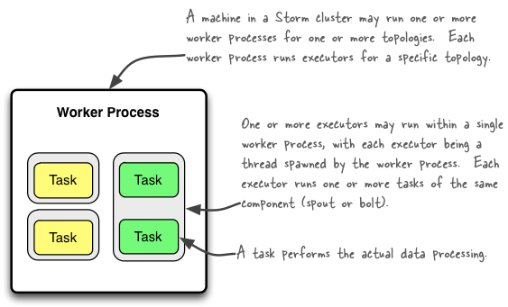

A *worker process* executes a subset of a topology. A worker process belongs to a specific topology and may run one or more executors for one or more components (spouts or bolts) of this topology. A running topology consists of many such processes running on many machines within a Storm cluster.

An *executor* is a thread that is spawned by a worker process. It may run one or more tasks for the same component (spout or bolt).

A *task* performs the actual data processing — each spout or bolt that you implement in your code executes as many tasks across the cluster. The number of tasks for a component is always the same throughout the lifetime of a topology, but the number of executors (threads) for a component can change over time. This means that the following condition holds true: `#threads ≤ #tasks`. By default, the number of tasks is set to be the same as the number of executors, i.e. Storm will run one task per thread.

<a id="understanding-the-parallelism-of-a-storm-topology--configuring-the-parallelism-of-a-topology"></a>

## Configuring the parallelism of a topology

Note that in Storm’s terminology "parallelism" is specifically used to describe the so-called *parallelism hint*, which means the initial number of executor (threads) of a component. In this document though we use the term "parallelism" in a more general sense to describe how you can configure not only the number of executors but also the number of worker processes and the number of tasks of a Storm topology. We will specifically call out when "parallelism" is used in the normal, narrow definition of Storm.

The following sections give an overview of the various configuration options and how to set them in your code. There is more than one way of setting these options though, and the table lists only some of them. Storm currently has the following [order of precedence for configuration settings](#configuration): `defaults.yaml` < `storm.yaml` < topology-specific configuration < internal component-specific configuration < external component-specific configuration.

<a id="understanding-the-parallelism-of-a-storm-topology--number-of-worker-processes"></a>

### Number of worker processes

- Description: How many worker processes to create *for the topology* across machines in the cluster.
- Configuration option: [TOPOLOGY\_WORKERS](https://javadoc.io/doc/org.apache.storm/storm-client/2.8.3/org/apache/storm/Config.html#TOPOLOGY_WORKERS)
- How to set in your code (examples):
  - [Config#setNumWorkers](https://javadoc.io/doc/org.apache.storm/storm-client/2.8.3/org/apache/storm/Config.html)

<a id="understanding-the-parallelism-of-a-storm-topology--number-of-executors-threads"></a>

### Number of executors (threads)

- Description: How many executors to spawn *per component*.
- Configuration option: None (pass `parallelism_hint` parameter to `setSpout` or `setBolt`)
- How to set in your code (examples):
  - [TopologyBuilder#setSpout()](https://javadoc.io/doc/org.apache.storm/storm-client/2.8.3/org/apache/storm/topology/TopologyBuilder.html)
  - [TopologyBuilder#setBolt()](https://javadoc.io/doc/org.apache.storm/storm-client/2.8.3/org/apache/storm/topology/TopologyBuilder.html)
  - Note that as of Storm 0.8 the `parallelism_hint` parameter now specifies the initial number of executors (not tasks!) for that bolt.

<a id="understanding-the-parallelism-of-a-storm-topology--number-of-tasks"></a>

### Number of tasks

- Description: How many tasks to create *per component*.
- Configuration option: [TOPOLOGY\_TASKS](https://javadoc.io/doc/org.apache.storm/storm-client/2.8.3/org/apache/storm/Config.html#TOPOLOGY_TASKS)
- How to set in your code (examples):
  - [ComponentConfigurationDeclarer#setNumTasks()](https://javadoc.io/doc/org.apache.storm/storm-client/2.8.3/org/apache/storm/topology/ComponentConfigurationDeclarer.html)

Here is an example code snippet to show these settings in practice:

```java
topologyBuilder.setBolt("green-bolt", new GreenBolt(), 2)
               .setNumTasks(4)
               .shuffleGrouping("blue-spout");
```

In the above code we configured Storm to run the bolt `GreenBolt` with an initial number of two executors and four associated tasks. Storm will run two tasks per executor (thread). If you do not explicitly configure the number of tasks, Storm will run by default one task per executor.

<a id="understanding-the-parallelism-of-a-storm-topology--example-of-a-running-topology"></a>

## Example of a running topology

The following illustration shows how a simple topology would look like in operation. The topology consists of three components: one spout called `BlueSpout` and two bolts called `GreenBolt` and `YellowBolt`. The components are linked such that `BlueSpout` sends its output to `GreenBolt`, which in turns sends its own output to `YellowBolt`.

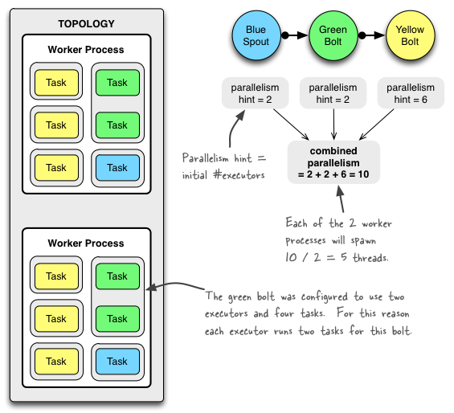

The `GreenBolt` was configured as per the code snippet above whereas `BlueSpout` and `YellowBolt` only set the parallelism hint (number of executors). Here is the relevant code:

```java
Config conf = new Config();
conf.setNumWorkers(2); // use two worker processes

topologyBuilder.setSpout("blue-spout", new BlueSpout(), 2); // set parallelism hint to 2

topologyBuilder.setBolt("green-bolt", new GreenBolt(), 2)
               .setNumTasks(4)
               .shuffleGrouping("blue-spout");

topologyBuilder.setBolt("yellow-bolt", new YellowBolt(), 6)
               .shuffleGrouping("green-bolt");

StormSubmitter.submitTopology(
        "mytopology",
        conf,
        topologyBuilder.createTopology()
    );
```

And of course Storm comes with additional configuration settings to control the parallelism of a topology, including:

- [TOPOLOGY\_MAX\_TASK\_PARALLELISM](https://javadoc.io/doc/org.apache.storm/storm-client/2.8.3/org/apache/storm/Config.html#TOPOLOGY_MAX_TASK_PARALLELISM): This setting puts a ceiling on the number of executors that can be spawned for a single component. It is typically used during testing to limit the number of threads spawned when running a topology in local mode. You can set this option via e.g. [Config#setMaxTaskParallelism()](https://javadoc.io/doc/org.apache.storm/storm-client/2.8.3/org/apache/storm/Config.html#setMaxTaskParallelism(int)).

<a id="understanding-the-parallelism-of-a-storm-topology--how-to-change-the-parallelism-of-a-running-topology"></a>

## How to change the parallelism of a running topology

A nifty feature of Storm is that you can increase or decrease the number of worker processes and/or executors without being required to restart the cluster or the topology. The act of doing so is called rebalancing.

You have two options to rebalance a topology:

1. Use the Storm web UI to rebalance the topology.
2. Use the CLI tool storm rebalance as described below.

Here is an example of using the CLI tool:

```
## Reconfigure the topology "mytopology" to use 5 worker processes,
## the spout "blue-spout" to use 3 executors and
## the bolt "yellow-bolt" to use 10 executors.

$ storm rebalance mytopology -n 5 -e blue-spout=3 -e yellow-bolt=10
```

<a id="understanding-the-parallelism-of-a-storm-topology--references"></a>

## References

- [Concepts](#concepts)
- [Configuration](#configuration)
- [Running topologies on a production cluster](#running-topologies-on-a-production-cluster)
- [Local mode](#local-mode)
- [Tutorial](#tutorial)
- [Storm API documentation](https://javadoc.io/doc/org.apache.storm/storm-client/2.8.3/), most notably the class `Config`

---

<a id="faq"></a>

<!-- source_url: https://storm.apache.org/releases/2.8.3/FAQ.html -->

<!-- page_index: 10 -->

<a id="faq--best-practices"></a>

## Best Practices

<a id="faq--what-rules-of-thumb-can-you-give-me-for-configuring-storm-trident"></a>

### What rules of thumb can you give me for configuring Storm+Trident?

- number of workers a multiple of number of machines; parallelism a multiple of number of workers; number of kafka partitions a multiple of number of spout parallelism
- Use one worker per topology per machine
- Start with fewer, larger aggregators, one per machine with workers on it
- Use the isolation scheduler
- Use one acker per worker -- 0.9 makes that the default, but earlier versions do not.
- enable GC logging; you should see very few major GCs if things are in reasonable shape.
- set the trident batch millis to about 50% of your typical end-to-end latency.
- Start with a max spout pending that is for sure too small -- one for trident, or the number of executors for storm -- and increase it until you stop seeing changes in the flow. You'll probably end up with something near `2*(throughput in recs/sec)*(end-to-end latency)` (2x the Little's law capacity).

<a id="faq--what-are-some-of-the-best-ways-to-get-a-worker-to-mysteriously-and-bafflingly-die"></a>

### What are some of the best ways to get a worker to mysteriously and bafflingly die?

- Do you have write access to the log directory
- Are you blowing out your heap?
- Are all the right libraries installed on all of the workers?
- Is the zookeeper hostname still set to localhost?
- Did you supply a correct, unique hostname -- one that resolves back to the machine -- to each worker, and put it in the storm conf file?
- Have you opened firewall/securitygroup permissions *bidirectionally* among a) all the workers, b) the storm master, c) zookeeper? Also, from the workers to any kafka/kestrel/database/etc that your topology accesses? Use netcat to poke the appropriate ports and be sure.

<a id="faq--halp-i-cannot-see"></a>
<a id="faq--halp-i-cannot-see:"></a>

### Halp! I cannot see:

- **my logs** Logs by default go to $STORM\_HOME/logs. Check that you have write permissions to that directory. They are configured in log4j2/{cluster, worker}.xml.
- **final JVM settings** Add the `-XX+PrintFlagsFinal` commandline option in the childopts (see the conf file)
- **final Java system properties** Add `Properties props = System.getProperties(); props.list(System.out);` near where you build your topology.

<a id="faq--how-many-workers-should-i-use"></a>

### How many Workers should I use?

The total number of workers is set by the supervisors -- there's some number of JVM slots each supervisor will superintend. The thing you set on the topology is how many worker slots it will try to claim.

There's no great reason to use more than one worker per topology per machine.

With one topology running on three 8-core nodes, and parallelism hint 24, each bolt gets 8 executors per machine, i.e. one for each core. There are three big benefits to running three workers (with 8 assigned executors each) compare to running say 24 workers (one assigned executor each).

First, data that is repartitioned (shuffles or group-bys) to executors in the same worker will not have to hit the transfer buffer. Instead, tuples are deposited directly from send to receive buffer. That's a big win. By contrast, if the destination executor were on the same machine in a different worker, it would have to go send -> worker transfer -> local socket -> worker recv -> exec recv buffer. It doesn't hit the network card, but it's not as big a win as when executors are in the same worker.

Second, you're typically better off with three aggregators having very large backing cache than having twenty-four aggregators having small backing caches. This reduces the effect of skew, and improves LRU efficiency.

Lastly, fewer workers reduces control flow chatter.

<a id="faq--topology"></a>

## Topology

<a id="faq--can-a-trident-topology-have-multiple-streams"></a>

### Can a Trident topology have Multiple Streams?

> Can a Trident Topology work like a workflow with conditional paths (if-else)? e.g. A Spout (S1) connects to a bolt (B0) which based on certain values in the incoming tuple routes them to either bolt (B1) or bolt (B2) but not both.

A Trident "each" operator returns a Stream object, which you can store in a variable. You can then run multiple eaches on the same Stream to split it, e.g.:

```
    Stream s = topology.each(...).groupBy(...).aggregate(...) 
    Stream branch1 = s.each(..., FilterA) 
    Stream branch2 = s.each(..., FilterB) 
```

You can join streams with join, merge or multiReduce.

At time of writing, you can't emit to multiple output streams from Trident -- see [STORM-68](https://issues.apache.org/jira/browse/STORM-68)

<a id="faq--why-am-i-getting-a-notserializableexception-illegalstateexception-when-my-topology-is-being-started-up"></a>

### Why am I getting a NotSerializableException/IllegalStateException when my topology is being started up?

Within the Storm lifecycle, the topology is instantiated and then serialized to byte format to be stored in ZooKeeper, prior to the topology being executed. Within this step, if a spout or bolt within the topology has an initialized unserializable property, serialization will fail. If there is a need for a field that is unserializable, initialize it within the bolt's `prepare` or spout's `open` method, which is run after the topology is delivered to the worker.

<a id="faq--spouts"></a>

## Spouts

<a id="faq--what-is-a-coordinator-and-why-are-there-several"></a>

### What is a coordinator, and why are there several?

A trident-spout is actually run within a storm *bolt*. The storm-spout of a trident topology is the MasterBatchCoordinator -- it coordinates trident batches and is the same no matter what spouts you use. A batch is born when the MBC dispenses a seed tuple to each of the spout-coordinators. The spout-coordinator bolts know how your particular spouts should cooperate -- so in the kafka case, it's what helps figure out what partition and offset range each spout should pull from.

<a id="faq--what-can-i-store-into-the-spouts-metadata-record"></a>
<a id="faq--what-can-i-store-into-the-spout-s-metadata-record"></a>

### What can I store into the spout's metadata record?

You should only store static data, and as little of it as possible, into the metadata record (note: maybe you *can* store more interesting things; you shouldn't, though)

<a id="faq--how-often-is-the-emitbatchnew-function-called"></a>

### How often is the 'emitBatchNew' function called?

Since the MBC is the actual spout, all the tuples in a batch are just members of its tupletree. That means storm's "max spout pending" config effectively defines the number of concurrent batches trident runs. The MBC emits a new batch if it has fewer than max-spending tuples pending and if at least one [trident batch interval](https://github.com/apache/storm/blob/v2.8.3/conf/defaults.yaml#L115)'s worth of seconds has passed since the last batch.

<a id="faq--if-nothing-was-emitted-does-trident-slow-down-the-calls"></a>

### If nothing was emitted does Trident slow down the calls?

Yes, there's a pluggable "spout wait strategy"; the default is to sleep for a [configurable amount of time](https://github.com/apache/storm/blob/v2.8.3/conf/defaults.yaml#L110)

<a id="faq--ok-then-what-is-the-trident-batch-interval-for"></a>

### OK, then what is the trident batch interval for?

You know how computers of the 486 era had a [turbo button](http://en.wikipedia.org/wiki/Turbo_button) on them? It's like that.

Actually, it has two practical uses. One is to throttle spouts that poll a remote source without throttling processing. For example, we have a spout that looks in a given S3 bucket for a new batch-uploaded file to read, linebreak and emit. We don't want it hitting S3 more than every few seconds: files don't show up more than once every few minutes, and a batch takes a few seconds to process.

The other is to limit overpressure on the internal queues during startup or under a heavy burst load -- if the spouts spring to life and suddenly jam ten batches' worth of records into the system, you could have a mass of less-urgent tuples from batch 7 clog up the transfer buffer and prevent the $commit tuple from batch 3 to get through (or even just the regular old tuples from batch 3). What we do is set the trident batch interval to about half the typical end-to-end processing latency -- if it takes 600ms to process a batch, it's OK to only kick off a batch every 300ms.

Note that this is a cap, not an additional delay -- with a period of 300ms, if your batch takes 258ms Trident will only delay an additional 42ms.

<a id="faq--how-do-you-set-the-batch-size"></a>

### How do you set the batch size?

Trident doesn't place its own limits on the batch count. In the case of the Kafka spout, the max fetch bytes size divided by the average record size defines an effective records per subbatch partition.

<a id="faq--how-do-i-resize-a-batch"></a>

### How do I resize a batch?

The trident batch is a somewhat overloaded facility. Together with the number of partitions, the batch size is constrained by or serves to define

1. the unit of transactional safety (tuples at risk vs time)
2. per partition, an effective windowing mechanism for windowed stream analytics
3. per partition, the number of simultaneous queries that will be made by a partitionQuery, partitionPersist, etc;
4. per partition, the number of records convenient for the spout to dispatch at the same time;

You can't change the overall batch size once generated, but you can change the number of partitions -- do a shuffle and then change the parallelism hint

<a id="faq--time-series"></a>

## Time Series

<a id="faq--how-do-i-aggregate-events-by-time"></a>

### How do I aggregate events by time?

If you have records with an immutable timestamp, and you would like to count, average or otherwise aggregate them into discrete time buckets, Trident is an excellent and scalable solution.

Write an `Each` function that turns the timestamp into a time bucket: if the bucket size was "by hour", then the timestamp `2013-08-08 12:34:56` would be mapped to the `2013-08-08 12:00:00` time bucket, and so would everything else in the twelve o'clock hour. Then group on that timebucket and use a grouped persistentAggregate. The persistentAggregate uses a local cacheMap backed by a data store. Groups with many records require very few reads from the data store, and use efficient bulk reads and writes; as long as your data feed is relatively prompt Trident will make very efficient use of memory and network. Even if a server drops off line for a day, then delivers that full day's worth of data in a rush, the old results will be calmly retrieved and updated -- and without interfering with calculating the current results.

<a id="faq--how-can-i-know-that-all-records-for-a-time-bucket-have-been-received"></a>

### How can I know that all records for a time bucket have been received?

You cannot know that all events are collected -- this is an epistemological challenge, not a distributed systems challenge. You can:

- Set a time limit using domain knowledge
- Introduce a *punctuation*: a record known to come after all records in the given time bucket. Trident uses this scheme to know when a batch is complete. If you for instance receive records from a set of sensors, each in order for that sensor, then once all sensors have sent you a 3:02:xx or later timestamp lets you know you can commit.
- When possible, make your process incremental: each value that comes in makes the answer more and more true. A Trident ReducerAggregator is an operator that takes a prior result and a set of new records and returns a new result. This lets the result be cached and serialized to a datastore; if a server drops off line for a day and then comes back with a full day's worth of data in a rush, the old results will be calmly retrieved and updated.
- Lambda architecture: Record all events into an archival store (S3, HBase, HDFS) on receipt. in the fast layer, once the time window is clear, process the bucket to get an actionable answer, and ignore everything older than the time window. Periodically run a global aggregation to calculate a "correct" answer.

---

<a id="trident-tutorial"></a>

<!-- source_url: https://storm.apache.org/releases/2.8.3/Trident-tutorial.html -->

<!-- page_index: 11 -->

# Trident Tutorial

Trident is a high-level abstraction for doing realtime computing on top of Storm. It allows you to seamlessly intermix high throughput (millions of messages per second), stateful stream processing with low latency distributed querying. If you're familiar with high level batch processing tools like Pig or Cascading, the concepts of Trident will be very familiar – Trident has joins, aggregations, grouping, functions, and filters. In addition to these, Trident adds primitives for doing stateful, incremental processing on top of any database or persistence store. Trident has consistent, exactly-once semantics, so it is easy to reason about Trident topologies.

Trident developed from an earlier effort to provide exactly-once guarantees for Storm. While this earlier API is no longer present in Storm, the [documentation](https://storm.apache.org/releases/2.8.3/Transactional-topologies.html) provides a gentle introduction to some of the concepts used by Trident, and may be worth reading as an addendum to the Trident documentation.

<a id="trident-tutorial--illustrative-example"></a>

## Illustrative example

Let's look at an illustrative example of Trident. This example will do two things:

1. Compute streaming word count from an input stream of sentences
2. Implement queries to get the sum of the counts for a list of words

For the purposes of illustration, this example will read an infinite stream of sentences from the following source:

```java
FixedBatchSpout spout = new FixedBatchSpout(new Fields("sentence"), 3,
               new Values("the cow jumped over the moon"),
               new Values("the man went to the store and bought some candy"),
               new Values("four score and seven years ago"),
               new Values("how many apples can you eat"));
spout.setCycle(true);
```

This spout cycles through that set of sentences over and over to produce the sentence stream. Here's the code to do the streaming word count part of the computation:

```java
TridentTopology topology = new TridentTopology();        
TridentState wordCounts =
     topology.newStream("spout1", spout)
       .each(new Fields("sentence"), new Split(), new Fields("word"))
       .groupBy(new Fields("word"))
       .persistentAggregate(new MemoryMapState.Factory(), new Count(), new Fields("count"))                
       .parallelismHint(6);
```

Let's go through the code line by line. First a TridentTopology object is created, which exposes the interface for constructing Trident computations. TridentTopology has a method called newStream that creates a new stream of data in the topology reading from an input source. In this case, the input source is just the FixedBatchSpout defined from before. Input sources can also be queue brokers like Kestrel or Kafka. Trident keeps track of a small amount of state for each input source (metadata about what it has consumed) in Zookeeper, and the "spout1" string here specifies the node in Zookeeper where Trident should keep that metadata.

Trident processes the stream as small batches of tuples. For example, the incoming stream of sentences might be divided into batches like so:

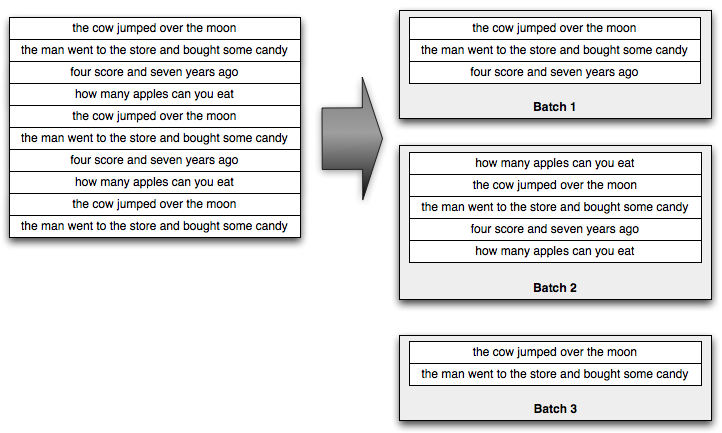

Generally the size of those small batches will be on the order of thousands or millions of tuples, depending on your incoming throughput.

Trident provides a fully fledged batch processing API to process those small batches. The API is very similar to what you see in high level abstractions for Hadoop like Pig or Cascading: you can do group by's, joins, aggregations, run functions, run filters, and so on. Of course, processing each small batch in isolation isn't that interesting, so Trident provides functions for doing aggregations across batches and persistently storing those aggregations – whether in memory, in Memcached, in Cassandra, or some other store. Finally, Trident has first-class functions for querying sources of realtime state. That state could be updated by Trident (like in this example), or it could be an independent source of state.

Back to the example, the spout emits a stream containing one field called "sentence". The next line of the topology definition applies the Split function to each tuple in the stream, taking the "sentence" field and splitting it into words. Each sentence tuple creates potentially many word tuples – for instance, the sentence "the cow jumped over the moon" creates six "word" tuples. Here's the definition of Split:

```java
public class Split extends BaseFunction {public void execute(TridentTuple tuple, TridentCollector collector) {String sentence = tuple.getString(0); for(String word: sentence.split(" ")) {collector.emit(new Values(word));}}}
```

As you can see, it's really simple. It simply grabs the sentence, splits it on whitespace, and emits a tuple for each word.

The rest of the topology computes word count and keeps the results persistently stored. First the stream is grouped by the "word" field. Then, each group is persistently aggregated using the Count aggregator. The persistentAggregate function knows how to store and update the results of the aggregation in a source of state. In this example, the word counts are kept in memory, but this can be trivially swapped to use Memcached, Cassandra, or any other persistent store. Swapping this topology to store counts in Memcached is as simple as replacing the persistentAggregate line with this (using [trident-memcached](https://github.com/nathanmarz/trident-memcached)), where the "serverLocations" is a list of host/ports for the Memcached cluster:

```java
.persistentAggregate(MemcachedState.transactional(serverLocations), new Count(), new Fields("count"))        
MemcachedState.transactional()
```

The values stored by persistentAggregate represents the aggregation of all batches ever emitted by the stream.

One of the cool things about Trident is that it has fully fault-tolerant, exactly-once processing semantics. This makes it easy to reason about your realtime processing. Trident persists state in a way so that if failures occur and retries are necessary, it won't perform multiple updates to the database for the same source data.

The persistentAggregate method transforms a Stream into a TridentState object. In this case the TridentState object represents all the word counts. We will use this TridentState object to implement the distributed query portion of the computation.

The next part of the topology implements a low latency distributed query on the word counts. The query takes as input a whitespace separated list of words and return the sum of the counts for those words. These queries are executed just like normal RPC calls, except they are parallelized in the background. Here's an example of how you might invoke one of these queries:

```java
DRPCClient client = new DRPCClient("drpc.server.location", 3772);
System.out.println(client.execute("words", "cat dog the man");
// prints the JSON-encoded result, e.g.: "[[5078]]"
```

As you can see, it looks just like a regular remote procedure call (RPC), except it's executing in parallel across a Storm cluster. The latency for small queries like this are typically around 10ms. More intense DRPC queries can take longer of course, although the latency largely depends on how many resources you have allocated for the computation.

The implementation of the distributed query portion of the topology looks like this:

```java
topology.newDRPCStream("words")
       .each(new Fields("args"), new Split(), new Fields("word"))
       .groupBy(new Fields("word"))
       .stateQuery(wordCounts, new Fields("word"), new MapGet(), new Fields("count"))
       .each(new Fields("count"), new FilterNull())
       .aggregate(new Fields("count"), new Sum(), new Fields("sum"));
```

The same TridentTopology object is used to create the DRPC stream, and the function is named "words". The function name corresponds to the function name given in the first argument of execute when using a DRPCClient.

Each DRPC request is treated as its own little batch processing job that takes as input a single tuple representing the request. The tuple contains one field called "args" that contains the argument provided by the client. In this case, the argument is a whitespace separated list of words.

First, the Split function is used to split the arguments for the request into its constituent words. The stream is grouped by "word", and the stateQuery operator is used to query the TridentState object that the first part of the topology generated. stateQuery takes in a source of state – in this case, the word counts computed by the other portion of the topology – and a function for querying that state. In this case, the MapGet function is invoked, which gets the count for each word. Since the DRPC stream is grouped the exact same way as the TridentState was (by the "word" field), each word query is routed to the exact partition of the TridentState object that manages updates for that word.

Next, words that didn't have a count are filtered out via the FilterNull filter and the counts are summed using the Sum aggregator to get the result. Then, Trident automatically sends the result back to the waiting client.

Trident is intelligent about how it executes a topology to maximize performance. There's two interesting things happening automatically in this topology:

1. Operations that read from or write to state (like persistentAggregate and stateQuery) automatically batch operations to that state. So if there's 20 updates that need to be made to the database for the current batch of processing, rather than do 20 read requests and 20 writes requests to the database, Trident will automatically batch up the reads and writes, doing only 1 read request and 1 write request (and in many cases, you can use caching in your State implementation to eliminate the read request). So you get the best of both words of convenience – being able to express your computation in terms of what should be done with each tuple – and performance.
2. Trident aggregators are heavily optimized. Rather than transfer all tuples for a group to the same machine and then run the aggregator, Trident will do partial aggregations when possible before sending tuples over the network. For example, the Count aggregator computes the count on each partition, sends the partial count over the network, and then sums together all the partial counts to get the total count. This technique is similar to the use of combiners in MapReduce.

Let's look at another example of Trident.

<a id="trident-tutorial--reach"></a>

## Reach

The next example is a pure DRPC topology that computes the reach of a URL on demand. Reach is the number of unique people exposed to a URL on Twitter. To compute reach, you need to fetch all the people who ever tweeted a URL, fetch all the followers of all those people, unique that set of followers, and that count that uniqued set. Computing reach is too intense for a single machine – it can require thousands of database calls and tens of millions of tuples. With Storm and Trident, you can parallelize the computation of each step across a cluster.

This topology will read from two sources of state. One database maps URLs to a list of people who tweeted that URL. The other database maps a person to a list of followers for that person. The topology definition looks like this:

```java
TridentState urlToTweeters =
       topology.newStaticState(getUrlToTweetersState());
TridentState tweetersToFollowers =
       topology.newStaticState(getTweeterToFollowersState());

topology.newDRPCStream("reach")
       .stateQuery(urlToTweeters, new Fields("args"), new MapGet(), new Fields("tweeters"))
       .each(new Fields("tweeters"), new ExpandList(), new Fields("tweeter"))
       .shuffle()
       .stateQuery(tweetersToFollowers, new Fields("tweeter"), new MapGet(), new Fields("followers"))
       .parallelismHint(200)
       .each(new Fields("followers"), new ExpandList(), new Fields("follower"))
       .groupBy(new Fields("follower"))
       .aggregate(new One(), new Fields("one"))
       .parallelismHint(20)
       .aggregate(new Count(), new Fields("reach"));
```

The topology creates TridentState objects representing each external database using the newStaticState method. These can then be queried in the topology. Like all sources of state, queries to these databases will be automatically batched for maximum efficiency.

The topology definition is straightforward – it's just a simple batch processing job. First, the urlToTweeters database is queried to get the list of people who tweeted the URL for this request. That returns a list, so the ExpandList function is invoked to create a tuple for each tweeter.

Next, the followers for each tweeter must be fetched. It's important that this step be parallelized, so shuffle is invoked to evenly distribute the tweeters among all workers for the topology. Then, the followers database is queried to get the list of followers for each tweeter. You can see that this portion of the topology is given a large parallelism since this is the most intense portion of the computation.

Next, the set of followers is uniqued and counted. This is done in two steps. First a "group by" is done on the batch by "follower", running the "One" aggregator on each group. The "One" aggregator simply emits a single tuple containing the number one for each group. Then, the ones are summed together to get the unique count of the followers set. Here's the definition of the "One" aggregator:

```java
public class One implements CombinerAggregator<Integer> {public Integer init(TridentTuple tuple) {return 1;}
public Integer combine(Integer val1, Integer val2) {return 1;}
public Integer zero() {return 1;}}
```

This is a "combiner aggregator", which knows how to do partial aggregations before transferring tuples over the network to maximize efficiency. Sum is also defined as a combiner aggregator, so the global sum done at the end of the topology will be very efficient.

Let's now look at Trident in more detail.

<a id="trident-tutorial--fields-and-tuples"></a>

## Fields and tuples

The Trident data model is the TridentTuple which is a named list of values. During a topology, tuples are incrementally built up through a sequence of operations. Operations generally take in a set of input fields and emit a set of "function fields". The input fields are used to select a subset of the tuple as input to the operation, while the "function fields" name the fields the operation emits.

Consider this example. Suppose you have a stream called "stream" that contains the fields "x", "y", and "z". To run a filter MyFilter that takes in "y" as input, you would say:

```java
stream.each(new Fields("y"), new MyFilter())
```

Suppose the implementation of MyFilter is this:

```java
public class MyFilter extends BaseFilter {
   public boolean isKeep(TridentTuple tuple) {
       return tuple.getInteger(0) < 10;
   }
}
```

This will keep all tuples whose "y" field is less than 10. The TridentTuple given as input to MyFilter will only contain the "y" field. Note that Trident is able to project a subset of a tuple extremely efficiently when selecting the input fields: the projection is essentially free.

Let's now look at how "function fields" work. Suppose you had this function:

```java
public class AddAndMultiply extends BaseFunction {
   public void execute(TridentTuple tuple, TridentCollector collector) {
       int i1 = tuple.getInteger(0);
       int i2 = tuple.getInteger(1);
       collector.emit(new Values(i1 + i2, i1 * i2));
   }
}
```

This function takes two numbers as input and emits two new values: the addition of the numbers and the multiplication of the numbers. Suppose you had a stream with the fields "x", "y", and "z". You would use this function like this:

```java
stream.each(new Fields("x", "y"), new AddAndMultiply(), new Fields("added", "multiplied"));
```

The output of functions is additive: the fields are added to the input tuple. So the output of this each call would contain tuples with the five fields "x", "y", "z", "added", and "multiplied". "added" corresponds to the first value emitted by AddAndMultiply, while "multiplied" corresponds to the second value.

With aggregators, on the other hand, the function fields replace the input tuples. So if you had a stream containing the fields "val1" and "val2", and you did this:

```java
stream.aggregate(new Fields("val2"), new Sum(), new Fields("sum"))
```

The output stream would only contain a single tuple with a single field called "sum", representing the sum of all "val2" fields in that batch.

With grouped streams, the output will contain the grouping fields followed by the fields emitted by the aggregator. For example:

```java
stream.groupBy(new Fields("val1"))
     .aggregate(new Fields("val2"), new Sum(), new Fields("sum"))
```

In this example, the output will contain the fields "val1" and "sum".

<a id="trident-tutorial--state"></a>

## State

A key problem to solve with realtime computation is how to manage state so that updates are idempotent in the face of failures and retries. It's impossible to eliminate failures, so when a node dies or something else goes wrong, batches need to be retried. The question is – how do you do state updates (whether external databases or state internal to the topology) so that it's like each message was only processed only once?

This is a tricky problem, and can be illustrated with the following example. Suppose that you're doing a count aggregation of your stream and want to store the running count in a database. If you store only the count in the database and it's time to apply a state update for a batch, there's no way to know if you applied that state update before. The batch could have been attempted before, succeeded in updating the database, and then failed at a later step. Or the batch could have been attempted before and failed to update the database. You just don't know.

Trident solves this problem by doing two things:

1. Each batch is given a unique id called the "transaction id". If a batch is retried it will have the exact same transaction id.
2. State updates are ordered among batches. That is, the state updates for batch 3 won't be applied until the state updates for batch 2 have succeeded.

With these two primitives, you can achieve exactly-once semantics with your state updates. Rather than store just the count in the database, what you can do instead is store the transaction id with the count in the database as an atomic value. Then, when updating the count, you can just compare the transaction id in the database with the transaction id for the current batch. If they're the same, you skip the update – because of the strong ordering, you know for sure that the value in the database incorporates the current batch. If they're different, you increment the count.

Of course, you don't have to do this logic manually in your topologies. This logic is wrapped by the State abstraction and done automatically. Nor is your State object required to implement the transaction id trick: if you don't want to pay the cost of storing the transaction id in the database, you don't have to. In that case the State will have at-least-once-processing semantics in the case of failures (which may be fine for your application). You can read more about how to implement a State and the various fault-tolerance tradeoffs possible [in this doc](#trident-state).

A State is allowed to use whatever strategy it wants to store state. So it could store state in an external database or it could keep the state in-memory but backed by HDFS (like how HBase works). State's are not required to hold onto state forever. For example, you could have an in-memory State implementation that only keeps the last X hours of data available and drops anything older. Take a look at the implementation of the [Memcached integration](https://github.com/nathanmarz/trident-memcached/blob/master/src/jvm/trident/memcached/MemcachedState.java) for an example State implementation.

<a id="trident-tutorial--execution-of-trident-topologies"></a>

## Execution of Trident topologies

Trident topologies compile down into as efficient of a Storm topology as possible. Tuples are only sent over the network when a repartitioning of the data is required, such as if you do a groupBy or a shuffle. So if you had this Trident topology:

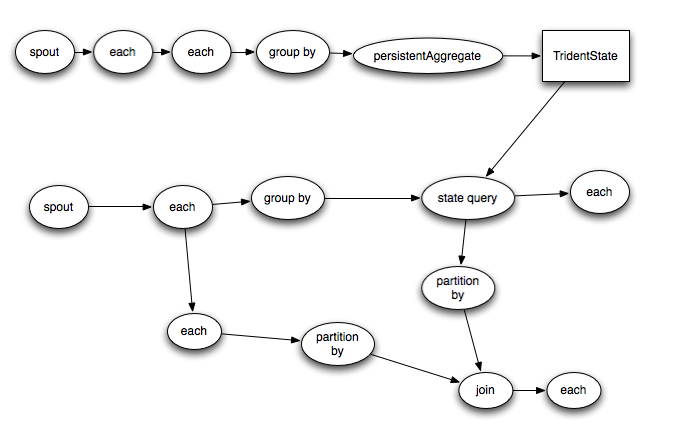

It would compile into Storm spouts/bolts like this:

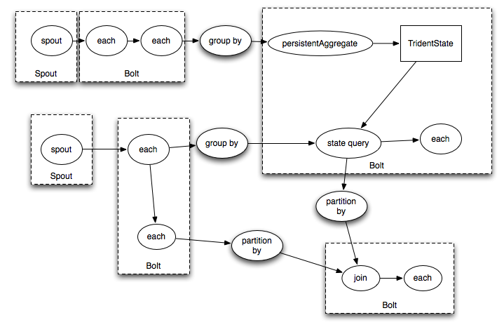

<a id="trident-tutorial--conclusion"></a>

## Conclusion

Trident makes realtime computation elegant. You've seen how high throughput stream processing, state manipulation, and low-latency querying can be seamlessly intermixed via Trident's API. Trident lets you express your realtime computations in a natural way while still getting maximal performance.

---

<a id="trident-api-overview"></a>

<!-- source_url: https://storm.apache.org/releases/2.8.3/Trident-API-Overview.html -->

<!-- page_index: 12 -->

# Trident API Overview

The core data model in Trident is the "Stream", processed as a series of batches. A stream is partitioned among the nodes in the cluster, and operations applied to a stream are applied in parallel across each partition.

There are five kinds of operations in Trident:

1. Operations that apply locally to each partition and cause no network transfer
2. Repartitioning operations that repartition a stream but otherwise don't change the contents (involves network transfer)
3. Aggregation operations that do network transfer as part of the operation
4. Operations on grouped streams
5. Merges and joins

<a id="trident-api-overview--partition-local-operations"></a>

## Partition-local operations

Partition-local operations involve no network transfer and are applied to each batch partition independently.

<a id="trident-api-overview--functions"></a>

### Functions

A function takes in a set of input fields and emits zero or more tuples as output. The fields of the output tuple are appended to the original input tuple in the stream. If a function emits no tuples, the original input tuple is filtered out. Otherwise, the input tuple is duplicated for each output tuple. Suppose you have this function:

```java
public class MyFunction extends BaseFunction {
    public void execute(TridentTuple tuple, TridentCollector collector) {
        for(int i=0; i < tuple.getInteger(0); i++) {
            collector.emit(new Values(i));
        }
    }
}
```

Now suppose you have a stream in the variable "mystream" with the fields ["a", "b", "c"] with the following tuples:

```
[1, 2, 3]
[4, 1, 6]
[3, 0, 8]
```

If you run this code:

```java
mystream.each(new Fields("b"), new MyFunction(), new Fields("d")))
```

The resulting tuples would have fields ["a", "b", "c", "d"] and look like this:

```
[1, 2, 3, 0]
[1, 2, 3, 1]
[4, 1, 6, 0]
```

<a id="trident-api-overview--filters"></a>

### Filters

Filters take in a tuple as input and decide whether or not to keep that tuple or not. Suppose you had this filter:

```java
public class MyFilter extends BaseFilter {
    public boolean isKeep(TridentTuple tuple) {
        return tuple.getInteger(0) == 1 && tuple.getInteger(1) == 2;
    }
}
```

Now suppose you had these tuples with fields ["a", "b", "c"]:

```
[1, 2, 3]
[2, 1, 1]
[2, 3, 4]
```

If you ran this code:

```java
mystream.filter(new MyFilter())
```

The resulting tuples would be:

```
[1, 2, 3]
```

<a id="trident-api-overview--map-and-flatmap"></a>

### map and flatMap

`map` returns a stream consisting of the result of applying the given mapping function to the tuples of the stream. This
can be used to apply a one-one transformation to the tuples.

For example, if there is a stream of words and you wanted to convert it to a stream of upper case words, you could define a mapping function as follows,

```java
public class UpperCase extends MapFunction {
 @Override
 public Values execute(TridentTuple input) {
   return new Values(input.getString(0).toUpperCase());
 }
}
```

The mapping function can then be applied on the stream to produce a stream of uppercase words.

```java
mystream.map(new UpperCase())
```

`flatMap` is similar to `map` but has the effect of applying a one-to-many transformation to the values of the stream, and then flattening the resulting elements into a new stream.

For example, if there is a stream of sentences and you wanted to convert it to a stream of words, you could define a flatMap function as follows,

```java
public class Split extends FlatMapFunction {@Override public Iterable<Values> execute(TridentTuple input) {List<Values> valuesList = new ArrayList<>(); for (String word : input.getString(0).split(" ")) {valuesList.add(new Values(word));} return valuesList;}}
```

The flatMap function can then be applied on the stream of sentences to produce a stream of words,

```java
mystream.flatMap(new Split())
```

Of course these operations can be chained, so a stream of uppercase words can be obtained from a stream of sentences as follows,

```java
mystream.flatMap(new Split()).map(new UpperCase())
```

If you don't pass output fields as parameter, map and flatMap preserves the input fields to output fields.

If you want to apply MapFunction or FlatMapFunction with replacing old fields with new output fields, you can call map / flatMap with additional Fields parameter as follows,

```java
mystream.map(new UpperCase(), new Fields("uppercased"))
```

Output stream wil have only one output field "uppercased" regardless of what output fields previous stream had.
Same thing applies to flatMap, so following is valid as well,

```java
mystream.flatMap(new Split(), new Fields("word"))
```

<a id="trident-api-overview--peek"></a>

### peek

`peek` can be used to perform an additional action on each trident tuple as they flow through the stream.
This could be useful for debugging to see the tuples as they flow past a certain point in a pipeline.

For example, the below code would print the result of converting the words to uppercase before they are passed to `groupBy`

```java
mystream.flatMap(new Split()).map(new UpperCase()) .peek(new Consumer() {@Override public void accept(TridentTuple input) {System.out.println(input.getString(0));} }) .groupBy(new Fields("word")) .persistentAggregate(new MemoryMapState.Factory(), new Count(), new Fields("count"))
```

<a id="trident-api-overview--min-and-minby"></a>

### min and minBy

`min` and `minBy` operations return minimum value on each partition of a batch of tuples in a trident stream.

Suppose, a trident stream contains fields ["device-id", "count"] and the following partitions of tuples

```
Partition 0:
[123, 2]
[113, 54]
[23,  28]
[237, 37]
[12,  23]
[62,  17]
[98,  42]

Partition 1:
[64,  18]
[72,  54]
[2,   28]
[742, 71]
[98,  45]
[62,  12]
[19,  174]


Partition 2:
[27,  94]
[82,  23]
[9,   86]
[53,  71]
[74,  37]
[51,  49]
[37,  98]
```

`minBy` operation can be applied on the above stream of tuples like below which results in emitting tuples with minimum values of `count` field in each partition.

```java
  mystream.minBy(new Fields("count"))
```

Result of the above code on mentioned partitions is:

```
Partition 0:
[123, 2]


Partition 1:
[62,  12]


Partition 2:
[82,  23]
```

You can look at other `min` and `minBy` operations on Stream
`java
public <T> Stream minBy(String inputFieldName, Comparator<T> comparator)
public Stream min(Comparator<TridentTuple> comparator)`
Below example shows how these APIs can be used to find minimum using respective Comparators on a tuple.

```java

        FixedBatchSpout spout = new FixedBatchSpout(allFields, 10, Vehicle.generateVehicles(20));

        TridentTopology topology = new TridentTopology();
        Stream vehiclesStream = topology.newStream("spout1", spout).
                each(allFields, new Debug("##### vehicles"));

        Stream slowVehiclesStream =
                vehiclesStream
                        .min(new SpeedComparator()) // Comparator w.r.t speed on received tuple.
                        .each(vehicleField, new Debug("#### slowest vehicle"));

        vehiclesStream
                .minBy(Vehicle.FIELD_NAME, new EfficiencyComparator()) // Comparator w.r.t efficiency on received tuple.
                .each(vehicleField, new Debug("#### least efficient vehicle"));
```

Example applications of these APIs can be located at [TridentMinMaxOfDevicesTopology](https://github.com/apache/storm/blob/master/examples/storm-starter/src/jvm/org/apache/storm/starter/trident/TridentMinMaxOfDevicesTopology.java) and [TridentMinMaxOfVehiclesTopology](https://github.com/apache/storm/blob/master/examples/storm-starter/src/jvm/org/apache/storm/starter/trident/TridentMinMaxOfVehiclesTopology.java)

<a id="trident-api-overview--max-and-maxby"></a>

### max and maxBy

`max` and `maxBy` operations return maximum value on each partition of a batch of tuples in a trident stream.

Suppose, a trident stream contains fields ["device-id", "count"] as mentioned in the above section.

`max` and `maxBy` operations can be applied on the above stream of tuples like below which results in emitting tuples with maximum values of `count` field for each partition.

```java
  mystream.maxBy(new Fields("count"))
```

Result of the above code on mentioned partitions is:

```
Partition 0:
[113, 54]


Partition 1:
[19,  174]


Partition 2:
[37,  98]
```

You can look at other `max` and `maxBy` functions on Stream

```java

      public <T> Stream maxBy(String inputFieldName, Comparator<T> comparator) 
      public Stream max(Comparator<TridentTuple> comparator) 
```

Below example shows how these APIs can be used to find maximum using respective Comparators on a tuple.

```java

        FixedBatchSpout spout = new FixedBatchSpout(allFields, 10, Vehicle.generateVehicles(20));

        TridentTopology topology = new TridentTopology();
        Stream vehiclesStream = topology.newStream("spout1", spout).
                each(allFields, new Debug("##### vehicles"));

        vehiclesStream
                .max(new SpeedComparator()) // Comparator w.r.t speed on received tuple.
                .each(vehicleField, new Debug("#### fastest vehicle"))
                .project(driverField)
                .each(driverField, new Debug("##### fastest driver"));

        vehiclesStream
                .maxBy(Vehicle.FIELD_NAME, new EfficiencyComparator()) // Comparator w.r.t efficiency on received tuple.
                .each(vehicleField, new Debug("#### most efficient vehicle"));
```

Example applications of these APIs can be located at [TridentMinMaxOfDevicesTopology](https://github.com/apache/storm/blob/master/examples/storm-starter/src/jvm/org/apache/storm/starter/trident/TridentMinMaxOfDevicesTopology.java) and [TridentMinMaxOfVehiclesTopology](https://github.com/apache/storm/blob/master/examples/storm-starter/src/jvm/org/apache/storm/starter/trident/TridentMinMaxOfVehiclesTopology.java)

<a id="trident-api-overview--windowing"></a>

### Windowing

Trident streams can process tuples in batches which are of the same window and emit aggregated result to the next operation.
There are two kinds of windowing supported which are based on processing time or tuples count:
1. Tumbling window
2. Sliding window

<a id="trident-api-overview--tumbling-window"></a>

#### Tumbling window

Tuples are grouped in a single window based on processing time or count. Any tuple belongs to only one of the windows.

```java
/** * Returns a stream of tuples which are aggregated results of a tumbling window with every {@code windowCount} of tuples.*/ public Stream tumblingWindow(int windowCount, WindowsStoreFactory windowStoreFactory,Fields inputFields, Aggregator aggregator, Fields functionFields);
/** * Returns a stream of tuples which are aggregated results of a window that tumbles at duration of {@code windowDuration} */ public Stream tumblingWindow(BaseWindowedBolt.Duration windowDuration, WindowsStoreFactory windowStoreFactory,Fields inputFields, Aggregator aggregator, Fields functionFields);
```

<a id="trident-api-overview--sliding-window"></a>

#### Sliding window

Tuples are grouped in windows and window slides for every sliding interval. A tuple can belong to more than one window.

```java
/** * Returns a stream of tuples which are aggregated results of a sliding window with every {@code windowCount} of tuples * and slides the window after {@code slideCount}.*/ public Stream slidingWindow(int windowCount, int slideCount, WindowsStoreFactory windowStoreFactory,Fields inputFields, Aggregator aggregator, Fields functionFields);
/** * Returns a stream of tuples which are aggregated results of a window which slides at duration of {@code slidingInterval} * and completes a window at {@code windowDuration} */ public Stream slidingWindow(BaseWindowedBolt.Duration windowDuration, BaseWindowedBolt.Duration slidingInterval,WindowsStoreFactory windowStoreFactory, Fields inputFields, Aggregator aggregator, Fields functionFields);
```

Examples of tumbling and sliding windows can be found [here](#windowing)

<a id="trident-api-overview--common-windowing-api"></a>

#### Common windowing API

Below is the common windowing API which takes `WindowConfig` for any supported windowing configurations.

```java

    public Stream window(WindowConfig windowConfig, WindowsStoreFactory windowStoreFactory, Fields inputFields,
                         Aggregator aggregator, Fields functionFields)
```

`windowConfig` can be any of the below.
- `SlidingCountWindow.of(int windowCount, int slidingCount)`
- `SlidingDurationWindow.of(BaseWindowedBolt.Duration windowDuration, BaseWindowedBolt.Duration slidingDuration)`
- `TumblingCountWindow.of(int windowLength)`
- `TumblingDurationWindow.of(BaseWindowedBolt.Duration windowLength)`

Trident windowing APIs need `WindowsStoreFactory` to store received tuples and aggregated values. Currently, basic implementation
for HBase is given with `HBaseWindowsStoreFactory`. It can further be extended to address respective usecases.
Example of using `HBaseWindowStoreFactory` for windowing can be seen below.

```java

    // window-state table should already be created with cf:tuples column
    HBaseWindowsStoreFactory windowStoreFactory = new HBaseWindowsStoreFactory(new HashMap<String, Object>(), "window-state", "cf".getBytes("UTF-8"), "tuples".getBytes("UTF-8"));
    FixedBatchSpout spout = new FixedBatchSpout(new Fields("sentence"), 3, new Values("the cow jumped over the moon"),
            new Values("the man went to the store and bought some candy"), new Values("four score and seven years ago"),
            new Values("how many apples can you eat"), new Values("to be or not to be the person"));
    spout.setCycle(true);

    TridentTopology topology = new TridentTopology();

    Stream stream = topology.newStream("spout1", spout).parallelismHint(16).each(new Fields("sentence"),
            new Split(), new Fields("word"))
            .window(TumblingCountWindow.of(1000), windowStoreFactory, new Fields("word"), new CountAsAggregator(), new Fields("count"))
            .peek(new Consumer() {
                @Override
                public void accept(TridentTuple input) {
                    LOG.info("Received tuple: [{}]", input);
                }
            });

    StormTopology stormTopology =  topology.build();
```

Detailed description of all the above APIs in this section can be found [here](https://javadoc.io/doc/org.apache.storm/storm-client/2.8.3/org/apache/storm/trident/Stream.html)

<a id="trident-api-overview--example-applications"></a>

#### Example applications

Example applications of these APIs are located at [TridentHBaseWindowingStoreTopology](https://github.com/apache/storm/blob/v2.8.3/examples/storm-starter/src/jvm/org/apache/storm/starter/trident/TridentHBaseWindowingStoreTopology.java)
and [TridentWindowingInmemoryStoreTopology](https://github.com/apache/storm/blob/v2.8.3/examples/storm-starter/src/jvm/org/apache/storm/starter/trident/TridentWindowingInmemoryStoreTopology.java)

<a id="trident-api-overview--partitionaggregate"></a>

### partitionAggregate

partitionAggregate runs a function on each partition of a batch of tuples. Unlike functions, the tuples emitted by partitionAggregate replace the input tuples given to it. Consider this example:

```java
mystream.partitionAggregate(new Fields("b"), new Sum(), new Fields("sum"))
```

Suppose the input stream contained fields ["a", "b"] and the following partitions of tuples:

```
Partition 0:
["a", 1]
["b", 2]

Partition 1:
["a", 3]
["c", 8]

Partition 2:
["e", 1]
["d", 9]
["d", 10]
```

Then the output stream of that code would contain these tuples with one field called "sum":

```
Partition 0:
[3]

Partition 1:
[11]

Partition 2:
[20]
```

There are three different interfaces for defining aggregators: CombinerAggregator, ReducerAggregator, and Aggregator.

Here's the interface for CombinerAggregator:

```java
public interface CombinerAggregator<T> extends Serializable {
    T init(TridentTuple tuple);
    T combine(T val1, T val2);
    T zero();
}
```

A CombinerAggregator returns a single tuple with a single field as output. CombinerAggregators run the init function on each input tuple and use the combine function to combine values until there's only one value left. If there's no tuples in the partition, the CombinerAggregator emits the output of the zero function. For example, here's the implementation of Count:

```java
public class Count implements CombinerAggregator<Long> {public Long init(TridentTuple tuple) {return 1L;}
public Long combine(Long val1, Long val2) {return val1 + val2;}
public Long zero() {return 0L;}}
```

CombinerAggregators offer high efficiency when used with the aggregate method instead of partitionAggregate ([see below](#trident-api-overview--aggregation-operations)).

A ReducerAggregator has the following interface:

```java
public interface ReducerAggregator<T> extends Serializable {
    T init();
    T reduce(T curr, TridentTuple tuple);
}
```

A ReducerAggregator produces an initial value with init, and then it iterates on that value for each input tuple to produce a single tuple with a single value as output. For example, here's how you would define Count as a ReducerAggregator:

```java
public class Count implements ReducerAggregator<Long> {public Long init() {return 0L;}
public Long reduce(Long curr, TridentTuple tuple) {return curr + 1;}}
```

ReducerAggregator can also be used with persistentAggregate, as you'll see later.

The most general interface for performing aggregations is Aggregator, which looks like this:

```java
public interface Aggregator<T> extends Operation {
    T init(Object batchId, TridentCollector collector);
    void aggregate(T state, TridentTuple tuple, TridentCollector collector);
    void complete(T state, TridentCollector collector);
}
```

Aggregators can emit any number of tuples with any number of fields. They can emit tuples at any point during execution. Aggregators execute in the following way:

1. The init method is called before processing the batch. The return value of init is an Object that will represent the state of the aggregation and will be passed into the aggregate and complete methods.
2. The aggregate method is called for each input tuple in the batch partition. This method can update the state and optionally emit tuples.
3. The complete method is called when all tuples for the batch partition have been processed by aggregate.

Here's how you would implement Count as an Aggregator:

```java
public class CountAgg extends BaseAggregator<CountState> {static class CountState {long count = 0;}
public CountState init(Object batchId, TridentCollector collector) {return new CountState();}
public void aggregate(CountState state, TridentTuple tuple, TridentCollector collector) {state.count+=1;}
public void complete(CountState state, TridentCollector collector) {collector.emit(new Values(state.count));}}
```

Sometimes you want to execute multiple aggregators at the same time. This is called chaining and can be accomplished like this:

```java
mystream.chainedAgg()
        .partitionAggregate(new Count(), new Fields("count"))
        .partitionAggregate(new Fields("b"), new Sum(), new Fields("sum"))
        .chainEnd()
```

This code will run the Count and Sum aggregators on each partition. The output will contain a single tuple with the fields ["count", "sum"].

<a id="trident-api-overview--statequery-and-partitionpersist"></a>

### stateQuery and partitionPersist

stateQuery and partitionPersist query and update sources of state, respectively. You can read about how to use them on [Trident state doc](#trident-state).

<a id="trident-api-overview--projection"></a>

### projection

The projection method on Stream keeps only the fields specified in the operation. If you had a Stream with fields ["a", "b", "c", "d"] and you ran this code:

```java
mystream.project(new Fields("b", "d"))
```

The output stream would contain only the fields ["b", "d"].

<a id="trident-api-overview--repartitioning-operations"></a>

## Repartitioning operations

Repartitioning operations run a function to change how the tuples are partitioned across tasks. The number of partitions can also change as a result of repartitioning (for example, if the parallelism hint is greater after repartioning). Repartitioning requires network transfer. Here are the repartitioning functions:

1. shuffle: Use random round robin algorithm to evenly redistribute tuples across all target partitions
2. broadcast: Every tuple is replicated to all target partitions. This can useful during DRPC – for example, if you need to do a stateQuery on every partition of data.
3. partitionBy: partitionBy takes in a set of fields and does semantic partitioning based on that set of fields. The fields are hashed and modded by the number of target partitions to select the target partition. partitionBy guarantees that the same set of fields always goes to the same target partition.
4. global: All tuples are sent to the same partition. The same partition is chosen for all batches in the stream.
5. batchGlobal: All tuples in the batch are sent to the same partition. Different batches in the stream may go to different partitions.
6. partition: This method takes in a custom partitioning function that implements org.apache.storm.grouping.CustomStreamGrouping

<a id="trident-api-overview--aggregation-operations"></a>

## Aggregation operations

Trident has aggregate and persistentAggregate methods for doing aggregations on Streams. aggregate is run on each batch of the stream in isolation, while persistentAggregate will aggregation on all tuples across all batches in the stream and store the result in a source of state.

Running aggregate on a Stream does a global aggregation. When you use a ReducerAggregator or an Aggregator, the stream is first repartitioned into a single partition, and then the aggregation function is run on that partition. When you use a CombinerAggregator, on the other hand, first Trident will compute partial aggregations of each partition, then repartition to a single partition, and then finish the aggregation after the network transfer. CombinerAggregator's are far more efficient and should be used when possible.

Here's an example of using aggregate to get a global count for a batch:

```java
mystream.aggregate(new Count(), new Fields("count"))
```

Like partitionAggregate, aggregators for aggregate can be chained. However, if you chain a CombinerAggregator with a non-CombinerAggregator, Trident is unable to do the partial aggregation optimization.

You can read more about how to use persistentAggregate in the [Trident state doc](#trident-state).

<a id="trident-api-overview--operations-on-grouped-streams"></a>

## Operations on grouped streams

The groupBy operation repartitions the stream by doing a partitionBy on the specified fields, and then within each partition groups tuples together whose group fields are equal. For example, here's an illustration of a groupBy operation:

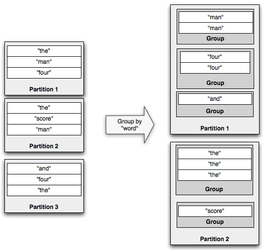

If you run aggregators on a grouped stream, the aggregation will be run within each group instead of against the whole batch. persistentAggregate can also be run on a GroupedStream, in which case the results will be stored in a [MapState](https://github.com/apache/storm/blob/v2.8.3/storm-client/src/jvm/org/apache/storm/trident/state/map/MapState.java) with the key being the grouping fields. You can read more about persistentAggregate in the [Trident state doc](#trident-state).

Like regular streams, aggregators on grouped streams can be chained.

<a id="trident-api-overview--merges-and-joins"></a>

## Merges and joins

The last part of the API is combining different streams together. The simplest way to combine streams is to merge them into one stream. You can do that with the TridentTopology#merge method, like so:

```java
topology.merge(stream1, stream2, stream3);
```

Trident will name the output fields of the new, merged stream as the output fields of the first stream.

Another way to combine streams is with a join. Now, a standard join, like the kind from SQL, require finite input. So they don't make sense with infinite streams. Joins in Trident only apply within each small batch that comes off of the spout.

Here's an example join between a stream containing fields ["key", "val1", "val2"] and another stream containing ["x", "val1"]:

```java
topology.join(stream1, new Fields("key"), stream2, new Fields("x"), new Fields("key", "a", "b", "c"));
```

This joins stream1 and stream2 together using "key" and "x" as the join fields for each respective stream. Then, Trident requires that all the output fields of the new stream be named, since the input streams could have overlapping field names. The tuples emitted from the join will contain:

1. First, the list of join fields. In this case, "key" corresponds to "key" from stream1 and "x" from stream2.
2. Next, a list of all non-join fields from all streams, in order of how the streams were passed to the join method. In this case, "a" and "b" correspond to "val1" and "val2" from stream1, and "c" corresponds to "val1" from stream2.

When a join happens between streams originating from different spouts, those spouts will be synchronized with how they emit batches. That is, a batch of processing will include tuples from each spout.

You might be wondering – how do you do something like a "windowed join", where tuples from one side of the join are joined against the last hour of tuples from the other side of the join.

To do this, you would make use of partitionPersist and stateQuery. The last hour of tuples from one side of the join would be stored and rotated in a source of state, keyed by the join field. Then the stateQuery would do lookups by the join field to perform the "join".

---

<a id="trident-state"></a>

<!-- source_url: https://storm.apache.org/releases/2.8.3/Trident-state.html -->

<!-- page_index: 13 -->

# Trident State

Trident has first-class abstractions for reading from and writing to stateful sources. The state can either be internal to the topology – e.g., kept in-memory and backed by HDFS – or externally stored in a database like Memcached or Cassandra. There's no difference in the Trident API for either case.

Trident manages state in a fault-tolerant way so that state updates are idempotent in the face of retries and failures. This lets you reason about Trident topologies as if each message were processed exactly-once.

There's various levels of fault-tolerance possible when doing state updates. Before getting to those, let's look at an example that illustrates the tricks necessary to achieve exactly-once semantics. Suppose that you're doing a count aggregation of your stream and want to store the running count in a database. Now suppose you store in the database a single value representing the count, and every time you process a new tuple you increment the count.

When failures occur, tuples will be replayed. This brings up a problem when doing state updates (or anything with side effects) – you have no idea if you've ever successfully updated the state based on this tuple before. Perhaps you never processed the tuple before, in which case you should increment the count. Perhaps you've processed the tuple and successfully incremented the count, but the tuple failed processing in another step. In this case, you should not increment the count. Or perhaps you saw the tuple before but got an error when updating the database. In this case, you *should* update the database.

By just storing the count in the database, you have no idea whether or not this tuple has been processed before. So you need more information in order to make the right decision. Trident provides the following semantics which are sufficient for achieving exactly-once processing semantics:

1. Tuples are processed as small batches (see [the tutorial](#trident-tutorial))
2. Each batch of tuples is given a unique id called the "transaction id" (txid). If the batch is replayed, it is given the exact same txid.
3. State updates are ordered among batches. That is, the state updates for batch 3 won't be applied until the state updates for batch 2 have succeeded.

With these primitives, your State implementation can detect whether or not the batch of tuples has been processed before and take the appropriate action to update the state in a consistent way. The action you take depends on the exact semantics provided by your input spouts as to what's in each batch. There's three kinds of spouts possible with respect to fault-tolerance: "non-transactional", "transactional", and "opaque transactional". Likewise, there's three kinds of state possible with respect to fault-tolerance: "non-transactional", "transactional", and "opaque transactional". Let's take a look at each spout type and see what kind of fault-tolerance you can achieve with each.

<a id="trident-state--transactional-spouts"></a>

## Transactional spouts

Remember, Trident processes tuples as small batches with each batch being given a unique transaction id. The properties of spouts vary according to the guarantees they can provide as to what's in each batch. A transactional spout has the following properties:

1. Batches for a given txid are always the same. Replays of batches for a txid will exact same set of tuples as the first time that batch was emitted for that txid.
2. There's no overlap between batches of tuples (tuples are in one batch or another, never multiple).
3. Every tuple is in a batch (no tuples are skipped)

This is a pretty easy type of spout to understand, the stream is divided into fixed batches that never change. Storm has [an implementation of a transactional spout](https://github.com/apache/storm/tree/v2.8.3/external/storm-kafka-client/src/main/java/org/apache/storm/kafka/spout/trident/KafkaTridentSpoutTransactional.java) for Kafka.

You might be wondering – why wouldn't you just always use a transactional spout? They're simple and easy to understand. One reason you might not use one is because they're not necessarily very fault-tolerant. For example, the way TransactionalTridentKafkaSpout works is the batch for a txid will contain tuples from all the Kafka partitions for a topic. Once a batch has been emitted, any time that batch is re-emitted in the future the exact same set of tuples must be emitted to meet the semantics of transactional spouts. Now suppose a batch is emitted from TransactionalTridentKafkaSpout, the batch fails to process, and at the same time one of the Kafka nodes goes down. You're now incapable of replaying the same batch as you did before (since the node is down and some partitions for the topic are not unavailable), and processing will halt.

This is why "opaque transactional" spouts exist – they are fault-tolerant to losing source nodes while still allowing you to achieve exactly-once processing semantics. We'll cover those spouts in the next section though.

(One side note – once Kafka supports replication, it will be possible to have transactional spouts that are fault-tolerant to node failure, but that feature does not exist yet.)

Before we get to "opaque transactional" spouts, let's look at how you would design a State implementation that has exactly-once semantics for transactional spouts. This State type is called a "transactional state" and takes advantage of the fact that any given txid is always associated with the exact same set of tuples.

Suppose your topology computes word count and you want to store the word counts in a key/value database. The key will be the word, and the value will contain the count. You've already seen that storing just the count as the value isn't sufficient to know whether you've processed a batch of tuples before. Instead, what you can do is store the transaction id with the count in the database as an atomic value. Then, when updating the count, you can just compare the transaction id in the database with the transaction id for the current batch. If they're the same, you skip the update – because of the strong ordering, you know for sure that the value in the database incorporates the current batch. If they're different, you increment the count. This logic works because the batch for a txid never changes, and Trident ensures that state updates are ordered among batches.

Consider this example of why it works. Suppose you are processing txid 3 which consists of the following batch of tuples:

```
["man"]
["man"]
["dog"]
```

Suppose the database currently holds the following key/value pairs:

```
man => [count=3, txid=1]
dog => [count=4, txid=3]
apple => [count=10, txid=2]
```

The txid associated with "man" is txid 1. Since the current txid is 3, you know for sure that this batch of tuples is not represented in that count. So you can go ahead and increment the count by 2 and update the txid. On the other hand, the txid for "dog" is the same as the current txid. So you know for sure that the increment from the current batch is already represented in the database for the "dog" key. So you can skip the update. After completing updates, the database looks like this:

```
man => [count=5, txid=3]
dog => [count=4, txid=3]
apple => [count=10, txid=2]
```

Let's now look at opaque transactional spouts and how to design states for that type of spout.

<a id="trident-state--opaque-transactional-spouts"></a>

## Opaque transactional spouts

As described before, an opaque transactional spout cannot guarantee that the batch of tuples for a txid remains constant. An opaque transactional spout has the following property:

1. Every tuple is *successfully* processed in exactly one batch. However, it's possible for a tuple to fail to process in one batch and then succeed to process in a later batch.

[KafkaTridentSpoutOpaque](https://github.com/apache/storm/tree/v2.8.3/external/storm-kafka-client/src/main/java/org/apache/storm/kafka/spout/trident/KafkaTridentSpoutOpaque.java) is a spout that has this property and is fault-tolerant to losing Kafka nodes. Whenever it's time for KafkaTridentSpoutOpaque to emit a batch, it emits tuples starting from where the last batch finished emitting. This ensures that no tuple is ever skipped or successfully processed by multiple batches.

With opaque transactional spouts, it's no longer possible to use the trick of skipping state updates if the transaction id in the database is the same as the transaction id for the current batch. This is because the batch may have changed between state updates.

What you can do is store more state in the database. Rather than store a value and transaction id in the database, you instead store a value, transaction id, and the previous value in the database. Let's again use the example of storing a count in the database. Suppose the partial count for your batch is "2" and it's time to apply a state update. Suppose the value in the database looks like this:

```
{ value = 4,
  prevValue = 1,
  txid = 2
}
```

Suppose your current txid is 3, different than what's in the database. In this case, you set "prevValue" equal to "value", increment "value" by your partial count, and update the txid. The new database value will look like this:

```
{ value = 6,
  prevValue = 4,
  txid = 3
}
```

Now suppose your current txid is 2, equal to what's in the database. Now you know that the "value" in the database contains an update from a previous batch for your current txid, but that batch may have been different so you have to ignore it. What you do in this case is increment "prevValue" by your partial count to compute the new "value". You then set the value in the database to this:

```
{ value = 3,
  prevValue = 1,
  txid = 2
}
```

This works because of the strong ordering of batches provided by Trident. Once Trident moves onto a new batch for state updates, it will never go back to a previous batch. And since opaque transactional spouts guarantee no overlap between batches – that each tuple is successfully processed by one batch – you can safely update based on the previous value.

<a id="trident-state--non-transactional-spouts"></a>

## Non-transactional spouts

Non-transactional spouts don't provide any guarantees about what's in each batch. So it might have at-most-once processing, in which case tuples are not retried after failed batches. Or it might have at-least-once processing, where tuples can be processed successfully by multiple batches. There's no way to achieve exactly-once semantics for this kind of spout.

<a id="trident-state--summary-of-spout-and-state-types"></a>

## Summary of spout and state types

This diagram shows which combinations of spouts / states enable exactly-once messaging semantics:

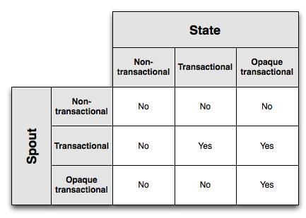

Opaque transactional states have the strongest fault-tolerance, but this comes at the cost of needing to store the txid and two values in the database. Transactional states require less state in the database, but only work with transactional spouts. Finally, non-transactional states require the least state in the database but cannot achieve exactly-once semantics.

The state and spout types you choose are a tradeoff between fault-tolerance and storage costs, and ultimately your application requirements will determine which combination is right for you.

<a id="trident-state--state-apis"></a>

## State APIs

You've seen the intricacies of what it takes to achieve exactly-once semantics. The nice thing about Trident is that it internalizes all the fault-tolerance logic within the State – as a user you don't have to deal with comparing txids, storing multiple values in the database, or anything like that. You can write code like this:

```java
TridentTopology topology = new TridentTopology();        
TridentState wordCounts =
      topology.newStream("spout1", spout)
        .each(new Fields("sentence"), new Split(), new Fields("word"))
        .groupBy(new Fields("word"))
        .persistentAggregate(MemcachedState.opaque(serverLocations), new Count(), new Fields("count"))                
        .parallelismHint(6);
```

All the logic necessary to manage opaque transactional state logic is internalized in the MemcachedState.opaque call. Additionally, updates are automatically batched to minimize roundtrips to the database.

The base State interface just has two methods:

```java
public interface State {
    void beginCommit(Long txid); // can be null for things like partitionPersist occurring off a DRPC stream
    void commit(Long txid);
}
```

You're told when a state update is beginning, when a state update is ending, and you're given the txid in each case. Trident assumes nothing about how your state works, what kind of methods there are to update it, and what kind of methods there are to read from it.

Suppose you have a home-grown database that contains user location information and you want to be able to access it from Trident. Your State implementation would have methods for getting and setting user information:

```java
public class LocationDB implements State {public void beginCommit(Long txid) {}
public void commit(Long txid) {}
public void setLocation(long userId, String location) {// code to access database and set location}
public String getLocation(long userId) {// code to get location from database}}
```

You then provide Trident a StateFactory that can create instances of your State object within Trident tasks. The StateFactory for your LocationDB might look something like this:

```java
public class LocationDBFactory implements StateFactory {
   public State makeState(Map conf, int partitionIndex, int numPartitions) {
      return new LocationDB();
   } 
}
```

Trident provides the QueryFunction interface for writing Trident operations that query a source of state, and the StateUpdater interface for writing Trident operations that update a source of state. For example, let's write an operation "QueryLocation" that queries the LocationDB for the locations of users. Let's start off with how you would use it in a topology. Let's say this topology consumes an input stream of userids:

```java
TridentTopology topology = new TridentTopology();
TridentState locations = topology.newStaticState(new LocationDBFactory());
topology.newStream("myspout", spout)
        .stateQuery(locations, new Fields("userid"), new QueryLocation(), new Fields("location"))
```

Now let's take a look at what the implementation of QueryLocation would look like:

```java
public class QueryLocation extends BaseQueryFunction<LocationDB, String> {public List<String> batchRetrieve(LocationDB state, List<TridentTuple> inputs) {List<String> ret = new ArrayList(); for(TridentTuple input: inputs) {ret.add(state.getLocation(input.getLong(0)));} return ret;}
public void execute(TridentTuple tuple, String location, TridentCollector collector) {collector.emit(new Values(location));}}
```

QueryFunction's execute in two steps. First, Trident collects a batch of reads together and passes them to batchRetrieve. In this case, batchRetrieve will receive multiple user ids. batchRetrieve is expected to return a list of results that's the same size as the list of input tuples. The first element of the result list corresponds to the result for the first input tuple, the second is the result for the second input tuple, and so on.

You can see that this code doesn't take advantage of the batching that Trident does, since it just queries the LocationDB one at a time. So a better way to write the LocationDB would be like this:

```java
public class LocationDB implements State {public void beginCommit(Long txid) {}
public void commit(Long txid) {}
public void setLocationsBulk(List<Long> userIds, List<String> locations) {// set locations in bulk}
public List<String> bulkGetLocations(List<Long> userIds) {// get locations in bulk}}
```

Then, you can write the QueryLocation function like this:

```java
public class QueryLocation extends BaseQueryFunction<LocationDB, String> {public List<String> batchRetrieve(LocationDB state, List<TridentTuple> inputs) {List<Long> userIds = new ArrayList<Long>(); for(TridentTuple input: inputs) {userIds.add(input.getLong(0));} return state.bulkGetLocations(userIds);}
public void execute(TridentTuple tuple, String location, TridentCollector collector) {collector.emit(new Values(location));}}
```

This code will be much more efficient by reducing roundtrips to the database.

To update state, you make use of the StateUpdater interface. Here's a StateUpdater that updates a LocationDB with new location information:

```java
public class LocationUpdater extends BaseStateUpdater<LocationDB> {public void updateState(LocationDB state, List<TridentTuple> tuples, TridentCollector collector) {List<Long> ids = new ArrayList<Long>(); List<String> locations = new ArrayList<String>(); for(TridentTuple t: tuples) {ids.add(t.getLong(0)); locations.add(t.getString(1));} state.setLocationsBulk(ids, locations);}}
```

Here's how you would use this operation in a Trident topology:

```java
TridentTopology topology = new TridentTopology();
TridentState locations = 
    topology.newStream("locations", locationsSpout)
        .partitionPersist(new LocationDBFactory(), new Fields("userid", "location"), new LocationUpdater())
```

The partitionPersist operation updates a source of state. The StateUpdater receives the State and a batch of tuples with updates to that State. This code just grabs the userids and locations from the input tuples and does a bulk set into the State.

partitionPersist returns a TridentState object representing the location db being updated by the Trident topology. You could then use this state in stateQuery operations elsewhere in the topology.

You can also see that StateUpdaters are given a TridentCollector. Tuples emitted to this collector go to the "new values stream". In this case, there's nothing interesting to emit to that stream, but if you were doing something like updating counts in a database, you could emit the updated counts to that stream. You can then get access to the new values stream for further processing via the TridentState#newValuesStream method.

<a id="trident-state--persistentaggregate"></a>

## persistentAggregate

Trident has another method for updating States called persistentAggregate. You've seen this used in the streaming word count example, shown again below:

```java
TridentTopology topology = new TridentTopology();        
TridentState wordCounts =
      topology.newStream("spout1", spout)
        .each(new Fields("sentence"), new Split(), new Fields("word"))
        .groupBy(new Fields("word"))
        .persistentAggregate(new MemoryMapState.Factory(), new Count(), new Fields("count"))
```

persistentAggregate is an additional abstraction built on top of partitionPersist that knows how to take a Trident aggregator and use it to apply updates to the source of state. In this case, since this is a grouped stream, Trident expects the state you provide to implement the "MapState" interface. The grouping fields will be the keys in the state, and the aggregation result will be the values in the state. The "MapState" interface looks like this:

```java
public interface MapState<T> extends State {
    List<T> multiGet(List<List<Object>> keys);
    List<T> multiUpdate(List<List<Object>> keys, List<ValueUpdater> updaters);
    void multiPut(List<List<Object>> keys, List<T> vals);
}
```

When you do aggregations on non-grouped streams (a global aggregation), Trident expects your State object to implement the "Snapshottable" interface:

```java
public interface Snapshottable<T> extends State {
    T get();
    T update(ValueUpdater updater);
    void set(T o);
}
```

[MemoryMapState](https://github.com/apache/storm/blob/v2.8.3/storm-client/src/jvm/org/apache/storm/trident/testing/MemoryMapState.java) and [MemcachedState](https://github.com/nathanmarz/trident-memcached/blob/2.8.3/src/jvm/trident/memcached/MemcachedState.java) each implement both of these interfaces.

<a id="trident-state--implementing-map-states"></a>

## Implementing Map States

Trident makes it easy to implement MapState's, doing almost all the work for you. The OpaqueMap, TransactionalMap, and NonTransactionalMap classes implement all the logic for doing the respective fault-tolerance logic. You simply provide these classes with an IBackingMap implementation that knows how to do multiGets and multiPuts of the respective key/values. IBackingMap looks like this:

```java
public interface IBackingMap<T> {
    List<T> multiGet(List<List<Object>> keys); 
    void multiPut(List<List<Object>> keys, List<T> vals); 
}
```

OpaqueMap's will call multiPut with [OpaqueValue](https://github.com/apache/storm/blob/v2.8.3/storm-client/src/jvm/org/apache/storm/trident/state/OpaqueValue.java)'s for the vals, TransactionalMap's will give [TransactionalValue](https://github.com/apache/storm/blob/v2.8.3/storm-core/src/jvm/org/apache/storm/trident/state/TransactionalValue.java)'s for the vals, and NonTransactionalMaps will just pass the objects from the topology through.

Trident also provides the [CachedMap](https://github.com/apache/storm/blob/v2.8.3/storm-client/src/jvm/org/apache/storm/trident/state/map/CachedMap.java) class to do automatic LRU caching of map key/vals.

Finally, Trident provides the [SnapshottableMap](https://github.com/apache/storm/blob/v2.8.3/storm-client/src/jvm/org/apache/storm/trident/state/map/SnapshottableMap.java) class that turns a MapState into a Snapshottable object, by storing global aggregations into a fixed key.

Take a look at the implementation of [MemcachedState](https://github.com/nathanmarz/trident-memcached/blob/master/src/jvm/trident/memcached/MemcachedState.java) to see how all these utilities can be put together to make a high performance MapState implementation. MemcachedState allows you to choose between opaque transactional, transactional, and non-transactional semantics.

---

<a id="trident-spouts"></a>

<!-- source_url: https://storm.apache.org/releases/2.8.3/Trident-spouts.html -->

<!-- page_index: 14 -->

<a id="trident-spouts--trident-spouts"></a>

# Trident spouts

Like in the vanilla Storm API, spouts are the source of streams in a Trident topology. On top of the vanilla Storm spouts, Trident exposes additional APIs for more sophisticated spouts.

There is an inextricable link between how you source your data streams and how you update state (e.g. databases) based on those data streams. See [Trident state doc](#trident-state) for an explanation of this – understanding this link is imperative for understanding the spout options available.

Regular Storm spouts will be non-transactional spouts in a Trident topology. To use a regular Storm IRichSpout, create the stream like this in a TridentTopology:

```java
TridentTopology topology = new TridentTopology();
topology.newStream("myspoutid", new MyRichSpout());
```

All spouts in a Trident topology are required to be given a unique identifier for the stream – this identifier must be unique across all topologies run on the cluster. Trident will use this identifier to store metadata about what the spout has consumed in Zookeeper, including the txid and any metadata associated with the spout.

You can configure the Zookeeper storage of spout metadata via the following configuration options:

1. `transactional.zookeeper.servers`: A list of Zookeeper hostnames
2. `transactional.zookeeper.port`: The port of the Zookeeper cluster
3. `transactional.zookeeper.root`: The root dir in Zookeeper where metadata is stored. Metadata will be stored at the path /

<a id="trident-spouts--pipelining"></a>

## Pipelining

By default, Trident processes a single batch at a time, waiting for the batch to succeed or fail before trying another batch. You can get significantly higher throughput – and lower latency of processing of each batch – by pipelining the batches. You configure the maximum amount of batches to be processed simultaneously with the "topology.max.spout.pending" property.

Even while processing multiple batches simultaneously, Trident will order any state updates taking place in the topology among batches. For example, suppose you're doing a global count aggregation into a database. The idea is that while you're updating the count in the database for batch 1, you can still be computing the partial counts for batches 2 through 10. Trident won't move on to the state updates for batch 2 until the state updates for batch 1 have succeeded. This is essential for achieving exactly-once processing semantics, as outline in [Trident state doc](#trident-state).

<a id="trident-spouts--trident-spout-types"></a>

## Trident spout types

Here are the following spout APIs available:

1. [ITridentSpout](https://github.com/apache/storm/blob/v2.8.3/storm-client/src/jvm/org/apache/storm/trident/spout/ITridentSpout.java): The most general API that can support transactional or opaque transactional semantics. Generally you'll use one of the partitioned flavors of this API rather than this one directly.
2. [IBatchSpout](https://github.com/apache/storm/blob/v2.8.3/storm-client/src/jvm/org/apache/storm/trident/spout/IBatchSpout.java): A non-transactional spout that emits batches of tuples at a time
3. [IPartitionedTridentSpout](https://github.com/apache/storm/blob/v2.8.3/storm-client/src/jvm/org/apache/storm/trident/spout/IPartitionedTridentSpout.java): A transactional spout that reads from a partitioned data source (like a cluster of Kafka servers)
4. [IOpaquePartitionedTridentSpout](https://github.com/apache/storm/blob/v2.8.3/storm-client/src/jvm/org/apache/storm/trident/spout/IOpaquePartitionedTridentSpout.java): An opaque transactional spout that reads from a partitioned data source

And, like mentioned in the beginning of this tutorial, you can use regular IRichSpout's as well.

---

<a id="trident-ras-api"></a>

<!-- source_url: https://storm.apache.org/releases/2.8.3/Trident-RAS-API.html -->

<!-- page_index: 15 -->

<a id="trident-ras-api--trident-ras-api"></a>

## Trident RAS API

The Trident RAS (Resource Aware Scheduler) API provides a mechanism to allow users to specify the resource consumption of a Trident topology. The API looks exactly like the base RAS API, only it is called on Trident Streams instead of Bolts and Spouts.

In order to avoid duplication and inconsistency in documentation, the purpose and effects of resource setting are not described here, but are instead found in the [Resource Aware Scheduler Overview](#resource_aware_scheduler_overview)

<a id="trident-ras-api--use"></a>

### Use

First, an example:

```java
    TridentTopology topo = new TridentTopology();
    topo.setResourceDefaults(new DefaultResourceDeclarer();
                                                          .setMemoryLoad(128)
                                                          .setCPULoad(20));
    TridentState wordCounts =
        topology
            .newStream("words", feeder)
            .parallelismHint(5)
            .setCPULoad(20)
            .setMemoryLoad(512,256)
            .each( new Fields("sentence"),  new Split(), new Fields("word"))
            .setCPULoad(10)
            .setMemoryLoad(512)
            .each(new Fields("word"), new BangAdder(), new Fields("word!"))
            .parallelismHint(10)
            .setCPULoad(50)
            .setMemoryLoad(1024)
            .each(new Fields("word!"), new QMarkAdder(), new Fields("word!?"))
            .groupBy(new Fields("word!"))
            .persistentAggregate(new MemoryMapState.Factory(), new Count(), new Fields("count"))
            .setCPULoad(100)
            .setMemoryLoad(2048);
```

Resources can be set for each operation (except for grouping, shuffling, partitioning).
Operations that are combined by Trident into single Bolts will have their resources summed.

Every Bolt is given **at least** the default resources, regardless of user settings.

In the above case, we end up with

- a spout and spout coordinator with a CPU load of 20% each, and a memory load of 512MiB on-heap and 256MiB off-heap.
- a bolt with 80% cpu load (10% + 50% + 20%) and a memory load of 1664MiB (1024 + 512 + 128) on-heap from the combined `Split` and `BangAdder` and the `QMarkAdder` which used the default resources contained in the DefaultResourceDeclarer
- a bolt with 100% cpu load and a memory load of 2048MiB on-heap, with default value for off-heap.

Resource declarations may be called after any operation. The operations without explicit resources will get the defaults. If you choose to set resources for only some operations, defaults must be declared, or topology submission will fail.
Resource declarations have the same *boundaries* as parallelism hints. They don't cross any groupings, shufflings, or any other kind of repartitioning.
Resources are declared per operation, but get combined within boundaries.

---

<a id="stream-api"></a>

<!-- source_url: https://storm.apache.org/releases/2.8.3/Stream-API.html -->

<!-- page_index: 16 -->

# Concepts

- [Concepts](#stream-api--concepts)
  - [Stream Builder](#stream-api--streambuilder)
  - [Value mapper](#stream-api--valuemapper)
- [Stream APIs](#stream-api--streamapis)
  - [Basic transformations](#stream-api--basictransformations)
    - [filter](#stream-api--filter)
    - [map](#stream-api--map)
    - [flatmap](#stream-api--flatmap)
  - [Windowing](#stream-api--windowing)
  - [Transformation to key-value pairs](#stream-api--keyvaluepairs)
    - [mapToPair](#stream-api--mapflatmaptopair)
    - [flatMapToPair](#stream-api--mapflatmaptopair)
  - [Aggregations](#stream-api--aggregations)
    - [aggregate](#stream-api--aggregatereduce)
    - [reduce](#stream-api--aggregatereduce)
    - [aggregateByKey](#stream-api--aggregatereducebykey)
    - [reduceByKey](#stream-api--aggregatereducebykey)
    - [groupByKey](#stream-api--groupbykey)
    - [countByKey](#stream-api--countbykey)
  - [Repartition](#stream-api--repartition)
  - [Output operations](#stream-api--outputoperations)
    - [print](#stream-api--print)
    - [peek](#stream-api--peek)
    - [forEach](#stream-api--foreach)
    - [to](#stream-api--to)
  - [Branch](#stream-api--branching)
  - [Joins](#stream-api--joins)
  - [CoGroupByKey](#stream-api--cogroupbykey)
  - [State](#stream-api--state)
    - [updateStateByKey](#stream-api--updatestatebykey)
    - [stateQuery](#stream-api--statequery)
- [Guarantees](#stream-api--guarantees)
- [Example](#stream-api--example)

Historically Storm provided Spout and Bolt apis for expressing streaming computations. Though these apis are fairly simple to use, there are no reusable constructs for expressing common streaming operations like filtering, transformations, windowing, joins, aggregations and so on.

Stream APIs build on top of the Storm's spouts and bolts to provide a typed API for expressing streaming computations and supports functional style operations such as map-reduce.

<a id="stream-api--concepts"></a>

# Concepts

Conceptually a `Stream` can be thought of as a stream of messages flowing through a pipeline. A `Stream` may be generated by reading messages out of a source like spout, or by transforming other streams. For example,

```java
// imports
import org.apache.storm.streams.Stream;
import org.apache.storm.streams.StreamBuilder;
...

StreamBuilder builder = new StreamBuilder();

// a stream of sentences obtained from a source spout
Stream<String> sentences = builder.newStream(new RandomSentenceSpout()).map(tuple -> tuple.getString(0));

// a stream of words obtained by transforming (splitting) the stream of sentences
Stream<String> words = sentences.flatMap(s -> Arrays.asList(s.split(" ")));

// output operation that prints the words to console
words.forEach(w -> System.out.println(w));
```

Most stream operations accept parameters that describe user-specified behavior typically via lambda expressions like `s -> Arrays.asList(s.split(" "))` as in the above example.

A `Stream` supports two kinds of operations,

1. **Transformations** that produce another stream from the current stream (like the `flatMap` operation in the example above)
2. **Output operations** that produce a result. (like the `forEach` operation in the example above).

<a id="stream-api--stream-builder"></a>

## Stream Builder

`StreamBuilder` provides the builder apis to create a new stream. Typically a spout forms the source of a stream.

```java
StreamBuilder builder = new StreamBuilder();
Stream<Tuple> sentences = builder.newStream(new TestSentenceSpout());
```

The `StreamBuilder` tracks the overall pipeline of operations expressed via the Stream. One can then create the Storm topology
via `build()` and submit it like a normal storm topology via `StormSubmitter`.

```java
StormSubmitter.submitTopologyWithProgressBar("test", new Config(), streamBuilder.build());
```

<a id="stream-api--value-mapper"></a>

## Value mapper

Value mappers can be used to extract specific fields from the tuples emitted from a spout to produce a typed stream of values. Value mappers are passed as arguments to the `StreamBuilder.newStream`.

```java
StreamBuilder builder = new StreamBuilder();

// extract the first field from the tuple to get a Stream<String> of sentences
Stream<String> sentences = builder.newStream(new TestWordSpout(), new ValueMapper<String>(0));
```

Storm provides strongly typed tuples via the `Pair` and Tuple classes (Tuple3 upto Tuple10). One can use a `TupleValueMapper` to produce a stream of typed tuples as shown below.

```java
// extract first three fields of the tuple emitted by the spout to produce a stream of typed tuples.
Stream<Tuple3<String, Integer, Long>> stream = builder.newStream(new TestSpout(), TupleValueMappers.of(0, 1, 2));
```

<a id="stream-api--stream-apis"></a>

# Stream APIs

Storm's streaming apis (defined in [Stream](https://storm.apache.org/releases/storm-client/src/jvm/org/apache/storm/streams/Stream.java) and [PairStream](https://storm.apache.org/releases/storm-client/src/jvm/org/apache/storm/streams/PairStream.java)) currently support a wide range of operations such as transformations, filters, windowing, aggregations, branching, joins, stateful, output and debugging operations.

<a id="stream-api--basic-transformations"></a>

## Basic transformations

<a id="stream-api--filter"></a>

### filter

`filter` returns a stream consisting of the elements of the stream that matches the given `Predicate` (for which the predicate returns true).

```java
Stream<String> logs = ...
Stream<String> errors = logs.filter(line -> line.contains("ERROR"));
```

In the above example log lines with 'ERROR' are filtered into an error stream which can be then be further processed.

<a id="stream-api--map"></a>

### map

`map` returns a stream consisting of the result of applying the given mapping function to the values of the stream.

```java
Stream<String> words = ...
Stream<Integer> wordLengths = words.map(String::length);
```

The example generates a stream of word lengths from a stream of words by applying the String.length function on each value. Note that the type of the resultant stream of a map operation can be different from that of the original stream.

<a id="stream-api--flatmap"></a>

### flatMap

`flatMap` returns a stream consisting of the results of replacing each value of the stream with the contents produced by applying the provided mapping function to each value. This is similar to map but each value can be mapped to 0 or more values.

```java
Stream<String> sentences = ...
Stream<String> words = sentences.flatMap(s -> Arrays.asList(s.split(" ")));
```

In the above example, the lambda function splits each value in the stream to a list of words and the flatMap function generates a flattened stream of words out of it.

<a id="stream-api--windowing"></a>

## Windowing

A `window` operation produces a windowed stream consisting of the elements that fall within the window as specified by the window parameter. All the windowing options supported in the underlying windowed bolts are supported via the Stream apis.

`Stream<T> windowedStream = stream.window(Window<?, ?> windowConfig);`

The windowConfig parameter specifies the windowing config like sliding or tumbling windows based on time duration or event count.

```java
// time based sliding window
stream.window(SlidingWindows.of(Duration.minutes(10), Duration.minutes(1)));

// count based sliding window
stream.window(SlidingWindows.of(Count.(10), Count.of(2)));

// tumbling window
stream.window(TumblingWindows.of(Duration.seconds(10));

// specifying timestamp field for event time based processing and a late tuple stream.
stream.window(TumblingWindows.of(Duration.seconds(10)
                     .withTimestampField("ts")
                     .withLateTupleStream("late_events"));
```

A windowing operation splits the continuous stream of values into subsets and is necessary for performing operations like Joins and Aggregations.

<a id="stream-api--transformation-to-key-value-pairs"></a>

## Transformation to key-value pairs

<a id="stream-api--maptopair-and-flatmaptopair"></a>

### mapToPair and flatMapToPair

These operations transform a Stream of values into a stream of key-value pairs.

```java
Stream<Integer> integers = … // 1, 2, 3, 4, ... 
PairStream<Integer, Integer> squares = integers.mapToPair(x -> Pair.of(x, x*x)); // (1, 1), (2, 4), (3, 9), (4, 16), ...
```

A key-value pair stream is required for operations like groupByKey, aggregateByKey, joins etc.

<a id="stream-api--aggregations"></a>

## Aggregations

Aggregate operations aggregate the values (or key-values) in a stream. Typically the aggregation operations are performed on a windowed stream where the aggregate results are emitted on each window activation.

<a id="stream-api--aggregate-and-reduce"></a>

### aggregate and reduce

`aggregate` and `reduce` computes global aggregation i.e. the values across all partitions are forwarded to a single task for computing the aggregate.

```java
Stream<Long> numbers = …
// aggregate the numbers and produce a stream of last 10 sec sums.
Stream<Long> sums = numbers.window(TumblingWindows.of(Duration.seconds(10)).aggregate(new Sum());

// the last 10 sec sums computed using reduce
Stream<Long> sums = numbers.window(...).reduce((x, y) -> x + y);
```

`aggregate` and `reduce` differs in the way in which the aggregate results are computed.

A `reduce` operation repeatedly applies the given reducer and reduces two values to a single value until there is only one value left. This may not be feasible or easy for all kinds of aggreagations (e.g. avg).

An `aggregate` operation does a mutable reduction. A mutable reduction accumulates results into an accumulator as it processes the values.

The aggregation operations (aggregate and reduce) automatically does a local aggregation whenever possible before doing the network shuffle to minimize the amount of messages transmitted over the network. For example to compute sum, a per-partition partial sum is computed and only the partial sums are transferred over the network to the target bolt where the partial sums are merged to produce the final sum. A `CombinerAggregator` interface is used as the argument of `aggregate` to enable this.

For example the `Sum` (passed as the argument of aggregate in the example above) can be implemented as a `CombinerAggregator` as follows.

```java
public class Sum implements CombinerAggregator<Long, Long, Long> {
// The initial value of the sum @Override public Long init() {return 0L;}
// Updates the sum by adding the value (this could be a partial sum) @Override public Long apply(Long aggregate, Long value) {return aggregate + value;}
// merges the partial sums @Override public Long merge(Long accum1, Long accum2) {return accum1 + accum2;}
// extract result from the accumulator (here the accumulator and result is the same) @Override public Long result(Long accum) {return accum;}}
```

<a id="stream-api--aggregatebykey-and-reducebykey"></a>

### aggregateByKey and reduceByKey

These are similar to the aggregate and reduce operations but does the aggregation per key.

`aggregateByKey` aggregates the values for each key of the stream using the given Aggregator.

```java
Stream<String> words = ...                                              // a windowed stream of words
Stream<String, Long> wordCounts = words.mapToPair(w -> Pair.of(w,1)     // convert to a stream of (word, 1) pairs
                                       .aggregateByKey(new Count<>());  // compute counts per word
```

`reduceByKey` performs a reduction on the values for each key of this stream by repeatedly applying the reducer.

```java
Stream<String> words = ...                                              // a windowed stream of words
Stream<String, Long> wordCounts = words.mapToPair(w -> Pair.of(w,1)     // convert to a stream of (word, 1) pairs
                                       .reduceByKey((x, y) -> x + y);   // compute counts per word
```

Like the global aggregate/reduce, per-partition local aggregate (per key) is computed and the partial results are send to the target bolts where the partial results are merged to produce the final aggregate.

<a id="stream-api--groupbykey"></a>

### groupByKey

`groupByKey` on a stream of key-value pairs returns a new stream where the values are grouped by the keys.

```java
// a stream of (user, score) pairs e.g. ("alice", 10), ("bob", 15), ("bob", 20), ("alice", 11), ("alice", 13)
PairStream<String, Double> scores = ... 

// list of scores per user in the last window, e.g. ("alice", [10, 11, 13]), ("bob", [15, 20])
PairStream<String, Iterable<Integer>> userScores =  scores.window(...).groupByKey(); 
```

<a id="stream-api--countbykey"></a>

### countByKey

`countByKey` counts the values for each key of this stream.

```java
Stream<String> words = ...                                              // a windowed stream of words
Stream<String, Long> wordCounts = words.mapToPair(w -> Pair.of(w,1)     // convert to a stream of (word, 1) pairs
                                       .countByKey();                   // compute counts per word
```

Internally `countByKey` uses `aggregateByKey` to compute the count.

<a id="stream-api--repartition"></a>

## Repartition

A `repartition` operation re-partitions the current stream and returns a new stream with the specified number of partitions. Further operations on resultant stream would execute at that level of parallelism. Re-partiton can be used to increase or reduce the parallelism of the operations in the stream.

The initial number of partitions can be also specified while creating the stream (via the StreamBuilder.newStream)

```java
// Stream 's1' will have 2 partitions and operations on s1 will execute at this level of parallelism
Stream<String> s1 = builder.newStream(new TestWordSpout(), new ValueMapper<String>(0), 2);

// Stream 's2' and further operations will have three partitions
Stream<String, Integer> s2 = s1.map(function1).repartition(3);

// perform a map operation on s2 and print the result
s2.map(function2).print();
```

Note: a `repartition` operation implies network transfer. In the above example the first map operation (function1) would be executed at a parallelism of 2 (on two partitions of s1), whereas the second map operation (function2) would be executed at a parallelism of 3 (on three partitions of s2). This also means that the first and second map operations has to be executed on two separate bolts and involves network transfer.

<a id="stream-api--output-operations"></a>

## Output operations

Output operations push out the transformed values in the stream to the console, external sinks like databases, files or even Storm bolts.

<a id="stream-api--print"></a>

### print

`print` prints the values in the stream to console. For example,

```java
// transforms words to uppercase and prints to the console
words.map(String::toUpperCase).print();
```

<a id="stream-api--peek"></a>

### peek

`peek` returns a stream consisting of the elements of the stream, additionally performing the provided action on each element as they are consumed from the resulting stream. This can be used to ‘inspect’ the values flowing at any stage in a stream.

```java
builder.newStream(...).flatMap(s -> Arrays.asList(s.split(" ")))
       // print the results of the flatMap operation as the values flow across the stream.
      .peek(s -> System.out.println(s))
      .mapToPair(w -> new Pair<>(w, 1))
```

<a id="stream-api--foreach"></a>

### forEach

This is the most generic output operation and can be used to execute an arbitrary code for each value in the stream, like storing the results into an external database, file and so on.

```java
stream.forEach(value -> {
    // log it
    LOG.debug(value)
    // store the value into a db and so on...
    statement.executeUpdate(..);
  }
);
```

<a id="stream-api--to"></a>

### to

This allows one to plug in existing bolts as sinks.

```java
// The redisBolt is a standard storm bolt
IRichBolt redisBolt = new RedisStoreBolt(poolConfig, storeMapper);
...
// generate the word counts and store it in redis using redis bolt
builder.newStream(new TestWordSpout(), new ValueMapper<String>(0))
       .mapToPair(w -> Pair.of(w, 1))
       .countByKey()
       // the (word, count) pairs are forwarded to the redisBolt which stores it in redis
       .to(redisBolt);
```

Note that this will provide guarantees only based on what the bolt provides.

<a id="stream-api--branch"></a>

## Branch

A `branch` operation can be used to express If-then-else logic on streams.

```java
Stream<T>[] streams  = stream.branch(Predicate<T>... predicates)
```

The predicates are applied in the given order to the values of the stream and the result is forwarded to the corresponding (index based) result stream based on the first predicate that matches. If none of the predicates match a value, that value is dropped.

For example,

```java
Stream<Integer>[] streams = builder.newStream(new RandomIntegerSpout(), new ValueMapper<Integer>(0))
                                   .branch(x -> (x % 2) == 0, 
                                          x -> (x % 2) == 1);
Stream<Integer> evenNumbers = streams[0];
Stream<Integer> oddNumbers = streams[1];
```

<a id="stream-api--joins"></a>

## Joins

A `join` operation joins the values of one stream with the values having the same key from another stream.

```java
PairStream<Long, Long> squares = … // (1, 1), (2, 4), (3, 9) ...
PairStream<Long, Long> cubes = … // (1, 1), (2, 8), (3, 27) ...

// join the sqaures and cubes stream to produce (1, [1, 1]), (2, [4, 8]), (3, [9, 27]) ...
PairStream<Long, Pair<Long, Long>> joined = squares.window(TumblingWindows.of(Duration.seconds(5))).join(cubes);
```

Joins are typically invoked on a windowed stream, joining the key-values that arrived on each stream in the current window. The parallelism of the stream on which the join is invoked is carried forward to the joined stream. An optional `ValueJoiner` can be passed as an argument to join to specify how to join the two values for each matching key (the default behavior is to return a `Pair` of the value from both streams).

Left, right and full outer joins are supported.

<a id="stream-api--cogroupbykey"></a>

## CoGroupByKey

`coGroupByKey` Groups the values of this stream with the values having the same key from the other stream.

```java
// a stream of (key, value) pairs e.g. (k1, v1), (k2, v2), (k2, v3)
PairStream<String, String> stream1 = ...

// another stream of (key, value) pairs e.g. (k1, x1), (k1, x2), (k3, x3)
PairStream<String, String> stream2 = ...

// the co-grouped values per key in the last window, e.g. (k1, ([v1], [x1, x2]), (k2, ([v2, v3], [])), (k3, ([], [x3]))
PairStream<String, Iterable<String>> coGroupedStream =  stream1.window(...).coGroupByKey(stream2);
```

<a id="stream-api--state"></a>

## State

Storm provides APIs for applications to save and update the state of its computation and also to query the state.

<a id="stream-api--updatestatebykey"></a>

### updateStateByKey

`updateStateByKey` updates the state by applying a given state update function to the previous state and the new value for the key. `updateStateByKey` can be invoked with either an initial value for the state and a state update function or by directly providing a `StateUpdater` implementation.

```java
PairStream<String, Long> wordCounts = ...
// Update the word counts in the state; here the first argument 0L is the initial value for the state and 
// the second argument is a function that adds the count to the current value in the state.
StreamState<String, Long> streamState = wordCounts.updateStateByKey(0L, (state, count) -> state + count)
streamState.toPairStream().print();
```

The state value can be of any type. In the above example its of type `Long` and stores the word count.

Internally storm uses stateful bolts for storing the state. The Storm config `topology.state.provider` can be used to choose the state provider implementation. For example set this to `org.apache.storm.redis.state.RedisKeyValueStateProvider` for redis based state store.

<a id="stream-api--statequery"></a>

### stateQuery

`stateQuery` can be used to query the state (updated by `updateStateByKey`). The `StreamState` returned by the updateStateByKey operation has to be used for querying stream state. The values in the stream are used as the keys to query the state.

```java

// The stream of words emitted by the QuerySpout is used as the keys to query the state.
builder.newStream(new QuerySpout(), new ValueMapper<String>(0))
// Queries the state and emits the matching (key, value) as results. 
// The stream state returned by updateStateByKey is passed as the argument to stateQuery.
.stateQuery(streamState).print();
```

<a id="stream-api--guarantees"></a>

# Guarantees

Right now the topologies built using Stream API provides **at-least once** guarantee.

Note that only the `updateStateByKey` operation currently executes on an underlying StatefulBolt. The other stateful operations (join, windowing, aggregation etc) executes on an IRichBolt and stores its state in memory. It relies on storms acking and replay mechanisms to rebuild the state.

In future the underlying framework of the Stream API would be enhanced to provide **exactly once** guarantees.

<a id="stream-api--example"></a>

# Example

Here's a word count topology expressed using the Stream API,

```java
StreamBuilder builder = new StreamBuilder();

builder
   // A stream of random sentences with two partitions
   .newStream(new RandomSentenceSpout(), new ValueMapper<String>(0), 2)
   // a two seconds tumbling window
   .window(TumblingWindows.of(Duration.seconds(2)))
   // split the sentences to words
   .flatMap(s -> Arrays.asList(s.split(" ")))
   // create a stream of (word, 1) pairs
   .mapToPair(w -> Pair.of(w, 1))
   // compute the word counts in the last two second window
   .countByKey()
   // print the results to stdout
   .print();
```

The `RandomSentenceSpout` is a regular Storm spout that continuously emits random sentences. The stream of sentences are split into two second windows and the word count within each window is computed and printed.

The stream can then be submitted just like a regular topology as shown below.

```java
  Config config = new Config();
  config.setNumWorkers(1);
  StormSubmitter.submitTopologyWithProgressBar("topology-name", config, builder.build());
```

More examples are available under [storm-starter](https://storm.apache.org/releases/examples/storm-starter/src/jvm/org/apache/storm/starter/streams) which will help you get started.

---

<a id="flux"></a>

<!-- source_url: https://storm.apache.org/releases/2.8.3/flux.html -->

<!-- page_index: 17 -->

# Existing Topologies

A framework for creating and deploying Apache Storm streaming computations with less friction.

<a id="flux--definition"></a>

## Definition

**flux** |fləks| *noun*

1. The action or process of flowing or flowing out
2. Continuous change
3. In physics, the rate of flow of a fluid, radiant energy, or particles across a given area
4. A substance mixed with a solid to lower its melting point

<a id="flux--rationale"></a>

## Rationale

Bad things happen when configuration is hard-coded. No one should have to recompile or repackage an application in
order to change configuration.

<a id="flux--about"></a>

## About

Flux is a framework and set of utilities that make defining and deploying Apache Storm topologies less painful and
deveoper-intensive. One of the pain points often mentioned is the fact that the wiring for a Topology graph is often tied up in Java code, and that any changes require recompilation and repackaging of the topology jar file. Flux aims to alleviate that
pain by allowing you to package all your Storm components in a single jar, and use an external text file to define
the layout and configuration of your topologies.

<a id="flux--features"></a>

## Features

- Easily configure and deploy Storm topologies (Both Storm core and Microbatch API) without embedding configuration
  in your topology code
- Support for existing topology code (see below)
- Define Storm Core API (Spouts/Bolts) using a flexible YAML DSL
- YAML DSL support for most Storm components (storm-kafka-client, storm-hdfs, storm-hbase, etc.)
- Convenient support for multi-lang components
- External property substitution/filtering for easily switching between configurations/environments (similar to Maven-style
  `${variable.name}` substitution)

<a id="flux--usage"></a>

## Usage

To use Flux, add it as a dependency and package all your Storm components in a fat jar, then create a YAML document
to define your topology (see below for YAML configuration options).

<a id="flux--building-from-source"></a>

### Building from Source

The easiest way to use Flux, is to add it as a Maven dependency in you project as described below.

If you would like to build Flux from source and run the unit/integration tests, you will need the following installed
on your system:

- Python 3.0.x or later
- Node.js 0.10.x or later

<a id="flux--building-with-unit-tests-enabled"></a>
<a id="flux--building-with-unit-tests-enabled:"></a>

#### Building with unit tests enabled:

```
mvn clean install
```

<a id="flux--building-with-unit-tests-disabled"></a>
<a id="flux--building-with-unit-tests-disabled:"></a>

#### Building with unit tests disabled:

If you would like to build Flux without installing Python or Node.js you can simply skip the unit tests:

```
mvn clean install -DskipTests=true
```

Note that if you plan on using Flux to deploy topologies to a remote cluster, you will still need to have Python
installed since it is required by Apache Storm.

<a id="flux--building-with-integration-tests-enabled"></a>
<a id="flux--building-with-integration-tests-enabled:"></a>

#### Building with integration tests enabled:

```
mvn clean install -DskipIntegration=false
```

<a id="flux--packaging-with-maven"></a>

### Packaging with Maven

To enable Flux for your Storm components, you need to add it as a dependency such that it's included in the Storm
topology jar. This can be accomplished with the Maven shade plugin (preferred) or the Maven assembly plugin (not
recommended).

<a id="flux--flux-maven-dependency"></a>

#### Flux Maven Dependency

The current version of Flux is available in Maven Central at the following coordinates:
`xml
<dependency>
<groupId>org.apache.storm</groupId>
<artifactId>flux-core</artifactId>
<version>${storm.version}</version>
</dependency>`

Using shell spouts and bolts requires additional Flux Wrappers library:
`xml
<dependency>
<groupId>org.apache.storm</groupId>
<artifactId>flux-wrappers</artifactId>
<version>${storm.version}</version>
</dependency>`

<a id="flux--creating-a-flux-enabled-topology-jar"></a>

#### Creating a Flux-Enabled Topology JAR

The example below illustrates Flux usage with the Maven shade plugin:

```xml
<!-- include Flux and user dependencies in the shaded jar -->
<dependencies>
    <!-- Flux include -->
    <dependency>
        <groupId>org.apache.storm</groupId>
        <artifactId>flux-core</artifactId>
        <version>${storm.version}</version>
    </dependency>
    <!-- Flux Wrappers include -->
    <dependency>
        <groupId>org.apache.storm</groupId>
        <artifactId>flux-wrappers</artifactId>
        <version>${storm.version}</version>
    </dependency>

    <!-- add user dependencies here... -->

</dependencies>
<!-- create a fat jar that includes all dependencies -->
<build>
    <plugins>
        <plugin>
            <groupId>org.apache.maven.plugins</groupId>
            <artifactId>maven-shade-plugin</artifactId>
            <version>1.4</version>
            <configuration>
                <createDependencyReducedPom>true</createDependencyReducedPom>
            </configuration>
            <executions>
                <execution>
                    <phase>package</phase>
                    <goals>
                        <goal>shade</goal>
                    </goals>
                    <configuration>
                        <transformers>
                            <transformer
                                    implementation="org.apache.maven.plugins.shade.resource.ServicesResourceTransformer"/>
                            <transformer
                                    implementation="org.apache.maven.plugins.shade.resource.ManifestResourceTransformer">
                                <mainClass>org.apache.storm.flux.Flux</mainClass>
                            </transformer>
                        </transformers>
                    </configuration>
                </execution>
            </executions>
        </plugin>
    </plugins>
</build>
```

<a id="flux--deploying-and-running-a-flux-topology"></a>

### Deploying and Running a Flux Topology

Once your topology components are packaged with the Flux dependency, you can run different topologies either locally
or remotely using the `storm jar` command. For example, if your fat jar is named `myTopology-0.1.0-SNAPSHOT.jar` you
could run it locally with the command:

```bash
storm jar myTopology-0.1.0-SNAPSHOT.jar org.apache.storm.flux.Flux --local my_config.yaml
```

<a id="flux--command-line-options"></a>

### Command line options

```
usage: storm jar <my_topology_uber_jar.jar> org.apache.storm.flux.Flux
             [options] <topology-config.yaml>
 -d,--dry-run                 Do not run or deploy the topology. Just
                              build, validate, and print information about
                              the topology.
 -e,--env-filter              Perform environment variable substitution.
                              Replace keys identified with `${ENV-[NAME]}`
                              will be replaced with the corresponding
                              `NAME` environment value
 -f,--filter <file>           Perform property substitution. Use the
                              specified file as a source of properties,
                              and replace keys identified with {$[property
                              name]} with the value defined in the
                              properties file.
 -i,--inactive                Deploy the topology, but do not activate it.
 -l,--local                   Run the topology in local mode.
 -n,--no-splash               Suppress the printing of the splash screen.
 -q,--no-detail               Suppress the printing of topology details.
 -r,--remote                  Deploy the topology to a remote cluster.
 -R,--resource                Treat the supplied path as a classpath
                              resource instead of a file.
 -s,--sleep <ms>              When running locally, the amount of time to
                              sleep (in ms.) before killing the topology
                              and shutting down the local cluster.
 -z,--zookeeper <host:port>   When running in local mode, use the
                              ZooKeeper at the specified <host>:<port>
                              instead of the in-process ZooKeeper.
                              (requires Storm 0.9.3 or later)
```

**NOTE:** Flux tries to avoid command line switch collision with the `storm` command, and allows any other command line
switches to pass through to the `storm` command.

For example, you can use the `storm` command switch `-c` to override a topology configuration property. The following
example command will run Flux and override the `nimbus.seeds` configuration:

```bash
storm jar myTopology-0.1.0-SNAPSHOT.jar org.apache.storm.flux.Flux --remote my_config.yaml -c 'nimbus.seeds=["localhost"]'
```

<a id="flux--sample-output"></a>

### Sample output

```
███████╗██╗     ██╗   ██╗██╗  ██╗
██╔════╝██║     ██║   ██║╚██╗██╔╝
█████╗  ██║     ██║   ██║ ╚███╔╝
██╔══╝  ██║     ██║   ██║ ██╔██╗
██║     ███████╗╚██████╔╝██╔╝ ██╗
╚═╝     ╚══════╝ ╚═════╝ ╚═╝  ╚═╝
+-         Apache Storm        -+
+-  data FLow User eXperience  -+
Version: 0.3.0
Parsing file: /Users/hsimpson/Projects/donut_domination/storm/shell_test.yaml
---------- TOPOLOGY DETAILS ----------
Name: shell-topology
--------------- SPOUTS ---------------
sentence-spout[1](org.apache.storm.flux.wrappers.spouts.FluxShellSpout)
---------------- BOLTS ---------------
splitsentence[1](org.apache.storm.flux.wrappers.bolts.FluxShellBolt)
log[1](org.apache.storm.flux.wrappers.bolts.LogInfoBolt)
count[1](org.apache.storm.testing.TestWordCounter)
--------------- STREAMS ---------------
sentence-spout --SHUFFLE--> splitsentence
splitsentence --FIELDS--> count
count --SHUFFLE--> log
--------------------------------------
Submitting topology: 'shell-topology' to remote cluster...
```

<a id="flux--yaml-configuration"></a>

## YAML Configuration

Flux topologies are defined in a YAML file that describes a topology. A Flux topology
definition consists of the following:

1. A topology name
2. A list of topology "components" (named Java objects that will be made available in the environment)
3. **EITHER** (A DSL topology definition):
   - A list of spouts, each identified by a unique ID
   - A list of bolts, each identified by a unique ID
   - A list of "stream" objects representing a flow of tuples between spouts and bolts
   - (Optional) A list of "workerHooks", each identifed by a unique ID
4. **OR** (A JVM class that can produce a `org.apache.storm.generated.StormTopology` instance:
   - A `topologySource` definition.

For example, here is a simple definition of a wordcount topology using the YAML DSL:

```yaml
name: "yaml-topology"
config:
  topology.workers: 1

# spout definitions
spouts:
  - id: "spout-1"
    className: "org.apache.storm.testing.TestWordSpout"
    parallelism: 1

# bolt definitions
bolts:
  - id: "bolt-1"
    className: "org.apache.storm.testing.TestWordCounter"
    parallelism: 1
  - id: "bolt-2"
    className: "org.apache.storm.flux.wrappers.bolts.LogInfoBolt"
    parallelism: 1

#stream definitions
streams:
  - name: "spout-1 --> bolt-1" # name isn't used (placeholder for logging, UI, etc.)
    from: "spout-1"
    to: "bolt-1"
    grouping:
      type: FIELDS
      args: ["word"]

  - name: "bolt-1 --> bolt2"
    from: "bolt-1"
    to: "bolt-2"
    grouping:
      type: SHUFFLE

# worker hook definitions
workerHooks:
  - id: "base-worker-hook"
    className: "org.apache.storm.hooks.BaseWorkerHook"
```

<a id="flux--property-substitution-filtering"></a>

## Property Substitution/Filtering

It's common for developers to want to easily switch between configurations, for example switching deployment between
a development environment and a production environment. This can be accomplished by using separate YAML configuration
files, but that approach would lead to unnecessary duplication, especially in situations where the Storm topology
does not change, but configuration settings such as host names, ports, and parallelism paramters do.

For this case, Flux offers properties filtering to allow you two externalize values to a `.properties` file and have
them substituted before the `.yaml` file is parsed.

To enable property filtering, use the `--filter` command line option and specify a `.properties` file. For example, if you invoked flux like so:

```bash
storm jar myTopology-0.1.0-SNAPSHOT.jar org.apache.storm.flux.Flux --local my_config.yaml --filter dev.properties
```

With the following `dev.properties` file:

```properties
kafka.zookeeper.hosts: localhost:2181
```

You would then be able to reference those properties by key in your `.yaml` file using `${}` syntax:

```yaml
  - id: "zkHosts"
    className: "org.apache.storm.kafka.ZkHosts"
    constructorArgs:
      - "${kafka.zookeeper.hosts}"
```

In this case, Flux would replace `${kafka.zookeeper.hosts}` with `localhost:2181` before parsing the YAML contents.

<a id="flux--environment-variable-substitution-filtering"></a>

### Environment Variable Substitution/Filtering

Flux also allows environment variable substitution. For example, if an environment variable named `ZK_HOSTS` if defined, you can reference it in a Flux YAML file with the following syntax:

```
${ENV-ZK_HOSTS}
```

<a id="flux--components"></a>

## Components

Components are essentially named object instances that are made available as configuration options for spouts and
bolts. If you are familiar with the Spring framework, components are roughly analagous to Spring beans.

Every component is identified, at a minimum, by a unique identifier (String) and a class name (String). For example, the following will make an instance of the `org.apache.storm.kafka.StringScheme` class available as a reference under the key
`"stringScheme"` . This assumes the `org.apache.storm.kafka.StringScheme` has a default constructor.

```yaml
components:
  - id: "stringScheme"
    className: "org.apache.storm.kafka.StringScheme"
```

<a id="flux--static-factory-methods"></a>

### Static factory methods

It is also possible to use static factory methods from Flux. Given the following Java code:

```java
public class TestBolt extends BaseBasicBolt {
  public static TestBolt newInstance(Duration triggerTime) {
    return new TestBolt(triggerTime);
  }
}
```

```java
public class Duration {
  public static Duration ofSeconds(long seconds) {
    return new Duration(seconds);
  }
}
```

it is possible to use the factory methods as follows:

```yaml
components:
  - id: "time"
    className: "java.time.Duration"
    factory: "ofSeconds"

bolts:
  - id: "testBolt"
    className: "org.apache.storm.flux.test.TestBolt"
    factory: "newInstance"
    factoryArgs:
      - ref: "time"
```

<a id="flux--contructor-arguments-references-properties-and-configuration-methods"></a>

### Contructor Arguments, References, Properties and Configuration Methods

<a id="flux--constructor-arguments"></a>

#### Constructor Arguments

Arguments to a class constructor can be configured by adding a `contructorArgs` element to a components.
`constructorArgs` is a list of objects that will be passed to the class' constructor. The following example creates an
object by calling the constructor that takes a single string as an argument:

```yaml
  - id: "zkHosts"
    className: "org.apache.storm.kafka.ZkHosts"
    constructorArgs:
      - "localhost:2181"
```

<a id="flux--references"></a>

#### References

Each component instance is identified by a unique id that allows it to be used/reused by other components. To
reference an existing component, you specify the id of the component with the `ref` tag.

In the following example, a component with the id `"stringScheme"` is created, and later referenced, as a an argument
to another component's constructor:

```yaml
components:
  - id: "stringScheme"
    className: "org.apache.storm.kafka.StringScheme"

  - id: "stringMultiScheme"
    className: "org.apache.storm.spout.SchemeAsMultiScheme"
    constructorArgs:
      - ref: "stringScheme" # component with id "stringScheme" must be declared above.
```

**N.B.:** References can only be used after (below) the object they point to has been declared.

<a id="flux--properties"></a>

#### Properties

In addition to calling constructors with different arguments, Flux also allows you to configure components using
JavaBean-like setter methods and fields declared as `public`:

```yaml
  - id: "spoutConfig"
    className: "org.apache.storm.kafka.SpoutConfig"
    constructorArgs:
      # brokerHosts
      - ref: "zkHosts"
      # topic
      - "myKafkaTopic"
      # zkRoot
      - "/kafkaSpout"
      # id
      - "myId"
    properties:
      - name: "ignoreZkOffsets"
        value: true
      - name: "scheme"
        ref: "stringMultiScheme"
```

In the example above, the `properties` declaration will cause Flux to look for a public method in the `SpoutConfig` with
the signature `setIgnoreZkOffsets(boolean b)` and attempt to invoke it. If a setter method is not found, Flux will then
look for a public instance variable with the name `ignoreZkOffsets` and attempt to set its value.

References may also be used as property values.

<a id="flux--configuration-methods"></a>

#### Configuration Methods

Conceptually, configuration methods are similar to Properties and Constructor Args -- they allow you to invoke an
arbitrary method on an object after it is constructed. Configuration methods are useful for working with classes that
don't expose JavaBean methods or have constructors that can fully configure the object. Common examples include classes
that use the builder pattern for configuration/composition.

The following YAML example creates a bolt and configures it by calling several methods:

```yaml
bolts:
  - id: "bolt-1"
    className: "org.apache.storm.flux.test.TestBolt"
    parallelism: 1
    configMethods:
      - name: "withFoo"
        args:
          - "foo"
      - name: "withBar"
        args:
          - "bar"
      - name: "withFooBar"
        args:
          - "foo"
          - "bar"
```

The signatures of the corresponding methods are as follows:

```java
    public void withFoo(String foo);
    public void withBar(String bar);
    public void withFooBar(String foo, String bar);
```

Arguments passed to configuration methods work much the same way as constructor arguments, and support references as
well.

<a id="flux--using-java-enums-in-contructor-arguments-references-properties-and-configuration-methods"></a>
<a id="flux--using-java-enum-s-in-contructor-arguments-references-properties-and-configuration-methods"></a>

### Using Java `enum`s in Contructor Arguments, References, Properties and Configuration Methods

You can easily use Java `enum` values as arguments in a Flux YAML file, simply by referencing the name of the `enum`.

For example, [Storm's HDFS module](#storm-hdfs) includes the following `enum` definition (simplified for brevity):

```java
public static enum Units {
    KB, MB, GB, TB
}
```

And the `org.apache.storm.hdfs.bolt.rotation.FileSizeRotationPolicy` class has the following constructor:

```java
public FileSizeRotationPolicy(float count, Units units)
```

The following Flux `component` definition could be used to call the constructor:

```yaml
  - id: "rotationPolicy"
    className: "org.apache.storm.hdfs.bolt.rotation.FileSizeRotationPolicy"
    constructorArgs:
      - 5.0
      - MB
```

The above definition is functionally equivalent to the following Java code:

```java
// rotate files when they reach 5MB
FileRotationPolicy rotationPolicy = new FileSizeRotationPolicy(5.0f, Units.MB);
```

<a id="flux--topology-config"></a>

## Topology Config

The `config` section is simply a map of Storm topology configuration parameters that will be passed to the
`org.apache.storm.StormSubmitter` as an instance of the `org.apache.storm.Config` class:

```yaml
config:
  topology.workers: 4
  topology.max.spout.pending: 1000
  topology.message.timeout.secs: 30
```

<a id="flux--existing-topologies"></a>

# Existing Topologies

If you have existing Storm topologies, you can still use Flux to deploy/run/test them. This feature allows you to
leverage Flux Constructor Arguments, References, Properties, and Topology Config declarations for existing topology
classes.

The easiest way to use an existing topology class is to define
a `getTopology()` instance method with one of the following signatures:

```java
public StormTopology getTopology(Map<String, Object> config)
```

or:

```java
public StormTopology getTopology(Config config)
```

You could then use the following YAML to configure your topology:

```yaml
name: "existing-topology"
topologySource:
  className: "org.apache.storm.flux.test.SimpleTopology"
```

If the class you would like to use as a topology source has a different method name (i.e. not `getTopology`), you can
override it:

```yaml
name: "existing-topology"
topologySource:
  className: "org.apache.storm.flux.test.SimpleTopology"
  methodName: "getTopologyWithDifferentMethodName"
```

**N.B.:** The specified method must accept a single argument of type `java.util.Map<String, Object>` or
`org.apache.storm.Config`, and return a `org.apache.storm.generated.StormTopology` object.

<a id="flux--yaml-dsl"></a>

# YAML DSL

<a id="flux--spouts-and-bolts"></a>

## Spouts and Bolts

Spout and Bolts are configured in their own respective section of the YAML configuration. Spout and Bolt definitions
are extensions to the `component` definition that add a `parallelism` parameter that sets the parallelism for a
component when the topology is deployed.

Because spout and bolt definitions extend `component` they support constructor arguments, references, and properties as
well.

Shell spout example:

```yaml
spouts:
  - id: "sentence-spout"
    className: "org.apache.storm.flux.wrappers.spouts.FluxShellSpout"
    # shell spout constructor takes 2 arguments: String[], String[]
    constructorArgs:
      # command line
      - ["node", "randomsentence.js"]
      # output fields
      - ["word"]
    parallelism: 1
```

Kafka spout example:

```yaml
components:
  - id: "stringScheme"
    className: "org.apache.storm.kafka.StringScheme"

  - id: "stringMultiScheme"
    className: "org.apache.storm.spout.SchemeAsMultiScheme"
    constructorArgs:
      - ref: "stringScheme"

  - id: "zkHosts"
    className: "org.apache.storm.kafka.ZkHosts"
    constructorArgs:
      - "localhost:2181"

# Alternative kafka config
#  - id: "kafkaConfig"
#    className: "org.apache.storm.kafka.KafkaConfig"
#    constructorArgs:
#      # brokerHosts
#      - ref: "zkHosts"
#      # topic
#      - "myKafkaTopic"
#      # clientId (optional)
#      - "myKafkaClientId"

  - id: "spoutConfig"
    className: "org.apache.storm.kafka.SpoutConfig"
    constructorArgs:
      # brokerHosts
      - ref: "zkHosts"
      # topic
      - "myKafkaTopic"
      # zkRoot
      - "/kafkaSpout"
      # id
      - "myId"
    properties:
      - name: "ignoreZkOffsets"
        value: true
      - name: "scheme"
        ref: "stringMultiScheme"

config:
  topology.workers: 1

# spout definitions
spouts:
  - id: "kafka-spout"
    className: "org.apache.storm.kafka.KafkaSpout"
    constructorArgs:
      - ref: "spoutConfig"
```

Bolt Examples:

```yaml
# bolt definitions
bolts:
  - id: "splitsentence"
    className: "org.apache.storm.flux.wrappers.bolts.FluxShellBolt"
    constructorArgs:
      # command line
      - ["python3", "splitsentence.py"]
      # output fields
      - ["word"]
    parallelism: 1
    # ...

  - id: "log"
    className: "org.apache.storm.flux.wrappers.bolts.LogInfoBolt"
    parallelism: 1
    # ...

  - id: "count"
    className: "org.apache.storm.testing.TestWordCounter"
    parallelism: 1
    # ...
```

<a id="flux--streams-and-stream-groupings"></a>

## Streams and Stream Groupings

Streams in Flux are represented as a list of connections (Graph edges, data flow, etc.) between the Spouts and Bolts in
a topology, with an associated Grouping definition.

A Stream definition has the following properties:

**`name`:** A name for the connection (optional, currently unused)

**`from`:** The `id` of a Spout or Bolt that is the source (publisher)

**`to`:** The `id` of a Spout or Bolt that is the destination (subscriber)

**`grouping`:** The stream grouping definition for the Stream

A Grouping definition has the following properties:

**`type`:** The type of grouping. One of `ALL`,`CUSTOM`,`DIRECT`,`SHUFFLE`,`LOCAL_OR_SHUFFLE`,`FIELDS`,`GLOBAL`, or `NONE`.

**`streamId`:** The Storm stream ID (Optional. If unspecified will use the default stream)

**`args`:** For the `FIELDS` grouping, a list of field names.

**`customClass`** For the `CUSTOM` grouping, a definition of custom grouping class instance

The `streams` definition example below sets up a topology with the following wiring:

```
    kafka-spout --> splitsentence --> count --> log
```

```yaml
#stream definitions
# stream definitions define connections between spouts and bolts.
# note that such connections can be cyclical
# custom stream groupings are also supported

streams:
  - name: "kafka --> split" # name isn't used (placeholder for logging, UI, etc.)
    from: "kafka-spout"
    to: "splitsentence"
    grouping:
      type: SHUFFLE

  - name: "split --> count"
    from: "splitsentence"
    to: "count"
    grouping:
      type: FIELDS
      args: ["word"]

  - name: "count --> log"
    from: "count"
    to: "log"
    grouping:
      type: SHUFFLE
```

<a id="flux--custom-stream-groupings"></a>

### Custom Stream Groupings

Custom stream groupings are defined by setting the grouping type to `CUSTOM` and defining a `customClass` parameter
that tells Flux how to instantiate the custom class. The `customClass` definition extends `component`, so it supports
constructor arguments, references, and properties as well.

The example below creates a Stream with an instance of the `org.apache.storm.testing.NGrouping` custom stream grouping
class.

```yaml
  - name: "bolt-1 --> bolt2"
    from: "bolt-1"
    to: "bolt-2"
    grouping:
      type: CUSTOM
      customClass:
        className: "org.apache.storm.testing.NGrouping"
        constructorArgs:
          - 1
```

<a id="flux--includes-and-overrides"></a>

## Includes and Overrides

Flux allows you to include the contents of other YAML files, and have them treated as though they were defined in the
same file. Includes may be either files, or classpath resources.

Includes are specified as a list of maps:

```yaml
includes:
  - resource: false
    file: "src/test/resources/configs/shell_test.yaml"
    override: false
```

If the `resource` property is set to `true`, the include will be loaded as a classpath resource from the value of the
`file` attribute, otherwise it will be treated as a regular file.

The `override` property controls how includes affect the values defined in the current file. If `override` is set to
`true`, values in the included file will replace values in the current file being parsed. If `override` is set to
`false`, values in the current file being parsed will take precedence, and the parser will refuse to replace them.

**N.B.:** Includes are not yet recursive. Includes from included files will be ignored.

<a id="flux--worker-hooks"></a>

## Worker Hooks

Flux allows you to attach topology components that can be executed when a worker starts, and when a worker shuts down. It can be useful when you want to execute operations before topology processing starts, or cleanup operations before your workers shut down, e.g. managing application context. Worker Hooks should be an implementation of [IWorkerHook](https://github.com/apache/storm/blob/v2.8.3/storm-client/src/jvm/org/apache/storm/hooks/IWorkerHook.java). Other than that, they follow similar Bean definition semantics as [Components](#flux--components) for declaration within yaml file.

Worker Hooks are specified as a map of bean definitions:

```yaml
workerHooks:
  - id: "base-worker-hook"
    className: "org.apache.storm.hooks.BaseWorkerHook"
```

<a id="flux--basic-word-count-example"></a>

## Basic Word Count Example

This example uses a spout implemented in JavaScript, a bolt implemented in Python, and a bolt implemented in Java

Topology YAML config:

```yaml
---
name: "shell-topology"
config:
  topology.workers: 1

# spout definitions
spouts:
  - id: "sentence-spout"
    className: "org.apache.storm.flux.wrappers.spouts.FluxShellSpout"
    # shell spout constructor takes 2 arguments: String[], String[]
    constructorArgs:
      # command line
      - ["node", "randomsentence.js"]
      # output fields
      - ["word"]
    parallelism: 1

# bolt definitions
bolts:
  - id: "splitsentence"
    className: "org.apache.storm.flux.wrappers.bolts.FluxShellBolt"
    constructorArgs:
      # command line
      - ["python3", "splitsentence.py"]
      # output fields
      - ["word"]
    parallelism: 1

  - id: "log"
    className: "org.apache.storm.flux.wrappers.bolts.LogInfoBolt"
    parallelism: 1

  - id: "count"
    className: "org.apache.storm.testing.TestWordCounter"
    parallelism: 1

#stream definitions
# stream definitions define connections between spouts and bolts.
# note that such connections can be cyclical
# custom stream groupings are also supported

streams:
  - name: "spout --> split" # name isn't used (placeholder for logging, UI, etc.)
    from: "sentence-spout"
    to: "splitsentence"
    grouping:
      type: SHUFFLE

  - name: "split --> count"
    from: "splitsentence"
    to: "count"
    grouping:
      type: FIELDS
      args: ["word"]

  - name: "count --> log"
    from: "count"
    to: "log"
    grouping:
      type: SHUFFLE
```

<a id="flux--micro-batching-trident-api-support"></a>

## Micro-Batching (Trident) API Support

Currenty, the Flux YAML DSL only supports the Core Storm API, but support for Storm's micro-batching API is planned.

To use Flux with a Trident topology, define a topology getter method and reference it in your YAML config:

```yaml
name: "my-trident-topology"

config:
  topology.workers: 1

topologySource:
  className: "org.apache.storm.flux.test.TridentTopologySource"
  # Flux will look for "getTopology", this will override that.
  methodName: "getTopologyWithDifferentMethodName"
```

---

<a id="setting-up-a-storm-cluster"></a>

<!-- source_url: https://storm.apache.org/releases/2.8.3/Setting-up-a-Storm-cluster.html -->

<!-- page_index: 18 -->

# Setting up a Storm Cluster

This page outlines the steps for getting a Storm cluster up and running.

If you run into difficulties with your Storm cluster, first check for a solution is in the [Troubleshooting](#troubleshooting) page. Otherwise, email the mailing list.

Here's a summary of the steps for setting up a Storm cluster:

1. Set up a Zookeeper cluster
2. Install dependencies on Nimbus and worker machines
3. Download and extract a Storm release to Nimbus and worker machines
4. Fill in mandatory configurations into storm.yaml
5. Launch daemons under supervision using "storm" script and a supervisor of your choice
6. Setup DRPC servers (Optional)

<a id="setting-up-a-storm-cluster--set-up-a-zookeeper-cluster"></a>

### Set up a Zookeeper cluster

Storm uses Zookeeper for coordinating the cluster. Zookeeper **is not** used for message passing, so the load Storm places on Zookeeper is quite low. Single node Zookeeper clusters should be sufficient for most cases, but if you want failover or are deploying large Storm clusters you may want larger Zookeeper clusters. Instructions for deploying Zookeeper are [here](http://zookeeper.apache.org/doc/r3.3.3/zookeeperAdmin.html).

A few notes about Zookeeper deployment:

1. It's critical that you run Zookeeper under supervision, since Zookeeper is fail-fast and will exit the process if it encounters any error case. See [here](http://zookeeper.apache.org/doc/r3.3.3/zookeeperAdmin.html#sc_supervision) for more details.
2. It's critical that you set up a cron to compact Zookeeper's data and transaction logs. The Zookeeper daemon does not do this on its own, and if you don't set up a cron, Zookeeper will quickly run out of disk space. See [here](http://zookeeper.apache.org/doc/r3.3.3/zookeeperAdmin.html#sc_maintenance) for more details.

<a id="setting-up-a-storm-cluster--install-dependencies-on-nimbus-and-worker-machines"></a>

### Install dependencies on Nimbus and worker machines

Next you need to install Storm's dependencies on Nimbus and the worker machines. These are:

1. Java 11+ (Apache Storm 2.x is tested through GitHub actions against Java 11, Java 17 and Java 21)
2. Python 3.x

These are the versions of the dependencies that have been tested with Storm. Storm may or may not work with different versions of Java and/or Python.

<a id="setting-up-a-storm-cluster--download-and-extract-a-storm-release-to-nimbus-and-worker-machines"></a>

### Download and extract a Storm release to Nimbus and worker machines

Next, download a Storm release and extract the zip file somewhere on Nimbus and each of the worker machines. The Storm releases can be downloaded [from here](https://storm.apache.org/downloads.html).

<a id="setting-up-a-storm-cluster--fill-in-mandatory-configurations-into-storm-yaml"></a>
<a id="setting-up-a-storm-cluster--fill-in-mandatory-configurations-into-storm.yaml"></a>

### Fill in mandatory configurations into storm.yaml

The Storm release contains a file at `conf/storm.yaml` that configures the Storm daemons. You can see the default configuration values [here](https://github.com/apache/storm/blob/v2.8.3/conf/defaults.yaml). storm.yaml overrides anything in defaults.yaml. There's a few configurations that are mandatory to get a working cluster:

1) **storm.zookeeper.servers**: This is a list of the hosts in the Zookeeper cluster for your Storm cluster. It should look something like:

```yaml
storm.zookeeper.servers:
  - "111.222.333.444"
  - "555.666.777.888"
```

If the port that your Zookeeper cluster uses is different than the default, you should set **storm.zookeeper.port** as well.

2) **storm.local.dir**: The Nimbus and Supervisor daemons require a directory on the local disk to store small amounts of state (like jars, confs, and things like that).
You should create that directory on each machine, give it proper permissions, and then fill in the directory location using this config. For example:

```yaml
storm.local.dir: "/mnt/storm"
```

If you run storm on windows, it could be:

```yaml
storm.local.dir: "C:\\storm-local"
```

If you use a relative path, it will be relative to where you installed storm(STORM\_HOME).
You can leave it empty with default value `$STORM_HOME/storm-local`

3) **nimbus.seeds**: The worker nodes need to know which machines are the candidate of master in order to download topology jars and confs. For example:

```yaml
nimbus.seeds: ["111.222.333.44"]
```

You're encouraged to fill out the value to list of **machine's FQDN**. If you want to set up Nimbus H/A, you have to address all machines' FQDN which run nimbus. You may want to leave it to default value when you just want to set up 'pseudo-distributed' cluster, but you're still encouraged to fill out FQDN.

4) **supervisor.slots.ports**: For each worker machine, you configure how many workers run on that machine with this config. Each worker uses a single port for receiving messages, and this setting defines which ports are open for use. If you define five ports here, then Storm will allocate up to five workers to run on this machine. If you define three ports, Storm will only run up to three. By default, this setting is configured to run 4 workers on the ports 6700, 6701, 6702, and 6703. For example:

```yaml
supervisor.slots.ports:
    - 6700
    - 6701
    - 6702
    - 6703
```

5) **drpc.servers**: If you want to setup DRPC servers they need to specified so that the workers can find them. This should be a list of the DRPC servers. For example:

```yaml
drpc.servers: ["111.222.333.44"]
```

<a id="setting-up-a-storm-cluster--monitoring-health-of-supervisors"></a>

### Monitoring Health of Supervisors

Storm provides a mechanism by which administrators can configure the supervisor to run administrator supplied scripts periodically to determine if a node is healthy or not. Administrators can have the supervisor determine if the node is in a healthy state by performing any checks of their choice in scripts located in storm.health.check.dir. If a script detects the node to be in an unhealthy state, it must return a non-zero exit code. In pre-Storm 2.x releases, a bug considered a script exit value of 0 to be a failure. This has now been fixed. The supervisor will periodically run the scripts in the health check dir and check the output. If the script’s output contains the string ERROR, as described above, the supervisor will shut down any workers and exit.

If the supervisor is running with supervision "/bin/storm node-health-check" can be called to determine if the supervisor should be launched or if the node is unhealthy.

The health check directory location can be configured with:

```yaml
storm.health.check.dir: "healthchecks"
```

The scripts must have execute permissions.
The time to allow any given healthcheck script to run before it is marked failed due to timeout can be configured with:

```yaml
storm.health.check.timeout.ms: 5000
```

<a id="setting-up-a-storm-cluster--configure-external-libraries-and-environment-variables-optional"></a>

### Configure external libraries and environment variables (optional)

If you need support from external libraries or custom plugins, you can place such jars into the extlib/ and extlib-daemon/ directories. Note that the extlib-daemon/ directory stores jars used only by daemons (Nimbus, Supervisor, DRPC, UI, Logviewer), e.g., HDFS and customized scheduling libraries. Accordingly, two environment variables STORM\_EXT\_CLASSPATH and STORM\_EXT\_CLASSPATH\_DAEMON can be configured by users for including the external classpath and daemon-only external classpath. See [Classpath handling](#classpath-handling) for more details on using external libraries.

<a id="setting-up-a-storm-cluster--launch-daemons-under-supervision-using-storm-script-and-a-supervisor-of-your-choice"></a>

### Launch daemons under supervision using "storm" script and a supervisor of your choice

The last step is to launch all the Storm daemons. It is critical that you run each of these daemons under supervision. Storm is a **fail-fast** system which means the processes will halt whenever an unexpected error is encountered. Storm is designed so that it can safely halt at any point and recover correctly when the process is restarted. This is why Storm keeps no state in-process -- if Nimbus or the Supervisors restart, the running topologies are unaffected. Here's how to run the Storm daemons:

1. **Nimbus**: Run the command `bin/storm nimbus` under supervision on the master machine.
2. **Supervisor**: Run the command `bin/storm supervisor` under supervision on each worker machine. The supervisor daemon is responsible for starting and stopping worker processes on that machine.
3. **UI**: Run the Storm UI (a site you can access from the browser that gives diagnostics on the cluster and topologies) by running the command "bin/storm ui" under supervision. The UI can be accessed by navigating your web browser to http://{ui host}:8080.

As you can see, running the daemons is very straightforward. The daemons will log to the logs/ directory in wherever you extracted the Storm release.

<a id="setting-up-a-storm-cluster--setup-drpc-servers-optional"></a>

### Setup DRPC servers (Optional)

Just like with nimbus or the supervisors you will need to launch the drpc server. To do this run the command `bin/storm drpc` on each of the machines that you configured as a part of the `drpc.servers` config.

<a id="setting-up-a-storm-cluster--drpc-http-setup"></a>

#### DRPC Http Setup

DRPC optionally offers a REST API as well. To enable this set teh config `drpc.http.port` to the port you want to run on before launching the DRPC server. See the [REST documentation](#storm-ui-rest-api) for more information on how to use it.

It also supports SSL by setting `drpc.https.port` along with the keystore and optional truststore similar to how you would configure the UI.

---

<a id="local-mode"></a>

<!-- source_url: https://storm.apache.org/releases/2.8.3/Local-mode.html -->

<!-- page_index: 19 -->

# Local Mode

Local mode simulates a Storm cluster in process and is useful for developing and testing topologies. Running topologies in local mode is similar to running topologies [on a cluster](#running-topologies-on-a-production-cluster).

To run a topology in local mode you have two options. The most common option is to run your topology with `storm local` instead of `storm jar`

This will bring up a local simulated cluster and force all interactions with nimbus to go through the simulated cluster instead of going to a separate process. By default this will run the process for 20 seconds before tearing down the entire cluster. You can override this by including a `--local-ttl` command line option which sets the number of seconds it should run for.

<a id="local-mode--programmatic"></a>

### Programmatic

If you want to do some automated testing but without actually launching a storm cluster you can use the same classes internally that `storm local` does.

To do this you first need to pull in the dependencies needed to access these classes. For the java API you should depend on `storm-server` as a `test` dependency.

To create an in-process cluster, simply use the `LocalCluster` class. For example:

```java
import org.apache.storm.LocalCluster;

...

try (LocalCluster cluster = new LocalCluster()) {
    //Interact with the cluster...
}
```

You can then submit topologies using the `submitTopology` method on the `LocalCluster` object. Just like the corresponding method on [StormSubmitter](https://javadoc.io/doc/org.apache.storm/storm-client/2.8.3/org/apache/storm/StormSubmitter.html), `submitTopology` takes a name, a topology configuration, and the topology object. You can then kill a topology using the `killTopology` method which takes the topology name as an argument.

The `LocalCluster` is an `AutoCloseable` and will shut down when close is called.

many of the Nimbus APIs are also available through the LocalCluster.

<a id="local-mode--drpc"></a>

### DRPC

DRPC can be run in local mode as well. Here's how to run the above example in local mode:

```java
try (LocalDRPC drpc = new LocalDRPC();
     LocalCluster cluster = new LocalCluster();
     LocalTopology topo = cluster.submitTopology("drpc-demo", conf, builder.createLocalTopology(drpc))) {

    System.out.println("Results for 'hello':" + drpc.execute("exclamation", "hello"));
}
```

First you create a `LocalDRPC` object. This object simulates a DRPC server in process, just like how `LocalCluster` simulates a Storm cluster in process. Then you create the `LocalCluster` to run the topology in local mode. `LinearDRPCTopologyBuilder` has separate methods for creating local topologies and remote topologies. In local mode the `LocalDRPC` object does not bind to any ports so the topology needs to know about the object to communicate with it. This is why `createLocalTopology` takes in the `LocalDRPC` object as input.

After launching the topology, you can do DRPC invocations using the `execute` method on `LocalDRPC`.

Because all of the objects used are instances of AutoCloseable when the try blocks scope ends the topology is killed, the cluster is shut down and the drpc server also shuts down.

<a id="local-mode--clojure-api"></a>

### Clojure API

Storm also offers a clojure API for testing.

[This blog post](http://www.pixelmachine.org/2011/12/21/Testing-Storm-Topologies-Part-2.html) talk about this, but is a little out of date. To get this functionality you need to include the `storm-clojure-test` dependency. This will pull in a lot of storm itself that should not be packaged with your topology, sp please make sure it is a test dependency only,.

<a id="local-mode--debugging-your-topology-with-an-ide"></a>

### Debugging your topology with an IDE

One of the great use cases for local mode is to be able to walk through the code execution of your bolts and spouts using an IDE. You can do this on the command line by adding the `--java-debug` option followed by the parameter you would pass to jdwp. This makes it simple to launch the local cluster with `-agentlib:jdwp=` turned on.

When running from within an IDE itself you can modify your code run run withing a call to `LocalCluster.withLocalModeOverride`

```java
public static void main(final String args[]) {
    LocalCluster.withLocalModeOverride(() -> originalMain(args), 10);
}
```

Or you could also modify the IDE to run "org.apache.storm.LocalCluster" instead of your main class when launching, and pass in the name of the class as an argument to it. This will also trigger local mode, and is what `storm local` does behind the scenes.

<a id="local-mode--common-configurations-for-local-mode"></a>

### Common configurations for local mode

You can see a full list of configurations [here](https://javadoc.io/doc/org.apache.storm/storm-client/2.8.3/org/apache/storm/Config.html).

1. **Config.TOPOLOGY\_MAX\_TASK\_PARALLELISM**: This config puts a ceiling on the number of threads spawned for a single component. Oftentimes production topologies have a lot of parallelism (hundreds of threads) which places unreasonable load when trying to test the topology in local mode. This config lets you easy control that parallelism.
2. **Config.TOPOLOGY\_DEBUG**: When this is set to true, Storm will log a message every time a tuple is emitted from any spout or bolt. This is extremely useful for debugging.A

These, like all other configs, can be set on the command line when launching your topology with the `-c` flag. The flag is of the form `-c <conf_name>=<JSON_VALUE>` so to enable debugging when launching your topology in local mode you could run

```
storm local topology.jar <MY_MAIN_CLASS> -c topology.debug=true
```

---

<a id="troubleshooting"></a>

<!-- source_url: https://storm.apache.org/releases/2.8.3/Troubleshooting.html -->

<!-- page_index: 20 -->

# Troubleshooting

This page lists issues people have run into when using Storm along with their solutions.

<a id="troubleshooting--worker-processes-are-crashing-on-startup-with-no-stack-trace"></a>

### Worker processes are crashing on startup with no stack trace

Possible symptoms:

- Topologies work with one node, but workers crash with multiple nodes

Solutions:

- You may have a misconfigured subnet, where nodes can't locate other nodes based on their hostname. ZeroMQ sometimes crashes the process when it can't resolve a host. There are two solutions:
  - Make a mapping from hostname to IP address in /etc/hosts
  - Set up an internal DNS so that nodes can locate each other based on hostname.

<a id="troubleshooting--nodes-are-unable-to-communicate-with-each-other"></a>

### Nodes are unable to communicate with each other

Possible symptoms:

- Every spout tuple is failing
- Processing is not working

Solutions:

- Storm doesn't work with ipv6. You can force ipv4 by adding `-Djava.net.preferIPv4Stack=true` to the supervisor child options and restarting the supervisor.
- You may have a misconfigured subnet. See the solutions for `Worker processes are crashing on startup with no stack trace`

<a id="troubleshooting--topology-stops-processing-tuples-after-awhile"></a>

### Topology stops processing tuples after awhile

Symptoms:

- Processing works fine for a while, and then suddenly stops and spout tuples start failing en masse.

Solutions:

- This is a known issue with ZeroMQ 2.1.10. Downgrade to ZeroMQ 2.1.7.

<a id="troubleshooting--not-all-supervisors-appear-in-storm-ui"></a>

### Not all supervisors appear in Storm UI

Symptoms:

- Some supervisor processes are missing from the Storm UI
- List of supervisors in Storm UI changes on refreshes

Solutions:

- Make sure the supervisor local dirs are independent (e.g., not sharing a local dir over NFS)
- Try deleting the local dirs for the supervisors and restarting the daemons. Supervisors create a unique id for themselves and store it locally. When that id is copied to other nodes, Storm gets confused.

<a id="troubleshooting--multiple-defaults-yaml-found-error"></a>
<a id="troubleshooting--multiple-defaults.yaml-found-error"></a>

### "Multiple defaults.yaml found" error

Symptoms:

- When deploying a topology with "storm jar", you get this error

Solution:

- You're most likely including the Storm jars inside your topology jar. When packaging your topology jar, don't include the Storm jars as Storm will put those on the classpath for you.

<a id="troubleshooting--nosuchmethoderror-when-running-storm-jar"></a>

### "NoSuchMethodError" when running storm jar

Symptoms:

- When running storm jar, you get a cryptic "NoSuchMethodError"

Solution:

- You're deploying your topology with a different version of Storm than you built your topology against. Make sure the storm client you use comes from the same version as the version you compiled your topology against.

<a id="troubleshooting--kryo-concurrentmodificationexception"></a>

### Kryo ConcurrentModificationException

Symptoms:

- At runtime, you get a stack trace like the following:

```
java.lang.RuntimeException: java.util.ConcurrentModificationException
    at org.apache.storm.utils.DisruptorQueue.consumeBatchToCursor(DisruptorQueue.java:84)
    at org.apache.storm.utils.DisruptorQueue.consumeBatchWhenAvailable(DisruptorQueue.java:55)
    at org.apache.storm.disruptor$consume_batch_when_available.invoke(disruptor.clj:56)
    at org.apache.storm.disruptor$consume_loop_STAR_$fn__1597.invoke(disruptor.clj:67)
    at org.apache.storm.util$async_loop$fn__465.invoke(util.clj:377)
    at clojure.lang.AFn.run(AFn.java:24)
    at java.lang.Thread.run(Thread.java:679)
Caused by: java.util.ConcurrentModificationException
    at java.util.LinkedHashMap$LinkedHashIterator.nextEntry(LinkedHashMap.java:390)
    at java.util.LinkedHashMap$EntryIterator.next(LinkedHashMap.java:409)
    at java.util.LinkedHashMap$EntryIterator.next(LinkedHashMap.java:408)
    at java.util.HashMap.writeObject(HashMap.java:1016)
    at sun.reflect.GeneratedMethodAccessor17.invoke(Unknown Source)
    at sun.reflect.DelegatingMethodAccessorImpl.invoke(DelegatingMethodAccessorImpl.java:43)
    at java.lang.reflect.Method.invoke(Method.java:616)
    at java.io.ObjectStreamClass.invokeWriteObject(ObjectStreamClass.java:959)
    at java.io.ObjectOutputStream.writeSerialData(ObjectOutputStream.java:1480)
    at java.io.ObjectOutputStream.writeOrdinaryObject(ObjectOutputStream.java:1416)
    at java.io.ObjectOutputStream.writeObject0(ObjectOutputStream.java:1174)
    at java.io.ObjectOutputStream.writeObject(ObjectOutputStream.java:346)
    at org.apache.storm.serialization.SerializableSerializer.write(SerializableSerializer.java:21)
    at com.esotericsoftware.kryo.Kryo.writeClassAndObject(Kryo.java:554)
    at com.esotericsoftware.kryo.serializers.CollectionSerializer.write(CollectionSerializer.java:77)
    at com.esotericsoftware.kryo.serializers.CollectionSerializer.write(CollectionSerializer.java:18)
    at com.esotericsoftware.kryo.Kryo.writeObject(Kryo.java:472)
    at org.apache.storm.serialization.KryoValuesSerializer.serializeInto(KryoValuesSerializer.java:27)
```

Solution:

- This means that you're emitting a mutable object as an output tuple. Everything you emit into the output collector must be immutable. What's happening is that your bolt is modifying the object while it is being serialized to be sent over the network.

<a id="troubleshooting--nimbus-jvm-shuts-down-right-after-start-up"></a>

### Nimbus JVM shuts down right after start up

Symptoms:

- When starting storm nimbus, it shuts down straight away with only this logged:

```
2024-01-05 18:54:20.404 [o.a.s.v.ConfigValidation] INFO: Will use [class org.apache.storm.DaemonConfig, class org.apache.storm.Config] for validation
2024-01-05 18:54:20.556 [o.a.s.z.AclEnforcement] INFO: SECURITY IS DISABLED NO FURTHER CHECKS...
2024-01-05 18:54:20.740 [o.a.s.m.r.RocksDbStore] INFO: Opening RocksDB from <your-storm-folder>/storm_rocks, storm.metricstore.rocksdb.create_if_missing=true
```

- And the JVM exits with an "EXCEPTION\_ILLEGAL\_INSTRUCTION" like this:

```
#
# A fatal error has been detected by the Java Runtime Environment:#
# EXCEPTION_ILLEGAL_INSTRUCTION (0xc000001d) at pc=0x00007ff94dc7a56d, pid=12728, tid=0x0000000000001d94 #
# JRE version: OpenJDK Runtime Environment (8.0_232) (build 1.8.0_232-09)
# Java VM: OpenJDK 64-Bit Server VM (25.232-b09 mixed mode windows-amd64 compressed oops)
# Problematic frame:
# C  [librocksdbjni4887247215762585789.dll+0x53a56d]
```

- And you're running on a pre-Haswell Intel or pre-Excavator AMD CPU.

Solution:

- rocksdb-jni from MVN Repository since version 7.0.4 is built for modern CPUs to take advantage of [newer instructions](https://en.wikipedia.org/wiki/X86_Bit_manipulation_instruction_set#BMI2_(Bit_Manipulation_Instruction_Set_2)) for improved performance. Downgrade to version 6.29.5 to resolve this issue.
- Alternatively, recompile rocksdb-jni with PORTABLE=1 as mentioned in the [INSTALL.md](https://github.com/facebook/rocksdb/blob/master/INSTALL.md) link in "Compliing from Source" section of <https://github.com/facebook/rocksdb/wiki/RocksJava-Basics>.

---

<a id="running-topologies-on-a-production-cluster"></a>

<!-- source_url: https://storm.apache.org/releases/2.8.3/Running-topologies-on-a-production-cluster.html -->

<!-- page_index: 21 -->

# Running Topologies on a Production Cluster

Running topologies on a production cluster is similar to running in [Local mode](#local-mode). Here are the steps:

1) Define the topology (Use [TopologyBuilder](https://javadoc.io/doc/org.apache.storm/storm-client/2.8.3/org/apache/storm/topology/TopologyBuilder.html) if defining using Java)

2) Use [StormSubmitter](https://javadoc.io/doc/org.apache.storm/storm-client/2.8.3/org/apache/storm/StormSubmitter.html) to submit the topology to the cluster. `StormSubmitter` takes as input the name of the topology, a configuration for the topology, and the topology itself. For example:

```java
Config conf = new Config();
conf.setNumWorkers(20);
conf.setMaxSpoutPending(5000);
StormSubmitter.submitTopology("mytopology", conf, topology);
```

3) Create a JAR containing your topology code. You have the option to either bundle all of the dependencies of your code into that JAR (except for Storm -- the Storm JARs will be added to the classpath on the worker nodes), or you can leverage the [Classpath handling](#classpath-handling) features in Storm for using external libraries without bundling them into your topology JAR.

If you're using Maven, the [Maven Assembly Plugin](http://maven.apache.org/plugins/maven-assembly-plugin/) can do the packaging for you. Just add this to your pom.xml:

```xml
  <plugin>
    <artifactId>maven-assembly-plugin</artifactId>
    <configuration>
      <descriptorRefs>  
        <descriptorRef>jar-with-dependencies</descriptorRef>
      </descriptorRefs>
      <archive>
        <manifest>
          <mainClass>com.path.to.main.Class</mainClass>
        </manifest>
      </archive>
    </configuration>
  </plugin>
```

Then run mvn assembly:assembly to get an appropriately packaged jar. Make sure you [exclude](http://maven.apache.org/plugins/maven-assembly-plugin/examples/single/including-and-excluding-artifacts.html) the Storm jars since the cluster already has Storm on the classpath.

4) Submit the topology to the cluster using the `storm` client, specifying the path to your jar, the classname to run, and any arguments it will use:

`storm jar path/to/allmycode.jar org.me.MyTopology arg1 arg2 arg3`

`storm jar` will submit the jar to the cluster and configure the `StormSubmitter` class to talk to the right cluster. In this example, after uploading the jar `storm jar` calls the main function on `org.me.MyTopology` with the arguments "arg1", "arg2", and "arg3".

You can find out how to configure your `storm` client to talk to a Storm cluster on [Setting up development environment](https://storm.apache.org/releases/2.8.3/Setting-up-development-environment.html).

<a id="running-topologies-on-a-production-cluster--common-configurations"></a>

### Common configurations

There are a variety of configurations you can set per topology. A list of all the configurations you can set can be found [here](https://javadoc.io/doc/org.apache.storm/storm-client/2.8.3/org/apache/storm/Config.html). The ones prefixed with "TOPOLOGY" can be overridden on a topology-specific basis (the other ones are cluster configurations and cannot be overridden). Here are some common ones that are set for a topology:

1. **Config.TOPOLOGY\_WORKERS**: This sets the number of worker processes to use to execute the topology. For example, if you set this to 25, there will be 25 Java processes across the cluster executing all the tasks. If you had a combined 150 parallelism across all components in the topology, each worker process will have 6 tasks running within it as threads.
2. **Config.TOPOLOGY\_ACKER\_EXECUTORS**: This sets the number of executors that will track tuple trees and detect when a spout tuple has been fully processed. Ackers are an integral part of Storm's reliability model and you can read more about them on [Guaranteeing message processing](#guaranteeing-message-processing). By not setting this variable or setting it as null, Storm will set the number of acker executors to be equal to the number of workers configured for this topology. If this variable is set to 0, then Storm will immediately ack tuples as soon as they come off the spout, effectively disabling reliability.
3. **Config.TOPOLOGY\_MAX\_SPOUT\_PENDING**: This sets the maximum number of spout tuples that can be pending on a single spout task at once (pending means the tuple has not been acked or failed yet). It is highly recommended you set this config to prevent queue explosion.
4. **Config.TOPOLOGY\_MESSAGE\_TIMEOUT\_SECS**: This is the maximum amount of time a spout tuple has to be fully completed before it is considered failed. This value defaults to 30 seconds, which is sufficient for most topologies. See [Guaranteeing message processing](#guaranteeing-message-processing) for more information on how Storm's reliability model works.
5. **Config.TOPOLOGY\_SERIALIZATIONS**: You can register more serializers to Storm using this config so that you can use custom types within tuples.

<a id="running-topologies-on-a-production-cluster--killing-a-topology"></a>

### Killing a topology

To kill a topology, simply run:

`storm kill {stormname}`

Give the same name to `storm kill` as you used when submitting the topology.

Storm won't kill the topology immediately. Instead, it deactivates all the spouts so that they don't emit any more tuples, and then Storm waits Config.TOPOLOGY\_MESSAGE\_TIMEOUT\_SECS seconds before destroying all the workers. This gives the topology enough time to complete any tuples it was processing when it got killed.

<a id="running-topologies-on-a-production-cluster--updating-a-running-topology"></a>

### Updating a running topology

To update a running topology, the only option currently is to kill the current topology and resubmit a new one. A planned feature is to implement a `storm swap` command that swaps a running topology with a new one, ensuring minimal downtime and no chance of both topologies processing tuples at the same time.

<a id="running-topologies-on-a-production-cluster--monitoring-topologies"></a>

### Monitoring topologies

The best place to monitor a topology is using the Storm UI. The Storm UI provides information about errors happening in tasks and fine-grained stats on the throughput and latency performance of each component of each running topology.

You can also look at the worker logs on the cluster machines.

---

<a id="maven"></a>

<!-- source_url: https://storm.apache.org/releases/2.8.3/Maven.html -->

<!-- page_index: 22 -->

# Maven

To develop topologies, you'll need the Storm jars on your classpath. You should either include the unpacked jars in the classpath for your project or use Maven to include Storm as a development dependency. Storm is hosted on Maven Central. To include Storm in your project as a development dependency, add the following to your pom.xml:

```xml
<dependency>
  <groupId>org.apache.storm</groupId>
  <artifactId>storm-client</artifactId>
  <version>2.8.3</version>
  <scope>provided</scope>
</dependency>
```

[Here's an example](https://github.com/apache/storm/blob/v2.8.3/examples/storm-starter/pom.xml) of a pom.xml for a Storm project.

<a id="maven--developing-storm"></a>

### Developing Storm

Please refer to [DEVELOPER.md](https://github.com/apache/storm/blob/v2.8.3/DEVELOPER.md) for more details.

---

<a id="security"></a>

<!-- source_url: https://storm.apache.org/releases/2.8.3/SECURITY.html -->

<!-- page_index: 23 -->

<a id="security--running-apache-storm-securely"></a>

# Running Apache Storm Securely

Apache Storm offers a range of configuration options when trying to secure
your cluster. By default all authentication and authorization is disabled but
can be turned on as needed.

<a id="security--firewall-os-level-security"></a>

## Firewall/OS level Security

You can still have a secure storm cluster without turning on formal
Authentication and Authorization. But to do so usually requires
configuring your Operating System to restrict the operations that can be done.
This is generally a good idea even if you plan on running your cluster with Auth.

Storm's OS level security relies on running Storm processes using OS accounts that have only the permissions they need.
Note that workers run under the same OS account as the Supervisor daemon by default.

The exact detail of how to setup these precautions varies a lot and is beyond
the scope of this document.

It is generally a good idea to enable a firewall and restrict incoming network
connections to only those originating from the cluster itself and from trusted
hosts and services, a complete list of ports storm uses are below.

If the data your cluster is processing is sensitive it might be best to setup
IPsec to encrypt all traffic being sent between the hosts in the cluster.

<a id="security--ports"></a>

### Ports

| Default Port | Storm Config | Client Hosts/Processes | Server |
| --- | --- | --- | --- |
| 2181 | `storm.zookeeper.port` | Nimbus, Supervisors, and Worker processes | Zookeeper |
| 6627 | `nimbus.thrift.port` | Storm clients, Supervisors, and UI | Nimbus |
| 6628 | `supervisor.thrift.port` | Nimbus | Supervisors |
| 8080 | `ui.port` | Client Web Browsers | UI |
| 8000 | `logviewer.port` | Client Web Browsers | Logviewer |
| 3772 | `drpc.port` | External DRPC Clients | DRPC |
| 3773 | `drpc.invocations.port` | Worker Processes | DRPC |
| 3774 | `drpc.http.port` | External HTTP DRPC Clients | DRPC |
| 670{0,1,2,3} | `supervisor.slots.ports` | Worker Processes | Worker Processes |

<a id="security--ui-logviewer"></a>

### UI/Logviewer

The UI and logviewer processes provide a way to not only see what a cluster is
doing, but also manipulate running topologies. In general these processes should
not be exposed except to users of the cluster.

Some form of Authentication is typically required, and can be done using a java servlet filter

```yaml
ui.filter: "filter.class"
ui.filter.params: "param1":"value1"
logviewer.filter: "filter.class"
logviewer.filter.params: "param1":"value1"
```

The `ui.filter` is an instance of `javax.servlet.Filter` that is intended to
filter all incoming requests to the UI and authenticate the request mapping
it to a "user". Typically this is done by modifying or wrapping the
`HttpServletRequest` to return the user principal through the
`getUserPrincipal()` method or returning the user name through the
`getRemoteUser()` method. If your filter authenticates in a different way you
can look at setting `ui.http.creds.plugin` to point to an instance of `IHttpCredentialsPlugin`
that can take the `HttpServletRequest` and return a user name and populate the needed fields
in the current `ReqContext`. These are advanced features and you may want to look at the
`DefaultHttpCredentialsPlugin` as an example of how to do this.

These same settings apply to the logviewer too. If you want to have separate control
over how authentication works in the logviewer you may optionally set `logviewer.filter`
instead and it will override any `ui.filter` settings for the logviewer process.

If the cluster is single tenant you might want to just restrict access to the UI/log
viewers ports to only accept connections from local hosts, and then front them with
another web server, like Apache httpd, that can authenticate/authorize incoming connections and
proxy the connection to the storm process. To make this work the ui process must have
logviewer.port set to the port of the proxy in its storm.yaml, while the logviewers
must have it set to the actual port that they are going to bind to.

The servlet filters are preferred because it allows individual topologies to
specify who is and who is not allowed to access the pages associated with
them.

Storm UI (or logviewer) can be configured to use AuthenticationFilter from hadoop-auth.
`yaml
ui.filter: "org.apache.hadoop.security.authentication.server.AuthenticationFilter"
ui.filter.params:
"type": "kerberos"
"kerberos.principal": "HTTP/nimbus.witzend.com"
"kerberos.keytab": "/vagrant/keytabs/http.keytab"
"kerberos.name.rules": "RULE:[2:$1@$0]([jt]t@.*EXAMPLE.COM)s/.*/$MAPRED_USER/ RULE:[2:$1@$0]([nd]n@.*EXAMPLE.COM)s/.*/$HDFS_USER/DEFAULT"`
make sure to create a principal 'HTTP/{hostname}' (here hostname should be the one where UI daemon runs
Be aware that the UI user *MUST* be HTTP.

Once configured users needs to do kinit before accessing UI.
Ex:
curl -i --negotiate -u:anyUser -b ~/cookiejar.txt -c ~/cookiejar.txt <http://storm-ui-hostname:8080/api/v1/cluster/summary>

1. Firefox: Goto about:config and search for network.negotiate-auth.trusted-uris double-click to add value "<http://storm-ui-hostname:8080>"
2. Google-chrome: start from command line with: google-chrome --auth-server-whitelist="\*storm-ui-hostname" --auth-negotiate-delegate-whitelist="\*storm-ui-hostname"
3. IE: Configure trusted websites to include "storm-ui-hostname" and allow negotiation for that website

> [!NOTE]
> : For viewing any logs via `logviewer` in secure mode, all the hosts that runs `logviewer` should also be added to the above white list. For big clusters you could white list the host's domain (for e.g. set `network.negotiate-auth.trusted-uris` to `.yourdomain.com`).

> [!WARNING]
> **Caution**
> : In AD MIT Keberos setup the key size is bigger than the default UI jetty server request header size. Make sure you set ui.header.buffer.bytes to 65536 in storm.yaml. More details are on [STORM-633](https://issues.apache.org/jira/browse/STORM-633)

<a id="security--drpc-http"></a>

## DRPC HTTP

The DRPC server optionally supports a REST endpoint as well, and you can configure authentication
on that endpoint similar to the ui/logviewer.

The `drpc.http.filter` and `drpc.http.filter.params` configs can be used to setup a `Filter` for the DRPC server. Unlike the logviewer
it does not fall back to the UI configs as the DRPC server is intended to be REST only and often will be hit by headless users.

The `drpc.http.creds.plugin` config can be used in cases where the default plugin is not good enough because of how authentication happens.

<a id="security--ui-drpc-logviewer-ssl"></a>

## UI / DRPC / LOGVIEWER SSL

UI,DRPC and LOGVIEWER allows users to configure ssl .

<a id="security--ui"></a>

### UI

For UI users needs to set following config in storm.yaml. Generating keystores with proper keys and certs should be taken care by the user before this step.

1. ui.https.port
2. ui.https.keystore.type (example "jks")
3. ui.https.keystore.path (example "/etc/ssl/storm\_keystore.jks")
4. ui.https.keystore.password (keystore password)
5. ui.https.key.password (private key password)

optional config
6. ui.https.truststore.path (example "/etc/ssl/storm\_truststore.jks")
7. ui.https.truststore.password (truststore password)
8. ui.https.truststore.type (example "jks")

If users want to setup 2-way auth
9. ui.https.want.client.auth (If this set to true server requests for client certificate authentication, but keeps the connection if no authentication provided)
10. ui.https.need.client.auth (If this set to true server requires client to provide authentication)

<a id="security--drpc"></a>

### DRPC

similarly to UI , users need to configure following for DRPC

1. drpc.https.port
2. drpc.https.keystore.type (example "jks")
3. drpc.https.keystore.path (example "/etc/ssl/storm\_keystore.jks")
4. drpc.https.keystore.password (keystore password)
5. drpc.https.key.password (private key password)

optional config
6. drpc.https.truststore.path (example "/etc/ssl/storm\_truststore.jks")
7. drpc.https.truststore.password (truststore password)
8. drpc.https.truststore.type (example "jks")

If users want to setup 2-way auth
9. drpc.https.want.client.auth (If this set to true server requests for client certificate authentication, but keeps the connection if no authentication provided)
10. drpc.https.need.client.auth (If this set to true server requires client to provide authentication)

<a id="security--logviewer"></a>

### LOGVIEWER

similarly to UI and DRPC , users need to configure following for LOGVIEWER

1. logviewer.https.port
2. logviewer.https.keystore.type (example "jks")
3. logviewer.https.keystore.path (example "/etc/ssl/storm\_keystore.jks")
4. logviewer.https.keystore.password (keystore password)
5. logviewer.https.key.password (private key password)

optional config
6. logviewer.https.truststore.path (example "/etc/ssl/storm\_truststore.jks")
7. logviewer.https.truststore.password (truststore password)
8. logviewer.https.truststore.type (example "jks")

If users want to setup 2-way auth
9. logviewer.https.want.client.auth (If this set to true server requests for client certificate authentication, but keeps the connection if no authentication provided)
10. logviewer.https.need.client.auth (If this set to true server requires client to provide authentication)

<a id="security--mutual-tls-mtls-support"></a>

## Mutual TLS (mTLS) Support

**Available since Storm 2.7.0 (STORM-4070)**

Storm now supports mutual TLS (mTLS) for internal Thrift RPC communication among Nimbus, Supervisors, and workers. Unlike one-way TLS, mTLS requires both parties to present and verify each other's certificates. This ensures full two-way certificate authentication and encryption.

<a id="security--example-tls-configuration"></a>

### Example TLS Configuration

<a id="security--1-nimbus-settings"></a>
<a id="security--1.-nimbus-settings"></a>

### 1. Nimbus Settings

```yaml
# Thrift TLS Listener
nimbus.thrift.tls.port: 6067
nimbus.thrift.access.log.enabled: true
nimbus.thrift.tls.server.only: true

# Server-side certificates & truststore
nimbus.thrift.tls.server.keystore.path: /etc/ssl/server.keystore.jks
nimbus.thrift.tls.server.keystore.password: password
nimbus.thrift.tls.server.truststore.path: /etc/ssl//server.truststore.jks
nimbus.thrift.tls.server.truststore.password: password

# Client-side certificates & transport plugin
nimbus.thrift.client.use.tls: true
nimbus.thrift.tls.client.keystore.path: /etc/ssl/client.keystore.jks
nimbus.thrift.tls.client.keystore.password: password
nimbus.thrift.tls.client.truststore.path: /etc/ssl/client.truststore.jks
nimbus.thrift.tls.client.truststore.password: password
nimbus.thrift.tls.transport: org.apache.storm.security.auth.tls.TlsTransportPlugin
```

<a id="security--2-supervisor-settings"></a>
<a id="security--2.-supervisor-settings"></a>

### 2. Supervisor Settings

```yaml
# TLS transport plugin & client enable
supervisor.thrift.transport: org.apache.storm.security.auth.tls.TlsTransportPlugin
supervisor.thrift.client.use.tls: true

# Supervisor as Thrift TLS server
supervisor.thrift.tls.server.keystore.path: /etc/ssl/server.keystore.jks
supervisor.thrift.tls.server.keystore.password: password
supervisor.thrift.tls.server.truststore.path: /etc/ssl/server.truststore.jks
supervisor.thrift.tls.server.truststore.password: password

# Supervisor client settins
supervisor.thrift.tls.client.keystore.path: /etc/ssl/client.keystore.jks
supervisor.thrift.tls.client.keystore.password: password
supervisor.thrift.tls.client.truststore.path: /etc/ssl/client.truststore.jks
supervisor.thrift.tls.client.truststore.password: password
```

<a id="security--3-worker-settings"></a>
<a id="security--3.-worker-settings"></a>

### 3. Worker Settings

```yaml
# Storm Netty messaging TLS (worker ↔ worker)
storm.messaging.netty.tls.enable: true
storm.messaging.netty.tls.require.open.ssl: true

# Inbound (server-side) credentials
storm.messaging.netty.tls.keystore.path: /etc/ssl/server.keystore.jks
storm.messaging.netty.tls.keystore.password: password
storm.messaging.netty.tls.truststore.path: /etc/ssl/server.truststore.jks
storm.messaging.netty.tls.truststore.password: password

# Outbound (client-side) credentials
storm.messaging.netty.tls.client.keystore.path: /etc/ssl/client.keystore.jks
storm.messaging.netty.tls.client.keystore.password: password
storm.messaging.netty.tls.client.truststore.path: /etc/ssl/client.truststore.jks
storm.messaging.netty.tls.client.truststore.password: password
```

<a id="security--4-setting-descriptions"></a>
<a id="security--4.-setting-descriptions"></a>

### 4. Setting Descriptions

| Setting | Description |
| --- | --- |
| `nimbus.thrift.tls.port` | Port on which Nimbus listens for TLS-encrypted Thrift connections (e.g., 6067) |
| `nimbus.thrift.tls.server.only` | Nimbus accepts only secure TLS connections |
| `nimbus.thrift.tls.server.keystore.path` | Path to Nimbus server keystore |
| `nimbus.thrift.tls.server.keystore.password` | Password for the Nimbus server keystore |
| `nimbus.thrift.tls.server.truststore.path` | Path to Nimbus server truststore |
| `nimbus.thrift.tls.server.truststore.password` | Password for the Nimbus truststore |
| `nimbus.thrift.client.use.tls` | Enable TLS on Nimbus outbound Thrift calls |
| `nimbus.thrift.tls.client.keystore.path` | Path to Nimbus client keystore (for outbound connections) |
| `nimbus.thrift.tls.client.keystore.password` | Password for the Nimbus client keystore |
| `nimbus.thrift.tls.client.truststore.path` | Path to Nimbus client truststore |
| `nimbus.thrift.tls.client.truststore.password` | Password for the Nimbus client truststore |
| `nimbus.thrift.tls.transport` | TLS transport plugin class for Nimbus |
| `storm.principal.tolocal` | Principal-to-local mapping class (for X.509 auth) |
| `supervisor.thrift.transport` | TLS transport plugin class for Supervisor Thrift |
| `supervisor.thrift.client.use.tls` | Enable TLS for Supervisor outbound Thrift calls |
| `supervisor.thrift.tls.server.keystore.path` | Path to Supervisor server keystore |
| `supervisor.thrift.tls.server.keystore.password` | Password for the Supervisor server keystore |
| `supervisor.thrift.tls.server.truststore.path` | Path to Supervisor server truststore |
| `supervisor.thrift.tls.server.truststore.password` | Password for the Supervisor truststore |
| `supervisor.thrift.tls.client.keystore.path` | Path to Supervisor client keystore |
| `supervisor.thrift.tls.client.keystore.password` | Password for the Supervisor client keystore |
| `supervisor.thrift.tls.client.truststore.path` | Path to Supervisor client truststore |
| `supervisor.thrift.tls.client.truststore.password` | Password for the Supervisor client truststore |
| `storm.messaging.netty.tls.enable` | Enable TLS for Storm Netty messaging (inter-worker) |
| `storm.messaging.netty.tls.require.open.ssl` | Require OpenSSL provider for Netty TLS |
| `storm.messaging.netty.tls.keystore.path` | Path to Netty server keystore |
| `storm.messaging.netty.tls.keystore.password` | Password for the Netty server keystore |
| `storm.messaging.netty.tls.truststore.path` | Path to Netty server truststore |
| `storm.messaging.netty.tls.truststore.password` | Password for the Netty server truststore |
| `storm.messaging.netty.tls.client.keystore.path` | Path to Netty client keystore |
| `storm.messaging.netty.tls.client.keystore.password` | Password for the Netty client keystore |
| `storm.messaging.netty.tls.client.truststore.path` | Path to Netty client truststore |
| `storm.messaging.netty.tls.client.truststore.password` | Password for the Netty client truststore |

<a id="security--authentication-kerberos"></a>

## Authentication (Kerberos)

Storm offers pluggable authentication support through thrift and SASL. This
example only goes off of Kerberos as it is a common setup for most big data
projects.

Setting up a KDC and configuring kerberos on each node is beyond the scope of
this document and it is assumed that you have done that already.

<a id="security--create-headless-principals-and-keytabs"></a>

### Create Headless Principals and keytabs

Each Zookeeper Server, Nimbus, and DRPC server will need a service principal, which, by convention, includes the FQDN of the host it will run on. Be aware that the zookeeper user *MUST* be zookeeper.
The supervisors and UI also need a principal to run as, but because they are outgoing connections they do not need to be service principals.
The following is an example of how to setup kerberos principals, but the
details may vary depending on your KDC and OS.

```bash
# Zookeeper (Will need one of these for each box in the Zk ensemble) sudo kadmin.local -q 'addprinc zookeeper/zk1.example.com@STORM.EXAMPLE.COM' sudo kadmin.local -q "ktadd -k /tmp/zk.keytab zookeeper/zk1.example.com@STORM.EXAMPLE.COM"
# Nimbus and DRPC sudo kadmin.local -q 'addprinc storm/storm.example.com@STORM.EXAMPLE.COM' sudo kadmin.local -q "ktadd -k /tmp/storm.keytab storm/storm.example.com@STORM.EXAMPLE.COM"
# All UI logviewer and Supervisors sudo kadmin.local -q 'addprinc storm@STORM.EXAMPLE.COM' sudo kadmin.local -q "ktadd -k /tmp/storm.keytab storm@STORM.EXAMPLE.COM"
```

be sure to distribute the keytab(s) to the appropriate boxes and set the FS permissions so that only the headless user running ZK, or storm has access to them.

<a id="security--storm-kerberos-configuration"></a>

#### Storm Kerberos Configuration

Both storm and Zookeeper use jaas configuration files to log the user in.
Each jaas file may have multiple sections for different interfaces being used.

To enable Kerberos authentication in storm you need to set the following storm.yaml configs
`yaml
storm.thrift.transport: "org.apache.storm.security.auth.kerberos.KerberosSaslTransportPlugin"
java.security.auth.login.config: "/path/to/jaas.conf"`

Nimbus and the supervisor processes will also connect to ZooKeeper(ZK) and we want to configure them to use Kerberos for authentication with ZK. To do this append
`-Djava.security.auth.login.config=/path/to/jaas.conf`

to the childopts of nimbus, ui, and supervisor. Here is an example given the default childopts settings at the time of writing:

```yaml
nimbus.childopts: "-Xmx1024m -Djava.security.auth.login.config=/path/to/jaas.conf"
ui.childopts: "-Xmx768m -Djava.security.auth.login.config=/path/to/jaas.conf"
supervisor.childopts: "-Xmx256m -Djava.security.auth.login.config=/path/to/jaas.conf"
```

The jaas.conf file should look something like the following for the storm nodes.
The StormServer section is used by nimbus and the DRPC Nodes. It does not need to be included on supervisor nodes.
The StormClient section is used by all storm clients that want to talk to nimbus, including the ui, logviewer, and supervisor. We will use this section on the gateways as well but the structure of that will be a bit different.
The Client section is used by processes wanting to talk to zookeeper and really only needs to be included with nimbus and the supervisors.
The Server section is used by the zookeeper servers.
Having unused sections in the jaas is not a problem.

```
StormServer {
   com.sun.security.auth.module.Krb5LoginModule required
   useKeyTab=true
   keyTab="$keytab"
   storeKey=true
   useTicketCache=false
   principal="$principal";
};
StormClient {
   com.sun.security.auth.module.Krb5LoginModule required
   useKeyTab=true
   keyTab="$keytab"
   storeKey=true
   useTicketCache=false
   serviceName="$nimbus_user"
   principal="$principal";
};
Client {
   com.sun.security.auth.module.Krb5LoginModule required
   useKeyTab=true
   keyTab="$keytab"
   storeKey=true
   useTicketCache=false
   serviceName="zookeeper"
   principal="$principal";
};
Server {
   com.sun.security.auth.module.Krb5LoginModule required
   useKeyTab=true
   keyTab="$keytab"
   storeKey=true
   useTicketCache=false
   principal="$principal";
};
```

The following is an example based off of the keytabs generated
`StormServer {
com.sun.security.auth.module.Krb5LoginModule required
useKeyTab=true
keyTab="/keytabs/storm.keytab"
storeKey=true
useTicketCache=false
principal="storm/storm.example.com@STORM.EXAMPLE.COM";
};
StormClient {
com.sun.security.auth.module.Krb5LoginModule required
useKeyTab=true
keyTab="/keytabs/storm.keytab"
storeKey=true
useTicketCache=false
serviceName="storm"
principal="storm@STORM.EXAMPLE.COM";
};
Client {
com.sun.security.auth.module.Krb5LoginModule required
useKeyTab=true
keyTab="/keytabs/storm.keytab"
storeKey=true
useTicketCache=false
serviceName="zookeeper"
principal="storm@STORM.EXAMPLE.COM";
};
Server {
com.sun.security.auth.module.Krb5LoginModule required
useKeyTab=true
keyTab="/keytabs/zk.keytab"
storeKey=true
useTicketCache=false
serviceName="zookeeper"
principal="zookeeper/zk1.example.com@STORM.EXAMPLE.COM";
};`

Nimbus also will translate the principal into a local user name, so that other services can use this name. To configure this for Kerberos authentication set

```
storm.principal.tolocal: "org.apache.storm.security.auth.KerberosPrincipalToLocal"
```

This only needs to be done on nimbus, but it will not hurt on any node.
We also need to inform the topology who the supervisor daemon and the nimbus daemon are running as from a ZooKeeper perspective.

```
storm.zookeeper.superACL: "sasl:${nimbus-user}"
```

Here *nimbus-user* is the Kerberos user that nimbus uses to authenticate with ZooKeeper. If ZooKeeeper is stripping host and realm then this needs to have host and realm stripped too.

<a id="security--zookeeper-ensemble"></a>

#### ZooKeeper Ensemble

Complete details of how to setup a secure ZK are beyond the scope of this document. But in general you want to enable SASL authentication on each server, and optionally strip off host and realm

```
authProvider.1 = org.apache.zookeeper.server.auth.SASLAuthenticationProvider
kerberos.removeHostFromPrincipal = true
kerberos.removeRealmFromPrincipal = true
```

And you want to include the jaas.conf on the command line when launching the server so it can use it can find the keytab.
`-Djava.security.auth.login.config=/jaas/zk_jaas.conf`

<a id="security--gateways"></a>

#### Gateways

Ideally the end user will only need to run kinit before interacting with storm. To make this happen seamlessly we need the default jaas.conf on the gateways to be something like

```
StormClient {
   com.sun.security.auth.module.Krb5LoginModule required
   doNotPrompt=false
   useTicketCache=true
   serviceName="$nimbus_user";
};
```

The end user can override this if they have a headless user that has a keytab.

<a id="security--authorization-setup"></a>

### Authorization Setup

*Authentication* does the job of verifying who the user is, but we also need *authorization* to do the job of enforcing what each user can do.

The preferred authorization plug-in for nimbus is The *SimpleACLAuthorizer*. To use the *SimpleACLAuthorizer*, set the following:

```yaml
nimbus.authorizer: "org.apache.storm.security.auth.authorizer.SimpleACLAuthorizer"
```

DRPC has a separate authorizer configuration for it. Do not use SimpleACLAuthorizer for DRPC.

The *SimpleACLAuthorizer* plug-in needs to know who the supervisor users are, and it needs to know about all of the administrator users, including the user running the ui daemon.

These are set through *nimbus.supervisor.users* and *nimbus.admins* respectively. Each can either be a full Kerberos principal name, or the name of the user with host and realm stripped off.

The Log servers have their own authorization configurations. These are set through *logs.users* and *logs.groups*. These should be set to the admin users or groups for all of the nodes in the cluster.

When a topology is submitted, the submitting user can specify users in this list as well. The users and groups specified-in addition to the users in the cluster-wide setting-will be granted access to the submitted topology's worker logs in the logviewers.

<a id="security--supervisors-headless-user-and-group-setup"></a>

### Supervisors headless User and group Setup

To ensure isolation of users in multi-tenancy, there is need to run supervisors and headless user and group unique to execution on the supervisor nodes. To enable this follow below steps.
1. Add headlessuser to all supervisor hosts.
2. Create unique group and make it the primary group for the headless user on the supervisor nodes.
3. The set following properties on storm for these supervisor nodes.

<a id="security--multi-tenant-scheduler"></a>

### Multi-tenant Scheduler

To support multi-tenancy better we have written a new scheduler. To enable this scheduler set.
`yaml
storm.scheduler: "org.apache.storm.scheduler.multitenant.MultitenantScheduler"`
Be aware that many of the features of this scheduler rely on storm authentication. Without them the scheduler will not know what the user is and will not isolate topologies properly.

The goal of the multi-tenant scheduler is to provide a way to isolate topologies from one another, but to also limit the resources that an individual user can have in the cluster.

The scheduler currently has one config that can be set either through =storm.yaml= or through a separate config file called =multitenant-scheduler.yaml= that should be placed in the same directory as =storm.yaml=. It is preferable to use =multitenant-scheduler.yaml= because it can be updated without needing to restart nimbus.

There is currently only one config in =multitenant-scheduler.yaml=, =multitenant.scheduler.user.pools= is a map from the user name, to the maximum number of nodes that user is guaranteed to be able to use for their topologies.

For example:

```yaml
multitenant.scheduler.user.pools: 
    "evans": 10
    "derek": 10
```

<a id="security--run-worker-processes-as-user-who-submitted-the-topology"></a>

### Run worker processes as user who submitted the topology

By default storm runs workers as the user that is running the supervisor. This is not ideal for security. To make storm run the topologies as the user that launched them set.

```yaml
supervisor.run.worker.as.user: true
```

There are several files that go along with this that are needed to be configured properly to make storm secure.

The worker-launcher executable is a special program that allows the supervisor to launch workers as different users. For this to work it needs to be owned by root, but with the group set to be a group that only the supervisor headless user is a part of.
It also needs to have 6550 permissions.
There is also a worker-launcher.cfg file, usually located under `/etc/storm` that should look something like the following

```
storm.worker-launcher.group=$(worker_launcher_group)
min.user.id=$(min_user_id)
```

where worker\_launcher\_group is the same group the supervisor is a part of, and min.user.id is set to the first real user id on the system.
This config file also needs to be owned by root and not have world or group write permissions.

<a id="security--impersonating-a-user"></a>

### Impersonating a user

A storm client may submit requests on behalf of another user. For example, if a `userX` submits an oozie workflow and as part of workflow execution if user `oozie` wants to submit a topology on behalf of `userX`
it can do so by leveraging the impersonation feature.In order to submit topology as some other user , you can use `StormSubmitter.submitTopologyAs` API. Alternatively you can use `NimbusClient.getConfiguredClientAs`
to get a nimbus client as some other user and perform any nimbus action(i.e. kill/rebalance/activate/deactivate) using this client.

Impersonation authorization is disabled by default which means any user can perform impersonation. To ensure only authorized users can perform impersonation you should start nimbus with `nimbus.impersonation.authorizer` set to `org.apache.storm.security.auth.authorizer.ImpersonationAuthorizer`.
The `ImpersonationAuthorizer` uses `nimbus.impersonation.acl` as the acl to authorize users. Following is a sample nimbus config for supporting impersonation:

```yaml
nimbus.impersonation.authorizer: org.apache.storm.security.auth.authorizer.ImpersonationAuthorizer
nimbus.impersonation.acl:
    impersonating_user1:
        hosts:
            [comma separated list of hosts from which impersonating_user1 is allowed to impersonate other users]
        groups:
            [comma separated list of groups whose users impersonating_user1 is allowed to impersonate]
    impersonating_user2:
        hosts:
            [comma separated list of hosts from which impersonating_user2 is allowed to impersonate other users]
        groups:
            [comma separated list of groups whose users impersonating_user2 is allowed to impersonate]
```

To support the oozie use case following config can be supplied:
`yaml
nimbus.impersonation.acl:
oozie:
hosts:
[oozie-host1, oozie-host2, 127.0.0.1]
groups:
[some-group-that-userX-is-part-of]`

<a id="security--automatic-credentials-push-and-renewal"></a>

### Automatic Credentials Push and Renewal

Individual topologies have the ability to push credentials (tickets and tokens) to workers so that they can access secure services. Exposing this to all of the users can be a pain for them.
To hide this from them in the common case plugins can be used to populate the credentials, unpack them on the other side into a java Subject, and also allow Nimbus to renew the credentials if needed. These are controlled by the following configs.

`topology.auto-credentials` is a list of java plugins, all of which must implement the `IAutoCredentials` interface, that populate the credentials on gateway
and unpack them on the worker side. On a kerberos secure cluster they should be set by default to point to `org.apache.storm.security.auth.kerberos.AutoTGT`

`nimbus.credential.renewers.classes` should also be set to `org.apache.storm.security.auth.kerberos.AutoTGT` so that nimbus can periodically renew the TGT on behalf of the user.

All autocredential classes that desire to implement the IMetricsRegistrant interface can register metrics automatically for each topology. The AutoTGT class currently implements this interface and adds a metric named TGT-TimeToExpiryMsecs showing the remaining time until the TGT needs to be renewed.

`nimbus.credential.renewers.freq.secs` controls how often the renewer will poll to see if anything needs to be renewed, but the default should be fine.

In addition Nimbus itself can be used to get credentials on behalf of the user submitting topologies. This can be configured using `nimbus.autocredential.plugins.classes` which is a list
of fully qualified class names, all of which must implement `INimbusCredentialPlugin`. Nimbus will invoke the populateCredentials method of all the configured implementation as part of topology
submission. You should use this config with `topology.auto-credentials` and `nimbus.credential.renewers.classes` so the credentials can be populated on worker side and nimbus can automatically renew
them. Currently there are 2 examples of using this config, AutoHDFS and AutoHBase which auto populates hdfs and hbase delegation tokens for topology submitter so they don't have to distribute keytabs
on all possible worker hosts.

<a id="security--limits"></a>

### Limits

By default storm allows any sized topology to be submitted. But ZK and others have limitations on how big a topology can actually be. The following configs allow you to limit the maximum size a topology can be.

| YAML Setting | Description |
| --- | --- |
| nimbus.slots.perTopology | The maximum number of slots/workers a topology can use. |
| nimbus.executors.perTopology | The maximum number of executors/threads a topology can use. |

<a id="security--log-cleanup"></a>

### Log Cleanup

The Logviewer daemon now is also responsible for cleaning up old log files for dead topologies.

| YAML Setting | Description |
| --- | --- |
| logviewer.cleanup.age.mins | How old (by last modification time) must a worker's log be before that log is considered for clean-up. (Living workers' logs are never cleaned up by the logviewer: Their logs are rolled via logback.) |
| logviewer.cleanup.interval.secs | Interval of time in seconds that the logviewer cleans up worker logs. |

<a id="security--allowing-specific-users-or-groups-to-access-storm"></a>

### Allowing specific users or groups to access storm

With SimpleACLAuthorizer any user with valid kerberos ticket can deploy a topology or do further operations such as activate, deactivate , access cluster information.
One can restrict this access by specifying nimbus.users or nimbus.groups. If nimbus.users configured only the users in the list can deploy a topology or access cluster.
Similarly nimbus.groups restrict storm cluster access to users who belong to those groups.

To configure specify the following config in storm.yaml

```yaml
nimbus.users: 
   - "testuser"
```

or

```yaml
nimbus.groups: 
   - "storm"
```

<a id="security--drpc-2"></a>

### DRPC

Storm provides the Access Control List for the DRPC Authorizer.Users can see [org.apache.storm.security.auth.authorizer.DRPCSimpleACLAuthorizer](https://javadoc.io/doc/org.apache.storm/storm-client/2.8.3/org/apache/storm/security/auth/authorizer/DRPCSimpleACLAuthorizer.html) for more details.

There are several DRPC ACL related configurations.

| YAML Setting | Description |
| --- | --- |
| drpc.authorizer.acl | A class that will perform authorization for DRPC operations. Set this to org.apache.storm.security.auth.authorizer.DRPCSimpleACLAuthorizer when using security. |
| drpc.authorizer.acl.filename | This is the name of a file that the ACLs will be loaded from. It is separate from storm.yaml to allow the file to be updated without bringing down a DRPC server. Defaults to drpc-auth-acl.yaml |
| drpc.authorizer.acl.strict | It is useful to set this to false for staging where users may want to experiment, but true for production where you want users to be secure. Defaults to false. |

The file pointed to by drpc.authorizer.acl.filename will have only one config in it drpc.authorizer.acl this should be of the form

```yaml
drpc.authorizer.acl:
   "functionName1":
     "client.users":
       - "alice"
       - "bob"
     "invocation.user": "bob"
```

In this the users bob and alice as client.users are allowed to run DRPC requests against functionName1, but only bob as the invocation.user is allowed to run the topology that actually processes those requests.

<a id="security--cluster-zookeeper-authentication"></a>

## Cluster Zookeeper Authentication

Users can implement cluster Zookeeper authentication by setting several configurations are shown below.

| YAML Setting | Description |
| --- | --- |
| storm.zookeeper.auth.scheme | The cluster Zookeeper authentication scheme to use, e.g. "digest". Defaults to no authentication. |
| storm.zookeeper.auth.payload | A string representing the payload for cluster Zookeeper authentication. It should only be set in the storm-cluster-auth.yaml. Users can see storm-cluster-auth.yaml.example for more details. |

Also, there are several configurations for topology Zookeeper authentication:

| YAML Setting | Description |
| --- | --- |
| storm.zookeeper.topology.auth.scheme | The topology Zookeeper authentication scheme to use, e.g. "digest". It is the internal config and user shouldn't set it. |
| storm.zookeeper.topology.auth.payload | A string representing the payload for topology Zookeeper authentication. |

Note: If storm.zookeeper.topology.auth.payload isn't set, Storm will generate a ZooKeeper secret payload for MD5-digest with generateZookeeperDigestSecretPayload() method.

---

<a id="cgroups_in_storm"></a>

<!-- source_url: https://storm.apache.org/releases/2.8.3/cgroups_in_storm.html -->

<!-- page_index: 24 -->

<a id="cgroups_in_storm--cgroups-in-storm"></a>

# CGroups in Storm

CGroups are used by Storm to limit the resource usage of workers to guarantee fairness and QOS.

**Please note: CGroups are currently supported only on Linux platforms (kernel version 2.6.24 and above)**

<a id="cgroups_in_storm--setup"></a>

## Setup

To use CGroups make sure to install cgroups and configure cgroups correctly. For more information about setting up and configuring, please visit:

<https://access.redhat.com/documentation/en-US/Red_Hat_Enterprise_Linux/6/html/Resource_Management_Guide/ch-Using_Control_Groups.html>

A sample/default cgconfig.conf file is supplied in the /conf directory. The contents are as follows:

```
mount {cpuset  = /cgroup/cpuset; cpu = /cgroup/storm_resources; cpuacct = /cgroup/storm_resources; memory  = /cgroup/storm_resources; devices = /cgroup/devices; freezer = /cgroup/freezer; net_cls = /cgroup/net_cls; blkio   = /cgroup/blkio;}
group storm {perm {task {uid = 500; gid = 500;} admin {uid = 500; gid = 500;}} cpu {} memory {} cpuacct {}}
```

For a more detailed explanation of the format and configs for the cgconfig.conf file, please visit:

<https://access.redhat.com/documentation/en-US/Red_Hat_Enterprise_Linux/6/html/Resource_Management_Guide/ch-Using_Control_Groups.html#The_cgconfig.conf_File>

To let storm manage the cgroups for individual workers you need to make sure that the resources you want to control are mounted under the same directory as in the example above.
If they are not in the same directory the supervisor will throw an exception.

The perm section needs to be configured so that the user the supervisor is running as can modify the group.

If "run as user" is enabled so that the supervisor spawns other processes as the user that launched the topology, make sure that the permissions are such that individual users have read access but not write access.

<a id="cgroups_in_storm--settings-related-to-cgroups-in-storm"></a>

# Settings Related To CGroups in Storm

| Setting | Function |
| --- | --- |
| storm.resource.isolation.plugin.enable | This config is used to set whether a resource isolation plugin will be used. Default set to "false". When this config is set to false, unit tests related to cgroups will be skipped. |
| storm.resource.isolation.plugin | Select a resource isolation plugin to use when `storm.resource.isolation.plugin.enable` is set to true. Default to "org.apache.storm.container.cgroup.CgroupManager" |
| storm.cgroup.hierarchy.dir | The path to the cgroup hierarchy that storm will use. Default set to "/cgroup/storm\_resources" |
| storm.cgroup.resources | A list of subsystems that will be regulated by CGroups. Default set to cpu and memory. Currently only cpu and memory are supported |
| storm.supervisor.cgroup.rootdir | The root cgroup used by the supervisor. The path to the cgroup will be <storm.cgroup.hierarchy.dir>/<storm.supervisor.cgroup.rootdir>. Default set to "storm" |
| storm.cgroup.cgexec.cmd | Absolute path to the cgexec command used to launch workers within a cgroup. Default set to "/bin/cgexec" |
| storm.worker.cgroup.memory.mb.limit | The memory limit in MB for each worker. This can be set on a per supervisor node basis. This config is used to set the cgroup config memory.limit\_in\_bytes. For more details about memory.limit\_in\_bytes, please visit: <https://access.redhat.com/documentation/en-US/Red_Hat_Enterprise_Linux/6/html/Resource_Management_Guide/sec-memory.html>. Please note, if you are using the Resource Aware Scheduler, please do NOT set this config as this config will override the values calculated by the Resource Aware Scheduler |
| storm.worker.cgroup.cpu.limit | The cpu share for each worker. This can be set on a per supervisor node basis. This config is used to set the cgroup config cpu.share. For more details about cpu.share, please visit: <https://access.redhat.com/documentation/en-US/Red_Hat_Enterprise_Linux/6/html/Resource_Management_Guide/sec-cpu.html>. Please note, if you are using the Resource Aware Scheduler, please do NOT set this config as this config will override the values calculated by the Resource Aware Scheduler. |

Since limiting CPU usage via cpu.shares only limits the proportional CPU usage of a process, to limit the amount of CPU usage of all the worker processes on a supervisor node, please set the config supervisor.cpu.capacity. Where each increment represents 1% of a core thus if a user sets supervisor.cpu.capacity: 200, the user is indicating the use of 2 cores.

<a id="cgroups_in_storm--integration-with-resource-aware-scheduler"></a>

## Integration with Resource Aware Scheduler

CGroups can be used in conjunction with the Resource Aware Scheduler. CGroups will then enforce the resource usage of workers as allocated by the Resource Aware Scheduler. To use cgroups with the Resource Aware Scheduler, simply enable cgroups and be sure NOT to set storm.worker.cgroup.memory.mb.limit and storm.worker.cgroup.cpu.limit configs.

<a id="cgroups_in_storm--cgroup-metrics"></a>

# CGroup Metrics

CGroups not only can limit the amount of resources a worker has access to, but it can also help monitor the resource consumption of a worker. There are several metrics enabled by default that will check if the worker is a part of a CGroup and report corresponding metrics.

<a id="cgroups_in_storm--cgroupcpu"></a>

## CGroupCPU

org.apache.storm.metrics2.cgroup.CGroupCPU reports metrics similar to org.apache.storm.metrics.sigar.CPUMetric, but for everything within the CGroup. It reports both user and system CPU usage in ms.

```
   "CGroupCPU.user-ms": number
   "CGroupCPU.sys-ms": number
```

CGroup reports these as CLK\_TCK counts, and not milliseconds so the accuracy is determined by what CLK\_TCK is set to. On most systems it is 100 times a second so at most the accuracy is 10 ms.

To make these metrics work cpuacct must be mounted.

<a id="cgroups_in_storm--cgroupcpuguarantee"></a>

## CGroupCpuGuarantee

org.apache.storm.metrics2.cgroup.CGroupCpuGuarantee reports back an approximate number of ms of CPU time that this worker is guaranteed to get. This is calculated from the resources requested by the tasks in that given worker.

<a id="cgroups_in_storm--cgroupcpuguaranteebycfsquota"></a>

## CGroupCpuGuaranteeByCfsQuota

org.apache.storm.metrics2.cgroup.CGroupCpuGuaranteeByCfsQuota reports the percentage of the cpu guaranteed for the worker from cpu.cfs\_period\_us and cpu.cfs\_quota\_us.

<a id="cgroups_in_storm--cgroupcpustat"></a>

## CGroupCpuStat

org.apache.storm.metrics2.cgroup.CGroupCpuStat reports the bandwidth statistics of the CGroup. It includes
`"CGroupCpuStat.nr.period-count": number
"CGroupCpuStat.nr.throttled-count": number
"CGroupCpuStat.nr.throttled-percentage": number
"CGroupCpuStat.throttled.time-ms": number`

It is based on the following `cpu.stat`:
- `nr_periods`: Number of enforcement intervals that have elapsed.
- `nr_throttled`: Number of times the group has been throttled/limited.
- `throttled_time`: The total time duration (in nanoseconds) for which entities of the group have been throttled.

And the reported metrics are
- `nr.period-count`: the difference of `nr_periods` between two consecutive reporting cycles
- `nr.throttled-count`: the difference of `nr_throttled` between two consecutive reporting cycles
- `nr.throttled-percentage`: (`nr.throttled-count` / `nr.period-count`)
- `throttled.time-ms`: the difference of `throttled_time` in milliseconds between two consecutive reporting cycles

Note: when `org.apache.storm.container.docker.DockerManager` or `org.apache.storm.container.oci.RuncLibContainerManager` is used as `storm.resource.isolation.plugin`, use `org.apache.storm.metric.cgroup.CGroupCpuGuaranteeByCfsQuota` instead.

<a id="cgroups_in_storm--cgroupmemory"></a>

## CGroupMemory

org.apache.storm.metrics2.cgroup.CGroupMemoryUsage reports the current memory usage of all processes in the cgroup in bytes

<a id="cgroups_in_storm--cgroupmemorylimit"></a>

## CGroupMemoryLimit

org.apache.storm.metrics2.cgroup.CGroupMemoryLimit report the current limit in bytes for all of the processes in the cgroup. If running with CGroups enabled in storm this is the on-heap request + the off-heap request for all tasks within the worker + any extra slop space given to workers.

<a id="cgroups_in_storm--usage-debugging-cgroups-in-your-topology"></a>

## Usage/Debugging CGroups in your topology

These metrics can be very helpful in debugging what has happened or is happening to your code when it is running under a CGroup.

<a id="cgroups_in_storm--cpu"></a>

### CPU

CPU guarantees under storm are soft. It means that a worker can ea sly go over their guarantee if there is free CPU available. To detect that your worker is using more CPU then it requested you can sum up the values in CGroupCPU and compare them to CGroupCpuGuarantee.
If CGroupCPU is consistently higher then or equal to CGroupCpuGuarantee you probably want to look at requesting more CPU as your worker may be starved for CPU if more load is placed on the cluster. Being equal to CGroupCpuGuarantee means your worker may already
be throttled. If the used CPU is much smaller than CGroupCpuGuarantee then you are probably wasting resources and may want to reduce your CPU ask.

If you do have high CPU you probably also want to check out the GC metrics and/or the GC log for your worker. Memory pressure on the heap can result in increased CPU as garbage collection happens.

<a id="cgroups_in_storm--memory"></a>

### Memory

Memory debugging of java under a cgroup can be difficult for multiple reasons.

1. JVM memory management is complex
2. As of the writing of this documentation only experimental support for cgroups is in a few JVMs
3. JNI and other processes can use up memory within the cgroup that the JVM is not always aware of.
4. Memory pressure within the heap can result in increased CPU load instead of increased memory allocation.

There are several metrics that storm provides by default that can help you understand what is happening within your worker.

If CGroupMemory gets close to CGroupMemoryLimit then you know that bad things are likely to start happening soon with this worker. Memory is not a soft guarantee like CPU.
If you go over the OOM killer on Linux will start to shoot processes withing your worker. Please pay attention to these metrics. If you are running a version of java that
is cgroup aware then going over the limit typically means that you will need to increase your off heap request. If you are not, it could be that you need more off heap
memory or it could be that java has allocated more memory then it should have as part of the garbage collection process. Figuring out which is typically best done with
trial and error (sorry).

Storm also reports the JVM's on heap and off heap usage through the "memory/heap" and "memory/nonHeap" metrics respectively. These can be used to give you a hint on
which to increase. Looking at the "usedBytes" field under each can help you understand how much memory the JVM is currently using. Although, like I said the off heap
portion is not always accurate and when the heap grows it can result in unrecorded off heap memory that will cause the cgroup to shoot processes.

The name of the GC metrics vary based off of the garbage collector you use, but they all start with "GC/". If you sum up all of the "GC/\*.timeMs" metrics for a given worker/window pair
you should be able to see how much of the CPU guarantee went to GC. By default java allows 98% of cpu time to go towards GC before it throws an OutOfMemoryError. This is far from ideal
for a near real time streaming system so pay attention to this ratio.

If the ratio is at a fairly steady state and your memory usage is not even close to the limit you might want to look at reducing your memory request. This too can be complicated to figure
out.

<a id="cgroups_in_storm--future-work"></a>

## Future Work

There is a lot of work on adding in elasticity to storm. Eventually we hope to be able to do all of the above analysis for you and grow/shrink your topology on demand.

---

<a id="pacemaker"></a>

<!-- source_url: https://storm.apache.org/releases/2.8.3/Pacemaker.html -->

<!-- page_index: 25 -->

<a id="pacemaker--introduction"></a>

### Introduction

Pacemaker is a storm daemon designed to process heartbeats from workers. As Storm is scaled up, ZooKeeper begins to become a bottleneck due to high volumes of writes from workers doing heartbeats. Lots of writes to disk and too much traffic across the network is generated as ZooKeeper tries to maintain consistency.

Because heartbeats are of an ephemeral nature, they do not need to be persisted to disk or synced across nodes; an in-memory store will do. This is the role of Pacemaker. Pacemaker functions as a simple in-memory key/value store with ZooKeeper-like, directory-style keys and byte array values.

The corresponding Pacemaker client is a plugin for the `ClusterState` interface, `org.apache.storm.cluster.PaceMakerStateStorageFactory`. Heartbeat calls are funneled by the `ClusterState` produced by `pacemaker_state_factory` into the Pacemaker daemon, while other set/get operations are forwarded to ZooKeeper.

---

<a id="pacemaker--configuration"></a>

### Configuration

- `pacemaker.servers` : The hosts that the Pacemaker daemons are running on
- `pacemaker.port` : The port that Pacemaker will listen on
- `pacemaker.max.threads` : Maximum number of threads Pacemaker daemon will use to handle requests.
- `pacemaker.childopts` : Any JVM parameters that need to go to the Pacemaker.
- `pacemaker.auth.method` : The authentication method that is used (more info below)

<a id="pacemaker--example"></a>

#### Example

To get Pacemaker up and running, set the following option in the cluster config on all nodes:
`storm.cluster.state.store: "org.apache.storm.cluster.PaceMakerStateStorageFactory"`

The Pacemaker servers also need to be set on all nodes:
`pacemaker.servers:
- somehost.mycompany.com
- someotherhost.mycompany.com`

And then start all of your daemons

(including Pacemaker):
`$ storm pacemaker`

The Storm cluster should now be pushing all worker heartbeats through Pacemaker.

<a id="pacemaker--security"></a>

### Security

Currently digest (password-based) and Kerberos security are supported. Security is currently only around reads, not writes. Writes may be performed by anyone, whereas reads may only be performed by authorized and authenticated users. This is an area for future development, as it leaves the cluster open to DoS attacks, but it prevents any sensitive information from reaching unauthorized eyes, which was the main goal.

<a id="pacemaker--digest"></a>

#### Digest

To configure digest authentication, set `pacemaker.auth.method: DIGEST` in the cluster config on the nodes hosting Nimbus and Pacemaker.
The nodes must also have `java.security.auth.login.config` set to point to a JAAS config file containing the following structure:
`PacemakerDigest {
username="some username"
password="some password";
};`

Any node with these settings configured will be able to read from Pacemaker.
Worker nodes need not have these configs set, and may keep `pacemaker.auth.method: NONE` set, since they do not need to read from the Pacemaker daemon.

<a id="pacemaker--kerberos"></a>

#### Kerberos

To configure Kerberos authentication, set `pacemaker.auth.method: KERBEROS` in the cluster config on the nodes hosting Nimbus and Pacemaker.
The nodes must also have `java.security.auth.login.config` set to point to a JAAS config.

The JAAS config on Nimbus must look something like this:
```
PacemakerClient {
com.sun.security.auth.module.Krb5LoginModule required
useKeyTab=true
keyTab="/etc/keytabs/nimbus.keytab"
storeKey=true
useTicketCache=false
serviceName="pacemaker"
principal="[nimbus@MY.COMPANY.COM](mailto:nimbus@MY.COMPANY.COM)";
};


```

The JAAS config on Pacemaker must look something like this:
```


PacemakerServer {
com.sun.security.auth.module.Krb5LoginModule required
useKeyTab=true
keyTab="/etc/keytabs/pacemaker.keytab"
storeKey=true
useTicketCache=false
principal="[pacemaker@MY.COMPANY.COM](mailto:pacemaker@MY.COMPANY.COM)";
};
```

- The client's user principal in the `PacemakerClient` section on the Nimbus host must match the `nimbus.daemon.user` storm cluster config value.
- The client's `serviceName` value must match the server's user principal in the `PacemakerServer` section on the Pacemaker host.

<a id="pacemaker--fault-tolerance"></a>

### Fault Tolerance

Pacemaker runs as a single daemon instance, making it a potential Single Point of Failure.

If Pacemaker becomes unreachable by Nimbus, through crash or network partition, the workers will continue to run, and Nimbus will repeatedly attempt to reconnect. Nimbus functionality will be disrupted, but the topologies themselves will continue to run.
In case of partition of the cluster where Nimbus and Pacemaker are on the same side of the partition, the workers that are on the other side of the partition will not be able to heartbeat, and Nimbus will reschedule the tasks elsewhere. This is probably what we want to happen anyway.

<a id="pacemaker--zookeeper-comparison"></a>

### ZooKeeper Comparison

Compared to ZooKeeper, Pacemaker uses less CPU, less memory, and of course no disk for the same load, thanks to lack of overhead from maintaining consistency between nodes.
On Gigabit networking, there is a theoretical limit of about 6000 nodes. However, the real limit is likely around 2000-3000 nodes. These limits have not yet been tested.
On a 270 supervisor cluster, fully scheduled with topologies, Pacemaker resource utilization was 70% of one core and nearly 1GiB of RAM on a machine with 4 `Intel(R) Xeon(R) CPU E5530 @ 2.40GHz` and 24GiB of RAM.

Pacemaker now supports HA. Multiple Pacemaker instances can be used at once in a storm cluster to allow massive scalability. Just include the names of the Pacemaker hosts in the pacemaker.servers config and workers and Nimbus will start communicating with them. They're fault tolerant as well. The system keeps on working as long as there is at least one pacemaker left running - provided it can handle the load.

---

<a id="resource_aware_scheduler_overview"></a>

<!-- source_url: https://storm.apache.org/releases/2.8.3/Resource_Aware_Scheduler_overview.html -->

<!-- page_index: 26 -->

# Version: 2.8.3

[Fork me on GitHub](https://github.com/apache/storm)

<a id="resource_aware_scheduler_overview--resource-aware-scheduler"></a>

# Resource Aware Scheduler

<a id="resource_aware_scheduler_overview--introduction"></a>

# Introduction

The purpose of this document is to provide a description of the Resource Aware Scheduler for the Storm distributed real-time computation system. This document will provide you with both a high level description of the resource aware scheduler in Storm. Some of the benefits are using a resource aware scheduler on top of Storm is outlined in the following presentation at Hadoop Summit 2016:

<http://www.slideshare.net/HadoopSummit/resource-aware-scheduling-in-apache-storm>

1. [Using Resource Aware Scheduler](#resource_aware_scheduler_overview--using-resource-aware-scheduler)
2. [API Overview](#resource_aware_scheduler_overview--api-overview)
   1. [Setting Memory Requirement](#resource_aware_scheduler_overview--setting-memory-requirement)
   2. [Shared Memory Requirement](#resource_aware_scheduler_overview--setting-shared-memory)
   3. [Setting CPU Requirement](#resource_aware_scheduler_overview--setting-cpu-requirement)
   4. [Limiting the Heap Size per Worker (JVM) Process](#resource_aware_scheduler_overview--limiting-the-heap-size-per-worker-jvm-process)
   5. [Setting Available Resources on Node](#resource_aware_scheduler_overview--setting-available-resources-on-node)
   6. [Other Configurations](#resource_aware_scheduler_overview--other-configurations)
3. [Topology Priorities and Per User Resource](#resource_aware_scheduler_overview--topology-priorities-and-per-user-resource)
   1. [Setup](#resource_aware_scheduler_overview--setup)
   2. [Specifying Topology Priority](#resource_aware_scheduler_overview--specifying-topology-priority)
   3. [Specifying Scheduling Strategy](#resource_aware_scheduler_overview--specifying-scheduling-strategy)
   4. [Specifying Topology Prioritization Strategy](#resource_aware_scheduler_overview--specifying-topology-prioritization-strategy)
4. [Profiling Resource Usage](#resource_aware_scheduler_overview--profiling-resource-usage)
5. [Enhancements on original DefaultResourceAwareStrategy](#resource_aware_scheduler_overview--enhancements-on-original-defaultresourceawarestrategy)

<a id="resource_aware_scheduler_overview--using-resource-aware-scheduler"></a>

## Using Resource Aware Scheduler

The user can switch to using the Resource Aware Scheduler by setting the following in *conf/storm.yaml*
`storm.scheduler: “org.apache.storm.scheduler.resource.ResourceAwareScheduler”`

<a id="resource_aware_scheduler_overview--api-overview"></a>

## API Overview

For use with Trident, please see the [Trident RAS API](#trident-ras-api)

For a Storm Topology, the user can now specify the amount of resources a topology component (i.e. Spout or Bolt) is required to run a single instance of the component. The user can specify the resource requirement for a topology component by using the following API calls.

<a id="resource_aware_scheduler_overview--setting-memory-requirement"></a>

### Setting Memory Requirement

API to set component memory requirement:
`public T setMemoryLoad(Number onHeap, Number offHeap)`
Parameters:
\* Number onHeap – The amount of on heap memory an instance of this component will consume in megabytes
\* Number offHeap – The amount of off heap memory an instance of this component will consume in megabytes

The user also has to option to just specify the on heap memory requirement if the component does not have an off heap memory need.
`public T setMemoryLoad(Number onHeap)`
Parameters:
\* Number onHeap – The amount of on heap memory an instance of this component will consume

If no value is provided for offHeap, 0.0 will be used. If no value is provided for onHeap, or if the API is never called for a component, the default value will be used.

Example of Usage:
`SpoutDeclarer s1 = builder.setSpout("word", new TestWordSpout(), 10);
s1.setMemoryLoad(1024.0, 512.0);
builder.setBolt("exclaim1", new ExclamationBolt(), 3)
.shuffleGrouping("word").setMemoryLoad(512.0);`
The entire memory requested for this topology is 16.5 GB. That is from 10 spouts with 1GB on heap memory and 0.5 GB off heap memory each and 3 bolts with 0.5 GB on heap memory each.

<a id="resource_aware_scheduler_overview--shared-memory"></a>

### Shared Memory

In some cases you may have memory that is shared between components. It may be a as simple as a large static data structure, or as complex as static data that is memory mapped into a bolt and is shared across workers. In any case you can specify your shared memory request by
creating one of `SharedOffHeapWithinNode`, `SharedOffHeapWithinWorker`, or `SharedOnHeap` and adding it to bolts and spouts that use that shared memory.

Example of Usage:

```
 builder.setBolt("exclaim1", new ExclamationBolt(), 3).shuffleGrouping("word")
          .addSharedMemory(new SharedOnHeap(100, "exclaim-cache"));
```

In the above example all of the "exclaim1" bolts in a worker will share 100MB of memory.

```
 builder.setBolt("lookup", new LookupBolt(), 3).shuffleGrouping("spout")
          .addSharedMemory(new SharedOffHeapWithinNode(500, "static-lookup"));
```

In this example all "lookup" bolts on a given node will share 500 MB or memory off heap.

<a id="resource_aware_scheduler_overview--setting-cpu-requirement"></a>

### Setting CPU Requirement

API to set component CPU requirement:
`public T setCPULoad(Double amount)`
Parameters:
\* Number amount – The amount of on CPU an instance of this component will consume.

Currently, the amount of CPU resources a component requires or is available on a node is represented by a point system. CPU usage is a difficult concept to define. Different CPU architectures perform differently depending on the task at hand. They are so complex that expressing all of that in a single precise portable number is impossible. Instead we take a convention over configuration approach and are primarily concerned with rough level of CPU usage while still providing the possibility to specify amounts more fine grained.

By convention a CPU core typically will get 100 points. If you feel that your processors are more or less powerful you can adjust this accordingly. Heavy tasks that are CPU bound will get 100 points, as they can consume an entire core. Medium tasks should get 50, light tasks 25, and tiny tasks 10. In some cases you have a task that spawns other threads to help with processing. These tasks may need to go above 100 points to express the amount of CPU they are using. If these conventions are followed the common case for a single threaded task the reported Capacity \* 100 should be the number of CPU points that the task needs.

Example of Usage:
`SpoutDeclarer s1 = builder.setSpout("word", new TestWordSpout(), 10);
s1.setCPULoad(15.0);
builder.setBolt("exclaim1", new ExclamationBolt(), 3)
.shuffleGrouping("word").setCPULoad(10.0);
builder.setBolt("exclaim2", new HeavyBolt(), 1)
.shuffleGrouping("exclaim1").setCPULoad(450.0);`

<a id="resource_aware_scheduler_overview--limiting-the-heap-size-per-worker-jvm-process"></a>

### Limiting the Heap Size per Worker (JVM) Process

```
    public void setTopologyWorkerMaxHeapSize(Number size)
```

Parameters:
\* Number size – The memory limit a worker process will be allocated in megabytes

The user can limit the amount of memory resources the resource aware scheduler allocates to a single worker on a per topology basis by using the above API. This API is in place so that the users can spread executors to multiple workers. However, spreading executors to multiple workers may increase the communication latency since executors will not be able to use Disruptor Queue for intra-process communication.

Example of Usage:
`Config conf = new Config();
conf.setTopologyWorkerMaxHeapSize(512.0);`

<a id="resource_aware_scheduler_overview--setting-available-resources-on-node"></a>

### Setting Available Resources on Node

A storm administrator can specify node resource availability by modifying the *conf/storm.yaml* file located in the storm home directory of that node.

A storm administrator can specify how much available memory a node has in megabytes adding the following to *storm.yaml*
`supervisor.memory.capacity.mb: [amount<Double>]`
A storm administrator can also specify how much available CPU resources a node has available adding the following to *storm.yaml*
`supervisor.cpu.capacity: [amount<Double>]`

Note: that the amount the user can specify for the available CPU is represented using a point system like discussed earlier.

Example of Usage:
`supervisor.memory.capacity.mb: 20480.0
supervisor.cpu.capacity: 100.0`

<a id="resource_aware_scheduler_overview--other-configurations"></a>

### Other Configurations

The user can set some default configurations for the Resource Aware Scheduler in *conf/storm.yaml*:

```
    //default value if on heap memory requirement is not specified for a component 
    topology.component.resources.onheap.memory.mb: 128.0

    //default value if off heap memory requirement is not specified for a component 
    topology.component.resources.offheap.memory.mb: 0.0

    //default value if CPU requirement is not specified for a component 
    topology.component.cpu.pcore.percent: 10.0

    //default value for the max heap size for a worker  
    topology.worker.max.heap.size.mb: 768.0
```

<a id="resource_aware_scheduler_overview--warning"></a>

### Warning

If Resource Aware Scheduling is enabled, it will dynamically calculate the number of workers and the `topology.workers` setting is ignored.

<a id="resource_aware_scheduler_overview--topology-priorities-and-per-user-resource"></a>

## Topology Priorities and Per User Resource

The Resource Aware Scheduler or RAS also has multi-tenant capabilities since many Storm users typically share a Storm cluster. Resource Aware Scheduler can allocate resources on a per user basis. Each user can be guaranteed a certain amount of resources to run his or her topologies and the Resource Aware Scheduler will meet those guarantees when possible. When the Storm cluster has extra free resources, Resource Aware Scheduler will to be able allocate additional resources to user in a fair manner. The importance of topologies can also vary. Topologies can be used for actual production or just experimentation, thus Resource Aware Scheduler will take into account the importance of a topology when determining the order in which to schedule topologies or when to evict topologies

<a id="resource_aware_scheduler_overview--setup"></a>

### Setup

The resource guarantees of a user can be specified *conf/user-resource-pools.yaml*. Specify the resource guarantees of a user in the following format:
`resource.aware.scheduler.user.pools:
[UserId]
cpu: [Amount of Guarantee CPU Resources]
memory: [Amount of Guarantee Memory Resources]`
An example of what *user-resource-pools.yaml* can look like:
`resource.aware.scheduler.user.pools:
jerry:
cpu: 1000
memory: 8192.0
derek:
cpu: 10000.0
memory: 32768
bobby:
cpu: 5000.0
memory: 16384.0`
Please note that the specified amount of Guaranteed CPU and Memory can be either a integer or double

<a id="resource_aware_scheduler_overview--specifying-topology-priority"></a>

### Specifying Topology Priority

The range of topology priorities can range form 0-29. The topologies priorities will be partitioned into several priority levels that may contain a range of priorities.
For example we can create a priority level mapping:

```
PRODUCTION => 0 – 9
STAGING => 10 – 19
DEV => 20 – 29
```

Thus, each priority level contains 10 sub priorities. Users can set the priority level of a topology by using the following API
`conf.setTopologyPriority(int priority)`
Parameters:
\* priority – an integer representing the priority of the topology

Please note that the 0-29 range is not a hard limit. Thus, a user can set a priority number that is higher than 29. However, the property of higher the priority number, lower the importance still holds

<a id="resource_aware_scheduler_overview--specifying-scheduling-strategy"></a>

### Specifying Scheduling Strategy

A user can specify on a per topology basis what scheduling strategy to use. Users can implement the IStrategy interface and define new strategies to schedule specific topologies. This pluggable interface was created since we realize different topologies might have different scheduling needs. A user can set the topology strategy within the topology definition by using the API:
`public void setTopologyStrategy(Class<? extends IStrategy> clazz)`
Parameters:
\* clazz – The strategy class that implements the IStrategy interface

Example Usage:
`conf.setTopologyStrategy(org.apache.storm.scheduler.resource.strategies.scheduling.DefaultResourceAwareStrategy.class);`
A default scheduling is provided. The DefaultResourceAwareStrategy is implemented based off the scheduling algorithm in the original paper describing resource aware scheduling in Storm:

Peng, Boyang, Mohammad Hosseini, Zhihao Hong, Reza Farivar, and Roy Campbell. "R-storm: Resource-aware scheduling in storm." In Proceedings of the 16th Annual Middleware Conference, pp. 149-161. ACM, 2015.

<http://dl.acm.org/citation.cfm?id=2814808>

**Please Note: Enhancements have to made on top of the original scheduling strategy as described in the paper. Please see section "Enhancements on original DefaultResourceAwareStrategy"**

<a id="resource_aware_scheduler_overview--specifying-topology-prioritization-strategy"></a>

### Specifying Topology Prioritization Strategy

The order of scheduling and eviction is determined by a pluggable interface in which the cluster owner can define how topologies should be scheduled. For the owner to define his or her own prioritization strategy, she or he needs to implement the ISchedulingPriorityStrategy interface. A user can set the scheduling priority strategy by setting the `DaemonConfig.RESOURCE_AWARE_SCHEDULER_PRIORITY_STRATEGY` to point to the class that implements the strategy. For instance:
`resource.aware.scheduler.priority.strategy: "org.apache.storm.scheduler.resource.strategies.priority.DefaultSchedulingPriorityStrategy"`

Topologies are scheduled starting at the beginning of the list returned by this plugin. If there are not enough resources to schedule the topology others are evicted starting at the end of the list. Eviction stops when there are no lower priority topologies left to evict.

**DefaultSchedulingPriorityStrategy**

In the past the order of scheduling was based on the distance between a user’s current resource allocation and his or her guaranteed allocation.

We currently use a slightly different approach. We simulate scheduling the highest priority topology for each user and score the topology for each of the resources using the formula

```
(Requested + Assigned - Guaranteed)/Available
```

Where

- `Requested` is the resource requested by this topology (or a approximation of it for complex requests like shared memory)
- `Assigned` is the resources already assigned by the simulation.
- `Guaranteed` is the resource guarantee for this user
- `Available` is the amount of that resource currently available in the cluster.

This gives a score that is negative for guaranteed requests and a score that is positive for requests that are not within the guarantee.

To combine different resources the maximum of all the individual resource scores is used. This guarantees that if a user would go over a guarantee for a single resource it would not be offset by being under guarantee on any other resources.

For Example:

Assume we have to schedule the following topologies.

| ID | User | CPU | Memory | Priority |
| --- | --- | --- | --- | --- |
| A-1 | A | 100 | 1,000 | 1 |
| A-2 | A | 100 | 1,000 | 10 |
| B-1 | B | 100 | 1,000 | 1 |
| B-2 | B | 100 | 1,000 | 10 |

The cluster as a whole has 300 CPU and 4,000 Memory.

User A is guaranteed 100 CPU and 1,000 Memory. User B is guaranteed 200 CPU and 1,500 Memory. The scores for the most important, lowest priority number, topologies for each user would be.

```
A-1 Score = max(CPU: (100 + 0 - 100)/300, MEM: (1,000 + 0 - 1,000)/4,000) = 0
B-1 Score = max(CPU: (100 + 0 - 200)/300, MEM: (1,000 + 0 - 1,500)/4,000) = -0.125
```

`B-1` has the lowest score so it would be the highest priority topology to schedule. In the next round the scores would be.

```
A-1 Score = max(CPU: (100 + 0 - 100)/200, MEM: (1,000 + 0 - 1,000)/3,000) = 0
B-2 Score = max(CPU: (100 + 100 - 200)/200, MEM: (1,000 + 1,000 - 1,500)/3,000) = 0.167
```

`A-1` has the lowest score now so it would be the next highest priority topology to schedule.

This process would be repeated until all of the topologies are ordered, even if there are no resources left on the cluster to schedule a topology.

**FIFOSchedulingPriorityStrategy**

The FIFO strategy is intended more for test or staging clusters where users are running integration tests or doing development work. Topologies in these situations tend to be short lived and at times a user may forget that they are running a topology at all.

To try and be as fair as possible to users running short lived topologies the `FIFOSchedulingPriorityStrategy` extends the `DefaultSchedulingPriorityStrategy` so that any negative score (a.k.a. a topology that fits within a user's guarantees) would remain unchanged, but positive scores are replaced with the up-time of the topology.

This respects the guarantees of a user, but at the same time it gives priority for the rest of the resources to the most recently launched topology. Older topologies, that have probably been forgotten about, are then least likely to get resources.

<a id="resource_aware_scheduler_overview--profiling-resource-usage"></a>

## Profiling Resource Usage

Figuring out resource usage for your topology:

To get an idea of how much memory/CPU your topology is actually using you can add the following to your topology launch code.

```
    //Log all storm metrics
    conf.registerMetricsConsumer(backtype.storm.metric.LoggingMetricsConsumer.class);

    //Add in per worker CPU measurement
    Map<String, String> workerMetrics = new HashMap<String, String>();
    workerMetrics.put("CPU", "org.apache.storm.metrics.sigar.CPUMetric");
    conf.put(Config.TOPOLOGY_WORKER_METRICS, workerMetrics);
```

The CPU metrics will require you to add

```
    <dependency>
        <groupId>org.apache.storm</groupId>
        <artifactId>storm-metrics</artifactId>
        <version>1.0.0</version>
    </dependency>
```

as a topology dependency (1.0.0 or higher).

You can then go to your topology on the UI, turn on the system metrics, and find the log that the LoggingMetricsConsumer is writing to. It will output results in the log like.

```
    1454526100 node1.nodes.com:6707 -1:__system CPU {user-ms=74480, sys-ms=10780}
    1454526100 node1.nodes.com:6707 -1:__system memory/nonHeap     {unusedBytes=2077536, virtualFreeBytes=-64621729, initBytes=2555904, committedBytes=66699264, maxBytes=-1, usedBytes=64621728}
    1454526100 node1.nodes.com:6707 -1:__system memory/heap  {unusedBytes=573861408, virtualFreeBytes=694644256, initBytes=805306368, committedBytes=657719296, maxBytes=778502144, usedBytes=83857888}
```

The metrics with -1:\_\_system are generally metrics for the entire worker. In the example above that worker is running on node1.nodes.com:6707. These metrics are collected every 60 seconds. For the CPU you can see that over the 60 seconds this worker used 74480 + 10780 = 85260 ms of CPU time. This is equivalent to 85260/60000 or about 1.5 cores.

The Memory usage is similar but look at the usedBytes. offHeap is 64621728 or about 62MB, and onHeap is 83857888 or about 80MB, but you should know what you set your heap to in each of your workers already. How do you divide this up per bolt/spout? That is a bit harder and may require some trial and error from your end.

<a id="resource_aware_scheduler_overview--enhancements-on-original-defaultresourceawarestrategy"></a>

## Enhancements on original DefaultResourceAwareStrategy

The default resource aware scheduling strategy as described in the paper above has two main scheduling phases:

1. Task Selection - Calculate the order task/executors in a topology should be scheduled
2. Node Selection - Given a task/executor, find a node to schedule the task/executor on.

Enhancements have been made for both scheduling phases

<a id="resource_aware_scheduler_overview--task-selection-enhancements"></a>

### Task Selection Enhancements

Instead of using a breadth first traversal of the topology graph to create a ordering of components and its executors, a new heuristic is used that orders components by the number of in and out edges (potential connections) of the component. This is discovered to be a more effective way to co-locate executors that communicate with each other and reduce the network latency.

<a id="resource_aware_scheduler_overview--node-selection-enhancements"></a>

### Node Selection Enhancements

Node selection comes down first selecting which rack (server rack) and then which node on that rack to choose. The gist of strategy in choosing a rack and node is finding the rack that has the "most" resource available and in that rack find the node with the "most" free resources. The assumption we are making for this strategy is that the node or rack with the most free resources will have the highest probability that allows us to schedule co-locate the most number of executors on the node or rack to reduce network communication latency

Racks and nodes will be sorted from best choice to worst choice. When finding an executor, the strategy will iterate through all racks and nodes, starting from best to worst, before giving up. Racks and nodes will be sorted in the following matter:

1. How many executors are already scheduled on the rack or node
   -- This is done so we move executors to schedule closer to executors that are already scheduled and running. If a topology partially crashed and a subset of the topology's executors need to be rescheduled, we want to reschedule these executors as close (network wise) as possible to the executors that healthy and running.
2. Subordinate resource availability or the amount "effective" resources on the rack or node
   -- Please refer the section on Subordinate Resource Availability
3. Average of the all the resource availability
   -- This is simply taking the average of the percent available (available resources on node or rack divided by the available resources on rack or cluster, respectively). This situation will only be used when "effective resources" for two objects (rack or node) are the same. Then we consider the average of all the percentages of resources as a metric for sorting. For example:
   ```
   Avail Resources:
   node 1: CPU = 50 Memory = 1024 Slots = 20
   node 2: CPU = 50 Memory = 8192 Slots = 40
   node 3: CPU = 1000 Memory = 0 Slots = 0


```
Effective resources for nodes:
node 1 = 50 / (50+50+1000) = 0.045 (CPU bound)
node 2 = 50 / (50+50+1000) = 0.045 (CPU bound)
node 3 = 0 (memory and slots are 0)
```


```
ode 1 and node 2 have the same effective resources but clearly node 2 has more resources (memory and slots) than node 1 and we would want to pick node 2 first since there is a higher probability we will be able to schedule more executors on it. This is what the phase 2 averaging does
```

Thus the sorting follows the following progression. Compare based on 1) and if equal then compare based on 2) and if equal compare based on 3) and if equal we break ties by arbitrarily assigning ordering based on comparing the ids of the node or rack.

**Subordinate Resource Availability**

Originally the getBestClustering algorithm for RAS finds the "Best" rack based on which rack has the "most available" resources by finding the rack with the biggest sum of available memory + available across all nodes in the rack. This method is not very accurate since memory and cpu usage agree values on a different scale and the values are not normalized. This method is also not effective since it does not consider the number of slots available and it fails to identifying racks that are not schedulable due to the exhaustion of one of the resources either memory, cpu, or slots. Also the previous method does not consider failures of workers. When executors of a topology gets unassigned and needs to be scheduled again, the current logic in getBestClustering may be inadequate since it will likely return a cluster that is different from where the majority of executors from the topology is originally scheduling in.

The new strategy/algorithm to find the "best" rack or node, I dub subordinate resource availability ordering (inspired by Dominant Resource Fairness), sorts racks and nodes by the subordinate (not dominant) resource availability.

For example given 4 racks with the following resource availabilities
`//generate some that has a lot of memory but little of cpu
rack-3 Avail [ CPU 100.0 MEM 200000.0 Slots 40 ] Total [ CPU 100.0 MEM 200000.0 Slots 40 ]
//generate some supervisors that are depleted of one resource
rack-2 Avail [ CPU 0.0 MEM 80000.0 Slots 40 ] Total [ CPU 0.0 MEM 80000.0 Slots 40 ]
//generate some that has a lot of cpu but little of memory
rack-4 Avail [ CPU 6100.0 MEM 10000.0 Slots 40 ] Total [ CPU 6100.0 MEM 10000.0 Slots 40 ]
//generate another rack of supervisors with less resources than rack-0
rack-1 Avail [ CPU 2000.0 MEM 40000.0 Slots 40 ] Total [ CPU 2000.0 MEM 40000.0 Slots 40 ]
//best rack to choose
rack-0 Avail [ CPU 4000.0 MEM 80000.0 Slots 40( ] Total [ CPU 4000.0 MEM 80000.0 Slots 40 ]
Cluster Overall Avail [ CPU 12200.0 MEM 410000.0 Slots 200 ] Total [ CPU 12200.0 MEM 410000.0 Slots 200 ]`
It is clear that rack-0 is the best cluster since its the most balanced and can potentially schedule the most executors, while rack-2 is the worst rack since rack-2 is depleted of cpu resource thus rendering it unschedulable even though there are other resources available.

We first calculate the resource availability percentage of all the racks for each resource by computing:

```
(resource available on rack) / (resource available in cluster)
```

We do this calculation to normalize the values otherwise the resource values would not be comparable.

So for our example:
`rack-3 Avail [ CPU 0.819672131147541% MEM 48.78048780487805% Slots 20.0% ] effective resources: 0.00819672131147541
rack-2 Avail [ 0.0% MEM 19.51219512195122% Slots 20.0% ] effective resources: 0.0
rack-4 Avail [ CPU 50.0% MEM 2.4390243902439024% Slots 20.0% ] effective resources: 0.024390243902439025
rack-1 Avail [ CPU 16.39344262295082% MEM 9.75609756097561% Slots 20.0% ] effective resources: 0.0975609756097561
rack-0 Avail [ CPU 32.78688524590164% MEM 19.51219512195122% Slots 20.0% ] effective resources: 0.1951219512195122`
The effective resource of a rack, which is also the subordinate resource, is computed by:

```
MIN(resource availability percentage of {CPU, Memory, # of free Slots}).
```

Then we order the racks by the effective resource.

Thus for our example:

```
Sorted rack: [rack-0, rack-1, rack-4, rack-3, rack-2]
```

This metric is used in sorting for both nodes and racks. When sorting racks, we consider resources available on the rack and in the whole cluster (containing all racks). When sorting nodes, we consider resources available on the node and the resources available in the rack (sum of all resources available for all nodes in rack)

Original Jira for this enhancement: [STORM-1766](https://issues.apache.org/jira/browse/STORM-1766)

<a id="resource_aware_scheduler_overview--improvements-in-scheduling"></a>

### Improvements in Scheduling

This section provides some experimental results on the performance benefits with the enhancements on top of the original scheduling strategy. The experiments are based off of running simulations using:

<https://github.com/jerrypeng/storm-scheduler-test-framework>

Random topologies and clusters are used in the simulation as well as a comprehensive dataset consisting of all real topologies running in all the storm clusters at Yahoo.

The below graphs provides a comparison of how well the various strategies schedule topologies to minimize network latency. A network metric is calculated for each scheduling of a topology by each scheduling strategy. The network metric is calculated based on how many connections each executor in a topology has to make to another executor residing in the same worker (JVM process), in different worker but same host, different host, different rack. The assumption we are making is the following

1. Intra-worker communication is the fastest
2. Inter-worker communication is fast
3. Inter-node communication is slower
4. Inter-rack communication is the slowest

For this network metric, the larger the number is number is the more potential network latency the topology will have for this scheduling. Two types of experiments are performed. One set experiments are performed with randomly generated topologies and randomly generate clusters. The other set of experiments are performed with a dataset containing all of the running topologies at yahoo and semi-randomly generated clusters based on the size of the topology. Both set of experiments are run millions of iterations until results converge.

For the experiments involving randomly generated topologies, an optimal strategy is implemented that exhaustively finds the most optimal solution if a solution exists. The topologies and clusters used in this experiment are relatively small so that the optimal strategy traverse to solution space to find a optimal solution in a reasonable amount of time. This strategy is not run with the Yahoo topologies since the topologies are large and would take unreasonable amount of time to run, since the solutions space is W^N (ordering doesn't matter within a worker) where W is the number of workers and N is the number of executors. The NextGenStrategy represents the scheduling strategy with these enhancements. The DefaultResourceAwareStrategy represents the original scheduling strategy. The RoundRobinStrategy represents a naive strategy that simply schedules executors in a round robin fashion while respecting the resource constraints. The graph below presents averages of the network metric. A CDF graph is also presented further down.

| Random Topologies | Yahoo topologies |
| --- | --- |
| 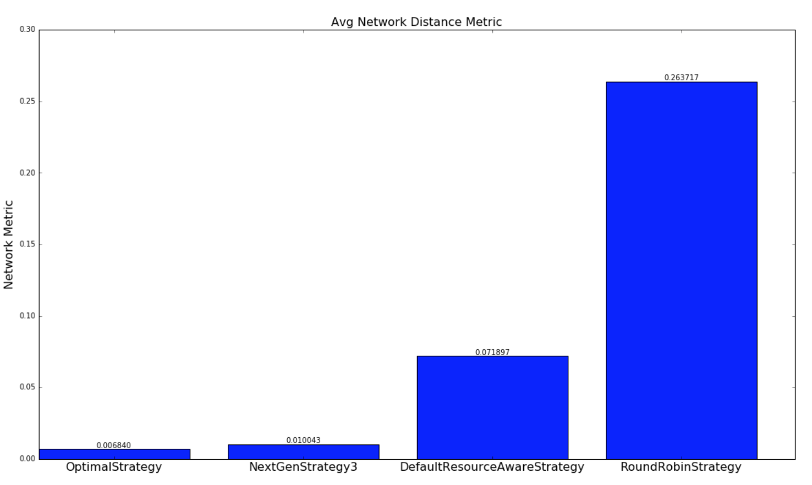 | 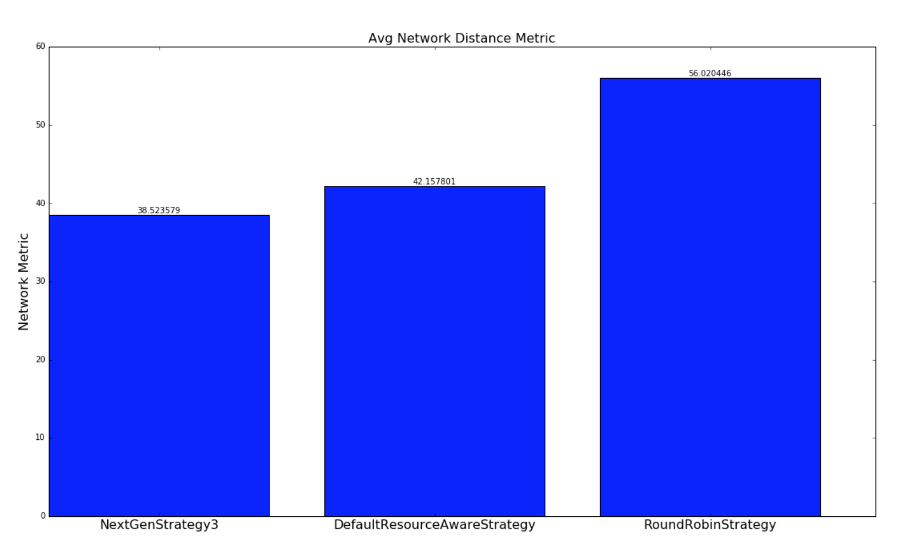 |

The next graph displays how close the schedulings from the respectively scheduling strategies are to the schedulings of the optimal strategy. As explained earlier, this is only done for the random generated topologies and clusters.

Random Topologies

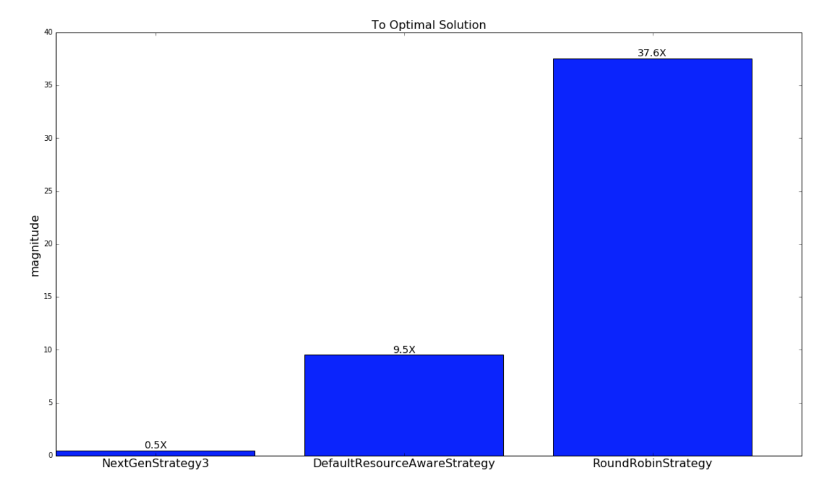

The below graph is a CDF of the network metric:

| Random Topologies | Yahoo topologies |
| --- | --- |
| 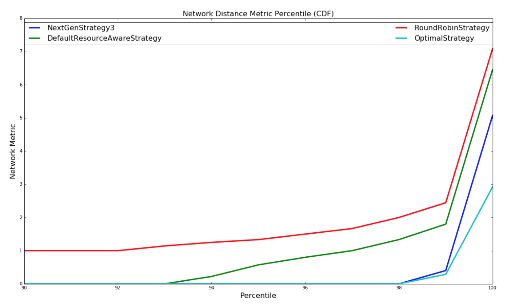 | 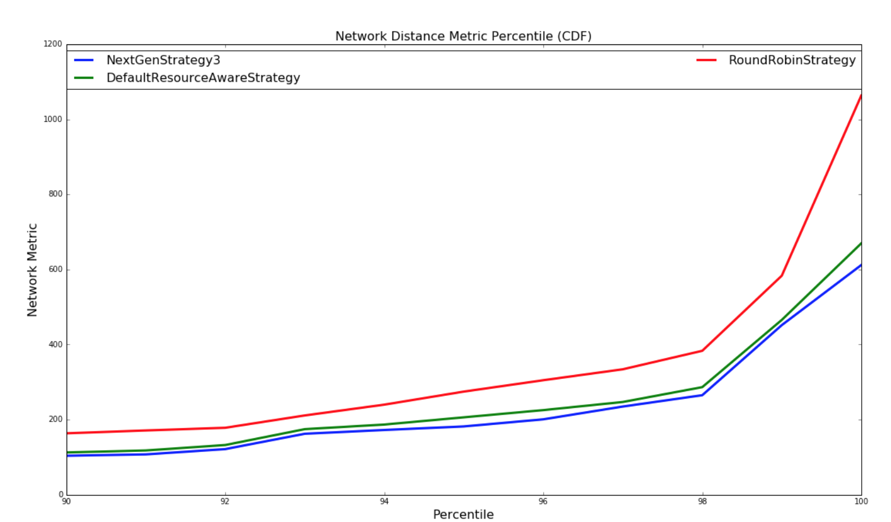 |

Below is a comparison of the how long the strategies take to run:

| Random Topologies | Yahoo topologies |
| --- | --- |
| 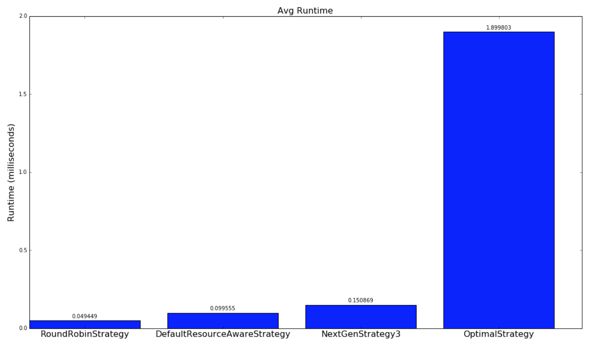 | 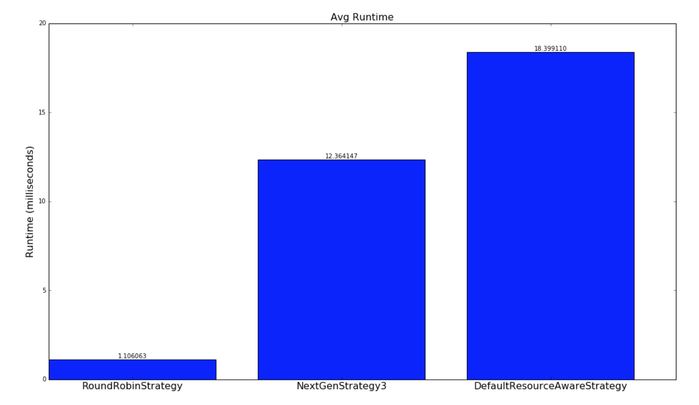 |

---

<a id="generic-resources"></a>

<!-- source_url: https://storm.apache.org/releases/2.8.3/Generic-resources.html -->

<!-- page_index: 27 -->

<a id="generic-resources--generic-resources"></a>

### Generic Resources

Generic Resources allow Storm to reference arbitrary resource types. Generic Resources may be considered an extension of the resources enumerated by the [Resource Aware Scheduler](#resource_aware_scheduler_overview), which accounts for CPU and memory.

<a id="generic-resources--api-overview"></a>

### API Overview

For a Storm Topology, the user can now specify the amount of generic resources a topology component (i.e. Spout or Bolt) is required to run a single instance of the component. The user can specify the resource requirement for a topology component by using the following API call.
`public T addResource(String resourceName, Number resourceValue)`
Parameters:
- resourceName – The name of the generic resource
- resourceValue – The amount of the generic resource

Example of Usage:
`SpoutDeclarer s1 = builder.setSpout("word", new TestWordSpout(), 10);
s1.addResouce("gpu.count", 1.0);`

<a id="generic-resources--specifying-generic-cluster-resources"></a>

### Specifying Generic Cluster Resources

A storm administrator can specify node resource availability by modifying the *conf/storm.yaml* file located in the storm home directory of that node.
`supervisor.resources.map: {[type<String>] : [amount<Double>]}`
Example of Usage:
`supervisor.resources.map: {"gpu.count" : 2.0}`

<a id="generic-resources--generic-resources-in-ui"></a>

### Generic Resources in UI

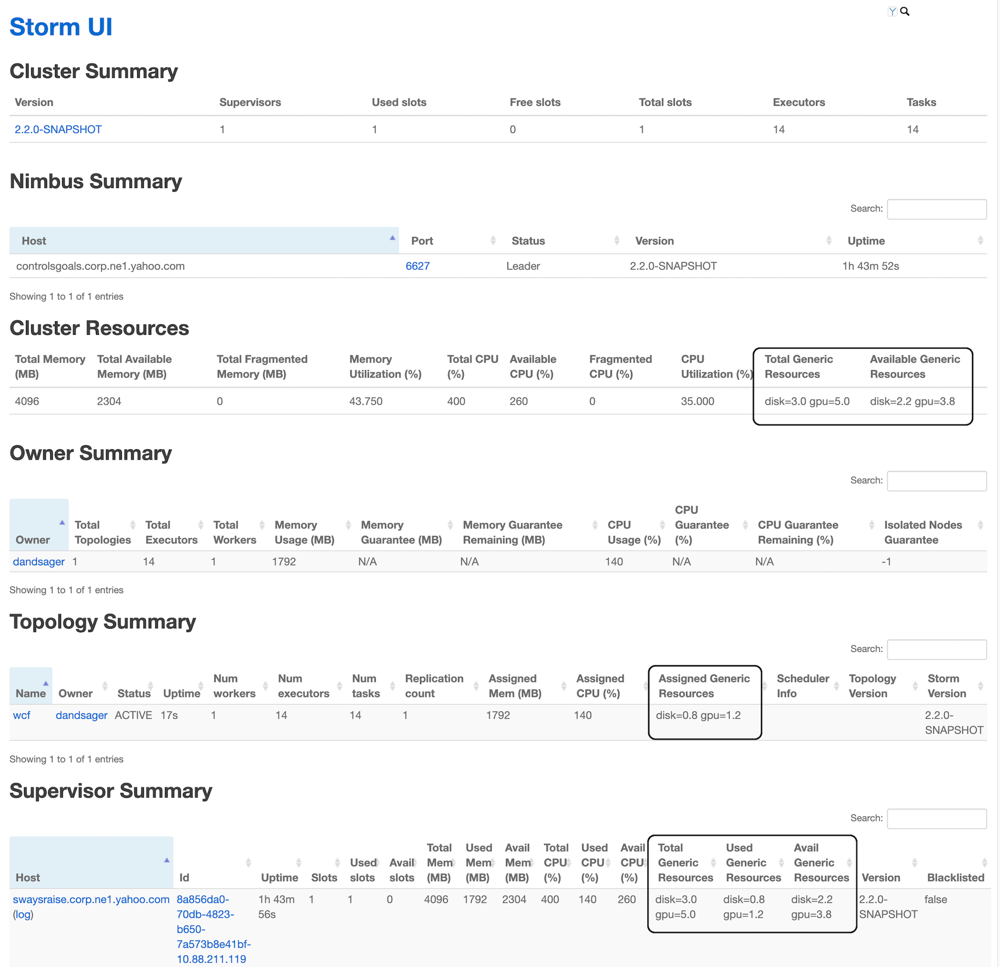

---

<a id="clustermetrics"></a>

<!-- source_url: https://storm.apache.org/releases/2.8.3/ClusterMetrics.html -->

<!-- page_index: 28 -->

<a id="clustermetrics--cluster-metrics"></a>

# Cluster Metrics

There are lots of metrics to help you monitor a running cluster. Many of these metrics are still a work in progress and so is the metrics system itself so any of them may change, even between minor version releases. We will try to keep them as stable as possible, but they should all be considered somewhat unstable. Some of the metrics may also be for experimental features, or features that are not complete yet, so please read the description of the metric before using it for monitoring or alerting.

Also be aware that depending on the metrics system you use, the names are likely to be translated into a different format that is compatible with the system. Typically this means that the ':' separating character will be replaced with a '.' character.

Most metrics should have the units that they are reported as a part of the description. For Timers often this is configured by the reporter that is uploading them to your system. Pay attention because even if the metric name has a time unit in it, it may be false.

Also, most metrics, except for gauges and counters, are a collection of numbers, and not a single value. Often these result in multiple metrics being uploaded to a reporting system, such as percentiles for a histogram, or rates for a meter. It is dependent on the configured metrics reporter how this happens, or how the name here corresponds to the metric in your reporting system.

<a id="clustermetrics--cluster-metrics-from-nimbus"></a>

## Cluster Metrics (From Nimbus)

These are metrics that come from the active nimbus instance and report the state of the cluster as a whole, as seen by nimbus.

| Metric Name | Type | Description |
| --- | --- | --- |
| cluster:num-nimbus-leaders | gauge | Number of nimbuses marked as a leader. This should really only ever be 1 in a healthy cluster, or 0 for a short period of time while a failover happens. |
| cluster:num-nimbuses | gauge | Number of nimbuses, leader or standby. |
| cluster:num-supervisors | gauge | Number of supervisors. |
| cluster:num-topologies | gauge | Number of topologies. |
| cluster:num-total-used-workers | gauge | Number of used workers/slots. |
| cluster:num-total-workers | gauge | Number of workers/slots. |
| cluster:total-fragmented-cpu-non-negative | gauge | Total fragmented CPU (% of core). This is CPU that the system thinks it cannot use because other resources on the node are used up. |
| cluster:total-fragmented-memory-non-negative | gauge | Total fragmented memory (MB). This is the memory that the system thinks it cannot use because other resources on the node are used up. |
| topologies:assigned-cpu | histogram | CPU scheduled per topology (% of a core) |
| topologies:assigned-mem-off-heap | histogram | Off heap memory scheduled per topology (MB) |
| topologies:assigned-mem-on-heap | histogram | On heap memory scheduled per topology (MB) |
| topologies:num-executors | histogram | Number of executors per topology. |
| topologies:num-tasks | histogram | Number of tasks per topology. |
| topologies:num-workers | histogram | Number of workers per topology. |
| topologies:replication-count | histogram | Replication count per topology. |
| topologies:requested-cpu | histogram | CPU requested per topology (% of a core). |
| topologies:requested-mem-off-heap | histogram | Off heap memory requested per topology (MB). |
| topologies:requested-mem-on-heap | histogram | On heap memory requested per topology (MB). |
| topologies:uptime-secs | histogram | Uptime per topology (seconds). |
| nimbus:available-cpu-non-negative | gauge | Available cpu on the cluster (% of a core). |
| nimbus:total-cpu | gauge | total CPU on the cluster (% of a core) |
| nimbus:total-memory | gauge | total memory on the cluster MB |
| supervisors:fragmented-cpu | histogram | fragmented cpu per supervisor (% of a core) |
| supervisors:fragmented-mem | histogram | fragmented memory per supervisor (MB) |
| supervisors:num-used-workers | histogram | workers used per supervisor |
| supervisors:num-workers | histogram | number of workers per supervisor |
| supervisors:uptime-secs | histogram | uptime of supervisors |
| supervisors:used-cpu | histogram | cpu used per supervisor (% of a core) |
| supervisors:used-mem | histogram | memory used per supervisor MB |

<a id="clustermetrics--nimbus-metrics"></a>

## Nimbus Metrics

These are metrics that are specific to a nimbus instance. In many instances, only the active nimbus will be reporting these metrics, but they could come from standby nimbus instances as well.

| Metric Name | Type | Description |
| --- | --- | --- |
| nimbus:files-upload-duration-ms | timer | Time it takes to upload a file from start to finish (Not Blobs, but this may change) |
| nimbus:longest-scheduling-time-ms | gauge | Longest time ever taken so far to schedule. This includes the current scheduling run, which is intended to detect if scheduling is stuck for some reason. |
| nimbus:mkAssignments-Errors | meter | tracks exceptions from mkAssignments |
| nimbus:num-activate-calls | meter | calls to the activate thrift method. |
| nimbus:num-added-executors-per-scheduling | histogram | number of executors added after a scheduling run. |
| nimbus:num-added-slots-per-scheduling | histogram | number of slots added after a scheduling run. |
| nimbus:num-beginFileUpload-calls | meter | calls to the beginFileUpload thrift method. |
| nimbus:num-blacklisted-supervisor | gauge | Number of supervisors currently marked as blacklisted because they appear to be somewhat unstable. |
| nimbus:num-deactivate-calls | meter | calls to deactivate thrift method. |
| nimbus:num-debug-calls | meter | calls to debug thrift method. |
| nimbus:num-downloadChunk-calls | meter | calls to downloadChunk thrift method. |
| nimbus:num-finishFileUpload-calls | meter | calls to finishFileUpload thrift method. |
| nimbus:num-gained-leadership | meter | number of times this nimbus gained leadership. |
| nimbus:num-getClusterInfo-calls | meter | calls to getClusterInfo thrift method. |
| nimbus:num-getComponentPageInfo-calls | meter | calls to getComponentPageInfo thrift method. |
| nimbus:num-getComponentPendingProfileActions-calls | meter | calls to getComponentPendingProfileActions thrift method. |
| nimbus:num-getLeader-calls | meter | calls to getLeader thrift method. |
| nimbus:num-getLogConfig-calls | meter | calls to getLogConfig thrift method. |
| nimbus:num-getNimbusConf-calls | meter | calls to getNimbusConf thrift method. |
| nimbus:num-getOwnerResourceSummaries-calls | meter | calls to getOwnerResourceSummaries thrift method. |
| nimbus:num-getSupervisorPageInfo-calls | meter | calls to getSupervisorPageInfo thrift method. |
| nimbus:num-getTopology-calls | meter | calls to getTopology thrift method. |
| nimbus:num-getTopologyConf-calls | meter | calls to getTopologyConf thrift method. |
| nimbus:num-getTopologyInfo-calls | meter | calls to getTopologyInfo thrift method. |
| nimbus:num-getTopologyInfoWithOpts-calls | meter | calls to getTopologyInfoWithOpts thrift method includes calls to getTopologyInfo. |
| nimbus:num-getTopologyPageInfo-calls | meter | calls to getTopologyPageInfo thrift method. |
| nimbus:num-getUserTopology-calls | meter | calls to getUserTopology thrift method. |
| nimbus:num-isTopologyNameAllowed-calls | meter | calls to isTopologyNameAllowed thrift method. |
| nimbus:num-killTopology-calls | meter | calls to killTopology thrift method. |
| nimbus:num-killTopologyWithOpts-calls | meter | calls to killTopologyWithOpts thrift method includes calls to killTopology. |
| nimbus:num-launched | meter | number of times a nimbus was launched |
| nimbus:num-lost-leadership | meter | number of times this nimbus lost leadership |
| nimbus:num-negative-resource-events | meter | Any time a resource goes negative (either CPU or Memory). This metric is not ideal as it is measured in a data structure that is used for internal calculations that may go negative and not actually represent over scheduling of a resource. |
| nimbus:num-net-executors-increase-per-scheduling | histogram | added executors minus removed executors after a scheduling run |
| nimbus:num-net-slots-increase-per-scheduling | histogram | added slots minus removed slots after a scheduling run |
| nimbus:num-rebalance-calls | meter | calls to rebalance thrift method. |
| nimbus:num-removed-executors-per-scheduling | histogram | number of executors removed after a scheduling run |
| nimbus:num-scheduling-timeouts | meter | number of timeouts during scheduling |
| nimbus:num-removed-slots-per-scheduling | histogram | number of slots removed after a scheduling run |
| nimbus:num-setLogConfig-calls | meter | calls to setLogConfig thrift method. |
| nimbus:num-setWorkerProfiler-calls | meter | calls to setWorkerProfiler thrift method. |
| nimbus:num-shutdown-calls | meter | times nimbus is shut down (this may not actually be reported as nimbus is in the middle of shutting down) |
| nimbus:num-submitTopology-calls | meter | calls to submitTopology thrift method. |
| nimbus:num-submitTopologyWithOpts-calls | meter | calls to submitTopologyWithOpts thrift method includes calls to submitTopology. |
| nimbus:num-uploadChunk-calls | meter | calls to uploadChunk thrift method. |
| nimbus:num-uploadNewCredentials-calls | meter | calls to uploadNewCredentials thrift method. |
| nimbus:process-worker-metric-calls | meter | calls to processWorkerMetrics thrift method. |
| nimbus:scheduler-internal-errors | meter | tracks internal scheduling errors |
| nimbus:topology-scheduling-duration-ms | timer | time it takes to do a scheduling run. |
| nimbus:total-available-memory-non-negative | gauge | available memory on the cluster MB |
| nimbuses:uptime-secs | histogram | uptime of nimbuses |
| MetricsCleaner:purgeTimestamp | gauge | last time metrics were purged (Unfinished Feature) |
| RocksDB:metric-failures | meter | generally any failure that happens in the rocksdb metrics store. (Unfinished Feature) |

<a id="clustermetrics--drpc-metrics"></a>

## DRPC Metrics

Metrics related to DRPC servers.

| Metric Name | Type | Description |
| --- | --- | --- |
| drpc:HTTP-request-response-duration | timer | how long it takes to execute an http drpc request |
| drpc:num-execute-calls | meter | calls to execute a DRPC request |
| drpc:num-execute-http-requests | meter | http requests to the DRPC server |
| drpc:num-failRequest-calls | meter | calls to failRequest |
| drpc:num-fetchRequest-calls | meter | calls to fetchRequest |
| drpc:num-result-calls | meter | calls to returnResult |
| drpc:num-server-timedout-requests | meter | times a DRPC request timed out without a response |
| drpc:num-shutdown-calls | meter | number of times shutdown is called on the drpc server |

<a id="clustermetrics--logviewer-metrics"></a>

## Logviewer Metrics

Metrics related to the logviewer process. This process currently also handles cleaning up worker logs when they get too large or too old.

| Metric Name | Type | Description |
| --- | --- | --- |
| logviewer:cleanup-routine-duration-ms | timer | how long it takes to run the log cleanup routine |
| logviewer:deep-search-request-duration-ms | timer | how long it takes for /deepSearch/{topoId} |
| logviewer:disk-space-freed-in-bytes | histogram | number of bytes cleaned up each time through the cleanup routine. |
| logviewer:download-file-size-rounded-MB | histogram | size in MB of files being downloaded |
| logviewer:num-daemonlog-page-http-requests | meter | calls to /daemonlog |
| logviewer:num-deep-search-no-result | meter | number of deep search requests that did not return any results |
| logviewer:num-deep-search-requests-with-archived | meter | calls to /deepSearch/{topoId} with ?search-archived=true |
| logviewer:num-deep-search-requests-without-archived | meter | calls to /deepSearch/{topoId} with ?search-archived=false |
| logviewer:num-download-daemon-log-exceptions | meter | num errors in calls to /daemondownload |
| logviewer:num-download-dump-exceptions | meter | num errors in calls to /dumps/{topo-id}/{host-port}/{filename} |
| logviewer:num-download-log-daemon-file-http-requests | meter | calls to /daemondownload |
| logviewer:num-download-log-exceptions | meter | num errors in calls to /download |
| logviewer:num-download-log-file-http-requests | meter | calls to /download |
| logviewer:num-file-download-exceptions | meter | errors while trying to download files. |
| logviewer:num-file-download-exceptions | meter | number of exceptions trying to download a log file |
| logviewer:num-file-open-exceptions | meter | errors trying to open a file (when deleting logs) |
| logviewer:num-file-open-exceptions | meter | number of exceptions trying to open a log file for serving |
| logviewer:num-file-read-exceptions | meter | number of exceptions trying to read from a log file for serving |
| logviewer:num-file-removal-exceptions | meter | number of exceptions trying to cleanup files. |
| logviewer:num-files-cleaned-up | histogram | number of files cleaned up each time through the cleanup routine. |
| logviewer:num-files-scanned-per-deep-search | histogram | number of files scanned per deep search |
| logviewer:num-list-dump-files-exceptions | meter | num errors in calls to /dumps/{topo-id}/{host-port} |
| logviewer:num-list-logs-http-request | meter | calls to /listLogs |
| logviewer:num-log-page-http-requests | meter | calls to /log |
| logviewer:num-other-cleanup-exceptions | meter | number of exception in the cleanup loop, not directly deleting files. |
| logviewer:num-page-read | meter | number of pages (parts of a log file) that are served up |
| logviewer:num-read-daemon-log-exceptions | meter | num errors in calls to /daemonlog |
| logviewer:num-read-log-exceptions | meter | num errors in calls to /log |
| logviewer:num-search-exceptions | meter | num errors in calls to /search |
| logviewer:num-search-log-exceptions | meter | num errors in calls to /listLogs |
| logviewer:num-search-logs-requests | meter | calls to /search |
| logviewer:num-search-request-no-result | meter | number of regular search results that were empty |
| logviewer:num-set-permission-exceptions | meter | num errors running set permissions to open up files for reading. |
| logviewer:num-shutdown-calls | meter | number of times shutdown was called on the logviewer |
| logviewer:search-requests-duration-ms | timer | how long it takes for /search |
| logviewer:worker-log-dir-size | gauge | size in bytes of the worker logs directory. |

<a id="clustermetrics--supervisor-metrics"></a>

## Supervisor Metrics

Metrics associated with the supervisor, which launches the workers for a topology. The supervisor also has a state machine for each slot. Some of the metrics are associated with that state machine and can be confusing if you do not understand the state machine.

| Metric Name | Type | Description |
| --- | --- | --- |
| supervisor:blob-cache-update-duration | timer | how long it takes to update all of the blobs in the cache (frequently just check if they have changed, but may also include downloading them.) |
| supervisor:blob-fetching-rate-MB/s | histogram | Download rate of a blob in MB/sec. Blobs are downloaded rarely so it is very bursty. |
| supervisor:blob-localization-duration | timer | Approximately how long it takes to get the blob we want after it is requested. |
| supervisor:current-reserved-memory-mb | gauge | total amount of memory reserved for workers on the supervisor (MB) |
| supervisor:current-used-memory-mb | gauge | memory currently used as measured by the supervisor (this typically requires cgroups) (MB) |
| supervisor:health-check-timeouts | meter | tracks timeouts executing health check scripts |
| supervisor:local-resource-file-not-found-when-releasing-slot | meter | number of times file-not-found exception happens when reading local blobs upon releasing slots |
| supervisor:num-blob-update-version-changed | meter | number of times a version of a blob changes. |
| supervisor:num-cleanup-exceptions | meter | exceptions thrown during container cleanup. |
| supervisor:num-force-kill-exceptions | meter | exceptions thrown during force kill. |
| supervisor:num-kill-exceptions | meter | exceptions thrown during kill. |
| supervisor:num-kill-worker-errors | meter | errors killing workers. |
| supervisor:num-launched | meter | number of times the supervisor is launched. |
| supervisor:num-shell-exceptions | meter | number of exceptions calling shell commands. |
| supervisor:num-slots-used-gauge | gauge | number of slots used on the supervisor. |
| supervisor:num-worker-start-timed-out | meter | number of times worker start timed out. |
| supervisor:num-worker-transitions-into-empty | meter | number of transitions into empty state. |
| supervisor:num-worker-transitions-into-kill | meter | number of transitions into kill state. |
| supervisor:num-worker-transitions-into-kill-and-relaunch | meter | number of transitions into kill-and-relaunch state |
| supervisor:num-worker-transitions-into-kill-blob-update | meter | number of transitions into kill-blob-update state |
| supervisor:num-worker-transitions-into-running | meter | number of transitions into running state |
| supervisor:num-worker-transitions-into-waiting-for-blob-localization | meter | number of transitions into waiting-for-blob-localization state |
| supervisor:num-worker-transitions-into-waiting-for-blob-update | meter | number of transitions into waiting-for-blob-update state |
| supervisor:num-worker-transitions-into-waiting-for-worker-start | meter | number of transitions into waiting-for-worker-start state |
| supervisor:num-workers-force-kill | meter | number of times a worker was force killed. This may mean that the worker did not exit cleanly/quickly. |
| supervisor:num-workers-killed-assignment-changed | meter | workers killed because the assignment changed. |
| supervisor:num-workers-killed-blob-changed | meter | workers killed because the blob changed and they needed to be relaunched. |
| supervisor:num-workers-killed-hb-null | meter | workers killed because there was no hb at all from the worker. This would typically only happen when a worker is launched for the first time. |
| supervisor:num-workers-killed-hb-timeout | meter | workers killed because the hb from the worker was too old. This often happens because of GC issues in the worker that prevents it from sending a heartbeat, but could also mean the worker process exited, and the supervisor is not the parent of the process to know that it exited. |
| supervisor:num-workers-killed-memory-violation | meter | workers killed because the worker was using too much memory. If the supervisor can monitor the memory usage of the worker (typically through cgroups) and the worker goes over the limit it may be shot. |
| supervisor:num-workers-killed-process-exit | meter | workers killed because the process exited and the supervisor was the parent process |
| supervisor:num-workers-launched | meter | number of workers launched |
| supervisor:single-blob-localization-duration | timer | how long it takes for a blob to be updated (downloaded, unzipped, inform slots, and make the move) |
| supervisor:time-worker-spent-in-state-empty-ms | timer | time spent in empty state as it transitions out. Not necessarily in ms. |
| supervisor:time-worker-spent-in-state-kill-and-relaunch-ms | timer | time spent in kill-and-relaunch state as it transitions out. Not necessarily in ms. |
| supervisor:time-worker-spent-in-state-kill-blob-update-ms | timer | time spent in kill-blob-update state as it transitions out. Not necessarily in ms. |
| supervisor:time-worker-spent-in-state-kill-ms | timer | time spent in kill state as it transitions out. Not necessarily in ms. |
| supervisor:time-worker-spent-in-state-running-ms | timer | time spent in running state as it transitions out. Not necessarily in ms. |
| supervisor:time-worker-spent-in-state-waiting-for-blob-localization-ms | timer | time spent in waiting-for-blob-localization state as it transitions out. Not necessarily in ms. |
| supervisor:time-worker-spent-in-state-waiting-for-blob-update-ms | timer | time spent in waiting-for-blob-update state as it transitions out. Not necessarily in ms. |
| supervisor:time-worker-spent-in-state-waiting-for-worker-start-ms | timer | time spent in waiting-for-worker-start state as it transitions out. Not necessarily in ms. |
| supervisor:update-blob-exceptions | meter | number of exceptions updating blobs. |
| supervisor:worker-launch-duration | timer | Time taken for a worker to launch. |
| supervisor:worker-per-call-clean-up-duration-ns | meter | how long it takes to cleanup a worker (ns). |
| supervisor:worker-shutdown-duration-ns | meter | how long it takes to shutdown a worker (ns). |
| supervisor:workerTokenAuthorizer-get-password-failures | meter | Failures getting password for user in WorkerTokenAuthorizer |

<a id="clustermetrics--ui-metrics"></a>

## UI Metrics

Metrics associated with a single UI daemon.

| Metric Name | Type | Description |
| --- | --- | --- |
| ui:num-activate-topology-http-requests | meter | calls to /topology/{id}/activate |
| ui:num-all-topologies-summary-http-requests | meter | calls to /topology/summary |
| ui:num-build-visualization-http-requests | meter | calls to /topology/{id}/visualization |
| ui:num-cluster-configuration-http-requests | meter | calls to /cluster/configuration |
| ui:num-cluster-summary-http-requests | meter | calls to /cluster/summary |
| ui:num-component-op-response-http-requests | meter | calls to /topology/{id}/component/{component}/debug/{action}/{spct} |
| ui:num-component-page-http-requests | meter | calls to /topology/{id}/component/{component} |
| ui:num-deactivate-topology-http-requests | meter | calls to topology/{id}/deactivate |
| ui:num-debug-topology-http-requests | meter | calls to /topology/{id}/debug/{action}/{spct} |
| ui:num-get-owner-resource-summaries-http-request | meter | calls to /owner-resources or /owner-resources/{id} |
| ui:num-log-config-http-requests | meter | calls to /topology/{id}/logconfig |
| ui:num-main-page-http-requests | meter | number of requests to /index.html |
| ui:num-mk-visualization-data-http-requests | meter | calls to /topology/{id}/visualization-init |
| ui:num-nimbus-summary-http-requests | meter | calls to /nimbus/summary |
| ui:num-supervisor-http-requests | meter | calls to /supervisor |
| ui:num-supervisor-summary-http-requests | meter | calls to /supervisor/summary |
| ui:num-topology-lag-http-requests | meter | calls to /topology/{id}/lag |
| ui:num-topology-metric-http-requests | meter | calls to /topology/{id}/metrics |
| ui:num-topology-op-response-http-requests | meter | calls to /topology/{id}/logconfig or /topology/{id}/rebalance/{wait-time} or /topology/{id}/kill/{wait-time} |
| ui:num-topology-page-http-requests | meter | calls to /topology/{id} |
| num-web-requests | meter | nominally the total number of web requests being made. |

<a id="clustermetrics--pacemaker-metrics-deprecated"></a>

## Pacemaker Metrics (Deprecated)

The pacemaker process is deprecated and only still exists for backward compatibility.

| Metric Name | Type | Description |
| --- | --- | --- |
| pacemaker:get-pulse=count | meter | number of times getPulse was called. yes the = is in the name, but typically this is mapped to a '-' by the metrics reporters. |
| pacemaker:heartbeat-size | histogram | size in bytes of heartbeats |
| pacemaker:send-pulse-count | meter | number of times sendPulse was called |
| pacemaker:size-total-keys | gauge | total number of keys in this pacemaker instance |
| pacemaker:total-receive-size | meter | total size in bytes of heartbeats received |
| pacemaker:total-sent-size | meter | total size in bytes of heartbeats read |

<a id="clustermetrics--metric-reporters"></a>

## Metric Reporters

For metrics to be reported, configure reporters using `storm.daemon.metrics.reporter.plugins`. The following metric reporters are supported:
\* Console Reporter (`org.apache.storm.daemon.metrics.reporters.ConsolePreparableReporter`):
Reports metrics to `System.out`.
\* CSV Reporter (`org.apache.storm.daemon.metrics.reporters.CsvPreparableReporter`):
Reports metrics to a CSV file.
\* JMX Reporter (`org.apache.storm.daemon.metrics.reporters.JmxPreparableReporter`):
Exposes metrics via JMX.

Custom reporter can be created by implementing `org.apache.storm.daemon.metrics.reporters.PreparableReporter` interface.

---

<a id="windows-users-guide"></a>

<!-- source_url: https://storm.apache.org/releases/2.8.3/windows-users-guide.html -->

<!-- page_index: 29 -->

# Windows Users Guide

This page guides how to set up environment on Windows for Apache Storm.

<a id="windows-users-guide--symbolic-link"></a>

## Symbolic Link

Starting at 1.0.0, Apache Storm utilizes `symbolic link` to aggregate log directory and resource directory into worker directory.
Unfortunately, `creating symbolic link` on Windows needs non-default privilege, so users should configure it manually to make sure Storm processes can create symbolic link on runtime.
Depending on the Windows version (i.e. non-professional), setting symbolic links privilege by a security policy is not possible since the tool is not installed.

When creating a symbolic link is not possible, the Supervisor process will stop as soon as it tries to start workers since the permission exception is considered a fatal error.

Below pages (MS technet) guide how to configure that policy to the account which Storm runs on.

- [How to Configure Security Policy Settings](https://technet.microsoft.com/en-us/library/dn452420.aspx)
- [Create symbolic links](https://technet.microsoft.com/en-us/library/dn221947.aspx)

One tricky point is, `administrator` group already has this privilege, but it's activated only process is run as `administrator` account.
So if your account belongs to `administrator` group (and you don't want to change it), you may want to open `command prompt` with `run as administrator` and execute processes within that console.
If you don't want to execute Storm processes directly (not on command prompt), please execute processes with `runas /user:administrator` to run as administrator account.

Starting with Windows 10 Creators Update, it will be possible to activate a Developer Mode that supports creating symbolic links without `run as administrator`
[Symlinks in Windows 10!](https://blogs.windows.com/buildingapps/2016/12/02/symlinks-windows-10/)

Alternatively you can disable usage of symbolic links by setting the config `storm.disable.symlinks` to `true`
on Nimbus and all of the Supervisor nodes. This will also disable features that require symlinks. Currently this is only downloading
dependent blobs, but may change in the future. Some topologies may rely on symbolic links to resources in the current working directory of the worker that are
created as a convienence, so it is not a 100% backwards compatible change.

---

<a id="classpath-handling"></a>

<!-- source_url: https://storm.apache.org/releases/2.8.3/Classpath-handling.html -->

<!-- page_index: 30 -->

<a id="classpath-handling--storm-is-an-application-container"></a>

### Storm is an Application Container

Storm provides an application container environment, a la Apache Tomcat, which creates a potential for classpath conflicts between Storm and your application. The most common way of using Storm involves submitting an "uber JAR" containing your application code with all of its dependencies bundled in, and then Storm distributes this JAR to Worker nodes. Then Storm runs your application within a Storm process called a `Worker` -- thus the JVM's classpath contains the dependencies of your JAR as well as whatever dependencies the Worker itself has. So careful handling of classpaths and dependencies is critical for the correct functioning of Storm.

<a id="classpath-handling--adding-extra-dependencies-to-classpath"></a>

### Adding Extra Dependencies to Classpath

You no longer *need* to bundle your dependencies into your topology and create an uber JAR, there are now facilities for separately handling your topology's dependencies. Furthermore, there are facilities for adding external dependencies into the Storm daemons.

The `storm.py` launcher script allows you to include dependencies into the launched program's classpath via a few different mechanisms:

1. The `--jar` and `--artifacts` options for the `storm jar` command: allow the inclusion of non-bundled dependencies with your topology; i.e., allowing specification of JARs that were not bundled into the topology uber-jar. This is required when using the `storm sql` command, which constructs a topology automatically without needing you to write code and build a topology JAR.
2. The `${STORM_DIR}/extlib/` and `${STORM_DIR}/extlib-daemon/` directories can have dependencies added to them for the inclusion of plugins & 3rd-party libraries into the Storm daemons (e.g., Nimbus, UI, Supervisor, etc. -- use `extlib-daemon/`) and other commands launched via the `storm.py` script, e.g., `storm sql` and `storm jar` (use `extlib`). Notably, this means that the Storm Worker process does not include the `extlib-daemon/` directory into its classpath.
3. The `STORM_EXT_CLASSPATH` and `STORM_EXT_CLASSPATH_DAEMON` environment variables provide a similar functionality as those directories, but allows the user to place their external dependencies in alternative locations.
   - There is a wrinkle here: because the Supervisor daemon launches the Worker process, if you want `STORM_EXT_CLASSPATH` to impact your Workers, you will need to specify the `STORM_EXT_CLASSPATH` for the Supervisor daemon. That will allow the Supervisor to consult this environment variable as it constructs the classpath of the Worker processes.

<a id="classpath-handling--which-facility-to-choose"></a>

#### Which Facility to Choose?

You might have noticed the overlap between the first mechanism and the others. If you consider the `--jar` / `--artifacts` option versus the `extlib/` / `STORM_EXT_CLASSPATH` it is not obvious which one you should choose for using dependencies with your Worker processes. i.e., both mechanisms allow including JARs to be used for running your Worker processes. Here is my understanding of the difference: `--jar` / `--artifacts` will result in the dependencies being used for running the `storm jar/sql` command, *and* the dependencies will be uploaded and available in the classpath of the topology's `Worker` processes. Whereas the use of `extlib/` / `STORM_EXT_CLASSPATH` requires you to have distributed your JAR dependencies out to all Worker nodes. Another difference is that `extlib/` / `STORM_EXT_CLASSPATH` would impact all topologies, whereas `--jar` / `--artifacts` is a topology-specific option.

<a id="classpath-handling--abbreviation-of-classpaths-and-process-commands"></a>

### Abbreviation of Classpaths and Process Commands

When the `storm.py` script launches a `java` command, it first constructs the classpath from the optional settings mentioned above, as well as including some default locations such as the `${STORM_DIR}/`, `${STORM_DIR}/lib/`, `${STORM_DIR}/extlib/` and `${STORM_DIR}/extlib-daemon/` directories. In past releases, Storm would enumerate all JARs in those directories and then explicitly add all of those JARs into the `-cp` / `--classpath` argument to the launched `java` commands. As such, the classpath would get so long that the `java` commands could breach the Linux Kernel process table limit of 4096 bytes for recording commands. That led to truncated commands in `ps` output, making it hard to operate Storm clusters because you could not easily differentiate the processes nor easily see from `ps` which port a worker is listening to.

After Storm dropped support for Java 5, this classpath expansion was no longer necessary, because Java 6 supports classpath wildcards. Classpath wildcards allow you to specify a directory ending with a `*` element, such as `foo/bar/*`, and the JVM will automatically expand the classpath to include all `.jar` files in the wildcard directory. As of [STORM-2191](https://issues.apache.org/jira/browse/STORM-2191) Storm just uses classpath wildcards instead of explicitly listing all JARs, thereby shortening all of the commands and making operating Storm clusters a bit easier.

---

<a id="serialization"></a>

<!-- source_url: https://storm.apache.org/releases/2.8.3/Serialization.html -->

<!-- page_index: 31 -->

# Serialization

This page is about how the serialization system in Storm works for versions 0.6.0 and onwards. Storm used a different serialization system prior to 0.6.0 which is documented on [Serialization (prior to 0.6.0)](https://storm.apache.org/releases/2.8.3/Serialization-(prior-to-0.6.0).html).

Tuples can be comprised of objects of any types. Since Storm is a distributed system, it needs to know how to serialize and deserialize objects when they're passed between tasks.

Storm uses [Kryo](https://github.com/EsotericSoftware/kryo) for serialization. Kryo is a flexible and fast serialization library that produces small serializations.

By default, Storm can serialize primitive types, strings, byte arrays, ArrayList, HashMap, and HashSet. If you want to use another type in your tuples, you'll need to register a custom serializer.

<a id="serialization--dynamic-typing"></a>

### Dynamic typing

There are no type declarations for fields in a Tuple. You put objects in fields and Storm figures out the serialization dynamically. Before we get to the interface for serialization, let's spend a moment understanding why Storm's tuples are dynamically typed.

Adding static typing to tuple fields would add large amount of complexity to Storm's API. Hadoop, for example, statically types its keys and values but requires a huge amount of annotations on the part of the user. Hadoop's API is a burden to use and the "type safety" isn't worth it. Dynamic typing is simply easier to use.

Further than that, it's not possible to statically type Storm's tuples in any reasonable way. Suppose a Bolt subscribes to multiple streams. The tuples from all those streams may have different types across the fields. When a Bolt receives a `Tuple` in `execute`, that tuple could have come from any stream and so could have any combination of types. There might be some reflection magic you can do to declare a different method for every tuple stream a bolt subscribes to, but Storm opts for the simpler, straightforward approach of dynamic typing.

Finally, another reason for using dynamic typing is so Storm can be used in a straightforward manner from dynamically typed languages like Clojure and JRuby.

<a id="serialization--custom-serialization"></a>

### Custom serialization

As mentioned, Storm uses Kryo for serialization. To implement custom serializers, you need to register new serializers with Kryo. It's highly recommended that you read over [Kryo's home page](https://github.com/EsotericSoftware/kryo) to understand how it handles custom serialization.

Adding custom serializers is done through the "topology.kryo.register" property in your topology config or through a ServiceLoader described later. The config takes a list of registrations, where each registration can take one of two forms:

1. The name of a class to register. In this case, Storm will use Kryo's `FieldsSerializer` to serialize the class. This may or may not be optimal for the class -- see the Kryo docs for more details.
2. A map from the name of a class to register to an implementation of [com.esotericsoftware.kryo.Serializer](https://github.com/EsotericSoftware/kryo/blob/master/src/com/esotericsoftware/kryo/Serializer.java).

Let's look at an example.

```
topology.kryo.register:
  - com.mycompany.CustomType1
  - com.mycompany.CustomType2: com.mycompany.serializer.CustomType2Serializer
  - com.mycompany.CustomType3
```

`com.mycompany.CustomType1` and `com.mycompany.CustomType3` will use the `FieldsSerializer`, whereas `com.mycompany.CustomType2` will use `com.mycompany.serializer.CustomType2Serializer` for serialization.

Storm provides helpers for registering serializers in a topology config. The [Config](https://javadoc.io/doc/org.apache.storm/storm-client/2.8.3/org/apache/storm/Config.html) class has a method called `registerSerialization` that takes in a registration to add to the config.

There's an advanced config called `Config.TOPOLOGY_SKIP_MISSING_KRYO_REGISTRATIONS`. If you set this to true, Storm will ignore any serializations that are registered but do not have their code available on the classpath. Otherwise, Storm will throw errors when it can't find a serialization. This is useful if you run many topologies on a cluster that each have different serializations, but you want to declare all the serializations across all topologies in the `storm.yaml` files.

<a id="serialization--serializationregister-service-loader"></a>

#### SerializationRegister Service Loader

If you want to provide language bindings to storm, have a library that you want to interact cleanly with storm or have some other reason to provide serialization bindings and don't want to force the user to update their configs you can use the org.apache.storm.serialization.SerializationRegister service loader.

You may use this like any other service loader and storm will register the bindings without forceing users to update their configs. The storm-clojure package uses this to provide transparent support for clojure types.

<a id="serialization--java-serialization"></a>

### Java serialization

When `Config.TOPOLOGY_FALL_BACK_ON_JAVA_SERIALIZATION` is set true, if Storm encounters a type for which it doesn't have a serialization registered, it will use Java serialization if possible. If the object can't be serialized with Java serialization, then Storm will throw an error.

Beware that Java serialization is extremely expensive, both in terms of CPU cost as well as the size of the serialized object. It is highly recommended that you register custom serializers when you put the topology in production. The Java serialization behavior is there so that it's easy to prototype new topologies.

You can turn on/off the behavior to fall back on Java serialization by setting the `Config.TOPOLOGY_FALL_BACK_ON_JAVA_SERIALIZATION` config to true/false. The default value is false for security reasons.

<a id="serialization--component-specific-serialization-registrations"></a>

### Component-specific serialization registrations

Storm 0.7.0 lets you set component-specific configurations (read more about this at [Configuration](#configuration)). Of course, if one component defines a serialization that serialization will need to be available to other bolts -- otherwise they won't be able to receive messages from that component!

When a topology is submitted, a single set of serializations is chosen to be used by all components in the topology for sending messages. This is done by merging the component-specific serializer registrations with the regular set of serialization registrations. If two components define serializers for the same class, one of the serializers is chosen arbitrarily.

To force a serializer for a particular class if there's a conflict between two component-specific registrations, just define the serializer you want to use in the topology-specific configuration. The topology-specific configuration has precedence over component-specific configurations for serialization registrations.

---

<a id="common-patterns"></a>

<!-- source_url: https://storm.apache.org/releases/2.8.3/Common-patterns.html -->

<!-- page_index: 32 -->

# Common Topology Patterns

This page lists a variety of common patterns in Storm topologies.

1. Batching
2. BasicBolt
3. In-memory caching + fields grouping combo
4. Streaming top N
5. TimeCacheMap for efficiently keeping a cache of things that have been recently updated
6. CoordinatedBolt and KeyedFairBolt for Distributed RPC

<a id="common-patterns--batching"></a>

### Batching

Oftentimes for efficiency reasons or otherwise, you want to process a group of tuples in batch rather than individually. For example, you may want to batch updates to a database or do a streaming aggregation of some sort.

If you want reliability in your data processing, the right way to do this is to hold on to tuples in an instance variable while the bolt waits to do the batching. Once you do the batch operation, you then ack all the tuples you were holding onto.

If the bolt emits tuples, then you may want to use multi-anchoring to ensure reliability. It all depends on the specific application. See [Guaranteeing message processing](#guaranteeing-message-processing) for more details on how reliability works.

<a id="common-patterns--basicbolt"></a>

### BasicBolt

Many bolts follow a similar pattern of reading an input tuple, emitting zero or more tuples based on that input tuple, and then acking that input tuple immediately at the end of the execute method. Bolts that match this pattern are things like functions and filters. This is such a common pattern that Storm exposes an interface called [IBasicBolt](https://javadoc.io/doc/org.apache.storm/storm-client/2.8.3/org/apache/storm/topology/IBasicBolt.html) that automates this pattern for you. See [Guaranteeing message processing](#guaranteeing-message-processing) for more information.

<a id="common-patterns--in-memory-caching-fields-grouping-combo"></a>

### In-memory caching + fields grouping combo

It's common to keep caches in-memory in Storm bolts. Caching becomes particularly powerful when you combine it with a fields grouping. For example, suppose you have a bolt that expands short URLs (like bit.ly, t.co, etc.) into long URLs. You can increase performance by keeping an LRU cache of short URL to long URL expansions to avoid doing the same HTTP requests over and over. Suppose component "urls" emits short URLS, and component "expand" expands short URLs into long URLs and keeps a cache internally. Consider the difference between the two following snippets of code:

```java
builder.setBolt("expand", new ExpandUrl(), parallelism)
  .shuffleGrouping(1);
```

```java
builder.setBolt("expand", new ExpandUrl(), parallelism)
  .fieldsGrouping("urls", new Fields("url"));
```

The second approach will have vastly more effective caches since the same URL will always go to the same task. This avoids having duplication across any of the caches in the tasks and makes it much more likely that a short URL will hit the cache.

<a id="common-patterns--streaming-top-n"></a>

### Streaming top N

A common continuous computation done on Storm is a "streaming top N" of some sort. Suppose you have a bolt that emits tuples of the form ["value", "count"] and you want a bolt that emits the top N tuples based on the count. The simplest way to do this is to have a bolt that does a global grouping on the stream and maintains a list in memory of the top N items.

This approach obviously doesn't scale to large streams since the entire stream has to go through one task. A better way to do the computation is to do many top N's in parallel across partitions of the stream, and then merge those top N's together to get the global top N. The pattern looks like this:

```java
builder.setBolt("rank", new RankObjects(), parallelism)
  .fieldsGrouping("objects", new Fields("value"));
builder.setBolt("merge", new MergeObjects())
  .globalGrouping("rank");
```

This pattern works because of the fields grouping done by the first bolt which gives the partitioning you need for this to be semantically correct. You can see an example of this pattern in storm-starter [here](https://github.com/apache/storm/blob/v2.8.3/examples/storm-starter/src/jvm/org/apache/storm/starter/RollingTopWords.java).

If however, you have a known skew in the data being processed it can be advantageous to use partialKeyGrouping instead of fieldsGrouping. This will distribute the load for each key between two downstream bolts instead of a single one.

```java
builder.setBolt("count", new CountObjects(), parallelism)
  .partialKeyGrouping("objects", new Fields("value"));
builder.setBolt("rank" new AggregateCountsAndRank(), parallelism)
  .fieldsGrouping("count", new Fields("key"))
builder.setBolt("merge", new MergeRanksObjects())
  .globalGrouping("rank");
```

The topology needs an extra layer of processing to aggregate the partial counts from the upstream bolts but this only processes aggregated values now so the bolt is not subject to the load caused by the skewed data. You can see an example of this pattern in storm-starter [here](https://github.com/apache/storm/blob/v2.8.3/examples/storm-starter/src/jvm/org/apache/storm/starter/SkewedRollingTopWords.java).

<a id="common-patterns--timecachemap-for-efficiently-keeping-a-cache-of-things-that-have-been-recently-updated"></a>

### TimeCacheMap for efficiently keeping a cache of things that have been recently updated

You sometimes want to keep a cache in memory of items that have been recently "active" and have items that have been inactive for some time automatically expire. [TimeCacheMap](https://javadoc.io/doc/org.apache.storm/storm-client/2.8.3/org/apache/storm/utils/TimeCacheMap.html) is an efficient data structure for doing this and provides hooks so you can insert callbacks whenever an item is expired.

<a id="common-patterns--coordinatedbolt-and-keyedfairbolt-for-distributed-rpc"></a>

### CoordinatedBolt and KeyedFairBolt for Distributed RPC

When building distributed RPC applications on top of Storm, there are two common patterns that are usually needed. These are encapsulated by [CoordinatedBolt](https://javadoc.io/doc/org.apache.storm/storm-client/2.8.3/org/apache/storm/task/CoordinatedBolt.html) and [KeyedFairBolt](https://javadoc.io/doc/org.apache.storm/storm-client/2.8.3/org/apache/storm/task/KeyedFairBolt.html) which are part of the "standard library" that ships with the Storm codebase.

`CoordinatedBolt` wraps the bolt containing your logic and figures out when your bolt has received all the tuples for any given request. It makes heavy use of direct streams to do this.

`KeyedFairBolt` also wraps the bolt containing your logic and makes sure your topology processes multiple DRPC invocations at the same time, instead of doing them serially one at a time.

See [Distributed RPC](#distributed-rpc) for more details.

---

<a id="dsls-and-multilang-adapters"></a>

<!-- source_url: https://storm.apache.org/releases/2.8.3/DSLs-and-multilang-adapters.html -->

<!-- page_index: 33 -->

# Storm DSLs and Multi-Lang Adapters

- [Clojure DSL](https://storm.apache.org/releases/2.8.3/Clojure-DSL.html)
- [Scala DSL](https://github.com/velvia/ScalaStorm)
- [JRuby DSL](https://github.com/colinsurprenant/redstorm)
- [Storm/Esper integration](https://github.com/tomdz/storm-esper): Streaming SQL on top of Storm
- [io-storm](https://github.com/dan-blanchard/io-storm): Perl multilang adapter
- [FsShelter](https://github.com/Prolucid/FsShelter): F# DSL and runtime with protobuf multilang

---

<a id="using-non-jvm-languages-with-storm"></a>

<!-- source_url: https://storm.apache.org/releases/2.8.3/Using-non-JVM-languages-with-Storm.html -->

<!-- page_index: 34 -->

# Using non JVM languages with Storm

- two pieces: creating topologies and implementing spouts and bolts in other languages
- creating topologies in another language is easy since topologies are just thrift structures (link to storm.thrift)
- implementing spouts and bolts in another language is called a "multilang components" or "shelling"
  - Here's a specification of the protocol: [Multilang protocol](#multilang-protocol)
  - the thrift structure lets you define multilang components explicitly as a program and a script (e.g., python3 and the file implementing your bolt)
  - In Java, you override ShellBolt or ShellSpout to create multilang components
    - note that output fields declarations happens in the thrift structure, so in Java you create multilang components like the following:
      - declare fields in java, processing code in the other language by specifying it in constructor of shellbolt
  - multilang uses json messages over stdin/stdout to communicate with the subprocess
  - storm comes with Ruby, Python, and Fancy adapters that implement the protocol. show an example of Python
    - Python supports emitting, anchoring, acking, and logging
- "storm shell" command makes constructing jar and uploading to nimbus easy
  - makes jar and uploads it
  - calls your program with host/port of nimbus and the jarfile id

<a id="using-non-jvm-languages-with-storm--notes-on-implementing-a-dsl-in-a-non-jvm-language"></a>

## Notes on implementing a DSL in a non-JVM language

The right place to start is src/storm.thrift. Since Storm topologies are just Thrift structures, and Nimbus is a Thrift daemon, you can create and submit topologies in any language.

When you create the Thrift structs for spouts and bolts, the code for the spout or bolt is specified in the ComponentObject struct:

```
union ComponentObject {
  1: binary serialized_java;
  2: ShellComponent shell;
  3: JavaObject java_object;
}
```

For a non-JVM DSL, you would want to make use of "2" and "3". ShellComponent lets you specify a script to run that component (e.g., your Python code). And JavaObject lets you specify native java spouts and bolts for the component (and Storm will use reflection to create that spout or bolt).

There's a "storm shell" command that will help with submitting a topology. Its usage is like this:

```
storm shell resources/ python3 topology.py arg1 arg2
```

storm shell will then package resources/ into a jar, upload the jar to Nimbus, and call your topology.py script like this:

```
python3 topology.py arg1 arg2 {nimbus-host} {nimbus-port} {uploaded-jar-location}
```

Then you can connect to Nimbus using the Thrift API and submit the topology, passing {uploaded-jar-location} into the submitTopology method. For reference, here's the submitTopology definition:

```
void submitTopology(1: string name, 2: string uploadedJarLocation, 3: string jsonConf, 4: StormTopology topology)
    throws (1: AlreadyAliveException e, 2: InvalidTopologyException ite);
```

---

<a id="distributed-rpc"></a>

<!-- source_url: https://storm.apache.org/releases/2.8.3/Distributed-RPC.html -->

<!-- page_index: 35 -->

# Distributed RPC

The idea behind distributed RPC (DRPC) is to parallelize the computation of really intense functions on the fly using Storm. The Storm topology takes in as input a stream of function arguments, and it emits an output stream of the results for each of those function calls.

DRPC is not so much a feature of Storm as it is a pattern expressed from Storm's primitives of streams, spouts, bolts, and topologies. DRPC could have been packaged as a separate library from Storm, but it's so useful that it's bundled with Storm.

<a id="distributed-rpc--high-level-overview"></a>

### High level overview

Distributed RPC is coordinated by a "DRPC server" (Storm comes packaged with an implementation of this). The DRPC server coordinates receiving an RPC request, sending the request to the Storm topology, receiving the results from the Storm topology, and sending the results back to the waiting client. From a client's perspective, a distributed RPC call looks just like a regular RPC call. For example, here's how a client would compute the results for the "reach" function with the argument "[http://twitter.com":](http://twitter.com%22:)

```java
Config conf = new Config();
conf.put("storm.thrift.transport", "org.apache.storm.security.auth.plain.PlainSaslTransportPlugin");
conf.put(Config.STORM_NIMBUS_RETRY_TIMES, 3);
conf.put(Config.STORM_NIMBUS_RETRY_INTERVAL, 10);
conf.put(Config.STORM_NIMBUS_RETRY_INTERVAL_CEILING, 20);
DRPCClient client = new DRPCClient(conf, "drpc-host", 3772);
String result = client.execute("reach", "http://twitter.com");
```

or if you just want to use a preconfigured client you can call. The exact host will be selected randomly from the configured set of hosts, if the host appears to be down it will loop through all configured hosts looking for one that works.

```java
DRPCClient client = DRPCClient.getConfiguredClient(conf);
String result = client.execute("reach", "http://twitter.com");
```

The distributed RPC workflow looks like this:

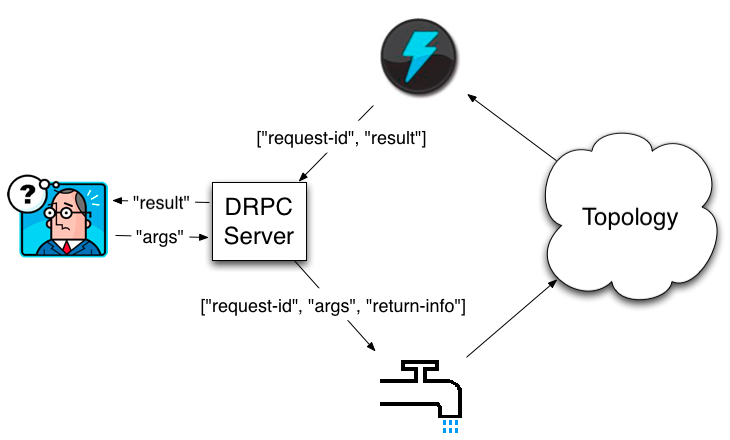

A client sends the DRPC server the name of the function to execute and the arguments to that function. The topology implementing that function uses a `DRPCSpout` to receive a function invocation stream from the DRPC server. Each function invocation is tagged with a unique id by the DRPC server. The topology then computes the result and at the end of the topology a bolt called `ReturnResults` connects to the DRPC server and gives it the result for the function invocation id. The DRPC server then uses the id to match up that result with which client is waiting, unblocks the waiting client, and sends it the result.

<a id="distributed-rpc--lineardrpctopologybuilder"></a>

### LinearDRPCTopologyBuilder

Storm comes with a topology builder called [LinearDRPCTopologyBuilder](https://javadoc.io/doc/org.apache.storm/storm-client/2.8.3/org/apache/storm/drpc/LinearDRPCTopologyBuilder.html) that automates almost all the steps involved for doing DRPC. These include:

1. Setting up the spout
2. Returning the results to the DRPC server
3. Providing functionality to bolts for doing finite aggregations over groups of tuples

Let's look at a simple example. Here's the implementation of a DRPC topology that returns its input argument with a "!" appended:

```java
public static class ExclaimBolt extends BaseBasicBolt {public void execute(Tuple tuple, BasicOutputCollector collector) {String input = tuple.getString(1); collector.emit(new Values(tuple.getValue(0), input + "!"));}
public void declareOutputFields(OutputFieldsDeclarer declarer) {declarer.declare(new Fields("id", "result"));}}
public static void main(String[] args) throws Exception {LinearDRPCTopologyBuilder builder = new LinearDRPCTopologyBuilder("exclamation"); builder.addBolt(new ExclaimBolt(), 3); // ...}
```

As you can see, there's very little to it. When creating the `LinearDRPCTopologyBuilder`, you tell it the name of the DRPC function for the topology. A single DRPC server can coordinate many functions, and the function name distinguishes the functions from one another. The first bolt you declare will take in as input 2-tuples, where the first field is the request id and the second field is the arguments for that request. `LinearDRPCTopologyBuilder` expects the last bolt to emit an output stream containing 2-tuples of the form [id, result]. Finally, all intermediate tuples must contain the request id as the first field.

In this example, `ExclaimBolt` simply appends a "!" to the second field of the tuple. `LinearDRPCTopologyBuilder` handles the rest of the coordination of connecting to the DRPC server and sending results back.

<a id="distributed-rpc--local-mode-drpc"></a>

### Local mode DRPC

In the past to use DRPC in local mode it took creating a special LocalDRPC instance. This can still be used when writing tests for your code, but in the current version of storm when you run in local mode a LocalDRPC
instance is also created, and any DRPCClient created will link to it instead of the outside world. This means that any interaction you want to test needs to be a part of the script that launches the topology, just like
with LocalDRPC.

<a id="distributed-rpc--remote-mode-drpc"></a>

### Remote mode DRPC

Using DRPC on an actual cluster is also straightforward. There's three steps:

1. Launch DRPC server(s)
2. Configure the locations of the DRPC servers
3. Submit DRPC topologies to Storm cluster

Launching a DRPC server can be done with the `storm` script and is just like launching Nimbus or the UI:

```
bin/storm drpc
```

Next, you need to configure your Storm cluster to know the locations of the DRPC server(s). This is how `DRPCSpout` knows from where to read function invocations. This can be done through the `storm.yaml` file or the topology configurations. You should also specify storm.thrift.transport property to match DRPCClient settings. Configuring this through the `storm.yaml` looks something like this:

```yaml
drpc.servers:
  - "drpc1.foo.com"
  - "drpc2.foo.com"
drpc.http.port: 8081
storm.thrift.transport: "org.apache.storm.security.auth.plain.PlainSaslTransportPlugin"
```

Finally, you launch DRPC topologies using `StormSubmitter` just like you launch any other topology. To run the above example in remote mode, you do something like this:

```java
StormSubmitter.submitTopology("exclamation-drpc", conf, builder.createRemoteTopology());
```

`createRemoteTopology` is used to create topologies suitable for Storm clusters.

Assuming that the topology is listening on the `exclaim` function you can execute something several differnt ways.

Programatically:
`java
Config conf = new Config();
try (DRPCClient drpc = DRPCClient.getConfiguredClient(conf)) {
//User the drpc client
String result = drpc.execute("exclaim", "argument");
}`

through curl:
`curl http://hostname:8081/drpc/exclaim/argument`

Through the command line:
`bin/storm drpc-client exclaim argument`

<a id="distributed-rpc--a-more-complex-example"></a>

### A more complex example

The exclamation DRPC example was a toy example for illustrating the concepts of DRPC. Let's look at a more complex example which really needs the parallelism a Storm cluster provides for computing the DRPC function. The example we'll look at is computing the reach of a URL on Twitter.

The reach of a URL is the number of unique people exposed to a URL on Twitter. To compute reach, you need to:

1. Get all the people who tweeted the URL
2. Get all the followers of all those people
3. Unique the set of followers
4. Count the unique set of followers

A single reach computation can involve thousands of database calls and tens of millions of follower records during the computation. It's a really, really intense computation. As you're about to see, implementing this function on top of Storm is dead simple. On a single machine, reach can take minutes to compute; on a Storm cluster, you can compute reach for even the hardest URLs in a couple seconds.

A sample reach topology is defined in storm-starter [here](https://github.com/apache/storm/blob/v2.8.3/examples/storm-starter/src/jvm/org/apache/storm/starter/ReachTopology.java). Here's how you define the reach topology:

```java
LinearDRPCTopologyBuilder builder = new LinearDRPCTopologyBuilder("reach");
builder.addBolt(new GetTweeters(), 3);
builder.addBolt(new GetFollowers(), 12)
        .shuffleGrouping();
builder.addBolt(new PartialUniquer(), 6)
        .fieldsGrouping(new Fields("id", "follower"));
builder.addBolt(new CountAggregator(), 2)
        .fieldsGrouping(new Fields("id"));
```

The topology executes as four steps:

1. `GetTweeters` gets the users who tweeted the URL. It transforms an input stream of `[id, url]` into an output stream of `[id, tweeter]`. Each `url` tuple will map to many `tweeter` tuples.
2. `GetFollowers` gets the followers for the tweeters. It transforms an input stream of `[id, tweeter]` into an output stream of `[id, follower]`. Across all the tasks, there may of course be duplication of follower tuples when someone follows multiple people who tweeted the same URL.
3. `PartialUniquer` groups the followers stream by the follower id. This has the effect of the same follower going to the same task. So each task of `PartialUniquer` will receive mutually independent sets of followers. Once `PartialUniquer` receives all the follower tuples directed at it for the request id, it emits the unique count of its subset of followers.
4. Finally, `CountAggregator` receives the partial counts from each of the `PartialUniquer` tasks and sums them up to complete the reach computation.

Let's take a look at the `PartialUniquer` bolt:

```java
public class PartialUniquer extends BaseBatchBolt {BatchOutputCollector _collector; Object _id; Set<String> _followers = new HashSet<String>();
@Override public void prepare(Map conf, TopologyContext context, BatchOutputCollector collector, Object id) {_collector = collector; _id = id;}
@Override public void execute(Tuple tuple) {_followers.add(tuple.getString(1));}
@Override public void finishBatch() {_collector.emit(new Values(_id, _followers.size()));}
@Override public void declareOutputFields(OutputFieldsDeclarer declarer) {declarer.declare(new Fields("id", "partial-count"));}}
```

`PartialUniquer` implements `IBatchBolt` by extending `BaseBatchBolt`. A batch bolt provides a first class API to processing a batch of tuples as a concrete unit. A new instance of the batch bolt is created for each request id, and Storm takes care of cleaning up the instances when appropriate.

When `PartialUniquer` receives a follower tuple in the `execute` method, it adds it to the set for the request id in an internal `HashSet`.

Batch bolts provide the `finishBatch` method which is called after all the tuples for this batch targeted at this task have been processed. In the callback, `PartialUniquer` emits a single tuple containing the unique count for its subset of follower ids.

Under the hood, `CoordinatedBolt` is used to detect when a given bolt has received all of the tuples for any given request id. `CoordinatedBolt` makes use of direct streams to manage this coordination.

The rest of the topology should be self-explanatory. As you can see, every single step of the reach computation is done in parallel, and defining the DRPC topology was extremely simple.

<a id="distributed-rpc--non-linear-drpc-topologies"></a>

### Non-linear DRPC topologies

`LinearDRPCTopologyBuilder` only handles "linear" DRPC topologies, where the computation is expressed as a sequence of steps (like reach). It's not hard to imagine functions that would require a more complicated topology with branching and merging of the bolts. For now, to do this you'll need to drop down into using `CoordinatedBolt` directly. Be sure to talk about your use case for non-linear DRPC topologies on the mailing list to inform the construction of more general abstractions for DRPC topologies.

<a id="distributed-rpc--how-lineardrpctopologybuilder-works"></a>

### How LinearDRPCTopologyBuilder works

- DRPCSpout emits [args, return-info]. return-info is the host and port of the DRPC server as well as the id generated by the DRPC server
- constructs a topology comprising of:
  - DRPCSpout
  - PrepareRequest (generates a request id and creates a stream for the return info and a stream for the args)
  - CoordinatedBolt wrappers and direct groupings
  - JoinResult (joins the result with the return info)
  - ReturnResult (connects to the DRPC server and returns the result)
- LinearDRPCTopologyBuilder is a good example of a higher level abstraction built on top of Storm's primitives

<a id="distributed-rpc--advanced"></a>

### Advanced

- KeyedFairBolt for weaving the processing of multiple requests at the same time
- How to use `CoordinatedBolt` directly

---

<a id="hooks"></a>

<!-- source_url: https://storm.apache.org/releases/2.8.3/Hooks.html -->

<!-- page_index: 36 -->

<a id="hooks--task-hooks"></a>

## Task hooks

Storm provides hooks with which you can insert custom code to run on any number of events within Storm. You create a hook by extending the [BaseTaskHook](https://javadoc.io/doc/org.apache.storm/storm-client/2.8.3/org/apache/storm/hooks/BaseTaskHook.html) class and overriding the appropriate method for the event you want to catch. There are two ways to register your hook:

1. In the open method of your spout or prepare method of your bolt using the [TopologyContext](https://javadoc.io/doc/org.apache.storm/storm-client/2.8.3/org/apache/storm/task/TopologyContext.html#addTaskHook) method.
2. Through the Storm configuration using the ["topology.auto.task.hooks"](https://javadoc.io/doc/org.apache.storm/storm-client/2.8.3/org/apache/storm/Config.html#TOPOLOGY_AUTO_TASK_HOOKS) config. These hooks are automatically registered in every spout or bolt, and are useful for doing things like integrating with a custom monitoring system.

<a id="hooks--worker-hooks"></a>

## Worker hooks

Storm also provides worker-level hooks that are called during worker startup, before any bolts or spouts are prepared/opened. You can create such a hook by extending [BaseWorkerHook](https://javadoc.io/doc/org.apache.storm/storm-client/2.8.3/org/apache/storm/hooks/BaseWorkerHook) (an implementation of [IWorkerHook](https://javadoc.io/doc/org.apache.storm/storm-client/2.8.3/org/apache/storm/hooks/IWorkerHook.html)) and overriding the methods you want to implement. You can register your hook via `TopologyBuilder.addWorkerHook`.
The `IWorkerHook#start(Map, WorkerUserContext)` lifecycle method exposes [WorkerUserContext](https://javadoc.io/doc/org.apache.storm/storm-client/2.8.3/org/apache/storm/hooks/IWorkerHook.html) which provides a way to set application-level common resources via `setResource(String, Object)` method. This resource can then be retrieved by tasks, both spouts (via `open(Map, TopologyContext, SpoutOutputCollector`) and bolts (via `prepare(Map, TopologyContext, OutputCollector`), by calling `TopologyContext#getResource(String)`.

<a id="hooks--shared-state-amongst-components-and-hooks"></a>

## Shared State amongst components and hooks

Storm provides ways to share resources across different components via the following ways:
1. taskData: this pertains to the task level data and can be written and read by task and task hooks in their corresponding lifecycle methods (`open` for spout and `prepare` for bolt and task hook).
1. write access: `TopologyContext#setTaskData(String, Object)`
2. read access: `TopologyContext#getTask(String)`
2. executorData: this pertains to executor level data and is shared across tasks and task hooks which are managed by the concerned executor. Similar to above it is accessible to spouts via `open` and to bolts and task hooks via `prepare` lifecycle method.
1. write access: `TopologyContext#setExecutorData`
2. read access: `TopologyContext#getExecutorData(String)`
3. userResources: this pertains to worker level data and is shared across executors, tasks, worker hooks and task hooks which are managed by the concerned worker. Unlike others it can only be written by worker hooks.
1. write access: `WorkerUserContext#setResource(String, Object)`
2. read access: `WorkerTopologyContext#getResouce(String)` or `TopologyContext#getResource(String)`

---

<a id="metrics"></a>

<!-- source_url: https://storm.apache.org/releases/2.8.3/Metrics.html -->

<!-- page_index: 37 -->

# Storm Metrics

Storm exposes a metrics interface to report summary statistics across the full topology.
The numbers you see on the UI come from some of these built in metrics, but are reported through the worker heartbeats instead of through the IMetricsConsumer described below.

If you are looking for cluster wide monitoring please see [Cluster Metrics](#clustermetrics).

<a id="metrics--metric-types"></a>

### Metric Types

Metrics have to implement [`IMetric`](https://github.com/apache/storm/blob/v2.8.3/storm-client/src/jvm/org/apache/storm/metric/api/IMetric.java) which contains just one method, `getValueAndReset` -- do any remaining work to find the summary value, and reset back to an initial state. For example, the MeanReducer divides the running total by its running count to find the mean, then initializes both values back to zero.

Storm gives you these metric types:

- [AssignableMetric](https://github.com/apache/storm/blob/v2.8.3/storm-client/src/jvm/org/apache/storm/metric/api/AssignableMetric.java) -- set the metric to the explicit value you supply. Useful if it's an external value or in the case that you are already calculating the summary statistic yourself.
- [CombinedMetric](https://github.com/apache/storm/blob/v2.8.3/storm-client/src/jvm/org/apache/storm/metric/api/CombinedMetric.java) -- generic interface for metrics that can be updated associatively.
- [CountMetric](https://github.com/apache/storm/blob/v2.8.3/storm-client/src/jvm/org/apache/storm/metric/api/CountMetric.java) -- a running total of the supplied values. Call `incr()` to increment by one, `incrBy(n)` to add/subtract the given number.
  - [MultiCountMetric](https://github.com/apache/storm/blob/v2.8.3/storm-client/src/jvm/org/apache/storm/metric/api/MultiCountMetric.java) -- a hashmap of count metrics.
- [ReducedMetric](https://github.com/apache/storm/blob/v2.8.3/storm-client/src/jvm/org/apache/storm/metric/api/ReducedMetric.java)
  - [MeanReducer](https://github.com/apache/storm/blob/v2.8.3/storm-client/src/jvm/org/apache/storm/metric/api/MeanReducer.java) -- track a running average of values given to its `reduce()` method. (It accepts `Double`, `Integer` or `Long` values, and maintains the internal average as a `Double`.) Despite his reputation, the MeanReducer is actually a pretty nice guy in person.
  - [MultiReducedMetric](https://github.com/apache/storm/blob/v2.8.3/storm-client/src/jvm/org/apache/storm/metric/api/MultiReducedMetric.java) -- a hashmap of reduced metrics.

Be aware that even though `getValueAndReset` can return an object returning any object makes it very difficult for an `IMetricsConsumer` to know how to translate it into something usable. Also note that because it is sent to the `IMetricsConsumer` as a part of a tuple the values returned need to be able to be [serialized](#serialization) by your topology.

<a id="metrics--metrics-consumer"></a>

### Metrics Consumer

You can listen and handle the topology metrics via registering Metrics Consumer to your topology.

To register metrics consumer to your topology, add to your topology's configuration like:

```java
conf.registerMetricsConsumer(org.apache.storm.metric.LoggingMetricsConsumer.class, 1);
```

You can refer [Config#registerMetricsConsumer](https://javadoc.io/doc/org.apache.storm/storm-client/2.8.3/org/apache/storm/Config.html#registerMetricsConsumer-java.lang.Class-) and overloaded methods from javadoc.

Otherwise edit the storm.yaml config file:

```yaml
topology.metrics.consumer.register:
  - class: "org.apache.storm.metric.LoggingMetricsConsumer"
    parallelism.hint: 1
  - class: "org.apache.storm.metric.HttpForwardingMetricsConsumer"
    parallelism.hint: 1
    argument: "http://example.com:8080/metrics/my-topology/"
```

Storm adds a MetricsConsumerBolt to your topology for each class in the `topology.metrics.consumer.register` list. Each MetricsConsumerBolt subscribes to receive metrics from all tasks in the topology. The parallelism for each Bolt is set to `parallelism.hint` and `component id` for that Bolt is set to `__metrics_<metrics consumer class name>`. If you register the same class name more than once, postfix `#<sequence number>` is appended to component id.

Storm provides some built-in metrics consumers for you to try out to see which metrics are provided in your topology.

- [`LoggingMetricsConsumer`](https://github.com/apache/storm/blob/v2.8.3/storm-client/src/jvm/org/apache/storm/metric/LoggingMetricsConsumer.java) -- listens for all metrics and dumps them to log file with TSV (Tab Separated Values).
- [`HttpForwardingMetricsConsumer`](https://github.com/apache/storm/blob/v2.8.3/examples/storm-loadgen/src/main/java/org/apache/storm/loadgen/HttpForwardingMetricsConsumer.java) -- listens for all metrics and POSTs them serialized to a configured URL via HTTP. Storm also provides [`HttpForwardingMetricsServer`](https://github.com/apache/storm/blob/v2.8.3/storm-core/src/jvm/org/apache/storm/metric/HttpForwardingMetricsServer.java) as abstract class so you can extend this class and run as a HTTP server, and handle metrics sent by HttpForwardingMetricsConsumer.

Also, Storm exposes the interface [`IMetricsConsumer`](https://github.com/apache/storm/blob/v2.8.3/storm-client/src/jvm/org/apache/storm/metric/api/IMetricsConsumer.java) for implementing Metrics Consumer so you can create custom metrics consumers and attach to their topologies, or use other great implementation of Metrics Consumers provided by Storm community. Some of examples are [versign/storm-graphite](https://github.com/verisign/storm-graphite), and [storm-metrics-statsd](https://github.com/endgameinc/storm-metrics-statsd).

When you implement your own metrics consumer, `argument` is passed to Object when [IMetricsConsumer#prepare](https://javadoc.io/doc/org.apache.storm/storm-client/2.8.3/org/apache/storm/metric/api/IMetricsConsumer.html#prepare-java.util.Map-java.lang.Object-org.apache.storm.task.TopologyContext-org.apache.storm.task.IErrorReporter-) is called, so you need to infer the Java type of configured value on yaml, and do explicit type casting.

Please keep in mind that MetricsConsumerBolt is just a kind of Bolt, so whole throughput of the topology will go down when registered metrics consumers cannot keep up handling incoming metrics, so you may want to take care of those Bolts like normal Bolts. One of idea to avoid this is making your implementation of Metrics Consumer as `non-blocking` fashion.

<a id="metrics--build-your-own-metric-task-level"></a>

### Build your own metric (task level)

You can measure your own metric by registering `IMetric` to Metric Registry.

Suppose we would like to measure execution count of Bolt#execute. Let's start with defining metric instance. CountMetric seems to fit our use case.

```java
private transient CountMetric countMetric;
```

Notice we define it as transient. IMertic is not Serializable so we defined as transient to avoid any serialization issues.

Next, let's initialize and register the metric instance.

```java
@Override
public void prepare(Map conf, TopologyContext context, OutputCollector collector) {
    // other initialization here.
    countMetric = new CountMetric();
    context.registerMetric("execute_count", countMetric, 60);
}
```

The meaning of first and second parameters are straightforward, metric name and instance of IMetric. Third parameter of [TopologyContext#registerMetric](https://javadoc.io/doc/org.apache.storm/storm-client/2.8.3/org/apache/storm/task/TopologyContext.html#registerMetric-java.lang.String-T-int-) is the period (seconds) to publish and reset the metric.

Last, let's increment the value when Bolt.execute() is executed.

```java
public void execute(Tuple input) {
    countMetric.incr();
    // handle tuple here.   
}
```

Note that sample rate for topology metrics is not applied to custom metrics since we're calling incr() ourselves.

Done! `countMetric.getValueAndReset()` is called every 60 seconds as we registered as period, and pair of ("execute\_count", value) will be pushed to MetricsConsumer.

<a id="metrics--build-your-own-metrics-worker-level"></a>

### Build your own metrics (worker level)

You can register your own worker level metrics by adding them to `Config.WORKER_METRICS` for all workers in cluster, or `Config.TOPOLOGY_WORKER_METRICS` for all workers in specific topology.

For example, we can add `worker.metrics` to storm.yaml in cluster,

```yaml
worker.metrics: 
  metricA: "aaa.bbb.ccc.ddd.MetricA"
  metricB: "aaa.bbb.ccc.ddd.MetricB"
  ...
```

or put `Map<String, String>` (metric name, metric class name) with key `Config.TOPOLOGY_WORKER_METRICS` to config map.

There are some restrictions for worker level metric instances:

A) Metrics for worker level should be kind of gauge since it is initialized and registered from SystemBolt and not exposed to user tasks.

B) Metrics will be initialized with default constructor, and no injection for configuration or object will be performed.

C) Bucket size (seconds) for metrics is fixed to `Config.TOPOLOGY_BUILTIN_METRICS_BUCKET_SIZE_SECS`.

<a id="metrics--builtin-metrics"></a>

### Builtin Metrics

The [builtin metrics](https://github.com/apache/storm/blob/v2.8.3/storm-client/src/jvm/org/apache/storm/daemon/metrics/BuiltinMetricsUtil.java) instrument Storm itself.

[BuiltinMetricsUtil.java](https://github.com/apache/storm/blob/v2.8.3/storm-client/src/jvm/org/apache/storm/daemon/metrics/BuiltinMetricsUtil.java) sets up data structures for the built-in metrics, and facade methods that the other framework components can use to update them. The metrics themselves are calculated in the calling code -- see for example [`ackSpoutMsg`](https://github.com/apache/storm/blob/v2.8.3/storm-client/src/jvm/org/apache/storm/executor/Executor.java).

<a id="metrics--reporting-rate"></a>

#### Reporting Rate

The rate at which built in metrics are reported is configurable through the `topology.builtin.metrics.bucket.size.secs` config. If you set this too low it can overload the consumers, so please use caution when modifying it.

<a id="metrics--tuple-counting-metrics"></a>

#### Tuple Counting Metrics

There are several different metrics related to counting what a bolt or spout does to a tuple. These include things like emitting, transferring, acking, and failing of tuples.

In general all of these tuple count metrics are randomly sub-sampled unless otherwise stated. This means that the counts you see both on the UI and from the built in metrics are not necessarily exact. In fact by default we sample only 5% of the events and estimate the total number of events from that. The sampling percentage is configurable per topology through the `topology.stats.sample.rate` config. Setting it to 1.0 will make the counts exact, but be aware that the more events we sample the slower your topology will run (as the metrics are counted in the same code path as tuples are processed). This is why we have a 5% sample rate as the default.

The tuple counting metric names contain `"${stream_name}"` or `"${upstream_component}:${stream_name}"`. The former is used for all spout metrics and for outgoing bolt metrics (`__emit-count` and `__transfer-count`). The latter is used for bolt metrics that deal with incoming tuples.

So for a word count topology the count bolt might show something like the following for the `__ack-count` metric

```
    "__ack-count-split:default": 80080
```

But the spout instead would show something like the following for the `__ack-count` metric.

```
    "__ack-count-default": 12500
```

<a id="metrics--__ack-count"></a>

##### `__ack-count`

For bolts it is the number of incoming tuples that had the `ack` method called on them. For spouts it is the number of tuples trees that were fully acked. See Guaranteeing Message Processing for more information about what a tuple tree is. If acking is disabled this metric is still reported, but it is not really meaningful.

<a id="metrics--__fail-count"></a>

##### `__fail-count`

For bolts this is the number of incoming tuples that had the `fail` method called on them. For spouts this is the number of tuple trees that failed. Tuple trees may fail from timing out or because a bolt called fail on it. The two are not separated out by this metric.

<a id="metrics--__emit-count"></a>

##### `__emit-count`

This is the total number of times the `emit` method was called to send a tuple. This is the same for both bolts and spouts.

<a id="metrics--__transfer-count"></a>

##### `__transfer-count`

This is the total number of tuples transferred to a downstream bolt/spout for processing. This number will not always match `__emit_count`. If nothing is registered to receive a tuple down stream the number will be 0 even if tuples were emitted. Similarly if there are multiple down stream consumers it may be a multiple of the number emitted. The grouping also can play a role if it sends the tuple to multiple instances of a single bolt down stream.

<a id="metrics--__execute-count"></a>

##### `__execute-count`

This count metric is bolt specific. It counts the number of times that a bolt's `execute` method was called.

<a id="metrics--tuple-latency-metrics"></a>

#### Tuple Latency Metrics

Similar to the tuple counting metrics storm also collects average latency metrics for bolts and spouts. These follow the same structure as the bolt/spout maps and are sub-sampled in the same way as well. In all cases the latency is measured in milliseconds.

<a id="metrics--__complete-latency"></a>

##### `__complete-latency`

The complete latency is just for spouts. It is the average amount of time it took for `ack` or `fail` to be called for a tuple after it was emitted. If acking is disabled this metric is likely to be blank or 0 for all values, and should be ignored.

<a id="metrics--__execute-latency"></a>

##### `__execute-latency`

This is just for bolts. It is the average amount of time that the bolt spent in the call to the `execute` method. The higher this gets, the lower the throughput of tuples per bolt instance.

<a id="metrics--__process-latency"></a>

##### `__process-latency`

This is also just for bolts. It is the average amount of time between when `execute` was called to start processing a tuple, to when it was acked or failed by the bolt. If your bolt is a very simple bolt and the processing is synchronous then `__process-latency` and `__execute-latency` should be very close to one another, with process latency being slightly smaller. If you are doing a join or have asynchronous processing then it may take a while for a tuple to be acked so the process latency would be higher than the execute latency.

<a id="metrics--__skipped-max-spout-ms"></a>

##### `__skipped-max-spout-ms`

This metric records how much time a spout was idle because more tuples than `topology.max.spout.pending` were still outstanding. This is the total time in milliseconds, not the average amount of time and is not sub-sampled.

<a id="metrics--__skipped-backpressure-ms"></a>

##### `__skipped-backpressure-ms`

This metric records how much time a spout was idle because back-pressure indicated that downstream queues in the topology were too full. This is the total time in milliseconds, not the average amount of time and is not sub-sampled. This is similar to skipped-throttle-ms in Storm 1.x.

<a id="metrics--__backpressure-last-overflow-count"></a>

##### `__backpressure-last-overflow-count`

This metric indicates the overflow count last time BP status was sent, with a minimum value of 1 if a task has backpressure on.

<a id="metrics--skipped-inactive-ms"></a>

##### `skipped-inactive-ms`

This metric records how much time a spout was idle because the topology was deactivated. This is the total time in milliseconds, not the average amount of time and is not sub-sampled.

<a id="metrics--error-reporting-metrics"></a>

#### Error Reporting Metrics

Storm also collects error reporting metrics for bolts and spouts.

<a id="metrics--__reported-error-count"></a>

##### `__reported-error-count`

This metric records how many errors were reported by a spout/bolt. It is the total number of times the `reportError` method was called.

<a id="metrics--queue-metrics"></a>

#### Queue Metrics

Each bolt or spout instance in a topology has a receive queue. Each worker also has a worker transfer queue for sending messages to other workers. All of these have metrics that are reported.

The receive queue metrics are reported under the `receive_queue` name. The metrics for the queue that sends messages to other workers is under the `worker-transfer-queue` metric name for the system bolt (`__system`).

These queues report the following metrics:

```
{
    "arrival_rate_secs": 1229.1195171893523,
    "overflow": 0,
    "sojourn_time_ms": 2.440771591407277,
    "capacity": 1024,
    "population": 19,
    "pct_full": "0.018".
    "insert_failures": "0",
    "dropped_messages": "0"
}
```

`arrival_rate_secs` is an estimation of the number of tuples that are inserted into the queue in one second, although it is actually the dequeue rate.
The `sojourn_time_ms` is calculated from the arrival rate and is an estimate of how many milliseconds each tuple sits in the queue before it is processed.

The queue has a set maximum number of entries. If the regular queue fills up an overflow queue takes over. The number of tuples stored in this overflow section are represented by the `overflow` metric. Note that an overflow queue is only used for executors to receive tuples from remote workers. It doesn't apply to intra-worker tuple transfer.

`capacity` is the maximum number of entries in the queue. `population` is the number of entries currently filled in the queue. 'pct\_full' tracks the percentage of capacity in use.

'insert\_failures' tracks the number of failures inserting into the queue. 'dropped\_messages' tracks messages dropped due to the overflow queue being full.

<a id="metrics--system-bolt-worker-metrics"></a>

#### System Bolt (Worker) Metrics

The System Bolt `__system` provides lots of metrics for different worker wide things. The one metric not described here is the `__transfer` queue metric, because it fits with the other disruptor metrics described above.

Be aware that the `__system` bolt is an actual bolt so regular bolt metrics described above also will be reported for it.

<a id="metrics--receive-nettyserver"></a>

##### Receive (NettyServer)

`__recv-iconnection` reports stats for the netty server on the worker. This is what gets messages from other workers. It is of the form

```
{
    "dequeuedMessages": 0,
    "enqueued": {
      "/127.0.0.1:49952": 389951
    }
}
```

`dequeuedMessages` is a throwback to older code where there was an internal queue between the server and the bolts/spouts. That is no longer the case and the value can be ignored.
`enqueued` is a map between the address of the remote worker and the number of tuples that were sent from it to this worker.

<a id="metrics--send-netty-client"></a>

##### Send (Netty Client)

The `__send-iconnection` metrics report information about all of the clients for this worker. They are named \_\_send-iconnection-METRIC\_TYPE-HOST:PORT for a given Client that is
connected to a worker with the given host/port. These metrics can be disabled by setting topology.enable.send.iconnection.metrics to false.

The metric types reported for each client are:

- `reconnects` the number of reconnections that have happened.
- `pending` the number of messages that have not been sent. (This corresponds to messages, not tuples)
- `sent` the number of messages that have been sent. (This is messages not tuples)
- `lostOnSend`. This is the number of messages that were lost because of connection issues. (This is messages not tuples).

<a id="metrics--jvm-memory"></a>

##### JVM Memory

JVM memory usage is reported through `memory.non-heap` for off heap memory, `memory.heap` for on heap memory and `memory.total` for combined values. These values come from the [MemoryUsage](https://docs.oracle.com/javase/8/docs/api/index.html?java/lang/management/MemoryUsage.html) mxbean. Each of the metrics are reported as a map with the following keys, and values returned by the corresponding java code.

| Key | Corresponding Code |
| --- | --- |
| `max` | `memUsage.getMax()` |
| `committed` | `memUsage.getCommitted()` |
| `init` | `memUsage.getInit()` |
| `used` | `memUsage.getUsed()` |
| `usage` | `Ratio.of(memUsage.getUsed(), memUsage.getMax())` |

<a id="metrics--jvm-garbage-collection"></a>

##### JVM Garbage Collection

The exact GC metric name depends on the garbage collector that your worker uses. The data is all collected from `ManagementFactory.getGarbageCollectorMXBeans()` and the name of the metrics is `"GC"` followed by the name of the returned bean with white space removed. The reported metrics are just

- `count` the number of gc events that happened and
- `time` the total number of milliseconds that were spent doing gc.

Please refer to the [JVM documentation](https://docs.oracle.com/javase/8/docs/api/java/lang/management/ManagementFactory.html#getGarbageCollectorMXBeans--) for more details.

<a id="metrics--jvm-misc"></a>

##### JVM Misc

- There are metrics prefixed with `threads` providing the number of threads, daemon threads, blocked and deadlocked threads.

<a id="metrics--other-worker-metrics"></a>

##### Other worker metrics

- `doHeartbeat-calls` is a meter that indicates the rate the worker is performing heartbeats.
- `newWorkerEvent` is 1 when a worker is first started and 0 all other times. This can be used to tell when a worker has crashed and is restarted.
- `startTimeSecs` is when the worker started in seconds since the epoch
- `uptimeSecs` reports the number of seconds the worker has been up for
- `workerCpuUsage` reports the cpu usage of the worker as a percentage of cores. 1.0 indicates 1 cpu core.

---

<a id="metrics_v2"></a>

<!-- source_url: https://storm.apache.org/releases/2.8.3/metrics_v2.html -->

<!-- page_index: 38 -->

# Metrics Reporting API v2

Apache Storm version 1.2 introduced a new metrics system for reporting
internal statistics (e.g. acked, failed, emitted, transferred, queue metrics, etc.) as well as a
new API for user defined metrics.

The new metrics system is based on [Dropwizard Metrics](http://metrics.dropwizard.io).

<a id="metrics_v2--user-defined-metrics"></a>

## User Defined Metrics

To allow users to define custom metrics, the following methods have been added to the `TopologyContext`
class, an instance of which is passed to spout's `open()` method and bolt's `prepare()` method:

```
public Timer registerTimer(String name)

public Histogram registerHistogram(String name)

public Meter registerMeter(String name)

public Counter registerCounter(String name)

public Gauge registerGauge(String name, Gauge gauge)
```

API documentation: [Timer](http://metrics.dropwizard.io/4.0.0/apidocs/com/codahale/metrics/Timer.html), [Histogram](http://metrics.dropwizard.io/4.0.0/apidocs/com/codahale/metrics/Histogram.html), [Meter](http://metrics.dropwizard.io/4.0.0/apidocs/com/codahale/metrics/Meter.html), [Counter](http://metrics.dropwizard.io/4.0.0/apidocs/com/codahale/metrics/Counter.html), [Gauge](http://metrics.dropwizard.io/4.0.0/apidocs/com/codahale/metrics/Gauge.html)

Each of these methods takes a `name` parameter that acts as an identifier. When metrics are
registered, Storm will add additional information such as hostname, port, topology ID, etc. to form a unique metric
identifier. For example, if we register a metric named `myCounter` as follows:

```java
    Counter myCounter = topologyContext.registerCounter("myCounter");
```

the resulting name sent to metrics reporters will expand to:

```
   storm.topology.{topology ID}.{hostname}.{component ID}.{task ID}.{worker port}-myCounter 
```

The additional information allows for the unique identification of metrics for component instances across the cluster.

*Important Note:* In order to ensure metric names can be reliably parsed, any `.` characters in name components will
be replaced with an underscore (`_`) character. For example, the hostname `storm.example.com` will appear as
`storm_example_com` in the metric name. This character substitution \*is not applied to the user-supplied `name` parameter.

<a id="metrics_v2--example-tuple-counter-bolt"></a>
<a id="metrics_v2--example:-tuple-counter-bolt"></a>

### Example: Tuple Counter Bolt

The following example is a simple bolt implementation that will report the running total up tuples received by a bolt:

```java
public class TupleCountingBolt extends BaseRichBolt {private Counter tupleCounter; @Override public void prepare(Map stormConf, TopologyContext context, OutputCollector collector) {this.tupleCounter = context.registerCounter("tupleCount");}
@Override public void execute(Tuple input) {this.tupleCounter.inc();}}
```

<a id="metrics_v2--metric-reporter-configuration"></a>

## Metric Reporter Configuration

For metrics to be useful they must be *reported*, in other words sent somewhere where they can be consumed and analyzed.
That can be as simple as writing them to a log file, sending them to a time series database, or exposing them via JMX.

The following metric reporters are supported

- Console Reporter (`org.apache.storm.metrics2.reporters.ConsoleStormReporter`):
  Reports metrics to `System.out`.
- CSV Reporter (`org.apache.storm.metrics2.reporters.CsvStormReporter`):
  Reports metrics to a CSV file.
- Graphite Reporter (`org.apache.storm.metrics2.reporters.GraphiteStormReporter`):
  Reports metrics to a [Graphite](https://graphiteapp.org) server.
- JMX Reporter (`org.apache.storm.metrics2.reporters.JmxStormReporter`):
  Exposes metrics via JMX.

Custom metrics reporters can be created by implementing `org.apache.storm.metrics2.reporters.StormReporter` interface
or extending `org.apache.storm.metrics2.reporters.ScheduledStormReporter` class.

By default, Storm will collect metrics but not "report" or
send the collected metrics anywhere. To enable metrics reporting, add a `topology.metrics.reporters` section to `storm.yaml`
or in topology configuration and configure one or more reporters.

The following example configuration sets up two reporters: a Graphite Reporter and a Console Reporter:

```yaml
topology.metrics.reporters:
  # Graphite Reporter
  - class: "org.apache.storm.metrics2.reporters.GraphiteStormReporter"
    report.period: 60
    report.period.units: "SECONDS"
    graphite.host: "localhost"
    graphite.port: 2003

  # Console Reporter
  - class: "org.apache.storm.metrics2.reporters.ConsoleStormReporter"
    report.period: 10
    report.period.units: "SECONDS"
    filter:
        class: "org.apache.storm.metrics2.filters.RegexFilter"
        expression: ".*my_component.*emitted.*"
```

Each reporter section begins with a `class` parameter representing the fully-qualified class name of the reporter
implementation.

Many reporter implementations are *scheduled*, meaning they report metrics at regular intervals. The reporting interval
is determined by the `report.period` and `report.period.units` parameters.

Reporters can also be configured with an optional filter that determines which metrics get reported. Storm includes the
`org.apache.storm.metrics2.filters.RegexFilter` filter which uses a regular expression to determine which metrics get
reported. Custom filters can be created by implementing the `org.apache.storm.metrics2.filters.StormMetricFilter`
interface:

```java
public interface StormMetricsFilter extends MetricFilter {
/** * Called after the filter is instantiated.* @param config A map of the properties from the 'filter' section of the reporter configuration.*/ void prepare(Map<String, Object> config);
/** *  Returns true if the given metric should be reported.*/ boolean matches(String name, Metric metric);
}
```

V2 metrics can be reported with a long name (such as storm.topology.mytopologyname-17-1595349167.hostname.\_\_system.-1.6700-memory.pools.Code-Cache.max) or with a short
name and dimensions (such as memory.pools.Code-Cache.max with dimensions task Id of -1 and component Id of \_\_system) if reporters support this. Each reporter defaults
to using the long metric name, but can report the short name by configuring report.dimensions.enabled to true for the reporter.

<a id="metrics_v2--backwards-compatibility-notes"></a>

## Backwards Compatibility Notes

1. V2 metrics can also be reported to the Metrics Consumers registered with `topology.metrics.consumer.register` by enabling the `topology.enable.v2.metrics.tick` configuration.
   The rate that they will reported to Metric Consumers is controlled by `topology.v2.metrics.tick.interval.seconds`, defaulting to every 60 seconds.
2. Starting from storm 2.3, the config `storm.metrics.reporters` is deprecated in favor of `topology.metrics.reporters`.
3. Starting from storm 2.3, the `daemons` section is removed from `topology.metrics.reporters` (or `storm.metrics.reporters`).
   Before storm 2.3, a `daemons` section is required in the reporter conf to determine which daemons the reporters will apply to.
   However, the reporters configured with `topology.metrics.reporters` (or `storm.metrics.reporters`) actually only apply to workers. They are never really used in daemons like nimbus, supervisor and etc.
   For daemon metrics, please refer to [Cluster Metrics](#clustermetrics).
4. **Backwards Compatibility Breakage**: starting from storm 2.3, the following configs no longer apply to `topology.metrics.reporters`:
   `yaml
   storm.daemon.metrics.reporter.plugin.locale
   storm.daemon.metrics.reporter.plugin.rate.unit
   storm.daemon.metrics.reporter.plugin.duration.unit`

   They only apply to daemon metric reporters configured via `storm.daemon.metrics.reporter.plugins` for storm daemons.
   The corresponding configs for `topology.metrics.reporters` can be configured in reporter conf with `locale`, `rate.unit`, `duration.unit` respectively, for example,
   `yaml
   topology.metrics.reporters:
   # Console Reporter
   - class: "org.apache.storm.metrics2.reporters.ConsoleStormReporter"
   report.period: 10
   report.period.units: "SECONDS"
   locale: "en-US"
   rate.unit: "SECONDS"
   duration.unit: "SECONDS"`
   Default values will be used if they are not set or set to `null`.

---

<a id="state-checkpointing"></a>

<!-- source_url: https://storm.apache.org/releases/2.8.3/State-checkpointing.html -->

<!-- page_index: 39 -->

<a id="state-checkpointing--state-support-in-core-storm"></a>

# State support in core storm

Storm core has abstractions for bolts to save and retrieve the state of its operations. There is a default in-memory
based state implementation and also a Redis backed implementation that provides state persistence.

<a id="state-checkpointing--state-management"></a>

## State management

Bolts that requires its state to be managed and persisted by the framework should implement the `IStatefulBolt` interface or
extend the `BaseStatefulBolt` and implement `void initState(T state)` method. The `initState` method is invoked by the framework
during the bolt initialization with the previously saved state of the bolt. This is invoked after prepare but before the bolt starts
processing any tuples.

Currently the only kind of `State` implementation that is supported is `KeyValueState` which provides key-value mapping.

For example a word count bolt could use the key value state abstraction for the word counts as follows.

1. Extend the BaseStatefulBolt and type parameterize it with KeyValueState which would store the mapping of word to count.
2. The bolt gets initialized with its previously saved state in the init method. This will contain the word counts
   last committed by the framework during the previous run.
3. In the execute method, update the word count.

```java
public class WordCountBolt extends BaseStatefulBolt<KeyValueState<String, Long>> {private KeyValueState<String, Long> wordCounts; private OutputCollector collector; ...@Override public void prepare(Map stormConf, TopologyContext context, OutputCollector collector) {this.collector = collector;} @Override public void initState(KeyValueState<String, Long> state) {wordCounts = state;} @Override public void execute(Tuple tuple) {String word = tuple.getString(0); Integer count = wordCounts.get(word, 0); count++; wordCounts.put(word, count); collector.emit(tuple, new Values(word, count)); collector.ack(tuple);} ...}
```

1. The framework periodically checkpoints the state of the bolt (default every second). The frequency
   can be changed by setting the storm config `topology.state.checkpoint.interval.ms`
2. For state persistence, use a state provider that supports persistence by setting the `topology.state.provider` in the
   storm config. E.g. for using Redis based key-value state implementation set `topology.state.provider: org.apache.storm.redis.state.RedisKeyValueStateProvider`
   in storm.yaml. The provider implementation jar should be in the class path, which in this case means adding `storm-redis`
   to dependency of your topology.
3. The state provider properties can be overridden by setting `topology.state.provider.config`. For Redis state this is a
   json config with the following properties.

```
{"keyClass": "Optional fully qualified class name of the Key type.","valueClass": "Optional fully qualified class name of the Value type.","keySerializerClass": "Optional Key serializer implementation class.","valueSerializerClass": "Optional Value Serializer implementation class.","jedisPoolConfig": {"host": "localhost","port": 6379,"timeout": 2000,"database": 0,"password": "xyz"}}
```

For Redis Cluster state this is a json config with the following properties.

```
{"keyClass": "Optional fully qualified class name of the Key type.","valueClass": "Optional fully qualified class name of the Value type.","keySerializerClass": "Optional Key serializer implementation class.","valueSerializerClass": "Optional Value Serializer implementation class.","jedisClusterConfig": {"nodes": ["localhost:7379", "localhost:7380", "localhost:7381"],"timeout": 2000,"maxRedirections": 5}}
```

NOTE: If you used Redis state with Storm version 1.1.0 or earlier, you would need to also migrate your state since the representation of state has changed
from Base64-encoded string to binary to reduce huge overhead. Storm provides a migration tool to help, which is placed on `storm-redis-example` module.

Please download the source from download page or clone the project, and type below command:

```
mvn clean install -DskipTests
cd examples/storm-redis-examples
<storm-installation-dir>/bin/storm jar target/storm-redis-examples-*.jar org.apache.storm.redis.tools.Base64ToBinaryStateMigrationUtil [options]
```

Supported options are listed here:

```
 -d,--dbnum <arg>       Redis DB number (default: 0)
 -h,--host <arg>        Redis hostname (default: localhost)
 -n,--namespace <arg>   REQUIRED the list of namespace to migrate.
 -p,--port <arg>        Redis port (default: 6379)
    --password <arg>    Redis password (default: no password)
```

You can provide multiple `namespace` options to migrate multiple namespaces at once.
(e.g.: `--namespace total-7 --namespace partialsum-3`)
Other options are not mandatory.
Please note that you need to also migrate the key starting with "$checkpointspout-" since it's internal namespace of state.

<a id="state-checkpointing--checkpoint-mechanism"></a>

## Checkpoint mechanism

Checkpoint is triggered by an internal checkpoint spout at the specified `topology.state.checkpoint.interval.ms`. If there is
at-least one `IStatefulBolt` in the topology, the checkpoint spout is automatically added by the topology builder . For stateful topologies, the topology builder wraps the `IStatefulBolt` in a `StatefulBoltExecutor` which handles the state commits on receiving the checkpoint tuples.
The non stateful bolts are wrapped in a `CheckpointTupleForwarder` which just forwards the checkpoint tuples so that the checkpoint tuples
can flow through the topology DAG. The checkpoint tuples flow through a separate internal stream namely `$checkpoint`. The topology builder
wires the checkpoint stream across the whole topology with the checkpoint spout at the root.

```
              default                         default               default
[spout1]   ---------------> [statefulbolt1] ----------> [bolt1] --------------> [statefulbolt2]
                          |                 ---------->         -------------->
                          |                   ($chpt)               ($chpt)
                          |
[$checkpointspout] _______| ($chpt)
```

At checkpoint intervals the checkpoint tuples are emitted by the checkpoint spout. On receiving a checkpoint tuple, the state of the bolt
is saved and then the checkpoint tuple is forwarded to the next component. Each bolt waits for the checkpoint to arrive on all its input
streams before it saves its state so that the state represents a consistent state across the topology. Once the checkpoint spout receives
ACK from all the bolts, the state commit is complete and the transaction is recorded as committed by the checkpoint spout.

The state checkpointing does not currently checkpoint the state of the spout. Yet, once the state of all bolts are checkpointed, and once the checkpoint tuples are acked, the tuples emitted by the spout are also acked.
It also implies that `topology.state.checkpoint.interval.ms` is lower than `topology.message.timeout.secs`.

The state commit works like a three phase commit protocol with a prepare and commit phase so that the state across the topology is saved
in a consistent and atomic manner.

<a id="state-checkpointing--recovery"></a>

### Recovery

The recovery phase is triggered when the topology is started for the first time. If the previous transaction was not successfully
prepared, a `rollback` message is sent across the topology so that if a bolt has some prepared transactions it can be discarded.
If the previous transaction was prepared successfully but not committed, a `commit` message is sent across the topology so that
the prepared transactions can be committed. After these steps are complete, the bolts are initialized with the state.

The recovery is also triggered if one of the bolts fails to acknowledge the checkpoint message or say a worker crashed in
the middle. Thus when the worker is restarted by the supervisor, the checkpoint mechanism makes sure that the bolt gets
initialized with its previous state and the checkpointing continues from the point where it left off.

<a id="state-checkpointing--guarantee"></a>

### Guarantee

Storm relies on the acking mechanism to replay tuples in case of failures. It is possible that the state is committed
but the worker crashes before acking the tuples. In this case the tuples are replayed causing duplicate state updates.
Also currently the StatefulBoltExecutor continues to process the tuples from a stream after it has received a checkpoint
tuple on one stream while waiting for checkpoint to arrive on other input streams for saving the state. This can also cause
duplicate state updates during recovery.

The state abstraction does not eliminate duplicate evaluations and currently provides only at-least once guarantee.

In order to provide the at-least once guarantee, all bolts in a stateful topology are expected to anchor the tuples
while emitting and ack the input tuples once its processed. For non-stateful bolts, the anchoring/acking can be automatically
managed by extending the `BaseBasicBolt`. Stateful bolts are expected to anchor tuples while emitting and ack the tuple
after processing like in the `WordCountBolt` example in the State management section above.

<a id="state-checkpointing--istateful-bolt-hooks"></a>

### IStateful bolt hooks

IStateful bolt interface provides hook methods where in the stateful bolts could implement some custom actions.

```java
/** * This is a hook for the component to perform some actions just before the * framework commits its state.*/ void preCommit(long txid);
/** * This is a hook for the component to perform some actions just before the * framework prepares its state.*/ void prePrepare(long txid);
/** * This is a hook for the component to perform some actions just before the * framework rolls back the prepared state.*/ void preRollback();
```

This is optional and stateful bolts are not expected to provide any implementation. This is provided so that other
system level components can be built on top of the stateful abstractions where we might want to take some actions before the
stateful bolt's state is prepared, committed or rolled back.

<a id="state-checkpointing--providing-custom-state-implementations"></a>

## Providing custom state implementations

Currently the only kind of `State` implementation supported is `KeyValueState` which provides key-value mapping.

Custom state implementations should provide implementations for the methods defined in the `org.apache.storm.State` interface.
These are the `void prepareCommit(long txid)`, `void commit(long txid)`, `rollback()` methods. `commit()` method is optional
and is useful if the bolt manages the state on its own. This is currently used only by the internal system bolts, for e.g. the CheckpointSpout to save its state.

`KeyValueState` implementation should also implement the methods defined in the `org.apache.storm.state.KeyValueState` interface.

<a id="state-checkpointing--state-provider"></a>

### State provider

The framework instantiates the state via the corresponding `StateProvider` implementation. A custom state should also provide
a `StateProvider` implementation which can load and return the state based on the namespace. Each state belongs to a unique namespace.
The namespace is typically unique per task so that each task can have its own state. The StateProvider and the corresponding
State implementation should be available in the class path of Storm (by placing them in the extlib directory).

<a id="state-checkpointing--supported-state-backends"></a>

### Supported State Backends

<a id="state-checkpointing--redis"></a>

#### Redis

- State provider class name (`topology.state.provider`)

`org.apache.storm.redis.state.RedisKeyValueStateProvider`

- Provider config (`topology.state.provider.config`)

```
{"keyClass": "Optional fully qualified class name of the Key type.","valueClass": "Optional fully qualified class name of the Value type.","keySerializerClass": "Optional Key serializer implementation class.","valueSerializerClass": "Optional Value Serializer implementation class.","jedisPoolConfig": {"host": "localhost","port": 6379,"timeout": 2000,"database": 0,"password": "xyz"}}
```

- Artifacts to add (`--artifacts`)

`org.apache.storm:storm-redis:<storm-version>`

<a id="state-checkpointing--hbase"></a>

#### HBase

In order to make state scalable, HBaseKeyValueState stores state KV to a row. This introduces `non-atomic` commit phase and guarantee
eventual consistency on HBase side. It doesn't matter in point of state's view because HBaseKeyValueState can still provide not-yet-committed value.
Even if worker crashes at commit phase, after restart it will read pending-commit states (stored atomically) from HBase and states will be stored eventually.

NOTE: HBase state provider uses pre-created table and column family, so users need to create and provide one to the provider config.

You can simply create table via `create 'state', 'cf'` in `hbase shell` but in production you may want to give some more properties.

- State provider class name (`topology.state.provider`)

`org.apache.storm.hbase.state.HBaseKeyValueStateProvider`

- Provider config (`topology.state.provider.config`)

```
{"keyClass": "Optional fully qualified class name of the Key type.","valueClass": "Optional fully qualified class name of the Value type.","keySerializerClass": "Optional Key serializer implementation class.","valueSerializerClass": "Optional Value Serializer implementation class.","hbaseConfigKey": "config key to load hbase configuration from storm root configuration. (similar to storm-hbase)","tableName": "Pre-created table name for state.","columnFamily": "Pre-created column family for state."}
```

If you want to initialize HBase state provider from codebase, please see below example:

```
Config conf = new Config();
    Map<String, Object> hbConf = new HashMap<String, Object>();
    hbConf.put("hbase.rootdir", "file:///tmp/hbase");
    conf.put("hbase.conf", hbConf);
    conf.put("topology.state.provider",  "org.apache.storm.hbase.state.HBaseKeyValueStateProvider");
    conf.put("topology.state.provider.config", "{" +
            "   \"hbaseConfigKey\": \"hbase.conf\"," +
            "   \"tableName\": \"state\"," +
            "   \"columnFamily\": \"cf\"" +
            " }");
```

- Artifacts to add (`--artifacts`)

`org.apache.storm:storm-hbase:<storm-version>`

---

<a id="windowing"></a>

<!-- source_url: https://storm.apache.org/releases/2.8.3/Windowing.html -->

<!-- page_index: 40 -->

# Windowing Support in Core Storm

Storm core has support for processing a group of tuples that falls within a window. Windows are specified with the
following two parameters,

1. Window length - the length or duration of the window
2. Sliding interval - the interval at which the windowing slides

<a id="windowing--sliding-window"></a>

## Sliding Window

Tuples are grouped in windows and window slides every sliding interval. A tuple can belong to more than one window.

For example a time duration based sliding window with length 10 secs and sliding interval of 5 seconds.

```
........| e1 e2 | e3 e4 e5 e6 | e7 e8 e9 |...
-5      0       5            10          15   -> time
|<------- w1 -->|
        |<---------- w2 ----->|
                |<-------------- w3 ---->|
```

The window is evaluated every 5 seconds and some of the tuples in the first window overlaps with the second one.

Note: The window first slides at t = 5 secs and would contain events received up to the first five secs.

<a id="windowing--tumbling-window"></a>

## Tumbling Window

Tuples are grouped in a single window based on time or count. Any tuple belongs to only one of the windows.

For example a time duration based tumbling window with length 5 secs.

```
| e1 e2 | e3 e4 e5 e6 | e7 e8 e9 |...
0       5             10         15    -> time
   w1         w2            w3
```

The window is evaluated every five seconds and none of the windows overlap.

Storm supports specifying the window length and sliding intervals as a count of the number of tuples or as a time duration.

The bolt interface `IWindowedBolt` is implemented by bolts that needs windowing support.

```java
public interface IWindowedBolt extends IComponent {void prepare(Map stormConf, TopologyContext context, OutputCollector collector); /** * Process tuples falling within the window and optionally emit * new tuples based on the tuples in the input window.*/ void execute(TupleWindow inputWindow); void cleanup();}
```

Every time the window activates, the `execute` method is invoked. The TupleWindow parameter gives access to the current tuples
in the window, the tuples that expired and the new tuples that are added since last window was computed which will be useful
for efficient windowing computations.

Bolts that needs windowing support typically would extend `BaseWindowedBolt` which has the apis for specifying the
window length and sliding intervals.

E.g.

```java
public class SlidingWindowBolt extends BaseWindowedBolt {private OutputCollector collector;
@Override public void prepare(Map stormConf, TopologyContext context, OutputCollector collector) {this.collector = collector;}
@Override public void execute(TupleWindow inputWindow) {for(Tuple tuple: inputWindow.get()) {// do the windowing computation ...} // emit the results collector.emit(new Values(computedValue));}}
public static void main(String[] args) {TopologyBuilder builder = new TopologyBuilder(); builder.setSpout("spout", new RandomSentenceSpout(), 1); builder.setBolt("slidingwindowbolt",new SlidingWindowBolt().withWindow(new Count(30), new Count(10)),1).shuffleGrouping("spout"); Config conf = new Config(); conf.setDebug(true); conf.setNumWorkers(1);
StormSubmitter.submitTopologyWithProgressBar(args[0], conf, builder.createTopology());
}
```

The following window configurations are supported.

```java
withWindow(Count windowLength, Count slidingInterval)
Tuple count based sliding window that slides after `slidingInterval` number of tuples.

withWindow(Count windowLength)
Tuple count based window that slides with every incoming tuple.

withWindow(Count windowLength, Duration slidingInterval)
Tuple count based sliding window that slides after `slidingInterval` time duration.

withWindow(Duration windowLength, Duration slidingInterval)
Time duration based sliding window that slides after `slidingInterval` time duration.

withWindow(Duration windowLength)
Time duration based window that slides with every incoming tuple.

withWindow(Duration windowLength, Count slidingInterval)
Time duration based sliding window configuration that slides after `slidingInterval` number of tuples.

withTumblingWindow(BaseWindowedBolt.Count count)
Count based tumbling window that tumbles after the specified count of tuples.

withTumblingWindow(BaseWindowedBolt.Duration duration)
Time duration based tumbling window that tumbles after the specified time duration.
```

<a id="windowing--tuple-timestamp-and-out-of-order-tuples"></a>

## Tuple timestamp and out of order tuples

By default the timestamp tracked in the window is the time when the tuple is processed by the bolt. The window calculations
are performed based on the processing timestamp. Storm has support for tracking windows based on the source generated timestamp.

```java
/**
* Specify a field in the tuple that represents the timestamp as a long value. If this
* field is not present in the incoming tuple, an {@link IllegalArgumentException} will be thrown.
*
* @param fieldName the name of the field that contains the timestamp
*/
public BaseWindowedBolt withTimestampField(String fieldName)
```

The value for the above `fieldName` will be looked up from the incoming tuple and considered for windowing calculations.
If the field is not present in the tuple an exception will be thrown. Alternatively a [TimestampExtractor](https://storm.apache.org/releases/storm-client/src/jvm/org/apache/storm/windowing/TimestampExtractor.java) can be used to
derive a timestamp value from a tuple (e.g. extract timestamp from a nested field within the tuple).

```java
/**
* Specify the timestamp extractor implementation.
*
* @param timestampExtractor the {@link TimestampExtractor} implementation
*/
public BaseWindowedBolt withTimestampExtractor(TimestampExtractor timestampExtractor)
```

Along with the timestamp field name/extractor, a time lag parameter can also be specified which indicates the max time limit for tuples with out of order timestamps.

```java
/**
* Specify the maximum time lag of the tuple timestamp in milliseconds. It means that the tuple timestamps
* cannot be out of order by more than this amount.
*
* @param duration the max lag duration
*/
public BaseWindowedBolt withLag(Duration duration)
```

E.g. If the lag is 5 secs and a tuple `t1` arrived with timestamp `06:00:05` no tuples may arrive with tuple timestamp earlier than `06:00:00`. If a tuple
arrives with timestamp 05:59:59 after `t1` and the window has moved past `t1`, it will be treated as a late tuple. Late tuples are not processed by default, just logged in the worker log files at INFO level.

```java
/** * Specify a stream id on which late tuples are going to be emitted. They are going to be accessible via the * {@link org.apache.storm.topology.WindowedBoltExecutor#LATE_TUPLE_FIELD} field.* It must be defined on a per-component basis, and in conjunction with the * {@link BaseWindowedBolt#withTimestampField}, otherwise {@link IllegalArgumentException} will be thrown.* * @param streamId the name of the stream used to emit late tuples on */ public BaseWindowedBolt withLateTupleStream(String streamId)
```

This behaviour can be changed by specifying the above `streamId`. In this case late tuples are going to be emitted on the specified stream and accessible
via the field `WindowedBoltExecutor.LATE_TUPLE_FIELD`.

<a id="windowing--watermarks"></a>

### Watermarks

For processing tuples with timestamp field, storm internally computes watermarks based on the incoming tuple timestamp. Watermark is
the minimum of the latest tuple timestamps (minus the lag) across all the input streams. At a higher level this is similar to the watermark concept
used by Flink and Google's MillWheel for tracking event based timestamps.

Periodically (default every sec), the watermark timestamps are emitted and this is considered as the clock tick for the window calculation if
tuple based timestamps are in use. The interval at which watermarks are emitted can be changed with the below api.

```java
/**
* Specify the watermark event generation interval. For tuple based timestamps, watermark events
* are used to track the progress of time
*
* @param interval the interval at which watermark events are generated
*/
public BaseWindowedBolt withWatermarkInterval(Duration interval)
```

When a watermark is received, all windows up to that timestamp will be evaluated.

For example, consider tuple timestamp based processing with following window parameters,

`Window length = 20s, sliding interval = 10s, watermark emit frequency = 1s, max lag = 5s`

```
|-----|-----|-----|-----|-----|-----|-----|
0     10    20    30    40    50    60    70
```

Current ts = `09:00:00`

Tuples `e1(6:00:03), e2(6:00:05), e3(6:00:07), e4(6:00:18), e5(6:00:26), e6(6:00:36)` are received between `9:00:00` and `9:00:01`

At time t = `09:00:01`, watermark w1 = `6:00:31` is emitted since no tuples earlier than `6:00:31` can arrive.

Three windows will be evaluated. The first window end ts (06:00:10) is computed by taking the earliest event timestamp (06:00:03)
and computing the ceiling based on the sliding interval (10s).

1. `5:59:50 - 06:00:10` with tuples e1, e2, e3
2. `6:00:00 - 06:00:20` with tuples e1, e2, e3, e4
3. `6:00:10 - 06:00:30` with tuples e4, e5

e6 is not evaluated since watermark timestamp `6:00:31` is older than the tuple ts `6:00:36`.

Tuples `e7(8:00:25), e8(8:00:26), e9(8:00:27), e10(8:00:39)` are received between `9:00:01` and `9:00:02`

At time t = `09:00:02` another watermark w2 = `08:00:34` is emitted since no tuples earlier than `8:00:34` can arrive now.

Three windows will be evaluated,

1. `6:00:20 - 06:00:40` with tuples e5, e6 (from earlier batch)
2. `6:00:30 - 06:00:50` with tuple e6 (from earlier batch)
3. `8:00:10 - 08:00:30` with tuples e7, e8, e9

e10 is not evaluated since the tuple ts `8:00:39` is beyond the watermark time `8:00:34`.

The window calculation considers the time gaps and computes the windows based on the tuple timestamp.

<a id="windowing--guarantees"></a>

## Guarantees

The windowing functionality in storm core currently provides at-least once guarantee. The values emitted from the bolts
`execute(TupleWindow inputWindow)` method are automatically anchored to all the tuples in the inputWindow. The downstream
bolts are expected to ack the received tuple (i.e the tuple emitted from the windowed bolt) to complete the tuple tree.
If not the tuples will be replayed and the windowing computation will be re-evaluated.

The tuples in the window are automatically acked when the expire, i.e. when they fall out of the window after
`windowLength + slidingInterval`. Note that the configuration `topology.message.timeout.secs` should be sufficiently more
than `windowLength + slidingInterval` for time based windows; otherwise the tuples will timeout and get replayed and can result
in duplicate evaluations. For count based windows, the configuration should be adjusted such that `windowLength + slidingInterval`
tuples can be received within the timeout period.

<a id="windowing--example-topology"></a>

## Example topology

An example toplogy `SlidingWindowTopology` shows how to use the apis to compute a sliding window sum and a tumbling window
average.

<a id="windowing--stateful-windowing"></a>

## Stateful windowing

The default windowing implementation in storm stores the tuples in memory until they are processed and expired from the
window. This limits the use cases to windows that
fit entirely in memory. Also the source tuples cannot be ack-ed until the window expiry requiring large message timeouts
(topology.message.timeout.secs should be larger than the window length + sliding interval). This also puts extra loads
due to the complex acking and anchoring requirements.

To address the above limitations and to support larger window sizes, storm provides stateful windowing support via `IStatefulWindowedBolt`.
User bolts should typically extend `BaseStatefulWindowedBolt` for the windowing operations with the framework automatically
managing the state of the window in the background.

If the sources provide a monotonically increasing identifier as a part of the message, the framework can use this
to periodically checkpoint the last expired and evaluated message ids, to avoid duplicate window evaluations in case of
failures or restarts. During recovery, the tuples with message ids lower than last expired id are discarded and tuples with
message id between the last expired and last evaluated message ids are fed into the system without activating any previously
activated windows.
The tuples beyond the last evaluated message ids are processed as usual. This can be enabled by setting
the `messageIdField` as shown below,

```java
topologyBuilder.setBolt("mybolt",
                   new MyStatefulWindowedBolt()
                   .withWindow(...) // windowing configuarations
                   .withMessageIdField("msgid"), // a monotonically increasing 'long' field in the tuple
                   parallelism)
               .shuffleGrouping("spout");
```

However, this option is feasible only if the sources can provide a monotonically increasing identifier in the tuple and the same is maintained
while re-emitting the messages in case of failures. With this option the tuples are still buffered in memory until processed
and expired from the window.

For more details take a look at the sample topology in storm-starter [StatefulWindowingTopology](https://storm.apache.org/releases/examples/storm-starter/src/jvm/org/apache/storm/starter/StatefulWindowingTopology.java) which will help you get started.

<a id="windowing--window-checkpointing"></a>

### Window checkpointing

With window checkpointing, the monotonically increasing id is no longer required since the framework transparently saves the state of the window periodically into the configured state backend.
The state that is saved includes the tuples in the window, any system state that is required to recover the state of processing
and also the user state.

```java
topologyBuilder.setBolt("mybolt",
                   new MyStatefulPersistentWindowedBolt()
                   .withWindow(...) // windowing configuarations
                   .withPersistence() // persist the window state
                   .withMaxEventsInMemory(25000), // max number of events to be cached in memory
                    parallelism)
               .shuffleGrouping("spout");
```

The `withPersistence` instructs the framework to transparently save the tuples in window along with
any associated system and user state to the state backend. The `withMaxEventsInMemory` is an optional
configuration that specifies the maximum number of tuples that may be kept in memory. The tuples are transparently loaded from
the state backend as required and the ones that are most likely to be used again are retained in memory.

The state backend can be configured by setting the topology state provider config,

```java
// use redis for state persistence
conf.put(Config.TOPOLOGY_STATE_PROVIDER, "org.apache.storm.redis.state.RedisKeyValueStateProvider");
```

Currently storm supports Redis and HBase as state backends and uses the underlying state-checkpointing
framework for saving the window state. For more details on state checkpointing see [State-checkpointing](#state-checkpointing).

Here is an example of a persistent windowed bolt that uses the window checkpointing to save its state. The `initState`
is invoked with the last saved state (user state) at initialization time. The execute method is invoked based on the configured
windowing parameters and the tuples in the active window can be accessed via an `iterator` as shown below.

```java
public class MyStatefulPersistentWindowedBolt extends BaseStatefulWindowedBolt<K, V> {
  private KeyValueState<K, V> state;

  @Override
  public void initState(KeyValueState<K, V> state) {
    this.state = state;
   // ...
   // restore the state from the last saved state.
   // ...
  }

  @Override
  public void execute(TupleWindow window) {      
    // iterate over tuples in the current window
    Iterator<Tuple> it = window.getIter();
    while (it.hasNext()) {
        // compute some result based on the tuples in window
    }

    // possibly update any state to be maintained across windows
    state.put(STATE_KEY, updatedValue);

    // emit the results downstream
    collector.emit(new Values(result));
  }
}
```

**Note:** In case of persistent windowed bolts, use `TupleWindow.getIter` to retrieve an iterator over the
events in the window. If the number of tuples in windows is huge, invoking `TupleWindow.get` would
try to load all the tuples into memory and may throw an OOM exception.

**Note:** In case of persistent windowed bolts the `TupleWindow.getNew` and `TupleWindow.getExpired` are currently not supported
and will throw an `UnsupportedOperationException`.

For more details take a look at the sample topology in storm-starter [PersistentWindowingTopology](https://storm.apache.org/releases/examples/storm-starter/src/jvm/org/apache/storm/starter/PersistentWindowingTopology.java)
which will help you get started.

---

<a id="joins"></a>

<!-- source_url: https://storm.apache.org/releases/2.8.3/Joins.html -->

<!-- page_index: 41 -->

# Joining Streams in Storm Core

Storm core supports joining multiple data streams into one with the help of `JoinBolt`.
`JoinBolt` is a Windowed bolt, i.e. it waits for the configured window duration to match up the
tuples among the streams being joined. This helps align the streams within a Window boundary.

Each of `JoinBolt`'s incoming data streams must be Fields Grouped on a single field. A stream
should only be joined with the other streams using the field on which it has been FieldsGrouped.
Knowing this will help understand the join syntax described below.

<a id="joins--performing-joins"></a>

## Performing Joins

Consider the following SQL join involving 4 tables:

```sql
select  userId, key4, key2, key3
from        table1
inner join  table2  on table2.userId =  table1.key1
inner join  table3  on table3.key3   =  table2.userId
left join   table4  on table4.key4   =  table3.key3
```

Similar joins could be expressed on tuples generated by 4 spouts using `JoinBolt`:

```java
JoinBolt jbolt =  new JoinBolt("spout1", "key1")                   // from        spout1  
                    .join     ("spout2", "userId",  "spout1")      // inner join  spout2  on spout2.userId = spout1.key1
                    .join     ("spout3", "key3",    "spout2")      // inner join  spout3  on spout3.key3   = spout2.userId   
                    .leftJoin ("spout4", "key4",    "spout3")      // left join   spout4  on spout4.key4   = spout3.key3
                    .select  ("userId, key4, key2, spout3:key3")   // chose output fields
                    .withTumblingWindow( new Duration(10, TimeUnit.MINUTES) ) ;

topoBuilder.setBolt("joiner", jbolt, 1)
            .fieldsGrouping("spout1", new Fields("key1") )
            .fieldsGrouping("spout2", new Fields("userId") )
            .fieldsGrouping("spout3", new Fields("key3") )
            .fieldsGrouping("spout4", new Fields("key4") );
```

The bolt constructor takes two arguments. The 1st argument introduces the data from `spout1`
to be the first stream and specifies that it will always use field `key1` when joining this with the others streams.
The name of the component specified must refer to the spout or bolt that is directly connected to the Join bolt.
Here data received from `spout1` must be fields grouped on `key1`. Similarly, each of the `leftJoin()` and `join()` method
calls introduce a new stream along with the field to use for the join. As seen in above example, the same FieldsGrouping
requirement applies to these streams as well. The 3rd argument to the join methods refers to another stream with which
to join.

The `select()` method is used to specify the output fields. The argument to `select` is a comma separated list of fields.
Individual field names can be prefixed with a stream name to disambiguate between the same field name occurring in
multiple streams as follows: `.select("spout3:key3, spout4:key3")`. Nested tuple types are supported if the
nesting has been done using `Map`s. For example `outer.inner.innermost` refers to a field that is nested three levels
deep where `outer` and `inner` are of type `Map`.

Stream name prefix is not allowed for the fields in any of the join() arguments, but nested fields are supported.

The call to `withTumblingWindow()` above, configures the join window to be a 10 minute tumbling window. Since `JoinBolt`
is a Windowed Bolt, we can also use the `withWindow` method to configure it as a sliding window (see tips section below).

<a id="joins--stream-names-and-join-order"></a>

## Stream names and Join order

- Stream names must be introduced (in constructor or as 1st arg to various join methods) before being referred
  to (in the 3rd argument of the join methods). Forward referencing of stream names, as shown below, is not allowed:

```java
new JoinBolt( "spout1", "key1")                 
  .join     ( "spout2", "userId",  "spout3") //not allowed. spout3 not yet introduced
  .join     ( "spout3", "key3",    "spout1")
```

- Internally, the joins will be performed in the order expressed by the user.

<a id="joins--joining-based-on-stream-names"></a>

## Joining based on Stream names

For simplicity, Storm topologies often use the `default` stream. Topologies can also use named streams
instead of `default` streams. To support such topologies, `JoinBolt` can be configured to use stream
names, instead of source component (spout/bolt) names, via the constructor's first argument:

```java
new JoinBolt(JoinBolt.Selector.STREAM,  "stream1", "key1")
                                  .join("stream2", "key2")
    ...
```

The first argument `JoinBolt.Selector.STREAM` informs the bolt that `stream1/2/3/4` refer to named streams
(as opposed to names of upstream spouts/bolts).

The below example joins two named streams from four spouts:

```java
new JoinBolt(JoinBolt.Selector.STREAM,  "stream1", "key1") 
                             .join     ("stream2", "userId",  "stream1" )
                             .select ("userId, key1, key2")
                             .withTumblingWindow( new Duration(10, TimeUnit.MINUTES) ) ;

topoBuilder.setBolt("joiner", jbolt, 1)
            .fieldsGrouping("bolt1", "stream1", new Fields("key1") )
            .fieldsGrouping("bolt2", "stream1", new Fields("key1") )
            .fieldsGrouping("bolt3", "stream2", new Fields("userId") )
            .fieldsGrouping("bolt4", "stream1", new Fields("key1") );
```

In the above example, it is possible that `bolt1`, for example, is emitting other streams also. But the join bolt
is only subscribing to `stream1` & `stream2` from the different bolts. `stream1` from `bolt1`, `bolt2` and `bolt4`
is treated as a single stream and joined against `stream2` from `bolt3`.

<a id="joins--limitations"></a>
<a id="joins--limitations:"></a>

## Limitations:

1. Currently only INNER and LEFT joins are supported.
2. Unlike SQL, which allows joining the same table on different keys to different tables, here the same one field must be used
   on a stream. Fields Grouping ensures the right tuples are routed to the right instances of a Join Bolt. Consequently the
   FieldsGrouping field must be same as the join field, for correct results. To perform joins on multiple fields, the fields
   can be combined into one field and then sent to the Join bolt.

<a id="joins--tips"></a>
<a id="joins--tips:"></a>

## Tips:

1. Joins can be CPU and memory intensive. The larger the data accumulated in the current window (proportional to window
   length), the longer it takes to do the join. Having a short sliding interval (few seconds for example) triggers frequent
   joins. Consequently performance can suffer if using large window lengths or small sliding intervals or both.
2. Duplication of joined records across windows is possible when using Sliding Windows. This is because the tuples continue to exist
   across multiple windows when using Sliding Windows.
3. If message timeouts are enabled, ensure the timeout setting (topology.message.timeout.secs) is large enough to comfortably
   accommodate the window size, plus the additional processing by other spouts and bolts.
4. Joining a window of two streams with M and N elements each, *in the worst case*, can produce MxN elements with every output tuple
   anchored to one tuple from each input stream. This can mean a lot of output tuples from JoinBolt and even more ACKs for downstream bolts
   to emit. This can place a substantial pressure on the messaging system and dramatically slowdown the topology if not careful.
   To manage the load on the messaging subsystem, it is advisable to:

   - Increase the worker's heap (topology.worker.max.heap.size.mb).
   - **If** ACKing is not necessary for your topology, disable ACKers (topology.acker.executors=0).
   - Disable event logger (topology.eventlogger.executors=0).
   - Turn of topology debugging (topology.debug=false).
   - Set topology.max.spout.pending to a value large enough to accommodate an estimated full window worth of tuples plus some more for headroom.
     This helps mitigate the possibility of spouts emitting excessive tuples when messaging subsystem is experiencing excessive load. This situation
     can occur when its value is set to null.
   - Lastly, keep the window size to the minimum value necessary for solving the problem at hand.

---

<a id="distcache-blobstore"></a>

<!-- source_url: https://storm.apache.org/releases/2.8.3/distcache-blobstore.html -->

<!-- page_index: 42 -->

<a id="distcache-blobstore--storm-distributed-cache-api"></a>

# Storm Distributed Cache API

The distributed cache feature in storm is used to efficiently distribute files
(or blobs, which is the equivalent terminology for a file in the distributed
cache and is used interchangeably in this document) that are large and can
change during the lifetime of a topology, such as geo-location data, dictionaries, etc. Typical use cases include phrase recognition, entity
extraction, document classification, URL re-writing, location/address detection
and so forth. Such files may be several KB to several GB in size. For small
datasets that don't need dynamic updates, including them in the topology jar
could be fine. But for large files, the startup times could become very large.
In these cases, the distributed cache feature can provide fast topology startup, especially if the files were previously downloaded for the same submitter and
are still in the cache. This is useful with frequent deployments, sometimes few
times a day with updated jars, because the large cached files will remain available
without changes. The large cached blobs that do not change frequently will
remain available in the distributed cache.

At the starting time of a topology, the user specifies the set of files the
topology needs. Once a topology is running, the user at any time can request for
any file in the distributed cache to be updated with a newer version. The
updating of blobs happens in an eventual consistency model. If the topology
needs to know what version of a file it has access to, it is the responsibility
of the user to find this information out. The files are stored in a cache with
Least-Recently Used (LRU) eviction policy, where the supervisor decides which
cached files are no longer needed and can delete them to free disk space. The
blobs can be compressed, and the user can request the blobs to be uncompressed
before it accesses them.

<a id="distcache-blobstore--motivation-for-distributed-cache"></a>

## Motivation for Distributed Cache

- Allows sharing blobs among topologies.
- Allows updating the blobs from the command line.

<a id="distcache-blobstore--distributed-cache-implementations"></a>

## Distributed Cache Implementations

The current BlobStore interface has the following two implementations
\* LocalFsBlobStore
\* HdfsBlobStore

Appendix A contains the interface for blobstore implementation.

<a id="distcache-blobstore--localfsblobstore"></a>

## LocalFsBlobStore

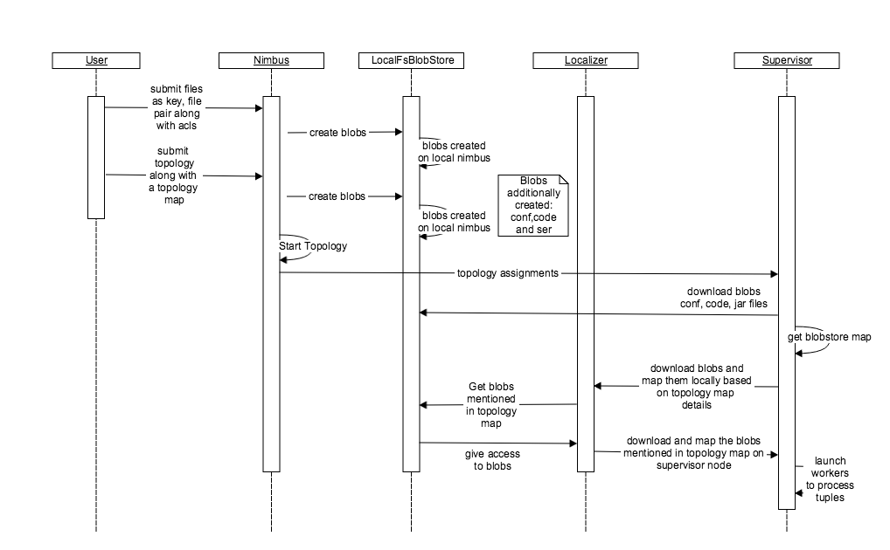

Local file system implementation of Blobstore can be depicted in the above timeline diagram.

There are several stages from blob creation to blob download and corresponding execution of a topology.
The main stages can be depicted as follows

<a id="distcache-blobstore--blob-creation-command"></a>

### Blob Creation Command

Blobs in the blobstore can be created through command line using the following command.

```
storm blobstore create --file README.txt --acl o::rwa --replication-factor 4 key1
```

The above command creates a blob with a key name “key1” corresponding to the file README.txt.
The access given to all users being read, write and admin with a replication factor of 4.

<a id="distcache-blobstore--topology-submission-and-blob-mapping"></a>

### Topology Submission and Blob Mapping

Users can submit their topology with the following command. The command includes the
topology map configuration. The configuration holds two keys “key1” and “key2” with the
key “key1” having a local file name mapping named “blob\_file” and it is not compressed.
Workers will restart when the key1 file is updated on the supervisors.

```
storm jar /home/y/lib/storm-starter/current/storm-starter-jar-with-dependencies.jar 
org.apache.storm.starter.clj.word_count test_topo -c topology.blobstore.map='{"key1":{"localname":"blob_file", "uncompress":false, "workerRestart":true},"key2":{}}'
```

<a id="distcache-blobstore--blob-creation-process"></a>

### Blob Creation Process

The creation of the blob takes place through the interface “ClientBlobStore”. Appendix B contains the “ClientBlobStore” interface.
The concrete implementation of this interface is the “NimbusBlobStore”. In the case of local file system the client makes a
call to the nimbus to create the blobs within the local file system. The nimbus uses the local file system implementation to create these blobs.
When a user submits a topology, the jar, configuration and code files are uploaded as blobs with the help of blobstore.
Also, all the other blobs specified by the topology are mapped to it with the help of topology.blobstore.map configuration.

<a id="distcache-blobstore--blob-download-by-the-supervisor"></a>

### Blob Download by the Supervisor

Finally, the blobs corresponding to a topology are downloaded by the supervisor once it receives the assignments from the nimbus through
the same “NimbusBlobStore” thrift client that uploaded the blobs. The supervisor downloads the code, jar and conf blobs by calling the
“NimbusBlobStore” client directly while the blobs specified in the topology.blobstore.map are downloaded and mapped locally with the help
of the Localizer. The Localizer talks to the “NimbusBlobStore” thrift client to download the blobs and adds the blob compression and local
blob name mapping logic to suit the implementation of a topology. Once all the blobs have been downloaded the workers are launched to run
the topologies.

<a id="distcache-blobstore--hdfsblobstore"></a>

## HdfsBlobStore

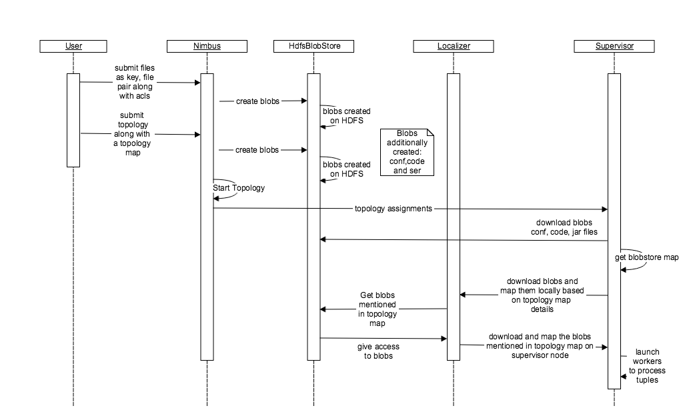

The HdfsBlobStore functionality has a similar implementation and blob creation and download procedure barring how the replication
is handled in the two blobstore implementations. The replication in HDFS blobstore is obvious as HDFS is equipped to handle replication
and it requires no state to be stored inside the zookeeper. On the other hand, the local file system blobstore requires the state to be
stored on the zookeeper in order for it to work with nimbus HA. Nimbus HA allows the local filesystem to implement the replication feature
seamlessly by storing the state in the zookeeper about the running topologies and syncing the blobs on various nimbuses. On the supervisor’s
end, the supervisor and localizer talks to HdfsBlobStore through “HdfsClientBlobStore” implementation.

<a id="distcache-blobstore--additional-features-and-documentation"></a>

## Additional Features and Documentation

```
storm jar /home/y/lib/storm-starter/current/storm-starter-jar-with-dependencies.jar org.apache.storm.starter.clj.word_count test_topo 
-c topology.blobstore.map='{"key1":{"localname":"blob_file", "uncompress":false},"key2":{}}'
```

<a id="distcache-blobstore--compression"></a>

### Compression

The blobstore allows the user to specify the “uncompress” configuration to true or false. This configuration can be specified
in the topology.blobstore.map mentioned in the above command. This allows the user to upload a compressed file like a tarball/zip.
In local file system blobstore, the compressed blobs are stored on the nimbus node. The localizer code takes the responsibility to
uncompress the blob and store it on the supervisor node. Symbolic links to the blobs on the supervisor node are created within the worker
before the execution starts.

<a id="distcache-blobstore--local-file-name-mapping"></a>

### Local File Name Mapping

Apart from compression the blobstore helps to give the blob a name that can be used by the workers. The localizer takes
the responsibility of mapping the blob to a local name on the supervisor node.

<a id="distcache-blobstore--additional-blobstore-implementation-details"></a>

## Additional Blobstore Implementation Details

Blobstore uses a hashing function to create the blobs based on the key. The blobs are generally stored inside the directory specified by
the blobstore.dir configuration. By default, it is stored under “storm.local.dir/blobs” for local file system and a similar path on
hdfs file system.

Once a file is submitted, the blobstore reads the configs and creates a metadata for the blob with all the access control details. The metadata
is generally used for authorization while accessing the blobs. The blob key and version contribute to the hash code and there by the directory
under “storm.local.dir/blobs/data” where the data is placed. The blobs are generally placed in a positive number directory like 193,822 etc.

Once the topology is launched and the relevant blobs have been created, the supervisor downloads blobs related to the storm.conf, storm.ser
and storm.code first and all the blobs uploaded by the command line separately using the localizer to uncompress and map them to a local name
specified in the topology.blobstore.map configuration. The supervisor periodically updates blobs by checking for the change of version.
This allows updating the blobs on the fly and thereby making it a very useful feature.

For a local file system, the distributed cache on the supervisor node is set to 10240 MB as a soft limit and the clean up code attempts
to clean anything over the soft limit every 600 seconds based on LRU policy.

The HDFS blobstore implementation handles load better by removing the burden on the nimbus to store the blobs, which avoids it becoming a bottleneck. Moreover, it provides seamless replication of blobs. On the other hand, the local file system blobstore is not very efficient in
replicating the blobs and is limited by the number of nimbuses. Moreover, the supervisor talks to the HDFS blobstore directly without the
involvement of the nimbus and thereby reduces the load and dependency on nimbus.

<a id="distcache-blobstore--highly-available-nimbus"></a>

## Highly Available Nimbus

<a id="distcache-blobstore--problem-statement"></a>
<a id="distcache-blobstore--problem-statement:"></a>

### Problem Statement:

Currently the storm master aka nimbus, is a process that runs on a single machine under supervision. In most cases, the
nimbus failure is transient and it is restarted by the process that does supervision. However sometimes when disks fail and networks
partitions occur, nimbus goes down. Under these circumstances, the topologies run normally but no new topologies can be
submitted, no existing topologies can be killed/deactivated/activated and if a supervisor node fails then the
reassignments are not performed resulting in performance degradation or topology failures. With this project we intend, to resolve this problem by running nimbus in a primary backup mode to guarantee that even if a nimbus server fails one
of the backups will take over.

<a id="distcache-blobstore--requirements-for-highly-available-nimbus"></a>
<a id="distcache-blobstore--requirements-for-highly-available-nimbus:"></a>

### Requirements for Highly Available Nimbus:

- Increase overall availability of nimbus.
- Allow nimbus hosts to leave and join the cluster at will any time. A newly joined host should auto catch up and join
  the list of potential leaders automatically.
- No topology resubmissions required in case of nimbus fail overs.
- No active topology should ever be lost.

<a id="distcache-blobstore--leader-election"></a>
<a id="distcache-blobstore--leader-election:"></a>

#### Leader Election:

The nimbus server will use the following interface:

```java
public interface ILeaderElector {/** * queue up for leadership lock. The call returns immediately and the caller * must check isLeader() to perform any leadership action.*/ void addToLeaderLockQueue();
/** * Removes the caller from the leader lock queue. If the caller is leader * also releases the lock.*/ void removeFromLeaderLockQueue();
/** * * @return true if the caller currently has the leader lock.*/ boolean isLeader();
/** * * @return the current leader's address , throws exception if noone has has    lock.*/ InetSocketAddress getLeaderAddress();
/** * * @return list of current nimbus addresses, includes leader.*/ List<InetSocketAddress> getAllNimbusAddresses();}
```

Once a nimbus comes up it calls addToLeaderLockQueue() function. The leader election code selects a leader from the queue.
If the topology code, jar or config blobs are missing, it would download the blobs from any other nimbus which is up and running.

The first implementation will be Zookeeper based. If the zookeeper connection is lost/reset resulting in loss of lock
or the spot in queue the implementation will take care of updating the state such that isLeader() will reflect the
current status. The leader like actions must finish in less than minimumOf(connectionTimeout, SessionTimeout) to ensure
the lock was held by nimbus for the entire duration of the action (Not sure if we want to just state this expectation
and ensure that zk configurations are set high enough which will result in higher failover time or we actually want to
create some sort of rollback mechanism for all actions, the second option needs a lot of code). If a nimbus that is not
leader receives a request that only a leader can perform, it will throw a RunTimeException.

<a id="distcache-blobstore--nimbus-state-store"></a>
<a id="distcache-blobstore--nimbus-state-store:"></a>

### Nimbus state store:

To achieve fail over from primary to backup servers nimbus state/data needs to be replicated across all nimbus hosts or
needs to be stored in a distributed storage. Replicating the data correctly involves state management, consistency checks
and it is hard to test for correctness. However many storm users do not want to take extra dependency on another replicated
storage system like HDFS and still need high availability. The blobstore implementation along with the state storage helps
to overcome the failover scenarios in case a leader nimbus goes down.

To support replication we will allow the user to define a code replication factor which would reflect number of nimbus
hosts to which the code must be replicated before starting the topology. With replication comes the issue of consistency.
The topology is launched once the code, jar and conf blob files are replicated based on the "topology.min.replication" config.
Maintaining state for failover scenarios is important for local file system. The current implementation makes sure one of the
available nimbus is elected as a leader in the case of a failure. If the topology specific blobs are missing, the leader nimbus
tries to download them as and when they are needed. With this current architecture, we do not have to download all the blobs
required for a topology for a nimbus to accept leadership. This helps us in case the blobs are very large and avoid causing any
inadvertant delays in electing a leader.

The state for every blob is relevant for the local blobstore implementation. For HDFS blobstore the replication
is taken care by the HDFS. For handling the fail over scenarios for a local blobstore we need to store the state of the leader and
non-leader nimbuses within the zookeeper.

The state is stored under /storm/blobstore/key/nimbusHostPort:SequenceNumber for the blobstore to work to make nimbus highly available.
This state is used in the local file system blobstore to support replication. The HDFS blobstore does not have to store the state inside the
zookeeper.

- NimbusHostPort: This piece of information generally contains the parsed string holding the hostname and port of the nimbus.
  It uses the same class “NimbusHostPortInfo” used earlier by the code-distributor interface to store the state and parse the data.
- SequenceNumber: This is the blob sequence number information. The SequenceNumber information is implemented by a KeySequenceNumber class.
  The sequence numbers are generated for every key. For every update, the sequence numbers are assigned based ona global sequence number
  stored under /storm/blobstoremaxsequencenumber/key. For more details about how the numbers are generated you can look at the java docs for KeySequenceNumber.

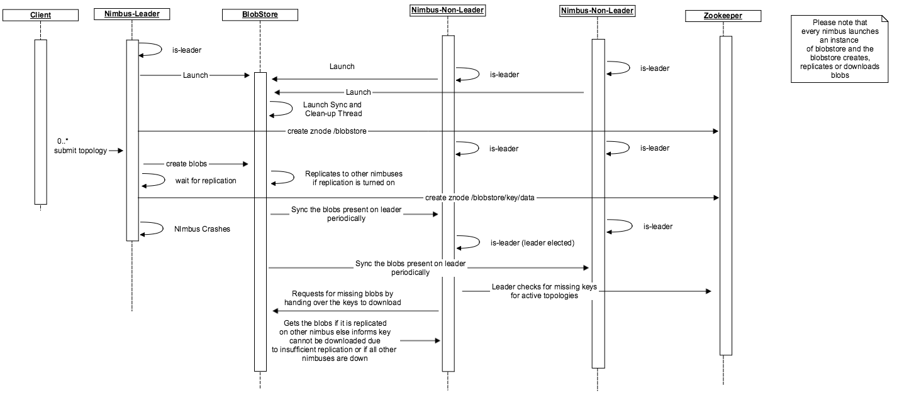

The sequence diagram proposes how the blobstore works and the state storage inside the zookeeper makes the nimbus highly available.
Currently, the thread to sync the blobs on a non-leader is within the nimbus. In the future, it will be nice to move the thread around
to the blobstore to make the blobstore coordinate the state change and blob download as per the sequence diagram.

<a id="distcache-blobstore--thrift-and-rest-api"></a>

## Thrift and Rest API

In order to avoid workers/supervisors/ui talking to zookeeper for getting master nimbus address we are going to modify the
`getClusterInfo` API so it can also return nimbus information. getClusterInfo currently returns `ClusterSummary` instance
which has a list of `supervisorSummary` and a list of `topologySummary` instances. We will add a list of `NimbusSummary`
to the `ClusterSummary`. See the structures below:

```
struct ClusterSummary {
  1: required list<SupervisorSummary> supervisors;
  3: required list<TopologySummary> topologies;
  4: required list<NimbusSummary> nimbuses;
}

struct NimbusSummary {
  1: required string host;
  2: required i32 port;
  3: required i32 uptime_secs;
  4: required bool isLeader;
  5: required string version;
}
```

This will be used by StormSubmitter, Nimbus clients, supervisors and ui to discover the current leaders and participating
nimbus hosts. Any nimbus host will be able to respond to these requests. The nimbus hosts can read this information once
from zookeeper and cache it and keep updating the cache when the watchers are fired to indicate any changes,which should
be rare in general case.

Note: All nimbus hosts have watchers on zookeeper to be notified immediately as soon as a new blobs is available for download, the callback may or may not download
the code. Therefore, a background thread is triggered to download the respective blobs to run the topologies. The replication is achieved when the blobs are downloaded
onto non-leader nimbuses. So you should expect your topology submission time to be somewhere between 0 to (2 \* nimbus.code.sync.freq.secs) for any
nimbus.min.replication.count > 1.

<a id="distcache-blobstore--configuration"></a>

## Configuration

```
blobstore.dir: The directory where all blobs are stored. For local file system it represents the directory on the nimbus
node and for HDFS file system it represents the hdfs file system path.

supervisor.blobstore.class: This configuration is meant to set the client for  the supervisor  in order to talk to the blobstore. 
For a local file system blobstore it is set to “org.apache.storm.blobstore.NimbusBlobStore” and for the HDFS blobstore it is set 
to “org.apache.storm.blobstore.HdfsClientBlobStore”.

supervisor.blobstore.download.thread.count: This configuration spawns multiple threads for from the supervisor in order download 
blobs concurrently. The default is set to 5

supervisor.blobstore.download.max_retries: This configuration is set to allow the supervisor to retry for the blob download. 
By default it is set to 3.

supervisor.localizer.cache.target.size.mb: The jvm opts provided to workers launched by this supervisor. All "%ID%" substrings 
are replaced with an identifier for this worker. Also, "%WORKER-ID%", "%STORM-ID%" and "%WORKER-PORT%" are replaced with 
appropriate runtime values for this worker. The distributed cache target size in MB. This is a soft limit to the size 
of the distributed cache contents. It is set to 10240 MB.

supervisor.localizer.cleanup.interval.ms: The distributed cache cleanup interval. Controls how often it scans to attempt to 
cleanup anything over the cache target size. By default it is set to 300000 milliseconds.

supervisor.localizer.update.blob.interval.secs: The distributed cache interval for checking for blobs to update. By
default it is set to 30 seconds.

nimbus.blobstore.class:  Sets the blobstore implementation nimbus uses. It is set to "org.apache.storm.blobstore.LocalFsBlobStore"

nimbus.blobstore.expiration.secs: During operations with the blobstore, via master, how long a connection is idle before nimbus 
considers it dead and drops the session and any associated connections. The default is set to 600.

storm.blobstore.inputstream.buffer.size.bytes: The buffer size it uses for blobstore upload. It is set to 65536 bytes.

client.blobstore.class: The blobstore implementation the storm client uses. The current implementation uses the default 
config "org.apache.storm.blobstore.NimbusBlobStore".

blobstore.replication.factor: It sets the replication for each blob within the blobstore. The “topology.min.replication.count” 
ensures the minimum replication the topology specific blobs are set before launching the topology. You might want to set the 
“topology.min.replication.count <= blobstore.replication”. The default is set to 3.

topology.min.replication.count : Minimum number of nimbus hosts where the code must be replicated before leader nimbus
can mark the topology as active and create assignments. Default is 1.

topology.max.replication.wait.time.sec: Maximum wait time for the nimbus host replication to achieve the nimbus.min.replication.count.
Once this time is elapsed nimbus will go ahead and perform topology activation tasks even if required nimbus.min.replication.count is not achieved. 
The default is 60 seconds, a value of -1 indicates to wait for ever.
* nimbus.code.sync.freq.secs: Frequency at which the background thread on nimbus which syncs code for locally missing blobs. Default is 2 minutes.
```

Additionally, if you want to access to secure hdfs blobstore, you also need to set the following configs.
`storm.hdfs.login.keytab or blobstore.hdfs.keytab (deprecated)
storm.hdfs.login.principal or blobstore.hdfs.principal (deprecated)`

For example, `storm.hdfs.login.keytab: /etc/keytab
storm.hdfs.login.principal: primary/instance@REALM`

<a id="distcache-blobstore--using-the-distributed-cache-api-command-line-interface-cli"></a>

## Using the Distributed Cache API, Command Line Interface (CLI)

<a id="distcache-blobstore--creating-blobs"></a>

### Creating blobs

To use the distributed cache feature, the user first has to "introduce" files
that need to be cached and bind them to key strings. To achieve this, the user
uses the "blobstore create" command of the storm executable, as follows:

```
storm blobstore create [-f|--file FILE] [-a|--acl ACL1,ACL2,...] [--replication-factor NUMBER] [keyname]
```

The contents come from a FILE, if provided by -f or --file option, otherwise
from STDIN.
The ACLs, which can also be a comma separated list of many ACLs, is of the
following format:

```
> [u|o]:[username]:[r-|w-|a-|_]
```

where:

- u = user
- o = other
- username = user for this particular ACL
- r = read access
- w = write access
- a = admin access
- \_ = ignored

The replication factor can be set to a value greater than 1 using --replication-factor.

Note: The replication right now is configurable for a hdfs blobstore but for a
local blobstore the replication always stays at 1. For a hdfs blobstore
the default replication is set to 3.

<a id="distcache-blobstore--example"></a>
<a id="distcache-blobstore--example:"></a>

###### Example:

```
storm blobstore create --file README.txt --acl o::rwa --replication-factor 4 key1
```

In the above example, the *README.txt* file is added to the distributed cache.
It can be accessed using the key string "*key1*" for any topology that needs
it. The file is set to have read/write/admin access for others, a.k.a world
everything and the replication is set to 4.

<a id="distcache-blobstore--example-2"></a>
<a id="distcache-blobstore--example:-2"></a>

###### Example:

```
storm blobstore create mytopo:data.tgz -f data.tgz -a u:alice:rwa,u:bob:rw,o::r  
```

The above example createss a mytopo:data.tgz key using the data stored in
data.tgz. User alice would have full access, bob would have read/write access
and everyone else would have read access.

<a id="distcache-blobstore--making-dist-cache-files-accessible-to-topologies"></a>
<a id="distcache-blobstore--making-dist.-cache-files-accessible-to-topologies"></a>

### Making dist. cache files accessible to topologies

Once a blob is created, we can use it for topologies. This is generally achieved
by including the key string among the configurations of a topology, with the
following format. A shortcut is to add the configuration item on the command
line when starting a topology by using the **-c** command:

```
-c topology.blobstore.map='{"[KEY]":{"localname":"[VALUE]", "uncompress":[true|false]}}'
```

Note: Please take care of the quotes.

The cache file would then be accessible to the topology as a local file with the
name [VALUE].
The localname parameter is optional, if omitted the local cached file will have
the same name as [KEY].
The uncompress parameter is optional, if omitted the local cached file will not
be uncompressed. Note that the key string needs to have the appropriate
file-name-like format and extension, so it can be uncompressed correctly.

<a id="distcache-blobstore--example-3"></a>
<a id="distcache-blobstore--example:-3"></a>

###### Example:

```
storm jar /home/y/lib/storm-starter/current/storm-starter-jar-with-dependencies.jar org.apache.storm.starter.clj.word_count test_topo -c topology.blobstore.map='{"key1":{"localname":"blob_file", "uncompress":false},"key2":{}}'
```

Note: Please take care of the quotes.

In the above example, we start the *word\_count* topology (stored in the
*storm-starter-jar-with-dependencies.jar* file), and ask it to have access
to the cached file stored with key string = *key1*. This file would then be
accessible to the topology as a local file called *blob\_file*, and the
supervisor will not try to uncompress the file. Note that in our example, the
file's content originally came from *README.txt*. We also ask for the file
stored with the key string = *key2* to be accessible to the topology. Since
both the optional parameters are omitted, this file will get the local name =
*key2*, and will not be uncompressed.

<a id="distcache-blobstore--updating-a-cached-file"></a>

### Updating a cached file

It is possible for the cached files to be updated while topologies are running.
The update happens in an eventual consistency model, where the supervisors poll
Nimbus every supervisor.localizer.update.blob.interval.secs seconds, and update their local copies. In the current version, it is the user's responsibility to check whether a new file is available.

To update a cached file, use the following command. Contents come from a FILE or
STDIN. Write access is required to be able to update a cached file.

```
storm blobstore update [-f|--file NEW_FILE] [KEYSTRING]
```

<a id="distcache-blobstore--example-4"></a>
<a id="distcache-blobstore--example:-4"></a>

###### Example:

```
storm blobstore update -f updates.txt key1
```

In the above example, the topologies will be presented with the contents of the
file *updates.txt* instead of *README.txt* (from the previous example), even
though their access by the topology is still through a file called
*blob\_file*.

<a id="distcache-blobstore--removing-a-cached-file"></a>

### Removing a cached file

To remove a file from the distributed cache, use the following command. Removing
a file requires write access.

```
storm blobstore delete [KEYSTRING]
```

<a id="distcache-blobstore--listing-blobs-currently-in-the-distributed-cache-blobstore"></a>

### Listing Blobs currently in the distributed cache blobstore

```
storm blobstore list [KEY...]
```

lists blobs currently in the blobstore

<a id="distcache-blobstore--reading-the-contents-of-a-blob"></a>

### Reading the contents of a blob

```
storm blobstore cat [-f|--file FILE] KEY
```

read a blob and then either write it to a file, or STDOUT. Reading a blob
requires read access.

<a id="distcache-blobstore--setting-the-access-control-for-a-blob"></a>

### Setting the access control for a blob

```
set-acl [-s ACL] KEY
```

ACL is in the form [uo]:[username]:[r-][w-][a-] can be comma separated list
(requires admin access).

<a id="distcache-blobstore--update-the-replication-factor-for-a-blob"></a>

### Update the replication factor for a blob

```
storm blobstore replication --update --replication-factor 5 key1
```

<a id="distcache-blobstore--read-the-replication-factor-of-a-blob"></a>

### Read the replication factor of a blob

```
storm blobstore replication --read key1
```

<a id="distcache-blobstore--command-line-help"></a>

### Command line help

```
storm help blobstore
```

<a id="distcache-blobstore--using-the-distributed-cache-api-from-java"></a>

## Using the Distributed Cache API from Java

We start by getting a ClientBlobStore object by calling this function:

```java
Config theconf = new Config();
theconf.putAll(Utils.readStormConfig());
ClientBlobStore clientBlobStore = Utils.getClientBlobStore(theconf);
```

The required Utils package can by imported by:

```java
import org.apache.storm.utils.Utils;
```

ClientBlobStore and other blob-related classes can be imported by:

```java
import org.apache.storm.blobstore.ClientBlobStore;
import org.apache.storm.blobstore.AtomicOutputStream;
import org.apache.storm.blobstore.InputStreamWithMeta;
import org.apache.storm.blobstore.BlobStoreAclHandler;
import org.apache.storm.generated.*;
```

<a id="distcache-blobstore--creating-acls-to-be-used-for-blobs"></a>

### Creating ACLs to be used for blobs

```java
String stringBlobACL = "u:username:rwa";
AccessControl blobACL = BlobStoreAclHandler.parseAccessControl(stringBlobACL);
List<AccessControl> acls = new LinkedList<AccessControl>();
acls.add(blobACL); // more ACLs can be added here
SettableBlobMeta settableBlobMeta = new SettableBlobMeta(acls);
settableBlobMeta.set_replication_factor(4); // Here we can set the replication factor
```

The settableBlobMeta object is what we need to create a blob in the next step.

<a id="distcache-blobstore--creating-a-blob"></a>

### Creating a blob

```java
AtomicOutputStream blobStream = clientBlobStore.createBlob("some_key", settableBlobMeta);
blobStream.write("Some String or input data".getBytes());
blobStream.close();
```

Note that the settableBlobMeta object here comes from the last step, creating ACLs.
It is recommended that for very large files, the user writes the bytes in smaller chunks (for example 64 KB, up to 1 MB chunks).

<a id="distcache-blobstore--updating-a-blob"></a>

### Updating a blob

Similar to creating a blob, but we get the AtomicOutputStream in a different way:

```java
String blobKey = "some_key";
AtomicOutputStream blobStream = clientBlobStore.updateBlob(blobKey);
```

Pass a byte stream to the returned AtomicOutputStream as before.

<a id="distcache-blobstore--updating-the-acls-of-a-blob"></a>

### Updating the ACLs of a blob

```java
String blobKey = "some_key";
AccessControl updateAcl = BlobStoreAclHandler.parseAccessControl("u:USER:--a");
List<AccessControl> updateAcls = new LinkedList<AccessControl>();
updateAcls.add(updateAcl);
SettableBlobMeta modifiedSettableBlobMeta = new SettableBlobMeta(updateAcls);
clientBlobStore.setBlobMeta(blobKey, modifiedSettableBlobMeta);

//Now set write only
updateAcl = BlobStoreAclHandler.parseAccessControl("u:USER:-w-");
updateAcls = new LinkedList<AccessControl>();
updateAcls.add(updateAcl);
modifiedSettableBlobMeta = new SettableBlobMeta(updateAcls);
clientBlobStore.setBlobMeta(blobKey, modifiedSettableBlobMeta);
```

<a id="distcache-blobstore--updating-and-reading-the-replication-of-a-blob"></a>

### Updating and Reading the replication of a blob

```java
String blobKey = "some_key";
BlobReplication replication = clientBlobStore.updateBlobReplication(blobKey, 5);
int replication_factor = replication.get_replication();
```

Note: The replication factor gets updated and reflected only for hdfs blobstore

<a id="distcache-blobstore--reading-a-blob"></a>

### Reading a blob

```java
String blobKey = "some_key";
InputStreamWithMeta blobInputStream = clientBlobStore.getBlob(blobKey);
BufferedReader r = new BufferedReader(new InputStreamReader(blobInputStream));
String blobContents =  r.readLine();
```

<a id="distcache-blobstore--deleting-a-blob"></a>

### Deleting a blob

```java
String blobKey = "some_key";
clientBlobStore.deleteBlob(blobKey);
```

<a id="distcache-blobstore--getting-a-list-of-blob-keys-already-in-the-blobstore"></a>

### Getting a list of blob keys already in the blobstore

```java
Iterator <String> stringIterator = clientBlobStore.listKeys();
```

<a id="distcache-blobstore--appendix-a"></a>

## Appendix A

```java
public abstract void prepare(Map conf, String baseDir);

public abstract AtomicOutputStream createBlob(String key, SettableBlobMeta meta, Subject who) throws AuthorizationException, KeyAlreadyExistsException;

public abstract AtomicOutputStream updateBlob(String key, Subject who) throws AuthorizationException, KeyNotFoundException;

public abstract ReadableBlobMeta getBlobMeta(String key, Subject who) throws AuthorizationException, KeyNotFoundException;

public abstract void setBlobMeta(String key, SettableBlobMeta meta, Subject who) throws AuthorizationException, KeyNotFoundException;

public abstract void deleteBlob(String key, Subject who) throws AuthorizationException, KeyNotFoundException;

public abstract InputStreamWithMeta getBlob(String key, Subject who) throws AuthorizationException, KeyNotFoundException;

public abstract Iterator<String> listKeys(Subject who);

public abstract BlobReplication getBlobReplication(String key, Subject who) throws Exception;

public abstract BlobReplication updateBlobReplication(String key, int replication, Subject who) throws AuthorizationException, KeyNotFoundException, IOException
```

<a id="distcache-blobstore--appendix-b"></a>

## Appendix B

```java
public abstract void prepare(Map conf);

protected abstract AtomicOutputStream createBlobToExtend(String key, SettableBlobMeta meta) throws AuthorizationException, KeyAlreadyExistsException;

public abstract AtomicOutputStream updateBlob(String key) throws AuthorizationException, KeyNotFoundException;

public abstract ReadableBlobMeta getBlobMeta(String key) throws AuthorizationException, KeyNotFoundException;

protected abstract void setBlobMetaToExtend(String key, SettableBlobMeta meta) throws AuthorizationException, KeyNotFoundException;

public abstract void deleteBlob(String key) throws AuthorizationException, KeyNotFoundException;

public abstract InputStreamWithMeta getBlob(String key) throws AuthorizationException, KeyNotFoundException;

public abstract Iterator<String> listKeys();

public abstract void watchBlob(String key, IBlobWatcher watcher) throws AuthorizationException;

public abstract void stopWatchingBlob(String key) throws AuthorizationException;

public abstract BlobReplication getBlobReplication(String Key) throws AuthorizationException, KeyNotFoundException;

public abstract BlobReplication updateBlobReplication(String Key, int replication) throws AuthorizationException, KeyNotFoundException
```

<a id="distcache-blobstore--appendix-c"></a>

## Appendix C

```
service Nimbus {...string beginCreateBlob(1: string key, 2: SettableBlobMeta meta) throws (1: AuthorizationException aze, 2: KeyAlreadyExistsException kae);
string beginUpdateBlob(1: string key) throws (1: AuthorizationException aze, 2: KeyNotFoundException knf);
void uploadBlobChunk(1: string session, 2: binary chunk) throws (1: AuthorizationException aze);
void finishBlobUpload(1: string session) throws (1: AuthorizationException aze);
void cancelBlobUpload(1: string session) throws (1: AuthorizationException aze);
ReadableBlobMeta getBlobMeta(1: string key) throws (1: AuthorizationException aze, 2: KeyNotFoundException knf);
void setBlobMeta(1: string key, 2: SettableBlobMeta meta) throws (1: AuthorizationException aze, 2: KeyNotFoundException knf);
BeginDownloadResult beginBlobDownload(1: string key) throws (1: AuthorizationException aze, 2: KeyNotFoundException knf);
binary downloadBlobChunk(1: string session) throws (1: AuthorizationException aze);
void deleteBlob(1: string key) throws (1: AuthorizationException aze, 2: KeyNotFoundException knf);
ListBlobsResult listBlobs(1: string session);
BlobReplication getBlobReplication(1: string key) throws (1: AuthorizationException aze, 2: KeyNotFoundException knf);
BlobReplication updateBlobReplication(1: string key, 2: i32 replication) throws (1: AuthorizationException aze, 2: KeyNotFoundException knf); ...}
struct BlobReplication {1: required i32 replication;}
exception AuthorizationException {1: required string msg;}
exception KeyNotFoundException {1: required string msg;}
exception KeyAlreadyExistsException {1: required string msg;}
enum AccessControlType {OTHER = 1,USER = 2 //eventually ,GROUP=3}
struct AccessControl {1: required AccessControlType type; 2: optional string name; //Name of user or group in ACL 3: required i32 access; //bitmasks READ=0x1, WRITE=0x2, ADMIN=0x4}
struct SettableBlobMeta {1: required list<AccessControl> acl; 2: optional i32 replication_factor}
struct ReadableBlobMeta {1: required SettableBlobMeta settable; //This is some indication of a version of a BLOB.  The only guarantee is // if the data changed in the blob the version will be different.2: required i64 version;}
struct ListBlobsResult {1: required list<string> keys; 2: required string session;}
struct BeginDownloadResult {//Same version as in ReadableBlobMeta 1: required i64 version; 2: required string session; 3: optional i64 data_size;}
```

---

<a id="dynamic-log-level-settings"></a>

<!-- source_url: https://storm.apache.org/releases/2.8.3/dynamic-log-level-settings.html -->

<!-- page_index: 43 -->

# Dynamic Log Level Settings

We have added the ability to set log level settings for a running topology using the Storm UI and the Storm CLI.

The log level settings apply the same way as you'd expect from log4j, as all we are doing is telling log4j to set the level of the logger you provide. If you set the log level of a parent logger, the children loggers start using that level (unless the children have a more restrictive level already). A timeout can optionally be provided (except for DEBUG mode, where it’s required in the UI), if workers should reset log levels automatically.

This revert action is triggered using a polling mechanism (every 30 seconds, but this is configurable), so you should expect your timeouts to be the value you provided plus anywhere between 0 and the setting's value.

<a id="dynamic-log-level-settings--using-the-storm-ui"></a>

## Using the Storm UI

In order to set a level, click on a running topology, and then click on “Change Log Level” in the Topology Actions section.

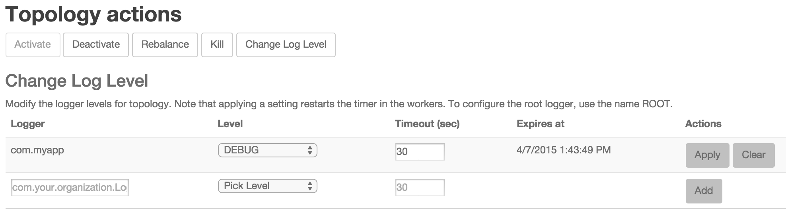

Next, provide the logger name, select the level you expect (e.g. WARN), and a timeout in seconds (or 0 if not needed). Then click on “Add”.

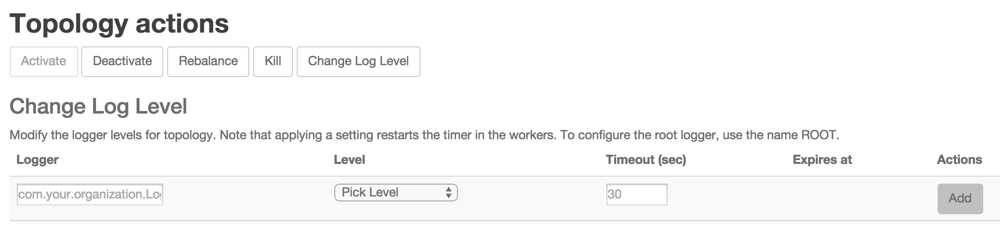

To clear the log level click on the “Clear” button. This reverts the log level back to what it was before you added the setting. The log level line will disappear from the UI.

While there is a delay resetting log levels back, setting the log level in the first place is immediate (or as quickly as the message can travel from the UI/CLI to the workers by way of nimbus and zookeeper).

<a id="dynamic-log-level-settings--using-the-cli"></a>

## Using the CLI

Using the CLI, issue the command:

`./bin/storm set_log_level [topology name] -l [logger name]=[LEVEL]:[TIMEOUT]`

For example:

`./bin/storm set_log_level my_topology -l ROOT=DEBUG:30`

Sets the ROOT logger to DEBUG for 30 seconds.

`./bin/storm set_log_level my_topology -r ROOT`

Clears the ROOT logger dynamic log level, resetting it to its original value.

---

<a id="logs"></a>

<!-- source_url: https://storm.apache.org/releases/2.8.3/Logs.html -->

<!-- page_index: 44 -->

# Storm Logs

Logs in Storm are essential for tracking the status, operations, error messages and debug information for all the
daemons (e.g., nimbus, supervisor, logviewer, drpc, ui, pacemaker) and topologies' workers.

<a id="logs--location-of-the-logs"></a>

### Location of the Logs

All the daemon logs are placed under ${storm.log.dir} directory, which an administrator can set in the System properties or
in the cluster configuration. By default, ${storm.log.dir} points to ${storm.home}/logs.

All the worker logs are placed under the workers-artifacts directory in a hierarchical manner, e.g.,
${workers-artifacts}/${topologyId}/${port}/worker.log. Users can set the workers-artifacts directory
by configuring the variable "storm.workers.artifacts.dir". By default, workers-artifacts directory
locates at ${storm.log.dir}/logs/workers-artifacts.

<a id="logs--using-the-storm-ui-for-log-view-download-and-log-search"></a>

### Using the Storm UI for Log View/Download and Log Search

Daemon and worker logs are allowed to view and download through Storm UI by authorized users.

To improve the debugging of Storm, we provide the Log Search feature.
Log Search supports searching in a certain log file or in all of a topology's log files:

String search in a log file: In the log page for a worker, a user can search a certain string, e.g., "Exception", in a certain worker log. This search can happen for both normal text log or rolled zip log files. In the results, the offset and matched lines will be displayed.

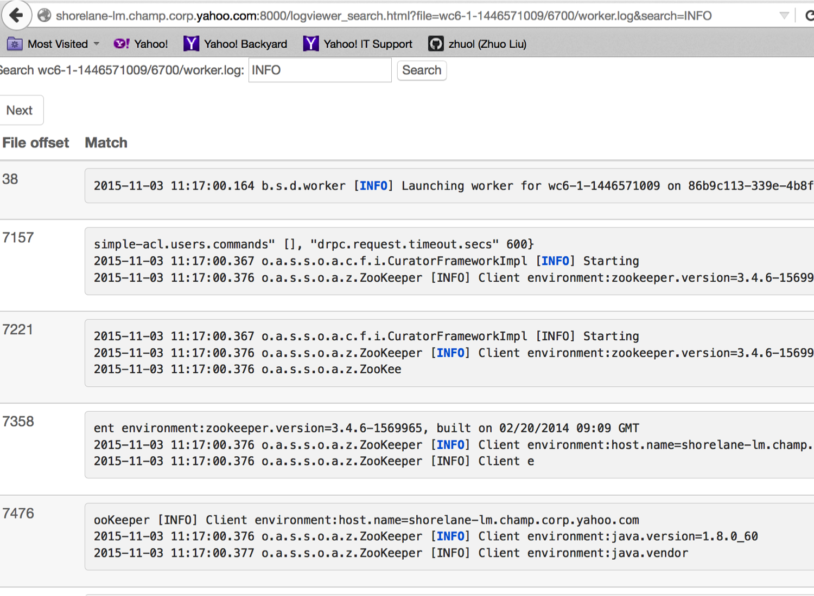

Search in a topology: a user can also search a string for a certain topology by clicking the icon of the magnifying lens at the top right corner of the UI page. This means the UI will try to search on all the supervisor nodes in a distributed way to find the matched string in all logs for this topology. The search can happen for either normal text log files or rolled zip log files by checking/unchecking the "Search archived logs:" box. Then the matched results can be shown on the UI with url links, directing the user to the certain logs on each supervisor node. This powerful feature is very helpful for users to find certain problematic supervisor nodes running this topology.

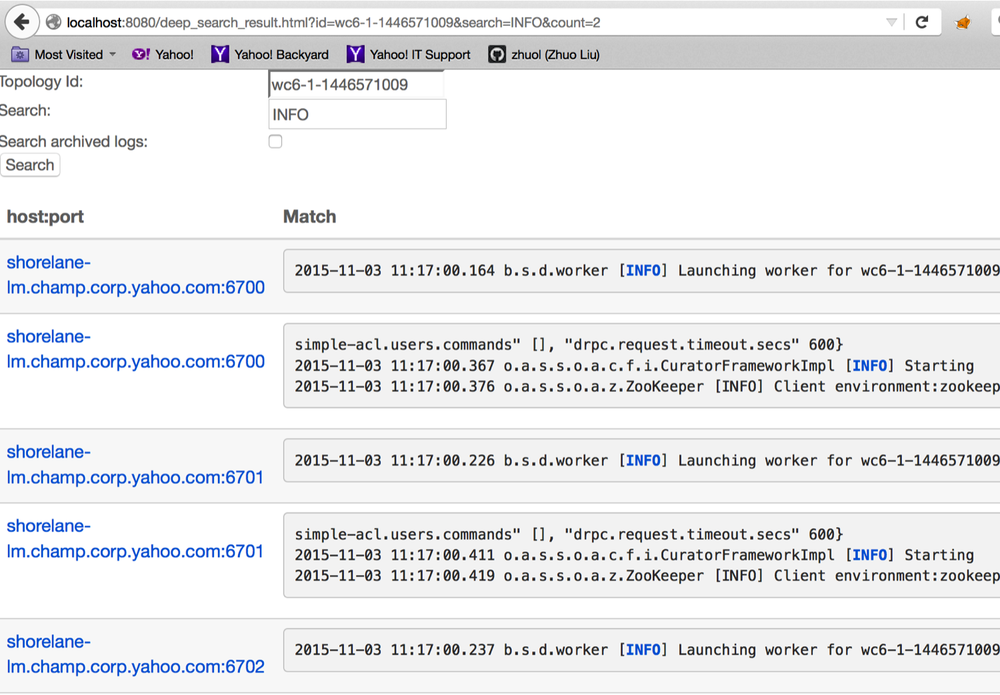

---

<a id="dynamic-worker-profiling"></a>

<!-- source_url: https://storm.apache.org/releases/2.8.3/dynamic-worker-profiling.html -->

<!-- page_index: 45 -->

# Dynamic Worker Profiling

In multi-tenant mode, storm launches long-running JVMs across cluster without sudo access to user. Self-serving of Java heap-dumps, jstacks and java profiling of these JVMs would improve users' ability to analyze and debug issues when monitoring it actively.

The storm dynamic profiler lets you dynamically take heap-dumps, jprofile or jstack for a worker jvm running on stock cluster. It let user download these dumps from the browser and use your favorite tools to analyze it The UI component page provides list workers for the component and action buttons. The logviewer lets you download the dumps generated by these logs. Please see the screenshots for more information.

<a id="dynamic-worker-profiling--using-the-storm-ui"></a>

## Using the Storm UI

In order to request for heap-dump, jstack, start/stop/dump jprofile or restart a worker, click on a running topology, then click on specific component, then you can select workers by checking the box of any of the worker's executors in the Executors table, and then click on “Start","Heap", "Jstack" or "Restart Worker" in the "Profiling and Debugging" section.

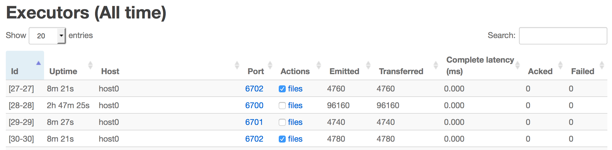

In the Executors table, click the checkbox in the Actions column next to any executor, and any other executors belonging to the same worker are automatically selected. When the action has completed, any output files created will available at the link in the Actions column.

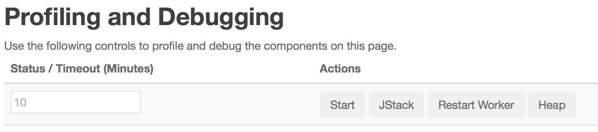

For start jprofile, provide a timeout in minutes (or 10 if not needed). Then click on “Start”.

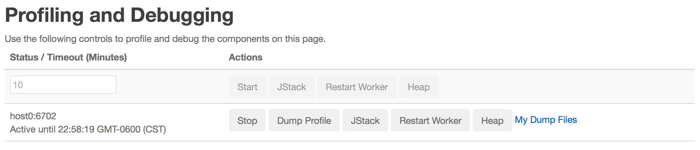

To stop the jprofile logging click on the “Stop” button. This dumps the jprofile stats and stops the profiling. Refresh the page for the line to disappear from the UI.

Click on "My Dump Files" to go the logviewer UI for list of worker specific dump files.

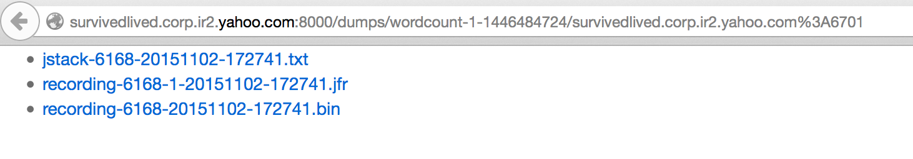

<a id="dynamic-worker-profiling--configuration"></a>

## Configuration

The "worker.profiler.command" can be configured to point to specific pluggable profiler, heapdump commands. The "worker.profiler.enabled" can be disabled if plugin is not available or jdk does not support Jprofile flight recording so that worker JVM options will not have "worker.profiler.childopts". To use different profiler plugin, you can change these configuration.

---

<a id="eventlogging"></a>

<!-- source_url: https://storm.apache.org/releases/2.8.3/Eventlogging.html -->

<!-- page_index: 46 -->

<a id="eventlogging--introduction"></a>

# Introduction

Topology event inspector provides the ability to view the tuples as it flows through different stages in a storm topology.
This could be useful for inspecting the tuples emitted at a spout or a bolt in the topology pipeline while the topology is running, without stopping or redeploying the topology. The normal flow of tuples from the spouts to the bolts is not affected by turning on event logging.

<a id="eventlogging--enabling-event-logging"></a>

## Enabling event logging

Note: Event logging needs to be enabled first by setting the storm config "topology.eventlogger.executors" to a non zero value. Please see
the [Configuration](#eventlogging--config) section for more details.

Events can be logged by clicking the "Debug" button under the topology actions in the topology view. This logs the
tuples from all the spouts and bolts in a topology at the specified sampling percentage.

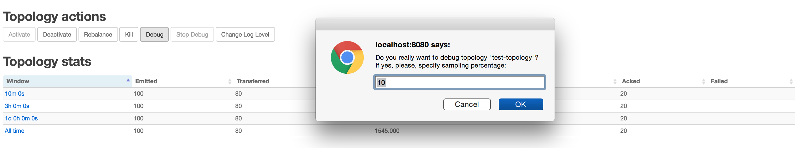

Figure 1: Enable event logging at topology level.

You could also enable event logging at a specific spout or bolt level by going to the corresponding component page and
clicking "Debug" under component actions.

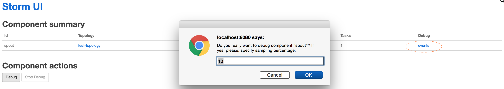

Figure 2: Enable event logging at component level.

<a id="eventlogging--viewing-the-event-logs"></a>

## Viewing the event logs

The Storm "logviewer" should be running for viewing the logged tuples. If not already running log viewer can be started by running the "bin/storm logviewer" command from the storm installation directory. For viewing the tuples, go to the specific spout or bolt component page from storm UI and click on the "events" link under the component summary (as highlighted in Figure 2 above).

This would open up a view like below where you can navigate between different pages and view the logged tuples.

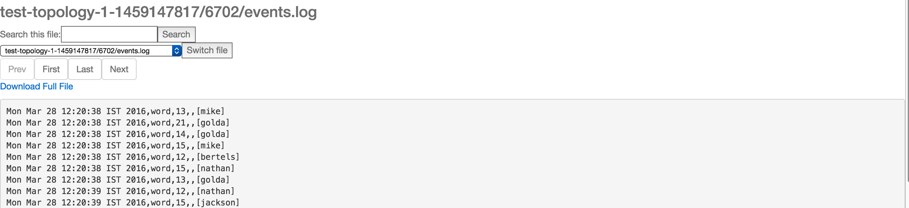

Figure 3: Viewing the logged events.

Each line in the event log contains an entry corresponding to a tuple emitted from a specific spout/bolt in a comma separated format.

`Timestamp, Component name, Component task-id, MessageId (in case of anchoring), List of emitted values`

<a id="eventlogging--disabling-the-event-logs"></a>

## Disabling the event logs

Event logging can be disabled at a specific component or at the topology level by clicking the "Stop Debug" under the topology or component actions in the Storm UI.

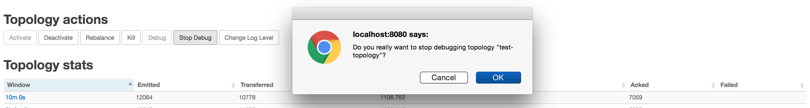

Figure 4: Disable event logging at topology level.

<a id="eventlogging--configuration"></a>

## Configuration

Eventlogging works by sending the events (tuples) from each component to an internal eventlogger bolt. By default Storm does not start any event logger tasks, but this can be easily changed by setting the below parameter while running your topology (by setting it in storm.yaml or passing options via command line).

| Parameter | Meaning |
| --- | --- |
| "topology.eventlogger.executors": 0 | No event logger tasks are created (default). |
| "topology.eventlogger.executors": 1 | One event logger task for the topology. |
| "topology.eventlogger.executors": nil | One event logger task per worker. |

<a id="eventlogging--extending-eventlogging"></a>

## Extending eventlogging

Storm provides an `IEventLogger` interface which is used by the event logger bolt to log the events.

```java
/** * EventLogger interface for logging the event info to a sink like log file or db * for inspecting the events via UI for debugging.*/ public interface IEventLogger {/** * Invoked during eventlogger bolt prepare.*/ void prepare(Map stormConf, Map<String, Object> arguments, TopologyContext context);
/** * Invoked when the {@link EventLoggerBolt} receives a tuple from the spouts or bolts that has event logging enabled.* * @param e the event */ void log(EventInfo e);
/** * Invoked when the event logger bolt is cleaned up */ void close();}
```

The default implementation for this is a FileBasedEventLogger which logs the events to an events.log file ( `logs/workers-artifacts/<topology-id>/<worker-port>/events.log`).
Alternate implementations of the `IEventLogger` interface can be added to extend the event logging functionality (say build a search index or log the events in a database etc)

If you just want to use FileBasedEventLogger but with changing the log format, you can simply implement your own by extending FileBasedEventLogger and override `buildLogMessage(EventInfo)` to provide log line explicitly.

To register event logger to your topology, add to your topology's configuration like:

```java
conf.registerEventLogger(org.apache.storm.metric.FileBasedEventLogger.class);
```

You can refer [Config#registerEventLogger](https://javadoc.io/doc/org.apache.storm/storm-client/2.8.3/org/apache/storm/Config.html#registerEventLogger-java.lang.Class-) and overloaded methods from javadoc.

Otherwise edit the storm.yaml config file:

```yaml
topology.event.logger.register:
  - class: "org.apache.storm.metric.FileBasedEventLogger"
  - class: "org.mycompany.MyEventLogger"
    arguments:
      endpoint: "event-logger.mycompany.org"
```

When you implement your own event logger, `arguments` is passed to Map when [IEventLogger#prepare](https://javadoc.io/doc/org.apache.storm/storm-client/2.8.3/org/apache/storm/metric/IEventLogger.html#prepare-java.util.Map-java.lang.Map-org.apache.storm.task.TopologyContext-) is called.

Please keep in mind that EventLoggerBolt is just a kind of Bolt, so whole throughput of the topology will go down when registered event loggers cannot keep up handling incoming events, so you may want to take care of the Bolt like normal Bolt.
One of idea to avoid this is making your implementation of IEventLogger as `non-blocking` fashion.

---

<a id="storm-kafka-client"></a>

<!-- source_url: https://storm.apache.org/releases/2.8.3/storm-kafka-client.html -->

<!-- page_index: 47 -->

<a id="storm-kafka-client--storm-apache-kafka-integration-using-the-kafka-client-jar"></a>

# Storm Apache Kafka integration using the kafka-client jar

This includes the new Apache Kafka consumer API.

<a id="storm-kafka-client--compatibility"></a>

## Compatibility

Apache Kafka versions 0.10.1.0 onwards. Please be aware that [KAFKA-7044](https://issues.apache.org/jira/browse/KAFKA-7044) can cause crashes in the spout, so you should upgrade Kafka if you are using an affected version (1.1.0, 1.1.1 or 2.0.0).

<a id="storm-kafka-client--writing-to-kafka-as-part-of-your-topology"></a>

## Writing to Kafka as part of your topology

You can create an instance of org.apache.storm.kafka.bolt.KafkaBolt and attach it as a component to your topology or if you
are using trident you can use org.apache.storm.kafka.trident.TridentState, org.apache.storm.kafka.trident.TridentStateFactory and
org.apache.storm.kafka.trident.TridentKafkaUpdater.

You need to provide implementations for the following 2 interfaces

<a id="storm-kafka-client--tupletokafkamapper-and-tridenttupletokafkamapper"></a>

### TupleToKafkaMapper and TridentTupleToKafkaMapper

These interfaces have 2 methods defined:

```java
K getKeyFromTuple(Tuple/TridentTuple tuple);
V getMessageFromTuple(Tuple/TridentTuple tuple);
```

As the name suggests, these methods are called to map a tuple to a Kafka key and a Kafka message. If you just want one field
as key and one field as value, then you can use the provided FieldNameBasedTupleToKafkaMapper.java
implementation. In the KafkaBolt, the implementation always looks for a field with field name "key" and "message" if you
use the default constructor to construct FieldNameBasedTupleToKafkaMapper for backward compatibility
reasons. Alternatively you could also specify a different key and message field by using the non default constructor.
In the TridentKafkaState you must specify what is the field name for key and message as there is no default constructor.
These should be specified while constructing an instance of FieldNameBasedTupleToKafkaMapper.

<a id="storm-kafka-client--kafkatopicselector-and-trident-kafkatopicselector"></a>

### KafkaTopicSelector and trident KafkaTopicSelector

This interface has only one method

```java
public interface KafkaTopicSelector {
    String getTopics(Tuple/TridentTuple tuple);
}
```

The implementation of this interface should return the topic to which the tuple's key/message mapping needs to be published
You can return a null and the message will be ignored. If you have one static topic name then you can use
DefaultTopicSelector.java and set the name of the topic in the constructor.
`FieldNameTopicSelector` and `FieldIndexTopicSelector` can be used to select the topic should to publish a tuple to.
A user just needs to specify the field name or field index for the topic name in the tuple itself.
When the topic is name not found , the `Field*TopicSelector` will write messages into default topic .
Please make sure the default topic has been created .

<a id="storm-kafka-client--specifying-kafka-producer-properties"></a>

### Specifying Kafka producer properties

You can provide all the producer properties in your Storm topology by calling `KafkaBolt.withProducerProperties()` and `TridentKafkaStateFactory.withProducerProperties()`. Please see <http://kafka.apache.org/documentation.html#newproducerconfigs>
Section "Important configuration properties for the producer" for more details.
These are also defined in `org.apache.kafka.clients.producer.ProducerConfig`

<a id="storm-kafka-client--using-wildcard-kafka-topic-match"></a>

### Using wildcard kafka topic match

You can do a wildcard topic match by adding the following config

```java
Config config = new Config();
config.put("kafka.topic.wildcard.match",true);
```

After this you can specify a wildcard topic for matching e.g. clickstream.\*.log. This will match all streams matching clickstream.my.log, clickstream.cart.log etc

<a id="storm-kafka-client--putting-it-all-together"></a>

### Putting it all together

For the bolt :

```java
TopologyBuilder builder = new TopologyBuilder();

Fields fields = new Fields("key", "message");
FixedBatchSpout spout = new FixedBatchSpout(fields, 4,
            new Values("storm", "1"),
            new Values("trident", "1"),
            new Values("needs", "1"),
            new Values("javadoc", "1")
);
spout.setCycle(true);
builder.setSpout("spout", spout, 5);
//set producer properties.
Properties props = new Properties();
props.put("bootstrap.servers", "localhost:9092");
props.put("acks", "1");
props.put("key.serializer", "org.apache.kafka.common.serialization.StringSerializer");
props.put("value.serializer", "org.apache.kafka.common.serialization.StringSerializer");

KafkaBolt bolt = new KafkaBolt()
        .withProducerProperties(props)
        .withTopicSelector(new DefaultTopicSelector("test"))
        .withTupleToKafkaMapper(new FieldNameBasedTupleToKafkaMapper());
builder.setBolt("forwardToKafka", bolt, 8).shuffleGrouping("spout");

Config conf = new Config();

StormSubmitter.submitTopology("kafkaboltTest", conf, builder.createTopology());
```

For Trident:

```java
Fields fields = new Fields("word", "count");
FixedBatchSpout spout = new FixedBatchSpout(fields, 4,
        new Values("storm", "1"),
        new Values("trident", "1"),
        new Values("needs", "1"),
        new Values("javadoc", "1")
);
spout.setCycle(true);

TridentTopology topology = new TridentTopology();
Stream stream = topology.newStream("spout1", spout);

//set producer properties.
Properties props = new Properties();
props.put("bootstrap.servers", "localhost:9092");
props.put("acks", "1");
props.put("key.serializer", "org.apache.kafka.common.serialization.StringSerializer");
props.put("value.serializer", "org.apache.kafka.common.serialization.StringSerializer");

TridentKafkaStateFactory stateFactory = new TridentKafkaStateFactory()
        .withProducerProperties(props)
        .withKafkaTopicSelector(new DefaultTopicSelector("test"))
        .withTridentTupleToKafkaMapper(new FieldNameBasedTupleToKafkaMapper("word", "count"));
stream.partitionPersist(stateFactory, fields, new TridentKafkaStateUpdater(), new Fields());

Config conf = new Config();
StormSubmitter.submitTopology("kafkaTridentTest", conf, topology.build());
```

<a id="storm-kafka-client--reading-from-kafka-spouts"></a>

## Reading From kafka (Spouts)

<a id="storm-kafka-client--configuration"></a>

### Configuration

The spout implementations are configured by use of the `KafkaSpoutConfig` class. This class uses a Builder pattern and can be started either by calling one of
the Builders constructors or by calling the static method builder in the KafkaSpoutConfig class.

The Constructor or static method to create the builder require a few key values (that can be changed later on) but are the minimum config needed to start
a spout.

`bootstrapServers` is the same as the Kafka Consumer Property "bootstrap.servers".
`topics` The topics the spout will consume can either be a `Collection` of specific topic names (1 or more) or a regular expression `Pattern`, which specifies
that any topics that match that regular expression will be consumed.

If you are using the Builder Constructors instead of one of the `builder` methods, you will also need to specify a key deserializer and a value deserializer. This is to help guarantee type safety through the use
of Java generics. The deserializers can be specified via the consumer properties set with `setProp`. See the KafkaConsumer configuration documentation for details.

There are a few key configs to pay attention to.

`setFirstPollOffsetStrategy` allows you to set where to start consuming data from. This is used both in case of failure recovery and starting the spout
for the first time. The allowed values are listed in the [FirstPollOffsetStrategy javadocs](https://javadoc.io/doc/org.apache.storm/storm-client/2.8.3/org/apache/storm/kafka/spout/KafkaSpoutConfig.FirstPollOffsetStrategy.html).

`setProcessingGuarantee` lets you configure what processing guarantees the spout will provide. This affects how soon consumed offsets can be committed, and the frequency of commits. See the [ProcessingGuarantee javadoc](https://javadoc.io/doc/org.apache.storm/storm-client/2.8.3/org/apache/storm/kafka/spout/KafkaSpoutConfig.ProcessingGuarantee.html) for details.

`setRecordTranslator` allows you to modify how the spout converts a Kafka Consumer Record into a Tuple, and which stream that tuple will be published into.
By default the "topic", "partition", "offset", "key", and "value" will be emitted to the "default" stream. If you want to output entries to different
streams based on the topic, storm provides `ByTopicRecordTranslator`. See below for more examples on how to use these.

`setProp` and `setProps` can be used to set KafkaConsumer properties. The list of these properties can be found in the KafkaConsumer configuration documentation on the [Kafka website](http://kafka.apache.org/documentation.html#consumerconfigs). Note that KafkaConsumer autocommit is unsupported. The KafkaSpoutConfig constructor will throw an exception if the "enable.auto.commit" property is set, and the consumer used by the spout will always have that property set to false. You can configure similar behavior to autocommit through the `setProcessingGuarantee` method on the KafkaSpoutConfig builder.

<a id="storm-kafka-client--usage-examples"></a>

### Usage Examples

<a id="storm-kafka-client--create-a-simple-insecure-spout"></a>

#### Create a Simple Insecure Spout

The following will consume all events published to "topic" and send them to MyBolt with the fields "topic", "partition", "offset", "key", "value".

```java

final TopologyBuilder tp = new TopologyBuilder();
tp.setSpout("kafka_spout", new KafkaSpout<>(KafkaSpoutConfig.builder("127.0.0.1:" + port, "topic").build()), 1);
tp.setBolt("bolt", new myBolt()).shuffleGrouping("kafka_spout");
...
```

<a id="storm-kafka-client--wildcard-topics"></a>

#### Wildcard Topics

Wildcard topics will consume from all topics that exist in the specified brokers list and match the pattern. So in the following example
"topic", "topic\_foo" and "topic\_bar" will all match the pattern "topic.\*", but "not\_my\_topic" would not match.

```java

final TopologyBuilder tp = new TopologyBuilder();
tp.setSpout("kafka_spout", new KafkaSpout<>(KafkaSpoutConfig.builder("127.0.0.1:" + port, Pattern.compile("topic.*")).build()), 1);
tp.setBolt("bolt", new myBolt()).shuffleGrouping("kafka_spout");
...
```

<a id="storm-kafka-client--multiple-streams"></a>

#### Multiple Streams

```java

final TopologyBuilder tp = new TopologyBuilder();

//By default all topics not covered by another rule, but consumed by the spout will be emitted to "STREAM_1" as "topic", "key", and "value"
ByTopicRecordTranslator<String, String> byTopic = new ByTopicRecordTranslator<>(
    (r) -> new Values(r.topic(), r.key(), r.value()),
    new Fields("topic", "key", "value"), "STREAM_1");
//For topic_2 all events will be emitted to "STREAM_2" as just "key" and "value"
byTopic.forTopic("topic_2", (r) -> new Values(r.key(), r.value()), new Fields("key", "value"), "STREAM_2");

tp.setSpout("kafka_spout", new KafkaSpout<>(KafkaSpoutConfig.builder("127.0.0.1:" + port, "topic_1", "topic_2", "topic_3").build()), 1);
tp.setBolt("bolt", new myBolt()).shuffleGrouping("kafka_spout", "STREAM_1");
tp.setBolt("another", new myOtherBolt()).shuffleGrouping("kafka_spout", "STREAM_2");
...
```

<a id="storm-kafka-client--trident"></a>

#### Trident

```java
final TridentTopology tridentTopology = new TridentTopology();
final Stream spoutStream = tridentTopology.newStream("kafkaSpout",
    new KafkaTridentSpoutOpaque<>(KafkaSpoutConfig.builder("127.0.0.1:" + port, Pattern.compile("topic.*")).build()))
      .parallelismHint(1)
...
```

Trident does not support multiple streams and will ignore any streams set for output. If however the Fields are not identical for each
output topic it will throw an exception and not continue.

<a id="storm-kafka-client--example-topologies"></a>

#### Example topologies

Example topologies using storm-kafka-client can be found in the examples/storm-kafka-client-examples directory included in the Storm source or binary distributions.

<a id="storm-kafka-client--custom-recordtranslators-advanced"></a>

### Custom RecordTranslators (ADVANCED)

In most cases the built in SimpleRecordTranslator and ByTopicRecordTranslator should cover your use case. If you do run into a situation where you need a custom one
then this documentation will describe how to do this properly, and some of the less than obvious classes involved.

The point of `apply` is to take a ConsumerRecord and turn it into a `List<Object>` that can be emitted. What is not obvious is how to tell the spout to emit it to a
specific stream. To do this you will need to return an instance of `org.apache.storm.kafka.spout.KafkaTuple`. This provides a method `routedTo` that will say which
specific stream the tuple should go to.

For Example:

```java
return new KafkaTuple(1, 2, 3, 4).routedTo("bar");
```

Will cause the tuple to be emitted on the "bar" stream.

Be careful when writing custom record translators because just like in a storm spout it needs to be self consistent. The `streams` method should return
a full set of streams that this translator will ever try to emit on. Additionally `getFieldsFor` should return a valid Fields object for each of those
streams. If you are doing this for Trident a value must be in the List returned by `apply` for every field in the Fields object for that stream, otherwise trident can throw exceptions.

<a id="storm-kafka-client--manual-partition-assignment-advanced"></a>

### Manual Partition Assignment (ADVANCED)

By default the KafkaSpout instances will be assigned partitions using a round robin strategy. If you need to customize partition assignment, you must implement the `ManualPartitioner` interface. You can pass your implementation to the `KafkaSpoutConfig.Builder` constructor. Please take care when supplying a custom implementation, since an incorrect `ManualPartitioner` implementation could leave some partitions unread, or concurrently read by multiple spout instances. See the `RoundRobinManualPartitioner` for an example of how to implement this functionality.

<a id="storm-kafka-client--manual-partition-discovery"></a>

### Manual partition discovery

You can customize how the spout discovers existing partitions, by implementing the `TopicFilter` interface. Storm-kafka-client ships with a few implementations. Like `ManualPartitioner`, you can pass your implementation to the `KafkaSpoutConfig.Builder` constructor. Note that the `TopicFilter` is only responsible for discovering partitions, deciding which of the discovered partitions to subscribe to is the responsibility of `ManualPartitioner`.

<a id="storm-kafka-client--using-storm-kafka-client-with-different-versions-of-kafka"></a>

## Using storm-kafka-client with different versions of kafka

Storm-kafka-client's Kafka dependency is defined as `provided` scope in maven, meaning it will not be pulled in
as a transitive dependency. This allows you to use a version of Kafka dependency compatible with your kafka cluster.

When building a project with storm-kafka-client, you must explicitly add the Kafka clients dependency. For example, to
use Kafka-clients 0.10.0.0, you would use the following dependency in your `pom.xml`:

```xml
        <dependency>
            <groupId>org.apache.kafka</groupId>
            <artifactId>kafka-clients</artifactId>
            <version>0.10.0.0</version>
        </dependency>
```

You can also override the kafka clients version while building from maven, with parameter `storm.kafka.client.version`
e.g. `mvn clean install -Dstorm.kafka.client.version=0.10.0.0`

When selecting a kafka client version, you should ensure -
1. The Kafka api must be compatible. The storm-kafka-client module only supports Kafka **0.10 or newer**. For older versions, you can use the storm-kafka module (<https://github.com/apache/storm/tree/1.x-branch/external/storm-kafka>).
2. The Kafka client version selected by you should be wire compatible with the broker. Please see the [Kafka compatibility matrix](https://cwiki.apache.org/confluence/display/KAFKA/Compatibility+Matrix).

<a id="storm-kafka-client--kafka-spout-performance-tuning"></a>

# Kafka Spout Performance Tuning

The Kafka spout provides two internal parameters to control its performance. The parameters can be set using the [setOffsetCommitPeriodMs](https://javadoc.io/doc/org.apache.storm/storm-client/2.8.3/org/apache/storm/kafka/spout/KafkaSpoutConfig.Builder.html#setOffsetCommitPeriodMs-long-) and [setMaxUncommittedOffsets](https://javadoc.io/doc/org.apache.storm/storm-client/2.8.3/org/apache/storm/kafka/spout/KafkaSpoutConfig.Builder.html#setMaxUncommittedOffsets-int-) methods.

- "offset.commit.period.ms" controls how often the spout commits to Kafka
- "max.uncommitted.offsets" controls how many offsets can be pending commit before another poll can take place

The [Kafka consumer config](http://kafka.apache.org/documentation.html#consumerconfigs) parameters may also have an impact on the performance of the spout. The following Kafka parameters are likely the most influential in the spout performance:

- “fetch.min.bytes”
- “fetch.max.wait.ms”
- [Kafka Consumer](http://kafka.apache.org/090/javadoc/index.html?org/apache/kafka/clients/consumer/KafkaConsumer.html) instance poll timeout, which is specified for each Kafka spout using the [setPollTimeoutMs](https://javadoc.io/doc/org.apache.storm/storm-client/2.8.3/org/apache/storm/kafka/spout/KafkaSpoutConfig.Builder.html#setPollTimeoutMs-long-) method.

Depending on the structure of your Kafka cluster, distribution of the data, and availability of data to poll, these parameters will have to be configured appropriately. Please refer to the Kafka documentation on Kafka parameter tuning.

<a id="storm-kafka-client--default-values"></a>

### Default values

Currently the Kafka spout has has the following default values, which have been shown to give good performance in the test environment as described in this [blog post](https://hortonworks.com/blog/microbenchmarking-storm-1-0-performance/)

- poll.timeout.ms = 200
- offset.commit.period.ms = 30000 (30s)
- max.uncommitted.offsets = 10000000

<a id="storm-kafka-client--tuple-tracking"></a>

# Tuple Tracking

By default the spout only tracks emitted tuples when the processing guarantee is AT\_LEAST\_ONCE. It may be necessary to track
emitted tuples with other processing guarantees to benefit from Storm features such as showing complete latency in the UI, or enabling backpressure with Config.TOPOLOGY\_MAX\_SPOUT\_PENDING.

```java
KafkaSpoutConfig<String, String> kafkaConf = KafkaSpoutConfig
  .builder(String bootstrapServers, String ... topics)
  .setProcessingGuarantee(ProcessingGuarantee.AT_MOST_ONCE)
  .setTupleTrackingEnforced(true)
```

Note: This setting has no effect with AT\_LEAST\_ONCE processing guarantee, where tuple tracking is required and therefore always enabled.

<a id="storm-kafka-client--mapping-from-storm-kafka-to-storm-kafka-client-spout-properties"></a>

# Mapping from `storm-kafka` to `storm-kafka-client` spout properties

This may not be an exhaustive list because the `storm-kafka` configs were taken from Storm 0.9.6
[SpoutConfig](https://svn.apache.org/repos/asf/storm/site/releases/0.9.6/javadocs/storm/kafka/SpoutConfig.html) and
[KafkaConfig](https://svn.apache.org/repos/asf/storm/site/releases/0.9.6/javadocs/storm/kafka/KafkaConfig.html).
`storm-kafka-client` spout configurations were taken from Storm 1.0.6
[KafkaSpoutConfig](https://storm.apache.org/releases/1.0.6/javadocs/org/apache/storm/kafka/spout/KafkaSpoutConfig.html)
and Kafka 0.10.1.0 [ConsumerConfig](https://kafka.apache.org/0101/javadoc/index.html?org/apache/kafka/clients/consumer/ConsumerConfig.html).

| SpoutConfig | KafkaSpoutConfig/ConsumerConfig | KafkaSpoutConfig Usage |
| --- | --- | --- |
| **Setting:** `startOffsetTime` **Default:** `EarliestTime` \_\_\_\_\_\_\_\_\_\_\_\_\_\_\_\_\_\_\_\_\_\_\_\_\_\_\_\_\_\_\_\_\_\_\_\_\_\_\_\_\_\_\_\_\_\_\_\_ **Setting:** `forceFromStart` **Default:** `false` `startOffsetTime` & `forceFromStart` together determine the starting offset. `forceFromStart` determines whether the Zookeeper offset is ignored. `startOffsetTime` sets the timestamp that determines the beginning offset, in case there is no offset in Zookeeper, or the Zookeeper offset is ignored | **Setting:** [`FirstPollOffsetStrategy`](https://javadoc.io/doc/org.apache.storm/storm-client/2.8.3/org/apache/storm/kafka/spout/KafkaSpoutConfig.FirstPollOffsetStrategy.html) **Default:** `UNCOMMITTED_EARLIEST` [Refer to the helper table](#storm-kafka-client--helper-table-for-setting-firstpolloffsetstrategy) for picking `FirstPollOffsetStrategy` based on your `startOffsetTime` & `forceFromStart` settings | [`<KafkaSpoutConfig-Builder>.setFirstPollOffsetStrategy(<strategy-name>)`](https://javadoc.io/doc/org.apache.storm/storm-client/2.8.3/org/apache/storm/kafka/spout/KafkaSpoutConfig.Builder.html#setFirstPollOffsetStrategy-org.apache.storm.kafka.spout.KafkaSpoutConfig.FirstPollOffsetStrategy-) |
| **Setting:** `scheme` The interface that specifies how a `ByteBuffer` from a Kafka topic is transformed into Storm tuple **Default:** `RawMultiScheme` | **Setting:** [`Deserializers`](https://kafka.apache.org/11/javadoc/org/apache/kafka/common/serialization/Deserializer.html) | [`<KafkaSpoutConfig-Builder>.setProp(ConsumerConfig.VALUE_DESERIALIZER_CLASS_CONFIG, <deserializer-class>)`](https://javadoc.io/doc/org.apache.storm/storm-client/2.8.3/org/apache/storm/kafka/spout/KafkaSpoutConfig.Builder.html#setProp-java.lang.String-java.lang.Object-) [`<KafkaSpoutConfig-Builder>.setProp(ConsumerConfig.KEY_DESERIALIZER_CLASS_CONFIG, <deserializer-class>)`](https://javadoc.io/doc/org.apache.storm/storm-client/2.8.3/org/apache/storm/kafka/spout/KafkaSpoutConfig.Builder.html#setProp-java.lang.String-java.lang.Object-) |
| **Setting:** `fetchSizeBytes` Message fetch size -- the number of bytes to attempt to fetch in one request to a Kafka server **Default:** `1MB` | **Setting:** [`max.partition.fetch.bytes`](http://kafka.apache.org/10/documentation.html#newconsumerconfigs) | [`<KafkaSpoutConfig-Builder>.setProp(ConsumerConfig.MAX_PARTITION_FETCH_BYTES_CONFIG, <int-value>)`](https://javadoc.io/doc/org.apache.storm/storm-client/2.8.3/org/apache/storm/kafka/spout/KafkaSpoutConfig.Builder.html#setProp-java.lang.String-java.lang.Object-) |
| **Setting:** `bufferSizeBytes` Buffer size (in bytes) for network requests. The buffer size which consumer has for pulling data from producer **Default:** `1MB` | **Setting:** [`receive.buffer.bytes`](http://kafka.apache.org/10/documentation.html#newconsumerconfigs) | [`<KafkaSpoutConfig-Builder>.setProp(ConsumerConfig.RECEIVE_BUFFER_CONFIG, <int-value>)`](https://javadoc.io/doc/org.apache.storm/storm-client/2.8.3/org/apache/storm/kafka/spout/KafkaSpoutConfig.Builder.html#setProp-java.lang.String-java.lang.Object-) |
| **Setting:** `socketTimeoutMs` **Default:** `10000` | **N/A** |  |
| **Setting:** `useStartOffsetTimeIfOffsetOutOfRange` **Default:** `true` | **Setting:** [`auto.offset.reset`](http://kafka.apache.org/10/documentation.html#newconsumerconfigs) **Default:** Note that the default value for `auto.offset.reset` is `earliest` if you have [`ProcessingGuarantee`](https://javadoc.io/doc/org.apache.storm/storm-client/2.8.3/org/apache/storm/kafka/spout/KafkaSpoutConfig.ProcessingGuarantee.html) set to `AT_LEAST_ONCE`, but the default value is `latest` otherwise. | [`<KafkaSpoutConfig-Builder>.setProp(ConsumerConfig.AUTO_OFFSET_RESET_CONFIG, <String>)`](https://javadoc.io/doc/org.apache.storm/storm-client/2.8.3/org/apache/storm/kafka/spout/KafkaSpoutConfig.Builder.html#setProp-java.lang.String-java.lang.Object-) |
| **Setting:** `fetchMaxWait` Maximum time in ms to wait for the response **Default:** `10000` | **Setting:** [`fetch.max.wait.ms`](http://kafka.apache.org/10/documentation.html#newconsumerconfigs) | [`<KafkaSpoutConfig-Builder>.setProp(ConsumerConfig.FETCH_MAX_WAIT_MS_CONFIG, <value>)`](https://javadoc.io/doc/org.apache.storm/storm-client/2.8.3/org/apache/storm/kafka/spout/KafkaSpoutConfig.Builder.html#setProp-java.lang.String-java.lang.Object-) |
| **Setting:** `maxOffsetBehind` Specifies how long a spout attempts to retry the processing of a failed tuple. One of the scenarios is when a failing tuple's offset is more than `maxOffsetBehind` behind the acked offset, the spout stops retrying the tuple. **Default:** `LONG.MAX_VALUE` | **N/A** |  |
| **Setting:** `clientId` | **Setting:** [`client.id`](http://kafka.apache.org/10/documentation.html#newconsumerconfigs) | [`<KafkaSpoutConfig-Builder>.setProp(ConsumerConfig.CLIENT_ID_CONFIG, <String>)`](https://javadoc.io/doc/org.apache.storm/storm-client/2.8.3/org/apache/storm/kafka/spout/KafkaSpoutConfig.Builder.html#setProp-java.lang.String-java.lang.Object-) |

If you are using this table to upgrade your topology to use `storm-kafka-client` instead of `storm-kafka`, then you will also need to migrate the consumer offsets from ZooKeeper to Kafka broker. Use [`storm-kafka-migration`](https://github.com/apache/storm/tree/master/external/storm-kafka-migration) tool to migrate the Kafka consumer offsets.

<a id="storm-kafka-client--helper-table-for-setting-firstpolloffsetstrategy"></a>

#### Helper table for setting `FirstPollOffsetStrategy`

Pick and set `FirstPollOffsetStrategy` based on `startOffsetTime` & `forceFromStart` settings:

| `startOffsetTime` | `forceFromStart` | `FirstPollOffsetStrategy` |
| --- | --- | --- |
| `EarliestTime` | `true` | `EARLIEST` |
| `EarliestTime` | `false` | `UNCOMMITTED_EARLIEST` |
| `LatestTime` | `true` | `LATEST` |
| `LatestTime` | `false` | `UNCOMMITTED_LATEST` |

---

<a id="storm-hdfs"></a>

<!-- source_url: https://storm.apache.org/releases/2.8.3/storm-hdfs.html -->

<!-- page_index: 48 -->

# HDFS Bolt

Storm components for interacting with HDFS file systems

<a id="storm-hdfs--hdfs-bolt"></a>

# HDFS Bolt

<a id="storm-hdfs--usage"></a>

## Usage

The following example will write pipe("|")-delimited files to the HDFS path hdfs://localhost:54310/foo. After every
1,000 tuples it will sync filesystem, making that data visible to other HDFS clients. It will rotate files when they
reach 5 megabytes in size.

```java
// use "|" instead of "," for field delimiter
RecordFormat format = new DelimitedRecordFormat()
        .withFieldDelimiter("|");

// sync the filesystem after every 1k tuples
SyncPolicy syncPolicy = new CountSyncPolicy(1000);

// rotate files when they reach 5MB
FileRotationPolicy rotationPolicy = new FileSizeRotationPolicy(5.0f, Units.MB);

FileNameFormat fileNameFormat = new DefaultFileNameFormat()
        .withPath("/foo/");

HdfsBolt bolt = new HdfsBolt()
        .withFsUrl("hdfs://localhost:54310")
        .withFileNameFormat(fileNameFormat)
        .withRecordFormat(format)
        .withRotationPolicy(rotationPolicy)
        .withSyncPolicy(syncPolicy);
```

<a id="storm-hdfs--packaging-a-topology"></a>

### Packaging a Topology

When packaging your topology, it's important that you use the maven-shade-plugin as opposed to the
maven-assembly-plugin.

The shade plugin provides facilities for merging JAR manifest entries, which the hadoop client leverages for URL scheme
resolution.

If you experience errors such as the following:

```
java.lang.RuntimeException: Error preparing HdfsBolt: No FileSystem for scheme: hdfs
```

it's an indication that your topology jar file isn't packaged properly.

If you are using maven to create your topology jar, you should use the following `maven-shade-plugin` configuration to
create your topology jar:

```xml
<plugin>
    <groupId>org.apache.maven.plugins</groupId>
    <artifactId>maven-shade-plugin</artifactId>
    <version>1.4</version>
    <configuration>
        <createDependencyReducedPom>true</createDependencyReducedPom>
    </configuration>
    <executions>
        <execution>
            <phase>package</phase>
            <goals>
                <goal>shade</goal>
            </goals>
            <configuration>
                <transformers>
                    <transformer
                            implementation="org.apache.maven.plugins.shade.resource.ServicesResourceTransformer"/>
                    <transformer
                            implementation="org.apache.maven.plugins.shade.resource.ManifestResourceTransformer">
                        <mainClass></mainClass>
                    </transformer>
                </transformers>
            </configuration>
        </execution>
    </executions>
</plugin>
```

<a id="storm-hdfs--specifying-a-hadoop-version"></a>

### Specifying a Hadoop Version

By default, storm-hdfs uses the following Hadoop dependencies:

```xml
<dependency>
    <groupId>org.apache.hadoop</groupId>
    <artifactId>hadoop-client</artifactId>
    <version>2.6.1</version>
    <exclusions>
        <exclusion>
            <groupId>org.slf4j</groupId>
            <artifactId>slf4j-log4j12</artifactId>
        </exclusion>
    </exclusions>
</dependency>
<dependency>
    <groupId>org.apache.hadoop</groupId>
    <artifactId>hadoop-hdfs</artifactId>
    <version>2.6.1</version>
    <exclusions>
        <exclusion>
            <groupId>org.slf4j</groupId>
            <artifactId>slf4j-log4j12</artifactId>
        </exclusion>
    </exclusions>
</dependency>
```

If you are using a different version of Hadoop, you should exclude the Hadoop libraries from the storm-hdfs dependency
and add the dependencies for your preferred version in your pom.

Hadoop client version incompatibilites can manifest as errors like:

```
com.google.protobuf.InvalidProtocolBufferException: Protocol message contained an invalid tag (zero)
```

<a id="storm-hdfs--hdfs-bolt-customization"></a>

## HDFS Bolt Customization

<a id="storm-hdfs--record-formats"></a>

### Record Formats

Record format can be controlled by providing an implementation of the `org.apache.storm.hdfs.format.RecordFormat`
interface:

```java
public interface RecordFormat extends Serializable {
    byte[] format(Tuple tuple);
}
```

The provided `org.apache.storm.hdfs.format.DelimitedRecordFormat` is capable of producing formats such as CSV and
tab-delimited files.

<a id="storm-hdfs--file-naming"></a>

### File Naming

File naming can be controlled by providing an implementation of the `org.apache.storm.hdfs.format.FileNameFormat`
interface:

```java
public interface FileNameFormat extends Serializable {
    void prepare(Map conf, TopologyContext topologyContext);
    String getName(long rotation, long timeStamp);
    String getPath();
}
```

The provided `org.apache.storm.hdfs.format.DefaultFileNameFormat` will create file names with the following format:

```
 {prefix}{componentId}-{taskId}-{rotationNum}-{timestamp}{extension}
```

For example:

```
 MyBolt-5-7-1390579837830.txt
```

By default, prefix is empty and extenstion is ".txt".

**New FileNameFormat:**

The new provided `org.apache.storm.hdfs.format.SimpleFileNameFormat` and `org.apache.storm.hdfs.trident.format.SimpleFileNameFormat` are more flexible, and the `withName` method support parameters as following:

- $TIME - current time. use `withTimeFormat` to format.
- $NUM - rotation number
- $HOST - local host name
- $PARTITION - partition index (`org.apache.storm.hdfs.trident.format.SimpleFileNameFormat` only)
- $COMPONENT - component id (`org.apache.storm.hdfs.format.SimpleFileNameFormat` only)
- $TASK - task id (`org.apache.storm.hdfs.format.SimpleFileNameFormat` only)

eg: `seq.$TIME.$HOST.$COMPONENT.$NUM.dat`

The default file `name` is `$TIME.$NUM.txt`, and the default `timeFormat` is `yyyyMMddHHmmss`.

<a id="storm-hdfs--sync-policies"></a>

### Sync Policies

Sync policies allow you to control when buffered data is flushed to the underlying filesystem (thus making it available
to clients reading the data) by implementing the `org.apache.storm.hdfs.sync.SyncPolicy` interface:

```java
public interface SyncPolicy extends Serializable {
    boolean mark(Tuple tuple, long offset);
    void reset();
}
```

The `HdfsBolt` will call the `mark()` method for every tuple it processes. Returning `true` will trigger the `HdfsBolt`
to perform a sync/flush, after which it will call the `reset()` method.

The `org.apache.storm.hdfs.sync.CountSyncPolicy` class simply triggers a sync after the specified number of tuples have
been processed.

<a id="storm-hdfs--file-rotation-policies"></a>

### File Rotation Policies

Similar to sync policies, file rotation policies allow you to control when data files are rotated by providing a
`org.apache.storm.hdfs.rotation.FileRotation` interface:

```java
public interface FileRotationPolicy extends Serializable {
    boolean mark(Tuple tuple, long offset);
    void reset();
    FileRotationPolicy copy();
}
```

The `org.apache.storm.hdfs.rotation.FileSizeRotationPolicy` implementation allows you to trigger file rotation when
data files reach a specific file size:

```java
FileRotationPolicy rotationPolicy = new FileSizeRotationPolicy(5.0f, Units.MB);
```

<a id="storm-hdfs--file-rotation-actions"></a>

### File Rotation Actions

Both the HDFS bolt and Trident State implementation allow you to register any number of `RotationAction`s.
What `RotationAction`s do is provide a hook to allow you to perform some action right after a file is rotated. For
example, moving a file to a different location or renaming it.

```java
public interface RotationAction extends Serializable {
    void execute(FileSystem fileSystem, Path filePath) throws IOException;
}
```

Storm-HDFS includes a simple action that will move a file after rotation:

```java
public class MoveFileAction implements RotationAction {
    private static final Logger LOG = LoggerFactory.getLogger(MoveFileAction.class);

    private String destination;

    public MoveFileAction withDestination(String destDir){
        destination = destDir;
        return this;
    }

    @Override
    public void execute(FileSystem fileSystem, Path filePath) throws IOException {
        Path destPath = new Path(destination, filePath.getName());
        LOG.info("Moving file {} to {}", filePath, destPath);
        boolean success = fileSystem.rename(filePath, destPath);
        return;
    }
}
```

If you are using Trident and sequence files you can do something like this:

```java
        HdfsState.Options seqOpts = new HdfsState.SequenceFileOptions()
                .withFileNameFormat(fileNameFormat)
                .withSequenceFormat(new DefaultSequenceFormat("key", "data"))
                .withRotationPolicy(rotationPolicy)
                .withFsUrl("hdfs://localhost:54310")
                .addRotationAction(new MoveFileAction().withDestination("/dest2/"));
```

<a id="storm-hdfs--data-partitioning"></a>

### Data Partitioning

Data can be partitioned to different HDFS directories based on characteristics of the tuple being processed or purely
external factors, such as system time. To partition your your data, write a class that implements the `Partitioner`
interface and pass it to the withPartitioner() method of your bolt. The getPartitionPath() method returns a partition
path for a given tuple.

Here's an example of a Partitioner that operates on a specific field of data:

```java

    Partitioner partitoner = new Partitioner() {
            @Override
            public String getPartitionPath(Tuple tuple) {
                return Path.SEPARATOR + tuple.getStringByField("city");
            }
     };
```

<a id="storm-hdfs--hdfs-bolt-support-for-hdfs-sequence-files"></a>

## HDFS Bolt Support for HDFS Sequence Files

The `org.apache.storm.hdfs.bolt.SequenceFileBolt` class allows you to write storm data to HDFS sequence files:

```java
        // sync the filesystem after every 1k tuples
        SyncPolicy syncPolicy = new CountSyncPolicy(1000);

        // rotate files when they reach 5MB
        FileRotationPolicy rotationPolicy = new FileSizeRotationPolicy(5.0f, Units.MB);

        FileNameFormat fileNameFormat = new DefaultFileNameFormat()
                .withExtension(".seq")
                .withPath("/data/");

        // create sequence format instance.
        DefaultSequenceFormat format = new DefaultSequenceFormat("timestamp", "sentence");

        SequenceFileBolt bolt = new SequenceFileBolt()
                .withFsUrl("hdfs://localhost:54310")
                .withFileNameFormat(fileNameFormat)
                .withSequenceFormat(format)
                .withRotationPolicy(rotationPolicy)
                .withSyncPolicy(syncPolicy)
                .withCompressionType(SequenceFile.CompressionType.RECORD)
                .withCompressionCodec("deflate");
```

The `SequenceFileBolt` requires that you provide a `org.apache.storm.hdfs.bolt.format.SequenceFormat` that maps tuples to
key/value pairs:

```java
public interface SequenceFormat extends Serializable {
    Class keyClass();
    Class valueClass();

    Writable key(Tuple tuple);
    Writable value(Tuple tuple);
}
```

<a id="storm-hdfs--hdfs-bolt-support-for-avro-files"></a>

## HDFS Bolt Support for Avro Files

The `org.apache.storm.hdfs.bolt.AvroGenericRecordBolt` class allows you to write Avro objects directly to HDFS:

```java
        // sync the filesystem after every 1k tuples
        SyncPolicy syncPolicy = new CountSyncPolicy(1000);

        // rotate files when they reach 5MB
        FileRotationPolicy rotationPolicy = new FileSizeRotationPolicy(5.0f, Units.MB);

        FileNameFormat fileNameFormat = new DefaultFileNameFormat()
                .withExtension(".avro")
                .withPath("/data/");

        // create sequence format instance.
        DefaultSequenceFormat format = new DefaultSequenceFormat("timestamp", "sentence");

        AvroGenericRecordBolt bolt = new AvroGenericRecordBolt()
                .withFsUrl("hdfs://localhost:54310")
                .withFileNameFormat(fileNameFormat)
                .withRotationPolicy(rotationPolicy)
                .withSyncPolicy(syncPolicy);
```

The avro bolt will write records to separate files based on the schema of the record being processed. In other words, if the bolt receives records with two different schemas, it will write to two separate files. Each file will be rotatated
in accordance with the specified rotation policy. If a large number of Avro schemas are expected, then the bolt should
be configured with a maximum number of open files at least equal to the number of schemas expected to prevent excessive
file open/close/create operations.

To use this bolt you **must** register the appropriate Kryo serializers with your topology configuration. A convenience
method is provided for this:

`AvroUtils.addAvroKryoSerializations(conf);`

By default Storm will use the `GenericAvroSerializer` to handle serialization. This will work, but there are much
faster options available if you can pre-define the schemas you will be using or utilize an external schema registry. An
implementation using the Confluent Schema Registry is provided, but others can be implemented and provided to Storm.
Please see the javadoc for classes in org.apache.storm.hdfs.avro for information about using the built-in options or
creating your own.

<a id="storm-hdfs--hdfs-bolt-support-for-trident-api"></a>

## HDFS Bolt support for Trident API

storm-hdfs also includes a Trident `state` implementation for writing data to HDFS, with an API that closely mirrors
that of the bolts.

```java
         Fields hdfsFields = new Fields("field1", "field2");

         FileNameFormat fileNameFormat = new DefaultFileNameFormat()
                 .withPath("/trident")
                 .withPrefix("trident")
                 .withExtension(".txt");

         RecordFormat recordFormat = new DelimitedRecordFormat()
                 .withFields(hdfsFields);

         FileRotationPolicy rotationPolicy = new FileSizeRotationPolicy(5.0f, FileSizeRotationPolicy.Units.MB);

        HdfsState.Options options = new HdfsState.HdfsFileOptions()
                .withFileNameFormat(fileNameFormat)
                .withRecordFormat(recordFormat)
                .withRotationPolicy(rotationPolicy)
                .withFsUrl("hdfs://localhost:54310");

         StateFactory factory = new HdfsStateFactory().withOptions(options);

         TridentState state = stream
                 .partitionPersist(factory, hdfsFields, new HdfsUpdater(), new Fields());
```

To use the sequence file `State` implementation, use the `HdfsState.SequenceFileOptions`:

```java
        HdfsState.Options seqOpts = new HdfsState.SequenceFileOptions()
                .withFileNameFormat(fileNameFormat)
                .withSequenceFormat(new DefaultSequenceFormat("key", "data"))
                .withRotationPolicy(rotationPolicy)
                .withFsUrl("hdfs://localhost:54310")
                .addRotationAction(new MoveFileAction().toDestination("/dest2/"));
```

<a id="storm-hdfs--note"></a>

### Note

Whenever a batch is replayed by storm (due to failures), the trident state implementation automatically removes
duplicates from the current data file by copying the data up to the last transaction to another file. Since this
operation involves a lot of data copy, ensure that the data files are rotated at reasonable sizes with `FileSizeRotationPolicy`
and at reasonable intervals with `TimedRotationPolicy` so that the recovery can complete within topology.message.timeout.secs.

Also note with `TimedRotationPolicy` the files are never rotated in the middle of a batch even if the timer ticks, but only when a batch completes so that complete batches can be efficiently recovered in case of failures.

<a id="storm-hdfs--working-with-secure-hdfs"></a>

## Working with Secure HDFS

If your topology is going to interact with secure HDFS, your bolts/states needs to be authenticated by NameNode. We
currently have 2 options to support this:

<a id="storm-hdfs--using-hdfs-delegation-tokens"></a>

### Using HDFS delegation tokens

Your administrator can configure nimbus to automatically get delegation tokens on behalf of the topology submitter user. The nimbus should be started with following configurations:

```
nimbus.autocredential.plugins.classes : ["org.apache.storm.hdfs.security.AutoHDFS"]
nimbus.credential.renewers.classes : ["org.apache.storm.hdfs.security.AutoHDFS"]
hdfs.keytab.file: "/path/to/keytab/on/nimbus" (This is the keytab of hdfs super user that can impersonate other users.)
hdfs.kerberos.principal: "superuser@EXAMPLE.com" 
nimbus.credential.renewers.freq.secs : 82800 (23 hours, hdfs tokens needs to be renewed every 24 hours so this value should be less then 24 hours.)
topology.hdfs.uri:"hdfs://host:port" (This is an optional config, by default we will use value of "fs.defaultFS" property specified in hadoop's core-site.xml)
```

Your topology configuration should have:

```
topology.auto-credentials :["org.apache.storm.hdfs.common.security.AutoHDFS"]
```

If nimbus did not have the above configuration you need to add and then restart it. Ensure the hadoop configuration
files (core-site.xml and hdfs-site.xml) and the storm-hdfs jar with all the dependencies is present in nimbus's classpath.

As an alternative to adding the configuration files (core-site.xml and hdfs-site.xml) to the classpath, you could specify the configurations
as a part of the topology configuration. E.g. in you custom storm.yaml (or -c option while submitting the topology),

```
hdfsCredentialsConfigKeys : ["cluster1", "cluster2"] (the hdfs clusters you want to fetch the tokens from)
"cluster1": {"config1": "value1", "config2": "value2", ... } (A map of config key-values specific to cluster1)
"cluster2": {"config1": "value1", "hdfs.keytab.file": "/path/to/keytab/for/cluster2/on/nimubs", "hdfs.kerberos.principal": "cluster2user@EXAMPLE.com"} (here along with other configs, we have custom keytab and principal for "cluster2" which will override the keytab/principal specified at topology level)
```

Instead of specifying key values you may also directly specify the resource files for e.g.,

```
"cluster1": {"resources": ["/path/to/core-site1.xml", "/path/to/hdfs-site1.xml"]}
"cluster2": {"resources": ["/path/to/core-site2.xml", "/path/to/hdfs-site2.xml"]}
```

Storm will download the tokens separately for each of the clusters and populate it into the subject and also renew the tokens periodically. This way it would be possible to run multiple bolts connecting to separate HDFS cluster within the same topology.

Nimbus will use the keytab and principal specified in the config to authenticate with Namenode. From then on for every
topology submission, nimbus will impersonate the topology submitter user and acquire delegation tokens on behalf of the
topology submitter user. If topology was started with topology.auto-credentials set to AutoHDFS, nimbus will push the
delegation tokens to all the workers for your topology and the hdfs bolt/state will authenticate with namenode using
these tokens.

As nimbus is impersonating topology submitter user, you need to ensure the user specified in hdfs.kerberos.principal
has permissions to acquire tokens on behalf of other users. To achieve this you need to follow configuration directions
listed on this link
<http://hadoop.apache.org/docs/current/hadoop-project-dist/hadoop-common/Superusers.html>

You can read about setting up secure HDFS here: <http://hadoop.apache.org/docs/current/hadoop-project-dist/hadoop-common/SecureMode.html>.

<a id="storm-hdfs--using-keytabs-on-all-worker-hosts"></a>

### Using keytabs on all worker hosts

If you have distributed the keytab files for hdfs user on all potential worker hosts then you can use this method. You should specify a
hdfs config key using the method HdfsBolt/State.withconfigKey("somekey") and the value map of this key should have following 2 properties:

hdfs.keytab.file: "/path/to/keytab/"
hdfs.kerberos.principal: "[user@EXAMPLE.com](mailto:user@EXAMPLE.com)"

On worker hosts the bolt/trident-state code will use the keytab file with principal provided in the config to authenticate with
Namenode. This method is little dangerous as you need to ensure all workers have the keytab file at the same location and you need
to remember this as you bring up new hosts in the cluster.

---

<a id="storm-hdfs--hdfs-spout"></a>

# HDFS Spout

Hdfs spout is intended to allow feeding data into Storm from a HDFS directory.
It will actively monitor the directory to consume any new files that appear in the directory.
HDFS spout does not support Trident currently.

**Impt**: Hdfs spout assumes that the files being made visible to it in the monitored directory
are NOT actively being written to. Only after a file is completely written should it be made
visible to the spout. This can be achieved by either writing the files out to another directory
and once completely written, move it to the monitored directory. Alternatively the file
can be created with a '.ignore' suffix in the monitored directory and after data is completely
written, rename it without the suffix. File names with a '.ignore' suffix are ignored
by the spout.

When the spout is actively consuming a file, it renames the file with a '.inprogress' suffix.
After consuming all the contents in the file, the file will be moved to a configurable *done*
directory and the '.inprogress' suffix will be dropped.

**Concurrency** If multiple spout instances are used in the topology, each instance will consume
a different file. Synchronization among spout instances is done using lock files created in a
(by default) '.lock' subdirectory under the monitored directory. A file with the same name
as the file being consumed (without the in progress suffix) is created in the lock directory.
Once the file is completely consumed, the corresponding lock file is deleted.

**Recovery from failure**
Periodically, the spout also records progress information wrt to how much of the file has been
consumed in the lock file. In case of an crash of the spout instance (or force kill of topology)
another spout can take over the file and resume from the location recorded in the lock file.

Certain error conditions (such spout crashing) can leave behind lock files without deleting them.
Such a stale lock file also indicates that the corresponding input file has also not been completely
processed. When detected, ownership of such stale lock files will be transferred to another spout.
The configuration 'hdfsspout.lock.timeout.sec' is used to specify the duration of inactivity after
which lock files should be considered stale. For lock file ownership transfer to succeed, the HDFS
lease on the file (from prev lock owner) should have expired. Spouts scan for stale lock files
before selecting the next file for consumption.

**Lock on *.lock* Directory**
Hdfs spout instances create a *DIRLOCK* file in the .lock directory to co-ordinate certain accesses to
the .lock dir itself. A spout will try to create it when it needs access to the .lock directory and
then delete it when done. In error conditions such as a topology crash, force kill or untimely death
of a spout, this file may not get deleted. Future running instances of the spout will eventually recover
this once the DIRLOCK file becomes stale due to inactivity for hdfsspout.lock.timeout.sec seconds.

<a id="storm-hdfs--usage-2"></a>

## Usage

The following example creates an HDFS spout that reads text files from HDFS path hdfs://localhost:54310/source.

```java
// Instantiate spout to read text files
HdfsSpout textReaderSpout = new HdfsSpout().setReaderType("text")
                                           .withOutputFields(TextFileReader.defaultFields)                                      
                                           .setHdfsUri("hdfs://localhost:54310")  // required
                                           .setSourceDir("/data/in")              // required                                      
                                           .setArchiveDir("/data/done")           // required
                                           .setBadFilesDir("/data/badfiles");     // required                                      
// If using Kerberos
HashMap hdfsSettings = new HashMap();
hdfsSettings.put("hdfs.keytab.file", "/path/to/keytab");
hdfsSettings.put("hdfs.kerberos.principal","user@EXAMPLE.com");

textReaderSpout.setHdfsClientSettings(hdfsSettings);

// Create topology
TopologyBuilder builder = new TopologyBuilder();
builder.setSpout("hdfsspout", textReaderSpout, SPOUT_NUM);

// Setup bolts and wire up topology
     ..snip..

// Submit topology with config
Config conf = new Config();
StormSubmitter.submitTopologyWithProgressBar("topologyName", conf, builder.createTopology());
```

A sample topology HdfsSpoutTopology is provided in storm-starter module.

<a id="storm-hdfs--configuration-settings"></a>

## Configuration Settings

Below is a list of HdfsSpout member functions used for configuration. The equivalent config is also possible via Config object passed in during submitting topology.
However, the later mechanism is deprecated as it does not allow multiple Hdfs spouts with differing settings. :

Only methods mentioned in **bold** are required.

| Method | Alternative config name (deprecated) | Default | Description |
| --- | --- | --- | --- |
| **.setReaderType()** | ~~hdfsspout.reader.type~~ |  | Determines which file reader to use. Set to 'seq' for reading sequence files or 'text' for text files. Set to a fully qualified class name if using a custom file reader class (that implements interface org.apache.storm.hdfs.spout.FileReader) |
| **.withOutputFields()** |  |  | Sets the names for the output fields for the spout. The number of fields depends upon the reader being used. For convenience, built-in reader types expose a static member called `defaultFields` that can be used for setting this. |
| **.setHdfsUri()** | ~~hdfsspout.hdfs~~ |  | HDFS URI for the hdfs Name node. Example: hdfs://namenodehost:8020 |
| **.setSourceDir()** | ~~hdfsspout.source.dir~~ |  | HDFS directory from where to read files. E.g. /data/inputdir |
| **.setArchiveDir()** | ~~hdfsspout.archive.dir~~ |  | After a file is processed completely it will be moved to this HDFS directory. If this directory does not exist it will be created. E.g. /data/done |
| **.setBadFilesDir()** | ~~hdfsspout.badfiles.dir~~ |  | if there is an error parsing a file's contents, the file is moved to this location. If this directory does not exist it will be created. E.g. /data/badfiles |
| .setLockDir() | ~~hdfsspout.lock.dir~~ | '.lock' subdirectory under hdfsspout.source.dir | Dir in which lock files will be created. Concurrent HDFS spout instances synchronize using *lock* files. Before processing a file the spout instance creates a lock file in this directory with same name as input file and deletes this lock file after processing the file. Spouts also periodically makes a note of their progress (wrt reading the input file) in the lock file so that another spout instance can resume progress on the same file if the spout dies for any reason. |
| .setIgnoreSuffix() | ~~hdfsspout.ignore.suffix~~ | .ignore | File names with this suffix in the in the hdfsspout.source.dir location will not be processed |
| .setCommitFrequencyCount() | ~~hdfsspout.commit.count~~ | 20000 | Record progress in the lock file after these many records are processed. If set to 0, this criterion will not be used. |
| .setCommitFrequencySec() | ~~hdfsspout.commit.sec~~ | 10 | Record progress in the lock file after these many seconds have elapsed. Must be greater than 0 |
| .setMaxOutstanding() | ~~hdfsspout.max.outstanding~~ | 10000 | Limits the number of unACKed tuples by pausing tuple generation (if ACKers are used in the topology) |
| .setLockTimeoutSec() | ~~hdfsspout.lock.timeout.sec~~ | 5 minutes | Duration of inactivity after which a lock file is considered to be abandoned and ready for another spout to take ownership |
| .setClocksInSync() | ~~hdfsspout.clocks.insync~~ | true | Indicates whether clocks on the storm machines are in sync (using services like NTP). Used for detecting stale locks. |
| .withConfigKey() |  |  | Optional setting. Overrides the default key name ('hdfs.config', see below) used for specifying HDFS client configs. |
| .setHdfsClientSettings() | ~~hdfs.config~~ (unless changed via withConfigKey) |  | Set it to a Map of Key/value pairs indicating the HDFS settings to be used. For example, keytab and principal could be set using this. See section **Using keytabs on all worker hosts** under HDFS bolt below. |
| .withOutputStream() |  |  | Name of output stream. If set, the tuples will be emited to the specified stream. Else tuples will be emited to the default output stream |

---

---

<a id="storm-jdbc"></a>

<!-- source_url: https://storm.apache.org/releases/2.8.3/storm-jdbc.html -->

<!-- page_index: 49 -->

# Storm JDBC Integration

Storm/Trident integration for JDBC. This package includes the core bolts and trident states that allows a storm topology
to either insert storm tuples in a database table or to execute select queries against a database and enrich tuples
in a storm topology.

> [!NOTE]
> : Throughout the examples below, we make use of com.google.common.collect.Lists and com.google.common.collect.Maps.

<a id="storm-jdbc--inserting-into-a-database"></a>
<a id="storm-jdbc--inserting-into-a-database."></a>

## Inserting into a database.

The bolt and trident state included in this package for inserting data into a database tables are tied to a single table.

<a id="storm-jdbc--connectionprovider"></a>

### ConnectionProvider

An interface that should be implemented by different connection pooling mechanism `org.apache.storm.jdbc.common.ConnectionProvider`

```java
public interface ConnectionProvider extends Serializable {/** * method must be idempotent.*/ void prepare();
/** * * @return a DB connection over which the queries can be executed.*/ Connection getConnection();
/** * called once when the system is shutting down, should be idempotent.*/ void cleanup();}
```

Out of the box we support `org.apache.storm.jdbc.common.HikariCPConnectionProvider` which is an implementation that uses HikariCP.

<a id="storm-jdbc--jdbcmapper"></a>

### JdbcMapper

The main API for inserting data in a table using JDBC is the `org.apache.storm.jdbc.mapper.JdbcMapper` interface:

```java
public interface JdbcMapper  extends Serializable {
    List<Column> getColumns(ITuple tuple);
}
```

The `getColumns()` method defines how a storm tuple maps to a list of columns representing a row in a database.
**The order of the returned list is important. The place holders in the supplied queries are resolved in the same order as returned list.**
For example if the user supplied insert query is `insert into user(user_id, user_name, create_date) values (?,?, now())` the 1st item
of the returned list of `getColumns` method will map to the 1st place holder and the 2nd to the 2nd and so on. We do not parse
the supplied queries to try and resolve place holder by column names. Not making any assumptions about the query syntax allows this connector
to be used by some non-standard sql frameworks like Pheonix which only supports upsert into.

<a id="storm-jdbc--jdbcinsertbolt"></a>

### JdbcInsertBolt

To use the `JdbcInsertBolt`, you construct an instance of it by specifying a `ConnectionProvider` implementation
and a `JdbcMapper` implementation that converts storm tuple to DB row. In addition, you must either supply
a table name using `withTableName` method or an insert query using `withInsertQuery`.
If you specify a insert query you should ensure that your `JdbcMapper` implementation will return a list of columns in the same order as in your insert query.
You can optionally specify a query timeout seconds param that specifies max seconds an insert query can take.
The default is set to value of topology.message.timeout.secs and a value of -1 will indicate not to set any query timeout.
You should set the query timeout value to be <= topology.message.timeout.secs.

```java
Map hikariConfigMap = Maps.newHashMap();
hikariConfigMap.put("dataSourceClassName","com.mysql.jdbc.jdbc2.optional.MysqlDataSource");
hikariConfigMap.put("dataSource.url", "jdbc:mysql://localhost/test");
hikariConfigMap.put("dataSource.user","root");
hikariConfigMap.put("dataSource.password","password");
ConnectionProvider connectionProvider = new HikariCPConnectionProvider(hikariConfigMap);

String tableName = "user_details";
JdbcMapper simpleJdbcMapper = new SimpleJdbcMapper(tableName, connectionProvider);

JdbcInsertBolt userPersistenceBolt = new JdbcInsertBolt(connectionProvider, simpleJdbcMapper)
                                    .withTableName("user")
                                    .withQueryTimeoutSecs(30);
                                    Or
JdbcInsertBolt userPersistenceBolt = new JdbcInsertBolt(connectionProvider, simpleJdbcMapper)
                                    .withInsertQuery("insert into user values (?,?)")
                                    .withQueryTimeoutSecs(30);                                    
```

<a id="storm-jdbc--simplejdbcmapper"></a>

### SimpleJdbcMapper

`storm-jdbc` includes a general purpose `JdbcMapper` implementation called `SimpleJdbcMapper` that can map Storm
tuple to a Database row. `SimpleJdbcMapper` assumes that the storm tuple has fields with same name as the column name in
the database table that you intend to write to.

To use `SimpleJdbcMapper`, you simply tell it the tableName that you want to write to and provide a connectionProvider instance.

The following code creates a `SimpleJdbcMapper` instance that:

1. Will allow the mapper to transform a storm tuple to a list of columns mapping to a row in table test.user\_details.
2. Will use the provided HikariCP configuration to establish a connection pool with specified Database configuration and
   automatically figure out the column names and corresponding data types of the table that you intend to write to.
   Please see <https://github.com/brettwooldridge/HikariCP#configuration-knobs-baby> to learn more about hikari configuration properties.

```java
Map hikariConfigMap = Maps.newHashMap();
hikariConfigMap.put("dataSourceClassName","com.mysql.jdbc.jdbc2.optional.MysqlDataSource");
hikariConfigMap.put("dataSource.url", "jdbc:mysql://localhost/test");
hikariConfigMap.put("dataSource.user","root");
hikariConfigMap.put("dataSource.password","password");
ConnectionProvider connectionProvider = new HikariCPConnectionProvider(hikariConfigMap);
String tableName = "user_details";
JdbcMapper simpleJdbcMapper = new SimpleJdbcMapper(tableName, connectionProvider);
```

The mapper initialized in the example above assumes a storm tuple has value for all the columns of the table you intend to insert data into and its `getColumn`
method will return the columns in the order in which Jdbc connection instance's `connection.getMetaData().getColumns();` method returns them.

**If you specified your own insert query to `JdbcInsertBolt` you must initialize `SimpleJdbcMapper` with explicit columnschema such that the schema has columns in the same order as your insert queries.**
For example if your insert query is `Insert into user (user_id, user_name) values (?,?)` then your `SimpleJdbcMapper` should be initialized with the following statements:

```java
List<Column> columnSchema = Lists.newArrayList(
    new Column("user_id", java.sql.Types.INTEGER),
    new Column("user_name", java.sql.Types.VARCHAR));
JdbcMapper simpleJdbcMapper = new SimpleJdbcMapper(columnSchema);
```

If your storm tuple only has fields for a subset of columns i.e. if some of the columns in your table have default values and you want to only insert values for columns with no default values you can enforce the behavior by initializing the
`SimpleJdbcMapper` with explicit columnschema. For example, if you have a user\_details table `create table if not exists user_details (user_id integer, user_name varchar(100), dept_name varchar(100), create_time TIMESTAMP DEFAULT CURRENT_TIMESTAMP);`
In this table the create\_time column has a default value. To ensure only the columns with no default values are inserted
you can initialize the `jdbcMapper` as below:

```java
List<Column> columnSchema = Lists.newArrayList(
    new Column("user_id", java.sql.Types.INTEGER),
    new Column("user_name", java.sql.Types.VARCHAR),
    new Column("dept_name", java.sql.Types.VARCHAR));
JdbcMapper simpleJdbcMapper = new SimpleJdbcMapper(columnSchema);
```

<a id="storm-jdbc--jdbctridentstate"></a>

### JdbcTridentState

We also support a trident persistent state that can be used with trident topologies. To create a jdbc persistent trident
state you need to initialize it with the table name or an insert query, the JdbcMapper instance and connection provider instance.
See the example below:

```java
JdbcState.Options options = new JdbcState.Options()
        .withConnectionProvider(connectionProvider)
        .withMapper(jdbcMapper)
        .withTableName("user_details")
        .withQueryTimeoutSecs(30);
JdbcStateFactory jdbcStateFactory = new JdbcStateFactory(options);
```

similar to `JdbcInsertBolt` you can specify a custom insert query using `withInsertQuery` instead of specifying a table name.

<a id="storm-jdbc--lookup-from-database"></a>

## Lookup from Database

We support `select` queries from databases to allow enrichment of storm tuples in a topology. The main API for
executing select queries against a database using JDBC is the `org.apache.storm.jdbc.mapper.JdbcLookupMapper` interface:

```java
    void declareOutputFields(OutputFieldsDeclarer declarer);
    List<Column> getColumns(ITuple tuple);
    List<Values> toTuple(ITuple input, List<Column> columns);
```

The `declareOutputFields` method is used to indicate what fields will be emitted as part of output tuple of processing a storm
tuple.

The `getColumns` method specifies the place holder columns in a select query and their SQL type and the value to use.
For example in the user\_details table mentioned above if you were executing a query `select user_name from user_details where
user_id = ? and create_time > ?` the `getColumns` method would take a storm input tuple and return a List containing two items.
The first instance of `Column` type's `getValue()` method will be used as the value of `user_id` to lookup for and the
second instance of `Column` type's `getValue()` method will be used as the value of `create_time`.
**Note: the order in the returned list determines the place holder's value. In other words the first item in the list maps
to first `?` in select query, the second item to second `?` in query and so on.**

The `toTuple` method takes in the input tuple and a list of columns representing a DB row as a result of the select query
and returns a list of values to be emitted.
**Please note that it returns a list of `Values` and not just a single instance of `Values`.**
This allows a for a single DB row to be mapped to multiple output storm tuples.

<a id="storm-jdbc--simplejdbclookupmapper"></a>

### SimpleJdbcLookupMapper

`storm-jdbc` includes a general purpose `JdbcLookupMapper` implementation called `SimpleJdbcLookupMapper`.

To use `SimpleJdbcMapper`, you have to initialize it with the fields that will be outputted by your bolt and the list of
columns that are used in your select query as place holder. The following example shows initialization of a `SimpleJdbcLookupMapper`
that declares `user_id,user_name,create_date` as output fields and `user_id` as the place holder column in select query.
SimpleJdbcMapper assumes the field name in your tuple is equal to the place holder column name, i.e. in our example
`SimpleJdbcMapper` will look for a field `use_id` in the input tuple and use its value as the place holder's value in the
select query. For constructing output tuples, it looks for fields specified in `outputFields` in the input tuple first, and if it is not found in input tuple then it looks at select query's output row for a column with same name as field name.
So in the example below if the input tuple had fields `user_id, create_date` and the select query was
`select user_name from user_details where user_id = ?`, For each input tuple `SimpleJdbcLookupMapper.getColumns(tuple)`
will return the value of `tuple.getValueByField("user_id")` which will be used as the value in `?` of select query.
For each output row from DB, `SimpleJdbcLookupMapper.toTuple()` will use the `user_id, create_date` from the input tuple as
is adding only `user_name` from the resulting row and returning these 3 fields as a single output tuple.

```java
Fields outputFields = new Fields("user_id", "user_name", "create_date");
List<Column> queryParamColumns = Lists.newArrayList(new Column("user_id", Types.INTEGER));
this.jdbcLookupMapper = new SimpleJdbcLookupMapper(outputFields, queryParamColumns);
```

<a id="storm-jdbc--jdbclookupbolt"></a>

### JdbcLookupBolt

To use the `JdbcLookupBolt`, construct an instance of it using a `ConnectionProvider` instance, `JdbcLookupMapper` instance and the select query to execute.
You can optionally specify a query timeout seconds param that specifies max seconds the select query can take.
The default is set to value of topology.message.timeout.secs. You should set this value to be <= topology.message.timeout.secs.

```java
String selectSql = "select user_name from user_details where user_id = ?";
SimpleJdbcLookupMapper lookupMapper = new SimpleJdbcLookupMapper(outputFields, queryParamColumns)
JdbcLookupBolt userNameLookupBolt = new JdbcLookupBolt(connectionProvider, selectSql, lookupMapper)
        .withQueryTimeoutSecs(30);
```

<a id="storm-jdbc--jdbctridentstate-for-lookup"></a>

### JdbcTridentState for lookup

We also support a trident query state that can be used with trident topologies.

```java
JdbcState.Options options = new JdbcState.Options()
        .withConnectionProvider(connectionProvider)
        .withJdbcLookupMapper(new SimpleJdbcLookupMapper(new Fields("user_name"), Lists.newArrayList(new Column("user_id", Types.INTEGER))))
        .withSelectQuery("select user_name from user_details where user_id = ?");
        .withQueryTimeoutSecs(30);
```

<a id="storm-jdbc--example"></a>
<a id="storm-jdbc--example:"></a>

## Example:

A runnable example can be found in the `src/test/java/topology` directory.

<a id="storm-jdbc--setup"></a>

### Setup

- Ensure you have included JDBC implementation dependency for your chosen database as part of your build configuration.
- The test topologies executes the following queries so your intended DB must support these queries for test topologies
  to work.

```SQL
create table if not exists user (user_id integer, user_name varchar(100), dept_name varchar(100), create_date date);
create table if not exists department (dept_id integer, dept_name varchar(100));
create table if not exists user_department (user_id integer, dept_id integer);
insert into department values (1, 'R&D');
insert into department values (2, 'Finance');
insert into department values (3, 'HR');
insert into department values (4, 'Sales');
insert into user_department values (1, 1);
insert into user_department values (2, 2);
insert into user_department values (3, 3);
insert into user_department values (4, 4);
select dept_name from department, user_department where department.dept_id = user_department.dept_id and user_department.user_id = ?;
```

<a id="storm-jdbc--execution"></a>

### Execution

Run the `org.apache.storm.jdbc.topology.UserPersistenceTopology` class using storm jar command. The class expects 5 args
storm jar org.apache.storm.jdbc.topology.UserPersistenceTopology     [topology name]

To make it work with Mysql, you can add the following to the pom.xml

```
<dependency>
    <groupId>mysql</groupId>
    <artifactId>mysql-connector-java</artifactId>
    <version>5.1.31</version>
</dependency>
```

You can generate a single jar with dependencies using mvn assembly plugin. To use the plugin add the following to your pom.xml and execute
`mvn clean compile assembly:single`

```
<plugin>
    <artifactId>maven-assembly-plugin</artifactId>
    <configuration>
        <archive>
            <manifest>
                <mainClass>fully.qualified.MainClass</mainClass>
            </manifest>
        </archive>
        <descriptorRefs>
            <descriptorRef>jar-with-dependencies</descriptorRef>
        </descriptorRefs>
    </configuration>
</plugin>
```

Mysql Example:

```
storm jar ~/repo/incubator-storm/external/storm-jdbc/target/storm-jdbc-0.10.0-SNAPSHOT-jar-with-dependencies.jar org.apache.storm.jdbc.topology.UserPersistenceTopology  com.mysql.jdbc.jdbc2.optional.MysqlDataSource jdbc:mysql://localhost/test root password UserPersistenceTopology
```

You can execute a select query against the user table which should show newly inserted rows:

```
select * from user;
```

For trident you can view `org.apache.storm.jdbc.topology.UserPersistenceTridentTopology`.

---

<a id="storm-jms"></a>

<!-- source_url: https://storm.apache.org/releases/2.8.3/storm-jms.html -->

<!-- page_index: 50 -->

<a id="storm-jms--about-storm-jms"></a>

## About Storm JMS

Storm JMS is a generic framework for integrating JMS messaging within the Storm framework.

Storm-JMS allows you to inject data into Storm via a generic JMS spout, as well as consume data from Storm via a generic JMS bolt.

Both the JMS Spout and JMS Bolt are data agnostic. To use them, you provide a simple Java class that bridges the JMS and Storm APIs and encapsulates and domain-specific logic.

<a id="storm-jms--components"></a>

## Components

<a id="storm-jms--jms-spout"></a>

### JMS Spout

The JMS Spout component allows for data published to a JMS topic or queue to be consumed by a Storm topology.

A JMS Spout connects to a JMS Destination (topic or queue), and emits Storm "Tuple" objects based on the content of the JMS message received.

<a id="storm-jms--jms-bolt"></a>

### JMS Bolt

The JMS Bolt component allows for data within a Storm topology to be published to a JMS destination (topic or queue).

A JMS Bolt connects to a JMS Destination, and publishes JMS Messages based on the Storm "Tuple" objects it receives.

[Example Topology](https://storm.apache.org/releases/2.8.3/storm-jms-example.html)

[Using Spring JMS](https://storm.apache.org/releases/2.8.3/storm-jms-spring.html)

---

<a id="storm-redis"></a>

<!-- source_url: https://storm.apache.org/releases/2.8.3/storm-redis.html -->

<!-- page_index: 51 -->

# Storm Redis Integration

Storm/Trident integration for [Redis](http://redis.io/)

Storm-redis uses Jedis for Redis client.

<a id="storm-redis--usage"></a>

## Usage

<a id="storm-redis--how-do-i-use-it"></a>

### How do I use it?

use it as a maven dependency:

```xml
<dependency>
    <groupId>org.apache.storm</groupId>
    <artifactId>storm-redis</artifactId>
    <version>${storm.version}</version>
    <type>jar</type>
</dependency>
```

<a id="storm-redis--for-normal-bolt"></a>

### For normal Bolt

Storm-redis provides basic Bolt implementations, `RedisLookupBolt` and `RedisStoreBolt`, and `RedisFilterBolt`.

As name represents its usage, `RedisLookupBolt` retrieves value from Redis using key, and `RedisStoreBolt` stores key / value to Redis, and `RedisFilterBolt` filters out tuple which key or field doesn't exist on Redis.

One tuple will be matched to one key / value pair, and you can define match pattern to `TupleMapper`.

You can also choose data type from `RedisDataTypeDescription` to use. Please refer `RedisDataTypeDescription.RedisDataType` to see what data types are supported. In some data types (hash and sorted set, and set if only RedisFilterBolt), it requires additional key and converted key from tuple becomes element.

These interfaces are combined with `RedisLookupMapper` and `RedisStoreMapper` and `RedisFilterMapper` which fit `RedisLookupBolt` and `RedisStoreBolt`, and `RedisFilterBolt` respectively.
(When you want to implement RedisFilterMapper, be sure to set declareOutputFields() to declare same fields to input stream, since FilterBolt forwards input tuples when they exist on Redis.)

<a id="storm-redis--redislookupbolt-example"></a>

#### RedisLookupBolt example

```java
class WordCountRedisLookupMapper implements RedisLookupMapper {private RedisDataTypeDescription description; private final String hashKey = "wordCount";
public WordCountRedisLookupMapper() {description = new RedisDataTypeDescription(RedisDataTypeDescription.RedisDataType.HASH, hashKey);}
@Override public List<Values> toTuple(ITuple input, Object value) {String member = getKeyFromTuple(input); List<Values> values = Lists.newArrayList(); values.add(new Values(member, value)); return values;}
@Override public void declareOutputFields(OutputFieldsDeclarer declarer) {declarer.declare(new Fields("wordName", "count"));}
@Override public RedisDataTypeDescription getDataTypeDescription() {return description;}
@Override public String getKeyFromTuple(ITuple tuple) {return tuple.getStringByField("word");}
@Override public String getValueFromTuple(ITuple tuple) {return null;}}
```

```java
JedisPoolConfig poolConfig = new JedisPoolConfig.Builder()
        .setHost(host).setPort(port).build();
RedisLookupMapper lookupMapper = new WordCountRedisLookupMapper();
RedisLookupBolt lookupBolt = new RedisLookupBolt(poolConfig, lookupMapper);
```

<a id="storm-redis--redisfilterbolt-example"></a>

#### RedisFilterBolt example

```java
class BlacklistWordFilterMapper implements RedisFilterMapper {private RedisDataTypeDescription description; private final String setKey = "blacklist";
public BlacklistWordFilterMapper() {description = new RedisDataTypeDescription(RedisDataTypeDescription.RedisDataType.SET, setKey);}
@Override public void declareOutputFields(OutputFieldsDeclarer declarer) {declarer.declare(new Fields("word", "count"));}
@Override public RedisDataTypeDescription getDataTypeDescription() {return description;}
@Override public String getKeyFromTuple(ITuple tuple) {return tuple.getStringByField("word");}
@Override public String getValueFromTuple(ITuple tuple) {return null;}}
```

```java
JedisPoolConfig poolConfig = new JedisPoolConfig.Builder()
        .setHost(host).setPort(port).build();
RedisFilterMapper filterMapper = new BlacklistWordFilterMapper();
RedisFilterBolt filterBolt = new RedisFilterBolt(poolConfig, filterMapper);
```

<a id="storm-redis--redisstorebolt-example"></a>

#### RedisStoreBolt example

```java
class WordCountStoreMapper implements RedisStoreMapper {private RedisDataTypeDescription description; private final String hashKey = "wordCount";
public WordCountStoreMapper() {description = new RedisDataTypeDescription(RedisDataTypeDescription.RedisDataType.HASH, hashKey);}
@Override public RedisDataTypeDescription getDataTypeDescription() {return description;}
@Override public String getKeyFromTuple(ITuple tuple) {return tuple.getStringByField("word");}
@Override public String getValueFromTuple(ITuple tuple) {return tuple.getStringByField("count");}}
```

```java
JedisPoolConfig poolConfig = new JedisPoolConfig.Builder()
                .setHost(host).setPort(port).build();
RedisStoreMapper storeMapper = new WordCountStoreMapper();
RedisStoreBolt storeBolt = new RedisStoreBolt(poolConfig, storeMapper);
```

<a id="storm-redis--for-non-simple-bolt"></a>

### For non-simple Bolt

If your scenario doesn't fit `RedisStoreBolt` and `RedisLookupBolt` and `RedisFilterBolt`, storm-redis also provides `AbstractRedisBolt` to let you extend and apply your business logic.

```java
public static class LookupWordTotalCountBolt extends AbstractRedisBolt {private static final Logger LOG = LoggerFactory.getLogger(LookupWordTotalCountBolt.class); private static final Random RANDOM = new Random();
public LookupWordTotalCountBolt(JedisPoolConfig config) {super(config);}
public LookupWordTotalCountBolt(JedisClusterConfig config) {super(config);}
@Override public void execute(Tuple input) {JedisCommands jedisCommands = null; try {jedisCommands = getInstance(); String wordName = input.getStringByField("word"); String countStr = jedisCommands.get(wordName); if (countStr != null) {int count = Integer.parseInt(countStr); this.collector.emit(new Values(wordName, count));
// print lookup result with low probability if(RANDOM.nextInt(1000) > 995) {LOG.info("Lookup result - word : " + wordName + " / count : " + count);} } else {// skip LOG.warn("Word not found in Redis - word : " + wordName);} } finally {if (jedisCommands != null) {returnInstance(jedisCommands);} this.collector.ack(input);}}
@Override public void declareOutputFields(OutputFieldsDeclarer declarer) {// wordName, count declarer.declare(new Fields("wordName", "count"));}}
```

<a id="storm-redis--trident-state-usage"></a>

### Trident State usage

1. RedisState and RedisMapState, which provide Jedis interface just for single redis.
2. RedisClusterState and RedisClusterMapState, which provide JedisCluster interface, just for redis cluster.

RedisState

```java
        JedisPoolConfig poolConfig = new JedisPoolConfig.Builder()
                                        .setHost(redisHost).setPort(redisPort)
                                        .build();
        RedisStoreMapper storeMapper = new WordCountStoreMapper();
        RedisLookupMapper lookupMapper = new WordCountLookupMapper();
        RedisState.Factory factory = new RedisState.Factory(poolConfig);

        TridentTopology topology = new TridentTopology();
        Stream stream = topology.newStream("spout1", spout);

        stream.partitionPersist(factory,
                                fields,
                                new RedisStateUpdater(storeMapper).withExpire(86400000),
                                new Fields());

        TridentState state = topology.newStaticState(factory);
        stream = stream.stateQuery(state, new Fields("word"),
                                new RedisStateQuerier(lookupMapper),
                                new Fields("columnName","columnValue"));
```

RedisClusterState

```java
        Set<InetSocketAddress> nodes = new HashSet<InetSocketAddress>();
        for (String hostPort : redisHostPort.split(",")) {
            String[] host_port = hostPort.split(":");
            nodes.add(new InetSocketAddress(host_port[0], Integer.valueOf(host_port[1])));
        }
        JedisClusterConfig clusterConfig = new JedisClusterConfig.Builder().setNodes(nodes)
                                        .build();
        RedisStoreMapper storeMapper = new WordCountStoreMapper();
        RedisLookupMapper lookupMapper = new WordCountLookupMapper();
        RedisClusterState.Factory factory = new RedisClusterState.Factory(clusterConfig);

        TridentTopology topology = new TridentTopology();
        Stream stream = topology.newStream("spout1", spout);

        stream.partitionPersist(factory,
                                fields,
                                new RedisClusterStateUpdater(storeMapper).withExpire(86400000),
                                new Fields());

        TridentState state = topology.newStaticState(factory);
        stream = stream.stateQuery(state, new Fields("word"),
                                new RedisClusterStateQuerier(lookupMapper),
                                new Fields("columnName","columnValue"));
```

---

<a id="defining-a-non-jvm-language-dsl-for-storm"></a>

<!-- source_url: https://storm.apache.org/releases/2.8.3/Defining-a-non-jvm-language-dsl-for-storm.html -->

<!-- page_index: 52 -->

# Defining a Non-JVM DSL for Storm

The right place to start to learn how to make a non-JVM DSL for Storm is [storm-client/src/storm.thrift](https://github.com/apache/storm/blob/v2.8.3/storm-client/src/storm.thrift). Since Storm topologies are just Thrift structures, and Nimbus is a Thrift daemon, you can create and submit topologies in any language.

When you create the Thrift structs for spouts and bolts, the code for the spout or bolt is specified in the ComponentObject struct:

```
union ComponentObject {
  1: binary serialized_java;
  2: ShellComponent shell;
  3: JavaObject java_object;
}
```

For a Python DSL, you would want to make use of "2" and "3". ShellComponent lets you specify a script to run that component (e.g., your python code). And JavaObject lets you specify native java spouts and bolts for the component (and Storm will use reflection to create that spout or bolt).

There's a "storm shell" command that will help with submitting a topology. Its usage is like this:

```
storm shell resources/ python3 topology.py arg1 arg2
```

storm shell will then package resources/ into a jar, upload the jar to Nimbus, and call your topology.py script like this:

```
python3 topology.py arg1 arg2 {nimbus-host} {nimbus-port} {uploaded-jar-location}
```

Then you can connect to Nimbus using the Thrift API and submit the topology, passing {uploaded-jar-location} into the submitTopology method. For reference, here's the submitTopology definition:

```java
void submitTopology(
        1: string name,
        2: string uploadedJarLocation,
        3: string jsonConf,
        4: StormTopology topology)
        throws (
                1: AlreadyAliveException e,
                2: InvalidTopologyException ite);
```

Finally, one of the key things to do in a non-JVM DSL is make it easy to define the entire topology in one file (the bolts, spouts, and the definition of the topology).

---

<a id="multilang-protocol"></a>

<!-- source_url: https://storm.apache.org/releases/2.8.3/Multilang-protocol.html -->

<!-- page_index: 53 -->

# Storm Multi-Language Protocol

This page explains the multilang protocol as of Storm 0.7.1. Versions prior to 0.7.1 used a somewhat different protocol, documented [here](Storm-multi-language-protocol-(versions-0.7.0-and-below).html).

<a id="multilang-protocol--storm-multi-language-protocol"></a>

# Storm Multi-Language Protocol

<a id="multilang-protocol--supported-languages"></a>

## Supported Languages

Storm Multi-Language has implementation in the following languages:

- [JavaScript](https://github.com/apache/storm/tree/master/storm-multilang/javascript)
- [Python](https://github.com/apache/storm/tree/master/storm-multilang/python)
- [Ruby](https://github.com/apache/storm/tree/master/storm-multilang/ruby)

Third party libraries are available for the following languages:

- [c# (on .net core 2.0)](https://github.com/Azure/net-storm-multilang-adapter)

<a id="multilang-protocol--shell-components"></a>

## Shell Components

Support for multiple languages is implemented via the ShellBolt, ShellSpout, and ShellProcess classes. These classes implement the
IBolt and ISpout interfaces and the protocol for executing a script or
program via the shell using Java's ProcessBuilder class.

<a id="multilang-protocol--packaging-of-shell-scripts"></a>

### Packaging of shell scripts

By default the ShellProcess assumes that your code is packaged inside of your topology jar under the resources subdirectory of your jar and by default will change the current working directory of
the executable process to be that resources directory extracted from the jar.
A jar file does not store permissions of the files in it. This includes the execute bit that would allow a shell script to be loaded and run by the operating systme.
As such in most examples the scripts are of the form `python3 mybolt.py` because the Python executable is already on the supervisor and mybolt is packaged in the resources directory of the jar.

If you want to package something more complicated, like a new version of Python itself, you need to instead use the blob store for this and a `.tgz` archive that does support permissions.

See the docs on the [Blob Store](#distcache-blobstore) for more details on how to ship a jar.

To make a ShellBolt/ShellSpout work with executables + scripts shipped in the blob store dist cache add

```
changeChildCWD(false);
```

in the constructor of your ShellBolt/ShellSpout. The shell command will then be relative to the cwd of the worker. Where the sym-links to the resources are.

So if I shipped python with a symlink named `newPython` and a python ShellSpout I shipped into `shell_spout.py` I would have a something like

```
public MyShellSpout() {
    super("./newPython/bin/python3", "./shell_spout.py");
    changeChildCWD(false);
}
```

<a id="multilang-protocol--output-fields"></a>

## Output fields

Output fields are part of the Thrift definition of the topology. This means that when you multilang in Java, you need to create a bolt that extends ShellBolt, implements IRichBolt, and declare the fields in `declareOutputFields` (similarly for ShellSpout).

You can learn more about this on [Concepts](#concepts)

<a id="multilang-protocol--protocol-preamble"></a>

## Protocol Preamble

A simple protocol is implemented via the STDIN and STDOUT of the
executed script or program. All data exchanged with the process is
encoded in JSON, making support possible for pretty much any language.

<a id="multilang-protocol--packaging-your-stuff"></a>

# Packaging Your Stuff

To run a shell component on a cluster, the scripts that are shelled
out to must be in the `resources/` directory within the jar submitted
to the master.

However, during development or testing on a local machine, the resources
directory just needs to be on the classpath.

<a id="multilang-protocol--the-protocol"></a>

## The Protocol

Notes:

- Both ends of this protocol use a line-reading mechanism, so be sure to
  trim off newlines from the input and to append them to your output.
- All JSON inputs and outputs are terminated by a single line containing "end". Note that this delimiter is not itself JSON encoded.
- The bullet points below are written from the perspective of the script writer's
  STDIN and STDOUT.

<a id="multilang-protocol--initial-handshake"></a>

### Initial Handshake

The initial handshake is the same for both types of shell components:

- STDIN: Setup info. This is a JSON object with the Storm configuration, a PID directory, and a topology context, like this:

```
{"conf": {"topology.message.timeout.secs": 3,// etc },"pidDir": "...","context": {"task->component": {"1": "example-spout","2": "__acker","3": "example-bolt1","4": "example-bolt2" },"taskid": 3,// Everything below this line is only available in Storm 0.10.0+ "componentid": "example-bolt" "stream->target->grouping": {"default": {"example-bolt2": {"type": "SHUFFLE"}}},"streams": ["default"],"stream->outputfields": {"default": ["word"]},"source->stream->grouping": {"example-spout": {"default": {"type": "FIELDS","fields": ["word"]}}} "source->stream->fields": {"example-spout": {"default": ["word"]}}}}
```

Your script should create an empty file named with its PID in this directory. e.g.
the PID is 1234, so an empty file named 1234 is created in the directory. This
file lets the supervisor know the PID so it can shutdown the process later on.

As of Storm 0.10.0, the context sent by Storm to shell components has been
enhanced substantially to include all aspects of the topology context available
to JVM components. One key addition is the ability to determine a shell
component's source and targets (i.e., inputs and outputs) in the topology via
the `stream->target->grouping` and `source->stream->grouping` dictionaries. At
the innermost level of these nested dictionaries, groupings are represented as
a dictionary that minimally has a `type` key, but can also have a `fields` key
to specify which fields are involved in a `FIELDS` grouping.

- STDOUT: Your PID, in a JSON object, like `{"pid": 1234}`. The shell component will log the PID to its log.

What happens next depends on the type of component:

<a id="multilang-protocol--spouts"></a>

### Spouts

Shell spouts are synchronous. The rest happens in a while(true) loop:

- STDIN: Either a next, ack, activate, deactivate or fail command.

"next" is the equivalent of ISpout's `nextTuple`. It looks like:

```
{"command": "next"}
```

"ack" looks like:

```
{"command": "ack", "id": "1231231"}
```

"activate" is the equivalent of ISpout's `activate`:
`{"command": "activate"}`

"deactivate" is the equivalent of ISpout's `deactivate`:
`{"command": "deactivate"}`

"fail" looks like:

```
{"command": "fail", "id": "1231231"}
```

- STDOUT: The results of your spout for the previous command. This can
  be a sequence of emits and logs.

An emit looks like:

```
{
    "command": "emit",
    // The id for the tuple. Leave this out for an unreliable emit. The id can
    // be a string or a number.
    "id": "1231231",
    // The id of the stream this tuple was emitted to. Leave this empty to emit to default stream.
    "stream": "1",
    // If doing an emit direct, indicate the task to send the tuple to
    "task": 9,
    // All the values in this tuple
    "tuple": ["field1", 2, 3]
}
```

If not doing an emit direct, you will immediately receive the task ids to which the tuple was emitted on STDIN as a JSON array.

A "log" will log a message in the worker log. It looks like:

```
{
    "command": "log",
    // the message to log
    "msg": "hello world!"
}
```

- STDOUT: a "sync" command ends the sequence of emits and logs. It looks like:

```
{"command": "sync"}
```

After you sync, ShellSpout will not read your output until it sends another next, ack, or fail command.

Note that, similarly to ISpout, all of the spouts in the worker will be locked up after a next, ack, or fail, until you sync. Also like ISpout, if you have no tuples to emit for a next, you should sleep for a small amount of time before syncing. ShellSpout will not automatically sleep for you.

<a id="multilang-protocol--bolts"></a>

### Bolts

The shell bolt protocol is asynchronous. You will receive tuples on STDIN as soon as they are available, and you may emit, ack, and fail, and log at any time by writing to STDOUT, as follows:

- STDIN: A tuple! This is a JSON encoded structure like this:

```
{
    // The tuple's id - this is a string to support languages lacking 64-bit precision
    "id": "-6955786537413359385",
    // The id of the component that created this tuple
    "comp": "1",
    // The id of the stream this tuple was emitted to
    "stream": "1",
    // The id of the task that created this tuple
    "task": 9,
    // All the values in this tuple
    "tuple": ["snow white and the seven dwarfs", "field2", 3]
}
```

- STDOUT: An ack, fail, emit, or log. Emits look like:

```
{
    "command": "emit",
    // The ids of the tuples this output tuples should be anchored to
    "anchors": ["1231231", "-234234234"],
    // The id of the stream this tuple was emitted to. Leave this empty to emit to default stream.
    "stream": "1",
    // If doing an emit direct, indicate the task to send the tuple to
    "task": 9,
    // All the values in this tuple
    "tuple": ["field1", 2, 3]
}
```

If not doing an emit direct, you will receive the task ids to which
the tuple was emitted on STDIN as a JSON array. Note that, due to the
asynchronous nature of the shell bolt protocol, when you read after
emitting, you may not receive the task ids. You may instead read the
task ids for a previous emit or a new tuple to process. You will
receive the task id lists in the same order as their corresponding
emits, however.

An ack looks like:

```
{
    "command": "ack",
    // the id of the tuple to ack
    "id": "123123"
}
```

A fail looks like:

```
{
    "command": "fail",
    // the id of the tuple to fail
    "id": "123123"
}
```

A "log" will log a message in the worker log. It looks like:

```
{
    "command": "log",
    // the message to log
    "msg": "hello world!"
}
```

- Note that, as of version 0.7.1, there is no longer any need for a
  shell bolt to 'sync'.

<a id="multilang-protocol--handling-heartbeats-0-9-3-and-later"></a>
<a id="multilang-protocol--handling-heartbeats-0.9.3-and-later"></a>

### Handling Heartbeats (0.9.3 and later)

As of Storm 0.9.3, heartbeats have been between ShellSpout/ShellBolt and their
multi-lang subprocesses to detect hanging/zombie subprocesses. Any libraries
for interfacing with Storm via multi-lang must take the following actions
regarding hearbeats:

<a id="multilang-protocol--spout"></a>

#### Spout

Shell spouts are synchronous, so subprocesses always send `sync` commands at the
end of `next()`, so you should not have to do much to support heartbeats for
spouts. That said, you must not let subprocesses sleep more than the worker
timeout during `next()`.

<a id="multilang-protocol--bolt"></a>

#### Bolt

Shell bolts are asynchronous, so a ShellBolt will send heartbeat tuples to its
subprocess periodically. Heartbeat tuple looks like:

```
{"id": "-6955786537413359385","comp": "1","stream": "__heartbeat",// this shell bolt's system task id "task": -1,"tuple": []}
```

When subprocess receives heartbeat tuple, it must send a `sync` command back to
ShellBolt.

---

<a id="implementation-docs"></a>

<!-- source_url: https://storm.apache.org/releases/2.8.3/Implementation-docs.html -->

<!-- page_index: 54 -->

# Storm Internal Implementation

This section of the wiki is dedicated to explaining how Storm is implemented. You should have a good grasp of how to use Storm before reading these sections.

- [Structure of the codebase](#structure-of-the-codebase)
- [Lifecycle of a topology](#lifecycle-of-a-topology)
- [Message passing implementation](#message-passing-implementation)
- [Acking framework implementation](#acking-framework-implementation)
- [Metrics](#metrics)
- [Nimbus HA](#nimbus-ha-design)

---

<a id="storm-metricstore"></a>

<!-- source_url: https://storm.apache.org/releases/2.8.3/storm-metricstore.html -->

<!-- page_index: 55 -->

# Storm Metricstore

A metric store ([`MetricStore`](https://github.com/apache/storm/blob/v2.8.3/storm-server/src/main/java/org/apache/storm/metricstore/MetricStore.java)) interface was added
to Nimbus to allow storing metric information ([`Metric`](https://github.com/apache/storm/blob/v2.8.3/storm-server/src/main/java/org/apache/storm/metricstore/Metric.java))
to a database. The default implementation
([`RocksDbStore`](https://github.com/apache/storm/blob/v2.8.3/storm-server/src/main/java/org/apache/storm/metricstore/rocksdb/RocksDbStore.java)) is using RocksDB, a key-value store.

As metrics are stored in RocksDB, their string values (for topology ID and executor ID, etc.) are converted to unique integer IDs, and these strings
are also stored to the database as metadata indexed by the integer ID. When a metric is stored, it is also aggregated with any existing metric
within the same 1, 10, and 60 minute timeframe.

The [`FilterOptions`](https://github.com/apache/storm/blob/v2.8.3/storm-server/src/main/java/org/apache/storm/metricstore/FilterOptions.java) class provides an interface
to select which options can be used to scan the metrics.

<a id="storm-metricstore--configuration"></a>

### Configuration

The following configuation options exist:

```yaml
storm.metricstore.class: "org.apache.storm.metricstore.rocksdb.RocksDbStore"
storm.metricprocessor.class: "org.apache.storm.metricstore.NimbusMetricProcessor"
storm.metricstore.rocksdb.location: "storm_rocks"
storm.metricstore.rocksdb.create_if_missing: true
storm.metricstore.rocksdb.metadata_string_cache_capacity: 4000
storm.metricstore.rocksdb.retention_hours: 240
```

- storm.metricstore.class is the class that implements the
  ([`MetricStore`](https://github.com/apache/storm/blob/v2.8.3/storm-server/src/main/java/org/apache/storm/metricstore/MetricStore.java)).
- storm.metricprocessor.class is the class that implements the
  ([`WorkerMetricsProcessor`](https://github.com/apache/storm/blob/v2.8.3/storm-server/src/main/java/org/apache/storm/metricstore/WorkerMetricsProcessor.java)).
- storm.metricstore.rocksdb.location provides to location of the RocksDB database on Nimbus
- storm.metricstore.rocksdb.create\_if\_missing permits creating a RocksDB database if missing
- storm.metricstore.rocksdb.metadata\_string\_cache\_capacity controls the number of metadata strings cached in memory.
- storm.metricstore.rocksdb.retention\_hours sets the length of time metrics will remain active.

<a id="storm-metricstore--rocksdb-schema"></a>

### RocksDB Schema

The RocksDB Key (represented by [`RocksDbKey`](https://github.com/apache/storm/blob/v2.8.3/storm-server/src/main/java/org/apache/storm/metricstore/rocksdb/RocksDbKey.java))
fields are as follows:

| Field | Size | Offset | Description |
| --- | --- | --- | --- |
| Type | 1 | 0 | The type maps to the KeyType enum, specifying a metric or various types of metadata strings |
| Aggregation Level | 1 | 1 | The aggregation level for a metric (see AggLevel enum). Set to 0 for metadata. |
| Topology Id | 4 | 2 | The metadata string Id representing a topologyId for a metric, or the unique string Id for a metadata string |
| Timestamp | 8 | 6 | The timestamp for a metric, unused for metadata |
| Metric Id | 4 | 14 | The metadata string Id for the metric name |
| Component Id | 4 | 18 | The metadata string Id for the component Id |
| Executor Id | 4 | 22 | The metadata string Id for the executor Id |
| Host Id | 4 | 26 | The metadata string Id for the host Id |
| Port | 4 | 30 | The port number |
| Stream Id | 4 | 34 | The metadata string Id for the stream Id |

The RocksDB Value fields for metadata strings (represented by
[`RocksDbValue`](https://github.com/apache/storm/blob/v2.8.3/storm-server/src/main/java/org/apache/storm/metricstore/rocksdb/RocksDbValue.java)) are as follows:

| Field | Size | Offset | Description |
| --- | --- | --- | --- |
| Version | 1 | 0 | The current metadata version - allows migrating if the format changes in the future |
| Timestamp | 8 | 1 | The time when the metadata was last used by a metric. Allows deleting of old metadata. |
| Metadata String | any | 9 | The metadata string |

RocksDB Value fields for metric data are as follows:

| Field | Size | Offset | Description |
| --- | --- | --- | --- |
| Version | 1 | 0 | The current metric version - allows migrating if the format changes in the future |
| Value | 8 | 1 | The metric value |
| Count | 8 | 9 | The metric count |
| Min | 8 | 17 | The minimum metric value |
| Max | 8 | 25 | The maximum metric value |
| Sum | 8 | 33 | The sum of the metric values |

---

<a id="structure-of-the-codebase"></a>

<!-- source_url: https://storm.apache.org/releases/2.8.3/Structure-of-the-codebase.html -->

<!-- page_index: 56 -->

# Structure of the Codebase

There are three distinct layers to Storm's codebase.

First, Storm was designed from the very beginning to be compatible with multiple languages. Nimbus is a Thrift service and topologies are defined as Thrift structures. The usage of Thrift allows Storm to be used from any language.

Second, all of Storm's interfaces are specified as Java interfaces. This means that every feature of Storm is always available via Java.

The following sections explain each of these layers in more detail.

<a id="structure-of-the-codebase--storm-thrift"></a>
<a id="structure-of-the-codebase--storm.thrift"></a>

### storm.thrift

The first place to look to understand the structure of Storm's codebase is the [storm.thrift](https://github.com/apache/storm/blob/v2.8.3/storm-client/src/storm.thrift) file.

Every spout or bolt in a topology is given a user-specified identifier called the "component id". The component id is used to specify subscriptions from a bolt to the output streams of other spouts or bolts. A [StormTopology](https://github.com/apache/storm/blob/v2.8.3/storm-client/src/storm.thrift) structure contains a map from component id to component for each type of component (spouts and bolts).

Spouts and bolts have the same Thrift definition, so let's just take a look at the [Thrift definition for bolts](https://github.com/apache/storm/blob/v2.8.3/storm-client/src/storm.thrift). It contains a `ComponentObject` struct and a `ComponentCommon` struct.

The `ComponentObject` defines the implementation for the bolt. It can be one of three types:

1. A serialized java object (that implements [IBolt](https://github.com/apache/storm/blob/v2.8.3/storm-client/src/jvm/org/apache/storm/task/IBolt.java))
2. A `ShellComponent` object that indicates the implementation is in another language. Specifying a bolt this way will cause Storm to instantiate a [ShellBolt](https://github.com/apache/storm/blob/v2.8.3/storm-client/src/jvm/org/apache/storm/task/ShellBolt.java) object to handle the communication between the JVM-based worker process and the non-JVM-based implementation of the component.
3. A `JavaObject` structure which tells Storm the classname and constructor arguments to use to instantiate that bolt. This is useful if you want to define a topology in a non-JVM language. This way, you can make use of JVM-based spouts and bolts without having to create and serialize a Java object yourself.

`ComponentCommon` defines everything else for this component. This includes:

1. What streams this component emits and the metadata for each stream (whether it's a direct stream, the fields declaration)
2. What streams this component consumes (specified as a map from component\_id:stream\_id to the stream grouping to use)
3. The parallelism for this component
4. The component-specific [configuration](#configuration) for this component

Note that the structure spouts also have a `ComponentCommon` field, and so spouts can also have declarations to consume other input streams. Yet the Storm Java API does not provide a way for spouts to consume other streams, and if you put any input declarations there for a spout you would get an error when you tried to submit the topology. The reason that spouts have an input declarations field is not for users to use, but for Storm itself to use. Storm adds implicit streams and bolts to the topology to set up the [acking framework](#acking-framework-implementation), and two of these implicit streams are from the acker bolt to each spout in the topology. The acker sends "ack" or "fail" messages along these streams whenever a tuple tree is detected to be completed or failed. The code that transforms the user's topology into the runtime topology is located [here](https://github.com/apache/storm/blob/v2.8.3/storm-client/src/jvm/org/apache/storm/daemon/StormCommon.java).

<a id="structure-of-the-codebase--java-interfaces"></a>

### Java interfaces

The interfaces for Storm are generally specified as Java interfaces. The main interfaces are:

1. [IRichBolt](https://javadoc.io/doc/org.apache.storm/storm-client/2.8.3/org/apache/storm/topology/IRichBolt.html)
2. [IRichSpout](https://javadoc.io/doc/org.apache.storm/storm-client/2.8.3/org/apache/storm/topology/IRichSpout.html)
3. [TopologyBuilder](https://javadoc.io/doc/org.apache.storm/storm-client/2.8.3/org/apache/storm/topology/TopologyBuilder.html)

The strategy for the majority of the interfaces is to:

1. Specify the interface using a Java interface
2. Provide a base class that provides default implementations when appropriate

You can see this strategy at work with the [BaseRichSpout](https://javadoc.io/doc/org.apache.storm/storm-client/2.8.3/org/apache/storm/topology/base/BaseRichSpout.html) class.

Spouts and bolts are serialized into the Thrift definition of the topology as described above.

One subtle aspect of the interfaces is the difference between `IBolt` and `ISpout` vs. `IRichBolt` and `IRichSpout`. The main difference between them is the addition of the `declareOutputFields` method in the "Rich" versions of the interfaces. The reason for the split is that the output fields declaration for each output stream needs to be part of the Thrift struct (so it can be specified from any language), but as a user you want to be able to declare the streams as part of your class. What `TopologyBuilder` does when constructing the Thrift representation is call `declareOutputFields` to get the declaration and convert it into the Thrift structure. The conversion happens in the `TopologyBuilder` code.

<a id="structure-of-the-codebase--implementation"></a>

### Implementation

Specifying all the functionality via Java interfaces ensures that every feature of Storm is available via Java. Moreso, the focus on Java interfaces ensures that the user experience from Java-land is pleasant as well.

Storm was originally implemented in Clojure, but most of the code has since been ported to Java.

Here's a summary of the purpose of the main Java packages:

<a id="structure-of-the-codebase--java-packages"></a>

#### Java packages

[org.apache.storm.coordination](https://github.com/apache/storm/tree/v2.8.3/storm-client/src/jvm/org/apache/storm/coordination): Implements the pieces required to coordinate batch-processing on top of Storm, which DRPC uses. `CoordinatedBolt` is the most important class here.

[org.apache.storm.drpc](https://github.com/apache/storm/tree/v2.8.3/storm-client/src/jvm/org/apache/storm/drpc): Implementation of the DRPC higher level abstraction

[org.apache.storm.generated](https://github.com/apache/storm/tree/v2.8.3/storm-client/src/jvm/org/apache/storm/generated): The generated Thrift code for Storm.

[org.apache.storm.grouping](https://github.com/apache/storm/tree/v2.8.3/storm-client/src/jvm/org/apache/storm/grouping): Contains interface for making custom stream groupings

[org.apache.storm.hooks](https://github.com/apache/storm/tree/v2.8.3/storm-client/src/jvm/org/apache/storm/hooks): Interfaces for hooking into various events in Storm, such as when tasks emit tuples, when tuples are acked, etc. User guide for hooks is [here](#hooks).

[org.apache.storm.serialization](https://github.com/apache/storm/tree/v2.8.3/storm-client/src/jvm/org/apache/storm/serialization): Implementation of how Storm serializes/deserializes tuples. Built on top of [Kryo](https://github.com/EsotericSoftware/kryo).

[org.apache.storm.spout](https://github.com/apache/storm/tree/v2.8.3/storm-client/src/jvm/org/apache/storm/spout): Definition of spout and associated interfaces (like the `SpoutOutputCollector`). Also contains `ShellSpout` which implements the protocol for defining spouts in non-JVM languages.

[org.apache.storm.task](https://github.com/apache/storm/tree/v2.8.3/storm-client/src/jvm/org/apache/storm/task): Definition of bolt and associated interfaces (like `OutputCollector`). Also contains `ShellBolt` which implements the protocol for defining bolts in non-JVM languages. Finally, `TopologyContext` is defined here as well, which is provided to spouts and bolts so they can get data about the topology and its execution at runtime.

[org.apache.storm.testing](https://github.com/apache/storm/tree/v2.8.3/storm-client/src/jvm/org/apache/storm/testing): Contains a variety of test bolts and utilities used in Storm's unit tests.

[org.apache.storm.topology](https://github.com/apache/storm/tree/v2.8.3/storm-client/src/jvm/org/apache/storm/topology): Java layer over the underlying Thrift structure to provide a clean, pure-Java API to Storm (users don't have to know about Thrift). `TopologyBuilder` is here as well as the helpful base classes for the different spouts and bolts. The slightly-higher level `IBasicBolt` interface is here, which is a simpler way to write certain kinds of bolts.

[org.apache.storm.tuple](https://github.com/apache/storm/tree/v2.8.3/storm-client/src/jvm/org/apache/storm/tuple): Implementation of Storm's tuple data model.

[org.apache.storm.utils](https://github.com/apache/storm/tree/v2.8.3/storm-client/src/jvm/org/apache/storm/utils): Data structures and miscellaneous utilities used throughout the codebase. This includes utilities for time simulation.

[org.apache.storm.command.\*](https://github.com/apache/storm/blob/v2.8.3/storm-core/src/jvm/org/apache/storm/command): These implement various commands for the `storm` command line client. These implementations are very short.

[org.apache.storm.cluster](https://github.com/apache/storm/blob/v2.8.3/storm-client/src/jvm/org/apache/storm/cluster): This code manages how cluster state (like what tasks are running where, what spout/bolt each task runs as) is stored, typically in Zookeeper.

[org.apache.storm.daemon.Acker](https://github.com/apache/storm/blob/v2.8.3/storm-client/src/jvm/org/apache/storm/daemon/Acker.java): Implementation of the "acker" bolt, which is a key part of how Storm guarantees data processing.

[org.apache.storm.daemon.DrpcServer](https://github.com/apache/storm/blob/v2.8.3/storm-webapp/src/jvm/org/apache/storm/daemon/DrpcServer.java): Implementation of the DRPC server for use with DRPC topologies.

[org.apache.storm.event](https://github.com/apache/storm/blob/v2.8.3/storm-server/src/jvm/org/apache/storm/event): Implements a simple asynchronous function executor. Used in various places in Nimbus and Supervisor to make functions execute in serial to avoid any race conditions.

[org.apache.storm.LocalCluster](https://github.com/apache/storm/blob/v2.8.3/storm-server/src/main/java/org/apache/storm/LocalCluster.java): Utility to boot up Storm inside an existing Java process. Often used in conjunction with `Testing.java` to implement integration tests.

[org.apache.storm.messaging.\*](https://github.com/apache/storm/blob/v2.8.3/storm-client/src/jvm/org/apache/storm/messaging): Defines a higher level interface to implementing point to point messaging. In local mode Storm uses in-memory Java queues to do this; on a cluster, it uses Netty, but it is pluggable.

[org.apache.storm.stats](https://github.com/apache/storm/blob/v2.8.3/storm-client/src/jvm/org/apache/storm/stats): Implementation of stats rollup routines used when sending stats to ZK for use by the UI. Does things like windowed and rolling aggregations at multiple granularities.

[org.apache.storm.Thrift](https://github.com/apache/storm/blob/v2.8.3/storm-client/src/jvm/org/apache/storm/Thrift.java): Wrappers around the generated Thrift API to make working with Thrift structures more pleasant.

[org.apache.storm.StormTimer](https://github.com/apache/storm/blob/v2.8.3/storm-client/src/jvm/org/apache/storm/StormTimer.java): Implementation of a background timer to execute functions in the future or on a recurring interval. Storm couldn't use the [Timer](http://docs.oracle.com/javase/1.4.2/docs/api/java/util/Timer.html) class because it needed integration with time simulation in order to be able to unit test Nimbus and the Supervisor.

[org.apache.storm.daemon.nimbus](https://github.com/apache/storm/blob/v2.8.3/storm-server/src/jvm/org/apache/storm/daemon/nimbus/Nimbus.java): Implementation of Nimbus.

[org.apache.storm.daemon.supervisor](https://github.com/apache/storm/blob/v2.8.3/storm-server/src/jvm/org/apache/storm/daemon/supervisor/Supervisor.java): Implementation of Supervisor.

[org.apache.storm.daemon.task](https://github.com/apache/storm/blob/v2.8.3/storm-client/src/jvm/org/apache/storm/daemon/Task.java): Implementation of an individual task for a spout or bolt. Handles message routing, serialization, stats collection for the UI, as well as the spout-specific and bolt-specific execution implementations.

[org.apache.storm.daemon.worker](https://github.com/apache/storm/blob/v2.8.3/storm-client/src/jvm/org/apache/storm/daemon/worker/Worker.java): Implementation of a worker process (which will contain many tasks within). Implements message transferring and task launching.

[org.apache.storm.Testing](https://github.com/apache/storm/blob/v2.8.3/storm-server/src/main/java/org/apache/storm/Testing.java): Various utilities for working with local clusters during tests, e.g. `completeTopology` for running a fixed set of tuples through a topology for capturing the output, tracker topologies for having fine grained control over detecting when a cluster is "idle", and other utilities.

<a id="structure-of-the-codebase--clojure-namespaces"></a>

#### Clojure namespaces

[org.apache.storm.clojure](https://github.com/apache/storm/blob/v2.8.3/storm-clojure/src/clj/org/apache/storm/clojure.clj): Implementation of the Clojure DSL for Storm.

[org.apache.storm.config](https://github.com/apache/storm/blob/v2.8.3/storm-clojure/src/clj/org/apache/storm/config.clj): Created clojure symbols for config names in [Config.java](https://javadoc.io/doc/org.apache.storm/storm-client/2.8.3/org/apache/storm/Config.html)

[org.apache.storm.log](https://github.com/apache/storm/blob/v2.8.3/storm-clojure/src/clj/org/apache/storm/log.clj): Defines the functions used to log messages to log4j.

[org.apache.storm.ui.\*](https://github.com/apache/storm/blob/v2.8.3/storm-core/src/clj/org/apache/storm/ui): Implementation of Storm UI. Completely independent from rest of code base and uses the Nimbus Thrift API to get data.

---

<a id="lifecycle-of-a-topology"></a>

<!-- source_url: https://storm.apache.org/releases/2.8.3/Lifecycle-of-a-topology.html -->

<!-- page_index: 57 -->

# Lifecycle of a Storm Topology

> [!NOTE]
> (: this page is based on the 0.7.1 code; many things have changed since then, including a split between tasks and executors, and a reorganization of the code under `storm-client/src` rather than `src/`.)

This page explains in detail the lifecycle of a topology from running the "storm jar" command to uploading the topology to Nimbus to the supervisors starting/stopping workers to workers and tasks setting themselves up. It also explains how Nimbus monitors topologies and how topologies are shutdown when they are killed.

First a couple of important notes about topologies:

1. The actual topology that runs is different than the topology the user specifies. The actual topology has implicit streams and an implicit "acker" bolt added to manage the acking framework (used to guarantee data processing). The implicit topology is created via the [system-topology!](https://github.com/apache/storm/blob/0.7.1/src/clj/org/apache/storm/daemon/common.clj#L188) function.
2. `system-topology!` is used in two places:
   - when Nimbus is creating tasks for the topology [code](https://github.com/apache/storm/blob/0.7.1/src/clj/org/apache/storm/daemon/nimbus.clj#L316)
   - in the worker so it knows where it needs to route messages to [code](https://github.com/apache/storm/blob/0.7.1/src/clj/org/apache/storm/daemon/worker.clj#L90)

<a id="lifecycle-of-a-topology--starting-a-topology"></a>

## Starting a topology

- "storm jar" command executes your class with the specified arguments. The only special thing that "storm jar" does is set the "storm.jar" environment variable for use by `StormSubmitter` later. [code](https://github.com/apache/storm/blob/0.7.1/bin/storm#L101)
- When your code uses `StormSubmitter.submitTopology`, `StormSubmitter` takes the following actions:

  - First, `StormSubmitter` uploads the jar if it hasn't been uploaded before. [code](https://github.com/apache/storm/blob/0.7.1/src/jvm/org/apache/storm/StormSubmitter.java#L83)
  - Jar uploading is done via Nimbus's Thrift interface [code](https://github.com/apache/storm/blob/0.7.1/src/storm.thrift#L200)
  - `beginFileUpload` returns a path in Nimbus's inbox
  - 15 kilobytes are uploaded at a time through `uploadChunk`
  - `finishFileUpload` is called when it's finished uploading
  - Here is Nimbus's implementation of those Thrift methods: [code](https://github.com/apache/storm/blob/0.7.1/src/clj/org/apache/storm/daemon/nimbus.clj#L694)
  - Second, `StormSubmitter` calls `submitTopology` on the Nimbus thrift interface [code](https://github.com/apache/storm/blob/0.7.1/src/jvm/org/apache/storm/StormSubmitter.java#L60)
  - The topology config is serialized using JSON (JSON is used so that writing DSL's in any language is as easy as possible)
  - Notice that the Thrift `submitTopology` call takes in the Nimbus inbox path where the jar was uploaded
- Nimbus receives the topology submission. [code](https://github.com/apache/storm/blob/0.7.1/src/clj/org/apache/storm/daemon/nimbus.clj#L639)
- Nimbus normalizes the topology configuration. The main purpose of normalization is to ensure that every single task will have the same serialization registrations, which is critical for getting serialization working correctly. [code](https://github.com/apache/storm/blob/0.7.1/src/clj/org/apache/storm/daemon/nimbus.clj#L557)
- Nimbus sets up the static state for the topology [code](https://github.com/apache/storm/blob/0.7.1/src/clj/org/apache/storm/daemon/nimbus.clj#L661)

  - Jars and configs are kept on local filesystem because they're too big for Zookeeper. The jar and configs are copied into the path {nimbus local dir}/stormdist/{topology id}
  - `setup-storm-static` writes task -> component mapping into ZK
  - `setup-heartbeats` creates a ZK "directory" in which tasks can heartbeat
- Nimbus calls `mk-assignment` to assign tasks to machines [code](https://github.com/apache/storm/blob/0.7.1/src/clj/org/apache/storm/daemon/nimbus.clj#L458)

  - Assignment record definition is here: [code](https://github.com/apache/storm/blob/0.7.1/src/clj/org/apache/storm/daemon/common.clj#L25)
  - Assignment contains:
    - `master-code-dir`: used by supervisors to download the correct jars/configs for the topology from Nimbus
    - `task->node+port`: Map from a task id to the worker that task should be running on. (A worker is identified by a node/port pair)
    - `node->host`: A map from node id to hostname. This is used so workers know which machines to connect to to communicate with other workers. Node ids are used to identify supervisors so that multiple supervisors can be run on one machine. One place this is done is with Mesos integration.
    - `task->start-time-secs`: Contains a map from task id to the timestamp at which Nimbus launched that task. This is used by Nimbus when monitoring topologies, as tasks are given a longer timeout to heartbeat when they're first launched (the launch timeout is configured by "nimbus.task.launch.secs" config)
- Once topologies are assigned, they're initially in a deactivated mode. `start-storm` writes data into Zookeeper so that the cluster knows the topology is active and can start emitting tuples from spouts. [code](https://github.com/apache/storm/blob/0.7.1/src/clj/org/apache/storm/daemon/nimbus.clj#L504)
- TODO cluster state diagram (show all nodes and what's kept everywhere)
- Supervisor runs two functions in the background:

  - `synchronize-supervisor`: This is called whenever assignments in Zookeeper change and also every 10 seconds. [code](https://github.com/apache/storm/blob/0.7.1/src/clj/org/apache/storm/daemon/supervisor.clj#L241)
    - Downloads code from Nimbus for topologies assigned to this machine for which it doesn't have the code yet. [code](https://github.com/apache/storm/blob/0.7.1/src/clj/org/apache/storm/daemon/supervisor.clj#L258)
    - Writes into local filesystem what this node is supposed to be running. It writes a map from port -> LocalAssignment. LocalAssignment contains a topology id as well as the list of task ids for that worker. [code](https://github.com/apache/storm/blob/0.7.1/src/clj/org/apache/storm/daemon/supervisor.clj#L13)
  - `sync-processes`: Reads from the LFS what `synchronize-supervisor` wrote and compares that to what's actually running on the machine. It then starts/stops worker processes as necessary to synchronize. [code](https://github.com/apache/storm/blob/0.7.1/src/clj/org/apache/storm/daemon/supervisor.clj#L177)
- Worker processes start up through the `mk-worker` function [code](https://github.com/apache/storm/blob/0.7.1/src/clj/org/apache/storm/daemon/worker.clj#L67)

  - Worker connects to other workers and starts a thread to monitor for changes. So if a worker gets reassigned, the worker will automatically reconnect to the other worker's new location. [code](https://github.com/apache/storm/blob/0.7.1/src/clj/org/apache/storm/daemon/worker.clj#L123)
  - Monitors whether a topology is active or not and stores that state in the `storm-active-atom` variable. This variable is used by tasks to determine whether or not to call `nextTuple` on the spouts. [code](https://github.com/apache/storm/blob/0.7.1/src/clj/org/apache/storm/daemon/worker.clj#L155)
  - The worker launches the actual tasks as threads within it [code](https://github.com/apache/storm/blob/0.7.1/src/clj/org/apache/storm/daemon/worker.clj#L178)
- Tasks are set up through the `mk-task` function [code](https://github.com/apache/storm/blob/0.7.1/src/clj/org/apache/storm/daemon/task.clj#L160)

  - Tasks set up routing function which takes in a stream and an output tuple and returns a list of task ids to send the tuple to [code](https://github.com/apache/storm/blob/0.7.1/src/clj/org/apache/storm/daemon/task.clj#L207) (there's also a 3-arity version used for direct streams)
  - Tasks set up the spout-specific or bolt-specific code with [code](https://github.com/apache/storm/blob/0.7.1/src/clj/org/apache/storm/daemon/task.clj#L241)

<a id="lifecycle-of-a-topology--topology-monitoring"></a>

## Topology Monitoring

- Nimbus monitors the topology during its lifetime
  - Schedules recurring task on the timer thread to check the topologies [code](https://github.com/apache/storm/blob/0.7.1/src/clj/org/apache/storm/daemon/nimbus.clj#L623)
  - Nimbus's behavior is represented as a finite state machine [code](https://github.com/apache/storm/blob/0.7.1/src/clj/org/apache/storm/daemon/nimbus.clj#L98)
  - The "monitor" event is called on a topology every "nimbus.monitor.freq.secs", which calls `reassign-topology` through `reassign-transition` [code](https://github.com/apache/storm/blob/0.7.1/src/clj/org/apache/storm/daemon/nimbus.clj#L497)
  - `reassign-topology` calls `mk-assignments`, the same function used to assign the topology the first time. `mk-assignments` is also capable of incrementally updating a topology
    - `mk-assignments` checks heartbeats and reassigns workers as necessary
    - Any reassignments change the state in ZK, which will trigger supervisors to synchronize and start/stop workers

<a id="lifecycle-of-a-topology--killing-a-topology"></a>

## Killing a topology

- "storm kill" command runs this code which just calls the Nimbus Thrift interface to kill the topology: [code](https://github.com/apache/storm/blob/0.7.1/src/clj/org/apache/storm/command/kill_topology.clj)
- Nimbus receives the kill command [code](https://github.com/apache/storm/blob/0.7.1/src/clj/org/apache/storm/daemon/nimbus.clj#L671)
- Nimbus applies the "kill" transition to the topology [code](https://github.com/apache/storm/blob/0.7.1/src/clj/org/apache/storm/daemon/nimbus.clj#L676)
- The kill transition function changes the status of the topology to "killed" and schedules the "remove" event to run "wait time seconds" in the future. [code](https://github.com/apache/storm/blob/0.7.1/src/clj/org/apache/storm/daemon/nimbus.clj#L63)
  - The wait time defaults to the topology message timeout but can be overridden with the -w flag in the "storm kill" command
  - This causes the topology to be deactivated for the wait time before its actually shut down. This gives the topology a chance to finish processing what it's currently processing before shutting down the workers
  - Changing the status during the kill transition ensures that the kill protocol is fault-tolerant to Nimbus crashing. On startup, if the status of the topology is "killed", Nimbus schedules the remove event to run "wait time seconds" in the future [code](https://github.com/apache/storm/blob/0.7.1/src/clj/org/apache/storm/daemon/nimbus.clj#L111)
- Removing a topology cleans out the assignment and static information from ZK [code](https://github.com/apache/storm/blob/0.7.1/src/clj/org/apache/storm/daemon/nimbus.clj#L116)
- A separate cleanup thread runs the `do-cleanup` function which will clean up the heartbeat dir and the jars/configs stored locally. [code](https://github.com/apache/storm/blob/0.7.1/src/clj/org/apache/storm/daemon/nimbus.clj#L577)

---

<a id="message-passing-implementation"></a>

<!-- source_url: https://storm.apache.org/releases/2.8.3/Message-passing-implementation.html -->

<!-- page_index: 58 -->

# Message Passing Implementation

(Note: this walkthrough is out of date as of 0.8.0. 0.8.0 revamped the message passing infrastructure to be based on the Disruptor)

This page walks through how emitting and transferring tuples works in Storm.

- Worker is responsible for message transfer
  - `refresh-connections` is called every "task.refresh.poll.secs" or whenever assignment in ZK changes. It manages connections to other workers and maintains a mapping from task -> worker [code](https://github.com/apache/storm/blob/0.7.1/src/clj/org/apache/storm/daemon/worker.clj#L123)
  - Provides a "transfer function" that is used by tasks to send tuples to other tasks. The transfer function takes in a task id and a tuple, and it serializes the tuple and puts it onto a "transfer queue". There is a single transfer queue for each worker. [code](https://github.com/apache/storm/blob/0.7.1/src/clj/org/apache/storm/daemon/worker.clj#L56)
  - The serializer is thread-safe [code](https://github.com/apache/storm/blob/0.7.1/src/jvm/org/apache/storm/serialization/KryoTupleSerializer.java#L26)
  - The worker has a single thread which drains the transfer queue and sends the messages to other workers [code](https://github.com/apache/storm/blob/0.7.1/src/clj/org/apache/storm/daemon/worker.clj#L185)
  - Message sending happens through this protocol: [code](https://github.com/apache/storm/blob/0.7.1/src/clj/org/apache/storm/messaging/protocol.clj)
  - The implementation for distributed mode uses ZeroMQ [code](https://github.com/apache/storm/blob/0.7.1/src/clj/org/apache/storm/messaging/zmq.clj)
  - The implementation for local mode uses in memory Java queues (so that it's easy to use Storm locally without needing to get ZeroMQ installed) [code](https://github.com/apache/storm/blob/0.7.1/src/clj/org/apache/storm/messaging/local.clj)
- Receiving messages in tasks works differently in local mode and distributed mode
  - In local mode, the tuple is sent directly to an in-memory queue for the receiving task [code](https://github.com/apache/storm/blob/0.7.1/src/clj/org/apache/storm/messaging/local.clj#L21)
  - In distributed mode, each worker listens on a single TCP port for incoming messages and then routes those messages in-memory to tasks. The TCP port is called a "virtual port", because it receives [task id, message] and then routes it to the actual task. [code](https://github.com/apache/storm/blob/0.7.1/src/clj/org/apache/storm/daemon/worker.clj#L204)
    - The virtual port implementation is here: [code](https://github.com/apache/storm/blob/0.7.1/src/clj/zilch/virtual_port.clj)
    - Tasks listen on an in-memory ZeroMQ port for messages from the virtual port [code](https://github.com/apache/storm/blob/0.7.1/src/clj/org/apache/storm/daemon/task.clj#L201)
    - Bolts listen here: [code](https://github.com/apache/storm/blob/0.7.1/src/clj/org/apache/storm/daemon/task.clj#L489)
    - Spouts listen here: [code](https://github.com/apache/storm/blob/0.7.1/src/clj/org/apache/storm/daemon/task.clj#L382)
- Tasks are responsible for message routing. A tuple is emitted either to a direct stream (where the task id is specified) or a regular stream. In direct streams, the message is only sent if that bolt subscribes to that direct stream. In regular streams, the stream grouping functions are used to determine the task ids to send the tuple to.
  - Tasks have a routing map from {stream id} -> {component id} -> {stream grouping function} [code](https://github.com/apache/storm/blob/0.7.1/src/clj/org/apache/storm/daemon/task.clj#L198)
  - The "tasks-fn" returns the task ids to send the tuples to for either regular stream emit or direct stream emit [code](https://github.com/apache/storm/blob/0.7.1/src/clj/org/apache/storm/daemon/task.clj#L207)
  - After getting the output task ids, bolts and spouts use the transfer-fn provided by the worker to actually transfer the tuples
    - Bolt transfer code here: [code](https://github.com/apache/storm/blob/0.7.1/src/clj/org/apache/storm/daemon/task.clj#L429)
    - Spout transfer code here: [code](https://github.com/apache/storm/blob/0.7.1/src/clj/org/apache/storm/daemon/task.clj#L329)

---

<a id="acking-framework-implementation"></a>

<!-- source_url: https://storm.apache.org/releases/2.8.3/Acking-framework-implementation.html -->

<!-- page_index: 59 -->

# Acking framework implementation

[Storm's acker](https://github.com/apache/storm/blob/v2.8.3/storm-client/src/jvm/org/apache/storm/daemon/Acker.java) tracks completion of each tupletree with a checksum hash: each time a tuple is sent, its value is XORed into the checksum, and each time a tuple is acked its value is XORed in again. If all tuples have been successfully acked, the checksum will be zero (the odds that the checksum will be zero otherwise are vanishingly small).

You can read a bit more about the [reliability mechanism](#guaranteeing-message-processing--what-is-storms-reliability-api) elsewhere on the wiki -- this explains the internal details.

<a id="acking-framework-implementation--acker-execute"></a>

### acker `execute()`

The acker is actually a regular bolt. When a new tupletree is born, the spout sends the XORed edge-ids of each tuple recipient, which the acker records in its `pending` ledger. Every time an executor acks a tuple, the acker receives a partial checksum that is the XOR of the tuple's own edge-id (clearing it from the ledger) and the edge-id of each downstream tuple the executor emitted (thus entering them into the ledger).

This is accomplished as follows.

On a tick tuple, just advance pending tupletree checksums towards death and return. Otherwise, update or create the record for this tupletree:

- on init: initialize with the given checksum value, and record the spout's id for later.
- on ack: xor the partial checksum into the existing checksum value
- on fail: just mark it as failed

Next, put the record into the RotatingMap (thus resetting is countdown to expiry) and take action:

- if the total checksum is zero, the tupletree is complete: remove it from the pending collection and notify the spout of success
- if the tupletree has failed, it is also complete: remove it from the pending collection and notify the spout of failure

Finally, pass on an ack of our own.

<a id="acking-framework-implementation--pending-tuples-and-the-rotatingmap"></a>

### Pending tuples and the `RotatingMap`

The acker stores pending tuples in a [`RotatingMap`](https://github.com/apache/storm/blob/v2.8.3/storm-client/src/jvm/org/apache/storm/utils/RotatingMap.java), a simple device used in several places within Storm to efficiently time-expire a process.

The RotatingMap behaves as a HashMap, and offers the same O(1) access guarantees.

Internally, it holds several HashMaps ('buckets') of its own, each holding a cohort of records that will expire at the same time. Let's call the longest-lived bucket death row, and the most recent the nursery. Whenever a value is `.put()` to the RotatingMap, it is relocated to the nursery -- and removed from any other bucket it might have been in (effectively resetting its death clock).

Whenever its owner calls `.rotate()`, the RotatingMap advances each cohort one step further towards expiration. (Typically, Storm objects call rotate on every receipt of a system tick stream tuple.) If there are any key-value pairs in the former death row bucket, the RotatingMap invokes a callback (given in the constructor) for each key-value pair, letting its owner take appropriate action (eg, failing a tuple.

---

<a id="nimbus-ha-design"></a>

<!-- source_url: https://storm.apache.org/releases/2.8.3/nimbus-ha-design.html -->

<!-- page_index: 60 -->

<a id="nimbus-ha-design--problem-statement"></a>
<a id="nimbus-ha-design--problem-statement:"></a>

## Problem Statement:

Currently the storm master aka nimbus, is a process that runs on a single machine under supervision. In most cases the
nimbus failure is transient and it is restarted by the supervisor. However sometimes when disks fail and networks
partitions occur, nimbus goes down. Under these circumstances the topologies run normally but no new topologies can be
submitted, no existing topologies can be killed/deactivated/activated and if a supervisor node fails then the
reassignments are not performed resulting in performance degradation or topology failures. With this project we intend
to resolve this problem by running nimbus in a primary backup mode to guarantee that even if a nimbus server fails one
of the backups will take over.

<a id="nimbus-ha-design--requirements"></a>
<a id="nimbus-ha-design--requirements:"></a>

## Requirements:

- Increase overall availability of nimbus.
- Allow nimbus hosts to leave and join the cluster at will any time. A newly joined host should auto catch up and join
  the list of potential leaders automatically.
- No topology resubmissions required in case of nimbus fail overs.
- No active topology should ever be lost.

<a id="nimbus-ha-design--leader-election"></a>
<a id="nimbus-ha-design--leader-election:"></a>

## Leader Election:

The nimbus server will use the following interface:

```java
public interface ILeaderElector {/** * queue up for leadership lock. The call returns immediately and the caller * must check isLeader() to perform any leadership action.*/ void addToLeaderLockQueue();
/** * Removes the caller from the leader lock queue. If the caller is leader * also releases the lock.*/ void removeFromLeaderLockQueue();
/** * * @return true if the caller currently has the leader lock.*/ boolean isLeader();
/** * * @return the current leader's address , throws exception if noone has has    lock.*/ InetSocketAddress getLeaderAddress();
/** * * @return list of current nimbus addresses, includes leader.*/ List<InetSocketAddress> getAllNimbusAddresses();}
```

On startup nimbus will check if it has code for all active topologies available locally. Once it gets to this state it
will call addToLeaderLockQueue() function. When a nimbus is notified to become a leader it will check if it has all the
code locally before assuming the leadership role. If any active topology code is missing, the node will not accept the
leadership role instead it will release the lock and wait till it has all the code before requeueing for leader lock.

The first implementation will be Zookeeper based. If the zookeeper connection is lost/resetted resulting in loss of lock
or the spot in queue the implementation will take care of updating the state such that isLeader() will reflect the
current status.The leader like actions must finish in less than minimumOf(connectionTimeout, SessionTimeout) to ensure
the lock was held by nimbus for the entire duration of the action (Not sure if we want to just state this expectation
and ensure that zk configurations are set high enough which will result in higher failover time or we actually want to
create some sort of rollback mechanism for all actions, the second option needs a lot of code). If a nimbus that is not
leader receives a request that only a leader can perform it will throw a RunTimeException.

Following steps describes a nimbus failover scenario:
\* Let’s say we have 4 topologies running with 3 nimbus nodes and code-replication-factor = 2. We assume that the
invariant “The leader nimbus has code for all topologies locally” holds true at the beginning. nonleader-1 has code for
the first 2 topologies and nonLeader-2 has code for the other 2 topologies.
\* Leader nimbus dies, hard disk failure so no recovery possible.
\* nonLeader-1 gets a zookeeper notification to indicate it is now the new leader. before accepting the leadership it
checks if it has code available for all 4 topologies(these are topologies under /storm/storms/). It realizes it only has
code for 2 topologies so it relinquishes the lock and looks under /storm/code-distributor/topologyId to find out from
where can it download the code/metafile for the missing topologies. it finds entries for the leader nimbus and
nonleader-2. It will try downloading from both as part of its retry mechanism.
\* nonLeader-2’s code sync thread also realizes that it is missing code for 2 topologies and follows the same process
described in step-3 to download code for missing topologies.
\* eventually at least one of the nimbuses will have all the code locally and will accept leadership.
This sequence diagram describes how leader election and failover would work with multiple components.

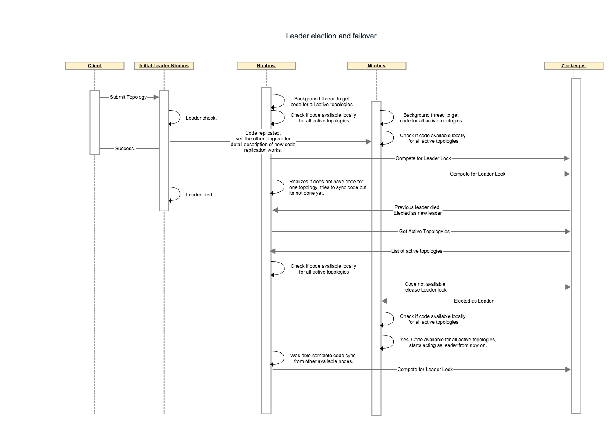

<a id="nimbus-ha-design--nimbus-state-store"></a>
<a id="nimbus-ha-design--nimbus-state-store:"></a>

## Nimbus state store:

Currently the nimbus stores 2 kind of data
\* Meta information like supervisor info, assignment info which is stored in zookeeper
\* Actual topology configs and jars that is stored on nimbus host’s local disk.

To achieve fail over from primary to backup servers nimbus state/data needs to be replicated across all nimbus hosts or
needs to be stored in a distributed storage. Replicating the data correctly involves state management, consistency checks
and it is hard to test for correctness.However many storm users do not want to take extra dependency on another replicated
storage system like HDFS and still need high availability.Eventually, we want to move to the bittorrent protocol for code
distribution given the size of the jars and to achieve better scaling when the total number of supervisors is very high.
The current file system based model for code distribution works fine with systems that have file system like structure
but it fails to support a non file system based approach like bit torrent. To support bit torrent and all the file
system based replicated storage systems we propose the following interface:

```java
/** * Interface responsible to distribute code in the cluster.*/ public interface ICodeDistributor {/** * Prepare this code distributor.* @param conf */ void prepare(Map conf);
/** * This API will perform the actual upload of the code to the distributed implementation.* The API should return a Meta file which should have enough information for downloader * so it can download the code e.g. for bittorrent it will be a torrent file, in case of something * like HDFS or s3  it might have the actual directory or paths for files to be downloaded.* @param dirPath local directory where all the code to be distributed exists.* @param topologyId the topologyId for which the meta file needs to be created.* @return metaFile */ File upload(Path dirPath, String topologyId);
/** * Given the topologyId and metafile, download the actual code and return the downloaded file's list.* @param topologyid * @param metafile * @param destDirPath the folder where all the files will be downloaded.* @return */ List<File> download(Path destDirPath, String topologyid, File metafile);
/** * Given the topologyId, returns number of hosts where the code has been replicated.*/ int getReplicationCount(String topologyId);
/** * Performs the cleanup.* @param topologyid */ void cleanup(String topologyid);
/** * Close this distributor.* @param conf */ void close(Map conf);}
```

To support replication we will allow the user to define a code replication factor which would reflect number of nimbus
hosts to which the code must be replicated before starting the topology. With replication comes the issue of consistency.
We will treat zookeeper’s list of active topologies as our authority for topologies for which the code must exist on a
nimbus host. Any nimbus host that does not have all the code for all the topologies which are marked as active in zookeeper
will relinquish it’s lock so some other nimbus host could become leader. A background thread on all nimbus host will
continuously try to sync code from other hosts where the code was successfully replicated so eventually at least one nimbus
will accept leadership as long as at least one seed hosts exists for each active topology.

Following steps describe code replication amongst nimbus hosts for a topology:
\* When client uploads jar, nothing changes.
\* When client submits a topology, leader nimbus calls code distributor’s upload function which will create a metafile stored
locally on leader nimbus. Leader nimbus will write new entries under /storm/code-distributor/topologyId to notify all
nonleader nimbuses that they should download this new code.
\* We wait on the leader nimbus to ensure at least N non leader nimbus has the code replicated, with a user configurable timeout.
\* When a non leader nimbus receives the notification about new code, it downloads the meta file from leader nimbus and then
downloads the real code by calling code distributor’s download function with metafile as input.
\* Once non leader finishes downloading code, it will write an entry under /storm/code-distributor/topologyId to indicate
it is one of the possible places to download the code/metafile in case the leader nimbus dies.
\* leader nimbus goes ahead and does all the usual things it does as part of submit topologies.

The following sequence diagram describes the communication between different components involved in code distribution.

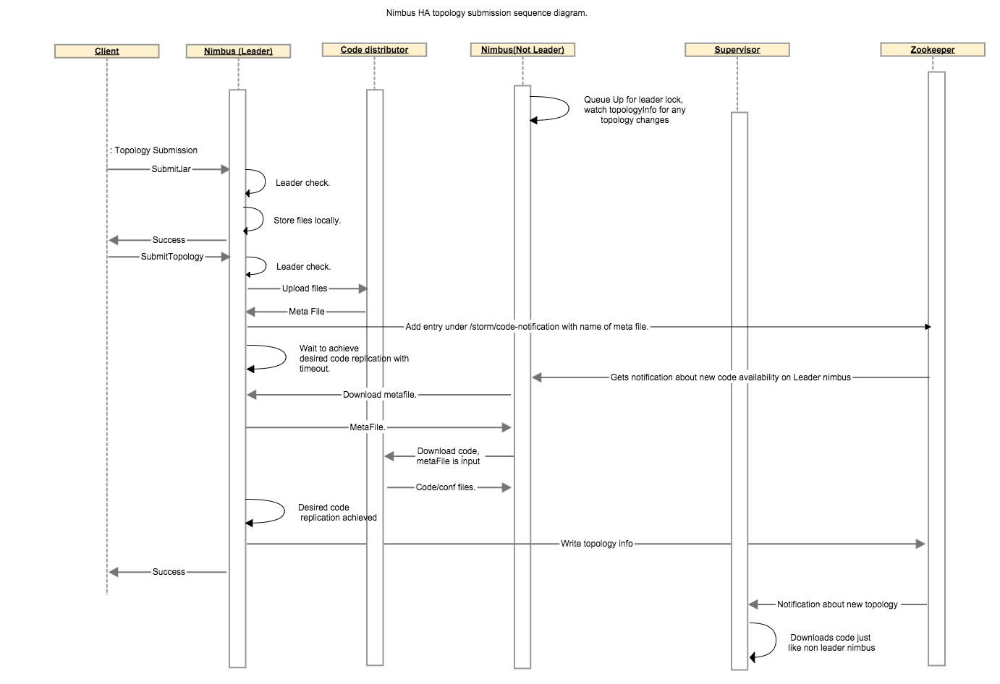

<a id="nimbus-ha-design--thrift-and-rest-api"></a>

## Thrift and Rest API

In order to avoid workers/supervisors/ui talking to zookeeper for getting master nimbus address we are going to modify the
`getClusterInfo` API so it can also return nimbus information. getClusterInfo currently returns `ClusterSummary` instance
which has a list of `supervisorSummary` and a list of 'topologySummary`instances. We will add a list of`NimbusSummary`to the`ClusterSummary`. See the structures below:

```thrift
struct ClusterSummary {
  1: required list<SupervisorSummary> supervisors;
  3: required list<TopologySummary> topologies;
  4: required list<NimbusSummary> nimbuses;
}

struct NimbusSummary {
  1: required string host;
  2: required i32 port;
  3: required i32 uptime_secs;
  4: required bool isLeader;
  5: required string version;
}
```

This will be used by StormSubmitter, Nimbus clients,supervisors and ui to discover the current leaders and participating
nimbus hosts. Any nimbus host will be able to respond to these requests. The nimbus hosts can read this information once
from zookeeper and cache it and keep updating the cache when the watchers are fired to indicate any changes,which should
be rare in general case.

<a id="nimbus-ha-design--configuration"></a>

## Configuration

You can use nimbus ha with default configuration , however the default configuration assumes a single nimbus host so it
trades off replication for lower topology submission latency. Depending on your use case you can adjust following configurations:
\* storm.codedistributor.class : This is a string representing fully qualified class name of a class that implements
org.apache.storm.codedistributor.ICodeDistributor. The default is set to "org.apache.storm.codedistributor.LocalFileSystemCodeDistributor".
This class leverages local file system to store both meta files and code/configs. This class adds extra load on zookeeper as even after
downloading the code-distrbutor meta file it contacts zookeeper in order to figure out hosts from where it can download
actual code/config and to get the current replication count. An alternative is to use
"org.apache.storm.hdfs.ha.codedistributor.HDFSCodeDistributor" which relies on HDFS but does not add extra load on zookeeper and will
make topology submission faster.
\* topology.min.replication.count : Minimum number of nimbus hosts where the code must be replicated before leader nimbus
can mark the topology as active and create assignments. Default is 1.
\* topology.max.replication.wait.time.sec: Maximum wait time for the nimbus host replication to achieve the nimbus.min.replication.count.
Once this time is elapsed nimbus will go ahead and perform topology activation tasks even if required nimbus.min.replication.count is not achieved.
The default is 60 seconds, a value of -1 indicates to wait for ever.
\*nimbus.code.sync.freq.secs: frequency at which the background thread on nimbus which syncs code for locally missing topologies will run. default is 5 minutes.

Note: Even though all nimbus hosts have watchers on zookeeper to be notified immediately as soon as a new topology is available for code
download, the callback pretty much never results in code download. In practice we have observed that the desired replication is only achieved once the background-thread runs.
So you should expect your topology submission time to be somewhere between 0 to (2 \* nimbus.code.sync.freq.secs) for any nimbus.min.replication.count > 1.

---

<a id="index"></a>

<!-- source_url: https://storm.apache.org/releases/2.8.3/index.html -->

<!-- page_index: 61 -->

<a id="index--documentation"></a>

# Documentation

<a id="index--basics-of-storm"></a>

### Basics of Storm

- [Javadoc](https://javadoc.io/doc/org.apache.storm/storm-client/2.8.3/index.html)
- [Tutorial](#tutorial)
- [Concepts](#concepts)
- [Scheduler](#storm-scheduler)
- [Configuration](#configuration)
- [Guaranteeing message processing](#guaranteeing-message-processing)
- [Daemon Fault Tolerance](#daemon-fault-tolerance)
- [Command line client](#command-line-client)
- [REST API](#storm-ui-rest-api)
- [Understanding the parallelism of a Storm topology](#understanding-the-parallelism-of-a-storm-topology)
- [FAQ](#faq)

<a id="index--layers-on-top-of-storm"></a>

### Layers on top of Storm

<a id="index--trident"></a>

#### Trident

Trident is an alternative interface to Storm. It provides exactly-once processing, "transactional" datastore persistence, and a set of common stream analytics operations.

- [Trident Tutorial](#trident-tutorial) -- basic concepts and walkthrough
- [Trident API Overview](#trident-api-overview) -- operations for transforming and orchestrating data
- [Trident State](#trident-state) -- exactly-once processing and fast, persistent aggregation
- [Trident spouts](#trident-spouts) -- transactional and non-transactional data intake
- [Trident RAS API](#trident-ras-api) -- using the Resource Aware Scheduler with Trident.

<a id="index--streams-api"></a>

#### Streams API

Stream APIs is another alternative interface to Storm. It provides a typed API for expressing streaming computations and supports functional style operations.

NOTE: Streams API is an `experimental` feature, and further works might break backward compatibility.
We're also notifying it via annotating classes with marker interface `@InterfaceStability.Unstable`.

- [Streams API](#stream-api)

<a id="index--flux"></a>

#### Flux

- [Flux Data Driven Topology Builder](#flux)

<a id="index--setup-and-deploying"></a>

### Setup and Deploying

- [Setting up a Storm cluster](#setting-up-a-storm-cluster)
- [Local mode](#local-mode)
- [Troubleshooting](#troubleshooting)
- [Running topologies on a production cluster](#running-topologies-on-a-production-cluster)
- [Building Storm](#maven) with Maven
- [Setting up a Secure Cluster](#security)
- [CGroup Enforcement](#cgroups_in_storm)
- [Pacemaker reduces load on zookeeper for large clusters](#pacemaker)
- [Resource Aware Scheduler](#resource_aware_scheduler_overview)
- [Generic Resources](#generic-resources)
- [Daemon Metrics/Monitoring](#clustermetrics)
- [Windows users guide](#windows-users-guide)
- [Classpath handling](#classpath-handling)

<a id="index--intermediate"></a>

### Intermediate

- [Serialization](#serialization)
- [Common patterns](#common-patterns)
- [DSLs and multilang adapters](#dsls-and-multilang-adapters)
- [Using non-JVM languages with Storm](#using-non-jvm-languages-with-storm)
- [Distributed RPC](#distributed-rpc)
- [Hooks](#hooks)
- [Metrics (Deprecated)](#metrics)
- [Metrics V2](#metrics_v2)
- [State Checkpointing](#state-checkpointing)
- [Windowing](#windowing)
- [Joining Streams](#joins)
- [Blobstore(Distcache)](#distcache-blobstore)

<a id="index--debugging"></a>

### Debugging

- [Dynamic Log Level Settings](#dynamic-log-level-settings)
- [Searching Worker Logs](#logs)
- [Worker Profiling](#dynamic-worker-profiling)
- [Event Logging](#eventlogging)

<a id="index--integration-with-external-systems-and-other-libraries"></a>

### Integration With External Systems, and Other Libraries

- [Apache Kafka Integration](#storm-kafka-client)
- [Apache HBase Integration](https://storm.apache.org/releases/2.8.3/storm-hbase.html)
- [Apache HDFS Integration](#storm-hdfs)
- [JDBC Integration](#storm-jdbc)
- [JMS Integration](#storm-jms)
- [Redis Integration](#storm-redis)

<a id="index--container-resource-management-system-integration"></a>

#### Container, Resource Management System Integration

- [YARN Integration](https://github.com/yahoo/storm-yarn)
- [Mesos Integration](https://github.com/mesos/storm)
- [Docker Integration](https://hub.docker.com/_/storm/)
- [Kubernetes Integration](https://github.com/kubernetes/examples/tree/master/staging/storm)

<a id="index--advanced"></a>

### Advanced

- [Defining a non-JVM language DSL for Storm](#defining-a-non-jvm-language-dsl-for-storm)
- [Multilang protocol](#multilang-protocol) (how to provide support for another language)
- [Implementation docs](#implementation-docs)
- [Storm Metricstore](#storm-metricstore)

---
