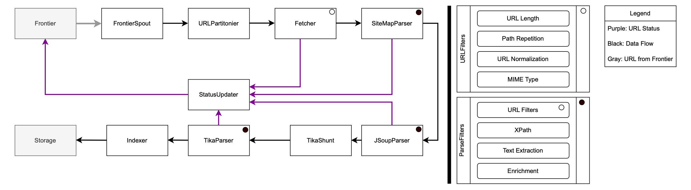

# Apache StormCrawler 3.5.1 - Documentation

## Navigation

- Docs
  - [Apache StormCrawler 3.5.1 - Documentation](#index)

## Content

<a id="index"></a>

<!-- source_url: https://stormcrawler.apache.org/docs/3.5.1/index.html -->

<!-- page_index: 1 -->

<a id="index--_overview"></a>
<a id="index--1.-overview"></a>

## 1. Overview

Apache StormCrawler is an open source collection of resources for building low-latency, scalable web crawlers on [Apache Storm](https://storm.apache.org/). It is provided under the [Apache License](https://www.apache.org/licenses/LICENSE-2.0) and is written mostly in Java.

The aims of StormCrawler are to help build web crawlers that are:

- Scalable
- Low latency
- Easy to extend
- Polite yet efficient

StormCrawler is both a library and a collection of reusable components designed to help developers build custom web crawlers with ease.
Getting started is simple — the Maven archetypes allow you to quickly scaffold a new project, which you can then adapt to fit your specific needs.

In addition to its core modules, StormCrawler offers a range of external resources that can be easily integrated into your project.
These include spouts and bolts for OpenSearch, as well as a ParserBolt that leverages Apache Tika to handle various document formats and many more.

StormCrawler is well-suited for scenarios where URLs to fetch and parse arrive as continuous streams, but it also performs exceptionally in large-scale, recursive crawls where low latency is essential.
The project is actively maintained, widely adopted in production environments, and supported by an engaged community.

You can find links to recent talks and demos later in this document, showcasing real-world applications and use cases.

<a id="index--_key_features"></a>
<a id="index--2.-key-features"></a>

## 2. Key Features

Here is a short list of provided features:

- Integration with [URLFrontier](https://github.com/crawler-commons/url-frontier) for distributed URL management
- Pluggable components (Spouts and Bolts from [Apache Storm](https://storm.apache.org/)) for flexibility and modularity — adding custom components is straightforward
- Support for [Apache Tika](https://tika.apache.org/) for document parsing via `ParserBolt`
- Integration with [OpenSearch](https://opensearch.org/) and [Apache Solr](https://solr.apache.org/) for indexing and status storage
- Option to store crawled data as WARC (Web ARChive) files
- Support for headless crawling using [Playwright](https://playwright.dev/)
- Support for LLM-based advanced text extraction
- Proxy support for distributed and controlled crawling
- Flexible and pluggable filtering mechanisms:

  - URL Filters for pre-fetch filtering
  - Parse Filters for post-fetch content filtering
- Built-in support for crawl metrics and monitoring
- Configurable politeness policies (e.g., crawl delay, user agent management)
- Robust HTTP fetcher based on [Apache HttpComponents](https://hc.apache.org/) or [OkHttp](https://square.github.io/okhttp/).
- MIME type detection and response-based filtering
- Support for parsing and honoring `robots.txt` and sitemaps
- Stream-based, real-time architecture using [Apache Storm](https://storm.apache.org/) — suitable for both recursive and one-shot crawling tasks
- Can run in both local and distributed environments
- Apache Maven archetypes for quickly bootstrapping new crawler projects
- Actively developed and used in production by [multiple organizations](#index--poweredby)

<a id="index--_quick_start"></a>
<a id="index--3.-quick-start"></a>

## 3. Quick Start

These instructions should help you get Apache StormCrawler up and running in 5 to 15 minutes.

<a id="index--_prerequisites"></a>
<a id="index--3.1.-prerequisites"></a>

### 3.1. Prerequisites

To run StormCrawler, you will need Java SE 17 or later.

Additionally, since we’ll be running the required Apache Storm cluster using Docker Compose, make sure Docker is installed on your operating system.

<a id="index--_terminology"></a>
<a id="index--3.2.-terminology"></a>

### 3.2. Terminology

Before starting, we will give a quick overview of **central** Storm concepts and terminology, you need to know before starting with StormCrawler:

- **Topology**: A topology is the overall data processing graph in Storm, consisting of spouts and bolts connected together to perform continuous, real-time computations.
- **Spout**: A spout is a source component in a Storm topology that emits streams of data into the processing pipeline.
- **Bolt**: A bolt processes, transforms, or routes data streams emitted by spouts or other bolts within the topology.
- **Flux**: In Apache Storm, Flux is a declarative configuration framework that enables you to define and run Storm topologies using YAML files instead of writing Java code. This simplifies topology management and deployment.
- **Frontier**: In the context of a web crawler, the Frontier is the component responsible for managing and prioritizing the list of URLs to be fetched next.
- **Seed**: In web crawling, a seed is an initial URL or set of URLs from which the crawler starts its discovery and fetching process.

<a id="index--_bootstrapping_a_stormcrawler_project"></a>
<a id="index--3.3.-bootstrapping-a-stormcrawler-project"></a>

### 3.3. Bootstrapping a StormCrawler Project

You can quickly generate a new StormCrawler project using the Maven archetype:

```shell
mvn archetype:generate -DarchetypeGroupId=org.apache.stormcrawler \
                       -DarchetypeArtifactId=stormcrawler-archetype \
                       -DarchetypeVersion=<CURRENT_VERSION>
```

Be sure to replace `<CURRENT_VERSION>` with the latest released version of StormCrawler, which you can find on [search.maven.org](https://search.maven.org/artifact/org.apache.stormcrawler/stormcrawler-archetype).

During the process, you’ll be prompted to provide the following:

- `groupId` (e.g. `com.mycompany.crawler`)
- `artifactId` (e.g. `stormcrawler`)
- Version
- Package name
- User agent details

> [!IMPORTANT]
> Specifying a user agent is important for crawler ethics because it identifies your crawler to websites, promoting transparency and allowing site owners to manage or block requests if needed. Be sure to provide a crawler information website as well.

The archetype will generate a fully-structured project including:

- A pre-configured `pom.xml` with the necessary dependencies
- Default resource files
- A sample `crawler.flux` configuration
- A basic configuration file

After generation, navigate into the newly created directory (named after the `artifactId` you specified).

> [!TIP]
> You can learn more about the architecture and how each component works together if you look into [the architecture documentation](#index--architecture).
> By exploring that part of the documentation, you can gain a better understanding of how StormCrawler performs crawling and how bolts, spouts, as well as parse and URL filters, collaborate in the process.

<a id="index--_docker_compose_setup"></a>
<a id="index--3.3.1.-docker-compose-setup"></a>

#### 3.3.1. Docker Compose Setup

Below is a simple `docker-compose.yml` configuration to spin up URLFrontier, Zookeeper, Storm Nimbus, Storm Supervisor, and the Storm UI:

```yaml
services:
  zookeeper:
    image: zookeeper:3.9.3
    container_name: zookeeper
    restart: always

  nimbus:
    image: storm:latest
    container_name: nimbus
    hostname: nimbus
    command: storm nimbus
    depends_on:
      - zookeeper
    restart: always

  supervisor:
    image: storm:latest
    container_name: supervisor
    command: storm supervisor -c worker.childopts=-Xmx%HEAP-MEM%m
    depends_on:
      - nimbus
      - zookeeper
    restart: always

  ui:
    image: storm:latest
    container_name: ui
    command: storm ui
    depends_on:
      - nimbus
    restart: always
    ports:
      - "127.0.0.1:8080:8080"

  urlfrontier:
    image: crawlercommons/url-frontier:latest
    container_name: urlfrontier
    restart: always
    ports:
      - "127.0.0.1:7071:7071"
```

Notes:

- This example Docker Compose uses the official Apache Storm and Apache Zookeeper images.
- URLFrontier is an additional service used by StormCrawler to act as Frontier. Please note, that we also offer other Frontier implementations like OpenSearch or Apache Solr.
- Ports may need adjustment depending on your environment.
- The Storm UI runs on port 8080 by default.
- Ensure network connectivity between services; Docker Compose handles this by default.

After setting up your Docker Compose, you should start it up:

```shell
docker compose up -d
```

Check the logs and see, if every service is up and running:

```shell
docker compose logs -f
```

Next, access the Storm UI via `https://localhost:8080` and check, that a Storm Nimbus as well as a Storm Supervisor is available.

<a id="index--_compile"></a>
<a id="index--3.3.2.-compile"></a>

#### 3.3.2. Compile

Build the generated archetype by running

```shell
mvn package
```

This will create a uberjar named `${artifactId}-${version}.jar` (matches the artifact id and the version specified during the archetype generation) in your `target` directory.

<a id="index--_inject_your_first_seeds"></a>
<a id="index--3.3.3.-inject-your-first-seeds"></a>

#### 3.3.3. Inject Your First Seeds

Now you are ready to insert your first seeds into URLFrontier. To do so, create a file `seeds.txt` containing your seeds:

```text
https://stormcrawler.apache.org
```

After you have saved it, we need to inject the seeds into URLFrontier. This can be done by running URLFrontiers client:

```shell
java -cp target/${artifactId}-${version}.jar crawlercommons.urlfrontier.client.Client PutURLs -f seeds.txt
```

where *seeds.txt* is the previously created file containing URLs to inject, with one URL per line.

<a id="index--_run_your_first_crawl"></a>
<a id="index--3.3.4.-run-your-first-crawl"></a>

#### 3.3.4. Run Your First Crawl

Now it is time to run our first crawl. To do so, we need to start our crawler topology in distributed mode and deploy it on our Storm Cluster.

```shell
docker run --network ${NETWORK} -it \
--rm \
-v "$(pwd)/crawler-conf.yaml:/apache-storm/crawler-conf.yaml" \
-v "$(pwd)/crawler.flux:/apache-storm/crawler.flux" \
-v "$(pwd)/${artifactId}-${version}.jar:/apache-storm/${artifactId}-${version}.jar" \
storm:latest \
storm jar ${artifactId}-${version}.jar org.apache.storm.flux.Flux --remote crawler.flux
```

where `${NETWORK}` is the name of the Docker network of the previously started Docker Compose. You can find this name by running

```shell
docker network ls
```

After running the `storm jar` command, you should carefully monitor the logs via

```shell
docker compose logs -f
```

as well as the Storm UI. It should now list a running topology.

In the default archetype, the fetched content is printed out to the default system out print stream.

> [!NOTE]
> In a Storm topology defined with Flux, parallelism specifies the number of tasks or instances of a spout or bolt to run concurrently, enabling scalable and efficient processing. In the archetype every component is set to a parallelism of **1**.

Congratulations! You learned how to start your first simple crawl using Apache StormCrawler.

Feel free to explore the rest of our documentation to build more complex crawler topologies.

<a id="index--_summary"></a>
<a id="index--3.4.-summary"></a>

### 3.4. Summary

This document shows how simple it is to get Apache StormCrawler up and running and to run a simple crawl.

<a id="index--architecture"></a>
<a id="index--4.-understanding-stormcrawler-s-architecture"></a>

## 4. Understanding StormCrawler’s Architecture

<a id="index--_architecture_overview"></a>
<a id="index--4.1.-architecture-overview"></a>

### 4.1. Architecture Overview

Apache StormCrawler is built as a distributed, stream-oriented web crawling system
on top of Apache Storm. Its architecture emphasizes clear separation between
**crawl control** and **content processing**, with the URL frontier acting as the
central coordination point.



Figure 1. Architecture overview of StormCrawler

Figure 1 illustrates StormCrawler’s stream-processing crawl pipeline, built on Apache Storm.
The architecture is intentionally modular and centers around two core abstractions:

- The URL frontier: decides **what** to crawl and **when**
- The parsing and indexing pipeline: decides **what** to **extract**, **keep**, and **store**

Black arrows show the **main data flow**, gray arrows represent URLs **taken from the frontier**, and purple arrows indicate **URL status updates** fed back to the frontier.

<a id="index--_crawl_flow_and_core_components"></a>
<a id="index--4.1.1.-crawl-flow-and-core-components"></a>

#### 4.1.1. Crawl Flow and Core Components

The crawl begins with the **Frontier**, which is responsible for scheduling, prioritization, politeness, and retry logic. URLs are emitted by a
`FrontierSpout` and partitioned by the `URLPartitioner`, typically using the
host as a key to enforce politeness constraints.

The `Fetcher` retrieves web resources and emits both the fetched content and
associated metadata such as HTTP status codes, headers, and MIME types. Based
on the content type, documents are routed to specialized parsers, including
`SiteMapParser`, `JSoupParser` for HTML content, and `TikaParser` for binary
formats via Apache Tika.

Parsed content is then sent to the `Indexer` and persisted by the `Storage`
layer. Throughout the pipeline, fetch and parse outcomes are reported to the
`StatusUpdater`, which feeds URL status information back to the frontier, closing the crawl feedback loop.

<a id="index--_url_filters"></a>
<a id="index--4.1.2.-url-filters"></a>

#### 4.1.2. URL Filters

URL Filters determine whether a URL should be accepted, rejected, or modified
before it is scheduled for fetching. They operate on seed URLs, discovered
links, and redirect targets, ensuring that only crawl-worthy URLs enter the
frontier.

In Figure 1, URL Filters are conceptually positioned between link discovery
and the frontier. Their primary role is to control crawl scope and prevent
frontier explosion.

Typical URL Filters include:

- **URL Length**: rejects excessively long URLs that often indicate session IDs
  or crawler traps.
- **Path Repetition**: detects repeating path segments that can lead to infinite
  crawl loops.
- **URL Normalization**: canonicalizes URLs by removing fragments, sorting query
  parameters, or enforcing consistent schemes.
- **MIME Type**: avoids scheduling URLs unlikely to yield useful content.

By applying these filters early, StormCrawler prevents unnecessary fetches and
maintains an efficient, focused crawl.

<a id="index--_parse_filters"></a>
<a id="index--4.1.3.-parse-filters"></a>

#### 4.1.3. Parse Filters

Parse Filters operate after content has been successfully fetched and parsed.
They allow fine-grained control over how extracted data and outgoing links are
processed.

Parse Filters are applied within the parsing bolts, following parsing by
`SiteMapParser`, `JSoupParser`, or `TikaParser`. They can modify extracted text, metadata, and links before the content is indexed or new URLs are emitted.

Common Parse Filters include:

- **URL Filters (post-parse)**: further refine outgoing links extracted from
  content.
- **XPath**: extract structured fields from HTML documents.
- **Text Extraction**: control which parts of a document contribute to the
  indexed text.
- **Enrichment**: add custom metadata such as language detection, entity tags,
  or domain-specific signals.

Parse Filters enable domain-specific logic without coupling it directly to the
crawler’s core components.

<a id="index--_interaction_between_url_filters_and_parse_filters"></a>
<a id="index--4.1.4.-interaction-between-url-filters-and-parse-filters"></a>

#### 4.1.4. Interaction Between URL Filters and Parse Filters

URL Filters focus on deciding **what should be crawled**, while Parse
Filters focus on deciding **what should be kept and how it should be
interpreted**.

<a id="index--_understanding_stormcrawlers_internals"></a>
<a id="index--5.-understanding-stormcrawler-s-internals"></a>

## 5. Understanding StormCrawler’s Internals

<a id="index--_status_stream"></a>
<a id="index--5.1.-status-stream"></a>

### 5.1. Status Stream

The Apache StormCrawler components rely on two Apache Storm streams: the *default* one and another one called *status*.

The aim of the *status* stream is to pass information about URLs to a persistence layer. Typically, a bespoke bolt will take the tuples coming from the *status* stream and update the information about URLs in some sort of storage (e.g., OpenSearch, HBase, etc…), which is then used by a Spout to send new URLs down the topology.

This is critical for building recursive crawls (i.e., you discover new URLs and not just process known ones). The *default* stream is used for the URL being processed and is generally used at the end of the pipeline by an indexing bolt (which could also be OpenSearch, HBase, etc…), regardless of whether the crawler is recursive or not.

Tuples are emitted on the *status* stream by the parsing bolts for handling outlinks but also to notify that there has been a problem with a URL (e.g., unparsable content). It is also used by the fetching bolts to handle redirections, exceptions, and unsuccessful fetch status (e.g., HTTP code 400).

A bolt which sends tuples on the *status* stream declares its output in the following way:

```java
declarer.declareStream(
    org.apache.storm.crawler.Constants.StatusStreamName,
    new Fields("url", "metadata", "status"));
```

As you can see for instance in [SimpleFetcherBolt](https://github.com/apache/stormcrawler/blob/main/core/src/main/java/org/apache/stormcrawler/bolt/SimpleFetcherBolt.java#L149).

The [Status](https://github.com/apache/stormcrawler/blob/main/core/src/main/java/org/apache/stormcrawler/persistence/Status.java) enum has the following values:

- DISCOVERED:: outlinks found by the parsers or "seed" URLs emitted into the topology by one of the spouts or "injected" into the storage. The URLs can be already known in the storage.
- REDIRECTION:: set by the fetcher bolts.
- FETCH\_ERROR:: set by the fetcher bolts.
- ERROR:: used by either the fetcher, parser, or indexer bolts.
- FETCHED:: set by the StatusStreamBolt bolt (see below).

The difference between FETCH\_ERROR and ERROR is that the former is possibly transient whereas the latter is terminal. The bolt which is in charge of updating the status (see below) can then decide when and whether to schedule a new fetch for a URL based on the status value.

The [DummyIndexer](https://github.com/apache/stormcrawler/blob/main/core/src/main/java/org/apache/stormcrawler/indexing/DummyIndexer.java) is useful for notifying the storage layer that a URL has been successfully processed, i.e., fetched, parsed, and anything else we want to do with the main content. It must be placed just before the StatusUpdaterBolt and sends a tuple for the URL on the status stream with a Status value of `fetched`.

The class [AbstractStatusUpdaterBolt](https://github.com/apache/stormcrawler/blob/main/core/src/main/java/org/apache/stormcrawler/persistence/AbstractStatusUpdaterBolt.java) can be extended to handle status updates for a specific backend. It has an internal cache of URLs with a `discovered` status so that they don’t get added to the backend if they already exist, which is a simple but efficient optimisation. It also uses [DefaultScheduler](https://github.com/apache/stormcrawler/blob/main/core/src/main/java/org/apache/stormcrawler/persistence/DefaultScheduler.java) to compute a next fetch date and calls MetadataTransfer to filter the metadata that will be stored in the backend.

In most cases, the extending classes will just need to implement the method `store(String URL, Status status, Metadata metadata, Date nextFetch)` and handle their own initialisation in `prepare()`. You can find an example of a class which extends it in the [StatusUpdaterBolt](https://github.com/apache/stormcrawler/blob/main/external/opensearch/src/main/java/org/apache/stormcrawler/opensearch/persistence/StatusUpdaterBolt.java) for OpenSearch.

<a id="index--_bolts"></a>
<a id="index--5.2.-bolts"></a>

### 5.2. Bolts

<a id="index--_fetcher_bolts"></a>
<a id="index--5.2.1.-fetcher-bolts"></a>

#### 5.2.1. Fetcher Bolts

There are actually two different bolts for fetching the content of URLs:

- [SimpleFetcherBolt](https://github.com/apache/stormcrawler/blob/main/core/src/main/java/org/apache/stormcrawler/bolt/SimpleFetcherBolt.java)
- [FetcherBolt](https://github.com/apache/stormcrawler/blob/main/core/src/main/java/org/apache/stormcrawler/bolt/FetcherBolt.java)

Both declare the same output:

```java
declarer.declare(new Fields("url", "content", "metadata"));
declarer.declareStream(
        org.apache.storm.crawler.Constants.StatusStreamName,
        new Fields("url", "metadata", "status"));
```

with the `StatusStream` being used for handling redirections, restrictions by robots directives, or fetch errors, whereas the default stream gets the binary content returned by the server as well as the metadata to the following components (typically a parsing bolt).

Both use the same [Protocols](#index--protocols) implementations and [URLFilters](#index--urlfilters) to control the redirections.

The **FetcherBolt** has an internal set of queues where the incoming URLs are placed based on their hostname/domain/IP (see config `fetcher.queue.mode`) and a number of **FetchingThreads** (config `fetcher.threads.number` – 10 by default) which pull the URLs to fetch from the **FetchQueues**. When doing so, they make sure that a minimal amount of time (set with `fetcher.server.delay` – default 1 sec) has passed since the previous URL was fetched from the same queue. This mechanism ensures that we can control the rate at which requests are sent to the servers. A **FetchQueue** can also be used by more than one **FetchingThread** at a time (in which case `fetcher.server.min.delay` is used), based on the value of `fetcher.threads.per.queue`.

Incoming tuples spend very little time in the [execute](https://github.com/apache/stormcrawler/blob/main/core/src/main/java/org/apache/stormcrawler/bolt/FetcherBolt.java#L768) method of the **FetcherBolt** as they are put in the FetchQueues, which is why you’ll find that the value of **Execute latency** in the Storm UI is pretty low. They get acked later on, after they’ve been fetched. The metric to watch for in the Storm UI is **Process latency**.

The **SimpleFetcherBolt** does not do any of this, hence its name. It just fetches incoming tuples in its `execute` method and does not do multi-threading. It does enforce politeness by checking when a URL can be fetched and will wait until it is the case. It is up to the user to declare multiple instances of the bolt in the Topology class and to manage how the URLs get distributed across the instances of **SimpleFetcherBolt**, often with the help of the [URLPartitioner](https://github.com/apache/stormcrawler/blob/main/core/src/main/java/org/apache/stormcrawler/util/URLPartitioner.java).

<a id="index--_indexer_bolts"></a>
<a id="index--5.3.-indexer-bolts"></a>

### 5.3. Indexer Bolts

The purpose of crawlers is often to index web pages to make them searchable. The project contains resources for indexing with popular search solutions such as:

- [Apache SOLR](https://github.com/apache/stormcrawler/blob/main/external/solr/src/main/java/org/apache/stormcrawler/solr/bolt/IndexerBolt.java)
- [OpenSearch](https://github.com/apache/stormcrawler/blob/main/external/opensearch/src/main/java/org/apache/stormcrawler/opensearch/bolt/IndexerBolt.java)
- [AWS CloudSearch](https://github.com/apache/stormcrawler/blob/main/external/aws/src/main/java/org/apache/stormcrawler/aws/bolt/CloudSearchIndexerBolt.java)

All of these extend the class [AbstractIndexerBolt](https://github.com/apache/stormcrawler/blob/main/core/src/main/java/org/apache/stormcrawler/indexing/AbstractIndexerBolt.java).

The core module also contains a [simple indexer](https://github.com/apache/stormcrawler/blob/main/core/src/main/java/org/apache/stormcrawler/indexing/StdOutIndexer.java) which dumps the documents into the standard output – useful for debugging – as well as a [DummyIndexer](https://github.com/apache/stormcrawler/blob/main/core/src/main/java/org/apache/stormcrawler/indexing/DummyIndexer.java).

The basic functionalities of filtering a document to index, mapping the metadata (which determines which metadata to keep for indexing and under what field name), or using the canonical tag (if any) are handled by the abstract class. This allows implementations to focus on communication with the indexing APIs.

Indexing is often the penultimate component in a pipeline and takes the output of a Parsing bolt on the standard stream. The output of the indexing bolts is on the *status* stream:

```java
public void declareOutputFields(OutputFieldsDeclarer declarer) {
    declarer.declareStream(
            org.apache.stormcrawler.Constants.StatusStreamName,
            new Fields("url", "metadata", "status"));
}
```

The [DummyIndexer](https://github.com/apache/stormcrawler/blob/main/core/src/main/java/org/apache/stormcrawler/indexing/DummyIndexer.java) is used for cases where no actual indexing is required. It simply generates a tuple on the *status* stream so that any StatusUpdater bolt knows that the URL was processed successfully and can update its status and scheduling in the corresponding backend.

You can easily build your own custom indexer to integrate with other storage systems, such as a vector database for semantic search, a graph database for network analysis, or any other specialized data store. By extending AbstractIndexerBolt, you only need to implement the logic to communicate with your target system, while StormCrawler handles the rest of the pipeline and status updates.

<a id="index--_parser_bolts"></a>
<a id="index--5.4.-parser-bolts"></a>

### 5.4. Parser Bolts

<a id="index--_jsoupparserbolt"></a>
<a id="index--5.4.1.-jsoupparserbolt"></a>

#### 5.4.1. JSoupParserBolt

The [JSoupParserBolt](https://github.com/apache/stormcrawler/blob/main/core/src/main/java/org/apache/stormcrawler/bolt/JSoupParserBolt.java) can be used to parse HTML documents and extract the outlinks, text, and metadata it contains. If you want to parse non-HTML documents, use the [Tika-based ParserBolt](https://github.com/apache/stormcrawler/tree/main/external/tika/src/main/java/org/apache/stormcrawler/tika) from the external modules.

This parser calls the [URLFilters](#index--urlfilters) and [ParseFilters](#index--parsefilters) defined in the configuration. Please note that it calls [MetadataTransfer](#index--metadatatransfer) prior to calling the [ParseFilters](#index--parsefilters). If you create new Outlinks in your , you’ll need to make sure that you use MetadataTransfer there to inherit the Metadata from the parent document.

The **JSoupParserBolt** automatically identifies the charset of the documents. It uses the [status stream](https://stormcrawler.apache.org/docs/3.5.1/StatusStream) to report parsing errors but also for the outlinks it extracts from a page. These would typically be used by an extension of [AbstractStatusUpdaterBolt](https://github.com/apache/stormcrawler/blob/main/core/src/main/java/org/apache/stormcrawler/persistence/AbstractStatusUpdaterBolt.java) and persisted in some form of storage.

<a id="index--_sitemapparserbolt"></a>
<a id="index--5.4.2.-sitemapparserbolt"></a>

#### 5.4.2. SiteMapParserBolt

StormCrawler can handle sitemap files thanks to the **SiteMapParserBolt**. This bolt should be placed before the standard **ParserBolt** in the topology, as illustrated in [CrawlTopology](https://github.com/apache/stormcrawler/blob/main/archetype/src/main/resources/archetype-resources/src/main/java/CrawlTopology.java).

The reason for this is that the **SiteMapParserBolt** acts as a filter: it passes on any incoming tuples to the default stream so that they get processed by the **ParserBolt**, unless the tuple contains `isSitemap=true` in its metadata, in which case the **SiteMapParserBolt** will parse it itself. Any outlinks found in the sitemap files are then emitted on the .

The **SiteMapParserBolt** applies any configured [ParseFilters](#index--parsefilters) to the documents it parses and, just like its equivalent for HTML pages, it uses [MetadataTransfer](#index--metadatatransfer) to populate the Metadata objects for the Outlinks it finds.

<a id="index--_filters"></a>
<a id="index--5.5.-filters"></a>

### 5.5. Filters

<a id="index--parsefilters"></a>
<a id="index--5.5.1.-parse-filters"></a>

#### 5.5.1. Parse Filters

ParseFilters are called from parsing bolts such as [JSoupParserBolt](https://github.com/apache/stormcrawler/wiki/JSoupParserBolt) and [SiteMapParserBolt](https://github.com/apache/stormcrawler/wiki/SiteMapParserBolt) to extract data from web pages. The extracted data is stored in the Metadata object. ParseFilters can also modify the Outlinks and, in that sense, act as URLFilters.

ParseFilters need to implement the interface [ParseFilter](https://github.com/apache/stormcrawler/blob/main/core/src/main/java/org/apache/stormcrawler/parse/ParseFilter.java), which defines three methods:

```java
public void filter(String URL, byte[] content, DocumentFragment doc, ParseResult parse);

public void configure(Map stormConf, JsonNode filterParams);

public boolean needsDOM();
```

- The `filter` method is where the extraction occurs. ParseResult objects contain the outlinks extracted from the document as well as a Map of String to ParseData, where the String is the URL of a subdocument or the main document itself. ParseData objects contain Metadata, binary content, and text for the subdocuments, which is useful for indexing subdocuments independently of the main document.
- The `needsDOM` method indicates whether the ParseFilter instance requires the DOM structure. If no ParseFilters need it, the parsing bolt will skip generating the DOM, slightly improving performance.
- The `configure` method takes a JSON object loaded by the wrapper class ParseFilters. The Storm configuration map can also be used to configure the filters, as described in [Configuration](https://stormcrawler.apache.org/docs/3.5.1/Configuration).

Here is the default [JSON configuration file](https://github.com/apache/stormcrawler/blob/main/core/src/main/resources/parsefilters.json) for ParseFilters. The configuration allows multiple instances of the same filter class with different parameters and supports complex parameter objects. ParseFilters are executed in the order they appear in the JSON file.

<a id="index--_provided_parsefilters"></a>
<a id="index--provided-parsefilters"></a>

##### Provided ParseFilters

- **CollectionTagger** – [CollectionTagger](https://github.com/apache/stormcrawler/blob/main/core/src/main/java/org/apache/stormcrawler/parse/filter/CollectionTagger.java) assigns one or more tags to the metadata of a document based on URL patterns defined in a JSON resource file. The resource file supports both include and exclude regular expressions:

```json
{"collections": [{"name": "stormcrawler","includePatterns": ["https://stormcrawler.net/.+"] },{"name": "crawler","includePatterns": [".+crawler.+", ".+nutch.+"],"excludePatterns": [".+baby.+", ".+spider.+"]}]}
```

- **CommaSeparatedToMultivaluedMetadata** – [CommaSeparatedToMultivaluedMetadata](https://github.com/apache/stormcrawler/blob/main/core/src/main/java/org/apache/stormcrawler/parse/filter/CommaSeparatedToMultivaluedMetadata.java) rewrites single metadata values containing comma-separated entries into multiple values for the same key, useful for keyword tags.
- **DebugParseFilter** – [DebugParseFilter](https://github.com/apache/stormcrawler/blob/main/core/src/main/java/org/apache/stormcrawler/parse/filter/DebugParseFilter.java) dumps an XML representation of the DOM structure to a temporary file.
- **DomainParseFilter** – [DomainParseFilter](https://github.com/apache/stormcrawler/blob/main/core/src/main/java/org/apache/stormcrawler/parse/filter/DomainParseFilter.java) stores the domain or host name in the metadata for later indexing.
- **LDJsonParseFilter** – [LDJsonParseFilter](https://github.com/apache/stormcrawler/blob/main/core/src/main/java/org/apache/stormcrawler/parse/filter/LDJsonParseFilter.java) extracts data from JSON-LD representations.
- **LinkParseFilter** – [LinkParseFilter](https://github.com/apache/stormcrawler/blob/main/core/src/main/java/org/apache/stormcrawler/parse/filter/LinkParseFilter.java) extracts outlinks from documents using XPath expressions defined in the configuration.
- **MD5SignatureParseFilter** – [MD5SignatureParseFilter](https://github.com/apache/stormcrawler/blob/main/core/src/main/java/org/apache/stormcrawler/parse/filter/MD5SignatureParseFilter.java) generates an MD5 signature of a document based on the binary content, text, or URL (as a last resort). It can be combined with content filtering to exclude boilerplate text.
- **MimeTypeNormalization** – [MimeTypeNormalization](https://github.com/apache/stormcrawler/blob/main/core/src/main/java/org/apache/stormcrawler/parse/filter/MimeTypeNormalization.java) converts server-reported or inferred mime-type values into human-readable values such as *pdf*, *html*, or *image* and stores them in the metadata, useful for indexing and filtering search results.
- **XPathFilter** – [XPathFilter](https://github.com/apache/stormcrawler/blob/main/core/src/main/java/org/apache/stormcrawler/parse/filter/XPathFilter.java) allows extraction of data using XPath expressions and storing them in the Metadata object.

You can also implement custom ParseFilters to extend the capabilities of the parsing pipeline. For example, you might create a filter to enrich a document’s metadata with additional information, such as language detection, sentiment analysis, named entity recognition, or custom tags extracted from the content. Custom filters can also modify or remove outlinks, normalize text, or integrate external data sources, allowing you to tailor the crawler to your specific processing or indexing requirements.
By implementing the ParseFilter interface and configuring the filter in the JSON file, your custom logic will be seamlessly executed within the parsing bolt.

<a id="index--urlfilters"></a>
<a id="index--5.5.2.-url-filters"></a>

#### 5.5.2. URL Filters

The URL filters can be used to both remove or modify incoming URLs (unlike Nutch where these functionalities are separated between URLFilters and URLNormalizers). This is generally used within a parsing bolt to normalize and filter outgoing URLs, but is also called within the FetcherBolt to handle redirections.

URLFilters need to implement the interface [URLFilter](https://github.com/apache/stormcrawler/blob/main/core/src/main/java/org/apache/stormcrawler/filtering/URLFilter.java) which defines a single method:

```java
public String filter(URL sourceUrl, Metadata sourceMetadata,
            String urlToFilter);
```

and inherits a default one from [Configurable](https://github.com/apache/stormcrawler/blob/main/core/src/main/java/org/apache/stormcrawler/util/Configurable.java):

```java
public void configure(Map stormConf, JsonNode jsonNode);
```

The configuration is done via a JSON file which is loaded by the wrapper class [URLFilters](https://github.com/apache/stormcrawler/blob/main/core/src/main/java/org/apache/stormcrawler/filtering/URLFilters.java). The URLFilter instances can be used directly, but it is easier to use the class URLFilters instead. Some filter implementations can also be configured with the [standard configuration mechanism](https://github.com/apache/stormcrawler/wiki/Configuration).

Here is an example of a [JSON configuration file](https://github.com/apache/stormcrawler/blob/main/archetype/src/main/resources/archetype-resources/src/main/resources/urlfilters.json).

The JSON configuration allows loading several instances of the same filtering class with different parameters and can handle complex configuration objects since it makes no assumptions about the content of the field `param`. The URLFilters are executed in the order in which they are defined in the JSON file.

<a id="index--_built_in_url_filters"></a>
<a id="index--built-in-url-filters"></a>

##### Built-in URL Filters

<a id="index--_basic"></a>
<a id="index--basic"></a>

###### Basic

The [BasicURLFilter](https://github.com/apache/stormcrawler/blob/main/core/src/main/java/org/apache/stormcrawler/filtering/basic/BasicURLFilter.java) filters based on the length of the URL and the repetition of path elements.

The [BasicURLNormalizer](https://github.com/apache/stormcrawler/blob/main/core/src/main/java/org/apache/stormcrawler/filtering/basic/BasicURLNormalizer.java) removes the anchor part of URLs based on the value of the parameter `removeAnchorPart`. It also removes query elements based on the configuration and whether their value corresponds to a 32-bit hash.

<a id="index--_fasturlfilter"></a>
<a id="index--fasturlfilter"></a>

###### FastURLFilter

The [FastURLFilter](https://github.com/apache/stormcrawler/blob/main/core/src/main/java/org/apache/stormcrawler/filtering/regex/FastURLFilter.java) is based on regex patterns and organized by scope (host | domain | metadata | global). For a given URL, the scopes are tried in the order given above and the URL is kept or removed based on the first matching rule. The default policy is to accept a URL if no match is found.

The resource file is in JSON and looks like this:

```json
[{"scope": "GLOBAL","patterns": ["DenyPathQuery \\.jpg"] },{"scope": "domain:stormcrawler.net","patterns": ["AllowPath /digitalpebble/","DenyPath .+"] },{"scope": "metadata:key=value","patterns": ["DenyPath .+"] }]
```

*DenyPathQuery* indicates that the pattern should be applied on the path URL path and the query element, whereas *DenyPath* means the path alone.

<a id="index--_host"></a>
<a id="index--host"></a>

###### Host

The [HostURLFilter](https://github.com/apache/stormcrawler/blob/main/core/src/main/java/org/apache/stormcrawler/filtering/host/HostURLFilter.java) filters URLs based on whether they belong to the same host or domain name as the source URL. This is configured with the parameters `ignoreOutsideDomain` and `ignoreOutsideHost`. The latter takes precedence over the former.

<a id="index--_maxdepth"></a>
<a id="index--maxdepth"></a>

###### MaxDepth

The [MaxDepthFilter](https://github.com/apache/stormcrawler/blob/main/core/src/main/java/org/apache/stormcrawler/filtering/depth/MaxDepthFilter.java) is configured with the parameter `maxDepth` and requires `metadata.track.depth` to be set to true in the Configuration. This removes outlinks found too far from the seed URL and controls the expansion of the crawl.

If the filter is configured with a value of 0, all outlinks will be removed, regardless of whether the depth is being tracked.

The max depth can also be set on a per-seed basis using the key/value `max.depth`, which is automatically transferred to the outlinks if `metadata.track.depth` is set to true.

<a id="index--_metadata"></a>
<a id="index--metadata"></a>

###### Metadata

The [MetadataFilter](https://github.com/apache/stormcrawler/blob/main/core/src/main/java/org/apache/stormcrawler/filtering/metadata/MetadataFilter.java) filters URLs based on metadata in the source document.

<a id="index--_regexurlfilter"></a>
<a id="index--regexurlfilter"></a>

###### RegexURLFilter

The [RegexURLFilter](https://github.com/apache/stormcrawler/blob/main/core/src/main/java/org/apache/stormcrawler/filtering/regex/RegexURLFilter.java) uses a configuration file or a JSON ArrayNode containing regular expressions to determine whether a URL should be kept or not. The most specific rule must be placed first as a URL is kept or removed based on the first matching rule.

```json
{
    "urlFilters": [
        "-^(file|ftp|mailto):",
        "+."
    ]
}
```

<a id="index--_regexurlnormalizer"></a>
<a id="index--regexurlnormalizer"></a>

###### RegexURLNormalizer

The [RegexURLNormalizer](https://github.com/apache/stormcrawler/blob/main/core/src/main/java/org/apache/stormcrawler/filtering/regex/RegexURLNormalizer.java) uses a configuration file or a JSON ArrayNode containing regular expressions and replacements to normalize URLs.

```json
{"urlNormalizers": [{"pattern": "#.*?(\\?|&amp;|$)","substitution": "$1" },{"pattern": "\\?&amp;","substitution": "\\?"}]}
```

<a id="index--_robotsfilter"></a>
<a id="index--robotsfilter"></a>

###### RobotsFilter

The [RobotsFilter](https://github.com/apache/stormcrawler/blob/main/core/src/main/java/org/apache/stormcrawler/filtering/robots/RobotsFilter.java) discards URLs based on the robots.txt directives. This is meant for small, limited crawls where the number of hosts is finite. Using this on a larger or open crawl would impact performance as the filter tries to retrieve the robots.txt files for any host found.

<a id="index--_sitemapfilter"></a>
<a id="index--sitemapfilter"></a>

###### SitemapFilter

The [SitemapFilter](https://github.com/apache/stormcrawler/blob/main/core/src/main/java/org/apache/stormcrawler/filtering/sitemap/SitemapFilter.java) discards the outlinks of URLs which are not sitemaps when sitemaps have been found.

<a id="index--metadatatransfer"></a>
<a id="index--5.6.-metadata-transfer"></a>

### 5.6. Metadata Transfer

The class [MetadataTransfer](https://github.com/apache/stormcrawler/blob/main/core/src/main/java/org/apache/stormcrawler/util/MetadataTransfer.java) is an important part of the framework and is used in key parts of a pipeline.

- Fetching
- Parsing
- Updating bolts

An instance (or extension) of MetadataTransfer gets created and configured with the method `public static MetadataTransfer getInstance(Map++<++String, Object++>++ conf)` which takes as parameter with the standard Apache Storm configuration.

A **MetadataTransfer** instance has mainly two methods, both returning Metadata objects :

- `getMetaForOutlink(String targetURL, String sourceURL, Metadata parentMD)`
- `filter(Metadata metadata)`

The former is used when creating [Outlinks](https://github.com/apache/stormcrawler/blob/main/core/src/main/java/org/apache/stormcrawler/parse/Outlink.java) i.e. in the parsing bolts but also for handling redirections in the FetcherBolt(s)
The latter is used by extensions of the [AbstractStatusUpdaterBolt](https://github.com/apache/stormcrawler/blob/main/core/src/main/java/org/apache/stormcrawler/persistence/AbstractStatusUpdaterBolt.java) class to determine which **Metadata** should be persisted.

The behavior of the default MetadataTransfer class is driven by configuration only. It has the following options.

- `metadata.transfer` list of metadata key values to filter or transfer to the outlinks. See [crawler-default.yaml](https://github.com/apache/stormcrawler/blob/main/core/src/main/resources/crawler-default.yaml#L23)
- `metadata.persist` list of metadata key values to persist in the status storage. See [crawler-default.yaml](https://github.com/apache/stormcrawler/blob/main/core/src/main/resources/crawler-default.yaml#L28)
- `metadata.track.path` whether to track the URL path or not. Boolean value, true by default.
- `metadata.track.depth` whether to track the depth from seed. Boolean value, true by default.

Note that the method `getMetaForOutlink` calls `filter` to determine what to key values to keep.

<a id="index--protocols"></a>
<a id="index--5.7.-protocols"></a>

### 5.7. Protocols

StormCrawler supports multiple **network protocols** for fetching content from various sources on the web.
Each protocol implementation defines how the crawler connects to a resource, sends requests, and handles responses such as status codes, headers, and content streams.

Protocols are a key part of the fetching process and are used by StormCrawler’s **bolts** to retrieve data from remote servers.
While HTTP and HTTPS are the most commonly used, other protocols like `file:` are also supported for local or distributed filesystem access.

Use these configurations to fine-tune fetching performance, authentication, connection handling, and protocol-level optimizations across your crawler topology.

<a id="index--_network_protocols"></a>
<a id="index--5.7.1.-network-protocols"></a>

#### 5.7.1. Network Protocols

The following network protocols are implemented in StormCrawler:

<a id="index--_file"></a>
<a id="index--file"></a>

##### File

- [FileProtocol](https://github.com/apache/stormcrawler/blob/main/core/src/main/java/org/apache/stormcrawler/protocol/file/FileProtocol.java)

<a id="index--_https"></a>
<a id="index--http-s"></a>

##### HTTP/S

See  for the effect of metadata content on protocol behaviour.

To change the implementation, add the following lines to your *crawler-conf.yaml*:

```yaml
http.protocol.implementation: "org.apache.stormcrawler.protocol.okhttp.HttpProtocol"
https.protocol.implementation: "org.apache.stormcrawler.protocol.okhttp.HttpProtocol"
```

- [HttpClient](https://github.com/apache/stormcrawler/blob/main/core/src/main/java/org/apache/stormcrawler/protocol/httpclient/HttpProtocol.java)
- [Selenium](https://github.com/apache/stormcrawler/blob/main/core/src/main/java/org/apache/stormcrawler/protocol/selenium/SeleniumProtocol.java)
- [OKHttp](https://github.com/apache/stormcrawler/blob/main/core/src/main/java/org/apache/stormcrawler/protocol/okhttp/HttpProtocol.java)

<a id="index--_feature_grid"></a>
<a id="index--5.7.2.-feature-grid"></a>

#### 5.7.2. Feature grid

| Features | HTTPClient | OKHttp | Selenium |
| --- | --- | --- | --- |
| Basic authentication | [Y](https://github.com/apache/stormcrawler/pull/589) | [Y](https://github.com/apache/stormcrawler/issues/792) | N |
| Proxy (w. credentials?) | Y / Y | Y / [Y](https://github.com/apache/stormcrawler/issues/751) | ? |
| Interruptible / trimmable [#463](https://github.com/apache/stormcrawler/issues/463) | N / Y | Y / Y | Y / N |
| Cookies | Y | [Y](https://github.com/apache/stormcrawler/issues/632) | N |
| Response headers | Y | Y | N |
| Trust all certificates | N | [Y](https://github.com/apache/stormcrawler/issues/615) | N |
| HEAD method | [Y](https://github.com/apache/stormcrawler/issues/485) | [Y](https://github.com/apache/stormcrawler/pull/923) | N |
| POST method | N | [Y](https://github.com/apache/stormcrawler/issues/641) | N |
| Verbatim response header | [Y](https://github.com/apache/stormcrawler/issues/317) | [Y](https://github.com/apache/stormcrawler/issues/506) | N |
| Verbatim request header | N | [Y](https://github.com/apache/stormcrawler/issues/506) | N |
| IP address capture | N | [Y](https://github.com/apache/stormcrawler/pull/691) | N |
| Navigation and javascript | N | N | Y |
| HTTP/2 | N | Y | (Y) |
| Configurable connection pool | N | [Y](https://github.com/apache/stormcrawler/issues/918) | N |

<a id="index--_http2"></a>
<a id="index--5.7.3.-http-2"></a>

#### 5.7.3. HTTP/2

- The [OKHttp](https://github.com/apache/stormcrawler/blob/main/core/src/main/java/org/apache/stormcrawler/protocol/okhttp/HttpProtocol.java) protocol supports [HTTP/2](https://en.wikipedia.org/wiki/HTTP/2) if the JDK includes [ALPN](https://en.wikipedia.org/wiki/Application-Layer_Protocol_Negotiation) (Java 9 and upwards or Java 8 builds starting early/mid 2020).
- [HttpClient](https://github.com/apache/stormcrawler/blob/main/core/src/main/java/org/apache/stormcrawler/protocol/httpclient/HttpProtocol.java) does not yet support HTTP/2.
- [Selenium](https://github.com/apache/stormcrawler/blob/main/core/src/main/java/org/apache/stormcrawler/protocol/selenium/SeleniumProtocol.java): whether HTTP/2 is used or not depends on the used driver.

Since [#829](https://github.com/apache/stormcrawler/pull/829), the HTTP protocol version used is configurable via `http.protocol.versions` (see also comments in [crawler-default.yaml](https://github.com/apache/stormcrawler/blob/main/core/src/main/resources/crawler-default.yaml)).

For example, to force that only HTTP/1.1 is used:

```yaml
http.protocol.versions:
- "http/1.1"
```

<a id="index--_metadata_dependent_behavior_for_http_protocols"></a>
<a id="index--5.7.4.-metadata-dependent-behavior-for-http-protocols"></a>

#### 5.7.4. Metadata-dependent Behavior For HTTP Protocols

The `metadata` argument to [HTTPProtocol.getProtocolOutput()](https://github.com/apache/stormcrawler/blob/main/core/src/main/java/org/apache/stormcrawler/protocol/Protocol.java#L53) can affect the behavior of the protocol. The following metadata keys are detected by `HTTPProtocol` implementations and utilized in performing the request:

- `last-modified`: If this key is present in `metadata`, the protocol will use the metadata value as the date for the `If-Modified-Since` header field of the HTTP request. If the key is not present, the `If-Modified-Since` field won’t be added to the request header.
- `protocol.etag`: If this key is present in `metadata`, the protocol will use the metadata value as the ETag for the `If-None-Match` header field of the HTTP request. If the key is not present, the `If-None-Match` field won’t be added to the request header.
- `http.accept`: If this key is present in `metadata`, the protocol will use the value to override the value for the `Accept` header field of the HTTP request. If the key is not present, the `http.accept` global configuration value is used instead. (Available in v1.11+)
- `http.accept.language`: If this key is present in `metadata`, the protocol will use the value to override the value for the `Accept-Language` header field of the HTTP request. If the key is not present, the `http.accept.language` global configuration value is used instead. (Available in v1.11+)
- `protocol.set-cookie`: If this key is present in `metadata` and `http.use.cookies` is true, the protocol will send cookies stored from the response this page was linked to, given the cookie is applicable to the domain of the link.
- `http.method.head`: If this key is present in `metadata`, the protocol sends a HEAD request. (Available in v1.12+ only for httpclient, see [#485](https://github.com/apache/stormcrawler/issues/485))
- `http.post.json`: If this key is present in `metadata`, the protocol sends a POST request. (Available in v1.12+ only for okhttp, see [#641](https://github.com/apache/stormcrawler/issues/641))
- `protocol.set-headers`: If this key is present in metadata, the protocol adds the specified headers to the request. See [#993](https://github.com/apache/stormcrawler/pull/993)

Example:

```json
"protocol%2Eset-header": [
  "header1=value1",
  "header2=value2"
]
```

Notes:

- Metadata values starting with `protocol.` may start with a different prefix instead. See `protocol.md.prefix` and [#776](https://github.com/apache/stormcrawler/issues/776).
- Metadata used for requests needs to be persisted. For example:

```yaml
metadata.persist:
  - last-modified
  - protocol.etag
  - protocol.set-cookie
  - ...
```

- Cookies need to be transferred to outlinks by setting:

```yaml
metadata.transfer:
  - set-cookie
```

<a id="index--_configuration"></a>
<a id="index--6.-configuration"></a>

## 6. Configuration

<a id="index--_user_agent_configuration"></a>
<a id="index--6.1.-user-agent-configuration"></a>

### 6.1. User Agent Configuration

Crawlers should always act responsibly and ethically when accessing websites. A key aspect of this is properly identifying themselves through the `User-Agent` header. By providing a clear and accurate user agent string, webmasters can understand who is visiting their site and why, and can apply rules in robots.txt accordingly. Respecting these rules, avoiding excessive request rates, and honoring content restrictions not only ensures legal compliance but also maintains a healthy relationship with the web community.
Transparent identification is a fundamental part of ethical web crawling.

The configuration of the [user agent](https://www.w3.org/WAI/UA/work/wiki/Definition_of_User_Agent) in StormCrawler has two purposes:

1. Identification of the crawler for webmasters
2. Selection of rules from robots.txt

<a id="index--_crawler_identification"></a>
<a id="index--6.1.1.-crawler-identification"></a>

#### 6.1.1. Crawler Identification

The politeness of a web crawler is not limited to how frequently it fetches pages from a site, but also in how it identifies itself to sites it crawls. This is done by setting the HTTP header `User-Agent`, just like [your web browser does](https://www.whatismybrowser.com/detect/what-is-my-user-agent/).

The full user agent string is built from the concatenation of the configuration elements:

- `http.agent.name`: name of your crawler
- `http.agent.version`: version of your crawler
- `http.agent.description`: description of what it does
- `http.agent.url`: URL webmasters can go to to learn about it
- `http.agent.email`: an email so that they can get in touch with you

Whereas StormCrawler used to provide a default value for these, this is not the case since version 2.11 and you will now be asked to provide a value.

You can specify the user agent verbatim with the config `http.agent` but you will still need to provide a `http.agent.name` for parsing robots.txt files.

<a id="index--_robots_exclusion_protocol"></a>
<a id="index--6.1.2.-robots-exclusion-protocol"></a>

#### 6.1.2. Robots Exclusion Protocol

This is also known as the robots.txt protocol, it is formalised in [RFC 9309](https://www.rfc-editor.org/rfc/rfc9309.html). Part of what the robots directives do is to define rules to specify which parts of a website (if any) are allowed to be crawled. The rules are organised by `User-Agent`, with a `*` to match any agent not otherwise specified explicitly, e.g.:

```
User-Agent: *
Disallow: *.gif$
Disallow: /example/
Allow: /publications/
```

In the example above the rule allows access to the URLs with the */publications/* path prefix, and it restricts access to the URLs with the */example/* path prefix and to all URLs with a *.gif* suffix. The `"*"` character designates any character, including the otherwise-required forward slash.

The value of `http.agent.name` is what StormCrawler looks for in the robots.txt. It MUST contain only uppercase and lowercase letters ("a-z" and "A-Z"), underscores ("\_"), and hyphens ("-").

Unless you are running a well known web crawler, it is unlikely that its agent name will be listed explicitly in the robots.txt (if it is, well, congratulations!). While you want the agent name value to reflect who your crawler is, you might want to follow rules set for better known crawlers. For instance, if you were a responsible AI company crawling the web to build a dataset to train LLMs, you would want to follow the rules set for `Google-Extended` (see [list of Google crawlers](https://developers.google.com/search/docs/crawling-indexing/overview-google-crawlers)) if any were found.

This is what the configuration `http.robots.agents` allows you to do. It is a comma-separated string but can also take a list of values. By setting it alongside `http.agent.name` (which should also be the first value it contains), you are able to broaden the match rules based on the identity as well as the purpose of your crawler.

<a id="index--_proxy"></a>
<a id="index--6.2.-proxy"></a>

### 6.2. Proxy

StormCrawler’s proxy system is built on top of the [SCProxy](https://github.com/apache/stormcrawler/blob/main/core/src/main/java/org/apache/stormcrawler/proxy/SCProxy.java) class and the [ProxyManager](https://github.com/apache/stormcrawler/blob/main/core/src/main/java/org/apache/stormcrawler/proxy/ProxyManager.java) interface. Every proxy used in the system is formatted as a **SCProxy**. The **ProxyManager** implementations handle the management and delegation of their internal proxies. At the call of `Protocol#getProtocolOutput()`, the `ProxyManager.getProxy()` is called to retrieve a proxy for the individual request.

The **ProxyManager** interface can be implemented in a custom class to create custom logic for proxy management and load balancing. The default **ProxyManager** implementation is **SingleProxyManager**. This ensures backwards compatibility for prior StormCrawler releases. To use **MultiProxyManager** or custom implementations, pass the class path and name via the config parameter `http.proxy.manager`:

```
http.proxy.manager: "org.apache.stormcrawler.proxy.MultiProxyManager"
```

StormCrawler implements two **ProxyManager** classes by default:

- [SingleProxyManager](https://github.com/apache/stormcrawler/blob/main/core/src/main/java/org/apache/stormcrawler/proxy/SingleProxyManager.java)
  Manages a single proxy passed by the backwards compatible proxy fields in the configuration:


```
----
http.proxy.host
http.proxy.port
http.proxy.type
http.proxy.user (optional)
http.proxy.pass (optional)
----
```

- [MultiProxyManager](https://github.com/apache/stormcrawler/blob/main/core/src/main/java/org/apache/stormcrawler/proxy/MultiProxyManager.java)
  Manages multiple proxies passed through a TXT file. The file should contain connection strings for all proxies including the protocol and authentication (if needed). The file supports comment lines (`//` or `#`) and empty lines. The file path should be passed via the config at the below field. The TXT file must be available to all nodes participating in the topology:


```
----
http.proxy.file
----
```

The **MultiProxyManager** load balances across proxies using one of the following schemes. The load balancing scheme can be passed via the config using `http.proxy.rotation`; the default value is `ROUND_ROBIN`:

- ROUND\_ROBIN
  Evenly distributes load across all proxies
- RANDOM
  Randomly selects proxies using the native Java random number generator. RNG is seeded with the nanos at instantiation
- LEAST\_USED
  Selects the proxy with the least amount of usage. This is performed lazily for speed and therefore will not account for changes to usages during the selection process. If no custom implementations are made this should theoretically operate the same as **ROUND\_ROBIN**

The **SCProxy** class contains all of the information associated with proxy connection. In addition, it tracks the total usage of the proxy and optionally tracks the location of the proxy IP. Usage information is used for the **LEAST\_USED** load balancing scheme. The location information is currently unused but left to enable custom implementations the ability to select proxies by location.

<a id="index--_metadata_2"></a>
<a id="index--6.3.-metadata"></a>

### 6.3. Metadata

<a id="index--_registering_metadata_for_kryo_serialization"></a>
<a id="index--6.3.1.-registering-metadata-for-kryo-serialization"></a>

#### 6.3.1. Registering Metadata for Kryo Serialization

If your Apache StormCrawler topology doesn’t extend `org.apache.storm.crawler.ConfigurableTopology`, you will need to manually register StormCrawler’s `Metadata` class for serialization in Storm. For more information on Kryo serialization in Apache Storm, you can refer to the [documentation](https://storm.apache.org/documentation/Serialization.html).

To register `Metadata` for serialization, you’ll need to import `backtype.storm.Config` and `org.apache.storm.crawler.Metadata`. Then, in your topology class, you’ll register the class with:

```java
Config.registerSerialization(conf, Metadata.class);
```

where `conf` is your Storm configuration for the topology.

Alternatively, you can specify in the configuration file:

```yaml
topology.kryo.register:
  - org.apache.storm.crawler.Metadata
```

<a id="index--_metadatatransfer"></a>
<a id="index--6.3.2.-metadatatransfer"></a>

#### 6.3.2. MetadataTransfer

The class [MetadataTransfer](https://github.com/apache/stormcrawler/blob/main/core/src/main/java/org/apache/stormcrawler/util/MetadataTransfer.java) is an important part of the framework and is used in key parts of a pipeline:

- Fetching
- Parsing
- Updating bolts

An instance (or extension) of **MetadataTransfer** gets created and configured with the method:

```java
public static MetadataTransfer getInstance(Map<String, Object> conf)
```

which takes as parameter the standard Storm .

A **MetadataTransfer** instance has mainly two methods, both returning `Metadata` objects:

- `getMetaForOutlink(String targetURL, String sourceURL, Metadata parentMD)`
- `filter(Metadata metadata)`

The former is used when creating [Outlinks](https://github.com/apache/stormcrawler/blob/main/core/src/main/java/org/apache/stormcrawler/parse/Outlink.java), i.e., in the parsing bolts but also for handling redirections in the [[FetcherBolt(s)]].

The latter is used by extensions of the [AbstractStatusUpdaterBolt](https://github.com/apache/stormcrawler/blob/main/core/src/main/java/org/apache/stormcrawler/persistence/AbstractStatusUpdaterBolt.java) class to determine which **Metadata** should be persisted.

The behavior of the default **MetadataTransfer** class is driven by configuration only. It has the following options:

- `metadata.transfer`:: list of metadata key values to filter or transfer to the outlinks. Please see the corresponding comments in [crawler-default.yaml](https://github.com/apache/stormcrawler/blob/main/core/src/main/resources/crawler-default.yaml)
- `metadata.persist`:: list of metadata key values to persist in the status storage. Please see the corresponding comments in [crawler-default.yaml](https://github.com/apache/stormcrawler/blob/main/core/src/main/resources/crawler-default.yaml)
- `metadata.track.path`:: whether to track the URL path or not. Boolean value, true by default.
- `metadata.track.depth`:: whether to track the depth from seed. Boolean value, true by default.

Note that the method `getMetaForOutlink` calls `filter` to determine which key values to keep.

<a id="index--_configuration_options"></a>
<a id="index--6.4.-configuration-options"></a>

### 6.4. Configuration Options

The following tables describe all available configuration options and their default values.
If one of the keys is not present in your YAML file, the default value will be taken.

Note: Some configuration options may not be applicable depending on the specific components and
features you are using in your Apache StormCrawler topology. Some external modules might define additional options not listed here.

<a id="index--_fetching_and_partitioning"></a>
<a id="index--6.4.1.-fetching-and-partitioning"></a>

#### 6.4.1. Fetching and Partitioning

| key | default value | description |
| --- | --- | --- |
| fetcher.max.crawl.delay | 30 | The maximum number in seconds that will be accepted by Crawl-delay directives in robots.txt files. If the crawl-delay exceeds this value the behavior depends on the value of fetcher.max.crawl.delay.force. |
| fetcher.max.crawl.delay.force | false | Configures the behavior of fetcher if the robots.txt crawl-delay exceeds fetcher.max.crawl.delay. If false: the tuple is emitted to the StatusStream as an ERROR. If true: the queue delay is set to fetcher.max.crawl.delay. |
| fetcher.max.queue.size | -1 | The maximum length of the queue used to store items to be fetched by the FetcherBolt. A setting of -1 sets the length to Integer.MAX\_VALUE. |
| fetcher.max.throttle.sleep | -1 | The maximum amount of time to wait between fetches; if exceeded, the item is sent to the back of the queue. Used in SimpleFetcherBolt. -1 disables it. |
| fetcher.max.urls.in.queues | -1 | Limits the number of URLs that can be stored in a fetch queue. -1 disables the limit. |
| fetcher.maxThreads.host/domain/ip | fetcher.threads.per.queue | Overwrites fetcher.threads.per.queue. Useful for crawling some domains/hosts/IPs more intensively. |
| fetcher.metrics.time.bucket.secs | 10 | Metrics events emitted every value seconds to the system stream. |
| fetcher.queue.mode | byHost | Possible values: byHost, byDomain, byIP. Determines queue grouping. |
| fetcher.server.delay | 1 | Delay between crawls in the same queue if no Crawl-delay is defined. |
| fetcher.server.delay.force | false | Defines fetcher behavior when the robots.txt crawl-delay is smaller than fetcher.server.delay. |
| fetcher.server.min.delay | 0 | Delay between crawls for queues with >1 thread. Ignores robots.txt. |
| fetcher.threads.number | 10 | Total concurrent threads fetching pages. Adjust carefully based on system capacity. |
| fetcher.threads.per.queue | 1 | Default number of threads per queue. Can be overridden. |
| fetcher.timeout.queue | -1 | Maximum wait time (seconds) for items in the queue. -1 disables timeout. |
| fetcherbolt.queue.debug.filepath | "" | Path to a debug log (e.g. /tmp/fetcher-dump-{port}). |
| http.agent.description | - | Description for the User-Agent header. |
| http.agent.email | - | Email address in User-Agent header. |
| http.agent.name | - | Name in User-Agent header. |
| http.agent.url | - | URL in User-Agent header. |
| http.agent.version | - | Version in User-Agent header. |
| http.basicauth.password | - | Password for http.basicauth.user. |
| http.basicauth.user | - | Username for Basic Authentication. |
| http.content.limit | -1 | Maximum HTTP response body size (bytes). Default: no limit. |
| http.protocol.implementation | org.apache.stormcrawler.protocol.httpclient.HttpProtocol | HTTP Protocol implementation. |
| http.proxy.host | - | HTTP proxy host. |
| http.proxy.pass | - | Proxy password. |
| http.proxy.port | 8080 | Proxy port. |
| http.proxy.user | - | Proxy username. |
| http.robots.403.allow | true | Defines behavior when robots.txt returns HTTP 403. |
| http.robots.agents | '' | Additional user-agent strings for interpreting robots.txt. |
| http.robots.file.skip | false | Ignore robots.txt rules (1.17+). |
| http.skip.robots | false | Deprecated (replaced by http.robots.file.skip). |
| http.store.headers | false | Whether to store response headers. |
| http.store.responsetime | true | Not yet implemented — store response time in Metadata. |
| http.timeout | 10000 | Connection timeout (ms). |
| http.use.cookies | false | Use cookies in subsequent requests. |
| https.protocol.implementation | org.apache.stormcrawler.protocol.httpclient.HttpProtocol | HTTPS Protocol implementation. |
| partition.url.mode | byHost | Defines how URLs are partitioned: byHost, byDomain, or byIP. |
| protocols | http,https | Supported protocols. |
| redirections.allowed | true | Allow URL redirects. |
| sitemap.discovery | false | Enable automatic sitemap discovery. |

<a id="index--_protocol"></a>
<a id="index--6.4.2.-protocol"></a>

#### 6.4.2. Protocol

| key | default value | description |
| --- | --- | --- |
| cacheConfigParamName | maximumSize=10000,expireAfterWrite=6h | CacheBuilder configuration for robots cache. |
| errorcacheConfigParamName | maximumSize=10000,expireAfterWrite=1h | CacheBuilder configuration for error cache. |
| file.encoding | UTF-8 | Encoding for FileProtocol. |
| http.custom.headers | - | Custom HTTP headers. |
| http.accept | - | HTTP Accept header. |
| http.accept.language | - | HTTP Accept-Language header. |
| http.content.partial.as.trimmed | false | Accepts partially fetched content in OKHTTP. |
| http.trust.everything | true | If true, trust all SSL/TLS connections. |
| navigationfilters.config.file | - | JSON config for NavigationFilter. See blog post . |
| selenium.addresses | - | WebDriver server addresses. |
| selenium.capabilities | - | Desired WebDriver capabilities . |
| selenium.delegated.protocol | - | Delegated protocol for selective Selenium usage. |
| selenium.implicitlyWait | 0 | WebDriver element search timeout. |
| selenium.instances.num | 1 | Number of instances per WebDriver connection. |
| selenium.pageLoadTimeout | 0 | WebDriver page load timeout. |
| selenium.setScriptTimeout | 0 | WebDriver script execution timeout. |
| topology.message.timeout.secs | -1 | OKHTTP message timeout. |

<a id="index--_indexing"></a>
<a id="index--6.4.3.-indexing"></a>

#### 6.4.3. Indexing

The values below are used by sub-classes of `AbstractIndexerBolt`.

| key | default value | description |
| --- | --- | --- |
| indexer.md.filter | - | YAML list of key=value filters for metadata-based indexing. |
| indexer.md.mapping | - | YAML mapping from metadata fields to persistence layer fields. |
| indexer.text.fieldname | - | Field name for indexed HTML body text. |
| indexer.url.fieldname | - | Field name for indexed URL. |

<a id="index--_status_persistence"></a>
<a id="index--6.4.4.-status-persistence"></a>

#### 6.4.4. Status Persistence

This refers to persisting the status of a URL (e.g. ERROR, DISCOVERED etc.) along with asomething like a `nextFetchDate`
that is being calculated by a [Scheduler](https://github.com/apache/stormcrawler/blob/main/core/src/main/java/org/apache/stormcrawler/persistence/DefaultScheduler.java).

| key | default value | description |
| --- | --- | --- |
| fetchInterval.default | 1440 | Default revisit interval (minutes). Used by DefaultScheduler . |
| fetchInterval.error | 44640 | Revisit interval for error pages (minutes). |
| fetchInterval.fetch.error | 120 | Revisit interval for fetch errors (minutes). |
| status.updater.cache.spec | maximumSize=10000, expireAfterAccess=1h | Cache specification . |
| status.updater.use.cache | true | Whether to use cache to avoid re-persisting URLs. |

<a id="index--_parsing"></a>
<a id="index--6.4.5.-parsing"></a>

#### 6.4.5. Parsing

Configures parsing of fetched text and the handling of discovered URIs

| key | default value | description |
| --- | --- | --- |
| collections.file | collections.json | Config for CollectionTagger . |
| collections.key | collections | Key under which tags are stored in metadata. |
| feed.filter.hours.since.published | -1 | Discard feeds older than value hours. |
| feed.sniffContent | false | Try to detect feeds automatically. |
| parsefilters.config.file | parsefilters.json | Path to JSON config defining ParseFilters. See example . |
| parser.emitOutlinks | true | Emit discovered links as DISCOVERED tuples. |
| parser.emitOutlinks.max.per.page | -1 | Limit number of emitted links per page. |
| textextractor.exclude.tags | "" | HTML tags ignored by TextExtractor. |
| textextractor.include.pattern | "" | Regex patterns to include for TextExtractor. |
| textextractor.no.text | false | Disable text extraction entirely. |
| track.anchors | true | Add anchor text to outlink metadata. |
| urlfilters.config.file | urlfilters.json | JSON file defining URL filters. See default . |

<a id="index--_metadata_3"></a>
<a id="index--6.4.6.-metadata"></a>

#### 6.4.6. Metadata

Options on how Storm Crawler should handle metadata tracking as well as
minimising metadata clashes

| key | default value | description |
| --- | --- | --- |
| metadata.persist | - | Metadata to persist but not transfer to outlinks. |
| metadata.track.depth | true | Track crawl depth of URLs. |
| metadata.track.path | true | Track URL path history in metadata. |
| metadata.transfer | - | Metadata to transfer to outlinks. |
| metadata.transfer.class | org.apache.stormcrawler.util.MetadataTransfer | Class handling metadata transfer. |
| protocol.md.prefix | - | Prefix for remote metadata keys to avoid collisions. |

<a id="index--_debugging_a_stormcrawler_topology"></a>
<a id="index--7.-debugging-a-stormcrawler-topology"></a>

## 7. Debugging a StormCrawler Topology

Assuming you have a StormCrawler setup all ready to use (e.g., generated from the archetype), you can debug it by either:

- Running the Java topology from your IDE in debug mode.
- Using the following command to enable remote debugging:

```bash
export STORM_JAR_JVM_OPTS="-agentlib:jdwp=transport=dt_socket,server=y,suspend=y,address=localhost:8000"
```

Then run the topology in the usual way with `storm jar ...` and remote debug from your IDE.

In both cases, the topology will need to run in local mode, i.e., not deployed to a Storm cluster.

<a id="index--poweredby"></a>
<a id="index--8.-companies-projects-using-stormcrawler"></a>

## 8. Companies & Projects Using StormCrawler

Apache StormCrawler has been adopted by a wide variety of organizations across industries, from startups to large enterprises and research institutions.
The following is a non-exhaustive list of companies, projects, and institutions that have used Apache StormCrawler in production or research.
If your organization is also making use of Apache StormCrawler, we’d love to hear from you!

- [CareerBuilder](https://www.careerbuilder.com/)
- [StolenCameraFinder](https://www.stolencamerafinder.com/)
- [Weborama](https://www.weborama.com/)
- [Ontopic](https://www.ontopic.io/)
- [ShopStyle](https://www.shopstyle.com/)
- [Wombat Software](https://www.wombatsoftware.de/)
- [CommonCrawl](https://commoncrawl.org/2016/10/news-dataset-available/)
- [WebFinery](https://webfinery.com/)
- [ReportLinker](https://www.reportlinker.com/)
- [TokenMill](https://www.tokenmill.lt/)
- [Polecat](https://www.polecat.com/)
- [WizeNoze](https://www.wizenoze.com/en/)
- [IProduct.io](https://iproduct.io/)
- [CGI](https://www.cgi.com/)
- [MirasText](https://github.com/miras-tech/MirasText)
- [G2 Web Services](https://www.g2webservices.com/)
- [Government of Northwest Territories](https://www.gov.nt.ca/)
- [Pixray](https://digitalpebble.blogspot.com/2019/02/meet-stormcrawler-users-q-with-pixray.html)
- [CameraForensics](https://www.cameraforensics.com/)
- [Gage Piracy](https://gagepiracy.com/)
- [Clarin ERIC](https://www.clarin.eu/)
- [OpenWebSearch](https://openwebsearch.eu/owler/)
- [Heilbronn University](https://shc-info.zml.hs-heilbronn.de/)
- [Contexity](https://www.contexity.com)
- [Fraunhofer IAO - KODIS](https://www.kodis.iao.fraunhofer.de/de/projekte/SPIDERWISE.html)

Drop us a line at [dev@stormcrawler.apache.org](mailto:dev@stormcrawler.apache.org) if you want to be added to this page.

<a id="index--_talks_tutorials_articles_and_interviews"></a>
<a id="index--9.-talks-tutorials-articles-and-interviews"></a>

## 9. Talks, tutorials, articles and interviews

- **OWler: preliminary results for building a collaborative open web crawler**, Dinzinger and al., OSSYM 2023 <https://ca-roll.github.io/downloads/owler.pdf>
- **Presentation: StormCrawler and OpenSearch** (Feb 2023) <https://www.youtube.com/watch?v=azHYI9pnjos>
- **Crawling the German Health Web: Exploratory Study and Graph Analysis**, Zowalla R, Wetter T, Pfeifer D. J Med Internet Res 2020;22(7):e17853 <https://www.jmir.org/2020/7/e17853>
- **Tutorial: StormCrawler 1.16 + Elasticsearch 7.5.0** <https://youtu.be/8kpJLPdhvLw>
- **StormCrawler open source web crawler strengthened by Elasticsearch, Kibana** <https://www.elastic.co/blog/stormcrawler-open-source-web-crawler-strengthened-by-elasticsearch-kibana>
- **Harvesting Online Health Information**, Richard Zowalla [slides](https://www.slideshare.net/secret/v8Y0qFlGBk7IbB)
- ***Tutorial: StormCrawler 1.10 + Apache SOLR 4.7.0*** <https://youtu.be/F8nvGj03XLo>
- **Patent-Crawler: A Web Crawler to Gather Virtual Patent Marking Information**, Etienne Orliac, l’Université de Lausanne/École Polytechnique Fédérale de Lausanne (UNIL/EPFL) [slides](https://www.hpcadvisorycouncil.com/events/2018/swiss-workshop/pdf/Weds11April/Orliac_PatentCrawler_Wed110418.pdf) - [video](https://youtu.be/2v6Y_3Q0vT0)
- ***DigitalPebble’s Blog: Crawl dynamic content with Selenium and StormCrawler*** <https://digitalpebble.blogspot.co.uk/2017/04/crawl-dynamic-content-with-selenium-and.html>
- ***The Battle of the Crawlers: Apache Nutch vs. StormCrawler*** <https://dzone.com/articles/the-battle-of-the-crawlers-apache-nutch-vs-stormcr>
- ***Tutorial: StormCrawler + Elasticsearch + Kibana*** <https://digitalpebble.blogspot.co.uk/2017/04/video-tutorial-stormcrawler.html>
- ***Q&A with InfoQ*** <https://www.infoq.com/news/2016/12/nioche-stormcrawler-web-crawler>
- ***DigitalPebble’s Blog: Index the web with StormCrawler (revisited)*** <https://digitalpebble.blogspot.co.uk/2016/09/index-web-with-stormcrawler-revisited.html>
- ***DigitalPebble’s Blog: Index the web with AWS CloudSearch*** <https://digitalpebble.blogspot.co.uk/2015/09/index-web-with-aws-cloudsearch.html>
- ***Low latency scalable web crawling on Apache Storm*** [slides](https://www.slideshare.net/digitalpebble/j-nioche-berlinbuzzwords20150601) - [video](https://t.co/A3bRKroDn3), by Julien Nioche. BerlinBuzzwords 2015
- ***Storm Crawler: A real-time distributed web crawling and monitoring framework*** [slides](https://www.slideshare.net/ontopic/storm-crawler-apacheconna2015), by Jake Dodd - [Ontopic](https://www.ontopic.io/), ApacheCon North America 2015
- ***A quick introduction to Storm Crawler*** [slides](https://www.slideshare.net/digitalpebble/j-nioche-apacheconeu2014fastfeather), by Julien Nioche. ApacheCon Europe, Budapest, Nov 2014
- ***StormCrawler in the wild*** [slides](https://www.slideshare.net/digitalpebble/storm-crawler-ontopic20141113), by Jake Dodd - [Ontopic](https://www.ontopic.io/), ApacheCon Europe, Budapest, Nov 2014

Drop us a line at [dev@stormcrawler.apache.org](mailto:dev@stormcrawler.apache.org) if you want to be added to this page.

---
