# Apache StreamPipes Documentation

## Navigation

- [🚀 Try StreamPipes](#user-guide-introduction)
  - [Overview](#user-guide-introduction)
  - [Installation](#try-installation)
- [💡 Concepts](#introduction)
  - [Introduction](#introduction)
  - [Overview](#concepts-overview)
- [🎓 Use StreamPipes](#use-connect)
  - [StreamPipes Connect](#use-connect)
  - [Pipeline Editor](#use-pipeline-editor)
  - [Managing Pipelines](#use-managing-pipelines)
  - [Live Dashboard](#use-dashboard)
  - [Data Explorer](#use-data-explorer)
  - [Notifications](#use-notifications)
  - [Install Pipeline Elements](#use-install-pipeline-elements)
  - [Configurations](#use-configurations)
  - [Adapters as Code](#use-programmatically-create-adapters)
  - [Pipelines as Code](#use-programmatically-create-pipelines)
- [⚡ Deploy StreamPipes](#choosing-the-right-flavor)
  - [Service selection options](#choosing-the-right-flavor)
  - [Docker Deployment](#deploy-docker)
  - [Kubernetes Deployment](#deploy-kubernetes)
  - [Use SSL](#deploy-use-ssl)
  - [Security](#deploy-security)
  - [Environment Variables](#deploy-environment-variables)
  - [Enable Datalake Retention](#deploy-retention-config)
- [💻 Customize StreamPipes](#extend-setup)
  - [Development Setup](#extend-setup)
  - [StreamPipes CLI](#extend-cli)
  - [Maven Archetypes](#extend-archetypes)
  - [Your first data processor](#extend-first-processor)
  - [Tutorial: Adapters](#extend-tutorial-adapters)
  - [Tutorial: Data Processors](#extend-tutorial-data-processors)
  - [Tutorial: Data Sinks](#extend-tutorial-data-sinks)
  - [StreamPipes Client](#extend-client)
  - [SDK: Functions](#extend-sdk-functions)
  - [SDK: Event Model](#extend-sdk-event-model)
  - [SDK: PE Migration](#extend-sdk-migration)
  - [SDK: Stream Requirements](#extend-sdk-stream-requirements)
  - [SDK: Static Properties](#extend-sdk-static-properties)
  - [SDK: Output Strategies](#extend-sdk-output-strategies)
  - [UI customization](#extend-customize-ui)
- [🔧 Technicals](#technicals-architecture)
  - [Architecture](#technicals-architecture)
  - [Runtime Wrappers](#technicals-runtime-wrappers)
  - [Messaging](#technicals-messaging)
- [👪 Community](#community-get-help)
  - [Get Help](#community-get-help)
  - [Contribute](#community-contribute)

## Content

<a id="user-guide-introduction"></a>

<!-- source_url: https://streampipes.apache.org/docs/user-guide-introduction/ -->

<!-- page_index: 1 -->

# Apache StreamPipes Documentation

Version: 0.98.0

This is the documentation of Apache StreamPipes.

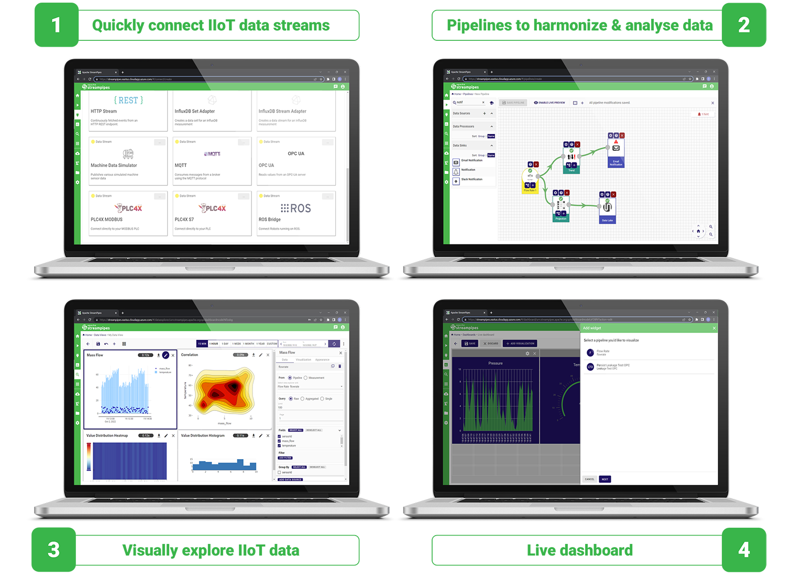

🚀 Try

**Your first steps with Apache StreamPipes:**

[Install StreamPipes 🔗](#try-installation)

💡 Concepts

**Learn about some general concepts of StreamPipes:**

[Overview 🔗](#concepts-overview)

🎓 Use

**Learn how to use the various modules of StreamPipes:**

[StreamPipes Connect 🔗](#use-connect),[Pipeline Editor 🔗](#use-pipeline-editor),[Managing Pipelines 🔗](#use-managing-pipelines),[Live Dashboard 🔗](https://streampipes.apache.org/docs/use-live-dashboard/),[Data Explorer 🔗](#use-data-explorer),[Notifications 🔗](#use-notifications)

📚 Pipeline Elements

**Available pipeline elements in StreamPipes:**

[Adapters 🔗](https://streampipes.apache.org/docs/pe/org.apache.streampipes.connect.iiot.protocol.stream.kafka/),[Data Processors 🔗](https://streampipes.apache.org/docs/pe/org.apache.streampipes.processors.transformation.jvm.booloperator.counter/),[Data Sinks 🔗](https://streampipes.apache.org/docs/pe/org.apache.streampipes.sinks.databases.jvm.couchdb/)

⚡ Deploy

**How to set up StreamPipes in test and production environments:**

[Docker 🔗](#deploy-docker),[Kubernetes 🔗](#deploy-kubernetes),[Use SSL 🔗](#deploy-use-ssl)

💻 Extend

**Write your own pipeline elements for StreamPipes:**

[Development Setup 🔗](#extend-setup), [CLI 🔗](#extend-cli), [Maven Archetypes 🔗](#extend-archetypes),[Tutorial Data Sources 🔗](https://streampipes.apache.org/docs/extend-tutorial-data-sources/),[Tutorial Data Processors 🔗](#extend-tutorial-data-processors),[Tutorial Data Sinks 🔗](#extend-tutorial-data-sinks),[Event Model 🔗](https://streampipes.apache.org/docs/extend-sdk-event-model.html/),[Stream Requirements 🔗](#extend-sdk-stream-requirements),[Static Properties 🔗](#extend-sdk-static-properties),[Output Strategies 🔗](#extend-sdk-output-strategies)

🔧 Technicals

**Learn about technical concepts behind the curtain:**

[Architecture 🔗](#technicals-architecture),[User Guidance 🔗](https://streampipes.apache.org/docs/technicals-user-guidance/) ,[Runtime Wrappers 🔗](#technicals-runtime-wrappers),[Messaging 🔗](#technicals-messaging),[Configuration 🔗](https://streampipes.apache.org/docs/technicals-configuration/)

👪 Community

**Get support and learn how to contribute to StreamPipes:**

[Get Help 🔗](#community-get-help),[Contribute 🔗](#community-contribute)

🐍 StreamPipes Python

**Discover what we offer for the Python world:**

[Python Documentation 🔗](https://streampipes.apache.org/docs/docs/python/latest/)

---

<a id="try-installation"></a>

<!-- source_url: https://streampipes.apache.org/docs/try-installation/ -->

<!-- page_index: 2 -->

# Installation

Version: 0.98.0

The easiest way to install StreamPipes is our Docker-based installation. For production-grade deployments, we also
recommend looking at our Kubernetes support, which is also part of the installation kit.

The Docker-based installation requires **Docker** and **Docker Compose** to be installed on the target machine.
Installation instructions can be found below.

> [!NOTE]
> **Install Docker**
> Go to <https://docs.docker.com/installation/> and follow the instructions to install Docker for your OS. Make sure
> docker can be started as a non-root user (described in the installation manual, don’t forget to log out and in
> again) and check that Docker is installed correctly by executing docker-run hello-world

The Docker-based installation supports the operating systems **Linux**, **Mac OS X** and **Windows 10 upwards**. Older windows
versions are not fully compatible with Docker. Linux VMs running under Windows might cause network problems with Docker, therefore some manual work might be needed to make StreamPipes run properly.

The StreamPipes application itself will be accessible through a web browser. We recommend a recent version of Chrome (
best experience), Firefox or Edge.

- **1**

  Download the latest Apache StreamPipes release and extract the zip file to a directory of your choice.


| File | Version | Release Date | Signatures |
| --- | --- | --- | --- |
| [apache-streampipes-0.98.0-source-release.zip](https://www.apache.org/dyn/closer.lua?action=download&filename=streampipes/0.98.0/apache-streampipes-0.98.0-source-release.zip) | 0.98.0 | 2025-12-15 | [SHA](https://downloads.apache.org/streampipes/0.98.0/apache-streampipes-0.98.0-source-release.zip.sha512), [PGP](https://downloads.apache.org/streampipes/0.98.0/apache-streampipes-0.98.0-source-release.zip.asc) |


> [!NOTE]
> **Important:**
> If you update from 0.97.0 to 0.98.0 and have been using the Kafka broker, you must use **docker-compose.kafka.yml** to run StreamPipes. The default docker-compose now uses NATS as the broker. Existing Kafka-based instances cannot be migrated automatically and cannot simply be switched to the default compose file.


> [!NOTE]
> **Find the latest release notes here: Release notes**
> The above release file should be verified using the PGP signatures and the [project release KEYS](https://downloads.apache.org/streampipes/KEYS). See the official ASF [verification instructions](https://www.apache.org/dyn/closer.cgi#verify) for a description of using the PGP and KEYS files for verification. A SHA512 checksum is also provided as an additional verification method.

- **2**

  In a command prompt, open the folder `installer/compose/` and run `docker-compose up -d`. Please follow the [Docker Deployment](https://streampipes.apache.org/docs/next/deploy-docker/) guide to explore additional installation options.
- **3**

  Open your browser, navigate to http://localhost:80 (or use the domain name of your server) and finish the setup according to the instructions. The default login credentials are `admin@streampipes.apache.org`, password `admin`

Once you've opened the browser at the URL given above, you should see the StreamPipes application as shown below. At
initial startup, StreamPipes automatically performs an installation process.
After the installation has finished, continue by clicking on "Go to login
page", once all components are successfully configured.

On the login page, enter your credentials, then you should be forwarded to the home page.

Congratulations! You've successfully managed to install StreamPipes. Now we're ready to build our first pipeline!

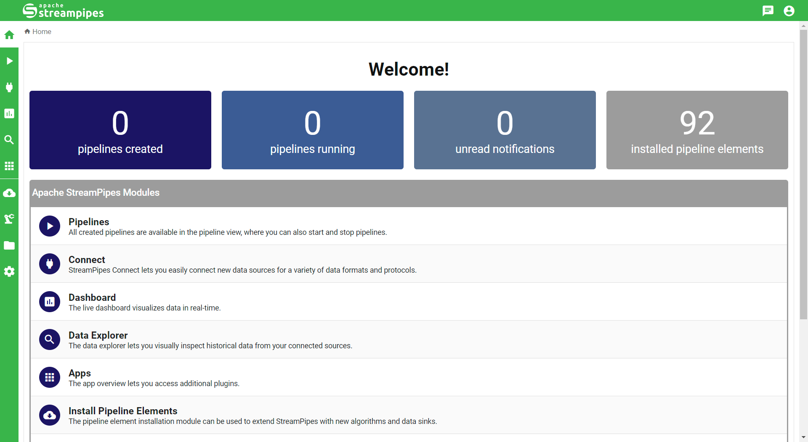

> [!CAUTION]
> **Errors during the installation process**
> In most cases, errors during the installation are due to an under-powered system.
> If there is a problem with any of the components, please restart the whole system (`docker-compose
> down` and eventually also delete the volumes).
> Please also make sure that you've assigned enough memory available to Docker.

That's it! Have a look at the usage guide to learn how to use Apache StreamPipes.

---

<a id="introduction"></a>

<!-- source_url: https://streampipes.apache.org/docs/introduction/ -->

<!-- page_index: 3 -->

# Introduction

Version: 0.98.0

Apache StreamPipes is a self-service Industrial IoT toolbox to enable non-technical users to connect, analyze and
explore IoT data streams. The main goal of StreamPipes is to help users bridging the gap between operational
technology (OT) and information technology (IT). This is achieved by providing a set of tools which help to make
industrial data accessible for downstream tasks such as data analytics and condition monitoring.
When working with industrial data and especially when building upon an open source stack for such tasks, users are often
faced with the management and integration of a variety of different tools for data connectivity, messaging &
integration, data enrichment, data storage, visualization and analytics. This results in an increasing operational
complexity and hardly manageable software stacks.

Apache StreamPipes addresses this problem: It provides a complete toolbox with a variety of different tools to easily
gather data from OT systems such as Programmatic Logic Controllers (PLCs), industrial protocols (e.g., OPC-UA or
Modbus), IT protocols (e.g., MQTT) and others. Data is integrated in the form of live data streams. Based on connected
data, StreamPipes provides another module called the pipeline editor, which can be used to apply real-time analytics
algorithms on connected data stream. To this end, a library of pre-defined algorithms can be used. Out of the box, StreamPipes provides more than 100 pipeline elements tailored at manufacturing data analytics. This includes simple
rule-based algorithms (e.g., flank detection, peak detection, boolean timers), as well as the possibility to integrate
more sophisticated ML-based algorithms. Finally, the pipeline editor allows to integrate with third-party systems by
using a variety of data sinks (e.g., to forward data to messaging brokers such as Apache Kafka, MQTT or RocketMQ, to
store data in databases such as PostgreSQL or Redis or to trigger notifications). Besides pipelines, an included data
explorer allows to visually analyze industrial IoT data. For this purpose, a number of visualizations are integrated
that allow non-technical users to quickly get first insights. Examples are correlations between several sensor values, value heatmaps, distributions or time-series visualizations. Further tools include a dashboard used for real-time
monitoring, e.g., for visualizing live KPIs at shopfloor level.

But StreamPipes is much more than just the user interface and an orchestration system for pipelines: It can be used as a
whole developer platform for Industrial IoT application. Apache StreamPipes is made for extensibility - it provides
several extension points, which allow the definition of custom algorithms, additional interfaces to third-party tools
and proprietary data sources.

StreamPipes includes developer support for Java and Python, making it easy to integrate custom-trained machine learning
models into the data processing environment. With the built-in Python support, it is also possible to run online machine
learning methods directly on data streams gathered by StreamPipes.

Being positioned in the industrial IoT domain, the overall goal of StreamPipes is to help manufacturing companies to
quickly build up an industrial IoT infrastructure and to analyse IIoT data without the need for manual programming.
Oftentimes, StreamPipes is compared to other tools in this area such as Node-RED for visually wiring of pipelines, which
is often used together with Grafana for data visualization and InfluxDB for time-series storage. The disadvantage of
such architectures is the system complexity beyond the first prototype, especially when it comes to production
deployments. Maintaining and securing multiple software instances is often a hard task requiring for substantial
development effort. In addition, implementing single-sign-on and providing a unified user experience is another hurdle.
This is where StreamPipes, as a single integrated tool with production-critical features such as access and role
management, provides many advantages.
StreamPipes has already a wide user range from the manufacturing domain. It helps users to quickly do the first steps
related to industrial analytics but can also be used for monitoring whole production facilities, analysing data streams
from multiple plants and sensors in real time using the integrated algorithm toolbox. Customization to individual use
cases is easy due to several extension points:

- Software development kit for adapters, data processors and sinks: The functionality of StreamPipes can be extending by
  using the integrated SDK. For instance, it is possible to integrate custom-tailored algorithms for proprietary sensors
  or models into the toolbox. Additional algorithms and data sinks can be installed at runtime.
- Additional user interface plugins: StreamPipes allows to extend the default installation with additional UI views,
  making use of a micro frontend approach. For instance, users can extend the system with custom-tailored views for a
  specific machine or plant. Developers can use a platform API to communicate with the core StreamPipes instance.
- UI customization: To ensure a consistent look and feel, StreamPipes can be customized to the company’s corporate
  identity.

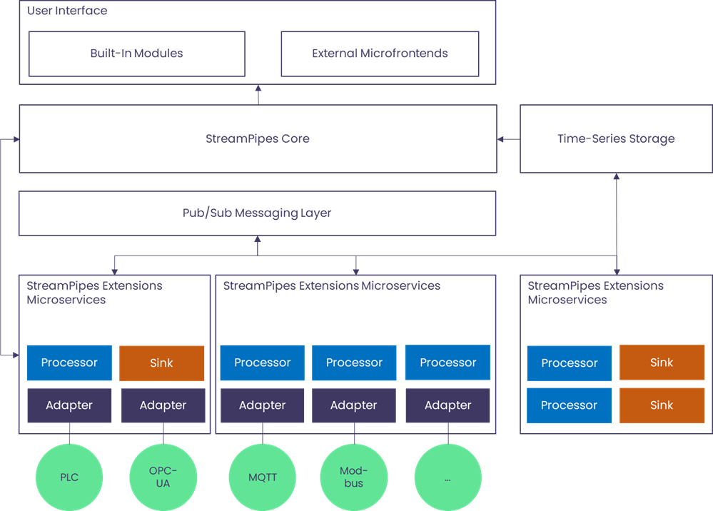

To foster extensibility, Apache StreamPipes is based on a microservice architecture as illustrated above. The main
services provided or used by StreamPipes are the a) user interface, b) the core, c) a time-series storage, d) a
publish/subscribe messaging layer and e) extensions services. Adapters are created over the user interface using an
intuitive configuration wizard and connect to the underlying source systems. Raw events coming from adapters can be
pre-processed (e.g., measurement unit conversions or datatype conversions). Afterwards, events are sent to the message
broker, which is the central backbone to provide IIoT data to internal and external applications.

Besides adapters, extensions microservices can also integrate additional business logic in form of data processors and
data sinks. StreamPipes comes with over 100 built-in processors and sinks, covering basic use cases out-of-the-box. The StreamPipes core cares about orchestration of these pipeline elements and communicates with the user
interface. In addition, a time-series storage ensures persistence and can be used by any extensions service to write
data into the internal storage. The StreamPipes core provides a query interface to access historical data, which is, for
instance, used by the data explorer UI component. The user interface itself provides several built-in modules but can
also be extended with additional micro frontends.

---

<a id="concepts-overview"></a>

<!-- source_url: https://streampipes.apache.org/docs/concepts-overview/ -->

<!-- page_index: 4 -->

# StreamPipes Concepts

Version: 0.98.0

To understand how StreamPipes works, it is helpful to understand a few core concepts, which are illustrated below.
These encompass the entire data journey within StreamPipes: Starting with data collection ([adapters](#concepts-overview--adapter)), through data exchange ([data streams](#concepts-overview--data-stream)) and data processing ([data processors](#concepts-overview--data-processor) and [pipelines](#concepts-overview--pipeline)), to data persistence and distribution ([data sinks](#concepts-overview--data-sink)).

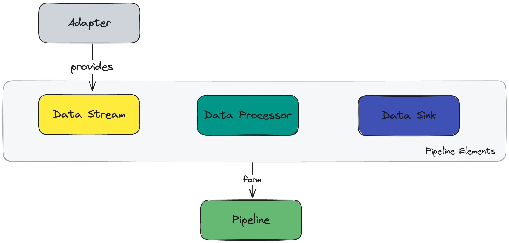

An adapter connects to any external data source (e.g., OPC-UA, MQTT, S7 PLC, Modbus) and forwards the events it receives to the internal StreamPipes system.
Adapters can either be created by using a predefined adapter for a data source available in our marketplace [StreamPipes Connect](#use-connect).
An overview of all available adapters can be found under the menu bar **📚 Pipeline Elements**.
When you select one of these adapters, you can easily connect to the data source using an intuitive and convenient UI dialog (see the Connect section for more details).
Alternatively, you can define your own adapter by [using the provided Software Development Kit (SDK)](#extend-tutorial-adapters).
Creating an adapter is always the first step when you want to get data into StreamPipes and process it further.

**Data streams** are the primary source for working with events in StreamPipes.
A stream is an ordered sequence of events, where an event typically consists of one or more observation values and additional metadata.
The `structure` (or `schema` as we call it) of an event provided by a data stream is stored in StreamPipes' internal semantic schema registry.
Data streams are primarily created by adapters, but can also be created by a [StreamPipes Function](#extend-sdk-functions).

**Data processors** in StreamPipes transform one or more input streams into an output stream.
Such transformations can be simple, such as filtering based on a predefined rule, or more complex, such as applying rule-based or learning-based algorithms to the data.
Data processors can be applied to any data stream that meets the input requirements of a processor.
In addition, most processors can be configured by providing custom parameters directly in the user interface.
Processing elements define stream requirements, which are a set of minimum characteristics that an incoming event stream must provide.
Data processors can maintain state or perform stateless operations.

**Data sinks** consume event streams similar to data processors, but do not provide an output data stream.
As such, data sinks typically perform some action or trigger a visualization as a result of a stream transformation.
Similar to data processors, sinks also require the presence of specific input requirements from each bound data stream and can be customized.
StreamPipes provides several internal data sinks, for example, to generate notifications, visualize live data, or persist historical data from incoming streams.
In addition, StreamPipes provides several data sinks to forward data streams to external systems such as databases.

A pipeline in Apache StreamPipes describes the transformation process from a data stream to a data sink.
Typically, a pipeline consists of at least one data stream, zero or more data processors, and at least one data sink.
Pipelines are created graphically by users using the [Pipeline Editor](#use-pipeline-editor) and can be started and stopped at any time.

---

<a id="use-connect"></a>

<!-- source_url: https://streampipes.apache.org/docs/use-connect/ -->

<!-- page_index: 5 -->

# StreamPipes Connect

Version: 0.98.0

StreamPipes Connect is the module to connect external data sources with Apache StreamPipes directly from the user interface.
StreamPipes Connect offers various adapters for common communication protocols and some specific sensors. Besides connecting data, StreamPipes Connect offers ways to pre-process data without the need to build pipelines and integrates a schema guesser that listens for incoming data and recommends the recognized event schema.

The screenshot below illustrates the data marketplace, which shown after navigating to "StreamPipes Connect" and then clicking the "New adapter" button at the top.

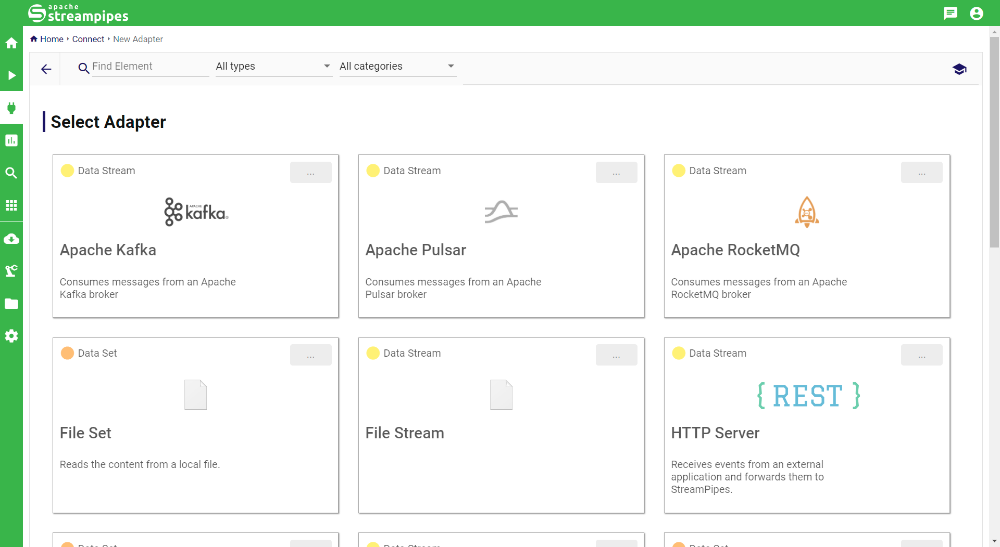

The data marketplace shows a list of all adapters that are currently installed in Apache StreamPipes. Each adapter offers various configuration options which depend on the specifics of the adapter.
Adapters are distinguished a) by the data source concept they provide (data set or data stream) and b) the adapter type, where we distinguish between *generic adapters*, which usually implement a generic communication protocol such as MQTT or Apache Kafka or a specific sensor interface (e.g., for Netio power sockets).
Several filter options are available to find a suitable adapter. The configuration of a new adapter starts with selecting one of the available adapters, which starts an assistant that supports the adapter generation.

In the first step, basic configurations need to be provided. For instance, for an Apache PLC4X adapter, the IP address of the PLC needs to be provided. In this example, we provide basic settings for connecting to an Apache Kafka broker. After all values are provided, the "Next" button opens the next step.

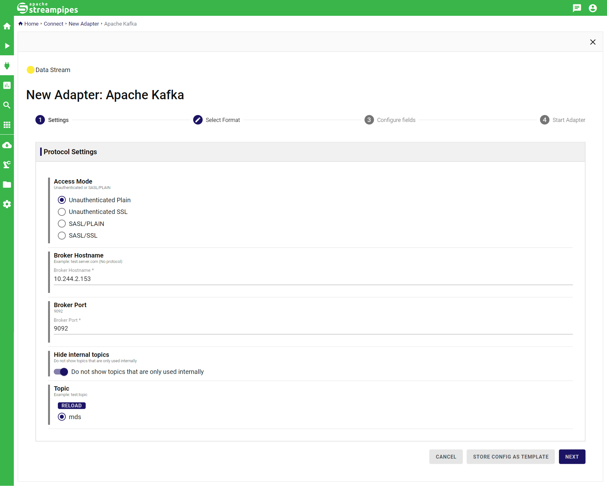

The next step, format generation, is only available for generic adapters which support different message formats to be sent over the corresponding protocol. Think of a message broker that is able to consume messages in both JSON format or binary format.
Currently supported formats include XML, various JSON representations, images and CSV. After a format has been selected, further format configurations can be provided (depending on the selected format) to further customize the incoming message format.

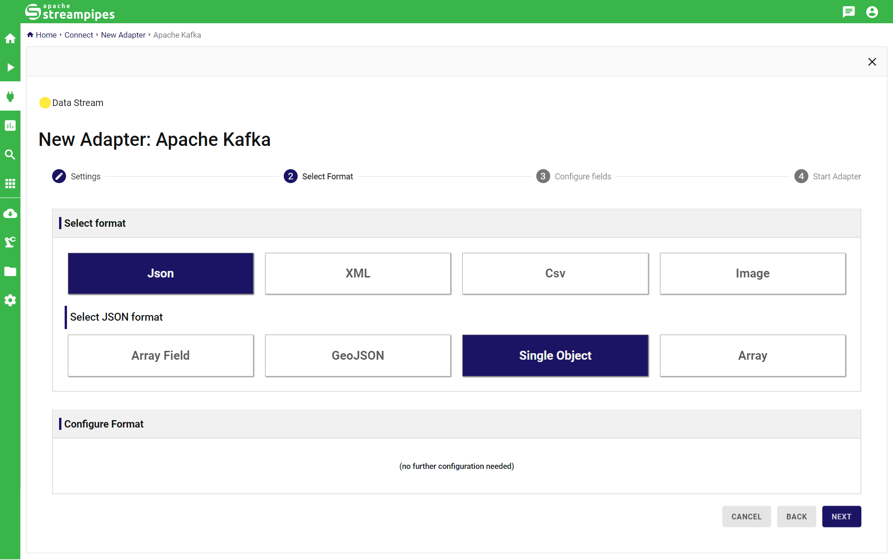

In the next step, based on the previously provided protocol and format settings, the system will either provide the fixed/pre-defined schema of the adapter or, in case of specific adapters, will connect to the underlying system and try to listen for incoming data. After a few seconds, the schema editor will appear that provides a list of detected fields from the incoming events (the schema).

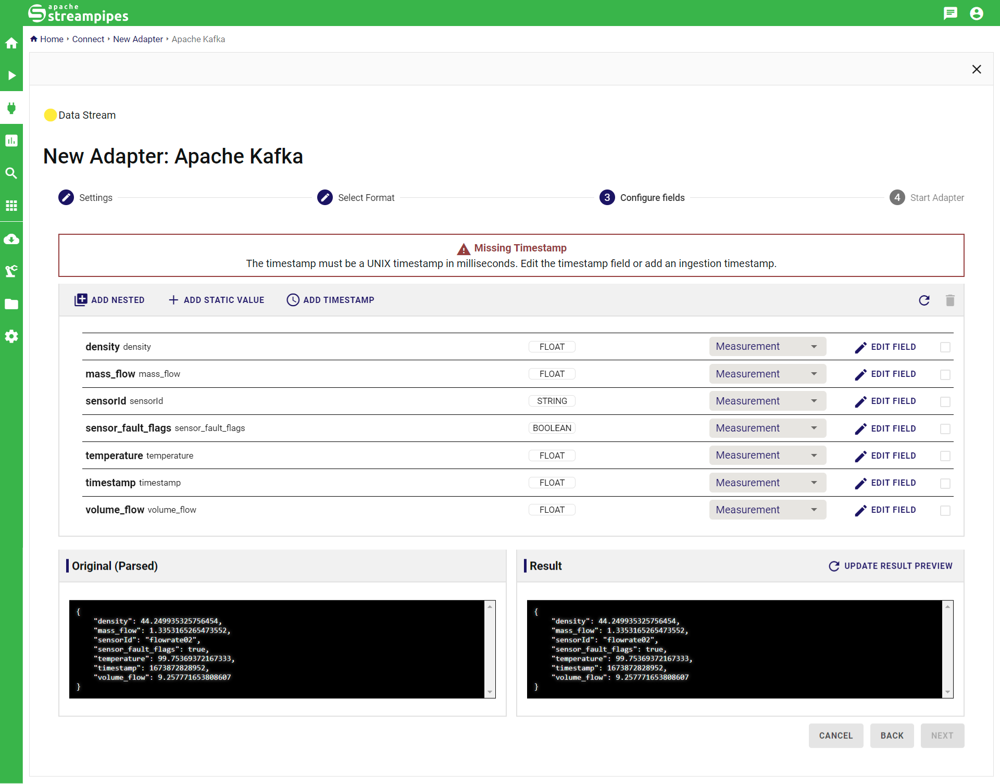

In the toolbar, several configuration options are available which transform the original schema:

- **Add Nested Property**. This option allows to modify the structure of the event by creating a nested structure. The schema can be simply changed by dragging and dropping fields into the nested structure.
- **Add Static Value**. This option allows to add a field containing a static value (e.g., an identifier) to the event.
- **Add Timestamp**. This options appends the current timestamp to each incoming event, useful in case the timestamp is not provided by the origin.
- **Refresh**. Re-triggers the schema guessing.
- **Delete field**. Select one or more fields by clicking the checkbox on the right and trigger the delete button.
- **Property scope**. For each field, a property scope can be defined which is either *Measurement*, *Dimension* or *Header*. These values are later be used in the pipeline editor to assist in configuring pipeline elements and do not have any functional consequence.
  Use *Measurement* to indicate the field measures a value (e.g., a temperature value from a sensor), use *Dimension* for any identifier (e.g., the sensor ID) and use *Header* for any other metadata such as timestamps.

For each field (also called event property) of the schema, additional configuration options are available by clicking the *Edit* button:

- **Label**. Used to provide a human-readable label for the field, which will ease the identification of fields when building pipelines.
- **Runtime Name.** This is the identifier of the field in the underlying message representation format (e.g., the JSON key). Renaming the runtime name will trigger a so-called *transformation rule* which renames the incoming field name to the new field name before forwarding it to StreamPipes.
- **Domain Property/Semantic Type**. To help StreamPipes better understand the value which is represented by the field, semantic type information can be given. Up from StreamPipes 0.68.0, the semantic type can be selected from a wide range of available options. Additionally, an URL can be manually provided that indicates the meaning of the value (e.g., <http://schema.org/Temperature>).
- **Mark as Timestamp**. Indicates that the selected value represents a timestamp. When selected, a *timestamp converter* can be configured which will convert incoming timestamps to the UNIX timestamp.
- **Runtime Type**. Here, the data type can be changed
- **Unit**. Allows to specify the unit in which the value is measured. Once selected, you can also automatically convert the unit to a target unit, which will then be inserted into the data stream produced by the adapter (see screenshot below).

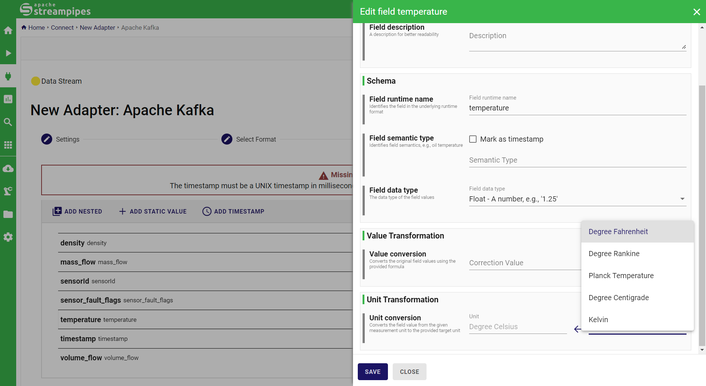

Assigning a timestamp is mandatory and can be either done by adding a timestamp from the menu, or by choosing an existing field and marking it as timestamp.

Finally, the adapter is ready to be started. In the *Adapter Generation* page, a name and description for the resulting data stream must be provided.
Once started, StreamPipes creates your new adapter and displays a preview of the connected data, which refreshes about once per second.
Afterwards, the newly created data stream is available in the pipeline editor for further usage.

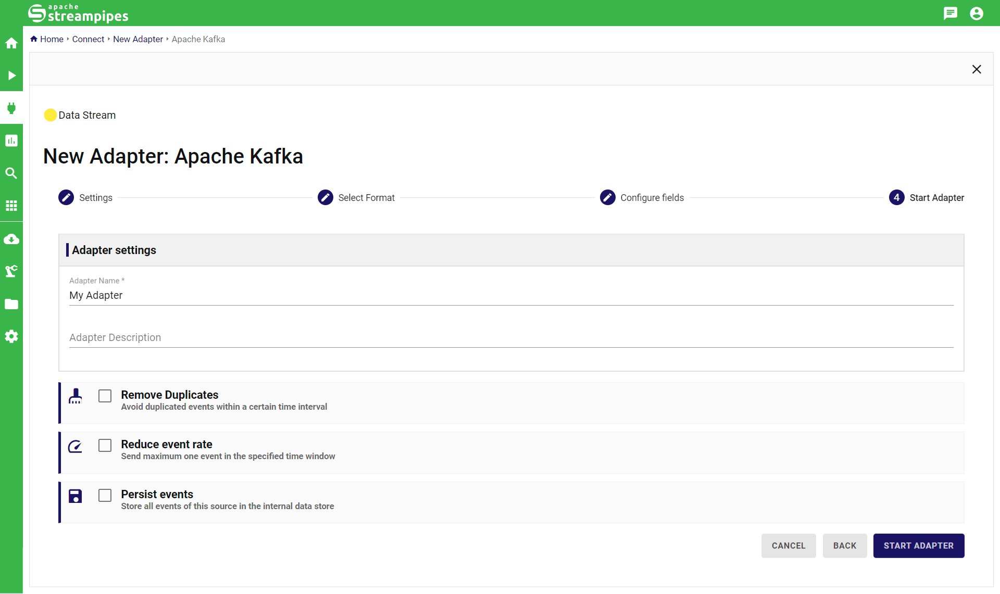

Currently running adapters are available in the "Running adapters" section of StreamPipes Connect. Existing adapters can be stopped and deleted. Currently, there is no mechanism to edit an existing adapter or to stop the adapter without deleting it.

For frequently used configurations, adapter templates can be created. An adapter template is a pre-configured adapter which can be further customized by users. Created adapter templates are available in the marketplace similar to standard adapters.

---

<a id="use-pipeline-editor"></a>

<!-- source_url: https://streampipes.apache.org/docs/use-pipeline-editor/ -->

<!-- page_index: 6 -->

# Pipeline Editor

Version: 0.98.0

The pipeline editor module supports building pipelines that transform a data stream using a set of resuable data processors and data sinks.
The empty pipeline editor looks similar to the illustration below after a new installation.

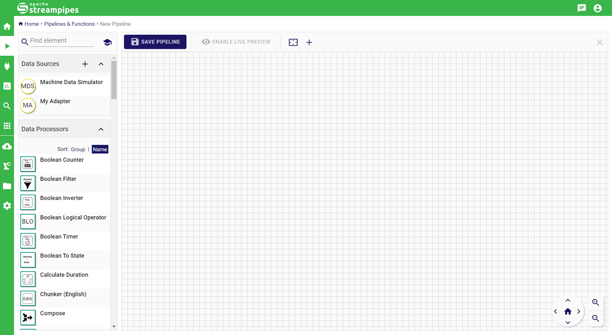

The four main concepts data sets, data streams, data processors and data sinks are available at the top of the pipeline editor. By switching the tabs, the individual pipeline elements for each category can be found.
By clicking the questionmark symbol, which appears when hovering over an element, additional information can be viewed (e.g., for data streams a live preview of incoming data and the documentation of the pipeline element for data processors and sinks).

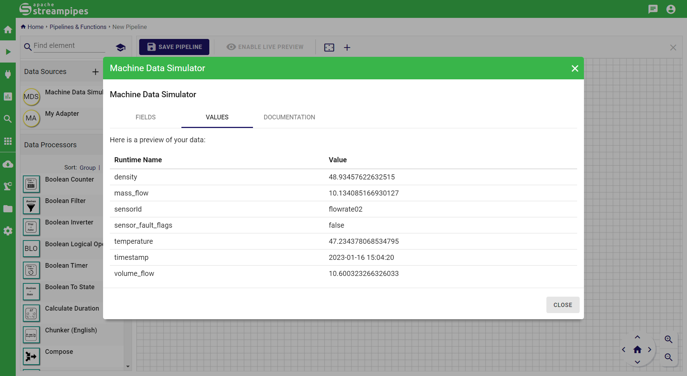

Pipelines are built by dragging data streams, processors and sinks into the pipeline assembly area. Typically, a pipeline is built step-by-step starting with a data soure (stream or set).
Afterwards, data processors and sinks are subsequently added to the pipeline. Connections between pipeline elements are made by selecting the gray connector of the source and moving it to the target pipeline element.
Once a connection is made, StreamPipes performs a quick validation step and, in case two pipeline elements are compatible, automatically opens a configuration window.

The configuration depends on the selected pipeline element and looks similar to the screenshot below.
In general, pipeline elements are configured by providing the required values. Once the pipeline element is fully configured, the *Save* button activates and can be used to save the configuration for the pipeline element.

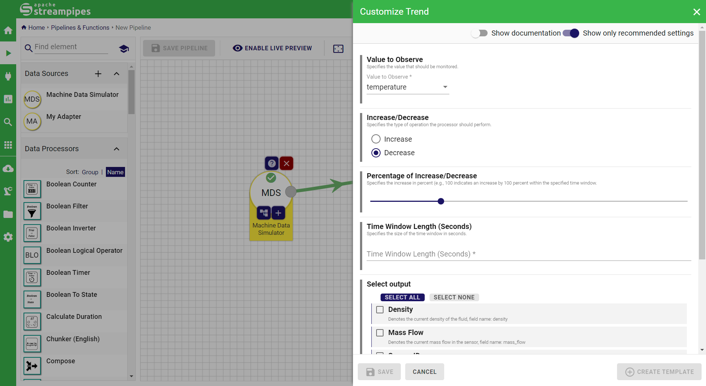

In addition, the following options are available in the pipeline element configuration menu:

- **Show documentation** extends the view and displays the pipeline element's documentation next to the configuration view.
- **Show only recommended settings** filters the list of available fields provided by the connected input data stream based on the *property scope*, e.g., so that only measurement values are displayed and dimension fields from the input stream are not available for selection. If deactivated, selections contain the full list of available fields that match the input requirement of the data processor.

Further options for a pipeline element can be displayed by hovering over a pipeline element in the assembly area, so that additional buttons appear around the pipeline element:

- **Configure element** re-opens the configuration view to update the pipeline element configuration (only available for data processors and sinks)
- **Delete element** removes the pipeline element from the pipeline
- **Help** opens the pipeline element's documentation
- **Compatible element** opens a dialog which shows all pipeline elements that are compatible to the current element's output data stream. The dialog offers an alternative to selecting pipeline elements directly from the pipeline element selection in the top.
- **Pipeline Element Recommendation** opens a dialog which shows all recommended pipeline elements that are compatible the current element's output data stream. The recommendation is based on previously connected pipeline elements and is displayed below.

Several pipeline editor options are available in the menu bar of the pipeline assembly:


- **Save pipeline** opens the save dialog (see below)
- **Pan** allows to pan within the assembly area, useful for larger pipelines that do not fit in the screen
- **Select** is visible if pan mode is active and switches back to the default select mode
- **Zoom in/out** triggers the zoom in the pipeline assembly
- **Auto Layout** layouts the pipeline in a much more beautiful way than you are able to do by yourself ;-)
- **All pipeline modification saved** is displayed if the current pipeline has been cached. Cache updates are triggered after every change of the pipeline so that changes are not lost after reloading the window.
- **Hints** are shown to display current errors (e.g., incomplete pipelines). Details can be opened by clicking the hint button.
- **Clear assembly** clears the assembly and removes the current pipeline.

To save a pipeline, press the *save pipeline* button. A dialog pops up where a name and description of the pipeline can be entered (only name is mandatory).
Additionally, a pipeline can be directly started after it has been stored by checking the corresponding button.

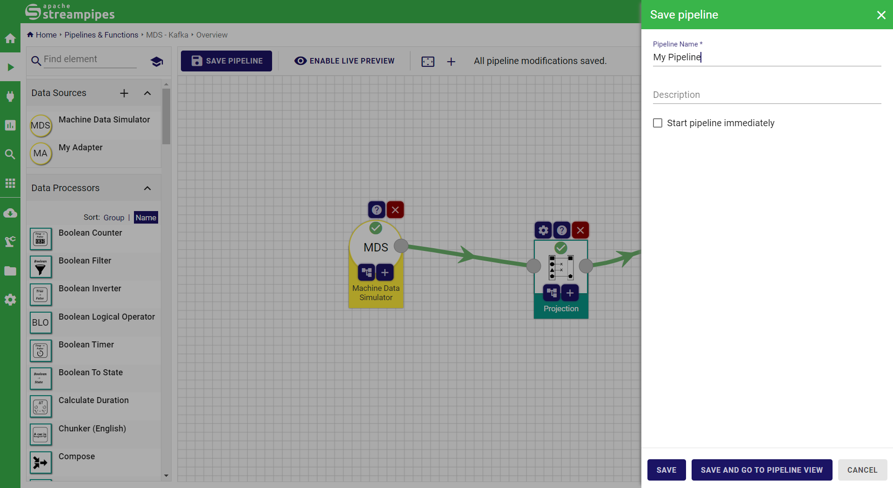

---

<a id="use-managing-pipelines"></a>

<!-- source_url: https://streampipes.apache.org/docs/use-managing-pipelines/ -->

<!-- page_index: 7 -->

# Managing Pipelines

Version: 0.98.0

The pipeline view lists all created pipelines and provides several views and actions to manage the lifecycle of pipelines.

In the entry screen, an overview of all created pipelines is shown:

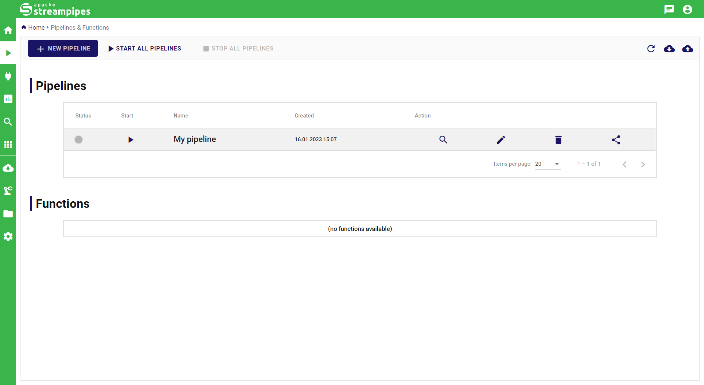

Within the pipeline overview, for each pipeline several actions are available:

- **Start/Stop pipeline** Starts or stops the selected pipeline. Once clicked, StreamPipes will trigger the selected action for all pipeline elements and open a success or error dialog as illustrated below.
- **Show details** opens the pipeline detail view (see below).
- **Modify pipeline** opens the pipeline in the pipeline editor, where the pipeline can be modified. Note that this button is only visible if the pipeline is not running.
- **Delete pipeline** opens a confirm dialog, which subsequently deletes the selected pipeline.

The screenshot below shows the status of a pipeline after it has been successfully started. By clicking the *Show details* button, more information on the status of each corresponding pipeline element microservice becomes available. In case of failures, the failure reason will be shown for each pipeline element that has failed to start.

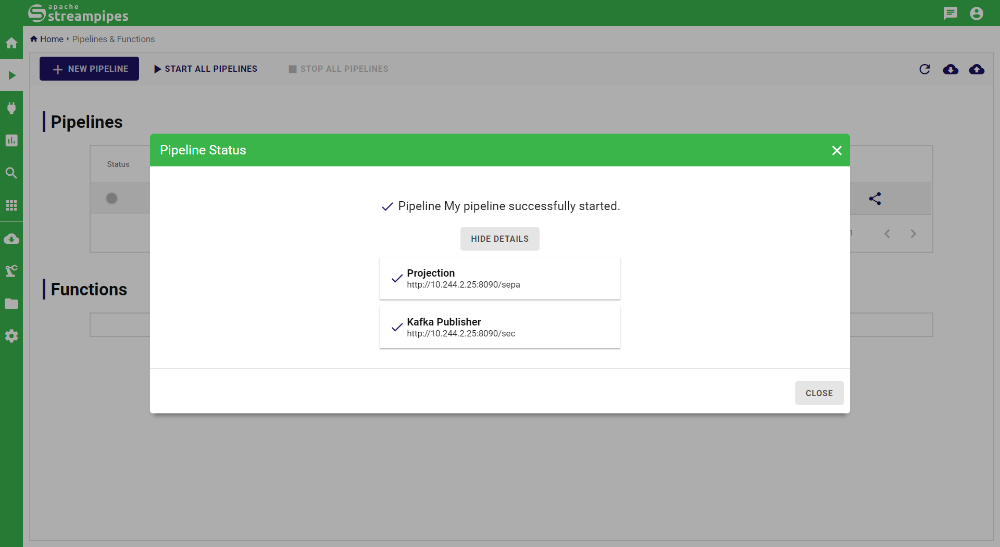

Pipelines can be organized into categories, which is a useful feature in case a larger amount of pipelines is created.
All categories will be shown as separate tabs in the pipeline overview. The same pipeline can be assigned to multiple categories.

To add a new category or to add a new pipeline to an existing category, click the *Manage Categories* button and configured the category and assigned pipelines in the dialog.

The pipeline details view can be opened by clicking the *Show details* button in the pipeline overview panel.

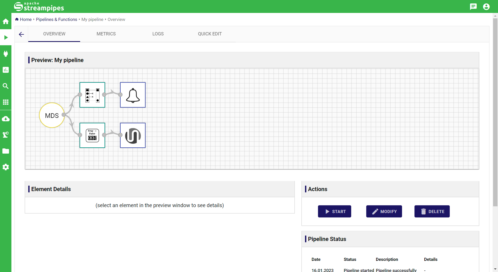

The overview section displays the graphical structure of the pipeline and provides some statistics about recent pipeline actions. Additionally, pipelines can be directly started, stopped, modified and deletes within this view.

Monitoring features will become available in version 0.68.0.

Monitoring of failures and logs will become available in version 0.69.0.

The quick edit feature (only available for pipelines that are not running) is a quick and convenient way to modify some pipeline element configurations without opening the pipeline in the pipeline editor.
To use the quick edit feature, switch to the *QuickEdit* tab, which will display the selected pipeline.

By clicking a pipeline element from the preview canvas, available configuration options of the selected pipeline element can be modified. Note that only modifications that do not affect the pipeline structure (e.g., different output streams) can be changed.

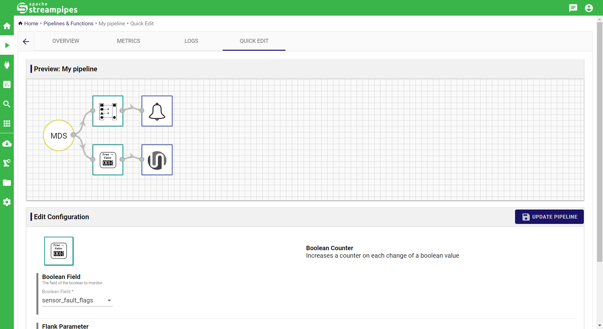

After a configuration value was changed, make sure to click the *Update Pipeline* button to save the changes.

---

<a id="use-dashboard"></a>

<!-- source_url: https://streampipes.apache.org/docs/use-dashboard/ -->

<!-- page_index: 8 -->

# Live Dashboard

Version: 0.98.0

The live dashboard can be used to visualize live data of data streams using a set of visualizations
The entry page of the live dashboard lists all created dashboards as in the screenshot below:

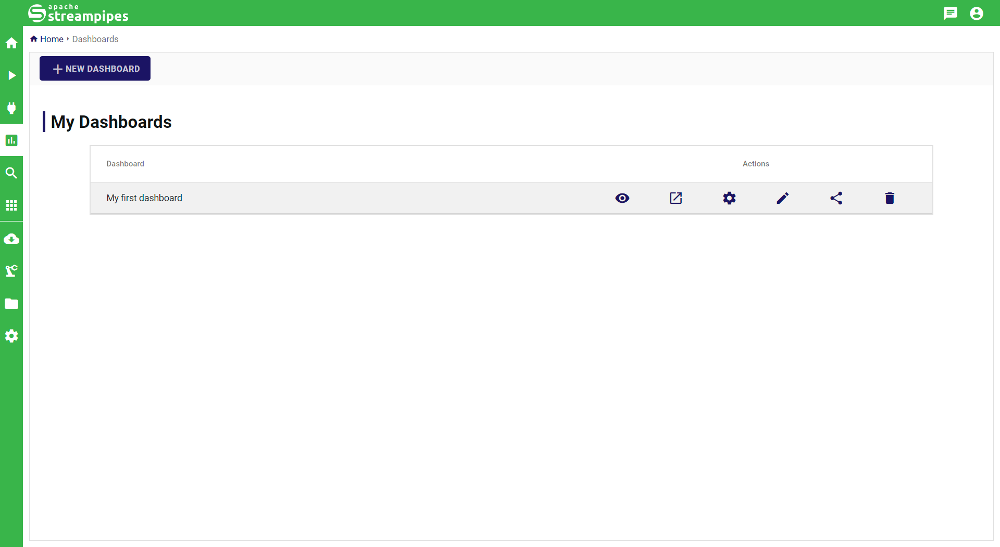

To visualize data streams in the live dashboard, a pipeline must be created that makes use of the so-called **Data Lake** sink.
Any data stream or data processor can serve as an input of the data lake sink. Switch to the pipeline editor, create a pipeline and configure the data lake sink. The visualization name is used to identify the sink in case multiple data lake sinks are used within a single pipeline.

Multiple dashboards can be created, e.g., to organize different assets in a single dashboard view.

A new dashboard can be created by clicking the *New Dashboard* button, which opens a dialog that requires basic dashboard settings such as the title and description of the new dashboard.
Once created, the dashboard will be shown in the overview. Here, the following dashboard actions are available:

- **Show** opens the dashboard.
- **Window** opens the dashboard in a new window with reduced controls, e.g., without the StreamPipes navigation and toolbar. This is a useful view for standalone displays that should visualize key parameters.
- **Settings** allows to modify the basic dashboard settings.
- **Edit** opens the dashboard in edit mode, where widgets can be added to the dashboard.

- **Delete** deletes the selected dashboard.

Visualizations can be added to each dashboard in form of widgets. To add new visualizations, switch to the dashboard in *Edit* mode.
In edit mode, a button appears that allows to add a new visualization.

Adding a new visualization is supported by a wizard consisting of three steps:

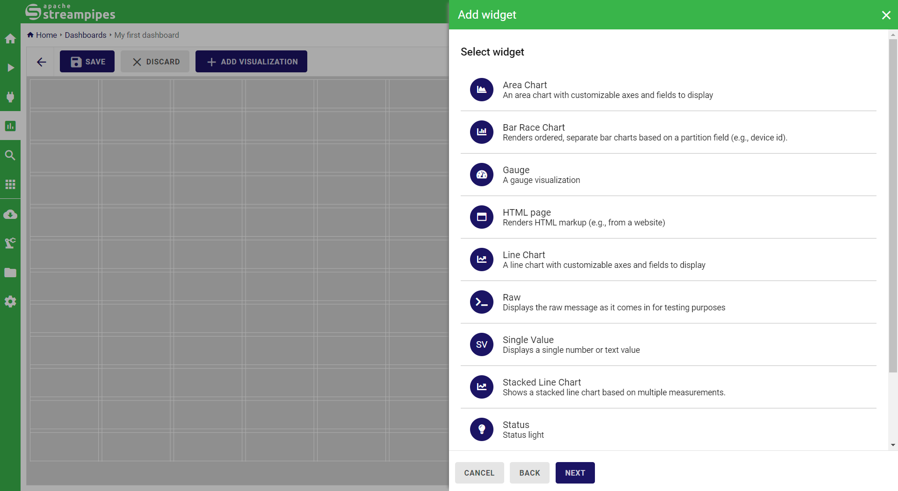

- **Select pipeline** is the first step where a pipeline is selected on which the visualization is based. In this view, all pipelines are listed that have at least one **Dashboard Sink**. In case a pipeline contains multiple data lake sinks, the visualization name is listed below the pipeline name which eases discovering of the proper visualization.
- **Select widget** is the next step where the visualization widget must be selected. StreamPipes automatically filters this list based on input requirements of widgets. For instance, image visualizations are only visible if the input data stream provides an image object.
- **Configure widget** provides widget-specific settings to configure the visualization. In most cases, colors and titles of widgets can be modified. Additionally, chart-specific settings such as axis value ranges can be configured.

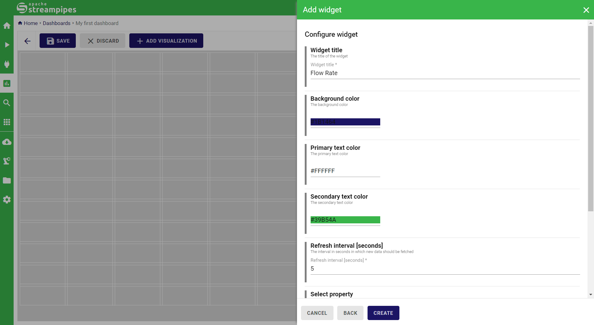

By clicking *Create*, the new widget is placed on the canvas. Size and positioning of visualizations can be flexibly changed based on the provided grid. To change the widget configuration, the *Settings* button of each widget can be clicked to re-open the configuration dialog.

Once created, the dashboard provides a live view of all visualizations:

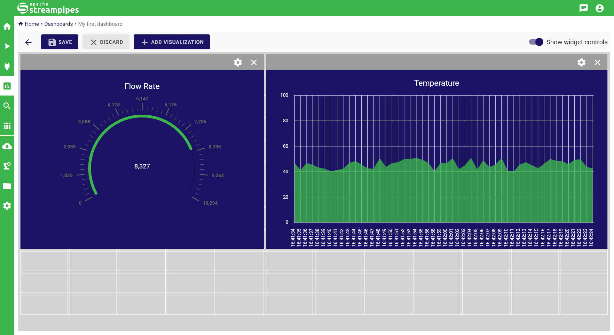

Before the dashboard is closed, make sure to click the *Save* button to persist the updated dashboard. Changes can be discarded by clicking the *Discard* button.

The following visualizations are available in the latest release:

- Area Chart
- Gauge
- HTML page (renders HTML markup)
- Image
- Line Chart
- Raw (displays the raw JSON input for debugging purposes)
- Single Value (displays a single measurement)
- Table
- Traffic Light

---

<a id="use-data-explorer"></a>

<!-- source_url: https://streampipes.apache.org/docs/use-data-explorer/ -->

<!-- page_index: 9 -->

# Data Explorer

Version: 0.98.0

The data explorer can be used to visualize and explore data streams that are persisted by using the **Data Lake** sink.

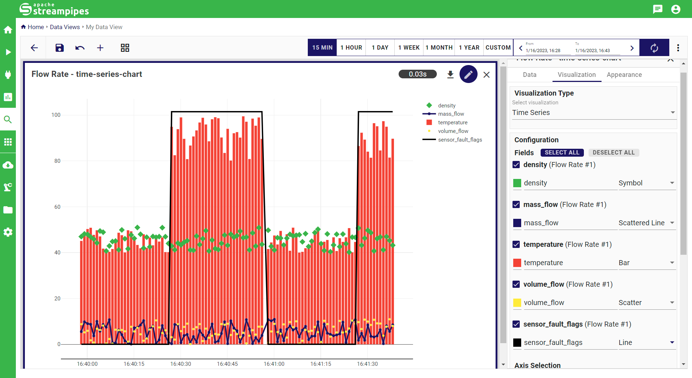

It provides a canvas (i.e. a data view) where various visualizations from multiple pipelines can be placed. For each data view, you can set a date and time range for the configured visualizations.

In the data explorer, any pipeline that uses the so-called **Data Lake** sink can be explored in the data explorer. Switch to the pipeline editor and add the data lake sink to a data processor or stream.
The sink requires an index name as a configuration parameter, which is used as an identifier in the data explorer.

After your data is stored in the data lake, you can switch over to the data-explorer tab to create a novel data view and the widgets of your choice. In StreamPipes, a data view organizes a set of related widgets (i.e. data visualizations or plots) and gets assigned a single date and time range. The standard date and time range consists of the last 15 minutes of the current date and time. You can select predefined ranges (e.g. day or month) or configure the exact date and time range you want to explore.

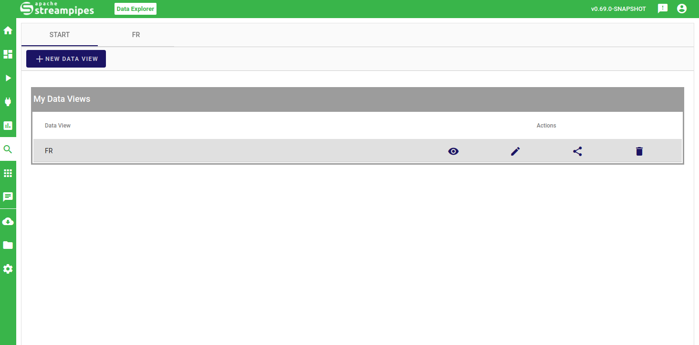

First create and name your data view and select the edit icon to proceed. In your data view, you can now add a new widget congiguration (plus icon) to configure and create your first widget. The widget configuration consists of (i) data, where the individual data sources in the data lake are selected, the properties for the widget are chosen and filters on the data sources are defined and applied, (ii) visualization, where the type of widget is chosen and the respective configuration for the widget type is done and (iii) appearance, where general style configurations for the widget (such as background color) can be performed.

The data configuration is the first step to define your widget. You can add several data sources (i.e. data sinks) and need to configure each added data source individually. This gives you sufficient freedom to combine the needed information, potentially consisting of different data resolutions, filters or types of information.

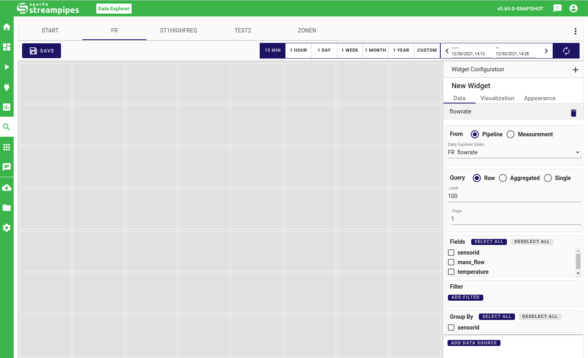

After selecting the initial data source, you can choose if the underlying data query is to be performed raw, aggregated or single. Raw queries refer to using the data as-is, where you can define a limit on the number of events to guarantee performant usage in the application. In aggregated mode, you can choose among predefined aggregation granularites (e.g. day, minute, second).

In the next step, you can choose the fields (i.e. properties of your data source) you are interested in exploring. If you selected aggregation or single mode, you can also modify the type of aggregation to be performed on the selected property.

You can also filter your data source by adding conjunctive conditions.

The visualization configuration is dependent on the visulization type, which needs to be selected first. The data-explorer currently supports the following types:

The table view formats the selected properties in table format.

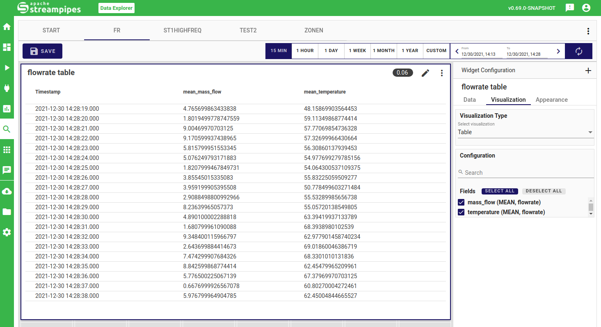

The map allows to visualize and explore coordinates on the world map. The configuration requires to choose the property which comprises the coordinates, allows to choose the marker style, a zoom level as well as the tooltip content.

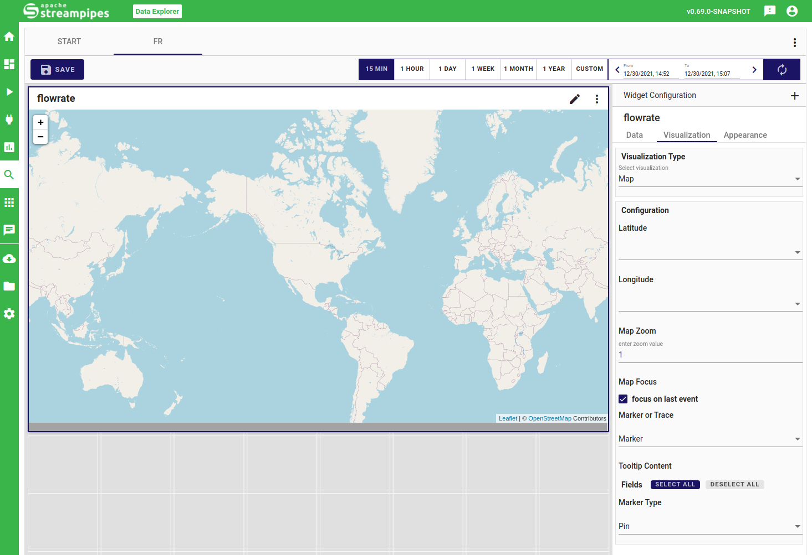

The heatmap widget visualizes data in terms of the available intensity, where higher values are interpreted as being more intense. You only need to select the property which you want to visualize. Note that it might be interesting to aggregate the data in the data configuration to get more insights in your heatmap.

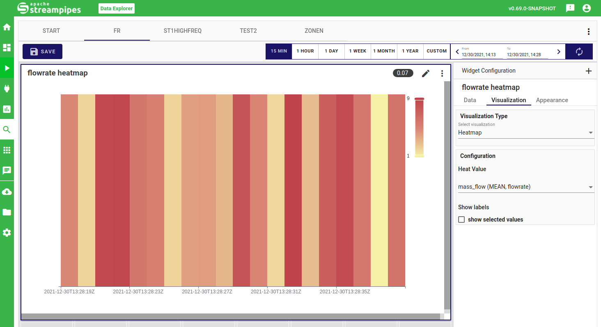

The time series widget allows you to do exploration and analysis for your numerical and boolean data properties. You can easily visualize your data properties in various styles (i.e. scatter, line, scattered line, bar or symbol) and colors, and configure a second y-axis for better interpretation of varying property ranges.

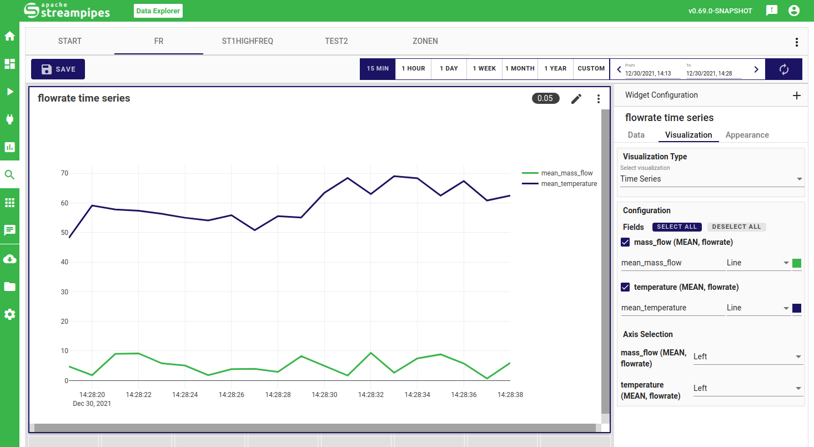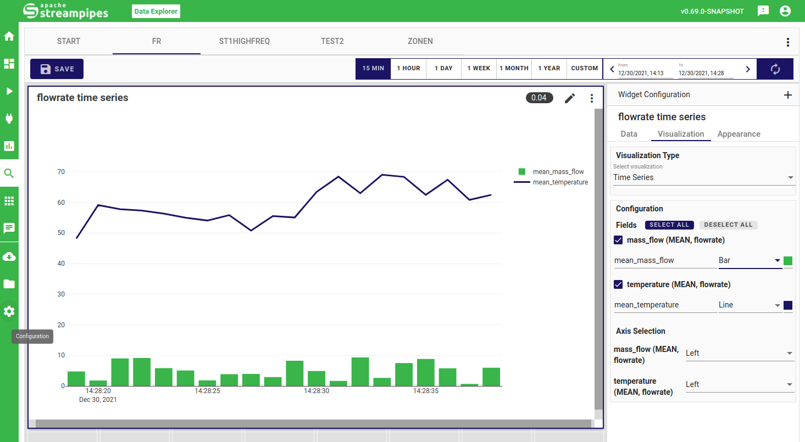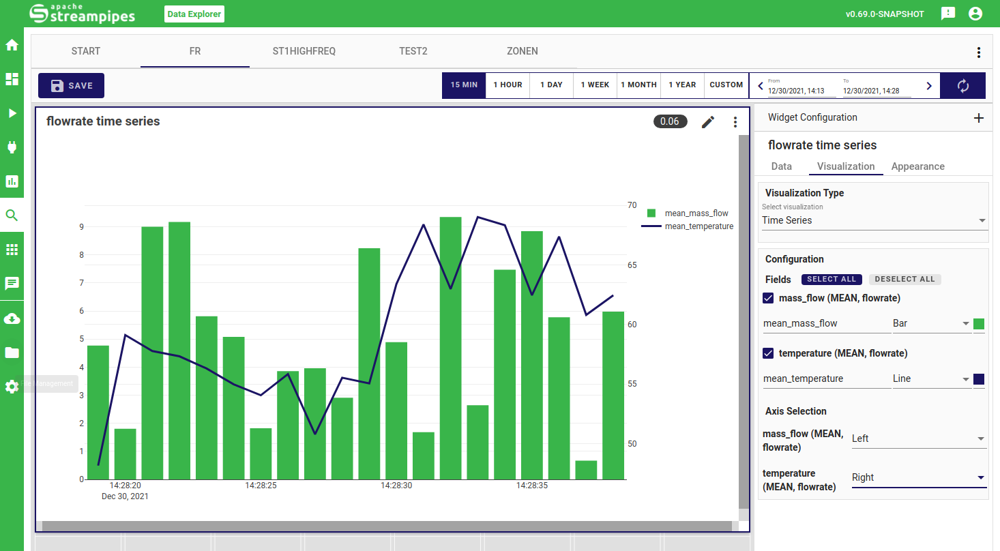

The image widget enables to integrate and visualize your image data.

The indiator widget lets you visualize a single numerical value as well as (optionally) the delta to another indicator. You only need to configure the respective properties.

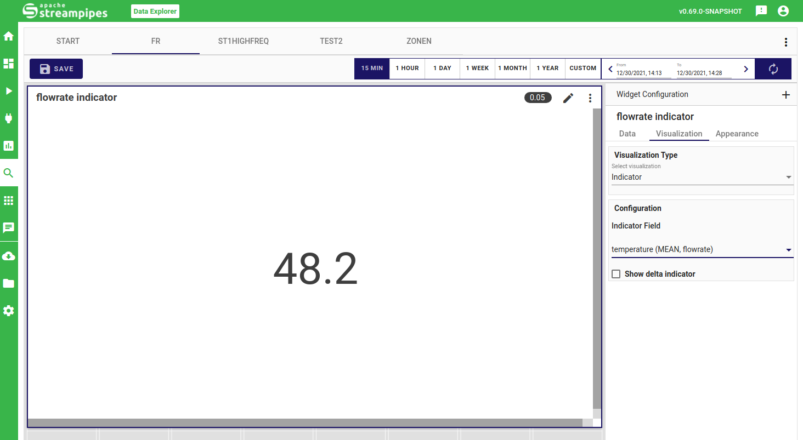

The correlation plot currently supports analyzing the relationship of two properties. Once selected, you can choose between a scatter view of the plotted data points or directly extract correlations in a density chart.

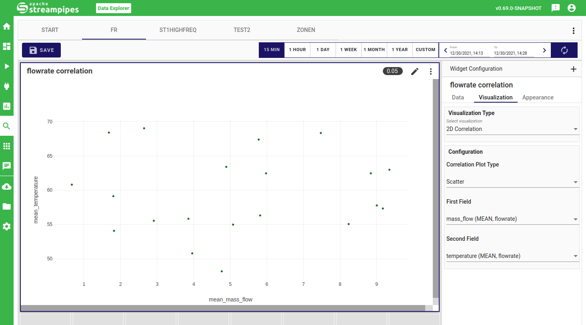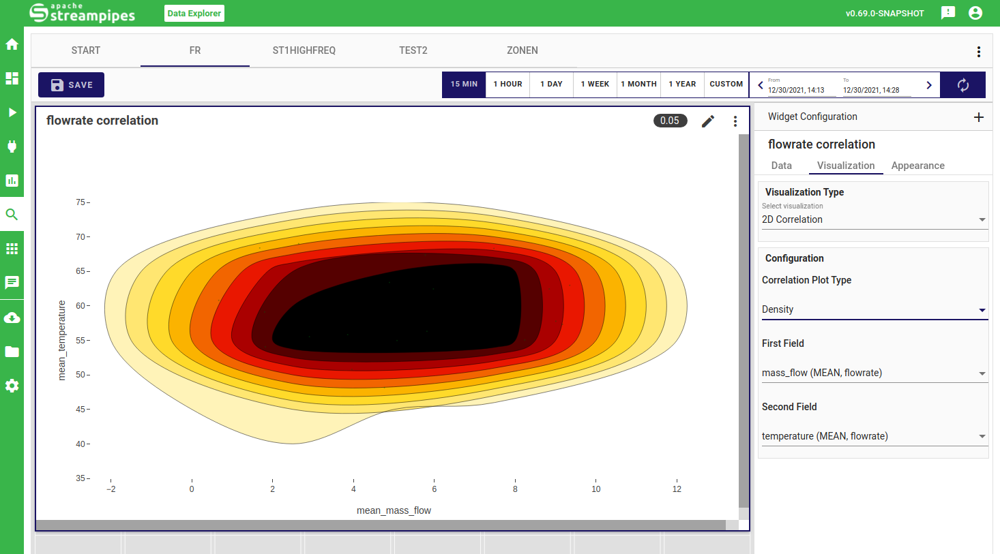

In the distribution widget, you can quickly get an overview of your data range and common data values. You can either choose a histrogram view, where a bar chart is used to show data the frequency of automatically extracted data ranges or a pie view, where you can also select the granularity of how your data is clustered in terms of frequency.

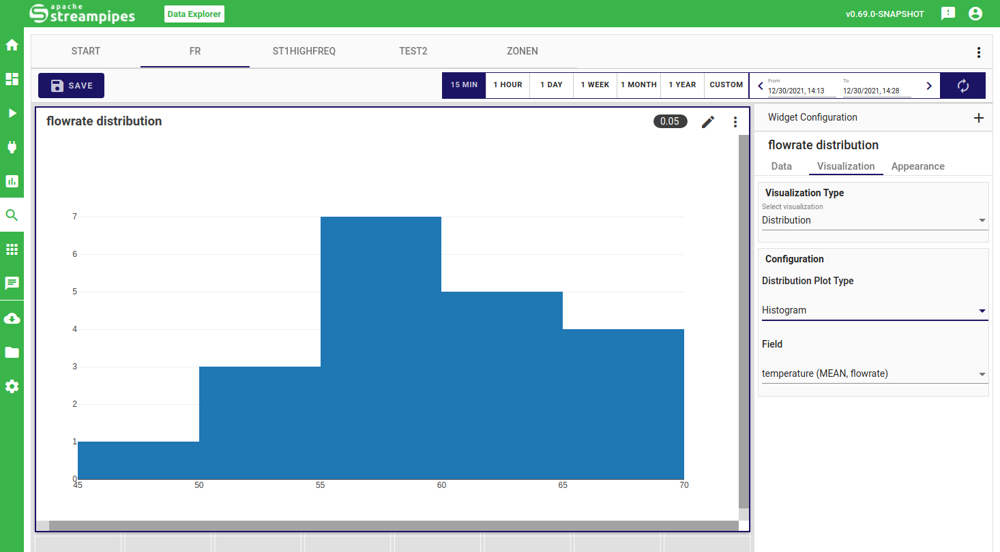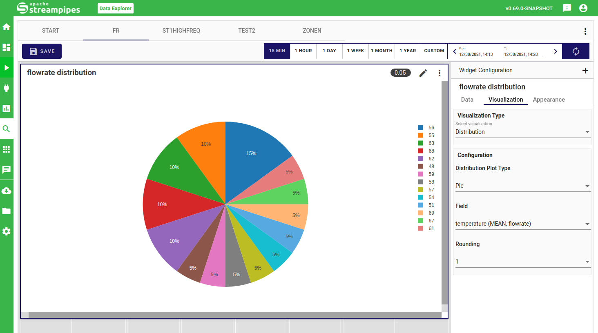

Finally, you can change the title of your created widget as well as background and text colors in the appearance configuration.

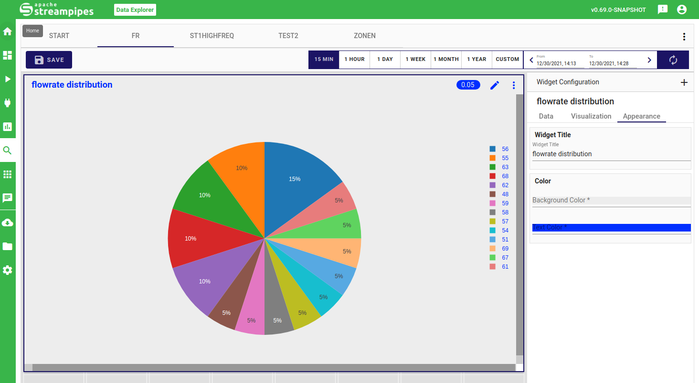

---

<a id="use-notifications"></a>

<!-- source_url: https://streampipes.apache.org/docs/use-notifications/ -->

<!-- page_index: 10 -->

# Notifications

Version: 0.98.0

The notification module can be used to create internal notifications.

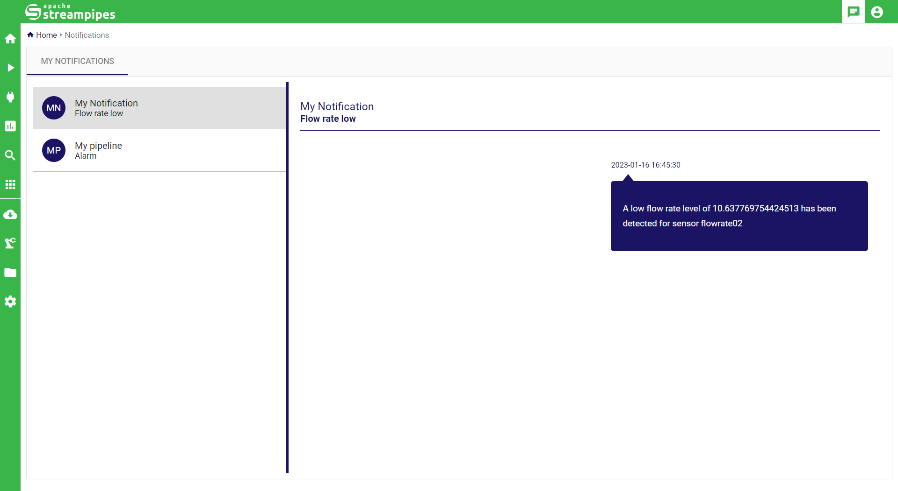

Any pipeline that includes the data sink **Notification** can trigger notifications that appear in the notification view. To configure a new notification, switch to the pipeline editor and append the notification sink to a data processor or data stream.
The sink requires a title and message as configuration parameters.

The notification message can include placeholders for fields which are replaced with the actual value at runtime.

The notification view is split into two parts. The left sides lists all pipelines which include a notification sink. By selecting a pipeline, available notifications will be shown in the right panel.
By scrolling up, older notifications become visible. Notifications that have appeared in the detail view will be automatically marked as read, so that only new, unread notifications will appear in the left toolbar.

---

<a id="use-install-pipeline-elements"></a>

<!-- source_url: https://streampipes.apache.org/docs/use-install-pipeline-elements/ -->

<!-- page_index: 11 -->

# Install Pipeline Elements

Version: 0.98.0

(coming soon)

---

<a id="use-configurations"></a>

<!-- source_url: https://streampipes.apache.org/docs/use-configurations/ -->

<!-- page_index: 12 -->

# Configurations

Version: 0.98.0

The configuration section is an admin-only interface for system-wide settings.

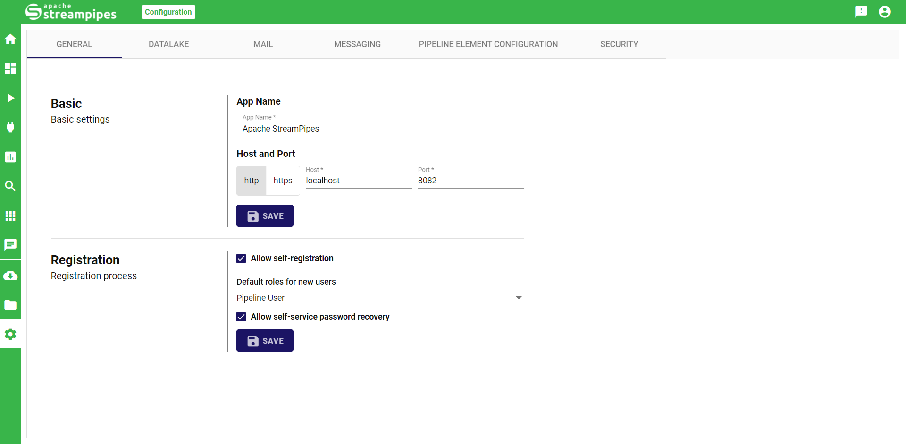

The general configuration serves to provide basic system settings. The basic settings allow to configure the app name (which is used, e.g., for mails sent by StreamPipes).
Additionally, the externally available host and port can be set which is used by the mail system to add links to emails.

Furthermore, self-registration and password recovery features can be activated in this view. Note that both features require a working email configuration.

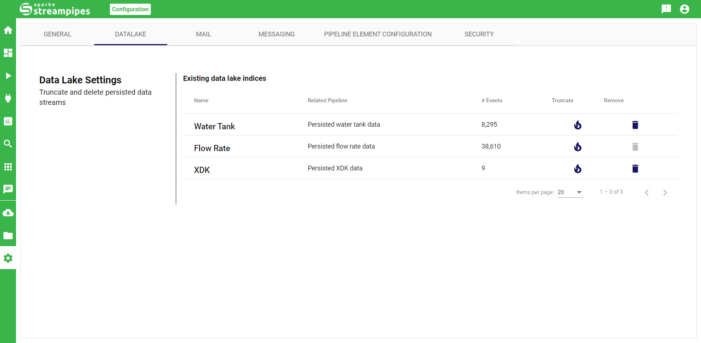

Here, stored data lake databases can be truncated or deleted. The view also gives information on the number of data points currently stored in a measurement series.

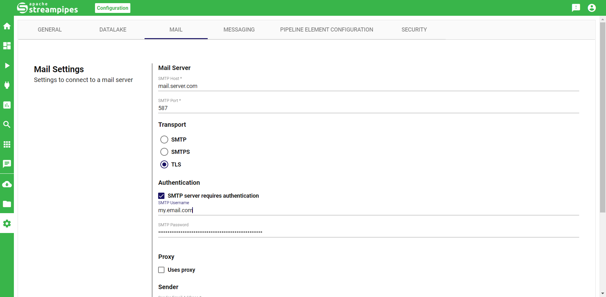

In this section, the email configuration is set. The email configuration is used to send mails to users. Most standard mail server settings are supported. The configuration can be validated by triggering a test mail that is sent to a given recipient.

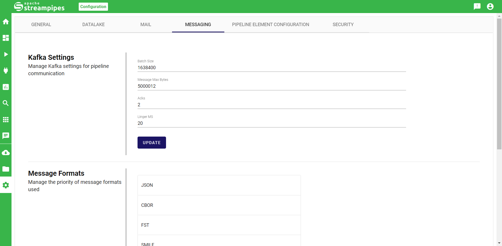

Messaging configuration is used to control parameters used for communication between pipeline elements. Individual Kafka settings can be configured, as well as the priority of selected message formats and protocols during pipeline creation.

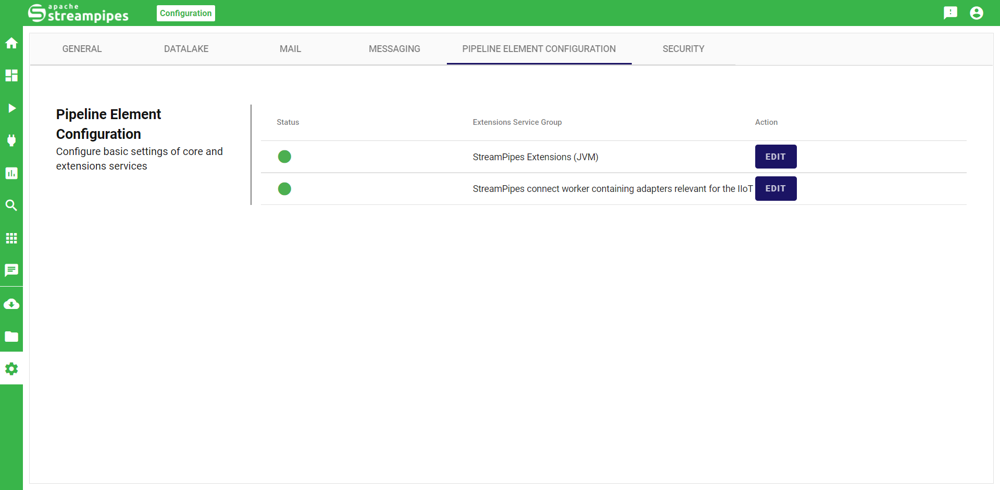

Individual configurations of extensions services are available in this view. The available configurations depend on the provided configuration variables in the service definition of each extensions service.

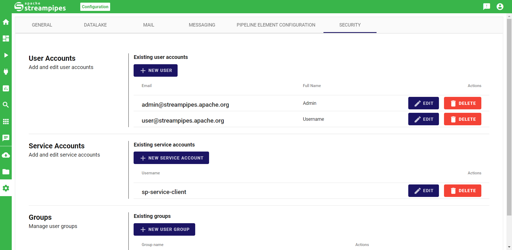

The security configuration allows to manage existing user accounts, service accounts and groups. New users can be added and roles can be assigned.

Please also read more about security [here](#deploy-security).

---

<a id="use-programmatically-create-adapters"></a>

<!-- source_url: https://streampipes.apache.org/docs/use-programmatically-create-adapters/ -->

<!-- page_index: 13 -->

# Adapters as Code

Version: 0.98.0

> [!NOTE]
> **info**
> It is also possible to provide the adapter specification as a JSON document. In this case, change the `Content-type` to `application/json`.

---

<a id="use-programmatically-create-pipelines"></a>

<!-- source_url: https://streampipes.apache.org/docs/use-programmatically-create-pipelines/ -->

<!-- page_index: 14 -->

# Pipelines as Code

Version: 0.98.0

> [!NOTE]
> **info**
> It is also possible to provide the pipeline specification as a JSON document. In this case, change the `Content-type` to `application/json`.

---

<a id="choosing-the-right-flavor"></a>

<!-- source_url: https://streampipes.apache.org/docs/choosing-the-right-flavor/ -->

<!-- page_index: 15 -->

# Choosing the right flavor

Version: 0.98.0

StreamPipes comes with many different options to customize a deployment. This section introduces the various options you can choose from when installing StreamPipes.

You can choose between various **deployment modes**, choose from two different core packages and several extension packages, wich are described below.

For the deployment model, you choose between a standard multi-container `Docker-Compose` installation and the `Kubernetes` installation.
we provide several `Docker-Compose` files for the various options shown here and a `helm chart`.
See [Docker Deployment](#deploy-docker) and [Kubernetes Deployment](#deploy-kubernetes) for more details.

Of course, it is also possible to launch StreamPipes in a non-containerized environment.
You will need to build your own executable binaries by running `mvn package`.
In addition, it is required to install the required 3rd party services (see [Architecture](#technicals-architecture)) and configure the environment variables as described in [Environment Variables](#deploy-environment-variables).

We provide two different pre-packaged versions of core services. The default `streampipes-service-core` is a packaged JAR file which includes client libraries for the various messaging systems StreamPipes supports at the cost of a larger file size.
In case you plan to run StreamPipes on less resource-intensive hardware, we recommend to switch to the `streampipes-service-core-minimal` package, which only includes support for MQTT and NATS, but has a smaller file size and slightly improved startup performance.

Similar to the core, we provide several pre-packaged extension services which differ mainly by their file size, number of supported adapters and pipeline elements and messaging systems.

The following packages exist:

- `streampipes-extensions-all-jvm` is the largest package and includes all official StreamPipes adapters and pipeline elements. It also includes support for all messaging systems Streampipes currently supports.
- `streampipes-extensions-all-iiot` is a subset of the aforementioned package and excludes adapters and pipeline elements which are often not relevant for IIoT use cases. For instance, the package excludes text mining-related pipeline elements.
- `streampipes-extensions-iiot-minimal` is a subset of the aforementioned package and includes only support for the lightweight messaging systems MQTT and NATS.

Generally said, in cases where you plan to deploy StreamPipes on a resource-limited edge device, we recommend a combination of the `streampipes-service-core-minimal` and `streampipes-extensions-iiot-minimal` package. This could, for instance, be a device with less than 4GB memory.
In other cases, it depends on the use case and if you need all adapters and pipeline elements or are ok with the IIoT-related extensions.

StreamPipes can be configured to use different messaging systems for exchanging events between adapters and pipeline elements.
The section [Messaging](#technicals-messaging) includes detailed information on the configuration of messaging systems.

---

<a id="deploy-docker"></a>

<!-- source_url: https://streampipes.apache.org/docs/deploy-docker/ -->

<!-- page_index: 16 -->

# Docker Deployment

Version: 0.98.0

> [!NOTE]
> **info**
> Other options include configurations for the internally used message broker. The current default is `Kafka`, but you can also start StreamPipes with `Nats`, `MQTT` or `Apache Pulsar`.
> Use one of the other provided docker-compose files.

---

<a id="deploy-kubernetes"></a>

<!-- source_url: https://streampipes.apache.org/docs/deploy-kubernetes/ -->

<!-- page_index: 17 -->

# Kubernetes Deployment

Version: 0.98.0

Requires Helm (<https://helm.sh/>) and an actively running Kubernetes cluster.

We provide helm chart options to get you going in the `installer/k8s`folder.

**Starting** the default helm chart option is as easy as simply running the following command from the root of this folder:

>
> [!NOTE]
> : Starting might take a while since we also initially pull all Docker images from Dockerhub.

```bash
helm install streampipes ./ 
```

After a while, all containers should successfully started, indicated by the `Running` status.

The `values.yaml` file contains several configuration options to customize your StreamPipes installation. See the section below for all configuration options.

The helm chart provides several options to configure an Ingress or to define an Ingressroute that directly integrates with Traefik.

You can override the `storageClassName` variable to configure StreamPipes for dynamic volume provisioning.

Here is an overview of the supported parameters to configure StreamPipes.

| Parameter Name | Description | Value |
| --- | --- | --- |
| deployment | Deployment type (lite or full) | lite |
| preferredBroker | Preferred broker for deployment | "nats" |
| monitoringSystem | Enable monitoring system (true/false) | false |
| pullPolicy | Image pull policy | "Always" |
| restartPolicy | Restart policy for the container | Always |
| persistentVolumeReclaimPolicy | Reclaim policy for persistent volumes | "Delete" |
| persistentVolumeAccessModes | Access mode for persistent volumes | "ReadWriteOnce" |
| initialDelaySeconds | Initial delay for liveness and readiness probes | 60 |
| periodSeconds | Interval between liveness and readiness probes | 30 |
| failureThreshold | Number of consecutive failures for readiness probes | 30 |
| hostPath | Host path for the application | "" |

| Parameter Name | Description | Value |
| --- | --- | --- |
| streampipes.version | StreamPipes version | "0.93.0-SNAPSHOT" |
| streampipes.registry | StreamPipes registry URL | "apachestreampipes" |
| streampipes.auth.secretName | The secret name for storing secrets | "sp-secrets" |
| streampipes.auth.users.admin.user | The initial admin user | "[admin@streampipes.apache.org](mailto:admin@streampipes.apache.org)" |
| streampipes.auth.users.admin.password | The initial admin password (leave empty for autogen) | "admin" |
| streampipes.auth.users.service.user | The initial service account user | "sp-service-client" |
| streampipes.auth.users.service.secret | The initial service account secret | empty (auto-generated) |
| streampipes.auth.encryption.passcode | Passcode for value encryption | empty (auto-generated) |
| streampipes.core.appName | StreamPipes backend application name | "backend" |
| streampipes.core.port | StreamPipes backend port | 8030 |
| streampipes.core.persistence.storageClassName | Storage class name for backend PVs | "hostpath" |
| streampipes.core.persistence.storageSize | Size of the backend PV | "1Gi" |
| streampipes.core.persistence.claimName | Name of the backend PersistentVolumeClaim | "backend-pvc" |
| streampipes.core.persistence.pvName | Name of the backend PersistentVolume | "backend-pv" |
| streampipes.core.service.name | Name of the backend service | "backend" |
| streampipes.core.service.port | TargetPort of the StreamPipes backend service | 8030 |
| streampipes.ui.appName | StreamPipes UI application name | "ui" |
| streampipes.ui.resolverActive | Flag for enabling DNS resolver for Nginx proxy | true |
| streampipes.ui.port | StreamPipes UI port | 8088 |
| streampipes.ui.resolver | DNS resolver for Nginx proxy | "kube-dns.kube-system.svc.cluster.local" |
| streampipes.ui.service.name | Name of the UI service | "ui" |
| streampipes.ui.service.type | Type of the UI service | "ClusterIP" |
| streampipes.ui.service.nodePort | Node port for the UI service | 8088 |
| streampipes.ui.service.port | TargetPort of the StreamPipes UI service | 8088 |
| streampipes.ingress.active | Flag for enabling Ingress for StreamPipes | false |
| streampipes.ingress.annotations | Annotations for Ingress | {} |
| streampipes.ingress.host | Hostname for Ingress | "" |
| streampipes.ingressroute.active | Flag for enabling IngressRoute for StreamPipes | true |
| streampipes.ingressroute.annotations | Annotations for IngressRoute | {} |
| streampipes.ingressroute.entryPoints | Entry points for IngressRoute | ["web", "websecure"] |
| streampipes.ingressroute.host | Hostname for IngressRoute | "" |
| streampipes.ingressroute.certResolverActive | Flag for enabling certificate resolver for IngressRoute | true |
| streampipes.ingressroute.certResolver | Certificate resolver for IngressRoute | "" |

| Parameter Name | Description | Value |
| --- | --- | --- |
| extensions.iiot.appName | IIoT extensions application name | extensions-all-iiot |
| extensions.iiot.port | Port for the IIoT extensions application | 8090 |
| extensions.iiot.service.name | Name of the IIoT extensions service | extensions-all-iiot |
| extensions.iiot.service.port | TargetPort of the IIoT extensions service | 8090 |

| Parameter Name | Description | Value |
| --- | --- | --- |
| external.couchdb.appName | CouchDB application name | "couchdb" |
| external.couchdb.version | CouchDB version | 3.3.1 |
| external.couchdb.user | CouchDB admin username | "admin" |
| external.couchdb.password | CouchDB admin password | empty (auto-generated) |
| external.couchdb.port | Port for the CouchDB service | 5984 |
| external.couchdb.service.name | Name of the CouchDB service | "couchdb" |
| external.couchdb.service.port | TargetPort of the CouchDB service | 5984 |
| external.couchdb.persistence.storageClassName | Storage class name for CouchDB PVs | "hostpath" |
| external.couchdb.persistence.storageSize | Size of the CouchDB PV | "1Gi" |
| external.couchdb.persistence.claimName | Name of the CouchDB PersistentVolumeClaim | "couchdb-pvc" |
| external.couchdb.persistence.pvName | Name of the CouchDB PersistentVolume | "couchdb-pv" |

| Parameter Name | Description | Value |
| --- | --- | --- |
| external.influxdb.appName | InfluxDB application name | "influxdb" |
| external.influxdb.version | InfluxDB version | 2.6 |
| external.influxdb.username | InfluxDB admin username | "admin" |
| external.influxdb.password | InfluxDB admin password | empty (auto-generated) |
| external.influxdb.adminToken | InfluxDB admin token | empty (auto-generated) |
| external.influxdb.initOrg | InfluxDB initial organization | "sp" |
| external.influxdb.initBucket | InfluxDB initial bucket | "sp" |
| external.influxdb.initMode | InfluxDB initialization mode | "setup" |
| external.influxdb.apiPort | Port number for the InfluxDB service (API) | 8083 |
| external.influxdb.httpPort | Port number for the InfluxDB service (HTTP) | 8086 |
| external.influxdb.grpcPort | Port number for the InfluxDB service (gRPC) | 8090 |
| external.influxdb.service.name | Name of the InfluxDB service | "influxdb" |
| external.influxdb.service.apiPort | TargetPort of the InfluxDB service for API | 8083 |
| external.influxdb.service.httpPort | TargetPort of the InfluxDB service for HTTP | 8086 |
| external.influxdb.service.grpcPort | TargetPort of the InfluxDB service for gRPC | 8090 |
| external.influxdb.persistence.storageClassName | Storage class name for InfluxDB PVs | "hostpath" |
| external.influxdb.persistence.storageSize | Size of the InfluxDB PV | "1Gi" |
| external.influxdb.persistence.storageSizeV1 | Size of the InfluxDB PV for v1 databases | "1Gi" |
| external.influxdb.persistence.claimName | Name of the InfluxDBv2 PersistentVolumeClaim | "influxdb2-pvc" |
| external.influxdb.persistence.claimNameV1 | Name of the InfluxDBv1 PersistentVolumeClaim | "influxdb-pvc" |
| external.influxdb.persistence.pvName | Name of the InfluxDBv2 PersistentVolume | "influxdb2-pv" |
| external.influxdb.persistence.pvNameV1 | Name of the InfluxDBv1 PersistentVolume | "influxdb-pv" |

| Parameter Name | Description | Value |
| --- | --- | --- |
| external.nats.appName | NATS application name | "nats" |
| external.nats.port | Port for the NATS service | 4222 |
| external.nats.version | NATS version |  |
| external.nats.service.type | Type of the NATS service | "NodePort" |
| external.nats.service.externalTrafficPolicy | External traffic policy for the NATS service | "Local" |
| external.nats.service.name | Name of the NATS service | "nats" |
| external.nats.service.port | TargetPort of the NATS service | 4222 |

| Parameter Name | Description | Value |
| --- | --- | --- |
| external.kafka.appName | Kafka application name | "kafka" |
| external.kafka.version | Kafka version | 2.2.0 |
| external.kafka.port | Port for the Kafka service | 9092 |
| external.kafka.external.hostname | Name which will be advertised to external clients. Clients which use (default) port 9094 | "localhost" |
| external.kafka.service.name | Name of the Kafka service | "kafka" |
| external.kafka.service.port | TargetPort of the Kafka service | 9092 |
| external.kafka.service.portOutside | Port for Kafka client outside of the cluster | 9094 |
| external.kafka.persistence.storageClassName | Storage class name for Kafka PVs | "hostpath" |
| external.kafka.persistence.storageSize | Size of the Kafka PV | "1Gi" |
| external.kafka.persistence.claimName | Name of the Kafka PersistentVolumeClaim | "kafka-pvc" |
| external.kafka.persistence.pvName | Name of the Kafka PersistentVolume | "kafka-pv" |

|

| Parameter Name | Description | Value |
| --- | --- | --- |
| external.zookeeper.appName | ZooKeeper application name | "zookeeper" |
| external.zookeeper.version | ZooKeeper version | 3.4.13 |
| external.zookeeper.port | Port for the ZooKeeper service | 2181 |
| external.zookeeper.service.name | Name of the ZooKeeper service | "zookeeper" |
| external.zookeeper.service.port | TargetPort of the ZooKeeper service | 2181 |
| external.zookeeper.persistence.storageClassName | Storage class name for ZooKeeper PVs | "hostpath" |
| external.zookeeper.persistence.storageSize | Size of the ZooKeeper PV | "1Gi" |
| external.zookeeper.persistence.claimName | Name of the ZooKeeper PersistentVolumeClaim | "zookeeper-pvc" |
| external.zookeeper.persistence.pvName | Name of the ZooKeeper PersistentVolume | "zookeeper-pv" |

| Parameter Name | Description | Value |
| --- | --- | --- |
| external.pulsar.appName | pulsar application name | "pulsar" |
| external.pulsar.version | pulsar version | 3.0.0 |
| external.pulsar.port | Port for the pulsar service | 6650 |
| external.pulsar.service.name | Name of the pulsar service | "pulsar" |
| external.pulsar.service.port | TargetPort of the pulsar service | 6650 |
| external.pulsar.persistence.storageClassName | Storage class name for pulsar PVs | "hostpath" |
| external.pulsar.persistence.storageSize | Size of the pulsar PV | "1Gi" |
| external.pulsar.persistence.claimName | Name of the pulsar PersistentVolumeClaim | "pulsar-pvc" |
| external.pulsar.persistence.pvName | Name of the pulsar PersistentVolume | "pulsar-pv" |

| Parameter Name | Description | Value |
| --- | --- | --- |
| prometheus.appName | Prometheus application name | "prometheus" |
| prometheus.version | Prometheus version | 2.45.0 |
| prometheus.port | Prometheus port | 9090 |
| prometheus.service.name | Prometheus service name | "prometheus" |
| prometheus.service.port | Prometheus service port | 9090 |
| prometheus.persistence.storageClassName | Prometheus storage class name | "hostpath" |
| prometheus.persistence.storageSize | Prometheus storage size | "2Gi" |
| prometheus.persistence.claimName | Prometheus PVC claim name | "prometheus-pvc" |
| prometheus.persistence.pvName | Prometheus PV name | "prometheus-pv" |
| prometheus.persistence.tokenStorageSize | Prometheus token storage size | "16Ki" |
| prometheus.config.scrapeInterval | Prometheus scrape interval | 10s |
| prometheus.config.evaluationInterval | Prometheus evaluation interval | 15s |
| prometheus.config.backendJobName | Prometheus backend job name | "backend" |
| prometheus.config.extensionsName | Prometheus extensions job name | "extensions-all-iiot" |
| prometheus.config.tokenFileName | Prometheus token file name | "token" |
| prometheus.config.tokenFileDir | Prometheus token file directory | "/opt/data" |

| Parameter Name | Description | Value |
| --- | --- | --- |
| grafana.appName | Grafana application name | "grafana" |
| grafana.version | Grafana version | 10.1.2 |
| grafana.port | Grafana port | 3000 |
| grafana.service.name | Grafana service name | "grafana" |
| grafana.service.port | Grafana service port | 3000 |
| grafana.persistence.storageClassName | Grafana storage class name | "hostpath" |
| grafana.persistence.storageSize | Grafana storage size | "1Gi" |
| grafana.persistence.claimName | Grafana PVC claim name | "grafana-pvc" |
| grafana.persistence.pvName | Grafana PV name | "grafana-pv" |

The helm chart includes a `secrets.yaml` file which auto-generates several settings as follows:

```yaml
 
apiVersion: v1 
kind: Secret 
metadata: 
  name: sp-secrets 
  namespace: {{ .Release.Namespace | quote }} 
type: Opaque 
data: 
  sp-initial-admin-password: {{ ternary (randAlphaNum 10) .Values.streampipes.auth.users.admin.password (empty .Values.streampipes.auth.users.admin.password) | b64enc | quote }} 
  sp-initial-client-secret: {{ ternary (randAlphaNum 35) .Values.streampipes.auth.users.service.secret (empty .Values.streampipes.auth.users.service.secret) | b64enc | quote }} 
  sp-encryption-passcode:  {{ ternary (randAlphaNum 20) .Values.streampipes.auth.encryption.passcode (empty .Values.streampipes.auth.encryption.passcode) | b64enc | quote }} 
  sp-couchdb-password:  {{ ternary (randAlphaNum 20) .Values.external.couchdb.password (empty .Values.external.couchdb.password) | b64enc | quote }} 
  sp-ts-storage-password:  {{ ternary (randAlphaNum 20) .Values.external.influxdb.password (empty .Values.external.influxdb.password) | b64enc | quote }} 
  sp-ts-storage-token:  {{ ternary (randAlphaNum 20) .Values.external.influxdb.adminToken (empty .Values.external.influxdb.adminToken) | b64enc | quote }} 
 
```

```bash
helm uninstall streampipes 
```

---

<a id="deploy-use-ssl"></a>

<!-- source_url: https://streampipes.apache.org/docs/deploy-use-ssl/ -->

<!-- page_index: 18 -->

# Use SSL

Version: 0.98.0

This page explains how SSL Certificates can be used to provide transport layer security between your Browser and the Streampipes Backend.

You need a valid Certificate consisting of a Private and a Public Key. Both Keys must be in PEM Format. Please note that your Private Key should never be shared, otherwise the communication can not be considered secure.

In order to use SSL you have to open port 443 on the nginx Service. Incoming insecure Traffic on Port 80 will be automatically rerouted to Port 443.

The Environment-Variable NGINX\_SSL must be set to "true".

Finally you have to inject the Certificates into the Docker-Container. In the example below, the Certificates are placed in the directory /etc/ssl/private/ on the host machine. Please change the path according to the place where the Certificates are located on your machine. The path after the colon should not be changed!

```yaml
[...] 
  nginx: 
    image: apachestreampipes/ui 
    ports: 
      - "80:80" 
      - "443:443" 
    environment: 
      - NGINX_SSL=true 
    volumes: 
      - /etc/ssl/private/private.pem:/etc/nginx/ssl/ssl.pem 
      - /etc/ssl/private/public.pem:/etc/nginx/ssl/cert.pem 
    depends_on: 
      - backend 
    networks: 
      spnet: 
[...] 
```

---

<a id="deploy-security"></a>

<!-- source_url: https://streampipes.apache.org/docs/deploy-security/ -->

<!-- page_index: 19 -->

# Security

Version: 0.98.0

> [!CAUTION]
> **danger**
> This feature should be considered experimental. Currently, there is no mapping between external users and StreamPipes roles and all newly registered users will be assigned the role `ROLE_ADMIN`.

---

<a id="deploy-environment-variables"></a>

<!-- source_url: https://streampipes.apache.org/docs/deploy-environment-variables/ -->

<!-- page_index: 20 -->

# Environment Variables

Version: 0.98.0

A StreamPipes installation can be configured in many ways by providing environment variables.
The following lists describe available environment variables along with a description.

| Env Variable Name | Default Value | Description |
| --- | --- | --- |
| SP\_DEBUG | false | Should only be set for local development to reroute traffic to localhost |
| SP\_INITIAL\_ADMIN\_EMAIL | [admin@streampipes.apache.org](mailto:admin@streampipes.apache.org) | Installation-time variable for defining the default user name |
| SP\_INITIAL\_ADMIN\_PASSWORD | admin | Installation-time variable for defining the default user password |
| SP\_INITIAL\_SERVICE\_USER | sp-service-client | Installation-time variable for defining the initial service user (must be same to the configured user in the extension service) |
| SP\_INITIAL\_SERVICE\_USER\_SECRET | my-apache-streampipes-secret-key-change-me | Installation-time variable for defining the initial service secret (minimum 35 chars) |
| SP\_JWT\_SECRET | Empty for Docker, Auto-generated for K8s | JWT secret, base64-encoded, minimum 256 bits |
| SP\_JWT\_SIGNING\_MODE | HMAC | HMAC or RSA, RSA can be used to authenticate Core-Extensions communication |
| SP\_JWT\_PRIVATE\_KEY\_LOC | Empty | Required id SP\_JWT\_SIGNING\_MODE=RSA, path to the private key, can be generated in the UI (Settings->Security->Generate Key Pair) |
| SP\_ENCRYPTION\_PASSCODE | eGgemyGBoILAu3xckolp for Docker, Auto-generated for K8s | Encryption passcode for `SecretStaticProperties` |
| SP\_PRIORITIZED\_PROTOCOL | kafka | Messaging layer for data exchange between extensions |
| SP\_RETENTION\_LOCAL\_DIR | `./ArchivedData` | Local directory used to store archived data files created by the retention mechanism. |
| SP\_DATALAKE\_SCHEDULER\_CRON | `0 1 0 * * 6` | Cron expression defining when the datalake retention scheduler runs (default: every Saturday at 00:01). |
| SP\_RETENTION\_LOG\_LENGTH | `10` | Number of recent retention job log entries to keep for retention-related logging and monitoring. |
| SP\_CERTIFICATE\_EXPIRY\_CRON | `0 2 0 * * *` | Cron expression defining when the certificate expiry notification job runs (default: once every night). |
| SP\_CERTIFICATE\_EXPIRY\_EMAIL\_DAYS | Empty (disabled) | Comma-separated list of days before certificate expiration when reminder emails are sent (e.g. `7,14,30`). |

| Env Variable Name | Default Value | Description |
| --- | --- | --- |
| SP\_COUCHDB\_HOST | couchdb | The hostname or IP of the CouchDB database |
| SP\_COUCHDB\_PROTOCOL | http | The protocol (http or https) of the CouchDB database |
| SP\_COUCHDB\_PORT | 5984 | The port of the CouchDB database |
| SP\_COUCHDB\_USER | admin | The user of the CouchDB database (must have permissions to add databases) |
| SP\_COUCHDB\_PASSWORD | admin | The password of the CouchDB user |
| SP\_TS\_STORAGE\_HOST | influxdb | The hostname of the timeseries storage (currently InfluxDB) |
| SP\_TS\_STORAGE\_PORT | 8086 | The port of the timeseries storage |
| SP\_TS\_STORAGE\_PROTOCOL | http | The protocol of the timeseries storage (http or https) |
| SP\_TS\_STORAGE\_BUCKET | sp | The InfluxDB storage bucket name |
| SP\_TS\_STORAGE\_ORG | sp | The InfluxDB storage org |
| SP\_TS\_STORAGE\_TOKEN | sp-admin | The InfluxDB storage token |

The InfluxDB itself can be configured by providing the variables `DOCKER_INFLUXDB_INIT_PASSWORD` and `DOCKER_INFLUXDB_INIT_ADMIN_TOKEN`. See the `docker-compose` file for details.

| Env Variable Name | Default Value | Description |
| --- | --- | --- |
| SP\_CLIENT\_USER | Empty | Service account for communication with Core |
| SP\_CLIENT\_SECRET | Empty | Service secret for communication with Core |
| SP\_EXT\_AUTH\_MODE | sp-service-client | When set to AUTH: all interfaces are only accessible with authentication (requires SP\_JET\_PRIVATE\_KEY\_LOC in Core) |
| SP\_JWT\_PUBLIC\_KEY\_LOC | my-apache-streampipes-secret-key-change-me | Path to the public key of the corresponding SP\_JWT\_PRIVATE\_KEY defined in Core |

The following variables are only required for extensions which require access to the internal time-series storage (the `Data Lake Sink`).

| Env Variable Name | Default Value | Description |
| --- | --- | --- |
| SP\_TS\_STORAGE\_HOST | influxdb | The hostname of the timeseries storage (currently InfluxDB) |
| SP\_TS\_STORAGE\_PORT | 8086 | The port of the timeseries storage |
| SP\_TS\_STORAGE\_PROTOCOL | http | The protocol of the timeseries storage (http or https) |
| SP\_TS\_STORAGE\_BUCKET | sp | The InfluxDB storage bucket name |
| SP\_TS\_STORAGE\_ORG | sp | The InfluxDB storage org |
| SP\_TS\_STORAGE\_TOKEN | sp-admin | The InfluxDB storage token |

For a standard deployment, it is recommended to customize the following variables:

- Initiales Admin-Passwort (SP\_INITIAL\_ADMIN\_PASSWORD, Core)
- Initiales Client Secret (SP\_INITIAL\_SERVICE\_USER\_SECRET, Core)
- Client Secret Extensions (SP\_CLIENT\_USER, Extensions)
- Encryption Passcode (SP\_ENCRYPTION\_PASSCODE, Core)
- CouchDB-Password (SP\_COUCHDB\_PASSWORD, Core + Extensions + CouchDB)
- InfluxDB Storage Password (DOCKER\_INFLUXDB\_INIT\_PASSWORD, InfluxDB)
- InfluxDB Storage Token (SP\_TS\_STORAGE\_TOKEN (Core, Extensions)
- DOCKER\_INFLUXDB\_INIT\_ADMIN\_TOKEN (InfluxDB service)

See the [Kubernetes Guide](#deploy-kubernetes) for an overview of auto-generated variables.

---

<a id="deploy-retention-config"></a>

<!-- source_url: https://streampipes.apache.org/docs/deploy-retention-config/ -->

<!-- page_index: 21 -->

# Enable Datalake Retention

Version: 0.98.0

This page provides instructions on how to enable and test the Datalake retention feature. The Datalake retention feature automates the process of deleting and saving the contents of the Datalake to either a local filesystem or a cloud provider (currently, only S3-compatible providers are supported) at predefined intervals. Retention actions are carried out as scheduled CRON jobs, executing at specified times.

To use a cloud provider, you must have an existing S3-compatible provider, along with the necessary authentication key, secret, and bucket. Alternatively, you can use the test settings provided below.

To enable the usage of the retention feature depending on the exact setting, two environment variables need to be set during streampipes deployment.

```yaml
 
    "SP_RETENTION_LOCAL_DIR":"/output", 
    "SP_DATALAKE_SCHEDULER_CRON":"0 1 0 * * 6" 
 
```

The `SP_DATALAKE_SCHEDULER_CRON` environment variable defines when the CRON job will run. By default, the job runs every Saturday at 00:01 (using the cron expression "0 1 0 \*  *6"). For development environments, shorter intervals are often more useful. For example, setting it to "0* /2 \* \* \* \*" will execute the job every two minutes.

When using local file storage, you can specify the storage directory via the `SP_RETENTION_LOCAL_DIR` variable. If you need the data to be accessible outside the Docker container, an additional volume mapping will be required in the backend.

```yaml
[...] 
  backend: 
    [...] 
    volumes: 
      - ./output/:/output 
 
[...] 
```

The retention configuration must be set individually for each desired DataLake. To configure retention settings:

1. Navigate to **Configuration > DataLake**.
2. Click on the **Retention Rate** icon in the corresponding column.
3. A dialog will appear, allowing you to configure the following options:
   - **Data to Retain**: Select which data should be retained.
   - **Retention Action**: Choose the retention action:
     - **Delete**
     - **Save**
     - **Save and Delete**

If **Save** is selected, you can also configure:

- **Export Format**: Specify the format in which the data will be exported.
- **Export Destination**: Choose the destination for the saved data:
  - **Folder**: No further configuration needed.
  - **S3**: Requires an existing Export Provider to be set up (see the section below for details).

To create a new export provider go to `Configuration > DataLake`, click on `+` and provide the access key, secret, endpoint, bucket name, and region.

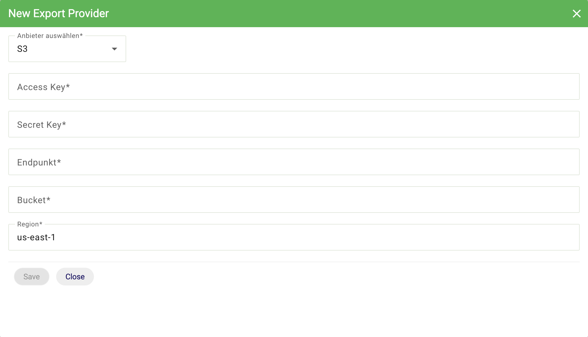

For the Test Setting below this might be:

- **Access Key**: test
- **Access Secret**: test
- **Endpoint**: <http://0.0.0.0:4566>
- **Bucket**: random
- **Region**: us-east-1

For Testing and Developing S3-based Export Provider it is possible to rely on locally hosted docker container e.g., localstack.

```yaml
services: 
  localstack: 
    image: localstack/localstack:latest 
    container_name: localstack_main 
    environment: 
      - DOCKER_HOST=unix:///var/run/docker.sock 
      - AWS_ACCESS_KEY_ID=test 
      - AWS_SECRET_ACCESS_KEY=test 
      - DEFAULT_REGION=us-east-1 
      - SERVICES=s3   
    ports: 
      - "4566:4566" 
    volumes: 
      - "/var/run/docker.sock:/var/run/docker.sock"  
      - "localstack_data:/var/lib/localstack"  
volumes: 
  localstack_data: 
    driver: local 
```

For local testing start the container `docker compose up`, create a new bucket with the following java script:

```java
 
import java.net.URI; 
import java.nio.file.Path; 
import java.nio.file.Paths; 
 
import software.amazon.awssdk.auth.credentials.AwsBasicCredentials; 
import software.amazon.awssdk.auth.credentials.StaticCredentialsProvider; 
import software.amazon.awssdk.regions.Region; 
import software.amazon.awssdk.services.s3.S3Client; 
import software.amazon.awssdk.services.s3.model.*; 
 
public class S3TestClean { 
 
    private static final String ACCESS_KEY = "test"; 
    private static final String SECRET_KEY = "test"; 
    private static final String ENDPOINT = "http://0.0.0.0:4566"; 
    private static final Region REGION = Region.US_EAST_1; 
    private static final String BUCKET_NAME = "random"; 
 
 
    public static void main(String[] args) { 
        System.setProperty("software.amazon.awssdk.enableDefaultMetrics", "true"); 
 
        try (S3Client s3 = createS3Client()) { 
            createBucketIfNotExists(s3, BUCKET_NAME); 
            listBuckets(s3); 
            listObjects(s3); 
        } catch (Exception e) { 
            e.printStackTrace(); 
        } 
    } 
 
    private static S3Client createS3Client() { 
        return S3Client.builder() 
                .endpointOverride(URI.create(ENDPOINT)) 
                .region(REGION) 
                .credentialsProvider( 
                        StaticCredentialsProvider.create( 
                                AwsBasicCredentials.create(ACCESS_KEY, SECRET_KEY) 
                        ) 
                ) 
                .build(); 
    } 
 
        private static void createBucketIfNotExists(S3Client s3, String bucketName) { 
        System.out.println("Checking if bucket exists: " + bucketName); 
        try { 
            ListBucketsResponse response = s3.listBuckets(); 
            boolean exists = response.buckets().stream() 
                    .anyMatch(bucket -> bucket.name().equals(bucketName)); 
 
            if (!exists) { 
                System.out.println("Bucket does not exist. Creating: " + bucketName); 
                s3.createBucket(CreateBucketRequest.builder().bucket(bucketName).build()); 
            } else { 
                System.out.println("Bucket already exists: " + bucketName); 
            } 
        } catch (S3Exception e) { 
            System.err.println("Failed to check/create bucket: " + e.awsErrorDetails().errorMessage()); 
        } 
    } 
 
    private static void listBuckets(S3Client s3) { 
        System.out.println("Listing S3 buckets:"); 
        try { 
            ListBucketsResponse response = s3.listBuckets(); 
            response.buckets().forEach(bucket -> System.out.println(" - " + bucket.name())); 
        } catch (S3Exception e) { 
            System.err.println("Failed to list buckets: " + e.awsErrorDetails().errorMessage()); 
        } 
    } 
 
    private static void listObjects(S3Client s3) { 
        System.out.println("Listing objects in bucket: " + BUCKET_NAME); 
        try { 
            ListObjectsV2Request request = ListObjectsV2Request.builder() 
                    .bucket(BUCKET_NAME) 
                    .build(); 
 
            ListObjectsV2Response response = s3.listObjectsV2(request); 
            response.contents().forEach(obj -> System.out.println("File: " + obj.key())); 
        } catch (S3Exception e) { 
            System.err.println("Failed to list objects: " + e.awsErrorDetails().errorMessage()); 
        } 
    } 
 
   
} 
 
```

Pom.xml dependencies:

```xml
 <dependency> 
        <groupId>software.amazon.awssdk</groupId> 
        <artifactId>s3</artifactId> 
        <version>2.25.14</version> <!-- Use latest --> 
    </dependency> 
 
    <dependency> 
        <groupId>org.slf4j</groupId> 
        <artifactId>slf4j-api</artifactId> 
        <version>2.0.17</version>   
    </dependency> 
 
 
```

---

<a id="extend-setup"></a>

<!-- source_url: https://streampipes.apache.org/docs/extend-setup/ -->

<!-- page_index: 22 -->

# Development Setup

Version: 0.98.0

Pipeline elements in StreamPipes are provided as standalone microservices. New pipeline elements can be easily developed using the provided Maven archetypes and can be installed in StreamPipes at runtime.

In this section, we describe our recommended minimum setup for locally setting up a development instance of StreamPipes needed to develop, run and test new pipeline elements.

StreamPipes does not have specific requirements on the IDE - so feel free to choose the IDE of your choice.
The only requirements in terms of development tools are that you have Java 17 and Maven installed.

In order to quickly test developed pipeline elements without needing to install all services required by StreamPipes, we provide a CLI tool that allows you to selectively start StreamPipes components.
The CLI tool allows to switch to several templates (based on docker-compose) depending on the role.

The documentation on the usage of the CLI tool is available [here](#extend-cli).

By default, the backend/core of StreamPipes registers itself within StreamPipes' service discovery mechanism using an auto-discovered hostname.
Usually, this will be an IP address from the Docker network, which is not resolvable from outside. Therefore, for local development you need to override the hostname with an IP address which is accessible from your local host where you develop extensions.
When using the CLI, open the CLI folder `installer/cli`, navigate to `deploy/standalone/backend`, open the `docker-compose.dev.yml` file and add the SP\_HOST env variable, e.g.

```text
version: "3.4" 
services: 
  backend: 
    ports: 
      - "8030:8030" 
    environment: 
      - SP_HOST=host.docker.internal 
```

Note that host.docker.internal will work as an alias under Docker for Desktop on Windows and Mac, but not on Linux or M1. In this case, provide a resolvable hostname or IP address manually.

Now, once you've started the development instance, you are ready to develop your very first pipeline element.
Instead of starting from scratch, we recommend using our provided maven archetypes:

Create the Maven archetype as described in the [Maven Archetypes](#extend-archetypes) guide.

We provide several examples that explain the usage of some concepts in this [Github repo](https://github.com/apache/streampipes-examples).

---

<a id="extend-cli"></a>

<!-- source_url: https://streampipes.apache.org/docs/extend-cli/ -->

<!-- page_index: 23 -->

# StreamPipes CLI

Version: 0.98.0

The StreamPipes command-line interface (CLI) is focused on developers in order to provide an easy entrypoint to set up a suitable dev environment, either planning on developing

- new extensions such as **connect adapters, processors, sinks** or,
- new core features for **backend** and **ui**.

The main difference between the standard Docker/K8s installation is an improved communication between services running as containers and services running locally for development.

The CLI can be found in the [main repository](https://github.com/apache/streampipes/tree/master/installer/cli) or in the `installer/cli` folder of the downloaded source code.

```bash
streampipes env --list 
[INFO] Available StreamPipes environment templates: 
pipeline-element 
... 
streampipes env --set pipeline-element 
streampipes up -d 
```

>
> [!NOTE]
> : use `./installer/cli/streampipes` if you haven't add it to the PATH and sourced it (see section "Run `streampipes` from anywhere?").

The CLI is basically a wrapper around multiple `docker` and `docker-compose` commands plus some additional sugar.

- Docker >= 17.06.0
- Docker-Compose >= 1.26.0 (Compose file format: 3.4)
- Google Chrome (recommended), Mozilla Firefox, Microsoft Edge
- For Windows Developer: GitBash only

Tested on: (**\*macOS**, **Linux**, **Windows\***)

>
> [!NOTE]
> : If you're using Windows the CLI only works in combination with GitBash - CMD, PowerShell won't work.

```text
StreamPipes CLI - Manage your StreamPipes environment with ease 
 
Usage: streampipes COMMAND [OPTIONS] 
 
Options: 
  --help, -h      show help 
  --version, -v   show version 
 
Commands: 
  clean       Remove StreamPipes data volumes, dangling images and network 
  down        Stop and remove StreamPipes containers 
  env         Inspect and select StreamPipes environments 
  info        Get information 
  logs        Get container logs for specific container 
  ps          List all StreamPipes container for running environment 
  pull        Download latest images from Dockerhub 
  restart     Restart StreamPipes environment 
  up          Create and start StreamPipes container environment 
 
Run 'streampipes COMMAND --help' for more info on a command. 
```

**List** available environment templates.

```bash
streampipes env --list 
```

**Inspect** services in an available environment to know what kind of services it is composed of.

```bash
streampipes env --inspect pipeline-element 
```

**Set** environment, e.g. `pipeline-element`, if you want to write a new pipeline element.

```bash
streampipes env --set pipeline-element 
```

**Start** environment ( default: `dev` mode). Here the service definition in the selected environment is used to start the multi-container landscape.

>
> [!NOTE]
> : `dev` mode is enabled by default since we rely on open ports to core service such as `couchdb`, `kafka` etc. to reach from the IDE when developing. If you don't want to map ports (except the UI port), then use the `--no-ports` flag.

```bash
streampipes up -d 
# start in production mode with unmapped ports
# streampipes up -d --no-ports
```

Now you're good to go to write your new pipeline element 🎉 🎉 🎉

> **HINT for extensions**: Use our [Maven archetypes](#extend-archetypes) to set up a project skeleton and use your IDE of choice for development. However, we do recommend using IntelliJ.

> **HINT for core**: To work on `backend` or `ui` features you need to set the template to `backend` and clone the core repository [streampipes](https://github.com/apache/streampipes) - check the prerequisites there for more information.

**Stop** environment and remove docker container

```bash
streampipes down 
# want to also clean docker data volumes when stopping the environment?
# streampipes down -v
```

**Start individual services only?** We got you! You chose a template that suits your needs and now you only want to start individual services from it, e.g. only Kafka and InfluxDB.

>
> [!NOTE]
> : the service names need to be present and match your current `.spenv` environment.

```bash
streampipes up -d kafka influxdb 
```

**Get current environment** (if previously set using `streampipes env --set <environment>`).

```bash
streampipes env 
```

**Get logs** of specific service and use optional `--follow` flag to stay attached to the logs.

```bash
streampipes logs --follow backend 
```

**Update** all services of current environment

```bash
streampipes pull 
```

**Restart** all services of current environment or specific services

```bash
streampipes restart 
# restart backend
# streampipes restart backend
```

**Clean** your system and remove created StreamPipes Docker volumes, StreamPipes docker network and dangling StreamPipes images of old image layers.

```bash
streampipes clean 
# remove volumes, network and dangling images
# streampipes clean --volumes
```

As of now, this step has to be done **manually**. All environments are located in `environments/`.

```bash
├── adapter               # developing a new connect adapter 
├── backend               # developing core backend features 
├── basic                 # wanna run core, UI, connect etc from the IDE? 
├── full                  # full version containing more pipeline elements 
├── lite                  # few pipeline elements, less memory 
├── pipeline-element      # developing new pipeline-elements 
└── ui                    # developing UI features 
```

**Modifying an existing environment template**. To modify an existing template, you can simply add a `<YOUR_NEW_SERVICE>` to the template.

>
> [!NOTE]
> : You need to make sure, that the service your are adding exists in `deploy/standalone/service/<YOUR_NEW_SERVICE>`. If your're adding a completely new service take a look at existing ones, create a new service directory and include a `docker-compose.yml` and `docker-compose.dev.yml` file.

```text
[environment:backend] 
activemq 
kafka 
... 
<YOUR_NEW_SERVICE> 
```

**Creating a new** environment template. To create a new environment template, place a new file `environments/<YOUR_NEW_ENVIRONMENT>` in the template directory. Open the file and use the following schema.

>
> [!IMPORTANT]
> : Please make sure to have `[environment:<YOUR_NEW_ENVIRONMENT>]` header in the first line of your new template matching the name of the file. Make sure to use small caps letters (lowercase) only.

```text
[environment:<YOUR_NEW_ENVIRONMENT>] 
<SERVICE_1> 
<SERVICE_2> 
... 
```

Simply add the path to this cli directory to your `$PATH` (on macOS, Linux) variable, e.g. in your `.bashrc` or `.zshrc`, or `%PATH%` (on Windows).

For **macOS**, or **Linux**:

```bash
export PATH="/path/to/streampipes-installer/installer/cli:$PATH" 
```

For **Windows** add `installer\cli` to environment variables, e.g. check this [documentation](https://helpdeskgeek.com/windows-10/add-windows-path-environment-variable/).

To upgrade to a new version, simply edit the version tag `SP_VERSION` in the `.env` file.

---

<a id="extend-archetypes"></a>

<!-- source_url: https://streampipes.apache.org/docs/extend-archetypes/ -->

<!-- page_index: 24 -->

# Maven Archetypes

Version: 0.98.0

In this tutorial we explain how you can use the Maven archetypes to develop your own StreamPipes processors and sinks.
We use IntelliJ in this tutorial, but it works with any IDE of your choice.

You need to have Maven installed, further you need an up and running StreamPipes installation on your development computer.

To create a new project, we provide multiple Maven Archteypes.
Currently, we provide archetypes for standalone Java-based microservices and archetypes for the experimental Flink wrapper.
The commands required to create a new pipeline element project can be found below. Make sure that you select a version compatible with your StreamPipes installation.
Copy the command into your terminal to create a new project.
The project will be created in the current folder.
First, the `groupId` of the resulting Maven artifact must be set.
We use `groupId`: `org.example` and `artifactId`: `ExampleProcessor`.
You can keep the default values for the other settings, confirm them by hitting enter.

> [!NOTE]
> **Choosing the right version**
> Make sure that the version used to create your archetype matches your running Apache StreamPipes version.
> In the example below, replace `{sp.version}` with the proper version, e.g., `0.92.0`.

```bash
mvn archetype:generate                                           \ 
  -DarchetypeGroupId=org.apache.streampipes                              \ 
  -DarchetypeArtifactId=streampipes-archetype-extensions-jvm  \ 
  -DarchetypeVersion={sp.version} 
```

Open the project in your IDE.
If everything worked, the structure should look similar to the following image.
In the *main* package, it is defined which processors / sinks you want to activate and the *pe.example* package contains two skeletons for creating a data processor and sink.
For details, have a look at the other parts of the Developer Guide, where these classes are explained in more depth.

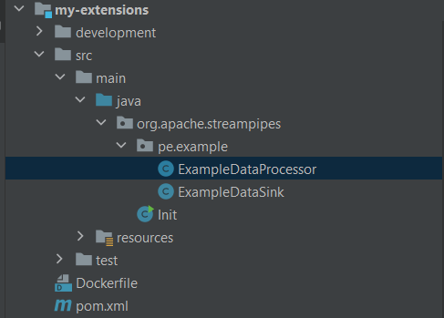

Click [here](#extend-first-processor) to learn how to create your first data processor.

---

<a id="extend-first-processor"></a>

<!-- source_url: https://streampipes.apache.org/docs/extend-first-processor/ -->

<!-- page_index: 25 -->

# Your first data processor

Version: 0.98.0

In this section, we will explain how to start a pipeline element service and install it using the StreamPipes UI.

Open the class *ExampleDataProcessor* and edit the `onEvent` method to print the incoming event, log it to the console and send it to the next component without changing it.

```java
@Override 
public void onEvent(Event event, SpOutputCollector collector) { 
    // Print the incoming event on the console 
    System.out.println(event); 
 
    // Hand the incoming event to the output collector without changing it. 
    collector.collect(event); 
} 
```

Starting from StreamPipes 0.69.0, the IP address of an extensions service (processor, adapter or sink) will be auto-discovered upon start.
The auto-discovery is done by the StreamPipes service discovery mechanism and should work for most setups.
Once you start an extensions service, you will see the chosen IP in printed in the console. Make sure that this IP does not point to localhost (127.0.0.1).
If you see such an IP or the extensions service complains that it cannot resolve the IP, you can manually set the IP address of the extensions service. You can do so by providing an `SP_HOST` environment variable.

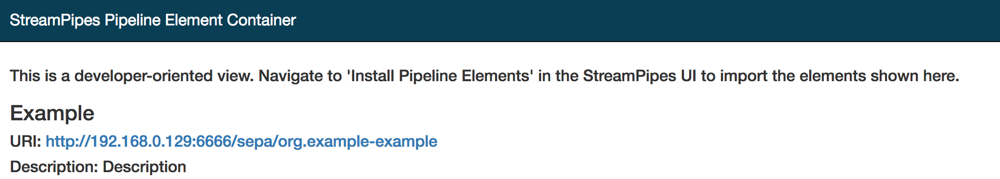

To check if the service is up and running, open the browser on *'localhost:8090'* (or the port defined in the service definition). The machine-readable description of the processor should be visible as shown below.

> [!WARNING]
> **Common Problems**
> If the service description is not shown on 'localhost:8090', you might have to change the port address.
> This needs to be done in the configuration of your service, further explained in the configurations part of the developer guide.
>
> If the service does not show up in the StreamPipes installation menu, click on 'MANAGE ENDPOINTS' and add 'http://YOUR\_IP\_OR\_DNS\_NAME:8090'.
> Use the IP or DNS name you provided as the SP\_HOST variable or the IP (if resolvable) found by the auto-discovery service printed in the console.
> After adding the endpoint, a new processor with the name *Example* should show up.

Now you can go to StreamPipes.
Your new processor *'Example'* should now show up in the installation menu ("Install Pipeline Elements" in the left navigation bar).
Install it, then switch to the pipeline view and create a simple pipeline that makes use of your newly created processor.
In case you opened the StreamPipes installation for the first time, it should have been automatically installed during the setup process.

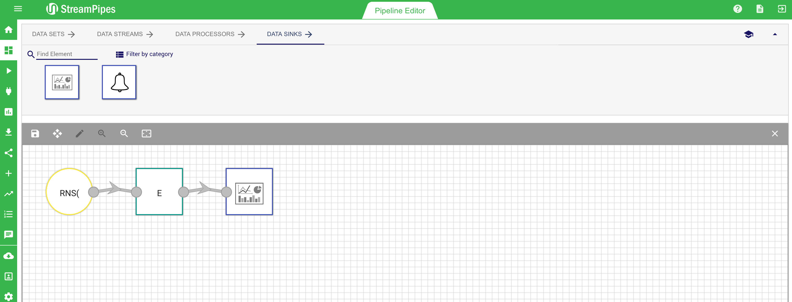

Start this pipeline.
Now you should see logging messages in your console and, once you've created a visualization, you can also see the resulting events of your component in StreamPipes.

Congratulations, you have just created your first processor!
From here on you can start experimenting and implement your own algorithms.

---

<a id="extend-tutorial-adapters"></a>

<!-- source_url: https://streampipes.apache.org/docs/extend-tutorial-adapters/ -->

<!-- page_index: 26 -->

# Tutorial: Build Custom Adapters

Version: 0.98.0

> [!NOTE]
> **info**
> This tutorial shows how to build your own type of adapter.
> It is intended for people who are interested in extending StreamPipes to meet their own needs.
> If you are here to explore StreamPipes and are interested in using an adapter, you may want to
> continue [here](#use-connect).

---

<a id="extend-tutorial-data-processors"></a>

<!-- source_url: https://streampipes.apache.org/docs/extend-tutorial-data-processors/ -->

<!-- page_index: 27 -->

# Tutorial: Data Processors

Version: 0.98.0

> [!NOTE]
> The implementation in this tutorial is pretty simple - our processor will fire an event every time the GPS location is
> inside the geofence.
> In a real-world application, you would probably want to define a pattern that recognizes the *first* event a vehicle
> enters the geofence.
>
> This can be easily done using a CEP library.

---

<a id="extend-tutorial-data-sinks"></a>

<!-- source_url: https://streampipes.apache.org/docs/extend-tutorial-data-sinks/ -->

<!-- page_index: 28 -->

# Tutorial: Data Sinks

Version: 0.98.0

> [!TIP]
> Besides the basic project skeleton, the sample project also includes an example Dockerfile you can use to package your
> application into a Docker container.

---

<a id="extend-client"></a>

<!-- source_url: https://streampipes.apache.org/docs/extend-client/ -->

<!-- page_index: 29 -->

# StreamPipes Client

Version: 0.98.0

> [!NOTE]
> **Looking for Python support?**
> This section explains how to use the Apache StreamPipes Java Client. Please read the Python docs to find out how to use
> the client for Python.

Sometimes you don't want to write your own extensions to StreamPipes, but want to interact with StreamPipes from
external application.
One example is to influence the lifecycle of pipelines - think of a feature which automatically starts or stops specific
pipelines that monitor the production of a specific product.

Another example is to gather live data from Apache StreamPipes, e.g., to consume data that has been previously connected
by an external, standalone application.

For such use cases, we provide the StreamPipes client, which is currently available in Python and Java. This section
covers the usage of the Java client.

> [!NOTE]
> **Choosing the right version**
> Your client library version should match the installed Apache StreamPipes version. Replace `${streampipes.version}` with
> the version of your installation, e.g., `0.92.0`.

In your Java project, add the following dependency to your pom file:

```xml
 
<dependency> 
    <groupId>org.apache.streampipes</groupId> 
    <artifactId>streampipes-client</artifactId> 
    <version>${streampipes.version}</version> 
</dependency> 
 
```

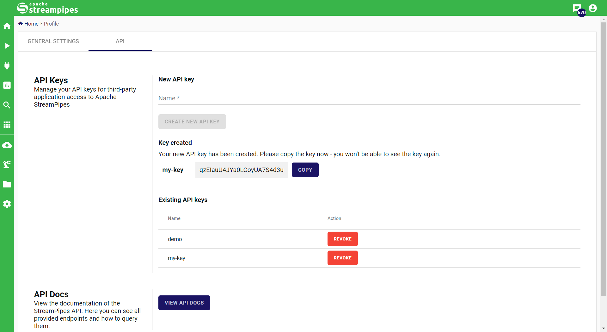

To communicate with Apache StreamPipes, you need to provide proper credentials. There are two ways to obtain
credentials:

- An API token, which is bound to a user. The API token can be generate from the UI clicking on the user icon and then
  navigate to `Profile/API`.
- A service user, which can be created by users with role `Admin`.

Service users can have their own permissions, while API tokens inherit all permissions from the corresponding user.

Once you have your API token and configured your dependencies, you can connect to an Apache StreamPipes instance as
follows:

```java
 
CredentialsProvider credentials=StreamPipesCredentials 
    .withApiKey("admin@streampipes.apache.org","YOUR_API_KEY"); 
 
// Create an instance of the StreamPipes client 
    StreamPipesClient client=StreamPipesClient 
    .create("localhost",8082,credentials,true); 
 
```

The following configurations are required:

- The `withApiKey` method expects the username and the API key. Alternatively, use the `withServiceToken` method to
  authenticate as a service user.
- The client instance requires the hostname or IP address of your running StreamPipes instance. In addition, you need to
  provide the port, the credentials object and a flag which needs to be set in case the StreamPipes instance is not
  served over HTTPS.
- There are short-hand convenience options to create a client instance.

Here are some examples how you can work with the StreamPipes client:

```java
 
// Get streams 
List<SpDataStream> streams=client.streams().all(); 
 
// Get a specific stream 
    Optional<SpDataStream> stream=client.streams().get("STREAM_ID"); 
 
// see the schema of a data stream 
    EventSchema schema=stream.get().getEventSchema(); 
 
// print the list of fields of this stream 
    List<EventProperty> fields=schema.getEventProperties(); 
 
// Get all pipelines 
    List<Pipeline> pipelines=client.pipelines().all(); 
 
// Start a pipeline 
    PipelineOperationStatus status=client.pipelines().start(pipelines.get(0)); 
 
// Stop a pipeline with providing a pipeline Id 
    PipelineOperationStatus status=client.pipelines().stop("PIPELINE_ID"); 
 
// Get all pipeline element templates 
    List<PipelineElementTemplate> templates=client.pipelineElementTemplates().all(); 
 
// Get all data sinks 
    List<DataSinkInvocation> dataSinks=client.sinks().all(); 
 
 
```

StreamPipes supports a variety of messaging protocols to internally handle data streams. If you plan to gather live data
from the client library, you also need to add one or more of the supported messaging
protocols to the pom file. The default protocol depends on the StreamPipes configuration and is set in the `.env` file
in your installation folder.

```xml
 
<!-- For Kafka support --> 
<dependency> 
    <groupId>org.apache.streampipes</groupId> 
    <artifactId>streampipes-messaging-kafka</artifactId> 
    <version>${streampipes.version}</version> 
</dependency> 
 
        <!-- For Nats support --> 
<dependency> 
<groupId>org.apache.streampipes</groupId> 
<artifactId>streampipes-messaging-nats</artifactId> 
<version>${streampipes.version}</version> 
</dependency> 
 
 
        <!-- For MQTT support --> 
<dependency> 
<groupId>org.apache.streampipes</groupId> 
<artifactId>streampipes-messaging-mqtt</artifactId> 
<version>${streampipes.version}</version> 
</dependency> 
 
```

In addition, add the message format that is used internally by StreamPipes. The default message format used by
StreamPipes is JSON, so let's include the dependency as well:

```xml
 
<!-- For JSON support --> 
<dependency> 
    <groupId>org.apache.streampipes</groupId> 
    <artifactId>streampipes-dataformat-json</artifactId> 
    <version>${streampipes.version}</version> 
</dependency> 
 
```

Once you've imported the dependencies, it is easy to consume live data. First, register the protocols and formats in
your client instance:

```java
 
client.registerProtocol(new SpKafkaProtocolFactory()); 
 
// or Nats: 
    client.registerProtocol(new SpNatsProtocolFactory()); 
 
// data format: 
    client.registerDataFormat(new JsonDataFormatFactory()); 
 
```

Then, you are ready to consume data:

```java
client.streams().subscribe(dataStreams.get(0),new EventProcessor() {@Override public void onEvent(Event event) {// example MapUtils.debugPrint(System.out,"event",event.getRaw());} });
```

> [!TIP]
> There are many more options to work with the StreamPipes Client - e.g., you can trigger emails directly from the API.
> Just explore the various classes and interfaces provided by the client!

---

<a id="extend-sdk-functions"></a>

<!-- source_url: https://streampipes.apache.org/docs/extend-sdk-functions/ -->

<!-- page_index: 30 -->

# SDK Guide: Functions

Version: 0.98.0

Pipeline elements such as data processors and data sinks are a great way
to create *reusable* components that can be part of pipelines.
However, creating a pipeline element is not always the best choice:

- The behaviour of a data processor is bound to a specific input stream *and*
- A data processor doesn't contain any user-defined configuration *and*
- The intended action is fixed or known at build time and the data processor shouldn't be available in the pipeline editor.

To cover such use cases, we provide *StreamPipes Functions*. Functions
are a great way to define custom processing logic based on previously
connected data streams.

Functions can be registered in a similar way to pipeline elements, but define expected input
streams at startup time. Functions are started once the corresponding *extensions service* starts
and run until the service is stopped.

> [!WARNING]
> **Work in Progress**
> Functions are currently in preview mode and are not yet recommended for production usage.
> APIs are subject to change in a future version.

To define a function, create a new extensions service using the [Maven Archetypes](#extend-archetypes) or use an already existing service.

Functions can be defined by creating a new class which extends the `StreamPipesFunction` class.

The basic skeleton looks like this:

```java
public class StreamPipesFunctionExample extends StreamPipesFunction {
@Override public FunctionId getFunctionId() {return FunctionId.from("my-function-id", 1);}
@Override public List<String> requiredStreamIds() {return List.of("<id of the required stream>");}
@Override public void onServiceStarted(FunctionContext context) {// called when the service is started}
@Override public void onEvent(Event event, String streamId) {// called when an event arrives}
@Override public void onServiceStopped() {// called when the service is stopped}}
```

The structure of a function class is easy to understand:

- *getFunctionId* requires an identifier in form of a `FunctionId`, which defines the id itself along with a version number that can be freely chosen.
- *requiredStreamIds* expects a list of references to data streams that are already available in StreamPipes. See below to learn how to find the id of a stream in StreamPipes.
- *onServiceStarted* is called once the extensions service is started and can be used to initialize the function.
- *onEvent* is called every time a new event arrives and provides a `streamId` as a reference to the corresponding stream, which is useful in case multiple data streams are received by the function.
- *onServiceStopped* is called when the extensions service is stopped and can be used to perform any required cleanup.

Functions require a reference to all data streams that should be retrieved by the function.
Currently, the only way to get the ID of a function is by navigating to the `Asset Management` view in the StreamPipes UI.
Create a new asset, click on `Edit Asset` and open `Add Link` in the *Linked Resources* panel.
Choose `Data Source` as link type, select one of the available sources, copy the `Resource ID` and provide this ID in the `requiredStreamIds` method.

The `onServiceStarted` method provides a function context which provides several convenience methods to work with functions:

- *getFunctionId* returns the current function identifier
- *getConfig* returns a reference to configuration options of the extensions service
- *getClient* returns a reference to the StreamPipes client to interact with features from the REST API.
- *getStreams* returns the data model of all data streams defined in the `requiredStreamIds` method.
- *getSchema* returns the schema of a specific data stream by providing the `streamId`

Registering a function is easy and can be done in the *Init* class of the service.
E.g., considering a service definition as illustrated below, simply call `registerFunction` and
provide an instance of your function.

```java
 
  @Override 
  public SpServiceDefinition provideServiceDefinition() { 
    return SpServiceDefinitionBuilder.create("my-service-id", 
            "StreamPipes Function Example", 
            "", 
            8090) 
        .registerFunction(new MyExampleFunction()) 
        .registerMessagingFormats( 
            new JsonDataFormatFactory()) 
        .registerMessagingProtocols( 
            new SpNatsProtocolFactory()) 
        .build(); 
  } 
   
```

Similar to pipeline elements, function register at the StreamPipes core.
Running functions can be seen in the pipeline view of the user interface under *Functions*, right below the list of available pipelines.
Similar to pipelines, simple metrics, monitoring info and exceptions can be viewed in the *Details* section of each function.

---

<a id="extend-sdk-event-model"></a>

<!-- source_url: https://streampipes.apache.org/docs/extend-sdk-event-model/ -->

<!-- page_index: 31 -->

# SDK Guide: Event Model

Version: 0.98.0

This guide explains the usage of the event model to manipulate runtime events for data processors and data sink.

This guide assumes that you are already familiar with the basic setup of [data processors](#extend-first-processor).

In most cases, fields that are subject to be transformed by pipeline elements are provided by the assigned `MappingProperty` (see the guide on [static properties](https://streampipes.apache.org/docs/extend-sdk-event-model/extend-sdk-static-properties/)).

Mapping properties return a `PropertySelector` that identifies a field based on (i) the **streamIndex** and (ii) the runtime name of the field.
Let's assume we have an event with the following structure:

```json
{"timestamp" : 1234556,"temperature" : 37.0,"deviceId" : "sensor1","running" : true,"location" : {"latitude" : 34.4, "longitude" : -47},"lastValues" : [45, 22, 21]}
```

In addition, we assume that a data processor exists (with one input node) that converts the temperature value (measured in degrees celsius) to a degree fahrenheit value.
In this case, a mapping property (selected by the pipeline developer in the StreamPipes UI) would link to the `temperature` field of the event.

The mapping property value will be the `PropertySelector` of the temperature value, which looks as follows:

```text
s0::temperature 
```

`s0` identifies the stream (in this case, only one input streams exist, but as data processors might require more than one input stream, a stream identifier is required), while the appendix identifies the runtime name.

Note: If you add a new field to an input event, you don't need to provide the selector, you can just assign the runtime name as defined by the [output strategy](https://streampipes.apache.org/docs/extend-sdk-event-model/extend-sdk-output-strategies/).

You can get a field from an event by providing the corresponding selector:

```java
 
@Override 
  public void onEvent(Event event, SpOutputCollector out) { 
 
  PrimitiveField temperatureField = event.getFieldBySelector(PROPERTY_SELECTOR).getAsPrimitive(); 
  } 
 
```

Similarly, if your mapping property links to a nested property, use

```java
 
@Override 
  public void onEvent(Event event, SpOutputCollector out) { 
 
  NestedField nestedField = event.getFieldBySelector(PROPERTY_SELECTOR).getAsNested(); 
  } 
 
```

and for a list-based field:

```java
 
@Override 
  public void onEvent(Event event, SpOutputCollector out) { 
 
  ListField listField = event.getFieldBySelector(PROPERTY_SELECTOR).getAsList(); 
  } 
 
```

A `PrimitiveField` contains convenience methods to directly cast a field to the target datatype:

```java
 
// parse the value as a float datatype 
Float temperatureValue = event.getFieldBySelector(temperatureSelector).getAsPrimitive().getAsFloat(); 
 
// or do the same with a double datatype 
Double temperatureValue = event.getFieldBySelector(temperatureSelector).getAsPrimitive().getAsDouble(); 
 
// extracting a string 
String deviceId = event.getFieldBySelector(deviceIdSelector).getAsPrimitive().getAsString(); 
 
// this also works for extracting fields from nested fields: 
Double latitude = event.getFieldBySelector(latitudeSelector).getAsPrimitive().getAsDouble(); 
 
// extracting boolean values 
Boolean running = event.getFieldBySelector(runningSelector).getAsPrimitive().getAsBoolean(); 
```

In rare cases, you might want to receive a field directly based on the runtime name as follows:

```java
Double temperature = event.getFieldByRuntimeName("temperature").getAsPrimitive().getAsDouble(); 
```

Lists can also be retrieved by providing the corresponding selector and can automatically be parsed to a list of primitive datatypes:

```java
 
List<Integer> lastValues = event.getFieldBySelector(lastValueSelector).getAsList().parseAsSimpleType(Integer.class); 
 
```

(coming soon: parsing complex lists)

Primitive fields can easily be added to an event by providing the runtime name and the object:

```java
 
    // add a primitive field with runtime name "city" and value "Karlsruhe" 
    event.addField("city", "Karlsruhe"); 
 
    // remove the field "temperature" from the event 
    event.removeFieldBySelector(temperatureSelector); 
 
    // add a new field 
    event.addField("fahrenheit", 48); 
```

---

<a id="extend-sdk-migration"></a>

<!-- source_url: https://streampipes.apache.org/docs/extend-sdk-migration/ -->

<!-- page_index: 32 -->

# SDK Guide: Pipeline Element Migration

Version: 0.98.0

> [!NOTE]
> **info**
> Migrations will make their debut in StreamPipes version `0.93.0` and will be an integral part of the system going
> forward.
> However, it's important to note that this feature is not available in any of the previous versions of StreamPipes. To
> take full advantage of migrations and their benefits, it is recommended to upgrade to version `0.93.0` or later. This
> will
> ensure that you have access to the latest enhancements and maintain compatibility with the evolving StreamPipes
> platform.

---

<a id="extend-sdk-stream-requirements"></a>

<!-- source_url: https://streampipes.apache.org/docs/extend-sdk-stream-requirements/ -->

<!-- page_index: 33 -->

# SDK Guide: Stream Requirements

Version: 0.98.0

Data processors and data sinks can define `StreamRequirements`. Stream requirements allow pipeline elements to express requirements on an incoming event stream that are needed for the element to work properly.
Once users create pipelines in the StreamPipes Pipeline Editor, these requirements are verified against the connected event stream.
By using this feature, StreamPipes ensures that only pipeline elements can be connected that are syntactically and semantically valid.

This guide covers the creation of stream requirements. Before reading this section, we recommend that you make yourself familiar with the SDK guide on [data processors](https://streampipes.apache.org/docs/extend-sdk-stream-requirements/extend-first-processor/).

> [!TIP]
> **Code on Github**
> For all examples, the code can be found on [Github](https://www.github.com/apache/streampipes-examples/tree/dev/streampipes-pipeline-elements-examples-processors-jvm/src/main/java/org/apache/streampipes/pe/examples/jvm/requirements/).

Stream requirements can be defined in the `declareModel` method of the pipeline element class. Start with a method body like this:

```java
 
@Override 
  public DataProcessorDescription declareModel() { 
    return ProcessingElementBuilder.create(ID, PIPELINE_ELEMENT_NAME, DESCRIPTION) 
            .requiredStream(StreamRequirementsBuilder. 
                    create() 
 
                    .build()) 
 
            .supportedProtocols(SupportedProtocols.kafka()) 
            .supportedFormats(SupportedFormats.jsonFormat()) 
            .outputStrategy(OutputStrategies.keep()) 
 
            .build(); 
  } 
```

The `StreamRequirementsBuilder` class provides methods to add stream requirements to a pipeline element.

As a very first example, let's assume we would like to create a data processor that filters numerical values that are above a given threshold.
Consequently, any data stream that is connected to the filter processor needs to provide a numerical value.

The stream requirement would be assigned as follows:

```java
@Override 
  public DataProcessorDescription declareModel() { 
    return ProcessingElementBuilder.create(ID, PIPELINE_ELEMENT_NAME, DESCRIPTION) 
            .requiredStream(StreamRequirementsBuilder 
                    .create() 
                    .requiredProperty(EpRequirements.numberReq()) 
                    .build()) 
 
            .supportedProtocols(SupportedProtocols.kafka()) 
            .supportedFormats(SupportedFormats.jsonFormat()) 
            .outputStrategy(OutputStrategies.keep()) 
 
            .build(); 
  } 
```

Note the line starting with `requiredProperty`, which requires any stream to provide a datatype of type `number`.

In many cases, you'll want to let the user select a specific field from a data stream from all available fields that match the specified requirement. For that, you simply use the method `requiredPropertyWithUnaryMapping` as follows:

```java
@Override 
  public DataProcessorDescription declareModel() { 
    return ProcessingElementBuilder.create(ID, PIPELINE_ELEMENT_NAME, DESCRIPTION) 
            .requiredStream(StreamRequirementsBuilder 
                    .create() 
                    .requiredPropertyWithUnaryMapping(EpRequirements.numberReq(), 
                    Labels.from("number-mapping", "The value that should be filtered", ""), PropertyScope.NONE) 
                    .build()) 
 
            .supportedProtocols(SupportedProtocols.kafka()) 
            .supportedFormats(SupportedFormats.jsonFormat()) 
            .outputStrategy(OutputStrategies.keep()) 
 
            .build(); 
  } 
```

See also the developer guide on [static properties](https://streampipes.apache.org/docs/extend-sdk-stream-requirements/extend-sdk-static-properties/) to better understand the usage of `MappingProperties`.

Requirements on primitive fields can be specified for all common datatypes:

```java
 @Override 
  public DataProcessorDescription declareModel() { 
    return ProcessingElementBuilder.create("org.streampipes.examples.requirements" + 
            ".simple", "Simple requirements specification examples", "") 
            .requiredStream(StreamRequirementsBuilder. 
                    create() 
                    .requiredProperty(EpRequirements.numberReq()) // any number 
                    .requiredProperty(EpRequirements.doubleReq()) // any field of type double 
                    .requiredProperty(EpRequirements.booleanReq()) // any field of type boolean 
                    .requiredProperty(EpRequirements.integerReq()) // any field of type integer 
                    .requiredProperty(EpRequirements.stringReq()) // any field of type string 
 
                    .requiredProperty(EpRequirements.anyProperty()) // any field allowed (no restriction) 
                    .requiredProperty(EpRequirements.timestampReq())  // any timestamp field 
                    .build()) 
 
 
            .supportedProtocols(SupportedProtocols.kafka()) 
            .supportedFormats(SupportedFormats.jsonFormat()) 
            .outputStrategy(OutputStrategies.keep()) 
 
            .build(); 
```

For some algorithms, only specifying the datatype is not sufficient. Let's consider a geofencing algorithm that detects the precense some geospatial coordinate (e.g., from a vehicle) within a given location.

You could specify something like this:

```java
    StreamRequirementsBuilder 
    .create() 
    .requiredPropertyWithUnaryMapping(EpRequirements.doubleEp(), Labels.from("mapping-latitude", "Latitude", ""), PropertyScope.NONE) 
    .requiredPropertyWithUnaryMapping(EpRequirements.doubleEp(), Labels.from("mapping-longitude", "Longitude", ""), PropertyScope.NONE) 
    .build() 
```

However, this would allow users to create strange pipelines as users could connect any stream containing a double value to our geofencing algorithm.
To avoid such situations, you can also specify requirements based on the semantics of a field:

```java
    StreamRequirementsBuilder 
    .create() 
    .requiredPropertyWithUnaryMapping(EpRequirements.domainPropertyReq(SO.Latitude), Labels.from("mapping-latitude", "Latitude", ""), PropertyScope.NONE) 
    .requiredPropertyWithUnaryMapping(EpRequirements.domainPropertyReq(SO.Longitude), Labels.from("mapping-longitude", "Longitude", ""), PropertyScope.NONE) 
    .build() 
```

Note that in this case, we make use of Schema.org's `Latitude` concept (<https://schema.org/latitude>). StreamPipes already includes popular vocabularies for specifying semantics. You are also free to use your own vocabularies.

Similarly to primitive requirements, you can define processors that require data streams with list fields, see the following examples:

```java
@Override 
  public DataProcessorDescription declareModel() { 
    return ProcessingElementBuilder.create("org.streampipes.examples.requirements" + 
            ".list", "List requirements specification examples", "") 
            .requiredStream(StreamRequirementsBuilder. 
                    create() 
                    .requiredProperty(EpRequirements.listRequirement(Datatypes.Integer)) 
                    .requiredProperty(EpRequirements.listRequirement(Datatypes.Double)) 
                    .requiredProperty(EpRequirements.listRequirement(Datatypes.Boolean)) 
                    .requiredProperty(EpRequirements.listRequirement(Datatypes.String)) 
                    .build()) 
 
 
            .supportedProtocols(SupportedProtocols.kafka()) 
            .supportedFormats(SupportedFormats.jsonFormat()) 
            .outputStrategy(OutputStrategies.keep()) 
 
            .build(); 
  } 
```

(coming soon, see the Javadoc for now)

---

<a id="extend-sdk-static-properties"></a>

<!-- source_url: https://streampipes.apache.org/docs/extend-sdk-static-properties/ -->

<!-- page_index: 34 -->

# SDK Guide: Static Properties

Version: 0.98.0

Static properties represent user-faced parameters that are provided by pipeline developers.
Processing elements can specify required static properties, which will render different UI views in the pipeline editor.

The following reference describes how static properties can be defined using the SDK.

> [!TIP]
> **Code on Github**
> For all examples, the code can be found on [Github](https://github.com/apache/streampipes-examples/tree/dev/streampipes-pipeline-elements-examples-processors-jvm/src/main/java/org/apache/streampipes/pe/examples/jvm/staticproperty).

The methods described below to create static properties are available in the `ProcessingElementBuilder` and `DataSinkBuilder` classes and are usually used in the `declareModel` method of the controller class.

In StreamPipes, processing elements usually operate on fields of an event stream. For instance, a filter processor operates on a specific field from an input stream (e.g., a field measuring the temperature).
Typically, pipeline developers should select the exact field where the operations is applied upon by themselves.
As this field is not yet known at pipeline element development time (as it is defined by the pipeline developer in the pipeline editor), mapping properties serve to map a stream requirement to a specific field from the actual input event stream.

A unary mapping property maps a stream requirement to an actual field of an event stream. Therefore, the `StreamRequirementsBuilder` provides the opportunity to directly add a mapping property based along with a property requirement:

```java
.requiredStream(StreamRequirementsBuilder. 
    create() 
    .requiredPropertyWithUnaryMapping(EpRequirements.numberReq(), 
            Labels.from("mp-key", "My Mapping", ""), 
            PropertyScope.NONE) 
    .build()) 
```

This leads to a selection dialog in the pipeline element customization which provides the user with a selection of all event properties (fields) from the input stream that match the specified property requirement:

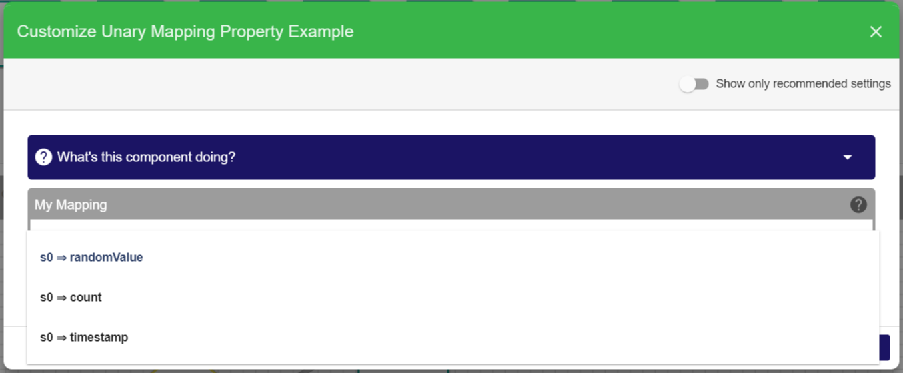

At invocation time, the value can be extracted in the `onInvocation` method as follows:

```java
// Extract the mapping property value 
String mappingPropertySelector = extractor.mappingPropertyValue("mp-key"); 
```

Note that this method returns a `PropertySelector`, which can be used by the event model to extract the actual value of this field.

N-ary mapping properties work similar to unary mapping properties, but allow the mapping of one requirement to multiple event properties matching the requirement:

```java
.requiredStream(StreamRequirementsBuilder. 
    create() 
    .requiredPropertyWithNaryMapping(EpRequirements.numberReq(), 
            Labels.from("mp-key", "My Mapping", ""), 
            PropertyScope.NONE) 
    .build()) 
```

This renders the following selection, where users can select more than one matching event property:

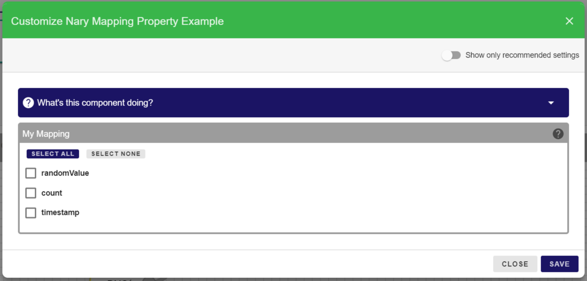

The following snippet returns a list containing the property selectors of all event properties that have been selected:

```java
// Extract the mapping property value 
List<String> mappingPropertySelectors = extractor.mappingPropertyValues("mp-key"); 
```

A free-text parameter requires the pipeline developer to enter a single value - which can be a string or another primitive data type.
The input of free-text parameters can be restricted to specific value ranges or can be linked to the value set of a connected input data stream.

A text parameter lets the user enter a string value. The following code line in the controller class

```java
.requiredTextParameter(Labels.from(SP_KEY, "Example Name", "Example Description")) 
```

leads to the following input dialog in the pipeline editor:

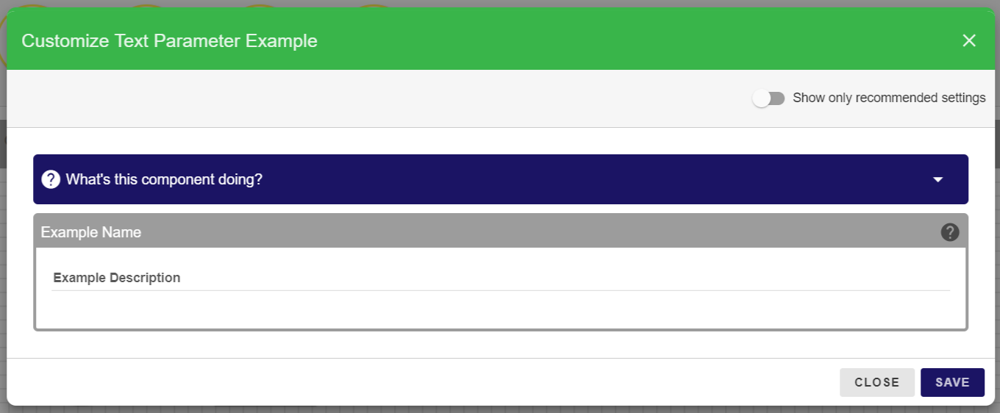

Users can enter any value that will be converted to a string datatype. To receive the entered value in the `onInvocation` method, use the following method from the `ParameterExtractor`

```java
String textParameter = extractor.singleValueParameter(SP_KEY, String.class); 
```

A number parameter lets the user enter a number value, either a floating-point number or an integer:

```java
// create an integer parameter 
.requiredIntegerParameter(Labels.from(SP_KEY, "Integer Parameter", "Example Description")) 
 
// create a float parameter 
.requiredFloatParameter(Labels.from("float-key", "Float Parameter", "Example Description")) 
 
```

leads to the following input dialog in the pipeline editor only accepting integer values:

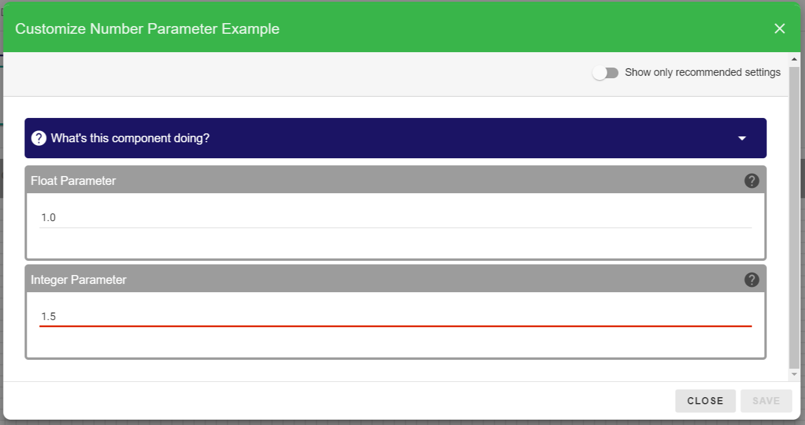

The pipeline editor performs type validation and ensures that only numbers can be added by the user. To receive the entered value in the `onInvocation` method, use the following method from the `ParameterExtractor`

```java
// Extract the integer parameter value 
Integer integerParameter = extractor.singleValueParameter(SP_KEY, Integer.class); 
 
// Extract the float parameter value 
Float floatParameter = extractor.singleValueParameter("float-key", Float.class); 
 
```

You can also specify the value range of a number-based free text parameter:

```java
// create an integer parameter with value range 
.requiredIntegerParameter(Labels.from(SP_KEY, "Integer Parameter", "Example Description"), 0, 100, 1) 
 
```

which renders the following input field:

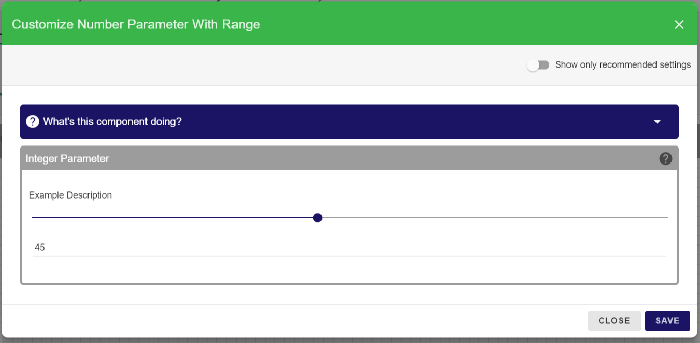

Receive the entered value in the same way as a standard number parameter.

Single-value selections let the user select from a pre-defined list of options.
A single-value selection requires to select exactly one option.

```java
.requiredSingleValueSelection(Labels.from("id", "Example Name", "Example Description"), 
    Options.from("Option A", "Option B", "Option C")) 
 
```

Single-value selections will be rendered as a set of radio buttons in the pipeline editor:

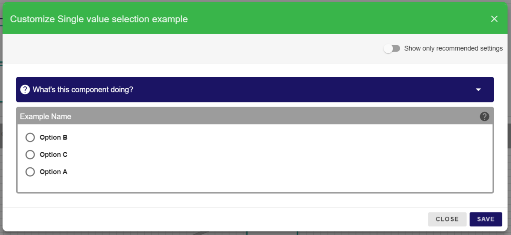

To extract the selected value, use the following method from the parameter extractor:

```java
// Extract the selected value 
String selectedSingleValue = extractor.selectedSingleValue("id", String.class); 
```

> [!TIP]
> **Declaring options**
> Sometimes, you may want to use an internal name that differs from the display name of an option.
> For that, you can use the method Options.from(Tuple2{'<'}String, String{'>'}) and the extractor method selectedSingleValueInternalName.

Multi-value selections let the user select from a pre-defined list of options, where multiple or no option might be selected.

```java
.requiredMultiValueSelection(Labels.from("id", "Example Name", "Example Description"), 
    Options.from("Option A", "Option B", "Option C")) 
 
```

Multi-value selections will be rendered as a set of checkboxes in the pipeline editor:

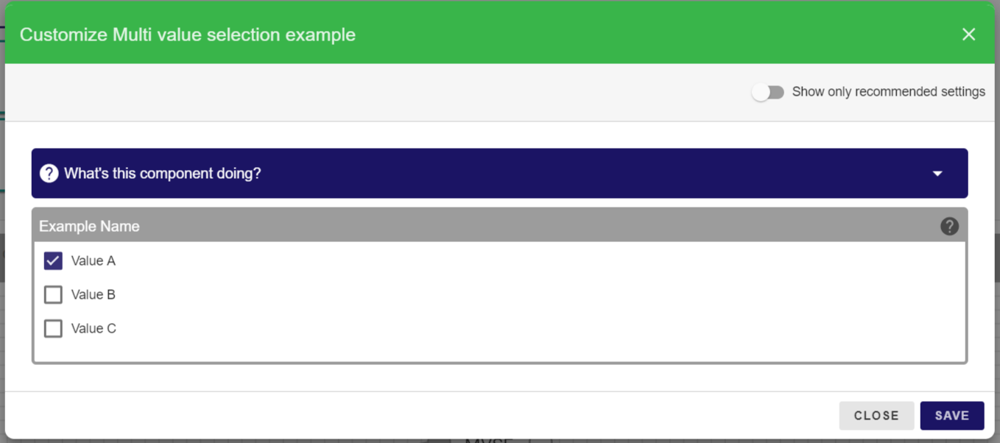

To extract the selected value, use the following method from the parameter extractor:

```java
// Extract the selected value 
List<String> selectedMultiValue = extractor.selectedMultiValues("id", String.class); 
```

(coming soon...)

You can also define collections based on other static properties.

```java
// create a collection parameter 
.requiredParameterAsCollection(Labels.from("collection", "Example Name", "Example " + 
        "Description"), StaticProperties.stringFreeTextProperty(Labels 
        .from("text-property","Text",""))) 
```

While the items of the collection can be provided in the same way as the underlying static property, the UI provides buttons to add and remove items to the collections.

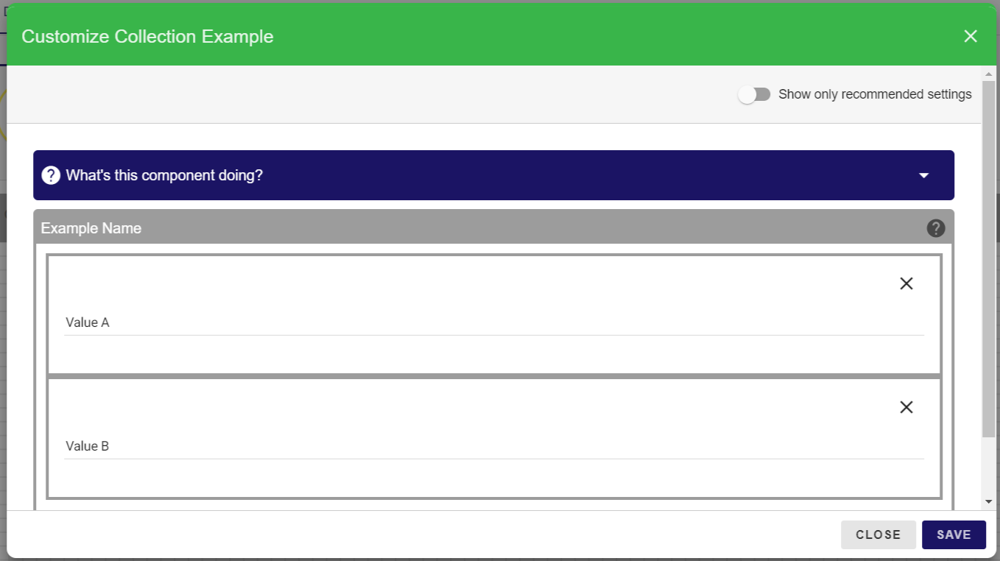

To extract the selected values from the collection, use the following method from the parameter extractor:

```java
// Extract the text parameter value 
List<String> textParameters = extractor.singleValueParameterFromCollection("collection", String.class); 
```

In some cases, the options of selection parameters are not static, but depend on other values or might change at runtime. In this case, you can use runtime-resolvable selections.

First, let your controller class implement `ResolvesContainerProvidedOptions`:

```java
public class RuntimeResolvableSingleValue extends 
     StandaloneEventProcessingDeclarer<DummyParameters> implements ResolvesContainerProvidedOptions { ... } 
```

Next, define the parameter in the `declareModel` method:

```java
// create a single value selection parameter that is resolved at runtime 
    .requiredSingleValueSelectionFromContainer(Labels.from("id", "Example Name", "Example " + 
            "Description")) 
```

Finally, implement the method `resolveOptions`, which will be called at runtime once the processor is used:

```java
  @Override 
  public List<RuntimeOptions> resolveOptions(String requestId, EventProperty linkedEventProperty) { 
    return Arrays.asList(new RuntimeOptions("I was defined at runtime", "")); 
  } 
```

The UI will render a single-value parameter based on the options provided at runtime:

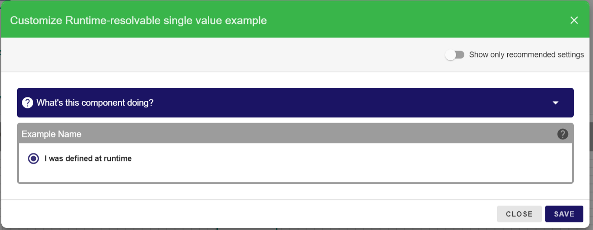

The parameter extraction does not differ from the extraction of static single-value parameters.

> [!NOTE]
> **Multi-value selections**
> Although this example shows the usage of runtime-resolvable selections using single value selections, the same also works for multi-value selections!

---

<a id="extend-sdk-output-strategies"></a>

<!-- source_url: https://streampipes.apache.org/docs/extend-sdk-output-strategies/ -->

<!-- page_index: 35 -->

# SDK Guide: Output Strategies

Version: 0.98.0

In StreamPipes, output strategies determine the output of a data processor.
As the exact input schema of a processor is usually not yet known at development time (as processors can be connected with any stream that matches their requirements), output strategies are a concept to define how an input data stream is transformed to an output data stream.

The following reference describes how output strategies can be defined using the SDK.

> [!TIP]
> **Code on Github**
> For all examples, the code can be found on [Github](https://www.github.com/apache/streampipes-examples/tree/dev/streampipes-pipeline-elements-examples-processors-jvm/src/main/java/org/apache/streampipes/pe/examples/jvm/outputstrategy/)

The methods described below to create static properties are available in the `ProcessingElementBuilder` class and are usually used in the `declareModel` method of the controller class.

As follows, we will use the following example event to explain how output strategies define the output of a data processor:

```json
{ 
    "timestamp" : 1234556, 
    "temperature" : 37.0, 
    "deviceId" : "1" 
 
} 
```

A `KeepOutputStrategy` declares that the output event schema will be equal to the input event schema.
In other terms, the processor does not change the schema, but might change the values of event properties.

A keep output strategy can be defined as follows:

```java
 
@Override 
  public DataProcessorDescription declareModel() { 
    return ProcessingElementBuilder.create("org.streampipes.examples.outputstrategy" + 
            ".keep", "Keep output example example", "") 
            .requiredStream(StreamRequirementsBuilder. 
                    create() 
                    .requiredProperty(EpRequirements.anyProperty()) 
                    .build()) 
            .supportedProtocols(SupportedProtocols.kafka()) 
            .supportedFormats(SupportedFormats.jsonFormat()) 
 
            // declaring a keep output strategy 
            .outputStrategy(OutputStrategies.keep()) 
 
            .build(); 
  } 
 
```

According to the example above, the expected output event schema of the example input event would be:

```json
{ 
    "timestamp" : 1234556, 
    "temperature" : 37.0, 
    "deviceId" : "1" 
 
} 
```

Data processors that perform filter operations (e.g., filtering temperature values that are above a given threshold) are a common example for using keep output strategies.

A `FixedOutputStrategy` declares that the data processor itself provides the event schema. The output schema does not depend on the input event.

Fixed output strategies need to provide the event schema they produce at development time:

```java
 
  @Override 
  public DataProcessorDescription declareModel() { 
    return ProcessingElementBuilder.create("org.streampipes.examples.outputstrategy" + 
            ".fixed", "Fixed output example", "") 
            .requiredStream(StreamRequirementsBuilder. 
                    create() 
                    .requiredProperty(EpRequirements.anyProperty()) 
                    .build()) 
            .supportedProtocols(SupportedProtocols.kafka()) 
            .supportedFormats(SupportedFormats.jsonFormat()) 
 
            // the fixed output strategy provides the schema 
            .outputStrategy(OutputStrategies.fixed(EpProperties.timestampProperty("timestamp"), 
                    EpProperties.doubleEp(Labels.from("avg", "Average value", ""), "avg", SO.Number))) 
 
            .build(); 
  } 
 
```

In this example, we declare that the output schema always consists of two fields (`timestamp` and `avg`).

Therefore, an output event should look like:

```json
{ 
    "timestamp" : 1234556, 
    "avg" : 36.0 
} 
```

An `AppendOutputStrategy` appends additional fields to a schema of an incoming event stream. For instance, data processors that perform enrichment operations usually make use of append output strategies.

Similar to the fixed output strategy, the additional fields must be provided at development time in the controller method as follows:

```java
  @Override 
  public DataProcessorDescription declareModel() { 
    return ProcessingElementBuilder.create("org.streampipes.examples.outputstrategy" + 
            ".append", "Append output example", "") 
 
            // boilerplate code not relevant here, see above 
 
            // declaring an append output 
            .outputStrategy(OutputStrategies.append(EpProperties.integerEp(Labels.from("avg", 
                    "The average value", ""), "avg", SO.Number))) 
 
            .build(); 
  } 
```

In this case, the output event would have an additional field `avg`:

```json
{ 
    "timestamp" : 1234556, 
    "temperature" : 37.0, 
    "deviceId" : "1", 
    "avg" : 123.0 
 
} 
```

In some cases, pipeline developers using the StreamPipes UI should be able to manually select fields from an input event schema. For such use cases, a `CustomOutputStrategy` can be used:

```java
 
@Override 
  public DataProcessorDescription declareModel() { 
    return ProcessingElementBuilder.create("org.streampipes.examples.outputstrategy" + 
            ".custom", "Custom output example", "") 
 
            // boilerplate code not relevant here, see above 
 
            // declaring a custom output 
            .outputStrategy(OutputStrategies.custom()) 
 
            .build(); 
  } 
 
```

If a data processor defines a custom output strategy, the customization dialog in the pipeline editor will show a dialog to let users select the fields to keep:

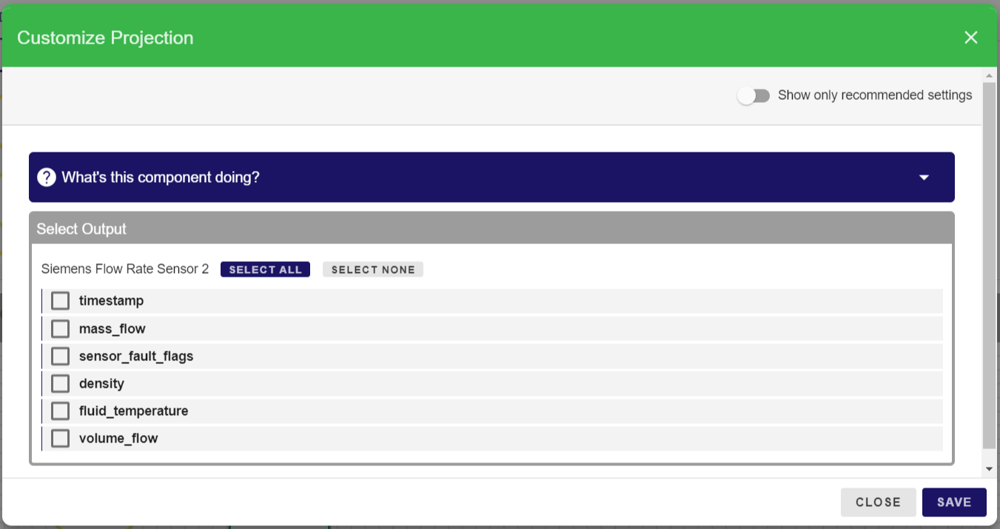

Taking our example, and assuming that the user selects both the `timestamp` and the `temperature` the expected output event should look like this:

```json
{ 
    "timestamp" : 1234556, 
    "temperature" : 37.0 
} 
```

How do we know which fields were selected once the data processor is invoked? Use the proper method from the extractor in the `onInvocation` method:

```java
@Override 
  public ConfiguredEventProcessor<DummyParameters> onInvocation(DataProcessorInvocation graph, ProcessingElementParameterExtractor extractor) { 
 
    List<String> outputSelectors = extractor.outputKeySelectors(); 
 
    return new ConfiguredEventProcessor<>(new DummyParameters(graph), DummyEngine::new); 
  } 
```

A `TransformOutputStrategy` declares that one or more fields of an incoming event stream are transformed. Transformations can be applied to the datatype of the property, the runtime name of the property, or any other scheam-related declaration such as measurement units.

Static transform operations do not depend on any user input (at pipeline development time) in order to know how to transform a field of an incoming event schema.

Let's say our data processor transforms strings (that are actually a number) to a number datatype. In this case, we can use a static transform output strategy:

```java
 
  @Override 
  public DataProcessorDescription declareModel() { 
    return ProcessingElementBuilder.create("org.streampipes.examples.outputstrategy" + 
            ".transform", "Transform output example example", "") 
            .requiredStream(StreamRequirementsBuilder. 
                    create() 
                    .requiredPropertyWithUnaryMapping(EpRequirements.stringReq(), Labels.from 
                            ("str", "The date property as a string", ""), PropertyScope.NONE) 
                    .build()) 
            .supportedProtocols(SupportedProtocols.kafka()) 
            .supportedFormats(SupportedFormats.jsonFormat()) 
 
            // static transform operation 
            .outputStrategy(OutputStrategies.transform(TransformOperations 
                    .staticDatatypeTransformation("str", Datatypes.Long))) 
 
            .build(); 
  } 
 
```

Note the mapping property that we use to determine which field of the input event should be transformed.

The expected output event would look like this:

```json
{ 
    "timestamp" : 1234556, 
    "temperature" : 37.0, 
    "deviceId" : 1 
} 
```

Sometimes, user input depends on the exact transform output. Let's take a field renaming processor as an example, which lets the user rename a field from an input event schema to another field name.
For such use cases, we can use a `DynamicTransformOperation`:

```java
 
  @Override 
  public DataProcessorDescription declareModel() { 
    return ProcessingElementBuilder.create("org.streampipes.examples.outputstrategy" + 
            ".transform", "Transform output example example", "") 
            .requiredStream(StreamRequirementsBuilder. 
                    create() 
                    .requiredPropertyWithUnaryMapping(EpRequirements.stringReq(), Labels.from 
                            ("str", "The date property as a string", ""), PropertyScope.NONE) 
                    .build()) 
            .supportedProtocols(SupportedProtocols.kafka()) 
            .supportedFormats(SupportedFormats.jsonFormat()) 
 
            // the text input to enter the new runtime name 
            .requiredTextparameter(Labels.from("new-runtime-name", "New Runtime Name", "")) 
 
            // static transform operation 
            .outputStrategy(OutputStrategies.transform(TransformOperations 
                    .dynamicRuntimeNameTransformation("str", "new-runtime-name"))) 
 
            .build(); 
  } 
 
```

For dynamic transform operations, an additional identifier that links to another static property can be assigned and later be fetched in the `onInvocation` method.

Assuming we want to rename the field `temperature` to `temp`, the resulting output event should look like this:

```json
{ 
    "timestamp" : 1234556, 
    "temp" : 37.0, 
    "deviceId" : 1 
} 
```

Finally, in some cases the output schema cannot be described at pipeline development time. For these (usually rare) cases, a `CustomTransformOutput` strategy can be used.

In this case, a callback function will be invoked in the controller class just after a user has filled in any static properties and clicks on `Save` in the pipeline editor.

To define a custom transform output, we need to implement an interface in the controller class:

```java
public class CustomTransformOutputController extends StandaloneEventProcessingDeclarer<DummyParameters> implements ResolvesContainerProvidedOutputStrategy<DataProcessorInvocation, ProcessingElementParameterExtractor> {
@Override public EventSchema resolveOutputStrategy(DataProcessorInvocation processingElement, ProcessingElementParameterExtractor parameterExtractor) throws SpRuntimeException {
}}
```

In addition, the output strategy must be declared in the `declareModel` method:

```java
 
@Override 
  public DataProcessorDescription declareModel() { 
    return ProcessingElementBuilder.create("org.streampipes.examples.outputstrategy" + 
            ".customtransform", "Custom transform output example example", "") 
            .requiredStream(StreamRequirementsBuilder. 
                    create() 
                    .requiredPropertyWithUnaryMapping(EpRequirements.stringReq(), Labels.from 
                            ("str", "The date property as a string", ""), PropertyScope.NONE) 
                    .build()) 
            .supportedProtocols(SupportedProtocols.kafka()) 
            .supportedFormats(SupportedFormats.jsonFormat()) 
 
            // declare a custom transform output 
            .outputStrategy(OutputStrategies.customTransformation()) 
 
            .build(); 
  } 
 
```

Once a new pipeline using this data processor is created and the configuration is saved, the `resolveOutputStrategy` method will be called, so that an event schema can be provided based on the given configuration. An extractor instance (see the guide on static properties) is available to extract the selected static properties and the connected event stream.

```java
@Override 
  public EventSchema resolveOutputStrategy(DataProcessorInvocation processingElement, ProcessingElementParameterExtractor parameterExtractor) throws SpRuntimeException { 
    return new EventSchema(Arrays 
            .asList(EpProperties 
                    .stringEp(Labels.from("runtime", "I was added at runtime", ""), "runtime", SO.Text))); 
  } 
```

In this example, the output event schema should look like this:

```json
{ 
    "runtime" : "Hello world!" 
} 
```

---

<a id="extend-customize-ui"></a>

<!-- source_url: https://streampipes.apache.org/docs/extend-customize-ui/ -->

<!-- page_index: 36 -->

# UI customization

Version: 0.98.0

It is possible to use a custom theme with individual styles, logos and images instead of the default StreamPipes theme.

In this section, we describe the necessary steps to build and deploy a custom theme.

To use a custom theme, it is required to build the UI with the custom settings.
In general, the UI can be found in the `ui` folder of the source code.

Perform the following steps to build the UI;

```bash
 
# Install all necessary packages npm install
 
# Start the UI for development purposes npm run start
 
# Build the StreamPipes UI npm run build
 
```

The following assets can be provided in a customized theme:

- **Logo** This is the main logo image, which is shown e.g., on the login page.
- **Navigation Logo** This is the logo which appears in the top navigation bar after successful login
- **Favicon** The favicon is shown in the browser navbar. It is also used as the loading animation in StreamPipes.
- **String constants** Customizable strings, e.g., when you want to use another application name than **Apache StreamPipes**.
- **Theme variables** An scss file which defines custom colors and layouts.

To customize constants, you can create a custom file `app.constants.ts` and modify the content based on the template below:

```javascript
 
import {Injectable} from '@angular/core'; 
 
@Injectable() 
export class AppConstants { 
 
  public readonly APP_NAME = "Apache StreamPipes"; 
  public readonly APP_TITLE = 'Apache StreamPipes'; 
  public readonly EMAIL = "admin@streampipes.apache.org"; 
} 
 
 
```

To customize the theme, we provide a file named `variables.scss` which can be overridden with default color and style settings.

See the example below:

```scss
 
/*! 
 * Licensed to the Apache Software Foundation (ASF) under one or more 
 * contributor license agreements.  See the NOTICE file distributed with 
 * this work for additional information regarding copyright ownership. 
 * The ASF licenses this file to You under the Apache License, Version 2.0 
 * (the "License"); you may not use this file except in compliance with 
 * the License.  You may obtain a copy of the License at 
 * 
 *    http://www.apache.org/licenses/LICENSE-2.0 
 * 
 * Unless required by applicable law or agreed to in writing, software 
 * distributed under the License is distributed on an "AS IS" BASIS, 
 * WITHOUT WARRANTIES OR CONDITIONS OF ANY KIND, either express or implied. 
 * See the License for the specific language governing permissions and 
 * limitations under the License. 
 * 
 */ 
 
$sp-color-primary: rgb(57, 181, 74); 
$sp-color-primary-600: #06c12a; 
 
$sp-color-accent: #1b1464; 
 
$sp-color-accent-light-blue: rgb(59, 92, 149); 
$sp-color-accent-light: rgb(156, 156, 156); 
$sp-color-accent-light-transparent: rgba(156, 156, 156, 0.4); 
 
$sp-color-accent-dark: #83a3de; 
 
$sp-color-adapter: #7f007f; 
$sp-color-stream: #ffeb3b; 
$sp-color-processor: #009688; 
$sp-color-sink: #3f51b5; 
 
$sp-color-error: #b71c1c; 
 
body { 
    --color-data-view: rgb(122, 206, 227); 
    --color-dashboard: rgb(76, 115, 164); 
    --color-adapter: rgb(182, 140, 97); 
    --color-data-source: #ffeb3b; 
    --color-pipeline: rgb(102, 185, 114); 
    --color-measurement: rgb(39, 164, 155); 
    --color-file: rgb(163, 98, 190); 
 
    --button-border-radius: 5px; 
    --iconbar-width: 35px; 
    --navbar-icon-border-radius: 0; 
    --navbar-icon-padding: 0; 
} 
 
:root { 
    --color-loading-bar: #{$sp-color-accent}; 
} 
 
.dark-mode { 
    --color-primary: #{$sp-color-primary}; 
    --color-accent: #{$sp-color-accent-dark}; 
    --color-bg-outer: var(--color-bg-1); 
    --color-bg-page-container: var(--color-bg-0); 
    --color-bg-main-panel-header: var(--color-bg-0); 
    --color-bg-main-panel-content: var(--color-bg-0); 
    --color-bg-navbar-icon: inherit; 
    --color-bg-navbar-icon-selected: inherit; 
    --color-bg-0: #121212; 
    --color-bg-1: #282828; 
    --color-bg-2: #404040; 
    --color-bg-3: #424242; 
    --color-bg-4: #5f5f5f; 
    --color-bg-dialog: rgb(66, 66, 66); 
    --color-shadow: #c4c4c4; 
    --color-pe: #404040; 
    --color-default-text: rgba(255, 255, 255, 0.87); 
    --color-warn: #b36161; 
 
    --color-tab-border: #cccccc; 
 
    --color-navigation-bg: var(--color-primary); 
    --color-navigation-link-text: var(--color-bg-0); 
    --color-navigation-text: #121212; 
    --color-navigation-selected: #{$sp-color-primary}; 
    --color-navigation-hover: #{$sp-color-primary-600}; 
    --color-navigation-bg-selected: var(--color-bg-1); 
    --color-navigation-divider: #{$sp-color-primary}; 
 
    --content-box-color: #404040; 
    --canvas-color: linear-gradient( 
            90deg, 
            rgba(50, 50, 50, 0.5) 10%, 
            transparent 0% 
        ), 
        linear-gradient(rgba(50, 50, 50, 0.5) 10%, transparent 0%); 
} 
 
.light-mode { 
    --color-primary: #{$sp-color-primary}; 
    --color-accent: #{$sp-color-accent}; 
    --color-bg-outer: var(--color-bg-1); 
    --color-bg-page-container: var(--color-bg-0); 
    --color-bg-main-panel-header: var(--color-bg-0); 
    --color-bg-main-panel-content: var(--color-bg-0); 
    --color-bg-navbar-icon: inherit; 
    --color-bg-navbar-icon-selected: inherit; 
    --color-bg-0: #ffffff; 
    --color-bg-1: #fafafa; 
    --color-bg-2: #f1f1f1; 
    --color-bg-3: rgb(224, 224, 224); 
    --color-bg-4: rgb(212, 212, 212); 
    --color-bg-dialog: #ffffff; 
    --color-shadow: #555; 
    --color-pe: #ffffff; 
    --color-default-text: #121212; 
    --color-warn: #b71c1c; 
 
    --color-tab-border: #cccccc; 
 
    --color-navigation-bg: var(--color-primary); 
    --color-navigation-link-text: var(--color-bg-0); 
    --color-navigation-text: #ffffff; 
    --color-navigation-selected: #{$sp-color-primary}; 
    --color-navigation-hover: #{$sp-color-primary-600}; 
    --color-navigation-bg-selected: var(--color-bg-1); 
    --color-navigation-divider: var(--color-primary); 
 
    --content-box-color: rgb(156, 156, 156); 
    --canvas-color: linear-gradient( 
            90deg, 
            rgba(208, 208, 208, 0.5) 10%, 
            transparent 0% 
        ), 
        linear-gradient(rgba(208, 208, 208, 0.5) 10%, transparent 0%); 
} 
 
```

To create a new UI build with customized themes, use the following command:

```bash
 
UI_LOC=PATH_TO_FOLDER_WITH_CUSTOM_TEMPLATES \\ 
THEME_LOC=$UI_LOC/_variables.scss \\ 
LOGO_HEADER_LOC=$UI_LOC/img/logo.png \\ 
FAVICON_LOC=$UI_LOC/img/favicon.png \\ 
LOGO_NAV_LOC=$UI_LOC/img/logo-navigation.png \\ 
CONSTANTS_FILE=$UI_LOC/app.constants.ts \\ 
npm run build 
 
```

First, we create a helper environment variable that links to a folder which includes custom logos, the theme file and constants.
Next, we set the variables above to override default logos and stylings.
Finally, the usual build process is executed.

Once finished, you've successfully customized an Apache StreamPipes instance!

---

<a id="technicals-architecture"></a>

<!-- source_url: https://streampipes.apache.org/docs/technicals-architecture/ -->

<!-- page_index: 37 -->

# Architecture

Version: 0.98.0

> [!NOTE]
> **info**
> As of version 0.93.0, the Python SDK supports functions only. If you would like to develop pipeline elements in Python as well, let us know in a [Github discussions](https://github.com/apache/streampipes/discussions) comment, so that we can better prioritize development.

---

<a id="technicals-runtime-wrappers"></a>

<!-- source_url: https://streampipes.apache.org/docs/technicals-runtime-wrappers/ -->

<!-- page_index: 38 -->

# Runtime Wrappers

Version: 0.98.0

In general, StreamPipes has an exchangeable runtime layer, e.g., the actual processing of incoming events can be delegated to a third-party stream processing system such as Kafka Streams or Apache Flink.

The default runtime wrapper is the StreamPipes Native Wrapper, called the `StandaloneWrapper`.

Although not recommended for production, we invite interested developers to check out our experimental wrappers:

- Kafka Streams runtime wrapper at <https://github.com/apache/streampipes/tree/dev/streampipes-wrapper-kafka-streams>
- Apache Flink runtime wrapper at <https://github.com/apache/streampipes/tree/dev/streampipes-wrapper-flink>

Runtime wrappers can be assigned in the `Service Definition` of the `Init` class of an extension service:

```java
@Override public SpServiceDefinition provideServiceDefinition(){return SpServiceDefinitionBuilder.create("org.apache.streampipes.extensions.all.jvm","StreamPipes Extensions (JVM)","",8090) ....registerRuntimeProvider(new StandaloneStreamPipesRuntimeProvider()) ....build();}
```

Please let us know through our communication channels if you are interested in this feature and if you are willing to contribute!

---

<a id="technicals-messaging"></a>

<!-- source_url: https://streampipes.apache.org/docs/technicals-messaging/ -->

<!-- page_index: 39 -->

# Messaging

Version: 0.98.0

To exchange messages at runtime between individual [Extensions Services](#technicals-architecture), StreamPipes uses external messaging systems.
This corresponds to an event-driven architecture with a central message broker and decoupled services which consume and produce events from the messaging system.

There are many different open source messaging systems on the market, which each have individual strengths.
To provide a flexible system which matches different needs, StreamPipes can be configured to use various messaging systems.

The following messaging systems are currently supported:

- Apache Kafka
- Apache Pulsar
- MQTT
- NATS

Configuring StreamPipes for one of these messaging system is an installation-time configuration.
We currently do not recommend to change the configuration at runtime.

The protocol can be configured with the environment variable `SP_PRIORITIZED_PROTOCOL` assigned to the core with one of the following values:

```bash
SP_PRIORITIZED_PROTOCOL=kafka # Use Kafka as protocol 
SP_PRIORITIZED_PROTOCOL=pulsar # Use Pulsar as protocol 
SP_PRIORITIZED_PROTOCOL=mqtt # Use MQTT as protocol 
SP_PRIORITIZED_PROTOCOL=nats # Use NATS as protocol 
```

Note that each extension service can support an arbitrary number of protocols. For instance, you can have a lightweight extension service which only supports NATS, but have another, cloud-centered service which supports Kafka, both registered at the Core.
To select a protocol when multiple protocols are supported by two pipeline elements, StreamPipes selects a protocol based on a priority, which can be configured in the [Configuration View](#use-configurations).
StreamPipes ensures that only pipeline elements which have a commonly supported protocol can be connected.

Note that you might need to change the installation files. For the `Docker-Compose` based installation, we provide various compose file for different messaging setups. For the `Kubernetes` installation, we provide variables which can be set in the helm chart's `values.yaml` file.

By default, StreamPipes assumes that the messaging system is started from its own environment, e.g., the system configured in the selected `Docker-Compose` file.

Besides that, it is also possible to let StreamPipes connect to an externally provided messaging system. For this purpose, various environment variables exist.

- `SP_PRIORITIZED_PROTOCOL` to set the prioritized protocol to either `kafka`, `mqtt`, `nats` or `pulsar`
- `SP_KAFKA_HOST`, `SP_KAFKA_PORT` to configure Kafka access
- `SP_MQTT_HOST`, `SP_MQTT_PORT` to configure MQTT access
- `SP_NATS_HOST`, `SP_NATS_PORT` to configure NATS access
- `SP_PULSAR_URL` to configure Pulsar access

Most settings can also be set in the UI under `Settings->Messaging`.

> [!WARNING]
> **Installation-time configurations**
> Although it is currently possible to change messaging settings in the user interface, we do not support dynamic modification of messaging systems.
> Choosing a proper system is considered an installation-time setting which should not be changed afterwards.
> Already existing Adapters and pipeline elements are not properly updated after changes of the messaging layer.

---

<a id="community-get-help"></a>

<!-- source_url: https://streampipes.apache.org/docs/community-get-help/ -->

<!-- page_index: 40 -->

# Get Help

Version: 0.98.0

The Apache StreamPipes community is happy to help with any questions or problems you might have.

Subscribe to our user mailing list to ask a question.

[Mailing Lists](https://streampipes.apache.org/community/mailing-lists/)

To subscribe to the user list, send an email to [users-subscribe@streampipes.apache.org](https://streampipes.apache.org/docs/community-get-help/users-subscribe@streampipes.apache.org/)

You can also ask questions on our Github discussions page:
[Github Discussions](https://github.com/apache/streampipes/discussions)

If you've found a bug or have a feature that you'd love to see in StreamPipes, feel free to create an issue on [GitHub](https://github.com/apache/streampipes/issues)
or [discuss your ideas](https://github.com/apache/streampipes/discussions/categories/ideas).

---

<a id="community-contribute"></a>

<!-- source_url: https://streampipes.apache.org/docs/community-contribute/ -->

<!-- page_index: 41 -->

# Contribute

Version: 0.98.0

We welcome contributions to StreamPipes. If you are interested in contributing to StreamPipes, let us know! You'll
get to know an open-minded and motivated team working together to build the next IIoT analytics toolbox.

Here are some first steps in case you want to contribute:

- Subscribe to our dev mailing list [dev-subscribe@streampipes.apache.org](mailto:dev-subscribe@streampipes.apache.org)
- Send an email, tell us about your interests and which parts of Streampipes you'd like to contribute (e.g., core or UI)!
- Ask for a mentor who helps you to understand the code base and guides you through the first setup steps
- Find an issue on [GitHub](https://github.com/apache/streampipes/issues) which is tagged with a *good first issue* tag
- Have a look at our **developer wiki** at <https://cwiki.apache.org/confluence/display/STREAMPIPES> to learn more about StreamPipes development.

---
