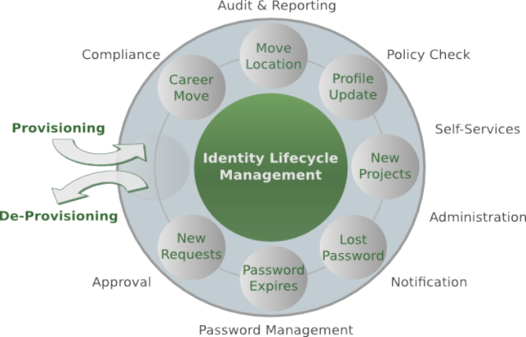
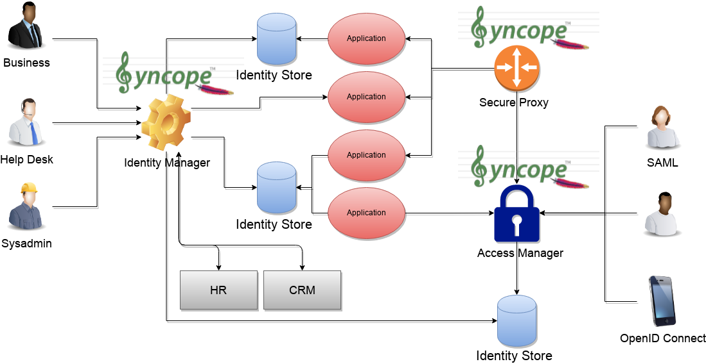
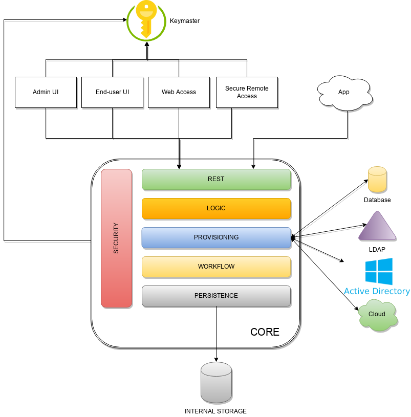
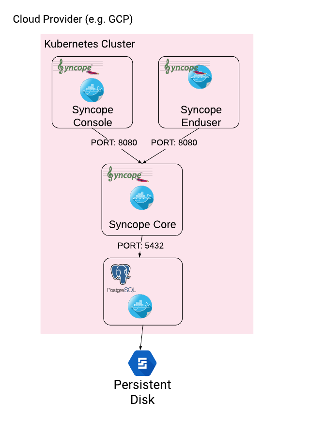

# Apache Syncope 4.0.5 - Getting Started

## Navigation

- Docs
  - Docs
    - 4.0
      - [Apache Syncope 4.0.5 - Getting Started](#docs-4.0-getting-started)

## Content

<a id="docs-4.0-getting-started"></a>

<!-- source_url: https://syncope.apache.org/docs/4.0/getting-started.html -->

<!-- page_index: 1 -->

# Apache Syncope 4.0.5 - Getting Started


> [!NOTE]
> This document is under active development and discussion!
>
> If you find errors or omissions in this document, please don’t hesitate to
> [submit an issue](https://syncope.apache.org/issue-management.html) or
> [open a pull request](https://github.com/apache/syncope/pulls) with
> a fix. We also encourage you to ask questions and discuss any aspects of the project on the
> [mailing lists or IRC](https://syncope.apache.org/mailing-lists.html).
> New contributors are always welcome!

<a id="docs-4.0-getting-started--preface"></a>

## Preface

This guide shows you how to get started with Apache Syncope services for:

- identity management, provisioning and compliance;
- access management, single sign-on, authentication and authorization;
- API gateway, secure proxy, service mesh, request routing.

<a id="docs-4.0-getting-started--introduction"></a>
<a id="docs-4.0-getting-started--1.-introduction"></a>

## [1. Introduction](#docs-4.0-getting-started--introduction)

**Apache Syncope** is an Open Source system for managing digital identities in enterprise environments, implemented in
Jakarta EE technology and released under the Apache 2.0 license.

Often, *Identity Management* and *Access Management* are jointly referred, mainly because their two management worlds
likely coexist in the same project or in the same environment.

The two topics are however completely different: each one has its own context, its own rules, its own best practices.

On the other hand, some products provide unorthodox implementations so it is indeed possible to do the same thing with
both of them.

From the definitions above, Identity Management and Access Management can be seen as complementary: very often, the data
synchronized by the former are then used by the latter to provide its features - e.g. authentication and authorization.

<a id="docs-4.0-getting-started--what-is-identity-management-anyway"></a>
<a id="docs-4.0-getting-started--1.1.-what-is-identity-management-anyway"></a>

### [1.1. What is Identity Management, anyway?](#docs-4.0-getting-started--what-is-identity-management-anyway)

Have you ever been hired by a company, entered an organization or just created a new Google account?
Companies, organizations and cloud entities work with applications that need your data to function properly:
username, password, e-mail, first name, surname, and more.

Where is this information going to come from? And what happens when you need to be enabled for more applications? And what if
you get promoted and acquire more rights on the applications you already had access to?
Most important, what happens when you quit or they gently let you go?

In brief, Identity Management takes care of managing identity data throughout what is called the **Identity Lifecycle**.



Figure 1. Identity Lifecycle

<a id="docs-4.0-getting-started--what-is-access-management-anyway"></a>
<a id="docs-4.0-getting-started--1.2.-what-is-access-management-anyway"></a>

### [1.2. What is Access Management, anyway?](#docs-4.0-getting-started--what-is-access-management-anyway)

Authenticate, authorize and audit access to applications and IT systems: access management solutions help strengthen
security and reduce risk by tightly controlling access to on-premises and cloud-based applications, services, and IT
infrastructure.
Access Management help ensure the right users have access to the right resources at the right times for the right
reasons.

Single sign-on (SSO) is an authentication scheme that allows a user to access multiple, independent applications with a
single set of login credentials, without re-entering authentication factors.
Very often, SSO is achieved by implementing some of the most popular protocols as
[SAML](https://en.wikipedia.org/wiki/Security_Assertion_Markup_Language) and [OpenID Connect](http://openid.net/connect/).

Social login, designed to simplify logins, is a form of single sign-on using existing information from a social
networking service to sign into a third-party website instead of creating a new login account specifically for that
website.

<a id="docs-4.0-getting-started--identity-and-access-management-reference-scenario"></a>
<a id="docs-4.0-getting-started--1.3.-identity-and-access-management-reference-scenario"></a>

### [1.3. Identity and Access Management - Reference Scenario](#docs-4.0-getting-started--identity-and-access-management-reference-scenario)



Figure 2. IAM Scenario

The picture above shows the technologies involved in a complete IAM solution:

- ***Identity Store*** (examples are relational databases, LDAP, Active Directory, meta- and virtual-directories,
  cloud resources, …): the repository for account data
- ***Identity Manager***: synchronizes account data across Identity Stores and a broad range of data formats, models,
  meanings and purposes
- ***Access Manager***: security mediator to all applications, focused on application front-end, taking care of
  authentication, authorization and federation
- ***Secure Proxy***: enforces security policies on API and legacy applications

<a id="docs-4.0-getting-started--arent-identity-stores-enough"></a>
<a id="docs-4.0-getting-started--1.3.1.-aren-t-identity-stores-enough"></a>

#### [1.3.1. Aren’t Identity Stores enough?](#docs-4.0-getting-started--arent-identity-stores-enough)

One might suppose that a single Identity Store can solve all the identity needs inside an organization, but there
are a few drawbacks with this approach:

1. Heterogeneity of systems
2. Lack of a single source of information (HR for corporate id, Groupware for mail address, …)
3. Often applications require a local user database
4. Inconsistent policies across the infrastructure
5. Lack of workflow management
6. Hidden infrastructure management cost, growing with the size of the organization

<a id="docs-4.0-getting-started--a-birds-eye-view-on-the-architecture"></a>
<a id="docs-4.0-getting-started--1.4.-a-bird-s-eye-view-on-the-architecture"></a>

### [1.4. A bird’s eye view on the Architecture](#docs-4.0-getting-started--a-birds-eye-view-on-the-architecture)



Figure 3. Architecture

***Keymaster*** allows for dynamic service discovery so that other components are able to find each other.

***Admin UI*** is the web-based console for configuring and administering running deployments, with full support
for delegated administration.

***End-user UI*** is the web-based application for self-registration, self-service and password reset.

***Web Access*** or ***WA*** is the central hub for authentication, authorization and single sign-on.

***Secure Remote Access*** or ***SRA*** is a security-enabled API gateway with HTTP reverse proxying capabilities.

***Core*** is the component providing IdM services and acting as central repository for other components' configuration.
It exposes a fully-compliant [Jakarta RESTful Web Services 3.1](https://en.wikipedia.org/wiki/Jakarta_RESTful_Web_Services)
[RESTful](https://en.wikipedia.org/wiki/Representational_state_transfer) interface which enables third-party applications, written in any programming language, to consume IdM services.

- ***Logic*** implements the overall business logic that can be triggered via REST services, and controls some additional
  features (notifications, reports and auditing)
- ***Provisioning*** is involved with managing the internal (via workflow) and external (via specific connectors)
  representation of Users, Groups and Any Objects.
  This component often needs to be tailored to meet the requirements of a specific deployment, as it is the crucial decision
  point for defining and enforcing the consistency and transformations between internal and external data. The default
  all-Java implementation can be extended for this purpose.
- ***Workflow*** is one of the pluggable aspects of Apache Syncope: this lets every deployment choose the preferred engine
  from a provided list - including one based on [Flowable](https://www.flowable.org/), the reference open source
  [BPMN 2.0](http://www.bpmn.org/) implementations - or define new, custom ones.
- ***Persistence*** manages all data (users, groups, attributes, resources, …) at a high level
  using a standard [Jakarta Persistence 3.1](https://en.wikipedia.org/wiki/Jakarta_Persistence) approach. The data is persisted to an underlying
  database, referred to as ***Internal Storage***. Consistency is ensured via the comprehensive
  [transaction management](https://docs.spring.io/spring-framework/reference/6.2/data-access/transaction.html)
  provided by the Spring Framework.
  Globally, this offers the ability to easily scale up to a million entities and at the same time allows great portability with no code
  changes: PostgreSQL, MySQL, MariaDB and Oracle are fully supported deployment options.
- ***Security*** defines a fine-grained set of entitlements which can be granted to administrators, thus enabling the
  implementation of delegated administration scenarios.

Third-party applications are provided full access to IdM services by leveraging the REST interface, either via the
Java Client Library (the basis of Admin UI and End-user UI) or plain HTTP calls.

<a id="docs-4.0-getting-started--system-requirements"></a>
<a id="docs-4.0-getting-started--2.-system-requirements"></a>

## [2. System Requirements](#docs-4.0-getting-started--system-requirements)

<a id="docs-4.0-getting-started--hardware"></a>
<a id="docs-4.0-getting-started--2.1.-hardware"></a>

### [2.1. Hardware](#docs-4.0-getting-started--hardware)

The hardware requirements depend greatly on the given deployment, in particular the total number of
managed entities (Users, Groups and Any Objects), their attributes and resources.

- CPU: dual core, 2 GHz (minimum)
- RAM: 8 GB (minimum)
- Disk: 200 MB (minimum)

<a id="docs-4.0-getting-started--java"></a>
<a id="docs-4.0-getting-started--2.2.-java"></a>

### [2.2. Java](#docs-4.0-getting-started--java)

Apache Syncope 4.0.5 requires the latest JDK 21 that is available. Works with later versions.

<a id="docs-4.0-getting-started--jakarta-ee-container"></a>
<a id="docs-4.0-getting-started--2.3.-jakarta-ee-container"></a>

### [2.3. Jakarta EE Container](#docs-4.0-getting-started--jakarta-ee-container)

Apache Syncope 4.0.5 is verified with the following Jakarta EE containers:

1. [Apache Tomcat 10](https://tomcat.apache.org/download-10.cgi)
2. [Payara Server 6](https://www.payara.fish/)
3. [Wildfly 38](https://www.wildfly.org/)

<a id="docs-4.0-getting-started--internal-storage"></a>
<a id="docs-4.0-getting-started--2.4.-internal-storage"></a>

### [2.4. Internal Storage](#docs-4.0-getting-started--internal-storage)

Apache Syncope 4.0.5 is verified with the recent versions of the following DBMSes, for internal storage:

1. [PostgreSQL](https://www.postgresql.org/) (>= 17-alpine, JDBC driver >= 42.7.10)
2. [MariaDB](https://mariadb.org/) (>= 12, JDBC driver >= 3.5.7)
3. [MySQL](https://www.mysql.com/) (>= 9.0, JDBC driver >= 9.6.0)
4. [Oracle Database](https://www.oracle.com/database/index.html) (>= 23-slim-faststart, JDBC driver >= ojdbc11 23.26.1.0.0)

<a id="docs-4.0-getting-started--obtain-apache-syncope"></a>
<a id="docs-4.0-getting-started--3.-obtain-apache-syncope"></a>

## [3. Obtain Apache Syncope](#docs-4.0-getting-started--obtain-apache-syncope)

There are several ways to obtain Apache Syncope: each of which has advantages or caveats for different types of users.

<a id="docs-4.0-getting-started--standalone"></a>
<a id="docs-4.0-getting-started--3.1.-standalone"></a>

### [3.1. Standalone](#docs-4.0-getting-started--standalone)

The standalone distribution is the simplest way to start exploring Apache Syncope: it contains a fully working, in-memory
Tomcat-based environment that can be easily grabbed and put at work on any modern laptop, workstation or server.

> [!WARNING]
> Target Audience
>
> First approach, especially with Admin and End-user UIs; does not require technical skills.
> **Not meant for any production environment.**

Getting ready in a few easy steps:

1. [download](https://syncope.apache.org/downloads) the standalone distribution
2. unzip the distribution archive
3. go into the created Apache Tomcat directory
4. start Apache Tomcat

   - GNU / Linux, Mac OS X


```bash
$ chmod 755 ./bin/*.sh
$ ./bin/startup.sh
```

   - Windows


```dos
> bin/startup.bat
```

> [!TIP]
> Please refer to the [Apache Tomcat documentation](https://tomcat.apache.org/tomcat-10.0-doc/) for more advanced setup and
> instructions.

<a id="docs-4.0-getting-started--standalone-components"></a>
<a id="docs-4.0-getting-started--3.1.1.-components"></a>

#### [3.1.1. Components](#docs-4.0-getting-started--standalone-components)

The set of provided components, including access URLs and credentials, is the same as reported for
[embedded mode](#docs-4.0-getting-started--paths-and-components), with the exception of log files, available here under `$CATALINA_HOME/logs`.

<a id="docs-4.0-getting-started--docker"></a>
<a id="docs-4.0-getting-started--3.2.-docker"></a>

### [3.2. Docker](#docs-4.0-getting-started--docker)

[Docker](https://www.docker.com/) images ready to use, published to [Docker Hub](https://hub.docker.com).

> [!WARNING]
> Target Audience
>
> Getting up and running quickly on Docker.
> **All configurations available to set, difficult customizations.**

> [!WARNING]
> Working with these images requires to have Docker correctly installed and configured.

> [!TIP]
> The Docker images can be used with orchestration tools as
> [Docker Compose](https://docs.docker.com/compose/) or [Kubernetes](https://kubernetes.io/).

<a id="docs-4.0-getting-started--docker-images"></a>
<a id="docs-4.0-getting-started--3.2.1.-docker-images"></a>

#### [3.2.1. Docker images](#docs-4.0-getting-started--docker-images)

All images share a commong set of environment variables:

- `KEYMASTER_ADDRESS`: Keymaster address
- `KEYMASTER_USERNAME`: username for Keymaster authentication
- `KEYMASTER_PASSWORD`: password for Keymaster authentication
- `SERVICE_DISCOVERY_ADDRESS`: address to publish to Keymaster for the current instance
- `ANONYMOUS_USER`: username for service-to-service authentication
- `ANONYMOUS_KEY`: password for service-to-service authentication

<a id="docs-4.0-getting-started--core"></a>

##### [Core](#docs-4.0-getting-started--core)

Apache Syncope Core, see [above](#docs-4.0-getting-started--a-birds-eye-view-on-the-architecture) for information.

Port exposed: `8080`.

Environment variables:

- `DB_URL`: JDBC URL of internal storage
- `DB_USER`: username for internal storage authentication
- `DB_PASSWORD`: password for internal storage authentication
- `DB_POOL_MAX`: internal storage connection pool: ceiling
- `DB_POOL_MIN`: internal storage connection pool: floor
- `OPENJPA_REMOTE_COMMIT`: configure multiple instances, with high availability; valid values are the ones accepted by
  OpenJPA for
  [remote event notification](https://openjpa.apache.org/builds/4.0.1/apache-openjpa/docs/ref_guide_event.html) including
  `sjvm` (single instance)

<a id="docs-4.0-getting-started--console"></a>

##### [Console](#docs-4.0-getting-started--console)

Apache Syncope Admin UI, see [above](#docs-4.0-getting-started--a-birds-eye-view-on-the-architecture) for information.

Port exposed: `8080`.

<a id="docs-4.0-getting-started--enduser"></a>

##### [Enduser](#docs-4.0-getting-started--enduser)

Apache Syncope Enduser UI, see [above](#docs-4.0-getting-started--a-birds-eye-view-on-the-architecture) for information.

Port exposed: `8080`.

<a id="docs-4.0-getting-started--wa"></a>

##### [WA](#docs-4.0-getting-started--wa)

Apache Syncope Web Access, see [above](#docs-4.0-getting-started--a-birds-eye-view-on-the-architecture) for information.

Port exposed: `8080`.

Environment variables:

- `CAS_SERVER_NAME`: public base URL to reach this instance; in case of clustered setup, this is the public-facing
  address and not the individual node address

<a id="docs-4.0-getting-started--sra"></a>

##### [SRA](#docs-4.0-getting-started--sra)

Apache Syncope Secure Remote Access, see [above](#docs-4.0-getting-started--a-birds-eye-view-on-the-architecture) for information.

Port exposed: `8080`.

<a id="docs-4.0-getting-started--docker-compose-samples"></a>
<a id="docs-4.0-getting-started--3.2.2.-docker-compose-samples"></a>

#### [3.2.2. Docker Compose samples](#docs-4.0-getting-started--docker-compose-samples)

Besides the ones reported below, more samples are
[available](https://github.com/apache/syncope/tree/syncope-4.0.5/docker/src/main/resources/docker-compose).

Example 1. Core, Admin UI and Enduser UI with PostgreSQL, with embedded Keymaster

The `docker-compose.yml` below will create and connect 4 Docker containers to provide an IdM-only, single
instance, Apache Syncope deployment. All referenced images are available on Docker Hub.

> [!NOTE]
> In this sample we are configuring an embedded, REST-based Keymaster hence `KEYMASTER_USERNAME` / `KEYMASTER_PASSWORD`
> are passed with same values as `ANONYMOUS_USER` / `ANONYMOUS_KEY`.

```yaml
services:
   db: (1)
     image: postgres:latest
     restart: always
     environment:
       POSTGRES_DB: syncope
       POSTGRES_USER: syncope
       POSTGRES_PASSWORD: syncope

   syncope: (2)
     depends_on:
       - db
     image: apache/syncope:4.0.5
     ports:
       - "18080:8080"
     restart: always
     environment:
       SPRING_PROFILES_ACTIVE: docker,postgresql,saml2
       DB_URL: jdbc:postgresql://db:5432/syncope?stringtype=unspecified
       DB_USER: syncope
       DB_PASSWORD: syncope
       DB_POOL_MAX: 20
       DB_POOL_MIN: 5
       OPENJPA_REMOTE_COMMIT: sjvm
       KEYMASTER_ADDRESS: http://localhost:8080/syncope/rest/keymaster
       KEYMASTER_USERNAME: ${ANONYMOUS_USER}
       KEYMASTER_PASSWORD: ${ANONYMOUS_KEY}
       SERVICE_DISCOVERY_ADDRESS: https://syncope:8080/syncope/rest/
       ANONYMOUS_USER: ${ANONYMOUS_USER}
       ANONYMOUS_KEY: ${ANONYMOUS_KEY}

   syncope-console: (3)
     depends_on:
       - syncope
     image: apache/syncope-console:4.0.5
     ports:
       - "28080:8080"
     restart: always
     environment:
       SPRING_PROFILES_ACTIVE: docker,saml2
       KEYMASTER_ADDRESS: https://syncope:8080/syncope/rest/keymaster
       KEYMASTER_USERNAME: ${ANONYMOUS_USER}
       KEYMASTER_PASSWORD: ${ANONYMOUS_KEY}
       SERVICE_DISCOVERY_ADDRESS: https://syncope-console:8080/syncope-console/
       ANONYMOUS_USER: ${ANONYMOUS_USER}
       ANONYMOUS_KEY: ${ANONYMOUS_KEY}

   syncope-enduser: (4)
     depends_on:
       - syncope
     image: apache/syncope-enduser:4.0.5
     ports:
       - "38080:8080"
     restart: always
     environment:
       SPRING_PROFILES_ACTIVE: docker,saml2
       KEYMASTER_ADDRESS: https://syncope:8080/syncope/rest/keymaster
       KEYMASTER_USERNAME: ${ANONYMOUS_USER}
       KEYMASTER_PASSWORD: ${ANONYMOUS_KEY}
       SERVICE_DISCOVERY_ADDRESS: https://syncope-enduser:8080/syncope-enduser/
       ANONYMOUS_USER: ${ANONYMOUS_USER}
       ANONYMOUS_KEY: ${ANONYMOUS_KEY}
```

**1**

Database container for usage as internal storage, based on latest PostgreSQL image available

**2**

Apache Syncope Core, single instance, port `18080` exposed

**3**

Apache Syncope Admin UI, port `28080` exposed

**4**

Apache Syncope Enduser UI, port `38080` exposed

Example 2. Full deployment (Core, Admin UI, Enduser UI, WA, SRA) on PostgreSQL, with Keymaster on Zookeeper

The `docker-compose.yml` below will create and connect 7 Docker containers to provide a full-fledged, single
instance, Apache Syncope deployment. All referenced images are available on Docker Hub.

> [!NOTE]
> Zookeeper is configured without JAAS, hence empty `KEYMASTER_USERNAME` / `KEYMASTER_PASSWORD` are passed to other
> containers.

```yaml
services:
   keymaster: (1)
     image: zookeeper:latest
     restart: always

   db: (2)
     image: postgres:latest
     restart: always
     environment:
       POSTGRES_DB: syncope
       POSTGRES_USER: syncope
       POSTGRES_PASSWORD: syncope

   syncope: (3)
     depends_on:
       - db
       - keymaster
     image: apache/syncope:4.0.5
     ports:
       - "18080:8080"
     restart: always
     environment:
       SPRING_PROFILES_ACTIVE: docker,postgresql,saml2
       DB_URL: jdbc:postgresql://db:5432/syncope?stringtype=unspecified
       DB_USER: syncope
       DB_PASSWORD: syncope
       DB_POOL_MAX: 20
       DB_POOL_MIN: 5
       OPENJPA_REMOTE_COMMIT: sjvm
       KEYMASTER_ADDRESS: keymaster:2181
       KEYMASTER_USERNAME: ${KEYMASTER_USERNAME:-}
       KEYMASTER_PASSWORD: ${KEYMASTER_PASSWORD:-}
       SERVICE_DISCOVERY_ADDRESS: https://syncope:8080/syncope/rest/
       ANONYMOUS_USER: ${ANONYMOUS_USER}
       ANONYMOUS_KEY: ${ANONYMOUS_KEY}

   syncope-console: (4)
     depends_on:
       - syncope
       - keymaster
     image: apache/syncope-console:4.0.5
     ports:
       - "28080:8080"
     restart: always
     environment:
       SPRING_PROFILES_ACTIVE: docker,saml2
       KEYMASTER_ADDRESS: keymaster:2181
       KEYMASTER_USERNAME: ${KEYMASTER_USERNAME:-}
       KEYMASTER_PASSWORD: ${KEYMASTER_PASSWORD:-}
       SERVICE_DISCOVERY_ADDRESS: https://syncope-console:8080/syncope-console/
       ANONYMOUS_USER: ${ANONYMOUS_USER}
       ANONYMOUS_KEY: ${ANONYMOUS_KEY}

   syncope-enduser: (5)
     depends_on:
       - syncope
       - keymaster
     image: apache/syncope-enduser:4.0.5
     ports:
       - "38080:8080"
     restart: always
     environment:
       SPRING_PROFILES_ACTIVE: docker,saml2
       KEYMASTER_ADDRESS: keymaster:2181
       KEYMASTER_USERNAME: ${KEYMASTER_USERNAME:-}
       KEYMASTER_PASSWORD: ${KEYMASTER_PASSWORD:-}
       SERVICE_DISCOVERY_ADDRESS: https://syncope-enduser:8080/syncope-enduser/
       ANONYMOUS_USER: ${ANONYMOUS_USER}
       ANONYMOUS_KEY: ${ANONYMOUS_KEY}

   syncope-wa: (6)
     depends_on:
       - syncope
       - keymaster
     image: apache/syncope-wa:4.0.5
     ports:
       - "48080:8080"
     restart: always
     environment:
       SPRING_PROFILES_ACTIVE: docker,saml2
       KEYMASTER_ADDRESS: keymaster:2181
       KEYMASTER_USERNAME: ${KEYMASTER_USERNAME:-}
       KEYMASTER_PASSWORD: ${KEYMASTER_PASSWORD:-}
       SERVICE_DISCOVERY_ADDRESS: https://syncope-wa:8080/syncope-wa/
       CAS_SERVER_NAME: http://localhost:48080
       ANONYMOUS_USER: ${ANONYMOUS_USER}
       ANONYMOUS_KEY: ${ANONYMOUS_KEY}

   syncope-sra: (7)
     depends_on:
       - syncope
       - keymaster
     image: apache/syncope-sra:4.0.5
     ports:
       - "58080:8080"
     restart: always
     environment:
       SPRING_PROFILES_ACTIVE: docker,saml2
       KEYMASTER_ADDRESS: keymaster:2181
       KEYMASTER_USERNAME: ${KEYMASTER_USERNAME:-}
       KEYMASTER_PASSWORD: ${KEYMASTER_PASSWORD:-}
       SERVICE_DISCOVERY_ADDRESS: https://syncope-sra:8080/
       ANONYMOUS_USER: ${ANONYMOUS_USER}
       ANONYMOUS_KEY: ${ANONYMOUS_KEY}
```

<table>
<tr>
<td>1</td>
<td>Apache Syncope Keymaster, based on <a href="https://zookeeper.apache.org/" rel="noopener" target="_blank">Apache Zookeeper</a></td>
</tr>
<tr>
<td>2</td>
<td>Database container for usage as internal storage, based on latest PostgreSQL image available</td>
</tr>
<tr>
<td>3</td>
<td>Apache Syncope Core, single instance, port <code>18080</code> exposed</td>
</tr>
<tr>
<td>4</td>
<td>Apache Syncope Admin UI, port <code>28080</code> exposed</td>
</tr>
<tr>
<td>5</td>
<td>Apache Syncope Enduser UI, port <code>38080</code> exposed</td>
</tr>
<tr>
<td>6</td>
<td>Apache Syncope WA, port <code>48080</code> exposed</td>
</tr>
<tr>
<td>7</td>
<td>Apache Syncope SRA, port <code>58080</code> exposed</td>
</tr>
</table>

<a id="docs-4.0-getting-started--how-to-start-the-containers"></a>

##### [How to start the containers](#docs-4.0-getting-started--how-to-start-the-containers)

1. Save the example file locally.
2. Download and start the containers:


```bash
$ SYNCOPE_VERSION=4.0.5 \
ANONYMOUS_USER=anonymous \
ANONYMOUS_KEY=anonymousKey \
KEYMASTER_USERNAME=anonymous \
KEYMASTER_PASSWORD=anonymousKey \
docker compose -f /path/to/docker-compose.yml up
```

The following services will be available:

| REST API reference | <http://localhost:18080/syncope/> |
| --- | --- |
| Admin UI | <http://localhost:28080/syncope-console/> Credentials: `admin` / `password` |
| End-user UI | <http://localhost:38080/syncope-enduser/> |
| WA (only with Example 2) | <http://localhost:48080/syncope-wa/> |
| SRA (only with Example 2) | <http://localhost:58080/> |

<a id="docs-4.0-getting-started--kubernetes-sample"></a>
<a id="docs-4.0-getting-started--3.2.3.-kubernetes-sample"></a>

#### [3.2.3. Kubernetes sample](#docs-4.0-getting-started--kubernetes-sample)

A set of example [Helm](https://www.helm.sh/) charts is
[available](https://github.com/apache/syncope/tree/syncope-4.0.5/docker/src/main/resources/kubernetes), that can be used to install Apache Syncope directly in Kubernetes.

Some assumptions are made:

- a working Kubernetes Cluster to install into - if not available, follow this
  [tutorial](https://kubernetes.io/docs/setup/)


> [!NOTE]
> Any other cloud provider or local install (e.g. AWS, Minikube, OpenShift) can be used

- Helm installed - follow these [instructions](https://docs.helm.sh/using_helm/) if you don’t
- allow for [dynamic provisioning](https://kubernetes.io/docs/concepts/storage/dynamic-provisioning/) of persistent
  volumes - otherwise you will need to manually create the volume

The install process is broken into two separate Helm charts; this is due to the fact that Apache Syncope doesn’t startup
properly if the database used as internal storage is not fully initialized yet:

- `postgres` chart; this will install the PostgreSQL database and configure a persistent volume and persistent volume
  claim to store the data
- `syncope` chart; this is the actual Apache Syncope install, which will deploy three separate pods
  (Core, Console, and Enduser)



The installation steps are:

1. Open a terminal and navigate to the `kubernetes`
   [folder](https://github.com/apache/syncope/tree/syncope-4.0.5/docker/src/main/resources/kubernetes),
   wherever you downloaded it
2. Set your actual values in `postgres/values.yaml`
3. Install PostgreSQL


```bash
helm install postgres --name postgres --namespace <YOUR_NAMESPACE> -f postgres/values.yaml
```

   Wait until PostgreSQL is initialized (watch logs for confirmation)
4. Set your actual values in `syncope/values.yaml`
5. Install Apache Syncope


```bash
helm install syncope --name syncope --namespace <YOUR_NAMESPACE> -f syncope/values.yaml
```

<a id="docs-4.0-getting-started--maven-project"></a>
<a id="docs-4.0-getting-started--3.3.-maven-project"></a>

### [3.3. Maven Project](#docs-4.0-getting-started--maven-project)

This is the **preferred method** for working with Apache Syncope, giving access to the whole set of customization
and extension capabilities.

> [!WARNING]
> Target Audience
>
> Provides access to the full capabilities of Apache Syncope, and almost all extensions that are possible.
> **Requires Apache Maven (and potentially [DevOps](https://en.wikipedia.org/wiki/DevOps)) skills.**

<a id="docs-4.0-getting-started--maven-prerequisites"></a>
<a id="docs-4.0-getting-started--3.3.1.-prerequisites"></a>

#### [3.3.1. Prerequisites](#docs-4.0-getting-started--maven-prerequisites)

1. [Apache Maven](http://maven.apache.org/) (version 3.9.5 or higher) installed
2. Some basic knowledge about Maven
3. Some basic knowledge about [Maven archetypes](http://maven.apache.org/guides/introduction/introduction-to-archetypes.html).

<a id="docs-4.0-getting-started--create-project"></a>
<a id="docs-4.0-getting-started--3.3.2.-create-project"></a>

#### [3.3.2. Create project](#docs-4.0-getting-started--create-project)

Maven archetypes are templates of projects. Maven can generate a new project from such a template.
In the folder in which the new project folder should be created, type the command shown below.
On Windows, run the command on a single line and leave out the line continuation characters ('\').

```
$ mvn archetype:generate \
    -DarchetypeGroupId=org.apache.syncope \
    -DarchetypeArtifactId=syncope-archetype \
    -DarchetypeRepository=https://repo1.maven.org/maven2 \
    -DarchetypeVersion=4.0.5
```

The archetype is configured with default values for all required properties; if you want to customize any of these
property values, type 'n' when prompted for confirmation.

You will be asked for:

groupId
:   something like 'com.mycompany'

artifactId
:   something like 'myproject'

version number
:   You can use the default; it is good practice to have 'SNAPSHOT' in the version number during development and the
    maven release plugin makes use of that string. But ensure to comply with the desired numbering scheme for your project.

package name
:   The java package name. A folder structure according to this name will be generated automatically; by default, equal
    to the groupId.

secretKey
:   Provide any pseudo-random string here that will be used in the generated project for AES ciphering.

anonymousKey
:   Provide any pseudo-random string here that will be used as an authentication key for anonymous requests.

Maven will create a project for you (in a newly created directory named after the value of the `artifactId` property
specified above) containing seven modules: `common`, `core`, `console`, `enduser`, `wa`, `sra` and `fit`.

You are now able to perform the first build via

```bash
$ mvn clean install
```

After downloading all of the needed dependencies, the following artifacts will be produced:

1. `core/target/syncope.war`
2. `console/target/syncope-console.war`
3. `enduser/target/syncope-enduser.war`
4. `wa/target/syncope-wa.war`
5. `sra/target/syncope-sra.jar`

If no failures are encountered, your basic Apache Syncope project is now ready to go.

> [!NOTE]
> Before actual deployment as executable or onto a Jakarta EE container, you need to further check the **Customization**
> chapter of the
> [Apache Syncope Reference Guide.](https://syncope.apache.org/docs/4.0/reference-guide.html)

<a id="docs-4.0-getting-started--embedded-mode"></a>
<a id="docs-4.0-getting-started--3.3.3.-embedded-mode"></a>

#### [3.3.3. Embedded Mode](#docs-4.0-getting-started--embedded-mode)

Every Apache Syncope project has the ability to run a full-blown in-memory environment, particularly useful either when
evaluating the product and during the development phase of an IdM solution.

> [!WARNING]
> Don’t forget that this environment is completely in-memory: this means that every time Maven is stopped, all changes
> made are lost.

From the top-level directory of your project, execute:

```bash
$ mvn -P all clean install
```

> [!WARNING]
> The switch `-P all` is used here in order to build with all extensions available, with paths and settings
> configured for the embedded mode.
>
> When building for production, instead, it is recommended to check the **Customization** chapter of
> the
> [Apache Syncope Reference Guide.](https://syncope.apache.org/docs/4.0/reference-guide.html)

then, from the `fit` subdirectory, execute:

```bash
$ mvn -P embedded,all
```

<a id="docs-4.0-getting-started--paths-and-components"></a>

##### [Paths and Components](#docs-4.0-getting-started--paths-and-components)

> [!WARNING]
> While accessing some of the URLs below, your browser will warn that the presented TLS certificate is invalid: it is safe
> to just ignore the message, take the risk and discover how deep does the rabbit hole go. Not for production, of course.

Log files

Available under `core/target/log`, `console/target/log`, `enduser/target/log`, `wa/target/log` and `sra/target/log`

ConnId bundles

Available under `core/target/bundles`

REST API reference

<https://localhost:9443/syncope/>

Admini UI

<https://localhost:9443/syncope-console/>
Credentials: `admin` / `password`

End-user UI

<https://localhost:9443/syncope-enduser/>

WA

<https://localhost:9443/syncope-wa/>

SRA

<http://localhost:8080/>

Internal storage

`jdbc:postgresql://localhost:5432/syncope?stringtype=unspecified`
Credentials: `syncope` / `syncope`

External resource: LDAP

An embedded instance is available.
You can configure any LDAP client (such as [JXplorer](http://jxplorer.org/), for example) with the following information:
host: `localhost`
port: `1389`
base DN: `o=isp`
bind DN: `uid=admin,ou=system`
bind password: `secret`

External resource: SOAP and REST

Example SOAP and REST services are available at <https://localhost:9443/syncope-fit-build-tools/cxf/>

External resource: database

[H2](http://www.h2database.com/) TCP database is available.
A SQL web interface is available at <http://localhost:9082/>
Choose configuration 'Generic H2 (Server)'
Insert `jdbc:h2:tcp://localhost:9092/mem:testdb` as JDBC URL
Set `sa` as password
Click 'Connect' button

External resource: Apache Kafka

Broker listening at localhost:19092

<a id="docs-4.0-getting-started--docker-mode"></a>
<a id="docs-4.0-getting-started--3.3.4.-docker-mode"></a>

#### [3.3.4. Docker Mode](#docs-4.0-getting-started--docker-mode)

It is possible to build and run projects generated from Maven archetype by configuring and extending the published
[Docker images](#docs-4.0-getting-started--docker-images).

From the top-level directory of your project, execute:

```bash
$ mvn -P docker,all clean install
```

then, from the `fit` subdirectory, execute:

```bash
$ mvn -P docker
```

> [!TIP]
> The settings shown in `fit/pom.xml` under the `docker` profile can be taken as reference to orchestrate actual
> deployments.

<a id="docs-4.0-getting-started--paths-and-components-2"></a>
<a id="docs-4.0-getting-started--paths-and-components-3"></a>

##### [Paths and Components](#docs-4.0-getting-started--paths-and-components-2)

> [!WARNING]
> While accessing some of the URLs below, your browser will warn that the presented TLS certificate is invalid: it is safe
> to just ignore the message, take the risk and discover how deep does the rabbit hole go. Not for production, of course.

> [!NOTE]
> The hostnames below, e.g.
>
> 1. `syncope`
> 2. `syncope-console`
> 3. `syncope-enduser`
> 4. `syncope-sra`
>
> are to be manually resolved to their respective local IP addresses in use by your current deployment.
>
> For example:
>
> ```bash
> $ docker inspect -f \ '{{range .NetworkSettings.Networks}}{{.IPAddress}}{{end}}' \ syncope
> ```
>
> will return the actual IP address assigned to the `syncope` container.

The following services will be available:

| REST API reference | <http://syncope:8080/syncope/> |
| --- | --- |
| Admin UI | <http://syncope-console:8080/syncope-console/> Credentials: `admin` / `password` |
| End-user UI | <http://syncope-enduser:8080/syncope-enduser/> |
| WA | <https://localhost:9443/syncope-wa/> |
| SRA | <http://syncope-sra:8080/> |

<a id="docs-4.0-getting-started--moving-forward"></a>
<a id="docs-4.0-getting-started--4.-moving-forward"></a>

## [4. Moving Forward](#docs-4.0-getting-started--moving-forward)

Once you have obtained a working installation of Apache Syncope using one of the methods reported above, you should consider
reading the
[Apache Syncope Reference Guide.](https://syncope.apache.org/docs/4.0/reference-guide.html)
to understand how to configure, extend, customize and deploy your new Apache Syncope project.

Before deploying your Apache Syncope installation into production, it is essential to ensure that the default values for
various security properties have been changed to values specific to your deployment.

The following values must be changed from the defaults in the `core.properties` file:

- **adminPassword** - The cleartext password as encoded per the `adminPasswordAlgorithm` value (`SSHA256` by default), the
  default value of which is "password".
- **secretKey** - The secret key value used for AES ciphering; AES is used by the use cases below:

  - if the value for `adminPasswordAlgorithm` is `AES` or the configuration parameter `password.cipher.algorithm` is
    changed to `AES`
  - if set for Encrypted Plain Schema instances
  - for Linked Accounts' password values
  - to securely store Access Token’s cached authorities
  - within some of the predefined rules used by Password Policies
- **anonymousKey** - The key value to use for anonymous requests.
- **jwsKey** - The symmetric signing key used to sign access tokens. See section 4.4.1 "REST Authentication and
  Authorization" of the Reference Guide for more information.

Note that if you installed Syncope using the maven archetype method, then you will have already supplied custom values
for `secretKey`, `anonymousKey` and `jwsKey`.

---
